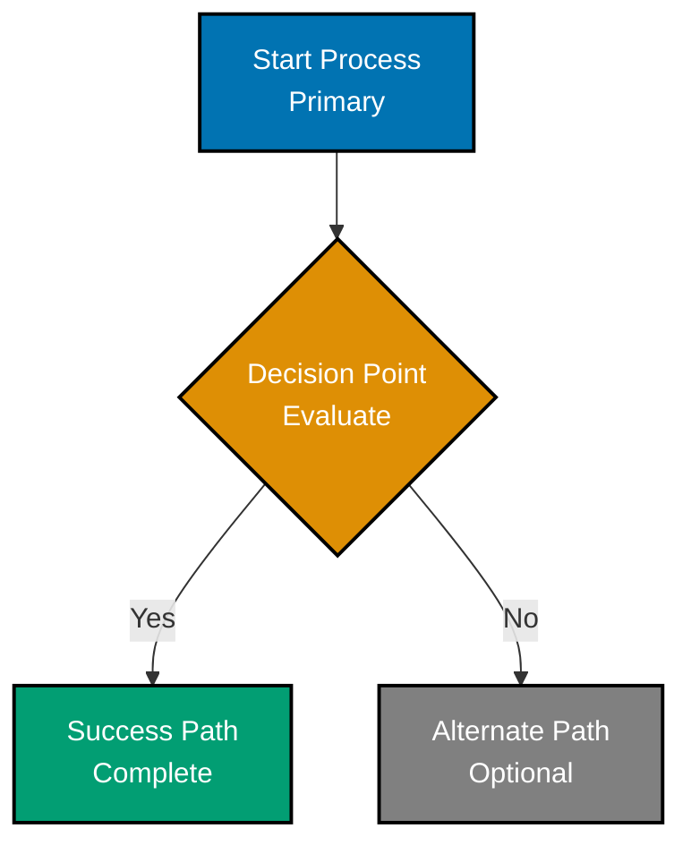

# Color Accessibility for Diagrams

This Skill provides guidance on creating accessible Mermaid diagrams using a verified color-blind friendly palette that meets WCAG AA standards. Use this when creating visual diagrams to ensure accessibility for all users, including those with color blindness (~300 million people worldwide).

## Purpose

Use this Skill when:

- Creating Mermaid diagrams, flowcharts, or visualizations
- Working with color-dependent visual content
- Need to ensure WCAG compliance for diagrams
- Supporting users with color blindness (protanopia, deuteranopia, tritanopia)
- Choosing colors for documentation, diagrams, or UI components

## Verified Accessible Color Palette

**CRITICAL**: Use ONLY these colors in all diagrams. This palette is scientifically verified to work for all color blindness types and meets WCAG AA standards.

| Color  | Hex Code | Use Cases                      | WCAG AA (Light)  | WCAG AA (Dark)   |
| ------ | -------- | ------------------------------ | ---------------- | ---------------- |
| Blue   | #0173B2  | Primary elements, main flow    | ✅ 8.59:1 (AAA)  | ✅ 6.93:1 (AAA)  |
| Orange | #DE8F05  | Warnings, decisions, secondary | ✅ 6.48:1 (AAA)  | ✅ 5.24:1 (AAA)  |
| Teal   | #029E73  | Success, validation, tertiary  | ✅ 8.33:1 (AAA)  | ✅ 6.74:1 (AAA)  |
| Purple | #CC78BC  | Special states, implementors   | ✅ 4.51:1 (AA)   | ✅ 3.65:1 (AA)   |
| Brown  | #CA9161  | Neutral elements, secondary    | ✅ 5.23:1 (AAA)  | ✅ 4.23:1 (AAA)  |
| Black  | #000000  | Text on light, borders         | ✅ 21.00:1 (AAA) | N/A              |
| White  | #FFFFFF  | Text on dark, backgrounds      | N/A              | ✅ 21.00:1 (AAA) |
| Gray   | #808080  | Disabled, secondary elements   | ✅ 7.00:1 (AAA)  | ✅ 4.00:1 (AA)   |

**Quick copy-paste hex codes:**

```
#0173B2 - Blue
#DE8F05 - Orange
#029E73 - Teal
#CC78BC - Purple
#CA9161 - Brown
#000000 - Black
#FFFFFF - White
#808080 - Gray
```

## Colors to NEVER Use

**CRITICAL**: Never use these colors where color conveys information:

- ❌ **Red** (#FF0000, #E74C3C) - Invisible to protanopia/deuteranopia (~8% of males)
- ❌ **Green** (#00FF00, #27AE60) - Invisible to protanopia/deuteranopia
- ❌ **Yellow** (#FFFF00, #F1C40F) - Invisible to tritanopia (rare but severe)
- ❌ **Light Pink** (#FF69B4, #FFC0CB) - Severely compromised for tritanopia
- ❌ **Bright Magenta** (#FF00FF, #FF1493) - Problematic for all types
- ❌ **Red-Green combinations** - Creates impossible contrast for ~8% of males

**Exception**: Emoji indicators (🔴🟠🟡🟢) can use standard colors when ALWAYS paired with text labels (color is supplementary, not primary identifier).

## Core Accessibility Principles

### 1. Never Rely on Color Alone

Always combine color with:

- ✅ **Text labels** - Clear descriptions
- ✅ **Shape differentiation** - Different node shapes (rectangles, diamonds, circles)
- ✅ **Line styles** - Solid, dashed, dotted
- ✅ **Position** - Spatial organization
- ✅ **Icons** - Additional visual markers

**Example:**

- ❌ Bad: Red node means "error" (color only)
- ✅ Good: Orange diamond labeled "Error State" with error icon

### 2. Use Color as Enhancement

Color should enhance information already conveyed through other means. A grayscale version should remain understandable.

### 3. Maintain WCAG AA Contrast

All text and UI components must meet minimum contrast:

- Normal text: 4.5:1 minimum
- Large text (18pt+ or 14pt+ bold): 3:1 minimum
- UI components/graphics: 3:1 minimum

### 4. Test for Color Blindness

Before publishing diagrams:

1. Create using accessible palette
2. Test in color blindness simulator (protanopia, deuteranopia, tritanopia)
3. Verify contrast ratios with WebAIM checker
4. Confirm shape differentiation sufficient
5. Test in both light and dark modes

## Mermaid Diagram Best Practices

### Standard Mermaid Template with Accessibility

Use this as a starting point for all Mermaid diagrams:



### Essential Mermaid Rules

1. **Always include palette comment** - First line documents colors used
2. **Use classDef with accessible hex codes** - REQUIRED for accessibility
3. **Include black borders** - `stroke:#000000` for shape definition
4. **Use white text on dark fills** - `color:#FFFFFF` for readability
5. **Use black text on light fills** - `color:#000000` when needed
6. **2px stroke width** - `stroke-width:2px` for visibility
7. **Provide descriptive labels** - Never use color-only identification
8. **Prefer vertical orientation** - `graph TD` (top-down) for mobile viewing
9. **Use different shapes** - Rectangles, diamonds, circles for differentiation
10. **Escape special characters** - Parentheses, brackets, braces in node text

### Mermaid Comment Syntax (CRITICAL)

**CORRECT** - Use double-percent for comments:

```mermaid
%% This is a comment
%% Color palette: Blue #0173B2, Orange #DE8F05
```

**WRONG** - Do NOT use this syntax (causes syntax errors):

```mermaid
%%{ This breaks rendering }%%
```

### Escaping Special Characters in Mermaid

**CRITICAL**: Escape special characters in node text AND edge labels to prevent syntax errors:

| Character | Entity Code | Example Usage              |
| --------- | ----------- | -------------------------- |
| `(`       | `#40;`      | `A[Function#40;param#41;]` |
| `)`       | `#41;`      | Same as above              |
| `[`       | `#91;`      | `B[Array#91;index#93;]`    |
| `]`       | `#93;`      | Same as above              |
| `{`       | `#123;`     | `C[Object#123;key#125;]`   |
| `}`       | `#125;`     | Same as above              |
| `<`       | `#60;`      | `D[Generic#60;T#62;]`      |
| `>`       | `#62;`      | Same as above              |

**Edge labels also need escaping:**

```mermaid
A -->|Function#40;param#41;| B
```

**Avoid literal quotes** - Remove or use descriptive text instead:

- ❌ `F[let x = "hello"]` - Breaks rendering
- ✅ `F[let x = hello]` - Works correctly
- ✅ `F[Variable Assignment]` - Descriptive alternative

## Common Mistakes to Avoid

### Mistake 1: Using Red-Green Combinations

❌ **Problem**: ~8% of males cannot distinguish red/green

✅ **Solution**: Use Orange and Teal from verified palette

### Mistake 2: Relying on Color Alone

❌ **Problem**: Color-blind users can't distinguish elements

✅ **Solution**: Add text labels, use different shapes, provide context

### Mistake 3: Using Yellow for Important Info

❌ **Problem**: Yellow invisible to tritanopia (blue-yellow blindness)

✅ **Solution**: Use Orange or Teal instead

### Mistake 4: No Contrast Verification

❌ **Problem**: Insufficient contrast causes readability issues

✅ **Solution**: Use verified palette (all colors tested for WCAG AA)

### Mistake 5: Using CSS Color Names

❌ **Problem**: Inconsistent across platforms

```css
fill: red; /* WRONG */
```

✅ **Solution**: Always use hex codes

```css
fill: #de8f05; /* CORRECT */
```

### Mistake 6: Not Testing Dark Mode

❌ **Problem**: Colors may not work in dark backgrounds

✅ **Solution**: Verified palette works in both light and dark modes

## Testing Tools

### Color Blindness Simulators

- **Coblis Simulator**: https://www.color-blindness.com/coblis-color-blindness-simulator/
  - Upload diagram, view with protanopia/deuteranopia/tritanopia
  - Free, web-based

- **Figma Color Blind Plugin**: https://www.figma.com/community/plugin/733159460536249875/Color%20Blind
  - Requires Figma account
  - All color blindness types

### Contrast Checkers

- **WebAIM Contrast Checker**: https://webaim.org/resources/contrastchecker/
  - Enter foreground/background colors
  - Get WCAG compliance status
  - Free, web-based

## Integration with Repository Conventions

This Skill integrates with:

- **[Color Accessibility Convention](../../../governance/conventions/formatting/color-accessibility.md)** - Complete color accessibility standards
- **[Diagrams Convention](../../../governance/conventions/formatting/diagrams.md)** - Mermaid diagram standards, comment syntax, special character escaping
- **[Content Quality Principles](../../../governance/conventions/content/quality.md)** - Quality standards for all content including diagrams

## Quick Reference

**Verified Palette (Copy-Paste):**

```
Blue:   #0173B2 - Primary flow
Orange: #DE8F05 - Decisions, warnings
Teal:   #029E73 - Success, validation
Purple: #CC78BC - Special states
Brown:  #CA9161 - Neutral
Gray:   #808080 - Secondary, disabled
Black:  #000000 - Borders, text
White:  #FFFFFF - Text on dark
```

**Mermaid classDef Template:**

```
classDef blue fill:#0173B2,stroke:#000000,color:#FFFFFF,stroke-width:2px
classDef orange fill:#DE8F05,stroke:#000000,color:#FFFFFF,stroke-width:2px
classDef teal fill:#029E73,stroke:#000000,color:#FFFFFF,stroke-width:2px
classDef purple fill:#CC78BC,stroke:#000000,color:#FFFFFF,stroke-width:2px
classDef brown fill:#CA9161,stroke:#000000,color:#FFFFFF,stroke-width:2px
classDef gray fill:#808080,stroke:#000000,color:#FFFFFF,stroke-width:2px
```

**Pre-commit Checklist:**

- [ ] Uses only verified palette colors
- [ ] Black borders on all elements
- [ ] White text on dark fills
- [ ] Text labels on all nodes
- [ ] Shape differentiation used
- [ ] Palette comment included
- [ ] Tested in color blindness simulator
- [ ] Contrast ratios verified
- [ ] Works in light and dark modes

## Examples

See `examples.md` in this Skill directory for complete working examples:

- Accessible flowchart
- Sequence diagram with colors
- Architecture diagram
- Common mistakes and corrections

## References

- **[Color Accessibility Convention](../../../governance/conventions/formatting/color-accessibility.md)** - Complete standards, research citations, WCAG compliance
- **[Diagrams Convention](../../../governance/conventions/formatting/diagrams.md)** - Mermaid syntax, comment rules, special character escaping
- **[Accessibility First Principle](../../../governance/principles/content/accessibility-first.md)** - Foundational accessibility principle

## Related Skills

- `repository-architecture` - Understanding how accessibility fits into governance layers
- `hugo-ayokoding-development` (Phase 2) - Hugo-specific diagram requirements
- `factual-validation-methodology` (Phase 2) - Verifying color accessibility claims

---

**Note**: This Skill provides action-oriented guidance for creating accessible diagrams. The authoritative Color Accessibility Convention contains complete scientific research, WCAG standards, and detailed testing procedures.
