# Mermaid Diagram Examples - Accessible Colors

This file provides complete working examples of Mermaid diagrams using the verified accessible color palette.

## Example 1: Basic Accessible Flowchart

This demonstrates the standard pattern for creating accessible Mermaid diagrams:

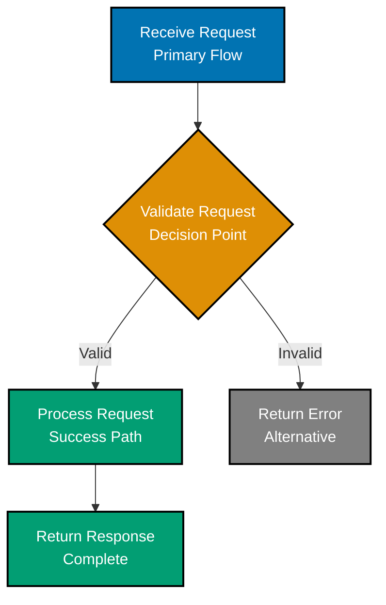

**Why this works:**

- ✅ Uses only verified palette colors (Blue, Orange, Teal, Gray)
- ✅ Black borders provide shape definition
- ✅ White text provides contrast on dark fills
- ✅ Descriptive text labels on each node
- ✅ Diamond shape for decision (not just color)
- ✅ Palette documented in comment
- ✅ Safe for all color blindness types

## Example 2: Multi-Color Architecture Diagram

This shows all palette colors in action for complex diagrams:

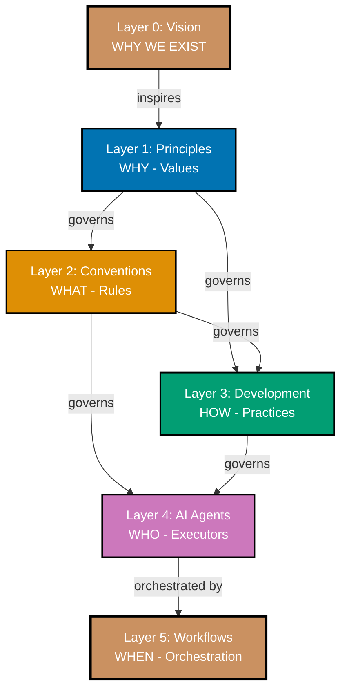

**Features:**

- Uses all 5 main palette colors
- Different stroke widths for emphasis (2px vs 3px)
- Clear text labels explaining layer purpose
- Edge labels showing relationships
- Vertical orientation for mobile viewing

## Example 3: Sequence Diagram with Accessible Colors

Sequence diagrams can use colors for participants:

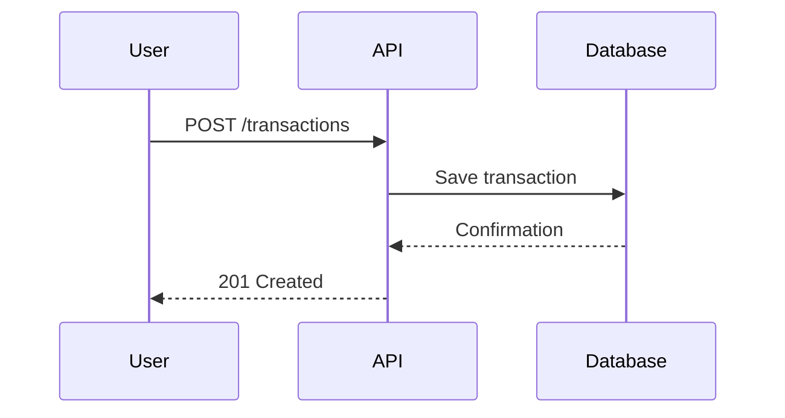

**Note**: Sequence diagrams typically don't need explicit color styling as participants are distinguished by position and labels. Color can be added for emphasis if needed.

## Example 4: State Diagram with Accessible Colors

State diagrams showing system states:

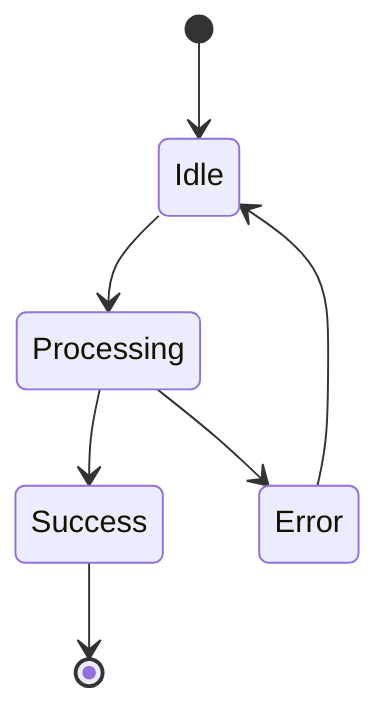

**Important**: State diagrams use `state --> state: label` syntax. Do NOT use colons in label text (reserved separator).

## Common Mistakes and Corrections

### Mistake 1: Using Red-Green Combination

❌ **WRONG** - Red and green invisible to ~8% of males:

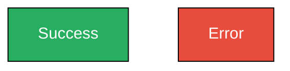

✅ **CORRECT** - Use Teal and Orange instead:

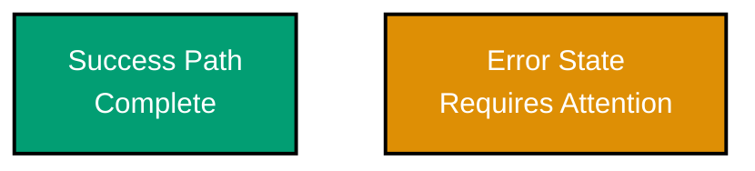

### Mistake 2: Relying on Color Alone

❌ **WRONG** - No text labels, color-only identification:

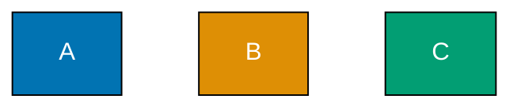

✅ **CORRECT** - Add descriptive labels:

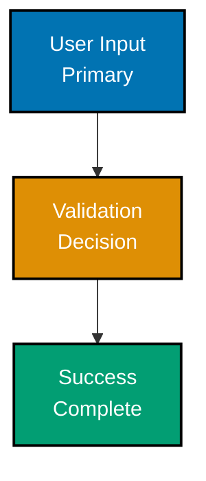

### Mistake 3: Missing Black Borders

❌ **WRONG** - No borders, shapes blend together:


✅ **CORRECT** - Add black borders for definition:


### Mistake 4: Using CSS Color Names

❌ **WRONG** - Color names are inconsistent:

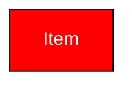

✅ **CORRECT** - Use hex codes:

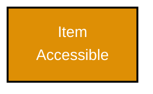

### Mistake 5: Incorrect Comment Syntax

❌ **WRONG** - Using `%%{ }%%` syntax (causes syntax errors):

```mermaid
%%{ This breaks rendering }%%
graph TD
    A[Item]
```

✅ **CORRECT** - Use double-percent `%%` syntax:

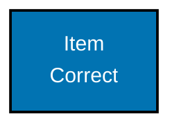

## Special Character Escaping Examples

### Example: Function Signatures

When showing code with parentheses, brackets, or braces:

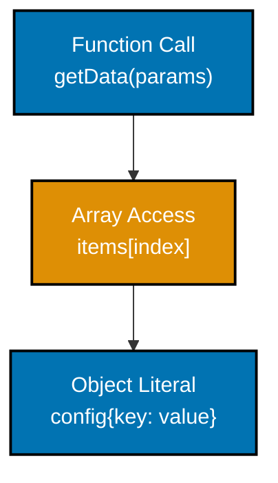

### Example: Avoiding Nested Escaping

❌ **WRONG** - Nested escaping breaks rendering:

```
Node text: config#123;\"name\"#125;
```

✅ **CORRECT** - Use descriptive text without quotes:

```
Node text: config#123;name: value#125;
```

Or better yet, use plain descriptive language:

```
Node text: Configuration Object
```

## Complete Template for Quick Start

Copy this template for new diagrams:

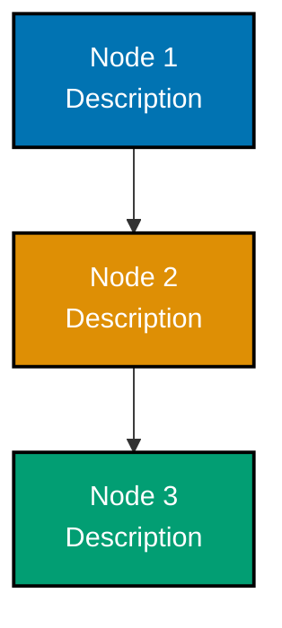

---

**Usage**: Copy the template above, modify node labels and connections for your diagram. All colors are pre-configured for accessibility.
