# 🗺️ Development Roadmap

This project is being developed with a **progressive complexity approach** - starting simple, testing thoroughly, and scaling up systematically:

```mermaid
%%{init: {'theme':'base', 'themeVariables': { 'primaryColor':'#0173B2', 'primaryTextColor':'#000', 'primaryBorderColor':'#000', 'lineColor':'#029E73', 'secondaryColor':'#DE8F05', 'tertiaryColor':'#CC78BC', 'clusterBkg':'#f5f5f5', 'clusterBorder':'#000', 'edgeLabelBackground':'#fff'}}}%%
graph TB
    Start([Start]) --> Phase0

    Phase0["<b>Phase 0</b><br/>Repository Setup &<br/>Knowledge Base<br/><i>(Current Phase)</i>"]
    Phase0 --> P0Output["✅ Repository Infrastructure<br/>✅ AI Agents & Governance<br/>✅ ayokoding.com Launch<br/>✅ oseplatform.com Launch"]
    P0Output --> Phase1

    Phase1["<b>Phase 1</b><br/>OrganicLever<br/><i>Productivity Tracker</i><br/>(Individual Users)"]
    Phase1 --> P1Output["✅ organiclever.com Launch<br/>✅ Android & iOS Apps<br/>✅ Deployment Mastery<br/>✅ Security Practice Ground"]
    P1Output --> Decision1{Learnings<br/>Applied?}
    Decision1 -->|Yes| Phase2
    Decision1 -->|Iterate| Phase1

    Phase2["<b>Phase 2</b><br/>SMB Application<br/><i>Small & Medium Business</i><br/>(Team Users)"]
    Phase2 --> P2Output["✅ Business Operations<br/>✅ Multi-user Validated<br/>✅ Moderate Complexity<br/>✅ SMB Patterns"]
    P2Output --> Decision2{Learnings<br/>Applied?}
    Decision2 -->|Yes| Phase3
    Decision2 -->|Iterate| Phase2

    Phase3["<b>Phase 3</b><br/>Enterprise Application<br/><i>Large Organizations</i><br/>(Enterprise Scale)"]
    Phase3 --> P3Output["✅ Full ERP Capabilities<br/>✅ Multi-jurisdiction<br/>✅ Enterprise Security<br/>✅ Complete Platform"]

    P3Output --> End([Platform Complete])

    Phase1 -.->|As Needed| Sharia1["Sharia Compliance<br/>Individual Use Cases"]
    Phase1 -.->|As Needed| Security1["Security<br/>Retail Scale"]

    Phase2 -.->|As Needed| Sharia2["Sharia Compliance<br/>Business Operations"]
    Phase2 -.->|As Needed| Security2["Security<br/>SMB Scale"]

    Phase3 -.->|As Needed| Sharia3["Sharia Compliance<br/>Enterprise Scenarios"]
    Phase3 -.->|As Needed| Security3["Security<br/>Enterprise Grade"]

    style Phase0 fill:#0173B2,stroke:#000,stroke-width:2px,color:#fff
    style Phase1 fill:#029E73,stroke:#000,stroke-width:2px,color:#fff
    style Phase2 fill:#DE8F05,stroke:#000,stroke-width:2px,color:#000
    style Phase3 fill:#CC78BC,stroke:#000,stroke-width:2px,color:#000
    style Start fill:#f5f5f5,stroke:#000,stroke-width:2px
    style End fill:#f5f5f5,stroke:#000,stroke-width:2px

    classDef outputStyle fill:#ECE133,stroke:#000,stroke-width:1px,color:#000
    class P0Output,P1Output,P2Output,P3Output outputStyle

    classDef asNeededStyle fill:#56B4E9,stroke:#000,stroke-width:1px,stroke-dasharray: 5 5,color:#000
    class Sharia1,Sharia2,Sharia3,Security1,Security2,Security3 asNeededStyle
```

## 🏗️ Phase 0: Repository Setup & Knowledge Base

**Current Phase** - Establishing the foundational infrastructure, governance, and launching initial static websites to build online presence.

**Repository Infrastructure:**

- 🛠️ **Development Tooling & Processes** - Infrastructure (Volta, formatting, git hooks), CI/CD pipelines
- 📚 **Documentation Framework** - Diátaxis structure, Obsidian compatibility, markdown standards
- 🤖 **AI Agents & Automation** - Specialized agents for content creation, validation, and fixing
- 📋 **Governance Structure** - Conventions, principles, development practices
- 📝 **Planning Systems** - Project planning workflows, delivery tracking

**Website Launches:**

- 🌐 [**ayokoding.com**](https://ayokoding.com) ([`apps/ayokoding-web/`](./apps/ayokoding-web/)) - Bilingual educational platform (Indonesian/English) using Hugo + Hextra theme. Programming tutorials, AI guides, security content
- 🏢 [**oseplatform.com**](https://oseplatform.com) ([`apps/oseplatform-web/`](./apps/oseplatform-web/)) - Platform marketing website using Hugo + PaperMod theme. Project updates, announcements, landing page

**CLI Tools:**

- 🛠️ **ayokoding-cli** ([`apps/ayokoding-cli/`](./apps/ayokoding-cli/)) - Golang CLI for content automation (title updates, navigation generation)
- 🦏 **rhino-cli** ([`apps/rhino-cli/`](./apps/rhino-cli/)) - Golang CLI for repository management (Repository Hygiene & INtegration Orchestrator)
- 🔐 **Golang Foundation** - Golang will be used extensively on the information security side of the platform

**Strategic Value:**

- Early online presence and SEO building
- Educational content establishment (ayokoding.com)
- Platform marketing and visibility (oseplatform.com)
- Deployment pipeline validation with low-risk static sites
- Audience building before Phase 1 product launch

## 🚀 Phase 1: OrganicLever - Productivity Tracker (Retail/Individual)

**First Application Release** - Full-stack productivity tracking application for individual users. Low-risk foundation building with real-world validation.

**Product Deliverables:**

- 🌐 [**organiclever.com**](https://www.organiclever.com/) - Landing and promotional website (organiclever-web)
- 📲 [**app.organiclever.com**](https://app.organiclever.com/) - Main web application (organiclever-app)
- 📱 **Android App** — Mobile productivity tracker (organiclever-app)
- 🍎 **iOS App** — Mobile productivity tracker (organiclever-app)

**Repository Apps (In Development):**

- 🌐 [`organiclever-web`](./apps/organiclever-web/) - Next.js landing/promotional website (www.organiclever.com)
- 🧪 [`organiclever-web-e2e`](./apps/organiclever-web-e2e/) - Playwright E2E tests for organiclever-web
- 🌐 [`organiclever-be`](./apps/organiclever-be/) - Spring Boot REST API backend (port 8201)
- 📱 [`organiclever-app`](./apps/organiclever-app/) - Flutter mobile and web application (port 3201)
- 🧪 [`organiclever-be-e2e`](./apps/organiclever-be-e2e/) - Playwright API E2E tests for the backend

**Tech Stack:**

- ☕ **Backend**: Java + Spring Boot
  - **Strategic Choice**: Testing acceptability and preference of this widely-used financial industry stack
  - Evaluating suitability for future financial applications (Phase 2/3) in low-stakes environment
- ⚛️ **Frontend (landing)**: Next.js + TypeScript → www.organiclever.com (`organiclever-web`)
- 📱 **Frontend (app)**: Flutter + Dart → app.organiclever.com, Android, iOS (`organiclever-app`)

**Architecture:**

- 🏛️ **Monolith** - Single deployable service ("until it hurts")
  - Simpler development, deployment, and maintenance
  - Faster iteration and learning
  - Appropriate for individual user scale
  - Avoid premature optimization and over-engineering

**Infrastructure:**

- ☸️ **Kubernetes** - Container orchestration introduced early
  - Learn K8s deployment, scaling, and management in low-stakes environment
  - Establish monitoring and alerting practices from day one
  - Build K8s familiarity before modular services in Phase 2
  - Even monoliths benefit from K8s features (auto-scaling, health checks, rolling updates)
- 🔄 **Production CI/CD Foundation** - Establish production-grade continuous integration and deployment
  - Automated testing and deployment pipelines
  - Build and release automation for web, Android, and iOS
  - Production deployment practices and rollback strategies
  - Foundation for Phase 2/3 multi-service deployments

**Strategic Value:**

- ✅ **Knowledge Base Exploration** - Productivity tracking requires storing/querying productivity data, patterns, and insights - this is a "small-scale knowledge base" that teaches fundamentals before enterprise ERP scale
  - ERP is the core of enterprise and tightly related to knowledge base management
  - Learn knowledge structuring, querying, and retrieval at individual scale
  - Test knowledge management patterns that will scale to Phase 3 ERP
- ✅ **Revenue Generation** - Generate revenue from individual users to fund Phase 2 expansion and contribute to Phase 3 certification budget
- ✅ **Small-Scale Deployment Learning** - Master website + mobile app deployment processes before SMB/enterprise scale
- ✅ **Scratch Your Own Itch** - Individual productivity is immediately useful for day-to-day work, ensuring real-world testing
- ✅ **Security Practice Ground** - Learn and apply security measures in low-stakes environment with minimum risk
- ✅ **Full-Stack Validation** - Prove web + mobile architecture works before scaling to business applications
- ✅ **Pattern Establishment** - Development practices that scale to SMB and enterprise phases
- ✅ **Foundation Testing** - Validate monorepo, AI agents, CI/CD pipelines in production

**Core Features:**

- 📊 Productivity tracking and analytics
- ⏱️ Time management and goal setting
- 📈 Personal performance insights
- 🕌 Sharia-compliant productivity (prayer time integration, halal activity tracking)
- 📱 Cross-platform sync (web, Android, iOS)

**Technical Learning Objectives:**

- **Tech Stack Evaluation** - Validate Java + Spring Boot acceptability for future financial applications
- **Kubernetes Fundamentals** - Master K8s deployment, scaling, monitoring, and alerting in low-stakes environment
- Mobile app deployment (Google Play Store, Apple App Store)
- Cross-platform development and architecture
- Observability practices (monitoring, logging, alerting, distributed tracing)
- Security appropriate for retail scale (developed as needed)
- Sharia compliance patterns for individual use cases (developed as needed)
- App store review processes and compliance

## 📊 Phase 2: SMB Application (Small & Medium Business)

**Second Product Release** - Building on OrganicLever's foundation, expanding to business operations with moderate complexity.

**Scope:** TBD based on Phase 1 learnings

**Tech Stack:** TBD based on Phase 1 learnings and evaluation

**Likely Additions:**

- 💧 **Elixir** - Middleware layer for scalability, fault tolerance, and real-time processing
  - Message processing and event streaming
  - Concurrent operations for multi-user SMB scenarios
  - Building on BEAM VM capabilities for high availability
- ⚡ **Kotlin or F#** - Modern language for business logic and domain modeling
  - **Kotlin**: JVM-based, seamless integration with Java ecosystem, functional + OO hybrid
  - **F#**: .NET-based, functional-first, strong type safety for financial logic
  - Choice determined by Phase 1 Java evaluation and SMB requirements

**Architecture:**

- 🏗️ **Modular Services** - Transition from Phase 1 monolith to modular architecture
  - Break apart monolith as scaling and complexity demands
  - Service-oriented thinking and boundaries
  - Foundation for microservices in Phase 3

**Infrastructure:**

- ☸️ **Kubernetes** - Building on Phase 1 K8s experience
- Apply K8s knowledge to orchestrate multiple modular services
- Scale monitoring and alerting for multi-service architecture
- Advanced K8s patterns for SMB scale (resource quotas, network policies)

**Strategic Value:**

- 💰 **Critical Revenue Generation** - SMB customer revenue must fund Phase 3's significant certification budget (compliance, regulatory, security certifications)
- 📈 **Business Model Validation** - Prove sustainable business model at SMB scale before enterprise investment

**Progressive Development:**

- **Medium-Scale Knowledge Base** - Building on Phase 1 knowledge management patterns
  - Business operations data and workflows
  - Multi-user knowledge sharing and collaboration
  - More complex queries and relationships
- Sharia compliance for business operations (developed as needed)
- Security infrastructure for SMB scale (developed as needed)
- Multi-user capabilities and team collaboration
- Business-specific features and workflows

## 🏢 Phase 3: Enterprise Application (Large Organizations)

**Final Product Release** - Full enterprise-grade capabilities with maximum complexity and scale.

**Scope:** TBD based on Phase 2 learnings

**Tech Stack:** TBD based on Phase 2 learnings and evaluation

**Critical Business Reality:**

- 💰 **Significant Certification Budget Required**
  - Multi-jurisdiction compliance certifications
  - Sharia compliance certifications from various Islamic authorities
  - Financial services regulatory certifications (banking, payments, investment)
  - Security certifications (ISO 27001, SOC 2, PCI DSS, etc.)
  - Industry-specific compliance and audit requirements
- ⚠️ **Phase 1 and Phase 2 Success is Critical** - Revenue from individual users (Phase 1) and SMB customers (Phase 2) must fund Phase 3 certification costs
- 📊 **Sustainable Business Model** - Each phase must generate sufficient revenue to fund the next phase's requirements

**Likely Continuations:**

- 💧 **Elixir** - Advanced middleware patterns from Phase 2, scaled for enterprise
  - Distributed systems and microservices architecture
  - High-throughput financial transaction processing
  - Enterprise-grade fault tolerance and reliability
- ⚡ **Kotlin or F#** - Continuation from Phase 2 with enterprise-scale patterns
  - Complex business logic for financial services and ERP
  - Multi-jurisdiction compliance and regulatory requirements
  - Advanced domain modeling for enterprise operations

**Architecture:**

- 🌐 **Distributed Microservices** - Mature modular architecture from Phase 2
  - Domain-driven design and bounded contexts
  - Event-driven architecture for complex workflows
  - Service mesh for inter-service communication

**Infrastructure:**

- ☸️ **Kubernetes** - Building on Phase 2 K8s experience for enterprise scale
- Advanced orchestration, multi-cluster, and high-availability configurations
- Service mesh, observability, and distributed tracing

**Progressive Development:**

- **Enterprise-Scale Knowledge Base** - Core of ERP functionality
  - Full ERP capabilities built on mature knowledge management patterns from Phase 1/2
  - Complex knowledge graphs for financial services, operations, compliance
  - Multi-jurisdiction regulatory and compliance knowledge
  - Domain-driven knowledge modeling for enterprise operations
- Complete Sharia compliance research for enterprise scenarios (developed as needed)
- Enterprise-grade security and compliance automation (developed as needed)
- Multi-jurisdiction support and international standards
- Advanced financial services, ERP, and domain-specific modules

## 💭 Why This Approach?

- 📈 **Progressive Complexity** - Start simple (individuals), scale to moderate (SMB), then tackle enterprise complexity
- 🧪 **Real-World Testing** - Each phase validates the system with actual users before scaling up
- 🎯 **Minimum Risk** - OrganicLever tests infrastructure without enterprise stakes
- 🔄 **Learn and Iterate** - Feedback from retail informs SMB; SMB learnings inform enterprise
- 💰 **Financial Sustainability** - Phase 3 requires significant certification budget (multi-jurisdiction compliance, Sharia certifications, financial services regulations, security certifications). Phase 1 and Phase 2 revenue must fund Phase 3 certification costs - making early-phase success critical for long-term viability
- 🛠️ **Just-in-Time Research** - Sharia compliance and security developed as needed for each phase, not upfront
- 🏗️ **Foundation First** - Phase 0 establishes repository governance before building products
- ⚖️ **Proven Foundation** - Each phase proves the architecture works before adding complexity
- 🚀 **Early Validation** - Get to market faster with OrganicLever, validate before enterprise investment
- 📊 **Revenue-Funded Growth** - Each phase generates revenue to fund the next phase's requirements, ensuring sustainable expansion
