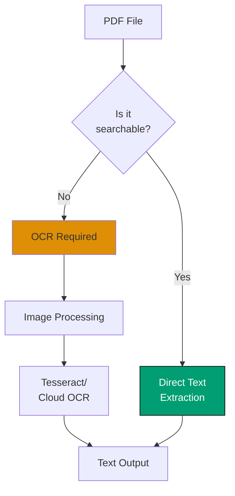
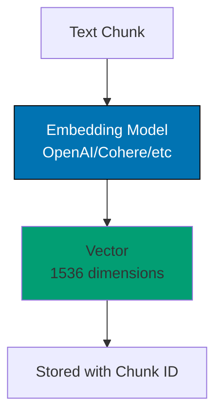
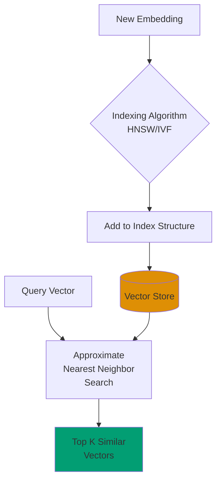
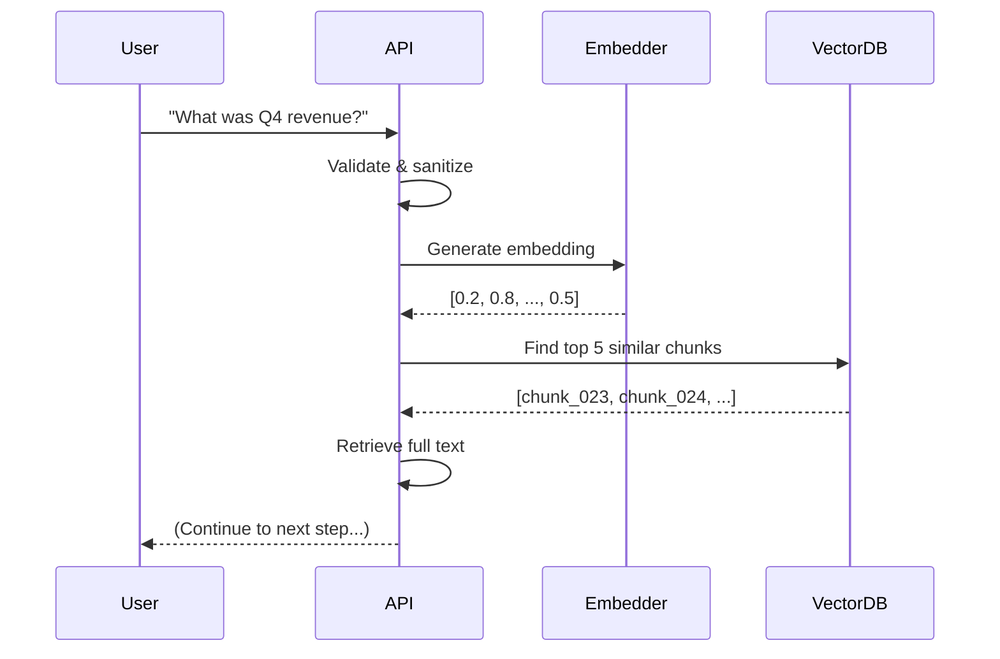
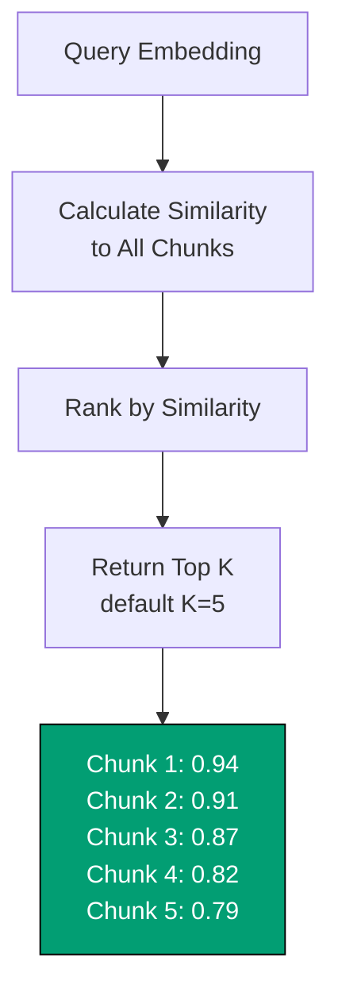
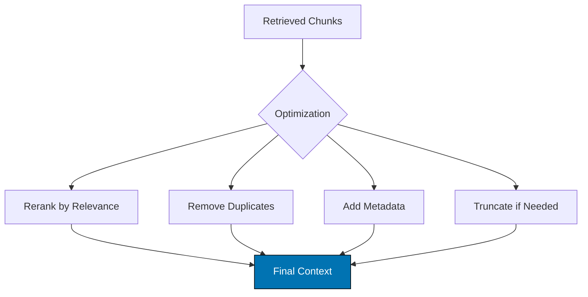

Ever wondered how ChatGPT plugins or Claude can "read" your PDF documents and answer questions about them? In this tutorial, you'll learn the complete architecture behind PDF chat systems—from uploading a document to getting intelligent answers.

By the end, you'll understand every component of a PDF chat application and how they work together to provide accurate, context-aware responses.

## 🎯 What You'll Learn

By completing this tutorial, you will understand:

- **The complete architecture** of a PDF chat system and how data flows through it
- **Document processing pipeline** from raw PDF to searchable chunks
- **Embeddings and vector databases** and why they're essential for semantic search
- **Retrieval-Augmented Generation (RAG)** pattern and how it improves LLM accuracy
- **Query processing flow** from user question to generated answer
- **Different question types** and how the system handles each one
- **Technology choices** and trade-offs for building your own system

## 📚 Prerequisites

**Knowledge Required**:

- Basic understanding of APIs and HTTP requests
- Familiarity with databases (SQL or NoSQL concepts)
- Basic knowledge of LLMs (Large Language Models like GPT or Claude)
- Understanding of REST API patterns

**No Coding Required**: This is an explanatory tutorial focused on understanding concepts, not implementation.

---

## 🏗️ System Architecture

Let's start with the big picture. A PDF chat system has two main phases: **Ingestion** (preparing the document) and **Query** (answering questions).

```mermaid
graph TB
	subgraph "Phase 1: Document Ingestion (One-time)"
		A[📄 PDF Upload] --> B[Text Extraction]
		B --> C[Document Chunking]
		C --> D[Generate Embeddings]
		D --> E[Store in Vector DB]
	end

	subgraph "Phase 2: Query Processing (Per Question)"
		F[❓ User Question] --> G[Generate Query Embedding]
		G --> H[Semantic Search]
		E --> H
		H --> I[Retrieve Relevant Chunks]
		I --> J[Build Context]
		J --> K[LLM Generation]
		K --> L[📝 Answer]
	end

	style A fill:#0173B2,stroke:#000000,color:#FFFFFF
	style F fill:#DE8F05,stroke:#000000,color:#FFFFFF
	style L fill:#029E73,stroke:#000000,color:#FFFFFF
```



**Key Insight**: The document is processed **once** during ingestion, but queries happen **many times**. This asymmetry is crucial for performance—we do expensive processing upfront so queries can be fast.

---

## 🔧 Core Components Deep Dive

### 1. Document Ingestion

**What Happens**: User uploads a PDF file to the system.

**Behind the Scenes**:

- File is validated (size limits, format check)
- Assigned a unique ID for tracking
- Stored temporarily or permanently depending on system design
- Metadata extracted (filename, page count, upload time)

**Example Flow**:

```
User uploads "Company_Report_2024.pdf"
→ System validates: ✓ PDF format, ✓ 5MB (under limit)
→ Assigns ID: "doc_a8f3b9c1"
→ Stores in: /uploads/doc_a8f3b9c1.pdf
→ Metadata: {name, pages: 47, uploaded: 2025-12-01}
```

**Common Technologies**:

- Storage: AWS S3, Google Cloud Storage, local filesystem
- Validation: Python `PyPDF2`, JavaScript `pdf-lib`

---

### 2. Text Extraction

**What Happens**: The system extracts readable text from the PDF.

**Why It's Challenging**: PDFs store text in complex ways—they're designed for visual rendering, not text extraction. A PDF might:

- Use embedded fonts with custom encodings
- Store text in rendering order (not reading order)
- Contain scanned images requiring OCR
- Include tables, multi-column layouts, headers/footers

**Extraction Process**:



**Example Output**:

```
Page 1:
"Annual Report 2024
Executive Summary
Our company achieved record growth this year..."

Page 2:
"Financial Highlights
Revenue: $50M (↑25% YoY)
Net Income: $8M (↑30% YoY)..."
```

**Common Technologies**:

- Direct extraction: `pdfplumber` (Python), `pdf-parse` (Node.js)
- OCR: Tesseract, AWS Textract, Google Cloud Vision

---

### 3. Chunking Strategy

**What Happens**: The extracted text is split into smaller, manageable pieces called "chunks."

**Why Chunking Matters**:

- LLMs have **token limits** (e.g., 128K tokens for GPT-4)
- Embedding models have **input limits** (e.g., 8,192 tokens)
- Smaller chunks = **more precise retrieval** (find exactly relevant sections)
- But chunks need **enough context** to be meaningful

**Chunking Strategies**:

**Strategy 1: Fixed Size** (Simple but crude)

```
Chunk 1: [Characters 0-1000]
Chunk 2: [Characters 1000-2000]
Chunk 3: [Characters 2000-3000]
```

❌ Problem: May split sentences or paragraphs awkwardly

**Strategy 2: Sentence-Based** (Better for readability)

```
Chunk 1: [Sentences 1-10, ~1000 chars]
Chunk 2: [Sentences 11-20, ~950 chars]
Chunk 3: [Sentences 21-30, ~1100 chars]
```

✅ Respects sentence boundaries
⚠️ Chunk sizes vary

**Strategy 3: Semantic** (Most sophisticated)

```
Chunk 1: [Introduction section, 1200 chars]
Chunk 2: [Methodology section, 800 chars]
Chunk 3: [Results section, 1500 chars]
```

✅ Preserves semantic meaning
⚠️ Requires content analysis

**Overlap Strategy** (Best Practice):

```
Chunk 1: [Tokens 0-500]
Chunk 2: [Tokens 400-900]    ← 100 token overlap
Chunk 3: [Tokens 800-1300]   ← 100 token overlap
```

✅ Prevents losing context at boundaries

**Example Configuration**:

- Chunk size: 1000 tokens (~750 words)
- Overlap: 200 tokens (~150 words)
- Method: Sentence-aware with semantic boundaries

---

### 4. Embeddings Generation

**What Happens**: Each text chunk is converted into a **vector** (array of numbers) that captures its semantic meaning.

**What Are Embeddings?**

Think of embeddings as coordinates in "meaning space." Similar concepts are close together; different concepts are far apart.

```
"The cat sat on the mat"     → [0.2, 0.8, 0.1, ..., 0.5]  (1536 numbers)
"A feline rested on the rug" → [0.2, 0.8, 0.1, ..., 0.5]  (very similar!)
"Python programming basics"  → [0.7, 0.1, 0.9, ..., 0.2]  (very different)
```

**Visual Representation** (simplified to 2D):

```
                    ^
                    |
         🐱 cat   🐕 dog
       🦁 lion      |
                    |
     ───────────────┼────────────────→
                    |
               💻 code
            🐍 python   ☕ java
                    |
```

Similar words cluster together in vector space!

**Process**:



**Real Example**:

```
Input Chunk:
"Our Q4 revenue increased by 25% year-over-year,
driven primarily by strong performance in the APAC region."

Embedding Model: text-embedding-3-small (OpenAI)

Output Vector:
[0.0123, -0.0456, 0.0789, ..., 0.0234]
(1536 numbers total)
```

**Common Embedding Models** (2025):

- **OpenAI**: `text-embedding-3-small` (1536 dims, $0.02/1M tokens)
- **OpenAI**: `text-embedding-3-large` (3072 dims, $0.13/1M tokens)
- **Cohere**: `embed-english-v3.0` (1024 dims)
- **Open Source**: `sentence-transformers/all-MiniLM-L6-v2` (384 dims, free)

---

### 5. Vector Database

**What Happens**: Embeddings are stored in a specialized database optimized for similarity search.

**Why Not Regular Databases?**

Traditional databases find exact matches:

```sql
SELECT * FROM documents WHERE title = 'Q4 Report';
```

Vector databases find **similar** content:

```
Find top 5 chunks most similar to:
[0.2, 0.8, 0.1, ..., 0.5]  ← query embedding
```

**How Vector Databases Work**:



**Storage Format**:

```
chunk_id    | embedding_vector           | metadata
─────────────────────────────────────────────────────────────
chunk_001   | [0.12, -0.45, ..., 0.23]  | {page: 1, doc: "Q4_Report"}
chunk_002   | [0.67, 0.34, ..., -0.12]  | {page: 1, doc: "Q4_Report"}
chunk_003   | [0.23, 0.89, ..., 0.45]   | {page: 2, doc: "Q4_Report"}
```

**Common Vector Databases**:

- **Pinecone**: Managed, serverless, auto-scaling
- **Weaviate**: Open-source, self-hosted or cloud
- **Chroma**: Simple, embeddable, great for prototypes
- **Qdrant**: High-performance, Rust-based
- **pgvector**: PostgreSQL extension (use existing DB!)

---

### 6. Query Processing

**What Happens**: When a user asks a question, it goes through the same embedding process as document chunks.

**User Question Flow**:



**Example**:

```
User Input:
"What was our revenue growth in Q4?"

Pre-processing:
- Lowercase: "what was our revenue growth in q4?"
- Remove stop words: "revenue growth q4"
- Expand abbreviations: "revenue growth quarter 4"

Generate Embedding:
[0.234, -0.567, 0.123, ..., 0.890]

Ready for semantic search! →
```

---

### 7. Semantic Search

**What Happens**: The system finds chunks whose embeddings are **closest** to the query embedding in vector space.

**Distance Metrics**:

**Cosine Similarity** (Most Common):

```
Measures the angle between vectors (0 to 1, higher = more similar)

Query:   [0.5, 0.5, 0.5]
Chunk A: [0.6, 0.4, 0.5]  → Similarity: 0.97 ✓ Very similar
Chunk B: [0.1, 0.9, 0.2]  → Similarity: 0.65   Somewhat similar
Chunk C: [-0.5, 0.2, 0.8] → Similarity: 0.23   Not similar
```

**Search Process**:



**Result Example**:

```
Query: "What was Q4 revenue?"

Top 5 Retrieved Chunks:
1. [Score: 0.94] "Q4 revenue reached $50M, representing 25% YoY growth..."
2. [Score: 0.91] "Fourth quarter financial performance exceeded expectations..."
3. [Score: 0.87] "Revenue breakdown by region: North America $20M, APAC $18M..."
4. [Score: 0.82] "Year-over-year comparison shows consistent revenue growth..."
5. [Score: 0.79] "Q4 marked our strongest quarter with record sales..."
```

---

### 8. Context Building

**What Happens**: Retrieved chunks are assembled into a coherent context that will be sent to the LLM.

**Context Structure**:

```
System Prompt:
"You are a helpful assistant that answers questions based on provided context.
Only use information from the context. If you don't know, say so."

Context:
[Document: Q4_Report_2024.pdf]

Chunk 1 (Page 3):
"Q4 revenue reached $50M, representing 25% year-over-year growth.
This was driven primarily by strong performance in the APAC region..."

Chunk 2 (Page 3):
"Fourth quarter financial performance exceeded expectations, with
net income rising to $8M..."

Chunk 3 (Page 7):
"Revenue breakdown by region: North America $20M, APAC $18M,
Europe $12M..."

User Question:
"What was Q4 revenue?"
```

**Context Optimization Strategies**:



**Token Budget Example**:

```
Total Available: 4,000 tokens
- System prompt: 100 tokens
- User question: 20 tokens
- Response budget: 500 tokens
─────────────────────────────
Available for context: 3,380 tokens

Chunk allocation:
- Chunk 1: 350 tokens ✓
- Chunk 2: 400 tokens ✓
- Chunk 3: 300 tokens ✓
- Chunk 4: 450 tokens ✓
- Chunk 5: 380 tokens ✓
─────────────────────────────
Total used: 1,880 tokens (buffer remaining)
```

---

### 9. Answer Generation

**What Happens**: The LLM reads the context and generates a natural language answer.

**LLM Prompt Structure**:

```
[SYSTEM]
You are a helpful assistant answering questions about documents.
Rules:
- Use ONLY information from the provided context
- Cite page numbers when possible
- If information isn't in context, say "I don't have that information"
- Be concise and accurate

[CONTEXT]
[Document: Q4_Report_2024.pdf]
Chunk 1 (Page 3): "Q4 revenue reached $50M..."
Chunk 2 (Page 3): "Fourth quarter financial performance..."
...

[USER]
What was Q4 revenue?

[ASSISTANT]
```

**LLM Processing**:

```mermaid
graph TD
	A[Prompt] --> B[LLM<br/>GPT-4/Claude/etc]
	B --> C{Quality Check}
	C -->|✓ Grounded| D[Final Answer]
	C -->|✗ Hallucination| E[Retry or Error]

	style D fill:#029E73,stroke:#000000,color:#FFFFFF
	style E fill:#DE8F05,stroke:#000000,color:#FFFFFF
```



**Generated Answer**:

```
According to the Q4 Report 2024 (page 3), Q4 revenue reached
$50 million, representing a 25% year-over-year growth. This was
driven primarily by strong performance in the APAC region.
```

**Why RAG Works Better Than Pure LLM**:

| Scenario              | Pure LLM                              | RAG System                     |
| --------------------- | ------------------------------------- | ------------------------------ |
| Ask about recent data | ❌ No knowledge after training cutoff | ✅ Has current document        |
| Company-specific info | ❌ Generic or hallucinated            | ✅ Exact information from docs |
| Cite sources          | ❌ Can't reference pages              | ✅ "According to page 3..."    |
| Update information    | ❌ Requires retraining ($$$$)         | ✅ Just upload new doc         |

---

### 10. Response Handling

**What Happens**: The answer is formatted, enhanced with metadata, and returned to the user.

**Response Enhancement**:

```json
{
  "answer": "According to the Q4 Report 2024 (page 3), Q4 revenue reached $50 million...",
  "sources": [
    {
      "chunk_id": "chunk_023",
      "page": 3,
      "similarity": 0.94,
      "excerpt": "Q4 revenue reached $50M..."
    },
    {
      "chunk_id": "chunk_024",
      "page": 3,
      "similarity": 0.91,
      "excerpt": "Fourth quarter financial performance..."
    }
  ],
  "confidence": 0.95,
  "processing_time_ms": 1247,
  "tokens_used": 1893
}
```

**User Interface Display**:

```
🤖 Answer:
According to the Q4 Report 2024 (page 3), Q4 revenue reached
$50 million, representing a 25% year-over-year growth.

📄 Sources:
• Page 3 (Similarity: 94%)
• Page 3 (Similarity: 91%)

⏱️ Answered in 1.2 seconds
```

---

## 🎯 Handling Different Question Types

Different questions require different strategies:

### Type 1: Direct Factual Questions

```
Q: "What was Q4 revenue?"
Strategy: Simple semantic search
Chunks needed: 1-2
Confidence: High
```

### Type 2: Analytical Questions

```
Q: "Why did revenue increase in Q4?"
Strategy: Retrieve multiple chunks, look for explanations
Chunks needed: 3-5
Confidence: Medium
```

### Type 3: Comparative Questions

```
Q: "How does Q4 compare to Q3?"
Strategy: Retrieve chunks from both periods, LLM synthesizes
Chunks needed: 4-8
Confidence: Medium
```

### Type 4: Summarization

```
Q: "Summarize the executive summary"
Strategy: Retrieve entire section, LLM condenses
Chunks needed: 10+
Confidence: High
```

### Type 5: Unanswerable (Document doesn't contain info)

```
Q: "What will Q1 2025 revenue be?"
Strategy: Semantic search finds no good matches (scores < 0.70)
Response: "I don't have information about future Q1 2025 projections in this document."
Confidence: N/A
```

---

## 💡 Implementation Strategies

### Technology Stacks (2025)

**Option 1: Fully Managed (Easiest)**

```
Frontend:      React/Next.js
Backend:       Vercel Functions / AWS Lambda
PDF Processing: PDF.js / PDF-lib
Embeddings:    OpenAI API (text-embedding-3-small)
Vector DB:     Pinecone (managed)
LLM:           OpenAI GPT-4 / Anthropic Claude
Cost:          ~$50-200/month for small apps
```

**Option 2: Self-Hosted (Most Control)**

```
Frontend:      React/Next.js
Backend:       Node.js / Python FastAPI
PDF Processing: pdfplumber (Python)
Embeddings:    sentence-transformers (local GPU)
Vector DB:     Chroma / Weaviate (self-hosted)
LLM:           Local (llama.cpp) or API
Cost:          Infrastructure + GPU costs
```

**Option 3: Hybrid (Best of Both)**

```
Frontend:      React/Next.js
Backend:       Node.js Express / Python FastAPI
PDF Processing: pdfplumber
Embeddings:    OpenAI API (reliable, affordable)
Vector DB:     PostgreSQL + pgvector (use existing DB!)
LLM:           OpenAI GPT-4 (quality) or Claude (speed)
Cost:          ~$30-100/month + existing infrastructure
```

---

### Performance Considerations

**Ingestion Performance**:

```
Bottlenecks:
1. PDF text extraction (CPU-bound)
   → Solution: Process in background jobs, use workers
2. Embedding generation (API rate limits)
   → Solution: Batch requests, use queue system
3. Vector database indexing (memory-intensive)
   → Solution: Incremental indexing, sharding

Typical Speed:
- 100-page PDF: 2-5 minutes total processing
- Can process multiple docs in parallel
```

**Query Performance**:

```
Latency Breakdown:
1. Embedding query:     100-300ms
2. Vector search:       10-50ms
3. Context retrieval:   20-100ms
4. LLM generation:      1,000-3,000ms
─────────────────────────────────────
Total:                  ~1.5-3.5 seconds

Optimization Tips:
- Cache common queries (Redis)
- Use streaming LLM responses (show partial answers)
- Parallel embedding + search operations
- CDN for static assets
```

---

### Cost Optimization

**Embedding Costs** (OpenAI `text-embedding-3-small`):

```
Cost: $0.02 per 1M tokens

Example:
- 100-page PDF = ~50,000 tokens (after chunking)
- Cost: $0.001 per document
- 1,000 documents = $1.00 for embeddings

✅ Very affordable!
```

**LLM Costs** (OpenAI GPT-4):

```
Input:  $10.00 per 1M tokens
Output: $30.00 per 1M tokens

Per Query Estimate:
- Context (retrieved chunks): 2,000 tokens × $10 / 1M = $0.02
- Response: 200 tokens × $30 / 1M = $0.006
─────────────────────────────────────────────────────────────
Total per query: ~$0.026

1,000 queries/month = ~$26/month
```

**Vector Database Costs**:

```
Pinecone (managed):
- Free tier: 1 index, 100K vectors
- Paid: $70/month for 1M vectors

Chroma (self-hosted):
- Free (open source)
- Infrastructure cost: ~$20-50/month (small server)

PostgreSQL + pgvector:
- Free if using existing database
- Minimal additional storage cost
```

**Total Monthly Cost Estimate** (1,000 documents, 5,000 queries):

```
Embeddings:      $1
LLM queries:     $130
Vector DB:       $0-70 (depending on choice)
Infrastructure:  $20-50
─────────────────────────────────────
Total:           ~$151-251/month

💡 Tip: Use caching to reduce LLM calls by 30-50%!
```

---

## 🎓 Knowledge Check & Practice Exercises

Now that you understand how PDF chat systems work, test your understanding with these exercises:

### Exercise 1: Design Decision Analysis (Beginner)

**Scenario**: You're building a PDF chat system for a legal firm that processes 100-page contracts.

**Questions**:

- What chunking strategy would you choose and why?
- Should you use fixed-size (1000 chars) or semantic (section-based) chunking?
- What chunk overlap would you recommend?

**Answer Guide**: Consider that legal contracts have clear section boundaries, and preserving complete clauses is crucial for accuracy. Semantic chunking by section with 150-200 token overlap would preserve context while respecting document structure.

---

### Exercise 2: Cost Estimation (Intermediate)

**Scenario**: Your startup needs to process:

- 500 PDF documents (avg 50 pages each)
- 10,000 user queries per month
- Using OpenAI embeddings and GPT-4

**Task**: Calculate monthly costs for:

1. Initial embedding of all documents
2. Ongoing query processing
3. Total monthly cost

**Answer Guide**:

- Embeddings: 500 docs × 50 pages × ~1000 tokens/page = 25M tokens → $0.50
- Queries: 10K queries × 2000 tokens context × $10/1M = $200 (input) + 10K × 200 tokens × $30/1M = $60 (output) = $260/month
- Total: ~$260.50/month (embeddings are one-time)

---

### Exercise 3: Troubleshooting Performance (Intermediate)

**Scenario**: Users complain that answers take 8-10 seconds and sometimes miss relevant information.

**Questions**:

- What are potential bottlenecks? (List 3)
- How would you diagnose which stage is slow?
- What optimizations would you try first?

**Answer Guide**:

- Bottlenecks: (1) LLM generation (1-3s typical, 8-10s suggests timeout/retry), (2) Poor vector search configuration (wrong index type), (3) Too many chunks retrieved (context too large)
- Diagnosis: Add timing logs at each stage (embedding: ?ms, search: ?ms, LLM: ?ms)
- First optimization: Check if retrieving too many chunks (K=20 → K=5), add caching for common queries, use streaming responses for better UX

---

### Exercise 4: Architecture Comparison (Advanced)

**Task**: Compare three approaches for a 1000-document knowledge base:

| Approach | Vector DB            | Embedding Model       | LLM         |
| -------- | -------------------- | --------------------- | ----------- |
| A        | Pinecone (managed)   | OpenAI                | GPT-4       |
| B        | Chroma (self-hosted) | sentence-transformers | Local Llama |
| C        | pgvector             | OpenAI                | Claude      |

**Questions**:

- What are the trade-offs of each approach?
- Which would you choose for: (a) MVP/prototype, (b) enterprise with compliance needs, (c) high-scale production?

**Answer Guide**:

- **Approach A**: Fastest to market, highest ongoing cost (~$200/month), vendor lock-in
- **Approach B**: Most control, lowest cost, requires GPU infrastructure, higher complexity
- **Approach C**: Best hybrid, leverages existing DB, good quality/cost balance
- **Recommendations**:
  - (a) MVP: Approach A (speed to market)
  - (b) Enterprise: Approach B or C (data sovereignty, no external API calls)
  - (c) Production: Approach C (balance of cost, performance, maintainability)

---

### Exercise 5: System Design Challenge (Advanced)

**Scenario**: Design a PDF chat system for a university library with these requirements:

- 10,000 academic papers
- Multi-user access (500 concurrent users)
- Budget: $500/month
- Must cite sources with page numbers
- Support filtering by year, author, topic

**Task**: Design the complete system architecture including:

1. Document ingestion pipeline
2. Vector database choice and schema
3. Query processing flow
4. Metadata structure
5. Caching strategy

**Answer Guide**: This is an open-ended design exercise. Key considerations:

- **Ingestion**: Background job queue (Bull/Celery), batch embedding to respect rate limits
- **Vector DB**: Chroma or Weaviate (both support metadata filtering), store metadata: `{year, author, topic, page}`
- **Query Flow**: Filter by metadata first → vector search within filtered set → retrieve with page numbers → LLM generation
- **Caching**: Redis for common queries, cache by (query + filters) key
- **Cost**: Use text-embedding-3-small ($0.02/1M tokens), Weaviate self-hosted (free), GPT-4 Turbo with caching (~$200/month for 10K queries)

---

## 🧠 Common Misconceptions

Let's clarify some frequent misunderstandings about PDF chat systems:

### Misconception 1: "The LLM reads the entire PDF"

**Reality**: The LLM only sees the small chunks retrieved by vector search (typically 2-5 chunks, ~2000 tokens total). The PDF might be 100 pages, but the LLM gets a tiny fraction.

**Why it matters**: This is why retrieval quality is crucial—if the right chunks aren't found, the LLM can't answer correctly even if the information exists in the PDF.

---

### Misconception 2: "Bigger chunks are always better"

**Reality**: Chunk size involves trade-offs:

- **Too small** (< 200 tokens): Lacks context, retrieval finds fragments
- **Too large** (> 2000 tokens): Less precise, might include irrelevant info, wastes LLM context
- **Sweet spot**: 500-1000 tokens with 100-200 overlap

**Why it matters**: Chunk size directly affects both retrieval precision and answer quality.

---

### Misconception 3: "More retrieved chunks = better answers"

**Reality**: Retrieving too many chunks (K > 10) can:

- Include irrelevant information that confuses the LLM
- Waste context window budget
- Increase latency and cost
- Lead to "lost in the middle" problem (LLM ignores middle chunks)

**Sweet spot**: K=3-5 for most questions, K=8-10 for complex analytical queries

---

### Misconception 4: "Embeddings understand the content"

**Reality**: Embeddings capture semantic similarity, not understanding. They're great for finding "these texts are about similar topics" but don't reason or fact-check.

**Example**:

- "Python is a programming language" → [0.8, 0.2, ...]
- "Python is a dangerous snake" → [0.75, 0.25, ...] (still somewhat similar!)

The LLM does the understanding; embeddings just find potentially relevant text.

---

### Misconception 5: "RAG prevents all hallucinations"

**Reality**: RAG significantly reduces hallucinations by grounding answers in retrieved context, but doesn't eliminate them:

- LLM might misinterpret retrieved chunks
- LLM might over-extrapolate from limited context
- Poor retrieval → no relevant chunks → LLM fills in gaps

**Mitigation**: Use system prompts that enforce "only use provided context," implement confidence scoring, add citation requirements.

---

### Misconception 6: "Vector databases replace regular databases"

**Reality**: Vector databases are specialized for similarity search. You still need regular databases for:

- User management and authentication
- Document metadata (title, author, upload date)
- Usage analytics and logging
- Transactional operations

**Best practice**: Use both—PostgreSQL for structured data, vector DB for semantic search.

---

## 🚀 Next Steps

Now that you understand how PDF chat systems work, here are your next steps:

### 1. Deepen Your Knowledge

- **Learn RAG patterns**: Explore advanced retrieval strategies (hybrid search, reranking)
- **Understand embeddings**: Study how different embedding models compare
- **Master vector databases**: Compare Pinecone, Weaviate, Chroma, and pgvector

### 2. Build a Prototype

- **Start simple**: Single PDF, basic question answering
- **Use existing tools**: LangChain, LlamaIndex make this easier
- **Iterate**: Add features based on user feedback

### 3. Explore Advanced Topics

- **Multi-modal RAG**: Handle images, tables, charts in PDFs
- **Conversational memory**: Remember previous questions in a chat session
- **Fine-tuning**: Customize embeddings for your domain
- **Evaluation**: Measure and improve answer quality

### 4. Related Tutorials

- RAG System Basics - Implementation patterns (planned)
- Prompt Engineering Fundamentals - Optimize LLM responses (planned)

---

## 📚 Key Takeaways

Let's recap what you've learned:

✅ **PDF chat systems use RAG** (Retrieval-Augmented Generation) to combine document search with LLM generation

✅ **Two-phase architecture**: Ingestion (process document once) and Query (answer questions many times)

✅ **Embeddings are crucial**: They convert text into vectors that capture semantic meaning

✅ **Vector databases enable semantic search**: Find similar content, not just exact matches

✅ **Context quality determines answer quality**: Better retrieval = better answers

✅ **Cost-effective at scale**: ~$0.03 per query with optimizations

✅ **Technology is mature**: Production-ready tools and APIs available

---

**You now understand the complete architecture of PDF chat applications!** 🎉

These systems power tools like ChatGPT's file upload feature, Notion AI, and countless document Q&A products. The same principles apply to chatting with any text source—documentation, wikis, knowledge bases, and more.

---
