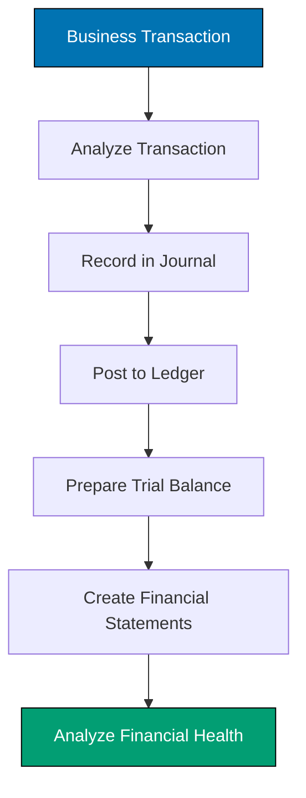
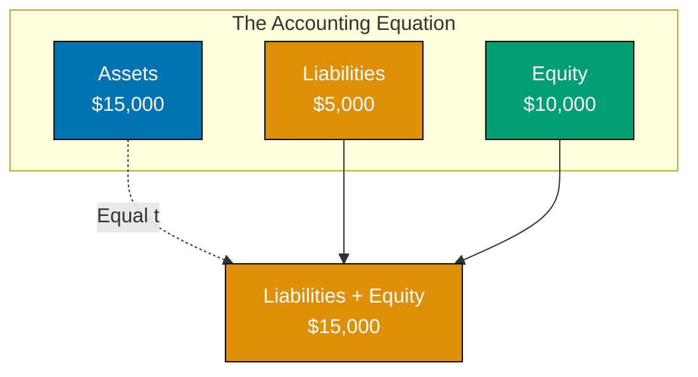
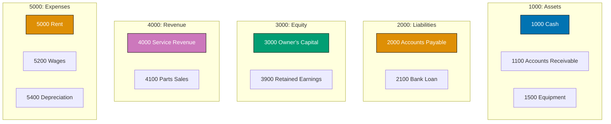
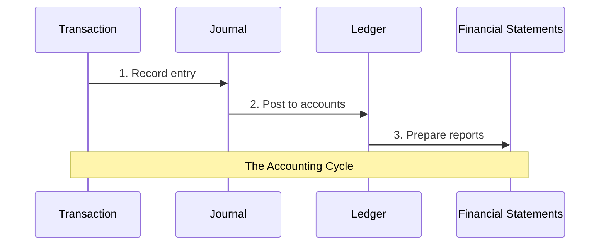
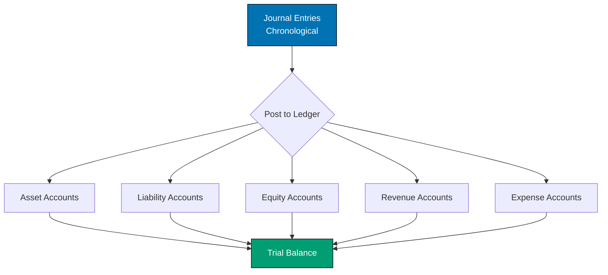
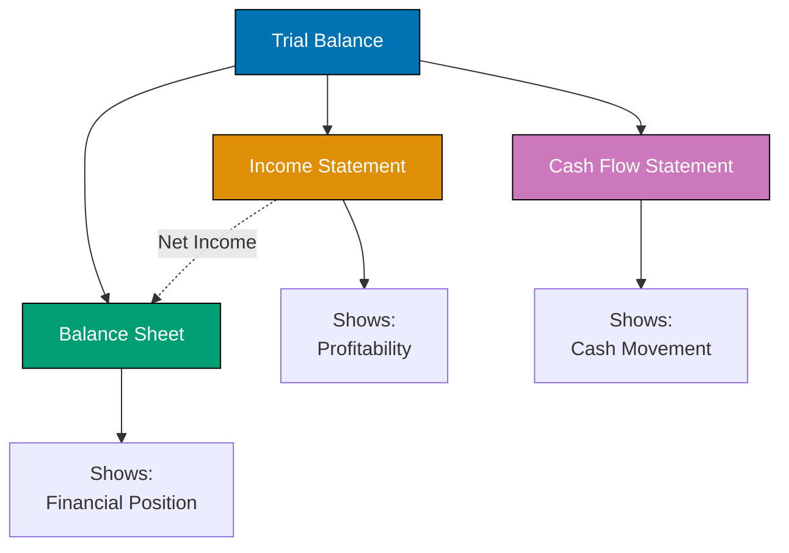
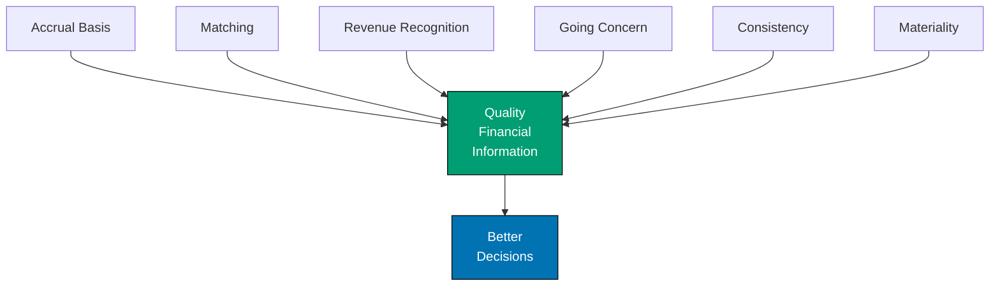

Welcome to the world of accounting! Whether you're starting a business, managing finances, or just want to understand how money flows through organizations, this Quick Start guide will give you the foundation you need.

By the end of this tutorial, you'll understand how businesses track their financial activities, how to read financial statements, and how to apply accounting principles in real-world scenarios.

## 🎯 What You'll Learn

- Understand the fundamental accounting equation and why it always balances
- Master double-entry bookkeeping and the logic behind debits and credits
- Create and interpret financial statements (balance sheet, income statement, cash flow)
- Apply accounting principles like accrual basis and matching principle
- Practice recording real business transactions from start to finish
- Read and analyze financial health through financial statements

## 📚 Prerequisites

**Knowledge Prerequisites:**

- Basic arithmetic (addition, subtraction, multiplication, division)
- Understanding of business concepts (revenue, expenses, assets)
- Familiarity with spreadsheets is helpful but not required

**Tools Required:**

- Pen and paper for exercises (or spreadsheet software)
- Calculator

**Optional (Helpful):**

- Basic understanding of business operations
- Curiosity about how businesses track money

## 🏗️ What We're Building

Throughout this tutorial, we'll follow **"Tech Haven"**, a small computer repair shop, as it goes through its first month of business. You'll record every transaction, create financial statements, and learn to interpret what the numbers tell us about the business's health.

**By the end, you'll have:**

- Complete accounting records for Tech Haven's first month
- Three core financial statements (balance sheet, income statement, cash flow)
- Understanding of how transactions flow through the accounting system
- Confidence to track finances for any small business



The diagram above shows the complete accounting cycle we'll master in this tutorial.

---

## 📖 Section 1: The Accounting Equation - Your Foundation

Every accounting system in the world is built on one simple equation. Master this, and everything else will make sense.

### The Magic Equation

$$
\text{Assets} = \text{Liabilities} + \text{Equity}
$$

**What does this mean?**

- **Assets** = What the business owns (cash, equipment, inventory, etc.)
- **Liabilities** = What the business owes (loans, bills to pay, etc.)
- **Equity** = What the owners own (investment + profits)

**Why it always balances:**

Think of it this way: Everything a business owns (assets) was either borrowed (liabilities) or invested/earned by the owners (equity). There's no other source of money!

### Real-World Example

Let's start Tech Haven:

**Transaction 1:** Owner invests $10,000 cash to start the business.

```
Before:
Assets = $0
Liabilities = $0
Equity = $0

After:
Assets = $10,000 (cash)
Liabilities = $0
Equity = $10,000 (owner investment)

Check: $10,000 = $0 + $10,000 ✓
```

**Transaction 2:** Business borrows $5,000 from bank.

```
After:
Assets = $15,000 (cash increased by $5,000)
Liabilities = $5,000 (bank loan)
Equity = $10,000 (unchanged)

Check: $15,000 = $5,000 + $10,000 ✓
```

**Transaction 3:** Business buys equipment for $3,000 cash.

```
After:
Assets = $15,000 ($12,000 cash + $3,000 equipment)
Liabilities = $5,000 (unchanged)
Equity = $10,000 (unchanged)

Check: $15,000 = $5,000 + $10,000 ✓
```

**Notice:** Assets changed form (cash → equipment) but total stayed the same!

### Visual Representation



### ✓ Checkpoint

**What you've learned:**

- The accounting equation is the foundation of all accounting
- Assets = Liabilities + Equity ALWAYS
- Every transaction affects at least two parts of the equation
- The equation must always balance

**Practice:** If a business has $50,000 in assets and $20,000 in liabilities, what is the equity?

<details>
<summary>Solution</summary>

$$
\text{Equity} = \text{Assets} - \text{Liabilities} = \$50,000 - \$20,000 = \$30,000
$$

</details>

---

## 📖 Section 2: Double-Entry Bookkeeping - The System That Never Lies

Now that you understand the equation, let's learn the system that keeps it balanced automatically.

### The Core Principle

**Every transaction has two sides:**

- Something received (debit)
- Something given (credit)

**The rule:** For every transaction, total debits = total credits

This isn't opinion or preference—it's the mathematical law that makes accounting work.

### Account Types and Their Normal Balances

Different types of accounts increase and decrease differently:

```mermaid
flowchart TD
 subgraph "Asset Accounts"
  A1[Debit = Increase]
  A2[Credit = Decrease]
  A1 --> A2
 end

 subgraph "Liability Accounts"
  L1[Credit = Increase]
  L2[Debit = Decrease]
  L1 --> L2
 end

 subgraph "Equity Accounts"
  E1[Credit = Increase]
  E2[Debit = Decrease]
  E1 --> E2
 end

 subgraph "Revenue Accounts"
  R1[Credit = Increase]
  R2[Debit = Decrease]
  R1 --> R2
 end

 subgraph "Expense Accounts"
  X1[Debit = Increase]
  X2[Credit = Decrease]
  X1 --> X2
 end

 style A1 fill:#0173B2,stroke:#000000,color:#FFFFFF
 style L1 fill:#DE8F05,stroke:#000000,color:#FFFFFF
 style E1 fill:#029E73,stroke:#000000,color:#FFFFFF
 style R1 fill:#CC78BC,stroke:#000000,color:#FFFFFF
 style X1 fill:#DE8F05,stroke:#000000,color:#FFFFFF
```



**Memory aid:**

- **DEAD CLIC** (Debit: Expenses, Assets, Drawings | Credit: Liabilities, Income, Capital)
- Assets and Expenses behave the same (debit increases)
- Liabilities, Equity, and Revenue behave the same (credit increases)

⚠️ **Common Mistake**: Many beginners try to think "debit = bad, credit = good" from everyday banking language. **This doesn't work in accounting!**

In accounting:

- **Debits are NOT bad** - they just mean "left side"
- **Credits are NOT good** - they just mean "right side"

Think of debits and credits as **directions** (left vs right) rather than value judgments (good vs bad).

**Tip**: Focus on memorizing what each side increases:

- Left (Debit) increases: Assets & Expenses
- Right (Credit) increases: Liabilities, Equity & Revenue

Once you know this, you can figure out what decreases each account (opposite side).

### Why This Makes Sense

Think about your personal checking account:

- When you **deposit** money (increase asset), the bank **debits** your account
- When you **withdraw** money (decrease asset), the bank **credits** your account

This seems backward because you're looking at the bank's books, not yours! From the bank's perspective, your deposit is their **liability** (they owe you), so they credit it.

### Recording Transactions

**Transaction:** Tech Haven pays $800 cash for rent.

**Analysis:**

1. What happened? Cash decreased, rent expense increased
2. Which accounts? Cash (asset), Rent Expense (expense)
3. Debit or credit? Cash decreases (credit), Rent Expense increases (debit)

**Journal Entry:**

```
Date: Jan 5, 2025
Description: Paid monthly rent

Account                 Debit    Credit
Rent Expense            $800
  Cash                           $800

(To record payment of monthly rent)
```

**Check:**

- Total debits = $800
- Total credits = $800
- ✓ Balanced!

### Practice Entry

**Transaction:** Tech Haven repairs a customer's computer and receives $150 cash.

**Try it yourself before looking:**

<details>
<summary>Solution</summary>

```
Date: Jan 6, 2025
Description: Computer repair service

Account                 Debit    Credit
Cash                    $150
  Service Revenue                $150

(To record repair service revenue)
```

**Why?**

- Cash increased (asset increase = debit)
- Service Revenue increased (revenue increase = credit)

</details>

### ✓ Checkpoint

**What you've learned:**

- Every transaction has equal debits and credits
- Assets and expenses increase with debits
- Liabilities, equity, and revenue increase with credits
- The system self-checks because debits must equal credits

---

## 📖 Section 3: Chart of Accounts - Organizing Your Records

Before we start recording lots of transactions, we need an organized filing system for our accounts.

### What Is a Chart of Accounts?

A **chart of accounts** is a complete list of all accounts your business uses, organized by type and numbered for easy reference.

### Standard Numbering System

```
1000-1999: Assets
2000-2999: Liabilities
3000-3999: Equity
4000-4999: Revenue
5000-5999: Expenses
```

### Tech Haven's Chart of Accounts

```
ASSETS (1000-1999)
1000 - Cash
1100 - Accounts Receivable
1200 - Inventory (Computer Parts)
1300 - Prepaid Rent
1500 - Equipment
1550 - Accumulated Depreciation - Equipment

LIABILITIES (2000-2999)
2000 - Accounts Payable
2100 - Bank Loan Payable
2200 - Unearned Revenue

EQUITY (3000-3999)
3000 - Owner's Capital
3100 - Owner's Drawings
3900 - Retained Earnings

REVENUE (4000-4999)
4000 - Service Revenue
4100 - Parts Sales Revenue

EXPENSES (5000-5999)
5000 - Rent Expense
5100 - Utilities Expense
5200 - Wages Expense
5300 - Supplies Expense
5400 - Depreciation Expense
5500 - Interest Expense
```

### Visual Organization



### Why Numbering Matters

**Benefits:**

- **Organization:** Assets always start with 1, revenue with 4, etc.
- **Sorting:** Computer systems can automatically sort by account type
- **Scalability:** Can add accounts between existing numbers (1150, 1160, etc.)
- **Communication:** Everyone knows what "account 1000" means

### ✓ Checkpoint

**What you've learned:**

- Chart of accounts organizes all business accounts
- Standard numbering: 1000s (assets), 2000s (liabilities), 3000s (equity), 4000s (revenue), 5000s (expenses)
- Numbering allows for easy expansion and organization
- Each business customizes their chart based on needs

**You now understand:**

You've mastered the first three building blocks of accounting! You know:

1. **The accounting equation** - the fundamental rule (Assets = Liabilities + Equity)
2. **Double-entry bookkeeping** - how to keep the equation balanced (debits and credits)
3. **Chart of accounts** - how to organize financial information

Next, you'll put these concepts into practice by recording real business transactions!

---

## 📖 Section 4: Recording Transactions - Your First Month

Now we'll record Tech Haven's first month of business transactions step by step.

### Journal Entry Format

Every journal entry includes:

1. **Date** of transaction
2. **Account names** (debit accounts listed first)
3. **Amounts** (debits in left column, credits in right column, indented)
4. **Description** explaining the transaction

### Tech Haven's January 2025 Transactions

Let's record all transactions chronologically.

**Jan 1:** Owner invests $10,000 cash

```
Date: Jan 1, 2025

Account                 Debit      Credit
1000 Cash               $10,000
  3000 Owner's Capital             $10,000

(Owner investment to start business)
```

**Jan 2:** Borrow $5,000 from bank

```
Date: Jan 2, 2025

Account                 Debit      Credit
1000 Cash               $5,000
  2100 Bank Loan                   $5,000

(Loan from First National Bank, 6% annual interest)
```

**Jan 3:** Purchase equipment for $3,000 cash

```
Date: Jan 3, 2025

Account                 Debit      Credit
1500 Equipment          $3,000
  1000 Cash                        $3,000

(Purchased diagnostic equipment and tools)
```

**Jan 5:** Pay $800 for first month's rent

```
Date: Jan 5, 2025

Account                 Debit      Credit
5000 Rent Expense       $800
  1000 Cash                        $800

(Paid January rent for shop space)
```

**Jan 8:** Buy computer parts inventory for $2,000 cash

```
Date: Jan 8, 2025

Account                 Debit      Credit
1200 Inventory          $2,000
  1000 Cash                        $2,000

(Purchased parts for customer repairs)
```

**Jan 10:** Complete repair job, receive $150 cash

```
Date: Jan 10, 2025

Account                 Debit      Credit
1000 Cash               $150
  4000 Service Revenue             $150

(Laptop repair for walk-in customer)
```

**Jan 12:** Complete repair job, customer will pay later ($300)

```
Date: Jan 12, 2025

Account                 Debit      Credit
1100 Accounts Receivable $300
  4000 Service Revenue             $300

(Desktop repair for business customer, terms net 30)
```

**Jan 15:** Pay employee wages $600 cash

```
Date: Jan 15, 2025

Account                 Debit      Credit
5200 Wages Expense      $600
  1000 Cash                        $600

(Wages for part-time technician, first half of month)
```

**Jan 18:** Sell computer parts for $400 cash (parts cost $250)

```
Date: Jan 18, 2025

Entry 1 (Record sale):
Account                 Debit      Credit
1000 Cash               $400
  4100 Parts Sales Revenue         $400

(Sold memory modules to customer)

Entry 2 (Record cost):
5300 Cost of Goods Sold $250
  1200 Inventory                   $250

(Cost of parts sold)
```

**Note:** Two entries needed - one for the sale revenue, one for the cost of inventory sold.

⚠️ **Common Mistake**: When selling inventory, beginners often forget to record the cost of goods sold. **Always make TWO entries**:

1. Record the sale (Cash/AR → Revenue)
2. Record the cost (Cost of Goods Sold → Inventory)

Forgetting the second entry makes your profit look higher than it really is!

**Jan 20:** Pay $100 for utilities

```
Date: Jan 20, 2025

Account                 Debit      Credit
5100 Utilities Expense  $100
  1000 Cash                        $100

(Electricity and internet for January)
```

**Jan 25:** Customer pays the $300 owed from Jan 12

```
Date: Jan 25, 2025

Account                 Debit      Credit
1000 Cash               $300
  1100 Accounts Receivable         $300

(Payment received from business customer)
```

**Jan 31:** Pay $25 interest on bank loan

```
Date: Jan 31, 2025

Account                 Debit      Credit
5500 Interest Expense   $25
  1000 Cash                        $25

(Monthly interest on bank loan)
```

**Jan 31:** Owner withdraws $500 for personal use

```
Date: Jan 31, 2025

Account                 Debit      Credit
3100 Owner's Drawings   $500
  1000 Cash                        $500

(Owner withdrawal for personal expenses)
```

### Transaction Summary



### ✓ Checkpoint

**What you've learned:**

- How to record journal entries with proper format
- Each entry must have equal debits and credits
- Some transactions need multiple entries (inventory sales)
- Transactions are recorded chronologically in the journal

**Practice:** Record this transaction: Tech Haven pays $200 for advertising.

<details>
<summary>Solution</summary>

```
Date: [Today's date]

Account                 Debit      Credit
5XXX Advertising Expense $200
  1000 Cash                        $200

(Paid for online advertising campaign)
```

**Note:** You'd add "Advertising Expense" to the chart of accounts first (maybe account 5600).

</details>

---

## 📖 Section 5: The General Ledger - Tracking Account Balances

After recording transactions in the journal, we organize them by account to track balances.

### What Is the General Ledger?

The **general ledger** collects all transactions for each account, showing:

- All debits and credits to the account
- Running balance
- Complete transaction history

### Posting to Ledger Accounts

**Posting** means transferring journal entries to their respective ledger accounts.

### Sample Ledger: Cash (Account 1000)

```
Account: 1000 - Cash
-----------------------------------------------------------
Date    Description              Debit    Credit   Balance
-----------------------------------------------------------
Jan 1   Owner investment         10,000             10,000
Jan 2   Bank loan                5,000              15,000
Jan 3   Equipment purchase                3,000     12,000
Jan 5   Rent payment                      800       11,200
Jan 8   Inventory purchase                2,000     9,200
Jan 10  Repair revenue           150                9,350
Jan 15  Wages payment                     600       8,750
Jan 18  Parts sale               400                9,150
Jan 20  Utilities payment                 100       9,050
Jan 25  Customer payment         300                9,350
Jan 31  Interest payment                  25        9,325
Jan 31  Owner withdrawal                  500       8,825
-----------------------------------------------------------
Final Balance: $8,825 (Debit)
```

### Sample Ledger: Service Revenue (Account 4000)

```
Account: 4000 - Service Revenue
-----------------------------------------------------------
Date    Description              Debit    Credit   Balance
-----------------------------------------------------------
Jan 10  Cash repair                       150       150
Jan 12  Credit repair                     300       450
-----------------------------------------------------------
Final Balance: $450 (Credit)
```

### All Account Balances

**Assets:**

- Cash: $8,825
- Accounts Receivable: $0 (customer paid)
- Inventory: $1,750 ($2,000 - $250 sold)
- Equipment: $3,000

**Liabilities:**

- Bank Loan Payable: $5,000

**Equity:**

- Owner's Capital: $10,000
- Owner's Drawings: $500

**Revenue:**

- Service Revenue: $450
- Parts Sales Revenue: $400

**Expenses:**

- Rent Expense: $800
- Wages Expense: $600
- Utilities Expense: $100
- Interest Expense: $25
- Cost of Goods Sold: $250

### Ledger Organization



### ✓ Checkpoint

**What you've learned:**

- The general ledger organizes transactions by account
- Posting transfers journal entries to ledger accounts
- Each account maintains a running balance
- The ledger feeds into the trial balance

---

## 📖 Section 6: Trial Balance - Verifying Accuracy

Before preparing financial statements, verify that debits equal credits.

### What Is a Trial Balance?

A **trial balance** lists all accounts with their balances to verify the books are in balance.

### Tech Haven Trial Balance - January 31, 2025

```
Tech Haven Computer Repair
Trial Balance
January 31, 2025

Account                          Debit      Credit
----------------------------------------------------
1000 Cash                        $8,825
1200 Inventory                   $1,750
1500 Equipment                   $3,000
2100 Bank Loan Payable                      $5,000
3000 Owner's Capital                        $10,000
3100 Owner's Drawings            $500
4000 Service Revenue                        $450
4100 Parts Sales Revenue                    $400
5000 Rent Expense                $800
5100 Utilities Expense           $100
5200 Wages Expense               $600
5300 Cost of Goods Sold          $250
5500 Interest Expense            $25
----------------------------------------------------
TOTALS                           $15,850    $15,850
====================================================
```

**✓ Check:** Debits ($15,850) = Credits ($15,850)

### What the Trial Balance Tells You

**If it balances:**

- ✓ All journal entries posted correctly
- ✓ No arithmetic errors
- ✓ Ready to prepare financial statements

**If it doesn't balance:**

- ❌ Look for posting errors
- ❌ Check for transposition errors (reversed digits)
- ❌ Find missing entries

### Trial Balance Limitations

**What it CATCHES:**

- Mathematical errors
- Missing postings
- Wrong debit/credit columns

**What it DOESN'T CATCH:**

- Wrong account used
- Wrong amounts (if debits still equal credits)
- Duplicate entries
- Completely omitted transactions

### ✓ Checkpoint

**What you've learned:**

- Trial balance verifies debits equal credits
- It's prepared before financial statements
- It catches posting and arithmetic errors
- It doesn't catch all types of errors

**Progress Check:**

You're now ready for the most important part - creating financial statements! You've completed the entire accounting process from transactions to trial balance:

1. ✓ Recorded transactions in journal entries
2. ✓ Posted entries to the general ledger
3. ✓ Verified accuracy with trial balance

Next, you'll transform these numbers into the three core financial statements that tell Tech Haven's complete financial story!

---

## 📖 Section 7: Financial Statements - The Complete Picture

Now we transform accounting records into meaningful financial reports.

### The Three Core Financial Statements



### Statement 1: Income Statement

**Purpose:** Shows profitability for a period

**Formula:**

$$
\text{Net Income} = \text{Revenue} - \text{Expenses}
$$

```
Tech Haven Computer Repair
Income Statement
For the Month Ended January 31, 2025

REVENUE
  Service Revenue                    $450
  Parts Sales Revenue                $400
                                     -----
  Total Revenue                            $850

EXPENSES
  Rent Expense                       $800
  Wages Expense                      $600
  Utilities Expense                  $100
  Interest Expense                   $25
  Cost of Goods Sold                 $250
                                     -----
  Total Expenses                           $1,775

                                           -------
NET LOSS                                   ($925)
                                           =======
```

**What it tells us:**

- Tech Haven lost $925 in month one
- Total revenue: $850
- Total expenses: $1,775
- Common for new businesses with startup costs

### Statement 2: Balance Sheet

**Purpose:** Shows financial position at a point in time

**Formula:**

$$
\text{Assets} = \text{Liabilities} + \text{Equity}
$$

```
Tech Haven Computer Repair
Balance Sheet
January 31, 2025

ASSETS
Current Assets:
  Cash                               $8,825
  Inventory                          $1,750
                                     ------
  Total Current Assets                      $10,575

Non-Current Assets:
  Equipment                          $3,000
                                     ------
  Total Non-Current Assets                  $3,000

TOTAL ASSETS                                 $13,575
                                             =======

LIABILITIES AND EQUITY
Liabilities:
  Bank Loan Payable                  $5,000
                                     ------
  Total Liabilities                         $5,000

Equity:
  Owner's Capital                    $10,000
  Owner's Drawings                   ($500)
  Net Income (Loss)                  ($925)
                                     -------
  Total Equity                              $8,575

TOTAL LIABILITIES AND EQUITY                 $13,575
                                             =======

Check: $13,575 = $5,000 + $8,575 ✓
```

**What it tells us:**

- Total assets: $13,575
- Total liabilities: $5,000
- Owner's equity: $8,575 (reduced by loss and withdrawal)
- Strong liquidity with $10,575 in current assets

### Statement 3: Cash Flow Statement

**Purpose:** Shows how cash moved during the period

```
Tech Haven Computer Repair
Statement of Cash Flows
For the Month Ended January 31, 2025

CASH FLOWS FROM OPERATING ACTIVITIES
  Cash received from customers          $850
  Cash paid to suppliers                ($2,000)
  Cash paid for rent                    ($800)
  Cash paid for wages                   ($600)
  Cash paid for utilities               ($100)
  Cash paid for interest                ($25)
                                        -------
  Net cash used in operations                  ($2,675)

CASH FLOWS FROM INVESTING ACTIVITIES
  Purchase of equipment                 ($3,000)
                                        -------
  Net cash used in investing                   ($3,000)

CASH FLOWS FROM FINANCING ACTIVITIES
  Owner's investment                    $10,000
  Bank loan received                    $5,000
  Owner's withdrawal                    ($500)
                                        -------
  Net cash from financing                      $14,500

                                               --------
NET INCREASE IN CASH                           $8,825

CASH AT BEGINNING OF MONTH                     $0
                                               --------
CASH AT END OF MONTH                           $8,825
                                               ========
```

**What it tells us:**

- Operations used $2,675 cash (normal for startups)
- Investing used $3,000 (equipment purchase)
- Financing provided $14,500 (owner + loan)
- Ending cash: $8,825 (matches balance sheet)

### How Statements Connect

**Key connections:**

1. Income Statement net income → Balance Sheet equity
2. Cash Flow Statement ending cash → Balance Sheet cash
3. All three tell parts of the same financial story

### ✓ Checkpoint

**What you've learned:**

- Income statement shows profitability (revenue - expenses)
- Balance sheet shows financial position (assets = liabilities + equity)
- Cash flow statement shows cash movement (operating, investing, financing)
- The three statements interconnect

**Practice:** If Tech Haven earned $2,000 service revenue next month with same expenses, what would net income be?

<details>
<summary>Solution</summary>

```
Revenue: $2,000 + $400 (parts) = $2,400
Expenses: $800 + $600 + $100 + $25 + $250 = $1,775

Net Income = $2,400 - $1,775 = $625

The business would be profitable!
```

</details>

---

## 📖 Section 8: Accounting Principles - The Foundation

Understanding the principles that guide accounting decisions.

### 1. Accrual Basis vs. Cash Basis

**Cash Basis:**

- Record revenue when cash received
- Record expenses when cash paid
- Simple but can be misleading

**Accrual Basis (standard for businesses):**

- Record revenue when **earned**
- Record expenses when **incurred**
- Matches revenues and expenses properly

**Example:** Tech Haven completes $300 repair on Jan 12, customer pays Jan 25.

**Cash Basis:**

```
Jan 12: No entry
Jan 25: Cash 300 / Service Revenue 300
```

**Accrual Basis:**

```
Jan 12: Accounts Receivable 300 / Service Revenue 300
Jan 25: Cash 300 / Accounts Receivable 300
```

**Why accrual is better:** Shows true economic activity regardless of cash timing.

### 2. Matching Principle

**Rule:** Match expenses to the revenues they helped generate

**Example:** Tech Haven buys $2,000 parts but only sells $250 worth in January.

**Correct approach:**

- Record $2,000 as Inventory (asset)
- When sold, expense only $250 (Cost of Goods Sold)
- Keep remaining $1,750 as inventory

**Why it matters:** Shows accurate profit for each period.

### 3. Revenue Recognition Principle

**Rule:** Recognize revenue when earned, not when cash received

**Criteria:**

1. Service/product delivered
2. Amount is measurable
3. Collection reasonably certain

### 4. Going Concern Principle

**Rule:** Assume business continues operating indefinitely

**Impact:**

- Value assets at cost, not liquidation value
- Depreciate long-term assets over useful life

### 5. Consistency Principle

**Rule:** Use same accounting methods period to period

**Why:** Allows meaningful comparison between periods.

### 6. Materiality Principle

**Rule:** Only account for items that influence decisions

**Example:** $5 stapler can be expensed immediately rather than treated as long-term asset.

### Principles Summary



### ✓ Checkpoint

**What you've learned:**

- Accrual basis matches economic activity
- Matching principle ties expenses to revenues
- Revenue recognized when earned
- Going concern assumes business continues
- Consistency allows period comparisons
- Materiality focuses on what matters

---

## 🎯 Practice Challenges

Test your accounting skills with these exercises.

### Challenge 1: Basic Journal Entries

Record these transactions:

1. Business receives $5,000 loan from bank
2. Purchases equipment for $2,000 cash
3. Provides service, receives $400 cash
4. Pays $300 for supplies

<details>
<summary>Solutions</summary>

```
1. Cash                 5,000
     Bank Loan                   5,000

2. Equipment            2,000
     Cash                        2,000

3. Cash                 400
     Service Revenue             400

4. Supplies Expense     300
     Cash                        300
```

</details>

### Challenge 2: Accrual Accounting

Business completes $2,000 work in March. Customer pays $1,000 in March and $1,000 in April. Record entries for both months.

<details>
<summary>Solution</summary>

**March:**

```
Accounts Receivable     2,000
  Service Revenue             2,000

Cash                    1,000
  Accounts Receivable         1,000
```

**April:**

```
Cash                    1,000
  Accounts Receivable         1,000
```

</details>

### Challenge 3: Financial Statement Preparation

Given these balances, prepare Income Statement and Balance Sheet:

```
Cash: $15,000
Accounts Receivable: $3,000
Equipment: $10,000
Accounts Payable: $4,000
Owner's Capital: $20,000
Service Revenue: $8,000
Rent Expense: $2,000
Wages Expense: $1,500
Utilities Expense: $500
```

<details>
<summary>Solution</summary>

**Income Statement:**

```
Service Revenue              $8,000
Less: Expenses
  Rent                2,000
  Wages               1,500
  Utilities             500
  Total Expenses            ($4,000)
                            --------
Net Income                   $4,000
                            ========
```

**Balance Sheet:**

```
ASSETS
Cash                        $15,000
Accounts Receivable          $3,000
Equipment                   $10,000
                            --------
Total Assets                $28,000
                            ========

LIABILITIES
Accounts Payable             $4,000

EQUITY
Owner's Capital             $20,000
Net Income                   $4,000
                            --------
Total Equity                $24,000

Total Liabilities + Equity  $28,000
                            ========
```

</details>

---

## 🚀 Next Steps

Congratulations on completing the accounting crash course!

### Continue Learning

**Deepen Your Knowledge:**

- **Inventory accounting:** FIFO, LIFO, weighted average
- **Depreciation methods:** Straight-line, declining balance
- **Payroll accounting:** Taxes, benefits, withholdings
- **Adjusting entries:** Prepayments, accruals, deferrals

**Advanced Topics:**

- Managerial accounting (budgeting, cost analysis)
- Financial analysis (ratio analysis, trends)
- Tax accounting (deductions, planning)

### Recommended Resources

**Books:**

- "Accounting Made Simple" by Mike Piper
- "Financial Intelligence for Entrepreneurs" by Karen Berman
- "Accounting All-in-One For Dummies" by Kenneth Boyd

**Online Courses:**

- Coursera: "Introduction to Financial Accounting"
- LinkedIn Learning: "Accounting Foundations"
- Khan Academy: Free accounting courses

**Practice Tools:**

- AccountingCoach.com (free lessons and quizzes)
- QuickBooks Online (accounting software)
- Wave (free accounting software)

### What You've Accomplished

You now understand:

✓ The accounting equation and double-entry bookkeeping
✓ How to record journal entries and post to ledgers
✓ How to prepare and interpret financial statements
✓ Key accounting principles guiding decisions
✓ How to analyze business financial health

**This knowledge empowers you to:**

- Track finances for any small business
- Understand financial reports
- Make informed business decisions
- Communicate with accountants and investors

### Remember

Accounting tells the financial story of a business. Every transaction is part of that story. The better you understand accounting, the better you can read and write that story.

Keep practicing, stay curious, and apply these principles!

**Happy accounting!** 💰📊

---
