Should your company invest $5 million in a new factory? Is it better to finance expansion with debt or equity? What's your business really worth? These aren't accounting questions—they're **corporate finance** questions that determine whether companies thrive or fail.

While accounting tells you what happened in the past, corporate finance helps you make smart decisions about the future. By the end of this Quick Start guide, you'll understand how to analyze investments, value companies, and make financing decisions that maximize shareholder value.

## 🎯 What You'll Learn

- Master the time value of money—the foundation of all finance
- Analyze financial statements to assess company performance
- Calculate and interpret key financial ratios
- Evaluate investment opportunities using NPV, IRR, and payback period
- Determine the cost of capital (WACC) for investment decisions
- Understand capital structure and leverage decisions
- Apply valuation techniques to determine company worth
- Make data-driven financial decisions in real business scenarios

## 📚 Prerequisites

**Knowledge Prerequisites:**

- Basic arithmetic and algebra (percentages, exponents, fractions)
- Understanding of financial statements (balance sheet, income statement)
- Familiarity with basic accounting concepts
- Calculator or spreadsheet skills

**Tools Required:**

- Financial calculator or spreadsheet software (Excel, Google Sheets)
- Calculator with exponent functions
- Pen and paper for practice
- **Estimated time:** 4-5 hours for complete tutorial with exercises

**Optional (Helpful):**

- Completed the accounting crash course
- Basic understanding of business operations
- Interest in investment and valuation

## 🏗️ What We're Building

Throughout this tutorial, we'll follow **"CloudTech Solutions"**, a growing cloud infrastructure company facing critical financial decisions. You'll help them:

- Decide whether to invest $10M in a new data center
- Choose between debt and equity financing
- Calculate their cost of capital
- Determine the company's valuation
- Manage working capital during rapid growth

**By the end, you'll have:**

- Complete financial analysis of CloudTech's investment opportunity
- NPV and IRR calculations for capital budgeting decision
- WACC calculation for cost of capital
- DCF valuation model for the company
- Practical skills for real-world financial decisions


The diagram above shows the corporate finance decision-making framework we'll master.

---

## 📖 Section 1: Time Value of Money - The Foundation

The most fundamental concept in finance: **A dollar today is worth more than a dollar tomorrow.**

### Why Time Value of Money Matters

Money has time value for three reasons:

1. **Opportunity cost** - Money today can be invested to earn returns
2. **Inflation** - Money loses purchasing power over time
3. **Risk** - Future payments are uncertain

Understanding time value of money is **essential** for every financial decision: investments, loans, retirement planning, business valuation, and more.

### Future Value (FV): Growing Money Over Time

**Future Value** answers: "If I invest money today, how much will I have in the future?"

**Formula:**

$$
FV = PV \times (1 + r)^n
$$

Where:

- $FV$ = Future Value
- $PV$ = Present Value (amount invested today)
- $r$ = Interest rate per period (as decimal)
- $n$ = Number of periods

**Example 1:** You invest $1,000 today at 8% annual interest for 5 years.

$$
\begin{aligned}
FV &= \$1,000 \times (1 + 0.08)^5 \\
FV &= \$1,000 \times (1.08)^5 \\
FV &= \$1,000 \times 1.4693 \\
FV &= \$1,469.30
\end{aligned}
$$

Your $1,000 grows to $1,469.30 in 5 years.

**Example 2:** CloudTech invests $100,000 at 10% for 3 years.

$$
\begin{aligned}
FV &= \$100,000 \times (1.10)^3 \\
FV &= \$100,000 \times 1.331 \\
FV &= \$133,100
\end{aligned}
$$

### Present Value (PV): Today's Worth of Future Money

**Present Value** answers: "What is future money worth today?"

This is the **most important concept in corporate finance**—it lets you compare future cash flows in today's dollars.

**Formula:**

$$
PV = \frac{FV}{(1 + r)^n}
$$

Or equivalently:

$$
PV = FV \times (1 + r)^{-n}
$$

**Example 1:** You'll receive $10,000 in 5 years. With a 6% discount rate, what's it worth today?

$$
\begin{aligned}
PV &= \frac{\$10,000}{(1.06)^5} \\
PV &= \frac{\$10,000}{1.3382} \\
PV &= \$7,472.58
\end{aligned}
$$

$10,000 received in 5 years is worth $7,472.58 today.

**Example 2:** CloudTech expects to receive $50,000 in 2 years. At 12% discount rate:

$$
\begin{aligned}
PV &= \frac{\$50,000}{(1.12)^2} \\
PV &= \frac{\$50,000}{1.2544} \\
PV &= \$39,860.14
\end{aligned}
$$

### Visualizing Time Value


### Discount Rate: The Key Number

The **discount rate** (r) represents:

- **Opportunity cost** - Return you could earn on alternative investments
- **Required return** - Minimum acceptable return for the risk level
- **Cost of capital** - What it costs the company to raise funds

**Choosing the right discount rate is critical** - too low and you accept bad projects; too high and you reject good ones.

### Risk and Required Return

Different investments require different discount rates based on risk:

```mermaid
flowchart TD
	A[Investment Risk Categories] --> B[Low Risk<br/>Discount Rate: 4-6%]
	A --> C[Medium Risk<br/>Discount Rate: 8-12%]
	A --> D[High Risk<br/>Discount Rate: 15-25%]

	B --> B1[Examples:<br/>• Government bonds<br/>• Stable utilities<br/>• Blue-chip stocks]
	C --> C1[Examples:<br/>• Established companies<br/>• Real estate<br/>• Corporate bonds]
	D --> D1[Examples:<br/>• Startups<br/>• Emerging markets<br/>• Speculative ventures]

	style B fill:#029E73,stroke:#000000,color:#FFFFFF
	style C fill:#DE8F05,stroke:#000000,color:#FFFFFF
	style D fill:#DE8F05,stroke:#000000,color:#FFFFFF
```



**Rule:** Higher risk = Higher required return = Higher discount rate

⚠️ **Common Mistake**: Confusing interest rate with discount rate.

- **Interest rate** = Rate at which money grows (future value)
- **Discount rate** = Rate at which you bring future money to present (present value)

They use the same formula but opposite directions: growing vs. discounting.

### Annuities: Series of Equal Payments

An **annuity** is a series of equal payments at regular intervals.

**Present Value of Annuity:**

$$
PV = PMT \times \frac{1 - (1 + r)^{-n}}{r}
$$

Where:

- $PMT$ = Payment amount each period
- $r$ = Discount rate per period
- $n$ = Number of periods

**Example:** CloudTech will receive $20,000 per year for 5 years. At 10% discount rate, what's the PV?

$$
\begin{aligned}
PV &= \$20,000 \times \frac{1 - (1.10)^{-5}}{0.10} \\
PV &= \$20,000 \times \frac{1 - 0.6209}{0.10} \\
PV &= \$20,000 \times \frac{0.3791}{0.10} \\
PV &= \$20,000 \times 3.791 \\
PV &= \$75,820
\end{aligned}
$$

The stream of $20,000 payments is worth $75,820 today.

### ✓ Checkpoint

**What you've learned:**

- Time value of money: a dollar today > dollar tomorrow
- Future value: growing money over time (1 + r)^n
- Present value: today's worth of future money (discounting)
- Discount rate represents opportunity cost and required return
- Annuities: valuing streams of equal payments

**Practice:** If you'll receive $5,000 in 3 years and the discount rate is 8%, what's the present value?

<details>
<summary>Solution</summary>

$$
\begin{aligned}
PV &= \frac{\$5,000}{(1.08)^3} \\
PV &= \frac{\$5,000}{1.2597} \\
PV &= \$3,969.16
\end{aligned}
$$

The $5,000 future payment is worth $3,969.16 today.

</details>

---

## 📖 Section 2: Financial Statement Analysis - Reading the Numbers

Before making financial decisions, you need to understand a company's current financial position.

### The Three Financial Statements (Quick Review)

**Income Statement** - Shows what happened: Revenue minus all expenses to get Net Income (profit or loss)

**Balance Sheet** - Shows the snapshot: What the company owns (Assets) versus what it owes (Liabilities) and what shareholders own (Equity)

**Cash Flow Statement** - Shows the movement: Cash from operations, investing, and financing activities

### CloudTech Solutions - Financial Statements

Let's analyze CloudTech's latest financial statements:

**CloudTech Income Statement (Year 2024)**

```
Revenue                           $50,000,000
Cost of Goods Sold               ($30,000,000)
                                  -----------
Gross Profit                      $20,000,000
Operating Expenses               ($12,000,000)
                                  -----------
EBIT (Operating Income)            $8,000,000
Interest Expense                    ($500,000)
                                  -----------
EBT (Pre-tax Income)               $7,500,000
Taxes (25%)                       ($1,875,000)
                                  -----------
Net Income                         $5,625,000
                                  ===========
```

**CloudTech Balance Sheet (Dec 31, 2024)**

```
ASSETS
Current Assets:
  Cash                             $5,000,000
  Accounts Receivable              $8,000,000
  Inventory                        $2,000,000
                                  -----------
  Total Current Assets            $15,000,000

Fixed Assets:
  Property, Plant & Equipment     $25,000,000
  Less: Accumulated Depreciation  ($5,000,000)
                                  -----------
  Net Fixed Assets                $20,000,000
                                  -----------
TOTAL ASSETS                      $35,000,000
                                  ===========

LIABILITIES AND EQUITY
Current Liabilities:
  Accounts Payable                 $4,000,000
  Short-term Debt                  $1,000,000
                                  -----------
  Total Current Liabilities        $5,000,000

Long-term Debt                     $10,000,000
                                  -----------
Total Liabilities                 $15,000,000

Shareholders' Equity              $20,000,000
                                  -----------
TOTAL LIABILITIES + EQUITY        $35,000,000
                                  ===========
```

### Key Metrics to Extract

**From Income Statement:**

- **Gross Profit Margin** = Gross Profit / Revenue = $20M / $50M = 40%
- **Operating Margin** = EBIT / Revenue = $8M / $50M = 16%
- **Net Profit Margin** = Net Income / Revenue = $5.625M / $50M = 11.25%

**From Balance Sheet:**

- **Total Assets** = $35M
- **Total Debt** = $11M (short-term $1M + long-term $10M)
- **Equity** = $20M
- **Debt-to-Equity Ratio** = $11M / $20M = 0.55

### Financial Statement Relationships


### ✓ Checkpoint

**What you've learned:**

- Income statement shows profitability over time
- Balance sheet shows financial position at a point in time
- Key metrics: profit margins, debt-to-equity ratio
- Financial statements interconnect and tell complete story

**You now understand:** CloudTech's current financial position before analyzing investment opportunities!

---

## 📖 Section 3: Financial Ratios - Key Metrics for Decisions

Financial ratios help you quickly assess company performance and compare across companies.

### Profitability Ratios

**Return on Assets (ROA):**

$$
ROA = \frac{\text{Net Income}}{\text{Total Assets}}
$$

$$
\text{CloudTech ROA} = \frac{\$5,625,000}{\$35,000,000} = 16.07\%
$$

**Interpretation:** CloudTech generates $0.16 profit for every $1 of assets. Higher is better.

**Return on Equity (ROE):**

$$
ROE = \frac{\text{Net Income}}{\text{Shareholders' Equity}}
$$

$$
\text{CloudTech ROE} = \frac{\$5,625,000}{\$20,000,000} = 28.13\%
$$

**Interpretation:** CloudTech generates $0.28 profit for every $1 of equity. This is excellent!

### Liquidity Ratios

**Current Ratio:**

$$
\text{Current Ratio} = \frac{\text{Current Assets}}{\text{Current Liabilities}}
$$

$$
\text{CloudTech} = \frac{\$15,000,000}{\$5,000,000} = 3.0
$$

**Interpretation:** CloudTech has $3 in current assets for every $1 of current liabilities. Very healthy! (Ratio > 1.5 is typically good)

**Quick Ratio (Acid Test):**

$$
\text{Quick Ratio} = \frac{\text{Current Assets} - \text{Inventory}}{\text{Current Liabilities}}
$$

$$
\text{CloudTech} = \frac{\$15M - \$2M}{\$5M} = \frac{\$13M}{\$5M} = 2.6
$$

**Interpretation:** Even excluding inventory, CloudTech has strong liquidity.

### Leverage Ratios

**Debt-to-Equity Ratio:**

$$
\text{Debt-to-Equity} = \frac{\text{Total Debt}}{\text{Equity}}
$$

$$
\text{CloudTech} = \frac{\$11,000,000}{\$20,000,000} = 0.55
$$

**Interpretation:** For every $1 of equity, CloudTech has $0.55 of debt. Moderate leverage.

**Debt-to-Assets Ratio:**

$$
\text{Debt-to-Assets} = \frac{\text{Total Debt}}{\text{Total Assets}}
$$

$$
\text{CloudTech} = \frac{\$11,000,000}{\$35,000,000} = 31.4\%
$$

**Interpretation:** 31.4% of assets financed by debt, 68.6% by equity.

### Efficiency Ratios

**Asset Turnover:**

$$
\text{Asset Turnover} = \frac{\text{Revenue}}{\text{Total Assets}}
$$

$$
\text{CloudTech} = \frac{\$50,000,000}{\$35,000,000} = 1.43
$$

**Interpretation:** CloudTech generates $1.43 in revenue for every $1 of assets.

**Inventory Turnover:**

$$
\text{Inventory Turnover} = \frac{\text{COGS}}{\text{Average Inventory}}
$$

$$
\text{CloudTech} = \frac{\$30,000,000}{\$2,000,000} = 15
$$

**Interpretation:** CloudTech turns over inventory 15 times per year (every 24 days).

### Working Capital and Cash Conversion Cycle

$$
\text{Working Capital} = \text{Current Assets} - \text{Current Liabilities}
$$

$$
\text{CloudTech Working Capital} = \$15,000,000 - \$5,000,000 = \$10,000,000
$$

The **cash conversion cycle** shows how long cash is tied up in operations:


**CloudTech's cash is tied up for 34 days** from paying suppliers to collecting from customers.

**Shorter cycle = Better** (cash available faster)

### Ratio Analysis Summary


### ✓ Checkpoint

**What you've learned:**

- Profitability ratios: ROA, ROE measure earnings efficiency
- Liquidity ratios: Current, quick ratios assess short-term health
- Leverage ratios: Debt-to-equity shows financial risk
- Efficiency ratios: Asset turnover shows operational effectiveness

**CloudTech's Financial Health:** Strong profitability, excellent liquidity, moderate leverage, good efficiency. Well-positioned for growth!

⚠️ **Common Mistake**: Comparing ratios across different industries without context.

A D/E ratio of 0.55 is moderate for CloudTech (tech company), but would be considered **low** for a utility company (typically 1.5-2.0) or **high** for a consulting firm (typically 0.1-0.3).

**Always compare ratios to:**

- Industry averages (not all companies)
- Company's historical trends
- Direct competitors

---

## 📖 Section 4: Capital Budgeting - Investment Decisions

Should CloudTech invest $10M in a new data center? **Capital budgeting** answers this question.

### The Investment Opportunity

**CloudTech's Data Center Project:**

- **Initial Investment:** $10,000,000 (Year 0)
- **Expected Annual Cash Flows:** $3,000,000 per year for 5 years
- **Required Return (Discount Rate):** 12%
- **Question:** Should they invest?

### Method 1: Net Present Value (NPV)

**NPV** is the **gold standard** for investment decisions.

**Formula:**

$$
NPV = \sum_{t=1}^{n} \frac{CF_t}{(1 + r)^t} - \text{Initial Investment}
$$

Where:

- $CF_t$ = Cash flow at time $t$
- $r$ = Discount rate
- $t$ = Time period (0, 1, 2, 3...)
- $n$ = Number of periods

**Decision Rule:**

- **NPV > 0**: Accept project (creates value)
- **NPV < 0**: Reject project (destroys value)
- **NPV = 0**: Indifferent (breakeven)

### Calculating NPV for CloudTech

**Step 1:** Set up cash flows

```
Year 0: -$10,000,000 (initial investment)
Year 1: +$3,000,000
Year 2: +$3,000,000
Year 3: +$3,000,000
Year 4: +$3,000,000
Year 5: +$3,000,000
```

**Step 2:** Discount each cash flow to present value

$$
\begin{aligned}
\text{Year 0:} & \quad -\$10,000,000 / (1.12)^0 = -\$10,000,000 \\
\text{Year 1:} & \quad \$3,000,000 / (1.12)^1 = \$2,678,571 \\
\text{Year 2:} & \quad \$3,000,000 / (1.12)^2 = \$2,391,582 \\
\text{Year 3:} & \quad \$3,000,000 / (1.12)^3 = \$2,135,341 \\
\text{Year 4:} & \quad \$3,000,000 / (1.12)^4 = \$1,906,554 \\
\text{Year 5:} & \quad \$3,000,000 / (1.12)^5 = \$1,702,281
\end{aligned}
$$

**Step 3:** Sum all present values

$$
\begin{aligned}
NPV &= -\$10,000,000 + \$2,678,571 + \$2,391,582 + \$2,135,341 + \$1,906,554 + \$1,702,281 \\
NPV &= -\$10,000,000 + \$10,814,329 \\
NPV &= \$814,329
\end{aligned}
$$

**Decision:** **Accept the project!** NPV = $814,329 > 0

The data center creates $814,329 in value for CloudTech.

### Method 2: Internal Rate of Return (IRR)

**IRR** is the discount rate that makes NPV = 0.

**Interpretation:** IRR is the project's expected return.

**Decision Rule:**

- **IRR > Required Return**: Accept project
- **IRR < Required Return**: Reject project

**Finding IRR (requires financial calculator or Excel):**

$$
\text{For CloudTech's project:} \\
IRR \approx 15.24\%
$$

**Decision:** Accept! IRR (15.24%) > Required Return (12%)

### Method 3: Payback Period

**Payback Period** = Time to recover initial investment

**CloudTech's payback:**

$$
\begin{aligned}
\text{Year 0:} & \quad -\$10,000,000 \\
\text{Year 1:} & \quad -\$10,000,000 + \$3,000,000 = -\$7,000,000 \\
\text{Year 2:} & \quad -\$7,000,000 + \$3,000,000 = -\$4,000,000 \\
\text{Year 3:} & \quad -\$4,000,000 + \$3,000,000 = -\$1,000,000 \\
\text{Year 4:} & \quad -\$1,000,000 + \$3,000,000 = +\$2,000,000
\end{aligned}
$$

**Payback Period:** 3.33 years (3 years + $1M/$3M = 3.33 years)

**Limitation:** Ignores time value of money and cash flows after payback!

⚠️ **Common Mistake**: Relying solely on payback period.

Payback period **ignores**:

- Time value of money (treats all dollars equally)
- Cash flows after payback point
- Risk and required returns

**Always use NPV or IRR as primary method.** Payback is supplementary.

### Capital Budgeting Process


### Practice Exercise

**New Project:** Initial investment $5M, annual cash flows $1.5M for 5 years, discount rate 10%.

**Questions:**

1. Calculate NPV
2. Should you accept?

<details>
<summary>Solution</summary>

**1. Calculate NPV:**

$$
\begin{aligned}
\text{PV of cash flows} &= \$1.5M \times \frac{1 - (1.10)^{-5}}{0.10} \\
\text{PV of cash flows} &= \$1.5M \times 3.791 \\
\text{PV of cash flows} &= \$5,686,500
\end{aligned}
$$

$$
NPV = \$5,686,500 - \$5,000,000 = \$686,500
$$

**2. Decision:** **Accept!** NPV = $686,500 > 0

The project creates $686,500 in value.

</details>

### ✓ Checkpoint

**What you've learned:**

- Capital budgeting evaluates investment opportunities
- NPV is the gold standard (sum of discounted cash flows - investment)
- IRR is the project's expected return rate
- Payback period is supplementary (ignores time value)
- Accept projects with NPV > 0 or IRR > required return

**Progress Check:**

You can now:

1. ✓ Understand time value of money
2. ✓ Analyze financial statements and ratios
3. ✓ Evaluate investments using NPV and IRR

Next: Learn how to determine the right discount rate (cost of capital)!

---

## 📖 Section 5: Cost of Capital - What Financing Costs

What discount rate should CloudTech use? The answer: **Cost of Capital**.

### What is Cost of Capital?

**Cost of Capital** is the minimum return a company must earn on investments to satisfy investors.

It represents:

- **Opportunity cost** - Return investors could earn elsewhere
- **Required return** - Compensation for risk
- **Hurdle rate** - Minimum acceptable return for projects

### Three Components of Cost of Capital

1. **Cost of Debt ($r_d$)** - Interest rate on borrowing
2. **Cost of Equity ($r_e$)** - Return required by shareholders
3. **WACC** - Weighted average of debt and equity costs

### Cost of Debt (After-Tax)

**Formula:**

$$
\text{After-Tax Cost of Debt} = r_d \times (1 - T)
$$

Where:

- $r_d$ = Interest rate on debt
- $T$ = Tax rate

**Why after-tax?** Interest expense is tax-deductible, reducing the effective cost.

**CloudTech Example:**

$$
\begin{aligned}
\text{Interest Expense} &= 500,000 \\
\text{Total Debt} &= 11,000,000 \\
\text{Tax Rate} &= 25\%
\end{aligned}
$$

$$
\begin{aligned}
\text{Pre-tax Cost of Debt} &= \frac{500,000}{11,000,000} = 4.55\% \\
\text{After-tax Cost of Debt} &= 4.55\% \times (1 - 0.25) = 3.41\%
\end{aligned}
$$

CloudTech's effective cost of debt is 3.41% after tax benefits.

### Cost of Equity (CAPM Method)

**Capital Asset Pricing Model (CAPM):**

$$
r_e = r_f + \beta \times (r_m - r_f)
$$

Where:

- $r_e$ = Cost of equity
- $r_f$ = Risk-free rate (e.g., government bonds)
- $\beta$ = Stock's systematic risk (beta)
- $r_m$ = Expected market return
- $(r_m - r_f)$ = Market risk premium

**CloudTech Example:**

$$
\begin{aligned}
\text{Risk-free rate } (r_f) &= 3\% \\
\text{Beta } (\beta) &= 1.2 \text{ (CloudTech is 20\% riskier than market)} \\
\text{Market return } (r_m) &= 10\% \\
\text{Market risk premium} &= 10\% - 3\% = 7\%
\end{aligned}
$$

$$
\begin{aligned}
r_e &= 3\% + 1.2 \times 7\% \\
r_e &= 3\% + 8.4\% \\
r_e &= 11.4\%
\end{aligned}
$$

CloudTech's cost of equity is 11.4%.

### Weighted Average Cost of Capital (WACC)

**WACC** blends debt and equity costs based on capital structure.

**Formula:**

$$
WACC = \frac{E}{V} \times r_e + \frac{D}{V} \times r_d \times (1 - T)
$$

Where:

- $E$ = Market value of equity
- $D$ = Market value of debt
- $V$ = $E + D$ (total value)
- $r_e$ = Cost of equity
- $r_d$ = Cost of debt
- $T$ = Tax rate

**CloudTech Calculation:**

$$
\begin{aligned}
\text{Equity (E)} &= \$20,000,000 \\
\text{Debt (D)} &= \$11,000,000 \\
\text{Total Value (V)} &= \$31,000,000
\end{aligned}
$$

$$
\begin{aligned}
E/V &= \$20M / \$31M = 64.5\% \\
D/V &= \$11M / \$31M = 35.5\%
\end{aligned}
$$

$$
\begin{aligned}
r_e &= 11.4\% \\
r_d \text{ (after-tax)} &= 3.41\%
\end{aligned}
$$

$$
\begin{aligned}
WACC &= (0.645 \times 11.4\%) + (0.355 \times 3.41\%) \\
WACC &= 7.35\% + 1.21\% \\
WACC &= 8.56\%
\end{aligned}
$$

**CloudTech's WACC = 8.56%**

This is the minimum return CloudTech must earn on investments.

⚠️ **Common Mistake**: Using book values instead of market values for WACC.

**WACC should use market values:**

- **Market value of equity** = Stock price × Shares outstanding (NOT book equity from balance sheet)
- **Market value of debt** = Current trading price of bonds (NOT face value)

Book values are historical costs. Market values reflect current investor expectations and opportunity costs. For our CloudTech example, we simplified by using book values, but in practice, always use market values!

### Using WACC for Decisions

**Rule:** Accept projects with return > WACC

**CloudTech's Data Center:**

- Project IRR = 15.24%
- WACC = 8.56%
- **Decision:** Accept! (15.24% > 8.56%)

The project earns more than the cost of capital, creating value.

### Cost of Capital Breakdown


### ✓ Checkpoint

**What you've learned:**

- Cost of capital is minimum required return
- Cost of debt = interest rate × (1 - tax rate)
- Cost of equity = CAPM (risk-free + beta × premium)
- WACC weights debt and equity costs by proportion
- Accept projects with return > WACC

**Practice:** If a company has 60% equity (cost 12%) and 40% debt (cost 5%), tax rate 30%, what's WACC?

<details>
<summary>Solution</summary>

$$
\text{After-tax cost of debt} = 5\% \times (1 - 0.30) = 3.5\%
$$

$$
\begin{aligned}
WACC &= (0.60 \times 12\%) + (0.40 \times 3.5\%) \\
WACC &= 7.2\% + 1.4\% \\
WACC &= 8.6\%
\end{aligned}
$$

The company's WACC is 8.6%.

</details>

---

## 📖 Section 6: Capital Structure - Debt vs Equity Decisions

CloudTech needs $10M for the data center. Should they use debt or equity?

### Capital Structure Basics

**Capital Structure** = Mix of debt and equity financing

**Trade-offs:**

**Debt:**

- ✓ Tax-deductible interest (cheaper after-tax)
- ✓ No ownership dilution
- ✗ Fixed payments (financial risk)
- ✗ Bankruptcy risk if can't pay

**Equity:**

- ✓ No fixed payments (flexible)
- ✓ No bankruptcy risk
- ✗ Expensive (higher required return)
- ✗ Ownership dilution

### Financial Leverage

**Leverage** amplifies returns (good times) and losses (bad times).

**Example:** CloudTech considers two financing options:

**Option A: All Equity ($20M equity, $0 debt)**
**Option B: 50% Debt ($10M equity, $10M debt @ 5%)**

**Scenario 1: Good Year (EBIT = $4M)**

```
Option A (All Equity):
EBIT                    $4,000,000
Interest                        $0
EBT                     $4,000,000
Tax (25%)              ($1,000,000)
Net Income              $3,000,000

ROE = $3M / $20M = 15%

Option B (50% Debt):
EBIT                    $4,000,000
Interest (5% × $10M)     ($500,000)
EBT                     $3,500,000
Tax (25%)                ($875,000)
Net Income              $2,625,000

ROE = $2.625M / $10M = 26.25%
```

**With leverage, ROE increases from 15% to 26.25%!**

**Scenario 2: Bad Year (EBIT = $1M)**

```
Option A (All Equity):
EBIT                    $1,000,000
Net Income (after tax)    $750,000

ROE = $750K / $20M = 3.75%

Option B (50% Debt):
EBIT                    $1,000,000
Interest                 ($500,000)
EBT                       $500,000
Net Income (after tax)    $375,000

ROE = $375K / $10M = 3.75%
```

**Leverage magnifies both gains and losses!**

### Optimal Capital Structure

There's no perfect formula. Companies balance:

1. **Tax benefits of debt** (interest deduction)
2. **Financial distress costs** (bankruptcy risk)
3. **Agency costs** (conflicts between creditors/shareholders)
4. **Industry norms** (tech companies: low debt; utilities: high debt)

**CloudTech's Decision:**

```
Current: D/E = 0.55 (moderate)
Industry average: D/E = 0.40 (tech companies use less debt)

Recommendation: Can add some debt (has strong cash flow)
but stay below D/E = 1.0 to maintain flexibility
```

### Financing the $10M Data Center

**CloudTech's Options:**

**Option 1: All Debt ($10M new debt)**

- Pros: Tax shield, no dilution
- Cons: D/E increases to 1.05 (high for tech)

**Option 2: All Equity ($10M new stock)**

- Pros: Maintains flexibility
- Cons: Expensive, dilutes ownership

**Option 3: Mix ($5M debt + $5M equity)**

- Pros: Balanced approach
- Cons: Complexity

**Recommended:** **Option 3 (50/50 mix)**

Balances tax benefits with financial flexibility.

⚠️ **Common Mistake**: Thinking "debt is always better because it's cheaper."

While debt has tax benefits and lower cost than equity, **too much debt is dangerous:**

- Fixed interest payments during bad times (can lead to bankruptcy)
- Financial distress costs (legal fees, lost customers, employee turnover)
- Loss of financial flexibility (can't invest in new opportunities)
- Increased required return on equity (shareholders demand more return for higher risk)

**Optimal capital structure balances benefits and costs** - there's no universal "right" answer!

### Capital Structure Impact

```mermaid
flowchart TD
	A[Financing Decision] --> B{Debt or Equity?}

	B -->|More Debt| C[Advantages:<br/>• Tax shield<br/>• No dilution]
	B -->|More Debt| D[Disadvantages:<br/>• Fixed payments<br/>• Bankruptcy risk]

	B -->|More Equity| E[Advantages:<br/>• Flexible<br/>• No bankruptcy risk]
	B -->|More Equity| F[Disadvantages:<br/>• Expensive<br/>• Dilution]

	C --> G[Find Optimal<br/>Balance]
	D --> G
	E --> G
	F --> G

	style A fill:#0173B2,stroke:#000000,color:#FFFFFF
	style G fill:#029E73,stroke:#000000,color:#FFFFFF
```



### ✓ Checkpoint

**What you've learned:**

- Capital structure = debt vs equity mix
- Debt: tax benefits but bankruptcy risk
- Equity: flexible but expensive and dilutive
- Leverage amplifies both gains and losses
- Optimal structure balances benefits and costs

---

## 📖 Section 7: Valuation Basics - What Companies Are Worth

What's CloudTech worth? **Valuation** provides the answer.

### Valuation Methods

1. **Discounted Cash Flow (DCF)** - Intrinsic value based on cash flows
2. **Comparable Company Analysis** - Value based on similar companies
3. **Precedent Transactions** - Value based on acquisition prices

We'll focus on **DCF** - the fundamental approach.

```mermaid
flowchart TD
	A[Valuation Methods] --> B[DCF Analysis<br/>Intrinsic Value]
	A --> C[Comparable Companies<br/>Market Value]
	A --> D[Precedent Transactions<br/>M&A Prices]

	B --> B1[✓ Cash flow based<br/>✓ Fundamental analysis<br/>✗ Assumption sensitive]
	C --> C1[✓ Quick market check<br/>✓ Easy to understand<br/>✗ Needs comparable firms]
	D --> D1[✓ Real transaction data<br/>✓ Control premiums<br/>✗ Limited data availability]

	style A fill:#0173B2,stroke:#000000,color:#FFFFFF
	style B fill:#029E73,stroke:#000000,color:#FFFFFF
	style C fill:#DE8F05,stroke:#000000,color:#FFFFFF
	style D fill:#CC78BC,stroke:#000000,color:#FFFFFF
```



### Discounted Cash Flow (DCF) Valuation

**Core Idea:** A company is worth the present value of all future cash flows.

**Formula:**

$$
\text{Company Value} = \text{PV of Future Free Cash Flows} + \text{Terminal Value}
$$

**Free Cash Flow (FCF):**

$$
FCF = \text{Operating Cash Flow} - \text{Capital Expenditures}
$$

FCF is cash available to all investors (debt and equity).

### DCF Valuation Process


### CloudTech DCF Valuation

**Step 1: Project Future Free Cash Flows (5 years)**

$$
\begin{aligned}
\text{Current FCF} &= \$6,000,000 \\
\text{Growth rate} &= 8\% \text{ per year}
\end{aligned}
$$

$$
\begin{aligned}
\text{Year 1:} & \quad \$6,000,000 \times 1.08 = \$6,480,000 \\
\text{Year 2:} & \quad \$6,480,000 \times 1.08 = \$6,998,400 \\
\text{Year 3:} & \quad \$6,998,400 \times 1.08 = \$7,558,272 \\
\text{Year 4:} & \quad \$7,558,272 \times 1.08 = \$8,162,934 \\
\text{Year 5:} & \quad \$8,162,934 \times 1.08 = \$8,815,968
\end{aligned}
$$

**Step 2: Calculate Terminal Value (value after Year 5)**

**Gordon Growth Model:**

$$
\text{Terminal Value} = \frac{FCF_{n+1}}{WACC - g}
$$

Where:

- $FCF_{n+1}$ = Year 5 FCF $\times$ (1 + perpetual growth rate)
- $WACC$ = 8.56%
- $g$ = Long-term growth rate = 3%

$$
FCF_{Year6} = \$8,815,968 \times 1.03 = \$9,080,447
$$

$$
\begin{aligned}
\text{Terminal Value} &= \$9,080,447 / (0.0856 - 0.03) \\
\text{Terminal Value} &= \$9,080,447 / 0.0556 \\
\text{Terminal Value} &= \$163,314,749
\end{aligned}
$$

**Step 3: Discount Everything to Present Value**

$$
WACC = 8.56\%
$$

$$
\begin{aligned}
\text{PV Year 1} &= \$6,480,000 / 1.0856 = \$5,968,486 \\
\text{PV Year 2} &= \$6,998,400 / (1.0856)^2 = \$5,938,746 \\
\text{PV Year 3} &= \$7,558,272 / (1.0856)^3 = \$5,909,982 \\
\text{PV Year 4} &= \$8,162,934 / (1.0856)^4 = \$5,882,177 \\
\text{PV Year 5} &= \$8,815,968 / (1.0856)^5 = \$5,855,317 \\
\text{PV Terminal Value} &= \$163,314,749 / (1.0856)^5 = \$108,157,524
\end{aligned}
$$

**Step 4: Sum to Get Enterprise Value**

$$
\begin{aligned}
\text{Enterprise Value} &= \$5,968,486 + \$5,938,746 + \$5,909,982 + \$5,882,177 + \$5,855,317 + \$108,157,524 \\
\text{Enterprise Value} &= \$137,712,232
\end{aligned}
$$

**Step 5: Calculate Equity Value**

$$
\text{Equity Value} = \text{Enterprise Value} - \text{Net Debt}
$$

$$
\begin{aligned}
\text{Net Debt} &= \text{Total Debt} - \text{Cash} \\
\text{Net Debt} &= \$11,000,000 - \$5,000,000 = \$6,000,000
\end{aligned}
$$

$$
\text{Equity Value} = \$137,712,232 - \$6,000,000 = \$131,712,232
$$

**CloudTech's Equity Value ≈ $131.7 million**

### DCF Valuation Flow


### Sensitivity Analysis

Valuation depends on assumptions. Test different scenarios:

**If WACC changes:**

```
WACC 7.5%: Equity Value = $155M (higher value, lower discount rate)
WACC 9.5%: Equity Value = $115M (lower value, higher discount rate)
```

**If growth rate changes:**

```
Growth 6%: Equity Value = $120M
Growth 10%: Equity Value = $145M
```

⚠️ **Common Mistake**: Garbage in, garbage out!

DCF is only as good as your assumptions:

- **Be conservative** with growth rates
- **Use realistic** discount rates
- **Test sensitivity** to key assumptions
- **Cross-check** with comparable company multiples

### Quick Valuation Multiples

**Alternative approach:** Use market multiples

$$
\text{EV/EBIT Multiple} = \frac{\text{Enterprise Value}}{\text{EBIT}}
$$

$$
\begin{aligned}
\text{Industry average EV/EBIT} &= 15x \\
\text{CloudTech EBIT} &= \$8,000,000
\end{aligned}
$$

$$
\text{Estimated Enterprise Value} = 15 \times \$8,000,000 = \$120,000,000
$$

This provides a **quick sanity check** on DCF valuation.

### ✓ Checkpoint

**What you've learned:**

- DCF values companies based on future cash flows
- Free cash flow = Operating cash - CapEx
- Terminal value captures value beyond forecast period
- Enterprise value - debt = Equity value
- Sensitivity analysis tests assumption impact
- Multiples provide quick valuation checks

---

## 🎯 Practice Challenges

Apply your corporate finance knowledge!

### Challenge 1: Time Value of Money

You have three investment options:

1. Receive $10,000 today
2. Receive $12,000 in 2 years
3. Receive $15,000 in 4 years

Discount rate = 8%. Which option is best?

<details>
<summary>Solution</summary>

**Calculate present value of each:**

**Option 1:** $10,000 (already in present value)

**Option 2:**

$$
\begin{aligned}
PV &= \frac{\$12,000}{(1.08)^2} \\
PV &= \frac{\$12,000}{1.1664} \\
PV &= \$10,288.07
\end{aligned}
$$

**Option 3:**

$$
\begin{aligned}
PV &= \frac{\$15,000}{(1.08)^4} \\
PV &= \frac{\$15,000}{1.3605} \\
PV &= \$11,025.12
\end{aligned}
$$

**Best option: Option 3** ($15,000 in 4 years has highest PV of $11,025.12)

</details>

### Challenge 2: NPV Analysis

A project requires $50,000 initial investment and generates:

- Year 1: $15,000
- Year 2: $20,000
- Year 3: $25,000
- Year 4: $15,000

Discount rate = 10%. Should you accept?

<details>
<summary>Solution</summary>

**Discount each cash flow:**

$$
\begin{aligned}
\text{Year 1:} & \quad \$15,000 / 1.10 = \$13,636.36 \\
\text{Year 2:} & \quad \$20,000 / (1.10)^2 = \$16,528.93 \\
\text{Year 3:} & \quad \$25,000 / (1.10)^3 = \$18,782.87 \\
\text{Year 4:} & \quad \$15,000 / (1.10)^4 = \$10,245.20
\end{aligned}
$$

$$
\text{Total PV} = \$59,193.36
$$

$$
NPV = \$59,193.36 - \$50,000 = \$9,193.36
$$

**Decision: Accept!** NPV = $9,193.36 > 0

The project creates $9,193.36 in value.

</details>

### Challenge 3: WACC Calculation

Company XYZ has:

- Equity: $80M (cost = 13%)
- Debt: $40M (interest rate = 6%)
- Tax rate: 30%

Calculate WACC.

<details>
<summary>Solution</summary>

$$
\text{Total Value (V)} = \$80M + \$40M = \$120M
$$

$$
\begin{aligned}
E/V &= \$80M / \$120M = 66.67\% \\
D/V &= \$40M / \$120M = 33.33\%
\end{aligned}
$$

$$
\text{After-tax cost of debt} = 6\% \times (1 - 0.30) = 4.2\%
$$

$$
\begin{aligned}
WACC &= (0.6667 \times 13\%) + (0.3333 \times 4.2\%) \\
WACC &= 8.67\% + 1.40\% \\
WACC &= 10.07\%
\end{aligned}
$$

Company XYZ's WACC = 10.07%

</details>

---

## 🚀 Next Steps

Congratulations on completing the corporate finance crash course!

### Deepen Your Knowledge

**Advanced Corporate Finance:**

- **Real options** - Valuing flexibility in investment decisions
- **Merger & acquisition analysis** - Evaluating M&A deals
- **Dividend policy** - When to distribute vs retain earnings
- **Risk management** - Hedging and derivatives

**Specialized Valuation:**

- **Private company valuation** - Adjusting for illiquidity
- **Startup valuation** - Venture capital methods
- **Distressed company valuation** - Bankruptcy scenarios
- **International finance** - Currency risk and multinational valuation

### Recommended Resources

**Books:**

- "Corporate Finance" by Ross, Westerfield, Jaffe (comprehensive textbook)
- "Valuation" by McKinsey & Company (practical DCF guide)
- "Investment Valuation" by Aswath Damodaran (valuation bible)
- "Financial Modeling" by Simon Benninga (Excel modeling)

**Online Courses:**

- Coursera: "Corporate Finance" (Wharton)
- edX: "Valuation" (NYU Stern)
- CFA Level 1 Corporate Finance section
- Wall Street Prep Financial Modeling courses

**Practice Tools:**

- Build DCF models in Excel
- Analyze public company financials (10-K filings)
- Practice with case studies
- Follow investment banking analyst training materials

### What You've Accomplished

You now understand:

✓ Time value of money and discounting cash flows
✓ Financial statement analysis and ratio interpretation
✓ Capital budgeting using NPV, IRR, and payback
✓ Cost of capital calculation (WACC, CAPM)
✓ Capital structure decisions (debt vs equity trade-offs)
✓ Valuation fundamentals (DCF methodology)
✓ Real-world application to business decisions

**This knowledge empowers you to:**

- Evaluate investment opportunities systematically
- Understand company valuations
- Make informed financing decisions
- Analyze financial performance
- Communicate with CFOs and investors

### Remember

Corporate finance is about **making smart decisions that create value**. Every concept you learned—from time value of money to DCF valuation—helps you answer the fundamental question: "Does this decision make the company more valuable?"

Keep practicing with real companies, refine your financial modeling skills, and always think critically about assumptions!

**Happy financing!** 💼📊

---

**Last Updated**: 2025-12-02
