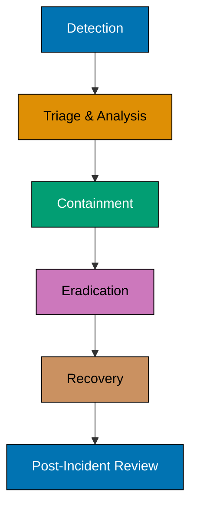
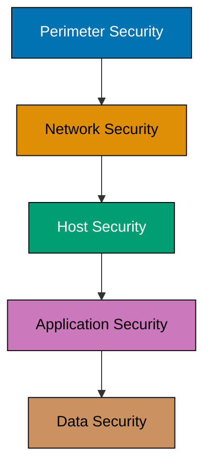
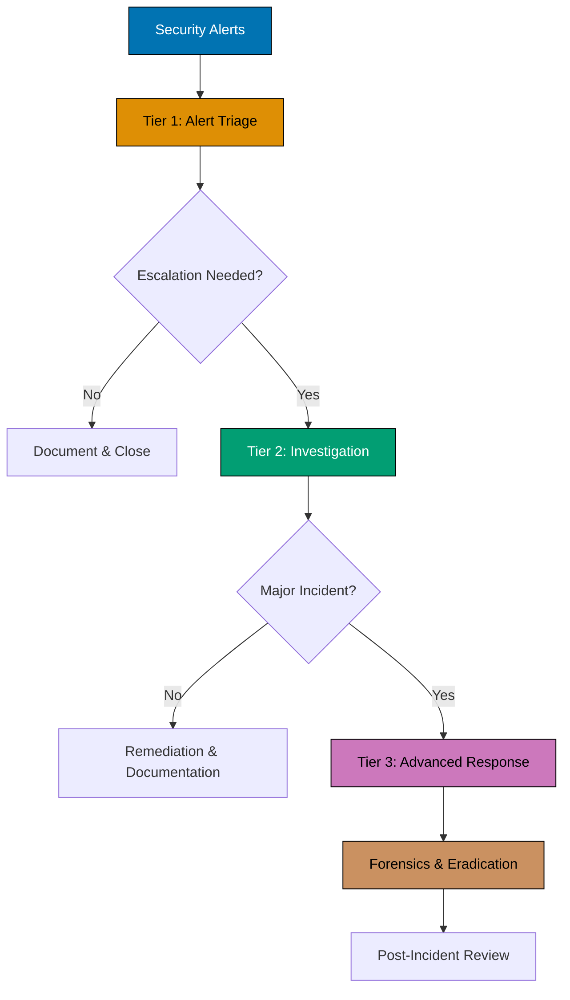

Defensive security is the practice of protecting computer systems, networks, and data from cyber attacks through proactive measures, continuous monitoring, and rapid incident response. Unlike offensive security, which simulates attacks to find vulnerabilities, defensive security focuses on building robust protections and detecting threats as they occur.

## Core Concept

Think of defensive security as the comprehensive home security system that includes locks, alarms, cameras, and guards. While offensive security tests whether your defenses can be breached, defensive security ensures those protections work reliably every day.

The fundamental principle is simple: **security is an ongoing process, not a one-time solution**. Defensive security teams continuously monitor, detect, respond to, and recover from security incidents while maintaining and improving protective measures.

## Key Methodologies

Defensive security encompasses several complementary approaches that work together to create comprehensive protection:

### Defense-in-Depth

Defense-in-depth is a layered security strategy that implements multiple protective controls throughout the system. If one layer fails, others continue providing protection.

### Security Monitoring and Analysis

Blue teams continuously monitor systems for suspicious activity using Security Information and Event Management (SIEM) systems, log analysis tools, and network traffic analyzers. This visibility enables early threat detection before attacks cause significant damage.

### Incident Response

When security incidents occur, defensive teams follow structured response processes to contain, eradicate, and recover from attacks while preserving evidence for analysis and legal proceedings.

### Threat Intelligence

Defensive security leverages threat intelligence from multiple sources (commercial feeds, information sharing communities, internal analysis) to understand attacker tactics, techniques, and procedures. This knowledge drives proactive defense improvements.

## Defensive vs. Offensive Security

The relationship between defensive and offensive security is symbiotic, each enhancing the other:

| Aspect        | Defensive Security                      | Offensive Security                           |
| ------------- | --------------------------------------- | -------------------------------------------- |
| **Approach**  | Continuous protection and monitoring    | Time-boxed attack simulation                 |
| **Goal**      | Prevent, detect, and respond to threats | Identify vulnerabilities before attackers    |
| **Mindset**   | "How can I protect this?"               | "How can I break this?"                      |
| **Tools**     | SIEM, IDS/IPS, firewalls, antivirus     | Exploitation frameworks, scanners            |
| **Outcome**   | Hardened systems, incident reports      | Vulnerability assessments, proof-of-concepts |
| **Timeline**  | Continuous operations                   | Periodic engagements                         |
| **Team Type** | Blue team, SOC analysts                 | Red team, penetration testers                |


Effective security requires both approaches working together. Defensive security implements protections, while offensive security tests their effectiveness. Purple team operations combine both perspectives to create comprehensive security improvements.


## Role in Modern Cybersecurity

Defensive security plays several critical roles in organizational protection:

### Continuous Threat Monitoring

Organizations face constant attack attempts from automated bots, opportunistic attackers, and sophisticated threat actors. Defensive security provides 24/7 monitoring through Security Operations Centers (SOC) that detect and respond to threats in real-time.

### Compliance and Governance

Regulatory frameworks (GDPR, PCI DSS, HIPAA, SOC 2) mandate specific security controls. Defensive security implements and maintains these controls, providing audit trails and evidence of compliance.

### Business Continuity

When incidents occur, defensive security minimizes downtime and data loss through incident response, disaster recovery, and business continuity planning. This preserves business operations and customer trust.

### Security Architecture

Defensive teams design and implement security architectures that balance protection with business needs. This includes network segmentation, access controls, identity management, and secure development practices.

## Defense-in-Depth Framework

Effective defensive security implements multiple layers of protection, ensuring that if one layer fails, others continue providing security. This section integrates protective technologies, detection mechanisms, and security policies across five critical layers.

### Perimeter Defense

The first line of protection controls network boundaries and filters traffic entering and leaving the organization:

**Border Firewalls**: Next-generation firewalls (NGFW) with application awareness, user identity integration, and threat intelligence feeds. These examine packet headers, track connection states, and enforce security policies at the network edge.

**Email Security Gateways**: Block phishing attempts, malware-laden attachments, and spam before reaching user inboxes. Modern gateways use machine learning to detect sophisticated phishing campaigns and business email compromise attempts.

**Web Application Firewalls (WAF)**: Protect web applications from OWASP Top 10 attacks including SQL injection, cross-site scripting (XSS), and CSRF. WAF analyzes HTTP/HTTPS traffic content, providing virtual patching while permanent fixes are developed.

**DDoS Protection**: Mitigate distributed denial-of-service attacks through traffic scrubbing, rate limiting, and cloud-based absorption services that prevent volumetric attacks from overwhelming infrastructure.

**Intrusion Detection (Network-Based)**: Network IDS like Snort, Suricata, and Zeek analyze traffic patterns for malicious activity. Signature-based detection identifies known attacks while anomaly detection spots unusual behavior that may indicate new threats.

**Tools**: Palo Alto Networks PA-Series, Cisco Firepower, Fortinet FortiGate, Cloudflare WAF, Mimecast, Proofpoint

### Network Defense

Internal network protections limit lateral movement and contain breaches:

**Network Segmentation**: Isolate critical systems through VLANs, zero-trust architectures, and microsegmentation. Segmentation ensures attackers cannot easily move from compromised workstations to sensitive databases or payment systems.

**Network Access Control (NAC)**: Verify device compliance with security policies before granting network access. NAC ensures devices have current patches, antivirus, and proper configuration before connecting.

**Intrusion Prevention Systems (IPS)**: Actively block malicious traffic patterns automatically. Unlike IDS which only detects, IPS takes action to stop attacks in progress.

**Internal Firewalls**: Control traffic between network zones, implementing least-privilege principles. Critical systems should only accept connections from authorized sources.

**VPN and Remote Access**: Secure remote connectivity with multi-factor authentication. Modern zero-trust network access (ZTNA) solutions verify every connection regardless of network location.

**Security Policies**: Acceptable use policies define proper IT resource usage. Access control policies enforce least privilege and separation of duties. Regular policy reviews ensure guidelines remain current with evolving threats and business needs.

**Tools**: Cisco ISE, Aruba ClearPass, Check Point NGFW, pfSense, OpenVPN

### Host Defense

Protecting individual systems (servers, workstations, mobile devices) from compromise:

**Operating System Hardening**: Disable unnecessary services, remove default accounts, enforce strong configurations. Security benchmarks from CIS and DISA provide hardening guidelines for various platforms.

**Endpoint Protection**: Anti-malware solutions with both signature-based and behavioral detection. Modern endpoint protection platforms combine antivirus, firewall, and application control.

**Endpoint Detection and Response (EDR)**: Advanced threat hunting and investigation tools like CrowdStrike Falcon, Carbon Black, and Microsoft Defender for Endpoint. EDR provides visibility into endpoint activities, enabling rapid threat detection and response.

**Patch Management**: Automated systems for applying security updates across the environment. Prioritize critical patches and test before deployment to balance security and stability.

**Host-Based Firewalls**: Control network connections per device. Application whitelisting restricts execution to approved applications only, preventing unauthorized software from running.

**Intrusion Detection (Host-Based)**: HIDS tools like OSSEC and Wazuh monitor system logs, file integrity, and process execution. These detect suspicious activities that network-based detection might miss.

**Employee Training**: Regular security awareness programs covering phishing recognition, password security, and data handling. Simulated phishing campaigns provide practical experience identifying social engineering attempts. Role-based training ensures developers learn secure coding while executives understand business email compromise risks.

**Tools**: CrowdStrike Falcon, Carbon Black, Microsoft Defender, Tanium, BigFix, OSSEC, Wazuh

### Application Defense

Securing applications against exploitation through development practices and runtime protection:

**Secure Development Practices**: Security testing, code review, and threat modeling integrated into development lifecycle. Shift-left security ensures vulnerabilities are caught early when they're cheaper to fix.

**Input Validation**: Preventing injection attacks (SQL injection, command injection, XSS) through proper input sanitization and parameterized queries.

**Authentication and Authorization**: Implementing multi-factor authentication (MFA), single sign-on (SSO), and role-based access control (RBAC). Privileged access management (PAM) secures and monitors administrative accounts.

**Application Security Testing**: Static analysis (SAST) examines source code for vulnerabilities. Dynamic analysis (DAST) tests running applications. Software composition analysis identifies vulnerable dependencies.

**Identity and Access Management**: Directory services (Active Directory, LDAP), identity governance, and least privilege principles ensure users access only resources needed for their roles.

**Tools**: Okta, Azure AD, Auth0, Veracode, Checkmarx, OWASP ZAP, Burp Suite

### Data Defense

Protecting sensitive information at rest, in transit, and in use:

**Data Classification**: Identify and label sensitive data (public, internal, confidential, restricted). Classification drives appropriate protection levels for different information types.

**Encryption**: Protect data at rest with full-disk encryption and database encryption. Secure data in transit with TLS/SSL. Modern solutions also protect data in use through confidential computing.

**Data Loss Prevention (DLP)**: Prevent unauthorized data exfiltration through monitoring and blocking sensitive data transfers. DLP identifies credit card numbers, personal information, and intellectual property attempting to leave the organization.

**Backup and Recovery**: Regular automated backups with offsite/offline storage. Test recovery procedures to ensure data can be restored after incidents. Immutable backups protect against ransomware encryption.

**Vulnerability Management**: Regular scanning with Nessus, Qualys, or OpenVAS identifies security weaknesses. Prioritize vulnerabilities based on exploitability, business impact, and threat intelligence. Track remediation to ensure issues are addressed.

**Tools**: Symantec DLP, Microsoft Information Protection, Veeam, Commvault, Tenable Nessus, Qualys VMDR


Security tools are only effective when properly configured, monitored, and maintained. Many security breaches occur not because organizations lacked tools, but because existing tools were misconfigured or alerts went unnoticed.


## Security Operations

Modern defensive security relies on coordinated security operations that detect threats, investigate incidents, and continuously improve defenses. This section consolidates SOC structure, key defensive roles, SIEM capabilities, and incident response into an integrated operational model.

### SOC Structure and Three-Tier Model

A Security Operations Centre (SOC) provides centralized 24/7 monitoring, detection, and response. Modern SOCs organize analysts into three tiers based on expertise:

**Tier 1 - Alert Triage**: Monitor SIEM dashboards, perform initial classification, handle routine incidents, escalate complex cases, maintain documentation.

**Tier 2 - Deep Investigation**: Conduct in-depth analysis, perform advanced log correlation, investigate breaches, develop detection rules, mentor Tier 1 analysts.

**Tier 3 - Expert Response**: Lead major incident response, perform digital forensics and malware analysis, conduct proactive threat hunting, develop custom security tools.

### Key Defensive Roles

Five specialized roles work together across SOC tiers and security operations:

**SOC Analysts**: Frontline defenders monitoring alerts and events around the clock. They analyze logs, triage security alerts, correlate events to identify attack patterns, and escalate confirmed incidents. Work with SIEM platforms (Splunk, ELK Stack, QRadar), intrusion detection systems, and network monitoring tools.

**Incident Responders**: Lead coordinated response to confirmed security incidents. Make rapid containment decisions, coordinate across teams (IT, legal, communications), preserve digital evidence for forensics, conduct post-incident reviews, and maintain incident response playbooks.

**Security Engineers (Threat Intelligence)**: Transform raw threat data into actionable intelligence. Collect intelligence from feeds and sharing communities, analyze threat actor TTPs using MITRE ATT&CK, translate intelligence into detection rules, provide context to SOC analysts, and track threat campaigns.

**Vulnerability Analysts**: Systematically identify and drive remediation of security weaknesses. Conduct regular vulnerability scans, validate findings to eliminate false positives, prioritize based on risk and business impact, track remediation efforts, and generate vulnerability metrics.

**Digital Forensics Analysts**: Conduct detailed technical investigations of incidents. Perform forensic analysis of compromised systems, reconstruct attack timelines, extract and analyze digital evidence maintaining chain of custody, identify indicators of compromise, and analyze malware samples.

### SIEM Capabilities

SIEM platforms serve as the foundation of SOC operations, providing centralized visibility and analysis:

**Log Aggregation**: Collects logs from firewalls, servers, endpoints, applications, cloud services, and network devices. Normalizes different vendor formats into unified schema with tamper-evident storage.

**Correlation and Analytics**: Applies correlation rules to identify attack patterns across multiple events. Detects multi-stage attacks by connecting related activities over time. Uses machine learning for anomaly detection and enriches events with threat intelligence.

**Alerting and Notifications**: Generates alerts when correlation rules match suspicious patterns. Prioritizes alerts by severity and business impact. Routes notifications to appropriate teams while reducing false positives through tuning.

**Dashboards and Visualization**: Provides real-time security monitoring dashboards, visualizes attack patterns and trends, displays compliance status, and enables custom views for different stakeholders.

SOC analysts interact with SIEM platforms throughout their shifts for alert monitoring, investigation queries, event correlation, detection tuning, compliance reporting, and threat hunting.

**Popular SIEM platforms**: Splunk, IBM QRadar, Microsoft Sentinel, ELK Stack, Sumo Logic, LogRhythm


SIEM effectiveness depends heavily on proper configuration, tuning, and analyst expertise. The platform itself is only a tool - skilled analysts transform SIEM data into actionable security intelligence.


### Daily SOC Activities

SOC teams perform diverse activities throughout each shift:

- **Alert monitoring and triage**: Continuous SIEM monitoring, reviewing IDS/IPS alerts, analyzing EDR notifications, assessing email security alerts, prioritizing based on severity and threat context
- **Incident investigation**: Gathering and correlating logs from multiple sources, analyzing network traffic, reviewing UEBA for anomalies, investigating authentication failures and privilege escalation
- **Threat hunting**: Proactively searching for indicators of compromise, hypothesis-driven investigations based on threat intelligence, baseline analysis for behavioral deviations, query crafting to uncover hidden threats
- **Log analysis**: Reviewing system and application logs, identifying attack campaign patterns, validating log collection, troubleshooting parsing issues, maintaining retention policies
- **Report generation**: Creating security metrics reports (daily, weekly, monthly), documenting incident timelines, producing threat intelligence summaries, generating compliance reports
- **Team coordination**: Working with IT operations on remediation, collaborating with network teams on blocking rules, partnering with application teams on investigations, engaging legal and HR as needed

### Incident Response Process

Structured methodology ensures consistent, effective incident handling:

1. **Preparation**: Establish capabilities, tools, and procedures before incidents occur
2. **Detection and Analysis**: Identify potential incidents and determine scope
3. **Containment**: Limit incident spread while preserving evidence
4. **Eradication**: Remove attacker presence and close attack vectors
5. **Recovery**: Restore systems to normal operation safely
6. **Post-Incident Activity**: Document lessons learned and improve defenses


Regular incident response exercises (tabletop exercises, simulations) ensure teams can respond effectively when real incidents occur. Practice reveals gaps in procedures, tools, and communication before they become critical failures.


### SOC Metrics

SOCs measure effectiveness through five critical metrics:

- **Mean Time to Detect (MTTD)**: Average time from compromise to detection
- **Mean Time to Respond (MTTR)**: Average time from detection to containment
- **False Positive Rate**: Percentage of alerts that are not true security incidents
- **Detection Coverage**: Percentage of MITRE ATT&CK techniques covered by monitoring
- **Incident Severity Distribution**: Breakdown of incidents by criticality

## Collaboration with Offensive Security

Defensive and offensive security teams work best when collaborating rather than operating in isolation.

### Purple Team Operations

Purple teaming combines red (offensive) and blue (defensive) teams to improve security:

- **Controlled attacks**: Red team executes specific techniques while blue team detects
- **Detection tuning**: Adjusting monitoring rules based on red team feedback
- **Capability gaps**: Identifying blind spots in detection and response
- **Process improvement**: Refining incident response based on realistic scenarios

### Vulnerability Remediation

Offensive security findings drive defensive improvements:

- **Prioritization**: Focusing remediation on highest-impact vulnerabilities
- **Compensating controls**: Implementing temporary protections while permanent fixes deploy
- **Verification**: Confirming vulnerabilities are truly fixed through retesting
- **Root cause analysis**: Understanding why vulnerabilities existed to prevent recurrence

## Learning Path

Building defensive security expertise requires broad technical knowledge:

1. **Networking fundamentals**: TCP/IP, routing, switching, network protocols
2. **Operating systems**: Windows and Linux system administration and security
3. **Security concepts**: CIA triad, authentication, authorization, cryptography
4. **Log analysis**: Understanding system logs, event correlation, investigation techniques
5. **Scripting and automation**: Python, PowerShell, Bash for security automation
6. **Incident response**: Threat hunting, forensics, malware analysis
7. **Security tools**: Hands-on experience with SIEM, EDR, firewalls, and monitoring platforms

## Summary

Defensive security provides the foundation of organizational cybersecurity through continuous protection, monitoring, and incident response. By implementing layered defenses, maintaining vigilant monitoring, and responding rapidly to incidents, defensive teams protect business operations and sensitive data from evolving threats.

The field combines technical expertise with operational excellence and strategic thinking. As cyber threats grow more sophisticated, defensive security remains essential for maintaining security posture and organizational resilience.

Whether through SOC operations, incident response, or security architecture, defensive security professionals serve as the persistent guardians of organizational security, protecting systems day and night from constant threats.
