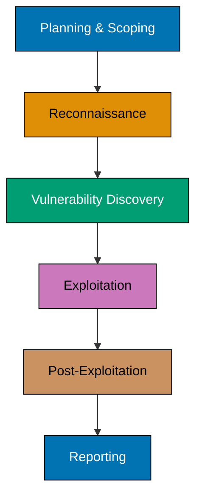

Offensive security is the proactive practice of testing and attacking computer systems, networks, and applications to identify vulnerabilities before malicious actors exploit them. Unlike defensive security, which focuses on building protective barriers, offensive security simulates real-world attacks to find and fix weaknesses.

## Core Concept

Think of offensive security as hiring professional burglars to test your home security. Imagine discovering that your expensive alarm system has a blind spot that any experienced thief could exploit in seconds. These ethical hackers use the same tools and techniques as cybercriminals, but their goal is to strengthen defenses rather than cause harm. They pick locks, bypass sensors, and test every entry point - documenting each weakness before a real criminal discovers it.

The fundamental principle is simple: **the best defense is knowing how attackers think and operate**. By adopting an attacker's mindset, security professionals can identify blind spots that traditional defensive measures might miss.

## Ethical Foundations

Before discussing techniques and tools, understanding the ethical framework is essential. Offensive security operates within strict ethical boundaries that separate legitimate security professionals from criminals.


Offensive security operates within strict ethical boundaries. The same skills that protect organizations can cause massive harm if misused. Professional offensive security practitioners must operate within legal and ethical frameworks at all times.


### Legal Authorization

Every offensive security engagement requires explicit, documented authorization from system owners. This includes:

- **Written permission**: Legal contracts or letters of authorization before any testing begins
- **Clear scope definitions**: Exactly which systems, networks, and applications are in scope
- **Approved testing methods**: Agreement on which techniques are permitted (some attacks may disrupt services)
- **Designated testing timeframes**: Specific dates and times when testing may occur
- **Emergency contacts**: Procedures for stopping tests if unexpected issues arise

Unauthorized access to computer systems is illegal in most jurisdictions, regardless of intent. Professional offensive security practitioners obtain comprehensive documentation before beginning any assessment.

### Responsible Disclosure

When researchers discover vulnerabilities, they follow responsible disclosure practices:

- **Private notification**: Contacting vendors or system owners privately before public disclosure
- **Reasonable remediation time**: Allowing adequate time (typically 90 days) for developing and deploying patches
- **Coordinated disclosure**: Working with vendors to plan public disclosure timing
- **Minimizing harm**: Sharing enough detail to enable fixes without providing exploitation blueprints
- **Credit and recognition**: Acknowledging researchers who report vulnerabilities responsibly

### Professional Standards

Professional certifications and organizations establish codes of conduct for offensive security practitioners:

- **EC-Council (Certified Ethical Hacker)**: Requires adherence to ethical hacking principles
- **Offensive Security (OSCP, OSCE)**: Emphasizes professional responsibility and ethics
- **SANS/GIAC**: Provides security certifications with professional standards
- **Bug bounty platforms**: HackerOne, Bugcrowd enforce responsible disclosure policies


**Note**: As of November 2024, Offensive Security introduced OSCP+ which requires renewal every 3 years, ensuring practitioners maintain current knowledge and ethical standards.


## Key Methodologies

Offensive security encompasses several specialized approaches, each serving distinct purposes in security assessment.

### Penetration Testing

Penetration testing (pen testing) is a structured, time-boxed assessment where security professionals attempt to breach specific systems or networks. Teams follow a defined scope and rules of engagement, documenting vulnerabilities and providing remediation guidance.

For example, a financial institution might hire penetration testers to assess whether their online banking application properly validates user input, preventing SQL injection attacks that could expose customer data.

### Red Team Operations

Red teaming takes offensive security further by simulating sophisticated, persistent attacks over extended periods. Red teams operate covertly, testing not just technical controls but also human responses, incident detection capabilities, and organizational security processes.

Unlike penetration testing, red team operations are adversarial simulations where the defending team (blue team) doesn't always know when or how attacks will occur. A red team might spend weeks gathering intelligence, crafting convincing phishing emails, and establishing persistence before the blue team even detects the intrusion - mirroring real-world advanced persistent threats.

### Vulnerability Research

Security researchers analyze software, hardware, and protocols to discover previously unknown vulnerabilities (zero-days). This research drives security improvements across the entire technology ecosystem, from operating systems to web applications.

Researchers might examine how a popular web browser handles malformed PDF files, discovering a memory corruption vulnerability that attackers could exploit to execute malicious code. Their responsible disclosure allows the browser vendor to fix the issue before widespread exploitation.

### Social Engineering

Offensive security isn't limited to technical attacks. Social engineering tests human vulnerabilities through techniques like phishing campaigns, pretexting, and physical security breaches. These assessments reveal how people respond to manipulation and deception.

A social engineering test might involve calling help desk staff while impersonating an executive, testing whether procedures prevent unauthorized password resets. Or sending fake vendor invoices to accounting, assessing payment approval processes.

## Offensive vs. Defensive Security

The relationship between offensive and defensive security is complementary, not adversarial:

| Aspect       | Offensive Security                       | Defensive Security                      |
| ------------ | ---------------------------------------- | --------------------------------------- |
| **Approach** | Proactive attack simulation              | Reactive protection and monitoring      |
| **Goal**     | Find vulnerabilities before attackers do | Prevent, detect, and respond to attacks |
| **Mindset**  | "How can I break this?"                  | "How can I protect this?"               |
| **Tools**    | Exploitation frameworks, scanners        | Firewalls, IDS/IPS, antivirus           |
| **Outcome**  | Vulnerability reports, proof-of-concepts | Hardened systems, incident response     |
| **Timeline** | Time-boxed engagements                   | Continuous operations                   |


The most effective security programs combine both approaches. Offensive security identifies weaknesses, while defensive security implements and maintains protections. This creates a feedback loop of continuous improvement.


## Role in Modern Cybersecurity

Offensive security plays several critical roles in comprehensive security programs:

### Validation of Security Controls

Theoretical security measures look good on paper, but offensive security proves whether they work in practice. Testing validates that firewalls, intrusion detection systems, and security policies actually prevent real attacks.

An organization might implement network segmentation to isolate sensitive payment systems, but penetration testing reveals that a misconfigured router allows lateral movement between segments - turning theoretical protection into a discovered and fixable weakness.

### Compliance and Risk Management

Many regulatory frameworks (PCI DSS, HIPAA, SOC 2) require regular security assessments. Offensive security provides evidence of due diligence and helps organizations quantify security risks for business decision-making.

### Security Awareness

When employees experience simulated phishing attacks or social engineering attempts, security becomes tangible rather than abstract. Offensive exercises create memorable learning experiences that improve security culture.

### Continuous Improvement

Technology and threats evolve constantly. Regular offensive security engagements ensure defenses keep pace with emerging attack techniques and newly discovered vulnerabilities.

## Common Practices and Tools

Offensive security professionals use a diverse toolkit spanning multiple attack phases:

### Reconnaissance and Information Gathering

Before attacking, professionals gather intelligence about targets:

- **OSINT tools**: Maltego, theHarvester, Shodan for passive information collection
- **Network scanning**: Nmap for port scanning and service enumeration
- **Web reconnaissance**: Gobuster, Dirb for directory and file discovery

**Real-world example**: Before targeting a company's infrastructure, attackers use LinkedIn to identify employees, GitHub to find leaked credentials in old code repositories, and Shodan to locate internet-facing systems with known vulnerabilities.

### Vulnerability Scanning and Analysis

Automated tools identify known weaknesses:

- **Network scanners**: Nessus, OpenVAS for infrastructure vulnerabilities
- **Web scanners**: Burp Suite, OWASP ZAP for application security testing
- **Code analysis**: Static and dynamic analysis tools for software vulnerabilities

### Exploitation Frameworks

Professionals use sophisticated frameworks to exploit discovered vulnerabilities:

- **Metasploit**: Comprehensive exploitation framework with thousands of exploits
- **Cobalt Strike**: Commercial tool for red team operations and adversary simulation
- **Empire/PowerShell Empire**: Post-exploitation frameworks for multi-platform environments (Windows, Linux, macOS)

### Post-Exploitation and Lateral Movement

After initial compromise, attackers expand their access:

- **Privilege escalation**: Exploiting misconfigurations to gain administrative access
- **Credential harvesting**: Tools like Mimikatz extract passwords from memory
- **Persistence mechanisms**: Ensuring continued access even after system reboots

**Real-world scenario**: After compromising a single workstation through a phishing email, attackers use Mimikatz to extract the user's credentials, discover they have access to a file server, find an unpatched vulnerability on that server, gain administrative access, and establish persistent backdoor access - all before defensive teams detect the intrusion.

### Reporting and Documentation

The final phase transforms technical findings into actionable business intelligence:

- **Vulnerability prioritization**: Ranking issues by severity and business impact
- **Proof-of-concept demonstrations**: Showing stakeholders how attacks work
- **Remediation guidance**: Providing specific, practical fix recommendations

## Purple Team Collaboration

The convergence of offensive and defensive security creates powerful opportunities for organizational improvement through purple team operations.

### Understanding Purple Teams

Purple teams represent the synthesis of red team (offensive) and blue team (defensive) capabilities. Rather than operating in isolation or pure adversarial mode, purple teaming brings both perspectives together in collaborative exercises that strengthen overall security posture.

The "purple" designation symbolizes the blending of red (offensive) and blue (defensive) into a unified approach focused on improving detection and response capabilities.

### How Purple Team Exercises Work

Purple team exercises follow a collaborative methodology:

1. **Planning**: Red and blue teams jointly select attack techniques to test (often based on MITRE ATT&CK framework)
2. **Execution**: Red team performs specific attacks while blue team actively monitors and attempts detection
3. **Observation**: Both teams observe what works and what fails in real-time
4. **Discussion**: Immediate feedback sessions discuss why detections succeeded or failed
5. **Improvement**: Blue team tunes detection rules, updates playbooks, and adjusts monitoring
6. **Validation**: Red team retests to confirm improvements work as intended

### Benefits of Purple Team Collaboration

Purple teaming delivers unique advantages that neither pure red nor pure blue operations can achieve alone:

**Immediate feedback loops**: Blue teams learn instantly whether their detections work, rather than waiting for post-engagement reports. Red teams understand defensive capabilities, making their assessments more realistic.

**Detection tuning**: Security tools generate numerous alerts, many irrelevant. Purple teaming helps tune SIEM rules, IDS signatures, and EDR policies to catch real threats while reducing false positives.

**Gap identification**: Exercises reveal blind spots in monitoring coverage. Perhaps no detection rule exists for a particular PowerShell attack technique, or log sources don't capture critical evidence.

**Playbook development**: Blue teams develop and test incident response playbooks against real attack techniques, discovering which procedures work and which need refinement.

**Skill development**: Both teams improve their capabilities through direct collaboration. Red teamers learn defensive perspectives; blue teamers understand attacker tradecraft.

### Real-World Purple Team Success

Consider a purple team exercise testing credential theft attacks:

The red team uses Mimikatz to extract credentials from memory on a compromised workstation. Initially, the blue team's endpoint detection fails to alert. Through purple team collaboration, they discover their EDR tool can detect Mimikatz but the rule was disabled due to false positives. Working together, they develop a refined detection that triggers on specific Mimikatz behaviors rather than just the tool's presence. Red team validates the new rule catches the attack while generating minimal false alerts.

This collaborative approach transforms a defensive failure into a measurable security improvement - the hallmark of effective purple teaming.

## Learning Path

Building offensive security expertise requires diverse knowledge:

1. **Networking fundamentals**: Understanding TCP/IP, routing, and network protocols
2. **Operating systems**: Deep knowledge of Windows, Linux, and their security models
3. **Programming and scripting**: Python, PowerShell, Bash for automation and custom tools
4. **Web technologies**: HTTP, HTML, JavaScript, and common web vulnerabilities
5. **Security concepts**: Cryptography, authentication, access control principles
6. **Attack techniques**: Hands-on practice in controlled environments like HackTheBox or TryHackMe

## Summary

Offensive security provides the attacker's perspective needed to build robust defenses. By proactively identifying and exploiting vulnerabilities, security professionals help organizations strengthen their security posture before real attacks occur.

The field combines technical expertise, creative problem-solving, and ethical responsibility. As cyber threats grow more sophisticated, offensive security remains essential for understanding and mitigating modern security risks.

Whether through penetration testing, red team operations, purple team collaboration, or vulnerability research, offensive security professionals serve as the first line of defense by thinking like attackers but acting as protectors.
