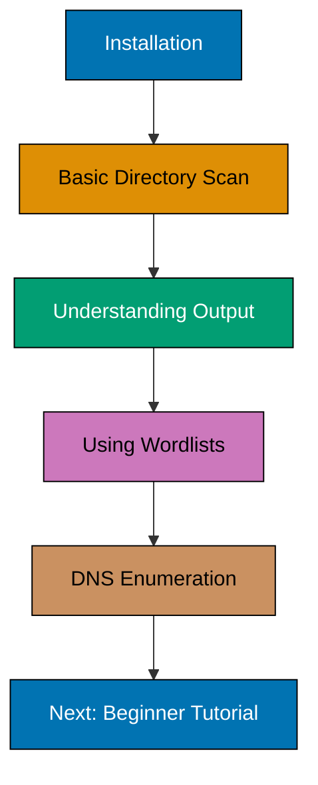
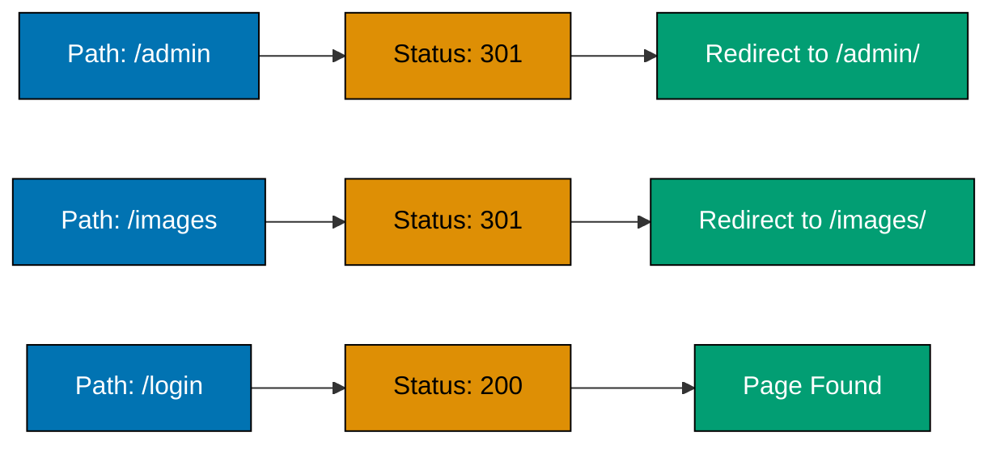

## What You'll Learn

By the end of this tutorial, you'll be able to:

- Install Gobuster on Linux and macOS
- Perform basic directory and file brute-forcing
- Use essential Gobuster flags for web enumeration
- Run simple DNS subdomain discovery
- Interpret basic scan results

## Prerequisites

Before starting, ensure you have:

- A Linux or macOS system (Windows users can use WSL2)
- Basic command-line knowledge
- Go 1.19+ installed (for compilation method)
- Permission to scan target systems (own test environment or authorized targets only)


**Legal and Ethical Notice**: Only use Gobuster on systems you own or have explicit written permission to test. Unauthorized scanning is illegal and unethical. Always conduct security testing responsibly and within legal boundaries.


## What is Gobuster?

Gobuster is a high-performance brute-forcing tool written in Go. It helps security professionals discover hidden directories, files, DNS subdomains, and virtual hosts by testing against wordlists.

### Why Use Gobuster?

- **Fast Performance** - Written in Go with concurrent processing for rapid enumeration
- **Multiple Modes** - Supports directory/file brute-forcing, DNS enumeration, and virtual host discovery
- **Simple Interface** - Clean command-line interface with straightforward options

## Learning Path



## Installing Gobuster

{}

### Step 1: Choose Installation Method

**Option A: Install via Package Manager (Recommended)**

On Kali Linux or Debian-based systems:

```bash
sudo apt update
sudo apt install gobuster
```

On macOS with Homebrew:

```bash
brew install gobuster
```

**Option B: Install from Source**

If you have Go installed:

```bash
go install github.com/OJ/gobuster/v3@latest
```

The binary will be installed to `$GOPATH/bin/gobuster` (usually `~/go/bin/gobuster`).

### Step 2: Verify Installation

Check that Gobuster is properly installed:

```bash
gobuster version
```

**Expected Output**:

```
Gobuster v3.6.0
              by OJ Reeves (@TheColonial) & Christian Mehlmauer (@firefart)
```

### Step 3: Download a Basic Wordlist

Gobuster requires wordlists to function. Download a common wordlist:

```bash
mkdir -p ~/wordlists

curl -o ~/wordlists/common.txt \
  https://raw.githubusercontent.com/danielmiessler/SecLists/master/Discovery/Web-Content/common.txt
```

Alternatively, if you have SecLists installed:

```bash

```

{}

## Your First Directory Scan

Let's perform a basic directory brute-force scan against a test target.


For this example, we'll use `http://testphp.vulnweb.com` - a public vulnerable web application designed for security testing practice.


### Basic Directory Enumeration

Run Gobuster in directory mode:

```bash
gobuster dir -u http://testphp.vulnweb.com -w ~/wordlists/common.txt
```

**Command Breakdown**:

- `gobuster dir` - Use directory/file brute-forcing mode
- `-u http://testphp.vulnweb.com` - Target URL
- `-w ~/wordlists/common.txt` - Wordlist file path

**Sample Output**:

```
===============================================================
Gobuster v3.6.0
by OJ Reeves (@TheColonial) & Christian Mehlmauer (@firefart)
===============================================================
[+] Url:                     http://testphp.vulnweb.com
[+] Method:                  GET
[+] Threads:                 10
[+] Wordlist:                /home/user/wordlists/common.txt
[+] Negative Status codes:   404
[+] User Agent:              gobuster/3.6.0
[+] Timeout:                 10s
===============================================================
Starting gobuster in directory enumeration mode
===============================================================
/admin                (Status: 301) [Size: 185] [--> http://testphp.vulnweb.com/admin/]
/images               (Status: 301) [Size: 186] [--> http://testphp.vulnweb.com/images/]
/index                (Status: 200) [Size: 4958]
/login                (Status: 200) [Size: 3267]
===============================================================
Finished
===============================================================
```

### Understanding the Output



**Key Status Codes**:

- **200 OK** - Resource exists and is accessible
- **301 Moved Permanently** - Redirect (directory/file exists)
- **302 Found** - Temporary redirect
- **403 Forbidden** - Resource exists but access is denied
- **401 Unauthorized** - Authentication required

## Essential Gobuster Flags

Customize your scans with these common flags:

### Thread Control

Speed up scans by increasing concurrent threads:

```bash
gobuster dir -u http://testphp.vulnweb.com -w ~/wordlists/common.txt -t 50
```

- `-t 50` - Use 50 concurrent threads (default: 10)
- Higher threads = faster scans, but may trigger rate limiting

### File Extensions

Search for specific file types:

```bash
gobuster dir -u http://testphp.vulnweb.com -w ~/wordlists/common.txt -x php,html,txt
```

- `-x php,html,txt` - Append these extensions to each wordlist entry
- Example: "admin" becomes "admin.php", "admin.html", "admin.txt"

### Status Code Filtering

Show only specific status codes:

```bash
gobuster dir -u http://testphp.vulnweb.com -w ~/wordlists/common.txt -s 200,301,302
```

- `-s 200,301,302` - Only display results with these status codes
- Useful for filtering out noise from 403/401 responses

## DNS Subdomain Enumeration

Gobuster can also discover DNS subdomains.

### Basic DNS Enumeration

```bash
gobuster dns -d example.com -w ~/wordlists/common.txt
```

**Command Breakdown**:

- `gobuster dns` - Use DNS enumeration mode
- `-d example.com` - Target domain
- `-w ~/wordlists/common.txt` - Wordlist with potential subdomain names

**Sample Output**:

```
===============================================================
Gobuster v3.6.0
by OJ Reeves (@TheColonial) & Christian Mehlmauer (@firefart)
===============================================================
[+] Domain:     example.com
[+] Threads:    10
[+] Wordlist:   /home/user/wordlists/common.txt
===============================================================
Starting gobuster in DNS enumeration mode
===============================================================
Found: www.example.com
Found: mail.example.com
Found: ftp.example.com
Found: admin.example.com
===============================================================
Finished
===============================================================
```

### Recommended DNS Wordlist

For DNS enumeration, use subdomain-specific wordlists:

```bash
curl -o ~/wordlists/subdomains.txt \
  https://raw.githubusercontent.com/danielmiessler/SecLists/master/Discovery/DNS/subdomains-top1million-5000.txt

gobuster dns -d example.com -w ~/wordlists/subdomains.txt
```

## Practical Example: Web Application Enumeration

Let's combine what we've learned to enumerate a web application thoroughly.

```bash
gobuster dir -u http://testphp.vulnweb.com \
  -w ~/wordlists/common.txt \
  -x php,html,txt,zip \
  -t 30 \
  -s 200,301,302

gobuster dir -u http://testphp.vulnweb.com/admin \
  -w ~/wordlists/common.txt \
  -x php,html \
  -t 30
```

**Analysis Workflow**:

1. Run initial scan with extensions
2. Identify interesting directories (admin, login, config, etc.)
3. Enumerate subdirectories recursively
4. Document findings for further investigation

## Common Issues and Solutions

### Issue: "Error: the server returns a status code that matches the provided options"

**Cause**: The server returns wildcard responses (same status code for all requests).

**Solution**: Use `-b` flag to exclude specific status codes:

```bash
gobuster dir -u http://example.com -w ~/wordlists/common.txt -b 404
```

### Issue: Scan is too slow

**Solutions**:

1. Increase threads: `-t 50`
2. Use a smaller wordlist
3. Reduce timeout: `--timeout 5s`

### Issue: Getting rate-limited or blocked

**Solutions**:

1. Reduce threads: `-t 5`
2. Add delay between requests: `--delay 100ms`
3. Use custom User-Agent: `-a "Mozilla/5.0"`

## Next Steps

Now that you understand Gobuster basics, continue learning:

- [Gobuster Beginner Tutorial](/en/learn/information-security/tools/gobuster/beginner) - Learn all three modes (dir, dns, vhost), advanced options, output formats, and real-world scenarios
- Practice on legal testing platforms like DVWA, HackTheBox, or TryHackMe
- Explore other reconnaissance tools like Nmap, Nikto, and Wappalyzer

## Summary

In this tutorial, you learned:

- How to install Gobuster via package managers or from source
- Running basic directory brute-force scans with essential flags
- Understanding HTTP status codes in scan results
- Using `-t`, `-w`, and `-x` flags for customization
- Performing simple DNS subdomain enumeration
- Troubleshooting common scanning issues

Gobuster is a powerful tool for web application reconnaissance. Use it responsibly and always ensure you have proper authorization before scanning any systems.


**Security Reminder**: Gobuster generates significant traffic and logs. Always obtain written permission before scanning systems you don't own. Unauthorized scanning may violate laws like the Computer Fraud and Abuse Act (CFAA) in the United States or similar legislation in other countries.

