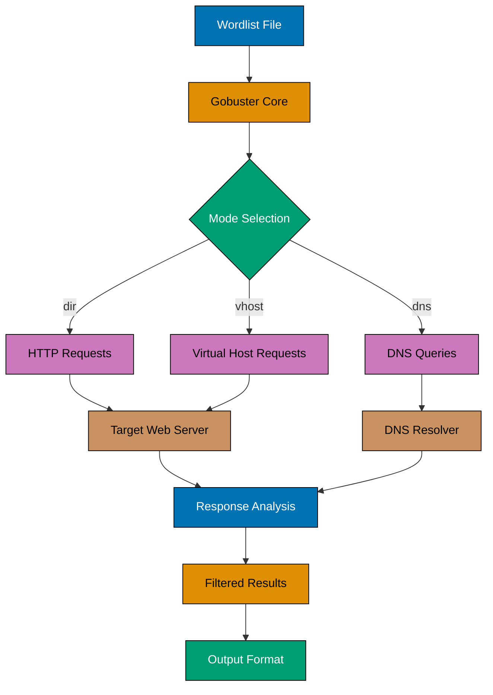
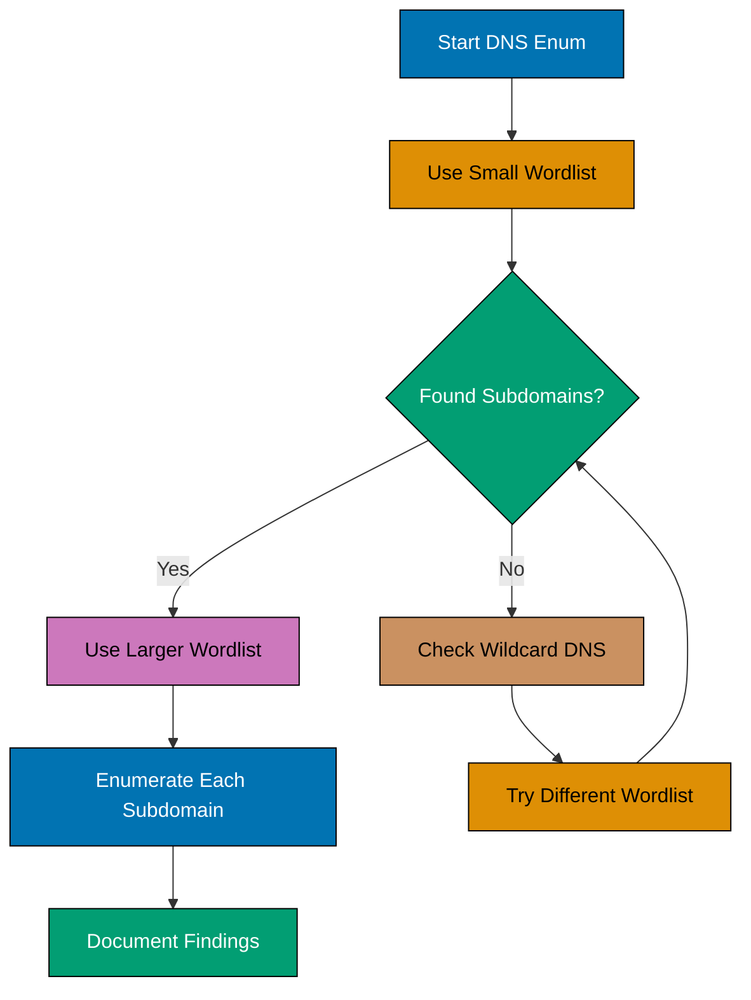
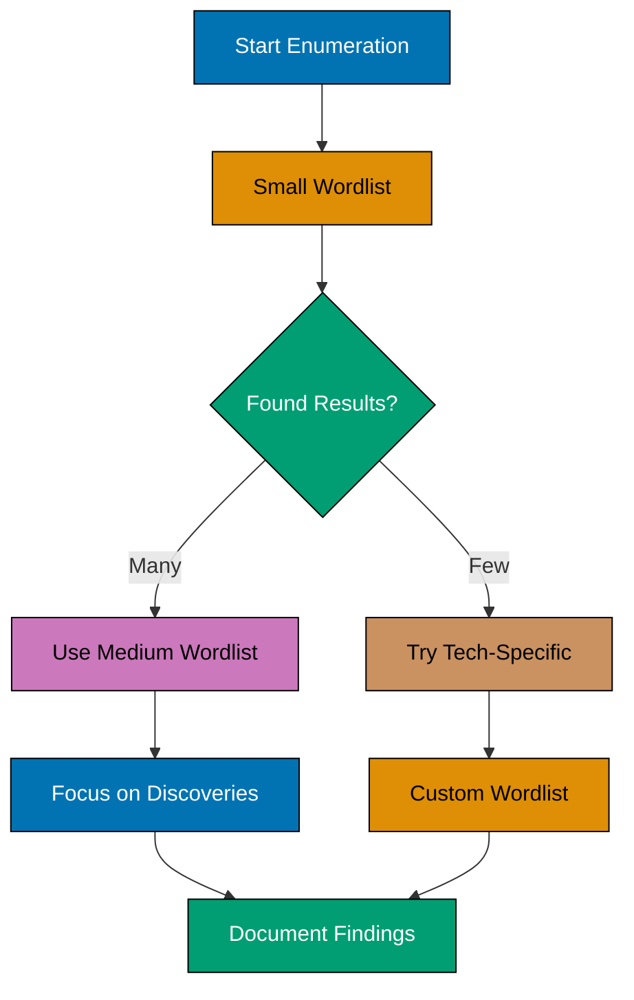
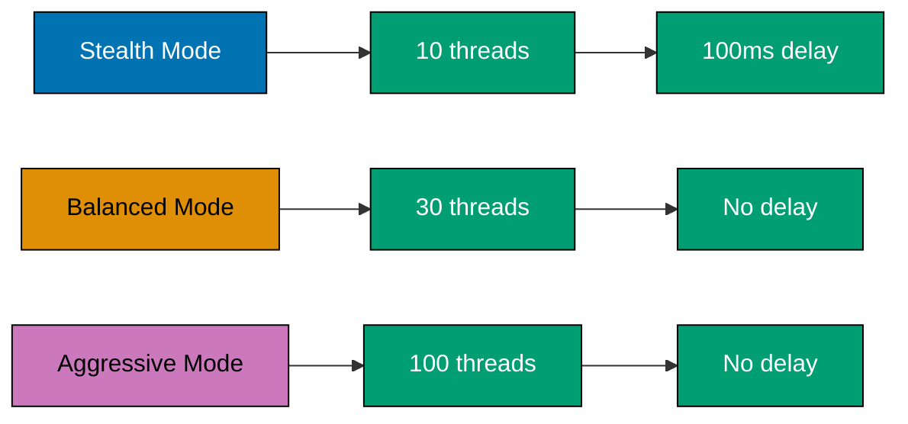

## What You'll Learn

By the end of this tutorial, you'll be able to:

- Master all three Gobuster modes: dir, dns, and vhost
- Use advanced flags and filtering options
- Work with multiple wordlist types and strategies
- Save and format output for reporting
- Interpret complex scan results and status codes
- Apply Gobuster in real-world penetration testing scenarios
- Troubleshoot common enumeration challenges

## Prerequisites

Before starting, ensure you have:

- Completed the [Gobuster Quick Start](/en/learn/infosec/tools/gobuster/quick-start) tutorial
- Gobuster 3.6+ installed and verified
- Multiple wordlists downloaded (directory, subdomain, virtual host)
- Basic understanding of HTTP, DNS, and web application architecture
- Authorization to test target systems (legal and ethical requirements)


**Legal and Ethical Notice**: This tutorial uses public vulnerable web applications for demonstration. Only use Gobuster on systems you own or have explicit written permission to test. Unauthorized scanning violates computer fraud laws and professional ethics. Always conduct security testing responsibly.


## Gobuster Architecture Overview

Understanding how Gobuster works helps you use it effectively.



**Key Components**:

1. **Wordlist** - Source of potential directory/subdomain names
2. **Mode** - Determines enumeration type (dir/dns/vhost)
3. **Concurrency** - Multiple threads for parallel testing
4. **Filtering** - Status code and response size filtering
5. **Output** - Results in various formats (stdout, JSON, CSV)

## Mode 1: Directory and File Brute-Forcing (dir)

The `dir` mode discovers hidden directories and files on web servers.

### Basic Directory Enumeration

```bash
gobuster dir -u http://testphp.vulnweb.com -w /usr/share/wordlists/dirb/common.txt
```

### Advanced Directory Scanning

#### Multiple File Extensions

Test for multiple file types simultaneously:

```bash
gobuster dir -u http://testphp.vulnweb.com \
  -w /usr/share/seclists/Discovery/Web-Content/raft-medium-directories.txt \
  -x php,html,txt,xml,js,zip,bak,old \
  -t 50 \
  -s 200,204,301,302,307,401,403
```

**Flag Breakdown**:

- `-x php,html,txt,xml,js,zip,bak,old` - Test eight extensions per word
- `-t 50` - Use 50 threads for faster scanning
- `-s 200,204,301,302,307,401,403` - Show only these status codes

#### Recursive Directory Scanning

Automatically scan discovered subdirectories:

```bash
gobuster dir -u http://testphp.vulnweb.com \
  -w /usr/share/seclists/Discovery/Web-Content/common.txt \
  -r \
  -x php,html
```

**Flag Breakdown**:

- `-r` - Enable recursive scanning (follows redirects to discovered directories)
- `-x php,html` - Check for PHP and HTML files


**Note**: Gobuster's `-r` flag follows redirects but does not support depth control. For recursive scanning with depth limits, consider alternative tools like Feroxbuster (with `-L` flag) or ffuf (with `-recursion-depth`).



Recursive scanning can generate significant traffic. Monitor your scan and use `--delay` to avoid overwhelming the target or triggering security controls.


#### Custom HTTP Headers

Add authentication or custom headers:

```bash
gobuster dir -u http://testphp.vulnweb.com \
  -w /usr/share/wordlists/dirb/common.txt \
  -H "Authorization: Bearer YOUR_TOKEN_HERE" \
  -H "X-Custom-Header: value" \
  -a "Mozilla/5.0 (Windows NT 10.0; Win64; x64) AppleWebKit/537.36"
```

**Flag Breakdown**:

- `-H "Authorization: Bearer TOKEN"` - Add authentication header
- `-H "X-Custom-Header: value"` - Add custom header
- `-a "User-Agent"` - Spoof User-Agent string

#### Following Redirects

Automatically follow HTTP redirects:

```bash
gobuster dir -u http://testphp.vulnweb.com \
  -w /usr/share/wordlists/dirb/common.txt \
  -f \
  -r
```

**Flag Breakdown**:

- `-f` - Append `/` to directory requests (forces directory listing)
- `-r` - Follow redirects

### Status Code Reference

Understanding HTTP status codes helps interpret results:

| Status Code                   | Meaning                        | Action                                        |
| ----------------------------- | ------------------------------ | --------------------------------------------- |
| **200 OK**                    | Resource exists and accessible | Investigate content                           |
| **204 No Content**            | Request successful, no body    | May indicate API endpoint                     |
| **301 Moved Permanently**     | Permanent redirect             | Follow redirect location                      |
| **302 Found**                 | Temporary redirect             | Follow redirect location                      |
| **307 Temporary Redirect**    | Method preserved redirect      | Follow redirect                               |
| **401 Unauthorized**          | Authentication required        | Interesting finding - needs credentials       |
| **403 Forbidden**             | Access denied                  | Exists but restricted - try bypass techniques |
| **404 Not Found**             | Resource doesn't exist         | Filtered out by default                       |
| **500 Internal Server Error** | Server error                   | May indicate vulnerable endpoint              |
| **503 Service Unavailable**   | Service temporarily down       | May need to slow down scan                    |

### Filtering Techniques

#### Exclude by Length

Filter out responses by body length:

```bash
gobuster dir -u http://testphp.vulnweb.com \
  -w /usr/share/wordlists/dirb/common.txt \
  --exclude-length 1234
```

- `--exclude-length 1234` - Ignore responses with 1234 bytes

Useful when the server returns custom 404 pages with consistent length.

#### Pattern File Usage

Use pattern files to apply transformations to wordlist entries:

```bash
# Create a pattern file (patterns.txt):
# /api/{GOBUSTER}
# /admin/{GOBUSTER}.php
# /{GOBUSTER}/config

# Use pattern file
gobuster dir -u http://testphp.vulnweb.com \
  -w /usr/share/wordlists/dirb/common.txt \
  -p patterns.txt
```

- `-p patterns.txt` - Apply patterns from file (replaces `{GOBUSTER}` with each wordlist entry)


**Note**: The `-p` flag is for pattern file transformations, not content filtering. For filtering response content, use `--exclude-length` to filter by body size or `-b` to exclude status codes.


## Mode 2: DNS Subdomain Enumeration (dns)

The `dns` mode discovers subdomains through DNS brute-forcing.

### Basic DNS Enumeration

```bash
gobuster dns -d example.com \
  -w /usr/share/seclists/Discovery/DNS/subdomains-top1million-5000.txt
```

### Advanced DNS Scanning

#### Custom DNS Resolver

Use specific DNS servers:

```bash
gobuster dns -d example.com \
  -w /usr/share/seclists/Discovery/DNS/subdomains-top1million-20000.txt \
  -r 8.8.8.8,8.8.4.4
```

**Flag Breakdown**:

- `-r 8.8.8.8,8.8.4.4` - Use Google's public DNS servers
- Useful when target's DNS servers are rate-limiting or filtering

#### Show CNAMEs and IPs

Display detailed DNS records:

```bash
gobuster dns -d example.com \
  -w /usr/share/seclists/Discovery/DNS/subdomains-top1million-5000.txt \
  -i \
  -c
```

**Flag Breakdown**:

- `-i` - Show IP addresses of discovered subdomains
- `-c` - Show CNAME records

**Sample Output**:

```
Found: www.example.com [192.0.2.1]
Found: mail.example.com [CNAME: mail-server.example.net]
Found: cdn.example.com [CNAME: cdn-provider.net] [203.0.113.10]
```

#### Wildcard Detection

Handle wildcard DNS configurations:

```bash
gobuster dns -d example.com \
  -w /usr/share/seclists/Discovery/DNS/subdomains-top1million-5000.txt \
  --wildcard
```

- `--wildcard` - Force wildcard detection and filtering


Some domains use wildcard DNS (\*.example.com resolves to the same IP). Gobuster detects this automatically, but `--wildcard` forces explicit handling if detection fails.


### DNS Enumeration Strategy



**Recommended Wordlists for DNS**:

1. **Quick scan**: `subdomains-top1million-5000.txt` (5,000 entries)
2. **Thorough scan**: `subdomains-top1million-20000.txt` (20,000 entries)
3. **Comprehensive scan**: `subdomains-top1million-110000.txt` (110,000 entries)

## Mode 3: Virtual Host Discovery (vhost)

The `vhost` mode discovers virtual hosts on a web server by testing different Host headers.

### What are Virtual Hosts?

Virtual hosts allow multiple websites to run on the same IP address. The server determines which site to serve based on the HTTP `Host` header.

**Example Scenario**:

- Server IP: 192.0.2.100
- Virtual hosts: example.com, dev.example.com, admin.example.com
- All use the same IP but serve different content

### Basic Virtual Host Enumeration

```bash
gobuster vhost -u http://example.com \
  -w /usr/share/seclists/Discovery/DNS/subdomains-top1million-5000.txt \
  --append-domain
```

**Flag Breakdown**:

- `gobuster vhost` - Use virtual host enumeration mode
- `-u http://example.com` - Target base URL
- `--append-domain` - Append base domain to wordlist entries

**How it works**:

1. Gobuster sends requests to `http://example.com`
2. Each request uses different `Host` header: `Host: admin.example.com`
3. Server responses differ based on virtual host configuration
4. Results filtered by response size/status code

### Advanced Virtual Host Scanning

#### Filtering by Response Size

Virtual host enumeration often produces false positives. Filter by response length:

```bash
gobuster vhost -u http://192.0.2.100 \
  -w /usr/share/seclists/Discovery/DNS/subdomains-top1million-5000.txt \
  --append-domain \
  --domain example.com \
  --exclude-length 12345
```

**Flag Breakdown**:

- `-u http://192.0.2.100` - Target IP directly
- `--domain example.com` - Base domain for Host header
- `--exclude-length 12345` - Filter out responses with 12345 bytes (default page size)

#### Domain Variations

Test different domain patterns:

```bash
# Test without appending domain
gobuster vhost -u http://192.0.2.100 \
  -w wordlist-custom.txt \
  --domain example.com

# wordlist-custom.txt contains:
# admin.example.com
# dev.example.com
# staging.example.com
```

### Virtual Host vs DNS Enumeration

Understanding the difference helps choose the right mode:

| Feature       | DNS Mode                | VHost Mode                 |
| ------------- | ----------------------- | -------------------------- |
| **Method**    | DNS queries             | HTTP Host header           |
| **Discovery** | Subdomains in DNS       | Virtual hosts on server    |
| **Requires**  | DNS resolution          | Direct HTTP access         |
| **Finds**     | Public subdomains       | Hidden virtual hosts       |
| **Best for**  | External reconnaissance | Internal/development hosts |

**Use DNS mode when**:

- Mapping public infrastructure
- Discovering external subdomains
- Initial reconnaissance phase

**Use VHost mode when**:

- Target has multiple virtual hosts on one IP
- Looking for development/staging environments
- DNS doesn't reveal all subdomains

## Output Formats and Reporting

Save scan results in various formats for documentation and analysis.

### Standard Output to File

Redirect output to text file:

```bash
gobuster dir -u http://testphp.vulnweb.com \
  -w /usr/share/wordlists/dirb/common.txt \
  -o results-directories.txt
```

- `-o results-directories.txt` - Save output to file

### JSON Format

Export results as JSON for programmatic analysis:

```bash
gobuster dir -u http://testphp.vulnweb.com \
  -w /usr/share/wordlists/dirb/common.txt \
  -o results.json \
  --no-error
```

**Sample JSON Output**:

```json
{
  "url": "http://testphp.vulnweb.com/admin",
  "status": 301,
  "size": 185,
  "redirect": "http://testphp.vulnweb.com/admin/"
}
```

### Progress Output

Show detailed progress during scan:

```bash
gobuster dir -u http://testphp.vulnweb.com \
  -w /usr/share/wordlists/dirb/common.txt \
  --no-progress \
  -q
```

**Flag Breakdown**:

- `--no-progress` - Disable progress bar
- `-q` - Quiet mode (only show results)

Useful for scripting and automation.

## Wordlist Selection and Strategy

Choosing the right wordlist significantly impacts scan effectiveness.

### Wordlist Categories

#### Directory and File Wordlists

1. **Quick scans** (common.txt, small.txt)
   - 1,000-5,000 entries
   - Common directories like /admin, /login, /config

2. **Medium scans** (raft-medium-directories.txt)
   - 20,000-30,000 entries
   - Balanced between speed and coverage

3. **Comprehensive scans** (raft-large-directories.txt)
   - 60,000-100,000 entries
   - Thorough enumeration, longer scan times

#### Technology-Specific Wordlists

Target specific platforms:

```bash
# WordPress
gobuster dir -u http://wordpress-site.com \
  -w /usr/share/seclists/Discovery/Web-Content/CMS/wordpress.fuzz.txt \
  -x php

# Joomla
gobuster dir -u http://joomla-site.com \
  -w /usr/share/seclists/Discovery/Web-Content/CMS/joomla.fuzz.txt

# API endpoints
gobuster dir -u http://api.example.com \
  -w /usr/share/seclists/Discovery/Web-Content/api/api-endpoints.txt \
  -x json,xml
```

#### Custom Wordlist Creation

Create custom wordlists based on reconnaissance:

```bash
# Extract keywords from website
cewl http://example.com -m 5 -w custom-wordlist.txt

# Combine multiple wordlists
cat common.txt medium.txt | sort -u > combined.txt

# Use custom wordlist
gobuster dir -u http://example.com -w combined.txt
```

### Wordlist Optimization Strategy



## Real-World Enumeration Scenarios

Apply Gobuster in practical penetration testing workflows.

### Scenario 1: Web Application Assessment

**Target**: Corporate web application at https://webapp.example.com

**Objectives**:

- Discover hidden administrative interfaces
- Find backup files and configuration files
- Identify API endpoints

**Enumeration Workflow**:

```bash
# Step 1: Initial directory scan
gobuster dir -u https://webapp.example.com \
  -w /usr/share/seclists/Discovery/Web-Content/raft-medium-directories.txt \
  -x php,html,js,json,xml,txt,zip,bak \
  -t 30 \
  -s 200,204,301,302,307,401,403 \
  -o webapp-initial.txt

# Step 2: Scan discovered admin directory
gobuster dir -u https://webapp.example.com/admin \
  -w /usr/share/seclists/Discovery/Web-Content/raft-small-words.txt \
  -x php,html \
  -t 20 \
  -o webapp-admin.txt

# Step 3: Search for backup files
gobuster dir -u https://webapp.example.com \
  -w /usr/share/seclists/Discovery/Web-Content/raft-medium-files.txt \
  -x zip,tar.gz,bak,sql,old,txt \
  -t 20 \
  -o webapp-backups.txt

# Step 4: API endpoint discovery
gobuster dir -u https://webapp.example.com/api \
  -w /usr/share/seclists/Discovery/Web-Content/api/api-endpoints.txt \
  -t 20 \
  -o webapp-api.txt
```

**Key Findings to Document**:

- Admin panels: /admin, /administrator, /manager
- Configuration files: config.php, settings.xml, .env
- Backup files: backup.zip, database.sql.bak
- API endpoints: /api/users, /api/v1/auth

### Scenario 2: Subdomain Discovery for Attack Surface Mapping

**Target**: example.com corporate domain

**Objectives**:

- Map all public subdomains
- Identify development and staging environments
- Find forgotten or legacy systems

**Enumeration Workflow**:

```bash
# Step 1: Quick DNS enumeration
gobuster dns -d example.com \
  -w /usr/share/seclists/Discovery/DNS/subdomains-top1million-5000.txt \
  -i \
  -c \
  -o dns-quick.txt

# Step 2: Thorough DNS scan
gobuster dns -d example.com \
  -w /usr/share/seclists/Discovery/DNS/subdomains-top1million-20000.txt \
  -i \
  -t 50 \
  -o dns-thorough.txt

# Step 3: Virtual host discovery on main server
gobuster vhost -u http://192.0.2.100 \
  -w /usr/share/seclists/Discovery/DNS/subdomains-top1million-5000.txt \
  --append-domain \
  --domain example.com \
  -o vhost-results.txt

# Step 4: Enumerate each discovered subdomain
for subdomain in $(cat dns-quick.txt | grep Found | awk '{print $2}'); do
  echo "Scanning: $subdomain"
  gobuster dir -u https://$subdomain \
    -w /usr/share/wordlists/dirb/common.txt \
    -x php,html \
    -t 20 \
    -o subdomain-${subdomain}.txt
done
```

**Key Findings to Document**:

- Production: www.example.com, api.example.com
- Development: dev.example.com, test.example.com
- Legacy: old.example.com, legacy.example.com
- Internal: vpn.example.com, admin.example.com

### Scenario 3: Multi-Technology Stack Assessment

**Target**: Mixed technology environment

**Objectives**:

- Identify different technologies (PHP, Java, ASP.NET)
- Discover technology-specific vulnerabilities
- Map complete attack surface

**Enumeration Workflow**:

```bash
# Identify technology stack first (using other tools)
# whatweb https://example.com
# wappalyzer https://example.com

# PHP application scan
gobuster dir -u https://example.com \
  -w /usr/share/seclists/Discovery/Web-Content/CMS/wordpress.fuzz.txt \
  -x php \
  -t 30 \
  -o scan-php.txt

# Java/JSP application scan
gobuster dir -u https://example.com \
  -w /usr/share/seclists/Discovery/Web-Content/tomcat.txt \
  -x jsp,jsf,do,action \
  -t 30 \
  -o scan-java.txt

# ASP.NET application scan
gobuster dir -u https://example.com \
  -w /usr/share/seclists/Discovery/Web-Content/IIS.fuzz.txt \
  -x aspx,asp,asmx,ashx \
  -t 30 \
  -o scan-aspnet.txt
```

## Advanced Troubleshooting

### Problem: Wildcard Responses

**Symptom**: Server returns 200 OK for all requests, even non-existent paths.

**Diagnosis**:

```bash
# Test with random string
curl -I http://example.com/this-definitely-does-not-exist-12345
```

If this returns 200 OK, the server has wildcard configuration.

**Solutions**:

1. **Filter by response length**:

```bash
# Find default response length
curl -s http://example.com/random12345 | wc -c

# Use exclude-length flag
gobuster dir -u http://example.com \
  -w /usr/share/wordlists/dirb/common.txt \
  --exclude-length 4523
```

2. **Filter by content pattern**:

```bash
gobuster dir -u http://example.com \
  -w /usr/share/wordlists/dirb/common.txt \
  -p "404,not found,error"
```

### Problem: Rate Limiting or Blocking

**Symptom**: Scan stops, receives 429 Too Many Requests, or 503 Service Unavailable.

**Solutions**:

```bash
# Reduce threads
gobuster dir -u http://example.com \
  -w /usr/share/wordlists/dirb/common.txt \
  -t 5

# Add delay between requests
gobuster dir -u http://example.com \
  -w /usr/share/wordlists/dirb/common.txt \
  -t 10 \
  --delay 200ms

# Change User-Agent
gobuster dir -u http://example.com \
  -w /usr/share/wordlists/dirb/common.txt \
  -a "Mozilla/5.0 (Windows NT 10.0; Win64; x64) Chrome/91.0"
```

### Problem: SSL/TLS Certificate Errors

**Symptom**: `x509: certificate signed by unknown authority`

**Solution**:

```bash
# Skip SSL certificate verification
gobuster dir -u https://example.com \
  -w /usr/share/wordlists/dirb/common.txt \
  -k
```

- `-k` - Skip SSL certificate verification


Only use `-k` flag on systems you control or in testing environments. Skipping certificate verification in production environments defeats TLS security.


### Problem: No Results Found

**Troubleshooting Checklist**:

1. **Verify target is accessible**:

```bash
curl -I http://example.com
```

2. **Test with known existing path**:

```bash
gobuster dir -u http://example.com -w <(echo "index")
```

3. **Try different wordlist**:

```bash
# Switch from common.txt to another wordlist
gobuster dir -u http://example.com \
  -w /usr/share/seclists/Discovery/Web-Content/raft-small-words.txt
```

4. **Check status code filtering**:

```bash
# Show all status codes
gobuster dir -u http://example.com \
  -w /usr/share/wordlists/dirb/common.txt \
  -s 200,204,301,302,307,401,403,405,500
```

5. **Increase verbosity**:

```bash
gobuster dir -u http://example.com \
  -w /usr/share/wordlists/dirb/common.txt \
  -v
```

- `-v` - Verbose output showing all requests

## Performance Optimization

### Balancing Speed and Stealth



**Stealth Configuration** (avoid detection):

```bash
gobuster dir -u http://example.com \
  -w /usr/share/wordlists/dirb/common.txt \
  -t 10 \
  --delay 100ms \
  -a "Mozilla/5.0 (Windows NT 10.0; Win64; x64)"
```

**Balanced Configuration** (recommended):

```bash
gobuster dir -u http://example.com \
  -w /usr/share/wordlists/dirb/common.txt \
  -t 30
```

**Aggressive Configuration** (maximum speed):

```bash
gobuster dir -u http://example.com \
  -w /usr/share/wordlists/dirb/common.txt \
  -t 100 \
  --timeout 5s
```

### Timeout Configuration

Adjust timeouts based on target responsiveness:

```bash
# Fast servers
gobuster dir -u http://example.com \
  -w /usr/share/wordlists/dirb/common.txt \
  --timeout 5s

# Slow servers
gobuster dir -u http://example.com \
  -w /usr/share/wordlists/dirb/common.txt \
  --timeout 30s
```

## Integration with Other Tools

Combine Gobuster with other reconnaissance tools for comprehensive enumeration.

### Gobuster + Nmap

```bash
# Step 1: Discover web services with Nmap
nmap -p- -sV 192.0.2.100 -oA nmap-scan

# Step 2: Enumerate each web service
for port in 80 443 8080 8443; do
  gobuster dir -u http://192.0.2.100:$port \
    -w /usr/share/wordlists/dirb/common.txt \
    -o gobuster-port-${port}.txt
done
```

### Gobuster + Amass (DNS Enumeration)

```bash
# Step 1: Passive subdomain discovery with Amass
amass enum -passive -d example.com -o amass-passive.txt

# Step 2: Active DNS brute-forcing with Gobuster
gobuster dns -d example.com \
  -w /usr/share/seclists/Discovery/DNS/subdomains-top1million-20000.txt \
  -o gobuster-dns.txt

# Step 3: Combine results
cat amass-passive.txt gobuster-dns.txt | sort -u > all-subdomains.txt
```

### Gobuster + Nikto (Vulnerability Scanning)

```bash
# Step 1: Directory enumeration
gobuster dir -u http://example.com \
  -w /usr/share/wordlists/dirb/common.txt \
  -o gobuster-dirs.txt

# Step 2: Scan discovered paths with Nikto
nikto -h http://example.com -o nikto-results.html -Format html
```

## Best Practices and Tips

### Pre-Engagement Checklist

Before running Gobuster:

- [ ] Obtain written authorization to test target
- [ ] Verify target IP addresses and domains
- [ ] Understand target's acceptable use policy
- [ ] Configure appropriate threading and delays
- [ ] Prepare wordlists based on reconnaissance
- [ ] Set up output directories for results
- [ ] Configure custom headers if needed (User-Agent, cookies)

### During Enumeration

- Monitor scan progress and adjust threads if needed
- Check for false positives early (wildcard responses)
- Document interesting findings immediately
- Take screenshots of discovered pages
- Note response sizes and status codes
- Save all raw output for later analysis

### Post-Enumeration

- Review all discovered paths manually
- Prioritize findings by criticality (admin panels, config files, backups)
- Test discovered endpoints for vulnerabilities
- Update attack surface map with new discoveries
- Generate professional report with screenshots
- Clean up any test artifacts on target (if created)

### Security and Ethics


**Critical Reminders**:

1. **Authorization Required**: Always obtain explicit written permission before scanning
2. **Rate Limiting**: Respect target systems - don't cause denial of service
3. **Data Privacy**: Don't exfiltrate or misuse discovered data
4. **Legal Compliance**: Understand relevant laws (CFAA, GDPR, etc.)
5. **Professional Conduct**: Follow responsible disclosure practices
6. **Documentation**: Maintain detailed logs of all testing activities
   

## Next Steps

Continue building your information security skills:

- Practice on legal platforms: HackTheBox, TryHackMe, PortSwigger Web Security Academy
- Learn complementary tools: Nmap, Burp Suite, Nikto, WPScan
- Study OWASP Top 10 vulnerabilities
- Explore web application penetration testing methodologies
- Consider certifications: OSCP, CEH, GWAPT

## Summary

In this tutorial, you learned:

- All three Gobuster modes: dir (directory/file), dns (subdomain), and vhost (virtual host)
- Advanced flags for threading, filtering, output formats, and customization
- Wordlist selection strategies for different scenarios
- Real-world enumeration workflows for web application and infrastructure assessment
- Troubleshooting common issues: wildcards, rate limiting, SSL errors
- Performance optimization and stealth techniques
- Integration with other reconnaissance tools (Nmap, Amass, Nikto)
- Professional best practices for responsible testing

Gobuster is a cornerstone tool in web application reconnaissance. Master it through practice on legal testing platforms, combine it with other tools for comprehensive assessments, and always conduct security testing with proper authorization and ethical standards.


**Continuous Learning**: Gobuster is actively maintained. Check the [official GitHub repository](https://github.com/OJ/gobuster) for updates, new features, and community contributions.

