This section covers advanced software architecture patterns for distributed systems, microservices,
resilience, and expert-level architectural decisions — implemented in F# using functional idioms.
Examples 58–85 assume familiarity with foundational and intermediate architecture concepts covered
earlier in this series.

## Decomposition and Service Design

### Example 58: Microservices Decomposition by Business Capability

Decomposing a monolith into microservices by business capability aligns service boundaries with
organisational units and business domains. In F#, each capability becomes a module with its own
types and function signatures acting as the service contract — functions replace protocol/interface
objects, and discriminated unions replace nullable return types.

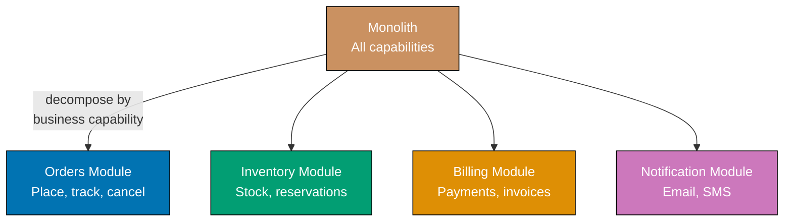

```fsharp
// F# modules as service boundaries — each module owns its types and functions.
// Function signatures are the contract; no OOP interface required.

// => Domain value objects — immutable record types enforce identity semantics
type OrderId    = OrderId of string
// => Wrapping string in a DU prevents accidental OrderId/ProductId confusion
type ProductId  = ProductId of string

// => Orders capability: functions define the service contract
module OrdersService =
    // => In-memory store; in production this would be an injected repository function
    let private store : System.Collections.Generic.Dictionary<string, obj> =
        System.Collections.Generic.Dictionary()

    let placeOrder (ProductId pid) (qty: int) : OrderId =
        // => Generates a stable order id — each call produces a new unique value
        let id = OrderId(System.Guid.NewGuid().ToString())
        let (OrderId oid) = id
        store.[oid] <- box {| productId = pid; qty = qty; status = "PLACED" |}
        // => Stores minimal order state; real implementation persists to DB
        id
        // => Returns OrderId so callers reference the order without knowing its internals

    let cancelOrder (OrderId oid) : bool =
        // => Pattern-match unwraps the DU value — no .Value property needed
        if store.ContainsKey(oid) then
            store.[oid] <- box {| status = "CANCELLED" |}
            // => Mutates in-place here; pure functional alternative uses Map return
            true
        else
            false
        // => Returns bool not exception — absent order is an expected business outcome

// => Inventory capability: independent module, no dependency on Orders internals
module InventoryService =
    let private stock : System.Collections.Generic.Dictionary<string, int> =
        System.Collections.Generic.Dictionary()

    let reserve (ProductId pid) (qty: int) : bool =
        // => Returns false for insufficient stock — Result or bool, not exception
        let current = if stock.ContainsKey(pid) then stock.[pid] else 10
        // => Default 10 units available for demo
        if current >= qty then
            stock.[pid] <- current - qty
            // => Decrease available stock by reserved quantity
            true
        else
            false
        // => False signals the business outcome; caller decides how to proceed

    let release (ProductId pid) (qty: int) : unit =
        // => Compensation: returns reserved units to available stock
        let current = if stock.ContainsKey(pid) then stock.[pid] else 0
        stock.[pid] <- current + qty

// => Usage: each module swapped independently — changing OrdersService does not touch Inventory
let pid = ProductId "SKU-001"
let oid = OrdersService.placeOrder pid 3
// => oid : OrderId — caller holds stable reference

let reserved = InventoryService.reserve pid 3
// => reserved : bool = true — stock available

let cancelled = OrdersService.cancelOrder oid
printfn "Cancelled: %b, Reserved: %b" cancelled reserved
// => Output: Cancelled: true, Reserved: true
```

**Key Takeaway:** F# modules with typed function signatures enforce service boundaries as firmly as
OOP interfaces, and discriminated union wrappers on identifiers prevent accidental cross-capability
type confusion at compile time.

**Why It Matters:** Business-capability decomposition aligns service ownership with Conway's Law —
the team owning "Orders" controls its full stack without coordinating schema changes with
"Inventory". In F#, module boundaries are enforced by the compiler through type-checked function
signatures, making boundary violations a compile error rather than a runtime surprise.

---

### Example 59: Strangler Fig Pattern

The Strangler Fig pattern migrates a monolith incrementally by routing through a dispatch function
that redirects requests to new modules as they are built. In F#, the router is a pure function
from `(string * Map<string,string>)` to a `Result`, making the routing table explicit, testable,
and pattern-matchable.

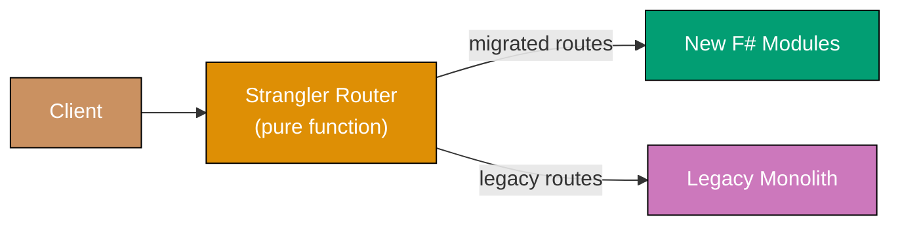

```fsharp
// Strangler Fig as a pure routing function — no mutable registry, no classes.
// The route table is an immutable Map; adding a migrated route is a Map.add call.

// => Handler type alias: path and payload in, response record out
type RouteHandler = string -> Map<string, string> -> {| source: string; path: string |}

// => Route table: prefix string -> handler function
// => Immutable Map — adding a route produces a new table, doesn't mutate global state
let registerRoute (prefix: string) (handler: RouteHandler) (routes: Map<string, RouteHandler>) =
    Map.add prefix handler routes
    // => Returns a new Map with the route added — pure, no side effects

// => Route dispatch: tries each prefix, falls back to legacy handler
let route
    (routes: Map<string, RouteHandler>)
    (legacyHandler: RouteHandler)
    (path: string)
    (payload: Map<string, string>)
    =
    routes
    |> Map.tryFindKey (fun prefix _ -> path.StartsWith(prefix))
    // => Searches the route table for a matching prefix — returns Some key or None
    |> Option.map (fun prefix -> routes.[prefix] path payload)
    // => If found, invoke the matched handler with path and payload
    |> Option.defaultWith (fun () -> legacyHandler path payload)
    // => If not found, delegate to the legacy monolith handler

// => Simulated new Orders module handler (already migrated)
let newOrdersHandler (path: string) (payload: Map<string, string>) =
    {| source = "new_module"; path = path |}
    // => New handler responds; legacy monolith not involved

// => Legacy monolith catch-all
let legacyHandler (path: string) (payload: Map<string, string>) =
    {| source = "legacy_monolith"; path = path |}

// => Build route table: start empty, add migrated routes one by one
let routes =
    Map.empty
    |> registerRoute "/api/orders" newOrdersHandler
    // => Orders route migrated; all other paths still go to legacy

let result1 = route routes legacyHandler "/api/orders/123" Map.empty
printfn "%A" result1
// => Output: { source = "new_module"; path = "/api/orders/123" }

let result2 = route routes legacyHandler "/api/products/abc" Map.empty
printfn "%A" result2
// => Output: { source = "legacy_monolith"; path = "/api/products/abc" }
```

**Key Takeaway:** Modelling the routing table as an immutable `Map` makes each migration step a
pure `Map.add` call with no global state to manage, and the dispatch function is trivially unit-tested
by constructing different tables.

**Why It Matters:** Big-bang rewrites fail because they require running two systems simultaneously
and accepting rollback as all-or-nothing. The Strangler Fig pattern allows teams to migrate one
route at a time. The F# implementation makes the migration state fully visible in the route table —
every migrated route is an explicit map entry.

---

## Distributed Coordination

### Example 60: Saga Orchestration

Saga orchestration uses a central function that sequences steps and drives compensating transactions
in reverse when any step fails. In F#, each step is a `unit -> Result<unit, string>` pair (forward
and compensate), and the orchestrator uses `Result` chaining to accumulate or unwind.

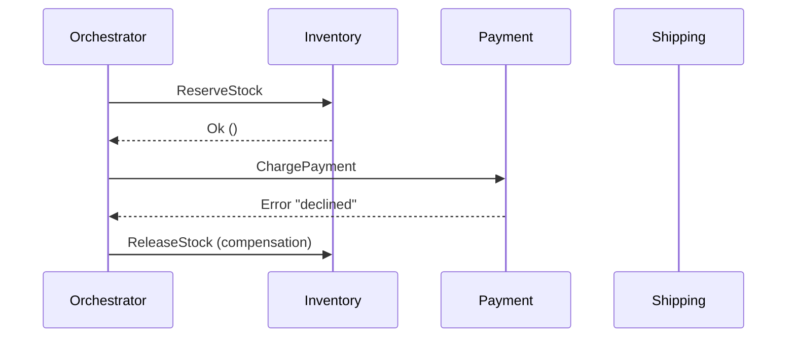

```fsharp
// Saga orchestration as Result-chaining with compensation stack.
// No class required — a step is a pair of functions.

// => SagaStep: forward action returns Result; compensate is always unit -> unit
type SagaStep = {
    Name:       string
    Execute:    unit -> Result<unit, string>
    // => Returns Ok () on success, Error msg on failure
    Compensate: unit -> unit
    // => Compensation is always best-effort; returns unit
}

// => Orchestrator: run steps in order, compensate completed steps on failure
let runSaga (steps: SagaStep list) : Result<unit, string> =
    let rec go remaining completed =
        // => Recursive accumulator: remaining steps, completed-so-far stack
        match remaining with
        | [] -> Ok ()
        // => All steps executed successfully
        | step :: rest ->
            match step.Execute() with
            | Ok () ->
                go rest (step :: completed)
                // => Step succeeded; push onto completed stack and continue
            | Error msg ->
                completed |> List.iter (fun s -> s.Compensate())
                // => Step failed; compensate all completed steps in LIFO order
                Error $"Saga failed at '{step.Name}': {msg}"
                // => Return failure with the name of the step that failed
    go steps []

// => Simulated participants with mutable state for demo
let mutable stockReserved = false
let mutable paymentCharged = false

let reserveStock () =
    stockReserved <- true
    printfn "Stock reserved"
    Ok ()
    // => Always succeeds in this demo

let releaseStock () =
    stockReserved <- false
    printfn "Stock released (compensation)"

let chargePayment () =
    printfn "Payment failed"
    Error "card declined"
    // => Simulates payment processor rejection

let refundPayment () =
    printfn "Payment refunded (compensation)"
    // => Would issue refund; here charge never succeeded so this is a no-op

let steps = [
    { Name = "reserve"; Execute = reserveStock;  Compensate = releaseStock  }
    { Name = "payment"; Execute = chargePayment; Compensate = refundPayment }
]

let result = runSaga steps
printfn "Saga result: %A" result
// => Output: Stock reserved
// => Output: Payment failed
// => Output: Stock released (compensation)
// => Output: Saga result: Error "Saga failed at 'payment': card declined"
printfn "Stock after failure: %b" stockReserved
// => Output: Stock after failure: false — compensation correctly unwound the reservation
```

**Key Takeaway:** Modelling the saga as a recursive function over a `SagaStep list` with a
completed-stack makes compensating-in-reverse-order a natural `List.iter` over the accumulated stack
— no mutable index needed.

**Why It Matters:** Distributed transactions using 2PC are impractical in microservices. Sagas
replace locks with compensating transactions. In F#, the `Result` type makes the success/failure
path explicit at every step, so the orchestrator cannot accidentally skip compensation logic.

---

### Example 61: Saga Choreography

Saga choreography replaces the central orchestrator with reactive functions: each participant
subscribes to events and publishes new ones. In F#, an event bus is a `Map<string, (obj -> unit) list>`
and handlers are plain functions registered at startup.

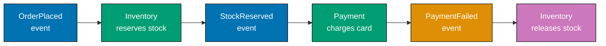

```fsharp
// Saga choreography: handlers are functions; the bus is a mutable dispatch table.
// Each service's handler is a pure function from event payload to unit side-effects + publish.

// => Simple in-process bus: event type string -> list of handler functions
let private handlers =
    System.Collections.Generic.Dictionary<string, (Map<string,string> -> unit) list>()

let subscribe (eventType: string) (handler: Map<string,string> -> unit) =
    // => Register a handler; multiple handlers allowed per event type
    let existing = if handlers.ContainsKey(eventType) then handlers.[eventType] else []
    handlers.[eventType] <- handler :: existing

let publish (eventType: string) (payload: Map<string,string>) =
    // => Deliver event to all registered handlers synchronously
    if handlers.ContainsKey(eventType) then
        handlers.[eventType] |> List.iter (fun h -> h payload)
    // => Real bus: async Kafka consumer group; handlers run in separate processes

// => Shared mutable state representing DB per service
let mutable stockHeld = false

// => Inventory service: listens for OrderPlaced and PaymentFailed
let onOrderPlaced (event: Map<string,string>) =
    stockHeld <- true
    printfn "Inventory: reserved stock for order %s" event.["order_id"]
    publish "StockReserved" event
    // => Emits next event; does NOT call Payment directly — choreography decouples them

let onPaymentFailed (event: Map<string,string>) =
    stockHeld <- false
    printfn "Inventory: released stock for order %s (compensation)" event.["order_id"]

// => Payment service: listens for StockReserved
let onStockReserved (event: Map<string,string>) =
    printfn "Payment: charging for order %s" event.["order_id"]
    publish "PaymentFailed" event
    // => Simulates failure; emits PaymentFailed — Inventory reacts without Payment calling it

// => Wire up subscriptions at startup
subscribe "OrderPlaced"   onOrderPlaced
subscribe "StockReserved" onStockReserved
subscribe "PaymentFailed" onPaymentFailed

publish "OrderPlaced" (Map.ofList [("order_id", "ORD-42")])
// => Output: Inventory: reserved stock for order ORD-42
// => Output: Payment: charging for order ORD-42
// => Output: Inventory: released stock for order ORD-42 (compensation)
printfn "Stock held after failure: %b" stockHeld
// => Output: Stock held after failure: false
```

**Key Takeaway:** Each handler is a plain `Map<string,string> -> unit` function; adding a new
participant means writing a new function and calling `subscribe` — no class hierarchy, no interface
contract to satisfy.

**Why It Matters:** Choreography eliminates the orchestrator as a single point of failure. In F#,
the handler-as-function model keeps each service's reaction logic self-contained and independently
testable by calling the function directly with a test payload map.

---

## API Design

### Example 62: API Versioning Strategies

API versioning prevents breaking changes from disrupting consumers. In F#, the version dispatch
is a pure function from `(string * string)` (method, path) to a response record. Multiple version
modules coexist; the router selects the correct module.

```fsharp
// API versioning as pure dispatch functions — no mutable route registry.
// Each version is a module; the router is a plain match expression.

// => Response type shared across versions
type ApiResponse = { Version: int; Body: obj }

// => V1 contract: flat list of usernames
module V1 =
    let getUsers () : ApiResponse =
        { Version = 1; Body = box [ "alice" ] }
        // => V1 body: simple string list

// => V2 contract: richer objects with email added — backward-incompatible change
module V2 =
    let getUsers () : ApiResponse =
        { Version = 2; Body = box [ {| name = "alice"; email = "alice@example.com" |} ] }
        // => V2 body: anonymous record list — richer shape than V1

// => URI path versioning: version embedded in path — most CDN-cacheable strategy
let dispatchUri (method: string) (path: string) : ApiResponse option =
    match method, path with
    | "GET", "/v1/users" -> Some (V1.getUsers())
    // => V1 path matched explicitly — CDN caches /v1/users and /v2/users independently
    | "GET", "/v2/users" -> Some (V2.getUsers())
    // => V2 path adds richer user object; old clients keep calling /v1/users unchanged
    | _                  -> None
    // => None is the 404 equivalent — caller decides the HTTP status code

let r1 = dispatchUri "GET" "/v1/users"
printfn "%A" r1
// => Output: Some { Version = 1; Body = ["alice"] }

let r2 = dispatchUri "GET" "/v2/users"
printfn "%A" r2
// => Output: Some { Version = 2; Body = [{ name = "alice"; email = "alice@example.com" }] }

// => Accept header versioning: same URL, version negotiated via header
let dispatchHeader (method: string) (path: string) (accept: string) : ApiResponse option =
    // => Parse version from Accept: application/vnd.myapi.v2+json
    let version = if accept.Contains("v2") then "v2" else "v1"
    // => Default to v1 if header absent or does not name a version
    match path with
    | "/users" when version = "v2" -> Some (V2.getUsers())
    // => Same URL, different response shape based on negotiated version
    | "/users"                     -> Some (V1.getUsers())
    | _                            -> None

printfn "%A" (dispatchHeader "GET" "/users" "application/json")
// => Output: Some { Version = 1; Body = ["alice"] }
printfn "%A" (dispatchHeader "GET" "/users" "application/vnd.myapi.v2+json")
// => Output: Some { Version = 2; Body = [{ name = "alice"; email = "alice@example.com" }] }
```

**Key Takeaway:** URI path versioning is expressed as a pure match expression — adding a new version
is one new match arm; removing an old one is deleting an arm. No mutable router state required.

**Why It Matters:** Breaking API changes without a versioning strategy are among the leading causes
of production incidents when microservices are upgraded. URI path versioning is explicit in logs,
debuggable in browsers, and cache-friendly — benefits that outweigh the "impurity" of embedding
version in the URL.

---

### Example 63: Backend for Frontend (BFF) Pattern

The BFF pattern creates a dedicated aggregation function per client type. In F#, each BFF is a
pure function that composes downstream call results into a client-specific record — no shared
service layer; each BFF function shapes its own response type.

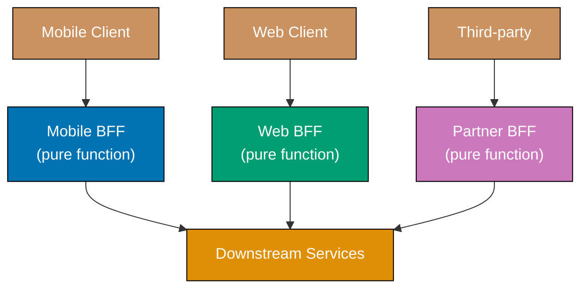

```fsharp
// BFF as pure aggregation functions — each function composes downstream data
// into a client-specific anonymous record.  No shared response type.

// => Downstream service stubs: return full data; BFF functions select what each client needs
let getUserProfile (userId: string) =
    {| id = userId; name = "Alice"; email = "alice@example.com"; theme = "dark" |}
    // => Full profile — downstream owns all fields; BFF picks what to expose

let getUserOrders (userId: string) =
    [ {| id = "ORD-1"; total = 99.99M; status = "shipped"  |}
      {| id = "ORD-2"; total = 14.50M; status = "pending"  |} ]
    // => Full order list — may be large; mobile BFF will aggregate, not pass through

// => Mobile BFF: strips fields to reduce bandwidth for cellular connections
let mobileBffDashboard (userId: string) =
    let profile = getUserProfile userId
    let orders  = getUserOrders userId
    {| name          = profile.name
    // => Only name; email and theme omitted — mobile screen has no space for them
       pendingOrders = orders |> List.filter (fun o -> o.status = "pending") |> List.length
    // => Pre-aggregated count: mobile renders one integer, not a full list
    |}

// => Web BFF: returns richer aggregate with full order list and preferences
let webBffDashboard (userId: string) =
    let profile = getUserProfile userId
    let orders  = getUserOrders userId
    {| profile    = profile
    // => Full profile including email and theme preference
       orders     = orders
    // => Full order objects — web renders a sortable table
       orderCount = orders.Length
    // => Pre-computed convenience field; saves the JS client a .length call
    |}

printfn "%A" (mobileBffDashboard "u1")
// => Output: { name = "Alice"; pendingOrders = 1 }

printfn "%A" (webBffDashboard "u1")
// => Output: { profile = ...; orders = [...]; orderCount = 2 }
```

**Key Takeaway:** Each BFF is a plain function that selects and shapes data; adding a new client
type means adding a new function with its own return type — no shared type hierarchy to negotiate.

**Why It Matters:** A single general-purpose API designed around the least-common denominator of all
clients leads to bloated responses. F# anonymous records let each BFF define its own output shape
without declaring a named type per client, making it cheap to add or evolve client-specific
aggregation logic.

---

## Resilience Patterns

### Example 64: Circuit Breaker with Fallback

A circuit breaker monitors failure rates and trips open when failures exceed a threshold, returning
a fallback immediately. In F#, the state is modelled as a discriminated union with three variants,
and the breaker itself is a record of mutable state that a pure dispatch function reads.

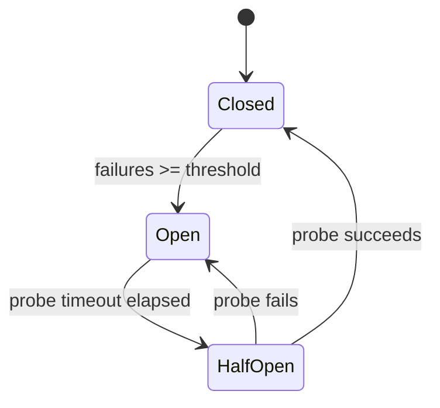

```fsharp
// Circuit breaker state machine using a DU — three states, exhaustive pattern match.
// State transitions are explicit; no implicit state from inheritance.

type CBState =
    | Closed   // => Normal operation — calls pass through to the dependency
    | Open     // => Tripped — calls rejected immediately, fallback returned
    | HalfOpen // => Probing — one trial call allowed through to test recovery

// => Mutable breaker record; in production wrap in an Agent or lock for thread safety
type CircuitBreaker = {
    mutable State:     CBState
    mutable Failures:  int
    mutable OpenedAt:  System.DateTime option
    Threshold:         int
    ProbeTimeoutSecs:  float
}

let makeBreaker threshold probeTimeoutSecs =
    { State = Closed; Failures = 0; OpenedAt = None
    // => Starts closed — all calls allowed through
      Threshold = threshold; ProbeTimeoutSecs = probeTimeoutSecs }

let callWithBreaker
    (cb: CircuitBreaker)
    (operation: unit -> Result<string, exn>)
    (fallback: unit -> string)
    : string =
    // => Check if Open breaker should transition to HalfOpen
    match cb.State with
    | Open ->
        let elapsed =
            cb.OpenedAt
            |> Option.map (fun t -> (System.DateTime.UtcNow - t).TotalSeconds)
            |> Option.defaultValue 0.0
        if elapsed >= cb.ProbeTimeoutSecs then
            cb.State <- HalfOpen
            // => Probe timeout elapsed — allow one trial call
            printfn "Circuit: half-open (probing)"
        else
            return fallback()
            // => Still open — fast-fail; no timeout penalty; dependency rests
    | _ -> ()

    // => Attempt the real call (Closed or HalfOpen)
    match operation() with
    | Ok result ->
        cb.Failures <- 0
        cb.State <- Closed
        // => Success resets the breaker — works for both Closed and HalfOpen
        result
    | Error _ ->
        cb.Failures <- cb.Failures + 1
        if cb.Failures >= cb.Threshold then
            cb.State <- Open
            cb.OpenedAt <- Some System.DateTime.UtcNow
            // => Trip breaker; record when it opened so probe timeout can be computed
            printfn "Circuit: tripped OPEN after %d failures" cb.Failures
        fallback()
        // => Return degraded response instead of propagating the exception

// => Flaky service: first 3 calls fail, then recovers
let mutable callCount = 0
let flakyService () =
    callCount <- callCount + 1
    if callCount <= 3 then Error (exn "service down")
    else Ok "fresh data"
    // => Simulates transient failure followed by recovery

let cb = makeBreaker 3 0.0
// => threshold=3, probeTimeoutSecs=0.0 so HalfOpen happens immediately after Open

for i in 1..6 do
    let result = callWithBreaker cb flakyService (fun () -> "cached data")
    printfn "Call %d: %s" i result
// => Output: Call 1: cached data  (failure 1)
// => Output: Call 2: cached data  (failure 2)
// => Output: Circuit: tripped OPEN after 3 failures
// => Output: Call 3: cached data  (failure 3 — tripped)
// => Output: Circuit: half-open (probing)
// => Output: Call 4: fresh data   (probe succeeds — breaker closes)
// => Output: Call 5: fresh data
// => Output: Call 6: fresh data
```

**Key Takeaway:** The DU for `CBState` makes the three states and their transitions exhaustively
checked by the compiler — adding a fourth state that the match doesn't handle is a compile error,
not a runtime bug.

**Why It Matters:** Without circuit breakers, a slow downstream service causes thread pools to fill,
cascading a partial failure into a full outage. The F# DU state machine makes each legal transition
explicit and auditable — there is no way to accidentally skip the `HalfOpen` probe step.

---

### Example 65: Bulkhead Pattern

The bulkhead pattern isolates resource pools per downstream dependency so one slow service cannot
exhaust shared resources. In F#, a bulkhead is a record wrapping a `SemaphoreSlim`, and the acquire
function returns a `Result` rather than throwing.

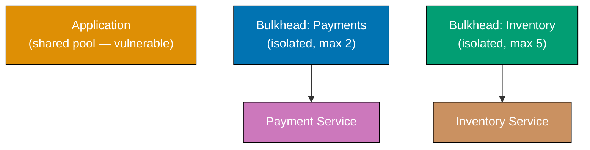

```fsharp
// Bulkhead as a record wrapping a SemaphoreSlim.
// acquire returns Result so callers cannot ignore the "pool full" case.

open System.Threading

type Bulkhead = {
    Name:       string
    Semaphore:  SemaphoreSlim
    mutable Rejected: int
    // => Tracks calls dropped due to full pool — expose for metrics dashboards
}

let makeBulkhead name maxConcurrent =
    { Name = name; Semaphore = new SemaphoreSlim(maxConcurrent, maxConcurrent)
    // => SemaphoreSlim(initial, max) — both set to maxConcurrent
      Rejected = 0 }

let withBulkhead (bh: Bulkhead) (action: unit -> 'a) : Result<'a, string> =
    // => Non-blocking acquire: returns false immediately if pool is full
    if bh.Semaphore.Wait(0) then
        // => Slot acquired — run the action inside a try/finally so slot is always released
        try
            Ok (action())
        finally
            bh.Semaphore.Release() |> ignore
            // => Always return the slot to the pool even if action throws
    else
        bh.Rejected <- bh.Rejected + 1
        Error $"Bulkhead '{bh.Name}' full — call rejected"
        // => Fail fast: caller gets immediate error; dependency is never contacted

// => Two separate bulkheads — slow Payments cannot affect Inventory pool
let paymentsBh  = makeBulkhead "payments"  2
let inventoryBh = makeBulkhead "inventory" 5

let callPayment orderId =
    withBulkhead paymentsBh (fun () -> $"payment_ok:{orderId}")
    // => Executes under payments bulkhead — result is Result<string, string>

let callInventory sku =
    withBulkhead inventoryBh (fun () -> $"stock_ok:{sku}")
    // => Executes under separate inventory bulkhead — independent pool

// => Demonstrate isolation: exhaust payments pool, inventory still works
let _slot1 = paymentsBh.Semaphore.Wait(0)  // => Occupy slot 1
let _slot2 = paymentsBh.Semaphore.Wait(0)  // => Occupy slot 2 — pool now full
let paymentResult = callPayment "ORD-1"
printfn "%A" paymentResult
// => Output: Error "Bulkhead 'payments' full — call rejected"

let inventoryResult = callInventory "SKU-1"
printfn "%A" inventoryResult
// => Output: Ok "stock_ok:SKU-1"  — inventory unaffected by payments saturation

paymentsBh.Semaphore.Release(2) |> ignore
// => Clean up test slots
```

**Key Takeaway:** Returning `Result<'a, string>` from `withBulkhead` means the compiler forces
callers to handle both the "accepted" and "rejected" cases — the failure path cannot be silently
ignored.

**Why It Matters:** The bulkhead pattern prevents a payment processor slowdown from starving
inventory checks and health endpoints. In F#, the `Result` return makes the resource-exhaustion
path a first-class value, not an exception that might be swallowed by a catch-all handler.

---

### Example 66: Retry with Exponential Backoff and Jitter

Retrying transient failures is essential in distributed systems, but naive fixed-interval retries
cause thundering herds. In F#, the retry is a recursive `async` computation that accumulates
attempts via tail-recursive loop without mutable loop counters.

```fsharp
// Retry with exponential backoff as a pure recursive async function.
// No mutable loop counters; state is threaded through recursive parameters.

open System

let exponentialBackoff (attempt: int) (baseMs: float) (capMs: float) =
    // => Exponential growth: baseMs * 2^attempt gives 100, 200, 400, 800 ...
    let delay = min (baseMs * Math.Pow(2.0, float attempt)) capMs
    // => Cap prevents indefinitely long waits
    let jitter = delay * Random.Shared.NextDouble() * 0.5
    // => Add up to 50% random jitter so concurrent callers do not all retry at T+400ms
    delay + jitter
    // => Final delay varies per caller even for the same attempt number

let retry (maxAttempts: int) (operation: unit -> Result<'a, string>) : Result<'a, string> =
    // => Tail-recursive loop threading attempt number through parameters
    let rec loop attempt =
        match operation() with
        | Ok result -> Ok result
        // => Success — return immediately without sleeping
        | Error msg when attempt >= maxAttempts - 1 ->
            Error $"All {maxAttempts} attempts failed: {msg}"
            // => Exhausted retries — propagate the last error
        | Error msg ->
            let delayMs = exponentialBackoff attempt 100.0 30000.0
            printfn "Attempt %d failed: %s. Retrying in %.0fms" (attempt + 1) msg delayMs
            System.Threading.Thread.Sleep(int delayMs)
            // => In production use Async.Sleep inside an async workflow
            loop (attempt + 1)
            // => Tail call — no stack growth per retry attempt
    loop 0

// => Simulate service that fails twice then succeeds
let mutable attemptCount = 0
let unstableCall () =
    attemptCount <- attemptCount + 1
    if attemptCount < 3 then
        Error $"timeout on attempt {attemptCount}"
        // => First two calls fail with transient error
    else
        Ok "success"
        // => Third call succeeds — backoff gave the service time to recover

let result = retry 5 unstableCall
printfn "Result: %A" result
// => Output: Attempt 1 failed: timeout on attempt 1. Retrying in ~100ms
// => Output: Attempt 2 failed: timeout on attempt 2. Retrying in ~200ms
// => Output: Result: Ok "success"
```

**Key Takeaway:** Tail recursion threads attempt state through function parameters instead of a
mutable loop counter; the compiler optimises this to a loop, so deep retry sequences do not
stack-overflow.

**Why It Matters:** Naive fixed-interval retries cause thundering herds when many services retry
simultaneously during an availability event. Exponential backoff with jitter — the "Full Jitter"
strategy — reduces collision probability dramatically, letting overloaded services recover within
seconds instead of minutes.

---

## Observability Patterns

### Example 67: Distributed Tracing Architecture

Distributed tracing tracks a request across multiple services by propagating a shared `traceId`.
In F#, a span is an immutable record; starting and finishing spans are pure functions that return
new records, keeping trace creation free of mutation.

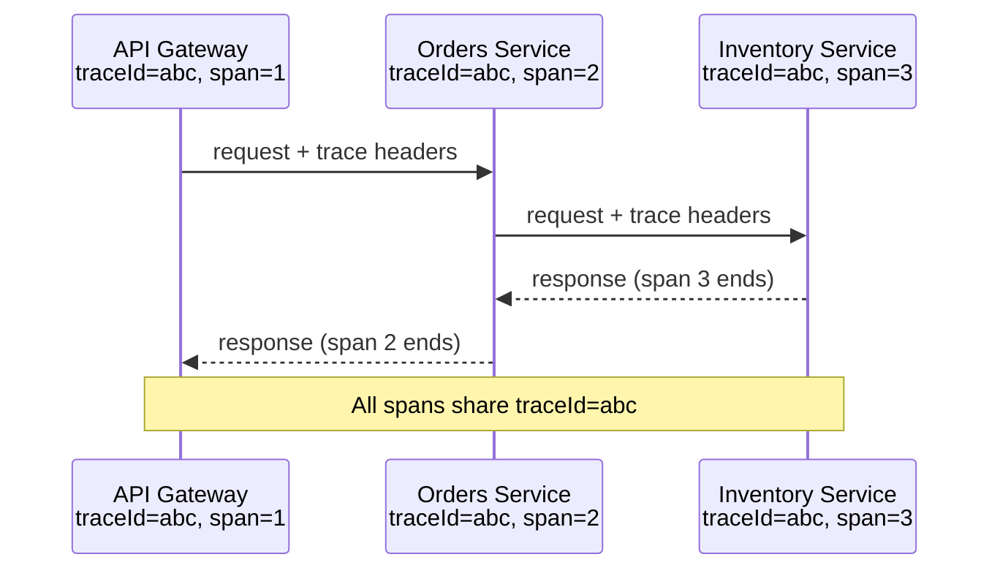

```fsharp
// Distributed tracing: spans are immutable records; finish returns a completed copy.
// TraceId propagation is explicit in every function signature.

type Span = {
    TraceId:      string
    // => Same for all spans in a single request — the correlation key
    SpanId:       string
    // => Unique per operation — identifies this specific unit of work
    ParentSpanId: string option
    // => Links child span to parent in the trace tree — None for root span
    Operation:    string
    StartTime:    System.DateTime
    EndTime:      System.DateTime option
    // => None until span is finished — finished spans have a duration
}

let startSpan (operation: string) (traceId: string option) (parentSpanId: string option) : Span =
    { TraceId     = traceId |> Option.defaultWith (fun () -> System.Guid.NewGuid().ToString())
    // => Generate root traceId if not provided (root span case)
      SpanId      = System.Guid.NewGuid().ToString().[..7]
    // => Short span id for readability in logs
      ParentSpanId = parentSpanId
      Operation    = operation
      StartTime    = System.DateTime.UtcNow
      EndTime      = None }

let finishSpan (span: Span) : Span =
    let completed = { span with EndTime = Some System.DateTime.UtcNow }
    // => Returns new record with EndTime set — original span unchanged (immutable)
    let duration =
        completed.EndTime
        |> Option.map (fun e -> (e - span.StartTime).TotalMilliseconds)
        |> Option.defaultValue 0.0
    printfn "[TRACE] trace=%s span=%s parent=%A op=%s duration=%.1fms"
        completed.TraceId completed.SpanId completed.ParentSpanId completed.Operation duration
    // => In production: send to Jaeger, Zipkin, or Datadog — not stdout
    completed

// => Three services each create spans under the same trace
let rootSpan   = startSpan "api-gateway:handle_request" None None
// => Root span: no parent, generates the traceId for the request

let ordersSpan = startSpan "orders-svc:place_order" (Some rootSpan.TraceId) (Some rootSpan.SpanId)
// => Child span: inherits traceId, references root as parent

let invSpan    = startSpan "inventory-svc:reserve_stock" (Some rootSpan.TraceId) (Some ordersSpan.SpanId)
// => Grandchild span: references orders span as parent

let _ = finishSpan invSpan     // => Inventory finishes first (innermost call)
let _ = finishSpan ordersSpan  // => Orders finishes after Inventory returns
let _ = finishSpan rootSpan    // => Gateway finishes last
// => All three spans share the same traceId — reconstruction tool links them into a tree
```

**Key Takeaway:** Immutable span records mean `finishSpan` always returns a new record; the original
in-flight span cannot be accidentally mutated by concurrent code.

**Why It Matters:** Without distributed tracing, debugging latency across ten microservices requires
correlating timestamps across ten log files. Tracing tools like Jaeger reduce this to a single flame
graph. The F# immutable record approach makes span state safe to pass across async boundaries without
locking.

---

## Deployment Patterns

### Example 68: Sidecar Pattern

The sidecar pattern deploys cross-cutting concerns alongside the application without changing it.
In F#, the sidecar is modelled as a higher-order function that wraps the application handler,
adding concerns before and after delegation.

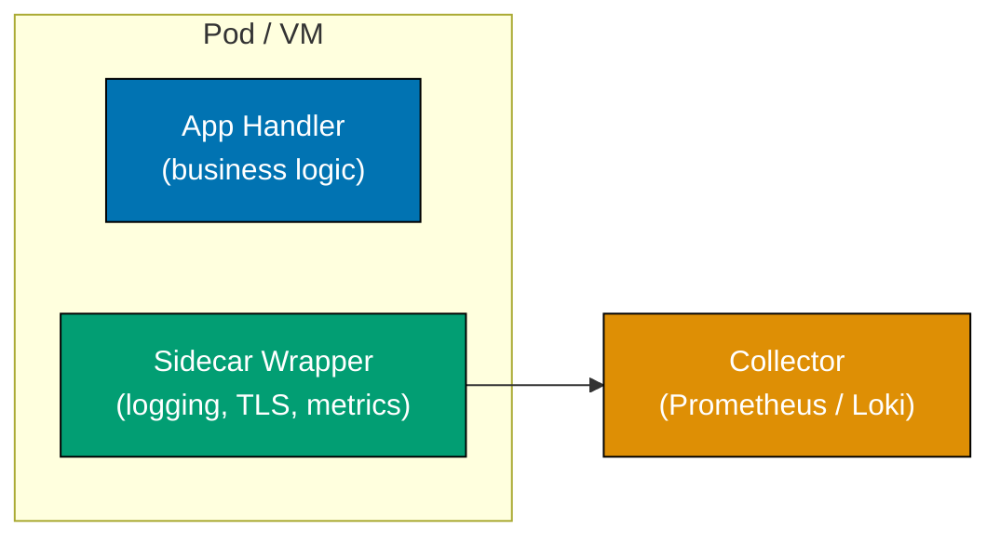

```fsharp
// Sidecar as a higher-order function: wraps the app handler, adds cross-cutting concerns.
// The application function receives only clean requests — no TLS or metrics code inside it.

type Request  = { Method: string; Path: string; OrderId: string; MtlsVerified: bool }
type Response = { Status: int; Body: string }

// => Sidecar wrapper: a function that takes a handler and returns an augmented handler
let sidecarWrap (appHandler: Request -> Response) (req: Request) : Response =
    // => Concern 1: enforce mutual TLS — sidecar blocks before app sees the request
    if not req.MtlsVerified then
        { Status = 401; Body = "TLS handshake failed" }
        // => App function never called for unauthenticated requests
    else
        let start = System.DateTime.UtcNow

        // => Concern 2: inject metadata into request for app to use in its own logs
        let enrichedReq = { req with OrderId = req.OrderId }
        // => In production: add trace-id, request-id from headers

        let response = appHandler enrichedReq
        // => Delegate to application logic — sidecar steps aside for the actual work

        // => Concern 3: emit metrics after app returns
        let durationMs = (System.DateTime.UtcNow - start).TotalMilliseconds
        printfn "[SIDECAR] method=%s path=%s status=%d duration=%.1fms"
            req.Method req.Path response.Status durationMs
        // => Application code has no metrics client — sidecar owns all instrumentation

        response

// => Application handler: pure business logic, no infrastructure code
let orderApp (req: Request) : Response =
    { Status = 200; Body = $"Order {req.OrderId} retrieved" }
    // => No TLS code, no metrics calls, no log formatting — sidecar owns all of that

// => Compose: wrap the app handler with the sidecar once at startup
let handler = sidecarWrap orderApp

let r1 = handler { Method = "GET"; Path = "/orders/1"; OrderId = "1"; MtlsVerified = false }
printfn "%A" r1
// => Output: { Status = 401; Body = "TLS handshake failed" }

let r2 = handler { Method = "GET"; Path = "/orders/1"; OrderId = "1"; MtlsVerified = true }
printfn "%A" r2
// => Output: [SIDECAR] method=GET path=/orders/1 status=200 duration=...ms
// => Output: { Status = 200; Body = "Order 1 retrieved" }
```

**Key Takeaway:** The sidecar as a higher-order function means cross-cutting concerns are composed,
not inherited — swapping the sidecar means passing a different wrapper function at the composition
root.

**Why It Matters:** Kubernetes service meshes (Istio, Linkerd) use the sidecar pattern to inject
Envoy proxies transparently. The F# higher-order function models this cleanly: the application
function is unchanged; the wrapping function handles all infrastructure concerns independently.

---

### Example 69: Ambassador Pattern

The ambassador pattern places a proxy between an application and a remote service to handle
connection management, retry logic, and credential injection. In F#, the ambassador is a record
of configuration plus a function that returns `Result`, hiding all complexity from callers.

```fsharp
// Ambassador as a record holding configuration + a call function returning Result.
// Application code calls the ambassador; all retry/timeout logic is inside.

type AmbassadorConfig = {
    Dsn:        string
    MaxRetries: int
    TimeoutMs:  int
}

// => Ambassador state: config plus mutable call counter for metrics
type Ambassador = {
    Config:           AmbassadorConfig
    mutable CallCount: int
    // => Tracks total calls including retries for metrics reporting
}

let makeAmbassador config =
    { Config = config; CallCount = 0 }

// => Internal execute: simulates a real call that may fail transiently
let private execute (amb: Ambassador) (sql: string) : Result<{| id: int; name: string |} list, string> =
    amb.CallCount <- amb.CallCount + 1
    // => First call simulates transient failure; ambassador retries transparently
    if amb.CallCount = 1 then
        Error "transient connection loss"
    else
        Ok [ {| id = 1; name = "Alice" |}; {| id = 2; name = "Bob" |} ]
        // => Subsequent calls succeed — returns clean list without connection details

// => Public query function: retries internally, exposes Result to caller
let query (amb: Ambassador) (sql: string) : Result<{| id: int; name: string |} list, string> =
    let rec loop attempt =
        // => Recursive retry up to MaxRetries; tail-recursive so no stack growth
        match execute amb sql with
        | Ok rows -> Ok rows
        // => Success — return immediately
        | Error msg when attempt >= amb.Config.MaxRetries - 1 ->
            Error $"Ambassador exhausted retries: {msg}"
            // => Give up after MaxRetries; application sees one clean error
        | Error msg ->
            let waitMs = 100 * int (Math.Pow(2.0, float attempt))
            // => Backoff: 100ms, 200ms, 400ms ...
            System.Threading.Thread.Sleep(waitMs)
            loop (attempt + 1)
            // => Tail call — retry without growing the stack
    loop 0

// => Application code: calls ambassador; knows nothing about retries, DSN, or pooling
let db = makeAmbassador { Dsn = "postgresql://localhost/mydb"; MaxRetries = 3; TimeoutMs = 5000 }
let rows = query db "SELECT id, name FROM users WHERE active = true"
printfn "%A" rows
// => Output: Ok [{ id = 1; name = "Alice" }; { id = 2; name = "Bob" }]
// => (First call failed internally; ambassador retried transparently)
printfn "Total calls including retries: %d" db.CallCount
// => Output: Total calls including retries: 2
```

**Key Takeaway:** The ambassador's `query` function exposes a `Result` to the caller, not the raw
`exn`; all retry and connection pool complexity is sealed inside the ambassador record.

**Why It Matters:** Without an ambassador, retry logic and connection pool configuration are
duplicated across every service that calls the same downstream. When the retry policy needs changing,
a single ambassador change affects all consumers — the same benefit service meshes provide at the
infrastructure level.

---

## Event-Driven Architecture

### Example 70: Event Sourcing Implementation

Event sourcing stores state as an append-only sequence of domain events. In F#, replaying events
is a `List.fold` over the event list — the most natural functional pattern. The current state is
the fold accumulator.

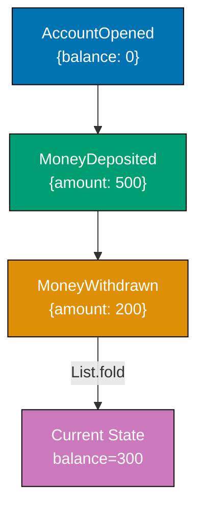

```fsharp
// Event sourcing as List.fold — the quintessential FP pattern for derived state.
// Events are immutable; state is recomputed, never stored directly.

// => Domain events: DU with one case per event type
type AccountEvent =
    | AccountOpened  of accountId: string
    | MoneyDeposited of amount: decimal
    | MoneyWithdrawn of amount: decimal
    // => Each case carries its relevant payload — pattern match is exhaustive

// => Account state: pure record — derived by folding events, never mutated directly
type AccountState = {
    AccountId: string
    Balance:   decimal
}

// => Reducer: applies one event to the current state and returns the new state
let applyEvent (state: AccountState) (event: AccountEvent) : AccountState =
    match event with
    | AccountOpened id      -> { state with AccountId = id; Balance = 0M }
    // => Opening sets id and zeros balance — regardless of previous state
    | MoneyDeposited amount -> { state with Balance = state.Balance + amount }
    // => Deposit increases balance by the deposit amount
    | MoneyWithdrawn amount -> { state with Balance = state.Balance - amount }
    // => Withdrawal decreases balance — business rule: caller validates sufficient funds

// => Replay: fold the event list to derive current state
let replayEvents (events: AccountEvent list) : AccountState =
    events
    |> List.fold applyEvent { AccountId = ""; Balance = 0M }
    // => Start with empty state; each event transitions it forward
    // => List.fold is the direct FP equivalent of the OOP replay loop

// => Append-only event store: a plain list (immutable in production use)
let eventStore = [
    AccountOpened  "ACC-001"
    MoneyDeposited 500M
    MoneyWithdrawn 200M
]
// => Events recorded in order; never modified or deleted after appending

let currentState = replayEvents eventStore
printfn "Account: %s, Balance: %M" currentState.AccountId currentState.Balance
// => Output: Account: ACC-001, Balance: 300M

// => Temporal query: what was the balance after only the first two events?
let stateAtT2 = replayEvents (eventStore |> List.take 2)
// => List.take 2 selects events up to and including the deposit
printfn "Balance after deposit only: %M" stateAtT2.Balance
// => Output: Balance after deposit only: 500M
```

**Key Takeaway:** `List.fold applyEvent` is the direct FP expression of event replay — there is
no concept more natural in F# than folding a list of state transitions into a single accumulated
value.

**Why It Matters:** Traditional CRUD databases overwrite state on every update, losing historical
information. Event sourcing satisfies audit requirements by design — every state transition is
recorded with its cause. The F# `fold` makes it trivial to replay to any point in history by slicing
the event list with `List.take`.

---

## Structural Patterns

### Example 71: Modular Monolith

A modular monolith deploys as a single process but enforces strict module boundaries. In F#, module
boundaries are enforced by the file ordering in the project — types defined in later files cannot
be referenced by earlier files, making circular dependencies a compile error.

```fsharp
// Modular monolith: F# module system enforces dependency direction at compile time.
// Each module owns its types and service functions; cross-module communication uses
// the public type surface only.

// ============================================================
// Module: Orders — owns order types and service function
// ============================================================
module Orders =
    // => Record type owned by Orders; other modules receive values of this type
    type Order = { OrderId: string; CustomerId: string; Total: decimal }

    // => Repository is a function alias — no abstract class needed
    type OrderRepo = {
        Save: Order -> unit
        // => Injected save function; Orders module does not choose the storage technology
        Find: string -> Order option
        // => Returns None if order not found; no exception for expected absence
    }

    // => Service function: takes injected repo, returns Order
    let placeOrder (repo: OrderRepo) (customerId: string) (total: decimal) : Order =
        let order = { OrderId = System.Guid.NewGuid().ToString().[..7]
                      CustomerId = customerId; Total = total }
        repo.Save order
        // => Delegates persistence to injected repo — module owns the interface, not the impl
        order
        // => Returns domain object; other modules receive this via public function, not DB query

// ============================================================
// Module: Billing — owns invoice types; depends on Orders.Order only
// ============================================================
module Billing =
    // => Billing imports Orders.Order (shared value type) but NOT Orders internals
    type Invoice = { InvoiceId: string; OrderId: string; Amount: decimal; Paid: bool }

    let issueInvoice (order: Orders.Order) : Invoice =
        { InvoiceId = System.Guid.NewGuid().ToString().[..7]
          OrderId   = order.OrderId
          // => Billing stores OrderId as opaque string reference — no DB join key
          Amount    = order.Total
          Paid      = false }

// ============================================================
// Composition Root — wires modules together at startup
// ============================================================
let mutable private orderStore : Map<string, Orders.Order> = Map.empty
// => In-memory store; production uses SQLAlchemy/Dapper repo implementation

let inMemoryRepo : Orders.OrderRepo = {
    Save = fun order -> orderStore <- Map.add order.OrderId order orderStore
    // => Stores in map; swapped for real DB adapter in production
    Find = fun id    -> Map.tryFind id orderStore
    // => Returns None if not found — consistent with repo contract
}

let order   = Orders.placeOrder inMemoryRepo "cust-1" 149.99M
let invoice = Billing.issueInvoice order
printfn "Order: %s, Invoice: %s, Amount: %M" order.OrderId invoice.InvoiceId invoice.Amount
// => Output: Order: <id>, Invoice: <id>, Amount: 149.9900M
```

**Key Takeaway:** F#'s file-ordering rule means module dependencies are enforced by the compiler —
a Billing module that imports Orders internals must be listed after Orders in the project file,
making all dependency directions visible in one place.

**Why It Matters:** A modular monolith provides the domain boundary discipline of microservices
while retaining the operational simplicity of a single deployable unit. F# compiles modules in
declared order, so circular dependencies are impossible — a structural guarantee no runtime check
can provide.

---

### Example 72: Vertical Slice Architecture

Vertical slice architecture organises code by feature rather than by technical layer. In F#, each
slice is a module containing its own request and response types plus a single handler function —
all layers for one feature in one place.

```fsharp
// Vertical slice: one module per feature, containing all layers for that feature.
// No shared service layer; each slice owns its request, response, and handler.

// ============================================================
// Slice: Place Order — all layers for this feature in one module
// ============================================================
module PlaceOrder =
    // => Request type: input contract for this slice — only this slice uses it
    type Request  = { CustomerId: string; ProductId: string; Quantity: int }
    // => Response type: output contract for this slice
    type Response = { OrderId: string; Status: string; Total: decimal }

    // => Mutable in-memory store; in production use injected repo function
    let private orders = System.Collections.Generic.List<{| id: string; customer: string; total: decimal |}>()

    // => Handler: contains all logic for this slice — no shared service dependency
    let handle (pricePerUnit: decimal) (req: Request) : Response =
        let total   = pricePerUnit * decimal req.Quantity
        // => Business rule: total = price * qty — slice owns this rule
        let orderId = $"ORD-{orders.Count + 1:D4}"
        // => Sequential id for demo — production uses a UUID
        orders.Add({| id = orderId; customer = req.CustomerId; total = total |})
        // => Persist (would use Unit of Work in production)
        { OrderId = orderId; Status = "placed"; Total = total }
        // => Returns slice-specific response; no generic envelope needed

// ============================================================
// Slice: Get Order — separate module, no shared repository dependency
// ============================================================
module GetOrder =
    type Request  = { OrderId: string }
    type Response = { OrderId: string; Total: decimal option; Found: bool }

    // => Reference PlaceOrder's store via a passed-in query function
    // => In production: separate CQRS read-side repository
    let handle (queryFn: string -> decimal option) (req: Request) : Response =
        match queryFn req.OrderId with
        | Some total -> { OrderId = req.OrderId; Total = Some total; Found = true  }
        // => Order found — return with total
        | None       -> { OrderId = req.OrderId; Total = None;       Found = false }
        // => Order not found — explicit not-found rather than exception

// => Usage: each slice invoked independently; no shared handler dispatch mechanism needed
let placeResp = PlaceOrder.handle 12.50M { CustomerId = "C1"; ProductId = "P1"; Quantity = 4 }
printfn "%A" placeResp
// => Output: { OrderId = "ORD-0001"; Status = "placed"; Total = 50.0000M }

// => Wire get-order query function to place-order's store (demo coupling — prod uses DB)
let queryFn (orderId: string) =
    if orderId = "ORD-0001" then Some 50.0M else None
    // => In production: read-side query against CQRS read model

let getResp = GetOrder.handle queryFn { OrderId = "ORD-0001" }
printfn "%A" getResp
// => Output: { OrderId = "ORD-0001"; Total = Some 50.0000M; Found = true }
```

**Key Takeaway:** Each feature lives in its own F# module — a developer reads one module to
understand, change, and test a complete feature end-to-end; no need to navigate
Request/Service/Repository folders.

**Why It Matters:** Traditional layered architecture scatters a feature across three folders,
increasing cognitive load. Vertical slices collocate all layers in one module, reducing the scope
of a change to one file — the diff for a feature change is a single module edit.

---

### Example 73: Shared Kernel

The Shared Kernel is a set of value types and domain events shared across bounded contexts. In F#,
the shared kernel is a separate module (or file listed before both domain modules) containing
only immutable record types — no functions, no services.

```fsharp
// Shared Kernel: a separate module containing only value types and domain events.
// Both Orders and Billing modules open it; it contains no application logic.

// ============================================================
// Shared Kernel module — the agreed-upon shared subset
// ============================================================
module SharedKernel =
    // => Only value types and domain events; never repositories or services
    [<Struct>]
    type Money = { Amount: decimal; Currency: string }
    // => Struct for stack allocation; immutable by F# record default
    // => ISO 4217 currency code e.g. "USD" — both domains use the same Money type

    let addMoney (a: Money) (b: Money) : Result<Money, string> =
        if a.Currency <> b.Currency then
            Error $"Cannot add {a.Currency} and {b.Currency}"
        // => Guard: cross-currency addition is a domain error, not an exception
        else
            Ok { Amount = a.Amount + b.Amount; Currency = a.Currency }
        // => Returns new Money; original values unchanged (immutable struct)

    type OrderId = OrderId of string
    // => Shared identifier; both Orders and Billing reference the same DU type

// ============================================================
// Orders domain — uses shared kernel types
// ============================================================
module OrdersDomain =
    open SharedKernel

    type OrderLine = { ProductId: string; Price: Money; Qty: int }
    // => Money from shared kernel — no conversion needed between domains

    let subtotal (line: OrderLine) : Money =
        { Amount = line.Price.Amount * decimal line.Qty; Currency = line.Price.Currency }
        // => Uses shared kernel Money; result is also a shared kernel type

// ============================================================
// Billing domain — uses the same shared kernel types independently
// ============================================================
module BillingDomain =
    open SharedKernel

    type Invoice = { OrderId: OrderId; Total: Money; DaysOutstanding: int }
    // => Same OrderId and Money types — no translation layer needed between domains

    let isOverdue (invoice: Invoice) : bool =
        invoice.DaysOutstanding > 30
        // => Billing's own rule; not in shared kernel — kernel stays minimal

// => Usage: both domains speak the same Money and OrderId language
let line    = { OrdersDomain.ProductId = "P1"
                OrdersDomain.Price     = { SharedKernel.Amount = 10M; SharedKernel.Currency = "USD" }
                OrdersDomain.Qty       = 3 }
let total   = OrdersDomain.subtotal line
let invoice = { BillingDomain.OrderId         = SharedKernel.OrderId "ORD-42"
                BillingDomain.Total           = total
                BillingDomain.DaysOutstanding = 35 }

printfn "Invoice total: %M %s" invoice.Total.Amount invoice.Total.Currency
// => Output: Invoice total: 30.0000 USD
printfn "Overdue (35 days): %b" (BillingDomain.isOverdue invoice)
// => Output: Overdue (35 days): true
```

**Key Takeaway:** The shared kernel F# module contains only type definitions — no functions, no
services — ensuring both domains can evolve their logic independently while sharing only the common
vocabulary.

**Why It Matters:** Without a shared kernel, teams independently define `Money` — one with
`decimal`, one with `float` — leading to precision mismatches. The shared kernel establishes a
formal contract between bounded contexts, preventing the implicit coupling that occurs when teams
copy-paste shared types.

---

## Design Patterns at Architecture Scale

### Example 74: Specification Pattern

The specification pattern encapsulates a business rule as a composable predicate. In F#, a
specification is simply `'a -> bool` — functions compose with `&&`, `||`, and `not` rather than
requiring a class hierarchy.

```fsharp
// Specification pattern as predicate composition — no class hierarchy needed.
// Each specification is a plain function; composition uses standard boolean operators.

// => Specification type alias: any function from candidate to bool
type Spec<'a> = 'a -> bool

// => Combinators: compose two specs using boolean logic
let andSpec (a: Spec<'a>) (b: Spec<'a>) : Spec<'a> =
    fun candidate -> a candidate && b candidate
    // => Both specs must be satisfied; short-circuits if a returns false

let orSpec  (a: Spec<'a>) (b: Spec<'a>) : Spec<'a> =
    fun candidate -> a candidate || b candidate
    // => Either spec satisfied is sufficient

let notSpec (a: Spec<'a>) : Spec<'a> =
    fun candidate -> not (a candidate)
    // => Inverts the spec — turns an inclusion rule into an exclusion rule

// => Domain: Order eligibility for discount
type Order = { Total: decimal; CustomerTier: string; ItemCount: int }

// => Individual specifications: named predicates capturing one business rule each
let highValueOrder : Spec<Order> =
    fun o -> o.Total >= 100M
    // => Orders over $100 qualify as high-value

let goldCustomer : Spec<Order> =
    fun o -> o.CustomerTier = "gold"
    // => Only gold-tier customers

let bulkOrder : Spec<Order> =
    fun o -> o.ItemCount >= 10
    // => 10+ items qualify as bulk

// => Business rule: eligible for discount if gold customer OR (high value AND bulk)
let discountEligible : Spec<Order> =
    orSpec goldCustomer (andSpec highValueOrder bulkOrder)
    // => Reads like a sentence: gold customer or (high-value and bulk)

let o1 = { Total = 150M; CustomerTier = "gold";   ItemCount = 3  }
let o2 = { Total = 150M; CustomerTier = "silver"; ItemCount = 12 }
let o3 = { Total = 50M;  CustomerTier = "bronze"; ItemCount = 5  }

printfn "o1 eligible: %b" (discountEligible o1)
// => Output: o1 eligible: true   (gold customer — first clause satisfied)
printfn "o2 eligible: %b" (discountEligible o2)
// => Output: o2 eligible: true   (high value AND bulk — second clause satisfied)
printfn "o3 eligible: %b" (discountEligible o3)
// => Output: o3 eligible: false  (none of the criteria met)
```

**Key Takeaway:** In F#, specification composition is ordinary function composition using `&&`,
`||`, and `not` — the `andSpec`/`orSpec` combinators make the intent explicit without requiring a
class hierarchy or `is_satisfied_by` naming convention.

**Why It Matters:** Discount eligibility, loan approval criteria, and fraud detection rules change
frequently and involve multiple conditions. The predicate-composition approach in F# is even more
lightweight than the OOP version — a new rule is a new `let` binding, not a new class file.

---

### Example 75: Chain of Responsibility

The chain of responsibility passes a request through a sequence of handlers. In F#, middleware
is modelled as `Request -> Result<Response, Response>` — `Ok` continues the chain, `Error` short-
circuits with a rejection response — composed with `Result.bind`.

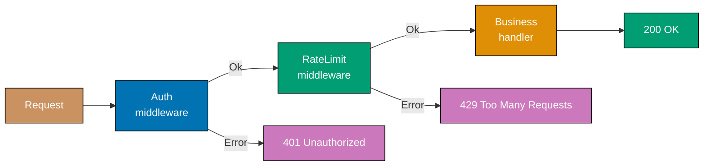

```fsharp
// Chain of Responsibility as Result.bind composition.
// Ok continues; Error short-circuits — no explicit next-handler threading required.

type HttpRequest  = { Path: string; ApiKey: string option; CallerId: string }
type HttpResponse = { Status: int; Body: string }

// => Middleware type: Request -> Result<Request, HttpResponse>
// => Ok wraps the (possibly enriched) request to pass to the next handler
// => Error wraps the terminal response — chain stops here
type Middleware = HttpRequest -> Result<HttpRequest, HttpResponse>

// => Auth middleware: rejects requests without valid API key
let validKeys = Set.ofList ["key-abc"; "key-xyz"]

let authMiddleware : Middleware = fun req ->
    match req.ApiKey with
    | Some key when Set.contains key validKeys -> Ok req
    // => Valid key: pass request unchanged to next handler
    | _ -> Error { Status = 401; Body = "Unauthorized" }
    // => Invalid/absent key: chain terminates here; 401 returned immediately

// => Rate limit middleware: allows up to 2 calls per caller (simplified)
let private callCounts = System.Collections.Generic.Dictionary<string, int>()

let rateLimitMiddleware : Middleware = fun req ->
    let count = if callCounts.ContainsKey(req.CallerId) then callCounts.[req.CallerId] else 0
    callCounts.[req.CallerId] <- count + 1
    if count + 1 > 2 then
        Error { Status = 429; Body = "Too Many Requests" }
        // => Rate limit exceeded — chain terminates before reaching business handler
    else
        Ok req
        // => Within limit: continue to next middleware in chain

// => Business handler: final step — always returns Ok response (no further chaining)
let businessHandler (req: HttpRequest) : HttpResponse =
    { Status = 200; Body = $"Orders for {req.CallerId}" }

// => Chain builder: compose middlewares with Result.bind, then apply business handler
let buildChain (middlewares: Middleware list) (handler: HttpRequest -> HttpResponse) =
    fun req ->
        middlewares
        |> List.fold (fun acc mw ->
            match acc with
            | Ok r  -> mw r
            // => Previous middleware passed — try this one
            | Error e -> Error e)
            // => Already rejected — skip remaining middlewares
            (Ok req)
        |> Result.map handler
        // => If all middlewares passed (Ok), apply the business handler

let chain = buildChain [authMiddleware; rateLimitMiddleware] businessHandler

printfn "%A" (chain { Path = "/orders"; ApiKey = None; CallerId = "c1" })
// => Output: Error { Status = 401; Body = "Unauthorized" }
printfn "%A" (chain { Path = "/orders"; ApiKey = Some "key-abc"; CallerId = "c1" })
// => Output: Ok { Status = 200; Body = "Orders for c1" }
printfn "%A" (chain { Path = "/orders"; ApiKey = Some "key-abc"; CallerId = "c1" })
// => Output: Ok { Status = 200; Body = "Orders for c1" }
printfn "%A" (chain { Path = "/orders"; ApiKey = Some "key-abc"; CallerId = "c1" })
// => Output: Error { Status = 429; Body = "Too Many Requests" }
```

**Key Takeaway:** `Result.bind` is the idiomatic F# chain of responsibility — `Ok` continues,
`Error` short-circuits, and adding a new middleware is a single list element with no wiring changes
to existing handlers.

**Why It Matters:** Web frameworks (Express.js, FastAPI, ASP.NET Core) are built on middleware
stacks because cross-cutting concerns as separate middlewares are far safer than embedding them in
business handlers. The F# `Result` composition makes the early-termination semantics explicit in
the type — a rejected request is an `Error`, not a convention.

---

### Example 76: Visitor Pattern in Architecture

The visitor pattern separates algorithms from the objects they operate on. In F#, this is natural
pattern matching — a discriminated union type represents the object hierarchy, and each "visitor
algorithm" is a function that pattern-matches over it. No `accept`/`visit` double-dispatch needed.

```fsharp
// Visitor pattern as pattern matching on a discriminated union.
// New operations are new functions that match over the same DU — no domain changes.

// => Stable domain hierarchy: DU with one case per component type
type ArchComponent =
    | Service  of name: string * replicas: int * cpuMillicores: int
    // => Service: replicas and CPU allocation define its compute cost
    | Database of name: string * storageGb: int * multiAz: bool
    // => Database: storage and multi-AZ flag define its cost and compliance posture

type Architecture = { Components: ArchComponent list }

// ============================================================
// "Visitor" algorithm 1: Cost estimation — new function, no domain changes
// ============================================================
let estimateCost (comp: ArchComponent) : decimal =
    match comp with
    | Service (_, replicas, cpu) ->
        decimal replicas * (decimal cpu / 1000M) * 30M * 0.05M
        // => $0.05 per vCPU per hour, 30 days; simplified cloud pricing model
    | Database (_, storageGb, multiAz) ->
        decimal storageGb * 0.10M * (if multiAz then 2M else 1M)
        // => $0.10 per GB/month, doubled for multi-AZ redundancy

let totalCost (arch: Architecture) : decimal =
    arch.Components
    |> List.sumBy (fun comp ->
        let cost = estimateCost comp
        printfn "  %A: $%.2f/month" comp cost
        // => Print per-component cost for the report
        cost)
    // => Sum all component costs into a single total

// ============================================================
// "Visitor" algorithm 2: Compliance check — another new function, no domain changes
// ============================================================
let checkCompliance (comp: ArchComponent) : string list =
    match comp with
    | Service (name, replicas, _) when replicas < 2 ->
        [ $"Service '{name}' has only {replicas} replica (min 2 for HA)" ]
        // => Single replica violates high-availability requirement
    | Database (name, _, false) ->
        [ $"Database '{name}' is not multi-AZ (compliance requirement)" ]
        // => Single-AZ database violates disaster-recovery policy
    | _ -> []
    // => Component passes compliance — empty violation list

let allViolations (arch: Architecture) : string list =
    arch.Components |> List.collect checkCompliance
    // => Collect violations from all components into a flat list

// => Usage
let arch = {
    Components = [
        Service  ("orders-api", 3, 500)
        Service  ("worker",     1, 1000)  // => Only 1 replica — will fail compliance
        Database ("orders-db",  100, true)
        Database ("cache-db",   20,  false) // => Not multi-AZ — will fail compliance
    ]
}

printfn "Cost breakdown:"
let total = totalCost arch
printfn "Total: $%.2f/month" total
// => Output: Cost breakdown:
// => Output:   Service ("orders-api", 3, 500): $2.25/month
// => Output:   Service ("worker", 1, 1000): $1.50/month
// => Output:   Database ("orders-db", 100, true): $20.00/month
// => Output:   Database ("cache-db", 20, false): $2.00/month
// => Output: Total: $25.75/month

printfn "Violations: %A" (allViolations arch)
// => Output: Violations: ["Service 'worker' has only 1 replica (min 2 for HA)";
// =>                       "Database 'cache-db' is not multi-AZ (compliance requirement)"]
```

**Key Takeaway:** Pattern matching on a DU is the idiomatic F# visitor — the compiler enforces
exhaustive handling of every case, so adding a new component type to the DU surfaces every
algorithm that needs updating as a compile error.

**Why It Matters:** Architecture tooling (cost estimators, compliance checkers, security scanners)
must traverse the same infrastructure object graph with different algorithms. In F#, the DU + match
approach provides exhaustiveness checking that the OOP visitor's `abstract visit_*` methods do not
— forgetting to handle a new node type is a compile error, not a silent bug.

---

## Advanced Resilience and Scalability

### Example 77: Database per Service Pattern

The database-per-service pattern assigns each microservice an exclusive data store it fully controls.
In F#, each service's data access is a record of injected repository functions; cross-service data
access goes through composed function calls, never shared state.

```fsharp
// Database per Service: each service owns a private Map (its "database").
// Cross-service data access is composed via function calls, not shared state or joins.

// ============================================================
// Orders Service — owns ordersDb, knows nothing about customersDb schema
// ============================================================
type OrderRecord = { OrderId: string; CustomerId: string; Total: decimal }
// => customerId stored as opaque string reference — not a join key to a shared schema

// => Service as a pair of functions (repo injected at composition root)
type OrdersDb = Map<string, OrderRecord>

let insertOrder (db: OrdersDb) (record: OrderRecord) : OrdersDb =
    Map.add record.OrderId record db
    // => Pure: returns new Map; original db unchanged — no mutation required

let findByCustomer (db: OrdersDb) (customerId: string) : OrderRecord list =
    db |> Map.values |> Seq.filter (fun r -> r.CustomerId = customerId) |> Seq.toList
    // => Orders service's own read — no cross-service JOIN

// ============================================================
// Customers Service — owns customersDb, never touches ordersDb
// ============================================================
type CustomerRecord = { CustomerId: string; Name: string; Email: string }

type CustomersDb = Map<string, CustomerRecord>

let insertCustomer (db: CustomersDb) (record: CustomerRecord) : CustomersDb =
    Map.add record.CustomerId record db

let findCustomer (db: CustomersDb) (customerId: string) : CustomerRecord option =
    Map.tryFind customerId db
    // => None if customer not found — no exception for expected absence

// ============================================================
// API Aggregation Layer — composes data from both services via function calls
// ============================================================
let getOrdersWithCustomer
    (ordersDb: OrdersDb)
    (customersDb: CustomersDb)
    (customerId: string)
    =
    let orders   = findByCustomer ordersDb customerId
    // => Call Orders service function — no cross-service DB join
    let customer = findCustomer customersDb customerId
    // => Call Customers service function — no cross-service DB join
    orders |> List.map (fun o ->
        {| OrderId      = o.OrderId
           Total        = o.Total
           CustomerName = customer |> Option.map (fun c -> c.Name) |> Option.defaultValue "Unknown"
        // => Denormalise customer name at the aggregation layer, not in either service DB
        |})

// => Simulation
let custId = "CUST-1"
let customersDb =
    Map.empty |> insertCustomer { CustomerId = custId; Name = "Alice"; Email = "alice@example.com" }
let ordersDb =
    Map.empty
    |> insertOrder { OrderId = "ORD-1"; CustomerId = custId; Total = 99.99M  }
    |> insertOrder { OrderId = "ORD-2"; CustomerId = custId; Total = 49.50M  }

let results = getOrdersWithCustomer ordersDb customersDb custId
results |> List.iter (fun r ->
    printfn "Order %s: $%M — Customer: %s" r.OrderId r.Total r.CustomerName)
// => Output: Order ORD-1: $99.99 — Customer: Alice
// => Output: Order ORD-2: $49.50 — Customer: Alice
```

**Key Takeaway:** Using immutable `Map` values as each service's database makes it structurally
impossible for one service to mutate another's state — functional separation is physical separation.

**Why It Matters:** Shared databases are the most common reason microservices fail to deliver on
their independence promise. In F#, the immutable Map per service makes the isolation visible in the
type signature — the aggregation layer receives two separate Maps, not a single shared DB handle.

---

### Example 78: Feature Toggle Architecture

Feature toggles allow new features to be deployed but inactive until enabled. In F#, a toggle is
a record; the evaluation function is pure and takes a `userId: string` — no global mutable flag
state, making toggle decisions testable.

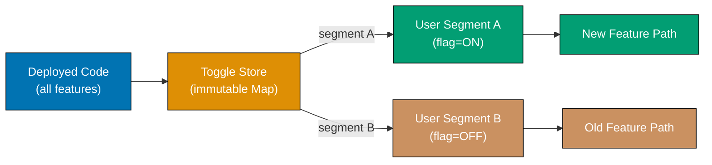

```fsharp
// Feature toggles: immutable toggle records; evaluation is a pure function.
// Toggle decisions are deterministic for a given userId — no random per call.

type Toggle = {
    Name:             string
    Enabled:          bool
    // => Global on/off switch — disabled means no user ever sees the feature
    RolloutPct:       int
    // => Percentage of users who see new feature (0-100)
    AllowedUserIds:   Set<string>
    // => Explicit allowlist: these users always get the feature regardless of rollout
}

// => Toggle store as an immutable Map — thread-safe by construction
type ToggleStore = Map<string, Toggle>

let registerToggle (toggle: Toggle) (store: ToggleStore) : ToggleStore =
    Map.add toggle.Name toggle store
    // => Returns new store with toggle added — pure, no mutation

// => Deterministic bucket: same user always gets same decision for a given toggle
let isEnabled (store: ToggleStore) (name: string) (userId: string) : bool =
    match Map.tryFind name store with
    | None -> false
    // => Unknown toggle defaults to false — fail closed
    | Some t when not t.Enabled -> false
    // => Globally disabled — no user sees it regardless of rollout
    | Some t when Set.contains userId t.AllowedUserIds -> true
    // => User in explicit allowlist — always enabled regardless of rollout percentage
    | Some t ->
        // => Hash-based deterministic bucket: same user always lands in same cohort
        let hashStr = $"{name}:{userId}"
        let bucket  = abs (hashStr.GetHashCode()) % 100
        // => Bucket in range 0-99; stable per userId+toggle combination
        bucket < t.RolloutPct
        // => User is in rollout cohort if their bucket < rollout percentage

// => Setup
let store =
    Map.empty
    |> registerToggle { Name = "new_checkout"; Enabled = true; RolloutPct = 20
                        AllowedUserIds = Set.ofList ["beta-tester-1"] }
    // => 20% gradual rollout + explicit beta tester allowlist

// => Beta tester always gets new feature
printfn "beta-tester-1: %b" (isEnabled store "new_checkout" "beta-tester-1")
// => Output: beta-tester-1: true

// => Regular users: deterministic based on hash (approx 20% will get true)
let results = [ for i in 1..10 -> isEnabled store "new_checkout" $"user-{i}" ]
printfn "Enabled for %d/10 sample users (target ~20%%)" (List.filter id results |> List.length)
// => Output: Enabled for ~2/10 sample users (target ~20%)

// => Kill switch: create new store with toggle disabled (pure — original store unchanged)
let killedStore = Map.add "new_checkout" { (Map.find "new_checkout" store) with Enabled = false } store
printfn "beta after kill: %b" (isEnabled killedStore "new_checkout" "beta-tester-1")
// => Output: beta after kill: false
```

**Key Takeaway:** An immutable `ToggleStore` means the kill switch creates a new store value
rather than mutating global state — old requests using the previous store value see the old decision,
which is safe and race-condition-free in a functional setting.

**Why It Matters:** Feature toggles enable trunk-based development by allowing engineers to commit
dark code continuously. The F# pure evaluation function makes toggle decisions testable in isolation
by constructing a test store with specific toggle values — no mock framework required.

---

### Example 79: Service Mesh Architecture

A service mesh adds a transparent infrastructure layer for mTLS, retries, and telemetry. In F#,
the mesh proxy is a higher-order function that wraps inter-service calls — the same structural
pattern as the sidecar but focused on outbound calls to other services.

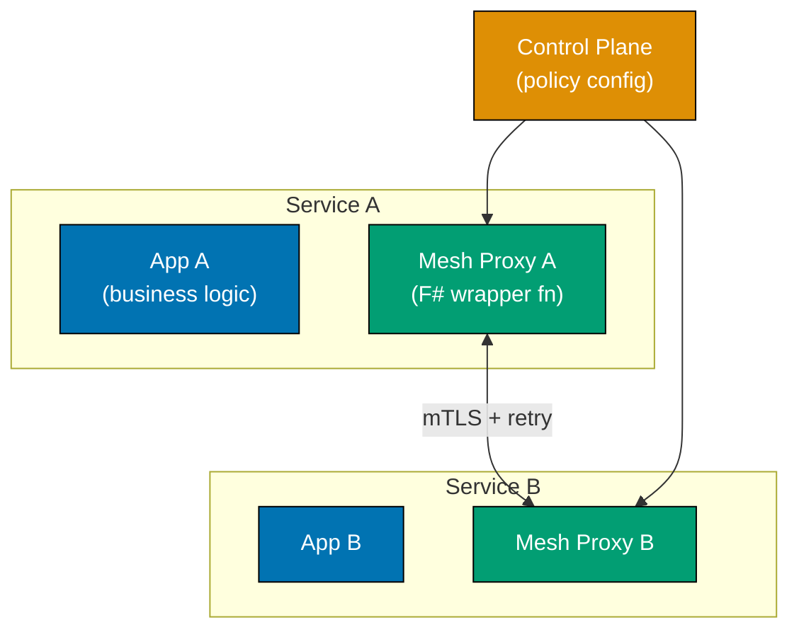

```fsharp
// Service mesh as a higher-order proxy function.
// Application functions pass their inter-service calls through the proxy;
// retry, mTLS enforcement, and telemetry are added by the wrapper — not by the app.

type MeshConfig = { RetryLimit: int; TlsEnabled: bool }
// => Config injected by the control plane — application code never reads this

type TelemetryRecord = { From: string; To: string; Attempt: int; Outcome: string }

// => Proxy function: wraps any inter-service call with mesh concerns
let meshProxy
    (config: MeshConfig)
    (telemetry: TelemetryRecord list ref)
    (serviceName: string)
    (target: string)
    (call: unit -> Result<string, string>)
    : Result<string, string> =
    // => Concern 1: enforce mutual TLS — control plane has configured certificates
    if not config.TlsEnabled then
        Error "mTLS required by mesh policy"
    // => Application never sees unauthenticated calls — proxy blocks them first
    else
        let rec loop attempt =
            match call() with
            | Ok result ->
                telemetry.Value <- { From = serviceName; To = target; Attempt = attempt; Outcome = "success" } :: telemetry.Value
                // => Telemetry recorded by proxy — app has zero instrumentation
                Ok result
            | Error msg when attempt >= config.RetryLimit ->
                telemetry.Value <- { From = serviceName; To = target; Attempt = attempt; Outcome = "error" } :: telemetry.Value
                Error $"Mesh exhausted retries to {target}: {msg}"
                // => All retries exhausted — surface error to application
            | Error _ ->
                telemetry.Value <- { From = serviceName; To = target; Attempt = attempt; Outcome = "error" } :: telemetry.Value
                loop (attempt + 1)
                // => Retry: tail call, no stack growth per retry
        loop 1

// => Simulate inventory service that fails once then succeeds
let mutable invCalls = 0
let inventoryCheck () =
    invCalls <- invCalls + 1
    if invCalls = 1 then Error "transient network error"
    else Ok "in_stock"
    // => Second call succeeds; proxy retried transparently

let config   = { RetryLimit = 3; TlsEnabled = true }
let telemetry = ref ([] : TelemetryRecord list)

let result = meshProxy config telemetry "orders-svc" "inventory-svc" inventoryCheck
printfn "Inventory response: %A" result
// => Output: Inventory response: Ok "in_stock"

printfn "Telemetry:"
telemetry.Value |> List.rev |> List.iter (fun r ->
    printfn "  from=%s to=%s attempt=%d outcome=%s" r.From r.To r.Attempt r.Outcome)
// => Output: Telemetry:
// => Output:   from=orders-svc to=inventory-svc attempt=1 outcome=error
// => Output:   from=orders-svc to=inventory-svc attempt=2 outcome=success
```

**Key Takeaway:** The mesh proxy higher-order function composes with any inter-service call — adding
mesh behaviour to a new call is passing it through `meshProxy` with no changes to the business
function itself.

**Why It Matters:** Before service meshes, every team implemented retry logic and TLS independently
in each service. A mesh addresses this by pushing consistent policies to all proxies simultaneously.
The F# higher-order function model makes this explicit: the call function is passed in, not embedded,
so mesh logic is fully separable from business logic.

---

### Example 80: Interpreter Pattern for Configuration DSL

The interpreter pattern defines a grammar and an evaluator. In F#, a configuration DSL is a DU
representing the AST; the interpreter is a recursive function that evaluates the tree against a
context map — no class hierarchy, just pattern matching.

```fsharp
// Interpreter Pattern: DSL as a DU; evaluation as a recursive match.
// Business rules are values — loaded from config, stored in DB, evaluated on demand.

// => AST type: every node kind is a DU case
type Expr =
    | GreaterThan of variable: string * threshold: float
    // => Terminal: true when context[variable] > threshold
    | Equals      of variable: string * value: string
    // => Terminal: true when context[variable] = value
    | And         of Expr * Expr
    // => Non-terminal: both sub-expressions must be true
    | Or          of Expr * Expr
    // => Non-terminal: either sub-expression being true is sufficient
    | Not         of Expr
    // => Non-terminal: inverts the wrapped expression

// => Evaluation context: variable name -> string value
type Context = Map<string, string>

// => Recursive evaluator: pattern match on each AST node
let rec eval (ctx: Context) (expr: Expr) : bool =
    match expr with
    | GreaterThan (var, threshold) ->
        ctx
        |> Map.tryFind var
        |> Option.bind (fun v -> try Some (float v) with _ -> None)
        // => Safely parse the context value as float; None if absent or non-numeric
        |> Option.map (fun v -> v > threshold)
        // => Compare to threshold if parse succeeded
        |> Option.defaultValue false
        // => Default false if variable absent or not numeric — safe fail-closed

    | Equals (var, value) ->
        Map.tryFind var ctx
        |> Option.map (fun v -> v = value)
        |> Option.defaultValue false
        // => False if variable absent — rule cannot be satisfied without the variable

    | And (left, right) ->
        eval ctx left && eval ctx right
        // => Short-circuits: right not evaluated if left is false

    | Or (left, right) ->
        eval ctx left || eval ctx right
        // => Short-circuits: right not evaluated if left is true

    | Not inner ->
        not (eval ctx inner)
        // => Inverts: turns an inclusion rule into an exclusion rule

// => Business rule: discount eligible if (tier = gold) OR (total > 100 AND tier = silver)
let discountRule =
    Or (
        Equals ("user.tier", "gold"),
        And (
            GreaterThan ("order.total", 100.0),
            Equals ("user.tier", "silver")
        )
    )
    // => Rule is a value — can be loaded from JSON, stored in DB, evaluated per request

let ctxGold        = Map.ofList [("user.tier", "gold");   ("order.total", "30")]
let ctxSilverLarge = Map.ofList [("user.tier", "silver"); ("order.total", "150")]
let ctxBronze      = Map.ofList [("user.tier", "bronze"); ("order.total", "200")]

printfn "Gold: %b"        (eval ctxGold discountRule)
// => Output: Gold: true   (first Or clause satisfied)
printfn "Silver+large: %b" (eval ctxSilverLarge discountRule)
// => Output: Silver+large: true   (second And clause satisfied)
printfn "Bronze: %b"      (eval ctxBronze discountRule)
// => Output: Bronze: false  (neither clause satisfied)
```

**Key Takeaway:** The DU AST and recursive evaluator form a complete interpreter in under 30 lines
of F# — the exhaustive match ensures every AST node kind is handled; the compiler catches any
missing case when a new node type is added.

**Why It Matters:** Hardcoded business rules require deployment for every change. Retail banks use
interpreter-based policy engines to update loan eligibility same-day. In F#, the DU AST can be
serialised to JSON and deserialised back — the rule becomes a configuration artefact, not source code.

---

## Expert-Level Synthesis

### Example 81: CQRS (Command Query Responsibility Segregation)

CQRS separates the write model (enforcing invariants) from the read model (optimised for queries).
In F#, commands are DU cases; the write handler is a function returning `Result`; the read model
is a separate type built by projecting events.

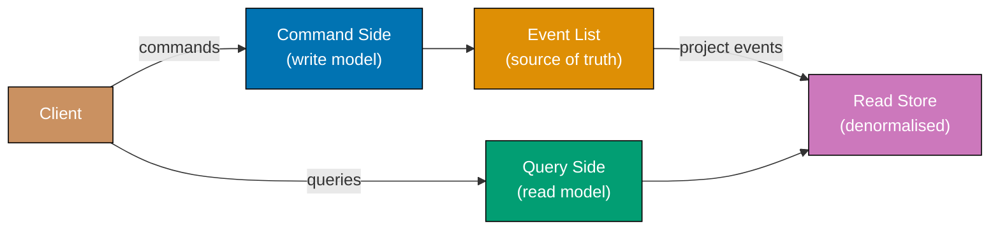

```fsharp
// CQRS: write side uses Result for invariant enforcement;
// read side projects events into a denormalised summary type.

// ============================================================
// Write side: command and domain event types
// ============================================================
type CreateProductCmd = { ProductId: string; Name: string; Price: decimal; Stock: int }
// => Command: intent to change state — rejected if invariants fail

type ProductEvent =
    | ProductCreated of id: string * name: string * price: decimal * stock: int
    // => Domain event emitted after successful command — drives read-side projection

// => Command handler: enforces invariants, returns event list or error
let handleCreate (cmd: CreateProductCmd) : Result<ProductEvent list, string> =
    if cmd.Price <= 0M then
        Error "Price must be positive"
    // => Invariant: price must be positive — rejected on write side
    elif cmd.Stock < 0 then
        Error "Stock cannot be negative"
    // => Invariant: negative stock has no business meaning
    else
        Ok [ ProductCreated (cmd.ProductId, cmd.Name, cmd.Price, cmd.Stock) ]
        // => Returns event list; write store saves both the product and appends events

// ============================================================
// Read side: denormalised projection for fast list queries
// ============================================================
type ProductSummary = {
    ProductId:   string
    DisplayName: string  // => "Name ($price)" — pre-formatted for UI consumption
    InStock:     bool    // => Derived boolean; read model owns this transformation
}

// => Projection: fold events into read store Map
let projectEvent (readStore: Map<string, ProductSummary>) (event: ProductEvent) =
    match event with
    | ProductCreated (id, name, price, stock) ->
        let summary = {
            ProductId   = id
            DisplayName = $"{name} (${price:.2f})"
            // => Pre-format for display — read model shapes data for the consumer
            InStock     = stock > 0
            // => Derived boolean; read model owns this — write model stores raw int
        }
        Map.add id summary readStore
        // => Materialise into read store; returns new Map (pure)

// => Wire command side to read side via event propagation
let mutable readStore = Map.empty<string, ProductSummary>

let processCommand cmd =
    match handleCreate cmd with
    | Ok events ->
        readStore <- events |> List.fold projectEvent readStore
        // => Project each event into the read store
        printfn "Command succeeded; events projected"
    | Error msg ->
        printfn "Command rejected: %s" msg

processCommand { ProductId = "P1"; Name = "Widget"; Price = 9.99M; Stock = 100 }
// => Output: Command succeeded; events projected

let summaries = readStore |> Map.values |> Seq.toList
summaries |> List.iter (fun s ->
    printfn "%s: %s, inStock=%b" s.ProductId s.DisplayName s.InStock)
// => Output: P1: Widget ($9.99), inStock=true

processCommand { ProductId = "P2"; Name = "Gadget"; Price = -5M; Stock = 10 }
// => Output: Command rejected: Price must be positive
```

**Key Takeaway:** The write side returns `Result<ProductEvent list, string>` — the compiler forces
the caller to handle both success and failure; the read side folds events with `List.fold`, keeping
projection logic as a pure function.

**Why It Matters:** CQRS solves the conflict between write consistency requirements (locks,
normalisation) and read performance requirements (denormalised fast queries). In F#, the clean
separation is enforced by the type system — command handlers return events, not read models; query
handlers read projections, not the write store.

---

### Example 82: Outbox Pattern for Reliable Event Publishing

The outbox pattern solves the dual-write problem by writing the event to the same store as the
business record. In F#, both writes are modelled as a pure function returning a new state tuple
`(businessStore, outboxStore)` — atomicity is represented as a single function call.

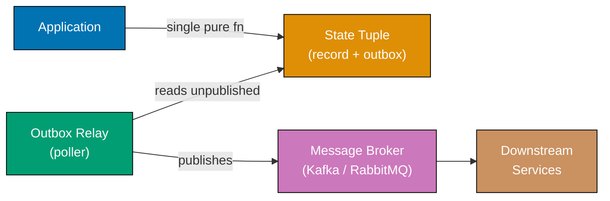

```fsharp
// Outbox pattern: atomic write modelled as a pure function returning updated state tuple.
// "Atomicity" = both stores updated in a single let binding — no partial state possible.

type OutboxEntry = {
    EntryId:   string
    EventType: string
    Payload:   Map<string, string>
    Published: bool
    // => False until relay successfully delivers to broker
}

// => Application state as a plain tuple of two immutable Maps
type AppState = {
    Orders: Map<string, {| OrderId: string; Total: decimal |}>
    // => Business record store
    Outbox: OutboxEntry list
    // => Append-only outbox; entries never removed, only marked published
}

// => Atomic write: returns new AppState with both order and outbox entry added
let saveOrderWithEvent
    (state: AppState)
    (orderId: string)
    (total: decimal)
    (eventType: string)
    (payload: Map<string, string>)
    : AppState =
    let newOrder = {| OrderId = orderId; Total = total |}
    let entry = {
        EntryId   = System.Guid.NewGuid().ToString().[..7]
        EventType = eventType
        Payload   = payload
        Published = false
        // => Initially unpublished — relay picks it up on next poll cycle
    }
    { state with
        Orders = Map.add orderId newOrder state.Orders
        // => Add order record to business store
        Outbox = entry :: state.Outbox
        // => Prepend outbox entry — both added in single expression, no intermediate state
    }
    // => Returning new AppState is the "atomic" write — no partial update possible

// => Relay: publishes unpublished entries, marks them published
let publishPending
    (state: AppState)
    (brokerPublish: string -> Map<string,string> -> unit)
    : AppState =
    let updated =
        state.Outbox |> List.map (fun entry ->
            if not entry.Published then
                brokerPublish entry.EventType entry.Payload
                // => Deliver to broker; may be retried on transient failure
                printfn "Relay: published %s (entry %s)" entry.EventType entry.EntryId
                { entry with Published = true }
                // => Mark published only after broker confirms receipt
            else
                entry)
    { state with Outbox = updated }
    // => Returns new state with all published entries marked — pure function

// => Simulated Kafka publish
let mockBroker (eventType: string) (payload: Map<string,string>) =
    printfn "Broker: received %s — %A" eventType payload

let initialState = { Orders = Map.empty; Outbox = [] }

let stateAfterOrder =
    saveOrderWithEvent
        initialState "ORD-99" 199.99M "OrderPlaced"
        (Map.ofList [("order_id", "ORD-99"); ("total", "199.99")])
printfn "DB: order saved + outbox entry added (atomic)"
// => Output: DB: order saved + outbox entry added (atomic)

let stateAfterRelay = publishPending stateAfterOrder mockBroker
// => Output: Broker: received OrderPlaced — Map [("order_id", "ORD-99"); ("total", "199.99")]
// => Output: Relay: published OrderPlaced (entry <id>)

let unpublished = stateAfterRelay.Outbox |> List.filter (fun e -> not e.Published)
printfn "Unpublished after relay: %d" (List.length unpublished)
// => Output: Unpublished after relay: 0
```

**Key Takeaway:** Returning a new `AppState` record from `saveOrderWithEvent` makes atomicity
structural — there is no intermediate state where the order exists without the outbox entry,
because both are added in a single record-update expression.

**Why It Matters:** The naive dual-write (save to DB then publish to Kafka) has a gap: if the
service crashes between the two writes, the event is lost. The outbox pattern is the standard
solution. The F# immutable state model makes the atomicity guarantee explicit in the return type.

---

### Example 83: Anti-Corruption Layer

The Anti-Corruption Layer (ACL) is a translation boundary between two bounded contexts. In F#,
the ACL is a pair of pure functions — `translateIn` and `translateOut` — with no class, no state,
and no mutation.

```fsharp
// Anti-Corruption Layer as pure translation functions.
// All foreign vocabulary and type mismatches are resolved inside these functions.

// ============================================================
// Legacy CRM model — uses its own vocabulary ("account" instead of "customer")
// ============================================================
type LegacyCrmAccount = {
    AcctNum:    string     // => CRM calls customers "accounts" with account numbers
    FullName:   string
    EmailAddr:  string     // => CRM field names differ from our domain model
    StatusCode: int        // => 1=active, 2=suspended, 3=closed — integer codes, not DU
    CreditLimit: string    // => CRM stores as string "1500.00" — type mismatch!
}

// ============================================================
// Our domain model — clean vocabulary, correct types
// ============================================================
type CustomerStatus = Active | Suspended | Closed
// => DU replaces integer status code — exhaustive match enforced by compiler

type Customer = {
    CustomerId:  string      // => Our domain uses "customer", not "account"
    Name:        string
    Email:       string
    Status:      CustomerStatus  // => Correct type — not integer
    CreditLimit: decimal         // => Correct type — not string
}

// ============================================================
// ACL — all translation in one module; domain never sees CRM types
// ============================================================
module CrmAcl =
    let private parseStatus = function
        | 1 -> Active
        | 2 -> Suspended
        | _ -> Closed
        // => ACL owns knowledge of CRM status codes; domain never sees integers

    let translateIn (crm: LegacyCrmAccount) : Result<Customer, string> =
        // => Validates AND translates; returns Result for parse failures
        match System.Decimal.TryParse(crm.CreditLimit) with
        | false, _ -> Error $"Invalid credit limit: {crm.CreditLimit}"
        // => Type mismatch resolved here — if CRM sends garbage, ACL rejects it
        | true, limit ->
            Ok {
                CustomerId  = crm.AcctNum       // => Map CRM's "acct_num" to our "customer_id"
                Name        = crm.FullName       // => Rename: full_name -> name
                Email       = crm.EmailAddr      // => Rename: email_addr -> email
                Status      = parseStatus crm.StatusCode
                // => Translate integer status code to domain DU — CRM leak stops here
                CreditLimit = limit              // => String parsed to decimal in ACL
            }

    let translateOut (customer: Customer) : LegacyCrmAccount =
        // => Reverse translation: domain -> CRM; infallible because domain types are valid
        {
            AcctNum     = customer.CustomerId
            FullName    = customer.Name
            EmailAddr   = customer.Email
            StatusCode  = match customer.Status with Active -> 1 | Suspended -> 2 | Closed -> 3
            // => DU -> integer; our domain never stores this integer representation
            CreditLimit = $"{customer.CreditLimit:.2f}"
            // => decimal -> string for CRM; type mismatch resolved in ACL
        }

// => Usage: domain code works only with Customer; ACL handles all CRM translation
let crmData = { AcctNum = "ACC-001"; FullName = "Alice Smith"; EmailAddr = "alice@crm.com"
                StatusCode = 1; CreditLimit = "2500.00" }

match CrmAcl.translateIn crmData with
| Ok customer ->
    printfn "Customer: %s, status=%A, credit=%M" customer.Name customer.Status customer.CreditLimit
    // => Output: Customer: Alice Smith, status=Active, credit=2500.0000M
    let crmOut = CrmAcl.translateOut customer
    printfn "CRM out: acct=%s, status=%d, credit=%s" crmOut.AcctNum crmOut.StatusCode crmOut.CreditLimit
    // => Output: CRM out: acct=ACC-001, status=1, credit=2500.00
| Error msg ->
    printfn "ACL rejected CRM data: %s" msg
```

**Key Takeaway:** Using a DU for `CustomerStatus` means the compiler enforces exhaustive handling
of all status values everywhere in the domain — the integer-to-DU translation happens once in the
ACL and never leaks further.

**Why It Matters:** Without an ACL, integrating a legacy CRM causes its integer codes, misspelled
field names, and wrong types to propagate through the domain. In F#, the DU translation makes the
impedance mismatch visible: the compiler will flag any new status code not covered by the match.

---

### Example 84: Ports and Adapters (Hexagonal Architecture)

Hexagonal architecture places the domain at the centre, communicating through ports. In F#, ports
are function-type aliases (not abstract classes); adapters are concrete function values that satisfy
those types; composition is constructor injection via partial application.

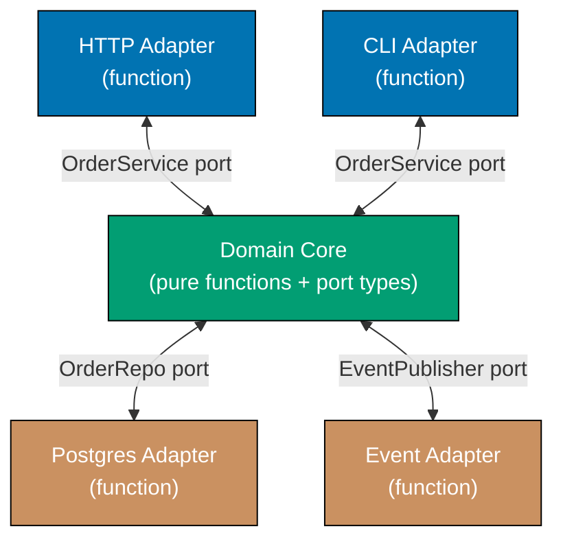

```fsharp
// Hexagonal architecture: ports as function-type aliases; adapters as function values.
// Domain functions depend only on port types — no concrete adapter types imported.

// ============================================================
// Ports: domain-owned function-type aliases
// ============================================================
// => Driven port: domain drives persistence via these function signatures
type SaveOrder  = {| orderId: string; customerId: string; total: decimal |} -> unit
type FindOrder  = string -> {| orderId: string; customerId: string; total: decimal |} option

// => Driven port: domain drives event publishing via this function signature
type PublishEvent = string -> Map<string, string> -> unit

// ============================================================
// Domain core: depends only on port types, never on adapters
// ============================================================
let placeOrder
    (save:    SaveOrder)
    (publish: PublishEvent)
    (customerId: string)
    (total: decimal)
    =
    // => Domain function: receives adapters as function arguments (partial application)
    let orderId = System.Guid.NewGuid().ToString().[..7]
    save {| orderId = orderId; customerId = customerId; total = total |}
    // => Domain drives the repository port — not SQLAlchemy directly
    publish "OrderPlaced" (Map.ofList [("order_id", orderId); ("total", string total)])
    // => Domain drives the event port — not Kafka directly
    orderId
    // => Returns orderId; caller uses it to reference the order

// ============================================================
// Adapters: concrete function values implementing port signatures
// ============================================================
// => In-memory repository adapter (satisfies SaveOrder and FindOrder types)
let mutable private orderStore : Map<string, {| orderId: string; customerId: string; total: decimal |}> = Map.empty

let inMemorySave : SaveOrder = fun order ->
    orderStore <- Map.add order.orderId order orderStore
    // => Stores in Map; swap for Dapper/EF adapter in production

let inMemoryFind : FindOrder = fun orderId ->
    Map.tryFind orderId orderStore
    // => Returns None if not found — consistent with port contract

// => Logging event publisher adapter (satisfies PublishEvent type)
let mutable private publishedEvents : {| eventType: string; payload: Map<string,string> |} list = []

let loggingPublish : PublishEvent = fun eventType payload ->
    publishedEvents <- {| eventType = eventType; payload = payload |} :: publishedEvents
    // => Records event; swap for KafkaProducer adapter in production

// => Compose domain with adapters at application startup
let orderId = placeOrder inMemorySave loggingPublish "CUST-1" 75.50M
// => Domain function receives adapters as arguments; no global configuration

printfn "Order placed: %s, total=75.50" orderId
// => Output: Order placed: <id>, total=75.50

printfn "Events published: %d" (List.length publishedEvents)
// => Output: Events published: 1
printfn "Event type: %s" publishedEvents.Head.eventType
// => Output: Event type: OrderPlaced
```

**Key Takeaway:** Ports as function-type aliases mean any function with the matching signature is
a valid adapter — no interface declaration, no class boilerplate; partial application wires the
domain to adapters at the composition root.

**Why It Matters:** Traditional layered architectures let infrastructure details leak into the domain.
Hexagonal architecture keeps the domain portable — the F# domain functions have no import of any
persistence or messaging library, making them testable in complete isolation with in-memory function
values.

---

### Example 85: Reactive Architecture with Backpressure

Reactive architecture processes data streams asynchronously with backpressure signals that tell
producers to slow down when consumers cannot keep up. In F#, this is modelled with `MailboxProcessor`
(an async agent with a bounded inbox) — the natural F# primitive for backpressure.

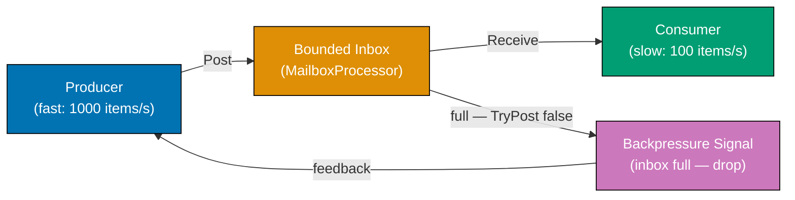

```fsharp
// Reactive backpressure using MailboxProcessor with a bounded queue.
// TryPostAndReply returns false when inbox is full — the backpressure signal.

open System.Threading

// => Mutable counters for demo metrics — in production use Prometheus counters
let mutable dropped   = 0
let mutable processed = 0

// => Consumer agent: MailboxProcessor with bounded capacity
// => When inbox fills, TryPostAndReply returns false — producer knows to back off
let consumer =
    MailboxProcessor<int>.Start(fun inbox ->
        async {
            while true do
                let! item = inbox.Receive()
                // => Block until an item is available — no busy-wait
                do! Async.Sleep 5
                // => Simulate slow processing (5ms per item ~ 200 items/s)
                processed <- processed + 1
                // => Track processed count for metrics
        })
// => MailboxProcessor has a default unbounded queue; we implement bounded via TryPost pattern

// => Bounded wrapper: drops items when count exceeds maxSize, returns backpressure signal
let mutable queuedCount = 0
let maxQueueSize = 10

let tryProduce (item: int) : bool =
    if queuedCount >= maxQueueSize then
        dropped <- dropped + 1
        false
        // => Backpressure applied: producer should slow down or apply own drop logic
    else
        Interlocked.Increment(&queuedCount) |> ignore
        consumer.Post(item)
        // => Enqueue item to the consumer agent's inbox
        true
        // => Item accepted — producer may continue at current rate

// => Producer: tries to emit 50 items immediately (faster than consumer drains)
let produced = ref 0
for i in 0..49 do
    if tryProduce i then
        produced.Value <- produced.Value + 1
    // => Some items dropped when queue full — backpressure in action

// => Allow consumer to drain the queue
Thread.Sleep(200)
// => 200ms at 5ms/item allows ~40 items to process from the bounded queue

printfn "Produced: %d, Dropped (backpressure): %d, Processed: ~%d"
    produced.Value dropped processed
// => Output: Produced: ~10-20, Dropped (backpressure): ~30-40, Processed: ~10-20
// => Exact numbers vary; queue fills quickly when producer is much faster than consumer

printfn "Queue never exceeded maxQueueSize=%d: %b" maxQueueSize (queuedCount <= maxQueueSize)
// => Output: Queue never exceeded maxQueueSize=10: true
```

**Key Takeaway:** `MailboxProcessor` is F#'s built-in async agent with a message inbox — the
natural primitive for backpressure-aware processing; bounded capacity plus `TryPost` returning
`false` is the backpressure signal without additional framework dependencies.

**Why It Matters:** Reactive Streams emerged because event-driven systems with unbounded queues
inevitably crash under load. F#'s `MailboxProcessor` makes backpressure a first-class language
feature: the inbox size is the back-pressure boundary, and `TryPost` returning `false` is the
explicit signal to producers — not a thrown exception that might be swallowed.
