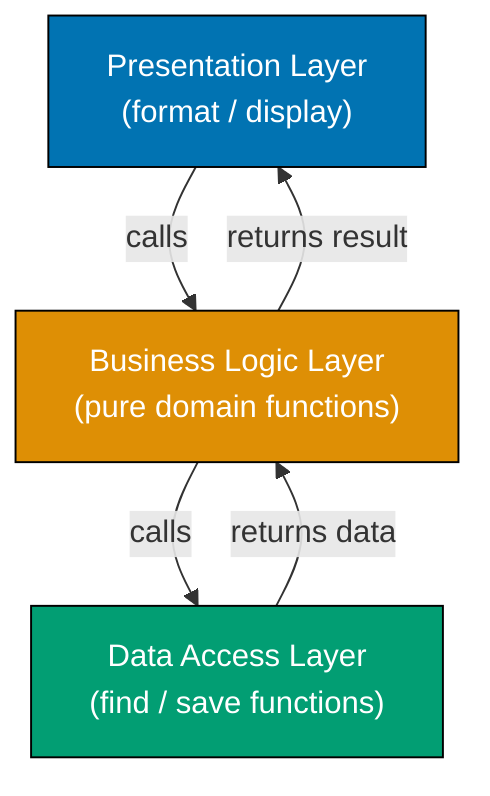
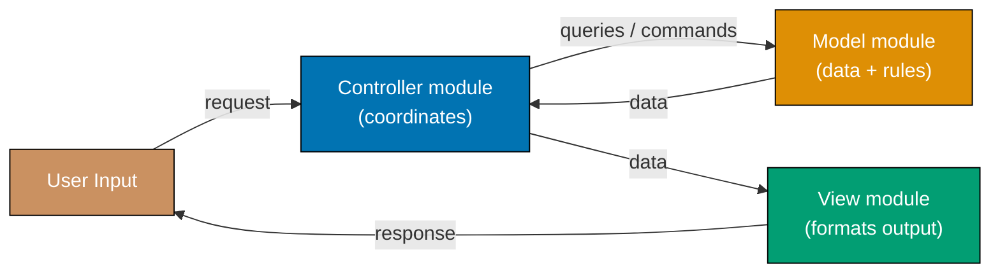
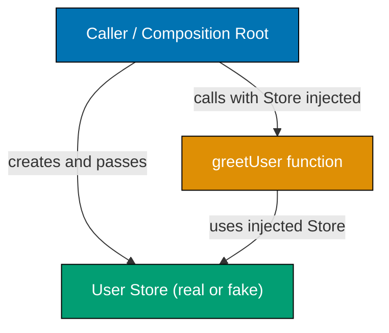
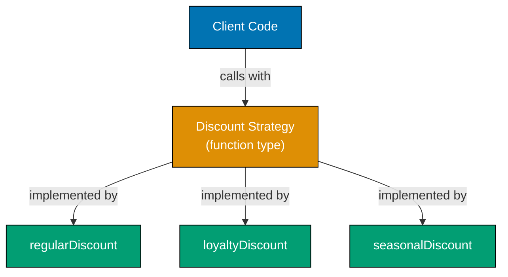
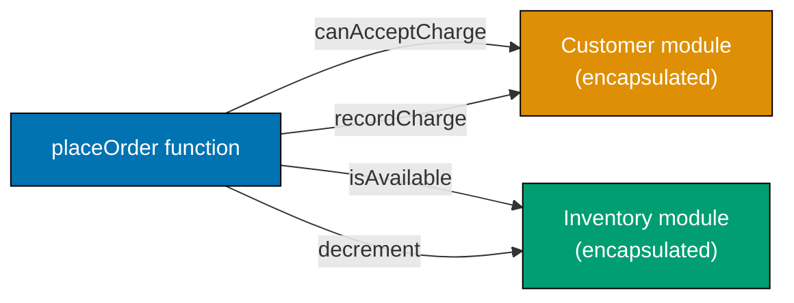
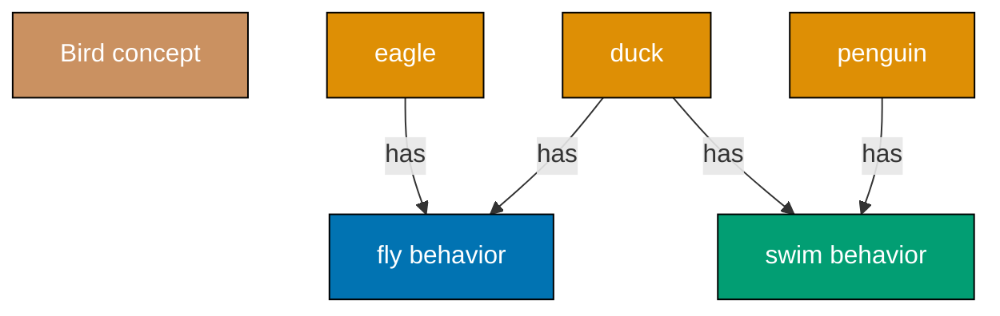
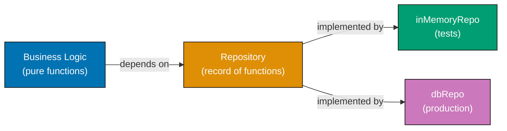
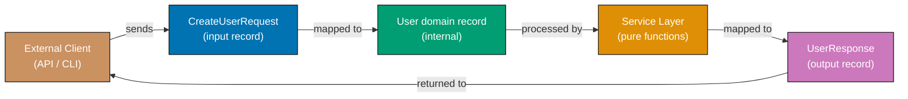
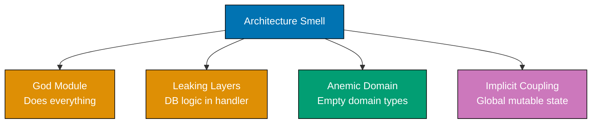

This beginner level covers Examples 1-28, reaching approximately 0-35% of software architecture fundamentals. Each example demonstrates a core architectural concept using F# with self-contained, runnable code (compatible with `dotnet fsi`). These examples target developers who already know at least one language and want to rapidly build architectural instincts through working functional code. Each example uses its own small illustrative domain so the architectural pattern remains the focal point.

## Separation of Concerns

### Example 1: No Separation vs. Clear Separation

Separation of concerns means grouping code by responsibility so each function handles exactly one aspect of the system. When multiple responsibilities mix in one function, changing any part risks breaking the others. In FP, concerns are separated into distinct named functions rather than classes.

**Tightly coupled approach (no separation):**

```fsharp
// => This function handles THREE distinct responsibilities at once:
// => 1. Data access (reading from an in-memory map)
// => 2. Business logic (computing discount based on purchase count)
// => 3. Presentation (formatting a string for display)
let getUserDiscountMessage (userId: int) : string =
    // => userDb simulates a database lookup — data access concern embedded here
    let userDb = Map.ofList [ 1, ("Alice", 12) ]
    // => Map.ofList converts a list of key-value pairs to an immutable map
    match Map.tryFind userId userDb with
    // => Map.tryFind returns Some (name, purchases) or None — safe lookup
    | None -> "User not found"
    // => None branch: guard for missing user
    | Some (name, purchases) ->
        // => Business rule embedded directly — hard to change independently
        let discount = if purchases > 10 then 0.15 else 0.05
        // => 0.15 for loyal customers (>10 purchases), 0.05 default
        // => Presentation formatted inline — impossible to reuse discount logic elsewhere
        sprintf "Hello %s, your discount is %.0f%%" name (discount * 100.0)
        // => Output: "Hello Alice, your discount is 15%"

printfn "%s" (getUserDiscountMessage 1)
// => Output: Hello Alice, your discount is 15%
```

Mixing all three responsibilities means any change — a new discount rule, a different greeting format, or a different data source — requires editing the same function.

**Separated approach (three distinct pure functions):**

```fsharp
// => DATA ACCESS — only knows how to retrieve users
let findUser (userId: int) : (string * int) option =
    // => Returns Some (name, purchases) or None — no formatting, no rules
    let userDb = Map.ofList [ 1, ("Alice", 12) ]
    // => In-memory map simulates a real data store
    Map.tryFind userId userDb
    // => Map.tryFind : int -> Map<int,'a> -> 'a option

// => BUSINESS LOGIC — only knows discount rules, not storage or display
let calculateDiscount (purchases: int) : float =
    // => Pure function: same input always produces same output
    if purchases > 10 then 0.15
    // => 15% for loyal customers (>10 purchases)
    else 0.05
    // => 5% default discount

// => PRESENTATION — only knows how to format, not compute or fetch
let formatDiscountMessage (name: string) (discount: float) : string =
    sprintf "Hello %s, your discount is %.0f%%" name (discount * 100.0)
    // => Output: "Hello Alice, your discount is 15%"

// => ORCHESTRATION — thin coordinator that pipelines the three functions
let getUserDiscountMessageSeparated (userId: int) : string =
    match findUser userId with
    // => delegates data access — result is Some (name, purchases) or None
    | None -> "User not found"
    | Some (name, purchases) ->
        let discount = calculateDiscount purchases
        // => delegates business rule — discount : float
        formatDiscountMessage name discount
        // => delegates formatting — returns final string

printfn "%s" (getUserDiscountMessageSeparated 1)
// => Output: Hello Alice, your discount is 15%
```

Each function now has one reason to change: swap the data source without touching the discount rule; change the discount formula without touching the message format.

**Key Takeaway:** Separate each distinct responsibility into its own named function. A function should have exactly one reason to change.

**Why It Matters:** In production systems, business rules change far more often than data storage technology, and display formats change more often than both. When these concerns are mixed, a simple business rule change forces a full regression test of the display layer. In FP, the discipline of writing small, pure, single-purpose functions naturally enforces this separation. Functions compose cleanly precisely because each does exactly one thing.

---

### Example 2: Single Responsibility Principle

The Single Responsibility Principle (SRP) states that a module or function should have one and only one reason to change. In F#, SRP is expressed through focused modules and single-purpose functions rather than classes. Violating SRP creates fragile code where an unrelated change breaks a seemingly unrelated feature.

**Violating SRP — one module does too much:**

```fsharp
// => UserManager module handles user data AND email AND password — three reasons to change
module UserManagerBad =
    // => users simulates a persistent store
    let mutable private users : Map<int, string * string> = Map.empty
    // => map from id to (name, email) tuple

    let addUser (id: int) (name: string) (email: string) : unit =
        users <- Map.add id (name, email) users
        // => stores user under id key; mutable state used here

    // => EMAIL CONCERN embedded in the user module — mixing responsibilities
    let sendWelcomeEmail (userId: int) : unit =
        match Map.tryFind userId users with
        | None -> ()
        // => user not found — silent no-op
        | Some (name, email) ->
            printfn "Sending email to %s: Welcome, %s!" email name
            // => Output: Sending email to alice@example.com: Welcome, Alice!

    // => PASSWORD CONCERN also embedded — a third responsibility leaking in
    let resetPassword (userId: int) : string =
        let newPassword = sprintf "pass_%d_reset" userId
        // => deterministic fake password for this example
        printfn "Password reset for user %d: %s" userId newPassword
        // => Output: Password reset for user 1: pass_1_reset
        newPassword
        // => returns the new password string
```

**Applying SRP — one module, one responsibility:**

```fsharp
// => RESPONSIBILITY 1: User data management only
module UserStore =
    // => Immutable store returned on each operation — no mutable shared state
    let add (id: int) (name: string) (email: string)
            (store: Map<int, string * string>) : Map<int, string * string> =
        Map.add id (name, email) store
        // => returns a NEW map with the user added — original store unchanged

    let get (id: int) (store: Map<int, string * string>) : (string * string) option =
        Map.tryFind id store
        // => returns Some (name, email) or None — safe lookup

// => RESPONSIBILITY 2: Email notifications only
module EmailService =
    let sendWelcome (name: string) (email: string) : unit =
        printfn "Sending email to %s: Welcome, %s!" email name
        // => Output: Sending email to alice@example.com: Welcome, Alice!
        // => This module changes only when email format or provider changes

// => RESPONSIBILITY 3: Password management only
module PasswordService =
    let reset (userId: int) : string =
        let newPassword = sprintf "pass_%d_reset" userId
        // => deterministic for this example; use a CSPRNG in production
        printfn "Password reset for user %d: %s" userId newPassword
        // => Output: Password reset for user 1: pass_1_reset
        newPassword
        // => returns generated password string

let store0 = Map.empty
// => empty map is our initial state — no users yet
let store1 = UserStore.add 1 "Alice" "alice@example.com" store0
// => store1 : Map<int, string * string> with one user entry
EmailService.sendWelcome "Alice" "alice@example.com"
// => Output: Sending email to alice@example.com: Welcome, Alice!
```

**Key Takeaway:** Each module should have exactly one reason to change. When you update email templates, only `EmailService` changes. When you change password policy, only `PasswordService` changes.

**Why It Matters:** SRP is the foundational principle behind microservices — each service owns one business capability. In FP, the natural unit of SRP is the module. Teams that own single-responsibility modules deploy independently, reducing the coordination overhead that kills engineering velocity at scale.

---

## Layered Architecture

### Example 3: Three-Layer Architecture

A layered architecture organizes code into a presentation layer (handles user interaction), a business logic layer (enforces rules), and a data access layer (manages persistence). In F#, layers are expressed as separate modules that only call downward — presentation calls business logic, business logic calls data access, never the reverse.



```fsharp
// ============================================================
// DATA ACCESS LAYER — only knows about storage
// ============================================================
module ProductDb =
    // => In-memory store simulates a database table
    // => Each product has id, name, price, and stock
    let private products : Map<int, {| name: string; price: float; stock: int |}> =
        Map.ofList [
            1, {| name = "Laptop"; price = 1200.0; stock = 5 |}
            // => stock 5: available
            2, {| name = "Mouse";  price = 25.0;  stock = 0 |}
            // => stock 0: out of stock
        ]

    let findById (productId: int) =
        Map.tryFind productId products
        // => returns Some {| name; price; stock |} or None
        // => caller decides what to do with the absence

// ============================================================
// BUSINESS LOGIC LAYER — only knows about rules
// ============================================================
module ProductPolicy =
    type ProductResult =
        | Available of name: string * price: float
        // => product exists and is in stock
        | OutOfStock of name: string
        // => product exists but stock is zero
        | NotFound
        // => no product found for the given id

    let checkAvailability (productId: int) : ProductResult =
        match ProductDb.findById productId with
        // => delegates data retrieval to the data access layer
        | None -> NotFound
        // => no product record — return NotFound case
        | Some p when p.stock = 0 ->
            OutOfStock p.name
            // => business rule: zero stock means unavailable
        | Some p ->
            Available (p.name, p.price)
            // => product in stock — return name and price

// ============================================================
// PRESENTATION LAYER — only knows about formatting responses
// ============================================================
module ProductView =
    let formatResult (result: ProductPolicy.ProductResult) : string =
        match result with
        // => pattern match on the union — each case formats differently
        | ProductPolicy.Available (name, price) ->
            sprintf "Available: %s at $%.2f" name price
            // => Output (id=1): "Available: Laptop at $1200.00"
        | ProductPolicy.OutOfStock name ->
            sprintf "Error: '%s' is out of stock" name
            // => Output (id=2): "Error: 'Mouse' is out of stock"
        | ProductPolicy.NotFound ->
            "Error: Product not found"
            // => Output (id=99): "Error: Product not found"

// Wire and run
let display (productId: int) =
    productId
    |> ProductPolicy.checkAvailability
    // => pipes id through business layer
    |> ProductView.formatResult
    // => pipes result through presentation layer

printfn "%s" (display 1)  // => Available: Laptop at $1200.00
printfn "%s" (display 2)  // => Error: 'Mouse' is out of stock
printfn "%s" (display 99) // => Error: Product not found
```

**Key Takeaway:** Each layer communicates only with the layer directly below it. Presentation never touches the database; data access never formats strings for users. In FP, the `|>` pipeline operator makes this layered data flow explicit and readable.

**Why It Matters:** Layered architecture enables parallel development — a frontend team can build against an agreed function signature while a backend team implements the business rules — and makes testing each layer independently straightforward. Because each F# layer is a collection of pure functions, they can be tested without stubs or mocks.

---

### Example 4: Presentation Layer Isolation

The presentation layer should translate raw input into domain calls and translate domain results into output format. It should contain no business logic and no data access code. In F#, keeping the presentation layer thin means it only pipes values through domain functions and formats results.

```fsharp
// => DATA LAYER — retrieves raw records (pure function, no side effects)
let private orderDb : Map<int, {| total: float; status: string |}> =
    Map.ofList [
        101, {| total = 299.99; status = "shipped" |}
        // => shipped: not eligible for cancellation
        102, {| total = 49.0;   status = "pending" |}
        // => pending with low total: eligible for cancellation
    ]

let findOrder (orderId: int) =
    Map.tryFind orderId orderDb
    // => returns Some {| total; status |} or None — pure lookup

// => BUSINESS LAYER — applies domain rules (pure function)
let isEligibleForCancellation (total: float) (status: string) : bool =
    status = "pending" && total < 500.0
    // => cancellation rule: pending AND total below $500 threshold
    // => changing this rule affects only this function

// => PRESENTATION LAYER — translates, never decides
let handleCancelRequest (orderId: int) : string =
    match findOrder orderId with
    // => fetches from data layer — presentation never queries the map directly
    | None ->
        sprintf "Order %d not found" orderId
        // => presentation transforms None into a user-facing message
    | Some order ->
        let eligible = isEligibleForCancellation order.total order.status
        // => business logic evaluated in business layer, result consumed here
        if eligible then
            sprintf "Order %d cancelled successfully" orderId
            // => Output (id=102): "Order 102 cancelled successfully"
        else
            sprintf "Order %d cannot be cancelled (status: %s)" orderId order.status
            // => Output (id=101): "Order 101 cannot be cancelled (status: shipped)"

printfn "%s" (handleCancelRequest 101) // => Order 101 cannot be cancelled (status: shipped)
printfn "%s" (handleCancelRequest 102) // => Order 102 cancelled successfully
printfn "%s" (handleCancelRequest 999) // => Order 999 not found
```

**Key Takeaway:** The presentation layer transforms but never decides. All decisions live in pure business functions where they can be tested without a UI or HTTP context.

**Why It Matters:** Teams that keep business logic out of presentation functions can test their entire rule set with fast in-memory unit tests. When the presentation layer grows — mobile app, CLI tool, REST API — the business functions require zero modification, because no presentation logic has leaked into them.

---

## MVC Pattern

### Example 5: Model-View-Controller Basics

MVC separates a program into a Model (data and rules), a View (formatting output), and a Controller (coordinating input and response). In F#, each MVC component is a module containing pure functions. The Controller module receives input, asks the Model to process it, then passes results to the View for display.



```fsharp
// ============================================================
// MODEL — data type + pure rule functions
// ============================================================
module TodoModel =
    type Todo = { Id: int; Title: string; Done: bool }
    // => record type: Id AND Title AND Done — all required

    type Store = { Items: Todo list; NextId: int }
    // => immutable store: items list and next available id

    let empty = { Items = []; NextId = 1 }
    // => empty : Store — initial state with no items

    let add (title: string) (store: Store) : Todo * Store =
        let item = { Id = store.NextId; Title = title; Done = false }
        // => item : Todo — new item with auto-incremented id
        let newStore = { Items = store.Items @ [item]; NextId = store.NextId + 1 }
        // => @ appends item to the items list
        // => NextId incremented for next call
        item, newStore
        // => returns the created item AND the updated store

    let complete (itemId: int) (store: Store) : bool * Store =
        let updated = store.Items |> List.map (fun t ->
            if t.Id = itemId then { t with Done = true } else t)
        // => List.map transforms each item: matching id → Done = true
        // => non-matching items pass through unchanged
        let found = updated |> List.exists (fun t -> t.Id = itemId)
        // => found : bool — true if any item matched the given id
        found, { store with Items = updated }
        // => returns (success flag, updated store)

// ============================================================
// VIEW — formats data for display, no logic
// ============================================================
module TodoView =
    let renderList (items: TodoModel.Todo list) : string =
        if List.isEmpty items then "No todos yet."
        // => empty list: short message
        else
            items
            |> List.map (fun item ->
                let status = if item.Done then "✓" else "○"
                // => status is "✓" for done items, "○" for pending
                sprintf "[%s] %d. %s" status item.Id item.Title)
            // => each item formatted as "[○] 1. Buy milk"
            |> String.concat "\n"
            // => joined with newlines

    let renderCreated (item: TodoModel.Todo) : string =
        sprintf "Created todo #%d: %s" item.Id item.Title
        // => Output: "Created todo #1: Buy milk"

// ============================================================
// CONTROLLER — coordinates model and view
// ============================================================
module TodoController =
    let create (title: string) (store: TodoModel.Store) : string * TodoModel.Store =
        let item, newStore = TodoModel.add title store
        // => delegates creation to model — receives item + updated store
        TodoView.renderCreated item, newStore
        // => delegates formatting to view — returns message + store

    let listAll (store: TodoModel.Store) : string =
        store.Items |> TodoView.renderList
        // => fetches items from store, delegates rendering to view

    let markDone (itemId: int) (store: TodoModel.Store) : string * TodoModel.Store =
        let found, newStore = TodoModel.complete itemId store
        // => delegates completion to model
        let msg = if found then sprintf "Todo #%d marked as done" itemId
                             else sprintf "Todo #%d not found" itemId
        msg, newStore
        // => returns message + updated store

// => Wire the MVC triad together — pure state threading
let msg1, s1 = TodoController.create "Buy milk" TodoModel.empty
// => msg1 = "Created todo #1: Buy milk", s1 has one item
let msg2, s2 = TodoController.create "Write tests" s1
// => msg2 = "Created todo #2: Write tests", s2 has two items
let msg3, s3 = TodoController.markDone 1 s2
// => msg3 = "Todo #1 marked as done", s3 has item 1 with Done = true

printfn "%s" msg1          // => Created todo #1: Buy milk
printfn "%s" msg2          // => Created todo #2: Write tests
printfn "%s" msg3          // => Todo #1 marked as done
printfn "%s" (TodoController.listAll s3)
// => [✓] 1. Buy milk
// => [○] 2. Write tests
```

**Key Takeaway:** The Controller handles input and coordinates. The Model owns data types and rules. The View formats output. In F#, state flows explicitly from function to function rather than being mutated in place, making the data flow visible and testable.

**Why It Matters:** MVC is the backbone of virtually every web framework. Understanding the pure form of MVC lets you debug framework issues quickly. The F# implementation makes each layer's role obvious through the type system — a View function accepts data and returns a string, not a database object.

---

### Example 6: Model Encapsulates Validation

The Model is responsible for enforcing its own invariants. In F#, a module with a private constructor (or smart constructor) ensures that invalid data can never be constructed — the type system enforces the rule, not runtime guards scattered across callers.

```fsharp
// => POOR APPROACH: raw record with no invariant enforcement
// => Any code can construct a BankAccount with negative balance
type PoorBankAccount = { Balance: float }
// => Nothing stops: { Balance = -9999.0 }
// => Callers must remember to validate themselves — drift is inevitable

// => ENCAPSULATED APPROACH: module with opaque type and smart constructor
module BankAccount =
    // => Opaque type — Balance field is accessible but construction is controlled
    type T = private { Balance: float }
    // => private label: only this module can construct a T record directly

    let create (initialBalance: float) : Result<T, string> =
        if initialBalance < 0.0 then
            Error "Initial balance cannot be negative"
            // => enforced at construction time — invalid state never enters the system
        else
            Ok { Balance = initialBalance }
            // => Ok wraps the valid account — callers must handle the Result

    let deposit (amount: float) (account: T) : Result<T, string> =
        if amount <= 0.0 then
            Error "Deposit amount must be positive"
            // => model rejects invalid inputs without caller involvement
        else
            Ok { Balance = account.Balance + amount }
            // => returns a NEW account with updated balance — immutable update

    let withdraw (amount: float) (account: T) : Result<T, string> =
        if amount <= 0.0 then
            Error "Withdrawal amount must be positive"
        elif account.Balance - amount < 0.0 then
            Error (sprintf "Insufficient funds: balance is %.2f" account.Balance)
            // => business rule enforced in model — callers cannot bypass
        else
            Ok { Balance = account.Balance - amount }
            // => returns new account with reduced balance

    let balance (account: T) : float = account.Balance
    // => read-only accessor — caller cannot modify Balance directly

// => USAGE: composition root creates and threads accounts
let result =
    BankAccount.create 100.0
    // => Ok { Balance = 100.0 }
    |> Result.bind (BankAccount.withdraw 50.0)
    // => Ok { Balance = 50.0 }
    |> Result.bind (BankAccount.withdraw 200.0)
    // => Error "Insufficient funds: balance is 50.00"

match result with
| Ok acc -> printfn "Balance: $%.2f" (BankAccount.balance acc)
| Error e -> printfn "Error: %s" e
// => Output: Error: Insufficient funds: balance is 50.00
```

**Key Takeaway:** Use a module with a private constructor and a smart `create` function to enforce invariants at the type level. A successfully constructed value is always valid — no external guard required.

**Why It Matters:** Domain model integrity is the first line of defense against data corruption in production. When the model enforces its own rules through the type system, invariants cannot be violated even by callers who forget to validate. The F# `Result` type makes the possibility of failure explicit in the type signature, so callers cannot ignore it.

---

## Dependency Injection

### Example 7: Manual Dependency Injection

Dependency injection means passing dependencies into a function rather than hard-coding them inside it. In F#, DI is natural: functions take their dependencies as parameters, typically as function-typed arguments or records of functions. This makes code testable without any DI framework.



**Without dependency injection (hard-coded dependency):**

```fsharp
// => Hard-coded dependency: greetUser always queries this specific map
// => Cannot be tested without the real data store
let greetUserHardcoded (userId: int) : string =
    let db = Map.ofList [ 1, "Alice"; 2, "Bob" ]
    // => dependency created inside function — impossible to substitute in tests
    match Map.tryFind userId db with
    | None -> sprintf "User %d not found" userId
    | Some name -> sprintf "Hello, %s!" name
    // => Output: "Hello, Alice!"
```

**With dependency injection (easy to test with any backend):**

```fsharp
// => TYPE ALIAS for the dependency — any function matching this signature works
type UserFetcher = int -> string option
// => int -> string option means: given an id, produce an optional name

// => REAL implementation for production
let realUserFetcher : UserFetcher =
    let data = Map.ofList [ 1, "Alice"; 2, "Bob" ]
    // => captures the data map in a closure — simulates a real DB
    fun userId -> Map.tryFind userId data
    // => returns Some "Alice" or None — delegates to map lookup

// => FAKE implementation for tests — no DB required
let fakeUserFetcher : UserFetcher =
    fun _ -> Some "TestUser"
    // => always returns "TestUser" regardless of id — predictable in tests

// => SERVICE: accepts any UserFetcher — decoupled from specific implementation
let greetUser (fetchUser: UserFetcher) (userId: int) : string =
    match fetchUser userId with
    // => delegates lookup to whatever fetcher was injected
    | None -> sprintf "User %d not found" userId
    | Some name -> sprintf "Hello, %s!" name
    // => Output: "Hello, Alice!"

// => PRODUCTION: inject real fetcher
printfn "%s" (greetUser realUserFetcher 1)  // => Hello, Alice!
printfn "%s" (greetUser realUserFetcher 99) // => User 99 not found

// => TEST: inject fake fetcher — no database needed
printfn "%s" (greetUser fakeUserFetcher 1)  // => Hello, TestUser!
```

**Key Takeaway:** Inject dependencies as function parameters rather than hard-coding them. The function only knows the signature it needs, not which implementation provides it.

**Why It Matters:** In F#, every function that accepts a function parameter is implicitly practicing dependency injection. This makes testability the default: swap the real fetcher for a fake by passing a different function. No DI container, no reflection — just higher-order functions, which the type system already supports.

---

### Example 8: Constructor Injection vs. Method Injection

There are two common styles of dependency injection: constructor injection (dependencies fixed when an object is built) and method injection (dependencies passed per-call). In F#, both patterns appear as partial application (fixing some arguments upfront) versus full parameter threading (passing on every call).

```fsharp
// => PARTIAL APPLICATION AS "CONSTRUCTOR" INJECTION
// => Use when: dependency is always required and does not change per call
let makeOrderProcessor (charge: float -> bool) : (int -> float -> string) =
    // => charge is fixed at "construction" time via partial application
    // => returns a new function with charge baked in
    fun orderId amount ->
        let success = charge amount
        // => uses the injected charge function — no knowledge of which gateway
        if success then sprintf "Order %d paid ($%.0f)" orderId amount
        else sprintf "Order %d payment failed" orderId
        // => Output (success): "Order 1 paid ($500)"

// => METHOD INJECTION (per-call dependency passing)
// => Use when: dependency varies per request (e.g., per-user logger)
let logMessage (message: string) (output: string -> unit) : unit =
    output (sprintf "[AUDIT] %s" message)
    // => output is passed per call — can be console, file, test spy, etc.
    // => Output: "[AUDIT] User login"

// => USAGE: wire concrete implementations at the composition root

// => "Constructor" injection via partial application
let fakeCharge = fun amount -> amount < 1000.0
// => fakeCharge returns true for amounts < 1000 (simulates approval limit)
let processOrder = makeOrderProcessor fakeCharge
// => processOrder is now a (int -> float -> string) with charge baked in

printfn "%s" (processOrder 1 500.0)  // => Order 1 paid ($500)
printfn "%s" (processOrder 2 1500.0) // => Order 2 payment failed

// => Method injection — output function varies per call
logMessage "User login"  (printfn "%s")
// => Output: [AUDIT] User login
logMessage "File export" (fun msg -> printfn ">> %s" msg)
// => Output: >> [AUDIT] File export
```

**Key Takeaway:** Use partial application to fix stable dependencies at "construction" time. Use full parameter threading when the dependency varies per invocation.

**Why It Matters:** Partial application is F#'s idiomatic form of constructor injection — it bakes a dependency into a function, producing a simpler function that already has what it needs. Method injection powers extensible APIs: passing different output functions lets audit logging write to a console, a file, or a test spy without changing the logging logic.

---

## Interface Segregation

### Example 9: Interface Segregation Principle

The Interface Segregation Principle says that modules should not depend on operations they do not use. In F#, this is expressed naturally through focused record-of-functions types: each consumer receives only the functions it actually needs, not a large monolithic record.

**Fat dependency record — forces consumers to carry functions they do not use:**

```fsharp
// => FAT dependency record: all consumers must provide ALL four functions
type EmployeeOperations = {
    CalculateSalary: unit -> float
    // => relevant for paid employees
    ClockIn: unit -> unit
    // => relevant for hourly workers
    GenerateReport: unit -> string
    // => relevant for managers
    RequestLeave: int -> unit
    // => relevant for all employees
}

// => CONTRACTOR only needs salary calculation
// => yet must provide all four — clockIn and generateReport are forced stubs
let contractorOps : EmployeeOperations = {
    CalculateSalary = fun () -> 500.0
    // => useful: contractor's daily rate
    ClockIn         = fun () -> ()
    // => forced but meaningless for a contractor
    GenerateReport  = fun () -> ""
    // => forced but meaningless for a contractor
    RequestLeave    = fun _ -> ()
    // => forced but meaningless — contractors don't accrue leave
}
```

**Segregated dependency types — each consumer picks only what applies:**

```fsharp
// => FOCUSED dependency types: each covers one capability
type Payable    = { CalculateSalary: unit -> float }
// => pay calculation only

type Trackable  = { ClockIn: unit -> unit }
// => time tracking only

type Reportable = { GenerateReport: unit -> string }
// => reporting only

// => CONTRACTOR: only salary matters, no forced stubs
let segContractor : Payable = { CalculateSalary = fun () -> 500.0 }
// => flat daily rate — contractor record has exactly one field

// => FULL-TIME EMPLOYEE: salary + time tracking + leave (separate records)
let mutable hoursWorked = 0
// => mutable local for this demonstration

let ftPayable    : Payable   = { CalculateSalary = fun () -> float hoursWorked * 25.0 }
// => $25/hour — only salary concern
let ftTrackable  : Trackable = { ClockIn = fun () -> hoursWorked <- hoursWorked + 8 }
// => adds one full work day per clock-in — only tracking concern

// => MANAGER: salary + reporting
let mgPayable    : Payable    = { CalculateSalary = fun () -> 8000.0 }
// => fixed monthly salary
let mgReportable : Reportable = { GenerateReport  = fun () -> "Team performance: on track" }
// => manager-specific report — only reporting concern

printfn "Contractor salary: %.0f" (segContractor.CalculateSalary ())
// => Output: Contractor salary: 500
ftTrackable.ClockIn ()
// => hoursWorked is now 8
printfn "FT salary: %.0f" (ftPayable.CalculateSalary ())
// => Output: FT salary: 200  (8 hours * $25)
```

**Key Takeaway:** Split dependency records by cohesive capability, not by the most complex consumer. Each consumer receives only the functions it genuinely uses.

**Why It Matters:** Interface segregation is why F# record-of-functions is a powerful DI mechanism — you compose only the capabilities a function needs. Systems that ignore ISP accumulate unused fields in large dependency records, increasing coupling and making mocking harder. Focused records make dependencies explicit and minimal.

---

## Open/Closed Principle

### Example 10: Open for Extension, Closed for Modification

The Open/Closed Principle states that a function or module should be open for extension (new behaviors can be added) but closed for modification (existing code does not change when behavior is added). In F#, this is achieved through discriminated unions and function parameters — you extend by adding new cases or passing new functions, not by editing existing logic.



**Closed approach — requires modifying existing code for every new discount:**

```fsharp
// => VIOLATION: adding a new discount type requires editing this function
let calculateDiscountBad (price: float) (discountType: string) : float =
    match discountType with
    | "regular" -> price * 0.10
    // => 10% off
    | "loyalty" -> price * 0.20
    // => 20% off for loyal customers
    // => Every new discount type requires adding another match arm here
    // => This is the "open for modification" anti-pattern
    | _ -> 0.0
    // => default: no discount — adding "seasonal" means editing this function
```

**Open/Closed approach — extend by adding new functions, never editing existing ones:**

```fsharp
// => STRATEGY TYPE: defines the contract — any float -> float function qualifies
type DiscountStrategy = float -> float
// => Takes a price, returns the discount amount — simple and composable

// => CONCRETE STRATEGIES — add new ones without touching existing code
let regularDiscount : DiscountStrategy = fun price -> price * 0.10
// => 10% discount

let loyaltyDiscount : DiscountStrategy = fun price -> price * 0.20
// => 20% discount for loyal customers

// => EXTENSION: new discount type — existing strategies are UNTOUCHED
let seasonalDiscount : DiscountStrategy = fun price -> price * 0.30
// => 30% seasonal sale discount — added without modifying regularDiscount or loyaltyDiscount

// => CLIENT: accepts any DiscountStrategy — closed to modification, open to extension
let finalPrice (strategy: DiscountStrategy) (price: float) : float =
    let discount = strategy price
    // => delegates discount computation to injected strategy
    price - discount
    // => price minus discount amount

printfn "%.1f" (finalPrice regularDiscount 100.0)
// => 100 - 10 = 90.0
printfn "%.1f" (finalPrice seasonalDiscount 100.0)
// => 100 - 30 = 70.0

// => COMPOSING strategies: combine two strategies (e.g., loyalty + seasonal)
let combinedDiscount (strategies: DiscountStrategy list) : DiscountStrategy =
    fun price ->
        strategies |> List.sumBy (fun s -> s price)
        // => sums all discounts — extensible: add more strategies to the list

printfn "%.1f" (finalPrice (combinedDiscount [regularDiscount; loyaltyDiscount]) 100.0)
// => 100 - (10 + 20) = 70.0
```

**Key Takeaway:** Depend on function types and inject concrete strategies from outside. Adding new behavior means writing a new function, not modifying existing ones.

**Why It Matters:** The Open/Closed Principle enables extension through new implementations rather than modification. In F#, function types make this natural: a `DiscountStrategy` is any `float -> float` function, so every new discount is a new value, not a change to existing code. Pluggable systems — payment processors, notification channels — are only maintainable when each extension point is a function parameter rather than a conditional.

---

## Liskov Substitution Principle

### Example 11: Subtypes Must Be Substitutable

The Liskov Substitution Principle (LSP) says that any value of a subtype must be usable wherever its parent type is expected, without breaking the program. In F#, LSP is expressed through parametric polymorphism and type constraints: a generic function that accepts any `'a` satisfying a constraint can receive any conforming value safely. F# avoids LSP violations by preferring function types and discriminated unions over inheritance hierarchies.

**LSP violation modeled in F# — subtype breaks the contract:**

```fsharp
// => Simulating the OOP Rectangle/Square LSP violation using mutable records
// => to illustrate WHY F# prefers composition over inheritance

type MutableRectangle = { mutable Width: float; mutable Height: float }
// => mutable fields allow the violation to be demonstrated

// => "Base type" contract: setWidth and setHeight change only one dimension each
let setWidth  (r: MutableRectangle) (w: float) = r.Width  <- w
// => intended: only Width changes
let setHeight (r: MutableRectangle) (h: float) = r.Height <- h
// => intended: only Height changes

// => "Square" variant VIOLATES the contract by coupling Width and Height
let makeSquare side = { Width = side; Height = side }
// => both dimensions equal — fine for a square, but…

let squareLike = makeSquare 1.0
setWidth  squareLike 5.0
// => changes Width to 5.0, but Height stays 1.0 in this representation
// => a "true square" mutator would also set Height = 5.0 — breaking the Rectangle contract
setHeight squareLike 3.0
printfn "Expected area 15.0, got: %.1f" (squareLike.Width * squareLike.Height)
// => Output: Expected area 15.0, got: 15.0 — coincidence; the mutable contract is fragile
```

**LSP-compliant design — use a discriminated union, not inheritance:**

```fsharp
// => SHAPE union: each case carries exactly the data it needs
type Shape =
    | Rectangle of width: float * height: float
    // => Rectangle case: independent width and height
    | Square of side: float
    // => Square case: single side length — no inherited dimension confusion

// => AREA function: works for any Shape — LSP satisfied at the type level
let area (shape: Shape) : float =
    match shape with
    | Rectangle (w, h) -> w * h
    // => width * height — independent dimensions
    | Square s -> s * s
    // => side * side — no ambiguity

printfn "Area: %.1f" (area (Rectangle (5.0, 3.0)))
// => Output: Area: 15.0
printfn "Area: %.1f" (area (Square 4.0))
// => Output: Area: 16.0

// => GENERIC CONSTRAINT substitutability example
let describeArea<'a when 'a : equality> (toArea: 'a -> float) (shapes: 'a list) : unit =
    shapes |> List.iter (fun s -> printfn "Area: %.1f" (toArea s))
    // => any type with an area function qualifies — parametric polymorphism enforces LSP

describeArea area [Rectangle (5.0, 3.0); Square 4.0; Rectangle (2.0, 6.0)]
// => Area: 15.0
// => Area: 16.0
// => Area: 12.0
```

**Key Takeaway:** Prefer discriminated unions over inheritance hierarchies. When every case carries exactly the data it needs, no case can break the contract expected by a consumer.

**Why It Matters:** LSP violations create runtime surprises that escape static analysis. The classic Rectangle/Square problem in OOP appears in F# when mutable records simulate mutable objects. By modeling `Shape` as a discriminated union, the compiler enforces that every consumer handles every case, eliminating the silent behavioral divergence that makes LSP violations so expensive to debug.

---

## DRY, KISS, and YAGNI

### Example 12: DRY — Don't Repeat Yourself

DRY (Don't Repeat Yourself) means every piece of knowledge should have a single authoritative representation. In F#, duplication is eliminated by extracting shared rules into named functions and composing them, rather than copy-pasting conditional logic.

**Violation — business rule duplicated in three places:**

```fsharp
// => VIOLATION: the "eligible user" rule is duplicated in every function
// => If the rule changes (e.g., add emailVerified check), all three must be updated

let sendNotification (name: string) (active: bool) (age: int) : unit =
    if active && age >= 18 then             // => rule duplicated here
        printfn "Notifying %s" name
        // => Output: Notifying Alice

let generateReport (name: string) (active: bool) (age: int) : unit =
    if active && age >= 18 then             // => same rule repeated
        printfn "Report for %s" name

let allowPurchase (active: bool) (age: int) : bool =
    active && age >= 18                     // => rule duplicated a third time
```

**DRY — single authoritative location for the rule:**

```fsharp
// => SINGLE SOURCE OF TRUTH: rule defined once as a named function
let isEligibleUser (active: bool) (age: int) : bool =
    active && age >= 18
    // => returns true only if active AND adult
    // => changing this rule updates all three callers automatically

// => Each function delegates to the single rule
let sendNotificationDry (name: string) (active: bool) (age: int) : unit =
    if isEligibleUser active age then       // => delegates to single rule
        printfn "Notifying %s" name
        // => Output: Notifying Alice

let generateReportDry (name: string) (active: bool) (age: int) : unit =
    if isEligibleUser active age then       // => same single rule
        printfn "Report for %s" name

let allowPurchaseDry (active: bool) (age: int) : bool =
    isEligibleUser active age               // => single rule, no duplication

sendNotificationDry "Alice" true 25
// => Output: Notifying Alice
printfn "%b" (allowPurchaseDry true 25)
// => Output: true
printfn "%b" (allowPurchaseDry false 25)
// => Output: false
```

**Key Takeaway:** Extract repeated decisions into named functions. Code duplication is a symptom of knowledge duplication — fix the knowledge location, not just the syntax.

**Why It Matters:** The most costly bugs in production are consistency bugs where the same rule was updated in two places but not the third. DRY violations are the primary driver of those failures. In F#, extracting a rule into a named function is frictionless — partial application even lets you pre-bind some arguments, making the extracted rule as convenient as a copy-pasted snippet.

---

### Example 13: KISS — Keep It Simple, Stupid

KISS means preferring the simplest design that satisfies the requirements. Complexity is a cost that must be justified by demonstrable benefit. In F#, over-engineering often appears as unnecessary type machinery for a problem a simple function solves.

**Over-engineered — excessive type machinery for a simple task:**

```fsharp
// => OVER-ENGINEERED: discriminated union + factory + builder pattern for a simple greeting
type GreetingStyle = Formal | Casual
// => Union type adds no value when there is only one consumer

type GreetingConfig = { Style: GreetingStyle; Prefix: string }
// => Config record: one more layer of indirection

let makeGreetingConfig (style: GreetingStyle) : GreetingConfig =
    match style with
    | Formal -> { Style = Formal; Prefix = "Good day" }
    // => factory function creates config from style
    | Casual -> { Style = Casual; Prefix = "Hey" }

let greetFromConfig (config: GreetingConfig) (name: string) : string =
    sprintf "%s, %s." config.Prefix name
    // => uses prefix from config record

// => Usage: 3 types + 2 functions + 1 config to print "Good day, Alice."
let cfg = makeGreetingConfig Formal
printfn "%s" (greetFromConfig cfg "Alice")
// => Output: Good day, Alice.
// => Five declarations to do what one function does
```

**KISS — simplest solution that works:**

```fsharp
// => SIMPLE: one function, zero ceremony, achieves the same result
let greet (name: string) : string =
    sprintf "Good day, %s." name
    // => Output: Good day, Alice.
    // => If greeting styles are needed later, add them then (YAGNI)

printfn "%s" (greet "Alice")
// => Output: Good day, Alice.
```

**Key Takeaway:** Add abstractions only when complexity is demonstrated, not anticipated. The simple solution is easier to read, debug, test, extend, and hand off.

**Why It Matters:** Premature abstraction is one of the top causes of architectural debt. F#'s type system is powerful — discriminated unions, type aliases, computation expressions — but each addition has a maintenance cost. Build the simplest thing, then refactor when a pattern genuinely emerges from repeated use, not from speculation.

---

### Example 14: YAGNI — You Aren't Gonna Need It

YAGNI means do not add functionality until it is actually needed. Speculative features add code complexity without delivering current value, and they are often built for a requirement that never arrives in the form anticipated.

```fsharp
// => YAGNI VIOLATION: speculative features not required by any current use case

type SpeculativeUserProfile = {
    Name:  string
    // => required today
    Email: string
    // => required today

    // => SPECULATIVE fields: no current feature requires these
    Theme:               string
    // => "might need dark mode someday"
    PreferredLanguage:   string
    // => "maybe we'll go international"
    NewsletterFrequency: string
    // => "for a newsletter we haven't built"
    AiRecommendations:   bool
    // => "for an AI feature in the roadmap"
}

// => The speculative fields force every test and constructor to supply values
// => that have no business meaning yet — pure noise in the codebase

// ============================================================

// => YAGNI COMPLIANT: only what the application actually needs right now
type SimpleUserProfile = {
    Name:  string
    // => required today
    Email: string
    // => required today
    // => No speculative fields — add when a feature actually needs them
}

let displayName (profile: SimpleUserProfile) : string =
    profile.Name
    // => required today for display — Output: "Alice"
    // => Add exportToXml when an export feature is actually built
    // => Add theme when dark mode is actually shipped

let user = { Name = "Alice"; Email = "alice@example.com" }
// => construction is trivial — no speculative fields to supply
printfn "%s" (displayName user)
// => Output: Alice
```

**Key Takeaway:** Ship only what the current requirement demands. Code that is never executed in production still costs maintenance, testing, and cognitive load.

**Why It Matters:** YAGNI reduces the "inventory" of unvalidated code. Speculative record fields in F# force every constructor and pattern match to handle values that may never be used. Lean manufacturing teaches that inventory is waste — software inventory (unshipped features, speculative fields) follows the same economics.

---

## Coupling and Cohesion

### Example 15: High Coupling — The Problem

Coupling measures how much one module depends on the internals of another. High coupling means a change in one module forces changes in others, making the system brittle and hard to evolve. In F#, high coupling appears when one function directly accesses or mutates the internal fields of records owned by another module.

```fsharp
// => HIGH COUPLING: placeOrder reads the internals of both customer and inventory records

type Customer = {
    Name: string
    CreditLimit: float
    // => exposed field — any caller can depend on this name
    mutable OutstandingBalance: float
    // => mutable field — any caller can mutate this directly
}

type Inventory = {
    mutable Items: Map<string, int>
    // => exposed mutable map — any caller can manipulate stock directly
}

// => placeOrder KNOWS about Customer's fields AND Inventory's internals
let tightlyCoupledPlaceOrder
    (customer: Customer) (inventory: Inventory)
    (item: string) (price: float) : string =
    // => directly reads customer's internal fields — tight coupling
    if customer.OutstandingBalance + price > customer.CreditLimit then
        "Credit limit exceeded"
    // => directly reads inventory's internal map — tight coupling
    elif inventory.Items |> Map.tryFind item |> Option.defaultValue 0 <= 0 then
        sprintf "%s is out of stock" item
    else
        // => directly mutates customer's internal field
        customer.OutstandingBalance <- customer.OutstandingBalance + price
        // => directly mutates inventory's internal map
        inventory.Items <- Map.add item (inventory.Items.[item] - 1) inventory.Items
        sprintf "Order placed: %s for %s" item customer.Name
        // => Output: "Order placed: Laptop for Alice"

let customer  = { Name = "Alice"; CreditLimit = 2000.0; OutstandingBalance = 0.0 }
let inventory = { Items = Map.ofList [ "Laptop", 5 ] }
printfn "%s" (tightlyCoupledPlaceOrder customer inventory "Laptop" 1200.0)
// => Order placed: Laptop for Alice
// => If Customer renames CreditLimit to AvailableCredit, placeOrder breaks
// => If Inventory changes Items to a database call, placeOrder breaks
```

**Key Takeaway:** When one function directly reads or mutates another module's internal fields, every internal change cascades as a breaking change throughout the codebase.

**Why It Matters:** High coupling is the primary reason legacy migrations fail. Systems where functions directly manipulate each other's internals cannot be changed one component at a time. In F#, preferring immutable records returned by smart functions — rather than mutable fields — is the idiomatic way to prevent coupling from taking root.

---

### Example 16: Low Coupling Through Encapsulation

Reducing coupling means modules communicate through stable function interfaces, not through internal fields. In F#, encapsulation is achieved by giving each domain concept its own module with opaque types and smart accessor/mutator functions.



```fsharp
// => ENCAPSULATED Customer module — hides internals behind stable functions
module Customer =
    type T = private { Name: string; CreditLimit: float; Balance: float }
    // => private constructor: external code cannot construct or destructure directly

    let create (name: string) (creditLimit: float) : T =
        { Name = name; CreditLimit = creditLimit; Balance = 0.0 }
        // => smart constructor: enforces valid initial state

    let name (c: T) : string = c.Name
    // => read-only accessor — callers cannot reach the Name field directly

    let canAcceptCharge (amount: float) (c: T) : bool =
        c.Balance + amount <= c.CreditLimit
        // => hides the credit logic — callers don't know the formula

    let recordCharge (amount: float) (c: T) : T =
        { c with Balance = c.Balance + amount }
        // => returns a NEW customer with updated balance — immutable update
        // => internal representation could change without affecting callers

// => ENCAPSULATED Inventory module — hides the backing data structure
module Inventory =
    type T = private { Stock: Map<string, int> }
    // => private constructor: external code cannot access Stock directly

    let create (items: (string * int) list) : T =
        { Stock = Map.ofList items }
        // => smart constructor: builds inventory from a list of (item, qty) pairs

    let isAvailable (item: string) (inv: T) : bool =
        inv.Stock |> Map.tryFind item |> Option.defaultValue 0 > 0
        // => hides how stock is stored — could be a database call

    let decrement (item: string) (inv: T) : T =
        match Map.tryFind item inv.Stock with
        | Some qty when qty > 0 ->
            { inv with Stock = Map.add item (qty - 1) inv.Stock }
            // => returns new inventory with decremented count
        | _ -> inv
        // => no-op if item is missing or at zero

// => LOOSELY COUPLED placeOrder — talks to module interfaces only
let placeOrder
    (customer: Customer.T) (inv: Inventory.T)
    (item: string) (price: float)
    : string * Customer.T * Inventory.T =
    if not (Customer.canAcceptCharge price customer) then
        "Credit limit exceeded", customer, inv
        // => no internal field access — delegates to Customer module
    elif not (Inventory.isAvailable item inv) then
        sprintf "%s is out of stock" item, customer, inv
    else
        let c2 = Customer.recordCharge price customer
        // => delegates mutation to Customer module
        let i2 = Inventory.decrement item inv
        // => delegates mutation to Inventory module
        sprintf "Order placed: %s for %s" item (Customer.name customer), c2, i2
        // => Output: "Order placed: Laptop for Alice"

let c = Customer.create "Alice" 2000.0
let i = Inventory.create [ "Laptop", 5 ]
let msg, _, _ = placeOrder c i "Laptop" 1200.0
printfn "%s" msg
// => Order placed: Laptop for Alice
// => Renaming CreditLimit to AvailableCredit has ZERO impact on placeOrder
```

**Key Takeaway:** Define stable module functions that express what a concept can do, not what it contains. Callers depend on behavior, not representation.

**Why It Matters:** Encapsulation is what makes refactoring safe. When the internal representation of an F# record changes — say, `Balance` becomes a `decimal` instead of `float` — only that module changes. Systems with high encapsulation maintain a stable change cost over time.

---

### Example 17: Cohesion — Grouping Related Behavior

Cohesion measures how related the responsibilities within a module are. High cohesion means everything in a module belongs together; low cohesion means the module mixes unrelated concerns.

```fsharp
// => LOW COHESION: MixedUtils handles three completely unrelated domains
module MixedUtils =
    let formatTitle (title: string) : string =
        title.ToUpperInvariant ()
        // => "hello" → "HELLO" — string manipulation concern

    let calculateTax (price: float) (rate: float) : float =
        price * rate
        // => 100 * 0.1 = 10.0 — financial calculation, unrelated to strings

    let isWeekend (date: System.DateTime) : bool =
        date.DayOfWeek = System.DayOfWeek.Saturday ||
        date.DayOfWeek = System.DayOfWeek.Sunday
        // => date logic — unrelated to both of the above
```

```fsharp
// => HIGH COHESION: each module groups only related behavior
// => REASON: when formatTitle changes, it does not affect tax or date logic

module StringFormatter =
    // => All functions relate to text formatting
    let formatTitle (title: string) : string =
        title.ToUpperInvariant ()
        // => "hello" → "HELLO"

    let truncate (maxLength: int) (text: string) : string =
        if text.Length > maxLength then text.[0..maxLength-1] + "…"
        // => "Hello World" with maxLength=5 → "Hello…"
        else text
        // => text shorter than maxLength passes through unchanged

module TaxCalculator =
    // => All functions relate to tax computation
    let calculate (rate: float) (price: float) : float =
        price * rate
        // => 100 * 0.1 = 10.0

    let calculateWithCap (rate: float) (cap: float) (price: float) : float =
        let tax = price * rate
        // => 100 * 0.15 = 15.0
        min tax cap
        // => min(15.0, 10.0) = 10.0 — capped at maximum

module DateHelper =
    // => All functions relate to date operations
    let isWeekend (date: System.DateTime) : bool =
        date.DayOfWeek = System.DayOfWeek.Saturday ||
        date.DayOfWeek = System.DayOfWeek.Sunday
        // => true on weekends

    let dayName (date: System.DateTime) : string =
        date.DayOfWeek.ToString ()
        // => "Monday", "Tuesday", etc.

printfn "%s" (StringFormatter.formatTitle "hello world")
// => HELLO WORLD
printfn "%.1f" (TaxCalculator.calculate 0.1 200.0)
// => 20.0
```

**Key Takeaway:** Group functions by what they do, not by convenience. A module with high cohesion has one clear job, making it easy to name, test, and locate.

**Why It Matters:** Low-cohesion modules like `Utils.fs` grow without bound in large codebases, becoming catchalls that nobody wants to modify but everybody is afraid to split. High cohesion enables true modularity: each module can evolve, be tested, and be replaced independently.

---

## Encapsulation

### Example 18: Encapsulation with Private State

Encapsulation means controlling access to internal state so that external code cannot put the system into an inconsistent state. In F#, encapsulation is achieved through modules with private types and smart constructors, combined with immutable records that derive computed values on demand rather than caching them in parallel fields.

```fsharp
// => POOR ENCAPSULATION: mutable public record invites inconsistent state
type PoorTemperature = {
    mutable Celsius:    float
    mutable Fahrenheit: float
    // => two parallel fields — if Celsius changes, Fahrenheit must be updated manually
}

let poor = { Celsius = 100.0; Fahrenheit = 212.0 }
// => poor : PoorTemperature — initially consistent
poor.Celsius <- 50.0
// => Celsius changed but Fahrenheit is now stale!
printfn "%.1f" poor.Fahrenheit
// => Output: 212.0 (wrong! should be 122.0)
```

**Encapsulated — state changes only through a controlled module:**

```fsharp
module Temperature =
    // => Opaque type: private backing field, no direct mutation
    type T = private { Celsius: float }
    // => private label: construction requires calling create below

    let create (celsius: float) : Result<T, string> =
        if celsius < -273.15 then
            Error (sprintf "Temperature below absolute zero: %.2f" celsius)
            // => physics constraint enforced at construction time
        else
            Ok { Celsius = celsius }
            // => Ok wraps valid temperature — callers must handle Result

    let celsius (t: T) : float = t.Celsius
    // => read-only accessor

    let fahrenheit (t: T) : float = t.Celsius * 9.0 / 5.0 + 32.0
    // => always computed from Celsius — never stale
    // => celsius=100 → fahrenheit=212.0

    let kelvin (t: T) : float = t.Celsius + 273.15
    // => always derived from single source of truth

    let toCelsius (value: float) : Result<T, string> = create value
    // => returns a NEW temperature value — immutable pattern

match Temperature.create 100.0 with
| Error e -> printfn "Error: %s" e
| Ok t ->
    printfn "Celsius:    %.1f" (Temperature.celsius    t)
    // => Output: Celsius:    100.0
    printfn "Fahrenheit: %.1f" (Temperature.fahrenheit t)
    // => Output: Fahrenheit: 212.0
    printfn "Kelvin:     %.2f" (Temperature.kelvin     t)
    // => Output: Kelvin:     373.15

match Temperature.create -300.0 with
| Error e -> printfn "Error: %s" e
// => Output: Error: Temperature below absolute zero: -300.00
| Ok _ -> ()
```

**Key Takeaway:** Use a module with private types and `create` to enforce invariants. Derived values should always be computed from a single source of truth rather than cached in parallel fields.

**Why It Matters:** Every public mutable field in a record is a potential consistency bug. F#'s `private` type visibility and immutable-by-default records make it structurally harder to create stale state. Systems where state changes are controlled and validated at the module boundary make invariant violations physically impossible.

---

## Composition Over Inheritance

### Example 19: Preferring Composition

Composition over inheritance means building complex behavior by combining simple, focused functions or values rather than deep type hierarchies. In F#, there are no inheritance hierarchies for data — discriminated unions and record composition are the idiomatic alternatives.



**Function composition approach — flexible assembly of behaviors:**

```fsharp
// => BEHAVIOR FUNCTIONS — small, focused, reusable
let canFly () : string = "Flapping wings"
// => standard flying behavior — any bird that flies uses this

let cannotFly () : string = "Cannot fly"
// => used by non-flying birds — honest about capability

let canSwim () : string = "Swimming"
// => used by aquatic birds — any bird that swims uses this

// => BIRD RECORDS — compose only the behaviors each bird actually has
type Eagle = { Fly: unit -> string }
// => eagles can only fly — no swim field

type Duck = { Fly: unit -> string; Swim: unit -> string }
// => ducks can fly AND swim — record composition

type Penguin = { Fly: unit -> string; Swim: unit -> string }
// => penguins have both fields — but Fly uses cannotFly behavior

// => Construct each bird by assembling the appropriate behaviors
let eagle   = { Eagle.Fly = canFly }
// => eagle.Fly = canFly — flying is the only capability

let duck    = { Duck.Fly  = canFly; Swim = canSwim }
// => duck.Fly = canFly, duck.Swim = canSwim — both capabilities

let penguin = { Penguin.Fly = cannotFly; Swim = canSwim }
// => penguin.Fly = cannotFly — cannot fly; uses honest behavior

printfn "%s" (eagle.Fly ())
// => Output: Flapping wings
printfn "%s" (duck.Fly ())
// => Output: Flapping wings
printfn "%s" (duck.Swim ())
// => Output: Swimming
printfn "%s" (penguin.Fly ())
// => Output: Cannot fly (no exception thrown — contract honored)
printfn "%s" (penguin.Swim ())
// => Output: Swimming
```

**Key Takeaway:** Model capabilities with composable behavior functions. Compose a type from only the behaviors it actually has — no unused fields, no exceptions thrown from "inherited" operations.

**Why It Matters:** Deep inheritance hierarchies are a primary driver of architectural rigidity. In F#, there is no class inheritance for data, so the composition approach is not just preferred — it is the only option. This makes LSP violations structurally impossible: a `Penguin` type without a `Fly` field simply cannot be passed to a function that expects a `{ Fly: unit -> string }`.

---

### Example 20: Mixin vs. Composition

Mixins add behavior to a type without deep inheritance. In F#, mixin-like behavior is expressed through module functions that operate on any compatible type, while explicit composition is done through records of functions. Understanding when to use each is a foundational architectural decision.

**Module-function approach (F# equivalent of mixins) — reuses capability without inheritance:**

```fsharp
// => MODULE FUNCTION MIXIN: operates on any record with a name field
// => In OOP this would be a mixin — in F# it is a module function that uses structural typing
module Serializable =
    let toJson (fields: (string * string) list) : string =
        fields
        |> List.map (fun (k, v) -> sprintf "\"%s\": \"%s\"" k v)
        // => each field formatted as "key": "value"
        |> String.concat ", "
        // => joined with comma-space
        |> sprintf "{ %s }"
        // => wrapped in braces
        // => Output: { "name": "Laptop", "price": "1200.0" }

type Product = { Name: string; Price: float }
// => Product record — no mixin needed, module function works on any data

let laptop = { Name = "Laptop"; Price = 1200.0 }
let productJson = Serializable.toJson [ "name", laptop.Name; "price", string laptop.Price ]
// => Serializable.toJson applied to product fields — no inheritance required
printfn "%s" productJson
// => Output: { "name": "Laptop", "price": "1200.0" }
```

**Explicit composition — behaviors are injected as record-of-functions fields:**

```fsharp
// => EXPLICIT COMPOSITION: behaviors are record fields — testable and swappable
type Serializer = { Serialize: (string * string) list -> string }
// => Serializer capability: takes a list of key-value pairs, returns a string

type Clock = { Now: unit -> System.DateTimeOffset }
// => Clock capability: returns current timestamp — injectable for deterministic tests

type Order = {
    Id:          int
    Amount:      float
    CreatedAt:   System.DateTimeOffset
    // => fields set at construction time via injected Clock
    Serializer:  Serializer
    // => injected Serializer — can be swapped for a test double
}

let makeOrder (id: int) (amount: float) (clock: Clock) (ser: Serializer) : Order = {
    Id         = id
    Amount     = amount
    CreatedAt  = clock.Now ()
    // => creation time captured via injected clock — deterministic in tests
    Serializer = ser
    // => serializer captured in the record
}

let toJson (order: Order) : string =
    order.Serializer.Serialize [
        "id",        string order.Id
        "amount",    string order.Amount
        "createdAt", order.CreatedAt.ToString "o"
        // => ISO 8601 timestamp
    ]
    // => delegates to injected Serializer

let realClock : Clock = { Now = fun () -> System.DateTimeOffset.UtcNow }
let realSer   : Serializer = {
    Serialize = fun fields ->
        fields
        |> List.map (fun (k,v) -> sprintf "\"%s\": \"%s\"" k v)
        |> String.concat ", "
        |> sprintf "{ %s }"
}

let order = makeOrder 1 99.9 realClock realSer
printfn "%s" (toJson order)
// => Output: { "id": "1", "amount": "99.9", "createdAt": "2026-05-17T..." }
// => In tests: inject a fixed-time clock — fully deterministic output
```

**Key Takeaway:** Use module functions for optional, non-configurable capabilities shared across types. Use explicit record-of-functions composition when the behavior needs to be swapped, tested, or configured independently.

**Why It Matters:** In F#, the equivalent of "mixin hell" is a long chain of module functions that all share global state or are hard to test in isolation. Explicit composition via record-of-functions fields makes every dependency visible in the type, enabling clean injection and deterministic testing.

---

## Repository Pattern

### Example 21: Repository Pattern Basics

The Repository pattern abstracts the data access layer behind a collection-like interface. In F#, a repository is expressed as a record of functions — `find`, `save`, `findAll` — that can be satisfied by either an in-memory implementation or a database driver. The business layer sees only the record type.



```fsharp
// => DOMAIN TYPE
type Product = { Id: int; Name: string; Price: float }
// => simple record representing a product in the catalog

// => REPOSITORY INTERFACE as a record of functions
type ProductRepository = {
    FindById: int -> Product option
    // => given an id, returns Some product or None
    Save:     Product -> unit
    // => persists a product — unit return means side effect only
    FindAll:  unit -> Product list
    // => returns all products in the store
}

// => IN-MEMORY IMPLEMENTATION — for tests and fast prototyping
let makeInMemoryRepo () : ProductRepository =
    // => mutable local dict as the backing store — isolated per call
    let store = System.Collections.Generic.Dictionary<int, Product>()
    // => Dictionary: id → Product
    {
        FindById = fun id ->
            match store.TryGetValue id with
            | true, product -> Some product
            // => found: return Some product
            | _ -> None
            // => not found: return None
        Save = fun product ->
            store.[product.Id] <- product
            // => upsert: add or overwrite by id
        FindAll = fun () ->
            store.Values |> Seq.toList
            // => snapshot of all values as an F# list
    }

// => SERVICE — accepts any ProductRepository — decoupled from specific implementation
let addProduct (repo: ProductRepository) (id: int) (name: string) (price: float) : Product =
    let product = { Id = id; Name = name; Price = price }
    repo.Save product
    // => delegates persistence to repository
    product
    // => returns the created product

let getProduct (repo: ProductRepository) (id: int) : Product option =
    repo.FindById id
    // => delegates retrieval to repository — business layer never knows about storage

// => USAGE: inject the in-memory repo for this demo
let repo = makeInMemoryRepo ()
let p = addProduct repo 1 "Laptop" 1200.0
printfn "%A" p
// => Output: { Id = 1; Name = "Laptop"; Price = 1200.0 }
printfn "%A" (getProduct repo 1)
// => Output: Some { Id = 1; Name = "Laptop"; Price = 1200.0 }
printfn "%A" (getProduct repo 99)
// => Output: None
```

**Key Takeaway:** Define a record of functions for persistence and inject the implementation. The business layer never imports a database driver.

**Why It Matters:** The repository pattern is why F# business functions can be tested at full speed without a live database. Because a `ProductRepository` is just a record of functions, a test implementation is a literal record literal — no mocking framework, no stubs. Swapping to a real database means creating a different record value.

---

### Example 22: Repository with Query Methods

Real repositories go beyond simple CRUD. They expose domain-meaningful query functions that express business questions as named fields rather than raw queries embedded in business logic. In F#, these are simply additional function fields on the repository record.

```fsharp
// => DOMAIN TYPE
type Order = { Id: int; CustomerId: int; Total: float; Status: string }
// => record: Id, CustomerId, Total, Status — all required

// => DOMAIN-SPECIFIC REPOSITORY — queries named for business intent
type OrderRepository = {
    Save:             Order -> unit
    // => persist or update an order
    FindById:         int -> Order option
    // => lookup by primary key
    FindByCustomerId: int -> Order list
    // => named for business question: "which orders belong to this customer?"
    FindPendingAbove: float -> Order list
    // => named for business question: "which pending orders exceed this threshold?"
}

// => IN-MEMORY IMPLEMENTATION — satisfies all query functions
let makeInMemoryOrderRepo () : OrderRepository =
    let store = System.Collections.Generic.Dictionary<int, Order>()
    {
        Save = fun order ->
            store.[order.Id] <- order
            // => upsert by id
        FindById = fun id ->
            match store.TryGetValue id with
            | true, o -> Some o
            | _ -> None
        FindByCustomerId = fun customerId ->
            store.Values |> Seq.filter (fun o -> o.CustomerId = customerId) |> Seq.toList
            // => filters all orders where CustomerId matches
        FindPendingAbove = fun threshold ->
            store.Values
            |> Seq.filter (fun o -> o.Status = "pending" && o.Total > threshold)
            // => keeps only pending orders with total above threshold
            |> Seq.toList
    }

// => USAGE: business service uses named queries — reads like a business document
let repo = makeInMemoryOrderRepo ()
repo.Save { Id = 1; CustomerId = 10; Total = 150.0; Status = "pending" }
repo.Save { Id = 2; CustomerId = 10; Total = 800.0; Status = "pending" }
repo.Save { Id = 3; CustomerId = 20; Total = 200.0; Status = "shipped" }

printfn "Customer 10 orders: %d" (repo.FindByCustomerId 10 |> List.length)
// => Output: Customer 10 orders: 2  (orders 1 and 2)
printfn "Pending above 500:  %d" (repo.FindPendingAbove 500.0 |> List.length)
// => Output: Pending above 500:  1  (only order 2: 800 > 500)
```

**Key Takeaway:** Repository function fields should read as business questions. Every query field should have a domain-meaningful name.

**Why It Matters:** Named query functions make the repository the living documentation of data access patterns. When a developer reads `FindPendingAbove threshold`, they understand the business intent immediately. Generic `Execute(sql)` functions leak persistence technology into the service layer and make it impossible to swap storage backends without rewriting business logic.

---

## Service Layer Pattern

### Example 23: Service Layer Coordinates Use Cases

The Service Layer pattern centralizes application use cases in dedicated functions. A use case (like "place an order") typically involves multiple domain types and repositories. In F#, the service layer is a module of pure functions that coordinate domain logic and repository calls.

```fsharp
// ============================================================
// DOMAIN TYPES AND PURE RULES
// ============================================================
type Customer = { Id: int; Credit: float }
// => credit: available spending capacity

type Product = { Id: int; Name: string; Price: float; Stock: int }
// => stock: number of units available

let canAfford (amount: float) (customer: Customer) : bool =
    customer.Credit >= amount
    // => pure function: true if credit covers amount

let isAvailable (product: Product) : bool =
    product.Stock > 0
    // => pure function: true when stock is positive

let deductCredit (amount: float) (customer: Customer) : Customer =
    { customer with Credit = customer.Credit - amount }
    // => returns new customer with reduced credit — immutable update

let reserveStock (product: Product) : Product =
    { product with Stock = product.Stock - 1 }
    // => returns new product with decremented stock — immutable update

// ============================================================
// SERVICE LAYER — orchestrates the "place order" use case
// ============================================================
type PlaceOrderResult =
    | Success of message: string * Customer * Product
    // => carries updated entities alongside the message
    | Failure of reason: string
    // => carries the reason for failure

let placeOrder (customer: Customer) (product: Product) : PlaceOrderResult =
    // => STEP 1: apply business rules via pure domain functions
    if not (isAvailable product) then
        Failure (sprintf "'%s' is out of stock" product.Name)
    elif not (canAfford product.Price customer) then
        Failure (sprintf "Insufficient credit for '%s' ($%.2f)" product.Name product.Price)
    else
        // => STEP 2: compute state changes — immutable updates, no mutation
        let updatedCustomer = deductCredit product.Price customer
        // => updatedCustomer.Credit = customer.Credit - product.Price
        let updatedProduct  = reserveStock product
        // => updatedProduct.Stock = product.Stock - 1
        let message = sprintf "Order placed: %s for customer %d" product.Name customer.Id
        // => Output: "Order placed: Laptop for customer 1"
        Success (message, updatedCustomer, updatedProduct)

let customers = Map.ofList [ 1, { Id = 1; Credit = 2000.0 }; 2, { Id = 2; Credit = 100.0 } ]
let products  = Map.ofList [
    10, { Id = 10; Name = "Laptop";     Price = 1200.0; Stock = 2 }
    11, { Id = 11; Name = "Headphones"; Price = 150.0;  Stock = 0 }
]

let print result =
    match result with
    | Success (msg, _, _) -> printfn "%s" msg
    | Failure reason      -> printfn "Failed: %s" reason

print (placeOrder customers.[1] products.[10])
// => Order placed: Laptop for customer 1
print (placeOrder customers.[2] products.[10])
// => Failed: Insufficient credit for 'Laptop' ($1200.00)
print (placeOrder customers.[1] products.[11])
// => Failed: 'Headphones' is out of stock
```

**Key Takeaway:** The service layer owns the sequence of steps for a use case. Domain functions own their own rules. In F#, the service layer is a composition of pure functions — no class required.

**Why It Matters:** Without a service layer, use case logic scatters into handler functions and domain types — creating duplicate sequences with subtle differences that diverge over time. The F# service layer is particularly clean because it composes pure functions: every step is testable independently.

---

### Example 24: Service Layer with Error Handling

A mature service layer handles errors explicitly, returning structured `Result` values rather than leaking exceptions to the presentation layer. In F#, `Result<'T, 'E>` is a first-class type that makes every failure mode visible in the function signature.

```fsharp
// => RESULT TYPE: represents success or failure without exceptions
// => 'T is the success payload, string is the error description
// => F# Result<'T, 'E> is built-in — no library needed

// => DOMAIN
let mutable inventory : Map<string, int> =
    Map.ofList [ "Widget", 10; "Gadget", 0 ]
// => mutable for demonstration; in production use repository pattern

// => SERVICE with explicit Result return type
let reserve (item: string) (quantity: int) : Result<{| item: string; reserved: int |}, string> =
    match Map.tryFind item inventory with
    | None ->
        Error (sprintf "Item '%s' does not exist" item)
        // => explicit failure: item not in catalog
    | Some stock when stock < quantity ->
        Error (sprintf "Insufficient stock for '%s': have %d, requested %d" item stock quantity)
        // => explicit failure: not enough stock
    | Some _ ->
        inventory <- Map.add item (inventory.[item] - quantity) inventory
        // => decrements stock — side effect in this demo
        Ok {| item = item; reserved = quantity |}
        // => explicit success with anonymous record payload

// => HANDLER: pattern matches on Result — error path is always visible
let handleReserve (item: string) (quantity: int) : string =
    match reserve item quantity with
    // => result is either Ok payload or Error message
    | Ok data ->
        sprintf "Reserved %dx %s" data.reserved data.item
        // => Output: "Reserved 3x Widget"
    | Error reason ->
        sprintf "Reservation failed: %s" reason
        // => Output: "Reservation failed: Insufficient stock for 'Gadget': have 0, requested 1"

printfn "%s" (handleReserve "Widget" 3)
// => Reserved 3x Widget
printfn "%s" (handleReserve "Gadget" 1)
// => Reservation failed: Insufficient stock for 'Gadget': have 0, requested 1
printfn "%s" (handleReserve "Unknown" 1)
// => Reservation failed: Item 'Unknown' does not exist
```

**Key Takeaway:** Returning `Result` types forces callers to handle both success and failure paths. Unhandled errors become a compile-time concern rather than a production incident.

**Why It Matters:** F#'s `Result<'T, 'E>` is a language-level enforcement of explicit error handling — the same philosophy as Rust's `Result<T, E>` and Go's `(value, error)`. The F# compiler will warn you if you ignore a `Result` value, making "fire and forget" error handling visible before it reaches production.

---

## DTO Pattern

### Example 25: Data Transfer Objects

A Data Transfer Object (DTO) is a simple container for carrying data between layers or across service boundaries. DTOs have no business logic — they are pure data carriers. In F#, DTOs are simple record types with no methods. Using DTOs decouples the internal domain model from the external representation.



```fsharp
// => REQUEST DTO — represents data coming IN from the external world
type CreateUserRequest = {
    Name:  string
    // => raw string from HTTP request body
    Email: string
    // => raw string from HTTP request body
    // => no domain logic: just carries data across the boundary
}

// => RESPONSE DTO — represents data going OUT to the external world
type UserResponse = {
    UserId: int
    // => safe to expose externally
    Name:   string
    Email:  string
    // => notably MISSING: PasswordHash, InternalFlags, AuditTrail
    // => DTOs shape what external clients can see
}

// => DOMAIN RECORD — internal representation with full context
type User = {
    UserId:       int
    Name:         string
    Email:        string
    PasswordHash: string
    // => internal only — never in DTO
    IsAdmin:      bool
    // => internal only — never in DTO
}

// => SERVICE FUNCTIONS — map between DTOs and domain records
let mutable private users : Map<int, User> = Map.empty
let mutable private nextId = 1

let createUser (request: CreateUserRequest) : UserResponse =
    // => MAP: DTO → Domain Record
    let user = {
        UserId       = nextId
        Name         = request.Name
        // => copied from DTO
        Email        = request.Email
        // => copied from DTO
        PasswordHash = "hashed_secret"
        // => generated internally, NOT in DTO
        IsAdmin      = false
        // => internal default, NOT in DTO
    }
    users  <- Map.add nextId user users
    nextId <- nextId + 1

    // => MAP: Domain Record → Response DTO
    { UserId = user.UserId; Name = user.Name; Email = user.Email }
    // => PasswordHash and IsAdmin intentionally EXCLUDED from response

let request = { Name = "Alice"; Email = "alice@example.com" }
let response = createUser request
printfn "%A" response
// => Output: { UserId = 1; Name = "Alice"; Email = "alice@example.com" }
// => PasswordHash is NOT in the response — protected by DTO boundary
```

**Key Takeaway:** DTOs are the shape of data at a boundary — they protect internal domain structure from external exposure and decouple serialization from business logic.

**Why It Matters:** Every major data breach involving accidental field exposure (password hashes returned in API responses, admin flags visible to users) is a failure to use DTOs. In F#, the DTO pattern is enforced structurally: `UserResponse` simply has no `PasswordHash` field, so it is physically impossible to include it in a response.

---

### Example 26: DTO Validation

DTOs are the right place to validate external input before it enters the domain layer. In F#, validation is expressed as a smart constructor that returns `Result<DTO, errors>`, ensuring a successfully constructed DTO is always valid.

```fsharp
// => VALIDATION ERRORS as a discriminated union
type ValidationError =
    | EmptyName
    // => name field was blank
    | NegativePrice of given: float
    // => price must be positive
    | NegativeStock of given: int
    // => stock cannot be negative

// => REQUEST DTO with smart constructor
module CreateProductRequest =
    type T = private {
        Name:  string
        Price: float
        Stock: int
        // => private constructor: valid T is always constructed via create below
    }

    let create (rawName: string) (rawPrice: float) (rawStock: int)
               : Result<T, ValidationError list> =
        // => Collect all errors rather than failing on the first
        let errors = [
            if rawName.Trim () = "" then yield EmptyName
            // => invalid name rejected at DTO boundary
            if rawPrice <= 0.0 then yield NegativePrice rawPrice
            // => negative price rejected at DTO boundary
            if rawStock < 0 then yield NegativeStock rawStock
            // => negative stock rejected at DTO boundary
        ]
        if List.isEmpty errors then
            Ok { Name = rawName.Trim (); Price = rawPrice; Stock = rawStock }
            // => Ok wraps valid DTO — all fields guaranteed clean
        else
            Error errors
            // => Error carries the full list of validation failures

    let name  (t: T) = t.Name
    let price (t: T) = t.Price
    let stock (t: T) = t.Stock

// => SERVICE receives only validated DTOs — no re-validation needed
let createProduct (rawName: string) (rawPrice: float) (rawStock: int) : string =
    match CreateProductRequest.create rawName rawPrice rawStock with
    | Ok req ->
        sprintf "Product created: %s at $%.2f (stock: %d)"
            (CreateProductRequest.name  req)
            (CreateProductRequest.price req)
            (CreateProductRequest.stock req)
        // => Output: "Product created: Widget at $9.99 (stock: 100)"
    | Error errs ->
        let messages = errs |> List.map (function
            | EmptyName      -> "name must be non-empty"
            | NegativePrice p -> sprintf "price must be positive, got %.2f" p
            | NegativeStock s -> sprintf "stock must be non-negative, got %d" s)
        sprintf "Validation failed: %s" (String.concat "; " messages)
        // => Output: "Validation failed: name must be non-empty"

printfn "%s" (createProduct "Widget" 9.99 100)
// => Product created: Widget at $9.99 (stock: 100)
printfn "%s" (createProduct "" 9.99 100)
// => Validation failed: name must be non-empty
printfn "%s" (createProduct "Widget" -5.0 100)
// => Validation failed: price must be positive, got -5.00
```

**Key Takeaway:** Validate external input in the DTO smart constructor so that a successfully constructed DTO is guaranteed valid. Business logic should never need to re-validate the same fields.

**Why It Matters:** Validation scattered across handler functions, service functions, and domain modules produces inconsistent enforcement. In F#, the `Result` type from a DTO smart constructor forces every caller to explicitly handle the validation failure path. This prevents an entire class of injection and data corruption attacks.

---

## Putting It All Together

### Example 27: Small Layered Application

This example combines the patterns introduced in Examples 1-26 into a minimal but realistic layered F# application: a product catalog with separation of concerns, repository, service, and DTO layers all working together through function composition and the `|>` pipeline operator.

```fsharp
// ============================================================
// DTOs — data shapes at the boundary
// ============================================================
type AddProductRequest = { Name: string; Price: float }
// => input DTO: carries validated data from caller to service

type ProductSummary = { ProductId: int; Name: string; Price: float }
// => output DTO: carries safe data from service to caller

// ============================================================
// DOMAIN — internal representation
// ============================================================
type Product = {
    ProductId:  int
    Name:       string
    Price:      float
    IsFeatured: bool
    // => internal flag — intentionally absent from ProductSummary DTO
}

// ============================================================
// REPOSITORY — data access abstraction (record of functions)
// ============================================================
type ProductRepo = {
    Save:    Product -> unit
    FindAll: unit -> Product list
    NextId:  unit -> int
}

let makeRepo () : ProductRepo =
    let store   = System.Collections.Generic.Dictionary<int, Product>()
    let counter = ref 1
    {
        Save    = fun p -> store.[p.ProductId] <- p
        // => upsert by ProductId
        FindAll = fun () -> store.Values |> Seq.toList
        // => returns all products as a list
        NextId  = fun () ->
            let id = !counter
            counter := id + 1
            id
            // => returns current counter then increments — auto-increment pattern
    }

// ============================================================
// SERVICE — coordinates use cases
// ============================================================
let addProduct (repo: ProductRepo) (req: AddProductRequest) : Result<ProductSummary, string> =
    if req.Price <= 0.0 then
        Error "Price must be positive"
        // => business rule: no free or negative-priced products
    else
        let product = {
            ProductId  = repo.NextId ()
            Name       = req.Name
            Price      = req.Price
            IsFeatured = false
            // => defaults; caller cannot set this via DTO
        }
        repo.Save product
        // => delegates persistence to repo
        Ok { ProductId = product.ProductId; Name = product.Name; Price = product.Price }
        // => maps domain → output DTO; IsFeatured excluded

let listAll (repo: ProductRepo) : ProductSummary list =
    repo.FindAll ()
    // => fetches from repo
    |> List.map (fun p -> { ProductId = p.ProductId; Name = p.Name; Price = p.Price })
    // => maps each domain record to output DTO; IsFeatured excluded

// ============================================================
// PRESENTATION — wires and calls
// ============================================================
let repo = makeRepo ()

let printResult label result =
    match result with
    | Ok summary -> printfn "%s OK: %d. %s $%.2f" label summary.ProductId summary.Name summary.Price
    | Error e    -> printfn "%s Error: %s" label e

printResult "Add Laptop" (addProduct repo { Name = "Laptop"; Price = 1200.0 })
// => Add Laptop OK: 1. Laptop $1200.00
printResult "Add Mouse"  (addProduct repo { Name = "Mouse";  Price = 25.0   })
// => Add Mouse  OK: 2. Mouse $25.00
printResult "Add Bad"    (addProduct repo { Name = "Free";   Price = 0.0    })
// => Add Bad    Error: Price must be positive

listAll repo
|> List.iter (fun s -> printfn "  %d. %s: $%.2f" s.ProductId s.Name s.Price)
// => 1. Laptop: $1200.00
// => 2. Mouse: $25.00
```

**Key Takeaway:** Each layer has a clear job: DTOs carry data at boundaries, the domain holds types and rules, the repository manages storage, and the service coordinates use cases. The presentation layer does nothing but wire and call.

**Why It Matters:** This four-layer structure reliably scales from a two-person project to a large engineering team because each layer can be replaced, tested, and scaled independently. In F#, the entire structure is just records, modules, and pure functions — no framework required. The lack of inheritance means each boundary is enforced by the type signatures, not by convention.

---

### Example 28: Recognizing Architecture Smells

Architecture smells are patterns in code structure that signal design problems. Recognizing them early prevents costly refactoring later. In F#, the same four common smells appear — though they manifest slightly differently than in OOP code.



**Smell 1: God Module — one module knows everything:**

```fsharp
// => GOD MODULE: one module handles users, orders, payments, and reports
// => Signs: module has functions across unrelated domains
module ApplicationManagerBad =
    let createUser    (name: string) : unit = ()
    // => user concern
    let placeOrder    (userId: int)  : unit = ()
    // => order concern
    let chargeCard    (amount: float): unit = ()
    // => payment concern — unrelated to users and orders
    let generateReport ()            : string = ""
    // => reporting concern — unrelated to the other three
    // => Every new feature goes here — module grows without bound
    // => Fix: split into UserModule, OrderModule, PaymentModule, ReportModule
```

**Smell 2: Layer leakage — data access in the handler:**

```fsharp
// => LAYER LEAK: HTTP handler directly queries a database connection
// => Handler should never see SQL or database drivers
let handleGetUserBad (userId: int) : string =
    // => data access in the presentation layer — layer violation
    let fakeDb = Map.ofList [ 1, "Alice"; 2, "Bob" ]
    // => simulates a direct DB call inside a handler — wrong layer
    match Map.tryFind userId fakeDb with
    | Some name -> sprintf "User: %s" name
    | None      -> "Not found"
    // => Fix: extract to UserRepository.FindById and call from service layer
```

**Smell 3: Anemic domain — domain types with no behavior:**

```fsharp
// => ANEMIC DOMAIN: Order is just a data bag — all logic is in the service
type AnemicOrder = { Id: int; Total: float; Status: string }
// => No functions, no rules — just fields
// => All business logic forced into service functions, making them god functions

// => FIX: move behavior INTO the domain by pairing types with co-located functions
type RichOrder = { Id: int; Total: float; Status: string }

let canCancelOrder (order: RichOrder) : bool =
    order.Status = "pending"
    // => business rule lives next to the type — service calls canCancelOrder, not repeating the rule
    // => co-location is the FP equivalent of OOP's "behavior on the class"
```

**Smell 4: Implicit coupling via global mutable state:**

```fsharp
// => GLOBAL STATE: any function can read or write this — invisible coupling
let mutable private currentUser : string option = None
// => global mutable — execution order now matters everywhere

let login (name: string) : unit =
    currentUser <- Some name
    // => mutates shared global — any concurrent call corrupts state

let getCurrentUser () : string option =
    currentUser
    // => any function can read this anytime — invisible dependency

// => Fix: pass user as a parameter or return it from the login function
let loginPure (name: string) : string = name
// => returns the logged-in user instead of mutating global state
// => callers thread the user explicitly — no hidden state, no concurrency hazard
```

**Key Takeaway:** God modules, layer leakage, anemic domains, and global mutable state are the four most common beginner architecture smells. Recognizing them early is as important as knowing the correct patterns.

**Why It Matters:** Architecture smells compound silently: a god module at 200 lines becomes unmaintainable at 2,000. In F#, the language nudges you away from global mutable state (it requires the `mutable` keyword and is discouraged by convention) and toward pure functions. But module-level discipline still requires deliberate attention — the type system does not prevent putting all functions in one file. The patterns in Examples 1-27 exist precisely to prevent these smells from taking root by establishing clear, stable boundaries before the codebase grows past the point where restructuring becomes prohibitively expensive.
