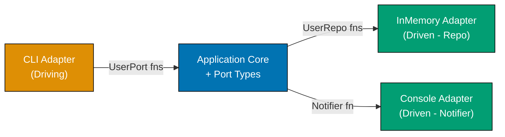
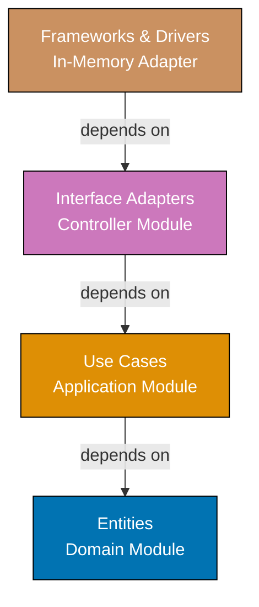
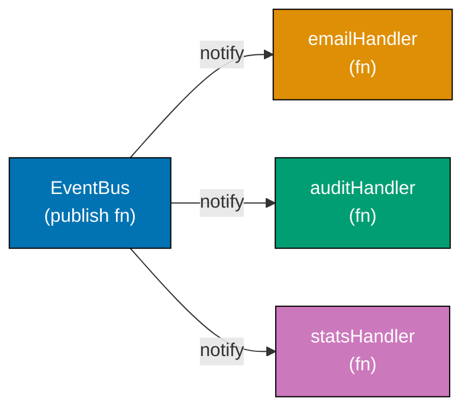
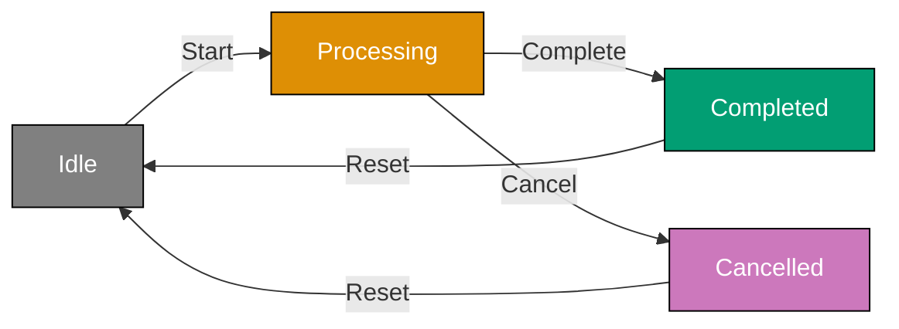
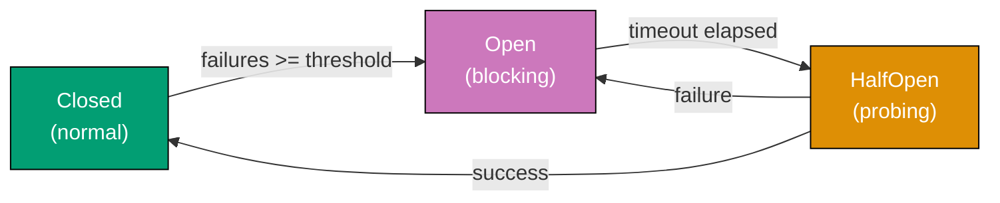

Examples 29-57 cover intermediate software architecture concepts (40-75% coverage). These examples build on foundational patterns and introduce composite architectural styles, enterprise patterns, and domain-driven design building blocks. Each example is self-contained and uses F# functional idioms: records, discriminated unions, pattern matching, smart constructors, Result types, modules, partial application, and the `|>` operator. Compatible with `dotnet fsi`.

## Hexagonal Architecture and Clean Architecture

### Example 29: Hexagonal Architecture — Ports and Adapters

Hexagonal architecture separates the application core from external systems by defining ports (function-type contracts) and adapters (concrete implementations). In F#, a port is simply a function type alias or record-of-functions — no abstract class required. The core calls port functions; adapters supply them at startup.



```fsharp
// => Domain entity — pure record, no infrastructure awareness
type User = { Id: string; Email: string; Name: string }

// => PORT types: function types that define what the core needs from infrastructure
// => These are the "holes" the core expects to be filled by adapters
type SaveUser    = User -> unit            // => persistence contract
type FindUser    = string -> User option   // => retrieval contract: returns Some or None
type SendWelcome = string -> unit          // => notification contract

// => APPLICATION CORE: depends only on the port function types, never on concrete code
// => All infrastructure is passed in as first-class function arguments
let register (save: SaveUser) (notify: SendWelcome) (id: string) (email: string) (name: string) : User =
    let user = { Id = id; Email = email; Name = name }
    // => Create the domain entity — pure data construction
    save user
    // => Persist via the injected SaveUser port — could be DB or in-memory
    notify email
    // => Notify via the injected SendWelcome port — could be email or console
    user
    // => Return domain object; callers receive clean domain data, not a DTO

// => ADAPTER (driven): in-memory implementation — a mutable dict acting as storage
let makeInMemoryRepo () =
    let store = System.Collections.Generic.Dictionary<string, User>()
    // => Mutable store captured in closure — invisible to the core
    let save (u: User) = store.[u.Id] <- u
    // => SaveUser adapter: stores user by Id
    let find (id: string) : User option =
        if store.ContainsKey(id) then Some store.[id]
        else None
        // => FindUser adapter: returns None for missing Ids
    save, find
    // => Returns the two port functions as a tuple — adapters are just functions

// => ADAPTER (driven): console notification
let consoleNotifier (email: string) =
    printfn "Welcome email sent to %s" email
    // => SendWelcome adapter: simulates sending email via console output

// wire up adapters and call the core
let save, find = makeInMemoryRepo ()
// => Destructure the tuple to get the two port functions
let registerUser = register save consoleNotifier
// => Partially apply the core function with the concrete adapters
// => registerUser : string -> string -> string -> User

let alice = registerUser "u1" "alice@example.com" "Alice"
// => Output: Welcome email sent to alice@example.com
// => alice : User = { Id = "u1"; Email = "alice@example.com"; Name = "Alice" }

let found = find "u1"
// => found : User option = Some { Id = "u1"; ... }
printfn "%s" (match found with Some u -> u.Email | None -> "not found")
// => Output: alice@example.com
```

**Key Takeaway:** In F#, ports are function types; adapters are functions that match those types. Partial application wires them into the core without any dependency injection framework.

**Why It Matters:** Hexagonal architecture's greatest benefit is seam testability — the core runs entirely with lightweight in-memory adapters during tests, and the swap costs one line of wiring. In FP this seam is even cheaper: instead of swapping class hierarchies you pass a different function. Production systems that adopt this pattern survive infrastructure migrations (e.g., PostgreSQL → DynamoDB) because the core is never coupled to a concrete store, only to a function signature.

---

### Example 30: Clean Architecture — Layer Separation with Dependency Rule

Clean Architecture organises code into concentric rings: Entities → Use Cases → Interface Adapters → Frameworks. The dependency rule states dependencies point inward only. In F#, each ring becomes a module; inner modules have no `open` statements referencing outer ones.



```fsharp
// ── ENTITIES LAYER ──────────────────────────────────────────────────────────
// => Innermost ring: pure domain types and rules, zero external dependencies
module Domain =
    type OrderItem = { ProductId: string; Price: decimal; Qty: int }
    // => Value type: price snapshot at order time, not a live catalogue lookup

    type Order = { Id: string; Items: OrderItem list; CustomerId: string }
    // => Entity: owns identity (Id) and enforces coherence of its Items list

    let total (order: Order) : decimal =
        order.Items |> List.sumBy (fun i -> i.Price * decimal i.Qty)
        // => Business rule lives in the entity layer — not in a controller or use case

// ── USE CASES LAYER ─────────────────────────────────────────────────────────
// => Second ring: application business rules; depends only on Domain
module Application =
    open Domain

    // => Repository port: defined in use-cases layer, implemented in frameworks layer
    // => This is the Dependency Inversion Principle expressed as a function type
    type SaveOrder = Order -> unit

    // => Use case function: orchestrates entity creation and persistence
    let placeOrder (save: SaveOrder) (customerId: string) (items: OrderItem list) : Order =
        let id = sprintf "ord-%d" (System.DateTime.UtcNow.Ticks)
        // => Generate a deterministic-enough ID for demo purposes
        let order = { Id = id; Items = items; CustomerId = customerId }
        // => Construct entity using the domain type — no DB concern here
        save order
        // => Persist via the injected SaveOrder port
        order
        // => Return entity: callers receive domain data, not a DB row

// ── INTERFACE ADAPTERS LAYER ─────────────────────────────────────────────────
// => Third ring: translates between use-case types and framework representations
module Controller =
    open Domain
    open Application

    type HttpRequest = { CustomerId: string; Items: OrderItem list }
    type HttpResponse = { OrderId: string; Total: decimal }
    // => Adapter types: framework-shaped, not domain-shaped

    let handlePlaceOrder (save: SaveOrder) (req: HttpRequest) : HttpResponse =
        let order = placeOrder save req.CustomerId req.Items
        // => Delegates to use case with domain-shaped input
        { OrderId = order.Id; Total = total order }
        // => Presenter maps entity → HTTP response — adapter concern, not domain concern

// ── FRAMEWORKS LAYER ─────────────────────────────────────────────────────────
// => Outermost ring: concrete implementations; depends on all inner rings
module Infrastructure =
    open Domain

    let makeInMemoryRepo () =
        let store = System.Collections.Generic.Dictionary<string, Order>()
        // => Concrete storage — invisible to inner rings
        fun (order: Order) -> store.[order.Id] <- order
        // => Returns a SaveOrder function — matches the port type exactly

// wiring (frameworks layer assembles everything)
let save = Infrastructure.makeInMemoryRepo ()
// => Concrete adapter created in the outermost layer
let req : Controller.HttpRequest =
    { CustomerId = "c1"
      Items = [ { ProductId = "p1"; Price = 10.0m; Qty = 2 } ] }
let resp = Controller.handlePlaceOrder save req
// => Response from the controller adapter
printfn "OrderId: %s, Total: %M" resp.OrderId resp.Total
// => Output: OrderId: ord-..., Total: 20
```

**Key Takeaway:** The dependency rule — source code dependencies pointing inward only — is enforced in F# by the module declaration order. Inner modules appear first; outer modules `open` them, never the reverse.

**Why It Matters:** Clean Architecture's dependency rule is what makes business logic survive framework migrations. Switching from an in-memory store to a PostgreSQL adapter touches only the outermost module; the domain and use-case modules are unchanged. Teams that enforce this rule report that major infrastructure rewrites take days rather than months, because the business logic has never been entangled with storage details.

---

### Example 31: Onion Architecture — Domain at the Center

Onion Architecture places the domain model at the very center, surrounded by domain services, then application services, then infrastructure. Every dependency points inward. In F#, the concentric rings map naturally to module ordering: domain types first, then functions that operate on them, then infrastructure last.

```fsharp
// ── DOMAIN MODEL (innermost ring) ───────────────────────────────────────────
// => Pure value types: no I/O, no mutation, no external dependencies
type Currency = string  // => ISO 4217 code, e.g., "USD"
type Money = { Amount: decimal; Currency: Currency }
// => Money is a value object: equality by value, not by reference

type Product = { Id: string; Name: string; Price: Money }
// => Product entity: owns its identity and price as a domain concept

// => Domain rule: adding money of different currencies is a domain-level error
let addMoney (a: Money) (b: Money) : Result<Money, string> =
    if a.Currency <> b.Currency then
        Error (sprintf "Currency mismatch: %s vs %s" a.Currency b.Currency)
        // => Domain rule enforced at the innermost ring — not in a controller
    else
        Ok { Amount = a.Amount + b.Amount; Currency = a.Currency }
        // => Returns Result to make the error case explicit and type-safe

// ── DOMAIN SERVICES (second ring) ───────────────────────────────────────────
// => Stateless functions on domain objects; no infrastructure calls
let applyDiscount (price: Money) (discountPct: float) : Money =
    let discounted = price.Amount * (1.0m - decimal discountPct / 100.0m)
    // => Compute discounted amount: 10% off $100 → $90
    { price with Amount = System.Math.Round(discounted, 2) }
    // => Record update expression: returns new Money preserving Currency

// ── APPLICATION SERVICES (third ring) ───────────────────────────────────────
// => Orchestrates domain objects and domain services; receives ports as arguments
type FindProduct = string -> Product option
// => Port type: application layer defines what it needs from infrastructure

let getDiscountedPrice (find: FindProduct) (productId: string) (pct: float) : Result<Money, string> =
    match find productId with
    | None -> Error (sprintf "Product %s not found" productId)
    // => Application-level error: missing product is an expected business outcome
    | Some product ->
        Ok (applyDiscount product.Price pct)
        // => Delegates price logic to the domain service — application just orchestrates

// ── INFRASTRUCTURE (outermost ring) ─────────────────────────────────────────
// => Concrete store that satisfies the FindProduct port
let makeProductRepo () =
    let data = System.Collections.Generic.Dictionary<string, Product>()
    // => Mutable dictionary: infrastructure detail, invisible to inner rings
    let add p = data.[p.Id] <- p
    // => Helper for seeding test data
    let find (id: string) : Product option =
        if data.ContainsKey(id) then Some data.[id]
        else None
        // => Returns None for missing keys — matches FindProduct port type
    add, find
    // => Returns (add, find) functions as a tuple

// wiring
let addProduct, findProduct = makeProductRepo ()
addProduct { Id = "p1"; Name = "Widget"; Price = { Amount = 100.0m; Currency = "USD" } }
// => Seed the in-memory repo with one product

let result = getDiscountedPrice findProduct "p1" 10.0
// => Application service call with injected FindProduct adapter
match result with
| Ok price -> printfn "%s %.2M" price.Currency price.Amount
              // => Output: USD 90.00
| Error msg -> printfn "Error: %s" msg
```

**Key Takeaway:** Each ring depends only on rings closer to the center. The domain model at the center has zero dependencies; infrastructure at the edge depends on everything but is depended on by nothing.

**Why It Matters:** Onion Architecture aligns naturally with Domain-Driven Design: the innermost ring is the Bounded Context's pure domain model, the outermost ring is its infrastructure shell. In F#, the module declaration order physically enforces the dependency direction — the compiler prevents outer rings from sneaking into inner rings through import ordering. Switching from an in-memory store to a PostgreSQL adapter changes only the outermost `makeProductRepo` function; every other ring is untouched.

---

## Event-Driven Architecture

### Example 32: Observer Pattern — Event Notification Without Coupling

The Observer pattern defines a one-to-many dependency so that when one object changes state all dependents are notified automatically. In F#, the "observers" are simply event-handler functions stored in a mutable list; no interface required.



```fsharp
// => Event type: discriminated union models all domain events in a type-safe set
type AppEvent =
    | UserRegistered of email: string
    | OrderPlaced of orderId: string * total: decimal
    // => Each case carries exactly the data its handlers need — no generic object

// => EventBus: a function registry — subscribers register handler functions
// => Handler functions have type AppEvent -> unit
let makeEventBus () =
    let handlers = System.Collections.Generic.List<AppEvent -> unit>()
    // => Mutable list of handler functions — the "observer" list

    let subscribe (handler: AppEvent -> unit) =
        handlers.Add(handler)
        // => Registration: add function reference to the list

    let publish (event: AppEvent) =
        for handler in handlers do
            handler event
        // => Dispatch: iterate and call each registered handler function

    subscribe, publish
    // => Return the two capabilities as a tuple

let subscribe, publish = makeEventBus ()
// => Destructure into the two port functions

// => OBSERVER 1: email handler — reacts only to UserRegistered events
let emailHandler event =
    match event with
    | UserRegistered email -> printfn "Email sent to %s" email
    // => Pattern match: ignore events this handler doesn't care about
    | _ -> ()
    // => Wildcard arm: silently discard unrelated events

// => OBSERVER 2: audit handler — logs all events generically
let auditHandler event =
    printfn "AUDIT: %A" event
    // => %A formats any discriminated union case with its fields

// => OBSERVER 3: stats handler — reacts only to OrderPlaced events
let statsHandler event =
    match event with
    | OrderPlaced (id, total) -> printfn "Stats: order %s, total %M" id total
    | _ -> ()

subscribe emailHandler   // => Register all three observers
subscribe auditHandler
subscribe statsHandler

publish (UserRegistered "bob@example.com")
// => Output: Email sent to bob@example.com
// => Output: AUDIT: UserRegistered "bob@example.com"

publish (OrderPlaced ("ord-1", 99.0m))
// => Output: AUDIT: OrderPlaced ("ord-1", 99.0M)
// => Output: Stats: order ord-1, total 99
```

**Key Takeaway:** Observer in F# is a list of functions. The discriminated union event type gives handlers compile-time safety to pattern-match only the cases they care about.

**Why It Matters:** Event-driven systems decouple producers from consumers: the publisher knows nothing about handlers. In F# this decoupling costs less than in OOP — there is no EventListener interface, no anonymous class, just a function value stored in a list. Real systems use this pattern for audit logging, metrics collection, and email notifications all firing off a single domain event without the event source needing any knowledge of the downstream consumers.

---

### Example 33: Domain Events — Signaling State Changes Within a Bounded Context

Domain events represent something significant that happened in the domain — past tense, immutable facts. In F#, domain events are discriminated union cases collected as a list alongside the updated state. Functions return `(newState, events)` tuples rather than firing side effects directly.

```fsharp
// => Domain entity type
type AccountId = AccountId of string
type Account = { Id: AccountId; Balance: decimal; Owner: string }

// => Domain event type: past-tense facts about what happened
type AccountEvent =
    | AccountOpened of AccountId * owner: string * initialBalance: decimal
    | MoneyDeposited of AccountId * amount: decimal
    | MoneyWithdrawn of AccountId * amount: decimal
    // => Each case is a named fact; discriminated unions prevent invalid event types

// => Command result: returns updated state AND events raised — no side effects yet
// => Pattern: (state, events list) — infrastructure decides what to do with events
let openAccount (id: string) (owner: string) (initialBalance: decimal) : Account * AccountEvent list =
    let accountId = AccountId id
    // => Wrap raw string in single-case DU to prevent Id/Name mix-ups
    let account = { Id = accountId; Balance = initialBalance; Owner = owner }
    // => Create the entity — pure construction, no I/O
    let event = AccountOpened (accountId, owner, initialBalance)
    // => Raise the domain event as a value — not yet published anywhere
    account, [ event ]
    // => Return tuple: new state + list of domain events

let deposit (account: Account) (amount: decimal) : Result<Account * AccountEvent list, string> =
    if amount <= 0.0m then
        Error "Deposit amount must be positive"
        // => Domain rule violation: return Error — never raise an exception for business rules
    else
        let updated = { account with Balance = account.Balance + amount }
        // => Immutable update: record expression produces a new Account record
        let event = MoneyDeposited (account.Id, amount)
        Ok (updated, [ event ])
        // => Success: return updated account and the domain event it raised

// event publisher: infrastructure function that acts on collected events
let publishEvents (events: AccountEvent list) =
    for e in events do
        printfn "EVENT: %A" e
        // => In production: write to event store, put on message bus, etc.

// demo
let account, openEvents = openAccount "acc-1" "Alice" 1000.0m
publishEvents openEvents
// => EVENT: AccountOpened (AccountId "acc-1", "Alice", 1000.0M)

match deposit account 250.0m with
| Error msg -> printfn "Error: %s" msg
| Ok (updated, events) ->
    publishEvents events
    // => EVENT: MoneyDeposited (AccountId "acc-1", 250.0M)
    printfn "Balance: %M" updated.Balance
    // => Output: Balance: 1250
```

**Key Takeaway:** Functions return `(newState, events list)` tuples. Domain events are values collected during business logic and published by infrastructure — business logic stays free of I/O.

**Why It Matters:** Decoupling event collection from event publication means business logic is a pure function: same input always produces the same output, with no observable side effects. This makes domain logic trivially testable — assert on the returned event list rather than mocking a message bus. In event-sourced systems, these domain events become the source of truth, enabling full audit trails and temporal state reconstruction.

---

### Example 34: Event-Driven Architecture — Async Message Passing Between Services

Event-driven architecture routes events through a central bus so services communicate without direct coupling. In F#, the bus is modelled as a simple in-memory dispatch function; real systems replace it with Kafka, RabbitMQ, or Azure Service Bus while keeping the handler function signatures identical.

```fsharp
// => Message type: discriminated union of all inter-service events
type ServiceEvent =
    | UserSignedUp of userId: string * email: string
    | SubscriptionStarted of userId: string * plan: string
    | PaymentProcessed of userId: string * amount: decimal
    // => DU enforces that all event types are known at compile time

// => Handler type: any function that receives a ServiceEvent
type EventHandler = ServiceEvent -> unit

// => In-memory message bus: stores handlers per event topic name
let makeMessageBus () =
    let registry = System.Collections.Generic.Dictionary<string, ResizeArray<EventHandler>>()
    // => topic (string) → list of handlers; ResizeArray = mutable .NET List

    let subscribe (topic: string) (handler: EventHandler) =
        if not (registry.ContainsKey(topic)) then
            registry.[topic] <- ResizeArray()
            // => Create handler list on first subscription to this topic
        registry.[topic].Add(handler)
        // => Register handler for the topic

    let publish (topic: string) (event: ServiceEvent) =
        match registry.TryGetValue(topic) with
        | true, handlers -> handlers |> Seq.iter (fun h -> h event)
        // => Dispatch event to all handlers registered on this topic
        | false, _ -> ()
        // => No handlers registered: silently discard (fire-and-forget)

    subscribe, publish
    // => Return both capabilities as a tuple

let subscribe, publish = makeMessageBus ()

// => SERVICE A: notification service subscribes to user.signup
subscribe "user.signup" (fun event ->
    match event with
    | UserSignedUp (id, email) -> printfn "Notification: welcome email → %s (%s)" email id
    | _ -> ())

// => SERVICE B: billing service subscribes to user.signup to start trial
subscribe "user.signup" (fun event ->
    match event with
    | UserSignedUp (id, _) -> printfn "Billing: trial started for %s" id
    | _ -> ())

// => SERVICE C: analytics service subscribes to payment events
subscribe "payment.processed" (fun event ->
    match event with
    | PaymentProcessed (id, amount) -> printfn "Analytics: $%M payment from %s" amount id
    | _ -> ())

// publish events — producers know only the topic name, never the subscribers
publish "user.signup" (UserSignedUp ("u1", "carol@example.com"))
// => Output: Notification: welcome email → carol@example.com (u1)
// => Output: Billing: trial started for u1

publish "payment.processed" (PaymentProcessed ("u1", 29.99m))
// => Output: Analytics: $29.99 payment from u1
```

**Key Takeaway:** Event-driven architecture decouples producers from consumers through a named topic. Producers publish events; consumers subscribe independently — neither knows about the other.

**Why It Matters:** Topic-based dispatch is what makes microservices independently deployable. Adding a new consumer (e.g., a fraud-detection service) requires zero changes to existing producers or other consumers — only a new subscription. In production, the in-memory bus is replaced by a durable broker (Kafka, RabbitMQ) while the handler function signatures remain identical, making the swap a single infrastructure change.

---

## Structural Design Patterns

### Example 35: Strategy Pattern — Swappable Algorithms

The Strategy pattern defines a family of algorithms and makes them interchangeable. In F#, strategies are simply functions with the same signature — no interface, no class hierarchy. Higher-order functions accept the strategy as a parameter.

```fsharp
// => Strategy type: a function that computes a shipping cost given order total
type ShippingStrategy = decimal -> decimal
// => Concise type alias: any function (decimal -> decimal) is a valid strategy

// => Strategy 1: flat rate — constant cost regardless of order size
let flatRateShipping : ShippingStrategy =
    fun _ -> 5.99m
    // => Ignores order total; returns fixed $5.99

// => Strategy 2: free shipping threshold — free above $50, else $7.99
let freeOverFiftyShipping : ShippingStrategy =
    fun total ->
        if total >= 50.0m then 0.0m
        // => Orders ≥ $50 get free shipping
        else 7.99m
        // => Orders < $50 pay $7.99

// => Strategy 3: percentage-based — 8% of order total
let percentageShipping : ShippingStrategy =
    fun total -> System.Math.Round(total * 0.08m, 2)
    // => 8% of order total, rounded to cents

// => Context function: accepts any ShippingStrategy as a parameter
// => The caller decides which algorithm to use at runtime
let calculateOrderTotal (shippingStrategy: ShippingStrategy) (items: decimal list) : decimal =
    let subtotal = List.sum items
    // => Sum all item prices to get subtotal
    let shipping = shippingStrategy subtotal
    // => Delegate shipping calculation to the injected strategy function
    subtotal + shipping
    // => Total = subtotal + shipping cost

// use different strategies — all call the same calculateOrderTotal function
let items = [ 20.0m; 15.0m; 10.0m ]   // => subtotal = 45.0

let total1 = calculateOrderTotal flatRateShipping items
printfn "Flat rate total: %M" total1
// => Output: Flat rate total: 50.99

let total2 = calculateOrderTotal freeOverFiftyShipping items
printfn "Threshold total: %M" total2
// => Output: Threshold total: 52.99  (45 < 50, so $7.99 shipping)

let total3 = calculateOrderTotal percentageShipping items
printfn "Percentage total: %M" total3
// => Output: Percentage total: 48.60  (45 + 45*0.08 = 45 + 3.60)
```

**Key Takeaway:** In F#, strategies are functions. Passing a function as an argument is equivalent to injecting a strategy object — with no class hierarchy required.

**Why It Matters:** Strategy via higher-order functions is one of the clearest examples of FP's economy: the OOP pattern (Strategy interface + ConcreteStrategy classes + Context class) collapses to a single parameter of a function type. Swapping strategies at runtime costs nothing — pass a different function. This pattern appears everywhere in production F#: pricing engines, sorting comparators, validation pipelines, and serialization schemes.

---

### Example 36: Factory Pattern — Centralized Object Creation

The Factory pattern centralises object creation, hiding construction logic from callers. In F#, factories are smart constructor functions that return `Result` types, surfacing validation errors without exceptions.

```fsharp
// => Domain type: single-case DU wraps string to prevent raw-string-as-email abuse
type Email = private Email of string
// => 'private' constructor: only the module can create Email values directly

// => Product types: discriminated union models all notification channel variants
type NotificationChannel =
    | EmailChannel of Email
    | SmsChannel of phone: string
    | PushChannel of deviceToken: string
    // => Each case carries exactly the data that channel needs

// => Smart constructor for Email: validates and wraps — returns Result, never throws
let createEmail (raw: string) : Result<Email, string> =
    if System.String.IsNullOrWhiteSpace(raw) then
        Error "Email cannot be blank"
        // => Guard: empty strings are invalid before even checking format
    elif not (raw.Contains("@")) then
        Error (sprintf "'%s' is not a valid email address" raw)
        // => Simple structural check: production would use a regex or library
    else
        Ok (Email raw)
        // => Wrap validated string in the private Email DU case

// => Factory function: builds a NotificationChannel from raw inputs
// => Returns Result so the caller is forced to handle invalid inputs at compile time
let createChannel (channelType: string) (address: string) : Result<NotificationChannel, string> =
    match channelType with
    | "email" ->
        createEmail address
        |> Result.map EmailChannel
        // => Result.map lifts the wrapping function into the Result context
        // => Ok Email → Ok (EmailChannel email) ; Error msg stays Error msg
    | "sms" ->
        if address.Length < 7 then Error "Phone number too short"
        else Ok (SmsChannel address)
        // => Minimal phone validation; real code would check country format
    | "push" ->
        if address.Length < 10 then Error "Device token too short"
        else Ok (PushChannel address)
    | other ->
        Error (sprintf "Unknown channel type '%s'" other)
        // => Unknown types produce a descriptive error at construction time

// demo
let channels =
    [ createChannel "email" "diana@example.com"
      createChannel "sms" "+15551234567"
      createChannel "email" "not-an-email"    // => invalid
      createChannel "fax" "555-1234" ]        // => unknown type

channels |> List.iter (fun r ->
    match r with
    | Ok ch  -> printfn "OK: %A" ch
    | Error e -> printfn "ERROR: %s" e)
// => OK: EmailChannel (Email "diana@example.com")
// => OK: SmsChannel "+15551234567"
// => ERROR: 'not-an-email' is not a valid email address
// => ERROR: Unknown channel type 'fax'
```

**Key Takeaway:** Smart constructor functions return `Result` types, making invalid states unrepresentable. The factory hides construction complexity and surfaces validation errors as typed values rather than exceptions.

**Why It Matters:** Factory functions eliminate a whole class of runtime errors: once a value of type `Email` exists, it is guaranteed valid because the only way to create one is through `createEmail`. This "make illegal states unrepresentable" principle, combined with `Result`-returning constructors, shifts validation errors to compile time and forces callers to handle the error branch. In production systems this prevents null-reference bugs, format errors, and inconsistent validation logic scattered across the codebase.

---

### Example 37: Builder Pattern — Constructing Complex Objects Step by Step

The Builder pattern constructs complex objects step by step. In F#, the builder is a pipeline of record-update functions — each step returns an updated intermediate record, and the final `build` function validates and seals it.

```fsharp
// => Configuration type with many optional fields — hard to construct in one call
type EmailConfig =
    { To: string list
      Subject: string
      Body: string
      Cc: string list
      Bcc: string list
      ReplyTo: string option
      IsHtml: bool }

// => Builder accumulator: mutable intermediate state with sensible defaults
type EmailBuilder =
    { To: string list
      Subject: string
      Body: string
      Cc: string list
      Bcc: string list
      ReplyTo: string option
      IsHtml: bool }

// => Start with an empty builder — all defaults
let emptyEmail : EmailBuilder =
    { To = []; Subject = ""; Body = ""; Cc = []; Bcc = []; ReplyTo = None; IsHtml = false }
    // => Zero-value defaults; builder steps fill in meaningful values

// => Step functions: each takes a builder and returns a modified builder
// => These are the "set" operations in the OOP Builder — here they are plain functions
let withTo (addresses: string list) (b: EmailBuilder) = { b with To = addresses }
// => Record update: all other fields unchanged
let withSubject (s: string) (b: EmailBuilder)         = { b with Subject = s }
let withBody (body: string) (b: EmailBuilder)         = { b with Body = body }
let withCc (addresses: string list) (b: EmailBuilder) = { b with Cc = addresses }
let withHtml (b: EmailBuilder)                        = { b with IsHtml = true }
// => withHtml takes no value — it just sets the flag

// => Build step: validates required fields and produces the final sealed value
let build (b: EmailBuilder) : Result<EmailConfig, string> =
    if List.isEmpty b.To then
        Error "At least one recipient is required"
        // => Validate required field: To list must not be empty
    elif System.String.IsNullOrWhiteSpace(b.Subject) then
        Error "Subject is required"
        // => Validate required field: Subject must not be blank
    elif System.String.IsNullOrWhiteSpace(b.Body) then
        Error "Body is required"
    else
        Ok { To = b.To; Subject = b.Subject; Body = b.Body
             Cc = b.Cc; Bcc = b.Bcc; ReplyTo = b.ReplyTo; IsHtml = b.IsHtml }
        // => Produce the sealed EmailConfig — all validation passed

// pipeline construction using |> — reads left to right like fluent builder API
let email =
    emptyEmail
    |> withTo ["eve@example.com"; "frank@example.com"]
    |> withSubject "Monthly Report"
    |> withBody "<h1>Report attached</h1>"
    |> withCc ["boss@example.com"]
    |> withHtml
    |> build
    // => Each step returns a new EmailBuilder; build produces Result<EmailConfig,string>

match email with
| Ok cfg -> printfn "Email to %A, HTML: %b" cfg.To cfg.IsHtml
            // => Output: Email to ["eve@example.com"; "frank@example.com"], HTML: true
| Error e -> printfn "Error: %s" e
```

**Key Takeaway:** Piped record-update functions replace the OOP Builder class. The `|>` operator gives a left-to-right readability identical to a fluent API, with immutable intermediates and a `Result`-returning `build` step.

**Why It Matters:** The F# builder pipeline pattern is safer than the OOP equivalent: each intermediate step is immutable, so partially constructed objects cannot escape scope in an invalid state. The `build` function is the single validation checkpoint, making it easy to add new required fields without hunting through setter methods. Production F# code uses this pattern heavily for HTTP request construction, SQL query building, and configuration assembly.

---

### Example 38: Adapter Pattern — Bridging Incompatible Interfaces

The Adapter pattern wraps an incompatible interface to make it compatible with a caller's expected interface. In F#, an adapter is a function that wraps another function, converting its signature.

```fsharp
// => EXISTING (legacy) API: uses a positional tuple return
// => We cannot change this — it belongs to a third-party or legacy module
let legacyWeatherApi (cityCode: string) : float * string =
    // => Simulates a legacy service call — returns (temperature, condition)
    match cityCode with
    | "NYC" -> 22.5, "Sunny"
    | "LON" -> 15.0, "Cloudy"
    | _     -> 0.0, "Unknown"
    // => Returns (temp: float, condition: string) — not our preferred shape

// => TARGET (domain) type: what our application expects
type WeatherReport = { City: string; TempCelsius: float; Condition: string }
// => Named record fields are clearer and safer than positional tuples

// => ADAPTER FUNCTION: converts the legacy interface to the target interface
// => No class, no interface — just a function that wraps another function
let weatherAdapter (cityCode: string) : WeatherReport =
    let temp, condition = legacyWeatherApi cityCode
    // => Call legacy API; destructure the tuple return value
    { City = cityCode; TempCelsius = temp; Condition = condition }
    // => Construct the domain record — adapter owns this conversion

// => New third-party API (different shape again — returns an anonymous record)
// => Adapter pattern applies to any incompatible interface, not just legacy code
let modernWeatherApi (city: string) =
    {| temperature = 18.3; desc = "Partly cloudy"; unit = "C" |}
    // => Anonymous record with different field names

// => Second adapter: wraps modernWeatherApi into the same WeatherReport shape
let modernWeatherAdapter (cityCode: string) : WeatherReport =
    let data = modernWeatherApi cityCode
    // => Call the modern API
    { City = cityCode; TempCelsius = data.temperature; Condition = data.desc }
    // => Convert anonymous record fields to named WeatherReport fields

// => Application code depends only on WeatherReport — adapters are invisible
let displayWeather (getWeather: string -> WeatherReport) (city: string) =
    let report = getWeather city
    // => Calls whichever adapter was injected — application is adapter-agnostic
    printfn "%s: %.1f°C, %s" report.City report.TempCelsius report.Condition

displayWeather weatherAdapter "NYC"
// => Output: NYC: 22.5°C, Sunny

displayWeather modernWeatherAdapter "LON"
// => Output: LON: 18.3°C, Partly cloudy
```

**Key Takeaway:** An adapter in F# is a wrapper function that converts one function's signature into another. The application depends on the target signature; the adapter owns the conversion.

**Why It Matters:** Adapter is the pattern that enables incremental migration from legacy systems. By wrapping the legacy API in a function matching the target interface, every call site using the adapter is automatically migrated when the underlying implementation is swapped. In production F# systems, adapters are used to normalise third-party API shapes, bridge sync and async interfaces, and translate error representations (exception to Result, for example).

---

### Example 39: Decorator Pattern — Adding Behavior Without Subclassing

The Decorator pattern attaches additional behaviour to an object without modifying the original. In F#, decorators are higher-order functions: a decorator takes a function and returns a new function with the same signature but augmented behaviour.

```fsharp
// => Base service type: a function that fetches a product price by id
type PriceLookup = string -> decimal option
// => Returns None if the product is not found

// => Base implementation: the "real" price lookup
let dbPriceLookup : PriceLookup =
    fun productId ->
        match productId with
        | "p1" -> Some 29.99m
        | "p2" -> Some 9.99m
        | _    -> None
        // => Simulates a DB read; real version would query a database

// => DECORATOR 1: logging — wraps any PriceLookup and logs calls
let withLogging (inner: PriceLookup) : PriceLookup =
    fun productId ->
        printfn "LOG: looking up price for %s" productId
        // => Before-advice: log the incoming call
        let result = inner productId
        // => Delegate to the wrapped function — does not touch its logic
        printfn "LOG: result = %A" result
        // => After-advice: log the result
        result
        // => Return unmodified result — decorator adds logging, not transformation

// => DECORATOR 2: caching — wraps any PriceLookup and caches results
let withCaching (inner: PriceLookup) : PriceLookup =
    let cache = System.Collections.Generic.Dictionary<string, decimal option>()
    // => Cache captured in closure — invisible to callers
    fun productId ->
        if cache.ContainsKey(productId) then
            printfn "CACHE HIT: %s" productId
            cache.[productId]
            // => Return cached result; skip the inner lookup entirely
        else
            let result = inner productId
            // => Cache miss: call the inner function
            cache.[productId] <- result
            // => Store result for future calls
            result

// compose decorators: caching wraps logging wraps the real DB lookup
let cachedLoggingLookup =
    dbPriceLookup
    |> withLogging
    |> withCaching
    // => Read right-to-left: cache(log(dbLookup)) — outermost runs first

let _ = cachedLoggingLookup "p1"
// => LOG: looking up price for p1   (logging fires on cache miss)
// => LOG: result = Some 29.99M
// => (result stored in cache)

let _ = cachedLoggingLookup "p1"
// => CACHE HIT: p1   (cache hit: logging does NOT fire — skipped entirely)

let _ = cachedLoggingLookup "p99"
// => LOG: looking up price for p99
// => LOG: result = <null>   (None serialised)
```

**Key Takeaway:** Decorators in F# are higher-order functions: `(inner: T) -> T` where `T` is a function type. They compose with `|>` and can be stacked in any order.

**Why It Matters:** Higher-order function decorators are safer and more composable than subclass-based decorators: there is no inheritance hierarchy to manage, no risk of forgetting to call `super`, and the composition order is explicit in the pipeline. Real production systems use this pattern to add cross-cutting concerns — logging, caching, retry, circuit breaking, authentication — to service functions without touching the service's core logic.

---

### Example 40: Facade Pattern — Simplified Interface to a Subsystem

The Facade pattern provides a simplified interface to a complex subsystem. In F#, a facade is a module or record-of-functions that exposes a small, coherent API and delegates to multiple specialised internal functions.

```fsharp
// => SUBSYSTEM: several specialised functions with different signatures
// => Callers should not need to know about all these functions and their order

// => Subsystem function 1: validates an order before processing
let validateOrder (productId: string) (qty: int) : Result<unit, string> =
    if qty <= 0 then Error "Quantity must be positive"
    elif productId = "" then Error "ProductId is required"
    else Ok ()
    // => Returns Result: callers must handle validation failure

// => Subsystem function 2: reserves inventory for the order
let reserveInventory (productId: string) (qty: int) : Result<string, string> =
    if productId = "OUT_OF_STOCK" then Error "Item out of stock"
    else
        let reservationId = sprintf "res-%s-%d" productId qty
        Ok reservationId
        // => Returns a reservation ID on success

// => Subsystem function 3: charges payment for the order total
let chargePayment (customerId: string) (amount: decimal) : Result<string, string> =
    if amount <= 0.0m then Error "Amount must be positive"
    else Ok (sprintf "txn-%s" customerId)
    // => Returns a transaction ID on success

// => Subsystem function 4: sends order confirmation
let sendConfirmation (email: string) (orderId: string) =
    printfn "Confirmation sent to %s for order %s" email orderId
    // => Side-effecting notification; returns unit

// => FACADE: single function exposes the entire order-placement flow
// => Callers call one function; the facade orchestrates the subsystem
let placeOrder (customerId: string) (email: string) (productId: string) (qty: int) (amount: decimal) : Result<string, string> =
    validateOrder productId qty
    // => Step 1: validate inputs — fail fast if invalid
    |> Result.bind (fun () -> reserveInventory productId qty)
    // => Step 2: reserve inventory — only runs if validation passed
    // => Result.bind chains Results: Error short-circuits the rest of the pipeline
    |> Result.bind (fun _reservationId -> chargePayment customerId amount)
    // => Step 3: charge payment — only runs if inventory was reserved
    |> Result.map (fun txnId ->
        let orderId = sprintf "ord-%s-%s" customerId txnId
        sendConfirmation email orderId
        // => Step 4: send confirmation as a side effect inside the map
        orderId)
        // => Result.map: transforms Ok value, passes Error through unchanged

// single-call facade API
match placeOrder "c1" "grace@example.com" "p1" 2 59.98m with
| Ok orderId -> printfn "Order placed: %s" orderId
               // => Output: Confirmation sent to grace@example.com for order ord-c1-txn-c1
               // => Output: Order placed: ord-c1-txn-c1
| Error msg  -> printfn "Failed: %s" msg
```

**Key Takeaway:** A facade function orchestrates a complex subsystem through a single, clean entry point. `Result.bind` chains the steps so any failure short-circuits the pipeline without nested if-statements.

**Why It Matters:** Facades reduce cognitive load for callers: instead of knowing the order and error handling of four subsystem functions, the caller invokes one function with a clear Result return. The `Result.bind` railway pattern means error handling is structural — no exception handling, no null checks scattered through the orchestration. Production F# services use this pattern to expose a clean API over legacy subsystems, third-party integrations, and complex multi-step workflows.

---

## Behavioral Patterns

### Example 41: Command Pattern — Encapsulate Actions as Objects

The Command pattern encapsulates a request as an object, supporting undo/redo, queuing, and logging. In F#, commands are discriminated union cases (defunctionalisation); a `reduce` function interprets them against a state.

```fsharp
// => State type: the document we are editing
type EditorState = { Text: string; CursorPos: int }
// => Immutable record: each command produces a new EditorState

// => Command type: discriminated union of all possible editor actions
// => Each case carries exactly the data needed to execute and potentially undo
type EditorCommand =
    | InsertText of position: int * text: string
    | DeleteText of position: int * length: int
    | MoveCursor of newPosition: int
    | Undo
    // => Undo is itself a command — it pops the last command from history

// => Reduce function: interprets a command against current state + history
// => Returns (new state, updated history stack)
let reduce (state: EditorState) (history: EditorState list) (cmd: EditorCommand) : EditorState * EditorState list =
    match cmd with
    | InsertText (pos, text) ->
        let newText = state.Text.[..pos-1] + text + state.Text.[pos..]
        // => Insert text at position: splice string at pos
        let newState = { state with Text = newText; CursorPos = pos + text.Length }
        // => Advance cursor to end of inserted text
        newState, state :: history
        // => Push previous state onto history stack for undo support

    | DeleteText (pos, len) ->
        let newText = state.Text.[..pos-1] + state.Text.[pos+len..]
        // => Remove 'len' characters starting at 'pos'
        let newState = { state with Text = newText; CursorPos = pos }
        newState, state :: history
        // => Save previous state before deletion

    | MoveCursor newPos ->
        { state with CursorPos = newPos }, history
        // => Cursor move: update position only; no history entry needed

    | Undo ->
        match history with
        | prev :: rest -> prev, rest
        // => Pop the last state off the history stack
        | [] -> state, []
        // => Nothing to undo: return unchanged

// demo
let initial = { Text = "Hello"; CursorPos = 5 }
// => Starting state: "Hello" with cursor at end

let s1, h1 = reduce initial [] (InsertText (5, " World"))
// => s1 = { Text = "Hello World"; CursorPos = 11 }

let s2, h2 = reduce s1 h1 (DeleteText (0, 5))
// => s2 = { Text = " World"; CursorPos = 0 }

let s3, h3 = reduce s2 h2 Undo
// => s3 = { Text = "Hello World"; CursorPos = 11 }  (undone deletion)
printfn "After undo: '%s'" s3.Text
// => Output: After undo: 'Hello World'
```

**Key Takeaway:** Defunctionalisation — encoding commands as data (DU cases) and interpreting them with a `reduce` function — gives you undo/redo, logging, and replay for free, because commands are values you can store and replay.

**Why It Matters:** The Command pattern in functional style is the foundation of event sourcing and Redux-style state management. When commands are values rather than method calls, the full history is a list you can inspect, replay, or transmit over a network. Undo/redo becomes a stack operation on immutable snapshots; audit logs are just the command list serialised to storage.

---

### Example 42: Mediator Pattern — Centralized Component Coordination

The Mediator pattern centralises communication between components, reducing direct coupling. In F#, the mediator is a dispatch function: components send typed requests to the mediator, which routes them to the correct handler.

```fsharp
// => Request types: discriminated union of all messages components can send
type MediatorRequest =
    | GetUserName of userId: string
    | GetOrderCount of userId: string
    | SendNotification of userId: string * message: string
    // => Each case encodes a different inter-component message

// => Response types: what the mediator returns for each request
type MediatorResponse =
    | UserName of string
    | OrderCount of int
    | NotificationSent of bool
    | NotFound of string
    // => Explicit return types: no Object/unit ambiguity

// => Component handlers: independent functions with no knowledge of each other
// => UserService: handles user-related requests
let userHandler (userId: string) : MediatorResponse =
    match userId with
    | "u1" -> UserName "Alice"
    | "u2" -> UserName "Bob"
    | id   -> NotFound (sprintf "User %s not found" id)
    // => Returns typed response — never exceptions

// => OrderService: handles order-count requests
let orderHandler (userId: string) : MediatorResponse =
    match userId with
    | "u1" -> OrderCount 5
    | "u2" -> OrderCount 2
    | _    -> OrderCount 0
    // => Returns 0 for unknown users — sensible default

// => NotificationService: handles notification requests
let notificationHandler (userId: string) (message: string) : MediatorResponse =
    printfn "Notifying %s: %s" userId message
    // => Side effect: in production, sends email/push/SMS
    NotificationSent true
    // => Returns success indicator

// => MEDIATOR: central dispatch function — components call this, not each other
let mediator (request: MediatorRequest) : MediatorResponse =
    match request with
    | GetUserName uid          -> userHandler uid
    // => Route user requests to userHandler
    | GetOrderCount uid        -> orderHandler uid
    // => Route order requests to orderHandler
    | SendNotification (uid, msg) -> notificationHandler uid msg
    // => Route notification requests to notificationHandler

// demo: components communicate only through the mediator
let nameResp  = mediator (GetUserName "u1")
// => nameResp = UserName "Alice"

let orderResp = mediator (GetOrderCount "u1")
// => orderResp = OrderCount 5

let notifResp = mediator (SendNotification ("u1", "Your order is ready!"))
// => Output: Notifying u1: Your order is ready!
// => notifResp = NotificationSent true

printfn "%A | %A | %A" nameResp orderResp notifResp
// => Output: UserName "Alice" | OrderCount 5 | NotificationSent true
```

**Key Takeaway:** The mediator is a dispatch function: a pattern match on the request DU that routes to the correct handler. Components depend only on the request/response types, not on each other.

**Why It Matters:** Mediator reduces component coupling from O(n²) direct references to O(n) mediator references. In practice this means adding a new component (a new DU case and handler) touches only the mediator's match expression — no existing components change. Production command buses, CQRS dispatchers, and workflow orchestrators are all mediated dispatch functions at their core.

---

### Example 43: State Pattern — Objects That Change Behavior Based on State

The State pattern allows an object to alter its behaviour when its internal state changes. In F# the state machine is modelled as a discriminated union of states and a transition function that pattern-matches on state × event pairs.



```fsharp
// => State type: all valid states as a discriminated union
type OrderState =
    | Idle
    | Processing of startedAt: System.DateTime
    | Completed of completedAt: System.DateTime
    | Cancelled of reason: string
    // => Each case carries the data relevant to that state only

// => Event type: all transitions that can occur
type OrderEvent =
    | Start
    | Complete
    | Cancel of reason: string
    | Reset
    // => Events drive state transitions; invalid transitions produce errors

// => Transition function: (state * event) → Result<state, string>
// => Returns Error for invalid transitions — no exceptions
let transition (state: OrderState) (event: OrderEvent) : Result<OrderState, string> =
    match state, event with
    | Idle, Start ->
        Ok (Processing System.DateTime.UtcNow)
        // => Valid: Idle + Start → Processing with current timestamp

    | Processing _, Complete ->
        Ok (Completed System.DateTime.UtcNow)
        // => Valid: Processing + Complete → Completed with timestamp
        // => The wildcard _ ignores the startedAt payload; we don't need it here

    | Processing _, Cancel reason ->
        Ok (Cancelled reason)
        // => Valid: Processing + Cancel → Cancelled with provided reason

    | Completed _, Reset | Cancelled _, Reset ->
        Ok Idle
        // => Valid: any terminal state + Reset → Idle (restart the machine)

    | state, event ->
        Error (sprintf "Cannot %A from state %A" event state)
        // => Invalid transition: return descriptive error, not an exception

// demo: drive the state machine through a sequence of events
let initial = Idle
// => Start in Idle state

let states =
    [ Start; Complete; Reset; Start; Cancel "customer request"; Reset ]
    |> List.scan (fun acc event ->
        match acc with
        | Error _ -> acc           // => Short-circuit: once in error, stay in error
        | Ok state -> transition state event)
        // => List.scan accumulates all intermediate Result<OrderState,_> values
       (Ok initial)

states |> List.iter (fun s -> printfn "%A" s)
// => Ok Idle
// => Ok (Processing ...)
// => Ok (Completed ...)
// => Ok Idle
// => Ok (Processing ...)
// => Ok (Cancelled "customer request")
// => Ok Idle
```

**Key Takeaway:** Discriminated unions model valid states; a transition function maps (state, event) pairs to `Result<newState, error>`. Invalid transitions become `Error` values, not runtime exceptions.

**Why It Matters:** Type-safe state machines eliminate an entire class of bugs: invalid state transitions are caught at pattern-match exhaustiveness check time. The `Result`-returning transition function makes the machine composable — you can chain transitions, replay event sequences, or test every edge case by constructing (state, event) pairs directly. Production order management, workflow engines, and connection pool managers are all state machines that benefit from this approach.

---

### Example 44: HOF with Hole-Filling Steps

Template Method defines an algorithm skeleton with certain steps deferred to subclasses. In F#, the equivalent is a higher-order function that accepts the variable steps as function arguments — "holes" filled by the caller.

```fsharp
// => Template function: defines the fixed algorithm skeleton
// => Variable steps are "holes" filled by caller-provided functions
let processData
    (loadData    : unit -> string list)    // => hole 1: data loading strategy
    (filterData  : string list -> string list) // => hole 2: filtering strategy
    (formatResult: string list -> string)  // => hole 3: formatting strategy
    : string =
    // => Fixed skeleton: load → filter → format — order never changes
    let raw = loadData ()
    // => Step 1: always load first — the HOF enforces this ordering
    let filtered = filterData raw
    // => Step 2: always filter after loading
    let result = formatResult filtered
    // => Step 3: always format last
    result
    // => Return the formatted result string

// => Concrete hole-fillers: each is an independent function
// => They can be reused, tested, or swapped independently of the skeleton

let loadFromMemory () : string list =
    [ "alice"; "bob"; ""; "carol"; "  "; "dave" ]
    // => Simulated data source: mix of valid and invalid entries

let removeBlankLines (lines: string list) : string list =
    lines |> List.filter (fun s -> s.Trim() <> "")
    // => Filter: remove empty or whitespace-only strings

let formatAsBulletList (lines: string list) : string =
    lines |> List.map (sprintf "• %s") |> String.concat "\n"
    // => Format: prepend bullet character to each line, join with newline

let formatAsNumberedList (lines: string list) : string =
    lines
    |> List.mapi (fun i s -> sprintf "%d. %s" (i + 1) s)
    // => List.mapi: provides both index and value
    |> String.concat "\n"

// Fill holes with concrete functions — two different "subclass" instantiations
let bulletResult = processData loadFromMemory removeBlankLines formatAsBulletList
printfn "%s" bulletResult
// => Output:
// => • alice
// => • bob
// => • carol
// => • dave

let numberedResult = processData loadFromMemory removeBlankLines formatAsNumberedList
printfn "%s" numberedResult
// => Output:
// => 1. alice
// => 2. bob
// => 3. carol
// => 4. dave
```

**Key Takeaway:** A higher-order function with function-type parameters IS the Template Method pattern. The skeleton is fixed in the HOF body; callers fill the holes with their own functions.

**Why It Matters:** HOF-based Template Method is strictly more flexible than the subclass-based OOP equivalent: the hole-filler functions can be mixed and matched freely (any loader with any formatter), tested in isolation, and composed with other higher-order functions. There is no inheritance hierarchy to maintain. This pattern appears in production F# code as processing pipelines, ETL templates, report generators, and any algorithm with a fixed structure but variable sub-steps.

---

## Domain-Driven Design Building Blocks

### Example 45: Value Objects — Immutable Domain Concepts Without Identity

Value objects represent domain concepts defined entirely by their attributes. In F#, value objects are immutable records (equality by structural value) or single-case discriminated unions (opaque wrappers that prevent misuse).

```fsharp
// => OPAQUE WRAPPER approach: single-case DU with private constructor
// => Prevents callers from constructing an Email without validation
type Email = private Email of string
// => 'private' means only this module can unwrap or create Email values

module Email =
    // => Smart constructor: the only way to create a valid Email
    let create (raw: string) : Result<Email, string> =
        if System.String.IsNullOrWhiteSpace(raw) then
            Error "Email cannot be blank"
        elif not (raw.Contains("@")) then
            Error (sprintf "'%s' is not a valid email" raw)
        else
            Ok (Email raw)
            // => Wrap validated string; caller receives an Email, not a raw string

    // => Extractor: only way to read the inner value
    let value (Email raw) = raw
    // => Pattern match inside function parameter: safe destructuring

// => STRUCTURAL RECORD approach: value object with multiple fields
// => Equality is automatically structural: two Addresses are equal if all fields match
type Address =
    { Street: string
      City: string
      PostalCode: string
      Country: string }
// => Records in F# have structural equality out of the box

// => Value objects support domain operations that return new value objects
let formatAddress (a: Address) : string =
    sprintf "%s, %s %s, %s" a.Street a.City a.PostalCode a.Country
    // => Pure formatting function — no mutation

// => MONEY value object: combines amount and currency as a coherent concept
type Money = { Amount: decimal; Currency: string }

let addMoney (a: Money) (b: Money) : Result<Money, string> =
    if a.Currency <> b.Currency then
        Error (sprintf "Cannot add %s and %s" a.Currency b.Currency)
        // => Domain rule: adding different currencies is invalid
    else
        Ok { a with Amount = a.Amount + b.Amount }
        // => Record update: returns new Money, both originals unchanged

// demo
let emailResult = Email.create "hannah@example.com"
match emailResult with
| Ok e  -> printfn "Valid email: %s" (Email.value e)
           // => Output: Valid email: hannah@example.com
| Error msg -> printfn "Invalid: %s" msg

let addr1 = { Street = "123 Main St"; City = "London"; PostalCode = "EC1A"; Country = "UK" }
let addr2 = { Street = "123 Main St"; City = "London"; PostalCode = "EC1A"; Country = "UK" }
printfn "Addresses equal: %b" (addr1 = addr2)
// => Output: Addresses equal: true  (structural equality — no .equals() needed)

let m1 = { Amount = 10.0m; Currency = "USD" }
let m2 = { Amount = 5.0m; Currency = "USD" }
match addMoney m1 m2 with
| Ok total -> printfn "Total: %M %s" total.Amount total.Currency
              // => Output: Total: 15 USD
| Error e  -> printfn "Error: %s" e
```

**Key Takeaway:** Use single-case DUs for opaque validated wrappers; use records for value objects with multiple fields. Both enforce immutability and structural equality automatically in F#.

**Why It Matters:** Value objects eliminate primitive obsession — the anti-pattern where domain concepts are represented as plain strings, ints, or decimals. When `Email` is a type rather than a string, passing a raw string where an `Email` is expected is a compile-time error. This eliminates an entire class of bugs (invalid emails, mixed-up IDs, wrong currency) without runtime checks. F#'s structural equality makes value-object comparison natural without overriding `.Equals()`.

---

### Example 46: Aggregate Roots — Consistency Boundaries in DDD

An Aggregate Root is the entry point to a cluster of related objects. All modifications to the cluster go through the root, which enforces invariants. In F#, the aggregate is a record with a module exposing command functions that return `Result`.

```fsharp
// => Value objects inside the aggregate
type OrderItemId = OrderItemId of string
type ProductId   = ProductId of string
type OrderItem   = { Id: OrderItemId; ProductId: ProductId; Price: decimal; Qty: int }

// => AGGREGATE ROOT type: immutable record
type OrderStatus = Pending | Confirmed | Shipped | Cancelled
type Order =
    { Id: string
      CustomerId: string
      Items: OrderItem list
      Status: OrderStatus }
// => All domain state lives in this record — no mutable fields

// => Aggregate module: exposes commands that return Result<Order, string>
// => All invariant enforcement happens inside this module
module Order =

    // => Command 1: create — validates and constructs initial aggregate state
    let create (orderId: string) (customerId: string) : Result<Order, string> =
        if customerId = "" then Error "CustomerId is required"
        else Ok { Id = orderId; CustomerId = customerId; Items = []; Status = Pending }
        // => Returns a new Order in Pending state with empty item list

    // => Command 2: addItem — enforces business invariants before modifying
    let addItem (item: OrderItem) (order: Order) : Result<Order, string> =
        match order.Status with
        | Pending ->
            if item.Price <= 0.0m then Error "Item price must be positive"
            elif item.Qty <= 0    then Error "Item quantity must be positive"
            else Ok { order with Items = item :: order.Items }
            // => Record update: prepend item to Items list, all else unchanged
        | status ->
            Error (sprintf "Cannot add items to an order in %A status" status)
            // => Invariant: items can only be added to Pending orders

    // => Command 3: confirm — state transition with precondition check
    let confirm (order: Order) : Result<Order, string> =
        match order.Status with
        | Pending when order.Items <> [] ->
            Ok { order with Status = Confirmed }
            // => Guard: must have at least one item to confirm
        | Pending ->
            Error "Cannot confirm an empty order"
        | status ->
            Error (sprintf "Order is already %A" status)

    // => Query: total value of order (read-only, returns a value not an Order)
    let total (order: Order) : decimal =
        order.Items |> List.sumBy (fun i -> i.Price * decimal i.Qty)

// demo using Result.bind to chain commands
let result =
    Order.create "ord-1" "c1"
    |> Result.bind (Order.addItem { Id = OrderItemId "i1"; ProductId = ProductId "p1"; Price = 19.99m; Qty = 2 })
    |> Result.bind Order.confirm

match result with
| Ok order -> printfn "Status: %A, Total: %M" order.Status (Order.total order)
              // => Output: Status: Confirmed, Total: 39.98
| Error e  -> printfn "Error: %s" e
```

**Key Takeaway:** The aggregate module is the only place where invariants are enforced. Commands return `Result<Order, string>`; callers chain them with `Result.bind` to build pipelines that fail fast on any invariant violation.

**Why It Matters:** Aggregate boundaries define transactional consistency scope: everything inside one aggregate is always consistent; consistency across aggregates is eventual. In F#, the module boundary makes this explicit — external code can only call the exported command functions, never mutate the record directly. This is the functional equivalent of "only call public methods on the aggregate root" from the OOP DDD canon.

---

### Example 47: Bounded Contexts — Separating Domain Models by Responsibility

A Bounded Context is an explicit boundary within which a domain model applies. Different contexts model the same real-world concept differently because they serve different purposes. In F#, bounded contexts are separate modules with their own types.

```fsharp
// => SALES CONTEXT: models a product as something to be sold
module SalesContext =
    type Product =
        { Id: string
          Name: string
          ListPrice: decimal
          DiscountPercentage: float }
    // => Sales cares about price and discounts — it does not care about dimensions

    let effectivePrice (p: Product) : decimal =
        p.ListPrice * (1.0m - decimal p.DiscountPercentage / 100.0m)
        // => Sales-specific rule: apply discount to get effective price

    let sampleProduct : Product =
        { Id = "p1"; Name = "Widget"; ListPrice = 100.0m; DiscountPercentage = 10.0 }
        // => Same physical product, but with ONLY sales-relevant attributes

// => WAREHOUSE CONTEXT: models a product as something to be stored and shipped
module WarehouseContext =
    type Product =
        { Sku: string       // => Warehouse uses SKU, not marketing name
          Weight: float     // => Weight matters for shipping; sales doesn't care
          QuantityOnHand: int
          Location: string }
    // => Warehouse cares about dimensions and stock — not about price or discounts

    let isInStock (p: Product) : bool = p.QuantityOnHand > 0
    // => Warehouse-specific query: sales context has no equivalent

    let sampleProduct : Product =
        { Sku = "WGT-001"; Weight = 0.5; QuantityOnHand = 250; Location = "A3-B7" }
        // => Same physical widget, but warehouse-shaped

// => ANTI-CORRUPTION LAYER: translates between contexts at integration boundaries
// => When Sales needs stock information, it goes through this translation function
module SalesToWarehouseAcl =
    // => Translation function: maps a Sales product ID to a Warehouse SKU lookup
    let checkStock (salesProductId: string) (findBySku: string -> WarehouseContext.Product option) : bool =
        let sku = sprintf "WGT-%s" (salesProductId.ToUpper().Replace("p", "00"))
        // => ID mapping rule: Sales "p1" → Warehouse "WGT-001"
        // => The ACL owns this translation — neither context knows about the other's ID scheme
        match findBySku sku with
        | Some wProd -> WarehouseContext.isInStock wProd
        | None       -> false
        // => Translation failure (unknown SKU) → out of stock from Sales' perspective

// demo
let salesProduct = SalesContext.sampleProduct
printfn "Sales price: %M" (SalesContext.effectivePrice salesProduct)
// => Output: Sales price: 90.0

let warehouseProduct = WarehouseContext.sampleProduct
printfn "In stock: %b" (WarehouseContext.isInStock warehouseProduct)
// => Output: In stock: true

let stockCheck = SalesToWarehouseAcl.checkStock "p1" (fun _ -> Some warehouseProduct)
printfn "Sales stock check: %b" stockCheck
// => Output: Sales stock check: true
```

**Key Takeaway:** Each Bounded Context owns its own type definitions for shared real-world concepts. An Anti-Corruption Layer translates between contexts at integration boundaries — neither context imports the other's types directly.

**Why It Matters:** Bounded Contexts prevent the "big ball of mud" that emerges when all teams share one model. When the Sales team adds a `DiscountPercentage` field, the Warehouse team's `Product` type is unaffected — they are separate types in separate modules. This enables independent deployment, independent schema evolution, and independent team ownership of each context.

---

### Example 48: Anti-Corruption Layer — Protecting the Domain from External Models

The Anti-Corruption Layer (ACL) is a translation boundary that prevents an external system's model from polluting the internal domain model. In F#, the ACL is a module with translation functions that map external types to internal types and vice versa.

```fsharp
// => EXTERNAL API response shape (third-party payment provider)
// => We cannot change these types — they are owned by the external service
type ExternalPaymentStatus =
    | EXT_PENDING
    | EXT_SUCCESS
    | EXT_FAILED
    | EXT_REFUNDED
    // => External naming convention: ALL_CAPS with EXT_ prefix

type ExternalPaymentResponse =
    { trans_id: string       // => snake_case — external convention
      amt_cents: int         // => amount in cents — external storage format
      ccy: string            // => abbreviated field names — external convention
      status: ExternalPaymentStatus }

// => INTERNAL domain model: our naming, our concepts
type PaymentStatus = Pending | Succeeded | Failed | Refunded
// => PascalCase, no external prefix — domain-friendly naming

type Payment =
    { Id: string
      AmountInDollars: decimal  // => dollars, not cents — our internal format
      Currency: string
      Status: PaymentStatus }
// => Full field names — readable by any team member without context

// => ANTI-CORRUPTION LAYER: translation module
// => All conversions between external and internal models live here
module PaymentAcl =
    // => Translate external status enum to internal domain status
    let private toInternalStatus (ext: ExternalPaymentStatus) : PaymentStatus =
        match ext with
        | EXT_PENDING  -> Pending
        | EXT_SUCCESS  -> Succeeded
        | EXT_FAILED   -> Failed
        | EXT_REFUNDED -> Refunded
        // => Exhaustive match: compiler catches new external statuses added later

    // => Translate external response → internal Payment domain object
    let translate (ext: ExternalPaymentResponse) : Payment =
        { Id            = ext.trans_id
          AmountInDollars = decimal ext.amt_cents / 100.0m
          // => Convert cents to dollars: 1050 cents → $10.50
          Currency      = ext.ccy.ToUpperInvariant()
          // => Normalise currency code to uppercase: "usd" → "USD"
          Status        = toInternalStatus ext.status }
          // => Translate the status using the private helper

// demo: external response comes in, ACL translates, domain works with clean types
let externalResponse : ExternalPaymentResponse =
    { trans_id = "txn-abc-123"; amt_cents = 4999; ccy = "usd"; status = EXT_SUCCESS }
    // => Simulated external API response — raw, unclean external representation

let payment = PaymentAcl.translate externalResponse
// => ACL translates: all downstream code sees only the clean Payment type

printfn "Id: %s" payment.Id
// => Output: Id: txn-abc-123
printfn "Amount: $%M" payment.AmountInDollars
// => Output: Amount: $49.99
printfn "Currency: %s" payment.Currency
// => Output: Currency: USD
printfn "Status: %A" payment.Status
// => Output: Status: Succeeded
```

**Key Takeaway:** The ACL module owns all translations between external and internal types. No code outside the ACL module ever touches the external types directly — the domain model is permanently isolated from external naming and encoding conventions.

**Why It Matters:** Without an ACL, external concepts leak into the domain model — your code starts talking about `EXT_PENDING` and `amt_cents` everywhere. When the external provider changes their API, changes cascade through the entire domain. With an ACL, only the translation module changes; every other module continues using the clean internal `Payment` type. This is especially critical when integrating with payment providers, shipping carriers, and legacy systems that evolve independently of your domain.

---

## CQRS and Advanced Patterns

### Example 49: CQRS Pattern — Separate Read and Write Models

CQRS (Command Query Responsibility Segregation) uses separate models for writes (commands) and reads (queries). Commands return `Result<unit, error>` or a domain event; queries return read-optimised data shapes. In F#, the separation is enforced by distinct module namespaces.

```fsharp
// ── WRITE MODEL (command side) ───────────────────────────────────────────────
// => Commands are DU cases; each case carries the data needed for the write
type ProductCommand =
    | CreateProduct of id: string * name: string * price: decimal
    | UpdatePrice   of id: string * newPrice: decimal
    | Discontinue   of id: string
    // => Commands are intentions: "please do X" — they may fail

// => Write-side entity: full domain state needed to enforce invariants
type WriteProduct = { Id: string; Name: string; Price: decimal; Active: bool }

// => In-memory write store (simulates a primary database)
let writeStore = System.Collections.Generic.Dictionary<string, WriteProduct>()

let handleCommand (cmd: ProductCommand) : Result<unit, string> =
    match cmd with
    | CreateProduct (id, name, price) ->
        if writeStore.ContainsKey(id) then Error "Product already exists"
        elif price <= 0.0m then Error "Price must be positive"
        else
            writeStore.[id] <- { Id = id; Name = name; Price = price; Active = true }
            Ok ()
            // => Side effect: write to the write store; return unit on success
    | UpdatePrice (id, newPrice) ->
        if not (writeStore.ContainsKey(id)) then Error "Product not found"
        else
            let existing = writeStore.[id]
            writeStore.[id] <- { existing with Price = newPrice }
            Ok ()
    | Discontinue id ->
        if not (writeStore.ContainsKey(id)) then Error "Product not found"
        else
            let existing = writeStore.[id]
            writeStore.[id] <- { existing with Active = false }
            Ok ()

// ── READ MODEL (query side) ─────────────────────────────────────────────────
// => Read model is optimised for display — different shape from write model
type ProductSummary = { Id: string; Name: string; FormattedPrice: string }
// => Pre-formatted price: read model carries display-ready data, not raw decimals

type ProductCatalog = { ActiveCount: int; Products: ProductSummary list }
// => Aggregate view: query returns the whole catalogue in one shot

// => Query function: projects from write store to read-optimised shape
// => In production, the read model would be a separate denormalised store or projection
let queryCatalogue () : ProductCatalog =
    let activeProducts =
        writeStore.Values
        |> Seq.filter (fun p -> p.Active)
        |> Seq.map (fun p ->
            { Id = p.Id
              Name = p.Name
              FormattedPrice = sprintf "$%.2f" p.Price })
            // => Pre-format price for display — read model owns this concern
        |> Seq.toList
    { ActiveCount = activeProducts.Length; Products = activeProducts }
    // => Return the catalogue aggregate — one query, all display data included

// demo: commands write, queries read
let _ = handleCommand (CreateProduct ("p1", "Widget",  29.99m))
let _ = handleCommand (CreateProduct ("p2", "Gadget",  49.99m))
let _ = handleCommand (UpdatePrice ("p1", 24.99m))
let _ = handleCommand (Discontinue "p2")

let catalogue = queryCatalogue ()
printfn "Active products: %d" catalogue.ActiveCount
// => Output: Active products: 1
catalogue.Products |> List.iter (fun p -> printfn "%s: %s" p.Name p.FormattedPrice)
// => Output: Widget: $24.99
```

**Key Takeaway:** Command functions write and validate; query functions read and project into display-optimised shapes. The two models evolve independently — adding a display field to the read model does not touch the write model or command handlers.

**Why It Matters:** CQRS allows the read side to be independently scaled, cached, and optimised without touching write-side logic. Read models can be pre-aggregated, denormalised, and cached in Redis; write models can be strongly typed and event-sourced — each optimised for its workload. Teams using CQRS report dramatically simpler query code because the read model is shaped for the UI, not for the database schema.

---

### Example 50: Middleware Pattern — Processing Pipeline for Cross-Cutting Concerns

The Middleware pattern chains functions that each perform one cross-cutting concern (logging, auth, rate limiting) and then delegate to the next handler. In F#, middleware is function composition: each middleware wraps the next with `>>` or explicit lambda.

```fsharp
// => Handler type: core request/response function signature
type Request  = { Path: string; UserId: string; Body: string }
type Response = { Status: int; Body: string }
type Handler  = Request -> Response

// => Core handler: processes the actual business request
let coreHandler : Handler =
    fun req ->
        { Status = 200; Body = sprintf "OK: processed request for %s at %s" req.UserId req.Path }
        // => Core logic: no cross-cutting concerns here

// => MIDDLEWARE 1: logging — logs before and after delegating to next
let loggingMiddleware (next: Handler) : Handler =
    fun req ->
        printfn "LOG → %s %s" req.UserId req.Path
        // => Before-advice: log the incoming request
        let resp = next req
        // => Delegate to the next handler in the chain
        printfn "LOG ← status %d" resp.Status
        // => After-advice: log the response status
        resp
        // => Return unmodified response (logging is transparent)

// => MIDDLEWARE 2: authentication — checks UserId before delegating
let authMiddleware (next: Handler) : Handler =
    fun req ->
        if req.UserId = "" then
            { Status = 401; Body = "Unauthorized: UserId is required" }
            // => Short-circuit: return 401 without calling next at all
        else
            next req
            // => Auth passed: delegate to the next handler

// => MIDDLEWARE 3: rate limiting — simple counter-based check
let makeRateLimiter (maxCalls: int) : Handler -> Handler =
    let counter = ref 0
    // => Mutable counter captured in closure — per-limiter state
    fun (next: Handler) ->
        fun req ->
            incr counter
            // => Increment call count atomically (single-threaded demo)
            if !counter > maxCalls then
                { Status = 429; Body = sprintf "Rate limit exceeded (%d calls)" !counter }
                // => Short-circuit: return 429 without calling next
            else
                next req
                // => Under limit: delegate normally

// compose pipeline: request flows through rateLimiter → auth → logging → core
let rateLimiter = makeRateLimiter 3
let pipeline : Handler =
    coreHandler
    |> loggingMiddleware
    |> authMiddleware
    |> rateLimiter
    // => Read right-to-left: rateLimiter wraps authMiddleware wraps logging wraps core

let req1 = { Path = "/orders"; UserId = "u1"; Body = "" }
let resp1 = pipeline req1
// => LOG → u1 /orders
// => LOG ← status 200
printfn "Response: %d %s" resp1.Status resp1.Body
// => Response: 200 OK: processed request for u1 at /orders

let req2 = { Path = "/orders"; UserId = ""; Body = "" }
let resp2 = pipeline req2
// => (logging fires before auth check)
printfn "Response: %d" resp2.Status
// => Response: 401
```

**Key Takeaway:** Each middleware wraps the next with `(next: Handler) -> Handler`. The pipeline is assembled by composing these wrapping functions with `|>`, making the chain order explicit and readable.

**Why It Matters:** Middleware-as-function-composition makes cross-cutting concerns modular: each concern lives in one function, is independently testable, and can be added or removed from the pipeline by changing a single line. This is the same model used by Suave, Giraffe, and ASP.NET Core's middleware pipeline — understanding it at the function level makes framework middleware transparent.

---

### Example 51: Plugin Architecture — Extending Systems Without Modifying Core

Plugin architecture allows extending system behaviour by adding new plugins without modifying the core system. In F#, plugins are record-of-functions (capabilities) registered at startup and discovered dynamically by the core.

```fsharp
// => Plugin capability type: a record of functions each plugin must provide
// => This is the "plugin interface" — in F# it's a record, not an abstract class
type Plugin =
    { Name:      string
      Activate:  unit -> unit           // => called when plugin is loaded
      Process:   string -> string option // => main extension point: transforms a string
      Deactivate: unit -> unit }         // => called when plugin is unloaded
// => Each field is a function — together they form the plugin contract

// => Plugin 1: uppercase transformer
let uppercasePlugin : Plugin =
    { Name = "uppercase"
      Activate = fun () -> printfn "Plugin 'uppercase' activated"
      Process = fun input ->
          if input.Length > 0 then Some (input.ToUpperInvariant())
          // => Transforms non-empty strings to uppercase
          else None
          // => Returns None to signal "I don't handle this input"
      Deactivate = fun () -> printfn "Plugin 'uppercase' deactivated" }

// => Plugin 2: word count analyser
let wordCountPlugin : Plugin =
    { Name = "wordcount"
      Activate = fun () -> printfn "Plugin 'wordcount' activated"
      Process = fun input ->
          let count = input.Split(' ', System.StringSplitOptions.RemoveEmptyEntries).Length
          // => Split on spaces and count non-empty segments
          Some (sprintf "Word count: %d" count)
          // => Always returns Some — produces a count for any input
      Deactivate = fun () -> printfn "Plugin 'wordcount' deactivated" }

// => Plugin registry and core: runs all plugins and collects their results
type PluginRegistry = { Plugins: Plugin list }

let loadPlugins (plugins: Plugin list) : PluginRegistry =
    plugins |> List.iter (fun p -> p.Activate ())
    // => Activate all plugins in registration order
    { Plugins = plugins }
    // => Return the registry holding the active plugin list

let processWithPlugins (registry: PluginRegistry) (input: string) : (string * string) list =
    registry.Plugins
    |> List.choose (fun p ->
        p.Process input
        |> Option.map (fun result -> p.Name, result))
        // => List.choose: filters None, unwraps Some — only plugins that handle input
        // => Each returning plugin contributes (pluginName, result) to the list

// demo
let registry = loadPlugins [ uppercasePlugin; wordCountPlugin ]
// => Output: Plugin 'uppercase' activated
// => Output: Plugin 'wordcount' activated

let results = processWithPlugins registry "hello functional world"
results |> List.iter (fun (name, result) -> printfn "[%s] %s" name result)
// => Output: [uppercase] HELLO FUNCTIONAL WORLD
// => Output: [wordcount] Word count: 3
```

**Key Takeaway:** Plugins are records of functions. The core iterates over the registry and calls each plugin's `Process` function; `List.choose` filters plugins that return `None` (opt out). Adding a new plugin requires zero changes to the core.

**Why It Matters:** Plugin architectures enable extensibility without modification — the Open/Closed Principle in its purest form. New capabilities are added by registering new plugin records; the core system never needs to know about them in advance. Real-world F# systems use this pattern for text processing pipelines, validation rule engines, and report generation frameworks where new formats or rules are added frequently.

---

### Example 52: Repository Pattern — Abstracting Data Access

The Repository pattern abstracts data access behind a clean interface, keeping domain logic free of persistence concerns. In F#, the repository is a record-of-functions whose implementations are swapped at startup.

```fsharp
// => Domain entity
type CustomerId = CustomerId of string
type Customer   = { Id: CustomerId; Name: string; Email: string; Active: bool }

// => Repository type: record-of-functions — the "port" for data access
// => Each field is one data access operation; they form the repository interface
type CustomerRepository =
    { FindById:   CustomerId -> Customer option
      FindActive: unit -> Customer list
      Save:       Customer -> unit
      Delete:     CustomerId -> bool }
// => A record of functions is the FP equivalent of a Repository interface in OOP

// => IN-MEMORY IMPLEMENTATION: returns a CustomerRepository backed by a dictionary
let makeInMemoryRepository () : CustomerRepository =
    let store = System.Collections.Generic.Dictionary<string, Customer>()
    // => Mutable dictionary hidden inside the closure — callers see only the record

    let findById (CustomerId id) =
        if store.ContainsKey(id) then Some store.[id]
        else None
        // => Returns None for missing Ids — no KeyNotFoundException

    let findActive () =
        store.Values |> Seq.filter (fun c -> c.Active) |> Seq.toList
        // => Filter to active customers; return as immutable list

    let save (customer: Customer) =
        let (CustomerId id) = customer.Id
        store.[id] <- customer
        // => Upsert: insert if new, replace if existing

    let delete (CustomerId id) =
        if store.ContainsKey(id) then store.Remove(id) |> ignore; true
        else false
        // => Returns true if deleted, false if not found

    { FindById = findById; FindActive = findActive; Save = save; Delete = delete }
    // => Returns the repository record — concrete functions bound to the closure store

// => DOMAIN SERVICE: depends only on the CustomerRepository type, not the implementation
let deactivateCustomer (repo: CustomerRepository) (id: CustomerId) : Result<Customer, string> =
    match repo.FindById id with
    | None -> Error (sprintf "Customer not found")
    // => Domain error: missing customer is not exceptional, return Error
    | Some customer ->
        let updated = { customer with Active = false }
        // => Immutable update: create new Customer with Active = false
        repo.Save updated
        // => Persist via repository — implementation detail hidden from domain
        Ok updated
        // => Return updated domain object

// demo
let repo = makeInMemoryRepository ()
// => Create the in-memory implementation — swap to a DB implementation in production

let id1 = CustomerId "c1"
repo.Save { Id = id1; Name = "Ivan"; Email = "ivan@example.com"; Active = true }
// => Persist a customer through the repository

match deactivateCustomer repo id1 with
| Ok c  -> printfn "Deactivated: %s, Active: %b" c.Name c.Active
           // => Output: Deactivated: Ivan, Active: false
| Error e -> printfn "Error: %s" e

printfn "Active customers: %d" (repo.FindActive() |> List.length)
// => Output: Active customers: 0
```

**Key Takeaway:** A record-of-functions IS the repository interface. Swapping implementations means constructing a different record — the domain service code is unaffected.

**Why It Matters:** Repository pattern separates domain logic from persistence mechanics. When you switch from in-memory to PostgreSQL, only the `makePostgresRepository` function changes; all domain services that accept a `CustomerRepository` record work without modification. This makes testing trivially simple — pass an in-memory repository, assert on results, no database required.

---

### Example 53: Unit of Work Pattern — Grouping Operations into Atomic Transactions

The Unit of Work pattern tracks changes and commits them as a single atomic transaction. In F#, this is modelled as a transactional Result chain: operations accumulate in a list; a final `commit` either applies all or rolls back on any failure.

```fsharp
// => Operation type: a deferred action with a description for logging
type DbOperation =
    | Insert of tableName: string * id: string * data: string
    | Update of tableName: string * id: string * data: string
    | Delete of tableName: string * id: string
    // => Operations are data (deferred intent), not immediately executed side effects

// => Unit of Work: accumulates operations before committing
type UnitOfWork = { Operations: DbOperation list }
// => Immutable list of pending operations — grows as the use case runs

let emptyUow : UnitOfWork = { Operations = [] }
// => Start with no pending operations

// => Register operation: returns a new UoW with the operation prepended
let register (op: DbOperation) (uow: UnitOfWork) : UnitOfWork =
    { uow with Operations = op :: uow.Operations }
    // => Immutable append: existing UoW unchanged; new UoW has one more operation

// => Commit: apply all operations atomically (simulated here with a Result chain)
// => Returns Ok (list of applied ops) or Error on first failure
let commit (uow: UnitOfWork) : Result<DbOperation list, string> =
    let ops = List.rev uow.Operations
    // => Reverse to apply in registration order (we prepended, so reverse gives FIFO)
    let rec applyOps remaining applied =
        match remaining with
        | [] -> Ok (List.rev applied)
        // => All operations applied successfully — return the applied list
        | op :: rest ->
            // => Simulate: Delete operations on "locked-table" always fail
            match op with
            | Delete ("locked-table", id) ->
                Error (sprintf "Cannot delete from locked-table (id: %s)" id)
                // => Simulated failure: in production this is a DB constraint or deadlock
            | _ ->
                printfn "APPLYING: %A" op
                // => Simulate apply: in production this executes the SQL statement
                applyOps rest (op :: applied)
                // => Recurse with the rest, accumulating applied operations
    applyOps ops []

// demo: use case registers multiple operations, then commits atomically
let uow =
    emptyUow
    |> register (Insert ("orders", "ord-1", "{ customerId: 'c1' }"))
    |> register (Insert ("order_items", "item-1", "{ orderId: 'ord-1', qty: 2 }"))
    |> register (Update ("customers", "c1", "{ orderCount: 6 }"))
    // => Pipeline: each |> adds one operation to the UoW

match commit uow with
| Ok ops  -> printfn "Committed %d operations" (List.length ops)
             // => Output: APPLYING: Insert ("orders", ...)
             // => Output: APPLYING: Insert ("order_items", ...)
             // => Output: APPLYING: Update ("customers", ...)
             // => Output: Committed 3 operations
| Error e -> printfn "Transaction failed: %s — rolling back" e

// simulate a failure scenario
let badUow =
    emptyUow
    |> register (Insert ("orders", "ord-2", "data"))
    |> register (Delete ("locked-table", "row-42"))  // => this will fail

match commit badUow with
| Ok _    -> printfn "Committed"
| Error e -> printfn "Rolled back: %s" e
             // => Output: Rolled back: Cannot delete from locked-table (id: row-42)
```

**Key Takeaway:** Operations are accumulated as data values; `commit` applies them in order and short-circuits on the first failure. The immutable UoW makes it safe to pass around and inspect before committing.

**Why It Matters:** Treating operations as data (deferred intent) rather than immediate side effects makes transactions composable and testable. You can inspect the `UoW.Operations` list to verify what will be applied before calling `commit`. In production, the `applyOps` function is replaced by an actual database transaction; the rest of the pattern is unchanged.

---

### Example 54: Specification Pattern — Composable Business Rules

The Specification pattern encapsulates a business rule as a predicate and supports composing rules with `and`, `or`, and `not`. In F#, specifications are functions of type `'a -> bool`, composed with standard boolean operators and higher-order helpers.

```fsharp
// => Specification type alias: a predicate function
type Spec<'a> = 'a -> bool
// => Any function ('a -> bool) is a Specification — no class needed

// => Combinators: compose specifications using boolean logic
let andSpec (s1: Spec<'a>) (s2: Spec<'a>) : Spec<'a> =
    fun x -> s1 x && s2 x
    // => Both must pass: short-circuits on false (&&)

let orSpec (s1: Spec<'a>) (s2: Spec<'a>) : Spec<'a> =
    fun x -> s1 x || s2 x
    // => Either must pass: short-circuits on true (||)

let notSpec (s: Spec<'a>) : Spec<'a> =
    fun x -> not (s x)
    // => Negates the specification: true → false, false → true

// => Convenience operators for readable composition
let (&&&) = andSpec   // => s1 &&& s2 reads naturally as "spec1 AND spec2"
let (|||) = orSpec    // => s1 ||| s2 reads naturally as "spec1 OR spec2"

// => Domain entity
type Customer = { Id: string; Age: int; TotalPurchases: decimal; IsVerified: bool; Country: string }

// => Atomic specifications: one business rule each, easily named and tested
let isAdult : Spec<Customer>       = fun c -> c.Age >= 18
// => Spec: customer must be 18 or older

let isVerified : Spec<Customer>    = fun c -> c.IsVerified
// => Spec: customer account must be verified

let isHighValue : Spec<Customer>   = fun c -> c.TotalPurchases >= 1000.0m
// => Spec: customer lifetime purchases ≥ $1000

let isEuResident : Spec<Customer>  = fun c -> List.contains c.Country ["DE";"FR";"NL";"ES";"IT"]
// => Spec: customer is resident of an EU country

// => COMPOSITE SPECIFICATIONS: combine atomic rules into business policies
let premiumEligibility : Spec<Customer> =
    isAdult &&& isVerified &&& isHighValue
    // => Premium: must be adult, verified, AND high-value

let euCompliantOffer : Spec<Customer> =
    premiumEligibility &&& isEuResident
    // => EU offer: must meet premium criteria AND be EU resident

let standardEligibility : Spec<Customer> =
    isAdult &&& isVerified &&& (notSpec isHighValue)
    // => Standard: adult, verified, but NOT yet high-value

// demo
let customers =
    [ { Id = "c1"; Age = 25; TotalPurchases = 1500.0m; IsVerified = true;  Country = "DE" }
      { Id = "c2"; Age = 17; TotalPurchases = 2000.0m; IsVerified = true;  Country = "US" }
      { Id = "c3"; Age = 30; TotalPurchases = 500.0m;  IsVerified = true;  Country = "FR" }
      { Id = "c4"; Age = 22; TotalPurchases = 800.0m;  IsVerified = false; Country = "DE" } ]

let classified =
    customers |> List.map (fun c ->
        let tier =
            if euCompliantOffer c then "EU-Premium"
            elif premiumEligibility c then "Premium"
            elif standardEligibility c then "Standard"
            else "Ineligible"
        c.Id, tier)

classified |> List.iter (fun (id, tier) -> printfn "%s → %s" id tier)
// => c1 → EU-Premium   (adult, verified, high-value, EU)
// => c2 → Ineligible   (under 18)
// => c3 → Standard     (adult, verified, not high-value)
// => c4 → Ineligible   (not verified)
```

**Key Takeaway:** Specifications are predicate functions composed with `&&&`, `|||`, and `notSpec`. Each atomic rule is one function; complex business policies are composed from them without modifying the originals.

**Why It Matters:** Specification pattern makes business rules first-class, named, and testable in isolation. When the premium threshold changes from $1000 to $1500, only the `isHighValue` function changes — all composite specifications built from it automatically reflect the new rule. Product managers can read the composite specifications as structured English; engineers can unit-test each atomic predicate independently.

---

### Example 55: CQRS with Event Sourcing — State as a Sequence of Events

Event Sourcing stores state as an append-only log of events. Current state is derived by replaying the event log. Combined with CQRS, events are the write model; projected views are the read model. In F#, the `fold` function replays events to reconstruct state.

```fsharp
// => Event log: the immutable source of truth — only appended to, never mutated
type AccountEvent =
    | Opened  of owner: string * initialBalance: decimal
    | Deposited   of amount: decimal
    | Withdrawn   of amount: decimal
    | Closed
    // => Each event is a past-tense fact; DU prevents invalid event types

// => Current state projected from events
type AccountSnapshot =
    | NotExists
    | Active of owner: string * balance: decimal
    | ClosedAccount of owner: string
    // => DU state: only valid combinations representable

// => EVENT STORE (append-only log)
let eventStore = System.Collections.Generic.List<AccountEvent>()

let appendEvent (event: AccountEvent) =
    eventStore.Add(event)
    // => Append only: never modify or delete past events

// => PROJECTION (read model): rebuild current state from the event log
let projectState (events: AccountEvent seq) : AccountSnapshot =
    events |> Seq.fold (fun state event ->
        match state, event with
        | NotExists, Opened (owner, balance)  -> Active (owner, balance)
        // => First event: account comes into existence with owner and balance
        | Active (owner, balance), Deposited amount ->
            Active (owner, balance + amount)
            // => Deposit: add to balance; owner unchanged
        | Active (owner, balance), Withdrawn amount ->
            Active (owner, balance - amount)
            // => Withdrawal: subtract from balance; may go negative (overdraft allowed here)
        | Active (owner, _), Closed ->
            ClosedAccount owner
            // => Closing event: transition to terminal state
        | _ -> state
        // => Invalid event for current state: ignore (idempotent replay safety))
       NotExists
    // => Fold starts from NotExists (account doesn't exist before the first event)

// => COMMAND HANDLERS: validate business rules against current state then append
let deposit (amount: decimal) =
    let current = projectState eventStore
    match current with
    | NotExists | ClosedAccount _ ->
        printfn "Error: cannot deposit to non-active account"
    | Active _ when amount <= 0.0m ->
        printfn "Error: deposit amount must be positive"
    | Active _ ->
        appendEvent (Deposited amount)
        printfn "Deposited $%M" amount
        // => Validate then append: the event IS the write

// demo: build state through events
appendEvent (Opened ("Julia", 500.0m))
deposit 200.0m
// => Output: Deposited $200
deposit (-50.0m)
// => Output: Error: deposit amount must be positive

let state = projectState eventStore
match state with
| Active (owner, bal) -> printfn "Owner: %s, Balance: $%M" owner bal
                         // => Output: Owner: Julia, Balance: $700
| _ -> ()

printfn "Event log: %d events" (Seq.length eventStore)
// => Output: Event log: 2 events  (Opened + Deposited)
```

**Key Takeaway:** State is never stored directly — only events are appended. `Seq.fold` replays the event log to reconstruct current state. The event log is the immutable audit trail.

**Why It Matters:** Event sourcing gives you temporal queries for free: replay events up to any timestamp to see historical state. Combined with CQRS, the write model (event log) and read model (projected snapshots) are independently optimised. Banking, trading systems, and compliance-heavy applications adopt event sourcing because the audit trail is the system — no retroactive state reconstruction required.

---

### Example 56: Saga Pattern — Managing Distributed Transactions

The Saga pattern manages multi-step distributed transactions by defining a sequence of local transactions and compensating actions for rollback. In F#, each saga step is a `Result`-returning function; compensation functions are paired with each step.

```fsharp
// => Saga step type: a forward action paired with its compensating action
type SagaStep<'state> =
    { Name:        string
      Execute:     'state -> Result<'state, string>
      Compensate:  'state -> unit }
// => Execute: runs the step and returns updated state or error
// => Compensate: undoes the step's side effects if a later step fails

// => Saga state: carries context across all steps
type OrderSagaState =
    { OrderId:       string
      CustomerId:    string
      Amount:        decimal
      Reserved:      bool
      Charged:       bool
      Notified:      bool }

// => SAGA STEPS: each step performs one distributed operation
let reserveInventoryStep : SagaStep<OrderSagaState> =
    { Name    = "ReserveInventory"
      Execute = fun state ->
          printfn "EXEC: reserving inventory for order %s" state.OrderId
          Ok { state with Reserved = true }
          // => Simulate success: real version calls inventory service
      Compensate = fun state ->
          printfn "COMP: releasing inventory reservation for %s" state.OrderId
          // => Compensation: call inventory service to release the hold
    }

let chargePaymentStep : SagaStep<OrderSagaState> =
    { Name    = "ChargePayment"
      Execute = fun state ->
          if state.Amount > 1000.0m then
              Error (sprintf "Payment declined for amount $%M" state.Amount)
              // => Simulate failure for large amounts — triggers compensation
          else
              printfn "EXEC: charging $%M for order %s" state.Amount state.OrderId
              Ok { state with Charged = true }
      Compensate = fun state ->
          printfn "COMP: refunding $%M for order %s" state.Amount state.OrderId
    }

let sendNotificationStep : SagaStep<OrderSagaState> =
    { Name    = "SendNotification"
      Execute = fun state ->
          printfn "EXEC: sending order confirmation for %s" state.OrderId
          Ok { state with Notified = true }
      Compensate = fun _state ->
          printfn "COMP: sending order cancellation notification"
    }

// => Saga executor: runs steps in order, compensates completed steps on failure
let executeSaga (steps: SagaStep<'state> list) (initial: 'state) : Result<'state, string> =
    let rec run remaining state completed =
        match remaining with
        | [] -> Ok state
        // => All steps succeeded — saga complete
        | step :: rest ->
            match step.Execute state with
            | Ok newState ->
                run rest newState (step :: completed)
                // => Step succeeded: recurse with updated state and record step as completed
            | Error msg ->
                completed |> List.iter (fun s -> s.Compensate state)
                // => Step failed: compensate all previously completed steps in reverse
                Error (sprintf "Saga failed at '%s': %s — compensation triggered" step.Name msg)
                // => Return the failure reason
    run steps initial []

let saga = [ reserveInventoryStep; chargePaymentStep; sendNotificationStep ]

// successful saga
let goodState = { OrderId = "ord-1"; CustomerId = "c1"; Amount = 99.0m; Reserved = false; Charged = false; Notified = false }
match executeSaga saga goodState with
| Ok s  -> printfn "Saga complete: reserved=%b charged=%b notified=%b" s.Reserved s.Charged s.Notified
           // => EXEC: reserving inventory...
           // => EXEC: charging $99...
           // => EXEC: sending confirmation...
           // => Saga complete: reserved=true charged=true notified=true
| Error e -> printfn "%s" e

printfn "---"

// failing saga (large amount causes payment step to fail)
let badState = { goodState with OrderId = "ord-2"; Amount = 1500.0m }
match executeSaga saga badState with
| Ok _  -> ()
| Error e ->
    printfn "%s" e
    // => EXEC: reserving inventory...
    // => (payment declined)
    // => COMP: releasing inventory reservation for ord-2   (compensating completed step)
    // => Saga failed at 'ChargePayment': ...
```

**Key Takeaway:** Each saga step pairs an `Execute` function with a `Compensate` function. The executor accumulates completed steps; on failure it calls `Compensate` on each in reverse order, achieving eventual consistency without a distributed transaction coordinator.

**Why It Matters:** Distributed systems cannot use ACID transactions across service boundaries. Sagas replace two-phase commit with compensating transactions: each service does its local work and defines how to undo it. In F#, the step-and-compensate structure makes the rollback logic explicit and co-located with the forward logic, preventing the common mistake of defining rollback in a separate, forgotten code path.

---

### Example 57: Circuit Breaker Pattern — Preventing Cascade Failures

The Circuit Breaker pattern stops calls to a failing dependency when the failure rate exceeds a threshold, preventing cascade failures. In F#, the circuit breaker state is a discriminated union (Closed/Open/HalfOpen) and the executor checks state before calling the dependency.



```fsharp
// => Circuit breaker state type
type CircuitState =
    | Closed    // => normal operation: calls allowed through
    | Open      // => blocking: calls rejected immediately without hitting dependency
    | HalfOpen  // => probing: one call allowed to test if dependency recovered
    // => DU makes invalid state combinations impossible

// => Mutable circuit breaker — state and counters wrapped in a record of refs
type CircuitBreaker =
    { mutable State:        CircuitState
      mutable FailureCount: int
      mutable LastOpenedAt: System.DateTime option
      Threshold:            int
      Timeout:              System.TimeSpan }
// => mutable fields: circuit breaker is inherently stateful — state changes on every call

let makeCircuitBreaker (threshold: int) (timeout: System.TimeSpan) : CircuitBreaker =
    { State = Closed; FailureCount = 0; LastOpenedAt = None
      Threshold = threshold; Timeout = timeout }
    // => Starts Closed (normal operation)

// => Core executor: checks state, calls dependency, updates state on result
let execute (cb: CircuitBreaker) (call: unit -> Result<string, string>) : Result<string, string> =
    match cb.State with
    | Open ->
        let elapsed =
            cb.LastOpenedAt
            |> Option.map (fun t -> System.DateTime.UtcNow - t)
            |> Option.defaultValue System.TimeSpan.Zero
        // => Calculate time since the circuit was opened
        if elapsed >= cb.Timeout then
            cb.State <- HalfOpen
            printfn "CB → HalfOpen (timeout elapsed, probing)"
            // => Transition to HalfOpen after timeout: allow one probe call
            execute cb call
            // => Retry the call now that state is HalfOpen
        else
            Error "Circuit Open — call rejected"
            // => Still within timeout: reject the call immediately

    | Closed | HalfOpen ->
        match call () with
        | Ok result ->
            cb.FailureCount <- 0
            // => Success: reset failure count
            cb.State <- Closed
            // => Ensure we are Closed (important after HalfOpen probe succeeds)
            printfn "CB → Closed (success)"
            Ok result
            // => Return successful result to caller

        | Error msg ->
            cb.FailureCount <- cb.FailureCount + 1
            // => Failure: increment counter
            if cb.FailureCount >= cb.Threshold then
                cb.State <- Open
                cb.LastOpenedAt <- Some System.DateTime.UtcNow
                printfn "CB → Open (failures: %d)" cb.FailureCount
                // => Threshold reached: open the circuit
            Error msg
            // => Return the failure to caller regardless of state change

// demo
let cb = makeCircuitBreaker 2 (System.TimeSpan.FromSeconds 1.0)
// => Threshold: 2 failures; Timeout: 1 second

let failingService () : Result<string, string> = Error "Service unavailable"
let workingService () : Result<string, string> = Ok "Data: { id: 1 }"

let r1 = execute cb failingService; printfn "1: %A" r1
// => 1: Error "Service unavailable"  (failure count = 1)
let r2 = execute cb failingService; printfn "2: %A" r2
// => CB → Open  (failure count = 2 = threshold)
// => 2: Error "Service unavailable"
let r3 = execute cb failingService; printfn "3: %A" r3
// => 3: Error "Circuit Open — call rejected"  (open: no call made)
```

**Key Takeaway:** The circuit breaker DU state (`Closed`/`Open`/`HalfOpen`) drives the call decision in a match expression. Failures increment a counter; exceeding the threshold opens the circuit. The timeout probe transitions to `HalfOpen` for recovery testing.

**Why It Matters:** Without a circuit breaker, a slow or failing dependency causes the caller to queue up threads waiting for timeouts, exhausting resources and cascading the failure to the whole system. The circuit breaker detects the failure pattern early and short-circuits calls, keeping the system responsive. Production F# services use this pattern for HTTP calls to external APIs, database connections, and any integration point that can degrade independently.
