This advanced-level tutorial completes C4 Model mastery with 25 examples covering Code-level diagrams (Level 4), the `PurchaseOrder.approve()` FSM implementation, dynamic sequence diagrams tracing the full P2P lifecycle, Kubernetes deployment topology, and advanced cross-cutting concerns including security, observability, and multi-region deployment.

## Code-Level Diagrams — Level 4 (Examples 61–68)

### Example 61: PurchaseOrder Aggregate — Class Structure

Code diagrams (Level 4) show implementation details for critical domain components. The PurchaseOrder aggregate is the central workhorse of the P2P domain.

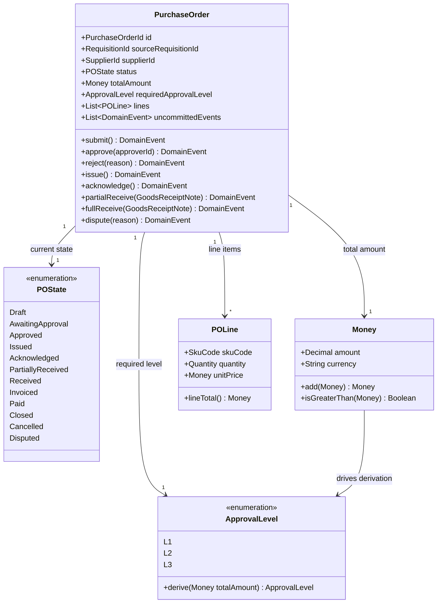

**Key Elements**:

- **Aggregate boundary**: PurchaseOrder owns POLine items — no direct access from outside
- **`uncommittedEvents` list**: Aggregate collects domain events internally; application service publishes them after save
- **`ApprovalLevel.derive()`**: Derives L1/L2/L3 from total — encapsulates the dollar-threshold business rule
- **All state-changing methods return DomainEvent**: Caller cannot miss the event — it is returned, not a side effect

**Design Rationale**: Returning domain events from aggregate methods (rather than emitting them as side effects) makes the event collection explicit and testable. A test can assert exactly which events were returned by `approve()`.

**Key Takeaway**: Model aggregate methods as returning domain events. Side-effect event emission hides events from unit tests and callers; return-based emission makes them visible and testable.

**Why It Matters**: Aggregates that emit events via side effects (e.g., directly calling an event bus) cannot be unit tested without a live event bus. Return-based event collection enables complete aggregate unit tests with zero infrastructure dependencies.

---

### Example 62: PurchaseOrder.approve() — FSM Transition Guard

The `approve()` method is the most critical method in the aggregate. It enforces the FSM guard (state must be `AwaitingApproval`) before executing the transition.

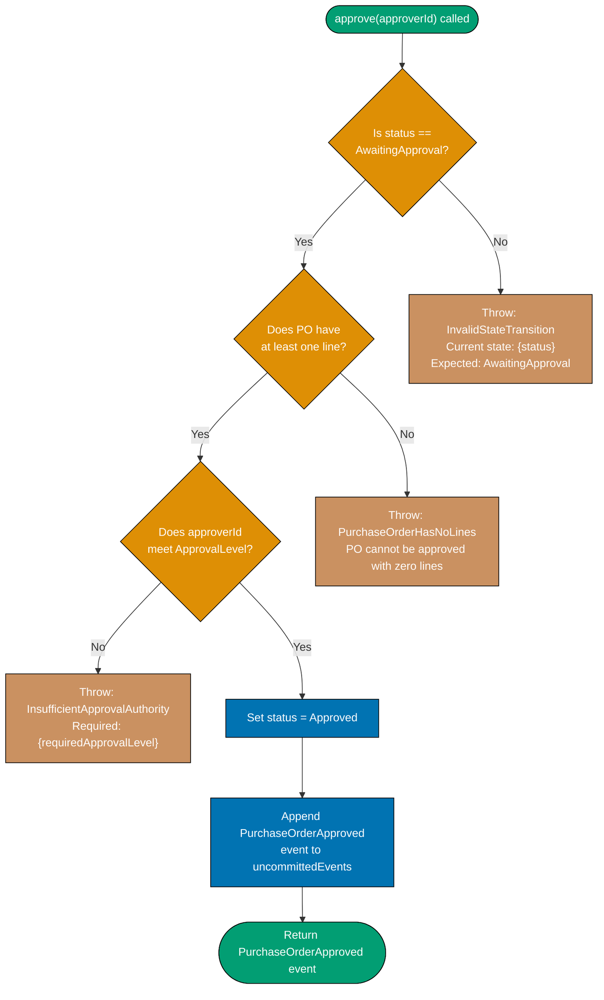

**Key Elements**:

- **Three guards in order**: State guard → lines guard → approval level guard
- **Distinct exception types**: Each guard throws a typed exception — no generic errors
- **Mutation only after all guards pass**: `status` is never mutated if a guard throws
- **Event appended before return**: `uncommittedEvents` accumulates the event

**Design Rationale**: Ordering guards from cheapest to most expensive (state check is O(1), approval level may require a DB lookup) optimizes for the common failure case. Most invalid calls fail at the state guard with zero additional cost.

**Key Takeaway**: Order FSM guards from cheapest to most expensive. State guard first, domain rule guard second, authorization guard last. This minimizes computation on invalid requests.

**Why It Matters**: Approval guard logic that allows a Buyer to approve their own requisition (missing authority check) or allows approval of a PO already in `Approved` state (missing state guard) produces a corrupted audit trail that undermines financial control compliance.

---

### Example 63: PurchaseOrder State Machine — Full Transition Diagram

The full FSM for PurchaseOrder shows every state and transition, including off-ramp states (Cancelled, Disputed).

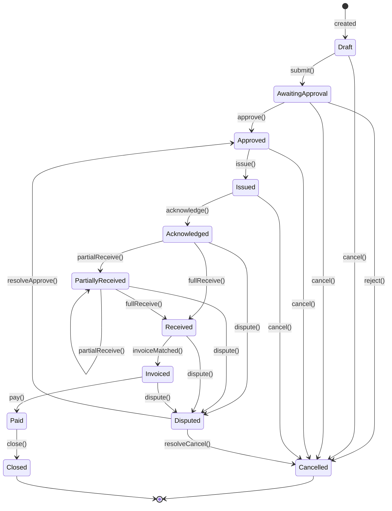

**Key Elements**:

- **12 states**: Draft, AwaitingApproval, Approved, Issued, Acknowledged, PartiallyReceived, Received, Invoiced, Paid, Closed, Cancelled, Disputed
- **Off-ramp from any pre-Paid state**: `cancel()` is available until Paid
- **Disputed resolution**: Disputed can resolve to either Approved (data error) or Cancelled (unrecoverable)
- **PartiallyReceived self-loop**: Multiple partial receipts are valid before full receipt

**Design Rationale**: Mermaid stateDiagram-v2 is the most precise notation for FSM documentation. It produces an executable specification that can be validated against the aggregate implementation.

**Key Takeaway**: Use stateDiagram-v2 for FSM documentation. The diagram serves as a specification document for QA, product, and compliance teams — all of whom have authority over the transition rules.

**Why It Matters**: PO state machine violations (approving a Cancelled PO, issuing a Disputed PO) are financial controls failures. A published state machine diagram gives compliance and audit teams a verifiable specification to test against.

---

### Example 64: PurchaseRequisition — Simplified State Machine

PurchaseRequisition has a shorter lifecycle: it exists only until converted to a PurchaseOrder.

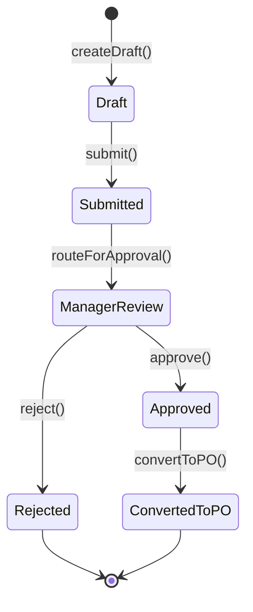

**Key Elements**:

- **Six states**: Shorter lifecycle than PurchaseOrder
- **ConvertedToPO as terminal state**: Requisition ends when PO is created — it is not deleted, just archived
- **ManagerReview as explicit state**: Approval is not instantaneous — manager review is a distinct waiting state

**Design Rationale**: Keeping PurchaseRequisition as a separate aggregate from PurchaseOrder models reality accurately. A requisition can be rejected before ever becoming a PO; conflating them makes rejection modeling awkward.

**Key Takeaway**: Model requisition and purchase order as separate aggregates with separate state machines. Their lifecycles diverge at approval: rejected requisitions terminate, approved ones spawn a PO.

**Why It Matters**: Requisition-to-PO conversion tracking is a key procurement KPI (conversion rate, approval cycle time). Separate aggregates make this tracking straightforward — one aggregate for the request lifecycle, one for the fulfillment lifecycle.

---

### Example 65: PurchaseOrderId Value Object — Code Level

Value objects at code level show immutability, validation, and equality semantics.

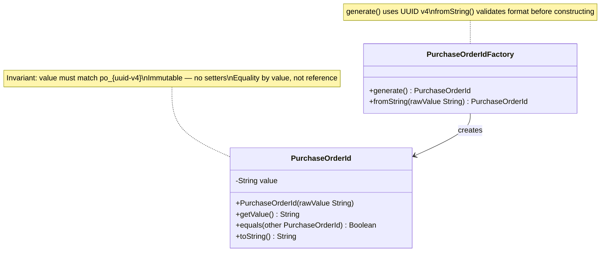

**Key Elements**:

- **Private `value` field**: No direct mutation — all access through `getValue()`
- **Constructor validates format**: `po_<uuid>` format enforced at construction — invalid IDs cannot exist
- **Equality by value**: Two `PurchaseOrderId` objects with the same string are equal
- **Factory separate from type**: `PurchaseOrderIdFactory.generate()` produces new IDs; `fromString()` re-hydrates

**Design Rationale**: Value objects with private constructors and factory methods ensure that invalid IDs cannot propagate through the system. An ID that fails format validation is rejected at construction, not at query time.

**Key Takeaway**: Code-level diagrams for value objects should show immutability (no setters), validation (constructor invariants), and equality semantics. These three properties define a valid value object.

**Why It Matters**: Systems that accept arbitrary strings as PO identifiers routinely encounter SQL injection vectors, cross-tenant ID guessing, and index scan inefficiencies. Format-validated value objects close all three risks at the type level.

---

### Example 66: Money Value Object — Arithmetic Safety

Money implements safe arithmetic to prevent currency mismatch bugs.

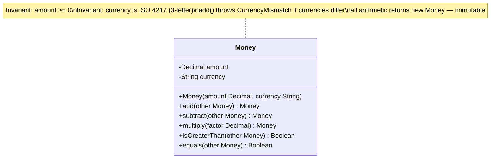

**Key Elements**:

- **`add()` throws CurrencyMismatch**: Cannot add USD to IDR — explicit guard
- **`multiply()` for quantity × unit price**: Used in PO line total calculation
- **All arithmetic returns new Money**: Immutable — no in-place mutation
- **`isGreaterThan()` for ApprovalLevel derivation**: $10,000 threshold check uses this method

**Design Rationale**: Arithmetic methods that return new Money instances enforce immutability. Methods that throw on currency mismatch prevent silent precision and currency conversion bugs.

**Key Takeaway**: Money arithmetic must be currency-aware and immutable. Unchecked arithmetic on money amounts (treating them as plain floats) produces currency mismatch bugs and floating-point rounding errors that corrupt payment amounts.

**Why It Matters**: ISO 20022 payment files carry exact decimal amounts. A float-based Money type that introduces rounding at the 15th decimal place produces payment amounts that differ from the invoice amount — triggering bank rejection or supplier disputes.

---

### Example 67: GoodsReceiptNote Aggregate — Code Level

GoodsReceiptNote models the physical receipt event with quantity tolerance checking.

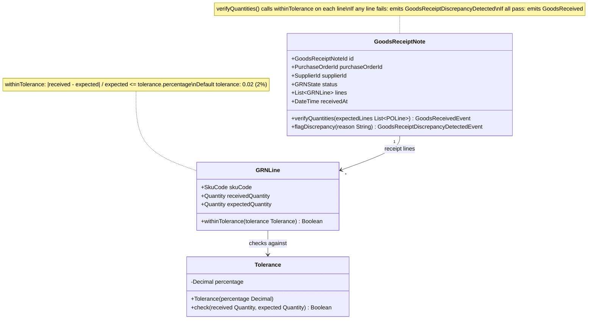

**Key Elements**:

- **Tolerance as value object**: Encapsulates 2% tolerance rule — not a magic number in a method
- **Two possible events**: `verifyQuantities()` returns either `GoodsReceived` or `GoodsReceiptDiscrepancyDetected`
- **Per-line tolerance check**: Every SKU line checked independently — not total-quantity comparison

**Design Rationale**: Per-line tolerance checking catches substitutions (receiving the correct total quantity but the wrong SKUs) that total-quantity checks miss. This is the correct implementation of three-way match tolerance.

**Key Takeaway**: Tolerance checking must be per-line, not per-total. Total-quantity tolerance allows SKU substitution fraud that per-line checking prevents.

**Why It Matters**: Suppliers who ship substituted goods (cheaper SKU in place of ordered SKU) exploit total-quantity tolerance checks. Per-line checking, modeled at code level with explicit `withinTolerance()` semantics, closes this audit gap.

---

### Example 68: Domain Event — Code Level Structure

Domain events are immutable value objects with a timestamp, a source aggregate ID, and a payload.

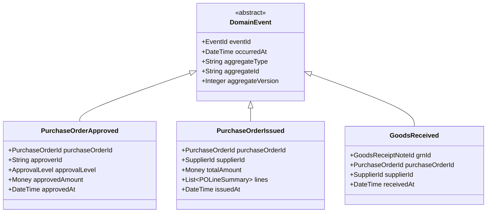

**Key Elements**:

- **Abstract base class**: All events share `eventId`, `occurredAt`, `aggregateType`, `aggregateId`, `aggregateVersion`
- **`aggregateVersion`**: Enables optimistic concurrency control — events carry the version at which they were raised
- **`PurchaseOrderIssued` carries line summary**: Downstream consumers (receiving-api) need line data without querying purchasing-api

**Design Rationale**: Events that carry sufficient payload reduce the need for consumers to query back into the producing context. `PurchaseOrderIssued` with line items means receiving-api can open GRN expectations without a synchronous PO query.

**Key Takeaway**: Include enough payload in domain events to satisfy common consumer needs without requiring callbacks into the producing context. Fat events reduce inter-service coupling at the cost of event schema versioning.

**Why It Matters**: Thin events (carrying only IDs) force consumers to query the producing service synchronously, creating temporal coupling. When purchasing-api is down, receiving-api cannot process a thin `PurchaseOrderIssued` event. Fat events with line summaries allow receiving-api to process the event independently.

---

## Dynamic Diagrams — P2P Lifecycle Flows (Examples 69–77)

### Example 69: Requisition Submission Flow — Dynamic Sequence

A dynamic sequence diagram traces one request across all containers and components in temporal order.

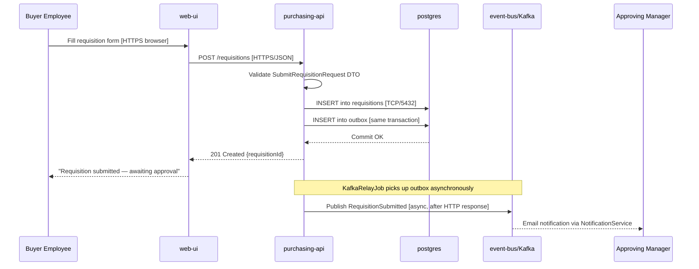

**Key Elements**:

- **Outbox transaction**: DB insert and outbox insert are in the same transaction — atomic
- **Async Kafka relay**: Event published after HTTP response — user is not blocked by Kafka latency
- **KafkaRelayJob note**: Clarifies that Kafka publish is decoupled from the HTTP request cycle

**Design Rationale**: The sequence diagram reveals the critical design decision: HTTP response is sent before Kafka publish. This means the user sees "submitted" before the approval notification is sent. This is acceptable if the relay lag is under one second.

**Key Takeaway**: Dynamic diagrams reveal the exact ordering of operations across containers. Use sequence diagrams to validate that the order of operations matches the desired user experience and consistency guarantees.

**Why It Matters**: Teams that do not draw sequence diagrams for key P2P flows routinely discover that their "successful submission" response is sent after Kafka publish — meaning a Kafka outage prevents users from submitting requisitions. The outbox pattern (publish after response) prevents this coupling.

---

### Example 70: PO Approval Flow — Multi-Level Sequence

Tracing the approval flow through all three authorization levels as a dynamic sequence.

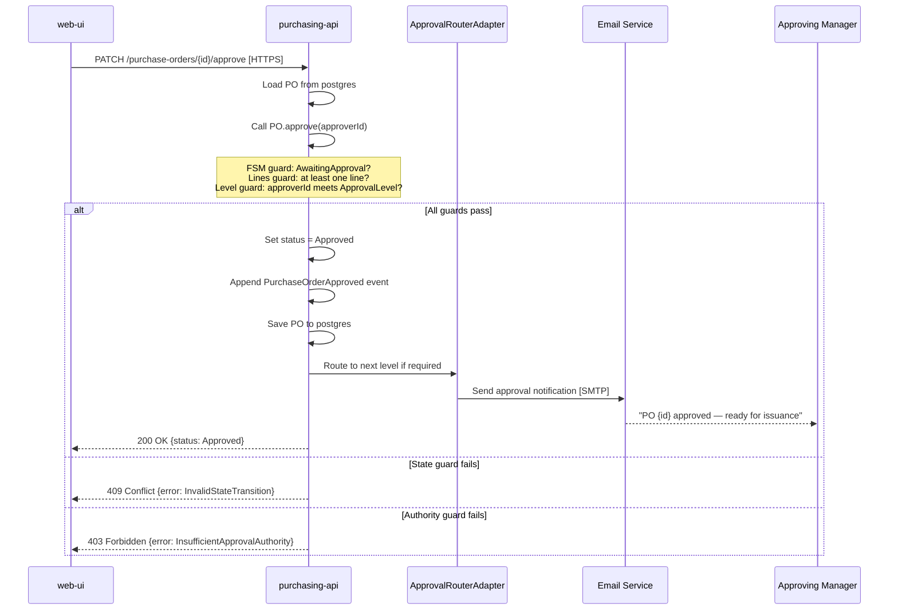

**Key Elements**:

- **Three alt branches**: Guards produce distinct HTTP status codes — 200, 409, 403
- **Guard order in note**: State → lines → level — cheapest guard first
- **Approval router called after save**: Notification is a side effect, not a pre-condition

**Design Rationale**: Showing the three alt branches with distinct status codes makes the API contract explicit. A 409 (state conflict) requires a different client response from a 403 (authority failure) — the API must distinguish them.

**Key Takeaway**: Model error paths in sequence diagrams using `alt` blocks. Error paths that return the same status code obscure the distinction between business rule failures and authorization failures.

**Why It Matters**: Approval UIs that cannot distinguish "wrong approver" (403) from "already approved" (409) display incorrect error messages, leading to support tickets and user frustration. Dynamic diagrams that show error branches drive correct API design.

---

### Example 71: Goods Receipt Flow — Dynamic Sequence

The goods receipt flow shows how a warehouse operator entry triggers state changes in multiple containers.

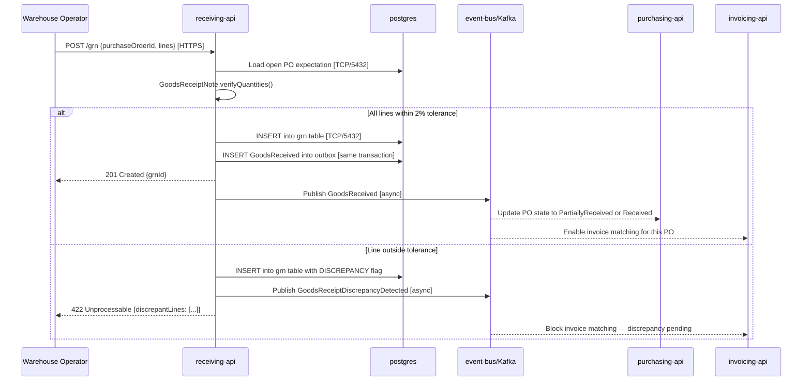

**Key Elements**:

- **Two alt branches**: Within tolerance → GoodsReceived; outside tolerance → Discrepancy event
- **Discrepancy blocks invoice matching**: InvAPI receives the discrepancy event and holds the invoice
- **Warehouse operator gets 422 with details**: Line-level discrepancy data returned for immediate action

**Design Rationale**: Returning discrepant line details in the 422 response means the warehouse operator knows immediately which SKUs have quantity issues, enabling same-day resolution rather than an overnight reconciliation cycle.

**Key Takeaway**: Goods receipt dynamic diagrams must show both the success and discrepancy paths. The discrepancy path triggers downstream blocking that can halt the entire P2P cycle — it must be designed explicitly.

**Why It Matters**: GRN discrepancies that are not surfaced immediately to warehouse operators result in delayed invoice matching, payment delays, and supplier relationship damage. Same-day resolution via explicit 422 responses is the difference between a well-designed and a poorly-designed receiving flow.

---

### Example 72: Three-Way Match Flow — Dynamic Sequence

Invoice matching is the most complex flow in P2P, correlating data from three sources across multiple containers.

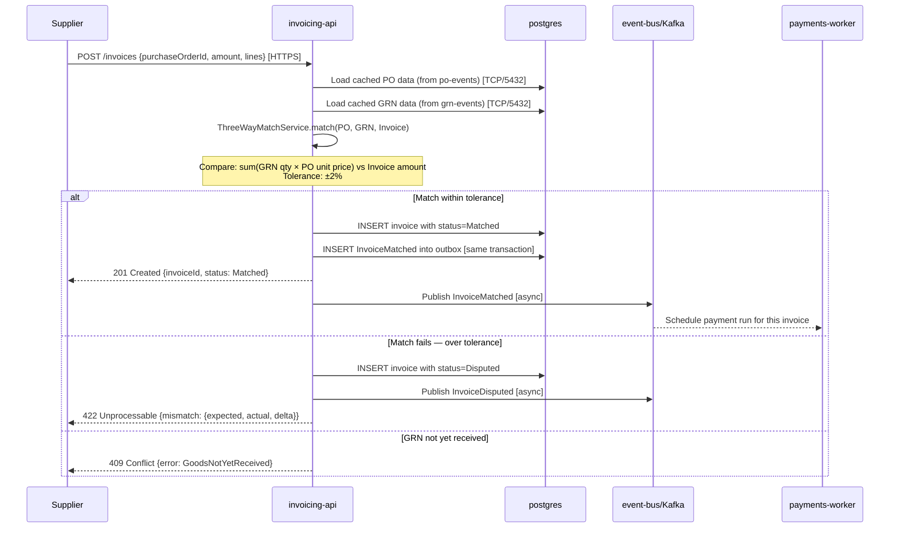

**Key Elements**:

- **Three alt branches**: Matched, Disputed, GRN not received — three distinct failure modes
- **GRN not received returns 409**: Invoice cannot be registered before goods are confirmed
- **Mismatch delta in 422 response**: Supplier receives exact delta — enabling immediate correction
- **Payment triggered by event**: PayWorker subscribes to InvoiceMatched — no polling

**Design Rationale**: Returning the exact mismatch delta in the 422 response means suppliers can correct and resubmit invoices without back-and-forth communication with the finance team.

**Key Takeaway**: Three-way match must be modeled as a dynamic diagram to expose the three failure modes. Each failure mode requires a different response to the supplier and a different state in the invoice aggregate.

**Why It Matters**: Invoice matching disputes are the single largest cause of payment delays in P2P. A matching flow that provides actionable error details (exact delta, missing GRN) reduces average dispute resolution from days to hours.

---

### Example 73: Payment Run Flow — Dynamic Sequence

The payment run flow shows how the payments-worker processes a batch of matched invoices.

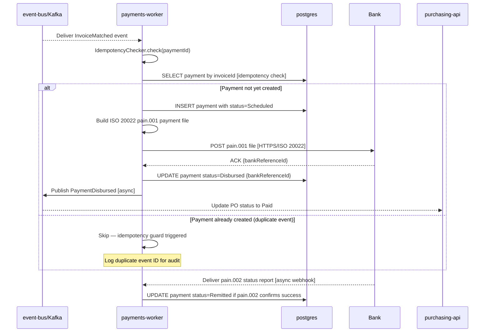

**Key Elements**:

- **Idempotency check first**: Before any state mutation, check if payment already exists for this invoiceId
- **pain.001 submission**: ISO 20022 payment initiation file sent to bank
- **pain.002 async callback**: Bank sends status report asynchronously — not in the same HTTP call
- **PO updated via event**: PurchaseOrder transitions to Paid through the event, not a direct call

**Design Rationale**: The idempotency check at the start of the payment flow is the last line of defense against double-payments. Kafka at-least-once delivery guarantees that `InvoiceMatched` may be delivered more than once; idempotency ensures only one payment is created per invoice.

**Key Takeaway**: Every payment flow must begin with an idempotency check. At-least-once Kafka delivery makes duplicate event processing inevitable — only idempotency makes it safe.

**Why It Matters**: Double-payments discovered after bank settlement require manual reversal processes that take days and damage supplier relationships. Idempotency checks that cost one database read prevent financial errors that cost thousands of person-hours to resolve.

---

### Example 74: Dispute Resolution Flow — Dynamic Sequence

When a GRN or invoice is disputed, a resolution flow must transition the PO through the Disputed state and back.

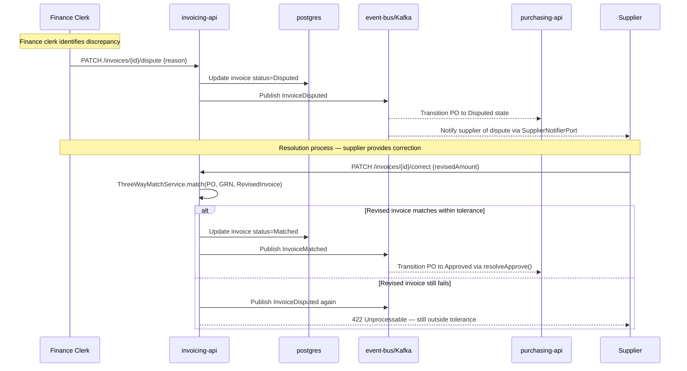

**Key Elements**:

- **PO transitions to Disputed via event**: InvAPI does not call purchasing-api directly
- **Supplier notified via SupplierNotifierPort**: Decoupled notification through the port
- **Resolution runs ThreeWayMatch again**: The match algorithm re-runs on the corrected invoice
- **PO re-enters Approved via `resolveApprove()`**: FSM transition from Disputed back to Approved

**Design Rationale**: Dispute resolution that re-runs the matching algorithm ensures the resolution path uses the same business rules as the initial match. Separate resolution logic would allow disputes to be resolved incorrectly.

**Key Takeaway**: Model dispute resolution as a complete dynamic diagram. Disputes that are resolved without re-running the match algorithm allow incorrect invoices to be cleared — a financial controls failure.

**Why It Matters**: Invoice disputes are the highest-risk transaction type in P2P. Dynamic diagrams that show the full dispute-to-resolution flow, including event chains across containers, enable compliance teams to audit the exact resolution path for any disputed invoice.

---

### Example 75: Cancelled PO Flow — Off-Ramp Sequence

A cancelled PO must notify the supplier and prevent further processing.

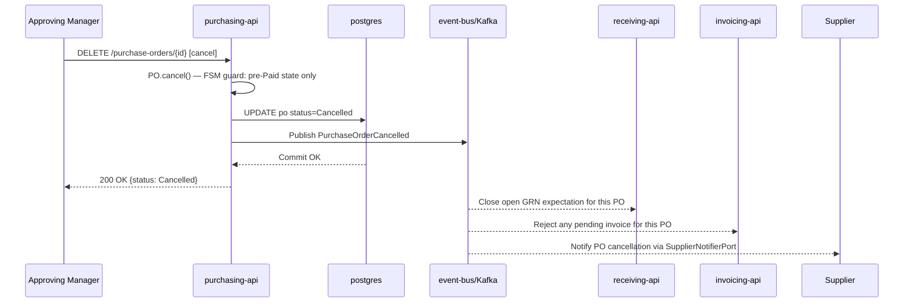

**Key Elements**:

- **FSM guard on cancel()**: Only pre-Paid state allows cancellation — guard enforced in aggregate
- **Three downstream consumers of Cancelled event**: receiving, invoicing, supplier notification
- **DELETE verb for cancellation**: Uses HTTP DELETE semantics — maps to FSM cancel transition

**Design Rationale**: Showing three downstream consumers of `PurchaseOrderCancelled` makes the fan-out visible. If receiving-api does not consume this event, warehouse staff could still attempt to receive goods against a cancelled PO.

**Key Takeaway**: Cancellation flows must explicitly show every downstream consumer that must react. Missing a consumer in the cancellation flow creates zombie workflows — processes that continue operating on cancelled orders.

**Why It Matters**: PO cancellations that do not notify receiving-api result in warehouse staff receiving goods that cannot be matched to any active PO, creating unmatched GRN records that require manual audit resolution.

---

### Example 76: Full P2P Happy Path — Abbreviated Sequence

The complete happy-path flow from requisition submission to payment confirmation in one diagram.

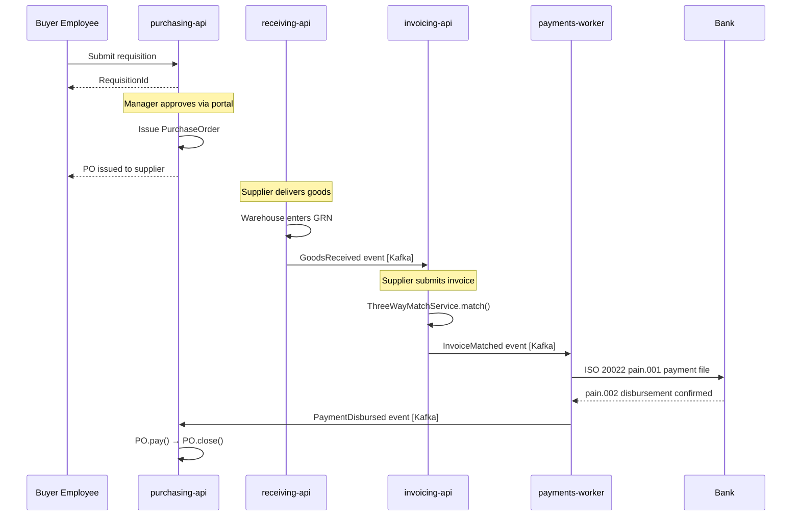

**Key Elements**:

- **Abbreviated for overview**: Notes replace detailed steps for human-driven interactions
- **Event connections shown**: Kafka events between containers are explicit
- **Final PO closure**: pay() followed by close() — two transitions to terminal state

**Design Rationale**: An abbreviated happy-path sequence diagram serves as an executive-level walkthrough of the P2P process, showing which containers are involved at each stage without the detailed alt branches.

**Key Takeaway**: Maintain both a detailed sequence diagram per flow and an abbreviated end-to-end diagram. The abbreviated diagram enables onboarding; the detailed diagrams enable debugging.

**Why It Matters**: New team members who understand the full P2P happy path from an abbreviated diagram can orient themselves in the codebase faster, reducing the time from onboarding to productive contribution.

---

### Example 77: Murabaha Financing Flow — Dynamic Sequence

When a high-value PO is financed through a Murabaha contract, the payment flow changes: the bank pays the supplier, and the buyer pays the bank in installments.

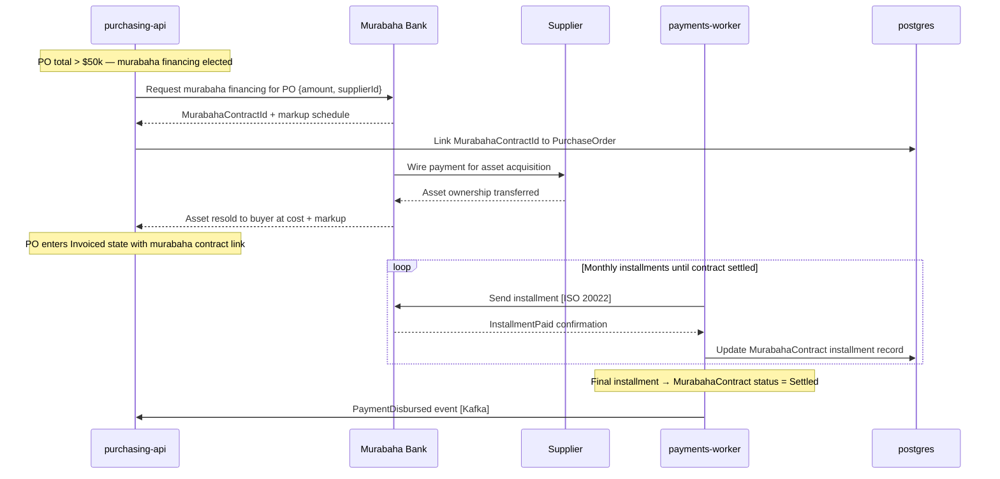

**Key Elements**:

- **Bank pays supplier directly**: Platform does not disburse to supplier — Murabaha Bank intermediates
- **Installment loop**: Multiple monthly payments until contract is settled
- **MurabahaContractId linked to PO**: The contract is associated with the PO in the purchasing schema

**Design Rationale**: Murabaha financing changes the payment architecture fundamentally. The dynamic diagram shows that the platform's role in the payment flow changes from "payer" to "installment scheduler" — a significant architectural difference.

**Key Takeaway**: Model Murabaha financing as a distinct dynamic flow, not as a variation of the standard payment flow. The three-party contract structure requires different containers and events from the two-party standard payment.

**Why It Matters**: Organizations entering Islamic finance markets that retrofit Murabaha into a standard payment architecture routinely violate the contractual structure of the Murabaha contract, creating Sharia compliance failures that invalidate the financing arrangement.

---

## Deployment Diagrams (Examples 78–85)

### Example 78: Kubernetes Deployment — Basic Pod Layout

A deployment diagram shows where containers run and on what infrastructure. This example shows the Kubernetes deployment topology for the Procurement Platform.

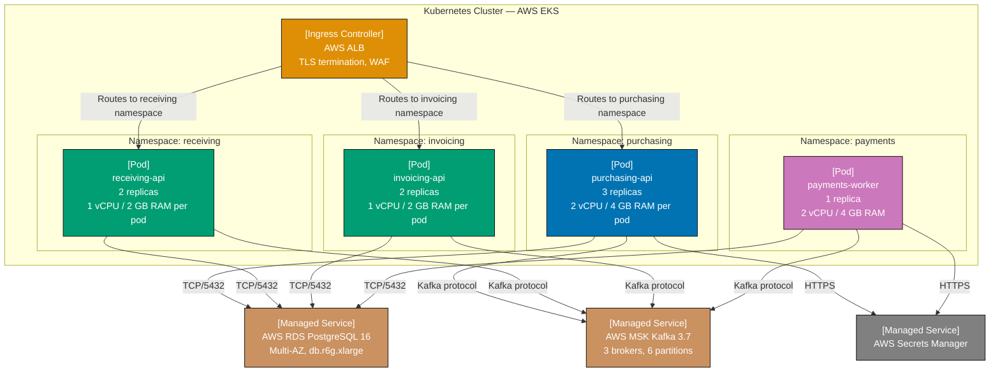

**Key Elements**:

- **Namespace-per-service**: Each API in its own Kubernetes namespace — network policy isolation
- **payments-worker: 1 replica**: Single instance enforced by deployment spec — no accidental scale-out
- **Managed services**: RDS, MSK, and Secrets Manager are AWS-managed, not self-hosted
- **Resource allocation visible**: vCPU and RAM in pod labels — capacity planning at diagram level

**Design Rationale**: Namespace-per-service enables Kubernetes NetworkPolicy to restrict cross-namespace traffic. purchasing-api pods cannot directly query invoicing-api's postgres schema — they must communicate through events.

**Key Takeaway**: Use separate Kubernetes namespaces per bounded context. Namespace isolation enforces the container-level data ownership decisions made in the Component diagrams.

**Why It Matters**: Kubernetes clusters without namespace isolation allow any pod to reach any database port. Namespace-scoped NetworkPolicy translates the bounded context boundaries from architectural diagrams into enforced network rules.

---

### Example 79: Kubernetes — Health Check and Rolling Update

Deployment diagrams can show health check configuration and rolling update strategy for zero-downtime deployment.

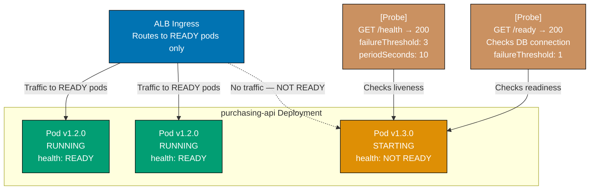

**Key Elements**:

- **Rolling update in progress**: v1.2.0 pods receive traffic; v1.3.0 pod is starting and not yet ready
- **ALB excludes NOT READY pods**: Zero-downtime — no user request reaches an unready pod
- **Two probe types with distinct thresholds**: Liveness tolerates 3 failures; readiness is strict (1 failure)

**Design Rationale**: The strict readiness probe (1 failure threshold) ensures that a pod without a database connection never receives user traffic. Tolerating readiness failures causes users to see 500 errors during startup.

**Key Takeaway**: Set readiness probe failure threshold to 1 for database-dependent APIs. Tolerating readiness failures routes user traffic to pods that cannot handle requests — directly causing user-visible errors.

**Why It Matters**: P2P platforms that experience partial rolling update failures (some pods ready, one without DB connection) produce intermittent 500 errors during deployment windows. Strict readiness probes make the failure complete and self-healing rather than intermittent and user-visible.

---

### Example 80: Kubernetes — Horizontal Pod Autoscaler

The HPA scales purchasing-api pods based on CPU and custom Kafka lag metrics.

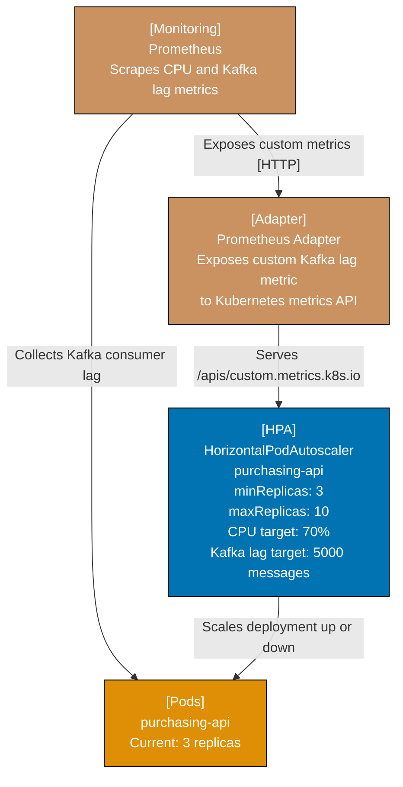

**Key Elements**:

- **Dual scaling metric**: CPU (70%) and Kafka consumer lag (5000 messages) — both trigger scaling
- **Prometheus Adapter**: Bridges Prometheus metrics to Kubernetes custom metrics API
- **minReplicas: 3**: Never scale below 3 — minimum for load distribution and availability

**Design Rationale**: Scaling on Kafka lag as well as CPU prevents the situation where CPU is low but the consumer is falling behind on event processing. Lag-based scaling catches throughput bottlenecks that CPU-only scaling misses.

**Key Takeaway**: Scale event-driven containers on consumer lag in addition to CPU. CPU-only scaling is insufficient for containers whose bottleneck is event processing throughput rather than compute.

**Why It Matters**: purchasing-api that falls behind on Kafka consumer lag during peak PO submission windows will miss `PaymentDisbursed` events, leaving POs stuck in `Invoiced` state indefinitely. Lag-based autoscaling prevents this accumulation.

---

### Example 81: Deployment Diagram — Multi-Region Active-Active

For global P2P operations, the platform deploys in two regions with active-active traffic routing.

```mermaid
graph TD
    subgraph Route53["AWS Route53 — Global DNS"]
        DNS["Latency-based routing<br/>Buyer in APAC → APAC endpoint<br/>Buyer in EU → EU endpoint"]
    end

    subgraph APACRegion["APAC Region — ap-southeast-1"]
        APACCluster["EKS Cluster<br/>purchasing-api + receiving-api<br/>invoicing-api"]
        APACPostgres["RDS PostgreSQL<br/>Primary write node"]
        APACKafka["MSK Kafka<br/>3-broker cluster"]
    end

    subgraph EURegion["EU Region — eu-west-1"]
        EUCluster["EKS Cluster<br/>purchasing-api + receiving-api<br/>invoicing-api"]
        EUPostgres["RDS PostgreSQL<br/>Primary write node"]
        EUKafka["MSK Kafka<br/>3-broker cluster"]
    end

    CrossRegionReplication["Cross-Region Kafka MirrorMaker 2<br/>Replicates events between regions<br/>RPO: 30 seconds"]

    DNS -->|"Routes APAC buyers"| APACCluster
    DNS -->|"Routes EU buyers"| EUCluster
    APACCluster -->|"Writes [TCP/5432]"| APACPostgres
    APACCluster -->|"Events [Kafka]"| APACKafka
    EUCluster -->|"Writes [TCP/5432]"| EUPostgres
    EUCluster -->|"Events [Kafka]"| EUKafka
    APACKafka -->|"Replicates to EU"| CrossRegionReplication
    CrossRegionReplication -->|"Delivers to EU Kafka"| EUKafka

    style DNS fill:#0173B2,stroke:#000,color:#fff
    style APACCluster fill:#029E73,stroke:#000,color:#fff
    style EUCluster fill:#029E73,stroke:#000,color:#fff
    style APACPostgres fill:#CA9161,stroke:#000,color:#fff
    style EUPostgres fill:#CA9161,stroke:#000,color:#fff
    style APACKafka fill:#DE8F05,stroke:#000,color:#fff
    style EUKafka fill:#DE8F05,stroke:#000,color:#fff
    style CrossRegionReplication fill:#CC78BC,stroke:#000,color:#fff
```

**Key Elements**:

- **Active-active routing**: Both regions serve traffic simultaneously — not active-passive
- **Region-local postgres**: Each region writes to its own database — no cross-region synchronous writes
- **Kafka MirrorMaker 2**: Asynchronous event replication with 30-second RPO
- **Latency-based DNS routing**: Buyers are routed to the nearest region by Route53

**Design Rationale**: Region-local postgres with event replication (rather than a shared global database) enables each region to write at full speed without cross-region latency. The 30-second RPO means EU invoices may not be immediately visible in APAC, but the system remains operational independently if a region fails.

**Key Takeaway**: Multi-region active-active deployments require region-local write stores. Cross-region synchronous writes create latency that defeats the purpose of multi-region deployment.

**Why It Matters**: Global procurement platforms that share a single database region force all writes through the primary region's network latency. APAC buyers submitting POs against an EU-hosted database experience 200ms+ latency for every transaction — an unacceptable UX degradation for a process that runs thousands of times daily.

---

### Example 82: Deployment Diagram — Blue-Green Deployment

Blue-green deployment enables zero-downtime releases with instant rollback capability.

```mermaid
graph TD
    ALB["AWS Application Load Balancer<br/>Current weights:<br/>Blue: 100%<br/>Green: 0%"]

    subgraph BlueEnv["Blue Environment — Current Production"]
        BluePods["purchasing-api v1.4.2<br/>3 pods — SERVING TRAFFIC"]
        BlueDB["RDS PostgreSQL<br/>Schema v14"]
    end

    subgraph GreenEnv["Green Environment — New Release"]
        GreenPods["purchasing-api v1.5.0<br/>3 pods — WARMED UP, IDLE"]
        GreenDB["RDS PostgreSQL<br/>Schema v15 — migration run"]
    end

    SmokeTest["[Test Suite]<br/>Green environment smoke tests<br/>Must pass before traffic switch"]

    ALB -->|"100% traffic"| BluePods
    ALB -.->|"0% traffic (ready to switch)"| GreenPods
    BluePods -->|"Reads/writes"| BlueDB
    GreenPods -->|"Reads/writes"| GreenDB
    SmokeTest -->|"POST /requisitions smoke test [HTTPS]"| GreenPods

    style ALB fill:#0173B2,stroke:#000,color:#fff
    style BluePods fill:#0173B2,stroke:#000,color:#fff
    style BlueDB fill:#CA9161,stroke:#000,color:#fff
    style GreenPods fill:#029E73,stroke:#000,color:#fff
    style GreenDB fill:#CA9161,stroke:#000,color:#fff
    style SmokeTest fill:#DE8F05,stroke:#000,color:#fff
```

**Key Elements**:

- **Two live environments**: Blue serves traffic; Green is ready but idle
- **Separate databases per environment**: Schema v14 (blue) vs v15 (green) — schema migration is independent
- **Smoke tests gate the switch**: Green must pass smoke tests before ALB shifts traffic
- **Instant rollback**: Set ALB weights to Blue: 100%, Green: 0% — rollback completes in seconds

**Design Rationale**: Blue-green deployment for P2P platforms is preferred over rolling updates because payment runs in progress on blue pods should not be interrupted. Blue-green keeps the current payment run on blue while green warms up.

**Key Takeaway**: Use blue-green deployment for payment-worker and invoicing-api to prevent interrupting in-progress payment runs during releases. Rolling updates risk splitting a payment run across old and new code versions.

**Why It Matters**: A payment worker that is halfway through a payment run when a rolling update replaces its pod may leave payments in an ambiguous state — initiated at the bank but not confirmed in the database. Blue-green deployment ensures that the current payment run completes on the stable environment before traffic switches.

---

### Example 83: Deployment Diagram — Database Migration Strategy

Database migrations in a multi-service deployment require careful ordering to prevent downtime.

```mermaid
graph LR
    subgraph Step1["Step 1: Backward-Compatible Migration"]
        M1["ALTER TABLE purchase_orders<br/>ADD COLUMN new_field TEXT<br/>DEFAULT NULL<br/>Old code: ignores new column<br/>New code: writes new column"]
    end

    subgraph Step2["Step 2: Deploy New Code"]
        D1["Deploy purchasing-api v1.5.0<br/>Reads and writes new_field<br/>Old code still running during rollout"]
    end

    subgraph Step3["Step 3: Remove Old Compatibility"]
        M2["ALTER TABLE purchase_orders<br/>ALTER COLUMN new_field SET NOT NULL<br/>Only after 100% of pods on v1.5.0"]
    end

    Step1 -->|"Migration runs first"| Step2
    Step2 -->|"All pods updated"| Step3

    style M1 fill:#0173B2,stroke:#000,color:#fff
    style D1 fill:#DE8F05,stroke:#000,color:#fff
    style M2 fill:#029E73,stroke:#000,color:#fff
```

**Key Elements**:

- **Backward-compatible migration first**: New column added as nullable — old code runs without errors
- **Code deployment second**: New code writes the new column; old code coexists and ignores it
- **Constraint tightening last**: NOT NULL constraint applied only after all pods run new code

**Design Rationale**: The three-step expand/contract migration pattern ensures zero downtime. Adding a NOT NULL column before deploying new code causes old pods to fail with constraint violations — a downtime-causing migration mistake.

**Key Takeaway**: Always use backward-compatible (expand/contract) migrations for P2P schemas. A migration that causes old pods to fail produces downtime that cannot be resolved without a rollback of both code and schema.

**Why It Matters**: P2P schema migrations that cause downtime block purchase orders in flight from being saved to the database. Transactions in progress that cannot commit result in lost requisition data and angry buyers.

---

### Example 84: Deployment Diagram — Observability Stack

The observability infrastructure for the Procurement Platform collects metrics, traces, and logs from all containers.

```mermaid
graph TD
    subgraph AppTier["Application Containers"]
        PurchAPI["purchasing-api"]
        RecvAPI["receiving-api"]
        InvAPI["invoicing-api"]
        PayWorker["payments-worker"]
    end

    subgraph OtelLayer["OpenTelemetry Layer"]
        OtelAgent["[Sidecar]<br/>OpenTelemetry Agent<br/>Collects traces and metrics<br/>per pod"]
        OtelCollector["[Deployment]<br/>OpenTelemetry Collector<br/>Central aggregation and export"]
    end

    subgraph ObsSinks["Observability Sinks"]
        Prometheus["Prometheus<br/>Metrics storage"]
        Tempo["Grafana Tempo<br/>Trace storage"]
        Loki["Grafana Loki<br/>Log aggregation"]
        Grafana["Grafana<br/>Unified dashboard"]
    end

    OnCall["[Person]<br/>On-Call Engineer"]

    PurchAPI -->|"OTLP/gRPC traces and metrics"| OtelAgent
    RecvAPI -->|"OTLP/gRPC"| OtelAgent
    InvAPI -->|"OTLP/gRPC"| OtelAgent
    PayWorker -->|"OTLP/gRPC"| OtelAgent
    OtelAgent -->|"Forwards to collector [OTLP]"| OtelCollector
    OtelCollector -->|"Exports metrics [remote_write]"| Prometheus
    OtelCollector -->|"Exports traces [OTLP]"| Tempo
    OtelCollector -->|"Exports logs [OTLP]"| Loki
    Prometheus -->|"Alerts on threshold breach"| OnCall
    Grafana -->|"Displays metrics, traces, logs"| OnCall

    style PurchAPI fill:#0173B2,stroke:#000,color:#fff
    style RecvAPI fill:#029E73,stroke:#000,color:#fff
    style InvAPI fill:#029E73,stroke:#000,color:#fff
    style PayWorker fill:#CC78BC,stroke:#000,color:#fff
    style OtelAgent fill:#DE8F05,stroke:#000,color:#fff
    style OtelCollector fill:#DE8F05,stroke:#000,color:#fff
    style Prometheus fill:#CA9161,stroke:#000,color:#fff
    style Tempo fill:#CA9161,stroke:#000,color:#fff
    style Loki fill:#CA9161,stroke:#000,color:#fff
    style Grafana fill:#808080,stroke:#000,color:#fff
    style OnCall fill:#029E73,stroke:#000,color:#fff
```

**Key Elements**:

- **Sidecar OTel agent per pod**: Collects telemetry at pod level — no code changes in application
- **Central collector**: Single aggregation point before routing to sinks — vendor-swappable
- **Three observability pillars**: Metrics (Prometheus), traces (Tempo), logs (Loki) — complete observability

**Design Rationale**: Sidecar-based collection decouples telemetry instrumentation from application code. Applications emit OTLP; the collector decides where to route. Swapping from Tempo to Jaeger requires only collector config, not code changes.

**Key Takeaway**: Model the full observability stack as a deployment diagram. Observability is infrastructure — it has deployment topology, resource requirements, and failure modes that must be designed and documented.

**Why It Matters**: On-call engineers investigating P2P incidents without distributed traces spend hours on manual log correlation across purchasing-api, invoicing-api, and payments-worker. Distributed traces that correlate a single `purchaseOrderId` across all containers reduce mean time to resolution from hours to minutes.

---

### Example 85: C4 Diagram Versioning and Change Management

Managing C4 diagrams as versioned artifacts alongside code prevents documentation drift.

```mermaid
graph TD
    ArchRepo["[Repository]<br/>Architecture Diagrams<br/>Stored as Mermaid text in Git<br/>Same repo as application code"]
    PRCheck["[CI Check]<br/>Architecture Review Gate<br/>PR requires diagram update<br/>if container or component added"]
    ADRDir["[Directory]<br/>Architecture Decision Records<br/>ADR-001: Use Kafka for events<br/>ADR-002: Schema-per-service<br/>ADR-003: Outbox pattern"]
    ContainerDiagram["[Artifact]<br/>Container Diagram v2.4<br/>Last updated: when payments-worker added<br/>Linked from ARCHITECTURE.md"]
    ComponentDiagram["[Artifact]<br/>Component Diagram v1.8<br/>purchasing-api internal structure<br/>Updated with each new handler"]
    TeamReview["[Process]<br/>Monthly Architecture Review<br/>Validate diagrams match implementation<br/>Identify drift"]

    ArchRepo -->|"PR lint checks diagram syntax"| PRCheck
    ArchRepo -->|"Stores"| ADRDir
    ArchRepo -->|"Stores"| ContainerDiagram
    ArchRepo -->|"Stores"| ComponentDiagram
    ContainerDiagram -->|"References"| ADRDir
    TeamReview -->|"Validates diagrams against"| ArchRepo

    style ArchRepo fill:#0173B2,stroke:#000,color:#fff
    style PRCheck fill:#DE8F05,stroke:#000,color:#fff
    style ADRDir fill:#CA9161,stroke:#000,color:#fff
    style ContainerDiagram fill:#029E73,stroke:#000,color:#fff
    style ComponentDiagram fill:#029E73,stroke:#000,color:#fff
    style TeamReview fill:#CC78BC,stroke:#000,color:#fff
```

**Key Elements**:

- **Diagrams in the same repo as code**: Co-location ensures diagrams are updated with code changes
- **CI gate on diagram updates**: PRs that add containers must update the Container diagram
- **Monthly architecture review**: Human validation that diagrams still match implementation
- **ADRs linked from diagrams**: Architectural decisions traceable from the diagram element

**Design Rationale**: Storing Mermaid diagrams as text in Git gives architecture diagrams the same versioning, review, and rollback capabilities as code. Diagrams stored in Confluence or draw.io cannot be diffed in pull requests.

**Key Takeaway**: Store C4 diagrams as Mermaid text in the same repository as the application code. Treat diagram updates as a required change in PRs that introduce new containers or components.

**Why It Matters**: Architecture diagrams that are not version-controlled drift from the implementation within months. A P2P platform where the Container diagram no longer reflects the actual deployment topology is a platform where on-call engineers cannot trust architectural documentation during incidents — when correct documentation is most critical.
