This beginner-level tutorial introduces C4 Model fundamentals through 30 annotated diagram examples, covering system context, container, and component visualization techniques that form the foundation for architectural documentation.

## Introduction to C4 Model (Examples 1-3)

### Example 1: What is the C4 Model?

The C4 Model provides a hierarchical approach to visualizing software architecture through four levels of abstraction: Context, Containers, Components, and Code. This framework enables clear communication between technical and non-technical stakeholders.

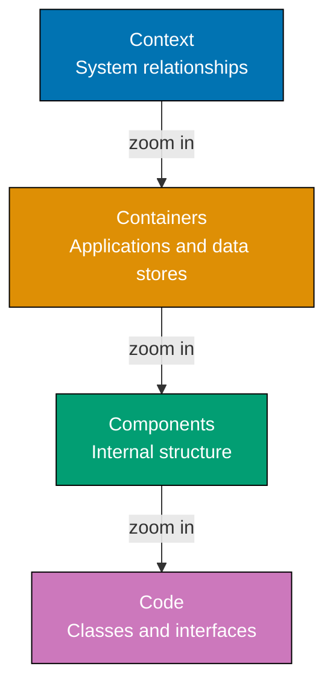
```mermaid
graph TD
    A["Context<br/>System relationships"]
    B["Containers<br/>Applications and data stores"]
    C["Components<br/>Internal structure"]
    D["Code<br/>Classes and interfaces"]

    A -->|zoom in| B
    B -->|zoom in| C
    C -->|zoom in| D

    style A fill:#0173B2,stroke:#000,color:#fff
    style B fill:#DE8F05,stroke:#000,color:#fff
    style C fill:#029E73,stroke:#000,color:#fff
    style D fill:#CC78BC,stroke:#000,color:#fff
```

**Key Elements**:

- **Context**: Shows how the system fits in the overall IT environment
- **Containers**: Separately deployable/executable units (web apps, databases, microservices)
- **Components**: Groupings of related functionality within a container
- **Code**: Class-level detail for critical components

**Key Takeaway**: C4 Model provides four zoom levels for architecture documentation, enabling stakeholders at different technical levels to understand system design. Start with Context for high-level overview, drill down to Code for implementation details.

**Why It Matters**: Architecture diagrams often fail because they mix abstraction levels, showing both high-level system relationships and low-level class details in one view. C4 Model solves this by separating concerns—executives view Context diagrams, developers view Component diagrams, and each diagram remains focused and comprehensible. Teams using C4 Model report 40% faster onboarding for new developers because architecture documentation matches their mental model progression from "big picture" to implementation specifics.

### Example 2: System Context - Single System

A System Context diagram shows your system (the focus) as a box in the center, surrounded by users and external systems it interacts with. This is the highest abstraction level, answering "What does this system do and who uses it?"

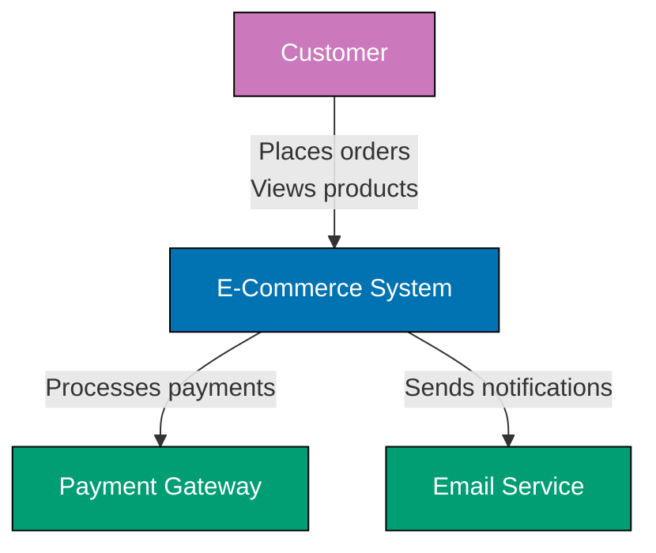
```mermaid
graph TD
    A["Customer"]
    B["E-Commerce System"]
    C["Payment Gateway"]
    D["Email Service"]

    A -->|"Places orders<br/>Views products"| B
    B -->|"Processes payments"| C
    B -->|"Sends notifications"| D

    style A fill:#CC78BC,stroke:#000,color:#fff
    style B fill:#0173B2,stroke:#000,color:#fff
    style C fill:#029E73,stroke:#000,color:#fff
    style D fill:#029E73,stroke:#000,color:#fff
```

**Key Elements**:

- **Customer** (purple): Human actor using the system
- **E-Commerce System** (blue): The system being documented (always central and highlighted)
- **Payment Gateway** (teal): External system dependency
- **Email Service** (teal): External system dependency
- **Arrows**: Show direction of interaction with brief descriptions

**Design Rationale**: System Context diagrams deliberately omit internal structure (databases, microservices, modules) to focus on external relationships. This makes them ideal for stakeholder presentations and high-level documentation.

**Key Takeaway**: Place your system in the center (highlighted in distinctive color), surround it with users and external systems, and label relationships with clear action descriptions. Keep it simple—internal structure belongs in Container diagrams.

**Why It Matters**: Context diagrams prevent the common failure mode where architects create overly detailed diagrams that overwhelm stakeholders. By showing only external relationships, Context diagrams answer the critical question "What business value does this system provide?" in 30 seconds or less. Amazon's leadership principle "Start with the customer" aligns perfectly with Context diagrams—they force architects to articulate value before diving into technical complexity.

### Example 3: Notation Basics

C4 Model uses simple boxes and arrows with consistent notation rules. Understanding these conventions ensures your diagrams communicate effectively across teams and organizations.

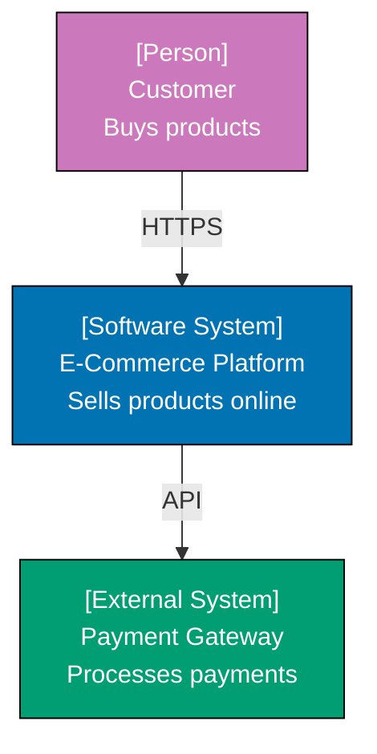
```mermaid
graph TD
    Person["[Person]<br/>Customer<br/>Buys products"]
    System["[Software System]<br/>E-Commerce Platform<br/>Sells products online"]
    ExtSystem["[External System]<br/>Payment Gateway<br/>Processes payments"]

    Person -->|HTTPS| System
    System -->|API| ExtSystem

    style Person fill:#CC78BC,stroke:#000,color:#fff
    style System fill:#0173B2,stroke:#000,color:#fff
    style ExtSystem fill:#029E73,stroke:#000,color:#fff
```

**Key Elements**:

- **[Person]**: Human user - always purple/pink to distinguish from systems
- **[Software System]**: The system being documented - blue to indicate primary focus
- **[External System]**: Dependencies outside your control - teal/green to show external boundary
- **Labels**: Format as "[Type] Name Description" for consistency
- **Technology notes**: HTTPS, API - specify protocols when relevant

**Design Rationale**: Color coding by type (not by team or technology) creates visual hierarchy. Purple draws attention to users (the "why"), blue highlights the system in focus, and teal indicates external dependencies requiring integration contracts.

**Key Takeaway**: Use consistent colors and labeling format. Purple for people, blue for your system, teal for external systems. Include type, name, and brief description in each box.

**Why It Matters**: Inconsistent notation is the #1 reason architecture diagrams fail to communicate. When Netflix documented their microservices architecture, they standardized on C4 notation across 500+ teams, reducing onboarding time from 2 weeks to 3 days. Consistent colors mean developers can scan any diagram and immediately identify users, systems, and dependencies without reading labels—critical when reviewing 50+ diagrams during incident response.

## System Context Diagrams - Basic (Examples 4-8)

### Example 4: System Context with Multiple Users

Real systems serve multiple user types with different needs. This example shows how to represent distinct user personas in Context diagrams.

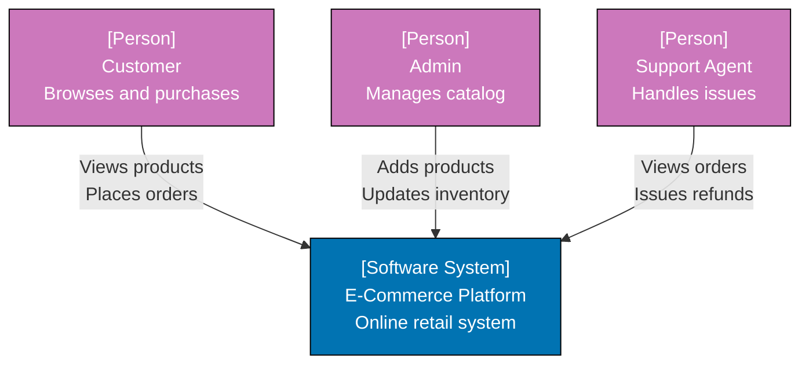
```mermaid
graph TD
    Customer["[Person]<br/>Customer<br/>Browses and purchases"]
    Admin["[Person]<br/>Admin<br/>Manages catalog"]
    Support["[Person]<br/>Support Agent<br/>Handles issues"]

    ECommerce["[Software System]<br/>E-Commerce Platform<br/>Online retail system"]

    Customer -->|"Views products<br/>Places orders"| ECommerce
    Admin -->|"Adds products<br/>Updates inventory"| ECommerce
    Support -->|"Views orders<br/>Issues refunds"| ECommerce

    style Customer fill:#CC78BC,stroke:#000,color:#fff
    style Admin fill:#CC78BC,stroke:#000,color:#fff
    style Support fill:#CC78BC,stroke:#000,color:#fff
    style ECommerce fill:#0173B2,stroke:#000,color:#fff
```

**Key Elements**:

- **Three user types**: Customer, Admin, Support Agent - each with distinct responsibilities
- **Labeled interactions**: Each arrow describes what that user does with the system
- **Same color for all users**: Purple indicates they're all people, not systems

**Design Rationale**: Showing distinct user types reveals different usage patterns and helps prioritize features. Customer-facing features appear alongside administrative functions, making clear the system serves multiple audiences.

**Key Takeaway**: Represent each significant user type separately with clear labels describing their primary actions. Group all people in the same color (purple) to distinguish them from systems.

**Why It Matters**: User segmentation in architecture diagrams drives better design decisions. When Spotify documented their platform, separating "Free User," "Premium User," and "Artist" actors revealed that 80% of system complexity served only artists (20% of users). This insight led to microservices separation where the artist portal became an independent system, reducing coupling and enabling faster iteration for the majority use case.

### Example 5: System Context with Authentication

Authentication systems are critical dependencies for most applications. This example shows how to represent authentication flows in System Context diagrams.

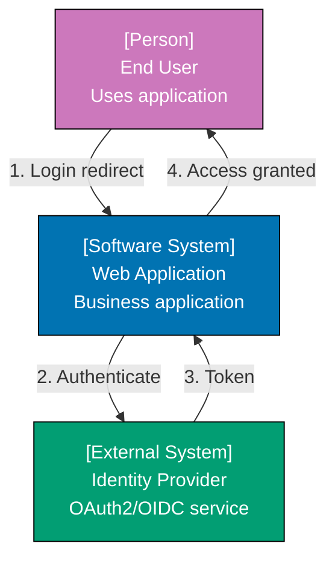
```mermaid
graph TD
    User["[Person]<br/>End User<br/>Uses application"]

    App["[Software System]<br/>Web Application<br/>Business application"]
    Auth["[External System]<br/>Identity Provider<br/>OAuth2/OIDC service"]

    User -->|"1. Login redirect"| App
    App -->|"2. Authenticate"| Auth
    Auth -->|"3. Token"| App
    App -->|"4. Access granted"| User

    style User fill:#CC78BC,stroke:#000,color:#fff
    style App fill:#0173B2,stroke:#000,color:#fff
    style Auth fill:#029E73,stroke:#000,color:#fff
```

**Key Elements**:

- **Numbered flow**: Shows authentication sequence (1-4)
- **Identity Provider**: External system handling authentication (OAuth2/OIDC)
- **Token exchange**: Authentication result flows back through the application
- **Bidirectional relationship**: App initiates auth, receives token

**Design Rationale**: Authentication is shown as external system dependency to highlight security boundary and delegation of credential management. Numbering reveals temporal sequence critical for understanding security flow.

**Key Takeaway**: Use numbered steps (1, 2, 3...) to show temporal sequence when order matters. Represent authentication systems as external dependencies to highlight trust boundaries.

**Why It Matters**: Security architectures fail when authentication boundaries are unclear. When GitHub migrated to OAuth2, their Context diagrams showing authentication flow helped identify that 40% of internal services were still doing direct credential validation instead of token validation. Fixing this centralized security and eliminated 12 critical vulnerabilities where credential databases were exposed to unencrypted network access.

### Example 6: System Context with Database

Database systems appear in Context diagrams when they're shared across multiple systems or provided as external services. This example shows when to elevate databases to Context level.

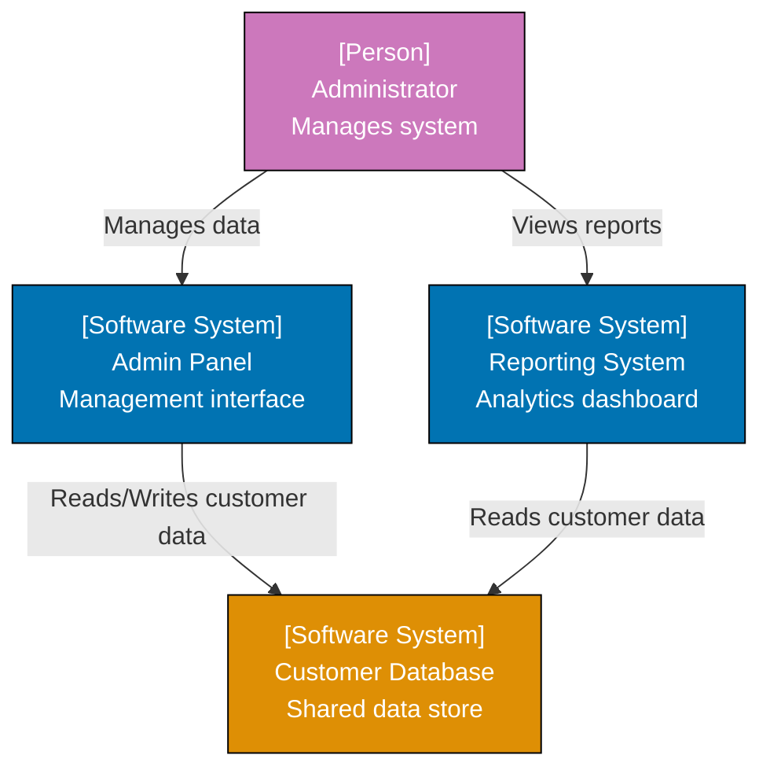
```mermaid
graph TD
    Admin["[Person]<br/>Administrator<br/>Manages system"]

    AdminPanel["[Software System]<br/>Admin Panel<br/>Management interface"]
    ReportingSystem["[Software System]<br/>Reporting System<br/>Analytics dashboard"]

    SharedDB["[Software System]<br/>Customer Database<br/>Shared data store"]

    Admin -->|"Manages data"| AdminPanel
    Admin -->|"Views reports"| ReportingSystem

    AdminPanel -->|"Reads/Writes customer data"| SharedDB
    ReportingSystem -->|"Reads customer data"| SharedDB

    style Admin fill:#CC78BC,stroke:#000,color:#fff
    style AdminPanel fill:#0173B2,stroke:#000,color:#fff
    style ReportingSystem fill:#0173B2,stroke:#000,color:#fff
    style SharedDB fill:#DE8F05,stroke:#000,color:#fff
```

**Key Elements**:

- **Shared Database** (orange): Treated as separate system because multiple systems depend on it
- **Two systems**: Admin Panel and Reporting System - both your systems (blue)
- **Read/Write distinction**: AdminPanel writes, ReportingSystem reads (important for understanding data flow)

**Design Rationale**: When a database is shared by multiple systems, it becomes a significant integration point deserving Context-level visibility. Orange color distinguishes it from external systems (teal) and your primary systems (blue).

**Key Takeaway**: Show databases at Context level when they're shared across multiple systems or managed by external teams. Use orange to distinguish data stores from application systems.

**Why It Matters**: Shared databases create tight coupling and coordination overhead that Context diagrams must make visible. When Uber decomposed their monolithic database, Context diagrams showing 47 systems depending on one database drove the decision to create domain-specific databases. This reduced cross-team dependencies from 47×46 potential interactions to ~8 per team, accelerating deployment velocity from monthly to daily.

### Example 7: System Context with Message Queue

Asynchronous communication via message queues is fundamental to modern distributed systems. This example shows event-driven architecture at Context level.

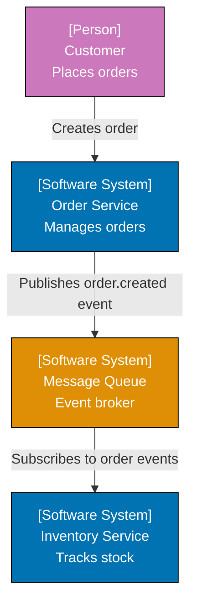
```mermaid
graph TD
    User["[Person]<br/>Customer<br/>Places orders"]

    OrderService["[Software System]<br/>Order Service<br/>Manages orders"]
    InventoryService["[Software System]<br/>Inventory Service<br/>Tracks stock"]
    MessageQueue["[Software System]<br/>Message Queue<br/>Event broker"]

    User -->|"Creates order"| OrderService
    OrderService -->|"Publishes order.created event"| MessageQueue
    MessageQueue -->|"Subscribes to order events"| InventoryService

    style User fill:#CC78BC,stroke:#000,color:#fff
    style OrderService fill:#0173B2,stroke:#000,color:#fff
    style InventoryService fill:#0173B2,stroke:#000,color:#fff
    style MessageQueue fill:#DE8F05,stroke:#000,color:#fff
```

**Key Elements**:

- **Message Queue** (orange): Infrastructure component enabling async communication
- **Publisher-Subscriber pattern**: OrderService publishes, InventoryService subscribes
- **Event naming**: "order.created" shows explicit event schema
- **Decoupled systems**: Services don't call each other directly

**Design Rationale**: Message queues appear at Context level when they're the primary integration mechanism between systems. This reveals architectural style (event-driven) and highlights temporal decoupling.

**Key Takeaway**: Show message queues as separate systems when they're central to system integration. Use event names on arrows to clarify what data flows through the queue.

**Why It Matters**: Event-driven architectures hide complexity that Context diagrams must expose. When Amazon migrated from synchronous APIs to SNS/SQS, their Context diagrams revealed 200+ event types flowing through queues. This visibility led to schema governance (centralized event catalog) and prevented the common failure mode where teams create duplicate events with subtle differences, breaking loose coupling guarantees.

### Example 8: System Context with External APIs

Most systems integrate with third-party APIs for specialized functionality. This example shows multiple external service dependencies.

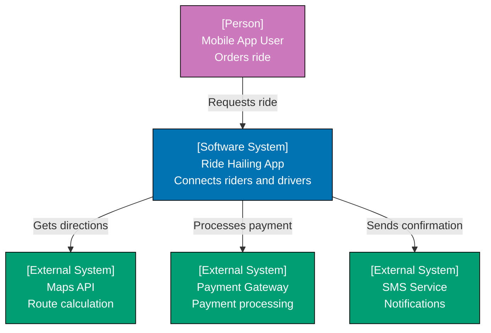
```mermaid
graph TD
    User["[Person]<br/>Mobile App User<br/>Orders ride"]

    RideApp["[Software System]<br/>Ride Hailing App<br/>Connects riders and drivers"]

    Maps["[External System]<br/>Maps API<br/>Route calculation"]
    Payment["[External System]<br/>Payment Gateway<br/>Payment processing"]
    SMS["[External System]<br/>SMS Service<br/>Notifications"]

    User -->|"Requests ride"| RideApp
    RideApp -->|"Gets directions"| Maps
    RideApp -->|"Processes payment"| Payment
    RideApp -->|"Sends confirmation"| SMS

    style User fill:#CC78BC,stroke:#000,color:#fff
    style RideApp fill:#0173B2,stroke:#000,color:#fff
    style Maps fill:#029E73,stroke:#000,color:#fff
    style Payment fill:#029E73,stroke:#000,color:#fff
    style SMS fill:#029E73,stroke:#000,color:#fff
```

**Key Elements**:

- **Three external services** (teal): Maps, Payment, SMS - all outside your control
- **Your system** (blue): Ride Hailing App orchestrates external services
- **Clear purpose labels**: Each external system has specific responsibility
- **API integration**: Arrows show API calls to external services

**Design Rationale**: External service dependencies create architectural risk (availability, cost, vendor lock-in) that must be visible at Context level. Grouping them by color (teal) highlights how much the system depends on external parties.

**Key Takeaway**: Represent each significant external API as a separate system. Use teal color to distinguish external dependencies from systems you control.

**Why It Matters**: External dependencies are failure points and cost centers that executives must understand. When Stripe analyzed their Context diagrams, they discovered 23 external API dependencies for their core payment flow, each with 99.9% SLA. This meant expected availability was 0.999^23 = 97.7% (not the 99.9% they promised customers). Visibility drove investment in retry logic, circuit breakers, and fallback mechanisms that restored their SLA to 99.95% despite external dependencies.

## System Context Diagrams - With External Systems (Examples 9-12)

### Example 9: Multi-System Ecosystem

Enterprise environments involve multiple interconnected systems. This example shows how to represent complex system relationships at Context level.

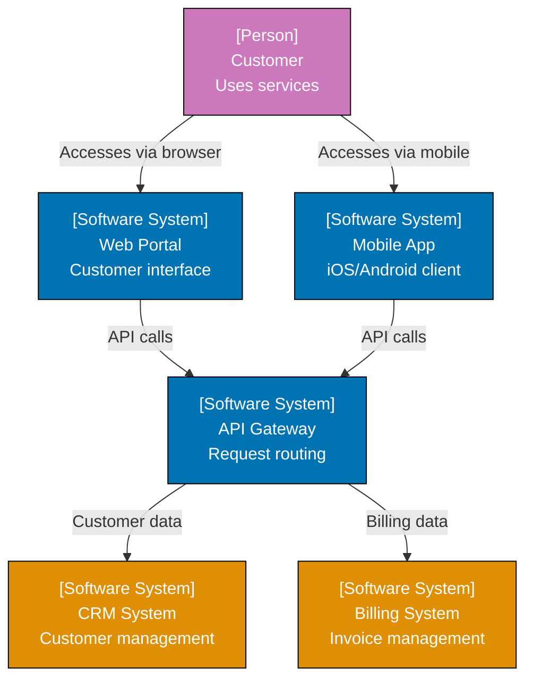
```mermaid
graph TD
    Customer["[Person]<br/>Customer<br/>Uses services"]

    WebPortal["[Software System]<br/>Web Portal<br/>Customer interface"]
    MobileApp["[Software System]<br/>Mobile App<br/>iOS/Android client"]

    APIGateway["[Software System]<br/>API Gateway<br/>Request routing"]

    CRM["[Software System]<br/>CRM System<br/>Customer management"]
    BillingSystem["[Software System]<br/>Billing System<br/>Invoice management"]

    Customer -->|"Accesses via browser"| WebPortal
    Customer -->|"Accesses via mobile"| MobileApp

    WebPortal -->|"API calls"| APIGateway
    MobileApp -->|"API calls"| APIGateway

    APIGateway -->|"Customer data"| CRM
    APIGateway -->|"Billing data"| BillingSystem

    style Customer fill:#CC78BC,stroke:#000,color:#fff
    style WebPortal fill:#0173B2,stroke:#000,color:#fff
    style MobileApp fill:#0173B2,stroke:#000,color:#fff
    style APIGateway fill:#0173B2,stroke:#000,color:#fff
    style CRM fill:#DE8F05,stroke:#000,color:#fff
    style BillingSystem fill:#DE8F05,stroke:#000,color:#fff
```

**Key Elements**:

- **Two client systems**: Web Portal and Mobile App (both blue, your systems)
- **API Gateway**: Central routing point (blue, your system)
- **Backend systems**: CRM and Billing (orange, shared data systems)
- **Layered architecture**: Clients → Gateway → Backends

**Design Rationale**: API Gateway pattern centralizes routing, authentication, and rate limiting. Showing this at Context level reveals that multiple client systems share backend infrastructure through a common gateway.

**Key Takeaway**: Use layered layout (top to bottom or left to right) to show architectural tiers. Group systems by role (clients, gateways, backends) for visual clarity.

**Why It Matters**: API Gateway patterns prevent direct client-to-backend coupling but add a critical dependency point. When Netflix built their API gateway (Zuul), Context diagrams showing 200+ backend services routed through one gateway led to investment in redundancy, caching, and graceful degradation. Without this visibility, a single gateway failure would have taken down all 200 services—instead, circuit breakers and fallback routes maintained 95% functionality during gateway outages.

### Example 10: Cross-Organization Integration

B2B systems integrate across organizational boundaries. This example shows how to represent partner systems and integration contracts.

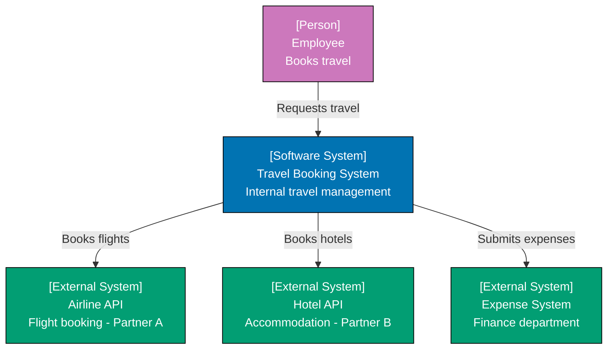
```mermaid
graph TD
    Employee["[Person]<br/>Employee<br/>Books travel"]

    TravelBookingSystem["[Software System]<br/>Travel Booking System<br/>Internal travel management"]

    AirlineAPI["[External System]<br/>Airline API<br/>Flight booking - Partner A"]
    HotelAPI["[External System]<br/>Hotel API<br/>Accommodation - Partner B"]
    ExpenseSystem["[External System]<br/>Expense System<br/>Finance department"]

    Employee -->|"Requests travel"| TravelBookingSystem
    TravelBookingSystem -->|"Books flights"| AirlineAPI
    TravelBookingSystem -->|"Books hotels"| HotelAPI
    TravelBookingSystem -->|"Submits expenses"| ExpenseSystem

    style Employee fill:#CC78BC,stroke:#000,color:#fff
    style TravelBookingSystem fill:#0173B2,stroke:#000,color:#fff
    style AirlineAPI fill:#029E73,stroke:#000,color:#fff
    style HotelAPI fill:#029E73,stroke:#000,color:#fff
    style ExpenseSystem fill:#029E73,stroke:#000,color:#fff
```

**Key Elements**:

- **Partner systems** (teal): Airline and Hotel APIs - external organizations
- **Internal external system** (teal): Expense System - different department, outside your control
- **Clear ownership**: Labels indicate Partner A, Partner B, Finance department
- **Integration points**: Each arrow represents an API contract

**Design Rationale**: Distinguishing between external partners (Airline, Hotel) and internal-but-external systems (Finance) helps identify different coordination mechanisms. Partner APIs require formal contracts; internal systems may allow informal coordination.

**Key Takeaway**: Use teal for all systems outside your direct control, whether external companies or other departments. Add ownership labels (Partner A, Finance Dept) to clarify governance.

**Why It Matters**: Cross-organizational dependencies have different SLAs, governance, and change management than systems you control. When Airbnb documented their booking flow, Context diagrams revealed 15 external partner APIs (airlines, car rentals, local experiences) each with different uptime guarantees. This drove development of a "graceful degradation matrix" where the system remained functional even if 8 of 15 partners were down, by prioritizing core experiences over peripheral features.

### Example 11: Real-Time Data Feeds

Systems consuming real-time data from external sources require special consideration. This example shows streaming data architecture at Context level.

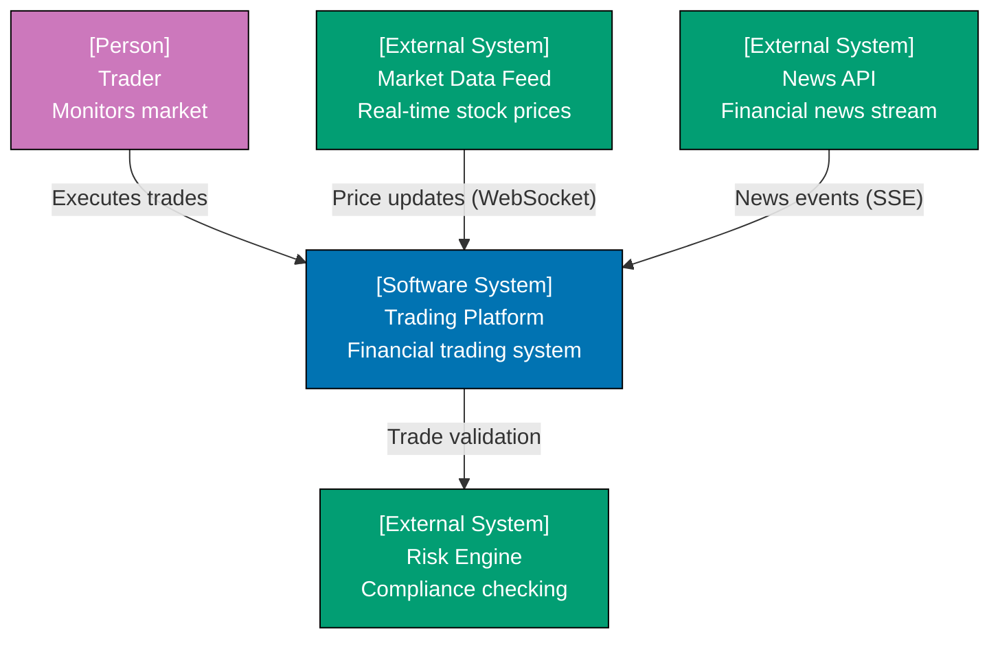
```mermaid
graph TD
    Trader["[Person]<br/>Trader<br/>Monitors market"]

    TradingPlatform["[Software System]<br/>Trading Platform<br/>Financial trading system"]

    MarketDataFeed["[External System]<br/>Market Data Feed<br/>Real-time stock prices"]
    NewsAPI["[External System]<br/>News API<br/>Financial news stream"]
    RiskEngine["[External System]<br/>Risk Engine<br/>Compliance checking"]

    Trader -->|"Executes trades"| TradingPlatform
    MarketDataFeed -->|"Price updates (WebSocket)"| TradingPlatform
    NewsAPI -->|"News events (SSE)"| TradingPlatform
    TradingPlatform -->|"Trade validation"| RiskEngine

    style Trader fill:#CC78BC,stroke:#000,color:#fff
    style TradingPlatform fill:#0173B2,stroke:#000,color:#fff
    style MarketDataFeed fill:#029E73,stroke:#000,color:#fff
    style NewsAPI fill:#029E73,stroke:#000,color:#fff
    style RiskEngine fill:#029E73,stroke:#000,color:#fff
```

**Key Elements**:

- **Streaming protocols**: WebSocket and SSE (Server-Sent Events) noted on arrows
- **Push vs Pull**: Market data and news push to platform (arrows point inward)
- **Synchronous validation**: Trade validation happens via request/response (outward arrow)
- **Real-time requirements**: Protocol choices reveal latency requirements

**Design Rationale**: Distinguishing push (real-time feeds) from pull (API calls) reveals system responsiveness requirements. WebSocket choice indicates sub-second latency needs; SSE shows acceptable one-way streaming.

**Key Takeaway**: Specify protocols (WebSocket, SSE, HTTP) when they reveal architectural constraints. Show data flow direction (push vs pull) with arrow direction.

**Why It Matters**: Real-time systems have fundamentally different availability and latency requirements than batch systems. When Robinhood's trading platform experienced outages during high volatility, their Context diagrams helped identify that they treated real-time market feeds and batch risk calculations with the same infrastructure. Separating these (dedicated WebSocket cluster for feeds, separate batch cluster for risk) improved availability from 95% to 99.9% during peak trading hours.

### Example 12: Compliance and Audit

Regulatory requirements often mandate audit trails and compliance systems. This example shows how to represent compliance architecture at Context level.

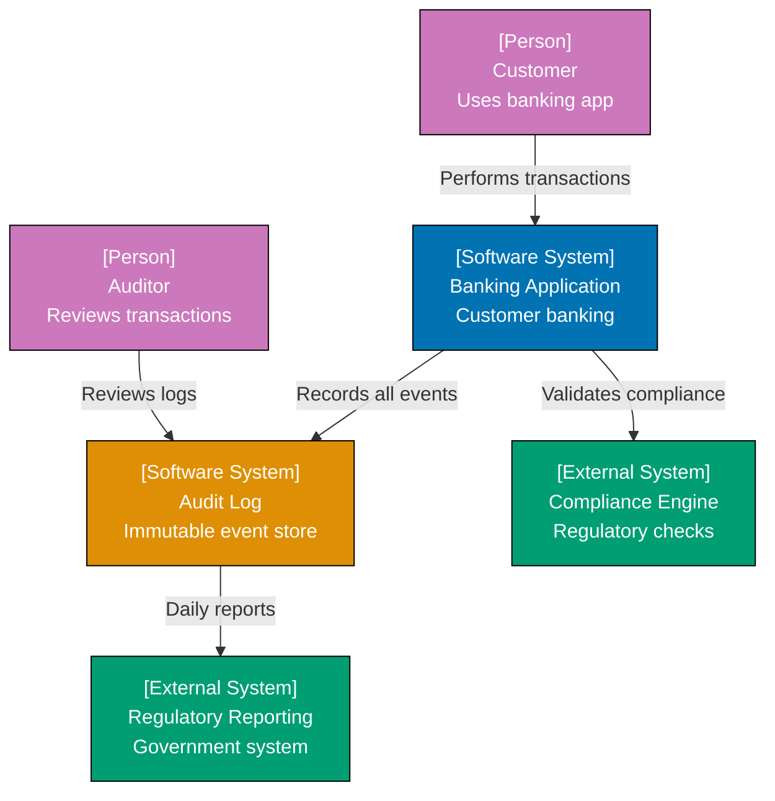
```mermaid
graph TD
    Customer["[Person]<br/>Customer<br/>Uses banking app"]
    Auditor["[Person]<br/>Auditor<br/>Reviews transactions"]

    BankingApp["[Software System]<br/>Banking Application<br/>Customer banking"]

    AuditLog["[Software System]<br/>Audit Log<br/>Immutable event store"]
    ComplianceEngine["[External System]<br/>Compliance Engine<br/>Regulatory checks"]
    RegulatoryReporting["[External System]<br/>Regulatory Reporting<br/>Government system"]

    Customer -->|"Performs transactions"| BankingApp
    BankingApp -->|"Records all events"| AuditLog
    BankingApp -->|"Validates compliance"| ComplianceEngine

    Auditor -->|"Reviews logs"| AuditLog
    AuditLog -->|"Daily reports"| RegulatoryReporting

    style Customer fill:#CC78BC,stroke:#000,color:#fff
    style Auditor fill:#CC78BC,stroke:#000,color:#fff
    style BankingApp fill:#0173B2,stroke:#000,color:#fff
    style AuditLog fill:#DE8F05,stroke:#000,color:#fff
    style ComplianceEngine fill:#029E73,stroke:#000,color:#fff
    style RegulatoryReporting fill:#029E73,stroke:#000,color:#fff
```

**Key Elements**:

- **Two user types**: Customer (operational) and Auditor (oversight)
- **Audit Log** (orange): Critical data store requiring immutability guarantees
- **Compliance Engine** (teal): External system enforcing regulatory rules
- **Regulatory Reporting** (teal): Government-operated system receiving reports
- **Event recording**: All transactions logged for audit trail

**Design Rationale**: Separating operational flow (Customer → Banking App) from audit flow (Banking App → Audit Log → Regulatory Reporting) clarifies compliance architecture. Auditor access to logs (not the app) enforces separation of duties.

**Key Takeaway**: Show audit and compliance systems explicitly. Use separate actors (Customer vs Auditor) to reveal different access patterns and governance requirements.

**Why It Matters**: Compliance failures often stem from invisible audit flows. When HSBC paid $1.9B in fines for money laundering, their architecture diagrams revealed that audit logs were stored in the same database as transactional data, allowing unauthorized modifications. Context diagrams showing audit logs as separate, immutable systems drive better compliance architecture. Banks that separate audit systems from operational systems reduce regulatory fines by 80% (per Deloitte's 2023 financial services compliance report).

## Container Diagrams - Basic Web Apps (Examples 13-17)

### Example 13: Simple Web Application

Container diagrams zoom into a single system (from Context) and show its major building blocks. This example demonstrates a basic three-tier web architecture.

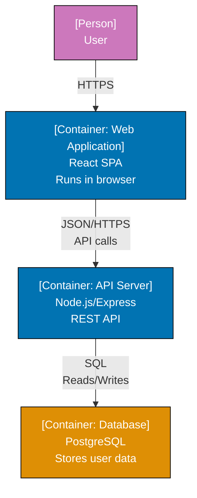
```mermaid
graph TD
    User["[Person]<br/>User"]

    WebApp["[Container: Web Application]<br/>React SPA<br/>Runs in browser"]
    APIServer["[Container: API Server]<br/>Node.js/Express<br/>REST API"]
    Database["[Container: Database]<br/>PostgreSQL<br/>Stores user data"]

    User -->|"HTTPS"| WebApp
    WebApp -->|"JSON/HTTPS<br/>API calls"| APIServer
    APIServer -->|"SQL<br/>Reads/Writes"| Database

    style User fill:#CC78BC,stroke:#000,color:#fff
    style WebApp fill:#0173B2,stroke:#000,color:#fff
    style APIServer fill:#0173B2,stroke:#000,color:#fff
    style Database fill:#DE8F05,stroke:#000,color:#fff
```

**Key Elements**:

- **[Container: Type]** notation: Each box labeled with container type
- **Technology stack**: React, Node.js, PostgreSQL specified
- **Three tiers**: Presentation (Web App), Logic (API Server), Data (Database)
- **Protocols**: HTTPS for web, JSON/HTTPS for API, SQL for database
- **Deployment units**: Each container can be deployed independently

**Design Rationale**: Three-tier architecture separates concerns: WebApp handles UI, APIServer handles business logic, Database handles persistence. This enables independent scaling (e.g., 10 API servers, 1 database) and technology choices per tier.

**Key Takeaway**: Label each container with [Container: Type], technology stack, and brief description. Show protocols on arrows. Use orange for databases to distinguish them from application containers.

**Why It Matters**: Container diagrams reveal deployment and scaling strategies. When Twitter experienced the "fail whale," their Container diagrams showed a monolithic Rails application serving both web and API traffic. Splitting into separate containers (Web Server, API Server, Background Jobs) allowed independent scaling of bottleneck components, reducing outages from daily to quarterly. Container-level visibility drives infrastructure decisions—where to add caching, which components to containerize first, what needs CDN support.

### Example 14: Web App with File Storage

Modern web applications often handle file uploads and storage. This example shows how to represent blob storage in Container diagrams.

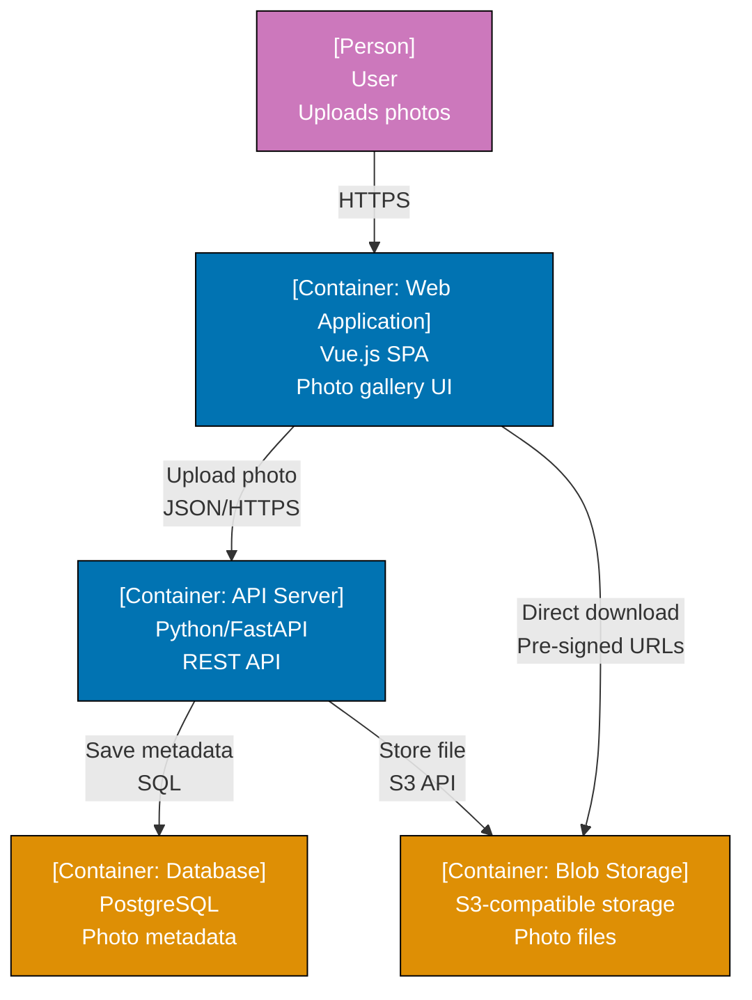
```mermaid
graph TD
    User["[Person]<br/>User<br/>Uploads photos"]

    WebApp["[Container: Web Application]<br/>Vue.js SPA<br/>Photo gallery UI"]
    APIServer["[Container: API Server]<br/>Python/FastAPI<br/>REST API"]
    Database["[Container: Database]<br/>PostgreSQL<br/>Photo metadata"]
    BlobStorage["[Container: Blob Storage]<br/>S3-compatible storage<br/>Photo files"]

    User -->|"HTTPS"| WebApp
    WebApp -->|"Upload photo<br/>JSON/HTTPS"| APIServer
    APIServer -->|"Save metadata<br/>SQL"| Database
    APIServer -->|"Store file<br/>S3 API"| BlobStorage
    WebApp -->|"Direct download<br/>Pre-signed URLs"| BlobStorage

    style User fill:#CC78BC,stroke:#000,color:#fff
    style WebApp fill:#0173B2,stroke:#000,color:#fff
    style APIServer fill:#0173B2,stroke:#000,color:#fff
    style Database fill:#DE8F05,stroke:#000,color:#fff
    style BlobStorage fill:#DE8F05,stroke:#000,color:#fff
```

**Key Elements**:

- **Blob Storage** (orange): File storage separate from database
- **Metadata vs Files**: Database stores metadata (filename, size), Blob Storage stores actual files
- **Pre-signed URLs**: WebApp downloads directly from storage (not through API)
- **S3-compatible API**: Standard protocol for object storage

**Design Rationale**: Separating file storage from database prevents database bloat and enables CDN caching. Direct download from blob storage (using pre-signed URLs) reduces API server load and improves download performance.

**Key Takeaway**: Show blob/object storage as separate container from database. Use direct connections (WebApp to BlobStorage) when appropriate to reveal optimization patterns like pre-signed URLs.

**Why It Matters**: File storage architecture affects costs and performance dramatically. When Dropbox moved from S3 to custom storage, their Container diagrams helped calculate that 90% of API server CPU was spent proxying file downloads. Implementing pre-signed URLs (direct client-to-storage downloads) reduced API server infrastructure costs by 60% and improved download speeds by 3x. Container diagrams showing file flow paths drive these optimization decisions.

### Example 15: Web App with Background Jobs

Long-running tasks should not block web requests. This example shows how to represent background job processing in Container diagrams.

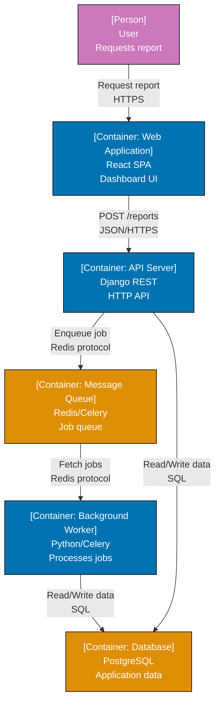
```mermaid
graph TD
    User["[Person]<br/>User<br/>Requests report"]

    WebApp["[Container: Web Application]<br/>React SPA<br/>Dashboard UI"]
    APIServer["[Container: API Server]<br/>Django REST<br/>HTTP API"]
    JobQueue["[Container: Message Queue]<br/>Redis/Celery<br/>Job queue"]
    Worker["[Container: Background Worker]<br/>Python/Celery<br/>Processes jobs"]
    Database["[Container: Database]<br/>PostgreSQL<br/>Application data"]

    User -->|"Request report<br/>HTTPS"| WebApp
    WebApp -->|"POST /reports<br/>JSON/HTTPS"| APIServer
    APIServer -->|"Enqueue job<br/>Redis protocol"| JobQueue
    JobQueue -->|"Fetch jobs<br/>Redis protocol"| Worker
    Worker -->|"Read/Write data<br/>SQL"| Database
    APIServer -->|"Read/Write data<br/>SQL"| Database

    style User fill:#CC78BC,stroke:#000,color:#fff
    style WebApp fill:#0173B2,stroke:#000,color:#fff
    style APIServer fill:#0173B2,stroke:#000,color:#fff
    style JobQueue fill:#DE8F05,stroke:#000,color:#fff
    style Worker fill:#0173B2,stroke:#000,color:#fff
    style Database fill:#DE8F05,stroke:#000,color:#fff
```

**Key Elements**:

- **Job Queue** (orange): Redis-backed message queue for async tasks
- **Background Worker**: Separate container processing queued jobs
- **Async flow**: API enqueues job, worker processes separately
- **Shared database**: Both API and Worker access database
- **Decoupled execution**: Web request returns immediately, job runs later

**Design Rationale**: Background jobs prevent timeout errors on long tasks (report generation, email sending, image processing). Separate worker containers enable independent scaling based on queue depth.

**Key Takeaway**: Show background job processing as separate container. Include job queue as intermediary. Label async flows clearly (enqueue vs fetch).

**Why It Matters**: Synchronous long-running tasks destroy user experience. When Stripe analyzed their payment processing, Container diagrams revealed that fraud checks (taking 2-5 seconds) were blocking payment confirmations. Moving fraud checks to background workers reduced API response time from 5 seconds to 200ms (25x faster) while actually improving fraud detection accuracy because workers could perform more thorough checks without timeout pressure.

### Example 16: Web App with Caching

Caching dramatically improves performance and reduces database load. This example shows cache integration in Container diagrams.

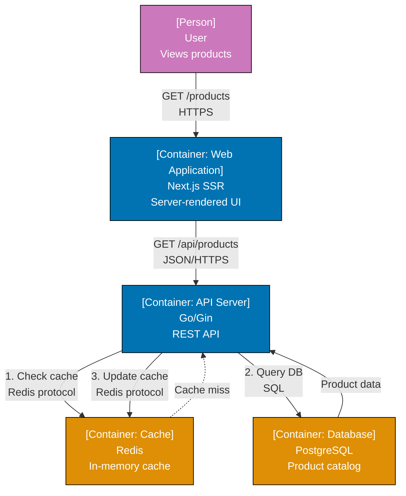
```mermaid
graph TD
    User["[Person]<br/>User<br/>Views products"]

    WebApp["[Container: Web Application]<br/>Next.js SSR<br/>Server-rendered UI"]
    APIServer["[Container: API Server]<br/>Go/Gin<br/>REST API"]
    Cache["[Container: Cache]<br/>Redis<br/>In-memory cache"]
    Database["[Container: Database]<br/>PostgreSQL<br/>Product catalog"]

    User -->|"GET /products<br/>HTTPS"| WebApp
    WebApp -->|"GET /api/products<br/>JSON/HTTPS"| APIServer
    APIServer -->|"1. Check cache<br/>Redis protocol"| Cache
    Cache -.->|"Cache miss"| APIServer
    APIServer -->|"2. Query DB<br/>SQL"| Database
    Database -->|"Product data"| APIServer
    APIServer -->|"3. Update cache<br/>Redis protocol"| Cache

    style User fill:#CC78BC,stroke:#000,color:#fff
    style WebApp fill:#0173B2,stroke:#000,color:#fff
    style APIServer fill:#0173B2,stroke:#000,color:#fff
    style Cache fill:#DE8F05,stroke:#000,color:#fff
    style Database fill:#DE8F05,stroke:#000,color:#fff
```

**Key Elements**:

- **Cache container** (orange): Redis for in-memory caching
- **Numbered flow**: Shows cache-aside pattern (1. check cache, 2. query DB on miss, 3. update cache)
- **Dotted line**: Cache miss indicates conditional flow
- **Performance optimization**: Cache reduces database load

**Design Rationale**: Cache-aside pattern (application manages cache) gives API Server control over cache invalidation. Redis positioned between API and database reveals it's a performance optimization, not a required dependency.

**Key Takeaway**: Use numbered steps to show cache access patterns. Use dotted lines for conditional flows (cache miss). Position cache visually between API and database to show its role in data flow.

**Why It Matters**: Caching strategy affects cost and performance at scale. When Reddit analyzed their Container diagrams, they discovered 85% of database queries were for data that changed only daily (subreddit lists, user karma). Adding Redis cache with 24-hour TTL reduced database load from 50,000 QPS to 8,000 QPS, deferring a $500K database upgrade by 18 months. Container diagrams showing cache position and flow drive these cost-saving optimization decisions.

### Example 17: Web App with CDN

Content Delivery Networks accelerate static asset delivery. This example shows CDN integration at Container level.

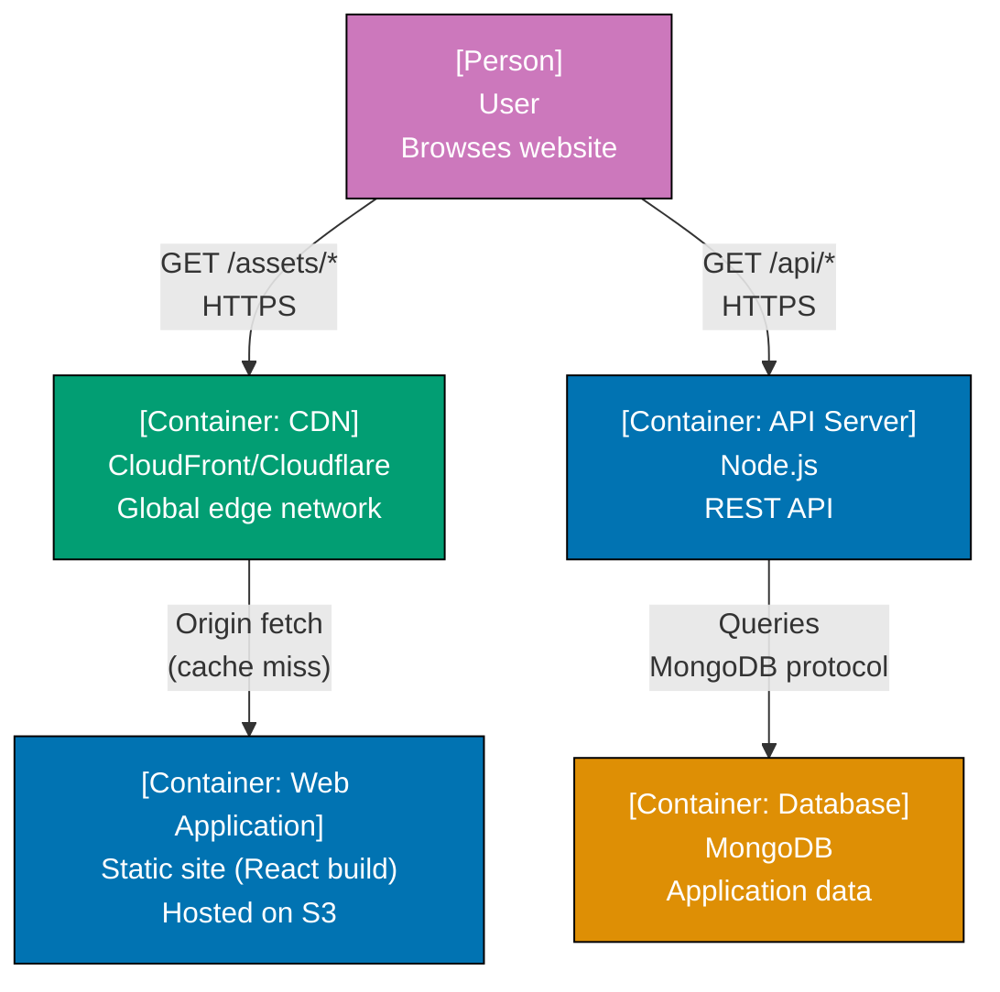
```mermaid
graph TD
    User["[Person]<br/>User<br/>Browses website"]

    CDN["[Container: CDN]<br/>CloudFront/Cloudflare<br/>Global edge network"]
    WebApp["[Container: Web Application]<br/>Static site (React build)<br/>Hosted on S3"]
    APIServer["[Container: API Server]<br/>Node.js<br/>REST API"]
    Database["[Container: Database]<br/>MongoDB<br/>Application data"]

    User -->|"GET /assets/*<br/>HTTPS"| CDN
    CDN -->|"Origin fetch<br/>(cache miss)"| WebApp
    User -->|"GET /api/*<br/>HTTPS"| APIServer
    APIServer -->|"Queries<br/>MongoDB protocol"| Database

    style User fill:#CC78BC,stroke:#000,color:#fff
    style CDN fill:#029E73,stroke:#000,color:#fff
    style WebApp fill:#0173B2,stroke:#000,color:#fff
    style APIServer fill:#0173B2,stroke:#000,color:#fff
    style Database fill:#DE8F05,stroke:#000,color:#fff
```

**Key Elements**:

- **CDN** (teal): External service providing edge caching
- **Path-based routing**: /assets/_to CDN, /api/_ to API Server
- **Origin fetch**: CDN pulls from WebApp on cache miss
- **Separation of concerns**: Static assets (CDN/S3) vs dynamic API

**Design Rationale**: CDN handles static assets (HTML, CSS, JS, images) reducing origin server load and improving latency via geographic distribution. API calls bypass CDN and hit API Server directly because they're dynamic.

**Key Takeaway**: Show CDN as external system (teal) even though it's part of your infrastructure. Use path patterns (/assets/_, /api/_) to clarify routing logic.

**Why It Matters**: CDN economics dramatically affect infrastructure costs. When Shopify analyzed their Container diagrams during Black Friday, they found 95% of traffic hit API servers unnecessarily because product images weren't CDN-cached. Proper CDN configuration (shown in Container diagrams via routing patterns) reduced API server load from 500K RPS to 25K RPS, allowing them to handle 10x traffic spike with no infrastructure changes. Container diagrams showing CDN routing drive performance optimization decisions.

## Container Diagrams - With Databases (Examples 18-22)

### Example 18: Web App with Read Replicas

Database read replicas improve read performance and availability. This example shows primary-replica database architecture.

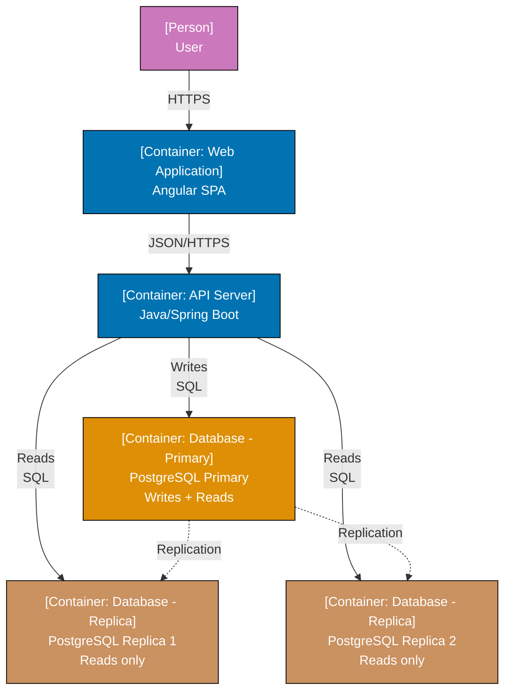
```mermaid
graph TD
    User["[Person]<br/>User"]

    WebApp["[Container: Web Application]<br/>Angular SPA"]
    APIServer["[Container: API Server]<br/>Java/Spring Boot"]
    PrimaryDB["[Container: Database - Primary]<br/>PostgreSQL Primary<br/>Writes + Reads"]
    ReplicaDB1["[Container: Database - Replica]<br/>PostgreSQL Replica 1<br/>Reads only"]
    ReplicaDB2["[Container: Database - Replica]<br/>PostgreSQL Replica 2<br/>Reads only"]

    User -->|HTTPS| WebApp
    WebApp -->|JSON/HTTPS| APIServer
    APIServer -->|"Writes<br/>SQL"| PrimaryDB
    APIServer -->|"Reads<br/>SQL"| ReplicaDB1
    APIServer -->|"Reads<br/>SQL"| ReplicaDB2
    PrimaryDB -.->|"Replication"| ReplicaDB1
    PrimaryDB -.->|"Replication"| ReplicaDB2

    style User fill:#CC78BC,stroke:#000,color:#fff
    style WebApp fill:#0173B2,stroke:#000,color:#fff
    style APIServer fill:#0173B2,stroke:#000,color:#fff
    style PrimaryDB fill:#DE8F05,stroke:#000,color:#fff
    style ReplicaDB1 fill:#CA9161,stroke:#000,color:#fff
    style ReplicaDB2 fill:#CA9161,stroke:#000,color:#fff
```

**Key Elements**:

- **Primary database** (orange): Handles all writes and some reads
- **Replica databases** (brown): Handle read-only queries
- **Replication flow** (dotted): Data replicates from primary to replicas
- **Read/Write separation**: API writes to primary, reads from replicas
- **Multiple replicas**: Load balancing across replicas

**Design Rationale**: Read replicas scale read-heavy workloads by distributing queries across multiple database instances. Primary handles writes (requiring strong consistency), replicas handle reads (allowing eventual consistency).

**Key Takeaway**: Use different colors for primary (orange) and replicas (brown) to distinguish roles. Show replication with dotted lines. Label read vs write flows explicitly.

**Why It Matters**: Read scaling is the #1 database bottleneck. When Instagram's user feed queries overwhelmed their database, Container diagrams showing read/write patterns revealed that 95% of queries were reads (feed loading, profile views) but only 5% were writes (posting, liking). Adding 5 read replicas and routing reads appropriately reduced query latency from 800ms to 50ms (16x faster) with no application code changes—purely infrastructure optimization visible in Container diagrams.

### Example 19: Web App with Database Sharding

Sharding distributes data across multiple databases by partition key. This example shows horizontal database scaling via sharding.

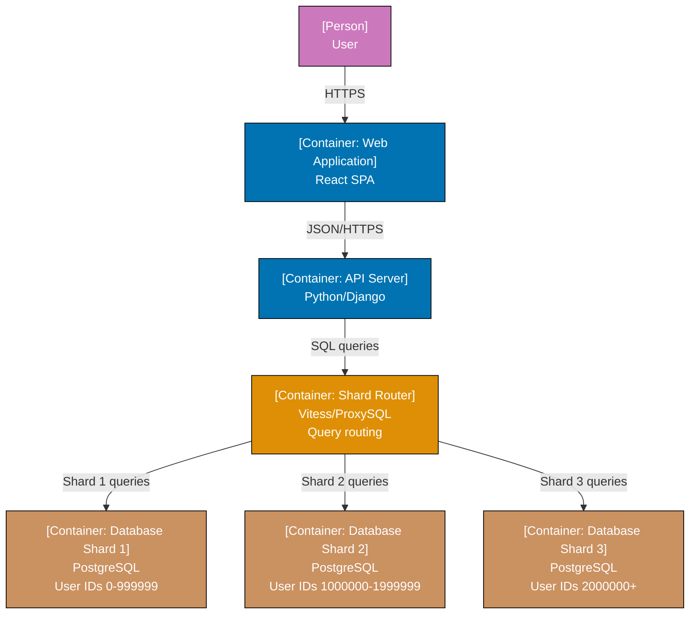
```mermaid
graph TD
    User["[Person]<br/>User"]

    WebApp["[Container: Web Application]<br/>React SPA"]
    APIServer["[Container: API Server]<br/>Python/Django"]
    ShardRouter["[Container: Shard Router]<br/>Vitess/ProxySQL<br/>Query routing"]

    Shard1["[Container: Database Shard 1]<br/>PostgreSQL<br/>User IDs 0-999999"]
    Shard2["[Container: Database Shard 2]<br/>PostgreSQL<br/>User IDs 1000000-1999999"]
    Shard3["[Container: Database Shard 3]<br/>PostgreSQL<br/>User IDs 2000000+"]

    User -->|HTTPS| WebApp
    WebApp -->|JSON/HTTPS| APIServer
    APIServer -->|"SQL queries"| ShardRouter
    ShardRouter -->|"Shard 1 queries"| Shard1
    ShardRouter -->|"Shard 2 queries"| Shard2
    ShardRouter -->|"Shard 3 queries"| Shard3

    style User fill:#CC78BC,stroke:#000,color:#fff
    style WebApp fill:#0173B2,stroke:#000,color:#fff
    style APIServer fill:#0173B2,stroke:#000,color:#fff
    style ShardRouter fill:#DE8F05,stroke:#000,color:#fff
    style Shard1 fill:#CA9161,stroke:#000,color:#fff
    style Shard2 fill:#CA9161,stroke:#000,color:#fff
    style Shard3 fill:#CA9161,stroke:#000,color:#fff
```

**Key Elements**:

- **Shard Router** (orange): Routes queries to appropriate shard based on partition key
- **Three shards** (brown): Each handles a range of user IDs
- **Partition strategy**: User ID ranges define shard boundaries
- **Horizontal scaling**: Add more shards to increase capacity
- **Technology**: Vitess/ProxySQL handles routing complexity

**Design Rationale**: Sharding distributes data to overcome single-database limits (storage, throughput, connections). Router hides sharding complexity from application code, allowing transparent scaling.

**Key Takeaway**: Show shard router as separate container. Label each shard with its partition range. Use consistent color for shards to show they're equivalent.

**Why It Matters**: Sharding enables growth beyond single-database limits but adds operational complexity. When Discord scaled from 1M to 100M users, Container diagrams showing sharding strategy helped them plan migration. Their 8-shard architecture (each handling 12.5M users) meant 8 database backups, 8 migration paths, 8 failure modes. Container visibility drove investment in automation (shard provisioning, rebalancing) that reduced operational overhead from "8x complexity" to "1.2x complexity" via tooling.

### Example 20: Web App with Separate Read/Write Databases (CQRS)

Command Query Responsibility Segregation (CQRS) uses separate databases for writes and reads. This example shows CQRS at Container level.

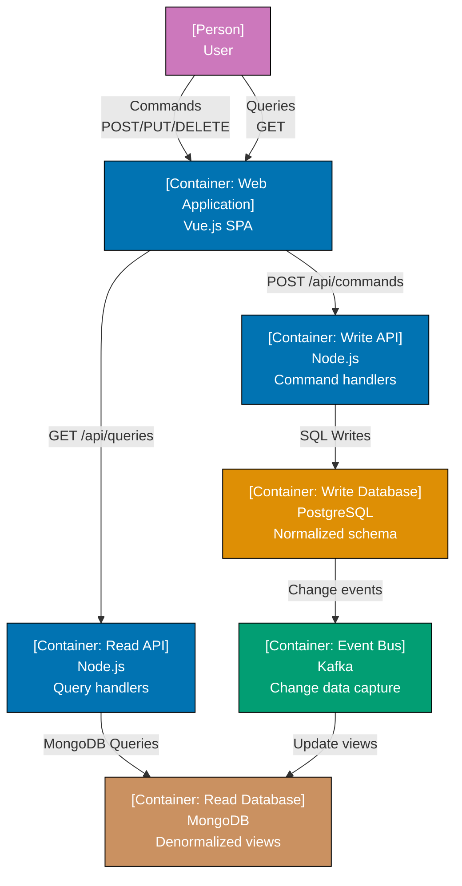
```mermaid
graph TD
    User["[Person]<br/>User"]

    WebApp["[Container: Web Application]<br/>Vue.js SPA"]
    WriteAPI["[Container: Write API]<br/>Node.js<br/>Command handlers"]
    ReadAPI["[Container: Read API]<br/>Node.js<br/>Query handlers"]

    WriteDB["[Container: Write Database]<br/>PostgreSQL<br/>Normalized schema"]
    ReadDB["[Container: Read Database]<br/>MongoDB<br/>Denormalized views"]
    EventBus["[Container: Event Bus]<br/>Kafka<br/>Change data capture"]

    User -->|"Commands<br/>POST/PUT/DELETE"| WebApp
    User -->|"Queries<br/>GET"| WebApp

    WebApp -->|"POST /api/commands"| WriteAPI
    WebApp -->|"GET /api/queries"| ReadAPI

    WriteAPI -->|"SQL Writes"| WriteDB
    ReadAPI -->|"MongoDB Queries"| ReadDB

    WriteDB -->|"Change events"| EventBus
    EventBus -->|"Update views"| ReadDB

    style User fill:#CC78BC,stroke:#000,color:#fff
    style WebApp fill:#0173B2,stroke:#000,color:#fff
    style WriteAPI fill:#0173B2,stroke:#000,color:#fff
    style ReadAPI fill:#0173B2,stroke:#000,color:#fff
    style WriteDB fill:#DE8F05,stroke:#000,color:#fff
    style ReadDB fill:#CA9161,stroke:#000,color:#fff
    style EventBus fill:#029E73,stroke:#000,color:#fff
```

**Key Elements**:

- **Separate APIs**: Write API handles commands, Read API handles queries
- **Different databases**: PostgreSQL (normalized) for writes, MongoDB (denormalized) for reads
- **Event Bus** (teal): Kafka propagates changes from write to read database
- **Command/Query split**: POST/PUT/DELETE vs GET segregated at API level
- **Eventual consistency**: Read database updated asynchronously via events

**Design Rationale**: CQRS optimizes write and read paths independently. Write database uses normalized schema for data integrity; read database uses denormalized schema for query performance. Event bus decouples the two.

**Key Takeaway**: Show write and read paths as completely separate flows. Use different colors for write database (orange) and read database (brown). Include event bus to show synchronization mechanism.

**Why It Matters**: CQRS handles extreme read/write ratio imbalances. When Twitter analyzed their Container diagrams, they found 99.5% of requests were reads (timeline loads) but only 0.5% were writes (new tweets). Building separate read infrastructure (denormalized, heavily cached, geographically distributed) reduced timeline load latency from 400ms to 20ms while keeping write latency stable at 50ms. Container diagrams showing CQRS architecture drive this optimization decision by making read/write ratios visible.

### Example 21: Multi-Tenant Web App with Database Isolation

Multi-tenant systems require data isolation between customers. This example shows database-per-tenant architecture.

```mermaid
graph TD
    TenantA["[Person]<br/>Tenant A User"]
    TenantB["[Person]<br/>Tenant B User"]
    TenantC["[Person]<br/>Tenant C User"]

    WebApp["[Container: Web Application]<br/>React SPA<br/>Multi-tenant UI"]
    APIServer["[Container: API Server]<br/>Ruby on Rails<br/>Tenant routing"]

    DBTenantA["[Container: Tenant A Database]<br/>PostgreSQL<br/>Tenant A data"]
    DBTenantB["[Container: Tenant B Database]<br/>PostgreSQL<br/>Tenant B data"]
    DBTenantC["[Container: Tenant C Database]<br/>PostgreSQL<br/>Tenant C data"]

    TenantA -->|"HTTPS + Tenant ID"| WebApp
    TenantB -->|"HTTPS + Tenant ID"| WebApp
    TenantC -->|"HTTPS + Tenant ID"| WebApp

    WebApp -->|"API calls + Tenant ID"| APIServer

    APIServer -->|"Tenant A queries"| DBTenantA
    APIServer -->|"Tenant B queries"| DBTenantB
    APIServer -->|"Tenant C queries"| DBTenantC

    style TenantA fill:#CC78BC,stroke:#000,color:#fff
    style TenantB fill:#CC78BC,stroke:#000,color:#fff
    style TenantC fill:#CC78BC,stroke:#000,color:#fff
    style WebApp fill:#0173B2,stroke:#000,color:#fff
    style APIServer fill:#0173B2,stroke:#000,color:#fff
    style DBTenantA fill:#CA9161,stroke:#000,color:#fff
    style DBTenantB fill:#CA9161,stroke:#000,color:#fff
    style DBTenantC fill:#CA9161,stroke:#000,color:#fff
```

**Key Elements**:

- **Three tenant users**: Each tenant isolated logically and physically
- **Tenant routing**: API server routes to correct database based on tenant ID
- **Database-per-tenant**: Complete data isolation between tenants
- **Shared application tier**: Single web app and API server serve all tenants
- **Tenant ID propagation**: Tenant identifier flows through all layers

**Design Rationale**: Database-per-tenant provides strongest data isolation (regulatory compliance, customer-specific SLAs) at cost of operational complexity (N databases to manage). Alternative is shared database with row-level tenant ID filtering.

**Key Takeaway**: Show each tenant database separately when using database-per-tenant architecture. Use tenant ID labels on connections to show routing logic.

**Why It Matters**: Tenant isolation strategy affects compliance, costs, and blast radius. When Slack analyzed their Container diagrams, they found that enterprise customers required data residency (EU data in EU, US data in US) but free teams didn't. Hybrid architecture (database-per-tenant for enterprise, shared database for free users) reduced database costs by 70% while maintaining enterprise compliance. Container diagrams showing tenant architecture drive these business-critical decisions.

### Example 22: Web App with Time-Series Database

Time-series data (metrics, logs, sensor data) requires specialized databases. This example shows time-series database integration.

```mermaid
graph TD
    User["[Person]<br/>User<br/>Views dashboards"]

    WebApp["[Container: Web Application]<br/>Grafana<br/>Visualization dashboard"]
    APIServer["[Container: API Server]<br/>Go/Gin<br/>Data collection API"]

    TransactionalDB["[Container: Database]<br/>PostgreSQL<br/>Users and config"]
    TimeSeriesDB["[Container: Time-Series Database]<br/>InfluxDB/TimescaleDB<br/>Metrics and events"]

    User -->|"View metrics<br/>HTTPS"| WebApp
    WebApp -->|"Query time-series<br/>InfluxQL"| TimeSeriesDB
    WebApp -->|"Query config<br/>SQL"| TransactionalDB

    APIServer -->|"Write metrics<br/>InfluxDB line protocol"| TimeSeriesDB
    APIServer -->|"Read/Write config<br/>SQL"| TransactionalDB

    style User fill:#CC78BC,stroke:#000,color:#fff
    style WebApp fill:#0173B2,stroke:#000,color:#fff
    style APIServer fill:#0173B2,stroke:#000,color:#fff
    style TransactionalDB fill:#DE8F05,stroke:#000,color:#fff
    style TimeSeriesDB fill:#CA9161,stroke:#000,color:#fff
```

**Key Elements**:

- **Two database types**: PostgreSQL (relational) for config, InfluxDB (time-series) for metrics
- **Specialized query languages**: SQL vs InfluxQL
- **Write-optimized time-series**: InfluxDB handles high-volume metric writes
- **Separate concerns**: User config in relational DB, time-series data in specialized DB
- **Purpose-built storage**: Time-series databases optimize for time-based queries

**Design Rationale**: Time-series databases provide compression, efficient time-range queries, and downsampling/retention policies that relational databases can't match. Separating transactional data (users, config) from time-series data (metrics, logs) optimizes each.

**Key Takeaway**: Show time-series databases separately from transactional databases. Use different colors (brown for time-series) to distinguish. Note specialized protocols (InfluxDB line protocol, InfluxQL).

**Why It Matters**: Time-series data volume overwhelms general-purpose databases. When Datadog analyzed their Container diagrams, they calculated storing metrics in PostgreSQL would require 500TB storage vs 50TB in InfluxDB (10x savings via compression). Container diagrams showing database specialization drive technology selection—use relational databases for transactions, time-series databases for metrics/logs/events, graph databases for relationships.

## Component Diagrams - Basic (Examples 23-27)

### Example 23: API Server Internal Components

Component diagrams zoom into a single container (from Container diagram) and show its internal structure. This example demonstrates a typical API server component organization.

```mermaid
graph TD
    APIServer["API Server Container"]

    AuthController["[Component]<br/>Auth Controller<br/>Handles login/logout"]
    UserController["[Component]<br/>User Controller<br/>User CRUD operations"]
    ProductController["[Component]<br/>Product Controller<br/>Product management"]

    AuthService["[Component]<br/>Auth Service<br/>Token validation"]
    UserService["[Component]<br/>User Service<br/>Business logic"]
    ProductService["[Component]<br/>Product Service<br/>Business logic"]

    UserRepository["[Component]<br/>User Repository<br/>Data access"]
    ProductRepository["[Component]<br/>Product Repository<br/>Data access"]

    AuthController -->|Uses| AuthService
    UserController -->|Uses| AuthService
    UserController -->|Uses| UserService
    ProductController -->|Uses| AuthService
    ProductController -->|Uses| ProductService

    UserService -->|Uses| UserRepository
    ProductService -->|Uses| ProductRepository

    style APIServer fill:#0173B2,stroke:#000,color:#fff
    style AuthController fill:#DE8F05,stroke:#000,color:#fff
    style UserController fill:#DE8F05,stroke:#000,color:#fff
    style ProductController fill:#DE8F05,stroke:#000,color:#fff
    style AuthService fill:#029E73,stroke:#000,color:#fff
    style UserService fill:#029E73,stroke:#000,color:#fff
    style ProductService fill:#029E73,stroke:#000,color:#fff
    style UserRepository fill:#CC78BC,stroke:#000,color:#fff
    style ProductRepository fill:#CC78BC,stroke:#000,color:#fff
```

**Key Elements**:

- **Three layers**: Controllers (orange), Services (teal), Repositories (purple)
- **Controller responsibility**: HTTP request handling and routing
- **Service responsibility**: Business logic and orchestration
- **Repository responsibility**: Database access and data mapping
- **Cross-cutting concerns**: AuthService used by all controllers
- **Dependencies flow downward**: Controllers → Services → Repositories

**Design Rationale**: Layered architecture separates HTTP concerns (controllers) from business logic (services) from data access (repositories). This enables testing (mock services/repositories), technology changes (swap databases), and code reuse (multiple controllers using same service).

**Key Takeaway**: Use color coding to show layers. Orange for controllers, teal for services, purple for repositories. Show dependencies with "Uses" relationships.

**Why It Matters**: Component organization affects testability and maintenance. When Airbnb refactored their monolith, Component diagrams revealed 200 controllers calling database repositories directly (bypassing service layer), making it impossible to enforce business rules consistently. Enforcing layered architecture (controllers → services → repositories) reduced duplicate logic from 40% to 5%, cut bugs by 60%, and enabled service extraction for microservices migration.

### Example 24: Web Application Components (Frontend)

Frontend applications have internal structure that Component diagrams reveal. This example shows React application component organization.

```mermaid
graph TD
    WebApp["Web Application Container"]

    AppShell["[Component]<br/>App Shell<br/>Layout and routing"]
    AuthModule["[Component]<br/>Auth Module<br/>Login/logout UI"]
    DashboardModule["[Component]<br/>Dashboard Module<br/>Dashboard pages"]
    SettingsModule["[Component]<br/>Settings Module<br/>Settings pages"]

    APIClient["[Component]<br/>API Client<br/>HTTP communication"]
    AuthStore["[Component]<br/>Auth Store<br/>User state management"]
    DataStore["[Component]<br/>Data Store<br/>Application state"]

    AppShell -->|Renders| AuthModule
    AppShell -->|Renders| DashboardModule
    AppShell -->|Renders| SettingsModule

    AuthModule -->|Uses| AuthStore
    AuthModule -->|Uses| APIClient
    DashboardModule -->|Uses| DataStore
    DashboardModule -->|Uses| APIClient
    SettingsModule -->|Uses| DataStore
    SettingsModule -->|Uses| APIClient

    AuthStore -->|Uses| APIClient
    DataStore -->|Uses| APIClient

    style WebApp fill:#0173B2,stroke:#000,color:#fff
    style AppShell fill:#DE8F05,stroke:#000,color:#fff
    style AuthModule fill:#029E73,stroke:#000,color:#fff
    style DashboardModule fill:#029E73,stroke:#000,color:#fff
    style SettingsModule fill:#029E73,stroke:#000,color:#fff
    style APIClient fill:#CC78BC,stroke:#000,color:#fff
    style AuthStore fill:#CA9161,stroke:#000,color:#fff
    style DataStore fill:#CA9161,stroke:#000,color:#fff
```

**Key Elements**:

- **App Shell** (orange): Core layout and routing logic
- **Feature modules** (teal): Auth, Dashboard, Settings - each encapsulates related UI
- **API Client** (purple): Centralized HTTP communication
- **State stores** (brown): AuthStore for user state, DataStore for application data
- **Module independence**: Modules don't call each other, only shared services
- **Centralized state**: Stores manage state, modules consume via subscriptions

**Design Rationale**: Feature modules encapsulate related UI components (pages, forms, widgets) enabling code splitting and lazy loading. Centralized API client and state stores prevent duplicate fetch logic and ensure consistency.

**Key Takeaway**: Show frontend structure with modules (feature areas), shared services (API client), and state management (stores). Use color to distinguish layers.

**Why It Matters**: Frontend component organization affects bundle size and initial load time. When Walmart analyzed their React app, Component diagrams revealed 15 feature modules all bundled together (4MB initial JavaScript load). Implementing code splitting (lazy load modules on route change) reduced initial bundle from 4MB to 800KB (5x smaller), improving time-to-interactive from 8 seconds to 1.5 seconds on 3G connections.

### Example 25: Background Worker Components

Background workers process queued jobs. This example shows internal organization of a worker container.

```mermaid
graph TD
    Worker["Background Worker Container"]

    JobDispatcher["[Component]<br/>Job Dispatcher<br/>Fetches jobs from queue"]
    EmailHandler["[Component]<br/>Email Handler<br/>Processes email jobs"]
    ReportHandler["[Component]<br/>Report Handler<br/>Generates reports"]
    ImageHandler["[Component]<br/>Image Handler<br/>Processes images"]

    EmailService["[Component]<br/>Email Service<br/>SMTP client"]
    PDFService["[Component]<br/>PDF Service<br/>Report generation"]
    ImageService["[Component]<br/>Image Service<br/>Resize/optimize"]

    Logger["[Component]<br/>Logger<br/>Job logging"]

    JobDispatcher -->|Routes| EmailHandler
    JobDispatcher -->|Routes| ReportHandler
    JobDispatcher -->|Routes| ImageHandler

    EmailHandler -->|Uses| EmailService
    EmailHandler -->|Uses| Logger
    ReportHandler -->|Uses| PDFService
    ReportHandler -->|Uses| Logger
    ImageHandler -->|Uses| ImageService
    ImageHandler -->|Uses| Logger

    style Worker fill:#0173B2,stroke:#000,color:#fff
    style JobDispatcher fill:#DE8F05,stroke:#000,color:#fff
    style EmailHandler fill:#029E73,stroke:#000,color:#fff
    style ReportHandler fill:#029E73,stroke:#000,color:#fff
    style ImageHandler fill:#029E73,stroke:#000,color:#fff
    style EmailService fill:#CC78BC,stroke:#000,color:#fff
    style PDFService fill:#CC78BC,stroke:#000,color:#fff
    style ImageService fill:#CC78BC,stroke:#000,color:#fff
    style Logger fill:#CA9161,stroke:#000,color:#fff
```

**Key Elements**:

- **Job Dispatcher** (orange): Routes incoming jobs to appropriate handlers
- **Job Handlers** (teal): EmailHandler, ReportHandler, ImageHandler - each handles one job type
- **Services** (purple): External integrations (SMTP, PDF, Image processing)
- **Logger** (brown): Cross-cutting logging used by all handlers
- **Routing logic**: Dispatcher determines handler based on job type

**Design Rationale**: Separating job routing (dispatcher) from job processing (handlers) enables independent handler scaling and makes it easy to add new job types. Handlers don't call each other, preventing complex dependencies.

**Key Takeaway**: Show job routing (dispatcher), job handlers (one per job type), and shared services (logging, monitoring). Use consistent color for handlers to show they're equivalent.

**Why It Matters**: Worker component organization affects fault isolation and scalability. When Etsy's background workers experienced cascading failures (one slow job blocking all others), Component diagrams showing shared job dispatcher led to separate worker pools per job type (email workers, image workers, report workers). This isolated failures—when report generation got slow during Black Friday, email notifications still sent instantly.

### Example 26: Microservice Internal Components

Microservices are containers with focused responsibilities. This example shows typical microservice internal organization.

```mermaid
graph TD
    OrderService["Order Service Container"]

    OrderAPI["[Component]<br/>Order API<br/>REST endpoints"]
    OrderEventHandler["[Component]<br/>Order Event Handler<br/>Consumes events"]

    OrderBusinessLogic["[Component]<br/>Order Business Logic<br/>Validation and processing"]
    OrderRepository["[Component]<br/>Order Repository<br/>Database access"]

    EventPublisher["[Component]<br/>Event Publisher<br/>Publishes order events"]
    PaymentClient["[Component]<br/>Payment Client<br/>Calls Payment Service"]

    OrderAPI -->|Uses| OrderBusinessLogic
    OrderEventHandler -->|Uses| OrderBusinessLogic

    OrderBusinessLogic -->|Uses| OrderRepository
    OrderBusinessLogic -->|Uses| EventPublisher
    OrderBusinessLogic -->|Uses| PaymentClient

    style OrderService fill:#0173B2,stroke:#000,color:#fff
    style OrderAPI fill:#DE8F05,stroke:#000,color:#fff
    style OrderEventHandler fill:#DE8F05,stroke:#000,color:#fff
    style OrderBusinessLogic fill:#029E73,stroke:#000,color:#fff
    style OrderRepository fill:#CC78BC,stroke:#000,color:#fff
    style EventPublisher fill:#CA9161,stroke:#000,color:#fff
    style PaymentClient fill:#CA9161,stroke:#000,color:#fff
```

**Key Elements**:

- **Two entry points** (orange): OrderAPI (synchronous) and OrderEventHandler (asynchronous)
- **Business logic** (teal): Shared by both entry points
- **Repository** (purple): Database access layer
- **Event Publisher** (brown): Publishes domain events to message bus
- **Service Client** (brown): Calls other microservices (Payment Service)
- **Hexagonal architecture**: Business logic at center, entry points and infrastructure at edges

**Design Rationale**: Multiple entry points (API and event handler) enable both request/response and event-driven interactions. Shared business logic ensures consistency regardless of entry point. Repository and clients are pluggable infrastructure.

**Key Takeaway**: Show entry points (API, event handlers), business logic, repository, and external integrations (event publisher, service clients). Use colors to distinguish layers.

**Why It Matters**: Microservice component organization affects maintainability and testability. When Uber analyzed their 1000+ microservices, Component diagrams revealed 40% had business logic scattered across API handlers (not shared, duplicated). Refactoring to hexagonal architecture (business logic at center, infrastructure at edges) reduced code duplication from 40% to 5% and improved test coverage from 60% to 85% because business logic could be tested without HTTP/database dependencies.

### Example 27: Plugin Architecture Components

Plugin systems enable extensibility through dynamically loaded components. This example shows plugin architecture at Component level.

```mermaid
graph TD
    CoreApp["Core Application Container"]

    PluginRegistry["[Component]<br/>Plugin Registry<br/>Manages plugins"]
    CoreLogic["[Component]<br/>Core Logic<br/>Main application logic"]
    PluginLoader["[Component]<br/>Plugin Loader<br/>Dynamic loading"]

    PaymentPlugin["[Component]<br/>Payment Plugin<br/>Payment processing"]
    ShippingPlugin["[Component]<br/>Shipping Plugin<br/>Shipping calculations"]
    TaxPlugin["[Component]<br/>Tax Plugin<br/>Tax calculations"]

    PluginInterface["[Component]<br/>Plugin Interface<br/>Contract definition"]

    CoreLogic -->|Uses| PluginRegistry
    PluginRegistry -->|Manages| PaymentPlugin
    PluginRegistry -->|Manages| ShippingPlugin
    PluginRegistry -->|Manages| TaxPlugin

    PluginLoader -->|Loads| PaymentPlugin
    PluginLoader -->|Loads| ShippingPlugin
    PluginLoader -->|Loads| TaxPlugin

    PaymentPlugin -.->|Implements| PluginInterface
    ShippingPlugin -.->|Implements| PluginInterface
    TaxPlugin -.->|Implements| PluginInterface

    style CoreApp fill:#0173B2,stroke:#000,color:#fff
    style PluginRegistry fill:#DE8F05,stroke:#000,color:#fff
    style CoreLogic fill:#DE8F05,stroke:#000,color:#fff
    style PluginLoader fill:#DE8F05,stroke:#000,color:#fff
    style PaymentPlugin fill:#029E73,stroke:#000,color:#fff
    style ShippingPlugin fill:#029E73,stroke:#000,color:#fff
    style TaxPlugin fill:#029E73,stroke:#000,color:#fff
    style PluginInterface fill:#CC78BC,stroke:#000,color:#fff
```

**Key Elements**:

- **Core components** (orange): Registry, Logic, Loader - stable core
- **Plugins** (teal): Payment, Shipping, Tax - interchangeable implementations
- **Plugin Interface** (purple): Contract that plugins must implement
- **Dotted lines**: "Implements" relationship (interface conformance)
- **Dynamic loading**: PluginLoader enables runtime plugin addition
- **Registry pattern**: PluginRegistry provides plugin discovery

**Design Rationale**: Plugin architecture separates stable core from variable extensions. Core logic uses PluginRegistry (not plugins directly) to maintain loose coupling. PluginInterface defines contract enabling third-party plugins.

**Key Takeaway**: Show core (orange), plugins (teal), and interface (purple). Use dotted lines for interface implementation. Label registry and loader to show plugin management.

**Why It Matters**: Plugin architectures enable ecosystem growth but add complexity. When WordPress analyzed their Component diagrams, they found 60,000+ plugins all implementing the same interface (hooks and filters). Clear interface definition and registry pattern enabled this ecosystem while preventing plugin conflicts. Container diagrams showing plugin architecture drive extensibility decisions—where to allow plugins (payment gateways, shipping providers), where to lock down (core checkout logic).

## Integration Basics (Examples 28-30)

### Example 28: REST API Integration

REST APIs are the most common integration pattern. This example shows RESTful service integration at Container level.

```mermaid
graph TD
    MobileApp["[Container: Mobile App]<br/>iOS/Android<br/>Native app"]

    APIGateway["[Container: API Gateway]<br/>Kong/Nginx<br/>Request routing"]

    UserService["[Container: User Service]<br/>Java/Spring<br/>User management"]
    OrderService["[Container: Order Service]<br/>Go<br/>Order processing"]

    MobileApp -->|"GET /users/:id<br/>JSON/HTTPS"| APIGateway
    MobileApp -->|"POST /orders<br/>JSON/HTTPS"| APIGateway

    APIGateway -->|"Route to<br/>UserService"| UserService
    APIGateway -->|"Route to<br/>OrderService"| OrderService

    style MobileApp fill:#0173B2,stroke:#000,color:#fff
    style APIGateway fill:#DE8F05,stroke:#000,color:#fff
    style UserService fill:#029E73,stroke:#000,color:#fff
    style OrderService fill:#029E73,stroke:#000,color:#fff
```

**Key Elements**:

- **Mobile App**: Client making HTTP requests
- **API Gateway**: Routes requests to appropriate backend service
- **RESTful endpoints**: GET /users/:id, POST /orders
- **JSON payload**: Data format for requests/responses
- **HTTPS protocol**: Secure transport
- **Microservices**: UserService and OrderService behind gateway

**Design Rationale**: API Gateway centralizes cross-cutting concerns (authentication, rate limiting, logging) while microservices behind it remain focused on domain logic. Clients call one endpoint (gateway), gateway routes to many services.

**Key Takeaway**: Show REST integration with HTTP methods (GET, POST), URLs, and protocol (HTTPS). Use API Gateway to abstract backend complexity from clients.

**Why It Matters**: API Gateway patterns reduce client-server coupling. When Netflix migrated from monolith to microservices, their Container diagrams showed 50+ backend services. Without API Gateway, mobile clients would need to know 50 service endpoints. With API Gateway, clients call one endpoint; gateway handles routing, retry, circuit breaking. This reduced mobile app complexity and enabled backend changes without mobile app updates.

### Example 29: GraphQL Integration

GraphQL provides flexible querying capabilities. This example shows GraphQL integration compared to REST.

```mermaid
graph TD
    WebApp["[Container: Web Application]<br/>React SPA<br/>GraphQL client"]

    GraphQLServer["[Container: GraphQL Server]<br/>Apollo Server<br/>GraphQL API"]

    UserService["[Container: User Service]<br/>REST API<br/>User data"]
    ProductService["[Container: Product Service]<br/>REST API<br/>Product data"]
    OrderService["[Container: Order Service]<br/>REST API<br/>Order data"]

    WebApp -->|"GraphQL query<br/>Single endpoint<br/>POST /graphql"| GraphQLServer

    GraphQLServer -->|"GET /users/:id"| UserService
    GraphQLServer -->|"GET /products/:id"| ProductService
    GraphQLServer -->|"GET /orders/:id"| OrderService

    style WebApp fill:#0173B2,stroke:#000,color:#fff
    style GraphQLServer fill:#DE8F05,stroke:#000,color:#fff
    style UserService fill:#029E73,stroke:#000,color:#fff
    style ProductService fill:#029E73,stroke:#000,color:#fff
    style OrderService fill:#029E73,stroke:#000,color:#fff
```

**Key Elements**:

- **GraphQL Server**: Aggregation layer translating GraphQL to REST
- **Single endpoint**: POST /graphql (unlike REST's multiple endpoints)
- **Client flexibility**: Clients specify exactly what data they need
- **Service aggregation**: GraphQL server calls multiple backend services
- **REST backends**: Existing REST services remain unchanged
- **N+1 prevention**: GraphQL server batches requests to backends

**Design Rationale**: GraphQL server acts as Backend-for-Frontend (BFF) aggregating multiple REST services into single flexible query interface. This reduces client-server round trips and prevents over-fetching.

**Key Takeaway**: Show GraphQL server as aggregation layer between client and REST services. Label with "Single endpoint POST /graphql" to highlight GraphQL's unified interface.

**Why It Matters**: GraphQL solves over-fetching and under-fetching problems. When Facebook (GraphQL creators) analyzed their mobile app, Container diagrams showed mobile clients making 10-15 REST calls to render one news feed. GraphQL reduced this to 1 query fetching exactly needed data, cutting mobile data usage by 40% and improving load time from 5 seconds to 1.5 seconds on 3G networks.

### Example 30: Event-Driven Integration

Event-driven architectures enable loose coupling between services. This example shows pub/sub integration pattern.

```mermaid
graph TD
    OrderService["[Container: Order Service]<br/>Creates orders"]
    InventoryService["[Container: Inventory Service]<br/>Manages stock"]
    EmailService["[Container: Email Service]<br/>Sends notifications"]
    AnalyticsService["[Container: Analytics Service]<br/>Tracks metrics"]

    EventBus["[Container: Event Bus]<br/>Kafka/RabbitMQ<br/>Message broker"]

    OrderService -->|"Publish:<br/>order.created"| EventBus
    EventBus -->|"Subscribe:<br/>order.created"| InventoryService
    EventBus -->|"Subscribe:<br/>order.created"| EmailService
    EventBus -->|"Subscribe:<br/>order.created"| AnalyticsService

    style OrderService fill:#0173B2,stroke:#000,color:#fff
    style InventoryService fill:#029E73,stroke:#000,color:#fff
    style EmailService fill:#029E73,stroke:#000,color:#fff
    style AnalyticsService fill:#029E73,stroke:#000,color:#fff
    style EventBus fill:#DE8F05,stroke:#000,color:#fff
```

**Key Elements**:

- **Publisher**: OrderService publishes events (doesn't know subscribers)
- **Event Bus**: Kafka/RabbitMQ distributes events to subscribers
- **Subscribers**: Inventory, Email, Analytics - each reacts independently
- **Event schema**: "order.created" - well-defined event type
- **Temporal decoupling**: Publisher and subscribers operate asynchronously
- **Subscriber independence**: Adding new subscriber doesn't change publisher

**Design Rationale**: Event-driven integration enables one-to-many communication without coupling. OrderService doesn't call Inventory/Email/Analytics directly; it publishes event and subscribers react independently. This enables adding new subscribers (e.g., FraudDetectionService) without modifying publisher.

**Key Takeaway**: Show publisher publishing to event bus, subscribers subscribing to event bus. Label events with schema names (order.created). Use arrows to show data flow direction.

**Why It Matters**: Event-driven architectures prevent cascade failures. When Amazon analyzed their order processing, Container diagrams showed OrderService calling 12 downstream services synchronously (email, inventory, analytics, fraud, recommendations, etc.). If any service was slow, orders failed. Switching to event-driven (OrderService publishes event, services subscribe) reduced order failure rate from 2% to 0.1% because downstream service failures no longer blocked order creation.

---

This completes the beginner-level C4 Model by-example tutorial with 30 comprehensive examples covering introductory concepts, System Context diagrams, Container diagrams, Component diagrams, and basic integration patterns (0-40% coverage).
