This beginner-level tutorial introduces C4 Model fundamentals through 30 annotated diagram examples. Every example uses the `procurement-platform-be` — a Procure-to-Pay (P2P) REST API backend — as the target system. All diagrams stay at System Context (Level 1): the platform is a black box and we draw only the actors, external systems, and their relationships at the boundary.

## C4 Model Fundamentals (Examples 1–5)

### Example 1: The Four Levels of C4

The C4 Model provides a hierarchical approach to visualizing software architecture through four levels of abstraction. Understanding this zoom hierarchy is the entry point to every diagram in this guide.

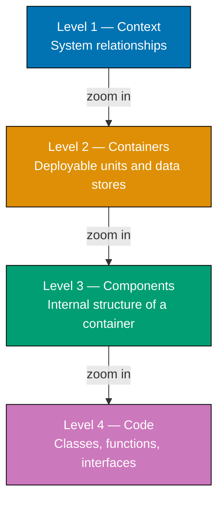
```mermaid
graph TD
    A["Level 1 — Context<br/>System relationships"]
    B["Level 2 — Containers<br/>Deployable units and data stores"]
    C["Level 3 — Components<br/>Internal structure of a container"]
    D["Level 4 — Code<br/>Classes, functions, interfaces"]

    A -->|"zoom in"| B
    B -->|"zoom in"| C
    C -->|"zoom in"| D

    style A fill:#0173B2,stroke:#000,color:#fff
    style B fill:#DE8F05,stroke:#000,color:#fff
    style C fill:#029E73,stroke:#000,color:#fff
    style D fill:#CC78BC,stroke:#000,color:#fff
```

**Key Elements**:

- **Level 1 Context** (blue): Who uses the system, what external systems does it touch?
- **Level 2 Containers** (orange): What are the separately deployable/runnable parts?
- **Level 3 Components** (teal): What logical groupings live inside one container?
- **Level 4 Code** (purple): What classes/functions implement a critical component?

**Design Rationale**: C4 uses four levels because different stakeholders need different detail. Executives need one-slide Context views; developers need Component diagrams with API contracts; a single flat diagram cannot serve both.

**Key Takeaway**: Choose the right level for your audience. Start at Context, zoom in only when the audience or decision requires more detail.

**Why It Matters**: Architecture diagrams routinely fail because they mix abstraction levels — placing a Kubernetes node next to a business actor in the same view. C4's four levels enforce separation of concerns at the diagram level, making communication cleaner and decisions more grounded. When you know which level you are at, you know which details belong and which are noise.

---

### Example 2: C4 Notation Basics — Person, System, External System

C4 notation uses three element types at Level 1. Understanding their shapes and labels is mandatory before reading any Context diagram.

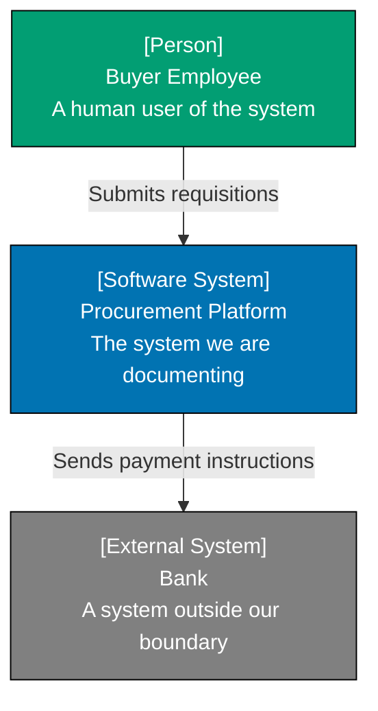
```mermaid
graph TD
    PersonEl["[Person]<br/>Buyer Employee<br/>A human user of the system"]
    SystemEl["[Software System]<br/>Procurement Platform<br/>The system we are documenting"]
    ExtEl["[External System]<br/>Bank<br/>A system outside our boundary"]

    PersonEl -->|"Submits requisitions"| SystemEl
    SystemEl -->|"Sends payment instructions"| ExtEl

    style PersonEl fill:#029E73,stroke:#000,color:#fff
    style SystemEl fill:#0173B2,stroke:#000,color:#fff
    style ExtEl fill:#808080,stroke:#000,color:#fff
```

**Key Elements**:

- **Person** (teal): A human role that interacts with the system
- **Software System** (blue): The system under discussion — drawn as a single box at this level
- **External System** (gray): A system outside your scope that you depend on or that depends on you

**Design Rationale**: Using explicit type labels `[Person]` and `[External System]` prevents ambiguity. Without labels, a box could be anything; with labels, every reader immediately knows the nature of the element.

**Key Takeaway**: Three element types — Person, Software System, External System — cover every actor at Level 1. Consistent labeling removes ambiguity for mixed technical/non-technical audiences.

**Why It Matters**: Ambiguous diagrams drive ambiguous conversations. When a product manager sees `[Person] Buyer Employee` instead of just `Employee`, they immediately grasp the human-to-system boundary, which anchors feature discussions in the right scope. Consistent notation across all diagrams also reduces the onboarding friction for new team members who must quickly understand who interacts with the system.

---

### Example 3: Relationship Labels and Direction

Every arrow in a C4 Context diagram carries a verb phrase explaining the nature of the relationship. Direction represents data or control flow.

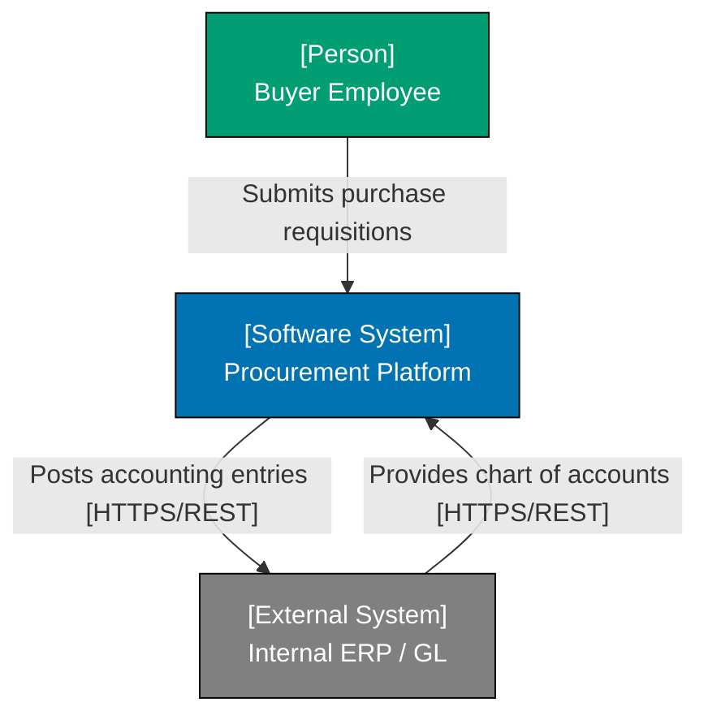
```mermaid
graph TD
    Buyer["[Person]<br/>Buyer Employee"]
    Platform["[Software System]<br/>Procurement Platform"]
    ERP["[External System]<br/>Internal ERP / GL"]

    Buyer -->|"Submits purchase requisitions"| Platform
    Platform -->|"Posts accounting entries [HTTPS/REST]"| ERP
    ERP -->|"Provides chart of accounts [HTTPS/REST]"| Platform

    style Buyer fill:#029E73,stroke:#000,color:#fff
    style Platform fill:#0173B2,stroke:#000,color:#fff
    style ERP fill:#808080,stroke:#000,color:#fff
```

**Key Elements**:

- **Verb phrases on arrows**: Describe purpose, not just "calls" or "uses"
- **Protocol hints** `[HTTPS/REST]`: Optional but valuable for engineers
- **Bidirectional flows**: ERP and Platform exchange data in both directions — modeled as two arrows

**Design Rationale**: Relationship labels distinguish architectural intent from accident. "Posts accounting entries" says why the integration exists; "calls" says nothing.

**Key Takeaway**: Always label relationships with a purposeful verb phrase. Adding protocol hints costs nothing and immediately answers "how do they talk?" for engineers in the room.

**Why It Matters**: In cross-team discussions, unlabeled arrows cause ten-minute debates about what the arrow means. Purposeful labels prevent those debates and double as documentation that survives meeting notes. Adding protocol hints such as `[REST]` or `[ISO 20022]` also gives engineers the integration contracts they need without requiring a separate API specification document at early architecture stages.

---

### Example 4: System Boundary Box

A system boundary box explicitly marks the edge of your system, separating internal from external. This clarifies scope for all readers.

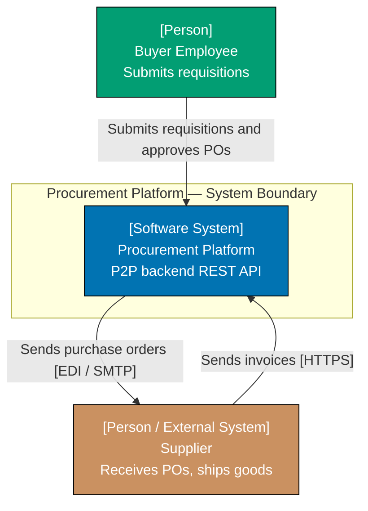
```mermaid
graph TD
    subgraph Boundary["Procurement Platform — System Boundary"]
        Platform["[Software System]<br/>Procurement Platform<br/>P2P backend REST API"]
    end

    Buyer["[Person]<br/>Buyer Employee<br/>Submits requisitions"]
    Supplier["[Person / External System]<br/>Supplier<br/>Receives POs, ships goods"]

    Buyer -->|"Submits requisitions and approves POs"| Platform
    Platform -->|"Sends purchase orders [EDI / SMTP]"| Supplier
    Supplier -->|"Sends invoices [HTTPS]"| Platform

    style Platform fill:#0173B2,stroke:#000,color:#fff
    style Buyer fill:#029E73,stroke:#000,color:#fff
    style Supplier fill:#CA9161,stroke:#000,color:#fff
```

**Key Elements**:

- **Subgraph boundary**: The dashed box around `Procurement Platform` makes scope explicit
- **Supplier dual role**: A Supplier is both a person (human account manager) and an external system (supplier portal) — the label clarifies this duality
- **EDI / SMTP**: Real integration protocol shown on the PO delivery arrow

**Design Rationale**: Without a boundary box, readers may not know which boxes are "yours" vs. external dependencies. The boundary box resolves ownership instantly.

**Key Takeaway**: Use a boundary box whenever the system scope is non-obvious or when you are presenting to an audience unfamiliar with your organizational landscape.

**Why It Matters**: Scope disagreements between teams often trace back to diagrams with no explicit boundary. The boundary box is the cheapest contract you can draw. When ownership is visible at a glance, engineering teams can escalate cross-boundary decisions to the right stakeholders without ambiguity, reducing the cycle time for architecture reviews and preventing duplicate ownership claims over shared services.

---

### Example 5: C4 Level Selection Guide

Choosing the wrong level wastes diagram effort. This example shows a decision tree for selecting the right C4 level for a given situation.

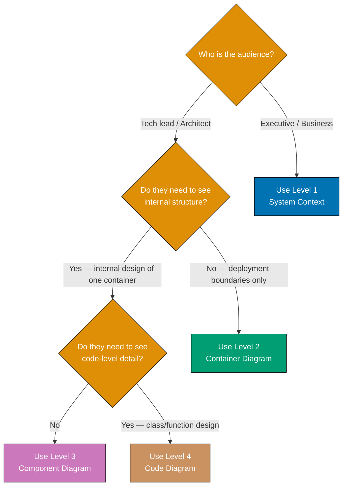
```mermaid
graph TD
    Q1{"Who is the audience?"}
    Q2{"Do they need to see<br/>internal structure?"}
    Q3{"Do they need to see<br/>code-level detail?"}
    L1["Use Level 1<br/>System Context"]
    L2["Use Level 2<br/>Container Diagram"]
    L3["Use Level 3<br/>Component Diagram"]
    L4["Use Level 4<br/>Code Diagram"]

    Q1 -->|"Executive / Business"| L1
    Q1 -->|"Tech lead / Architect"| Q2
    Q2 -->|"No — deployment boundaries only"| L2
    Q2 -->|"Yes — internal design of one container"| Q3
    Q3 -->|"No"| L3
    Q3 -->|"Yes — class/function design"| L4

    style Q1 fill:#DE8F05,stroke:#000,color:#fff
    style Q2 fill:#DE8F05,stroke:#000,color:#fff
    style Q3 fill:#DE8F05,stroke:#000,color:#fff
    style L1 fill:#0173B2,stroke:#000,color:#fff
    style L2 fill:#029E73,stroke:#000,color:#fff
    style L3 fill:#CC78BC,stroke:#000,color:#fff
    style L4 fill:#CA9161,stroke:#000,color:#fff
```

**Key Elements**:

- **Audience-first decision**: The first branch is audience, not technical complexity
- **Incremental zoom**: Each level answers a progressively narrower question
- **Code diagrams are rare**: Most situations stop at Level 3; Level 4 is for critical algorithms

**Design Rationale**: Teams over-document at Level 3/4 and under-document at Level 1. Audience-first selection corrects this by forcing the author to identify the reader before picking a level.

**Key Takeaway**: Always ask "who reads this and what decision do they need to make?" before opening your diagram tool. The answer determines your level.

**Why It Matters**: Over-detailed diagrams for business audiences and under-detailed diagrams for engineers are equal failures. Selecting the right level is the single most impactful C4 skill. A business stakeholder overwhelmed by Kafka topic names disengages; an engineer shown only a single-box system cannot make implementation decisions — matching diagram depth to audience ensures every meeting produces actionable outcomes.

---

## System Context — Core Actors (Examples 6–12)

### Example 6: Minimal System Context — Buyer and Platform

The simplest valid Context diagram shows one person and the system they use. Start here when introducing the platform to a new audience.

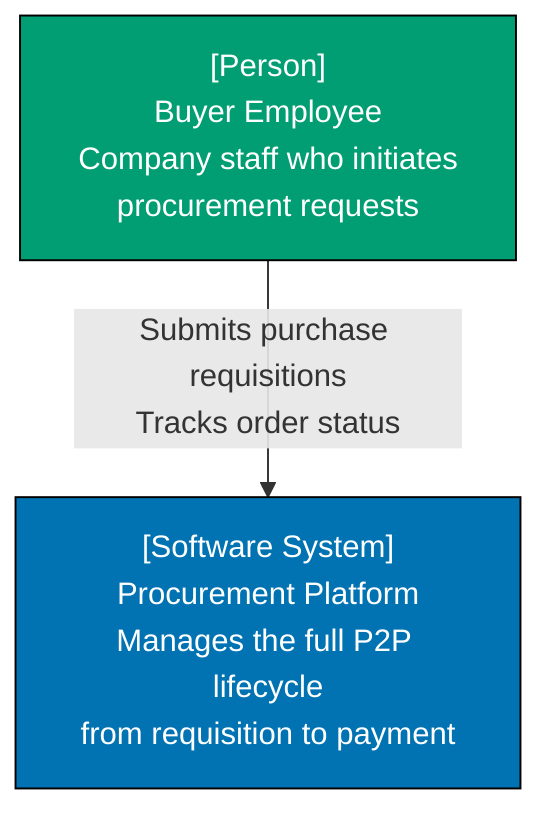
```mermaid
graph TD
    Buyer["[Person]<br/>Buyer Employee<br/>Company staff who initiates<br/>procurement requests"]
    Platform["[Software System]<br/>Procurement Platform<br/>Manages the full P2P lifecycle<br/>from requisition to payment"]

    Buyer -->|"Submits purchase requisitions<br/>Tracks order status"| Platform

    style Buyer fill:#029E73,stroke:#000,color:#fff
    style Platform fill:#0173B2,stroke:#000,color:#fff
```

**Key Elements**:

- **Single actor focus**: One person, one system — maximum clarity
- **Multi-line label on Platform**: Includes a brief responsibility statement
- **Bidirectional intent in one arrow**: "Submits" and "Tracks" are both outbound actions but represented on one label for brevity

**Design Rationale**: A two-element diagram is often the best starting slide for a new stakeholder. Complexity can always be added; once complexity is in, it cannot be removed without creating a second diagram.

**Key Takeaway**: Start with the minimum viable Context diagram. Add actors only when the additional relationship changes a decision or reveals a dependency.

**Why It Matters**: Most system presentations overwhelm stakeholders on the first diagram. Starting minimal builds a shared mental model before adding complexity, reducing misunderstanding in architectural reviews. Progressive disclosure also makes it easier to identify which relationships are in scope for a particular sprint or milestone, preventing premature architecture debates that derail planning sessions.

---

### Example 7: Adding the Supplier Actor

The Supplier is both a destination (receives POs) and a source (sends invoices back). This bidirectional relationship is central to P2P.

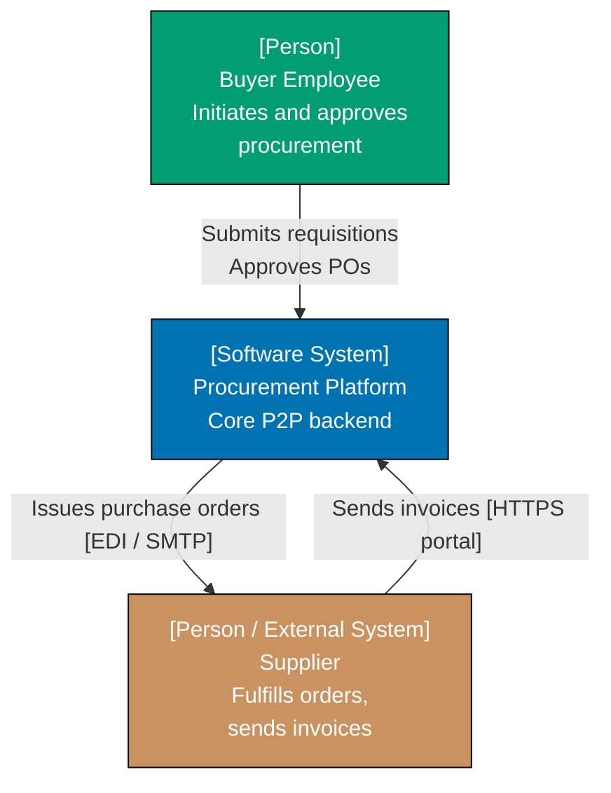
```mermaid
graph TD
    Buyer["[Person]<br/>Buyer Employee<br/>Initiates and approves<br/>procurement"]
    Platform["[Software System]<br/>Procurement Platform<br/>Core P2P backend"]
    Supplier["[Person / External System]<br/>Supplier<br/>Fulfills orders,<br/>sends invoices"]

    Buyer -->|"Submits requisitions<br/>Approves POs"| Platform
    Platform -->|"Issues purchase orders [EDI / SMTP]"| Supplier
    Supplier -->|"Sends invoices [HTTPS portal]"| Platform

    style Buyer fill:#029E73,stroke:#000,color:#fff
    style Platform fill:#0173B2,stroke:#000,color:#fff
    style Supplier fill:#CA9161,stroke:#000,color:#fff
```

**Key Elements**:

- **Supplier dual nature**: Both a human contact and a machine-to-machine integration
- **Two protocols**: EDI for machine delivery, HTTPS portal for human submission
- **Separate arrows for each direction**: Avoids ambiguous bidirectional arrows

**Design Rationale**: Showing EDI vs. HTTPS on separate arrows signals that two different integration implementations are needed, which immediately surfaces an engineering conversation.

**Key Takeaway**: When a relationship has different protocols in each direction, draw separate labeled arrows. Bidirectional arrows hide protocol complexity.

**Why It Matters**: Integration decisions made early in a project (EDI vs. REST vs. portal) have long-term cost and maintenance implications. Surfacing them at Context level brings them into architectural conversations before contracts are signed. Discovering integration format requirements at diagram time costs nothing; discovering them after development is complete can delay go-live by months and require expensive supplier re-onboarding.

---

### Example 8: Adding the Bank External System

The Bank receives payment instructions from the platform. This is a pure system-to-system relationship — no human on the bank side at this level.

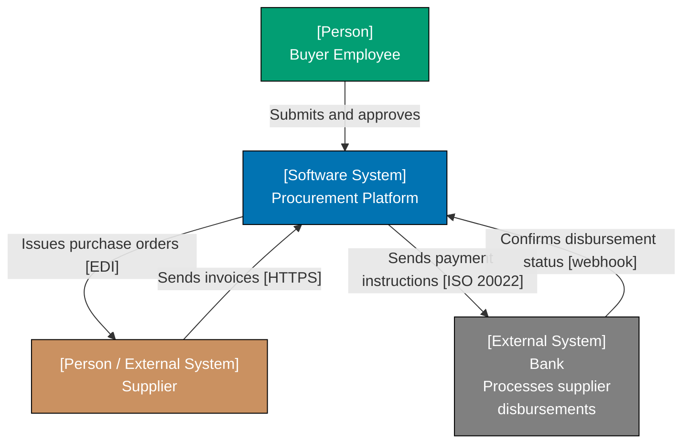
```mermaid
graph TD
    Buyer["[Person]<br/>Buyer Employee"]
    Platform["[Software System]<br/>Procurement Platform"]
    Supplier["[Person / External System]<br/>Supplier"]
    Bank["[External System]<br/>Bank<br/>Processes supplier<br/>disbursements"]

    Buyer -->|"Submits and approves"| Platform
    Platform -->|"Issues purchase orders [EDI]"| Supplier
    Supplier -->|"Sends invoices [HTTPS]"| Platform
    Platform -->|"Sends payment instructions [ISO 20022]"| Bank
    Bank -->|"Confirms disbursement status [webhook]"| Platform

    style Buyer fill:#029E73,stroke:#000,color:#fff
    style Platform fill:#0173B2,stroke:#000,color:#fff
    style Supplier fill:#CA9161,stroke:#000,color:#fff
    style Bank fill:#808080,stroke:#000,color:#fff
```

**Key Elements**:

- **ISO 20022**: Standard financial messaging format — naming it signals compliance requirements
- **Webhook callback**: Bank confirms success asynchronously — important for resilience design
- **Gray for external systems**: Visually separates internal platform from third-party dependencies

**Design Rationale**: Naming ISO 20022 at Context level is deliberate. It tells compliance and finance teams exactly which standard governs the payment integration before any code is written.

**Key Takeaway**: Use protocol and standard names (ISO 20022, EDI 850) as labels when they carry compliance or contractual weight. This surfaces non-functional requirements early.

**Why It Matters**: Financial integrations carry regulatory obligations. A Context diagram that names the payment standard anchors compliance discussions at the correct level of abstraction, preventing expensive late-stage discoveries. Teams that treat the Bank as an invisible dependency often discover compliance requirements — such as PCI-DSS scope or ISO 20022 format mandates — only during pre-production audits, when remediation costs are highest.

---

### Example 9: Adding the Internal ERP / GL

The Internal ERP receives accounting entries after payments are made. This closes the financial loop in P2P.

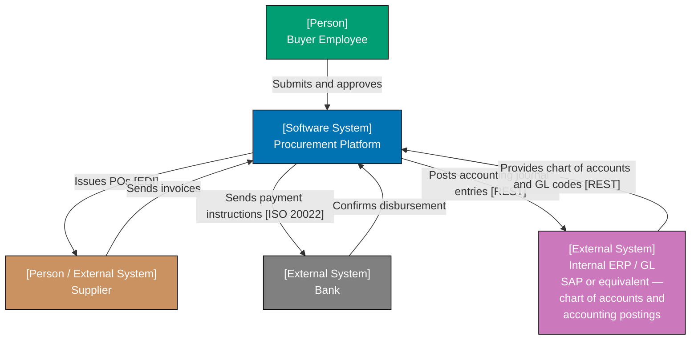
```mermaid
graph TD
    Buyer["[Person]<br/>Buyer Employee"]
    Platform["[Software System]<br/>Procurement Platform"]
    Supplier["[Person / External System]<br/>Supplier"]
    Bank["[External System]<br/>Bank"]
    ERP["[External System]<br/>Internal ERP / GL<br/>SAP or equivalent —<br/>chart of accounts and<br/>accounting postings"]

    Buyer -->|"Submits and approves"| Platform
    Platform -->|"Issues POs [EDI]"| Supplier
    Supplier -->|"Sends invoices"| Platform
    Platform -->|"Sends payment instructions [ISO 20022]"| Bank
    Bank -->|"Confirms disbursement"| Platform
    Platform -->|"Posts accounting journal entries [REST]"| ERP
    ERP -->|"Provides chart of accounts and GL codes [REST]"| Platform

    style Buyer fill:#029E73,stroke:#000,color:#fff
    style Platform fill:#0173B2,stroke:#000,color:#fff
    style Supplier fill:#CA9161,stroke:#000,color:#fff
    style Bank fill:#808080,stroke:#000,color:#fff
    style ERP fill:#CC78BC,stroke:#000,color:#fff
```

**Key Elements**:

- **ERP as data provider**: The ERP gives GL codes to the platform; the platform posts entries back
- **Bidirectional REST**: Both directions use REST but serve different purposes
- **Purple for ERP**: Visually distinguishes internal enterprise systems from external third parties

**Design Rationale**: Showing the ERP as both a source (GL codes) and a sink (accounting postings) reveals that P2P cannot function without ERP master data — a dependency that must be addressed in integration planning.

**Key Takeaway**: Show bidirectional ERP relationships explicitly. Hidden data dependencies on ERP master data are among the most common causes of P2P implementation delays.

**Why It Matters**: Finance and IT teams often treat ERP integration as an afterthought. A Context diagram that shows ERP as a dependency from day one forces the conversation onto the project timeline before it becomes a blocker. Omitting ERP from early architecture discussions commonly leads to last-minute schema mismatches between the GL chart of accounts and what the P2P platform expects to post during go-live.

---

### Example 10: Full Level 1 — All Four Actors

This is the complete System Context diagram for the Procurement Platform with all primary actors in one view.

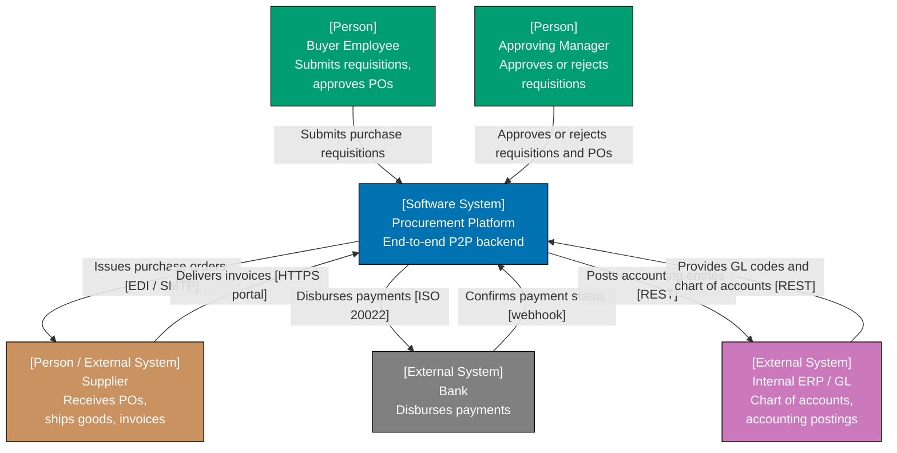
```mermaid
graph TD
    Buyer["[Person]<br/>Buyer Employee<br/>Submits requisitions,<br/>approves POs"]
    Manager["[Person]<br/>Approving Manager<br/>Approves or rejects<br/>requisitions"]
    Platform["[Software System]<br/>Procurement Platform<br/>End-to-end P2P backend"]
    Supplier["[Person / External System]<br/>Supplier<br/>Receives POs,<br/>ships goods, invoices"]
    Bank["[External System]<br/>Bank<br/>Disburses payments"]
    ERP["[External System]<br/>Internal ERP / GL<br/>Chart of accounts,<br/>accounting postings"]

    Buyer -->|"Submits purchase requisitions"| Platform
    Manager -->|"Approves or rejects requisitions and POs"| Platform
    Platform -->|"Issues purchase orders [EDI / SMTP]"| Supplier
    Supplier -->|"Delivers invoices [HTTPS portal]"| Platform
    Platform -->|"Disburses payments [ISO 20022]"| Bank
    Bank -->|"Confirms payment status [webhook]"| Platform
    Platform -->|"Posts accounting entries [REST]"| ERP
    ERP -->|"Provides GL codes and chart of accounts [REST]"| Platform

    style Buyer fill:#029E73,stroke:#000,color:#fff
    style Manager fill:#029E73,stroke:#000,color:#fff
    style Platform fill:#0173B2,stroke:#000,color:#fff
    style Supplier fill:#CA9161,stroke:#000,color:#fff
    style Bank fill:#808080,stroke:#000,color:#fff
    style ERP fill:#CC78BC,stroke:#000,color:#fff
```

**Key Elements**:

- **Two person roles**: Buyer Employee (initiator) vs. Approving Manager (approver) — distinct responsibilities
- **Four external touchpoints**: Supplier, Bank, ERP — each with distinct integration pattern
- **Complete P2P loop**: Requisition → PO → Goods → Invoice → Payment → Accounting

**Design Rationale**: This is the "executive slide" — one diagram that answers "what does the platform do and who uses it?" without any internal detail.

**Key Takeaway**: A complete Level 1 diagram fits on one slide and tells the full system story. If it requires more than six actors to be comprehensible, consider splitting into multiple context diagrams.

**Why It Matters**: Executive sign-off on a platform investment requires understanding scope and boundary. This diagram provides that understanding in thirty seconds, enabling faster and more informed decision-making. Showing all actors — Buyer, Approving Manager, Supplier, Bank, and ERP — in a single view surfaces integration complexity and compliance obligations at a level executives can assess without needing technical details from individual engineers.

---

### Example 11: Approval Workflow Actor — The Approving Manager

The Approving Manager is a distinct person from the Buyer. Showing them separately clarifies the approval chain that drives L1/L2/L3 approval levels.

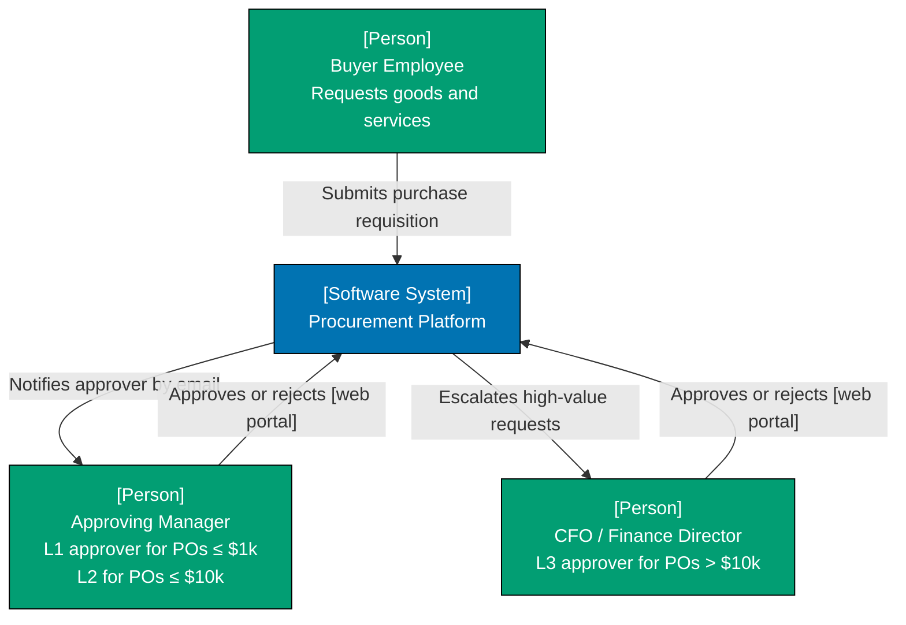
```mermaid
graph TD
    Buyer["[Person]<br/>Buyer Employee<br/>Requests goods and services"]
    Manager["[Person]<br/>Approving Manager<br/>L1 approver for POs ≤ $1k<br/>L2 for POs ≤ $10k"]
    CFO["[Person]<br/>CFO / Finance Director<br/>L3 approver for POs > $10k"]
    Platform["[Software System]<br/>Procurement Platform"]

    Buyer -->|"Submits purchase requisition"| Platform
    Platform -->|"Notifies approver by email"| Manager
    Manager -->|"Approves or rejects [web portal]"| Platform
    Platform -->|"Escalates high-value requests"| CFO
    CFO -->|"Approves or rejects [web portal]"| Platform

    style Buyer fill:#029E73,stroke:#000,color:#fff
    style Manager fill:#029E73,stroke:#000,color:#fff
    style CFO fill:#029E73,stroke:#000,color:#fff
    style Platform fill:#0173B2,stroke:#000,color:#fff
```

**Key Elements**:

- **Three approval tiers**: L1 (Manager), L2 (Manager), L3 (CFO) — dollar thresholds shown in labels
- **Email notification**: Platform actively routes approval requests — not a passive inbox
- **Web portal approval**: Both Manager and CFO use the same portal channel

**Design Rationale**: Approval routing levels (L1/L2/L3) are a business requirement, not a technical one. Showing them in the Context diagram keeps finance stakeholders engaged and prevents developers from hard-coding approval logic.

**Key Takeaway**: When approval chains have business-defined tiers, model each tier as a distinct person in the Context diagram. This makes the routing logic visible to business stakeholders who own the rules.

**Why It Matters**: Approval threshold rules change frequently as organizations grow. Surfacing them at Context level keeps business owners accountable for defining and maintaining them, rather than burying the rules in code. When approval actors are invisible in architecture diagrams, threshold changes require both code deployments and undocumented process updates, increasing the risk that a limit change is applied inconsistently across environments.

---

### Example 12: Supplier as External System — EDI Integration

When the supplier is a large enterprise with machine-to-machine EDI capability, model them as an External System rather than a Person.

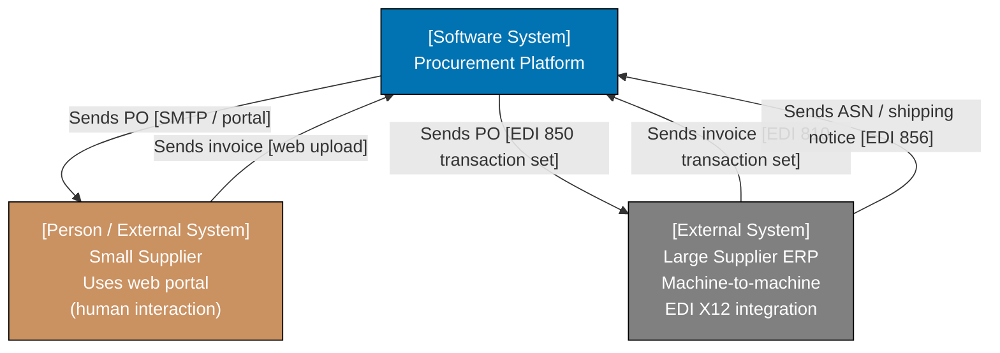
```mermaid
graph TD
    Platform["[Software System]<br/>Procurement Platform"]
    SupplierPortal["[Person / External System]<br/>Small Supplier<br/>Uses web portal<br/>(human interaction)"]
    SupplierEDI["[External System]<br/>Large Supplier ERP<br/>Machine-to-machine<br/>EDI X12 integration"]

    Platform -->|"Sends PO [SMTP / portal]"| SupplierPortal
    SupplierPortal -->|"Sends invoice [web upload]"| Platform
    Platform -->|"Sends PO [EDI 850 transaction set]"| SupplierEDI
    SupplierEDI -->|"Sends invoice [EDI 810 transaction set]"| Platform
    SupplierEDI -->|"Sends ASN / shipping notice [EDI 856]"| Platform

    style Platform fill:#0173B2,stroke:#000,color:#fff
    style SupplierPortal fill:#CA9161,stroke:#000,color:#fff
    style SupplierEDI fill:#808080,stroke:#000,color:#fff
```

**Key Elements**:

- **Two supplier archetypes**: Small suppliers use a web portal; large suppliers use EDI
- **EDI transaction set numbers**: 850 (PO), 810 (Invoice), 856 (ASN) — precise and contractual
- **ASN (Advance Ship Notice)**: EDI-capable suppliers send shipping notices proactively

**Design Rationale**: Platform must support both integration patterns simultaneously. Showing both archetypes in one diagram surfaces the need for two separate adapter implementations early in design.

**Key Takeaway**: Model different integration patterns for the same logical actor as separate elements when they require different implementations. Conflating them hides adapter complexity.

**Why It Matters**: EDI integration with large suppliers is contractually mandated in many industries. Discovering this requirement at the Context level prevents the late-stage realization that a portal-only implementation cannot onboard key suppliers. Treating a supplier as a simple REST endpoint when they require ANSI X12 or EDIFACT format is a common and expensive architecture mistake that only surfaces during supplier onboarding.

---

## System Context — External System Integrations (Examples 13–20)

### Example 13: Bank Integration — Payment Disbursement

Modeling the bank relationship precisely prevents incorrect assumptions about synchronous vs. asynchronous payment confirmation.

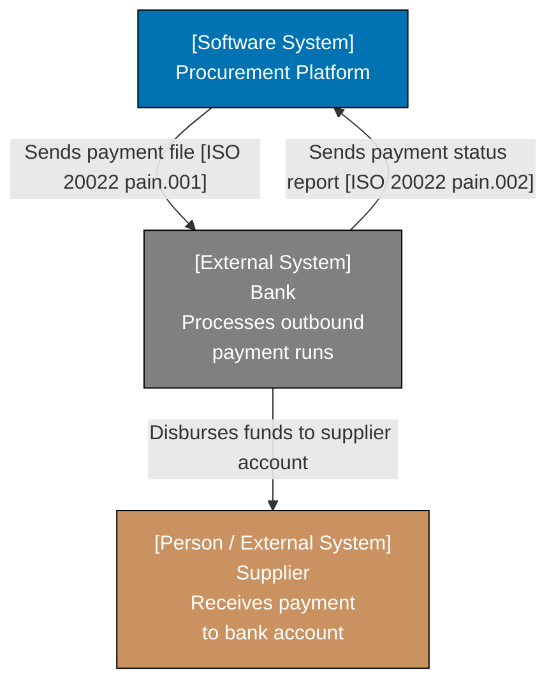
```mermaid
graph TD
    Platform["[Software System]<br/>Procurement Platform"]
    Bank["[External System]<br/>Bank<br/>Processes outbound<br/>payment runs"]
    Supplier["[Person / External System]<br/>Supplier<br/>Receives payment<br/>to bank account"]

    Platform -->|"Sends payment file [ISO 20022 pain.001]"| Bank
    Bank -->|"Sends payment status report [ISO 20022 pain.002]"| Platform
    Bank -->|"Disburses funds to supplier account"| Supplier

    style Platform fill:#0173B2,stroke:#000,color:#fff
    style Bank fill:#808080,stroke:#000,color:#fff
    style Supplier fill:#CA9161,stroke:#000,color:#fff
```

**Key Elements**:

- **pain.001 / pain.002**: ISO 20022 message types for payment initiation and status
- **Asynchronous confirmation**: Bank sends status back as a separate message, not as a synchronous response
- **Indirect to supplier**: The platform never pays the supplier directly — the bank handles fund transfer

**Design Rationale**: Naming pain.001 and pain.002 at this level signals to architects that the payment subsystem must handle asynchronous status reconciliation, not a simple HTTP response check.

**Key Takeaway**: Use standard message type identifiers (pain.001, EDI 810) as labels when they carry compliance or contractual weight. This prevents implementation teams from choosing incompatible formats.

**Why It Matters**: Payment file format is often mandated by the bank. Discovering a pain.001 requirement after building a custom CSV-based integration forces a complete rewrite — a costly lesson that a labeled Context diagram prevents. Naming the Bank explicitly in the Context diagram also triggers the security review needed to classify payment infrastructure under PCI-DSS scope before the team begins implementation.

---

### Example 14: ERP Integration — Chart of Accounts

The ERP is not just a data sink. It provides master data (GL codes) that the platform needs before it can post entries.

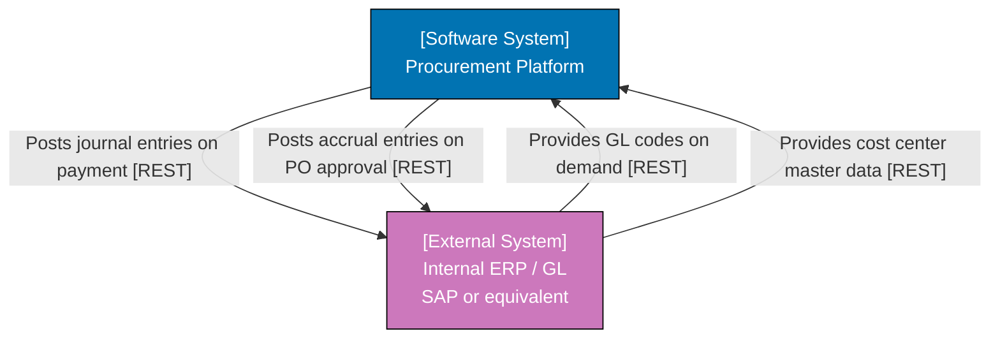
```mermaid
graph TD
    Platform["[Software System]<br/>Procurement Platform"]
    ERP["[External System]<br/>Internal ERP / GL<br/>SAP or equivalent"]

    ERP -->|"Provides GL codes on demand [REST]"| Platform
    ERP -->|"Provides cost center master data [REST]"| Platform
    Platform -->|"Posts journal entries on payment [REST]"| ERP
    Platform -->|"Posts accrual entries on PO approval [REST]"| ERP

    style Platform fill:#0173B2,stroke:#000,color:#fff
    style ERP fill:#CC78BC,stroke:#000,color:#fff
```

**Key Elements**:

- **Two ERP data feeds**: GL codes and cost center data — separate calls with different caching needs
- **Two posting events**: Journal entries on payment AND accrual entries on PO approval
- **REST in both directions**: Same protocol, but the data shape and business rules differ per call

**Design Rationale**: Many P2P implementations post only on payment and skip accrual entries. Showing accrual posting at Context level forces finance stakeholders to confirm or deny this requirement before development begins.

**Key Takeaway**: Show all ERP integration points including read dependencies. Hidden master-data dependencies on ERP are the most common P2P integration blocker.

**Why It Matters**: Accrual accounting is a generally accepted accounting principle (GAAP) requirement in many organizations. Surfacing it at Context level brings the finance team into the design conversation before the posting architecture is locked. A Context diagram that shows the chart-of-accounts dependency ensures that finance architects review the GL integration design before development, not during audit remediation when changes are far more expensive.

---

### Example 15: Supplier Notification System

The platform must notify suppliers of PO status changes. This can flow through email, EDI, or a supplier portal — the choice belongs at Context level.

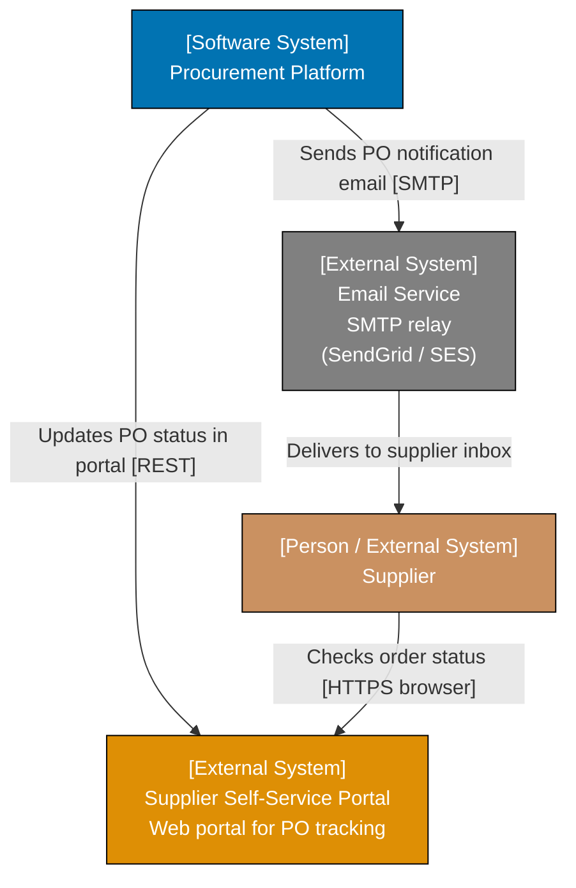
```mermaid
graph TD
    Platform["[Software System]<br/>Procurement Platform"]
    EmailSvc["[External System]<br/>Email Service<br/>SMTP relay<br/>(SendGrid / SES)"]
    SupplierPortal["[External System]<br/>Supplier Self-Service Portal<br/>Web portal for PO tracking"]
    Supplier["[Person / External System]<br/>Supplier"]

    Platform -->|"Sends PO notification email [SMTP]"| EmailSvc
    EmailSvc -->|"Delivers to supplier inbox"| Supplier
    Platform -->|"Updates PO status in portal [REST]"| SupplierPortal
    Supplier -->|"Checks order status [HTTPS browser]"| SupplierPortal

    style Platform fill:#0173B2,stroke:#000,color:#fff
    style EmailSvc fill:#808080,stroke:#000,color:#fff
    style SupplierPortal fill:#DE8F05,stroke:#000,color:#fff
    style Supplier fill:#CA9161,stroke:#000,color:#fff
```

**Key Elements**:

- **Dual notification channels**: Email for push notification, portal for pull status check
- **External email relay**: Platform does not send SMTP directly — uses a managed relay
- **Supplier portal as separate system**: Could be built in-house or third-party SaaS

**Design Rationale**: Separating email relay from portal access shows that two different integration adapters are required. If both are lumped into "notify supplier," the distinct implementation needs are invisible.

**Key Takeaway**: When a single business action (notify supplier) involves multiple external systems, draw each external system as a separate node. Lumping them into one box hides adapter complexity.

**Why It Matters**: Supplier experience directly affects supply chain reliability. Platform teams that treat notification as a single checkbox find supplier complaints about missed POs are often a system integration problem, not a human one. A Context diagram that makes the Notification System visible ensures that supplier communication SLAs are agreed upon and tested before launch, not added as afterthoughts when delivery delays surface.

---

### Example 16: Secret Manager Integration

The platform must retrieve database credentials and API keys at runtime without storing them in configuration files.

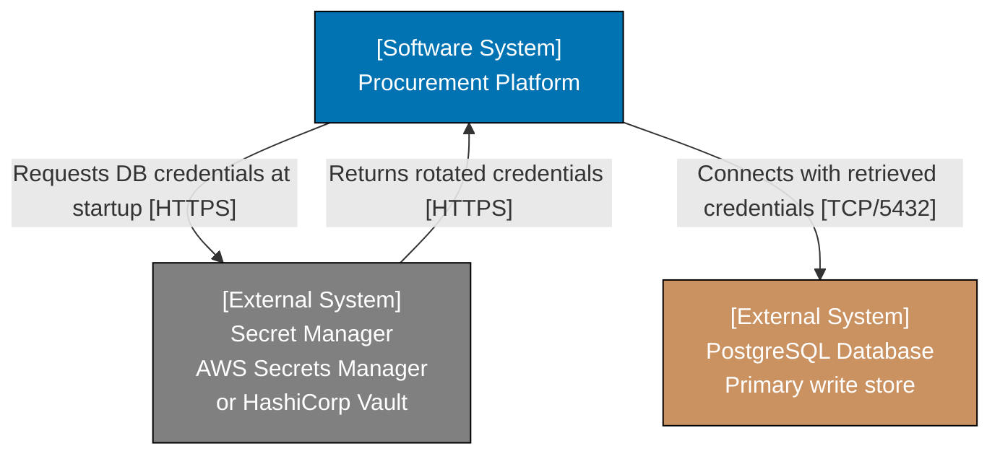
```mermaid
graph TD
    Platform["[Software System]<br/>Procurement Platform"]
    SecretMgr["[External System]<br/>Secret Manager<br/>AWS Secrets Manager<br/>or HashiCorp Vault"]
    DB["[External System]<br/>PostgreSQL Database<br/>Primary write store"]

    Platform -->|"Requests DB credentials at startup [HTTPS]"| SecretMgr
    SecretMgr -->|"Returns rotated credentials [HTTPS]"| Platform
    Platform -->|"Connects with retrieved credentials [TCP/5432]"| DB

    style Platform fill:#0173B2,stroke:#000,color:#fff
    style SecretMgr fill:#808080,stroke:#000,color:#fff
    style DB fill:#CA9161,stroke:#000,color:#fff
```

**Key Elements**:

- **No hardcoded credentials**: Platform retrieves credentials at runtime, not deploy time
- **Credential rotation**: Secret Manager handles rotation; platform re-fetches on rotation event
- **TCP/5432**: PostgreSQL native protocol — distinct from the HTTPS used for secret retrieval

**Design Rationale**: Showing Secret Manager at Context level makes credential management a first-class architectural concern, not a deployment afterthought.

**Key Takeaway**: Include secret management infrastructure in Context diagrams. Treating credentials as a deploy-time concern rather than a runtime integration produces systems that fail silently when credentials rotate.

**Why It Matters**: Credential leaks are the most common cause of cloud data breaches. Architectural diagrams that normalize secret management at the system boundary set the security standard for the entire implementation team. A Context diagram that names Secret Manager as an explicit dependency forces the security team to review secret rotation policies and access control boundaries during the design phase rather than after a credential exposure incident.

---

### Example 17: Murabaha Bank — Optional Sharia Financing

For organizations operating under Sharia-compliant procurement rules, a Murabaha Bank finances asset purchases under a cost-plus markup contract.

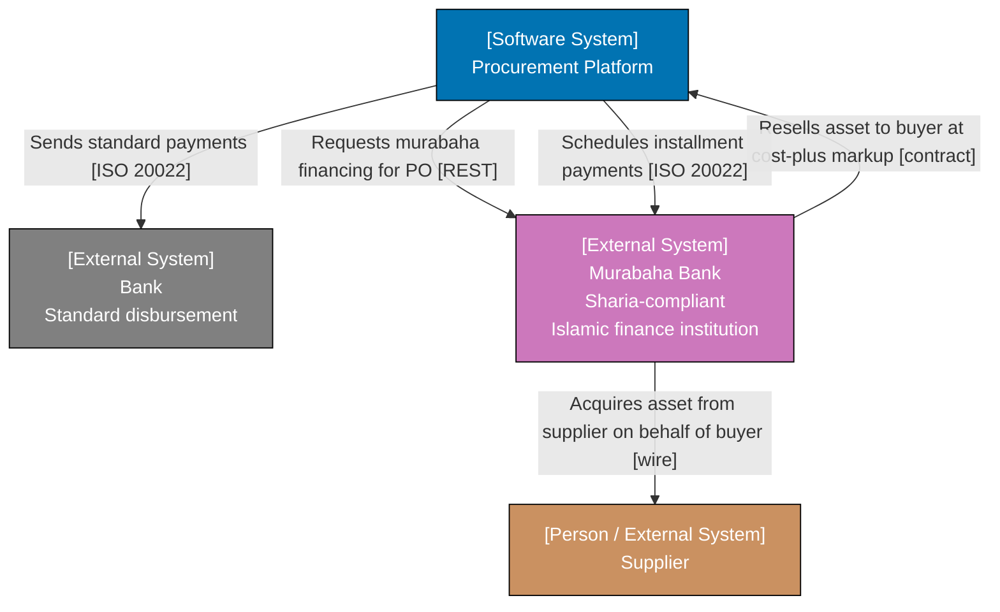
```mermaid
graph TD
    Platform["[Software System]<br/>Procurement Platform"]
    Bank["[External System]<br/>Bank<br/>Standard disbursement"]
    MurabahaBank["[External System]<br/>Murabaha Bank<br/>Sharia-compliant<br/>Islamic finance institution"]
    Supplier["[Person / External System]<br/>Supplier"]

    Platform -->|"Requests murabaha financing for PO [REST]"| MurabahaBank
    MurabahaBank -->|"Acquires asset from supplier on behalf of buyer [wire]"| Supplier
    MurabahaBank -->|"Resells asset to buyer at cost-plus markup [contract]"| Platform
    Platform -->|"Schedules installment payments [ISO 20022]"| MurabahaBank
    Platform -->|"Sends standard payments [ISO 20022]"| Bank

    style Platform fill:#0173B2,stroke:#000,color:#fff
    style Bank fill:#808080,stroke:#000,color:#fff
    style MurabahaBank fill:#CC78BC,stroke:#000,color:#fff
    style Supplier fill:#CA9161,stroke:#000,color:#fff
```

**Key Elements**:

- **Murabaha flow**: Bank buys asset from supplier, then resells to buyer at markup — two transactions
- **Installment payments**: Buyer pays the bank in installments, not a lump sum to the supplier
- **Optional context**: This financing path coexists with standard payment — not all POs use murabaha

**Design Rationale**: Murabaha financing changes the payment flow fundamentally: the bank, not the platform, pays the supplier. Showing this at Context level makes the three-party contract visible to legal and compliance stakeholders.

**Key Takeaway**: Model optional financing paths as separate external system relationships. Murabaha financing is architecturally distinct from standard bank disbursement and must not be conflated.

**Why It Matters**: Islamic finance compliance is a regulatory requirement in many markets. Surfacing the Murabaha Bank as a distinct external system anchors legal, finance, and engineering conversations in the correct contractual structure from the first design session. Retrofitting profit-rate accounting and Sharia audit trails into a platform designed for conventional lending is a multi-sprint rework that early architecture visibility prevents entirely.

---

### Example 18: System Context with Compliance and Audit

Regulated industries require audit trails accessible to external auditors. This example shows the compliance integration.

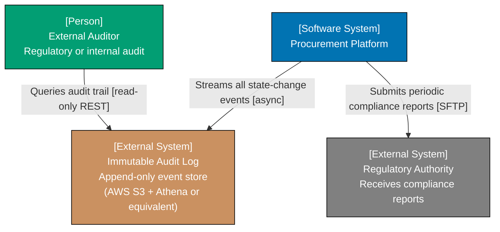
```mermaid
graph TD
    Platform["[Software System]<br/>Procurement Platform"]
    AuditLog["[External System]<br/>Immutable Audit Log<br/>Append-only event store<br/>(AWS S3 + Athena or equivalent)"]
    Auditor["[Person]<br/>External Auditor<br/>Regulatory or internal audit"]
    Regulator["[External System]<br/>Regulatory Authority<br/>Receives compliance reports"]

    Platform -->|"Streams all state-change events [async]"| AuditLog
    Auditor -->|"Queries audit trail [read-only REST]"| AuditLog
    Platform -->|"Submits periodic compliance reports [SFTP]"| Regulator

    style Platform fill:#0173B2,stroke:#000,color:#fff
    style AuditLog fill:#CA9161,stroke:#000,color:#fff
    style Auditor fill:#029E73,stroke:#000,color:#fff
    style Regulator fill:#808080,stroke:#000,color:#fff
```

**Key Elements**:

- **Immutable audit log**: Separate from the operational database — cannot be altered
- **Auditor read-only**: Auditor queries the log, never the live system
- **SFTP compliance reports**: Regulatory submissions use SFTP, not REST

**Design Rationale**: Compliance requirements mandate that audit evidence is tamper-evident and separate from operational data. Showing the immutable log as an external system signals this separation to architects.

**Key Takeaway**: Model compliance and audit infrastructure as distinct external systems, not as features of the primary database. Tamper-evident audit trails require architectural separation, not just a log table.

**Why It Matters**: Regulatory audits that discover audit trails co-mingled with operational data can result in findings that invalidate the entire audit. Architectural separation is not optional in regulated procurement environments. Regulatory frameworks such as SOX and ISO 27001 require immutable audit logs that are accessible independently of the operational system, making early architectural separation a compliance prerequisite rather than a design preference.

---

### Example 19: Notification Service — Multiple Channels

A dedicated notification service decouples the platform from channel-specific delivery logic.

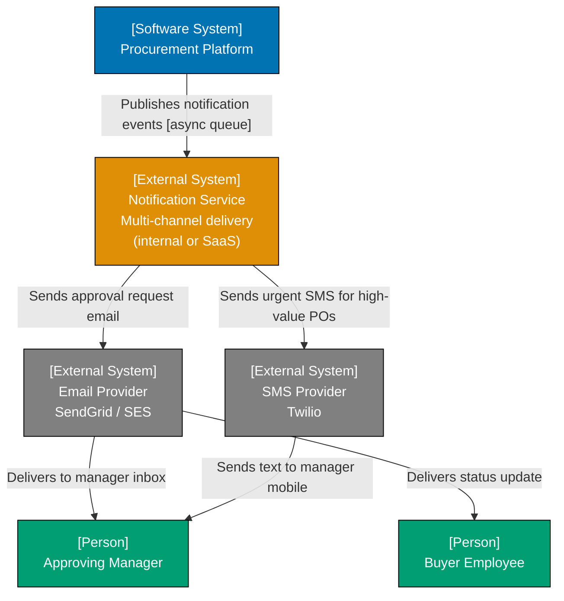
```mermaid
graph TD
    Platform["[Software System]<br/>Procurement Platform"]
    NotifSvc["[External System]<br/>Notification Service<br/>Multi-channel delivery<br/>(internal or SaaS)"]
    Email["[External System]<br/>Email Provider<br/>SendGrid / SES"]
    SMS["[External System]<br/>SMS Provider<br/>Twilio"]
    Buyer["[Person]<br/>Buyer Employee"]
    Manager["[Person]<br/>Approving Manager"]

    Platform -->|"Publishes notification events [async queue]"| NotifSvc
    NotifSvc -->|"Sends approval request email"| Email
    NotifSvc -->|"Sends urgent SMS for high-value POs"| SMS
    Email -->|"Delivers to manager inbox"| Manager
    SMS -->|"Sends text to manager mobile"| Manager
    Email -->|"Delivers status update"| Buyer

    style Platform fill:#0173B2,stroke:#000,color:#fff
    style NotifSvc fill:#DE8F05,stroke:#000,color:#fff
    style Email fill:#808080,stroke:#000,color:#fff
    style SMS fill:#808080,stroke:#000,color:#fff
    style Buyer fill:#029E73,stroke:#000,color:#fff
    style Manager fill:#029E73,stroke:#000,color:#fff
```

**Key Elements**:

- **Notification Service mediator**: Platform publishes one event; service routes to correct channel
- **Async queue**: Platform does not wait for delivery confirmation — fire and forget
- **Channel selection logic**: Urgent high-value POs escalate to SMS; routine POs use email

**Design Rationale**: Publishing to a notification service rather than calling email/SMS directly means the platform is not impacted if a delivery channel goes down. Decoupling is visible at Context level.

**Key Takeaway**: Introduce a notification mediator when multi-channel delivery is required. Letting the platform call each channel directly creates tight coupling that makes channel changes expensive.

**Why It Matters**: Notification channel preferences change. SMS costs, email deliverability issues, and push notification adoption each affect channel strategy. Decoupling through a notification service makes channel changes a configuration concern, not a code change. This abstraction also enables suppliers and buyers to set their own preferred channels without requiring platform re-deployment or cross-team coordination for each channel addition.

---

### Example 20: Observability and Monitoring Integration

The platform must emit telemetry to an external observability stack for production monitoring.

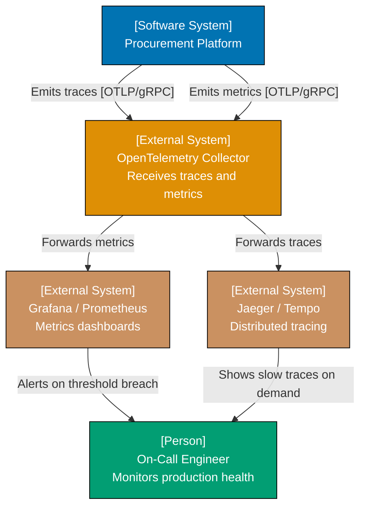
```mermaid
graph TD
    Platform["[Software System]<br/>Procurement Platform"]
    OtelCollector["[External System]<br/>OpenTelemetry Collector<br/>Receives traces and metrics"]
    Grafana["[External System]<br/>Grafana / Prometheus<br/>Metrics dashboards"]
    Jaeger["[External System]<br/>Jaeger / Tempo<br/>Distributed tracing"]
    OnCall["[Person]<br/>On-Call Engineer<br/>Monitors production health"]

    Platform -->|"Emits traces [OTLP/gRPC]"| OtelCollector
    Platform -->|"Emits metrics [OTLP/gRPC]"| OtelCollector
    OtelCollector -->|"Forwards metrics"| Grafana
    OtelCollector -->|"Forwards traces"| Jaeger
    Grafana -->|"Alerts on threshold breach"| OnCall
    Jaeger -->|"Shows slow traces on demand"| OnCall

    style Platform fill:#0173B2,stroke:#000,color:#fff
    style OtelCollector fill:#DE8F05,stroke:#000,color:#fff
    style Grafana fill:#CA9161,stroke:#000,color:#fff
    style Jaeger fill:#CA9161,stroke:#000,color:#fff
    style OnCall fill:#029E73,stroke:#000,color:#fff
```

**Key Elements**:

- **OpenTelemetry Collector**: Vendor-neutral collector receives all telemetry; backends are swappable
- **OTLP/gRPC**: Standard telemetry protocol — not vendor-specific
- **On-call engineer**: The human consumer of observability data

**Design Rationale**: Using OpenTelemetry Collector as the intermediary decouples the platform from specific observability vendors. Swapping Jaeger for Tempo or Prometheus for Datadog requires only collector config changes.

**Key Takeaway**: Model observability infrastructure in Context diagrams. Teams that treat monitoring as a post-launch concern regularly deploy platforms that are blind in production.

**Why It Matters**: P2P platforms handle financial transactions. Production incidents with no telemetry result in extended outages and financial data integrity questions. Observability is an architectural requirement, not an operational nicety. A Context diagram that makes Observability a named external system ensures monitoring budgets, SLA definitions, and alerting thresholds are agreed upon during architecture review rather than negotiated reactively during an incident.

---

## System Context — Integration Patterns (Examples 21–30)

### Example 21: Synchronous vs. Asynchronous Relationships

Some relationships in the system are synchronous (blocking), others asynchronous (event-driven). C4 Context diagrams can show this distinction.

```mermaid
graph TD
    Platform["[Software System]<br/>Procurement Platform"]
    ERP["[External System]<br/>Internal ERP / GL"]
    Bank["[External System]<br/>Bank"]
    EventBus["[External System]<br/>Event Bus<br/>Kafka cluster"]
    SupplierSvc["[External System]<br/>Supplier Notification<br/>Service"]

    Platform -->|"Reads GL codes synchronously [REST, blocking]"| ERP
    Platform -->|"Submits payment file synchronously [ISO 20022]"| Bank
    Platform -->|"Publishes domain events asynchronously [Kafka]"| EventBus
    EventBus -->|"Delivers events asynchronously"| SupplierSvc

    style Platform fill:#0173B2,stroke:#000,color:#fff
    style ERP fill:#CC78BC,stroke:#000,color:#fff
    style Bank fill:#808080,stroke:#000,color:#fff
    style EventBus fill:#DE8F05,stroke:#000,color:#fff
    style SupplierSvc fill:#CA9161,stroke:#000,color:#fff
```

**Key Elements**:

- **Blocking label**: `[REST, blocking]` signals that ERP latency directly impacts P2P response times
- **Asynchronous label**: `[Kafka]` signals eventual consistency; the platform does not wait for delivery
- **Event Bus as mediator**: Kafka sits between platform and downstream consumers

**Design Rationale**: Distinguishing synchronous from asynchronous relationships at Context level surfaces latency risk. If ERP is slow, blocking REST calls will make the platform slow too — a performance requirement that must be addressed in design.

**Key Takeaway**: Label relationship synchronicity in Context diagrams. Synchronous dependencies create cascading latency risk; asynchronous dependencies create eventual consistency risk. Both risks must be acknowledged.

**Why It Matters**: P2P platforms often fail performance SLAs because synchronous ERP dependencies were not visible at design time. Making synchronicity explicit at Context level forces the team to plan for circuit breakers or caching. Identifying that ERP chart-of-accounts calls are synchronous allows architects to implement response caching before those calls become the bottleneck under peak purchase order volume in production.

---

### Example 22: Approval Workflow — Three Levels Shown

The approval chain for purchase orders spans three authorization levels. Modeling them at Context shows the business rule before it becomes code.

```mermaid
graph TD
    Buyer["[Person]<br/>Buyer Employee<br/>Requisition initiator"]
    L1Manager["[Person]<br/>Line Manager<br/>L1: POs ≤ $1,000"]
    L2Manager["[Person]<br/>Department Head<br/>L2: POs ≤ $10,000"]
    L3Finance["[Person]<br/>CFO<br/>L3: POs > $10,000"]
    Platform["[Software System]<br/>Procurement Platform"]

    Buyer -->|"Submits requisition"| Platform
    Platform -->|"Routes to line manager for L1 approval"| L1Manager
    L1Manager -->|"Approves or rejects [portal]"| Platform
    Platform -->|"Escalates to department head for L2"| L2Manager
    L2Manager -->|"Approves or rejects [portal]"| Platform
    Platform -->|"Escalates to CFO for L3"| L3Finance
    L3Finance -->|"Approves or rejects [portal]"| Platform

    style Buyer fill:#029E73,stroke:#000,color:#fff
    style L1Manager fill:#029E73,stroke:#000,color:#fff
    style L2Manager fill:#029E73,stroke:#000,color:#fff
    style L3Finance fill:#029E73,stroke:#000,color:#fff
    style Platform fill:#0173B2,stroke:#000,color:#fff
```

**Key Elements**:

- **Three approval persons**: Each with distinct dollar threshold — drives dynamic routing logic
- **Platform routes actively**: Platform does not just notify; it routes to the correct approver
- **Consistent portal channel**: All approvers use the same web portal regardless of level

**Design Rationale**: Showing three approval persons forces business stakeholders to confirm the routing rules. If L2 is actually a committee rather than a single person, this diagram reveals that gap immediately.

**Key Takeaway**: Model each approval role as a distinct person with threshold labels. Collapsing all approvers into one generic "Manager" actor hides routing logic that the platform must implement.

**Why It Matters**: Approval routing errors are a primary audit finding in P2P systems. Incorrect routing allows purchases above an employee's authority threshold to be approved without appropriate oversight — a financial controls failure. A Context diagram that makes approval tiers visible ensures that finance and compliance stakeholders validate the routing logic during architecture review before it is encoded in the system and before any purchases are processed.

---

### Example 23: Goods Receipt — Warehouse Actor

Goods receipt introduces a new person: the Warehouse Operator who physically verifies delivery and enters receipt data.

```mermaid
graph TD
    Platform["[Software System]<br/>Procurement Platform"]
    Warehouse["[Person]<br/>Warehouse Operator<br/>Physically receives goods,<br/>enters GRN data"]
    Supplier["[Person / External System]<br/>Supplier<br/>Delivers goods to warehouse"]
    Buyer["[Person]<br/>Buyer Employee"]

    Buyer -->|"Submits purchase requisition"| Platform
    Platform -->|"Issues PO to supplier"| Supplier
    Supplier -->|"Physically delivers goods to warehouse"| Warehouse
    Warehouse -->|"Enters Goods Receipt Note [web portal]"| Platform
    Platform -->|"Notifies buyer: goods received"| Buyer

    style Platform fill:#0173B2,stroke:#000,color:#fff
    style Warehouse fill:#029E73,stroke:#000,color:#fff
    style Supplier fill:#CA9161,stroke:#000,color:#fff
    style Buyer fill:#029E73,stroke:#000,color:#fff
```

**Key Elements**:

- **Warehouse Operator**: A new person role distinct from Buyer — performs physical verification
- **Physical delivery outside system**: The actual goods movement is not mediated by the platform
- **GRN as platform event**: Only the receipt acknowledgment enters the system digitally

**Design Rationale**: Showing the physical delivery as an arrow from Supplier to Warehouse (not to Platform) is architecturally accurate. The platform cannot track physical goods; it records the human confirmation.

**Key Takeaway**: Model the boundary between physical and digital accurately. Physical events (goods delivery) happen outside the system; the platform records only the human-entered acknowledgment.

**Why It Matters**: Three-way matching (PO ↔ GRN ↔ Invoice) is the cornerstone of P2P fraud prevention. The matching cannot succeed if goods receipt data is incomplete. Showing the Warehouse Operator as a first-class actor signals the data quality dependency to operations teams. Naming this actor in the Context diagram also prompts the decision to build a GRN portal or mobile interface before development begins, not after matching failures surface in production.

---

### Example 24: Invoice Registration — Finance Clerk Actor

Invoice processing introduces the Finance Clerk who registers supplier invoices into the platform for three-way matching.

```mermaid
graph TD
    Platform["[Software System]<br/>Procurement Platform"]
    Supplier["[Person / External System]<br/>Supplier"]
    FinanceClerk["[Person]<br/>Finance Clerk<br/>Registers invoices,<br/>resolves matching exceptions"]
    Buyer["[Person]<br/>Buyer Employee"]

    Supplier -->|"Sends paper or email invoice"| FinanceClerk
    FinanceClerk -->|"Registers invoice in platform [web portal]"| Platform
    Platform -->|"Runs three-way match: PO vs GRN vs Invoice [auto]"| Platform
    Platform -->|"Alerts clerk on matching exception"| FinanceClerk
    FinanceClerk -->|"Resolves dispute [web portal]"| Platform
    Platform -->|"Notifies buyer of matched invoice"| Buyer

    style Platform fill:#0173B2,stroke:#000,color:#fff
    style Supplier fill:#CA9161,stroke:#000,color:#fff
    style FinanceClerk fill:#029E73,stroke:#000,color:#fff
    style Buyer fill:#029E73,stroke:#000,color:#fff
```

**Key Elements**:

- **Finance Clerk**: Manual entry role for invoice registration — a common process gap in P2P
- **Auto three-way match**: Platform performs matching automatically after registration
- **Exception loop**: Clerk receives alert on exception and resolves it — a process loop in the diagram

**Design Rationale**: Showing the Finance Clerk as a distinct actor makes the manual invoice entry step visible. Many P2P implementations underestimate this step and fail to budget for the clerk portal UI.

**Key Takeaway**: Model every human touchpoint in the P2P process as a distinct Person actor. Hidden manual steps lead to under-designed user interfaces and process bottlenecks.

**Why It Matters**: Invoice matching exceptions are the most common cause of payment delays in P2P. A platform that makes the exception resolution workflow invisible during design will deliver a poor finance user experience, resulting in slow payment runs and supplier relationship damage. Making the Finance Clerk explicit in the Context diagram ensures that the exception management interface, notification flows, and SLA targets are scoped during architecture review rather than discovered during user acceptance testing.

---

### Example 25: Complete P2P Flow — All Actors

A single Context diagram that traces the full Procure-to-Pay lifecycle from requisition to accounting entry, showing every person and external system.

```mermaid
graph LR
    Buyer["[Person]<br/>Buyer Employee"]
    Manager["[Person]<br/>Approving Manager"]
    Warehouse["[Person]<br/>Warehouse Operator"]
    FinClerk["[Person]<br/>Finance Clerk"]
    Platform["[Software System]<br/>Procurement Platform"]
    Supplier["[Person / Ext System]<br/>Supplier"]
    Bank["[External System]<br/>Bank"]
    ERP["[External System]<br/>Internal ERP / GL"]

    Buyer -->|"1. Submits requisition"| Platform
    Platform -->|"2. Routes for approval"| Manager
    Manager -->|"3. Approves PO"| Platform
    Platform -->|"4. Issues PO"| Supplier
    Supplier -->|"5. Delivers goods"| Warehouse
    Warehouse -->|"6. Enters GRN"| Platform
    Supplier -->|"7. Sends invoice"| FinClerk
    FinClerk -->|"8. Registers invoice"| Platform
    Platform -->|"9. Disburses payment"| Bank
    Bank -->|"10. Pays supplier"| Supplier
    Platform -->|"11. Posts accounting"| ERP

    style Buyer fill:#029E73,stroke:#000,color:#fff
    style Manager fill:#029E73,stroke:#000,color:#fff
    style Warehouse fill:#029E73,stroke:#000,color:#fff
    style FinClerk fill:#029E73,stroke:#000,color:#fff
    style Platform fill:#0173B2,stroke:#000,color:#fff
    style Supplier fill:#CA9161,stroke:#000,color:#fff
    style Bank fill:#808080,stroke:#000,color:#fff
    style ERP fill:#CC78BC,stroke:#000,color:#fff
```

**Key Elements**:

- **Numbered arrows**: 11-step P2P lifecycle made explicit
- **Left-to-right layout**: Matches the temporal flow of the business process
- **All eight actors**: Every person and system involved in P2P in one view

**Design Rationale**: Using numbered arrows transforms a static Context diagram into a process walkthrough. Business stakeholders can trace the flow and immediately spot missing steps or incorrect ordering.

**Key Takeaway**: For process-oriented systems, number the relationship arrows in execution order. This converts a static view into an interactive walkthrough for business stakeholder meetings.

**Why It Matters**: P2P process reviews with stakeholders often uncover missing steps, incorrect approval routing, or missing actors. A numbered-arrow Context diagram makes these gaps findable in a meeting rather than in a production incident. When all roles and external systems appear in a single diagram with numbered flow steps, finance, procurement, and IT stakeholders can jointly verify completeness in a single review session.

---

### Example 26: System Boundary — What Is In and What Is Out

Explicitly marking what the Procurement Platform owns vs. what external systems own prevents scope creep and misaligned expectations.

```mermaid
graph TD
    subgraph InScope["IN SCOPE — Procurement Platform owns"]
        PRLifecycle["Requisition lifecycle management"]
        POLifecycle["Purchase order issuance and tracking"]
        GRNEntry["Goods receipt recording"]
        InvMatching["Invoice three-way matching"]
        PayRun["Payment run scheduling"]
    end

    subgraph OutOfScope["OUT OF SCOPE — External systems own"]
        ERPAccounting["General ledger and chart of accounts"]
        BankDisbursement["Actual fund disbursement"]
        EDINetwork["EDI value-added network"]
        InventoryMgmt["Warehouse inventory management"]
    end

    InScope -->|"Integrates via REST and events"| OutOfScope

    style PRLifecycle fill:#0173B2,stroke:#000,color:#fff
    style POLifecycle fill:#0173B2,stroke:#000,color:#fff
    style GRNEntry fill:#0173B2,stroke:#000,color:#fff
    style InvMatching fill:#0173B2,stroke:#000,color:#fff
    style PayRun fill:#0173B2,stroke:#000,color:#fff
    style ERPAccounting fill:#808080,stroke:#000,color:#fff
    style BankDisbursement fill:#808080,stroke:#000,color:#fff
    style EDINetwork fill:#808080,stroke:#000,color:#fff
    style InventoryMgmt fill:#808080,stroke:#000,color:#fff
```

**Key Elements**:

- **Two subgraphs**: In-scope and out-of-scope separated visually
- **Capability list**: Each box names a capability, not a technical component
- **Inventory management is out-of-scope**: Common misunderstanding — P2P does not manage inventory

**Design Rationale**: Scope boundaries prevent feature creep and misaligned budget expectations. The "OUT OF SCOPE" box is as important as the "IN SCOPE" box.

**Key Takeaway**: Draw the out-of-scope boundary explicitly. Unspecified scope is assumed to be in-scope by stakeholders, leading to scope creep and budget overruns.

**Why It Matters**: P2P implementations frequently expand to absorb inventory management, ERP functionality, and supplier master data management — all out of scope for a P2P backend. A boundary diagram prevents these expansions from silently entering the project. When boundaries are documented in an architecture diagram, adding out-of-scope features requires an explicit architecture review decision rather than a quiet addition to the backlog that bypasses scope governance.

---

### Example 27: Multiple Buyer Organizations — Multi-Tenancy at Context

A SaaS Procurement Platform serves multiple buyer organizations. Each organization is a distinct tenant with isolated data.

```mermaid
graph TD
    OrgA["[Person]<br/>Buyer Employee — Org A"]
    OrgB["[Person]<br/>Buyer Employee — Org B"]
    Platform["[Software System]<br/>Procurement Platform<br/>Multi-tenant SaaS"]
    BankA["[External System]<br/>Bank A<br/>Org A's bank"]
    BankB["[External System]<br/>Bank B<br/>Org B's bank"]
    SharedERP["[External System]<br/>ERP<br/>Shared across orgs"]

    OrgA -->|"Submits requisitions [tenant: org-a]"| Platform
    OrgB -->|"Submits requisitions [tenant: org-b]"| Platform
    Platform -->|"Disburses org-a payments"| BankA
    Platform -->|"Disburses org-b payments"| BankB
    Platform -->|"Posts accounting entries [org-scoped GL codes]"| SharedERP

    style OrgA fill:#029E73,stroke:#000,color:#fff
    style OrgB fill:#029E73,stroke:#000,color:#fff
    style Platform fill:#0173B2,stroke:#000,color:#fff
    style BankA fill:#808080,stroke:#000,color:#fff
    style BankB fill:#808080,stroke:#000,color:#fff
    style SharedERP fill:#CC78BC,stroke:#000,color:#fff
```

**Key Elements**:

- **Tenant labels on arrows**: `[tenant: org-a]` makes tenant isolation visible at Context
- **Per-org banks**: Each organization may have a different banking relationship
- **Shared ERP with org-scoped GL codes**: Single ERP instance, per-org chart of accounts

**Design Rationale**: Showing tenant labels at Context level forces the team to plan data isolation from the beginning. Systems designed without explicit multi-tenancy at Context routinely leak cross-tenant data.

**Key Takeaway**: Model multi-tenancy at Context level with explicit tenant labels on actor-to-system arrows. Invisible multi-tenancy in diagrams produces invisible data isolation bugs in production.

**Why It Matters**: Cross-tenant data leaks in SaaS procurement platforms expose supplier pricing and purchase volumes — commercially sensitive data that damages customer trust and triggers regulatory action. Architectural visibility is the first line of defense. Retrofitting row-level tenant isolation into a schema designed without it requires full table migrations and extended downtime — a cost that early architecture visibility eliminates entirely.

---

### Example 28: Geographic Distribution — Regional Deployments

A globally-deployed platform must show regional instances and data residency boundaries.

```mermaid
graph TD
    subgraph APAC["APAC Region"]
        APACBuyer["[Person]<br/>Buyer — APAC"]
        APACPlatform["[Software System]<br/>Procurement Platform<br/>APAC instance"]
        APACBank["[External System]<br/>APAC Regional Bank"]
    end

    subgraph EU["EU Region"]
        EUBuyer["[Person]<br/>Buyer — EU"]
        EUPlatform["[Software System]<br/>Procurement Platform<br/>EU instance (GDPR-compliant)"]
        EUBank["[External System]<br/>EU Bank"]
    end

    GlobalERP["[External System]<br/>Global ERP / GL<br/>Cross-region consolidation"]

    APACBuyer --> APACPlatform
    APACPlatform -->|"Disburses payments"| APACBank
    EUBuyer --> EUPlatform
    EUPlatform -->|"Disburses payments"| EUBank
    APACPlatform -->|"Posts entries [region-scoped]"| GlobalERP
    EUPlatform -->|"Posts entries [EU data stays in EU]"| GlobalERP

    style APACBuyer fill:#029E73,stroke:#000,color:#fff
    style APACPlatform fill:#0173B2,stroke:#000,color:#fff
    style APACBank fill:#808080,stroke:#000,color:#fff
    style EUBuyer fill:#029E73,stroke:#000,color:#fff
    style EUPlatform fill:#0173B2,stroke:#000,color:#fff
    style EUBank fill:#808080,stroke:#000,color:#fff
    style GlobalERP fill:#CC78BC,stroke:#000,color:#fff
```

**Key Elements**:

- **Regional subgraphs**: APAC and EU instances in separate boundary boxes
- **GDPR label**: EU data residency requirement noted on platform box
- **Global ERP consolidation**: Single ERP consolidates across regions with region-scoped entries

**Design Rationale**: Regional subgraphs make data residency visible. GDPR compliance requires EU data to stay in EU — this cannot be discovered at deployment time.

**Key Takeaway**: Show regional deployments and data residency constraints at Context level. Data sovereignty requirements discovered post-deployment require expensive re-architecture.

**Why It Matters**: GDPR fines for cross-border data transfers reach 4% of global annual turnover. Architectural diagrams that make data residency constraints explicit from day one prevent regulatory exposure. Teams that discover cross-border data residency requirements after deployment must retrofit data partitioning, replication boundaries, and consent mechanisms under regulatory deadline pressure — a far more expensive remediation than early design clarity.

---

### Example 29: System Context with Security Boundary

A security-focused Context diagram highlights trust boundaries and authentication checkpoints.

```mermaid
graph TD
    subgraph Internet["Untrusted Zone — Public Internet"]
        Buyer["[Person]<br/>Buyer Employee<br/>Authenticates via SSO"]
        Supplier["[Person / External System]<br/>Supplier<br/>Authenticates via API key"]
    end

    subgraph DMZ["DMZ — API Gateway"]
        APIGW["[External System]<br/>API Gateway<br/>WAF, rate limiting,<br/>auth token validation"]
    end

    subgraph TrustedZone["Trusted Zone — Private Network"]
        Platform["[Software System]<br/>Procurement Platform"]
        DB["[External System]<br/>PostgreSQL<br/>No public access"]
    end

    Buyer -->|"HTTPS + JWT [SSO/OIDC]"| APIGW
    Supplier -->|"HTTPS + API key"| APIGW
    APIGW -->|"Validated requests [internal mTLS]"| Platform
    Platform -->|"Queries data [TCP/5432, VPC internal]"| DB

    style Buyer fill:#029E73,stroke:#000,color:#fff
    style Supplier fill:#CA9161,stroke:#000,color:#fff
    style APIGW fill:#DE8F05,stroke:#000,color:#fff
    style Platform fill:#0173B2,stroke:#000,color:#fff
    style DB fill:#CA9161,stroke:#000,color:#fff
```

**Key Elements**:

- **Three security zones**: Untrusted (internet), DMZ (gateway), Trusted (private network)
- **mTLS inside trusted zone**: Mutual TLS for service-to-service — not just external TLS
- **Database no public access**: DB is in trusted zone and not reachable from DMZ

**Design Rationale**: Security zone diagrams communicate the defense-in-depth strategy. Each zone boundary is a security enforcement point, not just a deployment boundary.

**Key Takeaway**: Model security trust zones explicitly in Context diagrams for security-sensitive systems. Each zone boundary represents a distinct authentication/authorization enforcement point.

**Why It Matters**: P2P platforms hold payment credentials and supplier contracts — high-value targets. Security architecture decisions made at Context level (DMZ, mTLS, private DB) drive implementation decisions across every container and component in the system. Security architects can annotate trust boundaries directly on the Context diagram, creating a shared threat model that engineers reference during implementation and reviewers verify during security assessments.

---

### Example 30: Context Diagram Anti-Patterns to Avoid

Understanding what makes a Context diagram fail is as important as knowing what makes one succeed.

```mermaid
graph TD
    subgraph Bad["Anti-Pattern: Too Much Detail"]
        User2["Person"]
        System2["Our System"]
        DB2["PostgreSQL DB<br/>users table<br/>orders table"]
        Cache2["Redis Cache<br/>session store"]
        MQ2["RabbitMQ<br/>order.created topic"]
        User2 --> System2
        System2 --> DB2
        System2 --> Cache2
        System2 --> MQ2
    end

    subgraph Good["Correct Level 1: System Boundary Only"]
        User1["[Person]<br/>Buyer Employee"]
        System1["[Software System]<br/>Procurement Platform"]
        Ext1["[External System]<br/>Bank"]
        User1 -->|"Submits requisitions"| System1
        System1 -->|"Disburses payments"| Ext1
    end

    style User1 fill:#029E73,stroke:#000,color:#fff
    style System1 fill:#0173B2,stroke:#000,color:#fff
    style Ext1 fill:#808080,stroke:#000,color:#fff
    style User2 fill:#DE8F05,stroke:#000,color:#fff
    style System2 fill:#DE8F05,stroke:#000,color:#fff
    style DB2 fill:#DE8F05,stroke:#000,color:#fff
    style Cache2 fill:#DE8F05,stroke:#000,color:#fff
    style MQ2 fill:#DE8F05,stroke:#000,color:#fff
```

**Key Elements**:

- **Anti-pattern (orange)**: Database tables, cache, and message queue are Level 2/3 concerns shown at Level 1
- **Correct pattern (green/blue)**: Only persons, the system, and external systems appear at Level 1
- **No internal infrastructure at Level 1**: Redis and RabbitMQ belong in Container diagrams

**Design Rationale**: The most common C4 mistake is leaking container and component detail into Context diagrams. This happens because developers think in terms of technology rather than actors.

**Key Takeaway**: Level 1 Context diagrams contain only three element types: Person, Software System, External System. If you see a database, cache, or queue in a Context diagram, the diagram is at the wrong level.

**Why It Matters**: Context diagrams that mix abstraction levels confuse both technical and non-technical audiences. Business stakeholders disengage when they see Redis; engineers miss the boundary-level relationships because their eyes go to the technology they recognize. Pure Level 1 diagrams serve both audiences cleanly. Documenting anti-patterns in a shared reference also enables reviewers to reject non-compliant diagrams during pull request reviews with a concrete, agreed-upon standard rather than subjective feedback.
