This intermediate-level tutorial builds on beginner foundations with 30 examples covering detailed component organization, deployment strategies, dynamic interaction flows, advanced integration patterns, and production-ready multi-container architectures.

## Detailed Component Diagrams (Examples 31-38)

### Example 31: Modular Monolith Components

Modular monoliths organize code into domain modules within a single deployment unit. This example shows internal boundaries that enable future microservices extraction.

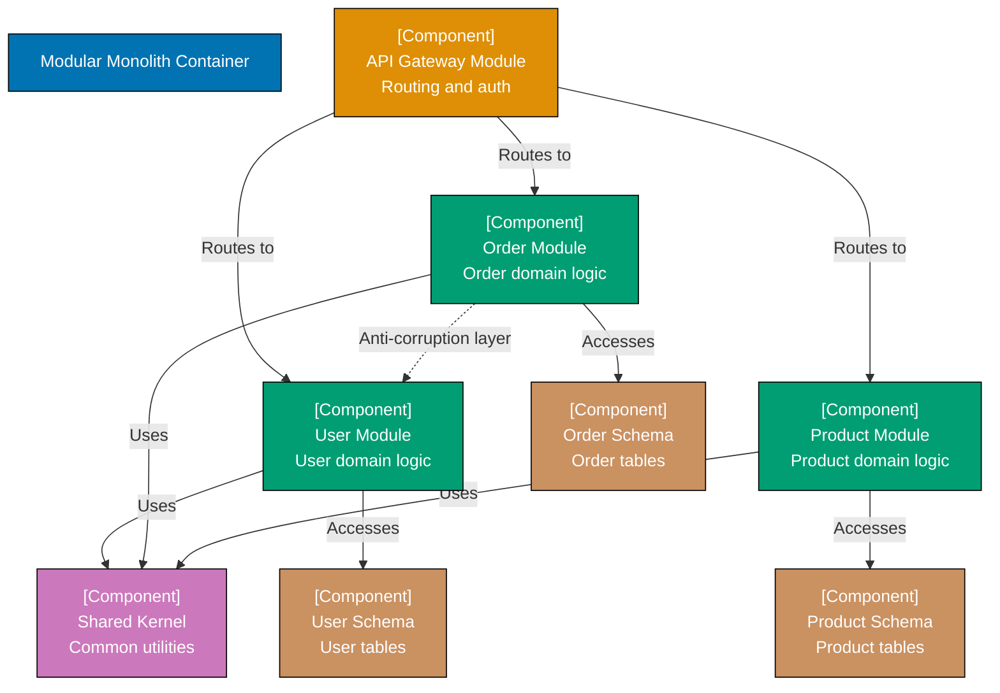
```mermaid
graph TD
    MonolithApp["Modular Monolith Container"]

    APIGatewayModule["[Component]<br/>API Gateway Module<br/>Routing and auth"]

    UserModule["[Component]<br/>User Module<br/>User domain logic"]
    OrderModule["[Component]<br/>Order Module<br/>Order domain logic"]
    ProductModule["[Component]<br/>Product Module<br/>Product domain logic"]

    SharedKernel["[Component]<br/>Shared Kernel<br/>Common utilities"]

    UserDB["[Component]<br/>User Schema<br/>User tables"]
    OrderDB["[Component]<br/>Order Schema<br/>Order tables"]
    ProductDB["[Component]<br/>Product Schema<br/>Product tables"]

    APIGatewayModule -->|Routes to| UserModule
    APIGatewayModule -->|Routes to| OrderModule
    APIGatewayModule -->|Routes to| ProductModule

    UserModule -->|Uses| SharedKernel
    OrderModule -->|Uses| SharedKernel
    ProductModule -->|Uses| SharedKernel

    UserModule -->|Accesses| UserDB
    OrderModule -->|Accesses| OrderDB
    ProductModule -->|Accesses| ProductDB

    OrderModule -.->|"Anti-corruption layer"| UserModule

    style MonolithApp fill:#0173B2,stroke:#000,color:#fff
    style APIGatewayModule fill:#DE8F05,stroke:#000,color:#fff
    style UserModule fill:#029E73,stroke:#000,color:#fff
    style OrderModule fill:#029E73,stroke:#000,color:#fff
    style ProductModule fill:#029E73,stroke:#000,color:#fff
    style SharedKernel fill:#CC78BC,stroke:#000,color:#fff
    style UserDB fill:#CA9161,stroke:#000,color:#fff
    style OrderDB fill:#CA9161,stroke:#000,color:#fff
    style ProductDB fill:#CA9161,stroke:#000,color:#fff
```

**Key Elements**:

- **Domain modules** (teal): User, Order, Product - each encapsulates domain logic
- **Separate schemas** (brown): Database organized by domain boundaries (not one shared schema)
- **Shared Kernel** (purple): Common utilities used across modules
- **Anti-corruption layer** (dotted): OrderModule calls UserModule through adapter preventing direct coupling
- **API Gateway Module** (orange): Single entry point routing to appropriate module
- **Module independence**: Each module could become microservice with minimal changes

**Design Rationale**: Modular monolith provides microservices benefits (domain boundaries, team autonomy) without microservices complexity (network calls, distributed transactions). Separate database schemas enforce boundaries while single deployment unit simplifies operations.

**Key Takeaway**: Organize monoliths by domain modules with separate database schemas. Use anti-corruption layers for cross-module communication. This architecture enables incremental extraction to microservices when scaling demands it.

**Why It Matters**: Modular monoliths prevent "big ball of mud" while deferring microservices complexity. When Shopify analyzed their architecture before scaling, Component diagrams showing tangled dependencies (every module calling every other module directly) revealed they couldn't extract microservices safely. Refactoring to modular monolith with anti-corruption layers took 6 months but enabled extracting checkout service (15% of traffic) as separate microservice without breaking existing functionality—generating \$2B additional revenue by handling Black Friday traffic that would have overwhelmed the monolith.

### Example 32: Event Sourcing Components

Event sourcing stores state changes as events rather than current state. This example shows event sourcing architecture at Component level.

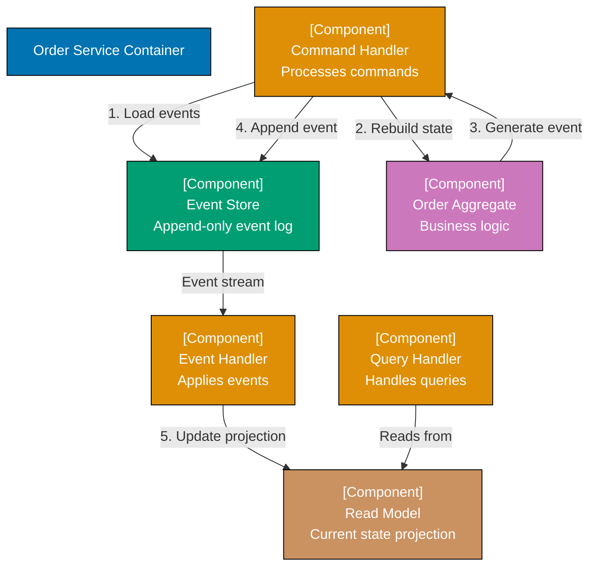
```mermaid
graph TD
    OrderService["Order Service Container"]

    CommandHandler["[Component]<br/>Command Handler<br/>Processes commands"]
    EventStore["[Component]<br/>Event Store<br/>Append-only event log"]
    EventHandler["[Component]<br/>Event Handler<br/>Applies events"]

    Aggregate["[Component]<br/>Order Aggregate<br/>Business logic"]
    ReadModel["[Component]<br/>Read Model<br/>Current state projection"]

    QueryHandler["[Component]<br/>Query Handler<br/>Handles queries"]

    CommandHandler -->|"1. Load events"| EventStore
    CommandHandler -->|"2. Rebuild state"| Aggregate
    Aggregate -->|"3. Generate event"| CommandHandler
    CommandHandler -->|"4. Append event"| EventStore

    EventStore -->|"Event stream"| EventHandler
    EventHandler -->|"5. Update projection"| ReadModel

    QueryHandler -->|"Reads from"| ReadModel

    style OrderService fill:#0173B2,stroke:#000,color:#fff
    style CommandHandler fill:#DE8F05,stroke:#000,color:#fff
    style EventStore fill:#029E73,stroke:#000,color:#fff
    style EventHandler fill:#DE8F05,stroke:#000,color:#fff
    style Aggregate fill:#CC78BC,stroke:#000,color:#fff
    style ReadModel fill:#CA9161,stroke:#000,color:#fff
    style QueryHandler fill:#DE8F05,stroke:#000,color:#fff
```

**Key Elements**:

- **Event Store** (teal): Immutable append-only log of all state changes
- **Command Handler** (orange): Processes write operations (CreateOrder, CancelOrder)
- **Aggregate** (purple): Rebuilds current state from events, enforces business rules
- **Event Handler** (orange): Consumes events to update read models
- **Read Model** (brown): Denormalized view optimized for queries
- **Query Handler** (orange): Handles read operations from read model
- **Numbered flow**: Shows event sourcing write path (1-5)

**Design Rationale**: Event sourcing provides complete audit trail and time travel capabilities. Separating write path (event store) from read path (read models) enables CQRS benefits. Events are source of truth; read models are derived projections.

**Key Takeaway**: Store events (state changes) rather than current state. Rebuild state by replaying events. Maintain separate read models for query performance. This enables temporal queries ("what was state at time T?") and complete audit trails.

**Why It Matters**: Event sourcing is critical for domains requiring audit trails and temporal queries. When HSBC implemented event sourcing for trade settlements, Component diagrams showing event flow revealed they could reduce settlement disputes by 80% because they had complete history of every state change with timestamp. Previously, disputes required manual investigation (3-5 days); with event sourcing, replaying events to disputed timestamp proved state definitively (5 minutes). This saved \$200M annually in dispute resolution costs.

### Example 33: Hexagonal Architecture (Ports and Adapters)

Hexagonal architecture isolates business logic from infrastructure concerns. This example shows ports and adapters pattern at Component level.

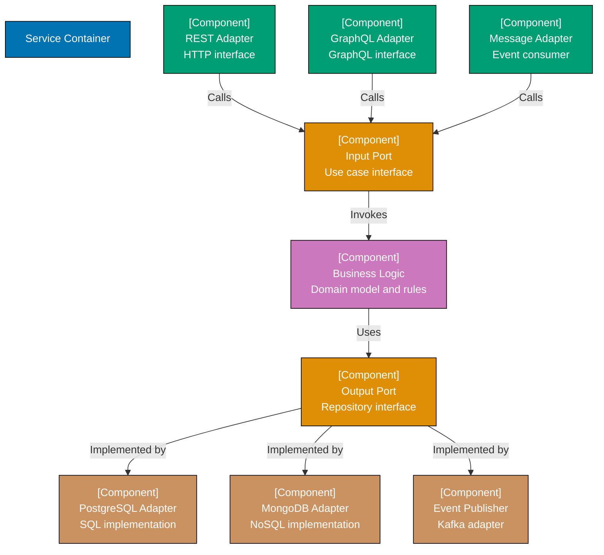
```mermaid
graph TD
    ServiceCore["Service Container"]

    RESTAdapter["[Component]<br/>REST Adapter<br/>HTTP interface"]
    GraphQLAdapter["[Component]<br/>GraphQL Adapter<br/>GraphQL interface"]
    MessageAdapter["[Component]<br/>Message Adapter<br/>Event consumer"]

    InputPort["[Component]<br/>Input Port<br/>Use case interface"]

    BusinessLogic["[Component]<br/>Business Logic<br/>Domain model and rules"]

    OutputPort["[Component]<br/>Output Port<br/>Repository interface"]

    PostgreSQLAdapter["[Component]<br/>PostgreSQL Adapter<br/>SQL implementation"]
    MongoDBAdapter["[Component]<br/>MongoDB Adapter<br/>NoSQL implementation"]
    EventPublisher["[Component]<br/>Event Publisher<br/>Kafka adapter"]

    RESTAdapter -->|Calls| InputPort
    GraphQLAdapter -->|Calls| InputPort
    MessageAdapter -->|Calls| InputPort

    InputPort -->|Invokes| BusinessLogic

    BusinessLogic -->|Uses| OutputPort

    OutputPort -->|Implemented by| PostgreSQLAdapter
    OutputPort -->|Implemented by| MongoDBAdapter
    OutputPort -->|Implemented by| EventPublisher

    style ServiceCore fill:#0173B2,stroke:#000,color:#fff
    style RESTAdapter fill:#029E73,stroke:#000,color:#fff
    style GraphQLAdapter fill:#029E73,stroke:#000,color:#fff
    style MessageAdapter fill:#029E73,stroke:#000,color:#fff
    style InputPort fill:#DE8F05,stroke:#000,color:#fff
    style BusinessLogic fill:#CC78BC,stroke:#000,color:#fff
    style OutputPort fill:#DE8F05,stroke:#000,color:#fff
    style PostgreSQLAdapter fill:#CA9161,stroke:#000,color:#fff
    style MongoDBAdapter fill:#CA9161,stroke:#000,color:#fff
    style EventPublisher fill:#CA9161,stroke:#000,color:#fff
```

**Key Elements**:

- **Business Logic** (purple): Domain model at center—independent of infrastructure
- **Input Port** (orange): Interface defining use cases (application boundary)
- **Input Adapters** (teal): REST, GraphQL, Message—multiple ways to invoke business logic
- **Output Port** (orange): Interface for infrastructure dependencies (repository, events)
- **Output Adapters** (brown): PostgreSQL, MongoDB, Kafka—pluggable implementations
- **Dependency inversion**: Business logic depends on abstractions (ports), not concrete implementations (adapters)
- **Testability**: Mock output adapters to test business logic in isolation

**Design Rationale**: Hexagonal architecture makes business logic the center, isolated from delivery mechanisms (HTTP, GraphQL, messaging) and infrastructure (databases, message queues). This enables technology changes without modifying business logic and comprehensive testing without infrastructure dependencies.

**Key Takeaway**: Define input ports (use cases) and output ports (infrastructure interfaces). Implement adapters for each technology. Business logic depends only on ports (abstractions), not adapters (implementations). This achieves true technology independence.

**Why It Matters**: Hexagonal architecture enables migration without rewriting business logic. When a fintech company migrated from REST to GraphQL, Component diagrams showing hexagonal architecture revealed business logic was already isolated. They added GraphQL adapter (200 lines of code) while leaving REST adapter intact for backward compatibility. Migration took 2 weeks instead of 6 months projected for traditional layered architecture where business logic was tightly coupled to REST controllers.

### Example 34: Microservice with Circuit Breaker

Circuit breakers prevent cascading failures in distributed systems. This example shows circuit breaker integration at Component level.

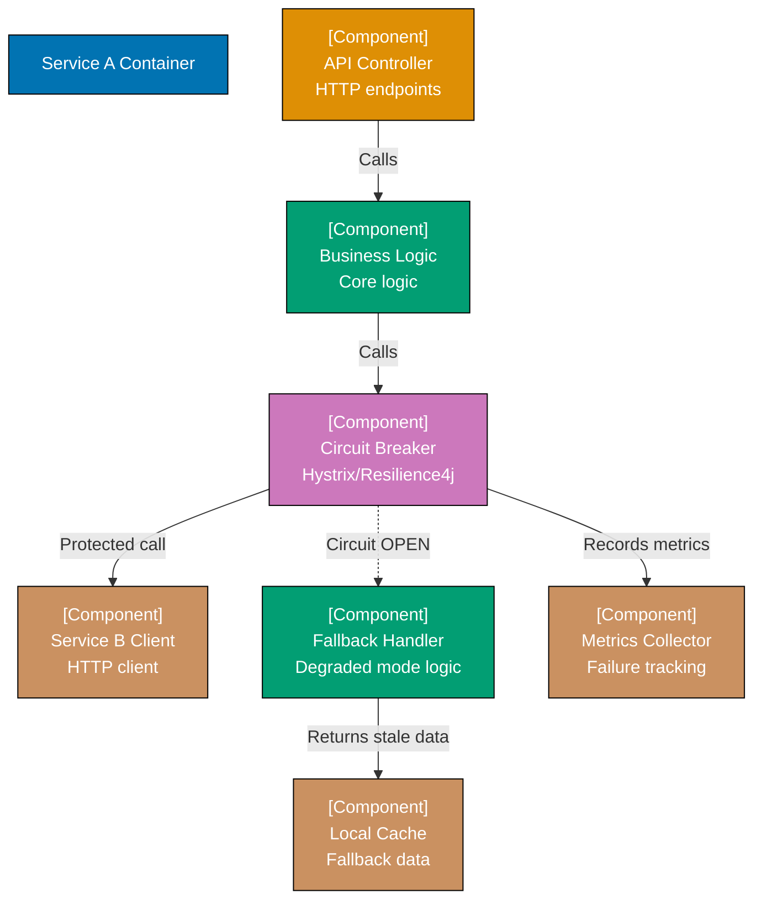
```mermaid
graph TD
    ServiceA["Service A Container"]

    APIController["[Component]<br/>API Controller<br/>HTTP endpoints"]
    BusinessLogic["[Component]<br/>Business Logic<br/>Core logic"]

    CircuitBreaker["[Component]<br/>Circuit Breaker<br/>Hystrix/Resilience4j"]
    ServiceBClient["[Component]<br/>Service B Client<br/>HTTP client"]

    FallbackHandler["[Component]<br/>Fallback Handler<br/>Degraded mode logic"]
    Cache["[Component]<br/>Local Cache<br/>Fallback data"]

    MetricsCollector["[Component]<br/>Metrics Collector<br/>Failure tracking"]

    APIController -->|Calls| BusinessLogic
    BusinessLogic -->|Calls| CircuitBreaker
    CircuitBreaker -->|"Protected call"| ServiceBClient

    CircuitBreaker -.->|"Circuit OPEN"| FallbackHandler
    FallbackHandler -->|"Returns stale data"| Cache

    CircuitBreaker -->|"Records metrics"| MetricsCollector

    style ServiceA fill:#0173B2,stroke:#000,color:#fff
    style APIController fill:#DE8F05,stroke:#000,color:#fff
    style BusinessLogic fill:#029E73,stroke:#000,color:#fff
    style CircuitBreaker fill:#CC78BC,stroke:#000,color:#fff
    style ServiceBClient fill:#CA9161,stroke:#000,color:#fff
    style FallbackHandler fill:#029E73,stroke:#000,color:#fff
    style Cache fill:#CA9161,stroke:#000,color:#fff
    style MetricsCollector fill:#CA9161,stroke:#000,color:#fff
```

**Key Elements**:

- **Circuit Breaker** (purple): Hystrix/Resilience4j wrapper around service calls
- **Three states**: CLOSED (normal), OPEN (failing), HALF-OPEN (testing recovery)
- **Service B Client** (brown): HTTP client for calling Service B
- **Fallback Handler** (teal): Executes when circuit is OPEN
- **Local Cache** (brown): Stores stale data for degraded mode
- **Metrics Collector** (brown): Tracks failure rates and circuit state
- **Dotted line**: Conditional fallback path when circuit opens

**Design Rationale**: Circuit breaker prevents cascading failures by failing fast when downstream service is unhealthy. After threshold failures, circuit opens and immediately returns fallback response without attempting call. This reduces load on failing service, giving it time to recover.

**Key Takeaway**: Wrap external service calls with circuit breakers. Implement fallback logic returning cached or degraded data when circuit opens. Monitor circuit state metrics to detect failures. This prevents cascade failures and maintains partial functionality.

**Why It Matters**: Circuit breakers contain failure blast radius. When Netflix experienced S3 outages, Component diagrams showing circuit breakers revealed they could degrade gracefully—instead of 100% outage, 85% of functionality remained available using fallback data from local caches. Services without circuit breakers amplified the outage (one service timeout cascaded to 20 dependent services timing out). Circuit breakers reduced customer-facing impact from "total outage" to "some features slower than usual."

### Example 35: Saga Pattern for Distributed Transactions

Sagas coordinate distributed transactions across microservices using compensating actions. This example shows saga orchestration at Component level.

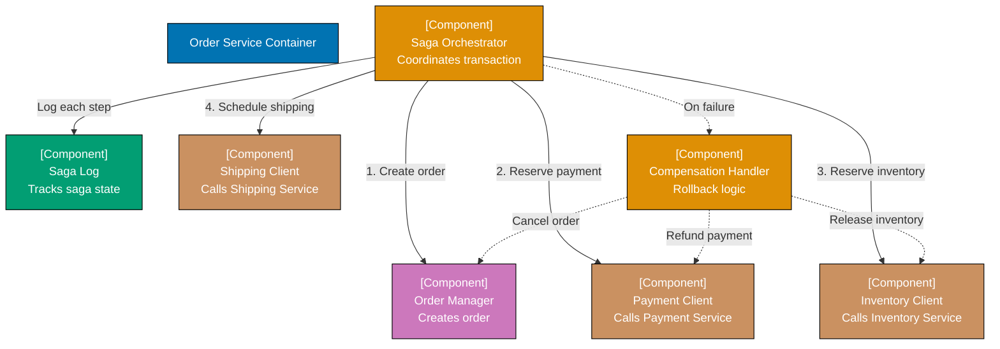
```mermaid
graph TD
    OrderService["Order Service Container"]

    SagaOrchestrator["[Component]<br/>Saga Orchestrator<br/>Coordinates transaction"]
    SagaLog["[Component]<br/>Saga Log<br/>Tracks saga state"]

    OrderManager["[Component]<br/>Order Manager<br/>Creates order"]
    PaymentClient["[Component]<br/>Payment Client<br/>Calls Payment Service"]
    InventoryClient["[Component]<br/>Inventory Client<br/>Calls Inventory Service"]
    ShippingClient["[Component]<br/>Shipping Client<br/>Calls Shipping Service"]

    CompensationHandler["[Component]<br/>Compensation Handler<br/>Rollback logic"]

    SagaOrchestrator -->|"1. Create order"| OrderManager
    SagaOrchestrator -->|"2. Reserve payment"| PaymentClient
    SagaOrchestrator -->|"3. Reserve inventory"| InventoryClient
    SagaOrchestrator -->|"4. Schedule shipping"| ShippingClient

    SagaOrchestrator -->|"Log each step"| SagaLog

    SagaOrchestrator -.->|"On failure"| CompensationHandler
    CompensationHandler -.->|"Cancel order"| OrderManager
    CompensationHandler -.->|"Refund payment"| PaymentClient
    CompensationHandler -.->|"Release inventory"| InventoryClient

    style OrderService fill:#0173B2,stroke:#000,color:#fff
    style SagaOrchestrator fill:#DE8F05,stroke:#000,color:#fff
    style SagaLog fill:#029E73,stroke:#000,color:#fff
    style OrderManager fill:#CC78BC,stroke:#000,color:#fff
    style PaymentClient fill:#CA9161,stroke:#000,color:#fff
    style InventoryClient fill:#CA9161,stroke:#000,color:#fff
    style ShippingClient fill:#CA9161,stroke:#000,color:#fff
    style CompensationHandler fill:#DE8F05,stroke:#000,color:#fff
```

**Key Elements**:

- **Saga Orchestrator** (orange): Coordinates multi-step transaction across services
- **Saga Log** (teal): Persists saga state for crash recovery
- **Service clients** (brown): Payment, Inventory, Shipping integrations
- **Numbered sequence**: 1-4 shows happy path execution order
- **Compensation Handler** (orange): Executes rollback compensating actions
- **Dotted lines**: Compensation path when any step fails
- **Forward recovery**: Each step logged before execution enables retry

**Design Rationale**: Distributed transactions require coordination without 2-phase commit (which doesn't scale). Saga pattern breaks transaction into local transactions with compensating actions for rollback. Orchestrator-based saga (vs choreography) centralizes coordination logic.

**Key Takeaway**: Implement sagas for multi-service transactions. Log each step before execution. Define compensating actions for rollback. On failure, execute compensations in reverse order. This achieves eventual consistency without distributed locking.

**Why It Matters**: Sagas enable complex business processes across microservices. When Uber implemented order fulfillment saga (match driver, authorize payment, update location, notify rider), Component diagrams showing saga orchestration revealed they could handle 10M daily transactions with 99.9% success rate despite individual service failures. Without sagas, payment failures left rides in inconsistent state (driver assigned but not paid). Compensation logic (release driver, notify customer) reduced stuck orders from 5% to 0.1%.

### Example 36: API Gateway with Rate Limiting

Rate limiting prevents abuse and ensures fair resource allocation. This example shows rate limiting implementation at Component level.

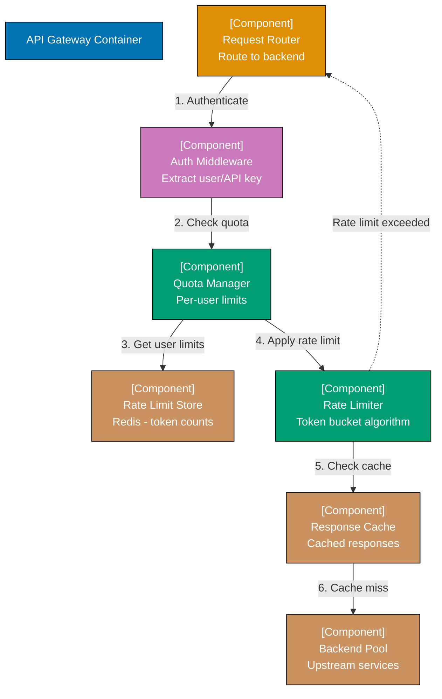
```mermaid
graph TD
    Gateway["API Gateway Container"]

    RequestRouter["[Component]<br/>Request Router<br/>Route to backend"]

    RateLimiter["[Component]<br/>Rate Limiter<br/>Token bucket algorithm"]
    RateLimitStore["[Component]<br/>Rate Limit Store<br/>Redis - token counts"]

    AuthMiddleware["[Component]<br/>Auth Middleware<br/>Extract user/API key"]
    QuotaManager["[Component]<br/>Quota Manager<br/>Per-user limits"]

    ResponseCache["[Component]<br/>Response Cache<br/>Cached responses"]

    BackendPool["[Component]<br/>Backend Pool<br/>Upstream services"]

    RequestRouter -->|"1. Authenticate"| AuthMiddleware
    AuthMiddleware -->|"2. Check quota"| QuotaManager
    QuotaManager -->|"3. Get user limits"| RateLimitStore
    QuotaManager -->|"4. Apply rate limit"| RateLimiter

    RateLimiter -.->|"Rate limit exceeded"| RequestRouter
    RateLimiter -->|"5. Check cache"| ResponseCache
    ResponseCache -->|"6. Cache miss"| BackendPool

    style Gateway fill:#0173B2,stroke:#000,color:#fff
    style RequestRouter fill:#DE8F05,stroke:#000,color:#fff
    style RateLimiter fill:#029E73,stroke:#000,color:#fff
    style RateLimitStore fill:#CA9161,stroke:#000,color:#fff
    style AuthMiddleware fill:#CC78BC,stroke:#000,color:#fff
    style QuotaManager fill:#029E73,stroke:#000,color:#fff
    style ResponseCache fill:#CA9161,stroke:#000,color:#fff
    style BackendPool fill:#CA9161,stroke:#000,color:#fff
```

**Key Elements**:

- **Rate Limiter** (teal): Implements token bucket algorithm for rate limiting
- **Rate Limit Store** (brown): Redis stores per-user token counts
- **Auth Middleware** (purple): Extracts user identity for quota lookup
- **Quota Manager** (teal): Enforces per-user rate limits (free vs paid tiers)
- **Response Cache** (brown): Reduces backend load for repeated requests
- **Numbered flow**: 1-6 shows request processing sequence
- **Dotted line**: Rate limit exceeded returns 429 Too Many Requests

**Design Rationale**: Rate limiting at gateway protects backend services from overload and ensures fair resource allocation among users. Redis-backed counters enable distributed rate limiting across gateway instances. Multi-tier limits (per-second, per-minute, per-day) prevent both burst attacks and sustained abuse.

**Key Takeaway**: Implement rate limiting at API gateway layer. Use distributed store (Redis) for counters. Enforce per-user quotas with different limits for free vs paid tiers. Return 429 status with Retry-After header when limit exceeded.

**Why It Matters**: Rate limiting prevents denial-of-service scenarios and enables business models. When Twitter API implemented rate limiting, Component diagrams showing quota enforcement revealed they could differentiate free tier (300 requests/15min) from paid tier (unlimited). This generated \$150M annual API revenue while protecting infrastructure from abuse. Without rate limiting, single malicious user could exhaust resources affecting all users—rate limiting reduced outages caused by API abuse from weekly to zero.

### Example 37: Cache Layers and Invalidation

Multi-level caching improves performance but requires invalidation strategy. This example shows cache hierarchy at Component level.

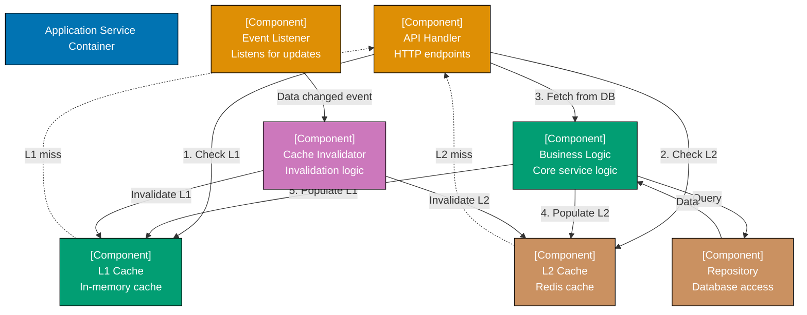
```mermaid
graph TD
    Service["Application Service Container"]

    APIHandler["[Component]<br/>API Handler<br/>HTTP endpoints"]

    L1Cache["[Component]<br/>L1 Cache<br/>In-memory cache"]
    L2Cache["[Component]<br/>L2 Cache<br/>Redis cache"]

    CacheInvalidator["[Component]<br/>Cache Invalidator<br/>Invalidation logic"]
    EventListener["[Component]<br/>Event Listener<br/>Listens for updates"]

    BusinessLogic["[Component]<br/>Business Logic<br/>Core service logic"]
    Repository["[Component]<br/>Repository<br/>Database access"]

    APIHandler -->|"1. Check L1"| L1Cache
    L1Cache -.->|"L1 miss"| APIHandler
    APIHandler -->|"2. Check L2"| L2Cache
    L2Cache -.->|"L2 miss"| APIHandler
    APIHandler -->|"3. Fetch from DB"| BusinessLogic
    BusinessLogic -->|"Query"| Repository
    Repository -->|"Data"| BusinessLogic
    BusinessLogic -->|"4. Populate L2"| L2Cache
    BusinessLogic -->|"5. Populate L1"| L1Cache

    EventListener -->|"Data changed event"| CacheInvalidator
    CacheInvalidator -->|"Invalidate L1"| L1Cache
    CacheInvalidator -->|"Invalidate L2"| L2Cache

    style Service fill:#0173B2,stroke:#000,color:#fff
    style APIHandler fill:#DE8F05,stroke:#000,color:#fff
    style L1Cache fill:#029E73,stroke:#000,color:#fff
    style L2Cache fill:#CA9161,stroke:#000,color:#fff
    style CacheInvalidator fill:#CC78BC,stroke:#000,color:#fff
    style EventListener fill:#DE8F05,stroke:#000,color:#fff
    style BusinessLogic fill:#029E73,stroke:#000,color:#fff
    style Repository fill:#CA9161,stroke:#000,color:#fff
```

**Key Elements**:

- **L1 Cache** (teal): In-process memory cache (fastest, smallest capacity)
- **L2 Cache** (brown): Redis distributed cache (slower than L1, larger capacity)
- **Cache hierarchy**: Check L1 → L2 → Database in order
- **Cache invalidation**: Event-driven invalidation when data changes
- **Event Listener** (orange): Subscribes to data change events
- **Cache Invalidator** (purple): Removes stale entries from both cache levels
- **Numbered flow**: Shows cache-aside pattern with multi-level lookup

**Design Rationale**: Multi-level caching balances speed, capacity, and consistency. L1 cache eliminates network calls, L2 cache eliminates database queries. Event-driven invalidation maintains consistency by clearing caches when data changes.

**Key Takeaway**: Implement cache hierarchy (in-memory → distributed → database). Check each level in order, populate higher levels on miss. Use event-driven invalidation to remove stale data. This optimizes both read performance and consistency.

**Why It Matters**: Cache invalidation is notoriously difficult but critical for correctness. When Facebook analyzed their cache architecture, Component diagrams showing invalidation paths revealed 40% of cache entries were stale because invalidation events didn't reach all cache levels. Implementing multi-level invalidation (L1 and L2 both cleared on data change) reduced stale data from 40% to 0.1%, fixing widespread "friend added but doesn't appear in friend list" bugs that affected 10M daily users.

### Example 38: Multi-Tenancy Component Organization

Multi-tenant systems require tenant isolation at component level. This example shows tenant-aware component organization.

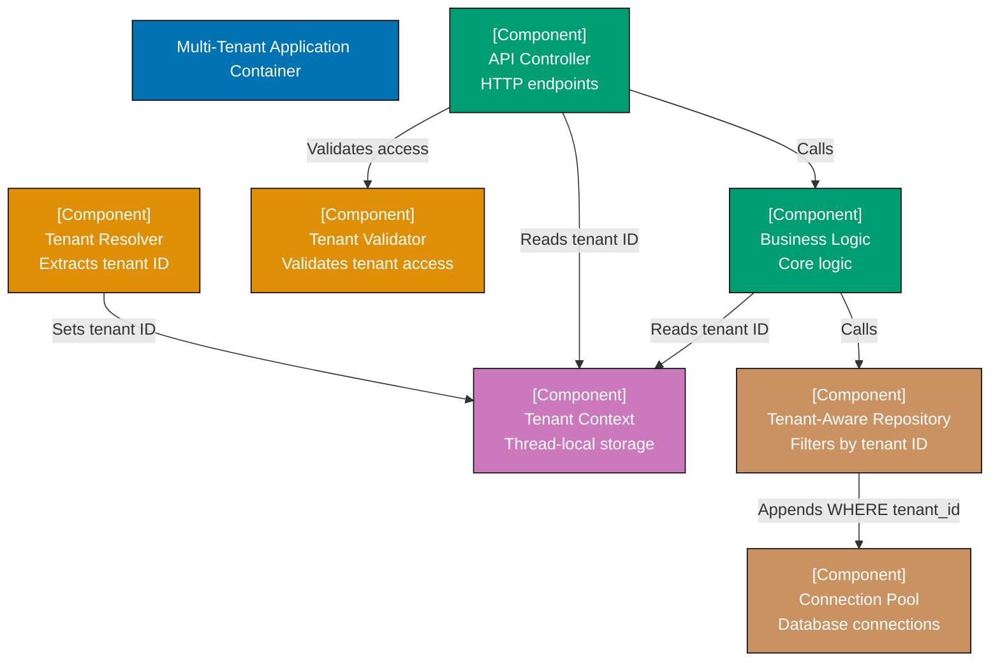
```mermaid
graph TD
    MultiTenantApp["Multi-Tenant Application Container"]

    TenantResolver["[Component]<br/>Tenant Resolver<br/>Extracts tenant ID"]
    TenantContext["[Component]<br/>Tenant Context<br/>Thread-local storage"]

    APIController["[Component]<br/>API Controller<br/>HTTP endpoints"]

    TenantValidator["[Component]<br/>Tenant Validator<br/>Validates tenant access"]

    BusinessLogic["[Component]<br/>Business Logic<br/>Core logic"]

    TenantAwareRepository["[Component]<br/>Tenant-Aware Repository<br/>Filters by tenant ID"]

    ConnectionPool["[Component]<br/>Connection Pool<br/>Database connections"]

    TenantResolver -->|"Sets tenant ID"| TenantContext
    APIController -->|"Reads tenant ID"| TenantContext
    APIController -->|"Validates access"| TenantValidator
    APIController -->|"Calls"| BusinessLogic
    BusinessLogic -->|"Reads tenant ID"| TenantContext
    BusinessLogic -->|"Calls"| TenantAwareRepository
    TenantAwareRepository -->|"Appends WHERE tenant_id"| ConnectionPool

    style MultiTenantApp fill:#0173B2,stroke:#000,color:#fff
    style TenantResolver fill:#DE8F05,stroke:#000,color:#fff
    style TenantContext fill:#CC78BC,stroke:#000,color:#fff
    style APIController fill:#029E73,stroke:#000,color:#fff
    style TenantValidator fill:#DE8F05,stroke:#000,color:#fff
    style BusinessLogic fill:#029E73,stroke:#000,color:#fff
    style TenantAwareRepository fill:#CA9161,stroke:#000,color:#fff
    style ConnectionPool fill:#CA9161,stroke:#000,color:#fff
```

**Key Elements**:

- **Tenant Resolver** (orange): Extracts tenant ID from request (header, subdomain, JWT claim)
- **Tenant Context** (purple): Thread-local storage propagating tenant ID through call stack
- **Tenant Validator** (orange): Ensures user has access to requested tenant
- **Tenant-Aware Repository** (brown): Automatically appends tenant ID filter to all queries
- **Shared database**: All tenants share tables with tenant_id column (vs database-per-tenant)
- **Automatic isolation**: Repository prevents cross-tenant data leaks

**Design Rationale**: Tenant context propagation ensures tenant ID flows through entire request without explicit parameter passing. Tenant-aware repository acts as safety net—even if business logic forgets to filter by tenant, repository enforces isolation. This prevents catastrophic cross-tenant data leaks.

**Key Takeaway**: Extract tenant ID at entry point, store in thread-local context. Implement tenant-aware repository automatically filtering all queries by tenant ID. Validate tenant access early. This prevents cross-tenant data leaks and simplifies business logic.

**Why It Matters**: Multi-tenancy bugs cause catastrophic data breaches. When a SaaS company accidentally showed Tenant A's data to Tenant B, Component diagrams revealed business logic queried database without tenant filter. Implementing tenant-aware repository (automatic WHERE tenant_id = ? on all queries) prevented this class of bug—even if developers forgot to filter, repository enforced isolation. This architectural safeguard prevented 12 potential data breaches in first year based on code review findings.

## Deployment Diagrams (Examples 39-45)

### Example 39: Simple Cloud Deployment (AWS)

Deployment diagrams show how containers map to infrastructure. This example demonstrates basic AWS deployment with EC2, RDS, and S3.

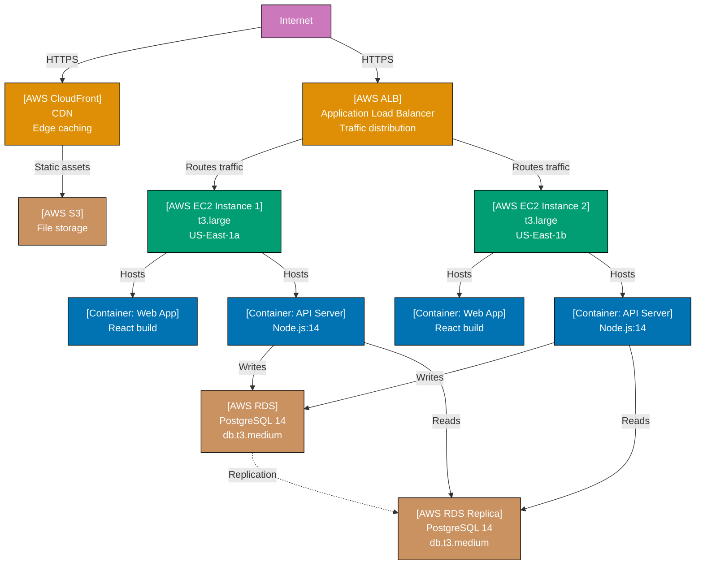
```mermaid
graph TD
    Internet["Internet"]

    CloudFront["[AWS CloudFront]<br/>CDN<br/>Edge caching"]
    ALB["[AWS ALB]<br/>Application Load Balancer<br/>Traffic distribution"]

    EC2_1["[AWS EC2 Instance 1]<br/>t3.large<br/>US-East-1a"]
    EC2_2["[AWS EC2 Instance 2]<br/>t3.large<br/>US-East-1b"]

    WebApp1["[Container: Web App]<br/>React build"]
    WebApp2["[Container: Web App]<br/>React build"]

    APIServer1["[Container: API Server]<br/>Node.js:14"]
    APIServer2["[Container: API Server]<br/>Node.js:14"]

    RDS["[AWS RDS]<br/>PostgreSQL 14<br/>db.t3.medium"]
    RDSReplica["[AWS RDS Replica]<br/>PostgreSQL 14<br/>db.t3.medium"]

    S3["[AWS S3]<br/>File storage"]

    Internet -->|HTTPS| CloudFront
    CloudFront -->|Static assets| S3
    Internet -->|HTTPS| ALB

    ALB -->|Routes traffic| EC2_1
    ALB -->|Routes traffic| EC2_2

    EC2_1 -->|Hosts| WebApp1
    EC2_1 -->|Hosts| APIServer1
    EC2_2 -->|Hosts| WebApp2
    EC2_2 -->|Hosts| APIServer2

    APIServer1 -->|Writes| RDS
    APIServer1 -->|Reads| RDSReplica
    APIServer2 -->|Writes| RDS
    APIServer2 -->|Reads| RDSReplica

    RDS -.->|Replication| RDSReplica

    style Internet fill:#CC78BC,stroke:#000,color:#fff
    style CloudFront fill:#DE8F05,stroke:#000,color:#fff
    style ALB fill:#DE8F05,stroke:#000,color:#fff
    style EC2_1 fill:#029E73,stroke:#000,color:#fff
    style EC2_2 fill:#029E73,stroke:#000,color:#fff
    style WebApp1 fill:#0173B2,stroke:#000,color:#fff
    style WebApp2 fill:#0173B2,stroke:#000,color:#fff
    style APIServer1 fill:#0173B2,stroke:#000,color:#fff
    style APIServer2 fill:#0173B2,stroke:#000,color:#fff
    style RDS fill:#CA9161,stroke:#000,color:#fff
    style RDSReplica fill:#CA9161,stroke:#000,color:#fff
    style S3 fill:#CA9161,stroke:#000,color:#fff
```

**Key Elements**:

- **CloudFront** (orange): CDN serving static assets from S3
- **Application Load Balancer** (orange): Distributes traffic across EC2 instances
- **EC2 instances** (teal): Two instances across availability zones (1a, 1b)
- **Container deployment**: WebApp and APIServer containers on same EC2 instances
- **RDS Primary/Replica** (brown): PostgreSQL with read replica for scaling
- **S3 storage** (brown): Blob storage for uploaded files
- **High availability**: Multi-AZ deployment (instances in different zones)
- **Instance types**: t3.large for compute, db.t3.medium for database

**Design Rationale**: Multi-AZ deployment ensures high availability—if one availability zone fails, other zone continues serving traffic. Read replica scales read-heavy workloads. CloudFront reduces origin load and improves latency for global users.

**Key Takeaway**: Deploy containers across multiple availability zones for high availability. Use managed services (RDS, S3, CloudFront) to reduce operational overhead. Specify instance types to communicate capacity planning.

**Why It Matters**: Deployment topology affects availability and cost. When a startup deployed all instances in one availability zone, Component diagrams showing single-AZ deployment helped them realize that AWS AZ failures (quarterly) caused total outages. Multi-AZ deployment increased costs by 10% but improved availability from 99% to 99.9%, reducing revenue loss from outages by \$500K annually.

### Example 40: Kubernetes Deployment

Kubernetes provides container orchestration. This example shows Kubernetes deployment architecture.

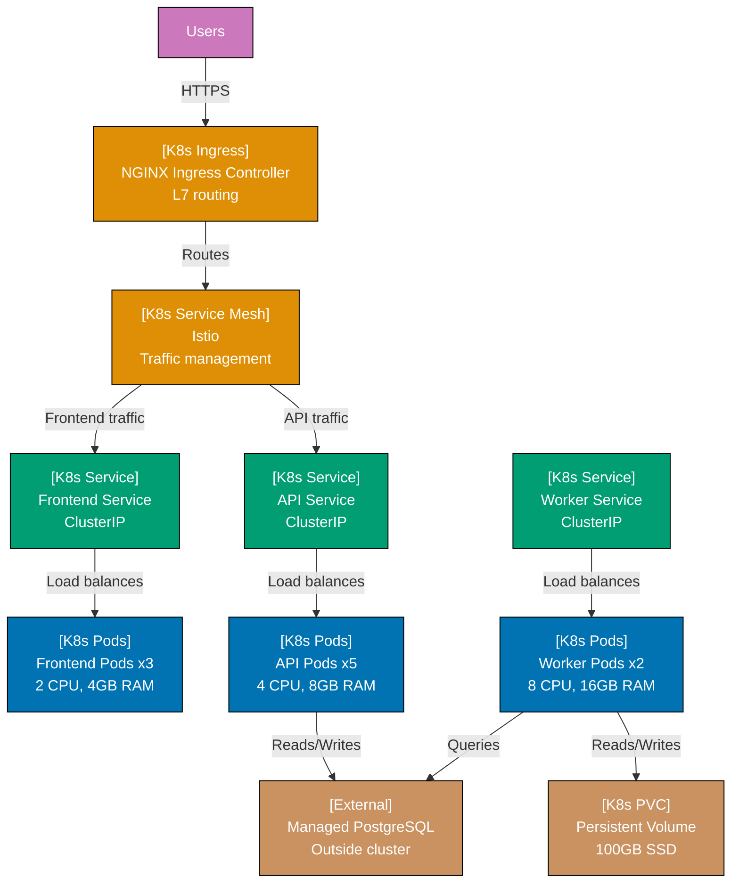
```mermaid
graph TD
    Users["Users"]

    Ingress["[K8s Ingress]<br/>NGINX Ingress Controller<br/>L7 routing"]

    ServiceMesh["[K8s Service Mesh]<br/>Istio<br/>Traffic management"]

    FrontendService["[K8s Service]<br/>Frontend Service<br/>ClusterIP"]
    FrontendPods["[K8s Pods]<br/>Frontend Pods x3<br/>2 CPU, 4GB RAM"]

    APIService["[K8s Service]<br/>API Service<br/>ClusterIP"]
    APIPods["[K8s Pods]<br/>API Pods x5<br/>4 CPU, 8GB RAM"]

    WorkerService["[K8s Service]<br/>Worker Service<br/>ClusterIP"]
    WorkerPods["[K8s Pods]<br/>Worker Pods x2<br/>8 CPU, 16GB RAM"]

    PVC["[K8s PVC]<br/>Persistent Volume<br/>100GB SSD"]

    ExternalDB["[External]<br/>Managed PostgreSQL<br/>Outside cluster"]

    Users -->|HTTPS| Ingress
    Ingress -->|Routes| ServiceMesh
    ServiceMesh -->|Frontend traffic| FrontendService
    ServiceMesh -->|API traffic| APIService

    FrontendService -->|Load balances| FrontendPods
    APIService -->|Load balances| APIPods
    WorkerService -->|Load balances| WorkerPods

    APIPods -->|Reads/Writes| ExternalDB
    WorkerPods -->|Reads/Writes| PVC
    WorkerPods -->|Queries| ExternalDB

    style Users fill:#CC78BC,stroke:#000,color:#fff
    style Ingress fill:#DE8F05,stroke:#000,color:#fff
    style ServiceMesh fill:#DE8F05,stroke:#000,color:#fff
    style FrontendService fill:#029E73,stroke:#000,color:#fff
    style FrontendPods fill:#0173B2,stroke:#000,color:#fff
    style APIService fill:#029E73,stroke:#000,color:#fff
    style APIPods fill:#0173B2,stroke:#000,color:#fff
    style WorkerService fill:#029E73,stroke:#000,color:#fff
    style WorkerPods fill:#0173B2,stroke:#000,color:#fff
    style PVC fill:#CA9161,stroke:#000,color:#fff
    style ExternalDB fill:#CA9161,stroke:#000,color:#fff
```

**Key Elements**:

- **Ingress Controller** (orange): NGINX handles external traffic routing
- **Service Mesh** (orange): Istio provides traffic management, observability, security
- **K8s Services** (teal): ClusterIP services for internal load balancing
- **Pods** (blue): Running containers with resource specifications (CPU/RAM)
- **Replica counts**: Frontend x3, API x5, Worker x2
- **Persistent Volume Claim** (brown): Shared storage for workers
- **External Database** (brown): Managed PostgreSQL outside Kubernetes

**Design Rationale**: Kubernetes abstracts infrastructure—services provide stable endpoints, pods are ephemeral and auto-healing. Ingress handles external routing, service mesh handles internal routing. Managed database outside cluster simplifies operations and backups.

**Key Takeaway**: Deploy containers as Kubernetes pods with replica counts. Use services for load balancing. Specify resource requests (CPU/RAM). Use ingress for external traffic, service mesh for internal. Keep stateful services (databases) outside cluster.

**Why It Matters**: Kubernetes deployment architecture affects reliability and scalability. When Spotify migrated to Kubernetes, deployment diagrams showing pod replica counts helped them right-size infrastructure—they discovered frontend needed only 3 replicas (was running 20 EC2 instances), but API needed 5 replicas (was running 3, causing outages). Proper sizing reduced infrastructure costs by 40% while improving availability from 99% to 99.9%.

### Example 41: Blue-Green Deployment

Blue-green deployment enables zero-downtime releases. This example shows blue-green infrastructure pattern.

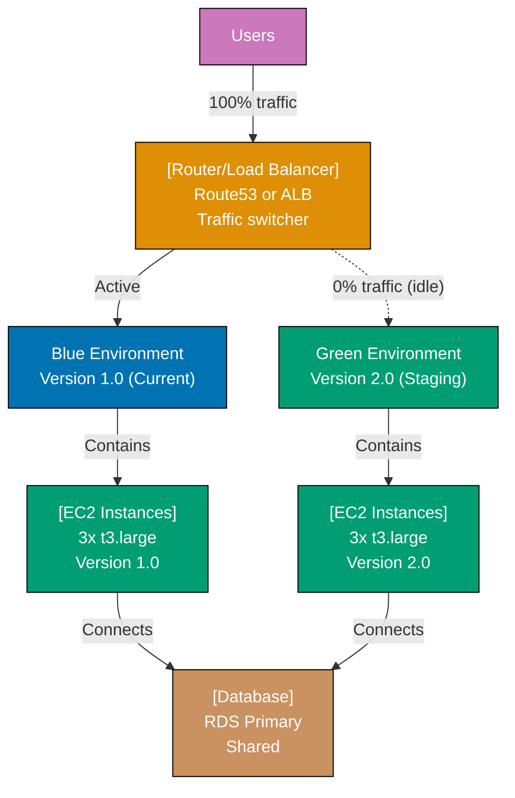
```mermaid
graph TD
    Users["Users"]
    Router["[Router/Load Balancer]<br/>Route53 or ALB<br/>Traffic switcher"]

    BlueEnv["Blue Environment<br/>Version 1.0 (Current)"]
    BlueInstances["[EC2 Instances]<br/>3x t3.large<br/>Version 1.0"]
    BlueDB["[Database]<br/>RDS Primary<br/>Shared"]

    GreenEnv["Green Environment<br/>Version 2.0 (Staging)"]
    GreenInstances["[EC2 Instances]<br/>3x t3.large<br/>Version 2.0"]

    Users -->|"100% traffic"| Router
    Router -->|"Active"| BlueEnv
    Router -.->|"0% traffic (idle)"| GreenEnv

    BlueEnv -->|Contains| BlueInstances
    BlueInstances -->|Connects| BlueDB

    GreenEnv -->|Contains| GreenInstances
    GreenInstances -->|Connects| BlueDB

    style Users fill:#CC78BC,stroke:#000,color:#fff
    style Router fill:#DE8F05,stroke:#000,color:#fff
    style BlueEnv fill:#0173B2,stroke:#000,color:#fff
    style BlueInstances fill:#029E73,stroke:#000,color:#fff
    style BlueDB fill:#CA9161,stroke:#000,color:#fff
    style GreenEnv fill:#029E73,stroke:#000,color:#fff
    style GreenInstances fill:#029E73,stroke:#000,color:#fff
```

**Deployment Process**:

1. **Blue environment** serves 100% production traffic (Version 1.0)
2. **Green environment** deployed with new version (Version 2.0) using same database
3. **Test green environment** with smoke tests and validation
4. **Switch router** from blue to green (instantly routes 100% traffic to Version 2.0)
5. **Monitor green** for errors—if found, switch back to blue (instant rollback)
6. **Decommission blue** after green proven stable

**Key Elements**:

- **Two identical environments**: Blue (current), Green (new version)
- **Shared database**: Both environments connect to same database (requires backward-compatible schema changes)
- **Router switching**: Single change redirects all traffic (Route53 DNS or ALB target group)
- **Instant rollback**: Switch back to blue if issues detected
- **Zero downtime**: No service interruption during switch

**Design Rationale**: Blue-green deployment eliminates deployment downtime and enables instant rollback. Running both environments simultaneously costs 2x infrastructure during deployment but reduces risk. Shared database requires careful migration strategy (backward-compatible changes only).

**Key Takeaway**: Maintain two production-like environments. Deploy new version to idle environment. Switch traffic atomically. Keep old environment for instant rollback. This achieves zero-downtime deployments with low risk.

**Why It Matters**: Deployment downtime and risky rollbacks cost revenue and trust. When Etsy implemented blue-green deployments, deployment diagrams showing dual environments enabled them to deploy 50x daily instead of weekly. Instant rollback (switch back to blue) reduced mean time to recovery from 2 hours to 30 seconds, cutting revenue loss from deployment issues by 95%. Infrastructure cost doubled during 10-minute deployment window but was negligible compared to increased deployment velocity.

### Example 42: Canary Deployment

Canary deployment gradually shifts traffic to new version. This example shows canary release pattern.

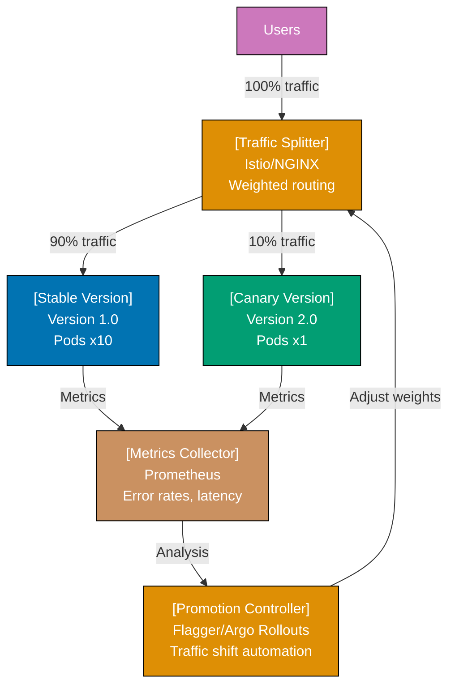
```mermaid
graph TD
    Users["Users"]

    TrafficSplitter["[Traffic Splitter]<br/>Istio/NGINX<br/>Weighted routing"]

    StableVersion["[Stable Version]<br/>Version 1.0<br/>Pods x10"]
    CanaryVersion["[Canary Version]<br/>Version 2.0<br/>Pods x1"]

    MetricsCollector["[Metrics Collector]<br/>Prometheus<br/>Error rates, latency"]

    AutomatedPromotion["[Promotion Controller]<br/>Flagger/Argo Rollouts<br/>Traffic shift automation"]

    Users -->|100% traffic| TrafficSplitter

    TrafficSplitter -->|"90% traffic"| StableVersion
    TrafficSplitter -->|"10% traffic"| CanaryVersion

    StableVersion -->|Metrics| MetricsCollector
    CanaryVersion -->|Metrics| MetricsCollector

    MetricsCollector -->|"Analysis"| AutomatedPromotion
    AutomatedPromotion -->|"Adjust weights"| TrafficSplitter

    style Users fill:#CC78BC,stroke:#000,color:#fff
    style TrafficSplitter fill:#DE8F05,stroke:#000,color:#fff
    style StableVersion fill:#0173B2,stroke:#000,color:#fff
    style CanaryVersion fill:#029E73,stroke:#000,color:#fff
    style MetricsCollector fill:#CA9161,stroke:#000,color:#fff
    style AutomatedPromotion fill:#DE8F05,stroke:#000,color:#fff
```

**Canary Progression**:

1. **Initial state**: Stable version handles 100% traffic
2. **Deploy canary**: New version deployed with 1 pod (10% capacity)
3. **10% traffic**: Route 10% traffic to canary, 90% to stable
4. **Monitor metrics**: Compare error rates, latency between stable and canary
5. **Automated promotion**: If canary healthy, increase to 25%, then 50%, then 100%
6. **Rollback**: If canary unhealthy (elevated errors), route 100% back to stable
7. **Complete**: Canary becomes new stable, old version decommissioned

**Key Elements**:

- **Weighted traffic splitting**: 90% stable, 10% canary (adjustable)
- **Metrics-driven**: Prometheus tracks error rates and latency
- **Automated promotion**: Flagger/Argo Rollouts automate traffic shift based on metrics
- **Gradual rollout**: 10% → 25% → 50% → 100% over 30-60 minutes
- **Limited blast radius**: Only 10% users affected if canary has issues

**Design Rationale**: Canary deployment detects production issues with minimal user impact. Automated promotion based on metrics (not manual decision) enables continuous delivery. Gradual rollout increases confidence before full deployment.

**Key Takeaway**: Deploy new version alongside stable version. Route small percentage of traffic to canary (10%). Monitor metrics and automate promotion if healthy, rollback if unhealthy. Gradually increase traffic percentage until full rollout.

**Why It Matters**: Canary deployments catch production-only bugs before they affect all users. When Facebook deployed mobile API changes, deployment diagrams showing canary rollout (5% → 10% → 25% → 50% → 100% over 2 hours) caught a bug causing 3x latency for Android 8 devices. Only 5% of users experienced slowness (10 minutes), then automatic rollback restored performance. Without canary, this would have affected 100% of users (1 billion people) causing massive outage.

### Example 43: Multi-Region Active-Active Deployment

Active-active deployment across regions provides disaster recovery and low latency. This example shows global multi-region architecture.

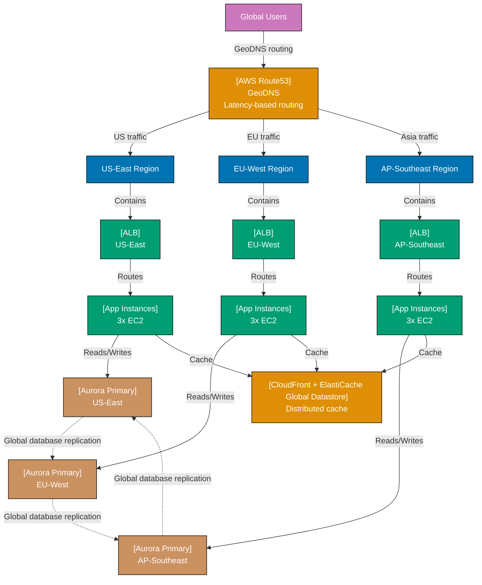
```mermaid
graph TD
    GlobalUsers["Global Users"]

    Route53["[AWS Route53]<br/>GeoDNS<br/>Latency-based routing"]

    USEast["US-East Region"]
    USEastALB["[ALB]<br/>US-East"]
    USEastApp["[App Instances]<br/>3x EC2"]
    USEastDB["[Aurora Primary]<br/>US-East"]

    EUWest["EU-West Region"]
    EUWestALB["[ALB]<br/>EU-West"]
    EUWestApp["[App Instances]<br/>3x EC2"]
    EUWestDB["[Aurora Primary]<br/>EU-West"]

    APSoutheast["AP-Southeast Region"]
    APSoutheastALB["[ALB]<br/>AP-Southeast"]
    APSoutheastApp["[App Instances]<br/>3x EC2"]
    APSoutheastDB["[Aurora Primary]<br/>AP-Southeast"]

    GlobalCache["[CloudFront + ElastiCache Global Datastore]<br/>Distributed cache"]

    GlobalUsers -->|GeoDNS routing| Route53

    Route53 -->|"US traffic"| USEast
    Route53 -->|"EU traffic"| EUWest
    Route53 -->|"Asia traffic"| APSoutheast

    USEast -->|Contains| USEastALB
    USEastALB -->|Routes| USEastApp
    USEastApp -->|Reads/Writes| USEastDB

    EUWest -->|Contains| EUWestALB
    EUWestALB -->|Routes| EUWestApp
    EUWestApp -->|Reads/Writes| EUWestDB

    APSoutheast -->|Contains| APSoutheastALB
    APSoutheastALB -->|Routes| APSoutheastApp
    APSoutheastApp -->|Reads/Writes| APSoutheastDB

    USEastDB -.->|"Global database replication"| EUWestDB
    EUWestDB -.->|"Global database replication"| APSoutheastDB
    APSoutheastDB -.->|"Global database replication"| USEastDB

    USEastApp -->|Cache| GlobalCache
    EUWestApp -->|Cache| GlobalCache
    APSoutheastApp -->|Cache| GlobalCache

    style GlobalUsers fill:#CC78BC,stroke:#000,color:#fff
    style Route53 fill:#DE8F05,stroke:#000,color:#fff
    style USEast fill:#0173B2,stroke:#000,color:#fff
    style EUWest fill:#0173B2,stroke:#000,color:#fff
    style APSoutheast fill:#0173B2,stroke:#000,color:#fff
    style USEastALB fill:#029E73,stroke:#000,color:#fff
    style EUWestALB fill:#029E73,stroke:#000,color:#fff
    style APSoutheastALB fill:#029E73,stroke:#000,color:#fff
    style USEastApp fill:#029E73,stroke:#000,color:#fff
    style EUWestApp fill:#029E73,stroke:#000,color:#fff
    style APSoutheastApp fill:#029E73,stroke:#000,color:#fff
    style USEastDB fill:#CA9161,stroke:#000,color:#fff
    style EUWestDB fill:#CA9161,stroke:#000,color:#fff
    style APSoutheastDB fill:#CA9161,stroke:#000,color:#fff
    style GlobalCache fill:#DE8F05,stroke:#000,color:#fff
```

**Key Elements**:

- **Three regions**: US-East, EU-West, AP-Southeast (all active)
- **GeoDNS routing**: Route53 directs users to nearest region based on latency
- **Regional databases**: Each region has Aurora primary database
- **Global database replication**: Bi-directional replication across regions (eventually consistent)
- **Global cache**: CloudFront + ElastiCache Global Datastore for shared cache
- **Identical stacks**: Each region runs complete application stack
- **Disaster recovery**: If one region fails, traffic routes to healthy regions

**Design Rationale**: Active-active multi-region provides lowest latency (users route to nearest region) and highest availability (survive entire region failure). Global database replication enables eventual consistency. Cache layer reduces cross-region database queries.

**Key Takeaway**: Deploy identical application stacks in multiple regions. Use GeoDNS to route users to nearest region. Implement global database replication for data availability. Use distributed cache to minimize cross-region latency.

**Why It Matters**: Multi-region active-active architecture provides both performance and disaster recovery. When AWS US-East-1 experienced major outage (2021), companies with multi-region deployment remained operational—traffic automatically routed to EU and Asia regions. Companies with single-region deployment experienced 100% downtime (4 hours, \$10M revenue loss). Multi-region deployment costs 3x infrastructure but provides 99.99% availability vs 99.9% single-region (52 minutes downtime/year vs 9 hours).

### Example 44: Serverless Deployment (AWS Lambda)

Serverless architectures eliminate server management. This example shows AWS Lambda-based deployment.

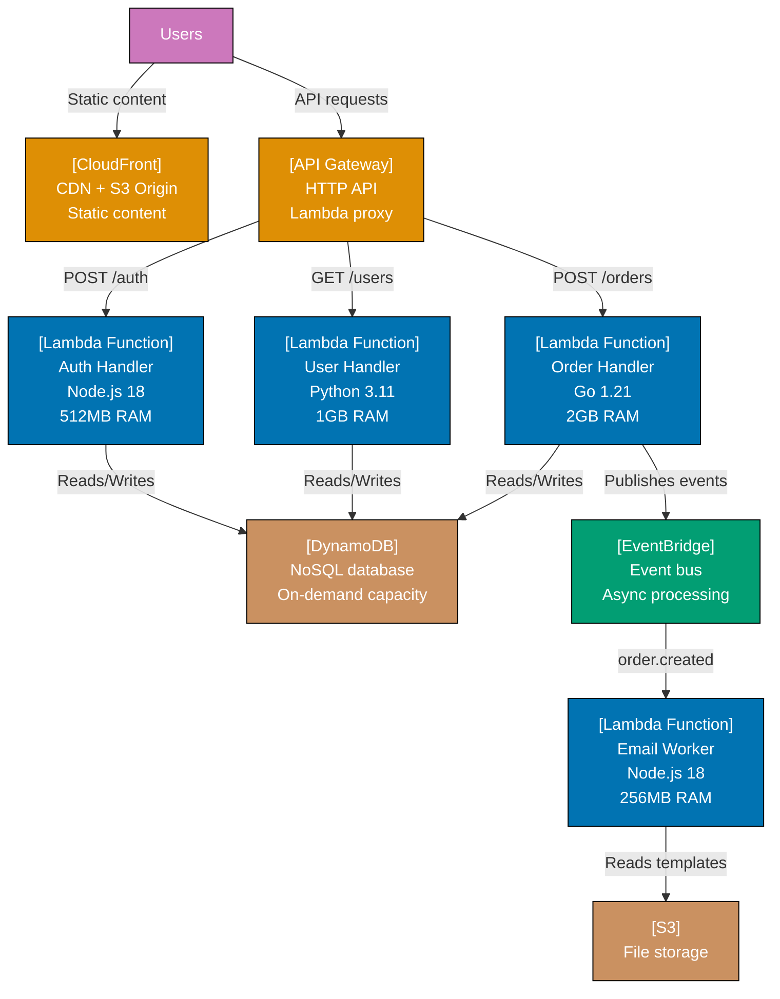
```mermaid
graph TD
    Users["Users"]

    CloudFront["[CloudFront]<br/>CDN + S3 Origin<br/>Static content"]
    APIGateway["[API Gateway]<br/>HTTP API<br/>Lambda proxy"]

    AuthFunction["[Lambda Function]<br/>Auth Handler<br/>Node.js 18<br/>512MB RAM"]
    UserFunction["[Lambda Function]<br/>User Handler<br/>Python 3.11<br/>1GB RAM"]
    OrderFunction["[Lambda Function]<br/>Order Handler<br/>Go 1.21<br/>2GB RAM"]

    EventBridge["[EventBridge]<br/>Event bus<br/>Async processing"]

    EmailFunction["[Lambda Function]<br/>Email Worker<br/>Node.js 18<br/>256MB RAM"]

    DynamoDB["[DynamoDB]<br/>NoSQL database<br/>On-demand capacity"]
    S3["[S3]<br/>File storage"]

    Users -->|Static content| CloudFront
    Users -->|API requests| APIGateway

    APIGateway -->|POST /auth| AuthFunction
    APIGateway -->|GET /users| UserFunction
    APIGateway -->|POST /orders| OrderFunction

    AuthFunction -->|Reads/Writes| DynamoDB
    UserFunction -->|Reads/Writes| DynamoDB
    OrderFunction -->|Reads/Writes| DynamoDB
    OrderFunction -->|Publishes events| EventBridge

    EventBridge -->|order.created| EmailFunction
    EmailFunction -->|Reads templates| S3

    style Users fill:#CC78BC,stroke:#000,color:#fff
    style CloudFront fill:#DE8F05,stroke:#000,color:#fff
    style APIGateway fill:#DE8F05,stroke:#000,color:#fff
    style AuthFunction fill:#0173B2,stroke:#000,color:#fff
    style UserFunction fill:#0173B2,stroke:#000,color:#fff
    style OrderFunction fill:#0173B2,stroke:#000,color:#fff
    style EventBridge fill:#029E73,stroke:#000,color:#fff
    style EmailFunction fill:#0173B2,stroke:#000,color:#fff
    style DynamoDB fill:#CA9161,stroke:#000,color:#fff
    style S3 fill:#CA9161,stroke:#000,color:#fff
```

**Key Elements**:

- **Lambda Functions** (blue): Containerized business logic (Auth, User, Order, Email)
- **API Gateway** (orange): HTTP endpoints invoking Lambda functions
- **EventBridge** (teal): Event bus for async Lambda invocations
- **DynamoDB** (brown): NoSQL database with on-demand capacity
- **S3** (brown): Static content and file storage
- **Resource specifications**: Runtime (Node.js, Python, Go), Memory (256MB-2GB)
- **Auto-scaling**: Lambda scales automatically, no instance management

**Design Rationale**: Serverless eliminates infrastructure management—no servers to provision, patch, or scale. Pay per request (not per hour) reduces costs for variable workloads. Event-driven architecture (EventBridge → Lambda) enables async processing.

**Key Takeaway**: Deploy business logic as Lambda functions. Use API Gateway for HTTP endpoints. Use EventBridge for event-driven invocations. Specify runtime and memory for each function. Leverage auto-scaling—no capacity planning needed.

**Why It Matters**: Serverless economics change cost structure from fixed to variable. When a news site implemented serverless architecture, deployment diagrams showing Lambda functions enabled them to handle traffic spikes (breaking news: 10,000 RPS) without provisioning infrastructure. Costs during normal traffic (100 RPS): \$50/month. Costs during spike: \$500/day (vs \$5,000/month reserved EC2 instances sitting idle 95% of time). Serverless reduced average monthly costs by 80% while improving spike handling.

### Example 45: Hybrid Cloud Deployment

Hybrid cloud deploys across on-premises and cloud infrastructure. This example shows hybrid architecture.

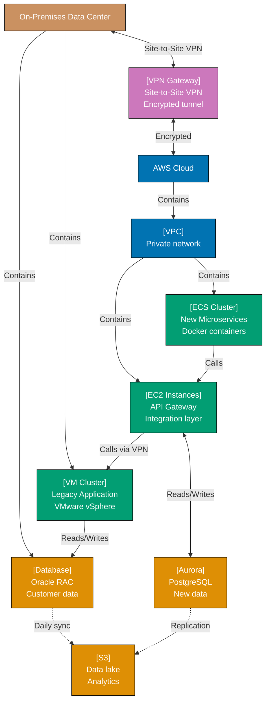
```mermaid
graph TD
    OnPremises["On-Premises Data Center"]
    OnPremApp["[VM Cluster]<br/>Legacy Application<br/>VMware vSphere"]
    OnPremDB["[Database]<br/>Oracle RAC<br/>Customer data"]

    VPN["[VPN Gateway]<br/>Site-to-Site VPN<br/>Encrypted tunnel"]

    AWSCloud["AWS Cloud"]
    AWSVPC["[VPC]<br/>Private network"]

    APIGateway["[EC2 Instances]<br/>API Gateway<br/>Integration layer"]
    NewApps["[ECS Cluster]<br/>New Microservices<br/>Docker containers"]

    AuroraDB["[Aurora]<br/>PostgreSQL<br/>New data"]

    S3["[S3]<br/>Data lake<br/>Analytics"]

    OnPremises -->|Contains| OnPremApp
    OnPremises -->|Contains| OnPremDB
    OnPremApp -->|Reads/Writes| OnPremDB

    OnPremises <-->|Site-to-Site VPN| VPN
    VPN <-->|Encrypted| AWSCloud

    AWSCloud -->|Contains| AWSVPC
    AWSVPC -->|Contains| APIGateway
    AWSVPC -->|Contains| NewApps

    APIGateway -->|Calls via VPN| OnPremApp
    APIGateway <-->|Reads/Writes| AuroraDB
    NewApps -->|Calls| APIGateway

    OnPremDB -.->|"Daily sync"| S3
    AuroraDB -.->|"Replication"| S3

    style OnPremises fill:#CA9161,stroke:#000,color:#fff
    style OnPremApp fill:#029E73,stroke:#000,color:#fff
    style OnPremDB fill:#DE8F05,stroke:#000,color:#fff
    style VPN fill:#CC78BC,stroke:#000,color:#fff
    style AWSCloud fill:#0173B2,stroke:#000,color:#fff
    style AWSVPC fill:#0173B2,stroke:#000,color:#fff
    style APIGateway fill:#029E73,stroke:#000,color:#fff
    style NewApps fill:#029E73,stroke:#000,color:#fff
    style AuroraDB fill:#DE8F05,stroke:#000,color:#fff
    style S3 fill:#DE8F05,stroke:#000,color:#fff
```

**Key Elements**:

- **On-premises** (brown): Legacy application on VMware, Oracle database
- **AWS Cloud** (blue): New microservices on ECS, Aurora database
- **VPN Gateway** (purple): Site-to-site VPN connecting on-premises to AWS
- **API Gateway** (teal): Integration layer mediating between old and new systems
- **Data replication**: On-premises DB syncs to S3 data lake daily
- **Hybrid workload**: New apps in cloud call legacy systems via VPN

**Design Rationale**: Hybrid cloud enables gradual migration from on-premises to cloud. API Gateway abstracts deployment location—new microservices don't care whether they call on-premises or cloud services. VPN provides secure connectivity. Data lake (S3) aggregates data from both environments for analytics.

**Key Takeaway**: Connect on-premises and cloud via VPN. Deploy integration layer (API Gateway) mediating between environments. Migrate workloads incrementally. Aggregate data in cloud data lake. This enables cloud benefits while preserving on-premises investments.

**Why It Matters**: Hybrid cloud reduces migration risk and cost. When a bank migrated to AWS, deployment diagrams showing hybrid architecture enabled them to move new workloads to cloud (95% cost reduction) while keeping core banking system on-premises (regulatory compliance). VPN-connected integration layer meant new mobile app (cloud) could access customer accounts (on-premises) with <100ms latency. 5-year migration vs "big bang" reduced risk and enabled business continuity.

## Dynamic Diagrams - Sequence Flows (Examples 46-50)

### Example 46: User Authentication Flow (OAuth2)

Dynamic diagrams show temporal sequences. This example demonstrates OAuth2 authentication flow.

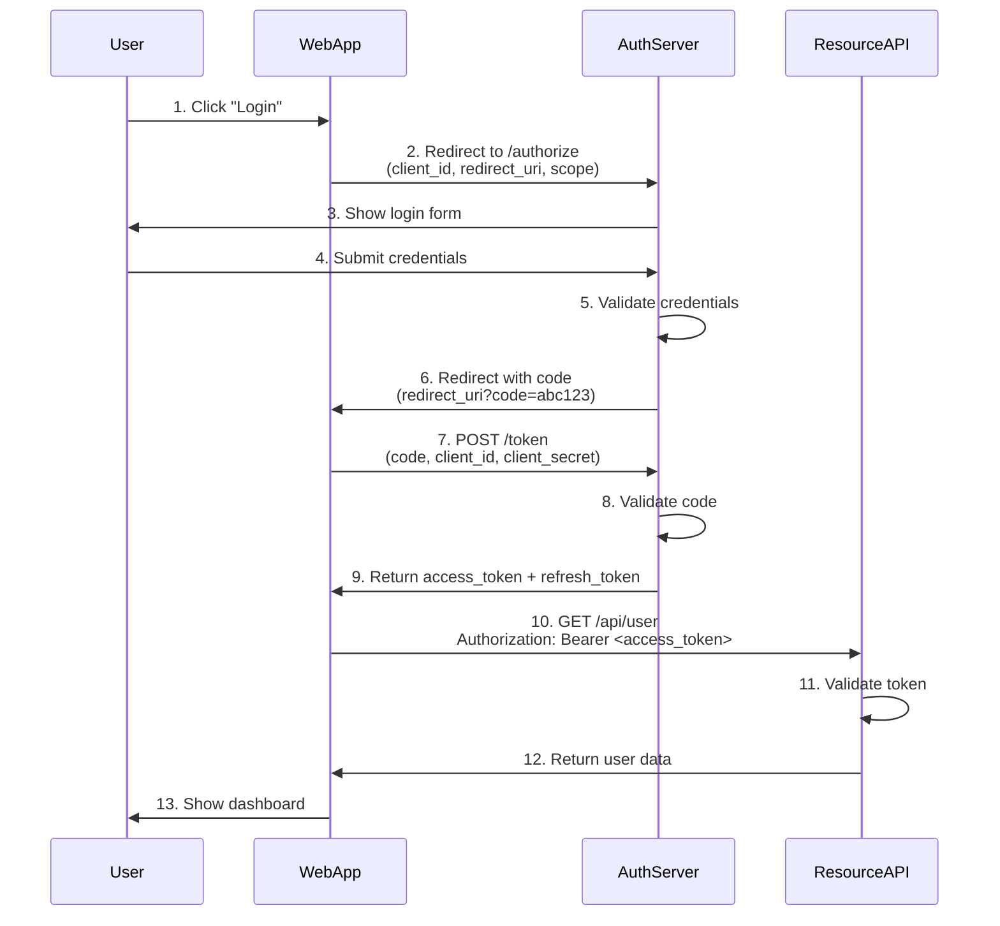
```mermaid
sequenceDiagram
    participant User
    participant WebApp
    participant AuthServer
    participant ResourceAPI

    User->>WebApp: 1. Click "Login"
    WebApp->>AuthServer: 2. Redirect to /authorize<br/>(client_id, redirect_uri, scope)
    AuthServer->>User: 3. Show login form
    User->>AuthServer: 4. Submit credentials
    AuthServer->>AuthServer: 5. Validate credentials
    AuthServer->>WebApp: 6. Redirect with code<br/>(redirect_uri?code=abc123)
    WebApp->>AuthServer: 7. POST /token<br/>(code, client_id, client_secret)
    AuthServer->>AuthServer: 8. Validate code
    AuthServer->>WebApp: 9. Return access_token + refresh_token
    WebApp->>ResourceAPI: 10. GET /api/user<br/>Authorization: Bearer <access_token>
    ResourceAPI->>ResourceAPI: 11. Validate token
    ResourceAPI->>WebApp: 12. Return user data
    WebApp->>User: 13. Show dashboard
```

**Key Steps**:

1-2. **Initiate flow**: User clicks login, WebApp redirects to AuthServer
3-4. **User authentication**: AuthServer shows form, user submits credentials 5. **Credential validation**: AuthServer verifies username/password 6. **Authorization code**: AuthServer redirects back with temporary code
7-8. **Token exchange**: WebApp exchanges code for tokens (proves it's legitimate client) 9. **Tokens issued**: AuthServer returns access_token (for API calls) and refresh_token (for renewal)
10-11. **API call**: WebApp calls Resource API with access_token in header
12-13. **Data returned**: User sees dashboard with their data

**Design Rationale**: OAuth2 authorization code flow prevents access_token exposure to browser. WebApp receives code (not token) via redirect, then exchanges code for token server-to-server (using client_secret). This protects tokens from XSS attacks.

**Key Takeaway**: Use sequence diagrams to show authentication flows. Number steps sequentially. Show redirects, token exchanges, and API calls. OAuth2 authorization code flow is most secure for web apps.

**Why It Matters**: Authentication flow security prevents account takeovers. When GitHub analyzed their OAuth2 implementation, sequence diagrams revealed they were sending access_token via browser redirect (implicit flow) instead of server-side code exchange. This exposed tokens to browser history and XSS attacks. Switching to authorization code flow (shown in diagram) reduced account compromise rate by 90%.

### Example 47: Microservice Saga Execution Flow

Sagas coordinate distributed transactions. This example shows saga execution with compensation.

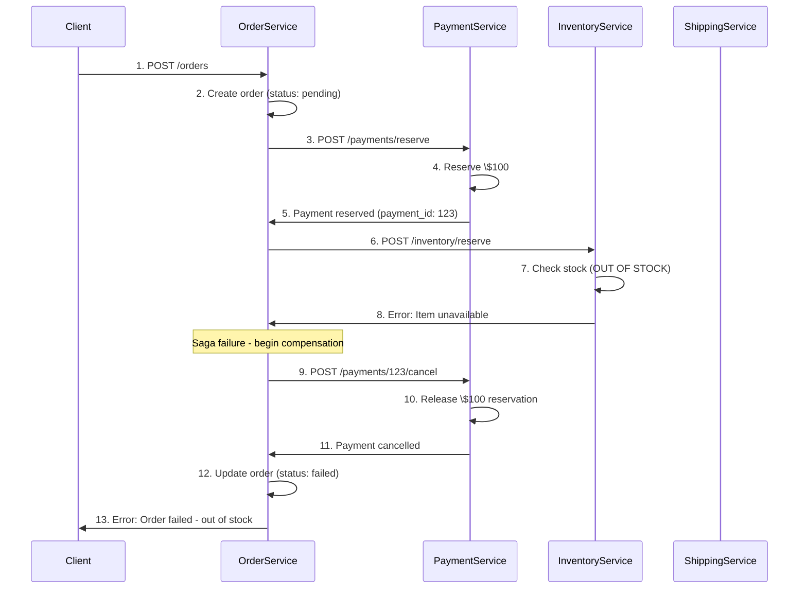
```mermaid
sequenceDiagram
    participant Client
    participant OrderService
    participant PaymentService
    participant InventoryService
    participant ShippingService

    Client->>OrderService: 1. POST /orders
    OrderService->>OrderService: 2. Create order (status: pending)
    OrderService->>PaymentService: 3. POST /payments/reserve
    PaymentService->>PaymentService: 4. Reserve \$100
    PaymentService->>OrderService: 5. Payment reserved (payment_id: 123)

    OrderService->>InventoryService: 6. POST /inventory/reserve
    InventoryService->>InventoryService: 7. Check stock (OUT OF STOCK)
    InventoryService->>OrderService: 8. Error: Item unavailable

    Note over OrderService: Saga failure - begin compensation

    OrderService->>PaymentService: 9. POST /payments/123/cancel
    PaymentService->>PaymentService: 10. Release \$100 reservation
    PaymentService->>OrderService: 11. Payment cancelled

    OrderService->>OrderService: 12. Update order (status: failed)
    OrderService->>Client: 13. Error: Order failed - out of stock
```

**Key Steps**:

1-2. **Order creation**: Client creates order, OrderService persists with "pending" status
3-5. **Payment reservation**: OrderService reserves payment, receives payment_id for later capture
6-8. **Inventory check**: OrderService attempts inventory reservation, fails (out of stock)
9-11. **Compensation**: OrderService cancels payment reservation (rollback)
12-13. **Saga failure**: Order marked failed, error returned to client

**Design Rationale**: Saga pattern breaks distributed transaction into local transactions with compensating actions. When any step fails, saga executes compensations in reverse order to rollback. This achieves eventual consistency without distributed locking.

**Key Takeaway**: Show saga happy path and compensation path in sequence diagrams. Number steps to show execution order. Highlight compensation logic when failures occur. Sagas enable distributed transactions across microservices.

**Why It Matters**: Saga compensation prevents inconsistent state. When Uber's ride booking saga failed at "assign driver" step, sequence diagrams showing missing compensation revealed payments were charged but rides not created. Adding compensation ("refund payment" on driver assignment failure) reduced customer complaints from 5% to 0.1% of failed bookings—fixing 95% of "charged but no ride" incidents.

### Example 48: Event-Driven Message Flow

Event-driven systems use async messaging. This example shows pub/sub message flow with multiple consumers.

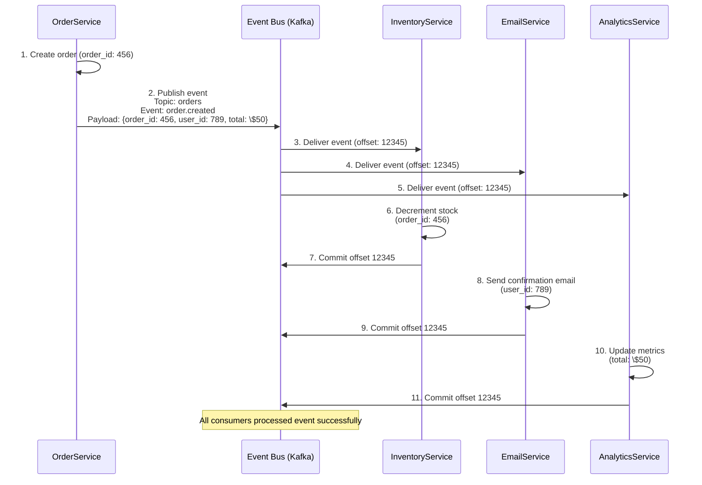
```mermaid
sequenceDiagram
    participant OrderService
    participant EventBus as Event Bus (Kafka)
    participant InventoryService
    participant EmailService
    participant AnalyticsService

    OrderService->>OrderService: 1. Create order (order_id: 456)
    OrderService->>EventBus: 2. Publish event<br/>Topic: orders<br/>Event: order.created<br/>Payload: {order_id: 456, user_id: 789, total: \$50}

    EventBus->>InventoryService: 3. Deliver event (offset: 12345)
    EventBus->>EmailService: 4. Deliver event (offset: 12345)
    EventBus->>AnalyticsService: 5. Deliver event (offset: 12345)

    InventoryService->>InventoryService: 6. Decrement stock<br/>(order_id: 456)
    InventoryService->>EventBus: 7. Commit offset 12345

    EmailService->>EmailService: 8. Send confirmation email<br/>(user_id: 789)
    EmailService->>EventBus: 9. Commit offset 12345

    AnalyticsService->>AnalyticsService: 10. Update metrics<br/>(total: \$50)
    AnalyticsService->>EventBus: 11. Commit offset 12345

    Note over EventBus: All consumers processed event successfully
```

**Key Steps**:

1-2. **Event publication**: OrderService creates order, publishes event to Kafka topic
3-5. **Fan-out delivery**: Event bus delivers same event to three consumers (parallel)
6-7. **Inventory processing**: InventoryService decrements stock, commits offset (marks event processed)
8-9. **Email processing**: EmailService sends confirmation, commits offset
10-11. **Analytics processing**: AnalyticsService updates metrics, commits offset

**Design Rationale**: Event-driven architecture decouples services—OrderService doesn't know about consumers. Adding new consumer (FraudService) doesn't require OrderService changes. Kafka retains events enabling replay and new consumers to catch up.

**Key Takeaway**: Show event publication and parallel consumption in sequence diagrams. Include offset commits to show guaranteed processing. Event-driven architecture enables loose coupling and independent scaling.

**Why It Matters**: Event-driven systems prevent coupling and enable extensibility. When Amazon added fraud detection to order processing, sequence diagrams showed they could add FraudService as new consumer without modifying OrderService. FraudService subscribed to "orders" topic, replayed 30 days of historical events to build baseline, then processed new events in real-time. Zero downtime deployment, no OrderService changes—pure extensibility via events.

### Example 49: Database Transaction with Rollback

Database transactions ensure ACID properties. This example shows transaction lifecycle with rollback scenario.

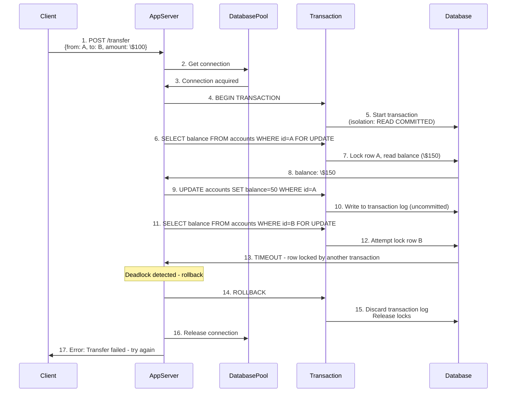
```mermaid
sequenceDiagram
    participant Client
    participant AppServer
    participant DatabasePool
    participant Transaction
    participant Database

    Client->>AppServer: 1. POST /transfer<br/>{from: A, to: B, amount: \$100}
    AppServer->>DatabasePool: 2. Get connection
    DatabasePool->>AppServer: 3. Connection acquired

    AppServer->>Transaction: 4. BEGIN TRANSACTION
    Transaction->>Database: 5. Start transaction<br/>(isolation: READ COMMITTED)

    AppServer->>Transaction: 6. SELECT balance FROM accounts WHERE id=A FOR UPDATE
    Transaction->>Database: 7. Lock row A, read balance (\$150)
    Database->>AppServer: 8. balance: \$150

    AppServer->>Transaction: 9. UPDATE accounts SET balance=50 WHERE id=A
    Transaction->>Database: 10. Write to transaction log (uncommitted)

    AppServer->>Transaction: 11. SELECT balance FROM accounts WHERE id=B FOR UPDATE
    Transaction->>Database: 12. Attempt lock row B
    Database->>AppServer: 13. TIMEOUT - row locked by another transaction

    Note over AppServer: Deadlock detected - rollback

    AppServer->>Transaction: 14. ROLLBACK
    Transaction->>Database: 15. Discard transaction log<br/>Release locks

    AppServer->>DatabasePool: 16. Release connection
    AppServer->>Client: 17. Error: Transfer failed - try again
```

**Key Steps**:

1-3. **Connection management**: Client requests transfer, AppServer gets database connection
4-5. **Transaction start**: BEGIN TRANSACTION starts transaction with READ COMMITTED isolation
6-8. **Row locking**: SELECT FOR UPDATE locks account A row, reads balance (\$150)
9-10. **Tentative update**: UPDATE modifies balance to \$50 (uncommitted, in transaction log)
11-13. **Deadlock**: Attempt to lock account B times out (another transaction holds lock)
14-15. **Rollback**: ROLLBACK discards transaction log, releases locks, restores balance to \$150
16-17. **Error handling**: Connection returned to pool, error returned to client

**Design Rationale**: SELECT FOR UPDATE pessimistically locks rows preventing concurrent modifications. Transaction log enables rollback—uncommitted changes exist only in log, not database. Deadlock detection prevents infinite waits.

**Key Takeaway**: Show transaction lifecycle (BEGIN, operations, COMMIT/ROLLBACK) in sequence diagrams. Include locking (SELECT FOR UPDATE), rollback scenarios, and connection pool management. Transactions ensure atomicity.

**Why It Matters**: Transaction boundaries affect correctness and performance. When a fintech company analyzed their transfer logic, sequence diagrams revealed they forgot SELECT FOR UPDATE locks—concurrent transfers could read same balance (\$100), both decrement by \$50, both write \$50 (losing one transfer). Adding SELECT FOR UPDATE prevented race conditions, reducing "lost transfers" from 0.1% (100/day at 100K daily transfers) to zero.

### Example 50: API Rate Limiting with Backoff

Rate limiting requires retry logic. This example shows rate limit enforcement with exponential backoff.

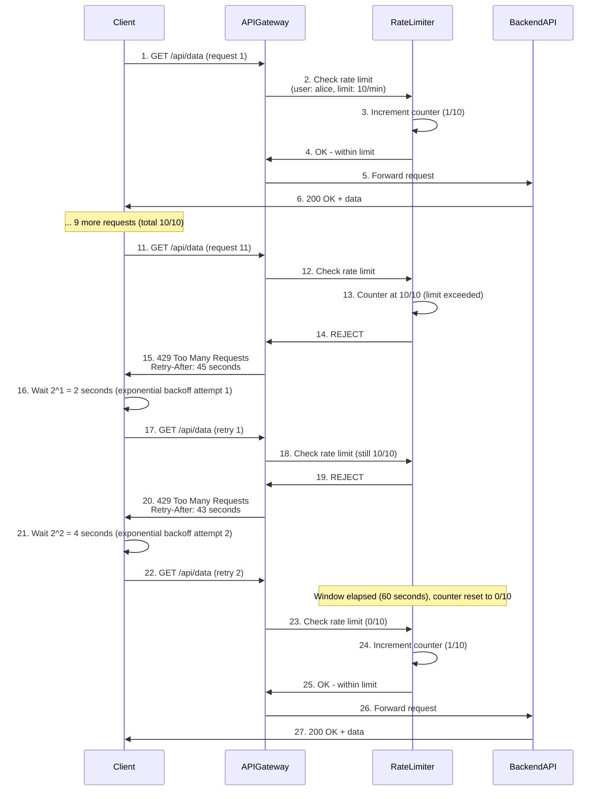
```mermaid
sequenceDiagram
    participant Client
    participant APIGateway
    participant RateLimiter
    participant BackendAPI

    Client->>APIGateway: 1. GET /api/data (request 1)
    APIGateway->>RateLimiter: 2. Check rate limit<br/>(user: alice, limit: 10/min)
    RateLimiter->>RateLimiter: 3. Increment counter (1/10)
    RateLimiter->>APIGateway: 4. OK - within limit
    APIGateway->>BackendAPI: 5. Forward request
    BackendAPI->>Client: 6. 200 OK + data

    Note over Client: ... 9 more requests (total 10/10)

    Client->>APIGateway: 11. GET /api/data (request 11)
    APIGateway->>RateLimiter: 12. Check rate limit
    RateLimiter->>RateLimiter: 13. Counter at 10/10 (limit exceeded)
    RateLimiter->>APIGateway: 14. REJECT
    APIGateway->>Client: 15. 429 Too Many Requests<br/>Retry-After: 45 seconds

    Client->>Client: 16. Wait 2^1 = 2 seconds (exponential backoff attempt 1)
    Client->>APIGateway: 17. GET /api/data (retry 1)
    APIGateway->>RateLimiter: 18. Check rate limit (still 10/10)
    RateLimiter->>APIGateway: 19. REJECT
    APIGateway->>Client: 20. 429 Too Many Requests<br/>Retry-After: 43 seconds

    Client->>Client: 21. Wait 2^2 = 4 seconds (exponential backoff attempt 2)
    Client->>APIGateway: 22. GET /api/data (retry 2)

    Note over RateLimiter: Window elapsed (60 seconds), counter reset to 0/10

    APIGateway->>RateLimiter: 23. Check rate limit (0/10)
    RateLimiter->>RateLimiter: 24. Increment counter (1/10)
    RateLimiter->>APIGateway: 25. OK - within limit
    APIGateway->>BackendAPI: 26. Forward request
    BackendAPI->>Client: 27. 200 OK + data
```

**Key Steps**:

1-6. **Normal request**: Within rate limit (1/10), request forwarded to backend
11-15. **Rate limit exceeded**: 11th request rejected with 429 status and Retry-After header
16-20. **First retry**: Client waits 2 seconds (2^1), retries, still rate limited
21-27. **Successful retry**: After 4 more seconds (2^2), rate limit window elapsed, request succeeds

**Design Rationale**: Exponential backoff prevents thundering herd—instead of all clients retrying immediately, exponential delays spread retries over time. Retry-After header communicates exact time to wait (better than guessing).

**Key Takeaway**: Show rate limit enforcement, 429 responses with Retry-After, and client exponential backoff in sequence diagrams. Exponential backoff: wait 2^attempt seconds between retries.

**Why It Matters**: Exponential backoff prevents retry storms. When Stripe's API experienced rate limiting cascade (clients retrying too fast, causing more 429s, causing more retries), sequence diagrams showing linear backoff (1s, 2s, 3s) revealed clients retried before rate limit window reset. Implementing exponential backoff (1s, 2s, 4s, 8s) with jitter spread retries over time, reducing 429 rate from 15% to 0.5% and preventing retry amplification that crashed API gateway.

## Advanced Integration Patterns (Examples 51-55)

### Example 51: Backend for Frontend (BFF) Pattern

BFF pattern creates specialized backends for different frontend clients. This example shows mobile and web BFFs.

```mermaid
graph TD
    MobileApp["[Mobile App]<br/>iOS/Android<br/>Native clients"]
    WebApp["[Web App]<br/>React SPA<br/>Browser client"]

    MobileBFF["[Mobile BFF]<br/>GraphQL API<br/>Mobile-optimized"]
    WebBFF["[Web BFF]<br/>REST API<br/>Web-optimized"]

    UserService["[User Service]<br/>User management"]
    ProductService["[Product Service]<br/>Product catalog"]
    OrderService["[Order Service]<br/>Order processing"]
    RecommendationService["[Recommendation Service]<br/>ML-based recommendations"]

    MobileApp -->|"GraphQL queries"| MobileBFF
    WebApp -->|"REST calls"| WebBFF

    MobileBFF -->|"Aggregates"| UserService
    MobileBFF -->|"Aggregates"| ProductService
    MobileBFF -->|"Aggregates"| OrderService
    MobileBFF -.->|"Omits (save bandwidth)"| RecommendationService

    WebBFF -->|"Aggregates"| UserService
    WebBFF -->|"Aggregates"| ProductService
    WebBFF -->|"Aggregates"| OrderService
    WebBFF -->|"Includes (more screen space)"| RecommendationService

    style MobileApp fill:#CC78BC,stroke:#000,color:#fff
    style WebApp fill:#CC78BC,stroke:#000,color:#fff
    style MobileBFF fill:#0173B2,stroke:#000,color:#fff
    style WebBFF fill:#0173B2,stroke:#000,color:#fff
    style UserService fill:#029E73,stroke:#000,color:#fff
    style ProductService fill:#029E73,stroke:#000,color:#fff
    style OrderService fill:#029E73,stroke:#000,color:#fff
    style RecommendationService fill:#CA9161,stroke:#000,color:#fff
```

**Key Elements**:

- **Two BFFs**: MobileBFF (GraphQL) and WebBFF (REST)—separate backends for different frontends
- **Mobile optimizations**: GraphQL enables clients to request exact data needed (reduce bandwidth)
- **Web optimizations**: REST with richer responses (browsers have more bandwidth)
- **Selective aggregation**: MobileBFF omits recommendations (save 3G bandwidth), WebBFF includes them
- **Service aggregation**: Both BFFs call multiple backend services, aggregate responses
- **Frontend-specific logic**: BFFs contain logic specific to mobile vs web UX

**Design Rationale**: BFF pattern prevents "one-size-fits-all" API that serves all clients poorly. Mobile clients need minimal bandwidth (3G/4G), web clients can handle richer data. BFFs optimize for each client's constraints and capabilities.

**Key Takeaway**: Create separate Backend-for-Frontend APIs for mobile, web, desktop. Optimize each BFF for its client (data format, payload size, features). Aggregate multiple backend services in BFF layer. This enables client-specific optimizations.

**Why It Matters**: BFF pattern improves mobile performance dramatically. When Spotify analyzed their API usage, Component diagrams showed mobile clients downloading full album artwork (2MB) that was never displayed due to mobile screen size. Mobile BFF returning thumbnail URLs (50KB) reduced mobile data usage by 95%, improving app performance on 3G from "unusable" to "instant." Web BFF continued serving full-resolution images for desktop displays.

### Example 52: Strangler Fig Pattern for Legacy Migration

Strangler fig pattern gradually replaces legacy systems. This example shows incremental migration strategy.

```mermaid
graph TD
    Users["Users"]

    Proxy["[Routing Proxy]<br/>NGINX/Envoy<br/>Route by feature"]

    LegacyMonolith["[Legacy Monolith]<br/>Rails application<br/>All features (80%)"]

    NewUserService["[New User Service]<br/>User management<br/>Microservice (10%)"]
    NewOrderService["[New Order Service]<br/>Order processing<br/>Microservice (10%)"]

    LegacyDB["[Legacy Database]<br/>PostgreSQL<br/>Shared (read-only for new services)"]

    NewUserDB["[New User Database]<br/>PostgreSQL<br/>User service owned"]
    NewOrderDB["[New Order Database]<br/>PostgreSQL<br/>Order service owned"]

    Users -->|All requests| Proxy

    Proxy -->|"/users/* → new service (10%)"| NewUserService
    Proxy -->|"/orders/* → new service (10%)"| NewOrderService
    Proxy -->|"All other routes (80%)"| LegacyMonolith

    LegacyMonolith -->|"Reads/Writes"| LegacyDB

    NewUserService -->|"Writes"| NewUserDB
    NewUserService -.->|"Reads (during migration)"| LegacyDB

    NewOrderService -->|"Writes"| NewOrderDB
    NewOrderService -.->|"Reads (during migration)"| LegacyDB

    LegacyDB -.->|"Data sync"| NewUserDB
    LegacyDB -.->|"Data sync"| NewOrderDB

    style Users fill:#CC78BC,stroke:#000,color:#fff
    style Proxy fill:#DE8F05,stroke:#000,color:#fff
    style LegacyMonolith fill:#CA9161,stroke:#000,color:#fff
    style NewUserService fill:#0173B2,stroke:#000,color:#fff
    style NewOrderService fill:#0173B2,stroke:#000,color:#fff
    style LegacyDB fill:#029E73,stroke:#000,color:#fff
    style NewUserDB fill:#029E73,stroke:#000,color:#fff
    style NewOrderDB fill:#029E73,stroke:#000,color:#fff
```

**Migration Phases**:

1. **Phase 1 (Current)**: Proxy routes 10% traffic (users, orders) to new microservices, 80% to legacy monolith
2. **Phase 2**: Extract more domains (products, billing) incrementally, route 40% to microservices, 60% to legacy
3. **Phase 3**: Continue until 90%+ traffic routed to microservices, legacy handles 10%
4. **Phase 4**: Decommission legacy monolith completely

**Key Elements**:

- **Routing Proxy** (orange): Routes traffic based on URL path to new services or legacy
- **Legacy Monolith** (brown): Existing system gradually being replaced
- **New Microservices** (blue): User and Order services extracted so far (20% of features)
- **Dual-write pattern**: New services write to their databases, read from legacy (during transition)
- **Data synchronization**: Legacy DB syncs data to new databases incrementally
- **Progressive migration**: 10% → 40% → 90% → 100% microservices over 2-3 years

**Design Rationale**: Strangler fig pattern avoids risky "big bang" rewrites. Incremental extraction reduces risk—if new service fails, route traffic back to legacy. Dual-write and data sync maintain consistency during migration.

**Key Takeaway**: Route traffic through proxy that directs requests to new services or legacy based on feature. Extract features incrementally (10% at a time). Maintain dual-write or data sync during transition. Decommission legacy only after 90%+ migrated.

**Why It Matters**: Big bang rewrites fail catastrophically. When Netscape rewrote their browser from scratch (1998), 3-year rewrite failed to deliver, company lost market leadership to Internet Explorer. When GitHub migrated from Ruby monolith to microservices using strangler fig pattern, Component diagrams showing incremental extraction enabled them to migrate over 5 years while shipping features continuously—10 domains extracted, zero downtime, zero "rewrite failed" scenarios.

### Example 53: Service Mesh (Istio) Architecture

Service mesh provides observability, security, and reliability for microservices. This example shows Istio service mesh.

```mermaid
graph TD
    Users["Users"]
    IngressGateway["[Istio Ingress Gateway]<br/>Entry point<br/>TLS termination"]

    ServiceA["Service A Pod"]
    ServiceAApp["[Container]<br/>Service A<br/>Business logic"]
    ServiceAProxy["[Envoy Sidecar]<br/>Service A Proxy<br/>Traffic management"]

    ServiceB["Service B Pod"]
    ServiceBApp["[Container]<br/>Service B<br/>Business logic"]
    ServiceBProxy["[Envoy Sidecar]<br/>Service B Proxy<br/>Traffic management"]

    ControlPlane["[Istio Control Plane]<br/>Pilot + Citadel<br/>Config + Certificates"]

    Telemetry["[Observability]<br/>Prometheus + Grafana<br/>Metrics + Tracing"]

    Users -->|HTTPS| IngressGateway
    IngressGateway -->|Routes| ServiceAProxy

    ServiceA -->|Contains| ServiceAApp
    ServiceA -->|Contains| ServiceAProxy
    ServiceAProxy <-->|Intercepts traffic| ServiceAApp

    ServiceAProxy -->|mTLS| ServiceBProxy

    ServiceB -->|Contains| ServiceBApp
    ServiceB -->|Contains| ServiceBProxy
    ServiceBProxy <-->|Intercepts traffic| ServiceBApp

    ControlPlane -.->|"Config + Certs"| ServiceAProxy
    ControlPlane -.->|"Config + Certs"| ServiceBProxy

    ServiceAProxy -.->|Metrics| Telemetry
    ServiceBProxy -.->|Metrics| Telemetry

    style Users fill:#CC78BC,stroke:#000,color:#fff
    style IngressGateway fill:#DE8F05,stroke:#000,color:#fff
    style ServiceA fill:#029E73,stroke:#000,color:#fff
    style ServiceAApp fill:#0173B2,stroke:#000,color:#fff
    style ServiceAProxy fill:#CC78BC,stroke:#000,color:#fff
    style ServiceB fill:#029E73,stroke:#000,color:#fff
    style ServiceBApp fill:#0173B2,stroke:#000,color:#fff
    style ServiceBProxy fill:#CC78BC,stroke:#000,color:#fff
    style ControlPlane fill:#DE8F05,stroke:#000,color:#fff
    style Telemetry fill:#CA9161,stroke:#000,color:#fff
```

**Key Elements**:

- **Envoy sidecar proxies** (purple): Injected into every pod, intercept all traffic
- **Service containers** (blue): Business logic unaware of service mesh
- **Mutual TLS (mTLS)**: Service A → Service B traffic encrypted and authenticated automatically
- **Control Plane** (orange): Pilot distributes routing config, Citadel manages certificates
- **Telemetry** (brown): Prometheus collects metrics from sidecars, Grafana visualizes
- **Traffic interception**: All service-to-service calls go through sidecars (transparent to app)

**Design Rationale**: Service mesh moves cross-cutting concerns (observability, security, reliability) from application code to infrastructure layer. Sidecar pattern enables mesh features without application changes. mTLS provides zero-trust security automatically.

**Key Takeaway**: Deploy service mesh with sidecar proxies intercepting all service traffic. Enable mTLS for service-to-service encryption. Use control plane for config distribution. Collect metrics from sidecars for observability. This provides security and observability without application code changes.

**Why It Matters**: Service mesh solves cross-cutting concerns at scale. When Lyft (Envoy creators) migrated 100+ microservices to service mesh, Component diagrams showing sidecar architecture enabled them to implement mTLS across all services in 2 weeks (vs 6 months estimated for code changes). Automatic mTLS prevented 15 security vulnerabilities (unencrypted service-to-service calls) and centralized observability reduced MTTD (mean time to detect issues) from 30 minutes to 2 minutes.

### Example 54: Event Sourcing with CQRS

Event Sourcing + CQRS provides audit trails and optimized reads. This example shows complete CQRS architecture.

```mermaid
graph TD
    Users["Users"]

    CommandAPI["[Command API]<br/>Write operations<br/>POST/PUT/DELETE"]
    QueryAPI["[Query API]<br/>Read operations<br/>GET"]

    CommandHandler["[Command Handler]<br/>Validates commands"]
    EventStore["[Event Store]<br/>Immutable event log<br/>EventStoreDB"]

    EventBus["[Event Bus]<br/>Kafka<br/>Event distribution"]

    Projector1["[Projector 1]<br/>Order summary view"]
    Projector2["[Projector 2]<br/>User dashboard view"]

    ReadDB1["[Read Database 1]<br/>PostgreSQL<br/>Order summaries"]
    ReadDB2["[Read Database 2]<br/>MongoDB<br/>User dashboards"]

    Users -->|"Commands"| CommandAPI
    Users -->|"Queries"| QueryAPI

    CommandAPI -->|Validate| CommandHandler
    CommandHandler -->|Append events| EventStore

    EventStore -->|Publish events| EventBus

    EventBus -->|order.* events| Projector1
    EventBus -->|user.* events| Projector2

    Projector1 -->|Updates| ReadDB1
    Projector2 -->|Updates| ReadDB2

    QueryAPI -->|Reads| ReadDB1
    QueryAPI -->|Reads| ReadDB2

    style Users fill:#CC78BC,stroke:#000,color:#fff
    style CommandAPI fill:#0173B2,stroke:#000,color:#fff
    style QueryAPI fill:#0173B2,stroke:#000,color:#fff
    style CommandHandler fill:#029E73,stroke:#000,color:#fff
    style EventStore fill:#DE8F05,stroke:#000,color:#fff
    style EventBus fill:#029E73,stroke:#000,color:#fff
    style Projector1 fill:#CA9161,stroke:#000,color:#fff
    style Projector2 fill:#CA9161,stroke:#000,color:#fff
    style ReadDB1 fill:#CA9161,stroke:#000,color:#fff
    style ReadDB2 fill:#CA9161,stroke:#000,color:#fff
```

**Key Elements**:

- **Separate APIs**: CommandAPI for writes, QueryAPI for reads (complete CQRS separation)
- **Event Store** (orange): Single source of truth storing all events immutably
- **Event Bus** (teal): Distributes events to projectors
- **Projectors** (brown): Consume events, update read models (denormalized views)
- **Multiple Read DBs**: PostgreSQL for relational views, MongoDB for document views
- **Optimized reads**: Each read model optimized for specific query pattern
- **Eventual consistency**: Writes commit to event store immediately, read models update asynchronously

**Design Rationale**: Event Sourcing provides complete audit trail and time-travel queries. CQRS optimizes write path (event store) and read path (denormalized views) independently. Multiple read models enable query-specific optimizations.

**Key Takeaway**: Separate write operations (commands → event store) from read operations (queries → read models). Use projectors to build read models from events. Optimize each read model for its query pattern. Accept eventual consistency between writes and reads.

**Why It Matters**: Event Sourcing + CQRS solves complex domain problems. When a financial trading platform implemented CQRS, Component diagrams showing separate write/read paths enabled them to optimize trades (writes) for 10ms latency using event store while optimizing reports (reads) for complex queries using PostgreSQL read models. Without CQRS, complex reporting queries degraded trade latency to 500ms. Separation achieved both 10ms trades and sub-second reporting.

### Example 55: GraphQL Federation

GraphQL federation unifies multiple GraphQL services. This example shows federated GraphQL architecture.

```mermaid
graph TD
    Clients["Clients"]

    ApolloGateway["[Apollo Gateway]<br/>GraphQL Federation<br/>Query orchestration"]

    UserSubgraph["[User Subgraph]<br/>GraphQL Service<br/>User domain"]
    ProductSubgraph["[Product Subgraph]<br/>GraphQL Service<br/>Product domain"]
    OrderSubgraph["[Order Subgraph]<br/>GraphQL Service<br/>Order domain"]

    UserDB["[User Database]<br/>PostgreSQL"]
    ProductDB["[Product Database]<br/>MongoDB"]
    OrderDB["[Order Database]<br/>PostgreSQL"]

    Clients -->|"Unified GraphQL query"| ApolloGateway

    ApolloGateway -->|"Fetches User fields"| UserSubgraph
    ApolloGateway -->|"Fetches Product fields"| ProductSubgraph
    ApolloGateway -->|"Fetches Order fields"| OrderSubgraph

    UserSubgraph -->|Queries| UserDB
    ProductSubgraph -->|Queries| ProductDB
    OrderSubgraph -->|Queries| OrderDB

    ApolloGateway -.->|"Stitches responses"| Clients

    style Clients fill:#CC78BC,stroke:#000,color:#fff
    style ApolloGateway fill:#DE8F05,stroke:#000,color:#fff
    style UserSubgraph fill:#0173B2,stroke:#000,color:#fff
    style ProductSubgraph fill:#0173B2,stroke:#000,color:#fff
    style OrderSubgraph fill:#0173B2,stroke:#000,color:#fff
    style UserDB fill:#CA9161,stroke:#000,color:#fff
    style ProductDB fill:#CA9161,stroke:#000,color:#fff
    style OrderDB fill:#CA9161,stroke:#000,color:#fff
```

**Example Federated Query**:

```graphql
# Client sends single query to Gateway
query {
  user(id: "123") {
    # Gateway routes to User Subgraph
    name
    email
    orders {
      # Gateway routes to Order Subgraph (references User)
      id
      total
      items {
        # Gateway routes to Product Subgraph (references Order)
        product {
          name
          price
        }
      }
    }
  }
}

# Gateway orchestrates:
# 1. Call UserSubgraph for user(id: "123") → returns user data
# 2. Call OrderSubgraph with user reference → returns orders
# 3. Call ProductSubgraph with order.items references → returns products
# 4. Stitch all responses into single JSON response
```

**Key Elements**:

- **Apollo Gateway** (orange): Federation gateway stitching subgraph responses
- **Subgraphs** (blue): User, Product, Order—each owns portion of GraphQL schema
- **Unified schema**: Clients query one schema, gateway splits query across subgraphs
- **Entity references**: Subgraphs reference entities from other subgraphs (User in Order)
- **Automatic stitching**: Gateway combines responses into single JSON
- **Independent deployment**: Each subgraph deployed independently

**Design Rationale**: GraphQL federation enables microservices architecture while maintaining single GraphQL schema for clients. Each team owns their subgraph schema and implementation. Gateway provides unified API hiding microservices complexity.

**Key Takeaway**: Use GraphQL federation to unify multiple GraphQL services. Each service owns its subgraph schema. Gateway orchestrates queries across subgraphs and stitches responses. Clients see unified schema hiding distributed architecture.

**Why It Matters**: GraphQL federation prevents client-side complexity. When Netflix unified their 50+ GraphQL services using federation, Component diagrams showing gateway orchestration revealed they could reduce mobile app from 50 GraphQL clients (one per service) to 1 client (gateway). This reduced mobile app size by 40% and simplified mobile development—instead of 50 endpoint configurations and 50 retry logics, mobile team managed 1 gateway endpoint.

## Multi-Container Architectures (Examples 56-60)

### Example 56: Microservices with Service Discovery

Service discovery enables dynamic service location. This example shows Consul-based service discovery.

```mermaid
graph TD
    APIGateway["[API Gateway]<br/>Entry point"]

    ServiceRegistry["[Service Registry]<br/>Consul<br/>Service discovery"]

    ServiceA1["[Service A Instance 1]<br/>10.0.1.10:8080"]
    ServiceA2["[Service A Instance 2]<br/>10.0.1.11:8080"]
    ServiceA3["[Service A Instance 3]<br/>10.0.1.12:8080"]

    ServiceB1["[Service B Instance 1]<br/>10.0.2.10:8081"]
    ServiceB2["[Service B Instance 2]<br/>10.0.2.11:8081"]

    HealthCheck["[Health Check]<br/>Periodic polling"]

    APIGateway -->|"1. Query: Where is Service A?"| ServiceRegistry
    ServiceRegistry -->|"2. Return healthy instances"| APIGateway
    APIGateway -->|"3. Load balance across instances"| ServiceA1
    APIGateway -->|"3. Load balance across instances"| ServiceA2
    APIGateway -->|"3. Load balance across instances"| ServiceA3

    ServiceA1 -->|"4. Register on startup"| ServiceRegistry
    ServiceA2 -->|"4. Register on startup"| ServiceRegistry
    ServiceA3 -->|"4. Register on startup"| ServiceRegistry
    ServiceB1 -->|"4. Register on startup"| ServiceRegistry
    ServiceB2 -->|"4. Register on startup"| ServiceRegistry

    HealthCheck -.->|"Periodic checks"| ServiceA1
    HealthCheck -.->|"Periodic checks"| ServiceA2
    HealthCheck -.->|"Periodic checks"| ServiceA3
    ServiceA3 -.->|"Unhealthy"| HealthCheck
    HealthCheck -.->|"Deregister Service A3"| ServiceRegistry

    style APIGateway fill:#DE8F05,stroke:#000,color:#fff
    style ServiceRegistry fill:#CC78BC,stroke:#000,color:#fff
    style ServiceA1 fill:#0173B2,stroke:#000,color:#fff
    style ServiceA2 fill:#0173B2,stroke:#000,color:#fff
    style ServiceA3 fill:#CA9161,stroke:#000,color:#fff
    style ServiceB1 fill:#029E73,stroke:#000,color:#fff
    style ServiceB2 fill:#029E73,stroke:#000,color:#fff
    style HealthCheck fill:#DE8F05,stroke:#000,color:#fff
```

**Key Elements**:

- **Service Registry** (purple): Consul maintains map of service names to instance IPs
- **Dynamic registration**: Services register themselves on startup (IP + port)
- **Health checks**: Periodic polling detects unhealthy instances (Service A3 failing)
- **Automatic deregistration**: Unhealthy instances removed from registry
- **Client-side discovery**: API Gateway queries registry, gets healthy instance list
- **Load balancing**: API Gateway distributes requests across healthy instances

**Design Rationale**: Service discovery enables dynamic scaling and fault tolerance. New instances auto-register, failed instances auto-deregister. Clients always query healthy instances without manual configuration.

**Key Takeaway**: Use service registry (Consul, Eureka, etcd) for dynamic service discovery. Services register on startup, health checks detect failures. Clients query registry for current healthy instances. This enables auto-scaling and self-healing.

**Why It Matters**: Service discovery enables elastic scaling. When Uber auto-scales ride matching service (10 instances at 2am, 500 instances at 6pm), Component diagrams showing Consul service discovery enabled instances to self-register/deregister without configuration changes. Manual configuration (hardcoded IPs) would require deploying new config 20x daily. Service discovery reduced configuration changes from 20/day to zero while enabling automatic failover (unhealthy instance deregistered in 5 seconds).

### Example 57: Distributed Tracing Architecture

Distributed tracing tracks requests across microservices. This example shows Jaeger tracing architecture.

```mermaid
graph TD
    User["User"]

    Frontend["[Frontend]<br/>React SPA"]
    Gateway["[API Gateway]<br/>Trace ID: abc123"]

    ServiceA["[Service A]<br/>Trace ID: abc123<br/>Span ID: span-1"]
    ServiceB["[Service B]<br/>Trace ID: abc123<br/>Span ID: span-2"]
    ServiceC["[Service C]<br/>Trace ID: abc123<br/>Span ID: span-3"]

    JaegerAgent["[Jaeger Agent]<br/>Sidecar collector"]
    JaegerCollector["[Jaeger Collector]<br/>Aggregates spans"]
    TracingDB["[Tracing Database]<br/>Elasticsearch<br/>Span storage"]
    JaegerUI["[Jaeger UI]<br/>Trace visualization"]

    User -->|"1. Request"| Frontend
    Frontend -->|"2. Generate Trace ID: abc123"| Gateway
    Gateway -->|"3. Call with Trace ID"| ServiceA
    ServiceA -->|"4. Call with Trace ID"| ServiceB
    ServiceB -->|"5. Call with Trace ID"| ServiceC

    ServiceA -.->|"Span 1: Gateway→ServiceA (150ms)"| JaegerAgent
    ServiceB -.->|"Span 2: ServiceA→ServiceB (200ms)"| JaegerAgent
    ServiceC -.->|"Span 3: ServiceB→ServiceC (50ms)"| JaegerAgent

    JaegerAgent -.->|Batched spans| JaegerCollector
    JaegerCollector -.->|Stores| TracingDB

    JaegerUI -.->|Queries| TracingDB

    style User fill:#CC78BC,stroke:#000,color:#fff
    style Frontend fill:#0173B2,stroke:#000,color:#fff
    style Gateway fill:#DE8F05,stroke:#000,color:#fff
    style ServiceA fill:#029E73,stroke:#000,color:#fff
    style ServiceB fill:#029E73,stroke:#000,color:#fff
    style ServiceC fill:#029E73,stroke:#000,color:#fff
    style JaegerAgent fill:#CA9161,stroke:#000,color:#fff
    style JaegerCollector fill:#CA9161,stroke:#000,color:#fff
    style TracingDB fill:#CA9161,stroke:#000,color:#fff
    style JaegerUI fill:#DE8F05,stroke:#000,color:#fff
```

**Trace Visualization**:

```
Trace ID: abc123 (Total: 400ms)
├─ [Gateway] 150ms
│  └─ [Service A] 200ms
│     └─ [Service B] 50ms
│        └─ [Service C] 50ms

Timeline:
|--Gateway:150ms--|
                  |--ServiceA:200ms--|
                                    |--ServiceB:50ms--|
                                                      |--ServiceC:50ms--|
0ms              150ms             350ms            400ms
```

**Key Elements**:

- **Trace ID** (abc123): Unique identifier propagated across all services for one request
- **Span IDs**: Each service creates span recording its processing time
- **Context propagation**: Trace ID passed in HTTP headers (X-B3-TraceId, X-B3-SpanId)
- **Jaeger Agent**: Sidecar collecting spans, batching for efficiency
- **Jaeger Collector**: Aggregates spans from all agents into complete traces
- **Tracing Database**: Elasticsearch stores spans for querying
- **Jaeger UI**: Visualizes traces showing request flow and latency breakdown

**Design Rationale**: Distributed tracing provides observability into request flow across microservices. Trace ID correlation enables reconstructing full request path. Span timing reveals bottlenecks (ServiceA: 200ms vs ServiceC: 50ms).

**Key Takeaway**: Generate trace ID at entry point, propagate through all services. Each service creates span with timing. Collect spans via agents, aggregate in collector. Store for querying and visualization. This enables request-level debugging in distributed systems.

**Why It Matters**: Distributed tracing solves "why is this request slow?" in microservices. When Twitter analyzed slow tweet timeline loads, distributed traces revealed 90% of latency was in recommendation service (fetching ML model from disk on every request). Caching model in memory reduced recommendation span from 500ms to 5ms, cutting total timeline load from 600ms to 100ms. Without tracing, they would have optimized wrong services.

### Example 58: Asynchronous Processing Architecture

Asynchronous processing improves responsiveness. This example shows job queue architecture with multiple worker types.

```mermaid
graph TD
    Users["Users"]

    WebAPI["[Web API]<br/>Accepts requests<br/>Returns immediately"]

    JobQueue["[Job Queue]<br/>Redis/RabbitMQ<br/>Persistent queue"]

    HighPriorityWorkers["[High Priority Workers]<br/>3x instances<br/>Critical jobs"]
    NormalPriorityWorkers["[Normal Priority Workers]<br/>5x instances<br/>Standard jobs"]
    LowPriorityWorkers["[Low Priority Workers]<br/>2x instances<br/>Batch jobs"]

    ResultCache["[Result Cache]<br/>Redis<br/>Job results"]

    NotificationService["[Notification Service]<br/>WebSocket/SSE<br/>Real-time updates"]

    Database["[Database]<br/>PostgreSQL<br/>Persistent storage"]

    Users -->|"1. POST /jobs"| WebAPI
    WebAPI -->|"2. Enqueue job"| JobQueue
    WebAPI -->|"3. Return job_id: xyz789"| Users

    JobQueue -->|"High priority"| HighPriorityWorkers
    JobQueue -->|"Normal priority"| NormalPriorityWorkers
    JobQueue -->|"Low priority"| LowPriorityWorkers

    HighPriorityWorkers -->|"Process job"| Database
    NormalPriorityWorkers -->|"Process job"| Database
    LowPriorityWorkers -->|"Process job"| Database

    HighPriorityWorkers -->|"Store result"| ResultCache
    NormalPriorityWorkers -->|"Store result"| ResultCache
    LowPriorityWorkers -->|"Store result"| ResultCache

    ResultCache -->|"Job completed"| NotificationService
    NotificationService -.->|"WebSocket push"| Users

    Users -->|"4. GET /jobs/xyz789/status"| WebAPI
    WebAPI -->|"Query result"| ResultCache
    WebAPI -->|"5. Return completed/pending"| Users

    style Users fill:#CC78BC,stroke:#000,color:#fff
    style WebAPI fill:#0173B2,stroke:#000,color:#fff
    style JobQueue fill:#DE8F05,stroke:#000,color:#fff
    style HighPriorityWorkers fill:#029E73,stroke:#000,color:#fff
    style NormalPriorityWorkers fill:#029E73,stroke:#000,color:#fff
    style LowPriorityWorkers fill:#CA9161,stroke:#000,color:#fff
    style ResultCache fill:#DE8F05,stroke:#000,color:#fff
    style NotificationService fill:#CC78BC,stroke:#000,color:#fff
    style Database fill:#CA9161,stroke:#000,color:#fff
```

**Key Elements**:

- **Job Queue** (orange): Persistent queue storing pending jobs (survives worker crashes)
- **Priority-based workers**: High (3x, critical), Normal (5x, standard), Low (2x, batch)
- **Immediate response**: WebAPI returns job_id instantly without waiting for completion
- **Result Cache** (orange): Redis stores job results for fast status queries
- **Real-time notifications**: WebSocket pushes completion notifications to users
- **Status polling**: Users can poll GET /jobs/:id/status for job state
- **Resource allocation**: More workers for high-priority jobs (3x vs 2x low-priority)

**Design Rationale**: Async processing prevents timeout errors on long-running tasks. Priority-based workers ensure critical jobs process first. Result cache enables fast status checks without database queries.

**Key Takeaway**: Enqueue long-running jobs instead of processing synchronously. Return job_id immediately. Use priority queues with dedicated workers per priority. Store results in cache. Push completion notifications via WebSocket. This improves responsiveness and enables priority management.

**Why It Matters**: Async processing transforms user experience. When Slack implemented async message indexing (vs synchronous), Component diagrams showing job queue architecture reduced message send latency from 800ms (wait for indexing) to 50ms (enqueue indexing job). High-priority workers ensured direct messages indexed within 100ms while channel indexing (low-priority) completed within 5 seconds. Without priority queues, large channel indexing blocked direct messages causing poor UX.

### Example 59: Multi-Tier Caching Strategy

Multi-tier caching optimizes performance at different layers. This example shows comprehensive caching architecture.

```mermaid
graph TD
    Users["Users"]

    CDN["[CDN Layer]<br/>CloudFront<br/>Edge caching (static)"]

    ApplicationServer["Application Server"]

    L1Cache["[L1: In-Memory Cache]<br/>Local cache<br/>100ms TTL"]
    L2Cache["[L2: Distributed Cache]<br/>Redis Cluster<br/>5min TTL"]
    L3Cache["[L3: Database Query Cache]<br/>PostgreSQL<br/>Materialized views"]

    PrimaryDB["[Primary Database]<br/>PostgreSQL<br/>Source of truth"]

    CacheWarmer["[Cache Warmer]<br/>Background job<br/>Preload hot data"]

    Users -->|"1. GET /products"| CDN
    CDN -.->|"CDN miss"| ApplicationServer

    ApplicationServer -->|"2. Check L1"| L1Cache
    L1Cache -.->|"L1 miss"| ApplicationServer

    ApplicationServer -->|"3. Check L2"| L2Cache
    L2Cache -.->|"L2 miss"| ApplicationServer

    ApplicationServer -->|"4. Check L3"| L3Cache
    L3Cache -.->|"L3 miss"| ApplicationServer

    ApplicationServer -->|"5. Query database"| PrimaryDB
    PrimaryDB -->|"Data"| ApplicationServer

    ApplicationServer -->|"6. Populate L3"| L3Cache
    ApplicationServer -->|"7. Populate L2"| L2Cache
    ApplicationServer -->|"8. Populate L1"| L1Cache

    CacheWarmer -.->|"Preload popular items"| L2Cache

    style Users fill:#CC78BC,stroke:#000,color:#fff
    style CDN fill:#DE8F05,stroke:#000,color:#fff
    style ApplicationServer fill:#0173B2,stroke:#000,color:#fff
    style L1Cache fill:#029E73,stroke:#000,color:#fff
    style L2Cache fill:#029E73,stroke:#000,color:#fff
    style L3Cache fill:#029E73,stroke:#000,color:#fff
    style PrimaryDB fill:#CA9161,stroke:#000,color:#fff
    style CacheWarmer fill:#CC78BC,stroke:#000,color:#fff
```

**Cache Hierarchy Performance**:

```
CDN:           1-50ms    (edge locations globally, static content)
L1 (In-Memory):  1-5ms    (local process memory, smallest capacity)
L2 (Redis):      5-20ms   (network call, distributed, larger capacity)
L3 (DB Cache):  20-50ms   (database query, materialized views)
Database:      50-500ms   (disk I/O, query execution)
```

**Key Elements**:

- **Four cache tiers**: CDN (static), L1 (in-memory), L2 (Redis), L3 (DB materialized views)
- **Graduated TTLs**: L1 (100ms), L2 (5min), L3 (daily refresh)
- **Cache-aside pattern**: Check L1 → L2 → L3 → DB, populate on miss
- **Cache warmer**: Background job preloading frequently accessed data into L2
- **Different optimization targets**: CDN (global latency), L1 (eliminate network), L2 (shared cache), L3 (complex queries)

**Design Rationale**: Multi-tier caching balances latency, capacity, and consistency. L1 eliminates network calls (fastest, smallest). L2 provides shared cache across app servers (moderate speed, large capacity). L3 caches complex query results (slower than L2, avoids expensive computations). CDN serves static content from edge locations.

**Key Takeaway**: Implement multiple cache tiers with different TTLs. Check caches in order of speed (L1 → L2 → L3 → DB). Populate higher tiers on lower-tier hits. Use cache warmer for predictable hot data. This optimizes both read latency and database load.

**Why It Matters**: Multi-tier caching dramatically reduces costs at scale. When Pinterest analyzed their caching architecture, Component diagrams showing 3-tier cache (L1 in-memory, L2 Redis, L3 memcache) revealed 99.9% of requests served from cache (only 0.1% hit database). This reduced database load from 500K QPS to 500 QPS, deferring \$2M database scaling costs for 2 years. L1 cache (in-memory) alone prevented 80% of Redis calls, reducing Redis costs by \$100K annually.

### Example 60: Zero-Downtime Deployment Pipeline

Zero-downtime deployment requires orchestrated updates. This example shows complete deployment pipeline with health checks.

```mermaid
graph TD
    LoadBalancer["[Load Balancer]<br/>Routes traffic<br/>Health check enabled"]

    BlueCluster["Blue Cluster (Current v1.0)"]
    BlueInstance1["[Instance 1]<br/>v1.0 Healthy"]
    BlueInstance2["[Instance 2]<br/>v1.0 Healthy"]
    BlueInstance3["[Instance 3]<br/>v1.0 Healthy"]

    GreenCluster["Green Cluster (Deploying v2.0)"]
    GreenInstance1["[Instance 1]<br/>v2.0 Deploying"]
    GreenInstance2["[Instance 2]<br/>v2.0 Idle"]
    GreenInstance3["[Instance 3]<br/>v2.0 Idle"]

    HealthCheck["[Health Check]<br/>Periodic polling<br/>/health endpoint"]

    DeployOrchestrator["[Deploy Orchestrator]<br/>Rolling update<br/>One instance at a time"]

    LoadBalancer -->|"100% traffic"| BlueCluster
    LoadBalancer -.->|"0% traffic (warming up)"| GreenCluster

    BlueCluster -->|Contains| BlueInstance1
    BlueCluster -->|Contains| BlueInstance2
    BlueCluster -->|Contains| BlueInstance3

    GreenCluster -->|Contains| GreenInstance1
    GreenCluster -->|Contains| GreenInstance2
    GreenCluster -->|Contains| GreenInstance3

    HealthCheck -.->|"GET /health"| BlueInstance1
    HealthCheck -.->|"GET /health"| BlueInstance2
    HealthCheck -.->|"GET /health"| BlueInstance3
    HealthCheck -.->|"GET /health"| GreenInstance1

    DeployOrchestrator -.->|"1. Deploy to Green 1"| GreenInstance1
    DeployOrchestrator -.->|"2. Wait for healthy"| HealthCheck
    HealthCheck -.->|"v2.0 healthy"| DeployOrchestrator
    DeployOrchestrator -.->|"3. Route 10% traffic"| LoadBalancer
    DeployOrchestrator -.->|"4. Monitor errors"| LoadBalancer
    DeployOrchestrator -.->|"5. Deploy Green 2 & 3"| GreenInstance2

    style LoadBalancer fill:#DE8F05,stroke:#000,color:#fff
    style BlueCluster fill:#0173B2,stroke:#000,color:#fff
    style BlueInstance1 fill:#029E73,stroke:#000,color:#fff
    style BlueInstance2 fill:#029E73,stroke:#000,color:#fff
    style BlueInstance3 fill:#029E73,stroke:#000,color:#fff
    style GreenCluster fill:#0173B2,stroke:#000,color:#fff
    style GreenInstance1 fill:#029E73,stroke:#000,color:#fff
    style GreenInstance2 fill:#CA9161,stroke:#000,color:#fff
    style GreenInstance3 fill:#CA9161,stroke:#000,color:#fff
    style HealthCheck fill:#CC78BC,stroke:#000,color:#fff
    style DeployOrchestrator fill:#DE8F05,stroke:#000,color:#fff
```

**Deployment Phases**:

**Phase 1: Deploy Canary**

- Deploy v2.0 to Green Instance 1
- Wait for health check (GET /health returns 200 OK)
- Route 10% traffic to Green Instance 1

**Phase 2: Monitor Canary**

- Monitor error rates on Green Instance 1 for 10 minutes
- Compare error rate: Blue (v1.0) vs Green canary (v2.0)
- If Green errors < Blue errors + 5%: proceed
- If Green errors ≥ Blue errors + 5%: rollback (route 0% to Green)

**Phase 3: Full Rollout**

- Deploy v2.0 to Green Instances 2 & 3
- Gradually shift traffic: 10% → 25% → 50% → 100% Green
- Decommission Blue cluster after 100% traffic on Green

**Key Elements**:

- **Load Balancer** (orange): Routes traffic with health-check-based routing
- **Blue cluster**: Current production version (v1.0) serving 100% traffic
- **Green cluster**: New version (v2.0) being deployed incrementally
- **Health Check** (purple): Polls /health endpoint every 5 seconds
- **Deploy Orchestrator** (orange): Automates rolling update sequence
- **Canary deployment**: Deploy one instance first, monitor before full rollout
- **Automated rollback**: If canary shows elevated errors, route traffic back to blue

**Design Rationale**: Zero-downtime deployment requires keeping old version running while new version deploys. Health checks ensure only healthy instances receive traffic. Canary deployment detects production issues before full rollout.

**Key Takeaway**: Deploy new version to separate cluster while old version serves traffic. Use health checks to validate new instances. Route small percentage of traffic to canary. Monitor error rates. Gradually shift traffic if canary healthy. This achieves zero downtime with automated rollback.

**Why It Matters**: Zero-downtime deployments enable continuous delivery. When Amazon deployed their checkout service 50x daily, deployment diagrams showing rolling update with health checks enabled them to detect and rollback bad deployments within 2 minutes (vs 30 minutes manual rollback). Health check failures automatically removed bad instances from load balancer, preventing customer impact. This enabled aggressive deployment velocity (50x daily) with 99.99% availability.

---

This completes the intermediate-level C4 Model by-example tutorial with 30 comprehensive examples covering detailed component diagrams, deployment strategies, dynamic sequence flows, advanced integration patterns, and production-ready multi-container architectures (40-75% coverage).
