This intermediate-level tutorial builds on the System Context foundation with 30 examples covering C4 Level 2 (Container) and Level 3 (Component) diagrams. Every example zooms into the `procurement-platform-be` containers — `web-ui`, `purchasing-api`, `receiving-api`, `invoicing-api`, `payments-worker`, `event-bus`, `postgres`, `read-store`, and `secret-manager` — and then into the internal component structure of `purchasing-api`.

## Container Diagrams — Core Containers (Examples 31–38)

### Example 31: Minimal Container Diagram — web-ui and purchasing-api

The first Container diagram zooms inside the system boundary and reveals the two most visible containers: the browser-based portal and the primary REST API.

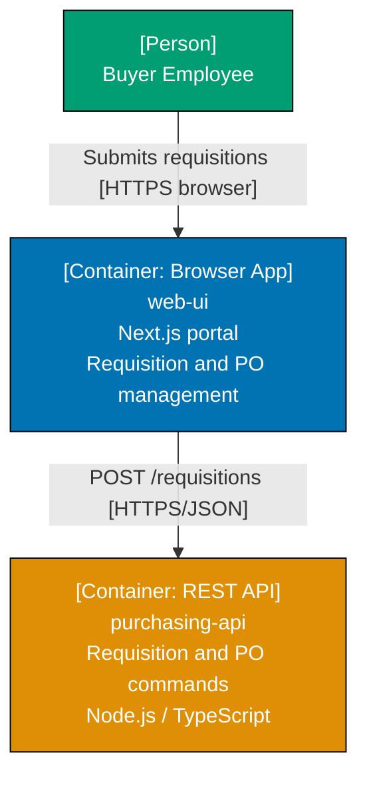
```mermaid
graph TD
    Buyer["[Person]<br/>Buyer Employee"]
    WebUI["[Container: Browser App]<br/>web-ui<br/>Next.js portal<br/>Requisition and PO management"]
    PurchAPI["[Container: REST API]<br/>purchasing-api<br/>Requisition and PO commands<br/>Node.js / TypeScript"]

    Buyer -->|"Submits requisitions [HTTPS browser]"| WebUI
    WebUI -->|"POST /requisitions [HTTPS/JSON]"| PurchAPI

    style Buyer fill:#029E73,stroke:#000,color:#fff
    style WebUI fill:#0173B2,stroke:#000,color:#fff
    style PurchAPI fill:#DE8F05,stroke:#000,color:#fff
```

**Key Elements**:

- **Container type labels**: `[Container: Browser App]` and `[Container: REST API]` prevent ambiguity
- **Technology stack in label**: Next.js for web-ui, Node.js/TypeScript for API — architectural decisions visible
- **Single data flow**: web-ui calls purchasing-api for all state changes; no direct DB access from browser

**Design Rationale**: Starting with two containers and one relationship establishes the pattern before adding complexity. Every additional container is easier to understand once the basic browser-to-API pattern is established.

**Key Takeaway**: Begin Container diagrams with the user-facing containers and their primary relationship. Add internal plumbing (databases, queues) only once the primary data flow is clear.

**Why It Matters**: Container diagrams are the primary communication tool for engineering teams planning deployment topology. Starting with the user-facing path grounds the conversation in user value before infrastructure detail.

---

### Example 32: Adding PostgreSQL — the Write Store

The primary datastore for all P2P state. Every command that changes PO or requisition state writes to PostgreSQL.

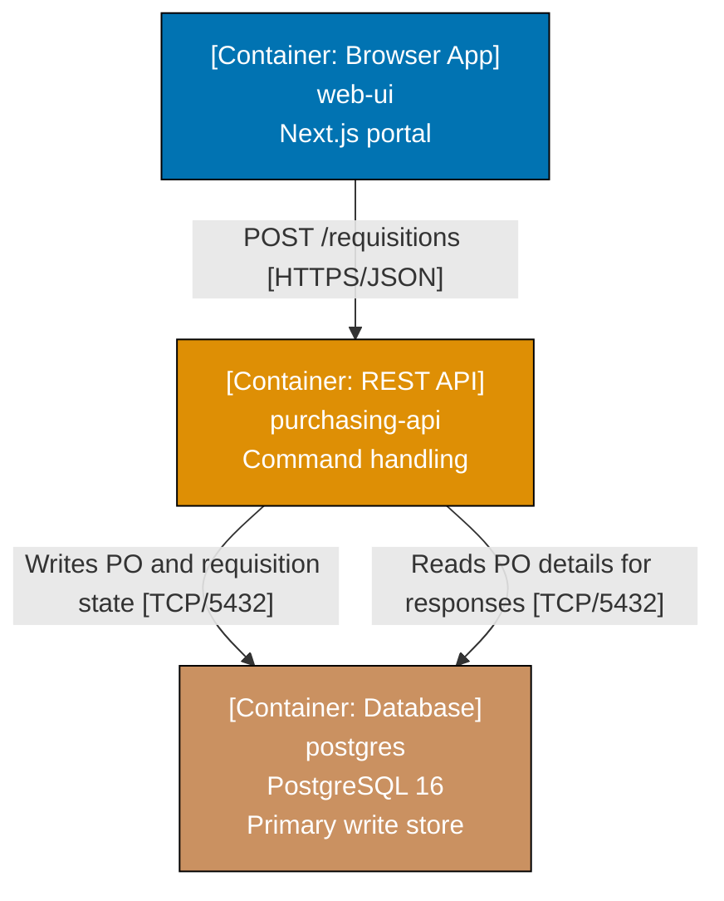
```mermaid
graph TD
    WebUI["[Container: Browser App]<br/>web-ui<br/>Next.js portal"]
    PurchAPI["[Container: REST API]<br/>purchasing-api<br/>Command handling"]
    PG["[Container: Database]<br/>postgres<br/>PostgreSQL 16<br/>Primary write store"]

    WebUI -->|"POST /requisitions [HTTPS/JSON]"| PurchAPI
    PurchAPI -->|"Writes PO and requisition state [TCP/5432]"| PG
    PurchAPI -->|"Reads PO details for responses [TCP/5432]"| PG

    style WebUI fill:#0173B2,stroke:#000,color:#fff
    style PurchAPI fill:#DE8F05,stroke:#000,color:#fff
    style PG fill:#CA9161,stroke:#000,color:#fff
```

**Key Elements**:

- **Separate read and write arrows**: Command path writes; query path reads — different SQL patterns
- **TCP/5432**: PostgreSQL native protocol — not an abstracted HTTP API
- **PostgreSQL version 16**: Versioning in Container diagrams surfaces upgrade planning needs

**Design Rationale**: Showing separate read and write arrows from purchasing-api to postgres signals that CQRS or read optimization patterns may apply. If both arrows are identical, the optimization opportunity is invisible.

**Key Takeaway**: Show separate read and write relationships between an API and its database. This makes query optimization, read replicas, and CQRS patterns visible at Container level.

**Why It Matters**: P2P systems have read-heavy query patterns (order tracking, status checks) and write-heavy command patterns (approvals, PO issuance). Treating reads and writes identically in the diagram produces a database that is over-provisioned for writes and under-provisioned for reads.

---

### Example 33: Adding the Event Bus — Kafka

Domain events flow between containers through Kafka. This decouples purchasing-api from receiving-api and invoicing-api.

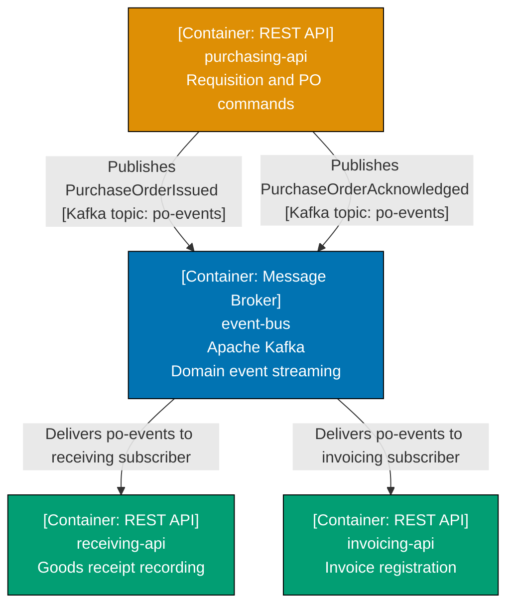
```mermaid
graph TD
    PurchAPI["[Container: REST API]<br/>purchasing-api<br/>Requisition and PO commands"]
    EventBus["[Container: Message Broker]<br/>event-bus<br/>Apache Kafka<br/>Domain event streaming"]
    RecvAPI["[Container: REST API]<br/>receiving-api<br/>Goods receipt recording"]
    InvAPI["[Container: REST API]<br/>invoicing-api<br/>Invoice registration"]

    PurchAPI -->|"Publishes PurchaseOrderIssued [Kafka topic: po-events]"| EventBus
    PurchAPI -->|"Publishes PurchaseOrderAcknowledged [Kafka topic: po-events]"| EventBus
    EventBus -->|"Delivers po-events to receiving subscriber"| RecvAPI
    EventBus -->|"Delivers po-events to invoicing subscriber"| InvAPI

    style PurchAPI fill:#DE8F05,stroke:#000,color:#fff
    style EventBus fill:#0173B2,stroke:#000,color:#fff
    style RecvAPI fill:#029E73,stroke:#000,color:#fff
    style InvAPI fill:#029E73,stroke:#000,color:#fff
```

**Key Elements**:

- **Domain event names**: `PurchaseOrderIssued`, `PurchaseOrderAcknowledged` — not generic messages
- **Kafka topic names**: `po-events` on arrow labels — contractual interface between producer and consumers
- **Fan-out pattern**: One topic, two subscribers — each processes events independently

**Design Rationale**: Naming domain events (not just "sends message") in Container diagrams makes the event contract visible. This prevents publishing teams from changing event shapes without updating consumers.

**Key Takeaway**: Show Kafka topic names and domain event names in Container diagrams. Generic "sends message" labels hide the event contract that drives cross-container consistency.

**Why It Matters**: Event schema mismatches between producer and consumer cause silent data corruption in P2P. A Kafka consumer expecting `PurchaseOrderIssued` with a `supplierId` field that the producer drops will silently skip notifications — a failure that surfaces weeks later in supplier audits.

---

### Example 34: Adding the payments-worker Container

The payments-worker is a background process, not a REST API. It polls for payment-ready invoices and triggers bank disbursement.

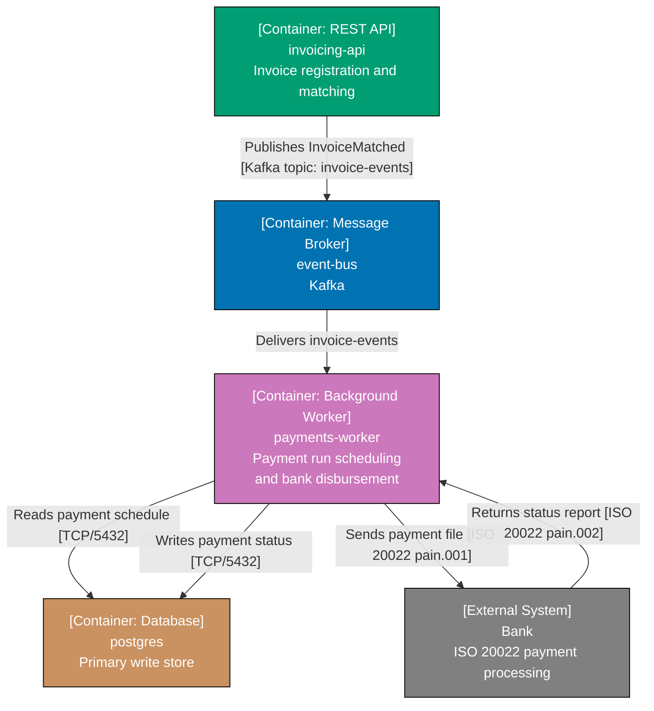
```mermaid
graph TD
    InvAPI["[Container: REST API]<br/>invoicing-api<br/>Invoice registration and matching"]
    EventBus["[Container: Message Broker]<br/>event-bus<br/>Kafka"]
    PayWorker["[Container: Background Worker]<br/>payments-worker<br/>Payment run scheduling<br/>and bank disbursement"]
    Bank["[External System]<br/>Bank<br/>ISO 20022 payment processing"]
    PG["[Container: Database]<br/>postgres<br/>Primary write store"]

    InvAPI -->|"Publishes InvoiceMatched [Kafka topic: invoice-events]"| EventBus
    EventBus -->|"Delivers invoice-events"| PayWorker
    PayWorker -->|"Reads payment schedule [TCP/5432]"| PG
    PayWorker -->|"Writes payment status [TCP/5432]"| PG
    PayWorker -->|"Sends payment file [ISO 20022 pain.001]"| Bank
    Bank -->|"Returns status report [ISO 20022 pain.002]"| PayWorker

    style InvAPI fill:#029E73,stroke:#000,color:#fff
    style EventBus fill:#0173B2,stroke:#000,color:#fff
    style PayWorker fill:#CC78BC,stroke:#000,color:#fff
    style Bank fill:#808080,stroke:#000,color:#fff
    style PG fill:#CA9161,stroke:#000,color:#fff
```

**Key Elements**:

- **Background Worker type**: Distinct container type from REST API — no HTTP server, no user-facing port
- **Event-triggered execution**: Worker subscribes to `invoice-events` rather than being polled
- **pain.001/pain.002**: ISO 20022 payment messages on both arrows — contractual format

**Design Rationale**: Background workers are a distinct deployment unit with different scaling characteristics from REST APIs. Showing the worker as a separate container forces separate scaling and monitoring discussions.

**Key Takeaway**: Model background workers as distinct Container elements with their own type label. Workers have different deployment, scaling, and failure characteristics from REST APIs — conflating them hides operational complexity.

**Why It Matters**: Payment workers that share infrastructure with REST APIs suffer from noisy-neighbor problems during payment runs. Container separation makes the case for isolated worker nodes with dedicated resources during batch disbursement windows.

---

### Example 35: Adding the read-store Container

A read-store (materialized views or read-optimized DB) separates query concerns from the primary write store, enabling CQRS.

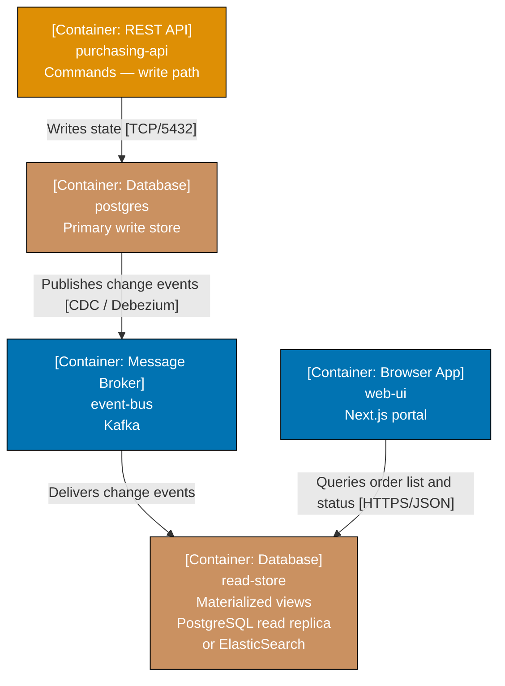
```mermaid
graph TD
    PurchAPI["[Container: REST API]<br/>purchasing-api<br/>Commands — write path"]
    PG["[Container: Database]<br/>postgres<br/>Primary write store"]
    EventBus["[Container: Message Broker]<br/>event-bus<br/>Kafka"]
    ReadStore["[Container: Database]<br/>read-store<br/>Materialized views<br/>PostgreSQL read replica<br/>or ElasticSearch"]
    WebUI["[Container: Browser App]<br/>web-ui<br/>Next.js portal"]

    PurchAPI -->|"Writes state [TCP/5432]"| PG
    PG -->|"Publishes change events [CDC / Debezium]"| EventBus
    EventBus -->|"Delivers change events"| ReadStore
    WebUI -->|"Queries order list and status [HTTPS/JSON]"| ReadStore

    style PurchAPI fill:#DE8F05,stroke:#000,color:#fff
    style PG fill:#CA9161,stroke:#000,color:#fff
    style EventBus fill:#0173B2,stroke:#000,color:#fff
    style ReadStore fill:#CA9161,stroke:#000,color:#fff
    style WebUI fill:#0173B2,stroke:#000,color:#fff
```

**Key Elements**:

- **CDC / Debezium**: Change Data Capture populates read-store from write-store events
- **WebUI reads from read-store, not postgres**: Read path is isolated from write path
- **Eventual consistency**: CDC introduces lag — read-store is eventually consistent

**Design Rationale**: CQRS at Container level separates the write path (purchasing-api → postgres) from the read path (web-ui → read-store). This separation makes eventual consistency visible and forces the team to plan for it.

**Key Takeaway**: When query patterns differ significantly from write patterns, model a separate read-store container. Eventual consistency introduced by CDC must be acknowledged at Container level, not discovered by users.

**Why It Matters**: P2P dashboards (order status lists, spend analytics) have very different query patterns from command handlers. Without a read-store, complex reporting queries compete with transactional writes on the same database, causing performance degradation during month-end reporting runs.

---

### Example 36: Adding the secret-manager Container

The secret-manager container stores and rotates credentials used by all other containers.

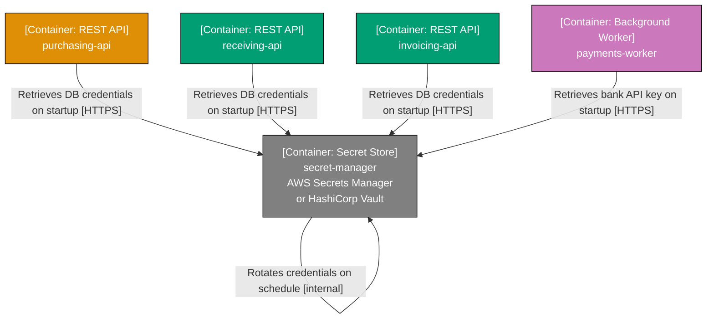
```mermaid
graph TD
    PurchAPI["[Container: REST API]<br/>purchasing-api"]
    RecvAPI["[Container: REST API]<br/>receiving-api"]
    InvAPI["[Container: REST API]<br/>invoicing-api"]
    PayWorker["[Container: Background Worker]<br/>payments-worker"]
    SecretMgr["[Container: Secret Store]<br/>secret-manager<br/>AWS Secrets Manager<br/>or HashiCorp Vault"]

    PurchAPI -->|"Retrieves DB credentials on startup [HTTPS]"| SecretMgr
    RecvAPI -->|"Retrieves DB credentials on startup [HTTPS]"| SecretMgr
    InvAPI -->|"Retrieves DB credentials on startup [HTTPS]"| SecretMgr
    PayWorker -->|"Retrieves bank API key on startup [HTTPS]"| SecretMgr
    SecretMgr -->|"Rotates credentials on schedule [internal]"| SecretMgr

    style PurchAPI fill:#DE8F05,stroke:#000,color:#fff
    style RecvAPI fill:#029E73,stroke:#000,color:#fff
    style InvAPI fill:#029E73,stroke:#000,color:#fff
    style PayWorker fill:#CC78BC,stroke:#000,color:#fff
    style SecretMgr fill:#808080,stroke:#000,color:#fff
```

**Key Elements**:

- **All containers fetch credentials**: No hardcoded secrets in any container's environment variables
- **On startup retrieval**: Credentials fetched at container start — rotation triggers restart or cache refresh
- **Bank API key in payments-worker**: Only the worker holds the bank credential — least-privilege

**Design Rationale**: Drawing the secret-manager at Container level makes secret management a first-class architectural concern. Teams that leave it implicit discover credential rotation failures in production.

**Key Takeaway**: Show secret-manager as a container that every credential-consuming container depends on. Secret management is an architectural dependency, not a deployment detail.

**Why It Matters**: Hardcoded or environment-variable credentials cannot be rotated without redeployment. Secret manager integration enables zero-downtime credential rotation — a requirement in financial services where credential compromise triggers immediate rotation mandates.

---

### Example 37: Full Container Diagram — All Nine Containers

The complete Level 2 view of the Procurement Platform with all containers in one diagram.

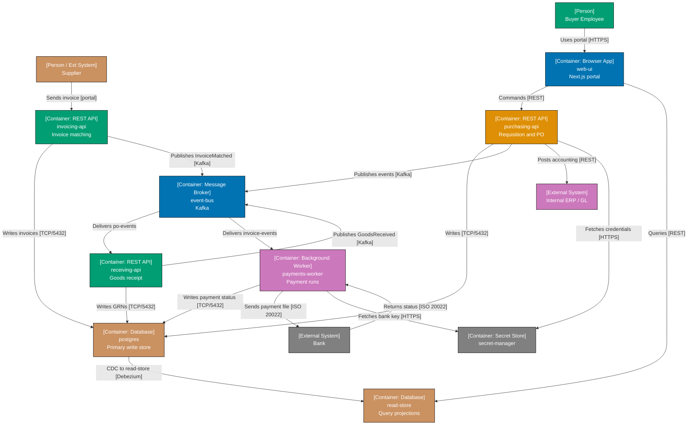
```mermaid
graph TD
    Buyer["[Person]<br/>Buyer Employee"]
    Supplier["[Person / Ext System]<br/>Supplier"]
    Bank["[External System]<br/>Bank"]
    ERP["[External System]<br/>Internal ERP / GL"]

    WebUI["[Container: Browser App]<br/>web-ui<br/>Next.js portal"]
    PurchAPI["[Container: REST API]<br/>purchasing-api<br/>Requisition and PO"]
    RecvAPI["[Container: REST API]<br/>receiving-api<br/>Goods receipt"]
    InvAPI["[Container: REST API]<br/>invoicing-api<br/>Invoice matching"]
    PayWorker["[Container: Background Worker]<br/>payments-worker<br/>Payment runs"]
    EventBus["[Container: Message Broker]<br/>event-bus<br/>Kafka"]
    PG["[Container: Database]<br/>postgres<br/>Primary write store"]
    ReadStore["[Container: Database]<br/>read-store<br/>Query projections"]
    SecretMgr["[Container: Secret Store]<br/>secret-manager"]

    Buyer -->|"Uses portal [HTTPS]"| WebUI
    WebUI -->|"Commands [REST]"| PurchAPI
    WebUI -->|"Queries [REST]"| ReadStore
    PurchAPI -->|"Writes [TCP/5432]"| PG
    PurchAPI -->|"Publishes events [Kafka]"| EventBus
    RecvAPI -->|"Writes GRNs [TCP/5432]"| PG
    RecvAPI -->|"Publishes GoodsReceived [Kafka]"| EventBus
    InvAPI -->|"Writes invoices [TCP/5432]"| PG
    InvAPI -->|"Publishes InvoiceMatched [Kafka]"| EventBus
    EventBus -->|"Delivers po-events"| RecvAPI
    EventBus -->|"Delivers invoice-events"| PayWorker
    PG -->|"CDC to read-store [Debezium]"| ReadStore
    PayWorker -->|"Writes payment status [TCP/5432]"| PG
    PayWorker -->|"Sends payment file [ISO 20022]"| Bank
    Bank -->|"Returns status [ISO 20022]"| PayWorker
    PurchAPI -->|"Posts accounting [REST]"| ERP
    Supplier -->|"Sends invoice [portal]"| InvAPI
    PurchAPI -->|"Fetches credentials [HTTPS]"| SecretMgr
    PayWorker -->|"Fetches bank key [HTTPS]"| SecretMgr

    style Buyer fill:#029E73,stroke:#000,color:#fff
    style Supplier fill:#CA9161,stroke:#000,color:#fff
    style Bank fill:#808080,stroke:#000,color:#fff
    style ERP fill:#CC78BC,stroke:#000,color:#fff
    style WebUI fill:#0173B2,stroke:#000,color:#fff
    style PurchAPI fill:#DE8F05,stroke:#000,color:#fff
    style RecvAPI fill:#029E73,stroke:#000,color:#fff
    style InvAPI fill:#029E73,stroke:#000,color:#fff
    style PayWorker fill:#CC78BC,stroke:#000,color:#fff
    style EventBus fill:#0173B2,stroke:#000,color:#fff
    style PG fill:#CA9161,stroke:#000,color:#fff
    style ReadStore fill:#CA9161,stroke:#000,color:#fff
    style SecretMgr fill:#808080,stroke:#000,color:#fff
```

**Key Elements**:

- **Nine internal containers**: All deployment units in one view
- **Four external actors**: Buyer, Supplier, Bank, ERP from Level 1
- **Event-driven backbone**: Kafka connects all three API containers asynchronously

**Design Rationale**: The full Container diagram is the engineering team's primary shared mental model. It is updated when new containers are introduced and reviewed at every major architecture decision.

**Key Takeaway**: Maintain one authoritative full Container diagram per system. It serves as the reference point for all technical discussions about deployment, scaling, and integration.

**Why It Matters**: Engineering teams without a shared Container diagram make siloed decisions that create integration problems at deployment time. One authoritative diagram prevents duplicate containers, conflicting technology choices, and missed integration points.

---

### Example 38: Container Diagram — Technology Choices

Annotating technology choices at Container level makes the architecture decision record visible without requiring a separate ADR document.

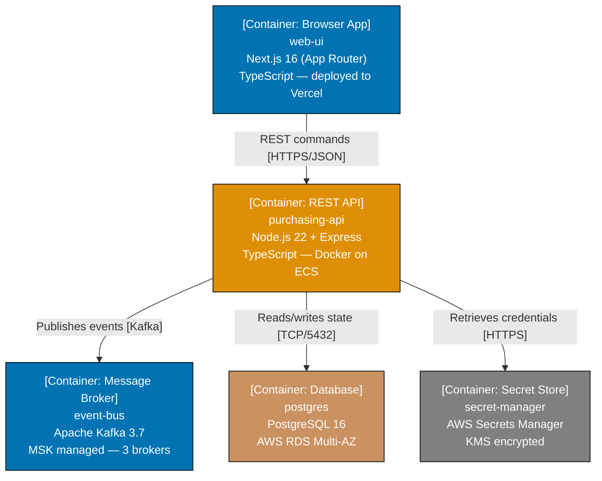
```mermaid
graph TD
    WebUI["[Container: Browser App]<br/>web-ui<br/>Next.js 16 (App Router)<br/>TypeScript — deployed to Vercel"]
    PurchAPI["[Container: REST API]<br/>purchasing-api<br/>Node.js 22 + Express<br/>TypeScript — Docker on ECS"]
    EventBus["[Container: Message Broker]<br/>event-bus<br/>Apache Kafka 3.7<br/>MSK managed — 3 brokers"]
    PG["[Container: Database]<br/>postgres<br/>PostgreSQL 16<br/>AWS RDS Multi-AZ"]
    SecretMgr["[Container: Secret Store]<br/>secret-manager<br/>AWS Secrets Manager<br/>KMS encrypted"]

    WebUI -->|"REST commands [HTTPS/JSON]"| PurchAPI
    PurchAPI -->|"Publishes events [Kafka]"| EventBus
    PurchAPI -->|"Reads/writes state [TCP/5432]"| PG
    PurchAPI -->|"Retrieves credentials [HTTPS]"| SecretMgr

    style WebUI fill:#0173B2,stroke:#000,color:#fff
    style PurchAPI fill:#DE8F05,stroke:#000,color:#fff
    style EventBus fill:#0173B2,stroke:#000,color:#fff
    style PG fill:#CA9161,stroke:#000,color:#fff
    style SecretMgr fill:#808080,stroke:#000,color:#fff
```

**Key Elements**:

- **Version pinning in labels**: Next.js 16, Node.js 22, Kafka 3.7, PostgreSQL 16 — upgrade surface visible
- **Deployment target in label**: Vercel, ECS, MSK, RDS — infrastructure ownership visible
- **Managed vs. self-managed**: MSK (managed Kafka) vs. self-managed Kafka is architecturally significant

**Design Rationale**: Technology choices in container labels transform diagrams from architecture into architecture decision records. Version numbers make upgrade planning visible without a separate document.

**Key Takeaway**: Include technology name and version in container labels when those choices are consequential. Labels double as lightweight ADRs visible at a glance.

**Why It Matters**: Teams that omit versions from Container diagrams routinely discover incompatible dependency updates during deployments. Version visibility at Container level enables proactive upgrade planning before security advisories force emergency patches.

---

## Container Diagrams — Integration Patterns (Examples 39–46)

### Example 39: Request-Response vs. Event-Driven Containers

The Container diagram can explicitly show which relationships are synchronous request-response and which are asynchronous event-driven.

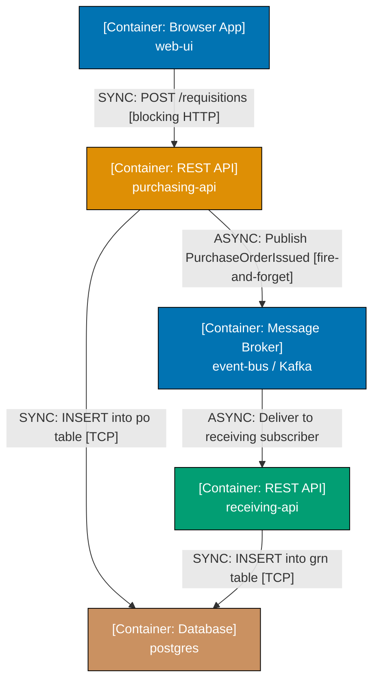
```mermaid
graph TD
    WebUI["[Container: Browser App]<br/>web-ui"]
    PurchAPI["[Container: REST API]<br/>purchasing-api"]
    EventBus["[Container: Message Broker]<br/>event-bus / Kafka"]
    RecvAPI["[Container: REST API]<br/>receiving-api"]
    PG["[Container: Database]<br/>postgres"]

    WebUI -->|"SYNC: POST /requisitions [blocking HTTP]"| PurchAPI
    PurchAPI -->|"SYNC: INSERT into po table [TCP]"| PG
    PurchAPI -->|"ASYNC: Publish PurchaseOrderIssued [fire-and-forget]"| EventBus
    EventBus -->|"ASYNC: Deliver to receiving subscriber"| RecvAPI
    RecvAPI -->|"SYNC: INSERT into grn table [TCP]"| PG

    style WebUI fill:#0173B2,stroke:#000,color:#fff
    style PurchAPI fill:#DE8F05,stroke:#000,color:#fff
    style EventBus fill:#0173B2,stroke:#000,color:#fff
    style RecvAPI fill:#029E73,stroke:#000,color:#fff
    style PG fill:#CA9161,stroke:#000,color:#fff
```

**Key Elements**:

- **SYNC / ASYNC prefixes**: Every arrow labeled with synchronicity character
- **Fire-and-forget on Kafka**: Platform does not wait for receiving-api to consume the event
- **Both sync writes to postgres**: Even event consumers write synchronously to their own tables

**Design Rationale**: Mixing SYNC and ASYNC labels forces the team to identify failure modes for each path. Sync failures propagate up the call stack; async failures require independent retry mechanisms.

**Key Takeaway**: Label every arrow with its synchronicity pattern (SYNC or ASYNC). This surfaces dead-letter queue requirements, retry policy needs, and user-facing latency commitments.

**Why It Matters**: P2P teams frequently debug timeouts that trace to synchronous ERP calls blocking the user-facing requisition API. If the blocking call was labeled SYNC in the Container diagram, the latency risk would have been addressed at design time.

---

### Example 40: Container Diagram — Scaling Annotations

Adding scaling strategy to container labels makes horizontal scaling decisions explicit.

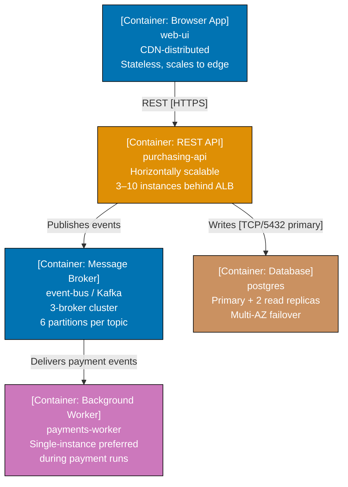
```mermaid
graph TD
    WebUI["[Container: Browser App]<br/>web-ui<br/>CDN-distributed<br/>Stateless, scales to edge"]
    PurchAPI["[Container: REST API]<br/>purchasing-api<br/>Horizontally scalable<br/>3–10 instances behind ALB"]
    EventBus["[Container: Message Broker]<br/>event-bus / Kafka<br/>3-broker cluster<br/>6 partitions per topic"]
    PayWorker["[Container: Background Worker]<br/>payments-worker<br/>Single-instance preferred<br/>during payment runs"]
    PG["[Container: Database]<br/>postgres<br/>Primary + 2 read replicas<br/>Multi-AZ failover"]

    WebUI -->|"REST [HTTPS]"| PurchAPI
    PurchAPI -->|"Publishes events"| EventBus
    EventBus -->|"Delivers payment events"| PayWorker
    PurchAPI -->|"Writes [TCP/5432 primary]"| PG

    style WebUI fill:#0173B2,stroke:#000,color:#fff
    style PurchAPI fill:#DE8F05,stroke:#000,color:#fff
    style EventBus fill:#0173B2,stroke:#000,color:#fff
    style PayWorker fill:#CC78BC,stroke:#000,color:#fff
    style PG fill:#CA9161,stroke:#000,color:#fff
```

**Key Elements**:

- **Scale-out containers**: web-ui and purchasing-api labeled as horizontally scalable
- **Single-instance payments-worker**: Payment runs require idempotency guarantees; multiple instances risk double-payment
- **PostgreSQL Multi-AZ**: High availability for the write store
- **Kafka partitions**: 6 partitions allows up to 6 parallel consumer instances per topic

**Design Rationale**: Scaling annotations in container labels make the deployment topology's scaling constraints visible. The single-instance payments-worker constraint is critical — it must be enforced by infrastructure, not convention.

**Key Takeaway**: Annotate scaling strategy on container labels. Single-instance constraints and scale-out expectations are architectural decisions that must survive into infrastructure configuration.

**Why It Matters**: Accidental horizontal scaling of a payment worker that lacks idempotency protection causes double-payments — a financial error that is expensive to reverse and damages supplier relationships permanently.

---

### Example 41: Container Diagram — Failure Modes

Annotating what happens when each container fails makes resilience design explicit.

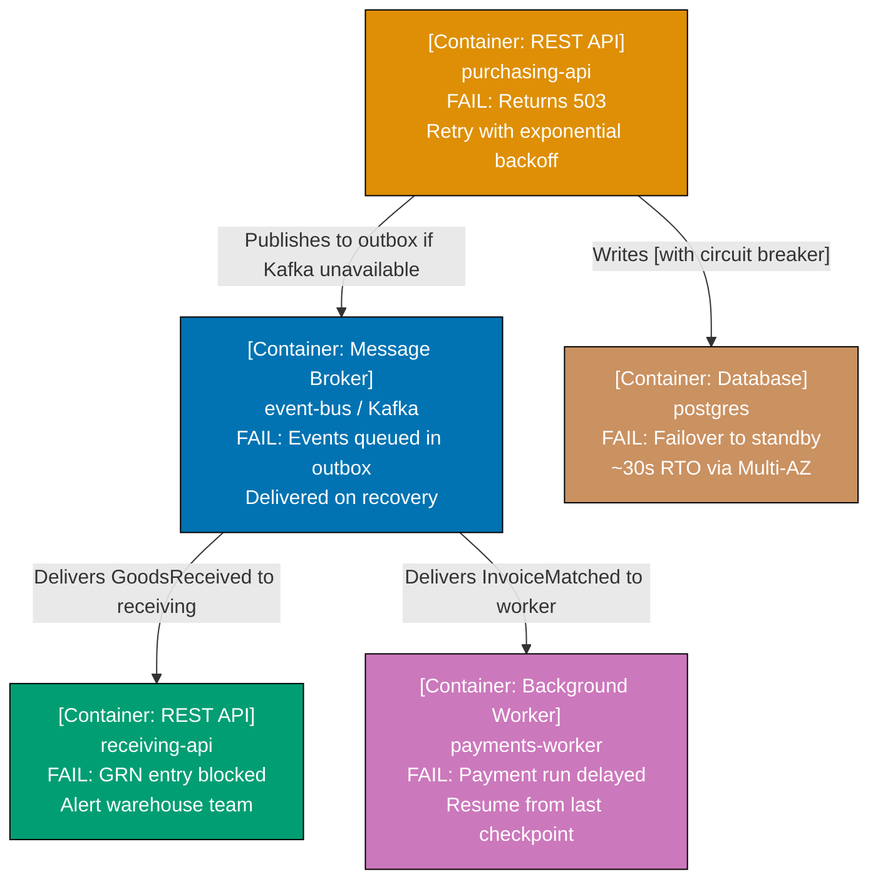
```mermaid
graph TD
    PurchAPI["[Container: REST API]<br/>purchasing-api<br/>FAIL: Returns 503<br/>Retry with exponential backoff"]
    EventBus["[Container: Message Broker]<br/>event-bus / Kafka<br/>FAIL: Events queued in outbox<br/>Delivered on recovery"]
    RecvAPI["[Container: REST API]<br/>receiving-api<br/>FAIL: GRN entry blocked<br/>Alert warehouse team"]
    PG["[Container: Database]<br/>postgres<br/>FAIL: Failover to standby<br/>~30s RTO via Multi-AZ"]
    PayWorker["[Container: Background Worker]<br/>payments-worker<br/>FAIL: Payment run delayed<br/>Resume from last checkpoint"]

    PurchAPI -->|"Publishes to outbox if Kafka unavailable"| EventBus
    EventBus -->|"Delivers GoodsReceived to receiving"| RecvAPI
    PurchAPI -->|"Writes [with circuit breaker]"| PG
    EventBus -->|"Delivers InvoiceMatched to worker"| PayWorker

    style PurchAPI fill:#DE8F05,stroke:#000,color:#fff
    style EventBus fill:#0173B2,stroke:#000,color:#fff
    style RecvAPI fill:#029E73,stroke:#000,color:#fff
    style PG fill:#CA9161,stroke:#000,color:#fff
    style PayWorker fill:#CC78BC,stroke:#000,color:#fff
```

**Key Elements**:

- **FAIL annotation per container**: Each container has an explicit failure mode in its label
- **Outbox pattern**: Events stored in postgres outbox when Kafka is unavailable — no event loss
- **Circuit breaker on DB**: Prevents cascading failure when postgres is slow or unavailable

**Design Rationale**: Failure mode annotations force the team to design for resilience, not just the happy path. Each failure annotation becomes a test scenario in the integration test suite.

**Key Takeaway**: Annotate failure behavior in container labels. If you cannot describe what happens when a container fails, you have not designed its resilience.

**Why It Matters**: P2P platforms that lose events when Kafka is down require manual reconciliation of POs and GRNs — a time-consuming audit task. Outbox patterns prevent this, but only if they are designed in from the start.

---

### Example 42: Container Diagram — Network Topology

Showing which containers are in which network zones reveals security and latency design.

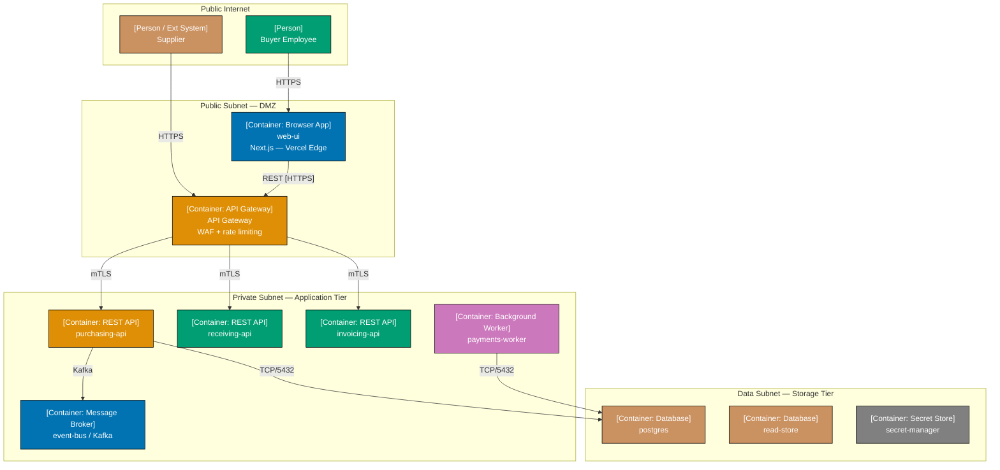
```mermaid
graph TD
    subgraph PublicInternet["Public Internet"]
        Buyer["[Person]<br/>Buyer Employee"]
        Supplier["[Person / Ext System]<br/>Supplier"]
    end

    subgraph PublicSubnet["Public Subnet — DMZ"]
        WebUI["[Container: Browser App]<br/>web-ui<br/>Next.js — Vercel Edge"]
        APIGW["[Container: API Gateway]<br/>API Gateway<br/>WAF + rate limiting"]
    end

    subgraph PrivateSubnet["Private Subnet — Application Tier"]
        PurchAPI["[Container: REST API]<br/>purchasing-api"]
        RecvAPI["[Container: REST API]<br/>receiving-api"]
        InvAPI["[Container: REST API]<br/>invoicing-api"]
        PayWorker["[Container: Background Worker]<br/>payments-worker"]
        EventBus["[Container: Message Broker]<br/>event-bus / Kafka"]
    end

    subgraph DataSubnet["Data Subnet — Storage Tier"]
        PG["[Container: Database]<br/>postgres"]
        ReadStore["[Container: Database]<br/>read-store"]
        SecretMgr["[Container: Secret Store]<br/>secret-manager"]
    end

    Buyer -->|"HTTPS"| WebUI
    Supplier -->|"HTTPS"| APIGW
    WebUI -->|"REST [HTTPS]"| APIGW
    APIGW -->|"mTLS"| PurchAPI
    APIGW -->|"mTLS"| RecvAPI
    APIGW -->|"mTLS"| InvAPI
    PurchAPI -->|"TCP/5432"| PG
    PurchAPI -->|"Kafka"| EventBus
    PayWorker -->|"TCP/5432"| PG

    style Buyer fill:#029E73,stroke:#000,color:#fff
    style Supplier fill:#CA9161,stroke:#000,color:#fff
    style WebUI fill:#0173B2,stroke:#000,color:#fff
    style APIGW fill:#DE8F05,stroke:#000,color:#fff
    style PurchAPI fill:#DE8F05,stroke:#000,color:#fff
    style RecvAPI fill:#029E73,stroke:#000,color:#fff
    style InvAPI fill:#029E73,stroke:#000,color:#fff
    style PayWorker fill:#CC78BC,stroke:#000,color:#fff
    style EventBus fill:#0173B2,stroke:#000,color:#fff
    style PG fill:#CA9161,stroke:#000,color:#fff
    style ReadStore fill:#CA9161,stroke:#000,color:#fff
    style SecretMgr fill:#808080,stroke:#000,color:#fff
```

**Key Elements**:

- **Three subnet tiers**: DMZ, Application, Data — defense-in-depth visible
- **mTLS inside private subnet**: Service-to-service authentication within the trusted tier
- **Data subnet has no public access**: postgres, read-store, and secret-manager cannot be reached from internet

**Design Rationale**: Network topology at Container level makes security zone boundaries architectural, not operational. Security engineering can validate zone assignments before any infrastructure is provisioned.

**Key Takeaway**: Show network zones in Container diagrams for security-sensitive systems. Zone assignment is an architectural decision — moving a container between zones after deployment is expensive.

**Why It Matters**: Procurement platforms that accidentally expose postgres or secret-manager to public subnets have a misconfiguration that persists until a security audit or breach discovers it. Architectural diagrams with explicit zone labels prevent misconfigurations at provisioning time.

---

### Example 43: Container Diagram — Data Ownership

Each container owns specific data. Making data ownership explicit prevents accidental cross-container data access.

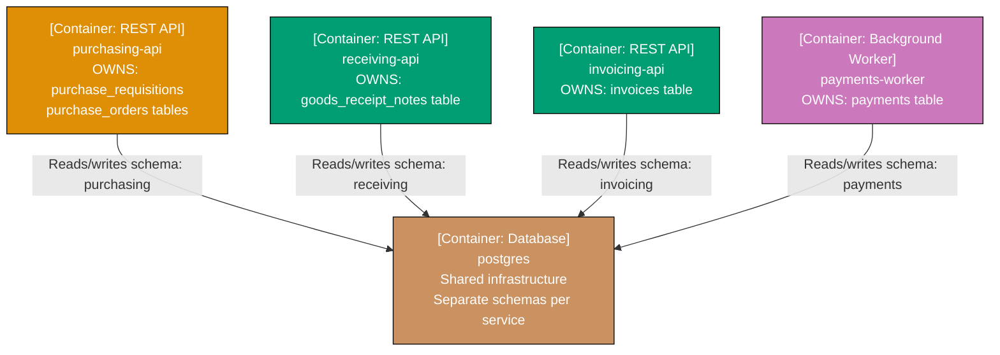
```mermaid
graph TD
    PurchAPI["[Container: REST API]<br/>purchasing-api<br/>OWNS: purchase_requisitions<br/>purchase_orders tables"]
    RecvAPI["[Container: REST API]<br/>receiving-api<br/>OWNS: goods_receipt_notes table"]
    InvAPI["[Container: REST API]<br/>invoicing-api<br/>OWNS: invoices table"]
    PayWorker["[Container: Background Worker]<br/>payments-worker<br/>OWNS: payments table"]
    PG["[Container: Database]<br/>postgres<br/>Shared infrastructure<br/>Separate schemas per service"]

    PurchAPI -->|"Reads/writes schema: purchasing"| PG
    RecvAPI -->|"Reads/writes schema: receiving"| PG
    InvAPI -->|"Reads/writes schema: invoicing"| PG
    PayWorker -->|"Reads/writes schema: payments"| PG

    style PurchAPI fill:#DE8F05,stroke:#000,color:#fff
    style RecvAPI fill:#029E73,stroke:#000,color:#fff
    style InvAPI fill:#029E73,stroke:#000,color:#fff
    style PayWorker fill:#CC78BC,stroke:#000,color:#fff
    style PG fill:#CA9161,stroke:#000,color:#fff
```

**Key Elements**:

- **OWNS annotation**: Each container's label includes the tables it owns
- **Schema-per-service**: Shared postgres instance but separate schemas enforce ownership
- **No cross-schema SQL**: Containers read each other's data through events, not JOIN queries

**Design Rationale**: Schema-per-service in a shared postgres instance delivers microservice data isolation without the operational overhead of separate databases. Container labels make the ownership contract explicit.

**Key Takeaway**: Annotate data ownership in container labels. Teams that leave data ownership implicit routinely introduce cross-service SQL JOINs that create tight coupling and make service extraction impossible.

**Why It Matters**: P2P services that share tables develop hidden dependencies that prevent independent deployment. Schema-per-service boundaries enforced at the Container diagram level prevent these dependencies from forming in the first place.

---

### Example 44: Three-Way Match Flow — Container Interaction

The invoice three-way matching process spans three containers. A container-level view shows which containers participate and in what order.

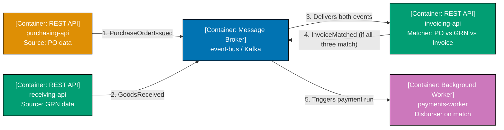
```mermaid
graph LR
    PurchAPI["[Container: REST API]<br/>purchasing-api<br/>Source: PO data"]
    EventBus["[Container: Message Broker]<br/>event-bus / Kafka"]
    RecvAPI["[Container: REST API]<br/>receiving-api<br/>Source: GRN data"]
    InvAPI["[Container: REST API]<br/>invoicing-api<br/>Matcher: PO vs GRN vs Invoice"]
    PayWorker["[Container: Background Worker]<br/>payments-worker<br/>Disburser on match"]

    PurchAPI -->|"1. PurchaseOrderIssued"| EventBus
    RecvAPI -->|"2. GoodsReceived"| EventBus
    EventBus -->|"3. Delivers both events"| InvAPI
    InvAPI -->|"4. InvoiceMatched (if all three match)"| EventBus
    EventBus -->|"5. Triggers payment run"| PayWorker

    style PurchAPI fill:#DE8F05,stroke:#000,color:#fff
    style EventBus fill:#0173B2,stroke:#000,color:#fff
    style RecvAPI fill:#029E73,stroke:#000,color:#fff
    style InvAPI fill:#029E73,stroke:#000,color:#fff
    style PayWorker fill:#CC78BC,stroke:#000,color:#fff
```

**Key Elements**:

- **Numbered arrows**: Five-step matching flow made explicit
- **invoicing-api as the matcher**: invoicing-api holds the three-way match logic, not a shared service
- **Event-driven trigger**: Payment starts on InvoiceMatched event — no polling

**Design Rationale**: Showing the three-way match as a numbered event flow makes the temporal dependency visible. invoicing-api cannot match until it has received both `PurchaseOrderIssued` and `GoodsReceived`.

**Key Takeaway**: Use numbered arrows in Container diagrams to show multi-container process flows. The temporal dependency between events reveals the correlation logic that invoicing-api must implement.

**Why It Matters**: Three-way match failures are the primary cause of incorrect payments in P2P. Architectural clarity about which container holds the match logic and which events trigger it makes the matching algorithm testable and auditable.

---

### Example 45: Container Diagram — Deployment Units and Teams

Aligning containers to teams makes Conway's Law visible and enables autonomous team deployment.

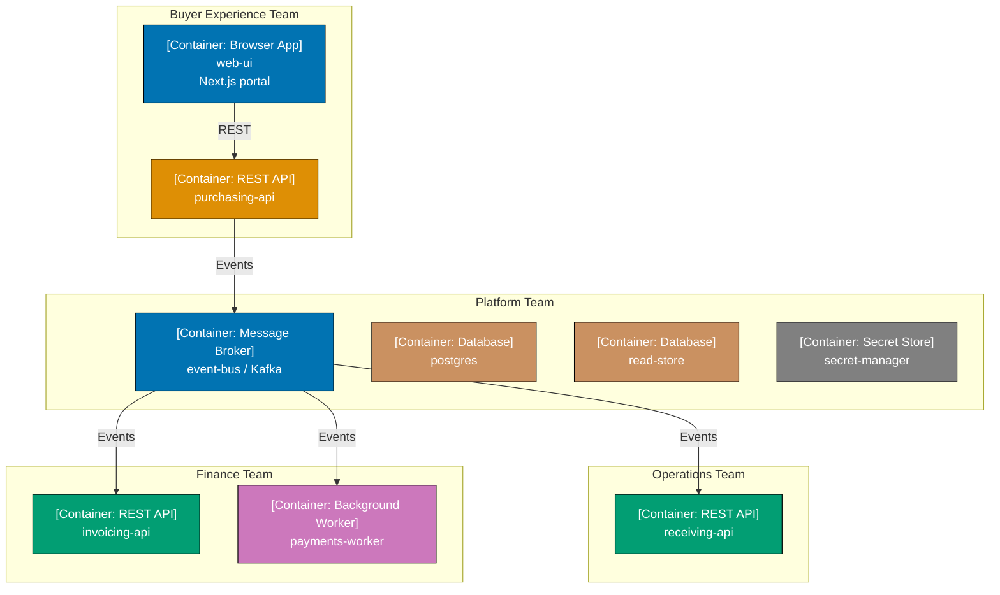
```mermaid
graph TD
    subgraph BuyerTeam["Buyer Experience Team"]
        WebUI["[Container: Browser App]<br/>web-ui<br/>Next.js portal"]
        PurchAPI["[Container: REST API]<br/>purchasing-api"]
    end

    subgraph OperationsTeam["Operations Team"]
        RecvAPI["[Container: REST API]<br/>receiving-api"]
    end

    subgraph FinanceTeam["Finance Team"]
        InvAPI["[Container: REST API]<br/>invoicing-api"]
        PayWorker["[Container: Background Worker]<br/>payments-worker"]
    end

    subgraph PlatformTeam["Platform Team"]
        EventBus["[Container: Message Broker]<br/>event-bus / Kafka"]
        PG["[Container: Database]<br/>postgres"]
        ReadStore["[Container: Database]<br/>read-store"]
        SecretMgr["[Container: Secret Store]<br/>secret-manager"]
    end

    WebUI -->|"REST"| PurchAPI
    PurchAPI -->|"Events"| EventBus
    EventBus -->|"Events"| RecvAPI
    EventBus -->|"Events"| InvAPI
    EventBus -->|"Events"| PayWorker

    style WebUI fill:#0173B2,stroke:#000,color:#fff
    style PurchAPI fill:#DE8F05,stroke:#000,color:#fff
    style RecvAPI fill:#029E73,stroke:#000,color:#fff
    style InvAPI fill:#029E73,stroke:#000,color:#fff
    style PayWorker fill:#CC78BC,stroke:#000,color:#fff
    style EventBus fill:#0173B2,stroke:#000,color:#fff
    style PG fill:#CA9161,stroke:#000,color:#fff
    style ReadStore fill:#CA9161,stroke:#000,color:#fff
    style SecretMgr fill:#808080,stroke:#000,color:#fff
```

**Key Elements**:

- **Team subgraphs**: Container ownership aligned to team — Conway's Law made visible
- **Event-based inter-team communication**: Teams communicate through Kafka, not direct API calls
- **Platform Team owns shared infrastructure**: EventBus, postgres, read-store

**Design Rationale**: When container ownership matches team ownership, teams can deploy their containers independently. When multiple teams own one container, every deployment requires coordination.

**Key Takeaway**: Align container boundaries to team boundaries. Containers shared across teams create deployment bottlenecks. Kafka as the inter-team communication layer enables independent deployment schedules.

**Why It Matters**: Deployment coordination between teams is a leading cause of slow release cycles. Container diagrams that make team boundaries visible enable autonomous deployment — a prerequisite for continuous delivery in P2P platforms.

---

### Example 46: Container Diagram — Health and Readiness Boundaries

Annotating health check behavior on containers makes the deployment contract explicit.

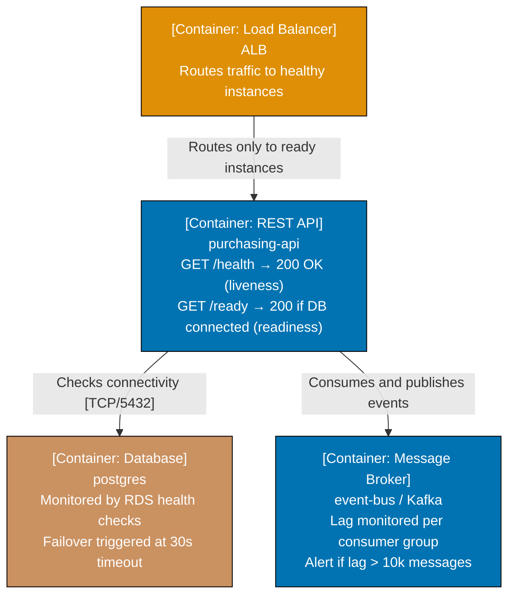
```mermaid
graph TD
    LB["[Container: Load Balancer]<br/>ALB<br/>Routes traffic to healthy instances"]
    PurchAPI["[Container: REST API]<br/>purchasing-api<br/>GET /health → 200 OK (liveness)<br/>GET /ready → 200 if DB connected (readiness)"]
    PG["[Container: Database]<br/>postgres<br/>Monitored by RDS health checks<br/>Failover triggered at 30s timeout"]
    EventBus["[Container: Message Broker]<br/>event-bus / Kafka<br/>Lag monitored per consumer group<br/>Alert if lag > 10k messages"]

    LB -->|"Routes only to ready instances"| PurchAPI
    PurchAPI -->|"Checks connectivity [TCP/5432]"| PG
    PurchAPI -->|"Consumes and publishes events"| EventBus

    style LB fill:#DE8F05,stroke:#000,color:#fff
    style PurchAPI fill:#0173B2,stroke:#000,color:#fff
    style PG fill:#CA9161,stroke:#000,color:#fff
    style EventBus fill:#0173B2,stroke:#000,color:#fff
```

**Key Elements**:

- **Liveness vs. readiness**: Two distinct health endpoints with different failure behaviors
- **Readiness checks DB connectivity**: An instance without a DB connection is not ready for traffic
- **Kafka lag alerting**: Consumer lag is a health signal for event-driven containers

**Design Rationale**: Health check design at Container level ensures all deployment platforms (Kubernetes, ECS) use consistent liveness and readiness semantics. Inconsistent health checks cause false-positive restarts that disrupt payment runs.

**Key Takeaway**: Define liveness and readiness health check behavior in container labels. The distinction between "still running" (liveness) and "ready to serve traffic" (readiness) is critical for zero-downtime deployment.

**Why It Matters**: payments-worker restarts during an active payment run can leave payments in an ambiguous state — initiated at the bank but not confirmed in postgres. Correct readiness checks prevent the load balancer from routing new work to a restarting worker.

---

## Component Diagrams — Inside purchasing-api (Examples 47–60)

### Example 47: Component Overview — purchasing-api Layer Structure

purchasing-api is organized in four horizontal layers. The Component diagram zooms inside the container and reveals these layers.

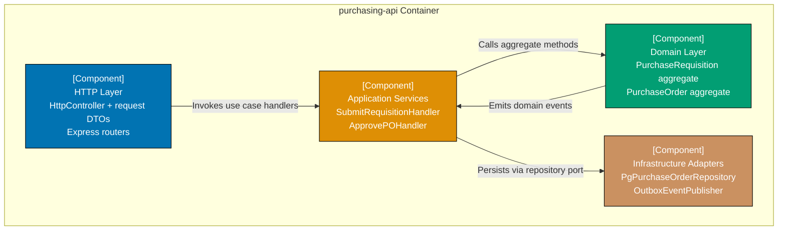
```mermaid
graph TD
    subgraph PurchAPI["purchasing-api Container"]
        HTTP["[Component]<br/>HTTP Layer<br/>HttpController + request DTOs<br/>Express routers"]
        AppSvc["[Component]<br/>Application Services<br/>SubmitRequisitionHandler<br/>ApprovePOHandler"]
        Domain["[Component]<br/>Domain Layer<br/>PurchaseRequisition aggregate<br/>PurchaseOrder aggregate"]
        Infra["[Component]<br/>Infrastructure Adapters<br/>PgPurchaseOrderRepository<br/>OutboxEventPublisher"]
    end

    HTTP -->|"Invokes use case handlers"| AppSvc
    AppSvc -->|"Calls aggregate methods"| Domain
    AppSvc -->|"Persists via repository port"| Infra
    Domain -->|"Emits domain events"| AppSvc

    style HTTP fill:#0173B2,stroke:#000,color:#fff
    style AppSvc fill:#DE8F05,stroke:#000,color:#fff
    style Domain fill:#029E73,stroke:#000,color:#fff
    style Infra fill:#CA9161,stroke:#000,color:#fff
```

**Key Elements**:

- **Four layers**: HTTP → Application Services → Domain → Infrastructure — classic hexagonal structure
- **Domain emits events up**: Domain events bubble up to Application Services for publishing
- **Infrastructure at bottom**: Adapters depend on domain interfaces, not the reverse

**Design Rationale**: The four-layer component structure enforces the dependency rule: outer layers depend on inner layers, never the reverse. The Domain layer has zero dependencies on infrastructure.

**Key Takeaway**: Component diagrams for API containers should show the dependency direction explicitly. Domain → Infrastructure arrows that point inward (infrastructure depends on domain) signal correct hexagonal structure; outward arrows signal an architecture violation.

**Why It Matters**: Applications where domain logic depends on infrastructure (e.g., importing a database ORM directly into aggregate methods) cannot be unit-tested without a running database. Correct layer dependency enables fast, deterministic unit tests for the P2P business rules.

---

### Example 48: HTTP Layer Components — Controllers and DTOs

The HTTP layer contains controllers that translate HTTP requests into use case commands.

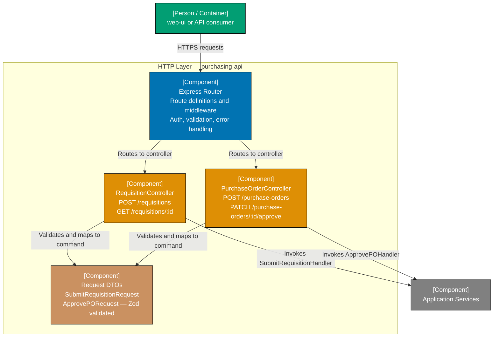
```mermaid
graph TD
    Client["[Person / Container]<br/>web-ui or API consumer"]

    subgraph HTTPLayer["HTTP Layer — purchasing-api"]
        Router["[Component]<br/>Express Router<br/>Route definitions and middleware<br/>Auth, validation, error handling"]
        ReqCtrl["[Component]<br/>RequisitionController<br/>POST /requisitions<br/>GET /requisitions/:id"]
        POCtrl["[Component]<br/>PurchaseOrderController<br/>POST /purchase-orders<br/>PATCH /purchase-orders/:id/approve"]
        ReqDTO["[Component]<br/>Request DTOs<br/>SubmitRequisitionRequest<br/>ApprovePORequest — Zod validated"]
    end

    AppSvc["[Component]<br/>Application Services"]

    Client -->|"HTTPS requests"| Router
    Router -->|"Routes to controller"| ReqCtrl
    Router -->|"Routes to controller"| POCtrl
    ReqCtrl -->|"Validates and maps to command"| ReqDTO
    POCtrl -->|"Validates and maps to command"| ReqDTO
    ReqCtrl -->|"Invokes SubmitRequisitionHandler"| AppSvc
    POCtrl -->|"Invokes ApprovePOHandler"| AppSvc

    style Client fill:#029E73,stroke:#000,color:#fff
    style Router fill:#0173B2,stroke:#000,color:#fff
    style ReqCtrl fill:#DE8F05,stroke:#000,color:#fff
    style POCtrl fill:#DE8F05,stroke:#000,color:#fff
    style ReqDTO fill:#CA9161,stroke:#000,color:#fff
    style AppSvc fill:#808080,stroke:#000,color:#fff
```

**Key Elements**:

- **Two controllers**: RequisitionController and PurchaseOrderController — aligned to domain aggregates
- **Request DTOs with Zod**: Validation at the HTTP boundary before any business logic runs
- **Router as dispatcher**: Express Router handles authentication and routes — not the controllers
- **Controllers call Application Services**: Controllers do not contain business logic

**Design Rationale**: Separating router (authentication/routing) from controllers (use case invocation) and DTOs (validation) gives each component a single responsibility. Adding a new endpoint requires touching only the router, controller, and DTO — not the domain.

**Key Takeaway**: HTTP layer components should be thin: route, validate, translate to command, delegate. Business logic that appears in controllers is an architecture violation that should be flagged in code review.

**Why It Matters**: Controllers that contain business logic cannot be reused when adding a new interface (e.g., a CLI or a Kafka consumer). Thin controllers with DTO validation enforce the boundary that makes business logic independently testable and reusable.

---

### Example 49: Application Services — Use Case Handlers

Application services orchestrate the business use case: load aggregate, call method, persist, publish events.

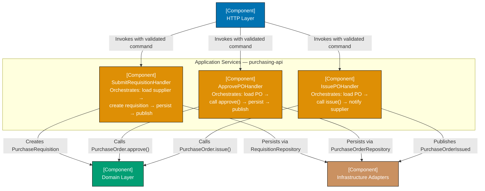
```mermaid
graph TD
    HTTP["[Component]<br/>HTTP Layer"]

    subgraph AppServices["Application Services — purchasing-api"]
        SubmitHandler["[Component]<br/>SubmitRequisitionHandler<br/>Orchestrates: load supplier →<br/>create requisition → persist → publish"]
        ApproveHandler["[Component]<br/>ApprovePOHandler<br/>Orchestrates: load PO →<br/>call approve() → persist → publish"]
        IssuePOHandler["[Component]<br/>IssuePOHandler<br/>Orchestrates: load PO →<br/>call issue() → notify supplier"]
    end

    Domain["[Component]<br/>Domain Layer"]
    Infra["[Component]<br/>Infrastructure Adapters"]

    HTTP -->|"Invokes with validated command"| SubmitHandler
    HTTP -->|"Invokes with validated command"| ApproveHandler
    HTTP -->|"Invokes with validated command"| IssuePOHandler
    SubmitHandler -->|"Creates PurchaseRequisition"| Domain
    ApproveHandler -->|"Calls PurchaseOrder.approve()"| Domain
    IssuePOHandler -->|"Calls PurchaseOrder.issue()"| Domain
    SubmitHandler -->|"Persists via RequisitionRepository"| Infra
    ApproveHandler -->|"Persists via PurchaseOrderRepository"| Infra
    IssuePOHandler -->|"Publishes PurchaseOrderIssued"| Infra

    style HTTP fill:#0173B2,stroke:#000,color:#fff
    style SubmitHandler fill:#DE8F05,stroke:#000,color:#fff
    style ApproveHandler fill:#DE8F05,stroke:#000,color:#fff
    style IssuePOHandler fill:#DE8F05,stroke:#000,color:#fff
    style Domain fill:#029E73,stroke:#000,color:#fff
    style Infra fill:#CA9161,stroke:#000,color:#fff
```

**Key Elements**:

- **One handler per use case**: SubmitRequisition, ApprovePO, IssuePO — single responsibility per handler
- **Handler orchestrates but does not decide**: Business rules live in Domain, not in handlers
- **Handler description as comment**: Each label includes the orchestration steps as documentation

**Design Rationale**: Application Services follow the "thin orchestrator" pattern: load aggregate from repository, call aggregate method, save aggregate, publish events. No business logic belongs in the handler.

**Key Takeaway**: Name each Application Service handler after its use case (SubmitRequisitionHandler, not GenericHandler). The handler name is the first piece of documentation a new developer reads.

**Why It Matters**: Use case handlers that contain business logic (validating approval thresholds in the handler instead of in the aggregate) distribute business rules across layers, making them impossible to test in isolation and easy to miss when rules change.

---

### Example 50: Domain Layer — Aggregate Components

The Domain layer contains the aggregates, value objects, and domain events that implement the P2P business rules.

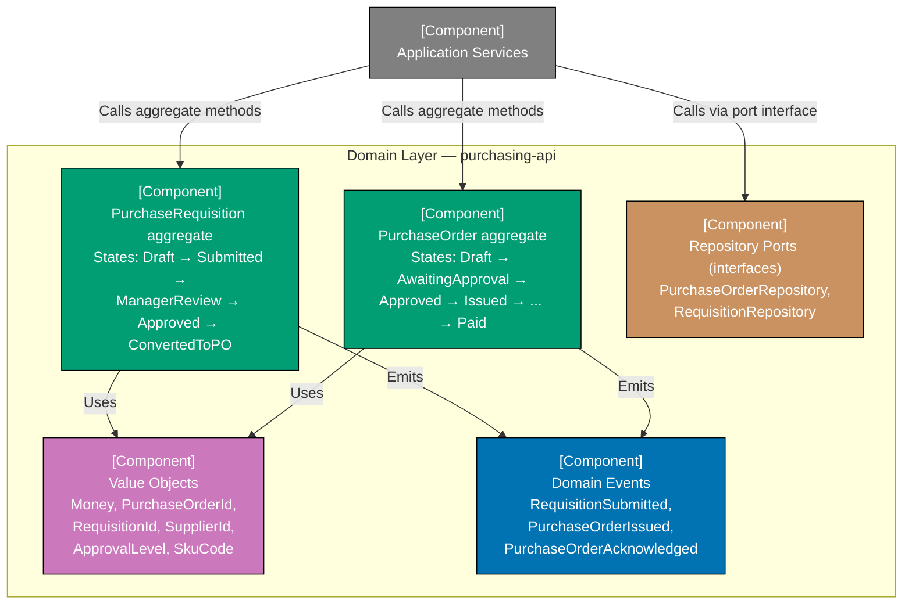
```mermaid
graph TD
    AppSvc["[Component]<br/>Application Services"]

    subgraph DomainLayer["Domain Layer — purchasing-api"]
        PRAggregate["[Component]<br/>PurchaseRequisition aggregate<br/>States: Draft → Submitted →<br/>ManagerReview → Approved → ConvertedToPO"]
        POAggregate["[Component]<br/>PurchaseOrder aggregate<br/>States: Draft → AwaitingApproval →<br/>Approved → Issued → ... → Paid"]
        VOs["[Component]<br/>Value Objects<br/>Money, PurchaseOrderId,<br/>RequisitionId, SupplierId,<br/>ApprovalLevel, SkuCode"]
        Events["[Component]<br/>Domain Events<br/>RequisitionSubmitted,<br/>PurchaseOrderIssued,<br/>PurchaseOrderAcknowledged"]
        Ports["[Component]<br/>Repository Ports (interfaces)<br/>PurchaseOrderRepository,<br/>RequisitionRepository"]
    end

    AppSvc -->|"Calls aggregate methods"| PRAggregate
    AppSvc -->|"Calls aggregate methods"| POAggregate
    PRAggregate -->|"Uses"| VOs
    POAggregate -->|"Uses"| VOs
    PRAggregate -->|"Emits"| Events
    POAggregate -->|"Emits"| Events
    AppSvc -->|"Calls via port interface"| Ports

    style AppSvc fill:#808080,stroke:#000,color:#fff
    style PRAggregate fill:#029E73,stroke:#000,color:#fff
    style POAggregate fill:#029E73,stroke:#000,color:#fff
    style VOs fill:#CC78BC,stroke:#000,color:#fff
    style Events fill:#0173B2,stroke:#000,color:#fff
    style Ports fill:#CA9161,stroke:#000,color:#fff
```

**Key Elements**:

- **Two aggregate roots**: PurchaseRequisition and PurchaseOrder — each with state machine labels
- **Value Objects shared**: Money, IDs, ApprovalLevel used by both aggregates
- **Repository ports as interfaces**: Application Services call the port interface; adapters implement it
- **Events emitted by aggregates**: Domain events come from aggregate methods, not from services

**Design Rationale**: Repository ports (interfaces) in the domain layer enforce the dependency inversion principle. The domain defines the interface shape; infrastructure provides the implementation. This makes the domain layer testable with in-memory adapters.

**Key Takeaway**: Domain layer components should contain no import from infrastructure. If a domain aggregate imports a database ORM or a Kafka client, the dependency direction is inverted and the layer is corrupted.

**Why It Matters**: Domain layers contaminated with infrastructure imports require a running database to unit test approval threshold logic. Pure domain layers with interface-only repository ports run their full business rule test suite in milliseconds without any external dependencies.

---

### Example 51: Infrastructure Adapters — Repository Implementations

Infrastructure adapters implement the domain ports. Each adapter maps between domain objects and persistence technology.

```mermaid
graph TD
    Ports["[Component]<br/>Repository Ports (interfaces)<br/>Domain layer — purchasing-api"]

    subgraph InfraLayer["Infrastructure Adapters — purchasing-api"]
        PgPORepo["[Component]<br/>PgPurchaseOrderRepository<br/>Implements PurchaseOrderRepository<br/>Maps PO aggregate to pg rows"]
        PgReqRepo["[Component]<br/>PgRequisitionRepository<br/>Implements RequisitionRepository<br/>Maps Requisition to pg rows"]
        OutboxPublisher["[Component]<br/>OutboxEventPublisher<br/>Implements EventPublisher<br/>Writes events to outbox table"]
        KafkaRelay["[Component]<br/>KafkaRelayJob<br/>Reads outbox → publishes to Kafka<br/>Deletes on ACK"]
    end

    PG["[Container: Database]<br/>postgres"]
    EventBus["[Container: Message Broker]<br/>event-bus / Kafka"]

    Ports -->|"Implemented by"| PgPORepo
    Ports -->|"Implemented by"| PgReqRepo
    Ports -->|"Implemented by"| OutboxPublisher
    PgPORepo -->|"SQL queries [TCP/5432]"| PG
    PgReqRepo -->|"SQL queries [TCP/5432]"| PG
    OutboxPublisher -->|"INSERT into outbox table [TCP/5432]"| PG
    KafkaRelay -->|"SELECT from outbox [TCP/5432]"| PG
    KafkaRelay -->|"Publish events [Kafka]"| EventBus

    style Ports fill:#808080,stroke:#000,color:#fff
    style PgPORepo fill:#CA9161,stroke:#000,color:#fff
    style PgReqRepo fill:#CA9161,stroke:#000,color:#fff
    style OutboxPublisher fill:#CA9161,stroke:#000,color:#fff
    style KafkaRelay fill:#CA9161,stroke:#000,color:#fff
    style PG fill:#808080,stroke:#000,color:#fff
    style EventBus fill:#808080,stroke:#000,color:#fff
```

**Key Elements**:

- **Adapter naming**: `Pg` prefix signals PostgreSQL implementation — easy to swap for in-memory adapter
- **Outbox pattern**: Events written to postgres first, relayed to Kafka by a separate job
- **KafkaRelayJob**: Background component that ensures at-least-once delivery even if Kafka is down

**Design Rationale**: The outbox pattern ensures that state changes and event publications are atomic — both succeed or neither does. Without it, a crash between postgres commit and Kafka publish loses events permanently.

**Key Takeaway**: Show the outbox pattern as two distinct infrastructure components: OutboxEventPublisher (writes to DB) and KafkaRelayJob (reads from DB, publishes to Kafka). The two-step pattern makes atomicity explicit.

**Why It Matters**: Lost domain events cause P2P state machine desynchronization between bounded contexts. A receiving-api that never gets `PurchaseOrderIssued` cannot open a GRN expectation, blocking the entire receiving flow.

---

### Example 52: Component Diagram — SubmitRequisitionHandler Flow

Tracing one use case through all four layers shows how components collaborate for a single business operation.

```mermaid
graph TD
    Client["[Person / Container]<br/>web-ui"]
    ReqCtrl["[Component]<br/>RequisitionController<br/>HTTP Layer"]
    ReqDTO["[Component]<br/>SubmitRequisitionRequest DTO<br/>Zod validated"]
    SubmitHandler["[Component]<br/>SubmitRequisitionHandler<br/>Application Services"]
    PRAggregate["[Component]<br/>PurchaseRequisition<br/>Domain Layer"]
    PgReqRepo["[Component]<br/>PgRequisitionRepository<br/>Infrastructure"]
    OutboxPub["[Component]<br/>OutboxEventPublisher<br/>Infrastructure"]

    Client -->|"POST /requisitions [HTTPS]"| ReqCtrl
    ReqCtrl -->|"Validates body"| ReqDTO
    ReqDTO -->|"Returns SubmitRequisitionCommand"| SubmitHandler
    SubmitHandler -->|"Creates PurchaseRequisition.createDraft()"| PRAggregate
    PRAggregate -->|"Returns RequisitionSubmitted event"| SubmitHandler
    SubmitHandler -->|"Saves requisition"| PgReqRepo
    SubmitHandler -->|"Publishes RequisitionSubmitted"| OutboxPub
    OutboxPub -->|"Inserts into outbox table"| PgReqRepo

    style Client fill:#029E73,stroke:#000,color:#fff
    style ReqCtrl fill:#0173B2,stroke:#000,color:#fff
    style ReqDTO fill:#0173B2,stroke:#000,color:#fff
    style SubmitHandler fill:#DE8F05,stroke:#000,color:#fff
    style PRAggregate fill:#029E73,stroke:#000,color:#fff
    style PgReqRepo fill:#CA9161,stroke:#000,color:#fff
    style OutboxPub fill:#CA9161,stroke:#000,color:#fff
```

**Key Elements**:

- **Seven-step flow**: One business operation touches seven components across four layers
- **Aggregate returns event**: The aggregate's `createDraft()` method returns the domain event — not a side effect
- **Outbox writes to same repo**: The event publisher uses the same postgres connection as the repo — atomic transaction

**Design Rationale**: Tracing a single use case through all components is the most effective way to validate that the component structure is correct. If a step requires crossing an unexpected layer boundary, the architecture has a gap.

**Key Takeaway**: Draw use-case-specific Component flows in addition to structural Component diagrams. Structural diagrams show what exists; flow diagrams show whether the structure actually enables the use case.

**Why It Matters**: Use case flows that cross unexpected layer boundaries reveal architecture violations before they are coded. A handler that calls a repository directly without going through the domain aggregate bypasses business rule enforcement — a gap that only a flow diagram makes visible.

---

### Example 53: Component Diagram — ApprovePOHandler with FSM Guard

The approval use case demonstrates how the domain aggregate enforces FSM transition guards at the component level.

```mermaid
graph TD
    POCtrl["[Component]<br/>PurchaseOrderController<br/>HTTP Layer"]
    ApproveHandler["[Component]<br/>ApprovePOHandler<br/>Application Services"]
    POAggregate["[Component]<br/>PurchaseOrder aggregate<br/>Domain Layer — FSM guard:<br/>must be in AwaitingApproval state"]
    ApprovalLevelVO["[Component]<br/>ApprovalLevel value object<br/>L1 ≤ $1k / L2 ≤ $10k / L3 > $10k"]
    PgPORepo["[Component]<br/>PgPurchaseOrderRepository<br/>Infrastructure"]
    OutboxPub["[Component]<br/>OutboxEventPublisher<br/>Infrastructure"]

    POCtrl -->|"PATCH /purchase-orders/:id/approve"| ApproveHandler
    ApproveHandler -->|"Loads PO by id"| PgPORepo
    PgPORepo -->|"Returns PurchaseOrder aggregate"| ApproveHandler
    ApproveHandler -->|"Calls PurchaseOrder.approve(approverId)"| POAggregate
    POAggregate -->|"Validates ApprovalLevel for PO total"| ApprovalLevelVO
    POAggregate -->|"Throws if not AwaitingApproval state"| ApproveHandler
    POAggregate -->|"Returns PurchaseOrderApproved event on success"| ApproveHandler
    ApproveHandler -->|"Saves updated PO"| PgPORepo
    ApproveHandler -->|"Publishes event"| OutboxPub

    style POCtrl fill:#0173B2,stroke:#000,color:#fff
    style ApproveHandler fill:#DE8F05,stroke:#000,color:#fff
    style POAggregate fill:#029E73,stroke:#000,color:#fff
    style ApprovalLevelVO fill:#CC78BC,stroke:#000,color:#fff
    style PgPORepo fill:#CA9161,stroke:#000,color:#fff
    style OutboxPub fill:#CA9161,stroke:#000,color:#fff
```

**Key Elements**:

- **FSM guard in aggregate label**: `must be in AwaitingApproval state` — constraint visible at component level
- **ApprovalLevel value object**: Encapsulates L1/L2/L3 logic — not in the handler
- **Error path shown**: Aggregate throws if state guard fails — handler propagates as 409 Conflict

**Design Rationale**: Showing the FSM guard in the aggregate component label signals that state validation is the aggregate's responsibility. If a reviewer sees FSM guard logic in the handler, it is an architecture violation.

**Key Takeaway**: Annotate FSM state guards in Domain layer component labels. Guards that live outside the aggregate are guards that can be bypassed by callers.

**Why It Matters**: A PO that can be approved when it is not in `AwaitingApproval` state creates phantom approvals that corrupt the P2P audit trail. FSM guards enforced in the aggregate are the last line of defense against state machine violations.

---

### Example 54: Component Diagram — Infrastructure Adapter Swapping

The port/adapter pattern enables swapping infrastructure adapters without touching the domain. This example shows the in-memory adapter used in tests.

```mermaid
graph TD
    AppSvc["[Component]<br/>ApprovePOHandler<br/>Application Services"]

    subgraph ProdAdapters["Production Adapters"]
        PgRepo["[Component]<br/>PgPurchaseOrderRepository<br/>Implements PurchaseOrderRepository<br/>Writes to PostgreSQL"]
        KafkaPub["[Component]<br/>OutboxEventPublisher<br/>Implements EventPublisher<br/>Writes to postgres outbox"]
    end

    subgraph TestAdapters["Test Adapters"]
        MemRepo["[Component]<br/>InMemoryPurchaseOrderRepository<br/>Implements PurchaseOrderRepository<br/>Stores in Map — no DB needed"]
        FakePub["[Component]<br/>FakeEventPublisher<br/>Implements EventPublisher<br/>Captures events for assertions"]
    end

    Port["[Component]<br/>PurchaseOrderRepository (interface)<br/>Domain Port"]

    AppSvc -->|"Calls interface methods"| Port
    Port -->|"Production: implemented by"| PgRepo
    Port -->|"Test: implemented by"| MemRepo
    AppSvc -->|"Calls EventPublisher interface"| KafkaPub
    AppSvc -->|"Test: uses"| FakePub

    style AppSvc fill:#DE8F05,stroke:#000,color:#fff
    style PgRepo fill:#CA9161,stroke:#000,color:#fff
    style KafkaPub fill:#CA9161,stroke:#000,color:#fff
    style MemRepo fill:#029E73,stroke:#000,color:#fff
    style FakePub fill:#029E73,stroke:#000,color:#fff
    style Port fill:#0173B2,stroke:#000,color:#fff
```

**Key Elements**:

- **Two adapter sets**: Production (postgres, outbox) and Test (in-memory, fake publisher)
- **Interface as pivot**: Application services depend only on the interface — adapters are interchangeable
- **Test adapters enable unit tests**: FakeEventPublisher captures events for assertions without Kafka

**Design Rationale**: Drawing both production and test adapters in the Component diagram makes the testability architecture explicit. Teams that see only production adapters assume testing requires a running database.

**Key Takeaway**: Show test adapters alongside production adapters in Component diagrams. The presence of in-memory adapters is an architectural feature — it enables a fast unit test suite for the business rules.

**Why It Matters**: A P2P business rule test suite that requires PostgreSQL takes minutes to run. The same tests with in-memory adapters run in seconds. Over the lifetime of a project, this difference determines whether developers run tests before every commit or only in CI.

---

### Example 55: Component Diagram — Receiving-api Internal Structure

receiving-api has its own component structure mirroring purchasing-api but optimized for GRN entry workflows.

```mermaid
graph TD
    subgraph RecvAPI["receiving-api Container"]
        GRNCtrl["[Component]<br/>GoodsReceiptController<br/>POST /grn<br/>Entry point for GRN data"]
        GRNHandler["[Component]<br/>RecordGoodsReceiptHandler<br/>Validates GRN against open PO<br/>Checks quantity tolerances"]
        GRNAggregate["[Component]<br/>GoodsReceiptNote aggregate<br/>States: Draft → Verified → Submitted<br/>Tolerance: ≤ 10% quantity variance"]
        GRNRepo["[Component]<br/>PgGoodsReceiptRepository<br/>Stores GRN records"]
        GRNEventPub["[Component]<br/>GoodsReceivedEventPublisher<br/>Publishes GoodsReceived event"]
        POConsumer["[Component]<br/>PurchaseOrderEventConsumer<br/>Subscribes to po-events Kafka topic<br/>Opens GRN expectation on PO Issued"]
    end

    PG["[Container: Database]<br/>postgres<br/>receiving schema"]
    EventBus["[Container: Message Broker]<br/>event-bus / Kafka"]

    POConsumer -->|"Consumes PurchaseOrderIssued"| EventBus
    GRNCtrl -->|"Invokes handler"| GRNHandler
    GRNHandler -->|"Creates GRN aggregate"| GRNAggregate
    GRNHandler -->|"Saves GRN"| GRNRepo
    GRNHandler -->|"Publishes GoodsReceived"| GRNEventPub
    GRNRepo -->|"SQL [TCP/5432]"| PG
    GRNEventPub -->|"Publishes to grn-events topic"| EventBus

    style GRNCtrl fill:#0173B2,stroke:#000,color:#fff
    style GRNHandler fill:#DE8F05,stroke:#000,color:#fff
    style GRNAggregate fill:#029E73,stroke:#000,color:#fff
    style GRNRepo fill:#CA9161,stroke:#000,color:#fff
    style GRNEventPub fill:#CA9161,stroke:#000,color:#fff
    style POConsumer fill:#CC78BC,stroke:#000,color:#fff
    style PG fill:#808080,stroke:#000,color:#fff
    style EventBus fill:#808080,stroke:#000,color:#fff
```

**Key Elements**:

- **Kafka consumer as component**: POConsumer subscribes to po-events — receiving-api is both HTTP server and event consumer
- **GRN aggregate with tolerance**: 10% quantity variance tolerance is a domain rule in the aggregate label
- **Separate event schema**: receiving-api publishes to `grn-events`, not to `po-events`

**Design Rationale**: receiving-api has a dual interface: HTTP for warehouse operator input, Kafka consumer for PO-issued event. Both interfaces trigger the same GRN aggregate. Showing both in the Component diagram prevents treating them as separate systems.

**Key Takeaway**: Model Kafka consumer components alongside HTTP controllers in receiving containers. Event-driven entry points deserve the same architectural clarity as HTTP entry points.

**Why It Matters**: receiving-api implementations that do not model the Kafka consumer as a first-class component routinely skip GRN expectation tracking — the feature that prevents warehouse staff from receiving against non-existent POs, a source of ghost receipts and financial loss.

---

### Example 56: Component Diagram — invoicing-api Three-Way Match

invoicing-api's core component implements three-way match logic: compare PO, GRN, and Invoice values within tolerance.

```mermaid
graph TD
    subgraph InvAPI["invoicing-api Container"]
        InvCtrl["[Component]<br/>InvoiceController<br/>POST /invoices<br/>Invoice registration endpoint"]
        InvHandler["[Component]<br/>RegisterInvoiceHandler<br/>Orchestrates registration<br/>and match trigger"]
        InvAggregate["[Component]<br/>Invoice aggregate<br/>States: Registered → Matching →<br/>Matched → Disputed"]
        MatchSvc["[Component]<br/>ThreeWayMatchService<br/>Compares: PO unit price × GRN qty<br/>vs Invoice amount ± Tolerance 2%"]
        InvRepo["[Component]<br/>PgInvoiceRepository"]
        POConsumer["[Component]<br/>POEventConsumer<br/>Subscribes to po-events<br/>Caches PO data for matching"]
        GRNConsumer["[Component]<br/>GRNEventConsumer<br/>Subscribes to grn-events<br/>Caches GRN data for matching"]
    end

    PG["[Container: Database]<br/>postgres<br/>invoicing schema"]
    EventBus["[Container: Message Broker]<br/>event-bus / Kafka"]

    POConsumer -->|"Consumes po-events"| EventBus
    GRNConsumer -->|"Consumes grn-events"| EventBus
    InvCtrl -->|"Invokes handler"| InvHandler
    InvHandler -->|"Creates Invoice aggregate"| InvAggregate
    InvHandler -->|"Triggers match"| MatchSvc
    MatchSvc -->|"Reads cached PO and GRN data"| PG
    InvHandler -->|"Saves invoice and match result"| InvRepo
    InvRepo -->|"SQL [TCP/5432]"| PG

    style InvCtrl fill:#0173B2,stroke:#000,color:#fff
    style InvHandler fill:#DE8F05,stroke:#000,color:#fff
    style InvAggregate fill:#029E73,stroke:#000,color:#fff
    style MatchSvc fill:#CC78BC,stroke:#000,color:#fff
    style InvRepo fill:#CA9161,stroke:#000,color:#fff
    style POConsumer fill:#CA9161,stroke:#000,color:#fff
    style GRNConsumer fill:#CA9161,stroke:#000,color:#fff
    style PG fill:#808080,stroke:#000,color:#fff
    style EventBus fill:#808080,stroke:#000,color:#fff
```

**Key Elements**:

- **ThreeWayMatchService**: Encapsulates the matching algorithm — not buried in the handler
- **Two Kafka consumers**: invoicing-api caches PO and GRN data from upstream events
- **2% tolerance**: Match tolerance is a business parameter visible in the component label

**Design Rationale**: Extracting ThreeWayMatchService as a distinct component makes the matching algorithm independently testable. A service buried in the handler cannot be tested without the full HTTP request context.

**Key Takeaway**: Extract complex business algorithms into named Application Service components. ThreeWayMatchService as a named component signals that the matching logic has defined inputs, outputs, and test cases.

**Why It Matters**: Incorrect three-way matching results in overpayments or blocked invoices. A named, independently testable match service enables comprehensive edge-case testing (exact match, within tolerance, over tolerance, missing GRN) that protects against payment errors.

---

### Example 57: Component Diagram — payments-worker Internal Structure

payments-worker's internal components show how a background worker is organized differently from a REST API.

```mermaid
graph TD
    subgraph PayWorker["payments-worker Container"]
        InvoiceConsumer["[Component]<br/>InvoiceMatchedConsumer<br/>Subscribes to invoice-events<br/>Triggers payment scheduling"]
        PayScheduler["[Component]<br/>PaymentScheduler<br/>Groups invoices into payment runs<br/>Respects bank cut-off times"]
        PayExecutor["[Component]<br/>PaymentExecutor<br/>Builds ISO 20022 pain.001 file<br/>Sends to bank, handles pain.002"]
        PayRepo["[Component]<br/>PgPaymentRepository<br/>Saves payment state and checkpoints"]
        BankAdapter["[Component]<br/>BankApiAdapter<br/>Implements BankingPort<br/>REST + retry + circuit breaker"]
        IdempotencyChecker["[Component]<br/>IdempotencyChecker<br/>Prevents double-payment<br/>Checks payment_id uniqueness"]
    end

    EventBus["[Container: Message Broker]<br/>event-bus / Kafka"]
    PG["[Container: Database]<br/>postgres<br/>payments schema"]
    Bank["[External System]<br/>Bank"]

    InvoiceConsumer -->|"Consumes InvoiceMatched"| EventBus
    InvoiceConsumer -->|"Schedules payment"| PayScheduler
    PayScheduler -->|"Persists payment schedule"| PayRepo
    PayScheduler -->|"Checks idempotency"| IdempotencyChecker
    IdempotencyChecker -->|"Queries payment_id"| PayRepo
    PayScheduler -->|"Triggers executor"| PayExecutor
    PayExecutor -->|"Sends pain.001 via adapter"| BankAdapter
    BankAdapter -->|"HTTPS to bank API"| Bank
    Bank -->|"Returns pain.002 status"| BankAdapter
    BankAdapter -->|"Updates payment status"| PayRepo
    PayRepo -->|"SQL [TCP/5432]"| PG

    style InvoiceConsumer fill:#CC78BC,stroke:#000,color:#fff
    style PayScheduler fill:#DE8F05,stroke:#000,color:#fff
    style PayExecutor fill:#DE8F05,stroke:#000,color:#fff
    style PayRepo fill:#CA9161,stroke:#000,color:#fff
    style BankAdapter fill:#CA9161,stroke:#000,color:#fff
    style IdempotencyChecker fill:#029E73,stroke:#000,color:#fff
    style EventBus fill:#808080,stroke:#000,color:#fff
    style PG fill:#808080,stroke:#000,color:#fff
    style Bank fill:#808080,stroke:#000,color:#fff
```

**Key Elements**:

- **IdempotencyChecker**: A dedicated component for preventing double-payments — not an afterthought
- **BankApiAdapter with retry and circuit breaker**: Resilience built into the adapter, not the caller
- **PaymentScheduler respects cut-off times**: Business constraint (bank cut-off) in component label

**Design Rationale**: IdempotencyChecker as a distinct component signals that idempotency is a first-class concern in the payment worker. Teams that skip this component routinely produce double-payment bugs when the worker retries after a crash.

**Key Takeaway**: Name idempotency and circuit breaker components explicitly. Making them anonymous "utilities" inside another component hides a critical safety mechanism from reviewers.

**Why It Matters**: Double-payments are irreversible in real-time banking systems. An explicit IdempotencyChecker component ensures that idempotency requirements are tested, monitored, and maintained separately from general payment logic.

---

### Example 58: Component Diagram — Approval Router Component

The approval router component routes requisitions to the correct approval level based on PO total and organizational policy.

```mermaid
graph TD
    SubmitHandler["[Component]<br/>SubmitRequisitionHandler<br/>Application Services"]

    subgraph ApprovalComponents["Approval Routing — purchasing-api"]
        ApprovalRouter["[Component]<br/>ApprovalRouterAdapter<br/>Implements ApprovalRouterPort<br/>Determines ApprovalLevel from PO total"]
        NotifyAdapter["[Component]<br/>ApproverNotificationAdapter<br/>Sends approval request to manager<br/>via email or workflow engine"]
        ApprovalLevelVO["[Component]<br/>ApprovalLevel value object<br/>L1: PO total ≤ $1,000<br/>L2: PO total ≤ $10,000<br/>L3: PO total > $10,000"]
    end

    Manager["[Person]<br/>Approving Manager"]
    EmailSvc["[External System]<br/>Email Service"]

    SubmitHandler -->|"Routes requisition via ApprovalRouterPort"| ApprovalRouter
    ApprovalRouter -->|"Derives ApprovalLevel"| ApprovalLevelVO
    ApprovalRouter -->|"Notifies correct approver"| NotifyAdapter
    NotifyAdapter -->|"Sends approval request email [SMTP]"| EmailSvc
    EmailSvc -->|"Delivers to manager inbox"| Manager

    style SubmitHandler fill:#808080,stroke:#000,color:#fff
    style ApprovalRouter fill:#CA9161,stroke:#000,color:#fff
    style NotifyAdapter fill:#CA9161,stroke:#000,color:#fff
    style ApprovalLevelVO fill:#CC78BC,stroke:#000,color:#fff
    style Manager fill:#029E73,stroke:#000,color:#fff
    style EmailSvc fill:#808080,stroke:#000,color:#fff
```

**Key Elements**:

- **ApprovalRouterPort implementation**: Adapter implements the domain port — approval routing is pluggable
- **ApprovalLevel value object drives routing**: Dollar threshold logic lives in a value object
- **NotifyAdapter wraps email delivery**: Direct SMTP coupling lives only in the adapter

**Design Rationale**: Implementing approval routing as a port/adapter makes it replaceable. Organizations that switch from email to Slack or a workflow engine need to replace only the adapter, not the handler or the domain.

**Key Takeaway**: Model approval routing as an infrastructure adapter that implements a domain port. Routing strategy changes are then configuration decisions, not refactoring tasks.

**Why It Matters**: Approval workflow engines change as organizations grow (email → Slack → ServiceNow). Port/adapter routing isolation means these transitions are adapter swaps — one class replaced — not invasive refactors across multiple layers.

---

### Example 59: Component Diagram — Event Consumer Registration Pattern

Kafka consumer components need explicit registration and offset management. This example shows the pattern inside purchasing-api.

```mermaid
graph TD
    subgraph EventConsumers["Event Consumers — purchasing-api"]
        PaymentConsumer["[Component]<br/>PaymentDisbursedConsumer<br/>Subscribes to payment-events topic<br/>Updates PO state to Paid"]
        DisputeConsumer["[Component]<br/>InvoiceDisputedConsumer<br/>Subscribes to invoice-events topic<br/>Transitions PO to Disputed state"]
        ConsumerRegistry["[Component]<br/>KafkaConsumerRegistry<br/>Manages consumer group offsets<br/>Handles rebalance events"]
    end

    POAggregate["[Component]<br/>PurchaseOrder aggregate<br/>Domain Layer"]
    PgPORepo["[Component]<br/>PgPurchaseOrderRepository<br/>Infrastructure"]
    EventBus["[Container: Message Broker]<br/>event-bus / Kafka"]

    ConsumerRegistry -->|"Registers consumers on startup"| EventBus
    EventBus -->|"Delivers PaymentDisbursed"| PaymentConsumer
    EventBus -->|"Delivers InvoiceDisputed"| DisputeConsumer
    PaymentConsumer -->|"Loads PO, calls pay()"| POAggregate
    DisputeConsumer -->|"Loads PO, calls dispute()"| POAggregate
    PaymentConsumer -->|"Saves updated PO"| PgPORepo
    DisputeConsumer -->|"Saves updated PO"| PgPORepo

    style PaymentConsumer fill:#CC78BC,stroke:#000,color:#fff
    style DisputeConsumer fill:#CC78BC,stroke:#000,color:#fff
    style ConsumerRegistry fill:#0173B2,stroke:#000,color:#fff
    style POAggregate fill:#029E73,stroke:#000,color:#fff
    style PgPORepo fill:#CA9161,stroke:#000,color:#fff
    style EventBus fill:#808080,stroke:#000,color:#fff
```

**Key Elements**:

- **ConsumerRegistry**: Manages offset tracking and group rebalance — not buried in each consumer
- **Two consumer components**: purchasing-api subscribes to events from downstream contexts
- **Consumers call domain aggregate**: Event consumers follow the same handler pattern as HTTP controllers

**Design Rationale**: Centralizing offset management in a ConsumerRegistry component prevents each consumer from re-implementing Kafka coordination logic. The registry is the single point for offset commit strategy and rebalance handling.

**Key Takeaway**: Model a KafkaConsumerRegistry component when a container has multiple Kafka consumers. Shared offset management prevents duplicate processing and simplifies rebalance handling.

**Why It Matters**: Kafka consumer groups that mismanage offsets reprocess events on restart, causing duplicate state transitions in PO aggregates. Explicit registry components with correct at-least-once semantics and idempotent aggregate methods prevent reprocessing errors.

---

### Example 60: Component Diagram — Anti-Corruption Layer Between Contexts

When purchasing-api receives events from receiving-api, an Anti-Corruption Layer (ACL) translates the receiving context's domain model into purchasing's domain model.

```mermaid
graph TD
    GRNConsumer["[Component]<br/>GoodsReceivedEventConsumer<br/>purchasing-api — subscribes to grn-events"]

    subgraph ACL["Anti-Corruption Layer — purchasing-api"]
        GRNTranslator["[Component]<br/>GoodsReceiptTranslator<br/>Maps GoodsReceived event (receiving context)<br/>to PurchaseOrderReceivedEvent (purchasing context)"]
        ContextMapper["[Component]<br/>ReceivingContextMapper<br/>Translates SupplierId, Quantity, SkuCode<br/>to purchasing context value objects"]
    end

    POAggregate["[Component]<br/>PurchaseOrder aggregate<br/>purchasing context domain"]
    Handler["[Component]<br/>RecordGoodsReceiptHandler<br/>Application Services — purchasing context"]

    GRNConsumer -->|"Raw GoodsReceived event from receiving"| GRNTranslator
    GRNTranslator -->|"Maps receiving types to purchasing types"| ContextMapper
    ContextMapper -->|"Returns purchasing context command"| Handler
    Handler -->|"Calls PO.partialReceive() or PO.fullReceive()"| POAggregate

    style GRNConsumer fill:#CC78BC,stroke:#000,color:#fff
    style GRNTranslator fill:#DE8F05,stroke:#000,color:#fff
    style ContextMapper fill:#DE8F05,stroke:#000,color:#fff
    style POAggregate fill:#029E73,stroke:#000,color:#fff
    style Handler fill:#0173B2,stroke:#000,color:#fff
```

**Key Elements**:

- **GoodsReceiptTranslator**: Converts receiving context event to purchasing context language
- **ContextMapper**: Translates value objects across context boundaries
- **PO.partialReceive() or fullReceive()**: Receiving events drive PO state transitions in purchasing

**Design Rationale**: The ACL prevents the receiving context's domain model from polluting the purchasing context. Without it, purchasing aggregates contain receiving-context terminology — a bounded context violation.

**Key Takeaway**: Model Anti-Corruption Layers as distinct components at context boundaries. ACLs are the architectural mechanism that allows bounded contexts to evolve independently.

**Why It Matters**: Bounded contexts without ACLs develop implicit coupling through shared domain terminology. When the receiving team renames `GRN` to `ReceivingRecord`, every consumer that imports receiving types without an ACL breaks — a change that should have had zero blast radius.
