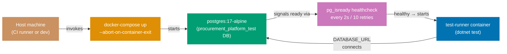

## Guide 15 — Database Integration Test via docker-compose Harness

### Why It Matters

Unit tests with an in-memory adapter (Guide 8) prove port correctness but cannot catch SQL schema mistakes, PostgreSQL-specific constraint behavior, or migration ordering bugs. A database integration test that runs against a real PostgreSQL instance inside Docker closes this gap without requiring a persistent database on developer machines. In `procurement-platform-be`, the `docker-compose.integration.yml` file defines exactly this harness: a `postgres:17-alpine` service with a health-check gate and a `test-runner` container that waits for it. The two services together give every integration test a fresh, disposable PostgreSQL instance that mirrors the production schema.

### Standard Library First

`System.Data.Common.DbConnection` and raw ADO.NET let you open a connection to any database — but you manage the lifecycle entirely yourself:

```fsharp
// Standard library: raw ADO.NET connection to a test database
open System.Data
open Npgsql
// => System.Data: IDbConnection, IDbCommand — provider-agnostic BCL interfaces
// => Npgsql: concrete NpgsqlConnection that satisfies IDbConnection for PostgreSQL
// => No docker-compose: the test assumes the database is already running

let connectionString = System.Environment.GetEnvironmentVariable("DATABASE_URL")
// => Read from environment — the same variable docker-compose sets for the test-runner service
// => If the variable is missing the test throws NullReferenceException, not a clear error

use conn = new NpgsqlConnection(connectionString)
// => use: F# sugar for IDisposable — calls conn.Dispose() when the binding goes out of scope
conn.Open()
// => Synchronous open: blocks the thread until the TCP handshake completes
// => If the postgres service is not ready yet, this throws — no health-check polling in stdlib
use cmd = conn.CreateCommand()
cmd.CommandText <- "SELECT 1"
// => Smoke query — verifies the connection is live before running migration scripts
let result = cmd.ExecuteScalar()
// => ExecuteScalar: returns the first column of the first row as obj
printfn "Connected: %A" result
```

**Limitation for production**: raw ADO.NET requires manual health-check polling before running tests, manual connection lifecycle management, and manual schema setup. The harness logic duplicates across every project that needs integration tests against PostgreSQL.

### Production Framework

`procurement-platform-be` provides a self-contained harness in `docker-compose.integration.yml`:

```yaml
# docker-compose.integration.yml for procurement-platform-be
# => This file defines the docker-compose harness for integration tests — not used in production
services:
  postgres:
    # => postgres: the database service — named so other services reference it as a hostname
    image: postgres:17-alpine
    # => postgres:17-alpine: Alpine-based image — smallest footprint for test use
    # => 17-alpine: pinned to PostgreSQL major version 17 — matches the production target
    environment:
      # => environment: sets PostgreSQL init env vars — only used on first container start
      POSTGRES_DB: procurement_platform_test
      # => procurement_platform_test: isolated test database — never touches the dev or production database
      POSTGRES_USER: procurement_platform
      # => POSTGRES_USER: the role Npgsql connects as — matches DATABASE_URL credentials
      POSTGRES_PASSWORD: procurement_platform
      # => POSTGRES_PASSWORD: test-only credential — never used outside the integration harness
    healthcheck:
      # => healthcheck: docker-compose checks postgres health before starting test-runner
      test: ["CMD-SHELL", "pg_isready -U procurement_platform -d procurement_platform_test"]
      # => pg_isready: PostgreSQL built-in probe — returns 0 when the server accepts connections
      interval: 2s
      # => interval: poll every 2 seconds — fast enough for CI without busy-looping
      timeout: 5s
      # => timeout: each pg_isready call has 5 seconds to succeed
      retries: 10
      # => interval + retries = 20 seconds maximum wait — sufficient for Alpine startup
    ports:
      - "5432"
      # => Expose port 5432: allows connecting directly from the developer host for debugging
    tmpfs:
      - /var/lib/postgresql/data
      # => tmpfs: RAM-backed filesystem — each docker-compose up run starts with an empty database
      # => No leftover data between test runs — guarantees clean state without an explicit volume delete

  test-runner:
    # => test-runner: the .NET test binary that runs integration tests against the postgres service
    build:
      context: ../..
      # => context: repo root — Docker build context includes the full monorepo
      dockerfile: apps/procurement-platform-be/Dockerfile.integration
      # => Dockerfile.integration: multi-stage build that runs dotnet test inside the container
      # => Multi-stage: first stage builds .fsproj, second stage runs tests against postgres
    depends_on:
      postgres:
        # => postgres: references the service name from the services block above
        condition: service_healthy
        # => condition: service_healthy: test-runner starts only after the healthcheck succeeds
    environment:
      DATABASE_URL: "Host=postgres;Port=5432;Database=procurement_platform_test;Username=procurement_platform;Password=procurement_platform"
      # => Host=postgres: container service name — docker-compose DNS resolves it on the internal network
      # => DATABASE_URL format: Npgsql connection string — matches the environment variable read in tests
    volumes:
      - ../../specs:/specs:ro
      # => Mount the OpenAPI specs directory read-only — integration tests can validate contract shapes
      # => ro: read-only mount — test container cannot accidentally modify the spec files
      # => Path ../../specs: relative to docker-compose.integration.yml — maps to the monorepo specs/ folder
      # => Integration tests use these to verify that the F# types match the OpenAPI contract at runtime
```



```fsharp
// Integration test consuming the docker-compose harness
// Tests/Purchasing/NpgsqlPurchaseOrderRepositoryTests.fs
module ProcurementPlatform.IntegrationTests.Purchasing.NpgsqlPurchaseOrderRepositoryTests
// => IntegrationTests: separate assembly from unit tests — run only on test:integration Nx target

open Xunit
// => Xunit: test runner — discovers [<Fact>] and reports pass/fail to the CI output
open ProcurementPlatform.Contexts.Purchasing.Infrastructure.NpgsqlPurchaseOrderRepository
// => Real adapter under test — not the in-memory stub
open ProcurementPlatform.Contexts.Purchasing.Domain
// => Domain types: PurchaseOrder, PurchaseOrderId, Money, Status, ApprovalLevel

[<Fact>]
// => [<Fact>]: parameterless test — runs once with a single PostgreSQL connection
let ``npgsqlPurchaseOrderRepository.SavePurchaseOrder stores a PO in PostgreSQL`` () =
    async {
        // => async { }: the test body is an async computation — RunSynchronously executes it synchronously
        let connStr = System.Environment.GetEnvironmentVariable("DATABASE_URL")
        // => Read connection string from the environment variable docker-compose injects
        // => DATABASE_URL: set by docker-compose.test.yml to point at the test PostgreSQL container
        let repo = npgsqlPurchaseOrderRepository connStr
        // => Factory call: returns PurchaseOrderRepository record closed over the connection string

        let money = createMoney 5000m "USD" |> Result.defaultWith failwith
        // => Smart constructor: validates amount and currency
        // => 5000 USD: above L1 threshold — ApprovalLevel will be L2 in production logic
        let po =
            // => Construct the PurchaseOrder aggregate — same smart constructors used in production
            { Id = PurchaseOrderId (System.Guid.NewGuid())
              // => Fresh Guid: guarantees no collision with other test rows in the database
              SupplierId = SupplierId (System.Guid.NewGuid())
              // => Arbitrary supplier: not validated by this test — only the repo round-trip matters
              TotalAmount = money
              // => 5000 USD: stored as (amount=5000, currency="USD") in separate columns
              Status = Draft
              // => Draft: initial state — the adapter stores whatever status the aggregate carries
              ApprovalLevel = L2
              // => L2: persisted as the string "L2" in the status varchar column
              CreatedAt = System.DateTimeOffset.UtcNow }
              // => UTC timestamp: stored in the timestamptz column — PostgreSQL preserves the offset

        let! saveResult = repo.SavePurchaseOrder po
        // => repo.SavePurchaseOrder: performs a real INSERT via Npgsql to PostgreSQL
        // => let!: awaits the async computation — actually executes the INSERT
        match saveResult with
        | Error e ->
            Assert.Fail(sprintf "Expected Ok, got Error: %A" e)
            // => Fail with a descriptive message: distinguishes UniqueConstraintViolation from ConnectionFailure
        | Ok () ->
            // => INSERT committed: now verify the row is readable
            let! found = repo.FindPurchaseOrder po.Id
            // => Round-trip read: confirms the committed row is readable
            // => Uses the same connection string — any PostgreSQL replication lag is irrelevant here
            match found with
            | Ok (Some saved) ->
                Assert.Equal(po.Id, saved.Id)
                // => Round-trip verified: the row was committed and is readable
                // => Assert.Equal: fails test if IDs differ — indicates a mapping bug in the adapter
            | Ok None ->
                Assert.Fail("PurchaseOrder not found after save")
                // => Missing row: the INSERT did not commit or the SELECT returned no rows
            | Error e ->
                Assert.Fail(sprintf "Find failed: %A" e)
                // => Database error on read after successful write: indicates a schema or permission issue
    } |> Async.RunSynchronously
// => RunSynchronously: xUnit expects a synchronous return — awaits the async computation
```

**Trade-offs**: docker-compose integration tests are slower than in-memory tests (typically 5–30 seconds to start PostgreSQL) and require Docker on the CI runner and developer machine. They are not cacheable by Nx. Run them only on the `test:integration` Nx target, not `test:quick`. The payoff is that they catch schema drift, PostgreSQL-specific constraint behavior, and migration ordering bugs that no in-memory test can surface.

---

## Guide 16 — Schema Migration Adapter with DbUp

### Why It Matters

Every database integration test relies on a schema that matches the application's expectations. In `procurement-platform-be`, the `Infrastructure/Migrations.fs` module uses DbUp to apply embedded SQL scripts in order at startup. This makes the migration adapter a first-class hexagonal concern: the application layer defines what shape data the aggregate needs; the migration adapter ensures the database schema reflects that shape; and the integration test harness runs both in order.

### Standard Library First

F# `System.IO.File` and raw ADO.NET can execute SQL files in order — but you manage ordering, idempotency, and error handling manually:

```fsharp
// Standard library: manual SQL file execution without a migration library
open System.IO
// => System.IO: File.ReadAllText — reads the .sql file from disk
open Npgsql
// => Npgsql: raw connection + command — no migration tracking abstraction

let runMigration (connStr: string) (sqlFilePath: string) =
    // => connStr: PostgreSQL connection string; sqlFilePath: path to the .sql migration file
    let sql = File.ReadAllText(sqlFilePath)
    // => Reads the entire .sql file as a string — no templating, no parameter binding
    use conn = new NpgsqlConnection(connStr)
    // => use: IDisposable — closes connection when binding exits
    conn.Open()
    // => Open: establish the TCP connection to PostgreSQL — synchronous in this approach
    use cmd = conn.CreateCommand()
    // => CreateCommand: factory method on the open connection — binds cmd to conn
    cmd.CommandText <- sql
    // => Execute the entire file as one statement — DDL errors mid-file leave partial schema
    cmd.ExecuteNonQuery() |> ignore
    // => ExecuteNonQuery: runs the SQL — returns row count which we discard
    // => No tracking table: if the migration was already applied, it runs again — idempotency is manual
```

**Limitation for production**: no tracking table means migrations can run twice. No ordering means alphabetical file naming must be enforced by convention. No error recovery means a failed migration leaves the schema in a partial state.

### Production Framework

`procurement-platform-be` uses DbUp embedded in `Infrastructure/Migrations.fs`. DbUp maintains an applied-scripts journal table (`schemaversions`) in the database and applies scripts in order:

```fsharp
// Infrastructure/Migrations.fs: DbUp migration runner
// src/ProcurementPlatform/Infrastructure/Migrations.fs
module ProcurementPlatform.Infrastructure.Migrations

open System.Reflection
// => System.Reflection.Assembly: lets DbUp find embedded SQL scripts at runtime
open DbUp
// => DbUp NuGet package: DeployChanges builder API + migration journal

let upgrade (connectionString: string) =
    // => connectionString: injected from Program.fs — reads from AppConfig at startup
    let upgrader =
        DeployChanges.To
            .PostgresqlDatabase(connectionString)
            // => PostgresqlDatabase: Npgsql-backed DbUp journal provider
            // => Creates the "schemaversions" journal table on first run if it does not exist
            .WithScriptsEmbeddedInAssembly(Assembly.GetExecutingAssembly())
            // => GetExecutingAssembly: scans the ProcurementPlatform.dll for *.sql EmbeddedResource files
            // => Scripts are applied in alphabetical order — prefix with "0001_", "0002_" etc.
            // => A script that appears in the journal is skipped — idempotency guaranteed by DbUp
            .LogToConsole()
            // => LogToConsole: writes each applied script name to stdout — visible in docker-compose logs
            .Build()
    let result = upgrader.PerformUpgrade()
    // => PerformUpgrade: applies all unapplied scripts in order within a transaction per script
    result
    // => Callers pattern-match on result.Successful — Program.fs exits with code 1 if migrations fail
```

```fsharp
// Integration test: verify migrations apply cleanly against the docker-compose database
module ProcurementPlatform.IntegrationTests.Migrations.MigrationSmokeTest
// => Smoke test: minimal assertion — does the migration run without error and is it idempotent?

open Xunit
// => Xunit: test runner for the [<Fact>] attribute
open ProcurementPlatform.Infrastructure.Migrations
// => upgrade: the DbUp migration runner from Infrastructure/Migrations.fs

[<Fact>]
// => [<Fact>]: no parameters — runs against the docker-compose test database
let ``migrations apply successfully to the test database`` () =
    // => Test body is synchronous — DbUp.PerformUpgrade is a blocking call
    let connStr = System.Environment.GetEnvironmentVariable("DATABASE_URL")
    // => DATABASE_URL: injected by docker-compose.test.yml — points at the test PostgreSQL container
    let result = upgrade connStr
    // => upgrade: applies all unapplied migration scripts; returns a DatabaseUpgradeResult
    Assert.True(result.Successful, sprintf "Migration failed: %A" result.Error)
    // => Fails with the first script error — the message includes the script name and exception
    let result2 = upgrade connStr
    // => Run a second time: all scripts are already in the journal — should apply zero scripts
    Assert.True(result2.Successful, "Second run of migrations should be idempotent")
    // => DbUp skips scripts already in the journal — second run applies zero scripts
    // => Idempotency assertion: production restarts always run migrations — must be safe to repeat
```

**Trade-offs**: DbUp applies scripts in alphabetical order — naming discipline (`0001_`, `0002_`) is mandatory. A mislabeled script that should run after `0010_` but is named `002_` runs second and breaks. For teams that prefer a declarative diff-based migration tool, FluentMigrator provides an equivalent with C#-style migration classes.

---

## Guide 17 — Banking Port + Payment Adapter

### Why It Matters

The `payments` context must disburse funds to suppliers via a bank API. Like the database boundary, this external I/O must sit behind a port so the application service is testable without a live bank API key, and so you can swap the bank provider without touching business logic. In `procurement-platform-be`, the `BankingPort` is a record of functions for initiating disbursements and querying payment status. The port-first design means that a test can use a stub adapter returning a fixed response, while production uses the real bank REST API call.

### Standard Library First

`System.Net.Http.HttpClient` sends HTTP requests without any bank-specific library. You can call a bank REST API directly using the BCL:

```fsharp
// Standard library: HttpClient calling a bank disbursement endpoint
open System.Net.Http
// => System.Net.Http.HttpClient — BCL HTTP client; IHttpClientFactory not available without DI
open System.Text
// => Encoding.UTF8: required by StringContent
open System.Text.Json
// => Three BCL imports — no bank SDK, no NuGet beyond the SDK

let private httpClient = new HttpClient()
// => Static HttpClient: reused across calls — avoids socket exhaustion from new() per call
// => But: no named client, no retry, no circuit-breaker — resilience is entirely manual

let callBankDisbursement (apiKey: string) (baseUrl: string) (paymentId: string) (amount: decimal) (iban: string) =
    // => Raw parameters — no typed settings record, no port alias
    // => Five primitive parameters: easy to pass in the wrong order with no compiler check
    async {
        let body =
            // => Anonymous record serialized inline — no shared type with the consumer
            JsonSerializer.Serialize
                {| paymentReference = paymentId
                   // => paymentId is a raw string — no PaymentId DU, no type safety
                   amount = amount
                   // => Raw decimal — no Money value object, no currency field
                   beneficiaryIban = iban |}
                   // => Missing BIC field — bank API may require it; silent omission
        // => Hand-crafted JSON body — anonymous records, no type safety on field names
        use request = new HttpRequestMessage(HttpMethod.Post, baseUrl + "/disbursements")
        // => URL string concatenation — baseUrl trailing slash errors are silent
        request.Headers.Authorization <- Headers.AuthenticationHeaderValue("Bearer", apiKey)
        // => Bearer token: inline mutation of request headers — no encapsulation
        request.Content <- new StringContent(body, Encoding.UTF8, "application/json")
        // => Content-Type set via StringContent constructor — correct but fragile
        let! response = httpClient.SendAsync(request) |> Async.AwaitTask
        // => SendAsync: actual HTTP call — no retry, no timeout beyond HttpClient.Timeout
        response.EnsureSuccessStatusCode() |> ignore
        // => Throws HttpRequestException on 4xx/5xx — no typed error discrimination
        // => Caller cannot tell InvalidIban from AuthenticationFailure from network error
        let! json = response.Content.ReadAsStringAsync() |> Async.AwaitTask
        // => Read body as string — deserialization happens next
        return JsonSerializer.Deserialize<{| transactionRef: string; status: string |}>(json)
        // => Anonymous record: fragile if bank changes the field name — no compile error, just null
    }
```

**Limitation for production**: no typed error discrimination between rate-limit errors (429), authentication failures (401), and insufficient-funds errors (422). No retry logic. The application layer must import `HttpClient` to call this function — the bank boundary is not behind a port.

### Production Framework

The hexagonal approach defines a port in the `payments` application layer and implements the bank HTTP adapter in infrastructure:

```fsharp
// payments context: application layer BankingPort
// src/ProcurementPlatform/Contexts/Payments/Application/Ports.fs
module ProcurementPlatform.Contexts.Payments.Application.Ports

open ProcurementPlatform.Contexts.Payments.Domain
// => Payment, BankAccount domain types

// Banking port: record of disbursement functions
type BankingPort =
    { InitiateDisbursement: Payment -> BankAccount -> Async<Result<TransactionRef, BankingError>>
      // => InitiateDisbursement: given a Payment aggregate and beneficiary IBAN, submit to bank
      // => TransactionRef: the bank's reference ID for tracking and reconciliation
      QueryDisbursementStatus: TransactionRef -> Async<Result<DisbursementStatus, BankingError>>
      // => QueryDisbursementStatus: poll the bank for final settlement status
      // => Used by the payment relay worker to mark Payment as Remitted
    }

// Banking error type — distinct from RepositoryError
type BankingError =
    | InsufficientFunds of PaymentId
    // => Bank rejected: account does not have sufficient balance — alert finance team
    | InvalidIban of string
    // => Bank rejected: the IBAN failed format validation at the bank — data error
    | BankApiUnavailable of exn
    // => Transient: bank API is down — retry with circuit-breaker (Guide 18)
    | AuthenticationFailure
    // => API key is invalid or expired — alert operations team immediately
// => Typed DU — pattern matching at call site is exhaustive

// Supplier notifier port — send notifications to supplier
type SupplierNotifierPort =
    { NotifyPaymentDisbursed: SupplierId -> Payment -> Async<Result<unit, string>>
      // => NotifyPaymentDisbursed: aligns with the canonical PaymentDisbursed domain event (spec-authoritative name)
      // => Send email or EDI remittance advice to the supplier
      // => Adapter: SMTP in production; stub in tests
      NotifyPurchaseOrderIssued: SupplierId -> PurchaseOrderId -> Async<Result<unit, string>> }
      // => Send PO acknowledgement request to supplier — EDI fallback if SMTP fails
```

```fsharp
// payments context: bank HTTP adapter
// src/ProcurementPlatform/Contexts/Payments/Infrastructure/BankApiAdapter.fs
module ProcurementPlatform.Contexts.Payments.Infrastructure.BankApiAdapter
// => Infrastructure layer: holds all HTTP client and serialization dependencies

open System.Net.Http
// => IHttpClientFactory: managed HTTP client pool — avoids socket exhaustion
open System.Text
// => Encoding.UTF8: required by StringContent constructor for the JSON request body
open System.Text.Json
// => JsonSerializer: BCL JSON serializer — no Newtonsoft.Json dependency
open ProcurementPlatform.Contexts.Payments.Application.Ports
// => Port type: BankingPort — the record this adapter satisfies
open ProcurementPlatform.Contexts.Payments.Domain
// => Domain types: Payment, BankAccount, TransactionRef, DisbursementStatus

// Typed config record for the bank API adapter
type BankApiSettings =
    { ApiKey: string
      // => API key loaded from Kubernetes Secret at startup — never hardcoded
      BaseUrl: string
      // => Bank API base URL — environment-specific, injected from ConfigMap
      TimeoutSeconds: int }
      // => Per-call timeout — bank APIs can be slow; 30s is a reasonable default

// Bank adapter factory
let make (settings: BankApiSettings) (factory: IHttpClientFactory) : BankingPort =
    // => factory: IHttpClientFactory — named client with resilience pipeline from Guide 18
    // => BankApiSettings: typed config — no magic strings inside the function body
    { InitiateDisbursement =
        // => Record literal field: satisfies the InitiateDisbursement function slot in BankingPort
        fun (payment: Payment) (account: BankAccount) ->
            // => payment: the domain payment aggregate; account: the beneficiary bank account
            async {
                // => async { }: all HTTP I/O must be non-blocking — async prevents thread pool starvation
                let client = factory.CreateClient("bank-api")
                // => Named client: resilience pipeline applied (Guide 18)
                // => factory.CreateClient: retrieves or creates a pooled HttpClient; never new HttpClient()
                let body =
                    JsonSerializer.Serialize
                        {| paymentReference = let (PaymentId id) = payment.Id in id.ToString()
                           // => Unwrap PaymentId DU to string — bank API expects a UUID string
                           amount = payment.Amount.Amount
                           // => Decimal amount from Money value object
                           currency = payment.Amount.Currency
                           // => ISO 4217 currency code
                           beneficiaryIban = account.Iban
                           // => IBAN from the bank account value object
                           beneficiaryBic = account.Bic |}
                           // => BIC (SWIFT code) required by the bank API for routing
                // => Serialize bank request — bank API schema determines field names
                use req = new HttpRequestMessage(HttpMethod.Post, settings.BaseUrl + "/disbursements")
                // => use: IDisposable — releases the HttpRequestMessage after the call
                req.Headers.Authorization <- Headers.AuthenticationHeaderValue("Bearer", settings.ApiKey)
                // => Bearer token: API key injected from Kubernetes Secret — never in source
                req.Content <- new StringContent(body, Encoding.UTF8, "application/json")
                // => StringContent: sets Content-Type: application/json and encodes the body as UTF-8
                try
                    // => try/with: catches network errors, serialization errors, and timeout exceptions
                    let! resp = client.SendAsync(req) |> Async.AwaitTask
                    // => SendAsync: actual network I/O — hits the bank API over HTTPS
                    // => Async.AwaitTask: bridges .NET Task to F# Async
                    match int resp.StatusCode with
                    // => Pattern-match on the HTTP status code: typed discrimination of bank API responses
                    | 201 ->
                        // => 201 Created: disbursement accepted — bank returns a transaction reference
                        let! json = resp.Content.ReadAsStringAsync() |> Async.AwaitTask
                        // => Read the response body as a string — parse the transaction reference
                        let parsed = JsonSerializer.Deserialize<{| transactionRef: string |}>(json)
                        // => Anonymous record deserialization: matches the bank API response schema
                        return Ok (TransactionRef parsed.transactionRef)
                        // => Return the bank's transaction reference for subsequent status polling
                    | 422 ->
                        return Error (InvalidIban account.Iban)
                        // => HTTP 422: bank rejected the IBAN — surfaced as typed error
                    | 401 | 403 ->
                        // => 401 Unauthorized or 403 Forbidden: API key invalid or expired
                        return Error AuthenticationFailure
                        // => Auth failure: API key invalid or expired — alert ops team
                    | _ ->
                        // => Any other status: treat as service unavailable — includes 500, 503
                        return Error (BankApiUnavailable (System.Exception(sprintf "HTTP %d" (int resp.StatusCode))))
                        // => Unexpected status: treat as unavailable — circuit-breaker in Guide 18 catches repeated failures
                with ex ->
                    // => Catch-all: connection timeout, SSL error, or deserialization failure
                    return Error (BankApiUnavailable ex)
                    // => Network error: carry the exception — circuit-breaker in Guide 18 catches repeated failures
            }
      QueryDisbursementStatus =
        // => Second port field: polls the bank API for the status of a prior disbursement
        fun (TransactionRef ref) ->
            // => Destructure TransactionRef DU — ref is the raw string returned by InitiateDisbursement
            async {
                // => async { }: I/O required for the GET call — must be non-blocking
                let client = factory.CreateClient("bank-api")
                // => Same named client — reuses the resilience pipeline
                use req = new HttpRequestMessage(HttpMethod.Get, sprintf "%s/disbursements/%s" settings.BaseUrl ref)
                // => GET request: bank API endpoint for status polling
                req.Headers.Authorization <- Headers.AuthenticationHeaderValue("Bearer", settings.ApiKey)
                // => Same API key — all bank API calls use Bearer authentication
                try
                    // => try/with: catches network and deserialization errors
                    let! resp = client.SendAsync(req) |> Async.AwaitTask
                    // => SendAsync: HTTP GET to the bank API — network I/O
                    let! json = resp.Content.ReadAsStringAsync() |> Async.AwaitTask
                    // => Read response body: contains the disbursement status string
                    let parsed = JsonSerializer.Deserialize<{| status: string |}>(json)
                    // => Deserialize status: "pending", "completed", "failed" — bank-specific strings
                    return Ok (DisbursementStatus.fromString parsed.status)
                    // => Map the bank's status string to the domain DisbursementStatus DU
                with ex ->
                    return Error (BankApiUnavailable ex)
                    // => Network or deserialization error: caller retries or escalates
            }
    }
```

The stub adapter for tests needs no API key:

```fsharp
// Stub bank adapter for tests — no HTTP call, no API key
// Tests/Payments/StubBankingPort.fs
module ProcurementPlatform.Tests.Payments.StubBankingPort
// => Test module: no BankApiSettings required — simplifies test setup dramatically

open ProcurementPlatform.Contexts.Payments.Application.Ports
// => BankingPort: the record the stub must satisfy — same shape as the real adapter
open ProcurementPlatform.Contexts.Payments.Domain
// => Domain types: TransactionRef, DisbursementStatus.Remitted

let deterministicStub : BankingPort =
    // => Stub: always returns fixed results — exercises the application service's happy path
    // => Deterministic result enables reproducible assertions without network access
    { InitiateDisbursement =
        fun _ _ ->
            // => fun _ _: discards Payment and BankAccount — fixed result drives assertions
            async { return Ok (TransactionRef "test-txn-ref-001") }
            // => Deterministic: tests do not need an API key or network access
            // => TransactionRef "test-txn-ref-001": a known value tests can assert against
      QueryDisbursementStatus =
        fun _ ->
            // => fun _: discards the TransactionRef — always returns the same status
            async { return Ok Remitted }
            // => Always returns Remitted — tests verify the downstream state transition
    }
```

**Trade-offs**: the adapter owns bank API error mapping — this is intentional. If the bank changes its error codes, only the adapter changes; the application service and domain layer are unaffected. The trade-off is that the port stub cannot test bank-specific error paths; use recorded HTTP fixtures or a sandbox environment for those cases.

---

## Guide 18 — Retry and Circuit-Breaker in Adapters

### Why It Matters

External HTTP calls — including the bank API adapter from Guide 17 — fail transiently. A single `EnsureSuccessStatusCode` followed by an exception propagated to the application layer violates the resilience contract: one network hiccup crashes a user's request. Wrapping adapter calls in retry and circuit-breaker policies separates transient failure handling (retry) from persistent failure handling (circuit-breaker). The application service sees only a typed `BankingError` from the `BankingPort` — it does not implement retry logic itself.

### Standard Library First

F# recursion can implement a simple retry loop without any library:

```fsharp
// Standard library: recursive retry with exponential backoff
open System.Threading
// => System.Threading: CancellationToken — not used here, but needed for production cancellation

let rec retryAsync (attempt: int) (maxAttempts: int) (f: unit -> Async<Result<'a, string>>) =
    // => let rec: enables recursive calls from within the function body
    // => Generic 'a: the success type — retry logic is type-agnostic
    // => f: unit -> Async<Result<'a, string>>: the operation to retry — lazy via function
    async {
        // => async { }: F# computation expression — the body is a state machine, not a blocking loop
        let! result = f ()
        // => f (): execute the async operation — each call is an independent attempt
        match result with
        | Ok v -> return Ok v
        // => Success on any attempt: return immediately, no further retries
        | Error _ when attempt >= maxAttempts ->
            // => Exceeded retry budget: return the last error without retrying
            return result
        | Error _ ->
            // => Transient error within budget: wait and retry
            do! Async.Sleep(1000 * attempt)
            // => Exponential backoff: sleep 1s, 2s, 3s... — Async.Sleep does not block the thread
            return! retryAsync (attempt + 1) maxAttempts f
            // => Tail-recursive call: F# optimizes this to avoid stack overflow
    }
```

**Limitation for production**: the recursive retry has no circuit-breaker — if the downstream is down, every request retries until `maxAttempts` is exhausted, amplifying load on the failing service. No exponential jitter means thundering herd when many requests retry simultaneously.

### Production Framework

`Microsoft.Extensions.Http.Resilience` provides retry, circuit-breaker, timeout, and hedging as a typed pipeline added to the `HttpClient` registration at startup:

```fsharp
// Program.fs: register HttpClient with resilience policies at startup
open Microsoft.Extensions.DependencyInjection
// => IServiceCollection extension methods: AddHttpClient, AddStandardResilienceHandler
open Microsoft.Extensions.Http.Resilience
// => Microsoft.Extensions.Http.Resilience NuGet: AddStandardResilienceHandler extension method

let configureBankApiHttpClient (services: IServiceCollection) =
    // => Called once from Program.fs at startup — wires the named HttpClient into the DI container
    services
        .AddHttpClient("bank-api")
        // => Named client "bank-api": resolved by name in the BankingPort adapter factory
        // => Named clients isolate the resilience policy from other HttpClient registrations
        .AddStandardResilienceHandler()
        // => AddStandardResilienceHandler: applies the standard resilience pipeline
        // => Default policy: 3 retries with exponential backoff + jitter, 30s total timeout,
        //    circuit-breaker that opens after 10 failures in 30 seconds
        |> ignore
        // => |> ignore: AddStandardResilienceHandler returns IHttpClientBuilder — discard the builder
    services
    // => Return services: enables method chaining in Program.fs — services.AddGiraffe().AddBankApi() etc.
```

```fsharp
// Resilient bank adapter: BrokenCircuitException caught at the adapter boundary
// src/ProcurementPlatform/Contexts/Payments/Infrastructure/BankApiAdapter.fs (extended)
// => Extended version of Guide 17's adapter — adds explicit BrokenCircuitException handling

let makeResilient (factory: IHttpClientFactory) (settings: BankApiSettings) : BankingPort =
    // => factory: IHttpClientFactory with "bank-api" named client registered
    // => settings: BankApiSettings — API key and base URL from config
    { InitiateDisbursement =
        // => Same port record shape as the non-resilient adapter — composition root selects which to use
        fun payment account ->
            // => payment: Payment domain aggregate; account: BankAccount value object
            async {
                // => async { }: all HTTP I/O must be async — no blocking calls allowed
                let client = factory.CreateClient("bank-api")
                // => CreateClient("bank-api"): HttpClient with the resilience pipeline applied
                // => If the circuit is open, SendAsync throws BrokenCircuitException before any HTTP call
                try
                    // ... same HTTP call as the non-resilient adapter ...
                    // => Polly wraps SendAsync: retries on 5xx, opens circuit after repeated failures
                    return Ok (TransactionRef "txn-ref")
                    // => Real implementation parses the response — same logic as Guide 17
                with
                | :? Polly.CircuitBreaker.BrokenCircuitException ->
                    // => Circuit open: the Polly pipeline has tripped after repeated failures
                    // => No HTTP call was attempted — Polly rejected the request before sending
                    return Error (BankApiUnavailable (System.Exception "Bank API circuit open"))
                    // => BankApiUnavailable: the application service logs and defers the payment
                | ex ->
                    // => Retries exhausted: Polly rethrows the last exception from the retry pipeline
                    return Error (BankApiUnavailable ex)
                    // => Catch-all: any other exception after the retry budget is exhausted
            }
      QueryDisbursementStatus =
        // => Same resilience pattern as InitiateDisbursement — circuit-breaker state is shared
        fun ref ->
            // => fun ref: destructures the TransactionRef DU to get the raw string
            async {
                // => async { }: I/O required for the status GET call
                let client = factory.CreateClient("bank-api")
                // => Same named client — shares the circuit-breaker state with InitiateDisbursement
                try
                    // => try/with: catches BrokenCircuitException and unexpected errors
                    return Ok Remitted
                    // => Real implementation calls the bank status endpoint — abbreviated for clarity
                with
                | :? Polly.CircuitBreaker.BrokenCircuitException ->
                    // => Circuit open: both InitiateDisbursement and QueryDisbursementStatus fail fast
                    return Error (BankApiUnavailable (System.Exception "Bank API circuit open — status query unavailable"))
                | ex ->
                    return Error (BankApiUnavailable ex)
                    // => Unexpected error after retry budget exhausted
            }
    }
```

**Trade-offs**: `AddStandardResilienceHandler` applies a fixed policy suitable for most external HTTP calls. For bank APIs that are inherently slow (5–30 seconds per disbursement), the default 30-second total timeout may be too short — use `ConfigureHttpClient` to set a longer timeout specifically for the `"bank-api"` named client. Circuit-breaker state is in-memory and per-process; in a multi-instance deployment, each instance has an independent circuit.

---

## Guide 19 — Domain Event Flow End-to-End

### Why It Matters

Guides 9 and 10 showed the publisher port and its two adapters in isolation. This guide traces the full domain event flow from aggregate emit to downstream consumer, showing every hand-off boundary. In `procurement-platform-be`, the intended flow is: a Giraffe handler calls the purchasing application service, the service calls the outbox adapter to write the event row, a relay worker polls the outbox table and dispatches events to downstream contexts (`receiving` opens a GRN expectation; `supplier-notifier` sends the PO to the supplier by EDI/email). Understanding this flow as a sequence of port crossings prevents the common mistake of coupling the relay worker to the application service directly.

### Standard Library First

An in-process event queue using `System.Collections.Concurrent.ConcurrentQueue` can relay events within a single process:

```fsharp
// Standard library: in-process event relay with ConcurrentQueue
open System.Collections.Concurrent

let private queue = ConcurrentQueue<string>()
// => Shared mutable state: global queue visible to all threads in the process
// => Not persistent: events are lost on process restart — no at-least-once guarantee

let enqueue (eventJson: string) = queue.Enqueue(eventJson)
// => Enqueue: O(1) thread-safe append
// => eventJson: serialized event — loses type safety across the enqueue/dequeue boundary

let dequeue () =
    // => Returns Some item or None — caller loops calling dequeue until None
    match queue.TryDequeue() with
    | true, item -> Some item
    // => true, item: an event was waiting — return it for processing
    | false, _ -> None
// => Poll pattern: the relay must call dequeue in a loop — no push notification
```

**Limitation for production**: in-process queues do not survive process restarts. No delivery guarantee — if the relay crashes between dequeue and consumer acknowledgement, the event is lost.

### Production Framework

The full end-to-end event flow crosses four port boundaries:

```fsharp
// End-to-end domain event flow — four boundary crossings
// src/ProcurementPlatform/Contexts/Purchasing/Infrastructure/OutboxRelayWorker.fs
// => Infrastructure layer: polls the outbox table and dispatches events to downstream contexts

// Boundary 1: Application service emits PurchaseOrderIssued after successful save (Guide 9).
// The outbox adapter writes an outbox_events row in the same transaction.

// Boundary 2: Outbox relay worker polls and forwards
module ProcurementPlatform.Contexts.Purchasing.Infrastructure.OutboxRelayWorker
// => Module corresponds to the OutboxRelayWorker background service type

open Microsoft.Extensions.Hosting
// => IHostedService: ASP.NET Core background service — runs on a loop alongside the HTTP server
open System.Text.Json
// => Deserialize the outbox_events payload stored by the outbox adapter (Guide 10)
open ProcurementPlatform.Contexts.Purchasing.Application.Ports
// => DomainEvent discriminated union — deserialize the JSON payload into the typed event

type OutboxRelayWorker(connStr: string) =
    // => Primary constructor: connStr injected by the DI container at startup
    interface IHostedService with
        // => IHostedService: StartAsync called by the host on startup, StopAsync on shutdown
        member _.StartAsync(cancellationToken) =
            // => cancellationToken: ASP.NET Core signals graceful shutdown via this token
            task {
                // => task { }: C#-compatible async computation — IHostedService requires Task, not Async<unit>
                while not cancellationToken.IsCancellationRequested do
                    // => Loop until the host requests shutdown — runs continuously
                    use conn = new Npgsql.NpgsqlConnection(connStr)
                    // => use: IDisposable — connection returned to pool after each poll cycle
                    let! rows =
                        conn.QueryAsync<OutboxRow>(
                            "SELECT * FROM purchasing.outbox_events WHERE processed_at IS NULL ORDER BY created_at LIMIT 10")
                        |> Async.AwaitTask
                    // => Query unprocessed rows — LIMIT 10: prevents long transactions under high event volume
                    // => ORDER BY created_at: ensures FIFO delivery — older events dispatched first
                    for row in rows do
                        // => Process each unprocessed row: deserialize, dispatch, mark processed
                        let event = JsonSerializer.Deserialize<DomainEvent>(row.payload)
                        // => Deserialize the typed event from the JSON payload
                        // => DomainEvent DU: same schema used by the outbox adapter (Guide 10)
                        match event with
                        | PurchaseOrderIssued payload ->
                            // => Dispatch: PurchaseOrderIssued routes to receiving (GRN expectation) and supplier-notifier
                            printfn "Relaying PurchaseOrderIssued: poId=%A supplierId=%A" payload.PurchaseOrderId payload.SupplierId
                            // => In production: call the receiving context's port and the supplier-notifier port
                            // => Both contexts receive the same event — relay delivers to each independently
                        | PurchaseOrderCancelled payload ->
                            printfn "Relaying PurchaseOrderCancelled: poId=%A" payload.PurchaseOrderId
                            // => Cancelled events route to accounting (credit note) and supplier-notifier (cancellation EDI)
                        | _ -> ()
                        // => Unknown event type: skip — new event types require matching relay cases
                        let! _ =
                            conn.ExecuteAsync(
                                "UPDATE purchasing.outbox_events SET processed_at = @now WHERE id = @id",
                                {| now = System.DateTimeOffset.UtcNow; id = row.id |})
                            |> Async.AwaitTask
                        // => Mark as processed after successful dispatch — idempotency key
                        // => processed_at: non-null means the relay has delivered this event
                        ()
                    do! System.Threading.Tasks.Task.Delay(5000) |> Async.AwaitTask
                    // => Sleep 5 seconds between polls — reduces DB load; tune based on event volume
                    // => Task.Delay vs Thread.Sleep: Task.Delay is non-blocking — thread pool is free
            }
        member _.StopAsync(_) = System.Threading.Tasks.Task.CompletedTask
        // => StopAsync: no cleanup needed — the cancellationToken terminates the while loop
```

**Trade-offs**: the polling relay is simple and self-contained but adds 0–5 seconds of latency between aggregate commit and event delivery. For latency-sensitive use cases, replace the polling loop with PostgreSQL `LISTEN/NOTIFY`. For high-throughput scenarios (> 1000 events/second), a CDC-based relay reading the PostgreSQL WAL (Debezium) eliminates the polling overhead entirely.

---

## Guide 20 — Observability Adapter: OpenTelemetry Spans Wrapping Port Calls

### Why It Matters

In production, you need to know which port call is slow, which adapter is producing errors, and what the end-to-end trace looks like for a given HTTP request. Wrapping port calls in OpenTelemetry spans gives you this visibility without modifying the application service. The observability adapter is itself a decorator — it satisfies the same record shape as the real adapter but wraps the real adapter's call inside a span.

### Standard Library First

`System.Diagnostics.Activity` is the BCL's span representation. OpenTelemetry builds on this without adding its own threading model:

```fsharp
// Standard library: ActivitySource span wrapping a port call
open System.Diagnostics
// => System.Diagnostics.ActivitySource: .NET's native distributed tracing — no OpenTelemetry import required

let private activitySource = new ActivitySource("ProcurementPlatform.Adapters")
// => Named trace source — listeners (OpenTelemetry SDK) attach to it by name
// => One static instance per module: safe to share across threads
// => Name convention: "ServiceName.ComponentName" — visible in trace backends as the instrumentation scope

let withSpan (name: string) (f: unit -> Async<'a>) : Async<'a> =
    // => Generic helper: wraps any Async<'a> operation in a span — reusable across all port calls
    // => name: the span name — should follow "context.operation" convention
    // => f: the port call to wrap — unit -> Async<'a> defers execution until the span is started
    async {
        use activity = activitySource.StartActivity(name)
        // => StartActivity: creates a span if a listener is attached; returns null if not
        // => use: IDisposable — ends the span when the binding exits the async block
        try
            let! result = f ()
            // => Execute the wrapped port call inside the span
            activity |> Option.ofObj |> Option.iter (fun a -> a.SetStatus(ActivityStatusCode.Ok) |> ignore)
            // => Option.ofObj: null safety — ActivitySource returns null when no listener is registered
            // => SetStatus(Ok): marks the span as successful before it ends
            return result
            // => Return the port result unchanged — withSpan is transparent to the caller
        with ex ->
            // => Exception path: port call threw — record error details in the span
            activity |> Option.ofObj |> Option.iter (fun a ->
                a.SetStatus(ActivityStatusCode.Error, ex.Message) |> ignore
                // => Error status: span appears red in trace backends (Jaeger, Honeycomb)
                a.RecordException(ex) |> ignore)
                // => RecordException: captures stack trace as a span event — searchable in trace backends
            return raise ex
            // => Re-raise: preserve the original exception — withSpan does not swallow errors
    }
```

**Limitation for production**: raw ActivitySource spans have no automatic attribute enrichment (HTTP method, DB statement, error type). OpenTelemetry instrumentation libraries add these automatically when you wrap at the adapter level.

### Production Framework

The observability adapter wraps the `PurchaseOrderRepository` in a span without the application service knowing:

```fsharp
// Observability adapter: OpenTelemetry span decorator for PurchaseOrderRepository port calls
// src/ProcurementPlatform/Contexts/Purchasing/Infrastructure/ObservabilityAdapter.fs
module ProcurementPlatform.Contexts.Purchasing.Infrastructure.ObservabilityAdapter
// => Infrastructure layer: wraps another adapter — the decorator pattern at the port boundary

open System.Diagnostics
// => System.Diagnostics.Activity: .NET's native distributed tracing primitives
open ProcurementPlatform.Contexts.Purchasing.Application.Ports
// => Port types: PurchaseOrderRepository — the record the decorator wraps

let private source = new ActivitySource("ProcurementPlatform.Purchasing")
// => Named source: OpenTelemetry SDK subscribes by name in Program.fs
// => Static: created once per module load — ActivitySource is thread-safe

// Decorator: wraps PurchaseOrderRepository in spans
let withRepositorySpans (inner: PurchaseOrderRepository) : PurchaseOrderRepository =
    // => inner: the real Npgsql adapter's PurchaseOrderRepository
    // => Returns PurchaseOrderRepository: same record shape — application service cannot distinguish decorated from raw
    { SavePurchaseOrder =
        // => Wraps inner.SavePurchaseOrder — intercepts the call to add tracing
        fun po ->
            // => fun po: same signature as inner.SavePurchaseOrder — transparent substitution
            async {
                // => async { }: DB I/O is async — span lifetime is bounded by the async block
                use activity = source.StartActivity("purchasing.save-purchase-order")
                // => Span name: "context.operation" — visible in Jaeger / Honeycomb
                // => use: IDisposable — ends the span automatically when the binding exits
                activity
                // => activity may be null if no listener is registered — Option.ofObj handles that
                |> Option.ofObj
                // => Option.ofObj: converts null to None, non-null Activity to Some Activity
                |> Option.iter (fun a ->
                    // => Option.iter: executes the lambda only if Some — null-safe tagging
                    a.SetTag("po.id", po.Id.ToString()) |> ignore
                    // => Tag the PO ID: enables filtering all spans for a specific PO
                    a.SetTag("po.approval_level", sprintf "%A" po.ApprovalLevel) |> ignore
                    // => ApprovalLevel tag: useful for latency analysis by approval tier
                    a.SetTag("context", "purchasing") |> ignore)
                    // => context tag: enables filtering all purchasing spans across all operation types
                try
                    // => try/with: captures exception from inner adapter — marks span as Error
                    let! result = inner.SavePurchaseOrder po
                    // => Delegate to the real adapter — all DB I/O happens inside inner.SavePurchaseOrder
                    match result with
                    | Ok () ->
                        // => Success path: mark the span as OK before returning
                        activity |> Option.ofObj |> Option.iter (fun a -> a.SetStatus(ActivityStatusCode.Ok) |> ignore)
                        // => ActivityStatusCode.Ok: span will appear green in trace backends
                    | Error e ->
                        // => Error path: mark the span as Error with details
                        activity
                        // => activity: may be None if no OpenTelemetry listener is registered
                        |> Option.ofObj
                        // => Option.ofObj: null-safe — no NullReferenceException if no listener
                        |> Option.iter (fun a ->
                            // => Lambda runs only if Some Activity — null safety maintained
                            a.SetStatus(ActivityStatusCode.Error, sprintf "%A" e) |> ignore
                            // => Error description: human-readable RepositoryError variant name
                            a.SetTag("error.type", e.GetType().Name) |> ignore)
                            // => error.type tag: distinguishes UniqueConstraintViolation from ConnectionFailure
                    return result
                    // => Pass the result through — the decorator does not change the return value
                with ex ->
                    // => Exception path: unhandled exception from the inner adapter
                    activity
                    // => activity: tag and record exception before re-raising
                    |> Option.ofObj
                    // => Option.ofObj: null-safe — same pattern as the success and error paths
                    |> Option.iter (fun a ->
                        // => Lambda: only executes if Some Activity — always safe to call
                        a.SetStatus(ActivityStatusCode.Error, ex.Message) |> ignore
                        // => ActivityStatusCode.Error: span appears red in trace backends
                        a.RecordException(ex) |> ignore)
                        // => RecordException: captures the stack trace in the span as a span event
                    return raise ex
                    // => Re-raise: preserve the original exception — caller handles it
            }
      FindPurchaseOrder =
        // => Wraps inner.FindPurchaseOrder — same decorator pattern as SavePurchaseOrder
        fun poId ->
            // => fun poId: same signature as inner.FindPurchaseOrder — transparent substitution
            async {
                // => async { }: DB query is async — span wraps the full I/O lifetime
                use activity = source.StartActivity("purchasing.find-purchase-order")
                // => Span name: "context.find-purchase-order" — distinct from save span
                // => use: IDisposable — automatically ends the span at the close of the async block
                activity
                |> Option.ofObj
                // => Option.ofObj: null-safe conversion — ActivitySource returns null when unobserved
                |> Option.iter (fun a ->
                    // => Option.iter: executes tagging lambda only if Some Activity
                    a.SetTag("po.id", poId.ToString()) |> ignore
                    // => Tag the queried PO ID: trace identifies which PO triggered this query
                    a.SetTag("context", "purchasing") |> ignore)
                    // => context tag: consistent with SavePurchaseOrder — enables cross-operation analysis
                try
                    // => try/with: exception from inner.FindPurchaseOrder marks span as Error
                    let! result = inner.FindPurchaseOrder poId
                    // => Delegate to the real adapter — Dapper query runs inside inner.FindPurchaseOrder
                    match result with
                    | Ok _ ->
                        // => Both Ok None and Ok (Some po) are successful outcomes
                        activity |> Option.ofObj |> Option.iter (fun a -> a.SetStatus(ActivityStatusCode.Ok) |> ignore)
                        // => ActivityStatusCode.Ok: span appears green regardless of whether PO was found
                    | Error e ->
                        // => ConnectionFailure: infrastructure error — mark span as Error
                        activity
                        // => activity: pipeline to add Error status to the span if Some
                        |> Option.ofObj
                        // => Option.ofObj: null-safety — same pattern as SavePurchaseOrder
                        |> Option.iter (fun a ->
                            // => Lambda: executes only if Some Activity — null-safe
                            a.SetStatus(ActivityStatusCode.Error, sprintf "%A" e) |> ignore)
                            // => Error status: span appears red — alerts on call from monitoring dashboard
                    return result
                    // => Pass the result through — decorator is transparent to the caller
                with ex ->
                    // => Unexpected exception: connection error, Dapper deserialization failure, etc.
                    activity
                    // => activity: mark as Error and record exception before re-raising
                    |> Option.ofObj
                    // => Option.ofObj: null-safe — consistent pattern across all span error paths
                    |> Option.iter (fun a ->
                        // => Lambda: executes only if Some Activity — safe when no listener registered
                        a.SetStatus(ActivityStatusCode.Error, ex.Message) |> ignore
                        // => Error status with message: distinguishes exception from typed RepositoryError
                        a.RecordException(ex) |> ignore)
                        // => RecordException: attaches stack trace as a span event — searchable in trace backends
                    return raise ex
                    // => Re-raise: preserve the original exception with full stack trace
            }
    }
```

The composition root chains the observability decorator over the Npgsql adapter:

```fsharp
// Program.fs: chain observability decorator over Npgsql adapter
let poRepo =
    NpgsqlPurchaseOrderRepository.npgsqlPurchaseOrderRepository connStr
    // => Npgsql adapter: the real implementation
    |> ObservabilityAdapter.withRepositorySpans
    // => Observability decorator: wraps both SavePurchaseOrder and FindPurchaseOrder in spans
    // => The application service receives the decorated PurchaseOrderRepository — transparent to it
```

**Trade-offs**: the decorator pattern adds one function call overhead per port call — negligible compared to network I/O. OpenTelemetry requires the SDK to be configured (`.AddOpenTelemetry().WithTracing(...)` in `Program.fs`) before spans are exported; the SDK silently drops spans that emit before configuration completes.

---

## Guide 21 — Murabaha Finance Optional Context

### Why It Matters

`procurement-platform-be` serves organizations operating under Sharia-compliant procurement rules. For those organizations, large purchases may be financed through a murabaha contract: a bank buys the asset and resells it to the buyer at a markup, structuring the transaction as a sale rather than a loan. This optional context — `murabaha-finance` — introduces the `MurabahaContract` aggregate and a `MurabahaContractRepository` port. The hexagonal architecture makes optionality explicit: the composition root wires the `murabaha-finance` adapters only when the feature flag is enabled. The purchasing context application service never knows whether murabaha financing is in play.

### Standard Library First

A simple boolean flag in the flat module approach enables or disables the financing path at the call site:

```fsharp
// Standard library: feature flag in application service — no port
module ProcurementPlatform.Application

let submitPurchaseOrder (enableMurabaha: bool) (po: PurchaseOrder) =
    // => enableMurabaha: boolean injected by the caller — not a port
    // => The application service knows about the feature flag — violates single-responsibility
    if enableMurabaha && po.TotalAmount.Amount > 100_000m then
        // => Hard-coded threshold — cannot be tuned per organization without a code change
        printfn "Initiating murabaha financing for PO %A" po.Id
        // => Inline financing logic — no port boundary, not testable in isolation
    ()
```

**Limitation for production**: the feature flag is a boolean — not a port. The application service cannot be tested for the murabaha path without enabling the flag globally. Adding a second financing provider requires changing the service signature.

### Production Framework

The murabaha-finance context defines its own ports and aggregates. The purchasing application service receives a `MurabahaFinancingPort option` — `None` when the feature is disabled, `Some port` when it is enabled:

```fsharp
// murabaha-finance context: application layer
// src/ProcurementPlatform/Contexts/MurabahaFinance/Application/Ports.fs
module ProcurementPlatform.Contexts.MurabahaFinance.Application.Ports

open ProcurementPlatform.Contexts.MurabahaFinance.Domain
// => MurabahaContract, MurabahaMarkup domain types

// Murabaha financing port
type MurabahaFinancingPort =
    { QuoteContract: PurchaseOrderId -> Money -> Async<Result<MurabahaQuote, string>>
      // => QuoteContract: given PO ID and total amount, request a financing quote from the murabaha bank
      // => MurabahaQuote carries the markup (basis points) and repayment schedule
      AcceptContract: MurabahaQuote -> Async<Result<MurabahaContract, string>>
      // => AcceptContract: buyer accepts the quote — creates a signed MurabahaContract aggregate
      // => Emits MurabahaContractSigned event — consumed by purchasing and accounting
    }

// Murabaha contract repository
type MurabahaContractRepository =
    { SaveContract: MurabahaContract -> Async<Result<unit, string>>
      FindContract: MurabahaContractId -> Async<Result<MurabahaContract option, string>> }
```

```fsharp
// purchasing application service: optional murabaha financing port
// src/ProcurementPlatform/Contexts/Purchasing/Application/IssuePurchaseOrder.fs
module ProcurementPlatform.Contexts.Purchasing.Application.IssuePurchaseOrder
// => Application layer: imports domain and port types; never imports infrastructure

open ProcurementPlatform.Contexts.Purchasing.Domain
// => PurchaseOrder, PurchaseOrderId, Status.Issued — domain aggregate and types
open ProcurementPlatform.Contexts.Purchasing.Application.Ports
// => PurchaseOrderRepository, EventPublisher — primary ports for this context
open ProcurementPlatform.Contexts.MurabahaFinance.Application.Ports
// => Import the murabaha port type — the application service accepts it as an option

let issuePurchaseOrder
    (repo: PurchaseOrderRepository)
    // => repo: database adapter injected at composition root
    (pub: EventPublisher)
    // => pub: outbox adapter injected at composition root
    (murabahaPort: MurabahaFinancingPort option)
    // => option: None when murabaha is disabled; Some port when enabled for this organization
    (poId: PurchaseOrderId)
    // => poId: the PO to issue — fetched from the repository inside the service
    : Async<Result<PurchaseOrder, IssuePOError>> =
    // => Return type: Result on Async — all errors are typed, no exceptions cross the service boundary
    async {
        // => async { }: I/O is required for repo.FindPurchaseOrder and repo.SavePurchaseOrder
        let! poResult = repo.FindPurchaseOrder poId
        // => FindPurchaseOrder: reads the PO from the database — must exist and be in Draft/Approved state
        match poResult with
        | Error e -> return Error (RepositoryFailure (sprintf "%A" e))
        // => Infrastructure failure: propagate as typed error — caller returns HTTP 500
        | Ok None -> return Error (PONotFound poId)
        // => PO not found: typed error — caller returns HTTP 404
        | Ok (Some po) ->
            // => PO found: proceed with issuance
            // Check if murabaha financing applies
            match murabahaPort with
            | Some mPort when po.TotalAmount.Amount > 100_000m ->
                // => Murabaha enabled and PO exceeds threshold — request financing quote
                // => 100_000m: threshold configurable via feature flag in a production implementation
                let! quoteResult = mPort.QuoteContract poId po.TotalAmount
                // => QuoteContract: the murabaha bank adapts; stub in tests
                match quoteResult with
                // => Exhaustive match: both Error and Ok are handled explicitly
                | Error e ->
                    // => Financing quote failed — issue PO without murabaha financing
                    eprintfn "Murabaha quote failed for PO %A: %s — issuing without financing" poId e
                    // => Log and continue: murabaha is optional — PO issuance is not blocked
                | Ok _quote ->
                    // => Quote received — in a full implementation, the buyer accepts in a separate step
                    // => MurabahaContractSigned event is published when AcceptContract is called
                    ()
            | _ ->
                // => Murabaha disabled or PO below threshold — standard issuance path
                ()
                // => No murabaha financing: proceed directly to status update
            let issuedPO = { po with Status = Issued }
            // => Domain state transition: Draft/Approved → Issued (immutable record update)
            match! repo.SavePurchaseOrder issuedPO with
            // => match!: awaits the async result and pattern-matches in one step
            | Error e -> return Error (RepositoryFailure (sprintf "%A" e))
            // => Save failure: typed error — caller logs and returns HTTP 500
            | Ok () ->
                // => Save committed: publish the domain event
                do! pub.Publish (PurchaseOrderIssued { PurchaseOrderId = po.Id; SupplierId = po.SupplierId })
                // => PurchaseOrderIssued: outbox adapter writes the event row in a separate transaction
                return Ok issuedPO
                // => Return the issued PO aggregate — handler serializes to response DTO
    }
```

**Trade-offs**: the `option` parameter makes optionality explicit at the type level — the caller cannot accidentally pass `None` where `Some` is required or vice versa. The composition root wires the murabaha port based on an organization-level feature flag read from configuration. Adding a second Sharia-compliant bank adapter requires no change to the application service — only a new adapter module and a composition-root branch.

---

## Guide 22 — Hexagonal Anti-Patterns: Leaky Hexagon, God Adapter, Anemic Domain

### Why It Matters

Three anti-patterns reliably erode hexagonal architectures over time: the leaky hexagon (infrastructure types bleeding into the domain), the god adapter (one adapter that does too much), and the anemic domain (domain types with no behavior, forcing business logic into application services). All three are easy to introduce under feature pressure and difficult to remove once calcified. Recognizing them early in `procurement-platform-be` prevents the hexagonal structure from collapsing into a layered monolith.

### Standard Library First

F# modules give you no boundary enforcement, so these anti-patterns occur naturally with the stdlib flat layout:

```fsharp
// Anti-pattern 1: Leaky hexagon — Npgsql type in the domain layer
module ProcurementPlatform.Contexts.Purchasing.Domain

open Npgsql
// => WRONG: Npgsql imported into the domain layer
// => Any change to Npgsql (major version, annotation changes) can break this module
// => Unit tests of PurchaseOrder now need Npgsql on the classpath

[<NpgsqlTypeMapping("purchase_orders")>]
// => Npgsql mapping attribute in the domain layer — ORM concern bleeding in
type PurchaseOrder =
    { [<NpgsqlColumn("po_id")>] Id: PurchaseOrderId
      // => NpgsqlColumn is an Npgsql attribute — the domain type now knows about the database
      TotalAmount: decimal }
```

```fsharp
// Anti-pattern 2: God adapter — one adapter doing repository + event publish + bank call
// Illustrative anti-pattern — NOT the intended procurement-platform-be layout
module ProcurementPlatform.Contexts.Purchasing.Infrastructure.GodAdapter
// => ANTI-PATTERN: infrastructure module with three unrelated responsibilities

open Npgsql
// => Npgsql: DB dependency
open System.Net.Http
// => HttpClient: HTTP dependency — two infrastructure dependencies in one module
open ProcurementPlatform.Contexts.Purchasing.Application.Ports
// => Port type: PurchaseOrderRepository — imported but the adapter exceeds its contract

// God adapter: saves PO, publishes event, AND calls the bank API
let godSaveAndDisburse (connStr: string) (bankClient: HttpClient) (po: PurchaseOrder) =
    // => Three parameters: connStr + bankClient signals this function crosses multiple port boundaries
    // => SYMPTOM: two infrastructure resources in the signature — this adapter has two responsibilities
    async {
        use conn = new NpgsqlConnection(connStr)
        // => DB connection: one responsibility
        let! _ =
            conn.ExecuteAsync("INSERT INTO purchasing.purchase_orders ...", po)
            |> Async.AwaitTask
        // => Save to database — first port responsibility
        let! _ =
            bankClient.PostAsync("https://bank-api.example.com/disbursements", null)
            |> Async.AwaitTask
        // => Call bank API — a different port responsibility mixed in
        // => If the bank call fails, should the DB save roll back? This adapter cannot answer that.
        printfn "Event: PurchaseOrderIssued %A" po.Id
        // => Publish event via stdout — not behind a port at all
        // => Stdout is not a port: no test can assert on it or replace it with a different implementation
    }
// => Fix: split into three focused adapters — NpgsqlPurchaseOrderRepository, BankApiAdapter, OutboxEventPublisher
// => Each adapter satisfies exactly one port type alias
```

```fsharp
// Anti-pattern 3: Anemic domain inside hexagonal
// Illustrative anti-pattern — NOT the intended procurement-platform-be layout
module ProcurementPlatform.Contexts.Purchasing.Domain

// Anemic domain type: no behavior, all public setters, no invariants
[<CLIMutable>]
// => CLIMutable in the domain layer: the domain type is effectively a DTO
type PurchaseOrder =
    { mutable Id: System.Guid
      // => mutable: any code can change the Id after construction — no identity invariant
      mutable TotalAmount: decimal
      // => mutable: no validation — a negative amount is a valid PurchaseOrder
      mutable Status: string }
      // => All fields mutable and public — the aggregate has no protected invariants
// => No smart constructor: consumers construct PurchaseOrder with { Id = Guid.NewGuid(); TotalAmount = -500m }
// => All validation logic lives in the application service — the domain is a data bag

// Application service forced to carry business logic (symptom of anemic domain)
let submitPurchaseOrder (save: PurchaseOrderRepository) (dto: {| supplierId: string; totalAmount: decimal |}) =
    // => dto: anonymous record — no domain types at the boundary; validation is the service's problem
    async {
        if dto.totalAmount <= 0m then
            // => Validation in the application service: this belongs in a smart constructor
            return Error "Total amount must be positive"
        elif System.String.IsNullOrWhiteSpace(dto.supplierId) then
            return Error "Supplier ID must not be blank"
            // => These checks duplicated wherever submitPurchaseOrder is called
            // => Each call site must re-implement or remember to call submitPurchaseOrder — no compile enforcement
        else
            let po = { Id = System.Guid.NewGuid(); TotalAmount = dto.totalAmount; Status = "Draft" }
            // => Anonymous inline construction: no smart constructor — invalid amounts compile fine
            return! save.SavePurchaseOrder po
    }
// => Fix: add smart constructors to Money and PurchaseOrder that validate and return Result<T, string>
// => The application service receives only valid aggregates; all invariants live in the domain layer
```

### Production Framework

The production pattern for each anti-pattern follows the same corrective shape: keep infrastructure out of the domain layer, split adapters along port boundaries, and move invariant enforcement into smart constructors.

**Fix for leaky hexagon**: ORM mapping attributes live in the infrastructure layer's `NpgsqlPurchaseOrderRepository`, not in the domain type. The domain `PurchaseOrder` record and `Money` value object have no Npgsql or EF Core attributes. Guides 3 and 7 implement this split — domain types are plain F# records.

**Fix for god adapter**: one port record per adapter module. Guide 7 shows `NpgsqlPurchaseOrderRepository` satisfying `PurchaseOrderRepository` only. Guide 10 shows `OutboxEventPublisher` satisfying `EventPublisher` only. Guide 17 shows `BankApiAdapter` satisfying `BankingPort` only. Each adapter has a single reason to change.

**Fix for anemic domain**: add smart constructors that return `Result<T, string>`. Guide 3 shows this pattern for `Money` — the constructor validates the amount and currency and returns an error variant instead of raising an exception. Guide 4 shows how the application service receives only valid aggregates; validation logic does not leak into the handler or service layer.

**Trade-offs**: these anti-patterns are not always accidents — teams sometimes choose them as intentional shortcuts acceptable early in a project's life. The danger is when the shortcut becomes the permanent design. Use the checker agents and the `Contexts/` scaffolding as structural guardrails to prevent the temporary flat layout from calcifying into the leaky hexagon, god adapter, or anemic domain patterns.
