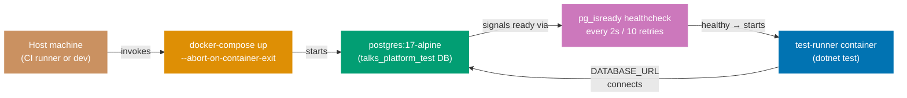

## Guide 15 — Database Integration Test via docker-compose Harness

### Why It Matters

Unit tests with an in-memory adapter (Guide 8) prove port correctness but cannot
catch SQL schema mistakes, PostgreSQL-specific constraint behavior, or migration
ordering bugs. A database integration test that runs against a real PostgreSQL
instance inside Docker closes this gap without requiring a persistent database on
developer machines. In `talks-platform-be`, the `docker-compose.integration.yml`
file defines exactly this harness: a `postgres:17-alpine` service with a
health-check gate and a `test-runner` container that waits for it. The two
services together give every integration test a fresh, disposable PostgreSQL
instance that mirrors the production schema.

### Standard Library First

`System.Data.Common.DbConnection` and raw ADO.NET let you open a connection to
any database — but you manage the lifecycle entirely yourself:

```fsharp
// Standard library: raw ADO.NET connection to a test database
open System.Data
open Npgsql
// => System.Data: IDbConnection, IDbCommand — provider-agnostic BCL interfaces
// => Npgsql: concrete NpgsqlConnection that satisfies IDbConnection for PostgreSQL
// => No docker-compose: the test assumes the database is already running

let connectionString = System.Environment.GetEnvironmentVariable("DATABASE_URL")
// => Read from environment — the same variable docker-compose sets for the test-runner service
// => If the variable is missing the test throws NullReferenceException, not a clear error

use conn = new NpgsqlConnection(connectionString)
// => use: F# sugar for IDisposable — calls conn.Dispose() when the binding goes out of scope
conn.Open()
// => Synchronous open: blocks the thread until the TCP handshake completes
// => If the postgres service is not ready yet, this throws — no health-check polling in stdlib
use cmd = conn.CreateCommand()
// => IDbCommand: provider-agnostic command object
cmd.CommandText <- "SELECT 1"
// => Smoke query — verifies the connection is live before running migration scripts
let result = cmd.ExecuteScalar()
// => ExecuteScalar: returns the first column of the first row as obj
// => Returns 1L (int64) for "SELECT 1" on PostgreSQL — cast required at call site
printfn "Connected: %A" result
// => Diagnostic output — in a real test this would be an assertion, not a print
```

**Limitation for production**: raw ADO.NET requires manual health-check polling
before running tests, manual connection lifecycle management, and manual schema
setup. The harness logic duplicates across every project that needs integration
tests against PostgreSQL.

### Production Framework

`talks-platform-be` provides a self-contained harness in
`docker-compose.integration.yml`. The `postgres` service uses a `healthcheck`
directive so the `test-runner` service starts only after the database is ready:

```yaml
# docker-compose.integration.yml for talks-platform-be
services:
  # => services: top-level key defining all containers in the compose file
  postgres:
    # => postgres: the database service — named so other services reference it as a hostname
    image: postgres:17-alpine
    # => postgres:17-alpine: Alpine-based image — smallest footprint for test use
    # => 17-alpine: pinned to PostgreSQL major version 17 — matches the production target
    environment:
      # => environment: injects these key-value pairs as container environment variables
      POSTGRES_DB: talks_platform_test
      # => talks_platform_test: isolated test database — never touches the dev or production database
      POSTGRES_USER: talks_platform
      POSTGRES_PASSWORD: talks_platform
      # => Hard-coded credentials for the ephemeral test database — not a security concern
    healthcheck:
      # => healthcheck: docker-compose monitors this probe and marks the container healthy/unhealthy
      test: ["CMD-SHELL", "pg_isready -U talks_platform -d talks_platform_test"]
      # => pg_isready: PostgreSQL built-in probe — returns 0 when the server accepts connections
      # => docker-compose waits for this to succeed before starting test-runner
      interval: 2s
      # => interval: probe frequency — checks readiness every 2 seconds during startup
      timeout: 5s
      # => timeout: probe must complete within 5s — pg_isready is fast so this is generous
      retries: 10
      # => interval + retries = 20 seconds maximum wait — sufficient for Alpine startup
    ports:
      # => ports: exposes the container port to the host — random host port avoids conflicts
      - "5432"
      # => Ephemeral host port: docker-compose assigns a random host port
    tmpfs:
      # => tmpfs: mounts a RAM-backed filesystem — no disk I/O, data vanishes on container stop
      - /var/lib/postgresql/data
      # => Guarantees test isolation: each docker-compose up run starts with an empty database

  test-runner:
    # => test-runner: the .NET test execution container — starts after postgres is healthy
    build:
      # => build: builds the image from a Dockerfile instead of pulling from a registry
      context: ../..
      # => context: the Docker build context root — set to repo root so the Dockerfile can COPY all source
      dockerfile: apps/talks-platform-be/Dockerfile.integration
    depends_on:
      postgres:
        condition: service_healthy
        # => condition: service_healthy: test-runner starts only after the healthcheck succeeds
    environment:
      # => environment: injects DATABASE_URL so the F# test code reads it via Environment.GetEnvironmentVariable
      DATABASE_URL: "Host=postgres;Port=5432;Database=talks_platform_test;Username=talks_platform;Password=talks_platform"
      # => Host=postgres: container service name — docker-compose DNS resolves it on the internal network
    volumes:
      # => volumes: mounts host directories into the container at runtime
      - ../../specs:/specs:ro
      # => Mount the OpenAPI specs directory read-only — integration tests can validate contract shapes
```



The F# integration test reads the same `DATABASE_URL` that docker-compose
injects and exercises the full Npgsql adapter stack:

```fsharp
// Integration test consuming the docker-compose harness
// Tests/Submission/NpgsqlTalkRepositoryTests.fs
module TalksPlatform.IntegrationTests.Submission.NpgsqlTalkRepositoryTests

open Xunit
// => xUnit: test runner — discovers [<Fact>] methods and reports pass/fail
open TalksPlatform.Contexts.Submission.Infrastructure.NpgsqlTalkRepository
// => npgsqlTalkRepository: the adapter under test — real Npgsql I/O to the test database
open TalksPlatform.Contexts.Submission.Domain
// => Domain types: Talk, TalkId, Abstract, Format, Status

[<Fact>]
// => Fact: parameterless integration test — runs once against the real database
let ``npgsqlTalkRepository.SaveTalk stores a talk in PostgreSQL`` () =
    // => Test name describes the observable contract, not the implementation
    async {
        let connStr = System.Environment.GetEnvironmentVariable("DATABASE_URL")
        // => Read connection string from the environment variable docker-compose injects
        // => Outside docker-compose, set DATABASE_URL in the terminal before running dotnet test
        let repo = npgsqlTalkRepository connStr
        // => Factory call: returns TalkRepository record closed over the connection string

        let abstract' =
            createAbstract "A deep dive into DDD and hexagonal architecture with F#"
            |> Result.defaultWith failwith
        // => Smart constructor: validates length — fails the test if invalid
        let talk =
            { Id = TalkId (System.Guid.NewGuid())
              SpeakerId = SpeakerId (System.Guid.NewGuid())
              Abstract = abstract'
              Format = Standard
              Track = Backend
              Status = Draft }
        // => Domain aggregate from validated value objects — no invalid aggregate reaches the adapter

        let! saveResult = repo.SaveTalk talk
        // => repo.SaveTalk: performs a real INSERT via Npgsql to PostgreSQL
        match saveResult with
        | Error e ->
            Assert.Fail(sprintf "Expected Ok, got Error: %A" e)
            // => Fail with the typed RepositoryError — not a swallowed exception
        | Ok () ->
            // => The document row exists in the test database — verify via a read
            let! found = repo.FindTalk talk.Id
            // => Round-trip read: confirms the committed row is readable
            match found with
            | Ok (Some saved) ->
                Assert.Equal(talk.Id, saved.Id)
                // => Round-trip verified: the row was committed and is readable
            | Ok None ->
                Assert.Fail("Talk not found after save")
            | Error e ->
                Assert.Fail(sprintf "Find failed: %A" e)
    } |> Async.RunSynchronously
// => Async.RunSynchronously: bridges F# async to xUnit's synchronous test runner
```

**Trade-offs**: docker-compose integration tests are slower than in-memory tests
(typically 5–30 seconds to start PostgreSQL) and require Docker on the CI
runner and developer machine. They are not cacheable by Nx because the external
PostgreSQL container is non-deterministic. Run them only on the
`test:integration` Nx target, not `test:quick`. The payoff is that they catch
schema drift, PostgreSQL-specific constraint behavior, and migration ordering
bugs that no in-memory test can surface.

---

## Guide 16 — Schema Migration Adapter with DbUp

### Why It Matters

Every database integration test relies on a schema that matches the application's
expectations. If the schema is applied manually or maintained as a diff from a
previous migration, the test database may be out of date — making integration
tests flaky in a way that is hard to reproduce. In `talks-platform-be`, the
`Infrastructure/Migrations.fs` module uses DbUp to apply embedded SQL scripts
in order at startup. This makes the migration adapter a first-class hexagonal
concern: the application layer defines what shape data the aggregate needs; the
migration adapter ensures the database schema reflects that shape; and the
integration test harness runs both in order.

### Standard Library First

F# `System.IO.File` and raw ADO.NET can execute SQL files in order — but you
manage ordering, idempotency, and error handling manually:

```fsharp
// Standard library: manual SQL file execution without a migration library
open System.IO
open Npgsql
// => System.IO.File.ReadAllText: reads a .sql file from disk as a string
// => Npgsql: executes the SQL against PostgreSQL
// => No ordering enforcement — the caller must sort files by name manually

let runMigration (connStr: string) (sqlFilePath: string) =
    let sql = File.ReadAllText(sqlFilePath)
    // => Reads the entire .sql file as a string — no templating, no parameter binding
    // => File must exist at the path; no embedded-resource fallback
    use conn = new NpgsqlConnection(connStr)
    conn.Open()
    // => Synchronous open — blocks the thread
    use cmd = conn.CreateCommand()
    cmd.CommandText <- sql
    // => Execute the entire file as one statement — DDL errors mid-file leave partial schema
    cmd.ExecuteNonQuery() |> ignore
    // => ignore: ExecuteNonQuery returns rows-affected (0 for DDL) — discarded
    // => No tracking table: if the migration was already applied, it runs again — idempotency is manual
```

**Limitation for production**: no tracking table means migrations can run twice.
No ordering means alphabetical file naming must be enforced by convention. No
error recovery means a failed migration leaves the schema in a partial state.

### Production Framework

`talks-platform-be` uses DbUp embedded in `Infrastructure/Migrations.fs`. DbUp
maintains an applied-scripts journal table (`schemaversions`) in the database,
applies scripts in the order they are listed in the assembly, and rolls back on
error. The function is called at application startup before any handler runs:

```fsharp
// Infrastructure/Migrations.fs: DbUp migration runner
// src/TalksPlatform/Infrastructure/Migrations.fs
module TalksPlatform.Infrastructure.Migrations

open System.Reflection
// => System.Reflection.Assembly: lets DbUp find embedded SQL scripts at runtime
open DbUp
// => DbUp NuGet package: DeployChanges builder API + migration journal

let upgrade (connectionString: string) =
    // => connectionString: injected from Program.fs — reads from AppConfig at startup
    // => upgrade returns a DatabaseUpgradeResult — callers check .Successful before serving traffic
    let upgrader =
        DeployChanges.To
            .PostgresqlDatabase(connectionString)
            // => PostgresqlDatabase: Npgsql-backed DbUp journal provider
            // => Creates the "schemaversions" journal table on first run if it does not exist
            .WithScriptsEmbeddedInAssembly(Assembly.GetExecutingAssembly())
            // => GetExecutingAssembly: scans the TalksPlatform.dll for *.sql Build Action = EmbeddedResource
            // => Scripts are applied in alphabetical order — prefix with "0001_", "0002_" etc.
            // => A script that appears in the journal is skipped — idempotency guaranteed by DbUp
            .LogToConsole()
            // => LogToConsole: writes each applied script name to stdout — visible in docker-compose logs
            .Build()
    let result = upgrader.PerformUpgrade()
    // => PerformUpgrade: applies all unapplied scripts in order within a transaction per script
    // => Returns DatabaseUpgradeResult with .Successful bool and .Error exn option
    result
    // => Callers pattern-match on result.Successful — Program.fs exits with code 1 if migrations fail
```

The migration adapter integrates with the hexagonal composition root cleanly:

```fsharp
// Program.fs: migration adapter called before app.Run()
// src/TalksPlatform/Composition/Program.fs (extended)

open TalksPlatform.Infrastructure.Migrations
// => Single import: migration module lives in Infrastructure — no domain import here

let runMigrationsOrExit (connectionString: string) =
    // => Extracted helper: keeps Program.fs's main block readable
    let result = upgrade connectionString
    // => upgrade: DbUp runner — applies all unapplied embedded SQL scripts
    if not result.Successful then
        // => .Successful: false when any script fails to apply
        eprintfn "Migration failed: %A" result.Error
        // => Log to stderr — visible in docker-compose logs and kubectl logs
        // => result.Error: option<exn> — carries the first script that threw
        System.Environment.Exit(1)
        // => Exit 1: non-zero exit code causes docker-compose to mark the container unhealthy
        // => Kubernetes readiness probe also fails — prevents traffic before the schema is ready

// Integration test: verify migrations apply cleanly against the docker-compose database
// Tests/Migrations/MigrationSmokeTest.fs
module TalksPlatform.IntegrationTests.Migrations.MigrationSmokeTest

open Xunit
open TalksPlatform.Infrastructure.Migrations
// => Import only the migration module — no application or domain imports needed

[<Fact>]
let ``migrations apply successfully to the test database`` () =
    let connStr = System.Environment.GetEnvironmentVariable("DATABASE_URL")
    // => DATABASE_URL: injected by docker-compose.integration.yml
    let result = upgrade connStr
    // => Apply all embedded SQL scripts to the fresh talks_platform_test database
    Assert.True(result.Successful, sprintf "Migration failed: %A" result.Error)
    // => Fails with the first script error — the message includes the script name and exception
    let result2 = upgrade connStr
    // => Second run on the same database — all scripts already in the journal
    Assert.True(result2.Successful, "Second run of migrations should be idempotent")
    // => DbUp skips scripts already in the journal — second run applies zero scripts
```

**Trade-offs**: DbUp applies scripts in alphabetical order — naming discipline
(`0001_`, `0002_`) is mandatory. A mislabeled script that should run after
`0010_` but is named `002_` runs second and breaks. For teams that prefer a
declarative diff-based migration tool, FluentMigrator provides an equivalent
with C#-style migration classes; DbUp's embedded SQL approach keeps the
migration language as SQL, which is more portable and easier to review.

---

## Guide 17 — AI Orchestration Port + OpenRouter HTTP Adapter

### Why It Matters

AI inference is an I/O boundary: your application sends a prompt and receives a
generated response from an external model provider. Like the database boundary,
this I/O must sit behind a port so the application service is testable without a
live API key, and so you can swap the provider without touching business logic.
In `talks-platform-be`, the `ai-assist` context holds the `AiProvider` port —
a record of functions for auto-tagging submitted talks and summarizing abstracts
for reviewers. The port-first design means that a test can use a stub adapter
returning a fixed response, while production uses the real OpenRouter HTTP call.

### Standard Library First

`System.Net.Http.HttpClient` sends HTTP requests without any AI-specific library.
You can call OpenRouter's REST API directly using the BCL:

```fsharp
// Standard library: HttpClient calling OpenRouter's chat completions endpoint
open System.Net.Http
open System.Text
open System.Text.Json
// => Three BCL imports — no AI SDK, no NuGet beyond the SDK
// => HttpClient: the BCL's HTTP client; reuse a single instance for connection pooling

let private httpClient = new HttpClient()
// => Static HttpClient: reused across calls — avoids socket exhaustion from new() per call

let callOpenRouter (apiKey: string) (model: string) (baseUrl: string) (prompt: string) =
    // => Raw parameters — no typed settings record, no port alias
    async {
        let body =
            JsonSerializer.Serialize
                {| model = model
                   messages = [| {| role = "user"; content = prompt |} |] |}
        // => Hand-crafted JSON body — anonymous records, no type safety on field names
        use request = new HttpRequestMessage(HttpMethod.Post, baseUrl + "/chat/completions")
        // => use: HttpRequestMessage is IDisposable — dispose after sending
        request.Headers.Authorization <- Headers.AuthenticationHeaderValue("Bearer", apiKey)
        // => Bearer token auth — OpenRouter uses the same scheme as OpenAI
        request.Content <- new StringContent(body, Encoding.UTF8, "application/json")
        // => StringContent: wraps the JSON string in an HttpContent with the correct Content-Type
        let! response = httpClient.SendAsync(request) |> Async.AwaitTask
        // => SendAsync: non-blocking HTTP call — awaits the response headers
        response.EnsureSuccessStatusCode() |> ignore
        // => Throws HttpRequestException on 4xx/5xx — no typed error discrimination
        let! json = response.Content.ReadAsStringAsync() |> Async.AwaitTask
        // => ReadAsStringAsync: reads the response body asynchronously
        return JsonSerializer.Deserialize<{| choices: {| message: {| content: string |} |} array |}>(json)
        // => Deserialize — anonymous record path is fragile if OpenRouter changes its schema
    }
```

**Limitation for production**: no typed error discrimination between rate-limit
errors (429), authentication failures (401), and model capacity errors (503). No
retry logic. The application layer must import `HttpClient` to call this
function — the AI boundary is not behind a port.

### Production Framework

The hexagonal approach defines a port in the `ai-assist` application layer
and implements the OpenRouter HTTP adapter in infrastructure:

```fsharp
// ai-assist context: application layer port
// src/TalksPlatform/Contexts/AiAssist/Application/Ports.fs
module TalksPlatform.Contexts.AiAssist.Application.Ports

open TalksPlatform.Contexts.Submission.Domain
// => Abstract and TagSet from the submission context — ai-assist is stateless and reads these

// Output port: record of AI functions
type AiProvider =
    { AutoTag: Abstract -> Async<Result<TagSet, string>>
      // => AutoTag: given an abstract, return a set of normalized tag slugs
      // => Called by the submission context after TalkSubmitted — ai-assist is a downstream consumer
      Summarize: Abstract -> Async<Result<string, string>>
      // => Summarize: given an abstract, return a short summary for the reviewer pack
      // => Result<string, string>: Ok is the summary text; Error is the failure reason
    }
// => Record-of-functions: both AI operations in one value — the application service receives one parameter
// => No HTTP types cross this boundary — the adapter owns all HttpClient concerns
```

```fsharp
// ai-assist context: OpenRouter HTTP adapter
// src/TalksPlatform/Contexts/AiAssist/Infrastructure/OpenRouterAiProvider.fs
module TalksPlatform.Contexts.AiAssist.Infrastructure.OpenRouterAiProvider

open System.Net.Http
// => HttpClient and HttpRequestMessage — BCL, no NuGet
open System.Text
// => Encoding.UTF8 for the StringContent MIME body
open System.Text.Json
// => JsonSerializer for request serialization and response deserialization
open TalksPlatform.Contexts.AiAssist.Application.Ports
// => AiProvider port record — the adapter must satisfy it exactly
open TalksPlatform.Contexts.Submission.Domain
// => Abstract, TagSet — domain types used in the port signature

// Typed config record for the OpenRouter adapter
type AiSettings =
    { ApiKey: string
      // => API key loaded from environment variable at startup — never hardcoded
      Model: string
      // => Model identifier: e.g., "anthropic/claude-3-5-haiku" — swappable via config
      BaseUrl: string }
      // => BaseUrl: "https://openrouter.ai/api/v1" in production

// Adapter factory
let make (settings: AiSettings) (factory: IHttpClientFactory) : AiProvider =
    // => factory: IHttpClientFactory — named client with resilience pipeline from Guide 18
    // => settings: typed config record — API key, model, base URL
    { AutoTag =
        fun (Abstract abstractText) ->
            // => Destructure Abstract value object — the adapter works with the raw string
            async {
                try
                    let client = factory.CreateClient("openrouter")
                    // => Named client: resilience pipeline applied (Guide 18)
                    let prompt =
                        sprintf "Generate 3-5 tag slugs (lowercase, hyphenated) for a conference talk with this abstract. Respond with comma-separated slugs only.\n\nAbstract: %s" abstractText
                    // => Structured prompt: the adapter owns prompt engineering — not the application service
                    let body =
                        JsonSerializer.Serialize
                            {| model = settings.Model
                               messages = [| {| role = "user"; content = prompt |} |] |}
                    // => Serialize the chat request — anonymous record matches OpenRouter's API shape
                    use req = new HttpRequestMessage(HttpMethod.Post, settings.BaseUrl + "/chat/completions")
                    // => use: dispose the request after sending — frees headers and content memory
                    req.Headers.Authorization <- Headers.AuthenticationHeaderValue("Bearer", settings.ApiKey)
                    // => Bearer token: OpenRouter authenticates with the same scheme as OpenAI
                    req.Content <- new StringContent(body, Encoding.UTF8, "application/json")
                    // => UTF-8 JSON body: consistent encoding
                    let! resp = client.SendAsync(req) |> Async.AwaitTask
                    // => SendAsync: async HTTP call — no thread blocking
                    resp.EnsureSuccessStatusCode() |> ignore
                    // => Throws HttpRequestException on 4xx/5xx — caught below
                    let! json = resp.Content.ReadAsStringAsync() |> Async.AwaitTask
                    // => ReadAsStringAsync: reads the response body asynchronously
                    let parsed =
                        JsonSerializer.Deserialize<{| choices: {| message: {| content: string |} |} array |}>(json)
                    // => Deserialize: anonymous record path — adequate for a fixed API shape
                    let slugs =
                        parsed.choices[0].message.content.Split(',')
                        |> Array.map (fun s -> s.Trim().ToLowerInvariant())
                        |> Set.ofArray
                    // => Parse comma-separated slugs into a Set<string> — TagSet is Set<string>
                    return Ok (TagSet slugs)
                    // => TagSet: wraps the Set<string> — the application service uses it directly
                with ex ->
                    return Error (sprintf "AutoTag failed: %s" ex.Message)
                    // => Catch-all: network errors, parse errors, auth failures all become Error string
            }
      Summarize =
        fun (Abstract abstractText) ->
            // => Same pattern as AutoTag — different prompt, same transport
            async {
                try
                    let client = factory.CreateClient("openrouter")
                    // => Same named client — resilience policy shared
                    let prompt =
                        sprintf "Summarize the following conference talk abstract in 2-3 sentences for a blind reviewer.\n\nAbstract: %s" abstractText
                    // => Different prompt: summary for reviewers, not tags for speakers
                    let body =
                        JsonSerializer.Serialize
                            {| model = settings.Model
                               messages = [| {| role = "user"; content = prompt |} |] |}
                    use req = new HttpRequestMessage(HttpMethod.Post, settings.BaseUrl + "/chat/completions")
                    req.Headers.Authorization <- Headers.AuthenticationHeaderValue("Bearer", settings.ApiKey)
                    req.Content <- new StringContent(body, Encoding.UTF8, "application/json")
                    let! resp = client.SendAsync(req) |> Async.AwaitTask
                    resp.EnsureSuccessStatusCode() |> ignore
                    let! json = resp.Content.ReadAsStringAsync() |> Async.AwaitTask
                    let parsed =
                        JsonSerializer.Deserialize<{| choices: {| message: {| content: string |} |} array |}>(json)
                    return Ok parsed.choices[0].message.content.Trim()
                    // => Trim: remove leading/trailing whitespace that models sometimes append
                with ex ->
                    return Error (sprintf "Summarize failed: %s" ex.Message)
            }
    }
```

The deterministic stub for tests needs no API key:

```fsharp
// Stub adapter for tests — no HTTP call, no API key
// Tests/AiAssist/StubAiProvider.fs
module TalksPlatform.Tests.AiAssist.StubAiProvider

open TalksPlatform.Contexts.AiAssist.Application.Ports
open TalksPlatform.Contexts.Submission.Domain

let deterministicStub : AiProvider =
    // => Stub: always returns fixed results — exercises the application service's happy path
    { AutoTag =
        fun _ ->
            // => fun _: discards the Abstract — fixed result drives assertions
            async { return Ok (TagSet (Set.ofList ["f-sharp"; "ddd"; "hexagonal"])) }
            // => Deterministic: tests do not need an API key or network access
      Summarize =
        fun _ ->
            // => fun _: discards the Abstract — fixed summary drives assertions
            async { return Ok "Stub summary: a talk about domain-driven design patterns." }
    }
```

**Trade-offs**: the adapter owns prompt engineering — this is intentional. If the
prompt changes, only the adapter changes; the application service and domain
layer are unaffected. The trade-off is that the port stub cannot test prompt
engineering; it requires either an integration test against a real OpenRouter
endpoint or a recorded HTTP fixture. Use environment variable
`AI_PROVIDER_ENABLED=false` to skip AI integration tests in CI when no API key
is available.

---

## Guide 18 — Retry and Circuit-Breaker in Adapters

### Why It Matters

External HTTP calls — including the OpenRouter adapter from Guide 17 — fail
transiently. A single `EnsureSuccessStatusCode` followed by an exception
propagated to the application layer violates the resilience contract: one network
hiccup crashes a user's request. Wrapping adapter calls in retry and circuit-
breaker policies separates transient failure handling (retry) from persistent
failure handling (circuit-breaker). The application service sees only an error
string from the `AiProvider` port — it does not implement retry logic itself.

### Standard Library First

F# recursion can implement a simple retry loop without any library:

```fsharp
// Standard library: recursive retry with exponential backoff
open System.Threading
// => Thread.Sleep: synchronous backoff — blocks the thread pool during the wait
// => Never use Thread.Sleep in an ASP.NET Core handler — blocks a thread pool thread

let rec retryAsync (attempt: int) (maxAttempts: int) (f: unit -> Async<Result<'a, string>>) =
    // => let rec: enables recursive calls from within the function body
    // => Generic 'a: the success type — retry logic is type-agnostic
    async {
        let! result = f ()
        // => Call the target function — any Async<Result<_, string>>
        match result with
        | Ok v -> return Ok v
        // => Success: return immediately without retrying
        | Error _ when attempt >= maxAttempts ->
            // => Guard: attempt count exceeded — stop retrying
            return result
        | Error _ ->
            // => Transient error: sleep and recurse with an incremented attempt counter
            do! Async.Sleep(1000 * attempt)
            // => Exponential backoff: sleep 1s, 2s, 3s... — Async.Sleep does not block the thread
            return! retryAsync (attempt + 1) maxAttempts f
            // => Recurse: tail-recursive in the async CE
    }
```

**Limitation for production**: the recursive retry has no circuit-breaker — if
the downstream is down, every request retries until `maxAttempts` is exhausted,
amplifying load on the failing service. No exponential jitter means thundering
herd when many requests retry simultaneously.

### Production Framework

`Microsoft.Extensions.Http.Resilience` provides retry, circuit-breaker, timeout,
and hedging as a typed pipeline added to the `HttpClient` registration at startup:

```fsharp
// Program.fs: register HttpClient with resilience policies at startup
// src/TalksPlatform/Composition/Program.fs (extended)

open Microsoft.Extensions.DependencyInjection
// => AddHttpClient: IHttpClientFactory registration
open Microsoft.Extensions.Http.Resilience
// => AddStandardResilienceHandler: batteries-included retry + circuit-breaker pipeline

let configureOpenRouterHttpClient (services: IServiceCollection) =
    services
        .AddHttpClient("openrouter")
        // => Named client "openrouter": resolved by name in the AiProvider adapter factory
        // => Named clients isolate the resilience policy from other HttpClient registrations
        .AddStandardResilienceHandler()
        // => AddStandardResilienceHandler: applies the standard resilience pipeline
        // => Default policy: 3 retries with exponential backoff + jitter, 30s total timeout,
        //    circuit-breaker that opens after 10 failures in 30 seconds
        |> ignore
    services
```

```fsharp
// ai-assist context: resilient AiProvider adapter using IHttpClientFactory
// src/TalksPlatform/Contexts/AiAssist/Infrastructure/ResilientOpenRouterAiProvider.fs
module TalksPlatform.Contexts.AiAssist.Infrastructure.ResilientOpenRouterAiProvider

open System.Net.Http
// => IHttpClientFactory: creates named HttpClient instances with the registered policy
open TalksPlatform.Contexts.AiAssist.Application.Ports
open TalksPlatform.Contexts.Submission.Domain

// Resilient adapter: receives the factory, not the client directly
let makeResilient (factory: IHttpClientFactory) (settings: AiSettings) : AiProvider =
    // => Returns AiProvider: same record type as the non-resilient adapter
    { AutoTag =
        fun abstract' ->
            // => fun abstract': AiProvider.AutoTag signature — the adapter translates to HTTP
            async {
                let client = factory.CreateClient("openrouter")
                // => CreateClient("openrouter"): HttpClient with the resilience pipeline applied
                // => If the circuit is open, SendAsync throws BrokenCircuitException
                try
                    // ... same HTTP call as Guide 17's AutoTag ...
                    // => The retry and circuit-breaker are transparent to the adapter's business logic
                    // => On transient failure, the pipeline retries before returning to the adapter
                    return Ok (TagSet Set.empty)
                    // => Stub: real implementation parses the response here — same logic as Guide 17
                with
                | :? Polly.CircuitBreaker.BrokenCircuitException ->
                    // => Circuit open: the Polly pipeline has tripped after repeated failures
                    return Error "AI service circuit open — auto-tagging unavailable"
                    // => Error string: the application service logs and skips tagging gracefully
                | ex ->
                    // => Catch-all: any other exception after the retry budget is exhausted
                    return Error (sprintf "AutoTag failed after retries: %s" ex.Message)
            }
      Summarize =
        fun abstract' ->
            async {
                let client = factory.CreateClient("openrouter")
                try
                    // ... same HTTP call as Guide 17's Summarize ...
                    return Ok "Resilient stub summary."
                with
                | :? Polly.CircuitBreaker.BrokenCircuitException ->
                    return Error "AI service circuit open — summarization unavailable"
                | ex ->
                    return Error (sprintf "Summarize failed after retries: %s" ex.Message)
            }
    }
```

**Trade-offs**: `AddStandardResilienceHandler` applies a fixed policy suitable for
most external HTTP calls. For AI endpoints that are inherently slow (5–30 seconds
per inference call), the default 30-second total timeout may be too short — use
`ConfigureHttpClient` to set a longer timeout specifically for the
`"openrouter"` named client. Circuit-breaker state is in-memory and per-process;
in a multi-instance deployment, each instance has an independent circuit. For
global circuit-breaker state, use a Redis-backed Polly policy.

---

## Guide 19 — Domain Event Flow End-to-End

### Why It Matters

Guides 9 and 10 showed the publisher port and its two adapters in isolation. This
guide traces the full domain event flow from aggregate emit to downstream
consumer, showing every hand-off boundary. In `talks-platform-be`, the intended
flow is: a Giraffe handler calls the submission application service, the service
calls the outbox adapter to write the event row, a relay worker polls the outbox
table and dispatches events to downstream contexts (`review` opens a round;
`ai-assist` auto-tags). Understanding this flow as a sequence of port crossings
prevents the common mistake of coupling the relay worker to the application
service directly.

### Standard Library First

An in-process event queue using `System.Collections.Concurrent.ConcurrentQueue`
can relay events within a single process:

```fsharp
// Standard library: in-process event relay with ConcurrentQueue
open System.Collections.Concurrent
// => ConcurrentQueue<_>: thread-safe queue — no external message bus required
// => Only works within a single process: no cross-service delivery

let private queue = ConcurrentQueue<string>()
// => Shared mutable state: global queue visible to all threads in the process
// => Not persistent: events are lost on process restart — no at-least-once guarantee

let enqueue (eventJson: string) = queue.Enqueue(eventJson)
// => Enqueue: O(1) thread-safe append
// => eventJson: serialized event — loses type safety across the enqueue/dequeue boundary

let dequeue () =
    match queue.TryDequeue() with
    | true, item -> Some item
    | false, _ -> None
// => Poll pattern: the relay must call dequeue in a loop — no push notification
```

**Limitation for production**: in-process queues do not survive process restarts.
No delivery guarantee — if the relay crashes between dequeue and consumer
acknowledgement, the event is lost. Cannot fan out to multiple consumers.

### Production Framework

The full end-to-end event flow crosses four port boundaries:

```fsharp
// End-to-end domain event flow — four boundary crossings
// src/TalksPlatform/Contexts/Submission/Infrastructure/OutboxRelayWorker.fs

// Boundary 1: Application service emits TalkSubmitted after successful save (Guide 9).
// The outbox adapter writes an outbox_events row in the same transaction.

// Boundary 2: Outbox relay worker polls and forwards
module TalksPlatform.Contexts.Submission.Infrastructure.OutboxRelayWorker

open Microsoft.Extensions.Hosting
// => IHostedService: ASP.NET Core background service — runs on a loop alongside the HTTP server
open Microsoft.Extensions.DependencyInjection
// => IServiceScopeFactory: creates DI scopes for each relay iteration
open System.Text.Json
// => Deserialize the outbox_events payload stored by the outbox adapter (Guide 10)
open TalksPlatform.Contexts.Submission.Application.Ports
// => DomainEvent discriminated union — deserialize the JSON payload into the typed event

type OutboxRelayWorker(connStr: string) =
    // => connStr: Npgsql connection string injected by the composition root
    interface IHostedService with
        member _.StartAsync(cancellationToken) =
            task {
                while not cancellationToken.IsCancellationRequested do
                    // => Poll loop: runs until the application shuts down
                    use conn = new Npgsql.NpgsqlConnection(connStr)
                    // => Fresh connection per poll cycle — pool manages the underlying socket
                    let! rows =
                        conn.QueryAsync<OutboxRow>(
                            "SELECT * FROM submission.outbox_events WHERE processed_at IS NULL ORDER BY created_at LIMIT 10")
                        |> Async.AwaitTask
                    // => Query unprocessed rows: processed_at IS NULL means not yet forwarded
                    // => LIMIT 10: batch size — prevents long transactions under high event volume
                    for row in rows do
                        // => for loop: iterates the batch — each row is forwarded and marked processed
                        let event = JsonSerializer.Deserialize<DomainEvent>(row.payload)
                        // => Deserialize the typed event from the JSON payload
                        match event with
                        | TalkSubmitted payload ->
                            // => Dispatch: each event type routes to its downstream handler
                            printfn "Relaying TalkSubmitted: talkId=%A" payload.TalkId
                            // => In production: call the review context's port and the ai-assist port
                            // => Guide 13's ACL wires the review port; Guide 17's adapter wires ai-assist
                        | TalkWithdrawn talkId ->
                            printfn "Relaying TalkWithdrawn: talkId=%A" talkId
                        | _ -> ()
                        // => Mark as processed after successful dispatch
                        let! _ =
                            conn.ExecuteAsync(
                                "UPDATE submission.outbox_events SET processed_at = @now WHERE id = @id",
                                {| now = System.DateTimeOffset.UtcNow; id = row.id |})
                            |> Async.AwaitTask
                        // => Idempotency: mark before the next poll skips already-forwarded rows
                        ()
                    do! System.Threading.Tasks.Task.Delay(5000) |> Async.AwaitTask
                    // => Sleep 5 seconds between polls — reduces DB load; tune based on event volume
            }
        member _.StopAsync(_) = System.Threading.Tasks.Task.CompletedTask
        // => StopAsync: called on graceful shutdown — Task.CompletedTask signals immediate stop
```

**Trade-offs**: the polling relay is simple and self-contained but adds 0–5 seconds
of latency between aggregate commit and event delivery. For latency-sensitive
use cases, replace the polling loop with PostgreSQL `LISTEN/NOTIFY` — the relay
subscribes to a channel and wakes up immediately on each new outbox row. For
high-throughput scenarios (> 1000 events/second), a CDC-based relay reading
the PostgreSQL WAL (Debezium) eliminates the polling overhead entirely.

---

## Guide 20 — Observability Adapter: OpenTelemetry Spans Wrapping Port Calls

### Why It Matters

In production, you need to know which port call is slow, which adapter is
producing errors, and what the end-to-end trace looks like for a given HTTP
request. Wrapping port calls in OpenTelemetry spans gives you this visibility
without modifying the application service. The observability adapter is itself a
port — it satisfies the same record shape as the real adapter but wraps the real
adapter's call inside a span. This is the decorator pattern applied to hexagonal
adapters.

### Standard Library First

`System.Diagnostics.Activity` is the BCL's span representation. OpenTelemetry
builds on this without adding its own threading model:

```fsharp
// Standard library: ActivitySource span wrapping a port call
open System.Diagnostics
// => System.Diagnostics.ActivitySource: BCL's trace source — ships with .NET runtime
// => No NuGet dependency: Activity API is part of the BCL in .NET 5+

let private activitySource = new ActivitySource("TalksPlatform.Adapters")
// => Named trace source — listeners (OpenTelemetry SDK) attach to it by name
// => One static instance per module: safe to share across threads

let withSpan (name: string) (f: unit -> Async<'a>) : Async<'a> =
    // => Generic 'a: the caller decides the return type — the span wraps any Async<_> function
    async {
        use activity = activitySource.StartActivity(name)
        // => StartActivity: creates a span if a listener is attached; returns null if not
        // => use: Activity is IDisposable — stops the span when the binding goes out of scope
        try
            let! result = f ()
            // => Execute the wrapped function — any Async<_>
            activity |> Option.ofObj |> Option.iter (fun a -> a.SetStatus(ActivityStatusCode.Ok) |> ignore)
            // => SetStatus Ok: marks the span as successful
            return result
            // => return result: the wrapper is transparent — the caller receives the original return value
        with ex ->
            activity |> Option.ofObj |> Option.iter (fun a ->
                a.SetStatus(ActivityStatusCode.Error, ex.Message) |> ignore
                // => SetStatus Error: marks the span as failed — shows in red in trace UIs
                a.RecordException(ex) |> ignore)
                // => RecordException: attaches the exception stack trace to the span
            return raise ex
            // => raise ex: re-raises the original exception — the span is closed by the use binding
    }
```

**Limitation for production**: raw ActivitySource spans have no automatic
attribute enrichment (HTTP method, DB statement, error type). OpenTelemetry
instrumentation libraries add these automatically when you wrap at the adapter
level.

### Production Framework

The observability adapter wraps the `TalkRepository` (or any port adapter) in a
span without the application service knowing:

```fsharp
// Observability adapter: OpenTelemetry span decorator for TalkRepository port calls
// src/TalksPlatform/Contexts/Submission/Infrastructure/ObservabilityAdapter.fs
module TalksPlatform.Contexts.Submission.Infrastructure.ObservabilityAdapter

open System.Diagnostics
// => ActivitySource: BCL span API — OpenTelemetry SDK listens to it
open TalksPlatform.Contexts.Submission.Application.Ports
// => Port record: TalkRepository — the observability adapter satisfies the same shape

let private source = new ActivitySource("TalksPlatform.Submission")
// => Named source: "TalksPlatform.Submission" — OpenTelemetry SDK subscribes by name in Program.fs
// => Static: created once per module load — ActivitySource is thread-safe

// Decorator: wraps TalkRepository in spans
let withRepositorySpans (inner: TalkRepository) : TalkRepository =
    // => inner: the real Npgsql adapter's TalkRepository — passed from the composition root
    // => Returns TalkRepository: same record shape — the application service cannot distinguish decorated from raw
    { SaveTalk =
        fun talk ->
            // => talk: the domain aggregate passed by the application service
            async {
                use activity = source.StartActivity("submission.save-talk")
                // => Span name: "context.operation" — visible in Jaeger / Honeycomb
                // => use: span closes when the async block exits (success or exception)
                activity
                |> Option.ofObj
                // => Option.ofObj: converts null to None — avoids NullReferenceException
                |> Option.iter (fun a ->
                    // => Option.iter: executes only when the span was successfully started
                    a.SetTag("talk.id", talk.Id.ToString()) |> ignore
                    // => Tag the talk ID: enables filtering all spans for a specific talk
                    a.SetTag("context", "submission") |> ignore)
                    // => Context tag: groups spans by bounded context in the dashboard
                try
                    let! result = inner.SaveTalk talk
                    // => Delegate to the real Npgsql adapter — the span wraps this call
                    match result with
                    | Ok () ->
                        activity |> Option.ofObj |> Option.iter (fun a -> a.SetStatus(ActivityStatusCode.Ok) |> ignore)
                        // => Success: mark span green
                    | Error e ->
                        activity
                        |> Option.ofObj
                        |> Option.iter (fun a ->
                            a.SetStatus(ActivityStatusCode.Error, sprintf "%A" e) |> ignore
                            // => Failure: mark span red with the RepositoryError variant name
                            a.SetTag("error.type", e.GetType().Name) |> ignore)
                    return result
                    // => Return the original result unchanged — the decorator is transparent
                with ex ->
                    activity
                    |> Option.ofObj
                    |> Option.iter (fun a ->
                        a.SetStatus(ActivityStatusCode.Error, ex.Message) |> ignore
                        a.RecordException(ex) |> ignore)
                    return raise ex
                    // => Re-raise: the caller's error handling is not bypassed
            }
      FindTalk =
        fun talkId ->
            async {
                use activity = source.StartActivity("submission.find-talk")
                // => Separate span for the read operation — enables per-operation latency analysis
                activity
                |> Option.ofObj
                |> Option.iter (fun a ->
                    a.SetTag("talk.id", talkId.ToString()) |> ignore
                    a.SetTag("context", "submission") |> ignore)
                try
                    let! result = inner.FindTalk talkId
                    match result with
                    | Ok _ ->
                        activity |> Option.ofObj |> Option.iter (fun a -> a.SetStatus(ActivityStatusCode.Ok) |> ignore)
                    | Error e ->
                        activity
                        |> Option.ofObj
                        |> Option.iter (fun a ->
                            a.SetStatus(ActivityStatusCode.Error, sprintf "%A" e) |> ignore)
                    return result
                with ex ->
                    activity
                    |> Option.ofObj
                    |> Option.iter (fun a ->
                        a.SetStatus(ActivityStatusCode.Error, ex.Message) |> ignore
                        a.RecordException(ex) |> ignore)
                    return raise ex
            }
    }
```

The composition root chains the observability decorator over the Npgsql adapter:

```fsharp
// Program.fs: chain observability decorator over Npgsql adapter
// src/TalksPlatform/Composition/Program.fs (extended)

let talkRepo =
    NpgsqlTalkRepository.npgsqlTalkRepository connStr
    // => Npgsql adapter: the real implementation
    |> ObservabilityAdapter.withRepositorySpans
    // => Observability decorator: wraps both SaveTalk and FindTalk in spans
    // => The application service receives the decorated TalkRepository — transparent to it
    // => Adding retry (Guide 18) and observability: chain both decorators at the composition root
```

**Trade-offs**: the decorator pattern adds one function call overhead per port
call — negligible compared to network I/O. The composition root grows by one
line per decorated adapter. OpenTelemetry requires the SDK to be configured
(`.AddOpenTelemetry().WithTracing(...)` in `Program.fs`) before spans are
exported; the SDK silently drops spans that emit before configuration completes.

---

## Guide 21 — Multi-Tenancy Adapter Pattern

### Why It Matters

`talks-platform-be` may serve multiple conference organizations, each with their
own submission pipeline and review pool. Multi-tenancy means the same code serves
all tenants, but each tenant's data is isolated. The hexagonal adapter pattern
handles this cleanly: the application service receives a tenant-aware port whose
adapter selects the correct database schema based on a tenant identifier extracted
from the HTTP request at the Giraffe handler boundary. The application service
never knows whether it is serving conference A or conference B.

### Standard Library First

A `Dictionary<string, string>` maps tenant identifiers to connection strings —
the stdlib approach:

```fsharp
// Standard library: tenant-to-connection-string dictionary
open System.Collections.Generic
// => Dictionary<_, _>: BCL hash map — thread-safe for concurrent reads after initial population

let private tenantConnStrings = Dictionary<string, string>()
// => Global mutable dictionary: populated at startup, read-only after
// => Thread-safe for concurrent reads; not thread-safe for concurrent writes

let getConnString (tenantId: string) =
    match tenantConnStrings.TryGetValue(tenantId) with
    | true, connStr -> Ok connStr
    | false, _ -> Error (sprintf "Unknown tenant: %s" tenantId)
    // => Error string: the caller must decide how to handle an unknown tenant
    // => No type safety: tenantId is a raw string — callers can pass any string
```

**Limitation for production**: raw string tenant IDs are not validated at the type
level. The dictionary does not isolate schemas — all tenants share the same
connection unless the connection string includes a schema name. No middleware to
extract the tenant from the JWT or subdomain.

### Production Framework

The tenant adapter introduces a strongly-typed `ConferenceId` and a middleware that
extracts it from the request, then injects it into the port at the adapter level:

```fsharp
// Tenant adapter: per-conference database schema isolation
// src/TalksPlatform/Contexts/Submission/Infrastructure/TenantAwareTalkRepository.fs
module TalksPlatform.Contexts.Submission.Infrastructure.TenantAwareTalkRepository

open Npgsql
// => Npgsql: NpgsqlConnection with a schema-scoped search path
open TalksPlatform.Contexts.Submission.Application.Ports
// => Port record: TalkRepository — the tenant adapter satisfies the same record
open TalksPlatform.Contexts.Submission.Domain
// => Domain types: Talk, TalkId

// Strongly-typed tenant identifier
type ConferenceId = ConferenceId of string
// => Single-case DU: prevents passing a raw string where a ConferenceId is expected
// => The Giraffe middleware extracts and wraps the conference claim before passing to the handler

// Tenant-aware adapter factory
let makeTenantAwareTalkRepository
    (baseConnStr: string)
    // => baseConnStr: connection string without a search_path — the factory appends it per tenant
    (ConferenceId conferenceId)
    // => Destructure the ConferenceId DU — conferenceId is the raw string inside
    : TalkRepository =
    // => Returns TalkRepository: same record shape as the non-tenant adapter
    let connStr = sprintf "%s;Search Path=%s,public" baseConnStr conferenceId
    // => Append search_path: PostgreSQL routes all unqualified table references to the tenant schema
    // => schema per conference: submission.talks becomes <conferenceId>.talks
    { SaveTalk =
        fun talk ->
            async {
                use conn = new NpgsqlConnection(connStr)
                // => Connection with tenant search_path — all SQL targets the tenant schema
                try
                    let! _ =
                        conn.ExecuteAsync(
                            "INSERT INTO talks (talk_id, speaker_id, abstract_text, format, status) VALUES (@TalkId, @SpeakerId, @AbstractText, @Format, @Status)",
                            {| TalkId = let (TalkId id) = talk.Id in id
                               SpeakerId = let (SpeakerId id) = talk.SpeakerId in id
                               AbstractText = talk.Abstract |> fun (Abstract a) -> a
                               Format = sprintf "%A" talk.Format
                               Status = sprintf "%A" talk.Status |})
                        |> Async.AwaitTask
                    // => INSERT into the tenant schema — search_path routes it correctly
                    return Ok ()
                with
                | :? Npgsql.PostgresException as ex when ex.SqlState = "23505" ->
                    // => Unique constraint: same error translation as the non-tenant adapter
                    return Error UniqueConstraintViolation
                | ex ->
                    return Error (ConnectionFailure ex)
                    // => Infrastructure failure: carry the exception for logging
            }
      FindTalk =
        fun (TalkId talkId) ->
            async {
                use conn = new NpgsqlConnection(connStr)
                try
                    let! row =
                        conn.QueryFirstOrDefaultAsync<TalkRow>(
                            "SELECT * FROM talks WHERE talk_id = @TalkId",
                            {| TalkId = talkId |})
                        |> Async.AwaitTask
                    match box row with
                    | null -> return Ok None
                    | _ -> return Ok (Some (talkRowToDomain row))
                with ex ->
                    return Error (ConnectionFailure ex)
            }
    }
```

**Trade-offs**: per-conference schemas require the schema to be created and
migrated for each new conference — the migration adapter (Guide 16) must be
parameterized by `ConferenceId`. For small conference counts (< 100), separate
schemas per conference in the same PostgreSQL instance is the right trade-off.
For large counts, a `conference_id` column on every table (row-level security)
scales better but requires Row Level Security policies in PostgreSQL to prevent
cross-tenant data leaks.

---

## Guide 22 — Hexagonal Anti-Patterns: Leaky Hexagon, God Adapter, Anemic Domain

### Why It Matters

Three anti-patterns reliably erode hexagonal architectures over time: the leaky
hexagon (infrastructure types bleeding into the domain), the god adapter (one
adapter that does too much), and the anemic domain (domain types with no
behavior, forcing business logic into application services). All three are easy
to introduce under feature pressure and difficult to remove once calcified.
Recognizing them early in `talks-platform-be` prevents the hexagonal structure
from collapsing into a layered monolith.

### Standard Library First

F# modules give you no boundary enforcement, so these anti-patterns occur
naturally with the stdlib flat layout:

```fsharp
// Anti-pattern 1: Leaky hexagon — Npgsql type in the domain layer
module TalksPlatform.Contexts.Submission.Domain
// => This module is the domain — it should contain only pure domain types

open Npgsql
// => WRONG: Npgsql imported into the domain layer
// => Any change to Npgsql (major version, annotation changes) can break this module
// => Unit tests of Talk now need Npgsql on the classpath

[<NpgsqlTypeMapping("talks")>]
// => Npgsql mapping attribute in the domain layer — ORM concern bleeding in
type Talk =
    { [<NpgsqlColumn("talk_id")>] Id: TalkId
      // => NpgsqlColumn is an Npgsql attribute — the domain type now knows about the database
      // => The hexagonal invariant is broken: the domain depends on infrastructure
      Abstract: Abstract }
```

```fsharp
// Anti-pattern 2: God adapter — one adapter file doing repository + event publish + AI call
// Illustrative anti-pattern — NOT the intended talks-platform-be layout
module TalksPlatform.Contexts.Submission.Infrastructure.GodAdapter

open Npgsql
// => Npgsql: persistence concern — belongs in NpgsqlTalkRepository, not a god adapter
open System.Net.Http
// => HttpClient: HTTP concern — belongs in OpenRouterAiProvider, not mixed with persistence
open TalksPlatform.Contexts.Submission.Application.Ports
// => Three infrastructure concerns in one module

// God adapter: saves talk, publishes event, AND calls the AI provider
let godSaveAndTag (connStr: string) (aiClient: HttpClient) (talk: Talk) =
    // => Three parameters: connStr + aiClient signals this function crosses multiple port boundaries
    async {
        use conn = new NpgsqlConnection(connStr)
        let! _ =
            conn.ExecuteAsync("INSERT INTO talks ...", talk)
            |> Async.AwaitTask
        // => Save to database — first port responsibility
        let! _ =
            aiClient.PostAsync("https://openrouter.ai/api/v1/chat/completions", null)
            |> Async.AwaitTask
        // => Call AI provider — a different port responsibility mixed in
        // => If the AI call fails, should the DB save roll back? This adapter cannot answer that.
        printfn "Event: TalkSubmitted %A" talk.Id
        // => Publish event via stdout — not behind a port at all
        // => The god adapter mixes persistence, HTTP I/O, and event publishing into one function
    }
// => Fix: split into three focused adapters — NpgsqlTalkRepository, OpenRouterAiProvider, OutboxEventPublisher
// => Each adapter satisfies exactly one port type alias
```

```fsharp
// Anti-pattern 3: Anemic domain inside hexagonal
// Illustrative anti-pattern — NOT the intended talks-platform-be layout
module TalksPlatform.Contexts.Submission.Domain

// Anemic domain type: no behavior, all public setters, no invariants
[<CLIMutable>]
// => CLIMutable in the domain layer: the domain type is effectively a DTO
type Talk =
    { mutable Id: System.Guid
      // => mutable: any code can change the Id after construction — no identity invariant
      mutable AbstractText: string
      // => mutable: no validation — an empty string is a valid abstract
      mutable Format: string }
      // => All fields mutable and public — the aggregate has no protected invariants
// => No smart constructor: consumers construct Talk with {| Id = Guid.NewGuid(); AbstractText = "" |}
// => All validation logic lives in the application service — the domain is a data bag

// Application service forced to carry business logic (symptom of anemic domain)
let submitTalk (save: TalkRepository) (dto: {| abstractText: string; format: string |}) =
    // => Function signature: accepts a raw DTO — no domain validation has occurred yet
    async {
        if System.String.IsNullOrWhiteSpace(dto.abstractText) then
            // => Validation in the application service: this belongs in a smart constructor
            return Error "Abstract cannot be empty"
        elif dto.abstractText.Length > 2000 then
            return Error "Abstract exceeds 2000 characters"
            // => Length check also in the service: duplicated wherever SubmitTalk is called
        else
            let talk = { Id = System.Guid.NewGuid(); AbstractText = dto.abstractText; Format = dto.format }
            // => Construction in the application service: the domain has no smart constructor
            return! save.SaveTalk talk
            // => return! save.SaveTalk: the aggregate may still violate domain rules
    }
// => Fix: add a smart constructor to Abstract and Talk that validates and returns Result<T, string>
// => The application service receives only valid aggregates; all invariants live in the domain layer
```

### Production Framework

The production pattern for each anti-pattern follows the same corrective shape:
keep infrastructure out of the domain layer, split adapters along port boundaries,
and move invariant enforcement into smart constructors.

**Fix for leaky hexagon**: ORM mapping attributes live in the infrastructure
layer's `NpgsqlTalkRepository`, not in the domain type. The domain `Talk`
record and `Abstract` value object have no Npgsql or EF Core attributes. Guides
3 and 7 implement this split — domain types are plain F# records.

**Fix for god adapter**: one port record per adapter module. Guide 7 shows
`NpgsqlTalkRepository` satisfying `TalkRepository` only. Guide 10 shows
`OutboxEventPublisher` satisfying `EventPublisher` only. Guide 17 shows
`OpenRouterAiProvider` satisfying `AiProvider` only. Each adapter has a single
reason to change.

**Fix for anemic domain**: add smart constructors that return `Result<T, string>`.
Guide 3 shows this pattern for `Abstract` — the constructor validates the length
and returns an error variant instead of raising an exception. Guide 4 shows how
the application service receives only valid aggregates; validation logic does not
leak into the handler or service layer.

**Trade-offs**: these anti-patterns are not always accidents — teams sometimes
choose them as intentional shortcuts acceptable early in a project's life. The
danger is when the shortcut becomes the permanent design. Use the checker agents
(`apps-ayokoding-web-in-the-field-checker`, `apps-ayokoding-web-facts-checker`)
and the `Contexts/` scaffolding as structural guardrails to prevent the temporary
flat layout from calcifying into the leaky hexagon, god adapter, or anemic domain
patterns.

---
