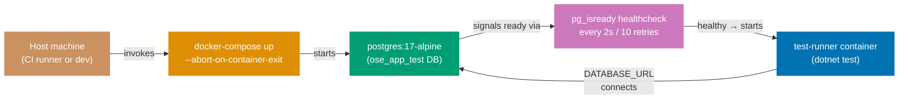

## Guide 15 — Database Integration Test via docker-compose Harness

### Why It Matters

Unit tests with an in-memory adapter (Guide 8) prove port correctness but cannot
catch SQL schema mistakes, PostgreSQL-specific constraint behavior, or migration
ordering bugs. A database integration test that runs against a real PostgreSQL
instance inside Docker closes this gap without requiring a persistent database on
developer machines. In `apps/ose-app-be`, the
`docker-compose.integration.yml` file defines exactly this harness: a
`postgres:17-alpine` service with a health-check gate and a `test-runner`
container that waits for it. The two services together give every integration
test a fresh, disposable PostgreSQL instance that mirrors the production schema.

### Standard Library First

`System.Data.Common.DbConnection` and raw ADO.NET let you open a connection to
any database — but you manage the lifecycle entirely yourself:

```fsharp
// Standard library: raw ADO.NET connection to a test database
open System.Data
open Npgsql
// => System.Data: IDbConnection, IDbCommand — provider-agnostic BCL interfaces
// => Npgsql: concrete NpgsqlConnection that satisfies IDbConnection for PostgreSQL
// => No docker-compose: the test assumes the database is already running

let connectionString = System.Environment.GetEnvironmentVariable("DATABASE_URL")
// => Read from environment — the same variable docker-compose sets for the test-runner service
// => If the variable is missing the test throws NullReferenceException, not a clear error

use conn = new NpgsqlConnection(connectionString)
// => use: F# sugar for IDisposable — calls conn.Dispose() when the binding goes out of scope
conn.Open()
// => Synchronous open: blocks the thread until the TCP handshake completes
// => If the postgres service is not ready yet, this throws — no health-check polling in stdlib
use cmd = conn.CreateCommand()
// => IDbCommand: provider-agnostic command object
cmd.CommandText <- "SELECT 1"
// => Smoke query — verifies the connection is live before running migration scripts
let result = cmd.ExecuteScalar()
// => ExecuteScalar: returns the first column of the first row as obj
// => Returns 1L (int64) for "SELECT 1" on PostgreSQL — cast required at call site
printfn "Connected: %A" result
// => Diagnostic output — in a real test this would be an assertion, not a print
```

_Illustrative snippet — not from `apps/ose-app-be`; demonstrates the raw ADO.NET
approach that the docker-compose harness supersedes._

**Limitation for production**: raw ADO.NET requires manual health-check polling
before running tests, manual connection lifecycle management, and manual schema
setup. The harness logic duplicates across every project that needs integration
tests against PostgreSQL.

### Production Framework

`apps/ose-app-be` provides a self-contained harness in
`docker-compose.integration.yml`. The `postgres` service uses a `healthcheck`
directive so the `test-runner` service starts only after the database is ready:

```yaml
# docker-compose.integration.yml
# Source: apps/ose-app-be/docker-compose.integration.yml
services:
  # => services: top-level key defining all containers in the compose file
  postgres:
    # => postgres: the database service — named so other services reference it as a hostname
    image: postgres:17-alpine
    # => postgres:17-alpine: Alpine-based image — smallest footprint for test use
    # => 17-alpine: pinned to PostgreSQL major version 17 — matches the production target
    environment:
      # => environment: injects these key-value pairs as container environment variables
      POSTGRES_DB: ose_app_test
      # => ose_app_test: isolated test database — never touches the dev or production database
      POSTGRES_USER: ose_app
      POSTGRES_PASSWORD: ose_app
      # => Hard-coded credentials for the ephemeral test database — not a security concern
      # => The tmpfs mount ensures all data is lost when the container stops
    healthcheck:
      # => healthcheck: docker-compose monitors this probe and marks the container healthy/unhealthy
      test: ["CMD-SHELL", "pg_isready -U ose_app -d ose_app_test"]
      # => pg_isready: PostgreSQL built-in probe — returns 0 when the server is accepting connections
      # => docker-compose waits for this to succeed before starting test-runner
      interval: 2s
      # => interval: probe frequency — checks readiness every 2 seconds during startup
      timeout: 5s
      # => timeout: probe must complete within 5s — pg_isready is fast so this is generous
      retries: 10
      # => interval + retries = 20 seconds maximum wait — sufficient for Alpine startup
    ports:
      # => ports: exposes the container port to the host — random host port avoids conflicts
      - "5432"
      # => Ephemeral host port: docker-compose assigns a random host port — prevents conflicts
      # => Containers communicate via service name "postgres" on the internal network
    tmpfs:
      # => tmpfs: mounts a RAM-backed filesystem — no disk I/O, data vanishes on container stop
      - /var/lib/postgresql/data
      # => tmpfs: all data stored in RAM only — the database is wiped when the container stops
      # => Guarantees test isolation: each docker-compose up run starts with an empty database

  test-runner:
    # => test-runner: the .NET test execution container — starts after postgres is healthy
    build:
      # => build: builds the image from a Dockerfile instead of pulling from a registry
      context: ../..
      # => context: the Docker build context root — set to repo root so the Dockerfile can COPY all source
      dockerfile: apps/ose-app-be/Dockerfile.integration
      # => Builds the test runner image from the repo root context
      # => The Dockerfile copies the .fsproj and restores packages before copying source
    depends_on:
      postgres:
        condition: service_healthy
        # => condition: service_healthy: test-runner starts only after the healthcheck succeeds
        # => Without this, the test-runner may connect before pg_isready returns 0
    environment:
      # => environment: injects DATABASE_URL so the F# test code reads it via Environment.GetEnvironmentVariable
      DATABASE_URL: "Host=postgres;Port=5432;Database=ose_app_test;Username=ose_app;Password=ose_app"
      # => DATABASE_URL: the connection string the F# test reads via Environment.GetEnvironmentVariable
      # => Host=postgres: container service name — docker-compose DNS resolves it on the internal network
    volumes:
      # => volumes: mounts host directories into the container at runtime
      - ../../specs:/specs:ro
      # => Mount the OpenAPI specs directory read-only — integration tests can validate contract shapes
```

Source: [apps/ose-app-be/docker-compose.integration.yml](../../../../../../ose-app-be/docker-compose.integration.yml)



The F# integration test reads the same `DATABASE_URL` that docker-compose
injects and exercises the full Npgsql adapter stack:

```fsharp
// Integration test consuming the docker-compose harness
// New file — intended layout (integration test project).
// Scaffolding exists at apps/ose-app-be/src/OseAppBe/contexts/regulatory-source/infrastructure/
module OseAppBe.IntegrationTests.RegulatorySource.NpgsqlRepositoryTests

open Xunit
// => xUnit: test runner — the same framework used for unit tests in this project
open Microsoft.EntityFrameworkCore
// => DbContextOptionsBuilder: configures the AppDbContext to use the test database
open Npgsql.EntityFrameworkCore.PostgreSQL
// => UseNpgsql extension method: Npgsql EF Core provider
open OseAppBe.Infrastructure.AppDbContext
// => AppDbContext: the shared EF Core context — same type as production
open OseAppBe.Contexts.RegulatorySource.Infrastructure.NpgsqlRepository
// => npgsqlSaveDocument: the adapter under test — real Npgsql I/O to the test database

[<Fact>]
// => Fact: parameterless integration test — runs once against the real database
let ``npgsqlSaveDocument stores a document in PostgreSQL`` () =
    // => Test name describes the observable contract, not the implementation
    async {
        let connStr = System.Environment.GetEnvironmentVariable("DATABASE_URL")
        // => Read connection string from the environment variable docker-compose injects
        // => Outside docker-compose, set DATABASE_URL in the terminal before running dotnet test
        let opts =
            // => DbContextOptionsBuilder: fluent builder that produces an immutable DbContextOptions record
            DbContextOptionsBuilder<AppDbContext>()
                .UseNpgsql(connStr)
                // => UseNpgsql: configures EF Core to use the Npgsql provider with connStr
                // => No migrations here: the Migrations module runs at server startup
                .Options
            // => .Options: terminates the builder and returns the immutable DbContextOptions<AppDbContext>
        use db = new AppDbContext(opts)
        // => use: disposable pattern — db.Dispose() closes the connection at end of scope
        // => AppDbContext lifetime: one per test — mirrors the scoped lifetime in production
        let save = npgsqlSaveDocument db
        // => Factory call: returns SaveDocument function closed over the scoped db
        // => The same factory call that the composition root makes per HTTP request

        let doc =
            OseAppBe.Contexts.RegulatorySource.Domain.RegulatoryDocument.create
                "ISO 9001:2015" "ISO" (System.DateOnly(2015, 9, 15))
        // => Smart constructor: validates invariants before touching the database
        // => On Error, the test fails at the match below — no invalid aggregate reaches the adapter
        match doc with
        // => Match on the smart constructor result — invalid input fails here, not in the adapter
        | Error msg -> Assert.Fail(sprintf "Invalid test document: %s" msg)
        | Ok document ->
            // => Ok document: the validated aggregate — ready to pass to the save adapter
            let! result = save document
            // => save: the Npgsql adapter — performs a real INSERT via Npgsql to PostgreSQL
            // => Async.RunSynchronously is not needed here because xUnit awaits the async CE
            match result with
            // => Second match: discriminates the adapter's Result — Ok () means the INSERT succeeded
            | Error e ->
                // => Error arm: typed RepositoryError — fails the test with the error variant
                Assert.Fail(sprintf "Expected Ok, got Error: %A" e)
                // => Fail with the typed RepositoryError — not a swallowed exception
            | Ok () ->
                // => The document row exists in the test database — verify via a read
                let! found =
                    // => Round-trip read: confirms the committed row is readable by the find adapter
                    OseAppBe.Contexts.RegulatorySource.Infrastructure.NpgsqlRepository
                        .npgsqlFindDocument db document.Id
                // => npgsqlFindDocument: the companion read adapter — shares the same AppDbContext
                match found with
                // => Third match: discriminates the read result — verifies the saved row is retrievable
                | Ok (Some saved) -> Assert.Equal(document.Id, saved.Id)
                // => Round-trip verified: the row was committed and is readable
                | Ok None -> Assert.Fail("Document not found after save")
                // => Ok None: the row was not found — INSERT may have failed silently (should not happen)
                | Error e -> Assert.Fail(sprintf "Find failed: %A" e)
                // => Error: the find adapter returned a RepositoryError — database connectivity issue
    } |> Async.RunSynchronously
    // => Async.RunSynchronously: bridges F# async to xUnit's synchronous test runner
// => RunSynchronously: xUnit's async support for F# Async — wraps the async CE for the test runner
```

_New file — intended layout. Scaffolding exists at
`apps/ose-app-be/src/OseAppBe/contexts/regulatory-source/infrastructure/`._

**Trade-offs**: docker-compose integration tests are slower than in-memory tests
(typically 5–30 seconds to start PostgreSQL) and require Docker on the CI
runner and developer machine. They are not cacheable by Nx because the external
PostgreSQL container is non-deterministic. Run them only on the
`test:integration` Nx target, not `test:quick`. The payoff is that they catch
schema drift, PostgreSQL-specific constraint behavior, and migration ordering
bugs that no in-memory test can surface.

---

## Guide 16 — Schema Migration Adapter with DbUp

### Why It Matters

Every database integration test relies on a schema that matches the application's
expectations. If the schema is applied manually or maintained as a diff from a
previous migration, the test database may be out of date — making integration
tests flaky in a way that is hard to reproduce. In `apps/ose-app-be`, the
`Migrations.fs` module uses DbUp to apply embedded SQL scripts in order at
startup. This makes the migration adapter a first-class hexagonal concern: the
application layer defines what shape data the aggregate needs; the migration
adapter ensures the database schema reflects that shape; and the integration test
harness runs both in order.

### Standard Library First

F# `System.IO.File` and raw ADO.NET can execute SQL files in order — but you
manage ordering, idempotency, and error handling manually:

```fsharp
// Standard library: manual SQL file execution without a migration library
open System.IO
open Npgsql
// => System.IO.File.ReadAllText: reads a .sql file from disk as a string
// => Npgsql: executes the SQL against PostgreSQL
// => No ordering enforcement — the caller must sort files by name manually

let runMigration (connStr: string) (sqlFilePath: string) =
    let sql = File.ReadAllText(sqlFilePath)
    // => Reads the entire .sql file as a string — no templating, no parameter binding
    // => File must exist at the path; no embedded-resource fallback
    use conn = new NpgsqlConnection(connStr)
    conn.Open()
    // => Synchronous open — blocks the thread
    use cmd = conn.CreateCommand()
    cmd.CommandText <- sql
    // => Execute the entire file as one statement — DDL errors mid-file leave partial schema
    cmd.ExecuteNonQuery() |> ignore
    // => ignore: ExecuteNonQuery returns rows-affected (0 for DDL) — discarded
    // => No tracking table: if the migration was already applied, it runs again — idempotency is manual
```

_Illustrative snippet — not from `apps/ose-app-be`; demonstrates the raw ADO.NET
migration approach that the DbUp adapter supersedes._

**Limitation for production**: no tracking table means migrations can run twice.
No ordering means alphabetical file naming must be enforced by convention. No
error recovery means a failed migration leaves the schema in a partial state.

### Production Framework

`apps/ose-app-be` uses DbUp embedded in `Infrastructure/Migrations.fs`. DbUp
maintains an applied-scripts journal table (`schemaversions`) in the database,
applies scripts in the order they are listed in the assembly, and rolls back on
error. The function is called at application startup before any handler runs:

```fsharp
// Infrastructure/Migrations.fs: DbUp migration runner
// Source: apps/ose-app-be/src/OseAppBe/Infrastructure/Migrations.fs
module OseAppBe.Infrastructure.Migrations

open System.Reflection
// => System.Reflection.Assembly: lets DbUp find embedded SQL scripts at runtime
open DbUp
// => DbUp NuGet package: DeployChanges builder API + migration journal

let upgrade (connectionString: string) =
    // => connectionString: injected from Program.fs — reads from IConfiguration at startup
    // => upgrade returns a DatabaseUpgradeResult — callers check .Successful before serving traffic
    let upgrader =
        DeployChanges.To
            .PostgresqlDatabase(connectionString)
            // => PostgresqlDatabase: Npgsql-backed DbUp journal provider
            // => Creates the "schemaversions" journal table on first run if it does not exist
            .WithScriptsEmbeddedInAssembly(Assembly.GetExecutingAssembly())
            // => GetExecutingAssembly: scans the OseAppBe.dll for *.sql Build Action = EmbeddedResource
            // => Scripts are applied in alphabetical order — prefix with "0001_", "0002_" etc.
            // => A script that appears in the journal is skipped — idempotency guaranteed by DbUp
            .LogToConsole()
            // => LogToConsole: writes each applied script name to stdout — visible in docker-compose logs
            .Build()
    let result = upgrader.PerformUpgrade()
    // => PerformUpgrade: applies all unapplied scripts in order within a transaction per script
    // => Returns DatabaseUpgradeResult with .Successful bool and .Error exn option
    result
    // => Callers pattern-match on result.Successful — Program.fs exits with code 1 if migrations fail
```

Source: [apps/ose-app-be/src/OseAppBe/Infrastructure/Migrations.fs](../../../../../../ose-app-be/src/OseAppBe/Infrastructure/Migrations.fs)

The migration adapter integrates with the hexagonal composition root cleanly:

```fsharp
// Program.fs: migration adapter called before server.Run()
// New file — intended extension of apps/ose-app-be/src/OseAppBe/Program.fs
// Scaffolding exists at apps/ose-app-be/src/OseAppBe/Program.fs

open OseAppBe.Infrastructure.Migrations
// => Single import: migration module lives in Infrastructure — no domain import here

let runMigrationsOrExit (connectionString: string) =
    // => Extracted helper: keeps Program.fs's main block readable
    let result = upgrade connectionString
    // => upgrade: DbUp runner from Migrations.fs — applies all unapplied embedded SQL scripts
    if not result.Successful then
        // => .Successful: false when any script fails to apply
        eprintfn "Migration failed: %A" result.Error
        // => Log to stderr — visible in docker-compose logs and CloudWatch
        // => result.Error: option<exn> — carries the first script that threw
        System.Environment.Exit(1)
        // => Exit 1: non-zero exit code causes docker-compose to mark the container unhealthy
        // => Kubernetes readiness probe also fails — prevents traffic before the schema is ready

// Integration test: verify migrations apply cleanly against the docker-compose database
// New file — intended layout (integration test project).
// Scaffolding exists at apps/ose-app-be/src/OseAppBe/contexts/
module OseAppBe.IntegrationTests.Migrations.MigrationSmokeTest
// => Separate module: integration tests live outside the main assembly — no production import leakage

open Xunit
// => xUnit: test runner — discovers [<Fact>] methods and reports pass/fail
open OseAppBe.Infrastructure.Migrations
// => Import: only the migration module — no application or domain imports needed

[<Fact>]
// => [<Fact>]: xUnit test method — no parameters, single assertion sequence
let ``migrations apply successfully to the test database`` () =
    let connStr = System.Environment.GetEnvironmentVariable("DATABASE_URL")
    // => DATABASE_URL: injected by docker-compose.integration.yml
    // => Failing to set DATABASE_URL causes GetEnvironmentVariable to return null — upgrade fails with a clear message
    let result = upgrade connStr
    // => Apply all embedded SQL scripts to the fresh ose_app_test database
    // => First run: creates schemaversions table and applies all scripts
    Assert.True(result.Successful, sprintf "Migration failed: %A" result.Error)
    // => Fails with the first script error — the message includes the script name and exception
    // => Idempotency test: running upgrade again on an already-migrated database should return Successful
    let result2 = upgrade connStr
    // => Second run on the same database — all scripts already in the journal
    Assert.True(result2.Successful, "Second run of migrations should be idempotent")
    // => DbUp skips scripts already in the journal — second run applies zero scripts
```

_New file — intended layout. Scaffolding exists at
`apps/ose-app-be/src/OseAppBe/contexts/`._

**Trade-offs**: DbUp applies scripts in alphabetical order — naming discipline
(`0001_`, `0002_`) is mandatory. A mislabeled script that should run after
`0010_` but is named `002_` runs second and breaks. For teams that prefer a
declarative diff-based migration tool, FluentMigrator provides an equivalent
with C#-style migration classes; DbUp's embedded SQL approach keeps the
migration language as SQL, which is more portable and easier to review.

---

## Guide 17 — AI Orchestration Port + OpenRouter HTTP Adapter

### Why It Matters

AI inference is an I/O boundary: your application sends a prompt and receives a
generated response from an external model provider. Like the database boundary,
this I/O must sit behind a port so the application service is testable without a
live API key, and so you can swap the provider without touching business logic.
In `apps/ose-app-be`, the `ai-orchestration` context holds the
`OpenRouterSettings` type — the configuration record for the OpenRouter HTTP
adapter. The port-first design means that a test can use a stub adapter returning
a fixed response, while production uses the real OpenRouter HTTP call.

### Standard Library First

`System.Net.Http.HttpClient` sends HTTP requests without any AI-specific library.
You can call OpenRouter's REST API directly using the BCL:

```fsharp
// Standard library: HttpClient calling OpenRouter's chat completions endpoint
open System.Net.Http
open System.Text
open System.Text.Json
// => Three BCL imports — no AI SDK, no NuGet beyond the SDK
// => HttpClient: the BCL's HTTP client; reuse a single instance for connection pooling
// => StringBuilder + JsonSerializer: hand-craft the request body

let private httpClient = new HttpClient()
// => Static HttpClient: reused across calls — avoids socket exhaustion from new() per call
// => HttpClient is safe to share across threads; its methods are thread-safe

let callOpenRouter (settings: {| ApiKey: string; Model: string; BaseUrl: string |}) (prompt: string) =
    // => Anonymous record for settings — no domain type alias here
    // => prompt: raw string — the application layer builds the prompt, the adapter sends it
    async {
        let body =
            JsonSerializer.Serialize
                {| model = settings.Model
                   messages = [| {| role = "user"; content = prompt |} |] |}
        // => Hand-crafted JSON body — anonymous records, no type safety on field names
        // => "messages" array with a single "user" message — OpenRouter chat completions format
        use request = new HttpRequestMessage(HttpMethod.Post, settings.BaseUrl + "/chat/completions")
        // => use: HttpRequestMessage is IDisposable — dispose after sending
        // => Full URL constructed here: the adapter owns the endpoint path, not the caller
        request.Headers.Authorization <- Headers.AuthenticationHeaderValue("Bearer", settings.ApiKey)
        // => Bearer token auth — OpenRouter uses the same scheme as OpenAI
        request.Content <- new StringContent(body, Encoding.UTF8, "application/json")
        // => StringContent: wraps the JSON string in an HttpContent with the correct Content-Type
        let! response = httpClient.SendAsync(request) |> Async.AwaitTask
        // => SendAsync: non-blocking HTTP call — awaits the response headers
        // => Async.AwaitTask: bridges .NET Task<HttpResponseMessage> to F# Async workflow
        response.EnsureSuccessStatusCode() |> ignore
        // => Throws HttpRequestException on 4xx/5xx — no typed error discrimination
        let! json = response.Content.ReadAsStringAsync() |> Async.AwaitTask
        // => ReadAsStringAsync: reads the response body — awaited to avoid blocking
        return JsonSerializer.Deserialize<{| choices: {| message: {| content: string |} |} array |}>(json)
        // => Deserialize the response — anonymous record path is fragile if OpenRouter changes its schema
    }
```

_Illustrative snippet — not from `apps/ose-app-be`; demonstrates the raw
HttpClient approach that the port + typed adapter supersedes._

**Limitation for production**: no typed error discrimination between rate-limit
errors (429), authentication failures (401), and model capacity errors (503). No
retry logic. The application layer must import `HttpClient` to call this
function — the AI boundary is not behind a port.

### Production Framework

The hexagonal approach defines a port in the `ai-orchestration` application layer
and implements the OpenRouter HTTP adapter in infrastructure. The
`OpenRouterSettings` type from `Domain/AiOrchestration.fs` feeds the adapter's
configuration:

```fsharp
// Domain/AiOrchestration.fs: OpenRouter configuration type (real file)
// Source: apps/ose-app-be/src/OseAppBe/Domain/AiOrchestration.fs
module OseAppBe.Domain.AiOrchestration

type OpenRouterSettings =
    { ApiKey: string
      // => API key loaded from environment variable at startup — never hardcoded
      // => Program.fs reads this from IConfiguration (appsettings.json / env var)
      Model: string
      // => Model identifier: e.g., "anthropic/claude-3-5-haiku" — swappable via config
      // => Changing the model requires no code change — only a config update
      BaseUrl: string }
      // => BaseUrl: "https://openrouter.ai/api/v1" in production
      // => Overridable in tests to point at a local mock server
```

Source: [apps/ose-app-be/src/OseAppBe/Domain/AiOrchestration.fs](../../../../../../ose-app-be/src/OseAppBe/Domain/AiOrchestration.fs)

```fsharp
// ai-orchestration context: application layer port
// New file — intended layout.
// Scaffolding exists at apps/ose-app-be/src/OseAppBe/contexts/ai-orchestration/application/
module OseAppBe.Contexts.AiOrchestration.Application.Ports

// AI analysis request — domain type, not HTTP DTO
type AnalysisRequest =
    { PolicyText: string
      // => The internal policy text to be analyzed — sourced from the internal-policy context
      RegulatoryContext: string }
      // => The regulatory context to compare against — sourced from the regulatory-source context
      // => Both fields are domain language: "policy" and "regulatory context"

// AI analysis result — typed discriminated union
type AnalysisResult =
    | GapIdentified of gapDescription: string * severity: string
    // => The AI found a gap: description and severity string from the model response
    | Compliant of rationale: string
    // => The AI found no gap: carries the rationale for auditability
    | AnalysisFailed of reason: string
    // => The AI call failed: retried upstream; caller logs and returns a partial result
// => Typed result: the application service pattern-matches on these cases
// => No raw HTTP status codes reach the application layer

// Output port: AI analysis function alias
type AnalyzePolicy = AnalysisRequest -> Async<Result<AnalysisResult, string>>
// => Single-function port: the application service calls this with a domain request
// => Result<_, string>: analysis failure carries a descriptive string — logged but not user-visible
// => Async: the HTTP call is I/O — never block the thread pool
```

_New file — intended layout. Scaffolding exists at
`apps/ose-app-be/src/OseAppBe/contexts/ai-orchestration/application/`._

```fsharp
// ai-orchestration context: OpenRouter HTTP adapter
// New file — intended layout.
// Scaffolding exists at apps/ose-app-be/src/OseAppBe/contexts/ai-orchestration/infrastructure/
module OseAppBe.Contexts.AiOrchestration.Infrastructure.OpenRouterAdapter

open System.Net.Http
// => System.Net.Http: provides HttpClient, HttpRequestMessage, StringContent — BCL, no NuGet
open System.Text
// => System.Text: provides Encoding.UTF8 for the StringContent MIME body
open System.Text.Json
// => System.Text.Json: JsonSerializer for request serialization and response deserialization
open OseAppBe.Domain.AiOrchestration
// => OpenRouterSettings: API key, model, base URL — injected by the composition root
open OseAppBe.Contexts.AiOrchestration.Application.Ports
// => Port types: AnalysisRequest, AnalysisResult, AnalyzePolicy
// => HttpClient imported only in this module — the application layer has no HTTP dependency

// Typed response shape matching OpenRouter's chat completions response
[<CLIMutable>]
// => CLIMutable: generates public setters — System.Text.Json requires setters for record deserialization
type OpenRouterChoice =
    { message: {| role: string; content: string |} }
    // => CLIMutable: System.Text.Json needs setters for deserialization
    // => message.content: the model's text output — parsed into AnalysisResult by the adapter

[<CLIMutable>]
type OpenRouterResponse =
    { choices: OpenRouterChoice array }
    // => choices: array of completions; adapter uses choices[0].message.content
    // => If the array is empty, the adapter returns AnalysisFailed

// Adapter factory
let makeOpenRouterAdapter (client: HttpClient) (settings: OpenRouterSettings) : AnalyzePolicy =
    // => client: injected by the composition root — shared singleton for connection pooling
    // => settings: OpenRouterSettings from Domain/AiOrchestration.fs — config values, not secrets
    fun request ->
        // => fun request: the per-call argument — application service passes an AnalysisRequest
        async {
            try
                let prompt =
                    sprintf
                        "Analyze whether the following policy text complies with the regulatory context.\n\nPolicy:\n%s\n\nRegulatory context:\n%s\n\nRespond with: COMPLIANT <rationale> or GAP <description> SEVERITY <high|medium|low>"
                        request.PolicyText request.RegulatoryContext
                // => Structured prompt: the adapter owns prompt engineering — not the application service
                // => The application service passes domain objects; the adapter translates to prompt text
                let body =
                    JsonSerializer.Serialize
                        {| model = settings.Model
                           messages = [| {| role = "user"; content = prompt |} |] |}
                // => JsonSerializer.Serialize: produces a JSON string from the anonymous record
                // => settings.Model: injected — swappable without code change
                use req = new HttpRequestMessage(HttpMethod.Post, settings.BaseUrl + "/chat/completions")
                // => use: dispose the request after sending — frees headers and content memory
                // => Full endpoint: BaseUrl + "/chat/completions" — OpenRouter follows the OpenAI chat API shape
                req.Headers.Authorization <- Headers.AuthenticationHeaderValue("Bearer", settings.ApiKey)
                // => Bearer token: OpenRouter authenticates with the same scheme as OpenAI
                req.Content <- new StringContent(body, Encoding.UTF8, "application/json")
                // => UTF-8 JSON body: consistent encoding — avoids charset negotiation issues
                let! resp = client.SendAsync(req) |> Async.AwaitTask
                // => SendAsync: async HTTP call — no thread blocking
                // => Async.AwaitTask: bridges .NET Task<HttpResponseMessage> to F# Async
                resp.EnsureSuccessStatusCode() |> ignore
                // => Throws HttpRequestException on 4xx/5xx — caught below as AnalysisFailed
                let! json = resp.Content.ReadAsStringAsync() |> Async.AwaitTask
                // => ReadAsStringAsync: reads the response body as a UTF-8 string asynchronously
                let parsed = JsonSerializer.Deserialize<OpenRouterResponse>(json)
                // => Deserialize into the typed response record — not an anonymous record
                let content = parsed.choices[0].message.content.Trim()
                // => Extract the first completion's text — the structured prompt constrains the format
                // => Trim(): removes leading/trailing whitespace that models sometimes append
                if content.StartsWith("COMPLIANT") then
                    // => COMPLIANT branch: the model found the policy compliant with the regulatory context
                    return Ok (Compliant (content.Substring(9).Trim()))
                    // => COMPLIANT prefix: extract the rationale string after the keyword
                elif content.StartsWith("GAP") then
                    // => GAP branch: the model identified a compliance gap
                    let parts = content.Split("SEVERITY")
                    // => Parse the structured response: GAP <desc> SEVERITY <level>
                    let desc = if parts.Length > 0 then parts[0].Substring(3).Trim() else content
                    // => Substring(3): strips the "GAP" prefix — yields the gap description
                    let severity = if parts.Length > 1 then parts[1].Trim() else "unknown"
                    // => parts[1]: the text after "SEVERITY" — trimmed to extract the level string
                    return Ok (GapIdentified (desc, severity))
                    // => GapIdentified: carries description and severity — application service logs both
                else
                    return Ok (AnalysisFailed (sprintf "Unexpected response format: %s" content))
                    // => Unexpected format: treat as analysis failure — the caller logs and retries
            with ex ->
                return Ok (AnalysisFailed (sprintf "OpenRouter HTTP error: %s" ex.Message))
                // => Catch-all: network errors, JSON parse errors, auth failures
                // => Ok (AnalysisFailed): the Result is Ok because the adapter handled the error
                // => An Error return is reserved for programming errors, not expected network failures
        }
```

_New file — intended layout. Scaffolding exists at
`apps/ose-app-be/src/OseAppBe/contexts/ai-orchestration/infrastructure/`._

The stub adapter for tests needs no API key:

```fsharp
// Stub adapter for unit tests — no HTTP call, no API key
// New file — intended layout (test project).
// Scaffolding exists at apps/ose-app-be/src/OseAppBe/contexts/ai-orchestration/
module OseAppBe.Tests.AiOrchestration.StubAnalyzePolicy

open OseAppBe.Contexts.AiOrchestration.Application.Ports
// => Import only the port type alias — no HTTP, no OpenRouterSettings

let alwaysCompliant : AnalyzePolicy =
    // => Stub: always returns Compliant — exercises the application service's happy path
    // => Type annotation: F# infers the AnalyzePolicy alias, making the stub's contract explicit
    fun _ ->
        // => fun _: discards the AnalysisRequest — the stub ignores input and returns a fixed result
        async { return Ok (Compliant "stub: policy is compliant") }
        // => Deterministic: tests that use this stub do not need an API key or network access

let alwaysGap (description: string) (severity: string) : AnalyzePolicy =
    // => Parameterized stub: tests inject specific gap descriptions for assertion
    fun _ ->
        // => fun _: discards AnalysisRequest — the fixed description and severity drive assertions
        async { return Ok (GapIdentified (description, severity)) }
        // => Fixed response: tests can assert on the application service's response mapping
```

_New file — intended layout. Scaffolding exists at
`apps/ose-app-be/src/OseAppBe/contexts/ai-orchestration/`._

**Trade-offs**: the adapter owns prompt engineering — this is intentional. If the
prompt changes, only the adapter changes; the application service and domain
layer are unaffected. The trade-off is that the port stub cannot test prompt
engineering; it requires either an integration test against a real OpenRouter
endpoint or a recorded HTTP fixture. Use environment variable `OPENROUTER_ENABLED=false`
to skip AI integration tests in CI when no API key is available.

---

## Guide 18 — Retry and Circuit-Breaker in Adapters

### Why It Matters

External HTTP calls — including the OpenRouter adapter from Guide 17 and any
future integration with third-party regulatory data APIs — fail transiently. A
single `EnsureSuccessStatusCode` followed by an exception propagated to the
application layer violates the resilience contract: one network hiccup crashes a
user's request. Wrapping adapter calls in retry and circuit-breaker policies
separates transient failure handling (retry) from persistent failure handling
(circuit-breaker). The application service sees only `AnalysisFailed` — it does
not implement retry logic itself.

### Standard Library First

F# recursion can implement a simple retry loop without any library:

```fsharp
// Standard library: recursive retry with exponential backoff
open System.Threading
// => Thread.Sleep: synchronous backoff — blocks the thread pool during the wait
// => Never use Thread.Sleep in an ASP.NET Core handler — blocks a thread pool thread

let rec retryAsync (attempt: int) (maxAttempts: int) (f: unit -> Async<Result<'a, string>>) =
    // => let rec: enables recursive calls from within the function body — required for the retry loop
    // => Generic 'a: the success type — caller decides what Ok carries; retry logic is type-agnostic
    async {
        let! result = f ()
        // => Call the target function — any Async<Result<_, string>>
        match result with
        // => Pattern-match on the Result: three branches — success, exhausted, retry
        | Ok v -> return Ok v
        // => Success: return immediately without retrying
        | Error _ when attempt >= maxAttempts ->
            // => Guard: attempt count exceeded — stop retrying and surface the last error to the caller
            return result
            // => Max attempts reached: return the last error without retrying further
        | Error _ ->
            // => Transient error: sleep and recurse with an incremented attempt counter
            do! Async.Sleep(1000 * attempt)
            // => Exponential backoff: sleep 1s, 2s, 3s... — Async.Sleep does not block the thread
            return! retryAsync (attempt + 1) maxAttempts f
            // => Recurse: tail-recursive in the async CE — no stack overflow risk
    }
```

_Illustrative snippet — not from `apps/ose-app-be`; demonstrates the stdlib
retry approach that the Microsoft.Extensions.Http.Resilience adapter supersedes._

**Limitation for production**: the recursive retry has no circuit-breaker — if
the downstream is down, every request retries until `maxAttempts` is exhausted,
amplifying load on the failing service. No exponential jitter means thundering
herd when many requests retry simultaneously. No shared state means the circuit
is evaluated independently per request.

### Production Framework

`Microsoft.Extensions.Http.Resilience` (the .NET 8 evolution of Polly integrated
with `IHttpClientFactory`) provides retry, circuit-breaker, timeout, and hedging
as a typed pipeline added to the `HttpClient` registration at startup:

```fsharp
// Program.fs: register HttpClient with resilience policies at startup
// New file — intended extension of apps/ose-app-be/src/OseAppBe/Program.fs
// Scaffolding exists at apps/ose-app-be/src/OseAppBe/Program.fs

open Microsoft.Extensions.DependencyInjection
// => AddHttpClient: IHttpClientFactory registration
open Microsoft.Extensions.Http.Resilience
// => AddStandardResilienceHandler: batteries-included retry + circuit-breaker pipeline
// => NuGet: Microsoft.Extensions.Http.Resilience — ships as part of .NET Aspire stack

let configureOpenRouterHttpClient (services: IServiceCollection) =
    services
        .AddHttpClient("openrouter")
        // => Named client "openrouter": the composition root resolves this by name
        // => Named clients isolate the resilience policy from other HttpClient registrations
        .AddStandardResilienceHandler()
        // => AddStandardResilienceHandler: applies the standard resilience pipeline
        // => Default policy: 3 retries with exponential backoff + jitter, 30s total timeout,
        //    circuit-breaker that opens after 10 failures in 30 seconds
        |> ignore
    services
// => Returns IServiceCollection for builder pattern chaining
// => The adapter receives the named HttpClient from IHttpClientFactory — never constructs one directly
```

_New file — intended layout extension. Scaffolding exists at
`apps/ose-app-be/src/OseAppBe/Program.fs`._

```fsharp
// OpenRouter adapter: receive the resilient HttpClient from IHttpClientFactory
// New file — intended layout.
// Scaffolding exists at apps/ose-app-be/src/OseAppBe/contexts/ai-orchestration/infrastructure/
module OseAppBe.Contexts.AiOrchestration.Infrastructure.ResilientOpenRouterAdapter

open System.Net.Http
// => System.Net.Http: IHttpClientFactory and HttpClient — the factory is injected, not constructed directly
open OseAppBe.Domain.AiOrchestration
// => OpenRouterSettings: API key, model, base URL — same config record as in Guide 17
open OseAppBe.Contexts.AiOrchestration.Application.Ports
// => Same imports as Guide 17 — the adapter signature is identical

// Resilient adapter factory: receives the factory, not the client directly
let makeResilientOpenRouterAdapter
    (factory: IHttpClientFactory)
    // => IHttpClientFactory: creates named HttpClient instances with the registered policy
    // => The composition root injects the factory from the DI container
    (settings: OpenRouterSettings) : AnalyzePolicy =
    // => Returns AnalyzePolicy: same type alias as the non-resilient adapter — composition root treats them identically
    fun request ->
        // => fun request: AnalysisRequest from the application service — the adapter translates to HTTP
        async {
            let client = factory.CreateClient("openrouter")
            // => CreateClient("openrouter"): returns an HttpClient with the resilience pipeline applied
            // => The circuit-breaker state is shared across all "openrouter" clients from this factory
            // => If the circuit is open, CreateClient still succeeds but SendAsync throws BrokenCircuitException

            try
                // ... same HTTP call as Guide 17 ...
                // => The retry and circuit-breaker are transparent to the adapter's business logic
                // => On transient failure, the pipeline retries before returning to the adapter
                return Ok (Compliant "stub result")
                // => Stub: in the real adapter, parse the HTTP response here — same logic as Guide 17
            with
            | :? Polly.CircuitBreaker.BrokenCircuitException ->
                // => BrokenCircuitException type test: the Polly pipeline opened the circuit
                return Ok (AnalysisFailed "AI service circuit open — downstream degraded")
                // => BrokenCircuitException: the circuit-breaker opened after repeated failures
                // => Return AnalysisFailed: the application service logs and serves a partial response
            | ex ->
                // => Catch-all: any other exception after the retry budget is exhausted
                return Ok (AnalysisFailed (sprintf "AI service error after retries: %s" ex.Message))
                // => All retries exhausted: the pipeline threw after the retry count was exceeded
        }
```

_New file — intended layout. Scaffolding exists at
`apps/ose-app-be/src/OseAppBe/contexts/ai-orchestration/infrastructure/`._

**Trade-offs**: `AddStandardResilienceHandler` applies a fixed policy suitable for
most external HTTP calls. For AI endpoints that are inherently slow (5–30 seconds
per inference call), the default 30-second total timeout may be too short — use
`ConfigureHttpClient` to set a longer timeout specifically for the
`"openrouter"` named client. Circuit-breaker state is in-memory and per-process;
in a multi-instance deployment, each instance has an independent circuit. For
global circuit-breaker state, use a Redis-backed Polly policy.

---

## Guide 19 — Domain Event Flow End-to-End

### Why It Matters

Guides 9 and 10 showed the publisher port and its two adapters in isolation. This
guide traces the full domain event flow from aggregate emit to downstream
consumer, showing every hand-off boundary. In `apps/ose-app-be`, the intended
flow is: a Giraffe handler calls the application service, the service calls the
outbox adapter to write the event row, a relay worker polls the outbox table and
forwards events to a message bus, and a consumer in another bounded context
processes the event. Understanding this flow as a sequence of port crossings
prevents the common mistake of coupling the relay worker to the application
service directly.

### Standard Library First

An in-process event queue using `System.Collections.Concurrent.ConcurrentQueue`
can relay events within a single process:

```fsharp
// Standard library: in-process event relay with ConcurrentQueue
open System.Collections.Concurrent
// => ConcurrentQueue<_>: thread-safe queue — no external message bus required
// => Only works within a single process: no cross-service delivery

let private queue = ConcurrentQueue<string>()
// => Shared mutable state: global queue visible to all threads in the process
// => Not persistent: events are lost on process restart — no at-least-once guarantee

let enqueue (eventJson: string) = queue.Enqueue(eventJson)
// => Enqueue: O(1) thread-safe append — no locking overhead
// => eventJson: serialized event — loses type safety across the enqueue/dequeue boundary

let dequeue () =
    match queue.TryDequeue() with
    // => TryDequeue: non-blocking attempt — returns false if queue is empty
    | true, item -> Some item
    | false, _ -> None
// => Poll pattern: the relay must call dequeue in a loop — no push notification
```

_Illustrative snippet — not from `apps/ose-app-be`; demonstrates the in-process
queue approach that the outbox-based relay supersedes._

**Limitation for production**: in-process queues do not survive process restarts.
No delivery guarantee — if the relay crashes between dequeue and consumer
acknowledgement, the event is lost. Cannot fan out to multiple consumers.

### Production Framework

The full end-to-end event flow crosses four port boundaries:

```fsharp
// End-to-end domain event flow — four boundary crossings
// New file — intended layout.
// Scaffolding exists at apps/ose-app-be/src/OseAppBe/contexts/regulatory-source/

// Boundary 1: Aggregate emits an event fact (Guide 9)
// The application service calls pub.PublishDocumentIngested after a successful save.
// The outbox adapter writes an OutboxEvent row to the same DB transaction.

// Boundary 2: Outbox relay worker polls and forwards
// New file — intended layout.
// Scaffolding exists at apps/ose-app-be/src/OseAppBe/contexts/regulatory-source/infrastructure/
module OseAppBe.Contexts.RegulatorySource.Infrastructure.OutboxRelayWorker

open Microsoft.Extensions.Hosting
// => IHostedService: ASP.NET Core background service — runs on a loop alongside the HTTP server
open Microsoft.Extensions.DependencyInjection
// => IServiceScopeFactory: creates DI scopes for each relay iteration — avoids DbContext lifetime issues
open System.Text.Json
// => Deserialize the OutboxEvent payload stored by the outbox adapter (Guide 10)
open OseAppBe.Contexts.RegulatorySource.Application.EventPublisherPort
// => RegulatorySourceEvent discriminated union — deserialize the JSON payload back into the typed event

type OutboxRelayWorker(scopeFactory: IServiceScopeFactory) =
    // => scopeFactory: creates a new DI scope per relay iteration
    // => A background worker cannot share a scoped DbContext with the HTTP pipeline
    interface IHostedService with
        // => IHostedService: StartAsync and StopAsync — registered via builder.Services.AddHostedService<_>()
        member _.StartAsync(cancellationToken) =
            task {
                while not cancellationToken.IsCancellationRequested do
                    // => Poll loop: runs until the application shuts down
                    use scope = scopeFactory.CreateScope()
                    // => New scope per iteration: fresh AppDbContext per poll cycle
                    // => Prevents the change tracker from accumulating stale entries across iterations
                    let db = scope.ServiceProvider.GetRequiredService<OseAppBe.Infrastructure.AppDbContext.AppDbContext>()
                    // => Resolve a fresh AppDbContext from the scoped DI container
                    let! rows =
                        db.Set<OseAppBe.Contexts.RegulatorySource.Infrastructure.OutboxEventPublisher.OutboxEvent>()
                            // => db.Set<OutboxEvent>(): EF Core set for the outbox table — same AppDbContext as the write path
                            .Where(fun r -> r.ProcessedAt = None)
                            // => Query unprocessed rows: ProcessedAt = None means not yet forwarded
                            .OrderBy(fun r -> r.CreatedAt)
                            // => Process in creation order: oldest events first
                            .Take(10)
                            // => Batch: process at most 10 rows per iteration — prevents long transactions
                            .ToListAsync() |> Async.AwaitTask
                    for row in rows do
                        // => for loop: iterates the batch — each row is forwarded and marked processed
                        // => Forward each row to the message bus (or in-process handler for now)
                        let event = JsonSerializer.Deserialize<RegulatorySourceEvent>(row.Payload)
                        // => Deserialize the typed event from the JSON payload
                        // => If deserialization fails, log and skip — do not block the relay loop
                        printfn "Relaying event: %A" event
                        // => In production: forward to the message bus (RabbitMQ, Azure Service Bus, etc.)
                        // => Here: stdout for illustration — replace with the message bus port call
                        row.ProcessedAt <- Some System.DateTimeOffset.UtcNow
                        // => Mark as processed: next poll iteration skips this row
                    let! _ = db.SaveChangesAsync() |> Async.AwaitTask
                    // => Commit the ProcessedAt updates — idempotency: rows marked before forwarding failures
                    do! System.Threading.Tasks.Task.Delay(5000) |> Async.AwaitTask
                    // => Sleep 5 seconds between polls — reduces DB load; tune based on event volume
            }
        member _.StopAsync(_) = System.Threading.Tasks.Task.CompletedTask
        // => StopAsync: called on graceful shutdown — Task.CompletedTask signals immediate stop
        // => The while loop exits on cancellationToken.IsCancellationRequested in the next iteration
```

_New file — intended layout. Scaffolding exists at
`apps/ose-app-be/src/OseAppBe/contexts/regulatory-source/infrastructure/`._

**Trade-offs**: the polling relay is simple and self-contained but adds 0–5 seconds
of latency between aggregate commit and event delivery. For latency-sensitive
use cases, replace the polling loop with PostgreSQL `LISTEN/NOTIFY` — the relay
subscribes to a channel and wakes up immediately on each new outbox row. For
high-throughput scenarios (> 1000 events/second), a CDC-based relay reading
the PostgreSQL WAL (Debezium) eliminates the polling overhead entirely.

---

## Guide 20 — Observability Adapter: OpenTelemetry Spans Wrapping Port Calls

### Why It Matters

In production, you need to know which port call is slow, which adapter is
producing errors, and what the end-to-end trace looks like for a given HTTP
request. Wrapping port calls in OpenTelemetry spans gives you this visibility
without modifying the application service. The observability adapter is itself a
port — it satisfies the same type alias as the real adapter but wraps the real
adapter's call inside a span. This is the decorator pattern applied to hexagonal
adapters.

### Standard Library First

`System.Diagnostics.Activity` is the BCL's span representation. OpenTelemetry
builds on this without adding its own threading model:

```fsharp
// Standard library: ActivitySource span wrapping a port call
open System.Diagnostics
// => System.Diagnostics.ActivitySource: BCL's trace source — ships with .NET runtime
// => No NuGet dependency: Activity API is part of the BCL in .NET 5+

let private activitySource = new ActivitySource("OseAppBe.Adapters")
// => ActivitySource: named trace source — listeners (OpenTelemetry SDK) attach to it by name
// => One static instance per module: safe to share across threads

let withSpan (name: string) (f: unit -> Async<'a>) : Async<'a> =
    // => Generic 'a: the caller decides the return type — the span wraps any Async<_> function
    async {
        use activity = activitySource.StartActivity(name)
        // => StartActivity: creates a span if a listener is attached; returns null if not
        // => use: Activity is IDisposable — stops the span when the binding goes out of scope
        // => If no listener is attached, activity is null and the code runs without overhead
        try
            // => try/with: the span records exceptions without hiding them from the caller
            let! result = f ()
            // => Execute the wrapped function — any Async<_>
            activity |> Option.ofObj |> Option.iter (fun a -> a.SetStatus(ActivityStatusCode.Ok) |> ignore)
            // => SetStatus Ok: marks the span as successful — visible in the trace dashboard
            return result
            // => return result: the wrapper is transparent — the caller receives the original return value
        with ex ->
            // => Exception arm: span records the error before re-raising to preserve the call stack
            activity |> Option.ofObj |> Option.iter (fun a ->
                a.SetStatus(ActivityStatusCode.Error, ex.Message) |> ignore
                // => SetStatus Error: marks the span as failed — shows in red in trace UIs
                a.RecordException(ex) |> ignore)
                // => RecordException: attaches the exception stack trace to the span
            return raise ex
            // => raise ex: re-raises the original exception — the span is closed by the use binding
    }
```

_Illustrative snippet — not from `apps/ose-app-be`; demonstrates the stdlib
ActivitySource approach that the observability adapter decorator supersedes._

**Limitation for production**: raw ActivitySource spans have no automatic
attribute enrichment (HTTP method, DB statement, error type). OpenTelemetry
instrumentation libraries add these automatically when you wrap at the adapter
level.

### Production Framework

The observability adapter wraps the Npgsql repository adapter (or any port
adapter) in a span without the application service knowing:

```fsharp
// Observability adapter: OpenTelemetry span decorator for port calls
// New file — intended layout.
// Scaffolding exists at apps/ose-app-be/src/OseAppBe/contexts/regulatory-source/infrastructure/
module OseAppBe.Contexts.RegulatorySource.Infrastructure.ObservabilityAdapter

open System.Diagnostics
// => ActivitySource: BCL span API — OpenTelemetry SDK listens to it
open OseAppBe.Contexts.RegulatorySource.Application.Ports
// => Port type aliases: SaveDocument, FindDocument, RepositoryError
// => The observability adapter satisfies the same type aliases as the Npgsql adapter

let private source = new ActivitySource("OseAppBe.RegulatorySource")
// => Named source: "OseAppBe.RegulatorySource" — OpenTelemetry SDK subscribes by name in Program.fs
// => Static: created once per module load — ActivitySource is thread-safe

// Decorator: wraps SaveDocument in a span
let withSaveSpan (inner: SaveDocument) : SaveDocument =
    // => inner: the real Npgsql adapter's SaveDocument function — passed from the composition root
    // => Returns SaveDocument: same type alias — the application service cannot distinguish decorated from raw
    fun document ->
        // => document: the domain aggregate passed by the application service — the decorator does not inspect it
        async {
            // => async CE: the decorator is non-blocking — StartActivity and SetTag are synchronous but inner is async
            use activity = source.StartActivity("regulatory-source.save-document")
            // => Span name: hierarchical convention "context.operation" — visible in Jaeger / Honeycomb
            // => use: activity is IDisposable — the span closes when the async block exits (success or exception)
            activity
            // => activity: null when no listener is subscribed — Option.ofObj handles the null safely
            |> Option.ofObj
            // => Option.ofObj: converts null to None and non-null to Some — avoids NullReferenceException
            |> Option.iter (fun a ->
                // => Option.iter: executes the lambda only when activity is Some — no-op when null
                a.SetTag("document.id", document.Id.ToString()) |> ignore
                // => Tag the document ID: enables filtering all spans for a specific document
                a.SetTag("context", "regulatory-source") |> ignore)
                // => Context tag: enables grouping spans by bounded context in the dashboard
            try
                // => try/with: catches exceptions thrown by inner — maps them to span error status
                let! result = inner document
                // => Delegate to the real Npgsql adapter — the span wraps this call
                match result with
                // => Pattern-match on the Result: tag span status to reflect the outcome
                | Ok () ->
                    // => Ok (): the port call succeeded — mark the span green before returning
                    activity |> Option.ofObj |> Option.iter (fun a -> a.SetStatus(ActivityStatusCode.Ok) |> ignore)
                    // => Success: mark span OK — green in the trace dashboard
                | Error e ->
                    // => Error e: typed RepositoryError — mark span red with the error variant name
                    activity
                    |> Option.ofObj
                    |> Option.iter (fun a ->
                        // => Option.iter: no-op when no listener is active — span tagging is optional
                        a.SetStatus(ActivityStatusCode.Error, sprintf "%A" e) |> ignore
                        // => Failure: mark span error — shows in red, includes error variant name
                        a.SetTag("error.type", sprintf "%A" (e.GetType())) |> ignore)
                        // => error.type tag: the RepositoryError variant name — enables grouping by error kind
                return result
                // => Return the original result unchanged — the adapter is transparent
            with ex ->
                // => Unhandled exception (non-Result path): the async CE surfaces exceptions here
                activity
                // => activity: may be null — Option.ofObj guards the tagging calls below
                |> Option.ofObj
                // => Option.ofObj: ActivitySource.StartActivity returns null when no listener is active
                |> Option.iter (fun a ->
                    // => Option.iter: executes only when the span was successfully started
                    a.SetStatus(ActivityStatusCode.Error, ex.Message) |> ignore
                    // => Mark span error with the exception message — visible in the trace dashboard
                    a.RecordException(ex) |> ignore)
                    // => RecordException: records the exception as a span event (stack trace + type name)
                return raise ex
                // => Re-raise: the caller's error handling is not bypassed — the span records and propagates
        }
```

_New file — intended layout. Scaffolding exists at
`apps/ose-app-be/src/OseAppBe/contexts/regulatory-source/infrastructure/`._

The composition root chains the observability decorator over the Npgsql adapter:

```fsharp
// Program.fs: chain observability decorator over Npgsql adapter
// New file — intended extension of apps/ose-app-be/src/OseAppBe/Program.fs
// Scaffolding exists at apps/ose-app-be/src/OseAppBe/Program.fs

let save =
    OseAppBe.Contexts.RegulatorySource.Infrastructure.NpgsqlRepository.npgsqlSaveDocument db
    // => Npgsql adapter: the real implementation
    |> OseAppBe.Contexts.RegulatorySource.Infrastructure.ObservabilityAdapter.withSaveSpan
    // => Observability decorator: wraps the Npgsql adapter in a span
    // => The application service receives the decorated SaveDocument — transparent to it
    // => Adding retry (Guide 18) and observability: chain both decorators at the composition root
```

_New file — intended layout extension. Scaffolding exists at
`apps/ose-app-be/src/OseAppBe/Program.fs`._

**Trade-offs**: the decorator pattern adds one function call overhead per port
call — negligible compared to network I/O. The composition root grows by one
line per decorated adapter. If you wrap all adapters at every boundary, the
composition root becomes verbose; extract a `withAllDecorators` helper that
chains retry + observability in one call. OpenTelemetry requires the SDK to be
configured (`.AddOpenTelemetry().WithTracing(...)` in `Program.fs`) before spans
are exported; the SDK silently drops spans that emit before configuration completes.

---

## Guide 21 — Multi-Tenancy Adapter Pattern

### Why It Matters

`apps/ose-app-be` will serve multiple Sharia-compliant business clients, each
with their own regulatory corpus and policy set. Multi-tenancy means the same
code serves all tenants, but each tenant's data is isolated. The hexagonal
adapter pattern handles this cleanly: the application service receives a
tenant-aware port whose adapter selects the correct database schema or connection
string based on a tenant identifier extracted from the HTTP request at the Giraffe
handler boundary. The application service never knows whether it is serving
tenant A or tenant B.

### Standard Library First

A `Dictionary<string, string>` maps tenant identifiers to connection strings —
the stdlib approach:

```fsharp
// Standard library: tenant-to-connection-string dictionary
open System.Collections.Generic
// => Dictionary<_, _>: BCL hash map — thread-safe for concurrent reads after initial population

let private tenantConnStrings = Dictionary<string, string>()
// => Global mutable dictionary: populated at startup, read-only after
// => Thread-safe for concurrent reads; not thread-safe for concurrent writes

let getConnString (tenantId: string) =
    match tenantConnStrings.TryGetValue(tenantId) with
    // => TryGetValue: non-throwing lookup — returns false if the key is absent
    | true, connStr -> Ok connStr
    | false, _ -> Error (sprintf "Unknown tenant: %s" tenantId)
    // => Error string: the caller must decide how to handle an unknown tenant
    // => No type safety: tenantId is a raw string — callers can pass any string
```

_Illustrative snippet — not from `apps/ose-app-be`; demonstrates the stdlib
dictionary approach that the typed tenant adapter supersedes._

**Limitation for production**: raw string tenant IDs are not validated at the type
level. The dictionary does not isolate schemas — all tenants share the same
connection unless the connection string includes a schema or database name. No
middleware to extract the tenant from the JWT or subdomain.

### Production Framework

The tenant adapter introduces a strongly-typed `TenantId` and a middleware that
extracts it from the request, then injects it into the port at the adapter level:

```fsharp
// Tenant adapter: per-tenant database schema isolation
// New file — intended layout.
// Scaffolding exists at apps/ose-app-be/src/OseAppBe/contexts/regulatory-source/infrastructure/
module OseAppBe.Contexts.RegulatorySource.Infrastructure.TenantAwareRepository
// => Module lives in Infrastructure — no domain or application layer knows about TenantId

open Microsoft.EntityFrameworkCore
// => EF Core: provides DbContext.Set<T>(), SaveChangesAsync, and DbUpdateException
open OseAppBe.Infrastructure.AppDbContext
// => AppDbContext: the shared EF Core context — the makeDb factory creates a per-tenant instance
open OseAppBe.Contexts.RegulatorySource.Application.Ports
// => Port types: SaveDocument type alias — the tenant adapter satisfies the same alias as NpgsqlRepository
open OseAppBe.Contexts.RegulatorySource.Domain
// => Domain types: RegulatoryDocument — the aggregate persisted via EF Core Set<T>()

// Strongly-typed tenant identifier
type TenantId = TenantId of string
// => Single-case DU: prevents passing a raw string where a TenantId is expected
// => The Giraffe middleware extracts and wraps the tenant claim before passing to the handler

// Tenant-aware adapter factory
let makeTenantAwareSaveDocument
    (makeDb: TenantId -> AppDbContext)
    // => makeDb: factory that creates an AppDbContext for the tenant's schema
    // => The composition root binds this factory to a per-tenant connection string map
    : TenantId -> SaveDocument =
    // => Returns a curried function: bind TenantId first, then the document on each call
    // => The signature mirrors SaveDocument — the composition root treats it the same way
    fun (TenantId tenantId) ->
        // => Destructure the TenantId DU: tenantId is the raw string inside
        let db = makeDb (TenantId tenantId)
        // => Create the tenant-specific AppDbContext — the factory selects the correct schema
        fun document ->
            // => document: the aggregate to persist — received from the application service
            async {
                // => async CE: SaveChangesAsync is I/O — the workflow suspends without blocking a thread
                try
                    // => try/with: EF Core throws on constraint violations — map to typed RepositoryError
                    db.Set<RegulatoryDocument>().Add(document) |> ignore
                    // => Write to the tenant's schema — the connection string encodes the schema name
                    // => EF Core tracks the entity as Added — SaveChangesAsync issues the INSERT
                    let! _ = db.SaveChangesAsync() |> Async.AwaitTask
                    // => Async.AwaitTask: bridges the EF Core Task<int> to the F# async workflow
                    return Ok ()
                    // => Unit success: the application service pattern-matches on Ok ()
                with
                // => with: EF Core surfaces Npgsql exceptions as inner exceptions of DbUpdateException
                | :? Microsoft.EntityFrameworkCore.DbUpdateException as ex
                    // => DbUpdateException: EF Core wraps all database write errors in this type
                    when (ex.InnerException :? Npgsql.NpgsqlException)
                         && (ex.InnerException :?> Npgsql.NpgsqlException).SqlState = "23505" ->
                    // => SqlState 23505: PostgreSQL unique constraint violation
                    return Error UniqueConstraintViolation
                    // => Same error translation as the Npgsql adapter — tenant isolation is transparent
                | ex ->
                    // => Catch-all: any other exception becomes ConnectionFailure
                    return Error (ConnectionFailure ex)
                    // => Infrastructure failure: carry the exception for logging
            }
```

_New file — intended layout. Scaffolding exists at
`apps/ose-app-be/src/OseAppBe/contexts/regulatory-source/infrastructure/`._

**Trade-offs**: per-tenant database schemas require the schema to be created and
migrated for each new tenant — the migration adapter (Guide 16) must be
parameterized by `TenantId`. For small tenant counts (< 100), separate schemas
per tenant in the same PostgreSQL instance is the right trade-off. For large
tenant counts, a `tenant_id` column on every table (row-level security) scales
better but requires Row Level Security policies in PostgreSQL to prevent
cross-tenant data leaks.

---

## Guide 22 — Hexagonal Anti-Patterns: Leaky Hexagon, God Adapter, Anemic Domain

### Why It Matters

Three anti-patterns reliably erode hexagonal architectures over time: the leaky
hexagon (infrastructure types bleeding into the domain), the god adapter (one
adapter that does too much), and the anemic domain inside hexagonal (domain types
with no behavior, forcing business logic into application services). All three
are visible today in the flat layout of `apps/ose-app-be` and are the reason the
contexts directory exists. Recognizing them early prevents the hexagonal structure
from collapsing into a layered monolith under feature pressure.

### Standard Library First

F# modules give you no boundary enforcement, so these anti-patterns occur
naturally with the stdlib flat layout:

```fsharp
// Anti-pattern 1: Leaky hexagon — EF Core type in the domain layer
module OseAppBe.Domain.RegulatorySource
// => This module is the domain — it should contain only pure domain types

open Microsoft.EntityFrameworkCore
// => WRONG: EF Core imported into the domain layer
// => Any change to EF Core (major version, annotation changes) can break this module
// => Unit tests of RegulatoryDocument now need EF Core on the classpath

[<Table("regulatory_documents")>]
// => [<Table>] is an EF Core attribute — ORM concern in the domain layer
type RegulatoryDocument =
    { [<Key>] Id: System.Guid
      // => [<Key>] is an EF Core attribute — the domain type now knows about the database
      // => The hexagonal invariant is broken: the domain depends on infrastructure
      Title: string }
```

_Illustrative snippet — not from `apps/ose-app-be`; shows the leaky hexagon
anti-pattern. The fix is exactly what Guides 3 and 7 demonstrate: ORM mapping
lives in the infrastructure layer's `AppDbContext`, not the domain._

```fsharp
// Anti-pattern 2: God adapter — one adapter file doing repository + event publish + HTTP call
// New file — illustrative anti-pattern (NOT intended layout).
// Contrast with: apps/ose-app-be/src/OseAppBe/contexts/regulatory-source/infrastructure/
module OseAppBe.Contexts.RegulatorySource.Infrastructure.GodAdapter

open Microsoft.EntityFrameworkCore
// => EF Core: persistence concern — belongs in NpgsqlRepository, not a god adapter
open System.Net.Http
// => HttpClient: HTTP concern — belongs in OpenRouterAdapter, not mixed with persistence
open OseAppBe.Infrastructure.AppDbContext
// => Three infrastructure imports: EF Core + HTTP + AppDbContext
// => A single adapter file handling three different port responsibilities

// God adapter: saves document, publishes event, AND calls an external validation API
let godSaveAndPublish (db: AppDbContext) (client: HttpClient) (doc: RegulatoryDocument) =
    // => Three parameters: db + client signals this function crosses multiple port boundaries
    async {
        db.Set<RegulatoryDocument>().Add(doc) |> ignore
        let! _ = db.SaveChangesAsync() |> Async.AwaitTask
        // => Save to database
        let! _ = client.PostAsync("https://external-validator.example.com/validate", null) |> Async.AwaitTask
        // => Call external validator — a different port responsibility mixed in
        // => If the external call fails, should the DB save roll back? This adapter cannot answer that.
        printfn "Event: DocumentIngested %A" doc.Id
        // => Publish event via stdout — not behind a port at all
        // => The god adapter mixes persistence, HTTP I/O, and event publishing into one function
    }
// => Fix: split into three focused adapters — NpgsqlRepository, OpenRouterAdapter, OutboxEventPublisher
// => Each adapter satisfies exactly one port type alias
```

_Illustrative snippet — NOT from `apps/ose-app-be`; shows the god adapter
anti-pattern. The fix is the three-adapter structure established in Guides 7, 10,
and 17._

```fsharp
// Anti-pattern 3: Anemic domain inside hexagonal
// New file — illustrative anti-pattern (NOT intended layout).
// Contrast with: apps/ose-app-be/src/OseAppBe/contexts/regulatory-source/domain/
module OseAppBe.Contexts.RegulatorySource.Domain
// => Module name mirrors the real domain module — illustrating where the anti-pattern occurs

// Anemic domain type: no behavior, all public setters, no invariants
[<CLIMutable>]
// => CLIMutable in the domain layer: the domain type is effectively a DTO
type RegulatoryDocument =
    { mutable Id: System.Guid
      // => mutable: any code can change the Id after construction — no identity invariant
      mutable Title: string
      // => mutable: no validation — an empty string is a valid title
      mutable IssuedBy: string }
      // => All fields mutable and public — the aggregate has no protected invariants
// => No smart constructor: consumers construct RegulatoryDocument with {| Id = ...; Title = "" |}
// => All validation logic lives in the application service — the domain is a data bag

// Application service forced to carry business logic (symptom of anemic domain)
let ingestDocument (save: SaveDocument) (dto: {| title: string; issuedBy: string |}) =
    // => Function signature: accepts a raw DTO — no domain validation has occurred yet
    async {
        if System.String.IsNullOrWhiteSpace(dto.title) then
            // => Validation in the application service: this belongs in a smart constructor
            return Error "Title cannot be empty"
        else
            // => else: title is present — construct the aggregate inline, bypassing domain invariants
            let doc = { Id = System.Guid.NewGuid(); Title = dto.title; IssuedBy = dto.issuedBy }
            // => Construction in the application service: the domain has no smart constructor
            return! save doc
            // => return! save doc: delegates to the port — the aggregate may still be invalid per domain rules
    }
// => Fix: add a smart constructor to RegulatoryDocument that validates and returns Result<T, string>
// => The application service receives only valid aggregates; all invariants live in the domain layer
```

_Illustrative snippet — NOT from `apps/ose-app-be`; shows the anemic domain
anti-pattern. The fix is the smart-constructor pattern shown in Guide 4 and
applied throughout the intermediate guides._

### Production Framework

The production pattern for each anti-pattern follows the same corrective shape:
keep infrastructure out of the domain layer, split adapters along port boundaries,
and move invariant enforcement into smart constructors.

**Fix for leaky hexagon**: ORM mapping attributes live in the infrastructure
layer's `AppDbContext.OnModelCreating`, not in the domain type. The domain
`RegulatoryDocument` record has no EF Core or Npgsql attributes. Guide 3 and
Guide 7 implement this split — the domain type is a plain F# record.

**Fix for god adapter**: one port type alias per adapter file. Guide 7 shows
`NpgsqlRepository` satisfying `SaveDocument` and `FindDocument` only. Guide 10
shows `OutboxEventPublisher` satisfying `PublishDocumentIngested` only. Guide 17
shows `OpenRouterAdapter` satisfying `AnalyzePolicy` only. Each adapter has a
single reason to change.

**Fix for anemic domain**: add a smart constructor that returns
`Result<RegulatoryDocument, ValidationError>`. Guide 4 shows this pattern — the
constructor validates the title and issued-by fields and returns an error variant
instead of raising an exception. The application service receives only valid
aggregates; validation logic does not leak into the handler or service layer.

**Trade-offs**: these anti-patterns are not always accidents — teams sometimes
choose them as intentional shortcuts acceptable early in a project's life. The flat
layout of `apps/ose-app-be` is a deliberate scaffold: the empty domain stubs
(`Domain/RegulatorySource.fs`, `Domain/GapAnalysis.fs`) are tombstones pointing
at the per-context migration target. The danger is when the shortcut becomes the
permanent design. Use the checker agents
(`apps-ayokoding-web-in-the-field-checker`, `apps-ayokoding-web-facts-checker`)
and the `contexts/` scaffolding as structural guardrails to prevent the temporary
flat layout from calcifying into the leaky hexagon, god adapter, or anemic domain
patterns.

---
