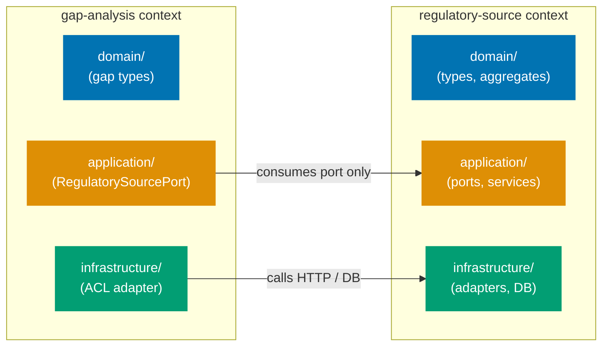
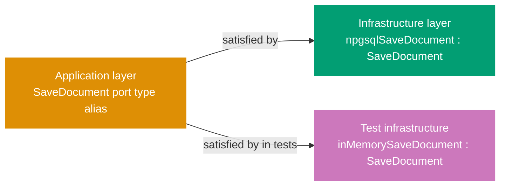

## Guide 1 — One Context, One Hexagon

### Why It Matters

A bounded context is not just a namespace — it is an isolation unit. Every time two contexts share a database table or call each other's repositories directly, a change in one cascades silently into the other. In `apps/ose-app-be` the four contexts (`regulatory-source`, `internal-policy`, `gap-analysis`, `ai-orchestration`) each own their domain layer and infrastructure adapters. Nothing crosses the context boundary except through an explicit port. Getting this isolation invariant right from day one is the single most valuable structural decision in a DDD + hexagonal codebase.

### Standard Library First

F# modules are the only tool the standard library gives you for grouping related declarations. A module is a namespace, not a boundary enforcer — nothing stops `GapAnalysis.fs` from opening `RegulatorySource.fs` and reading its types directly. The standard library delivers cohesion, not isolation.

```fsharp
// Standard library approach: modules group code but enforce no boundary
module OseAppBe.Domain.GapAnalysis

// => GapAnalysis module declared — F# namespace grouping
open OseAppBe.Domain.RegulatorySource
// => Direct open: GapAnalysis can now use all RegulatorySource types
// => The compiler permits this — no boundary enforcement here
// => Any future change to RegulatorySource types breaks GapAnalysis silently

let analyzeGap (source: RegulatoryDoc) = // hypothetical type
    // => Takes a RegulatorySource type directly
    // => The domain boundary exists only in the developer's head
    ()
```

_Illustrative snippet — not from `apps/ose-app-be`; demonstrates the stdlib module approach that the hexagonal context layout supersedes._

**Limitation for production**: modules permit cross-context imports with no enforcement. As the codebase grows, accidental coupling accumulates. The compiler cannot help you find boundary violations.

### Production Framework

The hexagonal pattern enforces the boundary by making each context own its own `domain/`, `application/`, and `infrastructure/` layers, and only exposing types through explicit port types (function type aliases or discriminated unions). Nothing in `gap-analysis` opens anything from `regulatory-source` domain layer directly — it talks to `regulatory-source` through a port defined in the `gap-analysis` application layer.

The diagram below shows the intended per-context layout that the `contexts/` scaffolding targets.



The `ose-app-be` `contexts/` directory has this structure scaffolded today. Each bounded context gets its own layers:

```fsharp
// Intended layout — regulatory-source context domain layer
// New file — intended layout.
// Scaffolding exists at apps/ose-app-be/src/OseAppBe/contexts/regulatory-source/domain/
module OseAppBe.Contexts.RegulatorySource.Domain

// => Module path mirrors the directory: contexts/regulatory-source/domain/
// => Only types belonging to regulatory-source live here
// => No opens from other context domains

type DocumentId = DocumentId of System.Guid
// => Strongly-typed wrapper prevents passing a gap-analysis ID where a source ID is expected
// => The constructor is private — only this module creates DocumentIds

type RegulatoryDocument =
    { Id: DocumentId
      Title: string
      IssuedBy: string
      EffectiveDate: System.DateOnly }
// => Aggregate root for regulatory-source context
// => Fields reflect the ubiquitous language of the regulatory domain
// => No ORM annotations — this is a pure domain type
```

_New file — intended layout. Scaffolding exists at `apps/ose-app-be/src/OseAppBe/contexts/regulatory-source/domain/`._

**Trade-offs**: the per-context directory layout requires discipline during code review — the compiler cannot stop a developer from adding an `open` across contexts at the module level. A custom Roslyn/FSharpLint rule or a pre-commit grep can enforce the boundary mechanically. The payoff is that each context can evolve its domain model independently, and the integration test for one context never breaks when another context changes.

---

## Guide 2 — Reading the Existing Flat Layout

### Why It Matters

`apps/ose-app-be` is mid-migration. The production codebase you read today has a flat layout (`Domain/Types.fs`, `Domain/RegulatorySource.fs`, `Handlers/HealthHandler.fs`, `Infrastructure/AppDbContext.fs`) alongside the scaffolded per-context directories that contain only `.gitkeep` files. Before writing any new feature code you need to read both layouts fluently — otherwise you put new files in the wrong place or duplicate types that already exist in the flat layout.

### Standard Library First

The flat layout is a direct consequence of starting with a single-module approach. F# projects list every `.fs` file in the `.fsproj` in compilation order. A flat layout means all domain files sit in one `Domain/` directory, all handlers in one `Handlers/` directory. This is the zero-ceremony stdlib approach: it compiles, it works, and it is adequate for a small codebase.

```fsharp
// Current flat layout: Domain/Types.fs — shared cross-cutting types
module OseAppBe.Domain.Types

// => Single module for all shared domain types
// => No context scoping — every module in the project can open this
type AppEnv =
    | Dev
    | Staging
    | Prod
// => Discriminated union for deployment environment
// => Used by infrastructure layer to select connection strings

type AppError = UnknownError of string
// => Single shared error type — works for small codebase
// => Will split into per-context error types as contexts gain feature plans
```

Source: [apps/ose-app-be/src/OseAppBe/Domain/Types.fs](../../../../../../ose-app-be/src/OseAppBe/Domain/Types.fs)

**Limitation for production**: as each bounded context adds its own error variants, a single shared `AppError` becomes a merge-conflict magnet and prevents per-context type evolution.

### Production Framework

The intended layout separates shared cross-cutting types from context-specific types. The flat `Domain/Types.fs` continues to hold genuinely shared types (`AppEnv`, `AppError`) while per-context types migrate to `contexts/<ctx>/domain/`.

```fsharp
// Current flat layout: Domain/RegulatorySource.fs
/// Regulatory source bounded context — ingests and stores regulator-published rule documents.
/// Detailed domain types and services added in regulatory-source feature plan.
module OseAppBe.Domain.RegulatorySource
// => Module is intentionally empty except for the doc comment
// => Acts as a placeholder — types land here only temporarily
// => Migration target: contexts/regulatory-source/domain/RegulatorySource.fs
// => Flat layout preserved until the feature plan migrates it
```

Source: [apps/ose-app-be/src/OseAppBe/Domain/RegulatorySource.fs](../../../../../../ose-app-be/src/OseAppBe/Domain/RegulatorySource.fs)

The `.fsproj` compilation order tells you what the migration has achieved so far:

```xml
<!-- apps/ose-app-be/src/OseAppBe/OseAppBe.fsproj (excerpt) -->
<!-- Flat layout files: compiled before contexts/ -->
<!-- => F# compiles files in the order listed — earlier files cannot reference later ones -->
<Compile Include="Domain/Types.fs" />
<!-- => Shared cross-cutting types first — every module below depends on this -->
<!-- => Each domain module is self-contained — RegulatorySource, InternalPolicy, GapAnalysis, AiOrchestration compile before anything that depends on them -->
<Compile Include="Domain/RegulatorySource.fs" />
<Compile Include="Domain/InternalPolicy.fs" />
<Compile Include="Domain/GapAnalysis.fs" />
<Compile Include="Domain/AiOrchestration.fs" />
<!-- => Flat domain modules compiled before infrastructure — enforces the dependency rule mechanically -->
<Compile Include="Infrastructure/AppDbContext.fs" />
<Compile Include="Infrastructure/Migrations.fs" />
<!-- => Infrastructure opens Domain; Domain cannot open Infrastructure (it compiles first) -->
<!-- => Contracts and Handlers compile after Infrastructure — they depend on both Domain types and Infrastructure adapters -->
<Compile Include="Contracts/ContractWrappers.fs" />
<Compile Include="Handlers/HealthHandler.fs" />
<Compile Include="Program.fs" />
<!-- => Program.fs last — the composition root that wires everything together -->
<!-- contexts/<ctx>/ files will be inserted above Program.fs as feature plans land -->
```

_New file (excerpt) — intended layout shows how feature files slot in. Source: [apps/ose-app-be/src/OseAppBe/OseAppBe.fsproj](../../../../../../ose-app-be/src/OseAppBe/OseAppBe.fsproj)._

**Trade-offs**: keeping the flat layout alive during migration means two source-of-truth locations for domain types temporarily. The risk of duplication is real. Mitigate by never writing new types in `Domain/RegulatorySource.fs` — all new types for `regulatory-source` go directly into `contexts/regulatory-source/domain/`. The flat files become tombstones pointing at the new location.

---

## Guide 3 — Domain Types Stay Free of Framework Imports

### Why It Matters

The single most common way a hexagonal architecture degrades into a layered monolith is when domain types import framework assemblies. The moment `RegulatoryDocument` has a `[<JsonPropertyName>]` attribute, or a `[<Column("regulatory_doc_id")>]` annotation, the domain layer depends on a serialization or ORM framework. Switching frameworks — or testing the domain in isolation — now requires framework setup. In `apps/ose-app-be`, keeping `Domain/Types.fs` and the per-context domain modules free of `open Microsoft.EntityFrameworkCore`, `open System.Text.Json`, or `open Giraffe` is the invariant that makes everything else possible.

### Standard Library First

F# record types carry no annotations by default. The standard library gives you a pure, framework-free type that the compiler serializes as a plain CLR class:

```fsharp
// Standard library: pure record type, zero framework imports
module OseAppBe.Domain.Types

// => Module opens only the F# standard library implicitly
// => No open statements required for basic types

type AppEnv =
    | Dev
    | Staging
    | Prod
// => Pure discriminated union — no ORM attribute, no serializer hint
// => Compiles without Microsoft.EntityFrameworkCore or System.Text.Json on the classpath
// => Can be used in unit tests with zero setup

type AppError = UnknownError of string
// => Single-case DU wrapping a string — pure F# stdlib
// => No framework needed to construct, pattern-match, or test this type
```

Source: [apps/ose-app-be/src/OseAppBe/Domain/Types.fs](../../../../../../ose-app-be/src/OseAppBe/Domain/Types.fs)

**Limitation for production**: when you need to persist a domain type, the ORM needs to know the column names. The stdlib gives you no mechanism for this — you have to decide where the ORM mapping lives.

### Production Framework

The hexagonal answer is: ORM mapping lives in the infrastructure layer, not the domain layer. The domain type is a plain F# record. The `AppDbContext` in `Infrastructure/AppDbContext.fs` holds the EF Core `DbSet<>` declarations and `OnModelCreating` column mappings, keeping the domain module completely free of Entity Framework:

```fsharp
// Infrastructure layer: AppDbContext.fs holds all ORM concerns
module OseAppBe.Infrastructure.AppDbContext

open Microsoft.EntityFrameworkCore
// => ORM import is confined to the infrastructure module only
// => The domain/Types.fs never needs to open this

type AppDbContext(options: DbContextOptions<AppDbContext>) =
    inherit DbContext(options)
// => DbContext is a framework type — lives only in infrastructure
// => Domain types do not inherit from DbContext or any ORM base class
// DbSet<> declarations added in feature plans when entities are defined
// => Comment signals the growth pattern: domain types come first, DbSets follow
// => When RegulatoryDocument gains a DbSet, it lands here, not in Domain/
```

Source: [apps/ose-app-be/src/OseAppBe/Infrastructure/AppDbContext.fs](../../../../../../ose-app-be/src/OseAppBe/Infrastructure/AppDbContext.fs)

The dependency rule flows inward: `Infrastructure` opens `Domain`, never the reverse. In F# project files the compilation order enforces this mechanically — `Domain/Types.fs` compiles before `Infrastructure/AppDbContext.fs`, so the domain module physically cannot open anything from infrastructure.

**Trade-offs**: keeping domain types annotation-free means you need a separate mapping step at the boundary. For simple CRUD aggregates this mapping is tedious. For complex aggregates with invariants (value objects that must be validated on construction) the separation pays for itself immediately — you can test the entire domain layer without spinning up a database or serializer.

---

## Guide 4 — Application Service Signatures Take and Return Aggregates, Not DTOs

### Why It Matters

Application services are the orchestration layer between the driving adapter (an HTTP handler) and the domain. A common anti-pattern is letting the application service accept and return the same DTO types the HTTP handler works with — JSON-friendly `[<CLIMutable>]` records with nullable fields and no invariants. When that happens the application service cannot enforce domain rules without re-validating on every call, and the domain model becomes a ceremonial wrapper around the DTO. In `apps/ose-app-be`, the design rule is: application service functions take and return domain aggregates; the handler translates.

### Standard Library First

F# function types naturally express this signature without any framework. The standard library gives you function composition and `Result` for error propagation:

```fsharp
// Standard library: application service as a plain function with domain types
// New file — intended layout.
// Scaffolding exists at apps/ose-app-be/src/OseAppBe/contexts/regulatory-source/application/
module OseAppBe.Contexts.RegulatorySource.Application.RegulatorySourceService
// => Module path mirrors the directory: contexts/regulatory-source/application/

open OseAppBe.Contexts.RegulatorySource.Domain
// => Import only the domain module — no HTTP, no JSON, no ORM
// => Keeping the application layer free of framework imports preserves testability

// Plain F# function — returns Result to propagate domain errors
let ingestDocument
    (save: RegulatoryDocument -> Result<unit, string>)  // output port injected
    // => 'save' is a function parameter — the application service is agnostic of the implementation
    (document: RegulatoryDocument)                       // domain aggregate as input
    // => Aggregate received from the handler after invariant validation
    : Result<RegulatoryDocument, string> =               // domain aggregate as output
    // => Signature is entirely in domain terms
    // => No DTO type crosses this function boundary
    // => 'save' is an output port — its implementation lives in infrastructure
    // => Result return type lets callers pattern-match on success or failure without exceptions
    save document
    // => Delegates persistence to the injected port — synchronous stdlib version
    |> Result.map (fun () -> document)
    // => On success, return the same aggregate the caller passed in
    // => On failure, propagate the error string from the port
```

_New file — intended layout. Scaffolding exists at `apps/ose-app-be/src/OseAppBe/contexts/regulatory-source/application/`._

**Limitation for production**: plain strings as error types lose type information. In a real service you want a discriminated union for errors so callers can pattern-match on specific failure modes.

### Production Framework

In the Giraffe stack the HTTP handler owns the DTO translation. The application service never touches `HttpContext`, `System.Text.Json`, or Giraffe types:

```fsharp
// Intended production application service signature
// New file — intended layout.
// Scaffolding exists at apps/ose-app-be/src/OseAppBe/contexts/regulatory-source/application/
module OseAppBe.Contexts.RegulatorySource.Application.RegulatorySourceService
// => Module path mirrors the directory: contexts/regulatory-source/application/

open OseAppBe.Contexts.RegulatorySource.Domain
open OseAppBe.Domain.Types
// => Only domain and shared cross-cutting types imported
// => No Giraffe, no System.Text.Json, no Microsoft.EntityFrameworkCore
// => This import boundary is what makes the application layer unit-testable without a web server

// Typed error union — each failure mode is explicit
type IngestError =
    | DuplicateDocument of DocumentId
    // => Carries the DocumentId that already exists — callers log or return 409
    | InvalidTitle of string
    // => Carries the validation message — callers return 400 with this text
    | RepositoryFailure of AppError
    // => Wraps the shared AppError — callers return 500, log the AppError payload
// => Pattern-matched at the handler boundary, not inside the service
// => Adding a new failure mode requires updating all call sites — the compiler enforces it

// Output port type alias — injected, never constructed here
type SaveDocument = RegulatoryDocument -> Async<Result<unit, IngestError>>
// => Function type alias for the repository port
// => The application service does not know whether SaveDocument writes to Postgres or memory
// => Switching adapters requires no change to this file
// => Async because the Npgsql production implementation performs I/O

// Application service: takes aggregate, returns aggregate-or-error
let ingestDocument
    (save: SaveDocument)
    // => Port injected by the composition root (Program.fs) via partial application
    (document: RegulatoryDocument)
    // => Validated aggregate — the handler called the smart constructor before reaching here
    : Async<Result<RegulatoryDocument, IngestError>> =
    // => Entirely domain and stdlib types in the signature
    // => 'document' is a validated aggregate — smart constructor enforced invariants before this call
    async {
        match! save document with
        // => Async computation expression — awaits the repository port call
        // => match! desugars to Async.bind: no thread-blocking, no callback pyramid
        | Ok () ->
            return Ok document
            // => Success: return the same aggregate
            // => Caller (handler) translates this to a 201 Created response
        | Error e ->
            return Error e
            // => Failure: propagate the typed error without wrapping
            // => Handler pattern-matches on IngestError variants to produce the correct HTTP status
    }
```

_New file — intended layout. Scaffolding exists at `apps/ose-app-be/src/OseAppBe/contexts/regulatory-source/application/`._

**Trade-offs**: this clean signature forces you to write a mapping function in the handler layer. For thin CRUD endpoints the mapping is boilerplate. For endpoints where the domain aggregate has invariants the payoff is substantial — the application service is a pure function of domain types and can be tested with zero framework setup.

---

## Guide 5 — Output Port as F# Function Type Alias

### Why It Matters

Output ports define _what_ the application layer needs from the outside world without specifying _how_ it is implemented. In object-oriented hexagonal architecture this is typically an interface. In F# the idiomatic equivalent is a function type alias — a single-function type that the application service receives as a parameter. This makes the dependency explicit in the type signature, eliminates interface ceremony, and makes adapter swapping as simple as passing a different function. `apps/ose-app-be` uses this pattern throughout its intended per-context layout.

### Standard Library First

F# function types are first-class. The standard library lets you express any port as a type alias with zero ceremony:

```fsharp
// Standard library: function type alias as output port
// New file — intended layout.
// Scaffolding exists at apps/ose-app-be/src/OseAppBe/contexts/regulatory-source/application/
module OseAppBe.Contexts.RegulatorySource.Application.Ports

open OseAppBe.Contexts.RegulatorySource.Domain

// Repository port: find a document by its ID
type FindDocument = DocumentId -> Result<RegulatoryDocument option, string>
// => Plain F# type alias — no interface keyword, no abstract class
// => The type says exactly what the application service needs: give me an ID, return a document-or-nothing-or-error
// => Compose multiple ports as parameters to the service function

// Repository port: persist a document
type SaveDocument = RegulatoryDocument -> Result<unit, string>
// => Write-side port — unit return on success means the caller does not need to re-read
// => Error string is the stdlib approach; production version uses a DU (see Guide 4)
```

_New file — intended layout. Scaffolding exists at `apps/ose-app-be/src/OseAppBe/contexts/regulatory-source/application/`._

**Limitation for production**: plain `Result<_, string>` loses error semantics. The caller cannot distinguish a database connection failure from a uniqueness constraint violation without parsing the string.

### Production Framework

The Giraffe + Npgsql stack wraps each port in a typed error union and makes the async nature explicit. The port type alias is still a plain F# `type` alias — no Giraffe or Npgsql types appear in the application layer ports file:



```fsharp
// Production port type alias — application layer only
// New file — intended layout.
// Scaffolding exists at apps/ose-app-be/src/OseAppBe/contexts/regulatory-source/application/
module OseAppBe.Contexts.RegulatorySource.Application.Ports
// => This module contains only type aliases — no implementation, no I/O, no framework imports

open OseAppBe.Contexts.RegulatorySource.Domain
// => Domain types are the only dependency — ports are defined in application layer terms

type RepositoryError =
    | NotFound of DocumentId
    // => Read-side only: a missing document is surfaced as NotFound, not as an Option
    | UniqueConstraintViolation
    // => Write-side: the DB raised a uniqueness constraint — callers return HTTP 409
    | ConnectionFailure of exn
    // => Infrastructure failure: carry the exception for logging; callers return HTTP 500
// => Typed DU — pattern matching at call site is exhaustive
// => Adding a new DB error mode requires all callers to handle it

// Read port
type FindDocument = DocumentId -> Async<Result<RegulatoryDocument option, RepositoryError>>
// => Async because the Npgsql adapter performs I/O
// => option because a missing document is not an error — it is a valid domain outcome
// => RepositoryError because a DB failure is an infrastructure concern, not a domain one
// => The application service passes this function to any code that needs to look up a document

// Write port
type SaveDocument = RegulatoryDocument -> Async<Result<unit, RepositoryError>>
// => unit success — the application service trusts the adapter to persist atomically
// => RepositoryError wraps Npgsql exceptions at the adapter boundary (Guide 7)
// => The Npgsql adapter satisfies this type; the in-memory test stub also satisfies it
```

_New file — intended layout. Scaffolding exists at `apps/ose-app-be/src/OseAppBe/contexts/regulatory-source/application/`._

**Trade-offs**: function type aliases are lightweight but single-method. When a port grows to five or six operations, grouping them in a record of functions keeps the application service parameter list manageable. A record-of-functions port is a natural next step when the function-alias approach feels like parameter explosion.

---

## Guide 6 — Giraffe Handler as Primary Adapter

### Why It Matters

The Giraffe handler is the primary (driving) adapter in the hexagonal architecture. Its job is exactly this: translate an HTTP request into a domain command, call the application service, and translate the domain result into an HTTP response. Nothing more. A handler that contains business logic, validates domain invariants, or directly opens a database connection has crossed out of the adapter layer and into the domain or infrastructure — the most common source of untestable, entangled production code. In `apps/ose-app-be`, `Handlers/HealthHandler.fs` is the only handler today, and it is a textbook primary adapter.

### Standard Library First

F# functions compose naturally. Without Giraffe you would write an ASP.NET Core `RequestDelegate` directly — a `Func<HttpContext, Task>`. The standard library gives you the composition, but the ceremony is high:

```fsharp
// Standard library: ASP.NET Core RequestDelegate without Giraffe
open Microsoft.AspNetCore.Http
// => HttpContext is the ASP.NET Core request/response envelope
open System.Text.Json
// => System.Text.Json is the stdlib JSON serializer — no Newtonsoft dependency
open System.Threading.Tasks
// => Task CE requires the Tasks namespace

let healthHandler : RequestDelegate =
    // => RequestDelegate is Func<HttpContext, Task> — the ASP.NET Core handler contract
    fun (ctx: HttpContext) ->
        task {
            // => Imperative async workflow — Task CE
            // => Each step inside is awaitable; no callback nesting
            let response = {| status = "healthy" |}
            // => Anonymous record — no type declaration needed
            // => F# infers the type {| status: string |} at compile time
            ctx.Response.ContentType <- "application/json"
            // => Set content type manually — no automatic negotiation
            // => Giraffe's json combinator sets this for you (see Production Framework below)
            ctx.Response.StatusCode <- 200
            // => Set status code manually — 200 OK
            // => Must be set before writing the body; ASP.NET Core sends headers first
            let json = JsonSerializer.Serialize(response)
            // => Serialize with System.Text.Json — manual call
            // => Giraffe's json combinator calls this internally and handles encoding
            do! ctx.Response.WriteAsync(json)
            // => Write response body — Task-based I/O
            // => WriteAsync flushes after completion; do! suspends the CE until done
        }
        :> Task
        // => Upcast to plain Task — RequestDelegate return type
        // => The task CE produces Task<unit>; RequestDelegate expects Task
```

_Illustrative snippet — not from `apps/ose-app-be`; demonstrates the stdlib RequestDelegate pattern that Giraffe supersedes._

**Limitation for production**: composition is verbose. Chaining middleware, routing, and authorization requires manual `next` threading. Giraffe's `HttpHandler` type (`HttpContext -> Task<HttpContext option>`) composes cleanly with `>=>` (fish operator).

### Production Framework

`Handlers/HealthHandler.fs` shows the minimal Giraffe handler — a live file you can read today:

```fsharp
// Giraffe handler — primary (driving) adapter
module OseAppBe.Handlers.HealthHandler

open Giraffe
// => Single import: Giraffe types and combinators — no domain import needed for a health check

let handle: HttpHandler = fun next ctx -> json {| status = "healthy" |} next ctx
// => HttpHandler type: HttpFunc -> HttpContext -> HttpFuncResult
// => 'next' is the continuation — Giraffe's composition primitive; 'ctx' is the ASP.NET Core HttpContext
// => json: Giraffe combinator — serializes the anonymous record and sets Content-Type: application/json
// => {| status = "healthy" |}: anonymous record — no DTO type declaration needed for trivial responses
// => The whole handler is a single expression: no imperative block, no explicit status code
```

Source: [apps/ose-app-be/src/OseAppBe/Handlers/HealthHandler.fs](../../../../../../ose-app-be/src/OseAppBe/Handlers/HealthHandler.fs)

A domain-backed handler (e.g., POST /api/v1/regulatory-sources) follows the same pattern but adds the translation steps:

```fsharp
// Intended production handler for a domain command
// New file — intended layout.
// Scaffolding exists at apps/ose-app-be/src/OseAppBe/contexts/regulatory-source/
module OseAppBe.Contexts.RegulatorySource.Presentation.IngestHandler
// => Presentation layer: the module lives inside the context but depends on Giraffe

open Giraffe
// => Giraffe types: HttpHandler, HttpFunc, RequestErrors, Successful, ServerErrors
open OseAppBe.Contexts.RegulatorySource.Application
// => Application layer: RegulatorySourceService.SaveDocument and Ports.RepositoryError
open OseAppBe.Contracts.Wrappers
// => Three imports only: Giraffe (HTTP types), application layer (service + port types), contracts (DTOs)
// => Domain layer is NOT opened here — the handler works with DTOs and delegates to the service
// => This import discipline is what makes the handler a pure adapter with no business logic

let handle (ingest: RegulatorySourceService.SaveDocument) : HttpHandler =
    // => Dependency injection via partial application: 'ingest' port provided by composition root
    // => Returns HttpHandler — composes cleanly with Giraffe routing
    // => Partial application binds 'ingest' at startup; the resulting HttpHandler is called per request
    fun next ctx ->
        task {
            let! dto = ctx.BindJsonAsync<IngestRegulatorySourceRequest>()
            // => BindJsonAsync: Giraffe combinator deserializes request body into a DTO record
            // => The DTO type lives in Contracts/ — no domain type here
            // => Raises an exception on malformed JSON; global error handler returns 400

            // Translate DTO → domain aggregate (smart constructor validates invariants)
            match RegulatorySourceDomain.createDocument dto.Title dto.IssuedBy dto.EffectiveDate with
            // => Smart constructor enforces domain invariants — returns Result
            // => Validation happens once here; the application service receives only valid aggregates
            | Error validationMsg ->
                return! RequestErrors.BAD_REQUEST validationMsg next ctx
                // => HTTP 400: domain validation failed — translate error to HTTP at this boundary
                // => The handler is the only place allowed to produce HTTP status codes
            | Ok document ->
                match! ingest document with
                // => Call application service with validated domain aggregate — awaits async port
                // => match! suspends the task CE until the Async<Result<_,_>> completes
                | Error (Ports.UniqueConstraintViolation) ->
                    return! RequestErrors.CONFLICT "Document already exists" next ctx
                    // => HTTP 409: translate domain error to HTTP status code
                    // => Pattern-match is exhaustive — compiler warns if a new RepositoryError variant is unhandled
                | Error _ ->
                    return! ServerErrors.INTERNAL_ERROR "Repository failure" next ctx
                    // => HTTP 500: catch-all for infrastructure failures
                    // => Logs the full error in production middleware before reaching this line
                | Ok saved ->
                    return! Successful.CREATED (toResponseDto saved) next ctx
                    // => HTTP 201: translate domain aggregate to response DTO at this boundary
                    // => toResponseDto lives in Contracts/ — the only serialization mapping in this context
        }
```

_New file — intended layout. Scaffolding exists at `apps/ose-app-be/src/OseAppBe/contexts/regulatory-source/`._

The routing wires the handler to a URL in `Program.fs`. See the live composition root:

```fsharp
// Program.fs: routes declare what handlers respond to what URLs
let webApp: HttpHandler =
    // => webApp is the single top-level HttpHandler registered with ASP.NET Core
    // => All routing lives here — no controller discovery, no attribute-based routing
    choose
        // => choose tries each handler in order and returns the first that matches
        [ GET >=> route "/api/v1/health" >=> Handlers.HealthHandler.handle
          // => GET /api/v1/health routes to the health handler
          // => >=> is Giraffe's Kleisli composition: chain handlers left-to-right
          // => Adding a new route: insert a new line before RequestErrors.NOT_FOUND
          RequestErrors.NOT_FOUND "Not Found" ]
          // => Catch-all: any unmatched route returns 404
          // => Must be last in the choose list — it matches every request
```

Source: [apps/ose-app-be/src/OseAppBe/Program.fs](../../../../../../ose-app-be/src/OseAppBe/Program.fs)

**Trade-offs**: Giraffe handlers are lightweight but require explicit `next ctx` threading everywhere. This is the price of composability — each handler must forward `next` to the continuation. For teams new to Giraffe the `>=>` operator and `HttpFuncResult` return type have a learning curve. The payoff is that handler composition (auth middleware, routing, error handling) is pure function composition with no magic.
