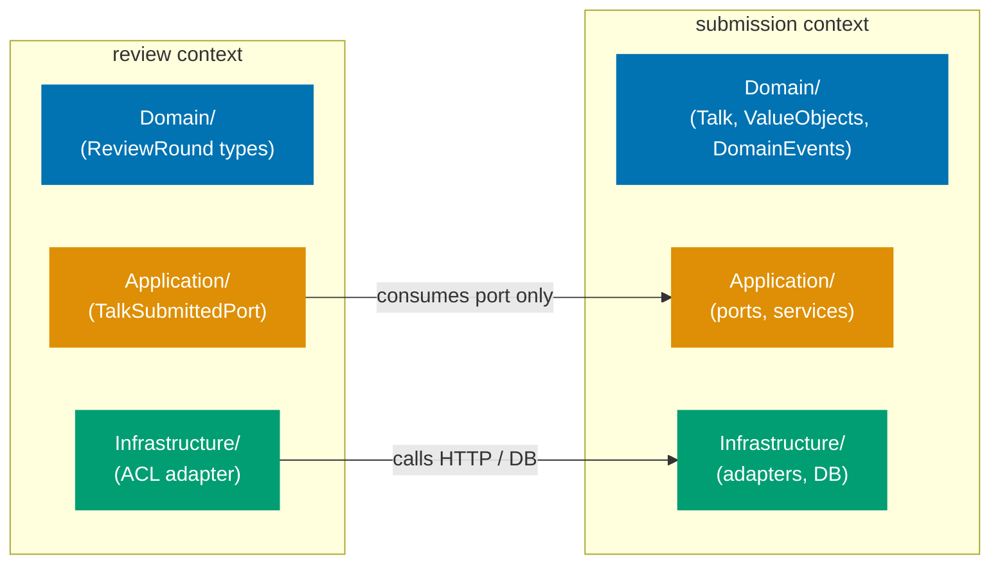
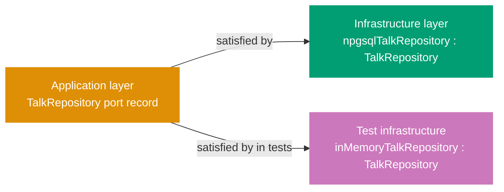

## Guide 1 — One Context, One Hexagon

### Why It Matters

A bounded context is not just a namespace — it is an isolation unit. Every time two contexts share a database table or call each other's repositories directly, a change in one cascades silently into the other. In `talks-platform-be` the four contexts (`submission`, `review`, `scheduling`, `ai-assist`) each own their domain layer and infrastructure adapters. Nothing crosses the context boundary except through an explicit port. Getting this isolation invariant right from day one is the single most valuable structural decision in a DDD + hexagonal codebase.

### Standard Library First

F# modules are the only tool the standard library gives you for grouping related declarations. A module is a namespace, not a boundary enforcer — nothing stops `Review.fs` from opening `Submission.fs` and reading its types directly. The standard library delivers cohesion, not isolation.

```fsharp
// Standard library approach: modules group code but enforce no boundary
module TalksPlatform.Domain.Review

// => Review module declared — F# namespace grouping
open TalksPlatform.Domain.Submission
// => Direct open: Review can now use all Submission types
// => The compiler permits this — no boundary enforcement here
// => Any future change to Submission types breaks Review silently

let scoreReview (talk: Talk) = // hypothetical type from Submission
    // => Takes a Submission type directly
    // => The domain boundary exists only in the developer's head
    ()
```

**Limitation for production**: modules permit cross-context imports with no enforcement. As the codebase grows, accidental coupling accumulates. The compiler cannot help you find boundary violations.

### Production Framework

The hexagonal pattern enforces the boundary by making each context own its own `Domain/`, `Application/`, and `Infrastructure/` layers, and only exposing types through explicit port types (function type aliases or discriminated unions). Nothing in `review` opens anything from the `submission` domain layer directly — it talks to `submission` through a port defined in the `review` application layer.

The diagram below shows the per-context layout that the `Contexts/` scaffolding targets.



Each bounded context gets its own layers:

```fsharp
// Per-context layout — submission context domain layer
// src/TalksPlatform/Contexts/Submission/Domain/ValueObjects.fs
module TalksPlatform.Contexts.Submission.Domain.ValueObjects

// => Module path mirrors the directory: Contexts/Submission/Domain/
// => Only types belonging to submission live here
// => No opens from other context domains

type TalkId = TalkId of System.Guid
// => Strongly-typed wrapper — prevents passing a review ID where a talk ID is expected
// => Single-case DU: the constructor is the only way to create a TalkId

type Track =
    | Backend
    | Frontend
    | InfraSecurity
    | AI
    | Leadership
// => Discriminated union for conference tracks — pure domain type
// => No ORM annotation, no serializer hint
// => Compiles without any framework on the classpath

type Format =
    | Lightning  // 10 minutes
    | Standard   // 30 minutes
    | Workshop   // 90 minutes
// => Format carries duration semantics without a numeric field
// => Pattern-matching on Format is exhaustive — the compiler enforces it
```

**Trade-offs**: the per-context directory layout requires discipline during code review — the compiler cannot stop a developer from adding an `open` across contexts at the module level. A custom FSharpLint rule or a pre-commit grep can enforce the boundary mechanically. The payoff is that each context can evolve its domain model independently, and the integration test for one context never breaks when another context changes.

---

## Guide 2 — Reading the Per-Context Layout

### Why It Matters

`talks-platform-be` organizes all feature code under `src/TalksPlatform/Contexts/`. Before writing any new feature code you need to read this layout fluently — otherwise you put new files in the wrong layer or duplicate types that already exist. The folder shape is not arbitrary: F# compiles files in the order listed in the `.fsproj`, which means the directory structure also encodes the dependency rule.

### Standard Library First

The flat layout is a direct consequence of starting with a single-module approach. F# projects list every `.fs` file in the `.fsproj` in compilation order. A flat layout means all domain files sit in one `Domain/` directory and all handlers in one `Presentation/` directory. This is the zero-ceremony stdlib approach: it compiles, it works, and it is adequate for a small codebase.

```fsharp
// Flat layout: Domain/Types.fs — shared cross-cutting types
module TalksPlatform.Domain.Types

// => Single module for all shared domain types
// => No context scoping — every module in the project can open this
type AppEnv =
    | Dev
    | Staging
    | Prod
// => Discriminated union for deployment environment
// => Used by infrastructure to select connection strings

type RepositoryError =
    | NotFound
    | ConnectionFailure of exn
// => Single shared error type — works for small codebases
// => Will split into per-context error types as contexts gain feature plans
```

**Limitation for production**: as each bounded context adds its own error variants, a single shared `RepositoryError` becomes a merge-conflict magnet and prevents per-context type evolution.

### Production Framework

The per-context layout separates shared cross-cutting types from context-specific types. The `.fsproj` compilation order tells you what the layout has achieved:

```xml
<!-- TalksPlatform.fsproj (excerpt) -->
<!-- Per-context layout: compiled in dependency order -->
<!-- => F# compiles files in the order listed — earlier files cannot reference later ones -->
<Compile Include="Contexts/Submission/Domain/ValueObjects.fs" />
<!-- => Value objects first: TalkId, SpeakerId, Track, Format, Abstract, TagSet -->
<Compile Include="Contexts/Submission/Domain/DomainEvents.fs" />
<!-- => Events after value objects: TalkSubmitted, ReviewRoundClosed, TalkAccepted -->
<Compile Include="Contexts/Submission/Application/Ports.fs" />
<!-- => Ports after domain: function type aliases referencing domain types -->
<Compile Include="Contexts/Submission/Application/SubmitTalk.fs" />
<!-- => Application services after ports: orchestrate domain and port calls -->
<Compile Include="Contexts/Submission/Infrastructure/NpgsqlTalkRepository.fs" />
<!-- => Infrastructure after application: adapters import ports but ports never import adapters -->
<Compile Include="Contexts/Submission/Presentation/SubmissionHandlers.fs" />
<!-- => Presentation last per context: imports Giraffe, application layer, and contracts -->
<Compile Include="Composition/Program.fs" />
<!-- => Program.fs last — the composition root that wires everything together -->
<!-- Review/, Scheduling/, AiAssist/ follow the same pattern before Program.fs -->
```

**Trade-offs**: keeping per-context files in strict compilation order means adding a new file requires updating the `.fsproj`. This is a minor cost. The benefit is that circular dependencies between layers are impossible — the compiler rejects them before any test runs.

---

## Guide 3 — Domain Types Stay Free of Framework Imports

### Why It Matters

The single most common way a hexagonal architecture degrades into a layered monolith is when domain types import framework assemblies. The moment `Talk` has a `[<JsonPropertyName>]` attribute, or a `[<Column("talk_id")>]` annotation, the domain layer depends on a serialization or ORM framework. Switching frameworks — or testing the domain in isolation — now requires framework setup. In `talks-platform-be`, keeping the `Contexts/Submission/Domain/` modules free of `open Microsoft.EntityFrameworkCore`, `open System.Text.Json`, or `open Giraffe` is the invariant that makes everything else possible.

### Standard Library First

F# record types carry no annotations by default. The standard library gives you a pure, framework-free type that the compiler serializes as a plain CLR class:

```fsharp
// Standard library: pure record type, zero framework imports
module TalksPlatform.Contexts.Submission.Domain.ValueObjects

// => Module opens only the F# standard library implicitly
// => No open statements required for basic types

type TalkId = TalkId of System.Guid
// => Pure single-case DU — no ORM attribute, no serializer hint
// => Compiles without Microsoft.EntityFrameworkCore or System.Text.Json on the classpath
// => Can be used in unit tests with zero setup

type Abstract = private Abstract of string
// => Private constructor: only the smart constructor (below) creates Abstract values
// => The compiler enforces that callers go through validation

// Smart constructor: validates and returns Result
let createAbstract (s: string) : Result<Abstract, string> =
    // => Returns Result — the caller cannot ignore the error case
    // => No exception thrown — functional error handling throughout the domain
    if System.String.IsNullOrWhiteSpace(s) then Error "Abstract cannot be empty"
    // => Empty string rejected at the type level — the domain invariant holds
    elif s.Length > 2000 then Error "Abstract exceeds 2000 characters"
    // => Length cap enforced here — no infrastructure needed to check this
    else Ok (Abstract s)
    // => Ok: the validated value — downstream functions receive only valid Abstracts
```

**Limitation for production**: when you need to persist a domain type, the ORM needs to know the column names. The stdlib gives you no mechanism for this — you have to decide where the ORM mapping lives.

### Production Framework

The hexagonal answer is: ORM mapping lives in the infrastructure layer, not the domain layer. The domain type is a plain F# record. The `NpgsqlTalkRepository.fs` in `Infrastructure/` holds the mapping logic, keeping the domain module completely free of Npgsql:

```fsharp
// Infrastructure layer: NpgsqlTalkRepository.fs holds all ORM concerns
// src/TalksPlatform/Contexts/Submission/Infrastructure/NpgsqlTalkRepository.fs
module TalksPlatform.Contexts.Submission.Infrastructure.NpgsqlTalkRepository

open Npgsql
// => Npgsql import is confined to the infrastructure module only
// => Domain/ValueObjects.fs never needs to open this
open TalksPlatform.Contexts.Submission.Domain
// => Import domain types for mapping — infrastructure depends on domain, not the reverse

// Row-level record matching the submission.talks table columns
[<CLIMutable>]
type TalkRow =
    { talk_id: System.Guid
      // => snake_case: matches the PostgreSQL column name — ORM concern only in infrastructure
      speaker_id: System.Guid
      abstract_text: string
      format: string
      // => format stored as string — deserialize to Format DU in the repository, not in domain
      status: string }
      // => CLIMutable: enables Npgsql Dapper-style mapping — stays out of the domain layer
// => TalkRow: the database-facing record; Talk (domain) is the application-facing record
// => The mapping between the two is the adapter's sole responsibility
```

The dependency rule flows inward: `Infrastructure` opens `Domain`, never the reverse. In F# project files the compilation order enforces this mechanically — `Domain/ValueObjects.fs` compiles before `Infrastructure/NpgsqlTalkRepository.fs`, so the domain module physically cannot open anything from infrastructure.

**Trade-offs**: keeping domain types annotation-free means you need a separate mapping step at the boundary. For simple CRUD aggregates this mapping is tedious. For complex aggregates with invariants (value objects that must be validated on construction) the separation pays for itself immediately — you can test the entire domain layer without spinning up a database or serializer.

---

## Guide 4 — Application Service Signatures Take and Return Aggregates, Not DTOs

### Why It Matters

Application services are the orchestration layer between the driving adapter (an HTTP handler) and the domain. A common anti-pattern is letting the application service accept and return the same DTO types the HTTP handler works with — JSON-friendly `[<CLIMutable>]` records with nullable fields and no invariants. When that happens the application service cannot enforce domain rules without re-validating on every call, and the domain model becomes a ceremonial wrapper around the DTO. In `talks-platform-be`, the design rule is: application service functions take and return domain aggregates; the handler translates.

### Standard Library First

F# function types naturally express this signature without any framework. The standard library gives you function composition and `Result` for error propagation:

```fsharp
// Standard library: application service as a plain function with domain types
// src/TalksPlatform/Contexts/Submission/Application/SubmitTalk.fs
module TalksPlatform.Contexts.Submission.Application.SubmitTalk

open TalksPlatform.Contexts.Submission.Domain
// => Import only the domain module — no HTTP, no JSON, no ORM
// => Keeping the application layer free of framework imports preserves testability

// Plain F# function — returns Result to propagate domain errors
let submitTalk
    (save: Talk -> Result<unit, string>)   // output port injected
    // => 'save' is a function parameter — the application service is agnostic of the implementation
    (talk: Talk)                            // domain aggregate as input
    // => Aggregate received from the handler after invariant validation
    : Result<Talk, string> =               // domain aggregate as output
    // => Signature is entirely in domain terms
    // => No DTO type crosses this function boundary
    // => 'save' is an output port — its implementation lives in infrastructure
    // => Result return type lets callers pattern-match on success or failure without exceptions
    save talk
    // => Delegates persistence to the injected port — synchronous stdlib version
    |> Result.map (fun () -> talk)
    // => On success, return the same aggregate the caller passed in
    // => On failure, propagate the error string from the port
```

**Limitation for production**: plain strings as error types lose type information. In a real service you want a discriminated union for errors so callers can pattern-match on specific failure modes.

### Production Framework

In the Giraffe stack the HTTP handler owns the DTO translation. The application service never touches `HttpContext`, `System.Text.Json`, or Giraffe types:

```fsharp
// Production application service signature
// src/TalksPlatform/Contexts/Submission/Application/SubmitTalk.fs
module TalksPlatform.Contexts.Submission.Application.SubmitTalk

open TalksPlatform.Contexts.Submission.Domain
open TalksPlatform.Contexts.Submission.Application.Ports
// => Only domain and port types imported
// => No Giraffe, no System.Text.Json, no Npgsql
// => This import boundary is what makes the application layer unit-testable without a web server

// Typed error union — each failure mode is explicit
type SubmitTalkError =
    | DuplicateSubmission of TalkId
    // => Carries the TalkId that already exists — callers log or return 409
    | InvalidFormat of string
    // => Carries the validation message — callers return 400 with this text
    | RepositoryFailure of exn
    // => Wraps the infrastructure exception — callers return 500, log the exception
// => Pattern-matched at the handler boundary, not inside the service
// => Adding a new failure mode requires updating all call sites — the compiler enforces it

// Application service: takes aggregate, returns aggregate-or-error
let submitTalk
    (save: TalkRepository)
    // => Port injected by the composition root (Program.fs) via partial application
    (pub: EventPublisher)
    // => Event publisher port — injected the same way as the repository
    (talk: Talk)
    // => Validated aggregate — the handler called the smart constructor before reaching here
    : Async<Result<Talk, SubmitTalkError>> =
    // => Entirely domain and stdlib types in the signature
    async {
        match! save.SaveTalk talk with
        // => Async computation expression — awaits the repository port call
        // => match! desugars to Async.bind: no thread-blocking, no callback pyramid
        | Error (RepositoryError.UniqueConstraintViolation) ->
            return Error (DuplicateSubmission talk.Id)
            // => Translate infrastructure error to application-layer error variant
        | Error (RepositoryError.ConnectionFailure ex) ->
            return Error (RepositoryFailure ex)
            // => Wrap the raw exception for the handler to log
        | Ok () ->
            do! pub.Publish (TalkSubmitted { TalkId = talk.Id; SpeakerId = talk.SpeakerId
                                             Abstract = talk.Abstract; Format = talk.Format })
            // => Publish domain event after successful save — outbox adapter is atomic
            return Ok talk
            // => Success: return the same aggregate
            // => Caller (handler) translates this to a 201 Created response
    }
```

**Trade-offs**: this clean signature forces you to write a mapping function in the handler layer. For thin CRUD endpoints the mapping is boilerplate. For endpoints where the domain aggregate has invariants the payoff is substantial — the application service is a pure function of domain types and can be tested with zero framework setup.

---

## Guide 5 — Output Port as F# Function Type Alias

### Why It Matters

Output ports define _what_ the application layer needs from the outside world without specifying _how_ it is implemented. In object-oriented hexagonal architecture this is typically an interface. In F# the idiomatic equivalent is a function type alias — a single-function type that the application service receives as a parameter. This makes the dependency explicit in the type signature, eliminates interface ceremony, and makes adapter swapping as simple as passing a different function. `talks-platform-be` uses this pattern throughout its per-context layout.

### Standard Library First

F# function types are first-class. The standard library lets you express any port as a type alias with zero ceremony:

```fsharp
// Standard library: function type alias as output port
// src/TalksPlatform/Contexts/Submission/Application/Ports.fs
module TalksPlatform.Contexts.Submission.Application.Ports

open TalksPlatform.Contexts.Submission.Domain

// Repository port: find a talk by its ID
type FindTalk = TalkId -> Result<Talk option, string>
// => Plain F# type alias — no interface keyword, no abstract class
// => The type says exactly what the application service needs: give me an ID, return a talk-or-nothing-or-error
// => Compose multiple ports as parameters to the service function

// Repository port: persist a talk
type SaveTalk = Talk -> Result<unit, string>
// => Write-side port — unit return on success means the caller does not need to re-read
// => Error string is the stdlib approach; production version uses a DU (see Guide 4)
```

**Limitation for production**: plain `Result<_, string>` loses error semantics. The caller cannot distinguish a database connection failure from a uniqueness constraint violation without parsing the string.

### Production Framework

The Giraffe + Npgsql stack wraps each port in a typed error union and makes the async nature explicit. The port type alias is still a plain F# `type` alias — no Giraffe or Npgsql types appear in the application layer ports file:



```fsharp
// Production port type alias — application layer only
// src/TalksPlatform/Contexts/Submission/Application/Ports.fs
module TalksPlatform.Contexts.Submission.Application.Ports
// => This module contains only type aliases — no implementation, no I/O, no framework imports

open TalksPlatform.Contexts.Submission.Domain
// => Domain types are the only dependency — ports are defined in application layer terms

type RepositoryError =
    | NotFound of TalkId
    // => Read-side only: a missing talk is surfaced as NotFound, not as an Option
    | UniqueConstraintViolation
    // => Write-side: the DB raised a uniqueness constraint — callers return HTTP 409
    | ConnectionFailure of exn
    // => Infrastructure failure: carry the exception for logging; callers return HTTP 500
// => Typed DU — pattern matching at call site is exhaustive
// => Adding a new DB error mode requires all callers to handle it

// Repository port as a record of functions — groups read and write together
type TalkRepository =
    { FindTalk: TalkId -> Async<Result<Talk option, RepositoryError>>
      // => Async because the Npgsql adapter performs I/O
      // => option because a missing talk is not an error — it is a valid domain outcome
      SaveTalk: Talk -> Async<Result<unit, RepositoryError>>
      // => unit success — the application service trusts the adapter to persist atomically
      // => RepositoryError wraps Npgsql exceptions at the adapter boundary (Guide 7)
    }
// => Record-of-functions: groups both operations so the application service receives one parameter
// => The Npgsql adapter satisfies this record; the in-memory test stub also satisfies it

// Event publisher port — single function alias
type EventPublisher =
    { Publish: DomainEvent -> Async<Result<unit, string>> }
// => Record wrapping one function: extensible if more event operations are added
// => The outbox adapter satisfies this in production; in-memory adapter satisfies it in tests
```

**Trade-offs**: function type aliases are lightweight but single-method. When a port grows to five or six operations, grouping them in a record of functions keeps the application service parameter list manageable. A record-of-functions port is a natural next step when the function-alias approach feels like parameter explosion.

---

## Guide 6 — Giraffe Handler as Primary Adapter

### Why It Matters

The Giraffe handler is the primary (driving) adapter in the hexagonal architecture. Its job is exactly this: translate an HTTP request into a domain command, call the application service, and translate the domain result into an HTTP response. Nothing more. A handler that contains business logic, validates domain invariants, or directly opens a database connection has crossed out of the adapter layer and into the domain or infrastructure — the most common source of untestable, entangled production code. In `talks-platform-be`, `Presentation/SubmissionHandlers.fs` holds the HTTP adapter for the submission context.

### Standard Library First

F# functions compose naturally. Without Giraffe you would write an ASP.NET Core `RequestDelegate` directly — a `Func<HttpContext, Task>`. The standard library gives you the composition, but the ceremony is high:

```fsharp
// Standard library: ASP.NET Core RequestDelegate without Giraffe
open Microsoft.AspNetCore.Http
// => HttpContext is the ASP.NET Core request/response envelope
open System.Text.Json
// => System.Text.Json is the stdlib JSON serializer — no Newtonsoft dependency
open System.Threading.Tasks
// => Task CE requires the Tasks namespace

let healthHandler : RequestDelegate =
    // => RequestDelegate is Func<HttpContext, Task> — the ASP.NET Core handler contract
    fun (ctx: HttpContext) ->
        task {
            // => Imperative async workflow — Task CE
            let response = {| status = "healthy" |}
            // => Anonymous record — no type declaration needed
            ctx.Response.ContentType <- "application/json"
            // => Set content type manually — no automatic negotiation
            // => Giraffe's json combinator sets this for you (see Production Framework below)
            ctx.Response.StatusCode <- 200
            // => Set status code manually — 200 OK
            // => Must be set before writing the body; ASP.NET Core sends headers first
            let json = JsonSerializer.Serialize(response)
            // => Serialize with System.Text.Json — manual call
            // => Giraffe's json combinator calls this internally and handles encoding
            do! ctx.Response.WriteAsync(json)
            // => Write response body — Task-based I/O
            // => WriteAsync flushes after completion; do! suspends the CE until done
        }
        :> Task
        // => Upcast to plain Task — RequestDelegate return type
```

**Limitation for production**: composition is verbose. Chaining middleware, routing, and authorization requires manual `next` threading. Giraffe's `HttpHandler` type (`HttpContext -> Task<HttpContext option>`) composes cleanly with `>=>` (fish operator).

### Production Framework

The health handler shows the minimal Giraffe adapter. A domain-backed handler for `POST /api/v1/talks` follows the same pattern but adds the translation steps:

```fsharp
// Giraffe handler — primary (driving) adapter for talk submission
// src/TalksPlatform/Contexts/Submission/Presentation/SubmissionHandlers.fs
module TalksPlatform.Contexts.Submission.Presentation.SubmissionHandlers

open Giraffe
// => Giraffe types: HttpHandler, BindJsonAsync, RequestErrors, Successful, ServerErrors
open TalksPlatform.Contexts.Submission.Domain
// => Domain: Talk smart constructor, TalkId, Abstract, Format
open TalksPlatform.Contexts.Submission.Application.Ports
// => Ports: TalkRepository, EventPublisher, RepositoryError
open TalksPlatform.Contexts.Submission.Application.SubmitTalk
// => Application service and SubmitTalkError
// => Four imports only: no Npgsql, no System.Text.Json — handler is a pure adapter

// Request DTO — deserialized from JSON by Giraffe's BindJsonAsync
[<CLIMutable>]
type SubmitTalkRequest =
    { SpeakerId: System.Guid
      // => CLIMutable: reflection-based setters required by Giraffe's BindJsonAsync
      AbstractText: string
      // => Raw string: smart constructor validates length and emptiness
      Format: string
      // => String format name: adapter maps "Lightning" → Format.Lightning etc.
      Track: string }
      // => String track name: adapter maps "Backend" → Track.Backend etc.

// Format string → Format DU mapping
let private parseFormat = function
    | "Lightning"  -> Ok Format.Lightning
    // => Exact string match: the client must send "Lightning", not "lightning"
    | "Standard"   -> Ok Format.Standard
    | "Workshop"   -> Ok Format.Workshop
    | other        -> Error (sprintf "Unknown format: %s" other)
    // => Error carries the invalid string — the handler returns 400 with this message

// Handler factory: returns an HttpHandler with the ports partially applied
let handleSubmit
    (repo: TalkRepository)
    (pub: EventPublisher)
    // => Two ports injected by the composition root via partial application
    : HttpHandler =
    fun next ctx ->
        // => next: the next HttpHandler in the pipeline; ctx: ASP.NET Core HttpContext
        task {
            let! dto = ctx.BindJsonAsync<SubmitTalkRequest>()
            // => Giraffe BindJsonAsync: deserializes the request body into the CLIMutable DTO
            // => Throws on malformed JSON — global error middleware catches it and returns 400

            // Step 1: DTO → domain types via smart constructors
            match createAbstract dto.AbstractText, parseFormat dto.Format with
            // => Both smart constructors evaluated — tuple pattern handles both results
            | Error msg, _ | _, Error msg ->
                return! RequestErrors.BAD_REQUEST msg next ctx
                // => HTTP 400: domain validation failed — translate at the adapter boundary
            | Ok abstract', Ok format ->
                // => Ok branch: both constructors validated their inputs

                let talk =
                    { Id = TalkId (System.Guid.NewGuid())
                      // => New UUID v7-style ID — composition root can inject a Clock port for real UUID v7
                      SpeakerId = SpeakerId dto.SpeakerId
                      Abstract = abstract'
                      Format = format
                      Status = Draft }
                // => Build the domain aggregate from validated value objects

                // Step 2: aggregate → application service → domain result
                match! submitTalk repo pub talk with
                // => Application service: takes repo port, publisher port, domain aggregate
                // => match! suspends the handler task until the Async<Result<_,_>> resolves
                | Error (DuplicateSubmission id) ->
                    return! RequestErrors.CONFLICT (sprintf "Talk %A already submitted" id) next ctx
                    // => HTTP 409: typed pattern match, not string parsing
                | Error (InvalidFormat msg) ->
                    return! RequestErrors.BAD_REQUEST msg next ctx
                    // => HTTP 400: format validation failed in the application service
                | Error (RepositoryFailure ex) ->
                    eprintfn "Repository failure: %A" ex
                    // => Log the raw exception before discarding it from the response
                    return! ServerErrors.INTERNAL_ERROR "Repository unavailable" next ctx
                | Ok saved ->
                    // => Step 3: domain aggregate → response DTO → HTTP 201
                    return! Successful.CREATED {| talkId = saved.Id |} next ctx
                    // => Successful.CREATED: sets 201 status and serializes the anonymous record
        }
```

The routing wires the handler to a URL in `Program.fs`:

```fsharp
// Program.fs: routes declare what handlers respond to what URLs
// src/TalksPlatform/Composition/Program.fs
let webApp (repo: TalkRepository) (pub: EventPublisher) : HttpHandler =
    // => webApp takes the ports as parameters — the composition root binds them at startup
    // => All routing lives here — no controller discovery, no attribute-based routing
    choose
        // => choose tries each handler in order and returns the first that matches
        [ GET  >=> route "/api/v1/health"            >=> json {| status = "healthy" |}
          // => GET /api/v1/health: inline health check — no domain port needed
          // => >=> is Giraffe's Kleisli composition: chain handlers left-to-right
          POST  >=> route "/api/v1/talks"             >=> Submission.Presentation.SubmissionHandlers.handleSubmit repo pub
          // => POST /api/v1/talks: submission handler with ports partially applied
          GET   >=> routef "/api/v1/talks/%O"        (fun talkId -> Submission.Presentation.SubmissionHandlers.handleGet repo talkId)
          // => routef: extracts the talkId from the URL path — Giraffe parses the %O as Guid
          RequestErrors.NOT_FOUND "Not Found" ]
          // => Catch-all: any unmatched route returns 404
```

**Trade-offs**: Giraffe handlers are lightweight but require explicit `next ctx` threading everywhere. This is the price of composability — each handler must forward `next` to the continuation. For teams new to Giraffe the `>=>` operator and `HttpFuncResult` return type have a learning curve. The payoff is that handler composition (auth middleware, routing, error handling) is pure function composition with no magic.
