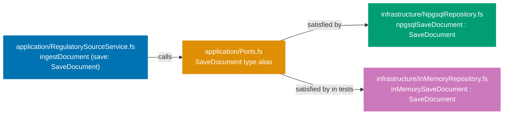
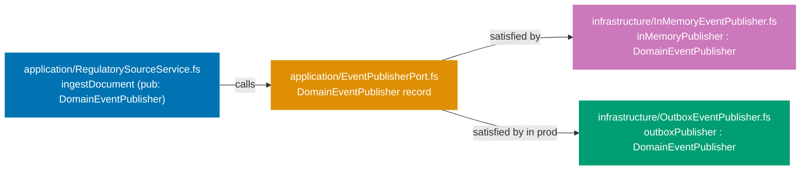
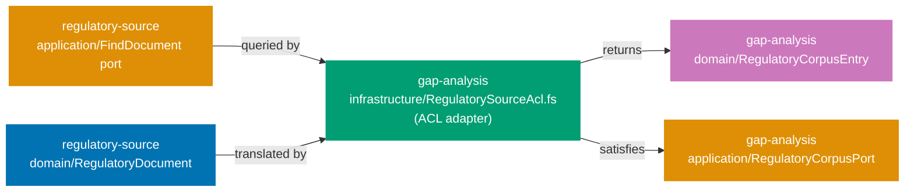

## Guide 7 — Repository Port as F# Function Type Alias + Npgsql Adapter Behind It

### Why It Matters

A repository port is the seam that separates your application layer from the
database. Every time you wire an Npgsql call directly inside an application
service, you lose two things: the ability to swap the database for tests, and
the ability to reason about the service's behavior without a running PostgreSQL
instance. In `apps/ose-app-be` the repository port is a plain F# function type
alias declared in the `application/` layer. The Npgsql adapter satisfies that
type in `infrastructure/`. Nothing in the application layer knows whether
PostgreSQL or an in-memory dictionary is behind the port.

### Standard Library First

F# lets you alias any function type with a single `type` declaration. The
standard library gives you the full type system but no I/O primitive for
PostgreSQL — you would fall back to `System.Data.Common.DbConnection` and raw
SQL strings:

```fsharp
// Standard library: repository port as a bare function alias over System.Data
module OseAppBe.Contexts.RegulatorySource.Application.Ports

open System.Data
// => System.Data is the BCL's database abstraction — provider-agnostic interfaces
// => No NuGet dependency: ships with every .NET runtime
open OseAppBe.Contexts.RegulatorySource.Domain
// => Domain types are the port's language — no database type crosses this boundary

// Read port — synchronous BCL style
type FindDocument = DocumentId -> IDbConnection -> Result<RegulatoryDocument option, exn>
// => IDbConnection: BCL abstract connection — Npgsql satisfies it at runtime
// => exn: stdlib catch-all error — loses semantic information about the failure cause
// => Synchronous return: BCL commands block the thread — no async support without workarounds

// Write port — synchronous BCL style
type SaveDocument = RegulatoryDocument -> IDbConnection -> Result<unit, exn>
// => Result<unit, exn>: success or an opaque exception
// => The caller cannot distinguish constraint violation from connection failure without typeof checks
// => IDbConnection threading is manual — caller must open, pass, and close the connection
```

_Illustrative snippet — not from `apps/ose-app-be`; demonstrates the stdlib
`System.Data` port style that the Npgsql function-alias approach supersedes._

**Limitation for production**: `IDbConnection` threading is manual and
error-prone. `exn` as the error type is untyped. Async is absent — synchronous
DB calls block ASP.NET Core's thread pool under load.

### Production Framework

The Npgsql + Entity Framework Core stack in `apps/ose-app-be` replaces raw
`IDbConnection` threading with `AppDbContext` injection. The port type alias
stays in the application layer with no EF Core import — the adapter in
`infrastructure/` owns the EF Core dependency:



The application layer port type alias:

```fsharp
// Production port type alias — application layer, no EF Core import
// New file — intended layout.
// Scaffolding exists at apps/ose-app-be/src/OseAppBe/contexts/regulatory-source/application/
module OseAppBe.Contexts.RegulatorySource.Application.Ports

open OseAppBe.Contexts.RegulatorySource.Domain
// => Only domain types — no Npgsql, no EF Core, no Microsoft.EntityFrameworkCore
// => This is the isolation invariant: application layer has zero infrastructure imports

type RepositoryError =
    | NotFound of DocumentId
    // => Read-side: a missing document is not a DB error — it is a domain outcome
    | UniqueConstraintViolation
    // => Write-side: Npgsql raises a 23505 PostgreSQL error code on duplicate primary key
    | ConnectionFailure of exn
    // => Infrastructure failure: carry the raw exception for logging; callers return HTTP 500

// Read port
type FindDocument = DocumentId -> Async<Result<RegulatoryDocument option, RepositoryError>>
// => Async: the Npgsql adapter performs network I/O — never block the thread pool
// => option: a missing row is a valid domain outcome, not an error
// => RepositoryError: adapter translates Npgsql exceptions into typed variants at the seam

// Write port
type SaveDocument = RegulatoryDocument -> Async<Result<unit, RepositoryError>>
// => unit success: the caller does not re-read after a successful save
// => Adapter wraps Npgsql's NpgsqlException into RepositoryError at the seam
// => The application service never sees a raw database exception
```

_New file — intended layout. Scaffolding exists at
`apps/ose-app-be/src/OseAppBe/contexts/regulatory-source/application/`._

The Npgsql adapter in the infrastructure layer satisfies the port type alias.
It wraps EF Core's `AppDbContext` and translates database exceptions:

```fsharp
// Production Npgsql adapter — infrastructure layer only
// New file — intended layout.
// Scaffolding exists at apps/ose-app-be/src/OseAppBe/contexts/regulatory-source/infrastructure/
module OseAppBe.Contexts.RegulatorySource.Infrastructure.NpgsqlRepository

open Microsoft.EntityFrameworkCore
// => EF Core import confined to infrastructure — the seam absorbs the framework dependency
open Npgsql
// => Npgsql for catching PostgreSQL-specific error codes (e.g., 23505 unique violation)
open OseAppBe.Infrastructure.AppDbContext
// => AppDbContext: the EF Core DbContext declared in the flat Infrastructure/ layout
// => Guides 2 and 3 showed why AppDbContext lives in infrastructure, not domain
open OseAppBe.Contexts.RegulatorySource.Application.Ports
// => Import the port types — the adapter must satisfy SaveDocument and FindDocument exactly
open OseAppBe.Contexts.RegulatorySource.Domain
// => Domain types: RegulatoryDocument, DocumentId

// Npgsql adapter satisfying SaveDocument
let npgsqlSaveDocument (db: AppDbContext) : SaveDocument =
    // => Partial application: db is injected by the composition root at startup
    // => The returned function has type RegulatoryDocument -> Async<Result<unit, RepositoryError>>
    // => Satisfies the SaveDocument type alias exactly — no casting needed
    fun document ->
        // => fun document: the second argument arrives per HTTP request — db is already bound
        async {
            try
                db.Set<RegulatoryDocument>().Add(document) |> ignore
                // => EF Core Add: stages the entity for INSERT — no I/O yet
                // => ignore: Add returns EntityEntry<T>; the caller does not need the entry object
                let! _ = db.SaveChangesAsync() |> Async.AwaitTask
                // => SaveChangesAsync: executes the INSERT via Npgsql — actual network I/O here
                // => Async.AwaitTask: bridges .NET Task to F# Async without thread blocking
                return Ok ()
                // => Success: the row is committed; caller receives unit
            with
            | :? DbUpdateException as ex
                when (ex.InnerException :? NpgsqlException)
                     && (ex.InnerException :?> NpgsqlException).SqlState = "23505" ->
                // => EF Core wraps Npgsql exceptions in DbUpdateException
                // => SqlState "23505" is PostgreSQL's unique_violation error code
                // => Translate to typed RepositoryError — application layer never sees the raw exception
                return Error UniqueConstraintViolation
                // => UniqueConstraintViolation: the handler returns HTTP 409 for this variant
            | ex ->
                // => All other exceptions: connection timeout, constraint failures, serialization errors
                return Error (ConnectionFailure ex)
                // => Carry the raw exception for logging — the caller logs and returns HTTP 500
        }
```

_New file — intended layout. Scaffolding exists at
`apps/ose-app-be/src/OseAppBe/contexts/regulatory-source/infrastructure/`._

**Trade-offs**: EF Core's `SaveChangesAsync` batches multiple staged changes into
one round-trip. For write-heavy aggregates this is efficient. For read-heavy
workloads, using `db.Set<T>().AsNoTracking().FirstOrDefaultAsync()` avoids the
change-tracker overhead. Npgsql-specific error codes (`SqlState`) are not
guaranteed to be stable across PostgreSQL major versions — test your error
handling against the target server version.

---

## Guide 8 — In-Memory Repository Adapter for Integration Tests

### Why It Matters

An integration test that hits a real PostgreSQL database is slow, requires Docker
to be running, and cannot be cached. A test that uses an in-memory adapter runs
in milliseconds, requires no infrastructure, and is safe to run in parallel. The
seam from Guide 7 — the `SaveDocument` function type alias — is exactly what
makes this swap possible. Providing an in-memory adapter is not a testing trick;
it is the proof that your port design is sound. If swapping the adapter requires
changing the application service, the port has leaked infrastructure concerns
upward.

### Standard Library First

F# mutable dictionaries and `ref` cells give you an in-memory store with no
dependencies:

```fsharp
// Standard library: in-memory store using a mutable Dictionary
open System.Collections.Generic
// => System.Collections.Generic.Dictionary is the BCL's hash map
// => No NuGet dependency — ships with every .NET runtime

let private store = Dictionary<System.Guid, string>()
// => Global mutable state — not thread-safe without a lock
// => string serialization loses domain type safety
// => Dictionary<Guid, string> is not typed to RegulatoryDocument — drift risk

let inMemorySave (doc: obj) =
    // => obj parameter: no type safety — the compiler cannot prevent storing the wrong type
    store.[System.Guid.NewGuid()] <- doc.ToString()
    // => ToString() serialization: round-trip fidelity not guaranteed
    Ok ()
```

_Illustrative snippet — not from `apps/ose-app-be`; demonstrates the stdlib
mutable-dictionary approach that the typed in-memory adapter supersedes._

**Limitation for production**: global mutable state fails under parallel test
execution. Untyped storage introduces silent type mismatch bugs. The adapter
does not satisfy the `SaveDocument` type alias — a different signature means a
different seam, not the same seam with a different implementation.

### Production Framework

The in-memory adapter satisfies the same `SaveDocument` and `FindDocument` type
aliases as the Npgsql adapter. It uses an F# `Map` (immutable) wrapped in a
`ref` cell for thread-safety in tests:

```fsharp
// In-memory adapter satisfying the port type aliases
// New file — intended layout.
// Scaffolding exists at apps/ose-app-be/src/OseAppBe/contexts/regulatory-source/infrastructure/
module OseAppBe.Contexts.RegulatorySource.Infrastructure.InMemoryRepository

open OseAppBe.Contexts.RegulatorySource.Application.Ports
// => Import the port type aliases — the adapter must satisfy them exactly
// => If the type alias changes, the compiler flags this module immediately
open OseAppBe.Contexts.RegulatorySource.Domain
// => Domain types: RegulatoryDocument, DocumentId

// Thread-safe in-memory store
let private makeStore () =
    ref Map.empty<DocumentId, RegulatoryDocument>
// => ref wraps an immutable F# Map in a mutable cell
// => Map.empty is the zero value — no pre-populated state between tests
// => Calling makeStore() in each test gives a fresh, isolated store
// => No global state: parallel test execution is safe

// In-memory adapter satisfying SaveDocument
let inMemorySaveDocument (store: Map<DocumentId, RegulatoryDocument> ref) : SaveDocument =
    // => store is a ref cell — the adapter closes over it per test instance
    // => Type is SaveDocument: RegulatoryDocument -> Async<Result<unit, RepositoryError>>
    fun document ->
        async {
            match Map.tryFind document.Id !store with
            // => !store dereferences the ref cell — reads the current Map
            // => Map.tryFind: O(log n) lookup — checks for duplicate before insert
            | Some _ ->
                return Error UniqueConstraintViolation
                // => Mirror the Npgsql adapter's behavior exactly
                // => Tests that rely on duplicate detection work identically
            | None ->
                store := Map.add document.Id document !store
                // => := updates the ref cell with a new immutable Map
                // => Map.add is non-destructive — the old Map is not mutated
                return Ok ()
                // => Success: the document is stored for subsequent FindDocument calls
        }

// In-memory adapter satisfying FindDocument
let inMemoryFindDocument (store: Map<DocumentId, RegulatoryDocument> ref) : FindDocument =
    // => Same store ref cell — reads whatever inMemorySaveDocument has written
    fun documentId ->
        async {
            return Ok (Map.tryFind documentId !store)
            // => Map.tryFind returns Some RegulatoryDocument or None
            // => Wrapped in Ok: a missing document is a valid outcome, not an error
            // => Identical semantics to the Npgsql adapter's FindDocument
        }
```

_New file — intended layout. Scaffolding exists at
`apps/ose-app-be/src/OseAppBe/contexts/regulatory-source/infrastructure/`._

A test wires the in-memory adapter at the application service seam:

```fsharp
// Integration test using the in-memory adapter — no Docker, no PostgreSQL
// New file — intended layout (test project).
module OseAppBe.Tests.RegulatorySource.IngestDocumentTests
// => Module declaration in the test project namespace — mirrors the production module path

open Xunit
// => xUnit is the test framework used by apps/ose-app-be (see OseAppBe.fsproj dependencies)
open OseAppBe.Contexts.RegulatorySource.Infrastructure.InMemoryRepository
// => Brings makeStore, inMemorySaveDocument, inMemoryFindDocument into scope
open OseAppBe.Contexts.RegulatorySource.Application.RegulatorySourceService
// => Import the application service function under test
open OseAppBe.Contexts.RegulatorySource.Domain
// => Domain types: RegulatoryDocument, DocumentId — needed for the smart constructor call

[<Fact>]
// => [<Fact>]: xUnit attribute — marks a parameterless test method for the test runner
let ``ingestDocument stores a valid document`` () =
    // => xUnit Fact: parameterless test — runs once
    async {
        let store = makeStore ()
        // => Fresh in-memory store: isolated from all other tests
        let save = inMemorySaveDocument store
        // => Adapter satisfying SaveDocument — wired directly, no DI container
        let find = inMemoryFindDocument store
        // => FindDocument adapter shares the same store — reads what save wrote

        let doc = RegulatoryDocument.create "ISO 1234" "AAOIFI" (System.DateOnly.FromDateTime System.DateTime.Today)
        // => Smart constructor: validates invariants — returns RegulatoryDocument if valid
        // => No HTTP context, no JSON parsing — pure domain test

        let! result = ingestDocument save doc
        // => ingestDocument: application service function from Guide 4
        // => Called with the in-memory adapter — no Npgsql, no Docker required
        match result with
        // => Exhaustive match: the compiler enforces handling both Ok and Error branches
        | Ok saved ->
            Assert.Equal(doc.Id, saved.Id)
            // => The saved aggregate's ID matches the input — no mutation occurred
            let! found = find doc.Id
            // => Verify the adapter actually persisted the document in the store
            Assert.Equal(Some saved, found |> Result.toOption |> Option.flatten)
            // => The stored document is retrievable by its ID
        | Error e ->
            Assert.Fail(sprintf "Expected Ok, got Error: %A" e)
            // => Test fails with a descriptive message — never swallow errors silently
    } |> Async.RunSynchronously
// => RunSynchronously: xUnit test runner expects synchronous completion
// => For production async tests, use the Async.RunSynchronously pattern or a CE wrapper
```

_New file — intended layout. Scaffolding exists at
`apps/ose-app-be/src/OseAppBe/contexts/regulatory-source/infrastructure/`._

**Trade-offs**: the in-memory adapter faithfully mirrors the Npgsql adapter's
semantics only as far as you code it. If the Npgsql adapter introduces a new
`RepositoryError` variant (e.g., `SerializationFailure`), the in-memory adapter
must be updated too. Use the compiler: both adapters satisfy the same type alias,
so adding a new `RepositoryError` variant causes a compile error in both. That is
the intended effect — the compiler enforces adapter parity.

---

## Guide 9 — Domain Event Publisher Port: Record-of-Functions Style

### Why It Matters

A domain event publisher port solves the same problem as a repository port, but
for the outbound event stream. Every time the application service raises a domain
event by calling a framework-specific message bus directly, the application layer
acquires an infrastructure dependency. In `apps/ose-app-be`, the intended layout
defines the publisher port in the `application/` layer as a record of functions
— one field per event type. The application service receives the record as a
parameter and never imports the messaging or outbox library. The record-of-
functions style groups multiple publish operations into one value, avoiding
parameter explosion when a context raises several event types.

### Standard Library First

F# `Event<_>` and `IEvent<_>` are the stdlib's in-process pub/sub primitives.
They work within a single process but provide no persistence, no retry, and no
cross-process delivery:

```fsharp
// Standard library: in-process event using F# Event<_>
module OseAppBe.Contexts.RegulatorySource.Domain.Events

// Domain event type — a plain discriminated union
type RegulatorySourceEvent =
    | DocumentIngested of documentId: System.Guid * title: string
    // => Carries only primitive types — safe to serialize, safe to log
    // => No domain aggregate reference — events are immutable facts, not live objects

// In-process publisher using F# Event
let private publisher = Event<RegulatorySourceEvent>()
// => F# Event<_>: in-process publish/subscribe — no persistence, no delivery guarantee
// => Single-process only: a second process cannot subscribe to this event

let publish (event: RegulatorySourceEvent) =
    publisher.Trigger(event)
    // => Trigger: fire-and-forget — all subscribers called synchronously
    // => If a subscriber throws, the publisher's call stack unwinds
    // => No retry, no dead-letter queue, no outbox guarantee
```

_Illustrative snippet — not from `apps/ose-app-be`; demonstrates the stdlib
`Event<_>` approach that the port-based publisher supersedes._

**Limitation for production**: in-process events die with the process. If the
application crashes after saving the aggregate but before publishing the event,
the event is lost. The at-least-once delivery guarantee requires an outbox.

### Production Framework

The record-of-functions port groups all publisher operations into one injected
value. The application service receives the record and calls whichever fields
apply to the current operation:



```fsharp
// Domain event publisher port — record-of-functions style
// New file — intended layout.
// Scaffolding exists at apps/ose-app-be/src/OseAppBe/contexts/regulatory-source/application/
module OseAppBe.Contexts.RegulatorySource.Application.EventPublisherPort

open OseAppBe.Contexts.RegulatorySource.Domain
// => Only domain types — no messaging library imported here

// Domain event discriminated union — plain F# stdlib types
type RegulatorySourceEvent =
    | DocumentIngested of RegulatoryDocument
    // => Carries the full aggregate at the moment of emission
    // => The outbox adapter serializes it; the in-memory adapter stores it directly
    | DocumentRejected of documentId: DocumentId * reason: string
    // => Rejection events carry the ID (not the full aggregate) — the aggregate was never persisted

// Record-of-functions port — one field per event operation
type DomainEventPublisher =
    { PublishDocumentIngested: RegulatoryDocument -> Async<unit>
      // => Publish after a successful ingest — async because the outbox writes to DB
      // => The in-memory adapter makes this effectively synchronous for tests
      PublishDocumentRejected: DocumentId -> string -> Async<unit>
      // => Publish after a validation failure — curried for partial application at call site
      // => Both fields satisfy the same Async<unit> contract — the caller is adapter-agnostic
    }
// => Record type: all publisher operations grouped in one value
// => Application service receives DomainEventPublisher as a single parameter
// => Adding a new event type: add a field here and implement it in both adapters
// => The compiler then flags every call site that constructs a DomainEventPublisher literal
```

_New file — intended layout. Scaffolding exists at
`apps/ose-app-be/src/OseAppBe/contexts/regulatory-source/application/`._

**Trade-offs**: the record-of-functions style is more verbose than a single
`publish: DomainEvent -> Async<unit>` function alias when you have many event
types. For contexts with more than five or six event types, consider a
discriminated union envelope dispatched through a single `publish` function.
For two to four event types, separate fields keep the call sites readable and
the compiler's exhaustiveness check meaningful.

---

## Guide 10 — In-Memory Event Publisher Adapter and Outbox Adapter

### Why It Matters

Two adapters satisfy the `DomainEventPublisher` port from Guide 9: an in-memory
adapter for tests (fast, zero infrastructure) and an outbox adapter for
production (durable, survives process crashes). The outbox pattern writes the
event to the same database transaction as the aggregate save — if the transaction
commits, the event is guaranteed to be delivered eventually. Without an outbox,
you face a dual-write hazard: the aggregate commits but the message bus call
fails, and the event is silently lost. In `apps/ose-app-be`, the outbox adapter
uses EF Core to write event rows into an `outbox_events` table inside the same
`AppDbContext` transaction as the aggregate.

### Standard Library First

The stdlib `ResizeArray<_>` (mutable list) captures events in memory for test
assertions:

```fsharp
// Standard library: capture events in a ResizeArray for test assertions
open System.Collections.Generic

let private captured = ResizeArray<obj>()
// => ResizeArray<obj>: mutable, untyped list — loses event type information
// => obj: the compiler cannot enforce that only RegulatorySourceEvent values are stored
// => Not thread-safe: parallel test runs corrupt the shared list

let captureEvent (e: obj) =
    captured.Add(e)
    // => Append to the global list — no isolation between tests
    // => Test A's events are visible to test B if both run in the same process
```

_Illustrative snippet — not from `apps/ose-app-be`; demonstrates the untyped
capture approach that the typed in-memory adapter supersedes._

**Limitation for production**: global mutable state breaks parallel test
execution. Untyped storage makes assertion code fragile. The outbox pattern
requires transactional writes — the stdlib has no transactional in-memory store.

### Production Framework

**In-memory adapter** (for tests):

```fsharp
// In-memory event publisher adapter — typed, per-test-instance isolation
// New file — intended layout.
// Scaffolding exists at apps/ose-app-be/src/OseAppBe/contexts/regulatory-source/infrastructure/
module OseAppBe.Contexts.RegulatorySource.Infrastructure.InMemoryEventPublisher
// => Infrastructure module: import from the port; never import domain types from other contexts

open OseAppBe.Contexts.RegulatorySource.Application.EventPublisherPort
// => Import port type: DomainEventPublisher, RegulatorySourceEvent
open OseAppBe.Contexts.RegulatorySource.Domain
// => Domain types for the event payloads

// Per-test-instance event capture store
let makeInMemoryPublisher () =
    // => Factory function: each test calls this to get an isolated publisher + captured list
    // => No global state — parallel tests each hold their own ref cell
    let captured = ref ([] : RegulatorySourceEvent list)
    // => Immutable F# list wrapped in a ref cell — same thread-safe pattern as InMemoryRepository
    let publisher : DomainEventPublisher =
        // => Record literal: must supply both fields — the compiler enforces the DomainEventPublisher shape
        // => DomainEventPublisher is a record of async functions — one per domain event type
        { PublishDocumentIngested =
            // => Field value: an Async<unit> function — same contract as the outbox adapter
            fun doc ->
                async {
                    captured := RegulatorySourceEvent.DocumentIngested doc :: !captured
                    // => Prepend to the immutable list via ref update — O(1) append
                    // => Tests inspect !captured after the application service call
                }
          // => Satisfies the Async<unit> contract — synchronous under the hood, no I/O
          PublishDocumentRejected =
            // => Second field: matches DomainEventPublisher.PublishDocumentRejected signature
            fun docId reason ->
                async {
                    captured := RegulatorySourceEvent.DocumentRejected (docId, reason) :: !captured
                    // => Same pattern: typed event stored in the per-test list
                    // => Discriminated union case wraps both params — type-safe, no raw tuples
                } }
    (publisher, captured)
    // => Tuple return: caller destructures with let (pub, captured) = makeInMemoryPublisher ()
    // => Return both the publisher (to inject into the service) and the ref (for assertions)
    // => Tests pattern-match on !captured to verify the correct events were raised
```

_New file — intended layout. Scaffolding exists at
`apps/ose-app-be/src/OseAppBe/contexts/regulatory-source/infrastructure/`._

**Outbox adapter** (for production):

```fsharp
// Outbox event publisher adapter — writes event rows in the same EF Core transaction
// New file — intended layout.
// Scaffolding exists at apps/ose-app-be/src/OseAppBe/contexts/regulatory-source/infrastructure/
module OseAppBe.Contexts.RegulatorySource.Infrastructure.OutboxEventPublisher

open System.Text.Json
// => System.Text.Json: serialize the event payload to a JSON string for the outbox row
open Microsoft.EntityFrameworkCore
// => EF Core confined to infrastructure — same pattern as the Npgsql repository adapter
open OseAppBe.Infrastructure.AppDbContext
// => AppDbContext: the shared EF Core context — outbox rows go into the same DB as aggregates
open OseAppBe.Contexts.RegulatorySource.Application.EventPublisherPort
// => Port types: DomainEventPublisher, RegulatorySourceEvent

// Outbox row entity — persisted by EF Core
[<CLIMutable>]
type OutboxEvent =
    { Id: System.Guid
      // => UUID primary key — generated at publish time, not by the DB
      EventType: string
      // => Discriminated union case name as a string — used by the relay worker to dispatch
      Payload: string
      // => JSON serialization of the event payload — relay worker deserializes this
      CreatedAt: System.DateTimeOffset
      // => Timestamp: outbox relay worker uses this for ordering and age-based alerting
      ProcessedAt: System.DateTimeOffset option }
      // => Nullable: null until the relay worker has delivered the event
      // => The relay worker sets this column — the publisher never touches it after insert

// Outbox publisher satisfying DomainEventPublisher
let makeOutboxPublisher (db: AppDbContext) : DomainEventPublisher =
    // => db: injected by the composition root — the same AppDbContext as the Npgsql repository
    // => Same transaction: SaveChangesAsync commits both the aggregate row and the outbox row atomically
    { PublishDocumentIngested =
        fun doc ->
            // => fun doc: curried — the composition root partially applies db, then the handler passes doc
            async {
                let row =
                    { Id = System.Guid.NewGuid()
                      // => New UUID per event — idempotency key for the relay worker
                      EventType = nameof RegulatorySourceEvent.DocumentIngested
                      // => nameof: compile-time string — refactor-safe; no string literal typos
                      Payload = JsonSerializer.Serialize doc
                      // => Serialize the full aggregate — the relay worker deserializes with the same schema
                      // => JsonSerializer uses System.Text.Json defaults; register converters for DateOnly
                      CreatedAt = System.DateTimeOffset.UtcNow
                      // => UTC timestamp — always UTC in storage; convert to local time at display
                      ProcessedAt = None }
                      // => None: outbox row starts unprocessed — relay worker sets this after delivery
                db.Set<OutboxEvent>().Add(row) |> ignore
                // => Stage the outbox row — no I/O yet
                // => EF Core batches this INSERT with the aggregate INSERT in the next SaveChangesAsync
                let! _ = db.SaveChangesAsync() |> Async.AwaitTask
                // => Commit: both the aggregate and the outbox row land atomically
                // => If the process crashes here, the aggregate is lost too — no orphan outbox row
                ()
                // => unit: the publisher contract is fire-and-confirm, not fire-and-forget
            }
      PublishDocumentRejected =
        // => Rejection event path — same outbox pattern as DocumentIngested, different payload shape
        fun docId reason ->
            // => Two curried params: the composition root can partially apply either for test stubs
            async {
            // => async CE: same computation expression as PublishDocumentIngested — no Task bridge needed
                let payload = {| documentId = docId; reason = reason |}
                // => Anonymous record: lightweight serialization target — no CLIMutable needed
                let row =
                    { Id = System.Guid.NewGuid()
                      // => Fresh UUID per rejection event — relay worker deduplicates by Id
                      EventType = nameof RegulatorySourceEvent.DocumentRejected
                      // => nameof: same refactor-safety as DocumentIngested — no raw string
                      Payload = JsonSerializer.Serialize payload
                      // => Anonymous record for rejection events — no aggregate to serialize
                      CreatedAt = System.DateTimeOffset.UtcNow
                      // => UtcNow: relay worker uses this for age-based alerting thresholds
                      ProcessedAt = None }
                      // => None: relay worker marks this after forwarding to the message bus
                db.Set<OutboxEvent>().Add(row) |> ignore
                // => Stage — same db context as the aggregate save, ensuring one transaction
                let! _ = db.SaveChangesAsync() |> Async.AwaitTask
                // => Flush: rejection event row commits with any pending aggregate changes
                ()
                // => Same atomic commit pattern — rejection events survive process crashes too
            } }
```

_New file — intended layout. Scaffolding exists at
`apps/ose-app-be/src/OseAppBe/contexts/regulatory-source/infrastructure/`._

**Trade-offs**: the outbox pattern guarantees at-least-once delivery — the relay
worker may deliver an event more than once if it crashes between delivery and
marking `ProcessedAt`. Consumers must be idempotent. The relay worker itself
(polling the `outbox_events` table and forwarding to the message bus) is not
shown here — that is a separate infrastructure concern outside the context
boundary. For contexts that emit events at low volume (< 100/s), a simple
polling relay suffices. High-throughput contexts benefit from a CDC-based relay
(e.g., Debezium) that reads the PostgreSQL WAL instead of polling.

---

## Guide 11 — Giraffe Handler: Full DTO → Command → Aggregate → Response Pipeline

### Why It Matters

Guide 6 showed the Giraffe handler concept using the health check endpoint and a
sketch of a domain-backed handler. This guide goes deeper: every step of the
translation pipeline — binding the request DTO, calling the smart constructor,
dispatching to the application service, pattern-matching on the domain result,
and emitting the response DTO — has an exact location in the hexagonal layout,
and each location has a rule about what it may and may not import. Getting these
rules wrong is the most common way a Giraffe codebase silently collapses the
hexagonal boundary.

### Standard Library First

ASP.NET Core's minimal API (`MapPost`) handles the binding and response in a
flat function without Giraffe's combinator chain:

```fsharp
// Standard library: ASP.NET Core Minimal API — no Giraffe
// Contrast reference — intended layout.
// Scaffolding exists at apps/ose-app-be/src/OseAppBe/contexts/regulatory-source/presentation/
open Microsoft.AspNetCore.Builder
// => Microsoft.AspNetCore.Builder: provides WebApplication.Create() and MapPost extension
open Microsoft.AspNetCore.Http
// => Microsoft.AspNetCore.Http: HttpContext, ReadFromJsonAsync, WriteAsJsonAsync extensions
open System.Text.Json
// => Three ASP.NET Core stdlib imports — no NuGet beyond the SDK

let app = WebApplication.Create()
// => Minimal API host — simpler than the builder pattern in Program.fs
// => No middleware pipeline: Minimal API routes are registered directly on the WebApplication

app.MapPost("/api/v1/regulatory-sources", fun (ctx: HttpContext) ->
    task {
        let! dto = ctx.Request.ReadFromJsonAsync<{| title: string; issuedBy: string |}>()
        // => Deserialize with BCL's HttpContext extension — no BindJsonAsync helper
        // => Anonymous record DTO: no generated contract types, no CLIMutable attribute
        // => ReadFromJsonAsync throws on null body — no explicit null guard
        if System.String.IsNullOrWhiteSpace(dto.title) then
            ctx.Response.StatusCode <- 400
            // => Magic number 400: no typed RequestErrors combinator — repeated at every endpoint
            do! ctx.Response.WriteAsJsonAsync({| error = "title required" |})
            // => Manual validation: every endpoint duplicates this pattern
            // => No centralized error handler — each MapPost lambda repeats the status code logic
        else
            ctx.Response.StatusCode <- 201
            // => Magic number 201: Minimal API has no Successful.CREATED equivalent
            do! ctx.Response.WriteAsJsonAsync({| id = System.Guid.NewGuid(); title = dto.title |})
            // => Business logic (ID generation) leaks into the handler — no application service boundary
    }) |> ignore
// => ignore: MapPost returns IEndpointConventionBuilder; discarded here for brevity
```

_Contrast reference — intended layout. Scaffolding exists at
`apps/ose-app-be/src/OseAppBe/contexts/regulatory-source/presentation/`._

**Limitation for production**: validation logic duplicated across every `MapPost`
lambda. Business logic in the handler. No typed error discrimination — status
codes are magic numbers. The flat closure cannot compose with Giraffe middleware.

### Production Framework

The full Giraffe handler pipeline enforces a strict translation discipline:

```fsharp
// Full Giraffe handler pipeline — DTO → smart constructor → service → response DTO
// New file — intended layout.
// Scaffolding exists at apps/ose-app-be/src/OseAppBe/contexts/regulatory-source/
module OseAppBe.Contexts.RegulatorySource.Presentation.IngestHandler

open Giraffe
// => Giraffe: HttpHandler, BindJsonAsync, RequestErrors, Successful, ServerErrors
open OseAppBe.Contexts.RegulatorySource.Domain
// => Domain: RegulatoryDocument smart constructor, DocumentId
open OseAppBe.Contexts.RegulatorySource.Application.Ports
// => Ports: SaveDocument type alias, RepositoryError discriminated union
open OseAppBe.Contexts.RegulatorySource.Application.EventPublisherPort
// => Event port: DomainEventPublisher record
open OseAppBe.Contracts.Wrappers
// => Contract wrappers: IngestRegulatorySourceRequest, IngestRegulatorySourceResponse
// => ContractWrappers.fs today is a stub — feature plan adds [<CLIMutable>] DTO records here
// => Four imports only: no EF Core, no Npgsql, no System.Text.Json — handler is a pure adapter

// DTO → response DTO mapping (lives in Presentation layer, not Domain or Application)
let private toResponse (doc: RegulatoryDocument) : IngestRegulatorySourceResponse =
    { Id = (let (DocumentId id) = doc.Id in id)
      // => Unwrap the strongly-typed DocumentId to a Guid for the response
      // => Pattern matching destructs the single-case DU — no casting
      Title = doc.Title
      IssuedBy = doc.IssuedBy
      EffectiveDate = doc.EffectiveDate.ToString("yyyy-MM-dd") }
      // => ISO 8601 string — the contract DTO uses string, not DateOnly, for JSON compatibility
// => toResponse lives in Presentation — it knows both the domain type and the contract DTO shape
// => Domain and Application layers never import contract DTO types

// Handler factory: returns an HttpHandler with the ports partially applied
let handle
    (save: SaveDocument)
    (pub: DomainEventPublisher)
    // => Two ports injected by the composition root via partial application
    // => The handler function itself carries no mutable state — safe to call concurrently
    : HttpHandler =
    fun next ctx ->
        // => next: the next HttpHandler in the pipeline; ctx: ASP.NET Core HttpContext for the request
        task {
            let! dto = ctx.BindJsonAsync<IngestRegulatorySourceRequest>()
            // => Giraffe BindJsonAsync: deserializes the request body into the CLIMutable DTO
            // => Throws on malformed JSON — global error middleware catches it and returns 400
            // => dto is typed: the compiler enforces all required fields are present

            // Step 1: DTO → domain aggregate via smart constructor
            match RegulatoryDocument.create dto.Title dto.IssuedBy dto.EffectiveDate with
            // => Smart constructor enforces domain invariants (non-empty title, valid date)
            // => Returns Result<RegulatoryDocument, string> — validated aggregate or error message
            | Error validationMsg ->
                return! RequestErrors.BAD_REQUEST validationMsg next ctx
                // => HTTP 400: domain validation failed — translate at the adapter boundary
                // => The application service never sees an invalid aggregate
            | Ok document ->
                // => Ok branch: smart constructor validated the aggregate — domain invariants hold

                // Step 2: aggregate → application service → domain result
                match! RegulatorySourceService.ingestDocument save document with
                // => Application service: takes save port and domain aggregate, returns Result
                // => match! suspends the handler task until the Async<Result<_,_>> resolves
                | Error (RepositoryError.UniqueConstraintViolation) ->
                    return! RequestErrors.CONFLICT "Document already exists" next ctx
                    // => HTTP 409: constraint violation — typed pattern match, not string parsing
                | Error (RepositoryError.NotFound _) ->
                    return! ServerErrors.INTERNAL_ERROR "Unexpected not-found during ingest" next ctx
                    // => HTTP 500: not-found during a write is a programming error — log and alert
                | Error (RepositoryError.ConnectionFailure ex) ->
                    eprintfn "Repository connection failure: %A" ex
                    // => Log the raw exception before discarding it from the response
                    return! ServerErrors.INTERNAL_ERROR "Repository unavailable" next ctx
                | Ok saved ->
                    // => Ok saved: aggregate persisted successfully — proceed to event publish and response

                    // Step 3: publish domain event (outbox adapter in production)
                    do! pub.PublishDocumentIngested saved
                    // => Publish after successful save — the outbox adapter commits atomically
                    // => do! suspends until Async<unit> completes — fire-and-verify, not fire-and-forget

                    // Step 4: domain aggregate → response DTO → HTTP 201
                    return! Successful.CREATED (toResponse saved) next ctx
                    // => Successful.CREATED: sets 201 status and serializes the response DTO
                    // => toResponse maps the domain aggregate to the contract DTO shape
                    // => The contract DTO never reaches the domain or application layer
        }
```

_New file — intended layout. Scaffolding exists at
`apps/ose-app-be/src/OseAppBe/contexts/regulatory-source/`._

**Trade-offs**: the four-step pipeline (bind → construct → service → respond) adds
three translation functions compared to a flat Minimal API handler. For CRUD
endpoints that map directly to database rows, the overhead feels disproportionate.
The payoff appears when domain invariants are non-trivial: the smart constructor
enforces them once, and every downstream component receives only valid aggregates.
For read-only query endpoints that return raw DB rows, a thinner handler (no smart
constructor, direct projection) is reasonable — apply the full pipeline only to
commands that mutate state.

---

## Guide 12 — Handler Consuming Generated Contract Types

### Why It Matters

The Giraffe handler in Guide 11 references `IngestRegulatorySourceRequest` and
`IngestRegulatorySourceResponse` from `Contracts/ContractWrappers.fs`. In a
production team, those DTO types should be generated from an OpenAPI spec rather
than hand-authored — hand-authored DTOs drift from the spec, and drift causes
integration failures that the compiler cannot catch. `apps/ose-app-be` already
uses this pattern: the `OseAppBe.fsproj` conditionally compiles a
`HealthResponse.fs` file generated from the OpenAPI spec. The `organiclever-be`
app uses the same codegen target via `organiclever-contracts`. This guide shows
how to wire generated contract types into a Giraffe handler so the handler stays
in sync with the spec at compile time.

### Standard Library First

Without codegen, the team writes CLIMutable DTOs by hand and keeps them in sync
with the spec manually:

```fsharp
// Standard library: hand-authored CLIMutable DTO matching the OpenAPI spec manually
module OseAppBe.Contracts.Wrappers

// Hand-authored request DTO
[<CLIMutable>]
// => CLIMutable: F# records are immutable by default; this attribute enables reflection-based setters
// => Required by Giraffe's BindJsonAsync and System.Text.Json's default deserializer
type IngestRegulatorySourceRequest =
    { Title: string
      // => CLIMutable: allows the JSON deserializer to set properties via reflection
      // => Property name must match the JSON field name exactly — no codegen contract
      IssuedBy: string
      // => Hand-authored: adding a new field here does not update the spec automatically
      // => A field present in the spec but absent here produces a silent deserialization gap
      EffectiveDate: string }
      // => string: DateOnly has limited JSON support; hand-authored code handles conversion manually
      // => Codegen would emit the correct type annotation; hand-authoring requires manual alignment

// Hand-authored response DTO
[<CLIMutable>]
// => Second CLIMutable: serializer writes Id as "id" by default — property name casing must match spec
type IngestRegulatorySourceResponse =
    { Id: System.Guid
      // => Guid: codegen emits format:uuid from the OpenAPI schema; hand-authored code assumes this
      Title: string
      // => Title: if the spec renames this field, the hand-authored type is not updated automatically
      IssuedBy: string
      EffectiveDate: string }
// => Both DTOs must be kept in sync with openapi.yaml by hand
// => Schema drift is silent until an integration test catches it — or until production breaks
```

_Illustrative snippet — not from `apps/ose-app-be`; demonstrates the hand-
authored DTO approach that the codegen pattern supersedes._

**Limitation for production**: manual synchronization between spec and DTOs is
error-prone at scale. A field rename in the spec produces no compile error —
only a runtime JSON deserialization failure.

### Production Framework

`apps/ose-app-be` demonstrates the codegen pattern today. The `.fsproj` file
conditionally includes `HealthResponse.fs`, which is generated by the Nx
`codegen` target from the OpenAPI spec:

```xml
<!-- OseAppBe.fsproj: conditional include of generated contract type (generated-contracts/, gitignored; ErrorResponse.fs excluded — additionalProperties:true yields unresolvable AnyType in F#) -->
<Compile Include="..\..\generated-contracts\OpenAPI\src\OseAppBe.Contracts\HealthResponse.fs"
         Condition="Exists('..\..\generated-contracts\OpenAPI\src\OseAppBe.Contracts\HealthResponse.fs')" />
<!-- => Condition="Exists(...)": the file is gitignored; the build compiles without it if codegen has not run -->
<!-- => Generated from the OpenAPI spec via "nx run ose-app-be:codegen" -->
<!-- => Adding a new DTO: add a schema to the OpenAPI spec, re-run codegen, the new .fs file appears -->
<!-- => CLIMutable and property names are generated — no hand-authoring, no drift -->
```

Source: [apps/ose-app-be/src/OseAppBe/OseAppBe.fsproj](../../../../../../ose-app-be/src/OseAppBe/OseAppBe.fsproj)

The `ContractWrappers.fs` file holds the hand-authored wrapper complement — types
that the codegen tool cannot produce (e.g., request DTOs with discriminated union
fields):

```fsharp
module OseAppBe.Contracts.Wrappers
// => Current stub — hand-authored CLIMutable DTOs land here as feature plans add endpoints
```

Source: [apps/ose-app-be/src/OseAppBe/Contracts/ContractWrappers.fs](../../../../../../ose-app-be/src/OseAppBe/Contracts/ContractWrappers.fs)

The `organiclever-contracts` pattern in `specs/apps/organiclever/containers/contracts/`
shows the full codegen pipeline: an OpenAPI 3.1 spec drives `nx run
organiclever-contracts:codegen`, which generates F# DTO types consumed by
`organiclever-be`. The `ose-app-be` `codegen` target follows the same pattern
with a spec at `specs/apps/ose-app/`.

A handler consuming a generated type looks identical to Guide 11 — the import
changes, not the handler logic:

```fsharp
// Handler consuming a generated contract type
// New file — intended layout.
// Scaffolding exists at apps/ose-app-be/src/OseAppBe/contexts/regulatory-source/
module OseAppBe.Contexts.RegulatorySource.Presentation.HealthContractHandler

open Giraffe
// => Giraffe: HttpHandler, json combinator
open OseAppBe.Contracts.HealthResponse
// => Generated type: HealthResponse — produced by "nx run ose-app-be:codegen"
// => The type exists at compile time only if codegen has run; the Condition="Exists(...)" guard handles absence

let handle : HttpHandler =
    // => Handler is a value, not a function — no dependencies to inject
    fun next ctx ->
        let response : HealthResponse = { Status = "healthy" }
        // => HealthResponse: generated from the OpenAPI schema — field names are spec-authoritative
        // => Changing the spec field name re-generates the type; this line then fails to compile
        // => The compile error is the intended mechanism — it surfaces spec drift at build time
        json response next ctx
        // => json: Giraffe combinator serializes the generated type and sets Content-Type: application/json
        // => The serialized field name matches the OpenAPI spec because the type was generated from it
```

_New file — intended layout. Scaffolding exists at
`apps/ose-app-be/src/OseAppBe/contexts/regulatory-source/`._

**Trade-offs**: codegen introduces a build-time step (`nx run ose-app-be:codegen`)
that must run before `dotnet build`. The Condition="Exists(...)" guard in
`.fsproj` means a cold build without generated files compiles but produces
missing-type errors at use sites. Teams must run codegen as part of their
onboarding script (`npm run doctor -- --fix` handles this via the Nx `codegen`
target). The payoff: adding a new response field to the OpenAPI spec and
running codegen produces a compile error at every handler that constructs the
response type without the new field — zero drift, enforced by the compiler.

---

## Guide 13 — Cross-Context Integration via Anti-Corruption Layer

### Why It Matters

`gap-analysis` needs information from `regulatory-source` to compare regulatory
documents against internal policies. A direct import of `regulatory-source`'s
domain types into `gap-analysis`'s domain layer creates coupling: a rename in
`regulatory-source` breaks `gap-analysis` silently. The Anti-Corruption Layer
(ACL) pattern places an adapter in `gap-analysis`'s infrastructure layer that
translates `regulatory-source`'s types into `gap-analysis`'s own domain types.
`gap-analysis`'s domain layer never imports anything from `regulatory-source`.
In `apps/ose-app-be`, both contexts currently live in `Domain/GapAnalysis.fs`
and `Domain/RegulatorySource.fs` as empty stubs. As feature plans migrate them
to `contexts/`, the ACL adapter is the first file written in
`contexts/gap-analysis/infrastructure/`.

### Standard Library First

Without an ACL, `gap-analysis` opens `regulatory-source` domain types directly:

```fsharp
// No ACL: gap-analysis domain opens regulatory-source domain directly
module OseAppBe.Domain.GapAnalysis

open OseAppBe.Domain.RegulatorySource
// => Direct cross-context import — coupling the two domain layers
// => A rename of RegulatoryDoc to RegulatoryDocument in regulatory-source breaks this module
// => The two contexts cannot evolve their domain models independently

let findGaps (sources: RegulatoryDoc list) (policies: InternalPolicy list) =
    // => Takes regulatory-source's type directly — no translation boundary
    // => GapAnalysis is now a consumer of regulatory-source's internal representation
    []
```

_Illustrative snippet — not from `apps/ose-app-be`; demonstrates the direct
cross-context import that the ACL adapter supersedes._

**Limitation for production**: direct domain coupling means that refactoring one
context requires simultaneous changes to all consuming contexts. In a large team,
this creates merge-conflict pressure and prevents independent deployment.

### Production Framework

The ACL adapter lives in `gap-analysis`'s infrastructure layer. It imports the
`regulatory-source` domain types (or their exposed query model) and translates
into `gap-analysis`'s own domain types:



```fsharp
// gap-analysis domain: its own type for regulatory information — no cross-context import
// New file — intended layout.
// Scaffolding exists at apps/ose-app-be/src/OseAppBe/contexts/gap-analysis/domain/
module OseAppBe.Contexts.GapAnalysis.Domain

// gap-analysis's view of regulatory information — independent of regulatory-source's domain types
type RegulatoryCorpusEntry =
    { SourceTitle: string
      // => Plain string — gap-analysis does not need DocumentId or IssuedBy
      // => Only the fields gap-analysis cares about appear here
      EffectiveDate: System.DateOnly
      // => DateOnly: the exact BCL type — no timezone conversion needed for a date-only field
      Content: string }
      // => gap-analysis domain type evolves independently of regulatory-source
      // => Adding a field to RegulatoryDocument in regulatory-source does not affect this type
```

_New file — intended layout. Scaffolding exists at
`apps/ose-app-be/src/OseAppBe/contexts/gap-analysis/domain/`._

```fsharp
// gap-analysis application layer: port for fetching the regulatory corpus
// New file — intended layout.
// Scaffolding exists at apps/ose-app-be/src/OseAppBe/contexts/gap-analysis/application/
module OseAppBe.Contexts.GapAnalysis.Application.Ports

open OseAppBe.Contexts.GapAnalysis.Domain
// => Only gap-analysis domain types — no regulatory-source import in application layer

type RegulatoryCorpusPort = unit -> Async<Result<RegulatoryCorpusEntry list, string>>
// => gap-analysis asks for the full regulatory corpus as a list of its own domain type
// => unit input: the port fetches all active entries; filtering is a domain concern
// => The ACL adapter satisfies this port — gap-analysis never knows where the data comes from
```

_New file — intended layout. Scaffolding exists at
`apps/ose-app-be/src/OseAppBe/contexts/gap-analysis/application/`._

```fsharp
// ACL adapter in gap-analysis infrastructure: translates regulatory-source types
// New file — intended layout.
// Scaffolding exists at apps/ose-app-be/src/OseAppBe/contexts/gap-analysis/infrastructure/
module OseAppBe.Contexts.GapAnalysis.Infrastructure.RegulatorySourceAcl

open OseAppBe.Contexts.RegulatorySource.Application.Ports
// => ACL imports the regulatory-source APPLICATION port (not the domain) — query model only
// => The ACL adapter does NOT open OseAppBe.Contexts.RegulatorySource.Domain
// => If regulatory-source exposes a separate read model, the ACL imports that instead
open OseAppBe.Contexts.GapAnalysis.Domain
// => gap-analysis domain types for the translation output
open OseAppBe.Contexts.GapAnalysis.Application.Ports
// => Port type alias the ACL must satisfy

// ACL adapter factory
let makeRegulatorySourceAcl (findDocument: FindDocument) : RegulatoryCorpusPort =
    // => findDocument: the regulatory-source FindDocument port — injected by the composition root
    // => The composition root wires the Npgsql implementation behind FindDocument
    // => gap-analysis infrastructure only calls an application-layer port — never a DB function directly
    fun () ->
        // => unit input: satisfies RegulatoryCorpusPort — caller requests the full corpus, no filter params
        async {
            // In a full implementation, fetch all active documents via a dedicated query port
            // For now, the ACL demonstrates the translation pattern with a single document lookup
            let! result = findDocument (DocumentId (System.Guid.Empty))
            // => Illustrative: real implementation uses a ListAllDocuments port, not FindDocument
            // => DocumentId.Empty is a placeholder — the composition root provides a real query
            match result with
            // => Exhaustive: Ok (Some doc), Ok None, and Error — all RepositoryError variants handled
            | Ok (Some doc) ->
                return Ok
                    [ { SourceTitle = doc.Title
                        // => Map regulatory-source field to gap-analysis field name
                        EffectiveDate = doc.EffectiveDate
                        // => DateOnly maps directly — both contexts use the same BCL type
                        Content = sprintf "Document from %s" doc.IssuedBy } ]
                        // => Derive Content from IssuedBy — gap-analysis's view of the data
                        // => gap-analysis does not need IssuedBy as a separate field
            | Ok None ->
                return Ok []
                // => No documents found: return empty corpus — not an error
            | Error e ->
                return Error (sprintf "ACL translation failure: %A" e)
                // => Translate the RepositoryError into gap-analysis's error string
                // => gap-analysis application layer sees only string errors from this port
        }
```

_New file — intended layout. Scaffolding exists at
`apps/ose-app-be/src/OseAppBe/contexts/gap-analysis/infrastructure/`._

**Trade-offs**: the ACL adapter adds a translation step and an additional port.
For contexts that share a large read model, the translation code is verbose. Use
a shared read model (a separate query module both contexts import from a
`SharedKernel` or `ReadModels` library) when the translation is purely structural
with no semantic difference. Reserve the full ACL for cases where the two
contexts genuinely use different ubiquitous language — which is the case for
`gap-analysis` and `regulatory-source` in `ose-app-be`.

---

## Guide 14 — Composition Root `Program.fs`: Wiring All Ports

### Why It Matters

The composition root is the single place in the application where adapter
implementations are bound to port type aliases and injected into application
services and handlers. In `apps/ose-app-be`, `Program.fs` is the composition
root. It already wires EF Core's `AppDbContext`, runs DbUp migrations, registers
Giraffe, and sets up the routing table. As new bounded contexts add ports and
adapters, every new wire goes into `Program.fs` — nowhere else. This guide
shows what that growth looks like using the production `Program.fs` as the
foundation and extending it with the regulatory-source context's ports.

### Standard Library First

Without a DI container or explicit composition, each function creates its own
dependencies — the poor man's composition:

```fsharp
// Standard library: inline dependency construction (poor man's DI)
// Each call site constructs its own adapter — no composition root

let handleRequest () =
    let db = new AppDbContext(/* options hardcoded */)
    // => DbContext constructed inline — no lifetime management
    // => Each request creates a new DbContext with a hardcoded connection string
    let save = npgsqlSaveDocument db
    // => Adapter constructed inline — not scoped to the HTTP request
    ingestDocument save document
    // => New adapter per call — no connection pool sharing
```

_Illustrative snippet — not from `apps/ose-app-be`; demonstrates inline
construction that the composition root pattern supersedes._

**Limitation for production**: inline construction creates one `DbContext` per
call, bypassing EF Core's connection pool. Lifetime management (singleton,
scoped, transient) must be enforced manually in every call site. Adding a new
adapter requires touching all call sites.

### Production Framework

`Program.fs` in `apps/ose-app-be` already demonstrates the correct pattern for
the flat layout — EF Core scoped lifetime, Giraffe registration, DbUp migration
at startup. Extending it with the regulatory-source ports shows the full
composition root shape:

```fsharp
// Program.fs: current composition root (real file, abbreviated for context)
// Mirror — apps/ose-app-be/src/OseAppBe/Program.fs
module OseAppBe.Program
// => Single module declaration: Program.fs is the entry-point module — no namespace nesting

open System
// => System: DateTimeOffset, Environment — referenced by startup and migration helpers
open Microsoft.AspNetCore.Builder
// => WebApplicationBuilder, WebApplication, RouteHandlerBuilder — ASP.NET Core hosting primitives
open Microsoft.EntityFrameworkCore
// => DbContextOptionsBuilder, UseNpgsql — wires EF Core to the Npgsql connection string
open Microsoft.Extensions.DependencyInjection
// => AddDbContext, AddGiraffe — registers services with the DI container
open Microsoft.Extensions.Hosting
// => IHostEnvironment — checks Development vs Production for migration guard
open Microsoft.Extensions.Configuration
// => IConfiguration — reads connection strings from appsettings.json and environment variables
open Giraffe
// => HttpHandler, choose, GET, POST, route, RequestErrors — Giraffe routing combinators
open OseAppBe.Infrastructure.AppDbContext
// => Six framework imports: ASP.NET Core, EF Core, Giraffe, configuration
// => No domain or application imports — composition root knows infrastructure only
// => Domain and application layers do not know the composition root exists

type Marker = class end
// => Empty type: used by WebApplicationFactory<Marker> in integration tests
// => Marker gives the test harness an assembly anchor without exposing Program internals
// => Declared before EntryPoint so test projects can reference it

let webApp: HttpHandler =
    // => HttpHandler: Giraffe's function type — next:HttpFunc -> ctx:HttpContext -> HttpFuncResult
    choose
        // => choose: tries each handler in order; returns the first that produces a response
        [ GET >=> route "/api/v1/health" >=> Handlers.HealthHandler.handle
          // => Existing route: health check handler — no port injection needed
          RequestErrors.NOT_FOUND "Not Found" ]
          // => Catch-all: must be last — choose returns the first matching handler
```

Source: [apps/ose-app-be/src/OseAppBe/Program.fs](../../../../../../ose-app-be/src/OseAppBe/Program.fs)

The extended composition root wires the regulatory-source ports:

```fsharp
// Program.fs extended: wiring regulatory-source ports into handlers
// New file — intended extension of apps/ose-app-be/src/OseAppBe/Program.fs
// (shown as a separate block to isolate the new wiring from the existing code above)

// Extended webApp: adds regulatory-source route with injected ports
let webAppWithContexts (db: AppDbContext) : HttpHandler =
    // => db: scoped AppDbContext provided by the DI container per HTTP request
    // => Adapter factories called here — each request gets a fresh adapter bound to the scoped db
    let save = OseAppBe.Contexts.RegulatorySource.Infrastructure.NpgsqlRepository.npgsqlSaveDocument db
    // => npgsqlSaveDocument: factory returns SaveDocument function — closes over the scoped db
    // => Satisfies the SaveDocument type alias exactly
    let pub = OseAppBe.Contexts.RegulatorySource.Infrastructure.OutboxEventPublisher.makeOutboxPublisher db
    // => makeOutboxPublisher: factory returns DomainEventPublisher record
    // => Both save and pub share the same scoped db — outbox row and aggregate commit atomically

    let ingestHandler =
        OseAppBe.Contexts.RegulatorySource.Presentation.IngestHandler.handle save pub
    // => Partial application: save and pub bound at request startup
    // => The resulting HttpHandler is called for each POST /api/v1/regulatory-sources request

    choose
        [ GET  >=> route "/api/v1/health"              >=> Handlers.HealthHandler.handle
          // => Existing health route — no change
          POST >=> route "/api/v1/regulatory-sources"  >=> ingestHandler
          // => New route: POST body is bound by the handler, which calls save and pub
          // => Adding a new context route: insert a line here and create the adapter factories above
          RequestErrors.NOT_FOUND "Not Found" ]

// In main: register services, then resolve db per request in middleware
// The DI container provides the scoped AppDbContext via:
// builder.Services.AddDbContext<AppDbContext>(...)
// app.UseGiraffe(fun ctx -> webAppWithContexts (ctx.GetService<AppDbContext>()) ctx)
// => GetService<AppDbContext>(): resolves the scoped instance from the DI container
// => webAppWithContexts called once per request — adapter factories re-run per request
// => EF Core's connection pool manages the underlying Npgsql connections efficiently
```

_New file — intended layout extension. Scaffolding exists at
`apps/ose-app-be/src/OseAppBe/Program.fs`._

**Trade-offs**: the composition root grows linearly with the number of bounded
contexts. For a codebase with ten or more contexts, the single `Program.fs`
approach produces a large file. Mitigate by extracting per-context wiring into a
`wire` function in each context's `infrastructure/` module and calling it from
`Program.fs`. The key invariant is that `Program.fs` remains the single place
where adapter implementations are selected — never split the composition root
across multiple files that each bind ports to implementations, because that makes
it impossible to audit what runs in production versus what runs in tests.
