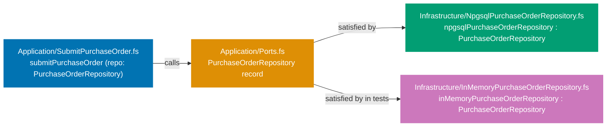
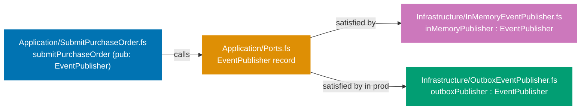
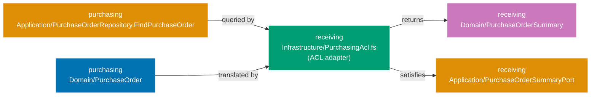

## Guide 7 — Repository Port as F# Function Type Alias + Npgsql Adapter Behind It

### Why It Matters

A repository port is the seam that separates your application layer from the database. Every time you wire an Npgsql call directly inside an application service, you lose two things: the ability to swap the database for tests, and the ability to reason about the service's behavior without a running PostgreSQL instance. In `procurement-platform-be` the repository port is a record-of-functions declared in the `Application/` layer of each context. The Npgsql adapter satisfies that record in `Infrastructure/`. Nothing in the application layer knows whether PostgreSQL or an in-memory dictionary is behind the port.

### Standard Library First

F# lets you alias any function type with a single `type` declaration. The standard library gives you the full type system but no I/O primitive for PostgreSQL — you would fall back to `System.Data.Common.DbConnection` and raw SQL strings:

```fsharp
// Standard library: repository port as a bare function alias over System.Data
module ProcurementPlatform.Contexts.Purchasing.Application.Ports

open System.Data
// => System.Data is the BCL's database abstraction — provider-agnostic interfaces
// => No NuGet dependency: ships with every .NET runtime
open ProcurementPlatform.Contexts.Purchasing.Domain
// => Domain types are the port's language — no database type crosses this boundary

// Read port — synchronous BCL style
type FindPurchaseOrder = PurchaseOrderId -> IDbConnection -> Result<PurchaseOrder option, exn>
// => IDbConnection: BCL abstract connection — Npgsql satisfies it at runtime
// => exn: stdlib catch-all error — loses semantic information about the failure cause
// => Synchronous return: BCL commands block the thread — no async support without workarounds

// Write port — synchronous BCL style
type SavePurchaseOrder = PurchaseOrder -> IDbConnection -> Result<unit, exn>
// => Result<unit, exn>: success or an opaque exception
// => The caller cannot distinguish constraint violation from connection failure without typeof checks
// => IDbConnection threading is manual — caller must open, pass, and close the connection
```

**Limitation for production**: `IDbConnection` threading is manual and error-prone. `exn` as the error type is untyped. Async is absent — synchronous DB calls block ASP.NET Core's thread pool under load.

### Production Framework

The Npgsql stack in `procurement-platform-be` replaces raw `IDbConnection` threading with a per-request connection factory. The port record stays in the application layer with no Npgsql import — the adapter in `Infrastructure/` owns the Npgsql dependency:



The application layer port record:

```fsharp
// Production port record — application layer, no Npgsql import
// src/ProcurementPlatform/Contexts/Purchasing/Application/Ports.fs
module ProcurementPlatform.Contexts.Purchasing.Application.Ports

open ProcurementPlatform.Contexts.Purchasing.Domain
// => Only domain types — no Npgsql, no EF Core, no Microsoft.EntityFrameworkCore
// => This is the isolation invariant: application layer has zero infrastructure imports

type RepositoryError =
    | NotFound of PurchaseOrderId
    // => Read-side: a missing PO is not a DB error — it is a domain outcome
    | UniqueConstraintViolation
    // => Write-side: Npgsql raises a 23505 PostgreSQL error code on duplicate primary key
    | ConnectionFailure of exn
    // => Infrastructure failure: carry the raw exception for logging; callers return HTTP 500

// Repository port as a record of functions — canonical shape used across all guides
type PurchaseOrderRepository =
    { FindPurchaseOrder: PurchaseOrderId -> Async<Result<PurchaseOrder option, RepositoryError>>
      // => Async: the Npgsql adapter performs network I/O — never block the thread pool
      // => option: a missing row is a valid domain outcome, not an error
      SavePurchaseOrder: PurchaseOrder -> Async<Result<unit, RepositoryError>>
      // => unit success: the caller does not re-read after a successful save
      // => Adapter wraps NpgsqlException into RepositoryError at the seam
    }
// => Record-of-functions: the application service receives one value, not two parameters
// => The Npgsql adapter and the in-memory test stub both satisfy this record shape
```

The Npgsql adapter in the infrastructure layer satisfies the port record. It opens a connection from the pool and translates database exceptions:

```fsharp
// Production Npgsql adapter — infrastructure layer only
// src/ProcurementPlatform/Contexts/Purchasing/Infrastructure/NpgsqlPurchaseOrderRepository.fs
module ProcurementPlatform.Contexts.Purchasing.Infrastructure.NpgsqlPurchaseOrderRepository

open Npgsql
// => Npgsql confined to infrastructure — the seam absorbs the framework dependency
open Dapper
// => Dapper: lightweight micro-ORM for mapping SQL result rows to F# records
open ProcurementPlatform.Contexts.Purchasing.Application.Ports
// => Import the port record — the adapter must satisfy PurchaseOrderRepository exactly
open ProcurementPlatform.Contexts.Purchasing.Domain
// => Domain types: PurchaseOrder, PurchaseOrderId — the adapter translates PurchaseOrderRow ↔ PurchaseOrder

// Npgsql adapter satisfying PurchaseOrderRepository
let npgsqlPurchaseOrderRepository (connStr: string) : PurchaseOrderRepository =
    // => connStr: injected by the composition root at startup from AppConfig
    // => Returns the record literal — each field is a function closed over connStr
    { SavePurchaseOrder =
        fun po ->
            // => fun po: the per-call argument — connStr is already bound
            async {
                use conn = new NpgsqlConnection(connStr)
                // => use: IDisposable — returns connection to the pool when the binding exits
                // => NpgsqlConnection pool is managed by Npgsql; no explicit pool initialization needed
                try
                    let! _ =
                        conn.ExecuteAsync(
                            "INSERT INTO purchasing.purchase_orders (po_id, supplier_id, total_amount, currency, status, created_at) VALUES (@PoId, @SupplierId, @TotalAmount, @Currency, @Status, @CreatedAt)",
                            { PoId       = let (PurchaseOrderId id) = po.Id in id
                              SupplierId = let (SupplierId id) = po.SupplierId in id
                              TotalAmount = po.TotalAmount.Amount
                              Currency    = po.TotalAmount.Currency
                              Status      = sprintf "%A" po.Status
                              CreatedAt   = po.CreatedAt })
                        |> Async.AwaitTask
                    // => ExecuteAsync: issues the INSERT via Npgsql — actual network I/O here
                    // => Async.AwaitTask: bridges .NET Task to F# Async without thread blocking
                    return Ok ()
                    // => Success: the row is committed; caller receives unit
                with
                | :? PostgresException as ex when ex.SqlState = "23505" ->
                    // => SqlState "23505" is PostgreSQL's unique_violation error code
                    // => Translate to typed RepositoryError — application layer never sees the raw exception
                    return Error UniqueConstraintViolation
                | ex ->
                    // => All other exceptions: connection timeout, other constraint failures
                    return Error (ConnectionFailure ex)
                    // => Carry the raw exception for logging — the caller logs and returns HTTP 500
            }
      FindPurchaseOrder =
        fun (PurchaseOrderId poId) ->
            // => Destructure the single-case DU — poId is the raw Guid
            async {
                use conn = new NpgsqlConnection(connStr)
                // => Fresh connection per call — pool manages the underlying socket
                try
                    let! row =
                        conn.QueryFirstOrDefaultAsync<PurchaseOrderRow>(
                            "SELECT * FROM purchasing.purchase_orders WHERE po_id = @PoId",
                            {| PoId = poId |})
                        |> Async.AwaitTask
                    // => QueryFirstOrDefaultAsync: returns null if no row found — mapped to None below
                    match box row with
                    // => box: wraps F# value in obj to enable null check — F# records are non-nullable
                    | null -> return Ok None
                    // => No row found: valid domain outcome — caller decides what to do
                    | _ ->
                        return Ok (Some (purchaseOrderRowToDomain row))
                        // => purchaseOrderRowToDomain: maps the DB row record to the PurchaseOrder domain aggregate
                with ex ->
                    return Error (ConnectionFailure ex)
                    // => Any database error becomes ConnectionFailure — the caller logs and returns 500
            }
    }
```

**Trade-offs**: Dapper maps result rows to F# records efficiently without a full ORM change-tracker overhead. For write-heavy aggregates, Dapper's explicit SQL gives you fine-grained control over the INSERT shape. For read-heavy workloads, the lack of a change-tracker means no accidental N+1 queries. Npgsql-specific error codes (`SqlState`) are stable within PostgreSQL major versions — test your error handling against the target server version.

---

## Guide 8 — In-Memory Repository Adapter for Integration Tests

### Why It Matters

An integration test that hits a real PostgreSQL database is slow, requires Docker to be running, and cannot be cached. A test that uses an in-memory adapter runs in milliseconds, requires no infrastructure, and is safe to run in parallel. The seam from Guide 7 — the `PurchaseOrderRepository` record — is exactly what makes this swap possible. Providing an in-memory adapter is not a testing trick; it is the proof that your port design is sound. If swapping the adapter requires changing the application service, the port has leaked infrastructure concerns upward.

### Standard Library First

F# mutable dictionaries and `ref` cells give you an in-memory store with no dependencies:

```fsharp
// Standard library: in-memory store using a mutable Dictionary
open System.Collections.Generic
// => System.Collections.Generic.Dictionary is the BCL's hash map
// => No NuGet dependency — ships with every .NET runtime

let private store = Dictionary<System.Guid, string>()
// => Global mutable state — not thread-safe without a lock
// => string serialization loses domain type safety
// => Dictionary<Guid, string> is not typed to PurchaseOrder — drift risk

let inMemorySave (po: obj) =
    // => obj parameter: no type safety — the compiler cannot prevent storing the wrong type
    store.[System.Guid.NewGuid()] <- po.ToString()
    // => ToString() serialization: round-trip fidelity not guaranteed
    Ok ()
```

**Limitation for production**: global mutable state fails under parallel test execution. Untyped storage introduces silent type mismatch bugs. The adapter does not satisfy the `PurchaseOrderRepository` record — a different shape means a different seam, not the same seam with a different implementation.

### Production Framework

The in-memory adapter satisfies the same `PurchaseOrderRepository` record as the Npgsql adapter. It uses an F# `Map` (immutable) wrapped in a `ref` cell for thread-safety in tests:

```fsharp
// In-memory adapter satisfying the port record
// src/ProcurementPlatform/Contexts/Purchasing/Infrastructure/InMemoryPurchaseOrderRepository.fs
module ProcurementPlatform.Contexts.Purchasing.Infrastructure.InMemoryPurchaseOrderRepository

open ProcurementPlatform.Contexts.Purchasing.Application.Ports
// => Import the port record — the adapter must satisfy PurchaseOrderRepository exactly
// => If the record shape changes, the compiler flags this module immediately
open ProcurementPlatform.Contexts.Purchasing.Domain
// => Domain types: PurchaseOrder, PurchaseOrderId

// Thread-safe in-memory store
let makeStore () =
    ref Map.empty<PurchaseOrderId, PurchaseOrder>
// => ref wraps an immutable F# Map in a mutable cell
// => Map.empty is the zero value — no pre-populated state between tests
// => Calling makeStore() in each test gives a fresh, isolated store
// => No global state: parallel test execution is safe

// In-memory adapter satisfying PurchaseOrderRepository
let inMemoryPurchaseOrderRepository (store: Map<PurchaseOrderId, PurchaseOrder> ref) : PurchaseOrderRepository =
    // => store is a ref cell — the adapter closes over it per test instance
    // => Returns the record literal — must match PurchaseOrderRepository exactly
    { SavePurchaseOrder =
        fun po ->
            async {
                match Map.tryFind po.Id !store with
                // => !store dereferences the ref cell — reads the current Map
                // => Map.tryFind: O(log n) lookup — checks for duplicate before insert
                | Some _ ->
                    return Error UniqueConstraintViolation
                    // => Mirror the Npgsql adapter's behavior exactly
                    // => Tests that rely on duplicate detection work identically
                | None ->
                    store := Map.add po.Id po !store
                    // => := updates the ref cell with a new immutable Map
                    // => Map.add is non-destructive — the old Map is not mutated
                    return Ok ()
                    // => Success: the PO is stored for subsequent FindPurchaseOrder calls
            }
      FindPurchaseOrder =
        fun poId ->
            // => Same store ref cell — reads whatever SavePurchaseOrder has written
            async {
                return Ok (Map.tryFind poId !store)
                // => Map.tryFind returns Some PurchaseOrder or None
                // => Wrapped in Ok: a missing PO is a valid outcome, not an error
                // => Identical semantics to the Npgsql adapter's FindPurchaseOrder
            }
    }
```

A test wires the in-memory adapter at the application service seam:

```fsharp
// Integration test using the in-memory adapter — no Docker, no PostgreSQL
// Tests/Purchasing/SubmitPurchaseOrderTests.fs
module ProcurementPlatform.Tests.Purchasing.SubmitPurchaseOrderTests

open Xunit
// => xUnit: test framework — discovers [<Fact>] methods and reports pass/fail
open ProcurementPlatform.Contexts.Purchasing.Infrastructure.InMemoryPurchaseOrderRepository
// => Brings makeStore and inMemoryPurchaseOrderRepository into scope
open ProcurementPlatform.Contexts.Purchasing.Application.SubmitPurchaseOrder
// => Import the application service function under test
open ProcurementPlatform.Contexts.Purchasing.Domain
// => Domain types needed for the smart constructor call

[<Fact>]
// => [<Fact>]: xUnit attribute — marks a parameterless test method for the test runner
let ``submitPurchaseOrder stores a valid PO`` () =
    // => xUnit Fact: parameterless test — runs once
    async {
        let store = makeStore ()
        // => Fresh in-memory store: isolated from all other tests
        let repo = inMemoryPurchaseOrderRepository store
        // => PurchaseOrderRepository record — wired directly, no DI container

        // Build a valid PO via domain smart constructors
        let money = createMoney 500m "USD" |> Result.defaultWith failwith
        // => Smart constructor: validates amount and currency — returns Money if valid
        // => defaultWith failwith: fails the test if the Money is invalid
        let po =
            { Id = PurchaseOrderId (System.Guid.NewGuid())
              SupplierId = SupplierId (System.Guid.NewGuid())
              TotalAmount = money
              Status = Draft
              CreatedAt = System.DateTimeOffset.UtcNow }
        // => Domain aggregate constructed from validated value objects

        let nullPub = { Publish = fun _ -> async { return Ok () } }
        // => Null event publisher: does not need a real broker for this test
        let clock = fun () -> System.DateTimeOffset.UtcNow
        // => Real clock — frozen clock is shown in advanced guides
        let! result = submitPurchaseOrder repo nullPub po
        // => submitPurchaseOrder: application service from Guide 4
        // => Called with the in-memory adapter — no Npgsql, no Docker required
        match result with
        // => Exhaustive match: the compiler enforces handling both Ok and Error branches
        | Ok saved ->
            Assert.Equal(po.Id, saved.Id)
            // => The saved aggregate's ID matches the input — no mutation occurred
            let! found = repo.FindPurchaseOrder po.Id
            // => Verify the adapter actually persisted the PO in the store
            Assert.Equal(Ok (Some saved), found)
            // => The stored PO is retrievable by its ID
        | Error e ->
            Assert.Fail(sprintf "Expected Ok, got Error: %A" e)
            // => Test fails with a descriptive message — never swallow errors silently
    } |> Async.RunSynchronously
// => RunSynchronously: xUnit test runner expects synchronous completion
```

**Trade-offs**: the in-memory adapter faithfully mirrors the Npgsql adapter's semantics only as far as you code it. If the Npgsql adapter introduces a new `RepositoryError` variant (e.g., `SerializationFailure`), the in-memory adapter must be updated too. Use the compiler: both adapters satisfy the same record type, so adding a new `RepositoryError` variant causes a compile error in both. That is the intended effect — the compiler enforces adapter parity.

---

## Guide 9 — Domain Event Publisher Port: Record-of-Functions Style

### Why It Matters

A domain event publisher port solves the same problem as a repository port, but for the outbound event stream. Every time the application service raises a domain event by calling a framework-specific message bus directly, the application layer acquires an infrastructure dependency. In `procurement-platform-be`, the publisher port is defined in each context's `Application/` layer as a record of functions. The application service receives the record as a parameter and never imports the messaging or outbox library. The record-of-functions style groups multiple publish operations into one value, avoiding parameter explosion when a context raises several event types.

### Standard Library First

F# `Event<_>` and `IEvent<_>` are the stdlib's in-process pub/sub primitives. They work within a single process but provide no persistence, no retry, and no cross-process delivery:

```fsharp
// Standard library: in-process event using F# Event<_>
module ProcurementPlatform.Contexts.Purchasing.Domain.Events

// Domain event type — a plain discriminated union
type PurchasingEvent =
    | PurchaseOrderSubmitted of poId: System.Guid * supplierId: System.Guid
    // => Carries only primitive types — safe to serialize, safe to log
    // => No domain aggregate reference — events are immutable facts, not live objects
    | PurchaseOrderIssued of poId: System.Guid
    // => Issued events carry the ID — downstream contexts (receiving, supplier-notifier) consume this

// In-process publisher using F# Event
let private publisher = Event<PurchasingEvent>()
// => F# Event<_>: in-process publish/subscribe — no persistence, no delivery guarantee
// => Single-process only: a second process cannot subscribe to this event

let publish (event: PurchasingEvent) =
    publisher.Trigger(event)
    // => Trigger: fire-and-forget — all subscribers called synchronously
    // => If a subscriber throws, the publisher's call stack unwinds
    // => No retry, no dead-letter queue, no outbox guarantee
```

**Limitation for production**: in-process events die with the process. If the application crashes after saving the aggregate but before publishing the event, the event is lost. The at-least-once delivery guarantee requires an outbox.

### Production Framework

The record-of-functions port groups all publisher operations into one injected value. The application service receives the record and calls whichever fields apply to the current operation:



```fsharp
// Domain event publisher port — record-of-functions style
// src/ProcurementPlatform/Contexts/Purchasing/Application/Ports.fs (extended)
module ProcurementPlatform.Contexts.Purchasing.Application.Ports

open ProcurementPlatform.Contexts.Purchasing.Domain
// => Only domain types — no messaging library imported here

// Domain event discriminated union — plain F# stdlib types
type DomainEvent =
    | PurchaseOrderSubmitted of PurchaseOrderSubmittedPayload
    // => Carries the structured payload — the outbox adapter serializes it
    | PurchaseOrderIssued of PurchaseOrderIssuedPayload
    // => Issued events carry PO ID and supplier ID — consumed by receiving and supplier-notifier contexts
    | PurchaseOrderCancelled of PurchaseOrderCancelledPayload
    // => Cancelled carries the reason — consumed by accounting and supplier-notifier

// Record-of-functions publisher port
type EventPublisher =
    { Publish: DomainEvent -> Async<Result<unit, string>> }
// => Single Publish field: dispatches any DomainEvent case
// => Async<Result>: the outbox adapter writes to DB — async I/O, typed error
// => The in-memory adapter makes this effectively synchronous for tests
// => Adding a new event type: add a DU case and handle it in both adapters
// => The compiler flags every Publish call that pattern-matches on DomainEvent

// Approval router port — routes approval request to the appropriate manager
type ApprovalRouterPort =
    { RouteApproval: PurchaseOrderId -> ApprovalLevel -> Async<Result<unit, string>> }
// => RouteApproval: given a PO ID and computed approval level, dispatch to workflow engine
// => ApprovalLevel (L1/L2/L3) determines which manager receives the request
// => Adapter: workflow engine in production; stub in tests
```

**Trade-offs**: the single-field record pattern is concise for contexts with one to three event types. For contexts with many event types where the Publish dispatcher grows large, consider separate record fields per event type — the compiler then enforces that all fields are supplied when constructing the record. For two to four event types, a single dispatching `Publish` function keeps the call sites readable and the application service free of event-specific ceremony.

---

## Guide 10 — In-Memory Event Publisher Adapter and Outbox Adapter

### Why It Matters

Two adapters satisfy the `EventPublisher` port from Guide 9: an in-memory adapter for tests (fast, zero infrastructure) and an outbox adapter for production (durable, survives process crashes). The outbox pattern writes the event to the same database transaction as the aggregate save — if the transaction commits, the event is guaranteed to be delivered eventually. Without an outbox, you face a dual-write hazard: the aggregate commits but the message bus call fails, and the event is silently lost. In `procurement-platform-be`, the outbox adapter uses Npgsql to write event rows into an `outbox_events` table inside the same transaction as the aggregate.

### Standard Library First

The stdlib `ResizeArray<_>` (mutable list) captures events in memory for test assertions:

```fsharp
// Standard library: capture events in a ResizeArray for test assertions
open System.Collections.Generic

let private captured = ResizeArray<obj>()
// => ResizeArray<obj>: mutable, untyped list — loses event type information
// => obj: the compiler cannot enforce that only DomainEvent values are stored
// => Not thread-safe: parallel test runs corrupt the shared list

let captureEvent (e: obj) =
    captured.Add(e)
    // => Append to the global list — no isolation between tests
    // => Test A's events are visible to test B if both run in the same process
```

**Limitation for production**: global mutable state breaks parallel test execution. Untyped storage makes assertion code fragile. The outbox pattern requires transactional writes — the stdlib has no transactional in-memory store.

### Production Framework

**In-memory adapter** (for tests):

```fsharp
// In-memory event publisher adapter — typed, per-test-instance isolation
// src/ProcurementPlatform/Contexts/Purchasing/Infrastructure/InMemoryEventPublisher.fs
module ProcurementPlatform.Contexts.Purchasing.Infrastructure.InMemoryEventPublisher

open ProcurementPlatform.Contexts.Purchasing.Application.Ports
// => Import port record: EventPublisher, DomainEvent

// Per-test-instance event capture store
let makeInMemoryPublisher () =
    // => Factory function: each test calls this to get an isolated publisher + captured list
    // => No global state — parallel tests each hold their own ref cell
    let captured = ref ([] : DomainEvent list)
    // => Immutable F# list wrapped in a ref cell — same thread-safe pattern as InMemoryRepository
    let publisher : EventPublisher =
        // => Record literal: must supply all fields — compiler enforces the EventPublisher shape
        { Publish =
            fun event ->
                async {
                    captured := event :: !captured
                    // => Prepend to the immutable list via ref update — O(1) append
                    // => Tests inspect !captured after the application service call
                    return Ok ()
                    // => Ok (): satisfies the Async<Result<unit, string>> contract
                }
        }
    (publisher, captured)
    // => Tuple return: caller destructures with let (pub, captured) = makeInMemoryPublisher ()
    // => Return both the publisher (to inject into the service) and the ref (for assertions)
    // => Tests pattern-match on !captured to verify the correct events were raised
```

**Outbox adapter** (for production):

```fsharp
// Outbox event publisher adapter — writes event rows in the same Npgsql transaction
// src/ProcurementPlatform/Contexts/Purchasing/Infrastructure/OutboxEventPublisher.fs
module ProcurementPlatform.Contexts.Purchasing.Infrastructure.OutboxEventPublisher

open System.Text.Json
// => System.Text.Json: serialize the event payload to a JSON string for the outbox row
open Npgsql
// => Npgsql: direct SQL INSERT for the outbox row — same connection as the aggregate save
open ProcurementPlatform.Contexts.Purchasing.Application.Ports
// => Port types: EventPublisher, DomainEvent

// Outbox row shape — persisted in purchasing.outbox_events
type OutboxRow =
    { id: System.Guid
      // => UUID primary key — generated at publish time, not by the DB
      event_type: string
      // => DomainEvent case name as a string — used by the relay worker to dispatch
      payload: string
      // => JSON serialization of the event payload — relay worker deserializes this
      created_at: System.DateTimeOffset
      // => UTC timestamp: relay worker uses this for ordering and age-based alerting
      processed_at: System.DateTimeOffset option }
      // => Nullable: null until the relay worker has delivered the event

// Outbox publisher satisfying EventPublisher
let makeOutboxPublisher (connStr: string) : EventPublisher =
    // => connStr: injected by the composition root — same schema as the purchasing.purchase_orders table
    { Publish =
        fun event ->
            async {
                use conn = new NpgsqlConnection(connStr)
                // => Separate connection for simplicity; in production, share the transaction
                // => for atomic aggregate + outbox commit, use NpgsqlTransaction across both INSERTs
                let row =
                    { id          = System.Guid.NewGuid()
                      // => New UUID per event — idempotency key for the relay worker
                      event_type  = event.GetType().Name
                      // => Type name: "PurchaseOrderSubmitted", "PurchaseOrderIssued", etc.
                      payload     = JsonSerializer.Serialize event
                      // => Serialize the full DomainEvent DU — relay worker deserializes with the same schema
                      created_at  = System.DateTimeOffset.UtcNow
                      // => UTC timestamp — always UTC in storage; convert to local time at display
                      processed_at = None }
                      // => None: outbox row starts unprocessed — relay worker sets this after delivery
                let! _ =
                    conn.ExecuteAsync(
                        "INSERT INTO purchasing.outbox_events (id, event_type, payload, created_at, processed_at) VALUES (@id, @event_type, @payload, @created_at, @processed_at)",
                        row)
                    |> Async.AwaitTask
                // => INSERT the outbox row — no I/O until this line
                return Ok ()
                // => Ok (): the publisher contract is fire-and-confirm, not fire-and-forget
            }
    }
```

**Trade-offs**: the outbox pattern guarantees at-least-once delivery — the relay worker may deliver an event more than once if it crashes between delivery and marking `processed_at`. Consumers must be idempotent. The relay worker itself (polling the `outbox_events` table and forwarding to consumers) is covered in Guide 19. For contexts that emit events at low volume (< 100/s), a simple polling relay suffices. High-throughput contexts benefit from a CDC-based relay (e.g., Debezium) that reads the PostgreSQL WAL instead of polling.

---

## Guide 11 — Giraffe Handler: Full DTO → Command → Aggregate → Response Pipeline

### Why It Matters

Guide 6 showed the Giraffe handler concept using a sketch of a domain-backed handler. This guide goes deeper: every step of the translation pipeline — binding the request DTO, calling the smart constructor, dispatching to the application service, pattern-matching on the domain result, and emitting the response DTO — has an exact location in the hexagonal layout, and each location has a rule about what it may and may not import. Getting these rules wrong is the most common way a Giraffe codebase silently collapses the hexagonal boundary.

### Standard Library First

ASP.NET Core's minimal API (`MapPost`) handles the binding and response in a flat function without Giraffe's combinator chain:

```fsharp
// Standard library: ASP.NET Core Minimal API — no Giraffe
open Microsoft.AspNetCore.Builder
// => WebApplication.Create() and MapPost extension method
open Microsoft.AspNetCore.Http
// => HttpContext, ReadFromJsonAsync, WriteAsJsonAsync extensions

let app = WebApplication.Create()
// => Minimal API host — simpler than the builder pattern in Program.fs

app.MapPost("/api/v1/purchase-orders", fun (ctx: HttpContext) ->
    task {
        let! dto = ctx.Request.ReadFromJsonAsync<{| supplierId: string; totalAmount: decimal; currency: string |}>()
        // => Deserialize with BCL's HttpContext extension — no BindJsonAsync helper
        // => Anonymous record DTO: no generated contract types, no CLIMutable attribute
        if dto.totalAmount <= 0m then
            ctx.Response.StatusCode <- 400
            // => Magic number 400: no typed RequestErrors combinator — repeated at every endpoint
            do! ctx.Response.WriteAsJsonAsync({| error = "totalAmount must be positive" |})
            // => Manual validation: every endpoint duplicates this pattern
        else
            ctx.Response.StatusCode <- 201
            // => Magic number 201: Minimal API has no Successful.CREATED equivalent
            do! ctx.Response.WriteAsJsonAsync({| id = System.Guid.NewGuid(); currency = dto.currency |})
            // => Business logic (ID generation) leaks into the handler — no application service boundary
    }) |> ignore
```

**Limitation for production**: validation logic duplicated across every `MapPost` lambda. Business logic in the handler. No typed error discrimination — status codes are magic numbers. The flat closure cannot compose with Giraffe middleware.

### Production Framework

The full Giraffe handler pipeline enforces a strict translation discipline:

```fsharp
// Full Giraffe handler pipeline — DTO → smart constructors → service → response DTO
// src/ProcurementPlatform/Contexts/Purchasing/Presentation/PurchasingHandlers.fs
module ProcurementPlatform.Contexts.Purchasing.Presentation.PurchasingHandlers

open Giraffe
// => Giraffe: HttpHandler, BindJsonAsync, RequestErrors, Successful, ServerErrors
open ProcurementPlatform.Contexts.Purchasing.Domain
// => Domain: PurchaseOrder types, smart constructors, value objects
open ProcurementPlatform.Contexts.Purchasing.Application.Ports
// => Ports: PurchaseOrderRepository, EventPublisher, RepositoryError
open ProcurementPlatform.Contexts.Purchasing.Application.SubmitPurchaseOrder
// => Application service: submitPurchaseOrder, SubmitPurchaseOrderError
// => Four imports only: no Npgsql, no System.Text.Json — handler is a pure adapter

// Request DTO — deserialized from JSON
[<CLIMutable>]
type SubmitPurchaseOrderRequest =
    { SupplierId: System.Guid
      TotalAmount: decimal
      // => CLIMutable: reflection-based setters required by Giraffe's BindJsonAsync
      Currency: string
      Notes: string option }

// Response DTO — serialized to JSON
type SubmitPurchaseOrderResponse =
    { PurchaseOrderId: System.Guid
      Status: string
      ApprovalLevel: string }
// => Response DTO: only the fields the client needs — not the full domain aggregate

// DTO → response DTO mapping (lives in Presentation layer, not Domain or Application)
let private toResponse (po: PurchaseOrder) : SubmitPurchaseOrderResponse =
    { PurchaseOrderId = (let (PurchaseOrderId id) = po.Id in id)
      // => Unwrap the strongly-typed PurchaseOrderId to a Guid for the response
      Status = sprintf "%A" po.Status
      ApprovalLevel = sprintf "%A" po.ApprovalLevel }
// => toResponse knows both the domain type and the response DTO shape
// => Domain and Application layers never import response DTO types

// Handler factory: returns an HttpHandler with the ports partially applied
let handleSubmit
    (repo: PurchaseOrderRepository)
    (pub: EventPublisher)
    (clock: Clock)
    : HttpHandler =
    fun next ctx ->
        task {
            let! dto = ctx.BindJsonAsync<SubmitPurchaseOrderRequest>()
            // => Giraffe BindJsonAsync: deserializes the request body into the CLIMutable DTO

            // Step 1: DTO → domain value objects via smart constructors
            match createMoney dto.TotalAmount dto.Currency with
            | Error msg ->
                return! RequestErrors.BAD_REQUEST msg next ctx
                // => HTTP 400: domain validation failed — translate at the adapter boundary
            | Ok money ->
                let po =
                    { Id = PurchaseOrderId (System.Guid.NewGuid())
                      SupplierId = SupplierId dto.SupplierId
                      TotalAmount = money
                      Status = Draft
                      ApprovalLevel = computeApprovalLevel money
                      // => computeApprovalLevel: pure domain function — no I/O, no DB call
                      CreatedAt = clock () }
                // => Domain aggregate assembled from validated value objects

                // Step 2: aggregate → application service → domain result
                match! submitPurchaseOrder repo pub po with
                | Error (DuplicatePurchaseOrder id) ->
                    return! RequestErrors.CONFLICT (sprintf "PurchaseOrder %A already exists" id) next ctx
                    // => HTTP 409: typed pattern match
                | Error (InvalidPurchaseOrder msg) ->
                    return! RequestErrors.BAD_REQUEST msg next ctx
                | Error (RepositoryFailure ex) ->
                    eprintfn "Repository failure: %A" ex
                    return! ServerErrors.INTERNAL_ERROR "Repository unavailable" next ctx
                | Ok saved ->
                    // => Step 3: domain aggregate → response DTO → HTTP 201
                    return! Successful.CREATED (toResponse saved) next ctx
        }
```

**Trade-offs**: the four-step pipeline (bind → construct → service → respond) adds three translation functions compared to a flat Minimal API handler. For CRUD endpoints that map directly to database rows, the overhead feels disproportionate. The payoff appears when domain invariants are non-trivial: the smart constructor enforces them once, and every downstream component receives only valid aggregates.

---

## Guide 12 — Handler Consuming Generated Contract Types

### Why It Matters

The Giraffe handler in Guide 11 references hand-authored `SubmitPurchaseOrderRequest` and `SubmitPurchaseOrderResponse` types. In a production team, those DTO types should be generated from an OpenAPI spec rather than hand-authored — hand-authored DTOs drift from the spec, and drift causes integration failures that the compiler cannot catch. `procurement-platform-be` uses a codegen pipeline: an OpenAPI 3.1 spec at `specs/apps/procurement-platform/` drives `nx run procurement-platform-be:codegen`, which generates F# DTO types. This guide shows how to wire generated contract types into a Giraffe handler so the handler stays in sync with the spec at compile time.

### Standard Library First

Without codegen, the team writes CLIMutable DTOs by hand and keeps them in sync with the spec manually:

```fsharp
// Standard library: hand-authored CLIMutable DTO matching the OpenAPI spec manually
module ProcurementPlatform.Contracts

// Hand-authored request DTO
[<CLIMutable>]
// => CLIMutable: enables reflection-based setters required by Giraffe's BindJsonAsync
type SubmitPurchaseOrderRequest =
    { SupplierId: System.Guid
      // => Property name must match the JSON field name exactly — no codegen contract
      TotalAmount: decimal
      // => Hand-authored: adding a new field here does not update the spec automatically
      // => A field present in the spec but absent here produces a silent deserialization gap
      Currency: string
      Notes: string option }
      // => All fields maintained by hand — drift is invisible until runtime
```

**Limitation for production**: manual synchronization between spec and DTOs is error-prone at scale. A field rename in the spec produces no compile error — only a runtime JSON deserialization failure.

### Production Framework

The `.fsproj` conditionally includes generated contract types produced by the Nx `codegen` target:

```xml
<!-- ProcurementPlatform.fsproj: conditional include of generated contract types -->
<Compile Include="..\..\generated-contracts\OpenAPI\src\ProcurementPlatform.Contracts\SubmitPurchaseOrderRequest.fs"
         Condition="Exists('..\..\generated-contracts\OpenAPI\src\ProcurementPlatform.Contracts\SubmitPurchaseOrderRequest.fs')" />
<!-- => Condition="Exists(...)": the file is gitignored; the build compiles without it if codegen has not run -->
<!-- => Generated from the OpenAPI spec via "nx run procurement-platform-be:codegen" -->
<!-- => Adding a new DTO: add a schema to the OpenAPI spec, re-run codegen, the new .fs file appears -->
<!-- => CLIMutable and property names are generated — no hand-authoring, no drift -->
<Compile Include="..\..\generated-contracts\OpenAPI\src\ProcurementPlatform.Contracts\SubmitPurchaseOrderResponse.fs"
         Condition="Exists('..\..\generated-contracts\OpenAPI\src\ProcurementPlatform.Contracts\SubmitPurchaseOrderResponse.fs')" />
<!-- => Same conditional pattern — both request and response types generated atomically -->
```

A handler consuming a generated type looks identical to Guide 11 — the import changes, not the handler logic:

```fsharp
// Handler consuming a generated contract type
module ProcurementPlatform.Contexts.Purchasing.Presentation.PurchasingHandlers

open Giraffe
// => Giraffe: HttpHandler, json combinator
open ProcurementPlatform.Contracts
// => Generated types: SubmitPurchaseOrderRequest, SubmitPurchaseOrderResponse — produced by codegen

let handleHealth : HttpHandler =
    // => Handler is a value, not a function — no dependencies to inject
    fun next ctx ->
        let response : HealthResponse = { Status = "healthy" }
        // => HealthResponse: generated from the OpenAPI schema — field names are spec-authoritative
        // => Changing the spec field name re-generates the type; this line then fails to compile
        // => The compile error is the intended mechanism — it surfaces spec drift at build time
        json response next ctx
        // => json: Giraffe combinator serializes the generated type and sets Content-Type: application/json
```

**Trade-offs**: codegen introduces a build-time step (`nx run procurement-platform-be:codegen`) that must run before `dotnet build`. Teams must run codegen as part of their onboarding script. The payoff: adding a new response field to the OpenAPI spec and running codegen produces a compile error at every handler that constructs the response type without the new field — zero drift, enforced by the compiler.

---

## Guide 13 — Cross-Context Integration via Anti-Corruption Layer

### Why It Matters

The `receiving` context needs summary information about a purchase order when creating a `GoodsReceiptNote`. A direct import of `purchasing`'s domain types into `receiving`'s domain layer creates coupling: a rename in `purchasing` breaks `receiving` silently. The Anti-Corruption Layer (ACL) pattern places an adapter in `receiving`'s infrastructure layer that translates `purchasing`'s types into `receiving`'s own domain types. `receiving`'s domain layer never imports anything from `purchasing`. In `procurement-platform-be`, the `PurchaseOrderIssued` domain event is the primary integration channel, but a query path via ACL also exists for cases where `receiving` needs to fetch PO metadata on demand.

### Standard Library First

Without an ACL, `receiving` opens `purchasing` domain types directly:

```fsharp
// No ACL: receiving domain opens purchasing domain directly
module ProcurementPlatform.Contexts.Receiving.Domain

open ProcurementPlatform.Contexts.Purchasing.Domain
// => Direct cross-context import — coupling the two domain layers
// => A rename of PurchaseOrder.TotalAmount to PurchaseOrder.Amount in purchasing breaks this module
// => The two contexts cannot evolve their domain models independently

let createGoodsReceiptNote (po: PurchaseOrder) (receivedQty: int) =
    // => Takes purchasing's PurchaseOrder type directly — no translation boundary
    ()
```

**Limitation for production**: direct domain coupling means that refactoring one context requires simultaneous changes to all consuming contexts. In a large team, this creates merge-conflict pressure and prevents independent deployment.

### Production Framework

The ACL adapter lives in `receiving`'s infrastructure layer. It imports the `purchasing` application-layer query port and translates into `receiving`'s own domain types:



```fsharp
// receiving domain: its own type for PO information — no cross-context import
// src/ProcurementPlatform/Contexts/Receiving/Domain/ReceivingTypes.fs
module ProcurementPlatform.Contexts.Receiving.Domain

// receiving's view of a purchase order — independent of purchasing's domain types
type PurchaseOrderSummary =
    { PurchaseOrderId: System.Guid
      // => Plain Guid — receiving does not need the PurchaseOrderId DU from purchasing
      SupplierId: System.Guid
      // => Supplier identifier — receiving needs this to route GRN to the correct supplier
      ExpectedTotalAmount: decimal }
      // => Expected total — receiving compares against goods actually received
// => PurchaseOrderSummary: the receiving context's own type for PO metadata
// => Adding a field to PurchaseOrder in purchasing does not affect this type
```

```fsharp
// receiving application layer: port for fetching PO summaries
// src/ProcurementPlatform/Contexts/Receiving/Application/Ports.fs
module ProcurementPlatform.Contexts.Receiving.Application.Ports

open ProcurementPlatform.Contexts.Receiving.Domain
// => Only receiving domain types — no purchasing import in application layer

type PurchaseOrderSummaryPort = System.Guid -> Async<Result<PurchaseOrderSummary option, string>>
// => receiving asks for a single PO summary by its Guid (opaque, not strongly typed)
// => The ACL adapter satisfies this port — receiving never knows where the data comes from

// GoodsReceiptRepository port — save and load GRNs
type GoodsReceiptRepository =
    { SaveGoodsReceipt: GoodsReceiptNote -> Async<Result<unit, string>>
      // => Persist a GRN — called after goods are verified at the receiving dock
      FindGoodsReceipt: GoodsReceiptNoteId -> Async<Result<GoodsReceiptNote option, string>> }
      // => Load by identity — used for three-way match lookup in invoicing context
```

```fsharp
// ACL adapter in receiving infrastructure: translates purchasing types
// src/ProcurementPlatform/Contexts/Receiving/Infrastructure/PurchasingAcl.fs
module ProcurementPlatform.Contexts.Receiving.Infrastructure.PurchasingAcl

open ProcurementPlatform.Contexts.Purchasing.Application.Ports
// => ACL imports the purchasing APPLICATION port (not the domain) — query model only
open ProcurementPlatform.Contexts.Receiving.Domain
// => receiving domain types for the translation output
open ProcurementPlatform.Contexts.Receiving.Application.Ports
// => Port type alias the ACL must satisfy

// ACL adapter factory
let makePurchasingAcl (findPO: PurchaseOrderRepository) : PurchaseOrderSummaryPort =
    // => findPO: the purchasing PurchaseOrderRepository — injected by the composition root
    fun poId ->
        // => Guid input: the receiving context passes a raw Guid; the ACL wraps it in PurchaseOrderId
        async {
            let! result = findPO.FindPurchaseOrder (PurchaseOrderId poId)
            // => Wrap the raw Guid in purchasing's PurchaseOrderId DU — the ACL owns this translation
            match result with
            | Ok (Some po) ->
                return Ok (Some
                    { PurchaseOrderId = poId
                      // => Pass the Guid through — receiving's PurchaseOrderSummary uses plain Guid
                      SupplierId = let (SupplierId sid) = po.SupplierId in sid
                      // => Unwrap SupplierId value object — receiving only needs the Guid
                      ExpectedTotalAmount = po.TotalAmount.Amount })
                // => Map purchasing's Money value object to a decimal — receiving's needs are simpler
            | Ok None ->
                return Ok None
                // => No PO found: return Ok None — not an error
            | Error e ->
                return Error (sprintf "ACL translation failure: %A" e)
                // => Translate the RepositoryError into receiving's error string
        }
```

**Trade-offs**: the ACL adapter adds a translation step and an additional port. For contexts that share a large read model, the translation code is verbose. Use a shared read model (a separate query module both contexts import from a `SharedKernel` library) when the translation is purely structural with no semantic difference. Reserve the full ACL for cases where the two contexts genuinely use different ubiquitous language — which is the case for `receiving` and `purchasing` in `procurement-platform-be`.

---

## Guide 14 — Composition Root `Program.fs`: Wiring All Ports

### Why It Matters

The composition root is the single place in the application where adapter implementations are bound to port records and injected into application services and handlers. In `procurement-platform-be`, `Composition/Program.fs` is the composition root. It wires Npgsql adapters, registers Giraffe, and sets up the routing table. As new bounded contexts add ports and adapters, every new wire goes into `Program.fs` — nowhere else. This guide shows what that growth looks like using the purchasing, supplier, and receiving contexts.

### Standard Library First

Without a DI container or explicit composition, each function creates its own dependencies — the poor man's composition:

```fsharp
// Standard library: inline dependency construction (poor man's DI)
// Each call site constructs its own adapter — no composition root

let handleRequest () =
    let connStr = System.Environment.GetEnvironmentVariable("DATABASE_URL")
    // => Connection string read at call time — not from a typed config record
    let repo = NpgsqlPurchaseOrderRepository.npgsqlPurchaseOrderRepository connStr
    // => Adapter constructed inline — connection pool not shared
    submitPurchaseOrder repo nullPub po
    // => New adapter per call — pool efficiency lost
```

**Limitation for production**: inline construction creates adapter instances per call, bypassing connection pool sharing. Adding a new adapter requires touching all call sites.

### Production Framework

`Composition/Program.fs` in `procurement-platform-be` demonstrates the correct pattern: adapters are constructed once at startup and injected via partial application:

```fsharp
// Program.fs: composition root wiring all context ports
// src/ProcurementPlatform/Composition/Program.fs
module ProcurementPlatform.Composition.Program

open System
// => System: Environment, DateTimeOffset — used by startup and config helpers
open Microsoft.AspNetCore.Builder
// => WebApplicationBuilder, WebApplication — ASP.NET Core hosting primitives
open Microsoft.Extensions.DependencyInjection
// => AddGiraffe, IServiceCollection — registers services with the DI container
open Giraffe
// => HttpHandler, choose, GET, POST, routef, RequestErrors — routing combinators

type Marker = class end
// => Empty type: used by WebApplicationFactory<Marker> in integration tests
// => Marker gives the test harness an assembly anchor without exposing Program internals

[<EntryPoint>]
let main _ =
    let builder = WebApplication.CreateBuilder()
    // => CreateBuilder: initializes the host with default config sources
    builder.Services.AddGiraffe() |> ignore
    // => AddGiraffe: registers Giraffe's middleware and JSON serializer

    let cfg = builder.Configuration
    let connStr = cfg.["DATABASE_URL"]
    // => DATABASE_URL: injected as env var in Kubernetes (Guide 23) or docker-compose
    let clock : Clock = fun () -> DateTimeOffset.UtcNow
    // => Clock port: returns current UTC time — frozen in tests (Guide 5 pattern)

    // Purchasing context — wires PurchaseOrderRepository and EventPublisher
    let poRepo =
        NpgsqlPurchaseOrderRepository.npgsqlPurchaseOrderRepository connStr
    // => Single PurchaseOrderRepository record shared per process — adapters are stateless
    let eventPub =
        OutboxEventPublisher.makeOutboxPublisher connStr
    // => OutboxEventPublisher: writes event rows to purchasing.outbox_events

    // Supplier context — wires SupplierRepository and ApprovalRouter
    let supplierRepo =
        Supplier.Infrastructure.NpgsqlSupplierRepository.make connStr
    // => SupplierRepository record for the supplier context
    let approvalRouter =
        Supplier.Infrastructure.WorkflowApprovalRouter.make cfg
    // => ApprovalRouterPort: routes PO approval requests to the workflow engine

    // Receiving context — wires GoodsReceiptRepository and PurchasingAcl
    let grnRepo =
        Receiving.Infrastructure.NpgsqlGoodsReceiptRepository.make connStr
    // => GoodsReceiptRepository for the receiving context
    let purchasingAcl =
        Receiving.Infrastructure.PurchasingAcl.makePurchasingAcl poRepo
    // => ACL adapter: wires purchasing's PurchaseOrderRepository into receiving's PurchaseOrderSummaryPort

    // Routing: bind all context handlers to URL paths
    let webApp =
        choose
            [ GET  >=> route "/api/v1/health"
                       >=> json {| status = "healthy" |}
              // => Health check: no port needed — simple inline response
              GET  >=> route "/api/v1/readiness"
                       >=> Purchasing.Presentation.ReadinessHandlers.handle poRepo
              // => Readiness: checks that the DB is reachable via poRepo
              POST >=> route "/api/v1/purchase-orders"
                       >=> Purchasing.Presentation.PurchasingHandlers.handleSubmit poRepo eventPub clock
              // => Submit PO: wires both repository and event publisher
              GET  >=> routef "/api/v1/purchase-orders/%O"
                       (Purchasing.Presentation.PurchasingHandlers.handleGet poRepo)
              // => Get PO by ID: routef extracts the Guid from the URL
              POST >=> routef "/api/v1/purchase-orders/%O/approve"
                       (Purchasing.Presentation.PurchasingHandlers.handleApprove poRepo eventPub approvalRouter clock)
              // => Approve PO: wires repo, publisher, and approval router
              POST >=> route "/api/v1/goods-receipts"
                       >=> Receiving.Presentation.ReceivingHandlers.handleCreateGrn grnRepo purchasingAcl eventPub
              // => Create GRN: cross-context — receiving reads from purchasing via ACL
              RequestErrors.NOT_FOUND "Not Found" ]
    // => All routes declared in one place — audit what runs in production here

    let app = builder.Build()
    // => Build: validates the DI container and creates the WebApplication
    app.UseGiraffe webApp
    // => UseGiraffe: registers the webApp HttpHandler with ASP.NET Core middleware
    app.Run()
    // => Run: starts the Kestrel HTTP server; blocks until shutdown signal
    0
    // => Exit code 0: convention for successful process completion
```

**Trade-offs**: the composition root grows linearly with the number of bounded contexts. For a codebase with ten or more contexts, the single `Program.fs` approach produces a large file. Mitigate by extracting per-context wiring into a `wire` function in each context's `Infrastructure/` module and calling it from `Program.fs`. The key invariant is that `Program.fs` remains the single place where adapter implementations are selected — never split the composition root across multiple files that each bind ports to implementations.
