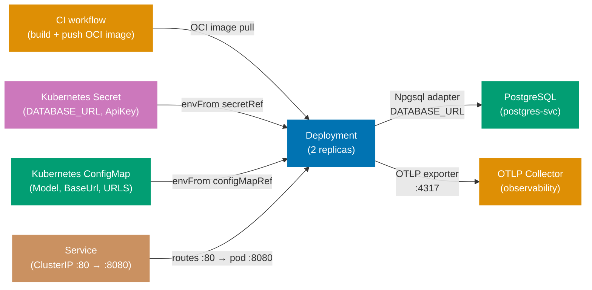

## Guide 23 — Kubernetes Deployment Topology for `ose-app-be`

### Why It Matters

A Kubernetes manifest is not a deployment detail you add after the code works — it
is the composition root for the entire hexagonal stack at runtime. The `Deployment`
object determines how many adapter instances run concurrently; the `ConfigMap`
determines which port an adapter connects to; the `Secret` holds the credentials
that make the Npgsql adapter authenticate to PostgreSQL. If these three resources
are misaligned, the adapter throws at startup rather than at test time — you find
out at 3 AM during a rollout. Writing the Kubernetes manifest before the first
production deploy makes the configuration contract explicit and reviewable.

### Standard Library First

`Environment.GetEnvironmentVariable` is the .NET BCL's mechanism for reading
runtime configuration. You can run `ose-app-be` on any machine by setting
environment variables manually:

```bash
# Standard library: running ose-app-be with environment variables only
# New file — intended layout at apps/ose-app-be/deploy/run-local.sh
export DATABASE_URL="Host=localhost;Port=5432;Database=ose_app_dev;Username=ose_app;Password=ose_app"
# => DATABASE_URL: the connection string read by Program.fs via Environment.GetEnvironmentVariable
# => Hardcoding credentials in a shell script works locally but cannot be committed to version control

export OpenRouter__ApiKey="sk-or-..."
# => Double-underscore: .NET IConfiguration maps this to OpenRouter.ApiKey in appsettings.json hierarchy
# => Works on every OS that supports environment variables — OS-agnostic

export OpenRouter__Model="anthropic/claude-3-5-haiku"
export OpenRouter__BaseUrl="https://openrouter.ai/api/v1"
# => Three keys: matches the OpenRouterSettings record in Domain/AiOrchestration.fs
# => Source: apps/ose-app-be/src/OseAppBe/Domain/AiOrchestration.fs

dotnet run --project apps/ose-app-be/src/OseAppBe/OseAppBe.fsproj
# => Starts the Giraffe HTTP server on the default port (5000/5001)
# => No orchestration: one process, one database, no health checks, no pod restart
```

_Illustrative snippet — demonstrates the manual environment variable approach that
Kubernetes supersedes._

**Limitation for production**: manual environment variables must be set on every
machine, are not versioned, and offer no secret rotation. A single missing variable
causes the adapter to fail at connection time, not at startup. No liveness or
readiness probe means Kubernetes cannot detect a crashed process.

### Production Framework

A Kubernetes manifest for `ose-app-be` wires the Deployment, Service, ConfigMap,
and Secret into a self-documenting topology. The manifest lives under the
intended-layout path `apps/ose-app-be/deploy/k8s/`:

```yaml
# apps/ose-app-be/deploy/k8s/configmap.yaml
# New file — intended layout at apps/ose-app-be/deploy/k8s/configmap.yaml
apiVersion: v1
# => apiVersion: v1 is the stable core API group — ConfigMap is a v1 resource since Kubernetes 1.0
kind: ConfigMap
# => ConfigMap: holds non-secret key-value pairs injected into pods as environment variables
metadata:
  name: ose-app-be-config
  # => name: referenced by envFrom.configMapRef.name in the Deployment spec
  namespace: ose-platform
  # => namespace: isolates ose-app-be resources from other platform services
  # => All three resources (ConfigMap, Secret, Deployment) share this namespace
data:
  OpenRouter__Model: "anthropic/claude-3-5-haiku"
  # => Double-underscore key: IConfiguration maps this to OpenRouterSettings.Model at startup
  # => Non-secret configuration lives in ConfigMap — safe to commit
  OpenRouter__BaseUrl: "https://openrouter.ai/api/v1"
  # => BaseUrl: the upstream AI API endpoint — not a secret, but environment-specific
  ASPNETCORE_URLS: "http://+:8080"
  # => Tells ASP.NET Core to listen on port 8080 inside the pod
  # => The Service routes external traffic to this port via targetPort: 8080
```

_New file — intended layout at `apps/ose-app-be/deploy/k8s/configmap.yaml`._

```yaml
# apps/ose-app-be/deploy/k8s/secret.yaml
# New file — intended layout at apps/ose-app-be/deploy/k8s/secret.yaml
# IMPORTANT: Never commit real secret values. Use Sealed Secrets or External Secrets Operator.
apiVersion: v1
# => apiVersion: v1 — Secret is a core resource; same API group as ConfigMap
kind: Secret
# => Secret: Kubernetes stores the values base64-encoded and restricts access via RBAC
metadata:
  name: ose-app-be-secrets
  # => name: referenced by envFrom.secretRef.name in the Deployment — must match exactly
  namespace: ose-platform
  # => namespace: same namespace as the Deployment — cross-namespace Secret references are not allowed
type: Opaque
# => Opaque: generic secret type — no schema validation, all values treated as arbitrary bytes
stringData:
  # => stringData: plain-text input; Kubernetes base64-encodes and stores under .data
  DATABASE_URL: "Host=postgres-svc;Port=5432;Database=ose_app;Username=ose_app;Password=REPLACE_ME"
  # => stringData: Kubernetes base64-encodes the value automatically
  # => In production, populate via Sealed Secrets: kubeseal --raw --from-file=...
  # => REPLACE_ME is a placeholder — a linter catches literal "REPLACE_ME" in CI
  OpenRouter__ApiKey: "REPLACE_ME"
  # => The API key read by IConfiguration via Program.fs OpenRouter section
  # => Source: apps/ose-app-be/src/OseAppBe/Program.fs line 25–27
```

_New file — intended layout at `apps/ose-app-be/deploy/k8s/secret.yaml`._

```yaml
# apps/ose-app-be/deploy/k8s/deployment.yaml
# New file — intended layout at apps/ose-app-be/deploy/k8s/deployment.yaml
apiVersion: apps/v1
# => apps/v1: the stable Deployment API group — required for Deployments since Kubernetes 1.9
kind: Deployment
# => Deployment: manages a ReplicaSet and rolls out pods; the pod template defines the container spec
metadata:
# => metadata: identifies the object — name and namespace are the primary lookup keys
  name: ose-app-be
  # => name: DNS-safe identifier; Service selector must match this name for in-cluster routing
  namespace: ose-platform
  # => namespace: isolates resources — all ose-app-be objects live in the ose-platform namespace
spec:
# => spec: declares the desired state — replicas, selector, and the pod template
  replicas: 2
  # => 2 replicas: zero-downtime rollout — one pod serves traffic while the other restarts
  # => Blue-green is possible via a separate Deployment object selected by the Service
  selector:
  # => selector: the Deployment watches pods that match matchLabels — orphaned pods are not managed
    matchLabels:
      app: ose-app-be
      # => matchLabels: the Deployment owns pods carrying this label — must match template.metadata.labels
  template:
  # => template: the pod spec stamped out for each replica — changes here trigger a rolling update
    metadata:
    # => metadata.labels on the pod: must match selector.matchLabels — Kubernetes enforces this at apply time
      labels:
        # => labels: key-value pairs attached to the pod — selector.matchLabels must be a subset of these
        app: ose-app-be
        # => labels: pod identity — the Service and the Deployment selector both target this label
      annotations:
      # => annotations: non-selecting metadata — Prometheus reads these to discover scrape targets
        prometheus.io/scrape: "true"
        # => Prometheus scrape annotation: the Prometheus operator discovers this pod automatically
        prometheus.io/port: "8080"
        # => prometheus.io/port: tells Prometheus which port to scrape — matches containerPort 8080
        prometheus.io/path: "/metrics"
        # => /metrics endpoint: Microsoft.Extensions.Diagnostics exposes Prometheus-format metrics here
    spec:
    # => spec: the container runtime requirements — containers, probes, and resource limits
      containers:
        # => containers: list of containers in the pod — ose-app-be runs as a single-container pod
        - name: ose-app-be
          # => name: identifies the container within the pod — used in kubectl logs and exec commands
          image: ghcr.io/wahidyankf/ose-app-be:latest
          # => OCI image: built by the CI workflow and pushed to GitHub Container Registry
          # => In production, pin to an immutable SHA digest: image: ghcr.io/...@sha256:<digest>
          ports:
          # => ports: metadata only — traffic flows through the Service ClusterIP, not directly to this port
            - containerPort: 8080
              # => containerPort: documentation only — does not expose the port; the Service does that
          envFrom:
          # => envFrom: injects all keys from a ConfigMap or Secret as environment variables
            - configMapRef:
                name: ose-app-be-config
                # => Injects all ConfigMap keys as environment variables
                # => IConfiguration reads them via the DOTNET environment variable provider
            - secretRef:
                name: ose-app-be-secrets
                # => Injects all Secret keys as environment variables — Kubernetes decodes base64
          livenessProbe:
          # => livenessProbe: kubelet restarts the container if this probe fails — protects against deadlock
            httpGet:
            # => httpGet: issues a GET to the specified path and port; 2xx-3xx is success
              path: /api/v1/health
              port: 8080
              # => /api/v1/health: the Giraffe route served by Handlers/HealthHandler.fs
              # => Source: apps/ose-app-be/src/OseAppBe/Handlers/HealthHandler.fs
            initialDelaySeconds: 10
            # => DbUp migrations run at startup — allow time before the first liveness check
            periodSeconds: 15
            # => periodSeconds: kubelet checks liveness every 15 s; 3 consecutive failures restart the pod
          readinessProbe:
          # => readinessProbe: kubelet removes the pod from Service endpoints if this probe fails
            httpGet:
            # => httpGet: same mechanism as livenessProbe — 2xx response marks the pod ready
              path: /api/v1/health
              port: 8080
              # => Same health endpoint as liveness — a 200 response marks the pod ready to receive traffic
            initialDelaySeconds: 5
            # => initialDelaySeconds: 5 s is sufficient for readiness — migrations need more time for liveness
            periodSeconds: 10
            # => readinessProbe: pod receives traffic only after this probe succeeds
            # => Prevents requests reaching a pod whose DbUp migrations are still running
          resources:
          # => resources: requests and limits enforce scheduling fairness and memory safety
            requests:
            # => requests: the minimum resources guaranteed — scheduler places the pod on a node with capacity
              memory: "128Mi"
              cpu: "100m"
              # => Requests: the scheduler uses these to place pods on nodes
              # => 128Mi / 100m: conservative — increase for AI-heavy workloads
            limits:
            # => limits: the maximum resources allowed — exceeding memory causes OOM-kill; CPU is throttled
              memory: "512Mi"
              cpu: "500m"
              # => Limits: Kubernetes OOM-kills the pod if it exceeds 512Mi
              # => OOM-kill on an F# async workload causes in-flight requests to fail
```

_New file — intended layout at `apps/ose-app-be/deploy/k8s/deployment.yaml`._



**Trade-offs**: `envFrom` with `secretRef` exposes all Secret keys as environment
variables — any process inside the container can read them. For stricter secret
isolation, mount the Secret as a filesystem volume and read it with
`File.ReadAllText` in a custom `IConfiguration` provider. Kubernetes Secrets are
base64-encoded, not encrypted at rest by default; enable etcd encryption and use
Sealed Secrets or External Secrets Operator before moving to production.

---

## Guide 24 — OpenTelemetry Observability Wiring at the Deployment Seam

### Why It Matters

Guide 20 showed how to add OpenTelemetry spans to individual port calls. At the
deployment seam, the concern shifts: where does the collected telemetry go, and
how does `ose-app-be` register its trace sources so that the SDK exports them?
A misconfigured OTLP exporter means you pay the span creation overhead in every
request but see nothing in Jaeger or Honeycomb. Getting this right before the
first production deploy saves the painful debugging session where P95 latency
spikes but the trace dashboard shows only half the spans.

### Standard Library First

`System.Diagnostics.ActivitySource` creates spans, and you can write a minimal
listener that prints spans to stdout — verifying that spans are emitted before
adding the OpenTelemetry SDK:

```fsharp
// Standard library: ActivityListener writing spans to stdout
open System.Diagnostics
// => ActivitySource: BCL trace API — ships with .NET runtime, no NuGet required
// => ActivityListener: subscribes to ActivitySource events and receives completed spans

let private listener =
    // => new ActivityListener: constructed with named parameters — each is a callback or filter
    new ActivityListener(
        ShouldListenTo = (fun source ->
            // => ShouldListenTo: called for each ActivitySource registered in the process
            source.Name.StartsWith("OseAppBe")
            // => Filter: only listen to OseAppBe.* sources — reduces noise from BCL internals
        ),
        Sample = (fun _ -> ActivitySamplingResult.AllDataAndRecorded),
        // => Sample: controls whether the activity is recorded — AllDataAndRecorded captures all attributes
        // => AllDataAndRecorded: record all data — useful for debugging; use ParentBased in production
        ActivityStopped = (fun activity ->
            // => ActivityStopped: called when Dispose() is called on the activity — i.e., when the span ends
            printfn "[TRACE] %s duration=%dms status=%A"
                activity.DisplayName
                // => DisplayName: the span name passed to StartActivity — identifies the operation
                activity.Duration.Milliseconds
                // => Duration: computed by ActivityListener from Start to Stop timestamps
                activity.Status
            // => Print each completed span: name, duration, status
            // => stdout: visible in docker-compose logs and kubectl logs
        )
    )

ActivitySource.AddActivityListener(listener)
// => Register the listener: all ActivitySources emit to this listener after this call
// => AddActivityListener: static registration — all future StartActivity calls notify this listener
// => Call before any ActivitySource.StartActivity to capture all spans
```

_Illustrative snippet — demonstrates stdout span inspection before the OpenTelemetry
SDK is wired. Not from `apps/ose-app-be`._

**Limitation for production**: stdout span output is unstructured — you cannot
query duration percentiles, correlate trace IDs across services, or set up alerts.
Spans are lost when the pod restarts. No sampling policy means 100% of spans are
emitted regardless of traffic volume.

### Production Framework

`apps/ose-app-be` wires OpenTelemetry in `Program.fs` using the
`OpenTelemetry.Extensions.Hosting` NuGet package. The OTLP exporter sends spans
and metrics to a Collector sidecar or an external endpoint:

```fsharp
// Program.fs: OpenTelemetry SDK registration at startup
// New file — intended extension of apps/ose-app-be/src/OseAppBe/Program.fs
// Scaffolding exists at apps/ose-app-be/src/OseAppBe/Program.fs

open OpenTelemetry.Resources
// => Resource: describes the service (name, version, namespace) — attached to every span
open OpenTelemetry.Trace
// => TracerProviderBuilder: configures sources, samplers, and exporters
open OpenTelemetry.Metrics
// => MeterProviderBuilder: configures metric instruments and exporters

let configureObservability (builder: WebApplicationBuilder) =
    // => Called from main before builder.Build() — SDK must be registered before spans are emitted
    // => Takes WebApplicationBuilder so DI registration and configuration are available
    let otlpEndpoint =
        builder.Configuration.["OTEL_EXPORTER_OTLP_ENDPOINT"]
        // => Read from environment variable — ConfigMap injects this in Kubernetes
        // => Example: "http://otel-collector-svc:4317" — the OTLP gRPC endpoint
        |> Option.ofObj
        // => Option.ofObj: converts null (missing env var) to None — avoids NullReferenceException
        |> Option.defaultValue "http://localhost:4317"
        // => Local fallback: points at a locally-running collector for development
    builder.Services
        // => IServiceCollection: the DI container builder — AddOpenTelemetry registers an IHostedService
        .AddOpenTelemetry()
        // => AddOpenTelemetry: registers the SDK as an IHostedService that flushes on shutdown
        .ConfigureResource(fun r ->
            r.AddService(
                // => AddService: sets service.name, service.version, service.instance.id on every span
                serviceName = "ose-app-be",
                // => serviceName: the service.name resource attribute — visible in Jaeger / Honeycomb
                serviceVersion = "1.0.0",
                // => serviceVersion: tag spans with the deployed version — correlates with OCI image tag
                serviceInstanceId = System.Environment.MachineName
                // => MachineName: the pod hostname in Kubernetes — identifies which replica emitted the span
            )
            |> ignore)
        .WithTracing(fun t ->
            // => WithTracing: configures the TracerProvider — controls which sources and exporters are active
            t
                // => t: the TracerProviderBuilder — chain instrumentation libraries and exporters on it
                .AddAspNetCoreInstrumentation()
                // => Automatic spans for every HTTP request: method, route, status code, duration
                // => Produces parent spans that child spans (port calls) nest under
                .AddEntityFrameworkCoreInstrumentation()
                // => Automatic spans for every EF Core query: SQL text, table, duration
                // => Correlates Npgsql adapter latency with the parent HTTP request span
                .AddSource("OseAppBe.RegulatorySource")
                // => OseAppBe.RegulatorySource: the ActivitySource name from Guide 20's ObservabilityAdapter
                // => Only sources explicitly added here are exported — unlisted sources are silently dropped
                .AddSource("OseAppBe.Adapters")
                // => Generic adapter source: used by any adapter following the Guide 20 decorator pattern
                .AddOtlpExporter(fun o ->
                    o.Endpoint <- System.Uri(otlpEndpoint)
                    // => OTLP gRPC: sends spans to the collector in binary protobuf format
                    // => Lower overhead than OTLP/HTTP — use HTTP if the collector does not support gRPC
                )
            |> ignore)
        .WithMetrics(fun m ->
            // => WithMetrics: configures the MeterProvider — controls which instruments and exporters are active
            m
                // => m: the MeterProviderBuilder — chain metric instrumentation and exporters on it
                .AddAspNetCoreInstrumentation()
                // => HTTP request counters, latency histograms — used by Prometheus scrape (Guide 23 ConfigMap)
                .AddRuntimeInstrumentation()
                // => .NET runtime metrics: GC collections, thread pool queue depth, heap size
                // => Essential for diagnosing memory pressure on the 512Mi limit in the Deployment
                .AddPrometheusExporter()
                // => Exposes /metrics endpoint in Prometheus text format
                // => The Deployment annotation prometheus.io/path: /metrics tells Prometheus to scrape it
            |> ignore)
        |> ignore
        // => Outer ignore: IOpenTelemetryBuilder is not returned from the pipeline — builder is returned instead
    builder
    // => Return builder for chaining in main — builder.Build() is called after this
```

_New file — intended layout extension. Scaffolding exists at
`apps/ose-app-be/src/OseAppBe/Program.fs`._

The Kubernetes ConfigMap from Guide 23 adds the OTLP endpoint key so no code
change is needed per environment:

```yaml
# Extend apps/ose-app-be/deploy/k8s/configmap.yaml with the OTLP endpoint
# New file — intended layout at apps/ose-app-be/deploy/k8s/configmap.yaml
data:
  OTEL_EXPORTER_OTLP_ENDPOINT: "http://otel-collector-svc.observability:4317"
  # => otel-collector-svc.observability: service name in the "observability" namespace
  # => Cross-namespace DNS: <service>.<namespace>.svc.cluster.local — shortened form works in-cluster
  # => Changing the collector address requires no code change — only a ConfigMap update + pod restart
  OTEL_RESOURCE_ATTRIBUTES: "deployment.environment=production"
  # => Additional resource attribute: "production" vs "staging" filtering in the trace UI
```

_New file — intended layout at `apps/ose-app-be/deploy/k8s/configmap.yaml`._

**Trade-offs**: `AddEntityFrameworkCoreInstrumentation` includes the SQL query text
in the span attributes by default — useful for performance analysis but a
compliance risk if queries embed PII in WHERE clauses. Set
`SetDbStatementForText = false` for regulated environments. The Prometheus exporter
and OTLP exporter both run in the same process; high request rates (> 5000
req/s) add measurable CPU overhead. Use head-based sampling
(`AddTraceIdRatioBasedSampler(0.1)`) in the `.WithTracing` builder to sample 10%
of traces in high-traffic scenarios.

---

## Guide 25 — Failure-Mode Degraded Adapters

### Why It Matters

When the PostgreSQL pod is unhealthy during a rolling restart, or the OpenRouter
API returns 503 for thirty seconds, you have two choices: fail every request
immediately, or serve degraded responses from fallback adapters. The hexagonal
architecture makes the second choice tractable — because the application service
depends on port type aliases, not concrete adapters, you can swap in a degraded
adapter at the composition root without touching business logic. The degraded
adapter returns cached or empty results; the application service propagates the
degraded state to the Giraffe handler, which responds with a `503 Degraded`
status. The circuit-breaker from Guide 18 is the trigger; this guide shows the
fallback adapter wired to it.

### Standard Library First

F# option types and simple try/catch at the handler level provide a primitive
fallback:

```fsharp
// Standard library: try/catch fallback at the Giraffe handler level
open Giraffe
// => Giraffe: provides HttpHandler, json, text, RequestErrors, ServerErrors — the HTTP adapter library
open Microsoft.AspNetCore.Http
// => Giraffe HttpHandler: the primary adapter — receives the HTTP request
// => Fallback logic lives in the handler — not behind a port

let handle (save: SaveDocument) (find: FindDocument) : HttpHandler =
    // => HttpHandler: Giraffe's primary adapter type — receives next and ctx from the pipeline
    fun next ctx ->
        // => next: continuation passed by the Giraffe pipeline — handler calls it when done
        // => ctx: the ASP.NET Core HttpContext — provides request data and response writing
        task {
            // => task CE: bridges F# async computation to the C# Task<IResult> the pipeline expects
            try
                let! result = find (System.Guid.NewGuid()) |> Async.StartAsTask
                // => Attempt the real port call — any exception is caught below
                // => Async.StartAsTask: bridges F# async to the C# Task expected by the task CE
                match result with
                // => Pattern-match on Result: three arms covering success, not-found, and error
                | Ok (Some doc) -> return! json doc next ctx
                // => Successful read: serialize the document as JSON — Content-Type: application/json
                | Ok None -> return! RequestErrors.notFound (text "Not found") next ctx
                // => Not found: Ok None is a valid domain outcome — map to HTTP 404
                | Error _ ->
                    return! ServerErrors.serviceUnavailable (text "Storage unavailable") next ctx
                    // => Typed port error: handler translates RepositoryError to 503
            with ex ->
                // => Unhandled exception: catch-all safety net
                return! ServerErrors.internalError (text ex.Message) next ctx
                // => 500 with the exception message — leaks internal details to the caller
                // => In production, log ex here instead of exposing the message to callers
        }
```

_Illustrative snippet — demonstrates handler-level try/catch. Not from
`apps/ose-app-be`._

**Limitation for production**: the fallback logic is inside the handler — every
handler must duplicate it. When the database goes down, all handlers fail the same
way, but the logic must be audited and updated in every file. No caching: the
fallback returns errors, not stale data. No health-flag coordination across
handlers.

### Production Framework

The degraded-mode pattern introduces a `DegradedReadAdapter` that wraps a cached
snapshot and a `NullEventPublisher` that silently drops events when the broker is
unavailable. Both satisfy the same port type aliases; the composition root selects
which adapter to wire based on a shared `IsDegraded` flag updated by the
circuit-breaker:

```fsharp
// Degraded read adapter: returns a cached snapshot when the DB port fails
// New file — intended layout.
// Scaffolding exists at apps/ose-app-be/src/OseAppBe/contexts/regulatory-source/infrastructure/
module OseAppBe.Contexts.RegulatorySource.Infrastructure.DegradedReadAdapter

open OseAppBe.Contexts.RegulatorySource.Application.Ports
// => Ports: FindDocument type alias — the degraded adapter satisfies the same type as NpgsqlRepository
open OseAppBe.Contexts.RegulatorySource.Domain
// => Port type alias: FindDocument — same type the Npgsql adapter satisfies
// => The application service cannot distinguish the cached adapter from the real one

// Shared degraded-mode flag: true when the circuit-breaker has opened
// Updated by the Polly onBreak callback registered in Program.fs
let mutable isDegraded = false
// => mutable: written by the circuit-breaker callback, read by the composition root
// => Thread-safe for reads (bool is atomic on .NET); writes use Interlocked.Exchange in production

// Cache: holds the last successful snapshot of all regulatory documents
let private cache = System.Collections.Concurrent.ConcurrentDictionary<System.Guid, RegulatoryDocument>()
// => ConcurrentDictionary: thread-safe; written by the real adapter on success, read by the degraded adapter
// => No TTL: cache is valid until the circuit closes and real reads resume
// => Shared module-level state: survives across requests — the cache accumulates on every successful read

// Degraded FindDocument adapter: returns the cached snapshot
let cachedFindDocument : FindDocument =
    // => Type annotation: FindDocument is a type alias for Guid -> Async<Result<RegulatoryDocument option, RepositoryError>>
    fun id ->
        // => fun id: Guid parameter — looks up the specific document by its aggregate identity
        async {
            match cache.TryGetValue(id) with
            // => TryGetValue: non-throwing lookup — avoids KeyNotFoundException on a missing entry
            | true, doc ->
                // => Cache hit: return the last-known document without touching the database
                // => The caller receives a stale Ok — not an Error
                return Ok (Some doc)
            | false, _ ->
                // => Cache miss: no snapshot available — return Ok None, not an error
                // => The Giraffe handler translates Ok None to a 404 — not a 503
                return Ok None
        }
// => Satisfies FindDocument type alias exactly — composition root can swap in without changing the handler

// Cache-populating decorator for the real Npgsql adapter: update the cache on every successful read
let withCachePopulation (inner: FindDocument) : FindDocument =
    // => Decorator pattern: wraps inner (the real Npgsql adapter) and adds cache population as a side-effect
    fun id ->
        // => Same signature as FindDocument — the caller does not know it is talking to a decorator
        async {
            let! result = inner id
            // => Delegate to the real Npgsql adapter
            match result with
            // => Pattern-match on the Result: populate only on successful reads
            | Ok (Some doc) ->
                cache.[doc.Id] <- doc
                // => Populate the cache on success — degraded adapter can serve this entry later
            | _ -> ()
            // => Error or None: do not update the cache — stale entry is better than a wrong entry
            return result
            // => Return the original result unchanged — the decorator is transparent to the caller
        }
```

_New file — intended layout. Scaffolding exists at
`apps/ose-app-be/src/OseAppBe/contexts/regulatory-source/infrastructure/`._

```fsharp
// Null event publisher: silently drops events when the broker port is unavailable
// New file — intended layout.
// Scaffolding exists at apps/ose-app-be/src/OseAppBe/contexts/regulatory-source/infrastructure/
module OseAppBe.Contexts.RegulatorySource.Infrastructure.NullEventPublisher

open OseAppBe.Contexts.RegulatorySource.Application.EventPublisherPort
// => PublishDocumentIngested type alias: RegulatorySourceEvent -> Async<Result<unit, string>>
// => Null publisher satisfies this alias — the application service calls it the same way

let nullPublish : PublishDocumentIngested =
    // => Type annotation: PublishDocumentIngested — composition root injects this where the real outbox adapter would go
    fun _event ->
        // => _event: ignored — the event is discarded without network I/O
        // => Discard pattern: underscore prefix signals intentional ignorance — not a bug
        async {
            return Ok ()
            // => Ok (): the application service proceeds as if the event was published
            // => At-least-once guarantee is lost — acceptable if the outbox relay resumes on broker recovery
            // => Silent drop: no logging here — wire a logging decorator in production for observability
        }
// => When the circuit-breaker closes, the composition root swaps back to the real outbox adapter
// => Events during the degraded window are lost — the outbox persistence path avoids this trade-off
```

_New file — intended layout. Scaffolding exists at
`apps/ose-app-be/src/OseAppBe/contexts/regulatory-source/infrastructure/`._

```fsharp
// Program.fs: circuit-breaker callback updates the degraded flag and swaps adapters
// New file — intended extension of apps/ose-app-be/src/OseAppBe/Program.fs
// Scaffolding exists at apps/ose-app-be/src/OseAppBe/Program.fs

open OseAppBe.Contexts.RegulatorySource.Infrastructure.DegradedReadAdapter
// => DegradedReadAdapter: brings isDegraded flag and cachedFindDocument and withCachePopulation into scope

// Health-degraded background signal: IHostApplicationLifetime reports startup completion
// The composition root wires the real adapter or the degraded adapter based on isDegraded
let buildFindDocument (db: OseAppBe.Infrastructure.AppDbContext.AppDbContext) : FindDocument =
    // => Called by the handler registration in Program.fs — returns the correct adapter
    // => Returns FindDocument: either the cached or the real Npgsql adapter — caller cannot tell which
    if isDegraded then
        // => isDegraded = true: the circuit-breaker's onBreak callback set this flag
        cachedFindDocument
        // => Circuit open: serve from cache — no database I/O
    else
        OseAppBe.Contexts.RegulatorySource.Infrastructure.NpgsqlRepository.npgsqlFindDocument db
        |> withCachePopulation
        // => Circuit closed: serve from Npgsql and populate the cache as a side-effect
        // => withCachePopulation: decorator that updates the cache on every successful real read
```

_New file — intended layout extension. Scaffolding exists at
`apps/ose-app-be/src/OseAppBe/Program.fs`._

**Trade-offs**: the degraded read adapter serves stale data — clients receive a
response that may be minutes or hours old. For regulatory compliance workloads
(the primary use case for `ose-app-be`), serving a stale regulatory document is
better than returning 503 and blocking a business process. The null event
publisher silently drops events — if at-least-once delivery is a hard requirement,
replace it with an in-memory buffer that replays to the outbox when the broker
recovers, accepting the risk of buffer overflow under sustained outages.

---

## Guide 26 — Configuration Adapter at the Deploy Seam: Secrets to Typed `IOptions<T>`

### Why It Matters

`apps/ose-app-be` reads `OpenRouterSettings` from configuration at startup via
`builder.Services.Configure<OpenRouterSettings>(...)`. The journey of a secret
from a Kubernetes Secret object to a strongly-typed F# record crosses four
boundaries: Kubernetes injects the Secret key as an environment variable; the
ASP.NET Core configuration system reads the environment variable; the `IOptions<T>`
binding maps it to `OpenRouterSettings`; the composition root reads the record and
passes it to the adapter factory. A break at any boundary — a renamed key, a
missing namespace prefix, a wrong casing — silently produces an empty string
instead of the expected value. Making this chain explicit prevents the class of
bugs where the AI adapter always returns auth errors because `ApiKey` is empty.

### Standard Library First

`Environment.GetEnvironmentVariable` reads a single key directly — the manual
approach:

```fsharp
// Standard library: read OpenRouterSettings manually from environment variables
// New file — illustrative pattern replaced by IOptions<T>
open System
// => System: provides Environment.GetEnvironmentVariable — BCL, no NuGet required
open OseAppBe.Domain.AiOrchestration
// => OpenRouterSettings: the domain configuration record from AiOrchestration.fs
// => Source: apps/ose-app-be/src/OseAppBe/Domain/AiOrchestration.fs

let readOpenRouterSettings () : Result<OpenRouterSettings, string> =
    // => Returns Result: forces the caller to handle missing configuration explicitly
    let apiKey = Environment.GetEnvironmentVariable("OpenRouter__ApiKey")
    // => Double-underscore naming: matches IConfiguration's hierarchy separator convention
    // => If the Kubernetes Secret key is "OPENROUTER_API_KEY" instead, this returns null
    let model = Environment.GetEnvironmentVariable("OpenRouter__Model")
    // => Reads OpenRouter__Model: maps to the model identifier in the ConfigMap
    let baseUrl = Environment.GetEnvironmentVariable("OpenRouter__BaseUrl")
    // => Reads OpenRouter__BaseUrl: "https://openrouter.ai/api/v1" set in the ConfigMap
    match apiKey, model, baseUrl with
    // => Tuple match: all three variables checked simultaneously — short-circuit order matters
    | null, _, _ -> Error "OpenRouter__ApiKey is not set"
    // => Explicit null check: returns Error instead of silently using an empty key
    // => Wildcard _ in positions 2 and 3: other vars may also be null but ApiKey is checked first
    | _, null, _ -> Error "OpenRouter__Model is not set"
    // => Model missing: the adapter cannot function without a model identifier
    | _, _, null -> Error "OpenRouter__BaseUrl is not set"
    // => BaseUrl missing: the adapter has no endpoint to call
    | key, m, url ->
        Ok { ApiKey = key; Model = m; BaseUrl = url }
        // => Returns the typed record: no cast, no stringly-typed dictionary
        // => All three variables are non-null: the Result is Ok with a fully-populated record
```

_Illustrative snippet — demonstrates manual environment variable reading. Not from
`apps/ose-app-be`; the real wiring uses IOptions as shown below._

**Limitation for production**: `GetEnvironmentVariable` reads at call time — if
the environment variable changes after startup (hot-reload scenario), the function
returns the new value without going through validation. No binding validation
(empty-string keys pass the null check). Changes to the key names in the
Kubernetes ConfigMap/Secret must be manually mirrored in every
`GetEnvironmentVariable` call.

### Production Framework

`apps/ose-app-be` already uses `builder.Services.Configure<OpenRouterSettings>`
in `Program.fs`. This guide makes the full binding chain explicit and adds
validation via `ValidateDataAnnotations`:

```fsharp
// Program.fs: typed IOptions<T> binding with startup validation
// Source: apps/ose-app-be/src/OseAppBe/Program.fs (extends existing Configure call)
// Scaffolding exists at apps/ose-app-be/src/OseAppBe/Program.fs

open Microsoft.Extensions.DependencyInjection
// => IServiceCollection: DI registration surface — AddOptions, Configure, ValidateOnStart
open Microsoft.Extensions.Options
// => IOptions<T>: injected into adapter factories; reads the bound record at call time
open System.ComponentModel.DataAnnotations
// => [<Required>] attribute: triggers ValidateDataAnnotations to check non-null values at startup
open OseAppBe.Domain.AiOrchestration
// => OpenRouterSettings: the record from AiOrchestration.fs — same type bound by Configure
// => Source: apps/ose-app-be/src/OseAppBe/Domain/AiOrchestration.fs

// Extend OpenRouterSettings with validation attributes in a companion type
// (CLIMutable required for IOptions binding and data annotation scanning)
[<CLIMutable>]
// => CLIMutable: generates public setters required by IOptions<T> binding and data annotation scanning
type ValidatedOpenRouterSettings =
    { [<Required; MinLength(10)>]
      ApiKey: string
      // => [<Required>]: fails startup if the key is null or empty string
      // => [<MinLength(10)>]: a valid OpenRouter key is long — detects placeholder "REPLACE_ME"
      [<Required>]
      Model: string
      // => Required: the model identifier must be set — empty model causes 400 from OpenRouter
      [<Required; Url>]
      BaseUrl: string }
      // => [<Url>]: validates the BaseUrl is a well-formed absolute URI at startup
      // => Catches typos like "openrouter.ai/api/v1" (missing https://) before the first HTTP call

let configureOptions (builder: WebApplicationBuilder) =
    // => Takes WebApplicationBuilder — called before builder.Build() so DI registration is complete
    builder.Services
        // => IServiceCollection: DI registration surface — all options wiring happens here
        .AddOptions<ValidatedOpenRouterSettings>()
        // => AddOptions<T>: typed options registration — builds on Configure<T>
        .BindConfiguration("OpenRouter")
        // => BindConfiguration: reads the "OpenRouter" section from IConfiguration
        // => IConfiguration sources in priority order: environment variables > appsettings.json > defaults
        // => Environment variable "OpenRouter__ApiKey" maps to section "OpenRouter", key "ApiKey"
        .ValidateDataAnnotations()
        // => Runs [<Required>] and other data annotation checks during DI container build
        // => Without ValidateOnStart, validation runs only when IOptions<T> is first resolved
        .ValidateOnStart()
        // => ValidateOnStart: validates during WebApplication.Build() — fails fast before serving traffic
        // => A missing ApiKey terminates the process with a clear error, not a 401 on the first AI call
    |> ignore
    builder
```

_New file — intended layout extension. Scaffolding exists at
`apps/ose-app-be/src/OseAppBe/Program.fs`._

The adapter factory receives `IOptions<ValidatedOpenRouterSettings>` from the DI
container — the composition root reads the validated record at startup:

```fsharp
// Adapter factory: reads validated settings from IOptions<T>
// New file — intended layout extension.
// Scaffolding exists at apps/ose-app-be/src/OseAppBe/contexts/ai-orchestration/infrastructure/
module OseAppBe.Contexts.AiOrchestration.Infrastructure.OptionsAwareAdapterFactory

open Microsoft.Extensions.Options
// => IOptions<T>: DI-injected binding — the composition root resolves it from the DI container
open System.Net.Http
// => IOptions<T>: the DI-injected binding — value is read via .Value property
// => HttpClient: the resilient named client from Guide 18

let makeAdapter (options: IOptions<ValidatedOpenRouterSettings>) (factory: IHttpClientFactory) =
    // => Two parameters: options carries the validated settings; factory creates the resilient HttpClient
    let settings = options.Value
    // => .Value: reads the validated, bound settings record
    // => If ValidateOnStart passed, settings.ApiKey is guaranteed non-null and ≥ 10 characters
    // => Convert to OpenRouterSettings (the port-facing type) for the adapter factory
    let portSettings: OseAppBe.Domain.AiOrchestration.OpenRouterSettings =
        // => Type annotation: ensures the record literal matches OpenRouterSettings, not ValidatedOpenRouterSettings
        { ApiKey = settings.ApiKey
          // => Thread-safe: options.Value is immutable after startup — no lock required
          Model = settings.Model
          // => Model: copied from the validated settings — no transformation needed
          BaseUrl = settings.BaseUrl }
    OseAppBe.Contexts.AiOrchestration.Infrastructure.ResilientOpenRouterAdapter
        .makeResilientOpenRouterAdapter factory portSettings
    // => Returns AnalyzePolicy port alias — the composition root wires it to the application service
```

_New file — intended layout. Scaffolding exists at
`apps/ose-app-be/src/OseAppBe/contexts/ai-orchestration/infrastructure/`._

**Trade-offs**: `ValidateOnStart` fails the process at startup — the Kubernetes
Deployment rolls back the failed pod and keeps the previous replica running. This
is the desired behaviour (fast fail over silent misconfiguration), but it means a
misconfigured Secret causes a `CrashLoopBackOff` that requires a ConfigMap/Secret
fix and a pod restart to recover. Hot-reload of `IOptions` (via
`IOptionsMonitor<T>`) allows configuration changes without restart but bypasses
`ValidateOnStart` — validate manually inside the reload callback if hot-reload is
enabled.

---

## Guide 27 — Background Job Adapter

_Out of scope — no current background-job port in `apps/ose-app-be`._

A search for `IHostedService`, `IBackgroundJob`, `JobScheduler`, and
`BackgroundService` across `apps/ose-app-be/src` returns zero hits as of
2026-05-16. The `OutboxRelayWorker` in Guide 19 is the closest existing pattern
(an `IHostedService` relay), but it is an intended-layout file, not a committed
adapter.

When a background-job port is added to `ose-app-be` in a future plan, this guide
will cover: the `IHostedService` + `IBackgroundJobPort` pair, a
`HangfireJobAdapter` for persistence-backed scheduling, and the composition root
wiring including the `AddHangfire` and `AddHangfireServer` registrations.
