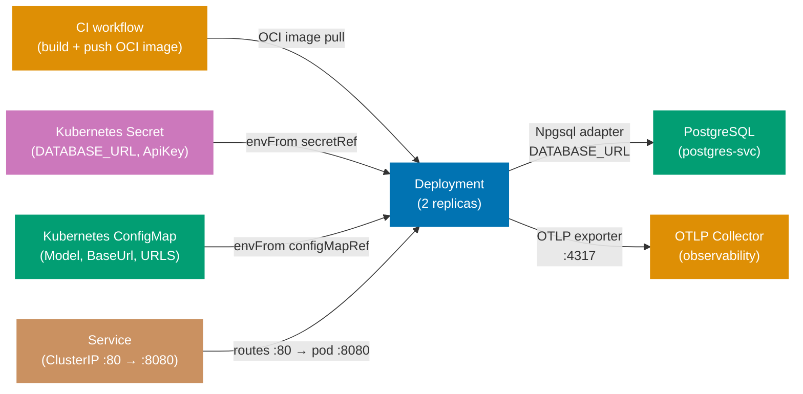

## Guide 23 — Kubernetes Deployment Topology for `talks-platform-be`

### Why It Matters

A Kubernetes manifest is not a deployment detail you add after the code works — it
is the composition root for the entire hexagonal stack at runtime. The `Deployment`
object determines how many adapter instances run concurrently; the `ConfigMap`
determines which port an adapter connects to; the `Secret` holds the credentials
that make the Npgsql adapter authenticate to PostgreSQL. If these three resources
are misaligned, the adapter throws at startup rather than at test time — you find
out at 3 AM during a rollout. Writing the Kubernetes manifest before the first
production deploy makes the configuration contract explicit and reviewable.

### Standard Library First

`Environment.GetEnvironmentVariable` is the .NET BCL's mechanism for reading
runtime configuration. You can run `talks-platform-be` on any machine by setting
environment variables manually:

```bash
# Standard library: running talks-platform-be with environment variables only
export DATABASE_URL="Host=localhost;Port=5432;Database=talks_platform_dev;Username=talks_platform;Password=talks_platform"
# => DATABASE_URL: the connection string read by Program.fs via IConfiguration
# => Hardcoding credentials in a shell script works locally but cannot be committed to version control

export OpenRouter__ApiKey="sk-or-..."
# => Double-underscore: .NET IConfiguration maps this to OpenRouter.ApiKey in appsettings.json hierarchy
# => Works on every OS that supports environment variables — OS-agnostic

export OpenRouter__Model="anthropic/claude-3-5-haiku"
export OpenRouter__BaseUrl="https://openrouter.ai/api/v1"
# => Three keys: matches the AiSettings record in Contexts/AiAssist/Infrastructure/OpenRouterAiProvider.fs

dotnet run --project src/TalksPlatform/TalksPlatform.fsproj
# => Starts the Giraffe HTTP server on the default port (5000/5001)
# => No orchestration: one process, one database, no health checks, no pod restart
```

**Limitation for production**: manual environment variables must be set on every
machine, are not versioned, and offer no secret rotation. A single missing variable
causes the adapter to fail at connection time, not at startup. No liveness or
readiness probe means Kubernetes cannot detect a crashed process.

### Production Framework

A Kubernetes manifest for `talks-platform-be` wires the Deployment, Service,
ConfigMap, and Secret into a self-documenting topology:

```yaml
# deploy/k8s/configmap.yaml
apiVersion: v1
# => apiVersion: v1 is the stable core API group — ConfigMap is a v1 resource since Kubernetes 1.0
kind: ConfigMap
# => ConfigMap: holds non-secret key-value pairs injected into pods as environment variables
metadata:
  name: talks-platform-be-config
  # => name: referenced by envFrom.configMapRef.name in the Deployment spec
  namespace: talks-platform
  # => namespace: isolates talks-platform-be resources from other services
data:
  OpenRouter__Model: "anthropic/claude-3-5-haiku"
  # => Double-underscore key: IConfiguration maps this to AiSettings.Model at startup
  # => Non-secret configuration lives in ConfigMap — safe to commit
  OpenRouter__BaseUrl: "https://openrouter.ai/api/v1"
  # => BaseUrl: the upstream AI API endpoint — not a secret, but environment-specific
  ASPNETCORE_URLS: "http://+:8080"
  # => Tells ASP.NET Core to listen on port 8080 inside the pod
  # => The Service routes external traffic to this port via targetPort: 8080
```

```yaml
# deploy/k8s/secret.yaml
# IMPORTANT: Never commit real secret values. Use Sealed Secrets or External Secrets Operator.
apiVersion: v1
# => apiVersion: v1 — Secret is a core resource; same API group as ConfigMap
kind: Secret
# => Secret: Kubernetes stores the values base64-encoded and restricts access via RBAC
metadata:
  name: talks-platform-be-secrets
  # => name: referenced by envFrom.secretRef.name in the Deployment — must match exactly
  namespace: talks-platform
type: Opaque
# => Opaque: generic secret type — no schema validation, all values treated as arbitrary bytes
stringData:
  # => stringData: plain-text input; Kubernetes base64-encodes and stores under .data
  DATABASE_URL: "Host=postgres-svc;Port=5432;Database=talks_platform;Username=talks_platform;Password=REPLACE_ME"
  # => stringData: Kubernetes base64-encodes the value automatically
  # => In production, populate via Sealed Secrets: kubeseal --raw --from-file=...
  # => REPLACE_ME is a placeholder — a linter catches literal "REPLACE_ME" in CI
  OpenRouter__ApiKey: "REPLACE_ME"
  # => The API key read by IConfiguration and used by the OpenRouterAiProvider adapter
```

```yaml
# deploy/k8s/deployment.yaml
apiVersion: apps/v1
# => apps/v1: the stable Deployment API group — required for Deployments since Kubernetes 1.9
kind: Deployment
# => Deployment: manages a ReplicaSet and rolls out pods
metadata:
  name: talks-platform-be
  # => name: DNS-safe identifier; Service selector must match this name for in-cluster routing
  namespace: talks-platform
spec:
  replicas: 2
  # => 2 replicas: zero-downtime rollout — one pod serves traffic while the other restarts
  selector:
    matchLabels:
      app: talks-platform-be
      # => matchLabels: the Deployment owns pods carrying this label
  template:
    metadata:
      labels:
        app: talks-platform-be
        # => labels: pod identity — the Service and Deployment selector both target this label
      annotations:
        prometheus.io/scrape: "true"
        # => Prometheus scrape annotation: the Prometheus operator discovers this pod automatically
        prometheus.io/port: "8080"
        # => prometheus.io/port: tells Prometheus which port to scrape
        prometheus.io/path: "/metrics"
        # => /metrics endpoint: AddPrometheusExporter() exposes Prometheus-format metrics here
    spec:
      containers:
        - name: talks-platform-be
          # => name: identifies the container within the pod
          image: ghcr.io/wahidyankf/talks-platform-be:latest
          # => OCI image: built by the CI workflow and pushed to GitHub Container Registry
          # => In production, pin to an immutable SHA digest: image: ghcr.io/...@sha256:<digest>
          ports:
            - containerPort: 8080
              # => containerPort: documentation only — traffic flows through the Service ClusterIP
          envFrom:
            # => envFrom: injects all keys from a ConfigMap or Secret as environment variables
            - configMapRef:
                name: talks-platform-be-config
                # => Injects all ConfigMap keys as environment variables
            - secretRef:
                name: talks-platform-be-secrets
                # => Injects all Secret keys as environment variables — Kubernetes decodes base64
          livenessProbe:
            # => livenessProbe: kubelet restarts the container if this probe fails
            httpGet:
              path: /api/v1/health
              port: 8080
              # => /api/v1/health: the Giraffe route — returns 200 {"status":"healthy"}
            initialDelaySeconds: 10
            # => DbUp migrations run at startup — allow time before the first liveness check
            periodSeconds: 15
            # => periodSeconds: kubelet checks liveness every 15 s; 3 consecutive failures restart the pod
          readinessProbe:
            # => readinessProbe: kubelet removes the pod from Service endpoints if this probe fails
            httpGet:
              path: /api/v1/readiness
              port: 8080
              # => /api/v1/readiness: checks DB connectivity — 200 means the adapter is healthy
            initialDelaySeconds: 5
            periodSeconds: 10
            # => readinessProbe: pod receives traffic only after this probe succeeds
          resources:
            requests:
              memory: "128Mi"
              cpu: "100m"
              # => Requests: the scheduler uses these to place pods on nodes
            limits:
              memory: "512Mi"
              cpu: "500m"
              # => Limits: Kubernetes OOM-kills the pod if it exceeds 512Mi
              # => OOM-kill on an F# async workload causes in-flight requests to fail
```



**Trade-offs**: `envFrom` with `secretRef` exposes all Secret keys as environment
variables — any process inside the container can read them. For stricter secret
isolation, mount the Secret as a filesystem volume and read it with
`File.ReadAllText` in a custom `IConfiguration` provider. Kubernetes Secrets are
base64-encoded, not encrypted at rest by default; enable etcd encryption and use
Sealed Secrets or External Secrets Operator before moving to production.

---

## Guide 24 — OpenTelemetry Observability Wiring at the Deployment Seam

### Why It Matters

Guide 20 showed how to add OpenTelemetry spans to individual port calls. At the
deployment seam, the concern shifts: where does the collected telemetry go, and
how does `talks-platform-be` register its trace sources so that the SDK exports
them? A misconfigured OTLP exporter means you pay the span creation overhead in
every request but see nothing in Jaeger or Honeycomb. Getting this right before
the first production deploy saves the painful debugging session where P95 latency
spikes but the trace dashboard shows only half the spans.

### Standard Library First

`System.Diagnostics.ActivitySource` creates spans, and you can write a minimal
listener that prints spans to stdout — verifying that spans are emitted before
adding the OpenTelemetry SDK:

```fsharp
// Standard library: ActivityListener writing spans to stdout
open System.Diagnostics
// => ActivitySource: BCL trace API — ships with .NET runtime, no NuGet required
// => ActivityListener: subscribes to ActivitySource events and receives completed spans

let private listener =
    new ActivityListener(
        ShouldListenTo = (fun source ->
            // => ShouldListenTo: called for each ActivitySource registered in the process
            source.Name.StartsWith("TalksPlatform")
            // => Filter: only listen to TalksPlatform.* sources — reduces noise from BCL internals
        ),
        Sample = (fun _ -> ActivitySamplingResult.AllDataAndRecorded),
        // => Sample: controls whether the activity is recorded — AllDataAndRecorded captures all attributes
        // => AllDataAndRecorded: record all data — useful for debugging; use ParentBased in production
        ActivityStopped = (fun activity ->
            // => ActivityStopped: called when Dispose() is called on the activity — i.e., when the span ends
            printfn "[TRACE] %s duration=%dms status=%A"
                activity.DisplayName
                activity.Duration.Milliseconds
                activity.Status
            // => Print each completed span: name, duration, status
        )
    )

ActivitySource.AddActivityListener(listener)
// => Register the listener: all ActivitySources emit to this listener after this call
// => Call before any ActivitySource.StartActivity to capture all spans
```

**Limitation for production**: stdout span output is unstructured — you cannot
query duration percentiles, correlate trace IDs across services, or set up alerts.
Spans are lost when the pod restarts. No sampling policy means 100% of spans are
emitted regardless of traffic volume.

### Production Framework

`talks-platform-be` wires OpenTelemetry in `Composition/Program.fs` using the
`OpenTelemetry.Extensions.Hosting` NuGet package. The OTLP exporter sends spans
and metrics to a Collector sidecar or an external endpoint:

```fsharp
// Program.fs: OpenTelemetry SDK registration at startup
// src/TalksPlatform/Composition/Program.fs (extended)

open OpenTelemetry.Resources
// => Resource: describes the service (name, version, namespace) — attached to every span
open OpenTelemetry.Trace
// => TracerProviderBuilder: configures sources, samplers, and exporters
open OpenTelemetry.Metrics
// => MeterProviderBuilder: configures metric instruments and exporters

let configureObservability (builder: WebApplicationBuilder) =
    // => Called from main before builder.Build() — SDK must be registered before spans are emitted
    let otlpEndpoint =
        builder.Configuration.["OTEL_EXPORTER_OTLP_ENDPOINT"]
        // => Read from environment variable — ConfigMap injects this in Kubernetes
        // => Example: "http://otel-collector-svc:4317" — the OTLP gRPC endpoint
        |> Option.ofObj
        // => Option.ofObj: converts null (missing env var) to None — avoids NullReferenceException
        |> Option.defaultValue "http://localhost:4317"
        // => Local fallback: points at a locally-running collector for development
    builder.Services
        .AddOpenTelemetry()
        // => AddOpenTelemetry: registers the SDK as an IHostedService that flushes on shutdown
        .ConfigureResource(fun r ->
            r.AddService(
                serviceName = "talks-platform-be",
                // => serviceName: the service.name resource attribute — visible in Jaeger / Honeycomb
                serviceVersion = "1.0.0",
                // => serviceVersion: tag spans with the deployed version — correlates with OCI image tag
                serviceInstanceId = System.Environment.MachineName
                // => MachineName: the pod hostname in Kubernetes — identifies which replica emitted the span
            )
            |> ignore)
        .WithTracing(fun t ->
            t
                .AddAspNetCoreInstrumentation()
                // => Automatic spans for every HTTP request: method, route, status code, duration
                // => Produces parent spans that child spans (port calls from Guide 20) nest under
                .AddSource("TalksPlatform.Submission")
                // => TalksPlatform.Submission: the ActivitySource from ObservabilityAdapter (Guide 20)
                // => Only sources explicitly added here are exported — unlisted sources are silently dropped
                .AddSource("TalksPlatform.Review")
                // => TalksPlatform.Review: review context's observability decorator source
                .AddSource("TalksPlatform.Adapters")
                // => Generic adapter source: used by any adapter following the Guide 20 decorator pattern
                .AddOtlpExporter(fun o ->
                    o.Endpoint <- System.Uri(otlpEndpoint)
                    // => OTLP gRPC: sends spans to the collector in binary protobuf format
                    // => Lower overhead than OTLP/HTTP — use HTTP if the collector does not support gRPC
                )
            |> ignore)
        .WithMetrics(fun m ->
            m
                .AddAspNetCoreInstrumentation()
                // => HTTP request counters, latency histograms — used by Prometheus scrape (Guide 23 ConfigMap)
                .AddRuntimeInstrumentation()
                // => .NET runtime metrics: GC collections, thread pool queue depth, heap size
                // => Essential for diagnosing memory pressure on the 512Mi limit in the Deployment
                .AddPrometheusExporter()
                // => Exposes /metrics endpoint in Prometheus text format
                // => The Deployment annotation prometheus.io/path: /metrics tells Prometheus to scrape it
            |> ignore)
        |> ignore
    builder
    // => Return builder for chaining in main — builder.Build() is called after this
```

The Kubernetes ConfigMap from Guide 23 adds the OTLP endpoint key so no code
change is needed per environment:

```yaml
# Extend deploy/k8s/configmap.yaml with the OTLP endpoint
data:
  OTEL_EXPORTER_OTLP_ENDPOINT: "http://otel-collector-svc.observability:4317"
  # => otel-collector-svc.observability: service name in the "observability" namespace
  # => Cross-namespace DNS: <service>.<namespace>.svc.cluster.local — shortened form works in-cluster
  # => Changing the collector address requires no code change — only a ConfigMap update + pod restart
  OTEL_RESOURCE_ATTRIBUTES: "deployment.environment=production"
  # => Additional resource attribute: "production" vs "staging" filtering in the trace UI
```

**Trade-offs**: adding `AddAspNetCoreInstrumentation` includes the HTTP route
template in the span attributes — useful for grouping spans by handler but a
compliance risk if query parameters embed PII. Set `RecordException = false` for
regulated environments. The Prometheus exporter and OTLP exporter both run in
the same process; high request rates (> 5000 req/s) add measurable CPU overhead.
Use head-based sampling (`AddTraceIdRatioBasedSampler(0.1)`) in the `.WithTracing`
builder to sample 10% of traces in high-traffic scenarios.

---

## Guide 25 — Failure-Mode Degraded Adapters

### Why It Matters

When the PostgreSQL pod is unhealthy during a rolling restart, or the OpenRouter
API returns 503 for thirty seconds, you have two choices: fail every request
immediately, or serve degraded responses from fallback adapters. The hexagonal
architecture makes the second choice tractable — because the application service
depends on port records, not concrete adapters, you can swap in a degraded
adapter at the composition root without touching business logic. The degraded
adapter returns cached or empty results; the application service propagates the
degraded state to the Giraffe handler, which responds with a `503 Degraded`
status. The circuit-breaker from Guide 18 is the trigger; this guide shows the
fallback adapter wired to it.

### Standard Library First

F# option types and simple try/catch at the handler level provide a primitive
fallback:

```fsharp
// Standard library: try/catch fallback at the Giraffe handler level
open Giraffe
// => Giraffe: provides HttpHandler, json, text, RequestErrors, ServerErrors

let handleGetTalk (repo: TalkRepository) (talkId: System.Guid) : HttpHandler =
    fun next ctx ->
        task {
            try
                let! result = repo.FindTalk (TalkId talkId)
                // => Attempt the real port call — any exception is caught below
                match result with
                | Ok (Some talk) ->
                    return! json talk next ctx
                // => Successful read: serialize the talk as JSON
                | Ok None ->
                    return! RequestErrors.notFound (text "Not found") next ctx
                // => Not found: Ok None is a valid domain outcome — map to HTTP 404
                | Error _ ->
                    return! ServerErrors.serviceUnavailable (text "Storage unavailable") next ctx
                // => Typed port error: handler translates RepositoryError to 503
            with ex ->
                return! ServerErrors.internalError (text ex.Message) next ctx
                // => 500 with the exception message — leaks internal details to the caller
                // => In production, log ex here instead of exposing the message to callers
        }
```

**Limitation for production**: the fallback logic is inside the handler — every
handler must duplicate it. When the database goes down, all handlers fail the same
way, but the logic must be audited and updated in every file. No caching: the
fallback returns errors, not stale data.

### Production Framework

The degraded-mode pattern introduces a `DegradedTalkRepository` that wraps a
cached snapshot and a `NullEventPublisher` that silently drops events when the
broker is unavailable. Both satisfy the same port records; the composition root
selects which adapter to wire based on a shared `isDegraded` flag updated by the
circuit-breaker:

```fsharp
// Degraded read adapter: returns a cached snapshot when the DB port fails
// src/TalksPlatform/Contexts/Submission/Infrastructure/DegradedTalkRepository.fs
module TalksPlatform.Contexts.Submission.Infrastructure.DegradedTalkRepository

open TalksPlatform.Contexts.Submission.Application.Ports
// => Port record: TalkRepository — the degraded adapter satisfies the same record as NpgsqlTalkRepository
open TalksPlatform.Contexts.Submission.Domain
// => Domain types: Talk, TalkId

// Shared degraded-mode flag: true when the circuit-breaker has opened
let mutable isDegraded = false
// => mutable: written by the circuit-breaker callback, read by the composition root
// => Thread-safe for reads (bool is atomic on .NET); writes use Interlocked.Exchange in production

// Cache: holds the last successful snapshot of talks
let private cache = System.Collections.Concurrent.ConcurrentDictionary<TalkId, Talk>()
// => ConcurrentDictionary: thread-safe; written by the real adapter on success, read by the degraded adapter
// => No TTL: cache is valid until the circuit closes and real reads resume

// Degraded TalkRepository adapter: returns cached snapshots
let cachedTalkRepository : TalkRepository =
    // => Record literal satisfying TalkRepository — both fields must be supplied
    { FindTalk =
        fun talkId ->
            // => talkId: TalkId — looks up the specific talk in the cache
            async {
                match cache.TryGetValue(talkId) with
                // => TryGetValue: non-throwing lookup — avoids KeyNotFoundException
                | true, talk ->
                    // => Cache hit: return the last-known talk without touching the database
                    return Ok (Some talk)
                | false, _ ->
                    // => Cache miss: no snapshot available — return Ok None, not an error
                    return Ok None
            }
      SaveTalk =
        fun _ ->
            // => Degraded mode: reject write operations — the database is unavailable
            async {
                return Error (ConnectionFailure (System.Exception("Service degraded — writes unavailable")))
                // => Callers (handlers) translate this to a 503 response with a Retry-After header
            }
    }
// => Satisfies TalkRepository exactly — composition root can swap in without changing any handler

// Cache-populating decorator for the real Npgsql adapter
let withCachePopulation (inner: TalkRepository) : TalkRepository =
    // => Decorator pattern: wraps inner (the real Npgsql adapter) and adds cache population
    { FindTalk =
        fun talkId ->
            // => Same signature as TalkRepository.FindTalk — the caller does not know it is a decorator
            async {
                let! result = inner.FindTalk talkId
                // => Delegate to the real Npgsql adapter
                match result with
                | Ok (Some talk) ->
                    cache.[talk.Id] <- talk
                    // => Populate the cache on success — degraded adapter can serve this entry later
                | _ -> ()
                // => Error or None: do not update the cache — stale entry is better than a wrong entry
                return result
                // => Return the original result unchanged — the decorator is transparent
            }
      SaveTalk = inner.SaveTalk
      // => Save path: no cache to populate on writes — delegate directly to inner
    }
```

```fsharp
// Null event publisher: silently drops events when the outbox is unavailable
// src/TalksPlatform/Contexts/Submission/Infrastructure/NullEventPublisher.fs
module TalksPlatform.Contexts.Submission.Infrastructure.NullEventPublisher

open TalksPlatform.Contexts.Submission.Application.Ports
// => EventPublisher port record — the null publisher satisfies the same record

let nullEventPublisher : EventPublisher =
    // => Record literal: must supply all fields — compiler enforces the EventPublisher shape
    { Publish =
        fun _event ->
            // => _event: ignored — the event is discarded without network I/O
            // => Discard pattern: underscore prefix signals intentional ignorance — not a bug
            async {
                return Ok ()
                // => Ok (): the application service proceeds as if the event was published
                // => Silent drop: no logging here — wire a logging decorator in production for observability
            }
    }
// => When the circuit-breaker closes, the composition root swaps back to the real outbox adapter
// => Events during the degraded window are lost — the outbox persistence path avoids this trade-off
```

```fsharp
// Program.fs: circuit-breaker callback updates the degraded flag and swaps adapters
// src/TalksPlatform/Composition/Program.fs (extended)

open TalksPlatform.Contexts.Submission.Infrastructure.DegradedTalkRepository
// => Brings isDegraded flag, cachedTalkRepository, and withCachePopulation into scope

// Build the correct TalkRepository based on the circuit-breaker state
let buildTalkRepository (connStr: string) : TalkRepository =
    // => Called by the handler registration in Program.fs — returns the correct adapter
    if isDegraded then
        // => isDegraded = true: the circuit-breaker's onBreak callback set this flag
        cachedTalkRepository
        // => Circuit open: serve from cache — no database I/O
    else
        NpgsqlTalkRepository.npgsqlTalkRepository connStr
        |> withCachePopulation
        // => Circuit closed: serve from Npgsql and populate the cache as a side-effect
        // => withCachePopulation: decorator that updates the cache on every successful real read

// Build the correct EventPublisher based on the circuit-breaker state
let buildEventPublisher (connStr: string) : EventPublisher =
    // => Returns EventPublisher: either the outbox adapter or the null publisher
    if isDegraded then
        NullEventPublisher.nullEventPublisher
        // => Circuit open: drop events — the outbox table is inaccessible
    else
        OutboxEventPublisher.makeOutboxPublisher connStr
        // => Circuit closed: write to outbox — at-least-once delivery resumes
```

**Trade-offs**: the degraded read adapter serves stale data — clients receive a
response that may be minutes or hours old. For a conference talk submission
platform, serving a stale talk list is better than returning 503 and blocking
a speaker who needs to check their submission status. The null event publisher
silently drops events — if at-least-once delivery is a hard requirement, replace
it with an in-memory buffer that replays to the outbox when the broker recovers,
accepting the risk of buffer overflow under sustained outages.

---

## Guide 26 — Configuration Adapter at the Deploy Seam: Secrets to Typed `IOptions<T>`

### Why It Matters

`talks-platform-be` reads `AiSettings` from configuration at startup. The journey
of a secret from a Kubernetes Secret object to a strongly-typed F# record crosses
four boundaries: Kubernetes injects the Secret key as an environment variable; the
ASP.NET Core configuration system reads the environment variable; the `IOptions<T>`
binding maps it to `AiSettings`; the composition root reads the record and passes
it to the adapter factory. A break at any boundary — a renamed key, a missing
namespace prefix, a wrong casing — silently produces an empty string instead of
the expected value. Making this chain explicit prevents the class of bugs where
the AI adapter always returns auth errors because `ApiKey` is empty.

### Standard Library First

`Environment.GetEnvironmentVariable` reads a single key directly — the manual
approach:

```fsharp
// Standard library: read AiSettings manually from environment variables
open System
// => System: provides Environment.GetEnvironmentVariable — BCL, no NuGet required
open TalksPlatform.Contexts.AiAssist.Infrastructure.OpenRouterAiProvider
// => AiSettings: the configuration record for the OpenRouter adapter

let readAiSettings () : Result<AiSettings, string> =
    // => Returns Result: forces the caller to handle missing configuration explicitly
    let apiKey = Environment.GetEnvironmentVariable("OpenRouter__ApiKey")
    // => Double-underscore naming: matches IConfiguration's hierarchy separator convention
    // => If the Kubernetes Secret key is "OPENROUTER_API_KEY" instead, this returns null
    let model = Environment.GetEnvironmentVariable("OpenRouter__Model")
    // => Reads OpenRouter__Model: maps to the model identifier in the ConfigMap
    let baseUrl = Environment.GetEnvironmentVariable("OpenRouter__BaseUrl")
    // => Reads OpenRouter__BaseUrl: "https://openrouter.ai/api/v1" set in the ConfigMap
    match apiKey, model, baseUrl with
    // => Tuple match: all three variables checked simultaneously
    | null, _, _ -> Error "OpenRouter__ApiKey is not set"
    // => Explicit null check: returns Error instead of silently using an empty key
    | _, null, _ -> Error "OpenRouter__Model is not set"
    // => Model missing: the adapter cannot function without a model identifier
    | _, _, null -> Error "OpenRouter__BaseUrl is not set"
    // => BaseUrl missing: the adapter has no endpoint to call
    | key, m, url ->
        Ok { ApiKey = key; Model = m; BaseUrl = url }
        // => Returns the typed record: no cast, no stringly-typed dictionary
```

**Limitation for production**: `GetEnvironmentVariable` reads at call time — if
the environment variable changes after startup (hot-reload scenario), the function
returns the new value without going through validation. No binding validation
(empty-string keys pass the null check). Changes to the key names in the
Kubernetes ConfigMap/Secret must be manually mirrored in every
`GetEnvironmentVariable` call.

### Production Framework

`talks-platform-be` uses `builder.Services.Configure<ValidatedAiSettings>` in
`Composition/Program.fs`. This guide makes the full binding chain explicit and
adds validation via `ValidateDataAnnotations`:

```fsharp
// Program.fs: typed IOptions<T> binding with startup validation
// src/TalksPlatform/Composition/Program.fs (extended)

open Microsoft.Extensions.DependencyInjection
// => IServiceCollection: DI registration surface — AddOptions, Configure, ValidateOnStart
open Microsoft.Extensions.Options
// => IOptions<T>: injected into adapter factories; reads the bound record at call time
open System.ComponentModel.DataAnnotations
// => [<Required>] attribute: triggers ValidateDataAnnotations to check non-null values at startup

// Validated settings type with data annotation constraints
[<CLIMutable>]
// => CLIMutable: generates public setters required by IOptions<T> binding and data annotation scanning
type ValidatedAiSettings =
    { [<Required; MinLength(10)>]
      ApiKey: string
      // => [<Required>]: fails startup if the key is null or empty string
      // => [<MinLength(10)>]: a valid OpenRouter key is long — detects placeholder "REPLACE_ME"
      [<Required>]
      Model: string
      // => Required: the model identifier must be set — empty model causes 400 from OpenRouter
      [<Required; Url>]
      BaseUrl: string }
      // => [<Url>]: validates the BaseUrl is a well-formed absolute URI at startup
      // => Catches typos like "openrouter.ai/api/v1" (missing https://) before the first HTTP call

let configureOptions (builder: WebApplicationBuilder) =
    // => Takes WebApplicationBuilder — called before builder.Build()
    builder.Services
        .AddOptions<ValidatedAiSettings>()
        // => AddOptions<T>: typed options registration
        .BindConfiguration("OpenRouter")
        // => BindConfiguration: reads the "OpenRouter" section from IConfiguration
        // => IConfiguration sources in priority order: environment variables > appsettings.json > defaults
        // => Environment variable "OpenRouter__ApiKey" maps to section "OpenRouter", key "ApiKey"
        .ValidateDataAnnotations()
        // => Runs [<Required>] and other data annotation checks during DI container build
        .ValidateOnStart()
        // => ValidateOnStart: validates during WebApplication.Build() — fails fast before serving traffic
        // => A missing ApiKey terminates the process with a clear error, not a 401 on the first AI call
    |> ignore
    builder
```

The adapter factory receives `IOptions<ValidatedAiSettings>` from the DI
container — the composition root reads the validated record at startup:

```fsharp
// Adapter factory: reads validated settings from IOptions<T>
// src/TalksPlatform/Contexts/AiAssist/Infrastructure/OptionsAwareAdapterFactory.fs
module TalksPlatform.Contexts.AiAssist.Infrastructure.OptionsAwareAdapterFactory

open Microsoft.Extensions.Options
// => IOptions<T>: DI-injected binding — the composition root resolves it from the DI container
open System.Net.Http
// => IHttpClientFactory: creates the resilient named HttpClient
open TalksPlatform.Contexts.AiAssist.Infrastructure.OpenRouterAiProvider
// => AiSettings: the adapter's configuration record type
// => make: the adapter factory that accepts AiSettings and IHttpClientFactory

let makeFromOptions (options: IOptions<ValidatedAiSettings>) (factory: IHttpClientFactory) =
    // => Two parameters: options carries the validated settings; factory creates the resilient HttpClient
    let validated = options.Value
    // => .Value: reads the validated, bound settings record
    // => If ValidateOnStart passed, validated.ApiKey is guaranteed non-null and >= 10 characters
    let settings : AiSettings =
        // => Type annotation: ensures the record literal matches AiSettings, not ValidatedAiSettings
        { ApiKey = validated.ApiKey
          // => Thread-safe: options.Value is immutable after startup — no lock required
          Model = validated.Model
          // => Model: copied from the validated settings — no transformation needed
          BaseUrl = validated.BaseUrl }
    make settings factory
    // => Returns AiProvider port record — the composition root wires it to the application service
```

**Trade-offs**: `ValidateOnStart` fails the process at startup — the Kubernetes
Deployment rolls back the failed pod and keeps the previous replica running. This
is the desired behaviour (fast fail over silent misconfiguration), but it means a
misconfigured Secret causes a `CrashLoopBackOff` that requires a ConfigMap/Secret
fix and a pod restart to recover. Hot-reload of `IOptions` (via
`IOptionsMonitor<T>`) allows configuration changes without restart but bypasses
`ValidateOnStart` — validate manually inside the reload callback if hot-reload is
enabled.

---

## Guide 27 — Background Job Adapter

### Why It Matters

The outbox relay worker from Guide 19 is itself a background job — an
`IHostedService` that runs alongside the HTTP server. When the platform needs
scheduled work (e.g., closing review rounds that have been open longer than
seven days, or sending acceptance/rejection notifications nightly), that work
must go through a port rather than being wired directly into a hosted service.
This guide shows the `IHostedService` + port pair that keeps background jobs
testable and swappable under the hexagonal architecture.

### Standard Library First

An `IHostedService` with inline business logic skips the port entirely:

```fsharp
// Standard library: IHostedService with inline business logic — no port
open Microsoft.Extensions.Hosting
// => IHostedService: StartAsync and StopAsync — registered via AddHostedService<_>()
open Npgsql
// => Npgsql: database access directly inside the hosted service — no port
open Dapper
// => Dapper: SQL mapping — infrastructure concern inside the background job

type ReviewRoundCloserWorker(connStr: string) =
    interface IHostedService with
        member _.StartAsync(ct) =
            task {
                while not ct.IsCancellationRequested do
                    // => Poll loop: runs until the application shuts down
                    use conn = new NpgsqlConnection(connStr)
                    // => Npgsql connection opened inline — no repository port involved
                    let! staleRounds =
                        conn.QueryAsync<System.Guid>(
                            "SELECT round_id FROM review.rounds WHERE status = 'Open' AND opened_at < NOW() - INTERVAL '7 days'")
                        |> Async.AwaitTask
                    // => SQL query inside the hosted service — business rule ("7 days") in infrastructure
                    for roundId in staleRounds do
                        let! _ =
                            conn.ExecuteAsync(
                                "UPDATE review.rounds SET status = 'Closed' WHERE round_id = @Id",
                                {| Id = roundId |})
                            |> Async.AwaitTask
                        // => Direct UPDATE — no domain event, no application service
                        ()
                    do! System.Threading.Tasks.Task.Delay(60_000) |> Async.AwaitTask
                    // => Poll every 60 seconds — no configurable interval
            }
        member _.StopAsync(_) = System.Threading.Tasks.Task.CompletedTask
```

**Limitation for production**: business logic ("7 days") inside the hosted service
cannot be tested without a real database. No domain event is published when a
round closes — downstream consumers (`submission` context, email notifier) miss
the transition. No port means swapping the database requires changing the hosted
service.

### Production Framework

The hexagonal approach defines a background job port and wires the hosted service
to call the application service through it:

```fsharp
// Background job port: CloseStaleReviewRoundsJob
// src/TalksPlatform/Contexts/Review/Application/Ports.fs (extended)
module TalksPlatform.Contexts.Review.Application.Ports

open TalksPlatform.Contexts.Review.Domain
// => ReviewRound domain types — the port operates in domain terms

// Background job port: function alias for the "close stale rounds" operation
type CloseStaleReviewRoundsJob =
    System.DateTimeOffset -> Async<Result<ReviewRound list, string>>
// => DateTimeOffset cutoff: the caller (hosted service) passes the cutoff time
// => Returns the list of closed rounds — the hosted service publishes events for each
// => Result<_, string>: the job can fail (DB unavailable); the hosted service logs and retries
// => Clock port (Guide 5 pattern): the cutoff is computed by the caller from the injected Clock

// Application service: close stale rounds
let closeStaleRounds
    (findStale: System.DateTimeOffset -> Async<Result<ReviewRound list, string>>)
    // => Read port: find rounds opened before the cutoff — satisfied by the Npgsql adapter
    (closeRound: ReviewRound -> Async<Result<unit, string>>)
    // => Write port: close a single round — satisfied by the Npgsql adapter
    (pub: EventPublisher)
    // => Event publisher: publish ReviewRoundClosed for each closed round
    (clock: unit -> System.DateTimeOffset)
    // => Clock port: returns the current time — frozen in tests
    : Async<Result<ReviewRound list, string>> =
    async {
        let cutoff = (clock ()).AddDays(-7.0)
        // => Compute the cutoff from the injected clock — testable without System.DateTime.Now
        let! staleResult = findStale cutoff
        // => Fetch rounds that have been open longer than seven days
        match staleResult with
        | Error e -> return Error e
        // => Port failure: the hosted service logs and retries on the next poll cycle
        | Ok staleRounds ->
            let! closeResults =
                staleRounds
                |> List.map (fun round ->
                    async {
                        let! r = closeRound round
                        // => Close each round — the adapter issues the UPDATE in the review schema
                        match r with
                        | Ok () ->
                            do! pub.Publish (ReviewRoundClosed { RoundId = round.Id; TalkId = round.TalkId })
                            // => Publish the domain event — submission context transitions the talk status
                        | Error e ->
                            eprintfn "Failed to close round %A: %s" round.Id e
                            // => Log and continue — partial failure is acceptable for a batch job
                    })
                |> Async.Parallel
                |> Async.map Array.toList
            // => Async.Parallel: close all stale rounds concurrently — bounded by DB connection pool
            return Ok staleRounds
            // => Return the list of closed rounds for the hosted service to log
    }
```

```fsharp
// IHostedService: calls the application service on a schedule
// src/TalksPlatform/Contexts/Review/Infrastructure/ReviewRoundCloserWorker.fs
module TalksPlatform.Contexts.Review.Infrastructure.ReviewRoundCloserWorker

open Microsoft.Extensions.Hosting
// => IHostedService: runs alongside the HTTP server
open TalksPlatform.Contexts.Review.Application
// => Application service: closeStaleRounds — called once per poll cycle
open TalksPlatform.Contexts.Review.Application.Ports
// => Port records: the hosted service receives ports from the composition root

type ReviewRoundCloserWorker
    (findStale: System.DateTimeOffset -> Async<Result<ReviewRound list, string>>,
     closeRound: ReviewRound -> Async<Result<unit, string>>,
     pub: EventPublisher,
     clock: unit -> System.DateTimeOffset) =
    // => All four ports injected by the composition root — the worker has no infrastructure imports
    interface IHostedService with
        member _.StartAsync(ct) =
            task {
                while not ct.IsCancellationRequested do
                    let! result = ReviewRoundService.closeStaleRounds findStale closeRound pub clock
                    // => Application service call: pure domain + port orchestration
                    match result with
                    | Ok closed ->
                        printfn "Closed %d stale review rounds" closed.Length
                        // => Log success: in production, use structured logging (ILogger<T>)
                    | Error e ->
                        eprintfn "closeStaleRounds failed: %s" e
                        // => Log failure and continue — the next poll cycle will retry
                    do! System.Threading.Tasks.Task.Delay(60_000) |> Async.AwaitTask
                    // => Poll every 60 seconds — configurable via AppConfig in production
            }
        member _.StopAsync(_) = System.Threading.Tasks.Task.CompletedTask
        // => StopAsync: graceful shutdown — Task.CompletedTask signals immediate stop
```

The unit test for the application service uses the in-memory adapters from
Guide 8 — no Docker, no hosted service lifecycle:

```fsharp
// Unit test: closeStaleRounds using in-memory adapters and a frozen clock
// Tests/Review/CloseStaleRoundsTests.fs
module TalksPlatform.Tests.Review.CloseStaleRoundsTests

open Xunit
open TalksPlatform.Contexts.Review.Application.ReviewRoundService
// => Application service under test — pure function, no hosted service

[<Fact>]
let ``closeStaleRounds closes rounds older than 7 days`` () =
    async {
        // Arrange
        let frozenNow = System.DateTimeOffset(2026, 5, 1, 0, 0, 0, System.TimeSpan.Zero)
        // => Frozen clock: the cutoff becomes 2026-04-24 — deterministic regardless of test run date
        let cutoffDate = frozenNow.AddDays(-7.0)
        // => 2026-04-24: any round opened before this is stale

        let staleRound = { Id = ReviewRoundId (System.Guid.NewGuid()); TalkId = TalkId (System.Guid.NewGuid()); Status = Open }
        // => One stale round in the in-memory store
        let closedRounds = ref []
        // => Track which rounds were closed — assertion target

        let findStale cutoff =
            // => Stub: returns the stale round if opened before the cutoff
            async { return Ok [staleRound] }
        let closeRound round =
            // => Stub: records the closed round
            async {
                closedRounds := round :: !closedRounds
                return Ok ()
            }
        let (pub, captured) = InMemoryEventPublisher.makeInMemoryPublisher ()
        // => In-memory event publisher from Guide 10 — captures published events

        // Act
        let! result = closeStaleRounds findStale closeRound pub (fun () -> frozenNow)
        // => Application service call with all stubs — no real DB, no real clock

        // Assert
        Assert.Equal(Ok [staleRound], result)
        // => The service returned the closed round
        Assert.Equal(1, (!closedRounds).Length)
        // => The closeRound stub was called exactly once
        Assert.Equal(1, (!captured).Length)
        // => One ReviewRoundClosed event was published
    } |> Async.RunSynchronously
```

**Trade-offs**: the port-based background job adds a `CloseStaleReviewRoundsJob`
type alias, a `ReviewRoundService.closeStaleRounds` application service, and
a hosted service that delegates to it — three files instead of one. For simple
cleanup jobs that touch a single table with no domain events, the overhead may
not be worth it. Apply the full hexagonal pattern when the job has testable
business rules (the seven-day threshold), produces domain events, or must be
testable without Docker.
