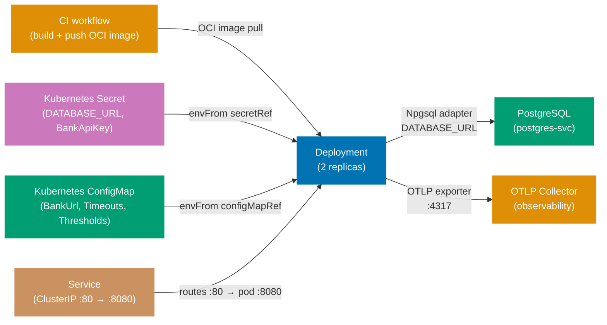

## Guide 23 — Kubernetes Deployment Topology for `procurement-platform-be`

### Why It Matters

A Kubernetes manifest is not a deployment detail you add after the code works — it is the composition root for the entire hexagonal stack at runtime. The `Deployment` object determines how many adapter instances run concurrently; the `ConfigMap` determines which port an adapter connects to; the `Secret` holds the credentials that make the Npgsql adapter authenticate to PostgreSQL and the bank API adapter authenticate to the bank. If these three resources are misaligned, the adapter throws at startup rather than at test time. Writing the Kubernetes manifest before the first production deploy makes the configuration contract explicit and reviewable.

### Standard Library First

`Environment.GetEnvironmentVariable` is the .NET BCL's mechanism for reading runtime configuration. You can run `procurement-platform-be` on any machine by setting environment variables manually:

```bash
# Standard library: running procurement-platform-be with environment variables only
export DATABASE_URL="Host=localhost;Port=5432;Database=procurement_platform_dev;Username=procurement_platform;Password=procurement_platform"
# => DATABASE_URL: the connection string read by Program.fs via IConfiguration
# => Hardcoding credentials in a shell script works locally but cannot be committed to version control

export BankApi__ApiKey="sk-bank-..."
# => Double-underscore: .NET IConfiguration maps this to BankApi.ApiKey in appsettings.json hierarchy
# => Works on every OS that supports environment variables — OS-agnostic

export BankApi__BaseUrl="https://bank-api.example.com/v1"
export BankApi__TimeoutSeconds="30"
# => Two keys: matches the BankApiSettings record in Contexts/Payments/Infrastructure/BankApiAdapter.fs

dotnet run --project src/ProcurementPlatform/ProcurementPlatform.fsproj
# => Starts the Giraffe HTTP server on the default port (5000/5001)
# => No orchestration: one process, one database, no health checks, no pod restart
```

**Limitation for production**: manual environment variables must be set on every machine, are not versioned, and offer no secret rotation. A single missing variable causes the adapter to fail at connection time, not at startup. No liveness or readiness probe means Kubernetes cannot detect a crashed process.

### Production Framework

A Kubernetes manifest for `procurement-platform-be` wires the Deployment, Service, ConfigMap, and Secret into a self-documenting topology:

```yaml
# deploy/k8s/configmap.yaml
apiVersion: v1
kind: ConfigMap
# => ConfigMap: holds non-secret key-value pairs injected into pods as environment variables
metadata:
  name: procurement-platform-be-config
  # => name: referenced by envFrom.configMapRef.name in the Deployment spec
  namespace: procurement-platform
data:
  BankApi__BaseUrl: "https://bank-api.example.com/v1"
  # => Non-secret configuration lives in ConfigMap — safe to commit
  BankApi__TimeoutSeconds: "30"
  # => Timeout: tunable per environment without a code change
  ASPNETCORE_URLS: "http://+:8080"
  # => Tells ASP.NET Core to listen on port 8080 inside the pod
  ApprovalThreshold__L1: "1000"
  # => L1 threshold in USD — externalized so finance team can tune without a deploy
  ApprovalThreshold__L2: "10000"
  # => L2 threshold in USD
```

```yaml
# deploy/k8s/secret.yaml
# IMPORTANT: Never commit real secret values. Use Sealed Secrets or External Secrets Operator.
apiVersion: v1
kind: Secret
metadata:
  name: procurement-platform-be-secrets
  namespace: procurement-platform
type: Opaque
stringData:
  DATABASE_URL: "Host=postgres-svc;Port=5432;Database=procurement_platform;Username=procurement_platform;Password=REPLACE_ME"
  # => stringData: Kubernetes base64-encodes the value automatically
  # => In production, populate via Sealed Secrets: kubeseal --raw --from-file=...
  BankApi__ApiKey: "REPLACE_ME"
  # => The bank API key read by IConfiguration and used by the BankApiAdapter
```

```yaml
# deploy/k8s/deployment.yaml
apiVersion: apps/v1
kind: Deployment
metadata:
  name: procurement-platform-be
  namespace: procurement-platform
spec:
  replicas: 2
  # => 2 replicas: zero-downtime rollout — one pod serves traffic while the other restarts
  selector:
    matchLabels:
      app: procurement-platform-be
  template:
    metadata:
      labels:
        app: procurement-platform-be
      annotations:
        prometheus.io/scrape: "true"
        prometheus.io/port: "8080"
        prometheus.io/path: "/metrics"
        # => Prometheus scrape annotations: the operator discovers this pod automatically
    spec:
      containers:
        - name: procurement-platform-be
          image: ghcr.io/wahidyankf/procurement-platform-be:latest
          # => In production, pin to an immutable SHA digest
          ports:
            - containerPort: 8080
          envFrom:
            - configMapRef:
                name: procurement-platform-be-config
                # => Injects all ConfigMap keys as environment variables
            - secretRef:
                name: procurement-platform-be-secrets
                # => Injects all Secret keys — Kubernetes decodes base64
          livenessProbe:
            httpGet:
              path: /api/v1/health
              port: 8080
              # => /api/v1/health: the Giraffe route — returns 200 {"status":"healthy"}
            initialDelaySeconds: 10
            # => DbUp migrations run at startup — allow time before the first liveness check
            periodSeconds: 15
          readinessProbe:
            httpGet:
              path: /api/v1/readiness
              port: 8080
              # => /api/v1/readiness: checks DB connectivity — 200 means the adapter is healthy
            initialDelaySeconds: 5
            periodSeconds: 10
          resources:
            requests:
              memory: "128Mi"
              cpu: "100m"
            limits:
              memory: "512Mi"
              cpu: "500m"
              # => OOM-kill on an F# async workload causes in-flight requests to fail
```



**Trade-offs**: `envFrom` with `secretRef` exposes all Secret keys as environment variables — any process inside the container can read them. For stricter secret isolation, mount the Secret as a filesystem volume and read it with `File.ReadAllText` in a custom `IConfiguration` provider. Kubernetes Secrets are base64-encoded, not encrypted at rest by default; enable etcd encryption and use Sealed Secrets or External Secrets Operator before moving to production.

---

## Guide 24 — OpenTelemetry Observability Wiring at the Deployment Seam

### Why It Matters

Guide 20 showed how to add OpenTelemetry spans to individual port calls. At the deployment seam, the concern shifts: where does the collected telemetry go, and how does `procurement-platform-be` register its trace sources so that the SDK exports them? A misconfigured OTLP exporter means you pay the span creation overhead in every request but see nothing in Jaeger or Honeycomb. Getting this right before the first production deploy saves the painful debugging session where P95 latency spikes but the trace dashboard shows only half the spans.

### Standard Library First

`System.Diagnostics.ActivitySource` creates spans, and you can write a minimal listener that prints spans to stdout — verifying that spans are emitted before adding the OpenTelemetry SDK:

```fsharp
// Standard library: ActivityListener writing spans to stdout
open System.Diagnostics

let private listener =
    new ActivityListener(
        ShouldListenTo = (fun source ->
            source.Name.StartsWith("ProcurementPlatform")
            // => Filter: only listen to ProcurementPlatform.* sources — reduces noise from BCL internals
        ),
        Sample = (fun _ -> ActivitySamplingResult.AllDataAndRecorded),
        // => AllDataAndRecorded: record all data — useful for debugging; use ParentBased in production
        ActivityStopped = (fun activity ->
            printfn "[TRACE] %s duration=%dms status=%A"
                activity.DisplayName
                activity.Duration.Milliseconds
                activity.Status
            // => Print each completed span: name, duration, status
        )
    )

ActivitySource.AddActivityListener(listener)
// => Register the listener: all ActivitySources emit to this listener after this call
```

**Limitation for production**: stdout span output is unstructured — you cannot query duration percentiles, correlate trace IDs across services, or set up alerts. Spans are lost when the pod restarts.

### Production Framework

`procurement-platform-be` wires OpenTelemetry in `Composition/Program.fs` using the `OpenTelemetry.Extensions.Hosting` NuGet package:

```fsharp
// Program.fs: OpenTelemetry SDK registration at startup
open OpenTelemetry.Resources
open OpenTelemetry.Trace
open OpenTelemetry.Metrics

let configureObservability (builder: WebApplicationBuilder) =
    let otlpEndpoint =
        builder.Configuration.["OTEL_EXPORTER_OTLP_ENDPOINT"]
        // => Read from environment variable — ConfigMap injects this in Kubernetes
        |> Option.ofObj
        |> Option.defaultValue "http://localhost:4317"
        // => Local fallback: points at a locally-running collector for development
    builder.Services
        .AddOpenTelemetry()
        // => AddOpenTelemetry: registers the SDK as an IHostedService that flushes on shutdown
        .ConfigureResource(fun r ->
            r.AddService(
                serviceName = "procurement-platform-be",
                // => serviceName: the service.name resource attribute — visible in Jaeger / Honeycomb
                serviceVersion = "1.0.0",
                serviceInstanceId = System.Environment.MachineName
                // => MachineName: the pod hostname in Kubernetes — identifies which replica emitted the span
            )
            |> ignore)
        .WithTracing(fun t ->
            t
                .AddAspNetCoreInstrumentation()
                // => Automatic spans for every HTTP request: method, route, status code, duration
                .AddSource("ProcurementPlatform.Purchasing")
                // => Purchasing context observability adapter source from Guide 20
                .AddSource("ProcurementPlatform.Supplier")
                // => Supplier context observability decorator source
                .AddSource("ProcurementPlatform.Receiving")
                // => Receiving context observability decorator source
                .AddSource("ProcurementPlatform.Payments")
                // => Payments context: spans for bank API calls — critical for payment audit trail
                .AddSource("ProcurementPlatform.Adapters")
                // => Generic adapter source: used by any adapter following the Guide 20 decorator pattern
                .AddOtlpExporter(fun o ->
                    o.Endpoint <- System.Uri(otlpEndpoint)
                    // => OTLP gRPC: sends spans to the collector in binary protobuf format
                )
            |> ignore)
        .WithMetrics(fun m ->
            m
                .AddAspNetCoreInstrumentation()
                // => HTTP request counters, latency histograms
                .AddRuntimeInstrumentation()
                // => .NET runtime metrics: GC collections, thread pool queue depth, heap size
                .AddPrometheusExporter()
                // => Exposes /metrics endpoint in Prometheus text format
            |> ignore)
        |> ignore
    builder
```

The Kubernetes ConfigMap from Guide 23 adds the OTLP endpoint key so no code change is needed per environment:

```yaml
# Extend deploy/k8s/configmap.yaml with the OTLP endpoint
data:
  OTEL_EXPORTER_OTLP_ENDPOINT: "http://otel-collector-svc.observability:4317"
  # => otel-collector-svc.observability: service name in the "observability" namespace
  # => Cross-namespace DNS: <service>.<namespace>.svc.cluster.local — shortened form works in-cluster
  OTEL_RESOURCE_ATTRIBUTES: "deployment.environment=production"
  # => Additional resource attribute: "production" vs "staging" filtering in the trace UI
```

**Trade-offs**: adding `AddAspNetCoreInstrumentation` includes the HTTP route template in the span attributes — useful for grouping spans by handler but a compliance risk if query parameters embed PII. Set `RecordException = false` for regulated environments. Use head-based sampling (`AddTraceIdRatioBasedSampler(0.1)`) in the `.WithTracing` builder to sample 10% of traces in high-traffic scenarios.

---

## Guide 25 — Failure-Mode Degraded Adapters

### Why It Matters

When the PostgreSQL pod is unhealthy during a rolling restart, or the bank API returns 503 for thirty seconds, you have two choices: fail every request immediately, or serve degraded responses from fallback adapters. The hexagonal architecture makes the second choice tractable — because the application service depends on port records, not concrete adapters, you can swap in a degraded adapter at the composition root without touching business logic. The circuit-breaker from Guide 18 is the trigger; this guide shows the fallback adapter wired to it.

### Standard Library First

F# option types and simple try/catch at the handler level provide a primitive fallback:

```fsharp
// Standard library: try/catch fallback at the Giraffe handler level
open Giraffe

let handleGetPurchaseOrder (repo: PurchaseOrderRepository) (poId: System.Guid) : HttpHandler =
    fun next ctx ->
        task {
            try
                let! result = repo.FindPurchaseOrder (PurchaseOrderId poId)
                match result with
                | Ok (Some po) ->
                    return! json po next ctx
                | Ok None ->
                    return! RequestErrors.notFound (text "Not found") next ctx
                | Error _ ->
                    return! ServerErrors.serviceUnavailable (text "Storage unavailable") next ctx
            with ex ->
                return! ServerErrors.internalError (text ex.Message) next ctx
                // => 500 with the exception message — leaks internal details to the caller
        }
```

**Limitation for production**: the fallback logic is inside the handler — every handler must duplicate it. When the database goes down, all handlers fail the same way, but the logic must be audited and updated in every file.

### Production Framework

The degraded-mode pattern introduces a `DegradedPurchaseOrderRepository` that wraps a cached snapshot and a `NullEventPublisher` that silently drops events when the broker is unavailable:

```fsharp
// Degraded read adapter: returns a cached snapshot when the DB port fails
// src/ProcurementPlatform/Contexts/Purchasing/Infrastructure/DegradedPurchaseOrderRepository.fs
module ProcurementPlatform.Contexts.Purchasing.Infrastructure.DegradedPurchaseOrderRepository

open ProcurementPlatform.Contexts.Purchasing.Application.Ports
open ProcurementPlatform.Contexts.Purchasing.Domain

// Shared degraded-mode flag: true when the circuit-breaker has opened
let mutable isDegraded = false
// => mutable: written by the circuit-breaker callback, read by the composition root
// => Thread-safe for reads (bool is atomic on .NET); writes use Interlocked.Exchange in production

// Cache: holds the last successful snapshot of purchase orders
let private cache = System.Collections.Concurrent.ConcurrentDictionary<PurchaseOrderId, PurchaseOrder>()
// => ConcurrentDictionary: thread-safe; written by the real adapter on success, read by the degraded adapter

// Degraded PurchaseOrderRepository adapter: returns cached snapshots
let cachedPurchaseOrderRepository : PurchaseOrderRepository =
    { FindPurchaseOrder =
        fun poId ->
            async {
                match cache.TryGetValue(poId) with
                | true, po ->
                    return Ok (Some po)
                    // => Cache hit: return the last-known PO without touching the database
                | false, _ ->
                    return Ok None
                    // => Cache miss: no snapshot available — return Ok None, not an error
            }
      SavePurchaseOrder =
        fun _ ->
            async {
                return Error (ConnectionFailure (System.Exception("Service degraded — writes unavailable")))
                // => Callers (handlers) translate this to a 503 response with a Retry-After header
            }
    }

// Cache-populating decorator for the real Npgsql adapter
let withCachePopulation (inner: PurchaseOrderRepository) : PurchaseOrderRepository =
    { FindPurchaseOrder =
        fun poId ->
            async {
                let! result = inner.FindPurchaseOrder poId
                match result with
                | Ok (Some po) ->
                    cache.[po.Id] <- po
                    // => Populate the cache on success — degraded adapter can serve this entry later
                | _ -> ()
                return result
            }
      SavePurchaseOrder = inner.SavePurchaseOrder
      // => Save path: no cache to populate on writes — delegate directly to inner
    }
```

```fsharp
// Null event publisher: silently drops events when the outbox is unavailable
// src/ProcurementPlatform/Contexts/Purchasing/Infrastructure/NullEventPublisher.fs
module ProcurementPlatform.Contexts.Purchasing.Infrastructure.NullEventPublisher

open ProcurementPlatform.Contexts.Purchasing.Application.Ports

let nullEventPublisher : EventPublisher =
    { Publish =
        fun _event ->
            // => _event: ignored — the event is discarded without network I/O
            async {
                return Ok ()
                // => Ok (): the application service proceeds as if the event was published
                // => Silent drop: wire a logging decorator in production for observability
            }
    }
// => When the circuit-breaker closes, the composition root swaps back to the real outbox adapter
```

```fsharp
// Program.fs: circuit-breaker callback selects the correct adapter
open ProcurementPlatform.Contexts.Purchasing.Infrastructure.DegradedPurchaseOrderRepository

let buildPurchaseOrderRepository (connStr: string) : PurchaseOrderRepository =
    if isDegraded then
        cachedPurchaseOrderRepository
        // => Circuit open: serve from cache — no database I/O
    else
        NpgsqlPurchaseOrderRepository.npgsqlPurchaseOrderRepository connStr
        |> withCachePopulation
        // => Circuit closed: serve from Npgsql and populate the cache as a side-effect

let buildEventPublisher (connStr: string) : EventPublisher =
    if isDegraded then
        NullEventPublisher.nullEventPublisher
        // => Circuit open: drop events — the outbox table is inaccessible
    else
        OutboxEventPublisher.makeOutboxPublisher connStr
        // => Circuit closed: write to outbox — at-least-once delivery resumes
```

**Trade-offs**: the degraded read adapter serves stale data — clients receive a response that may be minutes or hours old. For a procurement platform, serving a stale PO list is better than returning 503 and blocking a manager who needs to check approval status. The null event publisher silently drops events — if at-least-once delivery is a hard requirement, replace it with an in-memory buffer that replays to the outbox when the broker recovers, accepting the risk of buffer overflow under sustained outages.

---

## Guide 26 — Configuration Adapter at the Deploy Seam: Secrets to Typed `IOptions<T>`

### Why It Matters

`procurement-platform-be` reads `BankApiSettings` from configuration at startup. The journey of a secret from a Kubernetes Secret object to a strongly-typed F# record crosses four boundaries: Kubernetes injects the Secret key as an environment variable; the ASP.NET Core configuration system reads the environment variable; the `IOptions<T>` binding maps it to `BankApiSettings`; the composition root reads the record and passes it to the adapter factory. A break at any boundary — a renamed key, a missing namespace prefix, a wrong casing — silently produces an empty string instead of the expected value. Making this chain explicit prevents the class of bugs where the bank adapter always returns auth errors because `ApiKey` is empty.

### Standard Library First

`Environment.GetEnvironmentVariable` reads a single key directly — the manual approach:

```fsharp
// Standard library: read BankApiSettings manually from environment variables
open System
open ProcurementPlatform.Contexts.Payments.Infrastructure.BankApiAdapter

let readBankApiSettings () : Result<BankApiSettings, string> =
    let apiKey = Environment.GetEnvironmentVariable("BankApi__ApiKey")
    // => Double-underscore naming: matches IConfiguration's hierarchy separator convention
    // => If the Kubernetes Secret key is "BANK_API_KEY" instead, this returns null
    let baseUrl = Environment.GetEnvironmentVariable("BankApi__BaseUrl")
    let timeoutStr = Environment.GetEnvironmentVariable("BankApi__TimeoutSeconds")
    match apiKey, baseUrl, timeoutStr with
    | null, _, _ -> Error "BankApi__ApiKey is not set"
    | _, null, _ -> Error "BankApi__BaseUrl is not set"
    | _, _, null -> Error "BankApi__TimeoutSeconds is not set"
    | key, url, ts ->
        match System.Int32.TryParse(ts) with
        | true, timeout -> Ok { ApiKey = key; BaseUrl = url; TimeoutSeconds = timeout }
        | false, _ -> Error (sprintf "BankApi__TimeoutSeconds is not a valid integer: %s" ts)
```

**Limitation for production**: `GetEnvironmentVariable` reads at call time — no binding validation (empty-string keys pass the null check). Changes to the key names in the Kubernetes ConfigMap/Secret must be manually mirrored in every `GetEnvironmentVariable` call.

### Production Framework

`procurement-platform-be` uses `builder.Services.Configure<ValidatedBankApiSettings>` in `Composition/Program.fs`. This makes the full binding chain explicit and adds validation via `ValidateDataAnnotations`:

```fsharp
// Program.fs: typed IOptions<T> binding with startup validation
open Microsoft.Extensions.DependencyInjection
open Microsoft.Extensions.Options
open System.ComponentModel.DataAnnotations

// Validated settings type with data annotation constraints
[<CLIMutable>]
// => CLIMutable: generates public setters required by IOptions<T> binding
type ValidatedBankApiSettings =
    { [<Required; MinLength(10)>]
      ApiKey: string
      // => [<Required>]: fails startup if the key is null or empty string
      // => [<MinLength(10)>]: a valid bank API key is long — detects placeholder "REPLACE_ME"
      [<Required; Url>]
      BaseUrl: string
      // => [<Url>]: validates the BaseUrl is a well-formed absolute URI at startup
      [<Range(5, 120)>]
      TimeoutSeconds: int }
      // => [<Range>]: timeout between 5 and 120 seconds — catches misconfigured 0 or negative values

let configureOptions (builder: WebApplicationBuilder) =
    builder.Services
        .AddOptions<ValidatedBankApiSettings>()
        .BindConfiguration("BankApi")
        // => BindConfiguration: reads the "BankApi" section from IConfiguration
        // => Environment variable "BankApi__ApiKey" maps to section "BankApi", key "ApiKey"
        .ValidateDataAnnotations()
        // => Runs [<Required>] and other data annotation checks during DI container build
        .ValidateOnStart()
        // => ValidateOnStart: validates during WebApplication.Build() — fails fast before serving traffic
        // => A missing ApiKey terminates the process with a clear error, not a 401 on the first bank call
    |> ignore
    builder
```

```fsharp
// Adapter factory: reads validated settings from IOptions<T>
module ProcurementPlatform.Contexts.Payments.Infrastructure.OptionsAwareAdapterFactory

open Microsoft.Extensions.Options
open System.Net.Http
open ProcurementPlatform.Contexts.Payments.Infrastructure.BankApiAdapter

let makeFromOptions (options: IOptions<ValidatedBankApiSettings>) (factory: IHttpClientFactory) =
    let validated = options.Value
    // => .Value: reads the validated, bound settings record
    // => If ValidateOnStart passed, validated.ApiKey is guaranteed non-null and >= 10 characters
    let settings : BankApiSettings =
        { ApiKey = validated.ApiKey
          BaseUrl = validated.BaseUrl
          TimeoutSeconds = validated.TimeoutSeconds }
    make settings factory
    // => Returns BankingPort port record — the composition root wires it to the application service
```

**Trade-offs**: `ValidateOnStart` fails the process at startup — the Kubernetes Deployment rolls back the failed pod and keeps the previous replica running. This is the desired behaviour (fast fail over silent misconfiguration), but it means a misconfigured Secret causes a `CrashLoopBackOff` that requires a ConfigMap/Secret fix and a pod restart to recover. Hot-reload of `IOptions` (via `IOptionsMonitor<T>`) allows configuration changes without restart but bypasses `ValidateOnStart` — validate manually inside the reload callback if hot-reload is enabled.

---

## Guide 27 — Background Job Adapter

### Why It Matters

The outbox relay worker from Guide 19 is itself a background job — an `IHostedService` that runs alongside the HTTP server. When the platform needs scheduled work (e.g., escalating purchase orders that have been awaiting approval for more than five business days, or sending remittance advice to suppliers after payment is disbursed), that work must go through a port rather than being wired directly into a hosted service. This guide shows the `IHostedService` + port pair that keeps background jobs testable and swappable under the hexagonal architecture.

### Standard Library First

An `IHostedService` with inline business logic skips the port entirely:

```fsharp
// Standard library: IHostedService with inline business logic — no port
open Microsoft.Extensions.Hosting
open Npgsql
open Dapper

type StaleApprovalEscalatorWorker(connStr: string) =
    interface IHostedService with
        member _.StartAsync(ct) =
            task {
                while not ct.IsCancellationRequested do
                    use conn = new NpgsqlConnection(connStr)
                    // => Npgsql connection opened inline — no repository port involved
                    let! staleOrders =
                        conn.QueryAsync<System.Guid>(
                            "SELECT po_id FROM purchasing.purchase_orders WHERE status = 'AwaitingApproval' AND created_at < NOW() - INTERVAL '5 days'")
                        |> Async.AwaitTask
                    // => SQL query inside the hosted service — business rule ("5 days") in infrastructure
                    for poId in staleOrders do
                        let! _ =
                            conn.ExecuteAsync(
                                "UPDATE purchasing.purchase_orders SET status = 'Escalated' WHERE po_id = @Id",
                                {| Id = poId |})
                            |> Async.AwaitTask
                        // => Direct UPDATE — no domain event, no application service
                        ()
                    do! System.Threading.Tasks.Task.Delay(60_000) |> Async.AwaitTask
            }
        member _.StopAsync(_) = System.Threading.Tasks.Task.CompletedTask
```

**Limitation for production**: business logic ("5 days") inside the hosted service cannot be tested without a real database. No domain event is published when a PO is escalated — downstream consumers (approval-router, finance team) miss the transition. No port means swapping the database requires changing the hosted service.

### Production Framework

The hexagonal approach defines a background job port and wires the hosted service to call the application service through it:

```fsharp
// Background job port: EscalateStaleApprovalsJob
// src/ProcurementPlatform/Contexts/Purchasing/Application/Ports.fs (extended)
module ProcurementPlatform.Contexts.Purchasing.Application.Ports

open ProcurementPlatform.Contexts.Purchasing.Domain

// Background job port: function alias for the "escalate stale approvals" operation
type EscalateStaleApprovalsJob =
    System.DateTimeOffset -> Async<Result<PurchaseOrder list, string>>
// => DateTimeOffset cutoff: the caller (hosted service) passes the cutoff time
// => Returns the list of escalated POs — the hosted service publishes events for each
// => Clock port (Guide 5 pattern): the cutoff is computed by the caller from the injected Clock

// Application service: escalate stale approvals
let escalateStaleApprovals
    (findStale: System.DateTimeOffset -> Async<Result<PurchaseOrder list, string>>)
    // => Read port: find POs in AwaitingApproval state opened before the cutoff
    (escalatePO: PurchaseOrder -> Async<Result<unit, string>>)
    // => Write port: escalate a single PO — adapter issues the UPDATE
    (pub: EventPublisher)
    // => Event publisher: publish PurchaseOrderEscalated for each escalated PO
    (clock: Clock)
    // => Clock port: returns the current time — frozen in tests
    : Async<Result<PurchaseOrder list, string>> =
    async {
        let cutoff = (clock ()).AddDays(-5.0)
        // => Compute the cutoff from the injected clock — testable without System.DateTime.Now
        let! staleResult = findStale cutoff
        match staleResult with
        | Error e -> return Error e
        | Ok stalePOs ->
            let! _ =
                stalePOs
                |> List.map (fun po ->
                    async {
                        let! r = escalatePO po
                        match r with
                        | Ok () ->
                            do! pub.Publish (PurchaseOrderEscalated { PurchaseOrderId = po.Id; ApprovalLevel = po.ApprovalLevel })
                            // => Publish escalation event — approval-router re-routes to next level manager
                        | Error e ->
                            eprintfn "Failed to escalate PO %A: %s" po.Id e
                            // => Log and continue — partial failure acceptable for a batch job
                    })
                |> Async.Parallel
            return Ok stalePOs
    }
```

```fsharp
// IHostedService: calls the application service on a schedule
// src/ProcurementPlatform/Contexts/Purchasing/Infrastructure/StaleApprovalEscalatorWorker.fs
module ProcurementPlatform.Contexts.Purchasing.Infrastructure.StaleApprovalEscalatorWorker

open Microsoft.Extensions.Hosting
open ProcurementPlatform.Contexts.Purchasing.Application
open ProcurementPlatform.Contexts.Purchasing.Application.Ports

type StaleApprovalEscalatorWorker
    (findStale: System.DateTimeOffset -> Async<Result<PurchaseOrder list, string>>,
     escalatePO: PurchaseOrder -> Async<Result<unit, string>>,
     pub: EventPublisher,
     clock: Clock) =
    // => All four ports injected by the composition root — the worker has no infrastructure imports
    interface IHostedService with
        member _.StartAsync(ct) =
            task {
                while not ct.IsCancellationRequested do
                    let! result = PurchasingService.escalateStaleApprovals findStale escalatePO pub clock
                    match result with
                    | Ok escalated ->
                        printfn "Escalated %d stale purchase orders" escalated.Length
                        // => In production, use structured logging (ILogger<T>)
                    | Error e ->
                        eprintfn "escalateStaleApprovals failed: %s" e
                    do! System.Threading.Tasks.Task.Delay(60_000) |> Async.AwaitTask
                    // => Poll every 60 seconds — configurable via AppConfig in production
            }
        member _.StopAsync(_) = System.Threading.Tasks.Task.CompletedTask
```

The unit test for the application service uses in-memory adapters — no Docker, no hosted service lifecycle:

```fsharp
// Unit test: escalateStaleApprovals using in-memory adapters and a frozen clock
// Tests/Purchasing/EscalateStaleApprovalsTests.fs
module ProcurementPlatform.Tests.Purchasing.EscalateStaleApprovalsTests

open Xunit
open ProcurementPlatform.Contexts.Purchasing.Application.PurchasingService

[<Fact>]
let ``escalateStaleApprovals escalates POs awaiting approval for more than 5 days`` () =
    async {
        // Arrange
        let frozenNow = System.DateTimeOffset(2026, 5, 17, 0, 0, 0, System.TimeSpan.Zero)
        // => Frozen clock: the cutoff becomes 2026-05-12 — deterministic regardless of test run date

        let money = createMoney 8000m "USD" |> Result.defaultWith failwith
        let stalePO =
            { Id = PurchaseOrderId (System.Guid.NewGuid())
              SupplierId = SupplierId (System.Guid.NewGuid())
              TotalAmount = money
              Status = AwaitingApproval
              ApprovalLevel = L2
              CreatedAt = frozenNow.AddDays(-6.0) }
        // => PO created 6 days ago — beyond the 5-day escalation threshold

        let escalatedPOs = ref []
        // => Track which POs were escalated — assertion target

        let findStale _cutoff =
            async { return Ok [stalePO] }
            // => Stub: returns the stale PO regardless of cutoff — simplifies the test

        let escalatePO po =
            async {
                escalatedPOs := po :: !escalatedPOs
                return Ok ()
            }
        // => Stub: records the escalated PO — verifies the write port was called

        let (pub, captured) = InMemoryEventPublisher.makeInMemoryPublisher ()

        // Act
        let! result = escalateStaleApprovals findStale escalatePO pub (fun () -> frozenNow)

        // Assert
        Assert.Equal(Ok [stalePO], result)
        // => The service returned the escalated PO
        Assert.Equal(1, (!escalatedPOs).Length)
        // => The escalatePO stub was called exactly once
        Assert.Equal(1, (!captured).Length)
        // => One PurchaseOrderEscalated event was published
    } |> Async.RunSynchronously
```

**Trade-offs**: the port-based background job adds an `EscalateStaleApprovalsJob` type alias, a `PurchasingService.escalateStaleApprovals` application service, and a hosted service that delegates to it — three files instead of one. For simple cleanup jobs that touch a single table with no domain events, the overhead may not be worth it. Apply the full hexagonal pattern when the job has testable business rules (the five-day threshold), produces domain events, or must be testable without Docker.
