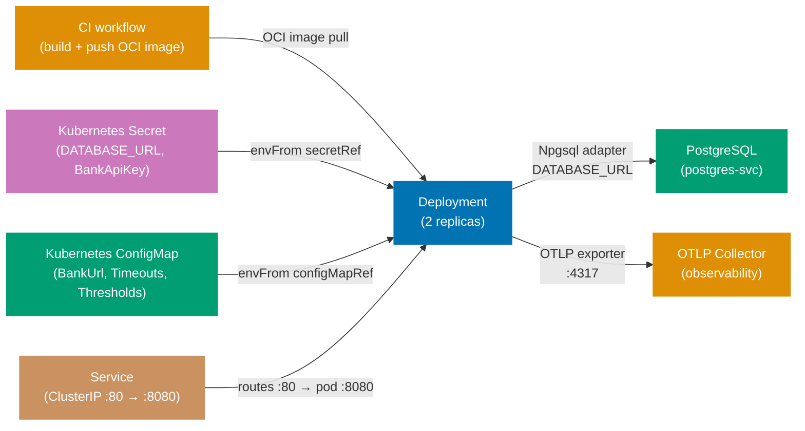

## Guide 23 — Kubernetes Deployment Topology for `procurement-platform-be`

### Why It Matters

A Kubernetes manifest is not a deployment detail you add after the code works — it is the composition root for the entire hexagonal stack at runtime. The `Deployment` object determines how many adapter instances run concurrently; the `ConfigMap` determines which port an adapter connects to; the `Secret` holds the credentials that make the Npgsql adapter authenticate to PostgreSQL and the bank API adapter authenticate to the bank. If these three resources are misaligned, the adapter throws at startup rather than at test time. Writing the Kubernetes manifest before the first production deploy makes the configuration contract explicit and reviewable.

### Standard Library First

`Environment.GetEnvironmentVariable` is the .NET BCL's mechanism for reading runtime configuration. You can run `procurement-platform-be` on any machine by setting environment variables manually:

```bash
# Standard library: running procurement-platform-be with environment variables only
export DATABASE_URL="Host=localhost;Port=5432;Database=procurement_platform_dev;Username=procurement_platform;Password=procurement_platform"
# => DATABASE_URL: the connection string read by Program.fs via IConfiguration
# => Hardcoding credentials in a shell script works locally but cannot be committed to version control

export BankApi__ApiKey="sk-bank-..."
# => Double-underscore: .NET IConfiguration maps this to BankApi.ApiKey in appsettings.json hierarchy
# => Works on every OS that supports environment variables — OS-agnostic

export BankApi__BaseUrl="https://bank-api.example.com/v1"
export BankApi__TimeoutSeconds="30"
# => Two keys: matches the BankApiSettings record in Contexts/Payments/Infrastructure/BankApiAdapter.fs

dotnet run --project src/ProcurementPlatform/ProcurementPlatform.fsproj
# => Starts the Giraffe HTTP server on the default port (5000/5001)
# => No orchestration: one process, one database, no health checks, no pod restart
```

**Limitation for production**: manual environment variables must be set on every machine, are not versioned, and offer no secret rotation. A single missing variable causes the adapter to fail at connection time, not at startup. No liveness or readiness probe means Kubernetes cannot detect a crashed process.

### Production Framework

A Kubernetes manifest for `procurement-platform-be` wires the Deployment, Service, ConfigMap, and Secret into a self-documenting topology:

```yaml
# deploy/k8s/configmap.yaml
# => ConfigMap: non-sensitive key-value pairs — safe to store in version control
apiVersion: v1
# => v1: core API group — ConfigMap is a stable resource type
kind: ConfigMap
# => ConfigMap: holds non-secret key-value pairs injected into pods as environment variables
metadata:
  name: procurement-platform-be-config
  # => name: referenced by envFrom.configMapRef.name in the Deployment spec
  namespace: procurement-platform
  # => namespace: must match the Deployment's namespace for envFrom to resolve
data:
  # => data: key-value pairs injected as env vars — values are plain strings (not base64)
  BankApi__BaseUrl: "https://bank-api.example.com/v1"
  # => Non-secret configuration lives in ConfigMap — safe to commit
  # => Double underscore: ASP.NET Core IConfiguration maps __ to : for nested settings
  BankApi__TimeoutSeconds: "30"
  # => Timeout: tunable per environment without a code change
  ASPNETCORE_URLS: "http://+:8080"
  # => Tells ASP.NET Core to listen on port 8080 inside the pod
  ApprovalThreshold__L1: "1000"
  # => L1 threshold in USD — externalized so finance team can tune without a deploy
  ApprovalThreshold__L2: "10000"
  # => L2 threshold in USD
```

```yaml
# deploy/k8s/secret.yaml
# IMPORTANT: Never commit real secret values. Use Sealed Secrets or External Secrets Operator.
# => This file shows the shape only — real values are injected by the CD pipeline
apiVersion: v1
# => v1: core API group — Secret is a stable resource type
kind: Secret
# => Secret: stores sensitive data; values are base64-encoded (stringData auto-encodes)
metadata:
  name: procurement-platform-be-secrets
  # => name: referenced by envFrom.secretRef.name in the Deployment spec
  namespace: procurement-platform
  # => namespace: must match the Deployment's namespace
type: Opaque
# => Opaque: generic secret type — no built-in interpretation by Kubernetes
stringData:
  # => stringData: Kubernetes base64-encodes the value automatically at apply time
  DATABASE_URL: "Host=postgres-svc;Port=5432;Database=procurement_platform;Username=procurement_platform;Password=REPLACE_ME"
  # => stringData: Kubernetes base64-encodes the value automatically
  # => REPLACE_ME: placeholder — in CI, substitute from Vault or GitHub Secrets
  # => In production, populate via Sealed Secrets: kubeseal --raw --from-file=...
  BankApi__ApiKey: "REPLACE_ME"
  # => The bank API key read by IConfiguration and used by the BankApiAdapter
  # => Never commit a real API key to version control — use Sealed Secrets or ESO
```

```yaml
# deploy/k8s/deployment.yaml
# => This manifest describes one Kubernetes Deployment — one per bounded context service
apiVersion: apps/v1
# => apps/v1: stable API group for Deployments — not in beta
kind: Deployment
# => Deployment: manages a ReplicaSet — handles rollout, rollback, and scaling
metadata:
  name: procurement-platform-be
  # => Name must be unique within the namespace — used by Services to select pods
  namespace: procurement-platform
  # => namespace: isolates resources per product domain — RBAC is applied at namespace level
spec:
  replicas: 2
  # => 2 replicas: zero-downtime rollout — one pod serves traffic while the other restarts
  # => Minimum 2 for production: PodDisruptionBudget can keep 1 running during voluntary disruption
  selector:
    # => selector: Kubernetes uses this to find which pods belong to this Deployment
    matchLabels:
      app: procurement-platform-be
      # => matchLabels: must match template.metadata.labels — ties the Deployment to its pods
      # => Mismatch causes the Deployment to have no pods and the Service to receive no traffic
      # => Immutable after creation — to change, delete and recreate the Deployment
  template:
    # => template: the pod blueprint — every pod created by this Deployment uses this spec
    metadata:
      labels:
        app: procurement-platform-be
        # => app label: used by the Service selector to route traffic to this pod
        # => Must match spec.selector.matchLabels — Kubernetes validates this at apply time
      annotations:
        # => annotations: arbitrary key-value metadata — not used for scheduling or selection
        prometheus.io/scrape: "true"
        # => scrape: "true" — opt-in to Prometheus scraping; default is false
        prometheus.io/port: "8080"
        # => port: the container port Prometheus scrapes — matches containerPort below
        prometheus.io/path: "/metrics"
        # => Prometheus scrape annotations: the operator discovers this pod automatically
    spec:
      # => spec: describes the desired state of the pods in this Deployment's ReplicaSet
      containers:
        # => containers: list of containers in each pod — one container per pod is the norm
        - name: procurement-platform-be
          # => name: must match the Deployment name by convention — not a Kubernetes requirement
          image: ghcr.io/wahidyankf/procurement-platform-be:latest
          # => In production, pin to an immutable SHA digest
          # => latest tag is non-deterministic — replace with :sha-{git-sha} in CI/CD pipeline
          # => ghcr.io: GitHub Container Registry — free for public repos, private requires auth
          ports:
            - containerPort: 8080
              # => containerPort: documentation only — does not open a port; Services do that
              # => port 8080: the Kestrel HTTP server port configured by ASPNETCORE_URLS
          envFrom:
            # => envFrom: bulk-inject all keys from ConfigMap and Secret as env vars
            - configMapRef:
                name: procurement-platform-be-config
                # => Injects all ConfigMap keys as environment variables
                # => ConfigMap: non-sensitive config (BASE_URL, LOG_LEVEL, FEATURE_FLAGS)
            - secretRef:
                name: procurement-platform-be-secrets
                # => Injects all Secret keys — Kubernetes decodes base64
                # => Secret: sensitive values (DATABASE_URL, API_KEY) — never in ConfigMap
          livenessProbe:
            # => livenessProbe: Kubernetes restarts the pod if this probe fails
            httpGet:
              path: /api/v1/health
              # => /api/v1/health: the Giraffe route — returns 200 {"status":"healthy"}
              port: 8080
              # => port: must match containerPort — checked inside the pod network
            initialDelaySeconds: 10
            # => DbUp migrations run at startup — allow time before the first liveness check
            # => If liveness fails: Kubernetes restarts the pod — migrations run again (idempotent)
            periodSeconds: 15
            # => periodSeconds: check every 15 seconds — frequent enough for alerting, not too noisy
          readinessProbe:
            # => readinessProbe: removes pod from load balancer while this probe fails
            httpGet:
              path: /api/v1/readiness
              # => /api/v1/readiness: checks DB connectivity — 200 means the adapter is healthy
              port: 8080
              # => port: same container port — HTTP GET inside the pod network
            initialDelaySeconds: 5
            # => readiness starts 5s before liveness — removes pod from load balancer faster
            periodSeconds: 10
            # => Pod is not sent traffic while readiness fails — protects downstream DB from thrash
          resources:
            requests:
              # => requests: minimum resources the scheduler requires on the node
              memory: "128Mi"
              # => requests.memory: Kubernetes uses this for scheduling — pod lands on a node with 128Mi free
              cpu: "100m"
              # => 100m = 0.1 CPU — sufficient for an idle F# Giraffe server
            limits:
              # => limits: maximum resources the pod may use — enforced by the kernel
              memory: "512Mi"
              # => limits.memory: pod is OOM-killed if it exceeds 512Mi
              cpu: "500m"
              # => 500m = 0.5 CPU — prevents one pod from starving others on the node
              # => OOM-kill on an F# async workload causes in-flight requests to fail
```



**Trade-offs**: `envFrom` with `secretRef` exposes all Secret keys as environment variables — any process inside the container can read them. For stricter secret isolation, mount the Secret as a filesystem volume and read it with `File.ReadAllText` in a custom `IConfiguration` provider. Kubernetes Secrets are base64-encoded, not encrypted at rest by default; enable etcd encryption and use Sealed Secrets or External Secrets Operator before moving to production.

---

## Guide 24 — OpenTelemetry Observability Wiring at the Deployment Seam

### Why It Matters

Guide 20 showed how to add OpenTelemetry spans to individual port calls. At the deployment seam, the concern shifts: where does the collected telemetry go, and how does `procurement-platform-be` register its trace sources so that the SDK exports them? A misconfigured OTLP exporter means you pay the span creation overhead in every request but see nothing in Jaeger or Honeycomb. Getting this right before the first production deploy saves the painful debugging session where P95 latency spikes but the trace dashboard shows only half the spans.

### Standard Library First

`System.Diagnostics.ActivitySource` creates spans, and you can write a minimal listener that prints spans to stdout — verifying that spans are emitted before adding the OpenTelemetry SDK:

```fsharp
// Standard library: ActivityListener writing spans to stdout
open System.Diagnostics
// => System.Diagnostics: ActivitySource, Activity, ActivityListener — .NET native tracing

let private listener =
    // => ActivityListener: subscribes to all ActivitySources matching the filter below
    new ActivityListener(
        ShouldListenTo = (fun source ->
            // => ShouldListenTo: predicate evaluated per ActivitySource — return true to subscribe
            source.Name.StartsWith("ProcurementPlatform")
            // => Filter: only listen to ProcurementPlatform.* sources — reduces noise from BCL internals
        ),
        Sample = (fun _ -> ActivitySamplingResult.AllDataAndRecorded),
        // => AllDataAndRecorded: record all data — useful for debugging; use ParentBased in production
        // => Sample: called per-activity to decide sampling rate — AllDataAndRecorded records 100%
        ActivityStopped = (fun activity ->
            // => ActivityStopped: called when the Activity.Dispose() is called (use binding exits)
            printfn "[TRACE] %s duration=%dms status=%A"
                // => printfn: writes to stdout — unstructured, not queryable, lost on pod restart
                activity.DisplayName
                // => DisplayName: the span name passed to StartActivity — e.g., "purchasing.save-purchase-order"
                activity.Duration.Milliseconds
                // => Duration: elapsed time from StartActivity to Dispose — actual wall-clock span duration
                activity.Status
                // => Status: ActivityStatusCode (Unset/Ok/Error) — set by the observability adapter
            // => Print each completed span: name, duration, status
        )
    )

ActivitySource.AddActivityListener(listener)
// => Register the listener: all ActivitySources emit to this listener after this call
// => Must be called before any ActivitySource.StartActivity() — typically in Program.fs startup
```

**Limitation for production**: stdout span output is unstructured — you cannot query duration percentiles, correlate trace IDs across services, or set up alerts. Spans are lost when the pod restarts.

### Production Framework

`procurement-platform-be` wires OpenTelemetry in `Composition/Program.fs` using the `OpenTelemetry.Extensions.Hosting` NuGet package:

```fsharp
// Program.fs: OpenTelemetry SDK registration at startup
open OpenTelemetry.Resources
// => OpenTelemetry.Resources: ResourceBuilder — describes the service identity
open OpenTelemetry.Trace
// => OpenTelemetry.Trace: TracerProvider, AddSource, AddOtlpExporter
open OpenTelemetry.Metrics
// => OpenTelemetry.Metrics: MeterProvider, AddPrometheusExporter, AddRuntimeInstrumentation

let configureObservability (builder: WebApplicationBuilder) =
    // => Called once from Program.fs at startup — wires telemetry before app.Build()
    let otlpEndpoint =
        // => Read OTLP endpoint from configuration — avoids hardcoding the collector address
        builder.Configuration.["OTEL_EXPORTER_OTLP_ENDPOINT"]
        // => Read from environment variable — ConfigMap injects this in Kubernetes
        |> Option.ofObj
        // => Option.ofObj: null becomes None — configuration key may be absent in local dev
        |> Option.defaultValue "http://localhost:4317"
        // => Local fallback: points at a locally-running collector for development
        // => In Kubernetes: OTEL_EXPORTER_OTLP_ENDPOINT overrides this to the cluster collector
    builder.Services
        .AddOpenTelemetry()
        // => AddOpenTelemetry: registers the SDK as an IHostedService that flushes on shutdown
        // => IHostedService: SDK calls ForceFlush on app shutdown — no spans lost at graceful shutdown
        .ConfigureResource(fun r ->
            // => ConfigureResource: sets attributes attached to every span and metric
            r.AddService(
                serviceName = "procurement-platform-be",
                // => serviceName: the service.name resource attribute — visible in Jaeger / Honeycomb
                serviceVersion = "1.0.0",
                // => serviceVersion: the deployed version — correlates spans to a specific release
                serviceInstanceId = System.Environment.MachineName
                // => MachineName: the pod hostname in Kubernetes — identifies which replica emitted the span
            )
            |> ignore)
            // => |> ignore: AddService returns ResourceBuilder — discard to complete the method chain
        .WithTracing(fun t ->
            // => WithTracing: configures the TracerProvider — subscribes to ActivitySources
            t
                .AddAspNetCoreInstrumentation()
                // => Automatic spans for every HTTP request: method, route, status code, duration
                // => Creates parent spans for all Giraffe handlers — port spans nest inside as children
                .AddSource("ProcurementPlatform.Purchasing")
                // => Purchasing context observability adapter source from Guide 20
                .AddSource("ProcurementPlatform.Supplier")
                // => Supplier context observability decorator source
                .AddSource("ProcurementPlatform.Receiving")
                // => Receiving context observability decorator source
                .AddSource("ProcurementPlatform.Payments")
                // => Payments context: spans for bank API calls — critical for payment audit trail
                .AddSource("ProcurementPlatform.Adapters")
                // => Generic adapter source: used by any adapter following the Guide 20 decorator pattern
                .AddOtlpExporter(fun o ->
                    // => OTLP exporter: sends spans to the OpenTelemetry Collector via gRPC
                    o.Endpoint <- System.Uri(otlpEndpoint)
                    // => OTLP gRPC: sends spans to the collector in binary protobuf format
                    // => Collector forwards to Jaeger, Honeycomb, Grafana Tempo, etc.
                )
            |> ignore)
            // => |> ignore: WithTracing returns OpenTelemetryBuilder — discard to continue chaining
        .WithMetrics(fun m ->
            // => WithMetrics: configures the MeterProvider — collects and exports metrics
            m
                .AddAspNetCoreInstrumentation()
                // => HTTP request counters, latency histograms
                // => Instruments: http.server.request.duration, http.server.active_requests
                .AddRuntimeInstrumentation()
                // => .NET runtime metrics: GC collections, thread pool queue depth, heap size
                // => Instruments: dotnet.gc.collections, dotnet.thread_pool.work_item.count, etc.
                .AddPrometheusExporter()
                // => Exposes /metrics endpoint in Prometheus text format
                // => Prometheus scrapes /metrics; the Deployment annotation tells it to do so
            |> ignore)
        |> ignore
        // => |> ignore: AddOpenTelemetry returns OpenTelemetryBuilder — discard after configuration
    builder
    // => Return builder: enables method chaining in Program.fs startup
```

The Kubernetes ConfigMap from Guide 23 adds the OTLP endpoint key so no code change is needed per environment:

```yaml
# Extend deploy/k8s/configmap.yaml with the OTLP endpoint
# => This snippet adds observability keys to the existing ConfigMap from Guide 23
data:
  # => data: these keys are merged into the existing ConfigMap — no rebuild required
  OTEL_EXPORTER_OTLP_ENDPOINT: "http://otel-collector-svc.observability:4317"
  # => otel-collector-svc.observability: service name in the "observability" namespace
  # => Cross-namespace DNS: <service>.<namespace>.svc.cluster.local — shortened form works in-cluster
  OTEL_RESOURCE_ATTRIBUTES: "deployment.environment=production"
  # => Additional resource attribute: "production" vs "staging" filtering in the trace UI
```

**Trade-offs**: adding `AddAspNetCoreInstrumentation` includes the HTTP route template in the span attributes — useful for grouping spans by handler but a compliance risk if query parameters embed PII. Set `RecordException = false` for regulated environments. Use head-based sampling (`AddTraceIdRatioBasedSampler(0.1)`) in the `.WithTracing` builder to sample 10% of traces in high-traffic scenarios.

---

## Guide 25 — Failure-Mode Degraded Adapters

### Why It Matters

When the PostgreSQL pod is unhealthy during a rolling restart, or the bank API returns 503 for thirty seconds, you have two choices: fail every request immediately, or serve degraded responses from fallback adapters. The hexagonal architecture makes the second choice tractable — because the application service depends on port records, not concrete adapters, you can swap in a degraded adapter at the composition root without touching business logic. The circuit-breaker from Guide 18 is the trigger; this guide shows the fallback adapter wired to it.

### Standard Library First

F# option types and simple try/catch at the handler level provide a primitive fallback:

```fsharp
// Standard library: try/catch fallback at the Giraffe handler level
open Giraffe
// => Giraffe: json, text, RequestErrors, ServerErrors — HTTP response helpers

let handleGetPurchaseOrder (repo: PurchaseOrderRepository) (poId: System.Guid) : HttpHandler =
    // => repo: PurchaseOrderRepository injected at composition root
    // => poId: raw Guid from the URL — wrapped in PurchaseOrderId DU inside the handler
    fun next ctx ->
        // => HttpHandler: (HttpFunc -> HttpContext -> Task<HttpContext option>)
        task {
            // => task { }: C#-compatible async computation — Giraffe requires Task, not F# Async
            try
                // => try/with: unhandled exception from the repo lands here — no typed discrimination
                let! result = repo.FindPurchaseOrder (PurchaseOrderId poId)
                // => FindPurchaseOrder: async DB call — let! awaits the result
                match result with
                | Ok (Some po) ->
                    // => PO found: serialize to JSON and return 200
                    return! json po next ctx
                    // => json: Giraffe combinator — sets Content-Type: application/json
                | Ok None ->
                    // => PO not found: 404 response
                    return! RequestErrors.notFound (text "Not found") next ctx
                    // => NOT_FOUND: 404 status with plain text body
                | Error _ ->
                    // => Repository failure: 503 — typed discrimination not available (stderr logging only)
                    return! ServerErrors.serviceUnavailable (text "Storage unavailable") next ctx
                    // => serviceUnavailable: 503 — caller should retry or show degraded state
            with ex ->
                // => Unhandled exception: falls here if repo throws instead of returning Error
                return! ServerErrors.internalError (text ex.Message) next ctx
                // => 500 with the exception message — leaks internal details to the caller
                // => ANTI-PATTERN: expose the RepositoryError variant in the port to avoid this
        }
```

**Limitation for production**: the fallback logic is inside the handler — every handler must duplicate it. When the database goes down, all handlers fail the same way, but the logic must be audited and updated in every file.

### Production Framework

The degraded-mode pattern introduces a `DegradedPurchaseOrderRepository` that wraps a cached snapshot and a `NullEventPublisher` that silently drops events when the broker is unavailable:

```fsharp
// Degraded read adapter: returns a cached snapshot when the DB port fails
// src/ProcurementPlatform/Contexts/Purchasing/Infrastructure/DegradedPurchaseOrderRepository.fs
module ProcurementPlatform.Contexts.Purchasing.Infrastructure.DegradedPurchaseOrderRepository
// => Infrastructure layer: an alternative adapter activated by the composition root when degraded

open ProcurementPlatform.Contexts.Purchasing.Application.Ports
// => Port types: PurchaseOrderRepository — the record both adapters must satisfy
open ProcurementPlatform.Contexts.Purchasing.Domain
// => Domain types: PurchaseOrderId, PurchaseOrder — cache key and value types

// Shared degraded-mode flag: true when the circuit-breaker has opened
let mutable isDegraded = false
// => mutable: written by the circuit-breaker callback, read by the composition root
// => Thread-safe for reads (bool is atomic on .NET); writes use Interlocked.Exchange in production
// => Module-level mutable: composition root reads this to select between adapters

// Cache: holds the last successful snapshot of purchase orders
let private cache = System.Collections.Concurrent.ConcurrentDictionary<PurchaseOrderId, PurchaseOrder>()
// => ConcurrentDictionary: thread-safe; written by the real adapter on success, read by the degraded adapter
// => private: only this module writes to the cache — withCachePopulation populates it on success

// Degraded PurchaseOrderRepository adapter: returns cached snapshots
let cachedPurchaseOrderRepository : PurchaseOrderRepository =
    // => Satisfies PurchaseOrderRepository port — composition root substitutes this when isDegraded = true
    { FindPurchaseOrder =
        // => FindPurchaseOrder: read path — serves from the in-memory cache, no DB call
        fun poId ->
            // => fun poId: same signature as the real adapter — transparent substitution
            async {
                // => async { }: no I/O — cache lookup is synchronous but wrapped in async for port compatibility
                match cache.TryGetValue(poId) with
                // => TryGetValue: O(1) concurrent read — thread-safe without a lock
                | true, po ->
                    return Ok (Some po)
                    // => Cache hit: return the last-known PO without touching the database
                    // => Stale data: the PO may have changed since the last successful DB read
                | false, _ ->
                    return Ok None
                    // => Cache miss: no snapshot available — return Ok None, not an error
                    // => The caller (handler) returns HTTP 404 — consistent with a live DB miss
            }
      SavePurchaseOrder =
        // => SavePurchaseOrder: write path — writes rejected during degraded mode
        fun _ ->
            // => fun _: discard the PO argument — no write can be committed during degradation
            async {
                return Error (ConnectionFailure (System.Exception("Service degraded — writes unavailable")))
                // => Callers (handlers) translate this to a 503 response with a Retry-After header
                // => ConnectionFailure: reuses the existing RepositoryError case — no new type needed
            }
    }

// Cache-populating decorator for the real Npgsql adapter
let withCachePopulation (inner: PurchaseOrderRepository) : PurchaseOrderRepository =
    // => Decorator: wraps inner.FindPurchaseOrder to populate the cache on success
    // => inner: the real Npgsql adapter — called first; cache updated as a side effect
    { FindPurchaseOrder =
        fun poId ->
            // => Same signature as FindPurchaseOrder — transparent to the application service
            async {
                let! result = inner.FindPurchaseOrder poId
                // => Call the real adapter — actual DB query
                match result with
                | Ok (Some po) ->
                    // => Success with data: populate or refresh the cache entry
                    cache.[po.Id] <- po
                    // => Populate the cache on success — degraded adapter can serve this entry later
                    // => Concurrent write: ConcurrentDictionary handles multiple threads safely
                | _ -> ()
                // => Error or Ok None: do not update cache — degraded mode will use the last-good snapshot
                return result
                // => Pass through the result unchanged — decorator is transparent to the caller
            }
      SavePurchaseOrder = inner.SavePurchaseOrder
      // => Save path: no cache to populate on writes — delegate directly to inner
    }
```

```fsharp
// Null event publisher: silently drops events when the outbox is unavailable
// src/ProcurementPlatform/Contexts/Purchasing/Infrastructure/NullEventPublisher.fs
module ProcurementPlatform.Contexts.Purchasing.Infrastructure.NullEventPublisher
// => Null object pattern: satisfies the EventPublisher port without I/O

open ProcurementPlatform.Contexts.Purchasing.Application.Ports
// => EventPublisher: the port this null adapter satisfies

let nullEventPublisher : EventPublisher =
    // => Module-level value: shared per process — stateless, no side effects
    { Publish =
        // => Record literal: satisfies the single-field EventPublisher record
        fun _event ->
            // => _event: ignored — the event is discarded without network I/O
            async {
                // => async { }: maintains the Async<Result<unit, string>> return type contract
                return Ok ()
                // => Ok (): the application service proceeds as if the event was published
                // => Silent drop: wire a logging decorator in production for observability
            }
    }
// => When the circuit-breaker closes, the composition root swaps back to the real outbox adapter
// => Events emitted during degraded mode are permanently lost — acceptable for non-critical notifications
```

```fsharp
// Program.fs: circuit-breaker callback selects the correct adapter
open ProcurementPlatform.Contexts.Purchasing.Infrastructure.DegradedPurchaseOrderRepository
// => Import isDegraded flag and cachedPurchaseOrderRepository — both defined in this module

let buildPurchaseOrderRepository (connStr: string) : PurchaseOrderRepository =
    // => Called at request time or startup — composition root re-evaluates isDegraded on each call
    if isDegraded then
        // => Circuit open: bypass the database entirely
        cachedPurchaseOrderRepository
        // => Circuit open: serve from cache — no database I/O
        // => Application service receives a valid PurchaseOrderRepository — no code change needed
    else
        // => Circuit closed: normal path
        NpgsqlPurchaseOrderRepository.npgsqlPurchaseOrderRepository connStr
        // => Real Npgsql adapter: hits PostgreSQL on every call
        |> withCachePopulation
        // => Circuit closed: serve from Npgsql and populate the cache as a side-effect

let buildEventPublisher (connStr: string) : EventPublisher =
    // => Same pattern as buildPurchaseOrderRepository — selects EventPublisher adapter based on circuit state
    if isDegraded then
        NullEventPublisher.nullEventPublisher
        // => Circuit open: drop events — the outbox table is inaccessible
        // => Application service calls pub.Publish — receives Ok () — no exception, no retry
    else
        OutboxEventPublisher.makeOutboxPublisher connStr
        // => Circuit closed: write to outbox — at-least-once delivery resumes
```

**Trade-offs**: the degraded read adapter serves stale data — clients receive a response that may be minutes or hours old. For a procurement platform, serving a stale PO list is better than returning 503 and blocking a manager who needs to check approval status. The null event publisher silently drops events — if at-least-once delivery is a hard requirement, replace it with an in-memory buffer that replays to the outbox when the broker recovers, accepting the risk of buffer overflow under sustained outages.

---

## Guide 26 — Configuration Adapter at the Deploy Seam: Secrets to Typed `IOptions<T>`

### Why It Matters

`procurement-platform-be` reads `BankApiSettings` from configuration at startup. The journey of a secret from a Kubernetes Secret object to a strongly-typed F# record crosses four boundaries: Kubernetes injects the Secret key as an environment variable; the ASP.NET Core configuration system reads the environment variable; the `IOptions<T>` binding maps it to `BankApiSettings`; the composition root reads the record and passes it to the adapter factory. A break at any boundary — a renamed key, a missing namespace prefix, a wrong casing — silently produces an empty string instead of the expected value. Making this chain explicit prevents the class of bugs where the bank adapter always returns auth errors because `ApiKey` is empty.

### Standard Library First

`Environment.GetEnvironmentVariable` reads a single key directly — the manual approach:

```fsharp
// Standard library: read BankApiSettings manually from environment variables
open System
// => System.Environment: provides GetEnvironmentVariable — reads from the process environment
open ProcurementPlatform.Contexts.Payments.Infrastructure.BankApiAdapter
// => BankApiSettings: the typed config record the adapter requires

let readBankApiSettings () : Result<BankApiSettings, string> =
    // => Returns Result<BankApiSettings, string>: Ok on success, Error with a message on missing key
    let apiKey = Environment.GetEnvironmentVariable("BankApi__ApiKey")
    // => Double-underscore naming: matches IConfiguration's hierarchy separator convention
    // => If the Kubernetes Secret key is "BANK_API_KEY" instead, this returns null
    // => Null return: environment variable not set — no exception, no default value
    let baseUrl = Environment.GetEnvironmentVariable("BankApi__BaseUrl")
    // => baseUrl: the bank API base URL — must be a valid HTTPS URI
    let timeoutStr = Environment.GetEnvironmentVariable("BankApi__TimeoutSeconds")
    // => timeoutStr: string value — must be parsed to int; no type coercion from environment
    match apiKey, baseUrl, timeoutStr with
    // => Tuple match: check all three required keys before constructing the settings record
    | null, _, _ -> Error "BankApi__ApiKey is not set"
    // => Missing API key: bank adapter cannot authenticate — fail fast at startup
    | _, null, _ -> Error "BankApi__BaseUrl is not set"
    // => Missing base URL: bank adapter has no endpoint to call
    | _, _, null -> Error "BankApi__TimeoutSeconds is not set"
    // => Missing timeout: bank adapter cannot configure per-call timeout
    | key, url, ts ->
        // => All keys present: attempt to parse the timeout string
        match System.Int32.TryParse(ts) with
        | true, timeout -> Ok { ApiKey = key; BaseUrl = url; TimeoutSeconds = timeout }
        // => Successful parse: construct and return the typed settings record
        | false, _ -> Error (sprintf "BankApi__TimeoutSeconds is not a valid integer: %s" ts)
        // => Parse failure: mis-configured timeout — fail fast with a descriptive error
```

**Limitation for production**: `GetEnvironmentVariable` reads at call time — no binding validation (empty-string keys pass the null check). Changes to the key names in the Kubernetes ConfigMap/Secret must be manually mirrored in every `GetEnvironmentVariable` call.

### Production Framework

`procurement-platform-be` uses `builder.Services.Configure<ValidatedBankApiSettings>` in `Composition/Program.fs`. This makes the full binding chain explicit and adds validation via `ValidateDataAnnotations`:

```fsharp
// Program.fs: typed IOptions<T> binding with startup validation
open Microsoft.Extensions.DependencyInjection
// => IServiceCollection extension methods: AddOptions<T>
open Microsoft.Extensions.Options
// => IOptions<T>: typed settings accessor — resolved from DI container
open System.ComponentModel.DataAnnotations
// => Required, MinLength, Url, Range: validation attributes checked at startup

// Validated settings type with data annotation constraints
[<CLIMutable>]
// => CLIMutable: generates public setters required by IOptions<T> binding
// => Without CLIMutable, IOptions<T> cannot set the fields — binding silently produces empty values
type ValidatedBankApiSettings =
    { [<Required; MinLength(10)>]
      // => [<Required; MinLength(10)>]: composite attributes on the ApiKey field
      ApiKey: string
      // => [<Required>]: fails startup if the key is null or empty string
      // => [<MinLength(10)>]: a valid bank API key is long — detects placeholder "REPLACE_ME"
      [<Required; Url>]
      BaseUrl: string
      // => [<Url>]: validates the BaseUrl is a well-formed absolute URI at startup
      // => [<Required>]: fails startup if BaseUrl is null or empty
      [<Range(5, 120)>]
      TimeoutSeconds: int }
      // => [<Range>]: timeout between 5 and 120 seconds — catches misconfigured 0 or negative values

let configureOptions (builder: WebApplicationBuilder) =
    // => Called once from Program.fs startup — registers the settings binding
    builder.Services
        .AddOptions<ValidatedBankApiSettings>()
        // => Registers ValidatedBankApiSettings in the DI container as IOptions<ValidatedBankApiSettings>
        .BindConfiguration("BankApi")
        // => BindConfiguration: reads the "BankApi" section from IConfiguration
        // => Environment variable "BankApi__ApiKey" maps to section "BankApi", key "ApiKey"
        .ValidateDataAnnotations()
        // => Runs [<Required>] and other data annotation checks during DI container build
        .ValidateOnStart()
        // => ValidateOnStart: validates during WebApplication.Build() — fails fast before serving traffic
        // => A missing ApiKey terminates the process with a clear error, not a 401 on the first bank call
    |> ignore
    // => |> ignore: OptionsBuilder<T> returned by ValidateOnStart — discard the builder
    builder
    // => Return builder: enables chaining in Program.fs
```

```fsharp
// Adapter factory: reads validated settings from IOptions<T>
module ProcurementPlatform.Contexts.Payments.Infrastructure.OptionsAwareAdapterFactory
// => Infrastructure: bridges the DI container's IOptions<T> to the adapter factory

open Microsoft.Extensions.Options
// => IOptions<T>: typed accessor for the bound settings — guaranteed valid by ValidateOnStart
open System.Net.Http
// => IHttpClientFactory: managed HttpClient pool — injected by DI container
open ProcurementPlatform.Contexts.Payments.Infrastructure.BankApiAdapter
// => ValidatedBankApiSettings, BankApiSettings, make — the types and factory this function uses

let makeFromOptions (options: IOptions<ValidatedBankApiSettings>) (factory: IHttpClientFactory) =
    // => Called by the composition root at startup — both parameters injected by the DI container
    let validated = options.Value
    // => .Value: reads the validated, bound settings record
    // => If ValidateOnStart passed, validated.ApiKey is guaranteed non-null and >= 10 characters
    // => IOptions<T>.Value is thread-safe — singleton scope; reads from the DI container's cached binding
    let settings : BankApiSettings =
        // => Map from ValidatedBankApiSettings to BankApiSettings — removes data annotation noise from the adapter
        { ApiKey = validated.ApiKey
          // => ApiKey: validated non-null, minimum 10 characters
          BaseUrl = validated.BaseUrl
          // => BaseUrl: validated as a well-formed absolute URI
          TimeoutSeconds = validated.TimeoutSeconds }
          // => TimeoutSeconds: validated as 5 ≤ x ≤ 120
    make settings factory
    // => Returns BankingPort port record — the composition root wires it to the application service
    // => make: the BankApiAdapter.make factory from Guide 17 — receives typed settings, not IOptions<T>
```

**Trade-offs**: `ValidateOnStart` fails the process at startup — the Kubernetes Deployment rolls back the failed pod and keeps the previous replica running. This is the desired behaviour (fast fail over silent misconfiguration), but it means a misconfigured Secret causes a `CrashLoopBackOff` that requires a ConfigMap/Secret fix and a pod restart to recover. Hot-reload of `IOptions` (via `IOptionsMonitor<T>`) allows configuration changes without restart but bypasses `ValidateOnStart` — validate manually inside the reload callback if hot-reload is enabled.

---

## Guide 27 — Background Job Adapter

### Why It Matters

The outbox relay worker from Guide 19 is itself a background job — an `IHostedService` that runs alongside the HTTP server. When the platform needs scheduled work (e.g., escalating purchase orders that have been awaiting approval for more than five business days, or sending remittance advice to suppliers after payment is disbursed), that work must go through a port rather than being wired directly into a hosted service. This guide shows the `IHostedService` + port pair that keeps background jobs testable and swappable under the hexagonal architecture.

### Standard Library First

An `IHostedService` with inline business logic skips the port entirely:

```fsharp
// Standard library: IHostedService with inline business logic — no port
// => ANTI-PATTERN: business logic and infrastructure mixed in the same class
open Microsoft.Extensions.Hosting
// => IHostedService: background service lifecycle — StartAsync, StopAsync
open Npgsql
// => Npgsql: database access imported directly into the hosted service — no port separation
open Dapper
// => Dapper: query helper — imported alongside Npgsql in an infrastructure concern

type StaleApprovalEscalatorWorker(connStr: string) =
    // => Primary constructor: connStr injected — tight coupling to the database technology
    // => ANTI-PATTERN: string parameter signals no port abstraction — the DB technology is hardwired
    interface IHostedService with
        member _.StartAsync(ct) =
            // => ct: CancellationToken for graceful shutdown
            task {
                // => task { }: IHostedService requires Task, not F# Async<unit>
                while not ct.IsCancellationRequested do
                    // => Loop until shutdown — poll interval is the Task.Delay at the bottom
                    use conn = new NpgsqlConnection(connStr)
                    // => Npgsql connection opened inline — no repository port involved
                    // => PROBLEM: opening Npgsql directly ties business logic to PostgreSQL
                    let! staleOrders =
                        // => let!: awaits the async DB query result
                        conn.QueryAsync<System.Guid>(
                            "SELECT po_id FROM purchasing.purchase_orders WHERE status = 'AwaitingApproval' AND created_at < NOW() - INTERVAL '5 days'")
                            // => SQL: business rule ("5 days") embedded as a string — not testable, not configurable
                        |> Async.AwaitTask
                    // => SQL query inside the hosted service — business rule ("5 days") in infrastructure
                    // => PROBLEM: cannot test "5 days" threshold without a real PostgreSQL instance
                    // => staleOrders: IEnumerable<Guid> — raw IDs, not domain PurchaseOrder aggregates
                    for poId in staleOrders do
                        // => Iterate over stale PO IDs — no domain aggregate, no smart constructors
                        let! _ =
                            conn.ExecuteAsync(
                                "UPDATE purchasing.purchase_orders SET status = 'Escalated' WHERE po_id = @Id",
                                {| Id = poId |})
                                // => {| Id = poId |}: anonymous record parameter — Dapper maps to @Id
                            |> Async.AwaitTask
                        // => Direct UPDATE — no domain event, no application service
                        // => PROBLEM: PurchaseOrderApprovalEscalated event is never published — downstream consumers miss the transition
                        ()
                    do! System.Threading.Tasks.Task.Delay(60_000) |> Async.AwaitTask
                    // => Poll every 60 seconds — hardcoded, not configurable without a code change
            }
        member _.StopAsync(_) = System.Threading.Tasks.Task.CompletedTask
        // => StopAsync: no cleanup — the CancellationToken terminates the while loop
```

**Limitation for production**: business logic ("5 days") inside the hosted service cannot be tested without a real database. No domain event is published when a PO is escalated — downstream consumers (approval-router, finance team) miss the transition. No port means swapping the database requires changing the hosted service.

### Production Framework

The hexagonal approach defines a background job port and wires the hosted service to call the application service through it:

```fsharp
// Background job port: EscalateStaleApprovalsJob
// src/ProcurementPlatform/Contexts/Purchasing/Application/Ports.fs (extended)
module ProcurementPlatform.Contexts.Purchasing.Application.Ports
// => Application layer: defines the port — infrastructure adapters satisfy it

open ProcurementPlatform.Contexts.Purchasing.Domain
// => PurchaseOrder, PurchaseOrderId, ApprovalLevel — types referenced by the port and service

// Background job port: function alias for the "escalate stale approvals" operation
type EscalateStaleApprovalsJob =
    System.DateTimeOffset -> Async<Result<PurchaseOrder list, string>>
// => DateTimeOffset cutoff: the caller (hosted service) passes the cutoff time
// => Returns the list of escalated POs — the hosted service publishes events for each
// => Clock port (Guide 5 pattern): the cutoff is computed by the caller from the injected Clock

// Application service: escalate stale approvals
let escalateStaleApprovals
    (findStale: System.DateTimeOffset -> Async<Result<PurchaseOrder list, string>>)
    // => Read port: find POs in AwaitingApproval state opened before the cutoff
    (escalatePO: PurchaseOrder -> Async<Result<unit, string>>)
    // => Write port: escalate a single PO — adapter issues the UPDATE
    (pub: EventPublisher)
    // => Event publisher: publish PurchaseOrderApprovalEscalated for each escalated PO
    (clock: Clock)
    // => Clock port: returns the current time — frozen in tests
    : Async<Result<PurchaseOrder list, string>> =
    // => Returns the full list of escalated POs — the hosted service logs the count
    async {
        // => async { }: all port calls are async — findStale and escalatePO perform I/O
        let cutoff = (clock ()).AddDays(-5.0)
        // => Compute the cutoff from the injected clock — testable without System.DateTime.Now
        // => AddDays(-5.0): POs waiting more than 5 days trigger escalation
        let! staleResult = findStale cutoff
        // => findStale: calls the read adapter — returns POs in AwaitingApproval state before cutoff
        match staleResult with
        | Error e -> return Error e
        // => Read failure: propagate the error — the hosted service logs and skips this cycle
        | Ok stalePOs ->
            // => stalePOs: list of POs to escalate — may be empty; Async.Parallel over empty list is safe
            let! _ =
                stalePOs
                // => stalePOs: the PO aggregates fetched by findStale — typed, not raw Guids
                |> List.map (fun po ->
                    // => map: creates one async computation per stale PO
                    async {
                        // => async { }: each PO's escalation is an independent async operation
                        let! r = escalatePO po
                        // => escalatePO: calls the write adapter — issues the UPDATE for this PO
                        match r with
                        // => Exhaustive match: both Ok and Error are handled
                        | Ok () ->
                            // => UPDATE committed: publish the escalation event
                            do! pub.Publish (PurchaseOrderApprovalEscalated { PurchaseOrderId = po.Id; ApprovalLevel = po.ApprovalLevel })
                            // => Publish escalation event — approval-router re-routes to next level manager
                            // => PurchaseOrderApprovalEscalated: tutorial-specific extension; not in the base domain event spec
                        | Error e ->
                            eprintfn "Failed to escalate PO %A: %s" po.Id e
                            // => Log and continue — partial failure acceptable for a batch job
                    })
                |> Async.Parallel
                // => Async.Parallel: escalate all stale POs concurrently — independent I/O operations
                // => let! _ =: discard the unit array result — we return stalePOs, not the per-PO results
            return Ok stalePOs
            // => Return the escalated list — caller (hosted service) logs the count
    }
```

```fsharp
// IHostedService: calls the application service on a schedule
// src/ProcurementPlatform/Contexts/Purchasing/Infrastructure/StaleApprovalEscalatorWorker.fs
module ProcurementPlatform.Contexts.Purchasing.Infrastructure.StaleApprovalEscalatorWorker
// => Infrastructure layer: the only place that knows about the polling schedule and IHostedService lifecycle

open Microsoft.Extensions.Hosting
// => IHostedService: background service — StartAsync called at startup, StopAsync on graceful shutdown
open ProcurementPlatform.Contexts.Purchasing.Application
// => PurchasingService module: contains escalateStaleApprovals — the application service function
open ProcurementPlatform.Contexts.Purchasing.Application.Ports
// => EventPublisher, Clock — port types injected at construction time

type StaleApprovalEscalatorWorker
    // => Primary constructor: all four ports injected by the DI container at startup
    (findStale: System.DateTimeOffset -> Async<Result<PurchaseOrder list, string>>,
     // => Read port: Npgsql adapter queries stale POs from the database
     escalatePO: PurchaseOrder -> Async<Result<unit, string>>,
     // => Write port: Npgsql adapter issues the UPDATE for each stale PO
     pub: EventPublisher,
     // => Event publisher: outbox adapter publishes PurchaseOrderApprovalEscalated
     clock: Clock) =
     // => Clock port: returns DateTimeOffset.UtcNow in production, frozen in tests
    // => All four ports injected by the composition root — the worker has no infrastructure imports
    interface IHostedService with
        member _.StartAsync(ct) =
            // => ct: CancellationToken for graceful shutdown — terminates the while loop
            task {
                // => task { }: IHostedService requires Task — the application service uses Async<T>
                while not ct.IsCancellationRequested do
                    // => Loop until shutdown — escalates stale POs every 60 seconds
                    let! result = PurchasingService.escalateStaleApprovals findStale escalatePO pub clock
                    // => Call the application service with all four ports — hexagonal isolation preserved
                    // => let!: awaits the async result — blocks this iteration until escalation completes
                    match result with
                    | Ok escalated ->
                        printfn "Escalated %d stale purchase orders" escalated.Length
                        // => In production, use structured logging (ILogger<T>)
                        // => escalated.Length: the number of POs transitioned this cycle
                    | Error e ->
                        eprintfn "escalateStaleApprovals failed: %s" e
                        // => Log the error and continue — the next iteration retries
                    do! System.Threading.Tasks.Task.Delay(60_000) |> Async.AwaitTask
                    // => Poll every 60 seconds — configurable via AppConfig in production
                    // => Task.Delay: non-blocking sleep — thread pool is free during the delay
            }
        member _.StopAsync(_) = System.Threading.Tasks.Task.CompletedTask
        // => StopAsync: no cleanup — CancellationToken terminates the while loop
```

The unit test for the application service uses in-memory adapters — no Docker, no hosted service lifecycle:

```fsharp
// Unit test: escalateStaleApprovals using in-memory adapters and a frozen clock
// Tests/Purchasing/EscalateStaleApprovalsTests.fs
module ProcurementPlatform.Tests.Purchasing.EscalateStaleApprovalsTests
// => Unit test: no database, no Docker, no IHostedService lifecycle

open Xunit
// => Xunit: test runner — discovers [<Fact>] attributes
open ProcurementPlatform.Contexts.Purchasing.Application.PurchasingService
// => escalateStaleApprovals: the application service function under test

[<Fact>]
// => [<Fact>]: parameterless unit test — uses stub adapters, no external dependencies
let ``escalateStaleApprovals escalates POs awaiting approval for more than 5 days`` () =
    async {
        // Arrange
        let frozenNow = System.DateTimeOffset(2026, 5, 17, 0, 0, 0, System.TimeSpan.Zero)
        // => Frozen clock: the cutoff becomes 2026-05-12 — deterministic regardless of test run date
        // => DateTimeOffset with zero offset: avoids timezone ambiguity in tests

        let money = createMoney 8000m "USD" |> Result.defaultWith failwith
        // => createMoney: smart constructor — 8000 USD is above L2 threshold
        let stalePO =
            // => Construct the stale PO aggregate — fields chosen to satisfy the test scenario
            { Id = PurchaseOrderId (System.Guid.NewGuid())
              // => Fresh Guid: each test run uses a unique PO ID
              SupplierId = SupplierId (System.Guid.NewGuid())
              // => Arbitrary supplier — irrelevant for the escalation test
              TotalAmount = money
              // => 8000 USD L2 approval — ApprovalLevel matches the aggregate
              Status = AwaitingApproval
              // => AwaitingApproval: the only status that triggers escalation
              ApprovalLevel = L2
              // => L2: the approval level carried into the PurchaseOrderApprovalEscalated event
              CreatedAt = frozenNow.AddDays(-6.0) }
              // => PO created 6 days ago — beyond the 5-day escalation threshold

        let escalatedPOs = ref []
        // => Track which POs were escalated — assertion target
        // => ref []: mutable list cell — escalatePO stub prepends to it

        let findStale _cutoff =
            // => _cutoff: ignored — stub always returns the pre-built stalePO list
            async { return Ok [stalePO] }
            // => Stub: returns the stale PO regardless of cutoff — simplifies the test

        let escalatePO po =
            // => po: the PO the service wants to escalate — we capture it for assertion
            async {
                escalatedPOs := po :: !escalatedPOs
                // => Prepend: tracks which POs were passed to the write port
                return Ok ()
                // => Ok (): signals successful escalation — service proceeds to publish event
            }
        // => Stub: records the escalated PO — verifies the write port was called

        let (pub, captured) = InMemoryEventPublisher.makeInMemoryPublisher ()
        // => In-memory publisher: captures events for assertion — no outbox, no DB

        // Act
        let! result = escalateStaleApprovals findStale escalatePO pub (fun () -> frozenNow)
        // => Call the application service with all four stubs — pure function test

        // Assert
        Assert.Equal(Ok [stalePO], result)
        // => The service returned the escalated PO
        Assert.Equal(1, (!escalatedPOs).Length)
        // => The escalatePO stub was called exactly once
        Assert.Equal(1, (!captured).Length)
        // => One PurchaseOrderApprovalEscalated event was published
        // => (!captured): dereference the ref cell — inspects the captured event list
    } |> Async.RunSynchronously
// => RunSynchronously: xUnit expects synchronous completion — awaits the async test body
```

**Trade-offs**: the port-based background job adds an `EscalateStaleApprovalsJob` type alias, a `PurchasingService.escalateStaleApprovals` application service, and a hosted service that delegates to it — three files instead of one. For simple cleanup jobs that touch a single table with no domain events, the overhead may not be worth it. Apply the full hexagonal pattern when the job has testable business rules (the five-day threshold), produces domain events, or must be testable without Docker.
