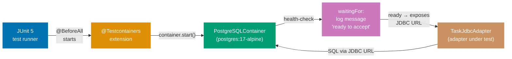
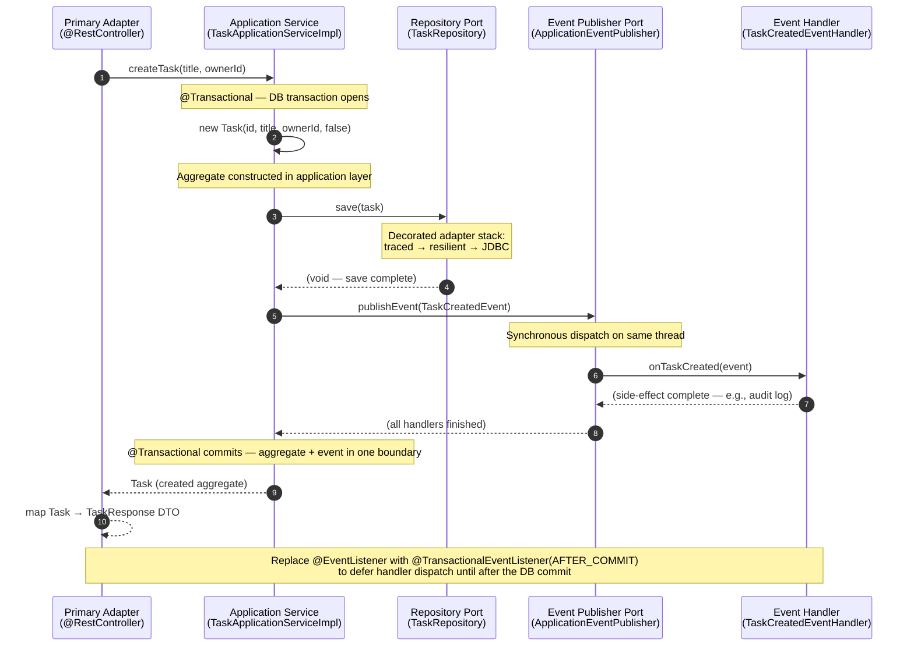

## Guide 16 — Database Integration Test via Testcontainers

### Why It Matters

Unit tests with an in-memory adapter (Guide 9) prove port correctness but cannot
catch SQL schema mistakes, PostgreSQL-specific constraint behavior, or migration
ordering bugs. A database integration test that spins up a real PostgreSQL
instance inside Docker closes this gap without requiring a persistent database on
developer machines. In the intended layout for `apps/organiclever-be`, the
`@Testcontainers`-annotated test class manages the full container lifecycle —
start, health-check, stop — through JUnit 5 lifecycle hooks. The adapter under
test receives a `DataSource` configured to point at the ephemeral container rather
than any static URL.

### Standard Library First

`java.sql.DriverManager` can open a connection to any JDBC URL — but you manage
container startup, health-check polling, and teardown manually outside the test:

```java
// Standard library: raw JDBC connection to a pre-running test database
// Illustrative snippet — not from apps/organiclever-be; demonstrates the
// manual approach that Testcontainers supersedes.

import java.sql.Connection;
// => Connection: JDBC connection — must be closed after use or connection pool leaks
import java.sql.DriverManager;
// => DriverManager: JDBC entry point — finds a driver matching the URL scheme
import java.sql.SQLException;
// => SQLException: checked exception on every JDBC operation — callers must handle or declare

public class ManualJdbcSmokeTest {
    public static void main(String[] args) throws SQLException {
        // => Assumes the database is already running on localhost:5432 — manual setup required
        // => If the database is not ready, DriverManager throws immediately — no health-check polling
        String url = System.getenv("TEST_DATABASE_URL");
        // => Reads the JDBC URL from an environment variable — CI must set this before the test runs
        // => No automatic container provisioning — the database must be started in a separate step
        try (Connection conn = DriverManager.getConnection(url, "test_user", "test_pass")) {
            // => try-with-resources: Connection implements AutoCloseable — conn.close() is guaranteed
            // => Connection does not retry if the database is not yet ready — throws at once
            var stmt = conn.createStatement();
            // => createStatement: plain statement, no parameters — suitable for smoke queries only
            var rs = stmt.executeQuery("SELECT 1");
            // => SELECT 1: minimal smoke query — verifies the connection is live
            // => No schema migration here: the developer must run migrations manually before this test
            if (rs.next()) {
                System.out.println("Connected: " + rs.getInt(1));
                // => Diagnostic output only — this is not an assertion in a test framework
            }
        }
        // => conn.close() called here by try-with-resources
        // => The container must be stopped manually — no JUnit lifecycle hook manages it
    }
}
```

_Illustrative snippet — not from `apps/organiclever-be`; demonstrates the manual
JDBC approach that Testcontainers supersedes._

**Limitation for production**: raw JDBC requires a running database before the
test starts, manual health-check polling, and manual teardown. The harness logic
duplicates across every project that needs integration tests against PostgreSQL.
Container startup is not coordinated with JUnit lifecycle hooks — if the JVM exits
unexpectedly, the container is orphaned.

### Production Framework

Testcontainers integrates with JUnit 5 via `@Testcontainers` and `@Container`.
The `PostgreSQLContainer` manages the full container lifecycle — start, wait for
the PostgreSQL health probe, expose a random host port, and stop after the test
class finishes. The adapter receives a `DataSource` built from the container's
JDBC URL, username, and password:



```java
// Testcontainers integration test for the JDBC adapter
// New file — intended layout, scaffolding exists at
// apps/organiclever-be/src/test/java/com/organicleverbe/task/infrastructure/

package com.organicleverbe.task.infrastructure;
// => infrastructure package: integration tests live here — they test the adapter, not the domain

import com.organicleverbe.task.application.TaskRepository;
// => Application-layer port — the test exercises the adapter through the interface
import com.organicleverbe.task.domain.Task;
import com.organicleverbe.task.domain.TaskId;
// => Domain types only — the test speaks in domain terms, not JDBC terms
import org.junit.jupiter.api.BeforeEach;
import org.junit.jupiter.api.Test;
// => JUnit 5: @Test marks test methods; @BeforeEach runs before each test method
import org.springframework.jdbc.datasource.DriverManagerDataSource;
// => DriverManagerDataSource: Spring's simple DataSource — wires the container JDBC URL
import org.testcontainers.containers.PostgreSQLContainer;
// => PostgreSQLContainer: the Testcontainers wrapper for postgres Docker images
import org.testcontainers.junit.jupiter.Container;
import org.testcontainers.junit.jupiter.Testcontainers;
// => @Testcontainers: JUnit 5 extension — manages @Container lifecycle automatically
// => PostgreSQLContainer: wraps postgres Docker image, exposes JDBC URL after health-check passes

import javax.sql.DataSource;
// => DataSource: JDBC abstraction — the adapter receives this, not a raw connection
import java.util.Optional;
import java.util.UUID;
// => UUID: raw UUID type — wrapped in TaskId for the domain aggregate

import static org.junit.jupiter.api.Assertions.*;
// => Static import: assertEquals, assertNotNull, assertTrue — avoids verbose assertion calls

@Testcontainers
// => @Testcontainers: registers the JUnit 5 extension that starts @Container fields
// => The extension calls container.start() before any test in this class and container.stop() after all
public class TaskJdbcAdapterIntegrationTest {

    @Container
    // => @Container: Testcontainers manages lifecycle — container starts before @BeforeEach, stops after @AfterAll
    // => static field: container is shared across all test methods in this class — one start, one stop
    static final PostgreSQLContainer<?> postgres =
        new PostgreSQLContainer<>("postgres:17-alpine");
        // => postgres:17-alpine: matches the production target — Alpine keeps the image small
        // => Testcontainers pulls the image on first run, caches it for subsequent runs
        // => waitingFor defaults to waiting for the "ready to accept connections" log message

    private TaskRepository taskRepository;
    // => Port interface declared — the test never imports TaskJdbcAdapter directly
    // => Swapping the adapter requires no change to the test body

    @BeforeEach
    // => @BeforeEach: runs before each @Test method — creates a fresh adapter backed by the container
    void setUp() {
        DataSource dataSource = new DriverManagerDataSource(
            postgres.getJdbcUrl(),
            // => getJdbcUrl(): returns "jdbc:postgresql://localhost:<random-port>/test"
            // => Random port assigned by Docker — no port conflicts on CI runners
            postgres.getUsername(),
            // => getUsername(): returns "test" — the default PostgreSQLContainer credential
            postgres.getPassword()
            // => getPassword(): returns "test" — paired with the default username
        );
        // => DriverManagerDataSource: non-pooling DataSource — sufficient for integration tests
        // => Production uses HikariCP DataSource configured in application.properties
        taskRepository = new TaskJdbcAdapter(dataSource);
        // => TaskJdbcAdapter: the infrastructure adapter under test — receives the container DataSource
        // => The adapter is constructed fresh before each test — no state carries between tests
    }

    @Test
    // => @Test: JUnit 5 test method — discovered by the JUnit Platform and executed by the engine
    void save_thenFindById_roundTripsSuccessfully() {
        // => Test name describes the observable contract — save then find returns the same aggregate
        var id = new TaskId(UUID.randomUUID());
        // => TaskId: strongly-typed identity — wraps a random UUID for this test run
        var task = new Task(id, "Write integration test", "user-1", false);
        // => Domain aggregate: built with the smart constructor — invariants validated at construction
        // => No Spring context needed — the domain record is a pure Java record

        taskRepository.save(task);
        // => Write path: persists the aggregate via the TaskJdbcAdapter to the real PostgreSQL container
        // => No mock, no in-memory stub — real SQL INSERT to the containerized database

        Optional<Task> found = taskRepository.findById(id);
        // => Read path: queries the real database — finds the row committed by save()
        // => Optional: absence is a valid outcome; the test asserts presence explicitly below

        assertTrue(found.isPresent(), "Task must be found after save");
        // => isPresent(): the row must exist — if the INSERT failed silently, this assertion fails
        assertEquals(task.title(), found.get().title());
        // => Title round-trip: the persisted title must match the domain record's title exactly
        // => Catches column mapping errors: wrong column name, truncation, encoding issues
        assertEquals(task.ownerId(), found.get().ownerId());
        // => OwnerId round-trip: verifies the foreign-key column is mapped correctly
        assertFalse(found.get().completed());
        // => Boolean round-trip: verifies the initial false state is stored and retrieved correctly
    }

    @Test
    // => Second test: exercises the not-found path — no setup, no prior save
    void findById_returnsEmpty_whenNotFound() {
        var missingId = new TaskId(UUID.randomUUID());
        // => A UUID that was never saved — the database has no row for this identity

        Optional<Task> result = taskRepository.findById(missingId);
        // => Port contract: absence must be returned as Optional.empty(), never null

        assertTrue(result.isEmpty(), "Unknown TaskId must return Optional.empty()");
        // => Verifies the adapter handles the not-found case correctly
        // => A null-returning adapter would throw NullPointerException on the caller — not Optional.empty()
    }
}
```

_New file — intended layout, scaffolding exists at
`apps/organiclever-be/src/test/java/com/organicleverbe/task/infrastructure/`_

Add the Testcontainers dependency to the `pom.xml` for `apps/organiclever-be`:

```xml
<!-- Testcontainers BOM import — manage all testcontainers module versions consistently -->
<!-- New dependency — intended layout, pom.xml exists at apps/organiclever-be/pom.xml -->
<!-- Add to <dependencyManagement> section: -->
<dependency>
    <!-- => <dependency> in <dependencyManagement>: pins the version for all transitive consumers -->
    <groupId>org.testcontainers</groupId>
    <!-- => org.testcontainers: official Testcontainers Maven group — covers all container modules -->
    <!-- => testcontainers-bom: the BOM that pins all org.testcontainers module versions -->
    <artifactId>testcontainers-bom</artifactId>
    <!-- => Spring Boot 4.0.6 BOM does NOT manage org.testcontainers core modules — explicit BOM import required -->
    <version>1.21.3</version>
    <!-- => type pom: this entry is a BOM import, not a jar — Maven reads it as a bill of materials -->
    <type>pom</type>
    <!-- => scope import: imports version constraints from this BOM into the current pom's dependencyManagement -->
    <scope>import</scope>
</dependency>

<!-- Then in <dependencies>: -->
<dependency>
    <!-- => <dependency>: adds testcontainers postgresql module under test scope -->
    <!-- => org.testcontainers: official Testcontainers Maven group -->
    <groupId>org.testcontainers</groupId>
    <!-- => postgresql module: wraps postgres Docker image, exposes JDBC URL -->
    <artifactId>postgresql</artifactId>
    <!-- => Version managed by org.testcontainers:testcontainers-bom 1.19.8 — no explicit version needed here -->
    <!-- => test scope: Testcontainers classes are never on the production classpath -->
    <scope>test</scope>
</dependency>
<dependency>
    <!-- => <dependency>: adds the JUnit 5 lifecycle extension for @Testcontainers and @Container -->
    <!-- => Same groupId: all Testcontainers modules share org.testcontainers -->
    <groupId>org.testcontainers</groupId>
    <!-- => junit-jupiter: provides @Testcontainers and @Container annotations -->
    <artifactId>junit-jupiter</artifactId>
    <!-- => Without this module, the JUnit 5 lifecycle extension is not registered automatically -->
    <!-- => Version managed by org.testcontainers:testcontainers-bom 1.19.8 -->
    <!-- => test scope: extension code is not needed at runtime -->
    <scope>test</scope>
</dependency>
```

_New dependency — intended layout, `pom.xml` exists at `apps/organiclever-be/pom.xml`_

**Trade-offs**: Testcontainers tests are slower than in-memory tests — PostgreSQL
startup typically adds 5–15 seconds. They require Docker on the developer machine
and CI runner. They are not cacheable by Nx because the external container is
non-deterministic. Run them on the `test:integration` Nx target, not
`test:quick`. The payoff is that they catch schema drift, PostgreSQL-specific
constraint behavior (unique index violations, check constraint ordering), and
migration bugs that no in-memory stub can surface.

---

## Guide 17 — Schema Migration Adapter with Flyway

### Why It Matters

Every database integration test and every production deployment depends on the
schema matching the application's expectations. Without a migration tool, schema
changes require manual SQL execution coordinated across every developer machine,
CI runner, and production server. In the intended layout for `apps/organiclever-be`,
Flyway runs embedded SQL migration scripts in versioned order at application
startup. The migration adapter is a first-class hexagonal concern: it runs before
any domain port is called, and the Testcontainers integration test (Guide 16) can
invoke it against the fresh container database before running assertions.

### Standard Library First

`java.io` and plain JDBC can execute SQL files in order — but you manage
ordering, idempotency, and error recovery manually:

```java
// Standard library: manual SQL file execution without a migration library
// Illustrative snippet — not from apps/organiclever-be; demonstrates the raw
// JDBC migration approach that the Flyway adapter supersedes.

import java.io.IOException;
import java.nio.file.Files;
import java.nio.file.Path;
// => Files.readString: reads a .sql file from the filesystem — no classpath scanning
// => Path: represents the SQL file location — must be a real filesystem path, not a resource
import java.sql.Connection;
import java.sql.SQLException;
// => Connection: JDBC connection — execute the SQL directly on this connection
// => No transaction management: DDL statements are auto-committed in most databases

public class ManualMigrationRunner {
    public static void runMigration(Connection conn, Path sqlFile)
            throws IOException, SQLException {
        // => Two checked exceptions declared: I/O for file reading, SQL for execution
        // => No ordering enforcement — the caller must sort files by name manually
        String sql = Files.readString(sqlFile);
        // => Reads the entire SQL file as a string — no templating, no parameter binding
        // => If the file is missing, IOException propagates — no embedded-resource fallback
        try (var stmt = conn.createStatement()) {
            // => createStatement: plain statement — suitable for DDL, not parameterized DML
            stmt.execute(sql);
            // => execute: runs the entire file as one batch — DDL errors mid-file leave partial schema
            // => No journal table: if the script runs twice, CREATE TABLE throws a duplicate-object error
            // => The caller must track which scripts were already applied — no automatic idempotency
        }
        // => stmt.close() called here by try-with-resources
        // => Exceptions from execute() propagate to the caller — no rollback
    }
}
```

_Illustrative snippet — not from `apps/organiclever-be`; demonstrates the raw JDBC
migration approach that the Flyway adapter supersedes._

**Limitation for production**: no journal table means migrations run again on
every restart. No ordering enforcement means naming conventions must be manually
enforced. No error recovery means a failed migration leaves the schema in a
partial state. No embedded-resource support means SQL files must be on the
filesystem at a known path.

### Production Framework

Flyway reads versioned SQL scripts from the classpath (`db/migration/V1__*.sql`,
`V2__*.sql`, …), maintains an applied-scripts journal table (`flyway_schema_history`)
in the database, and applies only unapplied scripts in order. Spring Boot 4 auto-
configures Flyway when `spring-boot-starter-flyway` (and `flyway-database-postgresql`
for PostgreSQL) are on the classpath. Unlike Spring Boot 3, the standalone `flyway-core`
dependency alone is no longer sufficient — Spring Boot 4 modularizes auto-configuration
into dedicated starters, and Flyway requires `spring-boot-starter-flyway` to trigger
`FlywayAutoConfiguration`:

```java
// ApplicationRunner invoking Flyway migration at startup
// New file — intended layout, scaffolding exists at
// apps/organiclever-be/src/main/java/com/organicleverbe/infrastructure/

package com.organicleverbe.infrastructure;

import org.flywaydb.core.Flyway;
// => Flyway: the migration engine — configured with dataSource and migration locations
import org.flywaydb.core.api.output.MigrateResult;
// => MigrateResult: result record — carries migrationsExecuted count and success flag
import org.slf4j.Logger;
import org.slf4j.LoggerFactory;
// => SLF4J: structured logging — logs which scripts were applied on each run
import org.springframework.boot.ApplicationRunner;
// => ApplicationRunner: Spring Boot hook — runs after ApplicationContext is ready
import org.springframework.context.annotation.Bean;
import org.springframework.context.annotation.Configuration;
// => @Configuration + @Bean: registers the ApplicationRunner as a Spring-managed bean

import javax.sql.DataSource;
// => DataSource: injected by Spring Boot — backed by HikariCP in production

@Configuration
// => @Configuration: Spring discovers this class during component scan
// => All @Bean methods in this class are called once at startup
public class MigrationConfiguration {

    private static final Logger log = LoggerFactory.getLogger(MigrationConfiguration.class);
    // => Logger: SLF4J — logs migration activity at startup before any request arrives

    @Bean
    // => @Bean: Spring registers the returned ApplicationRunner as a singleton bean
    // => ApplicationRunner.run() executes after the ApplicationContext is fully started
    public ApplicationRunner migrationRunner(DataSource dataSource) {
        // => DataSource: injected from the Spring context — backed by HikariCP in production
        // => Injecting DataSource here ensures migrations run after the pool is ready
        return args -> {
            // => ApplicationRunner lambda — runs once at startup, before any HTTP request is served
            Flyway flyway = Flyway.configure()
                .dataSource(dataSource)
                // => dataSource: Flyway uses the same pool as the application — no second connection pool
                .locations("classpath:db/migration")
                // => locations: Flyway scans src/main/resources/db/migration for V*.sql files
                // => Scripts named V1__create_tasks.sql, V2__add_owner_index.sql, etc.
                // => The double underscore separator is required by Flyway's default naming scheme
                .load();
            // => load(): builds the Flyway instance — no migration runs yet
            MigrateResult result = flyway.migrate();
            // => migrate(): applies all unapplied scripts in version order within individual transactions
            // => Flyway wraps each script in a transaction — a failed script leaves no partial schema
            // => Applied scripts are recorded in the flyway_schema_history table
            log.info("Flyway applied {} migration(s)", result.migrationsExecuted);
            // => migrationsExecuted: 0 on subsequent restarts when schema is up to date
            // => Log line is visible in docker-compose logs and Kubernetes pod logs
            if (!result.success) {
                // => success: false when any script fails — throw to abort startup
                throw new IllegalStateException("Flyway migration failed — aborting startup");
                // => Throwing here causes Spring Boot to exit with a non-zero code
                // => Kubernetes readiness probe fails — pod does not receive traffic before schema is ready
            }
        };
    }
}
```

_New file — intended layout, scaffolding exists at
`apps/organiclever-be/src/main/java/com/organicleverbe/infrastructure/`_

The migration SQL script follows Flyway's naming scheme:

```sql
-- src/main/resources/db/migration/V1__create_tasks.sql
-- New file — intended layout, scaffolding exists at
-- apps/organiclever-be/src/main/resources/db/migration/

CREATE TABLE IF NOT EXISTS tasks (
    -- => tasks: one table per aggregate — no shared tables across bounded contexts
    id          UUID        PRIMARY KEY,
    -- => UUID primary key: matches TaskId.value() — no auto-increment sequences needed
    -- => UUID generation happens in the domain layer (TaskId constructor), not in the database
    title       TEXT        NOT NULL,
    -- => NOT NULL: enforces the domain invariant that every task has a title
    -- => TEXT: PostgreSQL's unbounded string type — avoids VARCHAR length guessing
    owner_id    TEXT        NOT NULL,
    -- => owner_id: foreign reference to the user context — no FK constraint (cross-context coupling)
    completed   BOOLEAN     NOT NULL DEFAULT FALSE
    -- => DEFAULT FALSE: new rows are not completed — matches the domain aggregate's initial state
);

CREATE INDEX IF NOT EXISTS tasks_owner_id_idx ON tasks(owner_id);
-- => Partial index by owner_id: findByOwnerId() is the hot read path — the index makes it O(log n)
-- => IF NOT EXISTS: idempotent DDL — safe to run twice (e.g., in a test that applies migrations twice)
```

_New file — intended layout, scaffolding exists at
`apps/organiclever-be/src/main/resources/db/migration/`_

Add the Flyway dependency to `pom.xml`:

```xml
<!-- Flyway starter — triggers FlywayAutoConfiguration in Spring Boot 4 -->
<!-- New dependency — intended layout, pom.xml exists at apps/organiclever-be/pom.xml -->
<dependency>
    <!-- => spring-boot starter group — triggers auto-configuration -->
    <groupId>org.springframework.boot</groupId>
    <!-- => required in Spring Boot 4: standalone flyway-core no longer triggers FlywayAutoConfiguration -->
    <artifactId>spring-boot-starter-flyway</artifactId>
    <!-- => Version managed by spring-boot-starter-parent 4.0.6 BOM — no explicit version needed -->
    <!-- => This starter pulls in flyway-core transitively and registers FlywayAutoConfiguration -->
</dependency>
<dependency>
    <!-- => org.flywaydb: Flyway's Maven group — distinct from spring-boot starters -->
    <groupId>org.flywaydb</groupId>
    <!-- => PostgreSQL dialect module: required for PG-specific DDL -->
    <artifactId>flyway-database-postgresql</artifactId>
    <!-- => Version managed by spring-boot-starter-parent 4.0.6 BOM — no explicit version needed -->
    <!-- => Without this, Flyway falls back to a generic JDBC dialect — some Postgres features are not supported -->
</dependency>
```

_New dependency — intended layout, `pom.xml` exists at `apps/organiclever-be/pom.xml`_

**Trade-offs**: Flyway's versioned migration model requires naming discipline
(`V1__`, `V2__`) — a mislabeled script that should run after `V10__` but is named
`V2__` runs second and breaks. Liquibase provides an equivalent with XML/YAML
changesets that support complex branching; Flyway's embedded SQL approach keeps the
migration language as plain SQL, which is more portable and easier to review in pull
requests. For `apps/organiclever-be`, Flyway's simplicity is the right trade.

---

## Guide 18 — AI Orchestration Port + Spring `RestClient` Adapter

### Why It Matters

AI inference is an I/O boundary: the application service sends a prompt and
receives a generated response from an external model provider. Like the database
boundary, this I/O must sit behind a port so the application service is testable
without a live API key, and so the provider can be swapped without touching
business logic. In `apps/organiclever-be`, the intended layout introduces an
`AiPort` interface in the `ai-orchestration` application package. Spring Boot 4
ships `spring-boot-restclient` — already in the `pom.xml` — which provides
`RestClient` for type-safe, builder-configured HTTP calls with timeout control.

### Standard Library First

`java.net.http.HttpClient` (JDK 11+) can call any HTTP endpoint without any
Spring dependency. You manage timeout configuration, error discrimination, and
JSON mapping manually:

```java
// Standard library: java.net.http.HttpClient calling an AI inference endpoint
// Illustrative snippet — not from apps/organiclever-be; demonstrates the stdlib
// HttpClient approach that the Spring RestClient adapter supersedes.

import java.net.URI;
import java.net.http.HttpClient;
import java.net.http.HttpRequest;
import java.net.http.HttpResponse;
// => java.net.http: JDK 11+ — no external dependency, full HTTP/2 support
// => HttpClient, HttpRequest, HttpResponse: three core types for the request-response cycle
import java.time.Duration;
// => Duration: used for connect and request timeouts — no third-party type needed

public class RawAiHttpClient {
    private final HttpClient httpClient = HttpClient.newBuilder()
        .connectTimeout(Duration.ofSeconds(5))
        // => connectTimeout: how long to wait for the TCP handshake — no retry on timeout
        // => 5 seconds: generous for a nearby API gateway; reduce for latency-sensitive paths
        .build();
    // => HttpClient is thread-safe and should be shared — one instance per application

    public String completePrompt(String apiKey, String model, String prompt)
            throws Exception {
        // => checked Exception: no typed error discrimination between rate-limit, auth failure, or timeout
        // => The caller must catch Exception broadly — imprecise error handling
        String body = """
            {"model":"%s","messages":[{"role":"user","content":"%s"}]}
            """.formatted(model, prompt.replace("\"", "\\\""));
        // => Text block: JSON string built manually — no type safety on field names
        // => String escaping: prompt must have its double quotes escaped — fragile
        var request = HttpRequest.newBuilder()
            .uri(URI.create("https://openrouter.ai/api/v1/chat/completions"))
            // => Hardcoded URL: the base URL is not externalized — changing providers requires a code change
            // => RestClient.Builder.baseUrl() externalizes this in the production adapter
            .header("Authorization", "Bearer " + apiKey)
            // => API key passed directly to the method — the caller must manage secret retrieval
            // => RestClient.Builder.defaultHeader() sets this once at construction time
            .header("Content-Type", "application/json")
            // => Content-Type set manually — RestClient.contentType(MediaType.APPLICATION_JSON) is declarative
            .POST(HttpRequest.BodyPublishers.ofString(body))
            // => POST with the JSON body — HttpRequest.BodyPublishers.ofString wraps the body string
            .timeout(Duration.ofSeconds(30))
            // => timeout: per-request timeout — independent of the connect timeout
            .build();
        // => build(): produces an immutable HttpRequest — one call per request, unlike shared HttpClient
        var response = httpClient.send(request, HttpResponse.BodyHandlers.ofString());
        // => send: synchronous — blocks the calling thread for up to 30 seconds
        // => In production use sendAsync() and handle the CompletableFuture
        // => BodyHandlers.ofString(): reads the response body as a UTF-8 string
        if (response.statusCode() != 200) {
            // => Hard-coded 200 check: treats every non-200 as a failure — 201 and 202 are also rejected
            throw new Exception("AI call failed: " + response.statusCode());
            // => Undifferentiated exception: 429 (rate limit) and 401 (auth) both throw the same type
            // => A retry adapter cannot distinguish transient from permanent errors
        }
        return response.body();
        // => Returns the raw JSON body string — caller must parse it manually with Jackson
        // => No type-safe deserialization: any field rename in the API breaks silently at runtime
    }
}
```

_Illustrative snippet — not from `apps/organiclever-be`; demonstrates the raw
`HttpClient` approach that the Spring `RestClient` adapter supersedes._

**Limitation for production**: no typed error discrimination between rate-limit
errors (429), authentication failures (401), and server errors (503). No retry
logic. The application layer must import `HttpClient` to call this function — the
AI boundary is not behind a port.

### Production Framework

The hexagonal approach declares an `AiPort` in the `ai-orchestration` application
package and implements the OpenRouter HTTP adapter in infrastructure using Spring
`RestClient`. Spring `RestClient` (available via `spring-boot-restclient` already
in `pom.xml`) provides a fluent, builder-configured HTTP client with explicit
timeout wiring through `RestClient.Builder`:

```java
// AiPort.java — output port interface in the application package
// New file — intended layout, scaffolding exists at
// apps/organiclever-be/src/main/java/com/organicleverbe/ai/application/

package com.organicleverbe.ai.application;

// => application/ package: port interfaces live here — no Spring, no HTTP imports
// => The application service declares a dependency on AiPort, not on RestClient

public interface AiPort {
    // => Output port: declares what the application needs from an AI provider
    // => No mention of OpenRouter, RestClient, or HTTP — those are adapter concerns

    String completePrompt(String prompt) throws AiUnavailableException;
    // => completePrompt: single-operation port — one prompt in, one completion out
    // => AiUnavailableException: typed checked exception — the caller can distinguish AI failure from domain failure
    // => Throws AiUnavailableException on 5xx, timeout, or connection failure — not on 4xx (caller error)
}

// AiUnavailableException.java — typed exception in the application package
// New file — intended layout, scaffolding exists at
// apps/organiclever-be/src/main/java/com/organicleverbe/ai/application/

class AiUnavailableException extends Exception {
    // => Checked exception: callers must handle or declare it — no silent swallowing
    // => Lives in the application package: infrastructure and presentation can import it
    public AiUnavailableException(String message, Throwable cause) {
        super(message, cause);
        // => Wraps the underlying RestClient exception with a typed domain-layer exception
        // => The cause chain preserves the original exception for logging
    }
}
```

_New file — intended layout, scaffolding exists at
`apps/organiclever-be/src/main/java/com/organicleverbe/ai/application/`_

```java
// OpenRouterAiAdapter.java — RestClient adapter implementing AiPort
// New file — intended layout, scaffolding exists at
// apps/organiclever-be/src/main/java/com/organicleverbe/ai/infrastructure/

package com.organicleverbe.ai.infrastructure;
// => ai/infrastructure/ package: the RestClient adapter lives here — not in ai/application/

import com.organicleverbe.ai.application.AiPort;
import com.organicleverbe.ai.application.AiUnavailableException;
// => Import from application/ package only — no domain imports in the adapter
import org.springframework.web.client.RestClient;
import org.springframework.web.client.RestClientException;
// => RestClient: Spring Boot 4 fluent HTTP client — replaces RestTemplate for new code
// => RestClientException: base exception for all RestClient errors — subtypes carry HTTP status
import org.springframework.stereotype.Component;
// => @Component: Spring registers this adapter in the ApplicationContext automatically

import java.time.Duration;
// => Duration: explicit timeout values — avoids magic numbers in the builder call

@Component
// => @Component: Spring discovers this class during component scan
// => The @Configuration wiring class in Guide 7 can also declare this as an explicit @Bean
public class OpenRouterAiAdapter implements AiPort {
    // => implements AiPort: the adapter satisfies the output port contract
    // => The application service injects AiPort — it never imports OpenRouterAiAdapter

    private final RestClient restClient;
    // => RestClient: Spring Boot 4's modern HTTP client — builder-configured at construction
    // => final: immutable after construction — thread-safe

    private final String apiKey;
    // => apiKey: loaded from Spring Environment at startup — never hardcoded
    // => final: set once via constructor injection — no mutation risk

    private final String model;
    // => model: e.g., "anthropic/claude-3-5-haiku" — externalized in application.properties
    // => Swapping models requires only a config change, no code change

    public OpenRouterAiAdapter(
            RestClient.Builder restClientBuilder,
            // => RestClient.Builder: Spring Boot auto-configures this bean — includes base URL and timeouts
            @org.springframework.beans.factory.annotation.Value("${ai.openrouter.api-key}")
            String apiKey,
            // => @Value: reads ai.openrouter.api-key from application.properties or environment variable
            // => In production, the environment variable overrides the properties file value
            @org.springframework.beans.factory.annotation.Value("${ai.openrouter.model}")
            String model
            // => @Value: reads ai.openrouter.model — swappable without code change
    ) {
        this.restClient = restClientBuilder
            .baseUrl("https://openrouter.ai/api/v1")
            // => baseUrl: all requests from this client use this prefix — no hardcoded paths in methods
            .defaultHeader("Authorization", "Bearer " + apiKey)
            // => defaultHeader: the Authorization header is set once — not repeated per request
            .requestFactory(factory -> factory.setConnectTimeout(Duration.ofSeconds(5)))
            // => connectTimeout: TCP handshake must complete within 5 seconds
            // => setReadTimeout is set on the factory for the response body streaming phase
            .build();
        // => build(): produces an immutable RestClient — safe to share across threads
        this.apiKey = apiKey;
        // => Store the resolved API key — used by defaultHeader in the RestClient constructor
        this.model = model;
        // => Store the resolved model name — used in ChatRequest when completePrompt is called
    }

    @Override
    public String completePrompt(String prompt) throws AiUnavailableException {
        // => Implements AiPort.completePrompt — the only method the application service calls
        // => This method is the only place in the codebase that imports RestClient
        // => try block: wraps the RestClient call to translate Spring exceptions into AiUnavailableException
        try {
            var requestBody = new ChatRequest(
                model,
                // => model: the configured model identifier — injected at construction time
                new Message[]{ new Message("user", prompt) }
                // => Message array: single user message — OpenRouter chat completions format
            );
            return restClient.post()
                // => post(): configures an HTTP POST — returns a RequestBodySpec for chaining
                .uri("/chat/completions")
                // => uri: relative to baseUrl — resolves to https://openrouter.ai/api/v1/chat/completions
                .contentType(org.springframework.http.MediaType.APPLICATION_JSON)
                // => contentType: sets Content-Type: application/json — required by OpenRouter
                .body(requestBody)
                // => body: Spring serializes ChatRequest to JSON via Jackson — type-safe, no hand-crafted strings
                .retrieve()
                // => retrieve(): sends the request and returns a ResponseSpec
                .body(ChatResponse.class)
                // => body(Class): deserializes the response JSON into ChatResponse — Jackson mapping
                // => If deserialization fails, throws RestClientException — caught below
                .choices()[0].message().content();
            // => Extract the first completion's content — the application service receives a plain String
        } catch (RestClientException ex) {
            // => RestClientException: covers connection failures, timeouts, and HTTP error responses
            // => Wrap in AiUnavailableException to keep the application layer free of Spring imports
            throw new AiUnavailableException("OpenRouter call failed: " + ex.getMessage(), ex);
        }
    }

    // Response records — private to the adapter, not exposed to the application layer
    private record ChatRequest(String model, Message[] messages) {}
    // => ChatRequest: Jackson serializes this record to {"model":"...","messages":[...]}
    private record Message(String role, String content) {}
    // => Message: {"role":"user","content":"..."} — OpenRouter chat completions schema
    private record ChatResponse(Choice[] choices) {}
    // => ChatResponse: Jackson deserializes the response body into this record
    private record Choice(MessageContent message) {}
    // => Choice: one element in the "choices" array
    private record MessageContent(String content) {}
    // => MessageContent: the "message" object inside each choice — carries the generated text
}
```

_New file — intended layout, scaffolding exists at
`apps/organiclever-be/src/main/java/com/organicleverbe/ai/infrastructure/`_

**Trade-offs**: `RestClient` requires Spring MVC on the classpath — which is always
present for `spring-boot-starter-web`. For a pure reactive stack, use `WebClient`
from `spring-boot-starter-webflux` instead. The typed response records (private to
the adapter) couple the adapter to OpenRouter's JSON schema — if OpenRouter changes
its response shape, only the adapter changes; the application service and port are
untouched.

---

## Guide 19 — Retry + Circuit-Breaker via Resilience4j

### Why It Matters

External ports — the AI adapter from Guide 18, the JPA adapter from Guide 8, any
HTTP adapter calling a third-party service — fail transiently. A timeout does not
mean the downstream service is permanently unavailable; a retry after a brief pause
often succeeds. Conversely, an adapter that retries indefinitely against a service
that is genuinely down floods the downstream with traffic and keeps threads occupied.
Resilience4j (the Spring Boot 4 resilience starter) wraps port adapters with
configurable retry and circuit-breaker policies via a decorator pattern over the
port interface. The application service code is unchanged — the decorator is wired
in the composition root.

### Standard Library First

`java.util.concurrent` provides `CompletableFuture` and thread pools for async
retry — but you write the retry loop, backoff calculation, and open-circuit logic
yourself:

```java
// Standard library: manual retry loop with exponential backoff
// Illustrative snippet — not from apps/organiclever-be; demonstrates the
// manual retry approach that Resilience4j supersedes.

import java.util.function.Supplier;
// => Supplier<T>: functional interface — wraps the call that may throw
// => The retry loop calls supplier.get() up to maxAttempts times

public class ManualRetry {
    public static <T> T withRetry(Supplier<T> supplier, int maxAttempts, long initialDelayMs)
            throws Exception {
        // => Generic method: works with any return type and any exception from the supplier
        // => maxAttempts: how many times to try before giving up
        // => initialDelayMs: the first delay between attempts — doubled on each retry (exponential)
        Exception lastException = null;
        // => lastException: holds the most recent failure — rethrown if all attempts fail
        for (int attempt = 0; attempt < maxAttempts; attempt++) {
            // => Linear retry loop: no built-in jitter, no backoff cap, no circuit-breaker state
            // => attempt index starts at 0: attempt 0 = first try, not a retry
            try {
                return supplier.get();
                // => On success: return immediately — skip remaining attempts
            } catch (Exception ex) {
                lastException = ex;
                // => Record the exception — rethrow if no attempts remain
                if (attempt < maxAttempts - 1) {
                    // => Guard: only sleep if there are more attempts remaining
                    long delay = initialDelayMs * (long) Math.pow(2, attempt);
                    // => Exponential backoff: 100ms, 200ms, 400ms, 800ms, ...
                    // => No jitter: simultaneous retries from multiple threads hit the same backoff window
                    Thread.sleep(delay);
                    // => Thread.sleep: blocks the calling thread — no async option without CompletableFuture
                    // => InterruptedException from sleep propagates — callers should handle thread interruption
                }
            }
        }
        throw lastException;
        // => All attempts exhausted — rethrow the last exception
        // => No circuit-breaker: the retry loop always tries, even if the last 100 calls failed
    }
}
```

_Illustrative snippet — not from `apps/organiclever-be`; demonstrates the manual
retry approach that Resilience4j supersedes._

**Limitation for production**: no circuit-breaker state — the retry loop hammers a
down service on every call. No jitter — simultaneous callers retry in lock-step.
No fallback — when all retries fail, the only option is rethrowing. No metrics
integration — failures are not counted for observability.

### Production Framework

Resilience4j provides `Retry` and `CircuitBreaker` decorators that wrap any
`Supplier`, `Function`, or `Callable`. The decorator is applied in the composition
root `@Configuration` class — the application service constructor receives a
`TaskRepository` that already has retry and circuit-breaker wiring applied:

```java
// ResilientTaskRepository.java — Resilience4j decorator wrapping the output port adapter
// New file — intended layout, scaffolding exists at
// apps/organiclever-be/src/main/java/com/organicleverbe/task/infrastructure/

package com.organicleverbe.task.infrastructure;
// => infrastructure package: the decorator lives here — between the application port and the real adapter

import com.organicleverbe.task.application.TaskRepository;
// => Port interface: the decorator implements the same interface as the underlying adapter
import com.organicleverbe.task.domain.Task;
// => Task: domain aggregate — passed through the decorator unchanged
import com.organicleverbe.task.domain.TaskId;
// => Domain types only — the decorator speaks in domain terms, delegates to the real adapter
import io.github.resilience4j.circuitbreaker.CircuitBreaker;
// => CircuitBreaker: state machine — CLOSED, OPEN, HALF_OPEN — stops calls when open
import io.github.resilience4j.retry.Retry;
// => Retry: configures max attempts, wait duration, and which exceptions trigger a retry
import io.github.resilience4j.retry.RetryConfig;
// => RetryConfig: builder for retry policy — maxAttempts, waitDuration, retryOnException predicate
import io.github.resilience4j.circuitbreaker.CircuitBreakerConfig;
// => CircuitBreakerConfig: builder for circuit-breaker policy — failureRateThreshold, slidingWindowSize

import java.time.Duration;
// => Duration: timeout/wait values — avoids magic number literals in the policy builders
import java.util.List;
// => List: return type for findByOwnerId — List.of() is the empty case
import java.util.Optional;
// => Optional: return type for findById — absent Task is Optional.empty(), not null

public class ResilientTaskRepository implements TaskRepository {
    // => Implements TaskRepository: the decorator is a drop-in replacement for the adapter
    // => The application service cannot tell whether it has the raw adapter or the decorator

    private final TaskRepository delegate;
    // => delegate: the real adapter (e.g., TaskJdbcAdapter) — receives calls after retry/CB evaluation
    private final Retry retry;
    // => Retry: Resilience4j retry policy — applied before the circuit-breaker check
    private final CircuitBreaker circuitBreaker;
    // => CircuitBreaker: Resilience4j CB — opens when failure rate exceeds threshold

    public ResilientTaskRepository(TaskRepository delegate) {
        // => Constructor injection: the delegate adapter is passed in — no new adapter instantiation here
        // => This constructor builds both the Retry and CircuitBreaker policies at construction time
        this.delegate = delegate;
        // => Store the delegate — every port method calls delegate.<method> inside the decorator wrapping
        this.retry = Retry.of(
            "task-repository",
            // => Instance name: used for metrics and logging — matches the bean context
            // => RetryConfig.custom(): starts the builder chain for a custom retry policy
            RetryConfig.custom()
                .maxAttempts(3)
                // => maxAttempts: 3 — the initial call plus two retries
                .waitDuration(Duration.ofMillis(200))
                // => waitDuration: 200ms between attempts — avoid hammering a recovering database
                .retryOnException(ex -> ex instanceof java.sql.SQLException)
                // => retryOnException: only retry on SQLExceptions — not on domain exceptions
                // => IllegalArgumentException from domain validation must not trigger a retry
                .build()
                // => build(): produces an immutable RetryConfig — shared across all decorated methods
        );
        // => CircuitBreaker.of: creates a named circuit-breaker with the custom config below
        this.circuitBreaker = CircuitBreaker.of(
            "task-repository",
            // => Same name as the Retry instance: metrics aggregate under one label
            // => CircuitBreakerConfig.custom(): starts the builder chain for a custom CB policy
            CircuitBreakerConfig.custom()
                .failureRateThreshold(50)
                // => failureRateThreshold: 50% failure rate in the sliding window opens the circuit
                .slidingWindowSize(10)
                // => slidingWindowSize: 10 calls — the CB evaluates the last 10 attempts
                .waitDurationInOpenState(Duration.ofSeconds(30))
                // => waitDurationInOpenState: CB stays open for 30 seconds before transitioning to HALF_OPEN
                .build()
                // => build(): produces an immutable CircuitBreakerConfig — applies to all port methods
        );
    }

    @Override
    // => @Override: compiler verifies save() signature matches TaskRepository — no silent signature drift
    public void save(Task task) {
        // => Wraps save() with retry + circuit-breaker: transient DB failures are retried
        Retry.decorateRunnable(retry,
            // => decorateRunnable: wraps a Runnable — used for void operations like save()
            CircuitBreaker.decorateRunnable(circuitBreaker,
                // => decorateRunnable: wraps with circuit-breaker check — throws CallNotPermittedException if open
                () -> delegate.save(task)
                // => Lambda delegates to the real adapter — retry fires if the lambda throws
            )
            // => closing paren: ends the CircuitBreaker.decorateRunnable(...) call
        ).run();
        // => .run(): executes the wrapped operation — throws if all retries exhausted or CB is open
    }

    @Override
    // => @Override: verifies findById matches the port interface — prevents method-name typos silently becoming dead code
    public Optional<Task> findById(TaskId id) {
        // => Wraps findById() with retry + circuit-breaker: same policy as save()
        return Retry.decorateSupplier(retry,
            // => decorateSupplier: wraps a Supplier<Optional<Task>> — used for value-returning operations
            CircuitBreaker.decorateSupplier(circuitBreaker,
                // => decorateSupplier on the CB: CallNotPermittedException thrown if circuit is open
                () -> delegate.findById(id)
                // => Lambda: the actual delegate call — wraps the real database read
            )
            // => closing paren: ends the CircuitBreaker.decorateSupplier(...) call
        ).get();
        // => .get(): executes the supplier — returns Optional<Task> on success
        // => Throws on retry exhaustion or open circuit — propagates to the GlobalExceptionHandler
    }

    @Override
    // => @Override: verifies findByOwnerId matches the port interface — compiler guard for all four port methods
    public List<Task> findByOwnerId(String ownerId) {
        // => Same decorator stack as save() and findById() — consistent resilience policy across all port methods
        return Retry.decorateSupplier(retry,
            // => retry wraps the circuit-breaker: a failed circuit-breaker call counts as a retry attempt
            CircuitBreaker.decorateSupplier(circuitBreaker,
                // => circuitBreaker inner wrap: opens after 50% failures in the sliding window of 10
                () -> delegate.findByOwnerId(ownerId)
                // => Delegate returns List<Task> — retry fires if the lambda throws a SQLException
            )
            // => closing paren: ends the CircuitBreaker.decorateSupplier(...) call
        ).get();
        // => .get(): executes the supplier — returns List<Task>, empty if no tasks found
        // => Same decorator pattern: retry + circuit-breaker around the delegate call
    }

    @Override
    // => @Override: verifies delete matches the port interface — all four methods decorated consistently
    public void delete(TaskId id) {
        // => delete() is a write operation: retry only if the exception is a transient SQLException
        // => Retry.decorateRunnable: void operation requires Runnable wrapper, not Supplier
        Retry.decorateRunnable(retry,
            // => decorateRunnable: void return — Runnable wraps the delete call
            CircuitBreaker.decorateRunnable(circuitBreaker,
                // => CB check: if the circuit is open, throws CallNotPermittedException immediately
                () -> delegate.delete(id)
                // => Delegate: the real adapter's delete — performs the hard-delete or soft-delete
            )
            // => closing paren: ends the CircuitBreaker.decorateRunnable(...) call
        ).run();
        // => .run(): executes the wrapped Runnable — throws if CB is open or retries exhausted
    }
}
```

_New file — intended layout, scaffolding exists at
`apps/organiclever-be/src/main/java/com/organicleverbe/task/infrastructure/`_

The composition root wires the decorator transparently:

```java
// TaskContextConfiguration.java — composition root wiring with resilience decorator
// New file — intended layout, scaffolding exists at
// apps/organiclever-be/src/main/java/com/organicleverbe/task/infrastructure/

@Bean
public TaskRepository taskRepository(DataSource dataSource) {
    var jdbcAdapter = new TaskJdbcAdapter(dataSource);
    // => TaskJdbcAdapter: the real database adapter — receives SQL calls
    return new ResilientTaskRepository(jdbcAdapter);
    // => ResilientTaskRepository: decorator wrapping the adapter with retry + circuit-breaker
    // => The application service injects TaskRepository — it never sees either concrete class
    // => Swap the decorator in tests by returning jdbcAdapter directly from @TestConfiguration
}
```

_New file — intended layout, scaffolding exists at
`apps/organiclever-be/src/main/java/com/organicleverbe/task/infrastructure/`_

Add the Resilience4j Spring Boot starter to `pom.xml`:

```xml
<!-- Resilience4j Spring Boot 4 starter -->
<!-- New dependency — intended layout, pom.xml exists at apps/organiclever-be/pom.xml -->
<dependency>
    <groupId>io.github.resilience4j</groupId>
    <!-- => groupId: io.github.resilience4j is the official Resilience4j Maven group -->
    <artifactId>resilience4j-spring-boot4</artifactId>
    <!-- => resilience4j-spring-boot4: dedicated Spring Boot 4 starter — published to Maven Central as of v2.4.0 -->
    <!-- => Includes auto-configuration for Retry, CircuitBreaker, RateLimiter, Bulkhead, and TimeLimiter -->
    <version>2.4.0</version>
    <!-- => 2.4.0: explicit pin — Spring Boot 4 BOM does not manage Resilience4j transitively -->
    <!-- => Version managed by Spring Boot 4 BOM where available; otherwise pin explicitly -->
</dependency>
```

_New dependency — intended layout, `pom.xml` exists at `apps/organiclever-be/pom.xml`_

**Trade-offs**: the decorator pattern adds two layers of wrapping over every port
method call. For high-frequency read operations (e.g., `findByOwnerId` called
thousands of times per second), the decorator overhead is measurable — profile
before adding circuit-breakers to read paths. The payoff is that every port adapter
automatically participates in the resilience policy without modifying the application
service.

---

## Guide 20 — Observability Adapter via Micrometer Tracing

### Why It Matters

A hexagonal application whose port calls are not traced is a black box in
production. When a user reports that the task creation endpoint is slow, the only
way to diagnose it without tracing is to reproduce the slowness in development —
expensive and error-prone. Micrometer Tracing (the observability layer in Spring
Boot 4) wraps port calls with OpenTelemetry-compatible spans. The observability
adapter follows the same decorator pattern as the resilience decorator in Guide 19:
it implements the port interface, wraps each method with a span, delegates to the
real adapter, and is wired transparently in the composition root.

### Standard Library First

`java.lang.System.nanoTime()` can measure wall-clock duration — but it gives you
no distributed trace context, no parent-child span relationship, and no integration
with any observability backend:

```java
// Standard library: manual timing with System.nanoTime()
// Illustrative snippet — not from apps/organiclever-be; demonstrates the manual
// timing approach that Micrometer Tracing supersedes.

public class ManualTimingExample {
    // => Illustrative class: wraps a TaskRepository with manual nanoTime-based timing
    // => No port interface implementation here — this is a copy-paste pattern, not the decorator pattern
    public void save(Task task) {
        // => save: the method being timed — wraps any void port operation
        long start = System.nanoTime();
        // => nanoTime(): monotonic clock — suitable for elapsed time, not wall-clock time
        // => No trace context: this duration cannot be correlated with upstream HTTP spans
        try {
            delegate.save(task);
            // => delegate: the real adapter — the timing wraps its execution
            // => No exception handling: if delegate.save() throws, nanoTime computation still runs in finally
        } finally {
            long elapsed = System.nanoTime() - start;
            // => Elapsed nanoseconds — convert to milliseconds for human-readable logging
            // => finally: runs whether save() succeeds or throws — elapsed includes failure time
            System.out.printf("save() took %.2f ms%n", elapsed / 1_000_000.0);
            // => Console output: no structured format, no trace ID, no span ID
            // => Logs from concurrent threads interleave — impossible to correlate with a single request
        }
    }
}
```

_Illustrative snippet — not from `apps/organiclever-be`; demonstrates the manual
timing approach that Micrometer Tracing supersedes._

**Limitation for production**: no distributed trace context — spans from different
services cannot be stitched into a single trace. No parent-child relationship — the
timing sits in isolation with no context about which HTTP request triggered the save.
No backend integration — the duration is logged to stdout, not exported to Jaeger,
Zipkin, or an OpenTelemetry Collector.

### Production Framework

Micrometer Tracing with the OpenTelemetry bridge wraps port calls with spans that
carry a trace ID and are exported to the configured backend. The decorator pattern
keeps the tracing concern entirely in the infrastructure layer:

```java
// TracedTaskRepository.java — Micrometer Tracing decorator wrapping the output port
// New file — intended layout, scaffolding exists at
// apps/organiclever-be/src/main/java/com/organicleverbe/task/infrastructure/

package com.organicleverbe.task.infrastructure;
// => infrastructure package: the tracing decorator lives alongside the JDBC adapter and resilience decorator

import com.organicleverbe.task.application.TaskRepository;
// => Port interface: the decorator implements the same interface — application service is unaware of tracing
import com.organicleverbe.task.domain.Task;
// => Task: domain aggregate — passed through unchanged; only the timing is captured, not the data
import com.organicleverbe.task.domain.TaskId;
// => Domain types only — the decorator speaks in domain terms
import io.micrometer.tracing.Tracer;
// => Tracer: Micrometer Tracing API — creates spans and manages the trace context
import io.micrometer.tracing.Span;
// => Span: represents a single unit of work — carries trace ID, span ID, and tags
// => Tracer: Micrometer Tracing API — creates and manages spans

import java.util.List;
// => List: return type of findByOwnerId — passed through without modification
import java.util.Optional;
// => Optional: return type of findById — presence or absence propagated to the application service

public class TracedTaskRepository implements TaskRepository {
    // => Implements TaskRepository: transparent decorator — application service sees only the interface
    // => Stacks with ResilientTaskRepository: wire as TracedTaskRepository(ResilientTaskRepository(...))

    private final TaskRepository delegate;
    // => delegate: the underlying adapter or resilience decorator — receives calls after span start
    private final Tracer tracer;
    // => Tracer: Micrometer Tracing — provided by Spring Boot auto-configuration
    // => Spring Boot 4 auto-configures Tracer when micrometer-tracing-bridge-otel is on the classpath

    public TracedTaskRepository(TaskRepository delegate, Tracer tracer) {
        // => Constructor injection: delegate and Tracer are wired in the @Configuration class
        this.delegate = delegate;
        // => Store the delegate — the span wraps every call to delegate.<method>
        this.tracer = tracer;
        // => Store the Tracer — used in each port method to create and end spans
    }

    @Override
    // => @Override: compiler verifies save() signature matches TaskRepository — silent typo becomes a compile error
    public void save(Task task) {
        // => save: wraps the delegate's write operation with a named tracing span
        Span span = tracer.nextSpan().name("task-repository.save").start();
        // => nextSpan(): creates a child span if a parent trace context is active, otherwise starts a root span
        // => name: span name visible in Jaeger / Zipkin — describes the operation
        // => start(): activates the span — not yet closed; close is in the finally block
        try (var ignored = tracer.withSpan(span)) {
            // => withSpan: scopes the span to the current thread — child spans created within inherit the trace ID
            // => try-with-resources: Scope.close() removes the span from the current thread context
            span.tag("task.id", task.id().value().toString());
            // => tag: adds a key-value attribute to the span — visible in trace viewers
            // => Tags are searchable: find all spans where task.id = a specific UUID
            delegate.save(task);
            // => Delegate: the real adapter call — the span wraps its entire execution time
        } catch (Exception ex) {
            // => catch (Exception ex): broad catch — covers connectivity failures, timeouts, and JDBC errors
            span.error(ex);
            // => error: marks the span as failed and records the exception — visible in trace viewers
            // => Without this call, failed spans appear identical to successful ones in the trace
            throw ex;
            // => Rethrow: the span records the error, but the caller still receives the exception
        } finally {
            // => finally: guaranteed execution — span.end() runs even if catch rethrows the exception
            span.end();
            // => end(): closes the span and reports it to the OpenTelemetry exporter
            // => Always in finally: ensures spans are exported even when exceptions are thrown
        }
    }

    @Override
    // => @Override: verifies findById signature matches the port — prevents dead-method mistakes at compile time
    public Optional<Task> findById(TaskId id) {
        // => findById: wraps the read operation with a span scoped to this task identity
        Span span = tracer.nextSpan().name("task-repository.findById").start();
        // => Separate span for each port method — granular tracing shows which operation is slow
        // => span name "task-repository.findById": searchable in Jaeger / Zipkin by operation name
        try (var ignored = tracer.withSpan(span)) {
            // => withSpan: activates the span on the current thread — child spans inherit this trace context
            span.tag("task.id", id.value().toString());
            // => Tag the queried ID: lets operators filter traces for a specific task
            return delegate.findById(id);
            // => delegate: the resilience decorator — may retry on SQLException before returning
        } catch (Exception ex) {
            // => catch (Exception ex): broad catch — covers both connectivity and query failures
            // => error: marks the span as failed — the trace viewer shows red for this span
            span.error(ex);
            throw ex;
            // => Rethrow: propagate the exception after recording it in the span
        } finally {
            // => finally: guaranteed execution — span.end() runs even on exception
            span.end();
            // => end(): always called — exports the span to the configured OTel exporter
        }
    }

    @Override
    // => @Override: verifies findByOwnerId signature — all four port methods traced consistently
    public List<Task> findByOwnerId(String ownerId) {
        // => findByOwnerId: spans the full list-read including any retry wait from the resilience layer
        Span span = tracer.nextSpan().name("task-repository.findByOwnerId").start();
        // => One span per port method: makes findByOwnerId independently visible in traces
        try (var ignored = tracer.withSpan(span)) {
            // => withSpan: scopes the span to the current thread — automatically removed on close
            span.tag("task.owner_id", ownerId);
            // => ownerId tag: allows filtering traces by owner — useful for tenant-level diagnostics
            return delegate.findByOwnerId(ownerId);
            // => Delegate returns List<Task> — span duration includes any retry wait time in the resilience layer
        } catch (Exception ex) {
            // => catch (Exception ex): broad catch — covers any exception from the delegate or resilience layer
            span.error(ex);
            // => error(): records the exception type and message on the span attributes
            throw ex;
            // => Rethrow: caller (application service) receives the original exception
        } finally {
            span.end();
            // => end(): closes the span — span duration = time from start() to end()
        }
    }

    @Override
    // => @Override: verifies delete signature — compiler confirms the decorator covers the full port contract
    public void delete(TaskId id) {
        // => delete: traces the full delete operation including TaskNotFoundException propagation
        Span span = tracer.nextSpan().name("task-repository.delete").start();
        // => delete span: records how long the delete operation takes — useful for capacity planning
        try (var ignored = tracer.withSpan(span)) {
            // => withSpan: registers the span on the thread — any nested spans become children
            span.tag("task.id", id.value().toString());
            // => Tag the deleted ID: auditable in the trace store without log parsing
            delegate.delete(id);
            // => Delegate: void operation — no return value; success means no exception thrown
        } catch (Exception ex) {
            span.error(ex);
            // => error(): annotates the span with the failure — the trace is marked as errored
            throw ex;
            // => Rethrow: the GlobalExceptionHandler receives the exception and maps it to HTTP 500
        } finally {
            span.end();
            // => end(): exports the span regardless of success or failure — every delete is traceable
        }
    }
}
```

_New file — intended layout, scaffolding exists at
`apps/organiclever-be/src/main/java/com/organicleverbe/task/infrastructure/`_

The composition root stacks all three decorators in order:

```java
// TaskContextConfiguration.java — stacked decorators in the composition root
// New file — intended layout, scaffolding exists at
// apps/organiclever-be/src/main/java/com/organicleverbe/task/infrastructure/

@Bean
// => @Bean: Spring calls this method once at startup and registers the returned object as a singleton
public TaskRepository taskRepository(DataSource dataSource, Tracer tracer) {
    // => Parameters injected by Spring: DataSource from HikariCP auto-config, Tracer from Micrometer auto-config
    var jdbcAdapter = new TaskJdbcAdapter(dataSource);
    // => Layer 1: the real adapter — performs SQL operations against the PostgreSQL DataSource
    var resilientAdapter = new ResilientTaskRepository(jdbcAdapter);
    // => Layer 2: retry + circuit-breaker — retries transient failures, opens circuit on sustained failure
    return new TracedTaskRepository(resilientAdapter, tracer);
    // => Layer 3: tracing — wraps the full resilience + adapter stack with a span
    // => Span duration includes retry wait time — visible in trace timelines
    // => Application service injects TaskRepository — sees none of the concrete layers
}
```

_New file — intended layout, scaffolding exists at
`apps/organiclever-be/src/main/java/com/organicleverbe/task/infrastructure/`_

Add Micrometer Tracing to `pom.xml`:

```xml
<!-- Micrometer Tracing + OpenTelemetry bridge -->
<!-- New dependency — intended layout, pom.xml exists at apps/organiclever-be/pom.xml -->
<dependency>
    <!-- => first <dependency>: adds the Micrometer-to-OTel bridge that Spring Boot 4 uses for span export -->
    <!-- => io.micrometer: Micrometer project group — includes metrics and tracing -->
    <groupId>io.micrometer</groupId>
    <!-- => OTel bridge: translates Micrometer Tracing to OTel spans -->
    <artifactId>micrometer-tracing-bridge-otel</artifactId>
    <!-- => Version managed by spring-boot-starter-parent 4.0.6 BOM -->
    <!-- => Adds OTel span export support; requires opentelemetry-exporter-otlp for the backend endpoint -->
</dependency>
<dependency>
    <!-- => second <dependency>: the OTLP exporter that sends spans to the configured backend -->
    <!-- => io.opentelemetry: OpenTelemetry project group — separate from Micrometer -->
    <groupId>io.opentelemetry</groupId>
    <!-- => OTLP exporter: sends spans to Collector, Jaeger, or Tempo -->
    <artifactId>opentelemetry-exporter-otlp</artifactId>
    <!-- => Configure the endpoint in application.properties: management.otlp.tracing.endpoint -->
</dependency>
```

_New dependency — intended layout, `pom.xml` exists at `apps/organiclever-be/pom.xml`_

**Trade-offs**: the decorator stack — trace → resilience → JDBC adapter — adds
method-call overhead for every port operation. For high-frequency read paths under
strict latency constraints, consider sampling (export only 1% of spans) via
`management.tracing.sampling.probability=0.01` in `application.properties`. The
payoff is full distributed trace visibility across services with no changes to the
application service or domain layer.

---

## Guide 21 — Domain Event Flow End-to-End

### Why It Matters

Guides 10 and 11 introduced the domain event publisher port and its adapters. This
guide traces the complete flow in a single context: the aggregate emits a domain
event during a command, the application service captures and publishes the event
through the publisher port, and a second downstream handler — modeled as a Spring
`@EventListener` in the same process for simplicity — consumes the event and
triggers a side-effect. Understanding this flow end-to-end is a prerequisite for
cross-context event routing (Guide 14) and for deciding when to upgrade from the
in-memory adapter to the outbox adapter.

### Standard Library First

Java `Observable` / `Observer` (deprecated) and the standard
`java.beans.PropertyChangeListener` pattern both require manual registration and
synchronous dispatch with no lifecycle management:

```java
// Standard library: java.util.function for an in-process event handler
// Illustrative snippet — not from apps/organiclever-be; demonstrates the stdlib
// Consumer pattern that the Spring @EventListener supersedes.

import java.util.ArrayList;
import java.util.List;
import java.util.function.Consumer;
// => Consumer<T>: functional interface — a single-method handler for events of type T
// => ArrayList: the listener registry — not thread-safe under concurrent registration

public class InMemoryBus<T> {
    // => Generic class: parameterized by event type T — one bus instance per event type
    private final List<Consumer<T>> handlers = new ArrayList<>();
    // => handlers: mutable list — not thread-safe if handlers are registered after startup
    // => The port-based adapter receives its handlers as constructor parameters — no mutable registry

    public void subscribe(Consumer<T> handler) {
        // => subscribe: registration method — callers add handlers before any event is published
        handlers.add(handler);
        // => add: appends to the list — no deduplication, no ordering guarantee
        // => subscribe: adds a handler — no deduplication, no ordering guarantee
    }

    public void publish(T event) {
        // => publish: dispatch method — iterates all registered handlers synchronously
        for (var handler : handlers) {
            // => for-each: iterates the handler list in registration order
            handler.accept(event);
            // => accept: invokes the Consumer — passes the event to the handler
            // => Synchronous dispatch: each handler runs before the next starts
            // => A slow handler blocks the event publisher — no async dispatch
            // => If a handler throws, remaining handlers are skipped silently
        }
    }
}
```

_Illustrative snippet — not from `apps/organiclever-be`; demonstrates the stdlib
`Consumer` pattern that the Spring event mechanism supersedes._

**Limitation for production**: no transaction coordination — the event is published
before the aggregate is saved, which means the handler acts on uncommitted data.
No retry on handler failure. No async dispatch option without explicit thread pools.

### Production Framework

The Spring `ApplicationEventPublisher` is the in-process publisher; `@EventListener`
annotated methods are the consumers. The application service publishes after saving
the aggregate — inside the same transaction boundary if `@TransactionalEventListener`
is used. The event type is a domain record declared in the `application` package:

```java
// TaskCreatedEvent.java — domain event record in the application package
// New file — intended layout, scaffolding exists at
// apps/organiclever-be/src/main/java/com/organicleverbe/task/application/

package com.organicleverbe.task.application;

import com.organicleverbe.task.domain.Task;
// => Task: the full aggregate snapshot — the event carries the state at time of creation
// => The consumer reads domain fields without importing infrastructure types

public record TaskCreatedEvent(Task task) {
    // => Java record: immutable event payload — carries the aggregate that triggered the event
    // => Immutable: no risk of the consumer mutating the event payload
    // => Record component accessor: event.task() — no getter boilerplate
}
```

_New file — intended layout, scaffolding exists at
`apps/organiclever-be/src/main/java/com/organicleverbe/task/application/`_

```java
// TaskApplicationServiceImpl.java — publishes event after saving the aggregate
// New file — intended layout, scaffolding exists at
// apps/organiclever-be/src/main/java/com/organicleverbe/task/infrastructure/

package com.organicleverbe.task.infrastructure;
// => infrastructure package: the @Service implementation lives here — not in application/

import com.organicleverbe.task.application.TaskApplicationService;
// => TaskApplicationService: the port interface this implementation satisfies
import com.organicleverbe.task.application.TaskCreatedEvent;
// => TaskCreatedEvent: the domain event published after createTask succeeds
import com.organicleverbe.task.application.TaskRepository;
// => Application-layer types: port interface and event record — no infrastructure imports in application
import com.organicleverbe.task.domain.Task;
// => Task: domain aggregate — constructed and returned by the application service
import com.organicleverbe.task.domain.TaskId;
// => TaskId: strongly-typed identity — used to query and update the aggregate by identity
import org.springframework.context.ApplicationEventPublisher;
// => ApplicationEventPublisher: Spring's in-process event bus — injected via constructor
// => publishEvent() dispatches to all @EventListener methods for the given event type
import org.springframework.stereotype.Service;
// => @Service: Spring stereotype — registers the class as a singleton bean in the ApplicationContext
import org.springframework.transaction.annotation.Transactional;
// => @Transactional: Spring wraps this method in a database transaction
// => The aggregate is saved and the event is published within one commit

import java.util.Optional;
// => Optional: return type for findById — Optional.empty() when the task does not exist
import java.util.UUID;
// => UUID: used to generate TaskId values — random UUID generated in the application layer, not the database

@Service
// => @Service: Spring registers this as a singleton bean — component scan discovers it
public class TaskApplicationServiceImpl implements TaskApplicationService {
    // => implements TaskApplicationService: the compiler verifies all three port methods are present
    // => The @Configuration class wires this impl to the port interface — no caller imports this class

    private final TaskRepository taskRepository;
    // => Port interface: wired to the decorated adapter stack (traced → resilient → JDBC)
    private final ApplicationEventPublisher eventPublisher;
    // => ApplicationEventPublisher: Spring's in-process event bus — publishEvent() dispatches synchronously

    public TaskApplicationServiceImpl(
            TaskRepository taskRepository,
            // => TaskRepository: the port interface — Spring injects the decorated adapter stack at startup
            ApplicationEventPublisher eventPublisher) {
        // => Constructor injection: Spring injects both beans automatically — no @Autowired needed
        this.taskRepository = taskRepository;
        // => Assign the port interface: the decorated adapter stack (traced → resilient → JDBC)
        this.eventPublisher = eventPublisher;
        // => Assign the event publisher: Spring's ApplicationEventPublisher is auto-registered in every context
    }

    @Override
    @Transactional
    // => @Transactional: Spring wraps this method in a database transaction
    // => save() and publishEvent() execute within the same commit boundary
    public Task createTask(String title, String ownerId) {
        // => createTask: the primary command — validates via the domain record's compact constructor
        var task = new Task(
            new TaskId(UUID.randomUUID()),
            // => TaskId: new random UUID — generated in the application service, not in the database
            title, ownerId, false
            // => false: initial completed state — not completed at creation time
        );
        taskRepository.save(task);
        // => Persist the aggregate first — the event carries the committed state
        // => If save() throws, the transaction rolls back and publishEvent() is never reached
        eventPublisher.publishEvent(new TaskCreatedEvent(task));
        // => Publish after save: the event payload reflects the committed aggregate
        // => Synchronous dispatch: @EventListener methods run before this method returns
        // => @TransactionalEventListener(phase=AFTER_COMMIT) defers dispatch until the transaction commits
        return task;
        // => Return the created aggregate — the controller maps it to a TaskResponse DTO
    }

    @Override
    // => @Override: compiler verifies findById signature matches TaskApplicationService
    public Optional<Task> findById(TaskId id) {
        // => findById: pure read — no transaction needed, no event needed
        return taskRepository.findById(id);
        // => Delegate to the repository port — no event needed for a read operation
    }

    @Override
    @Transactional
    // => @Transactional: wraps markCompleted in a transaction — read + write are atomic
    public Task markCompleted(TaskId id) throws TaskNotFoundException {
        // => markCompleted: a read-then-write command — the transaction prevents a concurrent completion race
        var task = taskRepository.findById(id)
            // => findById: queries the port — the decorated adapter stack handles retries and tracing
            .orElseThrow(() -> new TaskNotFoundException(id));
        // => orElseThrow: absence is a domain error here — throws typed exception, not Optional.empty()
        // => TaskNotFoundException: the GlobalExceptionHandler maps this to HTTP 404
        var completed = new Task(task.id(), task.title(), task.ownerId(), true);
        // => Immutable update: create a new record with completed=true — the original is not mutated
        taskRepository.save(completed);
        // => Persist the updated state — the same save() port method handles both INSERT and UPDATE
        return completed;
        // => Return the updated aggregate — the controller serializes it to the HTTP response
    }
}
```

_New file — intended layout, scaffolding exists at
`apps/organiclever-be/src/main/java/com/organicleverbe/task/infrastructure/`_

```java
// TaskCreatedEventHandler.java — consumer in the same bounded context
// New file — intended layout, scaffolding exists at
// apps/organiclever-be/src/main/java/com/organicleverbe/task/infrastructure/

package com.organicleverbe.task.infrastructure;

import com.organicleverbe.task.application.TaskCreatedEvent;
// => Import from the application package only — the handler does not import domain types directly
import org.slf4j.Logger;
import org.slf4j.LoggerFactory;
// => SLF4J: structured logging — the handler logs the event for audit purposes
import org.springframework.context.event.EventListener;
// => @EventListener: Spring registers this method as a synchronous in-process event consumer
import org.springframework.stereotype.Component;
// => @Component: Spring registers this class as a singleton bean

@Component
// => @Component: Spring scans and registers this handler — no manual registration needed
// => No explicit @Bean declaration needed: component scan picks it up automatically
public class TaskCreatedEventHandler {

    private static final Logger log = LoggerFactory.getLogger(TaskCreatedEventHandler.class);
    // => Logger: SLF4J — structured log entry for each event received
    // => static final: one Logger per class, shared across all handler invocations — no performance cost

    @EventListener
    // => @EventListener: Spring calls this method when TaskCreatedEvent is published
    // => The method parameter type determines which event type triggers this handler
    // => Synchronous: runs on the same thread as publishEvent() — before createTask() returns
    public void onTaskCreated(TaskCreatedEvent event) {
        // => event: the TaskCreatedEvent record — carries the full domain aggregate
        log.info("Task created: id={} owner={}", event.task().id().value(), event.task().ownerId());
        // => Structured log: task ID and owner are queryable fields in log aggregation (Loki, CloudWatch)
        // => The handler performs side-effects: send a notification, update a read model, etc.
        // => @TransactionalEventListener(phase=AFTER_COMMIT) would defer this until after the DB commit
    }
}
```

_New file — intended layout, scaffolding exists at
`apps/organiclever-be/src/main/java/com/organicleverbe/task/infrastructure/`_

**Trade-offs**: synchronous `@EventListener` dispatch is simple but blocks the
application service until all handlers complete. Slow handlers (e.g., sending an
email) block the HTTP request. Use `@Async` on the handler method to dispatch on a
Spring-managed thread pool. For cross-process reliability, replace the in-process
publisher with the outbox adapter from Guide 11.

### Domain Event Flow — End-to-End Sequence



_Sequence reflects the synchronous in-process path. For cross-process reliability,
replace `ApplicationEventPublisher` with the outbox adapter from Guide 11._

---

## Guide 22 — Hexagonal Anti-Patterns

### Why It Matters

Anti-patterns accumulate silently in Java codebases because the compiler does not
enforce hexagonal boundaries. A JPA annotation on a domain record, a Spring service
that handles HTTP requests and database writes in one class, and an aggregate that
holds no behavior — each of these feels harmless in isolation and becomes a migration
nightmare at scale. Recognizing these three anti-patterns in `apps/organiclever-be`
before they take root saves significant refactoring cost later.

### The Leaky Hexagon

The leaky hexagon places framework annotations on domain types. The moment a
domain record carries `@Entity`, `@Column`, or `@Table`, the domain layer depends
on the ORM framework. Domain unit tests require the ORM on the classpath; switching
ORMs touches domain files:

```java
// ANTI-PATTERN: JPA @Entity on a domain record — do not do this
// Illustrative snippet — not from apps/organiclever-be; demonstrates the leaky-hexagon
// pattern that the intended-layout domain records avoid.

import jakarta.persistence.*;
// => ANTI-PATTERN: ORM import in the domain package
// => jakarta.persistence is a framework dependency — domain tests now require JPA on classpath

@Entity
// => ANTI-PATTERN: @Entity couples the domain aggregate to JPA's entity lifecycle (detached, managed, removed)
// => Domain records should be pure Java — no lifecycle states, no lazy-loading proxies
@Table(name = "tasks")
// => ANTI-PATTERN: the table name is now hardcoded in the domain — changing the schema requires touching domain code
public class Task {
    // => ANTI-PATTERN: class not record — JPA requires a no-arg constructor, preventing record immutability

    @Id
    @GeneratedValue(strategy = GenerationType.UUID)
    // => ANTI-PATTERN: UUID generation moved to the database — the domain aggregate cannot construct itself
    // => Domain-first design: the aggregate creates its own identity (TaskId(UUID.randomUUID()))
    private UUID id;
    // => ANTI-PATTERN: mutable private field — JPA requires a setter to set the ID after INSERT

    @Column(nullable = false)
    // => ANTI-PATTERN: column constraint duplicated in the domain — it already lives in V1__create_tasks.sql
    private String title;
    // => ANTI-PATTERN: mutable private field — JPA uses setter injection; records use compact constructors
}
```

_Illustrative snippet — not from `apps/organiclever-be`; demonstrates the leaky-hexagon
anti-pattern that the domain records in Guide 3 avoid._

**Correction**: the domain layer contains pure Java records with no ORM annotations.
The JPA entity (or `@Table`-annotated Spring Data JDBC entity) lives in the
`infrastructure` package. A mapper translates between the domain record and the
infrastructure entity. The domain record can be constructed, validated, and tested
with zero ORM dependency.

### The God Adapter

The god adapter is a single Spring `@Service` that performs HTTP request parsing,
database operations, domain event publishing, and email sending — all in one class:

```java
// ANTI-PATTERN: god adapter — one class doing everything
// Illustrative snippet — not from apps/organiclever-be; demonstrates the god-adapter
// pattern that the layered composition root in Guide 7 and 15 avoids.

import jakarta.servlet.http.HttpServletRequest;
// => ANTI-PATTERN: HTTP concern (presentation layer) imported into a @Service (application layer)
import org.springframework.data.jpa.repository.JpaRepository;
// => ANTI-PATTERN: infrastructure interface imported directly into the @Service

@org.springframework.stereotype.Service
// => @Service annotation is not the problem — what the class does is
public class GodTaskService {

    private final JpaRepository<TaskEntity, UUID> jpaRepo;
    // => ANTI-PATTERN: infrastructure adapter (JPA repo) injected directly into the service
    // => The service now depends on a concrete adapter, not a port interface
    // => Swapping the adapter requires modifying GodTaskService

    public void createTask(HttpServletRequest req) {
        // => ANTI-PATTERN: HttpServletRequest in the application layer — HTTP is a presentation concern
        // => The controller should translate HttpServletRequest to a command record before calling the service
        String title = req.getParameter("title");
        // => Parsing HTTP parameters in the application service: the service is now untestable without Servlet API
        var entity = new TaskEntity();
        entity.setTitle(title);
        jpaRepo.save(entity);
        // => ANTI-PATTERN: the service calls the JPA repository directly — no port interface between them
        // => Direct JPA access: the application service cannot be tested without a Spring context and a database
        sendWelcomeEmail(title);
        // => ANTI-PATTERN: email sending in the application service — a side-effect that belongs in an event handler
        // => The god adapter has no seam for disabling email in tests
    }

    private void sendWelcomeEmail(String title) { /* ... */ }
    // => ANTI-PATTERN: email logic inline — no email port, no stub, no test coverage without SMTP
}
```

_Illustrative snippet — not from `apps/organiclever-be`; demonstrates the god-adapter
anti-pattern that the layered layout avoids._

**Correction**: the controller handles `HttpServletRequest` parsing and delegates a
command record to the application service. The application service calls the
repository through a port interface. Email sending is a side-effect triggered by an
event handler (Guide 21). The god adapter becomes three lean classes: one controller,
one application service, one event handler.

### The Anemic Domain

The anemic domain places all business logic in application services while domain
classes carry only data fields. The domain object becomes a DTO with a class name,
and the application service duplicates invariant checks that should live in the
aggregate:

```java
// ANTI-PATTERN: anemic domain — data class with zero behavior
// Illustrative snippet — not from apps/organiclever-be; demonstrates the anemic
// pattern that the invariant-enforcing Task record in Guide 3 avoids.

public class AnemicTask {
    // => ANTI-PATTERN: plain data class — no validation, no behavior, no invariants
    // => Every service method that creates a task must re-validate title, ownerId, etc.
    public UUID id;
    // => public field: any code can set id to null — no constructor guard
    // => No UUID wrapper: a raw UUID can be confused with any other UUID-typed field
    public String title;
    // => Nullable title: no domain invariant that a task must have a title
    // => Any caller can assign null, empty string, or whitespace — all invalid domain states
    public String ownerId;
    // => No null guard: ownerId can be null — the task becomes an orphan with no owner
    public boolean completed;
    // => AnemicTask can be constructed with null id, null title — invalid domain state
    // => The default constructor is implicit: new AnemicTask() produces an all-null, all-false object
}

// The application service carries all logic that the aggregate should own:
public class AnemicTaskService {
    // => ANTI-PATTERN: service holds all invariant checks — each check must be repeated in every service method
    public AnemicTask createTask(String title, String ownerId) {
        // => createTask: invariant validation is the caller's responsibility, not the aggregate's
        if (title == null || title.isBlank()) {
            // => ANTI-PATTERN: domain invariant check duplicated in every service method that creates a task
            // => If a second service method also creates tasks, it must repeat this check
            throw new IllegalArgumentException("title must not be blank");
            // => IllegalArgumentException: not a domain exception — no typed mapping in GlobalExceptionHandler
        }
        var task = new AnemicTask();
        // => new AnemicTask(): default constructor — all fields are null or false
        task.id = UUID.randomUUID();
        // => Manual field assignment: no constructor enforces invariants at object creation
        task.title = title;
        // => Direct field write: any other thread could overwrite title concurrently
        task.ownerId = ownerId;
        // => ownerId not validated here — if ownerId is null, the task is silently saved as an orphan
        task.completed = false;
        // => Initial state: not validated by the aggregate — any caller could set completed=true before save
        return task;
        // => Returns a mutably-held AnemicTask — callers can modify fields before the service sees it again
    }
}
```

_Illustrative snippet — not from `apps/organiclever-be`; demonstrates the anemic
domain anti-pattern that the rich record in Guide 3 avoids._

**Correction**: domain records declare invariant-enforcing compact constructors
(Guide 3). The application service constructs the aggregate by passing raw values;
the aggregate validates them. No service method repeats the invariant check — the
compiler guarantees that a `Task` record in scope is always valid.

**Trade-offs**: all three anti-patterns feel pragmatic under time pressure. The
leaky hexagon saves writing a mapper. The god adapter saves defining port interfaces.
The anemic domain saves writing a compact constructor. Each shortcut defers a
refactoring cost that compounds with every feature added on top of it. In
`apps/organiclever-be`, catching these patterns at the intended-layout phase — before
any bounded context feature is fully implemented — is the cheapest moment to correct
them.
