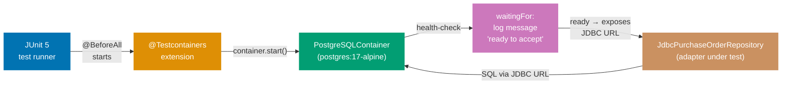
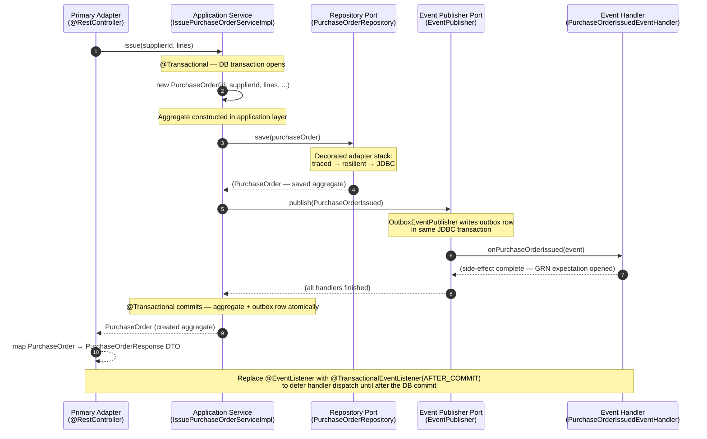

## Guide 16 — Database Integration Test via Testcontainers

### Why It Matters

Unit tests with an in-memory adapter (Guide 9) prove port correctness but cannot catch SQL schema mistakes, PostgreSQL-specific constraint behavior, or migration ordering bugs. A database integration test that spins up a real PostgreSQL instance inside Docker closes this gap without requiring a persistent database on developer machines. In `procurement-platform-be`, the `@Testcontainers`-annotated test class manages the full container lifecycle — start, health-check, stop — through JUnit 5 lifecycle hooks. The adapter under test receives a `DataSource` configured to point at the ephemeral container rather than any static URL.

### Standard Library First

`java.sql.DriverManager` can open a connection to any JDBC URL — but you manage container startup, health-check polling, and teardown manually outside the test:

```java
// Standard library: raw JDBC connection to a pre-running test database
// Demonstrates the manual approach that Testcontainers supersedes.

import java.sql.Connection;
// => Connection: JDBC connection — must be closed after use or connection pool leaks
import java.sql.DriverManager;
// => DriverManager: JDBC entry point — finds a driver matching the URL scheme
import java.sql.SQLException;
// => SQLException: checked exception on every JDBC operation — callers must handle or declare

public class ManualJdbcSmokeTest {
    public static void main(String[] args) throws SQLException {
        // => Assumes the database is already running on localhost:5432 — manual setup required
        // => If the database is not ready, DriverManager throws immediately — no health-check polling
        String url = System.getenv("TEST_DATABASE_URL");
        // => Reads the JDBC URL from an environment variable — CI must set this before the test runs
        // => No automatic container provisioning — the database must be started in a separate step
        try (Connection conn = DriverManager.getConnection(url, "test_user", "test_pass")) {
            // => try-with-resources: Connection implements AutoCloseable — conn.close() is guaranteed
            var stmt = conn.createStatement();
            // => createStatement: plain statement, no parameters — suitable for smoke queries only
            var rs = stmt.executeQuery("SELECT 1");
            // => SELECT 1: minimal smoke query — verifies the connection is live
            // => No schema migration here: the developer must run migrations manually before this test
            if (rs.next()) {
                System.out.println("Connected: " + rs.getInt(1));
                // => Diagnostic output only — this is not an assertion in a test framework
            }
        }
    }
}
```

**Limitation for production**: raw JDBC requires a running database before the test starts, manual health-check polling, and manual teardown. Container startup is not coordinated with JUnit lifecycle hooks — if the JVM exits unexpectedly, the container is orphaned.

### Production Framework

Testcontainers integrates with JUnit 5 via `@Testcontainers` and `@Container`. The `PostgreSQLContainer` manages the full container lifecycle — start, wait for the PostgreSQL health probe, expose a random host port, and stop after the test class finishes:



```java
// Testcontainers integration test for the JDBC adapter
package com.procurement.platform.purchasing.infrastructure;
// => infrastructure package: integration tests live here — they test the adapter, not the domain

import com.procurement.platform.purchasing.application.PurchaseOrderRepository;
// => Application-layer port — the test exercises the adapter through the interface
import com.procurement.platform.purchasing.domain.PurchaseOrder;
import com.procurement.platform.purchasing.domain.PurchaseOrderId;
import com.procurement.platform.purchasing.domain.SupplierId;
import com.procurement.platform.purchasing.domain.Money;
import com.procurement.platform.purchasing.domain.ApprovalLevel;
import com.procurement.platform.purchasing.domain.PurchaseOrderStatus;
// => Domain types only — the test speaks in domain terms, not JDBC terms
import org.junit.jupiter.api.BeforeEach;
import org.junit.jupiter.api.Test;
// => JUnit 5: @Test marks test methods; @BeforeEach runs before each test method
import org.springframework.jdbc.datasource.DriverManagerDataSource;
// => DriverManagerDataSource: Spring's simple DataSource — wires the container JDBC URL
import org.testcontainers.containers.PostgreSQLContainer;
// => PostgreSQLContainer: the Testcontainers wrapper for postgres Docker images
import org.testcontainers.junit.jupiter.Container;
import org.testcontainers.junit.jupiter.Testcontainers;
// => @Testcontainers: JUnit 5 extension — manages @Container lifecycle automatically

import javax.sql.DataSource;
import java.math.BigDecimal;
import java.util.List;
import java.util.Optional;
import java.util.UUID;

import static org.junit.jupiter.api.Assertions.*;

@Testcontainers
// => @Testcontainers: registers the JUnit 5 extension that starts @Container fields
// => The extension calls container.start() before any test in this class and container.stop() after all
public class JdbcPurchaseOrderRepositoryIntegrationTest {

    @Container
    // => @Container: Testcontainers manages lifecycle — container starts before @BeforeEach, stops after @AfterAll
    // => static field: container is shared across all test methods in this class — one start, one stop
    static final PostgreSQLContainer<?> postgres =
        new PostgreSQLContainer<>("postgres:17-alpine");
        // => postgres:17-alpine: matches the production target — Alpine keeps the image small
        // => waitingFor defaults to waiting for the "ready to accept connections" log message

    private PurchaseOrderRepository repository;
    // => Port interface declared — the test never imports JdbcPurchaseOrderRepository directly
    // => Swapping the adapter requires no change to the test body

    @BeforeEach
    // => @BeforeEach: runs before each @Test method — creates a fresh adapter backed by the container
    void setUp() {
        DataSource dataSource = new DriverManagerDataSource(
            postgres.getJdbcUrl(),
            // => getJdbcUrl(): returns "jdbc:postgresql://localhost:<random-port>/test"
            // => Random port assigned by Docker — no port conflicts on CI runners
            postgres.getUsername(),
            postgres.getPassword()
            // => Default credentials: "test" / "test" — the default PostgreSQLContainer credentials
        );
        repository = new JdbcPurchaseOrderRepository(
            org.springframework.jdbc.core.simple.JdbcClient.create(dataSource));
        // => JdbcPurchaseOrderRepository: the infrastructure adapter under test
        // => Constructed fresh before each test — no state carries between tests
    }

    @Test
    // => @Test: JUnit 5 test method — discovered by the JUnit Platform and executed by the engine
    void save_thenFindById_roundTripsSuccessfully() {
        // => Test name describes the observable contract — save then find returns the same aggregate
        var id = new PurchaseOrderId(UUID.randomUUID());
        // => PurchaseOrderId: strongly-typed identity — wraps a random UUID for this test run
        var supplierId = new SupplierId(UUID.randomUUID());
        // => SupplierId: strongly-typed supplier identity — wraps a random UUID
        var po = new PurchaseOrder(id, supplierId, List.of(),
            new Money(new java.math.BigDecimal("500.00"), "USD"),
            ApprovalLevel.L1, PurchaseOrderStatus.Draft);
        // => Domain aggregate: built with the smart constructor — invariants validated at construction

        repository.save(po);
        // => Write path: persists the aggregate via JdbcPurchaseOrderRepository to the real PostgreSQL container

        Optional<PurchaseOrder> found = repository.findById(id);
        // => Read path: queries the real database — finds the row committed by save()

        assertTrue(found.isPresent(), "PurchaseOrder must be found after save");
        // => isPresent(): the row must exist — if the INSERT failed silently, this assertion fails
        assertEquals(po.supplierId(), found.get().supplierId());
        // => supplierId round-trip: the persisted supplier identity must match the domain record's value
        assertEquals(PurchaseOrderStatus.Draft, found.get().status());
        // => Status round-trip: verifies the enum column is mapped and retrieved correctly
    }

    @Test
    // => Second test: exercises the not-found path — no setup, no prior save
    void findById_returnsEmpty_whenNotFound() {
        var missingId = new PurchaseOrderId(UUID.randomUUID());
        // => A UUID that was never saved — the database has no row for this identity

        Optional<PurchaseOrder> result = repository.findById(missingId);
        // => Port contract: absence must be returned as Optional.empty(), never null

        assertTrue(result.isEmpty(), "Unknown PurchaseOrderId must return Optional.empty()");
    }
}
```

Add the Testcontainers dependency to the `pom.xml` for `procurement-platform-be`:

```xml
<!-- Testcontainers BOM import — manage all testcontainers module versions consistently -->
<dependency>
    <!-- => <dependency> in <dependencyManagement>: pins the version for all transitive consumers -->
    <groupId>org.testcontainers</groupId>
    <artifactId>testcontainers-bom</artifactId>
    <!-- => Spring Boot 4.0.6 BOM does NOT manage org.testcontainers core modules — explicit BOM import required -->
    <version>1.21.3</version>
    <type>pom</type>
    <scope>import</scope>
</dependency>

<!-- Then in <dependencies>: -->
<dependency>
    <groupId>org.testcontainers</groupId>
    <!-- => postgresql module: wraps postgres Docker image, exposes JDBC URL -->
    <artifactId>postgresql</artifactId>
    <!-- => Version managed by org.testcontainers:testcontainers-bom — no explicit version needed here -->
    <scope>test</scope>
</dependency>
<dependency>
    <groupId>org.testcontainers</groupId>
    <!-- => junit-jupiter: provides @Testcontainers and @Container annotations -->
    <artifactId>junit-jupiter</artifactId>
    <!-- => Without this module, the JUnit 5 lifecycle extension is not registered automatically -->
    <scope>test</scope>
</dependency>
```

**Trade-offs**: Testcontainers tests are slower than in-memory tests — PostgreSQL startup typically adds 5–15 seconds. They require Docker on the developer machine and CI runner. They are not cacheable by Nx because the external container is non-deterministic. Run them on the `test:integration` Nx target, not `test:quick`. The payoff is that they catch schema drift, PostgreSQL-specific constraint behavior, and migration bugs that no in-memory stub can surface.

---

## Guide 17 — Schema Migration Adapter with Flyway

### Why It Matters

Every database integration test and every production deployment depends on the schema matching the application's expectations. Without a migration tool, schema changes require manual SQL execution coordinated across every developer machine, CI runner, and production server. In `procurement-platform-be`, Flyway runs embedded SQL migration scripts in versioned order at application startup. The migration adapter is a first-class hexagonal concern: it runs before any domain port is called, and the Testcontainers integration test (Guide 16) can invoke it against the fresh container database before running assertions.

### Standard Library First

`java.io` and plain JDBC can execute SQL files in order — but you manage ordering, idempotency, and error recovery manually:

```java
// Standard library: manual SQL file execution without a migration library
// Demonstrates the raw JDBC migration approach that the Flyway adapter supersedes.

import java.io.IOException;
import java.nio.file.Files;
import java.nio.file.Path;
// => Files.readString: reads a .sql file from the filesystem — no classpath scanning
import java.sql.Connection;
import java.sql.SQLException;

public class ManualMigrationRunner {
    public static void runMigration(Connection conn, Path sqlFile)
            throws IOException, SQLException {
        // => Two checked exceptions declared: I/O for file reading, SQL for execution
        // => No ordering enforcement — the caller must sort files by name manually
        String sql = Files.readString(sqlFile);
        // => Reads the entire SQL file as a string — no templating, no parameter binding
        try (var stmt = conn.createStatement()) {
            stmt.execute(sql);
            // => execute: runs the entire file as one batch — DDL errors mid-file leave partial schema
            // => No journal table: if the script runs twice, CREATE TABLE throws a duplicate-object error
        }
    }
}
```

**Limitation for production**: no journal table means migrations run again on every restart. No ordering enforcement means naming conventions must be manually enforced. No embedded-resource support means SQL files must be on the filesystem at a known path.

### Production Framework

Flyway reads versioned SQL scripts from the classpath (`db/migration/V1__*.sql`, `V2__*.sql`, …), maintains an applied-scripts journal table (`flyway_schema_history`) in the database, and applies only unapplied scripts in order. Spring Boot 4 auto-configures Flyway when `spring-boot-starter-flyway` is on the classpath:

```java
// ApplicationRunner invoking Flyway migration at startup
package com.procurement.platform.shared.config;

import org.flywaydb.core.Flyway;
// => Flyway: the migration engine — configured with dataSource and migration locations
import org.flywaydb.core.api.output.MigrateResult;
// => MigrateResult: result record — carries migrationsExecuted count and success flag
import org.slf4j.Logger;
import org.slf4j.LoggerFactory;
import org.springframework.boot.ApplicationRunner;
// => ApplicationRunner: Spring Boot hook — runs after ApplicationContext is ready
import org.springframework.context.annotation.Bean;
import org.springframework.context.annotation.Configuration;

import javax.sql.DataSource;

@Configuration
public class MigrationConfiguration {

    private static final Logger log = LoggerFactory.getLogger(MigrationConfiguration.class);

    @Bean
    public ApplicationRunner migrationRunner(DataSource dataSource) {
        // => DataSource: injected from the Spring context — backed by HikariCP in production
        return args -> {
            // => ApplicationRunner lambda — runs once at startup, before any HTTP request is served
            Flyway flyway = Flyway.configure()
                .dataSource(dataSource)
                // => dataSource: Flyway uses the same pool as the application — no second connection pool
                .locations("classpath:db/migration")
                // => locations: Flyway scans src/main/resources/db/migration for V*.sql files
                // => Scripts named V1__create_purchasing_schema.sql, V2__create_supplier_schema.sql, etc.
                .load();
            MigrateResult result = flyway.migrate();
            // => migrate(): applies all unapplied scripts in version order within individual transactions
            // => Flyway wraps each script in a transaction — a failed script leaves no partial schema
            log.info("Flyway applied {} migration(s)", result.migrationsExecuted);
            if (!result.success) {
                throw new IllegalStateException("Flyway migration failed — aborting startup");
                // => Throwing here causes Spring Boot to exit with a non-zero code
                // => Kubernetes readiness probe fails — pod does not receive traffic before schema is ready
            }
        };
    }
}
```

The migration SQL script follows Flyway's naming scheme and uses one schema per bounded context:

```sql
-- src/main/resources/db/migration/V1__create_purchasing_schema.sql
-- Creates the purchasing bounded context schema

CREATE SCHEMA IF NOT EXISTS purchasing;
-- => purchasing schema: isolates purchasing context tables from supplier and receiving schemas
-- => One schema per bounded context: prevents accidental cross-context table joins in raw SQL

CREATE TABLE IF NOT EXISTS purchasing.purchase_orders (
    -- => purchasing.purchase_orders: one table per aggregate in the purchasing context
    id             UUID         PRIMARY KEY,
    -- => UUID primary key: matches PurchaseOrderId.value() — no auto-increment sequences needed
    supplier_id    UUID         NOT NULL,
    -- => supplier_id: foreign reference to the supplier — UUID only, no FK to a suppliers table
    total_amount   NUMERIC(19,4) NOT NULL,
    -- => NUMERIC(19,4): sufficient precision for monetary amounts — 4 decimal places
    currency       CHAR(3)      NOT NULL,
    -- => CHAR(3): ISO 4217 currency code — "USD", "EUR", "IDR"
    approval_level TEXT         NOT NULL,
    -- => approval_level: stores the ApprovalLevel enum name: "L1", "L2", "L3"
    status         TEXT         NOT NULL DEFAULT 'Draft'
    -- => DEFAULT 'Draft': new rows start as Draft — matches the domain aggregate's initial state
);

CREATE INDEX IF NOT EXISTS po_supplier_id_idx ON purchasing.purchase_orders(supplier_id);
-- => Index by supplier_id: findBySupplierId() is a hot read path — makes it O(log n)

CREATE TABLE IF NOT EXISTS purchasing.outbox_events (
    -- => outbox_events: one outbox table per bounded context schema
    id           TEXT         PRIMARY KEY,
    -- => id: idempotency key generated by OutboxEventPublisher — UUID string form
    event_type   TEXT         NOT NULL,
    -- => event_type: string name of the domain event class — used by the relay worker for routing
    payload      JSONB        NOT NULL,
    -- => JSONB: binary JSON format — enables GIN index on payload fields for relay filtering
    created_at   TIMESTAMPTZ  NOT NULL,
    processed_at TIMESTAMPTZ
    -- => NULL until relayed: the relay worker sets this when the event has been delivered
);
```

Add the Flyway dependency to `pom.xml`:

```xml
<!-- Flyway starter — triggers FlywayAutoConfiguration in Spring Boot 4 -->
<dependency>
    <groupId>org.springframework.boot</groupId>
    <!-- => required in Spring Boot 4: standalone flyway-core no longer triggers FlywayAutoConfiguration -->
    <artifactId>spring-boot-starter-flyway</artifactId>
</dependency>
<dependency>
    <groupId>org.flywaydb</groupId>
    <!-- => PostgreSQL dialect module: required for PG-specific DDL and schema support -->
    <artifactId>flyway-database-postgresql</artifactId>
    <!-- => Without this, Flyway falls back to a generic JDBC dialect -->
</dependency>
```

**Trade-offs**: Flyway's versioned migration model requires naming discipline (`V1__`, `V2__`) — a mislabeled script that should run after `V10__` but is named `V2__` runs second and breaks. For `procurement-platform-be`, Flyway's embedded SQL approach keeps the migration language as plain SQL, which is more portable and easier to review in pull requests.

---

## Guide 18 — Banking Port + Spring `RestClient` Adapter

### Why It Matters

External bank API calls are an I/O boundary: the payments context sends a disbursement instruction and receives a confirmation from the bank's REST API. Like the database boundary, this I/O must sit behind a port so the application service is testable without a live banking API, and so the provider can be swapped without touching business logic. In `procurement-platform-be`, the `payments` bounded context introduces a `BankingPort` interface in its `application` package. Spring Boot 4 ships `RestClient` — already on the classpath via `spring-boot-starter-web` — which provides type-safe, builder-configured HTTP calls with timeout control.

### Standard Library First

`java.net.http.HttpClient` (JDK 11+) can call any HTTP endpoint without any Spring dependency. You manage timeout configuration, error discrimination, and JSON mapping manually:

```java
// Standard library: java.net.http.HttpClient calling a bank disbursement endpoint
// Demonstrates the stdlib HttpClient approach that the Spring RestClient adapter supersedes.

import java.net.URI;
import java.net.http.HttpClient;
import java.net.http.HttpRequest;
import java.net.http.HttpResponse;
// => java.net.http: JDK 11+ — no external dependency, full HTTP/2 support
import java.time.Duration;
// => Duration: used for connect and request timeouts — no third-party type needed

public class RawBankHttpClient {
    private final HttpClient httpClient = HttpClient.newBuilder()
        .connectTimeout(Duration.ofSeconds(5))
        // => connectTimeout: how long to wait for the TCP handshake — no retry on timeout
        .build();

    public String initiateDisbursement(String apiKey, String iban, String amount, String currency)
            throws Exception {
        // => checked Exception: no typed error discrimination between insufficient-funds, auth failure, or timeout
        String body = """
            {"iban":"%s","amount":"%s","currency":"%s"}
            """.formatted(iban, amount, currency);
        // => JSON string built manually — no type safety on field names
        var request = HttpRequest.newBuilder()
            .uri(URI.create("https://bank-api.example.com/v1/disbursements"))
            // => Hardcoded URL: the base URL is not externalized — changing providers requires a code change
            .header("Authorization", "Bearer " + apiKey)
            .header("Content-Type", "application/json")
            .POST(HttpRequest.BodyPublishers.ofString(body))
            .timeout(Duration.ofSeconds(30))
            .build();
        var response = httpClient.send(request, HttpResponse.BodyHandlers.ofString());
        if (response.statusCode() != 200) {
            throw new Exception("Bank API call failed: " + response.statusCode());
            // => Undifferentiated exception: insufficient-funds (422) and auth failure (401) both throw the same type
        }
        return response.body();
        // => Returns the raw JSON body string — caller must parse it manually with Jackson
    }
}
```

**Limitation for production**: no typed error discrimination between insufficient-funds errors, authentication failures, and server errors. No retry logic. The application layer must import `HttpClient` to call this function — the banking boundary is not behind a port.

### Production Framework

The hexagonal approach declares a `BankingPort` in the `payments` application package and implements the HTTP adapter in infrastructure using Spring `RestClient`:

```java
// BankingPort.java — output port interface in the payments application package
package com.procurement.platform.payments.application;
// => application/ package: port interfaces live here — no Spring, no HTTP imports

import com.procurement.platform.payments.domain.Payment;
// => Payment: the domain aggregate — passed to initiateDisbursement for bank instructions
import com.procurement.platform.payments.domain.DisbursementConfirmation;
// => DisbursementConfirmation: value object wrapping the bank confirmation reference

public interface BankingPort {
    // => Output port: declares what the application needs from a bank API
    // => No mention of RestClient or HTTP — those are adapter concerns

    DisbursementConfirmation initiateDisbursement(Payment payment) throws BankingException;
    // => initiateDisbursement: called during a payment run — submits disbursement to the bank
    // => BankingException: typed checked exception — the caller can distinguish bank API failure

    boolean confirmDisbursement(String bankReference) throws BankingException;
    // => confirmDisbursement: polls for settlement status — returns true when bank confirms settlement
    // => Throws BankingException on connection failure, not on "pending" status
}

// BankingException.java — typed exception in the application package
class BankingException extends Exception {
    // => Checked exception: callers must handle or declare it — no silent swallowing
    public BankingException(String message, Throwable cause) {
        super(message, cause);
        // => Wraps the underlying RestClient exception with a typed domain-layer exception
    }
}
```

```java
// RestClientBankingAdapter.java — RestClient adapter implementing BankingPort
package com.procurement.platform.payments.infrastructure;
// => payments/infrastructure/ package: the RestClient adapter lives here

import com.procurement.platform.payments.application.BankingPort;
import com.procurement.platform.payments.application.BankingException;
import com.procurement.platform.payments.domain.Payment;
import com.procurement.platform.payments.domain.DisbursementConfirmation;
// => Domain value objects: Payment carries the input, DisbursementConfirmation carries the output
import org.springframework.web.client.RestClient;
import org.springframework.web.client.RestClientException;
// => RestClient: Spring Boot 4 fluent HTTP client — replaces RestTemplate for new code
import org.springframework.stereotype.Component;
import java.time.Duration;

@Component
public class RestClientBankingAdapter implements BankingPort {
    // => implements BankingPort: the adapter satisfies the output port contract

    private final RestClient restClient;
    // => RestClient: Spring Boot 4's modern HTTP client — builder-configured at construction
    private final String bankApiKey;
    // => apiKey: externalized in application.properties — never hardcoded

    public RestClientBankingAdapter(
            RestClient.Builder restClientBuilder,
            @org.springframework.beans.factory.annotation.Value("${banking.api.base-url}")
            String baseUrl,
            @org.springframework.beans.factory.annotation.Value("${banking.api.key}")
            String bankApiKey
    ) {
        this.restClient = restClientBuilder
            .baseUrl(baseUrl)
            // => baseUrl: all requests from this client use this prefix
            .defaultHeader("Authorization", "Bearer " + bankApiKey)
            // => defaultHeader: the Authorization header is set once — not repeated per request
            .requestFactory(factory -> factory.setConnectTimeout(Duration.ofSeconds(5)))
            // => connectTimeout: TCP handshake must complete within 5 seconds
            .build();
        this.bankApiKey = bankApiKey;
    }

    @Override
    public DisbursementConfirmation initiateDisbursement(Payment payment) throws BankingException {
        // => Implements BankingPort.initiateDisbursement — called by the payments application service
        try {
            var requestBody = new DisbursementRequest(
                payment.bankAccount().iban(),
                // => iban: extracted from the BankAccount value object — format-validated in the domain
                payment.amount().amount().toPlainString(),
                payment.amount().currency()
            );
            var response = restClient.post()
                .uri("/v1/disbursements")
                .contentType(org.springframework.http.MediaType.APPLICATION_JSON)
                .body(requestBody)
                .retrieve()
                .body(DisbursementResponse.class);
            // => body(Class): deserializes the response JSON into DisbursementResponse — Jackson mapping
            return new DisbursementConfirmation(response.reference(), response.status());
            // => DisbursementConfirmation: immutable value object returned to the application service
        } catch (RestClientException ex) {
            throw new BankingException("Bank disbursement API call failed: " + ex.getMessage(), ex);
            // => Wrap in BankingException to keep the application layer free of Spring imports
        }
    }

    @Override
    public boolean confirmDisbursement(String bankReference) throws BankingException {
        try {
            var response = restClient.get()
                .uri("/v1/disbursements/{reference}", bankReference)
                // => URI template: bankReference is URL-encoded by RestClient automatically
                .retrieve()
                .body(DisbursementStatusResponse.class);
            return "SETTLED".equalsIgnoreCase(response.status());
            // => Returns true only when status is SETTLED — "PENDING" and "PROCESSING" return false
        } catch (RestClientException ex) {
            throw new BankingException("Bank confirmation API call failed: " + ex.getMessage(), ex);
        }
    }

    // Response records — private to the adapter, not exposed to the application layer
    private record DisbursementRequest(String iban, String amount, String currency) {}
    // => Jackson serializes this to {"iban":"...","amount":"...","currency":"..."}
    private record DisbursementResponse(String reference, String status) {}
    // => Jackson deserializes the bank API response — reference is the idempotency key
    private record DisbursementStatusResponse(String status) {}
    // => Status string: "PENDING", "PROCESSING", "SETTLED", "FAILED"
}
```

**Trade-offs**: `RestClient` requires Spring MVC on the classpath — which is always present for `spring-boot-starter-web`. The typed response records (private to the adapter) couple the adapter to the bank API's JSON schema — if the bank changes its response shape, only the adapter changes; the application service and port are untouched.

---

## Guide 19 — Retry + Circuit-Breaker via Resilience4j

### Why It Matters

External ports — the banking adapter from Guide 18, the JDBC adapter from Guide 8 — fail transiently. A timeout does not mean the downstream service is permanently unavailable; a retry after a brief pause often succeeds. Conversely, an adapter that retries indefinitely against a service that is genuinely down floods the downstream with traffic and keeps threads occupied. Resilience4j (the Spring Boot 4 resilience starter) wraps port adapters with configurable retry and circuit-breaker policies via a decorator pattern over the port interface. The application service code is unchanged — the decorator is wired in the composition root.

### Standard Library First

`java.util.concurrent` provides `CompletableFuture` and thread pools for async retry — but you write the retry loop, backoff calculation, and open-circuit logic yourself:

```java
// Standard library: manual retry loop with exponential backoff
// Demonstrates the manual retry approach that Resilience4j supersedes.

import java.util.function.Supplier;
// => Supplier<T>: functional interface — wraps the call that may throw

public class ManualRetry {
    public static <T> T withRetry(Supplier<T> supplier, int maxAttempts, long initialDelayMs)
            throws Exception {
        Exception lastException = null;
        for (int attempt = 0; attempt < maxAttempts; attempt++) {
            // => Linear retry loop: no built-in jitter, no backoff cap, no circuit-breaker state
            try {
                return supplier.get();
            } catch (Exception ex) {
                lastException = ex;
                if (attempt < maxAttempts - 1) {
                    long delay = initialDelayMs * (long) Math.pow(2, attempt);
                    // => Exponential backoff: 100ms, 200ms, 400ms — no jitter
                    Thread.sleep(delay);
                    // => Thread.sleep: blocks the calling thread — no async option without CompletableFuture
                }
            }
        }
        throw lastException;
        // => All attempts exhausted — rethrow the last exception
        // => No circuit-breaker: the retry loop always tries, even if the last 100 calls failed
    }
}
```

**Limitation for production**: no circuit-breaker state — the retry loop hammers a down service on every call. No jitter — simultaneous callers retry in lock-step. No metrics integration — failures are not counted for observability.

### Production Framework

Resilience4j provides `Retry` and `CircuitBreaker` decorators that wrap any `Supplier`, `Function`, or `Callable`. The decorator is applied in the composition root `@Configuration` class — the application service constructor receives a `PurchaseOrderRepository` that already has retry and circuit-breaker wiring applied:

```java
// ResilientPurchaseOrderRepository.java — Resilience4j decorator wrapping the output port
package com.procurement.platform.purchasing.infrastructure;

import com.procurement.platform.purchasing.application.PurchaseOrderRepository;
// => Port interface: the decorator implements the same interface as the underlying adapter
import com.procurement.platform.purchasing.domain.PurchaseOrder;
import com.procurement.platform.purchasing.domain.PurchaseOrderId;
// => Domain types only — the decorator speaks in domain terms, delegates to the real adapter
import io.github.resilience4j.circuitbreaker.CircuitBreaker;
// => CircuitBreaker: state machine — CLOSED, OPEN, HALF_OPEN — stops calls when open
import io.github.resilience4j.retry.Retry;
// => Retry: configures max attempts, wait duration, and which exceptions trigger a retry
import io.github.resilience4j.retry.RetryConfig;
import io.github.resilience4j.circuitbreaker.CircuitBreakerConfig;
import java.time.Duration;
import java.util.Optional;

public class ResilientPurchaseOrderRepository implements PurchaseOrderRepository {
    // => Implements PurchaseOrderRepository: the decorator is a drop-in replacement for the adapter
    // => The application service cannot tell whether it has the raw adapter or the decorator

    private final PurchaseOrderRepository delegate;
    // => delegate: the real adapter (JdbcPurchaseOrderRepository) — receives calls after retry/CB evaluation
    private final Retry retry;
    private final CircuitBreaker circuitBreaker;

    public ResilientPurchaseOrderRepository(PurchaseOrderRepository delegate) {
        this.delegate = delegate;
        this.retry = Retry.of(
            "purchase-order-repository",
            RetryConfig.custom()
                .maxAttempts(3)
                // => maxAttempts: 3 — the initial call plus two retries
                .waitDuration(Duration.ofMillis(200))
                // => waitDuration: 200ms between attempts — avoid hammering a recovering database
                .retryOnException(ex -> ex instanceof java.sql.SQLException)
                // => retryOnException: only retry on SQLExceptions — not on domain exceptions
                .build()
        );
        this.circuitBreaker = CircuitBreaker.of(
            "purchase-order-repository",
            CircuitBreakerConfig.custom()
                .failureRateThreshold(50)
                // => failureRateThreshold: 50% failure rate in the sliding window opens the circuit
                .slidingWindowSize(10)
                // => slidingWindowSize: 10 calls — the CB evaluates the last 10 attempts
                .waitDurationInOpenState(Duration.ofSeconds(30))
                // => waitDurationInOpenState: CB stays open for 30 seconds before transitioning to HALF_OPEN
                .build()
        );
    }

    @Override
    public PurchaseOrder save(PurchaseOrder po) {
        // => Wraps save() with retry + circuit-breaker: transient DB failures are retried
        return Retry.decorateSupplier(retry,
            CircuitBreaker.decorateSupplier(circuitBreaker,
                () -> delegate.save(po)
                // => Lambda delegates to the real adapter — retry fires if the lambda throws
            )
        ).get();
    }

    @Override
    public Optional<PurchaseOrder> findById(PurchaseOrderId id) {
        return Retry.decorateSupplier(retry,
            CircuitBreaker.decorateSupplier(circuitBreaker,
                () -> delegate.findById(id)
            )
        ).get();
    }

    @Override
    public boolean existsById(PurchaseOrderId id) {
        return Retry.decorateSupplier(retry,
            CircuitBreaker.decorateSupplier(circuitBreaker,
                () -> delegate.existsById(id)
            )
        ).get();
    }
}
```

The composition root wires the decorator transparently:

```java
// PurchasingContextConfiguration.java — composition root wiring with resilience decorator

@Bean
public PurchaseOrderRepository purchaseOrderRepository(JdbcClient jdbc) {
    var jdbcAdapter = new JdbcPurchaseOrderRepository(jdbc);
    // => JdbcPurchaseOrderRepository: the real database adapter — receives SQL calls
    return new ResilientPurchaseOrderRepository(jdbcAdapter);
    // => ResilientPurchaseOrderRepository: decorator wrapping the adapter with retry + circuit-breaker
    // => The application service injects PurchaseOrderRepository — it never sees either concrete class
}
```

Add the Resilience4j Spring Boot starter to `pom.xml`:

```xml
<!-- Resilience4j Spring Boot 4 starter -->
<dependency>
    <groupId>io.github.resilience4j</groupId>
    <artifactId>resilience4j-spring-boot4</artifactId>
    <!-- => resilience4j-spring-boot4: dedicated Spring Boot 4 starter — published to Maven Central as of v2.4.0 -->
    <version>2.4.0</version>
    <!-- => 2.4.0: explicit pin — Spring Boot 4 BOM does not manage Resilience4j transitively -->
</dependency>
```

**Trade-offs**: the decorator pattern adds two layers of wrapping over every port method call. For high-frequency read operations, the decorator overhead is measurable — profile before adding circuit-breakers to read paths. The payoff is that every port adapter automatically participates in the resilience policy without modifying the application service.

---

## Guide 20 — Observability Adapter via Micrometer Tracing

### Why It Matters

A hexagonal application whose port calls are not traced is a black box in production. When a purchasing manager reports that the PO issuance endpoint is slow, the only way to diagnose it without tracing is to reproduce the slowness in development — expensive and error-prone. Micrometer Tracing (the observability layer in Spring Boot 4) wraps port calls with OpenTelemetry-compatible spans. The observability adapter follows the same decorator pattern as the resilience decorator in Guide 19: it implements the port interface, wraps each method with a span, delegates to the real adapter, and is wired transparently in the composition root.

### Standard Library First

`java.lang.System.nanoTime()` can measure wall-clock duration — but it gives you no distributed trace context, no parent-child span relationship, and no integration with any observability backend:

```java
// Standard library: manual timing with System.nanoTime()
// Demonstrates the manual timing approach that Micrometer Tracing supersedes.

public class ManualTimingExample {
    // => Illustrative class: wraps a PurchaseOrderRepository with manual nanoTime-based timing
    public void save(PurchaseOrder po) {
        long start = System.nanoTime();
        // => nanoTime(): monotonic clock — suitable for elapsed time, not wall-clock time
        // => No trace context: this duration cannot be correlated with upstream HTTP spans
        try {
            delegate.save(po);
        } finally {
            long elapsed = System.nanoTime() - start;
            System.out.printf("save() took %.2f ms%n", elapsed / 1_000_000.0);
            // => Console output: no structured format, no trace ID, no span ID
            // => No backend integration — the duration is not exported to Jaeger or Grafana Tempo
        }
    }
}
```

**Limitation for production**: no distributed trace context — spans from different services cannot be stitched into a single trace. No parent-child relationship. No backend integration.

### Production Framework

Micrometer Tracing with the OpenTelemetry bridge wraps port calls with spans that carry a trace ID and are exported to the configured backend. The decorator pattern keeps the tracing concern entirely in the infrastructure layer:

```java
// TracedPurchaseOrderRepository.java — Micrometer Tracing decorator wrapping the output port
package com.procurement.platform.purchasing.infrastructure;

import com.procurement.platform.purchasing.application.PurchaseOrderRepository;
// => Port interface: the decorator implements the same interface — application service is unaware of tracing
import com.procurement.platform.purchasing.domain.PurchaseOrder;
import com.procurement.platform.purchasing.domain.PurchaseOrderId;
import io.micrometer.tracing.Tracer;
// => Tracer: Micrometer Tracing API — creates spans and manages the trace context
import io.micrometer.tracing.Span;
// => Span: represents a single unit of work — carries trace ID, span ID, and tags
import java.util.Optional;

public class TracedPurchaseOrderRepository implements PurchaseOrderRepository {
    // => Implements PurchaseOrderRepository: transparent decorator
    // => Stacks with ResilientPurchaseOrderRepository: wire as Traced(Resilient(Jdbc(...)))

    private final PurchaseOrderRepository delegate;
    private final Tracer tracer;

    public TracedPurchaseOrderRepository(PurchaseOrderRepository delegate, Tracer tracer) {
        this.delegate = delegate;
        this.tracer = tracer;
        // => Both fields are final: immutable after construction — thread-safe for concurrent requests
    }

    @Override
    public PurchaseOrder save(PurchaseOrder po) {
        Span span = tracer.nextSpan().name("purchase-order-repository.save").start();
        // => nextSpan(): creates a child span if a parent trace context is active
        // => name: span name visible in Jaeger / Zipkin — describes the operation
        try (var ignored = tracer.withSpan(span)) {
            span.tag("purchase_order.id", po.id().value().toString());
            // => tag: adds a key-value attribute to the span — visible in trace viewers
            return delegate.save(po);
        } catch (Exception ex) {
            span.error(ex);
            // => error: marks the span as failed and records the exception
            throw ex;
        } finally {
            span.end();
            // => end(): closes the span and reports it to the OpenTelemetry exporter
        }
    }

    @Override
    public Optional<PurchaseOrder> findById(PurchaseOrderId id) {
        Span span = tracer.nextSpan().name("purchase-order-repository.findById").start();
        try (var ignored = tracer.withSpan(span)) {
            span.tag("purchase_order.id", id.value().toString());
            // => Tag the queried ID: lets operators filter traces for a specific PO
            return delegate.findById(id);
        } catch (Exception ex) {
            span.error(ex);
            throw ex;
        } finally {
            span.end();
        }
    }

    @Override
    public boolean existsById(PurchaseOrderId id) {
        Span span = tracer.nextSpan().name("purchase-order-repository.existsById").start();
        try (var ignored = tracer.withSpan(span)) {
            span.tag("purchase_order.id", id.value().toString());
            return delegate.existsById(id);
        } catch (Exception ex) {
            span.error(ex);
            throw ex;
        } finally {
            span.end();
        }
    }
}
```

The composition root stacks all three decorators in order:

```java
// PurchasingContextConfiguration.java — stacked decorators in the composition root

@Bean
public PurchaseOrderRepository purchaseOrderRepository(JdbcClient jdbc, Tracer tracer) {
    // => Parameters injected by Spring: JdbcClient from auto-config, Tracer from Micrometer auto-config
    var jdbcAdapter = new JdbcPurchaseOrderRepository(jdbc);
    // => Layer 1: the real adapter — performs SQL operations against the PostgreSQL DataSource
    var resilientAdapter = new ResilientPurchaseOrderRepository(jdbcAdapter);
    // => Layer 2: retry + circuit-breaker — retries transient failures, opens circuit on sustained failure
    return new TracedPurchaseOrderRepository(resilientAdapter, tracer);
    // => Layer 3: tracing — wraps the full resilience + adapter stack with a span
    // => Span duration includes retry wait time — visible in trace timelines
    // => Application service injects PurchaseOrderRepository — sees none of the concrete layers
}
```

Add Micrometer Tracing to `pom.xml`:

```xml
<!-- Micrometer Tracing + OpenTelemetry bridge -->
<dependency>
    <groupId>io.micrometer</groupId>
    <!-- => OTel bridge: translates Micrometer Tracing to OTel spans -->
    <artifactId>micrometer-tracing-bridge-otel</artifactId>
    <!-- => Version managed by spring-boot-starter-parent 4.0.6 BOM -->
</dependency>
<dependency>
    <groupId>io.opentelemetry</groupId>
    <!-- => OTLP exporter: sends spans to Collector, Jaeger, or Tempo -->
    <artifactId>opentelemetry-exporter-otlp</artifactId>
    <!-- => Configure the endpoint in application.properties: management.otlp.tracing.endpoint -->
</dependency>
```

**Trade-offs**: the decorator stack — trace → resilience → JDBC adapter — adds method-call overhead for every port operation. For high-frequency read paths under strict latency constraints, consider sampling via `management.tracing.sampling.probability=0.01` in `application.properties`. The payoff is full distributed trace visibility across services with no changes to the application service or domain layer.

---

## Guide 21 — Domain Event Flow End-to-End

### Why It Matters

Guides 10 and 11 introduced the domain event publisher port and its adapters. This guide traces the complete flow in a single context: the aggregate state change occurs during a command, the application service captures and publishes the event through the publisher port, and a second downstream handler — modeled as a Spring `@EventListener` in the same process — consumes the event and triggers a side-effect. Understanding this flow end-to-end is a prerequisite for cross-context event routing (Guide 14) and for deciding when to upgrade from the in-memory adapter to the outbox adapter.

### Standard Library First

Java `Consumer<T>` and a mutable listener registry both require manual registration and synchronous dispatch with no lifecycle management:

```java
// Standard library: java.util.function for an in-process event handler
// Demonstrates the stdlib Consumer pattern that the Spring @EventListener supersedes.

import java.util.ArrayList;
import java.util.List;
import java.util.function.Consumer;

public class InMemoryBus<T> {
    private final List<Consumer<T>> handlers = new ArrayList<>();
    // => handlers: mutable list — not thread-safe if handlers are registered after startup

    public void subscribe(Consumer<T> handler) {
        handlers.add(handler);
    }

    public void publish(T event) {
        for (var handler : handlers) {
            handler.accept(event);
            // => Synchronous dispatch — slow handlers block the event publisher
            // => If a handler throws, remaining handlers are skipped silently
        }
    }
}
```

**Limitation for production**: no transaction coordination — the event is published before the aggregate is saved, which means the handler acts on uncommitted data. No retry on handler failure.

### Production Framework

The Spring `ApplicationEventPublisher` is the in-process publisher; `@EventListener` annotated methods are the consumers. The application service publishes after saving the aggregate — inside the same transaction boundary if `@TransactionalEventListener` is used:

```java
// IssuePurchaseOrderServiceImpl.java — publishes event after saving the aggregate
package com.procurement.platform.purchasing.infrastructure;

import com.procurement.platform.purchasing.application.IssuePurchaseOrderService;
import com.procurement.platform.purchasing.application.PurchaseOrderIssued;
import com.procurement.platform.purchasing.application.PurchaseOrderRepository;
import com.procurement.platform.purchasing.application.EventPublisher;
import com.procurement.platform.purchasing.domain.PurchaseOrder;
import com.procurement.platform.purchasing.domain.PurchaseOrderId;
import com.procurement.platform.purchasing.domain.PurchaseOrderLine;
import com.procurement.platform.purchasing.domain.SupplierId;
import com.procurement.platform.purchasing.domain.PurchaseOrderStatus;
import com.procurement.platform.purchasing.domain.ApprovalLevel;
import org.springframework.stereotype.Service;
import org.springframework.transaction.annotation.Transactional;
import java.math.BigDecimal;
import java.time.Instant;
import java.util.List;
import java.util.Optional;
import java.util.UUID;

@Service
public class IssuePurchaseOrderServiceImpl implements IssuePurchaseOrderService {

    private final PurchaseOrderRepository repository;
    // => Port interface: wired to the decorated adapter stack (traced → resilient → JDBC)
    private final EventPublisher eventPublisher;
    // => EventPublisher port: wired to the outbox adapter in production

    public IssuePurchaseOrderServiceImpl(PurchaseOrderRepository repository,
            EventPublisher eventPublisher) {
        this.repository = repository;
        this.eventPublisher = eventPublisher;
        // => Constructor injection: Spring injects both beans automatically — no @Autowired needed
    }

    @Override
    @Transactional
    // => @Transactional: Spring wraps this method in a database transaction
    // => save() and publish() execute within the same commit boundary when using OutboxEventPublisher
    public PurchaseOrder issue(SupplierId supplierId, List<PurchaseOrderLine> lines)
            throws com.procurement.platform.purchasing.application.DuplicatePurchaseOrderException {
        var id = new PurchaseOrderId(UUID.randomUUID());
        // => PurchaseOrderId: new random UUID — generated in the application service, not in the database
        var totalAmount = new com.procurement.platform.purchasing.domain.Money(
            lines.stream()
                .map(l -> l.unitPrice().amount().multiply(new BigDecimal(l.quantity().value())))
                .reduce(BigDecimal.ZERO, BigDecimal::add),
            lines.isEmpty() ? "USD" : lines.get(0).unitPrice().currency());
        // => totalAmount: sum of all line totals — derived from line items at issuance time
        var approvalLevel = ApprovalLevel.fromAmount(totalAmount);
        // => approvalLevel: derived from totalAmount — L1 (≤ $1k), L2 (≤ $10k), L3 (> $10k)
        var po = new PurchaseOrder(id, supplierId, lines, totalAmount, approvalLevel, PurchaseOrderStatus.Draft);
        repository.save(po);
        // => Persist the aggregate first — the event carries the committed state
        // => If save() throws, the transaction rolls back and publish() is never reached
        eventPublisher.publish(new PurchaseOrderIssued(po.id(), po.supplierId(), Instant.now()));
        // => Publish after save: the event payload reflects the committed aggregate
        // => With OutboxEventPublisher: the outbox row and the aggregate row commit atomically
        return po;
    }

    @Override
    public Optional<PurchaseOrder> findById(PurchaseOrderId id) {
        return repository.findById(id);
        // => Delegate to the repository port — no event needed for a read operation
    }

    @Override
    @Transactional
    public PurchaseOrder cancel(PurchaseOrderId id)
            throws com.procurement.platform.purchasing.application.PurchaseOrderNotFoundException,
                   com.procurement.platform.purchasing.application.InvalidPurchaseOrderStateException {
        var po = repository.findById(id)
            .orElseThrow(() -> new com.procurement.platform.purchasing.application.PurchaseOrderNotFoundException(id));
        if (po.status() == PurchaseOrderStatus.Paid || po.status() == PurchaseOrderStatus.Closed) {
            throw new com.procurement.platform.purchasing.application.InvalidPurchaseOrderStateException(
                "PurchaseOrder " + id + " cannot be cancelled in status " + po.status());
        }
        // => Business rule: POs in Paid or Closed state cannot be cancelled
        var cancelled = new PurchaseOrder(po.id(), po.supplierId(), po.lines(),
            po.totalAmount(), po.approvalLevel(), PurchaseOrderStatus.Cancelled);
        // => Immutable update: create a new record with updated status — the original is not mutated
        repository.save(cancelled);
        eventPublisher.publish(new PurchaseOrderCancelled(id, Instant.now()));
        return cancelled;
    }
}
```

```java
// PurchaseOrderIssuedEventHandler.java — consumer in the receiving context
package com.procurement.platform.receiving.infrastructure;

import com.procurement.platform.purchasing.application.PurchaseOrderIssued;
// => Import from the purchasing application package only — the handler accesses domain via the event
import org.slf4j.Logger;
import org.slf4j.LoggerFactory;
import org.springframework.context.event.EventListener;
// => @EventListener: Spring registers this method as a synchronous in-process event consumer
import org.springframework.stereotype.Component;

@Component
public class PurchaseOrderIssuedEventHandler {

    private static final Logger log = LoggerFactory.getLogger(PurchaseOrderIssuedEventHandler.class);

    @EventListener
    // => @EventListener: Spring calls this method when PurchaseOrderIssued is published
    // => The method parameter type determines which event type triggers this handler
    public void onPurchaseOrderIssued(PurchaseOrderIssued event) {
        log.info("Processing PurchaseOrderIssued: poId={} supplierId={}",
            event.purchaseOrderId().value(), event.supplierId().value());
        // => Structured log: PO ID and supplier ID are queryable fields in log aggregation
        // => This handler opens a GRN expectation in the receiving context
        // => A slow handler here blocks the purchasing service HTTP request
        // => Use @Async or upgrade to outbox + relay for async dispatch
    }
}
```

**Trade-offs**: synchronous `@EventListener` dispatch is simple but blocks the application service until all handlers complete. Slow handlers block the HTTP request. Use `@Async` on the handler method to dispatch on a Spring-managed thread pool. For cross-process reliability, replace the in-process publisher with the outbox adapter from Guide 11.

### Domain Event Flow — End-to-End Sequence



---

## Guide 22 — Hexagonal Anti-Patterns

### Why It Matters

Anti-patterns accumulate silently in Java codebases because the compiler does not enforce hexagonal boundaries. A JPA annotation on a domain record, a Spring service that handles HTTP requests and database writes in one class, and an aggregate that holds no behavior — each of these feels harmless in isolation and becomes a migration nightmare at scale. Recognizing these three anti-patterns in `procurement-platform-be` before they take root saves significant refactoring cost later.

### The Leaky Hexagon

The leaky hexagon places framework annotations on domain types. The moment a domain record carries `@Entity`, `@Column`, or `@Table`, the domain layer depends on the ORM framework. Domain unit tests require the ORM on the classpath; switching ORMs touches domain files:

```java
// ANTI-PATTERN: JPA @Entity on a domain record — do not do this
// Demonstrates the leaky-hexagon pattern that the domain records in Guide 3 avoid.

import jakarta.persistence.*;
// => ANTI-PATTERN: ORM import in the domain package
// => jakarta.persistence is a framework dependency — domain tests now require JPA on classpath

@Entity
// => ANTI-PATTERN: @Entity couples the domain aggregate to JPA's entity lifecycle
@Table(name = "purchase_orders", schema = "purchasing")
// => ANTI-PATTERN: the table name is now hardcoded in the domain — changing the schema requires touching domain code
public class PurchaseOrder {
    // => ANTI-PATTERN: class not record — JPA requires a no-arg constructor, preventing record immutability

    @Id
    @GeneratedValue(strategy = GenerationType.UUID)
    // => ANTI-PATTERN: UUID generation moved to the database — the domain aggregate cannot construct itself
    // => Domain-first design: the aggregate creates its own identity (new PurchaseOrderId(UUID.randomUUID()))
    private java.util.UUID id;

    @Column(nullable = false, precision = 19, scale = 4)
    // => ANTI-PATTERN: column constraint duplicated in the domain — it already lives in V1__create_purchasing_schema.sql
    private java.math.BigDecimal totalAmount;
}
```

**Correction**: the domain layer contains pure Java records with no ORM annotations. The JDBC mapping lives in the adapter in `infrastructure/` with explicit SQL. The domain record can be constructed, validated, and tested with zero ORM dependency.

### The God Adapter

The god adapter is a single Spring `@Service` that performs HTTP request parsing, database operations, domain event publishing, and supplier notification — all in one class:

```java
// ANTI-PATTERN: god adapter — one class doing everything
// Demonstrates the god-adapter pattern that the layered composition root avoids.

import jakarta.servlet.http.HttpServletRequest;
// => ANTI-PATTERN: HTTP concern (presentation layer) imported into a @Service (application layer)
import org.springframework.jdbc.core.simple.JdbcClient;
// => ANTI-PATTERN: infrastructure interface imported directly into the @Service

@org.springframework.stereotype.Service
public class GodPurchaseOrderService {

    private final JdbcClient jdbc;
    // => ANTI-PATTERN: infrastructure adapter (JdbcClient) injected directly into the service
    // => The service now depends on a concrete adapter, not a port interface

    public void issuePurchaseOrder(HttpServletRequest req) {
        // => ANTI-PATTERN: HttpServletRequest in the application layer — HTTP is a presentation concern
        String supplierId = req.getParameter("supplierId");
        // => Parsing HTTP parameters in the application service: the service is now untestable without Servlet API
        jdbc.sql("INSERT INTO purchasing.purchase_orders (id, supplier_id, status) VALUES (:id, :supplierId, 'Draft')")
            .param("id", java.util.UUID.randomUUID())
            .param("supplierId", java.util.UUID.fromString(supplierId))
            .update();
        // => ANTI-PATTERN: the service calls JdbcClient directly — no port interface between them
        // => Direct JDBC access: the application service cannot be tested without a database
        notifySupplier(supplierId);
        // => ANTI-PATTERN: supplier notification in the application service — belongs in an event handler
    }

    private void notifySupplier(String supplierId) { /* ... */ }
    // => ANTI-PATTERN: notification logic inline — no SupplierNotifierPort, no stub, no test coverage
}
```

**Correction**: the controller handles HTTP request parsing and delegates a command record to the application service. The application service calls the repository through a port interface. Supplier notification is a side-effect triggered by a `PurchaseOrderIssued` event handler (Guide 21). The god adapter becomes three lean classes: one controller, one application service, one event handler.

### The Anemic Domain

The anemic domain places all business logic in application services while domain classes carry only data fields. The domain object becomes a DTO with a class name, and the application service duplicates invariant checks that should live in the aggregate:

```java
// ANTI-PATTERN: anemic domain — data class with zero behavior
// Demonstrates the anemic pattern that the invariant-enforcing PurchaseOrder record in Guide 3 avoids.

public class AnemicPurchaseOrder {
    // => ANTI-PATTERN: plain data class — no validation, no behavior, no invariants
    public java.util.UUID id;
    // => public field: any code can set id to null — no constructor guard
    public java.util.UUID supplierId;
    // => No null guard: supplierId can be null — the PO becomes an orphan with no supplier
    public java.math.BigDecimal totalAmount;
    // => Nullable totalAmount: no domain invariant that total must be non-negative
    public String status;
    // => Plain String status: any value is legal — "PENDING", "pending", "" all compile
    // => AnemicPurchaseOrder can be constructed with all nulls — invalid domain state
}

// The application service carries all logic that the aggregate should own:
public class AnemicPurchaseOrderService {
    // => ANTI-PATTERN: service holds all invariant checks — each check must be repeated in every service method
    public AnemicPurchaseOrder issue(java.util.UUID supplierId, java.math.BigDecimal totalAmount) {
        if (totalAmount == null || totalAmount.compareTo(java.math.BigDecimal.ZERO) < 0) {
            // => ANTI-PATTERN: domain invariant check duplicated in every service method that creates a PO
            // => If a second service method also creates POs, it must repeat this check
            throw new IllegalArgumentException("totalAmount must not be negative");
        }
        var po = new AnemicPurchaseOrder();
        po.id = java.util.UUID.randomUUID();
        // => Manual field assignment: no constructor enforces invariants at object creation
        po.supplierId = supplierId;
        // => supplierId not validated — if null, the PO is silently saved as an orphan
        po.totalAmount = totalAmount;
        po.status = "Draft";
        // => Initial state: not validated by the aggregate — any caller could set "INVALID" before save
        return po;
    }
}
```

**Correction**: domain records declare invariant-enforcing compact constructors (Guide 3). The application service constructs the aggregate by passing raw values; the aggregate validates them. No service method repeats the invariant check — the compiler guarantees that a `PurchaseOrder` record in scope is always valid.

**Trade-offs**: all three anti-patterns feel pragmatic under time pressure. The leaky hexagon saves writing a mapper. The god adapter saves defining port interfaces. The anemic domain saves writing a compact constructor. Each shortcut defers a refactoring cost that compounds with every feature added on top of it. In `procurement-platform-be`, catching these patterns before any bounded context feature is fully implemented is the cheapest moment to correct them.
