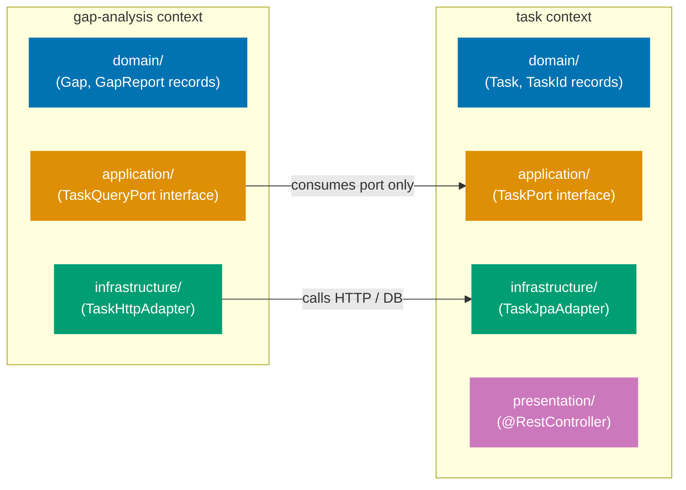
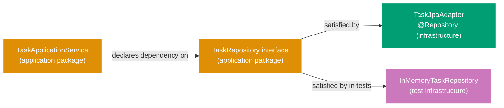

## Guide 1 — One Context, One Hexagon

### Why It Matters

A bounded context is not just a package name — it is an isolation unit. Every time two contexts share a repository directly or call each other's domain objects without an explicit port, a change in one cascades invisibly into the other. In the intended layout for `apps/organiclever-be`, each bounded context owns its own `domain`, `application`, `infrastructure`, and `presentation` packages. Nothing crosses the context boundary except through an interface declared in the `application` package. Getting this isolation invariant right from day one is the single most valuable structural decision in a DDD + hexagonal Java codebase.

### Standard Library First

Java packages group related classes but enforce no architectural boundary. The compiler does not stop `GapAnalysis` from importing `TaskRepository` directly from another context's `infrastructure` package. The package system provides cohesion, not isolation.

```java
// Standard library approach: packages group code but enforce no boundary
// Illustrative snippet — not from apps/organiclever-be; demonstrates the stdlib
// package approach that the hexagonal context layout supersedes.

package com.organicleverbe.gap;

// Direct import from another context's infrastructure — no barrier here
import com.organicleverbe.task.infrastructure.TaskJpaRepository;
// => Java allows cross-package imports unconditionally
// => The compiler sees no violation even though gap analysis is
//    reading task infrastructure internals directly
// => Any refactor of TaskJpaRepository silently breaks GapAnalysis

public class GapService {
    private final TaskJpaRepository taskRepo; // infrastructure type leaking into a domain service
    // => GapService now depends on a Spring Data JPA interface
    // => Unit testing GapService requires a full Spring context or a mock of TaskJpaRepository
    // => The boundary exists only in the developer's head
}
```

_Illustrative snippet — not from `apps/organiclever-be`; demonstrates the stdlib package approach that the hexagonal context layout supersedes._

**Limitation for production**: packages permit cross-context imports with no enforcement. As the codebase grows, accidental coupling accumulates silently. Dependency analysis tools like ArchUnit can detect violations post-hoc, but nothing prevents them at the code level.

### Production Framework

The hexagonal pattern enforces the boundary by making each context own its `domain`, `application`, `infrastructure`, and `presentation` packages, and only exposing types through interfaces declared in the `application` package. No class in `gap.domain` imports anything from `task.infrastructure` — it talks to the task context through a port interface declared in `gap.application`.



The intended layout for `apps/organiclever-be` places each bounded context at its own top-level package under `com.organicleverbe`:

```java
// Intended layout — task context domain layer
// New file — intended layout, scaffolding exists at
// apps/organiclever-be/src/main/java/com/organicleverbe/task/domain/

package com.organicleverbe.task.domain;

// => Package path mirrors the hexagonal layer: task context, domain layer
// => No Spring imports anywhere in this file — records are pure Java SE

public record TaskId(java.util.UUID value) {
    // => Strongly-typed wrapper: prevents passing a gap ID where a task ID is expected
    // => Java record provides equals, hashCode, toString automatically
    // => Compact constructor can add validation if needed (e.g., null check)
    public TaskId {
        java.util.Objects.requireNonNull(value, "TaskId value must not be null");
        // => Canonical constructor validation — throws NullPointerException if null
    }
}

public record Task(
    TaskId id,           // => Aggregate identity — drives equality
    String title,        // => Ubiquitous language field: what the task is called
    String ownerId,      // => Foreign key to the user context — no User object imported
    boolean completed    // => Simple boolean state — no ORM annotation here
) {}
// => Plain Java record: immutable, no @Entity, no @Column, no Jackson @JsonProperty
// => The ORM mapping lives in the infrastructure layer (Guide 7)
// => The serialization mapping lives in the presentation layer (Guide 6)
```

_New file — intended layout, scaffolding exists at `apps/organiclever-be/src/main/java/com/organicleverbe/task/domain/`_

**Trade-offs**: the per-context package layout requires discipline in code review — the Java compiler cannot stop a developer from adding a cross-context import. Tools like ArchUnit enforce the boundary mechanically in CI. The payoff is that each context can evolve its domain model independently, and a unit test for one context never requires a Spring context from another context.

---

## Guide 2 — Reading the Existing Flat Layout

### Why It Matters

`apps/organiclever-be` is in its scaffold phase. The production codebase you can read today has a flat layout: `com.organicleverbe.health.controller.HealthController` is the only domain-facing class, sitting in a flat `health/controller/` package alongside framework configuration in `com.organicleverbe.config`. Before writing any new feature code you need to read this layout fluently — otherwise you misplace new files or misread which parts of the codebase are already production-grade and which are scaffolding.

### Standard Library First

The flat layout is a direct consequence of starting with a single-concern Spring Boot scaffold. Spring Boot's `@SpringBootApplication` scans the entire root package and registers everything it finds. A flat layout means all domain-adjacent classes sit near the root package, sharing the same Spring component scan. This is the zero-ceremony stdlib approach: it compiles, it runs, and it is adequate for a one-context prototype.

```java
// Current flat layout: OrganicleverBeApplication.java — Spring Boot bootstrap
package com.organicleverbe;
// => Root package: Spring component scan starts here and covers all sub-packages
// => @SpringBootApplication covers @Configuration + @EnableAutoConfiguration + @ComponentScan

import org.springframework.boot.SpringApplication;
// => SpringApplication: utility class that bootstraps a Spring application from a main method
import org.springframework.boot.autoconfigure.SpringBootApplication;
// => SpringBootApplication: meta-annotation combining @Configuration, @EnableAutoConfiguration,
//    and @ComponentScan — one annotation to start the whole context

@SpringBootApplication
// => Triggers auto-configuration for everything on the classpath: Spring MVC,
//    Jackson, Actuator, DevTools — no explicit setup needed for defaults
public class OrganicleverBeApplication {
    public static void main(String[] args) {
        SpringApplication.run(OrganicleverBeApplication.class, args);
        // => SpringApplication.run bootstraps the ApplicationContext
        // => The class argument tells Spring Boot which package to scan from
        // => Args forwarded: supports --server.port, --spring.profiles.active, etc.
    }
}
```

Source: [apps/organiclever-be/src/main/java/com/organicleverbe/OrganicleverBeApplication.java](../../../../../../organiclever-be/src/main/java/com/organicleverbe/OrganicleverBeApplication.java)

**Limitation for production**: a single root-package component scan picks up every `@Component`, `@Service`, `@Repository`, and `@Controller` in the codebase — including those from different bounded contexts. As contexts multiply, auto-configuration fights context isolation.

### Production Framework

The hexagonal layout replaces the implicit root scan with explicit per-context `@Configuration` classes that register only their own beans. The `@SpringBootApplication` retains the scan only at the root level to discover the explicit configurations; it does not need to discover individual `@Service` or `@Repository` beans scattered across contexts.

```java
// Current config: CorsConfig.java — cross-cutting infrastructure configuration
package com.organicleverbe.config;
// => config/ package holds cross-cutting infrastructure concerns: CORS, exception handling
// => This package is not a bounded context — it is the application's wiring layer

import org.springframework.context.annotation.Configuration;
// => @Configuration import: required for the Spring @Configuration annotation below
import org.springframework.web.servlet.config.annotation.CorsRegistry;
// => CorsRegistry: Spring MVC fluent API for registering CORS mappings per path pattern
import org.springframework.web.servlet.config.annotation.WebMvcConfigurer;
// => WebMvcConfigurer: callback interface for customizing Spring MVC configuration

@Configuration
// => @Configuration marks this as a Spring bean factory: methods annotated with @Bean
//    produce beans registered in the ApplicationContext
public class CorsConfig implements WebMvcConfigurer {
    // => Implements WebMvcConfigurer: overrides only the addCorsMappings callback
    // => Spring MVC detects @Configuration classes implementing this interface automatically
    @Override
    public void addCorsMappings(CorsRegistry registry) {
        // => WebMvcConfigurer hook: customizes Spring MVC configuration
        // => addCorsMappings runs during context startup, before any request arrives
        registry.addMapping("/**")
                // => /** wildcard: applies CORS policy to every endpoint
                .allowedOrigins("*")
                // => allowedOrigins("*"): accepts requests from any origin
                // => Production should scope this to specific frontend domains
                .allowedMethods("*")
                // => allowedMethods("*"): permits GET, POST, PUT, DELETE, OPTIONS, etc.
                .allowedHeaders("*");
                // => allowedHeaders("*"): no restriction on custom headers
    }
}
```

Source: [apps/organiclever-be/src/main/java/com/organicleverbe/config/CorsConfig.java](../../../../../../organiclever-be/src/main/java/com/organicleverbe/config/CorsConfig.java)

The migration path: new bounded context classes go into `com.organicleverbe.<context>/{domain,application,infrastructure,presentation}/`. The flat `health/` package and `config/` package remain as they are until a feature plan migrates them.

**Trade-offs**: keeping the flat scaffold alive during migration means two structural patterns exist simultaneously. Mitigate by never writing new domain types in the root package — all new bounded context types go directly into the intended per-context layout. The flat files become reference points for understanding the startup wiring, not templates for new features.

---

## Guide 3 — Domain Types Stay Free of Framework Annotations

### Why It Matters

The single most common way a hexagonal architecture collapses into a layered monolith is when domain types carry framework annotations. The moment a `Task` record has `@Entity`, `@Column`, or `@JsonProperty`, the domain layer depends on a persistence or serialization framework. Switching frameworks — or testing the domain in isolation — now requires framework setup. In `apps/organiclever-be`, keeping the intended-layout domain records free of `jakarta.persistence`, `com.fasterxml.jackson`, or Spring annotations is the invariant that makes everything else possible.

### Standard Library First

Java records carry no annotations by default. The language gives you a pure, framework-free type with equality, immutability, and accessors built in:

```java
// Standard library: pure Java record, zero framework annotations
// New file — intended layout, scaffolding exists at
// apps/organiclever-be/src/main/java/com/organicleverbe/task/domain/

package com.organicleverbe.task.domain;
// => Domain package: no Spring, no JPA, no Jackson imports allowed here

import java.util.Objects;
// => Objects.requireNonNull: standard null guard — throws NullPointerException on null
import java.util.UUID;
// => UUID: java.util identity type — no framework dependency needed for aggregate IDs

public record Task(
    TaskId id,
    // => Strongly-typed identity — prevents confusion with other aggregate IDs
    String title,
    // => Ubiquitous language: what the task is in business terms
    String ownerId,
    // => Reference to user context by ID only — no User object imported
    boolean completed
    // => Simple boolean state — no ORM column mapping annotation
) {
    // => Java record compact constructor: runs before each component is assigned
    // => All validation happens here — the record is immutable after construction
    public Task {
        Objects.requireNonNull(id, "Task id must not be null");
        // => Null guard for identity — throws NullPointerException at construction time
        Objects.requireNonNull(title, "Task title must not be null");
        // => Null guard for required field — invariant enforced at the domain boundary
        if (title.isBlank()) throw new IllegalArgumentException("Task title must not be blank");
        // => Domain invariant: a task without a title violates the ubiquitous language
        Objects.requireNonNull(ownerId, "Task ownerId must not be null");
        // => Every task must have an owner — no orphan tasks in the domain model
    }
}
```

_New file — intended layout, scaffolding exists at `apps/organiclever-be/src/main/java/com/organicleverbe/task/domain/`_

**Limitation for production**: when you need to persist a domain record, the ORM needs column names and table mappings. The standard library gives you no mechanism for this — you have to decide where the ORM mapping lives.

### Production Framework

The hexagonal answer is: ORM and serialization mappings live in the infrastructure and presentation layers, not the domain layer. The domain record is a pure Java record. The JPA entity (if used) is a separate class in `infrastructure/` with the `@Entity` annotation, and a mapper translates between the two. Spring Boot 4 also supports interface-based projections and plain SQL result mappings that avoid the entity class entirely.

```java
// GlobalExceptionHandler.java — Spring exception mapping in the config layer, not domain
package com.organicleverbe.config;
// => config/ is the infrastructure/framework wiring layer — not a domain package

import org.springframework.http.HttpStatus;
// => HttpStatus: enum of HTTP status codes — used to set the response status
import org.springframework.http.ProblemDetail;
// => ProblemDetail: RFC 9457 / HTTP Problem Details — Spring 6+ standard error response format
import org.springframework.web.bind.annotation.ExceptionHandler;
// => @ExceptionHandler: marks a method as an exception handler for specific exception types
import org.springframework.web.bind.annotation.RestControllerAdvice;
// => @RestControllerAdvice: combines @ControllerAdvice and @ResponseBody for all @RestControllers

@RestControllerAdvice
// => @RestControllerAdvice: applies @ExceptionHandler methods to all @RestControllers
// => This is infrastructure wiring — it lives in config/, not in any bounded context domain package
// => Domain exceptions (e.g., TaskNotFoundException) bubble up; this class translates them to HTTP
public class GlobalExceptionHandler {

    @ExceptionHandler(Exception.class)
    // => Catch-all handler: covers any exception not matched by a more specific @ExceptionHandler
    // => More specific handlers (e.g., for domain exceptions) can be added here without touching domain code
    public ProblemDetail handleGenericException(Exception ex) {
        ProblemDetail problem = ProblemDetail.forStatus(HttpStatus.INTERNAL_SERVER_ERROR);
        // => ProblemDetail.forStatus: produces an RFC 9457 JSON body with status 500
        // => The domain never produces ProblemDetail — that is this layer's responsibility
        problem.setDetail(ex.getMessage());
        // => ex.getMessage() surfaces the exception message in the error response
        // => Production: scrub sensitive messages before surfacing to clients
        return problem;
        // => Spring serializes ProblemDetail to application/problem+json automatically
    }
}
```

Source: [apps/organiclever-be/src/main/java/com/organicleverbe/config/GlobalExceptionHandler.java](../../../../../../organiclever-be/src/main/java/com/organicleverbe/config/GlobalExceptionHandler.java)

The dependency rule flows inward: `infrastructure` and `presentation` know about `domain`; `domain` knows about neither. In Maven's flat classpath this is not enforced mechanically, so ArchUnit tests in CI enforce the rule: no import from `domain` may reference any class in `infrastructure`, `presentation`, or any Spring package.

**Trade-offs**: keeping domain records annotation-free means you need a separate mapping step at the boundary. For simple CRUD aggregates this mapping is tedious. For complex aggregates with invariants validated at construction time, the separation pays for itself immediately — you can test the entire domain layer with zero Spring context setup.

---

## Guide 4 — Application Service Signatures Take and Return Aggregates, Not DTOs

### Why It Matters

Application services are the orchestration layer between the driving adapter (the Spring `@RestController`) and the domain. A common anti-pattern is letting the application service accept and return the same DTO types the controller works with — Jackson-friendly classes with nullable fields, no invariants, and `@JsonProperty` annotations. When that happens, the application service cannot enforce domain rules without re-validating on every call, and the domain model becomes a ceremonial wrapper around the DTO. In `apps/organiclever-be`, the design rule is: application services accept and return domain aggregates; the controller owns the DTO translation.

### Standard Library First

Java interfaces naturally express an application service contract with domain types only. The standard library gives you `Optional` for absence and `java.util.function` for functional composition without any framework:

```java
// Standard library: application service as a plain interface with domain types only
// New file — intended layout, scaffolding exists at
// apps/organiclever-be/src/main/java/com/organicleverbe/task/application/

package com.organicleverbe.task.application;
// => application/ package: orchestration contracts and service interfaces
// => No Spring imports — the interface is framework-agnostic

import com.organicleverbe.task.domain.Task;
// => Task: the domain aggregate — the service returns fully validated Task records
import com.organicleverbe.task.domain.TaskId;
// => TaskId: the strongly-typed identity — prevents raw String/UUID passing at the boundary
// => Domain types only: the application service talks in domain terms
import java.util.Optional;
// => Optional for absence: find returns Optional<Task>, not null

public interface TaskApplicationService {
    // => Java interface: the contract without the implementation
    // => The implementation (the @Service class) lives in infrastructure/

    Task createTask(String title, String ownerId);
    // => Parameters are primitives — the smart constructor inside this method
    //    builds the aggregate and enforces invariants
    // => Returns the full domain aggregate, not a response DTO

    Optional<Task> findById(TaskId id);
    // => Optional<Task>: absence is a valid domain outcome, not null
    // => TaskId is a strongly-typed domain value — not a raw UUID or String
    // => The controller translates absent -> 404, present -> 200 + DTO

    Task markCompleted(TaskId id);
    // => Returns the updated aggregate — the controller translates to 200 + DTO
    // => Throws a domain exception (e.g., TaskNotFoundException) if not found
    // => The GlobalExceptionHandler translates domain exceptions to HTTP status codes
}
```

_New file — intended layout, scaffolding exists at `apps/organiclever-be/src/main/java/com/organicleverbe/task/application/`_

**Limitation for production**: plain `throws Exception` loses type information. Production services declare specific exception types so controllers can pattern-match on failure modes precisely.

### Production Framework

In the Spring stack the controller owns the DTO translation. The application service never touches `HttpServletRequest`, `ResponseEntity`, or any Spring MVC type. Spring injects the service implementation via constructor injection — the controller declares the interface type, not the concrete class:

```java
// Intended production application service interface with typed exceptions
// New file — intended layout, scaffolding exists at
// apps/organiclever-be/src/main/java/com/organicleverbe/task/application/

package com.organicleverbe.task.application;

import com.organicleverbe.task.domain.Task;
import com.organicleverbe.task.domain.TaskId;
// => Only domain types imported — no Spring, no Jakarta, no Jackson
import java.util.Optional;

public interface TaskApplicationService {
    // => Pure Java interface: zero Spring coupling
    // => Spring injects the @Service implementation at startup via constructor injection
    // => The controller declares this interface type — it never imports the @Service class

    Task createTask(String title, String ownerId) throws DuplicateTaskException;
    // => Typed exception: DuplicateTaskException signals a business rule violation
    // => The GlobalExceptionHandler (or a specific @ExceptionHandler) maps it to HTTP 409
    // => Declared in the throws clause: callers are aware of this outcome at compile time

    Optional<Task> findById(TaskId id);
    // => No checked exception: absence is not an error — it is returned as Optional.empty()
    // => The controller decides whether Optional.empty() means 404 or something else

    Task markCompleted(TaskId id) throws TaskNotFoundException;
    // => TaskNotFoundException: a business rule violation — you cannot complete a nonexistent task
    // => The @ExceptionHandler maps this to HTTP 404 with a domain-meaningful message
    // => Keeping the exception in the application package keeps it reusable across controllers
}
```

_New file — intended layout, scaffolding exists at `apps/organiclever-be/src/main/java/com/organicleverbe/task/application/`_

**Trade-offs**: this clean interface boundary forces you to write a mapping method in the controller layer. For thin CRUD endpoints the mapping is boilerplate. For endpoints where the domain aggregate has validated invariants, the payoff is substantial — the application service is testable with a pure in-memory adapter and zero Spring context.

---

## Guide 5 — Output Port as Java Interface

### Why It Matters

Output ports define _what_ the application layer needs from the outside world without specifying _how_ it is implemented. In Java hexagonal architecture the idiomatic output port is a Java interface declared in the `application` package. The application service declares a dependency on the interface; Spring Boot wires the infrastructure adapter implementation at startup via constructor injection. This makes adapter swapping — in production and in tests — a configuration decision, not a code change. `apps/organiclever-be`'s intended layout uses this pattern for every infrastructure dependency.

### Standard Library First

Java interfaces are the standard library's mechanism for expressing a contract without an implementation. The `java.util.function` package gives you functional types (`Function`, `Supplier`, `Consumer`) that serve as single-operation port alternatives:

```java
// Standard library: output port as a plain Java interface
// Illustrative snippet — not from apps/organiclever-be; demonstrates the stdlib
// interface pattern that the Spring @Component adapter satisfies.

package com.organicleverbe.task.application;

import com.organicleverbe.task.domain.Task;
import com.organicleverbe.task.domain.TaskId;
// => Only domain types in the application package — no JPA, no JDBC

import java.util.Optional;

public interface TaskRepository {
    // => Java interface as output port: declares what the application layer needs
    // => No implementation here — the infrastructure adapter provides it
    // => This interface is the only thing the application service knows about persistence

    void save(Task task);
    // => Write-side port: persist a domain aggregate
    // => void: the service trusts the adapter to persist atomically
    // => Throws RuntimeException subtypes (e.g., DataAccessException) on failure

    Optional<Task> findById(TaskId id);
    // => Read-side port: retrieve by identity
    // => Optional wraps absence — the service does not receive null
    // => The adapter queries the DB and maps the result to a domain Task record
}
```

_Illustrative snippet — not from `apps/organiclever-be`; demonstrates the stdlib interface pattern in isolation._

**Limitation for production**: a bare `void save(Task task)` gives the caller no way to distinguish a network failure from a constraint violation. Production ports declare specific exception types or use `Result`-style return types so the application service can react to failure modes.

### Production Framework

In the Spring stack the output port interface is declared in the `application` package and its implementation — a Spring `@Repository`-annotated class — lives in `infrastructure`. Spring Boot wires them via constructor injection. No `@Autowired` field injection; no `ApplicationContext.getBean()` lookup:



```java
// Intended production output port — application package
// New file — intended layout, scaffolding exists at
// apps/organiclever-be/src/main/java/com/organicleverbe/task/application/

package com.organicleverbe.task.application;

import com.organicleverbe.task.domain.Task;
import com.organicleverbe.task.domain.TaskId;
// => Only domain types imported — the interface is entirely in domain and stdlib terms

import java.util.List;
import java.util.Optional;

public interface TaskRepository {
    // => Output port interface declared in application/ — not in infrastructure/
    // => The @Repository adapter in infrastructure/ implements this interface
    // => The application service's constructor parameter is this interface type

    void save(Task task);
    // => Write-side operation: persist or update the aggregate
    // => Throws TaskPersistenceException (a domain-adjacent exception) on infrastructure failure
    // => The GlobalExceptionHandler maps TaskPersistenceException to HTTP 500

    Optional<Task> findById(TaskId id);
    // => Read-side operation: returns Optional.empty() when the task does not exist
    // => Optional communicates absence without null — no NullPointerException risk

    List<Task> findByOwnerId(String ownerId);
    // => Query port operation: returns all tasks for a given owner
    // => List is empty (not null) when the owner has no tasks
    // => The adapter may page results in production; the interface can be extended

    void delete(TaskId id);
    // => Soft-delete or hard-delete — the adapter decides; the interface does not commit
    // => Throws TaskNotFoundException if the task does not exist
}
```

_New file — intended layout, scaffolding exists at `apps/organiclever-be/src/main/java/com/organicleverbe/task/application/`_

**Trade-offs**: a single `TaskRepository` interface with multiple operations is clean for CRUD aggregates. For aggregates with distinct read and write concerns, split the interface into a command repository and a query repository (CQRS at the port level). Adding methods to the interface requires updating all adapters — a useful forcing function to keep adapters honest.

---

## Guide 6 — Spring `@RestController` as Primary Adapter

### Why It Matters

The Spring `@RestController` is the primary (driving) adapter in the hexagonal architecture. Its job is exactly this: translate an HTTP request into a domain command or query, call the application service, and translate the domain result into an HTTP response. A controller that contains business logic, validates domain invariants, or directly calls a JPA repository has crossed out of the adapter layer into the domain or infrastructure — the most common source of untestable, entangled production code. In `apps/organiclever-be`, `HealthController` is the only controller today, and it is a textbook primary adapter.

### Standard Library First

Java's `HttpServlet` is the standard library equivalent of a Spring controller. Without Spring MVC you write a `doGet` or `doPost` override in an `HttpServlet` subclass. The ceremony is high and composition is manual:

```java
// Standard library: plain HttpServlet without Spring MVC
// Illustrative snippet — not from apps/organiclever-be; demonstrates the
// stdlib servlet pattern that Spring @RestController supersedes.

import jakarta.servlet.http.HttpServlet;
// => HttpServlet: base class for servlets — subclass and override doGet, doPost, etc.
import jakarta.servlet.http.HttpServletRequest;
// => HttpServletRequest: provides access to the HTTP request (method, headers, body, params)
import jakarta.servlet.http.HttpServletResponse;
// => HttpServletResponse: provides access to the HTTP response (status, headers, body)
// => Jakarta Servlet API: the lowest-level HTTP contract in Java EE / Jakarta EE
import java.io.IOException;
// => IOException: thrown by getWriter().write() — must be declared or caught

public class HealthServlet extends HttpServlet {
    // => HttpServlet: subclass and override doGet, doPost, etc.
    // => No automatic JSON serialization — you write to the output stream manually
    // => No routing: the servlet container maps URLs to servlet classes via web.xml or @WebServlet

    @Override
    protected void doGet(HttpServletRequest req, HttpServletResponse resp)
            throws IOException {
        // => Override per-method: doGet, doPost, doPut, doDelete are separate overrides
        // => throws IOException: propagates write failures to the servlet container
        resp.setContentType("application/json");
        // => Set content type manually — no automatic negotiation
        resp.setStatus(HttpServletResponse.SC_OK);
        // => Set status code explicitly: 200 OK
        resp.getWriter().write("{\"status\":\"UP\"}");
        // => Write JSON string manually — no object-to-JSON conversion
        // => A Jackson ObjectMapper call would replace this, but that is extra ceremony
    }
}
```

_Illustrative snippet — not from `apps/organiclever-be`; demonstrates the stdlib servlet pattern that Spring `@RestController` supersedes._

**Limitation for production**: routing, serialization, validation, exception handling, and content negotiation must all be wired manually. Spring MVC handles all of these declaratively.

### Production Framework

`HealthController.java` shows the minimal Spring `@RestController` — a live file you can read today:

```java
// Spring @RestController — primary (driving) adapter
package com.organicleverbe.health.controller;
// => health/controller/ package: flat layout predating the hexagonal migration
// => In the intended layout this would be: com.organicleverbe.health.presentation/

import org.springframework.web.bind.annotation.GetMapping;
import org.springframework.web.bind.annotation.RequestMapping;
import org.springframework.web.bind.annotation.RestController;
// => Spring MVC annotations: @RestController = @Controller + @ResponseBody
// => @RequestMapping sets the base URL path for all methods in this class
// => @GetMapping is shorthand for @RequestMapping(method = RequestMethod.GET)

import java.util.Map;
// => Map.of() is used for the response — no DTO record needed for a trivial health check

@RestController
// => @RestController: Spring registers this as an HTTP handler; serializes return values to JSON
// => No explicit @ResponseBody needed: @RestController implies it for all methods
@RequestMapping("/api/v1")
// => Base path: all mappings in this class are relative to /api/v1
public class HealthController {

    @GetMapping("/health")
    // => GET /api/v1/health: no path variable, no request body, no authentication
    // => Spring MVC resolves this mapping during context startup — no runtime routing table needed
    public Map<String, String> health() {
        // => Return type Map<String, String>: Jackson serializes this to {"status":"UP"}
        // => No ResponseEntity wrapper: Spring MVC uses the return type to set 200 OK
        return Map.of("status", "UP");
        // => Map.of: immutable single-entry map — Java 9+ standard library
        // => "status" key matches the expected health check response format
    }
}
```

Source: [apps/organiclever-be/src/main/java/com/organicleverbe/health/controller/HealthController.java](../../../../../../organiclever-be/src/main/java/com/organicleverbe/health/controller/HealthController.java)

A domain-backed controller (e.g., `POST /api/v1/tasks`) follows the same pattern but adds the translation steps. The controller declares the application service interface — never the concrete `@Service` class — as a constructor parameter:

```java
// Intended production controller for a domain command
// New file — intended layout, scaffolding exists at
// apps/organiclever-be/src/main/java/com/organicleverbe/task/presentation/

package com.organicleverbe.task.presentation;

import com.organicleverbe.task.application.TaskApplicationService;
import com.organicleverbe.task.application.DuplicateTaskException;
// => Application layer interface and exception — not the @Service implementation
// => The controller is decoupled from the concrete adapter class
import org.springframework.http.HttpStatus;
import org.springframework.http.ResponseEntity;
import org.springframework.web.bind.annotation.*;
// => Spring MVC annotations only — no JPA, no domain imports in the annotation block

public record CreateTaskRequest(String title, String ownerId) {}
// => Request DTO as a Java record: immutable, no validation annotations at this level
// => Validation could use Jakarta Bean Validation (@NotBlank) — added in production
// => Lives in the presentation package — domain never imports this type

public record TaskResponse(String id, String title, String ownerId, boolean completed) {}
// => Response DTO: maps domain aggregate fields to JSON-serializable types
// => String id: UUID converted to String for JSON — domain uses TaskId record
// => The application service never produces or consumes this type

@RestController
// => @RestController: combines @Controller and @ResponseBody — all methods return JSON
@RequestMapping("/api/v1/tasks")
// => Base path scoped to the task context — each context owns its URL prefix
public class TaskController {

    private final TaskApplicationService taskService;
    // => Constructor injection: Spring Boot injects the @Service implementation at startup
    // => Field is final: immutable after construction — thread-safe by default
    // => Interface type declared here — the controller never imports the concrete @Service class

    public TaskController(TaskApplicationService taskService) {
        this.taskService = taskService;
        // => No @Autowired annotation needed: Spring Boot auto-detects single-constructor injection
        // => Declaring the interface type means the controller works with any adapter implementation
    }

    @PostMapping
    // => @PostMapping: handles HTTP POST to /api/v1/tasks — no extra path segment needed
    public ResponseEntity<TaskResponse> createTask(@RequestBody CreateTaskRequest request) {
        // => @RequestBody: Jackson deserializes the HTTP request body into CreateTaskRequest
        // => Returns ResponseEntity to control the HTTP status code explicitly
        var task = taskService.createTask(request.title(), request.ownerId());
        // => Translate DTO -> domain call: title and ownerId are raw strings here
        // => The application service builds the Task aggregate with invariant validation
        // => On success: task is a valid domain aggregate
        var response = new TaskResponse(
            task.id().value().toString(),
            // => task.id().value(): unwrap TaskId -> UUID -> String for JSON
            task.title(),
            task.ownerId(),
            task.completed()
            // => Map each domain field to the response DTO — one mapping, one place
        );
        return ResponseEntity.status(HttpStatus.CREATED).body(response);
        // => HTTP 201 Created: the standard status for successful resource creation
        // => body(response): Spring MVC / Jackson serializes TaskResponse to JSON
    }
}
```

_New file — intended layout, scaffolding exists at `apps/organiclever-be/src/main/java/com/organicleverbe/task/presentation/`_

**Trade-offs**: Spring `@RestController` requires Jackson on the classpath and Spring MVC auto-configuration. For a microservice that serves REST JSON this is always present. The payoff: routing, serialization, content negotiation, and exception handling are all declarative, leaving the controller as pure adapter code with no HTTP ceremony.

---

## Guide 7 — Spring `@Configuration` as Composition Root

### Why It Matters

The composition root is the single place in the application where all dependencies are wired together. In object-oriented hexagonal architecture, the composition root must know about concrete adapter classes — that is where the `new TaskJpaAdapter()` or `new InMemoryTaskRepository()` decision is made, not inside the application service. Spring Boot 4's `@Configuration` classes are the idiomatic composition root: they declare `@Bean` methods that construct and wire concrete types, while the rest of the codebase depends only on interfaces. Without a disciplined composition root, `@Autowired` field injection scatters wiring decisions across hundreds of classes, making adapter swapping impossible without touching production code.

### Standard Library First

Without Spring, the composition root is a plain `main` method or a factory class that constructs all objects manually. This is the pure dependency injection approach — no framework, no magic:

```java
// Standard library: manual composition root in main()
// Illustrative snippet — not from apps/organiclever-be; demonstrates the
// manual DI pattern that Spring @Configuration supersedes.

public class Application {
    public static void main(String[] args) {
        // => Composition root: all concrete types constructed here
        // => The rest of the codebase only sees interfaces

        var taskRepository = new InMemoryTaskRepository();
        // => Concrete adapter chosen at startup — swap to JpaTaskRepository for production
        // => No @Autowired magic: the dependency is explicit and visible

        var taskService = new TaskApplicationServiceImpl(taskRepository);
        // => Constructor injection: taskService receives the interface, not the concrete class
        // => Changing the adapter means changing only this line

        var taskController = new TaskController(taskService);
        // => Controller receives the service interface — it does not know about InMemory or JPA
        // => The entire wiring is visible in one place: this main method
    }
}
```

_Illustrative snippet — not from `apps/organiclever-be`; demonstrates the manual DI pattern that Spring `@Configuration` supersedes._

**Limitation for production**: manual wiring of hundreds of beans is impractical. Spring's `@Configuration` provides the same composition-root discipline at scale, with lifecycle management, profile-based switching, and test context override.

### Production Framework

Spring Boot 4's `OrganicleverBeApplication.java` is the entry point, but the wiring is expressed in `@Configuration` classes. For the health controller there is no explicit `@Configuration` — Spring Boot auto-detects the `@RestController` via component scan. For bounded context wiring with explicit port-to-adapter binding, a dedicated `@Configuration` class in the context's `infrastructure` package makes the dependency graph explicit:

```java
// Current entry point: OrganicleverBeApplication.java
package com.organicleverbe;
// => com.organicleverbe: root package — Spring Boot scans from here

import org.springframework.boot.SpringApplication;
import org.springframework.boot.autoconfigure.SpringBootApplication;

@SpringBootApplication
// => @SpringBootApplication triggers component scan from this package downward
// => Every @Component, @Service, @Repository, @RestController in sub-packages is registered
// => Auto-configuration reads the classpath: spring-boot-starter-web adds DispatcherServlet,
//    Jackson ObjectMapper, and Tomcat embedded server automatically
public class OrganicleverBeApplication {
    public static void main(String[] args) {
        SpringApplication.run(OrganicleverBeApplication.class, args);
        // => SpringApplication.run: bootstraps ApplicationContext, starts embedded Tomcat,
        //    runs CommandLineRunner/ApplicationRunner beans, and begins accepting requests
        // => args forwarded to Spring: --server.port=8080, --spring.profiles.active=prod, etc.
    }
}
```

Source: [apps/organiclever-be/src/main/java/com/organicleverbe/OrganicleverBeApplication.java](../../../../../../organiclever-be/src/main/java/com/organicleverbe/OrganicleverBeApplication.java)

The intended per-context `@Configuration` class wires the port interface to its adapter explicitly, avoiding reliance on `@Autowired` field injection or accidental discovery:

```java
// Intended production @Configuration — composition root for the task context
// New file — intended layout, scaffolding exists at
// apps/organiclever-be/src/main/java/com/organicleverbe/task/infrastructure/

package com.organicleverbe.task.infrastructure;

import com.organicleverbe.task.application.TaskApplicationService;
import com.organicleverbe.task.application.TaskRepository;
// => Application layer interfaces imported — not domain or presentation types
import org.springframework.context.annotation.Bean;
import org.springframework.context.annotation.Configuration;
// => @Configuration: marks this as a Spring bean factory
// => @Bean: each annotated method produces a bean registered in the ApplicationContext

@Configuration
// => Spring registers this class during component scan
// => All @Bean methods in this class are called once at startup to build the context
public class TaskContextConfiguration {

    @Bean
    // => @Bean: Spring calls this method and registers the return value as a singleton
    public TaskRepository taskRepository() {
        return new TaskJpaAdapter();
        // => Concrete adapter chosen here — in tests, replace this @Configuration
        //    with a test @Configuration that returns new InMemoryTaskRepository()
        // => The application service never sees TaskJpaAdapter — it receives TaskRepository
    }

    @Bean
    public TaskApplicationService taskApplicationService(TaskRepository taskRepository) {
        // => Spring injects the TaskRepository bean produced above
        // => Constructor injection: explicit, visible, testable
        // => No @Autowired on the service class — the wiring is declared here
        return new TaskApplicationServiceImpl(taskRepository);
        // => TaskApplicationServiceImpl is the @Service implementation
        // => It receives the interface, not the concrete adapter
    }
}
```

_New file — intended layout, scaffolding exists at `apps/organiclever-be/src/main/java/com/organicleverbe/task/infrastructure/`_

**Trade-offs**: explicit `@Configuration` classes require more boilerplate than Spring Boot's auto-configuration scan. The payoff is a visible, replaceable wiring graph — integration tests can override a single `@Configuration` to swap the production JPA adapter for an in-memory stub without modifying any production code. For teams with more than two bounded contexts, this discipline prevents the implicit coupling that component scan enables silently.
