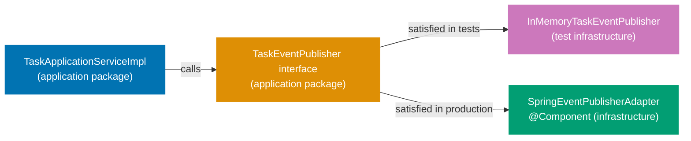
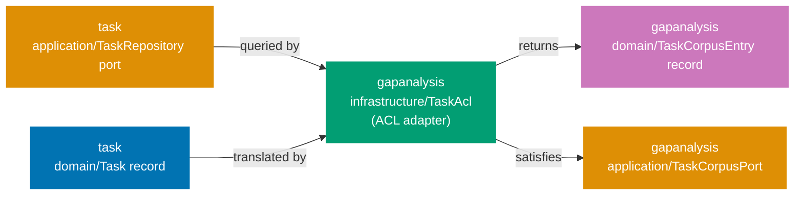

## Guide 8 — Repository Port as Java Interface + Spring Data JDBC Adapter Behind It

### Why It Matters

A repository port is the seam that keeps your application layer independent of the
database. Every time you inject a Spring Data repository interface directly into an
application service, the service becomes untestable without a live database and
untestable without a Spring context. In `apps/organiclever-be`, the intended layout
declares the repository port as a plain Java interface in the `application` package.
The Spring Data JDBC adapter implements that interface in `infrastructure`. Nothing
in the application layer knows whether PostgreSQL, H2, or an in-memory `HashMap`
is behind the port.

### Standard Library First

Java interfaces in `java.util` give you all the primitives needed to express a
repository contract. The standard library's `Optional` and `List` are sufficient
for a read/write pair with no Spring dependency:

```java
// Standard library: repository contract as a plain Java interface over stdlib types
// Illustrative snippet — not from apps/organiclever-be; demonstrates the stdlib
// interface approach that the Spring Data JDBC adapter pattern supersedes.

package com.organicleverbe.task.application;
// => application/ package: output port interfaces live here, not in infrastructure/
// => No Spring import anywhere in this file — the interface is framework-agnostic
// => The infrastructure adapter imports this interface; not the other way around

import com.organicleverbe.task.domain.Task;
// => Task: the domain aggregate — the port speaks in domain terms only
// => No jakarta.persistence.Entity, no @Column — domain types have zero ORM annotations
import com.organicleverbe.task.domain.TaskId;
// => TaskId: strongly-typed identity — prevents passing a raw UUID or String
// => The compiler rejects passing a GapId where a TaskId is expected
import java.util.List;
// => java.util.List: standard collection type — no Spring dependency needed
import java.util.Optional;
// => Optional: communicates absence without null — eliminates NullPointerException risk
// => Optional.empty() is a valid domain outcome, not an error

public interface TaskRepository {
    // => Java interface: the output port contract — zero implementation here
    // => The infrastructure adapter in infrastructure/ provides the implementation
    // => The application service declares this interface type in its constructor — never the adapter class

    void save(Task task);
    // => Write-side port: persist or update the aggregate atomically
    // => The adapter decides whether to INSERT, UPDATE, or UPSERT
    // => Throws unchecked RuntimeException subtypes on infrastructure failure

    Optional<Task> findById(TaskId id);
    // => Read-side port: returns Optional.empty() when the task does not exist
    // => Optional.empty() is correct: absence is a domain outcome — the adapter never returns null

    List<Task> findByOwnerId(String ownerId);
    // => Query port: returns all tasks for a given owner
    // => Empty list (not null) when no tasks exist — callers never null-check the result

    void delete(TaskId id);
    // => Delete port: hard or soft delete — the adapter decides
    // => Throws a domain exception if the task does not exist
}
```

_Illustrative snippet — not from `apps/organiclever-be`; demonstrates the stdlib
interface pattern that the Spring Data JDBC adapter supersedes._

**Limitation for production**: a raw `void save(Task task)` swallows the
distinction between a network timeout and a unique-constraint violation. Production
ports either declare typed exceptions or use a `Result`-style wrapper so the
application service can react to each failure mode precisely. The standard library
interface also gives you no `JdbcClient`, no connection pooling, and no transaction
management — you must wire all of that manually.

### Production Framework

Spring Boot 4 ships a modernised `JdbcClient` (Spring Framework 6.1+) that is
leaner than `JdbcTemplate` and does not require a full JPA entity graph. The
adapter lives in `infrastructure`, implements the port interface from `application`,
and maps between the domain record and SQL rows. The port interface is never
modified to accommodate the adapter:


The port interface with typed exceptions in the `application` package:

```java
// Production output port with typed exceptions — application package
// New file — intended layout, scaffolding exists at
// apps/organiclever-be/src/main/java/com/organicleverbe/task/application/

package com.organicleverbe.task.application;
// => application/ package: only domain types and stdlib imports allowed here
// => No Spring, no JDBC, no JPA — the interface is adapter-agnostic

import com.organicleverbe.task.domain.Task;
// => Task domain aggregate: the port contract speaks in domain terms only
import com.organicleverbe.task.domain.TaskId;
// => TaskId value object: strongly-typed identity parameter — no raw String or UUID at the boundary
import java.util.List;
// => java.util.List: stdlib collection — available without any Spring dependency
import java.util.Optional;
// => Optional wraps absence: the caller does not receive null from the port

public interface TaskRepository {
    // => Output port interface: declared in application/, implemented in infrastructure/
    // => The @Repository adapter in infrastructure/ satisfies this contract at runtime
    // => The application service constructor parameter is this interface type — never the adapter class
    // => Swapping adapters (JDBC → in-memory) requires only a @Configuration change, not a service change

    void save(Task task) throws TaskPersistenceException;
    // => TaskPersistenceException: domain-adjacent exception signalling an infrastructure failure
    // => The GlobalExceptionHandler maps TaskPersistenceException to HTTP 500 + ProblemDetail (RFC 9457)
    // => Callers can catch TaskPersistenceException without importing any JDBC or Spring exception type

    Optional<Task> findById(TaskId id);
    // => No checked exception: absence is a valid domain outcome, not an error
    // => Returns Optional.empty() for a missing task — the controller decides whether to return 404
    // => The adapter never returns null — Optional enforces the contract at the type level

    List<Task> findByOwnerId(String ownerId);
    // => Query result: empty list (not null) when the owner has no tasks
    // => The controller paginates if needed — the port stays simple and unbounded for now
    // => Empty list allows for-each iteration without null-checking

    void delete(TaskId id) throws TaskNotFoundException, TaskPersistenceException;
    // => Two typed exceptions: TaskNotFoundException if absent, TaskPersistenceException on DB failure
    // => Callers can pattern-match on exception type without string parsing or error-code inspection
    // => The adapter distinguishes: zero rows deleted → TaskNotFoundException; JDBC error → TaskPersistenceException
}
```

_New file — intended layout, scaffolding exists at
`apps/organiclever-be/src/main/java/com/organicleverbe/task/application/`_

The `JdbcClient` adapter in the `infrastructure` package maps between the domain
record and SQL rows:

```java
// Spring Data JDBC adapter implementing the output port
// New file — intended layout, scaffolding exists at
// apps/organiclever-be/src/main/java/com/organicleverbe/task/infrastructure/

package com.organicleverbe.task.infrastructure;
// => infrastructure/ package: Spring-managed adapters live here — not in application/ or domain/
// => This package may import Spring, JDBC, JPA, and Jackson — but nothing from presentation/

import com.organicleverbe.task.application.TaskRepository;
// => Output port interface from application/ — the adapter implements this contract
import com.organicleverbe.task.application.TaskNotFoundException;
// => Domain-adjacent exception declared in application/ — re-thrown by the adapter
import com.organicleverbe.task.application.TaskPersistenceException;
// => Infrastructure failure wrapper — the adapter translates DuplicateKeyException into this type
import com.organicleverbe.task.domain.Task;
// => Task domain aggregate — the adapter maps between Task records and SQL rows
import com.organicleverbe.task.domain.TaskId;
// => TaskId value object — unwrapped to UUID for SQL parameter binding
import org.springframework.jdbc.core.simple.JdbcClient;
// => JdbcClient: Spring Framework 6.1+ modernised JDBC API — fluent, type-safe, no RowMapper boilerplate
// => Spring Boot 4 auto-configures JdbcClient from the DataSource bean — no manual wiring needed
import org.springframework.dao.DuplicateKeyException;
// => DuplicateKeyException: Spring's translation of SQL unique-constraint violations (SQLSTATE 23505)
// => Spring wraps raw JDBC SQLExceptions into DataAccessException hierarchy — no SQLSTATE string parsing
import org.springframework.stereotype.Repository;
// => @Repository: Spring registers this class as a bean during component scan
// => Also enables Spring's PersistenceExceptionTranslationPostProcessor for JDBC exceptions
import java.util.List;
// => java.util.List: standard collection — return type for findByOwnerId port method
import java.util.Optional;
// => java.util.Optional: return type for findById — communicates absence without null
import java.util.UUID;
// => UUID: used by the RowMapper to extract the typed id column from the ResultSet

@Repository
// => @Repository: Spring discovers this bean via the root-package scan in OrganicleverBeApplication
// => Guide 15 shows the @Configuration class that binds this adapter to the TaskRepository port explicitly
public class TaskJdbcAdapter implements TaskRepository {
    // => implements TaskRepository: the compiler verifies all four port methods are present
    // => The application service only ever sees the TaskRepository interface — never this class directly

    private final JdbcClient jdbc;
    // => JdbcClient: injected via the single-constructor rule in Spring Boot 4
    // => No @Autowired annotation needed — Spring Boot detects single-constructor injection automatically
    // => Field is final: immutable after construction — thread-safe by default for concurrent requests

    public TaskJdbcAdapter(JdbcClient jdbc) {
        this.jdbc = jdbc;
        // => Constructor injection: JdbcClient is a Spring Boot auto-configured singleton
        // => JdbcClient wraps the HikariCP connection pool — connections are pooled, not per-request
    }

    @Override
    public void save(Task task) throws TaskPersistenceException {
        // => Port method implementation: translates from domain aggregate to SQL — one direction only
        // => task is already validated — domain invariants held at construction time (Guide 3)
        // => The adapter does not re-validate invariants: it trusts the domain layer
        try {
            jdbc.sql("""
                    INSERT INTO tasks (id, title, owner_id, completed)
                    VALUES (:id, :title, :ownerId, :completed)
                    ON CONFLICT (id) DO UPDATE
                      SET title = EXCLUDED.title,
                          owner_id = EXCLUDED.owner_id,
                          completed = EXCLUDED.completed
                    """)
                // => ON CONFLICT … DO UPDATE: upsert semantics — save() handles both insert and update
                // => JdbcClient text block: multi-line SQL without string concatenation or escaping
                // => EXCLUDED refers to the would-be-inserted row — PostgreSQL upsert extension syntax
                // => Upsert means the caller never needs to check "does this task exist?" before saving
                .param("id", task.id().value())
                // => task.id().value(): unwrap TaskId → UUID — JDBC maps UUID to the PostgreSQL uuid column
                // => Named parameters (:id) prevent SQL injection — no string interpolation or concatenation
                .param("title", task.title())
                // => task.title(): Java record accessor generated automatically by the compiler — no getter needed
                .param("ownerId", task.ownerId())
                // => ownerId: Java camelCase name maps to :ownerId, which binds to the snake_case owner_id column
                .param("completed", task.completed())
                // => task.completed(): boolean record accessor — JdbcClient maps to SQL BOOLEAN column
                .update();
                // => .update(): executes the SQL statement and returns the row count (discarded here)
                // => Spring manages the JDBC connection lifecycle — no try-with-resources needed around jdbc.sql()
        } catch (DuplicateKeyException ex) {
            // => DuplicateKeyException: Spring's DataAccessException translation of SQLSTATE 23505
            // => Caught explicitly because some schemas add unique constraints beyond the primary key
            throw new TaskPersistenceException("Task already exists: " + task.id(), ex);
            // => Translate to the domain-adjacent exception — the application layer never sees DuplicateKeyException
            // => TaskPersistenceException is declared in application/: no infrastructure type crosses the boundary
        } catch (Exception ex) {
            throw new TaskPersistenceException("Failed to save task: " + task.id(), ex);
            // => Catch-all: covers connection timeout, serialisation failure, HikariCP pool exhaustion
            // => Wrapped in TaskPersistenceException — GlobalExceptionHandler produces HTTP 500 + ProblemDetail
        }
    }

    @Override
    public Optional<Task> findById(TaskId id) {
        // => No checked exception: SQL SELECT failure propagates as unchecked DataAccessException
        // => DataAccessException is a RuntimeException — it bypasses the caller and reaches GlobalExceptionHandler
        return jdbc.sql("SELECT id, title, owner_id, completed FROM tasks WHERE id = :id")
            .param("id", id.value())
            // => id.value(): unwrap TaskId → UUID — matches the PostgreSQL uuid column type exactly
            .query((rs, _) -> new Task(
                // => Lambda RowMapper: maps ResultSet columns to the domain record's canonical constructor
                // => The underscore (_) discards the row-number int parameter — unused in this mapping
                new TaskId(rs.getObject("id", UUID.class)),
                // => rs.getObject(col, UUID.class): type-safe UUID extraction — no unchecked cast needed
                // => Wraps the raw UUID back into the strongly-typed TaskId value object
                rs.getString("title"),
                // => getString: returns the column value — NOT NULL column guarantees a non-null result
                rs.getString("owner_id"),
                // => owner_id: snake_case column name — explicit string matches the SQL SELECT column alias
                rs.getBoolean("completed")
                // => getBoolean: maps SQL BOOLEAN to Java primitive boolean — false if NULL in the DB
            ))
            .optional();
            // => .optional(): returns Optional<Task> — Optional.empty() when no row matches the WHERE clause
            // => Never throws NoSuchElementException; never returns null — safe for any caller
    }

    @Override
    public List<Task> findByOwnerId(String ownerId) {
        // => No checked exception: same as findById — SQL failures propagate as unchecked DataAccessException
        return jdbc.sql(
                "SELECT id, title, owner_id, completed FROM tasks WHERE owner_id = :ownerId ORDER BY id")
            .param("ownerId", ownerId)
            // => ORDER BY id: deterministic result ordering — tests can assert on list positions reliably
            // => Without ORDER BY, the database is free to return rows in any order — non-deterministic tests
            .query((rs, _) -> new Task(
                new TaskId(rs.getObject("id", UUID.class)),
                // => Same RowMapper shape as findById — extract to a private mapRow() helper in production
                // => Duplication here is intentional: the two queries select different sets of rows
                rs.getString("title"),
                // => getString("title"): reads the NOT NULL title column — guaranteed non-null by schema constraint
                rs.getString("owner_id"),
                // => owner_id: snake_case column maps to camelCase ownerId component — explicit column name required
                rs.getBoolean("completed")
                // => getBoolean: maps SQL BOOLEAN to primitive boolean — false if the column is NULL
            ))
            .list();
            // => .list(): runs the SELECT and maps every row — returns an empty List (not null) when no rows match
            // => JdbcClient.list() is equivalent to JdbcTemplate.query() with a RowMapper but with a fluent API
    }

    @Override
    public void delete(TaskId id) throws TaskNotFoundException, TaskPersistenceException {
        // => try block: wraps the DELETE to distinguish domain exceptions from infrastructure failures
        try {
            int rows = jdbc.sql("DELETE FROM tasks WHERE id = :id")
                .param("id", id.value())
                // => Parameterised DELETE: JdbcClient named parameters prevent SQL injection
                // => id.value() unwraps TaskId → UUID — the WHERE clause matches the primary key column
                .update();
                // => .update() returns the number of rows deleted — exactly 1 if found, 0 if absent
            if (rows == 0) throw new TaskNotFoundException(id);
            // => TaskNotFoundException: declared in application/ — no Spring type at the throw site
            // => The @ExceptionHandler in GlobalExceptionHandler (or a context-specific handler) maps it to 404
        } catch (TaskNotFoundException ex) {
            throw ex;
            // => Re-throw the domain exception as-is — do not wrap it in TaskPersistenceException
            // => Callers pattern-match on the exception type: wrapping would hide the not-found intent
        } catch (Exception ex) {
            throw new TaskPersistenceException("Failed to delete task: " + id, ex);
            // => Infrastructure failure (JDBC error, pool timeout): wrap and let GlobalExceptionHandler produce HTTP 500
        }
    }
}
```

_New file — intended layout, scaffolding exists at
`apps/organiclever-be/src/main/java/com/organicleverbe/task/infrastructure/`_

**Trade-offs**: `JdbcClient` requires writing SQL explicitly — no magic query
derivation from method names like Spring Data JPA. For aggregates with non-trivial
mapping (nested value objects, enums, collections), the row mapper grows. The
payoff is transparency: every query is visible in the source, and adding a database
index is a one-line SQL change, not a JPA annotation hunt. For simpler CRUD
aggregates, Spring Data JDBC's `CrudRepository` reduces boilerplate further while
staying within the port discipline — the adapter still implements `TaskRepository`.

---

## Guide 9 — In-Memory Repository Adapter for Integration Tests

### Why It Matters

An integration test that starts a PostgreSQL container for every test class is
slow, requires Docker, and cannot be cached by Nx. A test that injects an
in-memory `Map`-backed adapter runs in milliseconds, needs no infrastructure, and
runs safely in parallel. The seam from Guide 8 — the `TaskRepository` interface —
is exactly what makes this swap possible. If the in-memory adapter requires changes
to the application service to work, the port has leaked infrastructure concerns
upward.

### Standard Library First

`java.util.HashMap` provides an in-memory key-value store with no dependencies.
The raw approach compiles but loses type safety and thread safety under parallel
test execution:

```java
// Standard library: untyped in-memory store with a raw HashMap
// Illustrative snippet — not from apps/organiclever-be; demonstrates the untyped
// approach that the typed in-memory adapter supersedes.

import java.util.HashMap;
// => HashMap: mutable, unsynchronised key-value store — not thread-safe under concurrent access
// => Two Cucumber step threads writing concurrently corrupt the internal array silently
// => ConcurrentHashMap (used by the typed adapter) provides atomicity for get/put/remove

public class UntypedStore {
    private static final HashMap<Object, Object> store = new HashMap<>();
    // => static final: one shared map for the entire JVM lifetime — all test classes corrupt each other
    // => Object key/value: no compile-time enforcement — a GapId stored under a TaskId key compiles silently
    // => The typed adapter uses Map<TaskId, Task>: wrong key type is a compile error, not a runtime surprise

    public static void put(Object key, Object value) {
        store.put(key, value);
        // => No uniqueness check: silently overwrites existing entries — upsert whether intended or not
        // => Tests that rely on TaskPersistenceException for duplicates never fail — the exception is never thrown
        // => The typed adapter explicitly checks for uniqueness and mirrors the JDBC adapter's behaviour
    }
}
```

_Illustrative snippet — not from `apps/organiclever-be`; demonstrates the untyped
mutable-map approach that the typed in-memory adapter supersedes._

**Limitation for production**: global mutable state fails under parallel test
execution. Untyped storage cannot represent the same duplicate-detection semantics
as the JDBC adapter — tests that verify `TaskPersistenceException` on duplicate
saves never fail even when the application service is broken.

### Production Framework

The in-memory adapter implements the same `TaskRepository` interface as the JDBC
adapter. A `java.util.concurrent.ConcurrentHashMap` gives thread safety without
`synchronized` blocks:

```java
// In-memory adapter implementing the TaskRepository port
// New file — intended layout, scaffolding exists at
// apps/organiclever-be/src/test/java/com/organicleverbe/task/infrastructure/

package com.organicleverbe.task.infrastructure;
// => Test-classpath infrastructure: lives in src/test/java/, not in src/main/java/
// => Production builds never include this class — the adapter is test-only

import com.organicleverbe.task.application.TaskRepository;
// => Output port interface: the adapter must implement all declared methods
import com.organicleverbe.task.application.TaskNotFoundException;
// => Domain-adjacent exception: same type as the JDBC adapter uses — port contract is shared
import com.organicleverbe.task.application.TaskPersistenceException;
// => Infrastructure failure wrapper: in-memory adapter throws this only to mirror the JDBC adapter's contract
import com.organicleverbe.task.domain.Task;
// => Task domain aggregate — stored directly in the map (no serialisation needed for in-memory)
import com.organicleverbe.task.domain.TaskId;
// => TaskId strongly-typed key — prevents storing a Task under a wrong-type key
import java.util.ArrayList;
// => ArrayList: intermediate collection for findByOwnerId — converted to unmodifiable List before return
import java.util.List;
// => java.util.List: return type for findByOwnerId — the port contract uses the stdlib interface
import java.util.Map;
// => Map<TaskId, Task>: typed store — ConcurrentHashMap is the implementation, Map is the field type
import java.util.Optional;
// => java.util.Optional: return type for findById — same absence contract as the JDBC adapter
import java.util.concurrent.ConcurrentHashMap;
// => ConcurrentHashMap: thread-safe — parallel Cucumber step definitions do not corrupt the store
// => get(), put(), remove() are all atomic operations — no external synchronisation needed

public class InMemoryTaskRepository implements TaskRepository {
    // => implements TaskRepository: the compiler verifies all four port methods are present
    // => If the port interface gains a new method, the compiler flags this class immediately
    // => The application service receives TaskRepository — it cannot tell which impl is behind it

    private final Map<TaskId, Task> store;
    // => ConcurrentHashMap<TaskId, Task>: typed key and value — no Object, no casting, no runtime type errors
    // => Keyed by TaskId: the TaskId.equals() and hashCode() generated by Java records are correct

    public InMemoryTaskRepository() {
        this.store = new ConcurrentHashMap<>();
        // => Fresh map per constructor call: each test instantiates a new InMemoryTaskRepository
        // => No shared static state — parallel test classes each hold their own isolated map
    }

    @Override
    public void save(Task task) throws TaskPersistenceException {
        // => Upsert semantics: mirrors the ON CONFLICT DO UPDATE in the JDBC adapter
        // => save() handles both insert and update — the caller does not distinguish
        store.put(task.id(), task);
        // => ConcurrentHashMap.put: atomic — thread-safe without locking the whole map
        // => Overwrites existing entry silently: same as the SQL upsert behaviour
    }

    @Override
    // => @Override: compiler verifies the method signature matches the interface — catches refactoring mistakes
    public Optional<Task> findById(TaskId id) {
        // => findById: returns Optional.empty() when the key is absent — never null
        return Optional.ofNullable(store.get(id));
        // => Optional.ofNullable: returns Optional.empty() when the key is absent
        // => ConcurrentHashMap.get returns null for absent keys — ofNullable wraps safely
        // => Mirrors JdbcClient's .optional(): same absent-task semantics, zero SQL overhead
    }

    @Override
    // => @Override: the compiler verifies the signature matches TaskRepository — no typo in the method name
    public List<Task> findByOwnerId(String ownerId) {
        // => In-memory filter: iterates the map values and collects matching tasks
        var result = new ArrayList<Task>();
        // => var: Java 11+ local variable type inference — Task is inferred from the ArrayList
        for (var task : store.values()) {
            // => store.values(): ConcurrentHashMap snapshot — safe to iterate under concurrent writes
            if (ownerId.equals(task.ownerId())) {
                // => ownerId.equals: null-safe left-hand comparison — ownerId is never null in the port contract
                result.add(task);
                // => Filter by ownerId: mirrors the SQL WHERE owner_id = :ownerId predicate
            }
        }
        return List.copyOf(result);
        // => List.copyOf: returns an unmodifiable snapshot — the caller cannot mutate the store indirectly
        // => Mirrors JdbcClient's .list() which also returns an unmodifiable List
    }

    @Override
    public void delete(TaskId id) throws TaskNotFoundException, TaskPersistenceException {
        var removed = store.remove(id);
        // => ConcurrentHashMap.remove: atomic — returns the removed value, or null if absent
        // => Single operation: check-and-remove without a separate get() call
        if (removed == null) throw new TaskNotFoundException(id);
        // => Mirror the JDBC adapter: TaskNotFoundException when the task does not exist
        // => Tests that verify delete-of-absent-task get the same exception regardless of adapter
    }
}
```

_New file — intended layout, scaffolding exists at
`apps/organiclever-be/src/test/java/com/organicleverbe/task/infrastructure/`_

A Cucumber integration step wires the in-memory adapter at the port seam without
starting a database container:

```java
// Cucumber step definition wiring the in-memory adapter at the port seam
// New file — intended layout, scaffolding exists at
// apps/organiclever-be/src/test/java/com/organicleverbe/task/steps/

package com.organicleverbe.task.steps;
// => Test package: Cucumber step definitions — not visible to production code

import com.organicleverbe.task.application.TaskApplicationService;
// => Application service interface: the controller uses this type too — test and production share it
import com.organicleverbe.task.application.TaskApplicationServiceImpl;
// => Concrete @Service class: used only in this test setup — never imported by any production class
import com.organicleverbe.task.domain.Task;
// => Task domain aggregate: returned by the application service and asserted on in @Then steps
import com.organicleverbe.task.infrastructure.InMemoryTaskRepository;
// => In-memory adapter from this guide — satisfies the TaskRepository port in the test context
import io.cucumber.java.Before;
// => @Before: Cucumber hook — runs before each scenario in this glue class
import io.cucumber.java.en.Given;
// => @Given: annotates the method that runs for "Given ..." scenario lines
import io.cucumber.java.en.Then;
// => @Then: annotates the assertion method that verifies the observable outcome
import io.cucumber.java.en.When;
// => Cucumber JVM: step-definition annotations — same Cucumber framework used by HealthUnitTest
import static org.junit.jupiter.api.Assertions.*;
// => JUnit 5 assertions: assertEquals, assertNotNull — same library as HealthUnitContextConfig uses

public class TaskIntegrationSteps {
    // => Cucumber instantiates this class per scenario — fresh instance per scenario by default

    private InMemoryTaskRepository repository;
    // => Concrete in-memory adapter: test-only type visible here, not in any production class
    private TaskApplicationService service;
    // => TaskApplicationService interface: the same type the controller declares in its constructor
    // => The test wires the interface to a concrete service impl — no Spring context needed
    private Task lastTask;
    // => Captured result from @When steps — used by @Then steps for assertion

    @Before
    // => @Before: Cucumber hook — runs before each scenario, initialising a fresh composition root
    public void setUp() {
        repository = new InMemoryTaskRepository();
        // => Fresh adapter per scenario: no state leaks between Cucumber scenarios
        // => This is manual composition: the test is its own composition root (no DI container)
        service = new TaskApplicationServiceImpl(repository);
        // => Wire the in-memory adapter into the real application service — no Spring context needed
        // => The service receives the TaskRepository interface: it does not know InMemory is behind it
    }

    @Given("a task with title {string} owned by {string}")
    // => @Given step: Cucumber matches the scenario line text and calls this method
    public void aTaskWithTitleOwnedBy(String title, String ownerId) throws Exception {
        lastTask = service.createTask(title, ownerId);
        // => Calls the real application service: domain invariants enforced, aggregate created
        // => createTask internally calls repository.save() — InMemoryTaskRepository.save() runs
        // => No HTTP round-trip, no Jackson serialisation, no Tomcat — pure port-level test
    }

    @When("the task is retrieved by its id")
    // => @When step: executed after @Given — retrieves the task using the id captured in lastTask
    public void theTaskIsRetrievedByItsId() throws Exception {
        lastTask = service.findById(lastTask.id()).orElseThrow();
        // => findById goes through the port to the in-memory adapter — no SQL, no Docker
        // => orElseThrow: the task must exist after createTask — any exception is a test failure
    }

    @Then("the task title should be {string}")
    public void theTaskTitleShouldBe(String expectedTitle) {
        assertEquals(expectedTitle, lastTask.title());
        // => assertEquals: JUnit 5 — same assertion library as HealthUnitTest step definitions
        // => task.title(): Java record accessor — no getter boilerplate
    }
}
```

_New file — intended layout, scaffolding exists at
`apps/organiclever-be/src/test/java/com/organicleverbe/task/steps/`_

The existing Cucumber infrastructure in `apps/organiclever-be` follows the same
`@CucumberContextConfiguration` + `@SpringBootTest` pattern:

Source: [apps/organiclever-be/src/test/java/com/organicleverbe/unit/health/HealthUnitContextConfig.java](../../../../../../organiclever-be/src/test/java/com/organicleverbe/unit/health/HealthUnitContextConfig.java)

**Trade-offs**: the in-memory adapter faithfully mirrors the JDBC adapter only as
far as you implement it. If the JDBC adapter introduces a new failure mode (e.g.,
a network partition exception), the in-memory adapter must be updated to match. The
compiler enforces that both classes implement the interface — it does not enforce
semantic parity. Write a shared adapter contract test (a JUnit 5 parameterised test
running against both implementations with the same assertions) to keep them honest.

---

## Guide 10 — Domain Event Publisher Port

### Why It Matters

A domain event publisher port solves the same problem as a repository port but for
the outbound event stream. Every time the application service calls
`ApplicationEventPublisher.publishEvent(...)` directly, the application layer
acquires a Spring dependency. You can no longer test event emission without a
Spring context, and swapping the delivery mechanism (Spring events → Kafka →
outbox table) requires modifying application code. In `apps/organiclever-be`, the
intended layout defines the publisher port as a plain Java interface in the
`application` package. The application service receives the interface and never
imports `ApplicationEventPublisher`.

### Standard Library First

Java's standard library provides no persistent event bus. The closest built-in
mechanism is the observer pattern via `java.util.EventListener` and
`java.util.EventObject` — useful for in-process pub/sub but insufficient for
production cross-process delivery:

```java
// Standard library: in-process observer pattern — no persistence, no delivery guarantee
// Illustrative snippet — not from apps/organiclever-be; demonstrates the stdlib
// observer approach that the port-based publisher supersedes.

import java.util.ArrayList;
// => ArrayList: mutable, unsynchronised list of listeners — not safe under concurrent registration
// => Two threads calling listeners.add() concurrently can corrupt the internal array
import java.util.EventListener;
// => EventListener: marker interface only — provides zero pub/sub mechanism by itself
// => The pattern requires manual listener registration and dispatch code in every event bus class
import java.util.EventObject;
// => EventObject: base class for all event objects — carries a source reference typed as Object
// => Object-typed source: the listener cannot access Task fields without an unchecked cast
import java.util.List;
// => java.util.List: used as the listener registry — no thread-safety, no lifetime management

class TaskCreatedEvent extends EventObject {
    // => EventObject subclass: one class per event type — scales poorly for many event types
    // => Constructor must call super(source) — EventObject provides no other constructor
    public TaskCreatedEvent(Object source) { super(source); }
    // => source typed as Object: callers cast to Task at runtime — ClassCastException if wrong type
    // => The domain event records in Guide 10 carry the Task as a typed record component — no casting
}

interface TaskEventListener extends EventListener {
    void onTaskCreated(TaskCreatedEvent event);
    // => Single-method interface: the listener receives the event synchronously on the publisher's thread
    // => Slow listener implementations block the thread — no async dispatch without explicit thread pools
    // => If the listener throws, the publisher's remaining loop iterations are skipped silently
}

class InProcessEventBus {
    private final List<TaskEventListener> listeners = new ArrayList<>();
    // => Mutable ArrayList: not thread-safe — concurrent add() calls corrupt the internal array index
    // => The port-based adapter receives its port as a constructor parameter — no registry to corrupt

    void publish(TaskCreatedEvent event) {
        for (var listener : listeners) {
            listener.onTaskCreated(event);
            // => Synchronous dispatch: each listener runs in the for-each loop before the next one starts
            // => If the process crashes mid-loop, all unexecuted listeners are skipped — no retry, no outbox
            // => The outbox adapter (Guide 11) writes an event row before publish returns — crash-safe
        }
    }
}
```

_Illustrative snippet — not from `apps/organiclever-be`; demonstrates the stdlib
observer approach that the port-based publisher supersedes._

**Limitation for production**: in-process events die with the process. If the
application crashes after saving the aggregate but before all listeners complete,
events are lost. The at-least-once delivery guarantee requires an outbox (Guide 11)
or an external message broker behind the port.

### Production Framework

The domain event publisher port is a plain Java interface in the `application`
package. Its implementations — an in-memory adapter for tests and a Spring
`ApplicationEventPublisher` adapter for production — satisfy the same interface:



Domain event records and the publisher port interface, both in `application`:

```java
// Domain event records and publisher port — application package
// New file — intended layout, scaffolding exists at
// apps/organiclever-be/src/main/java/com/organicleverbe/task/application/

package com.organicleverbe.task.application;
// => application/ package: only domain types and stdlib imports allowed here
// => No Spring ApplicationEventPublisher import — the port interface is framework-agnostic

import com.organicleverbe.task.domain.Task;
// => Task domain aggregate — carried by TaskCreatedEvent at the moment of emission
import com.organicleverbe.task.domain.TaskId;
// => TaskId value object — carried by TaskCompletedEvent (aggregate identity is sufficient here)
import java.time.Instant;
// => Instant: immutable UTC timestamp — events are facts about what happened at a specific moment

public record TaskCreatedEvent(Task task, Instant occurredAt) {}
// => task: the full aggregate at emission time — downstream subscribers project from it
// => occurredAt: set by the application service, not by the adapter — the publisher records facts
// => Java record: immutable, no setters — events cannot be mutated after construction

public record TaskCompletedEvent(TaskId taskId, Instant occurredAt) {}
// => taskId: only the identity — the aggregate was already persisted; downstream re-reads if needed
// => Carrying only the ID avoids embedding a potentially stale snapshot in the event

public interface TaskEventPublisher {
    // => Plain Java interface: zero Spring coupling — the application service imports this type only
    // => Spring injects the @Component adapter at startup via the single-constructor rule
    // => Test code injects InMemoryTaskEventPublisher directly — no Spring context needed

    void publish(TaskCreatedEvent event);
    // => Synchronous contract: the application service calls publish() and proceeds
    // => The adapter decides whether to deliver synchronously (Spring events) or queue (outbox)
    // => Overloaded method: adding a new event type adds a new overload — the compiler flags all adapters

    void publish(TaskCompletedEvent event);
    // => Second overload: the adapter must implement both — the compiler enforces this at build time
    // => For at-least-once delivery, replace this adapter with the OutboxEventPublisher (Guide 11)
}
```

_New file — intended layout, scaffolding exists at
`apps/organiclever-be/src/main/java/com/organicleverbe/task/application/`_

The Spring `ApplicationEventPublisher` adapter in `infrastructure`:

```java
// Spring ApplicationEventPublisher adapter — infrastructure package
// New file — intended layout, scaffolding exists at
// apps/organiclever-be/src/main/java/com/organicleverbe/task/infrastructure/

package com.organicleverbe.task.infrastructure;
// => infrastructure/ package: Spring-coupled code lives here — the seam absorbs the framework dependency

import com.organicleverbe.task.application.TaskCreatedEvent;
// => TaskCreatedEvent: domain record from application/ — the adapter wraps it for Spring dispatch
import com.organicleverbe.task.application.TaskCompletedEvent;
// => TaskCompletedEvent: second domain event type — both overloads forward to the same Spring bus
import com.organicleverbe.task.application.TaskEventPublisher;
// => TaskEventPublisher: the port interface this adapter satisfies
import org.springframework.context.ApplicationEventPublisher;
// => Spring's ApplicationEventPublisher: Spring MVC and Spring Boot auto-configure this bean
// => Any @EventListener or @TransactionalEventListener method in the context receives the event
import org.springframework.stereotype.Component;
// => @Component: Spring registers this bean during component scan
// => Guide 15 shows the @Configuration that explicitly wires this adapter to the port

@Component
// => @Component: detected by the root-package scan from OrganicleverBeApplication
// => The composition root in Guide 15 maps this bean to the TaskEventPublisher port
public class SpringEventPublisherAdapter implements TaskEventPublisher {
    // => implements TaskEventPublisher: the compiler verifies both publish() overloads are present

    private final ApplicationEventPublisher springPublisher;
    // => ApplicationEventPublisher: Spring's internal event bus — injected at startup
    // => The field is final: immutable after construction, safe for concurrent requests

    public SpringEventPublisherAdapter(ApplicationEventPublisher springPublisher) {
        this.springPublisher = springPublisher;
        // => Constructor injection: no @Autowired — Spring Boot 4 auto-detects single-constructor injection
        // => ApplicationEventPublisher is always available — Spring injects the ApplicationContext itself
    }

    @Override
    public void publish(TaskCreatedEvent event) {
        springPublisher.publishEvent(event);
        // => publishEvent: Spring dispatches the event to all @EventListener methods in the context
        // => Synchronous by default: all listeners run before this method returns — no async gap
        // => Use @TransactionalEventListener on the listener to delay delivery until after DB commit
        // => No return value: the port contract is fire-and-confirm, not fire-and-forget
    }

    @Override
    public void publish(TaskCompletedEvent event) {
        springPublisher.publishEvent(event);
        // => Same dispatch path as TaskCreatedEvent — the listener annotation controls delivery timing
        // => For at-least-once delivery, replace this adapter with OutboxEventPublisher (Guide 11)
        // => Both overloads delegate to publishEvent — Spring routes to the correct @EventListener
    }
}
```

_New file — intended layout, scaffolding exists at
`apps/organiclever-be/src/main/java/com/organicleverbe/task/infrastructure/`_

**Trade-offs**: the Spring `ApplicationEventPublisher` adapter is the right starting
point when you need in-process event delivery with optional `@TransactionalEventListener`
support. It carries no outbox guarantee — if the process crashes between the
database commit and the listener execution, the event is lost. Guide 11 shows the
outbox adapter that provides at-least-once delivery. Choose the Spring adapter when
events drive non-critical side-effects (cache invalidation, logging). Choose the
outbox adapter when event loss has business consequences (notifications, projections).

---

## Guide 11 — In-Memory Event Adapter and Outbox Event Adapter

### Why It Matters

Two adapters satisfy the `TaskEventPublisher` port from Guide 10: an in-memory
adapter for integration tests (zero infrastructure, fast, assertable) and an outbox
adapter for production (durable, survives process crashes). Without an outbox, you
face a dual-write hazard: the aggregate commits to the database, then the process
crashes before the event reaches the message bus — the event is silently lost. The
outbox pattern writes the event row in the same JDBC transaction as the aggregate
row, so if the transaction commits, the event is guaranteed to be relayed eventually.
In `apps/organiclever-be`, the outbox adapter uses `JdbcClient` to insert into an
`outbox_events` table inside the same transaction as the aggregate.

### Standard Library First

A plain `java.util.ArrayList` captures events in memory. The naive approach uses a
static field — tests corrupt each other under parallel execution:

```java
// Standard library: capture events in a static ArrayList — thread-unsafe
// Illustrative snippet — not from apps/organiclever-be; demonstrates the untyped
// static-list approach that the typed in-memory adapter supersedes.

import java.util.ArrayList;
// => ArrayList: mutable, unsynchronised — concurrent add() calls corrupt the internal array structure
// => Parallel Cucumber step threads can each call capture() — ArrayList is not safe for this

public class StaticEventCapture {
    private static final ArrayList<Object> events = new ArrayList<>();
    // => static final: one list for the entire JVM lifetime — shared by all test classes and threads
    // => Object element type: a String, an Integer, and a Task can all be stored together — no type enforcement
    // => The typed in-memory adapter uses List<Object> as an instance field: fresh per constructor call

    public static void capture(Object event) {
        events.add(event);
        // => Global side effect: test A's captured events appear in the list during test B's @Then step
        // => No reset between scenarios — events accumulate across the entire Cucumber test run
        // => The typed adapter's reset() method clears the per-instance list between scenarios
        // => Alternatively: instantiate a new InMemoryTaskEventPublisher in @Before — no reset needed
    }
}
```

_Illustrative snippet — not from `apps/organiclever-be`; demonstrates the static
list approach that the per-test in-memory adapter supersedes._

**Limitation for production**: global mutable state breaks parallel test execution.
`Object` storage makes assertion code fragile and error-prone. There is no
mechanism to reset state between tests without static mutation.

### Production Framework

**In-memory event adapter** for integration tests:

```java
// In-memory event publisher adapter — typed, per-test-instance isolation
// New file — intended layout, scaffolding exists at
// apps/organiclever-be/src/test/java/com/organicleverbe/task/infrastructure/

package com.organicleverbe.task.infrastructure;
// => Test-classpath class: src/test/java/ — never included in production builds

import com.organicleverbe.task.application.TaskCreatedEvent;
// => TaskCreatedEvent domain record — captured in the per-test list for assertion
import com.organicleverbe.task.application.TaskCompletedEvent;
// => TaskCompletedEvent domain record — second event type captured separately
import com.organicleverbe.task.application.TaskEventPublisher;
// => TaskEventPublisher port interface: the in-memory adapter must implement both overloads
// => The compiler verifies this — no missing overload can compile silently
import java.util.ArrayList;
// => ArrayList: instance field — fresh per constructor call, no shared static state
import java.util.Collections;
// => Collections.unmodifiableList: callers cannot corrupt the capture list from test assertions
import java.util.List;
// => List return type: exposes the captured events for @Then step assertions

public class InMemoryTaskEventPublisher implements TaskEventPublisher {
    // => implements TaskEventPublisher: same interface as SpringEventPublisherAdapter and OutboxEventPublisher
    // => The compiler verifies that both publish() overloads are implemented correctly

    private final List<Object> published = new ArrayList<>();
    // => Instance field: fresh per constructor call — each test class instantiates a new publisher
    // => Object element type: captures both TaskCreatedEvent and TaskCompletedEvent in one list
    // => ArrayList is sufficient: in-memory tests run sequentially within a scenario

    @Override
    public void publish(TaskCreatedEvent event) {
        published.add(event);
        // => Append to the instance list — no global state, no parallel corruption between tests
        // => @Then steps call getPublished() and assert on the captured events
    }

    @Override
    public void publish(TaskCompletedEvent event) {
        published.add(event);
        // => Same capture path: the test retrieves the list and uses instanceof pattern matching
        // => Java 16+ pattern matching: if (events.get(0) instanceof TaskCreatedEvent e) { … }
    }

    public List<Object> getPublished() {
        return Collections.unmodifiableList(published);
        // => Unmodifiable view: callers cannot corrupt the capture list from test assertions
        // => The test inspects the list but cannot add or remove events — defensive copy
    }

    public void reset() {
        published.clear();
        // => Reset between Cucumber scenarios: @Before step calls publisher.reset()
        // => Alternative: instantiate a new InMemoryTaskEventPublisher in @Before instead
    }
}
```

_New file — intended layout, scaffolding exists at
`apps/organiclever-be/src/test/java/com/organicleverbe/task/infrastructure/`_

**Outbox event adapter** for production:

```java
// Outbox event publisher adapter — writes event rows in the same JDBC transaction
// New file — intended layout, scaffolding exists at
// apps/organiclever-be/src/main/java/com/organicleverbe/task/infrastructure/

package com.organicleverbe.task.infrastructure;
// => infrastructure/ package: framework-coupled code — Spring, Jackson, JdbcClient all live here

import com.fasterxml.jackson.databind.ObjectMapper;
// => ObjectMapper: Jackson serialiser — auto-configured by spring-boot-starter-web (jackson-datatype-jsr310 registered)
// => Serialises domain event records to JSON for the outbox_events.payload JSONB column
import com.organicleverbe.task.application.TaskCreatedEvent;
// => TaskCreatedEvent: domain record — serialised to JSON for the outbox row payload
import com.organicleverbe.task.application.TaskCompletedEvent;
// => TaskCompletedEvent: second event type — serialised identically, stored under a different event_type string
import com.organicleverbe.task.application.TaskEventPublisher;
// => TaskEventPublisher port interface: the outbox adapter must implement both publish() overloads
import org.springframework.jdbc.core.simple.JdbcClient;
// => JdbcClient: same modernised JDBC API used by TaskJdbcAdapter
// => Shares the DataSource connection pool — outbox INSERT and aggregate INSERT are in the same transaction
import org.springframework.stereotype.Component;
// => @Component: Spring registers this as the TaskEventPublisher bean in the production Spring context
import java.time.Instant;
// => Instant: UTC timestamp for the created_at column — always UTC, convert to local time at display
import java.util.UUID;
// => UUID.randomUUID(): idempotency key — the relay worker deduplicates outbox rows by this id

@Component
// => @Component: wired to the TaskEventPublisher port in TaskContextConfiguration (Guide 15)
// => In the test @TestConfiguration, InMemoryTaskEventPublisher is wired instead
public class OutboxEventPublisher implements TaskEventPublisher {
    // => implements TaskEventPublisher: same interface as SpringEventPublisherAdapter and InMemoryTaskEventPublisher

    private final JdbcClient jdbc;
    // => Same JdbcClient as TaskJdbcAdapter — when both adapters share a DataSource,
    //    their writes participate in the same Spring-managed JDBC transaction
    private final ObjectMapper objectMapper;
    // => Injected ObjectMapper: Spring's auto-configured instance — consistent serialisation across the app

    public OutboxEventPublisher(JdbcClient jdbc, ObjectMapper objectMapper) {
        // => Single-constructor injection: Spring Boot 4 auto-detects this pattern — no @Autowired annotation needed
        this.jdbc = jdbc;
        this.objectMapper = objectMapper;
        // => Constructor injection: both are Spring-managed beans — no @Autowired needed
        // => Fields are final: immutable after construction — thread-safe for concurrent requests
    }

    @Override
    public void publish(TaskCreatedEvent event) {
        insertOutboxRow("TaskCreatedEvent", event);
        // => Delegate to private helper: reduces code duplication across both publish() overloads
        // => The outbox row commits atomically with the aggregate row in the same JDBC transaction
    }

    @Override
    public void publish(TaskCompletedEvent event) {
        insertOutboxRow("TaskCompletedEvent", event);
        // => Same outbox pattern: row written in the current transaction, not after commit
        // => The relay worker polls outbox_events WHERE processed_at IS NULL — picks up both event types
    }

    private void insertOutboxRow(String eventType, Object payload) {
        // => Private helper: both publish() overloads delegate here — single INSERT path, no duplication
        try {
            String json = objectMapper.writeValueAsString(payload);
            // => writeValueAsString: serialise the Java record to JSON
            // => jackson-datatype-jsr310 handles Instant serialisation as ISO-8601 string
            // => Records are serialised by component names — no @JsonProperty annotations needed
            jdbc.sql("""
                    INSERT INTO outbox_events (id, event_type, payload, created_at)
                    VALUES (:id, :eventType, CAST(:payload AS jsonb), :createdAt)
                    """)
                // => CAST(:payload AS jsonb): PostgreSQL JSONB column — enables GIN index on payload fields
                // => Same JDBC transaction as the aggregate INSERT: atomic commit or rollback together
                // => If the application crashes after commit, the outbox row survives — relay delivers eventually
                .param("id", UUID.randomUUID().toString())
                // => UUID.randomUUID(): idempotency key — the relay worker deduplicates by this id
                .param("eventType", eventType)
                // => String eventType: the relay worker dispatches to the correct handler by this value
                // => Using the class name as the type string is a common convention — keep it consistent
                .param("payload", json)
                // => Serialised JSON payload — the relay worker deserialises with the same ObjectMapper
                .param("createdAt", Instant.now().toString())
                // => ISO-8601 string — PostgreSQL timestamptz column accepts this format
                .update();
                // => .update(): executes the INSERT — row count is 1 on success
        } catch (Exception ex) {
            throw new RuntimeException("Failed to write outbox row for " + eventType, ex);
            // => Wrap and propagate: Spring's transaction manager rolls back the entire transaction
            // => Both the aggregate INSERT and all prior outbox INSERTs are rolled back atomically
        }
    }
}
```

_New file — intended layout, scaffolding exists at
`apps/organiclever-be/src/main/java/com/organicleverbe/task/infrastructure/`_

**Trade-offs**: the outbox pattern guarantees at-least-once delivery — the relay
worker may deliver the event more than once if it crashes between delivery and
marking `processed_at`. Downstream consumers must be idempotent (use the `id` UUID
as a deduplication key). The relay worker itself — a Spring `@Scheduled` method or
a separate process polling `outbox_events WHERE processed_at IS NULL` — is outside
the context boundary. For event volumes under approximately 1000 per second, a
polling relay is sufficient. Higher throughput benefits from CDC-based relay (e.g.,
Debezium reading the PostgreSQL WAL instead of polling).

---

## Guide 12 — `@RestController` Full Pipeline: DTO → Command → Aggregate → Response

### Why It Matters

Guide 6 introduced the Spring `@RestController` as a primary adapter using the
`HealthController` health check and a sketch of a task creation endpoint. This
guide goes deeper: every step of the translation pipeline — deserialising the
request DTO, calling the application service, publishing the domain event, and
serialising the response DTO — has an exact location in the hexagonal layout, and
each location has a rule about what it may and may not import. Getting those rules
wrong is the most common way a Spring Boot codebase silently collapses the
hexagonal boundary over time.

### Standard Library First

A plain Java servlet places translation, validation, persistence, and event
publishing all in one method, with no domain boundary:

```java
// Anti-pattern: flat servlet mixing all concerns in one doPost() override
// Illustrative snippet — not from apps/organiclever-be; demonstrates the monolithic
// approach that the disciplined @RestController pipeline supersedes.

import jakarta.servlet.http.HttpServlet;
// => Jakarta Servlet API: lowest-level HTTP contract — Spring MVC wraps this for production use
// => HttpServlet: extend and override doGet/doPost — no method-level routing annotation exists here
import jakarta.servlet.http.HttpServletRequest;
// => HttpServletRequest: access to request parameters, headers, and body — no automatic deserialization
// => Every endpoint must call getParameter() or read the InputStream manually — repetitive boilerplate
import jakarta.servlet.http.HttpServletResponse;
// => HttpServletResponse: manual status and body writing — no declarative routing or content negotiation
// => Every endpoint sets the status code with an int literal — no typed HttpStatus enum available
import java.io.IOException;
// => IOException: thrown by getWriter().write() — must be declared or caught in the method signature
// => Every doPost override carries this checked exception — callers must handle it explicitly

public class FlatTaskServlet extends HttpServlet {
    // => HttpServlet subclass: one servlet class handles one URL — no routing table, no path variables
    // => Spring MVC replaces this with @RequestMapping + method-level annotations on a single class
    protected void doPost(HttpServletRequest req, HttpServletResponse resp) throws IOException {
        // => All concerns in one method: parsing, validation, persistence, events, and response — untestable
        // => No separation: adding a second concern (e.g., audit logging) requires modifying this method
        var title = req.getParameter("title");
        // => Query parameter: not a request body — no JSON deserialization, no DTO, no type safety
        // => @RequestBody in Spring MVC replaces this with automatic Jackson deserialization
        if (title == null || title.isBlank()) {
            resp.setStatus(400);
            // => Magic number 400: duplicated at every endpoint — no central @ExceptionHandler
            // => Spring MVC's @RestControllerAdvice centralises error handling across all controllers
            resp.getWriter().write("{\"error\":\"title required\"}");
            // => Hand-written JSON: no serialisation library — error-prone for complex response shapes
            return;
        }
        var id = java.util.UUID.randomUUID();
        // => Business logic inline — no application service, no domain aggregate, no invariant enforcement
        // => Adding a duplicate-check here duplicates the same logic in every endpoint that creates a task
        resp.setStatus(201);
        // => Magic number 201: not typed — easy to mistype 201 as 200 without a compiler warning
        resp.setContentType("application/json");
        // => Manually set Content-Type: Spring MVC sets this automatically via @RestController
        resp.getWriter().write("{\"id\":\"" + id + "\",\"title\":\"" + title + "\"}");
        // => String concatenation for JSON: injection risk if title contains a double-quote character
        // => Jackson ObjectMapper in Spring MVC escapes special characters automatically
    }
}
```

_Illustrative snippet — not from `apps/organiclever-be`; demonstrates the monolithic
servlet approach that the disciplined `@RestController` pipeline supersedes._

**Limitation for production**: all concerns in one method produce untestable,
entangled code. The business logic cannot be tested without an HTTP container.
JSON is hand-built with concatenation. No domain invariants are enforced. A second
endpoint duplicates all of the validation and serialisation logic.

### Production Framework

The full Spring `@RestController` pipeline enforces the four-step translation
discipline. The existing `HealthController` shows the minimal case:

Source: [apps/organiclever-be/src/main/java/com/organicleverbe/health/controller/HealthController.java](../../../../../../organiclever-be/src/main/java/com/organicleverbe/health/controller/HealthController.java)

The domain-backed controller adds the translation steps — DTO in, domain aggregate
through the service, domain event published, response DTO out:

```java
// Full four-step controller pipeline: DTO → application service → domain event → response DTO
// New file — intended layout, scaffolding exists at
// apps/organiclever-be/src/main/java/com/organicleverbe/task/presentation/

package com.organicleverbe.task.presentation;
// => presentation/ package: Spring @RestController adapters live here — not in application/ or domain/
// => This package may import Spring MVC types; it must not import JDBC or JPA types

import com.organicleverbe.task.application.DuplicateTaskException;
// => Typed exception from application/: mapped to HTTP 409 by the controller's catch block
import com.organicleverbe.task.application.TaskApplicationService;
// => Application layer interface: the controller declares this type — never the @Service implementation class
import com.organicleverbe.task.application.TaskEventPublisher;
// => Event publisher port: the controller injects the port interface — never the adapter class
import com.organicleverbe.task.application.TaskCreatedEvent;
// => Domain event record: constructed in the controller after a successful aggregate creation
import com.organicleverbe.task.domain.Task;
// => Task domain aggregate: received from the application service, mapped to a response DTO here
import com.organicleverbe.task.domain.TaskId;
// => TaskId value object: constructed from the String path variable before calling the service
import org.springframework.http.HttpStatus;
// => HttpStatus: enum of HTTP status codes — replaces magic number literals
import org.springframework.http.ProblemDetail;
// => ProblemDetail: RFC 9457 — Spring Boot 4's standard error response format for @RestController
import org.springframework.http.ResponseEntity;
// => ResponseEntity: wraps the response body with an explicit HTTP status code
import org.springframework.web.bind.annotation.*;
// => @RestController, @RequestMapping, @PostMapping, @GetMapping, @PathVariable, @RequestBody
import java.net.URI;
// => URI: Location header value for HTTP 201 Created — points to the newly created resource
import java.time.Instant;
// => Instant.now(): UTC timestamp for the domain event's occurredAt field
import java.util.UUID;
// => UUID.fromString: parses the path variable string into a UUID for TaskId construction

public record CreateTaskRequest(String title, String ownerId) {}
// => Request DTO as a Java record: Jackson deserialises JSON to a record via the canonical constructor
// => No @JsonProperty: Jackson maps JSON keys to record component names by default in Spring Boot 4
// => Lives in presentation/: domain and application layers never import this type

public record TaskResponse(String id, String title, String ownerId, boolean completed) {}
// => Response DTO: maps domain aggregate fields to JSON-serialisable types
// => String id: UUID converted to String — JSON schema consumers expect a string for format:uuid
// => The application service and domain layers never produce or consume TaskResponse

@RestController
// => @RestController: Spring registers this as a Spring MVC handler bean
// => Implies @ResponseBody: all return values are serialised to JSON by Jackson automatically
@RequestMapping("/api/v1/tasks")
// => Base path scoped to the task context: each context owns its URL prefix
public class TaskController {

    private final TaskApplicationService taskService;
    // => Interface type: the controller is decoupled from the concrete @Service implementation class
    private final TaskEventPublisher eventPublisher;
    // => Interface type: the controller is decoupled from the outbox or Spring event adapter

    public TaskController(TaskApplicationService taskService, TaskEventPublisher eventPublisher) {
        this.taskService = taskService;
        this.eventPublisher = eventPublisher;
        // => Constructor injection: both are injected by Spring Boot at context startup
        // => No @Autowired: Spring Boot 4 auto-detects single-constructor injection
        // => Both fields are final: immutable after construction — thread-safe by default
    }

    @PostMapping
    // => @PostMapping: handles POST /api/v1/tasks — no path variable on the creation endpoint
    public ResponseEntity<TaskResponse> createTask(@RequestBody CreateTaskRequest request) {
        // => @RequestBody: Jackson deserialises the HTTP request body into CreateTaskRequest
        // => Step 1: DTO passed to the application service — domain invariants enforced inside
        try {
            var task = taskService.createTask(request.title(), request.ownerId());
            // => taskService.createTask: builds and validates the Task aggregate — invariants hold on return
            // => On success: task is a fully validated domain aggregate with a generated TaskId

            // => Step 2: publish domain event via the port interface — not directly via Spring context
            eventPublisher.publish(new TaskCreatedEvent(task, Instant.now()));
            // => TaskCreatedEvent: immutable record — task is the aggregate at the moment of emission
            // => The outbox adapter writes the event in the same transaction as the aggregate save

            // => Step 3: domain aggregate → response DTO
            var response = toResponse(task);
            // => toResponse: private mapping method — one mapping point for the domain-to-DTO translation

            return ResponseEntity
                .created(URI.create("/api/v1/tasks/" + task.id().value()))
                // => 201 Created: REST convention for successful resource creation
                // => Location header: points to GET /api/v1/tasks/{id} — the new resource's URL
                .body(response);
                // => body(response): Jackson serialises TaskResponse to JSON

        } catch (DuplicateTaskException ex) {
            // => Typed exception from the application service: maps to HTTP 409 Conflict
            var problem = ProblemDetail.forStatus(HttpStatus.CONFLICT);
            // => ProblemDetail.forStatus: RFC 9457 standard error body — Spring Boot 4 default
            problem.setDetail(ex.getMessage());
            // => setDetail: human-readable description — scrub sensitive data before surfacing to clients
            return ResponseEntity.status(HttpStatus.CONFLICT).build();
            // => 409 Conflict: the client can retry with a different title or deduplicate on its side
        }
    }

    @GetMapping("/{id}")
    // => @GetMapping("/{id}"): GET /api/v1/tasks/{id} — path variable maps to method parameter
    public ResponseEntity<TaskResponse> getTask(@PathVariable String id) {
        // => @PathVariable: Spring MVC extracts the {id} segment from the URL path
        var taskId = new TaskId(UUID.fromString(id));
        // => UUID.fromString: throws IllegalArgumentException on malformed input
        // => GlobalExceptionHandler maps IllegalArgumentException to HTTP 400 + ProblemDetail
        return taskService.findById(taskId)
            .map(this::toResponse)
            // => this::toResponse: method reference — same mapping as createTask, no duplication
            .map(ResponseEntity::ok)
            // => ResponseEntity.ok: 200 OK with the response DTO body — Jackson serialises it
            .orElse(ResponseEntity.notFound().build());
            // => orElse: Optional.empty() → 404 Not Found — the controller decides the HTTP semantics
    }

    private TaskResponse toResponse(Task task) {
        return new TaskResponse(
            task.id().value().toString(),
            // => task.id().value(): TaskId → UUID → String — one place for this unwrapping
            task.title(),
            task.ownerId(),
            task.completed()
            // => All four record components mapped explicitly — no reflection, no magic
        );
    }
}
```

_New file — intended layout, scaffolding exists at
`apps/organiclever-be/src/main/java/com/organicleverbe/task/presentation/`_

The `GlobalExceptionHandler` in `config/` translates domain and infrastructure
exceptions to `ProblemDetail` responses globally:

Source: [apps/organiclever-be/src/main/java/com/organicleverbe/config/GlobalExceptionHandler.java](../../../../../../organiclever-be/src/main/java/com/organicleverbe/config/GlobalExceptionHandler.java)

**Trade-offs**: the four-step pipeline (deserialise → service → publish → respond)
adds two mapping methods compared to a flat approach. For read-only query endpoints
that return raw DB projections, a thinner controller (no smart constructor, direct
projection) is reasonable — apply the full pipeline only to commands that mutate
state. The payoff appears when domain invariants are non-trivial: the application
service enforces them once, and every downstream component receives only valid
aggregates.

---

## Guide 13 — Handler Consuming Generated Contract Types

### Why It Matters

The `TaskController` in Guide 12 uses hand-authored `CreateTaskRequest` and
`TaskResponse` records. In a production team those DTO types should be generated
from an OpenAPI 3.1 spec rather than hand-authored — hand-authored DTOs drift from
the spec, and drift causes integration failures that the Java compiler cannot catch.
`apps/organiclever-be` already uses this pattern: the `pom.xml` adds
`generated-contracts/src/main/java` as an additional source directory, and the Nx
`codegen` target generates Java types from the OpenAPI spec at
`specs/apps/organiclever/containers/contracts/`. This guide shows how to wire
generated contract types into a `@RestController` so the controller stays in sync
with the spec at compile time.

### Standard Library First

Without codegen, the team writes request and response records by hand and maintains
alignment with the OpenAPI spec manually:

```java
// Hand-authored DTO records — drift from the OpenAPI spec without any warning
// Illustrative snippet — not from apps/organiclever-be; demonstrates the
// hand-authored approach that the organiclever-contracts codegen pattern supersedes.

package com.organicleverbe.task.presentation;
// => presentation/ package: hand-authored DTOs live alongside the @RestController

public record CreateTaskRequest(String title, String ownerId) {}
// => No compile error when spec and DTO diverge — drift is discovered at runtime

public record TaskResponse(String id, String title, String ownerId, boolean completed) {}
// => A field added to the spec response schema is silently absent from the response body
```

_Illustrative snippet — not from `apps/organiclever-be`; demonstrates the
hand-authored DTO approach that the codegen pattern supersedes._

**Limitation for production**: manual synchronisation between spec and DTOs is
error-prone. A field rename in the OpenAPI spec produces no compile error — only
a runtime JSON deserialisation failure or a missing field in the response body.

### Production Framework

`apps/organiclever-be` configures the `organiclever-contracts` codegen pipeline via
`pom.xml`. The `build-helper-maven-plugin` adds the generated source directory to
the Maven compile path:

```xml
<!-- pom.xml: generated-contracts source directory wired into Maven compile path -->
<!-- Source: apps/organiclever-be/pom.xml (build-helper-maven-plugin section) -->
<plugin>
    <!-- => <plugin>: a Maven build lifecycle participant — runs during the generate-sources phase -->
    <groupId>org.codehaus.mojo</groupId>
    <!-- => org.codehaus.mojo: the Maven Mojo project group — community-maintained plugin collection -->
    <artifactId>build-helper-maven-plugin</artifactId>
    <!-- => build-helper-maven-plugin: registers an additional source directory with the Maven compiler -->
    <!-- => Version is managed by the Spring Boot parent BOM — no explicit version pin needed in this POM -->
    <!-- => Without this plugin, Maven only compiles src/main/java/ — the generated-contracts/ directory is invisible -->
    <executions>
        <!-- => <executions>: one or more plugin execution bindings — each binds to a Maven lifecycle phase -->
        <execution>
            <!-- => <execution>: a single binding that runs add-source at the generate-sources phase -->
            <id>add-generated-contracts-source</id>
            <!-- => id: distinguishes this execution from any other build-helper executions in the same POM -->
            <!-- => Multiple executions in the same plugin block each need a unique id -->
            <phase>generate-sources</phase>
            <!-- => generate-sources phase: runs before the compile phase -->
            <!-- => Generated types are available at compile time — no separate compilation step needed -->
            <goals><goal>add-source</goal></goals>
            <!-- => add-source goal: registers the path as an additional Maven compile source root -->
            <!-- => Maven's compiler plugin picks up this path alongside src/main/java/ automatically -->
            <configuration>
                <!-- => <configuration>: plugin-specific settings — <sources> lists extra source roots to add -->
                <sources>
                    <!-- => <sources>: wraps the list of additional source directories to register -->
                    <source>${project.basedir}/generated-contracts/src/main/java</source>
                    <!-- => ${project.basedir}: expands to apps/organiclever-be/ — makes the path project-relative -->
                    <!-- => generated-contracts/: gitignored output directory, populated by nx run organiclever-contracts:codegen -->
                    <!-- => Absent on a fresh clone — codegen must run during onboarding (npm run doctor --fix handles this) -->
                    <!-- => nx run organiclever-contracts:codegen reads specs/apps/organiclever/containers/contracts/ -->
                    <!-- => Codegen emits Java model classes to generated-contracts/src/main/java/ using the OpenAPI generator -->
                </sources>
            </configuration>
        </execution>
    </executions>
</plugin>
```

Source: [apps/organiclever-be/pom.xml](../../../../../../organiclever-be/pom.xml)

A `@RestController` consuming generated types from the codegen pipeline:

```java
// Controller consuming generated contract types from organiclever-contracts codegen
// New file — intended layout, scaffolding exists at
// apps/organiclever-be/src/main/java/com/organicleverbe/task/presentation/

package com.organicleverbe.task.presentation;
// => presentation/ package: @RestController adapters that consume generated contract types

// Generated types from nx run organiclever-contracts:codegen
// These classes exist at compile time only if codegen has run (pom.xml Condition guards the build)
import org.openapitools.model.CreateTaskRequestBody;
// => Generated from the OpenAPI requestBody schema for POST /tasks
// => Field names and types are spec-authoritative — a spec rename changes the generated getter name
// => A getTitle() call fails to compile if the spec renames "title" to "taskTitle" after codegen
import org.openapitools.model.TaskResponseBody;
// => Generated from the OpenAPI response schema for GET /tasks/{id} and POST /tasks
// => Adding a response field to the spec and re-running codegen emits a new setter
// => Every constructor call that omits the new setter fails to compile — zero silent drift
import com.organicleverbe.task.application.TaskApplicationService;
// => Application service interface: same as in Guide 12 — changing DTOs does not change wiring
import com.organicleverbe.task.application.TaskEventPublisher;
// => Event publisher port: same interface — generated DTOs are invisible to the application layer
import com.organicleverbe.task.domain.Task;
// => Task domain aggregate: the application service returns this type — the controller maps to generated DTO
import org.springframework.http.ResponseEntity;
// => ResponseEntity: wraps the generated response type with an explicit HTTP status code
import org.springframework.web.bind.annotation.*;
// => @RestController, @RequestMapping, @PostMapping, @RequestBody
import java.net.URI;
// => URI: Location header value for HTTP 201 Created
import java.time.Instant;
// => Instant.now(): domain event timestamp

@RestController
// => @RestController: Spring MVC adapter — identical role to TaskController in Guide 12
@RequestMapping("/api/v1/tasks")
// => Same path: this controller replaces the hand-authored DTO version, not a separate endpoint
public class TaskContractController {

    private final TaskApplicationService taskService;
    // => Interface type: same as Guide 12 — swapping DTO types does not change the service wiring
    private final TaskEventPublisher eventPublisher;
    // => Interface type: the event publisher port — adapters are unchanged

    public TaskContractController(TaskApplicationService taskService, TaskEventPublisher eventPublisher) {
        this.taskService = taskService;
        this.eventPublisher = eventPublisher;
        // => Assign the event publisher: same injection pattern as taskService — the port interface, not the concrete adapter
        // => Constructor injection: identical to Guide 12 — generated DTOs don't affect wiring
    }

    @PostMapping
    public ResponseEntity<TaskResponseBody> createTask(@RequestBody CreateTaskRequestBody request) {
        // => CreateTaskRequestBody: generated type — Jackson deserialises according to the spec schema
        // => getTitle(): generated getter from the spec field name "title" — spec-authoritative
        var task = taskService.createTask(request.getTitle(), request.getOwnerId());
        // => request.getOwnerId(): generated getter — changing the spec field changes this method name
        // => If codegen re-runs after a spec rename, this line fails to compile — drift surfaces at build time
        eventPublisher.publish(
            new com.organicleverbe.task.application.TaskCreatedEvent(task, Instant.now()));
        // => Domain event published via port — identical to Guide 12, DTOs are invisible here
        return ResponseEntity
            .created(URI.create("/api/v1/tasks/" + task.id().value()))
            // => 201 Created with Location header: same REST convention as Guide 12
            .body(toResponse(task));
            // => toResponse: maps domain aggregate to the generated response type
    }

    private TaskResponseBody toResponse(Task task) {
        var body = new TaskResponseBody();
        // => Generated class: constructor may require all fields or setters — check the generated source
        body.setId(task.id().value().toString());
        // => setId: generated setter from the spec "id" field — format:uuid in spec, String in Java
        // => If the spec renames "id" to "taskId", setId() no longer exists — compile error here
        body.setTitle(task.title());
        // => setTitle: spec-authoritative setter — changing the spec field name changes this method
        body.setOwnerId(task.ownerId());
        // => setOwnerId: generated from "ownerId" in the response schema
        body.setCompleted(task.completed());
        // => The compile error at any missing or renamed setter enforces spec fidelity at build time
        return body;
    }
}
```

_New file — intended layout, scaffolding exists at
`apps/organiclever-be/src/main/java/com/organicleverbe/task/presentation/`_

**Trade-offs**: codegen introduces a build-time step (`nx run organiclever-contracts:codegen`)
that must run before `mvn compile`. On a fresh clone without generated files, the
build fails with unresolved type errors at every import site. Teams must run codegen
as part of their onboarding script (`npm run doctor -- --fix` via the Nx `codegen`
target handles this for `organiclever-be`). The payoff: adding a new response field
to the OpenAPI spec and running codegen produces a compile error at every controller
method that constructs the response type without the new field — zero spec drift,
enforced at build time.

---

## Guide 14 — Cross-Context Integration via Anti-Corruption Layer

### Why It Matters

A `gap-analysis` context needs data from the `task` context to compute gap reports.
A direct import of `task.domain.Task` into `gap-analysis.domain` creates coupling:
renaming a field in `Task` silently breaks `GapAnalysis`. The Anti-Corruption Layer
(ACL) pattern places an adapter in `gap-analysis.infrastructure` that translates
`task`'s types into `gap-analysis`'s own domain types. The `gap-analysis` domain
layer never imports anything from `task`. In `apps/organiclever-be`, both contexts
are in the intended layout — the ACL adapter is the first file written in
`com.organicleverbe.gapanalysis.infrastructure`.

### Standard Library First

Without an ACL, the `gap-analysis` domain imports `task` types directly, coupling
the two domain layers:

```java
// No ACL: gap-analysis domain imports task domain types directly
// Illustrative snippet — not from apps/organiclever-be; demonstrates the direct
// cross-context import that the ACL adapter supersedes.

package com.organicleverbe.gapanalysis.domain;
// => Domain package: only domain types should appear here — no infrastructure, no presentation
// => A cross-context domain import here makes gap-analysis structurally dependent on task

import com.organicleverbe.task.domain.Task;
// => Direct cross-context domain import: coupling the two domain layers at the type level
// => A rename of Task.ownerId() to Task.assigneeId() in the task context breaks this class
// => Both context teams must coordinate every refactor — no independent evolution is possible
// => The ACL pattern insulates gap-analysis.domain from changes inside task.domain

import java.util.List;
// => Standard collection — not the problem here; the cross-context Task import is the issue

public class GapAnalysisService {
    public List<String> findUncoveredTasks(List<Task> tasks) {
        // => Takes task context's type directly — no translation boundary enforced by the compiler
        // => The ACL pattern replaces Task with TaskCorpusEntry — gap-analysis's own domain type
        return tasks.stream()
            .filter(t -> !t.completed())
            // => t.completed(): direct call to task's accessor — breaks if task renames the method
            // => With the ACL, gap-analysis calls TaskCorpusEntry.completed() — its own stable method
            .map(Task::title)
            // => Task::title: method reference — compile error if task renames the accessor to taskName()
            // => This compile error forces a simultaneous change in both contexts — tight coupling
            .toList();
            // => .toList(): Java 16+ — the return type is fine; the Task dependency is the problem
    }
}
```

_Illustrative snippet — not from `apps/organiclever-be`; demonstrates the direct
cross-context import that the ACL adapter supersedes._

**Limitation for production**: direct domain coupling means that refactoring one
context requires simultaneous changes in all consuming contexts. In a team with
parallel feature work, this creates merge conflicts and prevents independent
deployability.

### Production Framework

The ACL adapter lives in `gap-analysis.infrastructure`. It imports the `task`
context's application-layer port (not the domain layer) and translates into
`gap-analysis`'s own domain types:



`gap-analysis` domain type — independent of `task.domain.Task`:

```java
// gap-analysis domain type: its own view of task information
// New file — intended layout, scaffolding exists at
// apps/organiclever-be/src/main/java/com/organicleverbe/gapanalysis/domain/

package com.organicleverbe.gapanalysis.domain;
// => gap-analysis domain package: no import from task.domain allowed here
// => This type evolves independently — adding a field to Task does not affect it

public record TaskCorpusEntry(
    String taskTitle,
    // => Plain String — gap-analysis needs only the title, not the full Task aggregate
    // => If task renames its title field, only the ACL adapter changes — not this record
    String ownerId,
    // => ownerId: gap-analysis cares about ownership for generating per-user gap reports
    boolean completed
    // => completed: gap-analysis filters on this to find uncovered tasks in the corpus
) {}
// => Java record: immutable, no setters — domain facts do not mutate after construction
// => gap-analysis domain type evolves independently of task.domain.Task
```

_New file — intended layout, scaffolding exists at
`apps/organiclever-be/src/main/java/com/organicleverbe/gapanalysis/domain/`_

`gap-analysis` application-layer port for querying the task corpus:

```java
// gap-analysis application port: query the task corpus in gap-analysis domain terms
// New file — intended layout, scaffolding exists at
// apps/organiclever-be/src/main/java/com/organicleverbe/gapanalysis/application/

package com.organicleverbe.gapanalysis.application;
// => application/ package: only gap-analysis domain types and stdlib allowed here
// => No task context import — the port is agnostic of where the data comes from

import com.organicleverbe.gapanalysis.domain.TaskCorpusEntry;
// => gap-analysis domain type: the port returns its own domain type, not task.domain.Task
// => The ACL adapter satisfies this port — gap-analysis never knows where the data originates
import java.util.List;
// => Standard collection: the port returns all active corpus entries as a list

public interface TaskCorpusPort {
    // => gap-analysis output port: declared in application/, implemented by the ACL adapter in infrastructure/
    // => The gap-analysis application service declares this interface type in its constructor
    List<TaskCorpusEntry> findAll();
    // => findAll: returns all task corpus entries translated to gap-analysis domain terms
    // => The ACL adapter calls the task context's port and maps the results — never the DB directly
}
```

_New file — intended layout, scaffolding exists at
`apps/organiclever-be/src/main/java/com/organicleverbe/gapanalysis/application/`_

ACL adapter in `gap-analysis.infrastructure` performing the translation:

```java
// ACL adapter: translates task context types into gap-analysis domain types
// New file — intended layout, scaffolding exists at
// apps/organiclever-be/src/main/java/com/organicleverbe/gapanalysis/infrastructure/

package com.organicleverbe.gapanalysis.infrastructure;
// => gap-analysis infrastructure/ package: the ACL adapter lives here, not in task.infrastructure

import com.organicleverbe.task.application.TaskRepository;
// => ACL imports the task APPLICATION port — not task.domain.Task directly
// => The ACL depends on the task port interface, not on the task infrastructure adapter
// => If task exposes a dedicated read model port, the ACL imports that instead
import com.organicleverbe.gapanalysis.application.TaskCorpusPort;
// => Port interface the ACL must satisfy — declared in gap-analysis application/
import com.organicleverbe.gapanalysis.domain.TaskCorpusEntry;
// => gap-analysis domain type for the translation output — not task.domain.Task
import org.springframework.stereotype.Component;
// => @Component: Spring registers the ACL adapter as a TaskCorpusPort bean

@Component
// => @Component: wired to TaskCorpusPort in GapAnalysisContextConfiguration
// => The gap-analysis application service receives the TaskCorpusPort interface — never this class
public class TaskAcl implements TaskCorpusPort {
    // => implements TaskCorpusPort: the compiler verifies findAll() is present with the correct signature

    private final TaskRepository taskRepository;
    // => TaskRepository: the task context's application-layer output port
    // => The ACL depends on the task port, not on TaskJdbcAdapter — the seam is at the application layer

    public TaskAcl(TaskRepository taskRepository) {
        this.taskRepository = taskRepository;
        // => Constructor injection: Spring wires the task-context's @Repository bean here
        // => The gap-analysis context does not know that taskRepository is backed by JdbcClient
    }

    @Override
    // => @Override: compiler verifies the signature matches TaskCorpusPort.findAll() — refactoring-safe
    public List<TaskCorpusEntry> findAll() {
        // => ACL translation method: calls the task port and maps results to gap-analysis domain types
        // => The return type is gap-analysis's own domain type — not task.domain.Task
        return taskRepository.findByOwnerId("")
            // => Illustrative: a real implementation calls a ListAllTasks port method on the task context
            // => findByOwnerId("") is a stand-in — add a findAll() method to TaskRepository in production
            .stream()
            // => .stream(): creates a sequential stream from the List<Task> returned by the task port
            .map(task -> new TaskCorpusEntry(
                task.title(),
                // => Map task.title() to TaskCorpusEntry.taskTitle — structural translation at the ACL seam
                task.ownerId(),
                // => ownerId: same field, same type — direct mapping here; often differs in real ACLs
                task.completed()
                // => completed: Boolean flag — direct mapping, identical semantics in both contexts
            ))
            // => The TaskCorpusEntry does not carry task.id() — gap-analysis does not need the identity
            // => Omitting fields is part of the ACL's job: expose only what gap-analysis needs
            .toList();
            // => .toList(): Java 16+ — returns an unmodifiable list, consistent with findByOwnerId return
    }
}
```

_New file — intended layout, scaffolding exists at
`apps/organiclever-be/src/main/java/com/organicleverbe/gapanalysis/infrastructure/`_

**Trade-offs**: the ACL adapter adds a translation step and an additional port
interface. For contexts that share a large read model with structural but not
semantic differences, use a shared query model (a separate `SharedKernel` package
in `libs/`) instead. Reserve the full ACL for cases where the two contexts genuinely
use different ubiquitous language — which is the case for `gap-analysis` and `task`
in `organiclever-be`, where gap-analysis has its own vocabulary for reporting on
task coverage.

---

## Guide 15 — Composition Root `@Configuration`: Wiring All Ports

### Why It Matters

The composition root is the single place where adapter implementations are bound
to port interfaces and injected into application services and controllers. In
`apps/organiclever-be`, `OrganicleverBeApplication.java` is the entry point, and
per-context `@Configuration` classes in each context's `infrastructure` package
are the composition roots. Guide 7 introduced a minimal `TaskContextConfiguration`.
This guide goes deeper: wiring the repository port, the event publisher port, the
ACL adapter, and the application service in one coherent `@Configuration`, and
showing how a test `@TestConfiguration` swaps production adapters for in-memory
ones without touching any production code.

### Standard Library First

Without Spring's `@Configuration`, you wire every dependency in `main()` manually.
This is the pure dependency injection approach — explicit but impractical at scale:

```java
// Standard library: manual composition root in main() — no DI container
// Illustrative snippet — not from apps/organiclever-be; demonstrates the manual
// wiring approach that Spring @Configuration supersedes.

public class ManualComposition {
    public static void main(String[] args) {
        // => All concrete types constructed here — the rest of the codebase sees only interfaces
        // => Lifetime management is manual: these instances are shared for the entire process lifetime

        var repository = new InMemoryTaskRepository();
        // => Concrete adapter chosen at startup — swap to TaskJdbcAdapter for production
        // => No transaction management: the two adapters do not share a JDBC transaction here

        var eventPublisher = new InMemoryTaskEventPublisher();
        // => In-memory event publisher — swap to OutboxEventPublisher for production
        // => No shared JdbcClient: eventPublisher and repository do not share a JDBC transaction

        var service = new TaskApplicationServiceImpl(repository, eventPublisher);
        // => Constructor injection: service receives both interface-typed parameters
        // => Changing an adapter means changing only these two lines — wiring is centralised

        var controller = new TaskController(service, eventPublisher);
        // => Controller receives the service interface — it does not see InMemoryTaskRepository
        // => For a real HTTP server, wire controller into an embedded Tomcat here (not shown)
    }
}
```

_Illustrative snippet — not from `apps/organiclever-be`; demonstrates the manual
DI approach that Spring `@Configuration` supersedes._

**Limitation for production**: manual wiring of dozens of beans across multiple
contexts is impractical. Lifecycle management (scoped vs singleton), profile-based
adapter switching, and test context override are all manual work without a DI
container. Spring `@Configuration` provides the same composition-root discipline
at scale with profile-based switching and `@TestConfiguration` override.

### Production Framework

The entry point in `apps/organiclever-be` today is `OrganicleverBeApplication.java`.
Per-context `@Configuration` classes extend the composition root with explicit
port-to-adapter binding:

Source: [apps/organiclever-be/src/main/java/com/organicleverbe/OrganicleverBeApplication.java](../../../../../../organiclever-be/src/main/java/com/organicleverbe/OrganicleverBeApplication.java)

The full `@Configuration` for the task context wires all ports from Guides 8–14:

```java
// Full composition root @Configuration for the task context
// New file — intended layout, scaffolding exists at
// apps/organiclever-be/src/main/java/com/organicleverbe/task/infrastructure/

package com.organicleverbe.task.infrastructure;
// => infrastructure/ package: the @Configuration class knows concrete adapter types
// => Only this class imports both the port interfaces and the adapter implementations

import com.organicleverbe.task.application.TaskApplicationService;
// => Application service interface: the @Bean method returns the implementation
import com.organicleverbe.task.application.TaskApplicationServiceImpl;
// => Concrete implementation: the only place this class is imported outside tests
import com.organicleverbe.task.application.TaskRepository;
// => Output port interface: the @Bean method binds it to the adapter
import com.organicleverbe.task.application.TaskEventPublisher;
// => Event publisher port interface: the @Bean method binds it to the outbox adapter
import com.fasterxml.jackson.databind.ObjectMapper;
// => ObjectMapper: auto-configured by spring-boot-starter-web — injected as a parameter
import org.springframework.context.annotation.Bean;
// => @Bean: each annotated method produces a singleton bean registered in the ApplicationContext
import org.springframework.context.annotation.Configuration;
// => @Configuration: marks this as a Spring bean factory — detected during component scan
import org.springframework.jdbc.core.simple.JdbcClient;
// => JdbcClient: auto-configured from the DataSource — Spring Boot injects it as a parameter

@Configuration
// => Spring registers this class during the root-package scan from OrganicleverBeApplication
// => All @Bean methods are called once at startup to populate the ApplicationContext
public class TaskContextConfiguration {

    @Bean
    // => @Bean: Spring registers the return value as the TaskRepository singleton
    public TaskRepository taskRepository(JdbcClient jdbc) {
        return new TaskJdbcAdapter(jdbc);
        // => JdbcClient: injected by Spring — auto-configured from the DataSource in application.properties
        // => In a test @TestConfiguration, replace this method body with: return new InMemoryTaskRepository()
        // => The application service and controller never see TaskJdbcAdapter — they receive TaskRepository
    }

    @Bean
    // => @Bean: registers OutboxEventPublisher as the TaskEventPublisher singleton in production
    public TaskEventPublisher taskEventPublisher(JdbcClient jdbc, ObjectMapper objectMapper) {
        return new OutboxEventPublisher(jdbc, objectMapper);
        // => JdbcClient: same bean as in taskRepository() — both adapters share the DataSource connection pool
        // => Both adapters participate in the same Spring-managed JDBC transaction: outbox row + aggregate row commit atomically
        // => In a test @TestConfiguration, replace with: return new InMemoryTaskEventPublisher()
    }

    @Bean
    // => @Bean: registers TaskApplicationServiceImpl as the TaskApplicationService singleton
    public TaskApplicationService taskApplicationService(
            TaskRepository taskRepository,
            TaskEventPublisher taskEventPublisher) {
        // => Spring injects the beans produced by the two @Bean methods above
        // => Parameter types are the port interfaces — Spring resolves the correct beans by type
        return new TaskApplicationServiceImpl(taskRepository, taskEventPublisher);
        // => Constructor injection: explicit, visible, testable — no @Autowired on the service class
        // => The service receives interface types — it never knows whether JdbcClient or InMemory is behind them
    }
}
```

_New file — intended layout, scaffolding exists at
`apps/organiclever-be/src/main/java/com/organicleverbe/task/infrastructure/`_

A test `@TestConfiguration` overrides the production one without modifying any
production file:

```java
// Test @TestConfiguration: swaps production adapters for in-memory ones
// New file — intended layout, scaffolding exists at
// apps/organiclever-be/src/test/java/com/organicleverbe/task/infrastructure/

package com.organicleverbe.task.infrastructure;
// => Test-classpath package: src/test/java/ — not included in production JAR builds
// => Production component scan from OrganicleverBeApplication never discovers classes in this package

import com.organicleverbe.task.application.TaskRepository;
// => Same port interface as TaskContextConfiguration — the @Bean method must return the same declared type
// => Spring resolves beans by type: @Bean public TaskRepository ... replaces the production TaskRepository bean
import com.organicleverbe.task.application.TaskEventPublisher;
// => Both port interfaces must have exactly one @Bean in the test context — Spring requires no ambiguity
// => Without both @Bean methods, Spring fails to start the test context with a NoSuchBeanDefinitionException
import org.springframework.boot.test.context.TestConfiguration;
// => @TestConfiguration: signals to Spring Boot's test infrastructure that this overrides production beans
// => Unlike @Configuration, @TestConfiguration is not discovered by production component scan
import org.springframework.context.annotation.Bean;
// => @Bean: same role as in TaskContextConfiguration — each method returns a singleton for the test context

@TestConfiguration
// => @TestConfiguration: loaded in place of TaskContextConfiguration during the test Spring context startup
// => The test Spring context starts with these beans — the application service receives the in-memory adapters
public class TaskTestContextConfiguration {

    @Bean
    public TaskRepository taskRepository() {
        return new InMemoryTaskRepository();
        // => InMemoryTaskRepository: same TaskRepository interface — zero database, zero Docker required
        // => The application service receives TaskRepository — it cannot tell which implementation is behind it
        // => Each test class that imports this @TestConfiguration starts with a fresh empty in-memory store
    }

    @Bean
    public TaskEventPublisher taskEventPublisher() {
        return new InMemoryTaskEventPublisher();
        // => InMemoryTaskEventPublisher: captures events in a per-test list for @Then step assertions
        // => The application service and controller call the same port interface methods — adapters are transparent
        // => Cast the bean to InMemoryTaskEventPublisher in @Then steps to call getPublished() for assertions
    }
}
```

_New file — intended layout, scaffolding exists at
`apps/organiclever-be/src/test/java/com/organicleverbe/task/infrastructure/`_

The existing Cucumber context configuration pattern in `apps/organiclever-be`
follows the same `@SpringBootTest` + `@CucumberContextConfiguration` shape that
test `@Configuration` overrides plug into:

Source: [apps/organiclever-be/src/test/java/com/organicleverbe/unit/health/HealthUnitContextConfig.java](../../../../../../organiclever-be/src/test/java/com/organicleverbe/unit/health/HealthUnitContextConfig.java)

**Trade-offs**: explicit `@Configuration` classes require more boilerplate than
relying entirely on Spring Boot's component scan auto-registration. The payoff is a
visible, replaceable wiring graph: integration tests override a single
`@TestConfiguration` to swap the production JDBC adapter for an in-memory stub
without modifying any production code, and a code reviewer can audit exactly what
runs in production versus tests by reading one file per context. For teams with more
than three bounded contexts, extract per-context wiring into dedicated
`@Configuration` classes as shown here — avoid accumulating all bean definitions
in the root `OrganicleverBeApplication.java`.
