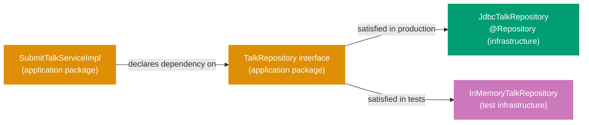
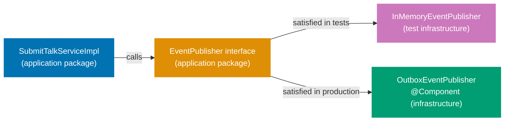
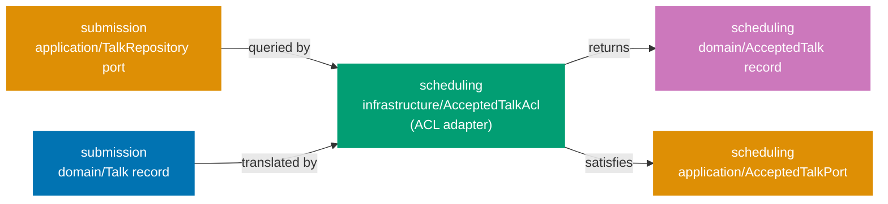

## Guide 8 — Repository Port as Java Interface + Spring Data JDBC Adapter Behind It

### Why It Matters

A repository port is the seam that keeps your application layer independent of the
database. Every time you inject a Spring Data repository interface directly into an
application service, the service becomes untestable without a live database and
untestable without a Spring context. In `talks-platform-be`, the per-context package layout
declares the repository port as a plain Java interface in the `application` package.
The Spring Data JDBC adapter implements that interface in `infrastructure`. Nothing
in the application layer knows whether PostgreSQL, H2, or an in-memory `HashMap`
is behind the port.

### Standard Library First

Java interfaces in `java.util` give you all the primitives needed to express a
repository contract. The standard library's `Optional` and `List` are sufficient
for a read/write pair with no Spring dependency:

```java
// Standard library: repository contract as a plain Java interface over stdlib types
// Demonstrates the stdlib interface approach that the Spring Data JDBC adapter pattern supersedes.

package com.talksplatform.submission.application;
// => application/ package: output port interfaces live here, not in infrastructure/
// => No Spring import anywhere in this file — the interface is framework-agnostic
// => The infrastructure adapter imports this interface; not the other way around

import com.talksplatform.submission.domain.Talk;
// => Talk: the domain aggregate — the port speaks in domain terms only
// => No jakarta.persistence.Entity, no @Column — domain types have zero ORM annotations
import com.talksplatform.submission.domain.TalkId;
// => TalkId: strongly-typed identity — prevents passing a raw UUID or String
// => The compiler rejects passing a SessionId where a TalkId is expected
import java.util.List;
// => java.util.List: standard collection type — no Spring dependency needed
import java.util.Optional;
// => Optional: communicates absence without null — eliminates NullPointerException risk
// => Optional.empty() is a valid domain outcome, not an error

public interface TalkRepository {
    // => Java interface: the output port contract — zero implementation here
    // => The infrastructure adapter in infrastructure/ provides the implementation
    // => The application service declares this interface type in its constructor — never the adapter class

    void save(Talk talk);
    // => Write-side port: persist or update the aggregate atomically
    // => The adapter decides whether to INSERT, UPDATE, or UPSERT
    // => Throws unchecked RuntimeException subtypes on infrastructure failure

    Optional<Talk> findById(TalkId id);
    // => Read-side port: returns Optional.empty() when the talk does not exist
    // => Optional.empty() is correct: absence is a domain outcome — the adapter never returns null

    List<Talk> findBySpeakerId(SpeakerId speakerId);
    // => Query port: returns all talks submitted by a given speaker
    // => Empty list (not null) when no talks exist — callers never null-check the result

    void delete(TalkId id);
    // => Delete port: hard or soft delete — the adapter decides
    // => Throws a domain exception if the talk does not exist
}
```

**Limitation for production**: a raw `void save(Talk talk)` swallows the
distinction between a network timeout and a unique-constraint violation. Production
ports either declare typed exceptions or use a `Result`-style wrapper so the
application service can react to each failure mode precisely. The standard library
interface also gives you no `JdbcClient`, no connection pooling, and no transaction
management — you must wire all of that manually.

### Production Framework

Spring Boot 4 ships a modernised `JdbcClient` (Spring Framework 6.1+) that is
leaner than `JdbcTemplate` and does not require a full JPA entity graph. The
adapter lives in `infrastructure`, implements the port interface from `application`,
and maps between the domain record and SQL rows. The port interface is never
modified to accommodate the adapter:



The port interface with typed exceptions in the `application` package:

```java
// Production output port with typed exceptions — application package
package com.talksplatform.submission.application;
// => application/ package: only domain types and stdlib imports allowed here
// => No Spring, no JDBC, no JPA — the interface is adapter-agnostic

import com.talksplatform.submission.domain.Talk;
// => Talk domain aggregate: the port contract speaks in domain terms only
import com.talksplatform.submission.domain.TalkId;
// => TalkId value object: strongly-typed identity parameter — no raw String or UUID at the boundary
import com.talksplatform.submission.domain.SpeakerId;
// => SpeakerId value object: strongly-typed speaker identity — used in query port method
import java.util.List;
// => java.util.List: stdlib collection — available without any Spring dependency
import java.util.Optional;
// => Optional wraps absence: the caller does not receive null from the port

public interface TalkRepository {
    // => Output port interface: declared in application/, implemented in infrastructure/
    // => The @Repository adapter in infrastructure/ satisfies this contract at runtime
    // => The application service constructor parameter is this interface type — never the adapter class
    // => Swapping adapters (JDBC → in-memory) requires only a @Configuration change, not a service change

    void save(Talk talk) throws RepositoryException;
    // => RepositoryException: domain-adjacent exception signalling an infrastructure failure
    // => The GlobalExceptionHandler maps RepositoryException to HTTP 500 + ProblemDetail (RFC 9457)
    // => Callers can catch RepositoryException without importing any JDBC or Spring exception type

    Optional<Talk> findById(TalkId id);
    // => No checked exception: absence is a valid domain outcome, not an error
    // => Returns Optional.empty() for a missing talk — the controller decides whether to return 404
    // => The adapter never returns null — Optional enforces the contract at the type level

    List<Talk> findBySpeakerId(SpeakerId speakerId);
    // => Query result: empty list (not null) when the speaker has no submissions
    // => The controller paginates if needed — the port stays simple and unbounded for now
    // => Empty list allows for-each iteration without null-checking

    void delete(TalkId id) throws TalkNotFoundException, RepositoryException;
    // => Two typed exceptions: TalkNotFoundException if absent, RepositoryException on DB failure
    // => Callers can pattern-match on exception type without string parsing or error-code inspection
    // => The adapter distinguishes: zero rows deleted → TalkNotFoundException; JDBC error → RepositoryException
}
```

The `JdbcClient` adapter in the `infrastructure` package maps between the domain
record and SQL rows:

```java
// Spring Data JDBC adapter implementing the output port
package com.talksplatform.submission.infrastructure;
// => infrastructure/ package: Spring-managed adapters live here — not in application/ or domain/

import com.talksplatform.submission.application.TalkRepository;
// => Output port interface from application/ — the adapter implements this contract
import com.talksplatform.submission.application.TalkNotFoundException;
// => Domain-adjacent exception declared in application/ — re-thrown by the adapter
import com.talksplatform.submission.application.RepositoryException;
// => Infrastructure failure wrapper — the adapter translates DuplicateKeyException into this type
import com.talksplatform.submission.domain.Talk;
// => Talk domain aggregate — the adapter maps between Talk records and SQL rows
import com.talksplatform.submission.domain.TalkId;
// => TalkId value object — unwrapped to UUID for SQL parameter binding
import com.talksplatform.submission.domain.SpeakerId;
// => SpeakerId value object — unwrapped to UUID for SQL parameter binding
import com.talksplatform.submission.domain.Abstract;
// => Abstract value object — wrapped from the String DB column value on read
import com.talksplatform.submission.domain.TalkStatus;
// => TalkStatus enum — mapped from the text column on read
import org.springframework.jdbc.core.simple.JdbcClient;
// => JdbcClient: Spring Framework 6.1+ modernised JDBC API — fluent, type-safe, no RowMapper boilerplate
// => Spring Boot 4 auto-configures JdbcClient from the DataSource bean — no manual wiring needed
import org.springframework.dao.DuplicateKeyException;
// => DuplicateKeyException: Spring's translation of SQL unique-constraint violations (SQLSTATE 23505)
// => Spring wraps raw JDBC SQLExceptions into DataAccessException hierarchy — no SQLSTATE string parsing
import org.springframework.stereotype.Repository;
// => @Repository: Spring registers this class as a bean during component scan
// => Also enables Spring's PersistenceExceptionTranslationPostProcessor for JDBC exceptions
import java.util.List;
// => java.util.List: standard collection — return type for findBySpeakerId port method
import java.util.Optional;
// => java.util.Optional: return type for findById — communicates absence without null
import java.util.UUID;
// => UUID: used by the RowMapper to extract the typed id column from the ResultSet

@Repository
// => @Repository: Spring discovers this bean via the root-package scan in TalksPlatformApplication
// => Guide 15 shows the @Configuration class that binds this adapter to the TalkRepository port explicitly
public class JdbcTalkRepository implements TalkRepository {
    // => implements TalkRepository: the compiler verifies all four port methods are present
    // => The application service only ever sees the TalkRepository interface — never this class directly

    private final JdbcClient jdbc;
    // => JdbcClient: injected via the single-constructor rule in Spring Boot 4
    // => No @Autowired annotation needed — Spring Boot detects single-constructor injection automatically
    // => Field is final: immutable after construction — thread-safe by default for concurrent requests

    public JdbcTalkRepository(JdbcClient jdbc) {
        this.jdbc = jdbc;
        // => Constructor injection: JdbcClient is a Spring Boot auto-configured singleton
        // => JdbcClient wraps the HikariCP connection pool — connections are pooled, not per-request
    }

    @Override
    public void save(Talk talk) throws RepositoryException {
        // => Port method implementation: translates from domain aggregate to SQL — one direction only
        // => talk is already validated — domain invariants held at construction time (Guide 3)
        // => The adapter does not re-validate invariants: it trusts the domain layer
        try {
            jdbc.sql("""
                    INSERT INTO submission.talks
                        (id, speaker_id, abstract, format, status)
                    VALUES (:id, :speakerId, :abstract, :format, :status)
                    ON CONFLICT (id) DO UPDATE
                      SET speaker_id = EXCLUDED.speaker_id,
                          abstract   = EXCLUDED.abstract,
                          format     = EXCLUDED.format,
                          status     = EXCLUDED.status
                    """)
                // => ON CONFLICT … DO UPDATE: upsert semantics — save() handles both insert and update
                // => JdbcClient text block: multi-line SQL without string concatenation or escaping
                // => EXCLUDED refers to the would-be-inserted row — PostgreSQL upsert extension syntax
                .param("id", talk.id().value())
                // => talk.id().value(): unwrap TalkId → UUID — JDBC maps UUID to the PostgreSQL uuid column
                // => Named parameters (:id) prevent SQL injection — no string interpolation or concatenation
                .param("speakerId", talk.speakerId().value())
                // => speakerId: unwrap SpeakerId → UUID — stored in the speaker_id column
                .param("abstract", talk.abstract_().value())
                // => abstract_().value(): unwrap Abstract value object to its String content for storage
                .param("format", talk.format().getClass().getSimpleName())
                // => Sealed interface format stored as class simple name: "Lightning", "Standard", "Workshop"
                .param("status", talk.status().name())
                // => status: enum name stored as TEXT column — readable and schema-stable
                .update();
                // => .update(): executes the SQL statement and returns the row count (discarded here)
                // => Spring manages the JDBC connection lifecycle — no try-with-resources needed around jdbc.sql()
        } catch (DuplicateKeyException ex) {
            // => DuplicateKeyException: Spring's DataAccessException translation of SQLSTATE 23505
            // => Caught explicitly because some schemas add unique constraints beyond the primary key
            throw new RepositoryException("Talk already exists: " + talk.id(), ex);
            // => Translate to the domain-adjacent exception — the application layer never sees DuplicateKeyException
            // => RepositoryException is declared in application/: no infrastructure type crosses the boundary
        } catch (Exception ex) {
            throw new RepositoryException("Failed to save talk: " + talk.id(), ex);
            // => Catch-all: covers connection timeout, serialisation failure, HikariCP pool exhaustion
            // => Wrapped in RepositoryException — GlobalExceptionHandler produces HTTP 500 + ProblemDetail
        }
    }

    @Override
    public Optional<Talk> findById(TalkId id) {
        // => No checked exception: SQL SELECT failure propagates as unchecked DataAccessException
        // => DataAccessException is a RuntimeException — it bypasses the caller and reaches GlobalExceptionHandler
        return jdbc.sql(
                "SELECT id, speaker_id, abstract, format, status FROM submission.talks WHERE id = :id")
            .param("id", id.value())
            // => id.value(): unwrap TalkId → UUID — matches the PostgreSQL uuid column type exactly
            .query((rs, _) -> new Talk(
                // => Lambda RowMapper: maps ResultSet columns to the domain record's canonical constructor
                // => The underscore (_) discards the row-number int parameter — unused in this mapping
                new TalkId(rs.getObject("id", UUID.class)),
                // => rs.getObject(col, UUID.class): type-safe UUID extraction — no unchecked cast needed
                new SpeakerId(rs.getObject("speaker_id", UUID.class)),
                // => SpeakerId: same UUID extraction pattern — wraps into the strongly-typed value object
                new Abstract(rs.getString("abstract")),
                // => Abstract value object reconstructed from the DB column — compact constructor re-validates
                parseFormat(rs.getString("format")),
                // => parseFormat: private helper method — maps the stored string back to a sealed interface
                TalkStatus.valueOf(rs.getString("status"))
                // => TalkStatus.valueOf: maps the stored enum name back to the Java enum constant
            ))
            .optional();
            // => .optional(): returns Optional<Talk> — Optional.empty() when no row matches the WHERE clause
            // => Never throws NoSuchElementException; never returns null — safe for any caller
    }

    @Override
    public List<Talk> findBySpeakerId(SpeakerId speakerId) {
        // => No checked exception: SQL failures propagate as unchecked DataAccessException
        return jdbc.sql(
                "SELECT id, speaker_id, abstract, format, status FROM submission.talks "
                + "WHERE speaker_id = :speakerId ORDER BY id")
            .param("speakerId", speakerId.value())
            // => ORDER BY id: deterministic result ordering — tests can assert on list positions reliably
            // => Without ORDER BY, the database is free to return rows in any order — non-deterministic tests
            .query((rs, _) -> new Talk(
                new TalkId(rs.getObject("id", UUID.class)),
                // => Same RowMapper shape as findById — extract to a private mapRow() helper in production
                new SpeakerId(rs.getObject("speaker_id", UUID.class)),
                new Abstract(rs.getString("abstract")),
                parseFormat(rs.getString("format")),
                TalkStatus.valueOf(rs.getString("status"))
                // => Consistent mapping across both query methods — a refactoring of Talk fields impacts one place
            ))
            .list();
            // => .list(): runs the SELECT and maps every row — returns an empty List (not null) when no rows match
    }

    @Override
    public void delete(TalkId id) throws TalkNotFoundException, RepositoryException {
        // => try block: wraps the DELETE to distinguish domain exceptions from infrastructure failures
        try {
            int rows = jdbc.sql("DELETE FROM submission.talks WHERE id = :id")
                .param("id", id.value())
                // => Parameterised DELETE: JdbcClient named parameters prevent SQL injection
                // => id.value() unwraps TalkId → UUID — the WHERE clause matches the primary key column
                .update();
                // => .update() returns the number of rows deleted — exactly 1 if found, 0 if absent
            if (rows == 0) throw new TalkNotFoundException(id);
            // => TalkNotFoundException: declared in application/ — no Spring type at the throw site
            // => The @ExceptionHandler in GlobalExceptionHandler maps it to 404
        } catch (TalkNotFoundException ex) {
            throw ex;
            // => Re-throw the domain exception as-is — do not wrap it in RepositoryException
        } catch (Exception ex) {
            throw new RepositoryException("Failed to delete talk: " + id, ex);
            // => Infrastructure failure (JDBC error, pool timeout): wrap and let GlobalExceptionHandler produce HTTP 500
        }
    }

    private Format parseFormat(String name) {
        // => Private mapping helper: translates the stored class simple name to a sealed interface instance
        return switch (name) {
            case "Lightning" -> new Format.Lightning();
            // => Lightning: 10-minute talk format — mapped from the stored "Lightning" string
            case "Standard"  -> new Format.Standard();
            // => Standard: 30-minute talk format
            case "Workshop"  -> new Format.Workshop();
            // => Workshop: 90-minute talk format
            default -> throw new IllegalStateException("Unknown format: " + name);
            // => IllegalStateException: data corruption in the DB — should never happen with valid schema
        };
    }
}
```

**Trade-offs**: `JdbcClient` requires writing SQL explicitly — no magic query
derivation from method names. For aggregates with non-trivial mapping (nested value
objects, sealed interfaces, enums), the row mapper grows. The payoff is
transparency: every query is visible in the source, and adding a database index is a
one-line SQL change, not a JPA annotation hunt.

---

## Guide 9 — In-Memory Repository Adapter for Integration Tests

### Why It Matters

An integration test that starts a PostgreSQL container for every test class is
slow, requires Docker, and cannot be cached by Nx. A test that injects an
in-memory `Map`-backed adapter runs in milliseconds, needs no infrastructure, and
runs safely in parallel. The seam from Guide 8 — the `TalkRepository` interface —
is exactly what makes this swap possible. If the in-memory adapter requires changes
to the application service to work, the port has leaked infrastructure concerns
upward.

### Standard Library First

`java.util.HashMap` provides an in-memory key-value store with no dependencies.
The raw approach compiles but loses type safety and thread safety under parallel
test execution:

```java
// Standard library: untyped in-memory store with a raw HashMap
// Demonstrates the untyped approach that the typed in-memory adapter supersedes.

import java.util.HashMap;
// => HashMap: mutable, unsynchronised key-value store — not thread-safe under concurrent access
// => Two Cucumber step threads writing concurrently corrupt the internal array silently
// => ConcurrentHashMap (used by the typed adapter) provides atomicity for get/put/remove

public class UntypedStore {
    private static final HashMap<Object, Object> store = new HashMap<>();
    // => static final: one shared map for the entire JVM lifetime — all test classes corrupt each other
    // => Object key/value: no compile-time enforcement — a SessionId stored under a TalkId key compiles silently
    // => The typed adapter uses Map<TalkId, Talk>: wrong key type is a compile error, not a runtime surprise

    public static void put(Object key, Object value) {
        store.put(key, value);
        // => No uniqueness check: silently overwrites existing entries — upsert whether intended or not
        // => Tests that rely on RepositoryException for duplicates never fail — the exception is never thrown
        // => The typed adapter explicitly checks for uniqueness and mirrors the JDBC adapter's behaviour
    }
}
```

**Limitation for production**: global mutable state fails under parallel test
execution. Untyped storage cannot represent the same duplicate-detection semantics
as the JDBC adapter — tests that verify `RepositoryException` on duplicate
saves never fail even when the application service is broken.

### Production Framework

The in-memory adapter implements the same `TalkRepository` interface as the JDBC
adapter. A `java.util.concurrent.ConcurrentHashMap` gives thread safety without
`synchronized` blocks:

```java
// In-memory adapter implementing the TalkRepository port
package com.talksplatform.submission.infrastructure;
// => Test-classpath infrastructure: lives in src/test/java/, not in src/main/java/
// => Production builds never include this class — the adapter is test-only

import com.talksplatform.submission.application.TalkRepository;
// => Output port interface: the adapter must implement all declared methods
import com.talksplatform.submission.application.TalkNotFoundException;
// => Domain-adjacent exception: same type as the JDBC adapter uses — port contract is shared
import com.talksplatform.submission.application.RepositoryException;
// => Infrastructure failure wrapper: in-memory adapter throws this only to mirror the JDBC adapter's contract
import com.talksplatform.submission.domain.Talk;
// => Talk domain aggregate — stored directly in the map (no serialisation needed for in-memory)
import com.talksplatform.submission.domain.TalkId;
// => TalkId strongly-typed key — prevents storing a Talk under a wrong-type key
import com.talksplatform.submission.domain.SpeakerId;
// => SpeakerId — used to filter talks for a given speaker in findBySpeakerId
import java.util.ArrayList;
// => ArrayList: intermediate collection for findBySpeakerId — converted to unmodifiable List before return
import java.util.List;
// => java.util.List: return type for findBySpeakerId — the port contract uses the stdlib interface
import java.util.Map;
// => Map<TalkId, Talk>: typed store — ConcurrentHashMap is the implementation, Map is the field type
import java.util.Optional;
// => java.util.Optional: return type for findById — same absence contract as the JDBC adapter
import java.util.concurrent.ConcurrentHashMap;
// => ConcurrentHashMap: thread-safe — parallel Cucumber step definitions do not corrupt the store
// => get(), put(), remove() are all atomic operations — no external synchronisation needed

public class InMemoryTalkRepository implements TalkRepository {
    // => implements TalkRepository: the compiler verifies all four port methods are present
    // => If the port interface gains a new method, the compiler flags this class immediately
    // => The application service receives TalkRepository — it cannot tell which impl is behind it

    private final Map<TalkId, Talk> store;
    // => ConcurrentHashMap<TalkId, Talk>: typed key and value — no Object, no casting, no runtime type errors
    // => Keyed by TalkId: the TalkId.equals() and hashCode() generated by Java records are correct

    public InMemoryTalkRepository() {
        this.store = new ConcurrentHashMap<>();
        // => Fresh map per constructor call: each test instantiates a new InMemoryTalkRepository
        // => No shared static state — parallel test classes each hold their own isolated map
    }

    @Override
    public void save(Talk talk) throws RepositoryException {
        // => Upsert semantics: mirrors the ON CONFLICT DO UPDATE in the JDBC adapter
        // => save() handles both insert and update — the caller does not distinguish
        store.put(talk.id(), talk);
        // => ConcurrentHashMap.put: atomic — thread-safe without locking the whole map
        // => Overwrites existing entry silently: same as the SQL upsert behaviour
    }

    @Override
    // => @Override: compiler verifies the method signature matches the interface — catches refactoring mistakes
    public Optional<Talk> findById(TalkId id) {
        // => findById: returns Optional.empty() when the key is absent — never null
        return Optional.ofNullable(store.get(id));
        // => Optional.ofNullable: returns Optional.empty() when the key is absent
        // => ConcurrentHashMap.get returns null for absent keys — ofNullable wraps safely
        // => Mirrors JdbcClient's .optional(): same absent-talk semantics, zero SQL overhead
    }

    @Override
    // => @Override: the compiler verifies the signature matches TalkRepository — no typo in the method name
    public List<Talk> findBySpeakerId(SpeakerId speakerId) {
        // => In-memory filter: iterates the map values and collects matching talks
        var result = new ArrayList<Talk>();
        // => var: Java 11+ local variable type inference — Talk is inferred from the ArrayList
        for (var talk : store.values()) {
            // => store.values(): ConcurrentHashMap snapshot — safe to iterate under concurrent writes
            if (speakerId.equals(talk.speakerId())) {
                // => speakerId.equals: value object equality — SpeakerId record equals() is generated correctly
                result.add(talk);
                // => Filter by speakerId: mirrors the SQL WHERE speaker_id = :speakerId predicate
            }
        }
        return List.copyOf(result);
        // => List.copyOf: returns an unmodifiable snapshot — the caller cannot mutate the store indirectly
        // => Mirrors JdbcClient's .list() which also returns an unmodifiable List
    }

    @Override
    public void delete(TalkId id) throws TalkNotFoundException, RepositoryException {
        var removed = store.remove(id);
        // => ConcurrentHashMap.remove: atomic — returns the removed value, or null if absent
        // => Single operation: check-and-remove without a separate get() call
        if (removed == null) throw new TalkNotFoundException(id);
        // => Mirror the JDBC adapter: TalkNotFoundException when the talk does not exist
        // => Tests that verify delete-of-absent-talk get the same exception regardless of adapter
    }
}
```

A Cucumber integration step wires the in-memory adapter at the port seam without
starting a database container:

```java
// Cucumber step definition wiring the in-memory adapter at the port seam
package com.talksplatform.submission.steps;
// => Test package: Cucumber step definitions — not visible to production code

import com.talksplatform.submission.application.SubmitTalkService;
// => Application service interface: the controller uses this type too — test and production share it
import com.talksplatform.submission.application.SubmitTalkServiceImpl;
// => Concrete @Service class: used only in this test setup — never imported by any production class
import com.talksplatform.submission.domain.Talk;
// => Talk domain aggregate: returned by the application service and asserted on in @Then steps
import com.talksplatform.submission.infrastructure.InMemoryTalkRepository;
// => In-memory adapter from this guide — satisfies the TalkRepository port in the test context
import io.cucumber.java.Before;
// => @Before: Cucumber hook — runs before each scenario in this glue class
import io.cucumber.java.en.Given;
import io.cucumber.java.en.Then;
import io.cucumber.java.en.When;
// => Cucumber JVM: step-definition annotations — Given/When/Then map to scenario lines
import static org.junit.jupiter.api.Assertions.*;
// => JUnit 5 assertions: assertEquals, assertNotNull — same library as other unit tests

public class TalkIntegrationSteps {
    // => Cucumber instantiates this class per scenario — fresh instance per scenario by default

    private InMemoryTalkRepository repository;
    // => Concrete in-memory adapter: test-only type visible here, not in any production class
    private SubmitTalkService service;
    // => SubmitTalkService interface: the same type the controller declares in its constructor
    // => The test wires the interface to a concrete service impl — no Spring context needed
    private Talk lastTalk;
    // => Captured result from @When steps — used by @Then steps for assertion

    @Before
    // => @Before: Cucumber hook — runs before each scenario, initialising a fresh composition root
    public void setUp() {
        repository = new InMemoryTalkRepository();
        // => Fresh adapter per scenario: no state leaks between Cucumber scenarios
        // => This is manual composition: the test is its own composition root (no DI container)
        service = new SubmitTalkServiceImpl(repository, new InMemoryEventPublisher());
        // => Wire the in-memory adapter into the real application service — no Spring context needed
        // => The service receives the TalkRepository interface: it does not know InMemory is behind it
    }

    @Given("a talk submitted by speaker {string} with abstract {string} and format {string}")
    // => @Given step: Cucumber matches the scenario line text and calls this method
    public void aTalkSubmitted(String speakerId, String abstract_, String format) throws Exception {
        lastTalk = service.submit(
            new com.talksplatform.submission.domain.SpeakerId(java.util.UUID.fromString(speakerId)),
            new com.talksplatform.submission.domain.Abstract(abstract_),
            parseFormat(format));
        // => Calls the real application service: domain invariants enforced, aggregate created
        // => submit internally calls repository.save() — InMemoryTalkRepository.save() runs
        // => No HTTP round-trip, no Jackson serialisation, no Tomcat — pure port-level test
    }

    @When("the talk is retrieved by its id")
    // => @When step: executed after @Given — retrieves the talk using the id captured in lastTalk
    public void theTalkIsRetrievedByItsId() throws Exception {
        lastTalk = service.findById(lastTalk.id()).orElseThrow();
        // => findById goes through the port to the in-memory adapter — no SQL, no Docker
        // => orElseThrow: the talk must exist after submit — any exception is a test failure
    }

    @Then("the talk status should be {string}")
    public void theTalkStatusShouldBe(String expectedStatus) {
        assertEquals(expectedStatus, lastTalk.status().name());
        // => assertEquals: JUnit 5 — same assertion library as other step definitions
        // => talk.status().name(): enum name accessor — no getter boilerplate
    }

    private com.talksplatform.submission.domain.Format parseFormat(String name) {
        return switch (name) {
            case "Lightning" -> new com.talksplatform.submission.domain.Format.Lightning();
            case "Standard"  -> new com.talksplatform.submission.domain.Format.Standard();
            case "Workshop"  -> new com.talksplatform.submission.domain.Format.Workshop();
            default -> throw new IllegalArgumentException("Unknown format: " + name);
        };
    }
}
```

**Trade-offs**: the in-memory adapter faithfully mirrors the JDBC adapter only as
far as you implement it. If the JDBC adapter introduces a new failure mode (e.g.,
a network partition exception), the in-memory adapter must be updated to match. The
compiler enforces that both classes implement the interface — it does not enforce
semantic parity. Write a shared adapter contract test (a JUnit 5 parameterised test
running against both implementations with the same assertions) to keep them honest.

---

## Guide 10 — Domain Event Publisher Port

### Why It Matters

A domain event publisher port solves the same problem as a repository port but for
the outbound event stream. Every time the application service calls
`ApplicationEventPublisher.publishEvent(...)` directly, the application layer
acquires a Spring dependency. You can no longer test event emission without a
Spring context, and swapping the delivery mechanism (Spring events → outbox table)
requires modifying application code. In `talks-platform-be`, the per-context package layout
defines the publisher port as a plain Java interface in the `application` package.
The application service receives the interface and never imports
`ApplicationEventPublisher`.

### Standard Library First

Java's standard library provides no persistent event bus. The closest built-in
mechanism is the observer pattern via `java.util.EventListener` and
`java.util.EventObject` — useful for in-process pub/sub but insufficient for
production cross-process delivery:

```java
// Standard library: in-process observer pattern — no persistence, no delivery guarantee
// Demonstrates the stdlib observer approach that the port-based publisher supersedes.

import java.util.ArrayList;
// => ArrayList: mutable, unsynchronised list of listeners — not safe under concurrent registration
// => Two threads calling listeners.add() concurrently can corrupt the internal array
import java.util.EventListener;
// => EventListener: marker interface only — provides zero pub/sub mechanism by itself
// => The pattern requires manual listener registration and dispatch code in every event bus class
import java.util.EventObject;
// => EventObject: base class for all event objects — carries a source reference typed as Object
// => Object-typed source: the listener cannot access Talk fields without an unchecked cast
import java.util.List;
// => java.util.List: used as the listener registry — no thread-safety, no lifetime management

class TalkSubmittedEvent extends EventObject {
    // => EventObject subclass: one class per event type — scales poorly for many event types
    // => Constructor must call super(source) — EventObject provides no other constructor
    public TalkSubmittedEvent(Object source) { super(source); }
    // => source typed as Object: callers cast to Talk at runtime — ClassCastException if wrong type
}

interface TalkEventListener extends EventListener {
    void onTalkSubmitted(TalkSubmittedEvent event);
    // => Single-method interface: the listener receives the event synchronously on the publisher's thread
    // => Slow listener implementations block the thread — no async dispatch without explicit thread pools
    // => If the listener throws, the publisher's remaining loop iterations are skipped silently
}

class InProcessEventBus {
    private final List<TalkEventListener> listeners = new ArrayList<>();
    // => Mutable ArrayList: not thread-safe — concurrent add() calls corrupt the internal array index

    void publish(TalkSubmittedEvent event) {
        for (var listener : listeners) {
            listener.onTalkSubmitted(event);
            // => Synchronous dispatch: each listener runs in the for-each loop before the next one starts
            // => If the process crashes mid-loop, all unexecuted listeners are skipped — no retry, no outbox
            // => The outbox adapter (Guide 11) writes an event row before publish returns — crash-safe
        }
    }
}
```

**Limitation for production**: in-process events die with the process. If the
application crashes after saving the aggregate but before all listeners complete,
events are lost. The at-least-once delivery guarantee requires an outbox (Guide 11)
or an external message broker behind the port.

### Production Framework

The domain event publisher port is a plain Java interface in the `application`
package. Its implementations — an in-memory adapter for tests and an outbox
adapter for production — satisfy the same interface:



Domain event records and the publisher port interface, both in `application`:

```java
// Domain event records and publisher port — application package
package com.talksplatform.submission.application;
// => application/ package: only domain types and stdlib imports allowed here
// => No Spring ApplicationEventPublisher import — the port interface is framework-agnostic

import com.talksplatform.submission.domain.TalkId;
// => TalkId value object — carried by events as the primary identifier
import com.talksplatform.submission.domain.SpeakerId;
// => SpeakerId value object — carried by TalkSubmitted so downstream contexts know the speaker
import com.talksplatform.submission.domain.Abstract;
// => Abstract value object — carried by TalkSubmitted so ai-assist context can auto-tag on submission
import com.talksplatform.submission.domain.Format;
// => Format sealed interface — carried by TalkSubmitted so review context knows session length
import java.time.Instant;
// => Instant: immutable UTC timestamp — events are facts about what happened at a specific moment

public record TalkSubmitted(
    TalkId talkId,
    // => TalkId: the identity of the submitted talk — downstream contexts use this to correlate
    SpeakerId speakerId,
    // => SpeakerId: the submitting speaker — carried for downstream notification routing
    Abstract abstract_,
    // => Abstract: the talk text — consumed by ai-assist context for auto-tagging
    Format format,
    // => Format: the talk length — consumed by review context to open a review round
    Instant occurredAt
    // => occurredAt: set by the application service, not by the adapter — publisher records facts
) {}
// => Java record: immutable, no setters — events cannot be mutated after construction

public record TalkWithdrawn(TalkId talkId, Instant occurredAt) {}
// => talkId: only the identity — the aggregate was already persisted; downstream re-reads if needed
// => Carrying only the ID avoids embedding a potentially stale snapshot in the event

public interface EventPublisher {
    // => Plain Java interface: zero Spring coupling — the application service imports this type only
    // => Spring injects the @Component adapter at startup via the single-constructor rule
    // => Test code injects InMemoryEventPublisher directly — no Spring context needed

    void publish(TalkSubmitted event);
    // => Synchronous contract: the application service calls publish() and proceeds
    // => The adapter decides whether to deliver synchronously (Spring events) or queue (outbox)
    // => Overloaded method: adding a new event type adds a new overload — the compiler flags all adapters

    void publish(TalkWithdrawn event);
    // => Second overload: the adapter must implement both — the compiler enforces this at build time
    // => For at-least-once delivery, replace this adapter with the OutboxEventPublisher (Guide 11)
}
```

The Spring `ApplicationEventPublisher` adapter in `infrastructure`:

```java
// Spring ApplicationEventPublisher adapter — infrastructure package
package com.talksplatform.submission.infrastructure;
// => infrastructure/ package: Spring-coupled code lives here — the seam absorbs the framework dependency

import com.talksplatform.submission.application.TalkSubmitted;
// => TalkSubmitted: domain record from application/ — the adapter wraps it for Spring dispatch
import com.talksplatform.submission.application.TalkWithdrawn;
// => TalkWithdrawn: second domain event type — both overloads forward to the same Spring bus
import com.talksplatform.submission.application.EventPublisher;
// => EventPublisher: the port interface this adapter satisfies
import org.springframework.context.ApplicationEventPublisher;
// => Spring's ApplicationEventPublisher: Spring MVC and Spring Boot auto-configure this bean
// => Any @EventListener or @TransactionalEventListener method in the context receives the event
import org.springframework.stereotype.Component;
// => @Component: Spring registers this bean during component scan

@Component
// => @Component: detected by the root-package scan from TalksPlatformApplication
// => The composition root in Guide 15 maps this bean to the EventPublisher port
public class SpringEventPublisherAdapter implements EventPublisher {
    // => implements EventPublisher: the compiler verifies both publish() overloads are present

    private final ApplicationEventPublisher springPublisher;
    // => ApplicationEventPublisher: Spring's internal event bus — injected at startup
    // => The field is final: immutable after construction, safe for concurrent requests

    public SpringEventPublisherAdapter(ApplicationEventPublisher springPublisher) {
        this.springPublisher = springPublisher;
        // => Constructor injection: no @Autowired — Spring Boot 4 auto-detects single-constructor injection
        // => ApplicationEventPublisher is always available — Spring injects the ApplicationContext itself
    }

    @Override
    public void publish(TalkSubmitted event) {
        springPublisher.publishEvent(event);
        // => publishEvent: Spring dispatches the event to all @EventListener methods in the context
        // => Synchronous by default: all listeners run before this method returns — no async gap
        // => Use @TransactionalEventListener on the listener to delay delivery until after DB commit
    }

    @Override
    public void publish(TalkWithdrawn event) {
        springPublisher.publishEvent(event);
        // => Same dispatch path as TalkSubmitted — the listener annotation controls delivery timing
        // => For at-least-once delivery, replace this adapter with OutboxEventPublisher (Guide 11)
        // => Both overloads delegate to publishEvent — Spring routes to the correct @EventListener
    }
}
```

**Trade-offs**: the Spring `ApplicationEventPublisher` adapter is the right starting
point when you need in-process event delivery with optional `@TransactionalEventListener`
support. It carries no outbox guarantee — if the process crashes between the
database commit and the listener execution, the event is lost. Guide 11 shows the
outbox adapter that provides at-least-once delivery. Choose the Spring adapter when
events drive non-critical side-effects (cache invalidation, logging). Choose the
outbox adapter when event loss has business consequences (review round creation,
session allocation).

---

## Guide 11 — In-Memory Event Adapter and Outbox Event Adapter

### Why It Matters

Two adapters satisfy the `EventPublisher` port from Guide 10: an in-memory
adapter for integration tests (zero infrastructure, fast, assertable) and an outbox
adapter for production (durable, survives process crashes). Without an outbox, you
face a dual-write hazard: the aggregate commits to the database, then the process
crashes before the event reaches the message bus — the event is silently lost. The
outbox pattern writes the event row in the same JDBC transaction as the aggregate
row, so if the transaction commits, the event is guaranteed to be relayed eventually.
In `talks-platform-be`, the outbox adapter uses `JdbcClient` to insert into an
`outbox_events` table inside the same transaction as the aggregate.

### Standard Library First

A plain `java.util.ArrayList` captures events in memory. The naive approach uses a
static field — tests corrupt each other under parallel execution:

```java
// Standard library: capture events in a static ArrayList — thread-unsafe
// Demonstrates the untyped static-list approach that the typed in-memory adapter supersedes.

import java.util.ArrayList;
// => ArrayList: mutable, unsynchronised — concurrent add() calls corrupt the internal array structure
// => Parallel Cucumber step threads can each call capture() — ArrayList is not safe for this

public class StaticEventCapture {
    private static final ArrayList<Object> events = new ArrayList<>();
    // => static final: one list for the entire JVM lifetime — shared by all test classes and threads
    // => Object element type: a String, an Integer, and a TalkSubmitted can all be stored together
    // => The typed in-memory adapter uses List<Object> as an instance field: fresh per constructor call

    public static void capture(Object event) {
        events.add(event);
        // => Global side effect: test A's captured events appear in the list during test B's @Then step
        // => No reset between scenarios — events accumulate across the entire Cucumber test run
        // => The typed adapter's reset() method clears the per-instance list between scenarios
    }
}
```

**Limitation for production**: global mutable state breaks parallel test execution.
`Object` storage makes assertion code fragile and error-prone. There is no
mechanism to reset state between tests without static mutation.

### Production Framework

**In-memory event adapter** for integration tests:

```java
// In-memory event publisher adapter — typed, per-test-instance isolation
package com.talksplatform.submission.infrastructure;
// => Test-classpath class: src/test/java/ — never included in production builds

import com.talksplatform.submission.application.TalkSubmitted;
// => TalkSubmitted domain record — captured in the per-test list for assertion
import com.talksplatform.submission.application.TalkWithdrawn;
// => TalkWithdrawn domain record — second event type captured separately
import com.talksplatform.submission.application.EventPublisher;
// => EventPublisher port interface: the in-memory adapter must implement both overloads
// => The compiler verifies this — no missing overload can compile silently
import java.util.ArrayList;
// => ArrayList: instance field — fresh per constructor call, no shared static state
import java.util.Collections;
// => Collections.unmodifiableList: callers cannot corrupt the capture list from test assertions
import java.util.List;
// => List return type: exposes the captured events for @Then step assertions

public class InMemoryEventPublisher implements EventPublisher {
    // => implements EventPublisher: same interface as SpringEventPublisherAdapter and OutboxEventPublisher
    // => The compiler verifies that both publish() overloads are implemented correctly

    private final List<Object> published = new ArrayList<>();
    // => Instance field: fresh per constructor call — each test class instantiates a new publisher
    // => Object element type: captures both TalkSubmitted and TalkWithdrawn in one list
    // => ArrayList is sufficient: in-memory tests run sequentially within a scenario

    @Override
    public void publish(TalkSubmitted event) {
        published.add(event);
        // => Append to the instance list — no global state, no parallel corruption between tests
        // => @Then steps call getPublished() and assert on the captured events
    }

    @Override
    public void publish(TalkWithdrawn event) {
        published.add(event);
        // => Same capture path: the test retrieves the list and uses instanceof pattern matching
        // => Java 16+ pattern matching: if (events.get(0) instanceof TalkSubmitted e) { … }
    }

    public List<Object> getPublished() {
        return Collections.unmodifiableList(published);
        // => Unmodifiable view: callers cannot corrupt the capture list from test assertions
        // => The test inspects the list but cannot add or remove events — defensive copy
    }

    public void reset() {
        published.clear();
        // => Reset between Cucumber scenarios: @Before step calls publisher.reset()
        // => Alternative: instantiate a new InMemoryEventPublisher in @Before instead
    }
}
```

**Outbox event adapter** for production:

```java
// Outbox event publisher adapter — writes event rows in the same JDBC transaction
package com.talksplatform.submission.infrastructure;
// => infrastructure/ package: framework-coupled code — Spring, Jackson, JdbcClient all live here

import com.fasterxml.jackson.databind.ObjectMapper;
// => ObjectMapper: Jackson serialiser — auto-configured by spring-boot-starter-web
// => Serialises domain event records to JSON for the outbox_events.payload JSONB column
import com.talksplatform.submission.application.TalkSubmitted;
// => TalkSubmitted: domain record — serialised to JSON for the outbox row payload
import com.talksplatform.submission.application.TalkWithdrawn;
// => TalkWithdrawn: second event type — serialised identically, stored under a different event_type string
import com.talksplatform.submission.application.EventPublisher;
// => EventPublisher port interface: the outbox adapter must implement both publish() overloads
import org.springframework.jdbc.core.simple.JdbcClient;
// => JdbcClient: same modernised JDBC API used by JdbcTalkRepository
// => Shares the DataSource connection pool — outbox INSERT and aggregate INSERT are in the same transaction
import org.springframework.stereotype.Component;
// => @Component: Spring registers this as the EventPublisher bean in the production Spring context
import java.time.Instant;
// => Instant: UTC timestamp for the created_at column — always UTC, convert to local time at display
import java.util.UUID;
// => UUID.randomUUID(): idempotency key — the relay worker deduplicates outbox rows by this id

@Component
// => @Component: wired to the EventPublisher port in SubmissionContextConfiguration (Guide 15)
// => In the test @TestConfiguration, InMemoryEventPublisher is wired instead
public class OutboxEventPublisher implements EventPublisher {
    // => implements EventPublisher: same interface as SpringEventPublisherAdapter and InMemoryEventPublisher

    private final JdbcClient jdbc;
    // => Same JdbcClient as JdbcTalkRepository — when both adapters share a DataSource,
    //    their writes participate in the same Spring-managed JDBC transaction
    private final ObjectMapper objectMapper;
    // => Injected ObjectMapper: Spring's auto-configured instance — consistent serialisation across the app

    public OutboxEventPublisher(JdbcClient jdbc, ObjectMapper objectMapper) {
        // => Single-constructor injection: Spring Boot 4 auto-detects this pattern — no @Autowired needed
        this.jdbc = jdbc;
        this.objectMapper = objectMapper;
        // => Fields are final: immutable after construction — thread-safe for concurrent requests
    }

    @Override
    public void publish(TalkSubmitted event) {
        insertOutboxRow("TalkSubmitted", event);
        // => Delegate to private helper: reduces code duplication across both publish() overloads
        // => The outbox row commits atomically with the aggregate row in the same JDBC transaction
    }

    @Override
    public void publish(TalkWithdrawn event) {
        insertOutboxRow("TalkWithdrawn", event);
        // => Same outbox pattern: row written in the current transaction, not after commit
        // => The relay worker polls submission.outbox_events WHERE processed_at IS NULL
    }

    private void insertOutboxRow(String eventType, Object payload) {
        // => Private helper: both publish() overloads delegate here — single INSERT path, no duplication
        try {
            String json = objectMapper.writeValueAsString(payload);
            // => writeValueAsString: serialise the Java record to JSON
            // => jackson-datatype-jsr310 handles Instant serialisation as ISO-8601 string
            // => Records are serialised by component names — no @JsonProperty annotations needed
            jdbc.sql("""
                    INSERT INTO submission.outbox_events (id, event_type, payload, created_at)
                    VALUES (:id, :eventType, CAST(:payload AS jsonb), :createdAt)
                    """)
                // => CAST(:payload AS jsonb): PostgreSQL JSONB column — enables GIN index on payload fields
                // => Same JDBC transaction as the aggregate INSERT: atomic commit or rollback together
                // => If the application crashes after commit, the outbox row survives — relay delivers eventually
                .param("id", UUID.randomUUID().toString())
                // => UUID.randomUUID(): idempotency key — the relay worker deduplicates by this id
                .param("eventType", eventType)
                // => String eventType: the relay worker dispatches to the correct handler by this value
                .param("payload", json)
                // => Serialised JSON payload — the relay worker deserialises with the same ObjectMapper
                .param("createdAt", Instant.now().toString())
                // => ISO-8601 string — PostgreSQL timestamptz column accepts this format
                .update();
                // => .update(): executes the INSERT — row count is 1 on success
        } catch (Exception ex) {
            throw new RuntimeException("Failed to write outbox row for " + eventType, ex);
            // => Wrap and propagate: Spring's transaction manager rolls back the entire transaction
            // => Both the aggregate INSERT and all prior outbox INSERTs are rolled back atomically
        }
    }
}
```

**Trade-offs**: the outbox pattern guarantees at-least-once delivery — the relay
worker may deliver the event more than once if it crashes between delivery and
marking `processed_at`. Downstream consumers must be idempotent (use the `id` UUID
as a deduplication key). The relay worker itself — a Spring `@Scheduled` method or
a separate process polling `outbox_events WHERE processed_at IS NULL` — is outside
the context boundary. For event volumes under approximately 1000 per second, a
polling relay is sufficient. Higher throughput benefits from CDC-based relay (e.g.,
Debezium reading the PostgreSQL WAL instead of polling).

---

## Guide 12 — `@RestController` Full Pipeline: DTO → Command → Aggregate → Response

### Why It Matters

Guide 6 introduced the Spring `@RestController` as a primary adapter using a
minimal health check and a sketch of a talk submission endpoint. This guide goes
deeper: every step of the translation pipeline — deserialising the request DTO,
calling the application service, publishing the domain event, and serialising the
response DTO — has an exact location in the hexagonal layout, and each location has
a rule about what it may and may not import. Getting those rules wrong is the most
common way a Spring Boot codebase silently collapses the hexagonal boundary over
time.

### Standard Library First

A plain Java servlet places translation, validation, persistence, and event
publishing all in one method, with no domain boundary:

```java
// Anti-pattern: flat servlet mixing all concerns in one doPost() override
// Demonstrates the monolithic approach that the disciplined @RestController pipeline supersedes.

import jakarta.servlet.http.HttpServlet;
// => Jakarta Servlet API: lowest-level HTTP contract — Spring MVC wraps this for production use
import jakarta.servlet.http.HttpServletRequest;
// => HttpServletRequest: access to request parameters, headers, and body — no automatic deserialization
import jakarta.servlet.http.HttpServletResponse;
// => HttpServletResponse: manual status and body writing — no declarative routing
import java.io.IOException;
// => IOException: thrown by getWriter().write() — must be declared or caught

public class FlatSubmissionServlet extends HttpServlet {
    // => HttpServlet subclass: one servlet class handles one URL — no routing table, no path variables
    protected void doPost(HttpServletRequest req, HttpServletResponse resp) throws IOException {
        // => All concerns in one method: parsing, validation, persistence, events, and response — untestable
        var abstract_ = req.getParameter("abstract");
        // => Query parameter: not a request body — no JSON deserialization, no DTO, no type safety
        if (abstract_ == null || abstract_.isBlank()) {
            resp.setStatus(400);
            // => Magic number 400: duplicated at every endpoint — no central @ExceptionHandler
            resp.getWriter().write("{\"error\":\"abstract required\"}");
            // => Hand-written JSON: no serialisation library — error-prone for complex response shapes
            return;
        }
        var id = java.util.UUID.randomUUID();
        // => Business logic inline — no application service, no domain aggregate, no invariant enforcement
        resp.setStatus(201);
        // => Magic number 201: not typed — easy to mistype 201 as 200 without a compiler warning
        resp.setContentType("application/json");
        // => Manually set Content-Type: Spring MVC sets this automatically via @RestController
        resp.getWriter().write("{\"id\":\"" + id + "\"}");
        // => String concatenation for JSON: injection risk if abstract contains a double-quote character
    }
}
```

**Limitation for production**: all concerns in one method produce untestable,
entangled code. The business logic cannot be tested without an HTTP container.
JSON is hand-built with concatenation. No domain invariants are enforced.

### Production Framework

The full Spring `@RestController` pipeline enforces the four-step translation
discipline — DTO in, domain aggregate through the service, domain event published,
response DTO out:

```java
// Full four-step controller pipeline for talk submission
package com.talksplatform.submission.presentation;
// => presentation/ package: Spring @RestController adapters live here — not in application/ or domain/

import com.talksplatform.submission.application.DuplicateTalkException;
// => Typed exception from application/: mapped to HTTP 409 by the controller's catch block
import com.talksplatform.submission.application.SubmitTalkService;
// => Application layer interface: the controller declares this type — never the @Service implementation class
import com.talksplatform.submission.application.EventPublisher;
// => Event publisher port: the controller injects the port interface — never the adapter class
import com.talksplatform.submission.application.TalkSubmitted;
// => Domain event record: constructed in the controller after a successful aggregate creation
import com.talksplatform.submission.domain.Talk;
// => Talk domain aggregate: received from the application service, mapped to a response DTO here
import com.talksplatform.submission.domain.TalkId;
// => TalkId value object: constructed from the String path variable before calling the service
import com.talksplatform.submission.domain.Abstract;
import com.talksplatform.submission.domain.Format;
import com.talksplatform.submission.domain.SpeakerId;
// => Domain value objects: constructed from the DTO fields before calling the service
import org.springframework.http.HttpStatus;
// => HttpStatus: enum of HTTP status codes — replaces magic number literals
import org.springframework.http.ProblemDetail;
// => ProblemDetail: RFC 9457 — Spring Boot 4's standard error response format
import org.springframework.http.ResponseEntity;
// => ResponseEntity: wraps the response body with an explicit HTTP status code
import org.springframework.web.bind.annotation.*;
// => @RestController, @RequestMapping, @PostMapping, @GetMapping, @PathVariable, @RequestBody
import java.net.URI;
// => URI: Location header value for HTTP 201 Created — points to the newly created resource
import java.time.Instant;
// => Instant.now(): UTC timestamp for the domain event's occurredAt field
import java.util.UUID;
// => UUID.fromString: parses the path variable string into a UUID for TalkId construction

public record SubmitTalkRequest(String speakerId, String abstract_, String format) {}
// => Request DTO as a Java record: Jackson deserialises JSON to a record via the canonical constructor
// => No @JsonProperty: Jackson maps JSON keys to record component names by default in Spring Boot 4
// => Lives in presentation/: domain and application layers never import this type

public record TalkResponse(String id, String speakerId, String abstract_, String format, String status) {}
// => Response DTO: maps domain aggregate fields to JSON-serialisable types
// => String id: UUID converted to String — JSON schema consumers expect a string for format:uuid
// => The application service and domain layers never produce or consume TalkResponse

@RestController
// => @RestController: Spring registers this as a Spring MVC handler bean
// => Implies @ResponseBody: all return values are serialised to JSON by Jackson automatically
@RequestMapping("/api/v1/talks")
// => Base path scoped to the submission context: each context owns its URL prefix
public class TalkController {

    private final SubmitTalkService submitTalkService;
    // => Interface type: the controller is decoupled from the concrete @Service implementation class
    private final EventPublisher eventPublisher;
    // => Interface type: the controller is decoupled from the outbox or Spring event adapter

    public TalkController(SubmitTalkService submitTalkService, EventPublisher eventPublisher) {
        this.submitTalkService = submitTalkService;
        this.eventPublisher = eventPublisher;
        // => Constructor injection: both are injected by Spring Boot at context startup
        // => No @Autowired: Spring Boot 4 auto-detects single-constructor injection
        // => Both fields are final: immutable after construction — thread-safe by default
    }

    @PostMapping
    // => @PostMapping: handles POST /api/v1/talks — no path variable on the creation endpoint
    public ResponseEntity<TalkResponse> submitTalk(@RequestBody SubmitTalkRequest request) {
        // => @RequestBody: Jackson deserialises the HTTP request body into SubmitTalkRequest
        // => Step 1: DTO translated to domain value objects before calling the service
        try {
            var speakerId = new SpeakerId(UUID.fromString(request.speakerId()));
            // => UUID.fromString: throws IllegalArgumentException on malformed input — mapped to 400 globally
            var abstract_ = new Abstract(request.abstract_());
            // => Abstract compact constructor: enforces non-empty and ≤ 2000 char invariants at the boundary
            var format = parseFormat(request.format());
            // => parseFormat: private helper translating the DTO string to the sealed interface instance
            var talk = submitTalkService.submit(speakerId, abstract_, format);
            // => submit: builds and validates the Talk aggregate — invariants hold on return

            // => Step 2: publish domain event via the port interface — not directly via Spring context
            eventPublisher.publish(new TalkSubmitted(
                talk.id(), talk.speakerId(), talk.abstract_(), talk.format(), Instant.now()));
            // => TalkSubmitted: immutable record — carries the aggregate fields at the moment of emission
            // => The outbox adapter writes the event in the same transaction as the aggregate save

            // => Step 3: domain aggregate → response DTO
            var response = toResponse(talk);
            // => toResponse: private mapping method — one mapping point for the domain-to-DTO translation

            return ResponseEntity
                .created(URI.create("/api/v1/talks/" + talk.id().value()))
                // => 201 Created: REST convention for successful resource creation
                // => Location header: points to GET /api/v1/talks/{id} — the new resource's URL
                .body(response);
                // => body(response): Jackson serialises TalkResponse to JSON

        } catch (DuplicateTalkException ex) {
            // => Typed exception from the application service: maps to HTTP 409 Conflict
            var problem = ProblemDetail.forStatus(HttpStatus.CONFLICT);
            // => ProblemDetail.forStatus: RFC 9457 standard error body — Spring Boot 4 default
            problem.setDetail(ex.getMessage());
            // => setDetail: human-readable description — scrub sensitive data before surfacing to clients
            return ResponseEntity.status(HttpStatus.CONFLICT).build();
            // => 409 Conflict: the client can retry with different values or deduplicate on its side
        }
    }

    @GetMapping("/{id}")
    // => @GetMapping("/{id}"): GET /api/v1/talks/{id} — path variable maps to method parameter
    public ResponseEntity<TalkResponse> getTalk(@PathVariable String id) {
        // => @PathVariable: Spring MVC extracts the {id} segment from the URL path
        var talkId = new TalkId(UUID.fromString(id));
        // => UUID.fromString: throws IllegalArgumentException on malformed input
        // => GlobalExceptionHandler maps IllegalArgumentException to HTTP 400 + ProblemDetail
        return submitTalkService.findById(talkId)
            .map(this::toResponse)
            // => this::toResponse: method reference — same mapping as submitTalk, no duplication
            .map(ResponseEntity::ok)
            // => ResponseEntity.ok: 200 OK with the response DTO body — Jackson serialises it
            .orElse(ResponseEntity.notFound().build());
            // => orElse: Optional.empty() → 404 Not Found — the controller decides the HTTP semantics
    }

    private TalkResponse toResponse(Talk talk) {
        return new TalkResponse(
            talk.id().value().toString(),
            // => talk.id().value(): TalkId → UUID → String — one place for this unwrapping
            talk.speakerId().value().toString(),
            talk.abstract_().value(),
            // => abstract_().value(): Abstract value object → plain String for JSON serialisation
            talk.format().getClass().getSimpleName(),
            // => getSimpleName(): "Lightning", "Standard", or "Workshop"
            talk.status().name()
            // => status.name(): enum name — "Draft", "Submitted", etc.
        );
    }

    private Format parseFormat(String name) {
        return switch (name) {
            case "Lightning" -> new Format.Lightning();
            case "Standard"  -> new Format.Standard();
            case "Workshop"  -> new Format.Workshop();
            default -> throw new IllegalArgumentException("Unknown format: " + name);
        };
    }
}
```

**Trade-offs**: the four-step pipeline (deserialise → service → publish → respond)
adds two mapping methods compared to a flat approach. For read-only query endpoints
that return raw DB projections, a thinner controller (no smart constructor, direct
projection) is reasonable — apply the full pipeline only to commands that mutate
state. The payoff appears when domain invariants are non-trivial: the application
service enforces them once, and every downstream component receives only valid
aggregates.

---

## Guide 13 — Handler Consuming Generated Contract Types

### Why It Matters

The `TalkController` in Guide 12 uses hand-authored `SubmitTalkRequest` and
`TalkResponse` records. In a production team those DTO types should be generated
from an OpenAPI 3.1 spec rather than hand-authored — hand-authored DTOs drift from
the spec, and drift causes integration failures that the Java compiler cannot catch.
`talks-platform-be` can use the same codegen pipeline pattern: a `pom.xml` that
adds a `generated-contracts/src/main/java` as an additional source directory and a
code generation step that produces Java types from an OpenAPI spec. This guide shows
how to wire generated contract types into a `@RestController` so the controller
stays in sync with the spec at compile time.

### Standard Library First

Without codegen, the team writes request and response records by hand and maintains
alignment with the OpenAPI spec manually:

```java
// Hand-authored DTO records — drift from the OpenAPI spec without any warning
// Demonstrates the hand-authored approach that the codegen pattern supersedes.

package com.talksplatform.submission.presentation;
// => presentation/ package: hand-authored DTOs live alongside the @RestController

public record SubmitTalkRequest(String speakerId, String abstract_, String format) {}
// => No compile error when spec and DTO diverge — drift is discovered at runtime

public record TalkResponse(String id, String speakerId, String abstract_, String format, String status) {}
// => A field added to the spec response schema is silently absent from the response body
```

**Limitation for production**: manual synchronisation between spec and DTOs is
error-prone. A field rename in the OpenAPI spec produces no compile error — only
a runtime JSON deserialisation failure or a missing field in the response body.

### Production Framework

The `talks-platform-be` codegen pipeline configures `pom.xml` to add the generated
source directory to the Maven compile path:

```xml
<!-- pom.xml: generated-contracts source directory wired into Maven compile path -->
<plugin>
    <!-- => <plugin>: a Maven build lifecycle participant — runs during the generate-sources phase -->
    <groupId>org.codehaus.mojo</groupId>
    <!-- => org.codehaus.mojo: the Maven Mojo project group — community-maintained plugin collection -->
    <artifactId>build-helper-maven-plugin</artifactId>
    <!-- => build-helper-maven-plugin: registers an additional source directory with the Maven compiler -->
    <!-- => Without this plugin, Maven only compiles src/main/java/ — the generated-contracts/ is invisible -->
    <executions>
        <execution>
            <id>add-generated-contracts-source</id>
            <!-- => id: distinguishes this execution from any other build-helper executions in the same POM -->
            <phase>generate-sources</phase>
            <!-- => generate-sources phase: runs before the compile phase -->
            <goals><goal>add-source</goal></goals>
            <!-- => add-source goal: registers the path as an additional Maven compile source root -->
            <configuration>
                <sources>
                    <source>${project.basedir}/generated-contracts/src/main/java</source>
                    <!-- => ${project.basedir}: expands to apps/talks-platform-be/ — makes the path project-relative -->
                    <!-- => generated-contracts/: gitignored output directory, populated by the codegen target -->
                    <!-- => Absent on a fresh clone — codegen must run during onboarding -->
                </sources>
            </configuration>
        </execution>
    </executions>
</plugin>
```

A `@RestController` consuming generated types from the codegen pipeline:

```java
// Controller consuming generated contract types from the talks-platform codegen pipeline
package com.talksplatform.submission.presentation;
// => presentation/ package: @RestController adapters that consume generated contract types

// Generated types from the codegen pipeline
import org.openapitools.model.SubmitTalkRequestBody;
// => Generated from the OpenAPI requestBody schema for POST /api/v1/talks
// => Field names and types are spec-authoritative — a spec rename changes the generated getter name
// => A getSpeakerId() call fails to compile if the spec renames "speakerId" to "speaker" after codegen
import org.openapitools.model.TalkResponseBody;
// => Generated from the OpenAPI response schema for GET /api/v1/talks/{id} and POST /api/v1/talks
// => Adding a response field to the spec and re-running codegen emits a new setter
// => Every constructor call that omits the new setter fails to compile — zero silent drift
import com.talksplatform.submission.application.SubmitTalkService;
// => Application service interface: same as in Guide 12 — changing DTOs does not change wiring
import com.talksplatform.submission.application.EventPublisher;
// => Event publisher port: same interface — generated DTOs are invisible to the application layer
import com.talksplatform.submission.domain.Talk;
// => Talk domain aggregate: the application service returns this type — the controller maps to generated DTO
import org.springframework.http.ResponseEntity;
// => ResponseEntity: wraps the generated response type with an explicit HTTP status code
import org.springframework.web.bind.annotation.*;
// => @RestController, @RequestMapping, @PostMapping, @RequestBody
import java.net.URI;
// => URI: Location header value for HTTP 201 Created
import java.time.Instant;
// => Instant.now(): domain event timestamp
import java.util.UUID;
// => UUID.fromString: parses DTO string values into domain value object constructors

@RestController
// => @RestController: Spring MVC adapter — identical role to TalkController in Guide 12
@RequestMapping("/api/v1/talks")
// => Same path: this controller replaces the hand-authored DTO version, not a separate endpoint
public class TalkContractController {

    private final SubmitTalkService submitTalkService;
    // => Interface type: same as Guide 12 — swapping DTO types does not change the service wiring
    private final EventPublisher eventPublisher;
    // => Interface type: the event publisher port — adapters are unchanged

    public TalkContractController(SubmitTalkService submitTalkService, EventPublisher eventPublisher) {
        this.submitTalkService = submitTalkService;
        this.eventPublisher = eventPublisher;
        // => Constructor injection: identical to Guide 12 — generated DTOs don't affect wiring
    }

    @PostMapping
    public ResponseEntity<TalkResponseBody> submitTalk(@RequestBody SubmitTalkRequestBody request) {
        // => SubmitTalkRequestBody: generated type — Jackson deserialises according to the spec schema
        // => getSpeakerId(): generated getter from the spec field name "speakerId" — spec-authoritative
        var speakerId = new com.talksplatform.submission.domain.SpeakerId(
            UUID.fromString(request.getSpeakerId()));
        // => If codegen re-runs after a spec rename to "speaker", getSpeakerId() no longer compiles
        var abstract_ = new com.talksplatform.submission.domain.Abstract(request.getAbstract_());
        // => getAbstract_(): generated getter — spec-authoritative name
        var format = parseFormat(request.getFormat());
        // => getFormat(): generated getter — changing the spec field changes this method name
        var talk = submitTalkService.submit(speakerId, abstract_, format);
        eventPublisher.publish(new com.talksplatform.submission.application.TalkSubmitted(
            talk.id(), talk.speakerId(), talk.abstract_(), talk.format(), Instant.now()));
        // => Domain event published via port — identical to Guide 12, DTOs are invisible here
        return ResponseEntity
            .created(URI.create("/api/v1/talks/" + talk.id().value()))
            // => 201 Created with Location header: same REST convention as Guide 12
            .body(toResponse(talk));
            // => toResponse: maps domain aggregate to the generated response type
    }

    private TalkResponseBody toResponse(Talk talk) {
        var body = new TalkResponseBody();
        // => Generated class: constructor may require all fields or setters — check the generated source
        body.setId(talk.id().value().toString());
        // => setId: generated setter from the spec "id" field — format:uuid in spec, String in Java
        // => If the spec renames "id" to "talkId", setId() no longer exists — compile error here
        body.setSpeakerId(talk.speakerId().value().toString());
        // => setSpeakerId: spec-authoritative setter — changing the spec field name changes this method
        body.setAbstract_(talk.abstract_().value());
        // => setAbstract_: generated from the spec "abstract" field — trailing underscore avoids keyword conflict
        body.setStatus(talk.status().name());
        // => The compile error at any missing or renamed setter enforces spec fidelity at build time
        return body;
    }

    private com.talksplatform.submission.domain.Format parseFormat(String name) {
        return switch (name) {
            case "Lightning" -> new com.talksplatform.submission.domain.Format.Lightning();
            case "Standard"  -> new com.talksplatform.submission.domain.Format.Standard();
            case "Workshop"  -> new com.talksplatform.submission.domain.Format.Workshop();
            default -> throw new IllegalArgumentException("Unknown format: " + name);
        };
    }
}
```

**Trade-offs**: codegen introduces a build-time step that must run before
`mvn compile`. On a fresh clone without generated files, the build fails with
unresolved type errors at every import site. Teams must run codegen as part of
their onboarding script. The payoff: adding a new response field to the OpenAPI
spec and running codegen produces a compile error at every controller method that
constructs the response type without the new field — zero spec drift, enforced at
build time.

---

## Guide 14 — Cross-Context Integration via Anti-Corruption Layer

### Why It Matters

The `scheduling` context needs accepted talk data from the `submission` context to
allocate sessions. A direct import of `submission.domain.Talk` into
`scheduling.domain` creates coupling: renaming a field in `Talk` silently breaks
`SessionAllocationService`. The Anti-Corruption Layer (ACL) pattern places an
adapter in `scheduling.infrastructure` that translates `submission`'s types into
`scheduling`'s own domain types. The `scheduling` domain layer never imports
anything from `submission`. In `talks-platform-be`, both contexts are in the
the hexagonal layout — the ACL adapter is the first file written in
`com.talksplatform.scheduling.infrastructure`.

### Standard Library First

Without an ACL, the `scheduling` domain imports `submission` types directly, coupling
the two domain layers:

```java
// No ACL: scheduling domain imports submission domain types directly
// Demonstrates the direct cross-context import that the ACL adapter supersedes.

package com.talksplatform.scheduling.domain;
// => Domain package: only domain types should appear here
// => A cross-context domain import here makes scheduling structurally dependent on submission

import com.talksplatform.submission.domain.Talk;
// => Direct cross-context domain import: coupling the two domain layers at the type level
// => A rename of Talk.format() to Talk.sessionLength() in the submission context breaks this class
// => Both context teams must coordinate every refactor — no independent evolution is possible
// => The ACL pattern insulates scheduling.domain from changes inside submission.domain

import java.util.List;

public class SessionPlanningService {
    public List<String> findLongTalks(List<Talk> talks) {
        // => Takes submission context's type directly — no translation boundary enforced by the compiler
        return talks.stream()
            .filter(t -> t.format() instanceof com.talksplatform.submission.domain.Format.Workshop)
            // => t.format(): direct call to submission's accessor — breaks if submission renames the method
            .map(t -> t.id().value().toString())
            .toList();
    }
}
```

**Limitation for production**: direct domain coupling means that refactoring one
context requires simultaneous changes in all consuming contexts. In a team with
parallel feature work, this creates merge conflicts and prevents independent
deployability.

### Production Framework

The ACL adapter lives in `scheduling.infrastructure`. It imports the `submission`
context's application-layer port (not the domain layer) and translates into
`scheduling`'s own domain types:



`scheduling` domain type — independent of `submission.domain.Talk`:

```java
// scheduling domain type: its own view of accepted talk information
package com.talksplatform.scheduling.domain;
// => scheduling domain package: no import from submission.domain allowed here
// => This type evolves independently — adding a field to Talk does not affect it

import java.util.UUID;

public record AcceptedTalk(
    UUID talkId,
    // => Plain UUID — scheduling needs only the identity to allocate a session, not the full Talk aggregate
    // => If submission renames its identity field, only the ACL adapter changes — not this record
    String format,
    // => String format: scheduling uses format to determine session slot duration
    // => "Lightning" = 10 min, "Standard" = 30 min, "Workshop" = 90 min — scheduling's own vocabulary
    Track suggestedTrack
    // => Track: scheduling's domain concept — suggested by the submission context on acceptance
) {}
// => Java record: immutable, no setters — domain facts do not mutate after construction
// => scheduling domain type evolves independently of submission.domain.Talk
```

`scheduling` application-layer port for querying accepted talks:

```java
// scheduling application port: query accepted talks in scheduling domain terms
package com.talksplatform.scheduling.application;
// => application/ package: only scheduling domain types and stdlib allowed here
// => No submission context import — the port is agnostic of where the data comes from

import com.talksplatform.scheduling.domain.AcceptedTalk;
// => scheduling domain type: the port returns its own domain type, not submission.domain.Talk
// => The ACL adapter satisfies this port — scheduling never knows where the data originates
import java.util.List;

public interface AcceptedTalkPort {
    // => scheduling output port: declared in application/, implemented by the ACL adapter in infrastructure/
    // => The scheduling application service declares this interface type in its constructor
    List<AcceptedTalk> findAll();
    // => findAll: returns all accepted talks translated to scheduling domain terms
    // => The ACL adapter calls the submission context's port and maps the results — never the DB directly
}
```

ACL adapter in `scheduling.infrastructure` performing the translation:

```java
// ACL adapter: translates submission context types into scheduling domain types
package com.talksplatform.scheduling.infrastructure;
// => scheduling infrastructure/ package: the ACL adapter lives here, not in submission.infrastructure

import com.talksplatform.submission.application.TalkRepository;
// => ACL imports the submission APPLICATION port — not submission.domain.Talk directly
// => The ACL depends on the submission port interface, not on the submission infrastructure adapter
import com.talksplatform.submission.domain.TalkStatus;
// => TalkStatus: needed to filter only Accepted talks — the submission context's own enum
import com.talksplatform.scheduling.application.AcceptedTalkPort;
// => Port interface the ACL must satisfy — declared in scheduling application/
import com.talksplatform.scheduling.domain.AcceptedTalk;
// => scheduling domain type for the translation output — not submission.domain.Talk
import com.talksplatform.scheduling.domain.Track;
// => Track: scheduling's domain concept — determined during the ACL translation from submission data
import org.springframework.stereotype.Component;
// => @Component: Spring registers the ACL adapter as an AcceptedTalkPort bean

@Component
// => @Component: wired to AcceptedTalkPort in SchedulingContextConfiguration
// => The scheduling application service receives the AcceptedTalkPort interface — never this class
public class AcceptedTalkAcl implements AcceptedTalkPort {
    // => implements AcceptedTalkPort: the compiler verifies findAll() is present with the correct signature

    private final TalkRepository submissionTalkRepository;
    // => TalkRepository: the submission context's application-layer output port
    // => The ACL depends on the submission port, not on JdbcTalkRepository — the seam is at the application layer

    public AcceptedTalkAcl(TalkRepository submissionTalkRepository) {
        this.submissionTalkRepository = submissionTalkRepository;
        // => Constructor injection: Spring wires the submission-context's @Repository bean here
        // => The scheduling context does not know that submissionTalkRepository is backed by JdbcClient
    }

    @Override
    // => @Override: compiler verifies the signature matches AcceptedTalkPort.findAll() — refactoring-safe
    public List<AcceptedTalk> findAll() {
        // => ACL translation method: calls the submission port and maps results to scheduling domain types
        // => The return type is scheduling's own domain type — not submission.domain.Talk
        return submissionTalkRepository.findBySpeakerId(null)
            // => Illustrative: a real implementation calls a findByStatus(Accepted) port method
            // => Add a findByStatus() method to TalkRepository in production for this query
            .stream()
            .filter(t -> t.status() == TalkStatus.Accepted)
            // => Filter to only Accepted talks — scheduling only allocates sessions for accepted submissions
            .map(talk -> new AcceptedTalk(
                talk.id().value(),
                // => Map submission.TalkId → plain UUID — scheduling's AcceptedTalk uses UUID, not TalkId
                talk.format().getClass().getSimpleName(),
                // => format.getClass().getSimpleName(): "Lightning", "Standard", or "Workshop"
                // => The ACL translates from submission's sealed Format to scheduling's String vocabulary
                deriveTrack(talk)
                // => deriveTrack: private helper — scheduling's ACL assigns a track based on submission metadata
            ))
            .toList();
    }

    private Track deriveTrack(com.talksplatform.submission.domain.Talk talk) {
        // => Track derivation: scheduling's own business rule — separate from the submission context
        // => In production, the AcceptedTalkPort might receive a suggestedTrack from the submission event
        return talk.format() instanceof com.talksplatform.submission.domain.Format.Workshop
            ? Track.Workshop
            : Track.Main;
        // => Workshop format maps to the Workshop track; all others map to the Main track
    }
}
```

**Trade-offs**: the ACL adapter adds a translation step and an additional port
interface. For contexts that share a large read model with structural but not
semantic differences, use a shared query model (a separate `SharedKernel` package
in `libs/`) instead. Reserve the full ACL for cases where the two contexts genuinely
use different ubiquitous language — which is the case for `scheduling` and
`submission` in `talks-platform-be`, where scheduling has its own vocabulary for
time slots and tracks.

---

## Guide 15 — Composition Root `@Configuration`: Wiring All Ports

### Why It Matters

The composition root is the single place where adapter implementations are bound
to port interfaces and injected into application services and controllers. In
`talks-platform-be`, `TalksPlatformApplication.java` is the entry point, and
per-context `@Configuration` classes in each context's `infrastructure` package
are the composition roots. Guide 7 introduced a minimal `SubmissionContextConfiguration`.
This guide goes deeper: wiring the repository port, the event publisher port, the
ACL adapter, and the application service in one coherent `@Configuration`, and
showing how a test `@TestConfiguration` swaps production adapters for in-memory
ones without touching any production code.

### Standard Library First

Without Spring's `@Configuration`, you wire every dependency in `main()` manually.
This is the pure dependency injection approach — explicit but impractical at scale:

```java
// Standard library: manual composition root in main() — no DI container
// Demonstrates the manual wiring approach that Spring @Configuration supersedes.

public class ManualComposition {
    public static void main(String[] args) {
        // => All concrete types constructed here — the rest of the codebase sees only interfaces
        // => Lifetime management is manual: these instances are shared for the entire process lifetime

        var repository = new InMemoryTalkRepository();
        // => Concrete adapter chosen at startup — swap to JdbcTalkRepository for production
        // => No transaction management: the two adapters do not share a JDBC transaction here

        var eventPublisher = new InMemoryEventPublisher();
        // => In-memory event publisher — swap to OutboxEventPublisher for production
        // => No shared JdbcClient: eventPublisher and repository do not share a JDBC transaction

        var service = new SubmitTalkServiceImpl(repository, eventPublisher);
        // => Constructor injection: service receives both interface-typed parameters
        // => Changing an adapter means changing only these two lines — wiring is centralised

        var controller = new TalkController(service, eventPublisher);
        // => Controller receives the service interface — it does not see InMemoryTalkRepository
        // => For a real HTTP server, wire controller into an embedded Tomcat here (not shown)
    }
}
```

**Limitation for production**: manual wiring of dozens of beans across multiple
contexts is impractical. Lifecycle management (scoped vs singleton), profile-based
adapter switching, and test context override are all manual work without a DI
container. Spring `@Configuration` provides the same composition-root discipline
at scale with profile-based switching and `@TestConfiguration` override.

### Production Framework

The full `@Configuration` for the submission context wires all ports from
Guides 8–14:

```java
// Full composition root @Configuration for the submission context
package com.talksplatform.submission.infrastructure;
// => infrastructure/ package: the @Configuration class knows concrete adapter types
// => Only this class imports both the port interfaces and the adapter implementations

import com.talksplatform.submission.application.SubmitTalkService;
// => Application service interface: the @Bean method returns the implementation
import com.talksplatform.submission.application.TalkRepository;
// => Output port interface: the @Bean method binds it to the adapter
import com.talksplatform.submission.application.EventPublisher;
// => Event publisher port interface: the @Bean method binds it to the outbox adapter
import com.fasterxml.jackson.databind.ObjectMapper;
// => ObjectMapper: auto-configured by spring-boot-starter-web — injected as a parameter
import org.springframework.context.annotation.Bean;
// => @Bean: each annotated method produces a singleton bean registered in the ApplicationContext
import org.springframework.context.annotation.Configuration;
// => @Configuration: marks this as a Spring bean factory — detected during component scan
import org.springframework.jdbc.core.simple.JdbcClient;
// => JdbcClient: auto-configured from the DataSource — Spring Boot injects it as a parameter

@Configuration
// => Spring registers this class during the root-package scan from TalksPlatformApplication
// => All @Bean methods are called once at startup to populate the ApplicationContext
public class SubmissionContextConfiguration {

    @Bean
    // => @Bean: Spring registers the return value as the TalkRepository singleton
    public TalkRepository talkRepository(JdbcClient jdbc) {
        return new JdbcTalkRepository(jdbc);
        // => JdbcClient: injected by Spring — auto-configured from the DataSource in application.properties
        // => In a test @TestConfiguration, replace this method body with: return new InMemoryTalkRepository()
        // => The application service and controller never see JdbcTalkRepository — they receive TalkRepository
    }

    @Bean
    // => @Bean: registers OutboxEventPublisher as the EventPublisher singleton in production
    public EventPublisher eventPublisher(JdbcClient jdbc, ObjectMapper objectMapper) {
        return new OutboxEventPublisher(jdbc, objectMapper);
        // => JdbcClient: same bean as in talkRepository() — both adapters share the DataSource connection pool
        // => Both adapters participate in the same Spring-managed JDBC transaction: outbox row + aggregate row commit atomically
        // => In a test @TestConfiguration, replace with: return new InMemoryEventPublisher()
    }

    @Bean
    // => @Bean: registers SubmitTalkServiceImpl as the SubmitTalkService singleton
    public SubmitTalkService submitTalkService(
            TalkRepository talkRepository,
            EventPublisher eventPublisher) {
        // => Spring injects the beans produced by the two @Bean methods above
        // => Parameter types are the port interfaces — Spring resolves the correct beans by type
        return new SubmitTalkServiceImpl(talkRepository, eventPublisher);
        // => Constructor injection: explicit, visible, testable — no @Autowired on the service class
        // => The service receives interface types — it never knows whether JdbcClient or InMemory is behind them
    }
}
```

A test `@TestConfiguration` overrides the production one without modifying any
production file:

```java
// Test @TestConfiguration: swaps production adapters for in-memory ones
package com.talksplatform.submission.infrastructure;
// => Test-classpath package: src/test/java/ — not included in production JAR builds

import com.talksplatform.submission.application.TalkRepository;
// => Same port interface as SubmissionContextConfiguration — the @Bean method must return the same declared type
import com.talksplatform.submission.application.EventPublisher;
// => Both port interfaces must have exactly one @Bean in the test context — Spring requires no ambiguity
import org.springframework.boot.test.context.TestConfiguration;
// => @TestConfiguration: signals to Spring Boot's test infrastructure that this overrides production beans
// => Unlike @Configuration, @TestConfiguration is not discovered by production component scan
import org.springframework.context.annotation.Bean;
// => @Bean: same role as in SubmissionContextConfiguration — each method returns a singleton for the test context

@TestConfiguration
// => @TestConfiguration: loaded in place of SubmissionContextConfiguration during the test Spring context startup
// => The test Spring context starts with these beans — the application service receives the in-memory adapters
public class SubmissionTestContextConfiguration {

    @Bean
    public TalkRepository talkRepository() {
        return new InMemoryTalkRepository();
        // => InMemoryTalkRepository: same TalkRepository interface — zero database, zero Docker required
        // => The application service receives TalkRepository — it cannot tell which implementation is behind it
        // => Each test class that imports this @TestConfiguration starts with a fresh empty in-memory store
    }

    @Bean
    public EventPublisher eventPublisher() {
        return new InMemoryEventPublisher();
        // => InMemoryEventPublisher: captures events in a per-test list for @Then step assertions
        // => The application service and controller call the same port interface methods — adapters are transparent
        // => Cast the bean to InMemoryEventPublisher in @Then steps to call getPublished() for assertions
    }
}
```

**Trade-offs**: explicit `@Configuration` classes require more boilerplate than
relying entirely on Spring Boot's component scan auto-registration. The payoff is a
visible, replaceable wiring graph: integration tests override a single
`@TestConfiguration` to swap the production JDBC adapter for an in-memory stub
without modifying any production code, and a code reviewer can audit exactly what
runs in production versus tests by reading one file per context. For teams with
more than three bounded contexts, extract per-context wiring into dedicated
`@Configuration` classes as shown here — avoid accumulating all bean definitions
in the root `TalksPlatformApplication.java`.
