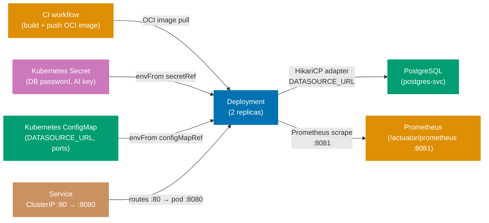
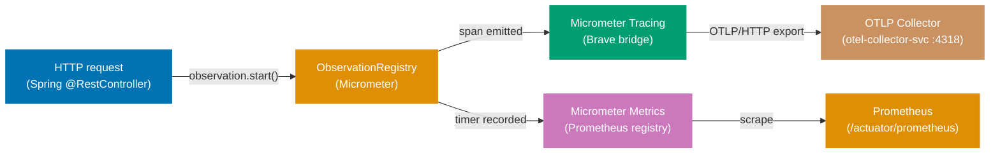

## Guide 23 — Kubernetes Deployment Topology for `talks-platform-be`

### Why It Matters

A Kubernetes manifest is not a deployment detail you bolt on after the code
works — it is the composition root for the entire hexagonal stack at runtime.
The `Deployment` object determines how many adapter instances run concurrently;
the `ConfigMap` holds the non-secret wiring that tells the Spring DataSource
adapter which PostgreSQL host to connect to; the `Secret` holds the credentials
that make the adapter authenticate. If these three resources are misaligned, the
adapter throws at startup rather than at test time — you find out at 3 AM during
a rolling restart rather than during the pre-merge integration test. Writing the
manifest before the first production deploy makes the configuration contract
explicit, reviewable, and portable across environments.

Spring Boot Actuator adds `/actuator/health`, `/actuator/liveness`, and
`/actuator/readiness` without any manifest-level change. Kubernetes reads those
endpoints through liveness and readiness probes. A misconfigured probe means
Kubernetes either never routes traffic to a healthy pod or restarts a pod that
is actually busy finishing a long-running database migration — both outcomes land
the on-call engineer in a painful rollback. Getting the probe configuration right
in the same commit as the initial Kubernetes manifest prevents that class of
P1 incident.

### Standard Library First

`System.getenv` is the Java SE mechanism for reading runtime configuration. You
can start `talks-platform-be` on any machine by exporting environment variables
manually before running the JAR:

```bash
# Standard library: running talks-platform-be with environment variables only
# Demonstrates the manual environment variable approach that Kubernetes supersedes.

export SPRING_DATASOURCE_URL="jdbc:postgresql://localhost:5432/talks_dev"
# => SPRING_DATASOURCE_URL: Spring Boot auto-configuration reads this key for the DataSource bean
# => Hardcoding the host/port/database in a script works locally but cannot be committed to version control

export SPRING_DATASOURCE_USERNAME="talks"
# => SPRING_DATASOURCE_USERNAME: credential read by HikariCP at DataSource construction time
# => Each developer sets this individually — no central secret store, no rotation

export SPRING_DATASOURCE_PASSWORD="talks"
# => SPRING_DATASOURCE_PASSWORD: plaintext in the shell environment — visible to every child process

java -jar apps/talks-platform-be/target/talks-platform-be.jar
# => Starts the Spring Boot application on the default port (8080)
# => No orchestration: one process, one database, no health checks, no pod restart on failure
```

**Limitation for production**: manual environment variables must be set on
every machine, are not versioned with the application, and offer no secret
rotation. A single missing variable causes the adapter to fail at connection
time — `HikariPool-1 - Exception during pool initialization`. No liveness or
readiness probe means Kubernetes cannot detect a crashed or overloaded JVM.

### Production Framework

A Kubernetes manifest for `talks-platform-be` wires the Deployment, Service,
ConfigMap, and Secret into a self-documenting topology. The manifests live
under `apps/talks-platform-be/deploy/k8s/`:

```yaml
# apps/talks-platform-be/deploy/k8s/configmap.yaml
apiVersion: v1
# => apiVersion: v1 is the stable core API group — ConfigMap is a v1 resource since Kubernetes 1.0
kind: ConfigMap
# => ConfigMap: holds non-secret key-value pairs injected into pods as environment variables
metadata:
  name: talks-platform-be-config
  # => name: referenced by envFrom.configMapRef.name in the Deployment spec
  namespace: talks-platform
  # => namespace: isolates talks-platform-be resources from other services in the cluster
data:
  SPRING_DATASOURCE_URL: "jdbc:postgresql://postgres-svc.talks-platform:5432/talks"
  # => Spring Boot reads this key and wires it into the DataSource auto-configuration
  # => postgres-svc.talks-platform: cluster-internal DNS — <service>.<namespace>.svc.cluster.local
  SERVER_PORT: "8080"
  # => SERVER_PORT: Spring Boot listens on this port inside the container
  # => The Service routes external traffic to this containerPort via targetPort: 8080
  MANAGEMENT_SERVER_PORT: "8081"
  # => Separate Actuator port: isolates health and metrics endpoints from application traffic
  # => Access policy: internal load balancer routes 8081 only within the cluster
  SPRING_APPLICATION_NAME: "talks-platform-be"
  # => service.name: attached to every span in Micrometer Tracing — visible in Jaeger / Tempo
```

```yaml
# apps/talks-platform-be/deploy/k8s/secret.yaml
# IMPORTANT: Never commit real secret values. Use Sealed Secrets or External Secrets Operator.
apiVersion: v1
# => apiVersion: v1 — Secret is a core resource; same API group as ConfigMap
kind: Secret
# => Secret: Kubernetes stores values base64-encoded and restricts access via RBAC policies
metadata:
  name: talks-platform-be-secrets
  # => name: referenced by envFrom.secretRef.name in the Deployment — must match exactly
  namespace: talks-platform
  # => namespace: same namespace as the Deployment — cross-namespace Secret references are not allowed
type: Opaque
# => Opaque: generic secret type — no schema validation; all values treated as arbitrary bytes
stringData:
  # => stringData: plain-text input; Kubernetes base64-encodes and stores under .data automatically
  SPRING_DATASOURCE_USERNAME: "REPLACE_ME"
  # => REPLACE_ME is a placeholder — a CI linter catches literal "REPLACE_ME" before deployment
  # => In production, populate via Sealed Secrets: kubeseal --raw --from-file=...
  SPRING_DATASOURCE_PASSWORD: "REPLACE_ME"
  # => DataSource password: HikariCP reads this at pool initialization time
  # => Rotate by updating the Secret and performing a rolling restart — no code change required
  AI_OPENROUTER_API_KEY: "REPLACE_ME"
  # => AI provider API key: read by the OpenRouterAiProvider adapter at construction time
  # => Never hardcode API keys — always inject from a Secret at the deployment seam
```

```yaml
# apps/talks-platform-be/deploy/k8s/deployment.yaml
apiVersion: apps/v1
# => apps/v1: the stable Deployment API group — required for Deployments since Kubernetes 1.9
kind: Deployment
# => Deployment: manages a ReplicaSet and rolls out pods
metadata:
  name: talks-platform-be
  # => name: used by kubectl and the Service selector — DNS-safe identifier
  namespace: talks-platform
  # => namespace: isolates all talks-platform-be resources
spec:
  replicas: 2
  # => 2 replicas: zero-downtime rolling update — one pod serves traffic while the other restarts
  selector:
    matchLabels:
      app: talks-platform-be
      # => app: talks-platform-be — must match template.metadata.labels
  template:
    metadata:
      labels:
        app: talks-platform-be
        # => pod label: the Service selector and the Deployment selector both target this label
      annotations:
        prometheus.io/scrape: "true"
        # => Prometheus scrape annotation: the Prometheus operator discovers this pod for metric scraping
        prometheus.io/port: "8081"
        # => Actuator port: Prometheus scrapes /actuator/prometheus on the management port
        prometheus.io/path: "/actuator/prometheus"
        # => /actuator/prometheus: Micrometer exposes metrics in Prometheus text format on this path
    spec:
      containers:
        - name: talks-platform-be
          # => name: identifies the container within the pod — used in kubectl logs and exec commands
          image: ghcr.io/wahidyankf/talks-platform-be:latest
          # => OCI image: built by the CI workflow and pushed to GitHub Container Registry
          # => In production, pin to an immutable SHA digest: image: ghcr.io/...@sha256:<digest>
          ports:
            - containerPort: 8080
              # => containerPort 8080: application traffic — documentation only; Service does the routing
              name: http
            - containerPort: 8081
              # => containerPort 8081: Actuator management port — health probes and Prometheus target this
              name: management
          envFrom:
            # => envFrom: injects all keys from a ConfigMap or Secret as environment variables
            - configMapRef:
                name: talks-platform-be-config
                # => Injects all ConfigMap keys into the container — Spring Boot reads them at startup
            - secretRef:
                name: talks-platform-be-secrets
                # => Kubernetes decodes base64 and injects as plain-text environment variables
          livenessProbe:
            # => livenessProbe: kubelet restarts the container if this probe fails
            httpGet:
              path: /actuator/liveness
              # => /actuator/liveness: Spring Boot Actuator liveness group — returns UP/DOWN
              port: 8081
              # => port 8081: the management port
            initialDelaySeconds: 30
            # => 30 s delay: allows Flyway migrations (Guide 26) and Spring context to fully start
            periodSeconds: 15
            # => Checked every 15 s — 3 consecutive failures trigger a container restart
            failureThreshold: 3
            # => 3 failures × 15 s = 45 s of grace before restart — prevents flapping during GC pauses
          readinessProbe:
            # => readinessProbe: kubelet removes the pod from Service endpoints if this probe fails
            httpGet:
              path: /actuator/readiness
              # => /actuator/readiness: Spring Boot Actuator readiness group — checks downstream adapters
              port: 8081
            initialDelaySeconds: 10
            # => 10 s: readiness check starts before liveness — pod must become ready before traffic routes
            periodSeconds: 10
            # => Checked every 10 s — shorter period for readiness than liveness for faster traffic routing
          resources:
            requests:
              memory: "256Mi"
              # => 256Mi: conservative heap floor for a Spring Boot JVM at idle
              cpu: "250m"
              # => 250m: 25% of one CPU core — sufficient for low-traffic workloads
            limits:
              memory: "512Mi"
              # => Kubernetes OOM-kills the pod if it exceeds 512Mi
              cpu: "1000m"
              # => CPU throttled at one full core — Spring Boot JVM is more CPU-tolerant than memory-tolerant
```

```yaml
# apps/talks-platform-be/deploy/k8s/service.yaml
apiVersion: v1
# => apiVersion: v1 — Service is a core resource
kind: Service
# => Service: provides a stable cluster-internal IP — pods come and go, the Service IP is stable
metadata:
  name: talks-platform-be-svc
  # => name: DNS name for in-cluster callers — talks-platform-be-svc.talks-platform.svc.cluster.local
  namespace: talks-platform
spec:
  selector:
    app: talks-platform-be
    # => selector label: matches template.metadata.labels in the Deployment
  ports:
    - name: http
      port: 80
      # => port 80: the Service's externally-visible port within the cluster
      targetPort: 8080
      # => targetPort 8080: routes cluster port 80 to container port 8080
    - name: management
      port: 8081
      targetPort: 8081
      # => targetPort 8081: routes to the Actuator management port on the container
  type: ClusterIP
  # => ClusterIP: reachable within the cluster only — the Ingress resource handles external traffic
```



**Trade-offs**: `envFrom` with `secretRef` exposes all Secret keys as
environment variables — any process inside the container can read them. For
stricter isolation, mount the Secret as a volume and read files from
`/run/secrets/`; Spring Boot supports file-based property sources via
`spring.config.import=optional:file:/run/secrets/`. Kubernetes Secrets are
base64-encoded, not encrypted at rest by default; enable etcd encryption at
rest and use Sealed Secrets or External Secrets Operator before moving to
production.

---

## Guide 24 — Observability Stack at the Deploy Seam: Micrometer Tracing + OTLP + Prometheus

### Why It Matters

Guide 20 showed how Micrometer Tracing decorates individual port calls with
spans. At the deployment seam, the concern shifts: where does the collected
telemetry go, and which sources does the SDK export? A misconfigured OTLP
exporter means you pay the span creation overhead on every request but see
nothing in Jaeger or Grafana Tempo. A missing Prometheus scrape configuration
means P95 latency regressions are invisible until a conference organizer files
a support ticket. Getting observability wired correctly before the first
production deploy makes the difference between reacting to incidents in seconds
and debugging in the dark.

The deployment seam also determines the resource attributes attached to every
span — `service.name`, `service.version`, and `service.instance.id`. Without
them, traces from two pod replicas collide in the trace UI, making it
impossible to diagnose which replica produced a slow span.

### Standard Library First

`java.lang.management.ManagementFactory` provides JVM-level instrumentation
that ships with the JDK. You can print heap usage and thread counts to stdout
without any framework:

```java
// Standard library: JVM instrumentation via ManagementFactory
// Demonstrates the JDK management API that Micrometer supersedes for production observability.

import java.lang.management.ManagementFactory;
// => ManagementFactory: JDK entry point for platform MXBeans — no Maven dependency required
import java.lang.management.MemoryMXBean;
// => MemoryMXBean: heap and non-heap usage in bytes — useful but not a trace
import java.lang.management.ThreadMXBean;
// => ThreadMXBean: thread count, peak thread count, daemon threads

public class JvmMetricsDump {
    public static void printMetrics() {
        MemoryMXBean memory = ManagementFactory.getMemoryMXBean();
        // => getMemoryMXBean(): returns the singleton MemoryMXBean for this JVM process
        long heapUsedMb = memory.getHeapMemoryUsage().getUsed() / (1024 * 1024);
        // => getUsed(): bytes of heap currently used — divided by 1M for readability

        ThreadMXBean threads = ManagementFactory.getThreadMXBean();
        // => getThreadMXBean(): returns the singleton ThreadMXBean
        int threadCount = threads.getThreadCount();
        // => getThreadCount(): all live threads including daemon and JVM internal threads

        System.out.printf("heap=%dMB threads=%d%n", heapUsedMb, threadCount);
        // => stdout: visible in kubectl logs — no aggregation, no trace correlation
    }
}
```

**Limitation for production**: `ManagementFactory` metrics are snapshots, not
time-series — you cannot compute rate, P95, or trend. Stdout output is
unstructured and lost when the pod restarts. No spans means you cannot
correlate a slow database query with the HTTP request that triggered it.
No sampling policy means either 100% of spans are emitted or none are.

### Production Framework

`talks-platform-be` wires Micrometer Tracing with the OTLP exporter and the
Prometheus Micrometer registry via Spring Boot auto-configuration:

```java
// TracingConfig.java — enables Micrometer Tracing sources for talks-platform-be contexts
package com.talksplatform.shared.observability;
// => shared/observability/ package: cross-cutting tracing configuration lives here

import io.micrometer.tracing.Tracer;
// => Tracer: Micrometer abstraction over the underlying tracing backend (Brave or OTel)
// => Application code imports Tracer — never imports Brave or OpenTelemetry directly
import org.springframework.context.annotation.Bean;
// => @Bean: declares a method as a Spring-managed bean factory
import org.springframework.context.annotation.Configuration;
// => @Configuration: marks this class as a Spring factory — @Bean methods register into the ApplicationContext
import io.micrometer.observation.ObservationRegistry;
// => ObservationRegistry: Micrometer 1.11+ unified observation API — spans and metrics share one entry point

@Configuration
// => @Configuration: Spring discovers this class during component scan — @Bean methods run at startup
public class TracingConfig {

    @Bean
    // => @Bean: Spring registers the return value in the ApplicationContext — injected wherever needed
    public io.micrometer.tracing.brave.bridge.BraveBaggageManager braveBaggageManager() {
        // => BraveBaggageManager: bridges Micrometer baggage API to Brave — required for W3C baggage propagation
        // => W3C baggage: carries trace context across HTTP calls to downstream adapters
        return new io.micrometer.tracing.brave.bridge.BraveBaggageManager();
        // => Singleton: Spring caches the return value — one instance shared across the ApplicationContext
    }
}
```

```yaml
# apps/talks-platform-be/src/main/resources/application.yml (observability section)
management:
  # => management: Spring Boot Actuator configuration section
  endpoints:
    web:
      exposure:
        include: "health,info,prometheus,liveness,readiness"
        # => include: restricts which Actuator endpoints are exposed — principle of least privilege
        # => prometheus: exposes /actuator/prometheus in Prometheus text format
        # => liveness,readiness: the named probe groups consumed by the Kubernetes probes in Guide 23
  metrics:
    export:
      prometheus:
        enabled: true
        # => enabled: activates the Prometheus registry — metrics available at /actuator/prometheus
  tracing:
    sampling:
      probability: 1.0
      # => 1.0 in development: all traces recorded — reduce to 0.1 in production for high-traffic services
      # => Override via MANAGEMENT_TRACING_SAMPLING_PROBABILITY environment variable in ConfigMap

spring:
  application:
    name: "talks-platform-be"
    # => name: the resource attribute attached to every span — visible in Jaeger and Grafana Tempo
    # => Spring Boot 3+ sets otel.service.name from spring.application.name automatically

management:
  otlp:
    tracing:
      endpoint: "http://localhost:4318/v1/traces"
      # => localhost fallback: overridden by MANAGEMENT_OTLP_TRACING_ENDPOINT in the Kubernetes ConfigMap
      # => Port 4318: OTLP/HTTP — use 4317 for OTLP/gRPC; HTTP is preferred when TLS is not configured
```

```yaml
# Extend apps/talks-platform-be/deploy/k8s/configmap.yaml with observability keys
data:
  MANAGEMENT_OTLP_TRACING_ENDPOINT: "http://otel-collector-svc.observability:4318/v1/traces"
  # => otel-collector-svc.observability: service in the "observability" namespace
  # => Changing the collector address requires only a ConfigMap update and pod restart — no code change
  MANAGEMENT_TRACING_SAMPLING_PROBABILITY: "0.1"
  # => 0.1: sample 10% of traces in production — reduces storage and CPU overhead under load
  # => Override to "1.0" in staging for full trace capture
  OTEL_RESOURCE_ATTRIBUTES: "deployment.environment=production"
  # => Additional resource attribute: filter production vs staging traces in the trace UI
```



**Trade-offs**: `management.tracing.sampling.probability: 1.0` captures every
span during development but adds measurable overhead above 1000 req/s in
production. Reduce to 0.1 and use tail-based sampling in the collector for
high-traffic services. If the collector is unreachable, OTLP export blocks the
Micrometer `OtlpMeterRegistry` background thread — set
`management.otlp.tracing.connect-timeout` to 2s to bound the retry delay.

---

## Guide 25 — Failure-Mode Wiring: Degraded Adapters and `HealthIndicator`

### Why It Matters

When the PostgreSQL pod is unhealthy during a rolling restart, you have two
choices: fail every request immediately with a 500, or serve degraded responses
from a fallback adapter. The hexagonal architecture makes the second choice
tractable — because the application service depends on a port interface, not a
concrete adapter, you can swap in a degraded adapter at the composition root
without touching the domain or application layers. The cached read-model adapter
returns the last known state; the null event publisher silently drops events
when the broker is unavailable. A Spring `HealthIndicator` drives the
liveness and readiness probes from Guide 23, so Kubernetes removes a degraded
pod from rotation rather than routing live traffic to it.

### Standard Library First

A plain `try-catch` at the controller layer is the minimal fallback Java SE
provides without a framework:

```java
// Standard library: try-catch fallback at the @RestController level
// Demonstrates the handler-level catch approach that HealthIndicator and degraded adapters supersede.

import org.springframework.http.ResponseEntity;
import org.springframework.web.bind.annotation.GetMapping;
import org.springframework.web.bind.annotation.RestController;

@RestController
// => @RestController: combines @Controller and @ResponseBody
public class TalkControllerFallback {

    private final com.talksplatform.submission.application.SubmitTalkService talkService;
    // => SubmitTalkService: the application layer — injected via constructor
    // => final: immutable after construction — safe for concurrent HTTP requests

    public TalkControllerFallback(com.talksplatform.submission.application.SubmitTalkService talkService) {
        this.talkService = talkService;
    }

    @GetMapping("/api/v1/talks")
    // => @GetMapping: maps HTTP GET /api/v1/talks to this method
    public ResponseEntity<?> listTalks() {
        try {
            var talks = talkService.findById(null);
            // => findById: calls the application service — may throw RepositoryException if DB is down
            return ResponseEntity.ok(talks);
        } catch (org.springframework.dao.DataAccessException ex) {
            // => DataAccessException: Spring's DB exception hierarchy — catches all SQL/JDBC failures
            // => Problem: every @RestController method must duplicate this catch block
            return ResponseEntity.status(503).body("Service temporarily unavailable");
            // => 503: correct status, but the body leaks internal error classification to the caller
            // => No health signal: Kubernetes keeps routing traffic to this pod even when every request fails
        }
    }
}
```

**Limitation for production**: the fallback logic lives in the controller —
every controller method must duplicate the catch block. No caching: the
fallback returns an error, not stale data. No health signal: Kubernetes keeps
routing traffic to the pod even when all requests fail.

### Production Framework

The degraded-mode pattern introduces a `CachedTalkReadAdapter` that returns
the last-known talk list when the real repository port fails, and a
`NullEventPublisher` that silently drops events when the broker is
unavailable. A `TalkHealthIndicator` bean exposes the degraded flag to the
Spring Actuator readiness probe:

```java
// CachedTalkReadAdapter.java — returns cached talk list when the DB port fails
package com.talksplatform.submission.infrastructure;
// => infrastructure package: Spring-managed adapters live here

import com.talksplatform.submission.application.TalkRepository;
// => TalkRepository: output port interface — CachedTalkReadAdapter satisfies the same port interface
import com.talksplatform.submission.domain.Talk;
// => Talk: the domain aggregate — the cache stores domain objects, not JDBC rows
import com.talksplatform.submission.domain.TalkId;
import com.talksplatform.submission.domain.SpeakerId;
import org.springframework.stereotype.Component;
// => @Component: Spring registers this adapter — the @Configuration class selects it when degraded
import java.util.Collections;
// => Collections.unmodifiableList: returns a read-only view of the cache
import java.util.List;
import java.util.Optional;
import java.util.concurrent.CopyOnWriteArrayList;
// => CopyOnWriteArrayList: thread-safe list — cache written by health-check thread, read by request threads
import java.util.concurrent.atomic.AtomicBoolean;
// => AtomicBoolean: lock-free degraded flag — updated by the circuit-breaker callback, read per request

@Component
// => @Component: Spring discovers this class — the @Configuration composition root selects it conditionally
public class CachedTalkReadAdapter implements TalkRepository {
    // => implements TalkRepository: satisfies the output port contract — application service cannot distinguish
    //    this adapter from the real JDBC adapter

    private final List<Talk> cache = new CopyOnWriteArrayList<>();
    // => CopyOnWriteArrayList: snapshot semantics — reads never block writes from the health-check thread
    // => Cache starts empty: the first request after startup reads from the real adapter

    private final AtomicBoolean degraded = new AtomicBoolean(false);
    // => AtomicBoolean: lock-free degraded flag — the circuit-breaker callback sets this to true
    // => Read per request: if true, serve from cache; if false, delegate to the real adapter

    public void populateCache(List<Talk> snapshot) {
        // => Called by the real adapter decorator on every successful read — cache stays current
        cache.clear();
        cache.addAll(snapshot);
        // => Replaces all entries with the latest snapshot from PostgreSQL
    }

    public void setDegraded(boolean value) {
        degraded.set(value);
        // => setDegraded(true): called by the circuit-breaker or a health-check failure callback
        // => setDegraded(false): called when the DataSource health check recovers
    }

    public boolean isDegraded() {
        return degraded.get();
        // => isDegraded(): read by TalkHealthIndicator to determine the Actuator readiness state
        // => AtomicBoolean.get() is non-blocking — safe to call on every HTTP request
    }

    @Override
    public Optional<Talk> findById(TalkId id) {
        if (degraded.get()) {
            return cache.stream().filter(t -> t.id().equals(id)).findFirst();
            // => Degraded mode: return from the cached snapshot without touching the database
        }
        throw new UnsupportedOperationException("CachedTalkReadAdapter is not the active read path");
        // => If degraded is false, this adapter must not be called — composition root wiring bug
    }

    @Override
    public List<Talk> findBySpeakerId(SpeakerId speakerId) {
        if (degraded.get()) {
            return cache.stream()
                .filter(t -> t.speakerId().equals(speakerId))
                .collect(java.util.stream.Collectors.toUnmodifiableList());
            // => Degraded mode: filter the cached snapshot by speaker without touching the database
        }
        throw new UnsupportedOperationException("CachedTalkReadAdapter is not the active read path");
    }

    @Override
    public void save(Talk talk) {
        if (degraded.get()) {
            throw new com.talksplatform.submission.application.RepositoryException(
                "Writes unavailable in degraded mode", null);
            // => Write operations are not supported in degraded mode — callers receive RepositoryException
        }
        throw new UnsupportedOperationException("CachedTalkReadAdapter is not the active write path");
    }

    @Override
    public void delete(TalkId id) {
        if (degraded.get()) {
            throw new com.talksplatform.submission.application.RepositoryException(
                "Deletes unavailable in degraded mode", null);
        }
        throw new UnsupportedOperationException("CachedTalkReadAdapter is not the active write path");
    }
}
```

```java
// NullEventPublisher.java — silently drops events when the broker port is unavailable
package com.talksplatform.submission.infrastructure;
// => infrastructure package: adapter implementations live here

import com.talksplatform.submission.application.EventPublisher;
// => EventPublisher: output port interface for domain event publishing
import com.talksplatform.submission.application.TalkSubmitted;
import com.talksplatform.submission.application.TalkWithdrawn;
// => Domain event records — the null publisher receives these and drops them silently
import org.slf4j.Logger;
import org.slf4j.LoggerFactory;
import org.springframework.stereotype.Component;

@Component
// => @Component: Spring registers this null adapter — composition root selects it during broker outage
public class NullEventPublisher implements EventPublisher {
    // => implements EventPublisher: satisfies the port contract — application service never imports this class
    // => Null object pattern: replaces the real adapter without changing the application service

    private static final Logger log = LoggerFactory.getLogger(NullEventPublisher.class);
    // => static final: one logger per class — shared across all calls to publish()

    @Override
    public void publish(TalkSubmitted event) {
        log.warn("Null event publisher: dropping TalkSubmitted {} — outbox unavailable",
            event.talkId().value());
        // => WARN level: not an error (the system degrades gracefully), but not silent — visible in the trace
        // => event.talkId().value(): logs the talk ID for post-incident audit without PII
        // => Silent drop: the application service proceeds as if the event was published
        // => At-least-once guarantee is lost — switch to an outbox adapter to preserve delivery
    }

    @Override
    public void publish(TalkWithdrawn event) {
        log.warn("Null event publisher: dropping TalkWithdrawn {} — outbox unavailable",
            event.talkId().value());
        // => Same pattern: WARN log with talk ID — both overloads drop silently in degraded mode
    }
}
```

```java
// TalkHealthIndicator.java — drives liveness/readiness probes via the degraded flag
package com.talksplatform.submission.infrastructure;
// => infrastructure package: Actuator adapters live here alongside JDBC and messaging adapters

import org.springframework.boot.actuate.health.Health;
// => Health: Spring Actuator result object — UP/DOWN with optional detail map
import org.springframework.boot.actuate.health.HealthIndicator;
// => HealthIndicator: Spring Actuator interface — implementations appear in /actuator/health response
import org.springframework.stereotype.Component;
// => @Component: Spring discovers this indicator — auto-registered with the Actuator health endpoint

@Component("talkHealth")
// => @Component: Spring Boot Actuator discovers all HealthIndicator beans at startup
// => "talkHealth": the bean name determines the key under "components" in /actuator/health JSON
public class TalkHealthIndicator implements HealthIndicator {
    // => HealthIndicator: Spring Actuator calls health() to compose the aggregate health response

    private final CachedTalkReadAdapter cachedAdapter;
    // => CachedTalkReadAdapter: the degraded flag lives here — the indicator reads it, not a shared static
    // => final: immutable after construction — thread-safe for concurrent Actuator probe calls

    public TalkHealthIndicator(CachedTalkReadAdapter cachedAdapter) {
        this.cachedAdapter = cachedAdapter;
        // => Constructor injection: Spring provides the same CachedTalkReadAdapter bean used by the composition root
        // => Same bean: both TalkHealthIndicator and the composition root share the AtomicBoolean state
    }

    @Override
    // => @Override: compiler verifies this method signature matches HealthIndicator.health()
    public Health health() {
        // => Called by Actuator for /actuator/health, /actuator/readiness, and /actuator/liveness
        // => Spring Boot groups: readiness group includes this indicator; liveness group does not by default
        if (cachedAdapter.isDegraded()) {
            // => isDegraded(): reads the AtomicBoolean set by the DataSource failure handler
            return Health.down()
                // => Health.down(): Actuator returns HTTP 503 for the readiness group — Kubernetes removes pod
                .withDetail("reason", "DataSource health check failed — serving from cache")
                // => withDetail: structured detail map visible in /actuator/health JSON response
                .build();
        }
        return Health.up().build();
        // => Health.up(): Actuator returns HTTP 200 for the readiness group — Kubernetes routes traffic to pod
    }
}
```

**Trade-offs**: the cached read adapter serves stale data — clients receive a
response that may be minutes or hours old during a PostgreSQL outage. For a
conference talk listing, staleness is acceptable; for a financial ledger it is
not. The null event publisher silently drops domain events — if at-least-once
delivery is a hard requirement, replace it with an in-memory buffer that replays
to the outbox when the broker recovers, accepting the risk of buffer overflow
under sustained outages.

---

## Guide 26 — Flyway Migration at Deploy Time: Kubernetes Job vs `ApplicationRunner`

### Why It Matters

Guide 17 introduced Flyway as the schema-migration adapter. At the deployment
seam, the wiring question is: when does the migration run relative to pod startup,
and which mechanism owns the migration lifecycle? Running Flyway inside
`SpringApplication.run` means every replica races to apply migrations during a
rolling restart — a potential for migration conflicts on `ALTER TABLE` statements.
Running Flyway as a Kubernetes `Job` before the `Deployment` rolls means the
schema is stable before any pod starts, but a failed job blocks the entire
rollout. Choosing the wrong strategy causes a database-level lock that holds the
deployment in progress for ten minutes while the on-call engineer investigates —
and the `initialDelaySeconds` in the Guide 23 liveness probe was chosen assuming
one of these strategies, not both at the same time.

### Standard Library First

`java.sql.Connection` can execute DDL directly without a migration framework —
the raw JDBC approach:

```java
// Standard library: DDL execution via JDBC Connection
// Demonstrates the manual DDL approach that Flyway supersedes.

import java.sql.Connection;
import java.sql.DriverManager;
import java.sql.SQLException;

public class ManualSchemaMigration {
    public static void main(String[] args) throws SQLException {
        String url = System.getenv("SPRING_DATASOURCE_URL");
        // => Reads the JDBC URL from an environment variable — must be set before this runs
        try (Connection conn = DriverManager.getConnection(url, "talks", "talks")) {
            // => try-with-resources: Connection implements AutoCloseable — conn.close() is guaranteed
            conn.createStatement().execute(
                "CREATE SCHEMA IF NOT EXISTS submission;" +
                "CREATE TABLE IF NOT EXISTS submission.talks (" +
                "  id UUID PRIMARY KEY," +
                "  speaker_id UUID NOT NULL," +
                "  abstract TEXT NOT NULL," +
                "  format TEXT NOT NULL," +
                "  status TEXT NOT NULL DEFAULT 'Draft'" +
                ")"
                // => No version number: impossible to determine which state the schema is in
                // => No rollback: if the second migration fails after the first succeeds, schema is partially upgraded
            );
            System.out.println("Schema migration complete");
        }
        // => No migration history: Flyway tracks applied migrations in a flyway_schema_history table
    }
}
```

**Limitation for production**: no version tracking means running the migration
twice executes the DDL twice — dangerous for `ALTER TABLE` or `DROP COLUMN`
statements that are not idempotent. No rollback mechanism. `IF NOT EXISTS` is
not a substitute for migration ordering — two concurrent processes executing
the same DDL simultaneously can still deadlock on the `pg_locks` table.

### Production Framework

`talks-platform-be` includes Flyway via `spring-boot-starter-flyway` (Guide 17).
This guide makes the deploy-time migration strategy explicit: a dedicated `Job`
runs `flyway migrate` before the application containers start. Spring Boot's
`spring.flyway.enabled=false` disables the in-process Flyway so only one path
owns the migration:

```yaml
# apps/talks-platform-be/deploy/k8s/migration-job.yaml
apiVersion: batch/v1
# => batch/v1: the stable Jobs API group — Kubernetes guarantees at-least-once execution semantics
kind: Job
# => Job: runs a pod to completion — Kubernetes retries on failure up to backoffLimit times
metadata:
  name: talks-platform-be-migrate
  # => name: unique within namespace — helm upgrade creates a new Job with this name each release
  namespace: talks-platform
  annotations:
    helm.sh/hook: pre-upgrade,pre-install
    # => Helm hook: runs this Job before the Deployment rolls — schema is ready before pods start
    helm.sh/hook-delete-policy: hook-succeeded
    # => Deletes the Job after it succeeds — prevents accumulation of completed migration Jobs
spec:
  backoffLimit: 3
  # => backoffLimit: Kubernetes retries the pod up to 3 times on failure before marking the Job failed
  template:
    spec:
      restartPolicy: OnFailure
      # => OnFailure: Kubernetes restarts the container on non-zero exit code — retries the migration
      containers:
        - name: flyway-migrate
          image: flyway/flyway:10-alpine
          # => Official Flyway CLI image: applies migrations without starting the Spring Boot application
          args: ["migrate"]
          # => migrate: the Flyway command — scans /flyway/sql and applies pending versioned scripts
          env:
            - name: FLYWAY_URL
              valueFrom:
                configMapKeyRef:
                  name: talks-platform-be-config
                  key: SPRING_DATASOURCE_URL
                  # => key: the ConfigMap key whose value is injected as FLYWAY_URL
            - name: FLYWAY_USER
              valueFrom:
                secretKeyRef:
                  name: talks-platform-be-secrets
                  key: SPRING_DATASOURCE_USERNAME
            - name: FLYWAY_PASSWORD
              valueFrom:
                secretKeyRef:
                  name: talks-platform-be-secrets
                  key: SPRING_DATASOURCE_PASSWORD
          volumeMounts:
            - name: migrations
              mountPath: /flyway/sql
              # => /flyway/sql: the Flyway default SQL location — scripts scanned alphabetically
      volumes:
        - name: migrations
          configMap:
            name: talks-platform-be-migrations
            # => ConfigMap holding SQL migration files (V1__create_submission_schema.sql, etc.)
```

```yaml
# Disable in-process Flyway so the Kubernetes Job is the only migration path
spring:
  flyway:
    enabled: false
    # => disabled: prevents Spring Boot from running Flyway at ApplicationContext startup
    # => The Kubernetes Job above owns the migration lifecycle — two migration paths would race
    # => Re-enable temporarily for local development without the Kubernetes Job
```

The `ApplicationRunner` strategy — running Flyway inside `SpringApplication.run`
— is the simpler alternative for teams not using Helm or Kubernetes Jobs. It
requires the liveness `initialDelaySeconds` to be long enough for all pending
migrations to complete before the first probe fires:

```java
// FlywayMigrationRunner.java — ApplicationRunner strategy (alternative to Kubernetes Job)
package com.talksplatform.shared.config;

import org.flywaydb.core.Flyway;
// => Flyway: the Flyway API — available via spring-boot-starter-flyway
import org.springframework.boot.ApplicationArguments;
import org.springframework.boot.ApplicationRunner;
// => ApplicationRunner: Spring calls run() after the ApplicationContext is fully started
import org.springframework.context.annotation.Profile;
// => @Profile: activates this runner only in specified profiles — suppressed in the k8s profile
import org.springframework.stereotype.Component;
// => @Component: Spring discovers this class during component scan

import javax.sql.DataSource;

@Component
// => @Component: Spring registers this runner — active when spring.flyway.enabled is true
@Profile("!k8s")
// => @Profile("!k8s"): disabled in the k8s Spring profile — the Kubernetes Job owns migration in that profile
public class FlywayMigrationRunner implements ApplicationRunner {
    // => ApplicationRunner: called by Spring Boot after context refresh — before HTTP traffic is accepted

    private final DataSource dataSource;
    // => DataSource: HikariCP pool configured from SPRING_DATASOURCE_* environment variables

    public FlywayMigrationRunner(DataSource dataSource) {
        this.dataSource = dataSource;
        // => Constructor injection: Spring provides the configured HikariCP DataSource
        // => The same DataSource used by the JDBC adapter — Flyway uses the pool for migration connections
    }

    @Override
    public void run(ApplicationArguments args) {
        // => run(): called by Spring Boot once the ApplicationContext is fully started
        // => Runs synchronously before HTTP server accepts traffic — no race with request handlers
        Flyway flyway = Flyway.configure()
            // => configure(): static factory for FlywayConfiguration — fluent builder pattern
            .dataSource(dataSource)
            // => dataSource: the same HikariCP pool — Flyway acquires a connection for the migration lock
            .locations("classpath:db/migration")
            // => locations: the classpath path where SQL migration files live
            .validateOnMigrate(true)
            // => validateOnMigrate: Flyway checksums applied migrations — detects edits to already-run scripts
            // => Throws FlywayValidateException if a checksum mismatch is detected — fail-fast
            .load();
        flyway.migrate();
        // => migrate(): applies all pending versioned migrations in order
        // => Acquires a database-level advisory lock — only one JVM migrates at a time
    }
}
```

**Trade-offs**: the Kubernetes Job strategy decouples migration from pod
startup — a failed migration blocks the rollout before any pod is replaced,
which is the correct failure mode. The ApplicationRunner strategy is simpler
but requires tuning `initialDelaySeconds` to cover the migration time. For
small schemas (< 50 migrations, < 5 s total), the ApplicationRunner is
acceptable; for large schemas or additive migrations running concurrently across
10+ replicas, the Kubernetes Job is required.

---

## Guide 27 — Configuration Adapter at the Deploy Seam: Secret to Typed `@ConfigurationProperties` Record

### Why It Matters

`talks-platform-be` reads database credentials and the AI provider API key from
environment variables that Kubernetes injects from a `Secret`. The journey of a
credential from a Kubernetes Secret object to a strongly-typed Java record crosses
four boundaries: Kubernetes decodes the base64-encoded Secret value and injects it
as an environment variable; the Spring Environment property source reads the
environment variable; the `@ConfigurationProperties` binding maps it to a typed
record; the composition root reads the record and passes it to the adapter
constructor. A break at any boundary — a renamed key, a missing prefix, a wrong
casing — silently produces a `null` or empty string. Spring Boot
`@ConfigurationProperties` with `@Validated` detects the break at startup
rather than at the first database call, which turns a `3 AM NullPointerException
in HikariPool` into a `ContextLoad failure: datasource.username must not be
blank` during the Kubernetes pod `Init:0/1` phase — a much easier debugging
session.

### Standard Library First

`System.getenv` reads a single key directly — the manual approach before
`@ConfigurationProperties`:

```java
// Standard library: reading DataSource credentials manually from environment variables
// Demonstrates the manual approach that @ConfigurationProperties supersedes.

import org.springframework.jdbc.datasource.DriverManagerDataSource;

public class ManualDataSourceFactory {

    public static DriverManagerDataSource create() {
        String url = System.getenv("SPRING_DATASOURCE_URL");
        // => Reads the JDBC URL from the environment — returns null if the variable is not set
        // => getenv returns null, not empty string: callers must null-check every variable individually
        String username = System.getenv("SPRING_DATASOURCE_USERNAME");
        // => Reads the username — may be null if the Secret key name has a typo
        String password = System.getenv("SPRING_DATASOURCE_PASSWORD");
        // => Reads the password — may be null if the Secret was not mounted correctly

        if (url == null || username == null || password == null) {
            // => Null guard: three separate getenv calls must all succeed
            throw new IllegalStateException("DataSource environment variables not fully set");
            // => Fail-fast: better than NullPointerException deep in HikariCP initialization
            // => But: the error fires at the point of first use, not at startup — after health probes pass
        }
        // => No validation: an empty string passes the null check — "username=" is not caught here
        var ds = new DriverManagerDataSource();
        ds.setUrl(url);
        // => setUrl: no validation that the URL is a valid JDBC URL
        ds.setUsername(username);
        // => empty string is silently accepted — causes auth failure at connect time
        ds.setPassword(password);
        return ds;
    }
}
```

**Limitation for production**: `getenv` returns `null` for a missing variable
and an empty string for an env var set to `""` — both cases pass a naive
null-check but cause HikariCP to fail at connection time. Changes to the key
names in the Kubernetes Secret must be manually mirrored in every `getenv`
call. No centralized documentation of which environment variables the
application requires.

### Production Framework

Spring Boot `@ConfigurationProperties` with `@Validated` maps the environment
variables to a typed record and runs Jakarta Bean Validation at startup — before
any request is handled and before the liveness probe first fires:

```java
// DataSourceProperties.java — typed record bound to SPRING_DATASOURCE_* environment variables
package com.talksplatform.shared.config;
// => shared/config/ package: @ConfigurationProperties records live here — bound at startup

import jakarta.validation.constraints.NotBlank;
// => @NotBlank: fails validation if the bound value is null, empty, or whitespace-only
// => Catches env vars set to "" — the silent failure mode that @NotNull misses
import jakarta.validation.constraints.Pattern;
// => @Pattern: validates the format of the JDBC URL at startup — detects transposed host names
import org.springframework.boot.context.properties.ConfigurationProperties;
// => @ConfigurationProperties: Spring Boot binds properties with the given prefix to this record's fields
import org.springframework.validation.annotation.Validated;
// => @Validated: triggers Jakarta Bean Validation when the ApplicationContext is built

@ConfigurationProperties(prefix = "spring.datasource")
// => prefix = "spring.datasource": binds SPRING_DATASOURCE_URL, SPRING_DATASOURCE_USERNAME,
//    SPRING_DATASOURCE_PASSWORD — Spring converts underscore-separated env vars to dotted property names
// => Environment variable SPRING_DATASOURCE_URL → spring.datasource.url → DataSourceProperties.url
@Validated
// => @Validated: activates constraint checking at ApplicationContext startup — before pods report ready
// => Throws BindValidationException if any constraint fails — caught by Spring Boot startup health check
public record DataSourceProperties(

    @NotBlank(message = "spring.datasource.url must not be blank")
    // => @NotBlank: catches null and empty-string SPRING_DATASOURCE_URL from the Kubernetes ConfigMap
    @Pattern(regexp = "^jdbc:postgresql://.*",
             message = "spring.datasource.url must be a PostgreSQL JDBC URL")
    // => @Pattern: ensures the URL starts with jdbc:postgresql:// — catches MySQL URL typos in the ConfigMap
    String url,
    // => url: bound from spring.datasource.url (env: SPRING_DATASOURCE_URL)

    @NotBlank(message = "spring.datasource.username must not be blank")
    // => @NotBlank: catches a Secret key named SPRING_DATASOURCE_USER instead of SPRING_DATASOURCE_USERNAME
    String username,
    // => username: bound from spring.datasource.username (env: SPRING_DATASOURCE_USERNAME)

    @NotBlank(message = "spring.datasource.password must not be blank")
    // => @NotBlank: catches an empty Sealed Secret placeholder that was not replaced before deployment
    String password
    // => password: bound from spring.datasource.password (env: SPRING_DATASOURCE_PASSWORD)

) {}
// => record: immutable — values are set once by Spring Boot binding; no mutability risk after startup
```

```java
// AppConfig.java — registers @ConfigurationProperties beans and wires them to the DataSource
package com.talksplatform.shared.config;

import com.zaxxer.hikari.HikariDataSource;
// => HikariCP: the production-grade JDBC connection pool — auto-configured by Spring Boot
import org.springframework.boot.context.properties.EnableConfigurationProperties;
// => @EnableConfigurationProperties: registers the DataSourceProperties bean and triggers binding + validation
import org.springframework.context.annotation.Bean;
import org.springframework.context.annotation.Configuration;

import javax.sql.DataSource;

@Configuration
// => @Configuration: Spring calls @Bean methods here at ApplicationContext startup
@EnableConfigurationProperties(DataSourceProperties.class)
// => @EnableConfigurationProperties: triggers binding and @Validated constraint checking at startup
// => If SPRING_DATASOURCE_URL is blank, Spring throws BindValidationException before any @Bean runs
public class AppConfig {

    @Bean
    // => @Bean: Spring registers the returned HikariDataSource in the ApplicationContext
    public DataSource dataSource(DataSourceProperties props) {
        // => DataSourceProperties: bound and validated before this method is called — url is guaranteed non-blank
        var config = new com.zaxxer.hikari.HikariConfig();
        // => HikariConfig: builder for the HikariCP pool settings
        config.setJdbcUrl(props.url());
        // => url(): non-blank JDBC URL from the ConfigMap — validated by @Pattern at startup
        config.setUsername(props.username());
        // => username(): non-blank username from the Secret — validated by @NotBlank at startup
        config.setPassword(props.password());
        // => password(): non-blank password from the Secret — validated by @NotBlank at startup
        config.setMaximumPoolSize(10);
        // => Maximum pool size: 10 connections — sized for 2 replicas × 5 connections each
        config.setConnectionTimeout(3000);
        // => 3000 ms: connection acquisition timeout — bounded wait avoids thread starvation
        return new HikariDataSource(config);
        // => HikariDataSource: starts the connection pool and validates connectivity at construction time
        // => If the PostgreSQL pod is not reachable, HikariDataSource throws here — the Actuator readiness
        //    probe from Guide 25 returns DOWN and Kubernetes does not route traffic until the pool is healthy
    }
}
```



```mermaid
flowchart LR
    k8s["Kubernetes Secret\n(base64-encoded)"]:::purple
    env["JVM environment\n(SPRING_DATASOURCE_*)"]:::orange
    props["DataSourceProperties\n(@ConfigurationProperties)"]:::teal
    valid["@Validated\n(Jakarta Bean Validation)"]:::brown
    ds["HikariDataSource\n(AppConfig @Bean)"]:::blue
    port["JdbcTalkRepository\n(repository port)"]:::teal

    k8s -->|"envFrom secretRef\n(Kubernetes decodes base64)"| env
    env -->|"Spring Environment\nbinds prefix"| props
    props -->|"@NotBlank + @Pattern\nchecked at startup"| valid
    valid -->|"passes at startup"| ds
    ds -->|"DataSource injected"| port

    classDef purple fill:#CC78BC,color:#fff,stroke:#CC78BC
    classDef orange fill:#DE8F05,color:#fff,stroke:#DE8F05
    classDef teal fill:#029E73,color:#fff,stroke:#029E73
    classDef brown fill:#CA9161,color:#fff,stroke:#CA9161
    classDef blue fill:#0173B2,color:#fff,stroke:#0173B2
```

**Trade-offs**: `@ConfigurationProperties` with `@Validated` adds one extra
class per configuration group. The startup validation overhead is measured in
milliseconds — negligible compared to HikariCP pool initialization. The
`@Pattern` constraint on the JDBC URL is a double-edged sword: it catches
URL typos early, but it also rejects valid non-PostgreSQL JDBC URLs if
`talks-platform-be` ever migrates to a different database — update the pattern
when changing the database vendor. For `spring.config.import` with SSM or
Vault, add the dependency and set `spring.config.import=optional:aws-ssm:/talks/`
in `application.yml`; the `@ConfigurationProperties` binding is identical —
no code change, only a new property source.
