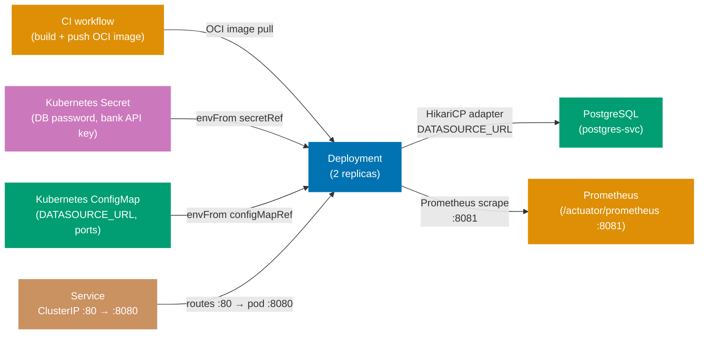
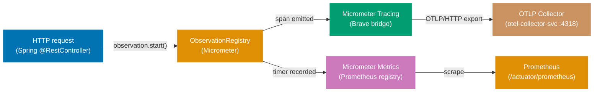

## Guide 23 — Kubernetes Deployment Topology for `procurement-platform-be`

### Why It Matters

A Kubernetes manifest is not a deployment detail you bolt on after the code works — it is the composition root for the entire hexagonal stack at runtime. The `Deployment` object determines how many adapter instances run concurrently; the `ConfigMap` holds the non-secret wiring that tells the Spring DataSource adapter which PostgreSQL host to connect to; the `Secret` holds the credentials that make the adapter authenticate. If these three resources are misaligned, the adapter throws at startup rather than at test time — you find out at 3 AM during a rolling restart rather than during the pre-merge integration test. Writing the manifest before the first production deploy makes the configuration contract explicit, reviewable, and portable across environments.

Spring Boot Actuator adds `/actuator/health`, `/actuator/liveness`, and `/actuator/readiness` without any manifest-level change. Kubernetes reads those endpoints through liveness and readiness probes. A misconfigured probe means Kubernetes either never routes traffic to a healthy pod or restarts a pod that is actually busy finishing a long-running database migration — both outcomes land the on-call engineer in a painful rollback.

### Standard Library First

`System.getenv` is the Java SE mechanism for reading runtime configuration. You can start `procurement-platform-be` on any machine by exporting environment variables manually before running the JAR:

```bash
# Standard library: running procurement-platform-be with environment variables only
# Demonstrates the manual environment variable approach that Kubernetes supersedes.

export SPRING_DATASOURCE_URL="jdbc:postgresql://localhost:5432/procurement_dev"
# => SPRING_DATASOURCE_URL: Spring Boot auto-configuration reads this key for the DataSource bean
# => Hardcoding the host/port/database in a script works locally but cannot be committed to version control

export SPRING_DATASOURCE_USERNAME="procurement"
# => SPRING_DATASOURCE_USERNAME: credential read by HikariCP at DataSource construction time
# => Each developer sets this individually — no central secret store, no rotation

export SPRING_DATASOURCE_PASSWORD="procurement"
# => SPRING_DATASOURCE_PASSWORD: plaintext in the shell environment — visible to every child process

java -jar apps/procurement-platform-be/target/procurement-platform-be.jar
# => Starts the Spring Boot application on the default port (8080)
# => No orchestration: one process, one database, no health checks, no pod restart on failure
```

**Limitation for production**: manual environment variables must be set on every machine, are not versioned with the application, and offer no secret rotation. A single missing variable causes the adapter to fail at connection time — `HikariPool-1 - Exception during pool initialization`. No liveness or readiness probe means Kubernetes cannot detect a crashed or overloaded JVM.

### Production Framework

A Kubernetes manifest for `procurement-platform-be` wires the Deployment, Service, ConfigMap, and Secret into a self-documenting topology:

```yaml
# apps/procurement-platform-be/deploy/k8s/configmap.yaml
apiVersion: v1
# => apiVersion: v1 is the stable core API group — ConfigMap is a v1 resource since Kubernetes 1.0
kind: ConfigMap
# => ConfigMap: holds non-secret key-value pairs injected into pods as environment variables
metadata:
  name: procurement-platform-be-config
  # => name: referenced by envFrom.configMapRef.name in the Deployment spec
  namespace: procurement-platform
  # => namespace: isolates procurement-platform-be resources from other services in the cluster
data:
  SPRING_DATASOURCE_URL: "jdbc:postgresql://postgres-svc.procurement-platform:5432/procurement"
  # => Spring Boot reads this key and wires it into the DataSource auto-configuration
  # => postgres-svc.procurement-platform: cluster-internal DNS — <service>.<namespace>.svc.cluster.local
  SERVER_PORT: "8080"
  # => SERVER_PORT: Spring Boot listens on this port inside the container
  MANAGEMENT_SERVER_PORT: "8081"
  # => Separate Actuator port: isolates health and metrics endpoints from application traffic
  # => Access policy: internal load balancer routes 8081 only within the cluster
  SPRING_APPLICATION_NAME: "procurement-platform-be"
  # => service.name: attached to every span in Micrometer Tracing — visible in Jaeger / Tempo
```

```yaml
# apps/procurement-platform-be/deploy/k8s/secret.yaml
# IMPORTANT: Never commit real secret values. Use Sealed Secrets or External Secrets Operator.
apiVersion: v1
# => apiVersion: v1 — Secret is a core resource; same API group as ConfigMap
kind: Secret
metadata:
  name: procurement-platform-be-secrets
  # => name: referenced by envFrom.secretRef.name in the Deployment — must match exactly
  namespace: procurement-platform
type: Opaque
# => Opaque: generic secret type — no schema validation; all values treated as arbitrary bytes
stringData:
  # => stringData: plain-text input; Kubernetes base64-encodes and stores under .data automatically
  SPRING_DATASOURCE_USERNAME: "REPLACE_ME"
  # => REPLACE_ME is a placeholder — a CI linter catches literal "REPLACE_ME" before deployment
  # => In production, populate via Sealed Secrets: kubeseal --raw --from-file=...
  SPRING_DATASOURCE_PASSWORD: "REPLACE_ME"
  # => DataSource password: HikariCP reads this at pool initialization time
  # => Rotate by updating the Secret and performing a rolling restart — no code change required
  BANKING_API_KEY: "REPLACE_ME"
  # => Bank API key: read by the RestClientBankingAdapter at construction time (Guide 18)
  # => Never hardcode API keys — always inject from a Secret at the deployment seam
```

```yaml
# apps/procurement-platform-be/deploy/k8s/deployment.yaml
apiVersion: apps/v1
# => apps/v1: the stable Deployment API group — required for Deployments since Kubernetes 1.9
kind: Deployment
metadata:
  name: procurement-platform-be
  namespace: procurement-platform
spec:
  replicas: 2
  # => 2 replicas: zero-downtime rolling update — one pod serves traffic while the other restarts
  selector:
    matchLabels:
      app: procurement-platform-be
  template:
    metadata:
      labels:
        app: procurement-platform-be
      annotations:
        prometheus.io/scrape: "true"
        # => Prometheus scrape annotation: the Prometheus operator discovers this pod for metric scraping
        prometheus.io/port: "8081"
        # => Actuator port: Prometheus scrapes /actuator/prometheus on the management port
        prometheus.io/path: "/actuator/prometheus"
    spec:
      containers:
        - name: procurement-platform-be
          image: ghcr.io/wahidyankf/procurement-platform-be:latest
          # => OCI image: built by the CI workflow and pushed to GitHub Container Registry
          # => In production, pin to an immutable SHA digest: image: ghcr.io/...@sha256:<digest>
          ports:
            - containerPort: 8080
              name: http
            - containerPort: 8081
              name: management
          envFrom:
            # => envFrom: injects all keys from a ConfigMap or Secret as environment variables
            - configMapRef:
                name: procurement-platform-be-config
            - secretRef:
                name: procurement-platform-be-secrets
          livenessProbe:
            # => livenessProbe: kubelet restarts the container if this probe fails
            httpGet:
              path: /actuator/liveness
              port: 8081
            initialDelaySeconds: 30
            # => 30 s delay: allows Flyway migrations (Guide 26) and Spring context to fully start
            periodSeconds: 15
            failureThreshold: 3
            # => 3 failures × 15 s = 45 s of grace before restart — prevents flapping during GC pauses
          readinessProbe:
            # => readinessProbe: kubelet removes the pod from Service endpoints if this probe fails
            httpGet:
              path: /actuator/readiness
              port: 8081
            initialDelaySeconds: 10
            periodSeconds: 10
          resources:
            requests:
              memory: "256Mi"
              # => 256Mi: conservative heap floor for a Spring Boot JVM at idle
              cpu: "250m"
            limits:
              memory: "512Mi"
              # => Kubernetes OOM-kills the pod if it exceeds 512Mi
              cpu: "1000m"
```

```yaml
# apps/procurement-platform-be/deploy/k8s/service.yaml
apiVersion: v1
# => apiVersion: v1 — Service is a core Kubernetes resource
kind: Service
# => Service: stable network endpoint for the pod replicas — DNS-resolvable cluster-internal address
metadata:
  name: procurement-platform-be-svc
  # => name: DNS name for in-cluster callers — procurement-platform-be-svc.procurement-platform.svc.cluster.local
  namespace: procurement-platform
  # => namespace: same as the Deployment — Service routes to pods in the same namespace
spec:
  selector:
    app: procurement-platform-be
    # => selector: matches pods with label app=procurement-platform-be from the Deployment template
  ports:
    - name: http
      port: 80
      # => port 80: the cluster-internal port — callers use port 80, pods receive on 8080
      targetPort: 8080
      # => targetPort 8080: routes cluster port 80 to container port 8080
    - name: management
      port: 8081
      targetPort: 8081
      # => management port exposed separately — Prometheus scrapes 8081, not 80
  type: ClusterIP
  # => ClusterIP: reachable within the cluster only — the Ingress resource handles external traffic
```



**Trade-offs**: `envFrom` with `secretRef` exposes all Secret keys as environment variables — any process inside the container can read them. For stricter isolation, mount the Secret as a volume and read files from `/run/secrets/`; Spring Boot supports file-based property sources via `spring.config.import=optional:file:/run/secrets/`. Kubernetes Secrets are base64-encoded, not encrypted at rest by default; enable etcd encryption at rest and use Sealed Secrets or External Secrets Operator before moving to production.

---

## Guide 24 — Observability Stack at the Deploy Seam: Micrometer Tracing + OTLP + Prometheus

### Why It Matters

Guide 20 showed how Micrometer Tracing decorates individual port calls with spans. At the deployment seam, the concern shifts: where does the collected telemetry go, and which sources does the SDK export? A misconfigured OTLP exporter means you pay the span creation overhead on every request but see nothing in Jaeger or Grafana Tempo. A missing Prometheus scrape configuration means P95 latency regressions on the PO issuance path are invisible until a procurement manager files a support ticket. Getting observability wired correctly before the first production deploy makes the difference between reacting to incidents in seconds and debugging in the dark.

The deployment seam also determines the resource attributes attached to every span — `service.name`, `service.version`, and `service.instance.id`. Without them, traces from two pod replicas collide in the trace UI, making it impossible to diagnose which replica produced a slow span.

### Standard Library First

`java.lang.management.ManagementFactory` provides JVM-level instrumentation that ships with the JDK. You can print heap usage and thread counts to stdout without any framework:

```java
// Standard library: JVM instrumentation via ManagementFactory
// Demonstrates the JDK management API that Micrometer supersedes for production observability.

import java.lang.management.ManagementFactory;
// => ManagementFactory: JDK entry point for platform MXBeans — no Maven dependency required
import java.lang.management.MemoryMXBean;
// => MemoryMXBean: heap and non-heap usage in bytes — useful but not a trace
import java.lang.management.ThreadMXBean;
// => ThreadMXBean: thread count, peak thread count, daemon threads

public class JvmMetricsDump {
    public static void printMetrics() {
        MemoryMXBean memory = ManagementFactory.getMemoryMXBean();
        long heapUsedMb = memory.getHeapMemoryUsage().getUsed() / (1024 * 1024);
        // => getUsed(): bytes of heap currently used — divided by 1M for readability

        ThreadMXBean threads = ManagementFactory.getThreadMXBean();
        int threadCount = threads.getThreadCount();

        System.out.printf("heap=%dMB threads=%d%n", heapUsedMb, threadCount);
        // => stdout: visible in kubectl logs — no aggregation, no trace correlation
    }
}
```

**Limitation for production**: `ManagementFactory` metrics are snapshots, not time-series — you cannot compute rate, P95, or trend. No spans means you cannot correlate a slow database query with the HTTP request that triggered it.

### Production Framework

`procurement-platform-be` wires Micrometer Tracing with the OTLP exporter and the Prometheus Micrometer registry via Spring Boot auto-configuration:

```java
// TracingConfig.java — enables Micrometer Tracing sources for procurement-platform-be contexts
package com.procurement.platform.shared.observability;
// => shared/observability/ package: cross-cutting tracing configuration lives here
// => One @Configuration for all bounded contexts — tracing is a shared infrastructure concern

import io.micrometer.tracing.Tracer;
// => Tracer: Micrometer abstraction over the underlying tracing backend (Brave or OTel)
// => Application code imports Tracer — never imports Brave or OpenTelemetry directly
import org.springframework.context.annotation.Bean;
// => @Bean: Spring calls this method and registers the returned object as a singleton bean
import org.springframework.context.annotation.Configuration;
// => @Configuration: Spring registers this class as a bean factory — all @Bean methods are called at startup
import io.micrometer.observation.ObservationRegistry;
// => ObservationRegistry: Micrometer 1.11+ unified observation API — spans and metrics share one entry point

@Configuration
// => @Configuration: Spring discovers this class during the root package component scan
public class TracingConfig {

    @Bean
    public io.micrometer.tracing.brave.bridge.BraveBaggageManager braveBaggageManager() {
        // => BraveBaggageManager: bridges Micrometer baggage API to Brave — required for W3C baggage propagation
        // => W3C baggage: carries trace context across HTTP calls to downstream adapters (bank API)
        // => Without this bean, baggage headers are not propagated through RestClient calls
        return new io.micrometer.tracing.brave.bridge.BraveBaggageManager();
        // => Returns a singleton: Spring Boot injects this into Micrometer's baggage propagator
    }
}
```

```yaml
# apps/procurement-platform-be/src/main/resources/application.yml (observability section)
management:
  # => management: Spring Boot Actuator configuration section
  endpoints:
    web:
      exposure:
        include: "health,info,prometheus,liveness,readiness"
        # => include: restricts which Actuator endpoints are exposed — principle of least privilege
        # => prometheus: exposes /actuator/prometheus in Prometheus text format
        # => liveness,readiness: the named probe groups consumed by the Kubernetes probes in Guide 23
  metrics:
    export:
      prometheus:
        enabled: true
        # => enabled: activates the Prometheus registry — metrics available at /actuator/prometheus
  tracing:
    sampling:
      probability: 1.0
      # => 1.0 in development: all traces recorded — reduce to 0.1 in production for high-traffic services
      # => Override via MANAGEMENT_TRACING_SAMPLING_PROBABILITY environment variable in ConfigMap

spring:
  application:
    name: "procurement-platform-be"
    # => name: the resource attribute attached to every span — visible in Jaeger and Grafana Tempo

management:
  otlp:
    tracing:
      endpoint: "http://localhost:4318/v1/traces"
      # => localhost fallback: overridden by MANAGEMENT_OTLP_TRACING_ENDPOINT in the Kubernetes ConfigMap
      # => Port 4318: OTLP/HTTP — use 4317 for OTLP/gRPC; HTTP is preferred when TLS is not configured
```

```yaml
# Extend apps/procurement-platform-be/deploy/k8s/configmap.yaml with observability keys
data:
  MANAGEMENT_OTLP_TRACING_ENDPOINT: "http://otel-collector-svc.observability:4318/v1/traces"
  # => otel-collector-svc.observability: service in the "observability" namespace
  MANAGEMENT_TRACING_SAMPLING_PROBABILITY: "0.1"
  # => 0.1: sample 10% of traces in production — reduces storage and CPU overhead under load
  OTEL_RESOURCE_ATTRIBUTES: "deployment.environment=production"
  # => Additional resource attribute: filter production vs staging traces in the trace UI
```



**Trade-offs**: `management.tracing.sampling.probability: 1.0` captures every span during development but adds measurable overhead above 1000 req/s in production. Reduce to 0.1 and use tail-based sampling in the collector for high-traffic services.

---

## Guide 25 — Failure-Mode Wiring: Degraded Adapters and `HealthIndicator`

### Why It Matters

When the PostgreSQL pod is unhealthy during a rolling restart, you have two choices: fail every request immediately with a 500, or serve degraded responses from a fallback adapter. The hexagonal architecture makes the second choice tractable — because the application service depends on a port interface, not a concrete adapter, you can swap in a degraded adapter at the composition root without touching the domain or application layers. The cached read-model adapter returns the last known state; the null event publisher silently drops events when the broker is unavailable. A Spring `HealthIndicator` drives the liveness and readiness probes from Guide 23, so Kubernetes removes a degraded pod from rotation rather than routing live traffic to it.

### Standard Library First

A plain `try-catch` at the controller layer is the minimal fallback Java SE provides without a framework:

```java
// Standard library: try-catch fallback at the @RestController level
// Demonstrates the handler-level catch approach that HealthIndicator and degraded adapters supersede.

import org.springframework.http.ResponseEntity;
// => ResponseEntity: wraps HTTP status code + body — used here to return 503 on DB failure
import org.springframework.web.bind.annotation.GetMapping;
// => @GetMapping: maps HTTP GET to listPurchaseOrders()
import org.springframework.web.bind.annotation.RestController;
// => @RestController: Spring bean that serialises return values to JSON

@RestController
// => @RestController: Spring discovers this bean and maps @GetMapping to the URL
public class PurchaseOrderControllerFallback {

    private final com.procurement.platform.purchasing.application.IssuePurchaseOrderService service;
    // => Application service interface — the controller never sees the @Service implementation

    public PurchaseOrderControllerFallback(com.procurement.platform.purchasing.application.IssuePurchaseOrderService service) {
        this.service = service;
        // => Constructor injection: Spring wires the service bean at context startup
    }

    @GetMapping("/api/v1/purchase-orders")
    // => @GetMapping: maps HTTP GET /api/v1/purchase-orders to this method
    public ResponseEntity<?> listPurchaseOrders() {
        try {
            var po = service.findById(null);
            // => findById(null): illustrative only — null ID causes a NullPointerException in production
            return ResponseEntity.ok(po);
        } catch (org.springframework.dao.DataAccessException ex) {
            // => DataAccessException: Spring's DB exception hierarchy — catches all SQL/JDBC failures
            // => Problem: every @RestController method must duplicate this catch block
            return ResponseEntity.status(503).body("Service temporarily unavailable");
            // => No health signal: Kubernetes keeps routing traffic to this pod even when every request fails
            // => No cached response: the caller receives an error, not stale data
        }
    }
}
```

**Limitation for production**: the fallback logic lives in the controller — every controller method must duplicate the catch block. No caching: the fallback returns an error, not stale data. No health signal: Kubernetes keeps routing traffic to the pod even when all requests fail.

### Production Framework

The degraded-mode pattern introduces a `CachedPurchaseOrderReadAdapter` that returns the last-known PO list when the real repository port fails, and a `NullEventPublisher` that silently drops events when the broker is unavailable. A `PurchasingHealthIndicator` bean exposes the degraded flag to the Spring Actuator readiness probe:

```java
// CachedPurchaseOrderReadAdapter.java — returns cached PO list when the DB port fails
package com.procurement.platform.purchasing.infrastructure;
// => infrastructure/ package: adapters with framework dependencies live here

import com.procurement.platform.purchasing.application.PurchaseOrderRepository;
// => PurchaseOrderRepository: output port interface — CachedPurchaseOrderReadAdapter satisfies the same interface
import com.procurement.platform.purchasing.domain.PurchaseOrder;
// => PurchaseOrder domain aggregate: stored in the cache snapshot, returned on degraded reads
import com.procurement.platform.purchasing.domain.PurchaseOrderId;
// => PurchaseOrderId: used to filter the cache on findById and existsById calls
import org.springframework.stereotype.Component;
// => @Component: Spring registers this bean — wired at the composition root only in degraded mode
import java.util.List;
// => List<PurchaseOrder>: the full snapshot passed to populateCache by the health-check thread
import java.util.Optional;
// => Optional: return type for findById — absence communicated without null
import java.util.concurrent.CopyOnWriteArrayList;
// => CopyOnWriteArrayList: thread-safe list — cache written by health-check thread, read by request threads
import java.util.concurrent.atomic.AtomicBoolean;
// => AtomicBoolean: lock-free degraded flag — updated by the circuit-breaker callback, read per request

@Component
// => @Component: Spring discovers this bean; the composition root wires it behind the port in degraded mode
public class CachedPurchaseOrderReadAdapter implements PurchaseOrderRepository {
    // => implements PurchaseOrderRepository: satisfies the output port contract

    private final List<PurchaseOrder> cache = new CopyOnWriteArrayList<>();
    // => CopyOnWriteArrayList: snapshot semantics — reads never block writes from the health-check thread

    private final AtomicBoolean degraded = new AtomicBoolean(false);
    // => AtomicBoolean: lock-free — the circuit-breaker callback sets this to true

    public void populateCache(List<PurchaseOrder> snapshot) {
        cache.clear();
        // => clear() first: replaces stale entries atomically before addAll
        cache.addAll(snapshot);
        // => Replaces all entries with the latest snapshot from PostgreSQL
        // => CopyOnWriteArrayList: concurrent readers see the new snapshot after addAll completes
    }

    public void setDegraded(boolean value) {
        degraded.set(value);
        // => AtomicBoolean.set: visible to all threads immediately — no synchronisation block needed
    }

    public boolean isDegraded() {
        return degraded.get();
        // => isDegraded(): read by PurchasingHealthIndicator to determine the Actuator readiness state
    }

    @Override
    public PurchaseOrder save(PurchaseOrder po) {
        if (degraded.get()) {
            throw new com.procurement.platform.purchasing.application.RepositoryException(
                "Writes unavailable in degraded mode", null);
            // => Write operations are not supported in degraded mode — callers receive RepositoryException
            // => The application service propagates this exception to the controller → HTTP 503
        }
        throw new UnsupportedOperationException("CachedPurchaseOrderReadAdapter is not the active write path");
        // => Normal operation: the JDBC adapter handles writes; this adapter is only active in degraded mode
    }

    @Override
    public Optional<PurchaseOrder> findById(PurchaseOrderId id) {
        if (degraded.get()) {
            return cache.stream().filter(p -> p.id().equals(id)).findFirst();
            // => Degraded mode: return from the cached snapshot without touching the database
            // => findFirst(): returns Optional.empty() when no match — port contract preserved
        }
        throw new UnsupportedOperationException("CachedPurchaseOrderReadAdapter is not the active read path");
        // => Normal operation: the JDBC adapter handles reads; this adapter is only active in degraded mode
    }

    @Override
    public boolean existsById(PurchaseOrderId id) {
        if (degraded.get()) {
            return cache.stream().anyMatch(p -> p.id().equals(id));
            // => anyMatch: returns false for unknown IDs — callers can still perform existence checks
        }
        throw new UnsupportedOperationException("CachedPurchaseOrderReadAdapter is not the active read path");
    }
}
```

```java
// NullEventPublisher.java — silently drops events when the broker port is unavailable
package com.procurement.platform.purchasing.infrastructure;
// => infrastructure/ package: the null adapter lives here — same package as OutboxEventPublisher

import com.procurement.platform.purchasing.application.EventPublisher;
// => EventPublisher: the output port interface — NullEventPublisher satisfies it with a no-op body
import com.procurement.platform.purchasing.application.PurchaseOrderIssued;
// => Domain event record: the publisher receives it but does not relay it to the broker
import com.procurement.platform.purchasing.application.PurchaseOrderCancelled;
// => Second event type: also dropped silently — the null adapter handles all EventPublisher overloads
import org.slf4j.Logger;
// => SLF4J Logger API — decoupled from the logging backend (Logback, Log4j2)
import org.slf4j.LoggerFactory;
// => LoggerFactory.getLogger: creates a logger bound to this class name
import org.springframework.stereotype.Component;
// => @Component: Spring registers this bean — wired at the composition root only in degraded mode

@Component
// => @Component: Spring discovers this bean; the composition root wires it instead of OutboxEventPublisher
public class NullEventPublisher implements EventPublisher {
    // => Null object pattern: replaces the real adapter without changing the application service

    private static final Logger log = LoggerFactory.getLogger(NullEventPublisher.class);
    // => static final: one logger per class — not one per method invocation

    @Override
    public void publish(PurchaseOrderIssued event) {
        log.warn("Null event publisher: dropping PurchaseOrderIssued {} — outbox unavailable",
            event.purchaseOrderId().value());
        // => WARN level: not an error (the system degrades gracefully), but not silent — visible in the trace
        // => Silent drop: the application service proceeds as if the event was published
        // => At-least-once guarantee is lost — switch to an outbox adapter to preserve delivery
        // => Downstream contexts (receiving) will not receive the PurchaseOrderIssued signal during outage
    }

    @Override
    public void publish(PurchaseOrderCancelled event) {
        log.warn("Null event publisher: dropping PurchaseOrderCancelled {} — outbox unavailable",
            event.purchaseOrderId().value());
        // => Same null-object behaviour for the cancellation event — both overloads must be implemented
        // => WARN logged for observability: log aggregation shows the volume of dropped events during outage
    }
}
```

```java
// PurchasingHealthIndicator.java — drives liveness/readiness probes via the degraded flag
package com.procurement.platform.purchasing.infrastructure;

import org.springframework.boot.actuate.health.Health;
// => Health: Spring Actuator result object — UP/DOWN with optional detail map
import org.springframework.boot.actuate.health.HealthIndicator;
// => HealthIndicator: Spring Actuator interface — implementations appear in /actuator/health response
import org.springframework.stereotype.Component;

@Component("purchasingHealth")
// => "purchasingHealth": the bean name determines the key under "components" in /actuator/health JSON
public class PurchasingHealthIndicator implements HealthIndicator {

    private final CachedPurchaseOrderReadAdapter cachedAdapter;
    // => CachedPurchaseOrderReadAdapter: the degraded flag lives here — the indicator reads it

    public PurchasingHealthIndicator(CachedPurchaseOrderReadAdapter cachedAdapter) {
        this.cachedAdapter = cachedAdapter;
        // => Same bean: both PurchasingHealthIndicator and the composition root share the AtomicBoolean state
    }

    @Override
    public Health health() {
        // => Called by Actuator for /actuator/health, /actuator/readiness, and /actuator/liveness
        if (cachedAdapter.isDegraded()) {
            return Health.down()
                // => Health.down(): Actuator returns HTTP 503 for the readiness group — Kubernetes removes pod
                .withDetail("reason", "DataSource health check failed — serving from cache")
                .build();
        }
        return Health.up().build();
        // => Health.up(): Actuator returns HTTP 200 — Kubernetes routes traffic to pod
    }
}
```

**Trade-offs**: the cached read adapter serves stale data — clients receive a response that may be minutes old during a PostgreSQL outage. For a PO listing, staleness is acceptable; for a financial payment ledger it is not. The null event publisher silently drops domain events — if at-least-once delivery is a hard requirement, replace it with an in-memory buffer that replays to the outbox when the broker recovers.

---

## Guide 26 — Flyway Migration at Deploy Time: Kubernetes Job vs `ApplicationRunner`

### Why It Matters

Guide 17 introduced Flyway as the schema-migration adapter. At the deployment seam, the wiring question is: when does the migration run relative to pod startup, and which mechanism owns the migration lifecycle? Running Flyway inside `SpringApplication.run` means every replica races to apply migrations during a rolling restart — a potential for migration conflicts on `ALTER TABLE` statements. Running Flyway as a Kubernetes `Job` before the `Deployment` rolls means the schema is stable before any pod starts, but a failed job blocks the entire rollout. Choosing the wrong strategy causes a database-level lock that holds the deployment in progress for ten minutes while the on-call engineer investigates.

### Standard Library First

`java.sql.Connection` can execute DDL directly without a migration framework — the raw JDBC approach:

```java
// Standard library: DDL execution via JDBC Connection
// Demonstrates the manual DDL approach that Flyway supersedes.

import java.sql.Connection;
// => Connection: JDBC connection to the database — must be closed after use or the pool leaks
import java.sql.DriverManager;
// => DriverManager: JDBC entry point — finds a registered driver matching the URL scheme
import java.sql.SQLException;
// => SQLException: checked exception on every JDBC operation — callers must handle or declare throws

public class ManualSchemaMigration {
    public static void main(String[] args) throws SQLException {
        String url = System.getenv("SPRING_DATASOURCE_URL");
        // => Reads the JDBC URL from an environment variable — must be set before this runs
        // => Returns null if the variable is absent — DriverManager.getConnection throws NullPointerException
        try (Connection conn = DriverManager.getConnection(url, "procurement", "procurement")) {
            // => try-with-resources: Connection implements AutoCloseable — conn.close() is guaranteed
            conn.createStatement().execute(
                // => createStatement: plain statement, no parameters — suitable for DDL only
                "CREATE SCHEMA IF NOT EXISTS purchasing;" +
                "CREATE TABLE IF NOT EXISTS purchasing.purchase_orders (" +
                "  id UUID PRIMARY KEY," +
                "  supplier_id UUID NOT NULL," +
                "  total_amount NUMERIC(19,4) NOT NULL," +
                "  currency CHAR(3) NOT NULL," +
                "  status TEXT NOT NULL DEFAULT 'Draft'" +
                ")"
                // => No version number: impossible to determine which state the schema is in
                // => No rollback: if a second migration fails after the first succeeds, schema is partially upgraded
                // => Running this twice: CREATE TABLE IF NOT EXISTS is idempotent, but ALTER TABLE is not
            );
        }
    }
}
```

**Limitation for production**: no version tracking means running the migration twice executes the DDL twice — dangerous for `ALTER TABLE` or `DROP COLUMN` statements that are not idempotent. No rollback mechanism.

### Production Framework

`procurement-platform-be` includes Flyway via `spring-boot-starter-flyway` (Guide 17). This guide makes the deploy-time migration strategy explicit: a dedicated `Job` runs `flyway migrate` before the application containers start. Spring Boot's `spring.flyway.enabled=false` disables the in-process Flyway so only one path owns the migration:

```yaml
# apps/procurement-platform-be/deploy/k8s/migration-job.yaml
apiVersion: batch/v1
# => batch/v1: the stable Jobs API group — Kubernetes guarantees at-least-once execution semantics
kind: Job
metadata:
  name: procurement-platform-be-migrate
  namespace: procurement-platform
  annotations:
    helm.sh/hook: pre-upgrade,pre-install
    # => Helm hook: runs this Job before the Deployment rolls — schema is ready before pods start
    helm.sh/hook-delete-policy: hook-succeeded
    # => Deletes the Job after it succeeds — prevents accumulation of completed migration Jobs
spec:
  backoffLimit: 3
  # => backoffLimit: Kubernetes retries the pod up to 3 times on failure before marking the Job failed
  template:
    spec:
      restartPolicy: OnFailure
      containers:
        - name: flyway-migrate
          image: flyway/flyway:10-alpine
          # => Official Flyway CLI image: applies migrations without starting the Spring Boot application
          args: ["migrate"]
          # => migrate: the Flyway command — scans /flyway/sql and applies pending versioned scripts
          env:
            - name: FLYWAY_URL
              valueFrom:
                configMapKeyRef:
                  name: procurement-platform-be-config
                  key: SPRING_DATASOURCE_URL
            - name: FLYWAY_USER
              valueFrom:
                secretKeyRef:
                  name: procurement-platform-be-secrets
                  key: SPRING_DATASOURCE_USERNAME
            - name: FLYWAY_PASSWORD
              valueFrom:
                secretKeyRef:
                  name: procurement-platform-be-secrets
                  key: SPRING_DATASOURCE_PASSWORD
          volumeMounts:
            - name: migrations
              mountPath: /flyway/sql
      volumes:
        - name: migrations
          configMap:
            name: procurement-platform-be-migrations
            # => ConfigMap holding SQL migration files (V1__create_purchasing_schema.sql, etc.)
```

```yaml
# Disable in-process Flyway so the Kubernetes Job is the only migration path
spring:
  flyway:
    enabled: false
    # => disabled: prevents Spring Boot from running Flyway at ApplicationContext startup
    # => The Kubernetes Job above owns the migration lifecycle — two migration paths would race
```

The `ApplicationRunner` strategy — running Flyway inside `SpringApplication.run` — is the simpler alternative for teams not using Helm or Kubernetes Jobs:

```java
// FlywayMigrationRunner.java — ApplicationRunner strategy (alternative to Kubernetes Job)
package com.procurement.platform.shared.config;
// => shared/config/: cross-cutting configuration lives here — not in a single context package

import org.flywaydb.core.Flyway;
// => Flyway: the migration engine — scans classpath:db/migration for versioned SQL scripts
import org.springframework.boot.ApplicationArguments;
// => ApplicationArguments: command-line arguments passed to run() — unused here but required by the interface
import org.springframework.boot.ApplicationRunner;
// => ApplicationRunner: Spring lifecycle hook — run() is called after the ApplicationContext starts
import org.springframework.context.annotation.Profile;
// => @Profile: activates this runner only in specified profiles — suppressed in the k8s profile
import org.springframework.stereotype.Component;
// => @Component: Spring discovers this bean during component scan — active only in non-k8s profiles

import javax.sql.DataSource;
// => DataSource: the HikariCP connection pool — Flyway uses it to acquire a migration-lock connection

@Component
// => @Component: Spring registers this bean — run() is called once at startup
@Profile("!k8s")
// => @Profile("!k8s"): disabled in the k8s Spring profile — the Kubernetes Job owns migration in that profile
// => Activate the k8s profile in application.yml: spring.profiles.active: k8s
public class FlywayMigrationRunner implements ApplicationRunner {

    private final DataSource dataSource;
    // => DataSource: HikariCP pool configured from SPRING_DATASOURCE_* environment variables

    public FlywayMigrationRunner(DataSource dataSource) {
        this.dataSource = dataSource;
        // => Constructor injection: Spring wires the DataSource bean — no @Autowired annotation needed
    }

    @Override
    public void run(ApplicationArguments args) {
        // => run(): called by Spring Boot once the ApplicationContext is fully started
        // => Runs synchronously before HTTP server accepts traffic — no race with request handlers
        Flyway flyway = Flyway.configure()
            .dataSource(dataSource)
            // => dataSource: the same HikariCP pool — Flyway acquires a connection for the migration lock
            // => One migration runs at a time: Flyway uses a database-level advisory lock
            .locations("classpath:db/migration")
            // => classpath:db/migration: directory of versioned SQL files — V1__create_schema.sql, V2__...
            .validateOnMigrate(true)
            // => validateOnMigrate: Flyway checksums applied migrations — detects edits to already-run scripts
            // => Fails fast if a past migration file is modified — prevents silent schema drift
            .load();
        flyway.migrate();
        // => migrate(): applies all pending versioned migrations in order
        // => Acquires a database-level advisory lock — only one JVM migrates at a time
        // => Returns MigrateResult with counts of applied, pending, and failed migrations
    }
}
```

**Trade-offs**: the Kubernetes Job strategy decouples migration from pod startup — a failed migration blocks the rollout before any pod is replaced, which is the correct failure mode. The ApplicationRunner strategy is simpler but requires tuning `initialDelaySeconds` to cover the migration time. For small schemas (< 50 migrations, < 5 s total), the ApplicationRunner is acceptable; for large schemas or additive migrations running concurrently across 10+ replicas, the Kubernetes Job is required.

---

## Guide 27 — Configuration Adapter at the Deploy Seam: Secret to Typed `@ConfigurationProperties` Record

### Why It Matters

`procurement-platform-be` reads database credentials and the banking API key from environment variables that Kubernetes injects from a `Secret`. The journey of a credential from a Kubernetes Secret object to a strongly-typed Java record crosses four boundaries: Kubernetes decodes the base64-encoded Secret value and injects it as an environment variable; the Spring Environment property source reads the environment variable; the `@ConfigurationProperties` binding maps it to a typed record; the composition root reads the record and passes it to the adapter constructor. A break at any boundary — a renamed key, a missing prefix, a wrong casing — silently produces a `null` or empty string. Spring Boot `@ConfigurationProperties` with `@Validated` detects the break at startup rather than at the first database call, which turns a `3 AM NullPointerException in HikariPool` into a `ContextLoad failure: datasource.username must not be blank` during the Kubernetes pod `Init:0/1` phase — a much easier debugging session.

### Standard Library First

`System.getenv` reads a single key directly — the manual approach before `@ConfigurationProperties`:

```java
// Standard library: reading DataSource credentials manually from environment variables
// Demonstrates the manual approach that @ConfigurationProperties supersedes.

import org.springframework.jdbc.datasource.DriverManagerDataSource;

public class ManualDataSourceFactory {

    public static DriverManagerDataSource create() {
        String url = System.getenv("SPRING_DATASOURCE_URL");
        // => Reads the JDBC URL from the environment — returns null if the variable is not set
        // => getenv returns null, not empty string: callers must null-check every variable individually
        String username = System.getenv("SPRING_DATASOURCE_USERNAME");
        // => Reads the username — may be null if the Secret key name has a typo
        String password = System.getenv("SPRING_DATASOURCE_PASSWORD");

        if (url == null || username == null || password == null) {
            throw new IllegalStateException("DataSource environment variables not fully set");
            // => Fail-fast: better than NullPointerException deep in HikariCP initialization
            // => But: the error fires at the point of first use, not at startup — after health probes pass
        }
        // => No validation: an empty string passes the null check — "username=" is not caught here
        var ds = new DriverManagerDataSource();
        ds.setUrl(url);
        ds.setUsername(username);
        // => empty string is silently accepted — causes auth failure at connect time
        ds.setPassword(password);
        return ds;
    }
}
```

**Limitation for production**: `getenv` returns `null` for a missing variable and an empty string for an env var set to `""` — both cases pass a naive null-check but cause HikariCP to fail at connection time. Changes to the key names in the Kubernetes Secret must be manually mirrored in every `getenv` call.

### Production Framework

Spring Boot `@ConfigurationProperties` with `@Validated` maps the environment variables to a typed record and runs Jakarta Bean Validation at startup — before any request is handled and before the liveness probe first fires:

```java
// DataSourceProperties.java — typed record bound to SPRING_DATASOURCE_* environment variables
package com.procurement.platform.shared.config;
// => shared/config/ package: @ConfigurationProperties records live here — bound at startup

import jakarta.validation.constraints.NotBlank;
// => @NotBlank: fails validation if the bound value is null, empty, or whitespace-only
// => Catches env vars set to "" — the silent failure mode that @NotNull misses
import jakarta.validation.constraints.Pattern;
// => @Pattern: validates the format of the JDBC URL at startup — detects transposed host names
import org.springframework.boot.context.properties.ConfigurationProperties;
// => @ConfigurationProperties: Spring Boot binds properties with the given prefix to this record's fields
import org.springframework.validation.annotation.Validated;

@ConfigurationProperties(prefix = "spring.datasource")
// => prefix = "spring.datasource": binds SPRING_DATASOURCE_URL, SPRING_DATASOURCE_USERNAME,
//    SPRING_DATASOURCE_PASSWORD — Spring converts underscore-separated env vars to dotted property names
@Validated
// => @Validated: activates constraint checking at ApplicationContext startup — before pods report ready
public record DataSourceProperties(

    @NotBlank(message = "spring.datasource.url must not be blank")
    // => @NotBlank: catches null and empty-string SPRING_DATASOURCE_URL from the Kubernetes ConfigMap
    @Pattern(regexp = "^jdbc:postgresql://.*",
             message = "spring.datasource.url must be a PostgreSQL JDBC URL")
    // => @Pattern: ensures the URL starts with jdbc:postgresql:// — catches MySQL URL typos in the ConfigMap
    String url,

    @NotBlank(message = "spring.datasource.username must not be blank")
    // => @NotBlank: catches a Secret key named SPRING_DATASOURCE_USER instead of SPRING_DATASOURCE_USERNAME
    String username,

    @NotBlank(message = "spring.datasource.password must not be blank")
    // => @NotBlank: catches an empty Sealed Secret placeholder that was not replaced before deployment
    String password

) {}
// => record: immutable — values are set once by Spring Boot binding; no mutability risk after startup
```

```java
// AppConfig.java — registers @ConfigurationProperties beans and wires them to the DataSource
package com.procurement.platform.shared.config;

import com.zaxxer.hikari.HikariDataSource;
// => HikariCP: the production-grade JDBC connection pool — auto-configured by Spring Boot
import org.springframework.boot.context.properties.EnableConfigurationProperties;
// => @EnableConfigurationProperties: registers the DataSourceProperties bean and triggers binding + validation
import org.springframework.context.annotation.Bean;
import org.springframework.context.annotation.Configuration;

import javax.sql.DataSource;

@Configuration
@EnableConfigurationProperties(DataSourceProperties.class)
// => @EnableConfigurationProperties: triggers binding and @Validated constraint checking at startup
// => If SPRING_DATASOURCE_URL is blank, Spring throws BindValidationException before any @Bean runs
public class AppConfig {

    @Bean
    public DataSource dataSource(DataSourceProperties props) {
        // => DataSourceProperties: bound and validated before this method is called — url is guaranteed non-blank
        var config = new com.zaxxer.hikari.HikariConfig();
        config.setJdbcUrl(props.url());
        // => url(): non-blank JDBC URL from the ConfigMap — validated by @Pattern at startup
        config.setUsername(props.username());
        // => username(): non-blank username from the Secret — validated by @NotBlank at startup
        config.setPassword(props.password());
        // => password(): non-blank password from the Secret — validated by @NotBlank at startup
        config.setMaximumPoolSize(10);
        // => Maximum pool size: 10 connections — sized for 2 replicas × 5 connections each
        config.setConnectionTimeout(3000);
        // => 3000 ms: connection acquisition timeout — bounded wait avoids thread starvation
        return new HikariDataSource(config);
        // => HikariDataSource: starts the connection pool and validates connectivity at construction time
        // => If the PostgreSQL pod is not reachable, HikariDataSource throws here — the Actuator readiness
        //    probe from Guide 25 returns DOWN and Kubernetes does not route traffic until the pool is healthy
    }
}
```



```mermaid
flowchart LR
    k8s["Kubernetes Secret\n(base64-encoded)"]:::purple
    env["JVM environment\n(SPRING_DATASOURCE_*)"]:::orange
    props["DataSourceProperties\n(@ConfigurationProperties)"]:::teal
    valid["@Validated\n(Jakarta Bean Validation)"]:::brown
    ds["HikariDataSource\n(AppConfig @Bean)"]:::blue
    port["JdbcPurchaseOrderRepository\n(repository port)"]:::teal

    k8s -->|"envFrom secretRef\n(Kubernetes decodes base64)"| env
    env -->|"Spring Environment\nbinds prefix"| props
    props -->|"@NotBlank + @Pattern\nchecked at startup"| valid
    valid -->|"passes at startup"| ds
    ds -->|"DataSource injected"| port

    classDef purple fill:#CC78BC,color:#fff,stroke:#CC78BC
    classDef orange fill:#DE8F05,color:#fff,stroke:#DE8F05
    classDef teal fill:#029E73,color:#fff,stroke:#029E73
    classDef brown fill:#CA9161,color:#fff,stroke:#CA9161
    classDef blue fill:#0173B2,color:#fff,stroke:#0173B2
```

**Trade-offs**: `@ConfigurationProperties` with `@Validated` adds one extra class per configuration group. The startup validation overhead is measured in milliseconds — negligible compared to HikariCP pool initialization. The `@Pattern` constraint on the JDBC URL is a double-edged sword: it catches URL typos early, but it also rejects valid non-PostgreSQL JDBC URLs if `procurement-platform-be` ever migrates to a different database — update the pattern when changing the database vendor. For `spring.config.import` with SSM or Vault, add the dependency and set `spring.config.import=optional:aws-ssm:/procurement/` in `application.yml`; the `@ConfigurationProperties` binding is identical — no code change, only a new property source.
