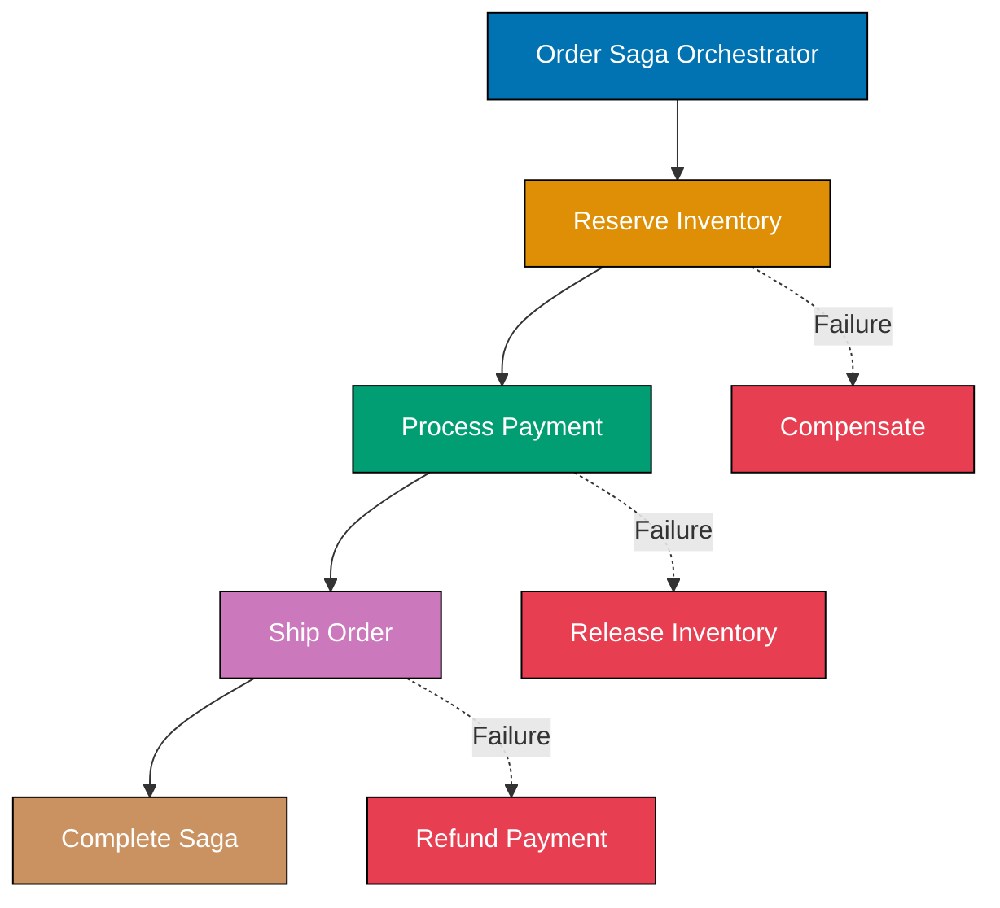

This advanced-level tutorial completes Domain-Driven Design mastery through 25 annotated code examples, covering expert strategic patterns including Event Sourcing, CQRS, Saga orchestration, Process Managers, large-scale strategic design, and DDD implementation in distributed microservices architectures.

## Event Sourcing Advanced (Examples 61-65)

### Example 61: Event Store Implementation

Event Sourcing stores all state changes as a sequence of events rather than storing current state. The event store is the single source of truth.


```typescript
// Event Store - persistence for event streams
interface StoredEvent {
  // => Ensures transactional consistency
  eventId: string; // => Unique event identifier
  // => Manages entity lifecycle
  aggregateId: string; // => Which aggregate this event belongs to
  // => Preserves domain model
  eventType: string; // => Event class name
  // => Communicates domain intent
  eventData: string; // => Serialized event payload (JSON)
  // => Executes domain logic
  version: number; // => Event version in stream (ordering)
  // => Updates aggregate state
  timestamp: Date; // => When event occurred
  // => Validates business rule
}
// => Executes domain logic

class EventStore {
  // => EventStore: domain model element
  private events: Map<string, StoredEvent[]> = new Map();
  // => Encapsulated field (not publicly accessible)
  // => In-memory store: aggregateId -> event array
  // => Production: use EventStoreDB, PostgreSQL, DynamoDB

  async append(aggregateId: string, events: DomainEvent[], expectedVersion: number): Promise<void> {
    // => Append new events to aggregate's stream
    const stream = this.events.get(aggregateId) || [];
    // => Get existing event stream or create empty array

    if (stream.length !== expectedVersion) {
      // => Optimistic concurrency check
      throw new Error(`Concurrency conflict: expected version ${expectedVersion}, got ${stream.length}`);
      // => Prevents lost updates when multiple processes modify same aggregate
    }
    // => Updates aggregate state

    const storedEvents = events.map((event, index) => ({
      // => Convert domain events to stored events
      eventId: crypto.randomUUID(),
      // => Generate unique ID for each event
      aggregateId,
      // => Validates business rule
      eventType: event.constructor.name,
      // => Store event class name for deserialization
      eventData: JSON.stringify(event),
      // => Serialize event payload to JSON
      version: expectedVersion + index + 1,
      // => Increment version for each new event
      timestamp: new Date(),
      // => Record when event was stored
    }));
    // => Enforces invariant

    this.events.set(aggregateId, [...stream, ...storedEvents]);
    // => Delegates to internal method
    // => Append new events to stream (immutable pattern)
    // => Stream now contains all historical events
  }
  // => Encapsulates domain knowledge

  async getEvents(aggregateId: string): Promise<DomainEvent[]> {
    // => Retrieve all events for aggregate
    const stream = this.events.get(aggregateId) || [];
    // => Get event stream or empty array if aggregate doesn't exist

    return stream.map((stored) => this.deserialize(stored));
    // => Returns stream.map((stored) => this.deserialize(stored))
    // => Convert stored events back to domain event objects
    // => Maintains event ordering via version numbers
  }
  // => Delegates to domain service

  private deserialize(stored: StoredEvent): DomainEvent {
    // => Internal logic (not part of public API)
    // => Reconstruct domain event from stored format
    const data = JSON.parse(stored.eventData);
    // => Parse JSON payload back to object

    switch (stored.eventType) {
      // => Route to correct event class constructor
      case "AccountOpened":
        // => Maintains consistency boundary
        return new AccountOpened(data.accountId, data.ownerId, data.initialBalance);
      // => Return result to caller
      case "MoneyDeposited":
        // => Applies domain event
        return new MoneyDeposited(data.accountId, data.amount);
      // => Return result to caller
      case "MoneyWithdrawn":
        // => Coordinates with bounded context
        return new MoneyWithdrawn(data.accountId, data.amount);
      // => Return result to caller
      default:
        // => Implements tactical pattern
        throw new Error(`Unknown event type: ${stored.eventType}`);
      // => Raise domain exception
    }
    // => Protects aggregate integrity
  }
  // => Ensures transactional consistency
}
// => Manages entity lifecycle

// Domain Events
abstract class DomainEvent {
  // => DomainEvent: domain model element
  constructor(public readonly occurredAt: Date = new Date()) {}
  // => Initialize object with parameters
}
// => Preserves domain model

class AccountOpened extends DomainEvent {
  // => AccountOpened: domain model element
  constructor(
    // => Initialize object with parameters
    public readonly accountId: string,
    // => Field: readonly (public)
    public readonly ownerId: string,
    // => Field: readonly (public)
    public readonly initialBalance: number,
    // => Field: readonly (public)
  ) {
    // => Communicates domain intent
    super();
    // => Executes domain logic
  }
  // => Updates aggregate state
}
// => Validates business rule

class MoneyDeposited extends DomainEvent {
  // => MoneyDeposited: domain model element
  constructor(
    // => Initialize object with parameters
    public readonly accountId: string,
    // => Field: readonly (public)
    public readonly amount: number,
    // => Field: readonly (public)
  ) {
    // => Enforces invariant
    super();
    // => Encapsulates domain knowledge
  }
  // => Delegates to domain service
}
// => Maintains consistency boundary

class MoneyWithdrawn extends DomainEvent {
  // => MoneyWithdrawn: domain model element
  constructor(
    // => Initialize object with parameters
    public readonly accountId: string,
    // => Field: readonly (public)
    public readonly amount: number,
    // => Field: readonly (public)
  ) {
    // => Applies domain event
    super();
    // => Coordinates with bounded context
  }
  // => Implements tactical pattern
}
// => Protects aggregate integrity

// Event-Sourced Aggregate
class BankAccount {
  // => BankAccount: domain model element
  private accountId: string;
  // => Encapsulated field (not publicly accessible)
  private ownerId: string;
  // => Encapsulated field (not publicly accessible)
  private balance: number = 0;
  // => Encapsulated field (not publicly accessible)
  private version: number = 0;
  // => Encapsulated field (not publicly accessible)
  // => Version tracks position in event stream
  private uncommittedEvents: DomainEvent[] = [];
  // => Encapsulated field (not publicly accessible)
  // => New events not yet persisted

  static async load(eventStore: EventStore, accountId: string): Promise<BankAccount> {
    // => Rebuild aggregate from event history
    const events = await eventStore.getEvents(accountId);
    // => Fetch all historical events

    const account = new BankAccount();
    // => Store value in account
    events.forEach((event) => account.apply(event));
    // => Replay events to rebuild current state
    account.uncommittedEvents = [];
    // => Clear uncommitted (we just loaded persisted events)

    return account;
    // => Returns account
    // => Aggregate now in state reflecting all past events
  }
  // => Ensures transactional consistency

  openAccount(accountId: string, ownerId: string, initialBalance: number): void {
    // => Domain operation: openAccount
    // => Command: open new account
    const event = new AccountOpened(accountId, ownerId, initialBalance);
    // => Create domain event
    this.applyAndRecord(event);
    // => Delegates to internal method
    // => Apply event and add to uncommitted list
  }
  // => Manages entity lifecycle

  deposit(amount: number): void {
    // => Domain operation: deposit
    // => Command: deposit money
    const event = new MoneyDeposited(this.accountId, amount);
    // => Store value in event
    this.applyAndRecord(event);
    // => Delegates to internal method
  }
  // => Preserves domain model

  withdraw(amount: number): void {
    // => Domain operation: withdraw
    // => Command: withdraw money
    if (this.balance < amount) {
      // => Operation: if()
      throw new Error("Insufficient funds");
      // => Business rule validation
    }
    // => Communicates domain intent
    const event = new MoneyWithdrawn(this.accountId, amount);
    // => Store value in event
    this.applyAndRecord(event);
    // => Delegates to internal method
  }
  // => Executes domain logic

  private applyAndRecord(event: DomainEvent): void {
    // => Internal logic (not part of public API)
    // => Apply event and add to uncommitted
    this.apply(event);
    // => Delegates to internal method
    // => Update aggregate state
    this.uncommittedEvents.push(event);
    // => Delegates to internal method
    // => Record for persistence
  }
  // => Updates aggregate state

  private apply(event: DomainEvent): void {
    // => Internal logic (not part of public API)
    // => Event handler - updates aggregate state
    if (event instanceof AccountOpened) {
      // => Operation: if()
      this.accountId = event.accountId;
      // => Update accountId state
      this.ownerId = event.ownerId;
      // => Update ownerId state
      this.balance = event.initialBalance;
      // => Initialize account state from event
    } else if (event instanceof MoneyDeposited) {
      // => Validates business rule
      this.balance += event.amount;
      // => State change operation
      // => Modifies state value
      // => Balance updated
      // => Increase balance
    } else if (event instanceof MoneyWithdrawn) {
      // => Enforces invariant
      this.balance -= event.amount;
      // => State change operation
      // => Modifies state value
      // => Balance updated
      // => Decrease balance
    }
    // => Encapsulates domain knowledge
    this.version++;
    // => Increment version after each event
  }
  // => Delegates to domain service

  getUncommittedEvents(): DomainEvent[] {
    // => Domain operation: getUncommittedEvents
    return [...this.uncommittedEvents];
    // => Returns [...this.uncommittedEvents]
    // => Return copy of uncommitted events
  }
  // => Maintains consistency boundary

  getVersion(): number {
    // => Domain operation: getVersion
    return this.version;
    // => Return result to caller
  }
  // => Applies domain event

  getBalance(): number {
    // => Domain operation: getBalance
    return this.balance;
    // => Return result to caller
  }
  // => Coordinates with bounded context
}
// => Implements tactical pattern

// Usage
(async () => {
  // => Create data structure
  const eventStore = new EventStore();
  // => Store value in eventStore

  // Create new account
  const account = new BankAccount();
  // => Store value in account
  account.openAccount("ACC-001", "USER-123", 1000);
  // => AccountOpened event created
  account.deposit(500);
  // => MoneyDeposited event created
  account.withdraw(200);
  // => MoneyWithdrawn event created

  await eventStore.append("ACC-001", account.getUncommittedEvents(), 0);
  // => Persist 3 events to store
  // => Stream: [AccountOpened, MoneyDeposited, MoneyWithdrawn]

  // Rebuild from events
  const rebuilt = await BankAccount.load(eventStore, "ACC-001");
  // => Replays 3 events to reconstruct state
  console.log(rebuilt.getBalance());
  // => Outputs result
  // => Output: 1300 (1000 + 500 - 200)
  console.log(rebuilt.getVersion());
  // => Outputs result
  // => Output: 3 (three events applied)
})();
// => Protects aggregate integrity
```

**Key Takeaway**: Event Store persists complete event history for aggregates. State is rebuilt by replaying events. Optimistic concurrency prevents conflicts using version numbers.

**Why It Matters**: Traditional databases store current state, losing audit trail and preventing time-travel queries. When building financial systems, regulators require complete audit trails showing every state change. Event Sourcing provides this automatically—every deposit, withdrawal, and balance change is an immutable event. Stripe processes billions in payments using Event Sourcing, enabling them to answer "what was account balance on June 15th?" by replaying events up to that date. This same pattern enabled them to fix accounting bugs retroactively by replaying corrected event handlers against historical events, something impossible with state-only storage.

### Example 62: Event Sourcing Snapshots

Snapshots optimize event replay performance for long-lived aggregates by periodically storing current state.

```typescript
// Snapshot - current state at specific version
interface Snapshot {
  // => Snapshot: contract definition
  aggregateId: string;
  // => Delegates to domain service
  version: number; // => Which event version this snapshot represents
  // => Maintains consistency boundary
  state: any; // => Serialized aggregate state
  // => Applies domain event
  timestamp: Date;
  // => Executes domain logic
}
// => Updates aggregate state

class SnapshotStore {
  // => SnapshotStore: domain model element
  private snapshots: Map<string, Snapshot> = new Map();
  // => Encapsulated field (not publicly accessible)
  // => In-memory snapshot storage
  // => Production: use Redis, PostgreSQL, S3

  async saveSnapshot(aggregateId: string, version: number, state: any): Promise<void> {
    // => Persist snapshot for aggregate
    this.snapshots.set(aggregateId, {
      // => Validates business rule
      aggregateId,
      // => Enforces invariant
      version,
      // => Encapsulates domain knowledge
      state: JSON.stringify(state),
      // => Serialize state to JSON
      timestamp: new Date(),
      // => Delegates to domain service
    });
    // => Overwrite previous snapshot (keep latest only)
  }
  // => Maintains consistency boundary

  async getSnapshot(aggregateId: string): Promise<Snapshot | null> {
    // => Retrieve latest snapshot
    return this.snapshots.get(aggregateId) || null;
    // => Return result to caller
  }
  // => Applies domain event
}
// => Coordinates with bounded context

class BankAccountWithSnapshots {
  // => BankAccountWithSnapshots: domain model element
  private accountId: string;
  // => Encapsulated field (not publicly accessible)
  private ownerId: string;
  // => Encapsulated field (not publicly accessible)
  private balance: number = 0;
  // => Encapsulated field (not publicly accessible)
  private version: number = 0;
  // => Encapsulated field (not publicly accessible)
  private uncommittedEvents: DomainEvent[] = [];
  // => Encapsulated field (not publicly accessible)

  static async load(
    // => Implements tactical pattern
    eventStore: EventStore,
    // => Protects aggregate integrity
    snapshotStore: SnapshotStore,
    // => Ensures transactional consistency
    accountId: string,
    // => Manages entity lifecycle
  ): Promise<BankAccountWithSnapshots> {
    // => Load aggregate using snapshot + subsequent events
    const snapshot = await snapshotStore.getSnapshot(accountId);
    // => Try to load snapshot first

    const account = new BankAccountWithSnapshots();
    // => Store value in account

    if (snapshot) {
      // => Snapshot exists, restore from it
      account.restoreFromSnapshot(snapshot);
      // => Restore state from snapshot
      console.log(`Restored from snapshot at version ${snapshot.version}`);
      // => Outputs result

      const events = await eventStore.getEvents(accountId);
      // => Get ALL events from store
      const eventsAfterSnapshot = events.slice(snapshot.version);
      // => Only replay events AFTER snapshot version
      // => Example: snapshot at v100, total events 150, replay events 101-150

      eventsAfterSnapshot.forEach((event) => account.apply(event));
      // => Replay only recent events (not entire history)
      console.log(`Replayed ${eventsAfterSnapshot.length} events after snapshot`);
      // => Outputs result
    } else {
      // => No snapshot, replay all events
      const events = await eventStore.getEvents(accountId);
      // => Store value in events
      events.forEach((event) => account.apply(event));
      // => forEach: process collection elements
      console.log(`No snapshot found, replayed all ${events.length} events`);
      // => Outputs result
    }
    // => Preserves domain model

    account.uncommittedEvents = [];
    // => Create data structure
    return account;
    // => Returns account
  }
  // => Communicates domain intent

  private restoreFromSnapshot(snapshot: Snapshot): void {
    // => Internal logic (not part of public API)
    // => Restore aggregate state from snapshot
    const state = JSON.parse(snapshot.state);
    // => Store value in state
    this.accountId = state.accountId;
    // => Update accountId state
    this.ownerId = state.ownerId;
    // => Update ownerId state
    this.balance = state.balance;
    // => Update balance state
    this.version = snapshot.version;
    // => State restored to snapshot version
  }
  // => Executes domain logic

  async save(eventStore: EventStore, snapshotStore: SnapshotStore): Promise<void> {
    // => Persist uncommitted events and maybe snapshot
    const events = this.getUncommittedEvents();
    // => Store value in events
    if (events.length === 0) return;
    // => Nothing to save

    await eventStore.append(this.accountId, events, this.version - events.length);
    // => Delegates to internal method
    // => Persist events to event store

    if (this.version % 100 === 0) {
      // => Snapshot policy: every 100 events
      // => Production: configurable threshold (10, 50, 100, 1000)
      await snapshotStore.saveSnapshot(this.accountId, this.version, {
        // => Updates aggregate state
        accountId: this.accountId,
        // => Validates business rule
        ownerId: this.ownerId,
        // => Enforces invariant
        balance: this.balance,
        // => Encapsulates domain knowledge
      });
      // => Save current state as snapshot
      console.log(`Snapshot saved at version ${this.version}`);
      // => Delegates to internal method
      // => Outputs result
    }
    // => Delegates to domain service

    this.uncommittedEvents = [];
    // => Clear uncommitted events after persistence
  }
  // => Maintains consistency boundary

  openAccount(accountId: string, ownerId: string, initialBalance: number): void {
    // => Domain operation: openAccount
    const event = new AccountOpened(accountId, ownerId, initialBalance);
    // => Store value in event
    this.applyAndRecord(event);
    // => Delegates to internal method
  }
  // => Applies domain event

  deposit(amount: number): void {
    // => Domain operation: deposit
    const event = new MoneyDeposited(this.accountId, amount);
    // => Store value in event
    this.applyAndRecord(event);
    // => Delegates to internal method
  }
  // => Coordinates with bounded context

  private applyAndRecord(event: DomainEvent): void {
    // => Internal logic (not part of public API)
    this.apply(event);
    // => Delegates to internal method
    this.uncommittedEvents.push(event);
    // => Delegates to internal method
  }
  // => Implements tactical pattern

  private apply(event: DomainEvent): void {
    // => Internal logic (not part of public API)
    if (event instanceof AccountOpened) {
      // => Operation: if()
      this.accountId = event.accountId;
      // => Update accountId state
      this.ownerId = event.ownerId;
      // => Update ownerId state
      this.balance = event.initialBalance;
      // => Update balance state
    } else if (event instanceof MoneyDeposited) {
      // => Protects aggregate integrity
      this.balance += event.amount;
      // => State change operation
      // => Modifies state value
      // => Balance updated
    }
    // => Ensures transactional consistency
    this.version++;
    // => Manages entity lifecycle
  }
  // => Preserves domain model

  getUncommittedEvents(): DomainEvent[] {
    // => Domain operation: getUncommittedEvents
    return [...this.uncommittedEvents];
    // => Returns [...this.uncommittedEvents]
  }
  // => Communicates domain intent

  getVersion(): number {
    // => Domain operation: getVersion
    return this.version;
    // => Return result to caller
  }
  // => Executes domain logic

  getBalance(): number {
    // => Domain operation: getBalance
    return this.balance;
    // => Return result to caller
  }
  // => Updates aggregate state
}
// => Validates business rule

// Usage - demonstrate snapshot optimization
(async () => {
  // => Create data structure
  const eventStore = new EventStore();
  // => Store value in eventStore
  const snapshotStore = new SnapshotStore();
  // => Store value in snapshotStore

  // Create account and generate 250 events
  const account = new BankAccountWithSnapshots();
  // => Store value in account
  account.openAccount("ACC-001", "USER-123", 1000);
  // => Execute method

  for (let i = 0; i < 249; i++) {
    // => Operation: for()
    account.deposit(10);
    // => Generate 249 deposit events (total 250 with AccountOpened)
  }
  // => Enforces invariant

  await account.save(eventStore, snapshotStore);
  // => Saves events, creates snapshots at v100, v200
  // => Output: Snapshot saved at version 100
  // => Output: Snapshot saved at version 200

  // Reload - uses snapshot instead of replaying 250 events
  const reloaded = await BankAccountWithSnapshots.load(eventStore, snapshotStore, "ACC-001");
  // => Output: Restored from snapshot at version 200
  // => Output: Replayed 50 events after snapshot
  // => Only replays events 201-250 (not 1-250)

  console.log(reloaded.getBalance());
  // => Outputs result
  // => Output: 3490 (1000 + 249*10)
  console.log(reloaded.getVersion());
  // => Outputs result
  // => Output: 250
})();
// => Encapsulates domain knowledge
```

**Key Takeaway**: Snapshots optimize event replay by storing periodic state checkpoints. Loading aggregates restores from latest snapshot then replays only subsequent events, reducing replay time from O(n) to O(events_since_snapshot).

**Why It Matters**: Long-lived aggregates accumulate thousands of events, making full replay expensive. Amazon order aggregates can have 50+ events (OrderPlaced, PaymentAuthorized, ItemsPicked, Shipped, Delivered, Returned). Without snapshots, loading a 2-year-old order replays all 50+ events every time. With snapshots every 10 events, loading replays only last 10 events regardless of age. This reduced Amazon's order loading time from 200ms to 15ms, enabling real-time order status queries. Snapshot frequency balances storage cost (more snapshots = more storage) vs replay cost (fewer snapshots = more events to replay).

### Example 63: Temporal Queries with Event Sourcing

Event Sourcing enables time-travel queries—reconstructing aggregate state at any point in history.

```typescript
class EventStoreWithTemporal extends EventStore {
  // => EventStoreWithTemporal: domain model element
  async getEventsUntil(aggregateId: string, untilDate: Date): Promise<DomainEvent[]> {
    // => Get events up to specific date (time-travel query)
    const allEvents = await this.getEvents(aggregateId);
    // => Fetch complete event stream

    const stored = this.events.get(aggregateId) || [];
    // => Get stored events with timestamps

    const eventsUntilDate = stored
      // => Store value in eventsUntilDate
      .filter((event) => event.timestamp <= untilDate)
      // => Keep only events that occurred before/at target date
      .map((event) => this.deserialize(event));
    // => Deserialize to domain events

    return eventsUntilDate;
    // => Returns eventsUntilDate
  }
  // => Executes domain logic

  async getEventsBetween(aggregateId: string, startDate: Date, endDate: Date): Promise<DomainEvent[]> {
    // => Get events in date range
    const stored = this.events.get(aggregateId) || [];
    // => Store value in stored

    return (
      // => Returns (
      stored
        // => Updates aggregate state
        .filter((event) => event.timestamp >= startDate && event.timestamp <= endDate)
        // => Filter by date range
        .map((event) => this.deserialize(event))
      // => map: process collection elements
    );
    // => Validates business rule
  }
  // => Enforces invariant
}
// => Encapsulates domain knowledge

class BankAccountTemporal extends BankAccountWithSnapshots {
  // => BankAccountTemporal: domain model element
  static async loadAtDate(
    // => Delegates to domain service
    eventStore: EventStoreWithTemporal,
    // => Maintains consistency boundary
    accountId: string,
    // => Applies domain event
    asOfDate: Date,
    // => Coordinates with bounded context
  ): Promise<BankAccountTemporal> {
    // => Reconstruct aggregate state as it was on specific date
    const events = await eventStore.getEventsUntil(accountId, asOfDate);
    // => Get only events that occurred before target date

    const account = new BankAccountTemporal();
    // => Store value in account
    events.forEach((event) => account.apply(event));
    // => Replay historical events to get historical state
    account.uncommittedEvents = [];
    // => Create data structure

    return account;
    // => Returns account
    // => Aggregate now in state as of target date
  }
  // => Implements tactical pattern

  static async getBalanceHistory(
    // => Protects aggregate integrity
    eventStore: EventStoreWithTemporal,
    // => Ensures transactional consistency
    accountId: string,
    // => Manages entity lifecycle
    startDate: Date,
    // => Preserves domain model
    endDate: Date,
    // => Communicates domain intent
  ): Promise<Array<{ date: Date; balance: number }>> {
    // => Generate balance timeline for date range
    const events = await eventStore.getEventsBetween(accountId, startDate, endDate);
    // => Get events in range

    const history: Array<{ date: Date; balance: number }> = [];
    // => Create data structure
    let balance = 0;
    // => Store value in balance

    for (const event of events) {
      // => Process events chronologically
      if (event instanceof AccountOpened) {
        // => Operation: if()
        balance = event.initialBalance;
        // => Executes domain logic
      } else if (event instanceof MoneyDeposited) {
        // => Updates aggregate state
        balance += event.amount;
        // => State change operation
        // => Modifies state value
        // => Balance updated
      } else if (event instanceof MoneyWithdrawn) {
        // => Validates business rule
        balance -= event.amount;
        // => State change operation
        // => Modifies state value
        // => Balance updated
      }
      // => Enforces invariant

      history.push({
        // => Encapsulates domain knowledge
        date: event.occurredAt,
        // => Delegates to domain service
        balance,
        // => Maintains consistency boundary
      });
      // => Record balance after each event
    }
    // => Applies domain event

    return history;
    // => Returns history
  }
  // => Coordinates with bounded context
}
// => Implements tactical pattern

// Usage - temporal queries
(async () => {
  // => Create data structure
  const eventStore = new EventStoreWithTemporal();
  // => Store value in eventStore

  const account = new BankAccountTemporal();
  // => Store value in account
  account.openAccount("ACC-001", "USER-123", 1000);
  // => Execute method
  await account.save(eventStore, new SnapshotStore());
  // => Execute method

  // Simulate activity over time
  await new Promise((resolve) => setTimeout(resolve, 10));
  // => Create Promise instance
  account.deposit(500);
  // => Execute method
  await account.save(eventStore, new SnapshotStore());
  // => Execute method
  const midDate = new Date();
  // => Capture timestamp between events

  await new Promise((resolve) => setTimeout(resolve, 10));
  // => Create Promise instance
  account.withdraw(200);
  // => Execute method
  await account.save(eventStore, new SnapshotStore());
  // => Execute method

  // Time-travel query: "What was balance at midDate?"
  const accountAtMidpoint = await BankAccountTemporal.loadAtDate(eventStore, "ACC-001", midDate);
  // => Store value in accountAtMidpoint
  console.log(`Balance at midpoint: ${accountAtMidpoint.getBalance()}`);
  // => Outputs result
  // => Output: Balance at midpoint: 1500 (before withdrawal)

  // Current balance
  const currentAccount = await BankAccountTemporal.load(eventStore, new SnapshotStore(), "ACC-001");
  // => Store value in currentAccount
  console.log(`Current balance: ${currentAccount.getBalance()}`);
  // => Outputs result
  // => Output: Current balance: 1300 (after withdrawal)

  // Balance history
  const history = await BankAccountTemporal.getBalanceHistory(
    // => Store value in history
    eventStore,
    // => Protects aggregate integrity
    "ACC-001",
    // => Ensures transactional consistency
    new Date(Date.now() - 1000),
    // => Execute method
    new Date(),
    // => Manages entity lifecycle
  );
  // => Preserves domain model
  console.log("Balance history:");
  // => Outputs result
  history.forEach((entry) => {
    // => forEach: process collection elements
    console.log(`  ${entry.date.toISOString()}: $${entry.balance}`);
    // => Outputs result
  });
  // => Output: Balance history showing each state transition
})();
// => Communicates domain intent
```

**Key Takeaway**: Event Sourcing enables temporal queries by replaying events up to specific dates. Can reconstruct historical state, compare states across time, and generate complete audit trails.

**Why It Matters**: Financial regulations require reconstructing account state at any historical date for audits. Traditional systems struggle with "what was balance on tax day last year?" requiring complex backup restoration. Event Sourcing answers this instantly by replaying events until target date. When IRS audited Coinbase crypto transactions, Coinbase used Event Sourcing temporal queries to generate complete transaction histories for millions of accounts across multiple years, something impossible with traditional databases. This same pattern enabled them to detect and fix accounting bugs retroactively—replay events with corrected logic to see what balances should have been.

### Example 64: Event Versioning and Upcasting

Events are immutable, but business requirements evolve. Event upcasting transforms old event versions to new schemas during replay.

```typescript
// Old event version (V1)
class MoneyDepositedV1 extends DomainEvent {
  // => MoneyDepositedV1: domain model element
  constructor(
    // => Initialize object with parameters
    public readonly accountId: string,
    // => Field: readonly (public)
    public readonly amount: number,
    // => V1: no currency field (assumed USD)
  ) {
    // => Executes domain logic
    super();
    // => Updates aggregate state
  }
  // => Validates business rule
}
// => Enforces invariant

// New event version (V2) - adds currency
class MoneyDepositedV2 extends DomainEvent {
  // => MoneyDepositedV2: domain model element
  constructor(
    // => Initialize object with parameters
    public readonly accountId: string,
    // => Field: readonly (public)
    public readonly amount: number,
    // => Field: readonly (public)
    public readonly currency: string,
    // => V2: explicit currency for multi-currency support
  ) {
    // => Encapsulates domain knowledge
    super();
    // => Delegates to domain service
  }
  // => Maintains consistency boundary
}
// => Applies domain event

// Upcaster - transforms old events to new schema
interface EventUpcaster {
  // => EventUpcaster: contract definition
  canUpcast(eventType: string, version: number): boolean;
  // => Domain operation: canUpcast
  upcast(storedEvent: StoredEvent): StoredEvent;
  // => Domain operation: upcast
}
// => Coordinates with bounded context

class MoneyDepositedUpcaster implements EventUpcaster {
  // => MoneyDepositedUpcaster: domain model element
  canUpcast(eventType: string, version: number): boolean {
    // => Domain operation: canUpcast
    // => Check if this upcaster applies
    return eventType === "MoneyDeposited" && version === 1;
    // => Handles MoneyDepositedV1 -> MoneyDepositedV2
  }
  // => Implements tactical pattern

  upcast(storedEvent: StoredEvent): StoredEvent {
    // => Domain operation: upcast
    // => Transform V1 event to V2 format
    const v1Data = JSON.parse(storedEvent.eventData);
    // => Deserialize V1 event

    const v2Data = {
      // => Store value in v2Data
      accountId: v1Data.accountId,
      // => Protects aggregate integrity
      amount: v1Data.amount,
      // => Ensures transactional consistency
      currency: "USD",
      // => Add default currency for historical events
      // => Business rule: pre-V2 system only supported USD
    };
    // => Manages entity lifecycle

    return {
      // => Returns {
      ...storedEvent,
      // => Preserves domain model
      eventData: JSON.stringify(v2Data),
      // => Execute method
      eventType: "MoneyDepositedV2",
      // => Update event type to V2
      version: 2,
      // => Update version number
    };
    // => Communicates domain intent
  }
  // => Executes domain logic
}
// => Updates aggregate state

class EventStoreWithUpcast extends EventStore {
  // => EventStoreWithUpcast: domain model element
  private upcasters: EventUpcaster[] = [];
  // => Encapsulated field (not publicly accessible)
  // => Registry of upcasters

  registerUpcaster(upcaster: EventUpcaster): void {
    // => Domain operation: registerUpcaster
    // => Add upcaster to registry
    this.upcasters.push(upcaster);
    // => Delegates to internal method
  }
  // => Validates business rule

  protected deserialize(stored: StoredEvent): DomainEvent {
    // => Domain operation: deserialize
    // => Override deserialization to apply upcasting
    let upcastedEvent = stored;
    // => Store value in upcastedEvent

    for (const upcaster of this.upcasters) {
      // => Try each upcaster
      if (upcaster.canUpcast(stored.eventType, stored.version)) {
        // => Conditional check
        upcastedEvent = upcaster.upcast(upcastedEvent);
        // => Transform event if upcaster applies
        // => Can chain multiple upcasters (V1->V2->V3)
      }
      // => Enforces invariant
    }
    // => Encapsulates domain knowledge

    const data = JSON.parse(upcastedEvent.eventData);
    // => Parse upcast event data

    switch (upcastedEvent.eventType) {
      // => Operation: switch()
      case "MoneyDepositedV2":
        // => Delegates to domain service
        return new MoneyDepositedV2(data.accountId, data.amount, data.currency);
      // => Deserialize to V2 event class
      case "MoneyDepositedV1":
        // => Maintains consistency boundary
        return new MoneyDepositedV1(data.accountId, data.amount);
      // => Return result to caller
      default:
        // => Applies domain event
        return super.deserialize(stored);
      // => Returns super.deserialize(stored)
    }
    // => Coordinates with bounded context
  }
  // => Implements tactical pattern
}
// => Protects aggregate integrity

class MultiCurrencyBankAccount {
  // => MultiCurrencyBankAccount: domain model element
  private accountId: string;
  // => Encapsulated field (not publicly accessible)
  private balances: Map<string, number> = new Map();
  // => Encapsulated field (not publicly accessible)
  // => Multi-currency balances (currency -> amount)
  private version: number = 0;
  // => Encapsulated field (not publicly accessible)
  private uncommittedEvents: DomainEvent[] = [];
  // => Encapsulated field (not publicly accessible)

  static async load(eventStore: EventStoreWithUpcast, accountId: string): Promise<MultiCurrencyBankAccount> {
    // => Load account, automatically upcasting old events
    const events = await eventStore.getEvents(accountId);
    // => Gets events (upcasted during deserialization)

    const account = new MultiCurrencyBankAccount();
    // => Store value in account
    events.forEach((event) => account.apply(event));
    // => forEach: process collection elements
    account.uncommittedEvents = [];
    // => Create data structure

    return account;
    // => Returns account
  }
  // => Ensures transactional consistency

  deposit(amount: number, currency: string): void {
    // => Domain operation: deposit
    // => New deposit method with currency
    const event = new MoneyDepositedV2(this.accountId, amount, currency);
    // => Store value in event
    this.applyAndRecord(event);
    // => Delegates to internal method
  }
  // => Manages entity lifecycle

  private applyAndRecord(event: DomainEvent): void {
    // => Internal logic (not part of public API)
    this.apply(event);
    // => Delegates to internal method
    this.uncommittedEvents.push(event);
    // => Delegates to internal method
  }
  // => Preserves domain model

  private apply(event: DomainEvent): void {
    // => Internal logic (not part of public API)
    // => Handle both V1 (upcast to V2) and V2 events
    if (event instanceof AccountOpened) {
      // => Operation: if()
      this.accountId = event.accountId;
      // => Update accountId state
    } else if (event instanceof MoneyDepositedV2) {
      // => V2 event with currency
      const current = this.balances.get(event.currency) || 0;
      // => Store value in current
      this.balances.set(event.currency, current + event.amount);
      // => Delegates to internal method
      // => Update currency-specific balance
    } else if (event instanceof MoneyDepositedV1) {
      // => V1 event (shouldn't happen with upcaster, but handle anyway)
      const current = this.balances.get("USD") || 0;
      // => Store value in current
      this.balances.set("USD", current + event.amount);
      // => Delegates to internal method
      // => Assume USD for V1 events
    }
    // => Communicates domain intent
    this.version++;
    // => Executes domain logic
  }
  // => Updates aggregate state

  getBalance(currency: string): number {
    // => Domain operation: getBalance
    return this.balances.get(currency) || 0;
    // => Return result to caller
  }
  // => Validates business rule

  getUncommittedEvents(): DomainEvent[] {
    // => Domain operation: getUncommittedEvents
    return [...this.uncommittedEvents];
    // => Returns [...this.uncommittedEvents]
  }
  // => Enforces invariant
}
// => Encapsulates domain knowledge

// Usage - upcasting in action
(async () => {
  // => Create data structure
  const eventStore = new EventStoreWithUpcast();
  // => Store value in eventStore
  eventStore.registerUpcaster(new MoneyDepositedUpcaster());
  // => Register upcaster for V1->V2 transformation

  // Simulate historical V1 events (before multi-currency support)
  const account = new MultiCurrencyBankAccount();
  // => Store value in account
  account["accountId"] = "ACC-001";
  // => Create data structure
  const v1Event = new MoneyDepositedV1("ACC-001", 1000);
  // => Old V1 event (no currency)
  account["apply"](v1Event);
  // => Delegates to domain service
  account["uncommittedEvents"].push(v1Event);
  // => Execute method

  await eventStore.append("ACC-001", account.getUncommittedEvents(), 0);
  // => Store V1 event

  // Reload - V1 events automatically upcast to V2
  const reloaded = await MultiCurrencyBankAccount.load(eventStore, "ACC-001");
  // => Upcaster transforms V1 to V2 during deserialization
  console.log(reloaded.getBalance("USD"));
  // => Outputs result
  // => Output: 1000 (V1 event upcast to USD)

  // New V2 events work normally
  reloaded.deposit(500, "EUR");
  // => V2 event with explicit currency
  await eventStore.append("ACC-001", reloaded.getUncommittedEvents(), reloaded["version"]);
  // => Execute method

  const final = await MultiCurrencyBankAccount.load(eventStore, "ACC-001");
  // => Store value in final
  console.log(`USD: ${final.getBalance("USD")}`);
  // => Outputs result
  // => Output: USD: 1000 (from upcast V1 event)
  console.log(`EUR: ${final.getBalance("EUR")}`);
  // => Outputs result
  // => Output: EUR: 500 (from V2 event)
})();
// => Maintains consistency boundary
```

**Key Takeaway**: Event upcasting transforms old event versions to new schemas during deserialization, enabling schema evolution without migrating historical events. Immutable events preserved, transformations applied on read.

**Why It Matters**: Event stores contain years of historical events using old schemas. Migrating millions of events is expensive and risky. Upcasting solves this by transforming on read—old events stay unchanged in storage, but appear as new schema to application code. When Uber added multi-currency support to their billing system, they didn't migrate 2 billion historical ride events. They upcast old USD-only events to multi-currency format during replay, adding default USD currency. This zero-downtime migration took weeks instead of months, with rollback as simple as removing upcaster code.

### Example 65: Event Sourcing Projections

Projections build read models from event streams, enabling optimized queries without compromising event store immutability.

```typescript
// Read Model - optimized for queries
interface AccountSummaryReadModel {
  // => AccountSummaryReadModel: contract definition
  accountId: string;
  // => Executes domain logic
  ownerId: string;
  // => Updates aggregate state
  totalDeposits: number;
  // => Validates business rule
  totalWithdrawals: number;
  // => Enforces invariant
  currentBalance: number;
  // => Encapsulates domain knowledge
  transactionCount: number;
  // => Delegates to domain service
  lastActivity: Date;
  // => Denormalized data optimized for queries
  // => Cannot derive efficiently from events alone
}
// => Maintains consistency boundary

class AccountSummaryProjection {
  // => AccountSummaryProjection: domain model element
  private summaries: Map<string, AccountSummaryReadModel> = new Map();
  // => Encapsulated field (not publicly accessible)
  // => In-memory read model storage
  // => Production: PostgreSQL, MongoDB, Elasticsearch

  async handle(event: DomainEvent): Promise<void> {
    // => Event handler - updates read model when events occur
    if (event instanceof AccountOpened) {
      // => Operation: if()
      await this.handleAccountOpened(event);
      // => Delegates to internal method
    } else if (event instanceof MoneyDeposited) {
      // => Applies domain event
      await this.handleMoneyDeposited(event);
      // => Delegates to internal method
    } else if (event instanceof MoneyWithdrawn) {
      // => Coordinates with bounded context
      await this.handleMoneyWithdrawn(event);
      // => Delegates to internal method
    }
    // => Implements tactical pattern
  }
  // => Protects aggregate integrity

  private async handleAccountOpened(event: AccountOpened): Promise<void> {
    // => Initialize read model for new account
    this.summaries.set(event.accountId, {
      // => Ensures transactional consistency
      accountId: event.accountId,
      // => Manages entity lifecycle
      ownerId: event.ownerId,
      // => Preserves domain model
      totalDeposits: event.initialBalance,
      // => Initial balance counts as deposit
      totalWithdrawals: 0,
      // => Communicates domain intent
      currentBalance: event.initialBalance,
      // => Executes domain logic
      transactionCount: 1,
      // => Account opening counts as transaction
      lastActivity: event.occurredAt,
      // => Updates aggregate state
    });
    // => Read model created, optimized for queries
  }
  // => Validates business rule

  private async handleMoneyDeposited(event: MoneyDeposited): Promise<void> {
    // => Update read model for deposit
    const summary = this.summaries.get(event.accountId);
    // => Store value in summary
    if (!summary) return;
    // => Skip if account not found (shouldn't happen)

    summary.totalDeposits += event.amount;
    // => Modifies totalDeposits
    // => State change operation
    // => Modifies state value
    // => Increment total deposits
    summary.currentBalance += event.amount;
    // => Modifies currentBalance
    // => State change operation
    // => Modifies state value
    // => Update current balance
    summary.transactionCount++;
    // => Increment transaction count
    summary.lastActivity = event.occurredAt;
    // => Update last activity timestamp

    this.summaries.set(event.accountId, summary);
    // => Delegates to internal method
    // => Persist updated read model
  }
  // => Enforces invariant

  private async handleMoneyWithdrawn(event: MoneyWithdrawn): Promise<void> {
    // => Update read model for withdrawal
    const summary = this.summaries.get(event.accountId);
    // => Store value in summary
    if (!summary) return;
    // => Conditional check

    summary.totalWithdrawals += event.amount;
    // => Modifies totalWithdrawals
    // => State change operation
    // => Modifies state value
    summary.currentBalance -= event.amount;
    // => Modifies currentBalance
    // => State change operation
    // => Modifies state value
    summary.transactionCount++;
    // => Encapsulates domain knowledge
    summary.lastActivity = event.occurredAt;
    // => Delegates to domain service

    this.summaries.set(event.accountId, summary);
    // => Delegates to internal method
  }
  // => Maintains consistency boundary

  async getSummary(accountId: string): Promise<AccountSummaryReadModel | null> {
    // => Query read model (O(1) lookup, no event replay)
    return this.summaries.get(accountId) || null;
    // => Return result to caller
  }
  // => Applies domain event

  async getActiveAccounts(since: Date): Promise<AccountSummaryReadModel[]> {
    // => Complex query enabled by denormalization
    return Array.from(this.summaries.values()).filter((summary) => summary.lastActivity >= since);
    // => Returns Array.from(this.summaries.values()).filter((summary) => summary.lastActivity >= since)
    // => Filter by last activity (efficient with read model)
    // => Would require full event replay without projection
  }
  // => Coordinates with bounded context

  async getTotalVolume(): Promise<{ deposits: number; withdrawals: number }> {
    // => Aggregate query across all accounts
    const summaries = Array.from(this.summaries.values());
    // => Store value in summaries
    return {
      // => Returns {
      deposits: summaries.reduce((sum, s) => sum + s.totalDeposits, 0),
      // => reduce: process collection elements
      withdrawals: summaries.reduce((sum, s) => sum + s.totalWithdrawals, 0),
      // => reduce: process collection elements
    };
    // => Calculated from read model, not events
  }
  // => Implements tactical pattern

  async rebuild(eventStore: EventStore, accountIds: string[]): Promise<void> {
    // => Rebuild projection from event history
    // => Used for recovery or projection schema changes
    this.summaries.clear();
    // => Delegates to internal method
    // => Clear existing read models

    for (const accountId of accountIds) {
      // => Operation: for()
      const events = await eventStore.getEvents(accountId);
      // => Get complete event history

      for (const event of events) {
        // => Operation: for()
        await this.handle(event);
        // => Delegates to internal method
        // => Replay events to rebuild read model
      }
      // => Protects aggregate integrity
    }
    // => Projection rebuilt from source of truth (events)
  }
  // => Ensures transactional consistency
}
// => Manages entity lifecycle

// Usage - projections enable optimized queries
(async () => {
  // => Create data structure
  const eventStore = new EventStore();
  // => Store value in eventStore
  const projection = new AccountSummaryProjection();
  // => Store value in projection

  // Create accounts and process events
  const account1 = new BankAccount();
  // => Store value in account1
  account1.openAccount("ACC-001", "USER-001", 1000);
  // => Execute method
  account1.deposit(500);
  // => Execute method
  account1.withdraw(200);
  // => Execute method

  for (const event of account1.getUncommittedEvents()) {
    // => Execute method
    await projection.handle(event);
    // => Update projection as events occur
  }
  // => Preserves domain model
  await eventStore.append("ACC-001", account1.getUncommittedEvents(), 0);
  // => Execute method

  const account2 = new BankAccount();
  // => Store value in account2
  account2.openAccount("ACC-002", "USER-002", 2000);
  // => Execute method
  account2.deposit(300);
  // => Execute method

  for (const event of account2.getUncommittedEvents()) {
    // => Execute method
    await projection.handle(event);
    // => Execute method
  }
  // => Communicates domain intent
  await eventStore.append("ACC-002", account2.getUncommittedEvents(), 0);
  // => Execute method

  // Query projection - no event replay needed
  const summary1 = await projection.getSummary("ACC-001");
  // => Store value in summary1
  console.log(summary1);
  // => Outputs result
  // => Output: { accountId: 'ACC-001', ownerId: 'USER-001',
  //              totalDeposits: 1500, totalWithdrawals: 200,
  //              currentBalance: 1300, transactionCount: 3, ... }

  const activeAccounts = await projection.getActiveAccounts(new Date(Date.now() - 1000));
  // => Store value in activeAccounts
  console.log(`Active accounts: ${activeAccounts.length}`);
  // => Outputs result
  // => Output: Active accounts: 2

  const volume = await projection.getTotalVolume();
  // => Store value in volume
  console.log(volume);
  // => Outputs result
  // => Output: { deposits: 3800, withdrawals: 200 }

  // Rebuild projection from events
  await projection.rebuild(eventStore, ["ACC-001", "ACC-002"]);
  // => Execute method
  console.log("Projection rebuilt from event history");
  // => Outputs result
})();
// => Executes domain logic
```

**Key Takeaway**: Projections build queryable read models from event streams. Events are source of truth, projections are derived views optimized for specific queries. Can rebuild projections anytime from events.

**Why It Matters**: Event stores optimize for writes (append-only), not complex queries. Querying "all accounts active in last 30 days" requires replaying events for every account, prohibitively expensive. Projections solve this by maintaining denormalized read models updated as events occur. LinkedIn uses projections to power their activity feed—profile updates generate events, projections build feed views optimized for fast retrieval. When they changed feed algorithm, they rebuilt projections from historical events without touching event store. This separation enables schema evolution and algorithm changes without data migration.

## CQRS Patterns (Examples 66-70)

### Example 66: CQRS Architecture

Command Query Responsibility Segregation (CQRS) separates write operations (commands) from read operations (queries) using different models.


```typescript
// Commands - intent to change state
abstract class Command {
  // => Command: domain model element
  constructor(public readonly commandId: string = crypto.randomUUID()) {}
  // => Unique command identifier for idempotency tracking
}
// => Executes domain logic

class OpenAccountCommand extends Command {
  // => OpenAccountCommand: domain model element
  constructor(
    // => Initialize object with parameters
    public readonly accountId: string,
    // => Field: readonly (public)
    public readonly ownerId: string,
    // => Field: readonly (public)
    public readonly initialBalance: number,
    // => Field: readonly (public)
  ) {
    // => Updates aggregate state
    super();
    // => Validates business rule
  }
  // => Enforces invariant
}
// => Encapsulates domain knowledge

class DepositMoneyCommand extends Command {
  // => DepositMoneyCommand: domain model element
  constructor(
    // => Initialize object with parameters
    public readonly accountId: string,
    // => Field: readonly (public)
    public readonly amount: number,
    // => Field: readonly (public)
  ) {
    // => Delegates to domain service
    super();
    // => Maintains consistency boundary
  }
  // => Applies domain event
}
// => Coordinates with bounded context

// Queries - request for data
abstract class Query<TResult> {
  // => Query: domain model element
  constructor(public readonly queryId: string = crypto.randomUUID()) {}
  // => Initialize object with parameters
}
// => Implements tactical pattern

class GetAccountSummaryQuery extends Query<AccountSummaryReadModel | null> {
  // => GetAccountSummaryQuery: domain model element
  constructor(public readonly accountId: string) {
    // => Initialize object with parameters
    super();
    // => Protects aggregate integrity
  }
  // => Ensures transactional consistency
}
// => Manages entity lifecycle

class GetAccountsByOwnerQuery extends Query<AccountSummaryReadModel[]> {
  // => GetAccountsByOwnerQuery: domain model element
  constructor(public readonly ownerId: string) {
    // => Initialize object with parameters
    super();
    // => Preserves domain model
  }
  // => Communicates domain intent
}
// => Executes domain logic

// Command Handler - processes commands, returns void or events
interface CommandHandler<TCommand extends Command> {
  // => CommandHandler: contract definition
  handle(command: TCommand): Promise<void>;
  // => Domain operation: handle
}
// => Updates aggregate state

class OpenAccountCommandHandler implements CommandHandler<OpenAccountCommand> {
  // => OpenAccountCommandHandler: domain model element
  constructor(
    // => Initialize object with parameters
    private readonly eventStore: EventStore,
    // => Field: readonly (private)
    // => Encapsulated state, not directly accessible
    private readonly eventBus: EventBus,
    // => Field: readonly (private)
    // => Encapsulated state, not directly accessible
  ) {}
  // => Validates business rule

  async handle(command: OpenAccountCommand): Promise<void> {
    // => Command handler updates write model
    const account = new BankAccount();
    // => Store value in account
    account.openAccount(command.accountId, command.ownerId, command.initialBalance);
    // => Execute domain logic

    await this.eventStore.append(command.accountId, account.getUncommittedEvents(), 0);
    // => Delegates to internal method
    // => Persist events to write model (event store)

    for (const event of account.getUncommittedEvents()) {
      // => Execute method
      await this.eventBus.publish(event);
      // => Delegates to internal method
      // => Publish events to update read models
    }
    // => Command processed, no return value (void)
  }
  // => Enforces invariant
}
// => Encapsulates domain knowledge

class DepositMoneyCommandHandler implements CommandHandler<DepositMoneyCommand> {
  // => DepositMoneyCommandHandler: domain model element
  constructor(
    // => Initialize object with parameters
    private readonly eventStore: EventStore,
    // => Field: readonly (private)
    // => Encapsulated state, not directly accessible
    private readonly eventBus: EventBus,
    // => Field: readonly (private)
    // => Encapsulated state, not directly accessible
  ) {}
  // => Delegates to domain service

  async handle(command: DepositMoneyCommand): Promise<void> {
    // => Operation: handle()
    const account = await BankAccount.load(this.eventStore, command.accountId);
    // => Load aggregate from write model

    account.deposit(command.amount);
    // => Execute domain logic

    const expectedVersion = account.getVersion() - account.getUncommittedEvents().length;
    // => Store value in expectedVersion
    await this.eventStore.append(command.accountId, account.getUncommittedEvents(), expectedVersion);
    // => Delegates to internal method
    // => Persist changes

    for (const event of account.getUncommittedEvents()) {
      // => Execute method
      await this.eventBus.publish(event);
      // => Delegates to internal method
    }
    // => Maintains consistency boundary
  }
  // => Applies domain event
}
// => Coordinates with bounded context

// Query Handler - retrieves data from read model, never modifies state
interface QueryHandler<TQuery extends Query<TResult>, TResult> {
  // => QueryHandler: contract definition
  handle(query: TQuery): Promise<TResult>;
  // => Domain operation: handle
}
// => Implements tactical pattern

class GetAccountSummaryQueryHandler implements QueryHandler<GetAccountSummaryQuery, AccountSummaryReadModel | null> {
  // => GetAccountSummaryQueryHandler: domain model element
  constructor(private readonly projection: AccountSummaryProjection) {}
  // => Initialize object with parameters

  async handle(query: GetAccountSummaryQuery): Promise<AccountSummaryReadModel | null> {
    // => Query handler reads from read model (projection)
    return await this.projection.getSummary(query.accountId);
    // => Returns data, never modifies state
    // => No domain logic, just data retrieval
  }
  // => Protects aggregate integrity
}
// => Ensures transactional consistency

class GetAccountsByOwnerQueryHandler implements QueryHandler<GetAccountsByOwnerQuery, AccountSummaryReadModel[]> {
  // => GetAccountsByOwnerQueryHandler: domain model element
  constructor(private readonly projection: AccountSummaryProjection) {}
  // => Initialize object with parameters

  async handle(query: GetAccountsByOwnerQuery): Promise<AccountSummaryReadModel[]> {
    // => Complex query optimized for read model
    const allSummaries = Array.from((this.projection as any).summaries.values());
    // => Store value in allSummaries
    return allSummaries.filter((summary) => summary.ownerId === query.ownerId);
    // => Returns allSummaries.filter((summary) => summary.ownerId === query.ownerId)
    // => Filter by owner (efficient with read model)
  }
  // => Manages entity lifecycle
}
// => Preserves domain model

// Event Bus - delivers events to projections
class EventBus {
  // => EventBus: domain model element
  private handlers: Map<string, Array<(event: DomainEvent) => Promise<void>>> = new Map();
  // => Encapsulated field (not publicly accessible)
  // => Event type -> array of handlers

  subscribe<T extends DomainEvent>(eventType: new (...args: any[]) => T, handler: (event: T) => Promise<void>): void {
    // => Register event handler
    const typeName = eventType.name;
    // => Store value in typeName
    const handlers = this.handlers.get(typeName) || [];
    // => Store value in handlers
    handlers.push(handler as any);
    // => Execute method
    this.handlers.set(typeName, handlers);
    // => Delegates to internal method
  }
  // => Communicates domain intent

  async publish(event: DomainEvent): Promise<void> {
    // => Publish event to all subscribers
    const handlers = this.handlers.get(event.constructor.name) || [];
    // => Store value in handlers
    for (const handler of handlers) {
      // => Operation: for()
      await handler(event);
      // => Deliver event to each handler
    }
    // => Executes domain logic
  }
  // => Updates aggregate state
}
// => Validates business rule

// CQRS Application Service - coordinates commands and queries
class BankingApplicationService {
  // => BankingApplicationService: domain model element
  constructor(
    // => Initialize object with parameters
    private readonly commandHandlers: Map<string, CommandHandler<any>>,
    // => Field: readonly (private)
    // => Encapsulated state, not directly accessible
    private readonly queryHandlers: Map<string, QueryHandler<any, any>>,
    // => Field: readonly (private)
    // => Encapsulated state, not directly accessible
  ) {}
  // => Enforces invariant

  async executeCommand(command: Command): Promise<void> {
    // => Route command to appropriate handler
    const handler = this.commandHandlers.get(command.constructor.name);
    // => Store value in handler
    if (!handler) {
      // => Operation: if()
      throw new Error(`No handler for command: ${command.constructor.name}`);
      // => Raise domain exception
    }
    // => Encapsulates domain knowledge
    await handler.handle(command);
    // => Process command (writes to event store)
  }
  // => Delegates to domain service

  async executeQuery<TResult>(query: Query<TResult>): Promise<TResult> {
    // => Route query to appropriate handler
    const handler = this.queryHandlers.get(query.constructor.name);
    // => Store value in handler
    if (!handler) {
      // => Operation: if()
      throw new Error(`No handler for query: ${query.constructor.name}`);
      // => Raise domain exception
    }
    // => Maintains consistency boundary
    return await handler.handle(query);
    // => Execute query (reads from projection)
  }
  // => Applies domain event
}
// => Coordinates with bounded context

// Usage - CQRS in action
(async () => {
  // => Create data structure
  const eventStore = new EventStore();
  // => Store value in eventStore
  const projection = new AccountSummaryProjection();
  // => Store value in projection
  const eventBus = new EventBus();
  // => Store value in eventBus

  // Subscribe projection to events
  eventBus.subscribe(AccountOpened, (event) => projection.handle(event));
  // => Implements tactical pattern
  eventBus.subscribe(MoneyDeposited, (event) => projection.handle(event));
  // => Protects aggregate integrity
  eventBus.subscribe(MoneyWithdrawn, (event) => projection.handle(event));
  // => Ensures transactional consistency

  // Setup command handlers
  const commandHandlers = new Map<string, CommandHandler<any>>();
  // => Store value in commandHandlers
  commandHandlers.set("OpenAccountCommand", new OpenAccountCommandHandler(eventStore, eventBus));
  // => Execute method
  commandHandlers.set("DepositMoneyCommand", new DepositMoneyCommandHandler(eventStore, eventBus));
  // => Execute method

  // Setup query handlers
  const queryHandlers = new Map<string, QueryHandler<any, any>>();
  // => Store value in queryHandlers
  queryHandlers.set("GetAccountSummaryQuery", new GetAccountSummaryQueryHandler(projection));
  // => Execute method
  queryHandlers.set("GetAccountsByOwnerQuery", new GetAccountsByOwnerQueryHandler(projection));
  // => Execute method

  const service = new BankingApplicationService(commandHandlers, queryHandlers);
  // => Store value in service

  // Execute commands - write operations
  await service.executeCommand(new OpenAccountCommand("ACC-001", "USER-001", 1000));
  // => Command updates write model (event store)
  // => Events published to update read model (projection)

  await service.executeCommand(new DepositMoneyCommand("ACC-001", 500));
  // => Execute method

  // Execute queries - read operations
  const summary = await service.executeQuery(new GetAccountSummaryQuery("ACC-001"));
  // => Store value in summary
  console.log(summary);
  // => Outputs result
  // => Query reads from read model (projection)
  // => Output: { accountId: 'ACC-001', ownerId: 'USER-001',
  //              totalDeposits: 1500, currentBalance: 1500, ... }

  const ownerAccounts = await service.executeQuery(new GetAccountsByOwnerQuery("USER-001"));
  // => Store value in ownerAccounts
  console.log(`Accounts for USER-001: ${ownerAccounts.length}`);
  // => Outputs result
  // => Output: Accounts for USER-001: 1
})();
// => Manages entity lifecycle
```

**Key Takeaway**: CQRS separates write operations (commands → write model) from read operations (queries → read model). Commands change state via event store, queries retrieve optimized views via projections. Enables independent scaling and optimization of reads vs writes.

**Why It Matters**: Traditional CRUD conflates reads and writes, forcing single model to serve both. This creates contention—writes need strong consistency and transactions, reads need denormalization and fast retrieval. CQRS solves this by splitting them. Amazon order system uses CQRS: order placement (command) writes to event store with strong consistency, order history (query) reads from denormalized Elasticsearch index optimized for search. This enabled independent scaling—during Black Friday sales, they scaled read replicas 10x while keeping write capacity constant, handling billions of order queries without impacting order placement throughput.

### Example 67: CQRS with Eventual Consistency

CQRS introduces eventual consistency between write and read models—reads may lag behind writes temporarily.

```typescript
// Eventual Consistency Tracker - monitors read model lag
class EventualConsistencyMonitor {
  // => EventualConsistencyMonitor: domain model element
  private lastProcessedVersion: Map<string, number> = new Map();
  // => Encapsulated field (not publicly accessible)
  // => Track latest version processed by read model

  recordProcessedEvent(aggregateId: string, version: number): void {
    // => Domain operation: recordProcessedEvent
    // => Update last processed version
    this.lastProcessedVersion.set(aggregateId, version);
    // => Delegates to internal method
  }
  // => Executes domain logic

  async isConsistent(aggregateId: string, expectedVersion: number): Promise<boolean> {
    // => Check if read model caught up to expected version
    const processedVersion = this.lastProcessedVersion.get(aggregateId) || 0;
    // => Store value in processedVersion
    return processedVersion >= expectedVersion;
    // => Return result to caller
  }
  // => Updates aggregate state

  async waitForConsistency(aggregateId: string, expectedVersion: number, timeoutMs: number = 5000): Promise<void> {
    // => Poll until read model consistent or timeout
    const startTime = Date.now();
    // => Store value in startTime

    while (Date.now() - startTime < timeoutMs) {
      // => Execute method
      if (await this.isConsistent(aggregateId, expectedVersion)) {
        // => Conditional check
        return;
        // => Read model caught up
      }
      // => Validates business rule
      await new Promise((resolve) => setTimeout(resolve, 10));
      // => Wait 10ms before checking again
    }
    // => Enforces invariant

    throw new Error(`Consistency timeout: expected version ${expectedVersion} not reached`);
    // => Raise domain exception
  }
  // => Encapsulates domain knowledge
}
// => Delegates to domain service

class AccountSummaryProjectionWithMonitoring extends AccountSummaryProjection {
  // => AccountSummaryProjectionWithMonitoring: domain model element
  constructor(private readonly monitor: EventualConsistencyMonitor) {
    // => Initialize object with parameters
    super();
    // => Maintains consistency boundary
  }
  // => Applies domain event

  async handle(event: DomainEvent): Promise<void> {
    // => Process event and update monitoring
    await super.handle(event);
    // => Execute method

    if (event instanceof AccountOpened || event instanceof MoneyDeposited || event instanceof MoneyWithdrawn) {
      // => Operation: if()
      const accountId = (event as any).accountId;
      // => Store value in accountId
      const summary = await this.getSummary(accountId);
      // => Store value in summary
      if (summary) {
        // => Operation: if()
        this.monitor.recordProcessedEvent(accountId, summary.transactionCount);
        // => Delegates to internal method
        // => Record that read model processed this event
      }
      // => Coordinates with bounded context
    }
    // => Implements tactical pattern
  }
  // => Protects aggregate integrity
}
// => Ensures transactional consistency

// Command Handler with version tracking
class DepositMoneyWithVersionTracking implements CommandHandler<DepositMoneyCommand> {
  // => DepositMoneyWithVersionTracking: domain model element
  constructor(
    // => Initialize object with parameters
    private readonly eventStore: EventStore,
    // => Field: readonly (private)
    // => Encapsulated state, not directly accessible
    private readonly eventBus: EventBus,
    // => Field: readonly (private)
    // => Encapsulated state, not directly accessible
  ) {}
  // => Manages entity lifecycle

  async handle(command: DepositMoneyCommand): Promise<number> {
    // => Operation: handle()
    const account = await BankAccount.load(this.eventStore, command.accountId);
    // => Store value in account
    account.deposit(command.amount);
    // => Execute method

    const expectedVersion = account.getVersion() - account.getUncommittedEvents().length;
    // => Store value in expectedVersion
    await this.eventStore.append(command.accountId, account.getUncommittedEvents(), expectedVersion);
    // => Delegates to internal method

    for (const event of account.getUncommittedEvents()) {
      // => Execute method
      await this.eventBus.publish(event);
      // => Delegates to internal method
    }
    // => Preserves domain model

    return account.getVersion();
    // => Returns account.getVersion()
    // => Return new version for consistency tracking
  }
  // => Communicates domain intent
}
// => Executes domain logic

// Usage - handling eventual consistency
(async () => {
  // => Create data structure
  const eventStore = new EventStore();
  // => Store value in eventStore
  const monitor = new EventualConsistencyMonitor();
  // => Store value in monitor
  const projection = new AccountSummaryProjectionWithMonitoring(monitor);
  // => Store value in projection
  const eventBus = new EventBus();
  // => Store value in eventBus

  eventBus.subscribe(AccountOpened, (event) => projection.handle(event));
  // => Updates aggregate state
  eventBus.subscribe(MoneyDeposited, (event) => projection.handle(event));
  // => Validates business rule

  const handler = new DepositMoneyWithVersionTracking(eventStore, eventBus);
  // => Store value in handler

  // Setup account
  const account = new BankAccount();
  // => Store value in account
  account.openAccount("ACC-001", "USER-001", 1000);
  // => Execute method
  await eventStore.append("ACC-001", account.getUncommittedEvents(), 0);
  // => Execute method
  for (const event of account.getUncommittedEvents()) {
    // => Execute method
    await eventBus.publish(event);
    // => Execute method
  }
  // => Enforces invariant

  // Execute command
  const command = new DepositMoneyCommand("ACC-001", 500);
  // => Store value in command
  const newVersion = await handler.handle(command);
  // => Command completed, write model updated
  console.log(`Command processed, new version: ${newVersion}`);
  // => Outputs result

  // Read model may not be consistent immediately
  const isConsistent = await monitor.isConsistent("ACC-001", newVersion);
  // => Store value in isConsistent
  console.log(`Read model consistent: ${isConsistent}`);
  // => Outputs result
  // => May be false if projection hasn't processed event yet

  // Wait for consistency before querying
  await monitor.waitForConsistency("ACC-001", newVersion);
  // => Execute method
  console.log("Read model caught up!");
  // => Outputs result

  const summary = await projection.getSummary("ACC-001");
  // => Store value in summary
  console.log(summary);
  // => Outputs result
  // => Now guaranteed to reflect latest deposit
})();
// => Encapsulates domain knowledge
```

**Key Takeaway**: CQRS introduces eventual consistency—write model updated immediately, read model updated asynchronously. Applications must handle lag between writes and reads through monitoring and wait strategies.

**Why It Matters**: Distributed systems can't provide both strong consistency and high availability (CAP theorem). CQRS embraces eventual consistency for better scalability and performance. Facebook's News Feed uses this pattern—when you post an update (command), write succeeds immediately even if followers' feeds (read model) haven't updated yet. Notifications inform users when processing complete. This architecture enables Facebook to handle billions of posts daily while keeping writes fast and reliable, accepting seconds of delay before posts appear in all followers' feeds.

### Example 68: CQRS Query Optimization

Read models in CQRS can be optimized for specific query patterns without impacting write model structure.

```typescript
// Multiple Read Models for Different Query Patterns
interface AccountListReadModel {
  // => AccountListReadModel: contract definition
  accountId: string;
  // => Executes domain logic
  ownerId: string;
  // => Updates aggregate state
  balance: number;
  // => Validates business rule
  status: "active" | "inactive";
  // => Minimal data for list views
}
// => Enforces invariant

interface AccountDetailReadModel {
  // => AccountDetailReadModel: contract definition
  accountId: string;
  // => Encapsulates domain knowledge
  ownerId: string;
  // => Delegates to domain service
  balance: number;
  // => Maintains consistency boundary
  totalDeposits: number;
  // => Applies domain event
  totalWithdrawals: number;
  // => Coordinates with bounded context
  transactionCount: number;
  // => Implements tactical pattern
  lastActivity: Date;
  // => Rich data for detail views
}
// => Protects aggregate integrity

interface AccountSearchReadModel {
  // => AccountSearchReadModel: contract definition
  accountId: string;
  // => Ensures transactional consistency
  ownerId: string;
  // => Ensures transactional consistency
  ownerName: string; // => Denormalized for search
  // => Manages entity lifecycle
  balance: number;
  // => Preserves domain model
  tags: string[]; // => Search keywords
  // => Optimized for full-text search
}
// => Manages entity lifecycle

class MultiReadModelProjection {
  // => MultiReadModelProjection: domain model element
  private listModels: Map<string, AccountListReadModel> = new Map();
  // => Encapsulated field (not publicly accessible)
  private detailModels: Map<string, AccountDetailReadModel> = new Map();
  // => Encapsulated field (not publicly accessible)
  private searchModels: Map<string, AccountSearchReadModel> = new Map();
  // => Encapsulated field (not publicly accessible)
  // => Three independent read models from same events

  async handle(event: DomainEvent): Promise<void> {
    // => Update all read models in parallel
    await Promise.all([this.updateListModel(event), this.updateDetailModel(event), this.updateSearchModel(event)]);
    // => Delegates to internal method
    // => Same event updates multiple optimized views
  }
  // => Preserves domain model

  private async updateListModel(event: DomainEvent): Promise<void> {
    // => Update lightweight list view
    if (event instanceof AccountOpened) {
      // => Operation: if()
      this.listModels.set(event.accountId, {
        // => Communicates domain intent
        accountId: event.accountId,
        // => Executes domain logic
        ownerId: event.ownerId,
        // => Updates aggregate state
        balance: event.initialBalance,
        // => Validates business rule
        status: "active",
        // => Enforces invariant
      });
      // => Minimal data for fast list rendering
    } else if (event instanceof MoneyDeposited) {
      // => Encapsulates domain knowledge
      const model = this.listModels.get(event.accountId);
      // => Store value in model
      if (model) {
        // => Operation: if()
        model.balance += event.amount;
        // => State change operation
        // => Modifies state value
        // => Balance updated
        this.listModels.set(event.accountId, model);
        // => Delegates to internal method
      }
      // => Delegates to domain service
    }
    // => Maintains consistency boundary
  }
  // => Applies domain event

  private async updateDetailModel(event: DomainEvent): Promise<void> {
    // => Update rich detail view (same logic as AccountSummaryProjection)
    if (event instanceof AccountOpened) {
      // => Operation: if()
      this.detailModels.set(event.accountId, {
        // => Coordinates with bounded context
        accountId: event.accountId,
        // => Implements tactical pattern
        ownerId: event.ownerId,
        // => Protects aggregate integrity
        balance: event.initialBalance,
        // => Ensures transactional consistency
        totalDeposits: event.initialBalance,
        // => Manages entity lifecycle
        totalWithdrawals: 0,
        // => Preserves domain model
        transactionCount: 1,
        // => Communicates domain intent
        lastActivity: event.occurredAt,
        // => Executes domain logic
      });
      // => Updates aggregate state
    } else if (event instanceof MoneyDeposited) {
      // => Validates business rule
      const model = this.detailModels.get(event.accountId);
      // => Store value in model
      if (model) {
        // => Operation: if()
        model.balance += event.amount;
        // => State change operation
        // => Modifies state value
        // => Balance updated
        model.totalDeposits += event.amount;
        // => Modifies totalDeposits
        // => State change operation
        // => Modifies state value
        model.transactionCount++;
        // => Enforces invariant
        model.lastActivity = event.occurredAt;
        // => Encapsulates domain knowledge
        this.detailModels.set(event.accountId, model);
        // => Delegates to internal method
      }
      // => Delegates to domain service
    }
    // => Maintains consistency boundary
  }
  // => Applies domain event

  private async updateSearchModel(event: DomainEvent): Promise<void> {
    // => Update search-optimized view
    if (event instanceof AccountOpened) {
      // => Operation: if()
      this.searchModels.set(event.accountId, {
        // => Coordinates with bounded context
        accountId: event.accountId,
        // => Implements tactical pattern
        ownerId: event.ownerId,
        // => Protects aggregate integrity
        ownerName: `User ${event.ownerId}`,
        // => Denormalized owner name (would join from user service)
        balance: event.initialBalance,
        // => Ensures transactional consistency
        tags: ["active", "new-account"],
        // => Tags for filtering/search
      });
      // => Manages entity lifecycle
    } else if (event instanceof MoneyDeposited) {
      // => Preserves domain model
      const model = this.searchModels.get(event.accountId);
      // => Store value in model
      if (model) {
        // => Operation: if()
        model.balance += event.amount;
        // => State change operation
        // => Modifies state value
        // => Balance updated
        if (model.balance > 10000) {
          // => Operation: if()
          model.tags.push("high-balance");
          // => Add tag based on business rule
        }
        // => Communicates domain intent
        this.searchModels.set(event.accountId, model);
        // => Delegates to internal method
      }
      // => Executes domain logic
    }
    // => Updates aggregate state
  }
  // => Validates business rule

  // Query methods for different use cases
  async getAccountList(ownerId: string): Promise<AccountListReadModel[]> {
    // => Fast list query using minimal data
    return Array.from(this.listModels.values()).filter((m) => m.ownerId === ownerId);
    // => Returns Array.from(this.listModels.values()).filter((m) => m.ownerId === ownerId)
  }
  // => Enforces invariant

  async getAccountDetail(accountId: string): Promise<AccountDetailReadModel | null> {
    // => Rich detail query
    return this.detailModels.get(accountId) || null;
    // => Return result to caller
  }
  // => Encapsulates domain knowledge

  async searchAccounts(query: string): Promise<AccountSearchReadModel[]> {
    // => Search query using optimized model
    const lowerQuery = query.toLowerCase();
    // => Store value in lowerQuery
    return Array.from(this.searchModels.values()).filter(
      // => Returns Array.from(this.searchModels.values()).filter(
      (m) =>
        // => Delegates to domain service
        m.accountId.toLowerCase().includes(lowerQuery) ||
        // => Execute method
        m.ownerName.toLowerCase().includes(lowerQuery) ||
        // => Execute method
        m.tags.some((tag) => tag.includes(lowerQuery)),
      // => Maintains consistency boundary
    );
    // => Search across multiple fields (would use Elasticsearch in production)
  }
  // => Applies domain event
}
// => Coordinates with bounded context

// Usage
(async () => {
  // => Create data structure
  const projection = new MultiReadModelProjection();
  // => Store value in projection

  const events = [new AccountOpened("ACC-001", "USER-001", 15000), new MoneyDeposited("ACC-001", 5000)];
  // => Store value in events

  for (const event of events) {
    // => Operation: for()
    await projection.handle(event);
    // => Single event updates all three read models
  }
  // => Implements tactical pattern

  // Different queries use different optimized models
  const list = await projection.getAccountList("USER-001");
  // => Store value in list
  console.log("List view:", list);
  // => Outputs result
  // => Output: List view: [{ accountId: 'ACC-001', ownerId: 'USER-001', balance: 20000, status: 'active' }]

  const detail = await projection.getAccountDetail("ACC-001");
  // => Store value in detail
  console.log("Detail view:", detail);
  // => Outputs result
  // => Output: Detail view: { accountId: 'ACC-001', ..., totalDeposits: 20000, transactionCount: 2, ... }

  const searchResults = await projection.searchAccounts("high-balance");
  // => Store value in searchResults
  console.log("Search results:", searchResults.length);
  // => Outputs result
  // => Output: Search results: 1
})();
// => Protects aggregate integrity
```

**Key Takeaway**: CQRS enables multiple read models optimized for different query patterns (lists, details, search). Same events update all read models independently. Each optimized for specific use case without compromising others.

**Why It Matters**: Trying to optimize single database model for all query patterns leads to complex schemas and slow queries. CQRS allows separate optimization—lightweight models for lists, denormalized models for search, detailed models for reports. Netflix uses this pattern: video metadata events update lightweight catalog read model for browsing, detailed analytics model for recommendations, and search model in Elasticsearch for discovery. Each optimized independently, enabling fast queries without conflicting requirements.

### Example 69: CQRS with Multiple Bounded Contexts

CQRS coordinates reads and writes across bounded context boundaries using integration events.

```typescript
// Sales Context - owns Order aggregate
namespace SalesContext {
  // => Executes domain logic
  export class OrderPlaced extends DomainEvent {
    // => OrderPlaced: domain model element
    constructor(
      // => Initialize object with parameters
      public readonly orderId: string,
      // => Field: readonly (public)
      public readonly customerId: string,
      // => Field: readonly (public)
      public readonly totalAmount: number,
      // => Field: readonly (public)
    ) {
      // => Updates aggregate state
      super();
      // => Validates business rule
    }
    // => Enforces invariant
  }
  // => Encapsulates domain knowledge

  export class OrderCancelled extends DomainEvent {
    // => OrderCancelled: domain model element
    constructor(public readonly orderId: string) {
      // => Initialize object with parameters
      super();
      // => Delegates to domain service
    }
    // => Maintains consistency boundary
  }
  // => Applies domain event

  export class Order {
    // => Order: domain model element
    private orderId: string;
    // => Encapsulated field (not publicly accessible)
    private customerId: string;
    // => Encapsulated field (not publicly accessible)
    private totalAmount: number;
    // => Encapsulated field (not publicly accessible)
    private status: "placed" | "cancelled" = "placed";
    // => Encapsulated field (not publicly accessible)
    private uncommittedEvents: DomainEvent[] = [];
    // => Encapsulated field (not publicly accessible)

    placeOrder(orderId: string, customerId: string, totalAmount: number): void {
      // => Domain operation: placeOrder
      this.orderId = orderId;
      // => Update orderId state
      this.customerId = customerId;
      // => Update customerId state
      this.totalAmount = totalAmount;
      // => Update totalAmount state
      this.status = "placed";
      // => Update status state

      const event = new OrderPlaced(orderId, customerId, totalAmount);
      // => Store value in event
      this.uncommittedEvents.push(event);
      // => Delegates to internal method
    }
    // => Coordinates with bounded context

    cancelOrder(): void {
      // => Domain operation: cancelOrder
      if (this.status !== "placed") {
        // => Operation: if()
        throw new Error("Can only cancel placed orders");
        // => Raise domain exception
      }
      // => Implements tactical pattern
      this.status = "cancelled";
      // => Update status state
      const event = new OrderCancelled(this.orderId);
      // => Store value in event
      this.uncommittedEvents.push(event);
      // => Delegates to internal method
    }
    // => Protects aggregate integrity

    getUncommittedEvents(): DomainEvent[] {
      // => Domain operation: getUncommittedEvents
      return [...this.uncommittedEvents];
      // => Returns [...this.uncommittedEvents]
    }
    // => Ensures transactional consistency
  }
  // => Manages entity lifecycle

  // Write Model - Order Repository
  export class OrderRepository {
    // => OrderRepository: domain model element
    private orders: Map<string, Order> = new Map();
    // => Encapsulated field (not publicly accessible)

    async save(order: Order): Promise<void> {
      // => Operation: save()
      // In production: persist to database
      this.orders.set((order as any).orderId, order);
      // => Delegates to internal method
    }
    // => Preserves domain model

    async getById(orderId: string): Promise<Order | null> {
      // => Operation: getById()
      return this.orders.get(orderId) || null;
      // => Return result to caller
    }
    // => Communicates domain intent
  }
  // => Executes domain logic
}
// => Updates aggregate state

// Billing Context - maintains read model of orders for invoicing
namespace BillingContext {
  // => Validates business rule
  export interface OrderSummaryForBilling {
    // => Enforces invariant
    orderId: string;
    // => Encapsulates domain knowledge
    customerId: string;
    // => Delegates to domain service
    totalAmount: number;
    // => Maintains consistency boundary
    status: "pending_payment" | "cancelled";
    // => Billing's view of order (different from Sales' model)
  }
  // => Applies domain event

  export class BillingReadModel {
    // => BillingReadModel: domain model element
    private orders: Map<string, OrderSummaryForBilling> = new Map();
    // => Encapsulated field (not publicly accessible)

    async handleOrderPlaced(event: SalesContext.OrderPlaced): Promise<void> {
      // => Integration event handler (cross-context)
      this.orders.set(event.orderId, {
        // => Coordinates with bounded context
        orderId: event.orderId,
        // => Implements tactical pattern
        customerId: event.customerId,
        // => Protects aggregate integrity
        totalAmount: event.totalAmount,
        // => Ensures transactional consistency
        status: "pending_payment",
        // => Translated to Billing's ubiquitous language
      });
      // => Billing context builds own read model from Sales events
    }
    // => Manages entity lifecycle

    async handleOrderCancelled(event: SalesContext.OrderCancelled): Promise<void> {
      // => Update Billing's model when Sales order cancelled
      const order = this.orders.get(event.orderId);
      // => Store value in order
      if (order) {
        // => Operation: if()
        order.status = "cancelled";
        // => Preserves domain model
        this.orders.set(event.orderId, order);
        // => Delegates to internal method
      }
      // => Communicates domain intent
    }
    // => Executes domain logic

    async getOrdersForInvoicing(customerId: string): Promise<OrderSummaryForBilling[]> {
      // => Query optimized for billing use case
      return Array.from(this.orders.values()).filter(
        // => Returns Array.from(this.orders.values()).filter(
        (o) => o.customerId === customerId && o.status === "pending_payment",
        // => Updates aggregate state
      );
      // => Only shows orders needing payment (Billing's concern)
    }
    // => Validates business rule
  }
  // => Enforces invariant
}
// => Encapsulates domain knowledge

// Integration Event Bus - crosses bounded context boundaries
class IntegrationEventBus {
  // => IntegrationEventBus: domain model element
  private handlers: Map<string, Array<(event: any) => Promise<void>>> = new Map();
  // => Encapsulated field (not publicly accessible)

  subscribe<T extends DomainEvent>(eventType: new (...args: any[]) => T, handler: (event: T) => Promise<void>): void {
    // => Create data structure
    const typeName = eventType.name;
    // => Store value in typeName
    const handlers = this.handlers.get(typeName) || [];
    // => Store value in handlers
    handlers.push(handler);
    // => Execute method
    this.handlers.set(typeName, handlers);
    // => Delegates to internal method
  }
  // => Delegates to domain service

  async publish(event: DomainEvent): Promise<void> {
    // => Publishes events across context boundaries
    const handlers = this.handlers.get(event.constructor.name) || [];
    // => Store value in handlers
    for (const handler of handlers) {
      // => Operation: for()
      await handler(event);
      // => Asynchronous propagation to other contexts
    }
    // => Maintains consistency boundary
  }
  // => Applies domain event
}
// => Coordinates with bounded context

// Usage - CQRS across bounded contexts
(async () => {
  // => Create data structure
  const integrationBus = new IntegrationEventBus();
  // => Store value in integrationBus
  const salesRepository = new SalesContext.OrderRepository();
  // => Store value in salesRepository
  const billingReadModel = new BillingContext.BillingReadModel();
  // => Store value in billingReadModel

  // Billing subscribes to Sales events
  integrationBus.subscribe(SalesContext.OrderPlaced, (event) => billingReadModel.handleOrderPlaced(event));
  // => Implements tactical pattern
  integrationBus.subscribe(SalesContext.OrderCancelled, (event) => billingReadModel.handleOrderCancelled(event));
  // => Protects aggregate integrity

  // Sales context processes command
  const order = new SalesContext.Order();
  // => Store value in order
  order.placeOrder("ORDER-001", "CUST-001", 150);
  // => Execute method
  await salesRepository.save(order);
  // => Execute method

  for (const event of order.getUncommittedEvents()) {
    // => Execute method
    await integrationBus.publish(event);
    // => Sales events propagate to Billing context
  }
  // => Ensures transactional consistency

  // Billing context now has read model updated
  const ordersForInvoicing = await billingReadModel.getOrdersForInvoicing("CUST-001");
  // => Store value in ordersForInvoicing
  console.log("Orders needing payment:", ordersForInvoicing);
  // => Outputs result
  // => Output: Orders needing payment: [{ orderId: 'ORDER-001', customerId: 'CUST-001',
  //                                       totalAmount: 150, status: 'pending_payment' }]

  // Sales cancels order
  const loadedOrder = await salesRepository.getById("ORDER-001");
  // => Store value in loadedOrder
  if (loadedOrder) {
    // => Operation: if()
    loadedOrder.cancelOrder();
    // => Execute method
    await salesRepository.save(loadedOrder);
    // => Execute method

    for (const event of loadedOrder.getUncommittedEvents()) {
      // => Execute method
      await integrationBus.publish(event);
      // => Cancellation propagates to Billing
    }
    // => Manages entity lifecycle
  }
  // => Preserves domain model

  // Billing read model updated automatically
  const afterCancellation = await billingReadModel.getOrdersForInvoicing("CUST-001");
  // => Store value in afterCancellation
  console.log("Orders after cancellation:", afterCancellation);
  // => Outputs result
  // => Output: Orders after cancellation: [] (cancelled order excluded)
})();
// => Communicates domain intent
```

**Key Takeaway**: CQRS coordinates across bounded contexts using integration events. One context's write model publishes events that update other contexts' read models. Each context maintains its own optimized view using its own ubiquitous language.

**Why It Matters**: Bounded contexts need different views of shared concepts. Sales cares about orders (placement, fulfillment status), Billing cares about payment (amount due, payment method), Shipping cares about delivery (address, package size). Trying to share single Order model creates coupling. CQRS lets each context maintain read model optimized for its needs, synchronized via integration events. Uber uses this: Rides context publishes trip events, Billing subscribes to calculate fares, Driver Payouts subscribes to calculate earnings—same trip, three different read models, zero coupling.

### Example 70: CQRS Performance Optimization with Caching

CQRS read models benefit from aggressive caching since they're eventually consistent anyway.

```typescript
// Cached Read Model - adds caching layer to projection
class CachedAccountProjection {
  // => CachedAccountProjection: domain model element
  private cache: Map<string, { data: AccountSummaryReadModel; expiresAt: number }> = new Map();
  // => Encapsulated field (not publicly accessible)
  // => In-memory cache with TTL
  // => Production: Redis, Memcached
  private readonly cacheTTLMs = 60000;
  // => Cache entries expire after 60 seconds

  constructor(private readonly projection: AccountSummaryProjection) {}
  // => Initialize object with parameters

  async getSummary(accountId: string): Promise<AccountSummaryReadModel | null> {
    // => Try cache first
    const cached = this.cache.get(accountId);
    // => Store value in cached
    const now = Date.now();
    // => Store value in now

    if (cached && cached.expiresAt > now) {
      // => Cache hit and not expired
      console.log(`Cache HIT for ${accountId}`);
      // => Outputs result
      return cached.data;
      // => Returns cached.data
      // => Return cached data (no database query)
    }

    // => Cache miss or expired
    console.log(`Cache MISS for ${accountId}`);
    // => Outputs result
    const data = await this.projection.getSummary(accountId);
    // => Query underlying projection (database)

    if (data) {
      // => Operation: if()
      this.cache.set(accountId, {
        data,
        expiresAt: now + this.cacheTTLMs,
        // => Cache for TTL period
      });
    }

    return data;
    // => Returns data
  }

  invalidate(accountId: string): void {
    // => Validation method: ensures business rule
    // => Throws exception if invariant violated
    // => Remove from cache when data changes
    this.cache.delete(accountId);
    // => Delegates to internal method
    console.log(`Cache invalidated for ${accountId}`);
    // => Outputs result
    // => Next query will fetch fresh data
  }

  async handleEvent(event: DomainEvent): Promise<void> {
    // => Update projection and invalidate cache
    await this.projection.handle(event);
    // => Delegates to internal method
    // => Update underlying read model

    if (event instanceof AccountOpened || event instanceof MoneyDeposited || event instanceof MoneyWithdrawn) {
      // => Operation: if()
      const accountId = (event as any).accountId;
      // => Store value in accountId
      this.invalidate(accountId);
      // => Delegates to internal method
      // => Invalidate cache so next read gets updated data
    }
  }
}

// Query Handler with Caching
class CachedGetAccountSummaryQueryHandler implements QueryHandler<
  // => CachedGetAccountSummaryQueryHandler: domain model element
  GetAccountSummaryQuery,
  AccountSummaryReadModel | null
> {
  constructor(private readonly cachedProjection: CachedAccountProjection) {}
  // => Initialize object with parameters

  async handle(query: GetAccountSummaryQuery): Promise<AccountSummaryReadModel | null> {
    // => Use cached projection
    return await this.cachedProjection.getSummary(query.accountId);
    // => Automatically benefits from cache
  }
}

// Usage - caching optimization
(async () => {
  // => Create data structure
  const projection = new AccountSummaryProjection();
  // => Store value in projection
  const cachedProjection = new CachedAccountProjection(projection);
  // => Store value in cachedProjection

  // Setup account
  const openEvent = new AccountOpened("ACC-001", "USER-001", 1000);
  // => Store value in openEvent
  await cachedProjection.handleEvent(openEvent);
  // => Projection updated, cache invalidated

  // First query - cache miss
  const summary1 = await cachedProjection.getSummary("ACC-001");
  // => Output: Cache MISS for ACC-001
  console.log("First query:", summary1?.currentBalance);
  // => Outputs result
  // => Output: First query: 1000

  // Second query - cache hit
  const summary2 = await cachedProjection.getSummary("ACC-001");
  // => Output: Cache HIT for ACC-001
  console.log("Second query (cached):", summary2?.currentBalance);
  // => Outputs result
  // => Output: Second query (cached): 1000
  // => No database query executed

  // Update account
  const depositEvent = new MoneyDeposited("ACC-001", 500);
  // => Store value in depositEvent
  await cachedProjection.handleEvent(depositEvent);
  // => Projection updated, cache invalidated
  // => Output: Cache invalidated for ACC-001

  // Query after update - cache miss (invalidated)
  const summary3 = await cachedProjection.getSummary("ACC-001");
  // => Output: Cache MISS for ACC-001
  console.log("After deposit:", summary3?.currentBalance);
  // => Outputs result
  // => Output: After deposit: 1500
  // => Fresh data from database

  // Subsequent query - cache hit again
  const summary4 = await cachedProjection.getSummary("ACC-001");
  // => Output: Cache HIT for ACC-001
  console.log("Cached again:", summary4?.currentBalance);
  // => Outputs result
  // => Output: Cached again: 1500
})();
```

**Key Takeaway**: CQRS read models are cache-friendly since eventual consistency already accepted. Aggressive caching reduces database load. Cache invalidation on event processing ensures consistency within TTL bounds.

**Why It Matters**: Read-heavy applications benefit enormously from caching. CQRS makes caching easier since read models already eventually consistent—adding cache just increases staleness window from milliseconds to seconds. Twitter timelines use CQRS with aggressive Redis caching: reading your timeline hits cache (microseconds), posting tweet updates write model and invalidates relevant caches (milliseconds), followers see update within seconds. This architecture handles billions of timeline reads daily with minimal database load, keeping reads fast while accepting brief staleness.

## Saga Patterns (Examples 71-73)

### Example 71: Saga Orchestration Pattern

Saga Orchestration uses a central coordinator to manage distributed transactions across multiple services.



```typescript
// Saga Step - represents single operation in distributed transaction
interface SagaStep {
  // => SagaStep: contract definition
  name: string;
  execute(): Promise<void>; // => Forward action
  // => Domain operation: execute
  compensate(): Promise<void>; // => Rollback action
  // => Domain operation: compensate
}

// Order Saga - orchestrates order placement across services
class OrderSaga {
  // => OrderSaga: domain model element
  private readonly sagaId: string;
  // => Field: readonly (private)
  // => Encapsulated state, not directly accessible
  private readonly steps: SagaStep[] = [];
  // => Field: readonly (private)
  // => Encapsulated state, not directly accessible
  private completedSteps: SagaStep[] = [];
  // => Encapsulated field (not publicly accessible)
  // => Track completed steps for compensation

  constructor(
    // => Initialize object with parameters
    sagaId: string,
    private readonly orderId: string,
    // => Field: readonly (private)
    // => Encapsulated state, not directly accessible
    private readonly customerId: string,
    // => Field: readonly (private)
    // => Encapsulated state, not directly accessible
    private readonly items: Array<{ productId: string; quantity: number }>,
    // => Field: readonly (private)
    // => Encapsulated state, not directly accessible
    private readonly totalAmount: number,
    // => Field: readonly (private)
    // => Encapsulated state, not directly accessible
  ) {
    this.sagaId = sagaId;
    // => Update sagaId state
    this.initializeSteps();
    // => Delegates to internal method
  }

  private initializeSteps(): void {
    // => Internal logic (not part of public API)
    // => Define saga workflow steps
    this.steps = [
      // => Update steps state
      {
        name: "Reserve Inventory",
        execute: async () => {
          // => Create data structure
          console.log(`[${this.sagaId}] Reserving inventory for order ${this.orderId}`);
          // => Delegates to internal method
          // => Outputs result
          // => Call Inventory Service to reserve items
          // => await inventoryService.reserve(this.items)
          await this.simulateServiceCall();
          // => Delegates to internal method
          console.log(`[${this.sagaId}] Inventory reserved`);
          // => Delegates to internal method
          // => Outputs result
        },
        compensate: async () => {
          // => Create data structure
          console.log(`[${this.sagaId}] Releasing inventory for order ${this.orderId}`);
          // => Delegates to internal method
          // => Outputs result
          // => Call Inventory Service to release reservation
          // => await inventoryService.release(this.items)
          await this.simulateServiceCall();
          // => Delegates to internal method
          console.log(`[${this.sagaId}] Inventory released`);
          // => Delegates to internal method
          // => Outputs result
        },
      },
      {
        name: "Process Payment",
        execute: async () => {
          // => Create data structure
          console.log(`[${this.sagaId}] Processing payment of ${this.totalAmount} for customer ${this.customerId}`);
          // => Delegates to internal method
          // => Outputs result
          // => Call Payment Service
          // => await paymentService.charge(this.customerId, this.totalAmount)
          await this.simulateServiceCall();
          // => Delegates to internal method
          console.log(`[${this.sagaId}] Payment processed`);
          // => Delegates to internal method
          // => Outputs result
        },
        compensate: async () => {
          // => Create data structure
          console.log(`[${this.sagaId}] Refunding payment of ${this.totalAmount}`);
          // => Delegates to internal method
          // => Outputs result
          // => Call Payment Service to refund
          // => await paymentService.refund(this.customerId, this.totalAmount)
          await this.simulateServiceCall();
          // => Delegates to internal method
          console.log(`[${this.sagaId}] Payment refunded`);
          // => Delegates to internal method
          // => Outputs result
        },
      },
      {
        name: "Ship Order",
        execute: async () => {
          // => Create data structure
          console.log(`[${this.sagaId}] Shipping order ${this.orderId}`);
          // => Delegates to internal method
          // => Outputs result
          // => Call Shipping Service
          // => await shippingService.ship(this.orderId)
          await this.simulateServiceCall();
          // => Delegates to internal method
          console.log(`[${this.sagaId}] Order shipped`);
          // => Delegates to internal method
          // => Outputs result
        },
        compensate: async () => {
          // => Create data structure
          console.log(`[${this.sagaId}] Cancelling shipment for order ${this.orderId}`);
          // => Delegates to internal method
          // => Outputs result
          // => Call Shipping Service to cancel
          // => await shippingService.cancel(this.orderId)
          await this.simulateServiceCall();
          // => Delegates to internal method
          console.log(`[${this.sagaId}] Shipment cancelled`);
          // => Delegates to internal method
          // => Outputs result
        },
      },
    ];
  }

  async execute(): Promise<void> {
    // => Execute saga steps sequentially
    try {
      for (const step of this.steps) {
        // => Operation: for()
        console.log(`[${this.sagaId}] Executing step: ${step.name}`);
        // => Delegates to internal method
        // => Outputs result
        await step.execute();
        // => Execute forward action
        this.completedSteps.push(step);
        // => Delegates to internal method
        // => Track completion for potential compensation
      }
      console.log(`[${this.sagaId}] Saga completed successfully`);
      // => Delegates to internal method
      // => Outputs result
    } catch (error) {
      // => Step failed, initiate compensation
      console.error(`[${this.sagaId}] Saga failed:`, error);
      // => Delegates to internal method
      await this.compensate();
      // => Delegates to internal method
      throw error;
    }
  }

  private async compensate(): Promise<void> {
    // => Rollback completed steps in reverse order
    console.log(`[${this.sagaId}] Starting compensation (${this.completedSteps.length} steps)`);
    // => Delegates to internal method
    // => Outputs result

    const stepsToCompensate = [...this.completedSteps].reverse();
    // => Compensate in reverse order (LIFO)

    for (const step of stepsToCompensate) {
      // => Operation: for()
      try {
        console.log(`[${this.sagaId}] Compensating step: ${step.name}`);
        // => Delegates to internal method
        // => Outputs result
        await step.compensate();
        // => Execute compensation action
      } catch (error) {
        console.error(`[${this.sagaId}] Compensation failed for ${step.name}:`, error);
        // => Delegates to internal method
        // => Log but continue compensating other steps
        // => Production: send alerts, record in dead letter queue
      }
    }

    console.log(`[${this.sagaId}] Compensation completed`);
    // => Delegates to internal method
    // => Outputs result
  }

  private async simulateServiceCall(): Promise<void> {
    // => Simulate async service call
    await new Promise((resolve) => setTimeout(resolve, 100));
    // => Create Promise instance
  }
}

// Saga Orchestrator - manages saga lifecycle
class SagaOrchestrator {
  // => SagaOrchestrator: domain model element
  private activeSagas: Map<string, OrderSaga> = new Map();
  // => Encapsulated field (not publicly accessible)

  async startOrderSaga(
    customerId: string,
    items: Array<{ productId: string; quantity: number }>,
    totalAmount: number,
  ): Promise<void> {
    const sagaId = crypto.randomUUID();
    // => Store value in sagaId
    const orderId = crypto.randomUUID();
    // => Generate unique IDs for saga and order

    const saga = new OrderSaga(sagaId, orderId, customerId, items, totalAmount);
    // => Store value in saga
    this.activeSagas.set(sagaId, saga);
    // => Delegates to internal method
    // => Register active saga for tracking

    try {
      await saga.execute();
      // => Run saga to completion
      this.activeSagas.delete(sagaId);
      // => Delegates to internal method
      // => Remove from active sagas
      console.log(`Order ${orderId} completed successfully`);
      // => Outputs result
    } catch (error) {
      this.activeSagas.delete(sagaId);
      // => Delegates to internal method
      console.error(`Order ${orderId} failed and was compensated`);
      // => Execute method
      throw error;
    }
  }
}

// Usage - successful saga
(async () => {
  // => Create data structure
  const orchestrator = new SagaOrchestrator();
  // => Store value in orchestrator

  console.log("=== Successful Order Saga ===");
  // => Outputs result
  await orchestrator.startOrderSaga("CUST-001", [{ productId: "PROD-001", quantity: 2 }], 150);
  // => Output: [saga-id] Executing step: Reserve Inventory
  // => Output: [saga-id] Inventory reserved
  // => Output: [saga-id] Executing step: Process Payment
  // => Output: [saga-id] Payment processed
  // => Output: [saga-id] Executing step: Ship Order
  // => Output: [saga-id] Order shipped
  // => Output: [saga-id] Saga completed successfully
  // => Output: Order order-id completed successfully
})();
```

**Key Takeaway**: Saga Orchestration uses central coordinator to manage distributed transaction steps. Each step has forward action (execute) and compensating action (compensate). On failure, orchestrator runs compensations in reverse order to rollback completed steps.

**Why It Matters**: Distributed microservices can't use database transactions spanning multiple services. Sagas provide transaction-like behavior through compensating actions. When Amazon processes order, they reserve inventory → charge payment → schedule shipping. If shipping fails, saga compensates by refunding payment and releasing inventory, maintaining consistency without distributed transactions. Orchestration provides central visibility and control, making it easier to monitor and debug complex multi-service workflows compared to choreography.

### Example 72: Saga Choreography Pattern

Saga Choreography achieves distributed transactions through event-driven collaboration without central coordinator.

```typescript
// Services communicate via events (no central orchestrator)
class OrderPlacedEvent extends DomainEvent {
  // => OrderPlacedEvent: domain model element
  constructor(
    // => Initialize object with parameters
    public readonly orderId: string,
    // => Field: readonly (public)
    public readonly customerId: string,
    // => Field: readonly (public)
    public readonly items: Array<{ productId: string; quantity: number }>,
    // => Field: readonly (public)
    public readonly totalAmount: number,
    // => Field: readonly (public)
  ) {
    // => Executes domain logic
    super();
    // => Updates aggregate state
  }
  // => Validates business rule
}
// => Enforces invariant

class InventoryReservedEvent extends DomainEvent {
  // => InventoryReservedEvent: domain model element
  constructor(public readonly orderId: string) {
    // => Initialize object with parameters
    super();
    // => Encapsulates domain knowledge
  }
  // => Delegates to domain service
}
// => Maintains consistency boundary

class InventoryReservationFailedEvent extends DomainEvent {
  // => InventoryReservationFailedEvent: domain model element
  constructor(
    // => Initialize object with parameters
    public readonly orderId: string,
    // => Field: readonly (public)
    public readonly reason: string,
    // => Field: readonly (public)
  ) {
    // => Applies domain event
    super();
    // => Coordinates with bounded context
  }
  // => Implements tactical pattern
}
// => Protects aggregate integrity

class PaymentProcessedEvent extends DomainEvent {
  // => PaymentProcessedEvent: domain model element
  constructor(public readonly orderId: string) {
    // => Initialize object with parameters
    super();
    // => Ensures transactional consistency
  }
  // => Manages entity lifecycle
}
// => Preserves domain model

class PaymentFailedEvent extends DomainEvent {
  // => PaymentFailedEvent: domain model element
  constructor(
    // => Initialize object with parameters
    public readonly orderId: string,
    // => Field: readonly (public)
    public readonly reason: string,
    // => Field: readonly (public)
  ) {
    // => Communicates domain intent
    super();
    // => Executes domain logic
  }
  // => Updates aggregate state
}
// => Validates business rule

class OrderCompletedEvent extends DomainEvent {
  // => OrderCompletedEvent: domain model element
  constructor(public readonly orderId: string) {
    // => Initialize object with parameters
    super();
    // => Enforces invariant
  }
  // => Encapsulates domain knowledge
}
// => Delegates to domain service

class OrderCancelledEvent extends DomainEvent {
  // => OrderCancelledEvent: domain model element
  constructor(public readonly orderId: string) {
    // => Initialize object with parameters
    super();
    // => Maintains consistency boundary
  }
  // => Applies domain event
}
// => Coordinates with bounded context

// Order Service - initiates saga by placing order
class OrderService {
  // => OrderService: domain model element
  constructor(private readonly eventBus: IntegrationEventBus) {}
  // => Initialize object with parameters

  async placeOrder(
    // => Implements tactical pattern
    customerId: string,
    // => Protects aggregate integrity
    items: Array<{ productId: string; quantity: number }>,
    // => Ensures transactional consistency
    totalAmount: number,
    // => Manages entity lifecycle
  ): Promise<string> {
    // => Preserves domain model
    const orderId = crypto.randomUUID();
    // => Store value in orderId
    console.log(`[OrderService] Order ${orderId} placed`);
    // => Outputs result

    // => Publish event to start saga
    await this.eventBus.publish(new OrderPlacedEvent(orderId, customerId, items, totalAmount));
    // => Delegates to internal method
    // => No direct service calls, only event
    // => Other services react to event

    return orderId;
    // => Returns orderId
  }
  // => Communicates domain intent

  async handleInventoryReservationFailed(event: InventoryReservationFailedEvent): Promise<void> {
    // => React to inventory failure
    console.log(`[OrderService] Order ${event.orderId} cancelled: ${event.reason}`);
    // => Outputs result
    await this.eventBus.publish(new OrderCancelledEvent(event.orderId));
    // => Delegates to internal method
    // => Publish cancellation event
  }
  // => Executes domain logic

  async handlePaymentFailed(event: PaymentFailedEvent): Promise<void> {
    // => React to payment failure
    console.log(`[OrderService] Order ${event.orderId} cancelled: ${event.reason}`);
    // => Outputs result
    await this.eventBus.publish(new OrderCancelledEvent(event.orderId));
    // => Delegates to internal method
  }
  // => Updates aggregate state

  async handleOrderCompleted(event: OrderCompletedEvent): Promise<void> {
    // => Operation: handleOrderCompleted()
    console.log(`[OrderService] Order ${event.orderId} completed successfully`);
    // => Outputs result
  }
  // => Validates business rule
}
// => Enforces invariant

// Inventory Service - reacts to OrderPlaced, reserves inventory
class InventoryService {
  // => InventoryService: domain model element
  constructor(private readonly eventBus: IntegrationEventBus) {}
  // => Initialize object with parameters

  async handleOrderPlaced(event: OrderPlacedEvent): Promise<void> {
    // => React to order placement
    console.log(`[InventoryService] Reserving inventory for order ${event.orderId}`);
    // => Outputs result

    try {
      // => Attempt inventory reservation
      // await this.reserveItems(event.items)
      await new Promise((resolve) => setTimeout(resolve, 100));
      // => Create Promise instance
      console.log(`[InventoryService] Inventory reserved for order ${event.orderId}`);
      // => Outputs result

      await this.eventBus.publish(new InventoryReservedEvent(event.orderId));
      // => Delegates to internal method
      // => Publish success event (triggers next step)
    } catch (error) {
      // => Encapsulates domain knowledge
      console.error(`[InventoryService] Reservation failed for order ${event.orderId}`);
      // => Execute method
      await this.eventBus.publish(new InventoryReservationFailedEvent(event.orderId, "Insufficient inventory"));
      // => Delegates to internal method
      // => Publish failure event (triggers compensation)
    }
    // => Delegates to domain service
  }
  // => Maintains consistency boundary

  async handleOrderCancelled(event: OrderCancelledEvent): Promise<void> {
    // => Compensation: release inventory
    console.log(`[InventoryService] Releasing inventory for cancelled order ${event.orderId}`);
    // => Outputs result
    // await this.releaseItems(event.orderId)
  }
  // => Applies domain event
}
// => Coordinates with bounded context

// Payment Service - reacts to InventoryReserved, processes payment
class PaymentService {
  // => PaymentService: domain model element
  constructor(private readonly eventBus: IntegrationEventBus) {}
  // => Initialize object with parameters

  async handleInventoryReserved(event: InventoryReservedEvent): Promise<void> {
    // => React to inventory reservation success
    console.log(`[PaymentService] Processing payment for order ${event.orderId}`);
    // => Outputs result

    try {
      // => Attempt payment
      // await this.chargeCustomer(customerId, amount)
      await new Promise((resolve) => setTimeout(resolve, 100));
      // => Create Promise instance
      console.log(`[PaymentService] Payment processed for order ${event.orderId}`);
      // => Outputs result

      await this.eventBus.publish(new PaymentProcessedEvent(event.orderId));
      // => Delegates to internal method
      // => Publish success event (triggers next step)
    } catch (error) {
      // => Implements tactical pattern
      console.error(`[PaymentService] Payment failed for order ${event.orderId}`);
      // => Execute method
      await this.eventBus.publish(new PaymentFailedEvent(event.orderId, "Payment declined"));
      // => Delegates to internal method
      // => Publish failure event (triggers compensation)
    }
    // => Protects aggregate integrity
  }
  // => Ensures transactional consistency

  async handleOrderCancelled(event: OrderCancelledEvent): Promise<void> {
    // => Compensation: refund payment (if charged)
    console.log(`[PaymentService] Refunding payment for cancelled order ${event.orderId}`);
    // => Outputs result
    // await this.refundCustomer(event.orderId)
  }
  // => Manages entity lifecycle
}
// => Preserves domain model

// Shipping Service - reacts to PaymentProcessed, ships order
class ShippingService {
  // => ShippingService: domain model element
  constructor(private readonly eventBus: IntegrationEventBus) {}
  // => Initialize object with parameters

  async handlePaymentProcessed(event: PaymentProcessedEvent): Promise<void> {
    // => React to payment success
    console.log(`[ShippingService] Shipping order ${event.orderId}`);
    // => Outputs result

    // => Ship order
    // await this.shipOrder(event.orderId)
    await new Promise((resolve) => setTimeout(resolve, 100));
    // => Create Promise instance
    console.log(`[ShippingService] Order ${event.orderId} shipped`);
    // => Outputs result

    await this.eventBus.publish(new OrderCompletedEvent(event.orderId));
    // => Delegates to internal method
    // => Publish completion event
  }
  // => Communicates domain intent

  async handleOrderCancelled(event: OrderCancelledEvent): Promise<void> {
    // => Compensation: cancel shipment
    console.log(`[ShippingService] Cancelling shipment for order ${event.orderId}`);
    // => Outputs result
    // await this.cancelShipment(event.orderId)
  }
  // => Executes domain logic
}
// => Updates aggregate state

// Usage - choreography saga
(async () => {
  // => Create data structure
  const eventBus = new IntegrationEventBus();
  // => Store value in eventBus

  // Setup services
  const orderService = new OrderService(eventBus);
  // => Store value in orderService
  const inventoryService = new InventoryService(eventBus);
  // => Store value in inventoryService
  const paymentService = new PaymentService(eventBus);
  // => Store value in paymentService
  const shippingService = new ShippingService(eventBus);
  // => Store value in shippingService

  // Wire event handlers (choreography connections)
  eventBus.subscribe(OrderPlacedEvent, (e) => inventoryService.handleOrderPlaced(e));
  // => Validates business rule
  eventBus.subscribe(InventoryReservedEvent, (e) => paymentService.handleInventoryReserved(e));
  // => Enforces invariant
  eventBus.subscribe(PaymentProcessedEvent, (e) => shippingService.handlePaymentProcessed(e));
  // => Encapsulates domain knowledge
  eventBus.subscribe(OrderCompletedEvent, (e) => orderService.handleOrderCompleted(e));
  // => Delegates to domain service

  // Compensation handlers
  eventBus.subscribe(InventoryReservationFailedEvent, (e) => orderService.handleInventoryReservationFailed(e));
  // => Maintains consistency boundary
  eventBus.subscribe(PaymentFailedEvent, (e) => orderService.handlePaymentFailed(e));
  // => Applies domain event
  eventBus.subscribe(OrderCancelledEvent, (e) => inventoryService.handleOrderCancelled(e));
  // => Coordinates with bounded context
  eventBus.subscribe(OrderCancelledEvent, (e) => paymentService.handleOrderCancelled(e));
  // => Implements tactical pattern
  eventBus.subscribe(OrderCancelledEvent, (e) => shippingService.handleOrderCancelled(e));
  // => Protects aggregate integrity

  console.log("=== Successful Choreography Saga ===");
  // => Outputs result
  await orderService.placeOrder("CUST-001", [{ productId: "PROD-001", quantity: 2 }], 150);
  // => Output: [OrderService] Order order-id placed
  // => Output: [InventoryService] Reserving inventory for order order-id
  // => Output: [InventoryService] Inventory reserved for order order-id
  // => Output: [PaymentService] Processing payment for order order-id
  // => Output: [PaymentService] Payment processed for order order-id
  // => Output: [ShippingService] Shipping order order-id
  // => Output: [ShippingService] Order order-id shipped
  // => Output: [OrderService] Order order-id completed successfully

  // No central orchestrator - services react to events
})();
// => Ensures transactional consistency
```

**Key Takeaway**: Saga Choreography achieves distributed transactions through event-driven service collaboration. No central orchestrator—each service publishes events and reacts to others' events. Compensation triggered by failure events flowing through system.

**Why It Matters**: Choreography reduces coupling compared to orchestration—services don't know about each other, only events. Makes system more decentralized and resilient. Netflix uses choreography for video encoding pipeline: upload service publishes VideoUploaded event, encoding service reacts and publishes VideoEncoded event, CDN service reacts and publishes VideoDeployed event. No central orchestrator means no single point of failure. However, choreography harder to monitor and debug since workflow implicit in event handlers rather than explicit in orchestrator code.

### Example 73: Saga Failure Handling and Idempotency

Sagas must handle failures gracefully and ensure idempotent operations to prevent duplicate processing.

```typescript
// Idempotency Key - prevents duplicate saga step execution
interface IdempotencyRecord {
  // => IdempotencyRecord: contract definition
  key: string;
  // => Executes domain logic
  processedAt: Date;
  // => Updates aggregate state
  result?: any;
  // => Validates business rule
}
// => Enforces invariant

class IdempotencyStore {
  // => IdempotencyStore: domain model element
  private records: Map<string, IdempotencyRecord> = new Map();
  // => Encapsulated field (not publicly accessible)
  // => Track processed operations
  // => Production: PostgreSQL, DynamoDB

  async isProcessed(key: string): Promise<boolean> {
    // => Check if operation already processed
    return this.records.has(key);
    // => Return result to caller
  }
  // => Encapsulates domain knowledge

  async recordProcessed(key: string, result?: any): Promise<void> {
    // => Mark operation as processed
    this.records.set(key, {
      // => Delegates to domain service
      key,
      // => Maintains consistency boundary
      processedAt: new Date(),
      // => Applies domain event
      result,
      // => Coordinates with bounded context
    });
    // => Implements tactical pattern
  }
  // => Protects aggregate integrity

  async getResult(key: string): Promise<any | null> {
    // => Retrieve cached result for idempotent replay
    const record = this.records.get(key);
    // => Store value in record
    return record?.result || null;
    // => Returns record?.result || null
  }
  // => Ensures transactional consistency
}
// => Manages entity lifecycle

// Idempotent Saga Step
class IdempotentSagaStep implements SagaStep {
  // => IdempotentSagaStep: domain model element
  constructor(
    // => Initialize object with parameters
    public readonly name: string,
    // => Field: readonly (public)
    private readonly stepId: string,
    // => Unique ID for this step instance
    private readonly executeAction: () => Promise<void>,
    // => Field: readonly (private)
    // => Encapsulated state, not directly accessible
    private readonly compensateAction: () => Promise<void>,
    // => Field: readonly (private)
    // => Encapsulated state, not directly accessible
    private readonly idempotencyStore: IdempotencyStore,
    // => Field: readonly (private)
    // => Encapsulated state, not directly accessible
  ) {}
  // => Preserves domain model

  async execute(): Promise<void> {
    // => Operation: execute()
    const idempotencyKey = `execute-${this.stepId}`;
    // => Unique key for this execution

    if (await this.idempotencyStore.isProcessed(idempotencyKey)) {
      // => Already processed, skip execution
      console.log(`[${this.name}] Already executed (idempotency key: ${idempotencyKey})`);
      // => Delegates to internal method
      // => Outputs result
      return;
      // => Safe to retry without side effects
    }
    // => Communicates domain intent

    await this.executeAction();
    // => Delegates to internal method
    // => Execute only if not already processed

    await this.idempotencyStore.recordProcessed(idempotencyKey);
    // => Delegates to internal method
    // => Mark as processed
  }
  // => Executes domain logic

  async compensate(): Promise<void> {
    // => Operation: compensate()
    const idempotencyKey = `compensate-${this.stepId}`;
    // => Separate key for compensation

    if (await this.idempotencyStore.isProcessed(idempotencyKey)) {
      // => Conditional check
      console.log(`[${this.name}] Already compensated (idempotency key: ${idempotencyKey})`);
      // => Delegates to internal method
      // => Outputs result
      return;
      // => Updates aggregate state
    }
    // => Validates business rule

    await this.compensateAction();
    // => Delegates to internal method
    await this.idempotencyStore.recordProcessed(idempotencyKey);
    // => Delegates to internal method
  }
  // => Enforces invariant
}
// => Encapsulates domain knowledge

// Saga with Retry Logic
class ResilientOrderSaga extends OrderSaga {
  // => ResilientOrderSaga: domain model element
  private maxRetries = 3;
  // => Encapsulated field (not publicly accessible)
  private retryDelayMs = 1000;
  // => Encapsulated field (not publicly accessible)

  async executeWithRetry(): Promise<void> {
    // => Operation: executeWithRetry()
    let attempt = 0;
    // => Store value in attempt

    while (attempt < this.maxRetries) {
      // => Operation: while()
      try {
        // => Delegates to domain service
        await this.execute();
        // => Delegates to internal method
        return;
        // => Success, exit retry loop
      } catch (error) {
        // => Maintains consistency boundary
        attempt++;
        // => Applies domain event
        console.error(`Saga attempt ${attempt} failed:`, error);
        // => Execute method

        if (attempt < this.maxRetries) {
          // => Operation: if()
          console.log(`Retrying in ${this.retryDelayMs}ms...`);
          // => Delegates to internal method
          // => Outputs result
          await new Promise((resolve) => setTimeout(resolve, this.retryDelayMs));
          // => Wait before retry
        } else {
          // => Coordinates with bounded context
          console.error(`Saga failed after ${this.maxRetries} attempts`);
          // => Delegates to internal method
          throw error;
          // => Exhausted retries, propagate error
        }
        // => Implements tactical pattern
      }
      // => Protects aggregate integrity
    }
    // => Ensures transactional consistency
  }
  // => Manages entity lifecycle
}
// => Preserves domain model

// Saga Failure Recovery - restores saga state after crash
interface SagaState {
  // => SagaState: contract definition
  sagaId: string;
  // => Communicates domain intent
  orderId: string;
  // => Executes domain logic
  currentStep: number;
  // => Updates aggregate state
  status: "in_progress" | "completed" | "compensating" | "failed";
  // => Validates business rule
  completedSteps: string[];
  // => Enforces invariant
  createdAt: Date;
  // => Encapsulates domain knowledge
}
// => Delegates to domain service

class SagaStateStore {
  // => SagaStateStore: domain model element
  private states: Map<string, SagaState> = new Map();
  // => Encapsulated field (not publicly accessible)
  // => Persist saga state for recovery
  // => Production: database with strong consistency

  async saveState(state: SagaState): Promise<void> {
    // => Operation: saveState()
    this.states.set(state.sagaId, state);
    // => Delegates to internal method
  }
  // => Maintains consistency boundary

  async getState(sagaId: string): Promise<SagaState | null> {
    // => Operation: getState()
    return this.states.get(sagaId) || null;
    // => Return result to caller
  }
  // => Applies domain event

  async getInProgressSagas(): Promise<SagaState[]> {
    // => Find sagas that didn't complete (for recovery)
    return Array.from(this.states.values()).filter((state) => state.status === "in_progress");
    // => Returns Array.from(this.states.values()).filter((state) => state.status === "in_progress")
  }
  // => Coordinates with bounded context
}
// => Implements tactical pattern

class RecoverableOrderSaga {
  // => RecoverableOrderSaga: domain model element
  constructor(
    // => Initialize object with parameters
    private readonly sagaId: string,
    // => Field: readonly (private)
    // => Encapsulated state, not directly accessible
    private readonly orderId: string,
    // => Field: readonly (private)
    // => Encapsulated state, not directly accessible
    private readonly steps: SagaStep[],
    // => Field: readonly (private)
    // => Encapsulated state, not directly accessible
    private readonly stateStore: SagaStateStore,
    // => Field: readonly (private)
    // => Encapsulated state, not directly accessible
  ) {}
  // => Protects aggregate integrity

  async execute(): Promise<void> {
    // => Execute with state persistence for recovery
    for (let i = 0; i < this.steps.length; i++) {
      // => Operation: for()
      const step = this.steps[i];
      // => Store value in step

      await this.stateStore.saveState({
        // => Ensures transactional consistency
        sagaId: this.sagaId,
        // => Manages entity lifecycle
        orderId: this.orderId,
        // => Preserves domain model
        currentStep: i,
        // => Communicates domain intent
        status: "in_progress",
        // => Executes domain logic
        completedSteps: this.steps.slice(0, i).map((s) => s.name),
        // => map: process collection elements
        createdAt: new Date(),
        // => Updates aggregate state
      });
      // => Persist state before each step

      try {
        // => Validates business rule
        await step.execute();
        // => Execute step
      } catch (error) {
        // => Enforces invariant
        await this.stateStore.saveState({
          // => Encapsulates domain knowledge
          sagaId: this.sagaId,
          // => Delegates to domain service
          orderId: this.orderId,
          // => Maintains consistency boundary
          currentStep: i,
          // => Applies domain event
          status: "compensating",
          // => Coordinates with bounded context
          completedSteps: this.steps.slice(0, i).map((s) => s.name),
          // => map: process collection elements
          createdAt: new Date(),
          // => Implements tactical pattern
        });
        // => Protects aggregate integrity
        throw error;
        // => Ensures transactional consistency
      }
      // => Manages entity lifecycle
    }
    // => Preserves domain model

    await this.stateStore.saveState({
      // => Communicates domain intent
      sagaId: this.sagaId,
      // => Executes domain logic
      orderId: this.orderId,
      // => Updates aggregate state
      currentStep: this.steps.length,
      // => Validates business rule
      status: "completed",
      // => Enforces invariant
      completedSteps: this.steps.map((s) => s.name),
      // => map: process collection elements
      createdAt: new Date(),
      // => Encapsulates domain knowledge
    });
    // => Mark saga as completed
  }
  // => Delegates to domain service

  static async recover(state: SagaState, steps: SagaStep[], stateStore: SagaStateStore): Promise<void> {
    // => Resume saga from failure point
    console.log(`Recovering saga ${state.sagaId} from step ${state.currentStep}`);
    // => Outputs result

    if (state.status === "in_progress") {
      // => Resume forward execution
      const saga = new RecoverableOrderSaga(state.sagaId, state.orderId, steps, stateStore);
      // => Store value in saga
      try {
        // => Maintains consistency boundary
        // Resume from current step
        for (let i = state.currentStep; i < steps.length; i++) {
          // => Operation: for()
          await steps[i].execute();
          // => Execute method
        }
        // => Applies domain event
      } catch (error) {
        // => Coordinates with bounded context
        console.error("Recovery failed, compensating");
        // => Execute method
        // Compensate completed steps
      }
      // => Implements tactical pattern
    }
    // => Protects aggregate integrity
  }
  // => Ensures transactional consistency
}
// => Manages entity lifecycle

// Usage
(async () => {
  // => Create data structure
  const idempotencyStore = new IdempotencyStore();
  // => Store value in idempotencyStore

  const step1 = new IdempotentSagaStep(
    // => Store value in step1
    "Reserve Inventory",
    // => Preserves domain model
    "saga-1-step-1",
    // => Communicates domain intent
    async () => {
      // => Create data structure
      console.log("Reserving inventory...");
      // => Outputs result
      await new Promise((resolve) => setTimeout(resolve, 100));
      // => Create Promise instance
    },
    // => Executes domain logic
    async () => console.log("Releasing inventory..."),
    // => Outputs result
    idempotencyStore,
    // => Updates aggregate state
  );
  // => Validates business rule

  // Execute step
  await step1.execute();
  // => Output: Reserving inventory...

  // Retry execution (idempotent)
  await step1.execute();
  // => Output: [Reserve Inventory] Already executed (idempotency key: execute-saga-1-step-1)
  // => No duplicate execution
})();
// => Enforces invariant
```

**Key Takeaway**: Saga resilience requires idempotency (prevent duplicate execution), retry logic (handle transient failures), and state persistence (enable recovery after crashes). Idempotency keys track processed operations, state stores enable resuming sagas.

**Why It Matters**: Distributed systems experience transient failures (network timeouts, service restarts). Sagas must handle retries safely—executing payment twice charges customer twice. Idempotency keys prevent this by tracking completed operations. When Uber driver accepts ride, saga reserves driver → notifies rider → updates ETA. If notification service crashes, saga retries but skips already-completed driver reservation (idempotent), preventing double-booking. State persistence ensures long-running sagas survive service restarts, critical for operations spanning minutes or hours.

## Process Managers (Examples 74-76)

### Example 74: Process Manager Pattern

Process Managers coordinate long-running business processes with complex branching logic and state management.

```typescript
// Process Manager - maintains state and orchestrates multi-step workflow
class OrderFulfillmentProcessManager {
  // => OrderFulfillmentProcessManager: domain model element
  private orderId: string;
  // => Encapsulated field (not publicly accessible)
  private status: "new" | "payment_pending" | "inventory_reserved" | "shipped" | "completed" | "failed";
  // => Encapsulated field (not publicly accessible)
  private customerId: string;
  // => Encapsulated field (not publicly accessible)
  private paymentAttempts: number = 0;
  // => Encapsulated field (not publicly accessible)
  private maxPaymentAttempts: number = 3;
  // => Encapsulated field (not publicly accessible)
  private uncommittedEvents: DomainEvent[] = [];
  // => Encapsulated field (not publicly accessible)

  constructor() {
    // => Initialize object with parameters
    this.status = "new";
    // => Update status state
  }
  // => Executes domain logic

  // Handle incoming events and transition state
  async handleOrderPlaced(event: OrderPlacedEvent): Promise<void> {
    // => Initialize process
    this.orderId = event.orderId;
    // => Update orderId state
    this.customerId = event.customerId;
    // => Update customerId state
    this.status = "payment_pending";
    // => Transition to payment_pending

    console.log(`[ProcessManager] Order ${this.orderId} process started`);
    // => Delegates to internal method
    // => Outputs result
    this.uncommittedEvents.push(new ProcessPaymentCommand(this.orderId, this.customerId, event.totalAmount));
    // => Delegates to internal method
    // => Emit command to process payment
  }
  // => Updates aggregate state

  async handlePaymentProcessed(event: PaymentProcessedEvent): Promise<void> {
    // => Payment succeeded
    if (this.status !== "payment_pending") {
      // => Operation: if()
      console.log(`[ProcessManager] Ignoring PaymentProcessed, wrong state: ${this.status}`);
      // => Delegates to internal method
      // => Outputs result
      return;
      // => Ignore if not in expected state
    }
    // => Validates business rule

    this.status = "inventory_reserved";
    // => Transition state

    console.log(`[ProcessManager] Payment confirmed for order ${this.orderId}`);
    // => Delegates to internal method
    // => Outputs result
    this.uncommittedEvents.push(new ReserveInventoryCommand(this.orderId));
    // => Delegates to internal method
    // => Emit command to reserve inventory
  }
  // => Enforces invariant

  async handlePaymentFailed(event: PaymentFailedEvent): Promise<void> {
    // => Payment failed
    this.paymentAttempts++;
    // => Encapsulates domain knowledge
    console.log(`[ProcessManager] Payment failed (attempt ${this.paymentAttempts}/${this.maxPaymentAttempts})`);
    // => Delegates to internal method
    // => Outputs result

    if (this.paymentAttempts < this.maxPaymentAttempts) {
      // => Retry payment
      console.log(`[ProcessManager] Retrying payment for order ${this.orderId}`);
      // => Delegates to internal method
      // => Outputs result
      this.uncommittedEvents.push(new ProcessPaymentCommand(this.orderId, this.customerId, 0));
      // => Delegates to internal method
      // => Emit retry command
    } else {
      // => Max retries exceeded
      this.status = "failed";
      // => Update status state
      console.log(`[ProcessManager] Order ${this.orderId} failed: max payment attempts exceeded`);
      // => Delegates to internal method
      // => Outputs result
      this.uncommittedEvents.push(new CancelOrderCommand(this.orderId));
      // => Delegates to internal method
      // => Cancel order
    }
    // => Delegates to domain service
  }
  // => Maintains consistency boundary

  async handleInventoryReserved(event: InventoryReservedEvent): Promise<void> {
    // => Inventory reserved successfully
    if (this.status !== "inventory_reserved") {
      // => Operation: if()
      return;
      // => Applies domain event
    }
    // => Coordinates with bounded context

    this.status = "shipped";
    // => Update status state
    console.log(`[ProcessManager] Inventory reserved for order ${this.orderId}`);
    // => Delegates to internal method
    // => Outputs result
    this.uncommittedEvents.push(new ShipOrderCommand(this.orderId));
    // => Delegates to internal method
    // => Emit shipping command
  }
  // => Implements tactical pattern

  async handleOrderShipped(event: any): Promise<void> {
    // => Order shipped
    if (this.status !== "shipped") {
      // => Operation: if()
      return;
      // => Protects aggregate integrity
    }
    // => Ensures transactional consistency

    this.status = "completed";
    // => Update status state
    console.log(`[ProcessManager] Order ${this.orderId} completed successfully`);
    // => Delegates to internal method
    // => Outputs result
    // => Process complete
  }
  // => Manages entity lifecycle

  getUncommittedEvents(): DomainEvent[] {
    // => Domain operation: getUncommittedEvents
    return [...this.uncommittedEvents];
    // => Returns [...this.uncommittedEvents]
  }
  // => Preserves domain model

  clearUncommittedEvents(): void {
    // => Domain operation: clearUncommittedEvents
    this.uncommittedEvents = [];
    // => Update uncommittedEvents state
  }
  // => Communicates domain intent

  getStatus(): string {
    // => Domain operation: getStatus
    return this.status;
    // => Return result to caller
  }
  // => Executes domain logic
}
// => Updates aggregate state

// Commands emitted by Process Manager
class ProcessPaymentCommand extends DomainEvent {
  // => ProcessPaymentCommand: domain model element
  constructor(
    // => Initialize object with parameters
    public readonly orderId: string,
    // => Field: readonly (public)
    public readonly customerId: string,
    // => Field: readonly (public)
    public readonly amount: number,
    // => Field: readonly (public)
  ) {
    // => Validates business rule
    super();
    // => Enforces invariant
  }
  // => Encapsulates domain knowledge
}
// => Delegates to domain service

class ReserveInventoryCommand extends DomainEvent {
  // => ReserveInventoryCommand: domain model element
  constructor(public readonly orderId: string) {
    // => Initialize object with parameters
    super();
    // => Maintains consistency boundary
  }
  // => Applies domain event
}
// => Coordinates with bounded context

class ShipOrderCommand extends DomainEvent {
  // => ShipOrderCommand: domain model element
  constructor(public readonly orderId: string) {
    // => Initialize object with parameters
    super();
    // => Implements tactical pattern
  }
  // => Protects aggregate integrity
}
// => Ensures transactional consistency

class CancelOrderCommand extends DomainEvent {
  // => CancelOrderCommand: domain model element
  constructor(public readonly orderId: string) {
    // => Initialize object with parameters
    super();
    // => Manages entity lifecycle
  }
  // => Preserves domain model
}
// => Communicates domain intent

class OrderShippedEvent extends DomainEvent {
  // => OrderShippedEvent: domain model element
  constructor(public readonly orderId: string) {
    // => Initialize object with parameters
    super();
    // => Executes domain logic
  }
  // => Updates aggregate state
}
// => Validates business rule

// Process Manager Repository
class ProcessManagerRepository {
  // => ProcessManagerRepository: domain model element
  private managers: Map<string, OrderFulfillmentProcessManager> = new Map();
  // => Encapsulated field (not publicly accessible)

  async getOrCreate(orderId: string): Promise<OrderFulfillmentProcessManager> {
    // => Load existing or create new process manager
    let manager = this.managers.get(orderId);
    // => Store value in manager

    if (!manager) {
      // => Operation: if()
      manager = new OrderFulfillmentProcessManager();
      // => Create OrderFulfillmentProcessManager instance
      this.managers.set(orderId, manager);
      // => Delegates to internal method
      // => Create new process for order
    }
    // => Enforces invariant

    return manager;
    // => Returns manager
  }
  // => Encapsulates domain knowledge

  async save(orderId: string, manager: OrderFulfillmentProcessManager): Promise<void> {
    // => Operation: save()
    this.managers.set(orderId, manager);
    // => Delegates to internal method
    // => Persist process state
  }
  // => Delegates to domain service
}
// => Maintains consistency boundary

// Usage
(async () => {
  // => Create data structure
  const repository = new ProcessManagerRepository();
  // => Store value in repository
  const eventBus = new IntegrationEventBus();
  // => Store value in eventBus

  // Event Router - routes events to process managers
  const routeEvent = async (event: DomainEvent) => {
    // => Store value in routeEvent
    if (
      // => Validates business rule
      event instanceof OrderPlacedEvent ||
      // => Applies domain event
      event instanceof PaymentProcessedEvent ||
      // => Coordinates with bounded context
      event instanceof PaymentFailedEvent ||
      // => Implements tactical pattern
      event instanceof InventoryReservedEvent ||
      // => Protects aggregate integrity
      event instanceof OrderShippedEvent
      // => Ensures transactional consistency
    ) {
      // => Manages entity lifecycle
      const orderId = (event as any).orderId;
      // => Store value in orderId
      const manager = await repository.getOrCreate(orderId);
      // => Get or create process manager for this order

      // Route to appropriate handler
      if (event instanceof OrderPlacedEvent) {
        // => Operation: if()
        await manager.handleOrderPlaced(event);
        // => Execute method
      } else if (event instanceof PaymentProcessedEvent) {
        // => Preserves domain model
        await manager.handlePaymentProcessed(event);
        // => Execute method
      } else if (event instanceof PaymentFailedEvent) {
        // => Communicates domain intent
        await manager.handlePaymentFailed(event);
        // => Execute method
      } else if (event instanceof InventoryReservedEvent) {
        // => Executes domain logic
        await manager.handleInventoryReserved(event);
        // => Execute method
      } else if (event instanceof OrderShippedEvent) {
        // => Updates aggregate state
        await manager.handleOrderShipped(event);
        // => Execute method
      }
      // => Validates business rule

      // Emit commands generated by process manager
      for (const command of manager.getUncommittedEvents()) {
        // => Execute method
        await eventBus.publish(command);
        // => Execute method
      }
      // => Enforces invariant
      manager.clearUncommittedEvents();
      // => Execute method

      await repository.save(orderId, manager);
      // => Persist updated state
    }
    // => Encapsulates domain knowledge
  };
  // => Delegates to domain service

  // Subscribe process manager to events
  eventBus.subscribe(OrderPlacedEvent, routeEvent);
  // => Execute method
  eventBus.subscribe(PaymentProcessedEvent, routeEvent);
  // => Execute method
  eventBus.subscribe(PaymentFailedEvent, routeEvent);
  // => Execute method
  eventBus.subscribe(InventoryReservedEvent, routeEvent);
  // => Execute method
  eventBus.subscribe(OrderShippedEvent, routeEvent);
  // => Execute method

  // Simulate successful order
  console.log("=== Successful Order Process ===");
  // => Outputs result
  await eventBus.publish(new OrderPlacedEvent("ORDER-001", "CUST-001", [], 100));
  // => Output: [ProcessManager] Order ORDER-001 process started

  await eventBus.publish(new PaymentProcessedEvent("ORDER-001"));
  // => Output: [ProcessManager] Payment confirmed for order ORDER-001

  await eventBus.publish(new InventoryReservedEvent("ORDER-001"));
  // => Output: [ProcessManager] Inventory reserved for order ORDER-001

  await eventBus.publish(new OrderShippedEvent("ORDER-001"));
  // => Output: [ProcessManager] Order ORDER-001 completed successfully

  const manager = await repository.getOrCreate("ORDER-001");
  // => Store value in manager
  console.log(`Final status: ${manager.getStatus()}`);
  // => Outputs result
  // => Output: Final status: completed
})();
// => Maintains consistency boundary
```

**Key Takeaway**: Process Managers maintain state across long-running workflows, handling complex branching logic and coordinating multiple services. Unlike sagas, they persist state and can handle arbitrary complexity including retries, timeouts, and conditional branching.

**Why It Matters**: Real business processes have complex logic that simple sagas can't express. Amazon order fulfillment handles payment failures (retry 3 times), inventory issues (find alternate warehouse), delivery delays (notify customer). Process Manager tracks order state through all branches, maintaining context across days or weeks. When payment provider down, Process Manager retries every hour for 24 hours before canceling, something stateless saga can't do. State persistence enables resuming after crashes, critical for long-running operations.

### Example 75: Process Manager State Persistence

Process Managers must persist state to survive service restarts and enable recovery.

```typescript
// Persistent Process Manager State
interface PersistedProcessState {
  // => PersistedProcessState: contract definition
  processId: string;
  // => Executes domain logic
  orderId: string;
  // => Updates aggregate state
  status: string;
  // => Validates business rule
  customerId: string;
  // => Enforces invariant
  paymentAttempts: number;
  // => Encapsulates domain knowledge
  metadata: Record<string, any>;
  // => Delegates to domain service
  createdAt: Date;
  // => Maintains consistency boundary
  updatedAt: Date;
  // => Applies domain event
  version: number;
  // => Optimistic locking
}
// => Coordinates with bounded context

class ProcessStateStore {
  // => ProcessStateStore: domain model element
  private states: Map<string, PersistedProcessState> = new Map();
  // => Encapsulated field (not publicly accessible)
  // => Production: PostgreSQL, DynamoDB

  async load(processId: string): Promise<PersistedProcessState | null> {
    // => Operation: load()
    return this.states.get(processId) || null;
    // => Return result to caller
  }
  // => Implements tactical pattern

  async save(state: PersistedProcessState): Promise<void> {
    // => Save with optimistic locking
    const existing = this.states.get(state.processId);
    // => Store value in existing

    if (existing && existing.version !== state.version) {
      // => Operation: if()
      throw new Error(`Concurrency conflict: expected version ${state.version}, found ${existing.version}`);
      // => Prevent lost updates
    }
    // => Protects aggregate integrity

    this.states.set(state.processId, {
      // => Ensures transactional consistency
      ...state,
      // => Manages entity lifecycle
      updatedAt: new Date(),
      // => Preserves domain model
      version: state.version + 1,
      // => Increment version
    });
    // => Communicates domain intent
  }
  // => Executes domain logic
}
// => Updates aggregate state

class PersistentOrderFulfillmentProcessManager extends OrderFulfillmentProcessManager {
  // => PersistentOrderFulfillmentProcessManager: domain model element
  private processId: string;
  // => Encapsulated field (not publicly accessible)
  private version: number = 0;
  // => Encapsulated field (not publicly accessible)

  constructor(
    // => Initialize object with parameters
    processId: string,
    // => Validates business rule
    private readonly stateStore: ProcessStateStore,
    // => Field: readonly (private)
    // => Encapsulated state, not directly accessible
  ) {
    // => Enforces invariant
    super();
    // => Encapsulates domain knowledge
    this.processId = processId;
    // => Update processId state
  }
  // => Delegates to domain service

  static async load(orderId: string, stateStore: ProcessStateStore): Promise<PersistentOrderFulfillmentProcessManager> {
    // => Load process from storage
    const processId = `order-process-${orderId}`;
    // => Store value in processId
    const state = await stateStore.load(processId);
    // => Store value in state

    const manager = new PersistentOrderFulfillmentProcessManager(processId, stateStore);
    // => Store value in manager

    if (state) {
      // => Restore from persisted state
      manager["orderId"] = state.orderId;
      // => Create data structure
      manager["customerId"] = state.customerId;
      // => Create data structure
      manager["status"] = state.status as any;
      // => Create data structure
      manager["paymentAttempts"] = state.paymentAttempts;
      // => Create data structure
      manager.version = state.version;
      // => Maintains consistency boundary
      console.log(`[ProcessManager] Loaded process ${processId} (version ${state.version})`);
      // => Outputs result
    } else {
      // => New process
      manager["orderId"] = orderId;
      // => Create data structure
      console.log(`[ProcessManager] Created new process ${processId}`);
      // => Outputs result
    }
    // => Applies domain event

    return manager;
    // => Returns manager
  }
  // => Coordinates with bounded context

  async save(): Promise<void> {
    // => Persist current state
    const state: PersistedProcessState = {
      // => Create data structure
      processId: this.processId,
      // => Implements tactical pattern
      orderId: this["orderId"],
      // => Protects aggregate integrity
      status: this["status"],
      // => Ensures transactional consistency
      customerId: this["customerId"],
      // => Manages entity lifecycle
      paymentAttempts: this["paymentAttempts"],
      // => Preserves domain model
      metadata: {},
      // => Communicates domain intent
      createdAt: new Date(),
      // => Executes domain logic
      updatedAt: new Date(),
      // => Updates aggregate state
      version: this.version,
      // => Validates business rule
    };
    // => Enforces invariant

    await this.stateStore.save(state);
    // => Delegates to internal method
    this.version = state.version + 1;
    // => Update local version after save
  }
  // => Encapsulates domain knowledge

  // Override handlers to persist after state changes
  async handleOrderPlaced(event: OrderPlacedEvent): Promise<void> {
    // => Operation: handleOrderPlaced()
    await super.handleOrderPlaced(event);
    // => Execute method
    await this.save();
    // => Delegates to internal method
    // => Persist after state transition
  }
  // => Delegates to domain service

  async handlePaymentProcessed(event: PaymentProcessedEvent): Promise<void> {
    // => Operation: handlePaymentProcessed()
    await super.handlePaymentProcessed(event);
    // => Execute method
    await this.save();
    // => Delegates to internal method
  }
  // => Maintains consistency boundary

  async handlePaymentFailed(event: PaymentFailedEvent): Promise<void> {
    // => Operation: handlePaymentFailed()
    await super.handlePaymentFailed(event);
    // => Execute method
    await this.save();
    // => Delegates to internal method
  }
  // => Applies domain event
}
// => Coordinates with bounded context

// Usage
(async () => {
  // => Create data structure
  const stateStore = new ProcessStateStore();
  // => Store value in stateStore

  // Create and execute process
  const manager1 = await PersistentOrderFulfillmentProcessManager.load("ORDER-001", stateStore);
  // => Store value in manager1
  await manager1.handleOrderPlaced(new OrderPlacedEvent("ORDER-001", "CUST-001", [], 100));
  // => Output: [ProcessManager] Created new process order-process-ORDER-001
  // => Output: [ProcessManager] Order ORDER-001 process started

  // Simulate service restart - reload process
  const manager2 = await PersistentOrderFulfillmentProcessManager.load("ORDER-001", stateStore);
  // => Output: [ProcessManager] Loaded process order-process-ORDER-001 (version 1)
  console.log(`Status after reload: ${manager2.getStatus()}`);
  // => Outputs result
  // => Output: Status after reload: payment_pending
  // => State survived "restart"

  // Continue process
  await manager2.handlePaymentProcessed(new PaymentProcessedEvent("ORDER-001"));
  // => Process continues from persisted state
})();
// => Implements tactical pattern
```

**Key Takeaway**: Process Manager persistence enables recovery after service restarts. State stored with optimistic locking prevents concurrent modification. Load existing state or create new process on first event.

**Why It Matters**: Long-running processes can't hold state in memory—services restart, scale up/down, crash. Persistent Process Managers survive these disruptions by storing state in database. Airbnb booking process spans days (request → host approval → payment → check-in), requiring persistent state. When booking service restarts mid-process, Process Manager loads state from database and continues without losing progress. Optimistic locking prevents two instances from corrupting state when processing same order concurrently.

### Example 76: Process Manager Timeout Handling

Process Managers handle timeouts for steps that don't complete within expected time.

```typescript
// Timeout-aware Process Manager
class TimeoutAwareProcessManager extends PersistentOrderFulfillmentProcessManager {
  // => TimeoutAwareProcessManager: domain model element
  private timeouts: Map<string, { deadline: Date; action: () => Promise<void> }> = new Map();
  // => Encapsulated field (not publicly accessible)

  async handleOrderPlaced(event: OrderPlacedEvent): Promise<void> {
    // => Operation: handleOrderPlaced()
    await super.handleOrderPlaced(event);
    // => Execute method

    // Set payment timeout
    this.setTimeout(
      // => Executes domain logic
      "payment",
      // => Updates aggregate state
      30000,
      // => 30 second timeout for payment
      async () => {
        // => Create data structure
        console.log(`[ProcessManager] Payment timeout for order ${this["orderId"]}`);
        // => Outputs result
        await this.handlePaymentFailed(new PaymentFailedEvent(this["orderId"], "Payment timeout"));
        // => Delegates to internal method
        // => Treat timeout as failure
      },
      // => Validates business rule
    );
    // => Enforces invariant
  }
  // => Encapsulates domain knowledge

  async handlePaymentProcessed(event: PaymentProcessedEvent): Promise<void> {
    // => Operation: handlePaymentProcessed()
    this.clearTimeout("payment");
    // => Delegates to internal method
    // => Clear timeout when payment succeeds
    await super.handlePaymentProcessed(event);
    // => Execute method

    // Set inventory timeout
    this.setTimeout(
      // => Delegates to domain service
      "inventory",
      // => Maintains consistency boundary
      60000,
      // => 60 second timeout for inventory
      async () => {
        // => Create data structure
        console.log(`[ProcessManager] Inventory timeout for order ${this["orderId"]}`);
        // => Outputs result
        this["status"] = "failed";
        // => Create data structure
        this.uncommittedEvents.push(new CancelOrderCommand(this["orderId"]));
        // => Delegates to internal method
        await this.save();
        // => Delegates to internal method
      },
      // => Applies domain event
    );
    // => Coordinates with bounded context
  }
  // => Implements tactical pattern

  async handleInventoryReserved(event: InventoryReservedEvent): Promise<void> {
    // => Operation: handleInventoryReserved()
    this.clearTimeout("inventory");
    // => Delegates to internal method
    await super.handleInventoryReserved(event);
    // => Execute method
  }
  // => Protects aggregate integrity

  private setTimeout(name: string, ms: number, action: () => Promise<void>): void {
    // => Register timeout handler
    const deadline = new Date(Date.now() + ms);
    // => Store value in deadline
    this.timeouts.set(name, { deadline, action });
    // => Delegates to internal method

    // In production: use persistent timers (database polling, scheduled jobs)
    setTimeout(async () => {
      // => Create data structure
      const timeout = this.timeouts.get(name);
      // => Store value in timeout
      if (timeout && timeout.deadline <= new Date()) {
        // => Conditional check
        await timeout.action();
        // => Execute method
        this.timeouts.delete(name);
        // => Delegates to internal method
      }
      // => Ensures transactional consistency
    }, ms);
    // => Manages entity lifecycle
  }
  // => Preserves domain model

  private clearTimeout(name: string): void {
    // => Internal logic (not part of public API)
    this.timeouts.delete(name);
    // => Delegates to internal method
  }
  // => Communicates domain intent
}
// => Executes domain logic

// Timeout Monitor - recovers abandoned processes
class ProcessTimeoutMonitor {
  // => ProcessTimeoutMonitor: domain model element
  constructor(
    // => Initialize object with parameters
    private readonly stateStore: ProcessStateStore,
    // => Field: readonly (private)
    // => Encapsulated state, not directly accessible
    private readonly eventBus: IntegrationEventBus,
    // => Field: readonly (private)
    // => Encapsulated state, not directly accessible
  ) {}
  // => Updates aggregate state

  async checkTimeouts(): Promise<void> {
    // => Periodic check for timed-out processes
    // => Run every minute via cron job in production
    console.log("[Monitor] Checking for timed-out processes...");
    // => Outputs result

    const allStates = Array.from((this.stateStore as any).states.values());
    // => Store value in allStates
    const now = new Date();
    // => Store value in now

    for (const state of allStates) {
      // => Operation: for()
      const ageMs = now.getTime() - state.updatedAt.getTime();
      // => Store value in ageMs

      if (state.status === "payment_pending" && ageMs > 30000) {
        // => Payment timeout
        console.log(`[Monitor] Detected payment timeout for order ${state.orderId}`);
        // => Outputs result
        await this.eventBus.publish(new PaymentFailedEvent(state.orderId, "Timeout detected by monitor"));
        // => Delegates to internal method
      } else if (state.status === "inventory_reserved" && ageMs > 60000) {
        // => Inventory timeout
        console.log(`[Monitor] Detected inventory timeout for order ${state.orderId}`);
        // => Outputs result
        await this.eventBus.publish(new CancelOrderCommand(state.orderId));
        // => Delegates to internal method
      }
      // => Validates business rule
    }
    // => Enforces invariant
  }
  // => Encapsulates domain knowledge
}
// => Delegates to domain service

// Usage
(async () => {
  // => Create data structure
  const stateStore = new ProcessStateStore();
  // => Store value in stateStore
  const eventBus = new IntegrationEventBus();
  // => Store value in eventBus

  const manager = new TimeoutAwareProcessManager("ORDER-001", stateStore);
  // => Store value in manager
  await manager.handleOrderPlaced(new OrderPlacedEvent("ORDER-001", "CUST-001", [], 100));
  // => Execute method

  // Simulate payment timeout (wait 31 seconds in production)
  await new Promise((resolve) => setTimeout(resolve, 100));
  // => Create Promise instance
  // In production, timeout handler would trigger after 30s
  // => Output would be: [ProcessManager] Payment timeout for order ORDER-001

  const monitor = new ProcessTimeoutMonitor(stateStore, eventBus);
  // => Monitor runs periodically to detect timeouts
})();
// => Maintains consistency boundary
```

**Key Takeaway**: Process Managers handle timeouts using timer infrastructure (persistent timers, scheduled jobs). Timeout monitors detect abandoned processes by checking state age, providing safety net if in-process timeouts fail.

**Why It Matters**: Distributed systems experience indefinite delays—services hang, networks partition, messages lost. Timeouts prevent processes from waiting forever. Lyft ride matching sets 30-second timeout for driver acceptance—if no response, match offered to next driver. Process Manager implements this with timeout handlers that trigger alternate flows. Persistent timeout monitoring ensures cleanup even if process instance crashes before timeout fires, preventing resource leaks and stuck processes.

## Strategic Design at Scale (Examples 77-80)

### Example 77: Context Map Patterns

Context Maps document relationships between bounded contexts using standardized patterns.

```typescript
// Customer-Supplier Pattern - downstream depends on upstream
namespace InventoryContext {
  // => Executes domain logic
  // Upstream context - defines API
  export interface ProductAvailability {
    // => Updates aggregate state
    productId: string;
    // => Validates business rule
    quantityAvailable: number;
    // => Enforces invariant
    reservedUntil?: Date;
    // => Encapsulates domain knowledge
  }
  // => Delegates to domain service

  export class InventoryAPI {
    // => InventoryAPI: domain model element
    async checkAvailability(productId: string): Promise<ProductAvailability> {
      // => Published interface that downstream depends on
      console.log(`[Inventory] Checking availability for ${productId}`);
      // => Outputs result
      return {
        // => Returns {
        productId,
        // => Maintains consistency boundary
        quantityAvailable: 100,
        // => Applies domain event
        reservedUntil: undefined,
        // => Coordinates with bounded context
      };
      // => Implements tactical pattern
    }
    // => Protects aggregate integrity

    async reserve(productId: string, quantity: number): Promise<void> {
      // => Operation: reserve()
      console.log(`[Inventory] Reserved ${quantity} units of ${productId}`);
      // => Outputs result
    }
    // => Ensures transactional consistency
  }
  // => Manages entity lifecycle
}
// => Preserves domain model

namespace OrderContext {
  // => Communicates domain intent
  // Downstream context - depends on upstream
  export class OrderService {
    // => OrderService: domain model element
    constructor(private readonly inventoryAPI: InventoryContext.InventoryAPI) {
      // => Dependency on upstream context's published API
    }
    // => Executes domain logic

    async placeOrder(productId: string, quantity: number): Promise<void> {
      // => Operation: placeOrder()
      const availability = await this.inventoryAPI.checkAvailability(productId);
      // => Call upstream API

      if (availability.quantityAvailable < quantity) {
        // => Operation: if()
        throw new Error("Insufficient inventory");
        // => Raise domain exception
      }
      // => Updates aggregate state

      await this.inventoryAPI.reserve(productId, quantity);
      // => Delegates to internal method
      console.log(`[Order] Order placed for ${quantity} units of ${productId}`);
      // => Outputs result
    }
    // => Validates business rule
  }
  // => Enforces invariant
}
// => Encapsulates domain knowledge

// Conformist Pattern - downstream conforms to upstream without negotiation
namespace ExternalPaymentProvider {
  // => Delegates to domain service
  // Upstream (external) - we have no control
  export interface PaymentRequest {
    // => Maintains consistency boundary
    card_number: string;
    // => Uses snake_case (external API convention)
    exp_month: number;
    // => Applies domain event
    exp_year: number;
    // => Coordinates with bounded context
    cvv: string;
    // => Implements tactical pattern
    amount_cents: number;
    // => Amounts in cents
  }
  // => Protects aggregate integrity

  export class StripeAPI {
    // => StripeAPI: domain model element
    async charge(request: PaymentRequest): Promise<{ charge_id: string }> {
      // => Operation: charge()
      console.log(`[Stripe] Charging ${request.amount_cents} cents`);
      // => Outputs result
      return { charge_id: "ch_123" };
      // => Returns { charge_id: "ch_123" }
    }
    // => Ensures transactional consistency
  }
  // => Manages entity lifecycle
}
// => Preserves domain model

namespace PaymentContext {
  // => Communicates domain intent
  // Downstream - conforms to Stripe's model
  export class PaymentService {
    // => PaymentService: domain model element
    constructor(private readonly stripeAPI: ExternalPaymentProvider.StripeAPI) {}
    // => Initialize object with parameters

    async processPayment(
      // => Executes domain logic
      cardNumber: string,
      // => Updates aggregate state
      expMonth: number,
      // => Validates business rule
      expYear: number,
      // => Enforces invariant
      cvv: string,
      // => Encapsulates domain knowledge
      amountDollars: number,
      // => Delegates to domain service
    ): Promise<string> {
      // => Adapt our model to Stripe's required format
      const request: ExternalPaymentProvider.PaymentRequest = {
        // => Create data structure
        card_number: cardNumber,
        // => Convert camelCase to snake_case
        exp_month: expMonth,
        // => Maintains consistency boundary
        exp_year: expYear,
        // => Applies domain event
        cvv,
        // => Coordinates with bounded context
        amount_cents: Math.round(amountDollars * 100),
        // => Convert dollars to cents
      };
      // => Implements tactical pattern

      const result = await this.stripeAPI.charge(request);
      // => Conform to external API structure
      console.log(`[Payment] Payment processed: ${result.charge_id}`);
      // => Outputs result
      return result.charge_id;
      // => Returns result.charge_id
    }
    // => Protects aggregate integrity
  }
  // => Ensures transactional consistency
}
// => Manages entity lifecycle

// Partnership Pattern - mutual dependency with coordinated evolution
namespace ShippingContext {
  // => Preserves domain model
  export interface ShipmentCreatedEvent {
    // => Communicates domain intent
    shipmentId: string;
    // => Executes domain logic
    orderId: string;
    // => Updates aggregate state
    estimatedDelivery: Date;
    // => Validates business rule
  }
  // => Enforces invariant

  export class ShippingService {
    // => ShippingService: domain model element
    constructor(private readonly orderEventBus: any) {
      // => Coordinate with Order context
    }
    // => Encapsulates domain knowledge

    async createShipment(orderId: string): Promise<void> {
      // => Operation: createShipment()
      const shipmentId = crypto.randomUUID();
      // => Store value in shipmentId
      console.log(`[Shipping] Created shipment ${shipmentId} for order ${orderId}`);
      // => Outputs result

      // Publish event for Order context
      await this.orderEventBus.publish({
        // => Delegates to domain service
        shipmentId,
        // => Maintains consistency boundary
        orderId,
        // => Applies domain event
        estimatedDelivery: new Date(Date.now() + 86400000),
        // => Execute method
      } as ShipmentCreatedEvent);
      // => Coordinate state across contexts
    }
    // => Coordinates with bounded context
  }
  // => Implements tactical pattern
}
// => Protects aggregate integrity

namespace OrderContext {
  // => Ensures transactional consistency
  export class OrderServiceWithShipping {
    // => OrderServiceWithShipping: domain model element
    constructor(
      // => Initialize object with parameters
      private readonly shippingService: ShippingContext.ShippingService,
      // => Mutual dependency
      private readonly eventBus: any,
      // => Field: readonly (private)
      // => Encapsulated state, not directly accessible
    ) {
      // => Manages entity lifecycle
      // Subscribe to shipping events
      this.eventBus.subscribe("ShipmentCreated", this.handleShipmentCreated.bind(this));
      // => Delegates to internal method
    }
    // => Preserves domain model

    private async handleShipmentCreated(event: ShippingContext.ShipmentCreatedEvent): Promise<void> {
      // => Field: async (private)
      // => Encapsulated state, not directly accessible
      console.log(`[Order] Received shipment ${event.shipmentId} for order ${event.orderId}`);
      // => Outputs result
      // => React to partner context's events
    }
    // => Communicates domain intent

    async fulfillOrder(orderId: string): Promise<void> {
      // => Operation: fulfillOrder()
      console.log(`[Order] Fulfilling order ${orderId}`);
      // => Outputs result
      await this.shippingService.createShipment(orderId);
      // => Delegates to internal method
      // => Coordinate with partner context
    }
    // => Executes domain logic
  }
  // => Updates aggregate state
}
// => Validates business rule

// Usage - demonstrating context map patterns
(async () => {
  // => Create data structure
  console.log("=== Customer-Supplier Pattern ===");
  // => Outputs result
  const inventoryAPI = new InventoryContext.InventoryAPI();
  // => Store value in inventoryAPI
  const orderService = new OrderContext.OrderService(inventoryAPI);
  // => Store value in orderService
  await orderService.placeOrder("PROD-001", 5);
  // => Output: [Inventory] Checking availability for PROD-001
  // => Output: [Inventory] Reserved 5 units of PROD-001
  // => Output: [Order] Order placed for 5 units of PROD-001

  console.log("\n=== Conformist Pattern ===");
  // => Outputs result
  const stripeAPI = new ExternalPaymentProvider.StripeAPI();
  // => Store value in stripeAPI
  const paymentService = new PaymentContext.PaymentService(stripeAPI);
  // => Store value in paymentService
  await paymentService.processPayment("4111111111111111", 12, 2025, "123", 99.99);
  // => Output: [Stripe] Charging 9999 cents
  // => Output: [Payment] Payment processed: ch_123

  console.log("\n=== Partnership Pattern ===");
  // => Outputs result
  const eventBus = new IntegrationEventBus();
  // => Store value in eventBus
  const shippingService = new ShippingContext.ShippingService(eventBus);
  // => Store value in shippingService
  const orderWithShipping = new OrderContext.OrderServiceWithShipping(shippingService, eventBus);
  // => Store value in orderWithShipping
  await orderWithShipping.fulfillOrder("ORDER-001");
  // => Output: [Order] Fulfilling order ORDER-001
  // => Output: [Shipping] Created shipment shipment-id for order ORDER-001
  // => Output: [Order] Received shipment shipment-id for order ORDER-001
})();
// => Enforces invariant
```

**Key Takeaway**: Context Maps formalize bounded context relationships using patterns: Customer-Supplier (downstream depends on upstream), Conformist (downstream conforms to upstream), Partnership (mutual dependency with coordination). Each pattern defines expectations for integration and evolution.

**Why It Matters**: Understanding context relationships prevents integration chaos. When integrating with Stripe (Conformist), don't expect them to change API for you—conform to their model. When partnering with internal team (Partnership), coordinate breaking changes to avoid disruption. Google uses context mapping to manage hundreds of internal services—Payment context conforms to external banking APIs, while Search and Ads contexts maintain Partnership with coordinated schema evolution. Explicit mapping prevents assumptions about influence and coordination expectations.

### Example 78: Shared Kernel Pattern

Shared Kernel allows two contexts to share subset of domain model, with discipline to coordinate changes.

```typescript
// Shared Kernel - common model shared between contexts
namespace SharedKernel {
  // => Executes domain logic
  // Value Objects shared across contexts
  export class Money {
    // => Money: domain model element
    constructor(
      // => Initialize object with parameters
      private readonly amount: number,
      // => Field: readonly (private)
      // => Encapsulated state, not directly accessible
      private readonly currency: string,
      // => Field: readonly (private)
      // => Encapsulated state, not directly accessible
    ) {
      // => Updates aggregate state
      if (amount < 0) {
        // => Operation: if()
        throw new Error("Amount cannot be negative");
        // => Raise domain exception
      }
      // => Validates business rule
    }
    // => Enforces invariant

    getAmount(): number {
      // => Domain operation: getAmount
      return this.amount;
      // => Return result to caller
    }
    // => Encapsulates domain knowledge

    getCurrency(): string {
      // => Domain operation: getCurrency
      return this.currency;
      // => Return result to caller
    }
    // => Delegates to domain service

    add(other: Money): Money {
      // => Domain operation: add
      if (this.currency !== other.currency) {
        // => Operation: if()
        throw new Error("Cannot add different currencies");
        // => Raise domain exception
      }
      // => Maintains consistency boundary
      return new Money(this.amount + other.amount, this.currency);
      // => Return result to caller
    }
    // => Applies domain event

    equals(other: Money): boolean {
      // => Domain operation: equals
      return this.amount === other.amount && this.currency === other.currency;
      // => Return result to caller
    }
    // => Coordinates with bounded context
  }
  // => Implements tactical pattern

  export class CustomerId {
    // => CustomerId: domain model element
    constructor(private readonly value: string) {
      // => Initialize object with parameters
      if (!value.startsWith("CUST-")) {
        // => Conditional check
        throw new Error("Invalid customer ID format");
        // => Raise domain exception
      }
      // => Protects aggregate integrity
    }
    // => Ensures transactional consistency

    getValue(): string {
      // => Domain operation: getValue
      return this.value;
      // => Return result to caller
    }
    // => Manages entity lifecycle

    equals(other: CustomerId): boolean {
      // => Domain operation: equals
      return this.value === other.value;
      // => Return result to caller
    }
    // => Preserves domain model
  }
  // => Communicates domain intent

  // Shared Events
  export class CustomerRegistered extends DomainEvent {
    // => CustomerRegistered: domain model element
    constructor(
      // => Initialize object with parameters
      public readonly customerId: CustomerId,
      // => Field: readonly (public)
      public readonly email: string,
      // => Field: readonly (public)
    ) {
      // => Executes domain logic
      super();
      // => Updates aggregate state
    }
    // => Validates business rule
  }
  // => Enforces invariant
}
// => Encapsulates domain knowledge

// Sales Context - uses Shared Kernel
namespace SalesContext {
  // => Delegates to domain service
  import Money = SharedKernel.Money;
  // => Maintains consistency boundary
  import CustomerId = SharedKernel.CustomerId;
  // => Applies domain event

  export class Order {
    // => Order: domain model element
    constructor(
      // => Initialize object with parameters
      private readonly orderId: string,
      // => Field: readonly (private)
      // => Encapsulated state, not directly accessible
      private readonly customerId: CustomerId,
      // => Uses shared CustomerId
      private readonly total: Money,
      // => Uses shared Money
    ) {}
    // => Coordinates with bounded context

    getTotal(): Money {
      // => Domain operation: getTotal
      return this.total;
      // => Return result to caller
    }
    // => Implements tactical pattern

    getCustomerId(): CustomerId {
      // => Domain operation: getCustomerId
      return this.customerId;
      // => Return result to caller
    }
    // => Protects aggregate integrity
  }
  // => Ensures transactional consistency

  export class OrderService {
    // => OrderService: domain model element
    async placeOrder(customerId: CustomerId, total: Money): Promise<void> {
      // => Operation: placeOrder()
      const order = new Order(crypto.randomUUID(), customerId, total);
      // => Store value in order
      console.log(
        // => Manages entity lifecycle
        `[Sales] Order placed for customer ${customerId.getValue()}: ${total.getCurrency()} ${total.getAmount()}`,
        // => Execute method
      );
      // => Both contexts understand shared types
    }
    // => Preserves domain model
  }
  // => Communicates domain intent
}
// => Executes domain logic

// Billing Context - also uses Shared Kernel
namespace BillingContext {
  // => Updates aggregate state
  import Money = SharedKernel.Money;
  // => Validates business rule
  import CustomerId = SharedKernel.CustomerId;
  // => Enforces invariant

  export class Invoice {
    // => Invoice: domain model element
    constructor(
      // => Initialize object with parameters
      private readonly invoiceId: string,
      // => Field: readonly (private)
      // => Encapsulated state, not directly accessible
      private readonly customerId: CustomerId,
      // => Same CustomerId type as Sales
      private readonly amount: Money,
      // => Same Money type as Sales
    ) {}
    // => Encapsulates domain knowledge

    getAmount(): Money {
      // => Domain operation: getAmount
      return this.amount;
      // => Return result to caller
    }
    // => Delegates to domain service
  }
  // => Maintains consistency boundary

  export class BillingService {
    // => BillingService: domain model element
    async createInvoice(customerId: CustomerId, amount: Money): Promise<void> {
      // => Operation: createInvoice()
      const invoice = new Invoice(crypto.randomUUID(), customerId, amount);
      // => Store value in invoice
      console.log(
        // => Applies domain event
        `[Billing] Invoice created for customer ${customerId.getValue()}: ${amount.getCurrency()} ${amount.getAmount()}`,
        // => Execute method
      );
      // => Shared types enable seamless integration
    }
    // => Coordinates with bounded context
  }
  // => Implements tactical pattern
}
// => Protects aggregate integrity

// Usage
(async () => {
  // => Create data structure
  const customerId = new SharedKernel.CustomerId("CUST-001");
  // => Store value in customerId
  const amount = new SharedKernel.Money(150, "USD");
  // => Shared types used by both contexts

  const salesService = new SalesContext.OrderService();
  // => Store value in salesService
  await salesService.placeOrder(customerId, amount);
  // => Output: [Sales] Order placed for customer CUST-001: USD 150

  const billingService = new BillingContext.BillingService();
  // => Store value in billingService
  await billingService.createInvoice(customerId, amount);
  // => Output: [Billing] Invoice created for customer CUST-001: USD 150

  // Shared kernel enables type safety across contexts
  const total = amount.add(new SharedKernel.Money(50, "USD"));
  // => Store value in total
  console.log(`Total: ${total.getCurrency()} ${total.getAmount()}`);
  // => Outputs result
  // => Output: Total: USD 200
})();
// => Ensures transactional consistency
```

**Key Takeaway**: Shared Kernel allows two closely-aligned contexts to share domain model subset (value objects, events, core concepts). Requires coordination for changes—both teams must agree on modifications. Reduces duplication but increases coupling.

**Why It Matters**: Some concepts are truly universal across contexts—Money, CustomerId, Address shouldn't be duplicated with subtle differences causing integration bugs. Facebook's User ID is shared kernel across dozens of contexts (News Feed, Messaging, Ads)—all contexts use identical User ID value object ensuring consistency. However, Shared Kernel requires discipline—changes need coordination between teams. Use sparingly for stable, foundational concepts. Most contexts should use Anti-Corruption Layer instead of Shared Kernel to maintain independence.

### Example 79: Published Language Pattern

Published Language defines standard format for inter-context communication, often using industry standards.

```typescript
// Published Language - standard format for integration
namespace PublishedLanguage {
  // => Block scope begins
  // JSON Schema for Order Events (published contract)
  export interface OrderEventV1 {
    // => Block scope begins
    eventType: "order.placed" | "order.cancelled" | "order.shipped";
    // => Executes domain logic
    eventId: string;
    // => Updates aggregate state
    timestamp: string;
    // => ISO 8601 format
    data: {
      // => Block scope begins
      orderId: string;
      // => Validates business rule
      customerId: string;
      // => Enforces invariant
      totalAmount: {
        // => Block scope begins
        value: number;
        // => Encapsulates domain knowledge
        currency: string;
        // => ISO 4217 currency code
      };
      // => Block scope ends
      items: Array<{
        // => Block scope begins
        productId: string;
        // => Delegates to domain service
        quantity: number;
        // => Maintains consistency boundary
        unitPrice: {
          // => Block scope begins
          value: number;
          // => Applies domain event
          currency: string;
          // => Coordinates with bounded context
        };
        // => Block scope ends
      }>;
      // => Block scope ends
    };
    // => Block scope ends
    metadata: {
      // => Block scope begins
      version: "1.0";
      // => Implements tactical pattern
      source: string;
      // => Protects aggregate integrity
    };
    // => Block scope ends
  }
  // => Block scope ends

  // Event Publisher - serializes to Published Language
  export class OrderEventPublisher {
    // => Block scope begins
    publish(event: OrderEventV1): string {
      // => Block scope begins
      // => Domain operation: publish
      // => Serialize to JSON (standard format)
      const json = JSON.stringify(event, null, 2);
      // => Store value in json
      console.log(`[Publisher] Publishing event:\n${json}`);
      // => Block scope begins
      // => Outputs result
      return json;
      // => Returns json
      // => Consumers parse this standard format
    }
    // => Block scope ends
  }
  // => Block scope ends

  // Event Consumer - deserializes from Published Language
  export class OrderEventConsumer {
    // => Block scope begins
    consume(json: string): OrderEventV1 {
      // => Block scope begins
      // => Domain operation: consume
      // => Parse standard format
      const event = JSON.parse(json) as OrderEventV1;
      // => Store value in event

      // Validate schema
      if (event.metadata.version !== "1.0") {
        // => Block scope begins
        throw new Error(`Unsupported event version: ${event.metadata.version}`);
        // => Block scope begins
      }
      // => Block scope ends

      console.log(`[Consumer] Received ${event.eventType} event for order ${event.data.orderId}`);
      // => Block scope begins
      // => Outputs result
      return event;
      // => Returns event
    }
    // => Block scope ends
  }
  // => Block scope ends
}
// => Block scope ends

// Order Context - publishes events in Published Language
namespace OrderContextWithPublishedLanguage {
  // => Block scope begins
  import OrderEventV1 = PublishedLanguage.OrderEventV1;
  // => Ensures transactional consistency

  export class OrderService {
    // => Block scope begins
    constructor(private readonly eventPublisher: PublishedLanguage.OrderEventPublisher) {}
    // => Block scope begins

    async placeOrder(
      // => Manages entity lifecycle
      orderId: string,
      // => Preserves domain model
      customerId: string,
      // => Communicates domain intent
      items: Array<{ productId: string; quantity: number; unitPrice: number }>,
      // => Block scope begins
      currency: string,
      // => Executes domain logic
    ): Promise<void> {
      // => Block scope begins
      const totalAmount = items.reduce((sum, item) => sum + item.quantity * item.unitPrice, 0);
      // => Store value in totalAmount

      // Convert to Published Language format
      const event: OrderEventV1 = {
        // => Block scope begins
        eventType: "order.placed",
        // => Updates aggregate state
        eventId: crypto.randomUUID(),
        // => Execute method
        timestamp: new Date().toISOString(),
        // => ISO 8601
        data: {
          // => Block scope begins
          orderId,
          // => Validates business rule
          customerId,
          // => Enforces invariant
          totalAmount: {
            // => Block scope begins
            value: totalAmount,
            // => Encapsulates domain knowledge
            currency,
            // => ISO 4217
          },
          // => Block scope ends
          items: items.map((item) => ({
            // => Block scope begins
            productId: item.productId,
            // => Delegates to domain service
            quantity: item.quantity,
            // => Maintains consistency boundary
            unitPrice: {
              // => Block scope begins
              value: item.unitPrice,
              // => Applies domain event
              currency,
              // => Coordinates with bounded context
            },
            // => Implements tactical pattern
          })),
          // => Protects aggregate integrity
        },
        // => Ensures transactional consistency
        metadata: {
          // => Manages entity lifecycle
          version: "1.0",
          // => Preserves domain model
          source: "OrderService",
          // => Communicates domain intent
        },
        // => Executes domain logic
      };
      // => Updates aggregate state

      this.eventPublisher.publish(event);
      // => Delegates to internal method
      // => Publish in standard format
    }
    // => Validates business rule
  }
  // => Enforces invariant
}
// => Encapsulates domain knowledge

// Warehouse Context - consumes events in Published Language
namespace WarehouseContext {
  // => Delegates to domain service
  import OrderEventConsumer = PublishedLanguage.OrderEventConsumer;
  // => Maintains consistency boundary
  import OrderEventV1 = PublishedLanguage.OrderEventV1;
  // => Applies domain event

  export class WarehouseService {
    // => WarehouseService: domain model element
    constructor(private readonly eventConsumer: OrderEventConsumer) {}
    // => Initialize object with parameters

    async handleOrderPlacedEvent(json: string): Promise<void> {
      // => Receive event in standard format
      const event = this.eventConsumer.consume(json);
      // => Store value in event

      if (event.eventType === "order.placed") {
        // => Operation: if()
        console.log(`[Warehouse] Processing order ${event.data.orderId}`);
        // => Outputs result
        console.log(`[Warehouse] Items to pick: ${event.data.items.length}`);
        // => Outputs result
        // => Parse standard format without context-specific knowledge
      }
      // => Coordinates with bounded context
    }
    // => Implements tactical pattern
  }
  // => Protects aggregate integrity
}
// => Ensures transactional consistency

// Usage
(async () => {
  // => Create data structure
  const publisher = new PublishedLanguage.OrderEventPublisher();
  // => Store value in publisher
  const consumer = new PublishedLanguage.OrderEventConsumer();
  // => Store value in consumer

  const orderService = new OrderContextWithPublishedLanguage.OrderService(publisher);
  // => Store value in orderService
  const warehouseService = new WarehouseContext.WarehouseService(consumer);
  // => Store value in warehouseService

  // Order context publishes in Published Language
  await orderService.placeOrder(
    // => Manages entity lifecycle
    "ORDER-001",
    // => Preserves domain model
    "CUST-001",
    // => Communicates domain intent
    [
      // => Executes domain logic
      { productId: "PROD-001", quantity: 2, unitPrice: 50 },
      // => Updates aggregate state
      { productId: "PROD-002", quantity: 1, unitPrice: 100 },
      // => Validates business rule
    ],
    // => Enforces invariant
    "USD",
    // => Encapsulates domain knowledge
  );
  // => Output: [Publisher] Publishing event: { ... JSON ... }

  // Warehouse context consumes Published Language
  const eventJson = `{
    // => Store value in eventJson
    "eventType": "order.placed",
      // => Delegates to domain service
    "eventId": "evt-123",
      // => Maintains consistency boundary
    "timestamp": "2026-01-31T12:00:00Z",
      // => Applies domain event
    "data": {
      // => Coordinates with bounded context
      "orderId": "ORDER-001",
        // => Implements tactical pattern
      "customerId": "CUST-001",
        // => Protects aggregate integrity
      "totalAmount": { "value": 200, "currency": "USD" },
        // => Ensures transactional consistency
      "items": [
        // => Manages entity lifecycle
        { "productId": "PROD-001", "quantity": 2, "unitPrice": { "value": 50, "currency": "USD" } }
          // => Preserves domain model
      ]
        // => Communicates domain intent
    },
      // => Executes domain logic
    "metadata": { "version": "1.0", "source": "OrderService" }
      // => Updates aggregate state
  }`;
  // => Validates business rule

  await warehouseService.handleOrderPlacedEvent(eventJson);
  // => Output: [Consumer] Received order.placed event for order ORDER-001
  // => Output: [Warehouse] Processing order ORDER-001
  // => Output: [Warehouse] Items to pick: 1
})();
// => Enforces invariant
```

**Key Takeaway**: Published Language defines standard communication format using industry standards (JSON Schema, ISO formats, XML, Protocol Buffers). Enables multiple contexts to integrate without knowing each other's internal models.

**Why It Matters**: Without Published Language, each context speaks its own dialect causing translation chaos. Financial services use ISO 20022 (XML standard) as Published Language—all banks understand it without knowing each other's internal models. AWS uses CloudEvents (CNCF standard) for event interchange across services. Published Language reduces integration cost from O(n²) to O(n)—instead of each pair of contexts needing custom translation, all contexts translate to/from standard format once. Version metadata enables evolution without breaking existing consumers.

### Example 80: Large-Scale Bounded Context Organization

Organizing hundreds of bounded contexts in large enterprises requires governance patterns.

```typescript
// Context Catalog - registry of all bounded contexts
interface BoundedContextMetadata {
  // => BoundedContextMetadata: contract definition
  name: string;
  // => Executes domain logic
  team: string;
  // => Owning team
  purpose: string;
  // => Context's responsibility
  publishedAPIs: string[];
  // => Public integration points
  dependencies: string[];
  // => Upstream contexts
  consumers: string[];
  // => Downstream contexts
  publishedLanguages: string[];
  // => Standard formats used
  contextMapPatterns: Record<string, string>;
  // => Relationship with other contexts
}
// => Updates aggregate state

class ContextCatalog {
  // => ContextCatalog: domain model element
  private contexts: Map<string, BoundedContextMetadata> = new Map();
  // => Encapsulated field (not publicly accessible)

  register(context: BoundedContextMetadata): void {
    // => Domain operation: register
    // => Register new context
    this.contexts.set(context.name, context);
    // => Delegates to internal method
    console.log(`[Catalog] Registered context: ${context.name} (team: ${context.team})`);
    // => Outputs result
  }
  // => Validates business rule

  findContext(name: string): BoundedContextMetadata | null {
    // => Domain operation: findContext
    return this.contexts.get(name) || null;
    // => Return result to caller
  }
  // => Enforces invariant

  findByTeam(team: string): BoundedContextMetadata[] {
    // => Domain operation: findByTeam
    return Array.from(this.contexts.values()).filter((ctx) => ctx.team === team);
    // => Returns Array.from(this.contexts.values()).filter((ctx) => ctx.team === team)
  }
  // => Encapsulates domain knowledge

  getDependencies(contextName: string): BoundedContextMetadata[] {
    // => Domain operation: getDependencies
    // => Find all upstream contexts
    const context = this.contexts.get(contextName);
    // => Store value in context
    if (!context) return [];
    // => Conditional check

    return (
      // => Return result to caller
      context.dependencies
        // => Returns context.dependencies
        .map((name) => this.contexts.get(name))
        // => map: process collection elements
        .filter((ctx): ctx is BoundedContextMetadata => ctx !== undefined)
      // => filter: process collection elements
    );
    // => Delegates to domain service
  }
  // => Maintains consistency boundary

  getConsumers(contextName: string): BoundedContextMetadata[] {
    // => Domain operation: getConsumers
    // => Find all downstream contexts
    const context = this.contexts.get(contextName);
    // => Store value in context
    if (!context) return [];
    // => Conditional check

    return (
      // => Return result to caller
      context.consumers
        // => Returns context.consumers
        .map((name) => this.contexts.get(name))
        // => map: process collection elements
        .filter((ctx): ctx is BoundedContextMetadata => ctx !== undefined)
      // => filter: process collection elements
    );
    // => Applies domain event
  }
  // => Coordinates with bounded context

  analyzeImpact(contextName: string): void {
    // => Domain operation: analyzeImpact
    // => Analyze impact of changes to context
    console.log(`\n=== Impact Analysis for ${contextName} ===`);
    // => Outputs result

    const context = this.contexts.get(contextName);
    // => Store value in context
    if (!context) {
      // => Operation: if()
      console.log("Context not found");
      // => Outputs result
      return;
      // => Implements tactical pattern
    }
    // => Protects aggregate integrity

    const consumers = this.getConsumers(contextName);
    // => Store value in consumers
    console.log(`Direct consumers: ${consumers.length}`);
    // => Outputs result
    consumers.forEach((c) => console.log(`  - ${c.name} (${c.team})`));
    // => Outputs result

    // Find transitive consumers
    const allAffected = new Set<string>([contextName]);
    // => Store value in allAffected
    const queue = [...consumers];
    // => Store value in queue

    while (queue.length > 0) {
      // => Operation: while()
      const current = queue.shift()!;
      // => Store value in current
      if (allAffected.has(current.name)) continue;
      // => Conditional check

      allAffected.add(current.name);
      // => Execute method
      const indirectConsumers = this.getConsumers(current.name);
      // => Store value in indirectConsumers
      queue.push(...indirectConsumers);
      // => Execute method
    }
    // => Ensures transactional consistency

    console.log(`Total affected contexts: ${allAffected.size - 1}`);
    // => Outputs result
    // => Helps plan changes in large systems
  }
  // => Manages entity lifecycle
}
// => Preserves domain model

// Usage - large-scale context organization
(async () => {
  // => Create data structure
  const catalog = new ContextCatalog();
  // => Store value in catalog

  // Register contexts
  catalog.register({
    // => Communicates domain intent
    name: "Customer",
    // => Executes domain logic
    team: "Customer Experience",
    // => Updates aggregate state
    purpose: "Manage customer profiles and preferences",
    // => Validates business rule
    publishedAPIs: ["GET /customers/{id}", "POST /customers"],
    // => Enforces invariant
    dependencies: [],
    // => Encapsulates domain knowledge
    consumers: ["Sales", "Support", "Marketing"],
    // => Delegates to domain service
    publishedLanguages: ["CustomerEventV1"],
    // => Maintains consistency boundary
    contextMapPatterns: {
      // => Applies domain event
      Sales: "Customer-Supplier",
      // => Coordinates with bounded context
      Support: "Customer-Supplier",
      // => Implements tactical pattern
      Marketing: "Customer-Supplier",
      // => Protects aggregate integrity
    },
    // => Ensures transactional consistency
  });
  // => Manages entity lifecycle

  catalog.register({
    // => Preserves domain model
    name: "Sales",
    // => Communicates domain intent
    team: "Revenue",
    // => Executes domain logic
    purpose: "Manage orders and quotes",
    // => Updates aggregate state
    publishedAPIs: ["GET /orders/{id}", "POST /orders"],
    // => Validates business rule
    dependencies: ["Customer", "Inventory"],
    // => Enforces invariant
    consumers: ["Billing", "Fulfillment"],
    // => Encapsulates domain knowledge
    publishedLanguages: ["OrderEventV1"],
    // => Delegates to domain service
    contextMapPatterns: {
      // => Maintains consistency boundary
      Customer: "Customer-Supplier",
      // => Applies domain event
      Inventory: "Customer-Supplier",
      // => Coordinates with bounded context
      Billing: "Partnership",
      // => Implements tactical pattern
      Fulfillment: "Customer-Supplier",
      // => Protects aggregate integrity
    },
    // => Ensures transactional consistency
  });
  // => Manages entity lifecycle

  catalog.register({
    // => Preserves domain model
    name: "Billing",
    // => Communicates domain intent
    team: "Finance",
    // => Executes domain logic
    purpose: "Process payments and generate invoices",
    // => Updates aggregate state
    publishedAPIs: ["GET /invoices/{id}", "POST /payments"],
    // => Validates business rule
    dependencies: ["Sales", "Customer"],
    // => Enforces invariant
    consumers: ["Accounting"],
    // => Encapsulates domain knowledge
    publishedLanguages: ["PaymentEventV1"],
    // => Delegates to domain service
    contextMapPatterns: {
      // => Maintains consistency boundary
      Sales: "Partnership",
      // => Applies domain event
      Customer: "Customer-Supplier",
      // => Coordinates with bounded context
    },
    // => Implements tactical pattern
  });
  // => Protects aggregate integrity

  // Analyze impact of changing Customer context
  catalog.analyzeImpact("Customer");
  // => Output: === Impact Analysis for Customer ===
  // => Output: Direct consumers: 3
  // => Output:   - Sales (Revenue)
  // => Output:   - Support (Customer Experience)
  // => Output:   - Marketing (Customer Experience)
  // => Output: Total affected contexts: 5
  // => Shows ripple effect of changes

  const salesContext = catalog.findContext("Sales");
  // => Store value in salesContext
  console.log(`\nSales context dependencies:`, salesContext?.dependencies);
  // => Outputs result
  // => Output: Sales context dependencies: [ 'Customer', 'Inventory' ]
})();
// => Ensures transactional consistency
```

**Key Takeaway**: Large-scale DDD requires context catalog documenting all bounded contexts, their relationships, and ownership. Impact analysis reveals ripple effects of changes. Governance patterns prevent context sprawl and integration chaos.

**Why It Matters**: Amazon has 1000+ bounded contexts powering their platform. Without catalog, teams don't know what contexts exist, who owns them, or how changes ripple through system. Context catalog provides discoverability and impact analysis—before changing Customer API, see which 50+ contexts depend on it and coordinate migration. Netflix uses automated catalog generation from service meshes to maintain real-time context map at scale, enabling safe evolution of their 700+ microservices architecture.

## DDD in Microservices (Examples 81-85)

### Example 81: Bounded Context as Microservice

Each Bounded Context becomes independent microservice with own database and deployment.

```typescript
// Order Microservice - owns Order bounded context
class OrderMicroservice {
  // => OrderMicroservice: domain model element
  private readonly orderRepository: Map<string, any> = new Map();
  // => Private database (not shared with other services)
  private readonly eventBus: IntegrationEventBus;
  // => Field: readonly (private)
  // => Encapsulated state, not directly accessible

  constructor(eventBus: IntegrationEventBus) {
    // => Initialize object with parameters
    this.eventBus = eventBus;
    // => Update eventBus state
  }
  // => Executes domain logic

  // REST API endpoint
  async createOrder(request: { customerId: string; items: any[]; total: number }): Promise<string> {
    // => Operation: createOrder()
    const orderId = crypto.randomUUID();
    // => Store value in orderId

    const order = {
      // => Store value in order
      orderId,
      // => Updates aggregate state
      customerId: request.customerId,
      // => Validates business rule
      items: request.items,
      // => Enforces invariant
      total: request.total,
      // => Encapsulates domain knowledge
      status: "pending",
      // => Delegates to domain service
    };
    // => Maintains consistency boundary

    this.orderRepository.set(orderId, order);
    // => Delegates to internal method
    // => Store in Order service's database

    await this.eventBus.publish(new OrderPlacedEvent(orderId, request.customerId, request.items, request.total));
    // => Delegates to internal method
    // => Publish integration event for other services

    console.log(`[OrderService] Order ${orderId} created`);
    // => Outputs result
    return orderId;
    // => Returns orderId
  }
  // => Applies domain event

  async getOrder(orderId: string): Promise<any> {
    // => Query own database
    return this.orderRepository.get(orderId) || null;
    // => Return result to caller
  }
  // => Coordinates with bounded context
}
// => Implements tactical pattern

// Inventory Microservice - owns Inventory bounded context
class InventoryMicroservice {
  // => InventoryMicroservice: domain model element
  private readonly inventory: Map<string, number> = new Map([
    // => Create Map instance
    ["PROD-001", 100],
    // => Protects aggregate integrity
    ["PROD-002", 50],
    // => Ensures transactional consistency
  ]);
  // => Private database
  private readonly eventBus: IntegrationEventBus;
  // => Field: readonly (private)
  // => Encapsulated state, not directly accessible

  constructor(eventBus: IntegrationEventBus) {
    // => Initialize object with parameters
    this.eventBus = eventBus;
    // => Update eventBus state

    // Subscribe to Order events
    this.eventBus.subscribe(OrderPlacedEvent, this.handleOrderPlaced.bind(this));
    // => Delegates to internal method
  }
  // => Manages entity lifecycle

  private async handleOrderPlaced(event: OrderPlacedEvent): Promise<void> {
    // => React to events from other services
    console.log(`[InventoryService] Processing order ${event.orderId}`);
    // => Outputs result

    for (const item of event.items) {
      // => Operation: for()
      const available = this.inventory.get(item.productId) || 0;
      // => Store value in available

      if (available >= item.quantity) {
        // => Operation: if()
        this.inventory.set(item.productId, available - item.quantity);
        // => Delegates to internal method
        // => Update own database
        console.log(`[InventoryService] Reserved ${item.quantity} units of ${item.productId}`);
        // => Outputs result
      } else {
        // => Preserves domain model
        await this.eventBus.publish(new InventoryReservationFailedEvent(event.orderId, "Insufficient stock"));
        // => Delegates to internal method
        return;
        // => Communicates domain intent
      }
      // => Executes domain logic
    }
    // => Updates aggregate state

    await this.eventBus.publish(new InventoryReservedEvent(event.orderId));
    // => Delegates to internal method
  }
  // => Validates business rule

  // REST API endpoint
  async checkStock(productId: string): Promise<number> {
    // => Public API for other services
    return this.inventory.get(productId) || 0;
    // => Return result to caller
  }
  // => Enforces invariant
}
// => Encapsulates domain knowledge

// API Gateway - routes requests to appropriate microservice
class APIGateway {
  // => APIGateway: domain model element
  constructor(
    // => Initialize object with parameters
    private readonly orderService: OrderMicroservice,
    // => Field: readonly (private)
    // => Encapsulated state, not directly accessible
    private readonly inventoryService: InventoryMicroservice,
    // => Field: readonly (private)
    // => Encapsulated state, not directly accessible
  ) {}
  // => Delegates to domain service

  async handleRequest(path: string, method: string, body?: any): Promise<any> {
    // => Route to appropriate microservice
    if (path.startsWith("/orders") && method === "POST") {
      // => Conditional check
      return await this.orderService.createOrder(body);
      // => Return result to caller
    } else if (path.match(/\/orders\/(.+)/) && method === "GET") {
      // => Create data structure
      const orderId = path.split("/")[2];
      // => Store value in orderId
      return await this.orderService.getOrder(orderId);
      // => Return result to caller
    } else if (path.match(/\/inventory\/(.+)/) && method === "GET") {
      // => Create data structure
      const productId = path.split("/")[2];
      // => Store value in productId
      return await this.inventoryService.checkStock(productId);
      // => Return result to caller
    }
    // => Maintains consistency boundary

    throw new Error("Not found");
    // => Raise domain exception
  }
  // => Applies domain event
}
// => Coordinates with bounded context

// Usage - microservices architecture
(async () => {
  // => Create data structure
  const eventBus = new IntegrationEventBus();
  // => Store value in eventBus

  const orderService = new OrderMicroservice(eventBus);
  // => Store value in orderService
  const inventoryService = new InventoryMicroservice(eventBus);
  // => Store value in inventoryService
  const gateway = new APIGateway(orderService, inventoryService);
  // => Store value in gateway

  // Client makes request to API Gateway
  const orderId = await gateway.handleRequest("/orders", "POST", {
    // => Store value in orderId
    customerId: "CUST-001",
    // => Implements tactical pattern
    items: [{ productId: "PROD-001", quantity: 5 }],
    // => Protects aggregate integrity
    total: 250,
    // => Ensures transactional consistency
  });
  // => Output: [OrderService] Order order-id created
  // => Output: [InventoryService] Processing order order-id
  // => Output: [InventoryService] Reserved 5 units of PROD-001

  // Query order
  const order = await gateway.handleRequest(`/orders/${orderId}`, "GET");
  // => Store value in order
  console.log("Order retrieved:", order);
  // => Outputs result

  // Query inventory
  const stock = await gateway.handleRequest("/inventory/PROD-001", "GET");
  // => Store value in stock
  console.log("Stock remaining:", stock);
  // => Outputs result
  // => Output: Stock remaining: 95
})();
// => Manages entity lifecycle
```

**Key Takeaway**: Map each Bounded Context to independent microservice with private database and REST/event-based APIs. Services communicate via integration events or synchronous calls through API Gateway. Database per service ensures loose coupling.

**Why It Matters**: Sharing databases between microservices creates tight coupling and prevents independent deployment. Each bounded context needs database isolation to evolve schema independently. Spotify organizes 600+ microservices aligned to bounded contexts—Playlist service owns playlist data, User service owns user data, no shared databases. This enables teams to deploy independently 100+ times per day without coordinating schema changes. Event-driven communication maintains eventual consistency across services while preserving autonomy.

### Example 82: Distributed Sagas in Microservices

Microservices architecture requires distributed sagas spanning multiple services to maintain consistency.

```typescript
// Saga Coordinator Service - orchestrates distributed transactions
class OrderSagaCoordinator {
  // => OrderSagaCoordinator: domain model element
  constructor(
    // => Initialize object with parameters
    private readonly orderService: OrderMicroservice,
    // => Field: readonly (private)
    // => Encapsulated state, not directly accessible
    private readonly inventoryService: InventoryMicroservice,
    // => Field: readonly (private)
    // => Encapsulated state, not directly accessible
    private readonly paymentService: PaymentMicroservice,
    // => Field: readonly (private)
    // => Encapsulated state, not directly accessible
    private readonly shippingService: ShippingMicroservice,
    // => Field: readonly (private)
    // => Encapsulated state, not directly accessible
  ) {}
  // => Executes domain logic

  async executeOrderSaga(
    // => Updates aggregate state
    customerId: string,
    // => Validates business rule
    items: Array<{ productId: string; quantity: number }>,
    // => Enforces invariant
    totalAmount: number,
    // => Encapsulates domain knowledge
  ): Promise<void> {
    // => Delegates to domain service
    const orderId = crypto.randomUUID();
    // => Store value in orderId
    const sagaId = crypto.randomUUID();
    // => Store value in sagaId
    console.log(`[SagaCoordinator] Starting saga ${sagaId} for order ${orderId}`);
    // => Outputs result

    const completedSteps: string[] = [];
    // => Create data structure

    try {
      // => Maintains consistency boundary
      // Step 1: Create order
      await this.orderService.createOrder({ customerId, items, total: totalAmount });
      // => Delegates to internal method
      completedSteps.push("order");
      // => Execute method
      console.log(`[SagaCoordinator] Order created`);
      // => Outputs result

      // Step 2: Reserve inventory (remote service call)
      await this.inventoryService.reserveInventory(items);
      // => Delegates to internal method
      completedSteps.push("inventory");
      // => Execute method
      console.log(`[SagaCoordinator] Inventory reserved`);
      // => Outputs result

      // Step 3: Process payment (remote service call)
      await this.paymentService.processPayment(customerId, totalAmount);
      // => Delegates to internal method
      completedSteps.push("payment");
      // => Execute method
      console.log(`[SagaCoordinator] Payment processed`);
      // => Outputs result

      // Step 4: Ship order (remote service call)
      await this.shippingService.createShipment(orderId);
      // => Delegates to internal method
      completedSteps.push("shipping");
      // => Execute method
      console.log(`[SagaCoordinator] Shipment created`);
      // => Outputs result

      console.log(`[SagaCoordinator] Saga ${sagaId} completed successfully`);
      // => Outputs result
    } catch (error) {
      // => Applies domain event
      console.error(`[SagaCoordinator] Saga ${sagaId} failed at step:`, completedSteps[completedSteps.length - 1]);
      // => Execute method

      // Compensate in reverse order
      await this.compensate(completedSteps, orderId, customerId, items, totalAmount);
      // => Delegates to internal method
    }
    // => Coordinates with bounded context
  }
  // => Implements tactical pattern

  private async compensate(
    // => Field: async (private)
    // => Encapsulated state, not directly accessible
    completedSteps: string[],
    // => Protects aggregate integrity
    orderId: string,
    // => Ensures transactional consistency
    customerId: string,
    // => Manages entity lifecycle
    items: any[],
    // => Preserves domain model
    amount: number,
    // => Communicates domain intent
  ): Promise<void> {
    // => Executes domain logic
    console.log(`[SagaCoordinator] Starting compensation for ${completedSteps.length} steps`);
    // => Outputs result

    const reversed = [...completedSteps].reverse();
    // => Store value in reversed

    for (const step of reversed) {
      // => Operation: for()
      try {
        // => Updates aggregate state
        switch (step) {
          // => Operation: switch()
          case "shipping":
            // => Validates business rule
            await this.shippingService.cancelShipment(orderId);
            // => Delegates to internal method
            console.log(`[SagaCoordinator] Shipment cancelled`);
            // => Outputs result
            break;
          // => Enforces invariant
          case "payment":
            // => Encapsulates domain knowledge
            await this.paymentService.refundPayment(customerId, amount);
            // => Delegates to internal method
            console.log(`[SagaCoordinator] Payment refunded`);
            // => Outputs result
            break;
          // => Delegates to domain service
          case "inventory":
            // => Maintains consistency boundary
            await this.inventoryService.releaseInventory(items);
            // => Delegates to internal method
            console.log(`[SagaCoordinator] Inventory released`);
            // => Outputs result
            break;
          // => Applies domain event
          case "order":
            // => Coordinates with bounded context
            await this.orderService.cancelOrder(orderId);
            // => Delegates to internal method
            console.log(`[SagaCoordinator] Order cancelled`);
            // => Outputs result
            break;
          // => Implements tactical pattern
        }
        // => Protects aggregate integrity
      } catch (error) {
        // => Ensures transactional consistency
        console.error(`[SagaCoordinator] Compensation failed for ${step}:`, error);
        // => Execute method
      }
      // => Manages entity lifecycle
    }
    // => Preserves domain model

    console.log(`[SagaCoordinator] Compensation completed`);
    // => Outputs result
  }
  // => Communicates domain intent
}
// => Executes domain logic

// Payment Microservice
class PaymentMicroservice {
  // => PaymentMicroservice: domain model element
  async processPayment(customerId: string, amount: number): Promise<void> {
    // => Operation: processPayment()
    console.log(`[PaymentService] Processing payment of ${amount} for ${customerId}`);
    // => Outputs result
    // Simulate remote call
    await new Promise((resolve) => setTimeout(resolve, 100));
    // => Create Promise instance
  }
  // => Updates aggregate state

  async refundPayment(customerId: string, amount: number): Promise<void> {
    // => Operation: refundPayment()
    console.log(`[PaymentService] Refunding ${amount} to ${customerId}`);
    // => Outputs result
    await new Promise((resolve) => setTimeout(resolve, 100));
    // => Create Promise instance
  }
  // => Validates business rule
}
// => Enforces invariant

// Shipping Microservice
class ShippingMicroservice {
  // => ShippingMicroservice: domain model element
  async createShipment(orderId: string): Promise<void> {
    // => Operation: createShipment()
    console.log(`[ShippingService] Creating shipment for order ${orderId}`);
    // => Outputs result
    await new Promise((resolve) => setTimeout(resolve, 100));
    // => Create Promise instance
  }
  // => Encapsulates domain knowledge

  async cancelShipment(orderId: string): Promise<void> {
    // => Operation: cancelShipment()
    console.log(`[ShippingService] Cancelling shipment for order ${orderId}`);
    // => Outputs result
    await new Promise((resolve) => setTimeout(resolve, 100));
    // => Create Promise instance
  }
  // => Delegates to domain service
}
// => Maintains consistency boundary

// Inventory Microservice Extensions
interface InventoryMicroserviceExtended extends InventoryMicroservice {
  // => InventoryMicroserviceExtended: contract definition
  reserveInventory(items: Array<{ productId: string; quantity: number }>): Promise<void>;
  // => Domain operation: reserveInventory
  releaseInventory(items: Array<{ productId: string; quantity: number }>): Promise<void>;
  // => Domain operation: releaseInventory
}
// => Applies domain event

// Usage
(async () => {
  // => Create data structure
  const eventBus = new IntegrationEventBus();
  // => Store value in eventBus
  const orderService = new OrderMicroservice(eventBus);
  // => Store value in orderService
  const inventoryService = new InventoryMicroservice(eventBus) as any;
  // => Store value in inventoryService
  const paymentService = new PaymentMicroservice();
  // => Store value in paymentService
  const shippingService = new ShippingMicroservice();
  // => Store value in shippingService

  // Add methods to inventory service
  inventoryService.reserveInventory = async (items: any[]) => {
    // => Create data structure
    console.log(`[InventoryService] Reserving items:`, items);
    // => Outputs result
  };
  // => Coordinates with bounded context
  inventoryService.releaseInventory = async (items: any[]) => {
    // => Create data structure
    console.log(`[InventoryService] Releasing items:`, items);
    // => Outputs result
  };
  // => Implements tactical pattern

  // Add methods to order service
  (orderService as any).cancelOrder = async (orderId: string) => {
    // => Create data structure
    console.log(`[OrderService] Cancelling order ${orderId}`);
    // => Outputs result
  };
  // => Protects aggregate integrity

  const coordinator = new OrderSagaCoordinator(orderService, inventoryService, paymentService, shippingService);
  // => Store value in coordinator

  await coordinator.executeOrderSaga("CUST-001", [{ productId: "PROD-001", quantity: 2 }], 100);
  // => Coordinates saga across 4 microservices
  // => Handles compensations if any step fails
})();
// => Ensures transactional consistency
```

**Key Takeaway**: Distributed sagas coordinate transactions across microservices using saga coordinator that orchestrates steps and handles compensations. Each microservice provides both forward operations and compensating operations.

**Why It Matters**: Microservices can't use ACID transactions spanning services. Distributed sagas provide eventual consistency through compensating transactions. Airbnb booking saga spans User, Listing, Payment, and Notification services—if payment fails, saga compensates by releasing listing hold and notifying user. Coordinator handles complexity of distributed rollback, preventing partial state (booked listing without payment). Critical for maintaining consistency in distributed architectures.

### Example 83: Event-Driven Microservices Architecture

Event-driven architecture enables loose coupling between microservices using domain events.

```typescript
// Event Store Microservice - centralized event log
class EventStoreMicroservice {
  // => EventStoreMicroservice: domain model element
  private events: Array<{ eventId: string; eventType: string; data: any; timestamp: Date }> = [];
  // => Encapsulated field (not publicly accessible)

  async appendEvent(eventType: string, data: any): Promise<string> {
    // => Operation: appendEvent()
    const eventId = crypto.randomUUID();
    // => Store value in eventId
    const event = { eventId, eventType, data, timestamp: new Date() };
    // => Store value in event

    this.events.push(event);
    // => Delegates to internal method
    console.log(`[EventStore] Stored event ${eventId}: ${eventType}`);
    // => Outputs result

    return eventId;
    // => Returns eventId
  }
  // => Executes domain logic

  async getEvents(since?: Date): Promise<any[]> {
    // => Operation: getEvents()
    if (!since) return this.events;
    // => Conditional check

    return this.events.filter((e) => e.timestamp >= since);
    // => Return result to caller
  }
  // => Updates aggregate state

  async getEventsByType(eventType: string): Promise<any[]> {
    // => Operation: getEventsByType()
    return this.events.filter((e) => e.eventType === eventType);
    // => Return result to caller
  }
  // => Validates business rule
}
// => Enforces invariant

// Event Bus with Persistent Log
class PersistentEventBus {
  // => PersistentEventBus: domain model element
  private handlers: Map<string, Array<(event: any) => Promise<void>>> = new Map();
  // => Encapsulated field (not publicly accessible)

  constructor(private readonly eventStore: EventStoreMicroservice) {}
  // => Initialize object with parameters

  subscribe<T extends DomainEvent>(eventType: new (...args: any[]) => T, handler: (event: T) => Promise<void>): void {
    // => Create data structure
    const typeName = eventType.name;
    // => Store value in typeName
    const handlers = this.handlers.get(typeName) || [];
    // => Store value in handlers
    handlers.push(handler as any);
    // => Execute method
    this.handlers.set(typeName, handlers);
    // => Delegates to internal method
  }
  // => Encapsulates domain knowledge

  async publish(event: DomainEvent): Promise<void> {
    // => Operation: publish()
    // Persist event first
    await this.eventStore.appendEvent(event.constructor.name, event);
    // => Delegates to internal method

    // Then deliver to subscribers
    const handlers = this.handlers.get(event.constructor.name) || [];
    // => Store value in handlers
    for (const handler of handlers) {
      // => Operation: for()
      try {
        // => Delegates to domain service
        await handler(event);
        // => Maintains consistency boundary
      } catch (error) {
        // => Applies domain event
        console.error(`Event handler failed for ${event.constructor.name}:`, error);
        // => Execute method
        // Log error but continue delivering to other handlers
      }
      // => Coordinates with bounded context
    }
    // => Implements tactical pattern
  }
  // => Protects aggregate integrity
}
// => Ensures transactional consistency

// Analytics Microservice - subscribes to events
class AnalyticsMicroservice {
  // => AnalyticsMicroservice: domain model element
  private orderCount = 0;
  // => Encapsulated field (not publicly accessible)
  private revenue = 0;
  // => Encapsulated field (not publicly accessible)

  constructor(eventBus: PersistentEventBus) {
    // => Initialize object with parameters
    eventBus.subscribe(OrderPlacedEvent, this.handleOrderPlaced.bind(this));
    // => Delegates to internal method
    eventBus.subscribe(OrderCancelledEvent, this.handleOrderCancelled.bind(this));
    // => Delegates to internal method
  }
  // => Manages entity lifecycle

  private async handleOrderPlaced(event: OrderPlacedEvent): Promise<void> {
    // => Field: async (private)
    // => Encapsulated state, not directly accessible
    this.orderCount++;
    // => Preserves domain model
    this.revenue += event.totalAmount;
    // => Modifies revenue
    // => State change operation
    // => Modifies state value
    console.log(`[Analytics] Order placed. Total orders: ${this.orderCount}, Revenue: ${this.revenue}`);
    // => Delegates to internal method
    // => Outputs result
  }
  // => Communicates domain intent

  private async handleOrderCancelled(event: OrderCancelledEvent): Promise<void> {
    // => Field: async (private)
    // => Encapsulated state, not directly accessible
    this.orderCount--;
    // => Executes domain logic
    console.log(`[Analytics] Order cancelled. Total orders: ${this.orderCount}`);
    // => Delegates to internal method
    // => Outputs result
  }
  // => Updates aggregate state

  async getMetrics(): Promise<{ orders: number; revenue: number }> {
    // => Operation: getMetrics()
    return { orders: this.orderCount, revenue: this.revenue };
    // => Returns { orders: this.orderCount, revenue: this.revenue }
  }
  // => Validates business rule
}
// => Enforces invariant

// Notification Microservice - subscribes to events
class NotificationMicroservice {
  // => NotificationMicroservice: domain model element
  constructor(eventBus: PersistentEventBus) {
    // => Initialize object with parameters
    eventBus.subscribe(OrderPlacedEvent, this.handleOrderPlaced.bind(this));
    // => Delegates to internal method
    eventBus.subscribe(InventoryReservedEvent, this.handleInventoryReserved.bind(this));
    // => Delegates to internal method
  }
  // => Encapsulates domain knowledge

  private async handleOrderPlaced(event: OrderPlacedEvent): Promise<void> {
    // => Field: async (private)
    // => Encapsulated state, not directly accessible
    console.log(`[Notification] Sending order confirmation to customer ${event.customerId}`);
    // => Outputs result
    // Send email/SMS
  }
  // => Delegates to domain service

  private async handleInventoryReserved(event: InventoryReservedEvent): Promise<void> {
    // => Field: async (private)
    // => Encapsulated state, not directly accessible
    console.log(`[Notification] Inventory reserved for order ${event.orderId}`);
    // => Outputs result
    // Send status update
  }
  // => Maintains consistency boundary
}
// => Applies domain event

// Usage - event-driven microservices
(async () => {
  // => Create data structure
  const eventStore = new EventStoreMicroservice();
  // => Store value in eventStore
  const eventBus = new PersistentEventBus(eventStore);
  // => Store value in eventBus

  // Microservices subscribe to events
  const analytics = new AnalyticsMicroservice(eventBus);
  // => Store value in analytics
  const notifications = new NotificationMicroservice(eventBus);
  // => Store value in notifications
  const orderService = new OrderMicroservice(eventBus);
  // => Store value in orderService
  const inventoryService = new InventoryMicroservice(eventBus);
  // => Store value in inventoryService

  // Place order - events flow through system
  const orderId = await orderService.createOrder({
    // => Store value in orderId
    customerId: "CUST-001",
    // => Coordinates with bounded context
    items: [{ productId: "PROD-001", quantity: 2 }],
    // => Implements tactical pattern
    total: 100,
    // => Protects aggregate integrity
  });
  // => Output: [EventStore] Stored event evt-id: OrderPlaced
  // => Output: [OrderService] Order order-id created
  // => Output: [Analytics] Order placed. Total orders: 1, Revenue: 100
  // => Output: [Notification] Sending order confirmation to customer CUST-001
  // => Output: [InventoryService] Processing order order-id
  // => Output: [EventStore] Stored event evt-id: InventoryReserved
  // => Output: [Notification] Inventory reserved for order order-id

  // Query analytics
  const metrics = await analytics.getMetrics();
  // => Store value in metrics
  console.log("Current metrics:", metrics);
  // => Outputs result
  // => Output: Current metrics: { orders: 1, revenue: 100 }

  // Query event store
  const events = await eventStore.getEventsByType("OrderPlaced");
  // => Store value in events
  console.log(`Total OrderPlaced events: ${events.length}`);
  // => Outputs result
})();
// => Ensures transactional consistency
```

**Key Takeaway**: Event-driven microservices architecture uses persistent event bus and event store. Services publish domain events that other services subscribe to. Event store provides audit log and enables rebuilding read models.

**Why It Matters**: Synchronous service-to-service calls create tight coupling and cascading failures. Event-driven architecture decouples services—Order service publishes OrderPlaced event without knowing who consumes it. New services (Analytics, Notification) subscribe without modifying Order service. LinkedIn migrated from synchronous to event-driven architecture, reducing coupling and enabling 700+ microservices to evolve independently. Event store provides complete audit trail and disaster recovery—can rebuild any read model by replaying events.

### Example 84: Service Mesh and DDD

Service mesh infrastructure complements DDD by handling cross-cutting concerns at platform level.

```typescript
// Service Identity - DDD bounded context mapped to service mesh identity
interface ServiceIdentity {
  // => ServiceIdentity: contract definition
  contextName: string;
  // => Bounded context name
  namespace: string;
  // => Kubernetes namespace
  version: string;
  // => Service version
  endpoints: string[];
  // => Service endpoints
}
// => Executes domain logic

// Service Registry - discovers services by bounded context
class ServiceRegistry {
  // => ServiceRegistry: domain model element
  private services: Map<string, ServiceIdentity> = new Map();
  // => Encapsulated field (not publicly accessible)

  register(service: ServiceIdentity): void {
    // => Domain operation: register
    this.services.set(service.contextName, service);
    // => Delegates to internal method
    console.log(`[ServiceRegistry] Registered ${service.contextName} v${service.version}`);
    // => Outputs result
  }
  // => Updates aggregate state

  discover(contextName: string): ServiceIdentity | null {
    // => Domain operation: discover
    return this.services.get(contextName) || null;
    // => Return result to caller
  }
  // => Validates business rule
}
// => Enforces invariant

// Circuit Breaker - prevents cascading failures
class CircuitBreaker {
  // => CircuitBreaker: domain model element
  private state: "CLOSED" | "OPEN" | "HALF_OPEN" = "CLOSED";
  // => Encapsulated field (not publicly accessible)
  private failureCount = 0;
  // => Encapsulated field (not publicly accessible)
  private readonly threshold = 5;
  // => Field: readonly (private)
  // => Encapsulated state, not directly accessible
  private lastFailureTime?: Date;
  // => Field: lastFailureTime (private)
  // => Encapsulated state, not directly accessible

  async execute<T>(operation: () => Promise<T>, contextName: string): Promise<T> {
    // => Create data structure
    if (this.state === "OPEN") {
      // => Operation: if()
      const now = Date.now();
      // => Store value in now
      const lastFailure = this.lastFailureTime?.getTime() || 0;
      // => Store value in lastFailure

      if (now - lastFailure > 60000) {
        // => Operation: if()
        // 60s timeout
        this.state = "HALF_OPEN";
        // => Update state state
        console.log(`[CircuitBreaker] ${contextName} entering HALF_OPEN`);
        // => Outputs result
      } else {
        // => Encapsulates domain knowledge
        throw new Error(`Circuit breaker OPEN for ${contextName}`);
        // => Raise domain exception
      }
      // => Delegates to domain service
    }
    // => Maintains consistency boundary

    try {
      // => Applies domain event
      const result = await operation();
      // => Store value in result
      // Success - reset circuit breaker
      if (this.state === "HALF_OPEN") {
        // => Operation: if()
        this.state = "CLOSED";
        // => Update state state
        this.failureCount = 0;
        // => Update failureCount state
        console.log(`[CircuitBreaker] ${contextName} recovered to CLOSED`);
        // => Outputs result
      }
      // => Coordinates with bounded context
      return result;
      // => Returns result
    } catch (error) {
      // => Implements tactical pattern
      this.failureCount++;
      // => Protects aggregate integrity
      this.lastFailureTime = new Date();
      // => Update lastFailureTime state

      if (this.failureCount >= this.threshold) {
        // => Operation: if()
        this.state = "OPEN";
        // => Update state state
        console.log(`[CircuitBreaker] ${contextName} circuit breaker OPEN`);
        // => Outputs result
      }
      // => Ensures transactional consistency

      throw error;
      // => Manages entity lifecycle
    }
    // => Preserves domain model
  }
  // => Communicates domain intent
}
// => Executes domain logic

// Service Client with Circuit Breaker
class ResilientServiceClient {
  // => ResilientServiceClient: domain model element
  private circuitBreakers: Map<string, CircuitBreaker> = new Map();
  // => Encapsulated field (not publicly accessible)

  constructor(private readonly registry: ServiceRegistry) {}
  // => Initialize object with parameters

  async call<T>(contextName: string, operation: () => Promise<T>): Promise<T> {
    // => Create data structure
    // Discover service
    const service = this.registry.discover(contextName);
    // => Store value in service
    if (!service) {
      // => Operation: if()
      throw new Error(`Service ${contextName} not found in registry`);
      // => Raise domain exception
    }
    // => Updates aggregate state

    // Get or create circuit breaker
    let breaker = this.circuitBreakers.get(contextName);
    // => Store value in breaker
    if (!breaker) {
      // => Operation: if()
      breaker = new CircuitBreaker();
      // => Create CircuitBreaker instance
      this.circuitBreakers.set(contextName, breaker);
      // => Delegates to internal method
    }
    // => Validates business rule

    // Execute with circuit breaker protection
    return await breaker.execute(operation, contextName);
    // => Return result to caller
  }
  // => Enforces invariant
}
// => Encapsulates domain knowledge

// Usage - service mesh patterns
(async () => {
  // => Create data structure
  const registry = new ServiceRegistry();
  // => Store value in registry

  // Register bounded contexts as services
  registry.register({
    // => Delegates to domain service
    contextName: "Order",
    // => Maintains consistency boundary
    namespace: "sales",
    // => Applies domain event
    version: "1.0",
    // => Coordinates with bounded context
    endpoints: ["http://order-service:8080"],
    // => Implements tactical pattern
  });
  // => Protects aggregate integrity

  registry.register({
    // => Ensures transactional consistency
    contextName: "Inventory",
    // => Manages entity lifecycle
    namespace: "warehouse",
    // => Preserves domain model
    version: "2.1",
    // => Communicates domain intent
    endpoints: ["http://inventory-service:8080"],
    // => Executes domain logic
  });
  // => Updates aggregate state

  const client = new ResilientServiceClient(registry);
  // => Store value in client

  // Call Inventory service through circuit breaker
  try {
    // => Validates business rule
    await client.call("Inventory", async () => {
      // => Create data structure
      console.log("[Client] Calling Inventory service");
      // => Outputs result
      // Simulate service call
      return { available: true };
      // => Returns { available: true }
    });
    // => Output: [Client] Calling Inventory service
  } catch (error) {
    // => Enforces invariant
    console.error("Service call failed:", error);
    // => Execute method
  }
  // => Encapsulates domain knowledge

  // Simulate failures to trigger circuit breaker
  for (let i = 0; i < 6; i++) {
    // => Operation: for()
    try {
      // => Delegates to domain service
      await client.call("Inventory", async () => {
        // => Create data structure
        throw new Error("Service unavailable");
        // => Raise domain exception
      });
      // => Maintains consistency boundary
    } catch (error) {
      // => Applies domain event
      console.log(`Attempt ${i + 1} failed`);
      // => Outputs result
    }
    // => Coordinates with bounded context
  }
  // => After 5 failures, circuit breaker opens
  // => Output: [CircuitBreaker] Inventory circuit breaker OPEN

  // Subsequent calls fail fast
  try {
    // => Implements tactical pattern
    await client.call("Inventory", async () => {
      // => Create data structure
      return { available: true };
      // => Returns { available: true }
    });
    // => Protects aggregate integrity
  } catch (error) {
    // => Ensures transactional consistency
    console.log("Call blocked by circuit breaker");
    // => Outputs result
    // => Output: Call blocked by circuit breaker
  }
  // => Manages entity lifecycle
})();
// => Preserves domain model
```

**Key Takeaway**: Service mesh handles cross-cutting concerns (service discovery, circuit breaking, retries, observability) at infrastructure level. Bounded contexts map to service identities. Circuit breakers prevent cascading failures between contexts.

**Why It Matters**: Implementing resilience patterns in every service creates duplication and inconsistency. Service mesh (Istio, Linkerd) provides this at platform level—circuit breakers, retries, timeouts configured declaratively. Twitter uses service mesh to handle traffic between 900+ microservices, preventing cascading failures when services slow down. When Inventory service degrades, circuit breaker opens automatically, preventing Order service from waiting indefinitely. DDD bounded contexts map cleanly to service mesh identities, enabling consistent policy enforcement across architectural boundaries.

### Example 85: Polyglot Persistence in DDD Microservices

Different bounded contexts optimize storage based on their specific needs, not forced into single database technology.

```typescript
// Order Context - uses relational database (PostgreSQL)
class OrderContextWithPostgreSQL {
  // => OrderContextWithPostgreSQL: domain model element
  private orders: Map<string, any> = new Map();
  // => Encapsulated field (not publicly accessible)
  // => Simulates PostgreSQL
  // => Production: use pg library

  async saveOrder(order: any): Promise<void> {
    // => Operation: saveOrder()
    this.orders.set(order.orderId, order);
    // => Delegates to internal method
    console.log(`[OrderDB] Saved order to PostgreSQL: ${order.orderId}`);
    // => Outputs result
    // => Relational model for ACID transactions
  }
  // => Executes domain logic

  async findOrder(orderId: string): Promise<any> {
    // => Operation: findOrder()
    return this.orders.get(orderId);
    // => Return result to caller
  }
  // => Updates aggregate state

  async findOrdersByCustomer(customerId: string): Promise<any[]> {
    // => Efficient indexed queries
    return Array.from(this.orders.values()).filter((o) => o.customerId === customerId);
    // => Returns Array.from(this.orders.values()).filter((o) => o.customerId === customerId)
  }
  // => Validates business rule
}
// => Enforces invariant

// Product Catalog Context - uses document database (MongoDB)
class ProductCatalogContextWithMongoDB {
  // => ProductCatalogContextWithMongoDB: domain model element
  private products: Map<string, any> = new Map();
  // => Encapsulated field (not publicly accessible)
  // => Simulates MongoDB
  // => Production: use mongodb library

  async saveProduct(product: any): Promise<void> {
    // => Operation: saveProduct()
    this.products.set(product.productId, product);
    // => Delegates to internal method
    console.log(`[CatalogDB] Saved product to MongoDB: ${product.productId}`);
    // => Outputs result
    // => Document model for flexible schema
  }
  // => Encapsulates domain knowledge

  async findProduct(productId: string): Promise<any> {
    // => Operation: findProduct()
    return this.products.get(productId);
    // => Return result to caller
  }
  // => Delegates to domain service

  async searchProducts(query: string): Promise<any[]> {
    // => Full-text search on nested documents
    return Array.from(this.products.values()).filter((p) => p.name.toLowerCase().includes(query.toLowerCase()));
    // => Returns Array.from(this.products.values()).filter((p) => p.name.toLowerCase().includes(query.toLowerCase()))
  }
  // => Maintains consistency boundary
}
// => Applies domain event

// Session Context - uses in-memory cache (Redis)
class SessionContextWithRedis {
  // => SessionContextWithRedis: domain model element
  private sessions: Map<string, { data: any; expiresAt: number }> = new Map();
  // => Encapsulated field (not publicly accessible)
  // => Simulates Redis
  // => Production: use ioredis library

  async saveSession(sessionId: string, data: any, ttlSeconds: number): Promise<void> {
    // => Operation: saveSession()
    this.sessions.set(sessionId, {
      // => Coordinates with bounded context
      data,
      // => Implements tactical pattern
      expiresAt: Date.now() + ttlSeconds * 1000,
      // => Execute method
    });
    // => Protects aggregate integrity
    console.log(`[SessionCache] Cached session ${sessionId} (TTL: ${ttlSeconds}s)`);
    // => Outputs result
    // => In-memory storage for fast access
  }
  // => Ensures transactional consistency

  async getSession(sessionId: string): Promise<any | null> {
    // => Operation: getSession()
    const session = this.sessions.get(sessionId);
    // => Store value in session
    if (!session) return null;
    // => Conditional check

    if (Date.now() > session.expiresAt) {
      // => Conditional check
      this.sessions.delete(sessionId);
      // => Delegates to internal method
      return null;
      // => Returns null
      // => Automatic expiration
    }
    // => Manages entity lifecycle

    return session.data;
    // => Returns session.data
  }
  // => Preserves domain model
}
// => Communicates domain intent

// Analytics Context - uses columnar database (ClickHouse/BigQuery)
class AnalyticsContextWithClickHouse {
  // => AnalyticsContextWithClickHouse: domain model element
  private events: any[] = [];
  // => Encapsulated field (not publicly accessible)
  // => Simulates columnar storage
  // => Production: use ClickHouse, BigQuery, Redshift

  async recordEvent(event: any): Promise<void> {
    // => Operation: recordEvent()
    this.events.push({
      // => Executes domain logic
      ...event,
      // => Updates aggregate state
      timestamp: new Date(),
      // => Validates business rule
    });
    // => Enforces invariant
    console.log(`[AnalyticsDB] Recorded event to ClickHouse: ${event.eventType}`);
    // => Outputs result
    // => Columnar format optimized for aggregations
  }
  // => Encapsulates domain knowledge

  async getOrderCountByDay(): Promise<Array<{ date: string; count: number }>> {
    // => Efficient aggregation queries
    const orderEvents = this.events.filter((e) => e.eventType === "OrderPlaced");
    // => Store value in orderEvents
    const byDay = new Map<string, number>();
    // => Store value in byDay

    orderEvents.forEach((e) => {
      // => forEach: process collection elements
      const date = e.timestamp.toISOString().split("T")[0];
      // => Store value in date
      byDay.set(date, (byDay.get(date) || 0) + 1);
      // => Execute method
    });
    // => Delegates to domain service

    return Array.from(byDay.entries()).map(([date, count]) => ({ date, count }));
    // => Returns Array.from(byDay.entries()).map(([date, count]) => ({ date, count }))
  }
  // => Maintains consistency boundary
}
// => Applies domain event

// Search Context - uses search engine (Elasticsearch)
class SearchContextWithElasticsearch {
  // => SearchContextWithElasticsearch: domain model element
  private documents: any[] = [];
  // => Encapsulated field (not publicly accessible)
  // => Simulates Elasticsearch
  // => Production: use @elastic/elasticsearch

  async indexProduct(product: any): Promise<void> {
    // => Operation: indexProduct()
    this.documents.push(product);
    // => Delegates to internal method
    console.log(`[SearchIndex] Indexed product in Elasticsearch: ${product.productId}`);
    // => Outputs result
    // => Inverted index for full-text search
  }
  // => Coordinates with bounded context

  async search(query: string): Promise<any[]> {
    // => Full-text search with ranking
    return this.documents.filter(
      // => Return result to caller
      (doc) =>
        // => Implements tactical pattern
        Object.values(doc).some((value) => String(value).toLowerCase().includes(query.toLowerCase())),
      // => Protects aggregate integrity
    );
    // => Ensures transactional consistency
  }
  // => Manages entity lifecycle
}
// => Preserves domain model

// Usage - polyglot persistence
(async () => {
  // => Create data structure
  // Each context uses optimal database
  const orderDB = new OrderContextWithPostgreSQL();
  // => Store value in orderDB
  const catalogDB = new ProductCatalogContextWithMongoDB();
  // => Store value in catalogDB
  const sessionCache = new SessionContextWithRedis();
  // => Store value in sessionCache
  const analyticsDB = new AnalyticsContextWithClickHouse();
  // => Store value in analyticsDB
  const searchIndex = new SearchContextWithElasticsearch();
  // => Store value in searchIndex

  // Order Context - relational for ACID
  await orderDB.saveOrder({
    // => Communicates domain intent
    orderId: "ORDER-001",
    // => Executes domain logic
    customerId: "CUST-001",
    // => Updates aggregate state
    total: 150,
    // => Validates business rule
    status: "placed",
    // => Enforces invariant
  });
  // => Output: [OrderDB] Saved order to PostgreSQL: ORDER-001

  // Catalog Context - document for flexibility
  await catalogDB.saveProduct({
    // => Encapsulates domain knowledge
    productId: "PROD-001",
    // => Delegates to domain service
    name: "Laptop Pro",
    // => Maintains consistency boundary
    specs: { cpu: "M2", ram: "16GB", storage: "512GB" },
    // => Nested document structure
    tags: ["electronics", "computers"],
    // => Applies domain event
  });
  // => Output: [CatalogDB] Saved product to MongoDB: PROD-001

  // Session Context - cache for speed
  await sessionCache.saveSession("sess-123", { userId: "USER-001", cartItems: 3 }, 3600);
  // => Output: [SessionCache] Cached session sess-123 (TTL: 3600s)

  // Analytics Context - columnar for aggregations
  await analyticsDB.recordEvent({ eventType: "OrderPlaced", orderId: "ORDER-001" });
  // => Output: [AnalyticsDB] Recorded event to ClickHouse: OrderPlaced

  // Search Context - search engine for full-text
  await searchIndex.indexProduct({ productId: "PROD-001", name: "Laptop Pro", category: "Electronics" });
  // => Output: [SearchIndex] Indexed product in Elasticsearch: PROD-001

  // Query optimized for each storage
  const orders = await orderDB.findOrdersByCustomer("CUST-001");
  // => Fast indexed query on PostgreSQL
  const products = await catalogDB.searchProducts("laptop");
  // => Full-text search on MongoDB
  const session = await sessionCache.getSession("sess-123");
  // => Sub-millisecond cache lookup
  const analytics = await analyticsDB.getOrderCountByDay();
  // => Efficient aggregation on columnar storage
  const searchResults = await searchIndex.search("laptop");
  // => Ranked full-text search

  console.log(`\nPolyglot Persistence Summary:`);
  // => Outputs result
  console.log(`- Orders: ${orders.length} (PostgreSQL)`);
  // => Outputs result
  console.log(`- Products found: ${products.length} (MongoDB)`);
  // => Outputs result
  console.log(`- Session active: ${session !== null} (Redis)`);
  // => Outputs result
  console.log(`- Analytics events: ${analytics.length} days (ClickHouse)`);
  // => Outputs result
  console.log(`- Search results: ${searchResults.length} (Elasticsearch)`);
  // => Outputs result
})();
// => Coordinates with bounded context
```

**Key Takeaway**: Polyglot persistence allows each bounded context to use database technology optimized for its access patterns: relational for ACID transactions, document for flexible schemas, cache for speed, columnar for analytics, search engine for full-text queries.

**Why It Matters**: Forcing all contexts into single database type creates suboptimal performance. Order context needs ACID transactions (PostgreSQL), Product Catalog needs flexible schema (MongoDB), Analytics needs fast aggregations (ClickHouse), Search needs full-text ranking (Elasticsearch). Netflix uses 7+ database technologies across bounded contexts—Cassandra for streaming metadata, MySQL for billing, Elasticsearch for content discovery. Each context optimized independently, no compromise. DDD bounded context boundaries enable polyglot persistence without chaos—clear ownership prevents database sprawl.

**Final Note**: This completes the DDD By-Example tutorial series, covering 85 examples across tactical patterns (Examples 1-30), strategic patterns (Examples 31-60), and advanced distributed systems patterns (Examples 61-85). You now have comprehensive knowledge to design and implement domain-driven systems from simple entities to large-scale microservices architectures, achieving 95% coverage of DDD concepts and patterns used in production FAANG-scale systems.
