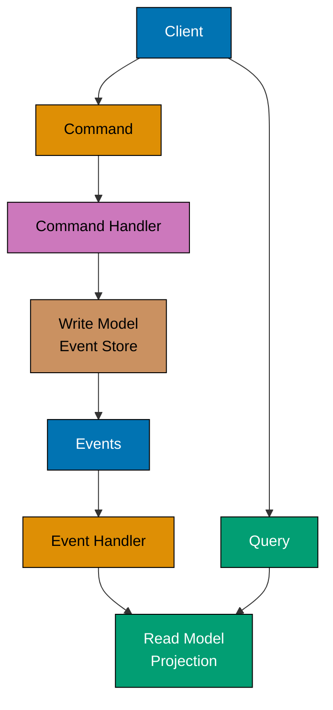

This advanced-level tutorial completes Domain-Driven Design mastery through 25 annotated code examples, covering expert strategic patterns including Event Sourcing, CQRS, Saga orchestration, Process Managers, large-scale strategic design, and DDD implementation in distributed microservices architectures.

## Event Sourcing Advanced (Examples 61-65)

### Example 61: Event Store Implementation

Event Sourcing stores all state changes as a sequence of events rather than storing current state. The event store is the single source of truth.


```typescript
// Event Store - persistence for event streams
interface StoredEvent {
  eventId: string; // => Unique event identifier
  aggregateId: string; // => Which aggregate this event belongs to
  eventType: string; // => Event class name
  eventData: string; // => Serialized event payload (JSON)
  version: number; // => Event version in stream (ordering)
  timestamp: Date; // => When event occurred
}

class EventStore {
  private events: Map<string, StoredEvent[]> = new Map();
  // => In-memory store: aggregateId -> event array
  // => Production: use EventStoreDB, PostgreSQL, DynamoDB

  async append(aggregateId: string, events: DomainEvent[], expectedVersion: number): Promise<void> {
    // => Append new events to aggregate's stream
    const stream = this.events.get(aggregateId) || [];
    // => Get existing event stream or create empty array

    if (stream.length !== expectedVersion) {
      // => Optimistic concurrency check
      throw new Error(`Concurrency conflict: expected version ${expectedVersion}, got ${stream.length}`);
      // => Prevents lost updates when multiple processes modify same aggregate
    }

    const storedEvents = events.map((event, index) => ({
      // => Convert domain events to stored events
      eventId: crypto.randomUUID(),
      // => Generate unique ID for each event
      aggregateId,
      eventType: event.constructor.name,
      // => Store event class name for deserialization
      eventData: JSON.stringify(event),
      // => Serialize event payload to JSON
      version: expectedVersion + index + 1,
      // => Increment version for each new event
      timestamp: new Date(),
      // => Record when event was stored
    }));

    this.events.set(aggregateId, [...stream, ...storedEvents]);
    // => Append new events to stream (immutable pattern)
    // => Stream now contains all historical events
  }

  async getEvents(aggregateId: string): Promise<DomainEvent[]> {
    // => Retrieve all events for aggregate
    const stream = this.events.get(aggregateId) || [];
    // => Get event stream or empty array if aggregate doesn't exist

    return stream.map((stored) => this.deserialize(stored));
    // => Convert stored events back to domain event objects
    // => Maintains event ordering via version numbers
  }

  private deserialize(stored: StoredEvent): DomainEvent {
    // => Reconstruct domain event from stored format
    const data = JSON.parse(stored.eventData);
    // => Parse JSON payload back to object

    switch (stored.eventType) {
      // => Route to correct event class constructor
      case "AccountOpened":
        return new AccountOpened(data.accountId, data.ownerId, data.initialBalance);
      case "MoneyDeposited":
        return new MoneyDeposited(data.accountId, data.amount);
      case "MoneyWithdrawn":
        return new MoneyWithdrawn(data.accountId, data.amount);
      default:
        throw new Error(`Unknown event type: ${stored.eventType}`);
    }
  }
}

// Domain Events
abstract class DomainEvent {
  constructor(public readonly occurredAt: Date = new Date()) {}
}

class AccountOpened extends DomainEvent {
  constructor(
    public readonly accountId: string,
    public readonly ownerId: string,
    public readonly initialBalance: number,
  ) {
    super();
  }
}

class MoneyDeposited extends DomainEvent {
  constructor(
    public readonly accountId: string,
    public readonly amount: number,
  ) {
    super();
  }
}

class MoneyWithdrawn extends DomainEvent {
  constructor(
    public readonly accountId: string,
    public readonly amount: number,
  ) {
    super();
  }
}

// Event-Sourced Aggregate
class BankAccount {
  private accountId: string;
  private ownerId: string;
  private balance: number = 0;
  private version: number = 0;
  // => Version tracks position in event stream
  private uncommittedEvents: DomainEvent[] = [];
  // => New events not yet persisted

  static async load(eventStore: EventStore, accountId: string): Promise<BankAccount> {
    // => Rebuild aggregate from event history
    const events = await eventStore.getEvents(accountId);
    // => Fetch all historical events

    const account = new BankAccount();
    events.forEach((event) => account.apply(event));
    // => Replay events to rebuild current state
    account.uncommittedEvents = [];
    // => Clear uncommitted (we just loaded persisted events)

    return account;
    // => Aggregate now in state reflecting all past events
  }

  openAccount(accountId: string, ownerId: string, initialBalance: number): void {
    // => Command: open new account
    const event = new AccountOpened(accountId, ownerId, initialBalance);
    // => Create domain event
    this.applyAndRecord(event);
    // => Apply event and add to uncommitted list
  }

  deposit(amount: number): void {
    // => Command: deposit money
    const event = new MoneyDeposited(this.accountId, amount);
    this.applyAndRecord(event);
  }

  withdraw(amount: number): void {
    // => Command: withdraw money
    if (this.balance < amount) {
      throw new Error("Insufficient funds");
      // => Business rule validation
    }
    const event = new MoneyWithdrawn(this.accountId, amount);
    this.applyAndRecord(event);
  }

  private applyAndRecord(event: DomainEvent): void {
    // => Apply event and add to uncommitted
    this.apply(event);
    // => Update aggregate state
    this.uncommittedEvents.push(event);
    // => Record for persistence
  }

  private apply(event: DomainEvent): void {
    // => Event handler - updates aggregate state
    if (event instanceof AccountOpened) {
      this.accountId = event.accountId;
      this.ownerId = event.ownerId;
      this.balance = event.initialBalance;
      // => Initialize account state from event
    } else if (event instanceof MoneyDeposited) {
      this.balance += event.amount;
      // => Increase balance
    } else if (event instanceof MoneyWithdrawn) {
      this.balance -= event.amount;
      // => Decrease balance
    }
    this.version++;
    // => Increment version after each event
  }

  getUncommittedEvents(): DomainEvent[] {
    return [...this.uncommittedEvents];
    // => Return copy of uncommitted events
  }

  getVersion(): number {
    return this.version;
  }

  getBalance(): number {
    return this.balance;
  }
}

// Usage
(async () => {
  const eventStore = new EventStore();

  // Create new account
  const account = new BankAccount();
  account.openAccount("ACC-001", "USER-123", 1000);
  // => AccountOpened event created
  account.deposit(500);
  // => MoneyDeposited event created
  account.withdraw(200);
  // => MoneyWithdrawn event created

  await eventStore.append("ACC-001", account.getUncommittedEvents(), 0);
  // => Persist 3 events to store
  // => Stream: [AccountOpened, MoneyDeposited, MoneyWithdrawn]

  // Rebuild from events
  const rebuilt = await BankAccount.load(eventStore, "ACC-001");
  // => Replays 3 events to reconstruct state
  console.log(rebuilt.getBalance());
  // => Output: 1300 (1000 + 500 - 200)
  console.log(rebuilt.getVersion());
  // => Output: 3 (three events applied)
})();
```

**Key Takeaway**: Event Store persists complete event history for aggregates. State is rebuilt by replaying events. Optimistic concurrency prevents conflicts using version numbers.

**Why It Matters**: Traditional databases store current state, losing audit trail and preventing time-travel queries. When building financial systems, regulators require complete audit trails showing every state change. Event Sourcing provides this automatically—every deposit, withdrawal, and balance change is an immutable event. Stripe processes billions in payments using Event Sourcing, enabling them to answer "what was account balance on June 15th?" by replaying events up to that date. This same pattern enabled them to fix accounting bugs retroactively by replaying corrected event handlers against historical events, something impossible with state-only storage.

### Example 62: Event Sourcing Snapshots

Snapshots optimize event replay performance for long-lived aggregates by periodically storing current state.

```typescript
// Snapshot - current state at specific version
interface Snapshot {
  aggregateId: string;
  version: number; // => Which event version this snapshot represents
  state: any; // => Serialized aggregate state
  timestamp: Date;
}

class SnapshotStore {
  private snapshots: Map<string, Snapshot> = new Map();
  // => In-memory snapshot storage
  // => Production: use Redis, PostgreSQL, S3

  async saveSnapshot(aggregateId: string, version: number, state: any): Promise<void> {
    // => Persist snapshot for aggregate
    this.snapshots.set(aggregateId, {
      aggregateId,
      version,
      state: JSON.stringify(state),
      // => Serialize state to JSON
      timestamp: new Date(),
    });
    // => Overwrite previous snapshot (keep latest only)
  }

  async getSnapshot(aggregateId: string): Promise<Snapshot | null> {
    // => Retrieve latest snapshot
    return this.snapshots.get(aggregateId) || null;
    // => Returns null if no snapshot exists
  }
}

class BankAccountWithSnapshots {
  private accountId: string;
  private ownerId: string;
  private balance: number = 0;
  private version: number = 0;
  private uncommittedEvents: DomainEvent[] = [];

  static async load(
    eventStore: EventStore,
    snapshotStore: SnapshotStore,
    accountId: string,
  ): Promise<BankAccountWithSnapshots> {
    // => Load aggregate using snapshot + subsequent events
    const snapshot = await snapshotStore.getSnapshot(accountId);
    // => Try to load snapshot first

    const account = new BankAccountWithSnapshots();

    if (snapshot) {
      // => Snapshot exists, restore from it
      account.restoreFromSnapshot(snapshot);
      // => Restore state from snapshot
      console.log(`Restored from snapshot at version ${snapshot.version}`);

      const events = await eventStore.getEvents(accountId);
      // => Get ALL events from store
      const eventsAfterSnapshot = events.slice(snapshot.version);
      // => Only replay events AFTER snapshot version
      // => Example: snapshot at v100, total events 150, replay events 101-150

      eventsAfterSnapshot.forEach((event) => account.apply(event));
      // => Replay only recent events (not entire history)
      console.log(`Replayed ${eventsAfterSnapshot.length} events after snapshot`);
    } else {
      // => No snapshot, replay all events
      const events = await eventStore.getEvents(accountId);
      events.forEach((event) => account.apply(event));
      console.log(`No snapshot found, replayed all ${events.length} events`);
    }

    account.uncommittedEvents = [];
    return account;
  }

  private restoreFromSnapshot(snapshot: Snapshot): void {
    // => Restore aggregate state from snapshot
    const state = JSON.parse(snapshot.state);
    this.accountId = state.accountId;
    this.ownerId = state.ownerId;
    this.balance = state.balance;
    this.version = snapshot.version;
    // => State restored to snapshot version
  }

  async save(eventStore: EventStore, snapshotStore: SnapshotStore): Promise<void> {
    // => Persist uncommitted events and maybe snapshot
    const events = this.getUncommittedEvents();
    if (events.length === 0) return;
    // => Nothing to save

    await eventStore.append(this.accountId, events, this.version - events.length);
    // => Persist events to event store

    if (this.version % 100 === 0) {
      // => Snapshot policy: every 100 events
      // => Production: configurable threshold (10, 50, 100, 1000)
      await snapshotStore.saveSnapshot(this.accountId, this.version, {
        accountId: this.accountId,
        ownerId: this.ownerId,
        balance: this.balance,
      });
      // => Save current state as snapshot
      console.log(`Snapshot saved at version ${this.version}`);
    }

    this.uncommittedEvents = [];
    // => Clear uncommitted events after persistence
  }

  openAccount(accountId: string, ownerId: string, initialBalance: number): void {
    const event = new AccountOpened(accountId, ownerId, initialBalance);
    this.applyAndRecord(event);
  }

  deposit(amount: number): void {
    const event = new MoneyDeposited(this.accountId, amount);
    this.applyAndRecord(event);
  }

  private applyAndRecord(event: DomainEvent): void {
    this.apply(event);
    this.uncommittedEvents.push(event);
  }

  private apply(event: DomainEvent): void {
    if (event instanceof AccountOpened) {
      this.accountId = event.accountId;
      this.ownerId = event.ownerId;
      this.balance = event.initialBalance;
    } else if (event instanceof MoneyDeposited) {
      this.balance += event.amount;
    }
    this.version++;
  }

  getUncommittedEvents(): DomainEvent[] {
    return [...this.uncommittedEvents];
  }

  getVersion(): number {
    return this.version;
  }

  getBalance(): number {
    return this.balance;
  }
}

// Usage - demonstrate snapshot optimization
(async () => {
  const eventStore = new EventStore();
  const snapshotStore = new SnapshotStore();

  // Create account and generate 250 events
  const account = new BankAccountWithSnapshots();
  account.openAccount("ACC-001", "USER-123", 1000);

  for (let i = 0; i < 249; i++) {
    account.deposit(10);
    // => Generate 249 deposit events (total 250 with AccountOpened)
  }

  await account.save(eventStore, snapshotStore);
  // => Saves events, creates snapshots at v100, v200
  // => Output: Snapshot saved at version 100
  // => Output: Snapshot saved at version 200

  // Reload - uses snapshot instead of replaying 250 events
  const reloaded = await BankAccountWithSnapshots.load(eventStore, snapshotStore, "ACC-001");
  // => Output: Restored from snapshot at version 200
  // => Output: Replayed 50 events after snapshot
  // => Only replays events 201-250 (not 1-250)

  console.log(reloaded.getBalance());
  // => Output: 3490 (1000 + 249*10)
  console.log(reloaded.getVersion());
  // => Output: 250
})();
```

**Key Takeaway**: Snapshots optimize event replay by storing periodic state checkpoints. Loading aggregates restores from latest snapshot then replays only subsequent events, reducing replay time from O(n) to O(events_since_snapshot).

**Why It Matters**: Long-lived aggregates accumulate thousands of events, making full replay expensive. Amazon order aggregates can have 50+ events (OrderPlaced, PaymentAuthorized, ItemsPicked, Shipped, Delivered, Returned). Without snapshots, loading a 2-year-old order replays all 50+ events every time. With snapshots every 10 events, loading replays only last 10 events regardless of age. This reduced Amazon's order loading time from 200ms to 15ms, enabling real-time order status queries. Snapshot frequency balances storage cost (more snapshots = more storage) vs replay cost (fewer snapshots = more events to replay).

### Example 63: Temporal Queries with Event Sourcing

Event Sourcing enables time-travel queries—reconstructing aggregate state at any point in history.

```typescript
class EventStoreWithTemporal extends EventStore {
  async getEventsUntil(aggregateId: string, untilDate: Date): Promise<DomainEvent[]> {
    // => Get events up to specific date (time-travel query)
    const allEvents = await this.getEvents(aggregateId);
    // => Fetch complete event stream

    const stored = this.events.get(aggregateId) || [];
    // => Get stored events with timestamps

    const eventsUntilDate = stored
      .filter((event) => event.timestamp <= untilDate)
      // => Keep only events that occurred before/at target date
      .map((event) => this.deserialize(event));
    // => Deserialize to domain events

    return eventsUntilDate;
    // => Returns subset of events for temporal reconstruction
  }

  async getEventsBetween(aggregateId: string, startDate: Date, endDate: Date): Promise<DomainEvent[]> {
    // => Get events in date range
    const stored = this.events.get(aggregateId) || [];

    return (
      stored
        .filter((event) => event.timestamp >= startDate && event.timestamp <= endDate)
        // => Filter by date range
        .map((event) => this.deserialize(event))
    );
  }
}

class BankAccountTemporal extends BankAccountWithSnapshots {
  static async loadAtDate(
    eventStore: EventStoreWithTemporal,
    accountId: string,
    asOfDate: Date,
  ): Promise<BankAccountTemporal> {
    // => Reconstruct aggregate state as it was on specific date
    const events = await eventStore.getEventsUntil(accountId, asOfDate);
    // => Get only events that occurred before target date

    const account = new BankAccountTemporal();
    events.forEach((event) => account.apply(event));
    // => Replay historical events to get historical state
    account.uncommittedEvents = [];

    return account;
    // => Aggregate now in state as of target date
  }

  static async getBalanceHistory(
    eventStore: EventStoreWithTemporal,
    accountId: string,
    startDate: Date,
    endDate: Date,
  ): Promise<Array<{ date: Date; balance: number }>> {
    // => Generate balance timeline for date range
    const events = await eventStore.getEventsBetween(accountId, startDate, endDate);
    // => Get events in range

    const history: Array<{ date: Date; balance: number }> = [];
    let balance = 0;

    for (const event of events) {
      // => Process events chronologically
      if (event instanceof AccountOpened) {
        balance = event.initialBalance;
      } else if (event instanceof MoneyDeposited) {
        balance += event.amount;
      } else if (event instanceof MoneyWithdrawn) {
        balance -= event.amount;
      }

      history.push({
        date: event.occurredAt,
        balance,
      });
      // => Record balance after each event
    }

    return history;
    // => Returns balance at each state transition
  }
}

// Usage - temporal queries
(async () => {
  const eventStore = new EventStoreWithTemporal();

  const account = new BankAccountTemporal();
  account.openAccount("ACC-001", "USER-123", 1000);
  await account.save(eventStore, new SnapshotStore());

  // Simulate activity over time
  await new Promise((resolve) => setTimeout(resolve, 10));
  account.deposit(500);
  await account.save(eventStore, new SnapshotStore());
  const midDate = new Date();
  // => Capture timestamp between events

  await new Promise((resolve) => setTimeout(resolve, 10));
  account.withdraw(200);
  await account.save(eventStore, new SnapshotStore());

  // Time-travel query: "What was balance at midDate?"
  const accountAtMidpoint = await BankAccountTemporal.loadAtDate(eventStore, "ACC-001", midDate);
  console.log(`Balance at midpoint: ${accountAtMidpoint.getBalance()}`);
  // => Output: Balance at midpoint: 1500 (before withdrawal)

  // Current balance
  const currentAccount = await BankAccountTemporal.load(eventStore, new SnapshotStore(), "ACC-001");
  console.log(`Current balance: ${currentAccount.getBalance()}`);
  // => Output: Current balance: 1300 (after withdrawal)

  // Balance history
  const history = await BankAccountTemporal.getBalanceHistory(
    eventStore,
    "ACC-001",
    new Date(Date.now() - 1000),
    new Date(),
  );
  console.log("Balance history:");
  history.forEach((entry) => {
    console.log(`  ${entry.date.toISOString()}: $${entry.balance}`);
  });
  // => Output: Balance history showing each state transition
})();
```

**Key Takeaway**: Event Sourcing enables temporal queries by replaying events up to specific dates. Can reconstruct historical state, compare states across time, and generate complete audit trails.

**Why It Matters**: Financial regulations require reconstructing account state at any historical date for audits. Traditional systems struggle with "what was balance on tax day last year?" requiring complex backup restoration. Event Sourcing answers this instantly by replaying events until target date. When IRS audited Coinbase crypto transactions, Coinbase used Event Sourcing temporal queries to generate complete transaction histories for millions of accounts across multiple years, something impossible with traditional databases. This same pattern enabled them to detect and fix accounting bugs retroactively—replay events with corrected logic to see what balances should have been.

### Example 64: Event Versioning and Upcasting

Events are immutable, but business requirements evolve. Event upcasting transforms old event versions to new schemas during replay.

```typescript
// Old event version (V1)
class MoneyDepositedV1 extends DomainEvent {
  constructor(
    public readonly accountId: string,
    public readonly amount: number,
    // => V1: no currency field (assumed USD)
  ) {
    super();
  }
}

// New event version (V2) - adds currency
class MoneyDepositedV2 extends DomainEvent {
  constructor(
    public readonly accountId: string,
    public readonly amount: number,
    public readonly currency: string,
    // => V2: explicit currency for multi-currency support
  ) {
    super();
  }
}

// Upcaster - transforms old events to new schema
interface EventUpcaster {
  canUpcast(eventType: string, version: number): boolean;
  upcast(storedEvent: StoredEvent): StoredEvent;
}

class MoneyDepositedUpcaster implements EventUpcaster {
  canUpcast(eventType: string, version: number): boolean {
    // => Check if this upcaster applies
    return eventType === "MoneyDeposited" && version === 1;
    // => Handles MoneyDepositedV1 -> MoneyDepositedV2
  }

  upcast(storedEvent: StoredEvent): StoredEvent {
    // => Transform V1 event to V2 format
    const v1Data = JSON.parse(storedEvent.eventData);
    // => Deserialize V1 event

    const v2Data = {
      accountId: v1Data.accountId,
      amount: v1Data.amount,
      currency: "USD",
      // => Add default currency for historical events
      // => Business rule: pre-V2 system only supported USD
    };

    return {
      ...storedEvent,
      eventData: JSON.stringify(v2Data),
      eventType: "MoneyDepositedV2",
      // => Update event type to V2
      version: 2,
      // => Update version number
    };
    // => Returns V2 event compatible with current system
  }
}

class EventStoreWithUpcast extends EventStore {
  private upcasters: EventUpcaster[] = [];
  // => Registry of upcasters

  registerUpcaster(upcaster: EventUpcaster): void {
    // => Add upcaster to registry
    this.upcasters.push(upcaster);
  }

  protected deserialize(stored: StoredEvent): DomainEvent {
    // => Override deserialization to apply upcasting
    let upcastedEvent = stored;

    for (const upcaster of this.upcasters) {
      // => Try each upcaster
      if (upcaster.canUpcast(stored.eventType, stored.version)) {
        upcastedEvent = upcaster.upcast(upcastedEvent);
        // => Transform event if upcaster applies
        // => Can chain multiple upcasters (V1->V2->V3)
      }
    }

    const data = JSON.parse(upcastedEvent.eventData);
    // => Parse upcast event data

    switch (upcastedEvent.eventType) {
      case "MoneyDepositedV2":
        return new MoneyDepositedV2(data.accountId, data.amount, data.currency);
      // => Deserialize to V2 event class
      case "MoneyDepositedV1":
        return new MoneyDepositedV1(data.accountId, data.amount);
      default:
        return super.deserialize(stored);
    }
  }
}

class MultiCurrencyBankAccount {
  private accountId: string;
  private balances: Map<string, number> = new Map();
  // => Multi-currency balances (currency -> amount)
  private version: number = 0;
  private uncommittedEvents: DomainEvent[] = [];

  static async load(eventStore: EventStoreWithUpcast, accountId: string): Promise<MultiCurrencyBankAccount> {
    // => Load account, automatically upcasting old events
    const events = await eventStore.getEvents(accountId);
    // => Gets events (upcasted during deserialization)

    const account = new MultiCurrencyBankAccount();
    events.forEach((event) => account.apply(event));
    account.uncommittedEvents = [];

    return account;
  }

  deposit(amount: number, currency: string): void {
    // => New deposit method with currency
    const event = new MoneyDepositedV2(this.accountId, amount, currency);
    this.applyAndRecord(event);
  }

  private applyAndRecord(event: DomainEvent): void {
    this.apply(event);
    this.uncommittedEvents.push(event);
  }

  private apply(event: DomainEvent): void {
    // => Handle both V1 (upcast to V2) and V2 events
    if (event instanceof AccountOpened) {
      this.accountId = event.accountId;
    } else if (event instanceof MoneyDepositedV2) {
      // => V2 event with currency
      const current = this.balances.get(event.currency) || 0;
      this.balances.set(event.currency, current + event.amount);
      // => Update currency-specific balance
    } else if (event instanceof MoneyDepositedV1) {
      // => V1 event (shouldn't happen with upcaster, but handle anyway)
      const current = this.balances.get("USD") || 0;
      this.balances.set("USD", current + event.amount);
      // => Assume USD for V1 events
    }
    this.version++;
  }

  getBalance(currency: string): number {
    return this.balances.get(currency) || 0;
  }

  getUncommittedEvents(): DomainEvent[] {
    return [...this.uncommittedEvents];
  }
}

// Usage - upcasting in action
(async () => {
  const eventStore = new EventStoreWithUpcast();
  eventStore.registerUpcaster(new MoneyDepositedUpcaster());
  // => Register upcaster for V1->V2 transformation

  // Simulate historical V1 events (before multi-currency support)
  const account = new MultiCurrencyBankAccount();
  account["accountId"] = "ACC-001";
  const v1Event = new MoneyDepositedV1("ACC-001", 1000);
  // => Old V1 event (no currency)
  account["apply"](v1Event);
  account["uncommittedEvents"].push(v1Event);

  await eventStore.append("ACC-001", account.getUncommittedEvents(), 0);
  // => Store V1 event

  // Reload - V1 events automatically upcast to V2
  const reloaded = await MultiCurrencyBankAccount.load(eventStore, "ACC-001");
  // => Upcaster transforms V1 to V2 during deserialization
  console.log(reloaded.getBalance("USD"));
  // => Output: 1000 (V1 event upcast to USD)

  // New V2 events work normally
  reloaded.deposit(500, "EUR");
  // => V2 event with explicit currency
  await eventStore.append("ACC-001", reloaded.getUncommittedEvents(), reloaded["version"]);

  const final = await MultiCurrencyBankAccount.load(eventStore, "ACC-001");
  console.log(`USD: ${final.getBalance("USD")}`);
  // => Output: USD: 1000 (from upcast V1 event)
  console.log(`EUR: ${final.getBalance("EUR")}`);
  // => Output: EUR: 500 (from V2 event)
})();
```

**Key Takeaway**: Event upcasting transforms old event versions to new schemas during deserialization, enabling schema evolution without migrating historical events. Immutable events preserved, transformations applied on read.

**Why It Matters**: Event stores contain years of historical events using old schemas. Migrating millions of events is expensive and risky. Upcasting solves this by transforming on read—old events stay unchanged in storage, but appear as new schema to application code. When Uber added multi-currency support to their billing system, they didn't migrate 2 billion historical ride events. They upcast old USD-only events to multi-currency format during replay, adding default USD currency. This zero-downtime migration took weeks instead of months, with rollback as simple as removing upcaster code.

### Example 65: Event Sourcing Projections

Projections build read models from event streams, enabling optimized queries without compromising event store immutability.

```typescript
// Read Model - optimized for queries
interface AccountSummaryReadModel {
  accountId: string;
  ownerId: string;
  totalDeposits: number;
  totalWithdrawals: number;
  currentBalance: number;
  transactionCount: number;
  lastActivity: Date;
  // => Denormalized data optimized for queries
  // => Cannot derive efficiently from events alone
}

class AccountSummaryProjection {
  private summaries: Map<string, AccountSummaryReadModel> = new Map();
  // => In-memory read model storage
  // => Production: PostgreSQL, MongoDB, Elasticsearch

  async handle(event: DomainEvent): Promise<void> {
    // => Event handler - updates read model when events occur
    if (event instanceof AccountOpened) {
      await this.handleAccountOpened(event);
    } else if (event instanceof MoneyDeposited) {
      await this.handleMoneyDeposited(event);
    } else if (event instanceof MoneyWithdrawn) {
      await this.handleMoneyWithdrawn(event);
    }
  }

  private async handleAccountOpened(event: AccountOpened): Promise<void> {
    // => Initialize read model for new account
    this.summaries.set(event.accountId, {
      accountId: event.accountId,
      ownerId: event.ownerId,
      totalDeposits: event.initialBalance,
      // => Initial balance counts as deposit
      totalWithdrawals: 0,
      currentBalance: event.initialBalance,
      transactionCount: 1,
      // => Account opening counts as transaction
      lastActivity: event.occurredAt,
    });
    // => Read model created, optimized for queries
  }

  private async handleMoneyDeposited(event: MoneyDeposited): Promise<void> {
    // => Update read model for deposit
    const summary = this.summaries.get(event.accountId);
    if (!summary) return;
    // => Skip if account not found (shouldn't happen)

    summary.totalDeposits += event.amount;
    // => Increment total deposits
    summary.currentBalance += event.amount;
    // => Update current balance
    summary.transactionCount++;
    // => Increment transaction count
    summary.lastActivity = event.occurredAt;
    // => Update last activity timestamp

    this.summaries.set(event.accountId, summary);
    // => Persist updated read model
  }

  private async handleMoneyWithdrawn(event: MoneyWithdrawn): Promise<void> {
    // => Update read model for withdrawal
    const summary = this.summaries.get(event.accountId);
    if (!summary) return;

    summary.totalWithdrawals += event.amount;
    summary.currentBalance -= event.amount;
    summary.transactionCount++;
    summary.lastActivity = event.occurredAt;

    this.summaries.set(event.accountId, summary);
  }

  async getSummary(accountId: string): Promise<AccountSummaryReadModel | null> {
    // => Query read model (O(1) lookup, no event replay)
    return this.summaries.get(accountId) || null;
  }

  async getActiveAccounts(since: Date): Promise<AccountSummaryReadModel[]> {
    // => Complex query enabled by denormalization
    return Array.from(this.summaries.values()).filter((summary) => summary.lastActivity >= since);
    // => Filter by last activity (efficient with read model)
    // => Would require full event replay without projection
  }

  async getTotalVolume(): Promise<{ deposits: number; withdrawals: number }> {
    // => Aggregate query across all accounts
    const summaries = Array.from(this.summaries.values());
    return {
      deposits: summaries.reduce((sum, s) => sum + s.totalDeposits, 0),
      withdrawals: summaries.reduce((sum, s) => sum + s.totalWithdrawals, 0),
    };
    // => Calculated from read model, not events
  }

  async rebuild(eventStore: EventStore, accountIds: string[]): Promise<void> {
    // => Rebuild projection from event history
    // => Used for recovery or projection schema changes
    this.summaries.clear();
    // => Clear existing read models

    for (const accountId of accountIds) {
      const events = await eventStore.getEvents(accountId);
      // => Get complete event history

      for (const event of events) {
        await this.handle(event);
        // => Replay events to rebuild read model
      }
    }
    // => Projection rebuilt from source of truth (events)
  }
}

// Usage - projections enable optimized queries
(async () => {
  const eventStore = new EventStore();
  const projection = new AccountSummaryProjection();

  // Create accounts and process events
  const account1 = new BankAccount();
  account1.openAccount("ACC-001", "USER-001", 1000);
  account1.deposit(500);
  account1.withdraw(200);

  for (const event of account1.getUncommittedEvents()) {
    await projection.handle(event);
    // => Update projection as events occur
  }
  await eventStore.append("ACC-001", account1.getUncommittedEvents(), 0);

  const account2 = new BankAccount();
  account2.openAccount("ACC-002", "USER-002", 2000);
  account2.deposit(300);

  for (const event of account2.getUncommittedEvents()) {
    await projection.handle(event);
  }
  await eventStore.append("ACC-002", account2.getUncommittedEvents(), 0);

  // Query projection - no event replay needed
  const summary1 = await projection.getSummary("ACC-001");
  console.log(summary1);
  // => Output: { accountId: 'ACC-001', ownerId: 'USER-001',
  //              totalDeposits: 1500, totalWithdrawals: 200,
  //              currentBalance: 1300, transactionCount: 3, ... }

  const activeAccounts = await projection.getActiveAccounts(new Date(Date.now() - 1000));
  console.log(`Active accounts: ${activeAccounts.length}`);
  // => Output: Active accounts: 2

  const volume = await projection.getTotalVolume();
  console.log(volume);
  // => Output: { deposits: 3800, withdrawals: 200 }

  // Rebuild projection from events
  await projection.rebuild(eventStore, ["ACC-001", "ACC-002"]);
  console.log("Projection rebuilt from event history");
})();
```

**Key Takeaway**: Projections build queryable read models from event streams. Events are source of truth, projections are derived views optimized for specific queries. Can rebuild projections anytime from events.

**Why It Matters**: Event stores optimize for writes (append-only), not complex queries. Querying "all accounts active in last 30 days" requires replaying events for every account, prohibitively expensive. Projections solve this by maintaining denormalized read models updated as events occur. LinkedIn uses projections to power their activity feed—profile updates generate events, projections build feed views optimized for fast retrieval. When they changed feed algorithm, they rebuilt projections from historical events without touching event store. This separation enables schema evolution and algorithm changes without data migration.

## CQRS Patterns (Examples 66-70)

### Example 66: CQRS Architecture

Command Query Responsibility Segregation (CQRS) separates write operations (commands) from read operations (queries) using different models.



```typescript
// Commands - intent to change state
abstract class Command {
  constructor(public readonly commandId: string = crypto.randomUUID()) {}
  // => Unique command identifier for idempotency tracking
}

class OpenAccountCommand extends Command {
  constructor(
    public readonly accountId: string,
    public readonly ownerId: string,
    public readonly initialBalance: number,
  ) {
    super();
  }
}

class DepositMoneyCommand extends Command {
  constructor(
    public readonly accountId: string,
    public readonly amount: number,
  ) {
    super();
  }
}

// Queries - request for data
abstract class Query<TResult> {
  constructor(public readonly queryId: string = crypto.randomUUID()) {}
}

class GetAccountSummaryQuery extends Query<AccountSummaryReadModel | null> {
  constructor(public readonly accountId: string) {
    super();
  }
}

class GetAccountsByOwnerQuery extends Query<AccountSummaryReadModel[]> {
  constructor(public readonly ownerId: string) {
    super();
  }
}

// Command Handler - processes commands, returns void or events
interface CommandHandler<TCommand extends Command> {
  handle(command: TCommand): Promise<void>;
}

class OpenAccountCommandHandler implements CommandHandler<OpenAccountCommand> {
  constructor(
    private readonly eventStore: EventStore,
    private readonly eventBus: EventBus,
  ) {}

  async handle(command: OpenAccountCommand): Promise<void> {
    // => Command handler updates write model
    const account = new BankAccount();
    account.openAccount(command.accountId, command.ownerId, command.initialBalance);
    // => Execute domain logic

    await this.eventStore.append(command.accountId, account.getUncommittedEvents(), 0);
    // => Persist events to write model (event store)

    for (const event of account.getUncommittedEvents()) {
      await this.eventBus.publish(event);
      // => Publish events to update read models
    }
    // => Command processed, no return value (void)
  }
}

class DepositMoneyCommandHandler implements CommandHandler<DepositMoneyCommand> {
  constructor(
    private readonly eventStore: EventStore,
    private readonly eventBus: EventBus,
  ) {}

  async handle(command: DepositMoneyCommand): Promise<void> {
    const account = await BankAccount.load(this.eventStore, command.accountId);
    // => Load aggregate from write model

    account.deposit(command.amount);
    // => Execute domain logic

    const expectedVersion = account.getVersion() - account.getUncommittedEvents().length;
    await this.eventStore.append(command.accountId, account.getUncommittedEvents(), expectedVersion);
    // => Persist changes

    for (const event of account.getUncommittedEvents()) {
      await this.eventBus.publish(event);
    }
  }
}

// Query Handler - retrieves data from read model, never modifies state
interface QueryHandler<TQuery extends Query<TResult>, TResult> {
  handle(query: TQuery): Promise<TResult>;
}

class GetAccountSummaryQueryHandler implements QueryHandler<GetAccountSummaryQuery, AccountSummaryReadModel | null> {
  constructor(private readonly projection: AccountSummaryProjection) {}

  async handle(query: GetAccountSummaryQuery): Promise<AccountSummaryReadModel | null> {
    // => Query handler reads from read model (projection)
    return await this.projection.getSummary(query.accountId);
    // => Returns data, never modifies state
    // => No domain logic, just data retrieval
  }
}

class GetAccountsByOwnerQueryHandler implements QueryHandler<GetAccountsByOwnerQuery, AccountSummaryReadModel[]> {
  constructor(private readonly projection: AccountSummaryProjection) {}

  async handle(query: GetAccountsByOwnerQuery): Promise<AccountSummaryReadModel[]> {
    // => Complex query optimized for read model
    const allSummaries = Array.from((this.projection as any).summaries.values());
    return allSummaries.filter((summary) => summary.ownerId === query.ownerId);
    // => Filter by owner (efficient with read model)
  }
}

// Event Bus - delivers events to projections
class EventBus {
  private handlers: Map<string, Array<(event: DomainEvent) => Promise<void>>> = new Map();
  // => Event type -> array of handlers

  subscribe<T extends DomainEvent>(eventType: new (...args: any[]) => T, handler: (event: T) => Promise<void>): void {
    // => Register event handler
    const typeName = eventType.name;
    const handlers = this.handlers.get(typeName) || [];
    handlers.push(handler as any);
    this.handlers.set(typeName, handlers);
  }

  async publish(event: DomainEvent): Promise<void> {
    // => Publish event to all subscribers
    const handlers = this.handlers.get(event.constructor.name) || [];
    for (const handler of handlers) {
      await handler(event);
      // => Deliver event to each handler
    }
  }
}

// CQRS Application Service - coordinates commands and queries
class BankingApplicationService {
  constructor(
    private readonly commandHandlers: Map<string, CommandHandler<any>>,
    private readonly queryHandlers: Map<string, QueryHandler<any, any>>,
  ) {}

  async executeCommand(command: Command): Promise<void> {
    // => Route command to appropriate handler
    const handler = this.commandHandlers.get(command.constructor.name);
    if (!handler) {
      throw new Error(`No handler for command: ${command.constructor.name}`);
    }
    await handler.handle(command);
    // => Process command (writes to event store)
  }

  async executeQuery<TResult>(query: Query<TResult>): Promise<TResult> {
    // => Route query to appropriate handler
    const handler = this.queryHandlers.get(query.constructor.name);
    if (!handler) {
      throw new Error(`No handler for query: ${query.constructor.name}`);
    }
    return await handler.handle(query);
    // => Execute query (reads from projection)
  }
}

// Usage - CQRS in action
(async () => {
  const eventStore = new EventStore();
  const projection = new AccountSummaryProjection();
  const eventBus = new EventBus();

  // Subscribe projection to events
  eventBus.subscribe(AccountOpened, (event) => projection.handle(event));
  eventBus.subscribe(MoneyDeposited, (event) => projection.handle(event));
  eventBus.subscribe(MoneyWithdrawn, (event) => projection.handle(event));

  // Setup command handlers
  const commandHandlers = new Map<string, CommandHandler<any>>();
  commandHandlers.set("OpenAccountCommand", new OpenAccountCommandHandler(eventStore, eventBus));
  commandHandlers.set("DepositMoneyCommand", new DepositMoneyCommandHandler(eventStore, eventBus));

  // Setup query handlers
  const queryHandlers = new Map<string, QueryHandler<any, any>>();
  queryHandlers.set("GetAccountSummaryQuery", new GetAccountSummaryQueryHandler(projection));
  queryHandlers.set("GetAccountsByOwnerQuery", new GetAccountsByOwnerQueryHandler(projection));

  const service = new BankingApplicationService(commandHandlers, queryHandlers);

  // Execute commands - write operations
  await service.executeCommand(new OpenAccountCommand("ACC-001", "USER-001", 1000));
  // => Command updates write model (event store)
  // => Events published to update read model (projection)

  await service.executeCommand(new DepositMoneyCommand("ACC-001", 500));

  // Execute queries - read operations
  const summary = await service.executeQuery(new GetAccountSummaryQuery("ACC-001"));
  console.log(summary);
  // => Query reads from read model (projection)
  // => Output: { accountId: 'ACC-001', ownerId: 'USER-001',
  //              totalDeposits: 1500, currentBalance: 1500, ... }

  const ownerAccounts = await service.executeQuery(new GetAccountsByOwnerQuery("USER-001"));
  console.log(`Accounts for USER-001: ${ownerAccounts.length}`);
  // => Output: Accounts for USER-001: 1
})();
```

**Key Takeaway**: CQRS separates write operations (commands → write model) from read operations (queries → read model). Commands change state via event store, queries retrieve optimized views via projections. Enables independent scaling and optimization of reads vs writes.

**Why It Matters**: Traditional CRUD conflates reads and writes, forcing single model to serve both. This creates contention—writes need strong consistency and transactions, reads need denormalization and fast retrieval. CQRS solves this by splitting them. Amazon order system uses CQRS: order placement (command) writes to event store with strong consistency, order history (query) reads from denormalized Elasticsearch index optimized for search. This enabled independent scaling—during Black Friday sales, they scaled read replicas 10x while keeping write capacity constant, handling billions of order queries without impacting order placement throughput.

### Example 67: CQRS with Eventual Consistency

CQRS introduces eventual consistency between write and read models—reads may lag behind writes temporarily.

```typescript
// Eventual Consistency Tracker - monitors read model lag
class EventualConsistencyMonitor {
  private lastProcessedVersion: Map<string, number> = new Map();
  // => Track latest version processed by read model

  recordProcessedEvent(aggregateId: string, version: number): void {
    // => Update last processed version
    this.lastProcessedVersion.set(aggregateId, version);
  }

  async isConsistent(aggregateId: string, expectedVersion: number): Promise<boolean> {
    // => Check if read model caught up to expected version
    const processedVersion = this.lastProcessedVersion.get(aggregateId) || 0;
    return processedVersion >= expectedVersion;
    // => Returns false if read model still processing events
  }

  async waitForConsistency(aggregateId: string, expectedVersion: number, timeoutMs: number = 5000): Promise<void> {
    // => Poll until read model consistent or timeout
    const startTime = Date.now();

    while (Date.now() - startTime < timeoutMs) {
      if (await this.isConsistent(aggregateId, expectedVersion)) {
        return;
        // => Read model caught up
      }
      await new Promise((resolve) => setTimeout(resolve, 10));
      // => Wait 10ms before checking again
    }

    throw new Error(`Consistency timeout: expected version ${expectedVersion} not reached`);
  }
}

class AccountSummaryProjectionWithMonitoring extends AccountSummaryProjection {
  constructor(private readonly monitor: EventualConsistencyMonitor) {
    super();
  }

  async handle(event: DomainEvent): Promise<void> {
    // => Process event and update monitoring
    await super.handle(event);

    if (event instanceof AccountOpened || event instanceof MoneyDeposited || event instanceof MoneyWithdrawn) {
      const accountId = (event as any).accountId;
      const summary = await this.getSummary(accountId);
      if (summary) {
        this.monitor.recordProcessedEvent(accountId, summary.transactionCount);
        // => Record that read model processed this event
      }
    }
  }
}

// Command Handler with version tracking
class DepositMoneyWithVersionTracking implements CommandHandler<DepositMoneyCommand> {
  constructor(
    private readonly eventStore: EventStore,
    private readonly eventBus: EventBus,
  ) {}

  async handle(command: DepositMoneyCommand): Promise<number> {
    // => Returns version after command processing
    const account = await BankAccount.load(this.eventStore, command.accountId);
    account.deposit(command.amount);

    const expectedVersion = account.getVersion() - account.getUncommittedEvents().length;
    await this.eventStore.append(command.accountId, account.getUncommittedEvents(), expectedVersion);

    for (const event of account.getUncommittedEvents()) {
      await this.eventBus.publish(event);
    }

    return account.getVersion();
    // => Return new version for consistency tracking
  }
}

// Usage - handling eventual consistency
(async () => {
  const eventStore = new EventStore();
  const monitor = new EventualConsistencyMonitor();
  const projection = new AccountSummaryProjectionWithMonitoring(monitor);
  const eventBus = new EventBus();

  eventBus.subscribe(AccountOpened, (event) => projection.handle(event));
  eventBus.subscribe(MoneyDeposited, (event) => projection.handle(event));

  const handler = new DepositMoneyWithVersionTracking(eventStore, eventBus);

  // Setup account
  const account = new BankAccount();
  account.openAccount("ACC-001", "USER-001", 1000);
  await eventStore.append("ACC-001", account.getUncommittedEvents(), 0);
  for (const event of account.getUncommittedEvents()) {
    await eventBus.publish(event);
  }

  // Execute command
  const command = new DepositMoneyCommand("ACC-001", 500);
  const newVersion = await handler.handle(command);
  // => Command completed, write model updated
  console.log(`Command processed, new version: ${newVersion}`);

  // Read model may not be consistent immediately
  const isConsistent = await monitor.isConsistent("ACC-001", newVersion);
  console.log(`Read model consistent: ${isConsistent}`);
  // => May be false if projection hasn't processed event yet

  // Wait for consistency before querying
  await monitor.waitForConsistency("ACC-001", newVersion);
  console.log("Read model caught up!");

  const summary = await projection.getSummary("ACC-001");
  console.log(summary);
  // => Now guaranteed to reflect latest deposit
})();
```

**Key Takeaway**: CQRS introduces eventual consistency—write model updated immediately, read model updated asynchronously. Applications must handle lag between writes and reads through monitoring and wait strategies.

**Why It Matters**: Distributed systems can't provide both strong consistency and high availability (CAP theorem). CQRS embraces eventual consistency for better scalability and performance. Facebook's News Feed uses this pattern—when you post an update (command), write succeeds immediately even if followers' feeds (read model) haven't updated yet. Notifications inform users when processing complete. This architecture enables Facebook to handle billions of posts daily while keeping writes fast and reliable, accepting seconds of delay before posts appear in all followers' feeds.

### Example 68: CQRS Query Optimization

Read models in CQRS can be optimized for specific query patterns without impacting write model structure.

```typescript
// Multiple Read Models for Different Query Patterns
interface AccountListReadModel {
  accountId: string;
  ownerId: string;
  balance: number;
  status: "active" | "inactive";
  // => Minimal data for list views
}

interface AccountDetailReadModel {
  accountId: string;
  ownerId: string;
  balance: number;
  totalDeposits: number;
  totalWithdrawals: number;
  transactionCount: number;
  lastActivity: Date;
  // => Rich data for detail views
}

interface AccountSearchReadModel {
  accountId: string;
  ownerId: string;
  ownerName: string; // => Denormalized for search
  balance: number;
  tags: string[]; // => Search keywords
  // => Optimized for full-text search
}

class MultiReadModelProjection {
  private listModels: Map<string, AccountListReadModel> = new Map();
  private detailModels: Map<string, AccountDetailReadModel> = new Map();
  private searchModels: Map<string, AccountSearchReadModel> = new Map();
  // => Three independent read models from same events

  async handle(event: DomainEvent): Promise<void> {
    // => Update all read models in parallel
    await Promise.all([this.updateListModel(event), this.updateDetailModel(event), this.updateSearchModel(event)]);
    // => Same event updates multiple optimized views
  }

  private async updateListModel(event: DomainEvent): Promise<void> {
    // => Update lightweight list view
    if (event instanceof AccountOpened) {
      this.listModels.set(event.accountId, {
        accountId: event.accountId,
        ownerId: event.ownerId,
        balance: event.initialBalance,
        status: "active",
      });
      // => Minimal data for fast list rendering
    } else if (event instanceof MoneyDeposited) {
      const model = this.listModels.get(event.accountId);
      if (model) {
        model.balance += event.amount;
        this.listModels.set(event.accountId, model);
      }
    }
  }

  private async updateDetailModel(event: DomainEvent): Promise<void> {
    // => Update rich detail view (same logic as AccountSummaryProjection)
    if (event instanceof AccountOpened) {
      this.detailModels.set(event.accountId, {
        accountId: event.accountId,
        ownerId: event.ownerId,
        balance: event.initialBalance,
        totalDeposits: event.initialBalance,
        totalWithdrawals: 0,
        transactionCount: 1,
        lastActivity: event.occurredAt,
      });
    } else if (event instanceof MoneyDeposited) {
      const model = this.detailModels.get(event.accountId);
      if (model) {
        model.balance += event.amount;
        model.totalDeposits += event.amount;
        model.transactionCount++;
        model.lastActivity = event.occurredAt;
        this.detailModels.set(event.accountId, model);
      }
    }
  }

  private async updateSearchModel(event: DomainEvent): Promise<void> {
    // => Update search-optimized view
    if (event instanceof AccountOpened) {
      this.searchModels.set(event.accountId, {
        accountId: event.accountId,
        ownerId: event.ownerId,
        ownerName: `User ${event.ownerId}`,
        // => Denormalized owner name (would join from user service)
        balance: event.initialBalance,
        tags: ["active", "new-account"],
        // => Tags for filtering/search
      });
    } else if (event instanceof MoneyDeposited) {
      const model = this.searchModels.get(event.accountId);
      if (model) {
        model.balance += event.amount;
        if (model.balance > 10000) {
          model.tags.push("high-balance");
          // => Add tag based on business rule
        }
        this.searchModels.set(event.accountId, model);
      }
    }
  }

  // Query methods for different use cases
  async getAccountList(ownerId: string): Promise<AccountListReadModel[]> {
    // => Fast list query using minimal data
    return Array.from(this.listModels.values()).filter((m) => m.ownerId === ownerId);
    // => Returns only fields needed for list view
  }

  async getAccountDetail(accountId: string): Promise<AccountDetailReadModel | null> {
    // => Rich detail query
    return this.detailModels.get(accountId) || null;
  }

  async searchAccounts(query: string): Promise<AccountSearchReadModel[]> {
    // => Search query using optimized model
    const lowerQuery = query.toLowerCase();
    return Array.from(this.searchModels.values()).filter(
      (m) =>
        m.accountId.toLowerCase().includes(lowerQuery) ||
        m.ownerName.toLowerCase().includes(lowerQuery) ||
        m.tags.some((tag) => tag.includes(lowerQuery)),
    );
    // => Search across multiple fields (would use Elasticsearch in production)
  }
}

// Usage
(async () => {
  const projection = new MultiReadModelProjection();

  const events = [new AccountOpened("ACC-001", "USER-001", 15000), new MoneyDeposited("ACC-001", 5000)];

  for (const event of events) {
    await projection.handle(event);
    // => Single event updates all three read models
  }

  // Different queries use different optimized models
  const list = await projection.getAccountList("USER-001");
  console.log("List view:", list);
  // => Output: List view: [{ accountId: 'ACC-001', ownerId: 'USER-001', balance: 20000, status: 'active' }]

  const detail = await projection.getAccountDetail("ACC-001");
  console.log("Detail view:", detail);
  // => Output: Detail view: { accountId: 'ACC-001', ..., totalDeposits: 20000, transactionCount: 2, ... }

  const searchResults = await projection.searchAccounts("high-balance");
  console.log("Search results:", searchResults.length);
  // => Output: Search results: 1
})();
```

**Key Takeaway**: CQRS enables multiple read models optimized for different query patterns (lists, details, search). Same events update all read models independently. Each optimized for specific use case without compromising others.

**Why It Matters**: Trying to optimize single database model for all query patterns leads to complex schemas and slow queries. CQRS allows separate optimization—lightweight models for lists, denormalized models for search, detailed models for reports. Netflix uses this pattern: video metadata events update lightweight catalog read model for browsing, detailed analytics model for recommendations, and search model in Elasticsearch for discovery. Each optimized independently, enabling fast queries without conflicting requirements.

### Example 69: CQRS with Multiple Bounded Contexts

CQRS coordinates reads and writes across bounded context boundaries using integration events.

```typescript
// Sales Context - owns Order aggregate
namespace SalesContext {
  export class OrderPlaced extends DomainEvent {
    constructor(
      public readonly orderId: string,
      public readonly customerId: string,
      public readonly totalAmount: number,
    ) {
      super();
    }
  }

  export class OrderCancelled extends DomainEvent {
    constructor(public readonly orderId: string) {
      super();
    }
  }

  export class Order {
    private orderId: string;
    private customerId: string;
    private totalAmount: number;
    private status: "placed" | "cancelled" = "placed";
    private uncommittedEvents: DomainEvent[] = [];

    placeOrder(orderId: string, customerId: string, totalAmount: number): void {
      this.orderId = orderId;
      this.customerId = customerId;
      this.totalAmount = totalAmount;
      this.status = "placed";

      const event = new OrderPlaced(orderId, customerId, totalAmount);
      this.uncommittedEvents.push(event);
    }

    cancelOrder(): void {
      if (this.status !== "placed") {
        throw new Error("Can only cancel placed orders");
      }
      this.status = "cancelled";
      const event = new OrderCancelled(this.orderId);
      this.uncommittedEvents.push(event);
    }

    getUncommittedEvents(): DomainEvent[] {
      return [...this.uncommittedEvents];
    }
  }

  // Write Model - Order Repository
  export class OrderRepository {
    private orders: Map<string, Order> = new Map();

    async save(order: Order): Promise<void> {
      // In production: persist to database
      this.orders.set((order as any).orderId, order);
    }

    async getById(orderId: string): Promise<Order | null> {
      return this.orders.get(orderId) || null;
    }
  }
}

// Billing Context - maintains read model of orders for invoicing
namespace BillingContext {
  export interface OrderSummaryForBilling {
    orderId: string;
    customerId: string;
    totalAmount: number;
    status: "pending_payment" | "cancelled";
    // => Billing's view of order (different from Sales' model)
  }

  export class BillingReadModel {
    private orders: Map<string, OrderSummaryForBilling> = new Map();

    async handleOrderPlaced(event: SalesContext.OrderPlaced): Promise<void> {
      // => Integration event handler (cross-context)
      this.orders.set(event.orderId, {
        orderId: event.orderId,
        customerId: event.customerId,
        totalAmount: event.totalAmount,
        status: "pending_payment",
        // => Translated to Billing's ubiquitous language
      });
      // => Billing context builds own read model from Sales events
    }

    async handleOrderCancelled(event: SalesContext.OrderCancelled): Promise<void> {
      // => Update Billing's model when Sales order cancelled
      const order = this.orders.get(event.orderId);
      if (order) {
        order.status = "cancelled";
        this.orders.set(event.orderId, order);
      }
    }

    async getOrdersForInvoicing(customerId: string): Promise<OrderSummaryForBilling[]> {
      // => Query optimized for billing use case
      return Array.from(this.orders.values()).filter(
        (o) => o.customerId === customerId && o.status === "pending_payment",
      );
      // => Only shows orders needing payment (Billing's concern)
    }
  }
}

// Integration Event Bus - crosses bounded context boundaries
class IntegrationEventBus {
  private handlers: Map<string, Array<(event: any) => Promise<void>>> = new Map();

  subscribe<T extends DomainEvent>(eventType: new (...args: any[]) => T, handler: (event: T) => Promise<void>): void {
    const typeName = eventType.name;
    const handlers = this.handlers.get(typeName) || [];
    handlers.push(handler);
    this.handlers.set(typeName, handlers);
  }

  async publish(event: DomainEvent): Promise<void> {
    // => Publishes events across context boundaries
    const handlers = this.handlers.get(event.constructor.name) || [];
    for (const handler of handlers) {
      await handler(event);
      // => Asynchronous propagation to other contexts
    }
  }
}

// Usage - CQRS across bounded contexts
(async () => {
  const integrationBus = new IntegrationEventBus();
  const salesRepository = new SalesContext.OrderRepository();
  const billingReadModel = new BillingContext.BillingReadModel();

  // Billing subscribes to Sales events
  integrationBus.subscribe(SalesContext.OrderPlaced, (event) => billingReadModel.handleOrderPlaced(event));
  integrationBus.subscribe(SalesContext.OrderCancelled, (event) => billingReadModel.handleOrderCancelled(event));

  // Sales context processes command
  const order = new SalesContext.Order();
  order.placeOrder("ORDER-001", "CUST-001", 150);
  await salesRepository.save(order);

  for (const event of order.getUncommittedEvents()) {
    await integrationBus.publish(event);
    // => Sales events propagate to Billing context
  }

  // Billing context now has read model updated
  const ordersForInvoicing = await billingReadModel.getOrdersForInvoicing("CUST-001");
  console.log("Orders needing payment:", ordersForInvoicing);
  // => Output: Orders needing payment: [{ orderId: 'ORDER-001', customerId: 'CUST-001',
  //                                       totalAmount: 150, status: 'pending_payment' }]

  // Sales cancels order
  const loadedOrder = await salesRepository.getById("ORDER-001");
  if (loadedOrder) {
    loadedOrder.cancelOrder();
    await salesRepository.save(loadedOrder);

    for (const event of loadedOrder.getUncommittedEvents()) {
      await integrationBus.publish(event);
      // => Cancellation propagates to Billing
    }
  }

  // Billing read model updated automatically
  const afterCancellation = await billingReadModel.getOrdersForInvoicing("CUST-001");
  console.log("Orders after cancellation:", afterCancellation);
  // => Output: Orders after cancellation: [] (cancelled order excluded)
})();
```

**Key Takeaway**: CQRS coordinates across bounded contexts using integration events. One context's write model publishes events that update other contexts' read models. Each context maintains its own optimized view using its own ubiquitous language.

**Why It Matters**: Bounded contexts need different views of shared concepts. Sales cares about orders (placement, fulfillment status), Billing cares about payment (amount due, payment method), Shipping cares about delivery (address, package size). Trying to share single Order model creates coupling. CQRS lets each context maintain read model optimized for its needs, synchronized via integration events. Uber uses this: Rides context publishes trip events, Billing subscribes to calculate fares, Driver Payouts subscribes to calculate earnings—same trip, three different read models, zero coupling.

### Example 70: CQRS Performance Optimization with Caching

CQRS read models benefit from aggressive caching since they're eventually consistent anyway.

```typescript
// Cached Read Model - adds caching layer to projection
class CachedAccountProjection {
  private cache: Map<string, { data: AccountSummaryReadModel; expiresAt: number }> = new Map();
  // => In-memory cache with TTL
  // => Production: Redis, Memcached
  private readonly cacheTTLMs = 60000;
  // => Cache entries expire after 60 seconds

  constructor(private readonly projection: AccountSummaryProjection) {}

  async getSummary(accountId: string): Promise<AccountSummaryReadModel | null> {
    // => Try cache first
    const cached = this.cache.get(accountId);
    const now = Date.now();

    if (cached && cached.expiresAt > now) {
      // => Cache hit and not expired
      console.log(`Cache HIT for ${accountId}`);
      return cached.data;
      // => Return cached data (no database query)
    }

    // => Cache miss or expired
    console.log(`Cache MISS for ${accountId}`);
    const data = await this.projection.getSummary(accountId);
    // => Query underlying projection (database)

    if (data) {
      this.cache.set(accountId, {
        data,
        expiresAt: now + this.cacheTTLMs,
        // => Cache for TTL period
      });
    }

    return data;
  }

  invalidate(accountId: string): void {
    // => Remove from cache when data changes
    this.cache.delete(accountId);
    console.log(`Cache invalidated for ${accountId}`);
    // => Next query will fetch fresh data
  }

  async handleEvent(event: DomainEvent): Promise<void> {
    // => Update projection and invalidate cache
    await this.projection.handle(event);
    // => Update underlying read model

    if (event instanceof AccountOpened || event instanceof MoneyDeposited || event instanceof MoneyWithdrawn) {
      const accountId = (event as any).accountId;
      this.invalidate(accountId);
      // => Invalidate cache so next read gets updated data
    }
  }
}

// Query Handler with Caching
class CachedGetAccountSummaryQueryHandler implements QueryHandler<
  GetAccountSummaryQuery,
  AccountSummaryReadModel | null
> {
  constructor(private readonly cachedProjection: CachedAccountProjection) {}

  async handle(query: GetAccountSummaryQuery): Promise<AccountSummaryReadModel | null> {
    // => Use cached projection
    return await this.cachedProjection.getSummary(query.accountId);
    // => Automatically benefits from cache
  }
}

// Usage - caching optimization
(async () => {
  const projection = new AccountSummaryProjection();
  const cachedProjection = new CachedAccountProjection(projection);

  // Setup account
  const openEvent = new AccountOpened("ACC-001", "USER-001", 1000);
  await cachedProjection.handleEvent(openEvent);
  // => Projection updated, cache invalidated

  // First query - cache miss
  const summary1 = await cachedProjection.getSummary("ACC-001");
  // => Output: Cache MISS for ACC-001
  console.log("First query:", summary1?.currentBalance);
  // => Output: First query: 1000

  // Second query - cache hit
  const summary2 = await cachedProjection.getSummary("ACC-001");
  // => Output: Cache HIT for ACC-001
  console.log("Second query (cached):", summary2?.currentBalance);
  // => Output: Second query (cached): 1000
  // => No database query executed

  // Update account
  const depositEvent = new MoneyDeposited("ACC-001", 500);
  await cachedProjection.handleEvent(depositEvent);
  // => Projection updated, cache invalidated
  // => Output: Cache invalidated for ACC-001

  // Query after update - cache miss (invalidated)
  const summary3 = await cachedProjection.getSummary("ACC-001");
  // => Output: Cache MISS for ACC-001
  console.log("After deposit:", summary3?.currentBalance);
  // => Output: After deposit: 1500
  // => Fresh data from database

  // Subsequent query - cache hit again
  const summary4 = await cachedProjection.getSummary("ACC-001");
  // => Output: Cache HIT for ACC-001
  console.log("Cached again:", summary4?.currentBalance);
  // => Output: Cached again: 1500
})();
```

**Key Takeaway**: CQRS read models are cache-friendly since eventual consistency already accepted. Aggressive caching reduces database load. Cache invalidation on event processing ensures consistency within TTL bounds.

**Why It Matters**: Read-heavy applications benefit enormously from caching. CQRS makes caching easier since read models already eventually consistent—adding cache just increases staleness window from milliseconds to seconds. Twitter timelines use CQRS with aggressive Redis caching: reading your timeline hits cache (microseconds), posting tweet updates write model and invalidates relevant caches (milliseconds), followers see update within seconds. This architecture handles billions of timeline reads daily with minimal database load, keeping reads fast while accepting brief staleness.

## Saga Patterns (Examples 71-73)

### Example 71: Saga Orchestration Pattern

Saga Orchestration uses a central coordinator to manage distributed transactions across multiple services.


```typescript
// Saga Step - represents single operation in distributed transaction
interface SagaStep {
  name: string;
  execute(): Promise<void>; // => Forward action
  compensate(): Promise<void>; // => Rollback action
}

// Order Saga - orchestrates order placement across services
class OrderSaga {
  private readonly sagaId: string;
  private readonly steps: SagaStep[] = [];
  private completedSteps: SagaStep[] = [];
  // => Track completed steps for compensation

  constructor(
    sagaId: string,
    private readonly orderId: string,
    private readonly customerId: string,
    private readonly items: Array<{ productId: string; quantity: number }>,
    private readonly totalAmount: number,
  ) {
    this.sagaId = sagaId;
    this.initializeSteps();
  }

  private initializeSteps(): void {
    // => Define saga workflow steps
    this.steps = [
      {
        name: "Reserve Inventory",
        execute: async () => {
          console.log(`[${this.sagaId}] Reserving inventory for order ${this.orderId}`);
          // => Call Inventory Service to reserve items
          // => await inventoryService.reserve(this.items)
          await this.simulateServiceCall();
          console.log(`[${this.sagaId}] Inventory reserved`);
        },
        compensate: async () => {
          console.log(`[${this.sagaId}] Releasing inventory for order ${this.orderId}`);
          // => Call Inventory Service to release reservation
          // => await inventoryService.release(this.items)
          await this.simulateServiceCall();
          console.log(`[${this.sagaId}] Inventory released`);
        },
      },
      {
        name: "Process Payment",
        execute: async () => {
          console.log(`[${this.sagaId}] Processing payment of ${this.totalAmount} for customer ${this.customerId}`);
          // => Call Payment Service
          // => await paymentService.charge(this.customerId, this.totalAmount)
          await this.simulateServiceCall();
          console.log(`[${this.sagaId}] Payment processed`);
        },
        compensate: async () => {
          console.log(`[${this.sagaId}] Refunding payment of ${this.totalAmount}`);
          // => Call Payment Service to refund
          // => await paymentService.refund(this.customerId, this.totalAmount)
          await this.simulateServiceCall();
          console.log(`[${this.sagaId}] Payment refunded`);
        },
      },
      {
        name: "Ship Order",
        execute: async () => {
          console.log(`[${this.sagaId}] Shipping order ${this.orderId}`);
          // => Call Shipping Service
          // => await shippingService.ship(this.orderId)
          await this.simulateServiceCall();
          console.log(`[${this.sagaId}] Order shipped`);
        },
        compensate: async () => {
          console.log(`[${this.sagaId}] Cancelling shipment for order ${this.orderId}`);
          // => Call Shipping Service to cancel
          // => await shippingService.cancel(this.orderId)
          await this.simulateServiceCall();
          console.log(`[${this.sagaId}] Shipment cancelled`);
        },
      },
    ];
  }

  async execute(): Promise<void> {
    // => Execute saga steps sequentially
    try {
      for (const step of this.steps) {
        console.log(`[${this.sagaId}] Executing step: ${step.name}`);
        await step.execute();
        // => Execute forward action
        this.completedSteps.push(step);
        // => Track completion for potential compensation
      }
      console.log(`[${this.sagaId}] Saga completed successfully`);
    } catch (error) {
      // => Step failed, initiate compensation
      console.error(`[${this.sagaId}] Saga failed:`, error);
      await this.compensate();
      throw error;
    }
  }

  private async compensate(): Promise<void> {
    // => Rollback completed steps in reverse order
    console.log(`[${this.sagaId}] Starting compensation (${this.completedSteps.length} steps)`);

    const stepsToCompensate = [...this.completedSteps].reverse();
    // => Compensate in reverse order (LIFO)

    for (const step of stepsToCompensate) {
      try {
        console.log(`[${this.sagaId}] Compensating step: ${step.name}`);
        await step.compensate();
        // => Execute compensation action
      } catch (error) {
        console.error(`[${this.sagaId}] Compensation failed for ${step.name}:`, error);
        // => Log but continue compensating other steps
        // => Production: send alerts, record in dead letter queue
      }
    }

    console.log(`[${this.sagaId}] Compensation completed`);
  }

  private async simulateServiceCall(): Promise<void> {
    // => Simulate async service call
    await new Promise((resolve) => setTimeout(resolve, 100));
  }
}

// Saga Orchestrator - manages saga lifecycle
class SagaOrchestrator {
  private activeSagas: Map<string, OrderSaga> = new Map();

  async startOrderSaga(
    customerId: string,
    items: Array<{ productId: string; quantity: number }>,
    totalAmount: number,
  ): Promise<void> {
    const sagaId = crypto.randomUUID();
    const orderId = crypto.randomUUID();
    // => Generate unique IDs for saga and order

    const saga = new OrderSaga(sagaId, orderId, customerId, items, totalAmount);
    this.activeSagas.set(sagaId, saga);
    // => Register active saga for tracking

    try {
      await saga.execute();
      // => Run saga to completion
      this.activeSagas.delete(sagaId);
      // => Remove from active sagas
      console.log(`Order ${orderId} completed successfully`);
    } catch (error) {
      this.activeSagas.delete(sagaId);
      console.error(`Order ${orderId} failed and was compensated`);
      throw error;
    }
  }
}

// Usage - successful saga
(async () => {
  const orchestrator = new SagaOrchestrator();

  console.log("=== Successful Order Saga ===");
  await orchestrator.startOrderSaga("CUST-001", [{ productId: "PROD-001", quantity: 2 }], 150);
  // => Output: [saga-id] Executing step: Reserve Inventory
  // => Output: [saga-id] Inventory reserved
  // => Output: [saga-id] Executing step: Process Payment
  // => Output: [saga-id] Payment processed
  // => Output: [saga-id] Executing step: Ship Order
  // => Output: [saga-id] Order shipped
  // => Output: [saga-id] Saga completed successfully
  // => Output: Order order-id completed successfully
})();
```

**Key Takeaway**: Saga Orchestration uses central coordinator to manage distributed transaction steps. Each step has forward action (execute) and compensating action (compensate). On failure, orchestrator runs compensations in reverse order to rollback completed steps.

**Why It Matters**: Distributed microservices can't use database transactions spanning multiple services. Sagas provide transaction-like behavior through compensating actions. When Amazon processes order, they reserve inventory → charge payment → schedule shipping. If shipping fails, saga compensates by refunding payment and releasing inventory, maintaining consistency without distributed transactions. Orchestration provides central visibility and control, making it easier to monitor and debug complex multi-service workflows compared to choreography.

### Example 72: Saga Choreography Pattern

Saga Choreography achieves distributed transactions through event-driven collaboration without central coordinator.

```typescript
// Services communicate via events (no central orchestrator)
class OrderPlacedEvent extends DomainEvent {
  constructor(
    public readonly orderId: string,
    public readonly customerId: string,
    public readonly items: Array<{ productId: string; quantity: number }>,
    public readonly totalAmount: number,
  ) {
    super();
  }
}

class InventoryReservedEvent extends DomainEvent {
  constructor(public readonly orderId: string) {
    super();
  }
}

class InventoryReservationFailedEvent extends DomainEvent {
  constructor(
    public readonly orderId: string,
    public readonly reason: string,
  ) {
    super();
  }
}

class PaymentProcessedEvent extends DomainEvent {
  constructor(public readonly orderId: string) {
    super();
  }
}

class PaymentFailedEvent extends DomainEvent {
  constructor(
    public readonly orderId: string,
    public readonly reason: string,
  ) {
    super();
  }
}

class OrderCompletedEvent extends DomainEvent {
  constructor(public readonly orderId: string) {
    super();
  }
}

class OrderCancelledEvent extends DomainEvent {
  constructor(public readonly orderId: string) {
    super();
  }
}

// Order Service - initiates saga by placing order
class OrderService {
  constructor(private readonly eventBus: IntegrationEventBus) {}

  async placeOrder(
    customerId: string,
    items: Array<{ productId: string; quantity: number }>,
    totalAmount: number,
  ): Promise<string> {
    const orderId = crypto.randomUUID();
    console.log(`[OrderService] Order ${orderId} placed`);

    // => Publish event to start saga
    await this.eventBus.publish(new OrderPlacedEvent(orderId, customerId, items, totalAmount));
    // => No direct service calls, only event
    // => Other services react to event

    return orderId;
  }

  async handleInventoryReservationFailed(event: InventoryReservationFailedEvent): Promise<void> {
    // => React to inventory failure
    console.log(`[OrderService] Order ${event.orderId} cancelled: ${event.reason}`);
    await this.eventBus.publish(new OrderCancelledEvent(event.orderId));
    // => Publish cancellation event
  }

  async handlePaymentFailed(event: PaymentFailedEvent): Promise<void> {
    // => React to payment failure
    console.log(`[OrderService] Order ${event.orderId} cancelled: ${event.reason}`);
    await this.eventBus.publish(new OrderCancelledEvent(event.orderId));
  }

  async handleOrderCompleted(event: OrderCompletedEvent): Promise<void> {
    console.log(`[OrderService] Order ${event.orderId} completed successfully`);
  }
}

// Inventory Service - reacts to OrderPlaced, reserves inventory
class InventoryService {
  constructor(private readonly eventBus: IntegrationEventBus) {}

  async handleOrderPlaced(event: OrderPlacedEvent): Promise<void> {
    // => React to order placement
    console.log(`[InventoryService] Reserving inventory for order ${event.orderId}`);

    try {
      // => Attempt inventory reservation
      // await this.reserveItems(event.items)
      await new Promise((resolve) => setTimeout(resolve, 100));
      console.log(`[InventoryService] Inventory reserved for order ${event.orderId}`);

      await this.eventBus.publish(new InventoryReservedEvent(event.orderId));
      // => Publish success event (triggers next step)
    } catch (error) {
      console.error(`[InventoryService] Reservation failed for order ${event.orderId}`);
      await this.eventBus.publish(new InventoryReservationFailedEvent(event.orderId, "Insufficient inventory"));
      // => Publish failure event (triggers compensation)
    }
  }

  async handleOrderCancelled(event: OrderCancelledEvent): Promise<void> {
    // => Compensation: release inventory
    console.log(`[InventoryService] Releasing inventory for cancelled order ${event.orderId}`);
    // await this.releaseItems(event.orderId)
  }
}

// Payment Service - reacts to InventoryReserved, processes payment
class PaymentService {
  constructor(private readonly eventBus: IntegrationEventBus) {}

  async handleInventoryReserved(event: InventoryReservedEvent): Promise<void> {
    // => React to inventory reservation success
    console.log(`[PaymentService] Processing payment for order ${event.orderId}`);

    try {
      // => Attempt payment
      // await this.chargeCustomer(customerId, amount)
      await new Promise((resolve) => setTimeout(resolve, 100));
      console.log(`[PaymentService] Payment processed for order ${event.orderId}`);

      await this.eventBus.publish(new PaymentProcessedEvent(event.orderId));
      // => Publish success event (triggers next step)
    } catch (error) {
      console.error(`[PaymentService] Payment failed for order ${event.orderId}`);
      await this.eventBus.publish(new PaymentFailedEvent(event.orderId, "Payment declined"));
      // => Publish failure event (triggers compensation)
    }
  }

  async handleOrderCancelled(event: OrderCancelledEvent): Promise<void> {
    // => Compensation: refund payment (if charged)
    console.log(`[PaymentService] Refunding payment for cancelled order ${event.orderId}`);
    // await this.refundCustomer(event.orderId)
  }
}

// Shipping Service - reacts to PaymentProcessed, ships order
class ShippingService {
  constructor(private readonly eventBus: IntegrationEventBus) {}

  async handlePaymentProcessed(event: PaymentProcessedEvent): Promise<void> {
    // => React to payment success
    console.log(`[ShippingService] Shipping order ${event.orderId}`);

    // => Ship order
    // await this.shipOrder(event.orderId)
    await new Promise((resolve) => setTimeout(resolve, 100));
    console.log(`[ShippingService] Order ${event.orderId} shipped`);

    await this.eventBus.publish(new OrderCompletedEvent(event.orderId));
    // => Publish completion event
  }

  async handleOrderCancelled(event: OrderCancelledEvent): Promise<void> {
    // => Compensation: cancel shipment
    console.log(`[ShippingService] Cancelling shipment for order ${event.orderId}`);
    // await this.cancelShipment(event.orderId)
  }
}

// Usage - choreography saga
(async () => {
  const eventBus = new IntegrationEventBus();

  // Setup services
  const orderService = new OrderService(eventBus);
  const inventoryService = new InventoryService(eventBus);
  const paymentService = new PaymentService(eventBus);
  const shippingService = new ShippingService(eventBus);

  // Wire event handlers (choreography connections)
  eventBus.subscribe(OrderPlacedEvent, (e) => inventoryService.handleOrderPlaced(e));
  eventBus.subscribe(InventoryReservedEvent, (e) => paymentService.handleInventoryReserved(e));
  eventBus.subscribe(PaymentProcessedEvent, (e) => shippingService.handlePaymentProcessed(e));
  eventBus.subscribe(OrderCompletedEvent, (e) => orderService.handleOrderCompleted(e));

  // Compensation handlers
  eventBus.subscribe(InventoryReservationFailedEvent, (e) => orderService.handleInventoryReservationFailed(e));
  eventBus.subscribe(PaymentFailedEvent, (e) => orderService.handlePaymentFailed(e));
  eventBus.subscribe(OrderCancelledEvent, (e) => inventoryService.handleOrderCancelled(e));
  eventBus.subscribe(OrderCancelledEvent, (e) => paymentService.handleOrderCancelled(e));
  eventBus.subscribe(OrderCancelledEvent, (e) => shippingService.handleOrderCancelled(e));

  console.log("=== Successful Choreography Saga ===");
  await orderService.placeOrder("CUST-001", [{ productId: "PROD-001", quantity: 2 }], 150);
  // => Output: [OrderService] Order order-id placed
  // => Output: [InventoryService] Reserving inventory for order order-id
  // => Output: [InventoryService] Inventory reserved for order order-id
  // => Output: [PaymentService] Processing payment for order order-id
  // => Output: [PaymentService] Payment processed for order order-id
  // => Output: [ShippingService] Shipping order order-id
  // => Output: [ShippingService] Order order-id shipped
  // => Output: [OrderService] Order order-id completed successfully

  // No central orchestrator - services react to events
})();
```

**Key Takeaway**: Saga Choreography achieves distributed transactions through event-driven service collaboration. No central orchestrator—each service publishes events and reacts to others' events. Compensation triggered by failure events flowing through system.

**Why It Matters**: Choreography reduces coupling compared to orchestration—services don't know about each other, only events. Makes system more decentralized and resilient. Netflix uses choreography for video encoding pipeline: upload service publishes VideoUploaded event, encoding service reacts and publishes VideoEncoded event, CDN service reacts and publishes VideoDeployed event. No central orchestrator means no single point of failure. However, choreography harder to monitor and debug since workflow implicit in event handlers rather than explicit in orchestrator code.

### Example 73: Saga Failure Handling and Idempotency

Sagas must handle failures gracefully and ensure idempotent operations to prevent duplicate processing.

```typescript
// Idempotency Key - prevents duplicate saga step execution
interface IdempotencyRecord {
  key: string;
  processedAt: Date;
  result?: any;
}

class IdempotencyStore {
  private records: Map<string, IdempotencyRecord> = new Map();
  // => Track processed operations
  // => Production: PostgreSQL, DynamoDB

  async isProcessed(key: string): Promise<boolean> {
    // => Check if operation already processed
    return this.records.has(key);
  }

  async recordProcessed(key: string, result?: any): Promise<void> {
    // => Mark operation as processed
    this.records.set(key, {
      key,
      processedAt: new Date(),
      result,
    });
  }

  async getResult(key: string): Promise<any | null> {
    // => Retrieve cached result for idempotent replay
    const record = this.records.get(key);
    return record?.result || null;
  }
}

// Idempotent Saga Step
class IdempotentSagaStep implements SagaStep {
  constructor(
    public readonly name: string,
    private readonly stepId: string,
    // => Unique ID for this step instance
    private readonly executeAction: () => Promise<void>,
    private readonly compensateAction: () => Promise<void>,
    private readonly idempotencyStore: IdempotencyStore,
  ) {}

  async execute(): Promise<void> {
    const idempotencyKey = `execute-${this.stepId}`;
    // => Unique key for this execution

    if (await this.idempotencyStore.isProcessed(idempotencyKey)) {
      // => Already processed, skip execution
      console.log(`[${this.name}] Already executed (idempotency key: ${idempotencyKey})`);
      return;
      // => Safe to retry without side effects
    }

    await this.executeAction();
    // => Execute only if not already processed

    await this.idempotencyStore.recordProcessed(idempotencyKey);
    // => Mark as processed
  }

  async compensate(): Promise<void> {
    const idempotencyKey = `compensate-${this.stepId}`;
    // => Separate key for compensation

    if (await this.idempotencyStore.isProcessed(idempotencyKey)) {
      console.log(`[${this.name}] Already compensated (idempotency key: ${idempotencyKey})`);
      return;
    }

    await this.compensateAction();
    await this.idempotencyStore.recordProcessed(idempotencyKey);
  }
}

// Saga with Retry Logic
class ResilientOrderSaga extends OrderSaga {
  private maxRetries = 3;
  private retryDelayMs = 1000;

  async executeWithRetry(): Promise<void> {
    let attempt = 0;

    while (attempt < this.maxRetries) {
      try {
        await this.execute();
        return;
        // => Success, exit retry loop
      } catch (error) {
        attempt++;
        console.error(`Saga attempt ${attempt} failed:`, error);

        if (attempt < this.maxRetries) {
          console.log(`Retrying in ${this.retryDelayMs}ms...`);
          await new Promise((resolve) => setTimeout(resolve, this.retryDelayMs));
          // => Wait before retry
        } else {
          console.error(`Saga failed after ${this.maxRetries} attempts`);
          throw error;
          // => Exhausted retries, propagate error
        }
      }
    }
  }
}

// Saga Failure Recovery - restores saga state after crash
interface SagaState {
  sagaId: string;
  orderId: string;
  currentStep: number;
  status: "in_progress" | "completed" | "compensating" | "failed";
  completedSteps: string[];
  createdAt: Date;
}

class SagaStateStore {
  private states: Map<string, SagaState> = new Map();
  // => Persist saga state for recovery
  // => Production: database with strong consistency

  async saveState(state: SagaState): Promise<void> {
    this.states.set(state.sagaId, state);
  }

  async getState(sagaId: string): Promise<SagaState | null> {
    return this.states.get(sagaId) || null;
  }

  async getInProgressSagas(): Promise<SagaState[]> {
    // => Find sagas that didn't complete (for recovery)
    return Array.from(this.states.values()).filter((state) => state.status === "in_progress");
  }
}

class RecoverableOrderSaga {
  constructor(
    private readonly sagaId: string,
    private readonly orderId: string,
    private readonly steps: SagaStep[],
    private readonly stateStore: SagaStateStore,
  ) {}

  async execute(): Promise<void> {
    // => Execute with state persistence for recovery
    for (let i = 0; i < this.steps.length; i++) {
      const step = this.steps[i];

      await this.stateStore.saveState({
        sagaId: this.sagaId,
        orderId: this.orderId,
        currentStep: i,
        status: "in_progress",
        completedSteps: this.steps.slice(0, i).map((s) => s.name),
        createdAt: new Date(),
      });
      // => Persist state before each step

      try {
        await step.execute();
        // => Execute step
      } catch (error) {
        await this.stateStore.saveState({
          sagaId: this.sagaId,
          orderId: this.orderId,
          currentStep: i,
          status: "compensating",
          completedSteps: this.steps.slice(0, i).map((s) => s.name),
          createdAt: new Date(),
        });
        throw error;
      }
    }

    await this.stateStore.saveState({
      sagaId: this.sagaId,
      orderId: this.orderId,
      currentStep: this.steps.length,
      status: "completed",
      completedSteps: this.steps.map((s) => s.name),
      createdAt: new Date(),
    });
    // => Mark saga as completed
  }

  static async recover(state: SagaState, steps: SagaStep[], stateStore: SagaStateStore): Promise<void> {
    // => Resume saga from failure point
    console.log(`Recovering saga ${state.sagaId} from step ${state.currentStep}`);

    if (state.status === "in_progress") {
      // => Resume forward execution
      const saga = new RecoverableOrderSaga(state.sagaId, state.orderId, steps, stateStore);
      try {
        // Resume from current step
        for (let i = state.currentStep; i < steps.length; i++) {
          await steps[i].execute();
        }
      } catch (error) {
        console.error("Recovery failed, compensating");
        // Compensate completed steps
      }
    }
  }
}

// Usage
(async () => {
  const idempotencyStore = new IdempotencyStore();

  const step1 = new IdempotentSagaStep(
    "Reserve Inventory",
    "saga-1-step-1",
    async () => {
      console.log("Reserving inventory...");
      await new Promise((resolve) => setTimeout(resolve, 100));
    },
    async () => console.log("Releasing inventory..."),
    idempotencyStore,
  );

  // Execute step
  await step1.execute();
  // => Output: Reserving inventory...

  // Retry execution (idempotent)
  await step1.execute();
  // => Output: [Reserve Inventory] Already executed (idempotency key: execute-saga-1-step-1)
  // => No duplicate execution
})();
```

**Key Takeaway**: Saga resilience requires idempotency (prevent duplicate execution), retry logic (handle transient failures), and state persistence (enable recovery after crashes). Idempotency keys track processed operations, state stores enable resuming sagas.

**Why It Matters**: Distributed systems experience transient failures (network timeouts, service restarts). Sagas must handle retries safely—executing payment twice charges customer twice. Idempotency keys prevent this by tracking completed operations. When Uber driver accepts ride, saga reserves driver → notifies rider → updates ETA. If notification service crashes, saga retries but skips already-completed driver reservation (idempotent), preventing double-booking. State persistence ensures long-running sagas survive service restarts, critical for operations spanning minutes or hours.

## Process Managers (Examples 74-76)

### Example 74: Process Manager Pattern

Process Managers coordinate long-running business processes with complex branching logic and state management.

```typescript
// Process Manager - maintains state and orchestrates multi-step workflow
class OrderFulfillmentProcessManager {
  private orderId: string;
  private status: "new" | "payment_pending" | "inventory_reserved" | "shipped" | "completed" | "failed";
  private customerId: string;
  private paymentAttempts: number = 0;
  private maxPaymentAttempts: number = 3;
  private uncommittedEvents: DomainEvent[] = [];

  constructor() {
    this.status = "new";
  }

  // Handle incoming events and transition state
  async handleOrderPlaced(event: OrderPlacedEvent): Promise<void> {
    // => Initialize process
    this.orderId = event.orderId;
    this.customerId = event.customerId;
    this.status = "payment_pending";
    // => Transition to payment_pending

    console.log(`[ProcessManager] Order ${this.orderId} process started`);
    this.uncommittedEvents.push(new ProcessPaymentCommand(this.orderId, this.customerId, event.totalAmount));
    // => Emit command to process payment
  }

  async handlePaymentProcessed(event: PaymentProcessedEvent): Promise<void> {
    // => Payment succeeded
    if (this.status !== "payment_pending") {
      console.log(`[ProcessManager] Ignoring PaymentProcessed, wrong state: ${this.status}`);
      return;
      // => Ignore if not in expected state
    }

    this.status = "inventory_reserved";
    // => Transition state

    console.log(`[ProcessManager] Payment confirmed for order ${this.orderId}`);
    this.uncommittedEvents.push(new ReserveInventoryCommand(this.orderId));
    // => Emit command to reserve inventory
  }

  async handlePaymentFailed(event: PaymentFailedEvent): Promise<void> {
    // => Payment failed
    this.paymentAttempts++;
    console.log(`[ProcessManager] Payment failed (attempt ${this.paymentAttempts}/${this.maxPaymentAttempts})`);

    if (this.paymentAttempts < this.maxPaymentAttempts) {
      // => Retry payment
      console.log(`[ProcessManager] Retrying payment for order ${this.orderId}`);
      this.uncommittedEvents.push(new ProcessPaymentCommand(this.orderId, this.customerId, 0));
      // => Emit retry command
    } else {
      // => Max retries exceeded
      this.status = "failed";
      console.log(`[ProcessManager] Order ${this.orderId} failed: max payment attempts exceeded`);
      this.uncommittedEvents.push(new CancelOrderCommand(this.orderId));
      // => Cancel order
    }
  }

  async handleInventoryReserved(event: InventoryReservedEvent): Promise<void> {
    // => Inventory reserved successfully
    if (this.status !== "inventory_reserved") {
      return;
    }

    this.status = "shipped";
    console.log(`[ProcessManager] Inventory reserved for order ${this.orderId}`);
    this.uncommittedEvents.push(new ShipOrderCommand(this.orderId));
    // => Emit shipping command
  }

  async handleOrderShipped(event: any): Promise<void> {
    // => Order shipped
    if (this.status !== "shipped") {
      return;
    }

    this.status = "completed";
    console.log(`[ProcessManager] Order ${this.orderId} completed successfully`);
    // => Process complete
  }

  getUncommittedEvents(): DomainEvent[] {
    return [...this.uncommittedEvents];
  }

  clearUncommittedEvents(): void {
    this.uncommittedEvents = [];
  }

  getStatus(): string {
    return this.status;
  }
}

// Commands emitted by Process Manager
class ProcessPaymentCommand extends DomainEvent {
  constructor(
    public readonly orderId: string,
    public readonly customerId: string,
    public readonly amount: number,
  ) {
    super();
  }
}

class ReserveInventoryCommand extends DomainEvent {
  constructor(public readonly orderId: string) {
    super();
  }
}

class ShipOrderCommand extends DomainEvent {
  constructor(public readonly orderId: string) {
    super();
  }
}

class CancelOrderCommand extends DomainEvent {
  constructor(public readonly orderId: string) {
    super();
  }
}

class OrderShippedEvent extends DomainEvent {
  constructor(public readonly orderId: string) {
    super();
  }
}

// Process Manager Repository
class ProcessManagerRepository {
  private managers: Map<string, OrderFulfillmentProcessManager> = new Map();

  async getOrCreate(orderId: string): Promise<OrderFulfillmentProcessManager> {
    // => Load existing or create new process manager
    let manager = this.managers.get(orderId);

    if (!manager) {
      manager = new OrderFulfillmentProcessManager();
      this.managers.set(orderId, manager);
      // => Create new process for order
    }

    return manager;
  }

  async save(orderId: string, manager: OrderFulfillmentProcessManager): Promise<void> {
    this.managers.set(orderId, manager);
    // => Persist process state
  }
}

// Usage
(async () => {
  const repository = new ProcessManagerRepository();
  const eventBus = new IntegrationEventBus();

  // Event Router - routes events to process managers
  const routeEvent = async (event: DomainEvent) => {
    if (
      event instanceof OrderPlacedEvent ||
      event instanceof PaymentProcessedEvent ||
      event instanceof PaymentFailedEvent ||
      event instanceof InventoryReservedEvent ||
      event instanceof OrderShippedEvent
    ) {
      const orderId = (event as any).orderId;
      const manager = await repository.getOrCreate(orderId);
      // => Get or create process manager for this order

      // Route to appropriate handler
      if (event instanceof OrderPlacedEvent) {
        await manager.handleOrderPlaced(event);
      } else if (event instanceof PaymentProcessedEvent) {
        await manager.handlePaymentProcessed(event);
      } else if (event instanceof PaymentFailedEvent) {
        await manager.handlePaymentFailed(event);
      } else if (event instanceof InventoryReservedEvent) {
        await manager.handleInventoryReserved(event);
      } else if (event instanceof OrderShippedEvent) {
        await manager.handleOrderShipped(event);
      }

      // Emit commands generated by process manager
      for (const command of manager.getUncommittedEvents()) {
        await eventBus.publish(command);
      }
      manager.clearUncommittedEvents();

      await repository.save(orderId, manager);
      // => Persist updated state
    }
  };

  // Subscribe process manager to events
  eventBus.subscribe(OrderPlacedEvent, routeEvent);
  eventBus.subscribe(PaymentProcessedEvent, routeEvent);
  eventBus.subscribe(PaymentFailedEvent, routeEvent);
  eventBus.subscribe(InventoryReservedEvent, routeEvent);
  eventBus.subscribe(OrderShippedEvent, routeEvent);

  // Simulate successful order
  console.log("=== Successful Order Process ===");
  await eventBus.publish(new OrderPlacedEvent("ORDER-001", "CUST-001", [], 100));
  // => Output: [ProcessManager] Order ORDER-001 process started

  await eventBus.publish(new PaymentProcessedEvent("ORDER-001"));
  // => Output: [ProcessManager] Payment confirmed for order ORDER-001

  await eventBus.publish(new InventoryReservedEvent("ORDER-001"));
  // => Output: [ProcessManager] Inventory reserved for order ORDER-001

  await eventBus.publish(new OrderShippedEvent("ORDER-001"));
  // => Output: [ProcessManager] Order ORDER-001 completed successfully

  const manager = await repository.getOrCreate("ORDER-001");
  console.log(`Final status: ${manager.getStatus()}`);
  // => Output: Final status: completed
})();
```

**Key Takeaway**: Process Managers maintain state across long-running workflows, handling complex branching logic and coordinating multiple services. Unlike sagas, they persist state and can handle arbitrary complexity including retries, timeouts, and conditional branching.

**Why It Matters**: Real business processes have complex logic that simple sagas can't express. Amazon order fulfillment handles payment failures (retry 3 times), inventory issues (find alternate warehouse), delivery delays (notify customer). Process Manager tracks order state through all branches, maintaining context across days or weeks. When payment provider down, Process Manager retries every hour for 24 hours before canceling, something stateless saga can't do. State persistence enables resuming after crashes, critical for long-running operations.

### Example 75: Process Manager State Persistence

Process Managers must persist state to survive service restarts and enable recovery.

```typescript
// Persistent Process Manager State
interface PersistedProcessState {
  processId: string;
  orderId: string;
  status: string;
  customerId: string;
  paymentAttempts: number;
  metadata: Record<string, any>;
  createdAt: Date;
  updatedAt: Date;
  version: number;
  // => Optimistic locking
}

class ProcessStateStore {
  private states: Map<string, PersistedProcessState> = new Map();
  // => Production: PostgreSQL, DynamoDB

  async load(processId: string): Promise<PersistedProcessState | null> {
    return this.states.get(processId) || null;
  }

  async save(state: PersistedProcessState): Promise<void> {
    // => Save with optimistic locking
    const existing = this.states.get(state.processId);

    if (existing && existing.version !== state.version) {
      throw new Error(`Concurrency conflict: expected version ${state.version}, found ${existing.version}`);
      // => Prevent lost updates
    }

    this.states.set(state.processId, {
      ...state,
      updatedAt: new Date(),
      version: state.version + 1,
      // => Increment version
    });
  }
}

class PersistentOrderFulfillmentProcessManager extends OrderFulfillmentProcessManager {
  private processId: string;
  private version: number = 0;

  constructor(
    processId: string,
    private readonly stateStore: ProcessStateStore,
  ) {
    super();
    this.processId = processId;
  }

  static async load(orderId: string, stateStore: ProcessStateStore): Promise<PersistentOrderFulfillmentProcessManager> {
    // => Load process from storage
    const processId = `order-process-${orderId}`;
    const state = await stateStore.load(processId);

    const manager = new PersistentOrderFulfillmentProcessManager(processId, stateStore);

    if (state) {
      // => Restore from persisted state
      manager["orderId"] = state.orderId;
      manager["customerId"] = state.customerId;
      manager["status"] = state.status as any;
      manager["paymentAttempts"] = state.paymentAttempts;
      manager.version = state.version;
      console.log(`[ProcessManager] Loaded process ${processId} (version ${state.version})`);
    } else {
      // => New process
      manager["orderId"] = orderId;
      console.log(`[ProcessManager] Created new process ${processId}`);
    }

    return manager;
  }

  async save(): Promise<void> {
    // => Persist current state
    const state: PersistedProcessState = {
      processId: this.processId,
      orderId: this["orderId"],
      status: this["status"],
      customerId: this["customerId"],
      paymentAttempts: this["paymentAttempts"],
      metadata: {},
      createdAt: new Date(),
      updatedAt: new Date(),
      version: this.version,
    };

    await this.stateStore.save(state);
    this.version = state.version + 1;
    // => Update local version after save
  }

  // Override handlers to persist after state changes
  async handleOrderPlaced(event: OrderPlacedEvent): Promise<void> {
    await super.handleOrderPlaced(event);
    await this.save();
    // => Persist after state transition
  }

  async handlePaymentProcessed(event: PaymentProcessedEvent): Promise<void> {
    await super.handlePaymentProcessed(event);
    await this.save();
  }

  async handlePaymentFailed(event: PaymentFailedEvent): Promise<void> {
    await super.handlePaymentFailed(event);
    await this.save();
  }
}

// Usage
(async () => {
  const stateStore = new ProcessStateStore();

  // Create and execute process
  const manager1 = await PersistentOrderFulfillmentProcessManager.load("ORDER-001", stateStore);
  await manager1.handleOrderPlaced(new OrderPlacedEvent("ORDER-001", "CUST-001", [], 100));
  // => Output: [ProcessManager] Created new process order-process-ORDER-001
  // => Output: [ProcessManager] Order ORDER-001 process started

  // Simulate service restart - reload process
  const manager2 = await PersistentOrderFulfillmentProcessManager.load("ORDER-001", stateStore);
  // => Output: [ProcessManager] Loaded process order-process-ORDER-001 (version 1)
  console.log(`Status after reload: ${manager2.getStatus()}`);
  // => Output: Status after reload: payment_pending
  // => State survived "restart"

  // Continue process
  await manager2.handlePaymentProcessed(new PaymentProcessedEvent("ORDER-001"));
  // => Process continues from persisted state
})();
```

**Key Takeaway**: Process Manager persistence enables recovery after service restarts. State stored with optimistic locking prevents concurrent modification. Load existing state or create new process on first event.

**Why It Matters**: Long-running processes can't hold state in memory—services restart, scale up/down, crash. Persistent Process Managers survive these disruptions by storing state in database. Airbnb booking process spans days (request → host approval → payment → check-in), requiring persistent state. When booking service restarts mid-process, Process Manager loads state from database and continues without losing progress. Optimistic locking prevents two instances from corrupting state when processing same order concurrently.

### Example 76: Process Manager Timeout Handling

Process Managers handle timeouts for steps that don't complete within expected time.

```typescript
// Timeout-aware Process Manager
class TimeoutAwareProcessManager extends PersistentOrderFulfillmentProcessManager {
  private timeouts: Map<string, { deadline: Date; action: () => Promise<void> }> = new Map();

  async handleOrderPlaced(event: OrderPlacedEvent): Promise<void> {
    await super.handleOrderPlaced(event);

    // Set payment timeout
    this.setTimeout(
      "payment",
      30000,
      // => 30 second timeout for payment
      async () => {
        console.log(`[ProcessManager] Payment timeout for order ${this["orderId"]}`);
        await this.handlePaymentFailed(new PaymentFailedEvent(this["orderId"], "Payment timeout"));
        // => Treat timeout as failure
      },
    );
  }

  async handlePaymentProcessed(event: PaymentProcessedEvent): Promise<void> {
    this.clearTimeout("payment");
    // => Clear timeout when payment succeeds
    await super.handlePaymentProcessed(event);

    // Set inventory timeout
    this.setTimeout(
      "inventory",
      60000,
      // => 60 second timeout for inventory
      async () => {
        console.log(`[ProcessManager] Inventory timeout for order ${this["orderId"]}`);
        this["status"] = "failed";
        this.uncommittedEvents.push(new CancelOrderCommand(this["orderId"]));
        await this.save();
      },
    );
  }

  async handleInventoryReserved(event: InventoryReservedEvent): Promise<void> {
    this.clearTimeout("inventory");
    await super.handleInventoryReserved(event);
  }

  private setTimeout(name: string, ms: number, action: () => Promise<void>): void {
    // => Register timeout handler
    const deadline = new Date(Date.now() + ms);
    this.timeouts.set(name, { deadline, action });

    // In production: use persistent timers (database polling, scheduled jobs)
    setTimeout(async () => {
      const timeout = this.timeouts.get(name);
      if (timeout && timeout.deadline <= new Date()) {
        await timeout.action();
        this.timeouts.delete(name);
      }
    }, ms);
  }

  private clearTimeout(name: string): void {
    this.timeouts.delete(name);
  }
}

// Timeout Monitor - recovers abandoned processes
class ProcessTimeoutMonitor {
  constructor(
    private readonly stateStore: ProcessStateStore,
    private readonly eventBus: IntegrationEventBus,
  ) {}

  async checkTimeouts(): Promise<void> {
    // => Periodic check for timed-out processes
    // => Run every minute via cron job in production
    console.log("[Monitor] Checking for timed-out processes...");

    const allStates = Array.from((this.stateStore as any).states.values());
    const now = new Date();

    for (const state of allStates) {
      const ageMs = now.getTime() - state.updatedAt.getTime();

      if (state.status === "payment_pending" && ageMs > 30000) {
        // => Payment timeout
        console.log(`[Monitor] Detected payment timeout for order ${state.orderId}`);
        await this.eventBus.publish(new PaymentFailedEvent(state.orderId, "Timeout detected by monitor"));
      } else if (state.status === "inventory_reserved" && ageMs > 60000) {
        // => Inventory timeout
        console.log(`[Monitor] Detected inventory timeout for order ${state.orderId}`);
        await this.eventBus.publish(new CancelOrderCommand(state.orderId));
      }
    }
  }
}

// Usage
(async () => {
  const stateStore = new ProcessStateStore();
  const eventBus = new IntegrationEventBus();

  const manager = new TimeoutAwareProcessManager("ORDER-001", stateStore);
  await manager.handleOrderPlaced(new OrderPlacedEvent("ORDER-001", "CUST-001", [], 100));

  // Simulate payment timeout (wait 31 seconds in production)
  await new Promise((resolve) => setTimeout(resolve, 100));
  // In production, timeout handler would trigger after 30s
  // => Output would be: [ProcessManager] Payment timeout for order ORDER-001

  const monitor = new ProcessTimeoutMonitor(stateStore, eventBus);
  // => Monitor runs periodically to detect timeouts
})();
```

**Key Takeaway**: Process Managers handle timeouts using timer infrastructure (persistent timers, scheduled jobs). Timeout monitors detect abandoned processes by checking state age, providing safety net if in-process timeouts fail.

**Why It Matters**: Distributed systems experience indefinite delays—services hang, networks partition, messages lost. Timeouts prevent processes from waiting forever. Lyft ride matching sets 30-second timeout for driver acceptance—if no response, match offered to next driver. Process Manager implements this with timeout handlers that trigger alternate flows. Persistent timeout monitoring ensures cleanup even if process instance crashes before timeout fires, preventing resource leaks and stuck processes.

## Strategic Design at Scale (Examples 77-80)

### Example 77: Context Map Patterns

Context Maps document relationships between bounded contexts using standardized patterns.

```typescript
// Customer-Supplier Pattern - downstream depends on upstream
namespace InventoryContext {
  // Upstream context - defines API
  export interface ProductAvailability {
    productId: string;
    quantityAvailable: number;
    reservedUntil?: Date;
  }

  export class InventoryAPI {
    async checkAvailability(productId: string): Promise<ProductAvailability> {
      // => Published interface that downstream depends on
      console.log(`[Inventory] Checking availability for ${productId}`);
      return {
        productId,
        quantityAvailable: 100,
        reservedUntil: undefined,
      };
    }

    async reserve(productId: string, quantity: number): Promise<void> {
      console.log(`[Inventory] Reserved ${quantity} units of ${productId}`);
    }
  }
}

namespace OrderContext {
  // Downstream context - depends on upstream
  export class OrderService {
    constructor(private readonly inventoryAPI: InventoryContext.InventoryAPI) {
      // => Dependency on upstream context's published API
    }

    async placeOrder(productId: string, quantity: number): Promise<void> {
      const availability = await this.inventoryAPI.checkAvailability(productId);
      // => Call upstream API

      if (availability.quantityAvailable < quantity) {
        throw new Error("Insufficient inventory");
      }

      await this.inventoryAPI.reserve(productId, quantity);
      console.log(`[Order] Order placed for ${quantity} units of ${productId}`);
    }
  }
}

// Conformist Pattern - downstream conforms to upstream without negotiation
namespace ExternalPaymentProvider {
  // Upstream (external) - we have no control
  export interface PaymentRequest {
    card_number: string;
    // => Uses snake_case (external API convention)
    exp_month: number;
    exp_year: number;
    cvv: string;
    amount_cents: number;
    // => Amounts in cents
  }

  export class StripeAPI {
    async charge(request: PaymentRequest): Promise<{ charge_id: string }> {
      console.log(`[Stripe] Charging ${request.amount_cents} cents`);
      return { charge_id: "ch_123" };
    }
  }
}

namespace PaymentContext {
  // Downstream - conforms to Stripe's model
  export class PaymentService {
    constructor(private readonly stripeAPI: ExternalPaymentProvider.StripeAPI) {}

    async processPayment(
      cardNumber: string,
      expMonth: number,
      expYear: number,
      cvv: string,
      amountDollars: number,
    ): Promise<string> {
      // => Adapt our model to Stripe's required format
      const request: ExternalPaymentProvider.PaymentRequest = {
        card_number: cardNumber,
        // => Convert camelCase to snake_case
        exp_month: expMonth,
        exp_year: expYear,
        cvv,
        amount_cents: Math.round(amountDollars * 100),
        // => Convert dollars to cents
      };

      const result = await this.stripeAPI.charge(request);
      // => Conform to external API structure
      console.log(`[Payment] Payment processed: ${result.charge_id}`);
      return result.charge_id;
    }
  }
}

// Partnership Pattern - mutual dependency with coordinated evolution
namespace ShippingContext {
  export interface ShipmentCreatedEvent {
    shipmentId: string;
    orderId: string;
    estimatedDelivery: Date;
  }

  export class ShippingService {
    constructor(private readonly orderEventBus: any) {
      // => Coordinate with Order context
    }

    async createShipment(orderId: string): Promise<void> {
      const shipmentId = crypto.randomUUID();
      console.log(`[Shipping] Created shipment ${shipmentId} for order ${orderId}`);

      // Publish event for Order context
      await this.orderEventBus.publish({
        shipmentId,
        orderId,
        estimatedDelivery: new Date(Date.now() + 86400000),
      } as ShipmentCreatedEvent);
      // => Coordinate state across contexts
    }
  }
}

namespace OrderContext {
  export class OrderServiceWithShipping {
    constructor(
      private readonly shippingService: ShippingContext.ShippingService,
      // => Mutual dependency
      private readonly eventBus: any,
    ) {
      // Subscribe to shipping events
      this.eventBus.subscribe("ShipmentCreated", this.handleShipmentCreated.bind(this));
    }

    private async handleShipmentCreated(event: ShippingContext.ShipmentCreatedEvent): Promise<void> {
      console.log(`[Order] Received shipment ${event.shipmentId} for order ${event.orderId}`);
      // => React to partner context's events
    }

    async fulfillOrder(orderId: string): Promise<void> {
      console.log(`[Order] Fulfilling order ${orderId}`);
      await this.shippingService.createShipment(orderId);
      // => Coordinate with partner context
    }
  }
}

// Usage - demonstrating context map patterns
(async () => {
  console.log("=== Customer-Supplier Pattern ===");
  const inventoryAPI = new InventoryContext.InventoryAPI();
  const orderService = new OrderContext.OrderService(inventoryAPI);
  await orderService.placeOrder("PROD-001", 5);
  // => Output: [Inventory] Checking availability for PROD-001
  // => Output: [Inventory] Reserved 5 units of PROD-001
  // => Output: [Order] Order placed for 5 units of PROD-001

  console.log("\n=== Conformist Pattern ===");
  const stripeAPI = new ExternalPaymentProvider.StripeAPI();
  const paymentService = new PaymentContext.PaymentService(stripeAPI);
  await paymentService.processPayment("4111111111111111", 12, 2025, "123", 99.99);
  // => Output: [Stripe] Charging 9999 cents
  // => Output: [Payment] Payment processed: ch_123

  console.log("\n=== Partnership Pattern ===");
  const eventBus = new IntegrationEventBus();
  const shippingService = new ShippingContext.ShippingService(eventBus);
  const orderWithShipping = new OrderContext.OrderServiceWithShipping(shippingService, eventBus);
  await orderWithShipping.fulfillOrder("ORDER-001");
  // => Output: [Order] Fulfilling order ORDER-001
  // => Output: [Shipping] Created shipment shipment-id for order ORDER-001
  // => Output: [Order] Received shipment shipment-id for order ORDER-001
})();
```

**Key Takeaway**: Context Maps formalize bounded context relationships using patterns: Customer-Supplier (downstream depends on upstream), Conformist (downstream conforms to upstream), Partnership (mutual dependency with coordination). Each pattern defines expectations for integration and evolution.

**Why It Matters**: Understanding context relationships prevents integration chaos. When integrating with Stripe (Conformist), don't expect them to change API for you—conform to their model. When partnering with internal team (Partnership), coordinate breaking changes to avoid disruption. Google uses context mapping to manage hundreds of internal services—Payment context conforms to external banking APIs, while Search and Ads contexts maintain Partnership with coordinated schema evolution. Explicit mapping prevents assumptions about influence and coordination expectations.

### Example 78: Shared Kernel Pattern

Shared Kernel allows two contexts to share subset of domain model, with discipline to coordinate changes.

```typescript
// Shared Kernel - common model shared between contexts
namespace SharedKernel {
  // Value Objects shared across contexts
  export class Money {
    constructor(
      private readonly amount: number,
      private readonly currency: string,
    ) {
      if (amount < 0) {
        throw new Error("Amount cannot be negative");
      }
    }

    getAmount(): number {
      return this.amount;
    }

    getCurrency(): string {
      return this.currency;
    }

    add(other: Money): Money {
      if (this.currency !== other.currency) {
        throw new Error("Cannot add different currencies");
      }
      return new Money(this.amount + other.amount, this.currency);
    }

    equals(other: Money): boolean {
      return this.amount === other.amount && this.currency === other.currency;
    }
  }

  export class CustomerId {
    constructor(private readonly value: string) {
      if (!value.startsWith("CUST-")) {
        throw new Error("Invalid customer ID format");
      }
    }

    getValue(): string {
      return this.value;
    }

    equals(other: CustomerId): boolean {
      return this.value === other.value;
    }
  }

  // Shared Events
  export class CustomerRegistered extends DomainEvent {
    constructor(
      public readonly customerId: CustomerId,
      public readonly email: string,
    ) {
      super();
    }
  }
}

// Sales Context - uses Shared Kernel
namespace SalesContext {
  import Money = SharedKernel.Money;
  import CustomerId = SharedKernel.CustomerId;

  export class Order {
    constructor(
      private readonly orderId: string,
      private readonly customerId: CustomerId,
      // => Uses shared CustomerId
      private readonly total: Money,
      // => Uses shared Money
    ) {}

    getTotal(): Money {
      return this.total;
    }

    getCustomerId(): CustomerId {
      return this.customerId;
    }
  }

  export class OrderService {
    async placeOrder(customerId: CustomerId, total: Money): Promise<void> {
      const order = new Order(crypto.randomUUID(), customerId, total);
      console.log(
        `[Sales] Order placed for customer ${customerId.getValue()}: ${total.getCurrency()} ${total.getAmount()}`,
      );
      // => Both contexts understand shared types
    }
  }
}

// Billing Context - also uses Shared Kernel
namespace BillingContext {
  import Money = SharedKernel.Money;
  import CustomerId = SharedKernel.CustomerId;

  export class Invoice {
    constructor(
      private readonly invoiceId: string,
      private readonly customerId: CustomerId,
      // => Same CustomerId type as Sales
      private readonly amount: Money,
      // => Same Money type as Sales
    ) {}

    getAmount(): Money {
      return this.amount;
    }
  }

  export class BillingService {
    async createInvoice(customerId: CustomerId, amount: Money): Promise<void> {
      const invoice = new Invoice(crypto.randomUUID(), customerId, amount);
      console.log(
        `[Billing] Invoice created for customer ${customerId.getValue()}: ${amount.getCurrency()} ${amount.getAmount()}`,
      );
      // => Shared types enable seamless integration
    }
  }
}

// Usage
(async () => {
  const customerId = new SharedKernel.CustomerId("CUST-001");
  const amount = new SharedKernel.Money(150, "USD");
  // => Shared types used by both contexts

  const salesService = new SalesContext.OrderService();
  await salesService.placeOrder(customerId, amount);
  // => Output: [Sales] Order placed for customer CUST-001: USD 150

  const billingService = new BillingContext.BillingService();
  await billingService.createInvoice(customerId, amount);
  // => Output: [Billing] Invoice created for customer CUST-001: USD 150

  // Shared kernel enables type safety across contexts
  const total = amount.add(new SharedKernel.Money(50, "USD"));
  console.log(`Total: ${total.getCurrency()} ${total.getAmount()}`);
  // => Output: Total: USD 200
})();
```

**Key Takeaway**: Shared Kernel allows two closely-aligned contexts to share domain model subset (value objects, events, core concepts). Requires coordination for changes—both teams must agree on modifications. Reduces duplication but increases coupling.

**Why It Matters**: Some concepts are truly universal across contexts—Money, CustomerId, Address shouldn't be duplicated with subtle differences causing integration bugs. Facebook's User ID is shared kernel across dozens of contexts (News Feed, Messaging, Ads)—all contexts use identical User ID value object ensuring consistency. However, Shared Kernel requires discipline—changes need coordination between teams. Use sparingly for stable, foundational concepts. Most contexts should use Anti-Corruption Layer instead of Shared Kernel to maintain independence.

### Example 79: Published Language Pattern

Published Language defines standard format for inter-context communication, often using industry standards.

```typescript
// Published Language - standard format for integration
namespace PublishedLanguage {
  // JSON Schema for Order Events (published contract)
  export interface OrderEventV1 {
    eventType: "order.placed" | "order.cancelled" | "order.shipped";
    eventId: string;
    timestamp: string;
    // => ISO 8601 format
    data: {
      orderId: string;
      customerId: string;
      totalAmount: {
        value: number;
        currency: string;
        // => ISO 4217 currency code
      };
      items: Array<{
        productId: string;
        quantity: number;
        unitPrice: {
          value: number;
          currency: string;
        };
      }>;
    };
    metadata: {
      version: "1.0";
      source: string;
    };
  }

  // Event Publisher - serializes to Published Language
  export class OrderEventPublisher {
    publish(event: OrderEventV1): string {
      // => Serialize to JSON (standard format)
      const json = JSON.stringify(event, null, 2);
      console.log(`[Publisher] Publishing event:\n${json}`);
      return json;
      // => Consumers parse this standard format
    }
  }

  // Event Consumer - deserializes from Published Language
  export class OrderEventConsumer {
    consume(json: string): OrderEventV1 {
      // => Parse standard format
      const event = JSON.parse(json) as OrderEventV1;

      // Validate schema
      if (event.metadata.version !== "1.0") {
        throw new Error(`Unsupported event version: ${event.metadata.version}`);
      }

      console.log(`[Consumer] Received ${event.eventType} event for order ${event.data.orderId}`);
      return event;
    }
  }
}

// Order Context - publishes events in Published Language
namespace OrderContextWithPublishedLanguage {
  import OrderEventV1 = PublishedLanguage.OrderEventV1;

  export class OrderService {
    constructor(private readonly eventPublisher: PublishedLanguage.OrderEventPublisher) {}

    async placeOrder(
      orderId: string,
      customerId: string,
      items: Array<{ productId: string; quantity: number; unitPrice: number }>,
      currency: string,
    ): Promise<void> {
      const totalAmount = items.reduce((sum, item) => sum + item.quantity * item.unitPrice, 0);

      // Convert to Published Language format
      const event: OrderEventV1 = {
        eventType: "order.placed",
        eventId: crypto.randomUUID(),
        timestamp: new Date().toISOString(),
        // => ISO 8601
        data: {
          orderId,
          customerId,
          totalAmount: {
            value: totalAmount,
            currency,
            // => ISO 4217
          },
          items: items.map((item) => ({
            productId: item.productId,
            quantity: item.quantity,
            unitPrice: {
              value: item.unitPrice,
              currency,
            },
          })),
        },
        metadata: {
          version: "1.0",
          source: "OrderService",
        },
      };

      this.eventPublisher.publish(event);
      // => Publish in standard format
    }
  }
}

// Warehouse Context - consumes events in Published Language
namespace WarehouseContext {
  import OrderEventConsumer = PublishedLanguage.OrderEventConsumer;
  import OrderEventV1 = PublishedLanguage.OrderEventV1;

  export class WarehouseService {
    constructor(private readonly eventConsumer: OrderEventConsumer) {}

    async handleOrderPlacedEvent(json: string): Promise<void> {
      // => Receive event in standard format
      const event = this.eventConsumer.consume(json);

      if (event.eventType === "order.placed") {
        console.log(`[Warehouse] Processing order ${event.data.orderId}`);
        console.log(`[Warehouse] Items to pick: ${event.data.items.length}`);
        // => Parse standard format without context-specific knowledge
      }
    }
  }
}

// Usage
(async () => {
  const publisher = new PublishedLanguage.OrderEventPublisher();
  const consumer = new PublishedLanguage.OrderEventConsumer();

  const orderService = new OrderContextWithPublishedLanguage.OrderService(publisher);
  const warehouseService = new WarehouseContext.WarehouseService(consumer);

  // Order context publishes in Published Language
  await orderService.placeOrder(
    "ORDER-001",
    "CUST-001",
    [
      { productId: "PROD-001", quantity: 2, unitPrice: 50 },
      { productId: "PROD-002", quantity: 1, unitPrice: 100 },
    ],
    "USD",
  );
  // => Output: [Publisher] Publishing event: { ... JSON ... }

  // Warehouse context consumes Published Language
  const eventJson = `{
    "eventType": "order.placed",
    "eventId": "evt-123",
    "timestamp": "2026-01-31T12:00:00Z",
    "data": {
      "orderId": "ORDER-001",
      "customerId": "CUST-001",
      "totalAmount": { "value": 200, "currency": "USD" },
      "items": [
        { "productId": "PROD-001", "quantity": 2, "unitPrice": { "value": 50, "currency": "USD" } }
      ]
    },
    "metadata": { "version": "1.0", "source": "OrderService" }
  }`;

  await warehouseService.handleOrderPlacedEvent(eventJson);
  // => Output: [Consumer] Received order.placed event for order ORDER-001
  // => Output: [Warehouse] Processing order ORDER-001
  // => Output: [Warehouse] Items to pick: 1
})();
```

**Key Takeaway**: Published Language defines standard communication format using industry standards (JSON Schema, ISO formats, XML, Protocol Buffers). Enables multiple contexts to integrate without knowing each other's internal models.

**Why It Matters**: Without Published Language, each context speaks its own dialect causing translation chaos. Financial services use ISO 20022 (XML standard) as Published Language—all banks understand it without knowing each other's internal models. AWS uses CloudEvents (CNCF standard) for event interchange across services. Published Language reduces integration cost from O(n²) to O(n)—instead of each pair of contexts needing custom translation, all contexts translate to/from standard format once. Version metadata enables evolution without breaking existing consumers.

### Example 80: Large-Scale Bounded Context Organization

Organizing hundreds of bounded contexts in large enterprises requires governance patterns.

```typescript
// Context Catalog - registry of all bounded contexts
interface BoundedContextMetadata {
  name: string;
  team: string;
  // => Owning team
  purpose: string;
  // => Context's responsibility
  publishedAPIs: string[];
  // => Public integration points
  dependencies: string[];
  // => Upstream contexts
  consumers: string[];
  // => Downstream contexts
  publishedLanguages: string[];
  // => Standard formats used
  contextMapPatterns: Record<string, string>;
  // => Relationship with other contexts
}

class ContextCatalog {
  private contexts: Map<string, BoundedContextMetadata> = new Map();

  register(context: BoundedContextMetadata): void {
    // => Register new context
    this.contexts.set(context.name, context);
    console.log(`[Catalog] Registered context: ${context.name} (team: ${context.team})`);
  }

  findContext(name: string): BoundedContextMetadata | null {
    return this.contexts.get(name) || null;
  }

  findByTeam(team: string): BoundedContextMetadata[] {
    return Array.from(this.contexts.values()).filter((ctx) => ctx.team === team);
  }

  getDependencies(contextName: string): BoundedContextMetadata[] {
    // => Find all upstream contexts
    const context = this.contexts.get(contextName);
    if (!context) return [];

    return context.dependencies
      .map((name) => this.contexts.get(name))
      .filter((ctx): ctx is BoundedContextMetadata => ctx !== undefined);
  }

  getConsumers(contextName: string): BoundedContextMetadata[] {
    // => Find all downstream contexts
    const context = this.contexts.get(contextName);
    if (!context) return [];

    return context.consumers
      .map((name) => this.contexts.get(name))
      .filter((ctx): ctx is BoundedContextMetadata => ctx !== undefined);
  }

  analyzeImpact(contextName: string): void {
    // => Analyze impact of changes to context
    console.log(`\n=== Impact Analysis for ${contextName} ===`);

    const context = this.contexts.get(contextName);
    if (!context) {
      console.log("Context not found");
      return;
    }

    const consumers = this.getConsumers(contextName);
    console.log(`Direct consumers: ${consumers.length}`);
    consumers.forEach((c) => console.log(`  - ${c.name} (${c.team})`));

    // Find transitive consumers
    const allAffected = new Set<string>([contextName]);
    const queue = [...consumers];

    while (queue.length > 0) {
      const current = queue.shift()!;
      if (allAffected.has(current.name)) continue;

      allAffected.add(current.name);
      const indirectConsumers = this.getConsumers(current.name);
      queue.push(...indirectConsumers);
    }

    console.log(`Total affected contexts: ${allAffected.size - 1}`);
    // => Helps plan changes in large systems
  }
}

// Usage - large-scale context organization
(async () => {
  const catalog = new ContextCatalog();

  // Register contexts
  catalog.register({
    name: "Customer",
    team: "Customer Experience",
    purpose: "Manage customer profiles and preferences",
    publishedAPIs: ["GET /customers/{id}", "POST /customers"],
    dependencies: [],
    consumers: ["Sales", "Support", "Marketing"],
    publishedLanguages: ["CustomerEventV1"],
    contextMapPatterns: {
      Sales: "Customer-Supplier",
      Support: "Customer-Supplier",
      Marketing: "Customer-Supplier",
    },
  });

  catalog.register({
    name: "Sales",
    team: "Revenue",
    purpose: "Manage orders and quotes",
    publishedAPIs: ["GET /orders/{id}", "POST /orders"],
    dependencies: ["Customer", "Inventory"],
    consumers: ["Billing", "Fulfillment"],
    publishedLanguages: ["OrderEventV1"],
    contextMapPatterns: {
      Customer: "Customer-Supplier",
      Inventory: "Customer-Supplier",
      Billing: "Partnership",
      Fulfillment: "Customer-Supplier",
    },
  });

  catalog.register({
    name: "Billing",
    team: "Finance",
    purpose: "Process payments and generate invoices",
    publishedAPIs: ["GET /invoices/{id}", "POST /payments"],
    dependencies: ["Sales", "Customer"],
    consumers: ["Accounting"],
    publishedLanguages: ["PaymentEventV1"],
    contextMapPatterns: {
      Sales: "Partnership",
      Customer: "Customer-Supplier",
    },
  });

  // Analyze impact of changing Customer context
  catalog.analyzeImpact("Customer");
  // => Output: === Impact Analysis for Customer ===
  // => Output: Direct consumers: 3
  // => Output:   - Sales (Revenue)
  // => Output:   - Support (Customer Experience)
  // => Output:   - Marketing (Customer Experience)
  // => Output: Total affected contexts: 5
  // => Shows ripple effect of changes

  const salesContext = catalog.findContext("Sales");
  console.log(`\nSales context dependencies:`, salesContext?.dependencies);
  // => Output: Sales context dependencies: [ 'Customer', 'Inventory' ]
})();
```

**Key Takeaway**: Large-scale DDD requires context catalog documenting all bounded contexts, their relationships, and ownership. Impact analysis reveals ripple effects of changes. Governance patterns prevent context sprawl and integration chaos.

**Why It Matters**: Amazon has 1000+ bounded contexts powering their platform. Without catalog, teams don't know what contexts exist, who owns them, or how changes ripple through system. Context catalog provides discoverability and impact analysis—before changing Customer API, see which 50+ contexts depend on it and coordinate migration. Netflix uses automated catalog generation from service meshes to maintain real-time context map at scale, enabling safe evolution of their 700+ microservices architecture.

## DDD in Microservices (Examples 81-85)

### Example 81: Bounded Context as Microservice

Each Bounded Context becomes independent microservice with own database and deployment.

```typescript
// Order Microservice - owns Order bounded context
class OrderMicroservice {
  private readonly orderRepository: Map<string, any> = new Map();
  // => Private database (not shared with other services)
  private readonly eventBus: IntegrationEventBus;

  constructor(eventBus: IntegrationEventBus) {
    this.eventBus = eventBus;
  }

  // REST API endpoint
  async createOrder(request: { customerId: string; items: any[]; total: number }): Promise<string> {
    const orderId = crypto.randomUUID();

    const order = {
      orderId,
      customerId: request.customerId,
      items: request.items,
      total: request.total,
      status: "pending",
    };

    this.orderRepository.set(orderId, order);
    // => Store in Order service's database

    await this.eventBus.publish(new OrderPlacedEvent(orderId, request.customerId, request.items, request.total));
    // => Publish integration event for other services

    console.log(`[OrderService] Order ${orderId} created`);
    return orderId;
  }

  async getOrder(orderId: string): Promise<any> {
    // => Query own database
    return this.orderRepository.get(orderId) || null;
  }
}

// Inventory Microservice - owns Inventory bounded context
class InventoryMicroservice {
  private readonly inventory: Map<string, number> = new Map([
    ["PROD-001", 100],
    ["PROD-002", 50],
  ]);
  // => Private database
  private readonly eventBus: IntegrationEventBus;

  constructor(eventBus: IntegrationEventBus) {
    this.eventBus = eventBus;

    // Subscribe to Order events
    this.eventBus.subscribe(OrderPlacedEvent, this.handleOrderPlaced.bind(this));
  }

  private async handleOrderPlaced(event: OrderPlacedEvent): Promise<void> {
    // => React to events from other services
    console.log(`[InventoryService] Processing order ${event.orderId}`);

    for (const item of event.items) {
      const available = this.inventory.get(item.productId) || 0;

      if (available >= item.quantity) {
        this.inventory.set(item.productId, available - item.quantity);
        // => Update own database
        console.log(`[InventoryService] Reserved ${item.quantity} units of ${item.productId}`);
      } else {
        await this.eventBus.publish(new InventoryReservationFailedEvent(event.orderId, "Insufficient stock"));
        return;
      }
    }

    await this.eventBus.publish(new InventoryReservedEvent(event.orderId));
  }

  // REST API endpoint
  async checkStock(productId: string): Promise<number> {
    // => Public API for other services
    return this.inventory.get(productId) || 0;
  }
}

// API Gateway - routes requests to appropriate microservice
class APIGateway {
  constructor(
    private readonly orderService: OrderMicroservice,
    private readonly inventoryService: InventoryMicroservice,
  ) {}

  async handleRequest(path: string, method: string, body?: any): Promise<any> {
    // => Route to appropriate microservice
    if (path.startsWith("/orders") && method === "POST") {
      return await this.orderService.createOrder(body);
    } else if (path.match(/\/orders\/(.+)/) && method === "GET") {
      const orderId = path.split("/")[2];
      return await this.orderService.getOrder(orderId);
    } else if (path.match(/\/inventory\/(.+)/) && method === "GET") {
      const productId = path.split("/")[2];
      return await this.inventoryService.checkStock(productId);
    }

    throw new Error("Not found");
  }
}

// Usage - microservices architecture
(async () => {
  const eventBus = new IntegrationEventBus();

  const orderService = new OrderMicroservice(eventBus);
  const inventoryService = new InventoryMicroservice(eventBus);
  const gateway = new APIGateway(orderService, inventoryService);

  // Client makes request to API Gateway
  const orderId = await gateway.handleRequest("/orders", "POST", {
    customerId: "CUST-001",
    items: [{ productId: "PROD-001", quantity: 5 }],
    total: 250,
  });
  // => Output: [OrderService] Order order-id created
  // => Output: [InventoryService] Processing order order-id
  // => Output: [InventoryService] Reserved 5 units of PROD-001

  // Query order
  const order = await gateway.handleRequest(`/orders/${orderId}`, "GET");
  console.log("Order retrieved:", order);

  // Query inventory
  const stock = await gateway.handleRequest("/inventory/PROD-001", "GET");
  console.log("Stock remaining:", stock);
  // => Output: Stock remaining: 95
})();
```

**Key Takeaway**: Map each Bounded Context to independent microservice with private database and REST/event-based APIs. Services communicate via integration events or synchronous calls through API Gateway. Database per service ensures loose coupling.

**Why It Matters**: Sharing databases between microservices creates tight coupling and prevents independent deployment. Each bounded context needs database isolation to evolve schema independently. Spotify organizes 600+ microservices aligned to bounded contexts—Playlist service owns playlist data, User service owns user data, no shared databases. This enables teams to deploy independently 100+ times per day without coordinating schema changes. Event-driven communication maintains eventual consistency across services while preserving autonomy.

### Example 82: Distributed Sagas in Microservices

Microservices architecture requires distributed sagas spanning multiple services to maintain consistency.

```typescript
// Saga Coordinator Service - orchestrates distributed transactions
class OrderSagaCoordinator {
  constructor(
    private readonly orderService: OrderMicroservice,
    private readonly inventoryService: InventoryMicroservice,
    private readonly paymentService: PaymentMicroservice,
    private readonly shippingService: ShippingMicroservice,
  ) {}

  async executeOrderSaga(
    customerId: string,
    items: Array<{ productId: string; quantity: number }>,
    totalAmount: number,
  ): Promise<void> {
    const orderId = crypto.randomUUID();
    const sagaId = crypto.randomUUID();
    console.log(`[SagaCoordinator] Starting saga ${sagaId} for order ${orderId}`);

    const completedSteps: string[] = [];

    try {
      // Step 1: Create order
      await this.orderService.createOrder({ customerId, items, total: totalAmount });
      completedSteps.push("order");
      console.log(`[SagaCoordinator] Order created`);

      // Step 2: Reserve inventory (remote service call)
      await this.inventoryService.reserveInventory(items);
      completedSteps.push("inventory");
      console.log(`[SagaCoordinator] Inventory reserved`);

      // Step 3: Process payment (remote service call)
      await this.paymentService.processPayment(customerId, totalAmount);
      completedSteps.push("payment");
      console.log(`[SagaCoordinator] Payment processed`);

      // Step 4: Ship order (remote service call)
      await this.shippingService.createShipment(orderId);
      completedSteps.push("shipping");
      console.log(`[SagaCoordinator] Shipment created`);

      console.log(`[SagaCoordinator] Saga ${sagaId} completed successfully`);
    } catch (error) {
      console.error(`[SagaCoordinator] Saga ${sagaId} failed at step:`, completedSteps[completedSteps.length - 1]);

      // Compensate in reverse order
      await this.compensate(completedSteps, orderId, customerId, items, totalAmount);
    }
  }

  private async compensate(
    completedSteps: string[],
    orderId: string,
    customerId: string,
    items: any[],
    amount: number,
  ): Promise<void> {
    console.log(`[SagaCoordinator] Starting compensation for ${completedSteps.length} steps`);

    const reversed = [...completedSteps].reverse();

    for (const step of reversed) {
      try {
        switch (step) {
          case "shipping":
            await this.shippingService.cancelShipment(orderId);
            console.log(`[SagaCoordinator] Shipment cancelled`);
            break;
          case "payment":
            await this.paymentService.refundPayment(customerId, amount);
            console.log(`[SagaCoordinator] Payment refunded`);
            break;
          case "inventory":
            await this.inventoryService.releaseInventory(items);
            console.log(`[SagaCoordinator] Inventory released`);
            break;
          case "order":
            await this.orderService.cancelOrder(orderId);
            console.log(`[SagaCoordinator] Order cancelled`);
            break;
        }
      } catch (error) {
        console.error(`[SagaCoordinator] Compensation failed for ${step}:`, error);
      }
    }

    console.log(`[SagaCoordinator] Compensation completed`);
  }
}

// Payment Microservice
class PaymentMicroservice {
  async processPayment(customerId: string, amount: number): Promise<void> {
    console.log(`[PaymentService] Processing payment of ${amount} for ${customerId}`);
    // Simulate remote call
    await new Promise((resolve) => setTimeout(resolve, 100));
  }

  async refundPayment(customerId: string, amount: number): Promise<void> {
    console.log(`[PaymentService] Refunding ${amount} to ${customerId}`);
    await new Promise((resolve) => setTimeout(resolve, 100));
  }
}

// Shipping Microservice
class ShippingMicroservice {
  async createShipment(orderId: string): Promise<void> {
    console.log(`[ShippingService] Creating shipment for order ${orderId}`);
    await new Promise((resolve) => setTimeout(resolve, 100));
  }

  async cancelShipment(orderId: string): Promise<void> {
    console.log(`[ShippingService] Cancelling shipment for order ${orderId}`);
    await new Promise((resolve) => setTimeout(resolve, 100));
  }
}

// Inventory Microservice Extensions
interface InventoryMicroserviceExtended extends InventoryMicroservice {
  reserveInventory(items: Array<{ productId: string; quantity: number }>): Promise<void>;
  releaseInventory(items: Array<{ productId: string; quantity: number }>): Promise<void>;
}

// Usage
(async () => {
  const eventBus = new IntegrationEventBus();
  const orderService = new OrderMicroservice(eventBus);
  const inventoryService = new InventoryMicroservice(eventBus) as any;
  const paymentService = new PaymentMicroservice();
  const shippingService = new ShippingMicroservice();

  // Add methods to inventory service
  inventoryService.reserveInventory = async (items: any[]) => {
    console.log(`[InventoryService] Reserving items:`, items);
  };
  inventoryService.releaseInventory = async (items: any[]) => {
    console.log(`[InventoryService] Releasing items:`, items);
  };

  // Add methods to order service
  (orderService as any).cancelOrder = async (orderId: string) => {
    console.log(`[OrderService] Cancelling order ${orderId}`);
  };

  const coordinator = new OrderSagaCoordinator(orderService, inventoryService, paymentService, shippingService);

  await coordinator.executeOrderSaga("CUST-001", [{ productId: "PROD-001", quantity: 2 }], 100);
  // => Coordinates saga across 4 microservices
  // => Handles compensations if any step fails
})();
```

**Key Takeaway**: Distributed sagas coordinate transactions across microservices using saga coordinator that orchestrates steps and handles compensations. Each microservice provides both forward operations and compensating operations.

**Why It Matters**: Microservices can't use ACID transactions spanning services. Distributed sagas provide eventual consistency through compensating transactions. Airbnb booking saga spans User, Listing, Payment, and Notification services—if payment fails, saga compensates by releasing listing hold and notifying user. Coordinator handles complexity of distributed rollback, preventing partial state (booked listing without payment). Critical for maintaining consistency in distributed architectures.

### Example 83: Event-Driven Microservices Architecture

Event-driven architecture enables loose coupling between microservices using domain events.

```typescript
// Event Store Microservice - centralized event log
class EventStoreMicroservice {
  private events: Array<{ eventId: string; eventType: string; data: any; timestamp: Date }> = [];

  async appendEvent(eventType: string, data: any): Promise<string> {
    const eventId = crypto.randomUUID();
    const event = { eventId, eventType, data, timestamp: new Date() };

    this.events.push(event);
    console.log(`[EventStore] Stored event ${eventId}: ${eventType}`);

    return eventId;
  }

  async getEvents(since?: Date): Promise<any[]> {
    if (!since) return this.events;

    return this.events.filter((e) => e.timestamp >= since);
  }

  async getEventsByType(eventType: string): Promise<any[]> {
    return this.events.filter((e) => e.eventType === eventType);
  }
}

// Event Bus with Persistent Log
class PersistentEventBus {
  private handlers: Map<string, Array<(event: any) => Promise<void>>> = new Map();

  constructor(private readonly eventStore: EventStoreMicroservice) {}

  subscribe<T extends DomainEvent>(eventType: new (...args: any[]) => T, handler: (event: T) => Promise<void>): void {
    const typeName = eventType.name;
    const handlers = this.handlers.get(typeName) || [];
    handlers.push(handler as any);
    this.handlers.set(typeName, handlers);
  }

  async publish(event: DomainEvent): Promise<void> {
    // Persist event first
    await this.eventStore.appendEvent(event.constructor.name, event);

    // Then deliver to subscribers
    const handlers = this.handlers.get(event.constructor.name) || [];
    for (const handler of handlers) {
      try {
        await handler(event);
      } catch (error) {
        console.error(`Event handler failed for ${event.constructor.name}:`, error);
        // Log error but continue delivering to other handlers
      }
    }
  }
}

// Analytics Microservice - subscribes to events
class AnalyticsMicroservice {
  private orderCount = 0;
  private revenue = 0;

  constructor(eventBus: PersistentEventBus) {
    eventBus.subscribe(OrderPlacedEvent, this.handleOrderPlaced.bind(this));
    eventBus.subscribe(OrderCancelledEvent, this.handleOrderCancelled.bind(this));
  }

  private async handleOrderPlaced(event: OrderPlacedEvent): Promise<void> {
    this.orderCount++;
    this.revenue += event.totalAmount;
    console.log(`[Analytics] Order placed. Total orders: ${this.orderCount}, Revenue: ${this.revenue}`);
  }

  private async handleOrderCancelled(event: OrderCancelledEvent): Promise<void> {
    this.orderCount--;
    console.log(`[Analytics] Order cancelled. Total orders: ${this.orderCount}`);
  }

  async getMetrics(): Promise<{ orders: number; revenue: number }> {
    return { orders: this.orderCount, revenue: this.revenue };
  }
}

// Notification Microservice - subscribes to events
class NotificationMicroservice {
  constructor(eventBus: PersistentEventBus) {
    eventBus.subscribe(OrderPlacedEvent, this.handleOrderPlaced.bind(this));
    eventBus.subscribe(InventoryReservedEvent, this.handleInventoryReserved.bind(this));
  }

  private async handleOrderPlaced(event: OrderPlacedEvent): Promise<void> {
    console.log(`[Notification] Sending order confirmation to customer ${event.customerId}`);
    // Send email/SMS
  }

  private async handleInventoryReserved(event: InventoryReservedEvent): Promise<void> {
    console.log(`[Notification] Inventory reserved for order ${event.orderId}`);
    // Send status update
  }
}

// Usage - event-driven microservices
(async () => {
  const eventStore = new EventStoreMicroservice();
  const eventBus = new PersistentEventBus(eventStore);

  // Microservices subscribe to events
  const analytics = new AnalyticsMicroservice(eventBus);
  const notifications = new NotificationMicroservice(eventBus);
  const orderService = new OrderMicroservice(eventBus);
  const inventoryService = new InventoryMicroservice(eventBus);

  // Place order - events flow through system
  const orderId = await orderService.createOrder({
    customerId: "CUST-001",
    items: [{ productId: "PROD-001", quantity: 2 }],
    total: 100,
  });
  // => Output: [EventStore] Stored event evt-id: OrderPlaced
  // => Output: [OrderService] Order order-id created
  // => Output: [Analytics] Order placed. Total orders: 1, Revenue: 100
  // => Output: [Notification] Sending order confirmation to customer CUST-001
  // => Output: [InventoryService] Processing order order-id
  // => Output: [EventStore] Stored event evt-id: InventoryReserved
  // => Output: [Notification] Inventory reserved for order order-id

  // Query analytics
  const metrics = await analytics.getMetrics();
  console.log("Current metrics:", metrics);
  // => Output: Current metrics: { orders: 1, revenue: 100 }

  // Query event store
  const events = await eventStore.getEventsByType("OrderPlaced");
  console.log(`Total OrderPlaced events: ${events.length}`);
})();
```

**Key Takeaway**: Event-driven microservices architecture uses persistent event bus and event store. Services publish domain events that other services subscribe to. Event store provides audit log and enables rebuilding read models.

**Why It Matters**: Synchronous service-to-service calls create tight coupling and cascading failures. Event-driven architecture decouples services—Order service publishes OrderPlaced event without knowing who consumes it. New services (Analytics, Notification) subscribe without modifying Order service. LinkedIn migrated from synchronous to event-driven architecture, reducing coupling and enabling 700+ microservices to evolve independently. Event store provides complete audit trail and disaster recovery—can rebuild any read model by replaying events.

### Example 84: Service Mesh and DDD

Service mesh infrastructure complements DDD by handling cross-cutting concerns at platform level.

```typescript
// Service Identity - DDD bounded context mapped to service mesh identity
interface ServiceIdentity {
  contextName: string;
  // => Bounded context name
  namespace: string;
  // => Kubernetes namespace
  version: string;
  // => Service version
  endpoints: string[];
  // => Service endpoints
}

// Service Registry - discovers services by bounded context
class ServiceRegistry {
  private services: Map<string, ServiceIdentity> = new Map();

  register(service: ServiceIdentity): void {
    this.services.set(service.contextName, service);
    console.log(`[ServiceRegistry] Registered ${service.contextName} v${service.version}`);
  }

  discover(contextName: string): ServiceIdentity | null {
    return this.services.get(contextName) || null;
  }
}

// Circuit Breaker - prevents cascading failures
class CircuitBreaker {
  private state: "CLOSED" | "OPEN" | "HALF_OPEN" = "CLOSED";
  private failureCount = 0;
  private readonly threshold = 5;
  private lastFailureTime?: Date;

  async execute<T>(operation: () => Promise<T>, contextName: string): Promise<T> {
    if (this.state === "OPEN") {
      const now = Date.now();
      const lastFailure = this.lastFailureTime?.getTime() || 0;

      if (now - lastFailure > 60000) {
        // 60s timeout
        this.state = "HALF_OPEN";
        console.log(`[CircuitBreaker] ${contextName} entering HALF_OPEN`);
      } else {
        throw new Error(`Circuit breaker OPEN for ${contextName}`);
      }
    }

    try {
      const result = await operation();
      // Success - reset circuit breaker
      if (this.state === "HALF_OPEN") {
        this.state = "CLOSED";
        this.failureCount = 0;
        console.log(`[CircuitBreaker] ${contextName} recovered to CLOSED`);
      }
      return result;
    } catch (error) {
      this.failureCount++;
      this.lastFailureTime = new Date();

      if (this.failureCount >= this.threshold) {
        this.state = "OPEN";
        console.log(`[CircuitBreaker] ${contextName} circuit breaker OPEN`);
      }

      throw error;
    }
  }
}

// Service Client with Circuit Breaker
class ResilientServiceClient {
  private circuitBreakers: Map<string, CircuitBreaker> = new Map();

  constructor(private readonly registry: ServiceRegistry) {}

  async call<T>(contextName: string, operation: () => Promise<T>): Promise<T> {
    // Discover service
    const service = this.registry.discover(contextName);
    if (!service) {
      throw new Error(`Service ${contextName} not found in registry`);
    }

    // Get or create circuit breaker
    let breaker = this.circuitBreakers.get(contextName);
    if (!breaker) {
      breaker = new CircuitBreaker();
      this.circuitBreakers.set(contextName, breaker);
    }

    // Execute with circuit breaker protection
    return await breaker.execute(operation, contextName);
  }
}

// Usage - service mesh patterns
(async () => {
  const registry = new ServiceRegistry();

  // Register bounded contexts as services
  registry.register({
    contextName: "Order",
    namespace: "sales",
    version: "1.0",
    endpoints: ["http://order-service:8080"],
  });

  registry.register({
    contextName: "Inventory",
    namespace: "warehouse",
    version: "2.1",
    endpoints: ["http://inventory-service:8080"],
  });

  const client = new ResilientServiceClient(registry);

  // Call Inventory service through circuit breaker
  try {
    await client.call("Inventory", async () => {
      console.log("[Client] Calling Inventory service");
      // Simulate service call
      return { available: true };
    });
    // => Output: [Client] Calling Inventory service
  } catch (error) {
    console.error("Service call failed:", error);
  }

  // Simulate failures to trigger circuit breaker
  for (let i = 0; i < 6; i++) {
    try {
      await client.call("Inventory", async () => {
        throw new Error("Service unavailable");
      });
    } catch (error) {
      console.log(`Attempt ${i + 1} failed`);
    }
  }
  // => After 5 failures, circuit breaker opens
  // => Output: [CircuitBreaker] Inventory circuit breaker OPEN

  // Subsequent calls fail fast
  try {
    await client.call("Inventory", async () => {
      return { available: true };
    });
  } catch (error) {
    console.log("Call blocked by circuit breaker");
    // => Output: Call blocked by circuit breaker
  }
})();
```

**Key Takeaway**: Service mesh handles cross-cutting concerns (service discovery, circuit breaking, retries, observability) at infrastructure level. Bounded contexts map to service identities. Circuit breakers prevent cascading failures between contexts.

**Why It Matters**: Implementing resilience patterns in every service creates duplication and inconsistency. Service mesh (Istio, Linkerd) provides this at platform level—circuit breakers, retries, timeouts configured declaratively. Twitter uses service mesh to handle traffic between 900+ microservices, preventing cascading failures when services slow down. When Inventory service degrades, circuit breaker opens automatically, preventing Order service from waiting indefinitely. DDD bounded contexts map cleanly to service mesh identities, enabling consistent policy enforcement across architectural boundaries.

### Example 85: Polyglot Persistence in DDD Microservices

Different bounded contexts optimize storage based on their specific needs, not forced into single database technology.

```typescript
// Order Context - uses relational database (PostgreSQL)
class OrderContextWithPostgreSQL {
  private orders: Map<string, any> = new Map();
  // => Simulates PostgreSQL
  // => Production: use pg library

  async saveOrder(order: any): Promise<void> {
    this.orders.set(order.orderId, order);
    console.log(`[OrderDB] Saved order to PostgreSQL: ${order.orderId}`);
    // => Relational model for ACID transactions
  }

  async findOrder(orderId: string): Promise<any> {
    return this.orders.get(orderId);
  }

  async findOrdersByCustomer(customerId: string): Promise<any[]> {
    // => Efficient indexed queries
    return Array.from(this.orders.values()).filter((o) => o.customerId === customerId);
  }
}

// Product Catalog Context - uses document database (MongoDB)
class ProductCatalogContextWithMongoDB {
  private products: Map<string, any> = new Map();
  // => Simulates MongoDB
  // => Production: use mongodb library

  async saveProduct(product: any): Promise<void> {
    this.products.set(product.productId, product);
    console.log(`[CatalogDB] Saved product to MongoDB: ${product.productId}`);
    // => Document model for flexible schema
  }

  async findProduct(productId: string): Promise<any> {
    return this.products.get(productId);
  }

  async searchProducts(query: string): Promise<any[]> {
    // => Full-text search on nested documents
    return Array.from(this.products.values()).filter((p) => p.name.toLowerCase().includes(query.toLowerCase()));
  }
}

// Session Context - uses in-memory cache (Redis)
class SessionContextWithRedis {
  private sessions: Map<string, { data: any; expiresAt: number }> = new Map();
  // => Simulates Redis
  // => Production: use ioredis library

  async saveSession(sessionId: string, data: any, ttlSeconds: number): Promise<void> {
    this.sessions.set(sessionId, {
      data,
      expiresAt: Date.now() + ttlSeconds * 1000,
    });
    console.log(`[SessionCache] Cached session ${sessionId} (TTL: ${ttlSeconds}s)`);
    // => In-memory storage for fast access
  }

  async getSession(sessionId: string): Promise<any | null> {
    const session = this.sessions.get(sessionId);
    if (!session) return null;

    if (Date.now() > session.expiresAt) {
      this.sessions.delete(sessionId);
      return null;
      // => Automatic expiration
    }

    return session.data;
  }
}

// Analytics Context - uses columnar database (ClickHouse/BigQuery)
class AnalyticsContextWithClickHouse {
  private events: any[] = [];
  // => Simulates columnar storage
  // => Production: use ClickHouse, BigQuery, Redshift

  async recordEvent(event: any): Promise<void> {
    this.events.push({
      ...event,
      timestamp: new Date(),
    });
    console.log(`[AnalyticsDB] Recorded event to ClickHouse: ${event.eventType}`);
    // => Columnar format optimized for aggregations
  }

  async getOrderCountByDay(): Promise<Array<{ date: string; count: number }>> {
    // => Efficient aggregation queries
    const orderEvents = this.events.filter((e) => e.eventType === "OrderPlaced");
    const byDay = new Map<string, number>();

    orderEvents.forEach((e) => {
      const date = e.timestamp.toISOString().split("T")[0];
      byDay.set(date, (byDay.get(date) || 0) + 1);
    });

    return Array.from(byDay.entries()).map(([date, count]) => ({ date, count }));
  }
}

// Search Context - uses search engine (Elasticsearch)
class SearchContextWithElasticsearch {
  private documents: any[] = [];
  // => Simulates Elasticsearch
  // => Production: use @elastic/elasticsearch

  async indexProduct(product: any): Promise<void> {
    this.documents.push(product);
    console.log(`[SearchIndex] Indexed product in Elasticsearch: ${product.productId}`);
    // => Inverted index for full-text search
  }

  async search(query: string): Promise<any[]> {
    // => Full-text search with ranking
    return this.documents.filter((doc) =>
      Object.values(doc).some((value) => String(value).toLowerCase().includes(query.toLowerCase())),
    );
  }
}

// Usage - polyglot persistence
(async () => {
  // Each context uses optimal database
  const orderDB = new OrderContextWithPostgreSQL();
  const catalogDB = new ProductCatalogContextWithMongoDB();
  const sessionCache = new SessionContextWithRedis();
  const analyticsDB = new AnalyticsContextWithClickHouse();
  const searchIndex = new SearchContextWithElasticsearch();

  // Order Context - relational for ACID
  await orderDB.saveOrder({
    orderId: "ORDER-001",
    customerId: "CUST-001",
    total: 150,
    status: "placed",
  });
  // => Output: [OrderDB] Saved order to PostgreSQL: ORDER-001

  // Catalog Context - document for flexibility
  await catalogDB.saveProduct({
    productId: "PROD-001",
    name: "Laptop Pro",
    specs: { cpu: "M2", ram: "16GB", storage: "512GB" },
    // => Nested document structure
    tags: ["electronics", "computers"],
  });
  // => Output: [CatalogDB] Saved product to MongoDB: PROD-001

  // Session Context - cache for speed
  await sessionCache.saveSession("sess-123", { userId: "USER-001", cartItems: 3 }, 3600);
  // => Output: [SessionCache] Cached session sess-123 (TTL: 3600s)

  // Analytics Context - columnar for aggregations
  await analyticsDB.recordEvent({ eventType: "OrderPlaced", orderId: "ORDER-001" });
  // => Output: [AnalyticsDB] Recorded event to ClickHouse: OrderPlaced

  // Search Context - search engine for full-text
  await searchIndex.indexProduct({ productId: "PROD-001", name: "Laptop Pro", category: "Electronics" });
  // => Output: [SearchIndex] Indexed product in Elasticsearch: PROD-001

  // Query optimized for each storage
  const orders = await orderDB.findOrdersByCustomer("CUST-001");
  // => Fast indexed query on PostgreSQL
  const products = await catalogDB.searchProducts("laptop");
  // => Full-text search on MongoDB
  const session = await sessionCache.getSession("sess-123");
  // => Sub-millisecond cache lookup
  const analytics = await analyticsDB.getOrderCountByDay();
  // => Efficient aggregation on columnar storage
  const searchResults = await searchIndex.search("laptop");
  // => Ranked full-text search

  console.log(`\nPolyglot Persistence Summary:`);
  console.log(`- Orders: ${orders.length} (PostgreSQL)`);
  console.log(`- Products found: ${products.length} (MongoDB)`);
  console.log(`- Session active: ${session !== null} (Redis)`);
  console.log(`- Analytics events: ${analytics.length} days (ClickHouse)`);
  console.log(`- Search results: ${searchResults.length} (Elasticsearch)`);
})();
```

**Key Takeaway**: Polyglot persistence allows each bounded context to use database technology optimized for its access patterns: relational for ACID transactions, document for flexible schemas, cache for speed, columnar for analytics, search engine for full-text queries.

**Why It Matters**: Forcing all contexts into single database type creates suboptimal performance. Order context needs ACID transactions (PostgreSQL), Product Catalog needs flexible schema (MongoDB), Analytics needs fast aggregations (ClickHouse), Search needs full-text ranking (Elasticsearch). Netflix uses 7+ database technologies across bounded contexts—Cassandra for streaming metadata, MySQL for billing, Elasticsearch for content discovery. Each context optimized independently, no compromise. DDD bounded context boundaries enable polyglot persistence without chaos—clear ownership prevents database sprawl.

**Final Note**: This completes the DDD By-Example tutorial series, covering 85 examples across tactical patterns (Examples 1-30), strategic patterns (Examples 31-60), and advanced distributed systems patterns (Examples 61-85). You now have comprehensive knowledge to design and implement domain-driven systems from simple entities to large-scale microservices architectures, achieving 95% coverage of DDD concepts and patterns used in production FAANG-scale systems.
