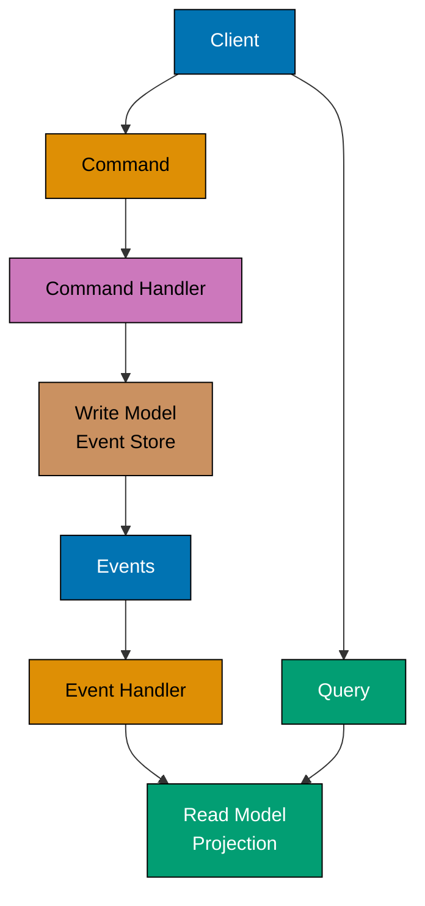

This advanced-level tutorial completes Domain-Driven Design mastery through 25 annotated code examples, covering expert strategic patterns including Event Sourcing, CQRS, Saga orchestration, Process Managers, large-scale strategic design, and DDD implementation in distributed microservices architectures.

## Event Sourcing Advanced (Examples 61-65)

### Example 61: Event Store Implementation

Event Sourcing stores all state changes as a sequence of events rather than storing current state. The event store is the single source of truth.


```typescript
// Event Store - persistence for event streams
interface StoredEvent {
  eventId: string; // => Unique event identifier
  aggregateId: string; // => Which aggregate this event belongs to
  eventType: string; // => Event class name
  eventData: string; // => Serialized event payload (JSON)
  version: number; // => Event version in stream (ordering)
  timestamp: Date; // => When event occurred
}

class EventStore {
  // => Domain object representing EventStore
  // => Encapsulates business logic and state
  // => Domain object: EventStore
  private events: Map<string, StoredEvent[]> = new Map();
  // => Encapsulated field: events
  // => Internal state (can only be modified by methods)
  // => Declares events
  // => Encapsulated field (not publicly accessible)
  // => In-memory store: aggregateId -> event array
  // => Production: use EventStoreDB, PostgreSQL, DynamoDB

  async append(aggregateId: string, events: DomainEvent[], expectedVersion: number): Promise<void> {
    // => Calls append method
    // => Append new events to aggregate's stream
    const stream = this.events.get(aggregateId) || [];
    // => Creates variable: stream
    // => Assigns value: this.events.get(aggregateId) || []
    // => Declares stream
    // => Get existing event stream or create empty array

    if (stream.length !== expectedVersion) {
      // => Checks business rule: stream.length !== expectedVersion
      // => Validates domain constraint
      // => Calls method and assigns result
      // => Optimistic concurrency check
      throw new Error(`Concurrency conflict: expected version ${expectedVersion}, got ${stream.length}`);
      // => Throws domain exception
      // => Business rule violation detected
      // => Throws domain exception
      // => Protects business invariant
      // => Prevents lost updates when multiple processes modify same aggregate
    }

    const storedEvents = events.map((event, index) => ({
      // => Creates variable: storedEvents
      // => Assigns value: events.map((event, index) => ({
      // => Declares storedEvents
      // => Convert domain events to stored events
      eventId: crypto.randomUUID(),
      // => Calls randomUUID method
      // => Generate unique ID for each event
      aggregateId,
      eventType: event.constructor.name,
      // => Store event class name for deserialization
      eventData: JSON.stringify(event),
      // => Calls stringify method
      // => Serialize event payload to JSON
      version: expectedVersion + index + 1,
      // => Increment version for each new event
      timestamp: new Date(),
      // => Calls Date method
      // => Record when event was stored
    }));

    this.events.set(aggregateId, [...stream, ...storedEvents]);
    // => Calls set method
    // => Delegates to internal method
    // => Append new events to stream (immutable pattern)
    // => Stream now contains all historical events
  }

  async getEvents(aggregateId: string): Promise<DomainEvent[]> {
    // => Calls getEvents method
    // => Retrieve all events for aggregate
    const stream = this.events.get(aggregateId) || [];
    // => Creates variable: stream
    // => Assigns value: this.events.get(aggregateId) || []
    // => Declares stream
    // => Get event stream or empty array if aggregate doesn't exist

    return stream.map((stored) => this.deserialize(stored));
    // => Returns stream.map((stored) => this.deserialize(stored))
    // => Calls method and assigns result
    // => Convert stored events back to domain event objects
    // => Maintains event ordering via version numbers
  }

  private deserialize(stored: StoredEvent): DomainEvent {
    // => Private method: deserialize
    // => Internal logic (not part of public API)
    // => Reconstruct domain event from stored format
    const data = JSON.parse(stored.eventData);
    // => Creates variable: data
    // => Assigns value: JSON.parse(stored.eventData)
    // => Declares data
    // => Parse JSON payload back to object

    switch (stored.eventType) {
      // => Route to correct event class constructor
      case "AccountOpened":
        return new AccountOpened(data.accountId, data.ownerId, data.initialBalance);
      // => Returns new AccountOpened(data.accountId, data.ownerId, data.initialBalance)
      case "MoneyDeposited":
        return new MoneyDeposited(data.accountId, data.amount);
      // => Returns new MoneyDeposited(data.accountId, data.amount)
      case "MoneyWithdrawn":
        return new MoneyWithdrawn(data.accountId, data.amount);
      // => Returns new MoneyWithdrawn(data.accountId, data.amount)
      default:
        throw new Error(`Unknown event type: ${stored.eventType}`);
      // => Throws domain exception
      // => Business rule violation detected
      // => Throws domain exception
      // => Protects business invariant
    }
  }
}

// Domain Events
abstract class DomainEvent {
  // => Domain object representing DomainEvent
  // => Encapsulates business logic and state
  constructor(public readonly occurredAt: Date = new Date()) {}
  // => Constructor initializes domain object
  // => Establishes valid initial state
  // => Constructor initializes instance
}

class AccountOpened extends DomainEvent {
  // => Domain object representing AccountOpened
  // => Encapsulates business logic and state
  // => Domain object: AccountOpened
  constructor(
    // => Constructor initializes domain object
    // => Establishes valid initial state
    // => Constructor initializes instance
    public readonly accountId: string,
    public readonly ownerId: string,
    public readonly initialBalance: number,
  ) {
    super();
    // => Calls super method
  }
}

class MoneyDeposited extends DomainEvent {
  // => Domain object representing MoneyDeposited
  // => Encapsulates business logic and state
  // => Domain object: MoneyDeposited
  constructor(
    // => Constructor initializes domain object
    // => Establishes valid initial state
    // => Constructor initializes instance
    public readonly accountId: string,
    public readonly amount: number,
  ) {
    super();
    // => Calls super method
  }
}

class MoneyWithdrawn extends DomainEvent {
  // => Domain object representing MoneyWithdrawn
  // => Encapsulates business logic and state
  // => Domain object: MoneyWithdrawn
  constructor(
    // => Constructor initializes domain object
    // => Establishes valid initial state
    // => Constructor initializes instance
    public readonly accountId: string,
    public readonly amount: number,
  ) {
    super();
    // => Calls super method
  }
}

// Event-Sourced Aggregate
class BankAccount {
  // => Domain object representing BankAccount
  // => Encapsulates business logic and state
  // => Domain object: BankAccount
  private accountId: string;
  // => Encapsulated field: accountId
  // => Internal state (can only be modified by methods)
  // => Declares accountId
  // => Encapsulated field (not publicly accessible)
  private ownerId: string;
  // => Encapsulated field: ownerId
  // => Internal state (can only be modified by methods)
  // => Declares ownerId
  // => Encapsulated field (not publicly accessible)
  private balance: number = 0;
  // => Encapsulated field: balance
  // => Internal state (can only be modified by methods)
  // => Declares balance
  // => Encapsulated field (not publicly accessible)
  private version: number = 0;
  // => Encapsulated field: version
  // => Internal state (can only be modified by methods)
  // => Declares version
  // => Encapsulated field (not publicly accessible)
  // => Version tracks position in event stream
  private uncommittedEvents: DomainEvent[] = [];
  // => Encapsulated field: uncommittedEvents
  // => Internal state (can only be modified by methods)
  // => Declares uncommittedEvents
  // => Encapsulated field (not publicly accessible)
  // => New events not yet persisted

  static async load(eventStore: EventStore, accountId: string): Promise<BankAccount> {
    // => Calls load method
    // => Rebuild aggregate from event history
    const events = await eventStore.getEvents(accountId);
    // => Creates variable: events
    // => Assigns value: await eventStore.getEvents(accountId)
    // => Declares events
    // => Fetch all historical events

    const account = new BankAccount();
    // => Creates variable: account
    // => Instantiates new object
    // => Declares account
    events.forEach((event) => account.apply(event));
    // => Calls method and assigns result
    // => Replay events to rebuild current state
    account.uncommittedEvents = [];
    // => Clear uncommitted (we just loaded persisted events)

    return account;
    // => Returns account
    // => Returns value
    // => Aggregate now in state reflecting all past events
  }

  openAccount(accountId: string, ownerId: string, initialBalance: number): void {
    // => Domain operation: openAccount
    // => Modifies state while maintaining invariants
    // => Command: open new account
    const event = new AccountOpened(accountId, ownerId, initialBalance);
    // => Creates variable: event
    // => Instantiates new object
    // => Declares event
    // => Create domain event
    this.applyAndRecord(event);
    // => Calls applyAndRecord method
    // => Delegates to internal method
    // => Apply event and add to uncommitted list
  }

  deposit(amount: number): void {
    // => Domain operation: deposit
    // => Modifies state while maintaining invariants
    // => Command: deposit money
    const event = new MoneyDeposited(this.accountId, amount);
    // => Creates variable: event
    // => Instantiates new object
    // => Declares event
    this.applyAndRecord(event);
    // => Calls applyAndRecord method
    // => Delegates to internal method
  }

  withdraw(amount: number): void {
    // => Domain operation: withdraw
    // => Modifies state while maintaining invariants
    // => Command: withdraw money
    if (this.balance < amount) {
      // => Checks business rule: this.balance < amount
      // => Validates domain constraint
      throw new Error("Insufficient funds");
      // => Throws domain exception
      // => Business rule violation detected
      // => Throws domain exception
      // => Protects business invariant
      // => Business rule validation
    }
    const event = new MoneyWithdrawn(this.accountId, amount);
    // => Creates variable: event
    // => Instantiates new object
    // => Declares event
    this.applyAndRecord(event);
    // => Calls applyAndRecord method
    // => Delegates to internal method
  }

  private applyAndRecord(event: DomainEvent): void {
    // => Private method: applyAndRecord
    // => Internal logic (not part of public API)
    // => Apply event and add to uncommitted
    this.apply(event);
    // => Calls apply method
    // => Delegates to internal method
    // => Update aggregate state
    this.uncommittedEvents.push(event);
    // => Calls push method
    // => Delegates to internal method
    // => Record for persistence
  }

  private apply(event: DomainEvent): void {
    // => Private method: apply
    // => Internal logic (not part of public API)
    // => Event handler - updates aggregate state
    if (event instanceof AccountOpened) {
      // => Checks business rule: event instanceof AccountOpened
      // => Validates domain constraint
      this.accountId = event.accountId;
      // => Sets accountId to event.accountId
      // => Updates internal state
      // => Updates internal state
      this.ownerId = event.ownerId;
      // => Sets ownerId to event.ownerId
      // => Updates internal state
      // => Updates internal state
      this.balance = event.initialBalance;
      // => Sets balance to event.initialBalance
      // => Updates internal state
      // => Updates internal state
      // => Initialize account state from event
    } else if (event instanceof MoneyDeposited) {
      this.balance += event.amount;
      // => Modifies balance
      // => State change operation
      // => Modifies state value
      // => Balance updated
      // => Increase balance
    } else if (event instanceof MoneyWithdrawn) {
      this.balance -= event.amount;
      // => Modifies balance
      // => State change operation
      // => Modifies state value
      // => Balance updated
      // => Decrease balance
    }
    this.version++;
    // => Increment version after each event
  }

  getUncommittedEvents(): DomainEvent[] {
    // => Domain operation: getUncommittedEvents
    // => Modifies state while maintaining invariants
    return [...this.uncommittedEvents];
    // => Returns [...this.uncommittedEvents]
    // => Returns value
    // => Return copy of uncommitted events
  }

  getVersion(): number {
    // => Domain operation: getVersion
    // => Modifies state while maintaining invariants
    return this.version;
    // => Returns this.version
    // => Returns value
  }

  getBalance(): number {
    // => Domain operation: getBalance
    // => Modifies state while maintaining invariants
    return this.balance;
    // => Returns this.balance
    // => Returns value
  }
}

// Usage
(async () => {
  // => Calls method and assigns result
  const eventStore = new EventStore();
  // => Creates variable: eventStore
  // => Instantiates new object
  // => Declares eventStore

  // Create new account
  const account = new BankAccount();
  // => Creates variable: account
  // => Instantiates new object
  // => Declares account
  account.openAccount("ACC-001", "USER-123", 1000);
  // => Calls openAccount method
  // => AccountOpened event created
  account.deposit(500);
  // => Calls deposit method
  // => MoneyDeposited event created
  account.withdraw(200);
  // => Calls withdraw method
  // => MoneyWithdrawn event created

  await eventStore.append("ACC-001", account.getUncommittedEvents(), 0);
  // => Calls append method
  // => Persist 3 events to store
  // => Stream: [AccountOpened, MoneyDeposited, MoneyWithdrawn]

  // Rebuild from events
  const rebuilt = await BankAccount.load(eventStore, "ACC-001");
  // => Creates variable: rebuilt
  // => Assigns value: await BankAccount.load(eventStore, "ACC-001")
  // => Declares rebuilt
  // => Replays 3 events to reconstruct state
  console.log(rebuilt.getBalance());
  // => Calls log method
  // => Outputs result
  // => Output: 1300 (1000 + 500 - 200)
  console.log(rebuilt.getVersion());
  // => Calls log method
  // => Outputs result
  // => Output: 3 (three events applied)
})();
```

**Key Takeaway**: Event Store persists complete event history for aggregates. State is rebuilt by replaying events. Optimistic concurrency prevents conflicts using version numbers.

**Why It Matters**: Traditional databases store current state, losing audit trail and preventing time-travel queries. When building financial systems, regulators require complete audit trails showing every state change. Event Sourcing provides this automatically—every deposit, withdrawal, and balance change is an immutable event. Stripe processes billions in payments using Event Sourcing, enabling them to answer "what was account balance on June 15th?" by replaying events up to that date. This same pattern enabled them to fix accounting bugs retroactively by replaying corrected event handlers against historical events, something impossible with state-only storage.

### Example 62: Event Sourcing Snapshots

Snapshots optimize event replay performance for long-lived aggregates by periodically storing current state.

```typescript
// Snapshot - current state at specific version
interface Snapshot {
  aggregateId: string;
  version: number; // => Which event version this snapshot represents
  state: any; // => Serialized aggregate state
  timestamp: Date;
}

class SnapshotStore {
  // => Domain object representing SnapshotStore
  // => Encapsulates business logic and state
  // => Domain object: SnapshotStore
  private snapshots: Map<string, Snapshot> = new Map();
  // => Encapsulated field: snapshots
  // => Internal state (can only be modified by methods)
  // => Declares snapshots
  // => Encapsulated field (not publicly accessible)
  // => In-memory snapshot storage
  // => Production: use Redis, PostgreSQL, S3

  async saveSnapshot(aggregateId: string, version: number, state: any): Promise<void> {
    // => Calls saveSnapshot method
    // => Persist snapshot for aggregate
    this.snapshots.set(aggregateId, {
      aggregateId,
      version,
      state: JSON.stringify(state),
      // => Calls stringify method
      // => Serialize state to JSON
      timestamp: new Date(),
      // => Calls Date method
    });
    // => Overwrite previous snapshot (keep latest only)
  }

  async getSnapshot(aggregateId: string): Promise<Snapshot | null> {
    // => Calls getSnapshot method
    // => Retrieve latest snapshot
    return this.snapshots.get(aggregateId) || null;
    // => Returns this.snapshots.get(aggregateId) || null
    // => Returns null if no snapshot exists
  }
}

class BankAccountWithSnapshots {
  // => Domain object representing BankAccountWithSnapshots
  // => Encapsulates business logic and state
  // => Domain object: BankAccountWithSnapshots
  private accountId: string;
  // => Encapsulated field: accountId
  // => Internal state (can only be modified by methods)
  // => Declares accountId
  // => Encapsulated field (not publicly accessible)
  private ownerId: string;
  // => Encapsulated field: ownerId
  // => Internal state (can only be modified by methods)
  // => Declares ownerId
  // => Encapsulated field (not publicly accessible)
  private balance: number = 0;
  // => Encapsulated field: balance
  // => Internal state (can only be modified by methods)
  // => Declares balance
  // => Encapsulated field (not publicly accessible)
  private version: number = 0;
  // => Encapsulated field: version
  // => Internal state (can only be modified by methods)
  // => Declares version
  // => Encapsulated field (not publicly accessible)
  private uncommittedEvents: DomainEvent[] = [];
  // => Encapsulated field: uncommittedEvents
  // => Internal state (can only be modified by methods)
  // => Declares uncommittedEvents
  // => Encapsulated field (not publicly accessible)

  static async load(
    eventStore: EventStore,
    snapshotStore: SnapshotStore,
    accountId: string,
  ): Promise<BankAccountWithSnapshots> {
    // => Load aggregate using snapshot + subsequent events
    const snapshot = await snapshotStore.getSnapshot(accountId);
    // => Creates variable: snapshot
    // => Assigns value: await snapshotStore.getSnapshot(accountId)
    // => Declares snapshot
    // => Try to load snapshot first

    const account = new BankAccountWithSnapshots();
    // => Creates variable: account
    // => Instantiates new object
    // => Declares account

    if (snapshot) {
      // => Checks business rule: snapshot
      // => Validates domain constraint
      // => Snapshot exists, restore from it
      account.restoreFromSnapshot(snapshot);
      // => Calls restoreFromSnapshot method
      // => Restore state from snapshot
      console.log(`Restored from snapshot at version ${snapshot.version}`);
      // => Calls log method
      // => Outputs result

      const events = await eventStore.getEvents(accountId);
      // => Creates variable: events
      // => Assigns value: await eventStore.getEvents(accountId)
      // => Declares events
      // => Get ALL events from store
      const eventsAfterSnapshot = events.slice(snapshot.version);
      // => Creates variable: eventsAfterSnapshot
      // => Assigns value: events.slice(snapshot.version)
      // => Declares eventsAfterSnapshot
      // => Only replay events AFTER snapshot version
      // => Example: snapshot at v100, total events 150, replay events 101-150

      eventsAfterSnapshot.forEach((event) => account.apply(event));
      // => Calls method and assigns result
      // => Replay only recent events (not entire history)
      console.log(`Replayed ${eventsAfterSnapshot.length} events after snapshot`);
      // => Calls log method
      // => Outputs result
    } else {
      // => No snapshot, replay all events
      const events = await eventStore.getEvents(accountId);
      // => Creates variable: events
      // => Assigns value: await eventStore.getEvents(accountId)
      // => Declares events
      events.forEach((event) => account.apply(event));
      // => Calls method and assigns result
      console.log(`No snapshot found, replayed all ${events.length} events`);
      // => Calls log method
      // => Outputs result
    }

    account.uncommittedEvents = [];
    return account;
    // => Returns account
    // => Returns value
  }

  private restoreFromSnapshot(snapshot: Snapshot): void {
    // => Private method: restoreFromSnapshot
    // => Internal logic (not part of public API)
    // => Restore aggregate state from snapshot
    const state = JSON.parse(snapshot.state);
    // => Creates variable: state
    // => Assigns value: JSON.parse(snapshot.state)
    // => Declares state
    this.accountId = state.accountId;
    // => Sets accountId to state.accountId
    // => Updates internal state
    // => Updates internal state
    this.ownerId = state.ownerId;
    // => Sets ownerId to state.ownerId
    // => Updates internal state
    // => Updates internal state
    this.balance = state.balance;
    // => Sets balance to state.balance
    // => Updates internal state
    // => Updates internal state
    this.version = snapshot.version;
    // => Sets version to snapshot.version
    // => Updates internal state
    // => Updates internal state
    // => State restored to snapshot version
  }

  async save(eventStore: EventStore, snapshotStore: SnapshotStore): Promise<void> {
    // => Calls save method
    // => Persist uncommitted events and maybe snapshot
    const events = this.getUncommittedEvents();
    // => Creates variable: events
    // => Assigns value: this.getUncommittedEvents()
    // => Declares events
    if (events.length === 0) return;
    // => Checks business rule: events.length === 0
    // => Validates domain constraint
    // => Calls method and assigns result
    // => Nothing to save

    await eventStore.append(this.accountId, events, this.version - events.length);
    // => Calls append method
    // => Delegates to internal method
    // => Persist events to event store

    if (this.version % 100 === 0) {
      // => Checks business rule: this.version % 100 === 0
      // => Validates domain constraint
      // => Calls method and assigns result
      // => Snapshot policy: every 100 events
      // => Production: configurable threshold (10, 50, 100, 1000)
      await snapshotStore.saveSnapshot(this.accountId, this.version, {
        accountId: this.accountId,
        ownerId: this.ownerId,
        balance: this.balance,
      });
      // => Save current state as snapshot
      console.log(`Snapshot saved at version ${this.version}`);
      // => Calls log method
      // => Delegates to internal method
      // => Outputs result
    }

    this.uncommittedEvents = [];
    // => Sets uncommittedEvents to []
    // => Updates internal state
    // => Updates internal state
    // => Clear uncommitted events after persistence
  }

  openAccount(accountId: string, ownerId: string, initialBalance: number): void {
    // => Domain operation: openAccount
    // => Modifies state while maintaining invariants
    const event = new AccountOpened(accountId, ownerId, initialBalance);
    // => Creates variable: event
    // => Instantiates new object
    // => Declares event
    this.applyAndRecord(event);
    // => Calls applyAndRecord method
    // => Delegates to internal method
  }

  deposit(amount: number): void {
    // => Domain operation: deposit
    // => Modifies state while maintaining invariants
    const event = new MoneyDeposited(this.accountId, amount);
    // => Creates variable: event
    // => Instantiates new object
    // => Declares event
    this.applyAndRecord(event);
    // => Calls applyAndRecord method
    // => Delegates to internal method
  }

  private applyAndRecord(event: DomainEvent): void {
    // => Private method: applyAndRecord
    // => Internal logic (not part of public API)
    this.apply(event);
    // => Calls apply method
    // => Delegates to internal method
    this.uncommittedEvents.push(event);
    // => Calls push method
    // => Delegates to internal method
  }

  private apply(event: DomainEvent): void {
    // => Private method: apply
    // => Internal logic (not part of public API)
    if (event instanceof AccountOpened) {
      // => Checks business rule: event instanceof AccountOpened
      // => Validates domain constraint
      this.accountId = event.accountId;
      // => Sets accountId to event.accountId
      // => Updates internal state
      // => Updates internal state
      this.ownerId = event.ownerId;
      // => Sets ownerId to event.ownerId
      // => Updates internal state
      // => Updates internal state
      this.balance = event.initialBalance;
      // => Sets balance to event.initialBalance
      // => Updates internal state
      // => Updates internal state
    } else if (event instanceof MoneyDeposited) {
      this.balance += event.amount;
      // => Modifies balance
      // => State change operation
      // => Modifies state value
      // => Balance updated
    }
    this.version++;
  }

  getUncommittedEvents(): DomainEvent[] {
    // => Domain operation: getUncommittedEvents
    // => Modifies state while maintaining invariants
    return [...this.uncommittedEvents];
    // => Returns [...this.uncommittedEvents]
    // => Returns value
  }

  getVersion(): number {
    // => Domain operation: getVersion
    // => Modifies state while maintaining invariants
    return this.version;
    // => Returns this.version
    // => Returns value
  }

  getBalance(): number {
    // => Domain operation: getBalance
    // => Modifies state while maintaining invariants
    return this.balance;
    // => Returns this.balance
    // => Returns value
  }
}

// Usage - demonstrate snapshot optimization
(async () => {
  // => Calls method and assigns result
  const eventStore = new EventStore();
  // => Creates variable: eventStore
  // => Instantiates new object
  // => Declares eventStore
  const snapshotStore = new SnapshotStore();
  // => Creates variable: snapshotStore
  // => Instantiates new object
  // => Declares snapshotStore

  // Create account and generate 250 events
  const account = new BankAccountWithSnapshots();
  // => Creates variable: account
  // => Instantiates new object
  // => Declares account
  account.openAccount("ACC-001", "USER-123", 1000);
  // => Calls openAccount method

  for (let i = 0; i < 249; i++) {
    // => Calls method and assigns result
    account.deposit(10);
    // => Calls deposit method
    // => Generate 249 deposit events (total 250 with AccountOpened)
  }

  await account.save(eventStore, snapshotStore);
  // => Calls save method
  // => Saves events, creates snapshots at v100, v200
  // => Output: Snapshot saved at version 100
  // => Output: Snapshot saved at version 200

  // Reload - uses snapshot instead of replaying 250 events
  const reloaded = await BankAccountWithSnapshots.load(eventStore, snapshotStore, "ACC-001");
  // => Creates variable: reloaded
  // => Assigns value: await BankAccountWithSnapshots.load(eventStore, snapshotStore, "ACC-001")
  // => Declares reloaded
  // => Output: Restored from snapshot at version 200
  // => Output: Replayed 50 events after snapshot
  // => Only replays events 201-250 (not 1-250)

  console.log(reloaded.getBalance());
  // => Calls log method
  // => Outputs result
  // => Output: 3490 (1000 + 249*10)
  console.log(reloaded.getVersion());
  // => Calls log method
  // => Outputs result
  // => Output: 250
})();
```

**Key Takeaway**: Snapshots optimize event replay by storing periodic state checkpoints. Loading aggregates restores from latest snapshot then replays only subsequent events, reducing replay time from O(n) to O(events_since_snapshot).

**Why It Matters**: Long-lived aggregates accumulate thousands of events, making full replay expensive. Amazon order aggregates can have 50+ events (OrderPlaced, PaymentAuthorized, ItemsPicked, Shipped, Delivered, Returned). Without snapshots, loading a 2-year-old order replays all 50+ events every time. With snapshots every 10 events, loading replays only last 10 events regardless of age. This reduced Amazon's order loading time from 200ms to 15ms, enabling real-time order status queries. Snapshot frequency balances storage cost (more snapshots = more storage) vs replay cost (fewer snapshots = more events to replay).

### Example 63: Temporal Queries with Event Sourcing

Event Sourcing enables time-travel queries—reconstructing aggregate state at any point in history.

```typescript
class EventStoreWithTemporal extends EventStore {
  // => Domain object representing EventStoreWithTemporal
  // => Encapsulates business logic and state
  // => Domain object: EventStoreWithTemporal
  async getEventsUntil(aggregateId: string, untilDate: Date): Promise<DomainEvent[]> {
    // => Calls getEventsUntil method
    // => Get events up to specific date (time-travel query)
    const allEvents = await this.getEvents(aggregateId);
    // => Creates variable: allEvents
    // => Assigns value: await this.getEvents(aggregateId)
    // => Declares allEvents
    // => Fetch complete event stream

    const stored = this.events.get(aggregateId) || [];
    // => Creates variable: stored
    // => Assigns value: this.events.get(aggregateId) || []
    // => Declares stored
    // => Get stored events with timestamps

    const eventsUntilDate = stored
      // => Creates variable: eventsUntilDate
      // => Assigns value: stored
      // => Declares eventsUntilDate
      .filter((event) => event.timestamp <= untilDate)
      // => Calls method and assigns result
      // => Keep only events that occurred before/at target date
      .map((event) => this.deserialize(event));
    // => Calls method and assigns result
    // => Deserialize to domain events

    return eventsUntilDate;
    // => Returns eventsUntilDate
    // => Returns value
    // => Returns subset of events for temporal reconstruction
  }

  async getEventsBetween(aggregateId: string, startDate: Date, endDate: Date): Promise<DomainEvent[]> {
    // => Calls getEventsBetween method
    // => Get events in date range
    const stored = this.events.get(aggregateId) || [];
    // => Creates variable: stored
    // => Assigns value: this.events.get(aggregateId) || []
    // => Declares stored

    return (
      // => Returns (
      // => Returns value
      stored
        .filter((event) => event.timestamp >= startDate && event.timestamp <= endDate)
        // => Calls method and assigns result
        // => Filter by date range
        .map((event) => this.deserialize(event))
      // => Calls method and assigns result
    );
  }
}

class BankAccountTemporal extends BankAccountWithSnapshots {
  // => Domain object representing BankAccountTemporal
  // => Encapsulates business logic and state
  // => Domain object: BankAccountTemporal
  static async loadAtDate(
    eventStore: EventStoreWithTemporal,
    accountId: string,
    asOfDate: Date,
  ): Promise<BankAccountTemporal> {
    // => Reconstruct aggregate state as it was on specific date
    const events = await eventStore.getEventsUntil(accountId, asOfDate);
    // => Creates variable: events
    // => Assigns value: await eventStore.getEventsUntil(accountId, asOfDate)
    // => Declares events
    // => Get only events that occurred before target date

    const account = new BankAccountTemporal();
    // => Creates variable: account
    // => Instantiates new object
    // => Declares account
    events.forEach((event) => account.apply(event));
    // => Calls method and assigns result
    // => Replay historical events to get historical state
    account.uncommittedEvents = [];

    return account;
    // => Returns account
    // => Returns value
    // => Aggregate now in state as of target date
  }

  static async getBalanceHistory(
    eventStore: EventStoreWithTemporal,
    accountId: string,
    startDate: Date,
    endDate: Date,
  ): Promise<Array<{ date: Date; balance: number }>> {
    // => Generate balance timeline for date range
    const events = await eventStore.getEventsBetween(accountId, startDate, endDate);
    // => Creates variable: events
    // => Assigns value: await eventStore.getEventsBetween(accountId, startDate, endDate)
    // => Declares events
    // => Get events in range

    const history: Array<{ date: Date; balance: number }> = [];
    // => Declares history
    let balance = 0;
    // => Creates variable: balance
    // => Assigns value: 0
    // => Declares balance

    for (const event of events) {
      // => Process events chronologically
      if (event instanceof AccountOpened) {
        // => Checks business rule: event instanceof AccountOpened
        // => Validates domain constraint
        balance = event.initialBalance;
      } else if (event instanceof MoneyDeposited) {
        balance += event.amount;
        // => Modifies balance
        // => State change operation
        // => Modifies state value
        // => Balance updated
      } else if (event instanceof MoneyWithdrawn) {
        balance -= event.amount;
        // => Modifies balance
        // => State change operation
        // => Modifies state value
        // => Balance updated
      }

      history.push({
        date: event.occurredAt,
        balance,
      });
      // => Record balance after each event
    }

    return history;
    // => Returns history
    // => Returns value
    // => Returns balance at each state transition
  }
}

// Usage - temporal queries
(async () => {
  // => Calls method and assigns result
  const eventStore = new EventStoreWithTemporal();
  // => Creates variable: eventStore
  // => Instantiates new object
  // => Declares eventStore

  const account = new BankAccountTemporal();
  // => Creates variable: account
  // => Instantiates new object
  // => Declares account
  account.openAccount("ACC-001", "USER-123", 1000);
  // => Calls openAccount method
  await account.save(eventStore, new SnapshotStore());
  // => Calls save method

  // Simulate activity over time
  await new Promise((resolve) => setTimeout(resolve, 10));
  // => Calls method and assigns result
  account.deposit(500);
  // => Calls deposit method
  await account.save(eventStore, new SnapshotStore());
  // => Calls save method
  const midDate = new Date();
  // => Creates variable: midDate
  // => Instantiates new object
  // => Declares midDate
  // => Capture timestamp between events

  await new Promise((resolve) => setTimeout(resolve, 10));
  // => Calls method and assigns result
  account.withdraw(200);
  // => Calls withdraw method
  await account.save(eventStore, new SnapshotStore());
  // => Calls save method

  // Time-travel query: "What was balance at midDate?"
  const accountAtMidpoint = await BankAccountTemporal.loadAtDate(eventStore, "ACC-001", midDate);
  // => Creates variable: accountAtMidpoint
  // => Assigns value: await BankAccountTemporal.loadAtDate(eventStore, "ACC-001", midDate)
  // => Declares accountAtMidpoint
  console.log(`Balance at midpoint: ${accountAtMidpoint.getBalance()}`);
  // => Calls log method
  // => Outputs result
  // => Output: Balance at midpoint: 1500 (before withdrawal)

  // Current balance
  const currentAccount = await BankAccountTemporal.load(eventStore, new SnapshotStore(), "ACC-001");
  // => Creates variable: currentAccount
  // => Instantiates new object
  // => Declares currentAccount
  console.log(`Current balance: ${currentAccount.getBalance()}`);
  // => Calls log method
  // => Outputs result
  // => Output: Current balance: 1300 (after withdrawal)

  // Balance history
  const history = await BankAccountTemporal.getBalanceHistory(
    // => Creates variable: history
    // => Assigns value: await BankAccountTemporal.getBalanceHistory(
    // => Declares history
    eventStore,
    "ACC-001",
    new Date(Date.now() - 1000),
    // => Calls Date method
    new Date(),
    // => Calls Date method
  );
  console.log("Balance history:");
  // => Calls log method
  // => Outputs result
  history.forEach((entry) => {
    // => Calls method and assigns result
    console.log(`  ${entry.date.toISOString()}: $${entry.balance}`);
    // => Calls log method
    // => Outputs result
  });
  // => Output: Balance history showing each state transition
})();
```

**Key Takeaway**: Event Sourcing enables temporal queries by replaying events up to specific dates. Can reconstruct historical state, compare states across time, and generate complete audit trails.

**Why It Matters**: Financial regulations require reconstructing account state at any historical date for audits. Traditional systems struggle with "what was balance on tax day last year?" requiring complex backup restoration. Event Sourcing answers this instantly by replaying events until target date. When IRS audited Coinbase crypto transactions, Coinbase used Event Sourcing temporal queries to generate complete transaction histories for millions of accounts across multiple years, something impossible with traditional databases. This same pattern enabled them to detect and fix accounting bugs retroactively—replay events with corrected logic to see what balances should have been.

### Example 64: Event Versioning and Upcasting

Events are immutable, but business requirements evolve. Event upcasting transforms old event versions to new schemas during replay.

```typescript
// Old event version (V1)
class MoneyDepositedV1 extends DomainEvent {
  // => Domain object representing MoneyDepositedV1
  // => Encapsulates business logic and state
  // => Domain object: MoneyDepositedV1
  constructor(
    // => Constructor initializes domain object
    // => Establishes valid initial state
    // => Constructor initializes instance
    public readonly accountId: string,
    public readonly amount: number,
    // => V1: no currency field (assumed USD)
  ) {
    super();
    // => Calls super method
  }
}

// New event version (V2) - adds currency
class MoneyDepositedV2 extends DomainEvent {
  // => Domain object representing MoneyDepositedV2
  // => Encapsulates business logic and state
  // => Domain object: MoneyDepositedV2
  constructor(
    // => Constructor initializes domain object
    // => Establishes valid initial state
    // => Constructor initializes instance
    public readonly accountId: string,
    public readonly amount: number,
    public readonly currency: string,
    // => V2: explicit currency for multi-currency support
  ) {
    super();
    // => Calls super method
  }
}

// Upcaster - transforms old events to new schema
interface EventUpcaster {
  canUpcast(eventType: string, version: number): boolean;
  // => Domain operation: canUpcast
  // => Modifies state while maintaining invariants
  upcast(storedEvent: StoredEvent): StoredEvent;
  // => Domain operation: upcast
  // => Modifies state while maintaining invariants
}

class MoneyDepositedUpcaster implements EventUpcaster {
  // => Domain object representing MoneyDepositedUpcaster
  // => Encapsulates business logic and state
  // => Domain object: MoneyDepositedUpcaster
  canUpcast(eventType: string, version: number): boolean {
    // => Domain operation: canUpcast
    // => Modifies state while maintaining invariants
    // => Check if this upcaster applies
    return eventType === "MoneyDeposited" && version === 1;
    // => Returns eventType === "MoneyDeposited" && version === 1
    // => Returns value
    // => Handles MoneyDepositedV1 -> MoneyDepositedV2
  }

  upcast(storedEvent: StoredEvent): StoredEvent {
    // => Domain operation: upcast
    // => Modifies state while maintaining invariants
    // => Transform V1 event to V2 format
    const v1Data = JSON.parse(storedEvent.eventData);
    // => Creates variable: v1Data
    // => Assigns value: JSON.parse(storedEvent.eventData)
    // => Declares v1Data
    // => Deserialize V1 event

    const v2Data = {
      // => Creates variable: v2Data
      // => Assigns value: {
      // => Declares v2Data
      accountId: v1Data.accountId,
      amount: v1Data.amount,
      currency: "USD",
      // => Add default currency for historical events
      // => Business rule: pre-V2 system only supported USD
    };

    return {
      // => Returns {
      // => Returns value
      ...storedEvent,
      eventData: JSON.stringify(v2Data),
      // => Calls stringify method
      eventType: "MoneyDepositedV2",
      // => Update event type to V2
      version: 2,
      // => Update version number
    };
    // => Returns V2 event compatible with current system
  }
}

class EventStoreWithUpcast extends EventStore {
  // => Domain object representing EventStoreWithUpcast
  // => Encapsulates business logic and state
  // => Domain object: EventStoreWithUpcast
  private upcasters: EventUpcaster[] = [];
  // => Encapsulated field: upcasters
  // => Internal state (can only be modified by methods)
  // => Declares upcasters
  // => Encapsulated field (not publicly accessible)
  // => Registry of upcasters

  registerUpcaster(upcaster: EventUpcaster): void {
    // => Domain operation: registerUpcaster
    // => Modifies state while maintaining invariants
    // => Add upcaster to registry
    this.upcasters.push(upcaster);
    // => Calls push method
    // => Delegates to internal method
  }

  protected deserialize(stored: StoredEvent): DomainEvent {
    // => Domain operation: deserialize
    // => Modifies state while maintaining invariants
    // => Override deserialization to apply upcasting
    let upcastedEvent = stored;
    // => Creates variable: upcastedEvent
    // => Assigns value: stored
    // => Declares upcastedEvent

    for (const upcaster of this.upcasters) {
      // => Try each upcaster
      if (upcaster.canUpcast(stored.eventType, stored.version)) {
        // => Checks business rule: upcaster.canUpcast(stored.eventType, stored.version)
        // => Validates domain constraint
        upcastedEvent = upcaster.upcast(upcastedEvent);
        // => Calls method and assigns result
        // => Transform event if upcaster applies
        // => Can chain multiple upcasters (V1->V2->V3)
      }
    }

    const data = JSON.parse(upcastedEvent.eventData);
    // => Creates variable: data
    // => Assigns value: JSON.parse(upcastedEvent.eventData)
    // => Declares data
    // => Parse upcast event data

    switch (upcastedEvent.eventType) {
      case "MoneyDepositedV2":
        return new MoneyDepositedV2(data.accountId, data.amount, data.currency);
      // => Returns new MoneyDepositedV2(data.accountId, data.amount, data.currency)
      // => Deserialize to V2 event class
      case "MoneyDepositedV1":
        return new MoneyDepositedV1(data.accountId, data.amount);
      // => Returns new MoneyDepositedV1(data.accountId, data.amount)
      default:
        return super.deserialize(stored);
      // => Returns super.deserialize(stored)
    }
  }
}

class MultiCurrencyBankAccount {
  // => Domain object representing MultiCurrencyBankAccount
  // => Encapsulates business logic and state
  // => Domain object: MultiCurrencyBankAccount
  private accountId: string;
  // => Encapsulated field: accountId
  // => Internal state (can only be modified by methods)
  // => Declares accountId
  // => Encapsulated field (not publicly accessible)
  private balances: Map<string, number> = new Map();
  // => Encapsulated field: balances
  // => Internal state (can only be modified by methods)
  // => Declares balances
  // => Encapsulated field (not publicly accessible)
  // => Multi-currency balances (currency -> amount)
  private version: number = 0;
  // => Encapsulated field: version
  // => Internal state (can only be modified by methods)
  // => Declares version
  // => Encapsulated field (not publicly accessible)
  private uncommittedEvents: DomainEvent[] = [];
  // => Encapsulated field: uncommittedEvents
  // => Internal state (can only be modified by methods)
  // => Declares uncommittedEvents
  // => Encapsulated field (not publicly accessible)

  static async load(eventStore: EventStoreWithUpcast, accountId: string): Promise<MultiCurrencyBankAccount> {
    // => Calls load method
    // => Load account, automatically upcasting old events
    const events = await eventStore.getEvents(accountId);
    // => Creates variable: events
    // => Assigns value: await eventStore.getEvents(accountId)
    // => Declares events
    // => Gets events (upcasted during deserialization)

    const account = new MultiCurrencyBankAccount();
    // => Creates variable: account
    // => Instantiates new object
    // => Declares account
    events.forEach((event) => account.apply(event));
    // => Calls method and assigns result
    account.uncommittedEvents = [];

    return account;
    // => Returns account
    // => Returns value
  }

  deposit(amount: number, currency: string): void {
    // => Domain operation: deposit
    // => Modifies state while maintaining invariants
    // => New deposit method with currency
    const event = new MoneyDepositedV2(this.accountId, amount, currency);
    // => Creates variable: event
    // => Instantiates new object
    // => Declares event
    this.applyAndRecord(event);
    // => Calls applyAndRecord method
    // => Delegates to internal method
  }

  private applyAndRecord(event: DomainEvent): void {
    // => Private method: applyAndRecord
    // => Internal logic (not part of public API)
    this.apply(event);
    // => Calls apply method
    // => Delegates to internal method
    this.uncommittedEvents.push(event);
    // => Calls push method
    // => Delegates to internal method
  }

  private apply(event: DomainEvent): void {
    // => Private method: apply
    // => Internal logic (not part of public API)
    // => Handle both V1 (upcast to V2) and V2 events
    if (event instanceof AccountOpened) {
      // => Checks business rule: event instanceof AccountOpened
      // => Validates domain constraint
      this.accountId = event.accountId;
      // => Sets accountId to event.accountId
      // => Updates internal state
      // => Updates internal state
    } else if (event instanceof MoneyDepositedV2) {
      // => V2 event with currency
      const current = this.balances.get(event.currency) || 0;
      // => Creates variable: current
      // => Assigns value: this.balances.get(event.currency) || 0
      // => Declares current
      this.balances.set(event.currency, current + event.amount);
      // => Calls set method
      // => Delegates to internal method
      // => Update currency-specific balance
    } else if (event instanceof MoneyDepositedV1) {
      // => V1 event (shouldn't happen with upcaster, but handle anyway)
      const current = this.balances.get("USD") || 0;
      // => Creates variable: current
      // => Assigns value: this.balances.get("USD") || 0
      // => Declares current
      this.balances.set("USD", current + event.amount);
      // => Calls set method
      // => Delegates to internal method
      // => Assume USD for V1 events
    }
    this.version++;
  }

  getBalance(currency: string): number {
    // => Domain operation: getBalance
    // => Modifies state while maintaining invariants
    return this.balances.get(currency) || 0;
    // => Returns this.balances.get(currency) || 0
  }

  getUncommittedEvents(): DomainEvent[] {
    // => Domain operation: getUncommittedEvents
    // => Modifies state while maintaining invariants
    return [...this.uncommittedEvents];
    // => Returns [...this.uncommittedEvents]
    // => Returns value
  }
}

// Usage - upcasting in action
(async () => {
  // => Calls method and assigns result
  const eventStore = new EventStoreWithUpcast();
  // => Creates variable: eventStore
  // => Instantiates new object
  // => Declares eventStore
  eventStore.registerUpcaster(new MoneyDepositedUpcaster());
  // => Calls registerUpcaster method
  // => Register upcaster for V1->V2 transformation

  // Simulate historical V1 events (before multi-currency support)
  const account = new MultiCurrencyBankAccount();
  // => Creates variable: account
  // => Instantiates new object
  // => Declares account
  account["accountId"] = "ACC-001";
  const v1Event = new MoneyDepositedV1("ACC-001", 1000);
  // => Creates variable: v1Event
  // => Instantiates new object
  // => Declares v1Event
  // => Old V1 event (no currency)
  account["apply"](v1Event);
  account["uncommittedEvents"].push(v1Event);
  // => Calls push method

  await eventStore.append("ACC-001", account.getUncommittedEvents(), 0);
  // => Calls append method
  // => Store V1 event

  // Reload - V1 events automatically upcast to V2
  const reloaded = await MultiCurrencyBankAccount.load(eventStore, "ACC-001");
  // => Creates variable: reloaded
  // => Assigns value: await MultiCurrencyBankAccount.load(eventStore, "ACC-001")
  // => Declares reloaded
  // => Upcaster transforms V1 to V2 during deserialization
  console.log(reloaded.getBalance("USD"));
  // => Calls log method
  // => Outputs result
  // => Output: 1000 (V1 event upcast to USD)

  // New V2 events work normally
  reloaded.deposit(500, "EUR");
  // => Calls deposit method
  // => V2 event with explicit currency
  await eventStore.append("ACC-001", reloaded.getUncommittedEvents(), reloaded["version"]);
  // => Calls append method

  const final = await MultiCurrencyBankAccount.load(eventStore, "ACC-001");
  // => Creates variable: final
  // => Assigns value: await MultiCurrencyBankAccount.load(eventStore, "ACC-001")
  // => Declares final
  console.log(`USD: ${final.getBalance("USD")}`);
  // => Calls log method
  // => Outputs result
  // => Output: USD: 1000 (from upcast V1 event)
  console.log(`EUR: ${final.getBalance("EUR")}`);
  // => Calls log method
  // => Outputs result
  // => Output: EUR: 500 (from V2 event)
})();
```

**Key Takeaway**: Event upcasting transforms old event versions to new schemas during deserialization, enabling schema evolution without migrating historical events. Immutable events preserved, transformations applied on read.

**Why It Matters**: Event stores contain years of historical events using old schemas. Migrating millions of events is expensive and risky. Upcasting solves this by transforming on read—old events stay unchanged in storage, but appear as new schema to application code. When Uber added multi-currency support to their billing system, they didn't migrate 2 billion historical ride events. They upcast old USD-only events to multi-currency format during replay, adding default USD currency. This zero-downtime migration took weeks instead of months, with rollback as simple as removing upcaster code.

### Example 65: Event Sourcing Projections

Projections build read models from event streams, enabling optimized queries without compromising event store immutability.

```typescript
// Read Model - optimized for queries
interface AccountSummaryReadModel {
  accountId: string;
  ownerId: string;
  totalDeposits: number;
  totalWithdrawals: number;
  currentBalance: number;
  transactionCount: number;
  lastActivity: Date;
  // => Denormalized data optimized for queries
  // => Cannot derive efficiently from events alone
}

class AccountSummaryProjection {
  // => Domain object representing AccountSummaryProjection
  // => Encapsulates business logic and state
  // => Domain object: AccountSummaryProjection
  private summaries: Map<string, AccountSummaryReadModel> = new Map();
  // => Encapsulated field: summaries
  // => Internal state (can only be modified by methods)
  // => Declares summaries
  // => Encapsulated field (not publicly accessible)
  // => In-memory read model storage
  // => Production: PostgreSQL, MongoDB, Elasticsearch

  async handle(event: DomainEvent): Promise<void> {
    // => Calls handle method
    // => Event handler - updates read model when events occur
    if (event instanceof AccountOpened) {
      // => Checks business rule: event instanceof AccountOpened
      // => Validates domain constraint
      await this.handleAccountOpened(event);
      // => Calls handleAccountOpened method
      // => Delegates to internal method
    } else if (event instanceof MoneyDeposited) {
      await this.handleMoneyDeposited(event);
      // => Calls handleMoneyDeposited method
      // => Delegates to internal method
    } else if (event instanceof MoneyWithdrawn) {
      await this.handleMoneyWithdrawn(event);
      // => Calls handleMoneyWithdrawn method
      // => Delegates to internal method
    }
  }

  private async handleAccountOpened(event: AccountOpened): Promise<void> {
    // => Calls handleAccountOpened method
    // => Initialize read model for new account
    this.summaries.set(event.accountId, {
      accountId: event.accountId,
      ownerId: event.ownerId,
      totalDeposits: event.initialBalance,
      // => Initial balance counts as deposit
      totalWithdrawals: 0,
      currentBalance: event.initialBalance,
      transactionCount: 1,
      // => Account opening counts as transaction
      lastActivity: event.occurredAt,
    });
    // => Read model created, optimized for queries
  }

  private async handleMoneyDeposited(event: MoneyDeposited): Promise<void> {
    // => Calls handleMoneyDeposited method
    // => Update read model for deposit
    const summary = this.summaries.get(event.accountId);
    // => Creates variable: summary
    // => Assigns value: this.summaries.get(event.accountId)
    // => Declares summary
    if (!summary) return;
    // => Checks business rule: !summary
    // => Validates domain constraint
    // => Skip if account not found (shouldn't happen)

    summary.totalDeposits += event.amount;
    // => Modifies totalDeposits
    // => State change operation
    // => Modifies state value
    // => Increment total deposits
    summary.currentBalance += event.amount;
    // => Modifies currentBalance
    // => State change operation
    // => Modifies state value
    // => Update current balance
    summary.transactionCount++;
    // => Increment transaction count
    summary.lastActivity = event.occurredAt;
    // => Update last activity timestamp

    this.summaries.set(event.accountId, summary);
    // => Calls set method
    // => Delegates to internal method
    // => Persist updated read model
  }

  private async handleMoneyWithdrawn(event: MoneyWithdrawn): Promise<void> {
    // => Calls handleMoneyWithdrawn method
    // => Update read model for withdrawal
    const summary = this.summaries.get(event.accountId);
    // => Creates variable: summary
    // => Assigns value: this.summaries.get(event.accountId)
    // => Declares summary
    if (!summary) return;
    // => Checks business rule: !summary
    // => Validates domain constraint

    summary.totalWithdrawals += event.amount;
    // => Modifies totalWithdrawals
    // => State change operation
    // => Modifies state value
    summary.currentBalance -= event.amount;
    // => Modifies currentBalance
    // => State change operation
    // => Modifies state value
    summary.transactionCount++;
    summary.lastActivity = event.occurredAt;

    this.summaries.set(event.accountId, summary);
    // => Calls set method
    // => Delegates to internal method
  }

  async getSummary(accountId: string): Promise<AccountSummaryReadModel | null> {
    // => Calls getSummary method
    // => Query read model (O(1) lookup, no event replay)
    return this.summaries.get(accountId) || null;
    // => Returns this.summaries.get(accountId) || null
  }

  async getActiveAccounts(since: Date): Promise<AccountSummaryReadModel[]> {
    // => Calls getActiveAccounts method
    // => Complex query enabled by denormalization
    return Array.from(this.summaries.values()).filter((summary) => summary.lastActivity >= since);
    // => Returns Array.from(this.summaries.values()).filter((summary) => summary.lastActivity >= since)
    // => Calls method and assigns result
    // => Filter by last activity (efficient with read model)
    // => Would require full event replay without projection
  }

  async getTotalVolume(): Promise<{ deposits: number; withdrawals: number }> {
    // => Calls getTotalVolume method
    // => Aggregate query across all accounts
    const summaries = Array.from(this.summaries.values());
    // => Creates variable: summaries
    // => Assigns value: Array.from(this.summaries.values())
    // => Declares summaries
    return {
      // => Returns {
      // => Returns value
      deposits: summaries.reduce((sum, s) => sum + s.totalDeposits, 0),
      // => Calls method and assigns result
      withdrawals: summaries.reduce((sum, s) => sum + s.totalWithdrawals, 0),
      // => Calls method and assigns result
    };
    // => Calculated from read model, not events
  }

  async rebuild(eventStore: EventStore, accountIds: string[]): Promise<void> {
    // => Calls rebuild method
    // => Rebuild projection from event history
    // => Used for recovery or projection schema changes
    this.summaries.clear();
    // => Calls clear method
    // => Delegates to internal method
    // => Clear existing read models

    for (const accountId of accountIds) {
      const events = await eventStore.getEvents(accountId);
      // => Creates variable: events
      // => Assigns value: await eventStore.getEvents(accountId)
      // => Declares events
      // => Get complete event history

      for (const event of events) {
        await this.handle(event);
        // => Calls handle method
        // => Delegates to internal method
        // => Replay events to rebuild read model
      }
    }
    // => Projection rebuilt from source of truth (events)
  }
}

// Usage - projections enable optimized queries
(async () => {
  // => Calls method and assigns result
  const eventStore = new EventStore();
  // => Creates variable: eventStore
  // => Instantiates new object
  // => Declares eventStore
  const projection = new AccountSummaryProjection();
  // => Creates variable: projection
  // => Instantiates new object
  // => Declares projection

  // Create accounts and process events
  const account1 = new BankAccount();
  // => Creates variable: account1
  // => Instantiates new object
  // => Declares account1
  account1.openAccount("ACC-001", "USER-001", 1000);
  // => Calls openAccount method
  account1.deposit(500);
  // => Calls deposit method
  account1.withdraw(200);
  // => Calls withdraw method

  for (const event of account1.getUncommittedEvents()) {
    // => Calls getUncommittedEvents method
    await projection.handle(event);
    // => Calls handle method
    // => Update projection as events occur
  }
  await eventStore.append("ACC-001", account1.getUncommittedEvents(), 0);
  // => Calls append method

  const account2 = new BankAccount();
  // => Creates variable: account2
  // => Instantiates new object
  // => Declares account2
  account2.openAccount("ACC-002", "USER-002", 2000);
  // => Calls openAccount method
  account2.deposit(300);
  // => Calls deposit method

  for (const event of account2.getUncommittedEvents()) {
    // => Calls getUncommittedEvents method
    await projection.handle(event);
    // => Calls handle method
  }
  await eventStore.append("ACC-002", account2.getUncommittedEvents(), 0);
  // => Calls append method

  // Query projection - no event replay needed
  const summary1 = await projection.getSummary("ACC-001");
  // => Creates variable: summary1
  // => Assigns value: await projection.getSummary("ACC-001")
  // => Declares summary1
  console.log(summary1);
  // => Calls log method
  // => Outputs result
  // => Output: { accountId: 'ACC-001', ownerId: 'USER-001',
  //              totalDeposits: 1500, totalWithdrawals: 200,
  //              currentBalance: 1300, transactionCount: 3, ... }

  const activeAccounts = await projection.getActiveAccounts(new Date(Date.now() - 1000));
  // => Creates variable: activeAccounts
  // => Instantiates new object
  // => Declares activeAccounts
  console.log(`Active accounts: ${activeAccounts.length}`);
  // => Calls log method
  // => Outputs result
  // => Output: Active accounts: 2

  const volume = await projection.getTotalVolume();
  // => Creates variable: volume
  // => Assigns value: await projection.getTotalVolume()
  // => Declares volume
  console.log(volume);
  // => Calls log method
  // => Outputs result
  // => Output: { deposits: 3800, withdrawals: 200 }

  // Rebuild projection from events
  await projection.rebuild(eventStore, ["ACC-001", "ACC-002"]);
  // => Calls rebuild method
  console.log("Projection rebuilt from event history");
  // => Calls log method
  // => Outputs result
})();
```

**Key Takeaway**: Projections build queryable read models from event streams. Events are source of truth, projections are derived views optimized for specific queries. Can rebuild projections anytime from events.

**Why It Matters**: Event stores optimize for writes (append-only), not complex queries. Querying "all accounts active in last 30 days" requires replaying events for every account, prohibitively expensive. Projections solve this by maintaining denormalized read models updated as events occur. LinkedIn uses projections to power their activity feed—profile updates generate events, projections build feed views optimized for fast retrieval. When they changed feed algorithm, they rebuilt projections from historical events without touching event store. This separation enables schema evolution and algorithm changes without data migration.

## CQRS Patterns (Examples 66-70)

### Example 66: CQRS Architecture

Command Query Responsibility Segregation (CQRS) separates write operations (commands) from read operations (queries) using different models.



```typescript
// Commands - intent to change state
abstract class Command {
  // => Domain object representing Command
  // => Encapsulates business logic and state
  constructor(public readonly commandId: string = crypto.randomUUID()) {}
  // => Constructor initializes domain object
  // => Establishes valid initial state
  // => Constructor initializes instance
  // => Unique command identifier for idempotency tracking
}

class OpenAccountCommand extends Command {
  // => Domain object representing OpenAccountCommand
  // => Encapsulates business logic and state
  // => Domain object: OpenAccountCommand
  constructor(
    // => Constructor initializes domain object
    // => Establishes valid initial state
    // => Constructor initializes instance
    public readonly accountId: string,
    public readonly ownerId: string,
    public readonly initialBalance: number,
  ) {
    super();
    // => Calls super method
  }
}

class DepositMoneyCommand extends Command {
  // => Domain object representing DepositMoneyCommand
  // => Encapsulates business logic and state
  // => Domain object: DepositMoneyCommand
  constructor(
    // => Constructor initializes domain object
    // => Establishes valid initial state
    // => Constructor initializes instance
    public readonly accountId: string,
    public readonly amount: number,
  ) {
    super();
    // => Calls super method
  }
}

// Queries - request for data
abstract class Query<TResult> {
  // => Domain object representing Query
  // => Encapsulates business logic and state
  constructor(public readonly queryId: string = crypto.randomUUID()) {}
  // => Constructor initializes domain object
  // => Establishes valid initial state
  // => Constructor initializes instance
}

class GetAccountSummaryQuery extends Query<AccountSummaryReadModel | null> {
  // => Domain object representing GetAccountSummaryQuery
  // => Encapsulates business logic and state
  // => Domain object: GetAccountSummaryQuery
  constructor(public readonly accountId: string) {
    // => Constructor initializes domain object
    // => Establishes valid initial state
    // => Constructor initializes instance
    super();
    // => Calls super method
  }
}

class GetAccountsByOwnerQuery extends Query<AccountSummaryReadModel[]> {
  // => Domain object representing GetAccountsByOwnerQuery
  // => Encapsulates business logic and state
  // => Domain object: GetAccountsByOwnerQuery
  constructor(public readonly ownerId: string) {
    // => Constructor initializes domain object
    // => Establishes valid initial state
    // => Constructor initializes instance
    super();
    // => Calls super method
  }
}

// Command Handler - processes commands, returns void or events
interface CommandHandler<TCommand extends Command> {
  handle(command: TCommand): Promise<void>;
  // => Domain operation: handle
  // => Modifies state while maintaining invariants
}

class OpenAccountCommandHandler implements CommandHandler<OpenAccountCommand> {
  // => Domain object representing OpenAccountCommandHandler
  // => Encapsulates business logic and state
  // => Domain object: OpenAccountCommandHandler
  constructor(
    // => Constructor initializes domain object
    // => Establishes valid initial state
    // => Constructor initializes instance
    private readonly eventStore: EventStore,
    // => Encapsulated field: eventStore
    // => Immutable (readonly) - cannot change after construction
    private readonly eventBus: EventBus,
    // => Encapsulated field: eventBus
    // => Immutable (readonly) - cannot change after construction
  ) {}

  async handle(command: OpenAccountCommand): Promise<void> {
    // => Calls handle method
    // => Command handler updates write model
    const account = new BankAccount();
    // => Creates variable: account
    // => Instantiates new object
    // => Declares account
    account.openAccount(command.accountId, command.ownerId, command.initialBalance);
    // => Calls openAccount method
    // => Execute domain logic

    await this.eventStore.append(command.accountId, account.getUncommittedEvents(), 0);
    // => Calls append method
    // => Delegates to internal method
    // => Persist events to write model (event store)

    for (const event of account.getUncommittedEvents()) {
      // => Calls getUncommittedEvents method
      await this.eventBus.publish(event);
      // => Calls publish method
      // => Delegates to internal method
      // => Publish events to update read models
    }
    // => Command processed, no return value (void)
  }
}

class DepositMoneyCommandHandler implements CommandHandler<DepositMoneyCommand> {
  // => Domain object representing DepositMoneyCommandHandler
  // => Encapsulates business logic and state
  // => Domain object: DepositMoneyCommandHandler
  constructor(
    // => Constructor initializes domain object
    // => Establishes valid initial state
    // => Constructor initializes instance
    private readonly eventStore: EventStore,
    // => Encapsulated field: eventStore
    // => Immutable (readonly) - cannot change after construction
    private readonly eventBus: EventBus,
    // => Encapsulated field: eventBus
    // => Immutable (readonly) - cannot change after construction
  ) {}

  async handle(command: DepositMoneyCommand): Promise<void> {
    // => Calls handle method
    const account = await BankAccount.load(this.eventStore, command.accountId);
    // => Creates variable: account
    // => Assigns value: await BankAccount.load(this.eventStore, command.accountId)
    // => Declares account
    // => Load aggregate from write model

    account.deposit(command.amount);
    // => Calls deposit method
    // => Execute domain logic

    const expectedVersion = account.getVersion() - account.getUncommittedEvents().length;
    // => Creates variable: expectedVersion
    // => Assigns value: account.getVersion() - account.getUncommittedEvents().length
    // => Declares expectedVersion
    await this.eventStore.append(command.accountId, account.getUncommittedEvents(), expectedVersion);
    // => Calls append method
    // => Delegates to internal method
    // => Persist changes

    for (const event of account.getUncommittedEvents()) {
      // => Calls getUncommittedEvents method
      await this.eventBus.publish(event);
      // => Calls publish method
      // => Delegates to internal method
    }
  }
}

// Query Handler - retrieves data from read model, never modifies state
interface QueryHandler<TQuery extends Query<TResult>, TResult> {
  handle(query: TQuery): Promise<TResult>;
  // => Domain operation: handle
  // => Modifies state while maintaining invariants
}

class GetAccountSummaryQueryHandler implements QueryHandler<GetAccountSummaryQuery, AccountSummaryReadModel | null> {
  // => Domain object representing GetAccountSummaryQueryHandler
  // => Encapsulates business logic and state
  // => Domain object: GetAccountSummaryQueryHandler
  constructor(private readonly projection: AccountSummaryProjection) {}
  // => Constructor initializes domain object
  // => Establishes valid initial state
  // => Constructor initializes instance

  async handle(query: GetAccountSummaryQuery): Promise<AccountSummaryReadModel | null> {
    // => Calls handle method
    // => Query handler reads from read model (projection)
    return await this.projection.getSummary(query.accountId);
    // => Returns await this.projection.getSummary(query.accountId)
    // => Returns data, never modifies state
    // => No domain logic, just data retrieval
  }
}

class GetAccountsByOwnerQueryHandler implements QueryHandler<GetAccountsByOwnerQuery, AccountSummaryReadModel[]> {
  // => Domain object representing GetAccountsByOwnerQueryHandler
  // => Encapsulates business logic and state
  // => Domain object: GetAccountsByOwnerQueryHandler
  constructor(private readonly projection: AccountSummaryProjection) {}
  // => Constructor initializes domain object
  // => Establishes valid initial state
  // => Constructor initializes instance

  async handle(query: GetAccountsByOwnerQuery): Promise<AccountSummaryReadModel[]> {
    // => Calls handle method
    // => Complex query optimized for read model
    const allSummaries = Array.from((this.projection as any).summaries.values());
    // => Creates variable: allSummaries
    // => Assigns value: Array.from((this.projection as any).summaries.values())
    // => Declares allSummaries
    return allSummaries.filter((summary) => summary.ownerId === query.ownerId);
    // => Returns allSummaries.filter((summary) => summary.ownerId === query.ownerId)
    // => Calls method and assigns result
    // => Filter by owner (efficient with read model)
  }
}

// Event Bus - delivers events to projections
class EventBus {
  // => Domain object representing EventBus
  // => Encapsulates business logic and state
  // => Domain object: EventBus
  private handlers: Map<string, Array<(event: DomainEvent) => Promise<void>>> = new Map();
  // => Encapsulated field: handlers
  // => Internal state (can only be modified by methods)
  // => Declares handlers
  // => Encapsulated field (not publicly accessible)
  // => Event type -> array of handlers

  subscribe<T extends DomainEvent>(eventType: new (...args: any[]) => T, handler: (event: T) => Promise<void>): void {
    // => Calls method and assigns result
    // => Register event handler
    const typeName = eventType.name;
    // => Creates variable: typeName
    // => Assigns value: eventType.name
    // => Declares typeName
    const handlers = this.handlers.get(typeName) || [];
    // => Creates variable: handlers
    // => Assigns value: this.handlers.get(typeName) || []
    // => Declares handlers
    handlers.push(handler as any);
    // => Calls push method
    this.handlers.set(typeName, handlers);
    // => Calls set method
    // => Delegates to internal method
  }

  async publish(event: DomainEvent): Promise<void> {
    // => Calls publish method
    // => Publish event to all subscribers
    const handlers = this.handlers.get(event.constructor.name) || [];
    // => Creates variable: handlers
    // => Assigns value: this.handlers.get(event.constructor.name) || []
    // => Declares handlers
    for (const handler of handlers) {
      await handler(event);
      // => Calls handler method
      // => Deliver event to each handler
    }
  }
}

// CQRS Application Service - coordinates commands and queries
class BankingApplicationService {
  // => Domain object representing BankingApplicationService
  // => Encapsulates business logic and state
  // => Domain object: BankingApplicationService
  constructor(
    // => Constructor initializes domain object
    // => Establishes valid initial state
    // => Constructor initializes instance
    private readonly commandHandlers: Map<string, CommandHandler<any>>,
    // => Encapsulated field: commandHandlers
    // => Immutable (readonly) - cannot change after construction
    private readonly queryHandlers: Map<string, QueryHandler<any, any>>,
    // => Encapsulated field: queryHandlers
    // => Immutable (readonly) - cannot change after construction
  ) {}

  async executeCommand(command: Command): Promise<void> {
    // => Calls executeCommand method
    // => Route command to appropriate handler
    const handler = this.commandHandlers.get(command.constructor.name);
    // => Creates variable: handler
    // => Assigns value: this.commandHandlers.get(command.constructor.name)
    // => Declares handler
    if (!handler) {
      // => Checks business rule: !handler
      // => Validates domain constraint
      throw new Error(`No handler for command: ${command.constructor.name}`);
      // => Throws domain exception
      // => Business rule violation detected
      // => Throws domain exception
      // => Protects business invariant
    }
    await handler.handle(command);
    // => Calls handle method
    // => Process command (writes to event store)
  }

  async executeQuery<TResult>(query: Query<TResult>): Promise<TResult> {
    // => Route query to appropriate handler
    const handler = this.queryHandlers.get(query.constructor.name);
    // => Creates variable: handler
    // => Assigns value: this.queryHandlers.get(query.constructor.name)
    // => Declares handler
    if (!handler) {
      // => Checks business rule: !handler
      // => Validates domain constraint
      throw new Error(`No handler for query: ${query.constructor.name}`);
      // => Throws domain exception
      // => Business rule violation detected
      // => Throws domain exception
      // => Protects business invariant
    }
    return await handler.handle(query);
    // => Returns await handler.handle(query)
    // => Execute query (reads from projection)
  }
}

// Usage - CQRS in action
(async () => {
  // => Calls method and assigns result
  const eventStore = new EventStore();
  // => Creates variable: eventStore
  // => Instantiates new object
  // => Declares eventStore
  const projection = new AccountSummaryProjection();
  // => Creates variable: projection
  // => Instantiates new object
  // => Declares projection
  const eventBus = new EventBus();
  // => Creates variable: eventBus
  // => Instantiates new object
  // => Declares eventBus

  // Subscribe projection to events
  eventBus.subscribe(AccountOpened, (event) => projection.handle(event));
  // => Calls method and assigns result
  eventBus.subscribe(MoneyDeposited, (event) => projection.handle(event));
  // => Calls method and assigns result
  eventBus.subscribe(MoneyWithdrawn, (event) => projection.handle(event));
  // => Calls method and assigns result

  // Setup command handlers
  const commandHandlers = new Map<string, CommandHandler<any>>();
  // => Creates variable: commandHandlers
  // => Instantiates new object
  // => Declares commandHandlers
  commandHandlers.set("OpenAccountCommand", new OpenAccountCommandHandler(eventStore, eventBus));
  // => Calls set method
  commandHandlers.set("DepositMoneyCommand", new DepositMoneyCommandHandler(eventStore, eventBus));
  // => Calls set method

  // Setup query handlers
  const queryHandlers = new Map<string, QueryHandler<any, any>>();
  // => Creates variable: queryHandlers
  // => Instantiates new object
  // => Declares queryHandlers
  queryHandlers.set("GetAccountSummaryQuery", new GetAccountSummaryQueryHandler(projection));
  // => Calls set method
  queryHandlers.set("GetAccountsByOwnerQuery", new GetAccountsByOwnerQueryHandler(projection));
  // => Calls set method

  const service = new BankingApplicationService(commandHandlers, queryHandlers);
  // => Creates variable: service
  // => Instantiates new object
  // => Declares service

  // Execute commands - write operations
  await service.executeCommand(new OpenAccountCommand("ACC-001", "USER-001", 1000));
  // => Calls executeCommand method
  // => Command updates write model (event store)
  // => Events published to update read model (projection)

  await service.executeCommand(new DepositMoneyCommand("ACC-001", 500));
  // => Calls executeCommand method

  // Execute queries - read operations
  const summary = await service.executeQuery(new GetAccountSummaryQuery("ACC-001"));
  // => Creates variable: summary
  // => Instantiates new object
  // => Declares summary
  console.log(summary);
  // => Calls log method
  // => Outputs result
  // => Query reads from read model (projection)
  // => Output: { accountId: 'ACC-001', ownerId: 'USER-001',
  //              totalDeposits: 1500, currentBalance: 1500, ... }

  const ownerAccounts = await service.executeQuery(new GetAccountsByOwnerQuery("USER-001"));
  // => Creates variable: ownerAccounts
  // => Instantiates new object
  // => Declares ownerAccounts
  console.log(`Accounts for USER-001: ${ownerAccounts.length}`);
  // => Calls log method
  // => Outputs result
  // => Output: Accounts for USER-001: 1
})();
```

**Key Takeaway**: CQRS separates write operations (commands → write model) from read operations (queries → read model). Commands change state via event store, queries retrieve optimized views via projections. Enables independent scaling and optimization of reads vs writes.

**Why It Matters**: Traditional CRUD conflates reads and writes, forcing single model to serve both. This creates contention—writes need strong consistency and transactions, reads need denormalization and fast retrieval. CQRS solves this by splitting them. Amazon order system uses CQRS: order placement (command) writes to event store with strong consistency, order history (query) reads from denormalized Elasticsearch index optimized for search. This enabled independent scaling—during Black Friday sales, they scaled read replicas 10x while keeping write capacity constant, handling billions of order queries without impacting order placement throughput.

### Example 67: CQRS with Eventual Consistency

CQRS introduces eventual consistency between write and read models—reads may lag behind writes temporarily.

```typescript
// Eventual Consistency Tracker - monitors read model lag
class EventualConsistencyMonitor {
  // => Domain object representing EventualConsistencyMonitor
  // => Encapsulates business logic and state
  // => Domain object: EventualConsistencyMonitor
  private lastProcessedVersion: Map<string, number> = new Map();
  // => Encapsulated field: lastProcessedVersion
  // => Internal state (can only be modified by methods)
  // => Declares lastProcessedVersion
  // => Encapsulated field (not publicly accessible)
  // => Track latest version processed by read model

  recordProcessedEvent(aggregateId: string, version: number): void {
    // => Domain operation: recordProcessedEvent
    // => Modifies state while maintaining invariants
    // => Update last processed version
    this.lastProcessedVersion.set(aggregateId, version);
    // => Calls set method
    // => Delegates to internal method
  }

  async isConsistent(aggregateId: string, expectedVersion: number): Promise<boolean> {
    // => Calls isConsistent method
    // => Check if read model caught up to expected version
    const processedVersion = this.lastProcessedVersion.get(aggregateId) || 0;
    // => Creates variable: processedVersion
    // => Assigns value: this.lastProcessedVersion.get(aggregateId) || 0
    // => Declares processedVersion
    return processedVersion >= expectedVersion;
    // => Returns processedVersion >= expectedVersion
    // => Returns value
    // => Returns false if read model still processing events
  }

  async waitForConsistency(aggregateId: string, expectedVersion: number, timeoutMs: number = 5000): Promise<void> {
    // => Calls method and assigns result
    // => Poll until read model consistent or timeout
    const startTime = Date.now();
    // => Creates variable: startTime
    // => Assigns value: Date.now()
    // => Declares startTime

    while (Date.now() - startTime < timeoutMs) {
      // => Calls now method
      if (await this.isConsistent(aggregateId, expectedVersion)) {
        // => Checks business rule: await this.isConsistent(aggregateId, expectedVersion)
        // => Validates domain constraint
        return;
        // => Read model caught up
      }
      await new Promise((resolve) => setTimeout(resolve, 10));
      // => Calls method and assigns result
      // => Wait 10ms before checking again
    }

    throw new Error(`Consistency timeout: expected version ${expectedVersion} not reached`);
    // => Throws domain exception
    // => Business rule violation detected
    // => Throws domain exception
    // => Protects business invariant
  }
}

class AccountSummaryProjectionWithMonitoring extends AccountSummaryProjection {
  // => Domain object representing AccountSummaryProjectionWithMonitoring
  // => Encapsulates business logic and state
  // => Domain object: AccountSummaryProjectionWithMonitoring
  constructor(private readonly monitor: EventualConsistencyMonitor) {
    // => Constructor initializes domain object
    // => Establishes valid initial state
    // => Constructor initializes instance
    super();
    // => Calls super method
  }

  async handle(event: DomainEvent): Promise<void> {
    // => Calls handle method
    // => Process event and update monitoring
    await super.handle(event);
    // => Calls handle method

    if (event instanceof AccountOpened || event instanceof MoneyDeposited || event instanceof MoneyWithdrawn) {
      // => Checks business rule: event instanceof AccountOpened || event instanceof MoneyDeposited || event instanceof MoneyWithdrawn
      // => Validates domain constraint
      const accountId = (event as any).accountId;
      // => Creates variable: accountId
      // => Assigns value: (event as any).accountId
      // => Declares accountId
      const summary = await this.getSummary(accountId);
      // => Creates variable: summary
      // => Assigns value: await this.getSummary(accountId)
      // => Declares summary
      if (summary) {
        // => Checks business rule: summary
        // => Validates domain constraint
        this.monitor.recordProcessedEvent(accountId, summary.transactionCount);
        // => Calls recordProcessedEvent method
        // => Delegates to internal method
        // => Record that read model processed this event
      }
    }
  }
}

// Command Handler with version tracking
class DepositMoneyWithVersionTracking implements CommandHandler<DepositMoneyCommand> {
  // => Domain object representing DepositMoneyWithVersionTracking
  // => Encapsulates business logic and state
  // => Domain object: DepositMoneyWithVersionTracking
  constructor(
    // => Constructor initializes domain object
    // => Establishes valid initial state
    // => Constructor initializes instance
    private readonly eventStore: EventStore,
    // => Encapsulated field: eventStore
    // => Immutable (readonly) - cannot change after construction
    private readonly eventBus: EventBus,
    // => Encapsulated field: eventBus
    // => Immutable (readonly) - cannot change after construction
  ) {}

  async handle(command: DepositMoneyCommand): Promise<number> {
    // => Calls handle method
    // => Returns version after command processing
    const account = await BankAccount.load(this.eventStore, command.accountId);
    // => Creates variable: account
    // => Assigns value: await BankAccount.load(this.eventStore, command.accountId)
    // => Declares account
    account.deposit(command.amount);
    // => Calls deposit method

    const expectedVersion = account.getVersion() - account.getUncommittedEvents().length;
    // => Creates variable: expectedVersion
    // => Assigns value: account.getVersion() - account.getUncommittedEvents().length
    // => Declares expectedVersion
    await this.eventStore.append(command.accountId, account.getUncommittedEvents(), expectedVersion);
    // => Calls append method
    // => Delegates to internal method

    for (const event of account.getUncommittedEvents()) {
      // => Calls getUncommittedEvents method
      await this.eventBus.publish(event);
      // => Calls publish method
      // => Delegates to internal method
    }

    return account.getVersion();
    // => Returns account.getVersion()
    // => Return new version for consistency tracking
  }
}

// Usage - handling eventual consistency
(async () => {
  // => Calls method and assigns result
  const eventStore = new EventStore();
  // => Creates variable: eventStore
  // => Instantiates new object
  // => Declares eventStore
  const monitor = new EventualConsistencyMonitor();
  // => Creates variable: monitor
  // => Instantiates new object
  // => Declares monitor
  const projection = new AccountSummaryProjectionWithMonitoring(monitor);
  // => Creates variable: projection
  // => Instantiates new object
  // => Declares projection
  const eventBus = new EventBus();
  // => Creates variable: eventBus
  // => Instantiates new object
  // => Declares eventBus

  eventBus.subscribe(AccountOpened, (event) => projection.handle(event));
  // => Calls method and assigns result
  eventBus.subscribe(MoneyDeposited, (event) => projection.handle(event));
  // => Calls method and assigns result

  const handler = new DepositMoneyWithVersionTracking(eventStore, eventBus);
  // => Creates variable: handler
  // => Instantiates new object
  // => Declares handler

  // Setup account
  const account = new BankAccount();
  // => Creates variable: account
  // => Instantiates new object
  // => Declares account
  account.openAccount("ACC-001", "USER-001", 1000);
  // => Calls openAccount method
  await eventStore.append("ACC-001", account.getUncommittedEvents(), 0);
  // => Calls append method
  for (const event of account.getUncommittedEvents()) {
    // => Calls getUncommittedEvents method
    await eventBus.publish(event);
    // => Calls publish method
  }

  // Execute command
  const command = new DepositMoneyCommand("ACC-001", 500);
  // => Creates variable: command
  // => Instantiates new object
  // => Declares command
  const newVersion = await handler.handle(command);
  // => Creates variable: newVersion
  // => Assigns value: await handler.handle(command)
  // => Declares newVersion
  // => Command completed, write model updated
  console.log(`Command processed, new version: ${newVersion}`);
  // => Calls log method
  // => Outputs result

  // Read model may not be consistent immediately
  const isConsistent = await monitor.isConsistent("ACC-001", newVersion);
  // => Creates variable: isConsistent
  // => Assigns value: await monitor.isConsistent("ACC-001", newVersion)
  // => Declares isConsistent
  console.log(`Read model consistent: ${isConsistent}`);
  // => Calls log method
  // => Outputs result
  // => May be false if projection hasn't processed event yet

  // Wait for consistency before querying
  await monitor.waitForConsistency("ACC-001", newVersion);
  // => Calls waitForConsistency method
  console.log("Read model caught up!");
  // => Calls log method
  // => Outputs result

  const summary = await projection.getSummary("ACC-001");
  // => Creates variable: summary
  // => Assigns value: await projection.getSummary("ACC-001")
  // => Declares summary
  console.log(summary);
  // => Calls log method
  // => Outputs result
  // => Now guaranteed to reflect latest deposit
})();
```

**Key Takeaway**: CQRS introduces eventual consistency—write model updated immediately, read model updated asynchronously. Applications must handle lag between writes and reads through monitoring and wait strategies.

**Why It Matters**: Distributed systems can't provide both strong consistency and high availability (CAP theorem). CQRS embraces eventual consistency for better scalability and performance. Facebook's News Feed uses this pattern—when you post an update (command), write succeeds immediately even if followers' feeds (read model) haven't updated yet. Notifications inform users when processing complete. This architecture enables Facebook to handle billions of posts daily while keeping writes fast and reliable, accepting seconds of delay before posts appear in all followers' feeds.

### Example 68: CQRS Query Optimization

Read models in CQRS can be optimized for specific query patterns without impacting write model structure.

```typescript
// Multiple Read Models for Different Query Patterns
interface AccountListReadModel {
  accountId: string;
  ownerId: string;
  balance: number;
  status: "active" | "inactive";
  // => Minimal data for list views
}

interface AccountDetailReadModel {
  accountId: string;
  ownerId: string;
  balance: number;
  totalDeposits: number;
  totalWithdrawals: number;
  transactionCount: number;
  lastActivity: Date;
  // => Rich data for detail views
}

interface AccountSearchReadModel {
  accountId: string;
  ownerId: string;
  ownerName: string; // => Denormalized for search
  balance: number;
  tags: string[]; // => Search keywords
  // => Optimized for full-text search
}

class MultiReadModelProjection {
  // => Domain object representing MultiReadModelProjection
  // => Encapsulates business logic and state
  // => Domain object: MultiReadModelProjection
  private listModels: Map<string, AccountListReadModel> = new Map();
  // => Encapsulated field: listModels
  // => Internal state (can only be modified by methods)
  // => Declares listModels
  // => Encapsulated field (not publicly accessible)
  private detailModels: Map<string, AccountDetailReadModel> = new Map();
  // => Encapsulated field: detailModels
  // => Internal state (can only be modified by methods)
  // => Declares detailModels
  // => Encapsulated field (not publicly accessible)
  private searchModels: Map<string, AccountSearchReadModel> = new Map();
  // => Encapsulated field: searchModels
  // => Internal state (can only be modified by methods)
  // => Declares searchModels
  // => Encapsulated field (not publicly accessible)
  // => Three independent read models from same events

  async handle(event: DomainEvent): Promise<void> {
    // => Calls handle method
    // => Update all read models in parallel
    await Promise.all([this.updateListModel(event), this.updateDetailModel(event), this.updateSearchModel(event)]);
    // => Calls all method
    // => Delegates to internal method
    // => Same event updates multiple optimized views
  }

  private async updateListModel(event: DomainEvent): Promise<void> {
    // => Calls updateListModel method
    // => Update lightweight list view
    if (event instanceof AccountOpened) {
      // => Checks business rule: event instanceof AccountOpened
      // => Validates domain constraint
      this.listModels.set(event.accountId, {
        accountId: event.accountId,
        ownerId: event.ownerId,
        balance: event.initialBalance,
        status: "active",
      });
      // => Minimal data for fast list rendering
    } else if (event instanceof MoneyDeposited) {
      const model = this.listModels.get(event.accountId);
      // => Creates variable: model
      // => Assigns value: this.listModels.get(event.accountId)
      // => Declares model
      if (model) {
        // => Checks business rule: model
        // => Validates domain constraint
        model.balance += event.amount;
        // => Modifies balance
        // => State change operation
        // => Modifies state value
        // => Balance updated
        this.listModels.set(event.accountId, model);
        // => Calls set method
        // => Delegates to internal method
      }
    }
  }

  private async updateDetailModel(event: DomainEvent): Promise<void> {
    // => Calls updateDetailModel method
    // => Update rich detail view (same logic as AccountSummaryProjection)
    if (event instanceof AccountOpened) {
      // => Checks business rule: event instanceof AccountOpened
      // => Validates domain constraint
      this.detailModels.set(event.accountId, {
        accountId: event.accountId,
        ownerId: event.ownerId,
        balance: event.initialBalance,
        totalDeposits: event.initialBalance,
        totalWithdrawals: 0,
        transactionCount: 1,
        lastActivity: event.occurredAt,
      });
    } else if (event instanceof MoneyDeposited) {
      const model = this.detailModels.get(event.accountId);
      // => Creates variable: model
      // => Assigns value: this.detailModels.get(event.accountId)
      // => Declares model
      if (model) {
        // => Checks business rule: model
        // => Validates domain constraint
        model.balance += event.amount;
        // => Modifies balance
        // => State change operation
        // => Modifies state value
        // => Balance updated
        model.totalDeposits += event.amount;
        // => Modifies totalDeposits
        // => State change operation
        // => Modifies state value
        model.transactionCount++;
        model.lastActivity = event.occurredAt;
        this.detailModels.set(event.accountId, model);
        // => Calls set method
        // => Delegates to internal method
      }
    }
  }

  private async updateSearchModel(event: DomainEvent): Promise<void> {
    // => Calls updateSearchModel method
    // => Update search-optimized view
    if (event instanceof AccountOpened) {
      // => Checks business rule: event instanceof AccountOpened
      // => Validates domain constraint
      this.searchModels.set(event.accountId, {
        accountId: event.accountId,
        ownerId: event.ownerId,
        ownerName: `User ${event.ownerId}`,
        // => Denormalized owner name (would join from user service)
        balance: event.initialBalance,
        tags: ["active", "new-account"],
        // => Tags for filtering/search
      });
    } else if (event instanceof MoneyDeposited) {
      const model = this.searchModels.get(event.accountId);
      // => Creates variable: model
      // => Assigns value: this.searchModels.get(event.accountId)
      // => Declares model
      if (model) {
        // => Checks business rule: model
        // => Validates domain constraint
        model.balance += event.amount;
        // => Modifies balance
        // => State change operation
        // => Modifies state value
        // => Balance updated
        if (model.balance > 10000) {
          // => Checks business rule: model.balance > 10000
          // => Validates domain constraint
          model.tags.push("high-balance");
          // => Calls push method
          // => Add tag based on business rule
        }
        this.searchModels.set(event.accountId, model);
        // => Calls set method
        // => Delegates to internal method
      }
    }
  }

  // Query methods for different use cases
  async getAccountList(ownerId: string): Promise<AccountListReadModel[]> {
    // => Calls getAccountList method
    // => Fast list query using minimal data
    return Array.from(this.listModels.values()).filter((m) => m.ownerId === ownerId);
    // => Returns Array.from(this.listModels.values()).filter((m) => m.ownerId === ownerId)
    // => Calls method and assigns result
    // => Returns only fields needed for list view
  }

  async getAccountDetail(accountId: string): Promise<AccountDetailReadModel | null> {
    // => Calls getAccountDetail method
    // => Rich detail query
    return this.detailModels.get(accountId) || null;
    // => Returns this.detailModels.get(accountId) || null
  }

  async searchAccounts(query: string): Promise<AccountSearchReadModel[]> {
    // => Calls searchAccounts method
    // => Search query using optimized model
    const lowerQuery = query.toLowerCase();
    // => Creates variable: lowerQuery
    // => Assigns value: query.toLowerCase()
    // => Declares lowerQuery
    return Array.from(this.searchModels.values()).filter(
      // => Returns Array.from(this.searchModels.values()).filter(
      (m) =>
        // => Calls method and assigns result
        m.accountId.toLowerCase().includes(lowerQuery) ||
        // => Calls toLowerCase method
        m.ownerName.toLowerCase().includes(lowerQuery) ||
        // => Calls toLowerCase method
        m.tags.some((tag) => tag.includes(lowerQuery)),
      // => Calls method and assigns result
    );
    // => Search across multiple fields (would use Elasticsearch in production)
  }
}

// Usage
(async () => {
  // => Calls method and assigns result
  const projection = new MultiReadModelProjection();
  // => Creates variable: projection
  // => Instantiates new object
  // => Declares projection

  const events = [new AccountOpened("ACC-001", "USER-001", 15000), new MoneyDeposited("ACC-001", 5000)];
  // => Creates variable: events
  // => Instantiates new object
  // => Declares events

  for (const event of events) {
    await projection.handle(event);
    // => Calls handle method
    // => Single event updates all three read models
  }

  // Different queries use different optimized models
  const list = await projection.getAccountList("USER-001");
  // => Creates variable: list
  // => Assigns value: await projection.getAccountList("USER-001")
  // => Declares list
  console.log("List view:", list);
  // => Calls log method
  // => Outputs result
  // => Output: List view: [{ accountId: 'ACC-001', ownerId: 'USER-001', balance: 20000, status: 'active' }]

  const detail = await projection.getAccountDetail("ACC-001");
  // => Creates variable: detail
  // => Assigns value: await projection.getAccountDetail("ACC-001")
  // => Declares detail
  console.log("Detail view:", detail);
  // => Calls log method
  // => Outputs result
  // => Output: Detail view: { accountId: 'ACC-001', ..., totalDeposits: 20000, transactionCount: 2, ... }

  const searchResults = await projection.searchAccounts("high-balance");
  // => Creates variable: searchResults
  // => Assigns value: await projection.searchAccounts("high-balance")
  // => Declares searchResults
  console.log("Search results:", searchResults.length);
  // => Calls log method
  // => Outputs result
  // => Output: Search results: 1
})();
```

**Key Takeaway**: CQRS enables multiple read models optimized for different query patterns (lists, details, search). Same events update all read models independently. Each optimized for specific use case without compromising others.

**Why It Matters**: Trying to optimize single database model for all query patterns leads to complex schemas and slow queries. CQRS allows separate optimization—lightweight models for lists, denormalized models for search, detailed models for reports. Netflix uses this pattern: video metadata events update lightweight catalog read model for browsing, detailed analytics model for recommendations, and search model in Elasticsearch for discovery. Each optimized independently, enabling fast queries without conflicting requirements.

### Example 69: CQRS with Multiple Bounded Contexts

CQRS coordinates reads and writes across bounded context boundaries using integration events.

```typescript
// Sales Context - owns Order aggregate
namespace SalesContext {
  export class OrderPlaced extends DomainEvent {
    // => Domain object representing OrderPlaced
    // => Encapsulates business logic and state
    constructor(
      // => Constructor initializes domain object
      // => Establishes valid initial state
      // => Constructor initializes instance
      public readonly orderId: string,
      public readonly customerId: string,
      public readonly totalAmount: number,
    ) {
      super();
      // => Calls super method
    }
  }

  export class OrderCancelled extends DomainEvent {
    // => Domain object representing OrderCancelled
    // => Encapsulates business logic and state
    constructor(public readonly orderId: string) {
      // => Constructor initializes domain object
      // => Establishes valid initial state
      // => Constructor initializes instance
      super();
      // => Calls super method
    }
  }

  export class Order {
    // => Domain object representing Order
    // => Encapsulates business logic and state
    private orderId: string;
    // => Encapsulated field: orderId
    // => Internal state (can only be modified by methods)
    // => Declares orderId
    // => Encapsulated field (not publicly accessible)
    private customerId: string;
    // => Encapsulated field: customerId
    // => Internal state (can only be modified by methods)
    // => Declares customerId
    // => Encapsulated field (not publicly accessible)
    private totalAmount: number;
    // => Encapsulated field: totalAmount
    // => Internal state (can only be modified by methods)
    // => Declares totalAmount
    // => Encapsulated field (not publicly accessible)
    private status: "placed" | "cancelled" = "placed";
    // => Encapsulated field: status
    // => Internal state (can only be modified by methods)
    // => Declares status
    // => Encapsulated field (not publicly accessible)
    private uncommittedEvents: DomainEvent[] = [];
    // => Encapsulated field: uncommittedEvents
    // => Internal state (can only be modified by methods)
    // => Declares uncommittedEvents
    // => Encapsulated field (not publicly accessible)

    placeOrder(orderId: string, customerId: string, totalAmount: number): void {
      // => Domain operation: placeOrder
      // => Modifies state while maintaining invariants
      this.orderId = orderId;
      // => Sets orderId to orderId
      // => Updates internal state
      // => Updates internal state
      this.customerId = customerId;
      // => Sets customerId to customerId
      // => Updates internal state
      // => Updates internal state
      this.totalAmount = totalAmount;
      // => Sets totalAmount to totalAmount
      // => Updates internal state
      // => Updates internal state
      this.status = "placed";
      // => Sets status to "placed"
      // => Updates internal state
      // => Updates internal state

      const event = new OrderPlaced(orderId, customerId, totalAmount);
      // => Creates variable: event
      // => Instantiates new object
      // => Declares event
      this.uncommittedEvents.push(event);
      // => Calls push method
      // => Delegates to internal method
    }

    cancelOrder(): void {
      // => Domain operation: cancelOrder
      // => Modifies state while maintaining invariants
      if (this.status !== "placed") {
        // => Checks business rule: this.status !== "placed"
        // => Validates domain constraint
        // => Calls method and assigns result
        throw new Error("Can only cancel placed orders");
        // => Throws domain exception
        // => Business rule violation detected
        // => Throws domain exception
        // => Protects business invariant
      }
      this.status = "cancelled";
      // => Sets status to "cancelled"
      // => Updates internal state
      // => Updates internal state
      const event = new OrderCancelled(this.orderId);
      // => Creates variable: event
      // => Instantiates new object
      // => Declares event
      this.uncommittedEvents.push(event);
      // => Calls push method
      // => Delegates to internal method
    }

    getUncommittedEvents(): DomainEvent[] {
      // => Domain operation: getUncommittedEvents
      // => Modifies state while maintaining invariants
      return [...this.uncommittedEvents];
      // => Returns [...this.uncommittedEvents]
      // => Returns value
    }
  }

  // Write Model - Order Repository
  export class OrderRepository {
    // => Domain object representing OrderRepository
    // => Encapsulates business logic and state
    private orders: Map<string, Order> = new Map();
    // => Encapsulated field: orders
    // => Internal state (can only be modified by methods)
    // => Declares orders
    // => Encapsulated field (not publicly accessible)

    async save(order: Order): Promise<void> {
      // => Calls save method
      // In production: persist to database
      this.orders.set((order as any).orderId, order);
      // => Calls set method
      // => Delegates to internal method
    }

    async getById(orderId: string): Promise<Order | null> {
      // => Calls getById method
      return this.orders.get(orderId) || null;
      // => Returns this.orders.get(orderId) || null
    }
  }
}

// Billing Context - maintains read model of orders for invoicing
namespace BillingContext {
  export interface OrderSummaryForBilling {
    orderId: string;
    customerId: string;
    totalAmount: number;
    status: "pending_payment" | "cancelled";
    // => Billing's view of order (different from Sales' model)
  }

  export class BillingReadModel {
    // => Domain object representing BillingReadModel
    // => Encapsulates business logic and state
    private orders: Map<string, OrderSummaryForBilling> = new Map();
    // => Encapsulated field: orders
    // => Internal state (can only be modified by methods)
    // => Declares orders
    // => Encapsulated field (not publicly accessible)

    async handleOrderPlaced(event: SalesContext.OrderPlaced): Promise<void> {
      // => Calls handleOrderPlaced method
      // => Integration event handler (cross-context)
      this.orders.set(event.orderId, {
        orderId: event.orderId,
        customerId: event.customerId,
        totalAmount: event.totalAmount,
        status: "pending_payment",
        // => Translated to Billing's ubiquitous language
      });
      // => Billing context builds own read model from Sales events
    }

    async handleOrderCancelled(event: SalesContext.OrderCancelled): Promise<void> {
      // => Calls handleOrderCancelled method
      // => Update Billing's model when Sales order cancelled
      const order = this.orders.get(event.orderId);
      // => Creates variable: order
      // => Assigns value: this.orders.get(event.orderId)
      // => Declares order
      if (order) {
        // => Checks business rule: order
        // => Validates domain constraint
        order.status = "cancelled";
        this.orders.set(event.orderId, order);
        // => Calls set method
        // => Delegates to internal method
      }
    }

    async getOrdersForInvoicing(customerId: string): Promise<OrderSummaryForBilling[]> {
      // => Calls getOrdersForInvoicing method
      // => Query optimized for billing use case
      return Array.from(this.orders.values()).filter(
        // => Returns Array.from(this.orders.values()).filter(
        (o) => o.customerId === customerId && o.status === "pending_payment",
        // => Calls method and assigns result
      );
      // => Only shows orders needing payment (Billing's concern)
    }
  }
}

// Integration Event Bus - crosses bounded context boundaries
class IntegrationEventBus {
  // => Domain object representing IntegrationEventBus
  // => Encapsulates business logic and state
  // => Domain object: IntegrationEventBus
  private handlers: Map<string, Array<(event: any) => Promise<void>>> = new Map();
  // => Encapsulated field: handlers
  // => Internal state (can only be modified by methods)
  // => Declares handlers
  // => Encapsulated field (not publicly accessible)

  subscribe<T extends DomainEvent>(eventType: new (...args: any[]) => T, handler: (event: T) => Promise<void>): void {
    // => Calls method and assigns result
    const typeName = eventType.name;
    // => Creates variable: typeName
    // => Assigns value: eventType.name
    // => Declares typeName
    const handlers = this.handlers.get(typeName) || [];
    // => Creates variable: handlers
    // => Assigns value: this.handlers.get(typeName) || []
    // => Declares handlers
    handlers.push(handler);
    // => Calls push method
    this.handlers.set(typeName, handlers);
    // => Calls set method
    // => Delegates to internal method
  }

  async publish(event: DomainEvent): Promise<void> {
    // => Calls publish method
    // => Publishes events across context boundaries
    const handlers = this.handlers.get(event.constructor.name) || [];
    // => Creates variable: handlers
    // => Assigns value: this.handlers.get(event.constructor.name) || []
    // => Declares handlers
    for (const handler of handlers) {
      await handler(event);
      // => Calls handler method
      // => Asynchronous propagation to other contexts
    }
  }
}

// Usage - CQRS across bounded contexts
(async () => {
  // => Calls method and assigns result
  const integrationBus = new IntegrationEventBus();
  // => Creates variable: integrationBus
  // => Instantiates new object
  // => Declares integrationBus
  const salesRepository = new SalesContext.OrderRepository();
  // => Creates variable: salesRepository
  // => Instantiates new object
  // => Declares salesRepository
  const billingReadModel = new BillingContext.BillingReadModel();
  // => Creates variable: billingReadModel
  // => Instantiates new object
  // => Declares billingReadModel

  // Billing subscribes to Sales events
  integrationBus.subscribe(SalesContext.OrderPlaced, (event) => billingReadModel.handleOrderPlaced(event));
  // => Calls method and assigns result
  integrationBus.subscribe(SalesContext.OrderCancelled, (event) => billingReadModel.handleOrderCancelled(event));
  // => Calls method and assigns result

  // Sales context processes command
  const order = new SalesContext.Order();
  // => Creates variable: order
  // => Instantiates new object
  // => Declares order
  order.placeOrder("ORDER-001", "CUST-001", 150);
  // => Calls placeOrder method
  await salesRepository.save(order);
  // => Calls save method

  for (const event of order.getUncommittedEvents()) {
    // => Calls getUncommittedEvents method
    await integrationBus.publish(event);
    // => Calls publish method
    // => Sales events propagate to Billing context
  }

  // Billing context now has read model updated
  const ordersForInvoicing = await billingReadModel.getOrdersForInvoicing("CUST-001");
  // => Creates variable: ordersForInvoicing
  // => Assigns value: await billingReadModel.getOrdersForInvoicing("CUST-001")
  // => Declares ordersForInvoicing
  console.log("Orders needing payment:", ordersForInvoicing);
  // => Calls log method
  // => Outputs result
  // => Output: Orders needing payment: [{ orderId: 'ORDER-001', customerId: 'CUST-001',
  //                                       totalAmount: 150, status: 'pending_payment' }]

  // Sales cancels order
  const loadedOrder = await salesRepository.getById("ORDER-001");
  // => Creates variable: loadedOrder
  // => Assigns value: await salesRepository.getById("ORDER-001")
  // => Declares loadedOrder
  if (loadedOrder) {
    // => Checks business rule: loadedOrder
    // => Validates domain constraint
    loadedOrder.cancelOrder();
    // => Calls cancelOrder method
    await salesRepository.save(loadedOrder);
    // => Calls save method

    for (const event of loadedOrder.getUncommittedEvents()) {
      // => Calls getUncommittedEvents method
      await integrationBus.publish(event);
      // => Calls publish method
      // => Cancellation propagates to Billing
    }
  }

  // Billing read model updated automatically
  const afterCancellation = await billingReadModel.getOrdersForInvoicing("CUST-001");
  // => Creates variable: afterCancellation
  // => Assigns value: await billingReadModel.getOrdersForInvoicing("CUST-001")
  // => Declares afterCancellation
  console.log("Orders after cancellation:", afterCancellation);
  // => Calls log method
  // => Outputs result
  // => Output: Orders after cancellation: [] (cancelled order excluded)
})();
```

**Key Takeaway**: CQRS coordinates across bounded contexts using integration events. One context's write model publishes events that update other contexts' read models. Each context maintains its own optimized view using its own ubiquitous language.

**Why It Matters**: Bounded contexts need different views of shared concepts. Sales cares about orders (placement, fulfillment status), Billing cares about payment (amount due, payment method), Shipping cares about delivery (address, package size). Trying to share single Order model creates coupling. CQRS lets each context maintain read model optimized for its needs, synchronized via integration events. Uber uses this: Rides context publishes trip events, Billing subscribes to calculate fares, Driver Payouts subscribes to calculate earnings—same trip, three different read models, zero coupling.

### Example 70: CQRS Performance Optimization with Caching

CQRS read models benefit from aggressive caching since they're eventually consistent anyway.

```typescript
// Cached Read Model - adds caching layer to projection
class CachedAccountProjection {
  // => Domain object representing CachedAccountProjection
  // => Encapsulates business logic and state
  // => Domain object: CachedAccountProjection
  private cache: Map<string, { data: AccountSummaryReadModel; expiresAt: number }> = new Map();
  // => Encapsulated field: cache
  // => Internal state (can only be modified by methods)
  // => Declares cache
  // => Encapsulated field (not publicly accessible)
  // => In-memory cache with TTL
  // => Production: Redis, Memcached
  private readonly cacheTTLMs = 60000;
  // => Cache entries expire after 60 seconds

  constructor(private readonly projection: AccountSummaryProjection) {}
  // => Constructor initializes domain object
  // => Establishes valid initial state
  // => Constructor initializes instance

  async getSummary(accountId: string): Promise<AccountSummaryReadModel | null> {
    // => Calls getSummary method
    // => Try cache first
    const cached = this.cache.get(accountId);
    // => Creates variable: cached
    // => Assigns value: this.cache.get(accountId)
    // => Declares cached
    const now = Date.now();
    // => Creates variable: now
    // => Assigns value: Date.now()
    // => Declares now

    if (cached && cached.expiresAt > now) {
      // => Checks business rule: cached && cached.expiresAt > now
      // => Validates domain constraint
      // => Cache hit and not expired
      console.log(`Cache HIT for ${accountId}`);
      // => Calls log method
      // => Outputs result
      return cached.data;
      // => Returns cached.data
      // => Returns value
      // => Return cached data (no database query)
    }

    // => Cache miss or expired
    console.log(`Cache MISS for ${accountId}`);
    // => Calls log method
    // => Outputs result
    const data = await this.projection.getSummary(accountId);
    // => Creates variable: data
    // => Assigns value: await this.projection.getSummary(accountId)
    // => Declares data
    // => Query underlying projection (database)

    if (data) {
      // => Checks business rule: data
      // => Validates domain constraint
      this.cache.set(accountId, {
        data,
        expiresAt: now + this.cacheTTLMs,
        // => Cache for TTL period
      });
    }

    return data;
    // => Returns data
    // => Returns value
  }

  invalidate(accountId: string): void {
    // => Validation method: ensures business rule
    // => Throws exception if invariant violated
    // => Remove from cache when data changes
    this.cache.delete(accountId);
    // => Calls delete method
    // => Delegates to internal method
    console.log(`Cache invalidated for ${accountId}`);
    // => Calls log method
    // => Outputs result
    // => Next query will fetch fresh data
  }

  async handleEvent(event: DomainEvent): Promise<void> {
    // => Calls handleEvent method
    // => Update projection and invalidate cache
    await this.projection.handle(event);
    // => Calls handle method
    // => Delegates to internal method
    // => Update underlying read model

    if (event instanceof AccountOpened || event instanceof MoneyDeposited || event instanceof MoneyWithdrawn) {
      // => Checks business rule: event instanceof AccountOpened || event instanceof MoneyDeposited || event instanceof MoneyWithdrawn
      // => Validates domain constraint
      const accountId = (event as any).accountId;
      // => Creates variable: accountId
      // => Assigns value: (event as any).accountId
      // => Declares accountId
      this.invalidate(accountId);
      // => Calls invalidate method
      // => Delegates to internal method
      // => Invalidate cache so next read gets updated data
    }
  }
}

// Query Handler with Caching
class CachedGetAccountSummaryQueryHandler implements QueryHandler<
  // => Domain object representing CachedGetAccountSummaryQueryHandler
  // => Encapsulates business logic and state
  // => Domain object: CachedGetAccountSummaryQueryHandler
  GetAccountSummaryQuery,
  AccountSummaryReadModel | null
> {
  constructor(private readonly cachedProjection: CachedAccountProjection) {}
  // => Constructor initializes domain object
  // => Establishes valid initial state
  // => Constructor initializes instance

  async handle(query: GetAccountSummaryQuery): Promise<AccountSummaryReadModel | null> {
    // => Calls handle method
    // => Use cached projection
    return await this.cachedProjection.getSummary(query.accountId);
    // => Returns await this.cachedProjection.getSummary(query.accountId)
    // => Automatically benefits from cache
  }
}

// Usage - caching optimization
(async () => {
  // => Calls method and assigns result
  const projection = new AccountSummaryProjection();
  // => Creates variable: projection
  // => Instantiates new object
  // => Declares projection
  const cachedProjection = new CachedAccountProjection(projection);
  // => Creates variable: cachedProjection
  // => Instantiates new object
  // => Declares cachedProjection

  // Setup account
  const openEvent = new AccountOpened("ACC-001", "USER-001", 1000);
  // => Creates variable: openEvent
  // => Instantiates new object
  // => Declares openEvent
  await cachedProjection.handleEvent(openEvent);
  // => Calls handleEvent method
  // => Projection updated, cache invalidated

  // First query - cache miss
  const summary1 = await cachedProjection.getSummary("ACC-001");
  // => Creates variable: summary1
  // => Assigns value: await cachedProjection.getSummary("ACC-001")
  // => Declares summary1
  // => Output: Cache MISS for ACC-001
  console.log("First query:", summary1?.currentBalance);
  // => Calls log method
  // => Outputs result
  // => Output: First query: 1000

  // Second query - cache hit
  const summary2 = await cachedProjection.getSummary("ACC-001");
  // => Creates variable: summary2
  // => Assigns value: await cachedProjection.getSummary("ACC-001")
  // => Declares summary2
  // => Output: Cache HIT for ACC-001
  console.log("Second query (cached):", summary2?.currentBalance);
  // => Calls log method
  // => Outputs result
  // => Output: Second query (cached): 1000
  // => No database query executed

  // Update account
  const depositEvent = new MoneyDeposited("ACC-001", 500);
  // => Creates variable: depositEvent
  // => Instantiates new object
  // => Declares depositEvent
  await cachedProjection.handleEvent(depositEvent);
  // => Calls handleEvent method
  // => Projection updated, cache invalidated
  // => Output: Cache invalidated for ACC-001

  // Query after update - cache miss (invalidated)
  const summary3 = await cachedProjection.getSummary("ACC-001");
  // => Creates variable: summary3
  // => Assigns value: await cachedProjection.getSummary("ACC-001")
  // => Declares summary3
  // => Output: Cache MISS for ACC-001
  console.log("After deposit:", summary3?.currentBalance);
  // => Calls log method
  // => Outputs result
  // => Output: After deposit: 1500
  // => Fresh data from database

  // Subsequent query - cache hit again
  const summary4 = await cachedProjection.getSummary("ACC-001");
  // => Creates variable: summary4
  // => Assigns value: await cachedProjection.getSummary("ACC-001")
  // => Declares summary4
  // => Output: Cache HIT for ACC-001
  console.log("Cached again:", summary4?.currentBalance);
  // => Calls log method
  // => Outputs result
  // => Output: Cached again: 1500
})();
```

**Key Takeaway**: CQRS read models are cache-friendly since eventual consistency already accepted. Aggressive caching reduces database load. Cache invalidation on event processing ensures consistency within TTL bounds.

**Why It Matters**: Read-heavy applications benefit enormously from caching. CQRS makes caching easier since read models already eventually consistent—adding cache just increases staleness window from milliseconds to seconds. Twitter timelines use CQRS with aggressive Redis caching: reading your timeline hits cache (microseconds), posting tweet updates write model and invalidates relevant caches (milliseconds), followers see update within seconds. This architecture handles billions of timeline reads daily with minimal database load, keeping reads fast while accepting brief staleness.

## Saga Patterns (Examples 71-73)

### Example 71: Saga Orchestration Pattern

Saga Orchestration uses a central coordinator to manage distributed transactions across multiple services.


```typescript
// Saga Step - represents single operation in distributed transaction
interface SagaStep {
  name: string;
  execute(): Promise<void>; // => Forward action
  // => Domain operation: execute
  // => Modifies state while maintaining invariants
  compensate(): Promise<void>; // => Rollback action
  // => Domain operation: compensate
  // => Modifies state while maintaining invariants
}

// Order Saga - orchestrates order placement across services
class OrderSaga {
  // => Domain object representing OrderSaga
  // => Encapsulates business logic and state
  // => Domain object: OrderSaga
  private readonly sagaId: string;
  // => Encapsulated field: sagaId
  // => Immutable (readonly) - cannot change after construction
  private readonly steps: SagaStep[] = [];
  // => Encapsulated field: steps
  // => Immutable (readonly) - cannot change after construction
  private completedSteps: SagaStep[] = [];
  // => Encapsulated field: completedSteps
  // => Internal state (can only be modified by methods)
  // => Declares completedSteps
  // => Encapsulated field (not publicly accessible)
  // => Track completed steps for compensation

  constructor(
    // => Constructor initializes domain object
    // => Establishes valid initial state
    // => Constructor initializes instance
    sagaId: string,
    private readonly orderId: string,
    // => Encapsulated field: orderId
    // => Immutable (readonly) - cannot change after construction
    private readonly customerId: string,
    // => Encapsulated field: customerId
    // => Immutable (readonly) - cannot change after construction
    private readonly items: Array<{ productId: string; quantity: number }>,
    // => Encapsulated field: items
    // => Immutable (readonly) - cannot change after construction
    private readonly totalAmount: number,
    // => Encapsulated field: totalAmount
    // => Immutable (readonly) - cannot change after construction
  ) {
    this.sagaId = sagaId;
    // => Sets sagaId to sagaId
    // => Updates internal state
    // => Updates internal state
    this.initializeSteps();
    // => Calls initializeSteps method
    // => Delegates to internal method
  }

  private initializeSteps(): void {
    // => Private method: initializeSteps
    // => Internal logic (not part of public API)
    // => Define saga workflow steps
    this.steps = [
      // => Sets steps to [
      // => Updates internal state
      // => Updates internal state
      {
        name: "Reserve Inventory",
        execute: async () => {
          // => Calls method and assigns result
          console.log(`[${this.sagaId}] Reserving inventory for order ${this.orderId}`);
          // => Calls log method
          // => Delegates to internal method
          // => Outputs result
          // => Call Inventory Service to reserve items
          // => await inventoryService.reserve(this.items)
          await this.simulateServiceCall();
          // => Calls simulateServiceCall method
          // => Delegates to internal method
          console.log(`[${this.sagaId}] Inventory reserved`);
          // => Calls log method
          // => Delegates to internal method
          // => Outputs result
        },
        compensate: async () => {
          // => Calls method and assigns result
          console.log(`[${this.sagaId}] Releasing inventory for order ${this.orderId}`);
          // => Calls log method
          // => Delegates to internal method
          // => Outputs result
          // => Call Inventory Service to release reservation
          // => await inventoryService.release(this.items)
          await this.simulateServiceCall();
          // => Calls simulateServiceCall method
          // => Delegates to internal method
          console.log(`[${this.sagaId}] Inventory released`);
          // => Calls log method
          // => Delegates to internal method
          // => Outputs result
        },
      },
      {
        name: "Process Payment",
        execute: async () => {
          // => Calls method and assigns result
          console.log(`[${this.sagaId}] Processing payment of ${this.totalAmount} for customer ${this.customerId}`);
          // => Calls log method
          // => Delegates to internal method
          // => Outputs result
          // => Call Payment Service
          // => await paymentService.charge(this.customerId, this.totalAmount)
          await this.simulateServiceCall();
          // => Calls simulateServiceCall method
          // => Delegates to internal method
          console.log(`[${this.sagaId}] Payment processed`);
          // => Calls log method
          // => Delegates to internal method
          // => Outputs result
        },
        compensate: async () => {
          // => Calls method and assigns result
          console.log(`[${this.sagaId}] Refunding payment of ${this.totalAmount}`);
          // => Calls log method
          // => Delegates to internal method
          // => Outputs result
          // => Call Payment Service to refund
          // => await paymentService.refund(this.customerId, this.totalAmount)
          await this.simulateServiceCall();
          // => Calls simulateServiceCall method
          // => Delegates to internal method
          console.log(`[${this.sagaId}] Payment refunded`);
          // => Calls log method
          // => Delegates to internal method
          // => Outputs result
        },
      },
      {
        name: "Ship Order",
        execute: async () => {
          // => Calls method and assigns result
          console.log(`[${this.sagaId}] Shipping order ${this.orderId}`);
          // => Calls log method
          // => Delegates to internal method
          // => Outputs result
          // => Call Shipping Service
          // => await shippingService.ship(this.orderId)
          await this.simulateServiceCall();
          // => Calls simulateServiceCall method
          // => Delegates to internal method
          console.log(`[${this.sagaId}] Order shipped`);
          // => Calls log method
          // => Delegates to internal method
          // => Outputs result
        },
        compensate: async () => {
          // => Calls method and assigns result
          console.log(`[${this.sagaId}] Cancelling shipment for order ${this.orderId}`);
          // => Calls log method
          // => Delegates to internal method
          // => Outputs result
          // => Call Shipping Service to cancel
          // => await shippingService.cancel(this.orderId)
          await this.simulateServiceCall();
          // => Calls simulateServiceCall method
          // => Delegates to internal method
          console.log(`[${this.sagaId}] Shipment cancelled`);
          // => Calls log method
          // => Delegates to internal method
          // => Outputs result
        },
      },
    ];
  }

  async execute(): Promise<void> {
    // => Calls execute method
    // => Execute saga steps sequentially
    try {
      for (const step of this.steps) {
        console.log(`[${this.sagaId}] Executing step: ${step.name}`);
        // => Calls log method
        // => Delegates to internal method
        // => Outputs result
        await step.execute();
        // => Calls execute method
        // => Execute forward action
        this.completedSteps.push(step);
        // => Calls push method
        // => Delegates to internal method
        // => Track completion for potential compensation
      }
      console.log(`[${this.sagaId}] Saga completed successfully`);
      // => Calls log method
      // => Delegates to internal method
      // => Outputs result
    } catch (error) {
      // => Step failed, initiate compensation
      console.error(`[${this.sagaId}] Saga failed:`, error);
      // => Calls error method
      // => Delegates to internal method
      await this.compensate();
      // => Calls compensate method
      // => Delegates to internal method
      throw error;
    }
  }

  private async compensate(): Promise<void> {
    // => Calls compensate method
    // => Rollback completed steps in reverse order
    console.log(`[${this.sagaId}] Starting compensation (${this.completedSteps.length} steps)`);
    // => Calls log method
    // => Delegates to internal method
    // => Outputs result

    const stepsToCompensate = [...this.completedSteps].reverse();
    // => Creates variable: stepsToCompensate
    // => Assigns value: [...this.completedSteps].reverse()
    // => Declares stepsToCompensate
    // => Compensate in reverse order (LIFO)

    for (const step of stepsToCompensate) {
      try {
        console.log(`[${this.sagaId}] Compensating step: ${step.name}`);
        // => Calls log method
        // => Delegates to internal method
        // => Outputs result
        await step.compensate();
        // => Calls compensate method
        // => Execute compensation action
      } catch (error) {
        console.error(`[${this.sagaId}] Compensation failed for ${step.name}:`, error);
        // => Calls error method
        // => Delegates to internal method
        // => Log but continue compensating other steps
        // => Production: send alerts, record in dead letter queue
      }
    }

    console.log(`[${this.sagaId}] Compensation completed`);
    // => Calls log method
    // => Delegates to internal method
    // => Outputs result
  }

  private async simulateServiceCall(): Promise<void> {
    // => Calls simulateServiceCall method
    // => Simulate async service call
    await new Promise((resolve) => setTimeout(resolve, 100));
    // => Calls method and assigns result
  }
}

// Saga Orchestrator - manages saga lifecycle
class SagaOrchestrator {
  // => Domain object representing SagaOrchestrator
  // => Encapsulates business logic and state
  // => Domain object: SagaOrchestrator
  private activeSagas: Map<string, OrderSaga> = new Map();
  // => Encapsulated field: activeSagas
  // => Internal state (can only be modified by methods)
  // => Declares activeSagas
  // => Encapsulated field (not publicly accessible)

  async startOrderSaga(
    customerId: string,
    items: Array<{ productId: string; quantity: number }>,
    totalAmount: number,
  ): Promise<void> {
    const sagaId = crypto.randomUUID();
    // => Creates variable: sagaId
    // => Assigns value: crypto.randomUUID()
    // => Declares sagaId
    const orderId = crypto.randomUUID();
    // => Creates variable: orderId
    // => Assigns value: crypto.randomUUID()
    // => Declares orderId
    // => Generate unique IDs for saga and order

    const saga = new OrderSaga(sagaId, orderId, customerId, items, totalAmount);
    // => Creates variable: saga
    // => Instantiates new object
    // => Declares saga
    this.activeSagas.set(sagaId, saga);
    // => Calls set method
    // => Delegates to internal method
    // => Register active saga for tracking

    try {
      await saga.execute();
      // => Calls execute method
      // => Run saga to completion
      this.activeSagas.delete(sagaId);
      // => Calls delete method
      // => Delegates to internal method
      // => Remove from active sagas
      console.log(`Order ${orderId} completed successfully`);
      // => Calls log method
      // => Outputs result
    } catch (error) {
      this.activeSagas.delete(sagaId);
      // => Calls delete method
      // => Delegates to internal method
      console.error(`Order ${orderId} failed and was compensated`);
      // => Calls error method
      throw error;
    }
  }
}

// Usage - successful saga
(async () => {
  // => Calls method and assigns result
  const orchestrator = new SagaOrchestrator();
  // => Creates variable: orchestrator
  // => Instantiates new object
  // => Declares orchestrator

  console.log("=== Successful Order Saga ===");
  // => Outputs result
  await orchestrator.startOrderSaga("CUST-001", [{ productId: "PROD-001", quantity: 2 }], 150);
  // => Calls startOrderSaga method
  // => Output: [saga-id] Executing step: Reserve Inventory
  // => Output: [saga-id] Inventory reserved
  // => Output: [saga-id] Executing step: Process Payment
  // => Output: [saga-id] Payment processed
  // => Output: [saga-id] Executing step: Ship Order
  // => Output: [saga-id] Order shipped
  // => Output: [saga-id] Saga completed successfully
  // => Output: Order order-id completed successfully
})();
```

**Key Takeaway**: Saga Orchestration uses central coordinator to manage distributed transaction steps. Each step has forward action (execute) and compensating action (compensate). On failure, orchestrator runs compensations in reverse order to rollback completed steps.

**Why It Matters**: Distributed microservices can't use database transactions spanning multiple services. Sagas provide transaction-like behavior through compensating actions. When Amazon processes order, they reserve inventory → charge payment → schedule shipping. If shipping fails, saga compensates by refunding payment and releasing inventory, maintaining consistency without distributed transactions. Orchestration provides central visibility and control, making it easier to monitor and debug complex multi-service workflows compared to choreography.

### Example 72: Saga Choreography Pattern

Saga Choreography achieves distributed transactions through event-driven collaboration without central coordinator.

```typescript
// Services communicate via events (no central orchestrator)
class OrderPlacedEvent extends DomainEvent {
  // => Domain object representing OrderPlacedEvent
  // => Encapsulates business logic and state
  // => Domain object: OrderPlacedEvent
  constructor(
    // => Constructor initializes domain object
    // => Establishes valid initial state
    // => Constructor initializes instance
    public readonly orderId: string,
    public readonly customerId: string,
    public readonly items: Array<{ productId: string; quantity: number }>,
    public readonly totalAmount: number,
  ) {
    super();
    // => Calls super method
  }
}

class InventoryReservedEvent extends DomainEvent {
  // => Domain object representing InventoryReservedEvent
  // => Encapsulates business logic and state
  // => Domain object: InventoryReservedEvent
  constructor(public readonly orderId: string) {
    // => Constructor initializes domain object
    // => Establishes valid initial state
    // => Constructor initializes instance
    super();
    // => Calls super method
  }
}

class InventoryReservationFailedEvent extends DomainEvent {
  // => Domain object representing InventoryReservationFailedEvent
  // => Encapsulates business logic and state
  // => Domain object: InventoryReservationFailedEvent
  constructor(
    // => Constructor initializes domain object
    // => Establishes valid initial state
    // => Constructor initializes instance
    public readonly orderId: string,
    public readonly reason: string,
  ) {
    super();
    // => Calls super method
  }
}

class PaymentProcessedEvent extends DomainEvent {
  // => Domain object representing PaymentProcessedEvent
  // => Encapsulates business logic and state
  // => Domain object: PaymentProcessedEvent
  constructor(public readonly orderId: string) {
    // => Constructor initializes domain object
    // => Establishes valid initial state
    // => Constructor initializes instance
    super();
    // => Calls super method
  }
}

class PaymentFailedEvent extends DomainEvent {
  // => Domain object representing PaymentFailedEvent
  // => Encapsulates business logic and state
  // => Domain object: PaymentFailedEvent
  constructor(
    // => Constructor initializes domain object
    // => Establishes valid initial state
    // => Constructor initializes instance
    public readonly orderId: string,
    public readonly reason: string,
  ) {
    super();
    // => Calls super method
  }
}

class OrderCompletedEvent extends DomainEvent {
  // => Domain object representing OrderCompletedEvent
  // => Encapsulates business logic and state
  // => Domain object: OrderCompletedEvent
  constructor(public readonly orderId: string) {
    // => Constructor initializes domain object
    // => Establishes valid initial state
    // => Constructor initializes instance
    super();
    // => Calls super method
  }
}

class OrderCancelledEvent extends DomainEvent {
  // => Domain object representing OrderCancelledEvent
  // => Encapsulates business logic and state
  // => Domain object: OrderCancelledEvent
  constructor(public readonly orderId: string) {
    // => Constructor initializes domain object
    // => Establishes valid initial state
    // => Constructor initializes instance
    super();
    // => Calls super method
  }
}

// Order Service - initiates saga by placing order
class OrderService {
  // => Domain object representing OrderService
  // => Encapsulates business logic and state
  // => Domain object: OrderService
  constructor(private readonly eventBus: IntegrationEventBus) {}
  // => Constructor initializes domain object
  // => Establishes valid initial state
  // => Constructor initializes instance

  async placeOrder(
    customerId: string,
    items: Array<{ productId: string; quantity: number }>,
    totalAmount: number,
  ): Promise<string> {
    const orderId = crypto.randomUUID();
    // => Creates variable: orderId
    // => Assigns value: crypto.randomUUID()
    // => Declares orderId
    console.log(`[OrderService] Order ${orderId} placed`);
    // => Calls log method
    // => Outputs result

    // => Publish event to start saga
    await this.eventBus.publish(new OrderPlacedEvent(orderId, customerId, items, totalAmount));
    // => Calls publish method
    // => Delegates to internal method
    // => No direct service calls, only event
    // => Other services react to event

    return orderId;
    // => Returns orderId
    // => Returns value
  }

  async handleInventoryReservationFailed(event: InventoryReservationFailedEvent): Promise<void> {
    // => Calls handleInventoryReservationFailed method
    // => React to inventory failure
    console.log(`[OrderService] Order ${event.orderId} cancelled: ${event.reason}`);
    // => Calls log method
    // => Outputs result
    await this.eventBus.publish(new OrderCancelledEvent(event.orderId));
    // => Calls publish method
    // => Delegates to internal method
    // => Publish cancellation event
  }

  async handlePaymentFailed(event: PaymentFailedEvent): Promise<void> {
    // => Calls handlePaymentFailed method
    // => React to payment failure
    console.log(`[OrderService] Order ${event.orderId} cancelled: ${event.reason}`);
    // => Calls log method
    // => Outputs result
    await this.eventBus.publish(new OrderCancelledEvent(event.orderId));
    // => Calls publish method
    // => Delegates to internal method
  }

  async handleOrderCompleted(event: OrderCompletedEvent): Promise<void> {
    // => Calls handleOrderCompleted method
    console.log(`[OrderService] Order ${event.orderId} completed successfully`);
    // => Calls log method
    // => Outputs result
  }
}

// Inventory Service - reacts to OrderPlaced, reserves inventory
class InventoryService {
  // => Domain object representing InventoryService
  // => Encapsulates business logic and state
  // => Domain object: InventoryService
  constructor(private readonly eventBus: IntegrationEventBus) {}
  // => Constructor initializes domain object
  // => Establishes valid initial state
  // => Constructor initializes instance

  async handleOrderPlaced(event: OrderPlacedEvent): Promise<void> {
    // => Calls handleOrderPlaced method
    // => React to order placement
    console.log(`[InventoryService] Reserving inventory for order ${event.orderId}`);
    // => Calls log method
    // => Outputs result

    try {
      // => Attempt inventory reservation
      // await this.reserveItems(event.items)
      await new Promise((resolve) => setTimeout(resolve, 100));
      // => Calls method and assigns result
      console.log(`[InventoryService] Inventory reserved for order ${event.orderId}`);
      // => Calls log method
      // => Outputs result

      await this.eventBus.publish(new InventoryReservedEvent(event.orderId));
      // => Calls publish method
      // => Delegates to internal method
      // => Publish success event (triggers next step)
    } catch (error) {
      console.error(`[InventoryService] Reservation failed for order ${event.orderId}`);
      // => Calls error method
      await this.eventBus.publish(new InventoryReservationFailedEvent(event.orderId, "Insufficient inventory"));
      // => Calls publish method
      // => Delegates to internal method
      // => Publish failure event (triggers compensation)
    }
  }

  async handleOrderCancelled(event: OrderCancelledEvent): Promise<void> {
    // => Calls handleOrderCancelled method
    // => Compensation: release inventory
    console.log(`[InventoryService] Releasing inventory for cancelled order ${event.orderId}`);
    // => Calls log method
    // => Outputs result
    // await this.releaseItems(event.orderId)
  }
}

// Payment Service - reacts to InventoryReserved, processes payment
class PaymentService {
  // => Domain object representing PaymentService
  // => Encapsulates business logic and state
  // => Domain object: PaymentService
  constructor(private readonly eventBus: IntegrationEventBus) {}
  // => Constructor initializes domain object
  // => Establishes valid initial state
  // => Constructor initializes instance

  async handleInventoryReserved(event: InventoryReservedEvent): Promise<void> {
    // => Calls handleInventoryReserved method
    // => React to inventory reservation success
    console.log(`[PaymentService] Processing payment for order ${event.orderId}`);
    // => Calls log method
    // => Outputs result

    try {
      // => Attempt payment
      // await this.chargeCustomer(customerId, amount)
      await new Promise((resolve) => setTimeout(resolve, 100));
      // => Calls method and assigns result
      console.log(`[PaymentService] Payment processed for order ${event.orderId}`);
      // => Calls log method
      // => Outputs result

      await this.eventBus.publish(new PaymentProcessedEvent(event.orderId));
      // => Calls publish method
      // => Delegates to internal method
      // => Publish success event (triggers next step)
    } catch (error) {
      console.error(`[PaymentService] Payment failed for order ${event.orderId}`);
      // => Calls error method
      await this.eventBus.publish(new PaymentFailedEvent(event.orderId, "Payment declined"));
      // => Calls publish method
      // => Delegates to internal method
      // => Publish failure event (triggers compensation)
    }
  }

  async handleOrderCancelled(event: OrderCancelledEvent): Promise<void> {
    // => Calls handleOrderCancelled method
    // => Compensation: refund payment (if charged)
    console.log(`[PaymentService] Refunding payment for cancelled order ${event.orderId}`);
    // => Calls log method
    // => Outputs result
    // await this.refundCustomer(event.orderId)
  }
}

// Shipping Service - reacts to PaymentProcessed, ships order
class ShippingService {
  // => Domain object representing ShippingService
  // => Encapsulates business logic and state
  // => Domain object: ShippingService
  constructor(private readonly eventBus: IntegrationEventBus) {}
  // => Constructor initializes domain object
  // => Establishes valid initial state
  // => Constructor initializes instance

  async handlePaymentProcessed(event: PaymentProcessedEvent): Promise<void> {
    // => Calls handlePaymentProcessed method
    // => React to payment success
    console.log(`[ShippingService] Shipping order ${event.orderId}`);
    // => Calls log method
    // => Outputs result

    // => Ship order
    // await this.shipOrder(event.orderId)
    await new Promise((resolve) => setTimeout(resolve, 100));
    // => Calls method and assigns result
    console.log(`[ShippingService] Order ${event.orderId} shipped`);
    // => Calls log method
    // => Outputs result

    await this.eventBus.publish(new OrderCompletedEvent(event.orderId));
    // => Calls publish method
    // => Delegates to internal method
    // => Publish completion event
  }

  async handleOrderCancelled(event: OrderCancelledEvent): Promise<void> {
    // => Calls handleOrderCancelled method
    // => Compensation: cancel shipment
    console.log(`[ShippingService] Cancelling shipment for order ${event.orderId}`);
    // => Calls log method
    // => Outputs result
    // await this.cancelShipment(event.orderId)
  }
}

// Usage - choreography saga
(async () => {
  // => Calls method and assigns result
  const eventBus = new IntegrationEventBus();
  // => Creates variable: eventBus
  // => Instantiates new object
  // => Declares eventBus

  // Setup services
  const orderService = new OrderService(eventBus);
  // => Creates variable: orderService
  // => Instantiates new object
  // => Declares orderService
  const inventoryService = new InventoryService(eventBus);
  // => Creates variable: inventoryService
  // => Instantiates new object
  // => Declares inventoryService
  const paymentService = new PaymentService(eventBus);
  // => Creates variable: paymentService
  // => Instantiates new object
  // => Declares paymentService
  const shippingService = new ShippingService(eventBus);
  // => Creates variable: shippingService
  // => Instantiates new object
  // => Declares shippingService

  // Wire event handlers (choreography connections)
  eventBus.subscribe(OrderPlacedEvent, (e) => inventoryService.handleOrderPlaced(e));
  // => Calls method and assigns result
  eventBus.subscribe(InventoryReservedEvent, (e) => paymentService.handleInventoryReserved(e));
  // => Calls method and assigns result
  eventBus.subscribe(PaymentProcessedEvent, (e) => shippingService.handlePaymentProcessed(e));
  // => Calls method and assigns result
  eventBus.subscribe(OrderCompletedEvent, (e) => orderService.handleOrderCompleted(e));
  // => Calls method and assigns result

  // Compensation handlers
  eventBus.subscribe(InventoryReservationFailedEvent, (e) => orderService.handleInventoryReservationFailed(e));
  // => Calls method and assigns result
  eventBus.subscribe(PaymentFailedEvent, (e) => orderService.handlePaymentFailed(e));
  // => Calls method and assigns result
  eventBus.subscribe(OrderCancelledEvent, (e) => inventoryService.handleOrderCancelled(e));
  // => Calls method and assigns result
  eventBus.subscribe(OrderCancelledEvent, (e) => paymentService.handleOrderCancelled(e));
  // => Calls method and assigns result
  eventBus.subscribe(OrderCancelledEvent, (e) => shippingService.handleOrderCancelled(e));
  // => Calls method and assigns result

  console.log("=== Successful Choreography Saga ===");
  // => Outputs result
  await orderService.placeOrder("CUST-001", [{ productId: "PROD-001", quantity: 2 }], 150);
  // => Calls placeOrder method
  // => Output: [OrderService] Order order-id placed
  // => Output: [InventoryService] Reserving inventory for order order-id
  // => Output: [InventoryService] Inventory reserved for order order-id
  // => Output: [PaymentService] Processing payment for order order-id
  // => Output: [PaymentService] Payment processed for order order-id
  // => Output: [ShippingService] Shipping order order-id
  // => Output: [ShippingService] Order order-id shipped
  // => Output: [OrderService] Order order-id completed successfully

  // No central orchestrator - services react to events
})();
```

**Key Takeaway**: Saga Choreography achieves distributed transactions through event-driven service collaboration. No central orchestrator—each service publishes events and reacts to others' events. Compensation triggered by failure events flowing through system.

**Why It Matters**: Choreography reduces coupling compared to orchestration—services don't know about each other, only events. Makes system more decentralized and resilient. Netflix uses choreography for video encoding pipeline: upload service publishes VideoUploaded event, encoding service reacts and publishes VideoEncoded event, CDN service reacts and publishes VideoDeployed event. No central orchestrator means no single point of failure. However, choreography harder to monitor and debug since workflow implicit in event handlers rather than explicit in orchestrator code.

### Example 73: Saga Failure Handling and Idempotency

Sagas must handle failures gracefully and ensure idempotent operations to prevent duplicate processing.

```typescript
// Idempotency Key - prevents duplicate saga step execution
interface IdempotencyRecord {
  key: string;
  processedAt: Date;
  result?: any;
}

class IdempotencyStore {
  // => Domain object representing IdempotencyStore
  // => Encapsulates business logic and state
  // => Domain object: IdempotencyStore
  private records: Map<string, IdempotencyRecord> = new Map();
  // => Encapsulated field: records
  // => Internal state (can only be modified by methods)
  // => Declares records
  // => Encapsulated field (not publicly accessible)
  // => Track processed operations
  // => Production: PostgreSQL, DynamoDB

  async isProcessed(key: string): Promise<boolean> {
    // => Calls isProcessed method
    // => Check if operation already processed
    return this.records.has(key);
    // => Returns this.records.has(key)
  }

  async recordProcessed(key: string, result?: any): Promise<void> {
    // => Calls recordProcessed method
    // => Mark operation as processed
    this.records.set(key, {
      key,
      processedAt: new Date(),
      // => Calls Date method
      result,
    });
  }

  async getResult(key: string): Promise<any | null> {
    // => Calls getResult method
    // => Retrieve cached result for idempotent replay
    const record = this.records.get(key);
    // => Creates variable: record
    // => Assigns value: this.records.get(key)
    // => Declares record
    return record?.result || null;
    // => Returns record?.result || null
    // => Returns value
  }
}

// Idempotent Saga Step
class IdempotentSagaStep implements SagaStep {
  // => Domain object representing IdempotentSagaStep
  // => Encapsulates business logic and state
  // => Domain object: IdempotentSagaStep
  constructor(
    // => Constructor initializes domain object
    // => Establishes valid initial state
    // => Constructor initializes instance
    public readonly name: string,
    private readonly stepId: string,
    // => Encapsulated field: stepId
    // => Immutable (readonly) - cannot change after construction
    // => Unique ID for this step instance
    private readonly executeAction: () => Promise<void>,
    // => Encapsulated field: executeAction
    // => Immutable (readonly) - cannot change after construction
    // => Calls method and assigns result
    private readonly compensateAction: () => Promise<void>,
    // => Encapsulated field: compensateAction
    // => Immutable (readonly) - cannot change after construction
    // => Calls method and assigns result
    private readonly idempotencyStore: IdempotencyStore,
    // => Encapsulated field: idempotencyStore
    // => Immutable (readonly) - cannot change after construction
  ) {}

  async execute(): Promise<void> {
    // => Calls execute method
    const idempotencyKey = `execute-${this.stepId}`;
    // => Creates variable: idempotencyKey
    // => Assigns value: `execute-${this.stepId}`
    // => Declares idempotencyKey
    // => Unique key for this execution

    if (await this.idempotencyStore.isProcessed(idempotencyKey)) {
      // => Checks business rule: await this.idempotencyStore.isProcessed(idempotencyKey)
      // => Validates domain constraint
      // => Already processed, skip execution
      console.log(`[${this.name}] Already executed (idempotency key: ${idempotencyKey})`);
      // => Calls log method
      // => Delegates to internal method
      // => Outputs result
      return;
      // => Safe to retry without side effects
    }

    await this.executeAction();
    // => Calls executeAction method
    // => Delegates to internal method
    // => Execute only if not already processed

    await this.idempotencyStore.recordProcessed(idempotencyKey);
    // => Calls recordProcessed method
    // => Delegates to internal method
    // => Mark as processed
  }

  async compensate(): Promise<void> {
    // => Calls compensate method
    const idempotencyKey = `compensate-${this.stepId}`;
    // => Creates variable: idempotencyKey
    // => Assigns value: `compensate-${this.stepId}`
    // => Declares idempotencyKey
    // => Separate key for compensation

    if (await this.idempotencyStore.isProcessed(idempotencyKey)) {
      // => Checks business rule: await this.idempotencyStore.isProcessed(idempotencyKey)
      // => Validates domain constraint
      console.log(`[${this.name}] Already compensated (idempotency key: ${idempotencyKey})`);
      // => Calls log method
      // => Delegates to internal method
      // => Outputs result
      return;
    }

    await this.compensateAction();
    // => Calls compensateAction method
    // => Delegates to internal method
    await this.idempotencyStore.recordProcessed(idempotencyKey);
    // => Calls recordProcessed method
    // => Delegates to internal method
  }
}

// Saga with Retry Logic
class ResilientOrderSaga extends OrderSaga {
  // => Domain object representing ResilientOrderSaga
  // => Encapsulates business logic and state
  // => Domain object: ResilientOrderSaga
  private maxRetries = 3;
  // => Declares maxRetries
  // => Encapsulated field (not publicly accessible)
  private retryDelayMs = 1000;
  // => Declares retryDelayMs
  // => Encapsulated field (not publicly accessible)

  async executeWithRetry(): Promise<void> {
    // => Calls executeWithRetry method
    let attempt = 0;
    // => Creates variable: attempt
    // => Assigns value: 0
    // => Declares attempt

    while (attempt < this.maxRetries) {
      try {
        await this.execute();
        // => Calls execute method
        // => Delegates to internal method
        return;
        // => Success, exit retry loop
      } catch (error) {
        attempt++;
        console.error(`Saga attempt ${attempt} failed:`, error);
        // => Calls error method

        if (attempt < this.maxRetries) {
          // => Checks business rule: attempt < this.maxRetries
          // => Validates domain constraint
          console.log(`Retrying in ${this.retryDelayMs}ms...`);
          // => Calls log method
          // => Delegates to internal method
          // => Outputs result
          await new Promise((resolve) => setTimeout(resolve, this.retryDelayMs));
          // => Calls method and assigns result
          // => Wait before retry
        } else {
          console.error(`Saga failed after ${this.maxRetries} attempts`);
          // => Calls error method
          // => Delegates to internal method
          throw error;
          // => Exhausted retries, propagate error
        }
      }
    }
  }
}

// Saga Failure Recovery - restores saga state after crash
interface SagaState {
  sagaId: string;
  orderId: string;
  currentStep: number;
  status: "in_progress" | "completed" | "compensating" | "failed";
  completedSteps: string[];
  createdAt: Date;
}

class SagaStateStore {
  // => Domain object representing SagaStateStore
  // => Encapsulates business logic and state
  // => Domain object: SagaStateStore
  private states: Map<string, SagaState> = new Map();
  // => Encapsulated field: states
  // => Internal state (can only be modified by methods)
  // => Declares states
  // => Encapsulated field (not publicly accessible)
  // => Persist saga state for recovery
  // => Production: database with strong consistency

  async saveState(state: SagaState): Promise<void> {
    // => Calls saveState method
    this.states.set(state.sagaId, state);
    // => Calls set method
    // => Delegates to internal method
  }

  async getState(sagaId: string): Promise<SagaState | null> {
    // => Calls getState method
    return this.states.get(sagaId) || null;
    // => Returns this.states.get(sagaId) || null
  }

  async getInProgressSagas(): Promise<SagaState[]> {
    // => Calls getInProgressSagas method
    // => Find sagas that didn't complete (for recovery)
    return Array.from(this.states.values()).filter((state) => state.status === "in_progress");
    // => Returns Array.from(this.states.values()).filter((state) => state.status === "in_progress")
    // => Calls method and assigns result
  }
}

class RecoverableOrderSaga {
  // => Domain object representing RecoverableOrderSaga
  // => Encapsulates business logic and state
  // => Domain object: RecoverableOrderSaga
  constructor(
    // => Constructor initializes domain object
    // => Establishes valid initial state
    // => Constructor initializes instance
    private readonly sagaId: string,
    // => Encapsulated field: sagaId
    // => Immutable (readonly) - cannot change after construction
    private readonly orderId: string,
    // => Encapsulated field: orderId
    // => Immutable (readonly) - cannot change after construction
    private readonly steps: SagaStep[],
    // => Encapsulated field: steps
    // => Immutable (readonly) - cannot change after construction
    private readonly stateStore: SagaStateStore,
    // => Encapsulated field: stateStore
    // => Immutable (readonly) - cannot change after construction
  ) {}

  async execute(): Promise<void> {
    // => Calls execute method
    // => Execute with state persistence for recovery
    for (let i = 0; i < this.steps.length; i++) {
      // => Calls method and assigns result
      const step = this.steps[i];
      // => Creates variable: step
      // => Assigns value: this.steps[i]
      // => Declares step

      await this.stateStore.saveState({
        sagaId: this.sagaId,
        orderId: this.orderId,
        currentStep: i,
        status: "in_progress",
        completedSteps: this.steps.slice(0, i).map((s) => s.name),
        // => Calls method and assigns result
        createdAt: new Date(),
        // => Calls Date method
      });
      // => Persist state before each step

      try {
        await step.execute();
        // => Calls execute method
        // => Execute step
      } catch (error) {
        await this.stateStore.saveState({
          sagaId: this.sagaId,
          orderId: this.orderId,
          currentStep: i,
          status: "compensating",
          completedSteps: this.steps.slice(0, i).map((s) => s.name),
          // => Calls method and assigns result
          createdAt: new Date(),
          // => Calls Date method
        });
        throw error;
      }
    }

    await this.stateStore.saveState({
      sagaId: this.sagaId,
      orderId: this.orderId,
      currentStep: this.steps.length,
      status: "completed",
      completedSteps: this.steps.map((s) => s.name),
      // => Calls method and assigns result
      createdAt: new Date(),
      // => Calls Date method
    });
    // => Mark saga as completed
  }

  static async recover(state: SagaState, steps: SagaStep[], stateStore: SagaStateStore): Promise<void> {
    // => Calls recover method
    // => Resume saga from failure point
    console.log(`Recovering saga ${state.sagaId} from step ${state.currentStep}`);
    // => Calls log method
    // => Outputs result

    if (state.status === "in_progress") {
      // => Checks business rule: state.status === "in_progress"
      // => Validates domain constraint
      // => Calls method and assigns result
      // => Resume forward execution
      const saga = new RecoverableOrderSaga(state.sagaId, state.orderId, steps, stateStore);
      // => Creates variable: saga
      // => Instantiates new object
      // => Declares saga
      try {
        // Resume from current step
        for (let i = state.currentStep; i < steps.length; i++) {
          // => Calls method and assigns result
          await steps[i].execute();
          // => Calls execute method
        }
      } catch (error) {
        console.error("Recovery failed, compensating");
        // => Calls error method
        // Compensate completed steps
      }
    }
  }
}

// Usage
(async () => {
  // => Calls method and assigns result
  const idempotencyStore = new IdempotencyStore();
  // => Creates variable: idempotencyStore
  // => Instantiates new object
  // => Declares idempotencyStore

  const step1 = new IdempotentSagaStep(
    // => Creates variable: step1
    // => Instantiates new object
    // => Declares step1
    "Reserve Inventory",
    "saga-1-step-1",
    async () => {
      // => Calls method and assigns result
      console.log("Reserving inventory...");
      // => Calls log method
      // => Outputs result
      await new Promise((resolve) => setTimeout(resolve, 100));
      // => Calls method and assigns result
    },
    async () => console.log("Releasing inventory..."),
    // => Outputs result
    idempotencyStore,
  );

  // Execute step
  await step1.execute();
  // => Calls execute method
  // => Output: Reserving inventory...

  // Retry execution (idempotent)
  await step1.execute();
  // => Calls execute method
  // => Output: [Reserve Inventory] Already executed (idempotency key: execute-saga-1-step-1)
  // => No duplicate execution
})();
```

**Key Takeaway**: Saga resilience requires idempotency (prevent duplicate execution), retry logic (handle transient failures), and state persistence (enable recovery after crashes). Idempotency keys track processed operations, state stores enable resuming sagas.

**Why It Matters**: Distributed systems experience transient failures (network timeouts, service restarts). Sagas must handle retries safely—executing payment twice charges customer twice. Idempotency keys prevent this by tracking completed operations. When Uber driver accepts ride, saga reserves driver → notifies rider → updates ETA. If notification service crashes, saga retries but skips already-completed driver reservation (idempotent), preventing double-booking. State persistence ensures long-running sagas survive service restarts, critical for operations spanning minutes or hours.

## Process Managers (Examples 74-76)

### Example 74: Process Manager Pattern

Process Managers coordinate long-running business processes with complex branching logic and state management.

```typescript
// Process Manager - maintains state and orchestrates multi-step workflow
class OrderFulfillmentProcessManager {
  // => Domain object representing OrderFulfillmentProcessManager
  // => Encapsulates business logic and state
  // => Domain object: OrderFulfillmentProcessManager
  private orderId: string;
  // => Encapsulated field: orderId
  // => Internal state (can only be modified by methods)
  // => Declares orderId
  // => Encapsulated field (not publicly accessible)
  private status: "new" | "payment_pending" | "inventory_reserved" | "shipped" | "completed" | "failed";
  // => Encapsulated field: status
  // => Internal state (can only be modified by methods)
  // => Declares status
  // => Encapsulated field (not publicly accessible)
  private customerId: string;
  // => Encapsulated field: customerId
  // => Internal state (can only be modified by methods)
  // => Declares customerId
  // => Encapsulated field (not publicly accessible)
  private paymentAttempts: number = 0;
  // => Encapsulated field: paymentAttempts
  // => Internal state (can only be modified by methods)
  // => Declares paymentAttempts
  // => Encapsulated field (not publicly accessible)
  private maxPaymentAttempts: number = 3;
  // => Encapsulated field: maxPaymentAttempts
  // => Internal state (can only be modified by methods)
  // => Declares maxPaymentAttempts
  // => Encapsulated field (not publicly accessible)
  private uncommittedEvents: DomainEvent[] = [];
  // => Encapsulated field: uncommittedEvents
  // => Internal state (can only be modified by methods)
  // => Declares uncommittedEvents
  // => Encapsulated field (not publicly accessible)

  constructor() {
    // => Constructor initializes domain object
    // => Establishes valid initial state
    // => Constructor initializes instance
    this.status = "new";
    // => Sets status to "new"
    // => Updates internal state
    // => Updates internal state
  }

  // Handle incoming events and transition state
  async handleOrderPlaced(event: OrderPlacedEvent): Promise<void> {
    // => Calls handleOrderPlaced method
    // => Initialize process
    this.orderId = event.orderId;
    // => Sets orderId to event.orderId
    // => Updates internal state
    // => Updates internal state
    this.customerId = event.customerId;
    // => Sets customerId to event.customerId
    // => Updates internal state
    // => Updates internal state
    this.status = "payment_pending";
    // => Sets status to "payment_pending"
    // => Updates internal state
    // => Updates internal state
    // => Transition to payment_pending

    console.log(`[ProcessManager] Order ${this.orderId} process started`);
    // => Calls log method
    // => Delegates to internal method
    // => Outputs result
    this.uncommittedEvents.push(new ProcessPaymentCommand(this.orderId, this.customerId, event.totalAmount));
    // => Calls push method
    // => Delegates to internal method
    // => Emit command to process payment
  }

  async handlePaymentProcessed(event: PaymentProcessedEvent): Promise<void> {
    // => Calls handlePaymentProcessed method
    // => Payment succeeded
    if (this.status !== "payment_pending") {
      // => Checks business rule: this.status !== "payment_pending"
      // => Validates domain constraint
      // => Calls method and assigns result
      console.log(`[ProcessManager] Ignoring PaymentProcessed, wrong state: ${this.status}`);
      // => Calls log method
      // => Delegates to internal method
      // => Outputs result
      return;
      // => Ignore if not in expected state
    }

    this.status = "inventory_reserved";
    // => Sets status to "inventory_reserved"
    // => Updates internal state
    // => Updates internal state
    // => Transition state

    console.log(`[ProcessManager] Payment confirmed for order ${this.orderId}`);
    // => Calls log method
    // => Delegates to internal method
    // => Outputs result
    this.uncommittedEvents.push(new ReserveInventoryCommand(this.orderId));
    // => Calls push method
    // => Delegates to internal method
    // => Emit command to reserve inventory
  }

  async handlePaymentFailed(event: PaymentFailedEvent): Promise<void> {
    // => Calls handlePaymentFailed method
    // => Payment failed
    this.paymentAttempts++;
    console.log(`[ProcessManager] Payment failed (attempt ${this.paymentAttempts}/${this.maxPaymentAttempts})`);
    // => Calls log method
    // => Delegates to internal method
    // => Outputs result

    if (this.paymentAttempts < this.maxPaymentAttempts) {
      // => Checks business rule: this.paymentAttempts < this.maxPaymentAttempts
      // => Validates domain constraint
      // => Retry payment
      console.log(`[ProcessManager] Retrying payment for order ${this.orderId}`);
      // => Calls log method
      // => Delegates to internal method
      // => Outputs result
      this.uncommittedEvents.push(new ProcessPaymentCommand(this.orderId, this.customerId, 0));
      // => Calls push method
      // => Delegates to internal method
      // => Emit retry command
    } else {
      // => Max retries exceeded
      this.status = "failed";
      // => Sets status to "failed"
      // => Updates internal state
      // => Updates internal state
      console.log(`[ProcessManager] Order ${this.orderId} failed: max payment attempts exceeded`);
      // => Calls log method
      // => Delegates to internal method
      // => Outputs result
      this.uncommittedEvents.push(new CancelOrderCommand(this.orderId));
      // => Calls push method
      // => Delegates to internal method
      // => Cancel order
    }
  }

  async handleInventoryReserved(event: InventoryReservedEvent): Promise<void> {
    // => Calls handleInventoryReserved method
    // => Inventory reserved successfully
    if (this.status !== "inventory_reserved") {
      // => Checks business rule: this.status !== "inventory_reserved"
      // => Validates domain constraint
      // => Calls method and assigns result
      return;
    }

    this.status = "shipped";
    // => Sets status to "shipped"
    // => Updates internal state
    // => Updates internal state
    console.log(`[ProcessManager] Inventory reserved for order ${this.orderId}`);
    // => Calls log method
    // => Delegates to internal method
    // => Outputs result
    this.uncommittedEvents.push(new ShipOrderCommand(this.orderId));
    // => Calls push method
    // => Delegates to internal method
    // => Emit shipping command
  }

  async handleOrderShipped(event: any): Promise<void> {
    // => Calls handleOrderShipped method
    // => Order shipped
    if (this.status !== "shipped") {
      // => Checks business rule: this.status !== "shipped"
      // => Validates domain constraint
      // => Calls method and assigns result
      return;
    }

    this.status = "completed";
    // => Sets status to "completed"
    // => Updates internal state
    // => Updates internal state
    console.log(`[ProcessManager] Order ${this.orderId} completed successfully`);
    // => Calls log method
    // => Delegates to internal method
    // => Outputs result
    // => Process complete
  }

  getUncommittedEvents(): DomainEvent[] {
    // => Domain operation: getUncommittedEvents
    // => Modifies state while maintaining invariants
    return [...this.uncommittedEvents];
    // => Returns [...this.uncommittedEvents]
    // => Returns value
  }

  clearUncommittedEvents(): void {
    // => Domain operation: clearUncommittedEvents
    // => Modifies state while maintaining invariants
    this.uncommittedEvents = [];
    // => Sets uncommittedEvents to []
    // => Updates internal state
    // => Updates internal state
  }

  getStatus(): string {
    // => Domain operation: getStatus
    // => Modifies state while maintaining invariants
    return this.status;
    // => Returns this.status
    // => Returns value
  }
}

// Commands emitted by Process Manager
class ProcessPaymentCommand extends DomainEvent {
  // => Domain object representing ProcessPaymentCommand
  // => Encapsulates business logic and state
  // => Domain object: ProcessPaymentCommand
  constructor(
    // => Constructor initializes domain object
    // => Establishes valid initial state
    // => Constructor initializes instance
    public readonly orderId: string,
    public readonly customerId: string,
    public readonly amount: number,
  ) {
    super();
    // => Calls super method
  }
}

class ReserveInventoryCommand extends DomainEvent {
  // => Domain object representing ReserveInventoryCommand
  // => Encapsulates business logic and state
  // => Domain object: ReserveInventoryCommand
  constructor(public readonly orderId: string) {
    // => Constructor initializes domain object
    // => Establishes valid initial state
    // => Constructor initializes instance
    super();
    // => Calls super method
  }
}

class ShipOrderCommand extends DomainEvent {
  // => Domain object representing ShipOrderCommand
  // => Encapsulates business logic and state
  // => Domain object: ShipOrderCommand
  constructor(public readonly orderId: string) {
    // => Constructor initializes domain object
    // => Establishes valid initial state
    // => Constructor initializes instance
    super();
    // => Calls super method
  }
}

class CancelOrderCommand extends DomainEvent {
  // => Domain object representing CancelOrderCommand
  // => Encapsulates business logic and state
  // => Domain object: CancelOrderCommand
  constructor(public readonly orderId: string) {
    // => Constructor initializes domain object
    // => Establishes valid initial state
    // => Constructor initializes instance
    super();
    // => Calls super method
  }
}

class OrderShippedEvent extends DomainEvent {
  // => Domain object representing OrderShippedEvent
  // => Encapsulates business logic and state
  // => Domain object: OrderShippedEvent
  constructor(public readonly orderId: string) {
    // => Constructor initializes domain object
    // => Establishes valid initial state
    // => Constructor initializes instance
    super();
    // => Calls super method
  }
}

// Process Manager Repository
class ProcessManagerRepository {
  // => Domain object representing ProcessManagerRepository
  // => Encapsulates business logic and state
  // => Domain object: ProcessManagerRepository
  private managers: Map<string, OrderFulfillmentProcessManager> = new Map();
  // => Encapsulated field: managers
  // => Internal state (can only be modified by methods)
  // => Declares managers
  // => Encapsulated field (not publicly accessible)

  async getOrCreate(orderId: string): Promise<OrderFulfillmentProcessManager> {
    // => Calls getOrCreate method
    // => Load existing or create new process manager
    let manager = this.managers.get(orderId);
    // => Creates variable: manager
    // => Assigns value: this.managers.get(orderId)
    // => Declares manager

    if (!manager) {
      // => Checks business rule: !manager
      // => Validates domain constraint
      manager = new OrderFulfillmentProcessManager();
      // => Calls method and assigns result
      this.managers.set(orderId, manager);
      // => Calls set method
      // => Delegates to internal method
      // => Create new process for order
    }

    return manager;
    // => Returns manager
    // => Returns value
  }

  async save(orderId: string, manager: OrderFulfillmentProcessManager): Promise<void> {
    // => Calls save method
    this.managers.set(orderId, manager);
    // => Calls set method
    // => Delegates to internal method
    // => Persist process state
  }
}

// Usage
(async () => {
  // => Calls method and assigns result
  const repository = new ProcessManagerRepository();
  // => Creates variable: repository
  // => Instantiates new object
  // => Declares repository
  const eventBus = new IntegrationEventBus();
  // => Creates variable: eventBus
  // => Instantiates new object
  // => Declares eventBus

  // Event Router - routes events to process managers
  const routeEvent = async (event: DomainEvent) => {
    // => Creates variable: routeEvent
    // => Assigns value: async (event: DomainEvent) => {
    // => Declares routeEvent
    if (
      // => Validates business rule
      event instanceof OrderPlacedEvent ||
      event instanceof PaymentProcessedEvent ||
      event instanceof PaymentFailedEvent ||
      event instanceof InventoryReservedEvent ||
      event instanceof OrderShippedEvent
    ) {
      const orderId = (event as any).orderId;
      // => Creates variable: orderId
      // => Assigns value: (event as any).orderId
      // => Declares orderId
      const manager = await repository.getOrCreate(orderId);
      // => Creates variable: manager
      // => Assigns value: await repository.getOrCreate(orderId)
      // => Declares manager
      // => Get or create process manager for this order

      // Route to appropriate handler
      if (event instanceof OrderPlacedEvent) {
        // => Checks business rule: event instanceof OrderPlacedEvent
        // => Validates domain constraint
        await manager.handleOrderPlaced(event);
        // => Calls handleOrderPlaced method
      } else if (event instanceof PaymentProcessedEvent) {
        await manager.handlePaymentProcessed(event);
        // => Calls handlePaymentProcessed method
      } else if (event instanceof PaymentFailedEvent) {
        await manager.handlePaymentFailed(event);
        // => Calls handlePaymentFailed method
      } else if (event instanceof InventoryReservedEvent) {
        await manager.handleInventoryReserved(event);
        // => Calls handleInventoryReserved method
      } else if (event instanceof OrderShippedEvent) {
        await manager.handleOrderShipped(event);
        // => Calls handleOrderShipped method
      }

      // Emit commands generated by process manager
      for (const command of manager.getUncommittedEvents()) {
        // => Calls getUncommittedEvents method
        await eventBus.publish(command);
        // => Calls publish method
      }
      manager.clearUncommittedEvents();
      // => Calls clearUncommittedEvents method

      await repository.save(orderId, manager);
      // => Calls save method
      // => Persist updated state
    }
  };

  // Subscribe process manager to events
  eventBus.subscribe(OrderPlacedEvent, routeEvent);
  // => Calls subscribe method
  eventBus.subscribe(PaymentProcessedEvent, routeEvent);
  // => Calls subscribe method
  eventBus.subscribe(PaymentFailedEvent, routeEvent);
  // => Calls subscribe method
  eventBus.subscribe(InventoryReservedEvent, routeEvent);
  // => Calls subscribe method
  eventBus.subscribe(OrderShippedEvent, routeEvent);
  // => Calls subscribe method

  // Simulate successful order
  console.log("=== Successful Order Process ===");
  // => Outputs result
  await eventBus.publish(new OrderPlacedEvent("ORDER-001", "CUST-001", [], 100));
  // => Calls publish method
  // => Output: [ProcessManager] Order ORDER-001 process started

  await eventBus.publish(new PaymentProcessedEvent("ORDER-001"));
  // => Calls publish method
  // => Output: [ProcessManager] Payment confirmed for order ORDER-001

  await eventBus.publish(new InventoryReservedEvent("ORDER-001"));
  // => Calls publish method
  // => Output: [ProcessManager] Inventory reserved for order ORDER-001

  await eventBus.publish(new OrderShippedEvent("ORDER-001"));
  // => Calls publish method
  // => Output: [ProcessManager] Order ORDER-001 completed successfully

  const manager = await repository.getOrCreate("ORDER-001");
  // => Creates variable: manager
  // => Assigns value: await repository.getOrCreate("ORDER-001")
  // => Declares manager
  console.log(`Final status: ${manager.getStatus()}`);
  // => Calls log method
  // => Outputs result
  // => Output: Final status: completed
})();
```

**Key Takeaway**: Process Managers maintain state across long-running workflows, handling complex branching logic and coordinating multiple services. Unlike sagas, they persist state and can handle arbitrary complexity including retries, timeouts, and conditional branching.

**Why It Matters**: Real business processes have complex logic that simple sagas can't express. Amazon order fulfillment handles payment failures (retry 3 times), inventory issues (find alternate warehouse), delivery delays (notify customer). Process Manager tracks order state through all branches, maintaining context across days or weeks. When payment provider down, Process Manager retries every hour for 24 hours before canceling, something stateless saga can't do. State persistence enables resuming after crashes, critical for long-running operations.

### Example 75: Process Manager State Persistence

Process Managers must persist state to survive service restarts and enable recovery.

```typescript
// Persistent Process Manager State
interface PersistedProcessState {
  processId: string;
  orderId: string;
  status: string;
  customerId: string;
  paymentAttempts: number;
  metadata: Record<string, any>;
  createdAt: Date;
  updatedAt: Date;
  version: number;
  // => Optimistic locking
}

class ProcessStateStore {
  // => Domain object representing ProcessStateStore
  // => Encapsulates business logic and state
  // => Domain object: ProcessStateStore
  private states: Map<string, PersistedProcessState> = new Map();
  // => Encapsulated field: states
  // => Internal state (can only be modified by methods)
  // => Declares states
  // => Encapsulated field (not publicly accessible)
  // => Production: PostgreSQL, DynamoDB

  async load(processId: string): Promise<PersistedProcessState | null> {
    // => Calls load method
    return this.states.get(processId) || null;
    // => Returns this.states.get(processId) || null
  }

  async save(state: PersistedProcessState): Promise<void> {
    // => Calls save method
    // => Save with optimistic locking
    const existing = this.states.get(state.processId);
    // => Creates variable: existing
    // => Assigns value: this.states.get(state.processId)
    // => Declares existing

    if (existing && existing.version !== state.version) {
      // => Checks business rule: existing && existing.version !== state.version
      // => Validates domain constraint
      // => Calls method and assigns result
      throw new Error(`Concurrency conflict: expected version ${state.version}, found ${existing.version}`);
      // => Throws domain exception
      // => Business rule violation detected
      // => Throws domain exception
      // => Protects business invariant
      // => Prevent lost updates
    }

    this.states.set(state.processId, {
      ...state,
      updatedAt: new Date(),
      // => Calls Date method
      version: state.version + 1,
      // => Increment version
    });
  }
}

class PersistentOrderFulfillmentProcessManager extends OrderFulfillmentProcessManager {
  // => Domain object representing PersistentOrderFulfillmentProcessManager
  // => Encapsulates business logic and state
  // => Domain object: PersistentOrderFulfillmentProcessManager
  private processId: string;
  // => Encapsulated field: processId
  // => Internal state (can only be modified by methods)
  // => Declares processId
  // => Encapsulated field (not publicly accessible)
  private version: number = 0;
  // => Encapsulated field: version
  // => Internal state (can only be modified by methods)
  // => Declares version
  // => Encapsulated field (not publicly accessible)

  constructor(
    // => Constructor initializes domain object
    // => Establishes valid initial state
    // => Constructor initializes instance
    processId: string,
    private readonly stateStore: ProcessStateStore,
    // => Encapsulated field: stateStore
    // => Immutable (readonly) - cannot change after construction
  ) {
    super();
    // => Calls super method
    this.processId = processId;
    // => Sets processId to processId
    // => Updates internal state
    // => Updates internal state
  }

  static async load(orderId: string, stateStore: ProcessStateStore): Promise<PersistentOrderFulfillmentProcessManager> {
    // => Calls load method
    // => Load process from storage
    const processId = `order-process-${orderId}`;
    // => Creates variable: processId
    // => Assigns value: `order-process-${orderId}`
    // => Declares processId
    const state = await stateStore.load(processId);
    // => Creates variable: state
    // => Assigns value: await stateStore.load(processId)
    // => Declares state

    const manager = new PersistentOrderFulfillmentProcessManager(processId, stateStore);
    // => Creates variable: manager
    // => Instantiates new object
    // => Declares manager

    if (state) {
      // => Checks business rule: state
      // => Validates domain constraint
      // => Restore from persisted state
      manager["orderId"] = state.orderId;
      manager["customerId"] = state.customerId;
      manager["status"] = state.status as any;
      manager["paymentAttempts"] = state.paymentAttempts;
      manager.version = state.version;
      console.log(`[ProcessManager] Loaded process ${processId} (version ${state.version})`);
      // => Calls log method
      // => Outputs result
    } else {
      // => New process
      manager["orderId"] = orderId;
      console.log(`[ProcessManager] Created new process ${processId}`);
      // => Calls log method
      // => Outputs result
    }

    return manager;
    // => Returns manager
    // => Returns value
  }

  async save(): Promise<void> {
    // => Calls save method
    // => Persist current state
    const state: PersistedProcessState = {
      // => Declares state
      processId: this.processId,
      orderId: this["orderId"],
      status: this["status"],
      customerId: this["customerId"],
      paymentAttempts: this["paymentAttempts"],
      metadata: {},
      createdAt: new Date(),
      // => Calls Date method
      updatedAt: new Date(),
      // => Calls Date method
      version: this.version,
    };

    await this.stateStore.save(state);
    // => Calls save method
    // => Delegates to internal method
    this.version = state.version + 1;
    // => Sets version to state.version + 1
    // => Updates internal state
    // => Updates internal state
    // => Update local version after save
  }

  // Override handlers to persist after state changes
  async handleOrderPlaced(event: OrderPlacedEvent): Promise<void> {
    // => Calls handleOrderPlaced method
    await super.handleOrderPlaced(event);
    // => Calls handleOrderPlaced method
    await this.save();
    // => Calls save method
    // => Delegates to internal method
    // => Persist after state transition
  }

  async handlePaymentProcessed(event: PaymentProcessedEvent): Promise<void> {
    // => Calls handlePaymentProcessed method
    await super.handlePaymentProcessed(event);
    // => Calls handlePaymentProcessed method
    await this.save();
    // => Calls save method
    // => Delegates to internal method
  }

  async handlePaymentFailed(event: PaymentFailedEvent): Promise<void> {
    // => Calls handlePaymentFailed method
    await super.handlePaymentFailed(event);
    // => Calls handlePaymentFailed method
    await this.save();
    // => Calls save method
    // => Delegates to internal method
  }
}

// Usage
(async () => {
  // => Calls method and assigns result
  const stateStore = new ProcessStateStore();
  // => Creates variable: stateStore
  // => Instantiates new object
  // => Declares stateStore

  // Create and execute process
  const manager1 = await PersistentOrderFulfillmentProcessManager.load("ORDER-001", stateStore);
  // => Creates variable: manager1
  // => Assigns value: await PersistentOrderFulfillmentProcessManager.load("ORDER-001", stateStore)
  // => Declares manager1
  await manager1.handleOrderPlaced(new OrderPlacedEvent("ORDER-001", "CUST-001", [], 100));
  // => Calls handleOrderPlaced method
  // => Output: [ProcessManager] Created new process order-process-ORDER-001
  // => Output: [ProcessManager] Order ORDER-001 process started

  // Simulate service restart - reload process
  const manager2 = await PersistentOrderFulfillmentProcessManager.load("ORDER-001", stateStore);
  // => Creates variable: manager2
  // => Assigns value: await PersistentOrderFulfillmentProcessManager.load("ORDER-001", stateStore)
  // => Declares manager2
  // => Output: [ProcessManager] Loaded process order-process-ORDER-001 (version 1)
  console.log(`Status after reload: ${manager2.getStatus()}`);
  // => Calls log method
  // => Outputs result
  // => Output: Status after reload: payment_pending
  // => State survived "restart"

  // Continue process
  await manager2.handlePaymentProcessed(new PaymentProcessedEvent("ORDER-001"));
  // => Calls handlePaymentProcessed method
  // => Process continues from persisted state
})();
```

**Key Takeaway**: Process Manager persistence enables recovery after service restarts. State stored with optimistic locking prevents concurrent modification. Load existing state or create new process on first event.

**Why It Matters**: Long-running processes can't hold state in memory—services restart, scale up/down, crash. Persistent Process Managers survive these disruptions by storing state in database. Airbnb booking process spans days (request → host approval → payment → check-in), requiring persistent state. When booking service restarts mid-process, Process Manager loads state from database and continues without losing progress. Optimistic locking prevents two instances from corrupting state when processing same order concurrently.

### Example 76: Process Manager Timeout Handling

Process Managers handle timeouts for steps that don't complete within expected time.

```typescript
// Timeout-aware Process Manager
class TimeoutAwareProcessManager extends PersistentOrderFulfillmentProcessManager {
  // => Domain object representing TimeoutAwareProcessManager
  // => Encapsulates business logic and state
  // => Domain object: TimeoutAwareProcessManager
  private timeouts: Map<string, { deadline: Date; action: () => Promise<void> }> = new Map();
  // => Encapsulated field: timeouts
  // => Internal state (can only be modified by methods)
  // => Declares timeouts
  // => Encapsulated field (not publicly accessible)

  async handleOrderPlaced(event: OrderPlacedEvent): Promise<void> {
    // => Calls handleOrderPlaced method
    await super.handleOrderPlaced(event);
    // => Calls handleOrderPlaced method

    // Set payment timeout
    this.setTimeout(
      "payment",
      30000,
      // => 30 second timeout for payment
      async () => {
        // => Calls method and assigns result
        console.log(`[ProcessManager] Payment timeout for order ${this["orderId"]}`);
        // => Calls log method
        // => Outputs result
        await this.handlePaymentFailed(new PaymentFailedEvent(this["orderId"], "Payment timeout"));
        // => Calls handlePaymentFailed method
        // => Delegates to internal method
        // => Treat timeout as failure
      },
    );
  }

  async handlePaymentProcessed(event: PaymentProcessedEvent): Promise<void> {
    // => Calls handlePaymentProcessed method
    this.clearTimeout("payment");
    // => Calls clearTimeout method
    // => Delegates to internal method
    // => Clear timeout when payment succeeds
    await super.handlePaymentProcessed(event);
    // => Calls handlePaymentProcessed method

    // Set inventory timeout
    this.setTimeout(
      "inventory",
      60000,
      // => 60 second timeout for inventory
      async () => {
        // => Calls method and assigns result
        console.log(`[ProcessManager] Inventory timeout for order ${this["orderId"]}`);
        // => Calls log method
        // => Outputs result
        this["status"] = "failed";
        this.uncommittedEvents.push(new CancelOrderCommand(this["orderId"]));
        // => Calls push method
        // => Delegates to internal method
        await this.save();
        // => Calls save method
        // => Delegates to internal method
      },
    );
  }

  async handleInventoryReserved(event: InventoryReservedEvent): Promise<void> {
    // => Calls handleInventoryReserved method
    this.clearTimeout("inventory");
    // => Calls clearTimeout method
    // => Delegates to internal method
    await super.handleInventoryReserved(event);
    // => Calls handleInventoryReserved method
  }

  private setTimeout(name: string, ms: number, action: () => Promise<void>): void {
    // => Calls method and assigns result
    // => Register timeout handler
    const deadline = new Date(Date.now() + ms);
    // => Creates variable: deadline
    // => Instantiates new object
    // => Declares deadline
    this.timeouts.set(name, { deadline, action });
    // => Calls set method
    // => Delegates to internal method

    // In production: use persistent timers (database polling, scheduled jobs)
    setTimeout(async () => {
      // => Calls method and assigns result
      const timeout = this.timeouts.get(name);
      // => Creates variable: timeout
      // => Assigns value: this.timeouts.get(name)
      // => Declares timeout
      if (timeout && timeout.deadline <= new Date()) {
        // => Checks business rule: timeout && timeout.deadline <= new Date()
        // => Validates domain constraint
        // => Calls method and assigns result
        await timeout.action();
        // => Calls action method
        this.timeouts.delete(name);
        // => Calls delete method
        // => Delegates to internal method
      }
    }, ms);
  }

  private clearTimeout(name: string): void {
    // => Private method: clearTimeout
    // => Internal logic (not part of public API)
    this.timeouts.delete(name);
    // => Calls delete method
    // => Delegates to internal method
  }
}

// Timeout Monitor - recovers abandoned processes
class ProcessTimeoutMonitor {
  // => Domain object representing ProcessTimeoutMonitor
  // => Encapsulates business logic and state
  // => Domain object: ProcessTimeoutMonitor
  constructor(
    // => Constructor initializes domain object
    // => Establishes valid initial state
    // => Constructor initializes instance
    private readonly stateStore: ProcessStateStore,
    // => Encapsulated field: stateStore
    // => Immutable (readonly) - cannot change after construction
    private readonly eventBus: IntegrationEventBus,
    // => Encapsulated field: eventBus
    // => Immutable (readonly) - cannot change after construction
  ) {}

  async checkTimeouts(): Promise<void> {
    // => Calls checkTimeouts method
    // => Periodic check for timed-out processes
    // => Run every minute via cron job in production
    console.log("[Monitor] Checking for timed-out processes...");
    // => Calls log method
    // => Outputs result

    const allStates = Array.from((this.stateStore as any).states.values());
    // => Creates variable: allStates
    // => Assigns value: Array.from((this.stateStore as any).states.values())
    // => Declares allStates
    const now = new Date();
    // => Creates variable: now
    // => Instantiates new object
    // => Declares now

    for (const state of allStates) {
      const ageMs = now.getTime() - state.updatedAt.getTime();
      // => Creates variable: ageMs
      // => Assigns value: now.getTime() - state.updatedAt.getTime()
      // => Declares ageMs

      if (state.status === "payment_pending" && ageMs > 30000) {
        // => Checks business rule: state.status === "payment_pending" && ageMs > 30000
        // => Validates domain constraint
        // => Calls method and assigns result
        // => Payment timeout
        console.log(`[Monitor] Detected payment timeout for order ${state.orderId}`);
        // => Calls log method
        // => Outputs result
        await this.eventBus.publish(new PaymentFailedEvent(state.orderId, "Timeout detected by monitor"));
        // => Calls publish method
        // => Delegates to internal method
      } else if (state.status === "inventory_reserved" && ageMs > 60000) {
        // => Calls method and assigns result
        // => Inventory timeout
        console.log(`[Monitor] Detected inventory timeout for order ${state.orderId}`);
        // => Calls log method
        // => Outputs result
        await this.eventBus.publish(new CancelOrderCommand(state.orderId));
        // => Calls publish method
        // => Delegates to internal method
      }
    }
  }
}

// Usage
(async () => {
  // => Calls method and assigns result
  const stateStore = new ProcessStateStore();
  // => Creates variable: stateStore
  // => Instantiates new object
  // => Declares stateStore
  const eventBus = new IntegrationEventBus();
  // => Creates variable: eventBus
  // => Instantiates new object
  // => Declares eventBus

  const manager = new TimeoutAwareProcessManager("ORDER-001", stateStore);
  // => Creates variable: manager
  // => Instantiates new object
  // => Declares manager
  await manager.handleOrderPlaced(new OrderPlacedEvent("ORDER-001", "CUST-001", [], 100));
  // => Calls handleOrderPlaced method

  // Simulate payment timeout (wait 31 seconds in production)
  await new Promise((resolve) => setTimeout(resolve, 100));
  // => Calls method and assigns result
  // In production, timeout handler would trigger after 30s
  // => Output would be: [ProcessManager] Payment timeout for order ORDER-001

  const monitor = new ProcessTimeoutMonitor(stateStore, eventBus);
  // => Creates variable: monitor
  // => Instantiates new object
  // => Declares monitor
  // => Monitor runs periodically to detect timeouts
})();
```

**Key Takeaway**: Process Managers handle timeouts using timer infrastructure (persistent timers, scheduled jobs). Timeout monitors detect abandoned processes by checking state age, providing safety net if in-process timeouts fail.

**Why It Matters**: Distributed systems experience indefinite delays—services hang, networks partition, messages lost. Timeouts prevent processes from waiting forever. Lyft ride matching sets 30-second timeout for driver acceptance—if no response, match offered to next driver. Process Manager implements this with timeout handlers that trigger alternate flows. Persistent timeout monitoring ensures cleanup even if process instance crashes before timeout fires, preventing resource leaks and stuck processes.

## Strategic Design at Scale (Examples 77-80)

### Example 77: Context Map Patterns

Context Maps document relationships between bounded contexts using standardized patterns.

```typescript
// Customer-Supplier Pattern - downstream depends on upstream
namespace InventoryContext {
  // Upstream context - defines API
  export interface ProductAvailability {
    productId: string;
    quantityAvailable: number;
    reservedUntil?: Date;
  }

  export class InventoryAPI {
    // => Domain object representing InventoryAPI
    // => Encapsulates business logic and state
    async checkAvailability(productId: string): Promise<ProductAvailability> {
      // => Calls checkAvailability method
      // => Published interface that downstream depends on
      console.log(`[Inventory] Checking availability for ${productId}`);
      // => Calls log method
      // => Outputs result
      return {
        // => Returns {
        // => Returns value
        productId,
        quantityAvailable: 100,
        reservedUntil: undefined,
      };
    }

    async reserve(productId: string, quantity: number): Promise<void> {
      // => Calls reserve method
      console.log(`[Inventory] Reserved ${quantity} units of ${productId}`);
      // => Calls log method
      // => Outputs result
    }
  }
}

namespace OrderContext {
  // Downstream context - depends on upstream
  export class OrderService {
    // => Domain object representing OrderService
    // => Encapsulates business logic and state
    constructor(private readonly inventoryAPI: InventoryContext.InventoryAPI) {
      // => Constructor initializes domain object
      // => Establishes valid initial state
      // => Constructor initializes instance
      // => Dependency on upstream context's published API
    }

    async placeOrder(productId: string, quantity: number): Promise<void> {
      // => Calls placeOrder method
      const availability = await this.inventoryAPI.checkAvailability(productId);
      // => Creates variable: availability
      // => Assigns value: await this.inventoryAPI.checkAvailability(productId)
      // => Declares availability
      // => Call upstream API

      if (availability.quantityAvailable < quantity) {
        // => Checks business rule: availability.quantityAvailable < quantity
        // => Validates domain constraint
        throw new Error("Insufficient inventory");
        // => Throws domain exception
        // => Business rule violation detected
        // => Throws domain exception
        // => Protects business invariant
      }

      await this.inventoryAPI.reserve(productId, quantity);
      // => Calls reserve method
      // => Delegates to internal method
      console.log(`[Order] Order placed for ${quantity} units of ${productId}`);
      // => Calls log method
      // => Outputs result
    }
  }
}

// Conformist Pattern - downstream conforms to upstream without negotiation
namespace ExternalPaymentProvider {
  // Upstream (external) - we have no control
  export interface PaymentRequest {
    card_number: string;
    // => Uses snake_case (external API convention)
    exp_month: number;
    exp_year: number;
    cvv: string;
    amount_cents: number;
    // => Amounts in cents
  }

  export class StripeAPI {
    // => Domain object representing StripeAPI
    // => Encapsulates business logic and state
    async charge(request: PaymentRequest): Promise<{ charge_id: string }> {
      // => Calls charge method
      console.log(`[Stripe] Charging ${request.amount_cents} cents`);
      // => Calls log method
      // => Outputs result
      return { charge_id: "ch_123" };
      // => Returns { charge_id: "ch_123" }
      // => Returns value
    }
  }
}

namespace PaymentContext {
  // Downstream - conforms to Stripe's model
  export class PaymentService {
    // => Domain object representing PaymentService
    // => Encapsulates business logic and state
    constructor(private readonly stripeAPI: ExternalPaymentProvider.StripeAPI) {}
    // => Constructor initializes domain object
    // => Establishes valid initial state
    // => Constructor initializes instance

    async processPayment(
      cardNumber: string,
      expMonth: number,
      expYear: number,
      cvv: string,
      amountDollars: number,
    ): Promise<string> {
      // => Adapt our model to Stripe's required format
      const request: ExternalPaymentProvider.PaymentRequest = {
        // => Declares request
        card_number: cardNumber,
        // => Convert camelCase to snake_case
        exp_month: expMonth,
        exp_year: expYear,
        cvv,
        amount_cents: Math.round(amountDollars * 100),
        // => Calls round method
        // => Convert dollars to cents
      };

      const result = await this.stripeAPI.charge(request);
      // => Creates variable: result
      // => Assigns value: await this.stripeAPI.charge(request)
      // => Declares result
      // => Conform to external API structure
      console.log(`[Payment] Payment processed: ${result.charge_id}`);
      // => Calls log method
      // => Outputs result
      return result.charge_id;
      // => Returns result.charge_id
      // => Returns value
    }
  }
}

// Partnership Pattern - mutual dependency with coordinated evolution
namespace ShippingContext {
  export interface ShipmentCreatedEvent {
    shipmentId: string;
    orderId: string;
    estimatedDelivery: Date;
  }

  export class ShippingService {
    // => Domain object representing ShippingService
    // => Encapsulates business logic and state
    constructor(private readonly orderEventBus: any) {
      // => Constructor initializes domain object
      // => Establishes valid initial state
      // => Constructor initializes instance
      // => Coordinate with Order context
    }

    async createShipment(orderId: string): Promise<void> {
      // => Calls createShipment method
      const shipmentId = crypto.randomUUID();
      // => Creates variable: shipmentId
      // => Assigns value: crypto.randomUUID()
      // => Declares shipmentId
      console.log(`[Shipping] Created shipment ${shipmentId} for order ${orderId}`);
      // => Calls log method
      // => Outputs result

      // Publish event for Order context
      await this.orderEventBus.publish({
        shipmentId,
        orderId,
        estimatedDelivery: new Date(Date.now() + 86400000),
        // => Calls Date method
      } as ShipmentCreatedEvent);
      // => Coordinate state across contexts
    }
  }
}

namespace OrderContext {
  export class OrderServiceWithShipping {
    // => Domain object representing OrderServiceWithShipping
    // => Encapsulates business logic and state
    constructor(
      // => Constructor initializes domain object
      // => Establishes valid initial state
      // => Constructor initializes instance
      private readonly shippingService: ShippingContext.ShippingService,
      // => Encapsulated field: shippingService
      // => Immutable (readonly) - cannot change after construction
      // => Mutual dependency
      private readonly eventBus: any,
      // => Encapsulated field: eventBus
      // => Immutable (readonly) - cannot change after construction
    ) {
      // Subscribe to shipping events
      this.eventBus.subscribe("ShipmentCreated", this.handleShipmentCreated.bind(this));
      // => Calls subscribe method
      // => Delegates to internal method
    }

    private async handleShipmentCreated(event: ShippingContext.ShipmentCreatedEvent): Promise<void> {
      // => Calls handleShipmentCreated method
      console.log(`[Order] Received shipment ${event.shipmentId} for order ${event.orderId}`);
      // => Calls log method
      // => Outputs result
      // => React to partner context's events
    }

    async fulfillOrder(orderId: string): Promise<void> {
      // => Calls fulfillOrder method
      console.log(`[Order] Fulfilling order ${orderId}`);
      // => Calls log method
      // => Outputs result
      await this.shippingService.createShipment(orderId);
      // => Calls createShipment method
      // => Delegates to internal method
      // => Coordinate with partner context
    }
  }
}

// Usage - demonstrating context map patterns
(async () => {
  // => Calls method and assigns result
  console.log("=== Customer-Supplier Pattern ===");
  // => Outputs result
  const inventoryAPI = new InventoryContext.InventoryAPI();
  // => Creates variable: inventoryAPI
  // => Instantiates new object
  // => Declares inventoryAPI
  const orderService = new OrderContext.OrderService(inventoryAPI);
  // => Creates variable: orderService
  // => Instantiates new object
  // => Declares orderService
  await orderService.placeOrder("PROD-001", 5);
  // => Calls placeOrder method
  // => Output: [Inventory] Checking availability for PROD-001
  // => Output: [Inventory] Reserved 5 units of PROD-001
  // => Output: [Order] Order placed for 5 units of PROD-001

  console.log("\n=== Conformist Pattern ===");
  // => Outputs result
  const stripeAPI = new ExternalPaymentProvider.StripeAPI();
  // => Creates variable: stripeAPI
  // => Instantiates new object
  // => Declares stripeAPI
  const paymentService = new PaymentContext.PaymentService(stripeAPI);
  // => Creates variable: paymentService
  // => Instantiates new object
  // => Declares paymentService
  await paymentService.processPayment("4111111111111111", 12, 2025, "123", 99.99);
  // => Calls processPayment method
  // => Output: [Stripe] Charging 9999 cents
  // => Output: [Payment] Payment processed: ch_123

  console.log("\n=== Partnership Pattern ===");
  // => Outputs result
  const eventBus = new IntegrationEventBus();
  // => Creates variable: eventBus
  // => Instantiates new object
  // => Declares eventBus
  const shippingService = new ShippingContext.ShippingService(eventBus);
  // => Creates variable: shippingService
  // => Instantiates new object
  // => Declares shippingService
  const orderWithShipping = new OrderContext.OrderServiceWithShipping(shippingService, eventBus);
  // => Creates variable: orderWithShipping
  // => Instantiates new object
  // => Declares orderWithShipping
  await orderWithShipping.fulfillOrder("ORDER-001");
  // => Calls fulfillOrder method
  // => Output: [Order] Fulfilling order ORDER-001
  // => Output: [Shipping] Created shipment shipment-id for order ORDER-001
  // => Output: [Order] Received shipment shipment-id for order ORDER-001
})();
```

**Key Takeaway**: Context Maps formalize bounded context relationships using patterns: Customer-Supplier (downstream depends on upstream), Conformist (downstream conforms to upstream), Partnership (mutual dependency with coordination). Each pattern defines expectations for integration and evolution.

**Why It Matters**: Understanding context relationships prevents integration chaos. When integrating with Stripe (Conformist), don't expect them to change API for you—conform to their model. When partnering with internal team (Partnership), coordinate breaking changes to avoid disruption. Google uses context mapping to manage hundreds of internal services—Payment context conforms to external banking APIs, while Search and Ads contexts maintain Partnership with coordinated schema evolution. Explicit mapping prevents assumptions about influence and coordination expectations.

### Example 78: Shared Kernel Pattern

Shared Kernel allows two contexts to share subset of domain model, with discipline to coordinate changes.

```typescript
// Shared Kernel - common model shared between contexts
namespace SharedKernel {
  // Value Objects shared across contexts
  export class Money {
    // => Domain object representing Money
    // => Encapsulates business logic and state
    constructor(
      // => Constructor initializes domain object
      // => Establishes valid initial state
      // => Constructor initializes instance
      private readonly amount: number,
      // => Encapsulated field: amount
      // => Immutable (readonly) - cannot change after construction
      private readonly currency: string,
      // => Encapsulated field: currency
      // => Immutable (readonly) - cannot change after construction
    ) {
      if (amount < 0) {
        // => Checks business rule: amount < 0
        // => Validates domain constraint
        throw new Error("Amount cannot be negative");
        // => Throws domain exception
        // => Business rule violation detected
        // => Throws domain exception
        // => Protects business invariant
      }
    }

    getAmount(): number {
      // => Domain operation: getAmount
      // => Modifies state while maintaining invariants
      return this.amount;
      // => Returns this.amount
      // => Returns value
    }

    getCurrency(): string {
      // => Domain operation: getCurrency
      // => Modifies state while maintaining invariants
      return this.currency;
      // => Returns this.currency
      // => Returns value
    }

    add(other: Money): Money {
      // => Domain operation: add
      // => Modifies state while maintaining invariants
      if (this.currency !== other.currency) {
        // => Checks business rule: this.currency !== other.currency
        // => Validates domain constraint
        // => Calls method and assigns result
        throw new Error("Cannot add different currencies");
        // => Throws domain exception
        // => Business rule violation detected
        // => Throws domain exception
        // => Protects business invariant
      }
      return new Money(this.amount + other.amount, this.currency);
      // => Returns new Money(this.amount + other.amount, this.currency)
    }

    equals(other: Money): boolean {
      // => Domain operation: equals
      // => Modifies state while maintaining invariants
      return this.amount === other.amount && this.currency === other.currency;
      // => Returns this.amount === other.amount && this.currency === other.currency
      // => Returns value
    }
  }

  export class CustomerId {
    // => Domain object representing CustomerId
    // => Encapsulates business logic and state
    constructor(private readonly value: string) {
      // => Constructor initializes domain object
      // => Establishes valid initial state
      // => Constructor initializes instance
      if (!value.startsWith("CUST-")) {
        // => Checks business rule: !value.startsWith("CUST-")
        // => Validates domain constraint
        throw new Error("Invalid customer ID format");
        // => Throws domain exception
        // => Business rule violation detected
        // => Throws domain exception
        // => Protects business invariant
      }
    }

    getValue(): string {
      // => Domain operation: getValue
      // => Modifies state while maintaining invariants
      return this.value;
      // => Returns this.value
      // => Returns value
    }

    equals(other: CustomerId): boolean {
      // => Domain operation: equals
      // => Modifies state while maintaining invariants
      return this.value === other.value;
      // => Returns this.value === other.value
      // => Returns value
    }
  }

  // Shared Events
  export class CustomerRegistered extends DomainEvent {
    // => Domain object representing CustomerRegistered
    // => Encapsulates business logic and state
    constructor(
      // => Constructor initializes domain object
      // => Establishes valid initial state
      // => Constructor initializes instance
      public readonly customerId: CustomerId,
      public readonly email: string,
    ) {
      super();
      // => Calls super method
    }
  }
}

// Sales Context - uses Shared Kernel
namespace SalesContext {
  import Money = SharedKernel.Money;
  import CustomerId = SharedKernel.CustomerId;

  export class Order {
    // => Domain object representing Order
    // => Encapsulates business logic and state
    constructor(
      // => Constructor initializes domain object
      // => Establishes valid initial state
      // => Constructor initializes instance
      private readonly orderId: string,
      // => Encapsulated field: orderId
      // => Immutable (readonly) - cannot change after construction
      private readonly customerId: CustomerId,
      // => Encapsulated field: customerId
      // => Immutable (readonly) - cannot change after construction
      // => Uses shared CustomerId
      private readonly total: Money,
      // => Encapsulated field: total
      // => Immutable (readonly) - cannot change after construction
      // => Uses shared Money
    ) {}

    getTotal(): Money {
      // => Domain operation: getTotal
      // => Modifies state while maintaining invariants
      return this.total;
      // => Returns this.total
      // => Returns value
    }

    getCustomerId(): CustomerId {
      // => Domain operation: getCustomerId
      // => Modifies state while maintaining invariants
      return this.customerId;
      // => Returns this.customerId
      // => Returns value
    }
  }

  export class OrderService {
    // => Domain object representing OrderService
    // => Encapsulates business logic and state
    async placeOrder(customerId: CustomerId, total: Money): Promise<void> {
      // => Calls placeOrder method
      const order = new Order(crypto.randomUUID(), customerId, total);
      // => Creates variable: order
      // => Instantiates new object
      // => Declares order
      console.log(
        `[Sales] Order placed for customer ${customerId.getValue()}: ${total.getCurrency()} ${total.getAmount()}`,
        // => Calls getValue method
      );
      // => Both contexts understand shared types
    }
  }
}

// Billing Context - also uses Shared Kernel
namespace BillingContext {
  import Money = SharedKernel.Money;
  import CustomerId = SharedKernel.CustomerId;

  export class Invoice {
    // => Domain object representing Invoice
    // => Encapsulates business logic and state
    constructor(
      // => Constructor initializes domain object
      // => Establishes valid initial state
      // => Constructor initializes instance
      private readonly invoiceId: string,
      // => Encapsulated field: invoiceId
      // => Immutable (readonly) - cannot change after construction
      private readonly customerId: CustomerId,
      // => Encapsulated field: customerId
      // => Immutable (readonly) - cannot change after construction
      // => Same CustomerId type as Sales
      private readonly amount: Money,
      // => Encapsulated field: amount
      // => Immutable (readonly) - cannot change after construction
      // => Same Money type as Sales
    ) {}

    getAmount(): Money {
      // => Domain operation: getAmount
      // => Modifies state while maintaining invariants
      return this.amount;
      // => Returns this.amount
      // => Returns value
    }
  }

  export class BillingService {
    // => Domain object representing BillingService
    // => Encapsulates business logic and state
    async createInvoice(customerId: CustomerId, amount: Money): Promise<void> {
      // => Calls createInvoice method
      const invoice = new Invoice(crypto.randomUUID(), customerId, amount);
      // => Creates variable: invoice
      // => Instantiates new object
      // => Declares invoice
      console.log(
        `[Billing] Invoice created for customer ${customerId.getValue()}: ${amount.getCurrency()} ${amount.getAmount()}`,
        // => Calls getValue method
      );
      // => Shared types enable seamless integration
    }
  }
}

// Usage
(async () => {
  // => Calls method and assigns result
  const customerId = new SharedKernel.CustomerId("CUST-001");
  // => Creates variable: customerId
  // => Instantiates new object
  // => Declares customerId
  const amount = new SharedKernel.Money(150, "USD");
  // => Creates variable: amount
  // => Instantiates new object
  // => Declares amount
  // => Shared types used by both contexts

  const salesService = new SalesContext.OrderService();
  // => Creates variable: salesService
  // => Instantiates new object
  // => Declares salesService
  await salesService.placeOrder(customerId, amount);
  // => Calls placeOrder method
  // => Output: [Sales] Order placed for customer CUST-001: USD 150

  const billingService = new BillingContext.BillingService();
  // => Creates variable: billingService
  // => Instantiates new object
  // => Declares billingService
  await billingService.createInvoice(customerId, amount);
  // => Calls createInvoice method
  // => Output: [Billing] Invoice created for customer CUST-001: USD 150

  // Shared kernel enables type safety across contexts
  const total = amount.add(new SharedKernel.Money(50, "USD"));
  // => Creates variable: total
  // => Instantiates new object
  // => Declares total
  console.log(`Total: ${total.getCurrency()} ${total.getAmount()}`);
  // => Calls log method
  // => Outputs result
  // => Output: Total: USD 200
})();
```

**Key Takeaway**: Shared Kernel allows two closely-aligned contexts to share domain model subset (value objects, events, core concepts). Requires coordination for changes—both teams must agree on modifications. Reduces duplication but increases coupling.

**Why It Matters**: Some concepts are truly universal across contexts—Money, CustomerId, Address shouldn't be duplicated with subtle differences causing integration bugs. Facebook's User ID is shared kernel across dozens of contexts (News Feed, Messaging, Ads)—all contexts use identical User ID value object ensuring consistency. However, Shared Kernel requires discipline—changes need coordination between teams. Use sparingly for stable, foundational concepts. Most contexts should use Anti-Corruption Layer instead of Shared Kernel to maintain independence.

### Example 79: Published Language Pattern

Published Language defines standard format for inter-context communication, often using industry standards.

```typescript
// Published Language - standard format for integration
namespace PublishedLanguage {
// => Block scope begins
  // JSON Schema for Order Events (published contract)
  export interface OrderEventV1 {
  // => Block scope begins
    eventType: "order.placed" | "order.cancelled" | "order.shipped";
    eventId: string;
    timestamp: string;
    // => ISO 8601 format
    data: {
    // => Block scope begins
      orderId: string;
      customerId: string;
      totalAmount: {
      // => Block scope begins
        value: number;
        currency: string;
        // => ISO 4217 currency code
      };
      // => Block scope ends
      items: Array<{
      // => Block scope begins
        productId: string;
        quantity: number;
        unitPrice: {
        // => Block scope begins
          value: number;
          currency: string;
        };
        // => Block scope ends
      }>;
      // => Block scope ends
    };
    // => Block scope ends
    metadata: {
    // => Block scope begins
      version: "1.0";
      source: string;
    };
    // => Block scope ends
  }
  // => Block scope ends

  // Event Publisher - serializes to Published Language
  export class OrderEventPublisher {
  // => Block scope begins
  // => Domain object representing OrderEventPublisher
  // => Encapsulates business logic and state
    publish(event: OrderEventV1): string {
    // => Block scope begins
    // => Domain operation: publish
    // => Modifies state while maintaining invariants
      // => Serialize to JSON (standard format)
      const json = JSON.stringify(event, null, 2);
      // => Creates variable: json
      // => Assigns value: JSON.stringify(event, null, 2)
      // => Declares json
      console.log(`[Publisher] Publishing event:\n${json}`);
      // => Block scope begins
      // => Calls log method
      // => Outputs result
      return json;
      // => Returns json
      // => Returns value
      // => Consumers parse this standard format
    }
    // => Block scope ends
  }
  // => Block scope ends

  // Event Consumer - deserializes from Published Language
  export class OrderEventConsumer {
  // => Block scope begins
  // => Domain object representing OrderEventConsumer
  // => Encapsulates business logic and state
    consume(json: string): OrderEventV1 {
    // => Block scope begins
    // => Domain operation: consume
    // => Modifies state while maintaining invariants
      // => Parse standard format
      const event = JSON.parse(json) as OrderEventV1;
      // => Creates variable: event
      // => Assigns value: JSON.parse(json) as OrderEventV1
      // => Declares event

      // Validate schema
      if (event.metadata.version !== "1.0") {
      // => Block scope begins
      // => Checks business rule: event.metadata.version !== "1.0"
      // => Validates domain constraint
      // => Calls method and assigns result
        throw new Error(`Unsupported event version: ${event.metadata.version}`);
        // => Block scope begins
        // => Throws domain exception
        // => Business rule violation detected
        // => Throws domain exception
        // => Protects business invariant
      }
      // => Block scope ends

      console.log(`[Consumer] Received ${event.eventType} event for order ${event.data.orderId}`);
      // => Block scope begins
      // => Calls log method
      // => Outputs result
      return event;
      // => Returns event
      // => Returns value
    }
    // => Block scope ends
  }
  // => Block scope ends
}
// => Block scope ends

// Order Context - publishes events in Published Language
namespace OrderContextWithPublishedLanguage {
// => Block scope begins
  import OrderEventV1 = PublishedLanguage.OrderEventV1;

  export class OrderService {
  // => Block scope begins
  // => Domain object representing OrderService
  // => Encapsulates business logic and state
    constructor(private readonly eventPublisher: PublishedLanguage.OrderEventPublisher) {}
    // => Block scope begins
    // => Constructor initializes domain object
    // => Establishes valid initial state
    // => Constructor initializes instance

    async placeOrder(
      orderId: string,
      customerId: string,
      items: Array<{ productId: string; quantity: number; unitPrice: number }>,
      // => Block scope begins
      currency: string,
    ): Promise<void> {
    // => Block scope begins
      const totalAmount = items.reduce((sum, item) => sum + item.quantity * item.unitPrice, 0);
      // => Creates variable: totalAmount
      // => Assigns value: items.reduce((sum, item) => sum + item.quantity * item.unitPrice, 0)
      // => Declares totalAmount

      // Convert to Published Language format
      const event: OrderEventV1 = {
      // => Block scope begins
      // => Declares event
        eventType: "order.placed",
        eventId: crypto.randomUUID(),
        // => Calls randomUUID method
        timestamp: new Date().toISOString(),
        // => Calls Date method
        // => ISO 8601
        data: {
        // => Block scope begins
          orderId,
          customerId,
          totalAmount: {
          // => Block scope begins
            value: totalAmount,
            currency,
            // => ISO 4217
          },
          // => Block scope ends
          items: items.map((item) => ({
          // => Block scope begins
          // => Calls method and assigns result
            productId: item.productId,
            quantity: item.quantity,
            unitPrice: {
            // => Block scope begins
              value: item.unitPrice,
              currency,
            },
          })),
        },
        metadata: {
          version: "1.0",
          source: "OrderService",
        },
      };

      this.eventPublisher.publish(event);
      // => Calls publish method
      // => Delegates to internal method
      // => Publish in standard format
    }
  }
}

// Warehouse Context - consumes events in Published Language
namespace WarehouseContext {
  import OrderEventConsumer = PublishedLanguage.OrderEventConsumer;
  import OrderEventV1 = PublishedLanguage.OrderEventV1;

  export class WarehouseService {
  // => Domain object representing WarehouseService
  // => Encapsulates business logic and state
    constructor(private readonly eventConsumer: OrderEventConsumer) {}
    // => Constructor initializes domain object
    // => Establishes valid initial state
    // => Constructor initializes instance

    async handleOrderPlacedEvent(json: string): Promise<void> {
    // => Calls handleOrderPlacedEvent method
      // => Receive event in standard format
      const event = this.eventConsumer.consume(json);
      // => Creates variable: event
      // => Assigns value: this.eventConsumer.consume(json)
      // => Declares event

      if (event.eventType === "order.placed") {
      // => Checks business rule: event.eventType === "order.placed"
      // => Validates domain constraint
      // => Calls method and assigns result
        console.log(`[Warehouse] Processing order ${event.data.orderId}`);
        // => Calls log method
        // => Outputs result
        console.log(`[Warehouse] Items to pick: ${event.data.items.length}`);
        // => Calls log method
        // => Outputs result
        // => Parse standard format without context-specific knowledge
      }
    }
  }
}

// Usage
(async () => {
// => Calls method and assigns result
  const publisher = new PublishedLanguage.OrderEventPublisher();
  // => Creates variable: publisher
  // => Instantiates new object
  // => Declares publisher
  const consumer = new PublishedLanguage.OrderEventConsumer();
  // => Creates variable: consumer
  // => Instantiates new object
  // => Declares consumer

  const orderService = new OrderContextWithPublishedLanguage.OrderService(publisher);
  // => Creates variable: orderService
  // => Instantiates new object
  // => Declares orderService
  const warehouseService = new WarehouseContext.WarehouseService(consumer);
  // => Creates variable: warehouseService
  // => Instantiates new object
  // => Declares warehouseService

  // Order context publishes in Published Language
  await orderService.placeOrder(
    "ORDER-001",
    "CUST-001",
    [
      { productId: "PROD-001", quantity: 2, unitPrice: 50 },
      { productId: "PROD-002", quantity: 1, unitPrice: 100 },
    ],
    "USD",
  );
  // => Output: [Publisher] Publishing event: { ... JSON ... }

  // Warehouse context consumes Published Language
  const eventJson = `{
  // => Creates variable: eventJson
  // => Assigns value: `{
  // => Declares eventJson
    "eventType": "order.placed",
    "eventId": "evt-123",
    "timestamp": "2026-01-31T12:00:00Z",
    "data": {
      "orderId": "ORDER-001",
      "customerId": "CUST-001",
      "totalAmount": { "value": 200, "currency": "USD" },
      "items": [
        { "productId": "PROD-001", "quantity": 2, "unitPrice": { "value": 50, "currency": "USD" } }
      ]
    },
    "metadata": { "version": "1.0", "source": "OrderService" }
  }`;

  await warehouseService.handleOrderPlacedEvent(eventJson);
  // => Calls handleOrderPlacedEvent method
  // => Output: [Consumer] Received order.placed event for order ORDER-001
  // => Output: [Warehouse] Processing order ORDER-001
  // => Output: [Warehouse] Items to pick: 1
})();
```

**Key Takeaway**: Published Language defines standard communication format using industry standards (JSON Schema, ISO formats, XML, Protocol Buffers). Enables multiple contexts to integrate without knowing each other's internal models.

**Why It Matters**: Without Published Language, each context speaks its own dialect causing translation chaos. Financial services use ISO 20022 (XML standard) as Published Language—all banks understand it without knowing each other's internal models. AWS uses CloudEvents (CNCF standard) for event interchange across services. Published Language reduces integration cost from O(n²) to O(n)—instead of each pair of contexts needing custom translation, all contexts translate to/from standard format once. Version metadata enables evolution without breaking existing consumers.

### Example 80: Large-Scale Bounded Context Organization

Organizing hundreds of bounded contexts in large enterprises requires governance patterns.

```typescript
// Context Catalog - registry of all bounded contexts
interface BoundedContextMetadata {
  name: string;
  team: string;
  // => Owning team
  purpose: string;
  // => Context's responsibility
  publishedAPIs: string[];
  // => Public integration points
  dependencies: string[];
  // => Upstream contexts
  consumers: string[];
  // => Downstream contexts
  publishedLanguages: string[];
  // => Standard formats used
  contextMapPatterns: Record<string, string>;
  // => Relationship with other contexts
}

class ContextCatalog {
  // => Domain object representing ContextCatalog
  // => Encapsulates business logic and state
  // => Domain object: ContextCatalog
  private contexts: Map<string, BoundedContextMetadata> = new Map();
  // => Encapsulated field: contexts
  // => Internal state (can only be modified by methods)
  // => Declares contexts
  // => Encapsulated field (not publicly accessible)

  register(context: BoundedContextMetadata): void {
    // => Domain operation: register
    // => Modifies state while maintaining invariants
    // => Register new context
    this.contexts.set(context.name, context);
    // => Calls set method
    // => Delegates to internal method
    console.log(`[Catalog] Registered context: ${context.name} (team: ${context.team})`);
    // => Calls log method
    // => Outputs result
  }

  findContext(name: string): BoundedContextMetadata | null {
    // => Domain operation: findContext
    // => Modifies state while maintaining invariants
    return this.contexts.get(name) || null;
    // => Returns this.contexts.get(name) || null
  }

  findByTeam(team: string): BoundedContextMetadata[] {
    // => Domain operation: findByTeam
    // => Modifies state while maintaining invariants
    return Array.from(this.contexts.values()).filter((ctx) => ctx.team === team);
    // => Returns Array.from(this.contexts.values()).filter((ctx) => ctx.team === team)
    // => Calls method and assigns result
  }

  getDependencies(contextName: string): BoundedContextMetadata[] {
    // => Domain operation: getDependencies
    // => Modifies state while maintaining invariants
    // => Find all upstream contexts
    const context = this.contexts.get(contextName);
    // => Creates variable: context
    // => Assigns value: this.contexts.get(contextName)
    // => Declares context
    if (!context) return [];
    // => Checks business rule: !context
    // => Validates domain constraint

    return (
      context.dependencies
        // => Returns context.dependencies
        // => Returns value
        .map((name) => this.contexts.get(name))
        // => Calls method and assigns result
        .filter((ctx): ctx is BoundedContextMetadata => ctx !== undefined)
    );
    // => Calls method and assigns result
  }

  getConsumers(contextName: string): BoundedContextMetadata[] {
    // => Domain operation: getConsumers
    // => Modifies state while maintaining invariants
    // => Find all downstream contexts
    const context = this.contexts.get(contextName);
    // => Creates variable: context
    // => Assigns value: this.contexts.get(contextName)
    // => Declares context
    if (!context) return [];
    // => Checks business rule: !context
    // => Validates domain constraint

    return (
      context.consumers
        // => Returns context.consumers
        // => Returns value
        .map((name) => this.contexts.get(name))
        // => Calls method and assigns result
        .filter((ctx): ctx is BoundedContextMetadata => ctx !== undefined)
    );
    // => Calls method and assigns result
  }

  analyzeImpact(contextName: string): void {
    // => Domain operation: analyzeImpact
    // => Modifies state while maintaining invariants
    // => Analyze impact of changes to context
    console.log(`\n=== Impact Analysis for ${contextName} ===`);
    // => Outputs result

    const context = this.contexts.get(contextName);
    // => Creates variable: context
    // => Assigns value: this.contexts.get(contextName)
    // => Declares context
    if (!context) {
      // => Checks business rule: !context
      // => Validates domain constraint
      console.log("Context not found");
      // => Calls log method
      // => Outputs result
      return;
    }

    const consumers = this.getConsumers(contextName);
    // => Creates variable: consumers
    // => Assigns value: this.getConsumers(contextName)
    // => Declares consumers
    console.log(`Direct consumers: ${consumers.length}`);
    // => Calls log method
    // => Outputs result
    consumers.forEach((c) => console.log(`  - ${c.name} (${c.team})`));
    // => Outputs result

    // Find transitive consumers
    const allAffected = new Set<string>([contextName]);
    // => Creates variable: allAffected
    // => Instantiates new object
    // => Declares allAffected
    const queue = [...consumers];
    // => Creates variable: queue
    // => Assigns value: [...consumers]
    // => Declares queue

    while (queue.length > 0) {
      const current = queue.shift()!;
      // => Creates variable: current
      // => Assigns value: queue.shift()!
      // => Declares current
      if (allAffected.has(current.name)) continue;
      // => Checks business rule: allAffected.has(current.name)
      // => Validates domain constraint

      allAffected.add(current.name);
      // => Calls add method
      const indirectConsumers = this.getConsumers(current.name);
      // => Creates variable: indirectConsumers
      // => Assigns value: this.getConsumers(current.name)
      // => Declares indirectConsumers
      queue.push(...indirectConsumers);
      // => Calls push method
    }

    console.log(`Total affected contexts: ${allAffected.size - 1}`);
    // => Calls log method
    // => Outputs result
    // => Helps plan changes in large systems
  }
}

// Usage - large-scale context organization
(async () => {
  // => Calls method and assigns result
  const catalog = new ContextCatalog();
  // => Creates variable: catalog
  // => Instantiates new object
  // => Declares catalog

  // Register contexts
  catalog.register({
    name: "Customer",
    team: "Customer Experience",
    purpose: "Manage customer profiles and preferences",
    publishedAPIs: ["GET /customers/{id}", "POST /customers"],
    dependencies: [],
    consumers: ["Sales", "Support", "Marketing"],
    publishedLanguages: ["CustomerEventV1"],
    contextMapPatterns: {
      Sales: "Customer-Supplier",
      Support: "Customer-Supplier",
      Marketing: "Customer-Supplier",
    },
  });

  catalog.register({
    name: "Sales",
    team: "Revenue",
    purpose: "Manage orders and quotes",
    publishedAPIs: ["GET /orders/{id}", "POST /orders"],
    dependencies: ["Customer", "Inventory"],
    consumers: ["Billing", "Fulfillment"],
    publishedLanguages: ["OrderEventV1"],
    contextMapPatterns: {
      Customer: "Customer-Supplier",
      Inventory: "Customer-Supplier",
      Billing: "Partnership",
      Fulfillment: "Customer-Supplier",
    },
  });

  catalog.register({
    name: "Billing",
    team: "Finance",
    purpose: "Process payments and generate invoices",
    publishedAPIs: ["GET /invoices/{id}", "POST /payments"],
    dependencies: ["Sales", "Customer"],
    consumers: ["Accounting"],
    publishedLanguages: ["PaymentEventV1"],
    contextMapPatterns: {
      Sales: "Partnership",
      Customer: "Customer-Supplier",
    },
  });

  // Analyze impact of changing Customer context
  catalog.analyzeImpact("Customer");
  // => Calls analyzeImpact method
  // => Output: === Impact Analysis for Customer ===
  // => Output: Direct consumers: 3
  // => Output:   - Sales (Revenue)
  // => Output:   - Support (Customer Experience)
  // => Output:   - Marketing (Customer Experience)
  // => Output: Total affected contexts: 5
  // => Shows ripple effect of changes

  const salesContext = catalog.findContext("Sales");
  // => Creates variable: salesContext
  // => Assigns value: catalog.findContext("Sales")
  // => Declares salesContext
  console.log(`\nSales context dependencies:`, salesContext?.dependencies);
  // => Calls log method
  // => Outputs result
  // => Output: Sales context dependencies: [ 'Customer', 'Inventory' ]
})();
```

**Key Takeaway**: Large-scale DDD requires context catalog documenting all bounded contexts, their relationships, and ownership. Impact analysis reveals ripple effects of changes. Governance patterns prevent context sprawl and integration chaos.

**Why It Matters**: Amazon has 1000+ bounded contexts powering their platform. Without catalog, teams don't know what contexts exist, who owns them, or how changes ripple through system. Context catalog provides discoverability and impact analysis—before changing Customer API, see which 50+ contexts depend on it and coordinate migration. Netflix uses automated catalog generation from service meshes to maintain real-time context map at scale, enabling safe evolution of their 700+ microservices architecture.

## DDD in Microservices (Examples 81-85)

### Example 81: Bounded Context as Microservice

Each Bounded Context becomes independent microservice with own database and deployment.

```typescript
// Order Microservice - owns Order bounded context
class OrderMicroservice {
  // => Domain object representing OrderMicroservice
  // => Encapsulates business logic and state
  // => Domain object: OrderMicroservice
  private readonly orderRepository: Map<string, any> = new Map();
  // => Encapsulated field: orderRepository
  // => Immutable (readonly) - cannot change after construction
  // => Calls method and assigns result
  // => Private database (not shared with other services)
  private readonly eventBus: IntegrationEventBus;
  // => Encapsulated field: eventBus
  // => Immutable (readonly) - cannot change after construction

  constructor(eventBus: IntegrationEventBus) {
    // => Constructor initializes domain object
    // => Establishes valid initial state
    // => Constructor initializes instance
    this.eventBus = eventBus;
    // => Sets eventBus to eventBus
    // => Updates internal state
    // => Updates internal state
  }

  // REST API endpoint
  async createOrder(request: { customerId: string; items: any[]; total: number }): Promise<string> {
    // => Calls createOrder method
    const orderId = crypto.randomUUID();
    // => Creates variable: orderId
    // => Assigns value: crypto.randomUUID()
    // => Declares orderId

    const order = {
      // => Creates variable: order
      // => Assigns value: {
      // => Declares order
      orderId,
      customerId: request.customerId,
      items: request.items,
      total: request.total,
      status: "pending",
    };

    this.orderRepository.set(orderId, order);
    // => Calls set method
    // => Delegates to internal method
    // => Store in Order service's database

    await this.eventBus.publish(new OrderPlacedEvent(orderId, request.customerId, request.items, request.total));
    // => Calls publish method
    // => Delegates to internal method
    // => Publish integration event for other services

    console.log(`[OrderService] Order ${orderId} created`);
    // => Calls log method
    // => Outputs result
    return orderId;
    // => Returns orderId
    // => Returns value
  }

  async getOrder(orderId: string): Promise<any> {
    // => Calls getOrder method
    // => Query own database
    return this.orderRepository.get(orderId) || null;
    // => Returns this.orderRepository.get(orderId) || null
  }
}

// Inventory Microservice - owns Inventory bounded context
class InventoryMicroservice {
  // => Domain object representing InventoryMicroservice
  // => Encapsulates business logic and state
  // => Domain object: InventoryMicroservice
  private readonly inventory: Map<string, number> = new Map([
    // => Encapsulated field: inventory
    // => Immutable (readonly) - cannot change after construction
    ["PROD-001", 100],
    ["PROD-002", 50],
  ]);
  // => Private database
  private readonly eventBus: IntegrationEventBus;
  // => Encapsulated field: eventBus
  // => Immutable (readonly) - cannot change after construction

  constructor(eventBus: IntegrationEventBus) {
    // => Constructor initializes domain object
    // => Establishes valid initial state
    // => Constructor initializes instance
    this.eventBus = eventBus;
    // => Sets eventBus to eventBus
    // => Updates internal state
    // => Updates internal state

    // Subscribe to Order events
    this.eventBus.subscribe(OrderPlacedEvent, this.handleOrderPlaced.bind(this));
    // => Calls subscribe method
    // => Delegates to internal method
  }

  private async handleOrderPlaced(event: OrderPlacedEvent): Promise<void> {
    // => Calls handleOrderPlaced method
    // => React to events from other services
    console.log(`[InventoryService] Processing order ${event.orderId}`);
    // => Calls log method
    // => Outputs result

    for (const item of event.items) {
      const available = this.inventory.get(item.productId) || 0;
      // => Creates variable: available
      // => Assigns value: this.inventory.get(item.productId) || 0
      // => Declares available

      if (available >= item.quantity) {
        // => Checks business rule: available >= item.quantity
        // => Validates domain constraint
        // => Calls method and assigns result
        this.inventory.set(item.productId, available - item.quantity);
        // => Calls set method
        // => Delegates to internal method
        // => Update own database
        console.log(`[InventoryService] Reserved ${item.quantity} units of ${item.productId}`);
        // => Calls log method
        // => Outputs result
      } else {
        await this.eventBus.publish(new InventoryReservationFailedEvent(event.orderId, "Insufficient stock"));
        // => Calls publish method
        // => Delegates to internal method
        return;
      }
    }

    await this.eventBus.publish(new InventoryReservedEvent(event.orderId));
    // => Calls publish method
    // => Delegates to internal method
  }

  // REST API endpoint
  async checkStock(productId: string): Promise<number> {
    // => Calls checkStock method
    // => Public API for other services
    return this.inventory.get(productId) || 0;
    // => Returns this.inventory.get(productId) || 0
  }
}

// API Gateway - routes requests to appropriate microservice
class APIGateway {
  // => Domain object representing APIGateway
  // => Encapsulates business logic and state
  // => Domain object: APIGateway
  constructor(
    // => Constructor initializes domain object
    // => Establishes valid initial state
    // => Constructor initializes instance
    private readonly orderService: OrderMicroservice,
    // => Encapsulated field: orderService
    // => Immutable (readonly) - cannot change after construction
    private readonly inventoryService: InventoryMicroservice,
    // => Encapsulated field: inventoryService
    // => Immutable (readonly) - cannot change after construction
  ) {}

  async handleRequest(path: string, method: string, body?: any): Promise<any> {
    // => Calls handleRequest method
    // => Route to appropriate microservice
    if (path.startsWith("/orders") && method === "POST") {
      // => Checks business rule: path.startsWith("/orders") && method === "POST"
      // => Validates domain constraint
      // => Calls method and assigns result
      return await this.orderService.createOrder(body);
      // => Returns await this.orderService.createOrder(body)
    } else if (path.match(/\/orders\/(.+)/) && method === "GET") {
      // => Calls method and assigns result
      const orderId = path.split("/")[2];
      // => Creates variable: orderId
      // => Assigns value: path.split("/")[2]
      // => Declares orderId
      return await this.orderService.getOrder(orderId);
      // => Returns await this.orderService.getOrder(orderId)
    } else if (path.match(/\/inventory\/(.+)/) && method === "GET") {
      // => Calls method and assigns result
      const productId = path.split("/")[2];
      // => Creates variable: productId
      // => Assigns value: path.split("/")[2]
      // => Declares productId
      return await this.inventoryService.checkStock(productId);
      // => Returns await this.inventoryService.checkStock(productId)
    }

    throw new Error("Not found");
    // => Throws domain exception
    // => Business rule violation detected
    // => Throws domain exception
    // => Protects business invariant
  }
}

// Usage - microservices architecture
(async () => {
  // => Calls method and assigns result
  const eventBus = new IntegrationEventBus();
  // => Creates variable: eventBus
  // => Instantiates new object
  // => Declares eventBus

  const orderService = new OrderMicroservice(eventBus);
  // => Creates variable: orderService
  // => Instantiates new object
  // => Declares orderService
  const inventoryService = new InventoryMicroservice(eventBus);
  // => Creates variable: inventoryService
  // => Instantiates new object
  // => Declares inventoryService
  const gateway = new APIGateway(orderService, inventoryService);
  // => Creates variable: gateway
  // => Instantiates new object
  // => Declares gateway

  // Client makes request to API Gateway
  const orderId = await gateway.handleRequest("/orders", "POST", {
    // => Creates variable: orderId
    // => Assigns value: await gateway.handleRequest("/orders", "POST", {
    // => Declares orderId
    customerId: "CUST-001",
    items: [{ productId: "PROD-001", quantity: 5 }],
    total: 250,
  });
  // => Output: [OrderService] Order order-id created
  // => Output: [InventoryService] Processing order order-id
  // => Output: [InventoryService] Reserved 5 units of PROD-001

  // Query order
  const order = await gateway.handleRequest(`/orders/${orderId}`, "GET");
  // => Creates variable: order
  // => Assigns value: await gateway.handleRequest(`/orders/${orderId}`, "GET")
  // => Declares order
  console.log("Order retrieved:", order);
  // => Calls log method
  // => Outputs result

  // Query inventory
  const stock = await gateway.handleRequest("/inventory/PROD-001", "GET");
  // => Creates variable: stock
  // => Assigns value: await gateway.handleRequest("/inventory/PROD-001", "GET")
  // => Declares stock
  console.log("Stock remaining:", stock);
  // => Calls log method
  // => Outputs result
  // => Output: Stock remaining: 95
})();
```

**Key Takeaway**: Map each Bounded Context to independent microservice with private database and REST/event-based APIs. Services communicate via integration events or synchronous calls through API Gateway. Database per service ensures loose coupling.

**Why It Matters**: Sharing databases between microservices creates tight coupling and prevents independent deployment. Each bounded context needs database isolation to evolve schema independently. Spotify organizes 600+ microservices aligned to bounded contexts—Playlist service owns playlist data, User service owns user data, no shared databases. This enables teams to deploy independently 100+ times per day without coordinating schema changes. Event-driven communication maintains eventual consistency across services while preserving autonomy.

### Example 82: Distributed Sagas in Microservices

Microservices architecture requires distributed sagas spanning multiple services to maintain consistency.

```typescript
// Saga Coordinator Service - orchestrates distributed transactions
class OrderSagaCoordinator {
  // => Domain object representing OrderSagaCoordinator
  // => Encapsulates business logic and state
  // => Domain object: OrderSagaCoordinator
  constructor(
    // => Constructor initializes domain object
    // => Establishes valid initial state
    // => Constructor initializes instance
    private readonly orderService: OrderMicroservice,
    // => Encapsulated field: orderService
    // => Immutable (readonly) - cannot change after construction
    private readonly inventoryService: InventoryMicroservice,
    // => Encapsulated field: inventoryService
    // => Immutable (readonly) - cannot change after construction
    private readonly paymentService: PaymentMicroservice,
    // => Encapsulated field: paymentService
    // => Immutable (readonly) - cannot change after construction
    private readonly shippingService: ShippingMicroservice,
    // => Encapsulated field: shippingService
    // => Immutable (readonly) - cannot change after construction
  ) {}

  async executeOrderSaga(
    customerId: string,
    items: Array<{ productId: string; quantity: number }>,
    totalAmount: number,
  ): Promise<void> {
    const orderId = crypto.randomUUID();
    // => Creates variable: orderId
    // => Assigns value: crypto.randomUUID()
    // => Declares orderId
    const sagaId = crypto.randomUUID();
    // => Creates variable: sagaId
    // => Assigns value: crypto.randomUUID()
    // => Declares sagaId
    console.log(`[SagaCoordinator] Starting saga ${sagaId} for order ${orderId}`);
    // => Calls log method
    // => Outputs result

    const completedSteps: string[] = [];
    // => Declares completedSteps

    try {
      // Step 1: Create order
      await this.orderService.createOrder({ customerId, items, total: totalAmount });
      // => Calls createOrder method
      // => Delegates to internal method
      completedSteps.push("order");
      // => Calls push method
      console.log(`[SagaCoordinator] Order created`);
      // => Calls log method
      // => Outputs result

      // Step 2: Reserve inventory (remote service call)
      await this.inventoryService.reserveInventory(items);
      // => Calls reserveInventory method
      // => Delegates to internal method
      completedSteps.push("inventory");
      // => Calls push method
      console.log(`[SagaCoordinator] Inventory reserved`);
      // => Calls log method
      // => Outputs result

      // Step 3: Process payment (remote service call)
      await this.paymentService.processPayment(customerId, totalAmount);
      // => Calls processPayment method
      // => Delegates to internal method
      completedSteps.push("payment");
      // => Calls push method
      console.log(`[SagaCoordinator] Payment processed`);
      // => Calls log method
      // => Outputs result

      // Step 4: Ship order (remote service call)
      await this.shippingService.createShipment(orderId);
      // => Calls createShipment method
      // => Delegates to internal method
      completedSteps.push("shipping");
      // => Calls push method
      console.log(`[SagaCoordinator] Shipment created`);
      // => Calls log method
      // => Outputs result

      console.log(`[SagaCoordinator] Saga ${sagaId} completed successfully`);
      // => Calls log method
      // => Outputs result
    } catch (error) {
      console.error(`[SagaCoordinator] Saga ${sagaId} failed at step:`, completedSteps[completedSteps.length - 1]);
      // => Calls error method

      // Compensate in reverse order
      await this.compensate(completedSteps, orderId, customerId, items, totalAmount);
      // => Calls compensate method
      // => Delegates to internal method
    }
  }

  private async compensate(
    completedSteps: string[],
    orderId: string,
    customerId: string,
    items: any[],
    amount: number,
  ): Promise<void> {
    console.log(`[SagaCoordinator] Starting compensation for ${completedSteps.length} steps`);
    // => Calls log method
    // => Outputs result

    const reversed = [...completedSteps].reverse();
    // => Creates variable: reversed
    // => Assigns value: [...completedSteps].reverse()
    // => Declares reversed

    for (const step of reversed) {
      try {
        switch (step) {
          case "shipping":
            await this.shippingService.cancelShipment(orderId);
            // => Calls cancelShipment method
            // => Delegates to internal method
            console.log(`[SagaCoordinator] Shipment cancelled`);
            // => Calls log method
            // => Outputs result
            break;
          case "payment":
            await this.paymentService.refundPayment(customerId, amount);
            // => Calls refundPayment method
            // => Delegates to internal method
            console.log(`[SagaCoordinator] Payment refunded`);
            // => Calls log method
            // => Outputs result
            break;
          case "inventory":
            await this.inventoryService.releaseInventory(items);
            // => Calls releaseInventory method
            // => Delegates to internal method
            console.log(`[SagaCoordinator] Inventory released`);
            // => Calls log method
            // => Outputs result
            break;
          case "order":
            await this.orderService.cancelOrder(orderId);
            // => Calls cancelOrder method
            // => Delegates to internal method
            console.log(`[SagaCoordinator] Order cancelled`);
            // => Calls log method
            // => Outputs result
            break;
        }
      } catch (error) {
        console.error(`[SagaCoordinator] Compensation failed for ${step}:`, error);
        // => Calls error method
      }
    }

    console.log(`[SagaCoordinator] Compensation completed`);
    // => Calls log method
    // => Outputs result
  }
}

// Payment Microservice
class PaymentMicroservice {
  // => Domain object representing PaymentMicroservice
  // => Encapsulates business logic and state
  // => Domain object: PaymentMicroservice
  async processPayment(customerId: string, amount: number): Promise<void> {
    // => Calls processPayment method
    console.log(`[PaymentService] Processing payment of ${amount} for ${customerId}`);
    // => Calls log method
    // => Outputs result
    // Simulate remote call
    await new Promise((resolve) => setTimeout(resolve, 100));
    // => Calls method and assigns result
  }

  async refundPayment(customerId: string, amount: number): Promise<void> {
    // => Calls refundPayment method
    console.log(`[PaymentService] Refunding ${amount} to ${customerId}`);
    // => Calls log method
    // => Outputs result
    await new Promise((resolve) => setTimeout(resolve, 100));
    // => Calls method and assigns result
  }
}

// Shipping Microservice
class ShippingMicroservice {
  // => Domain object representing ShippingMicroservice
  // => Encapsulates business logic and state
  // => Domain object: ShippingMicroservice
  async createShipment(orderId: string): Promise<void> {
    // => Calls createShipment method
    console.log(`[ShippingService] Creating shipment for order ${orderId}`);
    // => Calls log method
    // => Outputs result
    await new Promise((resolve) => setTimeout(resolve, 100));
    // => Calls method and assigns result
  }

  async cancelShipment(orderId: string): Promise<void> {
    // => Calls cancelShipment method
    console.log(`[ShippingService] Cancelling shipment for order ${orderId}`);
    // => Calls log method
    // => Outputs result
    await new Promise((resolve) => setTimeout(resolve, 100));
    // => Calls method and assigns result
  }
}

// Inventory Microservice Extensions
interface InventoryMicroserviceExtended extends InventoryMicroservice {
  reserveInventory(items: Array<{ productId: string; quantity: number }>): Promise<void>;
  // => Domain operation: reserveInventory
  // => Modifies state while maintaining invariants
  releaseInventory(items: Array<{ productId: string; quantity: number }>): Promise<void>;
  // => Domain operation: releaseInventory
  // => Modifies state while maintaining invariants
}

// Usage
(async () => {
  // => Calls method and assigns result
  const eventBus = new IntegrationEventBus();
  // => Creates variable: eventBus
  // => Instantiates new object
  // => Declares eventBus
  const orderService = new OrderMicroservice(eventBus);
  // => Creates variable: orderService
  // => Instantiates new object
  // => Declares orderService
  const inventoryService = new InventoryMicroservice(eventBus) as any;
  // => Creates variable: inventoryService
  // => Instantiates new object
  // => Declares inventoryService
  const paymentService = new PaymentMicroservice();
  // => Creates variable: paymentService
  // => Instantiates new object
  // => Declares paymentService
  const shippingService = new ShippingMicroservice();
  // => Creates variable: shippingService
  // => Instantiates new object
  // => Declares shippingService

  // Add methods to inventory service
  inventoryService.reserveInventory = async (items: any[]) => {
    // => Calls method and assigns result
    console.log(`[InventoryService] Reserving items:`, items);
    // => Calls log method
    // => Outputs result
  };
  inventoryService.releaseInventory = async (items: any[]) => {
    // => Calls method and assigns result
    console.log(`[InventoryService] Releasing items:`, items);
    // => Calls log method
    // => Outputs result
  };

  // Add methods to order service
  (orderService as any).cancelOrder = async (orderId: string) => {
    // => Calls method and assigns result
    console.log(`[OrderService] Cancelling order ${orderId}`);
    // => Calls log method
    // => Outputs result
  };

  const coordinator = new OrderSagaCoordinator(orderService, inventoryService, paymentService, shippingService);
  // => Creates variable: coordinator
  // => Instantiates new object
  // => Declares coordinator

  await coordinator.executeOrderSaga("CUST-001", [{ productId: "PROD-001", quantity: 2 }], 100);
  // => Calls executeOrderSaga method
  // => Coordinates saga across 4 microservices
  // => Handles compensations if any step fails
})();
```

**Key Takeaway**: Distributed sagas coordinate transactions across microservices using saga coordinator that orchestrates steps and handles compensations. Each microservice provides both forward operations and compensating operations.

**Why It Matters**: Microservices can't use ACID transactions spanning services. Distributed sagas provide eventual consistency through compensating transactions. Airbnb booking saga spans User, Listing, Payment, and Notification services—if payment fails, saga compensates by releasing listing hold and notifying user. Coordinator handles complexity of distributed rollback, preventing partial state (booked listing without payment). Critical for maintaining consistency in distributed architectures.

### Example 83: Event-Driven Microservices Architecture

Event-driven architecture enables loose coupling between microservices using domain events.

```typescript
// Event Store Microservice - centralized event log
class EventStoreMicroservice {
  // => Domain object representing EventStoreMicroservice
  // => Encapsulates business logic and state
  // => Domain object: EventStoreMicroservice
  private events: Array<{ eventId: string; eventType: string; data: any; timestamp: Date }> = [];
  // => Encapsulated field: events
  // => Internal state (can only be modified by methods)
  // => Declares events
  // => Encapsulated field (not publicly accessible)

  async appendEvent(eventType: string, data: any): Promise<string> {
    // => Calls appendEvent method
    const eventId = crypto.randomUUID();
    // => Creates variable: eventId
    // => Assigns value: crypto.randomUUID()
    // => Declares eventId
    const event = { eventId, eventType, data, timestamp: new Date() };
    // => Creates variable: event
    // => Instantiates new object
    // => Declares event

    this.events.push(event);
    // => Calls push method
    // => Delegates to internal method
    console.log(`[EventStore] Stored event ${eventId}: ${eventType}`);
    // => Calls log method
    // => Outputs result

    return eventId;
    // => Returns eventId
    // => Returns value
  }

  async getEvents(since?: Date): Promise<any[]> {
    // => Calls getEvents method
    if (!since) return this.events;
    // => Checks business rule: !since
    // => Validates domain constraint

    return this.events.filter((e) => e.timestamp >= since);
    // => Returns this.events.filter((e) => e.timestamp >= since)
    // => Calls method and assigns result
  }

  async getEventsByType(eventType: string): Promise<any[]> {
    // => Calls getEventsByType method
    return this.events.filter((e) => e.eventType === eventType);
    // => Returns this.events.filter((e) => e.eventType === eventType)
    // => Calls method and assigns result
  }
}

// Event Bus with Persistent Log
class PersistentEventBus {
  // => Domain object representing PersistentEventBus
  // => Encapsulates business logic and state
  // => Domain object: PersistentEventBus
  private handlers: Map<string, Array<(event: any) => Promise<void>>> = new Map();
  // => Encapsulated field: handlers
  // => Internal state (can only be modified by methods)
  // => Declares handlers
  // => Encapsulated field (not publicly accessible)

  constructor(private readonly eventStore: EventStoreMicroservice) {}
  // => Constructor initializes domain object
  // => Establishes valid initial state
  // => Constructor initializes instance

  subscribe<T extends DomainEvent>(eventType: new (...args: any[]) => T, handler: (event: T) => Promise<void>): void {
    // => Calls method and assigns result
    const typeName = eventType.name;
    // => Creates variable: typeName
    // => Assigns value: eventType.name
    // => Declares typeName
    const handlers = this.handlers.get(typeName) || [];
    // => Creates variable: handlers
    // => Assigns value: this.handlers.get(typeName) || []
    // => Declares handlers
    handlers.push(handler as any);
    // => Calls push method
    this.handlers.set(typeName, handlers);
    // => Calls set method
    // => Delegates to internal method
  }

  async publish(event: DomainEvent): Promise<void> {
    // => Calls publish method
    // Persist event first
    await this.eventStore.appendEvent(event.constructor.name, event);
    // => Calls appendEvent method
    // => Delegates to internal method

    // Then deliver to subscribers
    const handlers = this.handlers.get(event.constructor.name) || [];
    // => Creates variable: handlers
    // => Assigns value: this.handlers.get(event.constructor.name) || []
    // => Declares handlers
    for (const handler of handlers) {
      try {
        await handler(event);
        // => Calls handler method
      } catch (error) {
        console.error(`Event handler failed for ${event.constructor.name}:`, error);
        // => Calls error method
        // Log error but continue delivering to other handlers
      }
    }
  }
}

// Analytics Microservice - subscribes to events
class AnalyticsMicroservice {
  // => Domain object representing AnalyticsMicroservice
  // => Encapsulates business logic and state
  // => Domain object: AnalyticsMicroservice
  private orderCount = 0;
  // => Declares orderCount
  // => Encapsulated field (not publicly accessible)
  private revenue = 0;
  // => Declares revenue
  // => Encapsulated field (not publicly accessible)

  constructor(eventBus: PersistentEventBus) {
    // => Constructor initializes domain object
    // => Establishes valid initial state
    // => Constructor initializes instance
    eventBus.subscribe(OrderPlacedEvent, this.handleOrderPlaced.bind(this));
    // => Calls subscribe method
    // => Delegates to internal method
    eventBus.subscribe(OrderCancelledEvent, this.handleOrderCancelled.bind(this));
    // => Calls subscribe method
    // => Delegates to internal method
  }

  private async handleOrderPlaced(event: OrderPlacedEvent): Promise<void> {
    // => Calls handleOrderPlaced method
    this.orderCount++;
    this.revenue += event.totalAmount;
    // => Modifies revenue
    // => State change operation
    // => Modifies state value
    console.log(`[Analytics] Order placed. Total orders: ${this.orderCount}, Revenue: ${this.revenue}`);
    // => Calls log method
    // => Delegates to internal method
    // => Outputs result
  }

  private async handleOrderCancelled(event: OrderCancelledEvent): Promise<void> {
    // => Calls handleOrderCancelled method
    this.orderCount--;
    console.log(`[Analytics] Order cancelled. Total orders: ${this.orderCount}`);
    // => Calls log method
    // => Delegates to internal method
    // => Outputs result
  }

  async getMetrics(): Promise<{ orders: number; revenue: number }> {
    // => Calls getMetrics method
    return { orders: this.orderCount, revenue: this.revenue };
    // => Returns { orders: this.orderCount, revenue: this.revenue }
    // => Returns value
  }
}

// Notification Microservice - subscribes to events
class NotificationMicroservice {
  // => Domain object representing NotificationMicroservice
  // => Encapsulates business logic and state
  // => Domain object: NotificationMicroservice
  constructor(eventBus: PersistentEventBus) {
    // => Constructor initializes domain object
    // => Establishes valid initial state
    // => Constructor initializes instance
    eventBus.subscribe(OrderPlacedEvent, this.handleOrderPlaced.bind(this));
    // => Calls subscribe method
    // => Delegates to internal method
    eventBus.subscribe(InventoryReservedEvent, this.handleInventoryReserved.bind(this));
    // => Calls subscribe method
    // => Delegates to internal method
  }

  private async handleOrderPlaced(event: OrderPlacedEvent): Promise<void> {
    // => Calls handleOrderPlaced method
    console.log(`[Notification] Sending order confirmation to customer ${event.customerId}`);
    // => Calls log method
    // => Outputs result
    // Send email/SMS
  }

  private async handleInventoryReserved(event: InventoryReservedEvent): Promise<void> {
    // => Calls handleInventoryReserved method
    console.log(`[Notification] Inventory reserved for order ${event.orderId}`);
    // => Calls log method
    // => Outputs result
    // Send status update
  }
}

// Usage - event-driven microservices
(async () => {
  // => Calls method and assigns result
  const eventStore = new EventStoreMicroservice();
  // => Creates variable: eventStore
  // => Instantiates new object
  // => Declares eventStore
  const eventBus = new PersistentEventBus(eventStore);
  // => Creates variable: eventBus
  // => Instantiates new object
  // => Declares eventBus

  // Microservices subscribe to events
  const analytics = new AnalyticsMicroservice(eventBus);
  // => Creates variable: analytics
  // => Instantiates new object
  // => Declares analytics
  const notifications = new NotificationMicroservice(eventBus);
  // => Creates variable: notifications
  // => Instantiates new object
  // => Declares notifications
  const orderService = new OrderMicroservice(eventBus);
  // => Creates variable: orderService
  // => Instantiates new object
  // => Declares orderService
  const inventoryService = new InventoryMicroservice(eventBus);
  // => Creates variable: inventoryService
  // => Instantiates new object
  // => Declares inventoryService

  // Place order - events flow through system
  const orderId = await orderService.createOrder({
    // => Creates variable: orderId
    // => Assigns value: await orderService.createOrder({
    // => Declares orderId
    customerId: "CUST-001",
    items: [{ productId: "PROD-001", quantity: 2 }],
    total: 100,
  });
  // => Output: [EventStore] Stored event evt-id: OrderPlaced
  // => Output: [OrderService] Order order-id created
  // => Output: [Analytics] Order placed. Total orders: 1, Revenue: 100
  // => Output: [Notification] Sending order confirmation to customer CUST-001
  // => Output: [InventoryService] Processing order order-id
  // => Output: [EventStore] Stored event evt-id: InventoryReserved
  // => Output: [Notification] Inventory reserved for order order-id

  // Query analytics
  const metrics = await analytics.getMetrics();
  // => Creates variable: metrics
  // => Assigns value: await analytics.getMetrics()
  // => Declares metrics
  console.log("Current metrics:", metrics);
  // => Calls log method
  // => Outputs result
  // => Output: Current metrics: { orders: 1, revenue: 100 }

  // Query event store
  const events = await eventStore.getEventsByType("OrderPlaced");
  // => Creates variable: events
  // => Assigns value: await eventStore.getEventsByType("OrderPlaced")
  // => Declares events
  console.log(`Total OrderPlaced events: ${events.length}`);
  // => Calls log method
  // => Outputs result
})();
```

**Key Takeaway**: Event-driven microservices architecture uses persistent event bus and event store. Services publish domain events that other services subscribe to. Event store provides audit log and enables rebuilding read models.

**Why It Matters**: Synchronous service-to-service calls create tight coupling and cascading failures. Event-driven architecture decouples services—Order service publishes OrderPlaced event without knowing who consumes it. New services (Analytics, Notification) subscribe without modifying Order service. LinkedIn migrated from synchronous to event-driven architecture, reducing coupling and enabling 700+ microservices to evolve independently. Event store provides complete audit trail and disaster recovery—can rebuild any read model by replaying events.

### Example 84: Service Mesh and DDD

Service mesh infrastructure complements DDD by handling cross-cutting concerns at platform level.

```typescript
// Service Identity - DDD bounded context mapped to service mesh identity
interface ServiceIdentity {
  contextName: string;
  // => Bounded context name
  namespace: string;
  // => Kubernetes namespace
  version: string;
  // => Service version
  endpoints: string[];
  // => Service endpoints
}

// Service Registry - discovers services by bounded context
class ServiceRegistry {
  // => Domain object representing ServiceRegistry
  // => Encapsulates business logic and state
  // => Domain object: ServiceRegistry
  private services: Map<string, ServiceIdentity> = new Map();
  // => Encapsulated field: services
  // => Internal state (can only be modified by methods)
  // => Declares services
  // => Encapsulated field (not publicly accessible)

  register(service: ServiceIdentity): void {
    // => Domain operation: register
    // => Modifies state while maintaining invariants
    this.services.set(service.contextName, service);
    // => Calls set method
    // => Delegates to internal method
    console.log(`[ServiceRegistry] Registered ${service.contextName} v${service.version}`);
    // => Calls log method
    // => Outputs result
  }

  discover(contextName: string): ServiceIdentity | null {
    // => Domain operation: discover
    // => Modifies state while maintaining invariants
    return this.services.get(contextName) || null;
    // => Returns this.services.get(contextName) || null
  }
}

// Circuit Breaker - prevents cascading failures
class CircuitBreaker {
  // => Domain object representing CircuitBreaker
  // => Encapsulates business logic and state
  // => Domain object: CircuitBreaker
  private state: "CLOSED" | "OPEN" | "HALF_OPEN" = "CLOSED";
  // => Encapsulated field: state
  // => Internal state (can only be modified by methods)
  // => Declares state
  // => Encapsulated field (not publicly accessible)
  private failureCount = 0;
  // => Declares failureCount
  // => Encapsulated field (not publicly accessible)
  private readonly threshold = 5;
  private lastFailureTime?: Date;

  async execute<T>(operation: () => Promise<T>, contextName: string): Promise<T> {
    // => Calls method and assigns result
    if (this.state === "OPEN") {
      // => Checks business rule: this.state === "OPEN"
      // => Validates domain constraint
      // => Calls method and assigns result
      const now = Date.now();
      // => Creates variable: now
      // => Assigns value: Date.now()
      // => Declares now
      const lastFailure = this.lastFailureTime?.getTime() || 0;
      // => Creates variable: lastFailure
      // => Assigns value: this.lastFailureTime?.getTime() || 0
      // => Declares lastFailure

      if (now - lastFailure > 60000) {
        // => Checks business rule: now - lastFailure > 60000
        // => Validates domain constraint
        // 60s timeout
        this.state = "HALF_OPEN";
        // => Sets state to "HALF_OPEN"
        // => Updates internal state
        // => Updates internal state
        console.log(`[CircuitBreaker] ${contextName} entering HALF_OPEN`);
        // => Calls log method
        // => Outputs result
      } else {
        throw new Error(`Circuit breaker OPEN for ${contextName}`);
        // => Throws domain exception
        // => Business rule violation detected
        // => Throws domain exception
        // => Protects business invariant
      }
    }

    try {
      const result = await operation();
      // => Creates variable: result
      // => Assigns value: await operation()
      // => Declares result
      // Success - reset circuit breaker
      if (this.state === "HALF_OPEN") {
        // => Checks business rule: this.state === "HALF_OPEN"
        // => Validates domain constraint
        // => Calls method and assigns result
        this.state = "CLOSED";
        // => Sets state to "CLOSED"
        // => Updates internal state
        // => Updates internal state
        this.failureCount = 0;
        // => Sets failureCount to 0
        // => Updates internal state
        // => Updates internal state
        console.log(`[CircuitBreaker] ${contextName} recovered to CLOSED`);
        // => Calls log method
        // => Outputs result
      }
      return result;
      // => Returns result
      // => Returns value
    } catch (error) {
      this.failureCount++;
      this.lastFailureTime = new Date();
      // => Sets lastFailureTime to new Date()
      // => Updates internal state
      // => Calls method and assigns result

      if (this.failureCount >= this.threshold) {
        // => Checks business rule: this.failureCount >= this.threshold
        // => Validates domain constraint
        // => Calls method and assigns result
        this.state = "OPEN";
        // => Sets state to "OPEN"
        // => Updates internal state
        // => Updates internal state
        console.log(`[CircuitBreaker] ${contextName} circuit breaker OPEN`);
        // => Calls log method
        // => Outputs result
      }

      throw error;
    }
  }
}

// Service Client with Circuit Breaker
class ResilientServiceClient {
  // => Domain object representing ResilientServiceClient
  // => Encapsulates business logic and state
  // => Domain object: ResilientServiceClient
  private circuitBreakers: Map<string, CircuitBreaker> = new Map();
  // => Encapsulated field: circuitBreakers
  // => Internal state (can only be modified by methods)
  // => Declares circuitBreakers
  // => Encapsulated field (not publicly accessible)

  constructor(private readonly registry: ServiceRegistry) {}
  // => Constructor initializes domain object
  // => Establishes valid initial state
  // => Constructor initializes instance

  async call<T>(contextName: string, operation: () => Promise<T>): Promise<T> {
    // => Calls method and assigns result
    // Discover service
    const service = this.registry.discover(contextName);
    // => Creates variable: service
    // => Assigns value: this.registry.discover(contextName)
    // => Declares service
    if (!service) {
      // => Checks business rule: !service
      // => Validates domain constraint
      throw new Error(`Service ${contextName} not found in registry`);
      // => Throws domain exception
      // => Business rule violation detected
      // => Throws domain exception
      // => Protects business invariant
    }

    // Get or create circuit breaker
    let breaker = this.circuitBreakers.get(contextName);
    // => Creates variable: breaker
    // => Assigns value: this.circuitBreakers.get(contextName)
    // => Declares breaker
    if (!breaker) {
      // => Checks business rule: !breaker
      // => Validates domain constraint
      breaker = new CircuitBreaker();
      // => Calls method and assigns result
      this.circuitBreakers.set(contextName, breaker);
      // => Calls set method
      // => Delegates to internal method
    }

    // Execute with circuit breaker protection
    return await breaker.execute(operation, contextName);
    // => Returns await breaker.execute(operation, contextName)
  }
}

// Usage - service mesh patterns
(async () => {
  // => Calls method and assigns result
  const registry = new ServiceRegistry();
  // => Creates variable: registry
  // => Instantiates new object
  // => Declares registry

  // Register bounded contexts as services
  registry.register({
    contextName: "Order",
    namespace: "sales",
    version: "1.0",
    endpoints: ["http://order-service:8080"],
  });

  registry.register({
    contextName: "Inventory",
    namespace: "warehouse",
    version: "2.1",
    endpoints: ["http://inventory-service:8080"],
  });

  const client = new ResilientServiceClient(registry);
  // => Creates variable: client
  // => Instantiates new object
  // => Declares client

  // Call Inventory service through circuit breaker
  try {
    await client.call("Inventory", async () => {
      // => Calls method and assigns result
      console.log("[Client] Calling Inventory service");
      // => Calls log method
      // => Outputs result
      // Simulate service call
      return { available: true };
      // => Returns { available: true }
      // => Returns value
    });
    // => Output: [Client] Calling Inventory service
  } catch (error) {
    console.error("Service call failed:", error);
    // => Calls error method
  }

  // Simulate failures to trigger circuit breaker
  for (let i = 0; i < 6; i++) {
    // => Calls method and assigns result
    try {
      await client.call("Inventory", async () => {
        // => Calls method and assigns result
        throw new Error("Service unavailable");
        // => Throws domain exception
        // => Business rule violation detected
        // => Throws domain exception
        // => Protects business invariant
      });
    } catch (error) {
      console.log(`Attempt ${i + 1} failed`);
      // => Calls log method
      // => Outputs result
    }
  }
  // => After 5 failures, circuit breaker opens
  // => Output: [CircuitBreaker] Inventory circuit breaker OPEN

  // Subsequent calls fail fast
  try {
    await client.call("Inventory", async () => {
      // => Calls method and assigns result
      return { available: true };
      // => Returns { available: true }
      // => Returns value
    });
  } catch (error) {
    console.log("Call blocked by circuit breaker");
    // => Calls log method
    // => Outputs result
    // => Output: Call blocked by circuit breaker
  }
})();
```

**Key Takeaway**: Service mesh handles cross-cutting concerns (service discovery, circuit breaking, retries, observability) at infrastructure level. Bounded contexts map to service identities. Circuit breakers prevent cascading failures between contexts.

**Why It Matters**: Implementing resilience patterns in every service creates duplication and inconsistency. Service mesh (Istio, Linkerd) provides this at platform level—circuit breakers, retries, timeouts configured declaratively. Twitter uses service mesh to handle traffic between 900+ microservices, preventing cascading failures when services slow down. When Inventory service degrades, circuit breaker opens automatically, preventing Order service from waiting indefinitely. DDD bounded contexts map cleanly to service mesh identities, enabling consistent policy enforcement across architectural boundaries.

### Example 85: Polyglot Persistence in DDD Microservices

Different bounded contexts optimize storage based on their specific needs, not forced into single database technology.

```typescript
// Order Context - uses relational database (PostgreSQL)
class OrderContextWithPostgreSQL {
  // => Domain object representing OrderContextWithPostgreSQL
  // => Encapsulates business logic and state
  // => Domain object: OrderContextWithPostgreSQL
  private orders: Map<string, any> = new Map();
  // => Encapsulated field: orders
  // => Internal state (can only be modified by methods)
  // => Declares orders
  // => Encapsulated field (not publicly accessible)
  // => Simulates PostgreSQL
  // => Production: use pg library

  async saveOrder(order: any): Promise<void> {
    // => Calls saveOrder method
    this.orders.set(order.orderId, order);
    // => Calls set method
    // => Delegates to internal method
    console.log(`[OrderDB] Saved order to PostgreSQL: ${order.orderId}`);
    // => Calls log method
    // => Outputs result
    // => Relational model for ACID transactions
  }

  async findOrder(orderId: string): Promise<any> {
    // => Calls findOrder method
    return this.orders.get(orderId);
    // => Returns this.orders.get(orderId)
  }

  async findOrdersByCustomer(customerId: string): Promise<any[]> {
    // => Calls findOrdersByCustomer method
    // => Efficient indexed queries
    return Array.from(this.orders.values()).filter((o) => o.customerId === customerId);
    // => Returns Array.from(this.orders.values()).filter((o) => o.customerId === customerId)
    // => Calls method and assigns result
  }
}

// Product Catalog Context - uses document database (MongoDB)
class ProductCatalogContextWithMongoDB {
  // => Domain object representing ProductCatalogContextWithMongoDB
  // => Encapsulates business logic and state
  // => Domain object: ProductCatalogContextWithMongoDB
  private products: Map<string, any> = new Map();
  // => Encapsulated field: products
  // => Internal state (can only be modified by methods)
  // => Declares products
  // => Encapsulated field (not publicly accessible)
  // => Simulates MongoDB
  // => Production: use mongodb library

  async saveProduct(product: any): Promise<void> {
    // => Calls saveProduct method
    this.products.set(product.productId, product);
    // => Calls set method
    // => Delegates to internal method
    console.log(`[CatalogDB] Saved product to MongoDB: ${product.productId}`);
    // => Calls log method
    // => Outputs result
    // => Document model for flexible schema
  }

  async findProduct(productId: string): Promise<any> {
    // => Calls findProduct method
    return this.products.get(productId);
    // => Returns this.products.get(productId)
  }

  async searchProducts(query: string): Promise<any[]> {
    // => Calls searchProducts method
    // => Full-text search on nested documents
    return Array.from(this.products.values()).filter((p) => p.name.toLowerCase().includes(query.toLowerCase()));
    // => Returns Array.from(this.products.values()).filter((p) => p.name.toLowerCase().includes(query.toLowerCase()))
    // => Calls method and assigns result
  }
}

// Session Context - uses in-memory cache (Redis)
class SessionContextWithRedis {
  // => Domain object representing SessionContextWithRedis
  // => Encapsulates business logic and state
  // => Domain object: SessionContextWithRedis
  private sessions: Map<string, { data: any; expiresAt: number }> = new Map();
  // => Encapsulated field: sessions
  // => Internal state (can only be modified by methods)
  // => Declares sessions
  // => Encapsulated field (not publicly accessible)
  // => Simulates Redis
  // => Production: use ioredis library

  async saveSession(sessionId: string, data: any, ttlSeconds: number): Promise<void> {
    // => Calls saveSession method
    this.sessions.set(sessionId, {
      data,
      expiresAt: Date.now() + ttlSeconds * 1000,
      // => Calls now method
    });
    console.log(`[SessionCache] Cached session ${sessionId} (TTL: ${ttlSeconds}s)`);
    // => Calls log method
    // => Outputs result
    // => In-memory storage for fast access
  }

  async getSession(sessionId: string): Promise<any | null> {
    // => Calls getSession method
    const session = this.sessions.get(sessionId);
    // => Creates variable: session
    // => Assigns value: this.sessions.get(sessionId)
    // => Declares session
    if (!session) return null;
    // => Checks business rule: !session
    // => Validates domain constraint

    if (Date.now() > session.expiresAt) {
      // => Checks business rule: Date.now() > session.expiresAt
      // => Validates domain constraint
      this.sessions.delete(sessionId);
      // => Calls delete method
      // => Delegates to internal method
      return null;
      // => Returns null
      // => Returns value
      // => Automatic expiration
    }

    return session.data;
    // => Returns session.data
    // => Returns value
  }
}

// Analytics Context - uses columnar database (ClickHouse/BigQuery)
class AnalyticsContextWithClickHouse {
  // => Domain object representing AnalyticsContextWithClickHouse
  // => Encapsulates business logic and state
  // => Domain object: AnalyticsContextWithClickHouse
  private events: any[] = [];
  // => Encapsulated field: events
  // => Internal state (can only be modified by methods)
  // => Declares events
  // => Encapsulated field (not publicly accessible)
  // => Simulates columnar storage
  // => Production: use ClickHouse, BigQuery, Redshift

  async recordEvent(event: any): Promise<void> {
    // => Calls recordEvent method
    this.events.push({
      ...event,
      timestamp: new Date(),
      // => Calls Date method
    });
    console.log(`[AnalyticsDB] Recorded event to ClickHouse: ${event.eventType}`);
    // => Calls log method
    // => Outputs result
    // => Columnar format optimized for aggregations
  }

  async getOrderCountByDay(): Promise<Array<{ date: string; count: number }>> {
    // => Calls getOrderCountByDay method
    // => Efficient aggregation queries
    const orderEvents = this.events.filter((e) => e.eventType === "OrderPlaced");
    // => Creates variable: orderEvents
    // => Assigns value: this.events.filter((e) => e.eventType === "OrderPlaced")
    // => Declares orderEvents
    const byDay = new Map<string, number>();
    // => Creates variable: byDay
    // => Instantiates new object
    // => Declares byDay

    orderEvents.forEach((e) => {
      // => Calls method and assigns result
      const date = e.timestamp.toISOString().split("T")[0];
      // => Creates variable: date
      // => Assigns value: e.timestamp.toISOString().split("T")[0]
      // => Declares date
      byDay.set(date, (byDay.get(date) || 0) + 1);
      // => Calls set method
    });

    return Array.from(byDay.entries()).map(([date, count]) => ({ date, count }));
    // => Returns Array.from(byDay.entries()).map(([date, count]) => ({ date, count }))
    // => Calls method and assigns result
  }
}

// Search Context - uses search engine (Elasticsearch)
class SearchContextWithElasticsearch {
  // => Domain object representing SearchContextWithElasticsearch
  // => Encapsulates business logic and state
  // => Domain object: SearchContextWithElasticsearch
  private documents: any[] = [];
  // => Encapsulated field: documents
  // => Internal state (can only be modified by methods)
  // => Declares documents
  // => Encapsulated field (not publicly accessible)
  // => Simulates Elasticsearch
  // => Production: use @elastic/elasticsearch

  async indexProduct(product: any): Promise<void> {
    // => Calls indexProduct method
    this.documents.push(product);
    // => Calls push method
    // => Delegates to internal method
    console.log(`[SearchIndex] Indexed product in Elasticsearch: ${product.productId}`);
    // => Calls log method
    // => Outputs result
    // => Inverted index for full-text search
  }

  async search(query: string): Promise<any[]> {
    // => Calls search method
    // => Full-text search with ranking
    return this.documents.filter(
      (doc) =>
        // => Returns this.documents.filter((doc) =>
        // => Calls method and assigns result
        Object.values(doc).some((value) => String(value).toLowerCase().includes(query.toLowerCase())),
      // => Calls method and assigns result
    );
  }
}

// Usage - polyglot persistence
(async () => {
  // => Calls method and assigns result
  // Each context uses optimal database
  const orderDB = new OrderContextWithPostgreSQL();
  // => Creates variable: orderDB
  // => Instantiates new object
  // => Declares orderDB
  const catalogDB = new ProductCatalogContextWithMongoDB();
  // => Creates variable: catalogDB
  // => Instantiates new object
  // => Declares catalogDB
  const sessionCache = new SessionContextWithRedis();
  // => Creates variable: sessionCache
  // => Instantiates new object
  // => Declares sessionCache
  const analyticsDB = new AnalyticsContextWithClickHouse();
  // => Creates variable: analyticsDB
  // => Instantiates new object
  // => Declares analyticsDB
  const searchIndex = new SearchContextWithElasticsearch();
  // => Creates variable: searchIndex
  // => Instantiates new object
  // => Declares searchIndex

  // Order Context - relational for ACID
  await orderDB.saveOrder({
    orderId: "ORDER-001",
    customerId: "CUST-001",
    total: 150,
    status: "placed",
  });
  // => Output: [OrderDB] Saved order to PostgreSQL: ORDER-001

  // Catalog Context - document for flexibility
  await catalogDB.saveProduct({
    productId: "PROD-001",
    name: "Laptop Pro",
    specs: { cpu: "M2", ram: "16GB", storage: "512GB" },
    // => Nested document structure
    tags: ["electronics", "computers"],
  });
  // => Output: [CatalogDB] Saved product to MongoDB: PROD-001

  // Session Context - cache for speed
  await sessionCache.saveSession("sess-123", { userId: "USER-001", cartItems: 3 }, 3600);
  // => Calls saveSession method
  // => Output: [SessionCache] Cached session sess-123 (TTL: 3600s)

  // Analytics Context - columnar for aggregations
  await analyticsDB.recordEvent({ eventType: "OrderPlaced", orderId: "ORDER-001" });
  // => Calls recordEvent method
  // => Output: [AnalyticsDB] Recorded event to ClickHouse: OrderPlaced

  // Search Context - search engine for full-text
  await searchIndex.indexProduct({ productId: "PROD-001", name: "Laptop Pro", category: "Electronics" });
  // => Calls indexProduct method
  // => Output: [SearchIndex] Indexed product in Elasticsearch: PROD-001

  // Query optimized for each storage
  const orders = await orderDB.findOrdersByCustomer("CUST-001");
  // => Creates variable: orders
  // => Assigns value: await orderDB.findOrdersByCustomer("CUST-001")
  // => Declares orders
  // => Fast indexed query on PostgreSQL
  const products = await catalogDB.searchProducts("laptop");
  // => Creates variable: products
  // => Assigns value: await catalogDB.searchProducts("laptop")
  // => Declares products
  // => Full-text search on MongoDB
  const session = await sessionCache.getSession("sess-123");
  // => Creates variable: session
  // => Assigns value: await sessionCache.getSession("sess-123")
  // => Declares session
  // => Sub-millisecond cache lookup
  const analytics = await analyticsDB.getOrderCountByDay();
  // => Creates variable: analytics
  // => Assigns value: await analyticsDB.getOrderCountByDay()
  // => Declares analytics
  // => Efficient aggregation on columnar storage
  const searchResults = await searchIndex.search("laptop");
  // => Creates variable: searchResults
  // => Assigns value: await searchIndex.search("laptop")
  // => Declares searchResults
  // => Ranked full-text search

  console.log(`\nPolyglot Persistence Summary:`);
  // => Calls log method
  // => Outputs result
  console.log(`- Orders: ${orders.length} (PostgreSQL)`);
  // => Calls log method
  // => Outputs result
  console.log(`- Products found: ${products.length} (MongoDB)`);
  // => Calls log method
  // => Outputs result
  console.log(`- Session active: ${session !== null} (Redis)`);
  // => Outputs result
  console.log(`- Analytics events: ${analytics.length} days (ClickHouse)`);
  // => Calls log method
  // => Outputs result
  console.log(`- Search results: ${searchResults.length} (Elasticsearch)`);
  // => Calls log method
  // => Outputs result
})();
```

**Key Takeaway**: Polyglot persistence allows each bounded context to use database technology optimized for its access patterns: relational for ACID transactions, document for flexible schemas, cache for speed, columnar for analytics, search engine for full-text queries.

**Why It Matters**: Forcing all contexts into single database type creates suboptimal performance. Order context needs ACID transactions (PostgreSQL), Product Catalog needs flexible schema (MongoDB), Analytics needs fast aggregations (ClickHouse), Search needs full-text ranking (Elasticsearch). Netflix uses 7+ database technologies across bounded contexts—Cassandra for streaming metadata, MySQL for billing, Elasticsearch for content discovery. Each context optimized independently, no compromise. DDD bounded context boundaries enable polyglot persistence without chaos—clear ownership prevents database sprawl.

**Final Note**: This completes the DDD By-Example tutorial series, covering 85 examples across tactical patterns (Examples 1-30), strategic patterns (Examples 31-60), and advanced distributed systems patterns (Examples 61-85). You now have comprehensive knowledge to design and implement domain-driven systems from simple entities to large-scale microservices architectures, achieving 95% coverage of DDD concepts and patterns used in production FAANG-scale systems.
