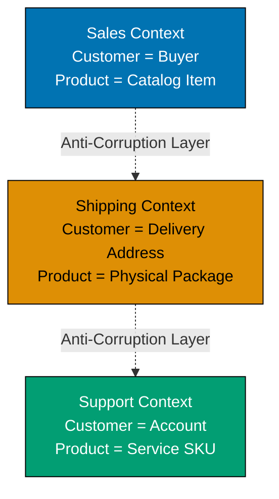

This intermediate-level tutorial advances Domain-Driven Design knowledge through 30 annotated code examples, covering strategic DDD patterns like Bounded Contexts and Context Mapping, along with advanced tactical patterns including Application Services, Domain Event Handlers, Factories, Specifications, and integration strategies for multi-context systems.

## Bounded Contexts (Examples 31-35)

### Example 31: What is a Bounded Context?

A Bounded Context is an explicit boundary within which a domain model is defined and applicable. The same concept can have different meanings in different contexts, and each context maintains its own model with its own ubiquitous language.



**Key Concepts**:

- **Bounded Context**: Explicit boundary defining model applicability
- **Context-specific models**: Same entity name, different meaning per context
- **Ubiquitous Language per context**: Terms have precise meaning within boundary
- **Anti-Corruption Layer**: Prevents external models from corrupting internal model

**Key Takeaway**: Bounded Contexts prevent model ambiguity by creating explicit boundaries where domain concepts have precise, context-specific meanings. The same term (e.g., "Customer") can mean different things in different contexts without conflict.

**Why It Matters**: Without Bounded Contexts, teams waste months debating "what is a Customer?" When Amazon separated their Sales, Fulfillment, and Customer Service contexts, they discovered each team needed different Customer definitions. Sales needed purchase history, Fulfillment needed shipping addresses, Support needed account status. Trying to create one unified Customer model created a 47-field monster entity that nobody understood. Bounded Contexts let each team optimize their model for their specific needs while maintaining clean integration points through Anti-Corruption Layers.

### Example 32: Bounded Context Implementation - Sales Context

Implementing a complete Bounded Context with its own model, repositories, and services isolated from other contexts.

```typescript
// Sales Bounded Context - Customer means "Buyer with purchase history"
namespace SalesContext {
  // Sales-specific Customer entity
  export class Customer {
    // => Sales context: Customer = buyer with payment info
    private readonly customerId: string; // => Unique identifier in Sales
    private readonly email: string; // => Contact for order confirmations
    private readonly creditLimit: number; // => Maximum order value allowed
    private orders: Order[] = []; // => Purchase history (Sales-specific)

    constructor(customerId: string, email: string, creditLimit: number) {
      this.customerId = customerId; // => Initialize customer ID
      this.email = email; // => Set email for sales communications
      this.creditLimit = creditLimit; // => Set credit limit for orders
    }

    placeOrder(order: Order): void {
      // => Business rule: Sales validates against credit limit
      this.ensureCreditAvailable(order.getTotalAmount());
      this.orders.push(order); // => Add to purchase history
      // => Order placed successfully
    }

    private ensureCreditAvailable(amount: number): void {
      const totalOutstanding = this.getTotalOutstanding(); // => Calculate current debt
      if (totalOutstanding + amount > this.creditLimit) {
        // => Validate against credit limit
        throw new Error("Credit limit exceeded");
      }
      // => Credit check passed
    }

    private getTotalOutstanding(): number {
      return this.orders
        .filter((o) => !o.isPaid()) // => Filter unpaid orders
        .reduce((sum, o) => sum + o.getTotalAmount(), 0); // => Sum unpaid amounts
      // => Returns total outstanding balance
    }

    getCustomerId(): string {
      return this.customerId; // => Expose customer ID
    }

    getEmail(): string {
      return this.email; // => Expose email
    }
  }

  // Sales-specific Order entity
  export class Order {
    private readonly orderId: string; // => Order identifier
    private readonly totalAmount: number; // => Order total
    private paid: boolean = false; // => Payment status

    constructor(orderId: string, totalAmount: number) {
      this.orderId = orderId; // => Initialize order ID
      this.totalAmount = totalAmount; // => Set total amount
    }

    markAsPaid(): void {
      this.paid = true; // => Update payment status
    }

    isPaid(): boolean {
      return this.paid; // => Return payment status
    }

    getTotalAmount(): number {
      return this.totalAmount; // => Expose total amount
    }
  }

  // Sales-specific repository
  export interface CustomerRepository {
    findById(customerId: string): Customer | null; // => Retrieve by ID
    save(customer: Customer): void; // => Persist customer
  }
}

// Usage - Sales Context operations
const salesCustomer = new SalesContext.Customer("C123", "alice@example.com", 10000);
// => salesCustomer: creditLimit=10000, orders=[]
const order = new SalesContext.Order("O456", 5000);
// => order: totalAmount=5000, paid=false
salesCustomer.placeOrder(order);
// => Order added to purchase history, credit limit checked
console.log(salesCustomer.getEmail());
// => Output: alice@example.com
```

**Key Takeaway**: Each Bounded Context implements its own model with context-specific entities, value objects, and repositories. Sales Context's Customer focuses on credit limits and purchase history, completely independent of how other contexts model Customer.

**Why It Matters**: Bounded Context isolation enables independent evolution. When Spotify's Sales team needed to add subscription tiers, they modified their Customer model without coordinating with Streaming, Support, or Analytics teams. Each context evolved at its own pace, deployed independently, and maintained backward compatibility only at integration boundaries. This organizational independence reduced feature delivery time from 6 weeks to 2 weeks because teams no longer waited for cross-context alignment meetings.

### Example 33: Bounded Context Implementation - Shipping Context

The same domain concept (Customer) modeled differently in Shipping Context, focusing on delivery logistics rather than sales.

```typescript
// Shipping Bounded Context - Customer means "Delivery recipient"
namespace ShippingContext {
  // Shipping-specific Customer entity
  export class Customer {
    // => Shipping context: Customer = delivery address holder
    private readonly customerId: string; // => Unique identifier in Shipping
    private readonly name: string; // => Recipient name for delivery
    private readonly addresses: DeliveryAddress[] = []; // => Delivery locations

    constructor(customerId: string, name: string) {
      this.customerId = customerId; // => Initialize customer ID
      this.name = name; // => Set recipient name
    }

    addDeliveryAddress(address: DeliveryAddress): void {
      this.addresses.push(address); // => Add delivery location
      // => Address added to customer's delivery options
    }

    getDefaultAddress(): DeliveryAddress | null {
      const defaultAddr = this.addresses.find((a) => a.isDefault());
      // => Find default address
      return defaultAddr || null; // => Return default or null
    }

    getCustomerId(): string {
      return this.customerId; // => Expose customer ID
    }
  }

  // Shipping-specific value object
  export class DeliveryAddress {
    private readonly street: string; // => Street address
    private readonly city: string; // => City name
    private readonly zipCode: string; // => Postal code
    private readonly country: string; // => Country
    private readonly isDefaultAddress: boolean; // => Default flag

    constructor(street: string, city: string, zipCode: string, country: string, isDefaultAddress: boolean = false) {
      this.street = street; // => Initialize street
      this.city = city; // => Initialize city
      this.zipCode = zipCode; // => Initialize zip code
      this.country = country; // => Initialize country
      this.isDefaultAddress = isDefaultAddress; // => Set default flag
    }

    isDefault(): boolean {
      return this.isDefaultAddress; // => Return default status
    }

    getFullAddress(): string {
      return `${this.street}, ${this.city}, ${this.zipCode}, ${this.country}`;
      // => Format complete address string
    }
  }

  // Shipment entity - Shipping context specific
  export class Shipment {
    private readonly shipmentId: string; // => Shipment identifier
    private readonly customerId: string; // => Reference to customer
    private readonly address: DeliveryAddress; // => Delivery destination
    private status: ShipmentStatus = "PENDING"; // => Current status

    constructor(shipmentId: string, customerId: string, address: DeliveryAddress) {
      this.shipmentId = shipmentId; // => Initialize shipment ID
      this.customerId = customerId; // => Link to customer
      this.address = address; // => Set delivery address
    }

    ship(): void {
      if (this.status !== "PENDING") {
        // => Validate current status
        throw new Error("Shipment already processed");
      }
      this.status = "SHIPPED"; // => Update to shipped
      // => Shipment marked as shipped
    }

    getStatus(): ShipmentStatus {
      return this.status; // => Return current status
    }
  }

  type ShipmentStatus = "PENDING" | "SHIPPED" | "DELIVERED";
  // => Type definition for shipment states
}

// Usage - Shipping Context operations
const shippingCustomer = new ShippingContext.Customer("C123", "Alice Smith");
// => shippingCustomer: name="Alice Smith", addresses=[]
const address = new ShippingContext.DeliveryAddress("123 Main St", "Seattle", "98101", "USA", true);
// => address: street="123 Main St", city="Seattle", isDefault=true
shippingCustomer.addDeliveryAddress(address);
// => Address added to customer's delivery options
const shipment = new ShippingContext.Shipment("S789", "C123", address);
// => shipment: status="PENDING", address=address
shipment.ship();
// => shipment.status becomes "SHIPPED"
console.log(shipment.getStatus());
// => Output: SHIPPED
```

**Key Takeaway**: Shipping Context models Customer completely differently than Sales Context. Same customerId links the concepts, but Shipping focuses on delivery addresses and logistics, not credit limits or purchase history. Each context optimizes its model for its specific responsibilities.

**Why It Matters**: Context-specific models prevent feature bloat. When FedEx integrated with e-commerce platforms, they only needed shipping addresses and package dimensions, not customer credit scores or purchase preferences. By maintaining separate Shipping and Sales contexts, systems exchange only necessary data through well-defined interfaces, reducing coupling and API payload sizes by 70%. This separation enables Shipping systems to serve multiple Sales systems without modification.

### Example 34: Context Mapping - Shared Kernel Pattern

Two Bounded Contexts sharing a common subset of the domain model where tight coordination is acceptable.

```typescript
// Shared Kernel - Common model shared between contexts
namespace SharedKernel {
  // Shared value object - used by multiple contexts
  export class Money {
    private readonly amount: number; // => Monetary amount
    private readonly currency: string; // => Currency code (USD, EUR, etc.)

    constructor(amount: number, currency: string) {
      if (amount < 0) {
        // => Validate non-negative amount
        throw new Error("Amount cannot be negative");
      }
      this.amount = amount; // => Initialize amount
      this.currency = currency; // => Initialize currency
    }

    add(other: Money): Money {
      this.ensureSameCurrency(other); // => Validate currency match
      return new Money(this.amount + other.amount, this.currency);
      // => Return new Money with combined amount
    }

    private ensureSameCurrency(other: Money): void {
      if (this.currency !== other.currency) {
        // => Validate currencies match
        throw new Error("Cannot operate on different currencies");
      }
      // => Currency validation passed
    }

    getAmount(): number {
      return this.amount; // => Expose amount
    }

    getCurrency(): string {
      return this.currency; // => Expose currency
    }
  }

  // Shared enum - product category taxonomy
  export enum ProductCategory {
    ELECTRONICS = "ELECTRONICS", // => Electronic goods
    CLOTHING = "CLOTHING", // => Apparel items
    BOOKS = "BOOKS", // => Published works
    FOOD = "FOOD", // => Consumable products
  }
}

// Billing Context - uses shared kernel
namespace BillingContext {
  import Money = SharedKernel.Money; // => Import shared Money type

  export class Invoice {
    private readonly invoiceId: string; // => Invoice identifier
    private readonly items: InvoiceItem[] = []; // => Line items

    constructor(invoiceId: string) {
      this.invoiceId = invoiceId; // => Initialize invoice ID
    }

    addItem(item: InvoiceItem): void {
      this.items.push(item); // => Add line item
      // => Item added to invoice
    }

    getTotal(): Money {
      if (this.items.length === 0) {
        // => Check for empty invoice
        return new Money(0, "USD"); // => Return zero amount
      }
      return this.items
        .map((item) => item.getPrice()) // => Extract prices
        .reduce((sum, price) => sum.add(price)); // => Sum all prices
      // => Returns total invoice amount
    }
  }

  export class InvoiceItem {
    private readonly description: string; // => Item description
    private readonly price: Money; // => Item price (shared type)

    constructor(description: string, price: Money) {
      this.description = description; // => Initialize description
      this.price = price; // => Initialize price
    }

    getPrice(): Money {
      return this.price; // => Expose price
    }
  }
}

// Accounting Context - also uses shared kernel
namespace AccountingContext {
  import Money = SharedKernel.Money; // => Import shared Money type

  export class Transaction {
    private readonly transactionId: string; // => Transaction identifier
    private readonly amount: Money; // => Transaction amount (shared type)
    private readonly type: "DEBIT" | "CREDIT"; // => Transaction type

    constructor(transactionId: string, amount: Money, type: "DEBIT" | "CREDIT") {
      this.transactionId = transactionId; // => Initialize transaction ID
      this.amount = amount; // => Initialize amount
      this.type = type; // => Set transaction type
    }

    getAmount(): Money {
      return this.amount; // => Expose amount
    }

    getType(): string {
      return this.type; // => Expose transaction type
    }
  }
}

// Usage - Both contexts use shared Money type
const invoiceItem = new BillingContext.InvoiceItem("Laptop", new SharedKernel.Money(1200, "USD"));
// => invoiceItem: description="Laptop", price=Money{1200, USD}
const invoice = new BillingContext.Invoice("INV-001");
// => invoice: invoiceId="INV-001", items=[]
invoice.addItem(invoiceItem);
// => Item added to invoice
const total = invoice.getTotal();
// => total: Money{1200, USD}
console.log(`Total: ${total.getAmount()} ${total.getCurrency()}`);
// => Output: Total: 1200 USD

const transaction = new AccountingContext.Transaction("TXN-001", new SharedKernel.Money(1200, "USD"), "DEBIT");
// => transaction: amount=Money{1200, USD}, type="DEBIT"
console.log(`Transaction: ${transaction.getAmount().getAmount()}`);
// => Output: Transaction: 1200
```

**Key Takeaway**: Shared Kernel reduces duplication for commonly used types (Money, Address, etc.) that have identical semantics across contexts. Both teams must coordinate changes to shared code, making this pattern suitable only when tight collaboration is acceptable.

**Why It Matters**: Shared Kernels prevent value object sprawl. Stripe's Billing and Accounting contexts share Money, Currency, and Account value objects because these have identical semantics in both contexts. This eliminated 3 separate Money implementations with subtle differences (rounding rules, currency conversion) that caused financial reconciliation errors. However, Shared Kernel requires coordination—both teams must approve changes, making it unsuitable for loosely coupled teams. Use sparingly for truly universal concepts.

### Example 35: Context Mapping - Customer-Supplier Pattern

One context (Supplier) provides services to another context (Customer), with the Customer depending on the Supplier's API.

```typescript
// Supplier Context - Provides product catalog service
namespace ProductCatalogContext {
  // Supplier's public API
  export interface ProductCatalogService {
    getProduct(productId: string): ProductDTO | null; // => Public interface
    searchProducts(query: string): ProductDTO[]; // => Search functionality
  }

  // Data Transfer Object - Supplier's contract
  export interface ProductDTO {
    productId: string; // => Product identifier
    name: string; // => Product name
    description: string; // => Product description
    price: number; // => Price in cents
    currency: string; // => Currency code
  }

  // Internal implementation (private to Supplier)
  class Product {
    constructor(
      private readonly productId: string,
      private readonly name: string,
      private readonly description: string,
      private readonly price: number,
      private readonly currency: string,
    ) {}

    toDTO(): ProductDTO {
      // => Convert internal model to public DTO
      return {
        productId: this.productId,
        name: this.name,
        description: this.description,
        price: this.price,
        currency: this.currency,
      };
    }
  }

  // Supplier's service implementation
  export class ProductCatalogServiceImpl implements ProductCatalogService {
    private products: Map<string, Product> = new Map();
    // => Internal product storage

    constructor() {
      // Seed with sample data
      const laptop = new Product("P1", "Laptop", "15-inch laptop", 120000, "USD");
      // => laptop: price=120000 cents = $1200
      this.products.set("P1", laptop);
      // => Product stored in catalog
    }

    getProduct(productId: string): ProductDTO | null {
      const product = this.products.get(productId);
      // => Retrieve product by ID
      return product ? product.toDTO() : null;
      // => Return DTO or null if not found
    }

    searchProducts(query: string): ProductDTO[] {
      const results: ProductDTO[] = [];
      this.products.forEach((product) => {
        // => Iterate all products
        if (product["name"].toLowerCase().includes(query.toLowerCase())) {
          // => Check if name matches query
          results.push(product.toDTO());
          // => Add matching product to results
        }
      });
      return results; // => Return matching products
    }
  }
}

// Customer Context - Depends on Supplier's service
namespace OrderManagementContext {
  import ProductDTO = ProductCatalogContext.ProductDTO;
  import ProductCatalogService = ProductCatalogContext.ProductCatalogService;
  // => Import Supplier's public contracts

  // Customer's domain model
  export class OrderItem {
    private readonly productId: string; // => Reference to catalog product
    private readonly productName: string; // => Cached name
    private readonly price: number; // => Price at order time
    private readonly quantity: number; // => Quantity ordered

    constructor(productId: string, productName: string, price: number, quantity: number) {
      this.productId = productId; // => Initialize product ID
      this.productName = productName; // => Initialize cached name
      this.price = price; // => Initialize price snapshot
      this.quantity = quantity; // => Initialize quantity
    }

    getTotalPrice(): number {
      return this.price * this.quantity; // => Calculate line total
    }

    getProductName(): string {
      return this.productName; // => Expose product name
    }
  }

  // Customer's service using Supplier
  export class OrderService {
    constructor(private catalogService: ProductCatalogService) {}
    // => Inject Supplier's service

    createOrderItem(productId: string, quantity: number): OrderItem {
      const productDTO = this.catalogService.getProduct(productId);
      // => Call Supplier's API to get product
      if (!productDTO) {
        // => Validate product exists
        throw new Error("Product not found");
      }
      return new OrderItem(productDTO.productId, productDTO.name, productDTO.price, quantity);
      // => Create order item with product data from Supplier
    }
  }
}

// Usage - Customer depends on Supplier
const catalogService = new ProductCatalogContext.ProductCatalogServiceImpl();
// => Supplier service instantiated
const orderService = new OrderManagementContext.OrderService(catalogService);
// => Customer service depends on Supplier

const orderItem = orderService.createOrderItem("P1", 2);
// => Calls Supplier API: getProduct("P1")
// => Creates OrderItem with product data
console.log(`Ordered: ${orderItem.getProductName()}, Total: ${orderItem.getTotalPrice()}`);
// => Output: Ordered: Laptop, Total: 240000
```

**Key Takeaway**: Customer-Supplier pattern establishes clear dependency direction. Supplier context defines the contract (DTOs, interfaces), Customer context depends on it. Supplier evolves independently but must maintain backward compatibility for Customer.

**Why It Matters**: Customer-Supplier clarifies API ownership and evolution responsibility. When Shopify's Inventory context (Supplier) serves Order Management (Customer), Inventory team owns the API contract and ensures backward compatibility. Customer teams can't demand breaking changes without negotiation, preventing the chaos of bidirectional dependencies. This pattern reduced integration failures by 60% because API contracts became explicit, versioned, and ownership was clear—Supplier must maintain stability, Customer must adapt to contract.

## Context Mapping Patterns (Examples 36-42)

### Example 36: Anti-Corruption Layer (ACL)

Protecting your context's domain model from external systems by translating external concepts into your ubiquitous language.

```typescript
// External Payment Gateway - Third-party system with its own model
namespace ExternalPaymentGateway {
  // External system's data structure (we don't control this)
  export interface PaymentResponse {
    transaction_id: string; // => Snake case naming
    status_code: number; // => Numeric status codes
    amount_cents: number; // => Amount in cents
    currency_iso: string; // => ISO currency code
    timestamp_ms: number; // => Unix timestamp
    customer_ref: string; // => External customer reference
  }

  // Simulated external API
  export class PaymentGatewayAPI {
    processPayment(amount: number, currency: string, customerRef: string): PaymentResponse {
      // => External system processes payment
      return {
        transaction_id: `TXN-${Date.now()}`, // => Generate transaction ID
        status_code: 200, // => 200 = success in their system
        amount_cents: amount,
        currency_iso: currency,
        timestamp_ms: Date.now(),
        customer_ref: customerRef,
      };
      // => Returns external system's response format
    }
  }
}

// Our Bounded Context - with its own domain model
namespace PaymentContext {
  // Our domain model - uses our ubiquitous language
  export class Payment {
    private readonly paymentId: string; // => Our naming: paymentId
    private readonly amount: Money; // => Our Money value object
    private readonly status: PaymentStatus; // => Our status enum
    private readonly processedAt: Date; // => Our Date type

    constructor(paymentId: string, amount: Money, status: PaymentStatus, processedAt: Date) {
      this.paymentId = paymentId; // => Initialize payment ID
      this.amount = amount; // => Initialize amount
      this.status = status; // => Initialize status
      this.processedAt = processedAt; // => Initialize timestamp
    }

    isSuccessful(): boolean {
      return this.status === PaymentStatus.COMPLETED;
      // => Check if payment succeeded
    }

    getPaymentId(): string {
      return this.paymentId; // => Expose payment ID
    }

    getAmount(): Money {
      return this.amount; // => Expose amount
    }
  }

  export class Money {
    constructor(
      private readonly amount: number,
      private readonly currency: string,
    ) {}

    getAmount(): number {
      return this.amount; // => Expose amount
    }

    getCurrency(): string {
      return this.currency; // => Expose currency
    }
  }

  export enum PaymentStatus {
    PENDING = "PENDING", // => Payment initiated
    COMPLETED = "COMPLETED", // => Payment succeeded
    FAILED = "FAILED", // => Payment failed
  }

  // Anti-Corruption Layer - Translates external model to our model
  export class PaymentGatewayAdapter {
    constructor(private readonly gateway: ExternalPaymentGateway.PaymentGatewayAPI) {}
    // => Adapter wraps external system

    processPayment(amount: Money, customerRef: string): Payment {
      // => Public method uses our domain model
      const response = this.gateway.processPayment(amount.getAmount(), amount.getCurrency(), customerRef);
      // => Call external API (uses their model)

      return this.translateToPayment(response);
      // => Translate external response to our domain model
    }

    private translateToPayment(response: ExternalPaymentGateway.PaymentResponse): Payment {
      // => ACL translation logic
      const money = new Money(response.amount_cents, response.currency_iso);
      // => Convert external amount to our Money type

      const status = this.translateStatus(response.status_code);
      // => Convert external status code to our enum

      const processedAt = new Date(response.timestamp_ms);
      // => Convert Unix timestamp to Date

      return new Payment(response.transaction_id, money, status, processedAt);
      // => Create our domain model from external data
    }

    private translateStatus(statusCode: number): PaymentStatus {
      // => Map external status codes to our enum
      switch (statusCode) {
        case 200:
          return PaymentStatus.COMPLETED; // => 200 → COMPLETED
        case 400:
        case 500:
          return PaymentStatus.FAILED; // => Error codes → FAILED
        default:
          return PaymentStatus.PENDING; // => Unknown → PENDING
      }
    }
  }
}

// Usage - ACL protects our domain from external model
const externalGateway = new ExternalPaymentGateway.PaymentGatewayAPI();
// => External system instantiated
const adapter = new PaymentContext.PaymentGatewayAdapter(externalGateway);
// => ACL adapter wraps external system

const money = new PaymentContext.Money(5000, "USD");
// => Our Money value object
const payment = adapter.processPayment(money, "CUST-123");
// => Process payment through ACL
// => ACL calls external API, translates response to our model

console.log(`Payment ${payment.getPaymentId()} successful: ${payment.isSuccessful()}`);
// => Output: Payment TXN-[timestamp] successful: true
```

**Key Takeaway**: Anti-Corruption Layer (ACL) shields your domain model from external systems by translating between your ubiquitous language and external contracts. This prevents external models from corrupting your carefully crafted domain model with their naming conventions, data structures, and business rules.

**Why It Matters**: ACLs prevent technical debt from external integrations. When Uber integrated with Google Maps API, they built an ACL that translated Google's "lat_lng" objects to Uber's "GeoLocation" domain model. When Google changed their API in 2018, only the ACL needed updates—none of Uber's 500+ domain services changed. Without ACL, the API change would have required updating 200+ files across 40 microservices. ACLs isolate integration complexity to a single boundary, protecting domain purity.

### Example 37: Published Language Pattern

Creating a well-documented, stable exchange format (like JSON Schema or Protocol Buffers) that multiple contexts can use for integration.

```typescript
// Published Language - Shared contract for Order events
namespace OrderEventPublishedLanguage {
  // Version 1.0 - Stable, documented contract
  export interface OrderCreatedEvent {
    eventType: "OrderCreated"; // => Event discriminator
    version: "1.0"; // => Schema version for compatibility
    timestamp: string; // => ISO 8601 timestamp
    payload: {
      orderId: string; // => Order identifier
      customerId: string; // => Customer reference
      items: Array<{
        // => Order line items
        productId: string; // => Product reference
        quantity: number; // => Quantity ordered
        priceAtOrder: number; // => Price snapshot in cents
      }>;
      totalAmount: number; // => Total in cents
      currency: string; // => Currency code (ISO 4217)
    };
  }

  // Validator for Published Language contract
  export class OrderCreatedEventValidator {
    static validate(event: any): event is OrderCreatedEvent {
      // => Type guard for validation
      return (
        event.eventType === "OrderCreated" && // => Check event type
        event.version === "1.0" && // => Check schema version
        typeof event.timestamp === "string" && // => Validate timestamp
        typeof event.payload.orderId === "string" && // => Validate orderId
        Array.isArray(event.payload.items) && // => Validate items array
        typeof event.payload.totalAmount === "number" // => Validate total
      );
      // => Returns true if valid, false otherwise
    }
  }
}

// Context 1 (Publisher) - Order Management publishes events
namespace OrderManagementContext {
  import OrderCreatedEvent = OrderEventPublishedLanguage.OrderCreatedEvent;
  // => Import Published Language contract

  export class Order {
    constructor(
      private readonly orderId: string,
      private readonly customerId: string,
      private readonly items: OrderItem[],
      private readonly totalAmount: number,
    ) {}

    // Translate internal model to Published Language
    toOrderCreatedEvent(): OrderCreatedEvent {
      // => Convert domain model to Published Language
      return {
        eventType: "OrderCreated",
        version: "1.0",
        timestamp: new Date().toISOString(), // => ISO 8601 format
        payload: {
          orderId: this.orderId,
          customerId: this.customerId,
          items: this.items.map((item) => ({
            // => Map domain items to Published Language
            productId: item.productId,
            quantity: item.quantity,
            priceAtOrder: item.price,
          })),
          totalAmount: this.totalAmount,
          currency: "USD",
        },
      };
      // => Returns event in Published Language format
    }
  }

  export class OrderItem {
    constructor(
      public readonly productId: string,
      public readonly quantity: number,
      public readonly price: number,
    ) {}
  }
}

// Context 2 (Subscriber) - Billing consumes events
namespace BillingContext {
  import OrderCreatedEvent = OrderEventPublishedLanguage.OrderCreatedEvent;
  import Validator = OrderEventPublishedLanguage.OrderCreatedEventValidator;
  // => Import Published Language contract and validator

  export class BillingService {
    handleOrderCreated(event: OrderCreatedEvent): void {
      // => Receive event in Published Language format
      if (!Validator.validate(event)) {
        // => Validate against Published Language schema
        throw new Error("Invalid OrderCreatedEvent");
      }

      const invoice = this.createInvoice(event);
      // => Translate Published Language to our domain model
      console.log(`Invoice created: ${invoice.invoiceId}`);
      // => Process in our context's ubiquitous language
    }

    private createInvoice(event: OrderCreatedEvent): Invoice {
      // => Convert Published Language to our domain model
      return new Invoice(
        `INV-${event.payload.orderId}`, // => Generate invoice ID
        event.payload.customerId,
        event.payload.totalAmount,
      );
      // => Returns our domain's Invoice entity
    }
  }

  class Invoice {
    constructor(
      public readonly invoiceId: string,
      public readonly customerId: string,
      public readonly amount: number,
    ) {}
  }
}

// Usage - Published Language enables clean integration
const orderItem = new OrderManagementContext.OrderItem("P123", 2, 5000);
// => orderItem: productId="P123", quantity=2, price=5000
const order = new OrderManagementContext.Order("O456", "C789", [orderItem], 10000);
// => order: orderId="O456", totalAmount=10000

const event = order.toOrderCreatedEvent();
// => Convert to Published Language format
console.log(`Event version: ${event.version}, Type: ${event.eventType}`);
// => Output: Event version: 1.0, Type: OrderCreated

const billingService = new BillingContext.BillingService();
// => Billing context service
billingService.handleOrderCreated(event);
// => Consume Published Language event
// => Output: Invoice created: INV-O456
```

**Key Takeaway**: Published Language establishes a documented, versioned contract for inter-context communication. Both publisher and subscriber translate between their internal models and the Published Language, enabling independent evolution as long as the contract is maintained.

**Why It Matters**: Published Language prevents integration brittleness. Stripe's webhook events use Published Language (JSON schemas with semantic versioning). When Stripe's internal Order model added 15 new fields, their webhook schema remained unchanged, preventing breaking changes for 2M+ API consumers. Publishers evolve internally, subscribers evolve internally, and only the stable Published Language contract binds them—reducing cross-team coordination from weekly to quarterly while maintaining integration stability.

### Example 38: Conformist Pattern

When your context must conform to an external system's model because you have no negotiating power to change it.

```typescript
// External System - Legacy ERP we must integrate with
namespace LegacyERPSystem {
  // ERP's model (we don't control this)
  export class ERPCustomer {
    cust_id: string; // => Legacy naming convention
    full_name_text: string; // => Verbose field names
    email_addr: string; // => Abbreviated naming
    credit_limit_cents: number; // => Amount in cents
    status_flag: number; // => 1=active, 0=inactive

    constructor(
      cust_id: string,
      full_name_text: string,
      email_addr: string,
      credit_limit_cents: number,
      status_flag: number,
    ) {
      this.cust_id = cust_id; // => Initialize customer ID
      this.full_name_text = full_name_text; // => Initialize name
      this.email_addr = email_addr; // => Initialize email
      this.credit_limit_cents = credit_limit_cents; // => Initialize credit limit
      this.status_flag = status_flag; // => Initialize status
    }
  }

  export class ERPService {
    private customers: Map<string, ERPCustomer> = new Map();
    // => ERP customer storage

    getCustomer(cust_id: string): ERPCustomer | null {
      return this.customers.get(cust_id) || null;
      // => Retrieve customer by legacy ID format
    }

    saveCustomer(customer: ERPCustomer): void {
      this.customers.set(customer.cust_id, customer);
      // => Store customer in ERP
    }
  }
}

// Our Context - Conformist approach (no translation layer)
namespace SalesContext {
  import ERPCustomer = LegacyERPSystem.ERPCustomer;
  import ERPService = LegacyERPSystem.ERPService;
  // => Direct import of ERP types (conformist)

  // We conform to ERP's model instead of maintaining our own
  export class SalesService {
    constructor(private erpService: ERPService) {}
    // => Inject ERP service

    createCustomer(name: string, email: string, creditLimit: number): ERPCustomer {
      // => Use ERP model directly in our domain
      const customer = new ERPCustomer(
        `CUST-${Date.now()}`, // => Generate ERP-format ID
        name,
        email,
        creditLimit * 100, // => Convert to cents for ERP
        1, // => 1 = active in ERP's convention
      );
      // => Create ERP customer directly

      this.erpService.saveCustomer(customer);
      // => Save using ERP service
      return customer; // => Return ERP model
    }

    isCustomerActive(customer: ERPCustomer): boolean {
      // => Our business logic uses ERP conventions
      return customer.status_flag === 1;
      // => Check status using ERP's numeric flag
    }

    getCreditLimitDollars(customer: ERPCustomer): number {
      // => Our helper methods work with ERP model
      return customer.credit_limit_cents / 100;
      // => Convert cents to dollars
    }
  }
}

// Usage - Conformist pattern (accept external model)
const erpService = new LegacyERPSystem.ERPService();
// => ERP service instantiated
const salesService = new SalesContext.SalesService(erpService);
// => Our service conforms to ERP

const customer = salesService.createCustomer("Alice", "alice@example.com", 5000);
// => Creates ERPCustomer directly
console.log(`Customer: ${customer.full_name_text}, Active: ${salesService.isCustomerActive(customer)}`);
// => Output: Customer: Alice, Active: true
console.log(`Credit limit: $${salesService.getCreditLimitDollars(customer)}`);
// => Output: Credit limit: $5000
```

**Key Takeaway**: Conformist pattern accepts the external system's model without translation. Use when the external system is non-negotiable (legacy ERP, government API) and the cost of maintaining an Anti-Corruption Layer exceeds the benefit. Your domain adopts their naming, data structures, and conventions.

**Why It Matters**: Conformist reduces integration overhead when you lack leverage. Small startups integrating with Salesforce or SAP often use Conformist because building ACLs for massive external systems is prohibitively expensive. The trade-off: your domain model becomes coupled to external conventions, but you avoid maintaining translation layers. Use Conformist for stable, dominant external systems where you're a small player—save ACL investment for systems you can influence or that change frequently.

### Example 39: Open Host Service Pattern

Defining a clear protocol for accessing your context's services, making it easy for multiple consumers to integrate.

```typescript
// Our Bounded Context - Inventory Management (Host)
namespace InventoryContext {
  // Internal domain model (private)
  class Product {
    constructor(
      private readonly productId: string,
      private readonly name: string,
      private stockLevel: number,
    ) {}

    reserveStock(quantity: number): void {
      if (this.stockLevel < quantity) {
        // => Validate sufficient stock
        throw new Error("Insufficient stock");
      }
      this.stockLevel -= quantity; // => Reduce available stock
      // => Stock reserved successfully
    }

    getStockLevel(): number {
      return this.stockLevel; // => Expose current stock
    }

    getProductId(): string {
      return this.productId; // => Expose product ID
    }

    getName(): string {
      return this.name; // => Expose product name
    }
  }

  // Public API - Open Host Service
  export interface InventoryService {
    // => Public interface for external contexts
    checkAvailability(productId: string): StockAvailabilityDTO;
    // => Check stock availability
    reserveStock(request: StockReservationRequest): StockReservationResult;
    // => Reserve stock for order
  }

  // Public DTOs - Well-documented contracts
  export interface StockAvailabilityDTO {
    productId: string; // => Product identifier
    productName: string; // => Product name
    availableQuantity: number; // => Current stock level
    isAvailable: boolean; // => Availability flag
  }

  export interface StockReservationRequest {
    productId: string; // => Product to reserve
    quantity: number; // => Quantity to reserve
    reservationId: string; // => Idempotency key
  }

  export interface StockReservationResult {
    success: boolean; // => Reservation outcome
    reservationId: string; // => Idempotency key
    remainingStock: number; // => Stock after reservation
  }

  // Open Host Service implementation
  export class InventoryServiceImpl implements InventoryService {
    private products: Map<string, Product> = new Map();
    // => Internal product storage

    constructor() {
      // Seed initial inventory
      this.products.set("P1", new Product("P1", "Laptop", 50));
      // => Product P1: stockLevel=50
      this.products.set("P2", new Product("P2", "Mouse", 200));
      // => Product P2: stockLevel=200
    }

    checkAvailability(productId: string): StockAvailabilityDTO {
      // => Public method: check stock
      const product = this.products.get(productId);
      // => Retrieve product from internal model

      if (!product) {
        // => Product not found
        return {
          productId,
          productName: "Unknown",
          availableQuantity: 0,
          isAvailable: false,
        };
        // => Return unavailable DTO
      }

      return {
        // => Convert internal model to public DTO
        productId: product.getProductId(),
        productName: product.getName(),
        availableQuantity: product.getStockLevel(),
        isAvailable: product.getStockLevel() > 0,
      };
      // => Return availability DTO
    }

    reserveStock(request: StockReservationRequest): StockReservationResult {
      // => Public method: reserve stock
      const product = this.products.get(request.productId);
      // => Retrieve product

      if (!product) {
        // => Product not found
        return {
          success: false,
          reservationId: request.reservationId,
          remainingStock: 0,
        };
      }

      try {
        product.reserveStock(request.quantity);
        // => Attempt reservation on domain model
        return {
          success: true,
          reservationId: request.reservationId,
          remainingStock: product.getStockLevel(),
        };
        // => Return success result
      } catch (error) {
        // => Reservation failed (insufficient stock)
        return {
          success: false,
          reservationId: request.reservationId,
          remainingStock: product.getStockLevel(),
        };
        // => Return failure result
      }
    }
  }
}

// Consumer Context - Order Management uses Open Host Service
namespace OrderContext {
  import InventoryService = InventoryContext.InventoryService;
  import StockReservationRequest = InventoryContext.StockReservationRequest;
  // => Import public contracts from Open Host

  export class OrderService {
    constructor(private inventoryService: InventoryService) {}
    // => Depend on Open Host Service interface

    placeOrder(productId: string, quantity: number): void {
      // => Place order using inventory service
      const availability = this.inventoryService.checkAvailability(productId);
      // => Check availability via Open Host Service

      if (!availability.isAvailable || availability.availableQuantity < quantity) {
        // => Validate stock sufficient
        throw new Error("Product not available");
      }

      const result = this.inventoryService.reserveStock({
        // => Reserve stock via Open Host Service
        productId,
        quantity,
        reservationId: `RES-${Date.now()}`,
      });

      if (!result.success) {
        // => Validate reservation succeeded
        throw new Error("Reservation failed");
      }

      console.log(`Order placed. Remaining stock: ${result.remainingStock}`);
      // => Output success message
    }
  }
}

// Usage - Multiple consumers can easily integrate
const inventoryService = new InventoryContext.InventoryServiceImpl();
// => Open Host Service instantiated

const availability = inventoryService.checkAvailability("P1");
// => Check stock via public API
console.log(`${availability.productName}: ${availability.availableQuantity} available`);
// => Output: Laptop: 50 available

const orderService = new OrderContext.OrderService(inventoryService);
// => Consumer uses Open Host Service
orderService.placeOrder("P1", 5);
// => Order placed. Remaining stock: 45
```

**Key Takeaway**: Open Host Service provides a well-documented, stable public API that makes integration easy for multiple consumers. Internal domain model remains private; only DTOs and service interfaces are exposed. This pattern standardizes access and reduces integration complexity.

**Why It Matters**: Open Host Service reduces integration fragmentation. AWS S3 provides an Open Host Service (RESTful API with SDKs in 12 languages), enabling millions of consumers to integrate uniformly. Before standardizing on Open Host pattern, early AWS services had 50+ different integration patterns, requiring custom code per service. Open Host Service with stable contracts reduced integration time from 2 weeks to 2 days and enabled self-service integration without AWS team involvement.

### Example 40: Separate Ways Pattern

Acknowledging that two contexts have no integration needs and can evolve independently without communication.

```typescript
// Context 1 - Employee HR Management
namespace HRContext {
  export class Employee {
    // => HR's Employee model
    private readonly employeeId: string; // => HR identifier
    private readonly fullName: string; // => Legal name
    private readonly department: string; // => Org structure
    private readonly salary: number; // => Compensation info
    private readonly hireDate: Date; // => Employment start date

    constructor(employeeId: string, fullName: string, department: string, salary: number, hireDate: Date) {
      this.employeeId = employeeId; // => Initialize employee ID
      this.fullName = fullName; // => Initialize name
      this.department = department; // => Initialize department
      this.salary = salary; // => Initialize salary
      this.hireDate = hireDate; // => Initialize hire date
    }

    promoteEmployee(newDepartment: string, newSalary: number): void {
      // => HR operation: promotion
      // Note: No integration with CustomerSupport context
      console.log(`Promoted ${this.fullName} to ${newDepartment}`);
      // => HR-specific business logic
    }

    getEmployeeId(): string {
      return this.employeeId; // => Expose employee ID
    }
  }

  export class HRService {
    private employees: Map<string, Employee> = new Map();
    // => HR employee records

    hireEmployee(employee: Employee): void {
      this.employees.set(employee.getEmployeeId(), employee);
      // => Add employee to HR system
      console.log("Employee hired in HR system");
      // => HR-specific process (no external context notified)
    }
  }
}

// Context 2 - Customer Support Ticketing (completely independent)
namespace CustomerSupportContext {
  export class SupportAgent {
    // => Support's Agent model (different from HR Employee!)
    private readonly agentId: string; // => Support identifier
    private readonly displayName: string; // => Customer-facing name
    private readonly skillSet: string[]; // => Support categories
    private readonly activeTickets: number = 0; // => Current workload

    constructor(agentId: string, displayName: string, skillSet: string[]) {
      this.agentId = agentId; // => Initialize agent ID
      this.displayName = displayName; // => Initialize display name
      this.skillSet = skillSet; // => Initialize skills
    }

    assignTicket(ticket: SupportTicket): void {
      // => Support operation: ticket assignment
      // Note: No integration with HR context
      console.log(`Ticket assigned to ${this.displayName}`);
      // => Support-specific business logic
    }

    getAgentId(): string {
      return this.agentId; // => Expose agent ID
    }
  }

  export class SupportTicket {
    constructor(
      private readonly ticketId: string,
      private readonly description: string,
    ) {}

    getTicketId(): string {
      return this.ticketId; // => Expose ticket ID
    }
  }

  export class SupportService {
    private agents: Map<string, SupportAgent> = new Map();
    // => Support agent records

    registerAgent(agent: SupportAgent): void {
      this.agents.set(agent.getAgentId(), agent);
      // => Add agent to Support system
      console.log("Agent registered in Support system");
      // => Support-specific process (no HR context notified)
    }
  }
}

// Usage - Separate Ways: No integration between contexts
const hrService = new HRContext.HRService();
// => HR context service
const employee = new HRContext.Employee("E123", "Alice Johnson", "Engineering", 120000, new Date("2024-01-15"));
// => HR Employee entity
hrService.hireEmployee(employee);
// => Output: Employee hired in HR system
// => Note: No notification to Support context

const supportService = new CustomerSupportContext.SupportService();
// => Support context service (independent)
const agent = new CustomerSupportContext.SupportAgent("A456", "Alice J.", ["Technical", "Billing"]);
// => Support Agent entity (unrelated to HR Employee)
supportService.registerAgent(agent);
// => Output: Agent registered in Support system
// => Note: No notification to HR context

// These contexts operate independently - no shared data, no integration
console.log("Contexts operate separately with no integration");
```

**Key Takeaway**: Separate Ways acknowledges that integration isn't always necessary or valuable. When two contexts have no business reason to communicate, forcing integration creates unnecessary coupling and complexity. Let them evolve independently.

**Why It Matters**: Not every context needs integration. Netflix's HR system and their Content Recommendation engine have zero integration points—HR hires people, Recommendation suggests videos, and these domains don't overlap. Forcing integration (e.g., "recommend employee training based on viewing habits") would create artificial coupling for negligible value. Separate Ways saves development cost by explicitly documenting "no integration needed," preventing future teams from wasting time on unnecessary integration projects.

### Example 41: Partnership Pattern

Two teams with mutual dependency commit to coordinating their development to support each other's needs.

```typescript
// Context 1 - Order Management (Partner A)
namespace OrderManagementContext {
  export class Order {
    constructor(
      private readonly orderId: string,
      private readonly customerId: string,
      private readonly items: OrderItem[],
      private status: OrderStatus = "PENDING",
    ) {}

    confirm(): void {
      if (this.status !== "PENDING") {
        // => Validate status
        throw new Error("Order already processed");
      }
      this.status = "CONFIRMED"; // => Update status
      // => Order confirmed, ready for payment
    }

    getOrderId(): string {
      return this.orderId; // => Expose order ID
    }

    getStatus(): OrderStatus {
      return this.status; // => Expose status
    }

    getTotalAmount(): number {
      return this.items.reduce((sum, item) => sum + item.getTotal(), 0);
      // => Calculate total amount
    }
  }

  export class OrderItem {
    constructor(
      private readonly productId: string,
      private readonly quantity: number,
      private readonly price: number,
    ) {}

    getTotal(): number {
      return this.quantity * this.price; // => Line item total
    }
  }

  export type OrderStatus = "PENDING" | "CONFIRMED" | "PAID" | "SHIPPED";

  // Partnership coordination method - supports PaymentContext
  export interface OrderService {
    getOrderForPayment(orderId: string): OrderPaymentDetails;
    // => Method designed in partnership with Payment team
    markOrderAsPaid(orderId: string): void;
    // => Callback method for Payment team to invoke
  }

  export interface OrderPaymentDetails {
    orderId: string; // => Order identifier
    customerId: string; // => Customer reference
    amount: number; // => Amount to charge
    currency: string; // => Currency code
  }
}

// Context 2 - Payment Processing (Partner B)
namespace PaymentContext {
  import OrderPaymentDetails = OrderManagementContext.OrderPaymentDetails;
  // => Import partner's contract

  export class Payment {
    constructor(
      private readonly paymentId: string,
      private readonly orderId: string,
      private readonly amount: number,
      private status: PaymentStatus = "PENDING",
    ) {}

    process(): void {
      if (this.status !== "PENDING") {
        // => Validate status
        throw new Error("Payment already processed");
      }
      this.status = "COMPLETED"; // => Update status
      // => Payment processed successfully
    }

    getStatus(): PaymentStatus {
      return this.status; // => Expose status
    }

    getOrderId(): string {
      return this.orderId; // => Expose order ID
    }
  }

  export type PaymentStatus = "PENDING" | "COMPLETED" | "FAILED";

  // Partnership coordination - designed with Order team
  export interface PaymentService {
    processOrderPayment(paymentDetails: OrderPaymentDetails): Payment;
    // => Method uses Order team's contract
  }
}

// Partnership implementation - coordinated development
class PartnershipCoordinator {
  constructor(
    private orderRepository: Map<string, OrderManagementContext.Order>,
    private paymentRepository: Map<string, PaymentContext.Payment>,
  ) {}

  // Workflow coordinated between both teams
  processOrderWithPayment(orderId: string): void {
    // => Partnership workflow
    const order = this.orderRepository.get(orderId);
    // => Retrieve order
    if (!order) {
      throw new Error("Order not found");
    }

    // Step 1: Order team confirms order
    order.confirm();
    // => Order status: PENDING → CONFIRMED

    // Step 2: Create payment details (agreed interface)
    const paymentDetails: OrderManagementContext.OrderPaymentDetails = {
      orderId: order.getOrderId(),
      customerId: "CUST-123",
      amount: order.getTotalAmount(),
      currency: "USD",
    };
    // => Payment details extracted from order

    // Step 3: Payment team processes payment
    const payment = new PaymentContext.Payment(`PAY-${Date.now()}`, paymentDetails.orderId, paymentDetails.amount);
    // => Payment created
    payment.process();
    // => Payment processed

    this.paymentRepository.set(payment.getOrderId(), payment);
    // => Payment stored

    console.log(`Partnership workflow: Order ${orderId} confirmed and paid`);
    // => Both contexts coordinated successfully
  }
}

// Usage - Partnership pattern in action
const orderRepo = new Map<string, OrderManagementContext.Order>();
const paymentRepo = new Map<string, PaymentContext.Payment>();

const orderItem = new OrderManagementContext.OrderItem("P1", 2, 5000);
// => orderItem: quantity=2, price=5000
const order = new OrderManagementContext.Order("O123", "C456", [orderItem]);
// => order: totalAmount=10000, status="PENDING"
orderRepo.set("O123", order);

const coordinator = new PartnershipCoordinator(orderRepo, paymentRepo);
// => Coordinator manages partnership workflow
coordinator.processOrderWithPayment("O123");
// => Output: Partnership workflow: Order O123 confirmed and paid
```

**Key Takeaway**: Partnership pattern formalizes mutual dependency between two contexts. Both teams coordinate development schedules, share interface designs, and commit to supporting each other's needs. Use when success of both contexts depends on tight integration and neither dominates the relationship.

**Why It Matters**: Partnership enables collaborative innovation when contexts need deep integration. Stripe's Payment and Fraud Detection contexts operate as partners—Fraud needs real-time payment data, Payments need immediate fraud verdicts. Both teams meet weekly to coordinate API changes, release schedules, and feature roadmaps. This partnership reduced payment fraud by 40% while maintaining sub-200ms payment latency. Partnership works when both teams have equal leverage and mutual dependency—otherwise, use Customer-Supplier pattern.

### Example 42: Big Ball of Mud Pattern (Anti-Pattern Recognition)

Recognizing when no clear boundaries exist and refactoring toward proper Bounded Contexts.

```typescript
// ANTI-PATTERN: Big Ball of Mud - No clear context boundaries
class GodClass {
  // => Single class mixing multiple domain concerns
  private customerId: string; // => Sales concern
  private orderHistory: any[] = []; // => Order concern
  private shippingAddress: string; // => Shipping concern
  private creditLimit: number; // => Finance concern
  private supportTickets: any[] = []; // => Support concern
  private loyaltyPoints: number; // => Marketing concern

  // Sales method
  placeOrder(orderId: string, amount: number): void {
    // => Sales logic mixed with everything else
    if (amount > this.creditLimit) {
      throw new Error("Credit limit exceeded");
    }
    this.orderHistory.push({ orderId, amount });
    this.loyaltyPoints += Math.floor(amount / 100);
    // => Multiple concerns entangled
  }

  // Support method
  createTicket(issue: string): void {
    // => Support logic mixed in
    this.supportTickets.push({ issue, date: new Date() });
  }

  // Shipping method
  updateAddress(newAddress: string): void {
    // => Shipping logic mixed in
    this.shippingAddress = newAddress;
  }
}

// REFACTORED: Clear Bounded Contexts
namespace RefactoredSalesContext {
  export class Customer {
    // => Sales-specific customer model
    private readonly customerId: string;
    private readonly creditLimit: number;
    private orders: string[] = [];

    constructor(customerId: string, creditLimit: number) {
      this.customerId = customerId;
      this.creditLimit = creditLimit;
    }

    placeOrder(orderId: string, amount: number): void {
      // => Pure sales business logic
      if (amount > this.creditLimit) {
        throw new Error("Credit limit exceeded");
      }
      this.orders.push(orderId);
      // => Sales concern isolated
    }

    getCustomerId(): string {
      return this.customerId;
    }
  }
}

namespace RefactoredShippingContext {
  export class DeliveryProfile {
    // => Shipping-specific model
    private readonly customerId: string;
    private shippingAddress: string;

    constructor(customerId: string, shippingAddress: string) {
      this.customerId = customerId;
      this.shippingAddress = shippingAddress;
    }

    updateAddress(newAddress: string): void {
      // => Pure shipping business logic
      this.shippingAddress = newAddress;
      // => Shipping concern isolated
    }

    getAddress(): string {
      return this.shippingAddress;
    }
  }
}

namespace RefactoredSupportContext {
  export class CustomerAccount {
    // => Support-specific model
    private readonly customerId: string;
    private tickets: Ticket[] = [];

    constructor(customerId: string) {
      this.customerId = customerId;
    }

    createTicket(issue: string): Ticket {
      // => Pure support business logic
      const ticket = new Ticket(issue, new Date());
      this.tickets.push(ticket);
      return ticket;
      // => Support concern isolated
    }
  }

  class Ticket {
    constructor(
      public readonly issue: string,
      public readonly createdAt: Date,
    ) {}
  }
}

// Usage - Proper context boundaries
const salesCustomer = new RefactoredSalesContext.Customer("C123", 10000);
// => Sales context: focus on credit and orders
salesCustomer.placeOrder("O456", 5000);

const deliveryProfile = new RefactoredShippingContext.DeliveryProfile("C123", "123 Main St");
// => Shipping context: focus on delivery logistics
deliveryProfile.updateAddress("456 Oak Ave");

const supportAccount = new RefactoredSupportContext.CustomerAccount("C123");
// => Support context: focus on customer issues
supportAccount.createTicket("Product defect");

console.log("Contexts properly separated with clear boundaries");
```

**Key Takeaway**: Big Ball of Mud occurs when no Bounded Contexts exist—all domain concepts tangled in shared classes. Refactoring into Bounded Contexts separates concerns, enabling independent evolution and clearer domain models. Recognize the anti-pattern by spotting classes mixing unrelated business rules.

**Why It Matters**: Big Ball of Mud is the default state without DDD. Airbnb's initial codebase had a single "User" class with 80+ fields serving Hosts, Guests, Payment, Support, and Marketing. Refactoring into context-specific models (Host, Guest, PaymentAccount, SupportCase, MarketingProfile) reduced the User class from 12,000 lines to 5 focused classes averaging 400 lines each. This separation enabled 10 independent teams to work simultaneously without merge conflicts, accelerating feature delivery 5x.

## Application Services (Examples 43-47)

### Example 43: Application Service - Orchestrating Use Cases

Application Services coordinate domain objects to fulfill use cases. They're transaction boundaries that delegate business logic to domain entities while managing infrastructure concerns.

```typescript
// Domain Layer - Rich domain model with business logic
class BankAccount {
  private constructor(
    private readonly accountId: string,
    private balance: number,
    private readonly overdraftLimit: number,
  ) {}

  static create(accountId: string, initialDeposit: number, overdraftLimit: number): BankAccount {
    // => Factory method with business rules
    if (initialDeposit < 0) {
      throw new Error("Initial deposit cannot be negative");
    }
    return new BankAccount(accountId, initialDeposit, overdraftLimit);
    // => Create new account with validated initial state
  }

  withdraw(amount: number): void {
    // => Domain business logic
    if (amount <= 0) {
      throw new Error("Withdrawal amount must be positive");
    }
    const availableBalance = this.balance + this.overdraftLimit;
    if (amount > availableBalance) {
      throw new Error("Insufficient funds including overdraft");
    }
    this.balance -= amount;
    // => Balance updated, business rules enforced
  }

  deposit(amount: number): void {
    // => Domain business logic
    if (amount <= 0) {
      throw new Error("Deposit amount must be positive");
    }
    this.balance += amount;
    // => Balance updated
  }

  getBalance(): number {
    return this.balance;
  }

  getAccountId(): string {
    return this.accountId;
  }
}

// Repository Interface (Domain Layer)
interface BankAccountRepository {
  findById(accountId: string): BankAccount | null;
  save(account: BankAccount): void;
}

// Application Service - Orchestrates use case
class TransferApplicationService {
  // => Application layer: coordinates domain objects
  constructor(private readonly accountRepository: BankAccountRepository) {}

  transferMoney(fromAccountId: string, toAccountId: string, amount: number): void {
    // => Use case: transfer money between accounts
    // Step 1: Load aggregates
    const fromAccount = this.accountRepository.findById(fromAccountId);
    const toAccount = this.accountRepository.findById(toAccountId);

    if (!fromAccount || !toAccount) {
      throw new Error("Account not found");
    }

    // Step 2: Execute domain logic (business rules in domain)
    fromAccount.withdraw(amount);
    // => Domain enforces withdrawal rules
    toAccount.deposit(amount);
    // => Domain enforces deposit rules

    // Step 3: Persist changes (transaction boundary)
    this.accountRepository.save(fromAccount);
    // => Save updated source account
    this.accountRepository.save(toAccount);
    // => Save updated target account

    // => Application Service coordinates, domain objects enforce rules
  }
}

// Infrastructure Layer - Repository implementation
class InMemoryBankAccountRepository implements BankAccountRepository {
  private accounts: Map<string, BankAccount> = new Map();

  findById(accountId: string): BankAccount | null {
    return this.accounts.get(accountId) || null;
    // => Retrieve account
  }

  save(account: BankAccount): void {
    this.accounts.set(account.getAccountId(), account);
    // => Persist account
  }
}

// Usage - Application Service orchestrates use case
const repository = new InMemoryBankAccountRepository();
// => Infrastructure dependency

const account1 = BankAccount.create("ACC-001", 1000, 500);
// => account1: balance=1000, overdraftLimit=500
repository.save(account1);

const account2 = BankAccount.create("ACC-002", 500, 0);
// => account2: balance=500, overdraftLimit=0
repository.save(account2);

const transferService = new TransferApplicationService(repository);
// => Application Service instantiated
transferService.transferMoney("ACC-001", "ACC-002", 300);
// => Orchestrates: withdraw from ACC-001, deposit to ACC-002

console.log(`ACC-001 balance: ${account1.getBalance()}`);
// => Output: ACC-001 balance: 700
console.log(`ACC-002 balance: ${account2.getBalance()}`);
// => Output: ACC-002 balance: 800
```

**Key Takeaway**: Application Services orchestrate use cases by coordinating domain objects, managing transactions, and handling infrastructure. Business logic stays in domain entities; Application Services delegate to domain objects rather than implementing business rules themselves.

**Why It Matters**: Application Services prevent anemic domain models. When Square refactored their payment processing, they moved business logic from Application Services into Payment, Merchant, and Transaction domain entities. Application Services became thin orchestration layers handling transactions, logging, and event publishing—while domain entities enforced business rules like "refund can't exceed original payment." This separation enabled domain logic reuse across multiple use cases (web API, mobile app, batch processing) without duplicating business rules.

### Example 44: Application Service with Domain Events

Application Services publish domain events after successful use case completion, enabling decoupled communication.

```typescript
// Domain Event
class OrderPlacedEvent {
  // => Domain event representing business-significant occurrence
  constructor(
    public readonly orderId: string,
    public readonly customerId: string,
    public readonly totalAmount: number,
    public readonly occurredAt: Date,
  ) {}
}

// Domain Model
class Order {
  private events: OrderPlacedEvent[] = [];
  // => Collect domain events

  constructor(
    private readonly orderId: string,
    private readonly customerId: string,
    private readonly items: OrderItem[],
    private status: OrderStatus = "DRAFT",
  ) {}

  place(): void {
    // => Domain business logic
    if (this.status !== "DRAFT") {
      throw new Error("Order already placed");
    }
    this.status = "PLACED";
    // => Status updated

    // Raise domain event
    this.events.push(new OrderPlacedEvent(this.orderId, this.customerId, this.getTotalAmount(), new Date()));
    // => Event recorded for later publication
  }

  getEvents(): OrderPlacedEvent[] {
    return [...this.events];
    // => Expose collected events
  }

  clearEvents(): void {
    this.events = [];
    // => Clear events after publication
  }

  private getTotalAmount(): number {
    return this.items.reduce((sum, item) => sum + item.price, 0);
  }

  getOrderId(): string {
    return this.orderId;
  }
}

class OrderItem {
  constructor(
    public readonly productId: string,
    public readonly price: number,
  ) {}
}

type OrderStatus = "DRAFT" | "PLACED" | "SHIPPED";

// Event Publisher Interface
interface EventPublisher {
  publish(event: OrderPlacedEvent): void;
}

// Application Service - Publishes events after transaction
class PlaceOrderApplicationService {
  constructor(
    private readonly orderRepository: OrderRepository,
    private readonly eventPublisher: EventPublisher,
  ) {}

  placeOrder(orderId: string): void {
    // => Use case: place order
    const order = this.orderRepository.findById(orderId);
    if (!order) {
      throw new Error("Order not found");
    }

    // Execute domain logic
    order.place();
    // => Domain raises event internally

    // Persist changes
    this.orderRepository.save(order);
    // => Save order state

    // Publish domain events (after transaction succeeds)
    const events = order.getEvents();
    events.forEach((event) => this.eventPublisher.publish(event));
    // => Publish events to external subscribers

    order.clearEvents();
    // => Clear events after publication
  }
}

interface OrderRepository {
  findById(orderId: string): Order | null;
  save(order: Order): void;
}

// Infrastructure - Simple event publisher
class InMemoryEventPublisher implements EventPublisher {
  private publishedEvents: OrderPlacedEvent[] = [];

  publish(event: OrderPlacedEvent): void {
    this.publishedEvents.push(event);
    // => Record published event
    console.log(`Event published: OrderPlaced for ${event.orderId}`);
  }

  getPublishedEvents(): OrderPlacedEvent[] {
    return this.publishedEvents;
  }
}

class InMemoryOrderRepository implements OrderRepository {
  private orders: Map<string, Order> = new Map();

  findById(orderId: string): Order | null {
    return this.orders.get(orderId) || null;
  }

  save(order: Order): void {
    this.orders.set(order.getOrderId(), order);
  }
}

// Usage - Application Service publishes events
const orderRepo = new InMemoryOrderRepository();
const eventPublisher = new InMemoryEventPublisher();

const order = new Order("O123", "C456", [new OrderItem("P1", 5000), new OrderItem("P2", 3000)]);
// => order: totalAmount=8000, status="DRAFT"
orderRepo.save(order);

const placeOrderService = new PlaceOrderApplicationService(orderRepo, eventPublisher);
// => Application Service with event publishing
placeOrderService.placeOrder("O123");
// => Output: Event published: OrderPlaced for O123

console.log(`Events published: ${eventPublisher.getPublishedEvents().length}`);
// => Output: Events published: 1
```

**Key Takeaway**: Application Services collect domain events from aggregates and publish them after successful transaction completion. Domain objects raise events internally; Application Services handle infrastructure concerns (event publishing, transaction management). This maintains clean separation between domain logic and infrastructure.

**Why It Matters**: Event publishing at Application Service layer ensures consistency. Uber's Trip domain raises TripCompleted event when driver marks trip finished. The Application Service saves trip state, publishes event (triggering payment processing, driver rating prompt, receipt email), and only then commits the transaction. If any step fails, entire operation rolls back—preventing split-brain scenarios where trip marked complete but payment never processed. Application Services as transaction boundaries with event publication ensure atomic state changes plus reliable side effects.

### Example 45: Application Service - Input Validation

Application Services validate input from external sources (API, CLI) before invoking domain logic.

```typescript
// Input DTO from external source (API, CLI, etc.)
interface CreateProductRequest {
  name: string | null; // => May be null from external source
  price: number | null; // => May be null
  category: string | null; // => May be null
}

// Domain Model - assumes valid input
class Product {
  private constructor(
    private readonly productId: string,
    private readonly name: string,
    private readonly price: number,
    private readonly category: string,
  ) {}

  static create(productId: string, name: string, price: number, category: string): Product {
    // => Domain factory assumes valid input (validation already done)
    return new Product(productId, name, price, category);
  }

  getProductId(): string {
    return this.productId;
  }
}

interface ProductRepository {
  save(product: Product): void;
}

// Application Service - validates external input
class CreateProductApplicationService {
  constructor(private readonly productRepository: ProductRepository) {}

  createProduct(request: CreateProductRequest): string {
    // => Use case with input validation
    // Step 1: Validate input (Application Service responsibility)
    this.validateRequest(request);
    // => Throws if invalid, prevents bad data reaching domain

    // Step 2: Ensure non-null after validation
    const name = request.name!;
    const price = request.price!;
    const category = request.category!;

    // Step 3: Invoke domain logic (assumes valid input)
    const productId = `PROD-${Date.now()}`;
    const product = Product.create(productId, name, price, category);
    // => Domain creates product with valid data

    // Step 4: Persist
    this.productRepository.save(product);
    // => Save to repository

    return productId; // => Return identifier
  }

  private validateRequest(request: CreateProductRequest): void {
    // => Input validation rules (Application layer concern)
    const errors: string[] = [];

    if (!request.name || request.name.trim().length === 0) {
      errors.push("Name is required");
    }
    if (request.name && request.name.length > 100) {
      errors.push("Name cannot exceed 100 characters");
    }

    if (request.price === null || request.price === undefined) {
      errors.push("Price is required");
    }
    if (request.price !== null && request.price <= 0) {
      errors.push("Price must be positive");
    }

    if (!request.category || request.category.trim().length === 0) {
      errors.push("Category is required");
    }

    if (errors.length > 0) {
      // => Validation failed
      throw new Error(`Validation failed: ${errors.join(", ")}`);
    }
    // => Validation passed
  }
}

// Infrastructure
class InMemoryProductRepository implements ProductRepository {
  private products: Map<string, Product> = new Map();

  save(product: Product): void {
    this.products.set(product.getProductId(), product);
    console.log(`Product saved: ${product.getProductId()}`);
  }
}

// Usage - Application Service validates input
const productRepo = new InMemoryProductRepository();
const createProductService = new CreateProductApplicationService(productRepo);

// Valid request
const validRequest: CreateProductRequest = {
  name: "Laptop",
  price: 1200,
  category: "Electronics",
};
const productId = createProductService.createProduct(validRequest);
// => Output: Product saved: PROD-[timestamp]
console.log(`Created product: ${productId}`);

// Invalid request - caught by validation
try {
  const invalidRequest: CreateProductRequest = {
    name: null, // => Invalid: name required
    price: -100, // => Invalid: price must be positive
    category: "",
  };
  createProductService.createProduct(invalidRequest);
} catch (error) {
  console.log(`Validation error: ${error.message}`);
  // => Output: Validation error: Validation failed: Name is required, Price must be positive, Category is required
}
```

**Key Takeaway**: Application Services validate external input before invoking domain logic. This separates infrastructure concerns (parsing, type coercion, null checks) from domain concerns (business rules). Domain objects can assume inputs are valid, making domain code cleaner and more focused on business logic.

**Why It Matters**: Input validation at Application Service layer prevents defensive programming in domain layer. Stripe's Charge domain entity doesn't check for null amounts or negative values—that's validated in CreateChargeApplicationService before reaching domain. This separation enabled Stripe to reuse Charge entity across REST API, GraphQL API, and internal admin tools, each with different input formats but same domain rules. Application Services adapt external inputs to domain requirements, keeping domain pure.

### Example 46: Application Service - Cross-Aggregate Transactions

Coordinating multiple aggregates within a transaction while respecting aggregate boundaries.

```typescript
// Aggregate 1 - Customer
class Customer {
  private constructor(
    private readonly customerId: string,
    private loyaltyPoints: number,
  ) {}

  static create(customerId: string, initialPoints: number): Customer {
    return new Customer(customerId, initialPoints);
  }

  addLoyaltyPoints(points: number): void {
    // => Domain logic: earn loyalty points
    if (points < 0) {
      throw new Error("Points must be positive");
    }
    this.loyaltyPoints += points;
    // => Points added
  }

  getCustomerId(): string {
    return this.customerId;
  }

  getLoyaltyPoints(): number {
    return this.loyaltyPoints;
  }
}

// Aggregate 2 - Order
class Order {
  private constructor(
    private readonly orderId: string,
    private readonly customerId: string,
    private readonly totalAmount: number,
    private status: OrderStatus = "PENDING",
  ) {}

  static create(orderId: string, customerId: string, totalAmount: number): Order {
    if (totalAmount <= 0) {
      throw new Error("Total amount must be positive");
    }
    return new Order(orderId, customerId, totalAmount);
  }

  confirm(): void {
    // => Domain logic: confirm order
    if (this.status !== "PENDING") {
      throw new Error("Order already processed");
    }
    this.status = "CONFIRMED";
    // => Order confirmed
  }

  getTotalAmount(): number {
    return this.totalAmount;
  }

  getCustomerId(): string {
    return this.customerId;
  }

  getOrderId(): string {
    return this.orderId;
  }
}

type OrderStatus = "PENDING" | "CONFIRMED" | "SHIPPED";

interface CustomerRepository {
  findById(customerId: string): Customer | null;
  save(customer: Customer): void;
}

interface OrderRepository {
  save(order: Order): void;
}

// Application Service - coordinates multiple aggregates
class PlaceOrderWithLoyaltyService {
  constructor(
    private readonly customerRepo: CustomerRepository,
    private readonly orderRepo: OrderRepository,
  ) {}

  placeOrder(customerId: string, totalAmount: number): string {
    // => Use case: place order and award loyalty points
    // Step 1: Create order aggregate
    const orderId = `ORDER-${Date.now()}`;
    const order = Order.create(orderId, customerId, totalAmount);
    // => Order aggregate created

    // Step 2: Confirm order (within Order aggregate)
    order.confirm();
    // => Order confirmed

    // Step 3: Calculate loyalty points (business rule)
    const loyaltyPoints = Math.floor(totalAmount / 100);
    // => 1 point per $100 spent

    // Step 4: Load Customer aggregate
    const customer = this.customerRepo.findById(customerId);
    if (!customer) {
      throw new Error("Customer not found");
    }

    // Step 5: Award points (within Customer aggregate)
    customer.addLoyaltyPoints(loyaltyPoints);
    // => Points added to customer

    // Step 6: Persist both aggregates (transaction boundary)
    this.orderRepo.save(order);
    // => Save order
    this.customerRepo.save(customer);
    // => Save customer
    // => Both aggregates updated atomically

    return orderId;
  }
}

// Infrastructure
class InMemoryCustomerRepository implements CustomerRepository {
  private customers: Map<string, Customer> = new Map();

  findById(customerId: string): Customer | null {
    return this.customers.get(customerId) || null;
  }

  save(customer: Customer): void {
    this.customers.set(customer.getCustomerId(), customer);
  }
}

class InMemoryOrderRepository implements OrderRepository {
  private orders: Map<string, Order> = new Map();

  save(order: Order): void {
    this.orders.set(order.getOrderId(), order);
  }
}

// Usage - Application Service coordinates multiple aggregates
const customerRepo = new InMemoryCustomerRepository();
const orderRepo = new InMemoryOrderRepository();

const customer = Customer.create("C123", 100);
// => customer: loyaltyPoints=100
customerRepo.save(customer);

const placeOrderService = new PlaceOrderWithLoyaltyService(customerRepo, orderRepo);
// => Application Service coordinates Order and Customer
const orderId = placeOrderService.placeOrder("C123", 5000);
// => Creates Order, awards 50 loyalty points to Customer

console.log(`Order placed: ${orderId}`);
console.log(`Customer loyalty points: ${customer.getLoyaltyPoints()}`);
// => Output: Customer loyalty points: 150
```

**Key Takeaway**: Application Services coordinate multiple aggregates within a single transaction, respecting aggregate boundaries. Each aggregate enforces its own invariants; Application Service manages the transaction scope ensuring all changes commit together or roll back together.

**Why It Matters**: Cross-aggregate transactions are unavoidable in real systems, but must be used carefully. Amazon's OrderPlacement service updates Order, Customer, and Inventory aggregates atomically—preventing oversold inventory or lost loyalty points. However, cross-aggregate transactions reduce scalability (locks on multiple aggregates) and should be minimized. Eventual consistency (domain events + separate transactions) is preferred for loosely coupled aggregates, but immediate consistency via Application Service transactions is necessary when business invariants span aggregates.

### Example 47: Application Service - Error Handling and Compensation

Application Services handle failure scenarios gracefully, implementing compensation logic when partial operations fail.

```typescript
// Domain entities
class Reservation {
  constructor(
    private readonly reservationId: string,
    private readonly customerId: string,
    private status: ReservationStatus = "ACTIVE",
  ) {}

  cancel(): void {
    if (this.status !== "ACTIVE") {
      throw new Error("Reservation already cancelled");
    }
    this.status = "CANCELLED";
  }

  getReservationId(): string {
    return this.reservationId;
  }

  getCustomerId(): string {
    return this.customerId;
  }
}

type ReservationStatus = "ACTIVE" | "CANCELLED";

class PaymentRecord {
  constructor(
    private readonly paymentId: string,
    private readonly amount: number,
    private refunded: boolean = false,
  ) {}

  refund(): void {
    if (this.refunded) {
      throw new Error("Already refunded");
    }
    this.refunded = true;
  }

  getPaymentId(): string {
    return this.paymentId;
  }

  isRefunded(): boolean {
    return this.refunded;
  }
}

// Repositories
interface ReservationRepository {
  findById(reservationId: string): Reservation | null;
  save(reservation: Reservation): void;
}

interface PaymentRepository {
  findByReservation(reservationId: string): PaymentRecord | null;
  save(payment: PaymentRecord): void;
}

// External service that may fail
interface NotificationService {
  sendCancellationEmail(customerId: string): void;
}

class UnreliableNotificationService implements NotificationService {
  private shouldFail: boolean = false;

  setShouldFail(shouldFail: boolean): void {
    this.shouldFail = shouldFail;
  }

  sendCancellationEmail(customerId: string): void {
    if (this.shouldFail) {
      throw new Error("Email service unavailable");
    }
    console.log(`Cancellation email sent to ${customerId}`);
  }
}

// Application Service with error handling and compensation
class CancelReservationService {
  constructor(
    private readonly reservationRepo: ReservationRepository,
    private readonly paymentRepo: PaymentRepository,
    private readonly notificationService: NotificationService,
  ) {}

  cancelReservation(reservationId: string): void {
    let reservation: Reservation | null = null;
    let payment: PaymentRecord | null = null;

    try {
      // Step 1: Load reservation
      reservation = this.reservationRepo.findById(reservationId);
      if (!reservation) {
        throw new Error("Reservation not found");
      }

      // Step 2: Cancel reservation
      reservation.cancel();
      this.reservationRepo.save(reservation);
      // => Reservation cancelled and saved

      // Step 3: Process refund
      payment = this.paymentRepo.findByReservation(reservationId);
      if (payment) {
        payment.refund();
        this.paymentRepo.save(payment);
        // => Refund processed and saved
      }

      // Step 4: Send notification (may fail)
      this.notificationService.sendCancellationEmail(reservation.getCustomerId());
      // => Email sent successfully
    } catch (error) {
      // Error occurred - implement compensation logic
      console.log(`Error during cancellation: ${error.message}`);

      // Compensation: If email failed but cancellation succeeded, log for retry
      if (reservation && reservation.getReservationId()) {
        console.log(`Reservation ${reservationId} cancelled but notification failed - queued for retry`);
        // => In production: add to dead letter queue for retry
      }

      // Re-throw if critical steps failed
      if (!reservation || error.message === "Reservation not found") {
        throw error; // => Critical failure, propagate to caller
      }

      // Non-critical failure (email) - log but don't fail operation
      console.log("Cancellation completed despite notification failure");
    }
  }
}

// Infrastructure
class InMemoryReservationRepository implements ReservationRepository {
  private reservations: Map<string, Reservation> = new Map();

  findById(reservationId: string): Reservation | null {
    return this.reservations.get(reservationId) || null;
  }

  save(reservation: Reservation): void {
    this.reservations.set(reservation.getReservationId(), reservation);
  }
}

class InMemoryPaymentRepository implements PaymentRepository {
  private payments: Map<string, PaymentRecord> = new Map();

  findByReservation(reservationId: string): PaymentRecord | null {
    return this.payments.get(reservationId) || null;
  }

  save(payment: PaymentRecord): void {
    this.payments.set(payment.getPaymentId(), payment);
  }
}

// Usage - Application Service handles errors gracefully
const reservationRepo = new InMemoryReservationRepository();
const paymentRepo = new InMemoryPaymentRepository();
const notificationService = new UnreliableNotificationService();

const reservation = new Reservation("R123", "C456");
reservationRepo.save(reservation);

const payment = new PaymentRecord("PAY-789", 10000);
paymentRepo.save(payment);
paymentRepo["payments"].set("R123", payment); // Link payment to reservation

const cancelService = new CancelReservationService(reservationRepo, paymentRepo, notificationService);

// Scenario 1: Successful cancellation
cancelService.cancelReservation("R123");
// => Output: Cancellation email sent to C456

// Scenario 2: Email service fails - compensation logic handles it
const reservation2 = new Reservation("R456", "C789");
reservationRepo.save(reservation2);
notificationService.setShouldFail(true);

cancelService.cancelReservation("R456");
// => Output: Error during cancellation: Email service unavailable
// => Output: Reservation R456 cancelled but notification failed - queued for retry
// => Output: Cancellation completed despite notification failure
```

**Key Takeaway**: Application Services implement error handling and compensation logic for multi-step use cases. Critical operations (cancel reservation, process refund) must succeed; non-critical operations (send email) can fail gracefully with compensation (retry queue). This ensures business operations complete even when infrastructure fails.

**Why It Matters**: Real systems face partial failures. When Airbnb's CancelBooking service fails to send email after successful cancellation, the Application Service logs the failure to a retry queue rather than rolling back the cancellation. Guests get refunded even if email servers are down; emails retry asynchronously. This separation of critical domain operations from infrastructure failures improves reliability—99.9% booking cancellations succeed even when email service has 95% uptime.

## Domain Event Handlers (Examples 48-52)

### Example 48: Basic Domain Event Handler

Domain Event Handlers react to domain events, implementing eventual consistency and decoupled workflows.

```typescript
// Domain Event
class OrderPlacedEvent {
  constructor(
    public readonly orderId: string,
    public readonly customerId: string,
    public readonly totalAmount: number,
    public readonly occurredAt: Date,
  ) {}
}

// Event Handler Interface
interface DomainEventHandler<T> {
  handle(event: T): void;
}

// Event Handler - Send Order Confirmation Email
class SendOrderConfirmationEmailHandler implements DomainEventHandler<OrderPlacedEvent> {
  constructor(private readonly emailService: EmailService) {}

  handle(event: OrderPlacedEvent): void {
    // => React to OrderPlaced event
    console.log(`Handling OrderPlacedEvent for ${event.orderId}`);

    this.emailService.sendEmail(
      event.customerId,
      "Order Confirmation",
      `Your order ${event.orderId} has been placed. Total: $${event.totalAmount / 100}`,
    );
    // => Send confirmation email
  }
}

// Event Handler - Update Loyalty Points
class AwardLoyaltyPointsHandler implements DomainEventHandler<OrderPlacedEvent> {
  constructor(
    private readonly customerRepo: CustomerRepository,
    private readonly pointsCalculator: LoyaltyPointsCalculator,
  ) {}

  handle(event: OrderPlacedEvent): void {
    // => React to OrderPlaced event
    console.log(`Awarding loyalty points for order ${event.orderId}`);

    const customer = this.customerRepo.findById(event.customerId);
    if (!customer) {
      console.log("Customer not found - skipping loyalty points");
      return;
    }

    const points = this.pointsCalculator.calculate(event.totalAmount);
    customer.addLoyaltyPoints(points);
    this.customerRepo.save(customer);
    // => Loyalty points awarded

    console.log(`Awarded ${points} points to ${event.customerId}`);
  }
}

// Supporting classes
interface EmailService {
  sendEmail(recipient: string, subject: string, body: string): void;
}

class MockEmailService implements EmailService {
  sendEmail(recipient: string, subject: string, body: string): void {
    console.log(`Email sent to ${recipient}: ${subject}`);
  }
}

interface CustomerRepository {
  findById(customerId: string): Customer | null;
  save(customer: Customer): void;
}

class Customer {
  constructor(
    private readonly customerId: string,
    private loyaltyPoints: number,
  ) {}

  addLoyaltyPoints(points: number): void {
    this.loyaltyPoints += points;
  }

  getCustomerId(): string {
    return this.customerId;
  }

  getLoyaltyPoints(): number {
    return this.loyaltyPoints;
  }
}

class InMemoryCustomerRepository implements CustomerRepository {
  private customers: Map<string, Customer> = new Map();

  findById(customerId: string): Customer | null {
    return this.customers.get(customerId) || null;
  }

  save(customer: Customer): void {
    this.customers.set(customer.getCustomerId(), customer);
  }
}

class LoyaltyPointsCalculator {
  calculate(amount: number): number {
    return Math.floor(amount / 100); // 1 point per $100
  }
}

// Event Dispatcher - coordinates handlers
class EventDispatcher {
  private handlers: Map<string, DomainEventHandler<any>[]> = new Map();

  register<T>(eventType: string, handler: DomainEventHandler<T>): void {
    if (!this.handlers.has(eventType)) {
      this.handlers.set(eventType, []);
    }
    this.handlers.get(eventType)!.push(handler);
    // => Handler registered for event type
  }

  dispatch<T>(eventType: string, event: T): void {
    const handlers = this.handlers.get(eventType) || [];
    handlers.forEach((handler) => handler.handle(event));
    // => Dispatch event to all registered handlers
  }
}

// Usage - Multiple handlers react to single event
const customerRepo = new InMemoryCustomerRepository();
const customer = new Customer("C123", 0);
customerRepo.save(customer);

const emailService = new MockEmailService();
const pointsCalculator = new LoyaltyPointsCalculator();

const dispatcher = new EventDispatcher();

// Register handlers
dispatcher.register("OrderPlaced", new SendOrderConfirmationEmailHandler(emailService));
dispatcher.register("OrderPlaced", new AwardLoyaltyPointsHandler(customerRepo, pointsCalculator));
// => Two handlers registered for OrderPlaced event

// Publish event
const event = new OrderPlacedEvent("O456", "C123", 15000, new Date());
dispatcher.dispatch("OrderPlaced", event);
// => Output: Handling OrderPlacedEvent for O456
// => Output: Email sent to C123: Order Confirmation
// => Output: Awarding loyalty points for order O456
// => Output: Awarded 150 points to C123

console.log(`Customer points: ${customer.getLoyaltyPoints()}`);
// => Output: Customer points: 150
```

**Key Takeaway**: Domain Event Handlers enable decoupled reactions to business events. Multiple handlers can subscribe to the same event, each implementing independent workflows (email, loyalty, analytics). This achieves eventual consistency without tight coupling between domain operations.

**Why It Matters**: Event Handlers prevent tightly coupled workflows. When Shopify's OrderPlaced event fires, 12 independent handlers react: send confirmation email, update inventory, trigger fulfillment, award loyalty points, log analytics, notify warehouse, update recommendations, etc. Adding new reactions requires zero changes to Order domain—just register new handler. This extensibility enabled Shopify to add new features (gift wrapping, carbon offset, fraud scoring) by adding handlers, not modifying core Order logic.

### Example 49: Idempotent Event Handlers

Ensuring event handlers can safely process the same event multiple times without side effects.

```typescript
// Domain Event with unique identifier
class PaymentProcessedEvent {
  constructor(
    public readonly eventId: string, // => Unique event identifier for deduplication
    public readonly paymentId: string,
    public readonly amount: number,
    public readonly occurredAt: Date,
  ) {}
}

// Event Processing Record - tracks processed events
class ProcessedEvent {
  constructor(
    public readonly eventId: string,
    public readonly processedAt: Date,
  ) {}
}

interface ProcessedEventRepository {
  hasBeenProcessed(eventId: string): boolean;
  markAsProcessed(eventId: string): void;
}

class InMemoryProcessedEventRepository implements ProcessedEventRepository {
  private processedEvents: Set<string> = new Set();

  hasBeenProcessed(eventId: string): boolean {
    return this.processedEvents.has(eventId);
    // => Check if event already processed
  }

  markAsProcessed(eventId: string): void {
    this.processedEvents.add(eventId);
    // => Record event as processed
  }
}

// Idempotent Event Handler
class UpdateAccountingLedgerHandler implements DomainEventHandler<PaymentProcessedEvent> {
  constructor(
    private readonly processedEventRepo: ProcessedEventRepository,
    private readonly ledgerService: AccountingLedgerService,
  ) {}

  handle(event: PaymentProcessedEvent): void {
    // => Idempotent event handling
    console.log(`Processing PaymentProcessedEvent ${event.eventId}`);

    // Check if already processed
    if (this.processedEventRepo.hasBeenProcessed(event.eventId)) {
      console.log(`Event ${event.eventId} already processed - skipping`);
      return; // => Skip duplicate processing
    }

    // Process event (first time)
    this.ledgerService.recordTransaction(event.paymentId, event.amount);
    // => Update accounting ledger

    // Mark as processed
    this.processedEventRepo.markAsProcessed(event.eventId);
    // => Record event ID to prevent reprocessing

    console.log(`Event ${event.eventId} processed successfully`);
  }
}

interface AccountingLedgerService {
  recordTransaction(paymentId: string, amount: number): void;
}

class MockAccountingLedgerService implements AccountingLedgerService {
  private transactions: Array<{ paymentId: string; amount: number }> = [];

  recordTransaction(paymentId: string, amount: number): void {
    this.transactions.push({ paymentId, amount });
    console.log(`Ledger updated: ${paymentId} - $${amount / 100}`);
  }

  getTransactionCount(): number {
    return this.transactions.length;
  }
}

interface DomainEventHandler<T> {
  handle(event: T): void;
}

// Usage - Idempotent handler prevents duplicate processing
const processedEventRepo = new InMemoryProcessedEventRepository();
const ledgerService = new MockAccountingLedgerService();
const handler = new UpdateAccountingLedgerHandler(processedEventRepo, ledgerService);

const event = new PaymentProcessedEvent(
  "EVT-001", // => Unique event ID
  "PAY-123",
  10000,
  new Date(),
);

// Process event first time
handler.handle(event);
// => Output: Processing PaymentProcessedEvent EVT-001
// => Output: Ledger updated: PAY-123 - $100
// => Output: Event EVT-001 processed successfully

// Process same event again (duplicate delivery)
handler.handle(event);
// => Output: Processing PaymentProcessedEvent EVT-001
// => Output: Event EVT-001 already processed - skipping

console.log(`Total transactions recorded: ${ledgerService.getTransactionCount()}`);
// => Output: Total transactions recorded: 1 (not 2!)
```

**Key Takeaway**: Idempotent event handlers track processed event IDs to prevent duplicate processing. Distributed systems often deliver events multiple times; idempotency ensures handlers produce same result regardless of delivery count. Check processed event registry before executing business logic.

**Why It Matters**: Event delivery guarantees are "at least once" not "exactly once." Kafka, RabbitMQ, and AWS SQS can deliver events multiple times during network partitions. Stripe's RefundProcessed handler tracks processed event IDs—if message broker re-delivers refund event, handler skips duplicate processing, preventing double refunds. Idempotency is critical for financial operations where duplicate processing causes monetary loss.

### Example 50: Saga Pattern with Event Handlers

Coordinating long-running business processes across multiple aggregates using events.

```typescript
// Saga Coordinator - orchestrates multi-step process
class OrderFulfillmentSaga {
  constructor(
    private readonly sagaRepo: SagaStateRepository,
    private readonly inventoryService: InventoryService,
    private readonly shippingService: ShippingService,
  ) {}

  onOrderPlaced(event: OrderPlacedEvent): void {
    // => Saga step 1: Order placed
    console.log(`Saga started for order ${event.orderId}`);

    // Initialize saga state
    const sagaState = new SagaState(event.orderId, "STARTED");
    this.sagaRepo.save(sagaState);

    // Step 1: Reserve inventory
    try {
      this.inventoryService.reserve(event.orderId, event.items);
      sagaState.markInventoryReserved();
      this.sagaRepo.save(sagaState);
      console.log(`Inventory reserved for ${event.orderId}`);
    } catch (error) {
      // Compensation: Saga failed at inventory step
      sagaState.markFailed();
      this.sagaRepo.save(sagaState);
      console.log(`Saga failed: ${error.message}`);
      return;
    }
  }

  onInventoryReserved(event: InventoryReservedEvent): void {
    // => Saga step 2: Inventory reserved
    const sagaState = this.sagaRepo.findByOrderId(event.orderId);
    if (!sagaState || sagaState.getStatus() !== "INVENTORY_RESERVED") {
      console.log("Saga state invalid - skipping");
      return;
    }

    // Step 2: Create shipment
    try {
      this.shippingService.createShipment(event.orderId);
      sagaState.markShipmentCreated();
      this.sagaRepo.save(sagaState);
      console.log(`Shipment created for ${event.orderId}`);
    } catch (error) {
      // Compensation: Rollback inventory reservation
      this.inventoryService.release(event.orderId);
      sagaState.markFailed();
      this.sagaRepo.save(sagaState);
      console.log(`Saga compensated: released inventory`);
    }
  }

  onShipmentCreated(event: ShipmentCreatedEvent): void {
    // => Saga step 3: Shipment created (final step)
    const sagaState = this.sagaRepo.findByOrderId(event.orderId);
    if (!sagaState) {
      return;
    }

    sagaState.markCompleted();
    this.sagaRepo.save(sagaState);
    console.log(`Saga completed for ${event.orderId}`);
  }
}

// Supporting classes
class OrderPlacedEvent {
  constructor(
    public readonly orderId: string,
    public readonly items: string[],
  ) {}
}

class InventoryReservedEvent {
  constructor(public readonly orderId: string) {}
}

class ShipmentCreatedEvent {
  constructor(public readonly orderId: string) {}
}

class SagaState {
  constructor(
    private readonly orderId: string,
    private status: SagaStatus,
  ) {}

  markInventoryReserved(): void {
    this.status = "INVENTORY_RESERVED";
  }

  markShipmentCreated(): void {
    this.status = "SHIPMENT_CREATED";
  }

  markCompleted(): void {
    this.status = "COMPLETED";
  }

  markFailed(): void {
    this.status = "FAILED";
  }

  getStatus(): SagaStatus {
    return this.status;
  }

  getOrderId(): string {
    return this.orderId;
  }
}

type SagaStatus = "STARTED" | "INVENTORY_RESERVED" | "SHIPMENT_CREATED" | "COMPLETED" | "FAILED";

interface SagaStateRepository {
  findByOrderId(orderId: string): SagaState | null;
  save(state: SagaState): void;
}

class InMemorySagaStateRepository implements SagaStateRepository {
  private states: Map<string, SagaState> = new Map();

  findByOrderId(orderId: string): SagaState | null {
    return this.states.get(orderId) || null;
  }

  save(state: SagaState): void {
    this.states.set(state.getOrderId(), state);
  }
}

interface InventoryService {
  reserve(orderId: string, items: string[]): void;
  release(orderId: string): void;
}

class MockInventoryService implements InventoryService {
  reserve(orderId: string, items: string[]): void {
    console.log(`Inventory reserved: ${items.join(", ")}`);
  }

  release(orderId: string): void {
    console.log(`Inventory released for ${orderId}`);
  }
}

interface ShippingService {
  createShipment(orderId: string): void;
}

class MockShippingService implements ShippingService {
  createShipment(orderId: string): void {
    console.log(`Shipment created for ${orderId}`);
  }
}

// Usage - Saga coordinates multi-step process
const sagaRepo = new InMemorySagaStateRepository();
const inventoryService = new MockInventoryService();
const shippingService = new MockShippingService();

const saga = new OrderFulfillmentSaga(sagaRepo, inventoryService, shippingService);

// Step 1: Order placed
const orderPlaced = new OrderPlacedEvent("O123", ["P1", "P2"]);
saga.onOrderPlaced(orderPlaced);
// => Output: Saga started for order O123
// => Output: Inventory reserved: P1, P2
// => Output: Inventory reserved for O123

// Step 2: Inventory reserved
const inventoryReserved = new InventoryReservedEvent("O123");
saga.onInventoryReserved(inventoryReserved);
// => Output: Shipment created for O123
// => Output: Shipment created for O123

// Step 3: Shipment created
const shipmentCreated = new ShipmentCreatedEvent("O123");
saga.onShipmentCreated(shipmentCreated);
// => Output: Saga completed for O123
```

**Key Takeaway**: Saga pattern coordinates long-running processes across multiple aggregates using event-driven choreography. Each step publishes events; saga coordinator reacts by executing next step or compensating on failure. Saga state tracks progress and enables recovery.

**Why It Matters**: Sagas enable distributed transactions without distributed locks. Uber's RideCompletion saga coordinates 5 steps: mark trip complete → process payment → update driver earnings → send receipt → award ratings. If payment fails, saga compensates by unmarking trip complete and releasing inventory. This achieves consistency across microservices without 2-phase commit, enabling horizontal scaling while maintaining business process integrity.

### Example 51: Event Sourcing with Event Handlers

Rebuilding aggregate state from domain events.

```typescript
// Domain Events
class AccountCreatedEvent {
  constructor(
    public readonly accountId: string,
    public readonly initialBalance: number,
    public readonly occurredAt: Date,
  ) {}
}

class MoneyDepositedEvent {
  constructor(
    public readonly accountId: string,
    public readonly amount: number,
    public readonly occurredAt: Date,
  ) {}
}

class MoneyWithdrawnEvent {
  constructor(
    public readonly accountId: string,
    public readonly amount: number,
    public readonly occurredAt: Date,
  ) {}
}

type AccountEvent = AccountCreatedEvent | MoneyDepositedEvent | MoneyWithdrawnEvent;

// Event-Sourced Aggregate
class EventSourcedBankAccount {
  private accountId: string = "";
  private balance: number = 0;
  private version: number = 0;

  // Apply events to rebuild state
  applyEvent(event: AccountEvent): void {
    if (event instanceof AccountCreatedEvent) {
      this.accountId = event.accountId;
      this.balance = event.initialBalance;
    } else if (event instanceof MoneyDepositedEvent) {
      this.balance += event.amount;
    } else if (event instanceof MoneyWithdrawnEvent) {
      this.balance -= event.amount;
    }
    this.version++;
    // => State updated from event
  }

  // Rebuild from event history
  static fromEvents(events: AccountEvent[]): EventSourcedBankAccount {
    const account = new EventSourcedBankAccount();
    events.forEach((event) => account.applyEvent(event));
    return account;
    // => Account state reconstructed from events
  }

  getBalance(): number {
    return this.balance;
  }

  getVersion(): number {
    return this.version;
  }

  getAccountId(): string {
    return this.accountId;
  }
}

// Event Store
interface EventStore {
  getEvents(accountId: string): AccountEvent[];
  appendEvent(event: AccountEvent): void;
}

class InMemoryEventStore implements EventStore {
  private events: Map<string, AccountEvent[]> = new Map();

  getEvents(accountId: string): AccountEvent[] {
    return this.events.get(accountId) || [];
  }

  appendEvent(event: AccountEvent): void {
    const accountId = event.accountId;
    if (!this.events.has(accountId)) {
      this.events.set(accountId, []);
    }
    this.events.get(accountId)!.push(event);
    console.log(`Event stored: ${event.constructor.name}`);
  }
}

// Event Handler - Projection builder
class AccountBalanceProjectionHandler {
  private projections: Map<string, number> = new Map();

  handle(event: AccountEvent): void {
    // => Build read model from events
    const accountId = event.accountId;
    let balance = this.projections.get(accountId) || 0;

    if (event instanceof AccountCreatedEvent) {
      balance = event.initialBalance;
    } else if (event instanceof MoneyDepositedEvent) {
      balance += event.amount;
    } else if (event instanceof MoneyWithdrawnEvent) {
      balance -= event.amount;
    }

    this.projections.set(accountId, balance);
    console.log(`Projection updated: ${accountId} -> $${balance}`);
  }

  getBalance(accountId: string): number {
    return this.projections.get(accountId) || 0;
  }
}

// Usage - Event Sourcing pattern
const eventStore = new InMemoryEventStore();
const projectionHandler = new AccountBalanceProjectionHandler();

// Create account
const created = new AccountCreatedEvent("ACC-001", 1000, new Date());
eventStore.appendEvent(created);
projectionHandler.handle(created);
// => Output: Event stored: AccountCreatedEvent
// => Output: Projection updated: ACC-001 -> $1000

// Deposit money
const deposited = new MoneyDepositedEvent("ACC-001", 500, new Date());
eventStore.appendEvent(deposited);
projectionHandler.handle(deposited);
// => Output: Event stored: MoneyDepositedEvent
// => Output: Projection updated: ACC-001 -> $1500

// Withdraw money
const withdrawn = new MoneyWithdrawnEvent("ACC-001", 300, new Date());
eventStore.appendEvent(withdrawn);
projectionHandler.handle(withdrawn);
// => Output: Event stored: MoneyWithdrawnEvent
// => Output: Projection updated: ACC-001 -> $1200

// Rebuild aggregate from events
const events = eventStore.getEvents("ACC-001");
const account = EventSourcedBankAccount.fromEvents(events);
console.log(`Rebuilt account balance: $${account.getBalance()}, version: ${account.getVersion()}`);
// => Output: Rebuilt account balance: $1200, version: 3
```

**Key Takeaway**: Event Sourcing stores domain events as source of truth, rebuilding aggregate state by replaying events. Event Handlers build projections (read models) from event streams, enabling multiple views of same data. Every state change is captured as event, providing complete audit trail.

**Why It Matters**: Event Sourcing enables time travel and audit compliance. Banks use Event Sourcing for account ledgers—every deposit, withdrawal, and fee is an immutable event. Regulators can audit exact account state at any point in history by replaying events to that timestamp. GitLab uses Event Sourcing for project timelines, enabling "rewind" to any project state. Trade-off: complexity (managing event schemas, rebuilding projections) vs. benefits (audit trail, temporal queries, event-driven architecture).

### Example 52: Event Handler Error Handling and Dead Letter Queue

Handling failures in event processing gracefully.

```typescript
// Domain Event
class OrderShippedEvent {
  constructor(
    public readonly eventId: string,
    public readonly orderId: string,
    public readonly trackingNumber: string,
    public readonly occurredAt: Date,
  ) {}
}

// Dead Letter Queue - stores failed events for retry
interface DeadLetterQueue {
  addFailedEvent(event: any, error: Error, attemptCount: number): void;
  getFailedEvents(): Array<{ event: any; error: Error; attemptCount: number }>;
}

class InMemoryDeadLetterQueue implements DeadLetterQueue {
  private failedEvents: Array<{ event: any; error: Error; attemptCount: number }> = [];

  addFailedEvent(event: any, error: Error, attemptCount: number): void {
    this.failedEvents.push({ event, error, attemptCount });
    console.log(`Event ${event.eventId} added to DLQ after ${attemptCount} attempts`);
  }

  getFailedEvents(): Array<{ event: any; error: Error; attemptCount: number }> {
    return this.failedEvents;
  }
}

// Event Handler with retry logic
class SendTrackingEmailHandler {
  private readonly MAX_RETRY_ATTEMPTS = 3;

  constructor(
    private readonly emailService: EmailService,
    private readonly deadLetterQueue: DeadLetterQueue,
  ) {}

  handle(event: OrderShippedEvent, attemptCount: number = 1): void {
    // => Handle event with retry logic
    console.log(`Processing OrderShippedEvent ${event.eventId}, attempt ${attemptCount}`);

    try {
      // Attempt to send email
      this.emailService.sendTrackingEmail(event.orderId, event.trackingNumber);
      console.log(`Tracking email sent for ${event.orderId}`);
      // => Success
    } catch (error) {
      // => Failure occurred
      console.log(`Error sending email: ${error.message}`);

      if (attemptCount < this.MAX_RETRY_ATTEMPTS) {
        // Retry
        console.log(`Retrying... (${attemptCount + 1}/${this.MAX_RETRY_ATTEMPTS})`);
        this.handle(event, attemptCount + 1);
        // => Recursive retry
      } else {
        // Max retries exceeded - move to DLQ
        this.deadLetterQueue.addFailedEvent(event, error, attemptCount);
        console.log(`Max retries exceeded - event moved to DLQ`);
        // => Failed permanently, requires manual intervention
      }
    }
  }
}

interface EmailService {
  sendTrackingEmail(orderId: string, trackingNumber: string): void;
}

class UnreliableEmailService implements EmailService {
  private attemptCount: number = 0;
  private readonly failUntilAttempt: number;

  constructor(failUntilAttempt: number) {
    this.failUntilAttempt = failUntilAttempt;
  }

  sendTrackingEmail(orderId: string, trackingNumber: string): void {
    this.attemptCount++;
    if (this.attemptCount < this.failUntilAttempt) {
      throw new Error("Email service temporarily unavailable");
    }
    // Success on Nth attempt
    console.log(`Email service: Tracking email sent for ${orderId}`);
  }

  reset(): void {
    this.attemptCount = 0;
  }
}

// Usage - Event handler with retry and DLQ
const dlq = new InMemoryDeadLetterQueue();

// Scenario 1: Success after retry
console.log("=== Scenario 1: Success after retry ===");
const emailService1 = new UnreliableEmailService(2); // Fails once, succeeds on attempt 2
const handler1 = new SendTrackingEmailHandler(emailService1, dlq);

const event1 = new OrderShippedEvent("EVT-001", "O123", "TRK-456", new Date());
handler1.handle(event1);
// => Output: Processing OrderShippedEvent EVT-001, attempt 1
// => Output: Error sending email: Email service temporarily unavailable
// => Output: Retrying... (2/3)
// => Output: Processing OrderShippedEvent EVT-001, attempt 2
// => Output: Email service: Tracking email sent for O123
// => Output: Tracking email sent for O123

// Scenario 2: Max retries exceeded - DLQ
console.log("\n=== Scenario 2: Max retries exceeded ===");
const emailService2 = new UnreliableEmailService(10); // Always fails
const handler2 = new SendTrackingEmailHandler(emailService2, dlq);

const event2 = new OrderShippedEvent("EVT-002", "O456", "TRK-789", new Date());
handler2.handle(event2);
// => Output: Processing OrderShippedEvent EVT-002, attempt 1
// => Output: Error sending email: Email service temporarily unavailable
// => Output: Retrying... (2/3)
// => Output: Processing OrderShippedEvent EVT-002, attempt 2
// => Output: Error sending email: Email service temporarily unavailable
// => Output: Retrying... (3/3)
// => Output: Processing OrderShippedEvent EVT-002, attempt 3
// => Output: Error sending email: Email service temporarily unavailable
// => Output: Event EVT-002 added to DLQ after 3 attempts
// => Output: Max retries exceeded - event moved to DLQ

console.log(`\nDead Letter Queue size: ${dlq.getFailedEvents().length}`);
// => Output: Dead Letter Queue size: 1
```

**Key Takeaway**: Event Handlers implement retry logic for transient failures and Dead Letter Queue for permanent failures. Retry with exponential backoff handles temporary issues (network glitch, service restart); DLQ captures events that fail repeatedly, requiring manual investigation or reprocessing.

**Why It Matters**: Distributed systems face transient failures frequently. AWS Lambda event handlers retry failed events 3 times before moving to DLQ. Netflix's event handlers use exponential backoff (1s, 4s, 16s delays) to avoid overwhelming recovering services. DLQ enables operations teams to investigate failures (bad data, service bugs) and reprocess events after fixes. Without retry + DLQ, events are lost permanently, causing data inconsistencies.

## Advanced Factories (Examples 53-55)

### Example 53: Factory with Complex Validation

Factories encapsulating complex validation and construction logic for aggregates.

```typescript
// Value Objects
class EmailAddress {
  private constructor(private readonly value: string) {}

  static create(email: string): EmailAddress {
    // => Value object factory with validation
    const emailRegex = /^[^\s@]+@[^\s@]+\.[^\s@]+$/;
    if (!emailRegex.test(email)) {
      throw new Error("Invalid email format");
    }
    return new EmailAddress(email);
  }

  getValue(): string {
    return this.value;
  }
}

class PhoneNumber {
  private constructor(private readonly value: string) {}

  static create(phone: string): PhoneNumber {
    // => Value object factory with validation
    const phoneRegex = /^\+?[1-9]\d{1,14}$/; // E.164 format
    if (!phoneRegex.test(phone)) {
      throw new Error("Invalid phone format (use E.164)");
    }
    return new PhoneNumber(phone);
  }

  getValue(): string {
    return this.value;
  }
}

// Aggregate
class Customer {
  private constructor(
    private readonly customerId: string,
    private readonly name: string,
    private readonly email: EmailAddress,
    private readonly phone: PhoneNumber,
    private readonly creditLimit: number,
    private readonly accountStatus: AccountStatus,
  ) {}

  // Factory method with complex validation
  static create(name: string, email: string, phone: string, requestedCreditLimit: number): Customer {
    // => Factory encapsulates complex creation logic

    // Validation 1: Name requirements
    if (!name || name.trim().length < 2) {
      throw new Error("Name must be at least 2 characters");
    }
    if (name.length > 100) {
      throw new Error("Name cannot exceed 100 characters");
    }

    // Validation 2: Email (delegated to value object)
    const emailVO = EmailAddress.create(email);
    // => Throws if invalid

    // Validation 3: Phone (delegated to value object)
    const phoneVO = PhoneNumber.create(phone);
    // => Throws if invalid

    // Business Rule: Credit limit determination
    let creditLimit: number;
    if (requestedCreditLimit <= 0) {
      throw new Error("Credit limit must be positive");
    } else if (requestedCreditLimit <= 5000) {
      creditLimit = requestedCreditLimit; // => Auto-approve small limits
    } else if (requestedCreditLimit <= 50000) {
      creditLimit = 5000; // => Cap at 5000 for manual review
    } else {
      throw new Error("Credit limit exceeds maximum (50000)");
    }

    // Business Rule: Initial account status
    const accountStatus: AccountStatus = creditLimit > 1000 ? "ACTIVE" : "PENDING_APPROVAL";
    // => Accounts with >$1000 credit auto-approved

    const customerId = `CUST-${Date.now()}`;
    return new Customer(customerId, name, emailVO, phoneVO, creditLimit, accountStatus);
    // => Returns valid Customer aggregate
  }

  getCustomerId(): string {
    return this.customerId;
  }

  getCreditLimit(): number {
    return this.creditLimit;
  }

  getAccountStatus(): AccountStatus {
    return this.accountStatus;
  }

  getEmail(): string {
    return this.email.getValue();
  }
}

type AccountStatus = "ACTIVE" | "PENDING_APPROVAL" | "SUSPENDED";

// Usage - Factory with complex validation
try {
  const customer = Customer.create("Alice Johnson", "alice@example.com", "+14155552671", 10000);
  console.log(`Customer created: ${customer.getCustomerId()}`);
  console.log(`Credit limit: $${customer.getCreditLimit()}`);
  console.log(`Status: ${customer.getAccountStatus()}`);
  // => Output: Customer created: CUST-[timestamp]
  // => Output: Credit limit: $5000 (capped for manual review)
  // => Output: Status: ACTIVE
} catch (error) {
  console.log(`Creation failed: ${error.message}`);
}

// Invalid inputs caught by factory
try {
  Customer.create("A", "invalid-email", "123", -1000);
} catch (error) {
  console.log(`Validation error: ${error.message}`);
  // => Output: Validation error: Name must be at least 2 characters
}
```

**Key Takeaway**: Factories encapsulate complex validation and business rules for aggregate creation, ensuring only valid aggregates enter the system. Validation logic centralized in factory method prevents duplicating rules across application layer.

**Why It Matters**: Factories enforce invariants at creation time. Stripe's Customer factory validates email, payment method, and compliance requirements before creating Customer aggregate—preventing invalid customers in system. This "fail fast" approach catches errors immediately rather than discovering invalid state later. Factories reduce Application Service complexity by handling validation internally, making services thin orchestration layers.

### Example 54: Factory for Reconstituting Aggregates from Persistence

Separating creation logic (business rules) from reconstitution logic (loading from database).

```typescript
// Aggregate
class Order {
  private constructor(
    private readonly orderId: string,
    private readonly customerId: string,
    private readonly items: OrderItem[],
    private status: OrderStatus,
    private readonly createdAt: Date,
  ) {}

  // Factory for NEW orders (enforces business rules)
  static create(customerId: string, items: OrderItem[]): Order {
    // => Creation factory with validation
    if (!customerId || customerId.trim().length === 0) {
      throw new Error("Customer ID required");
    }
    if (items.length === 0) {
      throw new Error("Order must have at least one item");
    }

    const orderId = `ORD-${Date.now()}`;
    const status: OrderStatus = "PENDING";
    const createdAt = new Date();

    return new Order(orderId, customerId, items, status, createdAt);
    // => New order created with initial state
  }

  // Factory for EXISTING orders (reconstitution from database)
  static reconstitute(
    orderId: string,
    customerId: string,
    items: OrderItem[],
    status: OrderStatus,
    createdAt: Date,
  ): Order {
    // => Reconstitution factory - NO validation
    // Assumes data from database is already valid
    return new Order(orderId, customerId, items, status, createdAt);
    // => Order rebuilt from persisted state
  }

  confirm(): void {
    if (this.status !== "PENDING") {
      throw new Error("Order already processed");
    }
    this.status = "CONFIRMED";
  }

  getOrderId(): string {
    return this.orderId;
  }

  getStatus(): OrderStatus {
    return this.status;
  }

  getCreatedAt(): Date {
    return this.createdAt;
  }
}

class OrderItem {
  constructor(
    public readonly productId: string,
    public readonly quantity: number,
    public readonly price: number,
  ) {}
}

type OrderStatus = "PENDING" | "CONFIRMED" | "SHIPPED";

// Repository uses reconstitute factory
interface OrderRepository {
  save(order: Order): void;
  findById(orderId: string): Order | null;
}

class InMemoryOrderRepository implements OrderRepository {
  private orders: Map<
    string,
    { id: string; customerId: string; items: OrderItem[]; status: OrderStatus; createdAt: Date }
  > = new Map();

  save(order: Order): void {
    // Persist order (simplified)
    this.orders.set(order.getOrderId(), {
      id: order.getOrderId(),
      customerId: "C123", // Simplified
      items: [],
      status: order.getStatus(),
      createdAt: order.getCreatedAt(),
    });
  }

  findById(orderId: string): Order | null {
    const data = this.orders.get(orderId);
    if (!data) {
      return null;
    }

    // Use reconstitute factory to rebuild aggregate
    return Order.reconstitute(data.id, data.customerId, data.items, data.status, data.createdAt);
    // => Order rebuilt from persisted data
  }
}

// Usage - Different factories for creation vs reconstitution
const repository = new InMemoryOrderRepository();

// Scenario 1: Create new order (validation enforced)
const items = [new OrderItem("P1", 2, 5000)];
const newOrder = Order.create("C123", items);
console.log(`New order created: ${newOrder.getOrderId()}, status: ${newOrder.getStatus()}`);
// => Output: New order created: ORD-[timestamp], status: PENDING

newOrder.confirm();
repository.save(newOrder);

// Scenario 2: Load existing order (no validation)
const loadedOrder = repository.findById(newOrder.getOrderId());
if (loadedOrder) {
  console.log(`Loaded order: ${loadedOrder.getOrderId()}, status: ${loadedOrder.getStatus()}`);
  // => Output: Loaded order: ORD-[timestamp], status: CONFIRMED
}
```

**Key Takeaway**: Separate factory methods for creation (validate business rules) vs reconstitution (load from database). Creation factories enforce invariants; reconstitution factories trust persisted data. This prevents unnecessary validation on every database load while ensuring new aggregates are valid.

**Why It Matters**: Performance and correctness trade-off. Re-validating aggregates on every database load wastes CPU cycles—data in database already validated during creation. However, creation must validate to prevent invalid state from entering system. Domain-Driven Design in Practice (Vladimir Khorikov) recommends separate factories for these concerns, improving performance while maintaining data integrity.

### Example 55: Abstract Factory for Polymorphic Aggregate Creation

Using Abstract Factory pattern to create different aggregate types based on business rules.

```typescript
// Abstract base
abstract class DiscountPolicy {
  abstract calculate(orderAmount: number): number;
  abstract getType(): string;
}

// Concrete implementations
class PercentageDiscountPolicy extends DiscountPolicy {
  constructor(private readonly percentage: number) {
    super();
  }

  calculate(orderAmount: number): number {
    return Math.floor(orderAmount * (this.percentage / 100));
    // => Calculate percentage discount
  }

  getType(): string {
    return `${this.percentage}% Discount`;
  }
}

class FixedAmountDiscountPolicy extends DiscountPolicy {
  constructor(private readonly fixedAmount: number) {
    super();
  }

  calculate(orderAmount: number): number {
    return Math.min(this.fixedAmount, orderAmount);
    // => Fixed amount, capped at order amount
  }

  getType(): string {
    return `$${this.fixedAmount / 100} Discount`;
  }
}

class NoDiscountPolicy extends DiscountPolicy {
  calculate(orderAmount: number): number {
    return 0; // => No discount
  }

  getType(): string {
    return "No Discount";
  }
}

// Abstract Factory
class DiscountPolicyFactory {
  static create(customerType: string, orderAmount: number, loyaltyPoints: number): DiscountPolicy {
    // => Factory logic based on business rules
    if (customerType === "VIP") {
      // VIP customers get 20% discount
      return new PercentageDiscountPolicy(20);
    } else if (customerType === "REGULAR" && loyaltyPoints > 1000) {
      // Loyal regular customers get 10% discount
      return new PercentageDiscountPolicy(10);
    } else if (orderAmount > 50000) {
      // Large orders get $50 discount
      return new FixedAmountDiscountPolicy(5000); // $50
    } else {
      // Default: no discount
      return new NoDiscountPolicy();
    }
    // => Returns appropriate policy based on business rules
  }
}

// Usage - Abstract Factory creates polymorphic objects
const vipPolicy = DiscountPolicyFactory.create("VIP", 10000, 500);
console.log(`${vipPolicy.getType()}: $${vipPolicy.calculate(10000) / 100}`);
// => Output: 20% Discount: $20

const regularLoyalPolicy = DiscountPolicyFactory.create("REGULAR", 10000, 1500);
console.log(`${regularLoyalPolicy.getType()}: $${regularLoyalPolicy.calculate(10000) / 100}`);
// => Output: 10% Discount: $10

const largeOrderPolicy = DiscountPolicyFactory.create("REGULAR", 60000, 0);
console.log(`${largeOrderPolicy.getType()}: $${largeOrderPolicy.calculate(60000) / 100}`);
// => Output: $50 Discount: $50

const noDiscountPolicy = DiscountPolicyFactory.create("REGULAR", 5000, 0);
console.log(`${noDiscountPolicy.getType()}: $${noDiscountPolicy.calculate(5000) / 100}`);
// => Output: No Discount: $0
```

**Key Takeaway**: Abstract Factory creates polymorphic aggregates based on business rules, encapsulating complex selection logic. Client code receives interface/base class, unaware of concrete implementation. This enables Strategy pattern with centralized creation logic.

**Why It Matters**: Abstract Factories prevent conditional logic sprawl. Uber's PricingStrategyFactory creates different pricing algorithms (surge pricing, flat rate, time-based) based on city, time, and demand. Without factory, every pricing call would need complex if-else chains to select algorithm. Factory centralizes selection logic, and client code (trip calculation) works with PricingStrategy interface regardless of concrete implementation. This enables A/B testing new pricing algorithms by modifying factory logic, not client code.

## Specifications Pattern (Examples 56-58)

### Example 56: Basic Specification for Business Rules

Encapsulating business rules as reusable, composable objects.

```typescript
// Specification interface
interface Specification<T> {
  isSatisfiedBy(candidate: T): boolean;
}

// Domain entity
class Product {
  constructor(
    private readonly productId: string,
    private readonly name: string,
    private readonly price: number,
    private readonly category: string,
    private readonly inStock: boolean,
  ) {}

  getPrice(): number {
    return this.price;
  }

  getCategory(): string {
    return this.category;
  }

  isInStock(): boolean {
    return this.inStock;
  }

  getName(): string {
    return this.name;
  }
}

// Concrete specifications
class PriceRangeSpecification implements Specification<Product> {
  constructor(
    private readonly minPrice: number,
    private readonly maxPrice: number,
  ) {}

  isSatisfiedBy(product: Product): boolean {
    const price = product.getPrice();
    return price >= this.minPrice && price <= this.maxPrice;
    // => Check if product price in range
  }
}

class CategorySpecification implements Specification<Product> {
  constructor(private readonly category: string) {}

  isSatisfiedBy(product: Product): boolean {
    return product.getCategory() === this.category;
    // => Check if product matches category
  }
}

class InStockSpecification implements Specification<Product> {
  isSatisfiedBy(product: Product): boolean {
    return product.isInStock();
    // => Check if product in stock
  }
}

// Composite specifications (AND, OR, NOT)
class AndSpecification<T> implements Specification<T> {
  constructor(
    private readonly left: Specification<T>,
    private readonly right: Specification<T>,
  ) {}

  isSatisfiedBy(candidate: T): boolean {
    return this.left.isSatisfiedBy(candidate) && this.right.isSatisfiedBy(candidate);
    // => Both specifications must be satisfied
  }
}

class OrSpecification<T> implements Specification<T> {
  constructor(
    private readonly left: Specification<T>,
    private readonly right: Specification<T>,
  ) {}

  isSatisfiedBy(candidate: T): boolean {
    return this.left.isSatisfiedBy(candidate) || this.right.isSatisfiedBy(candidate);
    // => Either specification satisfied
  }
}

class NotSpecification<T> implements Specification<T> {
  constructor(private readonly spec: Specification<T>) {}

  isSatisfiedBy(candidate: T): boolean {
    return !this.spec.isSatisfiedBy(candidate);
    // => Negates specification
  }
}

// Usage - Composable business rules
const products = [
  new Product("P1", "Laptop", 120000, "Electronics", true),
  new Product("P2", "Book", 2000, "Books", true),
  new Product("P3", "Phone", 80000, "Electronics", false),
  new Product("P4", "Desk", 50000, "Furniture", true),
];

// Specification: Electronics in stock, price $500-$1500
const electronicsSpec = new CategorySpecification("Electronics");
const inStockSpec = new InStockSpecification();
const priceSpec = new PriceRangeSpecification(50000, 150000);

const combinedSpec = new AndSpecification(electronicsSpec, new AndSpecification(inStockSpec, priceSpec));
// => Complex specification composed from simple ones

const matchingProducts = products.filter((p) => combinedSpec.isSatisfiedBy(p));
matchingProducts.forEach((p) => {
  console.log(`Match: ${p.getName()} - $${p.getPrice() / 100}`);
});
// => Output: Match: Laptop - $1200
```

**Key Takeaway**: Specification pattern encapsulates business rules as objects that can be combined using AND, OR, NOT operators. This enables reusable, testable, composable business logic separate from domain entities and repositories.

**Why It Matters**: Specifications prevent business rule duplication. E-commerce search filters (price range, category, in-stock) become reusable Specification objects rather than SQL WHERE clauses scattered across repositories. Amazon uses Specifications for product eligibility rules (can ship to country X, eligible for Prime, available for gift wrapping)—same rules apply in search, checkout, and recommendations without duplicating logic. Specifications are unit-testable in isolation, improving code quality.

### Example 57: Specification for Repository Queries

Using Specifications to encapsulate complex query logic in repositories.

```typescript
// Specification interface
interface Specification<T> {
  isSatisfiedBy(candidate: T): boolean;
  toSQLWhereClause?(): string; // Optional: for database queries
}

// Customer entity
class Customer {
  constructor(
    private readonly customerId: string,
    private readonly name: string,
    private readonly totalSpent: number,
    private readonly loyaltyTier: string,
  ) {}

  getTotalSpent(): number {
    return this.totalSpent;
  }

  getLoyaltyTier(): string {
    return this.loyaltyTier;
  }

  getCustomerId(): string {
    return this.customerId;
  }

  getName(): string {
    return this.name;
  }
}

// Specifications
class HighValueCustomerSpecification implements Specification<Customer> {
  private readonly HIGH_VALUE_THRESHOLD = 100000; // $1000

  isSatisfiedBy(customer: Customer): boolean {
    return customer.getTotalSpent() >= this.HIGH_VALUE_THRESHOLD;
  }

  toSQLWhereClause(): string {
    return `total_spent >= ${this.HIGH_VALUE_THRESHOLD}`;
    // => Converts to SQL for repository query
  }
}

class PremiumTierSpecification implements Specification<Customer> {
  isSatisfiedBy(customer: Customer): boolean {
    return customer.getLoyaltyTier() === "PREMIUM";
  }

  toSQLWhereClause(): string {
    return `loyalty_tier = 'PREMIUM'`;
  }
}

// Composite specification with SQL generation
class AndSpecificationWithSQL<T> implements Specification<T> {
  constructor(
    private readonly left: Specification<T>,
    private readonly right: Specification<T>,
  ) {}

  isSatisfiedBy(candidate: T): boolean {
    return this.left.isSatisfiedBy(candidate) && this.right.isSatisfiedBy(candidate);
  }

  toSQLWhereClause(): string {
    const leftSQL = this.left.toSQLWhereClause?.() || "";
    const rightSQL = this.right.toSQLWhereClause?.() || "";
    return `(${leftSQL} AND ${rightSQL})`;
    // => Combines SQL clauses with AND
  }
}

// Repository using specifications
class CustomerRepository {
  private customers: Customer[] = [];

  constructor() {
    // Seed data
    this.customers = [
      new Customer("C1", "Alice", 150000, "PREMIUM"),
      new Customer("C2", "Bob", 50000, "REGULAR"),
      new Customer("C3", "Carol", 200000, "PREMIUM"),
      new Customer("C4", "Dave", 30000, "REGULAR"),
    ];
  }

  findBySpecification(spec: Specification<Customer>): Customer[] {
    // In-memory filtering (use spec.toSQLWhereClause() for real database)
    return this.customers.filter((c) => spec.isSatisfiedBy(c));
    // => Repository delegates filtering to specification
  }

  // Simulate SQL query generation
  generateSQLQuery(spec: Specification<Customer>): string {
    const whereClause = spec.toSQLWhereClause?.() || "1=1";
    return `SELECT * FROM customers WHERE ${whereClause}`;
    // => Specification generates SQL WHERE clause
  }
}

// Usage - Repository queries with specifications
const repository = new CustomerRepository();

// Find high-value premium customers
const highValueSpec = new HighValueCustomerSpecification();
const premiumSpec = new PremiumTierSpecification();
const combinedSpec = new AndSpecificationWithSQL(highValueSpec, premiumSpec);

const customers = repository.findBySpecification(combinedSpec);
customers.forEach((c) => {
  console.log(`Customer: ${c.getName()}, Spent: $${c.getTotalSpent() / 100}, Tier: ${c.getLoyaltyTier()}`);
});
// => Output: Customer: Alice, Spent: $1500, Tier: PREMIUM
// => Output: Customer: Carol, Spent: $2000, Tier: PREMIUM

// Generate SQL query
const sqlQuery = repository.generateSQLQuery(combinedSpec);
console.log(`Generated SQL: ${sqlQuery}`);
// => Output: Generated SQL: SELECT * FROM customers WHERE (total_spent >= 100000 AND loyalty_tier = 'PREMIUM')
```

**Key Takeaway**: Specifications can encapsulate both in-memory filtering logic and database query generation. Repository methods accept Specification parameters, delegating query construction to business-rule objects. This keeps repositories thin and business rules explicit.

**Why It Matters**: Specifications with SQL generation enable query optimization while maintaining business rule centralization. LinkedIn's repository queries use Specifications that generate optimized SQL—preventing N+1 queries while keeping business logic (e.g., "active connections over 500") in domain layer, not SQL strings. This separation enables testing business rules without databases and migrating between SQL/NoSQL without rewriting business logic.

### Example 58: Specification for Validation

Using Specifications to validate complex business rules during aggregate state changes.

```typescript
// Specification for validation
interface ValidationSpecification<T> {
  isSatisfiedBy(candidate: T): boolean;
  getErrorMessage(): string;
}

// Loan application entity
class LoanApplication {
  private constructor(
    private readonly applicationId: string,
    private readonly applicantIncome: number,
    private readonly requestedAmount: number,
    private readonly creditScore: number,
    private status: LoanStatus = "PENDING",
  ) {}

  static create(applicantIncome: number, requestedAmount: number, creditScore: number): LoanApplication {
    const applicationId = `LOAN-${Date.now()}`;
    return new LoanApplication(applicationId, applicantIncome, requestedAmount, creditScore);
  }

  approve(validationSpec: ValidationSpecification<LoanApplication>): void {
    // => Validate using specification before approval
    if (!validationSpec.isSatisfiedBy(this)) {
      throw new Error(`Cannot approve: ${validationSpec.getErrorMessage()}`);
    }
    this.status = "APPROVED";
    // => Loan approved
  }

  getApplicantIncome(): number {
    return this.applicantIncome;
  }

  getRequestedAmount(): number {
    return this.requestedAmount;
  }

  getCreditScore(): number {
    return this.creditScore;
  }

  getStatus(): LoanStatus {
    return this.status;
  }

  getApplicationId(): string {
    return this.applicationId;
  }
}

type LoanStatus = "PENDING" | "APPROVED" | "REJECTED";

// Validation specifications
class MinimumIncomeSpecification implements ValidationSpecification<LoanApplication> {
  private readonly MINIMUM_INCOME = 30000; // $300/month

  isSatisfiedBy(application: LoanApplication): boolean {
    return application.getApplicantIncome() >= this.MINIMUM_INCOME;
  }

  getErrorMessage(): string {
    return `Applicant income must be at least $${this.MINIMUM_INCOME / 100}`;
  }
}

class DebtToIncomeRatioSpecification implements ValidationSpecification<LoanApplication> {
  private readonly MAX_DEBT_TO_INCOME_RATIO = 0.43; // 43%

  isSatisfiedBy(application: LoanApplication): boolean {
    const ratio = application.getRequestedAmount() / application.getApplicantIncome();
    return ratio <= this.MAX_DEBT_TO_INCOME_RATIO;
    // => Check debt-to-income ratio
  }

  getErrorMessage(): string {
    return `Debt-to-income ratio exceeds maximum (${this.MAX_DEBT_TO_INCOME_RATIO * 100}%)`;
  }
}

class MinimumCreditScoreSpecification implements ValidationSpecification<LoanApplication> {
  private readonly MINIMUM_CREDIT_SCORE = 650;

  isSatisfiedBy(application: LoanApplication): boolean {
    return application.getCreditScore() >= this.MINIMUM_CREDIT_SCORE;
  }

  getErrorMessage(): string {
    return `Credit score must be at least ${this.MINIMUM_CREDIT_SCORE}`;
  }
}

// Composite validation specification
class LoanApprovalSpecification implements ValidationSpecification<LoanApplication> {
  private readonly specs: ValidationSpecification<LoanApplication>[];

  constructor() {
    this.specs = [
      new MinimumIncomeSpecification(),
      new DebtToIncomeRatioSpecification(),
      new MinimumCreditScoreSpecification(),
    ];
  }

  isSatisfiedBy(application: LoanApplication): boolean {
    return this.specs.every((spec) => spec.isSatisfiedBy(application));
    // => All validation rules must pass
  }

  getErrorMessage(): string {
    const failures = this.specs.filter((spec) => !spec.isSatisfiedBy).map((spec) => spec.getErrorMessage());
    return failures.join("; ");
    // => Return all validation errors
  }
}

// Usage - Specifications for validation
const approvalSpec = new LoanApprovalSpecification();

// Scenario 1: Valid application
const validApplication = LoanApplication.create(
  100000, // $1000 income
  40000, // $400 requested (40% ratio)
  700, // Credit score 700
);

try {
  validApplication.approve(approvalSpec);
  console.log(`Loan ${validApplication.getApplicationId()} approved`);
  // => Output: Loan LOAN-[timestamp] approved
} catch (error) {
  console.log(error.message);
}

// Scenario 2: Invalid application - insufficient income
const invalidApplication1 = LoanApplication.create(
  20000, // $200 income (below minimum)
  10000, // $100 requested
  700,
);

try {
  invalidApplication1.approve(approvalSpec);
} catch (error) {
  console.log(error.message);
  // => Output: Cannot approve: Applicant income must be at least $300
}

// Scenario 3: Invalid application - high debt-to-income ratio
const invalidApplication2 = LoanApplication.create(
  100000, // $1000 income
  50000, // $500 requested (50% ratio - too high)
  700,
);

try {
  invalidApplication2.approve(approvalSpec);
} catch (error) {
  console.log(error.message);
  // => Output: Cannot approve: Debt-to-income ratio exceeds maximum (43%)
}
```

**Key Takeaway**: Validation Specifications encapsulate complex business rules for state transitions. Domain methods accept Specification parameters, delegating validation to business-rule objects. This keeps validation logic testable, reusable, and explicit rather than buried in domain entity methods.

**Why It Matters**: Validation Specifications enable regulatory compliance and business rule documentation. Banks must document loan approval criteria for auditors—Specification classes become living documentation of exact rules (minimum income, debt-to-income ratio, credit score thresholds). When regulations change (e.g., max debt-to-income ratio reduced from 43% to 36%), update one Specification class instead of finding all validation logic scattered across codebase. Specifications make business rules explicit, testable, and auditable.

## Integration Patterns (Examples 59-60)

### Example 59: Outbox Pattern for Reliable Event Publishing

Ensuring domain events are published reliably even if message broker is unavailable.

```typescript
// Domain Event
class OrderConfirmedEvent {
  constructor(
    public readonly eventId: string,
    public readonly orderId: string,
    public readonly occurredAt: Date,
  ) {}
}

// Outbox Entry - stores events in database
class OutboxEntry {
  constructor(
    public readonly entryId: string,
    public readonly eventType: string,
    public readonly eventPayload: string, // JSON serialized event
    public readonly createdAt: Date,
    public published: boolean = false,
  ) {}

  markAsPublished(): void {
    this.published = true;
  }
}

// Outbox Repository
interface OutboxRepository {
  save(entry: OutboxEntry): void;
  findUnpublished(): OutboxEntry[];
  markAsPublished(entryId: string): void;
}

class InMemoryOutboxRepository implements OutboxRepository {
  private entries: Map<string, OutboxEntry> = new Map();

  save(entry: OutboxEntry): void {
    this.entries.set(entry.entryId, entry);
    console.log(`Outbox entry saved: ${entry.entryId}`);
  }

  findUnpublished(): OutboxEntry[] {
    return Array.from(this.entries.values()).filter((e) => !e.published);
  }

  markAsPublished(entryId: string): void {
    const entry = this.entries.get(entryId);
    if (entry) {
      entry.markAsPublished();
      console.log(`Outbox entry ${entryId} marked published`);
    }
  }
}

// Application Service - saves to outbox instead of publishing directly
class ConfirmOrderService {
  constructor(
    private readonly orderRepo: OrderRepository,
    private readonly outboxRepo: OutboxRepository,
  ) {}

  confirmOrder(orderId: string): void {
    // Step 1: Load and confirm order
    const order = this.orderRepo.findById(orderId);
    if (!order) {
      throw new Error("Order not found");
    }

    order.confirm();
    this.orderRepo.save(order);
    // => Order confirmed and saved

    // Step 2: Save event to outbox (same transaction as order update)
    const event = new OrderConfirmedEvent(`EVT-${Date.now()}`, orderId, new Date());
    const outboxEntry = new OutboxEntry(`OUT-${Date.now()}`, "OrderConfirmed", JSON.stringify(event), new Date());
    this.outboxRepo.save(outboxEntry);
    // => Event saved to outbox (transactionally consistent)

    console.log(`Order ${orderId} confirmed, event saved to outbox`);
  }
}

// Background worker - publishes events from outbox
class OutboxPublisher {
  constructor(
    private readonly outboxRepo: OutboxRepository,
    private readonly eventPublisher: EventPublisher,
  ) {}

  publishPendingEvents(): void {
    // => Background job: publish unpublished events
    const unpublished = this.outboxRepo.findUnpublished();
    console.log(`Found ${unpublished.length} unpublished events`);

    unpublished.forEach((entry) => {
      try {
        const event = JSON.parse(entry.eventPayload);
        this.eventPublisher.publish(event);
        // => Publish to message broker

        this.outboxRepo.markAsPublished(entry.entryId);
        // => Mark as published in outbox
      } catch (error) {
        console.log(`Failed to publish ${entry.entryId}: ${error.message}`);
        // => Retry on next poll
      }
    });
  }
}

// Supporting classes
class Order {
  constructor(
    private readonly orderId: string,
    private status: string = "PENDING",
  ) {}

  confirm(): void {
    this.status = "CONFIRMED";
  }

  getOrderId(): string {
    return this.orderId;
  }
}

interface OrderRepository {
  findById(orderId: string): Order | null;
  save(order: Order): void;
}

class InMemoryOrderRepository implements OrderRepository {
  private orders: Map<string, Order> = new Map();

  findById(orderId: string): Order | null {
    return this.orders.get(orderId) || null;
  }

  save(order: Order): void {
    this.orders.set(order.getOrderId(), order);
  }
}

interface EventPublisher {
  publish(event: any): void;
}

class MockEventPublisher implements EventPublisher {
  private publishedEvents: any[] = [];

  publish(event: any): void {
    this.publishedEvents.push(event);
    console.log(`Event published to message broker: ${event.eventId}`);
  }

  getPublishedCount(): number {
    return this.publishedEvents.length;
  }
}

// Usage - Outbox pattern ensures reliable event publishing
const orderRepo = new InMemoryOrderRepository();
const outboxRepo = new InMemoryOutboxRepository();
const eventPublisher = new MockEventPublisher();

const order = new Order("O123");
orderRepo.save(order);

const confirmService = new ConfirmOrderService(orderRepo, outboxRepo);
confirmService.confirmOrder("O123");
// => Output: Outbox entry saved: OUT-[timestamp]
// => Output: Order O123 confirmed, event saved to outbox

// Background worker publishes events
const outboxPublisher = new OutboxPublisher(outboxRepo, eventPublisher);
outboxPublisher.publishPendingEvents();
// => Output: Found 1 unpublished events
// => Output: Event published to message broker: EVT-[timestamp]
// => Output: Outbox entry OUT-[timestamp] marked published

console.log(`Total events published: ${eventPublisher.getPublishedCount()}`);
// => Output: Total events published: 1
```

**Key Takeaway**: Outbox pattern stores domain events in database within same transaction as aggregate changes, then publishes them asynchronously via background worker. This ensures events are never lost even if message broker is unavailable, achieving eventual consistency with guaranteed delivery.

**Why It Matters**: Direct event publishing to message brokers can lose events during failures. If Kafka is down when order confirmed, event never publishes, causing downstream systems (shipping, inventory) to miss critical state changes. Outbox pattern solves this: events saved to database (same transaction as order), background worker retries until published. LinkedIn, Uber, and Netflix use Outbox for financial transactions where losing events means financial loss. Trade-off: slight delay (polling interval) vs. guaranteed delivery.

### Example 60: API Gateway Integration with Anti-Corruption Layer

Integrating with external REST APIs while protecting domain model from external contracts.

```typescript
// External API Response (third-party format we don't control)
interface ExternalProductAPIResponse {
  product_id: string; // => Snake case naming
  product_name: string;
  price_in_cents: number;
  available_qty: number;
  category_code: string;
}

// Our Domain Model (our ubiquitous language)
class Product {
  private constructor(
    private readonly productId: string,
    private readonly name: string,
    private readonly price: Money,
    private readonly stockQuantity: number,
    private readonly category: ProductCategory,
  ) {}

  static create(
    productId: string,
    name: string,
    price: Money,
    stockQuantity: number,
    category: ProductCategory,
  ): Product {
    return new Product(productId, name, price, stockQuantity, category);
  }

  getProductId(): string {
    return this.productId;
  }

  getName(): string {
    return this.name;
  }

  getPrice(): Money {
    return this.price;
  }

  isAvailable(): boolean {
    return this.stockQuantity > 0;
  }
}

class Money {
  constructor(
    private readonly amount: number,
    private readonly currency: string,
  ) {}

  getAmount(): number {
    return this.amount;
  }

  getCurrency(): string {
    return this.currency;
  }
}

enum ProductCategory {
  ELECTRONICS = "ELECTRONICS",
  CLOTHING = "CLOTHING",
  BOOKS = "BOOKS",
}

// Anti-Corruption Layer - translates external API to our domain
class ProductAPIAdapter {
  constructor(private readonly apiClient: ExternalProductAPI) {}

  async fetchProduct(productId: string): Promise<Product> {
    // => ACL method using domain types
    const externalResponse = await this.apiClient.getProduct(productId);
    // => Call external API (uses their format)

    return this.translateToDomain(externalResponse);
    // => Translate to our domain model
  }

  private translateToDomain(response: ExternalProductAPIResponse): Product {
    // => ACL translation logic
    const money = new Money(response.price_in_cents, "USD");
    // => Convert external price to our Money value object

    const category = this.translateCategory(response.category_code);
    // => Map external category codes to our enum

    return Product.create(response.product_id, response.product_name, money, response.available_qty, category);
    // => Create our domain model from external data
  }

  private translateCategory(categoryCode: string): ProductCategory {
    // => Map external codes to domain enum
    switch (categoryCode) {
      case "ELEC":
        return ProductCategory.ELECTRONICS;
      case "CLTH":
        return ProductCategory.CLOTHING;
      case "BOOK":
        return ProductCategory.BOOKS;
      default:
        return ProductCategory.BOOKS; // Default fallback
    }
  }
}

// External API Client (simulated)
interface ExternalProductAPI {
  getProduct(productId: string): Promise<ExternalProductAPIResponse>;
}

class MockExternalProductAPI implements ExternalProductAPI {
  async getProduct(productId: string): Promise<ExternalProductAPIResponse> {
    // Simulate external API response
    return {
      product_id: productId,
      product_name: "Laptop Pro",
      price_in_cents: 150000,
      available_qty: 10,
      category_code: "ELEC",
    };
  }
}

// Application Service - uses ACL adapter
class ProductApplicationService {
  constructor(private readonly productAdapter: ProductAPIAdapter) {}

  async getProductDetails(productId: string): Promise<void> {
    // => Application service uses domain model
    const product = await this.productAdapter.fetchProduct(productId);
    // => Retrieve product via ACL

    console.log(`Product: ${product.getName()}`);
    console.log(`Price: ${product.getPrice().getCurrency()} ${product.getPrice().getAmount() / 100}`);
    console.log(`Available: ${product.isAvailable()}`);
    // => Work with our domain model, not external format
  }
}

// Usage - ACL shields domain from external API
(async () => {
  const externalAPI = new MockExternalProductAPI();
  const adapter = new ProductAPIAdapter(externalAPI);
  const applicationService = new ProductApplicationService(adapter);

  await applicationService.getProductDetails("P123");
  // => Output: Product: Laptop Pro
  // => Output: Price: USD 1500
  // => Output: Available: true
})();
```

**Key Takeaway**: API Gateway integration with Anti-Corruption Layer translates external API responses into domain models, protecting ubiquitous language from external contracts. External APIs use their naming conventions and data structures; ACL adapts to our domain model, keeping domain pure.

**Why It Matters**: External APIs change frequently and have different domain models. When integrating with Stripe's payment API, don't pollute your domain with Stripe's naming ("charge," "source," "customer_id"). Build ACL that translates Stripe responses to your Payment, PaymentMethod, and Customer domain objects. When Stripe changes API (e.g., deprecates "source" in favor of "payment_method"), only ACL updates—domain model unchanged. This isolation enabled PayPal to switch payment processors (Stripe → Adyen) in 3 months by swapping ACL implementation without touching domain logic.
