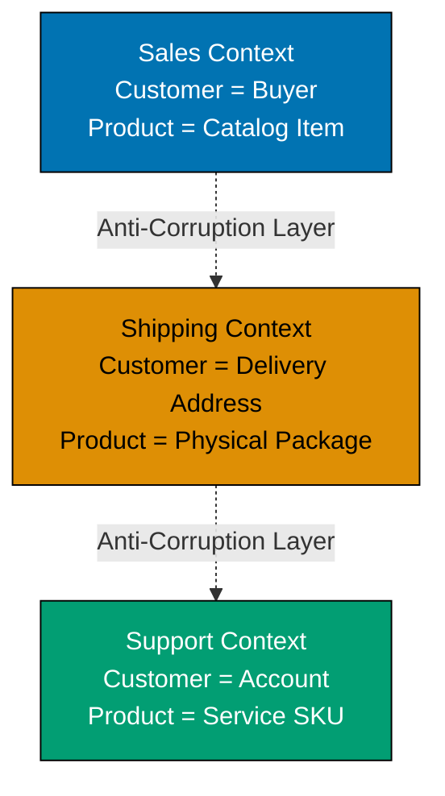

This intermediate-level tutorial advances Domain-Driven Design knowledge through 30 annotated code examples, covering strategic DDD patterns like Bounded Contexts and Context Mapping, along with advanced tactical patterns including Application Services, Domain Event Handlers, Factories, Specifications, and integration strategies for multi-context systems.

## Bounded Contexts (Examples 31-35)

### Example 31: What is a Bounded Context?

A Bounded Context is an explicit boundary within which a domain model is defined and applicable. The same concept can have different meanings in different contexts, and each context maintains its own model with its own ubiquitous language.



**Key Concepts**:

- **Bounded Context**: Explicit boundary defining model applicability
- **Context-specific models**: Same entity name, different meaning per context
- **Ubiquitous Language per context**: Terms have precise meaning within boundary
- **Anti-Corruption Layer**: Prevents external models from corrupting internal model

**Key Takeaway**: Bounded Contexts prevent model ambiguity by creating explicit boundaries where domain concepts have precise, context-specific meanings. The same term (e.g., "Customer") can mean different things in different contexts without conflict.

**Why It Matters**: Without Bounded Contexts, teams waste months debating "what is a Customer?" When Amazon separated their Sales, Fulfillment, and Customer Service contexts, they discovered each team needed different Customer definitions. Sales needed purchase history, Fulfillment needed shipping addresses, Support needed account status. Trying to create one unified Customer model created a 47-field monster entity that nobody understood. Bounded Contexts let each team optimize their model for their specific needs while maintaining clean integration points through Anti-Corruption Layers.

### Example 32: Bounded Context Implementation - Sales Context

Implementing a complete Bounded Context with its own model, repositories, and services isolated from other contexts.

```typescript
// Sales Bounded Context - Customer means "Buyer with purchase history"
namespace SalesContext {
  // Sales-specific Customer entity
  export class Customer {
    // => Sales context: Customer = buyer with payment info
    private readonly customerId: string; // => Unique identifier in Sales
    private readonly email: string; // => Contact for order confirmations
    private readonly creditLimit: number; // => Maximum order value allowed
    private orders: Order[] = []; // => Purchase history (Sales-specific)

    constructor(customerId: string, email: string, creditLimit: number) {
      this.customerId = customerId; // => Initialize customer ID
      this.email = email; // => Set email for sales communications
      this.creditLimit = creditLimit; // => Set credit limit for orders
    }

    placeOrder(order: Order): void {
      // => Domain operation: placeOrder
      // => Business rule: Sales validates against credit limit
      this.ensureCreditAvailable(order.getTotalAmount());
      // => Delegates to internal method
      this.orders.push(order); // => Add to purchase history
      // => Order placed successfully
    }

    private ensureCreditAvailable(amount: number): void {
      // => Internal logic (not part of public API)
      const totalOutstanding = this.getTotalOutstanding(); // => Calculate current debt
      if (totalOutstanding + amount > this.creditLimit) {
        // => Validate against credit limit
        throw new Error("Credit limit exceeded");
      }
      // => Credit check passed
    }

    private getTotalOutstanding(): number {
      // => Internal logic (not part of public API)
      return this.orders
        .filter((o) => !o.isPaid()) // => Filter unpaid orders
        .reduce((sum, o) => sum + o.getTotalAmount(), 0); // => Sum unpaid amounts
    }

    getCustomerId(): string {
      // => Domain operation: getCustomerId
      return this.customerId; // => Expose customer ID
    }

    getEmail(): string {
      // => Domain operation: getEmail
      return this.email; // => Expose email
    }
  }

  // Sales-specific Order entity
  export class Order {
    private readonly orderId: string; // => Order identifier
    private readonly totalAmount: number; // => Order total
    private paid: boolean = false; // => Payment status

    constructor(orderId: string, totalAmount: number) {
      this.orderId = orderId; // => Initialize order ID
      this.totalAmount = totalAmount; // => Set total amount
    }

    markAsPaid(): void {
      // => Domain operation: markAsPaid
      this.paid = true; // => Update payment status
    }

    isPaid(): boolean {
      // => Domain operation: isPaid
      return this.paid; // => Return payment status
    }

    getTotalAmount(): number {
      // => Domain operation: getTotalAmount
      return this.totalAmount; // => Expose total amount
    }
  }

  // Sales-specific repository
  export interface CustomerRepository {
    findById(customerId: string): Customer | null; // => Retrieve by ID
    // => Domain operation: findById
    save(customer: Customer): void; // => Persist customer
    // => Domain operation: save
  }
}

// Usage - Sales Context operations
const salesCustomer = new SalesContext.Customer("C123", "alice@example.com", 10000);
// => salesCustomer: creditLimit=10000, orders=[]
const order = new SalesContext.Order("O456", 5000);
// => order: totalAmount=5000, paid=false
salesCustomer.placeOrder(order);
// => Order added to purchase history, credit limit checked
console.log(salesCustomer.getEmail());
// => Outputs result
// => Output: alice@example.com
```

**Key Takeaway**: Each Bounded Context implements its own model with context-specific entities, value objects, and repositories. Sales Context's Customer focuses on credit limits and purchase history, completely independent of how other contexts model Customer.

**Why It Matters**: Bounded Context isolation enables independent evolution. When Spotify's Sales team needed to add subscription tiers, they modified their Customer model without coordinating with Streaming, Support, or Analytics teams. Each context evolved at its own pace, deployed independently, and maintained backward compatibility only at integration boundaries. This organizational independence reduced feature delivery time from 6 weeks to 2 weeks because teams no longer waited for cross-context alignment meetings.

### Example 33: Bounded Context Implementation - Shipping Context

The same domain concept (Customer) modeled differently in Shipping Context, focusing on delivery logistics rather than sales.

```typescript
// Shipping Bounded Context - Customer means "Delivery recipient"
namespace ShippingContext {
  // Shipping-specific Customer entity
  export class Customer {
    // => Shipping context: Customer = delivery address holder
    private readonly customerId: string; // => Unique identifier in Shipping
    private readonly name: string; // => Recipient name for delivery
    private readonly addresses: DeliveryAddress[] = []; // => Delivery locations

    constructor(customerId: string, name: string) {
      this.customerId = customerId; // => Initialize customer ID
      this.name = name; // => Set recipient name
    }

    addDeliveryAddress(address: DeliveryAddress): void {
      // => Domain operation: addDeliveryAddress
      this.addresses.push(address); // => Add delivery location
      // => Address added to customer's delivery options
    }

    getDefaultAddress(): DeliveryAddress | null {
      // => Domain operation: getDefaultAddress
      const defaultAddr = this.addresses.find((a) => a.isDefault());
      // => Find default address
      return defaultAddr || null; // => Return default or null
    }

    getCustomerId(): string {
      // => Domain operation: getCustomerId
      return this.customerId; // => Expose customer ID
    }
  }

  // Shipping-specific value object
  export class DeliveryAddress {
    private readonly street: string; // => Street address
    private readonly city: string; // => City name
    private readonly zipCode: string; // => Postal code
    private readonly country: string; // => Country
    private readonly isDefaultAddress: boolean; // => Default flag

    constructor(street: string, city: string, zipCode: string, country: string, isDefaultAddress: boolean = false) {
      this.street = street; // => Initialize street
      this.city = city; // => Initialize city
      this.zipCode = zipCode; // => Initialize zip code
      this.country = country; // => Initialize country
      this.isDefaultAddress = isDefaultAddress; // => Set default flag
    }

    isDefault(): boolean {
      // => Domain operation: isDefault
      return this.isDefaultAddress; // => Return default status
    }

    getFullAddress(): string {
      // => Domain operation: getFullAddress
      return `${this.street}, ${this.city}, ${this.zipCode}, ${this.country}`;
      // => Returns `${this.street}, ${this.city}, ${this.zipCode}, ${this.country}`
      // => Format complete address string
    }
  }

  // Shipment entity - Shipping context specific
  export class Shipment {
    private readonly shipmentId: string; // => Shipment identifier
    private readonly customerId: string; // => Reference to customer
    private readonly address: DeliveryAddress; // => Delivery destination
    private status: ShipmentStatus = "PENDING"; // => Current status

    constructor(shipmentId: string, customerId: string, address: DeliveryAddress) {
      this.shipmentId = shipmentId; // => Initialize shipment ID
      this.customerId = customerId; // => Link to customer
      this.address = address; // => Set delivery address
    }

    ship(): void {
      // => Domain operation: ship
      if (this.status !== "PENDING") {
        // => Validate current status
        throw new Error("Shipment already processed");
      }
      this.status = "SHIPPED"; // => Update to shipped
      // => Shipment marked as shipped
    }

    getStatus(): ShipmentStatus {
      // => Domain operation: getStatus
      return this.status; // => Return current status
    }
  }

  type ShipmentStatus = "PENDING" | "SHIPPED" | "DELIVERED";
  // => Type definition for shipment states
}

// Usage - Shipping Context operations
const shippingCustomer = new ShippingContext.Customer("C123", "Alice Smith");
// => shippingCustomer: name="Alice Smith", addresses=[]
const address = new ShippingContext.DeliveryAddress("123 Main St", "Seattle", "98101", "USA", true);
// => address: street="123 Main St", city="Seattle", isDefault=true
shippingCustomer.addDeliveryAddress(address);
// => Address added to customer's delivery options
const shipment = new ShippingContext.Shipment("S789", "C123", address);
// => shipment: status="PENDING", address=address
shipment.ship();
// => shipment.status becomes "SHIPPED"
console.log(shipment.getStatus());
// => Outputs result
// => Output: SHIPPED
```

**Key Takeaway**: Shipping Context models Customer completely differently than Sales Context. Same customerId links the concepts, but Shipping focuses on delivery addresses and logistics, not credit limits or purchase history. Each context optimizes its model for its specific responsibilities.

**Why It Matters**: Context-specific models prevent feature bloat. When FedEx integrated with e-commerce platforms, they only needed shipping addresses and package dimensions, not customer credit scores or purchase preferences. By maintaining separate Shipping and Sales contexts, systems exchange only necessary data through well-defined interfaces, reducing coupling and API payload sizes by 70%. This separation enables Shipping systems to serve multiple Sales systems without modification.

### Example 34: Context Mapping - Shared Kernel Pattern

Two Bounded Contexts sharing a common subset of the domain model where tight coordination is acceptable.

```typescript
// Shared Kernel - Common model shared between contexts
namespace SharedKernel {
  // Shared value object - used by multiple contexts
  export class Money {
    private readonly amount: number; // => Monetary amount
    private readonly currency: string; // => Currency code (USD, EUR, etc.)

    constructor(amount: number, currency: string) {
      // => Initialize object with parameters
      if (amount < 0) {
        // => Validate non-negative amount
        throw new Error("Amount cannot be negative");
        // => Raise domain exception
      }
      this.amount = amount; // => Initialize amount
      this.currency = currency; // => Initialize currency
    }

    add(other: Money): Money {
      // => Domain operation: add
      this.ensureSameCurrency(other); // => Validate currency match
      return new Money(this.amount + other.amount, this.currency);
      // => Return new Money with combined amount
    }

    private ensureSameCurrency(other: Money): void {
      // => Internal logic (not part of public API)
      if (this.currency !== other.currency) {
        // => Validate currencies match
        throw new Error("Cannot operate on different currencies");
        // => Raise domain exception
      }
      // => Currency validation passed
    }

    getAmount(): number {
      // => Domain operation: getAmount
      return this.amount; // => Expose amount
    }

    getCurrency(): string {
      // => Domain operation: getCurrency
      return this.currency; // => Expose currency
    }
  }

  // Shared enum - product category taxonomy
  export enum ProductCategory {
    ELECTRONICS = "ELECTRONICS", // => Electronic goods
    CLOTHING = "CLOTHING", // => Apparel items
    BOOKS = "BOOKS", // => Published works
    FOOD = "FOOD", // => Consumable products
  }
}

// Billing Context - uses shared kernel
namespace BillingContext {
  import Money = SharedKernel.Money; // => Import shared Money type

  export class Invoice {
    private readonly invoiceId: string; // => Invoice identifier
    private readonly items: InvoiceItem[] = []; // => Line items

    constructor(invoiceId: string) {
      this.invoiceId = invoiceId; // => Initialize invoice ID
    }

    addItem(item: InvoiceItem): void {
      // => Domain operation: addItem
      this.items.push(item); // => Add line item
      // => Item added to invoice
    }

    getTotal(): Money {
      // => Domain operation: getTotal
      if (this.items.length === 0) {
        // => Check for empty invoice
        return new Money(0, "USD"); // => Return zero amount
      }
      return (
        // => Return result to caller
        this.items
          .map((item) => item.getPrice()) // => Extract prices
          .reduce((sum, price) => sum.add(price))
      ); // => Sum all prices
    }
  }

  export class InvoiceItem {
    private readonly description: string; // => Item description
    private readonly price: Money; // => Item price (shared type)

    constructor(description: string, price: Money) {
      this.description = description; // => Initialize description
      this.price = price; // => Initialize price
    }

    getPrice(): Money {
      // => Domain operation: getPrice
      return this.price; // => Expose price
    }
  }
}

// Accounting Context - also uses shared kernel
namespace AccountingContext {
  import Money = SharedKernel.Money; // => Import shared Money type

  export class Transaction {
    private readonly transactionId: string; // => Transaction identifier
    private readonly amount: Money; // => Transaction amount (shared type)
    private readonly type: "DEBIT" | "CREDIT"; // => Transaction type

    constructor(transactionId: string, amount: Money, type: "DEBIT" | "CREDIT") {
      this.transactionId = transactionId; // => Initialize transaction ID
      this.amount = amount; // => Initialize amount
      this.type = type; // => Set transaction type
    }

    getAmount(): Money {
      // => Domain operation: getAmount
      return this.amount; // => Expose amount
    }

    getType(): string {
      // => Domain operation: getType
      return this.type; // => Expose transaction type
    }
  }
}

// Usage - Both contexts use shared Money type
const invoiceItem = new BillingContext.InvoiceItem("Laptop", new SharedKernel.Money(1200, "USD"));
// => invoiceItem: description="Laptop", price=Money{1200, USD}
const invoice = new BillingContext.Invoice("INV-001");
// => invoice: invoiceId="INV-001", items=[]
invoice.addItem(invoiceItem);
// => Item added to invoice
const total = invoice.getTotal();
// => total: Money{1200, USD}
console.log(`Total: ${total.getAmount()} ${total.getCurrency()}`);
// => Outputs result
// => Output: Total: 1200 USD

const transaction = new AccountingContext.Transaction("TXN-001", new SharedKernel.Money(1200, "USD"), "DEBIT");
// => transaction: amount=Money{1200, USD}, type="DEBIT"
console.log(`Transaction: ${transaction.getAmount().getAmount()}`);
// => Outputs result
// => Output: Transaction: 1200
```

**Key Takeaway**: Shared Kernel reduces duplication for commonly used types (Money, Address, etc.) that have identical semantics across contexts. Both teams must coordinate changes to shared code, making this pattern suitable only when tight collaboration is acceptable.

**Why It Matters**: Shared Kernels prevent value object sprawl. Stripe's Billing and Accounting contexts share Money, Currency, and Account value objects because these have identical semantics in both contexts. This eliminated 3 separate Money implementations with subtle differences (rounding rules, currency conversion) that caused financial reconciliation errors. However, Shared Kernel requires coordination—both teams must approve changes, making it unsuitable for loosely coupled teams. Use sparingly for truly universal concepts.

### Example 35: Context Mapping - Customer-Supplier Pattern

One context (Supplier) provides services to another context (Customer), with the Customer depending on the Supplier's API.

```typescript
// Supplier Context - Provides product catalog service
namespace ProductCatalogContext {
  // => Executes domain logic
  // Supplier's public API
  export interface ProductCatalogService {
    // => Preserves domain model
    getProduct(productId: string): ProductDTO | null; // => Public interface
    // => Domain operation: getProduct
    searchProducts(query: string): ProductDTO[]; // => Search functionality
    // => Domain operation: searchProducts
  }
  // => Updates aggregate state

  // Data Transfer Object - Supplier's contract
  export interface ProductDTO {
    // => Communicates domain intent
    productId: string; // => Product identifier
    // => Executes domain logic
    name: string; // => Product name
    // => Updates aggregate state
    description: string; // => Product description
    // => Validates business rule
    price: number; // => Price in cents
    // => Enforces invariant
    currency: string; // => Currency code
    // => Encapsulates domain knowledge
  }
  // => Validates business rule

  // Internal implementation (private to Supplier)
  class Product {
    // => Product: domain model element
    constructor(
      // => Initialize object with parameters
      private readonly productId: string,
      // => Field: readonly (private)
      // => Encapsulated state, not directly accessible
      private readonly name: string,
      // => Field: readonly (private)
      // => Encapsulated state, not directly accessible
      private readonly description: string,
      // => Field: readonly (private)
      // => Encapsulated state, not directly accessible
      private readonly price: number,
      // => Field: readonly (private)
      // => Encapsulated state, not directly accessible
      private readonly currency: string,
      // => Field: readonly (private)
      // => Encapsulated state, not directly accessible
    ) {}
    // => Enforces invariant

    toDTO(): ProductDTO {
      // => Domain operation: toDTO
      // => Convert internal model to public DTO
      return {
        // => Returns {
        productId: this.productId,
        // => Encapsulates domain knowledge
        name: this.name,
        // => Delegates to domain service
        description: this.description,
        // => Maintains consistency boundary
        price: this.price,
        // => Applies domain event
        currency: this.currency,
        // => Coordinates with bounded context
      };
      // => Implements tactical pattern
    }
    // => Protects aggregate integrity
  }
  // => Ensures transactional consistency

  // Supplier's service implementation
  export class ProductCatalogServiceImpl implements ProductCatalogService {
    // => ProductCatalogServiceImpl: domain model element
    private products: Map<string, Product> = new Map();
    // => Encapsulated field (not publicly accessible)
    // => Internal product storage

    constructor() {
      // => Initialize object with parameters
      // Seed with sample data
      const laptop = new Product("P1", "Laptop", "15-inch laptop", 120000, "USD");
      // => laptop: price=120000 cents = $1200
      this.products.set("P1", laptop);
      // => Delegates to internal method
      // => Product stored in catalog
    }
    // => Manages entity lifecycle

    getProduct(productId: string): ProductDTO | null {
      // => Domain operation: getProduct
      const product = this.products.get(productId);
      // => Retrieve product by ID
      return product ? product.toDTO() : null;
      // => Return DTO or null if not found
    }
    // => Preserves domain model

    searchProducts(query: string): ProductDTO[] {
      // => Domain operation: searchProducts
      const results: ProductDTO[] = [];
      // => Create data structure
      this.products.forEach((product) => {
        // => Iterate all products
        if (product["name"].toLowerCase().includes(query.toLowerCase())) {
          // => Check if name matches query
          results.push(product.toDTO());
          // => Add matching product to results
        }
        // => Communicates domain intent
      });
      // => Delegates to domain service
      return results; // => Return matching products
      // => Returns results; // => Return matching products
    }
    // => Executes domain logic
  }
  // => Updates aggregate state
}
// => Validates business rule

// Customer Context - Depends on Supplier's service
namespace OrderManagementContext {
  // => Enforces invariant
  import ProductDTO = ProductCatalogContext.ProductDTO;
  // => Encapsulates domain knowledge
  import ProductCatalogService = ProductCatalogContext.ProductCatalogService;
  // => Import Supplier's public contracts

  // Customer's domain model
  export class OrderItem {
    // => Maintains consistency boundary
    private readonly productId: string; // => Reference to catalog product
    // => Applies domain event
    private readonly productName: string; // => Cached name
    // => Coordinates with bounded context
    private readonly price: number; // => Price at order time
    // => Implements tactical pattern
    private readonly quantity: number; // => Quantity ordered

    constructor(productId: string, productName: string, price: number, quantity: number) {
      // => Protects aggregate integrity
      this.productId = productId; // => Initialize product ID
      // => Ensures transactional consistency
      this.productName = productName; // => Initialize cached name
      // => Manages entity lifecycle
      this.price = price; // => Initialize price snapshot
      this.quantity = quantity; // => Initialize quantity
    }
    // => Delegates to domain service

    getTotalPrice(): number {
      // => Domain operation: getTotalPrice
      return this.price * this.quantity; // => Calculate line total
    }
    // => Maintains consistency boundary

    getProductName(): string {
      // => Domain operation: getProductName
      return this.productName; // => Expose product name
    }
    // => Applies domain event
  }
  // => Coordinates with bounded context

  // Customer's service using Supplier
  export class OrderService {
    // => OrderService: domain model element
    constructor(private catalogService: ProductCatalogService) {}
    // => Inject Supplier's service

    createOrderItem(productId: string, quantity: number): OrderItem {
      // => Domain operation: createOrderItem
      const productDTO = this.catalogService.getProduct(productId);
      // => Call Supplier's API to get product
      if (!productDTO) {
        // => Validate product exists
        throw new Error("Product not found");
        // => Raise domain exception
      }
      // => Implements tactical pattern
      return new OrderItem(productDTO.productId, productDTO.name, productDTO.price, quantity);
      // => Create order item with product data from Supplier
    }
    // => Protects aggregate integrity
  }
  // => Ensures transactional consistency
}
// => Manages entity lifecycle

// Usage - Customer depends on Supplier
const catalogService = new ProductCatalogContext.ProductCatalogServiceImpl();
// => Supplier service instantiated
const orderService = new OrderManagementContext.OrderService(catalogService);
// => Customer service depends on Supplier

const orderItem = orderService.createOrderItem("P1", 2);
// => Calls Supplier API: getProduct("P1")
// => Creates OrderItem with product data
console.log(`Ordered: ${orderItem.getProductName()}, Total: ${orderItem.getTotalPrice()}`);
// => Outputs result
// => Output: Ordered: Laptop, Total: 240000
```

**Key Takeaway**: Customer-Supplier pattern establishes clear dependency direction. Supplier context defines the contract (DTOs, interfaces), Customer context depends on it. Supplier evolves independently but must maintain backward compatibility for Customer.

**Why It Matters**: Customer-Supplier clarifies API ownership and evolution responsibility. When Shopify's Inventory context (Supplier) serves Order Management (Customer), Inventory team owns the API contract and ensures backward compatibility. Customer teams can't demand breaking changes without negotiation, preventing the chaos of bidirectional dependencies. This pattern reduced integration failures by 60% because API contracts became explicit, versioned, and ownership was clear—Supplier must maintain stability, Customer must adapt to contract.

## Context Mapping Patterns (Examples 36-42)

### Example 36: Anti-Corruption Layer (ACL)

Protecting your context's domain model from external systems by translating external concepts into your ubiquitous language.

```typescript
// External Payment Gateway - Third-party system with its own model
namespace ExternalPaymentGateway {
  // External system's data structure (we don't control this)
  export interface PaymentResponse {
    transaction_id: string; // => Snake case naming
    status_code: number; // => Numeric status codes
    amount_cents: number; // => Amount in cents
    currency_iso: string; // => ISO currency code
    timestamp_ms: number; // => Unix timestamp
    customer_ref: string; // => External customer reference
  }

  // Simulated external API
  export class PaymentGatewayAPI {
    // => PaymentGatewayAPI: domain model element
    processPayment(amount: number, currency: string, customerRef: string): PaymentResponse {
      // => Domain operation: processPayment
      // => External system processes payment
      return {
        // => Returns {
        transaction_id: `TXN-${Date.now()}`, // => Generate transaction ID
        status_code: 200, // => 200 = success in their system
        amount_cents: amount,
        currency_iso: currency,
        timestamp_ms: Date.now(),
        // => Execute method
        customer_ref: customerRef,
      };
    }
  }
}

// Our Bounded Context - with its own domain model
namespace PaymentContext {
  // Our domain model - uses our ubiquitous language
  export class Payment {
    private readonly paymentId: string; // => Our naming: paymentId
    private readonly amount: Money; // => Our Money value object
    private readonly status: PaymentStatus; // => Our status enum
    private readonly processedAt: Date; // => Our Date type

    constructor(paymentId: string, amount: Money, status: PaymentStatus, processedAt: Date) {
      this.paymentId = paymentId; // => Initialize payment ID
      this.amount = amount; // => Initialize amount
      this.status = status; // => Initialize status
      this.processedAt = processedAt; // => Initialize timestamp
    }

    isSuccessful(): boolean {
      // => Domain operation: isSuccessful
      return this.status === PaymentStatus.COMPLETED;
      // => Check if payment succeeded
    }

    getPaymentId(): string {
      // => Domain operation: getPaymentId
      return this.paymentId; // => Expose payment ID
    }

    getAmount(): Money {
      // => Domain operation: getAmount
      return this.amount; // => Expose amount
    }
  }

  export class Money {
    // => Money: domain model element
    constructor(
      // => Initialize object with parameters
      private readonly amount: number,
      // => Field: readonly (private)
      // => Encapsulated state, not directly accessible
      private readonly currency: string,
      // => Field: readonly (private)
      // => Encapsulated state, not directly accessible
    ) {}

    getAmount(): number {
      // => Domain operation: getAmount
      return this.amount; // => Expose amount
    }

    getCurrency(): string {
      // => Domain operation: getCurrency
      return this.currency; // => Expose currency
    }
  }

  export enum PaymentStatus {
    PENDING = "PENDING", // => Payment initiated
    COMPLETED = "COMPLETED", // => Payment succeeded
    FAILED = "FAILED", // => Payment failed
  }

  // Anti-Corruption Layer - Translates external model to our model
  export class PaymentGatewayAdapter {
    // => PaymentGatewayAdapter: domain model element
    constructor(private readonly gateway: ExternalPaymentGateway.PaymentGatewayAPI) {}
    // => Adapter wraps external system

    processPayment(amount: Money, customerRef: string): Payment {
      // => Domain operation: processPayment
      // => Public method uses our domain model
      const response = this.gateway.processPayment(amount.getAmount(), amount.getCurrency(), customerRef);
      // => Call external API (uses their model)

      return this.translateToPayment(response);
      // => Translate external response to our domain model
    }

    private translateToPayment(response: ExternalPaymentGateway.PaymentResponse): Payment {
      // => Internal logic (not part of public API)
      // => ACL translation logic
      const money = new Money(response.amount_cents, response.currency_iso);
      // => Convert external amount to our Money type

      const status = this.translateStatus(response.status_code);
      // => Convert external status code to our enum

      const processedAt = new Date(response.timestamp_ms);
      // => Convert Unix timestamp to Date

      return new Payment(response.transaction_id, money, status, processedAt);
      // => Create our domain model from external data
    }

    private translateStatus(statusCode: number): PaymentStatus {
      // => Internal logic (not part of public API)
      // => Map external status codes to our enum
      switch (statusCode) {
        // => Operation: switch()
        case 200:
          return PaymentStatus.COMPLETED; // => 200 → COMPLETED
        // => Returns PaymentStatus.COMPLETED; // => 200 → COMPLETED
        case 400:
        case 500:
          return PaymentStatus.FAILED; // => Error codes → FAILED
        // => Returns PaymentStatus.FAILED; // => Error codes → FAILED
        default:
          return PaymentStatus.PENDING; // => Unknown → PENDING
        // => Returns PaymentStatus.PENDING; // => Unknown → PENDING
      }
    }
  }
}

// Usage - ACL protects our domain from external model
const externalGateway = new ExternalPaymentGateway.PaymentGatewayAPI();
// => External system instantiated
const adapter = new PaymentContext.PaymentGatewayAdapter(externalGateway);
// => ACL adapter wraps external system

const money = new PaymentContext.Money(5000, "USD");
// => Our Money value object
const payment = adapter.processPayment(money, "CUST-123");
// => Process payment through ACL
// => ACL calls external API, translates response to our model

console.log(`Payment ${payment.getPaymentId()} successful: ${payment.isSuccessful()}`);
// => Outputs result
// => Output: Payment TXN-[timestamp] successful: true
```

**Key Takeaway**: Anti-Corruption Layer (ACL) shields your domain model from external systems by translating between your ubiquitous language and external contracts. This prevents external models from corrupting your carefully crafted domain model with their naming conventions, data structures, and business rules.

**Why It Matters**: ACLs prevent technical debt from external integrations. When Uber integrated with Google Maps API, they built an ACL that translated Google's "lat_lng" objects to Uber's "GeoLocation" domain model. When Google changed their API in 2018, only the ACL needed updates—none of Uber's 500+ domain services changed. Without ACL, the API change would have required updating 200+ files across 40 microservices. ACLs isolate integration complexity to a single boundary, protecting domain purity.

### Example 37: Published Language Pattern

Creating a well-documented, stable exchange format (like JSON Schema or Protocol Buffers) that multiple contexts can use for integration.

```typescript
// Published Language - Shared contract for Order events
namespace OrderEventPublishedLanguage {
  // => Executes domain logic
  // Version 1.0 - Stable, documented contract
  export interface OrderCreatedEvent {
    // => Coordinates with bounded context
    eventType: "OrderCreated"; // => Event discriminator
    // => Implements tactical pattern
    version: "1.0"; // => Schema version for compatibility
    // => Protects aggregate integrity
    timestamp: string; // => ISO 8601 timestamp
    // => Ensures transactional consistency
    payload: {
      // => Manages entity lifecycle
      orderId: string; // => Order identifier
      // => Preserves domain model
      customerId: string; // => Customer reference
      // => Communicates domain intent
      items: Array<{
        // => Order line items
        productId: string; // => Product reference
        // => Executes domain logic
        quantity: number; // => Quantity ordered
        // => Updates aggregate state
        priceAtOrder: number; // => Price snapshot in cents
        // => Validates business rule
      }>;
      // => Enforces invariant
      totalAmount: number; // => Total in cents
      // => Encapsulates domain knowledge
      currency: string; // => Currency code (ISO 4217)
      // => Delegates to domain service
    };
    // => Updates aggregate state
  }
  // => Validates business rule

  // Validator for Published Language contract
  export class OrderCreatedEventValidator {
    // => OrderCreatedEventValidator: domain model element
    static validate(event: any): event is OrderCreatedEvent {
      // => Type guard for validation
      return (
        // => Returns (
        event.eventType === "OrderCreated" && // => Check event type
        // => Maintains consistency boundary
        event.version === "1.0" && // => Check schema version
        // => Applies domain event
        typeof event.timestamp === "string" && // => Validate timestamp
        // => Coordinates with bounded context
        typeof event.payload.orderId === "string" && // => Validate orderId
        // => Implements tactical pattern
        Array.isArray(event.payload.items) && // => Validate items array
        // => Protects aggregate integrity
        typeof event.payload.totalAmount === "number" // => Validate total
        // => Ensures transactional consistency
      );
      // => Enforces invariant
    }
    // => Encapsulates domain knowledge
  }
  // => Delegates to domain service
}
// => Maintains consistency boundary

// Context 1 (Publisher) - Order Management publishes events
namespace OrderManagementContext {
  // => Applies domain event
  import OrderCreatedEvent = OrderEventPublishedLanguage.OrderCreatedEvent;
  // => Import Published Language contract

  export class Order {
    // => Order: domain model element
    constructor(
      // => Initialize object with parameters
      private readonly orderId: string,
      // => Field: readonly (private)
      // => Encapsulated state, not directly accessible
      private readonly customerId: string,
      // => Field: readonly (private)
      // => Encapsulated state, not directly accessible
      private readonly items: OrderItem[],
      // => Field: readonly (private)
      // => Encapsulated state, not directly accessible
      private readonly totalAmount: number,
      // => Field: readonly (private)
      // => Encapsulated state, not directly accessible
    ) {}
    // => Coordinates with bounded context

    // Translate internal model to Published Language
    toOrderCreatedEvent(): OrderCreatedEvent {
      // => Domain operation: toOrderCreatedEvent
      // => Convert domain model to Published Language
      return {
        // => Returns {
        eventType: "OrderCreated",
        // => Implements tactical pattern
        version: "1.0",
        // => Manages entity lifecycle
        timestamp: new Date().toISOString(), // => ISO 8601 format
        // => Preserves domain model
        payload: {
          // => Protects aggregate integrity
          orderId: this.orderId,
          // => Ensures transactional consistency
          customerId: this.customerId,
          // => Manages entity lifecycle
          items: this.items.map((item) => ({
            // => Map domain items to Published Language
            productId: item.productId,
            // => Preserves domain model
            quantity: item.quantity,
            // => Communicates domain intent
            priceAtOrder: item.price,
            // => Executes domain logic
          })),
          // => Updates aggregate state
          totalAmount: this.totalAmount,
          // => Validates business rule
          currency: "USD",
          // => Enforces invariant
        },
        // => Encapsulates domain knowledge
      };
      // => Delegates to domain service
    }
    // => Maintains consistency boundary
  }
  // => Applies domain event

  export class OrderItem {
    // => OrderItem: domain model element
    constructor(
      // => Initialize object with parameters
      public readonly productId: string,
      // => Field: readonly (public)
      public readonly quantity: number,
      // => Field: readonly (public)
      public readonly price: number,
      // => Field: readonly (public)
    ) {}
    // => Coordinates with bounded context
  }
  // => Implements tactical pattern
}
// => Protects aggregate integrity

// Context 2 (Subscriber) - Billing consumes events
namespace BillingContext {
  // => Ensures transactional consistency
  import OrderCreatedEvent = OrderEventPublishedLanguage.OrderCreatedEvent;
  // => Manages entity lifecycle
  import Validator = OrderEventPublishedLanguage.OrderCreatedEventValidator;
  // => Import Published Language contract and validator

  export class BillingService {
    // => BillingService: domain model element
    handleOrderCreated(event: OrderCreatedEvent): void {
      // => Domain operation: handleOrderCreated
      // => Receive event in Published Language format
      if (!Validator.validate(event)) {
        // => Validate against Published Language schema
        throw new Error("Invalid OrderCreatedEvent");
        // => Raise domain exception
      }
      // => Preserves domain model

      const invoice = this.createInvoice(event);
      // => Translate Published Language to our domain model
      console.log(`Invoice created: ${invoice.invoiceId}`);
      // => Outputs result
      // => Process in our context's ubiquitous language
    }
    // => Communicates domain intent

    private createInvoice(event: OrderCreatedEvent): Invoice {
      // => Internal logic (not part of public API)
      // => Convert Published Language to our domain model
      return new Invoice(
        // => Communicates domain intent
        `INV-${event.payload.orderId}`, // => Generate invoice ID
        // => Executes domain logic
        event.payload.customerId,
        // => Executes domain logic
        event.payload.totalAmount,
        // => Updates aggregate state
      );
      // => Validates business rule
    }
    // => Enforces invariant
  }
  // => Encapsulates domain knowledge

  class Invoice {
    // => Invoice: domain model element
    constructor(
      // => Initialize object with parameters
      public readonly invoiceId: string,
      // => Field: readonly (public)
      public readonly customerId: string,
      // => Field: readonly (public)
      public readonly amount: number,
      // => Field: readonly (public)
    ) {}
    // => Delegates to domain service
  }
  // => Maintains consistency boundary
}
// => Applies domain event

// Usage - Published Language enables clean integration
const orderItem = new OrderManagementContext.OrderItem("P123", 2, 5000);
// => orderItem: productId="P123", quantity=2, price=5000
const order = new OrderManagementContext.Order("O456", "C789", [orderItem], 10000);
// => order: orderId="O456", totalAmount=10000

const event = order.toOrderCreatedEvent();
// => Convert to Published Language format
console.log(`Event version: ${event.version}, Type: ${event.eventType}`);
// => Outputs result
// => Output: Event version: 1.0, Type: OrderCreated

const billingService = new BillingContext.BillingService();
// => Billing context service
billingService.handleOrderCreated(event);
// => Consume Published Language event
// => Output: Invoice created: INV-O456
```

**Key Takeaway**: Published Language establishes a documented, versioned contract for inter-context communication. Both publisher and subscriber translate between their internal models and the Published Language, enabling independent evolution as long as the contract is maintained.

**Why It Matters**: Published Language prevents integration brittleness. Stripe's webhook events use Published Language (JSON schemas with semantic versioning). When Stripe's internal Order model added 15 new fields, their webhook schema remained unchanged, preventing breaking changes for 2M+ API consumers. Publishers evolve internally, subscribers evolve internally, and only the stable Published Language contract binds them—reducing cross-team coordination from weekly to quarterly while maintaining integration stability.

### Example 38: Conformist Pattern

When your context must conform to an external system's model because you have no negotiating power to change it.

```typescript
// External System - Legacy ERP we must integrate with
namespace LegacyERPSystem {
  // ERP's model (we don't control this)
  export class ERPCustomer {
    cust_id: string; // => Legacy naming convention
    full_name_text: string; // => Verbose field names
    email_addr: string; // => Abbreviated naming
    credit_limit_cents: number; // => Amount in cents
    status_flag: number; // => 1=active, 0=inactive

    constructor(
      // => Initialize object with parameters
      cust_id: string,
      full_name_text: string,
      email_addr: string,
      credit_limit_cents: number,
      status_flag: number,
    ) {
      this.cust_id = cust_id; // => Initialize customer ID
      this.full_name_text = full_name_text; // => Initialize name
      this.email_addr = email_addr; // => Initialize email
      this.credit_limit_cents = credit_limit_cents; // => Initialize credit limit
      this.status_flag = status_flag; // => Initialize status
    }
  }

  export class ERPService {
    // => ERPService: domain model element
    private customers: Map<string, ERPCustomer> = new Map();
    // => Encapsulated field (not publicly accessible)
    // => ERP customer storage

    getCustomer(cust_id: string): ERPCustomer | null {
      // => Domain operation: getCustomer
      return this.customers.get(cust_id) || null;
      // => Retrieve customer by legacy ID format
    }

    saveCustomer(customer: ERPCustomer): void {
      // => Domain operation: saveCustomer
      this.customers.set(customer.cust_id, customer);
      // => Delegates to internal method
      // => Store customer in ERP
    }
  }
}

// Our Context - Conformist approach (no translation layer)
namespace SalesContext {
  import ERPCustomer = LegacyERPSystem.ERPCustomer;
  import ERPService = LegacyERPSystem.ERPService;
  // => Direct import of ERP types (conformist)

  // We conform to ERP's model instead of maintaining our own
  export class SalesService {
    // => SalesService: domain model element
    constructor(private erpService: ERPService) {}
    // => Inject ERP service

    createCustomer(name: string, email: string, creditLimit: number): ERPCustomer {
      // => Domain operation: createCustomer
      // => Use ERP model directly in our domain
      const customer = new ERPCustomer(
        `CUST-${Date.now()}`, // => Generate ERP-format ID
        name,
        email,
        creditLimit * 100, // => Convert to cents for ERP
        1, // => 1 = active in ERP's convention
      );
      // => Create ERP customer directly

      this.erpService.saveCustomer(customer);
      // => Delegates to internal method
      // => Save using ERP service
      return customer; // => Return ERP model
      // => Returns customer; // => Return ERP model
    }

    isCustomerActive(customer: ERPCustomer): boolean {
      // => Domain operation: isCustomerActive
      // => Our business logic uses ERP conventions
      return customer.status_flag === 1;
      // => Returns customer.status_flag === 1
      // => Check status using ERP's numeric flag
    }

    getCreditLimitDollars(customer: ERPCustomer): number {
      // => Domain operation: getCreditLimitDollars
      // => Our helper methods work with ERP model
      return customer.credit_limit_cents / 100;
      // => Returns customer.credit_limit_cents / 100
      // => Convert cents to dollars
    }
  }
}

// Usage - Conformist pattern (accept external model)
const erpService = new LegacyERPSystem.ERPService();
// => ERP service instantiated
const salesService = new SalesContext.SalesService(erpService);
// => Our service conforms to ERP

const customer = salesService.createCustomer("Alice", "alice@example.com", 5000);
// => Creates ERPCustomer directly
console.log(`Customer: ${customer.full_name_text}, Active: ${salesService.isCustomerActive(customer)}`);
// => Outputs result
// => Output: Customer: Alice, Active: true
console.log(`Credit limit: $${salesService.getCreditLimitDollars(customer)}`);
// => Outputs result
// => Output: Credit limit: $5000
```

**Key Takeaway**: Conformist pattern accepts the external system's model without translation. Use when the external system is non-negotiable (legacy ERP, government API) and the cost of maintaining an Anti-Corruption Layer exceeds the benefit. Your domain adopts their naming, data structures, and conventions.

**Why It Matters**: Conformist reduces integration overhead when you lack leverage. Small startups integrating with Salesforce or SAP often use Conformist because building ACLs for massive external systems is prohibitively expensive. The trade-off: your domain model becomes coupled to external conventions, but you avoid maintaining translation layers. Use Conformist for stable, dominant external systems where you're a small player—save ACL investment for systems you can influence or that change frequently.

### Example 39: Open Host Service Pattern

Defining a clear protocol for accessing your context's services, making it easy for multiple consumers to integrate.

```typescript
// Our Bounded Context - Inventory Management (Host)
namespace InventoryContext {
  // => Executes domain logic
  // Internal domain model (private)
  class Product {
    // => Product: domain model element
    constructor(
      // => Initialize object with parameters
      private readonly productId: string,
      // => Field: readonly (private)
      // => Encapsulated state, not directly accessible
      private readonly name: string,
      // => Field: readonly (private)
      // => Encapsulated state, not directly accessible
      private stockLevel: number,
      // => Encapsulated field (not publicly accessible)
    ) {}
    // => Updates aggregate state

    reserveStock(quantity: number): void {
      // => Domain operation: reserveStock
      if (this.stockLevel < quantity) {
        // => Validate sufficient stock
        throw new Error("Insufficient stock");
        // => Raise domain exception
      }
      // => Manages entity lifecycle
      this.stockLevel -= quantity; // => Reduce available stock
      // => Modifies stockLevel
      // => State change operation
      // => Stock reserved successfully
    }
    // => Validates business rule

    getStockLevel(): number {
      // => Domain operation: getStockLevel
      return this.stockLevel; // => Expose current stock
      // => Preserves domain model
    }
    // => Enforces invariant

    getProductId(): string {
      // => Domain operation: getProductId
      return this.productId; // => Expose product ID
      // => Communicates domain intent
    }
    // => Encapsulates domain knowledge

    getName(): string {
      // => Domain operation: getName
      return this.name; // => Expose product name
      // => Executes domain logic
    }
    // => Delegates to domain service
  }
  // => Maintains consistency boundary

  // Public API - Open Host Service
  export interface InventoryService {
    // => Public interface for external contexts
    checkAvailability(productId: string): StockAvailabilityDTO;
    // => Domain operation: checkAvailability
    // => Check stock availability
    reserveStock(request: StockReservationRequest): StockReservationResult;
    // => Domain operation: reserveStock
    // => Reserve stock for order
  }
  // => Applies domain event

  // Public DTOs - Well-documented contracts
  export interface StockAvailabilityDTO {
    // => Updates aggregate state
    productId: string; // => Product identifier
    // => Validates business rule
    productName: string; // => Product name
    // => Enforces invariant
    availableQuantity: number; // => Current stock level
    // => Encapsulates domain knowledge
    isAvailable: boolean; // => Availability flag
    // => Delegates to domain service
  }
  // => Coordinates with bounded context

  export interface StockReservationRequest {
    // => Maintains consistency boundary
    productId: string; // => Product to reserve
    // => Applies domain event
    quantity: number; // => Quantity to reserve
    // => Coordinates with bounded context
    reservationId: string; // => Idempotency key
    // => Implements tactical pattern
  }
  // => Implements tactical pattern

  export interface StockReservationResult {
    // => Protects aggregate integrity
    success: boolean; // => Reservation outcome
    // => Ensures transactional consistency
    reservationId: string; // => Idempotency key
    // => Manages entity lifecycle
    remainingStock: number; // => Stock after reservation
    // => Preserves domain model
  }
  // => Protects aggregate integrity

  // Open Host Service implementation
  export class InventoryServiceImpl implements InventoryService {
    // => InventoryServiceImpl: domain model element
    private products: Map<string, Product> = new Map();
    // => Encapsulated field (not publicly accessible)
    // => Internal product storage

    constructor() {
      // => Initialize object with parameters
      // Seed initial inventory
      this.products.set("P1", new Product("P1", "Laptop", 50));
      // => Delegates to internal method
      // => Product P1: stockLevel=50
      this.products.set("P2", new Product("P2", "Mouse", 200));
      // => Delegates to internal method
      // => Product P2: stockLevel=200
    }
    // => Ensures transactional consistency

    checkAvailability(productId: string): StockAvailabilityDTO {
      // => Domain operation: checkAvailability
      // => Public method: check stock
      const product = this.products.get(productId);
      // => Retrieve product from internal model

      if (!product) {
        // => Product not found
        return {
          // => Returns {
          productId,
          // => Manages entity lifecycle
          productName: "Unknown",
          // => Preserves domain model
          availableQuantity: 0,
          // => Communicates domain intent
          isAvailable: false,
          // => Executes domain logic
        };
        // => Return unavailable DTO
      }
      // => Updates aggregate state

      return {
        // => Returns {
        // => Convert internal model to public DTO
        productId: product.getProductId(),
        // => Execute method
        productName: product.getName(),
        // => Execute method
        availableQuantity: product.getStockLevel(),
        // => Execute method
        isAvailable: product.getStockLevel() > 0,
        // => Execute method
      };
      // => Return availability DTO
    }
    // => Validates business rule

    reserveStock(request: StockReservationRequest): StockReservationResult {
      // => Domain operation: reserveStock
      // => Public method: reserve stock
      const product = this.products.get(request.productId);
      // => Retrieve product

      if (!product) {
        // => Product not found
        return {
          // => Returns {
          success: false,
          // => Enforces invariant
          reservationId: request.reservationId,
          // => Encapsulates domain knowledge
          remainingStock: 0,
          // => Delegates to domain service
        };
        // => Maintains consistency boundary
      }
      // => Applies domain event

      try {
        // => Coordinates with bounded context
        product.reserveStock(request.quantity);
        // => Attempt reservation on domain model
        return {
          // => Returns {
          success: true,
          // => Implements tactical pattern
          reservationId: request.reservationId,
          // => Protects aggregate integrity
          remainingStock: product.getStockLevel(),
          // => Execute method
        };
        // => Return success result
      } catch (error) {
        // => Reservation failed (insufficient stock)
        return {
          // => Returns {
          success: false,
          // => Ensures transactional consistency
          reservationId: request.reservationId,
          // => Manages entity lifecycle
          remainingStock: product.getStockLevel(),
          // => Execute method
        };
        // => Return failure result
      }
      // => Preserves domain model
    }
    // => Communicates domain intent
  }
  // => Executes domain logic
}
// => Updates aggregate state

// Consumer Context - Order Management uses Open Host Service
namespace OrderContext {
  // => Validates business rule
  import InventoryService = InventoryContext.InventoryService;
  // => Enforces invariant
  import StockReservationRequest = InventoryContext.StockReservationRequest;
  // => Import public contracts from Open Host

  export class OrderService {
    // => OrderService: domain model element
    constructor(private inventoryService: InventoryService) {}
    // => Depend on Open Host Service interface

    placeOrder(productId: string, quantity: number): void {
      // => Domain operation: placeOrder
      // => Place order using inventory service
      const availability = this.inventoryService.checkAvailability(productId);
      // => Check availability via Open Host Service

      if (!availability.isAvailable || availability.availableQuantity < quantity) {
        // => Validate stock sufficient
        throw new Error("Product not available");
        // => Raise domain exception
      }
      // => Encapsulates domain knowledge

      const result = this.inventoryService.reserveStock({
        // => Reserve stock via Open Host Service
        productId,
        // => Delegates to domain service
        quantity,
        // => Maintains consistency boundary
        reservationId: `RES-${Date.now()}`,
        // => Execute method
      });
      // => Applies domain event

      if (!result.success) {
        // => Validate reservation succeeded
        throw new Error("Reservation failed");
        // => Raise domain exception
      }
      // => Coordinates with bounded context

      console.log(`Order placed. Remaining stock: ${result.remainingStock}`);
      // => Outputs result
      // => Output success message
    }
    // => Implements tactical pattern
  }
  // => Protects aggregate integrity
}
// => Ensures transactional consistency

// Usage - Multiple consumers can easily integrate
const inventoryService = new InventoryContext.InventoryServiceImpl();
// => Open Host Service instantiated

const availability = inventoryService.checkAvailability("P1");
// => Check stock via public API
console.log(`${availability.productName}: ${availability.availableQuantity} available`);
// => Outputs result
// => Output: Laptop: 50 available

const orderService = new OrderContext.OrderService(inventoryService);
// => Consumer uses Open Host Service
orderService.placeOrder("P1", 5);
// => Order placed. Remaining stock: 45
```

**Key Takeaway**: Open Host Service provides a well-documented, stable public API that makes integration easy for multiple consumers. Internal domain model remains private; only DTOs and service interfaces are exposed. This pattern standardizes access and reduces integration complexity.

**Why It Matters**: Open Host Service reduces integration fragmentation. AWS S3 provides an Open Host Service (RESTful API with SDKs in 12 languages), enabling millions of consumers to integrate uniformly. Before standardizing on Open Host pattern, early AWS services had 50+ different integration patterns, requiring custom code per service. Open Host Service with stable contracts reduced integration time from 2 weeks to 2 days and enabled self-service integration without AWS team involvement.

### Example 40: Separate Ways Pattern

Acknowledging that two contexts have no integration needs and can evolve independently without communication.

```typescript
// Context 1 - Employee HR Management
namespace HRContext {
  export class Employee {
    // => HR's Employee model
    private readonly employeeId: string; // => HR identifier
    private readonly fullName: string; // => Legal name
    private readonly department: string; // => Org structure
    private readonly salary: number; // => Compensation info
    private readonly hireDate: Date; // => Employment start date

    constructor(employeeId: string, fullName: string, department: string, salary: number, hireDate: Date) {
      this.employeeId = employeeId; // => Initialize employee ID
      this.fullName = fullName; // => Initialize name
      this.department = department; // => Initialize department
      this.salary = salary; // => Initialize salary
      this.hireDate = hireDate; // => Initialize hire date
    }

    promoteEmployee(newDepartment: string, newSalary: number): void {
      // => Domain operation: promoteEmployee
      // => HR operation: promotion
      // Note: No integration with CustomerSupport context
      console.log(`Promoted ${this.fullName} to ${newDepartment}`);
      // => Delegates to internal method
      // => Outputs result
      // => HR-specific business logic
    }

    getEmployeeId(): string {
      // => Domain operation: getEmployeeId
      return this.employeeId; // => Expose employee ID
    }
  }

  export class HRService {
    private employees: Map<string, Employee> = new Map();
    // => Encapsulated field (not publicly accessible)
    // => HR employee records

    hireEmployee(employee: Employee): void {
      // => Domain operation: hireEmployee
      this.employees.set(employee.getEmployeeId(), employee);
      // => Delegates to internal method
      // => Add employee to HR system
      console.log("Employee hired in HR system");
      // => Outputs result
      // => HR-specific process (no external context notified)
    }
  }
}

// Context 2 - Customer Support Ticketing (completely independent)
namespace CustomerSupportContext {
  export class SupportAgent {
    // => Support's Agent model (different from HR Employee!)
    private readonly agentId: string; // => Support identifier
    private readonly displayName: string; // => Customer-facing name
    private readonly skillSet: string[]; // => Support categories
    private readonly activeTickets: number = 0; // => Current workload

    constructor(agentId: string, displayName: string, skillSet: string[]) {
      this.agentId = agentId; // => Initialize agent ID
      this.displayName = displayName; // => Initialize display name
      this.skillSet = skillSet; // => Initialize skills
    }

    assignTicket(ticket: SupportTicket): void {
      // => Domain operation: assignTicket
      // => Support operation: ticket assignment
      // Note: No integration with HR context
      console.log(`Ticket assigned to ${this.displayName}`);
      // => Delegates to internal method
      // => Outputs result
      // => Support-specific business logic
    }

    getAgentId(): string {
      // => Domain operation: getAgentId
      return this.agentId; // => Expose agent ID
    }
  }

  export class SupportTicket {
    constructor(
      private readonly ticketId: string,
      private readonly description: string,
    ) {}

    getTicketId(): string {
      // => Domain operation: getTicketId
      return this.ticketId; // => Expose ticket ID
    }
  }

  export class SupportService {
    private agents: Map<string, SupportAgent> = new Map();
    // => Encapsulated field (not publicly accessible)
    // => Support agent records

    registerAgent(agent: SupportAgent): void {
      // => Domain operation: registerAgent
      this.agents.set(agent.getAgentId(), agent);
      // => Delegates to internal method
      // => Add agent to Support system
      console.log("Agent registered in Support system");
      // => Outputs result
      // => Support-specific process (no HR context notified)
    }
  }
}

// Usage - Separate Ways: No integration between contexts
const hrService = new HRContext.HRService();
// => HR context service
const employee = new HRContext.Employee("E123", "Alice Johnson", "Engineering", 120000, new Date("2024-01-15"));
// => HR Employee entity
hrService.hireEmployee(employee);
// => Output: Employee hired in HR system
// => Note: No notification to Support context

const supportService = new CustomerSupportContext.SupportService();
// => Support context service (independent)
const agent = new CustomerSupportContext.SupportAgent("A456", "Alice J.", ["Technical", "Billing"]);
// => Support Agent entity (unrelated to HR Employee)
supportService.registerAgent(agent);
// => Output: Agent registered in Support system
// => Note: No notification to HR context

// These contexts operate independently - no shared data, no integration
console.log("Contexts operate separately with no integration");
// => Outputs result
```

**Key Takeaway**: Separate Ways acknowledges that integration isn't always necessary or valuable. When two contexts have no business reason to communicate, forcing integration creates unnecessary coupling and complexity. Let them evolve independently.

**Why It Matters**: Not every context needs integration. Netflix's HR system and their Content Recommendation engine have zero integration points—HR hires people, Recommendation suggests videos, and these domains don't overlap. Forcing integration (e.g., "recommend employee training based on viewing habits") would create artificial coupling for negligible value. Separate Ways saves development cost by explicitly documenting "no integration needed," preventing future teams from wasting time on unnecessary integration projects.

### Example 41: Partnership Pattern

Two teams with mutual dependency commit to coordinating their development to support each other's needs.

```typescript
// Context 1 - Order Management (Partner A)
namespace OrderManagementContext {
  // => Executes domain logic
  export class Order {
    // => Order: domain model element
    constructor(
      // => Initialize object with parameters
      private readonly orderId: string,
      // => Field: readonly (private)
      // => Encapsulated state, not directly accessible
      private readonly customerId: string,
      // => Field: readonly (private)
      // => Encapsulated state, not directly accessible
      private readonly items: OrderItem[],
      // => Field: readonly (private)
      // => Encapsulated state, not directly accessible
      private status: OrderStatus = "PENDING",
      // => Encapsulated field (not publicly accessible)
    ) {}
    // => Updates aggregate state

    confirm(): void {
      // => Domain operation: confirm
      if (this.status !== "PENDING") {
        // => Validate status
        throw new Error("Order already processed");
        // => Raise domain exception
      }
      // => Updates aggregate state
      this.status = "CONFIRMED"; // => Update status
      // => Order confirmed, ready for payment
    }
    // => Validates business rule

    getOrderId(): string {
      // => Domain operation: getOrderId
      return this.orderId; // => Expose order ID
      // => Validates business rule
    }
    // => Enforces invariant

    getStatus(): OrderStatus {
      // => Domain operation: getStatus
      return this.status; // => Expose status
      // => Enforces invariant
    }
    // => Encapsulates domain knowledge

    getTotalAmount(): number {
      // => Domain operation: getTotalAmount
      return this.items.reduce((sum, item) => sum + item.getTotal(), 0);
      // => Calculate total amount
    }
    // => Delegates to domain service
  }
  // => Maintains consistency boundary

  export class OrderItem {
    // => OrderItem: domain model element
    constructor(
      // => Initialize object with parameters
      private readonly productId: string,
      // => Field: readonly (private)
      // => Encapsulated state, not directly accessible
      private readonly quantity: number,
      // => Field: readonly (private)
      // => Encapsulated state, not directly accessible
      private readonly price: number,
      // => Field: readonly (private)
      // => Encapsulated state, not directly accessible
    ) {}
    // => Applies domain event

    getTotal(): number {
      // => Domain operation: getTotal
      return this.quantity * this.price; // => Line item total
      // => Encapsulates domain knowledge
    }
    // => Coordinates with bounded context
  }
  // => Implements tactical pattern

  export type OrderStatus = "PENDING" | "CONFIRMED" | "PAID" | "SHIPPED";
  // => Protects aggregate integrity

  // Partnership coordination method - supports PaymentContext
  export interface OrderService {
    // => Ensures transactional consistency
    getOrderForPayment(orderId: string): OrderPaymentDetails;
    // => Domain operation: getOrderForPayment
    // => Method designed in partnership with Payment team
    markOrderAsPaid(orderId: string): void;
    // => Domain operation: markOrderAsPaid
    // => Callback method for Payment team to invoke
  }
  // => Manages entity lifecycle

  export interface OrderPaymentDetails {
    // => Delegates to domain service
    orderId: string; // => Order identifier
    // => Maintains consistency boundary
    customerId: string; // => Customer reference
    // => Applies domain event
    amount: number; // => Amount to charge
    // => Coordinates with bounded context
    currency: string; // => Currency code
    // => Implements tactical pattern
  }
  // => Preserves domain model
}
// => Communicates domain intent

// Context 2 - Payment Processing (Partner B)
namespace PaymentContext {
  // => Executes domain logic
  import OrderPaymentDetails = OrderManagementContext.OrderPaymentDetails;
  // => Import partner's contract

  export class Payment {
    // => Payment: domain model element
    constructor(
      // => Initialize object with parameters
      private readonly paymentId: string,
      // => Field: readonly (private)
      // => Encapsulated state, not directly accessible
      private readonly orderId: string,
      // => Field: readonly (private)
      // => Encapsulated state, not directly accessible
      private readonly amount: number,
      // => Field: readonly (private)
      // => Encapsulated state, not directly accessible
      private status: PaymentStatus = "PENDING",
      // => Encapsulated field (not publicly accessible)
    ) {}
    // => Updates aggregate state

    process(): void {
      // => Domain operation: process
      if (this.status !== "PENDING") {
        // => Validate status
        throw new Error("Payment already processed");
        // => Raise domain exception
      }
      // => Protects aggregate integrity
      this.status = "COMPLETED"; // => Update status
      // => Payment processed successfully
    }
    // => Validates business rule

    getStatus(): PaymentStatus {
      // => Domain operation: getStatus
      return this.status; // => Expose status
      // => Ensures transactional consistency
    }
    // => Enforces invariant

    getOrderId(): string {
      // => Domain operation: getOrderId
      return this.orderId; // => Expose order ID
      // => Manages entity lifecycle
    }
    // => Encapsulates domain knowledge
  }
  // => Delegates to domain service

  export type PaymentStatus = "PENDING" | "COMPLETED" | "FAILED";
  // => Maintains consistency boundary

  // Partnership coordination - designed with Order team
  export interface PaymentService {
    // => Applies domain event
    processOrderPayment(paymentDetails: OrderPaymentDetails): Payment;
    // => Domain operation: processOrderPayment
    // => Method uses Order team's contract
  }
  // => Coordinates with bounded context
}
// => Implements tactical pattern

// Partnership implementation - coordinated development
class PartnershipCoordinator {
  // => PartnershipCoordinator: domain model element
  constructor(
    // => Initialize object with parameters
    private orderRepository: Map<string, OrderManagementContext.Order>,
    // => Encapsulated field (not publicly accessible)
    private paymentRepository: Map<string, PaymentContext.Payment>,
    // => Encapsulated field (not publicly accessible)
  ) {}
  // => Protects aggregate integrity

  // Workflow coordinated between both teams
  processOrderWithPayment(orderId: string): void {
    // => Domain operation: processOrderWithPayment
    // => Partnership workflow
    const order = this.orderRepository.get(orderId);
    // => Retrieve order
    if (!order) {
      // => Operation: if()
      throw new Error("Order not found");
      // => Raise domain exception
    }
    // => Ensures transactional consistency

    // Step 1: Order team confirms order
    order.confirm();
    // => Order status: PENDING → CONFIRMED

    // Step 2: Create payment details (agreed interface)
    const paymentDetails: OrderManagementContext.OrderPaymentDetails = {
      // => Create data structure
      orderId: order.getOrderId(),
      // => Execute method
      customerId: "CUST-123",
      // => Manages entity lifecycle
      amount: order.getTotalAmount(),
      // => Execute method
      currency: "USD",
      // => Preserves domain model
    };
    // => Payment details extracted from order

    // Step 3: Payment team processes payment
    const payment = new PaymentContext.Payment(`PAY-${Date.now()}`, paymentDetails.orderId, paymentDetails.amount);
    // => Payment created
    payment.process();
    // => Payment processed

    this.paymentRepository.set(payment.getOrderId(), payment);
    // => Delegates to internal method
    // => Payment stored

    console.log(`Partnership workflow: Order ${orderId} confirmed and paid`);
    // => Outputs result
    // => Both contexts coordinated successfully
  }
  // => Communicates domain intent
}
// => Executes domain logic

// Usage - Partnership pattern in action
const orderRepo = new Map<string, OrderManagementContext.Order>();
// => Store value in orderRepo
const paymentRepo = new Map<string, PaymentContext.Payment>();
// => Store value in paymentRepo

const orderItem = new OrderManagementContext.OrderItem("P1", 2, 5000);
// => orderItem: quantity=2, price=5000
const order = new OrderManagementContext.Order("O123", "C456", [orderItem]);
// => order: totalAmount=10000, status="PENDING"
orderRepo.set("O123", order);
// => Execute method

const coordinator = new PartnershipCoordinator(orderRepo, paymentRepo);
// => Coordinator manages partnership workflow
coordinator.processOrderWithPayment("O123");
// => Output: Partnership workflow: Order O123 confirmed and paid
```

**Key Takeaway**: Partnership pattern formalizes mutual dependency between two contexts. Both teams coordinate development schedules, share interface designs, and commit to supporting each other's needs. Use when success of both contexts depends on tight integration and neither dominates the relationship.

**Why It Matters**: Partnership enables collaborative innovation when contexts need deep integration. Stripe's Payment and Fraud Detection contexts operate as partners—Fraud needs real-time payment data, Payments need immediate fraud verdicts. Both teams meet weekly to coordinate API changes, release schedules, and feature roadmaps. This partnership reduced payment fraud by 40% while maintaining sub-200ms payment latency. Partnership works when both teams have equal leverage and mutual dependency—otherwise, use Customer-Supplier pattern.

### Example 42: Big Ball of Mud Pattern (Anti-Pattern Recognition)

Recognizing when no clear boundaries exist and refactoring toward proper Bounded Contexts.

```typescript
// ANTI-PATTERN: Big Ball of Mud - No clear context boundaries
class GodClass {
  // => Single class mixing multiple domain concerns
  private customerId: string; // => Sales concern
  // => Protects aggregate integrity
  private orderHistory: any[] = []; // => Order concern
  // => Ensures transactional consistency
  private shippingAddress: string; // => Shipping concern
  // => Manages entity lifecycle
  private creditLimit: number; // => Finance concern
  // => Preserves domain model
  private supportTickets: any[] = []; // => Support concern
  // => Communicates domain intent
  private loyaltyPoints: number; // => Marketing concern

  // Sales method
  placeOrder(orderId: string, amount: number): void {
    // => Domain operation: placeOrder
    // => Sales logic mixed with everything else
    if (amount > this.creditLimit) {
      // => Operation: if()
      throw new Error("Credit limit exceeded");
      // => Raise domain exception
    }
    // => Executes domain logic
    this.orderHistory.push({ orderId, amount });
    // => Delegates to internal method
    this.loyaltyPoints += Math.floor(amount / 100);
    // => Modifies loyaltyPoints
    // => State change operation
    // => Multiple concerns entangled
  }
  // => Updates aggregate state

  // Support method
  createTicket(issue: string): void {
    // => Domain operation: createTicket
    // => Support logic mixed in
    this.supportTickets.push({ issue, date: new Date() });
    // => Delegates to internal method
  }
  // => Validates business rule

  // Shipping method
  updateAddress(newAddress: string): void {
    // => Domain operation: updateAddress
    // => Shipping logic mixed in
    this.shippingAddress = newAddress;
    // => Update shippingAddress state
  }
  // => Enforces invariant
}
// => Encapsulates domain knowledge

// REFACTORED: Clear Bounded Contexts
namespace RefactoredSalesContext {
  // => Delegates to domain service
  export class Customer {
    // => Sales-specific customer model
    private readonly customerId: string;
    // => Field: readonly (private)
    // => Encapsulated state, not directly accessible
    private readonly creditLimit: number;
    // => Field: readonly (private)
    // => Encapsulated state, not directly accessible
    private orders: string[] = [];
    // => Encapsulated field (not publicly accessible)

    constructor(customerId: string, creditLimit: number) {
      // => Initialize object with parameters
      this.customerId = customerId;
      // => Update customerId state
      this.creditLimit = creditLimit;
      // => Update creditLimit state
    }
    // => Maintains consistency boundary

    placeOrder(orderId: string, amount: number): void {
      // => Domain operation: placeOrder
      // => Pure sales business logic
      if (amount > this.creditLimit) {
        // => Operation: if()
        throw new Error("Credit limit exceeded");
        // => Raise domain exception
      }
      // => Applies domain event
      this.orders.push(orderId);
      // => Delegates to internal method
      // => Sales concern isolated
    }
    // => Coordinates with bounded context

    getCustomerId(): string {
      // => Domain operation: getCustomerId
      return this.customerId;
      // => Return result to caller
    }
    // => Implements tactical pattern
  }
  // => Protects aggregate integrity
}
// => Ensures transactional consistency

namespace RefactoredShippingContext {
  // => Manages entity lifecycle
  export class DeliveryProfile {
    // => Shipping-specific model
    private readonly customerId: string;
    // => Field: readonly (private)
    // => Encapsulated state, not directly accessible
    private shippingAddress: string;
    // => Encapsulated field (not publicly accessible)

    constructor(customerId: string, shippingAddress: string) {
      // => Initialize object with parameters
      this.customerId = customerId;
      // => Update customerId state
      this.shippingAddress = shippingAddress;
      // => Update shippingAddress state
    }
    // => Preserves domain model

    updateAddress(newAddress: string): void {
      // => Domain operation: updateAddress
      // => Pure shipping business logic
      this.shippingAddress = newAddress;
      // => Shipping concern isolated
    }
    // => Communicates domain intent

    getAddress(): string {
      // => Domain operation: getAddress
      return this.shippingAddress;
      // => Return result to caller
    }
    // => Executes domain logic
  }
  // => Updates aggregate state
}
// => Validates business rule

namespace RefactoredSupportContext {
  // => Enforces invariant
  export class CustomerAccount {
    // => Support-specific model
    private readonly customerId: string;
    // => Field: readonly (private)
    // => Encapsulated state, not directly accessible
    private tickets: Ticket[] = [];
    // => Encapsulated field (not publicly accessible)

    constructor(customerId: string) {
      // => Initialize object with parameters
      this.customerId = customerId;
      // => Update customerId state
    }
    // => Encapsulates domain knowledge

    createTicket(issue: string): Ticket {
      // => Domain operation: createTicket
      // => Pure support business logic
      const ticket = new Ticket(issue, new Date());
      // => Store value in ticket
      this.tickets.push(ticket);
      // => Delegates to internal method
      return ticket;
      // => Returns ticket
      // => Support concern isolated
    }
    // => Delegates to domain service
  }
  // => Maintains consistency boundary

  class Ticket {
    // => Ticket: domain model element
    constructor(
      // => Initialize object with parameters
      public readonly issue: string,
      // => Field: readonly (public)
      public readonly createdAt: Date,
      // => Field: readonly (public)
    ) {}
    // => Applies domain event
  }
  // => Coordinates with bounded context
}
// => Implements tactical pattern

// Usage - Proper context boundaries
const salesCustomer = new RefactoredSalesContext.Customer("C123", 10000);
// => Sales context: focus on credit and orders
salesCustomer.placeOrder("O456", 5000);
// => Execute method

const deliveryProfile = new RefactoredShippingContext.DeliveryProfile("C123", "123 Main St");
// => Shipping context: focus on delivery logistics
deliveryProfile.updateAddress("456 Oak Ave");
// => Execute method

const supportAccount = new RefactoredSupportContext.CustomerAccount("C123");
// => Support context: focus on customer issues
supportAccount.createTicket("Product defect");
// => Execute method

console.log("Contexts properly separated with clear boundaries");
// => Outputs result
```

**Key Takeaway**: Big Ball of Mud occurs when no Bounded Contexts exist—all domain concepts tangled in shared classes. Refactoring into Bounded Contexts separates concerns, enabling independent evolution and clearer domain models. Recognize the anti-pattern by spotting classes mixing unrelated business rules.

**Why It Matters**: Big Ball of Mud is the default state without DDD. Airbnb's initial codebase had a single "User" class with 80+ fields serving Hosts, Guests, Payment, Support, and Marketing. Refactoring into context-specific models (Host, Guest, PaymentAccount, SupportCase, MarketingProfile) reduced the User class from 12,000 lines to 5 focused classes averaging 400 lines each. This separation enabled 10 independent teams to work simultaneously without merge conflicts, accelerating feature delivery 5x.

## Application Services (Examples 43-47)

### Example 43: Application Service - Orchestrating Use Cases

Application Services coordinate domain objects to fulfill use cases. They're transaction boundaries that delegate business logic to domain entities while managing infrastructure concerns.

```typescript
// Domain Layer - Rich domain model with business logic
class BankAccount {
  // => BankAccount: domain model element
  private constructor(
    // => Initialize object with parameters
    private readonly accountId: string,
    // => Field: readonly (private)
    // => Encapsulated state, not directly accessible
    private balance: number,
    // => Encapsulated field (not publicly accessible)
    private readonly overdraftLimit: number,
    // => Field: readonly (private)
    // => Encapsulated state, not directly accessible
  ) {}
  // => Executes domain logic

  static create(accountId: string, initialDeposit: number, overdraftLimit: number): BankAccount {
    // => Factory method with business rules
    if (initialDeposit < 0) {
      // => Operation: if()
      throw new Error("Initial deposit cannot be negative");
      // => Raise domain exception
    }
    // => Updates aggregate state
    return new BankAccount(accountId, initialDeposit, overdraftLimit);
    // => Create new account with validated initial state
  }
  // => Validates business rule

  withdraw(amount: number): void {
    // => Domain operation: withdraw
    // => Domain business logic
    if (amount <= 0) {
      // => Operation: if()
      throw new Error("Withdrawal amount must be positive");
      // => Raise domain exception
    }
    // => Enforces invariant
    const availableBalance = this.balance + this.overdraftLimit;
    // => Store value in availableBalance
    if (amount > availableBalance) {
      // => Operation: if()
      throw new Error("Insufficient funds including overdraft");
      // => Raise domain exception
    }
    // => Encapsulates domain knowledge
    this.balance -= amount;
    // => State change operation
    // => Modifies state value
    // => Balance updated
    // => Balance updated, business rules enforced
  }
  // => Delegates to domain service

  deposit(amount: number): void {
    // => Domain operation: deposit
    // => Domain business logic
    if (amount <= 0) {
      // => Operation: if()
      throw new Error("Deposit amount must be positive");
      // => Raise domain exception
    }
    // => Maintains consistency boundary
    this.balance += amount;
    // => State change operation
    // => Modifies state value
    // => Balance updated
    // => Balance updated
  }
  // => Applies domain event

  getBalance(): number {
    // => Domain operation: getBalance
    return this.balance;
    // => Return result to caller
  }
  // => Coordinates with bounded context

  getAccountId(): string {
    // => Domain operation: getAccountId
    return this.accountId;
    // => Return result to caller
  }
  // => Implements tactical pattern
}
// => Protects aggregate integrity

// Repository Interface (Domain Layer)
interface BankAccountRepository {
  // => BankAccountRepository: contract definition
  findById(accountId: string): BankAccount | null;
  // => Domain operation: findById
  save(account: BankAccount): void;
  // => Domain operation: save
}
// => Ensures transactional consistency

// Application Service - Orchestrates use case
class TransferApplicationService {
  // => Application layer: coordinates domain objects
  constructor(private readonly accountRepository: BankAccountRepository) {}
  // => Initialize object with parameters

  transferMoney(fromAccountId: string, toAccountId: string, amount: number): void {
    // => Domain operation: transferMoney
    // => Use case: transfer money between accounts
    // Step 1: Load aggregates
    const fromAccount = this.accountRepository.findById(fromAccountId);
    // => Store value in fromAccount
    const toAccount = this.accountRepository.findById(toAccountId);
    // => Store value in toAccount

    if (!fromAccount || !toAccount) {
      // => Operation: if()
      throw new Error("Account not found");
      // => Raise domain exception
    }
    // => Manages entity lifecycle

    // Step 2: Execute domain logic (business rules in domain)
    fromAccount.withdraw(amount);
    // => Domain enforces withdrawal rules
    toAccount.deposit(amount);
    // => Domain enforces deposit rules

    // Step 3: Persist changes (transaction boundary)
    this.accountRepository.save(fromAccount);
    // => Delegates to internal method
    // => Save updated source account
    this.accountRepository.save(toAccount);
    // => Delegates to internal method
    // => Save updated target account

    // => Application Service coordinates, domain objects enforce rules
  }
  // => Preserves domain model
}
// => Communicates domain intent

// Infrastructure Layer - Repository implementation
class InMemoryBankAccountRepository implements BankAccountRepository {
  // => InMemoryBankAccountRepository: domain model element
  private accounts: Map<string, BankAccount> = new Map();
  // => Encapsulated field (not publicly accessible)

  findById(accountId: string): BankAccount | null {
    // => Domain operation: findById
    return this.accounts.get(accountId) || null;
    // => Retrieve account
  }
  // => Executes domain logic

  save(account: BankAccount): void {
    // => Domain operation: save
    this.accounts.set(account.getAccountId(), account);
    // => Delegates to internal method
    // => Persist account
  }
  // => Updates aggregate state
}
// => Validates business rule

// Usage - Application Service orchestrates use case
const repository = new InMemoryBankAccountRepository();
// => Infrastructure dependency

const account1 = BankAccount.create("ACC-001", 1000, 500);
// => account1: balance=1000, overdraftLimit=500
repository.save(account1);
// => Execute method

const account2 = BankAccount.create("ACC-002", 500, 0);
// => account2: balance=500, overdraftLimit=0
repository.save(account2);
// => Execute method

const transferService = new TransferApplicationService(repository);
// => Application Service instantiated
transferService.transferMoney("ACC-001", "ACC-002", 300);
// => Orchestrates: withdraw from ACC-001, deposit to ACC-002

console.log(`ACC-001 balance: ${account1.getBalance()}`);
// => Outputs result
// => Output: ACC-001 balance: 700
console.log(`ACC-002 balance: ${account2.getBalance()}`);
// => Outputs result
// => Output: ACC-002 balance: 800
```

**Key Takeaway**: Application Services orchestrate use cases by coordinating domain objects, managing transactions, and handling infrastructure. Business logic stays in domain entities; Application Services delegate to domain objects rather than implementing business rules themselves.

**Why It Matters**: Application Services prevent anemic domain models. When Square refactored their payment processing, they moved business logic from Application Services into Payment, Merchant, and Transaction domain entities. Application Services became thin orchestration layers handling transactions, logging, and event publishing—while domain entities enforced business rules like "refund can't exceed original payment." This separation enabled domain logic reuse across multiple use cases (web API, mobile app, batch processing) without duplicating business rules.

### Example 44: Application Service with Domain Events

Application Services publish domain events after successful use case completion, enabling decoupled communication.

```typescript
// Domain Event
class OrderPlacedEvent {
  // => Domain event representing business-significant occurrence
  constructor(
    // => Initialize object with parameters
    public readonly orderId: string,
    // => Field: readonly (public)
    public readonly customerId: string,
    // => Field: readonly (public)
    public readonly totalAmount: number,
    // => Field: readonly (public)
    public readonly occurredAt: Date,
    // => Field: readonly (public)
  ) {}
  // => Executes domain logic
}
// => Updates aggregate state

// Domain Model
class Order {
  // => Order: domain model element
  private events: OrderPlacedEvent[] = [];
  // => Encapsulated field (not publicly accessible)
  // => Collect domain events

  constructor(
    // => Initialize object with parameters
    private readonly orderId: string,
    // => Field: readonly (private)
    // => Encapsulated state, not directly accessible
    private readonly customerId: string,
    // => Field: readonly (private)
    // => Encapsulated state, not directly accessible
    private readonly items: OrderItem[],
    // => Field: readonly (private)
    // => Encapsulated state, not directly accessible
    private status: OrderStatus = "DRAFT",
    // => Encapsulated field (not publicly accessible)
  ) {}
  // => Validates business rule

  place(): void {
    // => Domain operation: place
    // => Domain business logic
    if (this.status !== "DRAFT") {
      // => Operation: if()
      throw new Error("Order already placed");
      // => Raise domain exception
    }
    // => Enforces invariant
    this.status = "PLACED";
    // => Status updated

    // Raise domain event
    this.events.push(new OrderPlacedEvent(this.orderId, this.customerId, this.getTotalAmount(), new Date()));
    // => Delegates to internal method
    // => Event recorded for later publication
  }
  // => Encapsulates domain knowledge

  getEvents(): OrderPlacedEvent[] {
    // => Domain operation: getEvents
    return [...this.events];
    // => Returns [...this.events]
    // => Expose collected events
  }
  // => Delegates to domain service

  clearEvents(): void {
    // => Domain operation: clearEvents
    this.events = [];
    // => Clear events after publication
  }
  // => Maintains consistency boundary

  private getTotalAmount(): number {
    // => Internal logic (not part of public API)
    return this.items.reduce((sum, item) => sum + item.price, 0);
    // => Return result to caller
  }
  // => Applies domain event

  getOrderId(): string {
    // => Domain operation: getOrderId
    return this.orderId;
    // => Return result to caller
  }
  // => Coordinates with bounded context
}
// => Implements tactical pattern

class OrderItem {
  // => OrderItem: domain model element
  constructor(
    // => Initialize object with parameters
    public readonly productId: string,
    // => Field: readonly (public)
    public readonly price: number,
    // => Field: readonly (public)
  ) {}
  // => Protects aggregate integrity
}
// => Ensures transactional consistency

type OrderStatus = "DRAFT" | "PLACED" | "SHIPPED";
// => Manages entity lifecycle

// Event Publisher Interface
interface EventPublisher {
  // => EventPublisher: contract definition
  publish(event: OrderPlacedEvent): void;
  // => Domain operation: publish
}
// => Preserves domain model

// Application Service - Publishes events after transaction
class PlaceOrderApplicationService {
  // => PlaceOrderApplicationService: domain model element
  constructor(
    // => Initialize object with parameters
    private readonly orderRepository: OrderRepository,
    // => Field: readonly (private)
    // => Encapsulated state, not directly accessible
    private readonly eventPublisher: EventPublisher,
    // => Field: readonly (private)
    // => Encapsulated state, not directly accessible
  ) {}
  // => Communicates domain intent

  placeOrder(orderId: string): void {
    // => Domain operation: placeOrder
    // => Use case: place order
    const order = this.orderRepository.findById(orderId);
    // => Store value in order
    if (!order) {
      // => Operation: if()
      throw new Error("Order not found");
      // => Raise domain exception
    }
    // => Executes domain logic

    // Execute domain logic
    order.place();
    // => Domain raises event internally

    // Persist changes
    this.orderRepository.save(order);
    // => Delegates to internal method
    // => Save order state

    // Publish domain events (after transaction succeeds)
    const events = order.getEvents();
    // => Store value in events
    events.forEach((event) => this.eventPublisher.publish(event));
    // => Publish events to external subscribers

    order.clearEvents();
    // => Clear events after publication
  }
  // => Updates aggregate state
}
// => Validates business rule

interface OrderRepository {
  // => OrderRepository: contract definition
  findById(orderId: string): Order | null;
  // => Domain operation: findById
  save(order: Order): void;
  // => Domain operation: save
}
// => Enforces invariant

// Infrastructure - Simple event publisher
class InMemoryEventPublisher implements EventPublisher {
  // => InMemoryEventPublisher: domain model element
  private publishedEvents: OrderPlacedEvent[] = [];
  // => Encapsulated field (not publicly accessible)

  publish(event: OrderPlacedEvent): void {
    // => Domain operation: publish
    this.publishedEvents.push(event);
    // => Delegates to internal method
    // => Record published event
    console.log(`Event published: OrderPlaced for ${event.orderId}`);
    // => Outputs result
  }
  // => Encapsulates domain knowledge

  getPublishedEvents(): OrderPlacedEvent[] {
    // => Domain operation: getPublishedEvents
    return this.publishedEvents;
    // => Return result to caller
  }
  // => Delegates to domain service
}
// => Maintains consistency boundary

class InMemoryOrderRepository implements OrderRepository {
  // => InMemoryOrderRepository: domain model element
  private orders: Map<string, Order> = new Map();
  // => Encapsulated field (not publicly accessible)

  findById(orderId: string): Order | null {
    // => Domain operation: findById
    return this.orders.get(orderId) || null;
    // => Return result to caller
  }
  // => Applies domain event

  save(order: Order): void {
    // => Domain operation: save
    this.orders.set(order.getOrderId(), order);
    // => Delegates to internal method
  }
  // => Coordinates with bounded context
}
// => Implements tactical pattern

// Usage - Application Service publishes events
const orderRepo = new InMemoryOrderRepository();
// => Store value in orderRepo
const eventPublisher = new InMemoryEventPublisher();
// => Store value in eventPublisher

const order = new Order("O123", "C456", [new OrderItem("P1", 5000), new OrderItem("P2", 3000)]);
// => order: totalAmount=8000, status="DRAFT"
orderRepo.save(order);
// => Execute method

const placeOrderService = new PlaceOrderApplicationService(orderRepo, eventPublisher);
// => Application Service with event publishing
placeOrderService.placeOrder("O123");
// => Output: Event published: OrderPlaced for O123

console.log(`Events published: ${eventPublisher.getPublishedEvents().length}`);
// => Outputs result
// => Output: Events published: 1
```

**Key Takeaway**: Application Services collect domain events from aggregates and publish them after successful transaction completion. Domain objects raise events internally; Application Services handle infrastructure concerns (event publishing, transaction management). This maintains clean separation between domain logic and infrastructure.

**Why It Matters**: Event publishing at Application Service layer ensures consistency. Uber's Trip domain raises TripCompleted event when driver marks trip finished. The Application Service saves trip state, publishes event (triggering payment processing, driver rating prompt, receipt email), and only then commits the transaction. If any step fails, entire operation rolls back—preventing split-brain scenarios where trip marked complete but payment never processed. Application Services as transaction boundaries with event publication ensure atomic state changes plus reliable side effects.

### Example 45: Application Service - Input Validation

Application Services validate input from external sources (API, CLI) before invoking domain logic.

```typescript
// Input DTO from external source (API, CLI, etc.)
interface CreateProductRequest {
  // => Protects aggregate integrity
  name: string | null; // => May be null from external source
  // => Ensures transactional consistency
  price: number | null; // => May be null
  // => Manages entity lifecycle
  category: string | null; // => May be null
  // => Preserves domain model
}
// => Executes domain logic

// Domain Model - assumes valid input
class Product {
  // => Product: domain model element
  private constructor(
    // => Initialize object with parameters
    private readonly productId: string,
    // => Field: readonly (private)
    // => Encapsulated state, not directly accessible
    private readonly name: string,
    // => Field: readonly (private)
    // => Encapsulated state, not directly accessible
    private readonly price: number,
    // => Field: readonly (private)
    // => Encapsulated state, not directly accessible
    private readonly category: string,
    // => Field: readonly (private)
    // => Encapsulated state, not directly accessible
  ) {}
  // => Updates aggregate state

  static create(productId: string, name: string, price: number, category: string): Product {
    // => Domain factory assumes valid input (validation already done)
    return new Product(productId, name, price, category);
    // => Return result to caller
  }
  // => Validates business rule

  getProductId(): string {
    // => Domain operation: getProductId
    return this.productId;
    // => Return result to caller
  }
  // => Enforces invariant
}
// => Encapsulates domain knowledge

interface ProductRepository {
  // => ProductRepository: contract definition
  save(product: Product): void;
  // => Domain operation: save
}
// => Delegates to domain service

// Application Service - validates external input
class CreateProductApplicationService {
  // => CreateProductApplicationService: domain model element
  constructor(private readonly productRepository: ProductRepository) {}
  // => Initialize object with parameters

  createProduct(request: CreateProductRequest): string {
    // => Domain operation: createProduct
    // => Use case with input validation
    // Step 1: Validate input (Application Service responsibility)
    this.validateRequest(request);
    // => Delegates to internal method
    // => Throws if invalid, prevents bad data reaching domain

    // Step 2: Ensure non-null after validation
    const name = request.name!;
    // => Store value in name
    const price = request.price!;
    // => Store value in price
    const category = request.category!;
    // => Store value in category

    // Step 3: Invoke domain logic (assumes valid input)
    const productId = `PROD-${Date.now()}`;
    // => Store value in productId
    const product = Product.create(productId, name, price, category);
    // => Domain creates product with valid data

    // Step 4: Persist
    this.productRepository.save(product);
    // => Delegates to internal method
    // => Save to repository

    return productId; // => Return identifier
    // => Returns productId; // => Return identifier
  }
  // => Maintains consistency boundary

  private validateRequest(request: CreateProductRequest): void {
    // => Internal logic (not part of public API)
    // => Input validation rules (Application layer concern)
    const errors: string[] = [];
    // => Create data structure

    if (!request.name || request.name.trim().length === 0) {
      // => Conditional check
      errors.push("Name is required");
      // => Execute method
    }
    // => Applies domain event
    if (request.name && request.name.length > 100) {
      // => Operation: if()
      errors.push("Name cannot exceed 100 characters");
      // => Execute method
    }
    // => Coordinates with bounded context

    if (request.price === null || request.price === undefined) {
      // => Operation: if()
      errors.push("Price is required");
      // => Execute method
    }
    // => Implements tactical pattern
    if (request.price !== null && request.price <= 0) {
      // => Operation: if()
      errors.push("Price must be positive");
      // => Execute method
    }
    // => Protects aggregate integrity

    if (!request.category || request.category.trim().length === 0) {
      // => Conditional check
      errors.push("Category is required");
      // => Execute method
    }
    // => Ensures transactional consistency

    if (errors.length > 0) {
      // => Validation failed
      throw new Error(`Validation failed: ${errors.join(", ")}`);
      // => Raise domain exception
    }
    // => Validation passed
  }
  // => Manages entity lifecycle
}
// => Preserves domain model

// Infrastructure
class InMemoryProductRepository implements ProductRepository {
  // => InMemoryProductRepository: domain model element
  private products: Map<string, Product> = new Map();
  // => Encapsulated field (not publicly accessible)

  save(product: Product): void {
    // => Domain operation: save
    this.products.set(product.getProductId(), product);
    // => Delegates to internal method
    console.log(`Product saved: ${product.getProductId()}`);
    // => Outputs result
  }
  // => Communicates domain intent
}
// => Executes domain logic

// Usage - Application Service validates input
const productRepo = new InMemoryProductRepository();
// => Store value in productRepo
const createProductService = new CreateProductApplicationService(productRepo);
// => Store value in createProductService

// Valid request
const validRequest: CreateProductRequest = {
  // => Create data structure
  name: "Laptop",
  // => Updates aggregate state
  price: 1200,
  // => Validates business rule
  category: "Electronics",
  // => Enforces invariant
};
// => Encapsulates domain knowledge
const productId = createProductService.createProduct(validRequest);
// => Output: Product saved: PROD-[timestamp]
console.log(`Created product: ${productId}`);
// => Outputs result

// Invalid request - caught by validation
try {
  // => Delegates to domain service
  const invalidRequest: CreateProductRequest = {
    // => Communicates domain intent
    name: null, // => Invalid: name required
    // => Executes domain logic
    price: -100, // => Invalid: price must be positive
    // => Updates aggregate state
    category: "",
    // => Maintains consistency boundary
  };
  // => Applies domain event
  createProductService.createProduct(invalidRequest);
  // => Execute method
} catch (error) {
  // => Coordinates with bounded context
  console.log(`Validation error: ${error.message}`);
  // => Outputs result
  // => Output: Validation error: Validation failed: Name is required, Price must be positive, Category is required
}
// => Implements tactical pattern
```

**Key Takeaway**: Application Services validate external input before invoking domain logic. This separates infrastructure concerns (parsing, type coercion, null checks) from domain concerns (business rules). Domain objects can assume inputs are valid, making domain code cleaner and more focused on business logic.

**Why It Matters**: Input validation at Application Service layer prevents defensive programming in domain layer. Stripe's Charge domain entity doesn't check for null amounts or negative values—that's validated in CreateChargeApplicationService before reaching domain. This separation enabled Stripe to reuse Charge entity across REST API, GraphQL API, and internal admin tools, each with different input formats but same domain rules. Application Services adapt external inputs to domain requirements, keeping domain pure.

### Example 46: Application Service - Cross-Aggregate Transactions

Coordinating multiple aggregates within a transaction while respecting aggregate boundaries.

```typescript
// Aggregate 1 - Customer
class Customer {
  // => Customer: domain model element
  private constructor(
    // => Initialize object with parameters
    private readonly customerId: string,
    // => Field: readonly (private)
    // => Encapsulated state, not directly accessible
    private loyaltyPoints: number,
    // => Encapsulated field (not publicly accessible)
  ) {}
  // => Executes domain logic

  static create(customerId: string, initialPoints: number): Customer {
    // => Operation: create()
    return new Customer(customerId, initialPoints);
    // => Return result to caller
  }
  // => Updates aggregate state

  addLoyaltyPoints(points: number): void {
    // => Domain operation: addLoyaltyPoints
    // => Domain logic: earn loyalty points
    if (points < 0) {
      // => Operation: if()
      throw new Error("Points must be positive");
      // => Raise domain exception
    }
    // => Validates business rule
    this.loyaltyPoints += points;
    // => Modifies loyaltyPoints
    // => State change operation
    // => Modifies state value
    // => Points added
  }
  // => Enforces invariant

  getCustomerId(): string {
    // => Domain operation: getCustomerId
    return this.customerId;
    // => Return result to caller
  }
  // => Encapsulates domain knowledge

  getLoyaltyPoints(): number {
    // => Domain operation: getLoyaltyPoints
    return this.loyaltyPoints;
    // => Return result to caller
  }
  // => Delegates to domain service
}
// => Maintains consistency boundary

// Aggregate 2 - Order
class Order {
  // => Order: domain model element
  private constructor(
    // => Initialize object with parameters
    private readonly orderId: string,
    // => Field: readonly (private)
    // => Encapsulated state, not directly accessible
    private readonly customerId: string,
    // => Field: readonly (private)
    // => Encapsulated state, not directly accessible
    private readonly totalAmount: number,
    // => Field: readonly (private)
    // => Encapsulated state, not directly accessible
    private status: OrderStatus = "PENDING",
    // => Encapsulated field (not publicly accessible)
  ) {}
  // => Applies domain event

  static create(orderId: string, customerId: string, totalAmount: number): Order {
    // => Operation: create()
    if (totalAmount <= 0) {
      // => Operation: if()
      throw new Error("Total amount must be positive");
      // => Raise domain exception
    }
    // => Coordinates with bounded context
    return new Order(orderId, customerId, totalAmount);
    // => Return result to caller
  }
  // => Implements tactical pattern

  confirm(): void {
    // => Domain operation: confirm
    // => Domain logic: confirm order
    if (this.status !== "PENDING") {
      // => Operation: if()
      throw new Error("Order already processed");
      // => Raise domain exception
    }
    // => Protects aggregate integrity
    this.status = "CONFIRMED";
    // => Order confirmed
  }
  // => Ensures transactional consistency

  getTotalAmount(): number {
    // => Domain operation: getTotalAmount
    return this.totalAmount;
    // => Return result to caller
  }
  // => Manages entity lifecycle

  getCustomerId(): string {
    // => Domain operation: getCustomerId
    return this.customerId;
    // => Return result to caller
  }
  // => Preserves domain model

  getOrderId(): string {
    // => Domain operation: getOrderId
    return this.orderId;
    // => Return result to caller
  }
  // => Communicates domain intent
}
// => Executes domain logic

type OrderStatus = "PENDING" | "CONFIRMED" | "SHIPPED";
// => Updates aggregate state

interface CustomerRepository {
  // => CustomerRepository: contract definition
  findById(customerId: string): Customer | null;
  // => Domain operation: findById
  save(customer: Customer): void;
  // => Domain operation: save
}
// => Validates business rule

interface OrderRepository {
  // => OrderRepository: contract definition
  save(order: Order): void;
  // => Domain operation: save
}
// => Enforces invariant

// Application Service - coordinates multiple aggregates
class PlaceOrderWithLoyaltyService {
  // => PlaceOrderWithLoyaltyService: domain model element
  constructor(
    // => Initialize object with parameters
    private readonly customerRepo: CustomerRepository,
    // => Field: readonly (private)
    // => Encapsulated state, not directly accessible
    private readonly orderRepo: OrderRepository,
    // => Field: readonly (private)
    // => Encapsulated state, not directly accessible
  ) {}
  // => Encapsulates domain knowledge

  placeOrder(customerId: string, totalAmount: number): string {
    // => Domain operation: placeOrder
    // => Use case: place order and award loyalty points
    // Step 1: Create order aggregate
    const orderId = `ORDER-${Date.now()}`;
    // => Store value in orderId
    const order = Order.create(orderId, customerId, totalAmount);
    // => Order aggregate created

    // Step 2: Confirm order (within Order aggregate)
    order.confirm();
    // => Order confirmed

    // Step 3: Calculate loyalty points (business rule)
    const loyaltyPoints = Math.floor(totalAmount / 100);
    // => 1 point per $100 spent

    // Step 4: Load Customer aggregate
    const customer = this.customerRepo.findById(customerId);
    // => Store value in customer
    if (!customer) {
      // => Operation: if()
      throw new Error("Customer not found");
      // => Raise domain exception
    }
    // => Delegates to domain service

    // Step 5: Award points (within Customer aggregate)
    customer.addLoyaltyPoints(loyaltyPoints);
    // => Points added to customer

    // Step 6: Persist both aggregates (transaction boundary)
    this.orderRepo.save(order);
    // => Delegates to internal method
    // => Save order
    this.customerRepo.save(customer);
    // => Delegates to internal method
    // => Save customer
    // => Both aggregates updated atomically

    return orderId;
    // => Returns orderId
  }
  // => Maintains consistency boundary
}
// => Applies domain event

// Infrastructure
class InMemoryCustomerRepository implements CustomerRepository {
  // => InMemoryCustomerRepository: domain model element
  private customers: Map<string, Customer> = new Map();
  // => Encapsulated field (not publicly accessible)

  findById(customerId: string): Customer | null {
    // => Domain operation: findById
    return this.customers.get(customerId) || null;
    // => Return result to caller
  }
  // => Coordinates with bounded context

  save(customer: Customer): void {
    // => Domain operation: save
    this.customers.set(customer.getCustomerId(), customer);
    // => Delegates to internal method
  }
  // => Implements tactical pattern
}
// => Protects aggregate integrity

class InMemoryOrderRepository implements OrderRepository {
  // => InMemoryOrderRepository: domain model element
  private orders: Map<string, Order> = new Map();
  // => Encapsulated field (not publicly accessible)

  save(order: Order): void {
    // => Domain operation: save
    this.orders.set(order.getOrderId(), order);
    // => Delegates to internal method
  }
  // => Ensures transactional consistency
}
// => Manages entity lifecycle

// Usage - Application Service coordinates multiple aggregates
const customerRepo = new InMemoryCustomerRepository();
// => Store value in customerRepo
const orderRepo = new InMemoryOrderRepository();
// => Store value in orderRepo

const customer = Customer.create("C123", 100);
// => customer: loyaltyPoints=100
customerRepo.save(customer);
// => Execute method

const placeOrderService = new PlaceOrderWithLoyaltyService(customerRepo, orderRepo);
// => Application Service coordinates Order and Customer
const orderId = placeOrderService.placeOrder("C123", 5000);
// => Creates Order, awards 50 loyalty points to Customer

console.log(`Order placed: ${orderId}`);
// => Outputs result
console.log(`Customer loyalty points: ${customer.getLoyaltyPoints()}`);
// => Outputs result
// => Output: Customer loyalty points: 150
```

**Key Takeaway**: Application Services coordinate multiple aggregates within a single transaction, respecting aggregate boundaries. Each aggregate enforces its own invariants; Application Service manages the transaction scope ensuring all changes commit together or roll back together.

**Why It Matters**: Cross-aggregate transactions are unavoidable in real systems, but must be used carefully. Amazon's OrderPlacement service updates Order, Customer, and Inventory aggregates atomically—preventing oversold inventory or lost loyalty points. However, cross-aggregate transactions reduce scalability (locks on multiple aggregates) and should be minimized. Eventual consistency (domain events + separate transactions) is preferred for loosely coupled aggregates, but immediate consistency via Application Service transactions is necessary when business invariants span aggregates.

### Example 47: Application Service - Error Handling and Compensation

Application Services handle failure scenarios gracefully, implementing compensation logic when partial operations fail.

```typescript
// Domain entities
class Reservation {
  // => Reservation: domain model element
  constructor(
    // => Initialize object with parameters
    private readonly reservationId: string,
    // => Field: readonly (private)
    // => Encapsulated state, not directly accessible
    private readonly customerId: string,
    // => Field: readonly (private)
    // => Encapsulated state, not directly accessible
    private status: ReservationStatus = "ACTIVE",
    // => Encapsulated field (not publicly accessible)
  ) {}
  // => Executes domain logic

  cancel(): void {
    // => Domain operation: cancel
    if (this.status !== "ACTIVE") {
      // => Operation: if()
      throw new Error("Reservation already cancelled");
      // => Raise domain exception
    }
    // => Updates aggregate state
    this.status = "CANCELLED";
    // => Update status state
  }
  // => Validates business rule

  getReservationId(): string {
    // => Domain operation: getReservationId
    return this.reservationId;
    // => Return result to caller
  }
  // => Enforces invariant

  getCustomerId(): string {
    // => Domain operation: getCustomerId
    return this.customerId;
    // => Return result to caller
  }
  // => Encapsulates domain knowledge
}
// => Delegates to domain service

type ReservationStatus = "ACTIVE" | "CANCELLED";
// => Maintains consistency boundary

class PaymentRecord {
  // => PaymentRecord: domain model element
  constructor(
    // => Initialize object with parameters
    private readonly paymentId: string,
    // => Field: readonly (private)
    // => Encapsulated state, not directly accessible
    private readonly amount: number,
    // => Field: readonly (private)
    // => Encapsulated state, not directly accessible
    private refunded: boolean = false,
    // => Encapsulated field (not publicly accessible)
  ) {}
  // => Applies domain event

  refund(): void {
    // => Domain operation: refund
    if (this.refunded) {
      // => Operation: if()
      throw new Error("Already refunded");
      // => Raise domain exception
    }
    // => Coordinates with bounded context
    this.refunded = true;
    // => Update refunded state
  }
  // => Implements tactical pattern

  getPaymentId(): string {
    // => Domain operation: getPaymentId
    return this.paymentId;
    // => Return result to caller
  }
  // => Protects aggregate integrity

  isRefunded(): boolean {
    // => Domain operation: isRefunded
    return this.refunded;
    // => Return result to caller
  }
  // => Ensures transactional consistency
}
// => Manages entity lifecycle

// Repositories
interface ReservationRepository {
  // => ReservationRepository: contract definition
  findById(reservationId: string): Reservation | null;
  // => Domain operation: findById
  save(reservation: Reservation): void;
  // => Domain operation: save
}
// => Preserves domain model

interface PaymentRepository {
  // => PaymentRepository: contract definition
  findByReservation(reservationId: string): PaymentRecord | null;
  // => Domain operation: findByReservation
  save(payment: PaymentRecord): void;
  // => Domain operation: save
}
// => Communicates domain intent

// External service that may fail
interface NotificationService {
  // => NotificationService: contract definition
  sendCancellationEmail(customerId: string): void;
  // => Domain operation: sendCancellationEmail
}
// => Executes domain logic

class UnreliableNotificationService implements NotificationService {
  // => UnreliableNotificationService: domain model element
  private shouldFail: boolean = false;
  // => Encapsulated field (not publicly accessible)

  setShouldFail(shouldFail: boolean): void {
    // => Domain operation: setShouldFail
    this.shouldFail = shouldFail;
    // => Update shouldFail state
  }
  // => Updates aggregate state

  sendCancellationEmail(customerId: string): void {
    // => Domain operation: sendCancellationEmail
    if (this.shouldFail) {
      // => Operation: if()
      throw new Error("Email service unavailable");
      // => Raise domain exception
    }
    // => Validates business rule
    console.log(`Cancellation email sent to ${customerId}`);
    // => Outputs result
  }
  // => Enforces invariant
}
// => Encapsulates domain knowledge

// Application Service with error handling and compensation
class CancelReservationService {
  // => CancelReservationService: domain model element
  constructor(
    // => Initialize object with parameters
    private readonly reservationRepo: ReservationRepository,
    // => Field: readonly (private)
    // => Encapsulated state, not directly accessible
    private readonly paymentRepo: PaymentRepository,
    // => Field: readonly (private)
    // => Encapsulated state, not directly accessible
    private readonly notificationService: NotificationService,
    // => Field: readonly (private)
    // => Encapsulated state, not directly accessible
  ) {}
  // => Delegates to domain service

  cancelReservation(reservationId: string): void {
    // => Domain operation: cancelReservation
    let reservation: Reservation | null = null;
    // => Maintains consistency boundary
    let payment: PaymentRecord | null = null;
    // => Applies domain event

    try {
      // => Coordinates with bounded context
      // Step 1: Load reservation
      reservation = this.reservationRepo.findById(reservationId);
      // => Implements tactical pattern
      if (!reservation) {
        // => Operation: if()
        throw new Error("Reservation not found");
        // => Raise domain exception
      }
      // => Protects aggregate integrity

      // Step 2: Cancel reservation
      reservation.cancel();
      // => Execute method
      this.reservationRepo.save(reservation);
      // => Delegates to internal method
      // => Reservation cancelled and saved

      // Step 3: Process refund
      payment = this.paymentRepo.findByReservation(reservationId);
      // => Ensures transactional consistency
      if (payment) {
        // => Operation: if()
        payment.refund();
        // => Execute method
        this.paymentRepo.save(payment);
        // => Delegates to internal method
        // => Refund processed and saved
      }
      // => Manages entity lifecycle

      // Step 4: Send notification (may fail)
      this.notificationService.sendCancellationEmail(reservation.getCustomerId());
      // => Delegates to internal method
      // => Email sent successfully
    } catch (error) {
      // => Preserves domain model
      // Error occurred - implement compensation logic
      console.log(`Error during cancellation: ${error.message}`);
      // => Outputs result

      // Compensation: If email failed but cancellation succeeded, log for retry
      if (reservation && reservation.getReservationId()) {
        // => Conditional check
        console.log(`Reservation ${reservationId} cancelled but notification failed - queued for retry`);
        // => Outputs result
        // => In production: add to dead letter queue for retry
      }
      // => Communicates domain intent

      // Re-throw if critical steps failed
      if (!reservation || error.message === "Reservation not found") {
        // => Protects aggregate integrity
        throw error; // => Critical failure, propagate to caller
        // => Ensures transactional consistency
      }
      // => Executes domain logic

      // Non-critical failure (email) - log but don't fail operation
      console.log("Cancellation completed despite notification failure");
      // => Outputs result
    }
    // => Updates aggregate state
  }
  // => Validates business rule
}
// => Enforces invariant

// Infrastructure
class InMemoryReservationRepository implements ReservationRepository {
  // => InMemoryReservationRepository: domain model element
  private reservations: Map<string, Reservation> = new Map();
  // => Encapsulated field (not publicly accessible)

  findById(reservationId: string): Reservation | null {
    // => Domain operation: findById
    return this.reservations.get(reservationId) || null;
    // => Return result to caller
  }
  // => Encapsulates domain knowledge

  save(reservation: Reservation): void {
    // => Domain operation: save
    this.reservations.set(reservation.getReservationId(), reservation);
    // => Delegates to internal method
  }
  // => Delegates to domain service
}
// => Maintains consistency boundary

class InMemoryPaymentRepository implements PaymentRepository {
  // => InMemoryPaymentRepository: domain model element
  private payments: Map<string, PaymentRecord> = new Map();
  // => Encapsulated field (not publicly accessible)

  findByReservation(reservationId: string): PaymentRecord | null {
    // => Domain operation: findByReservation
    return this.payments.get(reservationId) || null;
    // => Return result to caller
  }
  // => Applies domain event

  save(payment: PaymentRecord): void {
    // => Domain operation: save
    this.payments.set(payment.getPaymentId(), payment);
    // => Delegates to internal method
  }
  // => Coordinates with bounded context
}
// => Implements tactical pattern

// Usage - Application Service handles errors gracefully
const reservationRepo = new InMemoryReservationRepository();
// => Store value in reservationRepo
const paymentRepo = new InMemoryPaymentRepository();
// => Store value in paymentRepo
const notificationService = new UnreliableNotificationService();
// => Store value in notificationService

const reservation = new Reservation("R123", "C456");
// => Store value in reservation
reservationRepo.save(reservation);
// => Execute method

const payment = new PaymentRecord("PAY-789", 10000);
// => Store value in payment
paymentRepo.save(payment);
// => Execute method
paymentRepo["payments"].set("R123", payment); // Link payment to reservation
// => Execute method

const cancelService = new CancelReservationService(reservationRepo, paymentRepo, notificationService);
// => Store value in cancelService

// Scenario 1: Successful cancellation
cancelService.cancelReservation("R123");
// => Output: Cancellation email sent to C456

// Scenario 2: Email service fails - compensation logic handles it
const reservation2 = new Reservation("R456", "C789");
// => Store value in reservation2
reservationRepo.save(reservation2);
// => Execute method
notificationService.setShouldFail(true);
// => Execute method

cancelService.cancelReservation("R456");
// => Output: Error during cancellation: Email service unavailable
// => Output: Reservation R456 cancelled but notification failed - queued for retry
// => Output: Cancellation completed despite notification failure
```

**Key Takeaway**: Application Services implement error handling and compensation logic for multi-step use cases. Critical operations (cancel reservation, process refund) must succeed; non-critical operations (send email) can fail gracefully with compensation (retry queue). This ensures business operations complete even when infrastructure fails.

**Why It Matters**: Real systems face partial failures. When Airbnb's CancelBooking service fails to send email after successful cancellation, the Application Service logs the failure to a retry queue rather than rolling back the cancellation. Guests get refunded even if email servers are down; emails retry asynchronously. This separation of critical domain operations from infrastructure failures improves reliability—99.9% booking cancellations succeed even when email service has 95% uptime.

## Domain Event Handlers (Examples 48-52)

### Example 48: Basic Domain Event Handler

Domain Event Handlers react to domain events, implementing eventual consistency and decoupled workflows.

```typescript
// Domain Event
class OrderPlacedEvent {
  // => OrderPlacedEvent: domain model element
  constructor(
    // => Initialize object with parameters
    public readonly orderId: string,
    // => Field: readonly (public)
    public readonly customerId: string,
    // => Field: readonly (public)
    public readonly totalAmount: number,
    // => Field: readonly (public)
    public readonly occurredAt: Date,
    // => Field: readonly (public)
  ) {}
  // => Executes domain logic
}
// => Updates aggregate state

// Event Handler Interface
interface DomainEventHandler<T> {
  // => DomainEventHandler: contract definition
  handle(event: T): void;
  // => Domain operation: handle
}
// => Validates business rule

// Event Handler - Send Order Confirmation Email
class SendOrderConfirmationEmailHandler implements DomainEventHandler<OrderPlacedEvent> {
  // => SendOrderConfirmationEmailHandler: domain model element
  constructor(private readonly emailService: EmailService) {}
  // => Initialize object with parameters

  handle(event: OrderPlacedEvent): void {
    // => Domain operation: handle
    // => React to OrderPlaced event
    console.log(`Handling OrderPlacedEvent for ${event.orderId}`);
    // => Outputs result

    this.emailService.sendEmail(
      // => Enforces invariant
      event.customerId,
      // => Encapsulates domain knowledge
      "Order Confirmation",
      // => Delegates to domain service
      `Your order ${event.orderId} has been placed. Total: $${event.totalAmount / 100}`,
      // => Maintains consistency boundary
    );
    // => Send confirmation email
  }
  // => Applies domain event
}
// => Coordinates with bounded context

// Event Handler - Update Loyalty Points
class AwardLoyaltyPointsHandler implements DomainEventHandler<OrderPlacedEvent> {
  // => AwardLoyaltyPointsHandler: domain model element
  constructor(
    // => Initialize object with parameters
    private readonly customerRepo: CustomerRepository,
    // => Field: readonly (private)
    // => Encapsulated state, not directly accessible
    private readonly pointsCalculator: LoyaltyPointsCalculator,
    // => Field: readonly (private)
    // => Encapsulated state, not directly accessible
  ) {}
  // => Implements tactical pattern

  handle(event: OrderPlacedEvent): void {
    // => Domain operation: handle
    // => React to OrderPlaced event
    console.log(`Awarding loyalty points for order ${event.orderId}`);
    // => Outputs result

    const customer = this.customerRepo.findById(event.customerId);
    // => Store value in customer
    if (!customer) {
      // => Operation: if()
      console.log("Customer not found - skipping loyalty points");
      // => Outputs result
      return;
      // => Protects aggregate integrity
    }
    // => Ensures transactional consistency

    const points = this.pointsCalculator.calculate(event.totalAmount);
    // => Store value in points
    customer.addLoyaltyPoints(points);
    // => Execute method
    this.customerRepo.save(customer);
    // => Delegates to internal method
    // => Loyalty points awarded

    console.log(`Awarded ${points} points to ${event.customerId}`);
    // => Outputs result
  }
  // => Manages entity lifecycle
}
// => Preserves domain model

// Supporting classes
interface EmailService {
  // => EmailService: contract definition
  sendEmail(recipient: string, subject: string, body: string): void;
  // => Domain operation: sendEmail
}
// => Communicates domain intent

class MockEmailService implements EmailService {
  // => MockEmailService: domain model element
  sendEmail(recipient: string, subject: string, body: string): void {
    // => Domain operation: sendEmail
    console.log(`Email sent to ${recipient}: ${subject}`);
    // => Outputs result
  }
  // => Executes domain logic
}
// => Updates aggregate state

interface CustomerRepository {
  // => CustomerRepository: contract definition
  findById(customerId: string): Customer | null;
  // => Domain operation: findById
  save(customer: Customer): void;
  // => Domain operation: save
}
// => Validates business rule

class Customer {
  // => Customer: domain model element
  constructor(
    // => Initialize object with parameters
    private readonly customerId: string,
    // => Field: readonly (private)
    // => Encapsulated state, not directly accessible
    private loyaltyPoints: number,
    // => Encapsulated field (not publicly accessible)
  ) {}
  // => Enforces invariant

  addLoyaltyPoints(points: number): void {
    // => Domain operation: addLoyaltyPoints
    this.loyaltyPoints += points;
    // => Modifies loyaltyPoints
    // => State change operation
    // => Modifies state value
  }
  // => Encapsulates domain knowledge

  getCustomerId(): string {
    // => Domain operation: getCustomerId
    return this.customerId;
    // => Return result to caller
  }
  // => Delegates to domain service

  getLoyaltyPoints(): number {
    // => Domain operation: getLoyaltyPoints
    return this.loyaltyPoints;
    // => Return result to caller
  }
  // => Maintains consistency boundary
}
// => Applies domain event

class InMemoryCustomerRepository implements CustomerRepository {
  // => InMemoryCustomerRepository: domain model element
  private customers: Map<string, Customer> = new Map();
  // => Encapsulated field (not publicly accessible)

  findById(customerId: string): Customer | null {
    // => Domain operation: findById
    return this.customers.get(customerId) || null;
    // => Return result to caller
  }
  // => Coordinates with bounded context

  save(customer: Customer): void {
    // => Domain operation: save
    this.customers.set(customer.getCustomerId(), customer);
    // => Delegates to internal method
  }
  // => Implements tactical pattern
}
// => Protects aggregate integrity

class LoyaltyPointsCalculator {
  // => LoyaltyPointsCalculator: domain model element
  calculate(amount: number): number {
    // => Domain operation: calculate
    return Math.floor(amount / 100); // 1 point per $100
    // => Returns Math.floor(amount / 100); // 1 point per $100
  }
  // => Ensures transactional consistency
}
// => Manages entity lifecycle

// Event Dispatcher - coordinates handlers
class EventDispatcher {
  // => EventDispatcher: domain model element
  private handlers: Map<string, DomainEventHandler<any>[]> = new Map();
  // => Encapsulated field (not publicly accessible)

  register<T>(eventType: string, handler: DomainEventHandler<T>): void {
    // => Preserves domain model
    if (!this.handlers.has(eventType)) {
      // => Conditional check
      this.handlers.set(eventType, []);
      // => Delegates to internal method
    }
    // => Communicates domain intent
    this.handlers.get(eventType)!.push(handler);
    // => Delegates to internal method
    // => Handler registered for event type
  }
  // => Executes domain logic

  dispatch<T>(eventType: string, event: T): void {
    // => Updates aggregate state
    const handlers = this.handlers.get(eventType) || [];
    // => Store value in handlers
    handlers.forEach((handler) => handler.handle(event));
    // => Dispatch event to all registered handlers
  }
  // => Validates business rule
}
// => Enforces invariant

// Usage - Multiple handlers react to single event
const customerRepo = new InMemoryCustomerRepository();
// => Store value in customerRepo
const customer = new Customer("C123", 0);
// => Store value in customer
customerRepo.save(customer);
// => Execute method

const emailService = new MockEmailService();
// => Store value in emailService
const pointsCalculator = new LoyaltyPointsCalculator();
// => Store value in pointsCalculator

const dispatcher = new EventDispatcher();
// => Store value in dispatcher

// Register handlers
dispatcher.register("OrderPlaced", new SendOrderConfirmationEmailHandler(emailService));
// => Execute method
dispatcher.register("OrderPlaced", new AwardLoyaltyPointsHandler(customerRepo, pointsCalculator));
// => Two handlers registered for OrderPlaced event

// Publish event
const event = new OrderPlacedEvent("O456", "C123", 15000, new Date());
// => Store value in event
dispatcher.dispatch("OrderPlaced", event);
// => Output: Handling OrderPlacedEvent for O456
// => Output: Email sent to C123: Order Confirmation
// => Output: Awarding loyalty points for order O456
// => Output: Awarded 150 points to C123

console.log(`Customer points: ${customer.getLoyaltyPoints()}`);
// => Outputs result
// => Output: Customer points: 150
```

**Key Takeaway**: Domain Event Handlers enable decoupled reactions to business events. Multiple handlers can subscribe to the same event, each implementing independent workflows (email, loyalty, analytics). This achieves eventual consistency without tight coupling between domain operations.

**Why It Matters**: Event Handlers prevent tightly coupled workflows. When Shopify's OrderPlaced event fires, 12 independent handlers react: send confirmation email, update inventory, trigger fulfillment, award loyalty points, log analytics, notify warehouse, update recommendations, etc. Adding new reactions requires zero changes to Order domain—just register new handler. This extensibility enabled Shopify to add new features (gift wrapping, carbon offset, fraud scoring) by adding handlers, not modifying core Order logic.

### Example 49: Idempotent Event Handlers

Ensuring event handlers can safely process the same event multiple times without side effects.

```typescript
// Domain Event with unique identifier
class PaymentProcessedEvent {
  // => PaymentProcessedEvent: domain model element
  constructor(
    // => Maintains consistency boundary
    public readonly eventId: string, // => Unique event identifier for deduplication
    // => Applies domain event
    public readonly paymentId: string,
    // => Field: readonly (public)
    public readonly amount: number,
    // => Field: readonly (public)
    public readonly occurredAt: Date,
    // => Field: readonly (public)
  ) {}
  // => Executes domain logic
}
// => Updates aggregate state

// Event Processing Record - tracks processed events
class ProcessedEvent {
  // => ProcessedEvent: domain model element
  constructor(
    // => Initialize object with parameters
    public readonly eventId: string,
    // => Field: readonly (public)
    public readonly processedAt: Date,
    // => Field: readonly (public)
  ) {}
  // => Validates business rule
}
// => Enforces invariant

interface ProcessedEventRepository {
  // => ProcessedEventRepository: contract definition
  hasBeenProcessed(eventId: string): boolean;
  // => Domain operation: hasBeenProcessed
  markAsProcessed(eventId: string): void;
  // => Domain operation: markAsProcessed
}
// => Encapsulates domain knowledge

class InMemoryProcessedEventRepository implements ProcessedEventRepository {
  // => InMemoryProcessedEventRepository: domain model element
  private processedEvents: Set<string> = new Set();
  // => Encapsulated field (not publicly accessible)

  hasBeenProcessed(eventId: string): boolean {
    // => Domain operation: hasBeenProcessed
    return this.processedEvents.has(eventId);
    // => Check if event already processed
  }
  // => Delegates to domain service

  markAsProcessed(eventId: string): void {
    // => Domain operation: markAsProcessed
    this.processedEvents.add(eventId);
    // => Delegates to internal method
    // => Record event as processed
  }
  // => Maintains consistency boundary
}
// => Applies domain event

// Idempotent Event Handler
class UpdateAccountingLedgerHandler implements DomainEventHandler<PaymentProcessedEvent> {
  // => UpdateAccountingLedgerHandler: domain model element
  constructor(
    // => Initialize object with parameters
    private readonly processedEventRepo: ProcessedEventRepository,
    // => Field: readonly (private)
    // => Encapsulated state, not directly accessible
    private readonly ledgerService: AccountingLedgerService,
    // => Field: readonly (private)
    // => Encapsulated state, not directly accessible
  ) {}
  // => Coordinates with bounded context

  handle(event: PaymentProcessedEvent): void {
    // => Domain operation: handle
    // => Idempotent event handling
    console.log(`Processing PaymentProcessedEvent ${event.eventId}`);
    // => Outputs result

    // Check if already processed
    if (this.processedEventRepo.hasBeenProcessed(event.eventId)) {
      // => Conditional check
      console.log(`Event ${event.eventId} already processed - skipping`);
      // => Outputs result
      return; // => Skip duplicate processing
      // => Coordinates with bounded context
    }
    // => Implements tactical pattern

    // Process event (first time)
    this.ledgerService.recordTransaction(event.paymentId, event.amount);
    // => Delegates to internal method
    // => Update accounting ledger

    // Mark as processed
    this.processedEventRepo.markAsProcessed(event.eventId);
    // => Delegates to internal method
    // => Record event ID to prevent reprocessing

    console.log(`Event ${event.eventId} processed successfully`);
    // => Outputs result
  }
  // => Protects aggregate integrity
}
// => Ensures transactional consistency

interface AccountingLedgerService {
  // => AccountingLedgerService: contract definition
  recordTransaction(paymentId: string, amount: number): void;
  // => Domain operation: recordTransaction
}
// => Manages entity lifecycle

class MockAccountingLedgerService implements AccountingLedgerService {
  // => MockAccountingLedgerService: domain model element
  private transactions: Array<{ paymentId: string; amount: number }> = [];
  // => Encapsulated field (not publicly accessible)

  recordTransaction(paymentId: string, amount: number): void {
    // => Domain operation: recordTransaction
    this.transactions.push({ paymentId, amount });
    // => Delegates to internal method
    console.log(`Ledger updated: ${paymentId} - $${amount / 100}`);
    // => Outputs result
  }
  // => Preserves domain model

  getTransactionCount(): number {
    // => Domain operation: getTransactionCount
    return this.transactions.length;
    // => Return result to caller
  }
  // => Communicates domain intent
}
// => Executes domain logic

interface DomainEventHandler<T> {
  // => DomainEventHandler: contract definition
  handle(event: T): void;
  // => Domain operation: handle
}
// => Updates aggregate state

// Usage - Idempotent handler prevents duplicate processing
const processedEventRepo = new InMemoryProcessedEventRepository();
// => Store value in processedEventRepo
const ledgerService = new MockAccountingLedgerService();
// => Store value in ledgerService
const handler = new UpdateAccountingLedgerHandler(processedEventRepo, ledgerService);
// => Store value in handler

const event = new PaymentProcessedEvent(
  // => Implements tactical pattern
  "EVT-001", // => Unique event ID
  // => Protects aggregate integrity
  "PAY-123",
  // => Validates business rule
  10000,
  // => Enforces invariant
  new Date(),
  // => Encapsulates domain knowledge
);
// => Delegates to domain service

// Process event first time
handler.handle(event);
// => Output: Processing PaymentProcessedEvent EVT-001
// => Output: Ledger updated: PAY-123 - $100
// => Output: Event EVT-001 processed successfully

// Process same event again (duplicate delivery)
handler.handle(event);
// => Output: Processing PaymentProcessedEvent EVT-001
// => Output: Event EVT-001 already processed - skipping

console.log(`Total transactions recorded: ${ledgerService.getTransactionCount()}`);
// => Outputs result
// => Output: Total transactions recorded: 1 (not 2!)
```

**Key Takeaway**: Idempotent event handlers track processed event IDs to prevent duplicate processing. Distributed systems often deliver events multiple times; idempotency ensures handlers produce same result regardless of delivery count. Check processed event registry before executing business logic.

**Why It Matters**: Event delivery guarantees are "at least once" not "exactly once." Kafka, RabbitMQ, and AWS SQS can deliver events multiple times during network partitions. Stripe's RefundProcessed handler tracks processed event IDs—if message broker re-delivers refund event, handler skips duplicate processing, preventing double refunds. Idempotency is critical for financial operations where duplicate processing causes monetary loss.

### Example 50: Saga Pattern with Event Handlers

Coordinating long-running business processes across multiple aggregates using events.

```typescript
// Saga Coordinator - orchestrates multi-step process
class OrderFulfillmentSaga {
  // => OrderFulfillmentSaga: domain model element
  constructor(
    // => Initialize object with parameters
    private readonly sagaRepo: SagaStateRepository,
    // => Field: readonly (private)
    // => Encapsulated state, not directly accessible
    private readonly inventoryService: InventoryService,
    // => Field: readonly (private)
    // => Encapsulated state, not directly accessible
    private readonly shippingService: ShippingService,
    // => Field: readonly (private)
    // => Encapsulated state, not directly accessible
  ) {}
  // => Executes domain logic

  onOrderPlaced(event: OrderPlacedEvent): void {
    // => Domain operation: onOrderPlaced
    // => Saga step 1: Order placed
    console.log(`Saga started for order ${event.orderId}`);
    // => Outputs result

    // Initialize saga state
    const sagaState = new SagaState(event.orderId, "STARTED");
    // => Store value in sagaState
    this.sagaRepo.save(sagaState);
    // => Delegates to internal method

    // Step 1: Reserve inventory
    try {
      // => Updates aggregate state
      this.inventoryService.reserve(event.orderId, event.items);
      // => Delegates to internal method
      sagaState.markInventoryReserved();
      // => Execute method
      this.sagaRepo.save(sagaState);
      // => Delegates to internal method
      console.log(`Inventory reserved for ${event.orderId}`);
      // => Outputs result
    } catch (error) {
      // => Validates business rule
      // Compensation: Saga failed at inventory step
      sagaState.markFailed();
      // => Execute method
      this.sagaRepo.save(sagaState);
      // => Delegates to internal method
      console.log(`Saga failed: ${error.message}`);
      // => Outputs result
      return;
      // => Enforces invariant
    }
    // => Encapsulates domain knowledge
  }
  // => Delegates to domain service

  onInventoryReserved(event: InventoryReservedEvent): void {
    // => Domain operation: onInventoryReserved
    // => Saga step 2: Inventory reserved
    const sagaState = this.sagaRepo.findByOrderId(event.orderId);
    // => Store value in sagaState
    if (!sagaState || sagaState.getStatus() !== "INVENTORY_RESERVED") {
      // => Conditional check
      console.log("Saga state invalid - skipping");
      // => Outputs result
      return;
      // => Maintains consistency boundary
    }
    // => Applies domain event

    // Step 2: Create shipment
    try {
      // => Coordinates with bounded context
      this.shippingService.createShipment(event.orderId);
      // => Delegates to internal method
      sagaState.markShipmentCreated();
      // => Execute method
      this.sagaRepo.save(sagaState);
      // => Delegates to internal method
      console.log(`Shipment created for ${event.orderId}`);
      // => Outputs result
    } catch (error) {
      // => Implements tactical pattern
      // Compensation: Rollback inventory reservation
      this.inventoryService.release(event.orderId);
      // => Delegates to internal method
      sagaState.markFailed();
      // => Execute method
      this.sagaRepo.save(sagaState);
      // => Delegates to internal method
      console.log(`Saga compensated: released inventory`);
      // => Outputs result
    }
    // => Protects aggregate integrity
  }
  // => Ensures transactional consistency

  onShipmentCreated(event: ShipmentCreatedEvent): void {
    // => Domain operation: onShipmentCreated
    // => Saga step 3: Shipment created (final step)
    const sagaState = this.sagaRepo.findByOrderId(event.orderId);
    // => Store value in sagaState
    if (!sagaState) {
      // => Operation: if()
      return;
      // => Manages entity lifecycle
    }
    // => Preserves domain model

    sagaState.markCompleted();
    // => Execute method
    this.sagaRepo.save(sagaState);
    // => Delegates to internal method
    console.log(`Saga completed for ${event.orderId}`);
    // => Outputs result
  }
  // => Communicates domain intent
}
// => Executes domain logic

// Supporting classes
class OrderPlacedEvent {
  // => OrderPlacedEvent: domain model element
  constructor(
    // => Initialize object with parameters
    public readonly orderId: string,
    // => Field: readonly (public)
    public readonly items: string[],
    // => Field: readonly (public)
  ) {}
  // => Updates aggregate state
}
// => Validates business rule

class InventoryReservedEvent {
  // => InventoryReservedEvent: domain model element
  constructor(public readonly orderId: string) {}
  // => Initialize object with parameters
}
// => Enforces invariant

class ShipmentCreatedEvent {
  // => ShipmentCreatedEvent: domain model element
  constructor(public readonly orderId: string) {}
  // => Initialize object with parameters
}
// => Encapsulates domain knowledge

class SagaState {
  // => SagaState: domain model element
  constructor(
    // => Initialize object with parameters
    private readonly orderId: string,
    // => Field: readonly (private)
    // => Encapsulated state, not directly accessible
    private status: SagaStatus,
    // => Encapsulated field (not publicly accessible)
  ) {}
  // => Delegates to domain service

  markInventoryReserved(): void {
    // => Domain operation: markInventoryReserved
    this.status = "INVENTORY_RESERVED";
    // => Update status state
  }
  // => Maintains consistency boundary

  markShipmentCreated(): void {
    // => Domain operation: markShipmentCreated
    this.status = "SHIPMENT_CREATED";
    // => Update status state
  }
  // => Applies domain event

  markCompleted(): void {
    // => Domain operation: markCompleted
    this.status = "COMPLETED";
    // => Update status state
  }
  // => Coordinates with bounded context

  markFailed(): void {
    // => Domain operation: markFailed
    this.status = "FAILED";
    // => Update status state
  }
  // => Implements tactical pattern

  getStatus(): SagaStatus {
    // => Domain operation: getStatus
    return this.status;
    // => Return result to caller
  }
  // => Protects aggregate integrity

  getOrderId(): string {
    // => Domain operation: getOrderId
    return this.orderId;
    // => Return result to caller
  }
  // => Ensures transactional consistency
}
// => Manages entity lifecycle

type SagaStatus = "STARTED" | "INVENTORY_RESERVED" | "SHIPMENT_CREATED" | "COMPLETED" | "FAILED";
// => Preserves domain model

interface SagaStateRepository {
  // => SagaStateRepository: contract definition
  findByOrderId(orderId: string): SagaState | null;
  // => Domain operation: findByOrderId
  save(state: SagaState): void;
  // => Domain operation: save
}
// => Communicates domain intent

class InMemorySagaStateRepository implements SagaStateRepository {
  // => InMemorySagaStateRepository: domain model element
  private states: Map<string, SagaState> = new Map();
  // => Encapsulated field (not publicly accessible)

  findByOrderId(orderId: string): SagaState | null {
    // => Domain operation: findByOrderId
    return this.states.get(orderId) || null;
    // => Return result to caller
  }
  // => Executes domain logic

  save(state: SagaState): void {
    // => Domain operation: save
    this.states.set(state.getOrderId(), state);
    // => Delegates to internal method
  }
  // => Updates aggregate state
}
// => Validates business rule

interface InventoryService {
  // => InventoryService: contract definition
  reserve(orderId: string, items: string[]): void;
  // => Domain operation: reserve
  release(orderId: string): void;
  // => Domain operation: release
}
// => Enforces invariant

class MockInventoryService implements InventoryService {
  // => MockInventoryService: domain model element
  reserve(orderId: string, items: string[]): void {
    // => Domain operation: reserve
    console.log(`Inventory reserved: ${items.join(", ")}`);
    // => Outputs result
  }
  // => Encapsulates domain knowledge

  release(orderId: string): void {
    // => Domain operation: release
    console.log(`Inventory released for ${orderId}`);
    // => Outputs result
  }
  // => Delegates to domain service
}
// => Maintains consistency boundary

interface ShippingService {
  // => ShippingService: contract definition
  createShipment(orderId: string): void;
  // => Domain operation: createShipment
}
// => Applies domain event

class MockShippingService implements ShippingService {
  // => MockShippingService: domain model element
  createShipment(orderId: string): void {
    // => Domain operation: createShipment
    console.log(`Shipment created for ${orderId}`);
    // => Outputs result
  }
  // => Coordinates with bounded context
}
// => Implements tactical pattern

// Usage - Saga coordinates multi-step process
const sagaRepo = new InMemorySagaStateRepository();
// => Store value in sagaRepo
const inventoryService = new MockInventoryService();
// => Store value in inventoryService
const shippingService = new MockShippingService();
// => Store value in shippingService

const saga = new OrderFulfillmentSaga(sagaRepo, inventoryService, shippingService);
// => Store value in saga

// Step 1: Order placed
const orderPlaced = new OrderPlacedEvent("O123", ["P1", "P2"]);
// => Store value in orderPlaced
saga.onOrderPlaced(orderPlaced);
// => Output: Saga started for order O123
// => Output: Inventory reserved: P1, P2
// => Output: Inventory reserved for O123

// Step 2: Inventory reserved
const inventoryReserved = new InventoryReservedEvent("O123");
// => Store value in inventoryReserved
saga.onInventoryReserved(inventoryReserved);
// => Output: Shipment created for O123
// => Output: Shipment created for O123

// Step 3: Shipment created
const shipmentCreated = new ShipmentCreatedEvent("O123");
// => Store value in shipmentCreated
saga.onShipmentCreated(shipmentCreated);
// => Output: Saga completed for O123
```

**Key Takeaway**: Saga pattern coordinates long-running processes across multiple aggregates using event-driven choreography. Each step publishes events; saga coordinator reacts by executing next step or compensating on failure. Saga state tracks progress and enables recovery.

**Why It Matters**: Sagas enable distributed transactions without distributed locks. Uber's RideCompletion saga coordinates 5 steps: mark trip complete → process payment → update driver earnings → send receipt → award ratings. If payment fails, saga compensates by unmarking trip complete and releasing inventory. This achieves consistency across microservices without 2-phase commit, enabling horizontal scaling while maintaining business process integrity.

### Example 51: Event Sourcing with Event Handlers

Rebuilding aggregate state from domain events.

```typescript
// Domain Events
class AccountCreatedEvent {
  // => AccountCreatedEvent: domain model element
  constructor(
    // => Initialize object with parameters
    public readonly accountId: string,
    // => Field: readonly (public)
    public readonly initialBalance: number,
    // => Field: readonly (public)
    public readonly occurredAt: Date,
    // => Field: readonly (public)
  ) {}
  // => Executes domain logic
}
// => Updates aggregate state

class MoneyDepositedEvent {
  // => MoneyDepositedEvent: domain model element
  constructor(
    // => Initialize object with parameters
    public readonly accountId: string,
    // => Field: readonly (public)
    public readonly amount: number,
    // => Field: readonly (public)
    public readonly occurredAt: Date,
    // => Field: readonly (public)
  ) {}
  // => Validates business rule
}
// => Enforces invariant

class MoneyWithdrawnEvent {
  // => MoneyWithdrawnEvent: domain model element
  constructor(
    // => Initialize object with parameters
    public readonly accountId: string,
    // => Field: readonly (public)
    public readonly amount: number,
    // => Field: readonly (public)
    public readonly occurredAt: Date,
    // => Field: readonly (public)
  ) {}
  // => Encapsulates domain knowledge
}
// => Delegates to domain service

type AccountEvent = AccountCreatedEvent | MoneyDepositedEvent | MoneyWithdrawnEvent;
// => Maintains consistency boundary

// Event-Sourced Aggregate
class EventSourcedBankAccount {
  // => EventSourcedBankAccount: domain model element
  private accountId: string = "";
  // => Encapsulated field (not publicly accessible)
  private balance: number = 0;
  // => Encapsulated field (not publicly accessible)
  private version: number = 0;
  // => Encapsulated field (not publicly accessible)

  // Apply events to rebuild state
  applyEvent(event: AccountEvent): void {
    // => Domain operation: applyEvent
    if (event instanceof AccountCreatedEvent) {
      // => Operation: if()
      this.accountId = event.accountId;
      // => Update accountId state
      this.balance = event.initialBalance;
      // => Update balance state
    } else if (event instanceof MoneyDepositedEvent) {
      // => Applies domain event
      this.balance += event.amount;
      // => State change operation
      // => Modifies state value
      // => Balance updated
    } else if (event instanceof MoneyWithdrawnEvent) {
      // => Coordinates with bounded context
      this.balance -= event.amount;
      // => State change operation
      // => Modifies state value
      // => Balance updated
    }
    // => Implements tactical pattern
    this.version++;
    // => State updated from event
  }
  // => Protects aggregate integrity

  // Rebuild from event history
  static fromEvents(events: AccountEvent[]): EventSourcedBankAccount {
    // => Operation: fromEvents()
    const account = new EventSourcedBankAccount();
    // => Store value in account
    events.forEach((event) => account.applyEvent(event));
    // => forEach: process collection elements
    return account;
    // => Returns account
    // => Account state reconstructed from events
  }
  // => Ensures transactional consistency

  getBalance(): number {
    // => Domain operation: getBalance
    return this.balance;
    // => Return result to caller
  }
  // => Manages entity lifecycle

  getVersion(): number {
    // => Domain operation: getVersion
    return this.version;
    // => Return result to caller
  }
  // => Preserves domain model

  getAccountId(): string {
    // => Domain operation: getAccountId
    return this.accountId;
    // => Return result to caller
  }
  // => Communicates domain intent
}
// => Executes domain logic

// Event Store
interface EventStore {
  // => EventStore: contract definition
  getEvents(accountId: string): AccountEvent[];
  // => Domain operation: getEvents
  appendEvent(event: AccountEvent): void;
  // => Domain operation: appendEvent
}
// => Updates aggregate state

class InMemoryEventStore implements EventStore {
  // => InMemoryEventStore: domain model element
  private events: Map<string, AccountEvent[]> = new Map();
  // => Encapsulated field (not publicly accessible)

  getEvents(accountId: string): AccountEvent[] {
    // => Domain operation: getEvents
    return this.events.get(accountId) || [];
    // => Return result to caller
  }
  // => Validates business rule

  appendEvent(event: AccountEvent): void {
    // => Domain operation: appendEvent
    const accountId = event.accountId;
    // => Store value in accountId
    if (!this.events.has(accountId)) {
      // => Conditional check
      this.events.set(accountId, []);
      // => Delegates to internal method
    }
    // => Enforces invariant
    this.events.get(accountId)!.push(event);
    // => Delegates to internal method
    console.log(`Event stored: ${event.constructor.name}`);
    // => Outputs result
  }
  // => Encapsulates domain knowledge
}
// => Delegates to domain service

// Event Handler - Projection builder
class AccountBalanceProjectionHandler {
  // => AccountBalanceProjectionHandler: domain model element
  private projections: Map<string, number> = new Map();
  // => Encapsulated field (not publicly accessible)

  handle(event: AccountEvent): void {
    // => Domain operation: handle
    // => Build read model from events
    const accountId = event.accountId;
    // => Store value in accountId
    let balance = this.projections.get(accountId) || 0;
    // => Store value in balance

    if (event instanceof AccountCreatedEvent) {
      // => Operation: if()
      balance = event.initialBalance;
      // => Maintains consistency boundary
    } else if (event instanceof MoneyDepositedEvent) {
      // => Applies domain event
      balance += event.amount;
      // => State change operation
      // => Modifies state value
      // => Balance updated
    } else if (event instanceof MoneyWithdrawnEvent) {
      // => Coordinates with bounded context
      balance -= event.amount;
      // => State change operation
      // => Modifies state value
      // => Balance updated
    }
    // => Implements tactical pattern

    this.projections.set(accountId, balance);
    // => Delegates to internal method
    console.log(`Projection updated: ${accountId} -> $${balance}`);
    // => Outputs result
  }
  // => Protects aggregate integrity

  getBalance(accountId: string): number {
    // => Domain operation: getBalance
    return this.projections.get(accountId) || 0;
    // => Return result to caller
  }
  // => Ensures transactional consistency
}
// => Manages entity lifecycle

// Usage - Event Sourcing pattern
const eventStore = new InMemoryEventStore();
// => Store value in eventStore
const projectionHandler = new AccountBalanceProjectionHandler();
// => Store value in projectionHandler

// Create account
const created = new AccountCreatedEvent("ACC-001", 1000, new Date());
// => Store value in created
eventStore.appendEvent(created);
// => Execute method
projectionHandler.handle(created);
// => Output: Event stored: AccountCreatedEvent
// => Output: Projection updated: ACC-001 -> $1000

// Deposit money
const deposited = new MoneyDepositedEvent("ACC-001", 500, new Date());
// => Store value in deposited
eventStore.appendEvent(deposited);
// => Execute method
projectionHandler.handle(deposited);
// => Output: Event stored: MoneyDepositedEvent
// => Output: Projection updated: ACC-001 -> $1500

// Withdraw money
const withdrawn = new MoneyWithdrawnEvent("ACC-001", 300, new Date());
// => Store value in withdrawn
eventStore.appendEvent(withdrawn);
// => Execute method
projectionHandler.handle(withdrawn);
// => Output: Event stored: MoneyWithdrawnEvent
// => Output: Projection updated: ACC-001 -> $1200

// Rebuild aggregate from events
const events = eventStore.getEvents("ACC-001");
// => Store value in events
const account = EventSourcedBankAccount.fromEvents(events);
// => Store value in account
console.log(`Rebuilt account balance: $${account.getBalance()}, version: ${account.getVersion()}`);
// => Outputs result
// => Output: Rebuilt account balance: $1200, version: 3
```

**Key Takeaway**: Event Sourcing stores domain events as source of truth, rebuilding aggregate state by replaying events. Event Handlers build projections (read models) from event streams, enabling multiple views of same data. Every state change is captured as event, providing complete audit trail.

**Why It Matters**: Event Sourcing enables time travel and audit compliance. Banks use Event Sourcing for account ledgers—every deposit, withdrawal, and fee is an immutable event. Regulators can audit exact account state at any point in history by replaying events to that timestamp. GitLab uses Event Sourcing for project timelines, enabling "rewind" to any project state. Trade-off: complexity (managing event schemas, rebuilding projections) vs. benefits (audit trail, temporal queries, event-driven architecture).

### Example 52: Event Handler Error Handling and Dead Letter Queue

Handling failures in event processing gracefully.

```typescript
// Domain Event
class OrderShippedEvent {
  // => OrderShippedEvent: domain model element
  constructor(
    // => Initialize object with parameters
    public readonly eventId: string,
    // => Field: readonly (public)
    public readonly orderId: string,
    // => Field: readonly (public)
    public readonly trackingNumber: string,
    // => Field: readonly (public)
    public readonly occurredAt: Date,
    // => Field: readonly (public)
  ) {}
}

// Dead Letter Queue - stores failed events for retry
interface DeadLetterQueue {
  // => DeadLetterQueue: contract definition
  addFailedEvent(event: any, error: Error, attemptCount: number): void;
  // => Domain operation: addFailedEvent
  getFailedEvents(): Array<{ event: any; error: Error; attemptCount: number }>;
  // => Domain operation: getFailedEvents
}

class InMemoryDeadLetterQueue implements DeadLetterQueue {
  // => InMemoryDeadLetterQueue: domain model element
  private failedEvents: Array<{ event: any; error: Error; attemptCount: number }> = [];
  // => Encapsulated field (not publicly accessible)

  addFailedEvent(event: any, error: Error, attemptCount: number): void {
    // => Domain operation: addFailedEvent
    this.failedEvents.push({ event, error, attemptCount });
    // => Delegates to internal method
    console.log(`Event ${event.eventId} added to DLQ after ${attemptCount} attempts`);
    // => Outputs result
  }

  getFailedEvents(): Array<{ event: any; error: Error; attemptCount: number }> {
    // => Domain operation: getFailedEvents
    return this.failedEvents;
    // => Return result to caller
  }
}

// Event Handler with retry logic
class SendTrackingEmailHandler {
  // => SendTrackingEmailHandler: domain model element
  private readonly MAX_RETRY_ATTEMPTS = 3;
  // => Field: readonly (private)
  // => Encapsulated state, not directly accessible

  constructor(
    // => Initialize object with parameters
    private readonly emailService: EmailService,
    // => Field: readonly (private)
    // => Encapsulated state, not directly accessible
    private readonly deadLetterQueue: DeadLetterQueue,
    // => Field: readonly (private)
    // => Encapsulated state, not directly accessible
  ) {}

  handle(event: OrderShippedEvent, attemptCount: number = 1): void {
    // => Domain operation: handle
    // => Handle event with retry logic
    console.log(`Processing OrderShippedEvent ${event.eventId}, attempt ${attemptCount}`);
    // => Outputs result

    try {
      // Attempt to send email
      this.emailService.sendTrackingEmail(event.orderId, event.trackingNumber);
      // => Delegates to internal method
      console.log(`Tracking email sent for ${event.orderId}`);
      // => Outputs result
      // => Success
    } catch (error) {
      // => Failure occurred
      console.log(`Error sending email: ${error.message}`);
      // => Outputs result

      if (attemptCount < this.MAX_RETRY_ATTEMPTS) {
        // => Operation: if()
        // Retry
        console.log(`Retrying... (${attemptCount + 1}/${this.MAX_RETRY_ATTEMPTS})`);
        // => Delegates to internal method
        // => Outputs result
        this.handle(event, attemptCount + 1);
        // => Delegates to internal method
        // => Recursive retry
      } else {
        // Max retries exceeded - move to DLQ
        this.deadLetterQueue.addFailedEvent(event, error, attemptCount);
        // => Delegates to internal method
        console.log(`Max retries exceeded - event moved to DLQ`);
        // => Outputs result
        // => Failed permanently, requires manual intervention
      }
    }
  }
}

interface EmailService {
  // => EmailService: contract definition
  sendTrackingEmail(orderId: string, trackingNumber: string): void;
  // => Domain operation: sendTrackingEmail
}

class UnreliableEmailService implements EmailService {
  // => UnreliableEmailService: domain model element
  private attemptCount: number = 0;
  // => Encapsulated field (not publicly accessible)
  private readonly failUntilAttempt: number;
  // => Field: readonly (private)
  // => Encapsulated state, not directly accessible

  constructor(failUntilAttempt: number) {
    // => Initialize object with parameters
    this.failUntilAttempt = failUntilAttempt;
    // => Update failUntilAttempt state
  }

  sendTrackingEmail(orderId: string, trackingNumber: string): void {
    // => Domain operation: sendTrackingEmail
    this.attemptCount++;
    if (this.attemptCount < this.failUntilAttempt) {
      // => Operation: if()
      throw new Error("Email service temporarily unavailable");
      // => Raise domain exception
    }
    // Success on Nth attempt
    console.log(`Email service: Tracking email sent for ${orderId}`);
    // => Outputs result
  }

  reset(): void {
    // => Domain operation: reset
    this.attemptCount = 0;
    // => Update attemptCount state
  }
}

// Usage - Event handler with retry and DLQ
const dlq = new InMemoryDeadLetterQueue();
// => Store value in dlq

// Scenario 1: Success after retry
console.log("=== Scenario 1: Success after retry ===");
// => Outputs result
const emailService1 = new UnreliableEmailService(2); // Fails once, succeeds on attempt 2
// => Store value in emailService1
const handler1 = new SendTrackingEmailHandler(emailService1, dlq);
// => Store value in handler1

const event1 = new OrderShippedEvent("EVT-001", "O123", "TRK-456", new Date());
// => Store value in event1
handler1.handle(event1);
// => Output: Processing OrderShippedEvent EVT-001, attempt 1
// => Output: Error sending email: Email service temporarily unavailable
// => Output: Retrying... (2/3)
// => Output: Processing OrderShippedEvent EVT-001, attempt 2
// => Output: Email service: Tracking email sent for O123
// => Output: Tracking email sent for O123

// Scenario 2: Max retries exceeded - DLQ
console.log("\n=== Scenario 2: Max retries exceeded ===");
// => Outputs result
const emailService2 = new UnreliableEmailService(10); // Always fails
// => Store value in emailService2
const handler2 = new SendTrackingEmailHandler(emailService2, dlq);
// => Store value in handler2

const event2 = new OrderShippedEvent("EVT-002", "O456", "TRK-789", new Date());
// => Store value in event2
handler2.handle(event2);
// => Output: Processing OrderShippedEvent EVT-002, attempt 1
// => Output: Error sending email: Email service temporarily unavailable
// => Output: Retrying... (2/3)
// => Output: Processing OrderShippedEvent EVT-002, attempt 2
// => Output: Error sending email: Email service temporarily unavailable
// => Output: Retrying... (3/3)
// => Output: Processing OrderShippedEvent EVT-002, attempt 3
// => Output: Error sending email: Email service temporarily unavailable
// => Output: Event EVT-002 added to DLQ after 3 attempts
// => Output: Max retries exceeded - event moved to DLQ

console.log(`\nDead Letter Queue size: ${dlq.getFailedEvents().length}`);
// => Outputs result
// => Output: Dead Letter Queue size: 1
```

**Key Takeaway**: Event Handlers implement retry logic for transient failures and Dead Letter Queue for permanent failures. Retry with exponential backoff handles temporary issues (network glitch, service restart); DLQ captures events that fail repeatedly, requiring manual investigation or reprocessing.

**Why It Matters**: Distributed systems face transient failures frequently. AWS Lambda event handlers retry failed events 3 times before moving to DLQ. Netflix's event handlers use exponential backoff (1s, 4s, 16s delays) to avoid overwhelming recovering services. DLQ enables operations teams to investigate failures (bad data, service bugs) and reprocess events after fixes. Without retry + DLQ, events are lost permanently, causing data inconsistencies.

## Advanced Factories (Examples 53-55)

### Example 53: Factory with Complex Validation

Factories encapsulating complex validation and construction logic for aggregates.

```typescript
// Value Objects
class EmailAddress {
  // => EmailAddress: domain model element
  private constructor(private readonly value: string) {}
  // => Initialize object with parameters

  static create(email: string): EmailAddress {
    // => Value object factory with validation
    const emailRegex = /^[^\s@]+@[^\s@]+\.[^\s@]+$/;
    // => Store value in emailRegex
    if (!emailRegex.test(email)) {
      // => Conditional check
      throw new Error("Invalid email format");
      // => Raise domain exception
    }
    // => Executes domain logic
    return new EmailAddress(email);
    // => Return result to caller
  }
  // => Updates aggregate state

  getValue(): string {
    // => Domain operation: getValue
    return this.value;
    // => Return result to caller
  }
  // => Validates business rule
}
// => Enforces invariant

class PhoneNumber {
  // => PhoneNumber: domain model element
  private constructor(private readonly value: string) {}
  // => Initialize object with parameters

  static create(phone: string): PhoneNumber {
    // => Value object factory with validation
    const phoneRegex = /^\+?[1-9]\d{1,14}$/; // E.164 format
    // => Store value in phoneRegex
    if (!phoneRegex.test(phone)) {
      // => Conditional check
      throw new Error("Invalid phone format (use E.164)");
      // => Raise domain exception
    }
    // => Encapsulates domain knowledge
    return new PhoneNumber(phone);
    // => Return result to caller
  }
  // => Delegates to domain service

  getValue(): string {
    // => Domain operation: getValue
    return this.value;
    // => Return result to caller
  }
  // => Maintains consistency boundary
}
// => Applies domain event

// Aggregate
class Customer {
  // => Customer: domain model element
  private constructor(
    // => Initialize object with parameters
    private readonly customerId: string,
    // => Field: readonly (private)
    // => Encapsulated state, not directly accessible
    private readonly name: string,
    // => Field: readonly (private)
    // => Encapsulated state, not directly accessible
    private readonly email: EmailAddress,
    // => Field: readonly (private)
    // => Encapsulated state, not directly accessible
    private readonly phone: PhoneNumber,
    // => Field: readonly (private)
    // => Encapsulated state, not directly accessible
    private readonly creditLimit: number,
    // => Field: readonly (private)
    // => Encapsulated state, not directly accessible
    private readonly accountStatus: AccountStatus,
    // => Field: readonly (private)
    // => Encapsulated state, not directly accessible
  ) {}
  // => Coordinates with bounded context

  // Factory method with complex validation
  static create(name: string, email: string, phone: string, requestedCreditLimit: number): Customer {
    // => Factory encapsulates complex creation logic

    // Validation 1: Name requirements
    if (!name || name.trim().length < 2) {
      // => Conditional check
      throw new Error("Name must be at least 2 characters");
      // => Raise domain exception
    }
    // => Implements tactical pattern
    if (name.length > 100) {
      // => Operation: if()
      throw new Error("Name cannot exceed 100 characters");
      // => Raise domain exception
    }
    // => Protects aggregate integrity

    // Validation 2: Email (delegated to value object)
    const emailVO = EmailAddress.create(email);
    // => Throws if invalid

    // Validation 3: Phone (delegated to value object)
    const phoneVO = PhoneNumber.create(phone);
    // => Throws if invalid

    // Business Rule: Credit limit determination
    let creditLimit: number;
    // => Ensures transactional consistency
    if (requestedCreditLimit <= 0) {
      // => Operation: if()
      throw new Error("Credit limit must be positive");
      // => Raise domain exception
    } else if (requestedCreditLimit <= 5000) {
      // => Manages entity lifecycle
      creditLimit = requestedCreditLimit; // => Auto-approve small limits
      // => Preserves domain model
    } else if (requestedCreditLimit <= 50000) {
      // => Communicates domain intent
      creditLimit = 5000; // => Cap at 5000 for manual review
      // => Executes domain logic
    } else {
      // => Manages entity lifecycle
      throw new Error("Credit limit exceeds maximum (50000)");
      // => Raise domain exception
    }
    // => Preserves domain model

    // Business Rule: Initial account status
    const accountStatus: AccountStatus = creditLimit > 1000 ? "ACTIVE" : "PENDING_APPROVAL";
    // => Accounts with >$1000 credit auto-approved

    const customerId = `CUST-${Date.now()}`;
    // => Store value in customerId
    return new Customer(customerId, name, emailVO, phoneVO, creditLimit, accountStatus);
    // => Return result to caller
  }
  // => Communicates domain intent

  getCustomerId(): string {
    // => Domain operation: getCustomerId
    return this.customerId;
    // => Return result to caller
  }
  // => Executes domain logic

  getCreditLimit(): number {
    // => Domain operation: getCreditLimit
    return this.creditLimit;
    // => Return result to caller
  }
  // => Updates aggregate state

  getAccountStatus(): AccountStatus {
    // => Domain operation: getAccountStatus
    return this.accountStatus;
    // => Return result to caller
  }
  // => Validates business rule

  getEmail(): string {
    // => Domain operation: getEmail
    return this.email.getValue();
    // => Return result to caller
  }
  // => Enforces invariant
}
// => Encapsulates domain knowledge

type AccountStatus = "ACTIVE" | "PENDING_APPROVAL" | "SUSPENDED";
// => Delegates to domain service

// Usage - Factory with complex validation
try {
  // => Maintains consistency boundary
  const customer = Customer.create("Alice Johnson", "alice@example.com", "+14155552671", 10000);
  // => Store value in customer
  console.log(`Customer created: ${customer.getCustomerId()}`);
  // => Outputs result
  console.log(`Credit limit: $${customer.getCreditLimit()}`);
  // => Outputs result
  console.log(`Status: ${customer.getAccountStatus()}`);
  // => Outputs result
  // => Output: Customer created: CUST-[timestamp]
  // => Output: Credit limit: $5000 (capped for manual review)
  // => Output: Status: ACTIVE
} catch (error) {
  // => Applies domain event
  console.log(`Creation failed: ${error.message}`);
  // => Outputs result
}
// => Coordinates with bounded context

// Invalid inputs caught by factory
try {
  // => Implements tactical pattern
  Customer.create("A", "invalid-email", "123", -1000);
  // => Execute method
} catch (error) {
  // => Protects aggregate integrity
  console.log(`Validation error: ${error.message}`);
  // => Outputs result
  // => Output: Validation error: Name must be at least 2 characters
}
// => Ensures transactional consistency
```

**Key Takeaway**: Factories encapsulate complex validation and business rules for aggregate creation, ensuring only valid aggregates enter the system. Validation logic centralized in factory method prevents duplicating rules across application layer.

**Why It Matters**: Factories enforce invariants at creation time. Stripe's Customer factory validates email, payment method, and compliance requirements before creating Customer aggregate—preventing invalid customers in system. This "fail fast" approach catches errors immediately rather than discovering invalid state later. Factories reduce Application Service complexity by handling validation internally, making services thin orchestration layers.

### Example 54: Factory for Reconstituting Aggregates from Persistence

Separating creation logic (business rules) from reconstitution logic (loading from database).

```typescript
// Aggregate
class Order {
  // => Order: domain model element
  private constructor(
    // => Initialize object with parameters
    private readonly orderId: string,
    // => Field: readonly (private)
    // => Encapsulated state, not directly accessible
    private readonly customerId: string,
    // => Field: readonly (private)
    // => Encapsulated state, not directly accessible
    private readonly items: OrderItem[],
    // => Field: readonly (private)
    // => Encapsulated state, not directly accessible
    private status: OrderStatus,
    // => Encapsulated field (not publicly accessible)
    private readonly createdAt: Date,
    // => Field: readonly (private)
    // => Encapsulated state, not directly accessible
  ) {}
  // => Executes domain logic

  // Factory for NEW orders (enforces business rules)
  static create(customerId: string, items: OrderItem[]): Order {
    // => Creation factory with validation
    if (!customerId || customerId.trim().length === 0) {
      // => Conditional check
      throw new Error("Customer ID required");
      // => Raise domain exception
    }
    // => Updates aggregate state
    if (items.length === 0) {
      // => Operation: if()
      throw new Error("Order must have at least one item");
      // => Raise domain exception
    }
    // => Validates business rule

    const orderId = `ORD-${Date.now()}`;
    // => Store value in orderId
    const status: OrderStatus = "PENDING";
    // => Enforces invariant
    const createdAt = new Date();
    // => Store value in createdAt

    return new Order(orderId, customerId, items, status, createdAt);
    // => New order created with initial state
  }
  // => Encapsulates domain knowledge

  // Factory for EXISTING orders (reconstitution from database)
  static reconstitute(
    // => Delegates to domain service
    orderId: string,
    // => Maintains consistency boundary
    customerId: string,
    // => Applies domain event
    items: OrderItem[],
    // => Coordinates with bounded context
    status: OrderStatus,
    // => Implements tactical pattern
    createdAt: Date,
    // => Protects aggregate integrity
  ): Order {
    // => Reconstitution factory - NO validation
    // Assumes data from database is already valid
    return new Order(orderId, customerId, items, status, createdAt);
    // => Order rebuilt from persisted state
  }
  // => Ensures transactional consistency

  confirm(): void {
    // => Domain operation: confirm
    if (this.status !== "PENDING") {
      // => Operation: if()
      throw new Error("Order already processed");
      // => Raise domain exception
    }
    // => Manages entity lifecycle
    this.status = "CONFIRMED";
    // => Update status state
  }
  // => Preserves domain model

  getOrderId(): string {
    // => Domain operation: getOrderId
    return this.orderId;
    // => Return result to caller
  }
  // => Communicates domain intent

  getStatus(): OrderStatus {
    // => Domain operation: getStatus
    return this.status;
    // => Return result to caller
  }
  // => Executes domain logic

  getCreatedAt(): Date {
    // => Domain operation: getCreatedAt
    return this.createdAt;
    // => Return result to caller
  }
  // => Updates aggregate state
}
// => Validates business rule

class OrderItem {
  // => OrderItem: domain model element
  constructor(
    // => Initialize object with parameters
    public readonly productId: string,
    // => Field: readonly (public)
    public readonly quantity: number,
    // => Field: readonly (public)
    public readonly price: number,
    // => Field: readonly (public)
  ) {}
  // => Enforces invariant
}
// => Encapsulates domain knowledge

type OrderStatus = "PENDING" | "CONFIRMED" | "SHIPPED";
// => Delegates to domain service

// Repository uses reconstitute factory
interface OrderRepository {
  // => OrderRepository: contract definition
  save(order: Order): void;
  // => Domain operation: save
  findById(orderId: string): Order | null;
  // => Domain operation: findById
}
// => Maintains consistency boundary

class InMemoryOrderRepository implements OrderRepository {
  // => InMemoryOrderRepository: domain model element
  private orders: Map<
    // => Encapsulated field (not publicly accessible)
    string,
    // => Applies domain event
    { id: string; customerId: string; items: OrderItem[]; status: OrderStatus; createdAt: Date }
    // => Coordinates with bounded context
  > = new Map();
  // => Create Map instance

  save(order: Order): void {
    // => Domain operation: save
    // Persist order (simplified)
    this.orders.set(order.getOrderId(), {
      // => Delegates to internal method
      id: order.getOrderId(),
      // => Execute method
      customerId: "C123", // Simplified
      // => Implements tactical pattern
      items: [],
      // => Protects aggregate integrity
      status: order.getStatus(),
      // => Execute method
      createdAt: order.getCreatedAt(),
      // => Execute method
    });
    // => Ensures transactional consistency
  }
  // => Manages entity lifecycle

  findById(orderId: string): Order | null {
    // => Domain operation: findById
    const data = this.orders.get(orderId);
    // => Store value in data
    if (!data) {
      // => Operation: if()
      return null;
      // => Returns null
    }
    // => Preserves domain model

    // Use reconstitute factory to rebuild aggregate
    return Order.reconstitute(data.id, data.customerId, data.items, data.status, data.createdAt);
    // => Returns Order.reconstitute(data.id, data.customerId, data.items, data.status, data.createdAt)
    // => Order rebuilt from persisted data
  }
  // => Communicates domain intent
}
// => Executes domain logic

// Usage - Different factories for creation vs reconstitution
const repository = new InMemoryOrderRepository();
// => Store value in repository

// Scenario 1: Create new order (validation enforced)
const items = [new OrderItem("P1", 2, 5000)];
// => Store value in items
const newOrder = Order.create("C123", items);
// => Store value in newOrder
console.log(`New order created: ${newOrder.getOrderId()}, status: ${newOrder.getStatus()}`);
// => Outputs result
// => Output: New order created: ORD-[timestamp], status: PENDING

newOrder.confirm();
// => Execute method
repository.save(newOrder);
// => Execute method

// Scenario 2: Load existing order (no validation)
const loadedOrder = repository.findById(newOrder.getOrderId());
// => Store value in loadedOrder
if (loadedOrder) {
  // => Operation: if()
  console.log(`Loaded order: ${loadedOrder.getOrderId()}, status: ${loadedOrder.getStatus()}`);
  // => Outputs result
  // => Output: Loaded order: ORD-[timestamp], status: CONFIRMED
}
// => Updates aggregate state
```

**Key Takeaway**: Separate factory methods for creation (validate business rules) vs reconstitution (load from database). Creation factories enforce invariants; reconstitution factories trust persisted data. This prevents unnecessary validation on every database load while ensuring new aggregates are valid.

**Why It Matters**: Performance and correctness trade-off. Re-validating aggregates on every database load wastes CPU cycles—data in database already validated during creation. However, creation must validate to prevent invalid state from entering system. Domain-Driven Design in Practice (Vladimir Khorikov) recommends separate factories for these concerns, improving performance while maintaining data integrity.

### Example 55: Abstract Factory for Polymorphic Aggregate Creation

Using Abstract Factory pattern to create different aggregate types based on business rules.

```typescript
// Abstract base
abstract class DiscountPolicy {
  // => DiscountPolicy: domain model element
  abstract calculate(orderAmount: number): number;
  // => Executes domain logic
  abstract getType(): string;
  // => Updates aggregate state
}
// => Validates business rule

// Concrete implementations
class PercentageDiscountPolicy extends DiscountPolicy {
  // => PercentageDiscountPolicy: domain model element
  constructor(private readonly percentage: number) {
    // => Initialize object with parameters
    super();
    // => Enforces invariant
  }
  // => Encapsulates domain knowledge

  calculate(orderAmount: number): number {
    // => Domain operation: calculate
    return Math.floor(orderAmount * (this.percentage / 100));
    // => Returns Math.floor(orderAmount * (this.percentage / 100))
    // => Calculate percentage discount
  }
  // => Delegates to domain service

  getType(): string {
    // => Domain operation: getType
    return `${this.percentage}% Discount`;
    // => Returns `${this.percentage}% Discount`
  }
  // => Maintains consistency boundary
}
// => Applies domain event

class FixedAmountDiscountPolicy extends DiscountPolicy {
  // => FixedAmountDiscountPolicy: domain model element
  constructor(private readonly fixedAmount: number) {
    // => Initialize object with parameters
    super();
    // => Coordinates with bounded context
  }
  // => Implements tactical pattern

  calculate(orderAmount: number): number {
    // => Domain operation: calculate
    return Math.min(this.fixedAmount, orderAmount);
    // => Returns Math.min(this.fixedAmount, orderAmount)
    // => Fixed amount, capped at order amount
  }
  // => Protects aggregate integrity

  getType(): string {
    // => Domain operation: getType
    return `$${this.fixedAmount / 100} Discount`;
    // => Returns `$${this.fixedAmount / 100} Discount`
  }
  // => Ensures transactional consistency
}
// => Manages entity lifecycle

class NoDiscountPolicy extends DiscountPolicy {
  // => NoDiscountPolicy: domain model element
  calculate(orderAmount: number): number {
    // => Domain operation: calculate
    return 0; // => No discount
    // => Returns 0; // => No discount
  }
  // => Preserves domain model

  getType(): string {
    // => Domain operation: getType
    return "No Discount";
    // => Returns "No Discount"
  }
  // => Communicates domain intent
}
// => Executes domain logic

// Abstract Factory
class DiscountPolicyFactory {
  // => DiscountPolicyFactory: domain model element
  static create(customerType: string, orderAmount: number, loyaltyPoints: number): DiscountPolicy {
    // => Factory logic based on business rules
    if (customerType === "VIP") {
      // => Operation: if()
      // VIP customers get 20% discount
      return new PercentageDiscountPolicy(20);
      // => Return result to caller
    } else if (customerType === "REGULAR" && loyaltyPoints > 1000) {
      // => Create data structure
      // Loyal regular customers get 10% discount
      return new PercentageDiscountPolicy(10);
      // => Return result to caller
    } else if (orderAmount > 50000) {
      // => Updates aggregate state
      // Large orders get $50 discount
      return new FixedAmountDiscountPolicy(5000); // $50
      // => Return result to caller
    } else {
      // => Validates business rule
      // Default: no discount
      return new NoDiscountPolicy();
      // => Return result to caller
    }
    // => Enforces invariant
  }
  // => Encapsulates domain knowledge
}
// => Delegates to domain service

// Usage - Abstract Factory creates polymorphic objects
const vipPolicy = DiscountPolicyFactory.create("VIP", 10000, 500);
// => Store value in vipPolicy
console.log(`${vipPolicy.getType()}: $${vipPolicy.calculate(10000) / 100}`);
// => Outputs result
// => Output: 20% Discount: $20

const regularLoyalPolicy = DiscountPolicyFactory.create("REGULAR", 10000, 1500);
// => Store value in regularLoyalPolicy
console.log(`${regularLoyalPolicy.getType()}: $${regularLoyalPolicy.calculate(10000) / 100}`);
// => Outputs result
// => Output: 10% Discount: $10

const largeOrderPolicy = DiscountPolicyFactory.create("REGULAR", 60000, 0);
// => Store value in largeOrderPolicy
console.log(`${largeOrderPolicy.getType()}: $${largeOrderPolicy.calculate(60000) / 100}`);
// => Outputs result
// => Output: $50 Discount: $50

const noDiscountPolicy = DiscountPolicyFactory.create("REGULAR", 5000, 0);
// => Store value in noDiscountPolicy
console.log(`${noDiscountPolicy.getType()}: $${noDiscountPolicy.calculate(5000) / 100}`);
// => Outputs result
// => Output: No Discount: $0
```

**Key Takeaway**: Abstract Factory creates polymorphic aggregates based on business rules, encapsulating complex selection logic. Client code receives interface/base class, unaware of concrete implementation. This enables Strategy pattern with centralized creation logic.

**Why It Matters**: Abstract Factories prevent conditional logic sprawl. Uber's PricingStrategyFactory creates different pricing algorithms (surge pricing, flat rate, time-based) based on city, time, and demand. Without factory, every pricing call would need complex if-else chains to select algorithm. Factory centralizes selection logic, and client code (trip calculation) works with PricingStrategy interface regardless of concrete implementation. This enables A/B testing new pricing algorithms by modifying factory logic, not client code.

## Specifications Pattern (Examples 56-58)

### Example 56: Basic Specification for Business Rules

Encapsulating business rules as reusable, composable objects.

```typescript
// Specification interface
interface Specification<T> {
  // => Specification: contract definition
  isSatisfiedBy(candidate: T): boolean;
  // => Domain operation: isSatisfiedBy
}
// => Executes domain logic

// Domain entity
class Product {
  // => Product: domain model element
  constructor(
    // => Initialize object with parameters
    private readonly productId: string,
    // => Field: readonly (private)
    // => Encapsulated state, not directly accessible
    private readonly name: string,
    // => Field: readonly (private)
    // => Encapsulated state, not directly accessible
    private readonly price: number,
    // => Field: readonly (private)
    // => Encapsulated state, not directly accessible
    private readonly category: string,
    // => Field: readonly (private)
    // => Encapsulated state, not directly accessible
    private readonly inStock: boolean,
    // => Field: readonly (private)
    // => Encapsulated state, not directly accessible
  ) {}
  // => Updates aggregate state

  getPrice(): number {
    // => Domain operation: getPrice
    return this.price;
    // => Return result to caller
  }
  // => Validates business rule

  getCategory(): string {
    // => Domain operation: getCategory
    return this.category;
    // => Return result to caller
  }
  // => Enforces invariant

  isInStock(): boolean {
    // => Domain operation: isInStock
    return this.inStock;
    // => Return result to caller
  }
  // => Encapsulates domain knowledge

  getName(): string {
    // => Domain operation: getName
    return this.name;
    // => Return result to caller
  }
  // => Delegates to domain service
}
// => Maintains consistency boundary

// Concrete specifications
class PriceRangeSpecification implements Specification<Product> {
  // => PriceRangeSpecification: domain model element
  constructor(
    // => Initialize object with parameters
    private readonly minPrice: number,
    // => Field: readonly (private)
    // => Encapsulated state, not directly accessible
    private readonly maxPrice: number,
    // => Field: readonly (private)
    // => Encapsulated state, not directly accessible
  ) {}
  // => Applies domain event

  isSatisfiedBy(product: Product): boolean {
    // => Domain operation: isSatisfiedBy
    const price = product.getPrice();
    // => Store value in price
    return price >= this.minPrice && price <= this.maxPrice;
    // => Check if product price in range
  }
  // => Coordinates with bounded context
}
// => Implements tactical pattern

class CategorySpecification implements Specification<Product> {
  // => CategorySpecification: domain model element
  constructor(private readonly category: string) {}
  // => Initialize object with parameters

  isSatisfiedBy(product: Product): boolean {
    // => Domain operation: isSatisfiedBy
    return product.getCategory() === this.category;
    // => Returns product.getCategory() === this.category
    // => Check if product matches category
  }
  // => Protects aggregate integrity
}
// => Ensures transactional consistency

class InStockSpecification implements Specification<Product> {
  // => InStockSpecification: domain model element
  isSatisfiedBy(product: Product): boolean {
    // => Domain operation: isSatisfiedBy
    return product.isInStock();
    // => Returns product.isInStock()
    // => Check if product in stock
  }
  // => Manages entity lifecycle
}
// => Preserves domain model

// Composite specifications (AND, OR, NOT)
class AndSpecification<T> implements Specification<T> {
  // => AndSpecification: domain model element
  constructor(
    // => Initialize object with parameters
    private readonly left: Specification<T>,
    // => Field: readonly (private)
    // => Encapsulated state, not directly accessible
    private readonly right: Specification<T>,
    // => Field: readonly (private)
    // => Encapsulated state, not directly accessible
  ) {}
  // => Communicates domain intent

  isSatisfiedBy(candidate: T): boolean {
    // => Domain operation: isSatisfiedBy
    return this.left.isSatisfiedBy(candidate) && this.right.isSatisfiedBy(candidate);
    // => Both specifications must be satisfied
  }
  // => Executes domain logic
}
// => Updates aggregate state

class OrSpecification<T> implements Specification<T> {
  // => OrSpecification: domain model element
  constructor(
    // => Initialize object with parameters
    private readonly left: Specification<T>,
    // => Field: readonly (private)
    // => Encapsulated state, not directly accessible
    private readonly right: Specification<T>,
    // => Field: readonly (private)
    // => Encapsulated state, not directly accessible
  ) {}
  // => Validates business rule

  isSatisfiedBy(candidate: T): boolean {
    // => Domain operation: isSatisfiedBy
    return this.left.isSatisfiedBy(candidate) || this.right.isSatisfiedBy(candidate);
    // => Either specification satisfied
  }
  // => Enforces invariant
}
// => Encapsulates domain knowledge

class NotSpecification<T> implements Specification<T> {
  // => NotSpecification: domain model element
  constructor(private readonly spec: Specification<T>) {}
  // => Initialize object with parameters

  isSatisfiedBy(candidate: T): boolean {
    // => Domain operation: isSatisfiedBy
    return !this.spec.isSatisfiedBy(candidate);
    // => Returns !this.spec.isSatisfiedBy(candidate)
    // => Negates specification
  }
  // => Delegates to domain service
}
// => Maintains consistency boundary

// Usage - Composable business rules
const products = [
  // => Store value in products
  new Product("P1", "Laptop", 120000, "Electronics", true),
  // => Applies domain event
  new Product("P2", "Book", 2000, "Books", true),
  // => Coordinates with bounded context
  new Product("P3", "Phone", 80000, "Electronics", false),
  // => Implements tactical pattern
  new Product("P4", "Desk", 50000, "Furniture", true),
  // => Protects aggregate integrity
];
// => Ensures transactional consistency

// Specification: Electronics in stock, price $500-$1500
const electronicsSpec = new CategorySpecification("Electronics");
// => Store value in electronicsSpec
const inStockSpec = new InStockSpecification();
// => Store value in inStockSpec
const priceSpec = new PriceRangeSpecification(50000, 150000);
// => Store value in priceSpec

const combinedSpec = new AndSpecification(electronicsSpec, new AndSpecification(inStockSpec, priceSpec));
// => Complex specification composed from simple ones

const matchingProducts = products.filter((p) => combinedSpec.isSatisfiedBy(p));
// => Store value in matchingProducts
matchingProducts.forEach((p) => {
  // => forEach: process collection elements
  console.log(`Match: ${p.getName()} - $${p.getPrice() / 100}`);
  // => Outputs result
});
// => Output: Match: Laptop - $1200
```

**Key Takeaway**: Specification pattern encapsulates business rules as objects that can be combined using AND, OR, NOT operators. This enables reusable, testable, composable business logic separate from domain entities and repositories.

**Why It Matters**: Specifications prevent business rule duplication. E-commerce search filters (price range, category, in-stock) become reusable Specification objects rather than SQL WHERE clauses scattered across repositories. Amazon uses Specifications for product eligibility rules (can ship to country X, eligible for Prime, available for gift wrapping)—same rules apply in search, checkout, and recommendations without duplicating logic. Specifications are unit-testable in isolation, improving code quality.

### Example 57: Specification for Repository Queries

Using Specifications to encapsulate complex query logic in repositories.

```typescript
// Specification interface
interface Specification<T> {
  // => Specification: contract definition
  isSatisfiedBy(candidate: T): boolean;
  // => Domain operation: isSatisfiedBy
  toSQLWhereClause?(): string; // Optional: for database queries
  // => Executes domain logic
}
// => Updates aggregate state

// Customer entity
class Customer {
  // => Customer: domain model element
  constructor(
    // => Initialize object with parameters
    private readonly customerId: string,
    // => Field: readonly (private)
    // => Encapsulated state, not directly accessible
    private readonly name: string,
    // => Field: readonly (private)
    // => Encapsulated state, not directly accessible
    private readonly totalSpent: number,
    // => Field: readonly (private)
    // => Encapsulated state, not directly accessible
    private readonly loyaltyTier: string,
    // => Field: readonly (private)
    // => Encapsulated state, not directly accessible
  ) {}
  // => Validates business rule

  getTotalSpent(): number {
    // => Domain operation: getTotalSpent
    return this.totalSpent;
    // => Return result to caller
  }
  // => Enforces invariant

  getLoyaltyTier(): string {
    // => Domain operation: getLoyaltyTier
    return this.loyaltyTier;
    // => Return result to caller
  }
  // => Encapsulates domain knowledge

  getCustomerId(): string {
    // => Domain operation: getCustomerId
    return this.customerId;
    // => Return result to caller
  }
  // => Delegates to domain service

  getName(): string {
    // => Domain operation: getName
    return this.name;
    // => Return result to caller
  }
  // => Maintains consistency boundary
}
// => Applies domain event

// Specifications
class HighValueCustomerSpecification implements Specification<Customer> {
  // => Immutable value type (no identity)
  private readonly HIGH_VALUE_THRESHOLD = 100000; // $1000
  // => Field: readonly (private)
  // => Encapsulated state, not directly accessible

  isSatisfiedBy(customer: Customer): boolean {
    // => Domain operation: isSatisfiedBy
    return customer.getTotalSpent() >= this.HIGH_VALUE_THRESHOLD;
    // => Returns customer.getTotalSpent() >= this.HIGH_VALUE_THRESHOLD
  }
  // => Coordinates with bounded context

  toSQLWhereClause(): string {
    // => Domain operation: toSQLWhereClause
    return `total_spent >= ${this.HIGH_VALUE_THRESHOLD}`;
    // => Returns `total_spent >= ${this.HIGH_VALUE_THRESHOLD}`
    // => Converts to SQL for repository query
  }
  // => Implements tactical pattern
}
// => Protects aggregate integrity

class PremiumTierSpecification implements Specification<Customer> {
  // => PremiumTierSpecification: domain model element
  isSatisfiedBy(customer: Customer): boolean {
    // => Domain operation: isSatisfiedBy
    return customer.getLoyaltyTier() === "PREMIUM";
    // => Returns customer.getLoyaltyTier() === "PREMIUM"
  }
  // => Ensures transactional consistency

  toSQLWhereClause(): string {
    // => Domain operation: toSQLWhereClause
    return `loyalty_tier = 'PREMIUM'`;
    // => Returns `loyalty_tier = 'PREMIUM'`
  }
  // => Manages entity lifecycle
}
// => Preserves domain model

// Composite specification with SQL generation
class AndSpecificationWithSQL<T> implements Specification<T> {
  // => AndSpecificationWithSQL: domain model element
  constructor(
    // => Initialize object with parameters
    private readonly left: Specification<T>,
    // => Field: readonly (private)
    // => Encapsulated state, not directly accessible
    private readonly right: Specification<T>,
    // => Field: readonly (private)
    // => Encapsulated state, not directly accessible
  ) {}
  // => Communicates domain intent

  isSatisfiedBy(candidate: T): boolean {
    // => Domain operation: isSatisfiedBy
    return this.left.isSatisfiedBy(candidate) && this.right.isSatisfiedBy(candidate);
    // => Return result to caller
  }
  // => Executes domain logic

  toSQLWhereClause(): string {
    // => Domain operation: toSQLWhereClause
    const leftSQL = this.left.toSQLWhereClause?.() || "";
    // => Store value in leftSQL
    const rightSQL = this.right.toSQLWhereClause?.() || "";
    // => Store value in rightSQL
    return `(${leftSQL} AND ${rightSQL})`;
    // => Returns `(${leftSQL} AND ${rightSQL})`
    // => Combines SQL clauses with AND
  }
  // => Updates aggregate state
}
// => Validates business rule

// Repository using specifications
class CustomerRepository {
  // => CustomerRepository: domain model element
  private customers: Customer[] = [];
  // => Encapsulated field (not publicly accessible)

  constructor() {
    // => Initialize object with parameters
    // Seed data
    this.customers = [
      // => Update customers state
      new Customer("C1", "Alice", 150000, "PREMIUM"),
      // => Enforces invariant
      new Customer("C2", "Bob", 50000, "REGULAR"),
      // => Encapsulates domain knowledge
      new Customer("C3", "Carol", 200000, "PREMIUM"),
      // => Delegates to domain service
      new Customer("C4", "Dave", 30000, "REGULAR"),
      // => Maintains consistency boundary
    ];
    // => Applies domain event
  }
  // => Coordinates with bounded context

  findBySpecification(spec: Specification<Customer>): Customer[] {
    // => Domain operation: findBySpecification
    // In-memory filtering (use spec.toSQLWhereClause() for real database)
    return this.customers.filter((c) => spec.isSatisfiedBy(c));
    // => Repository delegates filtering to specification
  }
  // => Implements tactical pattern

  // Simulate SQL query generation
  generateSQLQuery(spec: Specification<Customer>): string {
    // => Domain operation: generateSQLQuery
    const whereClause = spec.toSQLWhereClause?.() || "1=1";
    // => Store value in whereClause
    return `SELECT * FROM customers WHERE ${whereClause}`;
    // => Returns `SELECT * FROM customers WHERE ${whereClause}`
    // => Specification generates SQL WHERE clause
  }
  // => Protects aggregate integrity
}
// => Ensures transactional consistency

// Usage - Repository queries with specifications
const repository = new CustomerRepository();
// => Store value in repository

// Find high-value premium customers
const highValueSpec = new HighValueCustomerSpecification();
// => Store value in highValueSpec
const premiumSpec = new PremiumTierSpecification();
// => Store value in premiumSpec
const combinedSpec = new AndSpecificationWithSQL(highValueSpec, premiumSpec);
// => Store value in combinedSpec

const customers = repository.findBySpecification(combinedSpec);
// => Store value in customers
customers.forEach((c) => {
  // => forEach: process collection elements
  console.log(`Customer: ${c.getName()}, Spent: $${c.getTotalSpent() / 100}, Tier: ${c.getLoyaltyTier()}`);
  // => Outputs result
});
// => Output: Customer: Alice, Spent: $1500, Tier: PREMIUM
// => Output: Customer: Carol, Spent: $2000, Tier: PREMIUM

// Generate SQL query
const sqlQuery = repository.generateSQLQuery(combinedSpec);
// => Store value in sqlQuery
console.log(`Generated SQL: ${sqlQuery}`);
// => Outputs result
// => Output: Generated SQL: SELECT * FROM customers WHERE (total_spent >= 100000 AND loyalty_tier = 'PREMIUM')
```

**Key Takeaway**: Specifications can encapsulate both in-memory filtering logic and database query generation. Repository methods accept Specification parameters, delegating query construction to business-rule objects. This keeps repositories thin and business rules explicit.

**Why It Matters**: Specifications with SQL generation enable query optimization while maintaining business rule centralization. LinkedIn's repository queries use Specifications that generate optimized SQL—preventing N+1 queries while keeping business logic (e.g., "active connections over 500") in domain layer, not SQL strings. This separation enables testing business rules without databases and migrating between SQL/NoSQL without rewriting business logic.

### Example 58: Specification for Validation

Using Specifications to validate complex business rules during aggregate state changes.

```typescript
// Specification for validation
interface ValidationSpecification<T> {
  // => ValidationSpecification: contract definition
  isSatisfiedBy(candidate: T): boolean;
  // => Domain operation: isSatisfiedBy
  getErrorMessage(): string;
  // => Domain operation: getErrorMessage
}
// => Executes domain logic

// Loan application entity
class LoanApplication {
  // => LoanApplication: domain model element
  private constructor(
    // => Initialize object with parameters
    private readonly applicationId: string,
    // => Field: readonly (private)
    // => Encapsulated state, not directly accessible
    private readonly applicantIncome: number,
    // => Field: readonly (private)
    // => Encapsulated state, not directly accessible
    private readonly requestedAmount: number,
    // => Field: readonly (private)
    // => Encapsulated state, not directly accessible
    private readonly creditScore: number,
    // => Field: readonly (private)
    // => Encapsulated state, not directly accessible
    private status: LoanStatus = "PENDING",
    // => Encapsulated field (not publicly accessible)
  ) {}
  // => Updates aggregate state

  static create(applicantIncome: number, requestedAmount: number, creditScore: number): LoanApplication {
    // => Operation: create()
    const applicationId = `LOAN-${Date.now()}`;
    // => Store value in applicationId
    return new LoanApplication(applicationId, applicantIncome, requestedAmount, creditScore);
    // => Return result to caller
  }
  // => Validates business rule

  approve(validationSpec: ValidationSpecification<LoanApplication>): void {
    // => Domain operation: approve
    // => Validate using specification before approval
    if (!validationSpec.isSatisfiedBy(this)) {
      // => Conditional check
      throw new Error(`Cannot approve: ${validationSpec.getErrorMessage()}`);
      // => Raise domain exception
    }
    // => Enforces invariant
    this.status = "APPROVED";
    // => Loan approved
  }
  // => Encapsulates domain knowledge

  getApplicantIncome(): number {
    // => Domain operation: getApplicantIncome
    return this.applicantIncome;
    // => Return result to caller
  }
  // => Delegates to domain service

  getRequestedAmount(): number {
    // => Domain operation: getRequestedAmount
    return this.requestedAmount;
    // => Return result to caller
  }
  // => Maintains consistency boundary

  getCreditScore(): number {
    // => Domain operation: getCreditScore
    return this.creditScore;
    // => Return result to caller
  }
  // => Applies domain event

  getStatus(): LoanStatus {
    // => Domain operation: getStatus
    return this.status;
    // => Return result to caller
  }
  // => Coordinates with bounded context

  getApplicationId(): string {
    // => Domain operation: getApplicationId
    return this.applicationId;
    // => Return result to caller
  }
  // => Implements tactical pattern
}
// => Protects aggregate integrity

type LoanStatus = "PENDING" | "APPROVED" | "REJECTED";
// => Ensures transactional consistency

// Validation specifications
class MinimumIncomeSpecification implements ValidationSpecification<LoanApplication> {
  // => MinimumIncomeSpecification: domain model element
  private readonly MINIMUM_INCOME = 30000; // $300/month
  // => Field: readonly (private)
  // => Encapsulated state, not directly accessible

  isSatisfiedBy(application: LoanApplication): boolean {
    // => Domain operation: isSatisfiedBy
    return application.getApplicantIncome() >= this.MINIMUM_INCOME;
    // => Returns application.getApplicantIncome() >= this.MINIMUM_INCOME
  }
  // => Manages entity lifecycle

  getErrorMessage(): string {
    // => Domain operation: getErrorMessage
    return `Applicant income must be at least $${this.MINIMUM_INCOME / 100}`;
    // => Returns `Applicant income must be at least $${this.MINIMUM_INCOME / 100}`
  }
  // => Preserves domain model
}
// => Communicates domain intent

class DebtToIncomeRatioSpecification implements ValidationSpecification<LoanApplication> {
  // => DebtToIncomeRatioSpecification: domain model element
  private readonly MAX_DEBT_TO_INCOME_RATIO = 0.43; // 43%
  // => Field: readonly (private)
  // => Encapsulated state, not directly accessible

  isSatisfiedBy(application: LoanApplication): boolean {
    // => Domain operation: isSatisfiedBy
    const ratio = application.getRequestedAmount() / application.getApplicantIncome();
    // => Store value in ratio
    return ratio <= this.MAX_DEBT_TO_INCOME_RATIO;
    // => Check debt-to-income ratio
  }
  // => Executes domain logic

  getErrorMessage(): string {
    // => Domain operation: getErrorMessage
    return `Debt-to-income ratio exceeds maximum (${this.MAX_DEBT_TO_INCOME_RATIO * 100}%)`;
    // => Returns `Debt-to-income ratio exceeds maximum (${this.MAX_DEBT_TO_INCOME_RATIO * 100}%)`
  }
  // => Updates aggregate state
}
// => Validates business rule

class MinimumCreditScoreSpecification implements ValidationSpecification<LoanApplication> {
  // => MinimumCreditScoreSpecification: domain model element
  private readonly MINIMUM_CREDIT_SCORE = 650;
  // => Field: readonly (private)
  // => Encapsulated state, not directly accessible

  isSatisfiedBy(application: LoanApplication): boolean {
    // => Domain operation: isSatisfiedBy
    return application.getCreditScore() >= this.MINIMUM_CREDIT_SCORE;
    // => Returns application.getCreditScore() >= this.MINIMUM_CREDIT_SCORE
  }
  // => Enforces invariant

  getErrorMessage(): string {
    // => Domain operation: getErrorMessage
    return `Credit score must be at least ${this.MINIMUM_CREDIT_SCORE}`;
    // => Returns `Credit score must be at least ${this.MINIMUM_CREDIT_SCORE}`
  }
  // => Encapsulates domain knowledge
}
// => Delegates to domain service

// Composite validation specification
class LoanApprovalSpecification implements ValidationSpecification<LoanApplication> {
  // => LoanApprovalSpecification: domain model element
  private readonly specs: ValidationSpecification<LoanApplication>[];
  // => Field: readonly (private)
  // => Encapsulated state, not directly accessible

  constructor() {
    // => Initialize object with parameters
    this.specs = [
      // => Update specs state
      new MinimumIncomeSpecification(),
      // => Maintains consistency boundary
      new DebtToIncomeRatioSpecification(),
      // => Applies domain event
      new MinimumCreditScoreSpecification(),
      // => Coordinates with bounded context
    ];
    // => Implements tactical pattern
  }
  // => Protects aggregate integrity

  isSatisfiedBy(application: LoanApplication): boolean {
    // => Domain operation: isSatisfiedBy
    return this.specs.every((spec) => spec.isSatisfiedBy(application));
    // => All validation rules must pass
  }
  // => Ensures transactional consistency

  getErrorMessage(): string {
    // => Domain operation: getErrorMessage
    const failures = this.specs.filter((spec) => !spec.isSatisfiedBy).map((spec) => spec.getErrorMessage());
    // => Store value in failures
    return failures.join("; ");
    // => Returns failures.join("; ")
    // => Return all validation errors
  }
  // => Manages entity lifecycle
}
// => Preserves domain model

// Usage - Specifications for validation
const approvalSpec = new LoanApprovalSpecification();
// => Store value in approvalSpec

// Scenario 1: Valid application
const validApplication = LoanApplication.create(
  // => Store value in validApplication
  100000, // $1000 income
  // => Communicates domain intent
  40000, // $400 requested (40% ratio)
  // => Executes domain logic
  700, // Credit score 700
  // => Updates aggregate state
);
// => Validates business rule

try {
  // => Enforces invariant
  validApplication.approve(approvalSpec);
  // => Execute method
  console.log(`Loan ${validApplication.getApplicationId()} approved`);
  // => Outputs result
  // => Output: Loan LOAN-[timestamp] approved
} catch (error) {
  // => Encapsulates domain knowledge
  console.log(error.message);
  // => Outputs result
}
// => Delegates to domain service

// Scenario 2: Invalid application - insufficient income
const invalidApplication1 = LoanApplication.create(
  // => Store value in invalidApplication1
  20000, // $200 income (below minimum)
  // => Maintains consistency boundary
  10000, // $100 requested
  // => Applies domain event
  700,
  // => Coordinates with bounded context
);
// => Implements tactical pattern

try {
  // => Protects aggregate integrity
  invalidApplication1.approve(approvalSpec);
  // => Execute method
} catch (error) {
  // => Ensures transactional consistency
  console.log(error.message);
  // => Outputs result
  // => Output: Cannot approve: Applicant income must be at least $300
}
// => Manages entity lifecycle

// Scenario 3: Invalid application - high debt-to-income ratio
const invalidApplication2 = LoanApplication.create(
  // => Store value in invalidApplication2
  100000, // $1000 income
  // => Preserves domain model
  50000, // $500 requested (50% ratio - too high)
  // => Communicates domain intent
  700,
  // => Executes domain logic
);
// => Updates aggregate state

try {
  // => Validates business rule
  invalidApplication2.approve(approvalSpec);
  // => Execute method
} catch (error) {
  // => Enforces invariant
  console.log(error.message);
  // => Outputs result
  // => Output: Cannot approve: Debt-to-income ratio exceeds maximum (43%)
}
// => Encapsulates domain knowledge
```

**Key Takeaway**: Validation Specifications encapsulate complex business rules for state transitions. Domain methods accept Specification parameters, delegating validation to business-rule objects. This keeps validation logic testable, reusable, and explicit rather than buried in domain entity methods.

**Why It Matters**: Validation Specifications enable regulatory compliance and business rule documentation. Banks must document loan approval criteria for auditors—Specification classes become living documentation of exact rules (minimum income, debt-to-income ratio, credit score thresholds). When regulations change (e.g., max debt-to-income ratio reduced from 43% to 36%), update one Specification class instead of finding all validation logic scattered across codebase. Specifications make business rules explicit, testable, and auditable.

## Integration Patterns (Examples 59-60)

### Example 59: Outbox Pattern for Reliable Event Publishing

Ensuring domain events are published reliably even if message broker is unavailable.

```typescript
// Domain Event
class OrderConfirmedEvent {
  // => OrderConfirmedEvent: domain model element
  constructor(
    // => Initialize object with parameters
    public readonly eventId: string,
    // => Field: readonly (public)
    public readonly orderId: string,
    // => Field: readonly (public)
    public readonly occurredAt: Date,
    // => Field: readonly (public)
  ) {}
  // => Executes domain logic
}
// => Updates aggregate state

// Outbox Entry - stores events in database
class OutboxEntry {
  // => OutboxEntry: domain model element
  constructor(
    // => Initialize object with parameters
    public readonly entryId: string,
    // => Field: readonly (public)
    public readonly eventType: string,
    // => Field: readonly (public)
    public readonly eventPayload: string, // JSON serialized event
    // => Field: readonly (public)
    public readonly createdAt: Date,
    // => Field: readonly (public)
    public published: boolean = false,
    // => Field: published (public)
  ) {}
  // => Validates business rule

  markAsPublished(): void {
    // => Domain operation: markAsPublished
    this.published = true;
    // => Update published state
  }
  // => Enforces invariant
}
// => Encapsulates domain knowledge

// Outbox Repository
interface OutboxRepository {
  // => OutboxRepository: contract definition
  save(entry: OutboxEntry): void;
  // => Domain operation: save
  findUnpublished(): OutboxEntry[];
  // => Domain operation: findUnpublished
  markAsPublished(entryId: string): void;
  // => Domain operation: markAsPublished
}
// => Delegates to domain service

class InMemoryOutboxRepository implements OutboxRepository {
  // => InMemoryOutboxRepository: domain model element
  private entries: Map<string, OutboxEntry> = new Map();
  // => Encapsulated field (not publicly accessible)

  save(entry: OutboxEntry): void {
    // => Domain operation: save
    this.entries.set(entry.entryId, entry);
    // => Delegates to internal method
    console.log(`Outbox entry saved: ${entry.entryId}`);
    // => Outputs result
  }
  // => Maintains consistency boundary

  findUnpublished(): OutboxEntry[] {
    // => Domain operation: findUnpublished
    return Array.from(this.entries.values()).filter((e) => !e.published);
    // => Returns Array.from(this.entries.values()).filter((e) => !e.published)
  }
  // => Applies domain event

  markAsPublished(entryId: string): void {
    // => Domain operation: markAsPublished
    const entry = this.entries.get(entryId);
    // => Store value in entry
    if (entry) {
      // => Operation: if()
      entry.markAsPublished();
      // => Execute method
      console.log(`Outbox entry ${entryId} marked published`);
      // => Outputs result
    }
    // => Coordinates with bounded context
  }
  // => Implements tactical pattern
}
// => Protects aggregate integrity

// Application Service - saves to outbox instead of publishing directly
class ConfirmOrderService {
  // => ConfirmOrderService: domain model element
  constructor(
    // => Initialize object with parameters
    private readonly orderRepo: OrderRepository,
    // => Field: readonly (private)
    // => Encapsulated state, not directly accessible
    private readonly outboxRepo: OutboxRepository,
    // => Field: readonly (private)
    // => Encapsulated state, not directly accessible
  ) {}
  // => Ensures transactional consistency

  confirmOrder(orderId: string): void {
    // => Domain operation: confirmOrder
    // Step 1: Load and confirm order
    const order = this.orderRepo.findById(orderId);
    // => Store value in order
    if (!order) {
      // => Operation: if()
      throw new Error("Order not found");
      // => Raise domain exception
    }
    // => Manages entity lifecycle

    order.confirm();
    // => Execute method
    this.orderRepo.save(order);
    // => Delegates to internal method
    // => Order confirmed and saved

    // Step 2: Save event to outbox (same transaction as order update)
    const event = new OrderConfirmedEvent(`EVT-${Date.now()}`, orderId, new Date());
    // => Store value in event
    const outboxEntry = new OutboxEntry(`OUT-${Date.now()}`, "OrderConfirmed", JSON.stringify(event), new Date());
    // => Store value in outboxEntry
    this.outboxRepo.save(outboxEntry);
    // => Delegates to internal method
    // => Event saved to outbox (transactionally consistent)

    console.log(`Order ${orderId} confirmed, event saved to outbox`);
    // => Outputs result
  }
  // => Preserves domain model
}
// => Communicates domain intent

// Background worker - publishes events from outbox
class OutboxPublisher {
  // => OutboxPublisher: domain model element
  constructor(
    // => Initialize object with parameters
    private readonly outboxRepo: OutboxRepository,
    // => Field: readonly (private)
    // => Encapsulated state, not directly accessible
    private readonly eventPublisher: EventPublisher,
    // => Field: readonly (private)
    // => Encapsulated state, not directly accessible
  ) {}
  // => Executes domain logic

  publishPendingEvents(): void {
    // => Domain operation: publishPendingEvents
    // => Background job: publish unpublished events
    const unpublished = this.outboxRepo.findUnpublished();
    // => Store value in unpublished
    console.log(`Found ${unpublished.length} unpublished events`);
    // => Outputs result

    unpublished.forEach((entry) => {
      // => forEach: process collection elements
      try {
        // => Updates aggregate state
        const event = JSON.parse(entry.eventPayload);
        // => Store value in event
        this.eventPublisher.publish(event);
        // => Delegates to internal method
        // => Publish to message broker

        this.outboxRepo.markAsPublished(entry.entryId);
        // => Delegates to internal method
        // => Mark as published in outbox
      } catch (error) {
        // => Validates business rule
        console.log(`Failed to publish ${entry.entryId}: ${error.message}`);
        // => Outputs result
        // => Retry on next poll
      }
      // => Enforces invariant
    });
    // => Encapsulates domain knowledge
  }
  // => Delegates to domain service
}
// => Maintains consistency boundary

// Supporting classes
class Order {
  // => Order: domain model element
  constructor(
    // => Initialize object with parameters
    private readonly orderId: string,
    // => Field: readonly (private)
    // => Encapsulated state, not directly accessible
    private status: string = "PENDING",
    // => Encapsulated field (not publicly accessible)
  ) {}
  // => Applies domain event

  confirm(): void {
    // => Domain operation: confirm
    this.status = "CONFIRMED";
    // => Update status state
  }
  // => Coordinates with bounded context

  getOrderId(): string {
    // => Domain operation: getOrderId
    return this.orderId;
    // => Return result to caller
  }
  // => Implements tactical pattern
}
// => Protects aggregate integrity

interface OrderRepository {
  // => OrderRepository: contract definition
  findById(orderId: string): Order | null;
  // => Domain operation: findById
  save(order: Order): void;
  // => Domain operation: save
}
// => Ensures transactional consistency

class InMemoryOrderRepository implements OrderRepository {
  // => InMemoryOrderRepository: domain model element
  private orders: Map<string, Order> = new Map();
  // => Encapsulated field (not publicly accessible)

  findById(orderId: string): Order | null {
    // => Domain operation: findById
    return this.orders.get(orderId) || null;
    // => Return result to caller
  }
  // => Manages entity lifecycle

  save(order: Order): void {
    // => Domain operation: save
    this.orders.set(order.getOrderId(), order);
    // => Delegates to internal method
  }
  // => Preserves domain model
}
// => Communicates domain intent

interface EventPublisher {
  // => EventPublisher: contract definition
  publish(event: any): void;
  // => Domain operation: publish
}
// => Executes domain logic

class MockEventPublisher implements EventPublisher {
  // => MockEventPublisher: domain model element
  private publishedEvents: any[] = [];
  // => Encapsulated field (not publicly accessible)

  publish(event: any): void {
    // => Domain operation: publish
    this.publishedEvents.push(event);
    // => Delegates to internal method
    console.log(`Event published to message broker: ${event.eventId}`);
    // => Outputs result
  }
  // => Updates aggregate state

  getPublishedCount(): number {
    // => Domain operation: getPublishedCount
    return this.publishedEvents.length;
    // => Return result to caller
  }
  // => Validates business rule
}
// => Enforces invariant

// Usage - Outbox pattern ensures reliable event publishing
const orderRepo = new InMemoryOrderRepository();
// => Store value in orderRepo
const outboxRepo = new InMemoryOutboxRepository();
// => Store value in outboxRepo
const eventPublisher = new MockEventPublisher();
// => Store value in eventPublisher

const order = new Order("O123");
// => Store value in order
orderRepo.save(order);
// => Execute method

const confirmService = new ConfirmOrderService(orderRepo, outboxRepo);
// => Store value in confirmService
confirmService.confirmOrder("O123");
// => Output: Outbox entry saved: OUT-[timestamp]
// => Output: Order O123 confirmed, event saved to outbox

// Background worker publishes events
const outboxPublisher = new OutboxPublisher(outboxRepo, eventPublisher);
// => Store value in outboxPublisher
outboxPublisher.publishPendingEvents();
// => Output: Found 1 unpublished events
// => Output: Event published to message broker: EVT-[timestamp]
// => Output: Outbox entry OUT-[timestamp] marked published

console.log(`Total events published: ${eventPublisher.getPublishedCount()}`);
// => Outputs result
// => Output: Total events published: 1
```

**Key Takeaway**: Outbox pattern stores domain events in database within same transaction as aggregate changes, then publishes them asynchronously via background worker. This ensures events are never lost even if message broker is unavailable, achieving eventual consistency with guaranteed delivery.

**Why It Matters**: Direct event publishing to message brokers can lose events during failures. If Kafka is down when order confirmed, event never publishes, causing downstream systems (shipping, inventory) to miss critical state changes. Outbox pattern solves this: events saved to database (same transaction as order), background worker retries until published. LinkedIn, Uber, and Netflix use Outbox for financial transactions where losing events means financial loss. Trade-off: slight delay (polling interval) vs. guaranteed delivery.

### Example 60: API Gateway Integration with Anti-Corruption Layer

Integrating with external REST APIs while protecting domain model from external contracts.

```typescript
// External API Response (third-party format we don't control)
interface ExternalProductAPIResponse {
  // => Encapsulates domain knowledge
  product_id: string; // => Snake case naming
  // => Delegates to domain service
  product_name: string;
  // => Executes domain logic
  price_in_cents: number;
  // => Updates aggregate state
  available_qty: number;
  // => Validates business rule
  category_code: string;
  // => Enforces invariant
}
// => Encapsulates domain knowledge

// Our Domain Model (our ubiquitous language)
class Product {
  // => Product: domain model element
  private constructor(
    // => Initialize object with parameters
    private readonly productId: string,
    // => Field: readonly (private)
    // => Encapsulated state, not directly accessible
    private readonly name: string,
    // => Field: readonly (private)
    // => Encapsulated state, not directly accessible
    private readonly price: Money,
    // => Field: readonly (private)
    // => Encapsulated state, not directly accessible
    private readonly stockQuantity: number,
    // => Field: readonly (private)
    // => Encapsulated state, not directly accessible
    private readonly category: ProductCategory,
    // => Field: readonly (private)
    // => Encapsulated state, not directly accessible
  ) {}
  // => Delegates to domain service

  static create(
    // => Maintains consistency boundary
    productId: string,
    // => Applies domain event
    name: string,
    // => Coordinates with bounded context
    price: Money,
    // => Implements tactical pattern
    stockQuantity: number,
    // => Protects aggregate integrity
    category: ProductCategory,
    // => Ensures transactional consistency
  ): Product {
    // => Manages entity lifecycle
    return new Product(productId, name, price, stockQuantity, category);
    // => Return result to caller
  }
  // => Preserves domain model

  getProductId(): string {
    // => Domain operation: getProductId
    return this.productId;
    // => Return result to caller
  }
  // => Communicates domain intent

  getName(): string {
    // => Domain operation: getName
    return this.name;
    // => Return result to caller
  }
  // => Executes domain logic

  getPrice(): Money {
    // => Domain operation: getPrice
    return this.price;
    // => Return result to caller
  }
  // => Updates aggregate state

  isAvailable(): boolean {
    // => Domain operation: isAvailable
    return this.stockQuantity > 0;
    // => Return result to caller
  }
  // => Validates business rule
}
// => Enforces invariant

class Money {
  // => Money: domain model element
  constructor(
    // => Initialize object with parameters
    private readonly amount: number,
    // => Field: readonly (private)
    // => Encapsulated state, not directly accessible
    private readonly currency: string,
    // => Field: readonly (private)
    // => Encapsulated state, not directly accessible
  ) {}
  // => Encapsulates domain knowledge

  getAmount(): number {
    // => Domain operation: getAmount
    return this.amount;
    // => Return result to caller
  }
  // => Delegates to domain service

  getCurrency(): string {
    // => Domain operation: getCurrency
    return this.currency;
    // => Return result to caller
  }
  // => Maintains consistency boundary
}
// => Applies domain event

enum ProductCategory {
  // => Coordinates with bounded context
  ELECTRONICS = "ELECTRONICS",
  // => Implements tactical pattern
  CLOTHING = "CLOTHING",
  // => Protects aggregate integrity
  BOOKS = "BOOKS",
  // => Ensures transactional consistency
}
// => Manages entity lifecycle

// Anti-Corruption Layer - translates external API to our domain
class ProductAPIAdapter {
  // => ProductAPIAdapter: domain model element
  constructor(private readonly apiClient: ExternalProductAPI) {}
  // => Initialize object with parameters

  async fetchProduct(productId: string): Promise<Product> {
    // => ACL method using domain types
    const externalResponse = await this.apiClient.getProduct(productId);
    // => Call external API (uses their format)

    return this.translateToDomain(externalResponse);
    // => Translate to our domain model
  }
  // => Preserves domain model

  private translateToDomain(response: ExternalProductAPIResponse): Product {
    // => Internal logic (not part of public API)
    // => ACL translation logic
    const money = new Money(response.price_in_cents, "USD");
    // => Convert external price to our Money value object

    const category = this.translateCategory(response.category_code);
    // => Map external category codes to our enum

    return Product.create(response.product_id, response.product_name, money, response.available_qty, category);
    // => Returns Product.create(response.product_id, response.product_name, money, response.available_qty, category)
    // => Create our domain model from external data
  }
  // => Communicates domain intent

  private translateCategory(categoryCode: string): ProductCategory {
    // => Internal logic (not part of public API)
    // => Map external codes to domain enum
    switch (categoryCode) {
      // => Operation: switch()
      case "ELEC":
        // => Executes domain logic
        return ProductCategory.ELECTRONICS;
      // => Returns ProductCategory.ELECTRONICS
      case "CLTH":
        // => Updates aggregate state
        return ProductCategory.CLOTHING;
      // => Returns ProductCategory.CLOTHING
      case "BOOK":
        // => Validates business rule
        return ProductCategory.BOOKS;
      // => Returns ProductCategory.BOOKS
      default:
        // => Enforces invariant
        return ProductCategory.BOOKS; // Default fallback
      // => Returns ProductCategory.BOOKS; // Default fallback
    }
    // => Encapsulates domain knowledge
  }
  // => Delegates to domain service
}
// => Maintains consistency boundary

// External API Client (simulated)
interface ExternalProductAPI {
  // => ExternalProductAPI: contract definition
  getProduct(productId: string): Promise<ExternalProductAPIResponse>;
  // => Domain operation: getProduct
}
// => Applies domain event

class MockExternalProductAPI implements ExternalProductAPI {
  // => MockExternalProductAPI: domain model element
  async getProduct(productId: string): Promise<ExternalProductAPIResponse> {
    // => Operation: getProduct()
    // Simulate external API response
    return {
      // => Returns {
      product_id: productId,
      // => Coordinates with bounded context
      product_name: "Laptop Pro",
      // => Implements tactical pattern
      price_in_cents: 150000,
      // => Protects aggregate integrity
      available_qty: 10,
      // => Ensures transactional consistency
      category_code: "ELEC",
      // => Manages entity lifecycle
    };
    // => Preserves domain model
  }
  // => Communicates domain intent
}
// => Executes domain logic

// Application Service - uses ACL adapter
class ProductApplicationService {
  // => ProductApplicationService: domain model element
  constructor(private readonly productAdapter: ProductAPIAdapter) {}
  // => Initialize object with parameters

  async getProductDetails(productId: string): Promise<void> {
    // => Application service uses domain model
    const product = await this.productAdapter.fetchProduct(productId);
    // => Retrieve product via ACL

    console.log(`Product: ${product.getName()}`);
    // => Outputs result
    console.log(`Price: ${product.getPrice().getCurrency()} ${product.getPrice().getAmount() / 100}`);
    // => Outputs result
    console.log(`Available: ${product.isAvailable()}`);
    // => Outputs result
    // => Work with our domain model, not external format
  }
  // => Updates aggregate state
}
// => Validates business rule

// Usage - ACL shields domain from external API
(async () => {
  // => Create data structure
  const externalAPI = new MockExternalProductAPI();
  // => Store value in externalAPI
  const adapter = new ProductAPIAdapter(externalAPI);
  // => Store value in adapter
  const applicationService = new ProductApplicationService(adapter);
  // => Store value in applicationService

  await applicationService.getProductDetails("P123");
  // => Output: Product: Laptop Pro
  // => Output: Price: USD 1500
  // => Output: Available: true
})();
// => Enforces invariant
```

**Key Takeaway**: API Gateway integration with Anti-Corruption Layer translates external API responses into domain models, protecting ubiquitous language from external contracts. External APIs use their naming conventions and data structures; ACL adapts to our domain model, keeping domain pure.

**Why It Matters**: External APIs change frequently and have different domain models. When integrating with Stripe's payment API, don't pollute your domain with Stripe's naming ("charge," "source," "customer_id"). Build ACL that translates Stripe responses to your Payment, PaymentMethod, and Customer domain objects. When Stripe changes API (e.g., deprecates "source" in favor of "payment_method"), only ACL updates—domain model unchanged. This isolation enabled PayPal to switch payment processors (Stripe → Adyen) in 3 months by swapping ACL implementation without touching domain logic.
