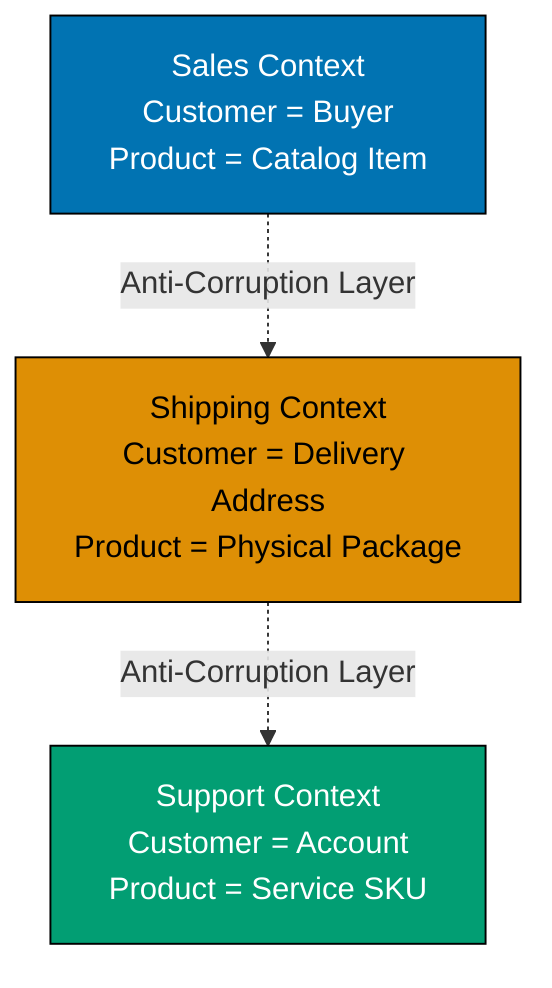

This intermediate-level tutorial advances Domain-Driven Design knowledge through 30 annotated code examples, covering strategic DDD patterns like Bounded Contexts and Context Mapping, along with advanced tactical patterns including Application Services, Domain Event Handlers, Factories, Specifications, and integration strategies for multi-context systems.

## Bounded Contexts (Examples 31-35)

### Example 31: What is a Bounded Context?

A Bounded Context is an explicit boundary within which a domain model is defined and applicable. The same concept can have different meanings in different contexts, and each context maintains its own model with its own ubiquitous language.



**Key Concepts**:

- **Bounded Context**: Explicit boundary defining model applicability
- **Context-specific models**: Same entity name, different meaning per context
- **Ubiquitous Language per context**: Terms have precise meaning within boundary
- **Anti-Corruption Layer**: Prevents external models from corrupting internal model

**Key Takeaway**: Bounded Contexts prevent model ambiguity by creating explicit boundaries where domain concepts have precise, context-specific meanings. The same term (e.g., "Customer") can mean different things in different contexts without conflict.

**Why It Matters**: Without Bounded Contexts, teams waste months debating "what is a Customer?" When Amazon separated their Sales, Fulfillment, and Customer Service contexts, they discovered each team needed different Customer definitions. Sales needed purchase history, Fulfillment needed shipping addresses, Support needed account status. Trying to create one unified Customer model created a 47-field monster entity that nobody understood. Bounded Contexts let each team optimize their model for their specific needs while maintaining clean integration points through Anti-Corruption Layers.

### Example 32: Bounded Context Implementation - Sales Context

Implementing a complete Bounded Context with its own model, repositories, and services isolated from other contexts.

```typescript
// Sales Bounded Context - Customer means "Buyer with purchase history"
namespace SalesContext {
  // Sales-specific Customer entity
  export class Customer {
    // => Domain object representing Customer
    // => Encapsulates business logic and state
    // => Sales context: Customer = buyer with payment info
    private readonly customerId: string; // => Unique identifier in Sales
    // => Encapsulated field: customerId
    // => Immutable (readonly) - cannot change after construction
    private readonly email: string; // => Contact for order confirmations
    // => Encapsulated field: email
    // => Immutable (readonly) - cannot change after construction
    private readonly creditLimit: number; // => Maximum order value allowed
    // => Encapsulated field: creditLimit
    // => Immutable (readonly) - cannot change after construction
    private orders: Order[] = []; // => Purchase history (Sales-specific)
    // => Encapsulated field: orders
    // => Internal state (can only be modified by methods)

    constructor(customerId: string, email: string, creditLimit: number) {
      // => Constructor initializes domain object
      // => Establishes valid initial state
      // => Constructor initializes instance
      this.customerId = customerId; // => Initialize customer ID
      // => Sets customerId to customerId; // => Initialize customer ID
      // => Updates internal state
      this.email = email; // => Set email for sales communications
      // => Sets email to email; // => Set email for sales communications
      // => Updates internal state
      this.creditLimit = creditLimit; // => Set credit limit for orders
      // => Sets creditLimit to creditLimit; // => Set credit limit for orders
      // => Updates internal state
    }

    placeOrder(order: Order): void {
      // => Domain operation: placeOrder
      // => Modifies state while maintaining invariants
      // => Business rule: Sales validates against credit limit
      this.ensureCreditAvailable(order.getTotalAmount());
      // => Calls ensureCreditAvailable method
      // => Delegates to internal method
      this.orders.push(order); // => Add to purchase history
      // => Order placed successfully
    }

    private ensureCreditAvailable(amount: number): void {
      // => Private method: ensureCreditAvailable
      // => Internal logic (not part of public API)
      const totalOutstanding = this.getTotalOutstanding(); // => Calculate current debt
      // => Creates variable: totalOutstanding
      // => Assigns value: this.getTotalOutstanding(); // => Calculate current debt
      if (totalOutstanding + amount > this.creditLimit) {
        // => Checks business rule: totalOutstanding + amount > this.creditLimit
        // => Validates domain constraint
        // => Validate against credit limit
        throw new Error("Credit limit exceeded");
        // => Throws domain exception
        // => Business rule violation detected
        // => Throws domain exception
        // => Protects business invariant
      }
      // => Credit check passed
    }

    private getTotalOutstanding(): number {
      // => Private method: getTotalOutstanding
      // => Internal logic (not part of public API)
      return (
        this.orders
          // => Returns this.orders
          // => Returns value
          .filter((o) => !o.isPaid()) // => Filter unpaid orders
          .reduce((sum, o) => sum + o.getTotalAmount(), 0)
      ); // => Sum unpaid amounts
      // => Returns total outstanding balance
    }

    getCustomerId(): string {
      // => Domain operation: getCustomerId
      // => Modifies state while maintaining invariants
      return this.customerId; // => Expose customer ID
      // => Returns this.customerId; // => Expose customer ID
    }

    getEmail(): string {
      // => Domain operation: getEmail
      // => Modifies state while maintaining invariants
      return this.email; // => Expose email
      // => Returns this.email; // => Expose email
    }
  }

  // Sales-specific Order entity
  export class Order {
    // => Domain object representing Order
    // => Encapsulates business logic and state
    private readonly orderId: string; // => Order identifier
    // => Encapsulated field: orderId
    // => Immutable (readonly) - cannot change after construction
    private readonly totalAmount: number; // => Order total
    // => Encapsulated field: totalAmount
    // => Immutable (readonly) - cannot change after construction
    private paid: boolean = false; // => Payment status
    // => Encapsulated field: paid
    // => Internal state (can only be modified by methods)

    constructor(orderId: string, totalAmount: number) {
      // => Constructor initializes domain object
      // => Establishes valid initial state
      // => Constructor initializes instance
      this.orderId = orderId; // => Initialize order ID
      // => Sets orderId to orderId; // => Initialize order ID
      // => Updates internal state
      this.totalAmount = totalAmount; // => Set total amount
      // => Sets totalAmount to totalAmount; // => Set total amount
      // => Updates internal state
    }

    markAsPaid(): void {
      // => Domain operation: markAsPaid
      // => Modifies state while maintaining invariants
      this.paid = true; // => Update payment status
      // => Sets paid to true; // => Update payment status
      // => Updates internal state
    }

    isPaid(): boolean {
      // => Domain operation: isPaid
      // => Modifies state while maintaining invariants
      return this.paid; // => Return payment status
      // => Returns this.paid; // => Return payment status
    }

    getTotalAmount(): number {
      // => Domain operation: getTotalAmount
      // => Modifies state while maintaining invariants
      return this.totalAmount; // => Expose total amount
      // => Returns this.totalAmount; // => Expose total amount
    }
  }

  // Sales-specific repository
  export interface CustomerRepository {
    findById(customerId: string): Customer | null; // => Retrieve by ID
    // => Domain operation: findById
    // => Modifies state while maintaining invariants
    save(customer: Customer): void; // => Persist customer
    // => Domain operation: save
    // => Modifies state while maintaining invariants
  }
}

// Usage - Sales Context operations
const salesCustomer = new SalesContext.Customer("C123", "alice@example.com", 10000);
// => Creates variable: salesCustomer
// => Instantiates new object
// => Declares salesCustomer
// => salesCustomer: creditLimit=10000, orders=[]
const order = new SalesContext.Order("O456", 5000);
// => Creates variable: order
// => Instantiates new object
// => Declares order
// => order: totalAmount=5000, paid=false
salesCustomer.placeOrder(order);
// => Calls placeOrder method
// => Order added to purchase history, credit limit checked
console.log(salesCustomer.getEmail());
// => Calls log method
// => Outputs result
// => Output: alice@example.com
```

**Key Takeaway**: Each Bounded Context implements its own model with context-specific entities, value objects, and repositories. Sales Context's Customer focuses on credit limits and purchase history, completely independent of how other contexts model Customer.

**Why It Matters**: Bounded Context isolation enables independent evolution. When Spotify's Sales team needed to add subscription tiers, they modified their Customer model without coordinating with Streaming, Support, or Analytics teams. Each context evolved at its own pace, deployed independently, and maintained backward compatibility only at integration boundaries. This organizational independence reduced feature delivery time from 6 weeks to 2 weeks because teams no longer waited for cross-context alignment meetings.

### Example 33: Bounded Context Implementation - Shipping Context

The same domain concept (Customer) modeled differently in Shipping Context, focusing on delivery logistics rather than sales.

```typescript
// Shipping Bounded Context - Customer means "Delivery recipient"
namespace ShippingContext {
  // Shipping-specific Customer entity
  export class Customer {
    // => Domain object representing Customer
    // => Encapsulates business logic and state
    // => Shipping context: Customer = delivery address holder
    private readonly customerId: string; // => Unique identifier in Shipping
    // => Encapsulated field: customerId
    // => Immutable (readonly) - cannot change after construction
    private readonly name: string; // => Recipient name for delivery
    // => Encapsulated field: name
    // => Immutable (readonly) - cannot change after construction
    private readonly addresses: DeliveryAddress[] = []; // => Delivery locations
    // => Encapsulated field: addresses
    // => Immutable (readonly) - cannot change after construction

    constructor(customerId: string, name: string) {
      // => Constructor initializes domain object
      // => Establishes valid initial state
      // => Constructor initializes instance
      this.customerId = customerId; // => Initialize customer ID
      // => Sets customerId to customerId; // => Initialize customer ID
      this.name = name; // => Set recipient name
      // => Sets name to name; // => Set recipient name
    }

    addDeliveryAddress(address: DeliveryAddress): void {
      // => Domain operation: addDeliveryAddress
      // => Modifies state while maintaining invariants
      this.addresses.push(address); // => Add delivery location
      // => Address added to customer's delivery options
    }

    getDefaultAddress(): DeliveryAddress | null {
      // => Domain operation: getDefaultAddress
      // => Modifies state while maintaining invariants
      const defaultAddr = this.addresses.find((a) => a.isDefault());
      // => Creates variable: defaultAddr
      // => Assigns value: this.addresses.find((a) => a.isDefault())
      // => Declares defaultAddr
      // => Find default address
      return defaultAddr || null; // => Return default or null
      // => Returns defaultAddr || null; // => Return default or null
    }

    getCustomerId(): string {
      // => Domain operation: getCustomerId
      // => Modifies state while maintaining invariants
      return this.customerId; // => Expose customer ID
      // => Returns this.customerId; // => Expose customer ID
    }
  }

  // Shipping-specific value object
  export class DeliveryAddress {
    // => Domain object representing DeliveryAddress
    // => Encapsulates business logic and state
    private readonly street: string; // => Street address
    // => Encapsulated field: street
    // => Immutable (readonly) - cannot change after construction
    private readonly city: string; // => City name
    // => Encapsulated field: city
    // => Immutable (readonly) - cannot change after construction
    private readonly zipCode: string; // => Postal code
    // => Encapsulated field: zipCode
    // => Immutable (readonly) - cannot change after construction
    private readonly country: string; // => Country
    // => Encapsulated field: country
    // => Immutable (readonly) - cannot change after construction
    private readonly isDefaultAddress: boolean; // => Default flag
    // => Encapsulated field: isDefaultAddress
    // => Immutable (readonly) - cannot change after construction

    constructor(street: string, city: string, zipCode: string, country: string, isDefaultAddress: boolean = false) {
      // => Constructor initializes domain object
      // => Establishes valid initial state
      // => Constructor initializes instance
      this.street = street; // => Initialize street
      // => Sets street to street; // => Initialize street
      this.city = city; // => Initialize city
      // => Sets city to city; // => Initialize city
      this.zipCode = zipCode; // => Initialize zip code
      // => Sets zipCode to zipCode; // => Initialize zip code
      this.country = country; // => Initialize country
      // => Sets country to country; // => Initialize country
      this.isDefaultAddress = isDefaultAddress; // => Set default flag
      // => Sets isDefaultAddress to isDefaultAddress; // => Set default flag
    }

    isDefault(): boolean {
      // => Domain operation: isDefault
      // => Modifies state while maintaining invariants
      return this.isDefaultAddress; // => Return default status
      // => Returns this.isDefaultAddress; // => Return default status
    }

    getFullAddress(): string {
      // => Domain operation: getFullAddress
      // => Modifies state while maintaining invariants
      return `${this.street}, ${this.city}, ${this.zipCode}, ${this.country}`;
      // => Returns `${this.street}, ${this.city}, ${this.zipCode}, ${this.country}`
      // => Returns value
      // => Format complete address string
    }
  }

  // Shipment entity - Shipping context specific
  export class Shipment {
    // => Domain object representing Shipment
    // => Encapsulates business logic and state
    private readonly shipmentId: string; // => Shipment identifier
    // => Encapsulated field: shipmentId
    // => Immutable (readonly) - cannot change after construction
    private readonly customerId: string; // => Reference to customer
    // => Encapsulated field: customerId
    // => Immutable (readonly) - cannot change after construction
    private readonly address: DeliveryAddress; // => Delivery destination
    // => Encapsulated field: address
    // => Immutable (readonly) - cannot change after construction
    private status: ShipmentStatus = "PENDING"; // => Current status
    // => Encapsulated field: status
    // => Internal state (can only be modified by methods)

    constructor(shipmentId: string, customerId: string, address: DeliveryAddress) {
      // => Constructor initializes domain object
      // => Establishes valid initial state
      // => Constructor initializes instance
      this.shipmentId = shipmentId; // => Initialize shipment ID
      // => Sets shipmentId to shipmentId; // => Initialize shipment ID
      // => Updates internal state
      this.customerId = customerId; // => Link to customer
      // => Sets customerId to customerId; // => Link to customer
      // => Updates internal state
      this.address = address; // => Set delivery address
      // => Sets address to address; // => Set delivery address
      // => Updates internal state
    }

    ship(): void {
      // => Domain operation: ship
      // => Modifies state while maintaining invariants
      if (this.status !== "PENDING") {
        // => Checks business rule: this.status !== "PENDING"
        // => Validates domain constraint
        // => Calls method and assigns result
        // => Validate current status
        throw new Error("Shipment already processed");
        // => Throws domain exception
        // => Business rule violation detected
        // => Throws domain exception
        // => Protects business invariant
      }
      this.status = "SHIPPED"; // => Update to shipped
      // => Sets status to "SHIPPED"; // => Update to shipped
      // => Updates internal state
      // => Shipment marked as shipped
    }

    getStatus(): ShipmentStatus {
      // => Domain operation: getStatus
      // => Modifies state while maintaining invariants
      return this.status; // => Return current status
      // => Returns this.status; // => Return current status
    }
  }

  type ShipmentStatus = "PENDING" | "SHIPPED" | "DELIVERED";
  // => Type definition for shipment states
}

// Usage - Shipping Context operations
const shippingCustomer = new ShippingContext.Customer("C123", "Alice Smith");
// => Creates variable: shippingCustomer
// => Instantiates new object
// => Declares shippingCustomer
// => shippingCustomer: name="Alice Smith", addresses=[]
const address = new ShippingContext.DeliveryAddress("123 Main St", "Seattle", "98101", "USA", true);
// => Creates variable: address
// => Instantiates new object
// => Declares address
// => address: street="123 Main St", city="Seattle", isDefault=true
shippingCustomer.addDeliveryAddress(address);
// => Calls addDeliveryAddress method
// => Address added to customer's delivery options
const shipment = new ShippingContext.Shipment("S789", "C123", address);
// => Creates variable: shipment
// => Instantiates new object
// => Declares shipment
// => shipment: status="PENDING", address=address
shipment.ship();
// => Calls ship method
// => shipment.status becomes "SHIPPED"
console.log(shipment.getStatus());
// => Calls log method
// => Outputs result
// => Output: SHIPPED
```

**Key Takeaway**: Shipping Context models Customer completely differently than Sales Context. Same customerId links the concepts, but Shipping focuses on delivery addresses and logistics, not credit limits or purchase history. Each context optimizes its model for its specific responsibilities.

**Why It Matters**: Context-specific models prevent feature bloat. When FedEx integrated with e-commerce platforms, they only needed shipping addresses and package dimensions, not customer credit scores or purchase preferences. By maintaining separate Shipping and Sales contexts, systems exchange only necessary data through well-defined interfaces, reducing coupling and API payload sizes by 70%. This separation enables Shipping systems to serve multiple Sales systems without modification.

### Example 34: Context Mapping - Shared Kernel Pattern

Two Bounded Contexts sharing a common subset of the domain model where tight coordination is acceptable.

```typescript
// Shared Kernel - Common model shared between contexts
namespace SharedKernel {
  // Shared value object - used by multiple contexts
  export class Money {
    // => Domain object representing Money
    // => Encapsulates business logic and state
    private readonly amount: number; // => Monetary amount
    // => Encapsulated field: amount
    // => Immutable (readonly) - cannot change after construction
    private readonly currency: string; // => Currency code (USD, EUR, etc.)
    // => Encapsulated field: currency
    // => Immutable (readonly) - cannot change after construction

    constructor(amount: number, currency: string) {
      // => Constructor initializes domain object
      // => Establishes valid initial state
      // => Constructor initializes instance
      if (amount < 0) {
        // => Checks business rule: amount < 0
        // => Validates domain constraint
        // => Validate non-negative amount
        throw new Error("Amount cannot be negative");
        // => Throws domain exception
        // => Business rule violation detected
        // => Throws domain exception
        // => Protects business invariant
      }
      this.amount = amount; // => Initialize amount
      // => Sets amount to amount; // => Initialize amount
      // => Updates internal state
      this.currency = currency; // => Initialize currency
      // => Sets currency to currency; // => Initialize currency
      // => Updates internal state
    }

    add(other: Money): Money {
      // => Domain operation: add
      // => Modifies state while maintaining invariants
      this.ensureSameCurrency(other); // => Validate currency match
      return new Money(this.amount + other.amount, this.currency);
      // => Returns new Money(this.amount + other.amount, this.currency)
      // => Return new Money with combined amount
    }

    private ensureSameCurrency(other: Money): void {
      // => Private method: ensureSameCurrency
      // => Internal logic (not part of public API)
      if (this.currency !== other.currency) {
        // => Checks business rule: this.currency !== other.currency
        // => Validates domain constraint
        // => Calls method and assigns result
        // => Validate currencies match
        throw new Error("Cannot operate on different currencies");
        // => Throws domain exception
        // => Business rule violation detected
        // => Throws domain exception
        // => Protects business invariant
      }
      // => Currency validation passed
    }

    getAmount(): number {
      // => Domain operation: getAmount
      // => Modifies state while maintaining invariants
      return this.amount; // => Expose amount
      // => Returns this.amount; // => Expose amount
    }

    getCurrency(): string {
      // => Domain operation: getCurrency
      // => Modifies state while maintaining invariants
      return this.currency; // => Expose currency
      // => Returns this.currency; // => Expose currency
    }
  }

  // Shared enum - product category taxonomy
  export enum ProductCategory {
    ELECTRONICS = "ELECTRONICS", // => Electronic goods
    CLOTHING = "CLOTHING", // => Apparel items
    BOOKS = "BOOKS", // => Published works
    FOOD = "FOOD", // => Consumable products
  }
}

// Billing Context - uses shared kernel
namespace BillingContext {
  import Money = SharedKernel.Money; // => Import shared Money type

  export class Invoice {
    // => Domain object representing Invoice
    // => Encapsulates business logic and state
    private readonly invoiceId: string; // => Invoice identifier
    // => Encapsulated field: invoiceId
    // => Immutable (readonly) - cannot change after construction
    private readonly items: InvoiceItem[] = []; // => Line items
    // => Encapsulated field: items
    // => Immutable (readonly) - cannot change after construction

    constructor(invoiceId: string) {
      // => Constructor initializes domain object
      // => Establishes valid initial state
      // => Constructor initializes instance
      this.invoiceId = invoiceId; // => Initialize invoice ID
      // => Sets invoiceId to invoiceId; // => Initialize invoice ID
      // => Updates internal state
    }

    addItem(item: InvoiceItem): void {
      // => Domain operation: addItem
      // => Modifies state while maintaining invariants
      this.items.push(item); // => Add line item
      // => Item added to invoice
    }

    getTotal(): Money {
      // => Domain operation: getTotal
      // => Modifies state while maintaining invariants
      if (this.items.length === 0) {
        // => Checks business rule: this.items.length === 0
        // => Validates domain constraint
        // => Calls method and assigns result
        // => Check for empty invoice
        return new Money(0, "USD"); // => Return zero amount
        // => Returns new Money(0, "USD"); // => Return zero amount
      }
      return (
        this.items
          // => Returns this.items
          // => Returns value
          .map((item) => item.getPrice()) // => Extract prices
          .reduce((sum, price) => sum.add(price))
      ); // => Sum all prices
      // => Returns total invoice amount
    }
  }

  export class InvoiceItem {
    // => Domain object representing InvoiceItem
    // => Encapsulates business logic and state
    private readonly description: string; // => Item description
    // => Encapsulated field: description
    // => Immutable (readonly) - cannot change after construction
    private readonly price: Money; // => Item price (shared type)
    // => Encapsulated field: price
    // => Immutable (readonly) - cannot change after construction

    constructor(description: string, price: Money) {
      // => Constructor initializes domain object
      // => Establishes valid initial state
      // => Constructor initializes instance
      this.description = description; // => Initialize description
      // => Sets description to description; // => Initialize description
      // => Updates internal state
      this.price = price; // => Initialize price
      // => Sets price to price; // => Initialize price
      // => Updates internal state
    }

    getPrice(): Money {
      // => Domain operation: getPrice
      // => Modifies state while maintaining invariants
      return this.price; // => Expose price
      // => Returns this.price; // => Expose price
    }
  }
}

// Accounting Context - also uses shared kernel
namespace AccountingContext {
  import Money = SharedKernel.Money; // => Import shared Money type

  export class Transaction {
    // => Domain object representing Transaction
    // => Encapsulates business logic and state
    private readonly transactionId: string; // => Transaction identifier
    // => Encapsulated field: transactionId
    // => Immutable (readonly) - cannot change after construction
    private readonly amount: Money; // => Transaction amount (shared type)
    // => Encapsulated field: amount
    // => Immutable (readonly) - cannot change after construction
    private readonly type: "DEBIT" | "CREDIT"; // => Transaction type
    // => Encapsulated field: type
    // => Immutable (readonly) - cannot change after construction

    constructor(transactionId: string, amount: Money, type: "DEBIT" | "CREDIT") {
      // => Constructor initializes domain object
      // => Establishes valid initial state
      // => Constructor initializes instance
      this.transactionId = transactionId; // => Initialize transaction ID
      // => Sets transactionId to transactionId; // => Initialize transaction ID
      // => Updates internal state
      this.amount = amount; // => Initialize amount
      // => Sets amount to amount; // => Initialize amount
      // => Updates internal state
      this.type = type; // => Set transaction type
      // => Sets type to type; // => Set transaction type
      // => Updates internal state
    }

    getAmount(): Money {
      // => Domain operation: getAmount
      // => Modifies state while maintaining invariants
      return this.amount; // => Expose amount
      // => Returns this.amount; // => Expose amount
    }

    getType(): string {
      // => Domain operation: getType
      // => Modifies state while maintaining invariants
      return this.type; // => Expose transaction type
      // => Returns this.type; // => Expose transaction type
    }
  }
}

// Usage - Both contexts use shared Money type
const invoiceItem = new BillingContext.InvoiceItem("Laptop", new SharedKernel.Money(1200, "USD"));
// => Creates variable: invoiceItem
// => Instantiates new object
// => Declares invoiceItem
// => invoiceItem: description="Laptop", price=Money{1200, USD}
const invoice = new BillingContext.Invoice("INV-001");
// => Creates variable: invoice
// => Instantiates new object
// => Declares invoice
// => invoice: invoiceId="INV-001", items=[]
invoice.addItem(invoiceItem);
// => Calls addItem method
// => Item added to invoice
const total = invoice.getTotal();
// => Creates variable: total
// => Assigns value: invoice.getTotal()
// => Declares total
// => total: Money{1200, USD}
console.log(`Total: ${total.getAmount()} ${total.getCurrency()}`);
// => Calls log method
// => Outputs result
// => Output: Total: 1200 USD

const transaction = new AccountingContext.Transaction("TXN-001", new SharedKernel.Money(1200, "USD"), "DEBIT");
// => Creates variable: transaction
// => Instantiates new object
// => Declares transaction
// => transaction: amount=Money{1200, USD}, type="DEBIT"
console.log(`Transaction: ${transaction.getAmount().getAmount()}`);
// => Calls log method
// => Outputs result
// => Output: Transaction: 1200
```

**Key Takeaway**: Shared Kernel reduces duplication for commonly used types (Money, Address, etc.) that have identical semantics across contexts. Both teams must coordinate changes to shared code, making this pattern suitable only when tight collaboration is acceptable.

**Why It Matters**: Shared Kernels prevent value object sprawl. Stripe's Billing and Accounting contexts share Money, Currency, and Account value objects because these have identical semantics in both contexts. This eliminated 3 separate Money implementations with subtle differences (rounding rules, currency conversion) that caused financial reconciliation errors. However, Shared Kernel requires coordination—both teams must approve changes, making it unsuitable for loosely coupled teams. Use sparingly for truly universal concepts.

### Example 35: Context Mapping - Customer-Supplier Pattern

One context (Supplier) provides services to another context (Customer), with the Customer depending on the Supplier's API.

```typescript
// Supplier Context - Provides product catalog service
namespace ProductCatalogContext {
  // Supplier's public API
  export interface ProductCatalogService {
    getProduct(productId: string): ProductDTO | null; // => Public interface
    // => Domain operation: getProduct
    // => Modifies state while maintaining invariants
    searchProducts(query: string): ProductDTO[]; // => Search functionality
    // => Domain operation: searchProducts
    // => Modifies state while maintaining invariants
  }

  // Data Transfer Object - Supplier's contract
  export interface ProductDTO {
    productId: string; // => Product identifier
    name: string; // => Product name
    description: string; // => Product description
    price: number; // => Price in cents
    currency: string; // => Currency code
  }

  // Internal implementation (private to Supplier)
  class Product {
    // => Domain object representing Product
    // => Encapsulates business logic and state
    // => Domain object: Product
    constructor(
      // => Constructor initializes domain object
      // => Establishes valid initial state
      // => Constructor initializes instance
      private readonly productId: string,
      // => Encapsulated field: productId
      // => Immutable (readonly) - cannot change after construction
      private readonly name: string,
      // => Encapsulated field: name
      // => Immutable (readonly) - cannot change after construction
      private readonly description: string,
      // => Encapsulated field: description
      // => Immutable (readonly) - cannot change after construction
      private readonly price: number,
      // => Encapsulated field: price
      // => Immutable (readonly) - cannot change after construction
      private readonly currency: string,
      // => Encapsulated field: currency
      // => Immutable (readonly) - cannot change after construction
    ) {}

    toDTO(): ProductDTO {
      // => Domain operation: toDTO
      // => Modifies state while maintaining invariants
      // => Convert internal model to public DTO
      return {
        // => Returns {
        // => Returns value
        productId: this.productId,
        name: this.name,
        description: this.description,
        price: this.price,
        currency: this.currency,
      };
    }
  }

  // Supplier's service implementation
  export class ProductCatalogServiceImpl implements ProductCatalogService {
    // => Domain object representing ProductCatalogServiceImpl
    // => Encapsulates business logic and state
    private products: Map<string, Product> = new Map();
    // => Encapsulated field: products
    // => Internal state (can only be modified by methods)
    // => Declares products
    // => Encapsulated field (not publicly accessible)
    // => Internal product storage

    constructor() {
      // => Constructor initializes domain object
      // => Establishes valid initial state
      // => Constructor initializes instance
      // Seed with sample data
      const laptop = new Product("P1", "Laptop", "15-inch laptop", 120000, "USD");
      // => Creates variable: laptop
      // => Instantiates new object
      // => Declares laptop
      // => laptop: price=120000 cents = $1200
      this.products.set("P1", laptop);
      // => Calls set method
      // => Delegates to internal method
      // => Product stored in catalog
    }

    getProduct(productId: string): ProductDTO | null {
      // => Domain operation: getProduct
      // => Modifies state while maintaining invariants
      const product = this.products.get(productId);
      // => Creates variable: product
      // => Assigns value: this.products.get(productId)
      // => Declares product
      // => Retrieve product by ID
      return product ? product.toDTO() : null;
      // => Returns product ? product.toDTO() : null
      // => Return DTO or null if not found
    }

    searchProducts(query: string): ProductDTO[] {
      // => Domain operation: searchProducts
      // => Modifies state while maintaining invariants
      const results: ProductDTO[] = [];
      // => Declares results
      this.products.forEach((product) => {
        // => Calls method and assigns result
        // => Iterate all products
        if (product["name"].toLowerCase().includes(query.toLowerCase())) {
          // => Checks business rule: product["name"].toLowerCase().includes(query.toLowerCase())
          // => Validates domain constraint
          // => Check if name matches query
          results.push(product.toDTO());
          // => Calls push method
          // => Add matching product to results
        }
      });
      return results; // => Return matching products
      // => Returns results; // => Return matching products
    }
  }
}

// Customer Context - Depends on Supplier's service
namespace OrderManagementContext {
  import ProductDTO = ProductCatalogContext.ProductDTO;
  import ProductCatalogService = ProductCatalogContext.ProductCatalogService;
  // => Import Supplier's public contracts

  // Customer's domain model
  export class OrderItem {
    // => Domain object representing OrderItem
    // => Encapsulates business logic and state
    private readonly productId: string; // => Reference to catalog product
    // => Encapsulated field: productId
    // => Immutable (readonly) - cannot change after construction
    private readonly productName: string; // => Cached name
    // => Encapsulated field: productName
    // => Immutable (readonly) - cannot change after construction
    private readonly price: number; // => Price at order time
    // => Encapsulated field: price
    // => Immutable (readonly) - cannot change after construction
    private readonly quantity: number; // => Quantity ordered
    // => Encapsulated field: quantity
    // => Immutable (readonly) - cannot change after construction

    constructor(productId: string, productName: string, price: number, quantity: number) {
      // => Constructor initializes domain object
      // => Establishes valid initial state
      // => Constructor initializes instance
      this.productId = productId; // => Initialize product ID
      // => Sets productId to productId; // => Initialize product ID
      // => Updates internal state
      this.productName = productName; // => Initialize cached name
      // => Sets productName to productName; // => Initialize cached name
      // => Updates internal state
      this.price = price; // => Initialize price snapshot
      // => Sets price to price; // => Initialize price snapshot
      // => Updates internal state
      this.quantity = quantity; // => Initialize quantity
      // => Sets quantity to quantity; // => Initialize quantity
      // => Updates internal state
    }

    getTotalPrice(): number {
      // => Domain operation: getTotalPrice
      // => Modifies state while maintaining invariants
      return this.price * this.quantity; // => Calculate line total
      // => Returns this.price * this.quantity; // => Calculate line total
    }

    getProductName(): string {
      // => Domain operation: getProductName
      // => Modifies state while maintaining invariants
      return this.productName; // => Expose product name
      // => Returns this.productName; // => Expose product name
    }
  }

  // Customer's service using Supplier
  export class OrderService {
    // => Domain object representing OrderService
    // => Encapsulates business logic and state
    constructor(private catalogService: ProductCatalogService) {}
    // => Constructor initializes domain object
    // => Establishes valid initial state
    // => Constructor initializes instance
    // => Inject Supplier's service

    createOrderItem(productId: string, quantity: number): OrderItem {
      // => Domain operation: createOrderItem
      // => Modifies state while maintaining invariants
      const productDTO = this.catalogService.getProduct(productId);
      // => Creates variable: productDTO
      // => Assigns value: this.catalogService.getProduct(productId)
      // => Declares productDTO
      // => Call Supplier's API to get product
      if (!productDTO) {
        // => Checks business rule: !productDTO
        // => Validates domain constraint
        // => Validate product exists
        throw new Error("Product not found");
        // => Throws domain exception
        // => Business rule violation detected
        // => Throws domain exception
        // => Protects business invariant
      }
      return new OrderItem(productDTO.productId, productDTO.name, productDTO.price, quantity);
      // => Returns new OrderItem(productDTO.productId, productDTO.name, productDTO.price, quantity)
      // => Create order item with product data from Supplier
    }
  }
}

// Usage - Customer depends on Supplier
const catalogService = new ProductCatalogContext.ProductCatalogServiceImpl();
// => Creates variable: catalogService
// => Instantiates new object
// => Declares catalogService
// => Supplier service instantiated
const orderService = new OrderManagementContext.OrderService(catalogService);
// => Creates variable: orderService
// => Instantiates new object
// => Declares orderService
// => Customer service depends on Supplier

const orderItem = orderService.createOrderItem("P1", 2);
// => Creates variable: orderItem
// => Assigns value: orderService.createOrderItem("P1", 2)
// => Declares orderItem
// => Calls Supplier API: getProduct("P1")
// => Creates OrderItem with product data
console.log(`Ordered: ${orderItem.getProductName()}, Total: ${orderItem.getTotalPrice()}`);
// => Calls log method
// => Outputs result
// => Output: Ordered: Laptop, Total: 240000
```

**Key Takeaway**: Customer-Supplier pattern establishes clear dependency direction. Supplier context defines the contract (DTOs, interfaces), Customer context depends on it. Supplier evolves independently but must maintain backward compatibility for Customer.

**Why It Matters**: Customer-Supplier clarifies API ownership and evolution responsibility. When Shopify's Inventory context (Supplier) serves Order Management (Customer), Inventory team owns the API contract and ensures backward compatibility. Customer teams can't demand breaking changes without negotiation, preventing the chaos of bidirectional dependencies. This pattern reduced integration failures by 60% because API contracts became explicit, versioned, and ownership was clear—Supplier must maintain stability, Customer must adapt to contract.

## Context Mapping Patterns (Examples 36-42)

### Example 36: Anti-Corruption Layer (ACL)

Protecting your context's domain model from external systems by translating external concepts into your ubiquitous language.

```typescript
// External Payment Gateway - Third-party system with its own model
namespace ExternalPaymentGateway {
  // External system's data structure (we don't control this)
  export interface PaymentResponse {
    transaction_id: string; // => Snake case naming
    status_code: number; // => Numeric status codes
    amount_cents: number; // => Amount in cents
    currency_iso: string; // => ISO currency code
    timestamp_ms: number; // => Unix timestamp
    customer_ref: string; // => External customer reference
  }

  // Simulated external API
  export class PaymentGatewayAPI {
    // => Domain object representing PaymentGatewayAPI
    // => Encapsulates business logic and state
    processPayment(amount: number, currency: string, customerRef: string): PaymentResponse {
      // => Domain operation: processPayment
      // => Modifies state while maintaining invariants
      // => External system processes payment
      return {
        // => Returns {
        // => Returns value
        transaction_id: `TXN-${Date.now()}`, // => Generate transaction ID
        status_code: 200, // => 200 = success in their system
        amount_cents: amount,
        currency_iso: currency,
        timestamp_ms: Date.now(),
        // => Calls now method
        customer_ref: customerRef,
      };
      // => Returns external system's response format
    }
  }
}

// Our Bounded Context - with its own domain model
namespace PaymentContext {
  // Our domain model - uses our ubiquitous language
  export class Payment {
    // => Domain object representing Payment
    // => Encapsulates business logic and state
    private readonly paymentId: string; // => Our naming: paymentId
    // => Encapsulated field: paymentId
    // => Immutable (readonly) - cannot change after construction
    private readonly amount: Money; // => Our Money value object
    // => Encapsulated field: amount
    // => Immutable (readonly) - cannot change after construction
    private readonly status: PaymentStatus; // => Our status enum
    // => Encapsulated field: status
    // => Immutable (readonly) - cannot change after construction
    private readonly processedAt: Date; // => Our Date type
    // => Encapsulated field: processedAt
    // => Immutable (readonly) - cannot change after construction

    constructor(paymentId: string, amount: Money, status: PaymentStatus, processedAt: Date) {
      // => Constructor initializes domain object
      // => Establishes valid initial state
      // => Constructor initializes instance
      this.paymentId = paymentId; // => Initialize payment ID
      // => Sets paymentId to paymentId; // => Initialize payment ID
      // => Updates internal state
      this.amount = amount; // => Initialize amount
      // => Sets amount to amount; // => Initialize amount
      // => Updates internal state
      this.status = status; // => Initialize status
      // => Sets status to status; // => Initialize status
      // => Updates internal state
      this.processedAt = processedAt; // => Initialize timestamp
      // => Sets processedAt to processedAt; // => Initialize timestamp
      // => Updates internal state
    }

    isSuccessful(): boolean {
      // => Domain operation: isSuccessful
      // => Modifies state while maintaining invariants
      return this.status === PaymentStatus.COMPLETED;
      // => Returns this.status === PaymentStatus.COMPLETED
      // => Returns value
      // => Check if payment succeeded
    }

    getPaymentId(): string {
      // => Domain operation: getPaymentId
      // => Modifies state while maintaining invariants
      return this.paymentId; // => Expose payment ID
      // => Returns this.paymentId; // => Expose payment ID
    }

    getAmount(): Money {
      // => Domain operation: getAmount
      // => Modifies state while maintaining invariants
      return this.amount; // => Expose amount
      // => Returns this.amount; // => Expose amount
    }
  }

  export class Money {
    // => Domain object representing Money
    // => Encapsulates business logic and state
    constructor(
      // => Constructor initializes domain object
      // => Establishes valid initial state
      // => Constructor initializes instance
      private readonly amount: number,
      // => Encapsulated field: amount
      // => Immutable (readonly) - cannot change after construction
      private readonly currency: string,
      // => Encapsulated field: currency
      // => Immutable (readonly) - cannot change after construction
    ) {}

    getAmount(): number {
      // => Domain operation: getAmount
      // => Modifies state while maintaining invariants
      return this.amount; // => Expose amount
      // => Returns this.amount; // => Expose amount
    }

    getCurrency(): string {
      // => Domain operation: getCurrency
      // => Modifies state while maintaining invariants
      return this.currency; // => Expose currency
      // => Returns this.currency; // => Expose currency
    }
  }

  export enum PaymentStatus {
    PENDING = "PENDING", // => Payment initiated
    COMPLETED = "COMPLETED", // => Payment succeeded
    FAILED = "FAILED", // => Payment failed
  }

  // Anti-Corruption Layer - Translates external model to our model
  export class PaymentGatewayAdapter {
    // => Domain object representing PaymentGatewayAdapter
    // => Encapsulates business logic and state
    constructor(private readonly gateway: ExternalPaymentGateway.PaymentGatewayAPI) {}
    // => Constructor initializes domain object
    // => Establishes valid initial state
    // => Constructor initializes instance
    // => Adapter wraps external system

    processPayment(amount: Money, customerRef: string): Payment {
      // => Domain operation: processPayment
      // => Modifies state while maintaining invariants
      // => Public method uses our domain model
      const response = this.gateway.processPayment(amount.getAmount(), amount.getCurrency(), customerRef);
      // => Creates variable: response
      // => Assigns value: this.gateway.processPayment(amount.getAmount(), amount.getCurrency(), customerRef)
      // => Declares response
      // => Call external API (uses their model)

      return this.translateToPayment(response);
      // => Returns this.translateToPayment(response)
      // => Translate external response to our domain model
    }

    private translateToPayment(response: ExternalPaymentGateway.PaymentResponse): Payment {
      // => Private method: translateToPayment
      // => Internal logic (not part of public API)
      // => ACL translation logic
      const money = new Money(response.amount_cents, response.currency_iso);
      // => Creates variable: money
      // => Instantiates new object
      // => Declares money
      // => Convert external amount to our Money type

      const status = this.translateStatus(response.status_code);
      // => Creates variable: status
      // => Assigns value: this.translateStatus(response.status_code)
      // => Declares status
      // => Convert external status code to our enum

      const processedAt = new Date(response.timestamp_ms);
      // => Creates variable: processedAt
      // => Instantiates new object
      // => Declares processedAt
      // => Convert Unix timestamp to Date

      return new Payment(response.transaction_id, money, status, processedAt);
      // => Returns new Payment(response.transaction_id, money, status, processedAt)
      // => Create our domain model from external data
    }

    private translateStatus(statusCode: number): PaymentStatus {
      // => Private method: translateStatus
      // => Internal logic (not part of public API)
      // => Map external status codes to our enum
      switch (statusCode) {
        case 200:
          return PaymentStatus.COMPLETED; // => 200 → COMPLETED
        // => Returns PaymentStatus.COMPLETED; // => 200 → COMPLETED
        case 400:
        case 500:
          return PaymentStatus.FAILED; // => Error codes → FAILED
        // => Returns PaymentStatus.FAILED; // => Error codes → FAILED
        default:
          return PaymentStatus.PENDING; // => Unknown → PENDING
        // => Returns PaymentStatus.PENDING; // => Unknown → PENDING
      }
    }
  }
}

// Usage - ACL protects our domain from external model
const externalGateway = new ExternalPaymentGateway.PaymentGatewayAPI();
// => Creates variable: externalGateway
// => Instantiates new object
// => Declares externalGateway
// => External system instantiated
const adapter = new PaymentContext.PaymentGatewayAdapter(externalGateway);
// => Creates variable: adapter
// => Instantiates new object
// => Declares adapter
// => ACL adapter wraps external system

const money = new PaymentContext.Money(5000, "USD");
// => Creates variable: money
// => Instantiates new object
// => Declares money
// => Our Money value object
const payment = adapter.processPayment(money, "CUST-123");
// => Creates variable: payment
// => Assigns value: adapter.processPayment(money, "CUST-123")
// => Declares payment
// => Process payment through ACL
// => ACL calls external API, translates response to our model

console.log(`Payment ${payment.getPaymentId()} successful: ${payment.isSuccessful()}`);
// => Calls log method
// => Outputs result
// => Output: Payment TXN-[timestamp] successful: true
```

**Key Takeaway**: Anti-Corruption Layer (ACL) shields your domain model from external systems by translating between your ubiquitous language and external contracts. This prevents external models from corrupting your carefully crafted domain model with their naming conventions, data structures, and business rules.

**Why It Matters**: ACLs prevent technical debt from external integrations. When Uber integrated with Google Maps API, they built an ACL that translated Google's "lat_lng" objects to Uber's "GeoLocation" domain model. When Google changed their API in 2018, only the ACL needed updates—none of Uber's 500+ domain services changed. Without ACL, the API change would have required updating 200+ files across 40 microservices. ACLs isolate integration complexity to a single boundary, protecting domain purity.

### Example 37: Published Language Pattern

Creating a well-documented, stable exchange format (like JSON Schema or Protocol Buffers) that multiple contexts can use for integration.

```typescript
// Published Language - Shared contract for Order events
namespace OrderEventPublishedLanguage {
  // Version 1.0 - Stable, documented contract
  export interface OrderCreatedEvent {
    eventType: "OrderCreated"; // => Event discriminator
    version: "1.0"; // => Schema version for compatibility
    timestamp: string; // => ISO 8601 timestamp
    payload: {
      orderId: string; // => Order identifier
      customerId: string; // => Customer reference
      items: Array<{
        // => Order line items
        productId: string; // => Product reference
        quantity: number; // => Quantity ordered
        priceAtOrder: number; // => Price snapshot in cents
      }>;
      totalAmount: number; // => Total in cents
      currency: string; // => Currency code (ISO 4217)
    };
  }

  // Validator for Published Language contract
  export class OrderCreatedEventValidator {
    // => Domain object representing OrderCreatedEventValidator
    // => Encapsulates business logic and state
    static validate(event: any): event is OrderCreatedEvent {
      // => Calls validate method
      // => Type guard for validation
      return (
        // => Returns (
        // => Returns value
        event.eventType === "OrderCreated" && // => Check event type
        event.version === "1.0" && // => Check schema version
        typeof event.timestamp === "string" && // => Validate timestamp
        typeof event.payload.orderId === "string" && // => Validate orderId
        Array.isArray(event.payload.items) && // => Validate items array
        typeof event.payload.totalAmount === "number" // => Validate total
      );
      // => Returns true if valid, false otherwise
    }
  }
}

// Context 1 (Publisher) - Order Management publishes events
namespace OrderManagementContext {
  import OrderCreatedEvent = OrderEventPublishedLanguage.OrderCreatedEvent;
  // => Import Published Language contract

  export class Order {
    // => Domain object representing Order
    // => Encapsulates business logic and state
    constructor(
      // => Constructor initializes domain object
      // => Establishes valid initial state
      // => Constructor initializes instance
      private readonly orderId: string,
      // => Encapsulated field: orderId
      // => Immutable (readonly) - cannot change after construction
      private readonly customerId: string,
      // => Encapsulated field: customerId
      // => Immutable (readonly) - cannot change after construction
      private readonly items: OrderItem[],
      // => Encapsulated field: items
      // => Immutable (readonly) - cannot change after construction
      private readonly totalAmount: number,
      // => Encapsulated field: totalAmount
      // => Immutable (readonly) - cannot change after construction
    ) {}

    // Translate internal model to Published Language
    toOrderCreatedEvent(): OrderCreatedEvent {
      // => Domain operation: toOrderCreatedEvent
      // => Modifies state while maintaining invariants
      // => Convert domain model to Published Language
      return {
        // => Returns {
        // => Returns value
        eventType: "OrderCreated",
        version: "1.0",
        timestamp: new Date().toISOString(), // => ISO 8601 format
        payload: {
          orderId: this.orderId,
          customerId: this.customerId,
          items: this.items.map((item) => ({
            // => Calls method and assigns result
            // => Map domain items to Published Language
            productId: item.productId,
            quantity: item.quantity,
            priceAtOrder: item.price,
          })),
          totalAmount: this.totalAmount,
          currency: "USD",
        },
      };
      // => Returns event in Published Language format
    }
  }

  export class OrderItem {
    // => Domain object representing OrderItem
    // => Encapsulates business logic and state
    constructor(
      // => Constructor initializes domain object
      // => Establishes valid initial state
      // => Constructor initializes instance
      public readonly productId: string,
      public readonly quantity: number,
      public readonly price: number,
    ) {}
  }
}

// Context 2 (Subscriber) - Billing consumes events
namespace BillingContext {
  import OrderCreatedEvent = OrderEventPublishedLanguage.OrderCreatedEvent;
  import Validator = OrderEventPublishedLanguage.OrderCreatedEventValidator;
  // => Import Published Language contract and validator

  export class BillingService {
    // => Domain object representing BillingService
    // => Encapsulates business logic and state
    handleOrderCreated(event: OrderCreatedEvent): void {
      // => Domain operation: handleOrderCreated
      // => Modifies state while maintaining invariants
      // => Receive event in Published Language format
      if (!Validator.validate(event)) {
        // => Checks business rule: !Validator.validate(event)
        // => Validates domain constraint
        // => Validate against Published Language schema
        throw new Error("Invalid OrderCreatedEvent");
        // => Throws domain exception
        // => Business rule violation detected
        // => Throws domain exception
        // => Protects business invariant
      }

      const invoice = this.createInvoice(event);
      // => Creates variable: invoice
      // => Assigns value: this.createInvoice(event)
      // => Declares invoice
      // => Translate Published Language to our domain model
      console.log(`Invoice created: ${invoice.invoiceId}`);
      // => Calls log method
      // => Outputs result
      // => Process in our context's ubiquitous language
    }

    private createInvoice(event: OrderCreatedEvent): Invoice {
      // => Private method: createInvoice
      // => Internal logic (not part of public API)
      // => Convert Published Language to our domain model
      return new Invoice(
        // => Returns new Invoice(
        // => Returns value
        `INV-${event.payload.orderId}`, // => Generate invoice ID
        event.payload.customerId,
        event.payload.totalAmount,
      );
      // => Returns our domain's Invoice entity
    }
  }

  class Invoice {
    // => Domain object representing Invoice
    // => Encapsulates business logic and state
    // => Domain object: Invoice
    constructor(
      // => Constructor initializes domain object
      // => Establishes valid initial state
      // => Constructor initializes instance
      public readonly invoiceId: string,
      public readonly customerId: string,
      public readonly amount: number,
    ) {}
  }
}

// Usage - Published Language enables clean integration
const orderItem = new OrderManagementContext.OrderItem("P123", 2, 5000);
// => Creates variable: orderItem
// => Instantiates new object
// => Declares orderItem
// => orderItem: productId="P123", quantity=2, price=5000
const order = new OrderManagementContext.Order("O456", "C789", [orderItem], 10000);
// => Creates variable: order
// => Instantiates new object
// => Declares order
// => order: orderId="O456", totalAmount=10000

const event = order.toOrderCreatedEvent();
// => Creates variable: event
// => Assigns value: order.toOrderCreatedEvent()
// => Declares event
// => Convert to Published Language format
console.log(`Event version: ${event.version}, Type: ${event.eventType}`);
// => Calls log method
// => Outputs result
// => Output: Event version: 1.0, Type: OrderCreated

const billingService = new BillingContext.BillingService();
// => Creates variable: billingService
// => Instantiates new object
// => Declares billingService
// => Billing context service
billingService.handleOrderCreated(event);
// => Calls handleOrderCreated method
// => Consume Published Language event
// => Output: Invoice created: INV-O456
```

**Key Takeaway**: Published Language establishes a documented, versioned contract for inter-context communication. Both publisher and subscriber translate between their internal models and the Published Language, enabling independent evolution as long as the contract is maintained.

**Why It Matters**: Published Language prevents integration brittleness. Stripe's webhook events use Published Language (JSON schemas with semantic versioning). When Stripe's internal Order model added 15 new fields, their webhook schema remained unchanged, preventing breaking changes for 2M+ API consumers. Publishers evolve internally, subscribers evolve internally, and only the stable Published Language contract binds them—reducing cross-team coordination from weekly to quarterly while maintaining integration stability.

### Example 38: Conformist Pattern

When your context must conform to an external system's model because you have no negotiating power to change it.

```typescript
// External System - Legacy ERP we must integrate with
namespace LegacyERPSystem {
  // ERP's model (we don't control this)
  export class ERPCustomer {
    // => Domain object representing ERPCustomer
    // => Encapsulates business logic and state
    cust_id: string; // => Legacy naming convention
    full_name_text: string; // => Verbose field names
    email_addr: string; // => Abbreviated naming
    credit_limit_cents: number; // => Amount in cents
    status_flag: number; // => 1=active, 0=inactive

    constructor(
      // => Constructor initializes domain object
      // => Establishes valid initial state
      // => Constructor initializes instance
      cust_id: string,
      full_name_text: string,
      email_addr: string,
      credit_limit_cents: number,
      status_flag: number,
    ) {
      this.cust_id = cust_id; // => Initialize customer ID
      // => Sets cust_id to cust_id; // => Initialize customer ID
      // => Updates internal state
      this.full_name_text = full_name_text; // => Initialize name
      // => Sets full_name_text to full_name_text; // => Initialize name
      // => Updates internal state
      this.email_addr = email_addr; // => Initialize email
      // => Sets email_addr to email_addr; // => Initialize email
      // => Updates internal state
      this.credit_limit_cents = credit_limit_cents; // => Initialize credit limit
      // => Sets credit_limit_cents to credit_limit_cents; // => Initialize credit limit
      // => Updates internal state
      this.status_flag = status_flag; // => Initialize status
      // => Sets status_flag to status_flag; // => Initialize status
      // => Updates internal state
    }
  }

  export class ERPService {
    // => Domain object representing ERPService
    // => Encapsulates business logic and state
    private customers: Map<string, ERPCustomer> = new Map();
    // => Encapsulated field: customers
    // => Internal state (can only be modified by methods)
    // => Declares customers
    // => Encapsulated field (not publicly accessible)
    // => ERP customer storage

    getCustomer(cust_id: string): ERPCustomer | null {
      // => Domain operation: getCustomer
      // => Modifies state while maintaining invariants
      return this.customers.get(cust_id) || null;
      // => Returns this.customers.get(cust_id) || null
      // => Retrieve customer by legacy ID format
    }

    saveCustomer(customer: ERPCustomer): void {
      // => Domain operation: saveCustomer
      // => Modifies state while maintaining invariants
      this.customers.set(customer.cust_id, customer);
      // => Calls set method
      // => Delegates to internal method
      // => Store customer in ERP
    }
  }
}

// Our Context - Conformist approach (no translation layer)
namespace SalesContext {
  import ERPCustomer = LegacyERPSystem.ERPCustomer;
  import ERPService = LegacyERPSystem.ERPService;
  // => Direct import of ERP types (conformist)

  // We conform to ERP's model instead of maintaining our own
  export class SalesService {
    // => Domain object representing SalesService
    // => Encapsulates business logic and state
    constructor(private erpService: ERPService) {}
    // => Constructor initializes domain object
    // => Establishes valid initial state
    // => Constructor initializes instance
    // => Inject ERP service

    createCustomer(name: string, email: string, creditLimit: number): ERPCustomer {
      // => Domain operation: createCustomer
      // => Modifies state while maintaining invariants
      // => Use ERP model directly in our domain
      const customer = new ERPCustomer(
        // => Creates variable: customer
        // => Instantiates new object
        // => Declares customer
        `CUST-${Date.now()}`, // => Generate ERP-format ID
        name,
        email,
        creditLimit * 100, // => Convert to cents for ERP
        1, // => 1 = active in ERP's convention
      );
      // => Create ERP customer directly

      this.erpService.saveCustomer(customer);
      // => Calls saveCustomer method
      // => Delegates to internal method
      // => Save using ERP service
      return customer; // => Return ERP model
      // => Returns customer; // => Return ERP model
    }

    isCustomerActive(customer: ERPCustomer): boolean {
      // => Domain operation: isCustomerActive
      // => Modifies state while maintaining invariants
      // => Our business logic uses ERP conventions
      return customer.status_flag === 1;
      // => Returns customer.status_flag === 1
      // => Returns value
      // => Check status using ERP's numeric flag
    }

    getCreditLimitDollars(customer: ERPCustomer): number {
      // => Domain operation: getCreditLimitDollars
      // => Modifies state while maintaining invariants
      // => Our helper methods work with ERP model
      return customer.credit_limit_cents / 100;
      // => Returns customer.credit_limit_cents / 100
      // => Returns value
      // => Convert cents to dollars
    }
  }
}

// Usage - Conformist pattern (accept external model)
const erpService = new LegacyERPSystem.ERPService();
// => Creates variable: erpService
// => Instantiates new object
// => Declares erpService
// => ERP service instantiated
const salesService = new SalesContext.SalesService(erpService);
// => Creates variable: salesService
// => Instantiates new object
// => Declares salesService
// => Our service conforms to ERP

const customer = salesService.createCustomer("Alice", "alice@example.com", 5000);
// => Creates variable: customer
// => Assigns value: salesService.createCustomer("Alice", "alice@example.com", 5000)
// => Declares customer
// => Creates ERPCustomer directly
console.log(`Customer: ${customer.full_name_text}, Active: ${salesService.isCustomerActive(customer)}`);
// => Calls log method
// => Outputs result
// => Output: Customer: Alice, Active: true
console.log(`Credit limit: $${salesService.getCreditLimitDollars(customer)}`);
// => Calls log method
// => Outputs result
// => Output: Credit limit: $5000
```

**Key Takeaway**: Conformist pattern accepts the external system's model without translation. Use when the external system is non-negotiable (legacy ERP, government API) and the cost of maintaining an Anti-Corruption Layer exceeds the benefit. Your domain adopts their naming, data structures, and conventions.

**Why It Matters**: Conformist reduces integration overhead when you lack leverage. Small startups integrating with Salesforce or SAP often use Conformist because building ACLs for massive external systems is prohibitively expensive. The trade-off: your domain model becomes coupled to external conventions, but you avoid maintaining translation layers. Use Conformist for stable, dominant external systems where you're a small player—save ACL investment for systems you can influence or that change frequently.

### Example 39: Open Host Service Pattern

Defining a clear protocol for accessing your context's services, making it easy for multiple consumers to integrate.

```typescript
// Our Bounded Context - Inventory Management (Host)
namespace InventoryContext {
  // Internal domain model (private)
  class Product {
    // => Domain object representing Product
    // => Encapsulates business logic and state
    // => Domain object: Product
    constructor(
      // => Constructor initializes domain object
      // => Establishes valid initial state
      // => Constructor initializes instance
      private readonly productId: string,
      // => Encapsulated field: productId
      // => Immutable (readonly) - cannot change after construction
      private readonly name: string,
      // => Encapsulated field: name
      // => Immutable (readonly) - cannot change after construction
      private stockLevel: number,
      // => Encapsulated field: stockLevel
      // => Internal state (can only be modified by methods)
      // => Declares stockLevel
      // => Encapsulated field (not publicly accessible)
    ) {}

    reserveStock(quantity: number): void {
      // => Domain operation: reserveStock
      // => Modifies state while maintaining invariants
      if (this.stockLevel < quantity) {
        // => Checks business rule: this.stockLevel < quantity
        // => Validates domain constraint
        // => Validate sufficient stock
        throw new Error("Insufficient stock");
        // => Throws domain exception
        // => Business rule violation detected
        // => Throws domain exception
        // => Protects business invariant
      }
      this.stockLevel -= quantity; // => Reduce available stock
      // => Modifies stockLevel
      // => State change operation
      // => Stock reserved successfully
    }

    getStockLevel(): number {
      // => Domain operation: getStockLevel
      // => Modifies state while maintaining invariants
      return this.stockLevel; // => Expose current stock
      // => Returns this.stockLevel; // => Expose current stock
    }

    getProductId(): string {
      // => Domain operation: getProductId
      // => Modifies state while maintaining invariants
      return this.productId; // => Expose product ID
      // => Returns this.productId; // => Expose product ID
    }

    getName(): string {
      // => Domain operation: getName
      // => Modifies state while maintaining invariants
      return this.name; // => Expose product name
      // => Returns this.name; // => Expose product name
    }
  }

  // Public API - Open Host Service
  export interface InventoryService {
    // => Public interface for external contexts
    checkAvailability(productId: string): StockAvailabilityDTO;
    // => Domain operation: checkAvailability
    // => Modifies state while maintaining invariants
    // => Check stock availability
    reserveStock(request: StockReservationRequest): StockReservationResult;
    // => Domain operation: reserveStock
    // => Modifies state while maintaining invariants
    // => Reserve stock for order
  }

  // Public DTOs - Well-documented contracts
  export interface StockAvailabilityDTO {
    productId: string; // => Product identifier
    productName: string; // => Product name
    availableQuantity: number; // => Current stock level
    isAvailable: boolean; // => Availability flag
  }

  export interface StockReservationRequest {
    productId: string; // => Product to reserve
    quantity: number; // => Quantity to reserve
    reservationId: string; // => Idempotency key
  }

  export interface StockReservationResult {
    success: boolean; // => Reservation outcome
    reservationId: string; // => Idempotency key
    remainingStock: number; // => Stock after reservation
  }

  // Open Host Service implementation
  export class InventoryServiceImpl implements InventoryService {
    // => Domain object representing InventoryServiceImpl
    // => Encapsulates business logic and state
    private products: Map<string, Product> = new Map();
    // => Encapsulated field: products
    // => Internal state (can only be modified by methods)
    // => Declares products
    // => Encapsulated field (not publicly accessible)
    // => Internal product storage

    constructor() {
      // => Constructor initializes domain object
      // => Establishes valid initial state
      // => Constructor initializes instance
      // Seed initial inventory
      this.products.set("P1", new Product("P1", "Laptop", 50));
      // => Calls set method
      // => Delegates to internal method
      // => Product P1: stockLevel=50
      this.products.set("P2", new Product("P2", "Mouse", 200));
      // => Calls set method
      // => Delegates to internal method
      // => Product P2: stockLevel=200
    }

    checkAvailability(productId: string): StockAvailabilityDTO {
      // => Domain operation: checkAvailability
      // => Modifies state while maintaining invariants
      // => Public method: check stock
      const product = this.products.get(productId);
      // => Creates variable: product
      // => Assigns value: this.products.get(productId)
      // => Declares product
      // => Retrieve product from internal model

      if (!product) {
        // => Checks business rule: !product
        // => Validates domain constraint
        // => Product not found
        return {
          // => Returns {
          // => Returns value
          productId,
          productName: "Unknown",
          availableQuantity: 0,
          isAvailable: false,
        };
        // => Return unavailable DTO
      }

      return {
        // => Returns {
        // => Returns value
        // => Convert internal model to public DTO
        productId: product.getProductId(),
        // => Calls getProductId method
        productName: product.getName(),
        // => Calls getName method
        availableQuantity: product.getStockLevel(),
        // => Calls getStockLevel method
        isAvailable: product.getStockLevel() > 0,
        // => Calls getStockLevel method
      };
      // => Return availability DTO
    }

    reserveStock(request: StockReservationRequest): StockReservationResult {
      // => Domain operation: reserveStock
      // => Modifies state while maintaining invariants
      // => Public method: reserve stock
      const product = this.products.get(request.productId);
      // => Creates variable: product
      // => Assigns value: this.products.get(request.productId)
      // => Declares product
      // => Retrieve product

      if (!product) {
        // => Checks business rule: !product
        // => Validates domain constraint
        // => Product not found
        return {
          // => Returns {
          // => Returns value
          success: false,
          reservationId: request.reservationId,
          remainingStock: 0,
        };
      }

      try {
        product.reserveStock(request.quantity);
        // => Calls reserveStock method
        // => Attempt reservation on domain model
        return {
          // => Returns {
          // => Returns value
          success: true,
          reservationId: request.reservationId,
          remainingStock: product.getStockLevel(),
          // => Calls getStockLevel method
        };
        // => Return success result
      } catch (error) {
        // => Reservation failed (insufficient stock)
        return {
          // => Returns {
          // => Returns value
          success: false,
          reservationId: request.reservationId,
          remainingStock: product.getStockLevel(),
          // => Calls getStockLevel method
        };
        // => Return failure result
      }
    }
  }
}

// Consumer Context - Order Management uses Open Host Service
namespace OrderContext {
  import InventoryService = InventoryContext.InventoryService;
  import StockReservationRequest = InventoryContext.StockReservationRequest;
  // => Import public contracts from Open Host

  export class OrderService {
    // => Domain object representing OrderService
    // => Encapsulates business logic and state
    constructor(private inventoryService: InventoryService) {}
    // => Constructor initializes domain object
    // => Establishes valid initial state
    // => Constructor initializes instance
    // => Depend on Open Host Service interface

    placeOrder(productId: string, quantity: number): void {
      // => Domain operation: placeOrder
      // => Modifies state while maintaining invariants
      // => Place order using inventory service
      const availability = this.inventoryService.checkAvailability(productId);
      // => Creates variable: availability
      // => Assigns value: this.inventoryService.checkAvailability(productId)
      // => Declares availability
      // => Check availability via Open Host Service

      if (!availability.isAvailable || availability.availableQuantity < quantity) {
        // => Checks business rule: !availability.isAvailable || availability.availableQuantity < quantity
        // => Validates domain constraint
        // => Validate stock sufficient
        throw new Error("Product not available");
        // => Throws domain exception
        // => Business rule violation detected
        // => Throws domain exception
        // => Protects business invariant
      }

      const result = this.inventoryService.reserveStock({
        // => Creates variable: result
        // => Assigns value: this.inventoryService.reserveStock({
        // => Declares result
        // => Reserve stock via Open Host Service
        productId,
        quantity,
        reservationId: `RES-${Date.now()}`,
        // => Calls now method
      });

      if (!result.success) {
        // => Checks business rule: !result.success
        // => Validates domain constraint
        // => Validate reservation succeeded
        throw new Error("Reservation failed");
        // => Throws domain exception
        // => Business rule violation detected
        // => Throws domain exception
        // => Protects business invariant
      }

      console.log(`Order placed. Remaining stock: ${result.remainingStock}`);
      // => Calls log method
      // => Outputs result
      // => Output success message
    }
  }
}

// Usage - Multiple consumers can easily integrate
const inventoryService = new InventoryContext.InventoryServiceImpl();
// => Creates variable: inventoryService
// => Instantiates new object
// => Declares inventoryService
// => Open Host Service instantiated

const availability = inventoryService.checkAvailability("P1");
// => Creates variable: availability
// => Assigns value: inventoryService.checkAvailability("P1")
// => Declares availability
// => Check stock via public API
console.log(`${availability.productName}: ${availability.availableQuantity} available`);
// => Calls log method
// => Outputs result
// => Output: Laptop: 50 available

const orderService = new OrderContext.OrderService(inventoryService);
// => Creates variable: orderService
// => Instantiates new object
// => Declares orderService
// => Consumer uses Open Host Service
orderService.placeOrder("P1", 5);
// => Calls placeOrder method
// => Order placed. Remaining stock: 45
```

**Key Takeaway**: Open Host Service provides a well-documented, stable public API that makes integration easy for multiple consumers. Internal domain model remains private; only DTOs and service interfaces are exposed. This pattern standardizes access and reduces integration complexity.

**Why It Matters**: Open Host Service reduces integration fragmentation. AWS S3 provides an Open Host Service (RESTful API with SDKs in 12 languages), enabling millions of consumers to integrate uniformly. Before standardizing on Open Host pattern, early AWS services had 50+ different integration patterns, requiring custom code per service. Open Host Service with stable contracts reduced integration time from 2 weeks to 2 days and enabled self-service integration without AWS team involvement.

### Example 40: Separate Ways Pattern

Acknowledging that two contexts have no integration needs and can evolve independently without communication.

```typescript
// Context 1 - Employee HR Management
namespace HRContext {
  export class Employee {
    // => Domain object representing Employee
    // => Encapsulates business logic and state
    // => HR's Employee model
    private readonly employeeId: string; // => HR identifier
    // => Encapsulated field: employeeId
    // => Immutable (readonly) - cannot change after construction
    private readonly fullName: string; // => Legal name
    // => Encapsulated field: fullName
    // => Immutable (readonly) - cannot change after construction
    private readonly department: string; // => Org structure
    // => Encapsulated field: department
    // => Immutable (readonly) - cannot change after construction
    private readonly salary: number; // => Compensation info
    // => Encapsulated field: salary
    // => Immutable (readonly) - cannot change after construction
    private readonly hireDate: Date; // => Employment start date
    // => Encapsulated field: hireDate
    // => Immutable (readonly) - cannot change after construction

    constructor(employeeId: string, fullName: string, department: string, salary: number, hireDate: Date) {
      // => Constructor initializes domain object
      // => Establishes valid initial state
      // => Constructor initializes instance
      this.employeeId = employeeId; // => Initialize employee ID
      // => Sets employeeId to employeeId; // => Initialize employee ID
      this.fullName = fullName; // => Initialize name
      // => Sets fullName to fullName; // => Initialize name
      this.department = department; // => Initialize department
      // => Sets department to department; // => Initialize department
      this.salary = salary; // => Initialize salary
      // => Sets salary to salary; // => Initialize salary
      this.hireDate = hireDate; // => Initialize hire date
      // => Sets hireDate to hireDate; // => Initialize hire date
      // => Updates internal state
    }

    promoteEmployee(newDepartment: string, newSalary: number): void {
      // => Domain operation: promoteEmployee
      // => Modifies state while maintaining invariants
      // => HR operation: promotion
      // Note: No integration with CustomerSupport context
      console.log(`Promoted ${this.fullName} to ${newDepartment}`);
      // => Calls log method
      // => Delegates to internal method
      // => Outputs result
      // => HR-specific business logic
    }

    getEmployeeId(): string {
      // => Domain operation: getEmployeeId
      // => Modifies state while maintaining invariants
      return this.employeeId; // => Expose employee ID
      // => Returns this.employeeId; // => Expose employee ID
    }
  }

  export class HRService {
    // => Domain object representing HRService
    // => Encapsulates business logic and state
    private employees: Map<string, Employee> = new Map();
    // => Encapsulated field: employees
    // => Internal state (can only be modified by methods)
    // => Declares employees
    // => Encapsulated field (not publicly accessible)
    // => HR employee records

    hireEmployee(employee: Employee): void {
      // => Domain operation: hireEmployee
      // => Modifies state while maintaining invariants
      this.employees.set(employee.getEmployeeId(), employee);
      // => Calls set method
      // => Delegates to internal method
      // => Add employee to HR system
      console.log("Employee hired in HR system");
      // => Calls log method
      // => Outputs result
      // => HR-specific process (no external context notified)
    }
  }
}

// Context 2 - Customer Support Ticketing (completely independent)
namespace CustomerSupportContext {
  export class SupportAgent {
    // => Domain object representing SupportAgent
    // => Encapsulates business logic and state
    // => Support's Agent model (different from HR Employee!)
    private readonly agentId: string; // => Support identifier
    // => Encapsulated field: agentId
    // => Immutable (readonly) - cannot change after construction
    private readonly displayName: string; // => Customer-facing name
    // => Encapsulated field: displayName
    // => Immutable (readonly) - cannot change after construction
    private readonly skillSet: string[]; // => Support categories
    // => Encapsulated field: skillSet
    // => Immutable (readonly) - cannot change after construction
    private readonly activeTickets: number = 0; // => Current workload
    // => Encapsulated field: activeTickets
    // => Immutable (readonly) - cannot change after construction

    constructor(agentId: string, displayName: string, skillSet: string[]) {
      // => Constructor initializes domain object
      // => Establishes valid initial state
      // => Constructor initializes instance
      this.agentId = agentId; // => Initialize agent ID
      // => Sets agentId to agentId; // => Initialize agent ID
      // => Updates internal state
      this.displayName = displayName; // => Initialize display name
      // => Sets displayName to displayName; // => Initialize display name
      // => Updates internal state
      this.skillSet = skillSet; // => Initialize skills
      // => Sets skillSet to skillSet; // => Initialize skills
      // => Updates internal state
    }

    assignTicket(ticket: SupportTicket): void {
      // => Domain operation: assignTicket
      // => Modifies state while maintaining invariants
      // => Support operation: ticket assignment
      // Note: No integration with HR context
      console.log(`Ticket assigned to ${this.displayName}`);
      // => Calls log method
      // => Delegates to internal method
      // => Outputs result
      // => Support-specific business logic
    }

    getAgentId(): string {
      // => Domain operation: getAgentId
      // => Modifies state while maintaining invariants
      return this.agentId; // => Expose agent ID
      // => Returns this.agentId; // => Expose agent ID
    }
  }

  export class SupportTicket {
    // => Domain object representing SupportTicket
    // => Encapsulates business logic and state
    constructor(
      // => Constructor initializes domain object
      // => Establishes valid initial state
      // => Constructor initializes instance
      private readonly ticketId: string,
      // => Encapsulated field: ticketId
      // => Immutable (readonly) - cannot change after construction
      private readonly description: string,
      // => Encapsulated field: description
      // => Immutable (readonly) - cannot change after construction
    ) {}

    getTicketId(): string {
      // => Domain operation: getTicketId
      // => Modifies state while maintaining invariants
      return this.ticketId; // => Expose ticket ID
      // => Returns this.ticketId; // => Expose ticket ID
    }
  }

  export class SupportService {
    // => Domain object representing SupportService
    // => Encapsulates business logic and state
    private agents: Map<string, SupportAgent> = new Map();
    // => Encapsulated field: agents
    // => Internal state (can only be modified by methods)
    // => Declares agents
    // => Encapsulated field (not publicly accessible)
    // => Support agent records

    registerAgent(agent: SupportAgent): void {
      // => Domain operation: registerAgent
      // => Modifies state while maintaining invariants
      this.agents.set(agent.getAgentId(), agent);
      // => Calls set method
      // => Delegates to internal method
      // => Add agent to Support system
      console.log("Agent registered in Support system");
      // => Calls log method
      // => Outputs result
      // => Support-specific process (no HR context notified)
    }
  }
}

// Usage - Separate Ways: No integration between contexts
const hrService = new HRContext.HRService();
// => Creates variable: hrService
// => Instantiates new object
// => Declares hrService
// => HR context service
const employee = new HRContext.Employee("E123", "Alice Johnson", "Engineering", 120000, new Date("2024-01-15"));
// => Creates variable: employee
// => Instantiates new object
// => Declares employee
// => HR Employee entity
hrService.hireEmployee(employee);
// => Calls hireEmployee method
// => Output: Employee hired in HR system
// => Note: No notification to Support context

const supportService = new CustomerSupportContext.SupportService();
// => Creates variable: supportService
// => Instantiates new object
// => Declares supportService
// => Support context service (independent)
const agent = new CustomerSupportContext.SupportAgent("A456", "Alice J.", ["Technical", "Billing"]);
// => Creates variable: agent
// => Instantiates new object
// => Declares agent
// => Support Agent entity (unrelated to HR Employee)
supportService.registerAgent(agent);
// => Calls registerAgent method
// => Output: Agent registered in Support system
// => Note: No notification to HR context

// These contexts operate independently - no shared data, no integration
console.log("Contexts operate separately with no integration");
// => Calls log method
// => Outputs result
```

**Key Takeaway**: Separate Ways acknowledges that integration isn't always necessary or valuable. When two contexts have no business reason to communicate, forcing integration creates unnecessary coupling and complexity. Let them evolve independently.

**Why It Matters**: Not every context needs integration. Netflix's HR system and their Content Recommendation engine have zero integration points—HR hires people, Recommendation suggests videos, and these domains don't overlap. Forcing integration (e.g., "recommend employee training based on viewing habits") would create artificial coupling for negligible value. Separate Ways saves development cost by explicitly documenting "no integration needed," preventing future teams from wasting time on unnecessary integration projects.

### Example 41: Partnership Pattern

Two teams with mutual dependency commit to coordinating their development to support each other's needs.

```typescript
// Context 1 - Order Management (Partner A)
namespace OrderManagementContext {
  export class Order {
    // => Domain object representing Order
    // => Encapsulates business logic and state
    constructor(
      // => Constructor initializes domain object
      // => Establishes valid initial state
      // => Constructor initializes instance
      private readonly orderId: string,
      // => Encapsulated field: orderId
      // => Immutable (readonly) - cannot change after construction
      private readonly customerId: string,
      // => Encapsulated field: customerId
      // => Immutable (readonly) - cannot change after construction
      private readonly items: OrderItem[],
      // => Encapsulated field: items
      // => Immutable (readonly) - cannot change after construction
      private status: OrderStatus = "PENDING",
      // => Encapsulated field: status
      // => Internal state (can only be modified by methods)
      // => Declares status
      // => Encapsulated field (not publicly accessible)
    ) {}

    confirm(): void {
      // => Domain operation: confirm
      // => Modifies state while maintaining invariants
      if (this.status !== "PENDING") {
        // => Checks business rule: this.status !== "PENDING"
        // => Validates domain constraint
        // => Calls method and assigns result
        // => Validate status
        throw new Error("Order already processed");
        // => Throws domain exception
        // => Business rule violation detected
        // => Throws domain exception
        // => Protects business invariant
      }
      this.status = "CONFIRMED"; // => Update status
      // => Sets status to "CONFIRMED"; // => Update status
      // => Updates internal state
      // => Order confirmed, ready for payment
    }

    getOrderId(): string {
      // => Domain operation: getOrderId
      // => Modifies state while maintaining invariants
      return this.orderId; // => Expose order ID
      // => Returns this.orderId; // => Expose order ID
    }

    getStatus(): OrderStatus {
      // => Domain operation: getStatus
      // => Modifies state while maintaining invariants
      return this.status; // => Expose status
      // => Returns this.status; // => Expose status
    }

    getTotalAmount(): number {
      // => Domain operation: getTotalAmount
      // => Modifies state while maintaining invariants
      return this.items.reduce((sum, item) => sum + item.getTotal(), 0);
      // => Returns this.items.reduce((sum, item) => sum + item.getTotal(), 0)
      // => Calls method and assigns result
      // => Calculate total amount
    }
  }

  export class OrderItem {
    // => Domain object representing OrderItem
    // => Encapsulates business logic and state
    constructor(
      // => Constructor initializes domain object
      // => Establishes valid initial state
      // => Constructor initializes instance
      private readonly productId: string,
      // => Encapsulated field: productId
      // => Immutable (readonly) - cannot change after construction
      private readonly quantity: number,
      // => Encapsulated field: quantity
      // => Immutable (readonly) - cannot change after construction
      private readonly price: number,
      // => Encapsulated field: price
      // => Immutable (readonly) - cannot change after construction
    ) {}

    getTotal(): number {
      // => Domain operation: getTotal
      // => Modifies state while maintaining invariants
      return this.quantity * this.price; // => Line item total
      // => Returns this.quantity * this.price; // => Line item total
    }
  }

  export type OrderStatus = "PENDING" | "CONFIRMED" | "PAID" | "SHIPPED";

  // Partnership coordination method - supports PaymentContext
  export interface OrderService {
    getOrderForPayment(orderId: string): OrderPaymentDetails;
    // => Domain operation: getOrderForPayment
    // => Modifies state while maintaining invariants
    // => Method designed in partnership with Payment team
    markOrderAsPaid(orderId: string): void;
    // => Domain operation: markOrderAsPaid
    // => Modifies state while maintaining invariants
    // => Callback method for Payment team to invoke
  }

  export interface OrderPaymentDetails {
    orderId: string; // => Order identifier
    customerId: string; // => Customer reference
    amount: number; // => Amount to charge
    currency: string; // => Currency code
  }
}

// Context 2 - Payment Processing (Partner B)
namespace PaymentContext {
  import OrderPaymentDetails = OrderManagementContext.OrderPaymentDetails;
  // => Import partner's contract

  export class Payment {
    // => Domain object representing Payment
    // => Encapsulates business logic and state
    constructor(
      // => Constructor initializes domain object
      // => Establishes valid initial state
      // => Constructor initializes instance
      private readonly paymentId: string,
      // => Encapsulated field: paymentId
      // => Immutable (readonly) - cannot change after construction
      private readonly orderId: string,
      // => Encapsulated field: orderId
      // => Immutable (readonly) - cannot change after construction
      private readonly amount: number,
      // => Encapsulated field: amount
      // => Immutable (readonly) - cannot change after construction
      private status: PaymentStatus = "PENDING",
      // => Encapsulated field: status
      // => Internal state (can only be modified by methods)
      // => Declares status
      // => Encapsulated field (not publicly accessible)
    ) {}

    process(): void {
      // => Domain operation: process
      // => Modifies state while maintaining invariants
      if (this.status !== "PENDING") {
        // => Checks business rule: this.status !== "PENDING"
        // => Validates domain constraint
        // => Calls method and assigns result
        // => Validate status
        throw new Error("Payment already processed");
        // => Throws domain exception
        // => Business rule violation detected
        // => Throws domain exception
        // => Protects business invariant
      }
      this.status = "COMPLETED"; // => Update status
      // => Sets status to "COMPLETED"; // => Update status
      // => Updates internal state
      // => Payment processed successfully
    }

    getStatus(): PaymentStatus {
      // => Domain operation: getStatus
      // => Modifies state while maintaining invariants
      return this.status; // => Expose status
      // => Returns this.status; // => Expose status
    }

    getOrderId(): string {
      // => Domain operation: getOrderId
      // => Modifies state while maintaining invariants
      return this.orderId; // => Expose order ID
      // => Returns this.orderId; // => Expose order ID
    }
  }

  export type PaymentStatus = "PENDING" | "COMPLETED" | "FAILED";

  // Partnership coordination - designed with Order team
  export interface PaymentService {
    processOrderPayment(paymentDetails: OrderPaymentDetails): Payment;
    // => Domain operation: processOrderPayment
    // => Modifies state while maintaining invariants
    // => Method uses Order team's contract
  }
}

// Partnership implementation - coordinated development
class PartnershipCoordinator {
  // => Domain object representing PartnershipCoordinator
  // => Encapsulates business logic and state
  // => Domain object: PartnershipCoordinator
  constructor(
    // => Constructor initializes domain object
    // => Establishes valid initial state
    // => Constructor initializes instance
    private orderRepository: Map<string, OrderManagementContext.Order>,
    // => Encapsulated field: orderRepository
    // => Internal state (can only be modified by methods)
    // => Declares orderRepository
    // => Encapsulated field (not publicly accessible)
    private paymentRepository: Map<string, PaymentContext.Payment>,
    // => Encapsulated field: paymentRepository
    // => Internal state (can only be modified by methods)
    // => Declares paymentRepository
    // => Encapsulated field (not publicly accessible)
  ) {}

  // Workflow coordinated between both teams
  processOrderWithPayment(orderId: string): void {
    // => Domain operation: processOrderWithPayment
    // => Modifies state while maintaining invariants
    // => Partnership workflow
    const order = this.orderRepository.get(orderId);
    // => Creates variable: order
    // => Assigns value: this.orderRepository.get(orderId)
    // => Declares order
    // => Retrieve order
    if (!order) {
      // => Checks business rule: !order
      // => Validates domain constraint
      throw new Error("Order not found");
      // => Throws domain exception
      // => Business rule violation detected
      // => Throws domain exception
      // => Protects business invariant
    }

    // Step 1: Order team confirms order
    order.confirm();
    // => Calls confirm method
    // => Order status: PENDING → CONFIRMED

    // Step 2: Create payment details (agreed interface)
    const paymentDetails: OrderManagementContext.OrderPaymentDetails = {
      // => Declares paymentDetails
      orderId: order.getOrderId(),
      // => Calls getOrderId method
      customerId: "CUST-123",
      amount: order.getTotalAmount(),
      // => Calls getTotalAmount method
      currency: "USD",
    };
    // => Payment details extracted from order

    // Step 3: Payment team processes payment
    const payment = new PaymentContext.Payment(`PAY-${Date.now()}`, paymentDetails.orderId, paymentDetails.amount);
    // => Creates variable: payment
    // => Instantiates new object
    // => Declares payment
    // => Payment created
    payment.process();
    // => Calls process method
    // => Payment processed

    this.paymentRepository.set(payment.getOrderId(), payment);
    // => Calls set method
    // => Delegates to internal method
    // => Payment stored

    console.log(`Partnership workflow: Order ${orderId} confirmed and paid`);
    // => Calls log method
    // => Outputs result
    // => Both contexts coordinated successfully
  }
}

// Usage - Partnership pattern in action
const orderRepo = new Map<string, OrderManagementContext.Order>();
// => Creates variable: orderRepo
// => Instantiates new object
// => Declares orderRepo
const paymentRepo = new Map<string, PaymentContext.Payment>();
// => Creates variable: paymentRepo
// => Instantiates new object
// => Declares paymentRepo

const orderItem = new OrderManagementContext.OrderItem("P1", 2, 5000);
// => Creates variable: orderItem
// => Instantiates new object
// => Declares orderItem
// => orderItem: quantity=2, price=5000
const order = new OrderManagementContext.Order("O123", "C456", [orderItem]);
// => Creates variable: order
// => Instantiates new object
// => Declares order
// => order: totalAmount=10000, status="PENDING"
orderRepo.set("O123", order);
// => Calls set method

const coordinator = new PartnershipCoordinator(orderRepo, paymentRepo);
// => Creates variable: coordinator
// => Instantiates new object
// => Declares coordinator
// => Coordinator manages partnership workflow
coordinator.processOrderWithPayment("O123");
// => Calls processOrderWithPayment method
// => Output: Partnership workflow: Order O123 confirmed and paid
```

**Key Takeaway**: Partnership pattern formalizes mutual dependency between two contexts. Both teams coordinate development schedules, share interface designs, and commit to supporting each other's needs. Use when success of both contexts depends on tight integration and neither dominates the relationship.

**Why It Matters**: Partnership enables collaborative innovation when contexts need deep integration. Stripe's Payment and Fraud Detection contexts operate as partners—Fraud needs real-time payment data, Payments need immediate fraud verdicts. Both teams meet weekly to coordinate API changes, release schedules, and feature roadmaps. This partnership reduced payment fraud by 40% while maintaining sub-200ms payment latency. Partnership works when both teams have equal leverage and mutual dependency—otherwise, use Customer-Supplier pattern.

### Example 42: Big Ball of Mud Pattern (Anti-Pattern Recognition)

Recognizing when no clear boundaries exist and refactoring toward proper Bounded Contexts.

```typescript
// ANTI-PATTERN: Big Ball of Mud - No clear context boundaries
class GodClass {
  // => Domain object representing GodClass
  // => Encapsulates business logic and state
  // => Domain object: GodClass
  // => Single class mixing multiple domain concerns
  private customerId: string; // => Sales concern
  // => Encapsulated field: customerId
  // => Internal state (can only be modified by methods)
  private orderHistory: any[] = []; // => Order concern
  // => Encapsulated field: orderHistory
  // => Internal state (can only be modified by methods)
  private shippingAddress: string; // => Shipping concern
  // => Encapsulated field: shippingAddress
  // => Internal state (can only be modified by methods)
  private creditLimit: number; // => Finance concern
  // => Encapsulated field: creditLimit
  // => Internal state (can only be modified by methods)
  private supportTickets: any[] = []; // => Support concern
  // => Encapsulated field: supportTickets
  // => Internal state (can only be modified by methods)
  private loyaltyPoints: number; // => Marketing concern
  // => Encapsulated field: loyaltyPoints
  // => Internal state (can only be modified by methods)

  // Sales method
  placeOrder(orderId: string, amount: number): void {
    // => Domain operation: placeOrder
    // => Modifies state while maintaining invariants
    // => Sales logic mixed with everything else
    if (amount > this.creditLimit) {
      // => Checks business rule: amount > this.creditLimit
      // => Validates domain constraint
      throw new Error("Credit limit exceeded");
      // => Throws domain exception
      // => Business rule violation detected
      // => Throws domain exception
      // => Protects business invariant
    }
    this.orderHistory.push({ orderId, amount });
    // => Calls push method
    // => Delegates to internal method
    this.loyaltyPoints += Math.floor(amount / 100);
    // => Modifies loyaltyPoints
    // => State change operation
    // => Calls method and assigns result
    // => Multiple concerns entangled
  }

  // Support method
  createTicket(issue: string): void {
    // => Domain operation: createTicket
    // => Modifies state while maintaining invariants
    // => Support logic mixed in
    this.supportTickets.push({ issue, date: new Date() });
    // => Calls push method
    // => Delegates to internal method
  }

  // Shipping method
  updateAddress(newAddress: string): void {
    // => Domain operation: updateAddress
    // => Modifies state while maintaining invariants
    // => Shipping logic mixed in
    this.shippingAddress = newAddress;
    // => Sets shippingAddress to newAddress
    // => Updates internal state
    // => Updates internal state
  }
}

// REFACTORED: Clear Bounded Contexts
namespace RefactoredSalesContext {
  export class Customer {
    // => Domain object representing Customer
    // => Encapsulates business logic and state
    // => Sales-specific customer model
    private readonly customerId: string;
    // => Encapsulated field: customerId
    // => Immutable (readonly) - cannot change after construction
    private readonly creditLimit: number;
    // => Encapsulated field: creditLimit
    // => Immutable (readonly) - cannot change after construction
    private orders: string[] = [];
    // => Encapsulated field: orders
    // => Internal state (can only be modified by methods)
    // => Declares orders
    // => Encapsulated field (not publicly accessible)

    constructor(customerId: string, creditLimit: number) {
      // => Constructor initializes domain object
      // => Establishes valid initial state
      // => Constructor initializes instance
      this.customerId = customerId;
      // => Sets customerId to customerId
      // => Updates internal state
      // => Updates internal state
      this.creditLimit = creditLimit;
      // => Sets creditLimit to creditLimit
      // => Updates internal state
      // => Updates internal state
    }

    placeOrder(orderId: string, amount: number): void {
      // => Domain operation: placeOrder
      // => Modifies state while maintaining invariants
      // => Pure sales business logic
      if (amount > this.creditLimit) {
        // => Checks business rule: amount > this.creditLimit
        // => Validates domain constraint
        throw new Error("Credit limit exceeded");
        // => Throws domain exception
        // => Business rule violation detected
        // => Throws domain exception
        // => Protects business invariant
      }
      this.orders.push(orderId);
      // => Calls push method
      // => Delegates to internal method
      // => Sales concern isolated
    }

    getCustomerId(): string {
      // => Domain operation: getCustomerId
      // => Modifies state while maintaining invariants
      return this.customerId;
      // => Returns this.customerId
      // => Returns value
    }
  }
}

namespace RefactoredShippingContext {
  export class DeliveryProfile {
    // => Domain object representing DeliveryProfile
    // => Encapsulates business logic and state
    // => Shipping-specific model
    private readonly customerId: string;
    // => Encapsulated field: customerId
    // => Immutable (readonly) - cannot change after construction
    private shippingAddress: string;
    // => Encapsulated field: shippingAddress
    // => Internal state (can only be modified by methods)
    // => Declares shippingAddress
    // => Encapsulated field (not publicly accessible)

    constructor(customerId: string, shippingAddress: string) {
      // => Constructor initializes domain object
      // => Establishes valid initial state
      // => Constructor initializes instance
      this.customerId = customerId;
      // => Sets customerId to customerId
      // => Updates internal state
      // => Updates internal state
      this.shippingAddress = shippingAddress;
      // => Sets shippingAddress to shippingAddress
      // => Updates internal state
      // => Updates internal state
    }

    updateAddress(newAddress: string): void {
      // => Domain operation: updateAddress
      // => Modifies state while maintaining invariants
      // => Pure shipping business logic
      this.shippingAddress = newAddress;
      // => Sets shippingAddress to newAddress
      // => Updates internal state
      // => Updates internal state
      // => Shipping concern isolated
    }

    getAddress(): string {
      // => Domain operation: getAddress
      // => Modifies state while maintaining invariants
      return this.shippingAddress;
      // => Returns this.shippingAddress
      // => Returns value
    }
  }
}

namespace RefactoredSupportContext {
  export class CustomerAccount {
    // => Domain object representing CustomerAccount
    // => Encapsulates business logic and state
    // => Support-specific model
    private readonly customerId: string;
    // => Encapsulated field: customerId
    // => Immutable (readonly) - cannot change after construction
    private tickets: Ticket[] = [];
    // => Encapsulated field: tickets
    // => Internal state (can only be modified by methods)
    // => Declares tickets
    // => Encapsulated field (not publicly accessible)

    constructor(customerId: string) {
      // => Constructor initializes domain object
      // => Establishes valid initial state
      // => Constructor initializes instance
      this.customerId = customerId;
      // => Sets customerId to customerId
      // => Updates internal state
      // => Updates internal state
    }

    createTicket(issue: string): Ticket {
      // => Domain operation: createTicket
      // => Modifies state while maintaining invariants
      // => Pure support business logic
      const ticket = new Ticket(issue, new Date());
      // => Creates variable: ticket
      // => Instantiates new object
      // => Declares ticket
      this.tickets.push(ticket);
      // => Calls push method
      // => Delegates to internal method
      return ticket;
      // => Returns ticket
      // => Returns value
      // => Support concern isolated
    }
  }

  class Ticket {
    // => Domain object representing Ticket
    // => Encapsulates business logic and state
    // => Domain object: Ticket
    constructor(
      // => Constructor initializes domain object
      // => Establishes valid initial state
      // => Constructor initializes instance
      public readonly issue: string,
      public readonly createdAt: Date,
    ) {}
  }
}

// Usage - Proper context boundaries
const salesCustomer = new RefactoredSalesContext.Customer("C123", 10000);
// => Creates variable: salesCustomer
// => Instantiates new object
// => Declares salesCustomer
// => Sales context: focus on credit and orders
salesCustomer.placeOrder("O456", 5000);
// => Calls placeOrder method

const deliveryProfile = new RefactoredShippingContext.DeliveryProfile("C123", "123 Main St");
// => Creates variable: deliveryProfile
// => Instantiates new object
// => Declares deliveryProfile
// => Shipping context: focus on delivery logistics
deliveryProfile.updateAddress("456 Oak Ave");
// => Calls updateAddress method

const supportAccount = new RefactoredSupportContext.CustomerAccount("C123");
// => Creates variable: supportAccount
// => Instantiates new object
// => Declares supportAccount
// => Support context: focus on customer issues
supportAccount.createTicket("Product defect");
// => Calls createTicket method

console.log("Contexts properly separated with clear boundaries");
// => Calls log method
// => Outputs result
```

**Key Takeaway**: Big Ball of Mud occurs when no Bounded Contexts exist—all domain concepts tangled in shared classes. Refactoring into Bounded Contexts separates concerns, enabling independent evolution and clearer domain models. Recognize the anti-pattern by spotting classes mixing unrelated business rules.

**Why It Matters**: Big Ball of Mud is the default state without DDD. Airbnb's initial codebase had a single "User" class with 80+ fields serving Hosts, Guests, Payment, Support, and Marketing. Refactoring into context-specific models (Host, Guest, PaymentAccount, SupportCase, MarketingProfile) reduced the User class from 12,000 lines to 5 focused classes averaging 400 lines each. This separation enabled 10 independent teams to work simultaneously without merge conflicts, accelerating feature delivery 5x.

## Application Services (Examples 43-47)

### Example 43: Application Service - Orchestrating Use Cases

Application Services coordinate domain objects to fulfill use cases. They're transaction boundaries that delegate business logic to domain entities while managing infrastructure concerns.

```typescript
// Domain Layer - Rich domain model with business logic
class BankAccount {
  // => Domain object representing BankAccount
  // => Encapsulates business logic and state
  // => Domain object: BankAccount
  private constructor(
    // => Constructor initializes domain object
    // => Establishes valid initial state
    // => Constructor initializes instance
    private readonly accountId: string,
    // => Encapsulated field: accountId
    // => Immutable (readonly) - cannot change after construction
    private balance: number,
    // => Encapsulated field: balance
    // => Internal state (can only be modified by methods)
    // => Declares balance
    // => Encapsulated field (not publicly accessible)
    private readonly overdraftLimit: number,
    // => Encapsulated field: overdraftLimit
    // => Immutable (readonly) - cannot change after construction
  ) {}

  static create(accountId: string, initialDeposit: number, overdraftLimit: number): BankAccount {
    // => Calls create method
    // => Factory method with business rules
    if (initialDeposit < 0) {
      // => Checks business rule: initialDeposit < 0
      // => Validates domain constraint
      throw new Error("Initial deposit cannot be negative");
      // => Throws domain exception
      // => Business rule violation detected
      // => Throws domain exception
      // => Protects business invariant
    }
    return new BankAccount(accountId, initialDeposit, overdraftLimit);
    // => Returns new BankAccount(accountId, initialDeposit, overdraftLimit)
    // => Create new account with validated initial state
  }

  withdraw(amount: number): void {
    // => Domain operation: withdraw
    // => Modifies state while maintaining invariants
    // => Domain business logic
    if (amount <= 0) {
      // => Checks business rule: amount <= 0
      // => Validates domain constraint
      // => Calls method and assigns result
      throw new Error("Withdrawal amount must be positive");
      // => Throws domain exception
      // => Business rule violation detected
      // => Throws domain exception
      // => Protects business invariant
    }
    const availableBalance = this.balance + this.overdraftLimit;
    // => Creates variable: availableBalance
    // => Assigns value: this.balance + this.overdraftLimit
    // => Declares availableBalance
    if (amount > availableBalance) {
      // => Checks business rule: amount > availableBalance
      // => Validates domain constraint
      throw new Error("Insufficient funds including overdraft");
      // => Throws domain exception
      // => Business rule violation detected
      // => Throws domain exception
      // => Protects business invariant
    }
    this.balance -= amount;
    // => Modifies balance
    // => State change operation
    // => Modifies state value
    // => Balance updated
    // => Balance updated, business rules enforced
  }

  deposit(amount: number): void {
    // => Domain operation: deposit
    // => Modifies state while maintaining invariants
    // => Domain business logic
    if (amount <= 0) {
      // => Checks business rule: amount <= 0
      // => Validates domain constraint
      // => Calls method and assigns result
      throw new Error("Deposit amount must be positive");
      // => Throws domain exception
      // => Business rule violation detected
      // => Throws domain exception
      // => Protects business invariant
    }
    this.balance += amount;
    // => Modifies balance
    // => State change operation
    // => Modifies state value
    // => Balance updated
    // => Balance updated
  }

  getBalance(): number {
    // => Domain operation: getBalance
    // => Modifies state while maintaining invariants
    return this.balance;
    // => Returns this.balance
    // => Returns value
  }

  getAccountId(): string {
    // => Domain operation: getAccountId
    // => Modifies state while maintaining invariants
    return this.accountId;
    // => Returns this.accountId
    // => Returns value
  }
}

// Repository Interface (Domain Layer)
interface BankAccountRepository {
  findById(accountId: string): BankAccount | null;
  // => Domain operation: findById
  // => Modifies state while maintaining invariants
  save(account: BankAccount): void;
  // => Domain operation: save
  // => Modifies state while maintaining invariants
}

// Application Service - Orchestrates use case
class TransferApplicationService {
  // => Domain object representing TransferApplicationService
  // => Encapsulates business logic and state
  // => Domain object: TransferApplicationService
  // => Application layer: coordinates domain objects
  constructor(private readonly accountRepository: BankAccountRepository) {}
  // => Constructor initializes domain object
  // => Establishes valid initial state
  // => Constructor initializes instance

  transferMoney(fromAccountId: string, toAccountId: string, amount: number): void {
    // => Domain operation: transferMoney
    // => Modifies state while maintaining invariants
    // => Use case: transfer money between accounts
    // Step 1: Load aggregates
    const fromAccount = this.accountRepository.findById(fromAccountId);
    // => Creates variable: fromAccount
    // => Assigns value: this.accountRepository.findById(fromAccountId)
    // => Declares fromAccount
    const toAccount = this.accountRepository.findById(toAccountId);
    // => Creates variable: toAccount
    // => Assigns value: this.accountRepository.findById(toAccountId)
    // => Declares toAccount

    if (!fromAccount || !toAccount) {
      // => Checks business rule: !fromAccount || !toAccount
      // => Validates domain constraint
      throw new Error("Account not found");
      // => Throws domain exception
      // => Business rule violation detected
      // => Throws domain exception
      // => Protects business invariant
    }

    // Step 2: Execute domain logic (business rules in domain)
    fromAccount.withdraw(amount);
    // => Calls withdraw method
    // => Domain enforces withdrawal rules
    toAccount.deposit(amount);
    // => Calls deposit method
    // => Domain enforces deposit rules

    // Step 3: Persist changes (transaction boundary)
    this.accountRepository.save(fromAccount);
    // => Calls save method
    // => Delegates to internal method
    // => Save updated source account
    this.accountRepository.save(toAccount);
    // => Calls save method
    // => Delegates to internal method
    // => Save updated target account

    // => Application Service coordinates, domain objects enforce rules
  }
}

// Infrastructure Layer - Repository implementation
class InMemoryBankAccountRepository implements BankAccountRepository {
  // => Domain object representing InMemoryBankAccountRepository
  // => Encapsulates business logic and state
  // => Domain object: InMemoryBankAccountRepository
  private accounts: Map<string, BankAccount> = new Map();
  // => Encapsulated field: accounts
  // => Internal state (can only be modified by methods)
  // => Declares accounts
  // => Encapsulated field (not publicly accessible)

  findById(accountId: string): BankAccount | null {
    // => Domain operation: findById
    // => Modifies state while maintaining invariants
    return this.accounts.get(accountId) || null;
    // => Returns this.accounts.get(accountId) || null
    // => Retrieve account
  }

  save(account: BankAccount): void {
    // => Domain operation: save
    // => Modifies state while maintaining invariants
    this.accounts.set(account.getAccountId(), account);
    // => Calls set method
    // => Delegates to internal method
    // => Persist account
  }
}

// Usage - Application Service orchestrates use case
const repository = new InMemoryBankAccountRepository();
// => Creates variable: repository
// => Instantiates new object
// => Declares repository
// => Infrastructure dependency

const account1 = BankAccount.create("ACC-001", 1000, 500);
// => Creates variable: account1
// => Assigns value: BankAccount.create("ACC-001", 1000, 500)
// => Declares account1
// => account1: balance=1000, overdraftLimit=500
repository.save(account1);
// => Calls save method

const account2 = BankAccount.create("ACC-002", 500, 0);
// => Creates variable: account2
// => Assigns value: BankAccount.create("ACC-002", 500, 0)
// => Declares account2
// => account2: balance=500, overdraftLimit=0
repository.save(account2);
// => Calls save method

const transferService = new TransferApplicationService(repository);
// => Creates variable: transferService
// => Instantiates new object
// => Declares transferService
// => Application Service instantiated
transferService.transferMoney("ACC-001", "ACC-002", 300);
// => Calls transferMoney method
// => Orchestrates: withdraw from ACC-001, deposit to ACC-002

console.log(`ACC-001 balance: ${account1.getBalance()}`);
// => Calls log method
// => Outputs result
// => Output: ACC-001 balance: 700
console.log(`ACC-002 balance: ${account2.getBalance()}`);
// => Calls log method
// => Outputs result
// => Output: ACC-002 balance: 800
```

**Key Takeaway**: Application Services orchestrate use cases by coordinating domain objects, managing transactions, and handling infrastructure. Business logic stays in domain entities; Application Services delegate to domain objects rather than implementing business rules themselves.

**Why It Matters**: Application Services prevent anemic domain models. When Square refactored their payment processing, they moved business logic from Application Services into Payment, Merchant, and Transaction domain entities. Application Services became thin orchestration layers handling transactions, logging, and event publishing—while domain entities enforced business rules like "refund can't exceed original payment." This separation enabled domain logic reuse across multiple use cases (web API, mobile app, batch processing) without duplicating business rules.

### Example 44: Application Service with Domain Events

Application Services publish domain events after successful use case completion, enabling decoupled communication.

```typescript
// Domain Event
class OrderPlacedEvent {
  // => Domain object representing OrderPlacedEvent
  // => Encapsulates business logic and state
  // => Domain object: OrderPlacedEvent
  // => Domain event representing business-significant occurrence
  constructor(
    // => Constructor initializes domain object
    // => Establishes valid initial state
    // => Constructor initializes instance
    public readonly orderId: string,
    public readonly customerId: string,
    public readonly totalAmount: number,
    public readonly occurredAt: Date,
  ) {}
}

// Domain Model
class Order {
  // => Domain object representing Order
  // => Encapsulates business logic and state
  // => Domain object: Order
  private events: OrderPlacedEvent[] = [];
  // => Encapsulated field: events
  // => Internal state (can only be modified by methods)
  // => Declares events
  // => Encapsulated field (not publicly accessible)
  // => Collect domain events

  constructor(
    // => Constructor initializes domain object
    // => Establishes valid initial state
    // => Constructor initializes instance
    private readonly orderId: string,
    // => Encapsulated field: orderId
    // => Immutable (readonly) - cannot change after construction
    private readonly customerId: string,
    // => Encapsulated field: customerId
    // => Immutable (readonly) - cannot change after construction
    private readonly items: OrderItem[],
    // => Encapsulated field: items
    // => Immutable (readonly) - cannot change after construction
    private status: OrderStatus = "DRAFT",
    // => Encapsulated field: status
    // => Internal state (can only be modified by methods)
    // => Declares status
    // => Encapsulated field (not publicly accessible)
  ) {}

  place(): void {
    // => Domain operation: place
    // => Modifies state while maintaining invariants
    // => Domain business logic
    if (this.status !== "DRAFT") {
      // => Checks business rule: this.status !== "DRAFT"
      // => Validates domain constraint
      // => Calls method and assigns result
      throw new Error("Order already placed");
      // => Throws domain exception
      // => Business rule violation detected
      // => Throws domain exception
      // => Protects business invariant
    }
    this.status = "PLACED";
    // => Sets status to "PLACED"
    // => Updates internal state
    // => Updates internal state
    // => Status updated

    // Raise domain event
    this.events.push(new OrderPlacedEvent(this.orderId, this.customerId, this.getTotalAmount(), new Date()));
    // => Calls push method
    // => Delegates to internal method
    // => Event recorded for later publication
  }

  getEvents(): OrderPlacedEvent[] {
    // => Domain operation: getEvents
    // => Modifies state while maintaining invariants
    return [...this.events];
    // => Returns [...this.events]
    // => Returns value
    // => Expose collected events
  }

  clearEvents(): void {
    // => Domain operation: clearEvents
    // => Modifies state while maintaining invariants
    this.events = [];
    // => Sets events to []
    // => Updates internal state
    // => Updates internal state
    // => Clear events after publication
  }

  private getTotalAmount(): number {
    // => Private method: getTotalAmount
    // => Internal logic (not part of public API)
    return this.items.reduce((sum, item) => sum + item.price, 0);
    // => Returns this.items.reduce((sum, item) => sum + item.price, 0)
    // => Calls method and assigns result
  }

  getOrderId(): string {
    // => Domain operation: getOrderId
    // => Modifies state while maintaining invariants
    return this.orderId;
    // => Returns this.orderId
    // => Returns value
  }
}

class OrderItem {
  // => Domain object representing OrderItem
  // => Encapsulates business logic and state
  // => Domain object: OrderItem
  constructor(
    // => Constructor initializes domain object
    // => Establishes valid initial state
    // => Constructor initializes instance
    public readonly productId: string,
    public readonly price: number,
  ) {}
}

type OrderStatus = "DRAFT" | "PLACED" | "SHIPPED";

// Event Publisher Interface
interface EventPublisher {
  publish(event: OrderPlacedEvent): void;
  // => Domain operation: publish
  // => Modifies state while maintaining invariants
}

// Application Service - Publishes events after transaction
class PlaceOrderApplicationService {
  // => Domain object representing PlaceOrderApplicationService
  // => Encapsulates business logic and state
  // => Domain object: PlaceOrderApplicationService
  constructor(
    // => Constructor initializes domain object
    // => Establishes valid initial state
    // => Constructor initializes instance
    private readonly orderRepository: OrderRepository,
    // => Encapsulated field: orderRepository
    // => Immutable (readonly) - cannot change after construction
    private readonly eventPublisher: EventPublisher,
    // => Encapsulated field: eventPublisher
    // => Immutable (readonly) - cannot change after construction
  ) {}

  placeOrder(orderId: string): void {
    // => Domain operation: placeOrder
    // => Modifies state while maintaining invariants
    // => Use case: place order
    const order = this.orderRepository.findById(orderId);
    // => Creates variable: order
    // => Assigns value: this.orderRepository.findById(orderId)
    // => Declares order
    if (!order) {
      // => Checks business rule: !order
      // => Validates domain constraint
      throw new Error("Order not found");
      // => Throws domain exception
      // => Business rule violation detected
      // => Throws domain exception
      // => Protects business invariant
    }

    // Execute domain logic
    order.place();
    // => Calls place method
    // => Domain raises event internally

    // Persist changes
    this.orderRepository.save(order);
    // => Calls save method
    // => Delegates to internal method
    // => Save order state

    // Publish domain events (after transaction succeeds)
    const events = order.getEvents();
    // => Creates variable: events
    // => Assigns value: order.getEvents()
    // => Declares events
    events.forEach((event) => this.eventPublisher.publish(event));
    // => Calls method and assigns result
    // => Publish events to external subscribers

    order.clearEvents();
    // => Calls clearEvents method
    // => Clear events after publication
  }
}

interface OrderRepository {
  findById(orderId: string): Order | null;
  // => Domain operation: findById
  // => Modifies state while maintaining invariants
  save(order: Order): void;
  // => Domain operation: save
  // => Modifies state while maintaining invariants
}

// Infrastructure - Simple event publisher
class InMemoryEventPublisher implements EventPublisher {
  // => Domain object representing InMemoryEventPublisher
  // => Encapsulates business logic and state
  // => Domain object: InMemoryEventPublisher
  private publishedEvents: OrderPlacedEvent[] = [];
  // => Encapsulated field: publishedEvents
  // => Internal state (can only be modified by methods)
  // => Declares publishedEvents
  // => Encapsulated field (not publicly accessible)

  publish(event: OrderPlacedEvent): void {
    // => Domain operation: publish
    // => Modifies state while maintaining invariants
    this.publishedEvents.push(event);
    // => Calls push method
    // => Delegates to internal method
    // => Record published event
    console.log(`Event published: OrderPlaced for ${event.orderId}`);
    // => Calls log method
    // => Outputs result
  }

  getPublishedEvents(): OrderPlacedEvent[] {
    // => Domain operation: getPublishedEvents
    // => Modifies state while maintaining invariants
    return this.publishedEvents;
    // => Returns this.publishedEvents
    // => Returns value
  }
}

class InMemoryOrderRepository implements OrderRepository {
  // => Domain object representing InMemoryOrderRepository
  // => Encapsulates business logic and state
  // => Domain object: InMemoryOrderRepository
  private orders: Map<string, Order> = new Map();
  // => Encapsulated field: orders
  // => Internal state (can only be modified by methods)
  // => Declares orders
  // => Encapsulated field (not publicly accessible)

  findById(orderId: string): Order | null {
    // => Domain operation: findById
    // => Modifies state while maintaining invariants
    return this.orders.get(orderId) || null;
    // => Returns this.orders.get(orderId) || null
  }

  save(order: Order): void {
    // => Domain operation: save
    // => Modifies state while maintaining invariants
    this.orders.set(order.getOrderId(), order);
    // => Calls set method
    // => Delegates to internal method
  }
}

// Usage - Application Service publishes events
const orderRepo = new InMemoryOrderRepository();
// => Creates variable: orderRepo
// => Instantiates new object
// => Declares orderRepo
const eventPublisher = new InMemoryEventPublisher();
// => Creates variable: eventPublisher
// => Instantiates new object
// => Declares eventPublisher

const order = new Order("O123", "C456", [new OrderItem("P1", 5000), new OrderItem("P2", 3000)]);
// => Creates variable: order
// => Instantiates new object
// => Declares order
// => order: totalAmount=8000, status="DRAFT"
orderRepo.save(order);
// => Calls save method

const placeOrderService = new PlaceOrderApplicationService(orderRepo, eventPublisher);
// => Creates variable: placeOrderService
// => Instantiates new object
// => Declares placeOrderService
// => Application Service with event publishing
placeOrderService.placeOrder("O123");
// => Calls placeOrder method
// => Output: Event published: OrderPlaced for O123

console.log(`Events published: ${eventPublisher.getPublishedEvents().length}`);
// => Calls log method
// => Outputs result
// => Output: Events published: 1
```

**Key Takeaway**: Application Services collect domain events from aggregates and publish them after successful transaction completion. Domain objects raise events internally; Application Services handle infrastructure concerns (event publishing, transaction management). This maintains clean separation between domain logic and infrastructure.

**Why It Matters**: Event publishing at Application Service layer ensures consistency. Uber's Trip domain raises TripCompleted event when driver marks trip finished. The Application Service saves trip state, publishes event (triggering payment processing, driver rating prompt, receipt email), and only then commits the transaction. If any step fails, entire operation rolls back—preventing split-brain scenarios where trip marked complete but payment never processed. Application Services as transaction boundaries with event publication ensure atomic state changes plus reliable side effects.

### Example 45: Application Service - Input Validation

Application Services validate input from external sources (API, CLI) before invoking domain logic.

```typescript
// Input DTO from external source (API, CLI, etc.)
interface CreateProductRequest {
  name: string | null; // => May be null from external source
  price: number | null; // => May be null
  category: string | null; // => May be null
}

// Domain Model - assumes valid input
class Product {
  // => Domain object representing Product
  // => Encapsulates business logic and state
  // => Domain object: Product
  private constructor(
    // => Constructor initializes domain object
    // => Establishes valid initial state
    // => Constructor initializes instance
    private readonly productId: string,
    // => Encapsulated field: productId
    // => Immutable (readonly) - cannot change after construction
    private readonly name: string,
    // => Encapsulated field: name
    // => Immutable (readonly) - cannot change after construction
    private readonly price: number,
    // => Encapsulated field: price
    // => Immutable (readonly) - cannot change after construction
    private readonly category: string,
    // => Encapsulated field: category
    // => Immutable (readonly) - cannot change after construction
  ) {}

  static create(productId: string, name: string, price: number, category: string): Product {
    // => Calls create method
    // => Domain factory assumes valid input (validation already done)
    return new Product(productId, name, price, category);
    // => Returns new Product(productId, name, price, category)
  }

  getProductId(): string {
    // => Domain operation: getProductId
    // => Modifies state while maintaining invariants
    return this.productId;
    // => Returns this.productId
    // => Returns value
  }
}

interface ProductRepository {
  save(product: Product): void;
  // => Domain operation: save
  // => Modifies state while maintaining invariants
}

// Application Service - validates external input
class CreateProductApplicationService {
  // => Domain object representing CreateProductApplicationService
  // => Encapsulates business logic and state
  // => Domain object: CreateProductApplicationService
  constructor(private readonly productRepository: ProductRepository) {}
  // => Constructor initializes domain object
  // => Establishes valid initial state
  // => Constructor initializes instance

  createProduct(request: CreateProductRequest): string {
    // => Domain operation: createProduct
    // => Modifies state while maintaining invariants
    // => Use case with input validation
    // Step 1: Validate input (Application Service responsibility)
    this.validateRequest(request);
    // => Calls validateRequest method
    // => Delegates to internal method
    // => Throws if invalid, prevents bad data reaching domain

    // Step 2: Ensure non-null after validation
    const name = request.name!;
    // => Creates variable: name
    // => Assigns value: request.name!
    // => Declares name
    const price = request.price!;
    // => Creates variable: price
    // => Assigns value: request.price!
    // => Declares price
    const category = request.category!;
    // => Creates variable: category
    // => Assigns value: request.category!
    // => Declares category

    // Step 3: Invoke domain logic (assumes valid input)
    const productId = `PROD-${Date.now()}`;
    // => Creates variable: productId
    // => Assigns value: `PROD-${Date.now()}`
    // => Declares productId
    const product = Product.create(productId, name, price, category);
    // => Creates variable: product
    // => Assigns value: Product.create(productId, name, price, category)
    // => Declares product
    // => Domain creates product with valid data

    // Step 4: Persist
    this.productRepository.save(product);
    // => Calls save method
    // => Delegates to internal method
    // => Save to repository

    return productId; // => Return identifier
    // => Returns productId; // => Return identifier
  }

  private validateRequest(request: CreateProductRequest): void {
    // => Private method: validateRequest
    // => Internal logic (not part of public API)
    // => Input validation rules (Application layer concern)
    const errors: string[] = [];
    // => Declares errors

    if (!request.name || request.name.trim().length === 0) {
      // => Checks business rule: !request.name || request.name.trim().length === 0
      // => Validates domain constraint
      // => Calls method and assigns result
      errors.push("Name is required");
      // => Calls push method
    }
    if (request.name && request.name.length > 100) {
      // => Checks business rule: request.name && request.name.length > 100
      // => Validates domain constraint
      errors.push("Name cannot exceed 100 characters");
      // => Calls push method
    }

    if (request.price === null || request.price === undefined) {
      // => Checks business rule: request.price === null || request.price === undefined
      // => Validates domain constraint
      // => Calls method and assigns result
      errors.push("Price is required");
      // => Calls push method
    }
    if (request.price !== null && request.price <= 0) {
      // => Checks business rule: request.price !== null && request.price <= 0
      // => Validates domain constraint
      // => Calls method and assigns result
      errors.push("Price must be positive");
      // => Calls push method
    }

    if (!request.category || request.category.trim().length === 0) {
      // => Checks business rule: !request.category || request.category.trim().length === 0
      // => Validates domain constraint
      // => Calls method and assigns result
      errors.push("Category is required");
      // => Calls push method
    }

    if (errors.length > 0) {
      // => Checks business rule: errors.length > 0
      // => Validates domain constraint
      // => Validation failed
      throw new Error(`Validation failed: ${errors.join(", ")}`);
      // => Throws domain exception
      // => Business rule violation detected
      // => Throws domain exception
      // => Protects business invariant
    }
    // => Validation passed
  }
}

// Infrastructure
class InMemoryProductRepository implements ProductRepository {
  // => Domain object representing InMemoryProductRepository
  // => Encapsulates business logic and state
  // => Domain object: InMemoryProductRepository
  private products: Map<string, Product> = new Map();
  // => Encapsulated field: products
  // => Internal state (can only be modified by methods)
  // => Declares products
  // => Encapsulated field (not publicly accessible)

  save(product: Product): void {
    // => Domain operation: save
    // => Modifies state while maintaining invariants
    this.products.set(product.getProductId(), product);
    // => Calls set method
    // => Delegates to internal method
    console.log(`Product saved: ${product.getProductId()}`);
    // => Calls log method
    // => Outputs result
  }
}

// Usage - Application Service validates input
const productRepo = new InMemoryProductRepository();
// => Creates variable: productRepo
// => Instantiates new object
// => Declares productRepo
const createProductService = new CreateProductApplicationService(productRepo);
// => Creates variable: createProductService
// => Instantiates new object
// => Declares createProductService

// Valid request
const validRequest: CreateProductRequest = {
  // => Declares validRequest
  name: "Laptop",
  price: 1200,
  category: "Electronics",
};
const productId = createProductService.createProduct(validRequest);
// => Creates variable: productId
// => Assigns value: createProductService.createProduct(validRequest)
// => Declares productId
// => Output: Product saved: PROD-[timestamp]
console.log(`Created product: ${productId}`);
// => Calls log method
// => Outputs result

// Invalid request - caught by validation
try {
  const invalidRequest: CreateProductRequest = {
    // => Declares invalidRequest
    name: null, // => Invalid: name required
    price: -100, // => Invalid: price must be positive
    category: "",
  };
  createProductService.createProduct(invalidRequest);
  // => Calls createProduct method
} catch (error) {
  console.log(`Validation error: ${error.message}`);
  // => Calls log method
  // => Outputs result
  // => Output: Validation error: Validation failed: Name is required, Price must be positive, Category is required
}
```

**Key Takeaway**: Application Services validate external input before invoking domain logic. This separates infrastructure concerns (parsing, type coercion, null checks) from domain concerns (business rules). Domain objects can assume inputs are valid, making domain code cleaner and more focused on business logic.

**Why It Matters**: Input validation at Application Service layer prevents defensive programming in domain layer. Stripe's Charge domain entity doesn't check for null amounts or negative values—that's validated in CreateChargeApplicationService before reaching domain. This separation enabled Stripe to reuse Charge entity across REST API, GraphQL API, and internal admin tools, each with different input formats but same domain rules. Application Services adapt external inputs to domain requirements, keeping domain pure.

### Example 46: Application Service - Cross-Aggregate Transactions

Coordinating multiple aggregates within a transaction while respecting aggregate boundaries.

```typescript
// Aggregate 1 - Customer
class Customer {
  // => Domain object representing Customer
  // => Encapsulates business logic and state
  // => Domain object: Customer
  private constructor(
    // => Constructor initializes domain object
    // => Establishes valid initial state
    // => Constructor initializes instance
    private readonly customerId: string,
    // => Encapsulated field: customerId
    // => Immutable (readonly) - cannot change after construction
    private loyaltyPoints: number,
    // => Encapsulated field: loyaltyPoints
    // => Internal state (can only be modified by methods)
    // => Declares loyaltyPoints
    // => Encapsulated field (not publicly accessible)
  ) {}

  static create(customerId: string, initialPoints: number): Customer {
    // => Calls create method
    return new Customer(customerId, initialPoints);
    // => Returns new Customer(customerId, initialPoints)
  }

  addLoyaltyPoints(points: number): void {
    // => Domain operation: addLoyaltyPoints
    // => Modifies state while maintaining invariants
    // => Domain logic: earn loyalty points
    if (points < 0) {
      // => Checks business rule: points < 0
      // => Validates domain constraint
      throw new Error("Points must be positive");
      // => Throws domain exception
      // => Business rule violation detected
      // => Throws domain exception
      // => Protects business invariant
    }
    this.loyaltyPoints += points;
    // => Modifies loyaltyPoints
    // => State change operation
    // => Modifies state value
    // => Points added
  }

  getCustomerId(): string {
    // => Domain operation: getCustomerId
    // => Modifies state while maintaining invariants
    return this.customerId;
    // => Returns this.customerId
    // => Returns value
  }

  getLoyaltyPoints(): number {
    // => Domain operation: getLoyaltyPoints
    // => Modifies state while maintaining invariants
    return this.loyaltyPoints;
    // => Returns this.loyaltyPoints
    // => Returns value
  }
}

// Aggregate 2 - Order
class Order {
  // => Domain object representing Order
  // => Encapsulates business logic and state
  // => Domain object: Order
  private constructor(
    // => Constructor initializes domain object
    // => Establishes valid initial state
    // => Constructor initializes instance
    private readonly orderId: string,
    // => Encapsulated field: orderId
    // => Immutable (readonly) - cannot change after construction
    private readonly customerId: string,
    // => Encapsulated field: customerId
    // => Immutable (readonly) - cannot change after construction
    private readonly totalAmount: number,
    // => Encapsulated field: totalAmount
    // => Immutable (readonly) - cannot change after construction
    private status: OrderStatus = "PENDING",
    // => Encapsulated field: status
    // => Internal state (can only be modified by methods)
    // => Declares status
    // => Encapsulated field (not publicly accessible)
  ) {}

  static create(orderId: string, customerId: string, totalAmount: number): Order {
    // => Calls create method
    if (totalAmount <= 0) {
      // => Checks business rule: totalAmount <= 0
      // => Validates domain constraint
      // => Calls method and assigns result
      throw new Error("Total amount must be positive");
      // => Throws domain exception
      // => Business rule violation detected
      // => Throws domain exception
      // => Protects business invariant
    }
    return new Order(orderId, customerId, totalAmount);
    // => Returns new Order(orderId, customerId, totalAmount)
  }

  confirm(): void {
    // => Domain operation: confirm
    // => Modifies state while maintaining invariants
    // => Domain logic: confirm order
    if (this.status !== "PENDING") {
      // => Checks business rule: this.status !== "PENDING"
      // => Validates domain constraint
      // => Calls method and assigns result
      throw new Error("Order already processed");
      // => Throws domain exception
      // => Business rule violation detected
      // => Throws domain exception
      // => Protects business invariant
    }
    this.status = "CONFIRMED";
    // => Sets status to "CONFIRMED"
    // => Updates internal state
    // => Updates internal state
    // => Order confirmed
  }

  getTotalAmount(): number {
    // => Domain operation: getTotalAmount
    // => Modifies state while maintaining invariants
    return this.totalAmount;
    // => Returns this.totalAmount
    // => Returns value
  }

  getCustomerId(): string {
    // => Domain operation: getCustomerId
    // => Modifies state while maintaining invariants
    return this.customerId;
    // => Returns this.customerId
    // => Returns value
  }

  getOrderId(): string {
    // => Domain operation: getOrderId
    // => Modifies state while maintaining invariants
    return this.orderId;
    // => Returns this.orderId
    // => Returns value
  }
}

type OrderStatus = "PENDING" | "CONFIRMED" | "SHIPPED";

interface CustomerRepository {
  findById(customerId: string): Customer | null;
  // => Domain operation: findById
  // => Modifies state while maintaining invariants
  save(customer: Customer): void;
  // => Domain operation: save
  // => Modifies state while maintaining invariants
}

interface OrderRepository {
  save(order: Order): void;
  // => Domain operation: save
  // => Modifies state while maintaining invariants
}

// Application Service - coordinates multiple aggregates
class PlaceOrderWithLoyaltyService {
  // => Domain object representing PlaceOrderWithLoyaltyService
  // => Encapsulates business logic and state
  // => Domain object: PlaceOrderWithLoyaltyService
  constructor(
    // => Constructor initializes domain object
    // => Establishes valid initial state
    // => Constructor initializes instance
    private readonly customerRepo: CustomerRepository,
    // => Encapsulated field: customerRepo
    // => Immutable (readonly) - cannot change after construction
    private readonly orderRepo: OrderRepository,
    // => Encapsulated field: orderRepo
    // => Immutable (readonly) - cannot change after construction
  ) {}

  placeOrder(customerId: string, totalAmount: number): string {
    // => Domain operation: placeOrder
    // => Modifies state while maintaining invariants
    // => Use case: place order and award loyalty points
    // Step 1: Create order aggregate
    const orderId = `ORDER-${Date.now()}`;
    // => Creates variable: orderId
    // => Assigns value: `ORDER-${Date.now()}`
    // => Declares orderId
    const order = Order.create(orderId, customerId, totalAmount);
    // => Creates variable: order
    // => Assigns value: Order.create(orderId, customerId, totalAmount)
    // => Declares order
    // => Order aggregate created

    // Step 2: Confirm order (within Order aggregate)
    order.confirm();
    // => Calls confirm method
    // => Order confirmed

    // Step 3: Calculate loyalty points (business rule)
    const loyaltyPoints = Math.floor(totalAmount / 100);
    // => Creates variable: loyaltyPoints
    // => Assigns value: Math.floor(totalAmount / 100)
    // => Declares loyaltyPoints
    // => 1 point per $100 spent

    // Step 4: Load Customer aggregate
    const customer = this.customerRepo.findById(customerId);
    // => Creates variable: customer
    // => Assigns value: this.customerRepo.findById(customerId)
    // => Declares customer
    if (!customer) {
      // => Checks business rule: !customer
      // => Validates domain constraint
      throw new Error("Customer not found");
      // => Throws domain exception
      // => Business rule violation detected
      // => Throws domain exception
      // => Protects business invariant
    }

    // Step 5: Award points (within Customer aggregate)
    customer.addLoyaltyPoints(loyaltyPoints);
    // => Calls addLoyaltyPoints method
    // => Points added to customer

    // Step 6: Persist both aggregates (transaction boundary)
    this.orderRepo.save(order);
    // => Calls save method
    // => Delegates to internal method
    // => Save order
    this.customerRepo.save(customer);
    // => Calls save method
    // => Delegates to internal method
    // => Save customer
    // => Both aggregates updated atomically

    return orderId;
    // => Returns orderId
    // => Returns value
  }
}

// Infrastructure
class InMemoryCustomerRepository implements CustomerRepository {
  // => Domain object representing InMemoryCustomerRepository
  // => Encapsulates business logic and state
  // => Domain object: InMemoryCustomerRepository
  private customers: Map<string, Customer> = new Map();
  // => Encapsulated field: customers
  // => Internal state (can only be modified by methods)
  // => Declares customers
  // => Encapsulated field (not publicly accessible)

  findById(customerId: string): Customer | null {
    // => Domain operation: findById
    // => Modifies state while maintaining invariants
    return this.customers.get(customerId) || null;
    // => Returns this.customers.get(customerId) || null
  }

  save(customer: Customer): void {
    // => Domain operation: save
    // => Modifies state while maintaining invariants
    this.customers.set(customer.getCustomerId(), customer);
    // => Calls set method
    // => Delegates to internal method
  }
}

class InMemoryOrderRepository implements OrderRepository {
  // => Domain object representing InMemoryOrderRepository
  // => Encapsulates business logic and state
  // => Domain object: InMemoryOrderRepository
  private orders: Map<string, Order> = new Map();
  // => Encapsulated field: orders
  // => Internal state (can only be modified by methods)
  // => Declares orders
  // => Encapsulated field (not publicly accessible)

  save(order: Order): void {
    // => Domain operation: save
    // => Modifies state while maintaining invariants
    this.orders.set(order.getOrderId(), order);
    // => Calls set method
    // => Delegates to internal method
  }
}

// Usage - Application Service coordinates multiple aggregates
const customerRepo = new InMemoryCustomerRepository();
// => Creates variable: customerRepo
// => Instantiates new object
// => Declares customerRepo
const orderRepo = new InMemoryOrderRepository();
// => Creates variable: orderRepo
// => Instantiates new object
// => Declares orderRepo

const customer = Customer.create("C123", 100);
// => Creates variable: customer
// => Assigns value: Customer.create("C123", 100)
// => Declares customer
// => customer: loyaltyPoints=100
customerRepo.save(customer);
// => Calls save method

const placeOrderService = new PlaceOrderWithLoyaltyService(customerRepo, orderRepo);
// => Creates variable: placeOrderService
// => Instantiates new object
// => Declares placeOrderService
// => Application Service coordinates Order and Customer
const orderId = placeOrderService.placeOrder("C123", 5000);
// => Creates variable: orderId
// => Assigns value: placeOrderService.placeOrder("C123", 5000)
// => Declares orderId
// => Creates Order, awards 50 loyalty points to Customer

console.log(`Order placed: ${orderId}`);
// => Calls log method
// => Outputs result
console.log(`Customer loyalty points: ${customer.getLoyaltyPoints()}`);
// => Calls log method
// => Outputs result
// => Output: Customer loyalty points: 150
```

**Key Takeaway**: Application Services coordinate multiple aggregates within a single transaction, respecting aggregate boundaries. Each aggregate enforces its own invariants; Application Service manages the transaction scope ensuring all changes commit together or roll back together.

**Why It Matters**: Cross-aggregate transactions are unavoidable in real systems, but must be used carefully. Amazon's OrderPlacement service updates Order, Customer, and Inventory aggregates atomically—preventing oversold inventory or lost loyalty points. However, cross-aggregate transactions reduce scalability (locks on multiple aggregates) and should be minimized. Eventual consistency (domain events + separate transactions) is preferred for loosely coupled aggregates, but immediate consistency via Application Service transactions is necessary when business invariants span aggregates.

### Example 47: Application Service - Error Handling and Compensation

Application Services handle failure scenarios gracefully, implementing compensation logic when partial operations fail.

```typescript
// Domain entities
class Reservation {
  // => Domain object representing Reservation
  // => Encapsulates business logic and state
  // => Domain object: Reservation
  constructor(
    // => Constructor initializes domain object
    // => Establishes valid initial state
    // => Constructor initializes instance
    private readonly reservationId: string,
    // => Encapsulated field: reservationId
    // => Immutable (readonly) - cannot change after construction
    private readonly customerId: string,
    // => Encapsulated field: customerId
    // => Immutable (readonly) - cannot change after construction
    private status: ReservationStatus = "ACTIVE",
    // => Encapsulated field: status
    // => Internal state (can only be modified by methods)
    // => Declares status
    // => Encapsulated field (not publicly accessible)
  ) {}

  cancel(): void {
    // => Domain operation: cancel
    // => Modifies state while maintaining invariants
    if (this.status !== "ACTIVE") {
      // => Checks business rule: this.status !== "ACTIVE"
      // => Validates domain constraint
      // => Calls method and assigns result
      throw new Error("Reservation already cancelled");
      // => Throws domain exception
      // => Business rule violation detected
      // => Throws domain exception
      // => Protects business invariant
    }
    this.status = "CANCELLED";
    // => Sets status to "CANCELLED"
    // => Updates internal state
    // => Updates internal state
  }

  getReservationId(): string {
    // => Domain operation: getReservationId
    // => Modifies state while maintaining invariants
    return this.reservationId;
    // => Returns this.reservationId
    // => Returns value
  }

  getCustomerId(): string {
    // => Domain operation: getCustomerId
    // => Modifies state while maintaining invariants
    return this.customerId;
    // => Returns this.customerId
    // => Returns value
  }
}

type ReservationStatus = "ACTIVE" | "CANCELLED";

class PaymentRecord {
  // => Domain object representing PaymentRecord
  // => Encapsulates business logic and state
  // => Domain object: PaymentRecord
  constructor(
    // => Constructor initializes domain object
    // => Establishes valid initial state
    // => Constructor initializes instance
    private readonly paymentId: string,
    // => Encapsulated field: paymentId
    // => Immutable (readonly) - cannot change after construction
    private readonly amount: number,
    // => Encapsulated field: amount
    // => Immutable (readonly) - cannot change after construction
    private refunded: boolean = false,
    // => Encapsulated field: refunded
    // => Internal state (can only be modified by methods)
    // => Declares refunded
    // => Encapsulated field (not publicly accessible)
  ) {}

  refund(): void {
    // => Domain operation: refund
    // => Modifies state while maintaining invariants
    if (this.refunded) {
      // => Checks business rule: this.refunded
      // => Validates domain constraint
      throw new Error("Already refunded");
      // => Throws domain exception
      // => Business rule violation detected
      // => Throws domain exception
      // => Protects business invariant
    }
    this.refunded = true;
    // => Sets refunded to true
    // => Updates internal state
    // => Updates internal state
  }

  getPaymentId(): string {
    // => Domain operation: getPaymentId
    // => Modifies state while maintaining invariants
    return this.paymentId;
    // => Returns this.paymentId
    // => Returns value
  }

  isRefunded(): boolean {
    // => Domain operation: isRefunded
    // => Modifies state while maintaining invariants
    return this.refunded;
    // => Returns this.refunded
    // => Returns value
  }
}

// Repositories
interface ReservationRepository {
  findById(reservationId: string): Reservation | null;
  // => Domain operation: findById
  // => Modifies state while maintaining invariants
  save(reservation: Reservation): void;
  // => Domain operation: save
  // => Modifies state while maintaining invariants
}

interface PaymentRepository {
  findByReservation(reservationId: string): PaymentRecord | null;
  // => Domain operation: findByReservation
  // => Modifies state while maintaining invariants
  save(payment: PaymentRecord): void;
  // => Domain operation: save
  // => Modifies state while maintaining invariants
}

// External service that may fail
interface NotificationService {
  sendCancellationEmail(customerId: string): void;
  // => Domain operation: sendCancellationEmail
  // => Modifies state while maintaining invariants
}

class UnreliableNotificationService implements NotificationService {
  // => Domain object representing UnreliableNotificationService
  // => Encapsulates business logic and state
  // => Domain object: UnreliableNotificationService
  private shouldFail: boolean = false;
  // => Encapsulated field: shouldFail
  // => Internal state (can only be modified by methods)
  // => Declares shouldFail
  // => Encapsulated field (not publicly accessible)

  setShouldFail(shouldFail: boolean): void {
    // => Domain operation: setShouldFail
    // => Modifies state while maintaining invariants
    this.shouldFail = shouldFail;
    // => Sets shouldFail to shouldFail
    // => Updates internal state
    // => Updates internal state
  }

  sendCancellationEmail(customerId: string): void {
    // => Domain operation: sendCancellationEmail
    // => Modifies state while maintaining invariants
    if (this.shouldFail) {
      // => Checks business rule: this.shouldFail
      // => Validates domain constraint
      throw new Error("Email service unavailable");
      // => Throws domain exception
      // => Business rule violation detected
      // => Throws domain exception
      // => Protects business invariant
    }
    console.log(`Cancellation email sent to ${customerId}`);
    // => Calls log method
    // => Outputs result
  }
}

// Application Service with error handling and compensation
class CancelReservationService {
  // => Domain object representing CancelReservationService
  // => Encapsulates business logic and state
  // => Domain object: CancelReservationService
  constructor(
    // => Constructor initializes domain object
    // => Establishes valid initial state
    // => Constructor initializes instance
    private readonly reservationRepo: ReservationRepository,
    // => Encapsulated field: reservationRepo
    // => Immutable (readonly) - cannot change after construction
    private readonly paymentRepo: PaymentRepository,
    // => Encapsulated field: paymentRepo
    // => Immutable (readonly) - cannot change after construction
    private readonly notificationService: NotificationService,
    // => Encapsulated field: notificationService
    // => Immutable (readonly) - cannot change after construction
  ) {}

  cancelReservation(reservationId: string): void {
    // => Domain operation: cancelReservation
    // => Modifies state while maintaining invariants
    let reservation: Reservation | null = null;
    // => Declares reservation
    let payment: PaymentRecord | null = null;
    // => Declares payment

    try {
      // Step 1: Load reservation
      reservation = this.reservationRepo.findById(reservationId);
      // => Calls method and assigns result
      if (!reservation) {
        // => Checks business rule: !reservation
        // => Validates domain constraint
        throw new Error("Reservation not found");
        // => Throws domain exception
        // => Business rule violation detected
        // => Throws domain exception
        // => Protects business invariant
      }

      // Step 2: Cancel reservation
      reservation.cancel();
      // => Calls cancel method
      this.reservationRepo.save(reservation);
      // => Calls save method
      // => Delegates to internal method
      // => Reservation cancelled and saved

      // Step 3: Process refund
      payment = this.paymentRepo.findByReservation(reservationId);
      // => Calls method and assigns result
      if (payment) {
        // => Checks business rule: payment
        // => Validates domain constraint
        payment.refund();
        // => Calls refund method
        this.paymentRepo.save(payment);
        // => Calls save method
        // => Delegates to internal method
        // => Refund processed and saved
      }

      // Step 4: Send notification (may fail)
      this.notificationService.sendCancellationEmail(reservation.getCustomerId());
      // => Calls sendCancellationEmail method
      // => Delegates to internal method
      // => Email sent successfully
    } catch (error) {
      // Error occurred - implement compensation logic
      console.log(`Error during cancellation: ${error.message}`);
      // => Calls log method
      // => Outputs result

      // Compensation: If email failed but cancellation succeeded, log for retry
      if (reservation && reservation.getReservationId()) {
        // => Checks business rule: reservation && reservation.getReservationId()
        // => Validates domain constraint
        console.log(`Reservation ${reservationId} cancelled but notification failed - queued for retry`);
        // => Calls log method
        // => Outputs result
        // => In production: add to dead letter queue for retry
      }

      // Re-throw if critical steps failed
      if (!reservation || error.message === "Reservation not found") {
        // => Checks business rule: !reservation || error.message === "Reservation not found"
        // => Validates domain constraint
        // => Calls method and assigns result
        throw error; // => Critical failure, propagate to caller
      }

      // Non-critical failure (email) - log but don't fail operation
      console.log("Cancellation completed despite notification failure");
      // => Calls log method
      // => Outputs result
    }
  }
}

// Infrastructure
class InMemoryReservationRepository implements ReservationRepository {
  // => Domain object representing InMemoryReservationRepository
  // => Encapsulates business logic and state
  // => Domain object: InMemoryReservationRepository
  private reservations: Map<string, Reservation> = new Map();
  // => Encapsulated field: reservations
  // => Internal state (can only be modified by methods)
  // => Declares reservations
  // => Encapsulated field (not publicly accessible)

  findById(reservationId: string): Reservation | null {
    // => Domain operation: findById
    // => Modifies state while maintaining invariants
    return this.reservations.get(reservationId) || null;
    // => Returns this.reservations.get(reservationId) || null
  }

  save(reservation: Reservation): void {
    // => Domain operation: save
    // => Modifies state while maintaining invariants
    this.reservations.set(reservation.getReservationId(), reservation);
    // => Calls set method
    // => Delegates to internal method
  }
}

class InMemoryPaymentRepository implements PaymentRepository {
  // => Domain object representing InMemoryPaymentRepository
  // => Encapsulates business logic and state
  // => Domain object: InMemoryPaymentRepository
  private payments: Map<string, PaymentRecord> = new Map();
  // => Encapsulated field: payments
  // => Internal state (can only be modified by methods)
  // => Declares payments
  // => Encapsulated field (not publicly accessible)

  findByReservation(reservationId: string): PaymentRecord | null {
    // => Domain operation: findByReservation
    // => Modifies state while maintaining invariants
    return this.payments.get(reservationId) || null;
    // => Returns this.payments.get(reservationId) || null
  }

  save(payment: PaymentRecord): void {
    // => Domain operation: save
    // => Modifies state while maintaining invariants
    this.payments.set(payment.getPaymentId(), payment);
    // => Calls set method
    // => Delegates to internal method
  }
}

// Usage - Application Service handles errors gracefully
const reservationRepo = new InMemoryReservationRepository();
// => Creates variable: reservationRepo
// => Instantiates new object
// => Declares reservationRepo
const paymentRepo = new InMemoryPaymentRepository();
// => Creates variable: paymentRepo
// => Instantiates new object
// => Declares paymentRepo
const notificationService = new UnreliableNotificationService();
// => Creates variable: notificationService
// => Instantiates new object
// => Declares notificationService

const reservation = new Reservation("R123", "C456");
// => Creates variable: reservation
// => Instantiates new object
// => Declares reservation
reservationRepo.save(reservation);
// => Calls save method

const payment = new PaymentRecord("PAY-789", 10000);
// => Creates variable: payment
// => Instantiates new object
// => Declares payment
paymentRepo.save(payment);
// => Calls save method
paymentRepo["payments"].set("R123", payment); // Link payment to reservation
// => Calls set method

const cancelService = new CancelReservationService(reservationRepo, paymentRepo, notificationService);
// => Creates variable: cancelService
// => Instantiates new object
// => Declares cancelService

// Scenario 1: Successful cancellation
cancelService.cancelReservation("R123");
// => Calls cancelReservation method
// => Output: Cancellation email sent to C456

// Scenario 2: Email service fails - compensation logic handles it
const reservation2 = new Reservation("R456", "C789");
// => Creates variable: reservation2
// => Instantiates new object
// => Declares reservation2
reservationRepo.save(reservation2);
// => Calls save method
notificationService.setShouldFail(true);
// => Calls setShouldFail method

cancelService.cancelReservation("R456");
// => Calls cancelReservation method
// => Output: Error during cancellation: Email service unavailable
// => Output: Reservation R456 cancelled but notification failed - queued for retry
// => Output: Cancellation completed despite notification failure
```

**Key Takeaway**: Application Services implement error handling and compensation logic for multi-step use cases. Critical operations (cancel reservation, process refund) must succeed; non-critical operations (send email) can fail gracefully with compensation (retry queue). This ensures business operations complete even when infrastructure fails.

**Why It Matters**: Real systems face partial failures. When Airbnb's CancelBooking service fails to send email after successful cancellation, the Application Service logs the failure to a retry queue rather than rolling back the cancellation. Guests get refunded even if email servers are down; emails retry asynchronously. This separation of critical domain operations from infrastructure failures improves reliability—99.9% booking cancellations succeed even when email service has 95% uptime.

## Domain Event Handlers (Examples 48-52)

### Example 48: Basic Domain Event Handler

Domain Event Handlers react to domain events, implementing eventual consistency and decoupled workflows.

```typescript
// Domain Event
class OrderPlacedEvent {
  // => Domain object representing OrderPlacedEvent
  // => Encapsulates business logic and state
  // => Domain object: OrderPlacedEvent
  constructor(
    // => Constructor initializes domain object
    // => Establishes valid initial state
    // => Constructor initializes instance
    public readonly orderId: string,
    public readonly customerId: string,
    public readonly totalAmount: number,
    public readonly occurredAt: Date,
  ) {}
}

// Event Handler Interface
interface DomainEventHandler<T> {
  handle(event: T): void;
  // => Domain operation: handle
  // => Modifies state while maintaining invariants
}

// Event Handler - Send Order Confirmation Email
class SendOrderConfirmationEmailHandler implements DomainEventHandler<OrderPlacedEvent> {
  // => Domain object representing SendOrderConfirmationEmailHandler
  // => Encapsulates business logic and state
  // => Domain object: SendOrderConfirmationEmailHandler
  constructor(private readonly emailService: EmailService) {}
  // => Constructor initializes domain object
  // => Establishes valid initial state
  // => Constructor initializes instance

  handle(event: OrderPlacedEvent): void {
    // => Domain operation: handle
    // => Modifies state while maintaining invariants
    // => React to OrderPlaced event
    console.log(`Handling OrderPlacedEvent for ${event.orderId}`);
    // => Calls log method
    // => Outputs result

    this.emailService.sendEmail(
      event.customerId,
      "Order Confirmation",
      `Your order ${event.orderId} has been placed. Total: $${event.totalAmount / 100}`,
    );
    // => Send confirmation email
  }
}

// Event Handler - Update Loyalty Points
class AwardLoyaltyPointsHandler implements DomainEventHandler<OrderPlacedEvent> {
  // => Domain object representing AwardLoyaltyPointsHandler
  // => Encapsulates business logic and state
  // => Domain object: AwardLoyaltyPointsHandler
  constructor(
    // => Constructor initializes domain object
    // => Establishes valid initial state
    // => Constructor initializes instance
    private readonly customerRepo: CustomerRepository,
    // => Encapsulated field: customerRepo
    // => Immutable (readonly) - cannot change after construction
    private readonly pointsCalculator: LoyaltyPointsCalculator,
    // => Encapsulated field: pointsCalculator
    // => Immutable (readonly) - cannot change after construction
  ) {}

  handle(event: OrderPlacedEvent): void {
    // => Domain operation: handle
    // => Modifies state while maintaining invariants
    // => React to OrderPlaced event
    console.log(`Awarding loyalty points for order ${event.orderId}`);
    // => Calls log method
    // => Outputs result

    const customer = this.customerRepo.findById(event.customerId);
    // => Creates variable: customer
    // => Assigns value: this.customerRepo.findById(event.customerId)
    // => Declares customer
    if (!customer) {
      // => Checks business rule: !customer
      // => Validates domain constraint
      console.log("Customer not found - skipping loyalty points");
      // => Calls log method
      // => Outputs result
      return;
    }

    const points = this.pointsCalculator.calculate(event.totalAmount);
    // => Creates variable: points
    // => Assigns value: this.pointsCalculator.calculate(event.totalAmount)
    // => Declares points
    customer.addLoyaltyPoints(points);
    // => Calls addLoyaltyPoints method
    this.customerRepo.save(customer);
    // => Calls save method
    // => Delegates to internal method
    // => Loyalty points awarded

    console.log(`Awarded ${points} points to ${event.customerId}`);
    // => Calls log method
    // => Outputs result
  }
}

// Supporting classes
interface EmailService {
  sendEmail(recipient: string, subject: string, body: string): void;
  // => Domain operation: sendEmail
  // => Modifies state while maintaining invariants
}

class MockEmailService implements EmailService {
  // => Domain object representing MockEmailService
  // => Encapsulates business logic and state
  // => Domain object: MockEmailService
  sendEmail(recipient: string, subject: string, body: string): void {
    // => Domain operation: sendEmail
    // => Modifies state while maintaining invariants
    console.log(`Email sent to ${recipient}: ${subject}`);
    // => Calls log method
    // => Outputs result
  }
}

interface CustomerRepository {
  findById(customerId: string): Customer | null;
  // => Domain operation: findById
  // => Modifies state while maintaining invariants
  save(customer: Customer): void;
  // => Domain operation: save
  // => Modifies state while maintaining invariants
}

class Customer {
  // => Domain object representing Customer
  // => Encapsulates business logic and state
  // => Domain object: Customer
  constructor(
    // => Constructor initializes domain object
    // => Establishes valid initial state
    // => Constructor initializes instance
    private readonly customerId: string,
    // => Encapsulated field: customerId
    // => Immutable (readonly) - cannot change after construction
    private loyaltyPoints: number,
    // => Encapsulated field: loyaltyPoints
    // => Internal state (can only be modified by methods)
    // => Declares loyaltyPoints
    // => Encapsulated field (not publicly accessible)
  ) {}

  addLoyaltyPoints(points: number): void {
    // => Domain operation: addLoyaltyPoints
    // => Modifies state while maintaining invariants
    this.loyaltyPoints += points;
    // => Modifies loyaltyPoints
    // => State change operation
    // => Modifies state value
  }

  getCustomerId(): string {
    // => Domain operation: getCustomerId
    // => Modifies state while maintaining invariants
    return this.customerId;
    // => Returns this.customerId
    // => Returns value
  }

  getLoyaltyPoints(): number {
    // => Domain operation: getLoyaltyPoints
    // => Modifies state while maintaining invariants
    return this.loyaltyPoints;
    // => Returns this.loyaltyPoints
    // => Returns value
  }
}

class InMemoryCustomerRepository implements CustomerRepository {
  // => Domain object representing InMemoryCustomerRepository
  // => Encapsulates business logic and state
  // => Domain object: InMemoryCustomerRepository
  private customers: Map<string, Customer> = new Map();
  // => Encapsulated field: customers
  // => Internal state (can only be modified by methods)
  // => Declares customers
  // => Encapsulated field (not publicly accessible)

  findById(customerId: string): Customer | null {
    // => Domain operation: findById
    // => Modifies state while maintaining invariants
    return this.customers.get(customerId) || null;
    // => Returns this.customers.get(customerId) || null
  }

  save(customer: Customer): void {
    // => Domain operation: save
    // => Modifies state while maintaining invariants
    this.customers.set(customer.getCustomerId(), customer);
    // => Calls set method
    // => Delegates to internal method
  }
}

class LoyaltyPointsCalculator {
  // => Domain object representing LoyaltyPointsCalculator
  // => Encapsulates business logic and state
  // => Domain object: LoyaltyPointsCalculator
  calculate(amount: number): number {
    // => Domain operation: calculate
    // => Modifies state while maintaining invariants
    return Math.floor(amount / 100); // 1 point per $100
    // => Returns Math.floor(amount / 100); // 1 point per $100
  }
}

// Event Dispatcher - coordinates handlers
class EventDispatcher {
  // => Domain object representing EventDispatcher
  // => Encapsulates business logic and state
  // => Domain object: EventDispatcher
  private handlers: Map<string, DomainEventHandler<any>[]> = new Map();
  // => Encapsulated field: handlers
  // => Internal state (can only be modified by methods)
  // => Declares handlers
  // => Encapsulated field (not publicly accessible)

  register<T>(eventType: string, handler: DomainEventHandler<T>): void {
    if (!this.handlers.has(eventType)) {
      // => Checks business rule: !this.handlers.has(eventType)
      // => Validates domain constraint
      this.handlers.set(eventType, []);
      // => Calls set method
      // => Delegates to internal method
    }
    this.handlers.get(eventType)!.push(handler);
    // => Calls get method
    // => Delegates to internal method
    // => Handler registered for event type
  }

  dispatch<T>(eventType: string, event: T): void {
    const handlers = this.handlers.get(eventType) || [];
    // => Creates variable: handlers
    // => Assigns value: this.handlers.get(eventType) || []
    // => Declares handlers
    handlers.forEach((handler) => handler.handle(event));
    // => Calls method and assigns result
    // => Dispatch event to all registered handlers
  }
}

// Usage - Multiple handlers react to single event
const customerRepo = new InMemoryCustomerRepository();
// => Creates variable: customerRepo
// => Instantiates new object
// => Declares customerRepo
const customer = new Customer("C123", 0);
// => Creates variable: customer
// => Instantiates new object
// => Declares customer
customerRepo.save(customer);
// => Calls save method

const emailService = new MockEmailService();
// => Creates variable: emailService
// => Instantiates new object
// => Declares emailService
const pointsCalculator = new LoyaltyPointsCalculator();
// => Creates variable: pointsCalculator
// => Instantiates new object
// => Declares pointsCalculator

const dispatcher = new EventDispatcher();
// => Creates variable: dispatcher
// => Instantiates new object
// => Declares dispatcher

// Register handlers
dispatcher.register("OrderPlaced", new SendOrderConfirmationEmailHandler(emailService));
// => Calls register method
dispatcher.register("OrderPlaced", new AwardLoyaltyPointsHandler(customerRepo, pointsCalculator));
// => Calls register method
// => Two handlers registered for OrderPlaced event

// Publish event
const event = new OrderPlacedEvent("O456", "C123", 15000, new Date());
// => Creates variable: event
// => Instantiates new object
// => Declares event
dispatcher.dispatch("OrderPlaced", event);
// => Calls dispatch method
// => Output: Handling OrderPlacedEvent for O456
// => Output: Email sent to C123: Order Confirmation
// => Output: Awarding loyalty points for order O456
// => Output: Awarded 150 points to C123

console.log(`Customer points: ${customer.getLoyaltyPoints()}`);
// => Calls log method
// => Outputs result
// => Output: Customer points: 150
```

**Key Takeaway**: Domain Event Handlers enable decoupled reactions to business events. Multiple handlers can subscribe to the same event, each implementing independent workflows (email, loyalty, analytics). This achieves eventual consistency without tight coupling between domain operations.

**Why It Matters**: Event Handlers prevent tightly coupled workflows. When Shopify's OrderPlaced event fires, 12 independent handlers react: send confirmation email, update inventory, trigger fulfillment, award loyalty points, log analytics, notify warehouse, update recommendations, etc. Adding new reactions requires zero changes to Order domain—just register new handler. This extensibility enabled Shopify to add new features (gift wrapping, carbon offset, fraud scoring) by adding handlers, not modifying core Order logic.

### Example 49: Idempotent Event Handlers

Ensuring event handlers can safely process the same event multiple times without side effects.

```typescript
// Domain Event with unique identifier
class PaymentProcessedEvent {
  // => Domain object representing PaymentProcessedEvent
  // => Encapsulates business logic and state
  // => Domain object: PaymentProcessedEvent
  constructor(
    // => Constructor initializes domain object
    // => Establishes valid initial state
    // => Constructor initializes instance
    public readonly eventId: string, // => Unique event identifier for deduplication
    public readonly paymentId: string,
    public readonly amount: number,
    public readonly occurredAt: Date,
  ) {}
}

// Event Processing Record - tracks processed events
class ProcessedEvent {
  // => Domain object representing ProcessedEvent
  // => Encapsulates business logic and state
  // => Domain object: ProcessedEvent
  constructor(
    // => Constructor initializes domain object
    // => Establishes valid initial state
    // => Constructor initializes instance
    public readonly eventId: string,
    public readonly processedAt: Date,
  ) {}
}

interface ProcessedEventRepository {
  hasBeenProcessed(eventId: string): boolean;
  // => Domain operation: hasBeenProcessed
  // => Modifies state while maintaining invariants
  markAsProcessed(eventId: string): void;
  // => Domain operation: markAsProcessed
  // => Modifies state while maintaining invariants
}

class InMemoryProcessedEventRepository implements ProcessedEventRepository {
  // => Domain object representing InMemoryProcessedEventRepository
  // => Encapsulates business logic and state
  // => Domain object: InMemoryProcessedEventRepository
  private processedEvents: Set<string> = new Set();
  // => Encapsulated field: processedEvents
  // => Internal state (can only be modified by methods)
  // => Declares processedEvents
  // => Encapsulated field (not publicly accessible)

  hasBeenProcessed(eventId: string): boolean {
    // => Domain operation: hasBeenProcessed
    // => Modifies state while maintaining invariants
    return this.processedEvents.has(eventId);
    // => Returns this.processedEvents.has(eventId)
    // => Check if event already processed
  }

  markAsProcessed(eventId: string): void {
    // => Domain operation: markAsProcessed
    // => Modifies state while maintaining invariants
    this.processedEvents.add(eventId);
    // => Calls add method
    // => Delegates to internal method
    // => Record event as processed
  }
}

// Idempotent Event Handler
class UpdateAccountingLedgerHandler implements DomainEventHandler<PaymentProcessedEvent> {
  // => Domain object representing UpdateAccountingLedgerHandler
  // => Encapsulates business logic and state
  // => Domain object: UpdateAccountingLedgerHandler
  constructor(
    // => Constructor initializes domain object
    // => Establishes valid initial state
    // => Constructor initializes instance
    private readonly processedEventRepo: ProcessedEventRepository,
    // => Encapsulated field: processedEventRepo
    // => Immutable (readonly) - cannot change after construction
    private readonly ledgerService: AccountingLedgerService,
    // => Encapsulated field: ledgerService
    // => Immutable (readonly) - cannot change after construction
  ) {}

  handle(event: PaymentProcessedEvent): void {
    // => Domain operation: handle
    // => Modifies state while maintaining invariants
    // => Idempotent event handling
    console.log(`Processing PaymentProcessedEvent ${event.eventId}`);
    // => Calls log method
    // => Outputs result

    // Check if already processed
    if (this.processedEventRepo.hasBeenProcessed(event.eventId)) {
      // => Checks business rule: this.processedEventRepo.hasBeenProcessed(event.eventId)
      // => Validates domain constraint
      console.log(`Event ${event.eventId} already processed - skipping`);
      // => Calls log method
      // => Outputs result
      return; // => Skip duplicate processing
    }

    // Process event (first time)
    this.ledgerService.recordTransaction(event.paymentId, event.amount);
    // => Calls recordTransaction method
    // => Delegates to internal method
    // => Update accounting ledger

    // Mark as processed
    this.processedEventRepo.markAsProcessed(event.eventId);
    // => Calls markAsProcessed method
    // => Delegates to internal method
    // => Record event ID to prevent reprocessing

    console.log(`Event ${event.eventId} processed successfully`);
    // => Calls log method
    // => Outputs result
  }
}

interface AccountingLedgerService {
  recordTransaction(paymentId: string, amount: number): void;
  // => Domain operation: recordTransaction
  // => Modifies state while maintaining invariants
}

class MockAccountingLedgerService implements AccountingLedgerService {
  // => Domain object representing MockAccountingLedgerService
  // => Encapsulates business logic and state
  // => Domain object: MockAccountingLedgerService
  private transactions: Array<{ paymentId: string; amount: number }> = [];
  // => Encapsulated field: transactions
  // => Internal state (can only be modified by methods)
  // => Declares transactions
  // => Encapsulated field (not publicly accessible)

  recordTransaction(paymentId: string, amount: number): void {
    // => Domain operation: recordTransaction
    // => Modifies state while maintaining invariants
    this.transactions.push({ paymentId, amount });
    // => Calls push method
    // => Delegates to internal method
    console.log(`Ledger updated: ${paymentId} - $${amount / 100}`);
    // => Calls log method
    // => Outputs result
  }

  getTransactionCount(): number {
    // => Domain operation: getTransactionCount
    // => Modifies state while maintaining invariants
    return this.transactions.length;
    // => Returns this.transactions.length
    // => Returns value
  }
}

interface DomainEventHandler<T> {
  handle(event: T): void;
  // => Domain operation: handle
  // => Modifies state while maintaining invariants
}

// Usage - Idempotent handler prevents duplicate processing
const processedEventRepo = new InMemoryProcessedEventRepository();
// => Creates variable: processedEventRepo
// => Instantiates new object
// => Declares processedEventRepo
const ledgerService = new MockAccountingLedgerService();
// => Creates variable: ledgerService
// => Instantiates new object
// => Declares ledgerService
const handler = new UpdateAccountingLedgerHandler(processedEventRepo, ledgerService);
// => Creates variable: handler
// => Instantiates new object
// => Declares handler

const event = new PaymentProcessedEvent(
  // => Creates variable: event
  // => Instantiates new object
  // => Declares event
  "EVT-001", // => Unique event ID
  "PAY-123",
  10000,
  new Date(),
  // => Calls Date method
);

// Process event first time
handler.handle(event);
// => Calls handle method
// => Output: Processing PaymentProcessedEvent EVT-001
// => Output: Ledger updated: PAY-123 - $100
// => Output: Event EVT-001 processed successfully

// Process same event again (duplicate delivery)
handler.handle(event);
// => Calls handle method
// => Output: Processing PaymentProcessedEvent EVT-001
// => Output: Event EVT-001 already processed - skipping

console.log(`Total transactions recorded: ${ledgerService.getTransactionCount()}`);
// => Calls log method
// => Outputs result
// => Output: Total transactions recorded: 1 (not 2!)
```

**Key Takeaway**: Idempotent event handlers track processed event IDs to prevent duplicate processing. Distributed systems often deliver events multiple times; idempotency ensures handlers produce same result regardless of delivery count. Check processed event registry before executing business logic.

**Why It Matters**: Event delivery guarantees are "at least once" not "exactly once." Kafka, RabbitMQ, and AWS SQS can deliver events multiple times during network partitions. Stripe's RefundProcessed handler tracks processed event IDs—if message broker re-delivers refund event, handler skips duplicate processing, preventing double refunds. Idempotency is critical for financial operations where duplicate processing causes monetary loss.

### Example 50: Saga Pattern with Event Handlers

Coordinating long-running business processes across multiple aggregates using events.

```typescript
// Saga Coordinator - orchestrates multi-step process
class OrderFulfillmentSaga {
  // => Domain object representing OrderFulfillmentSaga
  // => Encapsulates business logic and state
  // => Domain object: OrderFulfillmentSaga
  constructor(
    // => Constructor initializes domain object
    // => Establishes valid initial state
    // => Constructor initializes instance
    private readonly sagaRepo: SagaStateRepository,
    // => Encapsulated field: sagaRepo
    // => Immutable (readonly) - cannot change after construction
    private readonly inventoryService: InventoryService,
    // => Encapsulated field: inventoryService
    // => Immutable (readonly) - cannot change after construction
    private readonly shippingService: ShippingService,
    // => Encapsulated field: shippingService
    // => Immutable (readonly) - cannot change after construction
  ) {}

  onOrderPlaced(event: OrderPlacedEvent): void {
    // => Domain operation: onOrderPlaced
    // => Modifies state while maintaining invariants
    // => Saga step 1: Order placed
    console.log(`Saga started for order ${event.orderId}`);
    // => Calls log method
    // => Outputs result

    // Initialize saga state
    const sagaState = new SagaState(event.orderId, "STARTED");
    // => Creates variable: sagaState
    // => Instantiates new object
    // => Declares sagaState
    this.sagaRepo.save(sagaState);
    // => Calls save method
    // => Delegates to internal method

    // Step 1: Reserve inventory
    try {
      this.inventoryService.reserve(event.orderId, event.items);
      // => Calls reserve method
      // => Delegates to internal method
      sagaState.markInventoryReserved();
      // => Calls markInventoryReserved method
      this.sagaRepo.save(sagaState);
      // => Calls save method
      // => Delegates to internal method
      console.log(`Inventory reserved for ${event.orderId}`);
      // => Calls log method
      // => Outputs result
    } catch (error) {
      // Compensation: Saga failed at inventory step
      sagaState.markFailed();
      // => Calls markFailed method
      this.sagaRepo.save(sagaState);
      // => Calls save method
      // => Delegates to internal method
      console.log(`Saga failed: ${error.message}`);
      // => Calls log method
      // => Outputs result
      return;
    }
  }

  onInventoryReserved(event: InventoryReservedEvent): void {
    // => Domain operation: onInventoryReserved
    // => Modifies state while maintaining invariants
    // => Saga step 2: Inventory reserved
    const sagaState = this.sagaRepo.findByOrderId(event.orderId);
    // => Creates variable: sagaState
    // => Assigns value: this.sagaRepo.findByOrderId(event.orderId)
    // => Declares sagaState
    if (!sagaState || sagaState.getStatus() !== "INVENTORY_RESERVED") {
      // => Checks business rule: !sagaState || sagaState.getStatus() !== "INVENTORY_RESERVED"
      // => Validates domain constraint
      // => Calls method and assigns result
      console.log("Saga state invalid - skipping");
      // => Calls log method
      // => Outputs result
      return;
    }

    // Step 2: Create shipment
    try {
      this.shippingService.createShipment(event.orderId);
      // => Calls createShipment method
      // => Delegates to internal method
      sagaState.markShipmentCreated();
      // => Calls markShipmentCreated method
      this.sagaRepo.save(sagaState);
      // => Calls save method
      // => Delegates to internal method
      console.log(`Shipment created for ${event.orderId}`);
      // => Calls log method
      // => Outputs result
    } catch (error) {
      // Compensation: Rollback inventory reservation
      this.inventoryService.release(event.orderId);
      // => Calls release method
      // => Delegates to internal method
      sagaState.markFailed();
      // => Calls markFailed method
      this.sagaRepo.save(sagaState);
      // => Calls save method
      // => Delegates to internal method
      console.log(`Saga compensated: released inventory`);
      // => Calls log method
      // => Outputs result
    }
  }

  onShipmentCreated(event: ShipmentCreatedEvent): void {
    // => Domain operation: onShipmentCreated
    // => Modifies state while maintaining invariants
    // => Saga step 3: Shipment created (final step)
    const sagaState = this.sagaRepo.findByOrderId(event.orderId);
    // => Creates variable: sagaState
    // => Assigns value: this.sagaRepo.findByOrderId(event.orderId)
    // => Declares sagaState
    if (!sagaState) {
      // => Checks business rule: !sagaState
      // => Validates domain constraint
      return;
    }

    sagaState.markCompleted();
    // => Calls markCompleted method
    this.sagaRepo.save(sagaState);
    // => Calls save method
    // => Delegates to internal method
    console.log(`Saga completed for ${event.orderId}`);
    // => Calls log method
    // => Outputs result
  }
}

// Supporting classes
class OrderPlacedEvent {
  // => Domain object representing OrderPlacedEvent
  // => Encapsulates business logic and state
  // => Domain object: OrderPlacedEvent
  constructor(
    // => Constructor initializes domain object
    // => Establishes valid initial state
    // => Constructor initializes instance
    public readonly orderId: string,
    public readonly items: string[],
  ) {}
}

class InventoryReservedEvent {
  // => Domain object representing InventoryReservedEvent
  // => Encapsulates business logic and state
  // => Domain object: InventoryReservedEvent
  constructor(public readonly orderId: string) {}
  // => Constructor initializes domain object
  // => Establishes valid initial state
  // => Constructor initializes instance
}

class ShipmentCreatedEvent {
  // => Domain object representing ShipmentCreatedEvent
  // => Encapsulates business logic and state
  // => Domain object: ShipmentCreatedEvent
  constructor(public readonly orderId: string) {}
  // => Constructor initializes domain object
  // => Establishes valid initial state
  // => Constructor initializes instance
}

class SagaState {
  // => Domain object representing SagaState
  // => Encapsulates business logic and state
  // => Domain object: SagaState
  constructor(
    // => Constructor initializes domain object
    // => Establishes valid initial state
    // => Constructor initializes instance
    private readonly orderId: string,
    // => Encapsulated field: orderId
    // => Immutable (readonly) - cannot change after construction
    private status: SagaStatus,
    // => Encapsulated field: status
    // => Internal state (can only be modified by methods)
    // => Declares status
    // => Encapsulated field (not publicly accessible)
  ) {}

  markInventoryReserved(): void {
    // => Domain operation: markInventoryReserved
    // => Modifies state while maintaining invariants
    this.status = "INVENTORY_RESERVED";
    // => Sets status to "INVENTORY_RESERVED"
    // => Updates internal state
    // => Updates internal state
  }

  markShipmentCreated(): void {
    // => Domain operation: markShipmentCreated
    // => Modifies state while maintaining invariants
    this.status = "SHIPMENT_CREATED";
    // => Sets status to "SHIPMENT_CREATED"
    // => Updates internal state
    // => Updates internal state
  }

  markCompleted(): void {
    // => Domain operation: markCompleted
    // => Modifies state while maintaining invariants
    this.status = "COMPLETED";
    // => Sets status to "COMPLETED"
    // => Updates internal state
    // => Updates internal state
  }

  markFailed(): void {
    // => Domain operation: markFailed
    // => Modifies state while maintaining invariants
    this.status = "FAILED";
    // => Sets status to "FAILED"
    // => Updates internal state
    // => Updates internal state
  }

  getStatus(): SagaStatus {
    // => Domain operation: getStatus
    // => Modifies state while maintaining invariants
    return this.status;
    // => Returns this.status
    // => Returns value
  }

  getOrderId(): string {
    // => Domain operation: getOrderId
    // => Modifies state while maintaining invariants
    return this.orderId;
    // => Returns this.orderId
    // => Returns value
  }
}

type SagaStatus = "STARTED" | "INVENTORY_RESERVED" | "SHIPMENT_CREATED" | "COMPLETED" | "FAILED";

interface SagaStateRepository {
  findByOrderId(orderId: string): SagaState | null;
  // => Domain operation: findByOrderId
  // => Modifies state while maintaining invariants
  save(state: SagaState): void;
  // => Domain operation: save
  // => Modifies state while maintaining invariants
}

class InMemorySagaStateRepository implements SagaStateRepository {
  // => Domain object representing InMemorySagaStateRepository
  // => Encapsulates business logic and state
  // => Domain object: InMemorySagaStateRepository
  private states: Map<string, SagaState> = new Map();
  // => Encapsulated field: states
  // => Internal state (can only be modified by methods)
  // => Declares states
  // => Encapsulated field (not publicly accessible)

  findByOrderId(orderId: string): SagaState | null {
    // => Domain operation: findByOrderId
    // => Modifies state while maintaining invariants
    return this.states.get(orderId) || null;
    // => Returns this.states.get(orderId) || null
  }

  save(state: SagaState): void {
    // => Domain operation: save
    // => Modifies state while maintaining invariants
    this.states.set(state.getOrderId(), state);
    // => Calls set method
    // => Delegates to internal method
  }
}

interface InventoryService {
  reserve(orderId: string, items: string[]): void;
  // => Domain operation: reserve
  // => Modifies state while maintaining invariants
  release(orderId: string): void;
  // => Domain operation: release
  // => Modifies state while maintaining invariants
}

class MockInventoryService implements InventoryService {
  // => Domain object representing MockInventoryService
  // => Encapsulates business logic and state
  // => Domain object: MockInventoryService
  reserve(orderId: string, items: string[]): void {
    // => Domain operation: reserve
    // => Modifies state while maintaining invariants
    console.log(`Inventory reserved: ${items.join(", ")}`);
    // => Calls log method
    // => Outputs result
  }

  release(orderId: string): void {
    // => Domain operation: release
    // => Modifies state while maintaining invariants
    console.log(`Inventory released for ${orderId}`);
    // => Calls log method
    // => Outputs result
  }
}

interface ShippingService {
  createShipment(orderId: string): void;
  // => Domain operation: createShipment
  // => Modifies state while maintaining invariants
}

class MockShippingService implements ShippingService {
  // => Domain object representing MockShippingService
  // => Encapsulates business logic and state
  // => Domain object: MockShippingService
  createShipment(orderId: string): void {
    // => Domain operation: createShipment
    // => Modifies state while maintaining invariants
    console.log(`Shipment created for ${orderId}`);
    // => Calls log method
    // => Outputs result
  }
}

// Usage - Saga coordinates multi-step process
const sagaRepo = new InMemorySagaStateRepository();
// => Creates variable: sagaRepo
// => Instantiates new object
// => Declares sagaRepo
const inventoryService = new MockInventoryService();
// => Creates variable: inventoryService
// => Instantiates new object
// => Declares inventoryService
const shippingService = new MockShippingService();
// => Creates variable: shippingService
// => Instantiates new object
// => Declares shippingService

const saga = new OrderFulfillmentSaga(sagaRepo, inventoryService, shippingService);
// => Creates variable: saga
// => Instantiates new object
// => Declares saga

// Step 1: Order placed
const orderPlaced = new OrderPlacedEvent("O123", ["P1", "P2"]);
// => Creates variable: orderPlaced
// => Instantiates new object
// => Declares orderPlaced
saga.onOrderPlaced(orderPlaced);
// => Calls onOrderPlaced method
// => Output: Saga started for order O123
// => Output: Inventory reserved: P1, P2
// => Output: Inventory reserved for O123

// Step 2: Inventory reserved
const inventoryReserved = new InventoryReservedEvent("O123");
// => Creates variable: inventoryReserved
// => Instantiates new object
// => Declares inventoryReserved
saga.onInventoryReserved(inventoryReserved);
// => Calls onInventoryReserved method
// => Output: Shipment created for O123
// => Output: Shipment created for O123

// Step 3: Shipment created
const shipmentCreated = new ShipmentCreatedEvent("O123");
// => Creates variable: shipmentCreated
// => Instantiates new object
// => Declares shipmentCreated
saga.onShipmentCreated(shipmentCreated);
// => Calls onShipmentCreated method
// => Output: Saga completed for O123
```

**Key Takeaway**: Saga pattern coordinates long-running processes across multiple aggregates using event-driven choreography. Each step publishes events; saga coordinator reacts by executing next step or compensating on failure. Saga state tracks progress and enables recovery.

**Why It Matters**: Sagas enable distributed transactions without distributed locks. Uber's RideCompletion saga coordinates 5 steps: mark trip complete → process payment → update driver earnings → send receipt → award ratings. If payment fails, saga compensates by unmarking trip complete and releasing inventory. This achieves consistency across microservices without 2-phase commit, enabling horizontal scaling while maintaining business process integrity.

### Example 51: Event Sourcing with Event Handlers

Rebuilding aggregate state from domain events.

```typescript
// Domain Events
class AccountCreatedEvent {
  // => Domain object representing AccountCreatedEvent
  // => Encapsulates business logic and state
  // => Domain object: AccountCreatedEvent
  constructor(
    // => Constructor initializes domain object
    // => Establishes valid initial state
    // => Constructor initializes instance
    public readonly accountId: string,
    public readonly initialBalance: number,
    public readonly occurredAt: Date,
  ) {}
}

class MoneyDepositedEvent {
  // => Domain object representing MoneyDepositedEvent
  // => Encapsulates business logic and state
  // => Domain object: MoneyDepositedEvent
  constructor(
    // => Constructor initializes domain object
    // => Establishes valid initial state
    // => Constructor initializes instance
    public readonly accountId: string,
    public readonly amount: number,
    public readonly occurredAt: Date,
  ) {}
}

class MoneyWithdrawnEvent {
  // => Domain object representing MoneyWithdrawnEvent
  // => Encapsulates business logic and state
  // => Domain object: MoneyWithdrawnEvent
  constructor(
    // => Constructor initializes domain object
    // => Establishes valid initial state
    // => Constructor initializes instance
    public readonly accountId: string,
    public readonly amount: number,
    public readonly occurredAt: Date,
  ) {}
}

type AccountEvent = AccountCreatedEvent | MoneyDepositedEvent | MoneyWithdrawnEvent;

// Event-Sourced Aggregate
class EventSourcedBankAccount {
  // => Domain object representing EventSourcedBankAccount
  // => Encapsulates business logic and state
  // => Domain object: EventSourcedBankAccount
  private accountId: string = "";
  // => Encapsulated field: accountId
  // => Internal state (can only be modified by methods)
  // => Declares accountId
  // => Encapsulated field (not publicly accessible)
  private balance: number = 0;
  // => Encapsulated field: balance
  // => Internal state (can only be modified by methods)
  // => Declares balance
  // => Encapsulated field (not publicly accessible)
  private version: number = 0;
  // => Encapsulated field: version
  // => Internal state (can only be modified by methods)
  // => Declares version
  // => Encapsulated field (not publicly accessible)

  // Apply events to rebuild state
  applyEvent(event: AccountEvent): void {
    // => Domain operation: applyEvent
    // => Modifies state while maintaining invariants
    if (event instanceof AccountCreatedEvent) {
      // => Checks business rule: event instanceof AccountCreatedEvent
      // => Validates domain constraint
      this.accountId = event.accountId;
      // => Sets accountId to event.accountId
      // => Updates internal state
      // => Updates internal state
      this.balance = event.initialBalance;
      // => Sets balance to event.initialBalance
      // => Updates internal state
      // => Updates internal state
    } else if (event instanceof MoneyDepositedEvent) {
      this.balance += event.amount;
      // => Modifies balance
      // => State change operation
      // => Modifies state value
      // => Balance updated
    } else if (event instanceof MoneyWithdrawnEvent) {
      this.balance -= event.amount;
      // => Modifies balance
      // => State change operation
      // => Modifies state value
      // => Balance updated
    }
    this.version++;
    // => State updated from event
  }

  // Rebuild from event history
  static fromEvents(events: AccountEvent[]): EventSourcedBankAccount {
    // => Calls fromEvents method
    const account = new EventSourcedBankAccount();
    // => Creates variable: account
    // => Instantiates new object
    // => Declares account
    events.forEach((event) => account.applyEvent(event));
    // => Calls method and assigns result
    return account;
    // => Returns account
    // => Returns value
    // => Account state reconstructed from events
  }

  getBalance(): number {
    // => Domain operation: getBalance
    // => Modifies state while maintaining invariants
    return this.balance;
    // => Returns this.balance
    // => Returns value
  }

  getVersion(): number {
    // => Domain operation: getVersion
    // => Modifies state while maintaining invariants
    return this.version;
    // => Returns this.version
    // => Returns value
  }

  getAccountId(): string {
    // => Domain operation: getAccountId
    // => Modifies state while maintaining invariants
    return this.accountId;
    // => Returns this.accountId
    // => Returns value
  }
}

// Event Store
interface EventStore {
  getEvents(accountId: string): AccountEvent[];
  // => Domain operation: getEvents
  // => Modifies state while maintaining invariants
  appendEvent(event: AccountEvent): void;
  // => Domain operation: appendEvent
  // => Modifies state while maintaining invariants
}

class InMemoryEventStore implements EventStore {
  // => Domain object representing InMemoryEventStore
  // => Encapsulates business logic and state
  // => Domain object: InMemoryEventStore
  private events: Map<string, AccountEvent[]> = new Map();
  // => Encapsulated field: events
  // => Internal state (can only be modified by methods)
  // => Declares events
  // => Encapsulated field (not publicly accessible)

  getEvents(accountId: string): AccountEvent[] {
    // => Domain operation: getEvents
    // => Modifies state while maintaining invariants
    return this.events.get(accountId) || [];
    // => Returns this.events.get(accountId) || []
  }

  appendEvent(event: AccountEvent): void {
    // => Domain operation: appendEvent
    // => Modifies state while maintaining invariants
    const accountId = event.accountId;
    // => Creates variable: accountId
    // => Assigns value: event.accountId
    // => Declares accountId
    if (!this.events.has(accountId)) {
      // => Checks business rule: !this.events.has(accountId)
      // => Validates domain constraint
      this.events.set(accountId, []);
      // => Calls set method
      // => Delegates to internal method
    }
    this.events.get(accountId)!.push(event);
    // => Calls get method
    // => Delegates to internal method
    console.log(`Event stored: ${event.constructor.name}`);
    // => Calls log method
    // => Outputs result
  }
}

// Event Handler - Projection builder
class AccountBalanceProjectionHandler {
  // => Domain object representing AccountBalanceProjectionHandler
  // => Encapsulates business logic and state
  // => Domain object: AccountBalanceProjectionHandler
  private projections: Map<string, number> = new Map();
  // => Encapsulated field: projections
  // => Internal state (can only be modified by methods)
  // => Declares projections
  // => Encapsulated field (not publicly accessible)

  handle(event: AccountEvent): void {
    // => Domain operation: handle
    // => Modifies state while maintaining invariants
    // => Build read model from events
    const accountId = event.accountId;
    // => Creates variable: accountId
    // => Assigns value: event.accountId
    // => Declares accountId
    let balance = this.projections.get(accountId) || 0;
    // => Creates variable: balance
    // => Assigns value: this.projections.get(accountId) || 0
    // => Declares balance

    if (event instanceof AccountCreatedEvent) {
      // => Checks business rule: event instanceof AccountCreatedEvent
      // => Validates domain constraint
      balance = event.initialBalance;
    } else if (event instanceof MoneyDepositedEvent) {
      balance += event.amount;
      // => Modifies balance
      // => State change operation
      // => Modifies state value
      // => Balance updated
    } else if (event instanceof MoneyWithdrawnEvent) {
      balance -= event.amount;
      // => Modifies balance
      // => State change operation
      // => Modifies state value
      // => Balance updated
    }

    this.projections.set(accountId, balance);
    // => Calls set method
    // => Delegates to internal method
    console.log(`Projection updated: ${accountId} -> $${balance}`);
    // => Calls log method
    // => Outputs result
  }

  getBalance(accountId: string): number {
    // => Domain operation: getBalance
    // => Modifies state while maintaining invariants
    return this.projections.get(accountId) || 0;
    // => Returns this.projections.get(accountId) || 0
  }
}

// Usage - Event Sourcing pattern
const eventStore = new InMemoryEventStore();
// => Creates variable: eventStore
// => Instantiates new object
// => Declares eventStore
const projectionHandler = new AccountBalanceProjectionHandler();
// => Creates variable: projectionHandler
// => Instantiates new object
// => Declares projectionHandler

// Create account
const created = new AccountCreatedEvent("ACC-001", 1000, new Date());
// => Creates variable: created
// => Instantiates new object
// => Declares created
eventStore.appendEvent(created);
// => Calls appendEvent method
projectionHandler.handle(created);
// => Calls handle method
// => Output: Event stored: AccountCreatedEvent
// => Output: Projection updated: ACC-001 -> $1000

// Deposit money
const deposited = new MoneyDepositedEvent("ACC-001", 500, new Date());
// => Creates variable: deposited
// => Instantiates new object
// => Declares deposited
eventStore.appendEvent(deposited);
// => Calls appendEvent method
projectionHandler.handle(deposited);
// => Calls handle method
// => Output: Event stored: MoneyDepositedEvent
// => Output: Projection updated: ACC-001 -> $1500

// Withdraw money
const withdrawn = new MoneyWithdrawnEvent("ACC-001", 300, new Date());
// => Creates variable: withdrawn
// => Instantiates new object
// => Declares withdrawn
eventStore.appendEvent(withdrawn);
// => Calls appendEvent method
projectionHandler.handle(withdrawn);
// => Calls handle method
// => Output: Event stored: MoneyWithdrawnEvent
// => Output: Projection updated: ACC-001 -> $1200

// Rebuild aggregate from events
const events = eventStore.getEvents("ACC-001");
// => Creates variable: events
// => Assigns value: eventStore.getEvents("ACC-001")
// => Declares events
const account = EventSourcedBankAccount.fromEvents(events);
// => Creates variable: account
// => Assigns value: EventSourcedBankAccount.fromEvents(events)
// => Declares account
console.log(`Rebuilt account balance: $${account.getBalance()}, version: ${account.getVersion()}`);
// => Calls log method
// => Outputs result
// => Output: Rebuilt account balance: $1200, version: 3
```

**Key Takeaway**: Event Sourcing stores domain events as source of truth, rebuilding aggregate state by replaying events. Event Handlers build projections (read models) from event streams, enabling multiple views of same data. Every state change is captured as event, providing complete audit trail.

**Why It Matters**: Event Sourcing enables time travel and audit compliance. Banks use Event Sourcing for account ledgers—every deposit, withdrawal, and fee is an immutable event. Regulators can audit exact account state at any point in history by replaying events to that timestamp. GitLab uses Event Sourcing for project timelines, enabling "rewind" to any project state. Trade-off: complexity (managing event schemas, rebuilding projections) vs. benefits (audit trail, temporal queries, event-driven architecture).

### Example 52: Event Handler Error Handling and Dead Letter Queue

Handling failures in event processing gracefully.

```typescript
// Domain Event
class OrderShippedEvent {
  // => Domain object representing OrderShippedEvent
  // => Encapsulates business logic and state
  // => Domain object: OrderShippedEvent
  constructor(
    // => Constructor initializes domain object
    // => Establishes valid initial state
    // => Constructor initializes instance
    public readonly eventId: string,
    public readonly orderId: string,
    public readonly trackingNumber: string,
    public readonly occurredAt: Date,
  ) {}
}

// Dead Letter Queue - stores failed events for retry
interface DeadLetterQueue {
  addFailedEvent(event: any, error: Error, attemptCount: number): void;
  // => Domain operation: addFailedEvent
  // => Modifies state while maintaining invariants
  getFailedEvents(): Array<{ event: any; error: Error; attemptCount: number }>;
  // => Domain operation: getFailedEvents
  // => Modifies state while maintaining invariants
}

class InMemoryDeadLetterQueue implements DeadLetterQueue {
  // => Domain object representing InMemoryDeadLetterQueue
  // => Encapsulates business logic and state
  // => Domain object: InMemoryDeadLetterQueue
  private failedEvents: Array<{ event: any; error: Error; attemptCount: number }> = [];
  // => Encapsulated field: failedEvents
  // => Internal state (can only be modified by methods)
  // => Declares failedEvents
  // => Encapsulated field (not publicly accessible)

  addFailedEvent(event: any, error: Error, attemptCount: number): void {
    // => Domain operation: addFailedEvent
    // => Modifies state while maintaining invariants
    this.failedEvents.push({ event, error, attemptCount });
    // => Calls push method
    // => Delegates to internal method
    console.log(`Event ${event.eventId} added to DLQ after ${attemptCount} attempts`);
    // => Calls log method
    // => Outputs result
  }

  getFailedEvents(): Array<{ event: any; error: Error; attemptCount: number }> {
    // => Domain operation: getFailedEvents
    // => Modifies state while maintaining invariants
    return this.failedEvents;
    // => Returns this.failedEvents
    // => Returns value
  }
}

// Event Handler with retry logic
class SendTrackingEmailHandler {
  // => Domain object representing SendTrackingEmailHandler
  // => Encapsulates business logic and state
  // => Domain object: SendTrackingEmailHandler
  private readonly MAX_RETRY_ATTEMPTS = 3;

  constructor(
    // => Constructor initializes domain object
    // => Establishes valid initial state
    // => Constructor initializes instance
    private readonly emailService: EmailService,
    // => Encapsulated field: emailService
    // => Immutable (readonly) - cannot change after construction
    private readonly deadLetterQueue: DeadLetterQueue,
    // => Encapsulated field: deadLetterQueue
    // => Immutable (readonly) - cannot change after construction
  ) {}

  handle(event: OrderShippedEvent, attemptCount: number = 1): void {
    // => Domain operation: handle
    // => Modifies state while maintaining invariants
    // => Calls method and assigns result
    // => Handle event with retry logic
    console.log(`Processing OrderShippedEvent ${event.eventId}, attempt ${attemptCount}`);
    // => Calls log method
    // => Outputs result

    try {
      // Attempt to send email
      this.emailService.sendTrackingEmail(event.orderId, event.trackingNumber);
      // => Calls sendTrackingEmail method
      // => Delegates to internal method
      console.log(`Tracking email sent for ${event.orderId}`);
      // => Calls log method
      // => Outputs result
      // => Success
    } catch (error) {
      // => Failure occurred
      console.log(`Error sending email: ${error.message}`);
      // => Calls log method
      // => Outputs result

      if (attemptCount < this.MAX_RETRY_ATTEMPTS) {
        // => Checks business rule: attemptCount < this.MAX_RETRY_ATTEMPTS
        // => Validates domain constraint
        // Retry
        console.log(`Retrying... (${attemptCount + 1}/${this.MAX_RETRY_ATTEMPTS})`);
        // => Calls log method
        // => Delegates to internal method
        // => Outputs result
        this.handle(event, attemptCount + 1);
        // => Calls handle method
        // => Delegates to internal method
        // => Recursive retry
      } else {
        // Max retries exceeded - move to DLQ
        this.deadLetterQueue.addFailedEvent(event, error, attemptCount);
        // => Calls addFailedEvent method
        // => Delegates to internal method
        console.log(`Max retries exceeded - event moved to DLQ`);
        // => Calls log method
        // => Outputs result
        // => Failed permanently, requires manual intervention
      }
    }
  }
}

interface EmailService {
  sendTrackingEmail(orderId: string, trackingNumber: string): void;
  // => Domain operation: sendTrackingEmail
  // => Modifies state while maintaining invariants
}

class UnreliableEmailService implements EmailService {
  // => Domain object representing UnreliableEmailService
  // => Encapsulates business logic and state
  // => Domain object: UnreliableEmailService
  private attemptCount: number = 0;
  // => Encapsulated field: attemptCount
  // => Internal state (can only be modified by methods)
  // => Declares attemptCount
  // => Encapsulated field (not publicly accessible)
  private readonly failUntilAttempt: number;
  // => Encapsulated field: failUntilAttempt
  // => Immutable (readonly) - cannot change after construction

  constructor(failUntilAttempt: number) {
    // => Constructor initializes domain object
    // => Establishes valid initial state
    // => Constructor initializes instance
    this.failUntilAttempt = failUntilAttempt;
    // => Sets failUntilAttempt to failUntilAttempt
    // => Updates internal state
    // => Updates internal state
  }

  sendTrackingEmail(orderId: string, trackingNumber: string): void {
    // => Domain operation: sendTrackingEmail
    // => Modifies state while maintaining invariants
    this.attemptCount++;
    if (this.attemptCount < this.failUntilAttempt) {
      // => Checks business rule: this.attemptCount < this.failUntilAttempt
      // => Validates domain constraint
      throw new Error("Email service temporarily unavailable");
      // => Throws domain exception
      // => Business rule violation detected
      // => Throws domain exception
      // => Protects business invariant
    }
    // Success on Nth attempt
    console.log(`Email service: Tracking email sent for ${orderId}`);
    // => Calls log method
    // => Outputs result
  }

  reset(): void {
    // => Domain operation: reset
    // => Modifies state while maintaining invariants
    this.attemptCount = 0;
    // => Sets attemptCount to 0
    // => Updates internal state
    // => Updates internal state
  }
}

// Usage - Event handler with retry and DLQ
const dlq = new InMemoryDeadLetterQueue();
// => Creates variable: dlq
// => Instantiates new object
// => Declares dlq

// Scenario 1: Success after retry
console.log("=== Scenario 1: Success after retry ===");
// => Outputs result
const emailService1 = new UnreliableEmailService(2); // Fails once, succeeds on attempt 2
// => Creates variable: emailService1
// => Instantiates new object
// => Declares emailService1
const handler1 = new SendTrackingEmailHandler(emailService1, dlq);
// => Creates variable: handler1
// => Instantiates new object
// => Declares handler1

const event1 = new OrderShippedEvent("EVT-001", "O123", "TRK-456", new Date());
// => Creates variable: event1
// => Instantiates new object
// => Declares event1
handler1.handle(event1);
// => Calls handle method
// => Output: Processing OrderShippedEvent EVT-001, attempt 1
// => Output: Error sending email: Email service temporarily unavailable
// => Output: Retrying... (2/3)
// => Output: Processing OrderShippedEvent EVT-001, attempt 2
// => Output: Email service: Tracking email sent for O123
// => Output: Tracking email sent for O123

// Scenario 2: Max retries exceeded - DLQ
console.log("\n=== Scenario 2: Max retries exceeded ===");
// => Outputs result
const emailService2 = new UnreliableEmailService(10); // Always fails
// => Creates variable: emailService2
// => Instantiates new object
// => Declares emailService2
const handler2 = new SendTrackingEmailHandler(emailService2, dlq);
// => Creates variable: handler2
// => Instantiates new object
// => Declares handler2

const event2 = new OrderShippedEvent("EVT-002", "O456", "TRK-789", new Date());
// => Creates variable: event2
// => Instantiates new object
// => Declares event2
handler2.handle(event2);
// => Calls handle method
// => Output: Processing OrderShippedEvent EVT-002, attempt 1
// => Output: Error sending email: Email service temporarily unavailable
// => Output: Retrying... (2/3)
// => Output: Processing OrderShippedEvent EVT-002, attempt 2
// => Output: Error sending email: Email service temporarily unavailable
// => Output: Retrying... (3/3)
// => Output: Processing OrderShippedEvent EVT-002, attempt 3
// => Output: Error sending email: Email service temporarily unavailable
// => Output: Event EVT-002 added to DLQ after 3 attempts
// => Output: Max retries exceeded - event moved to DLQ

console.log(`\nDead Letter Queue size: ${dlq.getFailedEvents().length}`);
// => Calls log method
// => Outputs result
// => Output: Dead Letter Queue size: 1
```

**Key Takeaway**: Event Handlers implement retry logic for transient failures and Dead Letter Queue for permanent failures. Retry with exponential backoff handles temporary issues (network glitch, service restart); DLQ captures events that fail repeatedly, requiring manual investigation or reprocessing.

**Why It Matters**: Distributed systems face transient failures frequently. AWS Lambda event handlers retry failed events 3 times before moving to DLQ. Netflix's event handlers use exponential backoff (1s, 4s, 16s delays) to avoid overwhelming recovering services. DLQ enables operations teams to investigate failures (bad data, service bugs) and reprocess events after fixes. Without retry + DLQ, events are lost permanently, causing data inconsistencies.

## Advanced Factories (Examples 53-55)

### Example 53: Factory with Complex Validation

Factories encapsulating complex validation and construction logic for aggregates.

```typescript
// Value Objects
class EmailAddress {
  // => Domain object representing EmailAddress
  // => Encapsulates business logic and state
  // => Domain object: EmailAddress
  private constructor(private readonly value: string) {}
  // => Constructor initializes domain object
  // => Establishes valid initial state
  // => Constructor initializes instance

  static create(email: string): EmailAddress {
    // => Calls create method
    // => Value object factory with validation
    const emailRegex = /^[^\s@]+@[^\s@]+\.[^\s@]+$/;
    // => Creates variable: emailRegex
    // => Assigns value: /^[^\s@]+@[^\s@]+\.[^\s@]+$/
    // => Declares emailRegex
    if (!emailRegex.test(email)) {
      // => Checks business rule: !emailRegex.test(email)
      // => Validates domain constraint
      throw new Error("Invalid email format");
      // => Throws domain exception
      // => Business rule violation detected
      // => Throws domain exception
      // => Protects business invariant
    }
    return new EmailAddress(email);
    // => Returns new EmailAddress(email)
  }

  getValue(): string {
    // => Domain operation: getValue
    // => Modifies state while maintaining invariants
    return this.value;
    // => Returns this.value
    // => Returns value
  }
}

class PhoneNumber {
  // => Domain object representing PhoneNumber
  // => Encapsulates business logic and state
  // => Domain object: PhoneNumber
  private constructor(private readonly value: string) {}
  // => Constructor initializes domain object
  // => Establishes valid initial state
  // => Constructor initializes instance

  static create(phone: string): PhoneNumber {
    // => Calls create method
    // => Value object factory with validation
    const phoneRegex = /^\+?[1-9]\d{1,14}$/; // E.164 format
    // => Creates variable: phoneRegex
    // => Assigns value: /^\+?[1-9]\d{1,14}$/; // E.164 format
    // => Declares phoneRegex
    if (!phoneRegex.test(phone)) {
      // => Checks business rule: !phoneRegex.test(phone)
      // => Validates domain constraint
      throw new Error("Invalid phone format (use E.164)");
      // => Throws domain exception
      // => Business rule violation detected
      // => Throws domain exception
      // => Protects business invariant
    }
    return new PhoneNumber(phone);
    // => Returns new PhoneNumber(phone)
  }

  getValue(): string {
    // => Domain operation: getValue
    // => Modifies state while maintaining invariants
    return this.value;
    // => Returns this.value
    // => Returns value
  }
}

// Aggregate
class Customer {
  // => Domain object representing Customer
  // => Encapsulates business logic and state
  // => Domain object: Customer
  private constructor(
    // => Constructor initializes domain object
    // => Establishes valid initial state
    // => Constructor initializes instance
    private readonly customerId: string,
    // => Encapsulated field: customerId
    // => Immutable (readonly) - cannot change after construction
    private readonly name: string,
    // => Encapsulated field: name
    // => Immutable (readonly) - cannot change after construction
    private readonly email: EmailAddress,
    // => Encapsulated field: email
    // => Immutable (readonly) - cannot change after construction
    private readonly phone: PhoneNumber,
    // => Encapsulated field: phone
    // => Immutable (readonly) - cannot change after construction
    private readonly creditLimit: number,
    // => Encapsulated field: creditLimit
    // => Immutable (readonly) - cannot change after construction
    private readonly accountStatus: AccountStatus,
    // => Encapsulated field: accountStatus
    // => Immutable (readonly) - cannot change after construction
  ) {}

  // Factory method with complex validation
  static create(name: string, email: string, phone: string, requestedCreditLimit: number): Customer {
    // => Calls create method
    // => Factory encapsulates complex creation logic

    // Validation 1: Name requirements
    if (!name || name.trim().length < 2) {
      // => Checks business rule: !name || name.trim().length < 2
      // => Validates domain constraint
      throw new Error("Name must be at least 2 characters");
      // => Throws domain exception
      // => Business rule violation detected
      // => Throws domain exception
      // => Protects business invariant
    }
    if (name.length > 100) {
      // => Checks business rule: name.length > 100
      // => Validates domain constraint
      throw new Error("Name cannot exceed 100 characters");
      // => Throws domain exception
      // => Business rule violation detected
      // => Throws domain exception
      // => Protects business invariant
    }

    // Validation 2: Email (delegated to value object)
    const emailVO = EmailAddress.create(email);
    // => Creates variable: emailVO
    // => Assigns value: EmailAddress.create(email)
    // => Declares emailVO
    // => Throws if invalid

    // Validation 3: Phone (delegated to value object)
    const phoneVO = PhoneNumber.create(phone);
    // => Creates variable: phoneVO
    // => Assigns value: PhoneNumber.create(phone)
    // => Declares phoneVO
    // => Throws if invalid

    // Business Rule: Credit limit determination
    let creditLimit: number;
    // => Declares creditLimit
    if (requestedCreditLimit <= 0) {
      // => Checks business rule: requestedCreditLimit <= 0
      // => Validates domain constraint
      // => Calls method and assigns result
      throw new Error("Credit limit must be positive");
      // => Throws domain exception
      // => Business rule violation detected
      // => Throws domain exception
      // => Protects business invariant
    } else if (requestedCreditLimit <= 5000) {
      // => Calls method and assigns result
      creditLimit = requestedCreditLimit; // => Auto-approve small limits
    } else if (requestedCreditLimit <= 50000) {
      // => Calls method and assigns result
      creditLimit = 5000; // => Cap at 5000 for manual review
    } else {
      throw new Error("Credit limit exceeds maximum (50000)");
      // => Throws domain exception
      // => Business rule violation detected
      // => Throws domain exception
      // => Protects business invariant
    }

    // Business Rule: Initial account status
    const accountStatus: AccountStatus = creditLimit > 1000 ? "ACTIVE" : "PENDING_APPROVAL";
    // => Declares accountStatus
    // => Accounts with >$1000 credit auto-approved

    const customerId = `CUST-${Date.now()}`;
    // => Creates variable: customerId
    // => Assigns value: `CUST-${Date.now()}`
    // => Declares customerId
    return new Customer(customerId, name, emailVO, phoneVO, creditLimit, accountStatus);
    // => Returns new Customer(customerId, name, emailVO, phoneVO, creditLimit, accountStatus)
    // => Returns valid Customer aggregate
  }

  getCustomerId(): string {
    // => Domain operation: getCustomerId
    // => Modifies state while maintaining invariants
    return this.customerId;
    // => Returns this.customerId
    // => Returns value
  }

  getCreditLimit(): number {
    // => Domain operation: getCreditLimit
    // => Modifies state while maintaining invariants
    return this.creditLimit;
    // => Returns this.creditLimit
    // => Returns value
  }

  getAccountStatus(): AccountStatus {
    // => Domain operation: getAccountStatus
    // => Modifies state while maintaining invariants
    return this.accountStatus;
    // => Returns this.accountStatus
    // => Returns value
  }

  getEmail(): string {
    // => Domain operation: getEmail
    // => Modifies state while maintaining invariants
    return this.email.getValue();
    // => Returns this.email.getValue()
  }
}

type AccountStatus = "ACTIVE" | "PENDING_APPROVAL" | "SUSPENDED";

// Usage - Factory with complex validation
try {
  const customer = Customer.create("Alice Johnson", "alice@example.com", "+14155552671", 10000);
  // => Creates variable: customer
  // => Assigns value: Customer.create("Alice Johnson", "alice@example.com", "+14155552671", 10000)
  // => Declares customer
  console.log(`Customer created: ${customer.getCustomerId()}`);
  // => Calls log method
  // => Outputs result
  console.log(`Credit limit: $${customer.getCreditLimit()}`);
  // => Calls log method
  // => Outputs result
  console.log(`Status: ${customer.getAccountStatus()}`);
  // => Calls log method
  // => Outputs result
  // => Output: Customer created: CUST-[timestamp]
  // => Output: Credit limit: $5000 (capped for manual review)
  // => Output: Status: ACTIVE
} catch (error) {
  console.log(`Creation failed: ${error.message}`);
  // => Calls log method
  // => Outputs result
}

// Invalid inputs caught by factory
try {
  Customer.create("A", "invalid-email", "123", -1000);
  // => Calls create method
} catch (error) {
  console.log(`Validation error: ${error.message}`);
  // => Calls log method
  // => Outputs result
  // => Output: Validation error: Name must be at least 2 characters
}
```

**Key Takeaway**: Factories encapsulate complex validation and business rules for aggregate creation, ensuring only valid aggregates enter the system. Validation logic centralized in factory method prevents duplicating rules across application layer.

**Why It Matters**: Factories enforce invariants at creation time. Stripe's Customer factory validates email, payment method, and compliance requirements before creating Customer aggregate—preventing invalid customers in system. This "fail fast" approach catches errors immediately rather than discovering invalid state later. Factories reduce Application Service complexity by handling validation internally, making services thin orchestration layers.

### Example 54: Factory for Reconstituting Aggregates from Persistence

Separating creation logic (business rules) from reconstitution logic (loading from database).

```typescript
// Aggregate
class Order {
  // => Domain object representing Order
  // => Encapsulates business logic and state
  // => Domain object: Order
  private constructor(
    // => Constructor initializes domain object
    // => Establishes valid initial state
    // => Constructor initializes instance
    private readonly orderId: string,
    // => Encapsulated field: orderId
    // => Immutable (readonly) - cannot change after construction
    private readonly customerId: string,
    // => Encapsulated field: customerId
    // => Immutable (readonly) - cannot change after construction
    private readonly items: OrderItem[],
    // => Encapsulated field: items
    // => Immutable (readonly) - cannot change after construction
    private status: OrderStatus,
    // => Encapsulated field: status
    // => Internal state (can only be modified by methods)
    // => Declares status
    // => Encapsulated field (not publicly accessible)
    private readonly createdAt: Date,
    // => Encapsulated field: createdAt
    // => Immutable (readonly) - cannot change after construction
  ) {}

  // Factory for NEW orders (enforces business rules)
  static create(customerId: string, items: OrderItem[]): Order {
    // => Calls create method
    // => Creation factory with validation
    if (!customerId || customerId.trim().length === 0) {
      // => Checks business rule: !customerId || customerId.trim().length === 0
      // => Validates domain constraint
      // => Calls method and assigns result
      throw new Error("Customer ID required");
      // => Throws domain exception
      // => Business rule violation detected
      // => Throws domain exception
      // => Protects business invariant
    }
    if (items.length === 0) {
      // => Checks business rule: items.length === 0
      // => Validates domain constraint
      // => Calls method and assigns result
      throw new Error("Order must have at least one item");
      // => Throws domain exception
      // => Business rule violation detected
      // => Throws domain exception
      // => Protects business invariant
    }

    const orderId = `ORD-${Date.now()}`;
    // => Creates variable: orderId
    // => Assigns value: `ORD-${Date.now()}`
    // => Declares orderId
    const status: OrderStatus = "PENDING";
    // => Declares status
    const createdAt = new Date();
    // => Creates variable: createdAt
    // => Instantiates new object
    // => Declares createdAt

    return new Order(orderId, customerId, items, status, createdAt);
    // => Returns new Order(orderId, customerId, items, status, createdAt)
    // => New order created with initial state
  }

  // Factory for EXISTING orders (reconstitution from database)
  static reconstitute(
    orderId: string,
    customerId: string,
    items: OrderItem[],
    status: OrderStatus,
    createdAt: Date,
  ): Order {
    // => Reconstitution factory - NO validation
    // Assumes data from database is already valid
    return new Order(orderId, customerId, items, status, createdAt);
    // => Returns new Order(orderId, customerId, items, status, createdAt)
    // => Order rebuilt from persisted state
  }

  confirm(): void {
    // => Domain operation: confirm
    // => Modifies state while maintaining invariants
    if (this.status !== "PENDING") {
      // => Checks business rule: this.status !== "PENDING"
      // => Validates domain constraint
      // => Calls method and assigns result
      throw new Error("Order already processed");
      // => Throws domain exception
      // => Business rule violation detected
      // => Throws domain exception
      // => Protects business invariant
    }
    this.status = "CONFIRMED";
    // => Sets status to "CONFIRMED"
    // => Updates internal state
    // => Updates internal state
  }

  getOrderId(): string {
    // => Domain operation: getOrderId
    // => Modifies state while maintaining invariants
    return this.orderId;
    // => Returns this.orderId
    // => Returns value
  }

  getStatus(): OrderStatus {
    // => Domain operation: getStatus
    // => Modifies state while maintaining invariants
    return this.status;
    // => Returns this.status
    // => Returns value
  }

  getCreatedAt(): Date {
    // => Domain operation: getCreatedAt
    // => Modifies state while maintaining invariants
    return this.createdAt;
    // => Returns this.createdAt
    // => Returns value
  }
}

class OrderItem {
  // => Domain object representing OrderItem
  // => Encapsulates business logic and state
  // => Domain object: OrderItem
  constructor(
    // => Constructor initializes domain object
    // => Establishes valid initial state
    // => Constructor initializes instance
    public readonly productId: string,
    public readonly quantity: number,
    public readonly price: number,
  ) {}
}

type OrderStatus = "PENDING" | "CONFIRMED" | "SHIPPED";

// Repository uses reconstitute factory
interface OrderRepository {
  save(order: Order): void;
  // => Domain operation: save
  // => Modifies state while maintaining invariants
  findById(orderId: string): Order | null;
  // => Domain operation: findById
  // => Modifies state while maintaining invariants
}

class InMemoryOrderRepository implements OrderRepository {
  // => Domain object representing InMemoryOrderRepository
  // => Encapsulates business logic and state
  // => Domain object: InMemoryOrderRepository
  private orders: Map<
    // => Encapsulated field: orders
    // => Internal state (can only be modified by methods)
    // => Declares orders
    // => Encapsulated field (not publicly accessible)
    string,
    { id: string; customerId: string; items: OrderItem[]; status: OrderStatus; createdAt: Date }
  > = new Map();
  // => Calls method and assigns result

  save(order: Order): void {
    // => Domain operation: save
    // => Modifies state while maintaining invariants
    // Persist order (simplified)
    this.orders.set(order.getOrderId(), {
      // => Calls set method
      // => Delegates to internal method
      id: order.getOrderId(),
      // => Calls getOrderId method
      customerId: "C123", // Simplified
      items: [],
      status: order.getStatus(),
      // => Calls getStatus method
      createdAt: order.getCreatedAt(),
      // => Calls getCreatedAt method
    });
  }

  findById(orderId: string): Order | null {
    // => Domain operation: findById
    // => Modifies state while maintaining invariants
    const data = this.orders.get(orderId);
    // => Creates variable: data
    // => Assigns value: this.orders.get(orderId)
    // => Declares data
    if (!data) {
      // => Checks business rule: !data
      // => Validates domain constraint
      return null;
      // => Returns null
      // => Returns value
    }

    // Use reconstitute factory to rebuild aggregate
    return Order.reconstitute(data.id, data.customerId, data.items, data.status, data.createdAt);
    // => Returns Order.reconstitute(data.id, data.customerId, data.items, data.status, data.createdAt)
    // => Order rebuilt from persisted data
  }
}

// Usage - Different factories for creation vs reconstitution
const repository = new InMemoryOrderRepository();
// => Creates variable: repository
// => Instantiates new object
// => Declares repository

// Scenario 1: Create new order (validation enforced)
const items = [new OrderItem("P1", 2, 5000)];
// => Creates variable: items
// => Instantiates new object
// => Declares items
const newOrder = Order.create("C123", items);
// => Creates variable: newOrder
// => Assigns value: Order.create("C123", items)
// => Declares newOrder
console.log(`New order created: ${newOrder.getOrderId()}, status: ${newOrder.getStatus()}`);
// => Calls log method
// => Outputs result
// => Output: New order created: ORD-[timestamp], status: PENDING

newOrder.confirm();
// => Calls confirm method
repository.save(newOrder);
// => Calls save method

// Scenario 2: Load existing order (no validation)
const loadedOrder = repository.findById(newOrder.getOrderId());
// => Creates variable: loadedOrder
// => Assigns value: repository.findById(newOrder.getOrderId())
// => Declares loadedOrder
if (loadedOrder) {
  // => Checks business rule: loadedOrder
  // => Validates domain constraint
  console.log(`Loaded order: ${loadedOrder.getOrderId()}, status: ${loadedOrder.getStatus()}`);
  // => Calls log method
  // => Outputs result
  // => Output: Loaded order: ORD-[timestamp], status: CONFIRMED
}
```

**Key Takeaway**: Separate factory methods for creation (validate business rules) vs reconstitution (load from database). Creation factories enforce invariants; reconstitution factories trust persisted data. This prevents unnecessary validation on every database load while ensuring new aggregates are valid.

**Why It Matters**: Performance and correctness trade-off. Re-validating aggregates on every database load wastes CPU cycles—data in database already validated during creation. However, creation must validate to prevent invalid state from entering system. Domain-Driven Design in Practice (Vladimir Khorikov) recommends separate factories for these concerns, improving performance while maintaining data integrity.

### Example 55: Abstract Factory for Polymorphic Aggregate Creation

Using Abstract Factory pattern to create different aggregate types based on business rules.

```typescript
// Abstract base
abstract class DiscountPolicy {
  // => Domain object representing DiscountPolicy
  // => Encapsulates business logic and state
  abstract calculate(orderAmount: number): number;
  // => Calls calculate method
  abstract getType(): string;
  // => Calls getType method
}

// Concrete implementations
class PercentageDiscountPolicy extends DiscountPolicy {
  // => Domain object representing PercentageDiscountPolicy
  // => Encapsulates business logic and state
  // => Domain object: PercentageDiscountPolicy
  constructor(private readonly percentage: number) {
    // => Constructor initializes domain object
    // => Establishes valid initial state
    // => Constructor initializes instance
    super();
    // => Calls super method
  }

  calculate(orderAmount: number): number {
    // => Domain operation: calculate
    // => Modifies state while maintaining invariants
    return Math.floor(orderAmount * (this.percentage / 100));
    // => Returns Math.floor(orderAmount * (this.percentage / 100))
    // => Calculate percentage discount
  }

  getType(): string {
    // => Domain operation: getType
    // => Modifies state while maintaining invariants
    return `${this.percentage}% Discount`;
    // => Returns `${this.percentage}% Discount`
    // => Returns value
  }
}

class FixedAmountDiscountPolicy extends DiscountPolicy {
  // => Domain object representing FixedAmountDiscountPolicy
  // => Encapsulates business logic and state
  // => Domain object: FixedAmountDiscountPolicy
  constructor(private readonly fixedAmount: number) {
    // => Constructor initializes domain object
    // => Establishes valid initial state
    // => Constructor initializes instance
    super();
    // => Calls super method
  }

  calculate(orderAmount: number): number {
    // => Domain operation: calculate
    // => Modifies state while maintaining invariants
    return Math.min(this.fixedAmount, orderAmount);
    // => Returns Math.min(this.fixedAmount, orderAmount)
    // => Fixed amount, capped at order amount
  }

  getType(): string {
    // => Domain operation: getType
    // => Modifies state while maintaining invariants
    return `$${this.fixedAmount / 100} Discount`;
    // => Returns `$${this.fixedAmount / 100} Discount`
    // => Returns value
  }
}

class NoDiscountPolicy extends DiscountPolicy {
  // => Domain object representing NoDiscountPolicy
  // => Encapsulates business logic and state
  // => Domain object: NoDiscountPolicy
  calculate(orderAmount: number): number {
    // => Domain operation: calculate
    // => Modifies state while maintaining invariants
    return 0; // => No discount
    // => Returns 0; // => No discount
  }

  getType(): string {
    // => Domain operation: getType
    // => Modifies state while maintaining invariants
    return "No Discount";
    // => Returns "No Discount"
    // => Returns value
  }
}

// Abstract Factory
class DiscountPolicyFactory {
  // => Domain object representing DiscountPolicyFactory
  // => Encapsulates business logic and state
  // => Domain object: DiscountPolicyFactory
  static create(customerType: string, orderAmount: number, loyaltyPoints: number): DiscountPolicy {
    // => Calls create method
    // => Factory logic based on business rules
    if (customerType === "VIP") {
      // => Checks business rule: customerType === "VIP"
      // => Validates domain constraint
      // => Calls method and assigns result
      // VIP customers get 20% discount
      return new PercentageDiscountPolicy(20);
      // => Returns new PercentageDiscountPolicy(20)
    } else if (customerType === "REGULAR" && loyaltyPoints > 1000) {
      // => Calls method and assigns result
      // Loyal regular customers get 10% discount
      return new PercentageDiscountPolicy(10);
      // => Returns new PercentageDiscountPolicy(10)
    } else if (orderAmount > 50000) {
      // Large orders get $50 discount
      return new FixedAmountDiscountPolicy(5000); // $50
      // => Returns new FixedAmountDiscountPolicy(5000); // $50
    } else {
      // Default: no discount
      return new NoDiscountPolicy();
      // => Returns new NoDiscountPolicy()
    }
    // => Returns appropriate policy based on business rules
  }
}

// Usage - Abstract Factory creates polymorphic objects
const vipPolicy = DiscountPolicyFactory.create("VIP", 10000, 500);
// => Creates variable: vipPolicy
// => Assigns value: DiscountPolicyFactory.create("VIP", 10000, 500)
// => Declares vipPolicy
console.log(`${vipPolicy.getType()}: $${vipPolicy.calculate(10000) / 100}`);
// => Calls log method
// => Outputs result
// => Output: 20% Discount: $20

const regularLoyalPolicy = DiscountPolicyFactory.create("REGULAR", 10000, 1500);
// => Creates variable: regularLoyalPolicy
// => Assigns value: DiscountPolicyFactory.create("REGULAR", 10000, 1500)
// => Declares regularLoyalPolicy
console.log(`${regularLoyalPolicy.getType()}: $${regularLoyalPolicy.calculate(10000) / 100}`);
// => Calls log method
// => Outputs result
// => Output: 10% Discount: $10

const largeOrderPolicy = DiscountPolicyFactory.create("REGULAR", 60000, 0);
// => Creates variable: largeOrderPolicy
// => Assigns value: DiscountPolicyFactory.create("REGULAR", 60000, 0)
// => Declares largeOrderPolicy
console.log(`${largeOrderPolicy.getType()}: $${largeOrderPolicy.calculate(60000) / 100}`);
// => Calls log method
// => Outputs result
// => Output: $50 Discount: $50

const noDiscountPolicy = DiscountPolicyFactory.create("REGULAR", 5000, 0);
// => Creates variable: noDiscountPolicy
// => Assigns value: DiscountPolicyFactory.create("REGULAR", 5000, 0)
// => Declares noDiscountPolicy
console.log(`${noDiscountPolicy.getType()}: $${noDiscountPolicy.calculate(5000) / 100}`);
// => Calls log method
// => Outputs result
// => Output: No Discount: $0
```

**Key Takeaway**: Abstract Factory creates polymorphic aggregates based on business rules, encapsulating complex selection logic. Client code receives interface/base class, unaware of concrete implementation. This enables Strategy pattern with centralized creation logic.

**Why It Matters**: Abstract Factories prevent conditional logic sprawl. Uber's PricingStrategyFactory creates different pricing algorithms (surge pricing, flat rate, time-based) based on city, time, and demand. Without factory, every pricing call would need complex if-else chains to select algorithm. Factory centralizes selection logic, and client code (trip calculation) works with PricingStrategy interface regardless of concrete implementation. This enables A/B testing new pricing algorithms by modifying factory logic, not client code.

## Specifications Pattern (Examples 56-58)

### Example 56: Basic Specification for Business Rules

Encapsulating business rules as reusable, composable objects.

```typescript
// Specification interface
interface Specification<T> {
  isSatisfiedBy(candidate: T): boolean;
  // => Domain operation: isSatisfiedBy
  // => Modifies state while maintaining invariants
}

// Domain entity
class Product {
  // => Domain object representing Product
  // => Encapsulates business logic and state
  // => Domain object: Product
  constructor(
    // => Constructor initializes domain object
    // => Establishes valid initial state
    // => Constructor initializes instance
    private readonly productId: string,
    // => Encapsulated field: productId
    // => Immutable (readonly) - cannot change after construction
    private readonly name: string,
    // => Encapsulated field: name
    // => Immutable (readonly) - cannot change after construction
    private readonly price: number,
    // => Encapsulated field: price
    // => Immutable (readonly) - cannot change after construction
    private readonly category: string,
    // => Encapsulated field: category
    // => Immutable (readonly) - cannot change after construction
    private readonly inStock: boolean,
    // => Encapsulated field: inStock
    // => Immutable (readonly) - cannot change after construction
  ) {}

  getPrice(): number {
    // => Domain operation: getPrice
    // => Modifies state while maintaining invariants
    return this.price;
    // => Returns this.price
    // => Returns value
  }

  getCategory(): string {
    // => Domain operation: getCategory
    // => Modifies state while maintaining invariants
    return this.category;
    // => Returns this.category
    // => Returns value
  }

  isInStock(): boolean {
    // => Domain operation: isInStock
    // => Modifies state while maintaining invariants
    return this.inStock;
    // => Returns this.inStock
    // => Returns value
  }

  getName(): string {
    // => Domain operation: getName
    // => Modifies state while maintaining invariants
    return this.name;
    // => Returns this.name
    // => Returns value
  }
}

// Concrete specifications
class PriceRangeSpecification implements Specification<Product> {
  // => Domain object representing PriceRangeSpecification
  // => Encapsulates business logic and state
  // => Domain object: PriceRangeSpecification
  constructor(
    // => Constructor initializes domain object
    // => Establishes valid initial state
    // => Constructor initializes instance
    private readonly minPrice: number,
    // => Encapsulated field: minPrice
    // => Immutable (readonly) - cannot change after construction
    private readonly maxPrice: number,
    // => Encapsulated field: maxPrice
    // => Immutable (readonly) - cannot change after construction
  ) {}

  isSatisfiedBy(product: Product): boolean {
    // => Domain operation: isSatisfiedBy
    // => Modifies state while maintaining invariants
    const price = product.getPrice();
    // => Creates variable: price
    // => Assigns value: product.getPrice()
    // => Declares price
    return price >= this.minPrice && price <= this.maxPrice;
    // => Returns price >= this.minPrice && price <= this.maxPrice
    // => Returns value
    // => Check if product price in range
  }
}

class CategorySpecification implements Specification<Product> {
  // => Domain object representing CategorySpecification
  // => Encapsulates business logic and state
  // => Domain object: CategorySpecification
  constructor(private readonly category: string) {}
  // => Constructor initializes domain object
  // => Establishes valid initial state
  // => Constructor initializes instance

  isSatisfiedBy(product: Product): boolean {
    // => Domain operation: isSatisfiedBy
    // => Modifies state while maintaining invariants
    return product.getCategory() === this.category;
    // => Returns product.getCategory() === this.category
    // => Calls method and assigns result
    // => Check if product matches category
  }
}

class InStockSpecification implements Specification<Product> {
  // => Domain object representing InStockSpecification
  // => Encapsulates business logic and state
  // => Domain object: InStockSpecification
  isSatisfiedBy(product: Product): boolean {
    // => Domain operation: isSatisfiedBy
    // => Modifies state while maintaining invariants
    return product.isInStock();
    // => Returns product.isInStock()
    // => Check if product in stock
  }
}

// Composite specifications (AND, OR, NOT)
class AndSpecification<T> implements Specification<T> {
  // => Domain object representing AndSpecification
  // => Encapsulates business logic and state
  // => Domain object: AndSpecification
  constructor(
    // => Constructor initializes domain object
    // => Establishes valid initial state
    // => Constructor initializes instance
    private readonly left: Specification<T>,
    // => Encapsulated field: left
    // => Immutable (readonly) - cannot change after construction
    private readonly right: Specification<T>,
    // => Encapsulated field: right
    // => Immutable (readonly) - cannot change after construction
  ) {}

  isSatisfiedBy(candidate: T): boolean {
    // => Domain operation: isSatisfiedBy
    // => Modifies state while maintaining invariants
    return this.left.isSatisfiedBy(candidate) && this.right.isSatisfiedBy(candidate);
    // => Returns this.left.isSatisfiedBy(candidate) && this.right.isSatisfiedBy(candidate)
    // => Both specifications must be satisfied
  }
}

class OrSpecification<T> implements Specification<T> {
  // => Domain object representing OrSpecification
  // => Encapsulates business logic and state
  // => Domain object: OrSpecification
  constructor(
    // => Constructor initializes domain object
    // => Establishes valid initial state
    // => Constructor initializes instance
    private readonly left: Specification<T>,
    // => Encapsulated field: left
    // => Immutable (readonly) - cannot change after construction
    private readonly right: Specification<T>,
    // => Encapsulated field: right
    // => Immutable (readonly) - cannot change after construction
  ) {}

  isSatisfiedBy(candidate: T): boolean {
    // => Domain operation: isSatisfiedBy
    // => Modifies state while maintaining invariants
    return this.left.isSatisfiedBy(candidate) || this.right.isSatisfiedBy(candidate);
    // => Returns this.left.isSatisfiedBy(candidate) || this.right.isSatisfiedBy(candidate)
    // => Either specification satisfied
  }
}

class NotSpecification<T> implements Specification<T> {
  // => Domain object representing NotSpecification
  // => Encapsulates business logic and state
  // => Domain object: NotSpecification
  constructor(private readonly spec: Specification<T>) {}
  // => Constructor initializes domain object
  // => Establishes valid initial state
  // => Constructor initializes instance

  isSatisfiedBy(candidate: T): boolean {
    // => Domain operation: isSatisfiedBy
    // => Modifies state while maintaining invariants
    return !this.spec.isSatisfiedBy(candidate);
    // => Returns !this.spec.isSatisfiedBy(candidate)
    // => Negates specification
  }
}

// Usage - Composable business rules
const products = [
  // => Creates variable: products
  // => Assigns value: [
  // => Declares products
  new Product("P1", "Laptop", 120000, "Electronics", true),
  // => Calls Product method
  new Product("P2", "Book", 2000, "Books", true),
  // => Calls Product method
  new Product("P3", "Phone", 80000, "Electronics", false),
  // => Calls Product method
  new Product("P4", "Desk", 50000, "Furniture", true),
  // => Calls Product method
];

// Specification: Electronics in stock, price $500-$1500
const electronicsSpec = new CategorySpecification("Electronics");
// => Creates variable: electronicsSpec
// => Instantiates new object
// => Declares electronicsSpec
const inStockSpec = new InStockSpecification();
// => Creates variable: inStockSpec
// => Instantiates new object
// => Declares inStockSpec
const priceSpec = new PriceRangeSpecification(50000, 150000);
// => Creates variable: priceSpec
// => Instantiates new object
// => Declares priceSpec

const combinedSpec = new AndSpecification(electronicsSpec, new AndSpecification(inStockSpec, priceSpec));
// => Creates variable: combinedSpec
// => Instantiates new object
// => Declares combinedSpec
// => Complex specification composed from simple ones

const matchingProducts = products.filter((p) => combinedSpec.isSatisfiedBy(p));
// => Creates variable: matchingProducts
// => Assigns value: products.filter((p) => combinedSpec.isSatisfiedBy(p))
// => Declares matchingProducts
matchingProducts.forEach((p) => {
  // => Calls method and assigns result
  console.log(`Match: ${p.getName()} - $${p.getPrice() / 100}`);
  // => Calls log method
  // => Outputs result
});
// => Output: Match: Laptop - $1200
```

**Key Takeaway**: Specification pattern encapsulates business rules as objects that can be combined using AND, OR, NOT operators. This enables reusable, testable, composable business logic separate from domain entities and repositories.

**Why It Matters**: Specifications prevent business rule duplication. E-commerce search filters (price range, category, in-stock) become reusable Specification objects rather than SQL WHERE clauses scattered across repositories. Amazon uses Specifications for product eligibility rules (can ship to country X, eligible for Prime, available for gift wrapping)—same rules apply in search, checkout, and recommendations without duplicating logic. Specifications are unit-testable in isolation, improving code quality.

### Example 57: Specification for Repository Queries

Using Specifications to encapsulate complex query logic in repositories.

```typescript
// Specification interface
interface Specification<T> {
  isSatisfiedBy(candidate: T): boolean;
  // => Domain operation: isSatisfiedBy
  // => Modifies state while maintaining invariants
  toSQLWhereClause?(): string; // Optional: for database queries
}

// Customer entity
class Customer {
  // => Domain object representing Customer
  // => Encapsulates business logic and state
  // => Domain object: Customer
  constructor(
    // => Constructor initializes domain object
    // => Establishes valid initial state
    // => Constructor initializes instance
    private readonly customerId: string,
    // => Encapsulated field: customerId
    // => Immutable (readonly) - cannot change after construction
    private readonly name: string,
    // => Encapsulated field: name
    // => Immutable (readonly) - cannot change after construction
    private readonly totalSpent: number,
    // => Encapsulated field: totalSpent
    // => Immutable (readonly) - cannot change after construction
    private readonly loyaltyTier: string,
    // => Encapsulated field: loyaltyTier
    // => Immutable (readonly) - cannot change after construction
  ) {}

  getTotalSpent(): number {
    // => Domain operation: getTotalSpent
    // => Modifies state while maintaining invariants
    return this.totalSpent;
    // => Returns this.totalSpent
    // => Returns value
  }

  getLoyaltyTier(): string {
    // => Domain operation: getLoyaltyTier
    // => Modifies state while maintaining invariants
    return this.loyaltyTier;
    // => Returns this.loyaltyTier
    // => Returns value
  }

  getCustomerId(): string {
    // => Domain operation: getCustomerId
    // => Modifies state while maintaining invariants
    return this.customerId;
    // => Returns this.customerId
    // => Returns value
  }

  getName(): string {
    // => Domain operation: getName
    // => Modifies state while maintaining invariants
    return this.name;
    // => Returns this.name
    // => Returns value
  }
}

// Specifications
class HighValueCustomerSpecification implements Specification<Customer> {
  // => Domain object representing HighValueCustomerSpecification
  // => Immutable value type (no identity)
  // => Domain object: HighValueCustomerSpecification
  private readonly HIGH_VALUE_THRESHOLD = 100000; // $1000

  isSatisfiedBy(customer: Customer): boolean {
    // => Domain operation: isSatisfiedBy
    // => Modifies state while maintaining invariants
    return customer.getTotalSpent() >= this.HIGH_VALUE_THRESHOLD;
    // => Returns customer.getTotalSpent() >= this.HIGH_VALUE_THRESHOLD
    // => Calls method and assigns result
  }

  toSQLWhereClause(): string {
    // => Domain operation: toSQLWhereClause
    // => Modifies state while maintaining invariants
    return `total_spent >= ${this.HIGH_VALUE_THRESHOLD}`;
    // => Returns `total_spent >= ${this.HIGH_VALUE_THRESHOLD}`
    // => Returns value
    // => Converts to SQL for repository query
  }
}

class PremiumTierSpecification implements Specification<Customer> {
  // => Domain object representing PremiumTierSpecification
  // => Encapsulates business logic and state
  // => Domain object: PremiumTierSpecification
  isSatisfiedBy(customer: Customer): boolean {
    // => Domain operation: isSatisfiedBy
    // => Modifies state while maintaining invariants
    return customer.getLoyaltyTier() === "PREMIUM";
    // => Returns customer.getLoyaltyTier() === "PREMIUM"
    // => Calls method and assigns result
  }

  toSQLWhereClause(): string {
    // => Domain operation: toSQLWhereClause
    // => Modifies state while maintaining invariants
    return `loyalty_tier = 'PREMIUM'`;
    // => Returns `loyalty_tier = 'PREMIUM'`
    // => Returns value
  }
}

// Composite specification with SQL generation
class AndSpecificationWithSQL<T> implements Specification<T> {
  // => Domain object representing AndSpecificationWithSQL
  // => Encapsulates business logic and state
  // => Domain object: AndSpecificationWithSQL
  constructor(
    // => Constructor initializes domain object
    // => Establishes valid initial state
    // => Constructor initializes instance
    private readonly left: Specification<T>,
    // => Encapsulated field: left
    // => Immutable (readonly) - cannot change after construction
    private readonly right: Specification<T>,
    // => Encapsulated field: right
    // => Immutable (readonly) - cannot change after construction
  ) {}

  isSatisfiedBy(candidate: T): boolean {
    // => Domain operation: isSatisfiedBy
    // => Modifies state while maintaining invariants
    return this.left.isSatisfiedBy(candidate) && this.right.isSatisfiedBy(candidate);
    // => Returns this.left.isSatisfiedBy(candidate) && this.right.isSatisfiedBy(candidate)
  }

  toSQLWhereClause(): string {
    // => Domain operation: toSQLWhereClause
    // => Modifies state while maintaining invariants
    const leftSQL = this.left.toSQLWhereClause?.() || "";
    // => Creates variable: leftSQL
    // => Assigns value: this.left.toSQLWhereClause?.() || ""
    // => Declares leftSQL
    const rightSQL = this.right.toSQLWhereClause?.() || "";
    // => Creates variable: rightSQL
    // => Assigns value: this.right.toSQLWhereClause?.() || ""
    // => Declares rightSQL
    return `(${leftSQL} AND ${rightSQL})`;
    // => Returns `(${leftSQL} AND ${rightSQL})`
    // => Combines SQL clauses with AND
  }
}

// Repository using specifications
class CustomerRepository {
  // => Domain object representing CustomerRepository
  // => Encapsulates business logic and state
  // => Domain object: CustomerRepository
  private customers: Customer[] = [];
  // => Encapsulated field: customers
  // => Internal state (can only be modified by methods)
  // => Declares customers
  // => Encapsulated field (not publicly accessible)

  constructor() {
    // => Constructor initializes domain object
    // => Establishes valid initial state
    // => Constructor initializes instance
    // Seed data
    this.customers = [
      // => Sets customers to [
      // => Updates internal state
      // => Updates internal state
      new Customer("C1", "Alice", 150000, "PREMIUM"),
      // => Calls Customer method
      new Customer("C2", "Bob", 50000, "REGULAR"),
      // => Calls Customer method
      new Customer("C3", "Carol", 200000, "PREMIUM"),
      // => Calls Customer method
      new Customer("C4", "Dave", 30000, "REGULAR"),
      // => Calls Customer method
    ];
  }

  findBySpecification(spec: Specification<Customer>): Customer[] {
    // => Domain operation: findBySpecification
    // => Modifies state while maintaining invariants
    // In-memory filtering (use spec.toSQLWhereClause() for real database)
    return this.customers.filter((c) => spec.isSatisfiedBy(c));
    // => Returns this.customers.filter((c) => spec.isSatisfiedBy(c))
    // => Calls method and assigns result
    // => Repository delegates filtering to specification
  }

  // Simulate SQL query generation
  generateSQLQuery(spec: Specification<Customer>): string {
    // => Domain operation: generateSQLQuery
    // => Modifies state while maintaining invariants
    const whereClause = spec.toSQLWhereClause?.() || "1=1";
    // => Creates variable: whereClause
    // => Assigns value: spec.toSQLWhereClause?.() || "1=1"
    // => Declares whereClause
    return `SELECT * FROM customers WHERE ${whereClause}`;
    // => Returns `SELECT * FROM customers WHERE ${whereClause}`
    // => Returns value
    // => Specification generates SQL WHERE clause
  }
}

// Usage - Repository queries with specifications
const repository = new CustomerRepository();
// => Creates variable: repository
// => Instantiates new object
// => Declares repository

// Find high-value premium customers
const highValueSpec = new HighValueCustomerSpecification();
// => Creates variable: highValueSpec
// => Instantiates new object
// => Declares highValueSpec
const premiumSpec = new PremiumTierSpecification();
// => Creates variable: premiumSpec
// => Instantiates new object
// => Declares premiumSpec
const combinedSpec = new AndSpecificationWithSQL(highValueSpec, premiumSpec);
// => Creates variable: combinedSpec
// => Instantiates new object
// => Declares combinedSpec

const customers = repository.findBySpecification(combinedSpec);
// => Creates variable: customers
// => Assigns value: repository.findBySpecification(combinedSpec)
// => Declares customers
customers.forEach((c) => {
  // => Calls method and assigns result
  console.log(`Customer: ${c.getName()}, Spent: $${c.getTotalSpent() / 100}, Tier: ${c.getLoyaltyTier()}`);
  // => Calls log method
  // => Outputs result
});
// => Output: Customer: Alice, Spent: $1500, Tier: PREMIUM
// => Output: Customer: Carol, Spent: $2000, Tier: PREMIUM

// Generate SQL query
const sqlQuery = repository.generateSQLQuery(combinedSpec);
// => Creates variable: sqlQuery
// => Assigns value: repository.generateSQLQuery(combinedSpec)
// => Declares sqlQuery
console.log(`Generated SQL: ${sqlQuery}`);
// => Calls log method
// => Outputs result
// => Output: Generated SQL: SELECT * FROM customers WHERE (total_spent >= 100000 AND loyalty_tier = 'PREMIUM')
```

**Key Takeaway**: Specifications can encapsulate both in-memory filtering logic and database query generation. Repository methods accept Specification parameters, delegating query construction to business-rule objects. This keeps repositories thin and business rules explicit.

**Why It Matters**: Specifications with SQL generation enable query optimization while maintaining business rule centralization. LinkedIn's repository queries use Specifications that generate optimized SQL—preventing N+1 queries while keeping business logic (e.g., "active connections over 500") in domain layer, not SQL strings. This separation enables testing business rules without databases and migrating between SQL/NoSQL without rewriting business logic.

### Example 58: Specification for Validation

Using Specifications to validate complex business rules during aggregate state changes.

```typescript
// Specification for validation
interface ValidationSpecification<T> {
  isSatisfiedBy(candidate: T): boolean;
  // => Domain operation: isSatisfiedBy
  // => Modifies state while maintaining invariants
  getErrorMessage(): string;
  // => Domain operation: getErrorMessage
  // => Modifies state while maintaining invariants
}

// Loan application entity
class LoanApplication {
  // => Domain object representing LoanApplication
  // => Encapsulates business logic and state
  // => Domain object: LoanApplication
  private constructor(
    // => Constructor initializes domain object
    // => Establishes valid initial state
    // => Constructor initializes instance
    private readonly applicationId: string,
    // => Encapsulated field: applicationId
    // => Immutable (readonly) - cannot change after construction
    private readonly applicantIncome: number,
    // => Encapsulated field: applicantIncome
    // => Immutable (readonly) - cannot change after construction
    private readonly requestedAmount: number,
    // => Encapsulated field: requestedAmount
    // => Immutable (readonly) - cannot change after construction
    private readonly creditScore: number,
    // => Encapsulated field: creditScore
    // => Immutable (readonly) - cannot change after construction
    private status: LoanStatus = "PENDING",
    // => Encapsulated field: status
    // => Internal state (can only be modified by methods)
    // => Declares status
    // => Encapsulated field (not publicly accessible)
  ) {}

  static create(applicantIncome: number, requestedAmount: number, creditScore: number): LoanApplication {
    // => Calls create method
    const applicationId = `LOAN-${Date.now()}`;
    // => Creates variable: applicationId
    // => Assigns value: `LOAN-${Date.now()}`
    // => Declares applicationId
    return new LoanApplication(applicationId, applicantIncome, requestedAmount, creditScore);
    // => Returns new LoanApplication(applicationId, applicantIncome, requestedAmount, creditScore)
  }

  approve(validationSpec: ValidationSpecification<LoanApplication>): void {
    // => Domain operation: approve
    // => Modifies state while maintaining invariants
    // => Validate using specification before approval
    if (!validationSpec.isSatisfiedBy(this)) {
      // => Checks business rule: !validationSpec.isSatisfiedBy(this)
      // => Validates domain constraint
      throw new Error(`Cannot approve: ${validationSpec.getErrorMessage()}`);
      // => Throws domain exception
      // => Business rule violation detected
      // => Throws domain exception
      // => Protects business invariant
    }
    this.status = "APPROVED";
    // => Sets status to "APPROVED"
    // => Updates internal state
    // => Updates internal state
    // => Loan approved
  }

  getApplicantIncome(): number {
    // => Domain operation: getApplicantIncome
    // => Modifies state while maintaining invariants
    return this.applicantIncome;
    // => Returns this.applicantIncome
    // => Returns value
  }

  getRequestedAmount(): number {
    // => Domain operation: getRequestedAmount
    // => Modifies state while maintaining invariants
    return this.requestedAmount;
    // => Returns this.requestedAmount
    // => Returns value
  }

  getCreditScore(): number {
    // => Domain operation: getCreditScore
    // => Modifies state while maintaining invariants
    return this.creditScore;
    // => Returns this.creditScore
    // => Returns value
  }

  getStatus(): LoanStatus {
    // => Domain operation: getStatus
    // => Modifies state while maintaining invariants
    return this.status;
    // => Returns this.status
    // => Returns value
  }

  getApplicationId(): string {
    // => Domain operation: getApplicationId
    // => Modifies state while maintaining invariants
    return this.applicationId;
    // => Returns this.applicationId
    // => Returns value
  }
}

type LoanStatus = "PENDING" | "APPROVED" | "REJECTED";

// Validation specifications
class MinimumIncomeSpecification implements ValidationSpecification<LoanApplication> {
  // => Domain object representing MinimumIncomeSpecification
  // => Encapsulates business logic and state
  // => Domain object: MinimumIncomeSpecification
  private readonly MINIMUM_INCOME = 30000; // $300/month

  isSatisfiedBy(application: LoanApplication): boolean {
    // => Domain operation: isSatisfiedBy
    // => Modifies state while maintaining invariants
    return application.getApplicantIncome() >= this.MINIMUM_INCOME;
    // => Returns application.getApplicantIncome() >= this.MINIMUM_INCOME
    // => Calls method and assigns result
  }

  getErrorMessage(): string {
    // => Domain operation: getErrorMessage
    // => Modifies state while maintaining invariants
    return `Applicant income must be at least $${this.MINIMUM_INCOME / 100}`;
    // => Returns `Applicant income must be at least $${this.MINIMUM_INCOME / 100}`
    // => Returns value
  }
}

class DebtToIncomeRatioSpecification implements ValidationSpecification<LoanApplication> {
  // => Domain object representing DebtToIncomeRatioSpecification
  // => Encapsulates business logic and state
  // => Domain object: DebtToIncomeRatioSpecification
  private readonly MAX_DEBT_TO_INCOME_RATIO = 0.43; // 43%

  isSatisfiedBy(application: LoanApplication): boolean {
    // => Domain operation: isSatisfiedBy
    // => Modifies state while maintaining invariants
    const ratio = application.getRequestedAmount() / application.getApplicantIncome();
    // => Creates variable: ratio
    // => Assigns value: application.getRequestedAmount() / application.getApplicantIncome()
    // => Declares ratio
    return ratio <= this.MAX_DEBT_TO_INCOME_RATIO;
    // => Returns ratio <= this.MAX_DEBT_TO_INCOME_RATIO
    // => Returns value
    // => Check debt-to-income ratio
  }

  getErrorMessage(): string {
    // => Domain operation: getErrorMessage
    // => Modifies state while maintaining invariants
    return `Debt-to-income ratio exceeds maximum (${this.MAX_DEBT_TO_INCOME_RATIO * 100}%)`;
    // => Returns `Debt-to-income ratio exceeds maximum (${this.MAX_DEBT_TO_INCOME_RATIO * 100}%)`
  }
}

class MinimumCreditScoreSpecification implements ValidationSpecification<LoanApplication> {
  // => Domain object representing MinimumCreditScoreSpecification
  // => Encapsulates business logic and state
  // => Domain object: MinimumCreditScoreSpecification
  private readonly MINIMUM_CREDIT_SCORE = 650;

  isSatisfiedBy(application: LoanApplication): boolean {
    // => Domain operation: isSatisfiedBy
    // => Modifies state while maintaining invariants
    return application.getCreditScore() >= this.MINIMUM_CREDIT_SCORE;
    // => Returns application.getCreditScore() >= this.MINIMUM_CREDIT_SCORE
    // => Calls method and assigns result
  }

  getErrorMessage(): string {
    // => Domain operation: getErrorMessage
    // => Modifies state while maintaining invariants
    return `Credit score must be at least ${this.MINIMUM_CREDIT_SCORE}`;
    // => Returns `Credit score must be at least ${this.MINIMUM_CREDIT_SCORE}`
    // => Returns value
  }
}

// Composite validation specification
class LoanApprovalSpecification implements ValidationSpecification<LoanApplication> {
  // => Domain object representing LoanApprovalSpecification
  // => Encapsulates business logic and state
  // => Domain object: LoanApprovalSpecification
  private readonly specs: ValidationSpecification<LoanApplication>[];
  // => Encapsulated field: specs
  // => Immutable (readonly) - cannot change after construction

  constructor() {
    // => Constructor initializes domain object
    // => Establishes valid initial state
    // => Constructor initializes instance
    this.specs = [
      // => Sets specs to [
      // => Updates internal state
      // => Updates internal state
      new MinimumIncomeSpecification(),
      // => Calls MinimumIncomeSpecification method
      new DebtToIncomeRatioSpecification(),
      // => Calls DebtToIncomeRatioSpecification method
      new MinimumCreditScoreSpecification(),
      // => Calls MinimumCreditScoreSpecification method
    ];
  }

  isSatisfiedBy(application: LoanApplication): boolean {
    // => Domain operation: isSatisfiedBy
    // => Modifies state while maintaining invariants
    return this.specs.every((spec) => spec.isSatisfiedBy(application));
    // => Returns this.specs.every((spec) => spec.isSatisfiedBy(application))
    // => Calls method and assigns result
    // => All validation rules must pass
  }

  getErrorMessage(): string {
    // => Domain operation: getErrorMessage
    // => Modifies state while maintaining invariants
    const failures = this.specs.filter((spec) => !spec.isSatisfiedBy).map((spec) => spec.getErrorMessage());
    // => Creates variable: failures
    // => Assigns value: this.specs.filter((spec) => !spec.isSatisfiedBy).map((spec) => spec.getErrorMessage())
    // => Declares failures
    return failures.join("; ");
    // => Returns failures.join("; ")
    // => Return all validation errors
  }
}

// Usage - Specifications for validation
const approvalSpec = new LoanApprovalSpecification();
// => Creates variable: approvalSpec
// => Instantiates new object
// => Declares approvalSpec

// Scenario 1: Valid application
const validApplication = LoanApplication.create(
  // => Creates variable: validApplication
  // => Assigns value: LoanApplication.create(
  // => Declares validApplication
  100000, // $1000 income
  40000, // $400 requested (40% ratio)
  700, // Credit score 700
);

try {
  validApplication.approve(approvalSpec);
  // => Calls approve method
  console.log(`Loan ${validApplication.getApplicationId()} approved`);
  // => Calls log method
  // => Outputs result
  // => Output: Loan LOAN-[timestamp] approved
} catch (error) {
  console.log(error.message);
  // => Calls log method
  // => Outputs result
}

// Scenario 2: Invalid application - insufficient income
const invalidApplication1 = LoanApplication.create(
  // => Creates variable: invalidApplication1
  // => Assigns value: LoanApplication.create(
  // => Declares invalidApplication1
  20000, // $200 income (below minimum)
  10000, // $100 requested
  700,
);

try {
  invalidApplication1.approve(approvalSpec);
  // => Calls approve method
} catch (error) {
  console.log(error.message);
  // => Calls log method
  // => Outputs result
  // => Output: Cannot approve: Applicant income must be at least $300
}

// Scenario 3: Invalid application - high debt-to-income ratio
const invalidApplication2 = LoanApplication.create(
  // => Creates variable: invalidApplication2
  // => Assigns value: LoanApplication.create(
  // => Declares invalidApplication2
  100000, // $1000 income
  50000, // $500 requested (50% ratio - too high)
  700,
);

try {
  invalidApplication2.approve(approvalSpec);
  // => Calls approve method
} catch (error) {
  console.log(error.message);
  // => Calls log method
  // => Outputs result
  // => Output: Cannot approve: Debt-to-income ratio exceeds maximum (43%)
}
```

**Key Takeaway**: Validation Specifications encapsulate complex business rules for state transitions. Domain methods accept Specification parameters, delegating validation to business-rule objects. This keeps validation logic testable, reusable, and explicit rather than buried in domain entity methods.

**Why It Matters**: Validation Specifications enable regulatory compliance and business rule documentation. Banks must document loan approval criteria for auditors—Specification classes become living documentation of exact rules (minimum income, debt-to-income ratio, credit score thresholds). When regulations change (e.g., max debt-to-income ratio reduced from 43% to 36%), update one Specification class instead of finding all validation logic scattered across codebase. Specifications make business rules explicit, testable, and auditable.

## Integration Patterns (Examples 59-60)

### Example 59: Outbox Pattern for Reliable Event Publishing

Ensuring domain events are published reliably even if message broker is unavailable.

```typescript
// Domain Event
class OrderConfirmedEvent {
  // => Domain object representing OrderConfirmedEvent
  // => Encapsulates business logic and state
  // => Domain object: OrderConfirmedEvent
  constructor(
    // => Constructor initializes domain object
    // => Establishes valid initial state
    // => Constructor initializes instance
    public readonly eventId: string,
    public readonly orderId: string,
    public readonly occurredAt: Date,
  ) {}
}

// Outbox Entry - stores events in database
class OutboxEntry {
  // => Domain object representing OutboxEntry
  // => Encapsulates business logic and state
  // => Domain object: OutboxEntry
  constructor(
    // => Constructor initializes domain object
    // => Establishes valid initial state
    // => Constructor initializes instance
    public readonly entryId: string,
    public readonly eventType: string,
    public readonly eventPayload: string, // JSON serialized event
    public readonly createdAt: Date,
    public published: boolean = false,
    // => Declares published
  ) {}

  markAsPublished(): void {
    // => Domain operation: markAsPublished
    // => Modifies state while maintaining invariants
    this.published = true;
    // => Sets published to true
    // => Updates internal state
    // => Updates internal state
  }
}

// Outbox Repository
interface OutboxRepository {
  save(entry: OutboxEntry): void;
  // => Domain operation: save
  // => Modifies state while maintaining invariants
  findUnpublished(): OutboxEntry[];
  // => Domain operation: findUnpublished
  // => Modifies state while maintaining invariants
  markAsPublished(entryId: string): void;
  // => Domain operation: markAsPublished
  // => Modifies state while maintaining invariants
}

class InMemoryOutboxRepository implements OutboxRepository {
  // => Domain object representing InMemoryOutboxRepository
  // => Encapsulates business logic and state
  // => Domain object: InMemoryOutboxRepository
  private entries: Map<string, OutboxEntry> = new Map();
  // => Encapsulated field: entries
  // => Internal state (can only be modified by methods)
  // => Declares entries
  // => Encapsulated field (not publicly accessible)

  save(entry: OutboxEntry): void {
    // => Domain operation: save
    // => Modifies state while maintaining invariants
    this.entries.set(entry.entryId, entry);
    // => Calls set method
    // => Delegates to internal method
    console.log(`Outbox entry saved: ${entry.entryId}`);
    // => Calls log method
    // => Outputs result
  }

  findUnpublished(): OutboxEntry[] {
    // => Domain operation: findUnpublished
    // => Modifies state while maintaining invariants
    return Array.from(this.entries.values()).filter((e) => !e.published);
    // => Returns Array.from(this.entries.values()).filter((e) => !e.published)
    // => Calls method and assigns result
  }

  markAsPublished(entryId: string): void {
    // => Domain operation: markAsPublished
    // => Modifies state while maintaining invariants
    const entry = this.entries.get(entryId);
    // => Creates variable: entry
    // => Assigns value: this.entries.get(entryId)
    // => Declares entry
    if (entry) {
      // => Checks business rule: entry
      // => Validates domain constraint
      entry.markAsPublished();
      // => Calls markAsPublished method
      console.log(`Outbox entry ${entryId} marked published`);
      // => Calls log method
      // => Outputs result
    }
  }
}

// Application Service - saves to outbox instead of publishing directly
class ConfirmOrderService {
  // => Domain object representing ConfirmOrderService
  // => Encapsulates business logic and state
  // => Domain object: ConfirmOrderService
  constructor(
    // => Constructor initializes domain object
    // => Establishes valid initial state
    // => Constructor initializes instance
    private readonly orderRepo: OrderRepository,
    // => Encapsulated field: orderRepo
    // => Immutable (readonly) - cannot change after construction
    private readonly outboxRepo: OutboxRepository,
    // => Encapsulated field: outboxRepo
    // => Immutable (readonly) - cannot change after construction
  ) {}

  confirmOrder(orderId: string): void {
    // => Domain operation: confirmOrder
    // => Modifies state while maintaining invariants
    // Step 1: Load and confirm order
    const order = this.orderRepo.findById(orderId);
    // => Creates variable: order
    // => Assigns value: this.orderRepo.findById(orderId)
    // => Declares order
    if (!order) {
      // => Checks business rule: !order
      // => Validates domain constraint
      throw new Error("Order not found");
      // => Throws domain exception
      // => Business rule violation detected
      // => Throws domain exception
      // => Protects business invariant
    }

    order.confirm();
    // => Calls confirm method
    this.orderRepo.save(order);
    // => Calls save method
    // => Delegates to internal method
    // => Order confirmed and saved

    // Step 2: Save event to outbox (same transaction as order update)
    const event = new OrderConfirmedEvent(`EVT-${Date.now()}`, orderId, new Date());
    // => Creates variable: event
    // => Instantiates new object
    // => Declares event
    const outboxEntry = new OutboxEntry(`OUT-${Date.now()}`, "OrderConfirmed", JSON.stringify(event), new Date());
    // => Creates variable: outboxEntry
    // => Instantiates new object
    // => Declares outboxEntry
    this.outboxRepo.save(outboxEntry);
    // => Calls save method
    // => Delegates to internal method
    // => Event saved to outbox (transactionally consistent)

    console.log(`Order ${orderId} confirmed, event saved to outbox`);
    // => Calls log method
    // => Outputs result
  }
}

// Background worker - publishes events from outbox
class OutboxPublisher {
  // => Domain object representing OutboxPublisher
  // => Encapsulates business logic and state
  // => Domain object: OutboxPublisher
  constructor(
    // => Constructor initializes domain object
    // => Establishes valid initial state
    // => Constructor initializes instance
    private readonly outboxRepo: OutboxRepository,
    // => Encapsulated field: outboxRepo
    // => Immutable (readonly) - cannot change after construction
    private readonly eventPublisher: EventPublisher,
    // => Encapsulated field: eventPublisher
    // => Immutable (readonly) - cannot change after construction
  ) {}

  publishPendingEvents(): void {
    // => Domain operation: publishPendingEvents
    // => Modifies state while maintaining invariants
    // => Background job: publish unpublished events
    const unpublished = this.outboxRepo.findUnpublished();
    // => Creates variable: unpublished
    // => Assigns value: this.outboxRepo.findUnpublished()
    // => Declares unpublished
    console.log(`Found ${unpublished.length} unpublished events`);
    // => Calls log method
    // => Outputs result

    unpublished.forEach((entry) => {
      // => Calls method and assigns result
      try {
        const event = JSON.parse(entry.eventPayload);
        // => Creates variable: event
        // => Assigns value: JSON.parse(entry.eventPayload)
        // => Declares event
        this.eventPublisher.publish(event);
        // => Calls publish method
        // => Delegates to internal method
        // => Publish to message broker

        this.outboxRepo.markAsPublished(entry.entryId);
        // => Calls markAsPublished method
        // => Delegates to internal method
        // => Mark as published in outbox
      } catch (error) {
        console.log(`Failed to publish ${entry.entryId}: ${error.message}`);
        // => Calls log method
        // => Outputs result
        // => Retry on next poll
      }
    });
  }
}

// Supporting classes
class Order {
  // => Domain object representing Order
  // => Encapsulates business logic and state
  // => Domain object: Order
  constructor(
    // => Constructor initializes domain object
    // => Establishes valid initial state
    // => Constructor initializes instance
    private readonly orderId: string,
    // => Encapsulated field: orderId
    // => Immutable (readonly) - cannot change after construction
    private status: string = "PENDING",
    // => Encapsulated field: status
    // => Internal state (can only be modified by methods)
    // => Declares status
    // => Encapsulated field (not publicly accessible)
  ) {}

  confirm(): void {
    // => Domain operation: confirm
    // => Modifies state while maintaining invariants
    this.status = "CONFIRMED";
    // => Sets status to "CONFIRMED"
    // => Updates internal state
    // => Updates internal state
  }

  getOrderId(): string {
    // => Domain operation: getOrderId
    // => Modifies state while maintaining invariants
    return this.orderId;
    // => Returns this.orderId
    // => Returns value
  }
}

interface OrderRepository {
  findById(orderId: string): Order | null;
  // => Domain operation: findById
  // => Modifies state while maintaining invariants
  save(order: Order): void;
  // => Domain operation: save
  // => Modifies state while maintaining invariants
}

class InMemoryOrderRepository implements OrderRepository {
  // => Domain object representing InMemoryOrderRepository
  // => Encapsulates business logic and state
  // => Domain object: InMemoryOrderRepository
  private orders: Map<string, Order> = new Map();
  // => Encapsulated field: orders
  // => Internal state (can only be modified by methods)
  // => Declares orders
  // => Encapsulated field (not publicly accessible)

  findById(orderId: string): Order | null {
    // => Domain operation: findById
    // => Modifies state while maintaining invariants
    return this.orders.get(orderId) || null;
    // => Returns this.orders.get(orderId) || null
  }

  save(order: Order): void {
    // => Domain operation: save
    // => Modifies state while maintaining invariants
    this.orders.set(order.getOrderId(), order);
    // => Calls set method
    // => Delegates to internal method
  }
}

interface EventPublisher {
  publish(event: any): void;
  // => Domain operation: publish
  // => Modifies state while maintaining invariants
}

class MockEventPublisher implements EventPublisher {
  // => Domain object representing MockEventPublisher
  // => Encapsulates business logic and state
  // => Domain object: MockEventPublisher
  private publishedEvents: any[] = [];
  // => Encapsulated field: publishedEvents
  // => Internal state (can only be modified by methods)
  // => Declares publishedEvents
  // => Encapsulated field (not publicly accessible)

  publish(event: any): void {
    // => Domain operation: publish
    // => Modifies state while maintaining invariants
    this.publishedEvents.push(event);
    // => Calls push method
    // => Delegates to internal method
    console.log(`Event published to message broker: ${event.eventId}`);
    // => Calls log method
    // => Outputs result
  }

  getPublishedCount(): number {
    // => Domain operation: getPublishedCount
    // => Modifies state while maintaining invariants
    return this.publishedEvents.length;
    // => Returns this.publishedEvents.length
    // => Returns value
  }
}

// Usage - Outbox pattern ensures reliable event publishing
const orderRepo = new InMemoryOrderRepository();
// => Creates variable: orderRepo
// => Instantiates new object
// => Declares orderRepo
const outboxRepo = new InMemoryOutboxRepository();
// => Creates variable: outboxRepo
// => Instantiates new object
// => Declares outboxRepo
const eventPublisher = new MockEventPublisher();
// => Creates variable: eventPublisher
// => Instantiates new object
// => Declares eventPublisher

const order = new Order("O123");
// => Creates variable: order
// => Instantiates new object
// => Declares order
orderRepo.save(order);
// => Calls save method

const confirmService = new ConfirmOrderService(orderRepo, outboxRepo);
// => Creates variable: confirmService
// => Instantiates new object
// => Declares confirmService
confirmService.confirmOrder("O123");
// => Calls confirmOrder method
// => Output: Outbox entry saved: OUT-[timestamp]
// => Output: Order O123 confirmed, event saved to outbox

// Background worker publishes events
const outboxPublisher = new OutboxPublisher(outboxRepo, eventPublisher);
// => Creates variable: outboxPublisher
// => Instantiates new object
// => Declares outboxPublisher
outboxPublisher.publishPendingEvents();
// => Calls publishPendingEvents method
// => Output: Found 1 unpublished events
// => Output: Event published to message broker: EVT-[timestamp]
// => Output: Outbox entry OUT-[timestamp] marked published

console.log(`Total events published: ${eventPublisher.getPublishedCount()}`);
// => Calls log method
// => Outputs result
// => Output: Total events published: 1
```

**Key Takeaway**: Outbox pattern stores domain events in database within same transaction as aggregate changes, then publishes them asynchronously via background worker. This ensures events are never lost even if message broker is unavailable, achieving eventual consistency with guaranteed delivery.

**Why It Matters**: Direct event publishing to message brokers can lose events during failures. If Kafka is down when order confirmed, event never publishes, causing downstream systems (shipping, inventory) to miss critical state changes. Outbox pattern solves this: events saved to database (same transaction as order), background worker retries until published. LinkedIn, Uber, and Netflix use Outbox for financial transactions where losing events means financial loss. Trade-off: slight delay (polling interval) vs. guaranteed delivery.

### Example 60: API Gateway Integration with Anti-Corruption Layer

Integrating with external REST APIs while protecting domain model from external contracts.

```typescript
// External API Response (third-party format we don't control)
interface ExternalProductAPIResponse {
  product_id: string; // => Snake case naming
  product_name: string;
  price_in_cents: number;
  available_qty: number;
  category_code: string;
}

// Our Domain Model (our ubiquitous language)
class Product {
  // => Domain object representing Product
  // => Encapsulates business logic and state
  // => Domain object: Product
  private constructor(
    // => Constructor initializes domain object
    // => Establishes valid initial state
    // => Constructor initializes instance
    private readonly productId: string,
    // => Encapsulated field: productId
    // => Immutable (readonly) - cannot change after construction
    private readonly name: string,
    // => Encapsulated field: name
    // => Immutable (readonly) - cannot change after construction
    private readonly price: Money,
    // => Encapsulated field: price
    // => Immutable (readonly) - cannot change after construction
    private readonly stockQuantity: number,
    // => Encapsulated field: stockQuantity
    // => Immutable (readonly) - cannot change after construction
    private readonly category: ProductCategory,
    // => Encapsulated field: category
    // => Immutable (readonly) - cannot change after construction
  ) {}

  static create(
    productId: string,
    name: string,
    price: Money,
    stockQuantity: number,
    category: ProductCategory,
  ): Product {
    return new Product(productId, name, price, stockQuantity, category);
    // => Returns new Product(productId, name, price, stockQuantity, category)
  }

  getProductId(): string {
    // => Domain operation: getProductId
    // => Modifies state while maintaining invariants
    return this.productId;
    // => Returns this.productId
    // => Returns value
  }

  getName(): string {
    // => Domain operation: getName
    // => Modifies state while maintaining invariants
    return this.name;
    // => Returns this.name
    // => Returns value
  }

  getPrice(): Money {
    // => Domain operation: getPrice
    // => Modifies state while maintaining invariants
    return this.price;
    // => Returns this.price
    // => Returns value
  }

  isAvailable(): boolean {
    // => Domain operation: isAvailable
    // => Modifies state while maintaining invariants
    return this.stockQuantity > 0;
    // => Returns this.stockQuantity > 0
    // => Returns value
  }
}

class Money {
  // => Domain object representing Money
  // => Encapsulates business logic and state
  // => Domain object: Money
  constructor(
    // => Constructor initializes domain object
    // => Establishes valid initial state
    // => Constructor initializes instance
    private readonly amount: number,
    // => Encapsulated field: amount
    // => Immutable (readonly) - cannot change after construction
    private readonly currency: string,
    // => Encapsulated field: currency
    // => Immutable (readonly) - cannot change after construction
  ) {}

  getAmount(): number {
    // => Domain operation: getAmount
    // => Modifies state while maintaining invariants
    return this.amount;
    // => Returns this.amount
    // => Returns value
  }

  getCurrency(): string {
    // => Domain operation: getCurrency
    // => Modifies state while maintaining invariants
    return this.currency;
    // => Returns this.currency
    // => Returns value
  }
}

enum ProductCategory {
  ELECTRONICS = "ELECTRONICS",
  CLOTHING = "CLOTHING",
  BOOKS = "BOOKS",
}

// Anti-Corruption Layer - translates external API to our domain
class ProductAPIAdapter {
  // => Domain object representing ProductAPIAdapter
  // => Encapsulates business logic and state
  // => Domain object: ProductAPIAdapter
  constructor(private readonly apiClient: ExternalProductAPI) {}
  // => Constructor initializes domain object
  // => Establishes valid initial state
  // => Constructor initializes instance

  async fetchProduct(productId: string): Promise<Product> {
    // => Calls fetchProduct method
    // => ACL method using domain types
    const externalResponse = await this.apiClient.getProduct(productId);
    // => Creates variable: externalResponse
    // => Assigns value: await this.apiClient.getProduct(productId)
    // => Declares externalResponse
    // => Call external API (uses their format)

    return this.translateToDomain(externalResponse);
    // => Returns this.translateToDomain(externalResponse)
    // => Translate to our domain model
  }

  private translateToDomain(response: ExternalProductAPIResponse): Product {
    // => Private method: translateToDomain
    // => Internal logic (not part of public API)
    // => ACL translation logic
    const money = new Money(response.price_in_cents, "USD");
    // => Creates variable: money
    // => Instantiates new object
    // => Declares money
    // => Convert external price to our Money value object

    const category = this.translateCategory(response.category_code);
    // => Creates variable: category
    // => Assigns value: this.translateCategory(response.category_code)
    // => Declares category
    // => Map external category codes to our enum

    return Product.create(response.product_id, response.product_name, money, response.available_qty, category);
    // => Returns Product.create(response.product_id, response.product_name, money, response.available_qty, category)
    // => Create our domain model from external data
  }

  private translateCategory(categoryCode: string): ProductCategory {
    // => Private method: translateCategory
    // => Internal logic (not part of public API)
    // => Map external codes to domain enum
    switch (categoryCode) {
      case "ELEC":
        return ProductCategory.ELECTRONICS;
      // => Returns ProductCategory.ELECTRONICS
      // => Returns value
      case "CLTH":
        return ProductCategory.CLOTHING;
      // => Returns ProductCategory.CLOTHING
      // => Returns value
      case "BOOK":
        return ProductCategory.BOOKS;
      // => Returns ProductCategory.BOOKS
      // => Returns value
      default:
        return ProductCategory.BOOKS; // Default fallback
      // => Returns ProductCategory.BOOKS; // Default fallback
      // => Returns value
    }
  }
}

// External API Client (simulated)
interface ExternalProductAPI {
  getProduct(productId: string): Promise<ExternalProductAPIResponse>;
  // => Domain operation: getProduct
  // => Modifies state while maintaining invariants
}

class MockExternalProductAPI implements ExternalProductAPI {
  // => Domain object representing MockExternalProductAPI
  // => Encapsulates business logic and state
  // => Domain object: MockExternalProductAPI
  async getProduct(productId: string): Promise<ExternalProductAPIResponse> {
    // => Calls getProduct method
    // Simulate external API response
    return {
      // => Returns {
      // => Returns value
      product_id: productId,
      product_name: "Laptop Pro",
      price_in_cents: 150000,
      available_qty: 10,
      category_code: "ELEC",
    };
  }
}

// Application Service - uses ACL adapter
class ProductApplicationService {
  // => Domain object representing ProductApplicationService
  // => Encapsulates business logic and state
  // => Domain object: ProductApplicationService
  constructor(private readonly productAdapter: ProductAPIAdapter) {}
  // => Constructor initializes domain object
  // => Establishes valid initial state
  // => Constructor initializes instance

  async getProductDetails(productId: string): Promise<void> {
    // => Calls getProductDetails method
    // => Application service uses domain model
    const product = await this.productAdapter.fetchProduct(productId);
    // => Creates variable: product
    // => Assigns value: await this.productAdapter.fetchProduct(productId)
    // => Declares product
    // => Retrieve product via ACL

    console.log(`Product: ${product.getName()}`);
    // => Calls log method
    // => Outputs result
    console.log(`Price: ${product.getPrice().getCurrency()} ${product.getPrice().getAmount() / 100}`);
    // => Calls log method
    // => Outputs result
    console.log(`Available: ${product.isAvailable()}`);
    // => Calls log method
    // => Outputs result
    // => Work with our domain model, not external format
  }
}

// Usage - ACL shields domain from external API
(async () => {
  // => Calls method and assigns result
  const externalAPI = new MockExternalProductAPI();
  // => Creates variable: externalAPI
  // => Instantiates new object
  // => Declares externalAPI
  const adapter = new ProductAPIAdapter(externalAPI);
  // => Creates variable: adapter
  // => Instantiates new object
  // => Declares adapter
  const applicationService = new ProductApplicationService(adapter);
  // => Creates variable: applicationService
  // => Instantiates new object
  // => Declares applicationService

  await applicationService.getProductDetails("P123");
  // => Calls getProductDetails method
  // => Output: Product: Laptop Pro
  // => Output: Price: USD 1500
  // => Output: Available: true
})();
```

**Key Takeaway**: API Gateway integration with Anti-Corruption Layer translates external API responses into domain models, protecting ubiquitous language from external contracts. External APIs use their naming conventions and data structures; ACL adapts to our domain model, keeping domain pure.

**Why It Matters**: External APIs change frequently and have different domain models. When integrating with Stripe's payment API, don't pollute your domain with Stripe's naming ("charge," "source," "customer_id"). Build ACL that translates Stripe responses to your Payment, PaymentMethod, and Customer domain objects. When Stripe changes API (e.g., deprecates "source" in favor of "payment_method"), only ACL updates—domain model unchanged. This isolation enabled PayPal to switch payment processors (Stripe → Adyen) in 3 months by swapping ACL implementation without touching domain logic.
