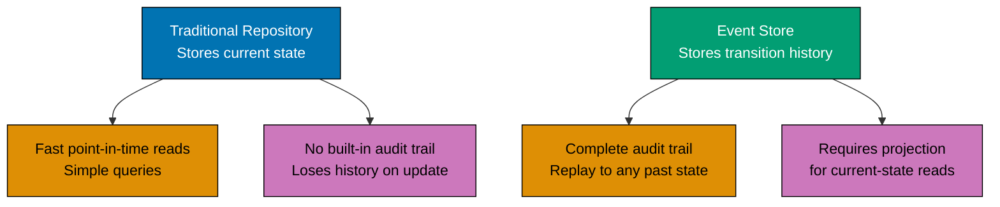
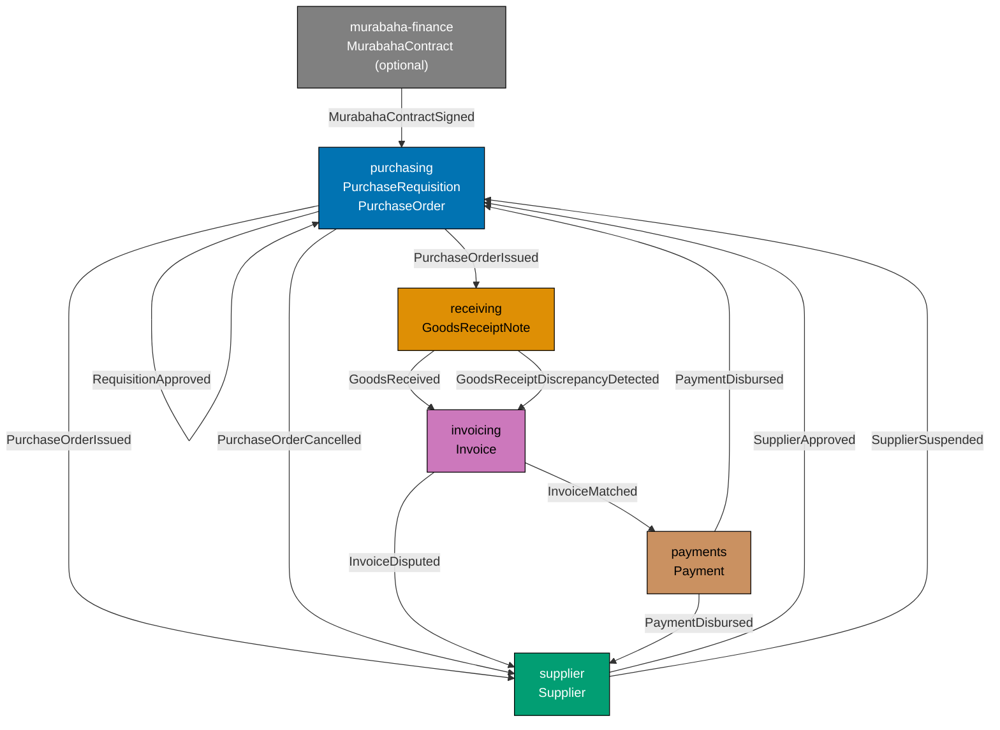

This advanced section adds the `receiving` and `invoicing` bounded contexts to the procurement platform, demonstrates cross-context Anti-Corruption Layers, factory functions, repositories as function-type aliases, dependency rejection, and testing strategies. All examples extend the purchasing domain established in the beginner and intermediate sections.

## Serialization and Persistence (Examples 56–67)

### Example 56: Serialization — JSON via DTO Boundary

Domain types never directly touch serialization libraries. JSON serialization uses DTO types as the sole wire format. The boundary has four steps: deserialize JSON to DTO, validate DTO to domain, compute, serialize domain back to DTO, then to JSON.

```mermaid
graph LR
    JSON_In["JSON string\n(HTTP request body)"]
    DTO_In["CreatePODto\n(deserialized DTO)"]
    Domain["PurchaseOrderAgg\n(validated domain type)"]
    DTO_Out["PoResponseDto\n(serialized DTO)"]
    JSON_Out["JSON string\n(HTTP response body)"]

    JSON_In -- "JsonSerializer.Deserialize" --> DTO_In
    DTO_In -- "fromDto (validates)" --> Domain
    Domain -- "toDto (infallible)" --> DTO_Out
    DTO_Out -- "JsonSerializer.Serialize" --> JSON_Out

    style DTO_In fill:#DE8F05,stroke:#000,color:#000
    style Domain fill:#0173B2,stroke:#000,color:#fff
    style DTO_Out fill:#DE8F05,stroke:#000,color:#000
```



```fsharp
// JSON serialization through the DTO boundary.
// Domain types never appear in serialization code.

open System.Text.Json

// DTOs — the only types that touch the serializer
type PoLineDto = { SkuCode: string; Quantity: int; UnitPrice: decimal }
// => DTO line: flat structure matching the JSON array element shape
type CreatePODto = { RequisitionId: string; SupplierId: string; Lines: PoLineDto list }
// => DTO input: flat structure matching the JSON request body

// Domain types — isolated from serialization
type PoLine      = { Sku: string; Qty: int; Price: decimal }
type PurchaseOrderDomain = { RequisitionId: string; SupplierId: string; Lines: PoLine list; Total: decimal }
// => Domain: uses domain-appropriate field names; no JSON attributes

// DTO response type
type PoResponseDto = { Id: string; Total: decimal; Status: string }
// => Response DTO: flat structure for the HTTP response body

// Translation: DTO → domain
let fromDto (dto: CreatePODto) : Result<PurchaseOrderDomain, string> =
    // => Validates DTO fields and converts to domain type; returns Result
    if System.String.IsNullOrWhiteSpace(dto.RequisitionId) then Error "RequisitionId required"
    // => Guard: blank RequisitionId is invalid in the domain
    elif dto.Lines.IsEmpty then Error "At least one line is required"
    // => Guard: blank PO has no business meaning
    elif dto.Lines |> List.exists (fun l -> l.Quantity <= 0) then Error "All quantities must be > 0"
    // => Guard: negative or zero quantities violate the domain invariant
    else
        let lines = dto.Lines |> List.map (fun l -> { Sku = l.SkuCode; Qty = l.Quantity; Price = l.UnitPrice })
        // => Convert DTO lines to domain PoLine records
        let total = lines |> List.sumBy (fun l -> decimal l.Qty * l.Price)
        // => Compute total from validated lines
        Ok { RequisitionId = dto.RequisitionId; SupplierId = dto.SupplierId; Lines = lines; Total = total }
        // => Returns Ok domain PO — all fields mapped from DTO to domain types

// Translation: domain → response DTO (infallible)
let toDto (domain: PurchaseOrderDomain) (poId: string) : PoResponseDto =
    // => Infallible: domain PO is valid by construction — no Result needed
    { Id = poId; Total = domain.Total; Status = "Draft" }
    // => Returns PoResponseDto ready for JSON serialization

// Serialization at the boundary
let json = """{"RequisitionId":"req_f4c2","SupplierId":"sup_acme","Lines":[{"SkuCode":"ELE-0099","Quantity":3,"UnitPrice":899.99}]}"""
// => Input JSON from the HTTP request body

let dto = JsonSerializer.Deserialize<CreatePODto>(json)
// => dto : CreatePODto — all fields deserialized from JSON as raw primitives

let domainResult = fromDto dto
// => fromDto validates the DTO and produces a domain PO or an error
// => domainResult : Result<PurchaseOrderDomain, string>

match domainResult with
| Ok domain ->
    let response = toDto domain "po_e3d1f8a0"
    // => Convert domain to response DTO — infallible
    let responseJson = JsonSerializer.Serialize(response)
    // => Serialize the response DTO to JSON
    printfn "Domain total: %M" domain.Total
    // => Output: Domain total: 2699.9700M
    printfn "Response: %s" responseJson
    // => Output: Response: {"Id":"po_e3d1f8a0","Total":2699.97,"Status":"Draft"}
| Error e ->
    printfn "Validation error: %s" e
```

**Key Takeaway**: The DTO boundary is the sole translation point between JSON and domain types — domain logic never sees raw JSON, and serialization code never sees domain types.

**Why It Matters**: JSON field names, casing conventions, and nullable semantics all change independently of domain model evolution. Keeping DTOs separate from domain types means a JSON API contract change (renaming `RequisitionId` to `requisition_id` for snake_case) requires only updating the DTO, not touching any domain logic. The translation function (`fromDto`) is the complete boundary — one place to update, one place to test.

---

### Example 57: Date/Time as a Domain Concept

`DateTimeOffset` is the correct type for all procurement timestamps — it carries the UTC offset, enabling correct comparison across time zones. The procurement platform records `SubmittedAt`, `ApprovedAt`, `IssuedAt`, and `ExpectedDelivery` as `DateTimeOffset` values, never as raw `DateTime`.

```fsharp
// DateTimeOffset: the correct type for all procurement timestamps.
// Carries the UTC offset — essential for cross-timezone supplier communication.

// A Clock port: injectable for testing
type Clock = unit -> System.DateTimeOffset
// => Clock : unit -> DateTimeOffset — a function that returns the current time
// => Injecting the clock makes time-dependent domain logic testable

// A fixed-time clock for tests — always returns the same time
let fixedClock (fixedTime: System.DateTimeOffset) : Clock =
    fun () -> fixedTime
    // => Returns a closure that always returns fixedTime
    // => Tests can assert on exact timestamps by injecting a fixed clock

// The real clock — returns actual UTC now
let realClock : Clock =
    fun () -> System.DateTimeOffset.UtcNow
    // => Production: returns the actual current time

// Domain record with timeline fields
type PurchaseOrderTimeline = {
    SubmittedAt:      System.DateTimeOffset
    // => When the requisition was submitted — drives L1/L2/L3 SLA tracking
    ApprovedAt:       System.DateTimeOffset option
    // => None until approval — Some when the manager approves
    IssuedAt:         System.DateTimeOffset option
    // => None until issuance — Some when sent to the supplier
    ExpectedDelivery: System.DateTimeOffset option
    // => Supplier-provided expected delivery — may change on acknowledgement
}
// => PurchaseOrderTimeline : value object — all timestamps in one cohesive record

// Pure domain function: is the approval SLA breached?
let isApprovalOverdue (now: System.DateTimeOffset) (slaDays: int) (timeline: PurchaseOrderTimeline) : bool =
    // => Checks if the approval SLA has been breached
    match timeline.ApprovedAt with
    | Some _ -> false
    // => Already approved — SLA is not breached
    | None ->
        let deadline = timeline.SubmittedAt.AddDays(float slaDays)
        // => Compute the deadline: submittedAt + slaDays
        now > deadline
        // => If now is past the deadline, SLA is breached

// Test with fixed clock
let fixedNow = System.DateTimeOffset(2026, 6, 15, 10, 0, 0, System.TimeSpan.Zero)
// => fixedNow : DateTimeOffset = 2026-06-15T10:00:00Z — fixed for deterministic test

let timeline = {
    SubmittedAt      = System.DateTimeOffset(2026, 6, 10, 9, 0, 0, System.TimeSpan.Zero)
    // => Submitted 5 days ago
    ApprovedAt       = None
    // => Not yet approved — SLA check applies
    IssuedAt         = None
    ExpectedDelivery = None
}
// => timeline : PurchaseOrderTimeline — submitted, not yet approved

let overdue = isApprovalOverdue fixedNow 3 timeline
// => deadline = 2026-06-10 + 3 days = 2026-06-13; fixedNow (2026-06-15) > deadline — true
// => overdue : bool = true — SLA breached by 2 days

printfn "Approval overdue: %b" overdue
// => Output: Approval overdue: true
printfn "Submitted: %O" timeline.SubmittedAt
// => Output: Submitted: 06/10/2026 09:00:00 +00:00
```

**Key Takeaway**: Injecting a `Clock` function makes time-dependent domain rules (SLA checks, deadline calculations) testable with fixed timestamps — no `DateTime.Now` calls buried in domain logic.

**Why It Matters**: SLA breach detection, payment scheduling, and delivery deadline alerts all depend on "what time is it now?" Hardcoding `DateTime.Now` in domain functions makes them untestable deterministically. Injecting `Clock` as a function parameter means tests can use `fixedClock (DateTimeOffset(2026, 6, 15, ...))` and assert on exact SLA outcomes without relying on the real clock.

---

### Example 58: GoodsReceiptNote Aggregate — Receiving Context

The `receiving` bounded context introduces the `GoodsReceiptNote` (GRN) aggregate. A GRN records the physical receipt of goods against a `PurchaseOrder`. The GRN drives the three-way matching process in the invoicing context.

```fsharp
// GoodsReceiptNote: aggregate root of the receiving context.
// Records what was actually received against what was ordered.

type PurchaseOrderId = PurchaseOrderId of string
type SupplierId      = SupplierId      of string

// GRN line: records what was actually received for one PO line
type GrnLine = {
    PoLineNumber:      int
    // => Reference to the PO line being received against
    OrderedQuantity:   int
    // => What the PO said should arrive — for discrepancy detection
    ReceivedQuantity:  int
    // => What actually arrived — may differ due to short shipments or damage
    SkuCode:           string
    // => The SKU received — must match the PO line SKU
    HasQualityIssue:   bool
    // => QC flag: true if goods failed inspection — blocks invoice matching
}
// => GrnLine : value object inside the GRN aggregate

// GRN status
type GrnStatus = Open | Verified | Disputed
// => Open: goods received, awaiting QC verification
// => Verified: QC passed — GRN is valid for invoice matching
// => Disputed: QC failed or quantity mismatch — blocks matching

// The GRN aggregate root
type GoodsReceiptNote = {
    Id:              string
    // => Format: "grn_<uuid>" — unique GRN identity
    PurchaseOrderId: PurchaseOrderId
    // => Which PO this GRN is receipting against
    SupplierId:      SupplierId
    // => Which supplier delivered the goods
    ReceivedAt:      System.DateTimeOffset
    // => When goods were physically received at the warehouse
    Lines:           GrnLine list
    // => One line per PO line received — may be partial
    Status:          GrnStatus
    // => Overall GRN status — drives invoice matching eligibility
}
// => GoodsReceiptNote : aggregate root — unit of consistency for the receiving context

// Domain event emitted when goods are received
type GoodsReceivedEvent = {
    GrnId:           string
    PurchaseOrderId: PurchaseOrderId
    ReceivedAt:      System.DateTimeOffset
    HasDiscrepancy:  bool
    // => True if any line has a quantity mismatch or quality issue
}
// => GoodsReceivedEvent : consumed by invoicing (enables/blocks matching) and purchasing

// Create a GRN from a goods receipt
let receiveGoods
    (poId:      PurchaseOrderId)
    (supplierId: SupplierId)
    (lines:     GrnLine list)
    : Result<GoodsReceiptNote * GoodsReceivedEvent, string> =
    if lines.IsEmpty then Error "Cannot create a GRN with no lines"
    // => Guard: a receipt with no lines has no meaning
    else
        let hasDiscrepancy =
            lines |> List.exists (fun l -> l.ReceivedQuantity <> l.OrderedQuantity || l.HasQualityIssue)
        // => True if any line differs from what was ordered or has a quality issue
        let status = if hasDiscrepancy then Disputed else Open
        // => Disputed GRNs block invoice matching — require warehouse investigation
        let grnId = "grn_" + System.Guid.NewGuid().ToString("N").[..7]
        // => Generate GRN ID at receipt time
        let grn = {
            Id = grnId; PurchaseOrderId = poId; SupplierId = supplierId
            ReceivedAt = System.DateTimeOffset.UtcNow; Lines = lines; Status = status
        }
        let event = { GrnId = grnId; PurchaseOrderId = poId
                      ReceivedAt = grn.ReceivedAt; HasDiscrepancy = hasDiscrepancy }
        Ok (grn, event)
        // => Return both the new GRN and the event

// Test: receive goods matching the PO exactly
let lines = [
    { PoLineNumber = 1; OrderedQuantity = 3; ReceivedQuantity = 3; SkuCode = "ELE-0099"; HasQualityIssue = false }
    // => Three laptops ordered, three received, no quality issues
    { PoLineNumber = 2; OrderedQuantity = 10; ReceivedQuantity = 10; SkuCode = "OFF-0042"; HasQualityIssue = false }
    // => Ten boxes ordered, ten received, no quality issues
]
let result = receiveGoods (PurchaseOrderId "po_e3d1") (SupplierId "sup_acme") lines
// => No discrepancy — GRN status = Open

match result with
| Ok (grn, event) ->
    printfn "GRN: %s status=%A discrepancy=%b" grn.Id grn.Status event.HasDiscrepancy
    // => Output: GRN: grn_... status=Open discrepancy=false
| Error e -> printfn "Error: %s" e
```

**Key Takeaway**: The `GoodsReceiptNote` aggregate captures the "what was actually received" fact that drives the three-way matching process — it is distinct from the PO (what was ordered) and the invoice (what was billed).

**Why It Matters**: Three-way matching (PO ↔ GRN ↔ Invoice) is the core control in accounts payable — it prevents overpayment and fraud. The GRN is the physical evidence of delivery. By modelling it as a separate aggregate with its own `Disputed` state (triggered by quality issues or quantity mismatches), the system can block invoice payment automatically when discrepancies exist, without manual intervention.

---

### Example 59: Invoice Aggregate — Three-Way Matching

The `Invoice` aggregate in the `invoicing` context registers supplier invoices and matches them against the PO and GRN. The match rule: invoice amount must equal `sum(GRN quantities × PO unit price)` within the configured `Tolerance` (default 2%).

```fsharp
// Invoice: aggregate root of the invoicing context.
// Three-way matching: Invoice amount ≈ GRN quantity × PO unit price (within Tolerance).

type PurchaseOrderId = PurchaseOrderId of string
type InvoiceId       = InvoiceId       of string

// Tolerance: how much the invoice amount can deviate from the calculated amount
type Tolerance = private Tolerance of decimal
// => Tolerance is a percentage (0.0 to 0.10 = 0% to 10%)

module Tolerance =
    let defaultTolerance = Tolerance 0.02m
    // => Default: 2% — standard accounts payable tolerance
    let create (pct: decimal) : Result<Tolerance, string> =
        if pct < 0m || pct > 0.10m then Error (sprintf "Tolerance must be 0–10%%, got %.2f%%" (pct * 100m))
        else Ok (Tolerance pct)
    let value (Tolerance t) = t
    // => Unwrap for arithmetic

// Invoice states
type InvoiceStatus = Registered | Matching | Matched | Disputed | ScheduledForPayment | Paid
// => Registered: invoice logged in the system
// => Matching: three-way match in progress
// => Matched: match succeeded — eligible for payment scheduling
// => Disputed: match failed — requires investigation
// => ScheduledForPayment: payment run scheduled
// => Paid: bank disbursement confirmed

// The Invoice aggregate root
type Invoice = {
    Id:              InvoiceId
    PurchaseOrderId: PurchaseOrderId
    SupplierAmount:  decimal
    // => What the supplier claims — from the invoice document
    Status:          InvoiceStatus
    MatchedAt:       System.DateTimeOffset option
    // => None until matching completes
    DisputeReason:   string option
    // => None unless Disputed — carries the reason for the discrepancy
}
// => Invoice : aggregate root of the invoicing context

// Three-way match: does the invoice amount match the calculated amount within tolerance?
let threeWayMatch
    (invoiceAmount:    decimal)
    (grnQuantities:    (int * decimal) list)  // => (receivedQty, poUnitPrice) per line
    (tolerance:        Tolerance)
    : Result<decimal, string> =
    // => Returns Ok calculatedAmount if matched, Error with details if not
    let calculated = grnQuantities |> List.sumBy (fun (qty, price) -> decimal qty * price)
    // => Sum GRN quantities × PO unit prices — what the invoice SHOULD say
    let diff = abs (invoiceAmount - calculated)
    // => Absolute difference between invoice amount and calculated amount
    let maxAllowed = calculated * Tolerance.value tolerance
    // => Maximum allowed discrepancy = calculated × tolerance percentage
    if diff <= maxAllowed then
        Ok calculated
        // => Within tolerance — match succeeds
    else
        Error (sprintf "Invoice %M differs from calculated %M by %M (max allowed: %M)"
                       invoiceAmount calculated diff maxAllowed)
        // => Outside tolerance — match fails with details

// Test three-way match
let invoiceAmount = 2699.97m
// => Supplier invoiced for 2699.97 — matches 3 × 899.99 exactly
let grnLines = [(3, 899.99m)]
// => GRN: 3 laptops received; PO unit price: 899.99

let matchResult = threeWayMatch invoiceAmount grnLines Tolerance.defaultTolerance
// => calculated = 3 × 899.99 = 2699.97; diff = |2699.97 - 2699.97| = 0; 0 <= 53.9994 (2%)
// => matchResult : Result<decimal, string> = Ok 2699.97

printfn "Match result: %A" matchResult
// => Output: Match result: Ok 2699.9700M

// Test with out-of-tolerance invoice
let overInvoiceAmount = 2900m
// => Supplier invoiced for 2900 — 200.03 over the calculated amount (7.4% over)
let overMatchResult = threeWayMatch overInvoiceAmount grnLines Tolerance.defaultTolerance
// => diff = |2900 - 2699.97| = 200.03; maxAllowed = 2699.97 × 0.02 = 53.9994; 200.03 > 53.9994
// => overMatchResult : Result<decimal, string> = Error "Invoice 2900M differs..."

printfn "Over-invoice: %A" overMatchResult
// => Output: Over-invoice: Error "Invoice 2900M differs from calculated 2699.9700M by 200.0300M (max allowed: 53.9994M)"
```

**Key Takeaway**: Three-way matching implemented as a pure function over GRN quantities and PO unit prices is independently testable and produces a named error when the invoice is outside tolerance.

**Why It Matters**: Three-way matching is the primary financial control in accounts payable. A pure `threeWayMatch` function can be unit-tested with dozens of boundary cases (exact match, within tolerance, one cent over tolerance, supplier overcharge by 10%) without a database or running service. The `Tolerance` value object enforces the 0–10% constraint at creation time, preventing misconfigurations that would pass all invoices regardless of discrepancy.

---

### Example 60: EventStore vs Repository — Trade-offs

The procurement domain supports two persistence strategies: a traditional repository that stores the current state, and an event store that stores the sequence of transitions. Each has distinct trade-offs for procurement use cases.



```fsharp
// Two persistence strategies for the PurchaseOrder aggregate.
// Traditional: stores the current snapshot; Event store: stores the history.

type PurchaseOrderId = PurchaseOrderId of string

// ── TRADITIONAL REPOSITORY ────────────────────────────────────────────────────
// Stores the current state snapshot — fast reads, no built-in history

type PoSnapshot = {
    Id:        PurchaseOrderId
    Status:    string
    Total:     decimal
    UpdatedAt: System.DateTimeOffset
}
// => PoSnapshot : the current state of a PO — overwritten on each transition

type PoRepository = {
    Load: PurchaseOrderId -> Async<PoSnapshot option>
    // => Load the current snapshot — O(1) lookup
    Save: PoSnapshot -> Async<unit>
    // => Overwrite the snapshot — loses previous state
}
// => PoRepository : traditional repository — no history

// ── EVENT STORE ───────────────────────────────────────────────────────────────
// Stores the sequence of events — full history, requires projection for reads

type PoEvent =
    | DraftCreated      of { Id: PurchaseOrderId; Total: decimal }
    | ApprovalRequested of { Id: PurchaseOrderId }
    | PurchaseOrderApproved       of { Id: PurchaseOrderId; ApprovedAt: System.DateTimeOffset }
    | PurchaseOrderIssuedEv       of { Id: PurchaseOrderId; IssuedAt: System.DateTimeOffset }
    | PurchaseOrderCancelledEv    of { Id: PurchaseOrderId; Reason: string }
// => Each DU case represents one thing that happened to the PO

type PoEventStore = {
    Append: PurchaseOrderId -> PoEvent list -> Async<unit>
    // => Append new events to the stream — never overwrites
    Load:   PurchaseOrderId -> Async<PoEvent list>
    // => Load the full event stream — replay to get current state
}
// => PoEventStore : event store — append-only; full history preserved

// Projection: fold the event stream to get current state
let projectSnapshot (events: PoEvent list) : PoSnapshot option =
    let folder (acc: PoSnapshot option) (event: PoEvent) : PoSnapshot option =
        match event with
        | DraftCreated d ->
            Some { Id = d.Id; Status = "Draft"; Total = d.Total; UpdatedAt = System.DateTimeOffset.UtcNow }
        // => First event: creates the initial snapshot
        | PurchaseOrderApproved a ->
            acc |> Option.map (fun s -> { s with Status = "Approved"; UpdatedAt = a.ApprovedAt })
        // => Approval: update status and timestamp
        | PurchaseOrderIssuedEv i ->
            acc |> Option.map (fun s -> { s with Status = "Issued"; UpdatedAt = i.IssuedAt })
        // => Issuance: update status and timestamp
        | PurchaseOrderCancelledEv c ->
            acc |> Option.map (fun s -> { s with Status = "Cancelled"; UpdatedAt = System.DateTimeOffset.UtcNow })
        // => Cancellation: mark as cancelled
        | ApprovalRequested _ ->
            acc |> Option.map (fun s -> { s with Status = "AwaitingApproval" })
        // => Approval request: update status
    List.fold folder None events
    // => Fold over all events — last write wins for each field

// Test the projection
let events = [
    DraftCreated { Id = PurchaseOrderId "po_e3d1"; Total = 2699.97m }
    ApprovalRequested { Id = PurchaseOrderId "po_e3d1" }
    PurchaseOrderApproved { Id = PurchaseOrderId "po_e3d1"; ApprovedAt = System.DateTimeOffset.UtcNow }
]
// => Three events: Draft → AwaitingApproval → Approved

let snapshot = projectSnapshot events
// => Fold produces the current state from the event history

match snapshot with
| Some s -> printfn "Current state: %s total=%M" s.Status s.Total
// => Output: Current state: Approved total=2699.9700M
| None   -> printfn "No events"
```

**Key Takeaway**: Event stores provide a complete audit trail by design — every state the PO was ever in is recoverable by replaying the event stream; traditional repositories provide faster current-state reads at the cost of losing history.

**Why It Matters**: Procurement audit requirements typically mandate a complete trail of every state transition: when was the PO approved, by whom, at what time, and what was its total at each step? An event store provides this for free — there is no "before state" to lose. For procurement systems subject to SOX, ISO 9001, or government procurement regulations, event sourcing is often the natural fit for the PO aggregate.

---

### Example 61: Bounded Context Boundary as Module + Signature

Each bounded context in the procurement platform exposes a public API through a module signature. The signature defines what is visible to other contexts; the implementation hides internal types. This is the F# module system as a bounded context boundary.

```fsharp
// Bounded context as a module with an explicit public surface.
// Internal types stay hidden; the public API is the Anti-Corruption Layer.

// ── PURCHASING CONTEXT — PUBLIC API ─────────────────────────────────────────
module Purchasing =
    // Public types — visible to other contexts
    type RequisitionId   = RequisitionId of string
    type PurchaseOrderId = PurchaseOrderId of string

    // Public event — emitted by purchasing, consumed by other contexts
    type PurchaseOrderIssuedPublic = {
        PurchaseOrderId: PurchaseOrderId
        SupplierId:      string
        IssuedAt:        System.DateTimeOffset
        TotalAmount:     decimal
    }
    // => This is the "published language" — the public event contract

    // Internal type — NOT exported; invisible to other contexts
    type InternalPoState = {
        Id:            PurchaseOrderId
        Lines:         (string * int * decimal) list
        ApprovalChain: string list
        // => Approval chain is an internal implementation detail
        // => The receiving context does not need to know the chain
    }
    // => InternalPoState : visible only inside Purchasing module

    // Public function — the only way to query a PO's issue status
    let getIssuedPOPublic (id: PurchaseOrderId) : PurchaseOrderIssuedPublic option =
        // => Simplified stub — real implementation queries the database
        if id = PurchaseOrderId "po_e3d1" then
            Some { PurchaseOrderId = id; SupplierId = "sup_acme"
                   IssuedAt = System.DateTimeOffset.UtcNow; TotalAmount = 2699.97m }
        else None
    // => Public function returns the published type — not InternalPoState

// ── RECEIVING CONTEXT — CONSUMES PURCHASING VIA PUBLIC API ───────────────────
module Receiving =
    // The receiving context only imports what Purchasing exports
    let openGrnExpectation (event: Purchasing.PurchaseOrderIssuedPublic) : string =
        // => Uses only the published type — cannot access InternalPoState
        sprintf "GRN expectation opened for PO %A from supplier %s (total: %M)"
                event.PurchaseOrderId event.SupplierId event.TotalAmount
        // => Returns a description — real implementation creates a GRN record

// Test the context boundary
let issuedEvent = Purchasing.getIssuedPOPublic (Purchasing.PurchaseOrderId "po_e3d1")
// => Returns the public event type — not the internal state

match issuedEvent with
| Some ev ->
    let grnDesc = Receiving.openGrnExpectation ev
    // => Receiving uses the public type — fully decoupled from purchasing internals
    printfn "%s" grnDesc
    // => Output: GRN expectation opened for PO PurchaseOrderId "po_e3d1" from supplier sup_acme (total: 2699.9700M)
| None -> printfn "PO not found"
```

**Key Takeaway**: F# module visibility rules enforce bounded context boundaries — internal types stay hidden, and the only coupling between contexts is through explicitly exported types and functions.

**Why It Matters**: The `InternalPoState` with its approval chain, line-item history, and status notes is a purchasing-specific implementation detail. If the receiving context depends on `InternalPoState` directly, every refactor of purchasing internals risks breaking receiving. By exporting only `PurchaseOrderIssuedPublic`, the purchasing context can freely evolve its internal model without affecting downstream contexts.

---

### Example 62: ACL as a Translation Function Between Contexts

An Anti-Corruption Layer (ACL) translates between two bounded context models. When the invoicing context needs to verify that a GRN exists and is valid, it calls through an ACL that translates the receiving context's `GoodsReceiptNote` into invoicing's `GrnSummary`.

```fsharp
// ACL: a translation function between two bounded context models.
// Prevents the invoicing context from depending on receiving's internal types.

// ── RECEIVING CONTEXT TYPES ───────────────────────────────────────────────────
type GrnStatus = Open | Verified | Disputed
// => Receiving context's internal status enum

type GoodsReceiptNote = {
    Id:              string
    PurchaseOrderId: string
    ReceivedQuantity: int
    Status:          GrnStatus
    ReceivedAt:      System.DateTimeOffset
}
// => Receiving's internal type — not exported to invoicing

// ── INVOICING CONTEXT TYPES ───────────────────────────────────────────────────
// What invoicing needs to know about a GRN — a minimal projection
type GrnSummary = {
    GrnId:            string
    PurchaseOrderId:  string
    ReceivedQuantity: int
    IsValid:          bool
    // => True if GRN is Verified — invoicing only cares about validity, not the full status
}
// => GrnSummary : invoicing's view of a GRN — no dependency on receiving's GrnStatus

// ── THE ACL — TRANSLATION FUNCTION ───────────────────────────────────────────
let translateGrnToSummary (grn: GoodsReceiptNote) : GrnSummary =
    // => ACL function: translates receiving's type to invoicing's type
    { GrnId            = grn.Id
      PurchaseOrderId  = grn.PurchaseOrderId
      ReceivedQuantity = grn.ReceivedQuantity
      IsValid          = grn.Status = Verified
      // => Translate GrnStatus to a simple bool — invoicing doesn't care which non-Verified state
    }
    // => Returns GrnSummary — invoicing can use this without importing GrnStatus

// ACL port type — the invoicing context's dependency on receiving
type FindValidGrn = string -> Async<GrnSummary option>
// => FindValidGrn : purchaseOrderId → Async<GrnSummary option>
// => Invoicing calls this to check if a valid GRN exists for the PO

// Simulate the ACL adapter — in production, queries the receiving context's database
let findValidGrnAdapter (grns: GoodsReceiptNote list) : FindValidGrn =
    fun poId ->
        async {
            let found = grns |> List.tryFind (fun g -> g.PurchaseOrderId = poId && g.Status = Verified)
            // => Find a Verified GRN for the given PO ID
            return found |> Option.map translateGrnToSummary
            // => Translate to GrnSummary if found — None if no verified GRN exists
        }

// Test the ACL
let grns = [
    { Id = "grn_abc"; PurchaseOrderId = "po_e3d1"; ReceivedQuantity = 3; Status = Verified; ReceivedAt = System.DateTimeOffset.UtcNow }
    // => Verified GRN for po_e3d1 — eligible for invoice matching
]
let findGrn = findValidGrnAdapter grns
// => findGrn : FindValidGrn — the ACL adapter

let summaryResult = Async.RunSynchronously (findGrn "po_e3d1")
// => Finds the Verified GRN — translates to GrnSummary

match summaryResult with
| Some s -> printfn "GRN valid: qty=%d poId=%s" s.ReceivedQuantity s.PurchaseOrderId
// => Output: GRN valid: qty=3 poId=po_e3d1
| None   -> printfn "No valid GRN found"
```

**Key Takeaway**: An ACL translation function keeps the invoicing context decoupled from the receiving context's internal model — invoicing depends only on `GrnSummary`, not on `GoodsReceiptNote` or `GrnStatus`.

**Why It Matters**: Without an ACL, invoicing would import `GrnStatus` from receiving. Any change to `GrnStatus` (adding a new case `PartiallyVerified`) would require updating invoicing code. The ACL absorbs these changes: only `translateGrnToSummary` needs updating, and the invoicing workflows that use `GrnSummary.IsValid` remain unchanged.

---

### Example 63: Published Language — DU of Public Events

The "published language" is the set of domain events that cross bounded context boundaries. These events are contracts — once published, their shape must not change without a versioning strategy. The procurement platform's published language is a discriminated union of cross-context events.

```fsharp
// Published language: the public domain event contract between bounded contexts.
// Events in the published language are immutable contracts — versioned carefully.

type PurchaseOrderId = PurchaseOrderId of string
type SupplierId      = SupplierId      of string

// The published language DU — events that cross context boundaries
type ProcurementPublishedEvent =
    // From purchasing context
    | PurchaseOrderIssuedV1 of {|
        PurchaseOrderId: string
        SupplierId:      string
        IssuedAt:        System.DateTimeOffset
        TotalAmount:     decimal
      |}
    // => V1 of PurchaseOrderIssued — consumed by receiving and supplier-notifier
    | RequisitionApprovedV1 of {|
        RequisitionId:  string
        ApprovedBy:     string
        ApprovedAt:     System.DateTimeOffset
      |}
    // => V1 of RequisitionApproved — consumed by purchasing (auto-creates PO Draft)
    | PurchaseOrderCancelledV1 of {|
        PurchaseOrderId: string
        Reason:          string
        CancelledAt:     System.DateTimeOffset
      |}
    // => V1 of PurchaseOrderCancelled — consumed by supplier-notifier and accounting
    // From receiving context
    | GoodsReceivedV1 of {|
        GrnId:           string
        PurchaseOrderId: string
        HasDiscrepancy:  bool
        ReceivedAt:      System.DateTimeOffset
      |}
    // => V1 of GoodsReceived — consumed by invoicing and purchasing
    // From invoicing context
    | InvoiceMatchedV1 of {|
        InvoiceId:       string
        PurchaseOrderId: string
        MatchedAmount:   decimal
        MatchedAt:       System.DateTimeOffset
      |}
    // => V1 of InvoiceMatched — consumed by payments (schedules payment run)

// A subscriber that reacts to cross-context events
let handlePublishedEvent (event: ProcurementPublishedEvent) : string =
    match event with
    | PurchaseOrderIssuedV1 payload ->
        sprintf "[receiving] Open GRN expectation for PO %s (supplier: %s)"
                payload.PurchaseOrderId payload.SupplierId
    // => Receiving context opens a GRN expectation on PO issuance
    | GoodsReceivedV1 payload ->
        if payload.HasDiscrepancy then
            sprintf "[invoicing] Block matching for GRN %s — discrepancy detected" payload.GrnId
        else
            sprintf "[invoicing] Enable matching for GRN %s" payload.GrnId
    // => Invoicing enables or blocks matching based on discrepancy flag
    | InvoiceMatchedV1 payload ->
        sprintf "[payments] Schedule payment for invoice %s amount=%M" payload.InvoiceId payload.MatchedAmount
    // => Payments schedules a payment run on successful invoice matching
    | RequisitionApprovedV1 payload ->
        sprintf "[purchasing] Auto-create PO Draft for requisition %s" payload.RequisitionId
    // => Purchasing auto-converts the approved requisition to a PO Draft
    | PurchaseOrderCancelledV1 payload ->
        sprintf "[supplier-notifier] Notify supplier of cancellation: %s" payload.Reason
    // => Supplier-notifier sends EDI/email on PO cancellation

// Test
let events = [
    PurchaseOrderIssuedV1 {| PurchaseOrderId = "po_e3d1"; SupplierId = "sup_acme"; IssuedAt = System.DateTimeOffset.UtcNow; TotalAmount = 2699.97m |}
    GoodsReceivedV1 {| GrnId = "grn_abc"; PurchaseOrderId = "po_e3d1"; HasDiscrepancy = false; ReceivedAt = System.DateTimeOffset.UtcNow |}
    InvoiceMatchedV1 {| InvoiceId = "inv_xyz"; PurchaseOrderId = "po_e3d1"; MatchedAmount = 2699.97m; MatchedAt = System.DateTimeOffset.UtcNow |}
]
// => Three events flowing through the published language

events |> List.iter (handlePublishedEvent >> printfn "%s")
// => Output: [receiving] Open GRN expectation for PO po_e3d1 (supplier: sup_acme)
// => Output: [invoicing] Enable matching for GRN grn_abc
// => Output: [payments] Schedule payment for invoice inv_xyz amount=2699.9700M
```

**Key Takeaway**: The published language DU is the formal contract between bounded contexts — every cross-context event is named, versioned, and carries exactly what consumers need without exposing internal context structure.

**Why It Matters**: Published language events are the most stable artifacts in a microservices architecture. Once `PurchaseOrderIssuedV1` is consumed by three downstream services, its shape cannot change without coordinating all three. The `V1` suffix makes the versioning explicit — `PurchaseOrderIssuedV2` can be added alongside `V1` for a transition period, enabling zero-downtime evolution.

---

## Bounded Context Integration (Examples 64–74)

### Example 64: Factory Function for PurchaseOrder

A factory function encapsulates the logic for creating a new `PurchaseOrder` from a validated command. It generates the ID, assigns initial state, and produces the creation event — all in one place.

```fsharp
// Factory function: encapsulates PO creation logic — ID generation, initial state, first event.

type PurchaseOrderId = PurchaseOrderId of string
type SupplierId      = SupplierId      of string

// The inputs the factory needs
type CreatePOInputs = {
    RequisitionId: string
    SupplierId:    SupplierId
    Lines:         (string * int * decimal) list
    // => (sku, quantity, unitPrice) validated tuples
}
// => CreatePOInputs : validated inputs ready for the factory

// The outputs the factory produces
type DraftPO = {
    Id:            PurchaseOrderId
    RequisitionId: string
    SupplierId:    SupplierId
    Lines:         (string * int * decimal) list
    Total:         decimal
    CreatedAt:     System.DateTimeOffset
}
// => DraftPO : the initial aggregate state — all fields set at creation

type POCreatedEvent = {
    PurchaseOrderId: PurchaseOrderId
    RequisitionId:   string
    SupplierId:      SupplierId
    TotalAmount:     decimal
    CreatedAt:       System.DateTimeOffset
}
// => POCreatedEvent : the event emitted on creation — consumed by the purchasing projection

// ID generator port — injectable for testing
type GenerateId = unit -> string
// => GenerateId : unit -> string — produces a unique ID string

// The factory function
let createPurchaseOrder
    (generateId: GenerateId)
    (clock:      unit -> System.DateTimeOffset)
    (inputs:     CreatePOInputs)
    : DraftPO * POCreatedEvent =
    // => generateId and clock are injected — testable with fixed values
    let id      = PurchaseOrderId ("po_" + generateId ())
    // => Generate the PO ID using the injected generator
    let now     = clock ()
    // => Get the current time from the injected clock
    let total   = inputs.Lines |> List.sumBy (fun (_, qty, price) -> decimal qty * price)
    // => Compute total from the validated lines
    let draftPO = {
        Id = id; RequisitionId = inputs.RequisitionId; SupplierId = inputs.SupplierId
        Lines = inputs.Lines; Total = total; CreatedAt = now
    }
    // => Construct the initial Draft state — all fields known at creation
    let event = {
        PurchaseOrderId = id; RequisitionId = inputs.RequisitionId
        SupplierId = inputs.SupplierId; TotalAmount = total; CreatedAt = now
    }
    // => Construct the creation event — all consumer needs baked in
    draftPO, event
    // => Return both the aggregate state and the emitted event

// Test with fixed ID generator and clock
let fixedId  ()  = "e3d1f8a0"
// => Always returns the same ID segment — deterministic for testing
let fixedTime () = System.DateTimeOffset(2026, 6, 15, 10, 0, 0, System.TimeSpan.Zero)
// => Always returns the same timestamp — deterministic for testing

let inputs = {
    RequisitionId = "req_f4c2"; SupplierId = SupplierId "sup_acme"
    Lines = [("ELE-0099", 3, 899.99m); ("OFF-0042", 10, 8.50m)]
}
// => CreatePOInputs : validated inputs for the factory

let (draft, event) = createPurchaseOrder fixedId fixedTime inputs
// => Creates DraftPO with id="po_e3d1f8a0" and POCreatedEvent with same data

printfn "Draft: %A total=%M" draft.Id draft.Total
// => Output: Draft: PurchaseOrderId "po_e3d1f8a0" total=2784.9700M
printfn "Event: %A at %O" event.PurchaseOrderId event.CreatedAt
// => Output: Event: PurchaseOrderId "po_e3d1f8a0" at 06/15/2026 10:00:00 +00:00
```

**Key Takeaway**: A factory function with injected `GenerateId` and `Clock` parameters is deterministically testable — the same inputs always produce the same output, enabling precise assertions on IDs and timestamps.

**Why It Matters**: Without an injectable ID generator, testing PO creation requires either mocking `Guid.NewGuid()` (impossible in pure F#) or using string prefix matching in assertions (`actual.Id.StartsWith("po_")`). The factory function pattern makes creation fully deterministic in tests, enabling exact assertion on the created state and event payload.

---

### Example 65: Repository as Function-Type Alias

In functional F#, a repository is modelled as a set of function-type aliases — one per operation. These aliases are the port definition. The production adapter and the test adapter are both values of these function types.

```fsharp
// Repository as function-type aliases — the purest form of the port pattern.
// Each operation is its own type alias; wiring happens at the composition root.

type PurchaseOrderId = PurchaseOrderId of string
type SupplierId      = SupplierId      of string

// Data record stored in the repository
type PoData = {
    Id:        PurchaseOrderId
    Status:    string
    Total:     decimal
    UpdatedAt: System.DateTimeOffset
}
// => PoData : the persisted representation of a PurchaseOrder

// Function-type aliases — each is a port
type LoadPO   = PurchaseOrderId -> Async<PoData option>
// => Load a PO by ID; None if not found
type SavePO   = PoData -> Async<unit>
// => Insert or update a PO
type DeletePO = PurchaseOrderId -> Async<unit>
// => Soft-delete a PO (rarely used — cancellation is preferred)
type ListPOsBySupplier = SupplierId -> Async<PoData list>
// => Query all POs for a given supplier

// A workflow function that uses these port types
let approvePOWorkflow
    (load: LoadPO)
    (save: SavePO)
    (poId: PurchaseOrderId)
    : Async<Result<PoData, string>> =
    async {
        let! opt = load poId
        // => Use the LoadPO port — any adapter works here
        match opt with
        | None -> return Error (sprintf "PO %A not found" poId)
        | Some po ->
            if po.Status <> "AwaitingApproval" then
                return Error (sprintf "Cannot approve PO in status '%s'" po.Status)
            // => Business rule: only AwaitingApproval POs can be approved
            else
                let approved = { po with Status = "Approved"; UpdatedAt = System.DateTimeOffset.UtcNow }
                // => Pure state transition — with-expression
                do! save approved
                // => Use the SavePO port — any adapter works here
                return Ok approved
                // => Return the new approved state
    }

// In-memory adapter — for tests
let mutable store : Map<string, PoData> = Map.empty
// => Mutable map simulates the database for in-memory tests

let inMemoryLoad : LoadPO = fun (PurchaseOrderId id) ->
    async { return Map.tryFind id store }
// => In-memory load: looks up the map

let inMemorySave : SavePO = fun po ->
    async {
        let (PurchaseOrderId id) = po.Id
        store <- Map.add id po store
        // => Upsert into the map
    }
// => In-memory save: updates the map

// Seed the store with a test PO
let testPO = { Id = PurchaseOrderId "po_e3d1"; Status = "AwaitingApproval"; Total = 2699.97m; UpdatedAt = System.DateTimeOffset.UtcNow }
store <- Map.add "po_e3d1" testPO store
// => Seed: "po_e3d1" is now in the in-memory store

// Wire in-memory adapters and run the workflow
let result = Async.RunSynchronously (approvePOWorkflow inMemoryLoad inMemorysave (PurchaseOrderId "po_e3d1"))
// => load finds testPO; status = "AwaitingApproval" → approved; save updates store

match result with
| Ok po   -> printfn "Approved: %A status=%s" po.Id po.Status
// => Output: Approved: PurchaseOrderId "po_e3d1" status=Approved
| Error e -> printfn "Error: %s" e
```

**Key Takeaway**: Function-type aliases are the simplest possible port definition — no interface, no abstract class, no mock framework — just a type alias that any function matching the signature can satisfy.

**Why It Matters**: The `LoadPO` alias `PurchaseOrderId -> Async<PoData option>` can be satisfied by an Npgsql query, a DynamoDB scan, a Redis cache lookup, or an in-memory map. The `approvePOWorkflow` function is indifferent to which adapter is behind the alias. This is the highest fidelity expression of the Dependency Inversion Principle in functional F# — the port is just a type, and the adapter is just a function.

---

### Example 66: Dependency Rejection — No Optional Dependencies

Dependency rejection means the workflow function takes all required dependencies as explicit parameters and fails to compile if any are missing. There are no optional dependencies, no service locators, no ambient globals.

```fsharp
// Dependency rejection: all dependencies are explicit function parameters.
// Missing a dependency is a compile error, not a runtime null-pointer exception.

type PurchaseOrderId = PurchaseOrderId of string
type SupplierId      = SupplierId      of string

// Port types — all required for the issue workflow
type LoadApprovedPO     = PurchaseOrderId -> Async<(SupplierId * decimal) option>
type CheckSupplierStatus = SupplierId -> Async<bool>  // => true = eligible
type SaveIssuedPO        = PurchaseOrderId -> System.DateTimeOffset -> Async<unit>
type PublishPoIssued     = PurchaseOrderId -> SupplierId -> decimal -> Async<unit>
type SendNotification    = SupplierId -> string -> Async<unit>
// => Five explicit port types — every dependency is named and typed

// The workflow: ALL dependencies are required — no optionals, no defaults
let issueWorkflowComplete
    (load:    LoadApprovedPO)
    (check:   CheckSupplierStatus)
    (save:    SaveIssuedPO)
    (publish: PublishPoIssued)
    (notify:  SendNotification)
    (poId:    PurchaseOrderId)
    : Async<Result<unit, string>> =
    // => Five dependencies + one runtime input
    // => Partial application of any four still produces a compile error — all five required
    async {
        let! opt = load poId
        match opt with
        | None -> return Error "PO not found or not in Approved state"
        | Some (supplierId, total) ->
            let! eligible = check supplierId
            // => Check supplier is still Approved (not Suspended/Blacklisted since PO creation)
            if not eligible then return Error (sprintf "Supplier %A is no longer eligible" supplierId)
            else
                let now = System.DateTimeOffset.UtcNow
                do! save poId now
                // => Persist the Issued state
                do! publish poId supplierId total
                // => Publish PurchaseOrderIssued event
                do! notify supplierId (sprintf "PO %A has been issued to you" poId)
                // => Send supplier notification
                return Ok ()
                // => All steps succeeded
    }

// Attempting to call with missing dependencies is a compile error:
// let partialWorkflow = issueWorkflowComplete stubLoad stubCheck stubSave
// => compile error: expected 5 arguments, got 3

// All five stubs must be supplied
let stubLoad    _        = async { return Some (SupplierId "sup_acme", 2699.97m) }
let stubCheck   _        = async { return true }
let stubSave    _ _      = async { return () }
let stubPublish _ _ _    = async { return () }
let stubNotify  _ msg    = async { printfn "[notify] %s" msg; return () }

let result = Async.RunSynchronously
                (issueWorkflowComplete stubLoad stubCheck stubSave stubPublish stubNotify (PurchaseOrderId "po_e3d1"))
// => All five stubs supplied — workflow runs
// => result : Result<unit, string> = Ok ()

printfn "Result: %A" result
// => Output: [notify] PO PurchaseOrderId "po_e3d1" has been issued to you
// => Output: Result: Ok null
```

**Key Takeaway**: Requiring all dependencies as explicit function parameters means missing a dependency is a compile error — there is no way to accidentally run the workflow with a null service locator or an unregistered dependency.

**Why It Matters**: In a DI container-based system, a missing registration is a runtime error that surfaces only when the workflow is invoked — potentially in production. With explicit function parameters, the wiring is verified at compile time. Every dependency must be provided at the composition root, and the compiler enforces completeness before any code runs.

---

### Example 67: Cross-Context Consistency — Eventual vs Strong

The procurement platform uses eventual consistency for cross-context updates: when a GRN is created in the receiving context, the invoicing context eventually learns via the `GoodsReceived` event. This example contrasts eventual consistency (event-driven) with strong consistency (single transaction).

```fsharp
// Eventual vs strong consistency for cross-context updates.
// Within a context: strong consistency (single transaction).
// Across contexts: eventual consistency (domain events via the event bus).

// ── STRONG CONSISTENCY (within one context) ───────────────────────────────────
// When a PO is issued, the PO state and the PurchaseOrderIssued event are saved
// in the same database transaction — atomically consistent.

type PurchaseOrderId = PurchaseOrderId of string

type PoWithEvent = {
    PoRecord: {| Id: string; Status: string |}
    Event:    {| Kind: string; PoId: string |}
}
// => Both the new PO state and the event are saved in one transaction

let savePoAndEventInTransaction (po: {| Id: string; Status: string |}) (event: {| Kind: string; PoId: string |}) : string =
    // => Simulated: in production, this wraps a Postgres transaction
    let record = { PoRecord = po; Event = event }
    // => Both are included in the same in-memory record — atomic
    sprintf "Saved (atomic): PO status=%s event=%s" record.PoRecord.Status record.Event.Kind
    // => Both saved or neither — no partial state

let txResult = savePoAndEventInTransaction
                 {| Id = "po_e3d1"; Status = "Issued" |}
                 {| Kind = "PurchaseOrderIssued"; PoId = "po_e3d1" |}
// => Atomic save — either both succeed or both fail (Postgres transaction)
printfn "%s" txResult
// => Output: Saved (atomic): PO status=Issued event=PurchaseOrderIssued

// ── EVENTUAL CONSISTENCY (across contexts) ────────────────────────────────────
// The GoodsReceived event is published by receiving;
// invoicing consumes it asynchronously and updates its own state.
// There is a window between event publish and invoicing's update — eventual.

type GoodsReceivedEvent = { GrnId: string; PurchaseOrderId: string; ReceivedAt: System.DateTimeOffset }
// => Event crossing the receiving → invoicing boundary

// Invoicing's event consumer — runs asynchronously after the event is published
let handleGoodsReceived (event: GoodsReceivedEvent) : Async<unit> =
    async {
        printfn "[invoicing] Received GoodsReceived for PO %s — enabling invoice matching" event.PurchaseOrderId
        // => Invoicing updates its own projection — eventually consistent with receiving
        do! Async.Sleep 0
        // => Simulate async processing delay (network, queue lag)
        printfn "[invoicing] Match eligibility updated for GRN %s" event.GrnId
        // => Invoicing is now consistent — the window has closed
    }

// Simulate publishing and consuming
let grnEvent = { GrnId = "grn_abc"; PurchaseOrderId = "po_e3d1"; ReceivedAt = System.DateTimeOffset.UtcNow }
// => Event published by receiving after GRN is created

Async.RunSynchronously (handleGoodsReceived grnEvent)
// => Output: [invoicing] Received GoodsReceived for PO po_e3d1 — enabling invoice matching
// => Output: [invoicing] Match eligibility updated for GRN grn_abc
```

**Key Takeaway**: Strong consistency within a bounded context (same database transaction) and eventual consistency across contexts (domain events) is the standard consistency model for microservices-style procurement platforms.

**Why It Matters**: Requiring strong consistency across the purchasing, receiving, and invoicing contexts would mean a single distributed transaction spanning three databases — a pattern that is fragile, slow, and difficult to operate. Eventual consistency via domain events accepts a brief window of inconsistency in exchange for full context independence: receiving and invoicing can be deployed, scaled, and updated independently.

---

## Testing, Interop, and Migration (Examples 68–80)

### Example 68: Property-Based Test for an Invariant — FsCheck

Property-based testing generates hundreds of random inputs and verifies that an invariant holds for all of them. For the procurement domain, the invariant "approval level is always one of L1, L2, or L3 for any non-negative total" is a property.

```fsharp
// Property-based testing: verify invariants hold for all inputs, not just examples.
// FsCheck generates random inputs; the property asserts the invariant.

// (FsCheck is referenced but not opened to keep the example self-contained;
//  the property logic is demonstrated with a manual loop)

type ApprovalLevel = L1 | L2 | L3

// The pure domain function under test
let deriveApprovalLevel (total: decimal) : ApprovalLevel =
    if total <= 1000m then L1 elif total <= 10000m then L2 else L3
    // => Total-to-level derivation — always returns one of three cases

// Property 1: result is always a valid ApprovalLevel
let prop_alwaysReturnsValidLevel (total: decimal) : bool =
    let level = deriveApprovalLevel (abs total)
    // => abs total: ensures non-negative input for this property
    match level with
    | L1 | L2 | L3 -> true
    // => All three cases are valid — property holds
// => No other return value is possible (DU is closed) — property always true

// Property 2: boundary values are correct
let prop_boundaryCorrect () : bool =
    deriveApprovalLevel 1000m = L1  // => Exactly $1,000 → L1
    && deriveApprovalLevel 1000.01m = L2  // => Just over $1,000 → L2
    && deriveApprovalLevel 10000m = L2  // => Exactly $10,000 → L2
    && deriveApprovalLevel 10000.01m = L3  // => Just over $10,000 → L3
// => Boundary conditions are the most common source of approval level bugs

// Property 3: monotonicity — higher total never yields lower level
let prop_monotonic (total1: decimal) (total2: decimal) : bool =
    let abs1 = abs total1
    let abs2 = abs total2
    // => Use absolute values — negative totals are not valid in the domain
    let lvl1 = deriveApprovalLevel abs1
    let lvl2 = deriveApprovalLevel abs2
    let rank = function L1 -> 1 | L2 -> 2 | L3 -> 3
    // => Assign numeric rank to each level for comparison
    if abs1 <= abs2 then rank lvl1 <= rank lvl2 else true
    // => If total1 <= total2, level1 rank must be <= level2 rank

// Manual property verification with sampled inputs (substitute for FsCheck runner)
let testInputs = [0m; 500m; 1000m; 1000.01m; 5000m; 10000m; 10000.01m; 50000m; 999999m]
// => Representative sample covering boundaries and interior points

let allValidLevels = testInputs |> List.forall (fun t -> prop_alwaysReturnsValidLevel t)
// => All inputs produce a valid ApprovalLevel
let boundaryCorrect = prop_boundaryCorrect ()
// => Boundary values match the domain spec
let monotonic = testInputs |> List.pairwise |> List.forall (fun (t1, t2) -> prop_monotonic t1 t2)
// => All pairs: if t1 <= t2, level(t1) rank <= level(t2) rank

printfn "All valid levels: %b" allValidLevels
// => Output: All valid levels: true
printfn "Boundaries correct: %b" boundaryCorrect
// => Output: Boundaries correct: true
printfn "Monotonic: %b" monotonic
// => Output: Monotonic: true
```

**Key Takeaway**: Property-based tests verify invariants across a large, random input space — they find boundary bugs that example-based tests miss, especially for financial threshold calculations.

**Why It Matters**: Example-based tests for `deriveApprovalLevel` typically test `500m → L1`, `5000m → L2`, `50000m → L3`. They miss `1000.001m → L2` (just over the L1/L2 boundary) and `9999.999m → L2` (just under the L2/L3 boundary). Property-based tests generate thousands of inputs including these boundaries automatically. For a compliance-critical function like approval level derivation, this thoroughness is essential.

---

### Example 69: Compile-Time vs Runtime Check — Comparison

Some procurement invariants are enforced at compile time (via the type system) and some at runtime (via `Result`). This example contrasts the two approaches and explains when each is appropriate.

```fsharp
// Compile-time vs runtime invariant enforcement — two complementary tools.
// Use compile-time when the constraint can be expressed in the type system.
// Use runtime (Result) when the constraint depends on runtime data.

// ── COMPILE-TIME: SkuCode format ──────────────────────────────────────────────
// The SkuCode type can only be constructed through its smart constructor.
// Any function accepting SkuCode knows it is valid — no runtime check needed.

type SkuCode = private SkuCode of string
// => private constructor: compile-time guarantee that all SkuCode values are validated

module SkuCode =
    open System.Text.RegularExpressions
    let private p = Regex(@"^[A-Z]{3}-\d{4,8}$")
    let create (s: string) = if p.IsMatch(s) then Ok (SkuCode s) else Error (sprintf "Invalid SKU: %s" s)
    // => Validation happens once at creation — all subsequent uses are free of checks
    let value (SkuCode s) = s

// Functions accepting SkuCode need no defensive validation
let computeLineTotal (sku: SkuCode) (qty: int) (price: decimal) : string =
    sprintf "%s × %d @ %M = %M" (SkuCode.value sku) qty price (decimal qty * price)
    // => sku is guaranteed valid by the type — no if/regex here

// ── RUNTIME: Budget check ─────────────────────────────────────────────────────
// The budget check cannot be encoded in the type system — it depends on
// runtime data (the department's available budget, loaded from the database).

let checkBudget (required: decimal) (available: decimal) : Result<unit, string> =
    // => Runtime check: both values come from the database at request time
    if required > available then
        Error (sprintf "Required %.2f exceeds available budget %.2f" required available)
    else Ok ()
    // => Result propagates the runtime failure — compile-time cannot help here

// ── COMPARISON ────────────────────────────────────────────────────────────────

// Compile-time: SkuCode validation happens once; all subsequent uses are free
let skuResult = SkuCode.create "ELE-0099"
// => Validated once at the boundary — compile-time type guarantees validity everywhere
match skuResult with
| Ok sku ->
    printfn "%s" (computeLineTotal sku 3 899.99m)
    // => computeLineTotal receives SkuCode — no re-validation inside
    // => Output: ELE-0099 × 3 @ 899.9900M = 2699.9700M
| Error e -> printfn "SKU error: %s" e

// Runtime: budget check depends on data available only at request time
let budgetResult = checkBudget 2699.97m 5000m
// => Runtime check: 2699.97 <= 5000 — Ok ()
printfn "Budget check: %A" budgetResult
// => Output: Budget check: Ok null

let budgetFail = checkBudget 2699.97m 1000m
// => Runtime check: 2699.97 > 1000 — Error
printfn "Budget fail: %A" budgetFail
// => Output: Budget fail: Error "Required 2699.97 exceeds available budget 1000.00"
```

**Key Takeaway**: Compile-time invariants (type-system enforced) and runtime invariants (Result-based) are complementary — use the type system for structure and format constraints, use Result for constraints that depend on runtime data.

**Why It Matters**: Confusing the two leads to either over-testing (re-validating a `SkuCode` inside domain functions that already accept the wrapper type) or under-testing (encoding a budget check in a type alias instead of a function that can query the real budget). The rule of thumb: if the constraint can be checked from the value alone (format, range, presence), encode it in the type; if it requires external data (budget, supplier status, duplicate check), use Result.

---

### Example 70: Workflow Testing Without Mocks

The pure core of a procurement workflow is testable without mocks — supply real function values (stubs) as the injected dependencies. This avoids mock framework overhead and keeps tests readable.

```fsharp
// Testing without mocks: supply stub functions that match the port types.
// No mock framework, no Setup/Verify boilerplate — just function values.

type PurchaseOrderId = PurchaseOrderId of string
type SupplierId      = SupplierId      of string

// Port types (same as Example 66)
type LoadApprovedPO     = PurchaseOrderId -> Async<(SupplierId * decimal) option>
type SaveIssuedPO        = PurchaseOrderId -> System.DateTimeOffset -> Async<unit>
type PublishPoIssued     = PurchaseOrderId -> SupplierId -> decimal -> Async<unit>

// The workflow under test
let issuePOWorkflow
    (load:    LoadApprovedPO)
    (save:    SaveIssuedPO)
    (publish: PublishPoIssued)
    (poId:    PurchaseOrderId)
    : Async<Result<unit, string>> =
    async {
        let! opt = load poId
        match opt with
        | None -> return Error "PO not found"
        | Some (supplierId, total) ->
            let now = System.DateTimeOffset.UtcNow
            do! save poId now
            do! publish poId supplierId total
            return Ok ()
    }

// ── TEST CASE 1: Happy path ────────────────────────────────────────────────────
let happilyLoad    _ = async { return Some (SupplierId "sup_acme", 2699.97m) }
let happilyCollect = System.Collections.Generic.List<string>()
// => Collect published events for assertion

let happilySave    _ _ = async { happilyCollect.Add("saved"); return () }
// => Records that save was called
let happilyPublish _ (SupplierId sid) amt = async { happilyCollect.Add(sprintf "published:%s:%.2f" sid amt); return () }
// => Records the publish call with supplier and amount

let happyResult = Async.RunSynchronously (issuePOWorkflow happilyLoad happilySave happilyPublish (PurchaseOrderId "po_e3d1"))
// => Happy path: load finds PO, save records, publish records

printfn "Happy result: %A" happyResult
// => Output: Happy result: Ok null
printfn "Calls: %A" (Seq.toList happilyCollect)
// => Output: Calls: ["saved"; "published:sup_acme:2699.97"]

// ── TEST CASE 2: PO not found ─────────────────────────────────────────────────
let missingLoad    _ = async { return None }
// => Simulates PO not found — returns None

let missingResult = Async.RunSynchronously (issuePOWorkflow missingLoad (fun _ _ -> async { return () }) (fun _ _ _ -> async { return () }) (PurchaseOrderId "po_missing"))
// => load returns None — workflow returns Error "PO not found"

printfn "Missing result: %A" missingResult
// => Output: Missing result: Error "PO not found"
```

**Key Takeaway**: Stub functions that match port type aliases are sufficient for testing procurement workflows — no mock framework is needed when dependencies are plain function parameters.

**Why It Matters**: Mock framework setup (Arrange/Act/Assert with Setup/Verify) is verbose and fragile — changing a function signature requires updating all mocks. With function stubs as closures, the stub is three lines: the function type annotation, a return value, and optional side effects (writing to a `List` for assertion). This reduces test maintenance cost and keeps tests readable as domain scenarios.

---

### Example 71: Evolution Scenario 1 — Adding a Supplier Preferred Currency

The procurement domain evolves when the business adds a `preferredCurrency` field to the `Supplier` aggregate. This example shows how to evolve a domain type without breaking existing code.

```fsharp
// Evolution: adding a field to the Supplier aggregate.
// Use option types and with-expressions to evolve without breaking existing code.

type SupplierId = SupplierId of string

// ── VERSION 1: Original Supplier ──────────────────────────────────────────────
type SupplierV1 = {
    Id:     SupplierId
    Name:   string
    Status: string
}
// => Original supplier type — no currency preference

// ── VERSION 2: Add preferredCurrency ─────────────────────────────────────────
type SupplierV2 = {
    Id:                SupplierId
    Name:              string
    Status:            string
    PreferredCurrency: string option
    // => New field: optional so existing suppliers default to None
    // => None = no preference — purchasing uses the system default currency
}
// => Adding the field as option avoids breaking any existing code that constructs Supplier

// Migration: upgrade a V1 record to V2
let migrateToV2 (v1: SupplierV1) : SupplierV2 =
    { Id = v1.Id; Name = v1.Name; Status = v1.Status; PreferredCurrency = None }
    // => Migrate: all existing suppliers start with no currency preference
    // => None is the safe default — existing suppliers continue to use system default

// New logic that uses the preference
let selectCurrency (supplier: SupplierV2) (systemDefault: string) : string =
    match supplier.PreferredCurrency with
    | Some currency -> currency
    // => Supplier has a preference — use it for POs and invoices sent to this supplier
    | None          -> systemDefault
    // => No preference — fall back to the system default (typically USD or the org's base currency)

// Test the evolution
let existingSupplier : SupplierV1 = { Id = SupplierId "sup_acme"; Name = "Acme Supplies"; Status = "Approved" }
// => existingSupplier : SupplierV1 — created before the evolution

let migratedSupplier = migrateToV2 existingSupplier
// => migratedSupplier : SupplierV2 — same data, PreferredCurrency = None

let newSupplier : SupplierV2 = {
    Id = SupplierId "sup_global_01"; Name = "Global Procurement Ltd"; Status = "Approved"
    PreferredCurrency = Some "EUR"
    // => New supplier: explicitly set to EUR preference
}

let currency1 = selectCurrency migratedSupplier "USD"
// => migratedSupplier.PreferredCurrency = None → falls back to "USD"
let currency2 = selectCurrency newSupplier "USD"
// => newSupplier.PreferredCurrency = Some "EUR" → uses "EUR"

printfn "Acme currency: %s" currency1
// => Output: Acme currency: USD
printfn "Global currency: %s" currency2
// => Output: Global currency: EUR
```

**Key Takeaway**: Adding an `option` field to a domain aggregate is the lowest-friction evolution strategy — existing records migrate with `None` defaults, and new records can provide the value.

**Why It Matters**: Procurement platforms evolve continuously: new regulatory requirements (preferred currency for cross-border suppliers), new business rules (multi-currency POs), and new supplier onboarding fields. Using `option` for new fields makes the evolution additive — no breaking changes to existing code, no mandatory database migration for every existing record.

---

### Example 72: Evolution Scenario 2 — Adding a Three-Way Match Tolerance Override

The invoicing context needs a per-supplier tolerance override. Previously all suppliers used the default 2% tolerance; now VIP suppliers can have a custom tolerance configured in their profile.

```fsharp
// Evolution: per-supplier match tolerance override in the invoicing context.
// Demonstrates evolving a workflow to read configuration from a new source.

type SupplierId = SupplierId of string

// The existing Tolerance type from Example 59
type Tolerance = private Tolerance of decimal
module Tolerance =
    let defaultTolerance = Tolerance 0.02m
    let create (pct: decimal) = if pct < 0m || pct > 0.10m then Error "Out of range" else Ok (Tolerance pct)
    let value (Tolerance t) = t

// ── BEFORE EVOLUTION: all suppliers use default tolerance ─────────────────────
let matchV1 (invoiceAmount: decimal) (calculated: decimal) : bool =
    let diff = abs (invoiceAmount - calculated)
    diff <= calculated * Tolerance.value Tolerance.defaultTolerance
    // => Always uses 2% — no per-supplier override possible

// ── AFTER EVOLUTION: supplier can have a configured tolerance ─────────────────

// New supplier configuration record
type SupplierMatchConfig = {
    SupplierId:             SupplierId
    ToleranceOverride:      Tolerance option
    // => None = use system default; Some t = use this supplier's custom tolerance
}
// => SupplierMatchConfig : value object — holds the per-supplier invoice config

// Port type for looking up supplier config
type LoadSupplierConfig = SupplierId -> Async<SupplierMatchConfig option>
// => LoadSupplierConfig : SupplierId → Async<SupplierMatchConfig option>
// => None if no config exists (use default); Some config if configured

// Evolved match function — uses supplier-specific tolerance if available
let matchV2
    (loadConfig:     LoadSupplierConfig)
    (supplierId:     SupplierId)
    (invoiceAmount:  decimal)
    (calculated:     decimal)
    : Async<Result<unit, string>> =
    async {
        let! configOpt = loadConfig supplierId
        // => Load the supplier-specific config — may be None
        let tolerance =
            configOpt
            |> Option.bind (fun c -> c.ToleranceOverride)
            // => Extract the override if present
            |> Option.defaultValue Tolerance.defaultTolerance
            // => Fall back to default if no override
        let diff = abs (invoiceAmount - calculated)
        let maxAllowed = calculated * Tolerance.value tolerance
        if diff <= maxAllowed then return Ok ()
        // => Within tolerance — match succeeds
        else return Error (sprintf "Invoice %M differs from calculated %M (tolerance: %.1f%%)" invoiceAmount calculated (Tolerance.value tolerance * 100m))
        // => Outside tolerance — named error with the effective tolerance for the error message
    }

// Test with stub config
let stubNoConfig : LoadSupplierConfig = fun _ -> async { return None }
// => No supplier-specific config — uses default 2%
let stubCustomConfig : LoadSupplierConfig = fun _ -> async {
    return Some { SupplierId = SupplierId "sup_vip"; ToleranceOverride = Tolerance.create 0.05m |> Result.toOption }
    // => VIP supplier has 5% tolerance override
}

let r1 = Async.RunSynchronously (matchV2 stubNoConfig (SupplierId "sup_acme") 2699.97m 2699.97m)
// => Exact match — within 2% — Ok ()
let r2 = Async.RunSynchronously (matchV2 stubCustomConfig (SupplierId "sup_vip") 2750m 2699.97m)
// => Diff = 50.03; maxAllowed = 2699.97 × 0.05 = 134.9985; 50.03 <= 134.9985 — Ok ()

printfn "Standard match: %A" r1
// => Output: Standard match: Ok null
printfn "VIP match (5%%): %A" r2
// => Output: VIP match (5%): Ok null
```

**Key Takeaway**: Adding a per-supplier configuration lookup to an existing workflow is additive — the existing workflow logic is unchanged, and the new config loading is injected as a new function parameter with a safe default fallback.

**Why It Matters**: In real procurement systems, VIP suppliers (strategic, high-volume, long-term partners) often negotiate custom invoice tolerance thresholds as part of their supplier agreements. Encoding the tolerance as an injectable configuration rather than a hardcoded constant allows the business to manage this via the supplier master data UI without code changes, while the domain logic remains correct regardless of which tolerance is applied.

---

### Example 73: Evolution Scenario 3 — Murabaha Finance Context (Optional)

The `murabaha-finance` bounded context is an optional extension for Sharia-compliant procurement financing. A `MurabahaContract` represents a bank buying an asset and reselling it to the buyer at a markup. This context surfaces only in the advanced tier.

```fsharp
// MurabahaContract: optional Sharia-compliant procurement financing context.
// The bank acquires the asset; the buyer repays with a fixed markup over time.

type PurchaseOrderId = PurchaseOrderId of string

// Murabaha markup: a percentage in basis points (100 bp = 1%)
type MurabahaMarkup = private MurabahaMarkup of basisPoints: int
// => Invariant: 0 < basisPoints ≤ 5000 (max 50% markup)

module MurabahaMarkup =
    let create (bp: int) : Result<MurabahaMarkup, string> =
        if bp <= 0 || bp > 5000 then Error (sprintf "Markup must be 1–5000 bp, got %d" bp)
        // => 0 bp = no markup (invalid — a Murabaha contract must have a positive markup)
        // => > 5000 bp = > 50% markup (excessive — flagged as potentially non-compliant)
        else Ok (MurabahaMarkup bp)
    let value (MurabahaMarkup bp) = bp
    let toDecimalRate (MurabahaMarkup bp) = decimal bp / 10000m
    // => 200 bp → 0.02 → 2% markup rate

// MurabahaContract states
type MurabahaState =
    | Quoted           // => Bank has provided a markup quote — not yet signed
    | AssetAcquired    // => Bank has purchased the underlying asset from the supplier
    | Signed           // => Buyer and bank have signed the contract
    | InstallmentPending // => An installment payment is due
    | InstallmentPaid  // => The current installment has been paid
    | Settled          // => All installments paid — contract closed
    | Defaulted        // => Buyer failed to pay — contract in default

// The MurabahaContract aggregate
type MurabahaContract = {
    Id:              string  // => "mur_<uuid>"
    PurchaseOrderId: PurchaseOrderId
    // => Which PO this financing covers
    AssetCost:       decimal
    // => The cost the bank pays to acquire the asset
    Markup:          MurabahaMarkup
    // => The markup rate agreed between bank and buyer
    TotalRepayable:  decimal
    // => AssetCost × (1 + markupRate) — total buyer must repay
    State:           MurabahaState
    // => Current contract lifecycle state
    Installments:    int
    // => Number of installments agreed (e.g., 12 monthly payments)
}
// => MurabahaContract : aggregate root of the murabaha-finance context

// Factory: create a new Murabaha contract from a PO
let createMurabahaContract
    (poId:        PurchaseOrderId)
    (assetCost:   decimal)
    (markupBps:   int)
    (installments: int)
    : Result<MurabahaContract, string> =
    if assetCost <= 0m then Error "Asset cost must be > 0"
    // => Guard: the asset must have a positive value
    elif installments <= 0 then Error "Installments must be > 0"
    // => Guard: must have at least one installment
    else
        MurabahaMarkup.create markupBps |> Result.map (fun markup ->
            let total = assetCost * (1m + MurabahaMarkup.toDecimalRate markup)
            // => Total repayable = asset cost + markup
            { Id              = "mur_" + System.Guid.NewGuid().ToString("N").[..7]
              PurchaseOrderId = poId
              AssetCost       = assetCost
              Markup          = markup
              TotalRepayable  = total
              State           = Quoted
              // => Starts in Quoted state — not yet signed
              Installments    = installments }
        )

// Test
let contractResult = createMurabahaContract (PurchaseOrderId "po_e3d1") 2699.97m 200 12
// => 200 bp = 2% markup; 12 monthly installments
// => total = 2699.97 × 1.02 = 2753.9694

match contractResult with
| Ok c  ->
    printfn "Contract: %s markup=%d bp total=%M installments=%d" c.Id (MurabahaMarkup.value c.Markup) c.TotalRepayable c.Installments
    // => Output: Contract: mur_... markup=200 bp total=2753.9694M installments=12
| Error e -> printfn "Error: %s" e
```

**Key Takeaway**: The `murabaha-finance` context is self-contained and optional — it links to the purchasing context via `PurchaseOrderId` only, keeping the Sharia financing logic fully decoupled from the core P2P flow.

**Why It Matters**: Not every procurement platform needs Islamic finance support, and not every supplier accepts Murabaha financing. Modelling it as a separate bounded context means the `purchasing` and `invoicing` contexts are completely unaffected whether the Murabaha context is deployed or not. The `MurabahaContractSigned` event is consumed by purchasing (linking the financing to the PO) — the only coupling is a domain event, not a shared type.

---

### Example 74: Bounded Context Integration Map

This example documents the full integration topology of the procurement platform as a runtime diagram — which context publishes which events and which context consumes them.



```fsharp
// Integration topology: which context publishes which events and who consumes them.
// This is the runtime view of the bounded context map.

// Event routing table — documenting the published language topology
type ContextName = Purchasing | Supplier | Receiving | Invoicing | Payments | MurabahaFinance
// => Six bounded contexts in the procurement platform

type EventRoute = {
    Event:     string
    Publisher: ContextName
    Consumers: ContextName list
}
// => EventRoute : a single row in the event routing table

let eventTopology : EventRoute list = [
    { Event = "PurchaseOrderIssued";              Publisher = Purchasing; Consumers = [Receiving; Supplier] }
    // => Receiving opens GRN expectation; Supplier receives EDI notification
    { Event = "PurchaseOrderAcknowledged";        Publisher = Purchasing; Consumers = [Receiving] }
    // => Receiving opens the delivery window
    { Event = "PurchaseOrderCancelled";           Publisher = Purchasing; Consumers = [Supplier] }
    // => Supplier receives cancellation notification
    { Event = "RequisitionApproved";              Publisher = Purchasing; Consumers = [Purchasing] }
    // => Purchasing auto-creates a PO Draft from the approved requisition
    { Event = "SupplierApproved";                 Publisher = Supplier;   Consumers = [Purchasing] }
    // => Purchasing adds supplier to the eligible-for-PO list
    { Event = "SupplierSuspended";                Publisher = Supplier;   Consumers = [Purchasing] }
    // => Purchasing blocks new POs for this supplier
    { Event = "GoodsReceived";                    Publisher = Receiving;  Consumers = [Invoicing; Purchasing] }
    // => Invoicing enables matching; Purchasing updates PO to PartiallyReceived or Received
    { Event = "GoodsReceiptDiscrepancyDetected";  Publisher = Receiving;  Consumers = [Invoicing; Supplier] }
    // => Invoicing blocks matching; Supplier receives discrepancy notification
    { Event = "InvoiceMatched";                   Publisher = Invoicing;  Consumers = [Payments] }
    // => Payments schedules a payment run
    { Event = "InvoiceDisputed";                  Publisher = Invoicing;  Consumers = [Supplier] }
    // => Supplier receives dispute notification
    { Event = "PaymentDisbursed";                 Publisher = Payments;   Consumers = [Purchasing; Supplier] }
    // => Purchasing marks PO as Paid; Supplier receives remittance advice
    { Event = "MurabahaContractSigned";           Publisher = MurabahaFinance; Consumers = [Purchasing] }
    // => Purchasing links the murabaha contract to the PO (optional context)
]
// => eventTopology : EventRoute list — the complete published language topology

// Print the integration map
printfn "=== Procurement Platform Event Topology ==="
eventTopology |> List.iter (fun route ->
    let consumers = route.Consumers |> List.map string |> String.concat ", "
    printfn "  %s: %A → [%s]" route.Event route.Publisher consumers
)
// => Output: PurchaseOrderIssued: Purchasing → [Receiving, Supplier]
// => Output: ... (one line per event)
```

**Key Takeaway**: Documenting the event topology as a typed `EventRoute list` makes the integration map an executable artifact — it can be validated against the actual event bus configuration in a CI test.

**Why It Matters**: In a production procurement microservices deployment, the event topology is a critical operational document — missing a consumer subscription means a downstream context (like payments) never learns about `InvoiceMatched` events. Encoding the topology as a typed list enables automated validation: compare the `eventTopology` list against the Kafka consumer group subscriptions in production and alert on any gaps.

---

### Example 75: Long-Running Workflow — Approval Saga

The PO approval process can span days (L3 approvals take up to 10 business days). A saga models this long-running workflow as a durable state machine that survives service restarts.

```fsharp
// Saga: a long-running workflow modelled as a durable state machine.
// The saga persists its current state after each step — survives restarts.

type PurchaseOrderId = PurchaseOrderId of string
type ApproverId      = ApproverId      of string

// Saga states — the saga's own lifecycle
type ApprovalSagaState =
    | WaitingForApprover of poId: PurchaseOrderId * approverId: ApproverId * deadline: System.DateTimeOffset
    // => Saga has routed the approval request — waiting for the approver's response
    | ApprovalReceived   of poId: PurchaseOrderId * approverId: ApproverId * approvedAt: System.DateTimeOffset
    // => Approver has responded — saga transitions PO to Approved state
    | Escalated          of poId: PurchaseOrderId * originalApproverId: ApproverId * escalatedTo: ApproverId
    // => SLA breach — saga escalated to the next level approver
    | Completed          of poId: PurchaseOrderId * outcome: string
    // => Saga completed — PO is either Approved or Rejected

// Saga event: approver responded
type ApproverResponded = {
    PurchaseOrderId: PurchaseOrderId
    ApproverId:      ApproverId
    Decision:        string  // => "Approved" or "Rejected"
    RespondedAt:     System.DateTimeOffset
}
// => ApproverResponded : event received by the saga from the workflow engine

// Saga event: SLA deadline reached
type ApprovalDeadlineReached = {
    PurchaseOrderId: PurchaseOrderId
    ApproverId:      ApproverId
    EscalateTo:      ApproverId option
    // => If Some, escalate to this approver; if None, auto-reject
}
// => ApprovalDeadlineReached : fired by the scheduler when the deadline passes

// Saga step: handle approver response
let handleApproverResponse
    (state:    ApprovalSagaState)
    (response: ApproverResponded)
    : ApprovalSagaState =
    match state with
    | WaitingForApprover (poId, approverId, _) when approverId = response.ApproverId ->
        // => Response from the expected approver — advance the saga
        if response.Decision = "Approved" then
            ApprovalReceived (poId, approverId, response.RespondedAt)
            // => Approval received — saga will transition the PO to Approved
        else
            Completed (poId, sprintf "Rejected by %A" approverId)
            // => Rejection received — saga closes with Rejected outcome
    | _ -> state
    // => Response from unexpected approver — ignore (duplicate or stale message)

// Test the saga transition
let initialState = WaitingForApprover (PurchaseOrderId "po_e3d1", ApproverId "emp_mgr_007", System.DateTimeOffset.UtcNow.AddDays(5.0))
// => Saga started: waiting for emp_mgr_007 with a 5-day deadline

let response = { PurchaseOrderId = PurchaseOrderId "po_e3d1"; ApproverId = ApproverId "emp_mgr_007"
                 Decision = "Approved"; RespondedAt = System.DateTimeOffset.UtcNow.AddDays(2.0) }
// => Approver responded after 2 days — within the 5-day SLA

let nextState = handleApproverResponse initialState response
// => Response is from the expected approver with "Approved" decision
// => nextState : ApprovalSagaState = ApprovalReceived (...)

printfn "Initial: %A" initialState
// => Output: Initial: WaitingForApprover (PurchaseOrderId "po_e3d1", ApproverId "emp_mgr_007", ...)
printfn "After response: %A" nextState
// => Output: After response: ApprovalReceived (PurchaseOrderId "po_e3d1", ApproverId "emp_mgr_007", ...)
```

**Key Takeaway**: A saga's state machine, modelled as a discriminated union with typed state transitions, makes the long-running workflow's current position explicit and resumable after service restarts.

**Why It Matters**: L3 approval workflows can span multiple business days across weekends and holidays. The saga persists its current state after each step, so a service restart does not lose the workflow position. The typed state machine ensures the saga never enters an undefined intermediate state and the `handleApproverResponse` function is a pure, testable step in the saga's lifecycle.

---

### Example 76: Interop with C# Caller — Workflow Exposed as Task

F# domain workflows may be consumed from C# service hosts (e.g., a .NET Giraffe or ASP.NET Core handler). `Async<T>` is the F# async type; C# callers expect `Task<T>`. Converting between the two is a thin boundary concern.

```fsharp
// Exposing an F# async workflow to a C# caller via Task conversion.
// Async<T> (F#) ↔ Task<T> (C#) — conversion is a thin boundary shim.

type PurchaseOrderId = PurchaseOrderId of string

// The F# domain workflow returns Async<Result<string, string>>
let issueWorkflowFs (poId: PurchaseOrderId) : Async<Result<string, string>> =
    async {
        // => All domain logic is here — pure F# async
        do! Async.Sleep 0
        // => Simulate async work
        let (PurchaseOrderId id) = poId
        return Ok (sprintf "PO %s issued successfully" id)
        // => Return Ok with a success message
    }

// Boundary shim: convert Async<Result<T, string>> to Task<T> for C# callers
// (In a real project, this would be in the HTTP controller or Giraffe handler)
let issueWorkflowTask (rawPoId: string) : System.Threading.Tasks.Task<string> =
    // => rawPoId: string from the C# HTTP request model
    let poId = PurchaseOrderId rawPoId
    // => Wrap in the typed DU before passing to the domain workflow
    issueWorkflowFs poId
    |> Async.map (function
        | Ok message -> message
        // => Success: extract the message
        | Error err  -> failwithf "Workflow error: %s" err
        // => Error: raise an exception — C# exception handling takes over
    )
    |> Async.StartAsTask
    // => Convert Async to Task — the C# host awaits this Task

// Test the Task-returning shim
let task = issueWorkflowTask "po_e3d1"
// => issueWorkflowTask returns Task<string>
let result = task.Result
// => Synchronously await the Task result for demonstration (use await in real C# code)

printfn "Task result: %s" result
// => Output: Task result: PO po_e3d1 issued successfully
```

**Key Takeaway**: The `Async.StartAsTask` conversion is the complete interop boundary between F# domain workflows and C# callers — the domain logic stays in F# `Async`, and the shim translates to `Task` at the edge.

**Why It Matters**: Procurement platform backends often start as pure F# services but evolve to integrate with C# libraries (ORMs, message bus clients, telemetry SDKs). The `Async.StartAsTask` shim keeps the domain layer in idiomatic F# while presenting a C#-friendly `Task<T>` surface to infrastructure code. The conversion is a one-liner — it does not require restructuring the domain workflow.

---

### Example 77: CQRS — Separate Read and Write Models

CQRS (Command Query Responsibility Segregation) separates the write model (aggregates, commands, events) from the read model (projections optimised for query). For the procurement dashboard, the read model is a denormalised view of PO status and supplier name.

```fsharp
// CQRS: write model (aggregate) and read model (projection) are separate.
// The read model is optimised for query — denormalised, indexed, fast.

type PurchaseOrderId = PurchaseOrderId of string
type SupplierId      = SupplierId      of string

// ── WRITE MODEL ────────────────────────────────────────────────────────────────
// The PO aggregate — normalised, consistent, event-sourced
type PoWriteModel = {
    Id:         PurchaseOrderId
    SupplierId: SupplierId
    Status:     string
    Total:      decimal
}
// => Write model: the authoritative aggregate state — updated on transitions

// ── READ MODEL ─────────────────────────────────────────────────────────────────
// The dashboard projection — denormalised for fast query without joins
type PoDashboardEntry = {
    PoId:         string
    SupplierName: string
    // => Denormalised supplier name — avoids a join on every dashboard query
    Status:       string
    Total:        decimal
    IsOverdue:    bool
    // => Pre-computed overdue flag — dashboard renders without time calculation
}
// => PoDashboardEntry : read model — shaped for the UI, not for domain consistency

// Event that updates the read model
type PoStatusChanged = { PoId: PurchaseOrderId; NewStatus: string; SupplierName: string; Total: decimal }
// => Event from the write model — carries what the read model needs

// Projection function: update the dashboard entry on status change
let applyStatusChange
    (existing: PoDashboardEntry option)
    (event:    PoStatusChanged)
    : PoDashboardEntry =
    let (PurchaseOrderId id) = event.PoId
    match existing with
    | None ->
        // => First event for this PO — create a new dashboard entry
        { PoId = id; SupplierName = event.SupplierName; Status = event.NewStatus
          Total = event.Total; IsOverdue = false }
        // => IsOverdue = false at creation — recalculated by a scheduler
    | Some entry ->
        // => Update the existing entry — status changes, supplier name and total stay
        { entry with Status = event.NewStatus }
        // => Only status changes — total and supplier name are stable after creation

// Test the CQRS projection
let event1 = { PoId = PurchaseOrderId "po_e3d1"; NewStatus = "Draft"; SupplierName = "Acme Supplies"; Total = 2699.97m }
// => PO first appears in the dashboard as Draft

let event2 = { PoId = PurchaseOrderId "po_e3d1"; NewStatus = "Approved"; SupplierName = "Acme Supplies"; Total = 2699.97m }
// => PO transitions to Approved

let entry1 = applyStatusChange None event1
// => No existing entry — creates: { PoId = "po_e3d1"; Status = "Draft"; ... }
let entry2 = applyStatusChange (Some entry1) event2
// => Existing entry — updates: { ...; Status = "Approved"; ... }

printfn "After Draft: %s %s %M" entry1.PoId entry1.Status entry1.Total
// => Output: After Draft: po_e3d1 Draft 2699.9700M
printfn "After Approved: %s %s" entry2.PoId entry2.Status
// => Output: After Approved: po_e3d1 Approved
```

**Key Takeaway**: CQRS separates the write model (consistent aggregate for commands) from the read model (denormalised projection for queries) — each is optimised for its purpose without compromise.

**Why It Matters**: A procurement dashboard displaying 10,000 POs with supplier names, statuses, and overdue flags cannot afford a join across the PO, Supplier, and timeline tables on every page load. The read model pre-computes these joins at event time, so the dashboard query is a simple table scan on `PoDashboardEntry`. The write model remains normalised for consistency; the read model is denormalised for performance.

---

### Example 78: Invoice Payment Workflow — Full Pipeline

The payment workflow triggers when an invoice is matched. It creates a `Payment` aggregate, schedules the disbursement with the bank, and emits `PaymentDisbursed` which closes the PO lifecycle.

```fsharp
// Payment workflow: from InvoiceMatched event to PaymentDisbursed.
// Closes the PO lifecycle: Invoice.Matched → Payment.Scheduled → Payment.Disbursed.

type PurchaseOrderId = PurchaseOrderId of string
type InvoiceId       = InvoiceId       of string

// Trigger: InvoiceMatched event from the invoicing context
type InvoiceMatchedEvent = {
    InvoiceId:       InvoiceId
    PurchaseOrderId: PurchaseOrderId
    MatchedAmount:   decimal
    SupplierId:      string
}
// => InvoiceMatchedEvent : trigger for the payment workflow

// Payment aggregate states
type PaymentState = Scheduled | Disbursed | Failed | Reversed
// => Scheduled: payment run created; Disbursed: bank confirmed; Failed/Reversed: error states

// Payment aggregate
type Payment = {
    Id:          string   // => "pay_<uuid>"
    InvoiceId:   InvoiceId
    Amount:      decimal
    SupplierId:  string
    State:       PaymentState
    ScheduledAt: System.DateTimeOffset
    DisbursedAt: System.DateTimeOffset option
    // => None until confirmed by the bank
}
// => Payment : aggregate root of the payments context

// Domain event emitted on successful disbursement
type PaymentDisbursedEvent = {
    PaymentId:       string
    PurchaseOrderId: PurchaseOrderId
    Amount:          decimal
    DisbursedAt:     System.DateTimeOffset
}
// => PaymentDisbursed : consumed by Purchasing (marks PO as Paid) and Supplier (remittance advice)

// Port types for the payment workflow
type SchedulePayment = Payment -> Async<unit>
// => Persists the scheduled payment and queues the bank disbursement job
type ConfirmDisbursement = string -> System.DateTimeOffset -> Async<unit>
// => Called when the bank confirms the disbursement (webhook or polling)

// The payment workflow: triggered by InvoiceMatched
let handleInvoiceMatched
    (schedule: SchedulePayment)
    (event:    InvoiceMatchedEvent)
    : Async<Payment> =
    async {
        let payment = {
            Id          = "pay_" + System.Guid.NewGuid().ToString("N").[..7]
            InvoiceId   = event.InvoiceId
            Amount      = event.MatchedAmount
            SupplierId  = event.SupplierId
            State       = Scheduled
            // => Starts in Scheduled state — bank disbursement is queued
            ScheduledAt = System.DateTimeOffset.UtcNow
            DisbursedAt = None
            // => Not yet disbursed — updated when the bank confirms
        }
        do! schedule payment
        // => Persist the payment and queue the disbursement job
        return payment
        // => Return the scheduled payment — caller publishes PaymentScheduled event
    }

// Test
let stubSchedule (p: Payment) = async { printfn "[payments] Scheduled: %s amount=%M" p.Id p.Amount }
// => Stub: prints a message instead of queuing a real bank job

let matchEvent = {
    InvoiceId       = InvoiceId "inv_xyz"
    PurchaseOrderId = PurchaseOrderId "po_e3d1"
    MatchedAmount   = 2699.97m
    SupplierId      = "sup_acme"
}
// => matchEvent : InvoiceMatchedEvent — the trigger for the workflow

let payment = Async.RunSynchronously (handleInvoiceMatched stubSchedule matchEvent)
// => Creates a Scheduled payment and calls stubSchedule
// => Output (from stub): [payments] Scheduled: pay_... amount=2699.9700M

printfn "Payment state: %A" payment.State
// => Output: Payment state: Scheduled
printfn "Payment for invoice: %A" payment.InvoiceId
// => Output: Payment for invoice: InvoiceId "inv_xyz"
```

**Key Takeaway**: The payment workflow is triggered by a domain event (`InvoiceMatched`) and produces both a new aggregate (`Payment`) and a queued disbursement job — the event-driven trigger keeps payments decoupled from invoicing.

**Why It Matters**: Payment processing is the final step in the P2P cycle and carries the highest financial risk. Triggering it via a domain event (rather than a direct function call from invoicing) means the payment workflow can be deployed, scaled, and retried independently. If the bank API is temporarily unavailable, the scheduled payment record persists and the disbursement is retried — the invoicing context has already completed its responsibility.

---

### Example 79: Domain Model Evolution — Adding a New State

When the business requires a new `OnHold` state for POs pending budget confirmation, the F# type system surfaces every place in the codebase that needs updating — a compile-time migration guide.

```fsharp
// Adding a new state to the PurchaseOrder DU: the compiler guides the migration.

type PurchaseOrderId = PurchaseOrderId of string

// ── BEFORE: Original state DU ─────────────────────────────────────────────────
type PoStatusBefore =
    | Draft | AwaitingApproval | Approved | Issued | Cancelled
// => Five states — all match expressions cover five cases

// ── AFTER: New OnHold state added ─────────────────────────────────────────────
type PoStatusAfter =
    | Draft | AwaitingApproval | Approved | Issued | Cancelled
    | OnHold of reason: string
    // => New state: PO is on hold pending budget confirmation
    // => reason: mandatory — tells reviewers why the PO is held

// Every match expression that used PoStatusBefore must now handle OnHold
// The compiler issues FS0025 (incomplete match) for any unupdated match:

let describeStatus (status: PoStatusAfter) : string =
    match status with
    | Draft            -> "Draft: being built"
    | AwaitingApproval -> "Awaiting manager approval"
    | Approved         -> "Approved: ready for issuance"
    | Issued           -> "Issued: sent to supplier"
    | Cancelled        -> "Cancelled"
    | OnHold reason    -> sprintf "On hold: %s" reason
    // => New case added — compiler verifies all six cases are covered

let canIssue (status: PoStatusAfter) : bool =
    match status with
    | Approved -> true
    // => Only Approved POs can be issued
    | Draft | AwaitingApproval | Issued | Cancelled | OnHold _ -> false
    // => All other states — including the new OnHold — cannot be issued
    // => OnHold _ uses wildcard for the reason string — reason is irrelevant for this check

// Test the new state
let statuses = [Draft; AwaitingApproval; Approved; Issued; Cancelled; OnHold "Budget freeze Q2"]
// => All six states including the new OnHold case

statuses |> List.iter (fun s ->
    printfn "%s | canIssue=%b" (describeStatus s) (canIssue s)
)
// => Output: Draft: being built | canIssue=false
// => Output: Awaiting manager approval | canIssue=false
// => Output: Approved: ready for issuance | canIssue=true
// => Output: Issued: sent to supplier | canIssue=false
// => Output: Cancelled | canIssue=false
// => Output: On hold: Budget freeze Q2 | canIssue=false
```

**Key Takeaway**: Adding a new state to a discriminated union makes the compiler issue FS0025 warnings on every unupdated match expression — the compiler produces a complete list of code paths that must handle the new state.

**Why It Matters**: In a live procurement system with a dozen engineers, adding `OnHold` to the PO state machine without the compiler's guidance means manually searching for every status check in the codebase. The F# compiler's exhaustive match checking turns this into a systematic, zero-miss compile-time audit. Every match expression that lacks an `OnHold` case will fail to compile — the migration is complete when the build is green.

---

### Example 80: Full System Sketch — Procurement Platform End-to-End

This final example sketches the full procurement platform system as a composition of the concepts from all 80 examples — types, workflows, events, repositories, ACLs, and the functional core / imperative shell boundary.

```fsharp
// End-to-end sketch: the procurement platform composed from all 80 examples.
// Shows how ubiquitous language, aggregates, events, ports, and workflows
// assemble into a coherent, type-safe, testable procurement system.

// ── TYPES (from beginner section) ───────────────────────────────────────────
type RequisitionId   = RequisitionId   of string
type PurchaseOrderId = PurchaseOrderId of string
type SupplierId      = SupplierId      of string
type ApprovalLevel   = L1 | L2 | L3
// => Ubiquitous language encoded as F# types — foundation of the system

// ── DOMAIN EVENTS (cross-context published language) ────────────────────────
type ProcurementEvent =
    | RequisitionSubmitted  of reqId: string * level: ApprovalLevel * total: decimal
    | RequisitionApproved   of reqId: string * approvedAt: System.DateTimeOffset
    | PurchaseOrderIssued   of poId: string * supplierId: string * total: decimal
    | GoodsReceived         of grnId: string * poId: string * hasDiscrepancy: bool
    | InvoiceMatched        of invId: string * poId: string * amount: decimal
    | PaymentDisbursed      of payId: string * poId: string * amount: decimal
// => Published language: the complete set of cross-context events

// ── PORTS (function-type aliases) ────────────────────────────────────────────
type LoadRequisition  = RequisitionId   -> Async<(string * decimal) option>
type SavePO           = PurchaseOrderId -> string -> decimal -> Async<unit>
type PublishEvent     = ProcurementEvent -> Async<unit>
// => Three representative ports — a full system would have all 14 from the spec

// ── PURE CORE (decisions and transitions) ────────────────────────────────────
let deriveLevel (total: decimal) : ApprovalLevel =
    if total <= 1000m then L1 elif total <= 10000m then L2 else L3
    // => Pure: no I/O — approval level from total

let buildPOId (reqId: string) : PurchaseOrderId =
    PurchaseOrderId ("po_" + System.Guid.NewGuid().ToString("N").[..7])
    // => Pure: generates a PO ID from the requisition reference (simplified)

// ── WORKFLOW (imperative shell orchestrating pure core + I/O) ────────────────
let approveCycle
    (loadReq:   LoadRequisition)
    (savePO:    SavePO)
    (publishEv: PublishEvent)
    (reqId:     RequisitionId)
    (supplierId: SupplierId)
    : Async<Result<PurchaseOrderId, string>> =
    async {
        // ── LOAD (I/O) ────────────────────────────────────────────────────
        let! reqOpt = loadReq reqId
        match reqOpt with
        | None -> return Error (sprintf "Requisition %A not found" reqId)
        | Some (requestedBy, total) ->

        // ── PURE CORE ──────────────────────────────────────────────────────
        let level = deriveLevel total
        // => Derive approval level — pure
        let (RequisitionId rawReqId) = reqId
        let (SupplierId rawSup) = supplierId
        let poId = buildPOId rawReqId
        // => Generate PO ID — pure

        // ── SAVE + PUBLISH (I/O) ───────────────────────────────────────────
        do! savePO poId rawSup total
        // => Persist the new Draft PO — I/O
        let (PurchaseOrderId rawPoId) = poId
        do! publishEv (RequisitionApproved (rawReqId, System.DateTimeOffset.UtcNow))
        // => Publish RequisitionApproved — I/O
        do! publishEv (PurchaseOrderIssued (rawPoId, rawSup, total))
        // => Publish PurchaseOrderIssued — I/O (simplified: skips intermediate states)
        return Ok poId
        // => Return the new PO ID to the caller
    }

// ── TEST (all stubs, pure logic verified independently) ───────────────────────
let publishedEvents = System.Collections.Generic.List<ProcurementEvent>()
// => Collect published events for assertion

let stubLoad _ = async { return Some ("emp_00456", 2699.97m) }
// => Stub load: returns a fixed requisition
let stubSave _ _ _ = async { return () }
// => Stub save: no-op
let stubPublish ev = async { publishedEvents.Add(ev); return () }
// => Stub publish: collects events for assertion

let result = Async.RunSynchronously
    (approveCycle stubLoad stubSave stubPublish (RequisitionId "req_f4c2") (SupplierId "sup_acme"))
// => All stubs succeed — workflow runs end-to-end

match result with
| Ok (PurchaseOrderId poId) ->
    printfn "PO created: po_%s" (poId.Replace("po_", ""))
    // => Output: PO created: po_...
| Error e -> printfn "Error: %s" e

printfn "Events published: %d" publishedEvents.Count
// => Output: Events published: 2
publishedEvents |> Seq.iter (printfn "  %A")
// => Output:   RequisitionApproved ("req_f4c2", 2026-...)
// => Output:   PurchaseOrderIssued ("po_...", "sup_acme", 2699.9700M)
```

**Key Takeaway**: The complete procurement platform assembles from the same building blocks introduced in Example 1 — type aliases, discriminated unions, smart constructors, domain events, function-type ports, pure core decisions, and an imperative shell — demonstrating that the architecture scales from a single value object to a full P2P system.

**Why It Matters**: Every concept in this 80-example series is load-bearing in a real procurement platform. The `RequisitionId` wrapper from Example 7 prevents ID confusion in the `approveCycle` shell. The `deriveLevel` function from Example 5 is the compliance-critical approval routing rule. The `ProcurementEvent` published language from Example 63 is the cross-context integration contract. Functional DDD is not an academic exercise — it is a systematic method for building procurement systems that are correct, auditable, and maintainable at scale.
