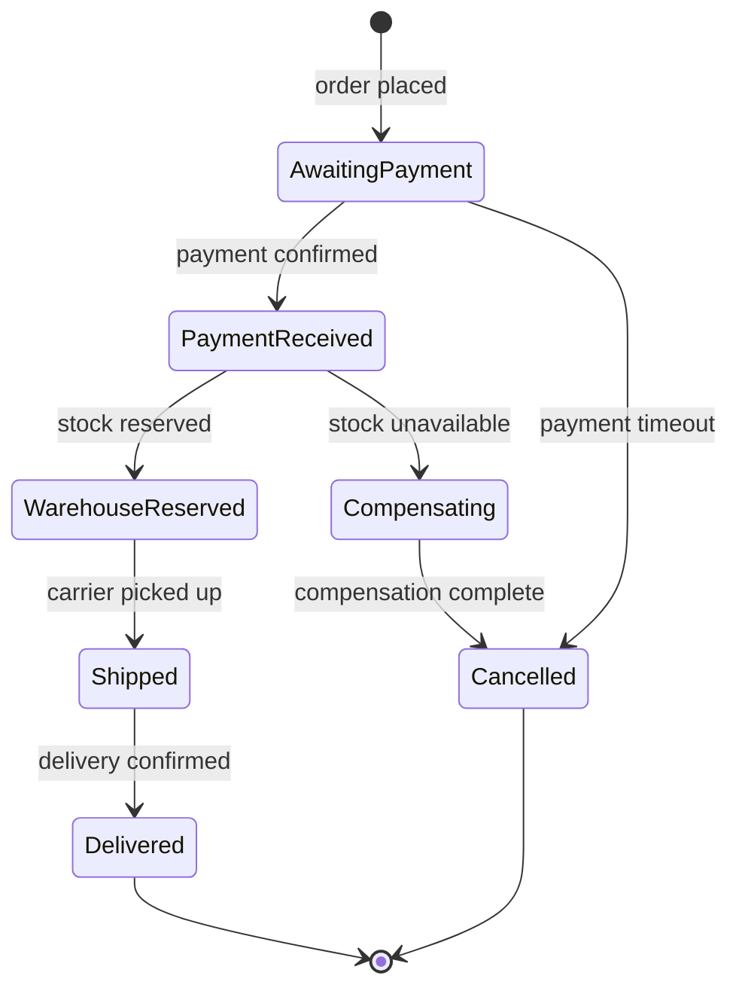
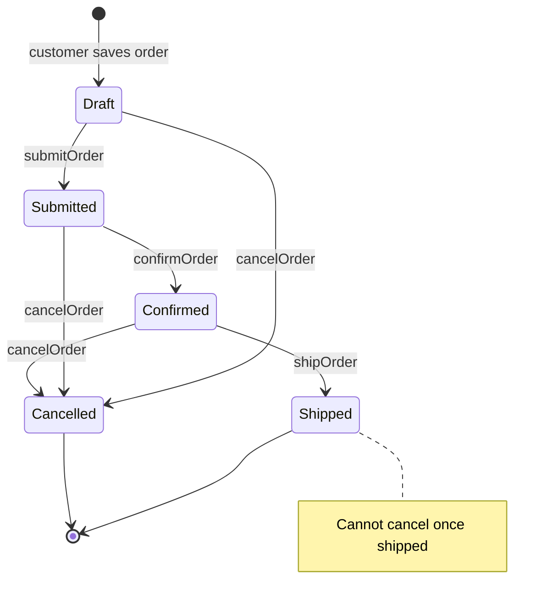
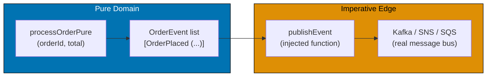
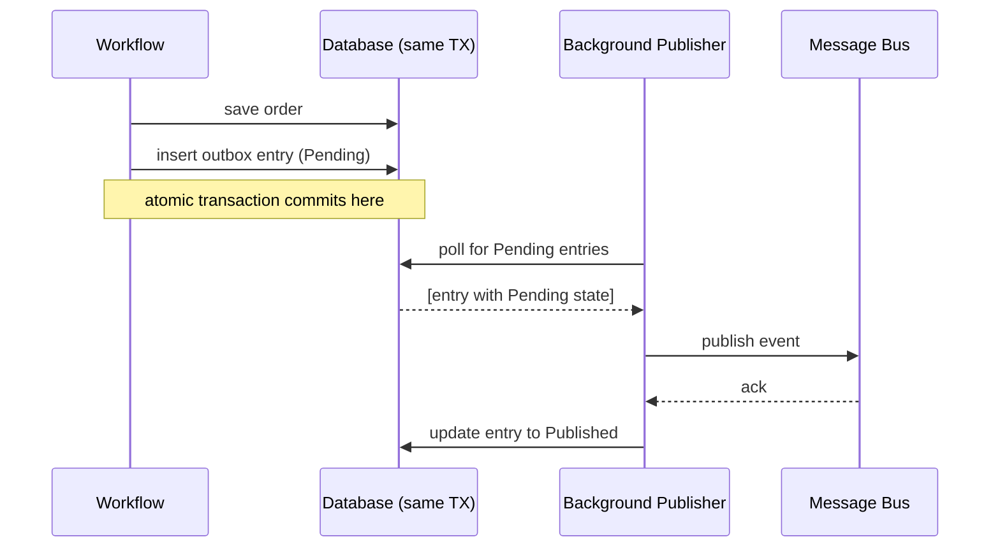
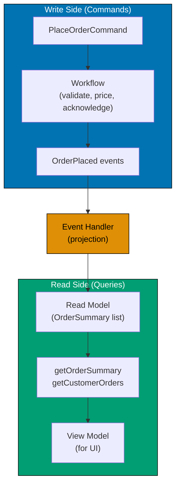
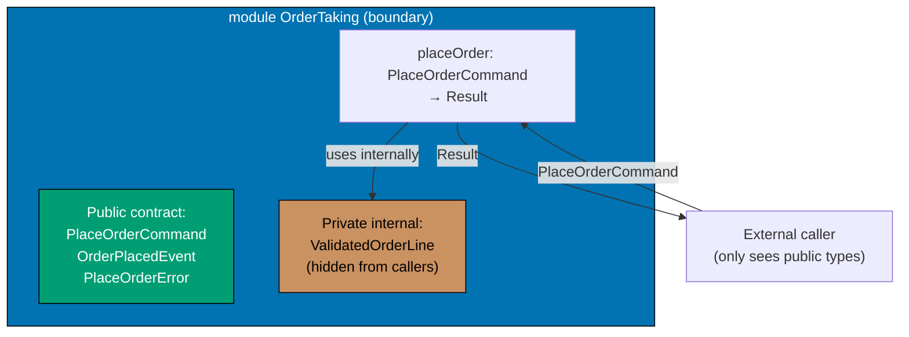
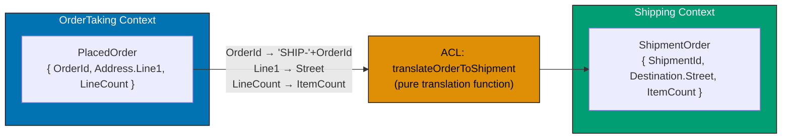
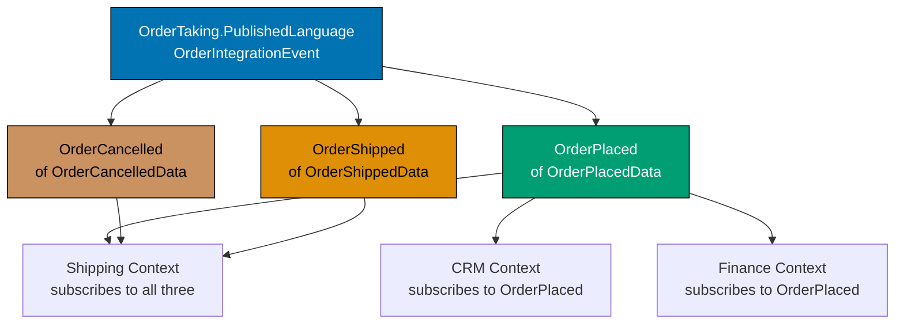
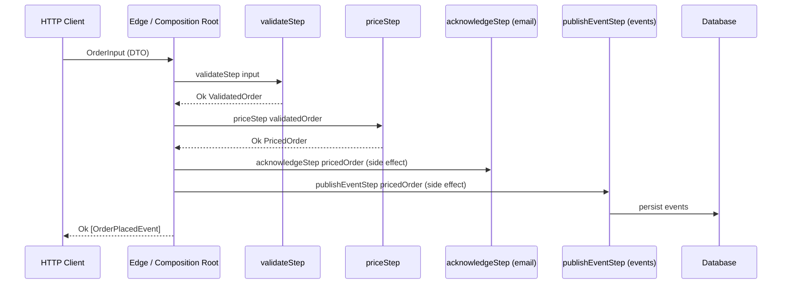

This advanced section completes the order-taking system with production-grade concerns: serialization, event publishing, CQRS, long-running workflows, bounded-context integration, domain evolution, and testing strategies. All examples continue using the same order-taking domain established in the beginner and intermediate sections.

## Serialization and Persistence (Examples 56–67)

### Example 56: Serialization — JSON via DTO Boundary

Domain types never directly touch serialization libraries. JSON serialization uses the DTO types from Example 54 as the sole wire format. The boundary has four steps: deserialize JSON to DTO, validate DTO to domain, compute, serialize domain back to DTO, then to JSON. Wlaschin details this in Ch 11.

```mermaid
graph LR
    JSON_In["JSON string\n(HTTP request body)"]
    DTO_In["OrderDto\n(deserialized DTO)"]
    Domain["DomainOrder\n(validated domain type)"]
    DTO_Out["OrderDto\n(serialized DTO)"]
    JSON_Out["JSON string\n(HTTP response body)"]

    JSON_In -- "JsonSerializer.Deserialize" --> DTO_In
    DTO_In -- "fromDto (validates)" --> Domain
    Domain -- "toDto (infallible)" --> DTO_Out
    DTO_Out -- "JsonSerializer.Serialize" --> JSON_Out

    style DTO_In fill:#DE8F05,stroke:#000,color:#000
    style Domain fill:#0173B2,stroke:#000,color:#fff
    style DTO_Out fill:#DE8F05,stroke:#000,color:#000
```



```fsharp
// JSON serialization through the DTO boundary.
// Domain types never appear in serialization code.

open System.Text.Json

// DTOs — the only types that touch the serializer
type OrderLineDto = { ProductCode: string; Quantity: int }
// => DTO line: flat structure matching the JSON array element shape
type OrderDto     = { OrderId: string; CustomerName: string; Lines: OrderLineDto list; Total: decimal }
// => DTO order: flat structure matching the JSON object shape

// Domain types — isolated from serialization
type DomainOrder = { OrderId: string; CustomerName: string; Lines: (string * int) list; Total: decimal }
// => Domain order: uses tuples for lines (simplified); no JSON attributes

// Translation
let fromDto (dto: OrderDto) : Result<DomainOrder, string> =
    // => Validates DTO fields and converts to domain type; returns Result
    if dto.OrderId = "" then Error "OrderId required"
    // => Guard: blank OrderId is invalid in the domain
    // => Returns Error on the first invalid field — use Validation applicative for all-errors
    else
        Ok { OrderId = dto.OrderId; CustomerName = dto.CustomerName
             Lines = dto.Lines |> List.map (fun l -> l.ProductCode, l.Quantity)
             // => Convert DTO lines to (string * int) tuples for the domain
             Total = dto.Total }
        // => Returns Ok domain order — all fields mapped from DTO to domain types
        // => domain order is now safe: OrderId is non-blank; Lines are mapped

let toDto (d: DomainOrder) : OrderDto =
    // => Infallible: domain order is valid by construction — no Result needed
    { OrderId = d.OrderId; CustomerName = d.CustomerName
      Lines = d.Lines |> List.map (fun (code, qty) -> { ProductCode = code; Quantity = qty })
      // => Convert domain (string * int) tuples back to DTO records for serialization
      Total = d.Total }
    // => Returns OrderDto ready for JSON serialization

// Serialization at the boundary
let json = """{"OrderId":"ORD-001","CustomerName":"Alice","Lines":[{"ProductCode":"W1234","Quantity":3}],"Total":29.97}"""
// => Input JSON from the HTTP request body or file

let dto = JsonSerializer.Deserialize<OrderDto>(json)
// => dto : OrderDto — all fields deserialized from JSON as raw primitives
// => DTO deserialized from JSON — all fields are raw strings/ints/decimals

let domainResult = fromDto dto
// => fromDto validates the DTO and produces a domain type or an error
// => domainResult : Result<DomainOrder, string>

match domainResult with
| Ok order ->
    printfn "Domain: %s for %s, total £%.2f" order.OrderId order.CustomerName order.Total
    // => order.OrderId = "ORD-001"; order.CustomerName = "Alice"; order.Total = 29.97
    // => Output: Domain: ORD-001 for Alice, total £29.97
    let outputDto  = toDto order
    // => outputDto : OrderDto — domain values converted back to DTO for response
    // => Convert back to DTO for the response
    let outputJson = JsonSerializer.Serialize(outputDto)
    // => outputJson : string — JSON representation of the DTO
    // => Serialize the DTO to JSON for the HTTP response
    printfn "Output JSON: %s" outputJson
    // => Output: Output JSON: {"OrderId":"ORD-001","CustomerName":"Alice","Lines":[...],"Total":29.97}
| Error e ->
    printfn "Validation error: %s" e
    // => fromDto returned Error — the DTO had invalid fields
```

**Key Takeaway**: Threading all JSON serialization through DTOs keeps the domain model clean and makes API format changes (adding fields, renaming, versioning) a DTO-only concern with no impact on domain logic.

**Why It Matters**: When domain types are directly annotated with JSON attributes, changing a field's JSON name requires modifying the domain type — coupling the wire format to the domain model. With the DTO boundary, you can rename `"order_id"` to `"orderId"` in the JSON by changing the DTO, while the domain type remains `OrderId`. Wlaschin demonstrates in Ch 11 that this indirection also enables API versioning: different DTO versions can map to the same domain type.

---

### Example 57: Date/Time as a Domain Concept

Date and time are domain concepts in the order-taking system: delivery deadlines, order placement timestamps, and business-hours constraints all have domain meaning. Rather than using raw `DateTime`, the domain models time with specific types that encode business rules. Wlaschin references this in Ch 13.

```fsharp
// Date and time are domain concepts — wrap them with business-rule constraints.

open System

// Delivery deadline: a future date (not in the past)
type DeliveryDate = private DeliveryDate of DateTimeOffset
// => Private constructor — only valid future dates allowed
// => Callers cannot wrap an arbitrary DateTimeOffset — must use DeliveryDate.create

module DeliveryDate =
    let create (date: DateTimeOffset) : Result<DeliveryDate, string> =
        // => Validates that date is in the future and wraps it if valid
        if date <= DateTimeOffset.UtcNow then
            Error "Delivery date must be in the future"
            // => Domain rule: cannot promise delivery in the past
            // => Returns Error — the date failed the future-date invariant
        else
            Ok (DeliveryDate date)
            // => Valid future date — wrap in the private constructor

    let value (DeliveryDate d) = d
    // => Unwrap accessor: extracts the raw DateTimeOffset for display or persistence

// Order timestamp: when the order was placed (always the current time, set at the edge)
type OrderTimestamp = private OrderTimestamp of DateTimeOffset
// => Private constructor — created only via OrderTimestamp.now at the composition edge

module OrderTimestamp =
    let now () = OrderTimestamp DateTimeOffset.UtcNow
    // => Factory: creates a timestamp for "right now" — called at the edge, not in domain logic
    // => The current time is captured once at the edge; domain logic receives it as data
    let value (OrderTimestamp t) = t
    // => Unwrap accessor: extracts the raw DateTimeOffset for comparisons or display

// Business hours: orders accepted Mon–Fri 08:00–17:00
let isWithinBusinessHours (t: DateTimeOffset) : bool =
    let day  = t.DayOfWeek
    // => day : DayOfWeek — enum value (Monday=1, Saturday=6, Sunday=0)
    let hour = t.Hour
    // => hour : int — 24-hour clock (0–23); 8 = 08:00, 17 = 17:00
    day <> DayOfWeek.Saturday && day <> DayOfWeek.Sunday
    // => Weekday check: Saturday and Sunday are outside business hours
    && hour >= 8 && hour < 17
    // => Hour check: before 08:00 or at/after 17:00 is outside business hours
    // => Returns true only during weekday business hours

let testDate = DateTimeOffset(2026, 6, 15, 10, 0, 0, TimeSpan.Zero)
// => 15 June 2026, 10:00 UTC — a Monday (DayOfWeek.Monday, hour=10)
// => testDate is a Monday with hour=10: passes both DayOfWeek and hour checks

printfn "Within business hours: %b" (isWithinBusinessHours testDate)
// => DayOfWeek.Monday is not Saturday or Sunday; hour 10 is between 8 and 17
// => isWithinBusinessHours testDate = true
// => Output: Within business hours: true

let pastDate = DateTimeOffset(2025, 1, 1, 12, 0, 0, TimeSpan.Zero)
// => 1 January 2025 — in the past relative to 2026 "now"
// => pastDate <= DateTimeOffset.UtcNow → the guard in DeliveryDate.create will fire
match DeliveryDate.create pastDate with
| Ok _  -> printfn "Should not reach here"
// => This branch is unreachable — pastDate is before UtcNow
| Error e -> printfn "Error: %s" e
// => DeliveryDate.create returned Error because pastDate is not in the future
// => Output: Error: Delivery date must be in the future
```

**Key Takeaway**: Wrapping `DateTimeOffset` in domain-specific types encodes temporal business rules (future-only, business-hours-only) in the type system, preventing invalid dates from entering domain logic.

**Why It Matters**: Raw `DateTime` and `DateTimeOffset` in domain code force every consumer to perform the same "is this in the future?" or "is this a business day?" checks. Constrained date types perform these checks once at construction. They also communicate domain intent: `DeliveryDate` is not just any `DateTimeOffset` — it is specifically a future date on which delivery is promised. This semantic richness is part of the ubiquitous language that domain experts and developers share.

---

### Example 58: Long-Running Workflow — Saga as a DU of States

Some workflows span multiple commands and time periods. A saga is a long-running process that coordinates a sequence of steps, each of which may fail and require compensation. In F# a saga state is modelled as a discriminated union of all possible intermediate states. Wlaschin touches on sagas as a natural extension of the state machine pattern in Ch 7.



```fsharp
// A saga as a discriminated union of states: each case represents where
// the saga currently is in its long-running workflow.

// Each saga state carries only the data available at that point
type OrderSagaState =
    | AwaitingPayment  of orderId: string * amount: decimal
    // => Payment has been requested; waiting for confirmation
    | PaymentReceived  of orderId: string * paymentRef: string
    // => Payment confirmed; waiting for warehouse to confirm stock
    | WarehouseReserved of orderId: string * reservationId: string
    // => Stock reserved; waiting for shipping to pick up
    | Shipped          of orderId: string * trackingNumber: string
    // => Order is in transit
    | Delivered        of orderId: string
    // => Delivery confirmed — terminal state
    | Compensating     of orderId: string * failedAt: string * reason: string
    // => Something went wrong; rolling back previous steps
    | Cancelled        of orderId: string * reason: string
    // => Saga ended without completion — terminal state

// State transitions as pure functions
let onPaymentConfirmed (paymentRef: string) (state: OrderSagaState) : OrderSagaState =
    // => Pure transition: returns the new state without I/O
    match state with
    | AwaitingPayment (id, _) -> PaymentReceived (id, paymentRef)
    // => Advance to PaymentReceived with the payment reference
    // => id captured from the AwaitingPayment case; amount not needed for this transition
    | _ -> state
    // => Ignore if saga is not in AwaitingPayment state — idempotent

let onStockUnavailable (reason: string) (state: OrderSagaState) : OrderSagaState =
    // => Pure transition to Compensating state when warehouse reports stock unavailable
    match state with
    | PaymentReceived (id, _) -> Compensating (id, "WarehouseReservation", reason)
    // => Stock not available — begin compensation to refund payment
    // => failedAt = "WarehouseReservation" identifies which step failed
    | _ -> state
    // => Ignore if not in PaymentReceived state — out-of-order event handling

// Tracing a saga through multiple state transitions
let saga0 = AwaitingPayment  ("ORD-001", 29.97m)
// => saga0 : OrderSagaState, case AwaitingPayment — initial state after order placed
let saga1 = onPaymentConfirmed "PAY-XYZ" saga0
// => saga0 is AwaitingPayment → onPaymentConfirmed transitions to PaymentReceived
// => saga1 = PaymentReceived ("ORD-001", "PAY-XYZ")
let saga2 = onStockUnavailable "W1234 out of stock" saga1
// => saga1 is PaymentReceived → onStockUnavailable transitions to Compensating
// => saga2 = Compensating ("ORD-001", "WarehouseReservation", "W1234 out of stock")

printfn "State 0: %A" saga0
// => Output: State 0: AwaitingPayment ("ORD-001", 29.97M)
printfn "State 1: %A" saga1
// => Output: State 1: PaymentReceived ("ORD-001", "PAY-XYZ")
printfn "State 2: %A" saga2
// => Output: State 2: Compensating ("ORD-001", "WarehouseReservation", "W1234 out of stock")
```

**Key Takeaway**: A saga state discriminated union makes every intermediate state of a long-running workflow explicit and exhaustively handled, with state transitions modelled as pure functions.

**Why It Matters**: Long-running workflows that span multiple services and time periods are notoriously hard to reason about in OOP systems, where state is often tracked in a database row with a status string. Using a discriminated union, every possible saga state is named and typed. State transition functions are pure — easy to test. Compensation paths are explicit cases, not silent rollback logic buried in exception handlers. This clarity is especially valuable for financial workflows where a missed compensation step causes real money loss.

---

### Example 59: Order Lifecycle Full State Machine

Combining the type-state pattern (Example 17), the lifecycle DU (Example 16), and saga states (Example 58), this example builds the complete order lifecycle as a state machine with typed transitions. Each transition function enforces that the correct source state is provided.



```fsharp
// The complete order lifecycle state machine using discriminated unions.

// ── State types ────────────────────────────────────────────────────────────
type DraftOrder       = { OrderId: string; Lines: string list }
// => Draft state: saved by customer, not yet submitted — lines may still change
// => No timestamp: drafts don't have a submission time yet

type SubmittedOrder   = { OrderId: string; Lines: string list; SubmittedAt: System.DateTimeOffset }
// => Submitted state: sent for processing — lines are now locked
// => SubmittedAt: when the customer clicked "Place Order"

type ConfirmedOrder   = { OrderId: string; Lines: string list; ConfirmedAt: System.DateTimeOffset }
// => Confirmed state: warehouse confirmed stock availability
// => ConfirmedAt: when the warehouse accepted the order

type ShippedOrder     = { OrderId: string; TrackingNumber: string; ShippedAt: System.DateTimeOffset }
// => Shipped state: order handed to carrier — Lines no longer needed (not carried forward)
// => TrackingNumber: assigned by the carrier at pickup

type CancelledOrder   = { OrderId: string; Reason: string; CancelledAt: System.DateTimeOffset }
// => Terminal cancelled state: cannot be un-cancelled
// => Reason: why it was cancelled — important for refund and audit purposes

// The lifecycle union: one case per valid state
type OrderLifecycle =
    | Draft      of DraftOrder
    // => Initial state — customer is building the order
    | Submitted  of SubmittedOrder
    // => Customer submitted — awaiting warehouse confirmation
    | Confirmed  of ConfirmedOrder
    // => Warehouse confirmed — awaiting shipment
    | Shipped    of ShippedOrder
    // => In transit — terminal happy-path state (Delivered would follow in a full model)
    | Cancelled  of CancelledOrder
    // => Terminal cancelled state — no further transitions possible

// ── State transitions ──────────────────────────────────────────────────────
let submitOrder (draft: DraftOrder) : SubmittedOrder =
    // => Takes DraftOrder, returns SubmittedOrder — compiler enforces source state
    // => Cannot accidentally submit a ConfirmedOrder or a ShippedOrder
    { OrderId = draft.OrderId; Lines = draft.Lines; SubmittedAt = System.DateTimeOffset.UtcNow }
    // => SubmittedAt is captured at the transition point — the current time

let confirmOrder (submitted: SubmittedOrder) : ConfirmedOrder =
    // => Takes SubmittedOrder only — cannot accidentally confirm a Draft
    { OrderId = submitted.OrderId; Lines = submitted.Lines; ConfirmedAt = System.DateTimeOffset.UtcNow }
    // => ConfirmedAt records when warehouse accepted the order

let cancelOrder (reason: string) (lifecycle: OrderLifecycle) : OrderLifecycle =
    // => Cancellation is valid from Draft, Submitted, or Confirmed
    let cancelledState oid = Cancelled { OrderId = oid; Reason = reason; CancelledAt = System.DateTimeOffset.UtcNow }
    // => Helper: builds the CancelledOrder record with the given reason and current time
    match lifecycle with
    | Draft      d -> cancelledState d.OrderId
    // => Cancel a draft — customer decided not to proceed
    | Submitted  s -> cancelledState s.OrderId
    // => Cancel after submission — before warehouse confirmation
    | Confirmed  c -> cancelledState c.OrderId
    // => Cancel after confirmation — warehouse must be notified to release stock
    | Shipped    _ -> lifecycle
    // => Cannot cancel a shipped order — return unchanged state
    // => Once shipped, a "return" process would be needed instead
    | Cancelled  _ -> lifecycle
    // => Already cancelled — idempotent: cancelling twice is not an error

// Tracing the happy path
let order0 = Draft      { OrderId = "ORD-001"; Lines = ["W1234"] }
// => order0 : OrderLifecycle, case Draft — initial state
let order1 = Submitted  (submitOrder  { OrderId = "ORD-001"; Lines = ["W1234"] })
// => order1 : OrderLifecycle, case Submitted — SubmittedAt = UtcNow
let order2 = Confirmed  (confirmOrder { OrderId = "ORD-001"; Lines = ["W1234"]; SubmittedAt = System.DateTimeOffset.UtcNow })
// => order2 : OrderLifecycle, case Confirmed — ConfirmedAt = UtcNow
let order3 = cancelOrder "Customer changed mind" order2
// => order3 = Cancelled { OrderId = "ORD-001"; Reason = "Customer changed mind"; ... }
// => Confirmed → Cancelled transition is valid

printfn "State after cancel: %A" order3
// => Output: State after cancel: Cancelled { OrderId = "ORD-001"; Reason = "Customer changed mind"; ... }
```

**Key Takeaway**: Encoding the full order lifecycle as typed state transitions ensures that impossible transitions (confirming a shipped order, shipping a cancelled order) are compile-time errors.

**Why It Matters**: State machine bugs — transitioning from the wrong state, missing a transition, handling the wrong state in an event handler — are among the most subtle and costly bugs in business systems. Using typed state transitions, the compiler verifies that every transition receives the correct source state. Wlaschin's state machine pattern scales from simple two-state machines (unvalidated/validated) to complex lifecycle machines with parallel tracks, compensation paths, and terminal states.

---

### Example 60: Event Publishing via a Function Injected at the Edge

Domain events produced by the workflow are published by a function injected at the composition root. The domain workflow returns a list of events; the edge calls the publish function. The domain never knows how events are delivered. Wlaschin describes this pattern in Ch 11.



```fsharp
// Event publishing: the domain returns events; the edge publishes them.
// Publishing is a side effect at the edge, not in the domain.

// Domain event type
type OrderEvent =
    | OrderPlaced   of orderId: string * total: decimal
    // => Raised when an order is successfully placed
    | OrderCancelled of orderId: string * reason: string
    // => Raised when an order is cancelled

// The publish function type — the dependency injected at the edge
type PublishEvent = OrderEvent -> Async<unit>
// => "Given a domain event, publish it asynchronously"
// => The 'how' (Kafka, Azure Service Bus, SNS, in-memory) is hidden behind the function type

// Pure domain function — returns events, does not publish them
let processOrderPure (orderId: string) (total: decimal) : OrderEvent list =
    // => Pure: takes data, returns events — no I/O
    // => Returns a list because one workflow may raise multiple events
    [ OrderPlaced (orderId, total) ]
    // => Produce one OrderPlaced event — carries the orderId and total

// Edge function: calls domain, then publishes events
let runWorkflow (publishEvent: PublishEvent) (orderId: string) (total: decimal) =
    async {
        let events = processOrderPure orderId total
        // => Step 1: call the pure domain function — fast, testable
        // => events : OrderEvent list = [OrderPlaced ("ORD-001", 29.97M)]
        for event in events do
            // => Iterate over all events (one in this case)
            // => Step 2: publish each event using the injected function
            do! publishEvent event
            // => Side effect happens here, not inside processOrderPure
        printfn "Published %d event(s) for order %s" (List.length events) orderId
        // => Logs the count of published events for observability
    }

// Stub publish function for testing
let stubPublish : PublishEvent = fun event ->
    async { printfn "[Publish] %A" event }
    // => Prints the event — used in tests and local runs
    // => In production: replace with real message bus publish call

runWorkflow stubPublish "ORD-001" 29.97m |> Async.RunSynchronously
// => Output: [Publish] OrderPlaced ("ORD-001", 29.97M)
// => Output: Published 1 event(s) for order ORD-001
```

**Key Takeaway**: Separating event production (domain, pure) from event publishing (edge, effectful) keeps the domain testable without a message bus and makes the publishing mechanism substitutable.

**Why It Matters**: If domain functions directly call a message bus client, tests require a running message bus or a complex mock. When the domain only returns a list of events and publishing is an injected function, tests can use a simple list accumulator as the publish stub. Production uses the real message bus. This separation also enables transactional outbox patterns (Example 61) where events are first saved to the database, then published asynchronously.

---

### Example 61: Outbox Pattern — Pending Events DU

The outbox pattern ensures that domain events are reliably published even if the message bus is temporarily unavailable. Events are first saved to the database as `PendingOutbox` entries; a background process publishes them and marks them `Published`. The state is a discriminated union.



```fsharp
// Outbox pattern: save events to the database first; publish asynchronously.
// The outbox state machine: Pending → Published (or → Failed for retry).

// Outbox state
type OutboxState =
    | Pending   of event: string * createdAt: System.DateTimeOffset
    // => Event saved to DB, not yet published — the default state
    // => Background publisher will pick up Pending entries and attempt delivery
    | Published of event: string * publishedAt: System.DateTimeOffset
    // => Successfully published to the message bus
    // => publishedAt records when delivery was confirmed — for audit
    | Failed    of event: string * reason: string * attempts: int
    // => Publishing failed; will be retried based on attempts count
    // => attempts count limits retries to prevent infinite loops

// Outbox entry in the database
type OutboxEntry = {
    Id:        System.Guid
    // => Unique identifier for the outbox entry — primary key in the DB
    StreamId:  string
    // => The order or aggregate ID this event belongs to — e.g. "ORD-001"
    State:     OutboxState
    // => Current processing state — Pending, Published, or Failed
}

// Creating a pending outbox entry when the order is placed
let createOutboxEntry (streamId: string) (eventJson: string) : OutboxEntry =
    // => Creates an entry in Pending state — not yet published
    { Id       = System.Guid.NewGuid ()
      // => Fresh Guid — ensures uniqueness in the outbox table
      StreamId = streamId
      // => Links the outbox entry to its aggregate (e.g. the order)
      State    = Pending (eventJson, System.DateTimeOffset.UtcNow) }
      // => Entry starts in Pending state — will be picked up by the background publisher
    // => Entry starts in Pending state — not yet published

// Background publisher: transitions Pending → Published or → Failed
let publishOutboxEntry (publish: string -> Async<bool>) (entry: OutboxEntry) : Async<OutboxEntry> =
    async {
        match entry.State with
        | Pending (event, _) ->
            // => Only process entries in Pending state — Published/Failed are skipped
            let! success = publish event
            // => Attempt to publish — success : bool from the message bus
            // => Attempt to publish
            if success then
                return { entry with State = Published (event, System.DateTimeOffset.UtcNow) }
                // => Transition to Published on success — update the DB entry
            else
                let attempts = 1 // Simplified — track attempts in a real system
                return { entry with State = Failed (event, "Publish failed", attempts) }
                // => Transition to Failed on failure — retry logic uses attempts count
        | _ -> return entry
        // => Already Published or Failed — do not re-process (idempotent)
    }

let entry = createOutboxEntry "ORD-001" """{"type":"OrderPlaced","orderId":"ORD-001"}"""
// => entry.State = Pending ("""...""", UtcNow)
// => entry.StreamId = "ORD-001"

let stubPublisher : string -> Async<bool> = fun _ -> async { return true }
// => Stub publisher always succeeds — simulates successful message bus delivery
let published = publishOutboxEntry stubPublisher entry |> Async.RunSynchronously
// => stubPublisher returns true → State transitions to Published
// => published.State = Published (eventJson, UtcNow)

printfn "Outbox state after publish: %A" published.State
// => stubPublisher returned true → State = Published (eventJson, UtcNow)
// => Output: Outbox state after publish: Published ("...", ...)
// => State transition: Pending → Published (happy path)
// => Output: Outbox state after publish: Published ("...", ...)
```

**Key Takeaway**: The outbox pattern with a typed state DU ensures exactly-once event delivery semantics even when the message bus is temporarily unavailable, by treating the database as the reliable source of truth for pending events.

**Why It Matters**: In distributed systems, "save the order and publish the event" is not atomic unless you use a distributed transaction. The outbox pattern solves this by saving the event to the same database as the order (in the same transaction), then publishing asynchronously. The typed state machine (`Pending → Published | Failed`) provides a clear audit trail and a natural hook for retry logic. Wlaschin does not cover the outbox explicitly, but it is the natural production extension of his event-publishing boundary pattern from Ch 11.

---

### Example 62: Idempotency Key in the Command Type

Commands that could be retried (e.g., on network timeout) must be idempotent — processing the same command twice should produce the same result as processing it once. Adding an idempotency key to the command type enables duplicate detection at the boundary.

```fsharp
// Idempotency key: a client-generated unique ID that allows the server
// to detect and deduplicate retried commands.

open System

// Command type with idempotency key
type PlaceOrderCommand = {
    IdempotencyKey: Guid
    // => Client generates this Guid before sending; stable across retries
    // => The same Guid is sent on every retry — the key that enables deduplication
    OrderId:        string
    // => The order identifier from the client
    CustomerName:   string
    // => Customer making the request
    ProductCode:    string
    // => The product being ordered
    Quantity:       int
    // => How many units the customer wants
}

// Idempotency store: tracks which commands have already been processed
type HasBeenProcessed = Guid -> Async<bool>
// => "Has this idempotency key been processed?" — queries the deduplication store
// => Returns true if the key was seen before; false if this is the first occurrence

type MarkAsProcessed = Guid -> string -> Async<unit>
// => "Record this idempotency key and the result for future deduplication"
// => Guid = the key to record; string = the result to cache for future duplicate calls

// Command handler with idempotency check
let handlePlaceOrder
    (hasBeenProcessed: HasBeenProcessed)
    // => Dependency 1: check if this command was already processed
    (markAsProcessed: MarkAsProcessed)
    // => Dependency 2: record the key and result after first successful processing
    (command: PlaceOrderCommand)
    // => The incoming command — may be a first attempt or a retry
    : Async<Result<string, string>> =
    // => Async: database lookups are async; Result: validation can fail
    async {
        let! alreadyDone = hasBeenProcessed command.IdempotencyKey
        // => Check if this command was already processed — await the async lookup
        if alreadyDone then
            return Ok (sprintf "Order %s already placed (idempotent)" command.OrderId)
            // => Return the cached result without re-processing
            // => The client gets an Ok response identical to the first successful call
        else
            // Process the command (simplified)
            let result = sprintf "Order %s placed for %s" command.OrderId command.CustomerName
            // => result : string = "Order ORD-001 placed for Alice"
            do! markAsProcessed command.IdempotencyKey result
            // => Record the idempotency key and result for future deduplication
            // => do! awaits the async mark operation before continuing
            // => After this: any retry with the same key returns the cached result above
            return Ok result
            // => Return the success result for this first processing
            // => Subsequent calls with the same key will hit the alreadyDone = true branch
    }

// Stub implementations
let processedKeys = System.Collections.Generic.HashSet<Guid>()
// => In-memory set of processed keys — replaces a real database in this demo
// => In production: stored in a Redis set or a database table with a unique constraint
let stubHasBeenProcessed : HasBeenProcessed = fun key -> async { return processedKeys.Contains key }
// => Contains key: true if already processed; false if first occurrence
let stubMarkAsProcessed   : MarkAsProcessed  = fun key _ -> async { processedKeys.Add key |> ignore }
// => Add the key to the set — subsequent calls with the same key return true from Has

let key     = Guid.NewGuid ()
// => key : Guid — fresh idempotency key; same key sent on every retry
let command = { IdempotencyKey = key; OrderId = "ORD-001"; CustomerName = "Alice"; ProductCode = "W1234"; Quantity = 3 }
// => command : PlaceOrderCommand — a valid command with all required fields

let result1 = handlePlaceOrder stubHasBeenProcessed stubMarkAsProcessed command |> Async.RunSynchronously
// => First call: alreadyDone = false → processes the command → marks key as processed
printfn "First:  %A" result1
// => Output: First:  Ok "Order ORD-001 placed for Alice"

let result2 = handlePlaceOrder stubHasBeenProcessed stubMarkAsProcessed command |> Async.RunSynchronously
// => Second call (same key): alreadyDone = true → returns cached result without re-processing
printfn "Second: %A" result2
// => Output: Second: Ok "Order ORD-001 already placed (idempotent)"
```

**Key Takeaway**: Including an idempotency key in the command type makes duplicate detection explicit and the command handler safe to retry — critical for reliable message processing in distributed systems.

**Why It Matters**: In distributed systems, message delivery is "at least once" — commands may be delivered multiple times due to network retries. An idempotency key in the command type provides the unique fingerprint needed to detect duplicates. The key is client-generated so it survives multiple attempts. Wlaschin does not cover idempotency explicitly, but it is the natural complement to the command-type pattern he introduces in Example 64 — every command that enters the system should carry a deduplication key.

---

### Example 63: CQRS — Query as Pure Function over Read Model

Command Query Responsibility Segregation separates write operations (commands, which change state and raise events) from read operations (queries, which return view models). Queries are pure functions over a read model — no `Result`, no `Async`, just data. Wlaschin discusses CQRS in Ch 12.



```fsharp
// CQRS: queries are pure functions over a read model — simple and fast.
// Commands change state (and raise events); queries read state (and return view models).

// ── Read model (optimised for reading, not for business rules) ──────────
type OrderSummary = {
    // => Flat, denormalised view — pre-computed for fast reads
    // => Fields are selected for query efficiency, not domain correctness
    OrderId:      string
    // => Primary key for lookup queries
    CustomerName: string
    // => Denormalised from the domain event — avoids joins in read queries
    TotalAmount:  decimal
    // => Pre-computed total — no need to sum lines at query time
    Status:       string
    // => Current lifecycle status as a plain string — fast to filter and sort
    ItemCount:    int
    // => Pre-computed line count — avoids joining to lines table
}

// ── Query functions — pure, return view model, no Result needed ───────────
let getOrderSummary (orderId: string) (store: OrderSummary list) : OrderSummary option =
    // => Pure function: takes data, returns data — no async, no effects
    store |> List.tryFind (fun o -> o.OrderId = orderId)
    // => List.tryFind: returns Some if found, None if not found
    // => Return None if not found — no exception, no Result

let getRecentOrders (n: int) (store: OrderSummary list) : OrderSummary list =
    // => Returns the n most recent orders (by list order in this simplification)
    // => In production, orders would be sorted by PlacedAt before truncating
    store |> List.truncate n
    // => List.truncate: returns at most n elements; safe if list is shorter than n

let getCustomerOrders (customerId: string) (store: OrderSummary list) : OrderSummary list =
    // => Returns all orders for a specific customer
    store |> List.filter (fun o -> o.CustomerName.Contains customerId)
    // => Simplified: in production, CustomerName would be a separate ID field
    // => List.filter: returns only elements where the predicate is true

// ── Sample read store ─────────────────────────────────────────────────────
let readStore: OrderSummary list = [
    { OrderId = "ORD-001"; CustomerName = "Alice Johnson"; TotalAmount = 29.97m; Status = "Shipped";    ItemCount = 2 }
    // => ORD-001: Alice's order, shipped, 2 items
    { OrderId = "ORD-002"; CustomerName = "Bob Smith";     TotalAmount = 49.95m; Status = "Delivered";  ItemCount = 3 }
    // => ORD-002: Bob's order, delivered, 3 items
    { OrderId = "ORD-003"; CustomerName = "Alice Johnson"; TotalAmount = 15.00m; Status = "Processing"; ItemCount = 1 }
    // => ORD-003: Alice's second order, still processing, 1 item
]

// Query results — pure, no side effects
let summary  = getOrderSummary "ORD-001" readStore
// => List.tryFind checks o.OrderId = "ORD-001" for each element
// => summary : OrderSummary option = Some { OrderId = "ORD-001"; ... }

let aliceOrders = getCustomerOrders "Alice" readStore
// => List.filter retains ORD-001 and ORD-003 (both contain "Alice" in CustomerName)
// => aliceOrders : OrderSummary list = [ ORD-001; ORD-003 ]

printfn "Order ORD-001: %A" summary
// => Output: Order ORD-001: Some { OrderId = "ORD-001"; ... }
printfn "Alice has %d orders" (List.length aliceOrders)
// => Output: Alice has 2 orders
```

**Key Takeaway**: Queries in CQRS are pure functions that return view models from a read-optimised store — they have no error cases and no side effects, making them trivially testable and composable.

**Why It Matters**: CQRS separates the write model (complex, event-raising, validated through types) from the read model (denormalised, flat, fast). Read models can be tuned for specific queries without affecting domain logic. Queries as pure functions need no mocking — just pass a list of view models and assert on the output. In production, the read model is updated by event handlers that project domain events into query-friendly shapes, as shown in Example 65.

---

### Example 64: Command = Workflow Input Record

Commands are the input to write-side workflows. Each command is an immutable record type that carries everything the workflow needs. Naming them with an imperative verb (`PlaceOrder`, not `Order`) distinguishes them from domain entities. Wlaschin uses this naming convention throughout the book.

```fsharp
// Commands: immutable records naming the intent, carrying all necessary data.
// Imperative verb naming: PlaceOrderCommand, CancelOrderCommand, ShipOrderCommand.

open System

// Each command is an immutable record — no methods, no behaviour
// => Naming convention: PlaceOrderCommand, not PlaceOrder (avoids confusion with the workflow)
type PlaceOrderCommand = {
    IdempotencyKey:  Guid
    // => For deduplication (Example 62)
    OrderId:         string
    // => Client-provided or server-generated order identifier
    CustomerEmail:   string
    // => Email of the customer placing the order
    ShippingAddress: string
    // => Destination address
    ProductCode:     string
    // => Product the customer is ordering
    Quantity:        int
    // => How many they want
}

type CancelOrderCommand = {
    IdempotencyKey: Guid
    // => Deduplication key — same Guid on retry ensures cancel is idempotent
    OrderId:        string
    // => Which order to cancel — must match an existing order
    Reason:         string
    // => Required reason for cancellation — audit trail
    RequestedBy:    string
    // => Who is cancelling: customer, admin, system — for authorisation checks
}

type ShipOrderCommand = {
    IdempotencyKey:  Guid
    // => Deduplication key for the ship command
    OrderId:         string
    // => Which order to mark as shipped
    TrackingNumber:  string
    // => Tracking number assigned by the shipping carrier
    ShippedAt:       DateTimeOffset
    // => When the shipment was handed to the carrier — for delivery estimates
}

// Command factory functions — ensure all required fields are present
let makePlaceOrderCommand orderId email address code qty =
    // => Returns a new PlaceOrderCommand with a fresh idempotency key
    // => Guid.NewGuid() generates a unique key for each new command invocation
    // => Factory function ensures IdempotencyKey is always set — no accidental Guid.Empty
    { IdempotencyKey = Guid.NewGuid()
      // => Fresh Guid — caller saves this to use on retry
      OrderId = orderId; CustomerEmail = email
      // => OrderId and email from caller parameters
      ShippingAddress = address; ProductCode = code; Quantity = qty }
      // => All fields from the caller's parameters — no defaults applied

let cmd = makePlaceOrderCommand "ORD-001" "alice@example.com" "10 Main St" "W1234" 3
// => Calls the factory with all 5 parameters; Guid.NewGuid() generates the IdempotencyKey
// => cmd : PlaceOrderCommand = { IdempotencyKey = <Guid>; OrderId = "ORD-001"; ... }
// => cmd is an immutable record — no setters, no mutation

printfn "Command: PlaceOrder for %s, qty %d" cmd.OrderId cmd.Quantity
// => cmd.OrderId = "ORD-001"; cmd.Quantity = 3
// => Output: Command: PlaceOrder for ORD-001, qty 3
printfn "Idempotency key: %A" cmd.IdempotencyKey
// => cmd.IdempotencyKey : Guid — unique per command invocation
// => Output: Idempotency key: <some-guid>
```

**Key Takeaway**: Commands as named, immutable records make the intent explicit and carry all the data needed by the workflow, keeping the workflow function's concerns clear and its parameters minimal.

**Why It Matters**: Encoding each user intent as a distinct command type (rather than overloaded method parameters) enables a clean command bus, idempotency checking, audit logging, and command validation — all as pipeline steps before the domain function is called. Command types also serve as natural API schema documentation: the fields of `PlaceOrderCommand` map directly to the required fields of the HTTP request body, making the implicit API contract explicit.

---

### Example 65: Read-Model Projection Function

A projection function transforms a domain event into an update to the read model. It is called by an event handler every time a domain event is published. In functional style, a projection takes the current read model and an event and returns an updated read model — a pure function. Wlaschin discusses projections in Ch 12.

```mermaid
sequenceDiagram
    participant ES as Event Stream
    participant F as List.fold project
    participant RS as ReadStore (Map)

    ES->>F: OrderPlaced ("ORD-001", "Alice", 29.97)
    F->>RS: Map.add "ORD-001" {Status="Placed"; ...}

    ES->>F: OrderShipped ("ORD-001", "TRK-123")
    F->>RS: Map.add "ORD-001" {Status="Shipped"; TrackingNumber=Some "TRK-123"}

    Note over RS: Final state: ORD-001 is Shipped
```

```fsharp
// A read-model projection: pure function (ReadModel, Event) -> ReadModel.
// Called by the event handler infrastructure; the domain is not involved.

// Domain events (write-side)
type OrderEvent =
    | OrderPlaced    of orderId: string * customerName: string * total: decimal
    // => Write-side event: order successfully placed — carries the data needed for the read model
    | OrderShipped   of orderId: string * trackingNumber: string
    // => Write-side event: order dispatched — carries tracking number for status update
    | OrderDelivered of orderId: string
    // => Write-side event: delivery confirmed — terminal status update

// Read model (query-side)
type OrderReadModel = {
    OrderId:         string
    // => Denormalized key — duplicated from the event for direct lookup
    CustomerName:    string
    // => Customer name projected from the OrderPlaced event
    TotalAmount:     decimal
    // => Order total projected from OrderPlaced — not updated by later events
    Status:          string
    // => Current lifecycle status — updated by each subsequent event
    TrackingNumber:  string option
    // => None until OrderShipped event arrives; then Some trackingNumber
}

type ReadStore = Map<string, OrderReadModel>
// => Map from OrderId to OrderReadModel — in production this is a database table

// ── Projection function: pure (ReadStore, OrderEvent) -> ReadStore ────────
let project (store: ReadStore) (event: OrderEvent) : ReadStore =
    // => Pure: takes current state and an event, returns new state — no I/O
    // => Signature (ReadStore, OrderEvent) -> ReadStore is the fold accumulator pattern
    match event with
    | OrderPlaced (orderId, customerName, total) ->
        // => First event for this order — create the initial read model entry
        let entry = { OrderId = orderId; CustomerName = customerName
                      TotalAmount = total; Status = "Placed"; TrackingNumber = None }
        // => entry.Status = "Placed"; entry.TrackingNumber = None (not yet shipped)
        // => entry : OrderReadModel — all fields populated from the event payload
        Map.add orderId entry store
        // => Insert new read model entry; returns updated store (immutable map)

    | OrderShipped (orderId, trackingNumber) ->
        // => Update the existing entry's status and add the tracking number
        match Map.tryFind orderId store with
        | Some entry ->
            let updated = { entry with Status = "Shipped"; TrackingNumber = Some trackingNumber }
            // => updated.Status = "Shipped"; updated.TrackingNumber = Some "TRK-123"
            Map.add orderId updated store
            // => Update existing entry; returns updated store
        | None -> store
        // => Event for unknown order — ignore (out-of-order events)

    | OrderDelivered orderId ->
        // => Final event: mark status as Delivered
        match Map.tryFind orderId store with
        | Some entry -> Map.add orderId { entry with Status = "Delivered" } store
        // => entry.Status updated to "Delivered"; tracking number unchanged
        | None       -> store
        // => Unknown order — ignore (event arrived before OrderPlaced was projected)

// Apply a stream of events to build the read model
let events = [ OrderPlaced ("ORD-001", "Alice", 29.97m); OrderShipped ("ORD-001", "TRK-123") ]
// => Two events: OrderPlaced first, then OrderShipped — chronological order
// => Two events: place then ship for the same order
let finalStore = List.fold project Map.empty events
// => List.fold: start with empty store, apply project to each event in order
// => Event 1: OrderPlaced → inserts ORD-001 with Status = "Placed"
// => Event 2: OrderShipped → updates ORD-001 to Status = "Shipped", TrackingNumber = Some "TRK-123"
// => Fold: start with empty store, apply each event — pure, deterministic
// => After fold: store contains ORD-001 with Status = "Shipped", TrackingNumber = Some "TRK-123"

printfn "Read model: %A" (Map.tryFind "ORD-001" finalStore)
// => Map.tryFind looks up the key "ORD-001" — returns Some with the final read model
// => Output: Read model: Some { ...; Status = "Shipped"; TrackingNumber = Some "TRK-123" }
```

**Key Takeaway**: A projection is a pure fold over a stream of events — deterministic, replayable, and testable without any database infrastructure.

**Why It Matters**: Projections that are pure functions can be replayed from the beginning of the event log to rebuild any read model at any point in time. This is the foundation of event sourcing: the event log is the source of truth, and read models are derived views. Pure projection functions are also trivially unit-testable — just apply events and assert on the resulting map. No database setup, no infrastructure mocks, no container required.

---

### Example 66: Database Transaction at the Edge

All database writes for a single workflow — save the order, append events, mark idempotency key — happen inside a single transaction managed at the edge. The domain functions produce the data to be written; the transaction wrapper performs the actual writes atomically.

```fsharp
// Database transaction: all writes in a workflow happen atomically at the edge.
// The domain functions return data; the edge commits it in a transaction.

// ── Domain outputs — pure data, no I/O ────────────────────────────────────
type OrderToSave    = { OrderId: string; Data: string }
// => The serialised order record to save to the orders table
type EventToPublish = { StreamId: string; EventJson: string }
// => A domain event to append to the outbox table (same transaction)
type IdempotencyRecord = { Key: System.Guid; Result: string }
// => The idempotency key and its result — prevents duplicate processing

type WorkflowOutput = {
    OrderToSave:        OrderToSave
    // => The order to persist — one record
    EventsToPublish:    EventToPublish list
    // => Events to outbox — one or more domain events
    IdempotencyRecord:  IdempotencyRecord
    // => The key to mark as processed after the transaction commits
}
// => Everything the workflow wants to persist — returned as data, not executed as side effects

// ── Pure domain function ──────────────────────────────────────────────────
let runDomainLogic (orderId: string) (customerName: string) : WorkflowOutput =
    // => Pure: produces output data, no I/O
    // => Returns a WorkflowOutput record; the edge decides when and how to persist it
    { OrderToSave       = { OrderId = orderId; Data = sprintf "order:%s,customer:%s" orderId customerName }
      // => Serialised order: "order:ORD-001,customer:Alice Johnson"
      EventsToPublish   = [ { StreamId = orderId; EventJson = sprintf """{"type":"OrderPlaced","orderId":"%s"}""" orderId } ]
      // => One OrderPlaced event to append to the ORD-001 stream
      IdempotencyRecord = { Key = System.Guid.NewGuid(); Result = sprintf "Order %s placed" orderId } }
      // => Fresh Guid; result = "Order ORD-001 placed" — cached for deduplication

// ── Edge: execute all writes in a transaction ─────────────────────────────
let executeInTransaction (output: WorkflowOutput) : Async<Result<unit, string>> =
    async {
        // In production this would use a real database transaction
        // All three writes below would be wrapped in the same DB transaction
        printfn "[TX] Saving order: %s" output.OrderToSave.OrderId
        // => Write 1: save the order record to the orders table

        for event in output.EventsToPublish do
            // => Iterate over all events — typically one, sometimes more
            printfn "[TX] Appending event to stream: %s" event.StreamId
            // => Write 2: append domain events to outbox table

        printfn "[TX] Recording idempotency key: %A" output.IdempotencyRecord.Key
        // => Write 3: record the idempotency key in the processed-commands table

        printfn "[TX] Transaction committed"
        // => In production: all three writes committed atomically here
        return Ok ()
        // => Returns Ok unit — no meaningful value on success
    }

let output = runDomainLogic "ORD-001" "Alice Johnson"
// => output : WorkflowOutput — the pure data for all three writes
let result = executeInTransaction output |> Async.RunSynchronously
// => Executes all three writes atomically; returns Ok unit on success
printfn "Transaction result: %A" result
// => Output: [TX] Saving order: ORD-001
// => Output: [TX] Appending event to stream: ORD-001
// => Output: [TX] Recording idempotency key: <Guid>
// => Output: [TX] Transaction committed
// => Output: Transaction result: Ok null
```

**Key Takeaway**: Collecting all writes as data from the pure domain function and executing them atomically in a single transaction at the edge is the cleanest way to ensure consistency without embedding transaction logic in the domain.

**Why It Matters**: Transaction management is an infrastructure concern. If domain functions manage their own transactions (e.g., by calling a UnitOfWork object), they become coupled to the database technology and harder to test. When domain functions return data to be persisted, the transaction boundary can be managed entirely at the edge. Changing from SQL to a document database affects only the transaction wrapper, not the domain logic.

---

### Example 67: EventStore vs Document DB vs SQL — Trade-offs

Choosing a persistence technology for a domain model involves trade-offs between query flexibility, event sourcing, schema flexibility, and transactional guarantees. This example provides a comparative code sketch for all three approaches using the order-taking domain. Wlaschin discusses persistence choices in Ch 12.

```fsharp
// Three persistence patterns for the order domain — showing the trade-off.
// Each has a distinct interface; the domain workflow is independent of all three.

// ── Option A: SQL (relational) ────────────────────────────────────────────
// Good for: complex queries, reporting, existing SQL infrastructure
// Tradeoff: schema migrations required when domain model evolves

type SqlOrderRow = { OrderId: string; CustomerName: string; Total: decimal; Status: string }
// => Flat SQL row — requires mapping from domain type
// => Denormalised structure: all order data in one table row

type SqlOrderRepository = {
    Insert:     SqlOrderRow -> Async<Result<unit, string>>
    // => INSERT INTO orders ...
    // => Fails if OrderId already exists (unique constraint violation)
    FindById:   string -> Async<SqlOrderRow option>
    // => SELECT * FROM orders WHERE order_id = ?
    UpdateStatus: string -> string -> Async<Result<unit, string>>
    // => UPDATE orders SET status = ? WHERE order_id = ?
    // => Returns Error if orderId not found
}

// ── Option B: Document DB (e.g. Cosmos DB, MongoDB) ──────────────────────
// Good for: schema flexibility, nested structures, horizontal scaling
// Tradeoff: limited joins, eventual consistency in some modes

type DocumentOrderRepository = {
    Upsert:   string -> string -> Async<Result<unit, string>>
    // => upsert document: ID -> JSON string
    // => Insert if not found; replace if found — idempotent
    GetById:  string -> Async<string option>
    // => Get document by ID; returns raw JSON string
    // => Returns None if document not found — caller parses the JSON
}

// ── Option C: Event Store ─────────────────────────────────────────────────
// Good for: full audit trail, event sourcing, temporal queries
// Tradeoff: requires projection infrastructure for query support

type EventStoreRepository = {
    AppendEvents: string -> string list -> Async<Result<unit, string>>
    // => Append JSON-serialized events to a stream
    // => stream ID (OrderId) -> list of JSON event strings
    LoadStream:   string -> Async<string list>
    // => Load all events for a stream — replay to rebuild state
    // => Returns the full history; callers fold events to get current state
}

// ── The domain workflow accepts whichever "save" abstraction you provide ──
let runWorkflowGeneric (saveOrder: string -> string -> Async<Result<unit, string>>) orderId customerName =
    // => The workflow only depends on the "save" function signature
    // => All three repository types satisfy this signature: string -> string -> Async<Result>
    async {
        let data = sprintf "order:%s,customer:%s" orderId customerName
        // => data : string = "order:ORD-001,customer:Alice" — the serialised order
        return! saveOrder orderId data
        // => Calls whichever implementation was injected — SQL, document, or event store
    }

// ── Quick test: inject each implementation stub ───────────────────────────
let sqlSave      : string -> string -> Async<Result<unit, string>> = fun _ _ -> async { return Ok () }
// => SQL stub: always succeeds — simulates successful INSERT
let documentSave : string -> string -> Async<Result<unit, string>> = fun _ _ -> async { return Ok () }
// => Document DB stub: always succeeds — simulates successful upsert
let eventSave    : string -> string -> Async<Result<unit, string>> = fun _ _ -> async { return Ok () }
// => Event store stub: always succeeds — simulates successful append

let r1 = runWorkflowGeneric sqlSave      "ORD-001" "Alice" |> Async.RunSynchronously
// => r1 : Result<unit, string> = Ok () — SQL stub returned Ok
let r2 = runWorkflowGeneric documentSave "ORD-001" "Alice" |> Async.RunSynchronously
// => r2 : Result<unit, string> = Ok () — document DB stub returned Ok
let r3 = runWorkflowGeneric eventSave    "ORD-001" "Alice" |> Async.RunSynchronously
// => r3 : Result<unit, string> = Ok () — event store stub returned Ok

printfn "SQL:      %A | Document: %A | EventStore: %A" r1 r2 r3
// => Output: SQL:      Ok null | Document: Ok null | EventStore: Ok null
// => All three work with the same workflow — persistence is a replaceable detail
```

**Key Takeaway**: The persistence technology is a replaceable implementation detail when the domain workflow depends only on function-type abstractions — switching from SQL to Cosmos DB to EventStore requires changing only the composition root.

**Why It Matters**: Technology lock-in is the most costly architectural mistake in long-lived systems. When domain workflows accept function-type dependencies rather than class-based repositories tied to specific libraries, switching persistence technology requires only a new implementation of the function type at the composition root. The domain model, tests, and all business logic remain unchanged. Wlaschin's discussion in Ch 12 emphasises that F# function types are the thinnest possible abstraction layer for persistence.

---

## Bounded Context Integration (Examples 68–74)

### Example 68: Bounded Context Boundary as Module + Signature

A bounded context boundary is enforced in F# by placing the context in its own module and exposing only a public signature. Internal implementation types are not visible outside the module. External callers can only use the published types. Wlaschin discusses bounded context enforcement in Ch 2 and Ch 12.



```fsharp
// A bounded context is a module with explicit public types.
// Internal types are implementation details — not visible outside.

// ── OrderTaking bounded context ───────────────────────────────────────────
module OrderTaking =
    // Internal types — not part of the public API
    type private ValidatedOrderLine = { Code: string; Qty: int }
    // => 'private' hides this from outside callers
    // => Outside modules cannot reference ValidatedOrderLine at all

    // Public types — the contract between contexts
    type PlaceOrderCommand = { OrderId: string; ProductCode: string; Quantity: int }
    // => Input to the context from the outside world
    // => External callers construct this to invoke the workflow

    type OrderPlacedEvent = { OrderId: string; TotalAmount: decimal }
    // => Output from the context to downstream contexts
    // => Downstream contexts subscribe to this event type

    type PlaceOrderError = | InvalidCommand of string | ProductUnavailable of string
    // => Public error type — callers must handle these cases
    // => Exhaustive handling required: InvalidCommand and ProductUnavailable

    // Public function — the workflow entry point
    let placeOrder (command: PlaceOrderCommand) : Result<OrderPlacedEvent, PlaceOrderError> =
        // => Uses internal types internally — callers never see ValidatedOrderLine
        if command.OrderId = "" then Error (InvalidCommand "OrderId required")
        // => Guard: blank OrderId returns the public InvalidCommand error
        else
            let _line = { Code = command.ProductCode; Qty = command.Quantity }
            // => Internal type used inside the context only
            // => _line : ValidatedOrderLine — private, invisible to outside callers
            Ok { OrderId = command.OrderId; TotalAmount = decimal command.Quantity * 9.99m }
            // => TotalAmount = Quantity × £9.99 (simplified pricing)
            // => Returns the public OrderPlacedEvent type — no internal types exposed

// ── Calling the bounded context from outside ──────────────────────────────
let command = OrderTaking.PlaceOrderCommand { OrderId = "ORD-001"; ProductCode = "W1234"; Quantity = 3 }
// => Can only access the public types — PlaceOrderCommand, OrderPlacedEvent, PlaceOrderError
// => command : OrderTaking.PlaceOrderCommand

let result = OrderTaking.placeOrder command
// => Returns Result<OrderTaking.OrderPlacedEvent, OrderTaking.PlaceOrderError>
// => result : Result<OrderTaking.OrderPlacedEvent, OrderTaking.PlaceOrderError>

match result with
| Ok event -> printfn "Event: %A" event
// => event : OrderTaking.OrderPlacedEvent = { OrderId = "ORD-001"; TotalAmount = 29.97M }
| Error e  -> printfn "Error: %A" e
// => Output: Event: { OrderId = "ORD-001"; TotalAmount = 29.97M }
```

**Key Takeaway**: Using F# module privacy (`private` keyword) to hide internal types enforces the bounded context boundary at compile time — external callers can only interact through the published contract.

**Why It Matters**: Bounded context integrity degrades when internal types leak out — consumers start depending on implementation details, making the context hard to evolve. F# module privacy provides the same encapsulation as an assembly boundary in C# without the overhead of separate projects. When an internal type changes (e.g., `ValidatedOrderLine` gains a new field), only the context module needs to be updated — external callers are insulated by the public type boundary.

---

### Example 69: ACL as a Translation Function Between Contexts

An Anti-Corruption Layer (ACL) translates between two bounded contexts so that each can evolve its model independently. In F#, the ACL is a translation function: given a type from Context A, produce a type for Context B. Wlaschin introduces the ACL pattern in Ch 2.



```fsharp
// ACL: a translation function between bounded contexts.
// Neither context needs to know about the other's internal types.

// ── Shipping context types ────────────────────────────────────────────────
module Shipping =
    type ShipmentAddress = { Street: string; City: string; Country: string }
    // => Shipping's address model: Street, City, Country — uses "Street" for the first line
    type ShipmentOrder   = { ShipmentId: string; Destination: ShipmentAddress; ItemCount: int }
    // => Shipping's model of an order: where to ship and how many items
    // => Uses ItemCount and ShipmentId — different names than OrderTaking's equivalents

// ── OrderTaking context types ─────────────────────────────────────────────
module OrderTaking =
    type DeliveryAddress = { Line1: string; City: string; Country: string }
    // => OrderTaking's model of an address — uses "Line1" instead of "Street"
    type PlacedOrder     = { OrderId: string; Address: DeliveryAddress; LineCount: int }
    // => OrderTaking's placed order — uses LineCount and OrderId
    // => Different from Shipping.ShipmentOrder: different field names and ID format

// ── ACL: translation function ─────────────────────────────────────────────
// Lives at the boundary — neither context imports from the other directly
let translateOrderToShipment (order: OrderTaking.PlacedOrder) : Shipping.ShipmentOrder =
    // => Pure translation — takes OrderTaking type, returns Shipping type
    // => The ACL is the ONLY place that knows about both contexts
    { ShipmentId  = "SHIP-" + order.OrderId
      // => Shipping generates its own ID prefix — "SHIP-ORD-001" for "ORD-001"
      Destination = { Street  = order.Address.Line1
                      // => Field rename: Line1 (OrderTaking) → Street (Shipping)
                      City    = order.Address.City
                      // => City is the same name in both contexts — no rename needed
                      Country = order.Address.Country }
                      // => Country is also the same — direct mapping
      // => Field rename: Line1 → Street
      ItemCount   = order.LineCount
      // => Field rename: LineCount (OrderTaking) → ItemCount (Shipping)
    }

// Usage: OrderTaking places an order; the ACL translates it for Shipping
let placedOrder : OrderTaking.PlacedOrder = {
    OrderId   = "ORD-001"
    // => OrderTaking order ID — will become "SHIP-ORD-001" in Shipping
    Address   = { Line1 = "10 Main St"; City = "Springfield"; Country = "US" }
    // => OrderTaking address — Line1 will be renamed to Street by the ACL
    LineCount = 2
    // => OrderTaking uses LineCount; Shipping uses ItemCount
}
let shipment = translateOrderToShipment placedOrder
// => ACL translates OrderTaking types to Shipping types
// => shipment : Shipping.ShipmentOrder = { ShipmentId = "SHIP-ORD-001"; Destination = ...; ItemCount = 2 }

printfn "Shipment: %A" shipment
// => Output: Shipment: { ShipmentId = "SHIP-ORD-001"; Destination = { Street = "10 Main St"; ... }; ItemCount = 2 }
```

**Key Takeaway**: An ACL implemented as a pure translation function cleanly isolates two bounded contexts so that each can evolve its model independently — changes to one context's types require only updating the ACL function.

**Why It Matters**: Without an ACL, two contexts that need to communicate eventually merge their models — "it's easier to just share the type." Shared types create tight coupling: every change to the shared type requires coordination between all consuming teams. Pure translation functions are the anti-pattern antidote. When the Shipping team renames `ItemCount` to `TotalItems`, only the ACL function needs updating. OrderTaking is completely insulated from that change.

---

### Example 70: Published Language — DU of Public Events

The Published Language is a formal contract between bounded contexts: a set of events that one context publishes and others can subscribe to. In F#, this is a discriminated union of public event types, placed in a shared module or NuGet package. Wlaschin discusses published language in Ch 2.



```fsharp
// Published Language: the formal event contract published by a bounded context.
// Other contexts subscribe to this DU — it is the integration contract.

// The OrderTaking context's published language — its public event API
module OrderTaking.PublishedLanguage =
    // => This module is the formal contract — stable, versioned, documented
    // => All types here are part of the public API; treat as SemVer

    // Every event the OrderTaking context publishes for other contexts to consume
    type OrderIntegrationEvent =
        | OrderPlaced   of OrderPlacedData
        // => Published when a customer successfully places an order
        | OrderCancelled of OrderCancelledData
        // => Published when an order is cancelled by customer or admin
        | OrderShipped  of OrderShippedData
        // => Published when the warehouse hands the order to the carrier
        // => Adding a new event here is a breaking change for subscribers
        // => Removing an event is also a breaking change — do so with care

    and OrderPlacedData = {
        // => "and" allows mutual recursion between the DU and its payload types
        OrderId:      string
        // => The identifier of the placed order — used by all downstream contexts
        CustomerId:   string
        // => The customer who placed it — needed by CRM and loyalty contexts
        TotalAmount:  decimal
        // => Order total — needed by finance and analytics contexts
        PlacedAt:     System.DateTimeOffset
        // => When it happened — audit trail and chronological ordering
    }

    and OrderCancelledData = {
        OrderId:     string
        // => Which order was cancelled — used to trigger compensation in downstream contexts
        Reason:      string
        // => Why it was cancelled — needed for customer service records
        // => Reason is mandatory: cancellation audit log requires an explanation
        CancelledAt: System.DateTimeOffset
        // => When the cancellation occurred — for audit and refund timing
    }

    and OrderShippedData = {
        OrderId:        string
        // => Which order shipped — correlates to OrderPlaced by same ID
        TrackingNumber: string
        // => Carrier tracking number — shared with customer notification context
        ShippedAt:      System.DateTimeOffset
        // => When shipping occurred — used by delivery-estimate context
    }

// Shipping context subscribes to the OrderTaking published language
let handleOrderEvent (event: OrderTaking.PublishedLanguage.OrderIntegrationEvent) : unit =
    // => The Shipping context handles events from the OrderTaking published language
    // => Each case triggers a different shipping workflow action
    match event with
    | OrderTaking.PublishedLanguage.OrderPlaced data ->
        // => Create a shipment record and prepare warehouse pick list
        printfn "[Shipping] Received OrderPlaced — prepare shipment for order %s" data.OrderId
        // => Output: [Shipping] Received OrderPlaced — prepare shipment for order ORD-001
    | OrderTaking.PublishedLanguage.OrderCancelled data ->
        // => Cancel the pending shipment and return stock to inventory
        printfn "[Shipping] Received OrderCancelled — cancel shipment for order %s" data.OrderId
        // => Output: [Shipping] Received OrderCancelled — cancel shipment for order ORD-001
    | OrderTaking.PublishedLanguage.OrderShipped data ->
        // => Update the shipment record with the carrier tracking number
        printfn "[Shipping] Received OrderShipped — tracking %s" data.TrackingNumber
        // => Output: [Shipping] Received OrderShipped — tracking TRK-123

let sampleEvent = OrderTaking.PublishedLanguage.OrderPlaced {
    OrderId = "ORD-001"; CustomerId = "CUST-42"; TotalAmount = 29.97m; PlacedAt = System.DateTimeOffset.UtcNow }
// => sampleEvent : OrderTaking.PublishedLanguage.OrderIntegrationEvent, case OrderPlaced
// => The payload record carries all data that downstream contexts need to react
handleOrderEvent sampleEvent
// => Matches OrderPlaced case; data.OrderId = "ORD-001"
// => Output: [Shipping] Received OrderPlaced — prepare shipment for order ORD-001
// => Shipping context receives the event and initiates the shipment workflow
```

**Key Takeaway**: A published language as a discriminated union defines the formal integration contract between bounded contexts — consumers pattern-match on events they care about and ignore the rest.

**Why It Matters**: The Published Language pattern prevents direct coupling between contexts while enabling rich, typed integration. Serializing the DU to JSON (with a type discriminator field) produces a versioned event schema that consumers can validate against. When a new event type is added to the DU, consumers with exhaustive pattern matches receive a compiler warning, making the impact of contract evolution visible before deployment.

---

### Example 71: Evolution Scenario 1 — Adding Shipping Charges

Wlaschin's Chapter 13 walks through four evolution scenarios for the order-taking domain. Scenario 1: adding shipping charges to the order total. This requires adding a `ShippingMethod` type and updating the pricing function. The type system guides the changes.

```fsharp
// Wlaschin Ch 13, Scenario 1: adding shipping charges.
// New type, updated workflow — the compiler shows every impacted call site.

// New type: shipping method chosen by the customer
type ShippingMethod =
    | Standard    // => 3–5 business days, £2.99; cheapest option
    | Express     // => Next business day, £9.99; premium option
    | Collection  // => Customer collects from store — £0.00, no shipping cost

// New function: calculate shipping cost
let shippingCost (method: ShippingMethod) : decimal =
    // => Maps each shipping method to its cost — exhaustive match required
    // => Adding a new ShippingMethod case produces a compiler warning here
    match method with
    | Standard   -> 2.99m
    // => Standard shipping: £2.99 flat fee
    | Express    -> 9.99m
    // => Express (next day) shipping: £9.99 flat fee
    | Collection -> 0.00m
    // => Click-and-collect: no shipping cost
    // => Collection returns 0.00m — no carrier fee, no postage

// Updated order type — now carries the shipping method
type OrderWithShipping = {
    OrderId:        string
    // => Order identifier — unchanged from the pre-shipping model
    ProductLines:   (string * int) list
    // => List of (productCode, quantity) tuples — the product lines
    SubTotal:       decimal
    // => Sum of all line prices — before adding shipping
    ShippingMethod: ShippingMethod
    // => New field — existing code that constructs orders without this field
    // => will fail to compile, showing every affected construction site
    ShippingCost:   decimal
    // => Derived from ShippingMethod — pre-computed at construction time
    Total:          decimal
    // => SubTotal + ShippingCost — the amount the customer pays
}

// Updated factory function
let buildOrderWithShipping orderId lines subtotal method : OrderWithShipping =
    let shipping = shippingCost method
    // => Derive the shipping cost from the method — ensures cost and method stay in sync
    { OrderId = orderId; ProductLines = lines
      SubTotal = subtotal; ShippingMethod = method
      ShippingCost = shipping; Total = subtotal + shipping }
    // => Total = SubTotal + ShippingCost; computed here, not separately

let order = buildOrderWithShipping "ORD-001" [("W1234", 3)] 29.97m Express
// => orderId = "ORD-001"; lines = [("W1234", 3)]; subtotal = 29.97M; method = Express
// => method = Express; shippingCost Express = £9.99
// => order.ShippingCost = 9.99M
// => order.Total = 29.97M + 9.99M = 39.96M
// => order : OrderWithShipping — all fields set; ShippingMethod and ShippingCost correlated

printfn "Subtotal: £%.2f | Shipping: £%.2f | Total: £%.2f"
    order.SubTotal order.ShippingCost order.Total
// => order.SubTotal = 29.97; order.ShippingCost = 9.99; order.Total = 39.96
// => Output: Subtotal: £29.97 | Shipping: £9.99 | Total: £39.96
```

**Key Takeaway**: Adding a new domain concept (shipping method) to the type system causes compiler errors at every construction site that does not include the new field, giving you a complete checklist of changes to make.

**Why It Matters**: Wlaschin's key insight in Ch 13 is that adding a required field to a record type is a deliberate, visible change — unlike adding a nullable column to a database table, which can be silently ignored by existing code. The compiler becomes your change-impact analysis tool. Every construction site that needs to be updated appears as a compile error, preventing the "I forgot to update the shipping cost calculation in the batch processor" bugs that plague systems evolved by hand.

---

### Example 72: Evolution Scenario 2 — VIP Customers

Scenario 2: certain customers are VIPs and receive discounted pricing. This requires a `CustomerCategory` type and updated pricing logic. The evolution demonstrates how to extend the domain model without breaking existing non-VIP pricing.

```fsharp
// Wlaschin Ch 13, Scenario 2: VIP customer discounts.
// New DU case for CustomerCategory; updated pricing function.

type CustomerCategory =
    | Standard
    // => Regular customer — full price, no discount applied
    | VIP
    // => VIP customer — 10% discount on all items in the order
    | Wholesale of discountRate: decimal
    // => Wholesale account — configurable discount rate stored as a decimal (0.20 = 20%)
    // => Adding Wholesale causes a compiler warning at every non-exhaustive match

// Updated pricing function
let applyCustomerDiscount (category: CustomerCategory) (subtotal: decimal) : decimal =
    // => Returns the discounted subtotal — different for each category
    match category with
    | Standard -> subtotal
    // => No discount — return subtotal unchanged; 100.00 → 100.00
    | VIP      -> subtotal * 0.90m
    // => 10% VIP discount; 100.00 × 0.90 = 90.00
    | Wholesale discount -> subtotal * (1m - discount)
    // => Configurable wholesale rate; 0.20 discount: 100.00 × 0.80 = 80.00

// Updated order summary
type PricedOrderSummary = {
    OrderId:          string
    // => Order identifier — for the receipt and audit
    Category:         CustomerCategory
    // => Which discount category was applied — visible for debugging and reporting
    SubTotal:         decimal
    // => Original total before discounts
    DiscountApplied:  decimal
    // => Amount saved = SubTotal - FinalAmount; useful for the customer receipt
    FinalAmount:      decimal
    // => Amount the customer actually pays = SubTotal - DiscountApplied
}

let buildSummary orderId category subtotal =
    // => Computes the discounted amounts and assembles the summary record
    // => Takes the raw subtotal and applies the category discount to compute the final amount
    let discounted = applyCustomerDiscount category subtotal
    // => discounted = subtotal after applying the category's discount rule
    // => Apply the category-specific discount
    { OrderId = orderId; Category = category
      SubTotal = subtotal
      // => Original amount before discount
      DiscountApplied = subtotal - discounted
      // => Amount saved — useful for the receipt and loyalty tracking
      FinalAmount = discounted }
      // => What the customer pays

let standardOrder    = buildSummary "ORD-001" Standard    100.00m
// => applyCustomerDiscount Standard 100.00 = 100.00 (no change)
// => standardOrder.FinalAmount = 100.00M (no discount)

let vipOrder         = buildSummary "ORD-002" VIP          100.00m
// => applyCustomerDiscount VIP 100.00 = 90.00 (10% off)
// => vipOrder.FinalAmount = 90.00M (10% off)

let wholesaleOrder   = buildSummary "ORD-003" (Wholesale 0.20m) 100.00m
// => applyCustomerDiscount (Wholesale 0.20) 100.00 = 80.00 (20% off)
// => wholesaleOrder.FinalAmount = 80.00M (20% off)

printfn "Standard: £%.2f | VIP: £%.2f | Wholesale: £%.2f"
    standardOrder.FinalAmount vipOrder.FinalAmount wholesaleOrder.FinalAmount
// => Output: Standard: £100.00 | VIP: £90.00 | Wholesale: £80.00
```

**Key Takeaway**: Adding a `Wholesale` case to `CustomerCategory` immediately surfaces every match expression that needs to handle wholesale pricing, preventing discount miscalculations for a new customer type.

**Why It Matters**: Adding a new customer category in an OOP system typically involves subclassing or modifying a conditional chain — both approaches are easy to miss in rarely-executed code paths. With a discriminated union, the compiler flags every `match` expression that is non-exhaustive. When the wholesale case is added, the batch invoicing system, the reporting module, and the customer service dashboard all receive compile warnings until they handle wholesale customers. No business logic is inadvertently left handling wholesale customers as standard.

---

### Example 73: Evolution Scenario 3 — Promo Codes

Scenario 3: adding promo codes that reduce the order total by a fixed amount or percentage. A promo code is a new domain concept with its own constrained type. Wlaschin presents this as Ch 13 Scenario 3.

```fsharp
// Wlaschin Ch 13, Scenario 3: promotional codes.
// New PromoCode type with validation; updated order total calculation.

// Promo code types
type PromoCodeValue =
    | FixedDiscount    of amount: decimal
    // => £X off the order — amount must be positive (validated below)
    // => e.g. FixedDiscount 5.00m = "£5 off"
    | PercentDiscount  of percent: decimal
    // => X% off the order — percent stored as 0.10 for 10%, not as "10"
    | FreeShipping
    // => Shipping charge waived — no numeric payload needed

type PromoCode = private PromoCode of code: string * value: PromoCodeValue
// => Private constructor — valid promo codes come from the catalogue
// => The raw code string and its value are bundled together inside the DU
// => The PromoCode.create module enforces format and value validation before wrapping

module PromoCode =
    let create (code: string) (value: PromoCodeValue) : Result<PromoCode, string> =
        // => Validates the promo code string length and the discount value
        if code.Length < 4 || code.Length > 20 then
            Error "Promo code must be 4–20 characters"
            // => Guard 1: code too short or too long — domain rule on code format
        else
            match value with
            | PercentDiscount p when p <= 0m || p > 1m ->
                Error "Percent discount must be between 0 and 1"
                // => Guard 2: p=0 is no discount; p=1.5 is 150% (impossible business rule)
            | FixedDiscount a when a <= 0m ->
                Error "Fixed discount must be positive"
                // => Guard 3: zero or negative fixed amount is not a valid discount
            | _ -> Ok (PromoCode (code, value))
            // => All guards passed — wrap code and value in the private constructor

    let apply (orderSubTotal: decimal) (shippingCost: decimal) (PromoCode (_, value)) : decimal * decimal =
        // => Returns (adjusted subtotal, adjusted shipping)
        // => Pattern-matches the value from inside the PromoCode wrapper
        match value with
        | FixedDiscount amount   -> (max 0m (orderSubTotal - amount), shippingCost)
        // => Reduce subtotal by fixed amount; floor at zero — prevents negative subtotals
        | PercentDiscount pct    -> (orderSubTotal * (1m - pct), shippingCost)
        // => Reduce subtotal by percentage — e.g. 0.10 → multiply by 0.90
        | FreeShipping           -> (orderSubTotal, 0m)
        // => Waive shipping cost — subtotal unchanged, shipping set to zero

let promo = PromoCode.create "SAVE10" (PercentDiscount 0.10m)
// => "SAVE10" has 6 chars (4 ≤ 6 ≤ 20); 0.10 is between 0 and 1 (exclusive)
// => Both guards pass → Ok result
// => promo : Result<PromoCode, string> = Ok (PromoCode ("SAVE10", PercentDiscount 0.10M))

match promo with
| Ok code ->
    // => code : PromoCode = PromoCode ("SAVE10", PercentDiscount 0.10M)
    let (newSubTotal, newShipping) = PromoCode.apply 100.00m 9.99m code
    // => PromoCode.apply destructures the code to get the PercentDiscount 0.10 value
    // => PercentDiscount 0.10: newSubTotal = 100.00 × (1 - 0.10) = 90.00
    // => FreeShipping not applied: newShipping = 9.99 (unchanged)
    printfn "After promo: subtotal £%.2f, shipping £%.2f" newSubTotal newShipping
    // => newSubTotal = 90.00; newShipping = 9.99
    // => Output: After promo: subtotal £90.00, shipping £9.99
| Error e -> printfn "Error: %s" e
// => Would print the validation error if code or value were invalid
```

**Key Takeaway**: Modelling promo codes as a discriminated union of discount types makes the application logic exhaustive and the discount semantics explicit — no "what does promo code type 3 do?" ambiguity.

**Why It Matters**: Promo codes are a classic source of domain bugs: misapplied percentages, stacking discounts when they should not stack, applying shipping-free codes to digital orders. A typed `PromoCodeValue` union documents every discount type and ensures that the application logic handles all of them. The `FixedDiscount` case floors at zero (preventing negative order totals), a subtle business rule that is embedded once in the `apply` function rather than replicated at every discount call site.

---

### Example 74: Evolution Scenario 4 — Business Hours

Scenario 4: orders can only be placed during business hours. This adds a temporal constraint on the `PlaceOrder` workflow. The clock is injected as a function dependency so the workflow remains pure and testable. Wlaschin presents this as Ch 13 Scenario 4.

```fsharp
// Wlaschin Ch 13, Scenario 4: business-hours constraint on order placement.
// The current time is a dependency — injected as a function for testability.

open System

// Business hours type
type BusinessHours = {
    OpenHour:  int
    // => First hour orders are accepted (inclusive): 8 = 08:00
    CloseHour: int
    // => Last hour orders are accepted (exclusive): 17 = 17:00 (orders accepted until 16:59)
    // => Hours in 24-hour format
    OpenDays:  DayOfWeek list
    // => Days of the week when orders are accepted — e.g. Mon-Fri
}

let standardHours = {
    OpenHour  = 8
    // => Orders accepted from 08:00 onwards
    CloseHour = 17
    // => Orders not accepted at or after 17:00
    OpenDays  = [ DayOfWeek.Monday; DayOfWeek.Tuesday; DayOfWeek.Wednesday; DayOfWeek.Thursday; DayOfWeek.Friday ]
    // => Monday through Friday — weekends excluded
}

// Check if a given time is within business hours
let isOpen (hours: BusinessHours) (t: DateTimeOffset) : bool =
    // => Returns true only if t is on an open day AND within the open hour range
    List.contains t.DayOfWeek hours.OpenDays
    // => List.contains: true if t.DayOfWeek is in the openDays list
    && t.Hour >= hours.OpenHour
    // => Hour check: must be at or after 08:00
    && t.Hour < hours.CloseHour
    // => Hour check: must be before 17:00 (not at 17:00)

// Dependency: a function that returns the current time — injectable for tests
type GetCurrentTime = unit -> DateTimeOffset
// => In production: () -> DateTimeOffset.UtcNow
// => In tests: () -> a specific time you control
// => Type alias for clarity: the "unit -> DateTimeOffset" signature is the key

// Workflow step: validate that the order is placed during business hours
let validateBusinessHours
    (getCurrentTime: GetCurrentTime)
    // => Injected time dependency
    (hours: BusinessHours)
    // => Business hours configuration — injected so it's configurable
    (orderId: string)
    // => The order being placed — passed through on success
    : Result<string, string> =
    let now = getCurrentTime ()
    // => Inject the current time — pure from the domain's perspective
    // => now : DateTimeOffset — the current time as seen by the application
    if isOpen hours now then
        Ok orderId
        // => Within hours — return the orderId as Ok to continue the workflow
        // => Within hours — proceed
    else
        Error (sprintf "Orders are only accepted Mon–Fri 08:00–17:00 UTC (current time: %s)" (now.ToString("ddd HH:mm")))
        // => Outside hours — reject with a helpful message
        // => "ddd HH:mm" formats as "Sat 22:00" — tells the customer when they are and what the rule is

// Test with a mocked time during business hours
let mondayMorning () = DateTimeOffset(2026, 6, 15, 10, 0, 0, TimeSpan.Zero)
// => Monday at 10:00 UTC — within business hours (DayOfWeek.Monday, hour=10)
// => The function is a unit->DateTimeOffset lambda — injected as GetCurrentTime

let saturdayNight () = DateTimeOffset(2026, 6, 14, 22, 0, 0, TimeSpan.Zero)
// => Saturday at 22:00 UTC — outside business hours (DayOfWeek.Saturday, hour=22)
// => The test controls the clock by injecting this function instead of DateTimeOffset.UtcNow

printfn "%A" (validateBusinessHours mondayMorning standardHours "ORD-001")
// => mondayMorning () = Monday 10:00; isOpen → true → Ok "ORD-001"
// => Output: Ok "ORD-001"

printfn "%A" (validateBusinessHours saturdayNight standardHours "ORD-001")
// => saturdayNight () = Saturday 22:00; isOpen → false → Error with helpful message
// => Output: Error "Orders are only accepted Mon–Fri 08:00–17:00 UTC (current time: Sat 22:00)"
```

**Key Takeaway**: Injecting the current time as a function dependency keeps temporal business rules in the domain model while making them testable — tests control the clock by passing a simple lambda.

**Why It Matters**: `DateTime.Now` inside domain logic is untestable: you cannot reliably test business-hours logic without running tests at specific times. Injecting time as a `GetCurrentTime` function enables deterministic tests at any simulated time. This pattern generalises to all external state that affects domain decisions: current date, random numbers, feature flags, A/B test assignment. Wlaschin's Ch 13 uses this as the canonical example of making "the current time" a proper domain dependency rather than a hidden global.

---

## Testing, Interop, and Migration (Examples 75–80)

### Example 75: Property-Based Test for an Invariant — FsCheck

Property-based testing (PBT) generates random inputs and checks that invariants hold for all of them. In F# this is done with FsCheck. For the order-taking domain, invariants include: priced order total equals the sum of line totals, and a validated order cannot have a negative line quantity.

```fsharp
// FsCheck property-based test: verify that order total = sum of line prices.
// FsCheck generates random inputs and checks the invariant 100 times by default.

// Domain types
type OrderLine = { UnitPrice: decimal; Quantity: int }
// => A single line: a price and a count
type Order     = { Lines: OrderLine list; Total: decimal }
// => An order with its pre-computed total

// The function under test: build an order and compute its total
let buildOrder (lines: OrderLine list) : Order =
    let total = lines |> List.sumBy (fun l -> l.UnitPrice * decimal l.Quantity)
    // => total = sum of (UnitPrice × Quantity) for each line
    // => Total is the sum of all line totals
    { Lines = lines; Total = System.Math.Round(total, 2) }
    // => Returns Order with lines and rounded total

// FsCheck property: total always equals sum of line totals
// In a real project this would use the FsCheck NuGet package
// Here we demonstrate the property logic manually

let checkOrderTotalInvariant (lines: OrderLine list) : bool =
    let order = buildOrder lines
    // => Build the order for these lines using the function under test
    let expectedTotal =
        lines
        |> List.sumBy (fun l -> l.UnitPrice * decimal l.Quantity)
        // => Compute the same sum independently (oracle computation)
        |> fun t -> System.Math.Round(t, 2)
    // => Compute expected total independently
    order.Total = expectedTotal
    // => Invariant: computed total must match the independently computed expected total
    // => Returns true if the invariant holds; false if buildOrder has a bug

// Test the invariant with sample data
let testLines1 = [ { UnitPrice = 9.99m; Quantity = 3 }; { UnitPrice = 24.99m; Quantity = 1 } ]
// => testLines1 total = 29.97 + 24.99 = 54.96
let testLines2 = []
// => Empty list: edge case — total should be 0
let testLines3 = [ { UnitPrice = 0.01m; Quantity = 1000 } ]
// => Many cheap items: total = 0.01 × 1000 = 10.00; precision edge case

printfn "Invariant holds for test1: %b" (checkOrderTotalInvariant testLines1)
// => order.Total = 54.96; expectedTotal = 54.96 → true
// => Output: Invariant holds for test1: true

printfn "Invariant holds for test2: %b" (checkOrderTotalInvariant testLines2)
// => Empty list: order.Total = 0; expectedTotal = 0 → true
// => Output: Invariant holds for test2: true

printfn "Invariant holds for test3: %b" (checkOrderTotalInvariant testLines3)
// => 1000 × 0.01 = 10.00; rounding is consistent between both computations → true
// => Output: Invariant holds for test3: true

// With real FsCheck:
// Check.Quick checkOrderTotalInvariant
// => FsCheck would generate 100 random OrderLine lists and verify the invariant for each
// => If any case fails, FsCheck reports the smallest failing input (shrinking)
```

**Key Takeaway**: Property-based tests check invariants across a wide range of generated inputs, catching edge cases that example-based tests miss — especially important for pricing and financial calculations.

**Why It Matters**: Example-based tests (unit tests with hardcoded inputs) are limited to the specific cases the developer thought of. Property-based tests check "for all valid inputs, the invariant holds." In financial domains, edge cases like single-cent items with large quantities, maximum decimal values, and empty order lines are exactly the cases that cause production bugs. FsCheck's shrinking feature also produces the simplest failing input when a property fails, making debugging faster than tracing a complex random input.

---

### Example 76: Compile-Time vs Runtime Check — Comparison

Some invariants can only be checked at runtime (external data validation); others can be elevated to compile time using the type system. This example compares the two approaches for the same invariant — "order must have at least one line" — and shows why compile-time is preferred when possible. Wlaschin discusses this trade-off in Ch 6.

```fsharp
// Comparing runtime check vs compile-time type design for the "non-empty order" invariant.

// ── Option A: runtime check (defensive programming) ───────────────────────
let validateOrderLinesRuntime (lines: string list) =
    // => runtime check: validates non-empty, but the type system doesn't know
    if List.isEmpty lines then
        failwith "Order must have at least one line"
        // => Throws at runtime — no compile-time guarantee
        // => The caller can pass [] and the bug only surfaces when the code executes
    else
        lines
        // => Returns lines unchanged — no type evidence of non-emptiness
        // => The return type is still string list — indistinguishable from the empty case

// The function below can be called with an empty list — the compiler does not prevent it
// The bug surfaces at runtime, possibly deep in a production workflow
// => Compare to Option B below: the type itself is the guarantee

// ── Option B: compile-time type design — NonEmptyList ────────────────────
type NonEmptyList<'a> = {
    Head: 'a
    // => The first (required) element — always present by definition
    Tail: 'a list
    // => Zero or more subsequent elements — may be empty; Head cannot be absent
}
// => NonEmptyList cannot be constructed without at least a Head — invariant enforced by type

module NonEmptyList =
    let create (first: 'a) (rest: 'a list) : NonEmptyList<'a> =
        // => Creates a NonEmptyList with first as Head and rest as Tail
        { Head = first; Tail = rest }
        // => Construction always produces a non-empty list
        // => It is impossible to call create with no arguments — Head is required

    let toList (nel: NonEmptyList<'a>) : 'a list =
        nel.Head :: nel.Tail
        // => Convert to regular list when needed — prepends Head to Tail
        // => Returns a list of length ≥ 1 (since Head is required)

    let length (nel: NonEmptyList<'a>) : int =
        1 + List.length nel.Tail
        // => Always at least 1 — Head contributes 1, Tail contributes List.length nel.Tail

// Using the type-safe version
let lines = NonEmptyList.create "W1234" ["G456"]
// => lines.Head = "W1234"; lines.Tail = ["G456"]
// => lines : NonEmptyList<string> = { Head = "W1234"; Tail = ["G456"] }

printfn "Non-empty list length: %d" (NonEmptyList.length lines)
// => 1 + List.length ["G456"] = 1 + 1 = 2
// => Output: Non-empty list length: 2

printfn "Compile-time check preferred: the type system proves the list is non-empty"
// => NonEmptyList<string> is proof that the list has at least one element
// => Output: Compile-time check preferred: the type system proves the list is non-empty
```

**Key Takeaway**: Elevating invariants from runtime checks to compile-time types eliminates an entire class of runtime exceptions by making the illegal state literally unconstructable.

**Why It Matters**: The choice between runtime and compile-time invariant checking is a recurring design decision. Compile-time checks (types) provide stronger guarantees: the code cannot enter a state that violates the invariant. Runtime checks provide a safety net for data that comes from the outside world (where compile-time guarantees cannot apply). Wlaschin's rule of thumb: if you control the construction, use a type; if data comes from the outside, use a smart constructor with `Result`.

---

### Example 77: Workflow Testing Without Mocks — Pass Real Functions

Functional workflows accept their dependencies as function parameters, so tests substitute simple lambda implementations — no mocking framework needed. This example shows how to test the full `PlaceOrder` workflow with stub functions. Wlaschin advocates this approach in Ch 9.

```fsharp
// Testing a workflow: substitute simple functions for dependencies.
// No mocking framework, no DI container, no test doubles library needed.

// ── Workflow under test ────────────────────────────────────────────────────
type OrderInput  = { OrderId: string; ProductCode: string; Qty: int }
// => Input record for the workflow — raw but structured
type OrderResult = { OrderId: string; Total: decimal }
// => Output record — the computed result on success

let placeOrderWorkflow
    (checkProduct: string -> bool)
    // => Dependency 1: does this product exist?
    (getPrice: string -> decimal)
    // => Dependency 2: what is the unit price?
    (saveOrder: string -> decimal -> unit)
    // => Dependency 3: persist the order (side effect)
    (input: OrderInput)
    // => The order input — the domain data
    : Result<OrderResult, string> =
    // => Returns Ok result or Error string — callers must handle both
    if not (checkProduct input.ProductCode) then
        Error (sprintf "Product '%s' not found" input.ProductCode)
        // => Guard 1: product doesn't exist — return Error without touching saveOrder
    elif input.Qty <= 0 then
        Error "Quantity must be positive"
        // => Guard 2: invalid quantity — return Error before calling getPrice
    else
        let total = getPrice input.ProductCode * decimal input.Qty
        // => total = unit price × quantity; e.g. 9.99 × 3 = 29.97
        saveOrder input.OrderId total
        // => Side effect: save the order — called only if both guards passed
        Ok { OrderId = input.OrderId; Total = total }
        // => Return Ok with the computed result

// ── Tests using simple lambdas — no mocking framework ────────────────────
let savedOrders = System.Collections.Generic.Dictionary<string, decimal>()
// => In-memory accumulator to verify saves in tests
// => Tests can inspect savedOrders to confirm saveOrder was called correctly

let testCheckProduct = fun code -> code = "W1234"
// => Stub: only "W1234" is a valid product
// => Returns true for "W1234", false for all other codes

let testGetPrice = fun _ -> 9.99m
// => Stub: all products cost £9.99 (simplified for the test)
// => Ignores the product code argument — always returns 9.99

let testSaveOrder = fun orderId total -> savedOrders.[orderId] <- total
// => Stub: saves to the in-memory accumulator for test verification
// => No database needed — just a Dictionary for assertions

let placeOrderTest = placeOrderWorkflow testCheckProduct testGetPrice testSaveOrder
// => Partially applied with test stubs — no DI container, no mock setup
// => placeOrderTest : OrderInput -> Result<OrderResult, string>

// Test 1: happy path
let result1 = placeOrderTest { OrderId = "ORD-001"; ProductCode = "W1234"; Qty = 3 }
// => result1 = Ok { OrderId = "ORD-001"; Total = 29.97M }
printfn "Happy path: %A" result1
// => Output: Happy path: Ok { OrderId = "ORD-001"; Total = 29.97M }

// Test 2: product not found
let result2 = placeOrderTest { OrderId = "ORD-002"; ProductCode = "X999"; Qty = 1 }
// => result2 = Error "Product 'X999' not found"
printfn "Not found: %A" result2
// => Output: Not found: Error "Product 'X999' not found"

printfn "Saved orders: %d" savedOrders.Count
// => Output: Saved orders: 1  (only the happy path order was saved)
```

**Key Takeaway**: Passing simple lambda stubs for workflow dependencies eliminates the need for mocking frameworks — tests are shorter, more readable, and do not depend on complex mock setup and verification.

**Why It Matters**: Mocking frameworks (Moq, NSubstitute) add significant ceremony: set up the mock, configure return values, verify call counts. When dependencies are plain function parameters, substitution is a lambda: `fun code -> code = "W1234"`. Tests become focused on domain logic, not mock configuration. Wlaschin argues in Ch 9 that this simplicity is one of the key testability benefits of the functional approach to DI. The test code is also far more readable to domain experts reviewing it for correctness.

---

### Example 78: Interop with C# Caller — Workflow Exposed as Func

F# functions must sometimes be called from C# code. The `Func<>` and `Action<>` delegates are the interop bridge. This example wraps an F# workflow function for consumption from C#. Wlaschin briefly mentions F#/C# interop in the context of integrating with .NET ecosystems.

```fsharp
// F# functions exposed as .NET Func<> delegates for C# interop.
// The F# domain logic is unchanged; the wrapper adapts the calling convention.

// ── F# domain workflow ────────────────────────────────────────────────────
type OrderInput  = { OrderId: string; Total: decimal }
// => F# record for the domain workflow input — idiomatic F# type
type OrderResult = { Confirmation: string }
// => F# record for the success output — carries the confirmation message

let placeOrderFSharp (input: OrderInput) : Result<OrderResult, string> =
    // => F# workflow: returns Result (discriminated union)
    // => input.Total and input.OrderId come from the ACL wrapper below
    // => C# cannot directly pattern-match on Result — the wrapper handles this
    if input.Total <= 0m then Error "Total must be positive"
    // => Guard: non-positive total is a domain error
    // => Returns Error — the ACL wrapper will convert this to an exception
    else Ok { Confirmation = sprintf "Order %s confirmed for £%.2f" input.OrderId input.Total }
    // => Returns Ok with the confirmation message — Result type C# cannot consume directly
    // => Confirmation = e.g. "Order ORD-001 confirmed for £29.97"

// ── C# interop wrapper: convert Result to nullable/exception pattern ──────
// C# callers typically expect either a return value or an exception
let placeOrderForCSharp : System.Func<string, decimal, string> =
    // => System.Func<string, decimal, string> = (orderId, total) -> confirmation
    // => C# can construct and call a System.Func<> — the .NET interop bridge
    // => The type annotation explicitly marks this as a .NET delegate, not an F# function
    System.Func<string, decimal, string>(fun orderId total ->
        let input = { OrderId = orderId; Total = total }
        // => Build the F# record from flat parameters — C# passes flat args; F# prefers records
        match placeOrderFSharp input with
        | Ok result -> result.Confirmation
        // => Return the confirmation string on success
        // => C# receives a plain string — no Result type exposed to the C# caller
        | Error e   -> raise (System.InvalidOperationException(e))
        // => Convert domain error to .NET exception for C# consumption
        // => C# callers expect exceptions for error handling — not Result types
    )

// Simulate calling from C# (in F#)
try
    let result = placeOrderForCSharp.Invoke("ORD-001", 29.97m)
    // => C# would call: placeOrderForCSharp("ORD-001", 29.97m)
    // => result : string = "Order ORD-001 confirmed for £29.97"
    printfn "C# result: %s" result
    // => Output: C# result: Order ORD-001 confirmed for £29.97
with
| :? System.InvalidOperationException as ex ->
    // => Only reached if placeOrderFSharp returned Error
    printfn "C# error: %s" ex.Message
    // => Prints the domain error message from the F# workflow

// Error case
try
    let _ = placeOrderForCSharp.Invoke("ORD-002", -1m)
    // => -1m total is invalid: placeOrderFSharp returns Error "Total must be positive"
    ()
with
| :? System.InvalidOperationException as ex ->
    printfn "C# error: %s" ex.Message
    // => Output: C# error: Total must be positive
```

**Key Takeaway**: Wrapping F# `Result`-returning workflows as `Func<>` delegates that throw exceptions provides a C#-idiomatic interface without modifying the F# domain logic.

**Why It Matters**: Greenfield F# domain logic often needs to be called from existing C# applications, APIs, or test suites. A thin interop wrapper converts the F# idioms (discriminated unions, `Result`, tupled parameters) to .NET idioms (delegates, exceptions, flat parameters). The wrapper is small, explicit, and lives at the boundary — the F# domain model remains idiomatic and does not need to compromise for C# compatibility. This is the same boundary-translation principle as the DTO layer, applied to language interop.

---

### Example 79: End-to-End PlaceOrder Workflow — Full Pipeline Assembled

This example assembles the complete end-to-end `PlaceOrder` workflow from all the components developed throughout the tutorial: input DTO, validation, pricing, acknowledgment, event publishing, and persistence — all wired together at the composition root. This is the capstone of Wlaschin's book.



```fsharp
// End-to-end PlaceOrder workflow: all components assembled at the composition root.
// Pure domain steps composed with pipe; I/O injected at the edges via partial application.
// This example is the capstone of Wlaschin's Domain Modeling Made Functional.

// ── Abbreviated domain types — one per lifecycle stage ────────────────────
type OrderInput    = { OrderId: string; CustomerEmail: string; ProductCode: string; Qty: int }
// => Raw input from the HTTP request layer — nothing validated yet

type ValidatedOrder = { OrderId: string; CustomerEmail: string; ProductCode: string; Qty: int }
// => Produced by validateStep — OrderId non-blank, Qty positive

type PricedOrder   = { OrderId: string; CustomerEmail: string; ProductCode: string; Qty: int; Total: decimal }
// => Produced by priceStep — extended with the computed order total

type OrderPlacedEvent = { OrderId: string; Total: decimal }
// => Domain event emitted when the full workflow succeeds

type WorkflowError =
    // => Named union: every failure mode is explicit
    | ValidationError of string
    // => Input data is invalid — client error
    | PricingError    of string
    // => Pricing calculation failed — system/catalogue error

// ── Step 1: validateStep — synchronous validation ─────────────────────────
let validateStep (input: OrderInput) : Result<ValidatedOrder, WorkflowError> =
    // => Pure — no I/O; validates the raw input fields
    if input.OrderId = "" then Error (ValidationError "OrderId required")
    // => Guard 1: blank OrderId — short-circuits to Error
    elif input.Qty <= 0   then Error (ValidationError "Quantity must be positive")
    // => Guard 2: non-positive quantity — short-circuits to Error
    else Ok { OrderId = input.OrderId; CustomerEmail = input.CustomerEmail; ProductCode = input.ProductCode; Qty = input.Qty }
    // => All guards passed — return ValidatedOrder on the Ok track

// ── Step 2: priceStep — synchronous pricing ───────────────────────────────
let priceStep (v: ValidatedOrder) : Result<PricedOrder, WorkflowError> =
    // => Pure — reads in-memory catalogue; no I/O
    let unitPrice = if v.ProductCode.StartsWith "W" then 9.99m else 24.99m
    // => Widget = £9.99, Gizmo = £24.99 — catalogue lookup
    Ok { OrderId = v.OrderId; CustomerEmail = v.CustomerEmail
         ProductCode = v.ProductCode; Qty = v.Qty; Total = decimal v.Qty * unitPrice }
    // => Returns PricedOrder with the computed Total field

// ── Step 3: acknowledgeStep — side effect at the edge ─────────────────────
let acknowledgeStep (publishEmail: string -> string -> unit) (p: PricedOrder) : PricedOrder =
    // => publishEmail: injected dependency — email service, outbox, etc.
    publishEmail p.CustomerEmail (sprintf "Your order %s for £%.2f is confirmed." p.OrderId p.Total)
    // => Side effect: email sent here at the edge — not inside domain logic
    p
    // => Return p unchanged so the next step receives the PricedOrder

// ── Step 4: publishEventStep — side effect at the edge ────────────────────
let publishEventStep (appendEvent: string -> string -> unit) (p: PricedOrder) : OrderPlacedEvent list =
    // => appendEvent: injected dependency — event store, message bus, outbox
    appendEvent p.OrderId (sprintf """{"type":"OrderPlaced","orderId":"%s","total":%M}""" p.OrderId p.Total)
    // => Side effect: append domain event to the event store
    [ { OrderId = p.OrderId; Total = p.Total } ]
    // => Return the event list — the workflow's final output

// ── Composition root: wire all dependencies ───────────────────────────────
let stubEmail  = fun addr msg  -> printfn "[Email]  To:%s — %s" addr msg
// => Stub: prints instead of calling a real email service
let stubEvents = fun streamId json -> printfn "[Events] Stream:%s — %s" streamId json
// => Stub: prints instead of appending to a real event store
// => In production: replace with real implementations; domain logic unchanged

let placeOrder (input: OrderInput) : Result<OrderPlacedEvent list, WorkflowError> =
    // => The composed workflow: four steps in a pipe
    input
    |> validateStep
    // => Step 1: validate — Result.bind short-circuits on ValidationError
    |> Result.bind priceStep
    // => Step 2: price — only reached if Step 1 returned Ok
    |> Result.map (acknowledgeStep stubEmail)
    // => Step 3: acknowledge — Result.map: side effect runs only on Ok path
    |> Result.map (publishEventStep stubEvents)
    // => Step 4: publish — Result.map: events published only on Ok path

// ── Run the end-to-end workflow ───────────────────────────────────────────
let goodInput = { OrderId = "ORD-001"; CustomerEmail = "alice@example.com"; ProductCode = "W1234"; Qty = 3 }
let result    = placeOrder goodInput
// => All four steps executed sequentially
// => result : Result<OrderPlacedEvent list, WorkflowError>

match result with
| Ok events -> printfn "[Result] Success — %d event(s): %A" (List.length events) events
// => Success: one OrderPlacedEvent in the list
| Error e   -> printfn "[Result] Error: %A" e
// => Failure: named error from the first failing step

// => Output: [Email]  To:alice@example.com — Your order ORD-001 for £29.97 is confirmed.
// => Output: [Events] Stream:ORD-001 — {"type":"OrderPlaced","orderId":"ORD-001","total":29.97}
// => Output: [Result] Success — 1 event(s): [{ OrderId = "ORD-001"; Total = 29.97M }]
```

**Key Takeaway**: The composition root wires all pure domain steps and impure edge functions into a single coherent workflow using `Result.map` and `Result.bind` — no orchestration framework required.

**Why It Matters**: This end-to-end pipeline is the proof-of-concept for Wlaschin's entire book. The validate → price → acknowledge → publish sequence is readable, type-safe, and testable at each step independently. New steps (fraud detection, loyalty points, shipment scheduling) can be inserted as new `Result.map` or `Result.bind` calls without modifying any existing steps. The composition root is the only place where infrastructure (email, events) and domain (validate, price) meet — preserving the clean separation that makes the system maintainable.

---

### Example 80: Migrating an OOP DDD Codebase to F# DDD

Migrating an existing OOP DDD codebase to F# functional DDD is an incremental process: one bounded context at a time, with an ACL isolating the new F# context from the existing OOP context. This example sketches the migration strategy and the boundary pattern.

```fsharp
// Migration strategy: one bounded context at a time, ACL between old and new.
// The F# domain model coexists with the OOP codebase until migration is complete.

// ── Phase 1: Identify the highest-value bounded context to migrate ────────
// Criteria: most complex domain logic, most bugs, most domain expert involvement
// Candidate: the OrderTaking context (pricing logic, validation rules)
// Non-candidate: Infrastructure contexts (logging, auth) — OOP is fine there
// => Start with the context that has the most business complexity and bugs

// ── Phase 2: Define the F# domain model (the new context) ─────────────────
module FSharpOrderTaking =
    // All domain types in F# — validated, constrained, using Result
    type OrderId      = OrderId of string
    // => Wrapper: prevents mixing up OrderId with ProductCode at compile time
    type ProductCode  = ProductCode of string
    // => Wrapper: enforces product code identity in the type system
    type PlaceOrder   = { OrderId: OrderId; ProductCode: ProductCode; Qty: int }
    // => Command record: carries all data the workflow needs — no nulls
    type OrderPlaced  = { OrderId: OrderId; Total: decimal }
    // => Domain event: emitted when placeOrder succeeds
    type OrderError   = | InvalidInput of string | ProductNotFound of string
    // => Named error union: all failure modes explicit and exhaustively handleable

    let placeOrder (command: PlaceOrder) : Result<OrderPlaced, OrderError> =
        // => Pure domain function: takes command, returns Result — no I/O
        let (OrderId id) = command.OrderId
        // => Unwrap OrderId wrapper to get the raw string for validation
        let (ProductCode code) = command.ProductCode
        // => Unwrap ProductCode wrapper to get the raw string for validation
        if id = ""    then Error (InvalidInput "OrderId required")
        // => Guard 1: blank order ID is invalid — return named error
        elif code = "" then Error (InvalidInput "ProductCode required")
        // => Guard 2: blank product code is invalid — return named error
        else
            let total = decimal command.Qty * 9.99m
            // => Simplified pricing: qty × £9.99 per unit
            Ok { OrderId = command.OrderId; Total = total }
            // => Both guards passed — return OrderPlaced event with computed total

// ── Phase 3: ACL between OOP caller and F# domain ─────────────────────────
// The existing C#/OOP code calls the ACL; the ACL translates to F# types
module OrderTakingACL =
    // Translate from the OOP "command" object to the F# command record
    let translateCommand (orderId: string) (productCode: string) (qty: int) : FSharpOrderTaking.PlaceOrder =
        // => ACL translation: raw strings from OOP → wrapped domain types for F#
        { OrderId     = FSharpOrderTaking.OrderId orderId
          // => Wrap orderId string in the OrderId type
          ProductCode = FSharpOrderTaking.ProductCode productCode
          // => Wrap productCode string in the ProductCode type
          Qty         = qty }
        // => Build the F# record from the OOP string parameters
        // => Returns FSharpOrderTaking.PlaceOrder — the F# command type

    // Translate from F# result to the OOP exception pattern
    let executeAndTranslate (orderId: string) (productCode: string) (qty: int) : string =
        // => ACL adapter: OOP strings in, domain Result inside, OOP string/exception out
        let command = translateCommand orderId productCode qty
        // => Convert OOP parameters to F# command record
        match FSharpOrderTaking.placeOrder command with
        | Ok result ->
            // => F# domain succeeded — translate Ok back to a plain string for OOP
            let (FSharpOrderTaking.OrderId id) = result.OrderId
            // => Unwrap OrderId to get the raw string for the success message
            sprintf "Order %s placed, total £%.2f" id result.Total
            // => Return a string that the OOP caller can use — no F# types leak out
        | Error (FSharpOrderTaking.InvalidInput msg) -> failwith (sprintf "Invalid: %s" msg)
        // => F# InvalidInput → OOP exception — the ACL converts the idiom
        | Error (FSharpOrderTaking.ProductNotFound code) -> failwith (sprintf "Not found: %s" code)
        // => Convert F# errors to exceptions for OOP callers

// ── Simulate an OOP caller using the F# context via the ACL ──────────────
let oop_place_order orderId productCode qty =
    // => This represents the existing C#/OOP code calling the new F# context
    // => The caller never sees F# types — only strings and exceptions
    try
        let result = OrderTakingACL.executeAndTranslate orderId productCode qty
        // => ACL call: OOP enters, domain logic runs in F#, OOP string comes out
        printfn "[OOP] Success: %s" result
        // => OOP-style success reporting: no Result, no pattern matching
    with ex ->
        printfn "[OOP] Error: %s" ex.Message
        // => OOP-style error handling: exception caught by OOP caller

oop_place_order "ORD-001" "W1234" 3
// => Calls ACL.executeAndTranslate; F# returns Ok; ACL returns the confirmation string
// => Output: [OOP] Success: Order ORD-001 placed, total £29.97

oop_place_order "" "W1234" 3
// => Empty orderId triggers InvalidInput in F#; ACL raises InvalidOperationException
// => Output: [OOP] Error: Invalid: OrderId required
// => F# InvalidInput error translated to exception by the ACL

printfn "Migration complete for OrderTaking context — ACL isolates old from new"
// => Output: Migration complete for OrderTaking context — ACL isolates old from new
```

**Key Takeaway**: Migrating one bounded context at a time, with an ACL translating between the OOP caller and the new F# domain model, enables incremental migration without a big-bang rewrite.

**Why It Matters**: Big-bang rewrites fail because they require all-or-nothing deployment. An ACL-based incremental migration allows the new F# context to go live while the rest of the OOP codebase continues operating unchanged. The ACL absorbs all translation noise (exception/Result conversion, field name mapping, type wrapping). As each bounded context migrates to F#, the ACL between it and its callers thins out or disappears entirely. Wlaschin does not explicitly cover migration in the book, but the ACL pattern he introduces for context integration applies directly to this scenario.
