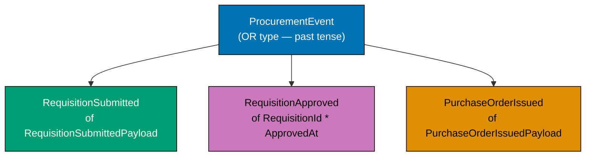
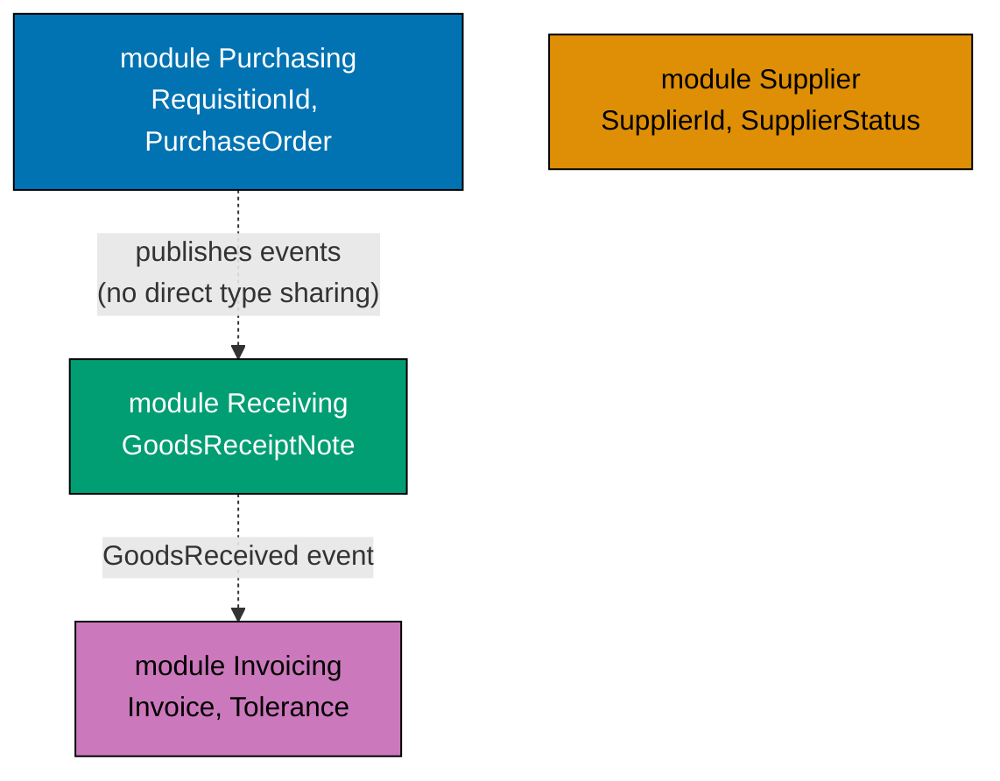
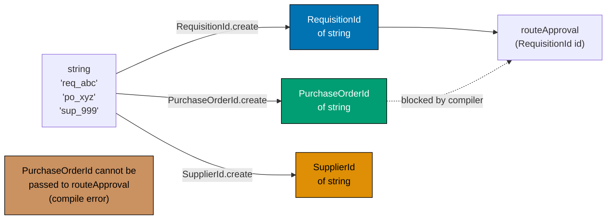
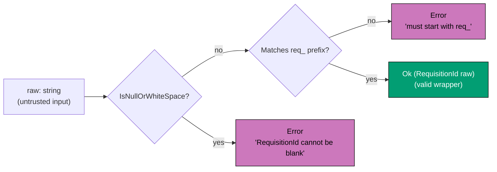
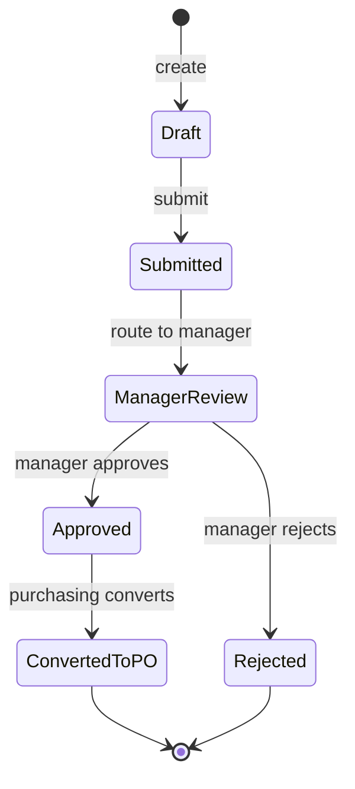
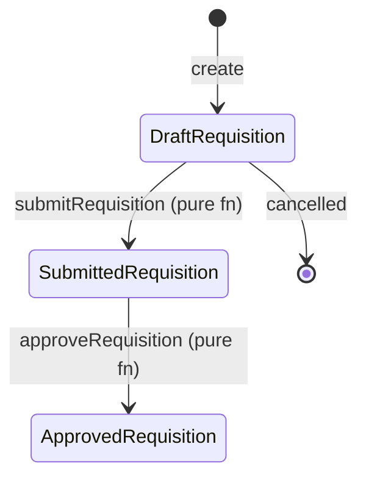
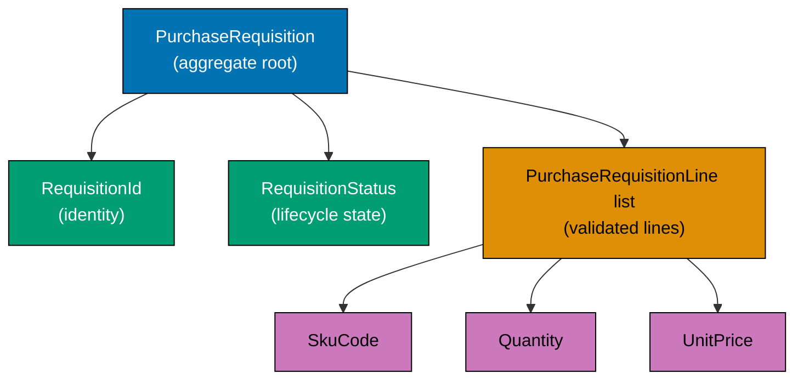
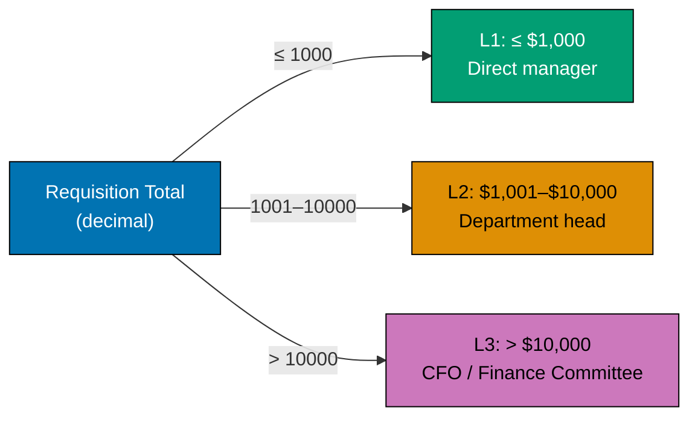

This beginner-level section introduces DDD through F# types, using the `purchasing` bounded context of a Procure-to-Pay procurement platform. The central thesis — **encode business rules in the type system so illegal states are unrepresentable** — is established through 25 progressive examples built around `PurchaseRequisition`, `Money`, `SkuCode`, `Quantity`, and `RequisitionId`.

## Types as the Design (Examples 1–10)

### Example 1: Ubiquitous Language as F# Type Aliases

Ubiquitous language means every term the business uses has an exact counterpart in the code. In F# the cheapest way to honour this is a type alias: `type RequisitionId = string` makes the intent explicit without adding runtime cost. The type alias lives in the same module as the rest of the domain model and is visible to both developers and procurement domain experts reading the code.

```fsharp
// ── file: PurchasingDomain.fs ─────────────────────────────────────────────
// Type aliases map procurement vocabulary directly to F# identifiers.
// The compiler treats these as the same underlying type but the names
// document intent and form the shared dictionary of the purchasing context.

// "A requisition is identified by a RequisitionId, not a raw string"
type RequisitionId = string
// => RequisitionId is an alias for string; no boxing, no overhead

type PurchaseOrderId = string
// => Distinct alias; prevents accidentally mixing RequisitionId and PurchaseOrderId in signatures

type SupplierId = string
// => Every important noun in the domain gets its own alias

type SkuCode = string
// => SKU code alias; raw (string -> string -> string) becomes (RequisitionId -> SupplierId -> SkuCode) — self-documenting

// Usage in a workflow function signature — pure documentation value
type GetRequisitionById = RequisitionId -> string option
// => Arrow type reads "given a RequisitionId, produce an optional string"
// => Domain experts can read this as "look up a requisition by its id"

printfn "Type aliases defined — zero runtime cost, maximum documentation value"
// => Output: Type aliases defined — zero runtime cost, maximum documentation value
```

**Key Takeaway**: Type aliases convert the ubiquitous language of procurement into F# identifiers at zero runtime cost and maximum readability.

**Why It Matters**: When a new developer joins the procurement platform team and reads `RequisitionId -> SupplierId -> SkuCode`, they immediately understand the function's purpose from the domain vocabulary. Without aliases, `string -> string -> string` forces them to read the implementation to understand what each argument represents. This is the simplest possible application of type-driven DDD: make the domain model readable to domain experts — a purchasing manager or procurement analyst should recognise every identifier. Even before writing any logic, type aliases establish the vocabulary that will permeate every function signature and module.

---

### Example 2: Domain Event Named in Past Tense

Domain events represent facts that have already occurred in the domain. DDD convention names events in the past tense, making them read as business facts. In F# a discriminated union case with a payload record is the idiomatic representation.



```fsharp
// Domain events are immutable facts — something that happened in the domain.
// Past-tense naming is a DDD convention — event = something that already occurred.

// The payload carries everything a downstream consumer needs to react
type RequisitionSubmittedPayload = {
    // => Record type groups related fields; all immutable by default
    RequisitionId: string
    // => The identifier of the submitted requisition
    RequestedBy: string
    // => Who submitted it — approval router needs this for routing logic
    TotalAmount: decimal
    // => Sum of all line items — determines the approval level (L1/L2/L3)
    SubmittedAt: System.DateTimeOffset
    // => Timestamp — used for SLA tracking and audit trail
}
// => RequisitionSubmittedPayload : record with four fields

// The top-level event DU — each case IS a different event
type ProcurementEvent =
    | RequisitionSubmitted of RequisitionSubmittedPayload
    // => Fired when an employee submits a purchase requisition
    // => Consumer: approval-router routes to the correct manager
    | RequisitionApproved  of requisitionId: string * approvedAt: System.DateTimeOffset
    // => Fired when a manager approves the requisition
    // => Consumer: purchasing context auto-converts to a PO Draft
    | PurchaseOrderIssued  of purchaseOrderId: string * supplierId: string
    // => Fired when an approved PO is formally sent to the supplier
    // => Consumer: supplier-notifier, receiving context (opens GRN expectation)

// Constructing events
let submitted = RequisitionSubmitted {
    RequisitionId = "req_f4c2a1b7"
    // => Canonical format: "req_" prefix + UUID v4 segment
    RequestedBy   = "emp_00123"
    // => Employee identifier — drives approval routing
    TotalAmount   = 2500.00m
    // => 2 500 USD — falls in L2 approval bracket (≤ $10 k)
    SubmittedAt   = System.DateTimeOffset.UtcNow
    // => Wall-clock timestamp captured at submission time
}
// => submitted : ProcurementEvent = RequisitionSubmitted { ... }

printfn "Event created: %A" submitted
// => Output: Event created: RequisitionSubmitted { RequisitionId = "req_f4c2a1b7"; ... }
```

**Key Takeaway**: Past-tense named discriminated union cases model domain events as immutable facts, with payloads carrying everything downstream consumers need.

**Why It Matters**: Naming events `RequisitionSubmitted` (not `SubmitRequisition`) enforces a crucial mindset shift: an event is a fact that already happened, not a command to do something. This distinction drives the entire event-driven architecture of the procurement platform — the approval router reacts to `RequisitionSubmitted`, the receiving context reacts to `PurchaseOrderIssued`, and the invoicing context reacts to `GoodsReceived`. Each consumer is decoupled from the source and needs only the event payload to perform its work.

---

### Example 3: Bounded Context as F# Module

A bounded context is an explicit boundary within which a particular domain model applies. In F#, modules provide that boundary cheaply: all types and functions for the `purchasing` context live inside `module Purchasing`, keeping them isolated from the `supplier`, `receiving`, and `invoicing` contexts.



```fsharp
// ── Each bounded context gets its own module (or namespace + module) ──────
// Types defined inside one module are fully isolated from types in another.
// This prevents the "God Model" anti-pattern where a single Order type
// tries to serve every context and ends up serving none well.

module Purchasing =
    // => Everything inside this module belongs to the purchasing bounded context
    // => Only types meaningful to purchasing stakeholders live here

    type RequisitionId = RequisitionId of string
    // => RequisitionId is a purchasing-context concept
    // => The supplier context has no use for this type

    type RequisitionStatus =
        | Draft
        | Submitted
        | ManagerReview
        | Approved
        | Rejected
        | ConvertedToPO
    // => Full lifecycle of a purchase requisition within the purchasing context
    // => Other contexts don't care about this internal lifecycle

    type PurchaseRequisition = {
        // => The aggregate root of the purchasing context at the beginner level
        Id:          RequisitionId
        // => Identity of the requisition — required, drives all lookups
        RequestedBy: string
        // => Employee identifier — drives approval routing rules
        Status:      RequisitionStatus
        // => Current lifecycle state — only transitions allowed by the FSM are valid
        Lines:       string list
        // => Line items (simplified for this example — elaborated in later examples)
    }
    // => PurchaseRequisition : record with four fields; all fields are required

module Supplier =
    // => Separate module — the supplier context has its own model of a "supplier"
    // => These are NOT the same type as any supplier-related concept in Purchasing

    type SupplierId = SupplierId of string
    // => The supplier context's identity type — different from RequisitionId
    type SupplierStatus = Pending | Approved | Suspended | Blacklisted
    // => Supplier lifecycle states — invisible to the purchasing context directly
    // => Purchasing learns about supplier eligibility via domain events (SupplierApproved)

// Modules keep contexts honest
let req : Purchasing.PurchaseRequisition = {
    Id          = Purchasing.RequisitionId "req_abc123"
    // => Fully qualified type — unambiguous which context this belongs to
    RequestedBy = "emp_00456"
    Status      = Purchasing.Draft
    // => Starts in Draft — cannot be submitted until at least one line is added
    Lines       = []
    // => No lines yet — requisition is in its initial empty state
}
// => req : Purchasing.PurchaseRequisition — purchasing context aggregate root
printfn "Requisition: %A" req
// => Output: Requisition: { Id = RequisitionId "req_abc123"; Status = Draft; ... }
```

**Key Takeaway**: F# modules are the zero-cost mechanical translation of bounded contexts — they enforce the boundary between purchasing, supplier, receiving, and invoicing without any framework overhead.

**Why It Matters**: In a procurement platform, the word "supplier" means something different in the `supplier` context (vendor master data, approval state, risk score) than it does in the `purchasing` context (a reference ID on a PO line) or the `payments` context (a bank account to disburse to). Modules prevent these different meanings from merging into an ambiguous mega-object. Each context owns its model; cross-context communication happens via domain events and Anti-Corruption Layers.

---

### Example 4: AND Type — Record

A record type is an AND type: a `PurchaseRequisitionLine` has a `SkuCode` AND a `Quantity` AND a `UnitPrice`. All fields are required and immutable by default. Records are the primary building block for aggregates and value objects in functional DDD.

```fsharp
// Record types model AND relationships — all fields must be present.
// In DDD terms, records are the natural representation of value objects
// and entities where every field is a required part of the concept.

// A line item on a purchase requisition
type PurchaseRequisitionLine = {
    SkuCode:   string
    // => Stock-Keeping Unit — identifies exactly what is being requested
    // => Example: "OFF-0042" for office supplies item 42
    Quantity:  int
    // => How many units are requested — must be > 0 (enforced by smart constructor later)
    UnitPrice: decimal
    // => Price per unit in the configured currency — used to compute line total
}
// => PurchaseRequisitionLine : record with three required fields

// Records use with-expressions for "update" — original is unchanged
let line1 = { SkuCode = "OFF-0042"; Quantity = 10; UnitPrice = 4.99m }
// => line1 : PurchaseRequisitionLine = { SkuCode = "OFF-0042"; Quantity = 10; UnitPrice = 4.99 }

let correctedLine = { line1 with Quantity = 12 }
// => with-expression creates a NEW record — line1 is still { Quantity = 10 }
// => correctedLine : PurchaseRequisitionLine = { ...; Quantity = 12; ... }
// => Immutability: correction produces a new value, never mutates in place

let lineTotal = correctedLine.Quantity |> float |> (*) (float correctedLine.UnitPrice)
// => Quantity 12 * UnitPrice 4.99 = 59.88
// => lineTotal : float = 59.88 — used to compute requisition total for approval routing

printfn "Line: %A"  line1
// => Output: Line: { SkuCode = "OFF-0042"; Quantity = 10; UnitPrice = 4.99 }
printfn "Corrected: %A" correctedLine
// => Output: Corrected: { SkuCode = "OFF-0042"; Quantity = 12; UnitPrice = 4.99 }
printfn "Line total: %.2f" lineTotal
// => Output: Line total: 59.88
```

**Key Takeaway**: Records model AND-types — all fields required, all immutable, with `with`-expressions providing safe "update" that creates a new value rather than mutating the existing one.

**Why It Matters**: Procurement line items have a strict invariant: every line must have a SKU code, a quantity, and a unit price — none can be absent. Records enforce this structurally. The `with`-expression pattern for updates means correction history is preserved naturally (the old value still exists), which matters in approval workflows where an auditor may need to see what was changed between requisition versions.

---

### Example 5: OR Type — Discriminated Union

A discriminated union (DU) is an OR type: an `ApprovalLevel` is either `L1` OR `L2` OR `L3`. Exactly one case applies at any given time. DUs are the F# mechanism for making mutually exclusive states explicit and compiler-checked.

```fsharp
// Discriminated unions model OR relationships — exactly one case is active.
// In DDD, DUs represent states, variants, and sum types that have no
// natural representation as records with boolean flags.

// Approval level derived from the total value of a purchase order
type ApprovalLevel =
    | L1  // => Requisitions up to $1,000 — approved by direct manager
    | L2  // => Requisitions $1,001–$10,000 — approved by department head
    | L3  // => Requisitions above $10,000 — approved by CFO or finance committee
// => Exactly one of these is active — never "L1 and L2 simultaneously"

// Derive the approval level from the total amount — a pure domain rule
let deriveApprovalLevel (totalAmount: decimal) : ApprovalLevel =
    // => Pure function — no side effects, deterministic
    if totalAmount <= 1000m then
        L1
        // => Under $1,000 — direct manager approval sufficient
    elif totalAmount <= 10000m then
        L2
        // => $1,001–$10,000 — department head must approve
    else
        L3
        // => Over $10,000 — CFO-level approval required

// Test cases
let level1 = deriveApprovalLevel 500m
// => 500 <= 1000 — level1 : ApprovalLevel = L1
let level2 = deriveApprovalLevel 5000m
// => 5000 > 1000 and <= 10000 — level2 : ApprovalLevel = L2
let level3 = deriveApprovalLevel 50000m
// => 50000 > 10000 — level3 : ApprovalLevel = L3

// Consuming the union — pattern match is exhaustive
let describeLevel (level: ApprovalLevel) : string =
    match level with
    | L1 -> "Direct manager approval (≤ $1,000)"
    // => L1 branch: single manager can approve
    | L2 -> "Department head approval ($1,001–$10,000)"
    // => L2 branch: escalated to department leadership
    | L3 -> "CFO approval (> $10,000)"
    // => L3 branch: finance committee must sign off

printfn "%s" (describeLevel level1)
// => Output: Direct manager approval (≤ $1,000)
printfn "%s" (describeLevel level2)
// => Output: Department head approval ($1,001–$10,000)
printfn "%s" (describeLevel level3)
// => Output: CFO approval (> $10,000)
```

**Key Takeaway**: Discriminated unions make mutually exclusive states explicit and exhaustively checkable — the compiler ensures you handle every case, eliminating silent bugs from unhandled states.

**Why It Matters**: Boolean flags like `isL1`, `isL2`, and `isL3` can all be true simultaneously if set incorrectly. A discriminated union makes it physically impossible: `ApprovalLevel` is exactly one case. When a new level is added (say `L4` for board approval above $100k), the compiler immediately highlights every match expression that must be updated — you get a compile-time checklist of all affected approval-routing code paths.

---

### Example 6: Workflow Expressed as a Function Type

A business workflow is modelled as a plain function type. The type signature is the contract: it names what goes in, what comes out, and what errors are possible. In the procurement platform, `SubmitRequisition` takes an unvalidated input and produces either a list of domain events or a procurement error.

```fsharp
// Workflows are function types — the signature IS the contract.
// No classes, no interfaces, no abstract methods — just function types.
// The signature documents the workflow for domain experts and developers alike.

// The unvalidated input coming from the HTTP layer or CLI
type UnvalidatedRequisition = {
    RequestedBy: string
    // => Raw employee ID string from the HTTP request body
    Lines: (string * int * decimal) list
    // => Raw list of (skuCode, quantity, unitPrice) tuples — not yet validated
}
// => UnvalidatedRequisition : DTO-shaped record — may contain invalid data

// Possible errors the submission workflow can produce
type SubmissionError =
    | NoLinesProvided
    // => A requisition with zero lines cannot be submitted
    | InvalidSkuCode of sku: string
    // => A line item references a SKU that does not match the required format
    | NegativeQuantity of sku: string * qty: int
    // => A quantity ≤ 0 violates the purchasing invariant
    | RequestedByRequired
    // => The employee identifier is blank — cannot route approval without it

// The workflow type alias — the entire contract in one line
type SubmitRequisition =
    UnvalidatedRequisition -> Result<ProcurementEvent list, SubmissionError>
// => Input:  UnvalidatedRequisition — the raw command from outside
// => Output: Result — either Ok with a list of events, or Error with a named failure
// => Result means callers cannot ignore the possibility of failure

// A simplified implementation matching the signature
let submitRequisition : SubmitRequisition =
    fun (req: UnvalidatedRequisition) ->
        // => Pattern: validate all inputs before producing events
        if req.RequestedBy = "" then
            Error RequestedByRequired
            // => First guard: cannot route approval without an employee ID
        elif req.Lines.IsEmpty then
            Error NoLinesProvided
            // => Second guard: a blank requisition has no business meaning
        else
            let event = RequisitionSubmitted {
                // => All guards passed — produce the domain event
                RequisitionId = "req_" + System.Guid.NewGuid().ToString("N").[..7]
                // => Generate a short requisition ID for demonstration
                RequestedBy   = req.RequestedBy
                // => Carry the employee ID into the event payload
                TotalAmount   = req.Lines |> List.sumBy (fun (_, qty, price) -> decimal qty * price)
                // => Compute total for approval level routing
                SubmittedAt   = System.DateTimeOffset.UtcNow
                // => Capture submission timestamp
            }
            Ok [event]
            // => Single event in the list — more events possible in richer workflows

printfn "Workflow type defined — signature is the domain contract"
// => Output: Workflow type defined — signature is the domain contract
```

**Key Takeaway**: Modelling workflows as function types makes the entire domain contract — inputs, outputs, and failure modes — visible at the type level before any implementation is written.

**Why It Matters**: In a procurement platform, a workflow like "submit requisition" is not just an HTTP endpoint — it is a business operation with invariants, possible failure modes, and outputs in the form of domain events. Expressing it as a function type forces the team to agree on the contract upfront. The type alias `SubmitRequisition = UnvalidatedRequisition -> Result<ProcurementEvent list, SubmissionError>` can be written and reviewed in a domain modelling session before a single line of implementation exists.

---

### Example 7: Single-Case Discriminated Union Wrapper

A single-case DU wraps a primitive type to give it a distinct identity. This prevents accidentally passing a `RequisitionId` where a `PurchaseOrderId` is expected, even though both are strings underneath. Single-case wrappers are the cheapest form of domain type safety in F#.



```fsharp
// Without wrappers, all IDs are interchangeable strings — a source of bugs.
// With wrappers, the type system enforces correct usage at compile time.

// Wrapper types — each is a distinct type despite sharing the string representation
type RequisitionId    = RequisitionId    of string
// => "RequisitionId of string" — type name and constructor name are the same
// => This is idiomatic F# for simple wrapper types

type PurchaseOrderId  = PurchaseOrderId  of string
// => Distinct from RequisitionId — cannot be accidentally substituted

type SupplierId       = SupplierId       of string
// => Same pattern for every domain identifier in the procurement platform

// A function that takes a RequisitionId cannot accidentally receive a PurchaseOrderId
let routeApproval (RequisitionId id) (approverEmail: string) =
    // => Pattern-matching in the parameter list unwraps the value inline
    printfn "Routing requisition %s to approver %s" id approverEmail
    // => id : string — the unwrapped value, safe to use here

// Construction
let reqId = RequisitionId "req_f4c2a1b7"
// => reqId : RequisitionId
let poId  = PurchaseOrderId "po_e3d1f8a0"
// => poId : PurchaseOrderId — different type, same underlying string shape

routeApproval reqId "manager@procurement.example.com"
// => Output: Routing requisition req_f4c2a1b7 to approver manager@procurement.example.com

// routeApproval poId "..."  ← compile error: expected RequisitionId, got PurchaseOrderId
// => The type system prevents this mistake at compile time — zero runtime cost

printfn "Type wrappers prevent ID confusion at compile time"
// => Output: Type wrappers prevent ID confusion at compile time
```

**Key Takeaway**: Single-case discriminated unions create nominally distinct types from primitives, so the compiler prevents the common bug of confusing two IDs that happen to share the same string representation.

**Why It Matters**: In a procurement platform with dozens of ID types (RequisitionId, PurchaseOrderId, SupplierId, InvoiceId, PaymentId...), mixing them up is a common and costly bug. It is invisible in tests that use hardcoded string values, and only surfaces in production when a payment is dispatched to the wrong entity. Single-case wrappers cost nothing at runtime and eliminate this entire category of mistake at compile time.

---

### Example 8: Smart Constructor Returning Result

A smart constructor validates its input and returns `Result<'T, 'Error>` rather than throwing an exception. This keeps validation in the type system and forces callers to handle the failure case. Smart constructors are the primary integrity mechanism for value objects in the procurement domain.



```fsharp
// Smart constructors validate invariants and return Result, not throw exceptions.
// Callers cannot ignore the possibility of failure — it is in the return type.

type RequisitionId = private RequisitionId of string
// => "private" makes the constructor inaccessible outside this module
// => The ONLY way to get a RequisitionId is through the smart constructor below

module RequisitionId =
    // => Convention: module with same name as the type holds the smart constructor

    let create (raw: string) : Result<RequisitionId, string> =
        // => Input: raw string from outside (DTO, HTTP body, config)
        // => Output: Ok with a validated RequisitionId, or Error with a message
        if System.String.IsNullOrWhiteSpace(raw) then
            // => Guard 1: empty or whitespace IDs are not valid in this domain
            Error "RequisitionId cannot be blank"
            // => Returns Error case — caller must handle this
        elif not (raw.StartsWith("req_")) then
            // => Guard 2: canonical format requires the "req_" prefix
            Error (sprintf "RequisitionId '%s' must start with 'req_'" raw)
            // => Descriptive error message for logging and API error responses
        else
            Ok (RequisitionId raw)
            // => Validation passed — wrap in the private constructor
            // => Caller receives a RequisitionId they know is valid

    let value (RequisitionId id) = id
    // => Accessor: safely unwrap the string when needed (e.g., for persistence)

// Usage
let result1 = RequisitionId.create "req_f4c2a1b7"
// => result1 : Result<RequisitionId, string> = Ok (RequisitionId "req_f4c2a1b7")

let result2 = RequisitionId.create ""
// => result2 : Result<RequisitionId, string> = Error "RequisitionId cannot be blank"

let result3 = RequisitionId.create "12345"
// => result3 : Result<RequisitionId, string> = Error "RequisitionId '12345' must start with 'req_'"

match result1 with
| Ok id   -> printfn "Valid: %s" (RequisitionId.value id)
| Error e -> printfn "Invalid: %s" e
// => Output: Valid: req_f4c2a1b7
```

**Key Takeaway**: Smart constructors with `Result` return types make validation mandatory — the compiler requires every call site to handle the failure case, preventing invalid domain objects from ever existing.

**Why It Matters**: Exception-throwing constructors are an implicit contract: callers often forget to catch them, leading to unhandled exceptions in production procurement workflows. A `Result`-returning smart constructor makes the contract explicit and checked. It also composes naturally with Railway-Oriented Programming (covered in Examples 31–33): the `Ok` branch flows forward through the pipeline, and the `Error` branch short-circuits cleanly without try/catch blocks scattered throughout the approval workflow.

---

### Example 9: Pattern Matching on a Discriminated Union

Pattern matching is the primary tool for consuming discriminated union values. It forces you to decide what happens in every case. Combined with the exhaustive match checking of the F# compiler, it eliminates entire classes of "forgot to handle this case" bugs.

```fsharp
// Pattern matching on a DU — the compiler verifies exhaustiveness.

type RequisitionStatus =
    | Draft
    | Submitted
    | ManagerReview
    | Approved
    | Rejected
    | ConvertedToPO
// => Six mutually exclusive states in the PurchaseRequisition lifecycle

// A function that handles all requisition statuses
let describeStatus (status: RequisitionStatus) : string =
    // => match expression — must cover every DU case
    match status with
    | Draft ->
        // => Initial state — requisition not yet submitted
        "Draft: employee is building the line items"
    | Submitted ->
        // => Employee has submitted — awaiting manager routing
        "Submitted: awaiting approval routing"
    | ManagerReview ->
        // => Routed to the appropriate approver based on amount
        "Under review by approving manager"
    | Approved ->
        // => Manager has approved — can be converted to a PO
        "Approved: ready for PO creation"
    | Rejected ->
        // => Manager rejected — employee notified via email
        "Rejected: employee notified"
    | ConvertedToPO ->
        // => Successfully converted — downstream PO lifecycle begins
        "Converted to Purchase Order"

// Test each case
let s1 = Draft
// => s1 : RequisitionStatus = Draft
let s2 = ManagerReview
// => s2 : RequisitionStatus = ManagerReview
let s3 = Approved
// => s3 : RequisitionStatus = Approved

printfn "%s" (describeStatus s1)
// => Matches Draft case
// => Output: Draft: employee is building the line items
printfn "%s" (describeStatus s2)
// => Matches ManagerReview case
// => Output: Under review by approving manager
printfn "%s" (describeStatus s3)
// => Matches Approved case
// => Output: Approved: ready for PO creation

// If you add a new state (e.g. | OnHold) to RequisitionStatus,
// the compiler immediately warns on describeStatus — every match must be updated
// => Compile-time checklist of all code paths that need updating
```

**Key Takeaway**: Pattern matching on discriminated unions is exhaustive by default — adding a new state to the type immediately surfaces every match expression that must handle it.

**Why It Matters**: In a procurement approval workflow, adding a new requisition state such as `OnHold` (pending budget confirmation) requires updating every piece of code that inspects requisition status. The compiler's exhaustive match checking turns this from a risky manual search into a compile-time checklist. No test required to find the gaps — the build fails until every match is updated, preventing production incidents from unhandled states.

---

### Example 10: Exhaustive Match — Compiler-Enforced

The F# compiler issues a warning — treated as an error in strict builds — when a match expression does not cover all cases of a discriminated union. This example shows how to see the warning, how to fix it, and why it is one of the most valuable correctness tools in functional DDD.

```fsharp
// The compiler enforces exhaustive pattern matching.
// Incomplete matches are a warning (FS0025) — treated as error with <TreatWarningsAsErrors>.

type PurchaseOrderStatus =
    | Draft
    | AwaitingApproval
    | Approved
    | Issued
    | Cancelled
// => Five PurchaseOrder states (simplified subset of the full state machine)

// INCOMPLETE match — compiler warning FS0025:
// let approvalRequired (status: PurchaseOrderStatus) : bool =
//     match status with
//     | Draft           -> false
//     | AwaitingApproval -> true
//     | Approved        -> false
//     // => MISSING: Issued, Cancelled — compiler warns here

// COMPLETE match — all cases handled
let approvalRequired (status: PurchaseOrderStatus) : bool =
    match status with
    | Draft            -> false
    // => Draft POs have not yet been submitted for approval
    | AwaitingApproval -> true
    // => This is the exactly the state requiring approval action
    | Approved         -> false
    // => Already approved — approval is no longer required
    | Issued           -> false
    // => Issued to supplier — past the approval gate
    | Cancelled        -> false
    // => Cancelled — approval is moot; the PO is no longer active
// => All five cases covered — compiler is satisfied; no FS0025 warning

// Test
let statuses = [Draft; AwaitingApproval; Approved; Issued; Cancelled]
// => List of all five PurchaseOrderStatus values for verification

let results = statuses |> List.map (fun s -> s, approvalRequired s)
// => Maps each status to its (status, bool) pair
// => results : (PurchaseOrderStatus * bool) list

results |> List.iter (fun (s, r) ->
    printfn "%A -> approvalRequired: %b" s r
    // => Output for each pair: e.g. "Draft -> approvalRequired: false"
)
// => Output: Draft -> approvalRequired: false
// => Output: AwaitingApproval -> approvalRequired: true
// => Output: Approved -> approvalRequired: false
// => Output: Issued -> approvalRequired: false
// => Output: Cancelled -> approvalRequired: false
```

**Key Takeaway**: The F# compiler's exhaustive match warning is a compile-time correctness guarantee — it ensures every state of a discriminated union is handled, preventing silent bugs from newly added cases.

**Why It Matters**: In a live procurement system, adding a new `PurchaseOrderStatus` case such as `Disputed` should immediately surface all the places in the codebase that need updating. The compiler's match exhaustiveness check is a zero-cost, zero-test-required audit. It is more reliable than code search because it catches even indirect usages via type aliases and intermediate let-bindings, making it one of the highest-value features of F# for DDD practitioners.

---

## Value Objects and Constrained Types (Examples 11–20)

### Example 11: Option Type Replacing Null

`Option<'T>` models the presence or absence of a value without using null. In F#, null is not a valid value for most types. `Option` is the explicit, type-safe alternative that forces callers to handle the "not present" case — something nullable references never enforce.

```fsharp
// Option<'T> replaces null — the compiler requires handling both cases.
// In the procurement domain, optional fields are common:
// secondary address lines, notes, preferred supplier hints.

// An address record with an optional secondary line
type SupplierAddress = {
    Street:        string
    // => Required: every supplier address must have a street
    City:          string
    // => Required: city is always known
    PostalCode:    string
    // => Required: needed for logistics and tax calculations
    SecondaryLine: string option
    // => Optional: not all addresses have suite/floor/building info
    // => string option = Some "Suite 400" or None — never null
}

// Address with secondary line present
let addressWithSuite = {
    Street        = "Jl. Sudirman No. 1"
    City          = "Jakarta"
    PostalCode    = "10220"
    SecondaryLine = Some "Lantai 12"
    // => Some wraps the value — explicitly present
    // => The suite number is available; we can display it
}
// => addressWithSuite.SecondaryLine : string option = Some "Lantai 12"

// Address without secondary line
let simpleAddress = {
    Street        = "Jl. Gatot Subroto 45"
    City          = "Jakarta"
    PostalCode    = "12930"
    SecondaryLine = None
    // => None — explicitly absent, not null, not empty string
    // => The secondary line is absent — no suite/floor for this address
}
// => simpleAddress.SecondaryLine : string option = None

// Consuming the optional value with pattern matching
let formatAddress (addr: SupplierAddress) =
    let line2 =
        match addr.SecondaryLine with
        | Some s -> "\n" + s
        // => Unwraps the string if present; prepend newline for formatting
        | None   -> ""
        // => Produces empty string if absent — no NullReferenceException possible
    sprintf "%s%s\n%s %s" addr.Street line2 addr.City addr.PostalCode
    // => Formats the address with or without the secondary line

printfn "%s" (formatAddress addressWithSuite)
// => Output: Jl. Sudirman No. 1
// =>         Lantai 12
// =>         Jakarta 10220

printfn "%s" (formatAddress simpleAddress)
// => Output: Jl. Gatot Subroto 45
// =>         Jakarta 12930
```

**Key Takeaway**: `Option<'T>` makes optionality explicit in the type system — you must handle both `Some` and `None`, eliminating null-reference exceptions by construction.

**Why It Matters**: Null-reference exceptions are one of the most common causes of production procurement system failures. In F#, the type system forces you to explicitly acknowledge that a value might be absent. Every `match` on an `Option` is a reminder that the optional path must be handled. Supplier addresses, requisition notes, and preferred-supplier hints are all naturally modelled as `Option` types, making the domain model self-documenting about what is and is not required.

---

### Example 12: Constrained String — SkuCode

A constrained `SkuCode` type enforces format invariants at the boundary. The P2P spec mandates the pattern `^[A-Z]{3}-\d{4,8}$` — for example `OFF-0042` or `ELE-12345`. Once inside the type, the value is guaranteed to satisfy the pattern.

```fsharp
// SkuCode is a string guaranteed to match ^[A-Z]{3}-\d{4,8}$.
// The private constructor ensures the invariant is always met.
// External code cannot call SkuCode "hello" directly — must go through create.

open System.Text.RegularExpressions

type SkuCode = private SkuCode of string
// => Single-case DU with private constructor
// => "private" hides the raw constructor — only the module below can create values

module SkuCode =
    // => Module has the same name as the type — idiomatic F# convention
    let private skuPattern = Regex(@"^[A-Z]{3}-\d{4,8}$")
    // => Pre-compiled regex for performance — compiled once at module load time
    // => Pattern: three uppercase letters, hyphen, 4–8 digits (e.g. OFF-0042)

    let create (raw: string) : Result<SkuCode, string> =
        // => raw: the input string to validate (untrusted — comes from outside)
        // => Return type Result<SkuCode, string>: Ok = valid wrapper, Error = message
        if System.String.IsNullOrWhiteSpace(raw) then
            // => Guard 1: blank or whitespace strings are not valid SKU codes
            Error "SkuCode must not be blank"
            // => Explicit error — helpful for requisition line validation feedback
        elif not (skuPattern.IsMatch(raw)) then
            // => Guard 2: string does not match the canonical SKU pattern
            Error (sprintf "SkuCode '%s' must match ^[A-Z]{3}-\\d{4,8}$ (e.g. OFF-0042)" raw)
            // => Includes the actual value and expected pattern — useful for debugging
        else
            Ok (SkuCode raw)
            // => Both guards passed — wrap the validated string in the private constructor
            // => The invariant is now baked into the type — no downstream re-checking needed

    let value (SkuCode s) = s
    // => Accessor: pattern-matches the DU to extract the raw string
    // => Needed when writing to the database or sending to supplier EDI systems

// Building a SkuCode from valid input
let validSku = SkuCode.create "OFF-0042"
// => "OFF-0042" matches ^[A-Z]{3}-\d{4,8}$ — three uppercase letters + 4 digits
// => validSku : Result<SkuCode, string> = Ok (SkuCode "OFF-0042")

// Invalid inputs
let badFormat = SkuCode.create "off-0042"
// => "off-0042" has lowercase letters — does not match [A-Z]{3}
// => badFormat : Result<SkuCode, string> = Error "SkuCode 'off-0042' must match ..."

let tooShort = SkuCode.create "OF-42"
// => "OF-42" has only 2 letters and 2 digits — pattern requires 3 letters and 4+ digits
// => tooShort : Result<SkuCode, string> = Error "..."

match validSku with
| Ok sku  -> printfn "SKU: %s" (SkuCode.value sku)
| Error e -> printfn "Error: %s" e
// => Output: SKU: OFF-0042

match badFormat with
| Ok _    -> printfn "Should not reach here"
| Error e -> printfn "Validation error: %s" e
// => Output: Validation error: SkuCode 'off-0042' must match ...
```

**Key Takeaway**: Constrained string types wrap raw strings with validated invariants, so any value that exists is guaranteed valid — no defensive checks needed downstream in the procurement pipeline.

**Why It Matters**: When a requisition line item contains a malformed SKU code, the error should be caught at the boundary (HTTP layer or CSV import), not deep inside the pricing engine. Constrained types like `SkuCode` validate at creation time and guarantee validity everywhere the type appears. A pricing function that accepts `SkuCode` can trust the format without an inline regex check, reducing cognitive load and the risk of inconsistent validation logic scattered across multiple services.

---

### Example 13: Quantity as a Smart-Constructed Value Object

`Quantity` wraps an integer and a unit of measure, guaranteeing the integer is strictly positive and the unit is one of the allowed domain values. Domain invariant: a purchase line item must request at least one unit.

```fsharp
// Quantity: a positive integer paired with a unit of measure.
// Models the "how many" and "of what kind" for a requisition line item.

// UnitOfMeasure is a closed enum — new values require a code change
type UnitOfMeasure = EACH | BOX | KG | LITRE | HOUR
// => EACH: individual items (chairs, laptops)
// => BOX: boxes of supplies (pens, paper)
// => KG: weight-based goods (raw materials)
// => LITRE: liquid goods (cleaning supplies)
// => HOUR: services measured in time (consulting, maintenance)

// Quantity wraps value + unit together as a value object
type Quantity = private Quantity of value: int * unit: UnitOfMeasure
// => Both components are private — must go through the smart constructor

module Quantity =
    let create (value: int) (unit: UnitOfMeasure) : Result<Quantity, string> =
        // => Validate: value must be strictly positive (> 0)
        // => Domain rule: you cannot requisition zero or negative units
        if value <= 0 then
            Error (sprintf "Quantity must be > 0, got %d" value)
            // => Returns a descriptive error — API layer uses this in 400 response
        else
            Ok (Quantity (value, unit))
            // => Invariant satisfied — the Quantity is safe to use in any domain function

    let value (Quantity (v, _)) = v
    // => Extracts the integer component (e.g., 12)

    let unit (Quantity (_, u)) = u
    // => Extracts the UnitOfMeasure component (e.g., BOX)

    let describe (Quantity (v, u)) =
        sprintf "%d %A" v u
        // => Produces human-readable string like "12 BOX" or "3 EACH"

// Creating quantities for a procurement requisition
let laptopQty    = Quantity.create 3 EACH
// => 3 > 0 and EACH is a valid unit — Ok (Quantity (3, EACH))
let paperBoxQty  = Quantity.create 20 BOX
// => 20 > 0 and BOX is a valid unit — Ok (Quantity (20, BOX))
let invalidQty   = Quantity.create 0 KG
// => 0 <= 0 — Error "Quantity must be > 0, got 0"

match laptopQty with
| Ok q  -> printfn "Laptop quantity: %s" (Quantity.describe q)
| Error e -> printfn "Error: %s" e
// => Output: Laptop quantity: 3 EACH

match paperBoxQty with
| Ok q  -> printfn "Paper quantity: %s" (Quantity.describe q)
| Error e -> printfn "Error: %s" e
// => Output: Paper quantity: 20 BOX

match invalidQty with
| Ok _  -> printfn "Should not reach here"
| Error e -> printfn "Validation error: %s" e
// => Output: Validation error: Quantity must be > 0, got 0
```

**Key Takeaway**: Wrapping a primitive pair in a constrained value object prevents invalid quantities from ever entering procurement logic — a function accepting `Quantity` cannot accidentally receive zero or a negative count.

**Why It Matters**: Order quantities and counts all have minimum values that business rules enforce. Encoding `Quantity` as a constrained type rather than a plain `int` means domain functions can be written without defensive `if qty <= 0 then failwith ...` guards — the type already guarantees validity. This reduces both boilerplate and the risk of forgetting a guard somewhere in a complex approval or pricing pipeline.

---

### Example 14: Money Record with Currency

`Money` is a value object combining a non-negative decimal amount with an ISO 4217 currency code. It is one of the most important value objects in the procurement domain — every line item price, PO total, and invoice amount is expressed as `Money`.

```fsharp
// Money: amount + currency, where amount >= 0 and currency is a valid ISO 4217 code.
// Money is a value object — equality is by value, not by reference.

open System.Text.RegularExpressions

type Money = private Money of amount: decimal * currency: string
// => Private constructor — only the module below can create valid Money values
// => Both fields are private components of the single-case DU

module Money =
    let private isoPattern = Regex(@"^[A-Z]{3}$")
    // => ISO 4217 format: exactly three uppercase letters (USD, IDR, EUR, GBP)

    let create (amount: decimal) (currency: string) : Result<Money, string> =
        // => Validate both components before constructing
        if amount < 0m then
            Error (sprintf "Money amount must be >= 0, got %M" amount)
            // => Negative money is not meaningful in the procurement domain
        elif not (isoPattern.IsMatch(currency)) then
            Error (sprintf "Currency '%s' is not a valid ISO 4217 code" currency)
            // => Currency must be a three-letter ISO code — not a symbol, not a name
        else
            Ok (Money (amount, currency))
            // => Both invariants satisfied — valid Money value object

    let amount   (Money (a, _)) = a
    // => Extracts the decimal amount (e.g., 2500.00)
    let currency (Money (_, c)) = c
    // => Extracts the ISO currency code (e.g., "USD")

    let add (Money (a1, c1)) (Money (a2, c2)) : Result<Money, string> =
        // => Addition only makes sense when currencies match
        if c1 <> c2 then
            Error (sprintf "Cannot add %s and %s — currency mismatch" c1 c2)
            // => Cross-currency addition requires an exchange rate — out of scope here
        else
            Ok (Money (a1 + a2, c1))
            // => Same currency — simply sum the amounts

    let format (Money (a, c)) =
        sprintf "%s %.2f" c a
        // => "USD 2500.00" — currency first, amount to 2 decimal places

// Building Money for requisition line items
let unitPrice = Money.create 499.99m "USD"
// => 499.99 >= 0 and "USD" matches [A-Z]{3} — Ok (Money (499.99, "USD"))
let qty       = 5
let lineTotal = unitPrice |> Result.map (fun m -> Money (decimal qty * Money.amount m, Money.currency m))
// => Multiply unit price by quantity to get line total — 5 × 499.99 = 2499.95
// => lineTotal : Result<Money, string>

let badCurrency = Money.create 100m "dollars"
// => "dollars" does not match [A-Z]{3} — Error "Currency 'dollars' is not a valid ISO 4217 code"

match unitPrice with
| Ok m  -> printfn "Unit price: %s" (Money.format m)
| Error e -> printfn "Error: %s" e
// => Output: Unit price: USD 499.99
```

**Key Takeaway**: The `Money` value object encapsulates both amount and currency, with invariant checking ensuring non-negative amounts and valid ISO currency codes — preventing the common Falsehoods Programmers Believe About Money.

**Why It Matters**: Money handling is one of the most error-prone areas in any financial system. Storing amounts without currency (implicitly assuming a single currency) is a latent bug waiting for the first multinational supplier. The `Money` value object makes currency explicit at every point it matters: line items, PO totals, invoice amounts, and payment disbursements all carry the currency as part of the value, making cross-currency errors visible at the type level.

---

### Example 15: Lifecycle States as a Discriminated Union

The full `PurchaseRequisition` lifecycle has six states: `Draft`, `Submitted`, `ManagerReview`, `Approved`, `Rejected`, and `ConvertedToPO`. Modelling these as a discriminated union, rather than a status string, makes illegal state transitions detectable at compile time.



```fsharp
// The full PurchaseRequisition lifecycle as a DU.
// Each state can carry different payload — the type encodes what data
// is available in each state, not just what the state is called.

type RequisitionId = RequisitionId of string
// => Wrapper for the requisition identifier — used in all states

// Each state carries only the data that is meaningful in that state
type PurchaseRequisition =
    | Draft of draftLines: string list
    // => Draft: just the line items being built — no submission metadata yet
    | Submitted of requisitionId: RequisitionId * requestedBy: string * submittedAt: System.DateTimeOffset
    // => Submitted: requisitionId assigned, who submitted, when submitted
    // => Line items are baked into the event at submission — not re-carried in state
    | ManagerReview of requisitionId: RequisitionId * approverEmail: string
    // => Under review: know which approver is responsible
    | Approved of requisitionId: RequisitionId * approvedAt: System.DateTimeOffset
    // => Approved: timestamp of approval captured for audit trail
    | Rejected of requisitionId: RequisitionId * reason: string
    // => Rejected: rejection reason mandatory — employee needs feedback
    | ConvertedToPO of requisitionId: RequisitionId * purchaseOrderId: string
    // => Converted: linked to the resulting PO — bidirectional traceability

// State transition — submit a Draft requisition
let submitRequisition (Draft lines) (requestedBy: string) : PurchaseRequisition =
    // => Pattern match in parameter destructs the Draft case directly
    // => If called with any other case, compile error — not a Draft
    let id = RequisitionId ("req_" + System.Guid.NewGuid().ToString("N").[..7])
    // => Generate a requisition ID at submission time — not before
    Submitted (id, requestedBy, System.DateTimeOffset.UtcNow)
    // => Produces Submitted state — Draft data is consumed, new state has its own payload

// Create a draft requisition
let myReq = Draft ["OFF-0042"; "ELE-1001"]
// => myReq : PurchaseRequisition = Draft ["OFF-0042"; "ELE-1001"]
// => Two line items on the draft requisition

let submitted = submitRequisition myReq "emp_00456"
// => submitRequisition transitions Draft → Submitted
// => submitted : PurchaseRequisition = Submitted (RequisitionId "req_...", "emp_00456", ...)

printfn "Initial state: %A" myReq
// => Output: Initial state: Draft ["OFF-0042"; "ELE-1001"]
printfn "After submit: %A" submitted
// => Output: After submit: Submitted (RequisitionId "req_...", "emp_00456", ...)
```

**Key Takeaway**: Modelling lifecycle states as a discriminated union where each case carries its own payload makes illegal states and premature data access impossible — you cannot access the `approverEmail` of a `Draft` requisition because `Draft` does not have that field.

**Why It Matters**: In a string-based status model, code can access `ApproverEmail` when the requisition is still in `Draft` (it will just be null). The DU model makes this physically impossible — the `Draft` case has no `approverEmail` field. This removes an entire class of defensive null checks from the codebase and ensures each state carries exactly the data it needs, no more and no less.

---

### Example 16: State Machine Encoded Purely by Type Transitions

State transitions in the procurement domain are pure functions from one state to the next. A `submitRequisition` function accepts a `Draft` state and returns a `Submitted` state. Calling it with any other state is a compile error.



```fsharp
// State transitions as typed functions — illegal transitions are compile errors.
// The type system encodes what transitions are allowed, not just which states exist.

type RequisitionId = RequisitionId of string
// => Wrapped requisition identifier

// States as separate types (alternative to a single DU — different trade-offs)
type DraftRequisition    = { Lines: string list; RequestedBy: string }
// => Draft state: only knows its lines and the submitter
type SubmittedRequisition = {
    Id:          RequisitionId
    RequestedBy: string
    SubmittedAt: System.DateTimeOffset
    Lines:       string list
}
// => Submitted state: has an ID and a timestamp — assigned at submission

type ApprovedRequisition  = { Id: RequisitionId; ApprovedAt: System.DateTimeOffset }
// => Approved state: knows when approval happened
type RejectedRequisition  = { Id: RequisitionId; Reason: string }
// => Rejected state: knows why it was rejected — mandatory feedback

// Transition functions — each takes exactly the right input state
let submit (draft: DraftRequisition) : SubmittedRequisition =
    // => submit : DraftRequisition -> SubmittedRequisition
    // => Cannot accidentally call submit on an ApprovedRequisition — different type
    { Id          = RequisitionId ("req_" + System.Guid.NewGuid().ToString("N").[..7])
      // => ID generated at submission time
      RequestedBy = draft.RequestedBy
      // => Carry the employee identifier forward
      SubmittedAt = System.DateTimeOffset.UtcNow
      // => Record the submission timestamp
      Lines       = draft.Lines
      // => Carry the line items forward for the approval review
    }

let approve (submitted: SubmittedRequisition) : ApprovedRequisition =
    // => approve : SubmittedRequisition -> ApprovedRequisition
    // => Cannot approve a DraftRequisition or RejectedRequisition — compiler blocks it
    { Id         = submitted.Id
      // => Preserve the requisition identity through the approval transition
      ApprovedAt = System.DateTimeOffset.UtcNow
      // => Record the approval timestamp for audit trail
    }

// Usage
let draft  = { Lines = ["OFF-0042"]; RequestedBy = "emp_00123" }
// => draft : DraftRequisition
let subm   = submit draft
// => subm : SubmittedRequisition — submit transitions Draft → Submitted
let approv = approve subm
// => approv : ApprovedRequisition — approve transitions Submitted → Approved

// approve draft  ← compile error: expected SubmittedRequisition, got DraftRequisition
// => The type system prevents transitioning from Draft directly to Approved

printfn "Approved requisition: %A" approv
// => Output: Approved requisition: { Id = RequisitionId "req_..."; ApprovedAt = ... }
```

**Key Takeaway**: Encoding state transitions as functions with typed inputs and outputs makes illegal transitions (Draft → Approved without going through Submitted) literal compile errors rather than runtime bugs caught only in testing.

**Why It Matters**: In approval workflows, skipping states (a requisition going straight from Draft to Approved without manager review) is a serious compliance risk. When state transitions are typed functions, bypassing the `submit` step is not possible without changing the type — the compiler enforces the workflow sequence. This is more reliable than any runtime guard because it operates before the code ever runs.

---

### Example 17: Domain Primitive Wrapping Decimal — Unit Price

`UnitPrice` wraps a `decimal` and guarantees it is strictly positive. A zero-price item is likely a data entry error; a negative price is impossible in the procurement context. The wrapper makes this invariant permanent.

```fsharp
// UnitPrice: a decimal guaranteed to be > 0.
// Models the per-unit cost of a line item on a purchase requisition or PO.

type UnitPrice = private UnitPrice of decimal
// => private constructor — only the module below can create values

module UnitPrice =
    let create (fieldName: string) (value: decimal) : Result<UnitPrice, string> =
        // => Validate that value satisfies the "positive price" invariant
        // => fieldName: used in error messages to identify which price field failed
        if value <= 0m then
            Error (sprintf "%s must be > 0, got %M" fieldName value)
            // => Zero and negative prices violate the procurement domain invariant
            // => Error message names the field for structured API error responses
        else
            Ok (UnitPrice value)
            // => Wraps the validated decimal — invariant is now documented in the type

    let value (UnitPrice v) = v
    // => Unwrap for arithmetic, persistence, or display

// Usage in the purchasing context
let priceResult  = UnitPrice.create "UnitPrice" 4.99m
// => 4.99 > 0 — passes the positive-price guard
// => priceResult : Result<UnitPrice, string> = Ok (UnitPrice 4.99)

let zeroResult   = UnitPrice.create "UnitPrice" 0m
// => 0 <= 0 — fails the guard
// => zeroResult : Result<UnitPrice, string> = Error "UnitPrice must be > 0, got 0"

let negResult    = UnitPrice.create "UnitPrice" (-10m)
// => -10 <= 0 — fails the guard
// => negResult : Result<UnitPrice, string> = Error "UnitPrice must be > 0, got -10"

match priceResult with
| Ok price -> printfn "Unit price: %M" (UnitPrice.value price)
// => UnitPrice.value unwraps to the decimal 4.99 for use in printfn
| Error e  -> printfn "Error: %s" e
// => priceResult was Ok — Ok branch runs
// => Output: Unit price: 4.9900

// Compute a line total using validated types
let computeLineTotal (price: UnitPrice) (qty: int) : decimal =
    // => Both arguments are validated — no defensive checks needed here
    UnitPrice.value price * decimal qty
    // => Pure arithmetic — no validation, no guards, no exceptions

let lineTotal = priceResult |> Result.map (fun p -> computeLineTotal p 10)
// => lineTotal : Result<decimal, string>
// => If price is Ok, compute 4.99 × 10 = 49.90
printfn "Line total: %A" lineTotal
// => Output: Line total: Ok 49.9000M
```

**Key Takeaway**: Wrapping decimal prices in constrained types prevents invalid values from ever entering procurement logic — a function that accepts `UnitPrice` cannot accidentally receive zero or a negative number.

**Why It Matters**: Pricing errors in procurement are costly: a zero-price line item could generate a PO with no obligation to pay, while a negative price could trigger a refund flow in the accounting integration. Encoding positivity as a type constraint catches these errors at the data entry boundary, long before they propagate through approval workflows, ERP integrations, or supplier EDI messages.

---

### Example 18: Units of Measure

F# has first-class support for units of measure — a compile-time mechanism that prevents mixing amounts in different units. In the procurement context, this means you cannot accidentally add a quantity in `KG` to a quantity in `EACH` without explicit conversion.

```fsharp
// F# units of measure: compile-time dimension tracking.
// Prevents quantity calculation errors at the type level.

// Define units of measure used in the procurement domain
[<Measure>] type each
// => Discrete items — laptops, chairs, monitors
[<Measure>] type box
// => Packaged quantities — boxes of pens, reams of paper
[<Measure>] type kg
// => Weight-based goods — raw materials, chemicals
[<Measure>] type litre
// => Volume-based goods — cleaning supplies, lubricants
[<Measure>] type usd
// => Currency unit — prevents mixing money amounts with quantity amounts

// Typed quantities
let laptopCount   = 3<each>
// => laptopCount : int<each> = 3 — three individual laptops
let paperBoxCount = 20<box>
// => paperBoxCount : int<box> = 20 — twenty boxes of paper
let steelWeight   = 150<kg>
// => steelWeight : int<kg> = 150 — 150 kilograms of steel

// Typed prices
let laptopUnitPrice = 899.99m<usd/each>
// => Price per laptop in USD — type: decimal<usd/each>
let paperBoxPrice   = 8.50m<usd/box>
// => Price per paper box in USD — type: decimal<usd/box>

// Computing line totals — units cancel correctly
let laptopTotal = decimal laptopCount * laptopUnitPrice
// => int<each> × decimal<usd/each> = decimal<usd> — units cancel to USD amount
// => laptopTotal : decimal<usd> = 2699.97<usd>

let paperTotal = decimal paperBoxCount * paperBoxPrice
// => int<box> × decimal<usd/box> = decimal<usd> — units cancel to USD amount
// => paperTotal : decimal<usd> = 170.00<usd>

// Adding totals — both are in USD, so addition is type-safe
let requisitionTotal = laptopTotal + paperTotal
// => decimal<usd> + decimal<usd> = decimal<usd>
// => requisitionTotal : decimal<usd> = 2869.97<usd>

// This would be a compile error:
// let invalid = laptopCount + paperBoxCount
// => int<each> + int<box> — units don't match — compiler rejects the expression

printfn "Laptop total: %M USD" (decimal laptopTotal)
// => Output: Laptop total: 2699.9700 USD
printfn "Paper total: %M USD" (decimal paperTotal)
// => Output: Paper total: 170.0000 USD
printfn "Requisition total: %M USD" (decimal requisitionTotal)
// => Output: Requisition total: 2869.9700 USD
```

**Key Takeaway**: F# units of measure provide compile-time dimensional analysis — mixing quantities in different units (KG vs EACH) or adding money to quantity is a compile error, not a runtime bug.

**Why It Matters**: Unit mismatch errors in procurement (ordering 100 KG when the spec said 100 EACH, or adding a weight to a price) can be catastrophically expensive. Units of measure bring the same compile-time safety that physical dimension analysis provides in engineering domains. While not all codebases use this feature, it is uniquely powerful for procurement systems where multiple measurement dimensions (weight, volume, count, currency) interact in complex line-item calculations.

---

### Example 19: Email Value via Regex Validation

An email address on a supplier or employee record is a constrained string with format requirements. Active patterns let you embed validation logic directly into pattern-matching syntax, making validation readable and composable.

```fsharp
// Email: a string verified to match a minimal email format.
// Active patterns provide reusable validation logic in match syntax.

open System.Text.RegularExpressions

type Email = private Email of string
// => Private constructor — only valid emails can be constructed

// Active pattern for email validation — reusable across the procurement codebase
let (|ValidEmail|InvalidEmail|) (s: string) =
    // => Active pattern: returns either ValidEmail or InvalidEmail
    let pattern = @"^[^@\s]+@[^@\s]+\.[^@\s]+$"
    // => Minimal regex: something @ something . something — sufficient for a domain check
    // => Full RFC 5322 compliance is complex; this covers 99% of real addresses
    if Regex.IsMatch(s, pattern) then
        ValidEmail s
        // => Valid pattern matched — carries the original string
    else
        InvalidEmail
        // => Pattern did not match — no payload

module Email =
    let create (raw: string) : Result<Email, string> =
        match raw with
        // => Use the active pattern in the match expression
        | ValidEmail s -> Ok (Email (s.ToLowerInvariant()))
        // => Normalise to lowercase — consistent storage in the supplier master
        | InvalidEmail -> Error (sprintf "'%s' is not a valid email address" raw)
        // => Active pattern makes the validation readable as prose

    let value (Email e) = e
    // => Unwrap when sending notifications or writing to supplier records

// Creating emails for procurement contacts
let supplierEmail = Email.create "purchasing@acme-supplies.com"
// => Matches ValidEmail — normalised to lowercase
// => supplierEmail : Result<Email, string> = Ok (Email "purchasing@acme-supplies.com")

let approverEmail = Email.create "manager.finance@company.com"
// => Valid format — Ok (Email "manager.finance@company.com")

let badEmail = Email.create "not-an-email"
// => "not-an-email" has no @ — matches InvalidEmail
// => badEmail : Result<Email, string> = Error "'not-an-email' is not a valid email address"

match supplierEmail with
| Ok e  -> printfn "Supplier contact: %s" (Email.value e)
| Error err -> printfn "Error: %s" err
// => Output: Supplier contact: purchasing@acme-supplies.com

match badEmail with
| Ok _  -> printfn "Should not reach here"
| Error err -> printfn "Validation error: %s" err
// => Output: Validation error: 'not-an-email' is not a valid email address
```

**Key Takeaway**: Active patterns embed validation logic into match expressions, making smart constructors readable as domain rules rather than imperative if/else chains.

**Why It Matters**: In a procurement system, supplier notification emails and approver routing emails are critical: a malformed email address means a supplier never receives the PO or an approver never gets the approval request. Validating at construction time and using the `Email` type throughout means any code path that sends notifications can trust the address is well-formed. Active patterns make the validation composable — reuse `ValidEmail` anywhere an email check is needed.

---

### Example 20: ProductCode as a Union of Two Subtypes

Some domain concepts have multiple valid forms. A `ProductCode` in the procurement domain can be either a standard `SkuCode` (format `OFF-0042`) or a `ServiceCode` (format `SVC-YYYYMMDD-NNN` for contracted services). The union type captures both forms without collapsing them into a single string.

```fsharp
// ProductCode is a union of SkuCode and ServiceCode — two valid forms of product identity.
// Using a union type preserves the distinction rather than collapsing to a single string.

open System.Text.RegularExpressions

// Two formats, two types
type SkuCode     = private SkuCode     of string
// => Goods: format ^[A-Z]{3}-\d{4,8}$ e.g. OFF-0042
type ServiceCode = private ServiceCode of string
// => Services: format SVC-YYYYMMDD-NNN e.g. SVC-20260101-001

// The union type — a ProductCode is one OR the other
type ProductCode =
    | Sku     of SkuCode
    // => Physical goods with a stock-keeping unit identifier
    | Service of ServiceCode
    // => Contracted services (consulting, maintenance, cleaning)

module SkuCode =
    let private p = Regex(@"^[A-Z]{3}-\d{4,8}$")
    let create (s: string) =
        if p.IsMatch(s) then Ok (SkuCode s)
        else Error (sprintf "Invalid SKU: %s" s)
    let value (SkuCode s) = s
    // => Accessor for the raw string

module ServiceCode =
    let private p = Regex(@"^SVC-\d{8}-\d{3}$")
    // => Format: SVC- + 8 digit date + hyphen + 3 digit sequence
    let create (s: string) =
        if p.IsMatch(s) then Ok (ServiceCode s)
        else Error (sprintf "Invalid ServiceCode: %s" s)
    let value (ServiceCode s) = s
    // => Accessor for the raw string

module ProductCode =
    let describeLineType (code: ProductCode) : string =
        match code with
        | Sku     (SkuCode s)     -> sprintf "Physical goods: %s" s
        // => Sku branch: standard goods with warehouse inventory
        | Service (ServiceCode s) -> sprintf "Contracted service: %s" s
        // => Service branch: no inventory, billed by service agreement

// Building product codes
let laptop  = SkuCode.create "ELE-0099" |> Result.map Sku
// => "ELE-0099" matches ^[A-Z]{3}-\d{4,8}$ — Ok (Sku (SkuCode "ELE-0099"))
let cleaning = ServiceCode.create "SVC-20260601-003" |> Result.map Service
// => "SVC-20260601-003" matches ^SVC-\d{8}-\d{3}$ — Ok (Service (ServiceCode "SVC-20260601-003"))

match laptop with
| Ok code -> printfn "%s" (ProductCode.describeLineType code)
| Error e -> printfn "Error: %s" e
// => Output: Physical goods: ELE-0099

match cleaning with
| Ok code -> printfn "%s" (ProductCode.describeLineType code)
| Error e -> printfn "Error: %s" e
// => Output: Contracted service: SVC-20260601-003
```

**Key Takeaway**: A union type for `ProductCode` preserves the semantic distinction between physical goods and contracted services, enabling different handling rules to be enforced at compile time rather than at runtime via string prefix checks.

**Why It Matters**: Physical goods and contracted services have fundamentally different procurement paths: goods generate goods receipt notes and three-way matching, while services generate a service acceptance form. Collapsing both into a single `string productCode` means the distinction must be re-inferred at runtime via string prefix inspection — a fragile pattern prone to omission errors. The union type makes the distinction permanent and exploits the compiler's exhaustive match to enforce different handling rules.

---

## Domain Records and DTO Types (Examples 21–25)

### Example 21: PurchaseRequisitionLine Record — Composing Value Objects

A `PurchaseRequisitionLine` composes the validated value objects from the previous examples into a single record. Every field is a domain type, not a primitive — the record itself becomes valid by construction if all its fields were validated.

```fsharp
// PurchaseRequisitionLine: a record that composes validated value objects.
// Each field is a domain type — the record inherits their guarantees.

// For this example, we use simple wrappers to keep the code self-contained
type SkuCode   = SkuCode   of string
type UnitPrice = UnitPrice of decimal
type UnitOfMeasure = EACH | BOX | KG | LITRE | HOUR

type Quantity = { Value: int; Unit: UnitOfMeasure }
// => Simplified Quantity record for composition example

// The composed line record — all fields are domain types
type PurchaseRequisitionLine = {
    LineNumber: int
    // => 1-based position within the requisition — for display ordering
    SkuCode:    SkuCode
    // => Validated SKU — not a raw string, not null
    Quantity:   Quantity
    // => Validated quantity — value > 0, unit is a closed enum
    UnitPrice:  UnitPrice
    // => Validated price — > 0 decimal
}
// => All fields are domain types — if they exist, they are valid

// A helper to compute the line total
let lineTotal (line: PurchaseRequisitionLine) : decimal =
    let (UnitPrice price) = line.UnitPrice
    // => Destructure UnitPrice to access the decimal
    decimal line.Quantity.Value * price
    // => Multiply quantity by unit price — both are validated, no guards needed

// Constructing a line — all field values are validated types
let line1 = {
    LineNumber = 1
    // => First line item on the requisition
    SkuCode    = SkuCode "OFF-0042"
    // => Using the SkuCode wrapper — not a raw string
    Quantity   = { Value = 10; Unit = BOX }
    // => 10 boxes — Value > 0, Unit is a valid enum case
    UnitPrice  = UnitPrice 8.50m
    // => $8.50 per box — positive price
}
// => line1 : PurchaseRequisitionLine — valid by construction

let line2 = {
    LineNumber = 2
    SkuCode    = SkuCode "ELE-0099"
    // => Electronics SKU
    Quantity   = { Value = 3; Unit = EACH }
    // => 3 individual laptops
    UnitPrice  = UnitPrice 899.99m
    // => $899.99 per laptop
}
// => line2 : PurchaseRequisitionLine

printfn "Line 1 total: %M" (lineTotal line1)
// => 10 × 8.50 = 85.00
// => Output: Line 1 total: 85.0000M

printfn "Line 2 total: %M" (lineTotal line2)
// => 3 × 899.99 = 2699.97
// => Output: Line 2 total: 2699.9700M
```

**Key Takeaway**: Composing validated value objects into a record creates a record that is valid by construction — no downstream function needs to re-validate individual fields because the types already guarantee their invariants.

**Why It Matters**: The composition principle is the key to scalable domain modelling. Each value object (`SkuCode`, `Quantity`, `UnitPrice`) enforces its own invariant. When composed into a `PurchaseRequisitionLine`, the composed type automatically inherits all those guarantees. A pricing function that accepts `PurchaseRequisitionLine` can focus entirely on the business logic of computing a total, not on defensive input checking.

---

### Example 22: PurchaseRequisition Aggregate Record

The `PurchaseRequisition` is the aggregate root of the purchasing context at the beginner level. It groups an identity, a status, a list of validated line items, and metadata about who requested it. The aggregate record is the primary domain object passed through the approval workflow.



```fsharp
// PurchaseRequisition: the aggregate root of the purchasing context.
// Groups identity, status, lines, and metadata into a single cohesive record.

type RequisitionId     = RequisitionId     of string
type RequisitionStatus = Draft | Submitted | ManagerReview | Approved | Rejected | ConvertedToPO
type SkuCode   = SkuCode   of string
type UnitPrice = UnitPrice of decimal
type UnitOfMeasure = EACH | BOX | KG | LITRE | HOUR
type Quantity  = { Value: int; Unit: UnitOfMeasure }

type PurchaseRequisitionLine = {
    LineNumber: int
    SkuCode:    SkuCode
    Quantity:   Quantity
    UnitPrice:  UnitPrice
}
// => Line item type reused from Example 21

// The aggregate root
type PurchaseRequisition = {
    Id:          RequisitionId
    // => Unique identity — drives all lookups and event references
    RequestedBy: string
    // => Employee identifier — used for approval routing and audit trail
    Status:      RequisitionStatus
    // => Current lifecycle state — only legal transitions permitted
    Lines:       PurchaseRequisitionLine list
    // => Line items — at least one required before submission
    CreatedAt:   System.DateTimeOffset
    // => When the requisition was first saved — for SLA tracking
    UpdatedAt:   System.DateTimeOffset
    // => When the requisition was last modified — for concurrency detection
}
// => PurchaseRequisition : aggregate root with identity, status, lines, metadata

// Helper: compute the total value of the requisition
let requisitionTotal (req: PurchaseRequisition) : decimal =
    req.Lines |> List.sumBy (fun line ->
        let (UnitPrice p) = line.UnitPrice
        // => Destructure UnitPrice for arithmetic
        decimal line.Quantity.Value * p
        // => Line total = quantity × unit price
    )
    // => Sum all line totals to get the requisition total

// Build a sample requisition
let sampleReq = {
    Id          = RequisitionId "req_f4c2a1b7"
    // => Formatted requisition ID — "req_" prefix + UUID segment
    RequestedBy = "emp_00456"
    // => Employee who is requesting the goods
    Status      = Draft
    // => Starts in Draft — cannot submit until validated
    Lines       = [
        { LineNumber = 1; SkuCode = SkuCode "OFF-0042"; Quantity = { Value = 10; Unit = BOX }; UnitPrice = UnitPrice 8.50m }
        // => 10 boxes of office supplies at $8.50 each = $85.00
        { LineNumber = 2; SkuCode = SkuCode "ELE-0099"; Quantity = { Value = 3; Unit = EACH }; UnitPrice = UnitPrice 899.99m }
        // => 3 laptops at $899.99 each = $2,699.97
    ]
    CreatedAt   = System.DateTimeOffset.UtcNow
    // => Timestamp at creation
    UpdatedAt   = System.DateTimeOffset.UtcNow
    // => Starts equal to CreatedAt — updated on each state transition
}
// => sampleReq : PurchaseRequisition = Draft requisition with two lines

printfn "Requisition %A" sampleReq.Id
// => Output: Requisition RequisitionId "req_f4c2a1b7"
printfn "Total: %M" (requisitionTotal sampleReq)
// => 85.00 + 2699.97 = 2784.97
// => Output: Total: 2784.9700M
printfn "Status: %A" sampleReq.Status
// => Output: Status: Draft
```

**Key Takeaway**: The aggregate root record groups identity, status, line items, and metadata into a single cohesive type that the entire approval workflow passes through as a unit.

**Why It Matters**: The aggregate root is the unit of consistency in DDD. All changes to a `PurchaseRequisition` are made as a whole — the `Status` transitions atomically with the update of `UpdatedAt`, and the `Lines` are only mutable in the `Draft` state (enforced by workflow functions, explored in intermediate examples). Grouping everything into one record makes the aggregate boundary explicit and prevents partial updates that leave the aggregate in an inconsistent state.

---

### Example 23: UnvalidatedRequisition DTO-Shaped Record

The `UnvalidatedRequisition` is the DTO that arrives from the HTTP layer. It uses only primitives — strings, ints, decimals — because JSON deserialisation produces raw values. The workflow's first step is to validate this DTO into the domain aggregate.

```fsharp
// UnvalidatedRequisition: the DTO arriving from the HTTP layer.
// Uses only primitives — JSON deserialisation produces raw strings, ints, decimals.
// The workflow validates this into a domain PurchaseRequisition.

// Raw line item from the HTTP request body
type UnvalidatedLine = {
    SkuCode:   string
    // => Raw string — may be empty, wrong format, or null
    Quantity:  int
    // => Raw int — may be zero or negative
    UnitPrice: decimal
    // => Raw decimal — may be zero or negative
    Unit:      string
    // => Raw string representation of the unit — may not match a valid UnitOfMeasure
}
// => UnvalidatedLine : primitive-only DTO — no domain type guarantees

// Raw requisition from the HTTP request body
type UnvalidatedRequisition = {
    RequestedBy: string
    // => Raw employee ID — may be empty or not exist in the employee directory
    Lines:       UnvalidatedLine list
    // => List of unvalidated line items — may be empty, may have invalid items
}
// => UnvalidatedRequisition : DTO-shaped aggregate — purely for deserialization

// The validated domain types (simplified for this example)
type SkuCode = SkuCode of string
type UnitOfMeasure = EACH | BOX | KG | LITRE | HOUR
type Quantity = { Value: int; Unit: UnitOfMeasure }
type UnitPrice = UnitPrice of decimal
type PurchaseRequisitionLine = { LineNumber: int; SkuCode: SkuCode; Quantity: Quantity; UnitPrice: UnitPrice }

// Validate a raw unit string to a UnitOfMeasure
let parseUnit (s: string) : Result<UnitOfMeasure, string> =
    match s.ToUpperInvariant() with
    | "EACH"  -> Ok EACH
    | "BOX"   -> Ok BOX
    | "KG"    -> Ok KG
    | "LITRE" -> Ok LITRE
    | "HOUR"  -> Ok HOUR
    | other   -> Error (sprintf "Unknown unit: '%s' — expected EACH, BOX, KG, LITRE, or HOUR" other)
    // => Pattern match on the normalised string — rejects unknown units

// Validate a single unvalidated line
let validateLine (n: int) (raw: UnvalidatedLine) : Result<PurchaseRequisitionLine, string> =
    // => Sequentially validate each field — short-circuit on first error (use Result.bind)
    if System.String.IsNullOrWhiteSpace(raw.SkuCode) then Error "SkuCode required"
    // => Guard 1: blank SKU
    elif raw.Quantity <= 0 then Error (sprintf "Quantity must be > 0, got %d" raw.Quantity)
    // => Guard 2: invalid quantity
    elif raw.UnitPrice <= 0m then Error (sprintf "UnitPrice must be > 0, got %M" raw.UnitPrice)
    // => Guard 3: non-positive price
    else
        parseUnit raw.Unit |> Result.map (fun u ->
            { LineNumber = n
              SkuCode    = SkuCode raw.SkuCode
              // => Wrap in SkuCode after basic checks
              Quantity   = { Value = raw.Quantity; Unit = u }
              // => Combine validated int with validated unit
              UnitPrice  = UnitPrice raw.UnitPrice
              // => Wrap in UnitPrice after positivity check
            }
        )

// Test with sample DTO input
let rawReq = {
    RequestedBy = "emp_00456"
    Lines = [
        { SkuCode = "OFF-0042"; Quantity = 10; UnitPrice = 8.50m; Unit = "BOX" }
        { SkuCode = "ELE-0099"; Quantity = 3; UnitPrice = 899.99m; Unit = "EACH" }
    ]
}
// => rawReq : UnvalidatedRequisition — from HTTP body / JSON deserialization

let validatedLine1 = validateLine 1 rawReq.Lines.[0]
// => "OFF-0042" non-blank, 10 > 0, 8.50 > 0, "BOX" matches — Ok (PurchaseRequisitionLine ...)

match validatedLine1 with
| Ok line -> printfn "Line 1 validated: %A" line.SkuCode
| Error e -> printfn "Error: %s" e
// => Output: Line 1 validated: SkuCode "OFF-0042"
```

**Key Takeaway**: A separate DTO type for unvalidated input makes the boundary between "outside the domain" and "inside the domain" explicit — the type system prevents raw DTO fields from being used where validated domain types are expected.

**Why It Matters**: The DTO boundary is where all domain invariants are enforced. Everything to the left of the boundary (HTTP, JSON, user input) is untrusted; everything to the right (domain logic, approval workflow, event generation) is trusted. A separate `UnvalidatedRequisition` type makes this boundary visible and architectural — it is impossible to accidentally pass an `UnvalidatedLine` to a function that expects a `PurchaseRequisitionLine` because they are different types.

---

### Example 24: Approval Level Derived from Requisition Total

The `ApprovalLevel` of a purchase requisition is a domain rule derived from its total value. This derivation is a pure function — no side effects, fully deterministic — and the result is a constrained type that drives the approval routing workflow.



```fsharp
// Deriving ApprovalLevel from a requisition total is a pure domain rule.
// It is the decision point that determines which manager must approve.

type ApprovalLevel = L1 | L2 | L3
// => L1: direct manager (≤ $1,000)
// => L2: department head ($1,001–$10,000)
// => L3: CFO / finance committee (> $10,000)

type UnitPrice = UnitPrice of decimal
type UnitOfMeasure = EACH | BOX | KG | LITRE | HOUR
type Quantity = { Value: int; Unit: UnitOfMeasure }
type PurchaseRequisitionLine = {
    LineNumber: int
    UnitPrice:  UnitPrice
    Quantity:   Quantity
}
// => Line type with the fields needed for total calculation

// Pure domain functions
let lineTotal (line: PurchaseRequisitionLine) : decimal =
    let (UnitPrice p) = line.UnitPrice
    // => Destructure UnitPrice to access the decimal
    decimal line.Quantity.Value * p
    // => Line total = quantity × unit price

let requisitionTotal (lines: PurchaseRequisitionLine list) : decimal =
    lines |> List.sumBy lineTotal
    // => Sum all line totals — pure, no side effects

let deriveApprovalLevel (total: decimal) : ApprovalLevel =
    // => Pure derivation — same input always produces same output
    if total <= 1000m then L1
    // => Under $1,000 — direct manager approval
    elif total <= 10000m then L2
    // => $1,001–$10,000 — department head
    else L3
    // => Over $10,000 — CFO-level required

// Describe what the approval level means in the routing workflow
let describeApprovalRouting (level: ApprovalLevel) : string =
    match level with
    | L1 -> "Route to direct manager — SLA: 2 business days"
    // => L1 is the simplest approval path — fastest SLA
    | L2 -> "Route to department head — SLA: 5 business days"
    // => L2 requires escalation — longer SLA reflects the more complex review
    | L3 -> "Route to CFO approval committee — SLA: 10 business days"
    // => L3 is the most scrutinised — longest SLA, most stakeholders involved

// Test with sample line items
let lines = [
    { LineNumber = 1; UnitPrice = UnitPrice 899.99m; Quantity = { Value = 3; Unit = EACH } }
    // => 3 × $899.99 = $2,699.97
    { LineNumber = 2; UnitPrice = UnitPrice 8.50m;   Quantity = { Value = 20; Unit = BOX } }
    // => 20 × $8.50 = $170.00
]

let total = requisitionTotal lines
// => 2699.97 + 170.00 = 2869.97
// => total : decimal = 2869.97

let level = deriveApprovalLevel total
// => 2869.97 > 1000 and <= 10000 — L2
// => level : ApprovalLevel = L2

printfn "Total: %M" total
// => Output: Total: 2869.9700M
printfn "Approval level: %A" level
// => Output: Approval level: L2
printfn "Routing: %s" (describeApprovalRouting level)
// => Output: Routing: Route to department head — SLA: 5 business days
```

**Key Takeaway**: Deriving `ApprovalLevel` as a pure function from the requisition total keeps the approval routing rule in the domain layer, independently testable and free of infrastructure dependencies.

**Why It Matters**: Approval thresholds are one of the most frequently audited business rules in a procurement system. Keeping the derivation as a pure function (`decimal -> ApprovalLevel`) means it can be unit tested exhaustively — including boundary cases at exactly $1,000 and $10,000 — without spinning up a database, a workflow engine, or a notification service. This is the functional core / imperative shell principle applied to compliance-critical logic.

---

### Example 25: Workflow Type Alias — Full SubmitRequisition Signature

The complete `SubmitRequisition` workflow signature ties together all the types from this beginner section. The type alias is the domain contract — a self-documenting specification that makes the workflow's purpose, inputs, outputs, and failure modes visible without reading the implementation.

```fsharp
// The complete SubmitRequisition workflow signature — ties all beginner types together.
// This is the boundary between the "outside" (HTTP, JSON, user input)
// and the "inside" (domain logic, events, state transitions).

// Domain types (simplified for composition demonstration)
type RequisitionId     = RequisitionId of string
type ApprovalLevel     = L1 | L2 | L3
type RequisitionStatus = Draft | Submitted | ManagerReview | Approved | Rejected | ConvertedToPO
type SkuCode           = SkuCode of string
type UnitOfMeasure     = EACH | BOX | KG | LITRE | HOUR
type Quantity          = { Value: int; Unit: UnitOfMeasure }
type UnitPrice         = UnitPrice of decimal
type PurchaseRequisitionLine = { LineNumber: int; SkuCode: SkuCode; Quantity: Quantity; UnitPrice: UnitPrice }

// The unvalidated DTO arriving from the HTTP layer
type UnvalidatedRequisition = {
    RequestedBy: string
    // => Raw employee ID — not validated
    RawLines:    (string * int * decimal * string) list
    // => Raw tuples: (skuCode, quantity, unitPrice, unit) — not validated
}
// => UnvalidatedRequisition : DTO-shaped input — purely for deserialisation

// Domain events produced by a successful submission
type RequisitionSubmittedPayload = {
    RequisitionId:  RequisitionId
    // => Newly assigned ID
    ApprovalLevel:  ApprovalLevel
    // => L1/L2/L3 — drives the approval router
    RequestedBy:    string
    // => Employee identifier — for notification
    TotalAmount:    decimal
    // => Requisition total — for finance ledger event
    SubmittedAt:    System.DateTimeOffset
    // => Submission timestamp — for SLA tracking
}
// => RequisitionSubmittedPayload : event payload carrying everything consumers need

type RequisitionEvent =
    | RequisitionSubmitted of RequisitionSubmittedPayload
    // => The event emitted on successful submission

// Possible errors from the submission workflow
type SubmissionError =
    | RequestedByRequired
    // => Cannot route approval without an employee ID
    | NoLinesProvided
    // => A blank requisition has no business meaning
    | InvalidSkuCode     of sku: string
    // => A line item references a malformed SKU
    | InvalidQuantity    of sku: string * qty: int
    // => A quantity ≤ 0 on a line item
    | InvalidUnitPrice   of sku: string * price: decimal
    // => A price ≤ 0 on a line item
    | UnknownUnit        of unit: string
    // => A line item references an unknown unit of measure

// The workflow type alias — the entire domain contract
type SubmitRequisition =
    UnvalidatedRequisition -> Result<RequisitionEvent list, SubmissionError>
// => Arrow type reads: "given an unvalidated requisition, produce either a list of
//    domain events (success) or a named submission error (failure)"
// => Result forces callers to handle both cases — no unchecked exceptions

// A stub implementation matching the signature
let submitRequisition : SubmitRequisition =
    fun (req: UnvalidatedRequisition) ->
        // => First validate the inputs
        if req.RequestedBy = "" then Error RequestedByRequired
        // => Guard 1: employee ID required for approval routing
        elif req.RawLines.IsEmpty then Error NoLinesProvided
        // => Guard 2: at least one line item required
        else
            let id     = RequisitionId ("req_" + System.Guid.NewGuid().ToString("N").[..7])
            // => Assign the requisition ID at submission time
            let total  = req.RawLines |> List.sumBy (fun (_, qty, price, _) -> decimal qty * price)
            // => Compute total for approval level derivation
            let level  = if total <= 1000m then L1 elif total <= 10000m then L2 else L3
            // => Derive approval level from total — pure domain rule
            let payload = { RequisitionId = id; ApprovalLevel = level; RequestedBy = req.RequestedBy
                            TotalAmount = total; SubmittedAt = System.DateTimeOffset.UtcNow }
            // => Assemble the event payload with all required fields
            Ok [RequisitionSubmitted payload]
            // => Return the single domain event — downstream consumers react to it

// Test the complete workflow
let testReq = {
    RequestedBy = "emp_00456"
    // => Valid employee ID
    RawLines    = [("OFF-0042", 10, 8.50m, "BOX"); ("ELE-0099", 3, 899.99m, "EACH")]
    // => Two valid raw line items
}

let result = submitRequisition testReq
// => Validates inputs, assigns ID, derives approval level, emits event
// => result : Result<RequisitionEvent list, SubmissionError>

match result with
| Ok events ->
    printfn "Submission successful — %d event(s) produced" events.Length
    // => Output: Submission successful — 1 event(s) produced
    events |> List.iter (fun e -> printfn "Event: %A" e)
    // => Output: Event: RequisitionSubmitted { RequisitionId = ...; ApprovalLevel = L2; ... }
| Error e ->
    printfn "Submission failed: %A" e
    // => Would output the specific error if validation failed
```

**Key Takeaway**: A workflow type alias is the domain contract — it names the inputs, outputs, and failure modes of an entire business workflow in a single line that domain experts and developers can read and review together.

**Why It Matters**: The `SubmitRequisition` type alias is the capstone of the beginner section — it shows how ubiquitous language (Example 1), domain events (Example 2), bounded contexts (Example 3), record types (Example 4), discriminated unions (Examples 5–6), wrapper types (Example 7), smart constructors (Example 8), and value objects (Examples 12–20) all compose into a coherent workflow signature. This is the central promise of type-driven DDD: the type system becomes the domain model, and the domain model becomes the specification.
