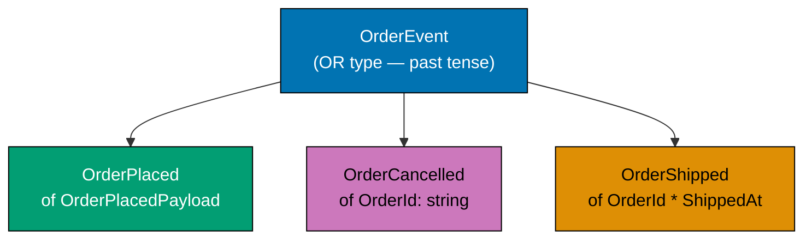
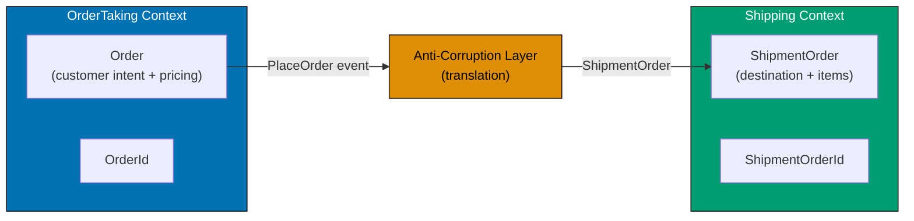
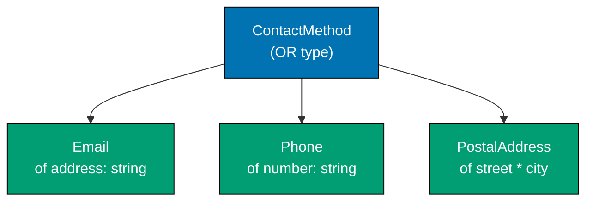
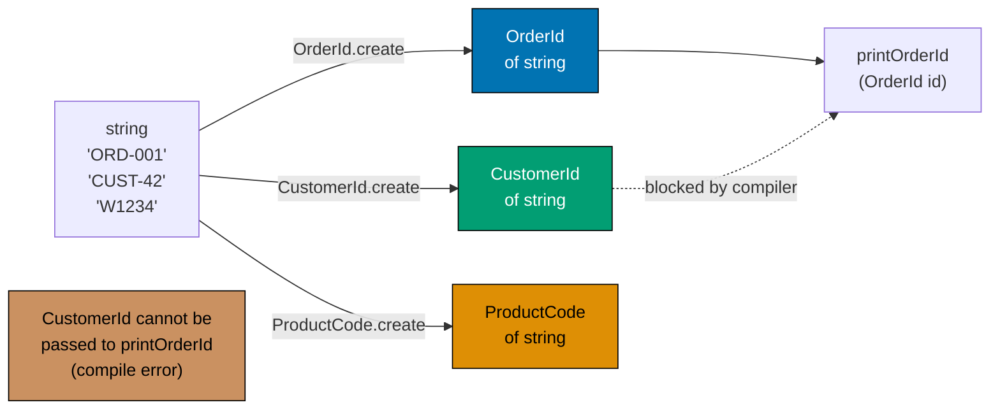
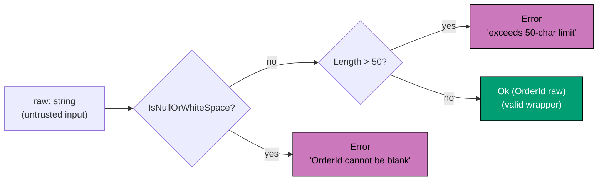
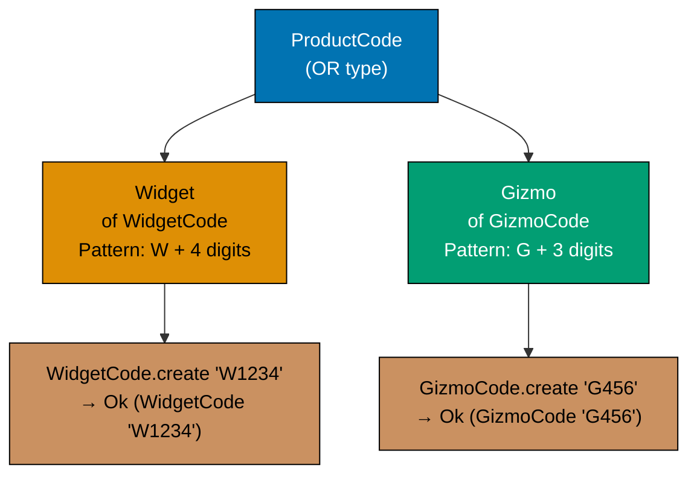
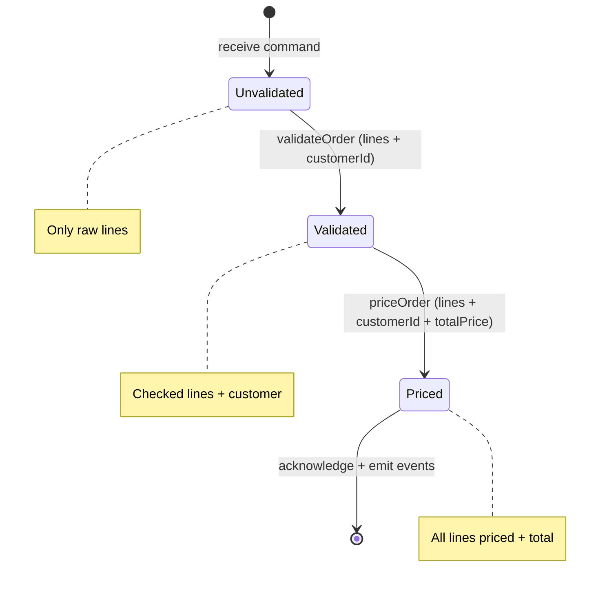
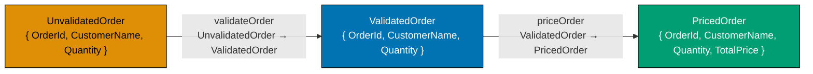
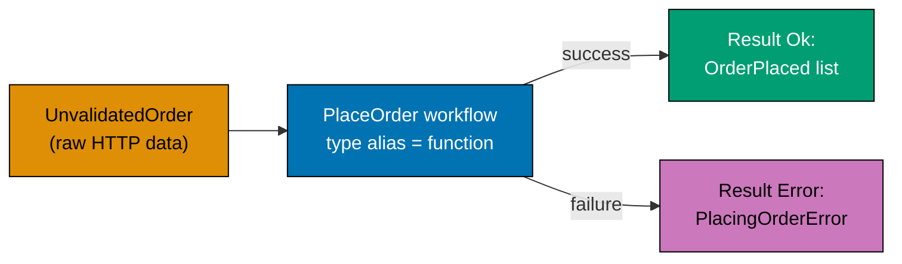

This beginner-level section introduces DDD through F# types. The central thesis of Wlaschin's book — that you should **encode business rules in the type system so illegal states are unrepresentable** — is established here through 25 progressive examples, all using the order-taking domain.

## Types as the Design (Examples 1–10)

### Example 1: Ubiquitous Language as F# Type Aliases

Ubiquitous language means every term the business uses has an exact counterpart in the code. In F# the cheapest way to honour this is a type alias: `type OrderId = string` makes the intent explicit without adding runtime cost. The type alias lives in the same module as the rest of the domain model and is visible to both developers and domain experts reading the code.

```fsharp
// ── file: Domain.fs ──────────────────────────────────────────────────────
// Type aliases map domain vocabulary directly to F# identifiers.
// The compiler treats these as the same underlying type but the names
// document intent and form the shared dictionary of the domain.

// "An order is identified by an OrderId, not a raw string" — Wlaschin Ch 2
type OrderId = string
// => OrderId is an alias for string; no boxing, no overhead

type OrderLineId = string
// => Distinct alias even though both are strings
// => Prevents accidentally mixing up the two identifiers in function signatures

type CustomerId = string
// => Every important noun in the domain gets its own alias

type ProductCode = string
// => Raw strings in a signature like (string -> string -> string -> unit)
// => are unreadable; aliases (OrderId -> CustomerId -> ProductCode -> unit)
// => are self-documenting

// Usage in a workflow function signature — pure documentation value
type GetOrderById = OrderId -> string option
// => Arrow type reads "given an OrderId, produce an optional string"
// => Domain experts can read this as "look up an order by its id"

printfn "Type aliases defined — zero runtime cost, maximum documentation value"
// => Output: Type aliases defined — zero runtime cost, maximum documentation value
```

**Key Takeaway**: Type aliases convert the ubiquitous language into F# identifiers for zero cost and maximum readability.

**Why It Matters**: When a new developer joins a project and reads `OrderId -> CustomerId -> ProductCode`, they immediately understand the function's purpose from the domain vocabulary. Without aliases, `string -> string -> string` forces them to read the implementation to understand what each argument represents. This is the simplest possible application of Wlaschin's core principle: make the domain model readable to domain experts. Even before writing any logic, type aliases establish the vocabulary that will permeate every function signature and module.

---

### Example 2: Domain Event Named in Past Tense

Domain events represent facts that have already occurred in the domain. Wlaschin follows Evans' convention of naming events in the past tense, making them read as business facts. In F# a discriminated union case with a payload record is the idiomatic representation.



```fsharp
// Domain events are immutable facts — something that happened in the domain.
// Past-tense naming is a DDD convention (Evans, Wlaschin Ch 2).

// The payload carries everything a downstream consumer needs to react
type OrderPlacedPayload = {
    // => Record type groups related fields; all immutable by default
    OrderId: string
    // => The identifier of the placed order
    CustomerId: string
    // => Who placed it — downstream services may need to notify the customer
    TotalAmount: decimal
    // => Pricing summary needed for financial ledger events
    PlacedAt: System.DateTimeOffset
    // => When it happened — audit trail and event ordering
}

// The event itself as a discriminated union case
// Using a DU allows multiple event types to be handled uniformly
type OrderEvent =
    // => Discriminated union — each case is a distinct event type
    | OrderPlaced of OrderPlacedPayload
    // => "OrderPlaced" — past tense, a business fact
    | OrderCancelled of OrderId: string
    // => Inline named field for simple events
    | OrderShipped of OrderId: string * ShippedAt: System.DateTimeOffset
    // => Tuple of named fields for medium-complexity events

// Constructing an event
let event =
    OrderPlaced {
        // => Creates a value of type OrderEvent, case OrderPlaced
        // => The record expression inside the {} block constructs an OrderPlacedPayload
        OrderId = "ORD-001"
        // => Order identifier — will be carried by the event to downstream handlers
        CustomerId = "CUST-42"
        // => Customer identifier — identifies who is affected
        TotalAmount = 49.95m
        // => Financial amount — needed by ledger and reporting services
        PlacedAt = System.DateTimeOffset.UtcNow
        // => DateTimeOffset includes timezone — safer than DateTime
    }

printfn "Event created: %A" event
// => event : OrderEvent = OrderPlaced { OrderId = "ORD-001"; CustomerId = "CUST-42"; ... }
// => %A uses F# structural printer — shows DU case name followed by payload fields
// => Output: Event created: OrderPlaced {OrderId = "ORD-001"; CustomerId = "CUST-42"; TotalAmount = 49.95M; PlacedAt = ...}
```

**Key Takeaway**: Past-tense naming and immutable record payloads make domain events self-documenting business facts that downstream handlers can react to without ambiguity.

**Why It Matters**: Events named `OrderPlaced` rather than `PlaceOrder` or `OrderCreated` signal that the fact is already true and immutable. This naming discipline, documented by both Evans and Wlaschin, cascades through the architecture: event handlers become reactive subscribers to facts rather than imperative command receivers. In event-driven systems and event sourcing, the past-tense convention ensures that projections, sagas, and audit logs all share the same clear semantics.

---

### Example 3: Bounded Context as F# Module

A bounded context defines the scope within which a particular model applies. In F# the natural boundary is a module. Types and functions inside the module belong to that context; types from another context must be translated at the boundary. Wlaschin uses explicit module namespaces for each bounded context (Ch 2).



```fsharp
// Each bounded context is a self-contained module with its own type definitions.
// Types with the same name in different contexts mean DIFFERENT things.

module OrderTaking =
    // => Everything inside this module belongs to the OrderTaking bounded context

    type OrderId = string
    // => OrderId in the OrderTaking context means "a customer's purchase order"
    // => In this context, an order is about customer intent and product selection

    type Order = {
        // => The Order concept as understood by the OrderTaking team
        Id: OrderId
        // => Identifier for this specific customer order
        CustomerId: string
        // => Who placed the order — the customer identity
        Lines: string list
        // => Simplified — real lines would be a list of OrderLine records
    }

    let createOrder id customerId =
        // => Factory function that lives inside the same bounded context
        { Id = id; CustomerId = customerId; Lines = [] }
        // => Returns an Order with no lines — valid initial state for a new order

module Shipping =
    // => Separate bounded context — Shipping thinks about orders differently

    type ShipmentOrderId = string
    // => Same "order" concept but re-typed for the Shipping context's needs
    // => Using a distinct type name (ShipmentOrderId) makes the boundary explicit

    type ShipmentOrder = {
        // => Shipping only cares about destination and items — not pricing
        Id: ShipmentOrderId
        // => Shipping's own identifier for the shipment
        DestinationAddress: string
        // => Where to send the items — Shipping's primary concern
        Items: string list
        // => What to pack — no pricing information needed here
    }

// The two Order types are DIFFERENT — the compiler enforces this
let orderTakingOrder = OrderTaking.createOrder "ORD-1" "CUST-1"
// => orderTakingOrder : OrderTaking.Order = { Id = "ORD-1"; CustomerId = "CUST-1"; Lines = [] }

// orderTakingOrder cannot be passed where Shipping.ShipmentOrder is expected
// => Compiler error if you try — the boundary is enforced by the type system
// => Even though both "order" types look similar, they are distinct module types

printfn "Bounded contexts defined as modules: OrderTaking and Shipping"
// => Output: Bounded contexts defined as modules: OrderTaking and Shipping
```

**Key Takeaway**: F# modules provide a zero-cost mechanism to enforce bounded context boundaries — types defined in different modules are distinct, even if they share field names.

**Why It Matters**: One of the most common DDD mistakes is allowing a single `Order` type to accumulate every field that every context needs. This creates a "god object" that is hard to evolve. Separate modules force each team to own their model. An Anti-Corruption Layer (shown in Example 69) translates between contexts at the boundary, keeping each model clean and independently evolvable.

---

### Example 4: Workflow Expressed as a Function Type

In functional DDD, a workflow is a function from an input command to an output collection of events. The function signature is the contract — it documents inputs, outputs, and failure modes before any implementation exists. Wlaschin introduces this pattern in Ch 3.

```fsharp
// Workflows are modelled as function TYPE ALIASES before implementation.
// The signature is the specification — readable by domain experts.

// ── Types used in the workflow signature ─────────────────────────────────
type UnvalidatedOrder = {
    // => Raw data from the outside world; not yet trusted
    OrderId: string
    CustomerInfo: string
    // => All strings — nothing has been validated yet
    Lines: (string * int) list
    // => List of (product code, quantity) tuples as raw input
}

type OrderPlaced = {
    // => Output event emitted when the workflow succeeds
    OrderId: string
    // => The ID of the placed order — correlates event to the command
    TotalAmount: decimal
    // => The total amount billed — needed for financial downstream contexts
}

type PlacingOrderError =
    // => All the ways the workflow can fail — named, not generic exceptions
    | ValidationError of string
    // => Input data was invalid — user-correctable error
    | PricingError of string
    // => Pricing calculation failed — catalogue or configuration error
    | AcknowledgmentError of string
    // => Acknowledgment email failed — non-critical (order can still proceed)

// ── The workflow type alias ───────────────────────────────────────────────
// This single line is the complete specification of the PlaceOrder workflow.
// "Given an unvalidated order, produce either a list of events or a named error."
type PlaceOrder =
    // => Function type alias — not an interface, not a class
    // => A type alias for a function makes the intent clear: this IS the workflow contract
    UnvalidatedOrder -> Result<OrderPlaced list, PlacingOrderError>
    // => Input: UnvalidatedOrder — raw, untrusted data from the outside world
    // => Result<'Ok, 'Error> is the standard F# type for fallible computations
    // => 'Ok = list of events raised (could be several per workflow)
    // => 'Error = discriminated union of all possible failure modes

printfn "Workflow type defined — specification complete before any implementation"
// => Output: Workflow type defined — specification complete before any implementation
```

**Key Takeaway**: A workflow type alias is an executable specification — it documents inputs, outputs, and error cases in a form that the compiler validates.

**Why It Matters**: Teams routinely start implementing before agreeing on the contract. Writing the workflow type first forces that conversation. The `Result` return type makes error handling non-negotiable — a caller cannot ignore the failure case. Compared to throwing exceptions (which are invisible in OOP signatures), this approach makes every failure mode part of the public API, dramatically improving reliability in production systems.

---

### Example 5: AND Type — Record

An AND type represents a concept that has multiple required parts simultaneously. In F# records are product types — every field must be present. This maps perfectly to DDD value objects and entities that require all their properties to be meaningful. Wlaschin explains AND vs OR types in Ch 4.

```fsharp
// A record is an AND type: it has a Name AND an Email AND an Address.
// Every field is required — you cannot construct a partial record.

// PersonalName is a value object: all fields required, no optional parts
type PersonalName = {
    // => AND type: FirstName AND LastName are both required
    FirstName: string
    // => Cannot have a PersonalName with only a first name
    LastName: string
    // => Immutable by default — value objects do not change identity
}

// CustomerInfo composes two AND types
type CustomerInfo = {
    // => CustomerInfo AND PersonalName AND EmailAddress
    Name: PersonalName
    // => Nested record — composition of AND types
    EmailAddress: string
    // => Still a raw string here; Example 14 wraps it properly
}

// Construction requires ALL fields — compiler enforces completeness
let name: PersonalName = { FirstName = "Alice"; LastName = "Johnson" }
// => name.FirstName = "Alice"
// => name.LastName  = "Johnson"
// => name is immutable — { name with FirstName = "Bob" } creates a new record
// => name : PersonalName — both fields present, type annotation is satisfied

let customerInfo: CustomerInfo = {
    Name = name
    // => Embeds the PersonalName record — name is already validated by type
    EmailAddress = "alice@example.com"
    // => EmailAddress provided — record is complete
    // => Would use EmailAddress type in the full model (see Example 14)
}
// => customerInfo : CustomerInfo — both Name and EmailAddress are present

printfn "Customer: %s %s <%s>" customerInfo.Name.FirstName customerInfo.Name.LastName customerInfo.EmailAddress
// => customerInfo.Name.FirstName = "Alice"; .LastName = "Johnson"; .EmailAddress = "alice@example.com"
// => Output: Customer: Alice Johnson <alice@example.com>
```

**Key Takeaway**: Records are AND types — every field is required, so partial or inconsistent states cannot be constructed, eliminating an entire class of null-reference bugs.

**Why It Matters**: In object-oriented languages, constructors often accept optional parameters, leaving objects in partially-initialised states that require defensive null checks throughout the codebase. F# records eliminate this problem: if all fields are required, the compiler verifies completeness at every construction site. This directly implements Wlaschin's principle that the type system should make illegal states unrepresentable — a `PersonalName` without a first name is not just a runtime error; it is a compile-time impossibility.

---

### Example 6: OR Type — Discriminated Union

An OR type represents a concept that is one of several mutually exclusive alternatives. Discriminated unions are F#'s mechanism for OR types. They are the key to eliminating boolean flags, nullable fields, and unchecked casts that litter OOP domain models. Wlaschin covers OR types alongside AND types in Ch 4.



```fsharp
// A discriminated union (DU) is an OR type: exactly ONE case is active at a time.
// The compiler tracks which case you are in and enforces exhaustive handling.

// ContactMethod: either Email OR Phone — not both, not neither
type ContactMethod =
    // => OR type: one of these cases is the value
    | Email of address: string
    // => Email case carries an email address string
    | Phone of number: string
    // => Phone case carries a phone number string
    | PostalAddress of street: string * city: string
    // => PostalAddress carries a tuple of street and city

// OrderStatus lifecycle as a DU — each stage is a distinct case
type OrderStatus =
    | Pending
    // => No payload — the status alone is the information
    | Confirmed of confirmedAt: System.DateTime
    // => Confirmed carries WHEN it was confirmed
    | Shipped of trackingNumber: string
    // => Shipped carries the tracking number
    | Delivered
    // => Terminal state — no additional data needed

// Creating values of each case
let contactByEmail = Email "alice@example.com"
// => contactByEmail : ContactMethod, case Email

let contactByPhone = Phone "+1-555-0100"
// => contactByPhone : ContactMethod, case Phone

let status = Confirmed System.DateTime.UtcNow
// => status : OrderStatus, case Confirmed

printfn "Contact: %A" contactByEmail
// => Output: Contact: Email "alice@example.com"
// => %A uses F#'s structural pretty-printer — prints the DU case and payload
printfn "Status: %A" status
// => Output: Status: Confirmed 2026-05-09T...
// => Confirmed carries the DateTime as its payload — visible in the output
```

**Key Takeaway**: Discriminated unions make mutually exclusive states explicit and exhaustively checkable — the compiler ensures you handle every case, eliminating silent bugs from unhandled states.

**Why It Matters**: Boolean flags like `isShipped`, `isDelivered`, and `isPending` can all be true simultaneously if set incorrectly. A discriminated union makes it physically impossible: `OrderStatus` is exactly one case. This is Wlaschin's "make illegal states unrepresentable" principle in its purest form. When a new status is added (say `Returned`), the compiler immediately highlights every match expression that must be updated — you get a compile-time checklist of all affected code paths.

---

### Example 7: Single-Case Discriminated Union Wrapper

A single-case DU wraps a primitive type to give it a distinct identity. This prevents accidentally passing an `OrderId` where a `CustomerId` is expected, even though both are strings underneath. Wlaschin calls this "making the domain concept explicit" (Ch 5).



```fsharp
// Without wrappers, all IDs are interchangeable strings — a source of bugs.
// With wrappers, the type system enforces correct usage.

// Wrapper types — each is a distinct type despite sharing the string representation
type OrderId    = OrderId    of string
// => "OrderId of string" — the type name and the constructor name are the same
// => This is idiomatic F# for simple wrapper types

type CustomerId = CustomerId of string
// => Distinct from OrderId — cannot be accidentally substituted

type ProductCode = ProductCode of string
// => Same pattern for every domain identifier

// A function that takes an OrderId cannot accidentally receive a CustomerId
let printOrderId (OrderId id) =
    // => Pattern-matching in the parameter list unwraps the value inline
    printfn "Order: %s" id
    // => id : string — the unwrapped value

// Construction
let orderId    = OrderId    "ORD-001"
// => orderId : OrderId
let customerId = CustomerId "CUST-42"
// => customerId : CustomerId — different type, same underlying string

printOrderId orderId
// => Output: Order: ORD-001

// printOrderId customerId  ← compile error: expected OrderId, got CustomerId
// => The type system prevents this mistake at compile time — zero runtime cost

printfn "Type wrappers prevent ID confusion at compile time"
// => Output: Type wrappers prevent ID confusion at compile time
```

**Key Takeaway**: Single-case discriminated unions create nominally distinct types from primitives, so the compiler prevents the common bug of confusing two IDs that happen to share the same representation.

**Why It Matters**: In a large system with dozens of ID types (OrderId, CustomerId, ProductId, ShipmentId, InvoiceId...), mixing them up is a common and costly bug. It is invisible in tests that use hardcoded string values, and only surfaces in production with real IDs. Single-case wrappers cost nothing at runtime and eliminate this entire category of mistake at compile time. Wlaschin specifically recommends this pattern in Ch 5 as the cheapest form of domain type safety.

---

### Example 8: Smart Constructor Returning Result

A smart constructor validates its input and returns `Result<'T, 'Error>` rather than throwing an exception. This keeps validation in the type system and forces callers to handle the failure case. Wlaschin introduces smart constructors as the primary integrity mechanism in Ch 6.



```fsharp
// Smart constructors validate invariants and return Result, not throw exceptions.
// Callers cannot ignore the possibility of failure — it is in the return type.

type OrderId = private OrderId of string
// => "private" makes the constructor inaccessible outside this module
// => The ONLY way to get an OrderId is through the smart constructor below

module OrderId =
    // => Convention: module with same name as the type holds the smart constructor

    let create (raw: string) : Result<OrderId, string> =
        // => Input: raw string from outside (DTO, HTTP, config)
        // => Output: Ok with a validated OrderId, or Error with a message
        if System.String.IsNullOrWhiteSpace(raw) then
            // => Guard: empty or whitespace IDs are not valid in this domain
            Error "OrderId cannot be blank"
            // => Returns Error case — caller must handle this
        elif raw.Length > 50 then
            // => Business rule: IDs longer than 50 characters are not allowed
            Error (sprintf "OrderId '%s' exceeds 50-character limit" raw)
            // => Descriptive error message for logging and display
        else
            Ok (OrderId raw)
            // => Validation passed — wrap in the private constructor
            // => Caller receives an OrderId they know is valid

    let value (OrderId id) = id
    // => Accessor: safely unwrap the string when needed (e.g., for persistence)

// Usage
let result1 = OrderId.create "ORD-001"
// => result1 : Result<OrderId, string> = Ok (OrderId "ORD-001")

let result2 = OrderId.create ""
// => result2 : Result<OrderId, string> = Error "OrderId cannot be blank"

match result1 with
| Ok id    -> printfn "Valid: %s" (OrderId.value id)
| Error e  -> printfn "Invalid: %s" e
// => Output: Valid: ORD-001
```

**Key Takeaway**: Smart constructors with `Result` return types make validation mandatory — the compiler requires every call site to handle the failure case, preventing invalid domain objects from ever existing.

**Why It Matters**: Exception-throwing constructors are an implicit contract: callers often forget to catch them, leading to unhandled exceptions in production. A `Result`-returning smart constructor makes the contract explicit and checked. It also composes naturally with Railway-Oriented Programming (covered in Examples 31–33): the `Ok` branch flows forward through the pipeline, and the `Error` branch short-circuits cleanly without try/catch blocks scattered throughout the code.

---

### Example 9: Pattern Matching on a Discriminated Union

Pattern matching is the primary tool for consuming discriminated union values. It forces you to decide what happens in every case. Combined with the exhaustive match checking of the F# compiler, it eliminates entire classes of "forgot to handle this case" bugs. Wlaschin uses pattern matching throughout the book.

```fsharp
// Pattern matching on a DU — the compiler verifies exhaustiveness.

type ContactMethod =
    | Email   of address: string
    | Phone   of number: string
    | PostalAddress of street: string * city: string

// A function that handles all contact methods
let describeContact (contact: ContactMethod) : string =
    // => match expression — must cover every DU case
    match contact with
    | Email address ->
        // => Binds 'address' to the string payload of the Email case
        sprintf "Send email to %s" address
        // => Returns a descriptive string for this case
    | Phone number ->
        // => Binds 'number' to the Phone case payload
        sprintf "Call %s" number
        // => Returns "Call +1-555-0100" for Phone "+1-555-0100"
    | PostalAddress (street, city) ->
        // => Destructures the tuple — binds both components
        sprintf "Post to %s, %s" street city
        // => Returns "Post to 10 Main St, Springfield" for the tuple case

// Test each case
let contact1 = Email "alice@example.com"
// => contact1 : ContactMethod, case Email with address = "alice@example.com"
let contact2 = Phone "+1-555-0100"
// => contact2 : ContactMethod, case Phone with number = "+1-555-0100"
let contact3 = PostalAddress ("10 Main St", "Springfield")
// => contact3 : ContactMethod, case PostalAddress with street and city tuple

printfn "%s" (describeContact contact1)
// => Matches Email case; address = "alice@example.com"
// => Output: Send email to alice@example.com

printfn "%s" (describeContact contact2)
// => Matches Phone case; number = "+1-555-0100"
// => Output: Call +1-555-0100

printfn "%s" (describeContact contact3)
// => Matches PostalAddress case; destructures ("10 Main St", "Springfield")
// => Output: Post to 10 Main St, Springfield

// If you add a new case (e.g. | Fax of string) to ContactMethod
// the compiler immediately warns here: "Incomplete pattern matches on this expression"
// => Every call site becomes a compile-time checklist item
// => The warning lists the missing case — no manual searching needed
```

**Key Takeaway**: Pattern matching on discriminated unions is exhaustive by default — adding a new case to the union produces a compiler warning at every match expression that does not handle it, giving you a compile-time to-do list.

**Why It Matters**: In OOP, handling a new subtype requires finding every `if obj is Foo` and `switch` statement manually — easy to miss. F# match expressions are compile-time exhaustive: the compiler tells you exactly which expressions need updating. This makes evolving the domain model safe: you can add a new `OrderStatus` case and immediately see the full blast radius of the change before running a single test.

---

### Example 10: Exhaustive Match — Compiler-Enforced

The F# compiler warns (and can be configured to error) when a match expression does not cover all cases of a discriminated union. This section demonstrates deliberately showing the warning and then fixing it, emphasising the safety guarantee. Wlaschin calls this "compile-time domain safety" in Ch 4.

```fsharp
// Compiler-enforced exhaustiveness — missing a case is a compile-time warning/error.

type OrderStatus =
    | Pending
    | Confirmed
    | Shipped
    | Delivered
    | Cancelled

// CORRECT: exhaustive match — all five cases handled
let describeStatus (status: OrderStatus) : string =
    match status with
    | Pending   -> "Awaiting confirmation"
    // => Covers Pending case
    | Confirmed -> "Confirmed by warehouse"
    // => Covers Confirmed case
    | Shipped   -> "On its way"
    // => Covers Shipped case
    | Delivered -> "Delivered to customer"
    // => Covers Delivered case
    | Cancelled -> "Order was cancelled"
    // => Covers Cancelled case — all five cases covered, no warning

// INCOMPLETE (compile-time warning): adding a new case exposes the gap
// If you add "| Returned" to OrderStatus, the match above produces:
//   warning FS0025: Incomplete pattern matches on this expression.
//   The value 'Returned' may indicate a case not covered by the pattern(s).
//
// => The compiler acts as a "find all usages" that you CANNOT ignore
// => Every match expression that needs updating is flagged

let statusList = [ Pending; Confirmed; Shipped; Delivered; Cancelled ]
// => statusList : OrderStatus list — all five cases
// => List.iter applies describeStatus to each element in order

statusList |> List.iter (fun s -> printfn "%s" (describeStatus s))
// => Applies describeStatus to each OrderStatus in the list
// => Output: Awaiting confirmation
// => Output: Confirmed by warehouse
// => Output: On its way
// => Output: Delivered to customer
// => Output: Order was cancelled

printfn "All status cases handled — no wildcard, no silent gaps"
// => Output: All status cases handled — no wildcard, no silent gaps
```

**Key Takeaway**: Avoiding wildcard `_` patterns in match expressions turns the compiler into a maintenance assistant — every future case addition surfaces all the code that must be updated.

**Why It Matters**: Wildcard patterns (`| _ -> ...`) suppress exhaustiveness warnings and re-introduce the silent "default case" problem that discriminated unions were supposed to eliminate. Disciplined use of exhaustive matches means that when a business rule changes — say, a new `Returned` order status is added — the compiler immediately enumerates every function that needs updating. This is especially valuable in large codebases where a developer cannot know every consumer of a domain type.

---

## Value Objects and Constrained Types (Examples 11–20)

### Example 11: Option Type Replacing Null

F# has no null reference for its own types. The `Option<'T>` type represents an optional value explicitly: either `Some value` or `None`. This eliminates null-reference exceptions for optional domain concepts. Wlaschin discusses `Option` as the functional replacement for null throughout the book.

```fsharp
// Option<'T> = Some of 'T | None — null does not exist for F# types.
// Every optional field in the domain model is an Option, not a nullable reference.

type Address = {
    Street: string
    // => Required — every address must have a street
    City: string
    // => Required — city is always needed for delivery
    PostalCode: string
    // => Required — postal code required for routing
    // => All required — every address must have these three
    SecondaryLine: string option
    // => Optional — not all addresses have a suite/apartment number
    // => string option = Some "Suite 400" when present, or None when absent
}

// Construction with and without the optional field
let addressWithSuite = {
    Street = "10 Main St"
    // => Street is a required field — always present in a valid address
    City = "Springfield"
    // => City is required
    PostalCode = "12345"
    // => Postal code is required
    SecondaryLine = Some "Suite 400"
    // => Some wraps the value — explicitly present
    // => The suite number is available; we can display it
}
// => addressWithSuite.SecondaryLine : string option = Some "Suite 400"

let simpleAddress = {
    Street = "42 Oak Ave"
    // => Required street field
    City = "Shelbyville"
    // => Required city field
    PostalCode = "67890"
    // => Required postal code
    SecondaryLine = None
    // => None — explicitly absent, not null, not empty string
    // => The suite/apartment field is absent — no secondary line for this address
}
// => simpleAddress.SecondaryLine : string option = None

// Consuming the optional value with pattern matching
let formatAddress (addr: Address) =
    let line2 =
        match addr.SecondaryLine with
        | Some s -> "\n" + s
        // => Unwraps the string if present; prepend newline for formatting
        | None   -> ""
        // => Produces empty string if absent — no NullReferenceException possible
    sprintf "%s%s\n%s, %s" addr.Street line2 addr.City addr.PostalCode
    // => Formats the address with or without the secondary line

printfn "%s" (formatAddress addressWithSuite)
// => Output: 10 Main St
// =>         Suite 400
// =>         Springfield, 12345

printfn "%s" (formatAddress simpleAddress)
// => Output: 42 Oak Ave
// =>         Shelbyville, 67890
```

**Key Takeaway**: `Option<'T>` makes optionality explicit in the type system — you must handle both `Some` and `None`, eliminating null-reference exceptions by construction.

**Why It Matters**: Null-reference exceptions are Tony Hoare's "billion-dollar mistake." In F#, the type system forces you to explicitly acknowledge that a value might be absent. Every `match` on an `Option` is a reminder that the optional path must be handled. In the order-taking domain, optional fields like secondary address lines, promo codes, and special instructions are all naturally modelled as `Option` types, making the domain model self-documenting about what is and is not required.

---

### Example 12: Constrained String — String50

A constrained string type enforces length or format invariants at the boundary. Once inside the type, the value is guaranteed to meet the constraint. Wlaschin introduces `String50` in Ch 6 as the canonical example of constrained primitive types.

```fsharp
// String50 is a string guaranteed to be non-empty and at most 50 characters.
// The private constructor ensures the invariant is always met.
// This is the canonical Wlaschin Ch 6 constrained type pattern.

type String50 = private String50 of string
// => Single-case DU with private constructor
// => "private" hides the raw constructor — only the module below can create values
// => External code cannot call String50 "hello" directly — must go through create

module String50 =
    // => Module has the same name as the type — idiomatic F# convention
    let create (fieldName: string) (raw: string) : Result<String50, string> =
        // => fieldName: used in error messages to identify which field failed
        // => raw: the input string to validate (untrusted — comes from outside)
        // => Return type Result<String50, string>: Ok = valid wrapper, Error = message
        if System.String.IsNullOrWhiteSpace(raw) then
            // => Guard 1: blank or whitespace strings are not meaningful names
            Error (sprintf "%s must not be blank" fieldName)
            // => Explicit error naming the field — helpful for UI form validation
        elif raw.Length > 50 then
            // => Guard 2: strings longer than 50 characters violate the constraint
            Error (sprintf "%s must be 50 characters or fewer (got %d)" fieldName raw.Length)
            // => Includes the actual length — useful for debugging
        else
            Ok (String50 raw.Trim())
            // => Both guards passed — wrap the trimmed string in the private constructor
            // => Trim whitespace before storing — consistent normalisation at creation time

    let value (String50 s) = s
    // => Accessor: pattern-matches the DU to extract the raw string
    // => Needed when writing to the database, sending to an API, or displaying

// Building a String50 from valid input
let firstNameResult = String50.create "FirstName" "Alice"
// => create is called with the field name "FirstName" and the value "Alice"
// => firstNameResult : Result<String50, string> = Ok (String50 "Alice")

// Attempting to build a String50 from an invalid (too long) input
let tooLongResult = String50.create "LastName" (System.String.replicate 60 "x")
// => 60 'x' characters — exceeds the 50-character limit
// => tooLongResult : Result<String50, string>
//    = Error "LastName must be 50 characters or fewer (got 60)"

match firstNameResult with
| Ok name -> printfn "First name: %s" (String50.value name)
// => String50.value unwraps the validated string
| Error e -> printfn "Error: %s" e
// => Output: First name: Alice

match tooLongResult with
| Ok _    -> printfn "Should not reach here"
// => This branch is unreachable — the 60-char string was rejected
| Error e -> printfn "Validation error: %s" e
// => Output: Validation error: LastName must be 50 characters or fewer (got 60)
```

**Key Takeaway**: Constrained string types wrap raw strings with validated invariants, so any value that exists is guaranteed valid — no defensive checks needed downstream.

**Why It Matters**: When validation happens only at the API boundary (e.g., controller layer), a string might travel deep into domain logic before a length violation is caught. Constrained types like `String50` validate at creation time and guarantee validity everywhere the type appears. Wlaschin devotes Ch 6 to this pattern because it is the most direct way to honour the principle that domain types should represent only valid states.

---

### Example 13: PositiveInteger Smart-Constructed Value

A `PositiveInteger` wraps an `int` and guarantees it is greater than zero. This models domain constraints like order quantities that must be at least one. Following the same pattern as `String50`, the constructor returns `Result`.

```fsharp
// PositiveInteger: an integer guaranteed to be > 0.
// Models order quantities, item counts, and similar domain constraints.

type PositiveInteger = private PositiveInteger of int
// => private constructor: only the module below can create values

module PositiveInteger =
    let create (fieldName: string) (n: int) : Result<PositiveInteger, string> =
        // => Validate that n satisfies the "positive" invariant
        if n <= 0 then
            Error (sprintf "%s must be a positive integer (got %d)" fieldName n)
            // => n=0 and negatives are rejected — domain rule: quantity must be at least 1
        else
            Ok (PositiveInteger n)
            // => Wraps the validated int — invariant is now documented in the type

    let value (PositiveInteger n) = n
    // => Unwrap for arithmetic, persistence, or display

// Usage in the order-taking domain
let qtyResult = PositiveInteger.create "Quantity" 3
// => 3 > 0 — passes the positive-integer guard
// => qtyResult : Result<PositiveInteger, string> = Ok (PositiveInteger 3)

let zeroResult = PositiveInteger.create "Quantity" 0
// => 0 <= 0 — fails the guard
// => zeroResult : Result<PositiveInteger, string>
//    = Error "Quantity must be a positive integer (got 0)"

let negResult = PositiveInteger.create "Quantity" (-5)
// => -5 <= 0 — fails the guard
// => negResult : Result<PositiveInteger, string>
//    = Error "Quantity must be a positive integer (got -5)"

match qtyResult with
| Ok qty -> printfn "Order quantity: %d" (PositiveInteger.value qty)
// => qty : PositiveInteger = PositiveInteger 3
// => PositiveInteger.value unwraps to the int 3 for use in printfn
| Error e -> printfn "Error: %s" e
// => qtyResult was Ok, so the Ok branch runs
// => Output: Order quantity: 3
// => zeroResult and negResult would reach the Error branch with their messages
```

**Key Takeaway**: Wrapping primitives in constrained types prevents invalid values from ever entering domain logic — a function that accepts `PositiveInteger` cannot accidentally receive zero or a negative number.

**Why It Matters**: Order quantities, prices, and counts all have minimum values that business rules enforce. Encoding these as constrained types rather than plain `int` or `decimal` means domain functions can be written without defensive `if qty <= 0 then failwith ...` guards — the type already guarantees validity. This reduces both boilerplate and the risk of forgetting a guard somewhere in a complex pipeline.

---

### Example 14: Email Value via Active Pattern / Regex Check

An email address is a constrained string with format requirements beyond length. Active patterns let you embed validation logic directly into pattern-matching syntax, making validation readable and composable. Wlaschin uses this technique in Ch 6.

```fsharp
// EmailAddress: a string verified to match a minimal email format.
// Active patterns provide reusable validation logic in match syntax.

open System.Text.RegularExpressions

type EmailAddress = private EmailAddress of string
// => Private constructor — only valid emails can be constructed

// Active pattern for email validation — reusable across the codebase
let (|ValidEmail|InvalidEmail|) (s: string) =
    // => Active pattern: returns either ValidEmail or InvalidEmail
    let pattern = @"^[^@\s]+@[^@\s]+\.[^@\s]+$"
    // => Minimal regex: something @ something . something — sufficient for a domain check
    if Regex.IsMatch(s, pattern) then
        ValidEmail s
        // => Valid pattern matched — carries the original string
    else
        InvalidEmail
        // => Pattern did not match — no payload

module EmailAddress =
    let create (raw: string) : Result<EmailAddress, string> =
        match raw with
        // => Use the active pattern in the match expression
        // => The active pattern encapsulates the regex — keeps create() clean
        // => match re-uses the active pattern defined above — no inline regex here
        | ValidEmail s -> Ok (EmailAddress (s.ToLowerInvariant()))
        // => s = the original matched string; ToLowerInvariant normalises "Alice" → "alice"
        // => Normalise to lowercase — consistent storage and comparison
        | InvalidEmail -> Error (sprintf "'%s' is not a valid email address" raw)
        // => Descriptive error for the user — includes the invalid input for diagnosis

    let value (EmailAddress e) = e
    // => Unwrap when needed for display or persistence

// Tests
let valid   = EmailAddress.create "Alice@Example.COM"
// => "Alice@Example.COM" matches the regex (has @ and .) → normalised to lowercase
// => valid : Result<EmailAddress, string> = Ok (EmailAddress "alice@example.com")

let invalid = EmailAddress.create "not-an-email"
// => "not-an-email" does not match the regex (no @) → validation fails
// => invalid : Result<EmailAddress, string> = Error "'not-an-email' is not a valid email address"

match valid with
| Ok e  -> printfn "Email: %s" (EmailAddress.value e)
// => e : EmailAddress = EmailAddress "alice@example.com" (normalised to lowercase)
// => EmailAddress.value unwraps to the raw string "alice@example.com"
| Error err -> printfn "Error: %s" err
// => Output: Email: alice@example.com
```

**Key Takeaway**: Active patterns encapsulate validation predicates in a form that integrates seamlessly with F#'s match expressions, making complex validation readable and reusable.

**Why It Matters**: Validation logic scattered across multiple services tends to diverge — one service accepts "user@host" while another requires a TLD. Centralising email validation in a constrained type with an active pattern ensures the rule is applied consistently everywhere. It also makes the validation logic testable in isolation, which is important when the rule is non-trivial (e.g., checking against an allowlist of domains for a B2B system).

---

### Example 15: ProductCode as a Union of Two Subtypes

A `ProductCode` can be either a `WidgetCode` (W followed by four digits) or a `GizmoCode` (G followed by three digits). Modelling this as a discriminated union captures the domain rule that different products have different code formats. Wlaschin uses exactly this example in Ch 5.



```fsharp
// ProductCode has two valid formats depending on the product category.
// A discriminated union captures the OR without boolean flags.

type WidgetCode = private WidgetCode of string
// => WidgetCode: "W" followed by exactly 4 digits (e.g. "W1234")
// => Private constructor — only strings matching the regex can be wrapped

type GizmoCode  = private GizmoCode  of string
// => GizmoCode:  "G" followed by exactly 3 digits (e.g. "G456")
// => Private constructor — only strings matching the regex can be wrapped

type ProductCode =
    // => OR type: a ProductCode is EITHER a Widget OR a Gizmo — no third option
    | Widget of WidgetCode
    // => Case 1: wraps a validated WidgetCode value
    | Gizmo  of GizmoCode
    // => Case 2: wraps a validated GizmoCode value

module WidgetCode =
    let create (raw: string) : Result<WidgetCode, string> =
        // => Validates that raw matches the WidgetCode format: W + 4 digits
        if System.Text.RegularExpressions.Regex.IsMatch(raw, @"^W\d{4}$") then
            Ok (WidgetCode raw)
            // => Pattern matched — valid WidgetCode, wrap in private constructor
        else
            Error (sprintf "'%s' is not a valid WidgetCode (expected W followed by 4 digits)" raw)
            // => Pattern did not match — return descriptive error

module GizmoCode =
    let create (raw: string) : Result<GizmoCode, string> =
        // => Validates that raw matches the GizmoCode format: G + 3 digits
        if System.Text.RegularExpressions.Regex.IsMatch(raw, @"^G\d{3}$") then
            Ok (GizmoCode raw)
            // => Pattern matched — valid GizmoCode, wrap in private constructor
            // => e.g. "G456" matches ^G\d{3}$ → GizmoCode "G456"
        else
            Error (sprintf "'%s' is not a valid GizmoCode (expected G followed by 3 digits)" raw)
            // => Pattern did not match — return descriptive error
            // => e.g. "G4567" (4 digits) would fail this check

// Creating ProductCode values
let widget = WidgetCode.create "W1234" |> Result.map Widget
// => WidgetCode.create "W1234" = Ok (WidgetCode "W1234")
// => Result.map Widget lifts Widget into the Ok case
// => widget : Result<ProductCode, string> = Ok (Widget (WidgetCode "W1234"))

let gizmo  = GizmoCode.create  "G456"  |> Result.map Gizmo
// => GizmoCode.create "G456" = Ok (GizmoCode "G456")
// => Result.map Gizmo lifts Gizmo into the Ok case
// => gizmo : Result<ProductCode, string> = Ok (Gizmo (GizmoCode "G456"))

// Pattern matching on the union enforces handling both product types
let describeCode (code: ProductCode) =
    // => The compiler enforces exhaustive handling of Widget and Gizmo
    match code with
    | Widget (WidgetCode w) -> sprintf "Widget: %s" w
    // => Destructures nested wrapper in one step — w is the raw string "W1234"
    | Gizmo  (GizmoCode g)  -> sprintf "Gizmo: %s"  g
    // => g is the raw string "G456"

match widget with
| Ok code -> printfn "%s" (describeCode code)
// => Unwraps the Ok and calls describeCode — matched the Widget case
| Error e -> printfn "Error: %s" e
// => Output: Widget: W1234
```

**Key Takeaway**: Modelling a concept that has variant forms as a discriminated union prevents treating both forms identically when their handling differs, and adds a compile-time reminder to handle both cases everywhere they appear.

**Why It Matters**: Without a union type, `ProductCode` would be a plain string, and the difference between widget and gizmo handling would be hidden inside `if code.StartsWith("W")` branches scattered throughout the code. With a union type, the compiler ensures that every function operating on a `ProductCode` handles both forms. Adding a new product category (e.g., `Doohickey`) immediately surfaces every function that needs a new case.

---

### Example 16: Lifecycle States as a Discriminated Union

The order lifecycle has three distinct states: `Unvalidated`, `Validated`, and `Priced`. Each state carries only the data that is known at that point. Representing them as separate DU cases prevents passing a `PricedOrder` where an `UnvalidatedOrder` is expected, enforcing the workflow sequence in the type system. Wlaschin introduces this in Ch 7.



```fsharp
// Each lifecycle state carries only the data available at that stage.
// A discriminated union ensures you cannot skip stages.

type UnvalidatedOrderLine = { ProductCode: string; Quantity: int }
// => Raw, unverified input from the user

type ValidatedOrderLine  = { ProductCode: string; Quantity: int }
// => Same shape here but would carry validated types in the full model

type PricedOrderLine      = { ProductCode: string; Quantity: int; LinePrice: decimal }
// => Priced state adds the calculated price — not available earlier

// The order itself as a lifecycle DU
type Order =
    // => OR type: exactly one lifecycle state active at a time
    | Unvalidated of lines: UnvalidatedOrderLine list
    // => Only raw lines — no customer info validated yet
    | Validated   of lines: ValidatedOrderLine  list * customerId: string
    // => Validated: lines checked + customer confirmed
    | Priced      of lines: PricedOrderLine     list * customerId: string * totalPrice: decimal
    // => Priced: all lines have prices and the total is known

// Functions accept the SPECIFIC state they need — not the generic Order
let validateOrder (lines: UnvalidatedOrderLine list) customerId : Order =
    // => Takes unvalidated lines, returns a Validated order
    let validatedLines = lines |> List.map (fun l -> { ProductCode = l.ProductCode; Quantity = l.Quantity })
    Validated (validatedLines, customerId)
    // => Advances state from Unvalidated to Validated

let unvalidated = Unvalidated [{ ProductCode = "W1234"; Quantity = 2 }]
// => unvalidated : Order = Unvalidated [{ ProductCode = "W1234"; Quantity = 2 }]
// => The Unvalidated case wraps a list of raw lines — no customer info yet

let validated = validateOrder [{ ProductCode = "W1234"; Quantity = 2 }] "CUST-42"
// => validateOrder maps raw lines to ValidatedOrderLine and wraps in Validated
// => validated : Order = Validated ([{ ProductCode = "W1234"; Quantity = 2 }], "CUST-42")

printfn "Lifecycle states: %A then %A" unvalidated validated
// => Output: Lifecycle states: Unvalidated [...] then Validated (...)
// => The two Order values are in different DU cases — type system records the state transition
```

**Key Takeaway**: Encoding lifecycle stages as discriminated union cases ensures that downstream functions receive orders in the correct state — passing an `Unvalidated` order to a pricing function is a compile-time error.

**Why It Matters**: In OOP codebases, order state is often tracked with a combination of nullable fields and status enums, leading to defensive checks like `if order.ValidatedAt != null`. Using distinct DU cases, each carrying only the data available at that stage, eliminates these checks. The type signature `PricedOrder list * string * decimal` for the `Priced` case tells you exactly what has been computed — and functions that only accept `Priced` orders cannot accidentally receive un-priced ones.

---

### Example 17: State Machine Encoded Purely by Type Transitions

A state machine is a sequence of type transformations: each transition function takes one state type and returns a different state type. This models the order workflow as a chain of functions where the compiler enforces that transitions happen in the correct order. Wlaschin calls this "type-driven workflow design" in Ch 7.



```fsharp
// Each workflow step is a function from one state type to the next.
// The types enforce the sequence — you cannot call PriceOrder before ValidateOrder.

// State types — each is a separate record type (not cases of a DU)
type UnvalidatedOrder = { OrderId: string; CustomerName: string; Quantity: int }
// => Raw input from the command/HTTP layer

type ValidatedOrder   = { OrderId: string; CustomerName: string; Quantity: int }
// => Validated: same shape here, but in a real system fields would use constrained types

type PricedOrder      = { OrderId: string; CustomerName: string; Quantity: int; TotalPrice: decimal }
// => Extended with pricing — only available after the PriceOrder step

// Workflow step functions
let validateOrder (input: UnvalidatedOrder) : ValidatedOrder =
    // => Accepts UnvalidatedOrder, returns ValidatedOrder
    // => Validation logic would go here; simplified for clarity
    { OrderId = input.OrderId; CustomerName = input.CustomerName; Quantity = input.Quantity }
    // => Returns a value of the NEW type — the state has advanced

let priceOrder (validated: ValidatedOrder) : PricedOrder =
    // => Accepts ValidatedOrder only — cannot receive UnvalidatedOrder here
    let price = decimal validated.Quantity * 9.99m
    // => Simplified pricing: quantity × unit price
    { OrderId = validated.OrderId; CustomerName = validated.CustomerName
      Quantity = validated.Quantity; TotalPrice = price }
    // => Returns PricedOrder with the calculated total

// Composing the pipeline
let rawInput = { OrderId = "ORD-001"; CustomerName = "Alice"; Quantity = 3 }
// => rawInput : UnvalidatedOrder

let priced = rawInput |> validateOrder |> priceOrder
// => Pipe through validate then price — each step advances the type
// => priced : PricedOrder = { ...; TotalPrice = 29.97M }

printfn "Priced order total: £%.2f" priced.TotalPrice
// => Output: Priced order total: £29.97
```

**Key Takeaway**: Using distinct types for each lifecycle stage, with transition functions between them, lets the compiler enforce the workflow sequence — you cannot price an order that has not been validated.

**Why It Matters**: Workflow ordering errors (pricing before validation, shipping before payment) are among the most serious domain bugs. They are invisible to the compiler in OOP systems that use a single mutable `Order` class with a status field. With distinct state types, the wrong sequence produces a type error before the code compiles. This is Wlaschin's core architectural insight: the type system is a cheap, always-on correctness proof for your workflow sequence.

---

### Example 18: Domain Primitive Wrapping Decimal — Price

Prices are not raw decimals. They have constraints (non-negative), semantic meaning (they are prices, not areas or weights), and operations that should be defined on the type (multiply by quantity, sum a list). Wrapping `decimal` in a `Price` type encodes all of this. Wlaschin covers money and price types in Ch 5 and 6.

```fsharp
// Price wraps decimal with: non-negativity guarantee, semantic name, and domain operations.

type Price = private Price of decimal
// => Private constructor — only valid prices (>= 0) can be constructed

module Price =
    let create (amount: decimal) : Result<Price, string> =
        if amount < 0m then
            Error (sprintf "Price cannot be negative (got %M)" amount)
            // => Domain rule: prices are always zero or positive
        else
            Ok (Price (System.Math.Round(amount, 2)))
            // => Round to 2 decimal places — monetary convention

    let zero = Price 0m
    // => Convenience: the zero price, used as an accumulator start

    let value (Price p) = p
    // => Unwrap for arithmetic, formatting, or persistence

    let multiply (Price p) (qty: int) : Price =
        // => Domain operation: price × quantity = line total
        Price (System.Math.Round(p * decimal qty, 2))
        // => Returns a new Price — immutability preserved

    let add (Price a) (Price b) : Price =
        // => Sum two prices — used for order total calculation
        // => Pattern-matches both prices to extract raw decimals a and b
        Price (System.Math.Round(a + b, 2))
        // => Returns a new Price with rounded sum — monetary rounding applied

// Usage
let unitPrice = Price.create 9.99m
// => Price.create validates 9.99 >= 0 and rounds to 2 decimal places
// => unitPrice : Result<Price, string> = Ok (Price 9.99M)

let lineTotal =
    unitPrice
    // => unitPrice : Result<Price, string> = Ok (Price 9.99M)
    |> Result.map (fun p -> Price.multiply p 3)
    // => Result.map applies the function only if unitPrice is Ok
    // => Price.multiply (Price 9.99) 3 = Price 29.97 (9.99 × 3, rounded)
    // => Applies multiply inside the Result functor
// => lineTotal : Result<Price, string> = Ok (Price 29.97M)

match lineTotal with
| Ok t  -> printfn "Line total: £%.2f" (Price.value t)
// => t : Price = Price 29.97M; Price.value unwraps to 29.97M
| Error e -> printfn "Error: %s" e
// => unitPrice was Ok so this branch runs
// => Output: Line total: £29.97
```

**Key Takeaway**: Wrapping `decimal` in a `Price` type encodes the non-negativity invariant, prevents accidental mixing with other decimal quantities (weights, areas), and groups domain operations on prices in one place.

**Why It Matters**: "Primitive obsession" — using `decimal` everywhere for any numeric value — is a pervasive smell in DDD codebases. When prices, weights, taxes, and percentages are all plain decimals, it is easy to multiply a price by a price (nonsensical) or add a price to a weight (disastrous). Distinct types prevent these errors. Domain operations like `Price.multiply` and `Price.add` ensure that rounding and monetary conventions are applied consistently, rather than being reimplemented (inconsistently) at each call site.

---

### Example 19: Units of Measure

F# units of measure attach a compile-time label to numeric types, preventing you from adding kilograms to units or computing price as weight × weight. They have zero runtime overhead and are erased after compilation. Wlaschin mentions them in Ch 5 as a complement to wrapper types.

```fsharp
// Units of measure: compile-time labels on floats/decimals — zero runtime cost.
// Prevent dimensionally incorrect arithmetic (e.g. weight + quantity).

[<Measure>] type kg
// => Defines the "kilogram" measure — a compile-time annotation

[<Measure>] type unit_
// => "unit_" = count of discrete items (using unit_ to avoid conflict with F# keyword)

[<Measure>] type USD
// => US dollar measure

// Typed quantities in the order domain
let widgetWeight: float<kg>     = 0.5<kg>
// => widgetWeight has type float<kg> — a weight in kilograms

let orderQuantity: float<unit_> = 3.0<unit_>
// => orderQuantity has type float<unit_> — a count

let unitPrice: decimal<USD> = 9.99m<USD>
// => unitPrice has type decimal<USD>

// Correct: weight × quantity = total weight
let totalWeight: float<kg> = widgetWeight * orderQuantity
// => 0.5<kg> * 3.0<unit_> = 1.5<kg*unit_>
// => NOTE: F# gives this type float<kg*unit_> — define a specific measure for practical use
// => For teaching purposes, notice the type-safety: cannot add kg to USD

// Compiler prevents dimensionally incorrect arithmetic:
// let wrong = widgetWeight + unitPrice  ← compile error: float<kg> + decimal<USD>
// => This is caught at compile time — zero runtime overhead

printfn "Total weight: %.2f kg" (float totalWeight)
// => Output: Total weight: 1.50 kg

printfn "Unit price: $%.2f" (float unitPrice)
// => Output: Unit price: $9.99

printfn "Units of measure enforce dimensional correctness at compile time"
// => Output: Units of measure enforce dimensional correctness at compile time
```

**Key Takeaway**: F# units of measure provide compile-time dimensional analysis at zero runtime cost, preventing errors like adding a price to a weight or comparing kilograms to unit counts.

**Why It Matters**: Dimensional bugs — computing a total as price × price rather than price × quantity — are silent runtime errors that pass unit tests if the test data happens to use 1.0 for both values. Units of measure elevate these to compile-time errors. In supply chains, where a single order might involve kilograms, litres, units, and multiple currencies, this compile-time safety layer is extremely valuable.

---

### Example 20: Money Record with Currency

A monetary amount consists of an amount and a currency. Mixing different currencies in arithmetic produces incorrect totals. A `Money` record that carries both fields makes the currency explicit and enables currency-aware operations.

```fsharp
// Money = amount + currency. Arithmetic on Money requires currency agreement.

type Currency =
    // => Discriminated union of supported currencies — exhaustive by design
    | USD | GBP | EUR | IDR
    // => Adding a new currency triggers compiler warnings at all match expressions
    // => All four cases: US Dollar, British Pound, Euro, Indonesian Rupiah

type Money = {
    // => AND type: both Amount AND Currency are required
    Amount: decimal
    // => The raw decimal amount — always ≥0 (enforced by Money.create)
    Currency: Currency
    // => Which currency the amount is in — prevents silent cross-currency addition
    // => Carrying the currency with the amount prevents silent cross-currency addition
}

module Money =
    let create currency amount : Result<Money, string> =
        // => Validates non-negativity and wraps in a Money record
        if amount < 0m then
            Error (sprintf "Monetary amount cannot be negative (got %M)" amount)
            // => Money shares the non-negativity constraint with Price
        else
            Ok { Amount = System.Math.Round(amount, 2); Currency = currency }
            // => Round to 2 decimal places for monetary values
            // => Returns Ok Money — amount and currency bundled together

    let add (a: Money) (b: Money) : Result<Money, string> =
        // => Validates currency agreement before adding — returns Result
        if a.Currency <> b.Currency then
            Error (sprintf "Cannot add %A and %A — currency mismatch" a.Currency b.Currency)
            // => Domain rule: cross-currency addition is not allowed without conversion
        else
            Ok { Amount = a.Amount + b.Amount; Currency = a.Currency }
            // => Same currency: straightforward addition
            // => Uses a.Currency (could also use b.Currency — they're equal at this point)

let total =
    result {
        // => result CE: each let! validates and short-circuits on Error
        let! a = Money.create USD 29.97m
        // => Money.create USD 29.97m: 29.97 ≥ 0 → Ok { Amount = 29.97M; Currency = USD }
        // => a : Money = { Amount = 29.97M; Currency = USD }
        let! b = Money.create USD 5.00m
        // => Money.create USD 5.00m: 5.00 ≥ 0 → Ok { Amount = 5.00M; Currency = USD }
        // => b : Money = { Amount = 5.00M; Currency = USD }
        return! Money.add a b
        // => Money.add a b: a.Currency = b.Currency = USD → Ok { Amount = 34.97M; Currency = USD }
        // => Returns Ok { Amount = 34.97M; Currency = USD }
    }
// => total : Result<Money, string> = Ok { Amount = 34.97M; Currency = USD }

match total with
| Ok m  -> printfn "Total: %.2f %A" m.Amount m.Currency
// => m.Amount = 34.97M; m.Currency = USD
// => Both USD amounts added successfully — same currency, no error
| Error e -> printfn "Error: %s" e
// => Would print if currencies differed (e.g. USD + GBP)
// => Output: Total: 34.97 USD
```

**Key Takeaway**: A `Money` type that carries the currency prevents silent cross-currency arithmetic errors and makes the monetary domain concept explicit rather than a bare decimal.

**Why It Matters**: In international supply chains and e-commerce, currency mix-ups are financially disastrous. Treating all monetary values as plain `decimal` makes it easy to sum amounts in different currencies without realising it. A `Money` record makes the currency part of the type contract. The `add` function's `Result` return type forces callers to handle the currency-mismatch case, preventing silent data corruption.

---

## Domain Records and DTO Types (Examples 21–25)

### Example 21: Address Record

An `Address` is a value object: its identity is defined by its values, not by a database ID. All fields required for a meaningful address are present. In the order-taking domain, addresses are used for both billing and shipping.

```fsharp
// Address is a value object — identity defined by field values, not by ID.
// Two Address records with identical fields are considered equal.

type AddressLine = private AddressLine of string
// => Constrained string for address lines — reuses the String50 pattern but allows 100 chars

module AddressLine =
    let create (raw: string) : Result<AddressLine, string> =
        // => Validates the address line and wraps it if valid
        if System.String.IsNullOrWhiteSpace(raw) then Error "Address line must not be blank"
        // => Guard 1: blank or whitespace — not a valid address line
        elif raw.Length > 100 then Error "Address line must be 100 characters or fewer"
        // => Guard 2: addresses longer than 100 chars exceed post office limits
        else Ok (AddressLine raw.Trim())
        // => Both guards passed — trim and wrap in the private constructor
        // => Max 100 characters — longer than String50 because addresses can be verbose

    let value (AddressLine s) = s
    // => Unwrap accessor — used when formatting addresses for display or persistence

// Address value object — all required fields, no nullable references
type Address = {
    AddressLine1: AddressLine
    // => Required first address line — house number and street name
    AddressLine2: AddressLine option
    // => Optional second line — flat/suite number or building name
    AddressLine3: AddressLine option
    // => Optional third line — used in some countries for area/district
    AddressLine4: AddressLine option
    // => Optional fourth line — used in verbose international address formats
    City: AddressLine
    // => Required city — validated non-blank and ≤100 chars
    ZipCode: string
    // => Simplified: a real implementation would use a ZipCode constrained type
    State: string option
    // => Optional — not all countries use state/province (e.g., UK and Japan don't)
    Country: string
    // => Required country — would use an ISO 3166 code type in the full model
}

// Constructing a minimal address
let buildAddress () =
    result {
        // => result CE: let! unwraps Ok or short-circuits on Error
        let! line1 = AddressLine.create "10 Main Street"
        // => line1 : AddressLine = AddressLine "10 Main Street" — validated and trimmed
        // => Validates and wraps the first address line
        let! city  = AddressLine.create "Springfield"
        // => city : AddressLine = AddressLine "Springfield" — validated and trimmed
        // => Validates city
        return {
            AddressLine1 = line1
            // => Validated first address line
            AddressLine2 = None; AddressLine3 = None; AddressLine4 = None
            // => Optional lines all absent for this minimal address
            City = city
            // => Validated city name
            ZipCode = "12345"
            // => Raw string — would use ZipCode type in the full model
            State = Some "IL"
            // => Illinois — present because US addresses include state
            Country = "US"
            // => Required country code
        }
        // => Returns Result<Address, string> = Ok { ... }
    }

match buildAddress () with
| Ok addr -> printfn "Address: %s, %s" (AddressLine.value addr.AddressLine1) (AddressLine.value addr.City)
// => addr : Address — all validated fields; no null checks needed anywhere downstream
// => AddressLine.value addr.AddressLine1 = "10 Main Street" (raw string)
// => AddressLine.value addr.City = "Springfield" (raw string)
// => addr.ZipCode = "12345"; addr.State = Some "IL"; addr.Country = "US"
| Error e -> printfn "Error: %s" e
// => Not reached — both "10 Main Street" and "Springfield" are non-blank and ≤100 chars
// => Output: Address: 10 Main Street, Springfield
```

**Key Takeaway**: Value object records with constrained field types ensure that every address stored in the system meets minimum validity requirements, eliminating the null-check ceremony from every function that works with addresses.

**Why It Matters**: Address validation is often deferred to "when we need it", leading to invalid addresses surfacing at shipping time rather than at order entry. Using constrained `AddressLine` types, the validation happens at construction time. If an `Address` value exists, its lines are non-blank and within length limits. This is a direct application of Wlaschin's principle: if a value can exist, it is valid.

---

### Example 22: CustomerInfo Record — Composing PersonalName and Email

`CustomerInfo` composes a `PersonalName` and an `EmailAddress` into a single record that captures everything needed to identify and contact a customer. This demonstrates how constrained types from earlier examples compose naturally into larger domain concepts.

```fsharp
// CustomerInfo composes PersonalName and EmailAddress.
// The composition is safe because each component is already validated.

// Reusing types from earlier examples (simplified inline here)
type String50 = private String50 of string
// => Private constructor: only values ≤50 chars that are non-blank exist
module String50 =
    // => Module with the same name as the type — idiomatic F# pattern
    let create field (raw: string) =
        // => field: the field name for diagnostic error messages
        // => raw: the untrusted input string to validate
        if System.String.IsNullOrWhiteSpace(raw) then Error (field + " must not be blank")
        // => Guard 1: blank or whitespace strings are not valid String50 values
        elif raw.Length > 50 then Error (field + " must be 50 chars or fewer")
        // => Guard 2: strings over 50 chars violate the constraint
        else Ok (String50 raw.Trim())
        // => Both guards passed — trim whitespace and wrap in the private constructor
        // => Returns Result<String50, string>: Ok if valid, Error with field name if not
    let value (String50 s) = s
    // => Unwrap accessor: extracts the raw string when needed for display or persistence
    // => Pattern-matches the DU to get the inner string value

type EmailAddress = private EmailAddress of string
// => Private constructor: only strings that passed the regex check exist
module EmailAddress =
    // => Module with the same name — contains create and value
    let create (raw: string) =
        // => Validates that raw matches the minimal email format
        if System.Text.RegularExpressions.Regex.IsMatch(raw, @"^[^@\s]+@[^@\s]+\.[^@\s]+$")
        then Ok (EmailAddress (raw.ToLowerInvariant()))
        // => Valid: normalise to lowercase and wrap in private constructor
        // => ToLowerInvariant ensures "Alice@EXAMPLE.COM" == "alice@example.com"
        else Error (sprintf "'%s' is not a valid email" raw)
        // => Invalid: return descriptive error message
    let value (EmailAddress e) = e
    // => Unwrap accessor: extracts the normalised lowercase email string

// PersonalName: first and last are required, middle is optional
type PersonalName = {
    FirstName: String50
    // => Required — cannot have a nameless customer
    // => String50 ensures it's non-blank and ≤50 chars
    MiddleName: String50 option
    // => Optional — not everyone has a middle name
    LastName: String50
    // => Required — family name must always be present
    // => Both FirstName and LastName are String50 — validated consistently
}

// CustomerInfo: the composition
type CustomerInfo = {
    Name: PersonalName
    // => Embedding the validated PersonalName — both FirstName and LastName are guaranteed
    // => If CustomerInfo exists, Name.FirstName and Name.LastName are non-blank String50 values
    EmailAddress: EmailAddress
    // => Embedding the validated EmailAddress — guaranteed to be a valid email format
}

// Building CustomerInfo through the Result monad
let buildCustomer () =
    result {
        let! first = String50.create "FirstName" "Alice"
        // => first : String50 = String50 "Alice" — validated and trimmed
        let! last  = String50.create "LastName"  "Johnson"
        // => last : String50 = String50 "Johnson" — validated and trimmed
        // => Both name components validated
        let! email = EmailAddress.create "alice@example.com"
        // => email : EmailAddress = EmailAddress "alice@example.com" — lowercase, validated
        // => Email validated
        let name = { FirstName = first; MiddleName = None; LastName = last }
        // => name : PersonalName — composed from validated String50 values
        // => PersonalName composed from validated parts
        return { Name = name; EmailAddress = email }
        // => CustomerInfo composed from validated PersonalName and EmailAddress
        // => return wraps the value in Ok — the computation expression unwrapped each let!
    }

match buildCustomer () with
| Ok c ->
    printfn "Customer: %s %s <%s>"
        (String50.value c.Name.FirstName)
        // => String50.value unwraps the validated first name string
        (String50.value c.Name.LastName)
        // => String50.value unwraps the validated last name string
        (EmailAddress.value c.EmailAddress)
        // => EmailAddress.value unwraps the normalised email string
| Error e -> printfn "Error: %s" e
// => Output: Customer: Alice Johnson <alice@example.com>
```

**Key Takeaway**: Composing constrained types into larger records produces composite types that are valid by construction — if a `CustomerInfo` exists, all its components have already been validated.

**Why It Matters**: Validation at composition time means the deep layers of the domain model never need to ask "is this email address valid?" — the type guarantees it. This compositional approach, where small constrained types build up into larger validated aggregates, is one of the most powerful patterns in Wlaschin's book. It produces code that is easier to test (validate each component independently) and easier to reason about (the type tells you what is guaranteed).

---

### Example 23: Order Line Item Record

An order line item ties together a product code and a quantity. It is the basic unit of an order. In the unvalidated form it uses raw strings; in the validated form it uses constrained types. This example shows the unvalidated form as used in the input DTO.

```fsharp
// OrderLine: product code + quantity. The DTO form uses raw strings.
// The validated form uses constrained types (shown in Example 39).

// Raw (DTO) order line — directly from HTTP or file input
type UnvalidatedOrderLine = {
    // => All fields are raw strings — nothing validated yet
    OrderLineId: string
    // => Line identifier — may be client-generated or absent
    ProductCode: string
    // => Raw product code string — could be widget, gizmo, or invalid
    Quantity: decimal
    // => Raw quantity — decimal to handle both unit and weight-based products
}

// Minimal module to create and inspect an order line
module UnvalidatedOrderLine =
    let create lineId code qty =
        // => Factory function — no validation at this stage
        { OrderLineId = lineId; ProductCode = code; Quantity = qty }
        // => Returns the DTO as-is — validation happens in the workflow step

    let describe (line: UnvalidatedOrderLine) =
        sprintf "Line %s: %s × %.2f" line.OrderLineId line.ProductCode line.Quantity
        // => Human-readable description for logging
        // => e.g. "Line LINE-1: W1234 × 2.00" — formatted for console or log output

// Building a sample order with two lines
let lines = [
    UnvalidatedOrderLine.create "LINE-1" "W1234" 2.0m
    // => Widget W1234, quantity 2 units
    UnvalidatedOrderLine.create "LINE-2" "G456"  0.5m
    // => Gizmo G456, quantity 0.5 kg
]
// => lines : UnvalidatedOrderLine list — two items

lines |> List.iter (fun l -> printfn "%s" (UnvalidatedOrderLine.describe l))
// => List.iter applies describe to each element — calls printfn for each line
// => Output: Line LINE-1: W1234 × 2.00
// => Output: Line LINE-2: G456 × 0.50

printfn "Total lines: %d" (List.length lines)
// => List.length returns the number of elements — 2 in this case
// => Output: Total lines: 2
```

**Key Takeaway**: Modelling input data as unvalidated DTOs with raw fields separates the "what we received" concern from "what we accept", making the validation step explicit and auditable.

**Why It Matters**: Mixing input parsing and domain validation in the same type obscures where invalid data enters the system. A dedicated `UnvalidatedOrderLine` type makes the boundary explicit. When a validation error occurs, the team knows the fault is in the translation from `Unvalidated` to `Validated` — not somewhere deep in the pricing engine. This clean separation is a prerequisite for the Railway-Oriented Programming pipeline in Examples 31–33.

---

### Example 24: UnvalidatedOrder DTO-Shaped Record

The `UnvalidatedOrder` record is the full DTO that enters the `PlaceOrder` workflow. It groups the customer and line information exactly as received from the outside world. Wlaschin introduces this as the "input to the workflow" in Ch 7.

```fsharp
// UnvalidatedOrder: the raw input record for the PlaceOrder workflow.
// Every field is a primitive — nothing has been validated.

type UnvalidatedAddress = {
    // => Raw address from the HTTP request body or CSV row
    // => No constraints: any value, including blank, can be stored here
    AddressLine1: string
    // => Required first address line — may be blank (will be caught during validation)
    AddressLine2: string option
    // => Optional second address line — flat/suite/apartment number
    City: string
    // => Required city name — may be blank or invalid (caught during validation)
    ZipCode: string
    // => Raw postal code — not yet validated for format
    Country: string
    // => Country code or name — not yet validated against an allowed list
}

type UnvalidatedCustomerInfo = {
    // => Raw customer fields from the input
    FirstName: string
    // => May be blank — the validator will enforce non-blank
    LastName: string
    // => May be blank — the validator will enforce non-blank
    EmailAddress: string
    // => May be invalid format — the validator will check with a regex
}

type UnvalidatedOrderLine = {
    // => Reusing the pattern from Example 23
    OrderLineId: string
    // => Line identifier — may be blank or duplicate (caught during validation)
    ProductCode: string
    // => Raw product code — may be "W1234", "G456", or an invalid value
    Quantity: decimal
    // => Raw quantity — may be zero or negative (caught during validation)
}

// The root DTO for the entire PlaceOrder command
type UnvalidatedOrder = {
    // => This is what the workflow receives — all raw, all unverified
    // => The ValidateOrder step will transform this into a ValidatedOrder
    OrderId: string
    // => Client-generated or server-assigned ID — must be validated non-blank
    // => Could be empty ("") or too long — validation will reject these
    CustomerInfo: UnvalidatedCustomerInfo
    // => Raw customer data block — all fields are untrusted strings
    // => The validator will check each field (FirstName, LastName, EmailAddress)
    ShippingAddress: UnvalidatedAddress
    // => Where to ship — address fields are raw, not yet validated
    // => The validator calls an address verification service on this field
    BillingAddress: UnvalidatedAddress
    // => Where to bill (may differ from shipping)
    // => Validated separately from ShippingAddress — same structure, different purpose
    OrderLines: UnvalidatedOrderLine list
    // => List of line items — may be empty (invalid) or contain invalid codes
    // => The validator checks non-empty and validates each line's ProductCode and Quantity
}

// Building a sample unvalidated order
let sampleInput: UnvalidatedOrder = {
    OrderId = "ORD-001"
    // => A non-blank OrderId — will pass the non-blank validation check
    CustomerInfo = { FirstName = "Alice"; LastName = "Johnson"; EmailAddress = "alice@example.com" }
    // => All three fields populated — will pass validation
    ShippingAddress = { AddressLine1 = "10 Main St"; AddressLine2 = None; City = "Springfield"; ZipCode = "12345"; Country = "US" }
    // => Valid address — Line2 is None (optional field absent)
    BillingAddress  = { AddressLine1 = "10 Main St"; AddressLine2 = None; City = "Springfield"; ZipCode = "12345"; Country = "US" }
    // => Same address for billing and shipping — allowed
    OrderLines = [
        { OrderLineId = "LINE-1"; ProductCode = "W1234"; Quantity = 2.0m }
        // => Widget W1234, qty 2.0 — will pass validation
        { OrderLineId = "LINE-2"; ProductCode = "G456";  Quantity = 0.5m }
        // => Gizmo G456, qty 0.5 kg — will pass validation
    ]
}
// => sampleInput : UnvalidatedOrder — ready to be fed into the PlaceOrder workflow

printfn "Order %s has %d lines for customer %s %s"
    sampleInput.OrderId
    // => sampleInput.OrderId = "ORD-001"
    (List.length sampleInput.OrderLines)
    // => List.length sampleInput.OrderLines = 2
    sampleInput.CustomerInfo.FirstName
    // => sampleInput.CustomerInfo.FirstName = "Alice"
    sampleInput.CustomerInfo.LastName
    // => sampleInput.CustomerInfo.LastName = "Johnson"
// => Output: Order ORD-001 has 2 lines for customer Alice Johnson
```

**Key Takeaway**: A dedicated unvalidated input DTO makes the validation boundary explicit — all raw data is in one record type, and the workflow is responsible for transforming it into validated domain types.

**Why It Matters**: Without a dedicated input type, validation logic tends to be embedded in entity constructors, service methods, or even UI controllers, making it hard to find and test. A single `UnvalidatedOrder` type collected at the workflow entry point establishes the anti-corruption layer between the outside world and the domain. It is also the natural starting point for generating API contracts, form schemas, and input documentation.

---

### Example 25: Workflow Type Alias — Full PlaceOrder Signature

The `PlaceOrder` workflow type alias unifies everything introduced in examples 1–24: it references the `UnvalidatedOrder` input type, the `OrderPlaced` event output, and the `PlacingOrderError` error union. This single line is the executable specification of the workflow. Wlaschin presents the full workflow signature at the end of Ch 7 as the culmination of type-driven design.



```fsharp
// The PlaceOrder workflow type alias: the complete contract in one line.
// References all types from the domain model built up so far.

// ── Domain types (abbreviated versions from previous examples) ────────────
type UnvalidatedOrder = { OrderId: string; CustomerName: string }
// => Simplified for clarity — full version in Example 24

type OrderPlaced = { OrderId: string; Amount: decimal }
// => Domain event emitted on success

type PlacingOrderError =
    // => Every named failure mode — no generic exceptions
    | ValidationError    of string
    // => Input data failed validation
    | ProductNotFound    of productCode: string
    // => Referenced product does not exist in the catalogue
    | PricingError       of string
    // => Pricing calculation failed
    | RemoteServiceError of service: string * message: string
    // => Downstream service call failed

// ── The workflow type — the complete specification ────────────────────────
// Reads: "PlaceOrder transforms an UnvalidatedOrder into either a list of
// OrderPlaced events (success) or a PlacingOrderError (failure)"
type PlaceOrder =
    UnvalidatedOrder -> Result<OrderPlaced list, PlacingOrderError>
    // => Return type is a list because one command can raise multiple events
    // => Result forces callers to handle both success and failure

// A stub implementation satisfying the type
let placeOrder : PlaceOrder =
    // => The type annotation ensures this function satisfies the PlaceOrder contract
    // => Any function body that does not match PlaceOrder's signature will fail to compile
    fun input ->
        if System.String.IsNullOrWhiteSpace(input.OrderId) then
            Error (ValidationError "OrderId must not be blank")
            // => Short-circuit with a named error — compiler knows this is PlacingOrderError
        else
            Ok [ { OrderId = input.OrderId; Amount = 99.00m } ]
            // => Success: returns a list with one OrderPlaced event
            // => List because a command can raise multiple events (e.g. OrderPlaced + AcknowledgmentSent)

// Test the stub
let result = placeOrder { OrderId = "ORD-001"; CustomerName = "Alice" }
// => OrderId is non-blank — the Ok branch runs
// => result : Result<OrderPlaced list, PlacingOrderError> = Ok [{ OrderId = "ORD-001"; Amount = 99.00M }]

match result with
| Ok events  -> printfn "Events raised: %d" (List.length events)
// => events : OrderPlaced list — 1 element in this stub
| Error err  -> printfn "Error: %A" err
// => Not reached — OrderId was valid
// => Output: Events raised: 1

printfn "PlaceOrder type alias: the specification is complete before the implementation"
// => Output: PlaceOrder type alias: the specification is complete before the implementation
```

**Key Takeaway**: Writing the workflow type alias before any implementation creates a compiler-checked specification that every future implementation must satisfy — it is the functional equivalent of an interface, but expressed in a single readable line.

**Why It Matters**: Wlaschin's central insight in Ch 7 is that the type alias `type PlaceOrder = UnvalidatedOrder -> Result<OrderPlaced list, PlacingOrderError>` is a complete, unambiguous specification. Any function that does not satisfy it will fail to compile. This "types first, implementation second" discipline catches misaligned assumptions between domain experts and developers before a line of business logic is written. It is the highest-leverage application of the book's type-driven design principle.
