This intermediate section builds on the type vocabulary from the beginner section and introduces the pipeline mechanics that make functional DDD compelling in practice: function composition, Railway-Oriented Programming, the `PurchaseOrder` state machine, domain events (`PurchaseOrderIssued`, `RequisitionApproved`), and pushing effects to the edges.

## Function Composition and Pipelines (Examples 26–29)

### Example 26: Function Composition with >>

The `>>` operator composes two functions into one. It is the mathematical composition operator: `(f >> g) x = g(f(x))`. In procurement workflows, composition lets you assemble a pipeline from individually testable steps.

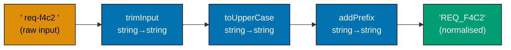

```fsharp
// >> is the forward composition operator: f >> g means "apply f then g".
// Each step is a pure function; the pipeline is their composition.

// Individual pipeline steps — each is a pure function, independently testable
let trimInput (s: string) : string =
    s.Trim()
    // => Removes leading and trailing whitespace from raw user input

let toUpperCase (s: string) : string =
    s.ToUpperInvariant()
    // => Normalises to uppercase for consistent storage in the requisition database

let normaliseReqId (s: string) : string =
    "REQ_" + s.Replace("-", "_")
    // => Applies the canonical requisition ID prefix and replaces hyphens with underscores

// Composing three steps into one function using >>
let normaliseRequisitionId : string -> string =
    trimInput >> toUpperCase >> normaliseReqId
    // => Reads left to right: trim, then uppercase, then normalise
    // => normaliseRequisitionId : string -> string — three functions become one

// Test the composed function
let raw = "  req-f4c2  "
// => raw : string = "  req-f4c2  " — has leading/trailing whitespace and hyphens
let normalised = normaliseRequisitionId raw
// => Step 1: trimInput "  req-f4c2  " = "req-f4c2"
// => Step 2: toUpperCase "req-f4c2" = "REQ-F4C2"
// => Step 3: normaliseReqId "REQ-F4C2" = "REQ_F4C2"
// => normalised = "REQ_F4C2"

printfn "Raw: '%s'" raw
// => Output: Raw: '  req-f4c2  '
printfn "Normalised: '%s'" normalised
// => Output: Normalised: 'REQ_F4C2'

// Each step can be tested independently
printfn "Trim only: '%s'" (trimInput raw)
// => Output: Trim only: 'req-f4c2'
```

**Key Takeaway**: The `>>` operator composes functions left-to-right, producing a single function from a sequence of steps, each of which can be tested and reasoned about independently.

**Why It Matters**: Composed pipelines replace long chains of intermediate `let` bindings with a single, readable declaration of intent. Each step in the composition is independently testable — you can unit test `trimInput`, `toUpperCase`, and `normaliseReqId` in isolation, then compose them with confidence. When a new normalisation step is needed (e.g., stripping special characters), it is inserted into the composition chain and the compiler verifies type alignment automatically.

---

### Example 27: Pipe Operator |>

The `|>` (pipe) operator passes a value as the last argument to a function: `x |> f = f x`. It enables a left-to-right reading of data transformations, matching how procurement domain experts describe workflows — "take the requisition, validate it, compute the total, derive the approval level."

```fsharp
// |> is the forward pipe operator: x |> f = f x.
// Enables left-to-right reading of data transformations.

type ApprovalLevel = L1 | L2 | L3
// => Three approval tiers in the procurement domain

// Pure domain functions
let validateNotEmpty (s: string) : string option =
    if System.String.IsNullOrWhiteSpace(s) then None
    else Some (s.Trim())
    // => Returns None for blank/whitespace, Some trimmed string for valid input

let computeLineTotal (qty: int) (price: decimal) : decimal =
    decimal qty * price
    // => Pure arithmetic — no side effects

let sumLineTotals (totals: decimal list) : decimal =
    List.sum totals
    // => Sum a list of decimal line totals into a requisition total

let deriveLevel (total: decimal) : ApprovalLevel =
    if total <= 1000m then L1
    elif total <= 10000m then L2
    else L3
    // => Pure derivation — same input always produces same output

// Reading a pipeline left-to-right using |>
let rawLines = [(10, 8.50m); (3, 899.99m); (5, 25.00m)]
// => rawLines : (int * decimal) list — (quantity, unitPrice) tuples

let approvalLevel =
    rawLines
    |> List.map (fun (qty, price) -> computeLineTotal qty price)
    // => Maps each (qty, price) to its line total: [85.00; 2699.97; 125.00]
    |> sumLineTotals
    // => Sums the list: 85.00 + 2699.97 + 125.00 = 2909.97
    |> deriveLevel
    // => 2909.97 > 1000 and <= 10000 — ApprovalLevel = L2
// => approvalLevel : ApprovalLevel = L2

printfn "Approval level: %A" approvalLevel
// => Output: Approval level: L2

// Contrast: without |>, the nesting reads right-to-left (inside-out)
let approvalLevelNested =
    deriveLevel (sumLineTotals (List.map (fun (qty, price) -> computeLineTotal qty price) rawLines))
// => Same result, but reads right-to-left — harder to follow
// => approvalLevelNested : ApprovalLevel = L2
printfn "Same result: %A" approvalLevelNested
// => Output: Same result: L2
```

**Key Takeaway**: The `|>` operator enables left-to-right pipeline reading that matches how procurement domain experts describe workflows, making code readable without sacrificing functional purity.

**Why It Matters**: The pipe operator is one of F#'s most-cited readability features. In a procurement context, the pipeline `rawLines |> computeTotals |> sumTotals |> deriveLevel` reads exactly like the domain description: "take the lines, compute their totals, sum them, then determine the approval level." This alignment between code and domain description reduces the translation overhead between domain expert and developer, a core goal of DDD.

---

### Example 28: Currying — Every F# Function is One-Arg

Every F# function technically takes one argument and returns a function or a value. This is currying. It enables partial application: supplying some arguments up front to produce a specialised function. In the procurement domain, partial application injects dependencies like approval thresholds into workflow functions.

```fsharp
// Every multi-argument F# function is syntactic sugar for a chain of one-arg functions.
// This enables partial application: supply some args to get a specialised function.

// A two-argument function
let applyApprovalThreshold (threshold: decimal) (total: decimal) : bool =
    // => applyApprovalThreshold : decimal -> decimal -> bool
    // => The arrow type shows the curried structure: threshold → (total → bool)
    total > threshold
    // => Returns true if the total exceeds the threshold — triggers escalation

// Partial application: supply the threshold, get back a (decimal -> bool) function
let requiresL2Approval : decimal -> bool =
    applyApprovalThreshold 1000m
    // => requiresL2Approval : decimal -> bool
    // => The threshold 1000m is baked in — only the total is needed at call time

let requiresL3Approval : decimal -> bool =
    applyApprovalThreshold 10000m
    // => requiresL3Approval : decimal -> bool
    // => The threshold 10000m is baked in

// Use the specialised functions
let total1 = 500m
// => total1 : decimal = 500 — under both thresholds
let total2 = 5000m
// => total2 : decimal = 5000 — over L2 threshold but under L3
let total3 = 50000m
// => total3 : decimal = 50000 — over both thresholds

printfn "$500: L2=%b, L3=%b" (requiresL2Approval total1) (requiresL3Approval total1)
// => 500 > 1000 = false; 500 > 10000 = false
// => Output: $500: L2=false, L3=false

printfn "$5000: L2=%b, L3=%b" (requiresL2Approval total2) (requiresL3Approval total2)
// => 5000 > 1000 = true; 5000 > 10000 = false
// => Output: $5000: L2=true, L3=false

printfn "$50000: L2=%b, L3=%b" (requiresL2Approval total3) (requiresL3Approval total3)
// => 50000 > 1000 = true; 50000 > 10000 = true
// => Output: $50000: L2=true, L3=true
```

**Key Takeaway**: Currying turns multi-argument functions into pipelines of one-argument functions, enabling partial application that bakes in dependencies (like approval thresholds) to produce specialised, reusable functions.

**Why It Matters**: Partial application is the functional equivalent of dependency injection without a container. In the procurement domain, thresholds like `$1,000` and `$10,000` come from configuration. Partially applying `applyApprovalThreshold` with a runtime-loaded threshold produces a specialised function (`requiresL2Approval`) that can be passed into workflows without coupling the workflow to configuration loading. This is the foundation of the dependency injection pattern explored in Examples 45–50.

---

### Example 29: Workflow Expressed as Function Composition

A complete procurement workflow is a composition of pure steps. The `submitAndRoute` workflow composes validation, total computation, approval level derivation, and event production into a single pipeline using `>>` and `|>`.

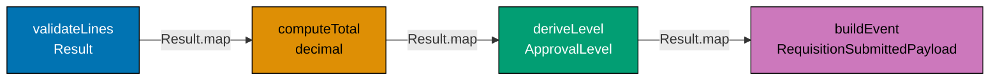

```fsharp
// A procurement workflow assembled from pure, composable steps.

type ApprovalLevel = L1 | L2 | L3
// => L1 ≤ $1k, L2 ≤ $10k, L3 > $10k
type RequisitionId = RequisitionId of string
// => Single-case DU wraps string for type safety

type RawLine = { Sku: string; Qty: int; Price: decimal }
// => Unvalidated line arriving from the HTTP layer

type RequisitionSubmittedPayload = {
    Id:            RequisitionId
    // => Wrapped id — type prevents mixing with PurchaseOrderId
    ApprovalLevel: ApprovalLevel
    // => L1/L2/L3 derived from total at submission time
    RequestedBy:   string
    // => Employee id of the requester
    TotalAmount:   decimal
    // => Sum of all line totals at submission time
}
// => Event payload — everything a downstream consumer needs

// Individual pure steps
let validateLines (lines: RawLine list) : Result<RawLine list, string> =
    if lines.IsEmpty then Error "At least one line item is required"
    // => Business rule: blank requisitions cannot be submitted
    elif lines |> List.exists (fun l -> l.Qty <= 0) then Error "All quantities must be > 0"
    // => Business rule: zero or negative quantities are invalid
    else Ok lines
    // => All lines pass basic validation

let computeTotal (lines: RawLine list) : decimal =
    lines |> List.sumBy (fun l -> decimal l.Qty * l.Price)
    // => Pure arithmetic — sums all line totals

let deriveLevel (total: decimal) : ApprovalLevel =
    if total <= 1000m then L1 elif total <= 10000m then L2 else L3
    // => Derives approval level from total — same input always yields same output

let buildEvent (requestedBy: string) (level: ApprovalLevel) (total: decimal) : RequisitionSubmittedPayload =
    { Id            = RequisitionId ("req_" + System.Guid.NewGuid().ToString("N").[..7])
      // => Generates a short req id like "req_a1b2c3d4"
      ApprovalLevel = level
      // => Captured at submission — immutable after this point
      RequestedBy   = requestedBy
      // => Identifies who triggered the workflow
      TotalAmount   = total }
      // => Locked in from validated lines; not recomputed downstream
    // => Assembles the event payload from validated, derived values

// Composed workflow
let submitRequisition (requestedBy: string) (lines: RawLine list) : Result<RequisitionSubmittedPayload, string> =
    lines
    |> validateLines
    // => Step 1: validate — returns Result; short-circuits on Error
    |> Result.map computeTotal
    // => Step 2: compute total from validated lines — runs only if Ok
    |> Result.map (fun total ->
        let level = deriveLevel total
        // => Step 3: derive approval level from total
        buildEvent requestedBy level total
        // => Step 4: build the event payload
    )
    // => Entire pipeline: validate → total → level → event

// Test
let lines = [{ Sku = "OFF-0042"; Qty = 10; Price = 8.50m }
             // => Line 1: 10 × $8.50 = $85.00
             { Sku = "ELE-0099"; Qty = 3;  Price = 899.99m }]
             // => Line 2: 3 × $899.99 = $2,699.97
// => Two valid lines — total = 85.00 + 2699.97 = 2784.97

let result = submitRequisition "emp_00456" lines
// => validateLines: Ok; computeTotal: 2784.97; deriveLevel: L2; buildEvent: Ok payload

match result with
| Ok payload -> printfn "Submitted: level=%A total=%M" payload.ApprovalLevel payload.TotalAmount
// => Output: Submitted: level=L2 total=2784.9700M
| Error e    -> printfn "Error: %s" e
// => Short-circuit: prints error message if any step fails
```

**Key Takeaway**: A procurement workflow assembled from pure composable steps is easier to test, extend, and reason about than a single monolithic function — each step is independently testable and the composition is explicit.

**Why It Matters**: When an approval threshold changes from `$1,000` to `$2,000`, only `deriveLevel` needs updating. When a new validation rule is added, it is inserted into the pipeline as a new step. The composition makes the workflow's structure visible at a glance, and the `Result.map` chain ensures errors propagate cleanly without try/catch blocks scattered through the implementation.

---

## Railway-Oriented Programming (Examples 30–36)

### Example 30: Result Type — Ok and Error

`Result<'T, 'Error>` is F#'s built-in type for computations that can fail. It is a discriminated union with two cases: `Ok value` (success) and `Error err` (failure). Using `Result` instead of exceptions keeps failure handling in the type system and forces callers to acknowledge both paths.

```fsharp
// Result<'T, 'Error> — the foundation of Railway-Oriented Programming.
// Ok carries the success value; Error carries the failure description.

// Domain errors for the purchasing context — named, not stringly-typed
type ProcurementError =
    | RequisitionNotFound    of id: string
    // => Database lookup returned nothing for this ID
    | InsufficientBudget     of required: decimal * available: decimal
    // => The requisition total exceeds the department budget
    | SupplierNotApproved    of supplierId: string
    // => The selected supplier is Suspended or Blacklisted
    | DuplicateRequisition   of existingId: string
    // => A requisition for the same items was already submitted this week

// Functions that can fail return Result — not throw exceptions
let findRequisition (id: string) (store: Map<string, string>) : Result<string, ProcurementError> =
    // => store: Map<string, string> simulates a lookup (id → serialised requisition)
    match Map.tryFind id store with
    | Some req -> Ok req
    // => Found — return the requisition as Ok
    | None     -> Error (RequisitionNotFound id)
    // => Not found — return a named error, not null, not an exception

let checkBudget (required: decimal) (available: decimal) : Result<unit, ProcurementError> =
    // => Checks that the required amount does not exceed available budget
    if required > available then
        Error (InsufficientBudget (required, available))
        // => Budget exceeded — named error with both amounts for the error message
    else
        Ok ()
        // => Budget sufficient — Ok unit (no useful success value to return here)

// Test the Result-returning functions
let store = Map.ofList [("req_f4c2a1b7", "requisition data")]
// => store : Map<string, string> — simulated data store with one entry

let found    = findRequisition "req_f4c2a1b7" store
// => "req_f4c2a1b7" is in the store — found : Result<string, ProcurementError> = Ok "requisition data"
let notFound = findRequisition "req_missing" store
// => "req_missing" is not in the store — notFound : Result<string, ProcurementError> = Error (RequisitionNotFound "req_missing")

let budgetOk  = checkBudget 2784.97m 5000m
// => 2784.97 <= 5000 — budgetOk : Result<unit, ProcurementError> = Ok ()
let budgetErr = checkBudget 2784.97m 1000m
// => 2784.97 > 1000 — budgetErr : Result<unit, ProcurementError> = Error (InsufficientBudget (2784.97, 1000))

match notFound with
| Ok req  -> printfn "Found: %s" req
| Error e -> printfn "Error: %A" e
// => Output: Error: RequisitionNotFound "req_missing"

match budgetErr with
| Ok ()   -> printfn "Budget ok"
| Error e -> printfn "Error: %A" e
// => Output: Error: InsufficientBudget (2784.97M, 1000M)
```

**Key Takeaway**: `Result<'T, 'Error>` makes the possibility of failure explicit in the type system, forcing callers to handle both success and failure paths rather than relying on exceptions that can be silently swallowed.

**Why It Matters**: Procurement workflows have many potential failure modes: requisitions not found, budgets exceeded, suppliers suspended, duplicate submissions. Using named `ProcurementError` cases instead of generic exceptions means the API layer can map each error to the correct HTTP status code (404, 422, 409) with a meaningful error body. It also means the compiler prevents forgetting to handle a failure case — there is no equivalent of an unchecked exception.

---

### Example 31: Result.bind — Chaining Fallible Steps

`Result.bind` chains two fallible steps: if the first step succeeds, it passes the `Ok` value into the second step; if the first fails, the `Error` propagates without running the second step. This is the foundation of Railway-Oriented Programming.

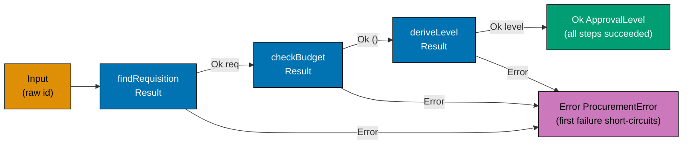

```fsharp
// Result.bind chains fallible steps — short-circuits on the first Error.
// This is the "railway" metaphor: Ok stays on the happy track, Error diverts.

type ApprovalLevel = L1 | L2 | L3

type ProcurementError =
    | RequisitionNotFound of id: string
    | InsufficientBudget  of required: decimal * available: decimal
    | SupplierNotApproved of supplierId: string

// Three fallible steps in the approval workflow
let lookupRequisition (id: string) : Result<decimal, ProcurementError> =
    // => Simulate: returns the requisition total if found
    if id = "req_f4c2a1b7" then Ok 2784.97m
    // => Found — return the total amount
    else Error (RequisitionNotFound id)
    // => Not found — short-circuit with a named error

let verifyBudget (total: decimal) : Result<decimal, ProcurementError> =
    // => Simulate: checks the department budget (budget = $5,000)
    if total <= 5000m then Ok total
    // => Within budget — pass the total forward
    else Error (InsufficientBudget (total, 5000m))
    // => Exceeds budget — short-circuit

let computeLevel (total: decimal) : Result<ApprovalLevel, ProcurementError> =
    // => Derives the approval level — always succeeds for valid totals
    let level = if total <= 1000m then L1 elif total <= 10000m then L2 else L3
    Ok level
    // => Wraps the level in Ok — could fail if additional constraints applied

// Chaining with Result.bind
let approvalWorkflow (reqId: string) : Result<ApprovalLevel, ProcurementError> =
    lookupRequisition reqId
    // => Step 1: look up — may fail with RequisitionNotFound
    |> Result.bind verifyBudget
    // => Step 2: verify budget — runs only if Step 1 was Ok; may fail with InsufficientBudget
    |> Result.bind computeLevel
    // => Step 3: compute level — runs only if Step 2 was Ok

// Happy path
let happy = approvalWorkflow "req_f4c2a1b7"
// => Step 1 Ok 2784.97 → Step 2 Ok 2784.97 → Step 3 Ok L2
// => happy : Result<ApprovalLevel, ProcurementError> = Ok L2

// Error path — fails at Step 1
let missing = approvalWorkflow "req_missing"
// => Step 1 Error (RequisitionNotFound "req_missing") — Steps 2 and 3 skipped
// => missing : Result<ApprovalLevel, ProcurementError> = Error (RequisitionNotFound "req_missing")

printfn "Happy: %A" happy
// => Output: Happy: Ok L2
printfn "Missing: %A" missing
// => Output: Missing: Error (RequisitionNotFound "req_missing")
```

**Key Takeaway**: `Result.bind` creates a clean error-propagation pipeline where the first failure short-circuits the rest of the chain — no nested if/else, no try/catch, no null checks.

**Why It Matters**: Without `Result.bind`, chaining three fallible steps requires nested match expressions or if/else chains that obscure the happy path. With `Result.bind`, the pipeline reads linearly and the error handling is structural. Adding a new step (e.g., checking supplier eligibility) means inserting one more `|> Result.bind checkSupplier` — no restructuring of the error-handling logic required.

---

### Example 32: Result.map — Transforming the Success Value

`Result.map` transforms the `Ok` value of a `Result` without touching the `Error` case. It is the non-fallible counterpart to `Result.bind` — use `map` when the transformation cannot fail, `bind` when it can.

```fsharp
// Result.map transforms the Ok value; Error passes through unchanged.
// Use map for infallible transformations inside a Result pipeline.

type ApprovalLevel = L1 | L2 | L3

type ApprovalRouting = {
    Level:         ApprovalLevel
    ApproverEmail: string
    SlaDays:       int
}
// => The output of the routing step — derived from ApprovalLevel

// An infallible transformation: ApprovalLevel → ApprovalRouting
let buildRouting (level: ApprovalLevel) : ApprovalRouting =
    // => This cannot fail — every ApprovalLevel maps to a routing record
    match level with
    | L1 -> { Level = L1; ApproverEmail = "manager@co.example"; SlaDays = 2 }
    // => L1: direct manager, 2-day SLA
    | L2 -> { Level = L2; ApproverEmail = "dept-head@co.example"; SlaDays = 5 }
    // => L2: department head, 5-day SLA
    | L3 -> { Level = L3; ApproverEmail = "cfo@co.example"; SlaDays = 10 }
    // => L3: CFO, 10-day SLA

// A fallible step that returns Result<ApprovalLevel, string>
let deriveLevel (total: decimal) : Result<ApprovalLevel, string> =
    if total < 0m then Error "Total cannot be negative"
    // => Guard: negative totals are a data error
    else Ok (if total <= 1000m then L1 elif total <= 10000m then L2 else L3)
    // => Derives the level — wrapped in Ok

// Using Result.map to apply the infallible buildRouting transformation
let routingResult =
    deriveLevel 2784.97m
    // => Ok L2 — 2784.97 is within L2 range
    |> Result.map buildRouting
    // => Result.map applies buildRouting to the L2 value inside Ok
    // => buildRouting L2 = { Level = L2; ApproverEmail = "dept-head@co.example"; SlaDays = 5 }
    // => routingResult : Result<ApprovalRouting, string> = Ok { Level = L2; ... }

// Error case — map is skipped
let errorResult =
    deriveLevel (-1m)
    // => Error "Total cannot be negative"
    |> Result.map buildRouting
    // => Result.map is skipped — Error passes through unchanged
    // => errorResult : Result<ApprovalRouting, string> = Error "Total cannot be negative"

match routingResult with
| Ok r  -> printfn "Route to %s (SLA: %d days)" r.ApproverEmail r.SlaDays
// => Output: Route to dept-head@co.example (SLA: 5 days)
| Error e -> printfn "Error: %s" e

match errorResult with
| Ok _    -> printfn "Should not reach here"
| Error e -> printfn "Error passthrough: %s" e
// => Output: Error passthrough: Total cannot be negative
```

**Key Takeaway**: `Result.map` applies an infallible transformation to the `Ok` value and passes `Error` through unchanged — keeping the error channel clean without re-wrapping or unwrapping.

**Why It Matters**: In a procurement pipeline, many steps are infallible transformations: deriving approval routing from a level, formatting an email notification, building a PO number from a sequence. Using `Result.map` for these steps keeps the pipeline uniform — every step in the chain produces a `Result`, and the composition rules are consistent throughout.

---

### Example 33: Validation Accumulation with List of Errors

`Result.bind` short-circuits on the first error. But form validation requires collecting _all_ errors so the user can fix everything at once. Applicative validation accumulates errors using a custom `Validation` type.

```fsharp
// Validation accumulation: collect all errors, not just the first.
// Use this for user-facing form validation (HTTP 400 responses with full error list).

// A Validation type that accumulates errors in a list
type Validation<'a, 'e> =
    | ValidationOk    of 'a
    // => All fields passed — carry the valid value
    | ValidationError of 'e list
    // => One or more fields failed — carry the list of errors

// Lift a Result into a Validation (single-error case)
let ofResult (r: Result<'a, 'e>) : Validation<'a, 'e> =
    match r with
    | Ok v    -> ValidationOk v
    // => Success becomes ValidationOk
    | Error e -> ValidationError [e]
    // => Single error becomes a one-element list — ready for accumulation

// Apply: combine two Validations, accumulating errors from both
let apply (fVal: Validation<'a -> 'b, 'e>) (xVal: Validation<'a, 'e>) : Validation<'b, 'e> =
    match fVal, xVal with
    | ValidationOk f,    ValidationOk x    -> ValidationOk (f x)
    // => Both ok — apply the function to the value
    | ValidationError e, ValidationOk _    -> ValidationError e
    // => Function failed — carry its errors forward
    | ValidationOk _,    ValidationError e -> ValidationError e
    // => Value failed — carry its errors forward
    | ValidationError e1, ValidationError e2 -> ValidationError (e1 @ e2)
    // => Both failed — concatenate the error lists (accumulation!)

// Domain: validate a line item, accumulating all field errors
let validateSku (raw: string) : Validation<string, string> =
    if System.String.IsNullOrWhiteSpace(raw) then ValidationError ["SkuCode is required"]
    // => Blank SKU — collect this error
    elif raw.Length < 5 then ValidationError [sprintf "SkuCode '%s' is too short (min 5 chars)" raw]
    // => Too short — collect this error
    else ValidationOk raw
    // => Valid SKU

let validateQty (qty: int) : Validation<int, string> =
    if qty <= 0 then ValidationError [sprintf "Quantity must be > 0, got %d" qty]
    // => Non-positive quantity — collect this error
    else ValidationOk qty
    // => Valid quantity

let validatePrice (price: decimal) : Validation<decimal, string> =
    if price <= 0m then ValidationError [sprintf "UnitPrice must be > 0, got %M" price]
    // => Non-positive price — collect this error
    else ValidationOk price
    // => Valid price

// Accumulate all errors from a line item
type ValidLine = { Sku: string; Qty: int; Price: decimal }

let validateLine (sku: string) (qty: int) (price: decimal) : Validation<ValidLine, string> =
    let mkLine s q p = { Sku = s; Qty = q; Price = p }
    // => Constructor function for ValidLine — partially applied below
    apply (apply (apply (ValidationOk mkLine) (validateSku sku)) (validateQty qty)) (validatePrice price)
    // => Applicative style: accumulates errors from all three field validations

// Test: line with two errors
let result = validateLine "" (-1) 10m
// => SkuCode blank → ValidationError ["SkuCode is required"]
// => Quantity -1   → ValidationError ["Quantity must be > 0, got -1"]
// => UnitPrice 10  → ValidationOk 10
// => Combined:       ValidationError ["SkuCode is required"; "Quantity must be > 0, got -1"]

match result with
| ValidationOk line   -> printfn "Valid line: %A" line
| ValidationError errs -> errs |> List.iter (printfn "- %s")
// => Output: - SkuCode is required
// => Output: - Quantity must be > 0, got -1
```

**Key Takeaway**: Applicative validation accumulates all errors from all fields simultaneously, enabling user-facing form validation that reports every problem at once rather than one at a time.

**Why It Matters**: A procurement requisition form with ten fields should report all validation errors in a single response, not force the user to submit and resubmit ten times. The applicative validation pattern separates "collect all errors" (validation) from "stop at first error" (domain pipeline). Both use `Result`-like types, but serve different concerns: validation serves the UI, `Result.bind` pipelines serve the domain logic.

---

### Example 34: Computation Expression for Result

F#'s `result` computation expression (a.k.a. "do notation") lets you write `Result.bind` chains in imperative-looking syntax. The `let!` keyword desugars to `Result.bind`, making the pipeline read like sequential steps without explicit chaining.

```fsharp
// The result computation expression: bind chains in imperative style.
// let! desugars to Result.bind; return desugars to Ok.

// A simple Result CE builder
type ResultBuilder() =
    member _.Bind(m, f)   = Result.bind f m
    // => let! x = m desugars to Result.bind (fun x -> ...) m
    member _.Return(x)    = Ok x
    // => return x desugars to Ok x
    member _.ReturnFrom(m) = m
    // => return! m desugars to m (pass through)

let result = ResultBuilder()
// => result : ResultBuilder — the computation expression builder

type ProcurementError = NotFound of string | InvalidAmount of decimal | SupplierBlocked of string
// => Named errors for the procurement domain

// Functions that return Result
let loadRequisition (id: string) : Result<decimal, ProcurementError> =
    if id = "req_f4c2" then Ok 2784.97m
    else Error (NotFound id)
    // => Returns the total if found, NotFound error otherwise

let checkApprovalBudget (total: decimal) : Result<decimal, ProcurementError> =
    if total > 50000m then Error (InvalidAmount total)
    else Ok total
    // => Rejects totals over $50,000 without special override

let lookupSupplier (supplierId: string) : Result<string, ProcurementError> =
    if supplierId = "sup_blacklisted" then Error (SupplierBlocked supplierId)
    else Ok "approved-supplier"
    // => Returns supplier name if approved, SupplierBlocked if blacklisted

// Using the computation expression — reads like sequential imperative code
let approveRequisition (reqId: string) (supplierId: string) : Result<string, ProcurementError> =
    result {
        let! total    = loadRequisition reqId
        // => let! desugars to Result.bind — if Error, short-circuits here
        let! verified = checkApprovalBudget total
        // => Only runs if loadRequisition returned Ok
        let! supplier = lookupSupplier supplierId
        // => Only runs if checkApprovalBudget returned Ok
        return sprintf "Approved: req=%s total=%M supplier=%s" reqId verified supplier
        // => return desugars to Ok — reached only if all three steps succeed
    }

// Happy path
let happy = approveRequisition "req_f4c2" "sup_acme"
// => loadRequisition: Ok 2784.97 → checkApprovalBudget: Ok 2784.97 → lookupSupplier: Ok "approved-supplier"
// => happy : Result<string, ProcurementError> = Ok "Approved: req=req_f4c2 total=2784.9700M supplier=approved-supplier"

// Error path
let blocked = approveRequisition "req_f4c2" "sup_blacklisted"
// => loadRequisition: Ok → checkApprovalBudget: Ok → lookupSupplier: Error (SupplierBlocked "sup_blacklisted")
// => blocked : Result<string, ProcurementError> = Error (SupplierBlocked "sup_blacklisted")

printfn "%A" happy
// => Output: Ok "Approved: ..."
printfn "%A" blocked
// => Output: Error (SupplierBlocked "sup_blacklisted")
```

**Key Takeaway**: The `result` computation expression writes `Result.bind` chains in familiar sequential syntax, making complex multi-step procurement pipelines readable without sacrificing functional error propagation.

**Why It Matters**: The CE syntax is a significant ergonomic improvement for workflows with many sequential fallible steps. A five-step approval workflow using explicit `Result.bind` chains requires five levels of nesting or five `|>` operators; the CE writes it as five sequential `let!` bindings that read like straightforward procedural code while remaining purely functional in semantics.

---

### Example 35: Async Result — Effects at the Edges

Real procurement workflows involve I/O: loading a requisition from Postgres, calling the approval router API, publishing a domain event. `Async<Result<'T, 'Error>>` composes the two: `Async` handles the effect, `Result` handles the failure.

```fsharp
// Async<Result<'T, 'Error>> combines effects with structured failure handling.
// Async = I/O effect; Result = domain failure. Both compose cleanly.

type ProcurementError = DbTimeout | NotFound of string | PublishFailed of string
// => Infrastructure errors join domain errors in the same union

// Simulated async operations (would call Postgres / Kafka in production)
let loadRequisitionAsync (id: string) : Async<Result<decimal, ProcurementError>> =
    async {
        do! Async.Sleep 0
        // => Simulate async I/O — zero delay for the example
        if id = "req_f4c2" then return Ok 2784.97m
        // => Found — return the requisition total
        else return Error (NotFound id)
        // => Not found — return named error
    }

let publishEventAsync (reqId: string) (total: decimal) : Async<Result<unit, ProcurementError>> =
    async {
        do! Async.Sleep 0
        // => Simulate async publish to Kafka/outbox
        printfn "[EventBus] Publishing RequisitionSubmitted for %s (total: %M)" reqId total
        // => Side effect: publishing the event — happens at the edge
        return Ok ()
        // => Publish succeeded
    }

// Composing Async<Result> steps with asyncResult helper
let bindAsyncResult
    (f: 'a -> Async<Result<'b, 'e>>)
    (ar: Async<Result<'a, 'e>>) : Async<Result<'b, 'e>> =
    async {
        let! r = ar
        // => Await the first Async to get its Result
        match r with
        | Ok v    -> return! f v
        // => Success — pass value into next async step
        | Error e -> return Error e
        // => Failure — short-circuit; don't run next step
    }

// The workflow: load requisition, then publish event
let submitWorkflow (reqId: string) : Async<Result<unit, ProcurementError>> =
    loadRequisitionAsync reqId
    // => Step 1: load from database (async I/O)
    |> bindAsyncResult (fun total -> publishEventAsync reqId total)
    // => Step 2: publish event (async I/O) — only if Step 1 succeeded

// Run the workflow
let runResult = Async.RunSynchronously (submitWorkflow "req_f4c2")
// => Runs the async workflow synchronously for demonstration purposes
// => Step 1: Ok 2784.97 → Step 2: publishes event → Ok ()

printfn "Result: %A" runResult
// => Output: [EventBus] Publishing RequisitionSubmitted for req_f4c2 (total: 2784.9700M)
// => Output: Result: Ok null
```

**Key Takeaway**: `Async<Result<'T, 'Error>>` separates the concern of "this involves I/O" (Async) from "this can fail with a named error" (Result), composing both without losing either.

**Why It Matters**: In a production procurement system, almost every workflow step involves I/O: database reads, event publishing, supplier API calls, approval system webhooks. Mixing `Async` and `Result` without a principled composition strategy leads to deeply nested match expressions inside async blocks. The `Async<Result<>>` pattern gives both dimensions a clean composition model, enabling workflows of ten or more async fallible steps to be written as a flat pipeline.

---

### Example 36: Domain Error DU — Every Failure Mode Named

A comprehensive `ProcurementError` discriminated union names every failure mode the purchasing context can produce. Named errors enable precise API error mapping, monitoring alerts, and domain-specific retry policies.

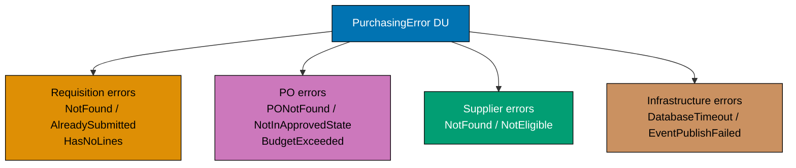

```fsharp
// Every failure mode in the purchasing context is a named DU case.
// This drives precise HTTP status codes, alerting, and retry logic.

type RequisitionId   = RequisitionId   of string
type PurchaseOrderId = PurchaseOrderId of string
type SupplierId      = SupplierId      of string

// The complete purchasing context error DU
type PurchasingError =
    // Requisition errors
    | RequisitionNotFound      of RequisitionId
    // => The requisition ID does not exist in the database (404)
    | RequisitionAlreadySubmitted of RequisitionId
    // => Attempt to submit a requisition that is already Submitted (409 Conflict)
    | RequisitionHasNoLines    of RequisitionId
    // => Cannot submit a requisition with zero line items (422 Unprocessable)
    | InvalidSkuCode           of sku: string
    // => A line item's SKU does not match the required format (422)
    | NegativeQuantity         of sku: string * qty: int
    // => A line item's quantity is ≤ 0 (422)
    | NegativePrice            of sku: string * price: decimal
    // => A line item's unit price is ≤ 0 (422)
    // Supplier errors
    | SupplierNotFound         of SupplierId
    // => The selected supplier does not exist in the supplier master (404)
    | SupplierNotApproved      of SupplierId
    // => The supplier is Pending, Suspended, or Blacklisted — cannot receive POs (422)
    // Budget errors
    | BudgetExceeded           of required: decimal * available: decimal
    // => The requisition total exceeds the department's available budget (422)
    | ApprovalLevelNotMet      of required: string * actual: string
    // => The approver does not have sufficient authority level (403)

// Map error to HTTP status code — lives at the API boundary, not the domain
let toHttpStatus (error: PurchasingError) : int =
    match error with
    | RequisitionNotFound _            -> 404
    | SupplierNotFound _               -> 404
    // => Not found errors → 404
    | RequisitionAlreadySubmitted _    -> 409
    // => Conflict (duplicate action) → 409
    | ApprovalLevelNotMet _            -> 403
    // => Insufficient authority → 403
    | RequisitionHasNoLines _
    | InvalidSkuCode _
    | NegativeQuantity _
    | NegativePrice _
    | SupplierNotApproved _
    | BudgetExceeded _                 -> 422
    // => Business rule violations → 422 Unprocessable Entity

// Test
let err1 = SupplierNotApproved (SupplierId "sup_blocked")
// => err1 : PurchasingError = SupplierNotApproved (SupplierId "sup_blocked")
let err2 = BudgetExceeded (15000m, 10000m)
// => err2 : PurchasingError = BudgetExceeded (15000M, 10000M)

printfn "Status: %d — %A" (toHttpStatus err1) err1
// => Output: Status: 422 — SupplierNotApproved (SupplierId "sup_blocked")
printfn "Status: %d — %A" (toHttpStatus err2) err2
// => Output: Status: 422 — BudgetExceeded (15000M, 10000M)
```

**Key Takeaway**: A comprehensive named error DU makes every failure mode visible, testable, and precisely mappable to API responses — stringly-typed errors or generic exceptions cannot provide this level of precision.

**Why It Matters**: In a procurement API, returning the right HTTP status code and error body is contractual — clients (web UIs, ERP integrations, EDI systems) rely on these codes to decide whether to retry, alert, or present a user-facing message. A named `PurchasingError` DU makes the `toHttpStatus` mapping exhaustive (the compiler enforces it) and documents every error mode as part of the domain contract.

---

## Workflow Signatures and Domain Architecture (Examples 37–50)

### Example 37: PurchaseOrder Aggregate — Full State Machine

The `PurchaseOrder` is the workhorse aggregate of the purchasing context. Its state machine governs the full lifecycle from `Draft` through `Issued`, `Received`, `Invoiced`, and `Paid` to `Closed`, with off-ramps to `Cancelled` and `Disputed`.

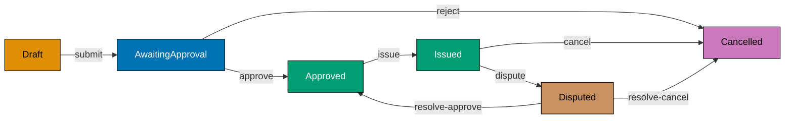

```fsharp
// PurchaseOrder: the primary aggregate of the purchasing context.
// States model the full lifecycle; transitions are typed functions.

type PurchaseOrderId = PurchaseOrderId of string
type RequisitionId   = RequisitionId   of string
type SupplierId      = SupplierId      of string

// Line item on the purchase order
type PoLine = { Sku: string; Quantity: int; UnitPrice: decimal }
// => Simplified for this example — full version uses SkuCode, Quantity, UnitPrice value objects

// PurchaseOrder states — each case carries only the data meaningful in that state
type PurchaseOrder =
    | Draft of {| Id: PurchaseOrderId; RequisitionId: RequisitionId; Lines: PoLine list |}
    // => Draft: being built — lines can still be modified
    | AwaitingApproval of {| Id: PurchaseOrderId; SupplierId: SupplierId; Lines: PoLine list; Total: decimal |}
    // => Submitted for approval — lines are now locked for the review period
    | Approved of {| Id: PurchaseOrderId; SupplierId: SupplierId; Lines: PoLine list; Total: decimal; ApprovedAt: System.DateTimeOffset |}
    // => Approved — ready to be issued to the supplier
    | Issued of {| Id: PurchaseOrderId; SupplierId: SupplierId; IssuedAt: System.DateTimeOffset |}
    // => Formally sent to the supplier — lines are now immutable
    | Cancelled of {| Id: PurchaseOrderId; Reason: string |}
    // => Cancelled — off-ramp from any pre-Paid state
    | Disputed of {| Id: PurchaseOrderId; DisputeReason: string |}
    // => Under dispute — can resolve to Approved or Cancelled

// Transition: Draft → AwaitingApproval
let submitPO (supplierId: SupplierId) (po: PurchaseOrder) : Result<PurchaseOrder, string> =
    match po with
    | Draft d ->
        // => Only Draft POs can be submitted for approval
        if d.Lines.IsEmpty then Error "Cannot submit a PO with no line items"
        // => Invariant: at least one line item required before submission
        else
            let total = d.Lines |> List.sumBy (fun l -> decimal l.Quantity * l.UnitPrice)
            // => Compute total at submission time — drives approval level routing
            Ok (AwaitingApproval {| Id = d.Id; SupplierId = supplierId; Lines = d.Lines; Total = total |})
            // => Produces AwaitingApproval state with total baked in
    | other -> Error (sprintf "Cannot submit PO in state: %A" other)
    // => Any non-Draft state is an invalid transition — rejected

// Build a sample Draft PO
let draft = Draft {| Id = PurchaseOrderId "po_e3d1f8a0"; RequisitionId = RequisitionId "req_f4c2"; Lines = [{ Sku = "ELE-0099"; Quantity = 3; UnitPrice = 899.99m }] |}
// => draft : PurchaseOrder = Draft { Id = ...; Lines = [{ Sku = "ELE-0099"; Quantity = 3; UnitPrice = 899.99 }] }

let submitted = submitPO (SupplierId "sup_acme") draft
// => Lines not empty, supplier provided — transitions Draft → AwaitingApproval
// => submitted : Result<PurchaseOrder, string> = Ok (AwaitingApproval { ...; Total = 2699.97 })

printfn "Submitted: %A" submitted
// => Output: Ok (AwaitingApproval {| Id = ...; Total = 2699.97M; ... |})
```

**Key Takeaway**: Modelling `PurchaseOrder` states as discriminated union cases with typed payloads enforces the state machine at the type level — a transition function that accepts `Draft` cannot be accidentally called with `Issued`.

**Why It Matters**: The `PurchaseOrder` state machine is the compliance heart of any P2P system. Illegal transitions (issuing a PO that was never approved, paying an invoice before three-way matching) are not just business logic errors — they are audit failures. The typed state machine makes these errors impossible to produce, replacing runtime checks and test coverage with compile-time enforcement.

---

### Example 38: Domain Events from State Transitions

When a `PurchaseOrder` transitions to `Issued`, it emits a `PurchaseOrderIssued` event. Domain events are the outputs of aggregate state transitions — they notify downstream contexts (`receiving`, `invoicing`, `supplier-notifier`) that something happened.

```fsharp
// Domain events are emitted by aggregate state transitions.
// Each event carries enough context for all downstream consumers.

type PurchaseOrderId = PurchaseOrderId of string
type SupplierId      = SupplierId      of string

// Domain event emitted when a PO is issued to a supplier
type PurchaseOrderIssued = {
    PurchaseOrderId: PurchaseOrderId
    // => Identity of the issued PO — used by receiving to open a GRN expectation
    SupplierId:      SupplierId
    // => Which supplier receives the PO — supplier-notifier sends EDI/email
    IssuedAt:        System.DateTimeOffset
    // => Timestamp — for SLA tracking and audit trail
    TotalAmount:     decimal
    // => Total value — for accounting to record the commitment
}
// => PurchaseOrderIssued : event payload — past tense, carries all consumer needs

// Domain event emitted when a requisition is approved
type RequisitionApproved = {
    RequisitionId: string
    // => Which requisition was approved
    ApprovedBy:    string
    // => Which manager approved it — for audit trail
    ApprovedAt:    System.DateTimeOffset
    // => Approval timestamp — for SLA reporting
}
// => RequisitionApproved : purchasing emits this; purchasing auto-converts to PO Draft

// Union of all purchasing domain events
type PurchasingEvent =
    | PurchaseOrderIssued  of PurchaseOrderIssued
    | RequisitionApproved  of RequisitionApproved
    | PurchaseOrderCancelled of purchaseOrderId: string * reason: string
    // => Cancelled event — supplier-notifier and accounting are consumers

// A transition function returns both the new state and the events it emits
type PoLine = { Sku: string; Quantity: int; UnitPrice: decimal }

type ApprovedPo = {| Id: PurchaseOrderId; SupplierId: SupplierId; Lines: PoLine list; Total: decimal; ApprovedAt: System.DateTimeOffset |}
type IssuedPo   = {| Id: PurchaseOrderId; SupplierId: SupplierId; IssuedAt: System.DateTimeOffset |}

// Issue transition: Approved → Issued, emitting PurchaseOrderIssued
let issuePO (approved: ApprovedPo) : IssuedPo * PurchasingEvent list =
    let issuedAt = System.DateTimeOffset.UtcNow
    // => Capture issuance timestamp — used in the new state and the event
    let newState = {| Id = approved.Id; SupplierId = approved.SupplierId; IssuedAt = issuedAt |}
    // => New Issued state — lines dropped (immutable from this point; stored in event log)
    let event = PurchaseOrderIssued {
        PurchaseOrderId = approved.Id
        // => Same ID carries across the transition — traceability
        SupplierId      = approved.SupplierId
        // => Supplier needs to know this PO was issued to them
        IssuedAt        = issuedAt
        // => Same timestamp as the state transition — consistency
        TotalAmount     = approved.Total
        // => Total baked into the event — accounting doesn't need to reload the PO
    }
    newState, [event]
    // => Returns the new state AND the list of events — caller routes events to the bus

// Test
let approvedPo = {| Id = PurchaseOrderId "po_e3d1f8a0"; SupplierId = SupplierId "sup_acme"
                    Lines = [{ Sku = "ELE-0099"; Quantity = 3; UnitPrice = 899.99m }]
                    Total = 2699.97m; ApprovedAt = System.DateTimeOffset.UtcNow |}
// => approvedPo : ApprovedPo — in Approved state, ready to be issued

let (issuedState, events) = issuePO approvedPo
// => issuedState : IssuedPo — PO is now Issued
// => events : PurchasingEvent list = [PurchaseOrderIssued { ... }]

printfn "Issued: %A" issuedState.Id
// => Output: Issued: PurchaseOrderId "po_e3d1f8a0"
printfn "Events: %d" events.Length
// => Output: Events: 1
```

**Key Takeaway**: State transition functions that return `(newState, events)` pairs keep event emission co-located with the state change — ensuring events are always emitted when the transition occurs, never accidentally omitted.

**Why It Matters**: `PurchaseOrderIssued` is consumed by at least three downstream contexts: `receiving` (opens a GRN expectation), `supplier-notifier` (sends the EDI/email to the supplier), and `accounting` (records the commitment). If event emission is separate from the state transition (e.g., called manually after saving), it is easy to forget to emit under certain error conditions. The `(newState, events)` return pattern makes emission structural — it cannot be omitted.

---

### Example 39: Supplier Aggregate — Lifecycle States

The `Supplier` aggregate lives in the `supplier` bounded context. Its lifecycle (`Pending → Approved → Suspended → Blacklisted`) determines whether the purchasing context can issue new POs to it.

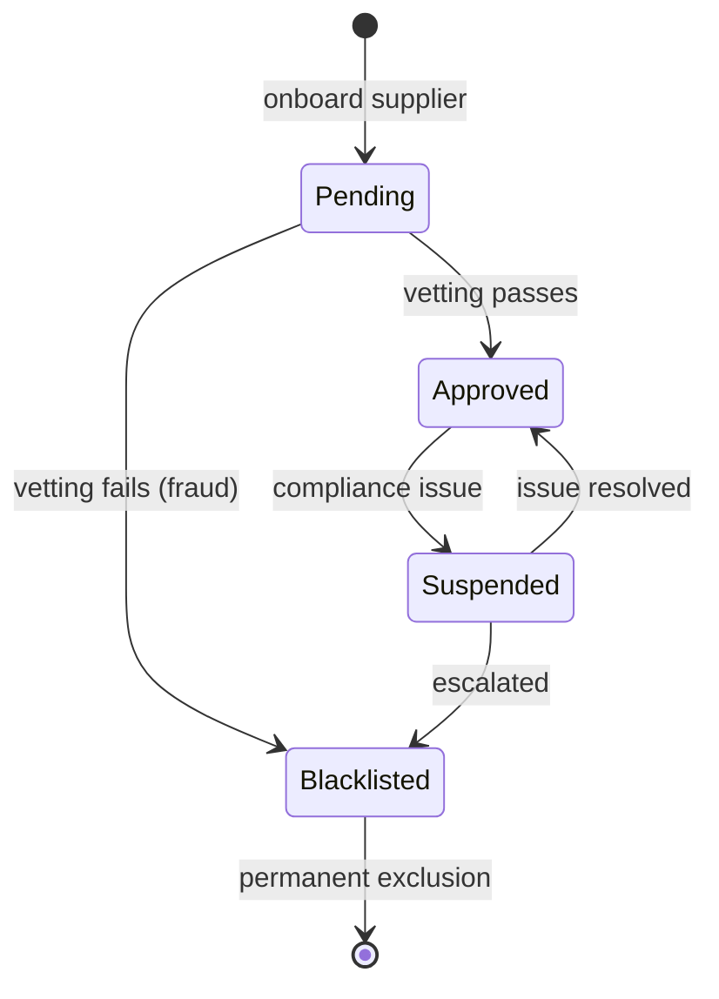

```fsharp
// Supplier: aggregate root of the supplier bounded context.
// Lifecycle state determines eligibility for new POs.

type SupplierId = SupplierId of string
type Email      = Email      of string

// Supplier lifecycle states
type SupplierStatus =
    | Pending     // => Submitted for vendor approval — not yet vetted
    | Approved    // => Vetted and active — eligible for new POs
    | Suspended   // => Temporarily ineligible — existing POs continue; no new POs
    | Blacklisted // => Permanently excluded — existing POs forced to Disputed
// => Exactly one state is active at any time — discriminated union enforces this

// The supplier aggregate
type Supplier = {
    Id:        SupplierId
    // => Supplier identity — format "sup_<uuid>"
    Name:      string
    // => Legal entity name — appears on POs and invoices
    Email:     Email
    // => Primary contact email — receives PO notifications via SupplierNotifierPort
    Status:    SupplierStatus
    // => Current lifecycle state — drives eligibility checks in the purchasing context
    RiskScore: int option
    // => Optional risk score (0–100) — populated after compliance vetting (None while Pending)
}
// => Supplier : aggregate root with identity, contact, status, and optional risk data

// Domain events emitted by the supplier context
type SupplierEvent =
    | SupplierApproved  of SupplierId
    // => Consumer: purchasing (eligible-for-PO list updated)
    | SupplierSuspended of SupplierId * reason: string
    // => Consumer: purchasing (blocks new POs to this supplier)
    | SupplierBlacklisted of SupplierId * reason: string
    // => Consumer: purchasing (forces existing POs to Disputed)

// Transition: approve a pending supplier
let approveSupplier (riskScore: int) (supplier: Supplier) : Result<Supplier * SupplierEvent list, string> =
    match supplier.Status with
    | Pending ->
        // => Only Pending suppliers can be approved
        if riskScore < 0 || riskScore > 100 then
            Error (sprintf "Risk score must be 0–100, got %d" riskScore)
            // => Validate the risk score before applying it
        else
            let approved = { supplier with Status = Approved; RiskScore = Some riskScore }
            // => with-expression: create new Supplier record in Approved state
            let event    = SupplierApproved supplier.Id
            // => Emit SupplierApproved — purchasing context will add to eligible list
            Ok (approved, [event])
            // => Return new state and events together
    | other -> Error (sprintf "Cannot approve a supplier in state: %A" other)
    // => Non-Pending states cannot be approved — guard against invalid transitions

// Test
let pendingSupplier = {
    Id        = SupplierId "sup_acme_001"
    Name      = "Acme Office Supplies Pte Ltd"
    Email     = Email "procurement@acme-supplies.com"
    Status    = Pending
    // => Starts in Pending — not yet eligible for POs
    RiskScore = None
    // => No risk score until vetting is complete
}

let approvalResult = approveSupplier 35 pendingSupplier
// => Status is Pending — valid transition; riskScore 35 is in 0–100 range
// => approvalResult : Result<Supplier * SupplierEvent list, string>

match approvalResult with
| Ok (s, events) ->
    printfn "Supplier status: %A, risk: %A" s.Status s.RiskScore
    // => Output: Supplier status: Approved, risk: Some 35
    printfn "Events emitted: %d" events.Length
    // => Output: Events emitted: 1
| Error e -> printfn "Error: %s" e
```

**Key Takeaway**: The `Supplier` aggregate's discriminated union status makes eligibility checks (`isEligibleForNewPO`) compile-time safe — the purchasing context checks the status before creating a PO, and the status field cannot be in an undefined intermediate state.

**Why It Matters**: A supplier transitioning to `Blacklisted` has material consequences: all its existing `Issued` POs must be moved to `Disputed`, and no new POs can be created until the dispute is resolved. Modelling this as a named state rather than a boolean `isBlacklisted` flag makes the transition explicit, auditable, and testable. The emitted `SupplierBlacklisted` event is consumed by the purchasing context to trigger the forced-Disputed transitions.

---

### Example 40: Aggregate Boundary — What Goes Inside

The aggregate boundary defines what is consistent together and what is communicated via events. A `PurchaseOrder` owns its lines and status. It does not own the `Supplier` record or the `Invoice` — those are in different aggregates with their own boundaries.

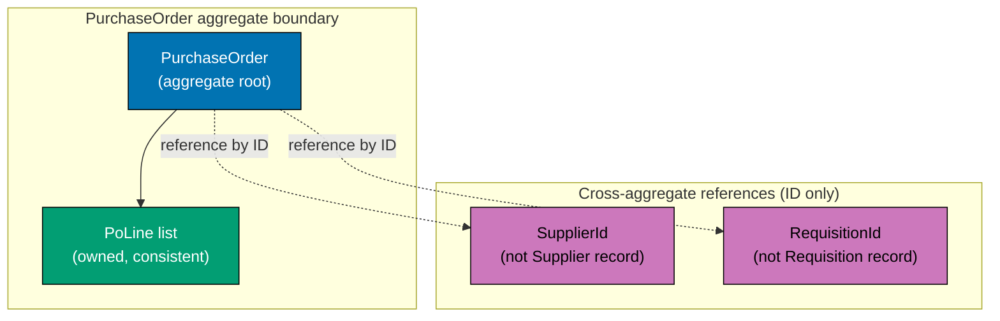

```fsharp
// Aggregate boundaries: what is consistent together, what communicates via events.
// A PurchaseOrder owns its lines. It references suppliers and invoices by ID only.

type PurchaseOrderId = PurchaseOrderId of string
type SupplierId      = SupplierId      of string  // => Reference only — not the Supplier aggregate
type RequisitionId   = RequisitionId   of string  // => Reference only — not the Requisition aggregate

// The PurchaseOrder owns its lines — lines are part of the PO aggregate
type PoLine = {
    LineNumber: int
    Sku:        string
    Quantity:   int
    UnitPrice:  decimal
}
// => PoLine is inside the PO aggregate boundary — updated atomically with the PO

// PO states (simplified to key states for boundary illustration)
type PoStatus = Draft | AwaitingApproval | Approved | Issued | Cancelled
// => Status is inside the boundary — must be consistent with the lines

// The PurchaseOrder aggregate — owns only what must be consistent together
type PurchaseOrderAgg = {
    Id:            PurchaseOrderId
    // => Aggregate identity
    RequisitionId: RequisitionId
    // => Reference to the originating requisition — ID only, not the full Requisition
    SupplierId:    SupplierId
    // => Reference to the supplier — ID only, not the full Supplier aggregate
    Status:        PoStatus
    // => Inside the boundary — status and lines must be consistent
    Lines:         PoLine list
    // => Inside the boundary — lines are owned by this PO
    Total:         decimal
    // => Derived from lines — stored for performance (avoids recomputing on every load)
    UpdatedAt:     System.DateTimeOffset
    // => Optimistic concurrency token — updated on every state transition
}
// => PurchaseOrderAgg : aggregate root — consistent unit; all fields update atomically

// Invariant: once Issued, lines cannot change
let addLine (line: PoLine) (po: PurchaseOrderAgg) : Result<PurchaseOrderAgg, string> =
    match po.Status with
    | Draft ->
        // => Only Draft POs can have lines added
        let newLines = po.Lines @ [line]
        // => Append the new line — creates a new list (immutable)
        let newTotal = newLines |> List.sumBy (fun l -> decimal l.Quantity * l.UnitPrice)
        // => Recompute total — kept consistent with lines inside the aggregate
        Ok { po with Lines = newLines; Total = newTotal; UpdatedAt = System.DateTimeOffset.UtcNow }
        // => with-expression: atomic update of lines, total, and timestamp
    | Issued | Approved | AwaitingApproval ->
        Error "Lines are locked — PO has been submitted or issued"
        // => Invariant: once submitted, lines are immutable until Cancelled
    | Cancelled -> Error "Cannot add lines to a Cancelled PO"
    // => Cancelled POs are terminal — no modifications allowed

// Test
let emptyDraft = {
    Id = PurchaseOrderId "po_e3d1"; RequisitionId = RequisitionId "req_f4c2"
    SupplierId = SupplierId "sup_acme"; Status = Draft; Lines = []; Total = 0m
    UpdatedAt = System.DateTimeOffset.UtcNow
}
let addResult = addLine { LineNumber = 1; Sku = "ELE-0099"; Quantity = 3; UnitPrice = 899.99m } emptyDraft
// => Status is Draft — line addition allowed; total updated to 2699.97

match addResult with
| Ok po   -> printfn "Lines: %d, Total: %M" po.Lines.Length po.Total
// => Output: Lines: 1, Total: 2699.9700M
| Error e -> printfn "Error: %s" e
```

**Key Takeaway**: An aggregate owns everything that must be consistent together and references other aggregates by ID only — this keeps transaction boundaries small and prevents cross-aggregate consistency violations.

**Why It Matters**: If the `PurchaseOrder` held the full `Supplier` record inside itself, updating a supplier's contact email would require loading and saving every PO that references that supplier — a transaction spanning potentially thousands of records. By holding only `SupplierId`, the PO aggregate stays small, its transaction boundary is local, and supplier data is fetched via a separate query. This is the DDD aggregate boundary principle applied to the procurement domain.

---

### Example 41: Refactor Primitive Obsession — Typed Wrapper

Primitive obsession is the anti-pattern of using raw `string`, `int`, or `decimal` where a domain type should be used. This example shows a before/after refactor of a PO approval function that suffers from primitive obsession and the improvement from introducing typed wrappers.

```fsharp
// Before: primitive obsession — all IDs are strings; easy to mix up
let approvePrimitive (poId: string) (approverId: string) (approvedAt: System.DateTimeOffset) : string =
    // => poId and approverId are both strings — nothing stops them being swapped at call site
    sprintf "PO %s approved by %s at %O" poId approverId approvedAt
    // => Returns a string status — caller cannot pattern-match on success vs failure

// After: typed wrappers eliminate the confusion
type PurchaseOrderId = PurchaseOrderId of string
// => Distinct type for PO identity
type ApproverId      = ApproverId      of string
// => Distinct type for the approver identity — cannot be passed where PurchaseOrderId expected

type ApprovalRecord = {
    PoId:       PurchaseOrderId
    // => Typed PO identity — compiler blocks passing an ApproverId here
    ApproverId: ApproverId
    // => Typed approver identity
    ApprovedAt: System.DateTimeOffset
    // => Approval timestamp — immutable once recorded
}
// => ApprovalRecord : value object — groups the three components of an approval

let approveTyped (poId: PurchaseOrderId) (approverId: ApproverId) (at: System.DateTimeOffset) : ApprovalRecord =
    // => All three parameters have distinct types — swapping them is a compile error
    { PoId = poId; ApproverId = approverId; ApprovedAt = at }
    // => Returns a structured record — caller can pattern-match and extract fields

// Usage
let (PurchaseOrderId rawPoId)    = PurchaseOrderId "po_e3d1f8a0"
// => Destructure to access the raw string for display
let (ApproverId rawApproverId)   = ApproverId "emp_mgr_007"
// => Destructure the approver ID

let record = approveTyped (PurchaseOrderId "po_e3d1f8a0") (ApproverId "emp_mgr_007") System.DateTimeOffset.UtcNow
// => approveTyped accepts typed arguments — swapping poId and approverId is a compile error
// => record : ApprovalRecord = { PoId = ...; ApproverId = ...; ApprovedAt = ... }

printfn "Approved: PO=%s by=%s" rawPoId rawApproverId
// => Output: Approved: PO=po_e3d1f8a0 by=emp_mgr_007
printfn "Record: %A" record
// => Output: Record: { PoId = PurchaseOrderId "po_e3d1f8a0"; ApproverId = ApproverId "emp_mgr_007"; ... }
```

**Key Takeaway**: Replacing raw primitives with named wrapper types eliminates the ID-confusion class of bugs at compile time — the cost is minimal syntactic overhead for a permanent correctness guarantee.

**Why It Matters**: In a procurement system, confusing `PurchaseOrderId` with `RequisitionId` or `SupplierId` is a realistic bug: all three are UUID-formatted strings, all appear in the same function signatures, and the mistake is invisible in unit tests that use hardcoded values. Typed wrappers make the mistake a compile error, caught before any code runs.

---

### Example 42: ValidatedPurchaseOrder Type — Emitted by Validation Step

The validation step of the approval workflow produces a `ValidatedPurchaseOrder` — a type that can only exist if all business rules passed. Downstream functions accept this type, not the raw `UnvalidatedPurchaseOrderCommand`, making the validation guarantee structural.

```fsharp
// ValidatedPurchaseOrder: produced by the validation step; consumed by downstream steps.
// If a ValidatedPurchaseOrder exists, all field-level invariants have been checked.

type PurchaseOrderId = PurchaseOrderId of string
type SupplierId      = SupplierId      of string

// The raw command arriving from the HTTP layer
type CreatePOCommand = {
    RequisitionId: string  // => Raw — may be blank or wrong format
    SupplierId:    string  // => Raw — may reference a non-existent supplier
    Lines:         (string * int * decimal) list  // => Raw tuples — not validated
}
// => CreatePOCommand : DTO-shaped input — primitive types only

// The validated result — only creatable through the validation function
type ValidatedPoLine = {
    Sku:      string   // => Validated SKU (format checked)
    Quantity: int      // => Validated > 0
    Price:    decimal  // => Validated > 0
}
// => ValidatedPoLine : validated line item — invariants met

type ValidatedPurchaseOrder = {
    Id:            PurchaseOrderId  // => Assigned at validation time
    RequisitionId: string           // => Validated non-blank
    SupplierId:    SupplierId       // => Validated non-blank, wrapped
    Lines:         ValidatedPoLine list  // => All lines validated
    Total:         decimal          // => Computed from validated lines
}
// => ValidatedPurchaseOrder : only exists if all validation passed

// Validation function — the sole constructor for ValidatedPurchaseOrder
let validateCreatePO (cmd: CreatePOCommand) : Result<ValidatedPurchaseOrder, string> =
    if System.String.IsNullOrWhiteSpace(cmd.RequisitionId) then Error "RequisitionId required"
    // => Guard 1: requisition reference is mandatory
    elif System.String.IsNullOrWhiteSpace(cmd.SupplierId) then Error "SupplierId required"
    // => Guard 2: supplier reference is mandatory
    elif cmd.Lines.IsEmpty then Error "At least one line item required"
    // => Guard 3: blank PO has no business meaning
    else
        let validLines =
            cmd.Lines |> List.mapi (fun i (sku, qty, price) ->
                if qty <= 0 then Error (sprintf "Line %d: quantity must be > 0" (i+1))
                elif price <= 0m then Error (sprintf "Line %d: price must be > 0" (i+1))
                else Ok { Sku = sku; Quantity = qty; Price = price }
            )
        // => Validate each line; collect Results
        let errors = validLines |> List.choose (function Error e -> Some e | Ok _ -> None)
        // => Extract all Error cases
        if not errors.IsEmpty then Error (String.concat "; " errors)
        // => If any line failed, return concatenated errors
        else
            let lines = validLines |> List.choose (function Ok l -> Some l | Error _ -> None)
            // => Extract all Ok cases — safe because errors.IsEmpty
            let total = lines |> List.sumBy (fun l -> decimal l.Quantity * l.Price)
            // => Compute total from validated lines
            Ok { Id = PurchaseOrderId ("po_" + System.Guid.NewGuid().ToString("N").[..7])
                 RequisitionId = cmd.RequisitionId; SupplierId = SupplierId cmd.SupplierId
                 Lines = lines; Total = total }
            // => Return validated PO — all invariants guaranteed

// Test
let cmd = { RequisitionId = "req_f4c2"; SupplierId = "sup_acme"
            Lines = [("ELE-0099", 3, 899.99m); ("OFF-0042", 10, 8.50m)] }
// => cmd : CreatePOCommand — two valid raw lines

let validated = validateCreatePO cmd
// => All guards pass — returns Ok ValidatedPurchaseOrder with total 2784.97

match validated with
| Ok po   -> printfn "Validated PO: %A total=%M" po.Id po.Total
// => Output: Validated PO: PurchaseOrderId "po_..." total=2784.9700M
| Error e -> printfn "Error: %s" e
```

**Key Takeaway**: Introducing a `ValidatedPurchaseOrder` type makes the validation guarantee structural — downstream functions that accept it cannot be called before validation runs, because the type cannot be constructed any other way.

**Why It Matters**: Without a `ValidatedPurchaseOrder` type, any function in the approval workflow might be accidentally called with an unvalidated command, relying on the caller to have validated first. The type eliminates this assumption by making the valid state a distinct type — the compiler enforces the validation step as a prerequisite for every downstream operation.

---

### Example 43: IssuedPurchaseOrder Type — Emitted by Issue Step

After an `Approved` PO is issued to the supplier, it enters the `Issued` state. The `IssuedPurchaseOrder` type carries the issuance timestamp and the event that was emitted, providing a typed record that downstream steps (receiving context) can depend on.

```fsharp
// IssuedPurchaseOrder: the result of issuing an Approved PO to a supplier.
// Carries the new state and the emitted event — both needed by the caller.

type PurchaseOrderId = PurchaseOrderId of string
type SupplierId      = SupplierId      of string

// Input: the approved PO ready to be issued
type ApprovedPurchaseOrder = {
    Id:         PurchaseOrderId  // => Typed wrapper — same ID as the original DraftPO
    SupplierId: SupplierId       // => Supplier that will receive the issued order
    Total:      decimal          // => Total locked at approval — cannot change post-approval
    ApprovedAt: System.DateTimeOffset  // => When approval was granted — audit trail
}
// => ApprovedPurchaseOrder : can only exist after the approve transition

// Output: the issued PO state
type IssuedPurchaseOrder = {
    Id:         PurchaseOrderId  // => Same ID throughout the lifecycle
    SupplierId: SupplierId       // => Supplier receiving the order
    IssuedAt:   System.DateTimeOffset  // => When PO was transmitted to the supplier
}
// => IssuedPurchaseOrder : issued state — lines are now immutable

// Domain event produced by the issuance
type PurchaseOrderIssuedEvent = {
    PurchaseOrderId: PurchaseOrderId  // => Identifies which PO was issued
    SupplierId:      SupplierId       // => Routes the event to the right supplier context
    IssuedAt:        System.DateTimeOffset  // => Issuance timestamp for SLA tracking
    TotalAmount:     decimal           // => Total for accounting and receiving contexts
}
// => PurchaseOrderIssuedEvent : consumed by receiving, supplier-notifier, accounting

// Issue transition — returns both new state and the emitted event
let issuePO (approved: ApprovedPurchaseOrder) : IssuedPurchaseOrder * PurchaseOrderIssuedEvent =
    let now = System.DateTimeOffset.UtcNow
    // => Capture issuance timestamp — same value used in both state and event
    let issued = { Id = approved.Id; SupplierId = approved.SupplierId; IssuedAt = now }
    // => New IssuedPurchaseOrder state — carries only what is meaningful post-issuance
    let event  = { PurchaseOrderId = approved.Id; SupplierId = approved.SupplierId
                   IssuedAt = now; TotalAmount = approved.Total }
    // => PurchaseOrderIssuedEvent — all consumer needs in one payload
    issued, event
    // => Return tuple: (new state, emitted event)

// Test
let approved = {
    Id = PurchaseOrderId "po_e3d1f8a0"; SupplierId = SupplierId "sup_acme"
    Total = 2699.97m; ApprovedAt = System.DateTimeOffset.UtcNow
}
// => approved : ApprovedPurchaseOrder — ready to be issued

let (issued, event) = issuePO approved
// => issued : IssuedPurchaseOrder — new state
// => event  : PurchaseOrderIssuedEvent — to be published to the event bus

printfn "Issued PO: %A at %O" issued.Id issued.IssuedAt
// => Output: Issued PO: PurchaseOrderId "po_e3d1f8a0" at 2026-...
printfn "Event total: %M" event.TotalAmount
// => Output: Event total: 2699.9700M
```

**Key Takeaway**: Returning `(IssuedPurchaseOrder, PurchaseOrderIssuedEvent)` from the issue transition makes event emission inseparable from the state change — the caller cannot save the new state without also handling the event.

**Why It Matters**: Separating state persistence from event emission is a common source of consistency bugs: saving the new state to the database but failing to publish the event means downstream contexts (receiving, supplier-notifier) never react. The tuple return type makes the event a first-class output of the transition, not an optional side effect.

---

### Example 44: ApprovePO Workflow Signature with Dependencies

The `ApprovePO` workflow needs access to the supplier repository (to check eligibility) and the approval router (to record the approval decision). These dependencies are expressed as function parameters, not class fields — the functional equivalent of constructor injection.

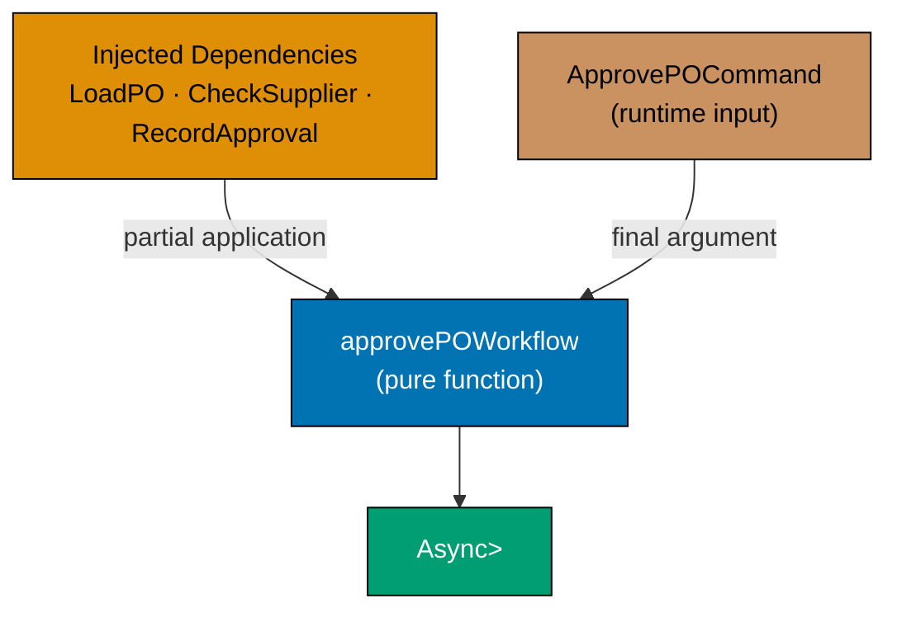

```fsharp
// ApprovePO workflow: dependencies expressed as function parameters.
// No IoC container, no service locator — just function types and partial application.

type PurchaseOrderId = PurchaseOrderId of string
type SupplierId      = SupplierId      of string
type ApproverId      = ApproverId      of string

// The command arriving from the HTTP layer
type ApprovePOCommand = {
    PurchaseOrderId: string  // => Raw PO ID from the request
    ApproverId:      string  // => Raw approver ID from the JWT
}
// => ApprovePOCommand : DTO input — primitive types only

// Domain error cases
type ApprovalError =
    | PONotFound       of string
    | AlreadyApproved  of PurchaseOrderId
    | SupplierBlocked  of SupplierId
    | InsufficientAuth of ApproverId
// => Named errors — each maps to a specific HTTP status and alert

// Port types — expressed as function type aliases (no interfaces, no classes)
type LoadPurchaseOrder = PurchaseOrderId -> Async<Result<decimal * SupplierId, ApprovalError>>
// => LoadPurchaseOrder : PurchaseOrderId → Async<Result<(total, supplierId), error>>
// => Loads the PO total and supplier reference — what the approval step needs

type CheckSupplierEligibility = SupplierId -> Async<Result<unit, ApprovalError>>
// => CheckSupplierEligibility : SupplierId → Async<Result<unit, error>>
// => Returns Ok () if supplier is Approved; Error SupplierBlocked otherwise

type RecordApproval = PurchaseOrderId -> ApproverId -> Async<Result<unit, ApprovalError>>
// => RecordApproval : PurchaseOrderId → ApproverId → Async<Result<unit, error>>
// => Persists the approval record and timestamps

// The workflow function — dependencies injected as parameters
let approvePO
    (loadPO:      LoadPurchaseOrder)
    (checkSupplier: CheckSupplierEligibility)
    (recordApproval: RecordApproval)
    (cmd: ApprovePOCommand)
    : Async<Result<string, ApprovalError>> =
    // => loadPO, checkSupplier, recordApproval are the injected dependencies
    // => cmd is the runtime input
    async {
        let poId     = PurchaseOrderId cmd.PurchaseOrderId
        let approvId = ApproverId      cmd.ApproverId
        // => Wrap raw strings in typed wrappers — validation would go here in full impl
        let! (_, supplierId) = loadPO poId |> Async.map (Result.defaultWith (fun e -> failwithf "%A" e))
        // => Load PO to get the supplier reference — simplified for demonstration
        do! checkSupplier supplierId |> Async.map (Result.defaultWith (fun e -> failwithf "%A" e)) |> Async.Ignore
        // => Check supplier eligibility — raises if blocked
        do! recordApproval poId approvId |> Async.map (Result.defaultWith (fun e -> failwithf "%A" e)) |> Async.Ignore
        // => Record the approval — raises if persistence fails
        return Ok (sprintf "PO %s approved by %s" cmd.PurchaseOrderId cmd.ApproverId)
        // => Return success message — events would be emitted here in full impl
    }

// The workflow TYPE signature — the domain contract
type ApprovePOWorkflow =
    LoadPurchaseOrder -> CheckSupplierEligibility -> RecordApproval -> ApprovePOCommand -> Async<Result<string, ApprovalError>>
// => Arrow type reads: inject deps, then accept command, then produce async result
// => Each arrow is a partial application step

printfn "ApprovePO workflow signature defined — dependencies are function parameters"
// => Output: ApprovePO workflow signature defined — dependencies are function parameters
```

**Key Takeaway**: Expressing workflow dependencies as function-type parameters makes the contract explicit — the caller must supply real or test implementations for every dependency, and the compiler verifies the types match.

**Why It Matters**: Function-type parameters are testable without mocking frameworks: pass a test implementation (`fun poId -> async { return Ok (2699.97m, SupplierId "sup_test") }`) in unit tests, and the production implementation (querying Postgres) in production. The workflow function itself never changes — only the injected implementations differ. This is the functional core / imperative shell principle applied to dependency management.

---

### Example 45: IssuePO Workflow Signature with Dependencies

The `IssuePO` workflow composes four steps: load the approved PO, verify it is in `Approved` state, persist the `Issued` state, and publish the `PurchaseOrderIssued` event. Each dependency is a function type parameter.

```fsharp
// IssuePO: four-step workflow with typed function dependencies.

type PurchaseOrderId = PurchaseOrderId of string
type SupplierId      = SupplierId      of string

type IssuedPO = { Id: PurchaseOrderId; SupplierId: SupplierId; IssuedAt: System.DateTimeOffset }
// => The issued state produced by the transition — carries only post-issuance fields

type PoIssuedEvent = { PurchaseOrderId: PurchaseOrderId; SupplierId: SupplierId; IssuedAt: System.DateTimeOffset; Total: decimal }
// => Event payload for downstream contexts — consuming contexts do not query back for total

type IssueError =
    | PONotFound    of PurchaseOrderId  // => PO does not exist — 404
    | NotApproved   of PurchaseOrderId  // => Can only issue from Approved state — 422
    | SaveFailed    of string           // => DB write failed — 503, retry eligible
    | PublishFailed of string           // => Event bus write failed — 503, retry eligible
// => Named error union — each case drives a different alert/retry policy

// Port type aliases
type LoadApprovedPO  = PurchaseOrderId -> Async<Result<decimal * SupplierId, IssueError>>
// => Loads the PO total and supplier ID; Error PONotFound if missing; Error NotApproved if wrong state
type SaveIssuedPO    = IssuedPO -> Async<Result<unit, IssueError>>
// => Persists the new Issued state to the database
type PublishEvent    = PoIssuedEvent -> Async<Result<unit, IssueError>>
// => Publishes to the event bus (outbox or direct Kafka)

// The workflow — four sequential async steps
let issuePOWorkflow
    (load:    LoadApprovedPO)
    (save:    SaveIssuedPO)
    (publish: PublishEvent)
    (poId:    PurchaseOrderId)
    : Async<Result<IssuedPO, IssueError>> =
    async {
        let! loadResult = load poId
        // => Step 1: load the approved PO from the repository
        match loadResult with
        | Error e -> return Error e
        // => Not found or not in Approved state — short-circuit
        | Ok (total, supplierId) ->
            let now    = System.DateTimeOffset.UtcNow
            // => Capture issuance timestamp
            let issued = { Id = poId; SupplierId = supplierId; IssuedAt = now }
            // => Build the new Issued state
            let event  = { PurchaseOrderId = poId; SupplierId = supplierId; IssuedAt = now; Total = total }
            // => Build the domain event
            let! saveResult = save issued
            // => Step 2: persist the new state
            match saveResult with
            | Error e -> return Error e
            // => Persistence failed — short-circuit; event not published (at-least-once with outbox)
            | Ok () ->
                let! publishResult = publish event
                // => Step 3: publish the domain event
                match publishResult with
                | Error e -> return Error e
                // => Publish failed — caller can retry; state already saved
                | Ok () -> return Ok issued
                // => All steps succeeded — return the new Issued state
    }

// Test with stub implementations
let stubLoad   _ = async { return Ok (2699.97m, SupplierId "sup_acme") }
// => Stub load: always returns Ok with a fixed total and supplier
let stubSave   _ = async { return Ok () }
// => Stub save: always succeeds
let stubPublish _ = async { return Ok () }
// => Stub publish: always succeeds

let result = Async.RunSynchronously (issuePOWorkflow stubLoad stubSave stubPublish (PurchaseOrderId "po_e3d1"))
// => All stubs return Ok — result : Result<IssuedPO, IssueError> = Ok { Id = ...; ... }

match result with
| Ok issued -> printfn "Issued: %A at %O" issued.Id issued.IssuedAt
// => Output: Issued: PurchaseOrderId "po_e3d1" at 2026-...
| Error e   -> printfn "Error: %A" e
```

**Key Takeaway**: A four-step async workflow expressed with typed function dependencies is fully testable with in-memory stubs — no database, no Kafka, no network required to test the workflow logic.

**Why It Matters**: The four steps of `issuePOWorkflow` (load, build state, save, publish) have a defined order with specific failure modes at each step. Testing this order and the failure short-circuiting with stub functions is trivial and fast. The production wiring — injecting the real Postgres adapter and the Kafka publisher — happens at the composition root, not inside the workflow.

---

### Example 46: AcknowledgePO Workflow Signature

Once a `PurchaseOrder` is issued to the supplier, the supplier acknowledges receipt. The `AcknowledgePO` workflow transitions `Issued → Acknowledged` and emits `PurchaseOrderAcknowledged`, which opens a GRN expectation in the receiving context.

```fsharp
// AcknowledgePO: supplier acknowledges receipt of the issued PO.
// Transitions Issued → Acknowledged; opens GRN expectation in receiving context.

type PurchaseOrderId = PurchaseOrderId of string
type SupplierId      = SupplierId      of string

// The state after supplier acknowledgement
type AcknowledgedPO = {
    Id:              PurchaseOrderId
    // => Typed wrapper — prevents mixing with RequisitionId
    SupplierId:      SupplierId
    // => Which supplier acknowledged
    AcknowledgedAt:  System.DateTimeOffset
    // => Timestamp of acknowledgement
    ExpectedDelivery: System.DateTimeOffset option
    // => Supplier may provide an expected delivery date — optional at acknowledgement time
}
// => AcknowledgedPO : Acknowledged state — opens the receiving window

// Event consumed by the receiving context
type PurchaseOrderAcknowledgedEvent = {
    PurchaseOrderId:  PurchaseOrderId
    // => Identifies which PO was acknowledged
    SupplierId:       SupplierId
    // => Mirrors AcknowledgedPO — receiving needs both
    AcknowledgedAt:   System.DateTimeOffset
    // => When the supplier confirmed
    ExpectedDelivery: System.DateTimeOffset option
    // => Receiving context uses this to set GRN due date
}
// => Receiving context reacts: creates a GoodsReceiptNote expectation

// Command from the supplier's acknowledgement API call
type AcknowledgePOCommand = {
    PurchaseOrderId:  string                        // => Raw PO ID
    ExpectedDelivery: System.DateTimeOffset option  // => Optional delivery date from supplier
}
// => AcknowledgePOCommand : DTO from the supplier portal or EDI system

type AckError = PONotFound of string | NotIssued of string | SaveFailed
// => PONotFound: PO doesn't exist; NotIssued: PO not in Issued state; SaveFailed: DB write failed

// Port types
type LoadIssuedPO    = PurchaseOrderId -> Async<Result<SupplierId, AckError>>
// => Loads the PO and verifies it is in Issued state
type SaveAcknowledged = AcknowledgedPO -> Async<Result<unit, AckError>>
// => Persists the Acknowledged state
type PublishAckEvent  = PurchaseOrderAcknowledgedEvent -> Async<Result<unit, AckError>>
// => Publishes to the event bus

// The workflow
let acknowledgePO
    (load:    LoadIssuedPO)
    (save:    SaveAcknowledged)
    (publish: PublishAckEvent)
    (cmd:     AcknowledgePOCommand)
    : Async<Result<AcknowledgedPO, AckError>> =
    async {
        let poId = PurchaseOrderId cmd.PurchaseOrderId
        // => Wrap the raw string in the typed wrapper
        let! loadResult = load poId
        // => Load and verify the PO is in Issued state
        match loadResult with
        | Error e -> return Error e
        // => Not found or not Issued — short-circuit
        | Ok supplierId ->
            let now = System.DateTimeOffset.UtcNow
            let acked = { Id = poId; SupplierId = supplierId
                          AcknowledgedAt = now; ExpectedDelivery = cmd.ExpectedDelivery }
            // => New Acknowledged state — carries optional delivery date
            let event = { PurchaseOrderId = poId; SupplierId = supplierId
                          AcknowledgedAt = now; ExpectedDelivery = cmd.ExpectedDelivery }
            // => Event payload for the receiving context
            let! saveResult = save acked
            match saveResult with
            | Error e -> return Error e
            | Ok () ->
                let! _ = publish event
                // => Publish — receiving context opens GRN expectation on receipt
                return Ok acked
                // => Return the Acknowledged state
    }

// Demonstrate with stubs
let stubLoad _    = async { return Ok (SupplierId "sup_acme") }
// => Simulates a DB that returns sup_acme for any PO ID
let stubSave _    = async { return Ok () }
// => No-op save — always succeeds
let stubPublish _ = async { return Ok () }
// => No-op publish — event is discarded in test

let cmd = { PurchaseOrderId = "po_e3d1"; ExpectedDelivery = Some (System.DateTimeOffset.UtcNow.AddDays(7.0)) }
// => cmd : AcknowledgePOCommand — with a 7-day expected delivery

let result = Async.RunSynchronously (acknowledgePO stubLoad stubSave stubPublish cmd)
// => All stubs succeed — result : Result<AcknowledgedPO, AckError> = Ok { ... }

match result with
| Ok acked -> printfn "Acknowledged: delivery=%A" acked.ExpectedDelivery
// => Output: Acknowledged: delivery=Some 2026-...
| Error e  -> printfn "Error: %A" e
// => Error branch: prints AckError DU case (e.g. PONotFound "po_e3d1")
```

**Key Takeaway**: The `AcknowledgePO` workflow is structurally identical to `IssuePO` — load, build, save, publish — demonstrating that the same composition pattern scales to every step in the PO lifecycle.

**Why It Matters**: When every workflow in the purchasing context follows the same (load, validate, transition, save, publish) structure, new developers can understand a new workflow immediately by recognising the pattern. Consistency also means tooling — logging middleware, retry logic, observability — can be applied uniformly at the composition layer rather than being hand-rolled in each workflow.

---

## Workflow Architecture (Examples 47–55)

### Example 47: Pipeline Composition — Wiring Three Workflow Steps

The complete PO lifecycle from Draft to Issued involves three workflow steps: `CreateDraftPO → ApprovePO → IssuePO`. Composing them in a pipeline demonstrates how functional workflow orchestration works without a workflow engine.

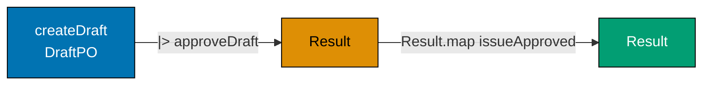

```fsharp
// Three PO lifecycle steps composed into a single pipeline.
// Each step is a pure function or an async function with injected deps.

type PurchaseOrderId = PurchaseOrderId of string
type SupplierId      = SupplierId      of string

// Simplified state types for composition demonstration
type DraftPO     = { Id: PurchaseOrderId; Total: decimal; SupplierId: SupplierId }
type ApprovedPO  = { Id: PurchaseOrderId; Total: decimal; SupplierId: SupplierId; ApprovedAt: System.DateTimeOffset }
type IssuedPO    = { Id: PurchaseOrderId; SupplierId: SupplierId; IssuedAt: System.DateTimeOffset }

// Step 1: create a draft PO (pure — no I/O)
let createDraft (total: decimal) (supplierId: SupplierId) : DraftPO =
    { Id = PurchaseOrderId ("po_" + System.Guid.NewGuid().ToString("N").[..7])
      Total = total; SupplierId = supplierId }
    // => Pure: no side effects, no Result needed — creation always succeeds

// Step 2: approve the draft (pure — business rule only)
let approveDraft (draft: DraftPO) : Result<ApprovedPO, string> =
    if draft.Total <= 0m then Error "Cannot approve a zero-total PO"
    // => Business rule: zero-value POs cannot be approved
    else Ok { Id = draft.Id; Total = draft.Total; SupplierId = draft.SupplierId
              ApprovedAt = System.DateTimeOffset.UtcNow }
    // => Approved state carries the approval timestamp

// Step 3: issue the approved PO (pure — returns both state and event)
let issueApproved (approved: ApprovedPO) : IssuedPO * string =
    let issued = { Id = approved.Id; SupplierId = approved.SupplierId; IssuedAt = System.DateTimeOffset.UtcNow }
    // => New Issued state
    let eventSummary = sprintf "PurchaseOrderIssued: %A to %A total=%M" approved.Id approved.SupplierId approved.Total
    // => Simplified event summary — full version would produce a typed event record
    issued, eventSummary
    // => Return both state and event

// Pipeline: wire all three steps
let lifeCyclePipeline (total: decimal) (supplierId: SupplierId) : Result<IssuedPO * string, string> =
    let draft = createDraft total supplierId
    // => Step 1: create draft — always succeeds (pure)
    draft
    |> approveDraft
    // => Step 2: approve — may fail if total <= 0
    |> Result.map issueApproved
    // => Step 3: issue — infallible if approve succeeded (Result.map)

// Test
let result = lifeCyclePipeline 2699.97m (SupplierId "sup_acme")
// => createDraft: DraftPO; approveDraft: Ok ApprovedPO; issueApproved: (IssuedPO, eventSummary)

match result with
| Ok (issued, event) ->
    printfn "Issued: %A" issued.Id
    // => Output: Issued: PurchaseOrderId "po_..."
    printfn "Event: %s" event
    // => Output: Event: PurchaseOrderIssued: PurchaseOrderId "po_..." to SupplierId "sup_acme" total=2699.9700M
| Error e -> printfn "Pipeline error: %s" e

// Error path: zero-total PO
let errorResult = lifeCyclePipeline 0m (SupplierId "sup_acme")
// => approveDraft returns Error "Cannot approve a zero-total PO"
// => issueApproved is skipped via Result.map
match errorResult with
| Ok _    -> printfn "Should not reach here"
| Error e -> printfn "Error: %s" e
// => Output: Error: Cannot approve a zero-total PO
```

**Key Takeaway**: Composing three workflow steps into a pipeline using `|>` and `Result.map` produces a readable, linear representation of the PO lifecycle without nested conditionals or try/catch blocks.

**Why It Matters**: A three-step pipeline that reads `createDraft |> approveDraft |> issueApproved` tells the entire PO lifecycle story in three lines. When a compliance auditor asks "what happens between requisition approval and supplier notification?", a developer can point to this pipeline and walk through it step by step. The pipeline is also the natural insertion point for new workflow steps — adding budget verification between approval and issuance means inserting one more `|> Result.bind verifyBudget`.

---

### Example 48: Domain Error DU — Every Purchasing Failure Named

A comprehensive `PurchasingContextError` DU covers every failure the purchasing workflows can produce — from field-level validation to infrastructure failures. This is the full error taxonomy for the context.

```fsharp
// Complete purchasing context error DU — every failure mode is named.
// Named errors drive: HTTP status codes, alerting severity, retry eligibility.

type PurchaseOrderId = PurchaseOrderId of string
type RequisitionId   = RequisitionId   of string
type SupplierId      = SupplierId      of string

type PurchasingContextError =
    // ── Requisition errors ───────────────────────────────────────────────────
    | RequisitionNotFound      of RequisitionId
    // => 404: ID does not exist
    | RequisitionAlreadyExists of RequisitionId
    // => 409: duplicate submission
    | RequisitionHasNoLines    of RequisitionId
    // => 422: no line items
    | InvalidSkuFormat         of sku: string
    // => 422: SKU does not match ^[A-Z]{3}-\d{4,8}$
    | InvalidQuantity          of sku: string * qty: int
    // => 422: quantity ≤ 0
    | InvalidUnitPrice         of sku: string * price: decimal
    // => 422: price ≤ 0
    // ── PO errors ────────────────────────────────────────────────────────────
    | PONotFound               of PurchaseOrderId
    // => 404: PO ID does not exist
    | POInvalidTransition      of from: string * ``to``: string
    // => 422: attempted state transition is not permitted
    | POLinesLocked            of PurchaseOrderId
    // => 422: attempt to modify lines on a submitted/issued PO
    // ── Supplier errors ───────────────────────────────────────────────────────
    | SupplierNotFound         of SupplierId
    // => 404: supplier ID does not exist in the supplier master
    | SupplierNotEligible      of SupplierId
    // => 422: supplier is Pending/Suspended/Blacklisted
    // ── Budget / authority errors ────────────────────────────────────────────
    | BudgetExceeded           of required: decimal * available: decimal
    // => 422: requisition total exceeds department budget
    | ApprovalAuthorityTooLow  of approver: string * required: string
    // => 403: approver's level is insufficient for this PO's total
    // ── Infrastructure errors ─────────────────────────────────────────────────
    | DatabaseTimeout          of operation: string
    // => 503: database did not respond within the SLA (retry eligible)
    | EventPublishFailed       of event: string
    // => 500: event could not be published (outbox compensates)
    | ConcurrencyConflict      of PurchaseOrderId
    // => 409: optimistic lock conflict — caller should reload and retry

// Map each error to HTTP status and retry eligibility
let errorPolicy (err: PurchasingContextError) : int * bool =
    // => Returns (httpStatus, isRetryEligible)
    match err with
    | RequisitionNotFound _ | PONotFound _ | SupplierNotFound _ -> (404, false)
    // => Not found: no retry — the resource doesn't exist
    | RequisitionAlreadyExists _ | ConcurrencyConflict _ -> (409, true)
    // => Conflict: retry after reload
    | ApprovalAuthorityTooLow _ -> (403, false)
    // => Forbidden: retry won't help — need a different approver
    | DatabaseTimeout _ | EventPublishFailed _ -> (503, true)
    // => Infrastructure: retry eligible with backoff
    | _ -> (422, false)
    // => Business rule violations: no retry — data must be fixed first

// Test
let errors = [RequisitionNotFound (RequisitionId "req_missing"); BudgetExceeded (15000m, 10000m); DatabaseTimeout "save_po"]
// => Three different error categories

errors |> List.iter (fun e ->
    let (status, retry) = errorPolicy e
    printfn "%A → status=%d retry=%b" e status retry
)
// => Output: RequisitionNotFound ... → status=404 retry=false
// => Output: BudgetExceeded ... → status=422 retry=false
// => Output: DatabaseTimeout ... → status=503 retry=true
```

**Key Takeaway**: A comprehensive named error DU enables precise, policy-driven handling at the API boundary — each error case maps to an exact HTTP status, alerting severity, and retry eligibility without string parsing or `instanceof` checks.

**Why It Matters**: Infrastructure errors (`DatabaseTimeout`) should trigger automatic retry with exponential backoff. Business rule violations (`BudgetExceeded`) should return 422 and surface a user-friendly message. Concurrency conflicts (`ConcurrencyConflict`) should trigger an optimistic lock retry loop. All of these policies are encoded as pattern matches on the named error DU — a new error case is added to the DU, the compiler highlights every policy function that needs updating, and the coverage is guaranteed complete.

---

### Example 49: Mapping Domain Error to API Error at the Boundary

The API boundary translates `PurchasingContextError` into HTTP responses. This translation is a pure function that lives outside the domain — it is infrastructure, not domain logic.

```fsharp
// Translating domain errors to HTTP responses at the API boundary.
// The translation is a pure function — no side effects, fully testable.

type PurchaseOrderId = PurchaseOrderId of string
type SupplierId      = SupplierId      of string

type PurchasingContextError =
    | RequisitionNotFound of id: string
    // => 404: resource-not-found class
    | BudgetExceeded      of required: decimal * available: decimal
    // => 422: business rule violation — amounts tell the requester what to trim
    | SupplierNotEligible of SupplierId
    // => 422: supplier is Pending, Suspended, or Blacklisted
    | DatabaseTimeout     of operation: string
    // => 503: transient infrastructure error — retry is safe
// => Subset of the full error DU for this example

// API error response — the DTO returned to the HTTP client
type ApiError = {
    Status:  int
    // => HTTP status code (200/404/422/503)
    Code:    string
    // => Machine-readable error code for client handling
    Message: string
    // => Human-readable description for display
    Retry:   bool
    // => Tells the client whether to retry automatically
}
// => ApiError : the JSON body shape returned on error responses

// Pure translation function — domain error → API error DTO
let toApiError (err: PurchasingContextError) : ApiError =
    match err with
    | RequisitionNotFound id ->
        { Status = 404; Code = "REQUISITION_NOT_FOUND"
          Message = sprintf "Requisition '%s' not found" id; Retry = false }
        // => 404: resource missing — message identifies which ID was not found
    | BudgetExceeded (required, available) ->
        { Status = 422; Code = "BUDGET_EXCEEDED"
          Message = sprintf "Required %.2f exceeds available budget %.2f" required available
          Retry   = false }
        // => 422: business rule violation — message helps the requester know how much to trim
    | SupplierNotEligible (SupplierId sid) ->
        { Status = 422; Code = "SUPPLIER_NOT_ELIGIBLE"
          Message = sprintf "Supplier '%s' is not approved for new purchase orders" sid
          Retry   = false }
        // => 422: supplier state is Pending, Suspended, or Blacklisted
    | DatabaseTimeout op ->
        { Status = 503; Code = "SERVICE_UNAVAILABLE"
          Message = sprintf "Database operation '%s' timed out — please retry" op
          Retry   = true }
        // => 503: transient infrastructure error — retry is safe and encouraged

// The API handler: run the domain workflow, translate the result
let handleRequest (domainResult: Result<string, PurchasingContextError>) : int * string =
    // => domainResult comes from the workflow function
    // => Returns (httpStatus, responseBody) for the HTTP framework
    match domainResult with
    | Ok message ->
        (200, sprintf """{"status":"ok","message":"%s"}""" message)
        // => 200: success — wrap the domain message in a JSON envelope
    | Error err ->
        let apiErr = toApiError err
        // => Translate domain error to API error DTO
        (apiErr.Status, sprintf """{"code":"%s","message":"%s","retry":%b}""" apiErr.Code apiErr.Message apiErr.Retry)
        // => Return the HTTP status and JSON-serialised error body

// Test the translation
let domainOk    = Ok "PO po_e3d1 approved"
// => Simulates a successful workflow result
let domainError = Error (BudgetExceeded (15000m, 10000m))
// => Simulates a budget-exceeded domain failure
// => Two test results: success and a budget-exceeded error

let (status1, body1) = handleRequest domainOk
// => 200, JSON success body
let (status2, body2) = handleRequest domainError
// => 422, JSON error body with code, message, retry=false

printfn "Success: %d %s" status1 body1
// => Output: Success: 200 {"status":"ok","message":"PO po_e3d1 approved"}
printfn "Error:   %d %s" status2 body2
// => Output: Error:   422 {"code":"BUDGET_EXCEEDED","message":"Required 15000.00 exceeds available budget 10000.00","retry":false}
```

**Key Takeaway**: The API boundary translation is a pure function from domain errors to HTTP responses — it lives outside the domain, is independently testable, and keeps HTTP concerns out of the domain layer.

**Why It Matters**: Domain logic must never contain HTTP status codes or JSON field names — those are infrastructure concerns. A pure `toApiError` translation function keeps the boundary clean: domain layer knows only `PurchasingContextError`, API layer knows only `ApiError`. When the API contract changes (adding a `retryAfterSeconds` field), only `toApiError` needs updating, not the domain workflows.

---

### Example 50: Pushing Effects to the Edges

The functional core of the procurement domain is pure — no I/O, no side effects. Effects (database access, event publishing, email sending) are pushed to the edges of the system and injected as function parameters. The domain core is always testable without infrastructure.

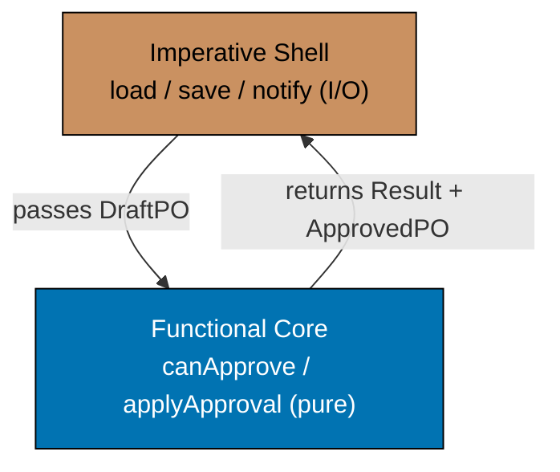

```fsharp
// Functional core / imperative shell: domain logic is pure; I/O is at the edges.
// The core computes; the shell executes.

type PurchaseOrderId = PurchaseOrderId of string
type SupplierId      = SupplierId      of string

// ── FUNCTIONAL CORE ─────────────────────────────────────────────────────────
// Pure domain types and functions — no I/O, no Async, no side effects

type DraftPO   = { Id: PurchaseOrderId; SupplierId: SupplierId; Total: decimal }
type ApprovedPO = { Id: PurchaseOrderId; SupplierId: SupplierId; Total: decimal; ApprovedAt: System.DateTimeOffset }

// Pure business rule: can this PO be approved?
let canApprove (po: DraftPO) (approverBudget: decimal) : Result<unit, string> =
    if po.Total <= 0m then Error "Cannot approve a zero-total PO"
    // => Business rule 1: zero-value POs cannot be approved
    elif po.Total > approverBudget then Error (sprintf "PO total %.2f exceeds approver budget %.2f" po.Total approverBudget)
    // => Business rule 2: approver cannot exceed their authority
    else Ok ()
    // => Both rules pass — approval is permissible

// Pure state transition: Draft → Approved
let applyApproval (po: DraftPO) : ApprovedPO =
    { Id = po.Id; SupplierId = po.SupplierId; Total = po.Total; ApprovedAt = System.DateTimeOffset.UtcNow }
    // => Pure transition — no I/O; caller handles persistence

// ── IMPERATIVE SHELL ─────────────────────────────────────────────────────────
// The shell orchestrates I/O; delegates all decisions to the pure core

// Effect types (function type aliases for the ports)
type LoadDraftPO    = PurchaseOrderId -> Async<DraftPO option>
// => Loads the PO from the database; None if not found
type SaveApprovedPO = ApprovedPO -> Async<unit>
// => Persists the approved state
type NotifyApprover = PurchaseOrderId -> Async<unit>
// => Sends notification email to the supplier or requester

// The shell function: orchestrate I/O, delegate decisions to the pure core
let approvePOShell
    (load:   LoadDraftPO)
    (save:   SaveApprovedPO)
    (notify: NotifyApprover)
    (poId:   PurchaseOrderId)
    (approverBudget: decimal)
    : Async<Result<ApprovedPO, string>> =
    async {
        let! poOpt = load poId
        // => I/O: load from database — effect at the edge
        match poOpt with
        | None    -> return Error (sprintf "PO %A not found" poId)
        // => Infrastructure failure — no domain logic involved
        | Some po ->
            match canApprove po approverBudget with
            // => PURE CORE: domain decision — no I/O here
            | Error e -> return Error e
            // => Business rule failed — return without any I/O
            | Ok () ->
                let approved = applyApproval po
                // => PURE CORE: state transition — no I/O
                do! save approved
                // => I/O: persist new state — effect at the edge
                do! notify poId
                // => I/O: send notification — effect at the edge
                return Ok approved
                // => Return the approved state to the caller
    }

// The pure core is testable without any async infrastructure
let draft = { Id = PurchaseOrderId "po_e3d1"; SupplierId = SupplierId "sup_acme"; Total = 2699.97m }
// => draft : DraftPO — in-memory, no database

let canApproveResult = canApprove draft 5000m
// => 2699.97 > 0 and <= 5000 — Ok () — approver budget sufficient
// => canApproveResult : Result<unit, string> = Ok ()

printfn "canApprove: %A" canApproveResult
// => Output: canApprove: Ok null
let approved = applyApproval draft
// => Pure transition — no I/O needed
printfn "Approved at: %O" approved.ApprovedAt
// => Output: Approved at: 2026-...
```

**Key Takeaway**: Separating pure domain logic (decisions, transitions) from I/O effects (database, events, notifications) produces a domain core that is testable without infrastructure and a shell that is straightforward to replace or adapt.

**Why It Matters**: The functional core / imperative shell pattern is the most important architectural boundary in a procurement system. Approval rules, budget checks, and state transitions are the domain core — they must be testable in milliseconds without Postgres or Kafka. Database loading, event publishing, and email notifications are the shell — they deal with the real world. Keeping them separate means compliance tests for the approval rules run in the CI pipeline in under a second.

---

### Example 51: Pure Core Wrapping at the Edge

The edge of the system is where pure domain functions meet impure I/O. This example shows the precise composition point: the shell reads from I/O, passes the data to the pure core, collects the output, and writes the output back to I/O.

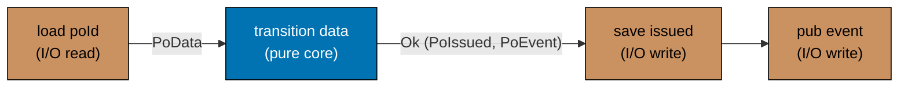

```fsharp
// The composition point: pure core sandwiched between I/O reads and I/O writes.
// Load → pure → save → publish. Each boundary is explicit.

type PurchaseOrderId = PurchaseOrderId of string
type SupplierId      = SupplierId      of string

// Data types
type PoData    = { Id: PurchaseOrderId; SupplierId: SupplierId; Total: decimal; Status: string }
type PoIssued  = { Id: PurchaseOrderId; SupplierId: SupplierId; IssuedAt: System.DateTimeOffset }
type PoEvent   = { Kind: string; PoId: string; At: System.DateTimeOffset }
// => Simplified types for composition illustration

// ── PURE CORE ────────────────────────────────────────────────────────────────
let transition (data: PoData) : Result<PoIssued * PoEvent, string> =
    // => Pure: no I/O — takes data, returns new state + event or error
    if data.Status <> "Approved" then
        Error (sprintf "Cannot issue PO in status '%s' — must be Approved" data.Status)
        // => Business rule: only Approved POs can be issued
    else
        let now    = System.DateTimeOffset.UtcNow
        let issued = { Id = data.Id; SupplierId = data.SupplierId; IssuedAt = now }
        // => Pure state transition — no database, no clock side effect beyond DateTimeOffset.UtcNow
        let event  = { Kind = "PurchaseOrderIssued"; PoId = string data.Id; At = now }
        // => Pure event construction — caller publishes it
        Ok (issued, event)
        // => Return both outputs — caller saves and publishes

// ── IMPERATIVE SHELL ─────────────────────────────────────────────────────────
type LoadPo    = PurchaseOrderId -> Async<PoData option>
// => I/O read: load from database
type SaveIssued = PoIssued -> Async<unit>
// => I/O write: save new state
type PublishEv  = PoEvent -> Async<unit>
// => I/O write: publish event

let issueShell (load: LoadPo) (save: SaveIssued) (pub: PublishEv) (poId: PurchaseOrderId) : Async<Result<PoIssued, string>> =
    async {
        // ── LOAD (I/O read) ────────────────────────────────────────────────
        let! dataOpt = load poId
        // => Reads from database — impure
        match dataOpt with
        | None -> return Error (sprintf "PO %A not found" poId)
        | Some data ->

        // ── PURE CORE ──────────────────────────────────────────────────────
        match transition data with
        // => All domain logic is here — pure, no I/O
        | Error e -> return Error e
        | Ok (issued, event) ->

        // ── SAVE + PUBLISH (I/O writes) ────────────────────────────────────
        do! save issued
        // => Writes new state to database — impure
        do! pub event
        // => Publishes event — impure
        return Ok issued
        // => Return the result of the pure transition
    }

// Test the pure core in isolation — no async needed
let testData = { Id = PurchaseOrderId "po_e3d1"; SupplierId = SupplierId "sup_acme"
                 Total = 2699.97m; Status = "Approved" }
// => testData : PoData — constructed in memory; no database required

let coreResult = transition testData
// => Pure transition: Status = "Approved" → Ok (PoIssued, PoEvent)
// => coreResult : Result<PoIssued * PoEvent, string>

match coreResult with
| Ok (issued, event) ->
    printfn "Core: issued=%A event=%s" issued.Id event.Kind
    // => Output: Core: issued=PurchaseOrderId "po_e3d1" event=PurchaseOrderIssued
| Error e -> printfn "Error: %s" e
```

**Key Takeaway**: The composition point has a clear three-phase structure: I/O read → pure core → I/O write. This structure makes the boundary visible, testable, and replaceable at each phase independently.

**Why It Matters**: Being able to test `transition` in isolation means every business rule in the PO issuance logic — status check, state construction, event payload — is verifiable without spinning up a database or a message broker. The CI pipeline can run thousands of such tests in seconds. The shell (load, save, publish) is tested separately with integration tests against real infrastructure.

---

### Example 52: Dependency Injection via Partial Application

Partial application wires the production implementations of port functions into workflow functions at the composition root. The workflow is defined with all dependencies as parameters; the composition root supplies the real implementations.

```fsharp
// Partial application as dependency injection — composition root wires everything.
// The workflow is generic; the composition root binds it to production implementations.

type PurchaseOrderId = PurchaseOrderId of string
type SupplierId      = SupplierId      of string

// Port type aliases
type LoadPO      = PurchaseOrderId -> Async<(decimal * SupplierId) option>
type SavePO      = PurchaseOrderId -> System.DateTimeOffset -> Async<unit>
type PublishIssuedEvent = PurchaseOrderId -> SupplierId -> decimal -> Async<unit>
// => Three port types — one for each I/O operation in the workflow

// Workflow with all dependencies as parameters
let issueWorkflow
    (load:    LoadPO)
    (save:    SavePO)
    (publish: PublishIssuedEvent)
    (poId:    PurchaseOrderId)
    : Async<Result<unit, string>> =
    async {
        let! dataOpt = load poId
        match dataOpt with
        | None -> return Error (sprintf "PO %A not found" poId)
        | Some (total, supplierId) ->
            let now = System.DateTimeOffset.UtcNow
            do! save poId now
            // => Persist the issued timestamp
            do! publish poId supplierId total
            // => Publish the PurchaseOrderIssued event
            return Ok ()
    }

// ── Stub implementations (used in tests) ────────────────────────────────────
let stubLoad    _      = async { return Some (2699.97m, SupplierId "sup_acme") }
// => Always returns a fixed PO — no database needed
let stubSave    _ _    = async { return () }
// => No-op save — test verifies workflow logic, not persistence
let stubPublish _ _ _  = async {
    printfn "[stub] PurchaseOrderIssued published"
    // => Simulates event publication — test can capture this output
    return ()
}

// ── Production implementations (wired at composition root) ──────────────────
// In production these would call the real database and Kafka:
// let pgLoad    = PgPurchaseOrderRepository.load pgConnection
// let pgSave    = PgPurchaseOrderRepository.saveIssued pgConnection
// let kafkaPub  = KafkaEventPublisher.publish kafkaProducer

// ── Partial application: bind dependencies ────────────────────────────────────
let testIssueWorkflow : PurchaseOrderId -> Async<Result<unit, string>> =
    issueWorkflow stubLoad stubSave stubPublish
    // => Partially apply all three stubs — testIssueWorkflow is now a single-arg function
    // => testIssueWorkflow : PurchaseOrderId -> Async<Result<unit, string>>

// In production:
// let productionIssueWorkflow = issueWorkflow pgLoad pgSave kafkaPub

// Test
let result = Async.RunSynchronously (testIssueWorkflow (PurchaseOrderId "po_e3d1"))
// => All stubs succeed — result : Result<unit, string> = Ok ()

printfn "Result: %A" result
// => Output: [stub] PurchaseOrderIssued published
// => Output: Result: Ok null
```

**Key Takeaway**: Partial application binds dependencies to workflows at the composition root — the workflow function itself never changes, only the implementations supplied to it, making production and test configurations a matter of which functions are partially applied.

**Why It Matters**: The composition root is the single point where production dependencies (Postgres connection pool, Kafka producer) are wired into workflow functions. In tests, the composition root supplies stubs. The workflow code is identical in both cases — there is no test-specific branching inside domain logic. This is the purest form of the dependency inversion principle, achieved with zero framework overhead.

---

### Example 53: Persistence Interface as a Record of Functions

In functional F#, a repository is not an interface or an abstract class — it is a record of functions. This record is the port; the PostgreSQL implementation is one value of this record type; the in-memory test implementation is another.

```fsharp
// Repository as a record of functions — the functional port pattern.
// One record type = one port; multiple record values = multiple adapters.

type PurchaseOrderId = PurchaseOrderId of string
type SupplierId      = SupplierId      of string

// Simplified PO data
type PoRecord = { Id: PurchaseOrderId; SupplierId: SupplierId; Status: string; Total: decimal }
// => The full PO record stored in and loaded from the repository

// The repository port — a record of functions (NOT an interface)
type PurchaseOrderRepository = {
    Load:   PurchaseOrderId -> Async<PoRecord option>
    // => Load a PO by ID; None if not found
    Save:   PoRecord -> Async<unit>
    // => Insert or update the PO record
    ListBySupplier: SupplierId -> Async<PoRecord list>
    // => Query all POs for a given supplier — used by the supplier dashboard
}
// => PurchaseOrderRepository : record type — the port definition

// In-memory implementation (test adapter)
let inMemoryRepo (store: System.Collections.Generic.Dictionary<string, PoRecord>) : PurchaseOrderRepository =
    { Load = fun (PurchaseOrderId id) ->
        async {
            match store.TryGetValue(id) with
            | true, po -> return Some po
            // => Found in the dictionary
            | _         -> return None
            // => Not found — returns None
        }
      Save = fun po ->
        async {
            let (PurchaseOrderId id) = po.Id
            store.[id] <- po
            // => Upsert into the dictionary — thread-unsafe for simplicity
        }
      ListBySupplier = fun supplierId ->
        async {
            return store.Values |> Seq.filter (fun po -> po.SupplierId = supplierId) |> Seq.toList
            // => Linear scan — acceptable for in-memory test adapter
        }
    }
// => inMemoryRepo : PurchaseOrderRepository — test adapter, no database required

// Using the repository in a workflow
let loadAndPrint (repo: PurchaseOrderRepository) (poId: PurchaseOrderId) : Async<unit> =
    async {
        let! result = repo.Load poId
        // => Call through the port — works with any adapter (in-memory or Postgres)
        match result with
        | Some po -> printfn "PO: %A status=%s total=%M" po.Id po.Status po.Total
        // => Found — print the PO details
        | None    -> printfn "PO %A not found" poId
        // => Not found — log the miss
    }

// Wire up the in-memory adapter
let store = System.Collections.Generic.Dictionary<string, PoRecord>()
// => Empty in-memory store
let testPO = { Id = PurchaseOrderId "po_e3d1"; SupplierId = SupplierId "sup_acme"; Status = "Draft"; Total = 2699.97m }
store.["po_e3d1"] <- testPO
// => Seed the store with a test PO

let repo = inMemoryRepo store
// => repo : PurchaseOrderRepository — in-memory adapter

Async.RunSynchronously (loadAndPrint repo (PurchaseOrderId "po_e3d1"))
// => Output: PO: PurchaseOrderId "po_e3d1" status=Draft total=2699.9700M

Async.RunSynchronously (loadAndPrint repo (PurchaseOrderId "po_missing"))
// => Output: PO: PurchaseOrderId "po_missing" not found
```

**Key Takeaway**: A record of functions is the idiomatic F# port — it groups related I/O operations into a cohesive unit that can be swapped between test and production implementations without changing the workflow code.

**Why It Matters**: The record-of-functions pattern makes the port boundary explicit and first-class without requiring abstract classes or mock frameworks. Passing an `inMemoryRepo` in tests and a `pgRepo` (backed by Npgsql) in production is a matter of constructing different records. The workflow function (`loadAndPrint`) receives `PurchaseOrderRepository` and never knows which adapter is behind it.

---

### Example 54: Approval Level Enforcement — Invariant in the Domain

The invariant "a PO with total > $10,000 must be approved at L3" is a domain rule. It is checked inside the approval workflow, not in the controller or the database. If the approver's level is L1 or L2, the workflow returns a named error before any persistence occurs.

```fsharp
// Approval level enforcement: a domain invariant checked in the pure core.
// The controller never makes this decision — the domain does.

type PurchaseOrderId = PurchaseOrderId of string
type ApprovalLevel   = L1 | L2 | L3
// => Three approval tiers — derived from PO total

type ApproverId = ApproverId of string
// => Typed approver identity

type ApproverProfile = {
    Id:    ApproverId
    Level: ApprovalLevel
    // => The highest approval level this approver holds
    Name:  string
    // => Display name for audit trail
}
// => ApproverProfile : value object — drives the authority check

type ApprovalError =
    | InsufficientAuthority of required: ApprovalLevel * actual: ApprovalLevel
    // => Approver's level is too low for the PO total
    | AlreadyApproved       of PurchaseOrderId
    // => PO is already in Approved state
// => Named errors for the approval step

// Pure domain rule: derives the required approval level from the total
let requiredLevel (total: decimal) : ApprovalLevel =
    if total <= 1000m then L1 elif total <= 10000m then L2 else L3
    // => Same rule as Example 5 — consistent across the codebase

// Pure invariant check: can this approver approve this PO?
let checkAuthority (approver: ApproverProfile) (poTotal: decimal) : Result<unit, ApprovalError> =
    let required = requiredLevel poTotal
    // => Compute the required level from the total
    let sufficient =
        match approver.Level, required with
        | L3, _        -> true   // => L3 approver can approve any PO
        | L2, (L1|L2)  -> true   // => L2 approver can approve L1 and L2 POs
        | L1, L1       -> true   // => L1 approver can only approve L1 POs
        | _,  _        -> false  // => All other combinations are insufficient
    // => Exhaustive match — compiler verifies all ApprovalLevel × ApprovalLevel combinations
    if sufficient then Ok ()
    // => Authority is sufficient — approval is permitted
    else Error (InsufficientAuthority (required, approver.Level))
    // => Authority is insufficient — named error carries both levels for the error message

// Test the invariant
let l2Approver = { Id = ApproverId "emp_mgr_dept"; Level = L2; Name = "Department Head" }
// => l2Approver can approve L1 and L2 POs (up to $10,000)

let smallPO = checkAuthority l2Approver 500m
// => requiredLevel 500 = L1; L2 can approve L1 — Ok ()
let mediumPO = checkAuthority l2Approver 5000m
// => requiredLevel 5000 = L2; L2 can approve L2 — Ok ()
let largePO  = checkAuthority l2Approver 50000m
// => requiredLevel 50000 = L3; L2 cannot approve L3 — Error (InsufficientAuthority (L3, L2))

printfn "Small PO: %A" smallPO
// => Output: Small PO: Ok null
printfn "Large PO: %A" largePO
// => Output: Large PO: Error (InsufficientAuthority (L3, L2))
```

**Key Takeaway**: Domain invariants enforced as pure functions in the domain layer are independently testable and guaranteed consistent — the same rule applies whether the approval request comes from the web UI, a batch job, or an API integration.

**Why It Matters**: Approval authority rules are among the most audited in any procurement system. Placing the check in the domain layer (not the controller, not the database trigger) means it is version-controlled alongside the domain model, testable with pure unit tests, and guaranteed to run regardless of which entry point triggered the approval. A database trigger enforcing the same rule would be invisible in code review and untestable without a running database.

---

### Example 55: Cancellation Workflow — Off-Ramp from Any Pre-Paid State

The cancellation off-ramp applies to any PO in a pre-`Paid` state. Modelling cancellation as a typed transition that accepts a union of cancellable states prevents it from being accidentally called on a `Paid` or `Closed` PO.

```fsharp
// Cancellation: an off-ramp from any pre-Paid PO state.
// A union type for "cancellable states" prevents calling cancel on terminal states.

type PurchaseOrderId = PurchaseOrderId of string
type SupplierId      = SupplierId      of string

// States that can be cancelled
type CancellablePO =
    | CancellableDraft          of id: PurchaseOrderId
    // => Draft POs can be cancelled before submission
    | CancellableAwaitingApproval of id: PurchaseOrderId * supplierId: SupplierId
    // => AwaitingApproval POs can be cancelled (approval rejected or withdrawn)
    | CancellableApproved       of id: PurchaseOrderId * supplierId: SupplierId
    // => Approved POs can be cancelled before issuance
    | CancellableIssued         of id: PurchaseOrderId * supplierId: SupplierId
    // => Issued POs can be cancelled (supplier notified)
// => Terminal states (Paid, Closed) are NOT in this union — cannot be cancelled

// The result of a cancellation
type CancelledPO = {
    Id:         PurchaseOrderId
    SupplierId: SupplierId option
    // => Some supplier if the PO had been assigned; None for Draft
    Reason:     string
    // => Mandatory cancellation reason — for audit trail and supplier notification
    CancelledAt: System.DateTimeOffset
    // => Timestamp of cancellation — for SLA and reporting
}
// => CancelledPO : the terminal state — no further transitions possible

// Domain event emitted on cancellation
type PurchaseOrderCancelledEvent = {
    PurchaseOrderId: PurchaseOrderId
    Reason:          string
    CancelledAt:     System.DateTimeOffset
}
// => Consumer: supplier-notifier (EDI/email), accounting (reverse commitment)

// Cancel transition — accepts only cancellable states
let cancelPO (reason: string) (po: CancellablePO) : CancelledPO * PurchaseOrderCancelledEvent =
    // => reason: why the PO is being cancelled — mandatory
    if reason = "" then failwith "Cancellation reason is required"
    // => Guard: blank reason is not allowed — audit trail requires context
    let (id, supplierOpt) =
        match po with
        | CancellableDraft id                        -> id, None
        // => Draft: no supplier assigned yet
        | CancellableAwaitingApproval (id, sup)      -> id, Some sup
        // => AwaitingApproval: supplier may have been selected
        | CancellableApproved (id, sup)              -> id, Some sup
        // => Approved: supplier is confirmed
        | CancellableIssued (id, sup)                -> id, Some sup
        // => Issued: supplier must be notified via the event
    let now = System.DateTimeOffset.UtcNow
    let cancelled = { Id = id; SupplierId = supplierOpt; Reason = reason; CancelledAt = now }
    // => New CancelledPO state — carries the reason and timestamp
    let event = { PurchaseOrderId = id; Reason = reason; CancelledAt = now }
    // => Event for supplier-notifier and accounting
    cancelled, event
    // => Return state and event — caller persists state and publishes event

// Test: cancel a PO that is awaiting approval
let awaitingPO = CancellableAwaitingApproval (PurchaseOrderId "po_e3d1", SupplierId "sup_acme")
// => awaitingPO : CancellablePO — in AwaitingApproval state

let (cancelled, event) = cancelPO "Budget freeze — all non-essential POs cancelled" awaitingPO
// => reason non-blank — cancellation proceeds
// => cancelled : CancelledPO = { Id = ...; SupplierId = Some ...; Reason = "Budget freeze..."; ... }
// => event : PurchaseOrderCancelledEvent = { PurchaseOrderId = ...; Reason = "Budget freeze..."; ... }

printfn "Cancelled PO: %A" cancelled.Id
// => Output: Cancelled PO: PurchaseOrderId "po_e3d1"
printfn "Reason: %s" cancelled.Reason
// => Output: Reason: Budget freeze — all non-essential POs cancelled
printfn "Event: %A at %O" event.PurchaseOrderId event.CancelledAt
// => Output: Event: PurchaseOrderId "po_e3d1" at 2026-...
```

**Key Takeaway**: A `CancellablePO` union type restricts the cancellation workflow to only valid source states — calling `cancelPO` on a `Paid` PO is a compile error because `Paid` is not a case of `CancellablePO`.

**Why It Matters**: Cancelling a paid PO is a severe compliance issue in any procurement system — it would require reversing bank disbursements, notifying the supplier, and triggering an accounting credit note. The type system preventing this call at compile time is more reliable than any runtime check or validation test. When a new "cancellable" state is added to the procurement workflow, the developer adds it to the `CancellablePO` union and the compiler highlights every match expression that must handle it.
