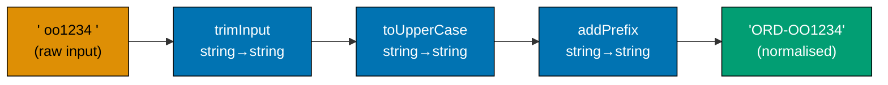
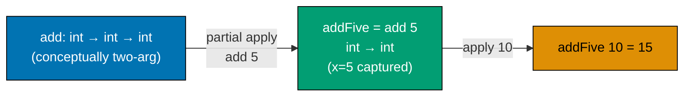
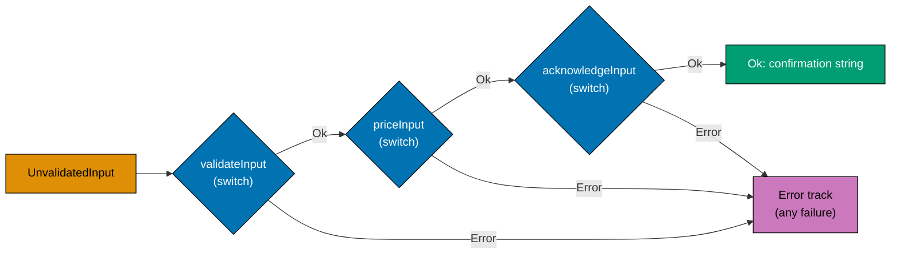
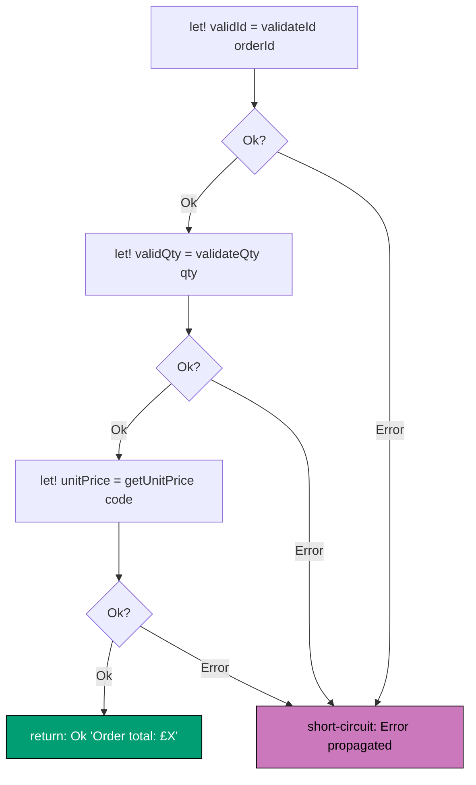
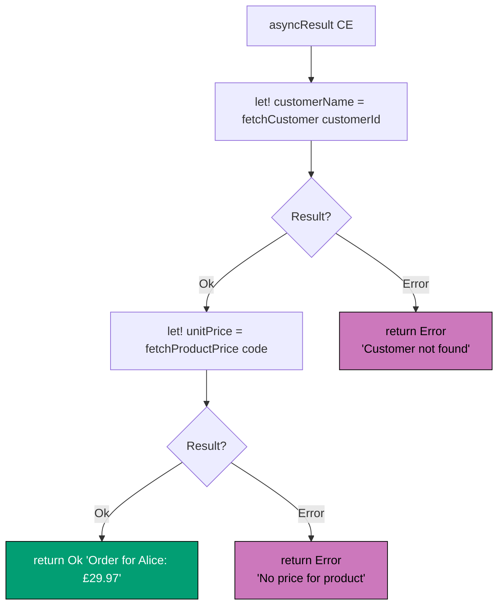
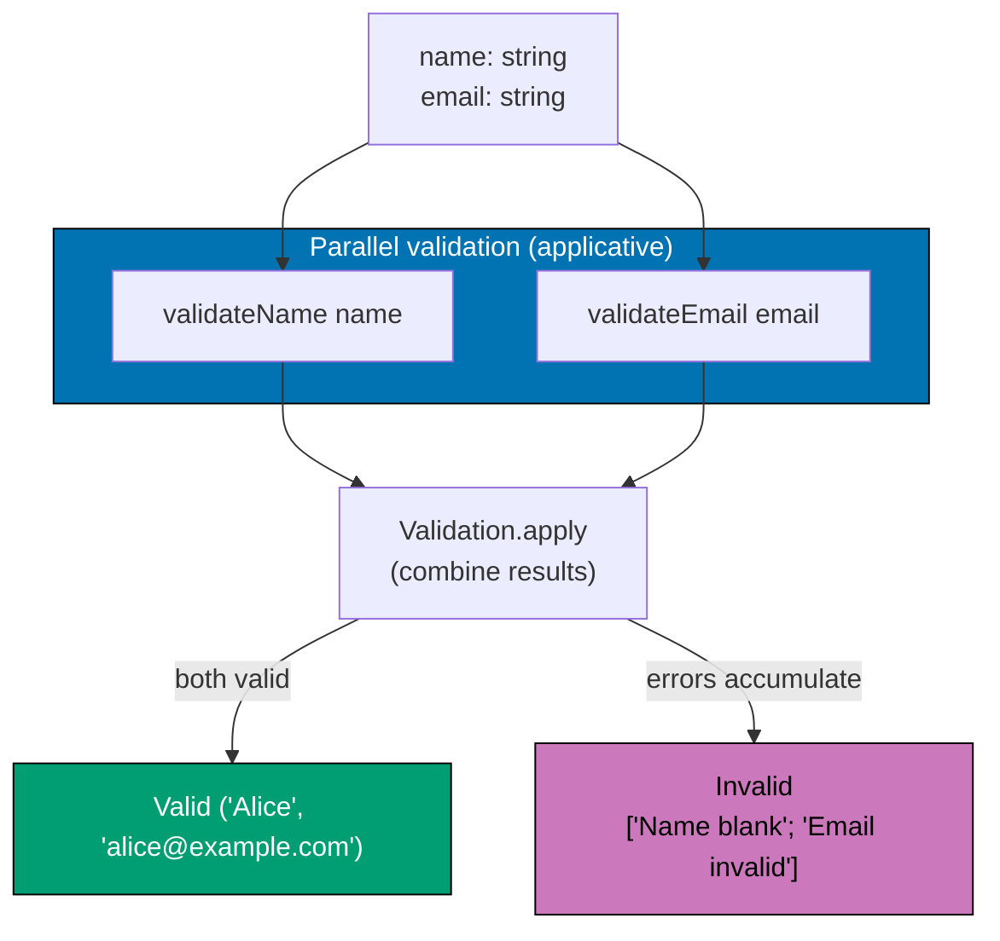
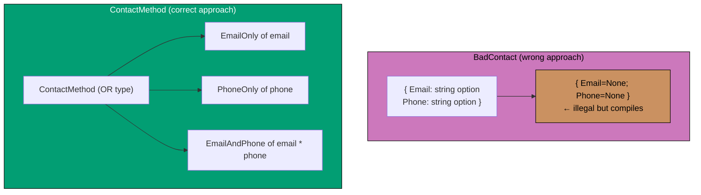
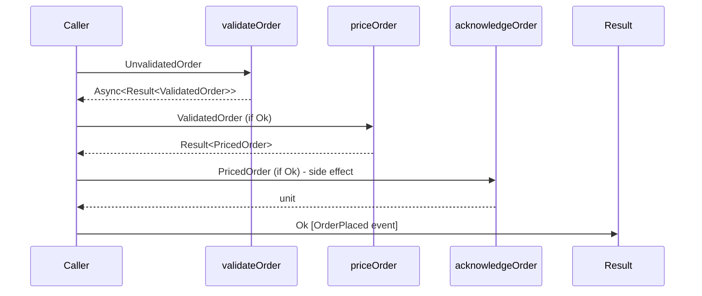
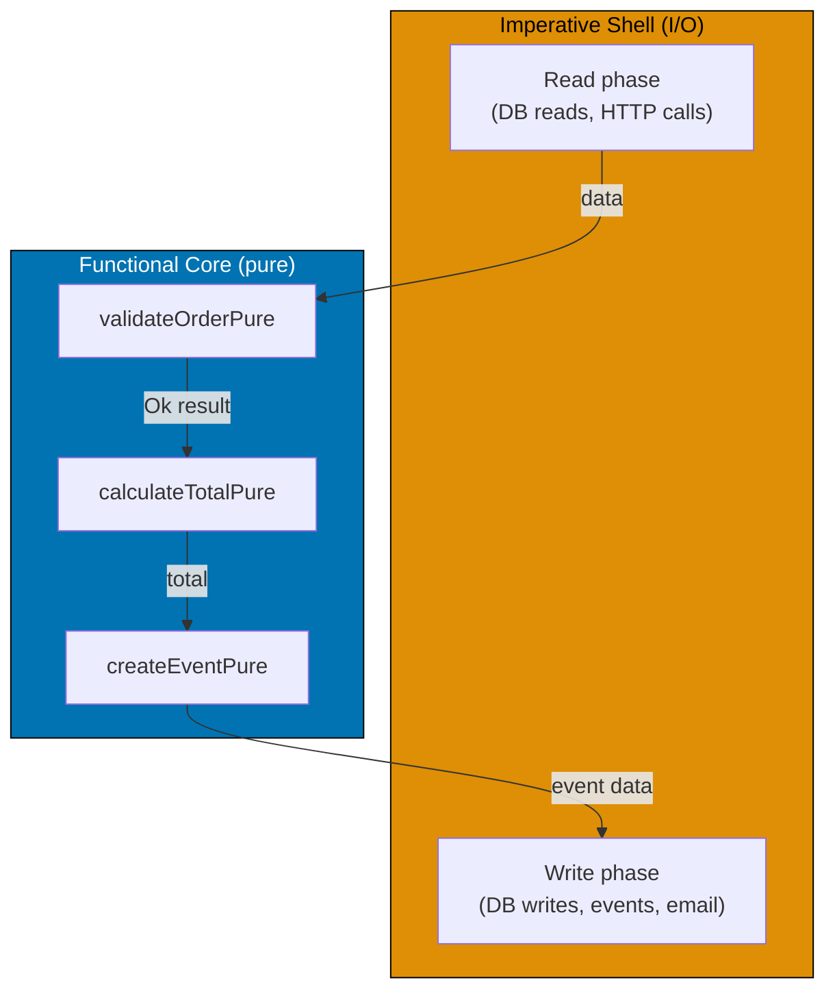
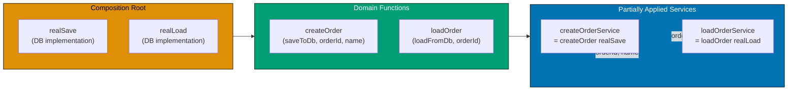

This intermediate section builds on the type vocabulary from the beginner section and introduces the pipeline mechanics that make functional DDD compelling in practice: function composition, Railway-Oriented Programming, computation expressions, validation accumulation, and pushing effects to the edges.

## Function Composition and Pipelines (Examples 26–29)

### Example 26: Function Composition with >>

The `>>` operator composes two functions into one. It is the mathematical composition operator: `(f >> g) x = g(f(x))`. In domain workflows, composition lets you assemble a pipeline from individually testable steps. Wlaschin introduces `>>` in Ch 8.



```fsharp
// >> is the forward composition operator: f >> g means "apply f then g".
// Each step is a pure function; the pipeline is their composition.

// Individual pipeline steps — each is a pure function, independently testable
let trimInput (s: string) : string =
    s.Trim()
    // => Removes leading and trailing whitespace

let toUpperCase (s: string) : string =
    s.ToUpperInvariant()
    // => Normalises to uppercase for consistent storage

let addPrefix (s: string) : string =
    "ORD-" + s
    // => Applies the order ID prefix convention

// Composing three steps into one function using >>
let normaliseOrderId: string -> string =
    trimInput >> toUpperCase >> addPrefix
    // => Reads left to right: trim, then uppercase, then prefix
    // => normaliseOrderId : string -> string — three functions become one

// Test the composed function
let raw = "  oo1234  "
// => raw : string = "  oo1234  " — has leading/trailing whitespace and lowercase
let normalised = normaliseOrderId raw
// => Step 1: trimInput "  oo1234  " = "oo1234"
// => Step 2: toUpperCase "oo1234" = "OO1234"
// => Step 3: addPrefix "OO1234" = "ORD-OO1234"
// => normalised = "ORD-OO1234"

printfn "Raw: '%s'" raw
// => Output: Raw: '  oo1234  '

printfn "Normalised: '%s'" normalised
// => Output: Normalised: 'ORD-OO1234'

// Each step can be tested independently
printfn "Trim step: '%s'" (trimInput raw)
// => Output: Trim step: 'oo1234'
```

**Key Takeaway**: The `>>` operator composes functions left-to-right, producing a single function from a sequence of steps, each of which can be tested and reasoned about independently.

**Why It Matters**: Composed pipelines replace long chains of intermediate `let` bindings with a single, readable declaration of intent. More importantly, each step in the composition is independently testable — you can unit test `trimInput`, `toUpperCase`, and `addPrefix` in isolation, then compose them with confidence. Wlaschin shows in Ch 8 that this composability is what makes functional workflows both robust and maintainable: you add a new step by inserting it into the composition, and the compiler verifies the type alignment automatically.

---

### Example 27: Pipe Operator |>

The `|>` (pipe) operator passes a value as the last argument to a function: `x |> f = f x`. It enables a left-to-right reading of data transformations, matching how domain experts describe workflows. Wlaschin uses `|>` throughout the book.

```fsharp
// |> pipes a value through a series of functions — reads like natural language.
// Eliminates deeply nested function calls and intermediate variable names.

// Without pipe — reads inside-out, harder to follow
let withoutPipe =
    List.sum (List.map (fun x -> x * x) (List.filter (fun x -> x % 2 = 0) [1..10]))
    // => Nested calls: filter, then map, then sum — but written innermost-first
    // => withoutPipe = 220 — same result but harder to read

// With pipe — reads left to right, matches the order of operations
let withPipe =
    [1..10]
    // => Input: integers 1 through 10
    |> List.filter (fun x -> x % 2 = 0)
    // => [2; 4; 6; 8; 10] — keep even numbers
    |> List.map (fun x -> x * x)
    // => [4; 16; 36; 64; 100] — square each even number
    |> List.sum
    // => 4 + 16 + 36 + 64 + 100 = 220 — sum all squared evens
    // => withPipe = 220

printfn "Without pipe: %d" withoutPipe
// => withoutPipe = 220 — same result as withPipe
// => Output: Without pipe: 220

printfn "With pipe: %d" withPipe
// => withPipe = 220 — identical result, more readable code
// => Output: With pipe: 220

// Domain example: transforming an order ID
let processOrderId (raw: string) =
    raw
    |> fun s -> s.Trim()
    // => Remove whitespace
    |> fun s -> s.ToUpperInvariant()
    // => Normalise case
    |> fun s -> if s.Length > 0 then Some s else None
    // => Return None for blank input

printfn "Processed: %A" (processOrderId "  ord-001  ")
// => Output: Processed: Some "ORD-001"

printfn "Processed empty: %A" (processOrderId "   ")
// => Output: Processed empty: None
```

**Key Takeaway**: The pipe operator `|>` makes data transformation pipelines read in the same order as the operations are applied — left to right, top to bottom — dramatically improving readability.

**Why It Matters**: Domain workflows are naturally described as a sequence of steps: "take the input, validate it, price it, acknowledge it, publish the events." The pipe operator maps directly to this sequential description. When a domain expert reads a piped expression, they see the same flow they described in conversation. This alignment between business language and code structure is the essence of Wlaschin's "ubiquitous language in the implementation" principle.

---

### Example 28: Currying — Every F# Function is One-Arg

In F#, every function is curried by default: a two-argument function is actually a one-argument function that returns another one-argument function. This enables partial application (Example 29) and seamless composition with operators like `>>` and `|>`. Wlaschin explains currying in Ch 8.



```fsharp
// Every F# function is curried: multi-arg functions are actually one-arg functions
// returning functions. This enables partial application and composition.

// A two-argument function
let add (x: int) (y: int) : int =
    x + y
    // => add : int -> int -> int
    // => Read as: "given an int, return a function (int -> int)"

// Partially apply: provide only the first argument
let addFive = add 5
// => addFive : int -> int — a new function with x=5 captured
// => addFive y = add 5 y = 5 + y

printfn "add 3 4 = %d" (add 3 4)
// => Output: add 3 4 = 7

printfn "addFive 10 = %d" (addFive 10)
// => Output: addFive 10 = 15

// Domain example: validation function with a product lookup dependency
let validateProductCode (lookupProduct: string -> bool) (code: string) : Result<string, string> =
    // => lookupProduct: injected dependency — checks catalogue
    // => code: the product code to validate
    if lookupProduct code then
        Ok code
        // => Product exists in catalogue — validation passes
    else
        Error (sprintf "Product code '%s' not found in catalogue" code)
        // => Product not found — validation fails

// Partially apply the lookup function to create a reusable validator
let validateWithRealLookup = validateProductCode (fun code -> code.StartsWith("W") || code.StartsWith("G"))
// => validateWithRealLookup : string -> Result<string, string>
// => The lookup function is "baked in" — only the code argument remains

printfn "%A" (validateWithRealLookup "W1234")
// => Output: Ok "W1234"

printfn "%A" (validateWithRealLookup "X999")
// => Output: Error "Product code 'X999' not found in catalogue"
```

**Key Takeaway**: Currying turns every multi-argument function into a pipeline of single-argument functions, enabling partial application and seamless composition with `>>` and `|>`.

**Why It Matters**: Currying is the mechanism that makes dependency injection via partial application (Example 29) work naturally in F#. Instead of constructor injection or service locators, you partially apply a function with its dependencies baked in and pass the resulting function where needed. This keeps functions pure and testable: in tests, you substitute a simple lambda for the dependency; in production, you pass the real implementation. No mocking frameworks required.

---

### Example 29: Partial Application as Dependency Injection

Partially applying a function with its dependencies baked in is the functional equivalent of constructor injection. The resulting function takes only its domain input, while the dependency is captured in the closure. Wlaschin makes this the primary DI mechanism in Ch 9.

```fsharp
// Partial application as DI: inject dependencies by partially applying functions.
// The result is a function with the same signature as the workflow step type.

// Infrastructure function signatures (interfaces as function types)
type CheckProductCodeExists = string -> bool
// => "Given a product code, does it exist?" — a dependency
// => bool return: true = exists, false = not in catalogue

type GetProductPrice = string -> Result<decimal, string>
// => "Given a product code, what is the price?" — another dependency
// => Result because price lookup can fail (product in catalogue but no price)

// Workflow step that depends on both functions
let validateAndPriceItem
    (checkExists: CheckProductCodeExists)
    // => First argument: the product lookup dependency
    (getPrice: GetProductPrice)
    // => Second argument: the price lookup dependency
    (code: string)
    // => Third argument: the product code to validate and price
    (qty: int)
    // => Fourth argument: the quantity to multiply by
    : Result<decimal, string> =
    // => Returns the line total (Ok) or an error if product not found or price missing
    if not (checkExists code) then
        Error (sprintf "Product '%s' not found" code)
        // => First dependency used — product existence check
        // => Short-circuits: no point looking up price if product doesn't exist
    else
        getPrice code
        // => Second dependency used — price lookup
        |> Result.map (fun unitPrice -> unitPrice * decimal qty)
        // => Result.map: if Ok, multiply unit price by quantity; if Error, propagate
        // => Second dependency used — price lookup, then multiply by quantity

// Production partial application — inject real implementations
let realCheckExists : CheckProductCodeExists = fun code ->
    code.StartsWith("W") || code.StartsWith("G")
    // => "W" prefix = Widget; "G" prefix = Gizmo — both are valid product codes
    // => Real implementation: checks code format (simplified)

let realGetPrice : GetProductPrice = fun code ->
    if code.StartsWith("W") then Ok 9.99m
    // => Widget price: £9.99
    elif code.StartsWith("G") then Ok 24.99m
    // => Gizmo price: £24.99
    else Error "Unknown product type"
    // => Real implementation: price by product type

// Partially apply to create the production version
let validateAndPriceProd = validateAndPriceItem realCheckExists realGetPrice
// => validateAndPriceProd : string -> int -> Result<decimal, string>
// => Dependencies are baked in — only domain arguments remain
// => Calling validateAndPriceProd "W1234" 3 = 9.99 × 3 = Ok 29.97M

// Test version with stub dependencies
let validateAndPriceTest = validateAndPriceItem (fun _ -> true) (fun _ -> Ok 5.00m)
// => Stubs: always exists, always £5.00 — simple lambdas, no mocking framework needed
// => Simplified stubs for testing — no mocking framework needed

printfn "Prod result: %A" (validateAndPriceProd "W1234" 3)
// => realCheckExists "W1234" = true; realGetPrice "W1234" = Ok 9.99; 9.99 × 3 = 29.97
// => Output: Prod result: Ok 29.97M

printfn "Test result: %A" (validateAndPriceTest "ANYTHING" 2)
// => stub exists "ANYTHING" = true; stub price "ANYTHING" = Ok 5.00; 5.00 × 2 = 10.00
// => Output: Test result: Ok 10.00M
```

**Key Takeaway**: Partial application injects dependencies by baking them into a function's closure, producing a new function with the dependency-free signature that workflows expect — no DI containers or mocking frameworks needed.

**Why It Matters**: Constructor injection in OOP requires classes, interfaces, and often a DI container. Partial application achieves the same result with plain functions. In tests, you replace real implementations with simple lambdas. In production, you pass the real functions. Wlaschin argues in Ch 9 that this approach is simpler, more transparent, and easier to reason about than class-based DI — there is no hidden magic, just function application.

---

## Railway-Oriented Programming (Examples 30–36)

### Example 30: Result.map and Result.mapError

`Result.map` applies a function to the `Ok` value of a `Result`, leaving the `Error` unchanged. `Result.mapError` transforms the `Error` value, leaving `Ok` unchanged. Together they let you transform the "happy path" and "sad path" independently. Wlaschin introduces these in Ch 10.

```fsharp
// Result.map transforms the Ok value; Result.mapError transforms the Error value.
// Neither function touches the other case.

// Result.map: apply a function inside Ok, pass Error through unchanged
let doubled = Result.map (fun x -> x * 2) (Ok 21)
// => doubled : Result<int, 'a> = Ok 42
// => The function (x * 2) was applied to 21 inside the Ok

let mapOnError = Result.map (fun x -> x * 2) (Error "something went wrong")
// => mapOnError : Result<int, string> = Error "something went wrong"
// => Error case is passed through — the function is NOT called

printfn "map Ok: %A" doubled
// => Output: map Ok: Ok 42

printfn "map Error: %A" mapOnError
// => Output: map Error: Error "something went wrong"

// Result.mapError: transform the Error value, pass Ok through unchanged
let uppercaseError = Result.mapError (fun e -> e.ToString().ToUpperInvariant()) (Error "invalid input")
// => uppercaseError : Result<'a, string> = Error "INVALID INPUT"
// => The function was applied to the error message

let mapErrorOnOk = Result.mapError (fun e -> e.ToString().ToUpperInvariant()) (Ok 42)
// => mapErrorOnOk : Result<int, string> = Ok 42
// => Ok case is passed through — the function is NOT called

printfn "mapError Error: %A" uppercaseError
// => Output: mapError Error: Error "INVALID INPUT"

printfn "mapError Ok: %A" mapErrorOnOk
// => Output: mapError Ok: Ok 42

// Practical: transform a domain error to an API error at the boundary
type DomainError = | ValidationError of string | ProductNotFound of string
type ApiError    = | BadRequest of string | NotFound of string

let mapToApiError (e: DomainError) : ApiError =
    match e with
    | ValidationError msg   -> BadRequest msg
    // => Domain validation errors become HTTP 400
    | ProductNotFound code  -> NotFound (sprintf "Product '%s' not found" code)
    // => Domain not-found errors become HTTP 404

let domainResult : Result<string, DomainError> = Error (ValidationError "OrderId blank")
// => domainResult : Result<string, DomainError> = Error (ValidationError "OrderId blank")
let apiResult = domainResult |> Result.mapError mapToApiError
// => Result.mapError applies mapToApiError to the Error case
// => ValidationError "OrderId blank" → BadRequest "OrderId blank"
// => apiResult : Result<string, ApiError> = Error (BadRequest "OrderId blank")

printfn "API error: %A" apiResult
// => Output: API error: Error (BadRequest "OrderId blank")
```

**Key Takeaway**: `Result.map` and `Result.mapError` let you transform success or failure values independently without touching the other case, keeping the two tracks cleanly separated.

**Why It Matters**: At API boundaries, domain errors must be translated into HTTP status codes and response shapes. `Result.mapError` makes this translation a single, explicit transformation rather than a try/catch block. Similarly, `Result.map` lets you transform domain objects into DTOs on the success path without unwrapping the `Result`. Together they are the building blocks of Railway-Oriented Programming: you work on the rails (Ok or Error) without ever leaving the railway.

---

### Example 31: Result.bind — Chaining Fallible Steps

`Result.bind` applies a function that itself returns a `Result` to the `Ok` value of an existing `Result`. If the input is `Error`, it short-circuits without calling the function. This is the core of Railway-Oriented Programming: chaining fallible steps. Wlaschin presents `bind` as the central ROP primitive in Ch 10.

```fsharp
// Result.bind: chain a fallible function onto an existing Result.
// Error short-circuits; Ok flows forward.

// Three fallible validation steps
let validateOrderId (raw: string) : Result<string, string> =
    // => Returns Ok trimmed id, or Error with a diagnostic message
    if System.String.IsNullOrWhiteSpace(raw) then Error "OrderId must not be blank"
    // => Guard 1: blank or whitespace ID rejected immediately
    elif raw.Length > 50 then Error "OrderId too long"
    // => Guard 2: IDs over 50 chars rejected (domain rule)
    else Ok (raw.Trim())
    // => Returns Ok with the trimmed id, or Error with a message

let validateCustomerName (raw: string) : Result<string, string> =
    // => Returns Ok trimmed name, or Error if blank
    if System.String.IsNullOrWhiteSpace(raw) then Error "CustomerName must not be blank"
    // => Guard: blank name is not valid in the domain
    else Ok (raw.Trim())
    // => Returns Ok with the trimmed name, or Error

let validateQuantity (qty: int) : Result<int, string> =
    // => Returns Ok with the quantity, or Error if zero or negative
    if qty <= 0 then Error (sprintf "Quantity must be positive (got %d)" qty)
    // => Guard: zero or negative quantity violates the positive-quantity invariant
    else Ok qty
    // => Returns Ok with the quantity, or Error

// Chaining with Result.bind — steps execute only if the previous succeeded
let validateOrder orderId customerName quantity =
    validateOrderId orderId
    // => Step 1: validate order ID — if this fails, steps 2 and 3 are skipped
    |> Result.bind (fun validId ->
        // => bind: validId is the unwrapped Ok value from step 1
        validateCustomerName customerName
        // => Step 2: validate customer name — only runs if step 1 returned Ok
        |> Result.map (fun validName -> (validId, validName)))
        // => Result.map pairs validId and validName in a tuple — no failure here
    // => bind: apply the next fallible step only if validateOrderId succeeded
    |> Result.bind (fun (validId, validName) ->
        // => bind: (validId, validName) unwrapped from the tuple in the Ok
        validateQuantity quantity
        // => Step 3: validate quantity — only runs if steps 1 and 2 returned Ok
        |> Result.map (fun validQty -> (validId, validName, validQty)))
        // => Result.map assembles the final triple — all three validated values
    // => bind again: chain the third step

let success = validateOrder "ORD-001" "Alice Johnson" 3
// => All three steps returned Ok — the tuple is assembled
// => success : Result<string * string * int, string> = Ok ("ORD-001", "Alice Johnson", 3)

let failure = validateOrder "" "Alice Johnson" 3
// => Step 1 failed: empty string → Error "OrderId must not be blank"
// => failure : Result<string * string * int, string> = Error "OrderId must not be blank"
// => Short-circuited after the first Error — later steps were not called

printfn "Success: %A" success
// => Output: Success: Ok ("ORD-001", "Alice Johnson", 3)

printfn "Failure: %A" failure
// => Output: Failure: Error "OrderId must not be blank"
```

**Key Takeaway**: `Result.bind` chains fallible steps so that the first failure short-circuits the pipeline — exactly like try/catch but expressed as composable function application rather than exception handling.

**Why It Matters**: Exception-based error handling allows failures to be thrown and caught at arbitrary distances from their source, making control flow hard to follow. `Result.bind` makes the failure path explicit and local: each step either succeeds and passes the `Ok` value to the next step, or fails and returns the `Error` without calling any subsequent step. The resulting pipeline is entirely readable as a sequence of transformations, and the error handling is impossible to accidentally omit.

---

### Example 32: Railway-Oriented Programming — Full Pipeline

The "two-track" or "railway-oriented" model visualises a pipeline as two parallel tracks: the Ok track (happy path) and the Error track (failure path). Functions that can fail are "switches" that can divert from Ok to Error but never back. Wlaschin introduces this metaphor in Ch 10 as the conceptual model for `Result.bind`.



```fsharp
// Railway-Oriented Programming: two tracks, switch functions, and a full pipeline.
// The "railway" metaphor: Ok track = happy path, Error track = failure path.
// Once on the Error track, all subsequent switches are bypassed automatically.

// ── Domain types ─────────────────────────────────────────────────────────
type UnvalidatedInput = { OrderId: string; Qty: int; ProductCode: string }
// => Raw input entering the railway — nothing trusted yet

type ValidatedInput   = { OrderId: string; Qty: int; ProductCode: string }
// => Input after validation — same shape, different type guarantees validity
// => If ValidatedInput exists, OrderId was non-blank and Qty was positive

type PricedInput      = { OrderId: string; Qty: int; ProductCode: string; Total: decimal }
// => Input after pricing — extended with the calculated total
// => If PricedInput exists, pricing has already been computed

// ── Switch functions — each can divert to the Error track ─────────────────
let validateInput (input: UnvalidatedInput) : Result<ValidatedInput, string> =
    // => Returns Ok to stay on the Ok track, or Error to divert to the Error track
    if System.String.IsNullOrWhiteSpace(input.OrderId) then Error "OrderId blank"
    // => Guard 1: blank OrderId — diverts to Error track immediately
    elif input.Qty <= 0 then Error "Quantity must be positive"
    // => Guard 2: non-positive quantity — diverts to Error track
    else Ok { OrderId = input.OrderId.Trim(); Qty = input.Qty; ProductCode = input.ProductCode }
    // => Both guards passed — stay on Ok track with the validated data

let priceInput (validated: ValidatedInput) : Result<PricedInput, string> =
    // => Only called if validateInput returned Ok — already on the Ok track
    let unitPrice = if validated.ProductCode.StartsWith "W" then 9.99m else 24.99m
    // => Look up price by product type: Widget £9.99, Gizmo £24.99
    if unitPrice <= 0m then Error "Invalid price"
    // => Safety guard — diverts to Error track (unreachable in this example but shows the pattern)
    else Ok { OrderId = validated.OrderId; Qty = validated.Qty
              ProductCode = validated.ProductCode; Total = unitPrice * decimal validated.Qty }
    // => Stay on Ok track — adds the calculated total to the record

let acknowledgeInput (priced: PricedInput) : Result<string, string> =
    // => Only called if both previous steps returned Ok
    Ok (sprintf "Order %s acknowledged — total £%.2f" priced.OrderId priced.Total)
    // => Terminal step — produces the confirmation string and stays on Ok track

// ── The full railway pipeline ─────────────────────────────────────────────
let placeOrder (input: UnvalidatedInput) : Result<string, string> =
    // => All three steps are wired together with Result.bind
    input
    |> validateInput
    // => Switch 1: validate or divert to Error track
    |> Result.bind priceInput
    // => Switch 2: price or divert — only executes if switch 1 returned Ok
    |> Result.bind acknowledgeInput
    // => Switch 3: acknowledge or divert — only executes if switch 2 returned Ok

// ── Three test cases: happy path and two failure paths ────────────────────
let goodInput   = { OrderId = "ORD-001"; Qty = 3;  ProductCode = "W1234" }
// => Valid input — all three switches will stay on the Ok track
let badOrderId  = { OrderId = "";        Qty = 3;  ProductCode = "W1234" }
// => Invalid: empty OrderId — switch 1 will divert to Error track
let badQuantity = { OrderId = "ORD-002"; Qty = -1; ProductCode = "W1234" }
// => Invalid: negative quantity — switch 1 will divert to Error track

printfn "Good:        %A" (placeOrder goodInput)
// => Output: Good:        Ok "Order ORD-001 acknowledged — total £29.97"

printfn "Bad orderId: %A" (placeOrder badOrderId)
// => Output: Bad orderId: Error "OrderId blank"
// => Switches 2 and 3 were never called — Error propagated straight through

printfn "Bad quantity:%A" (placeOrder badQuantity)
// => Output: Bad quantity:Error "Quantity must be positive"
// => Same short-circuit behaviour — early Error stops the pipeline
```

**Key Takeaway**: Railway-Oriented Programming models fallible pipelines as two parallel tracks — the Ok track flows straight through, and any switch that returns `Error` diverts all subsequent steps onto the Error track, which flows to the end without executing any more domain logic.

**Why It Matters**: The railway metaphor makes the error-handling strategy immediately visible to anyone reading the code. Unlike try/catch, which can catch errors from any depth and resume control at arbitrary points, ROP pipelines have a single, clear failure mode: Error short-circuits and propagates. This predictability is invaluable in complex domain workflows where understanding exactly what happens when validation fails is a business requirement, not just an implementation detail.

---

### Example 33: Computation Expression — result { let! ... }

F# computation expressions provide syntactic sugar for monadic chains. The `result` computation expression unwraps `Result` values with `let!` and rewraps the final expression in `Ok`, so the code reads like imperative steps while remaining fully functional. Wlaschin introduces computation expressions in Ch 10.



```fsharp
// The 'result' computation expression: imperative-looking code that is actually
// a chain of Result.bind calls — syntactic sugar for ROP.

// Define a minimal result computation expression builder
type ResultBuilder() =
    member _.Return(x) = Ok x
    // => Wraps a plain value in Ok
    member _.ReturnFrom(x) = x
    // => Passes a Result through as-is
    member _.Bind(x, f) = Result.bind f x
    // => Unwraps Ok and applies f; short-circuits on Error
    member _.Zero() = Ok ()
    // => Default for empty computation expressions

let result = ResultBuilder()
// => result : ResultBuilder — our CE builder instance

// Smart constructors (simplified)
let validateId (raw: string) =
    // => Returns Ok trimmed id if non-blank; Error if blank
    if System.String.IsNullOrWhiteSpace(raw) then Error "Id must not be blank"
    // => Guard: blank or whitespace strings are not valid IDs
    else Ok raw.Trim()
    // => Ok with trimmed string — normalised

let validateQty (qty: int) =
    // => Returns Ok qty if positive; Error if zero or negative
    if qty <= 0 then Error "Quantity must be positive"
    // => Guard: zero and negatives are not valid quantities
    else Ok qty
    // => Ok qty — passes through unchanged

let getUnitPrice (code: string) =
    // => Returns Ok price for known product codes; Error for unknown
    if code.StartsWith "W" then Ok 9.99m
    // => Widget codes start with "W" — price is £9.99
    elif code.StartsWith "G" then Ok 24.99m
    // => Gizmo codes start with "G" — price is £24.99
    else Error (sprintf "Unknown product: %s" code)
    // => Unknown code — returns Error with the code for diagnostics

// The computation expression — reads like sequential imperative code
let buildOrderTotal orderId qty productCode =
    result {
        let! validId    = validateId orderId
        // => let! desugars to .Bind(validateId orderId, fun validId -> ...)
        // => validId : string = orderId.Trim() if non-blank
        let! validQty   = validateQty qty
        // => Second validation — only reached if first succeeded
        // => validQty : int = qty if positive
        let! unitPrice  = getUnitPrice productCode
        // => Third step — only reached if both validations succeeded
        // => unitPrice : decimal = 9.99 for "W1234"
        let total = unitPrice * decimal validQty
        // => Plain let — no Result unwrapping needed; just arithmetic
        // => total = 9.99 × 3 = 29.97 for validQty=3
        return sprintf "Order %s total: £%.2f" validId total
        // => return desugars to .Return(...) which wraps in Ok
        // => return wraps the final value in Ok
    }
    // => Equivalent to: validateId >> Result.bind (fun id -> ...) >> Result.bind ...

printfn "%A" (buildOrderTotal "ORD-001" 3 "W1234")
// => All three validations pass; total = 9.99 × 3 = 29.97
// => Output: Ok "Order ORD-001 total: £29.97"

printfn "%A" (buildOrderTotal "" 3 "W1234")
// => Output: Error "Id must not be blank"

printfn "%A" (buildOrderTotal "ORD-002" 3 "X999")
// => Output: Error "Unknown product: X999"
```

**Key Takeaway**: The `result` computation expression makes Railway-Oriented Programming look like sequential imperative code while preserving the short-circuit semantics of `Result.bind` — the best of both worlds.

**Why It Matters**: Deeply nested `Result.bind` calls become unreadable for more than three steps. Computation expressions flatten the nesting into a `let!`-based imperative style that most developers find intuitive. Wlaschin recommends computation expressions for complex multi-step workflows while keeping simpler two- or three-step pipelines as explicit `|> Result.bind` chains. The key is that the underlying semantics are identical — the CE is purely syntactic sugar.

---

### Example 34: Async + Result Composition

Real workflows involve I/O: database reads, HTTP calls, and message bus interactions. In F#, `Async<Result<'a, 'e>>` is the standard type for a computation that is both asynchronous and fallible. Composing these requires an `asyncResult` computation expression. Wlaschin addresses this in Ch 10.



```fsharp
// Async<Result<'a,'e>> = an asynchronous operation that can succeed or fail.
// asyncResult CE composes these cleanly.

// Simulate async I/O operations
let fetchCustomer (customerId: string) : Async<Result<string, string>> =
    async {
        // => Simulates an async database call
        if customerId = "CUST-42" then
            return Ok "Alice Johnson"
            // => Customer found
        else
            return Error (sprintf "Customer '%s' not found" customerId)
            // => Customer not in the database
    }

let fetchProductPrice (code: string) : Async<Result<decimal, string>> =
    async {
        // => Simulates an async price service call
        if code.StartsWith "W" then return Ok 9.99m
        // => Widget codes → £9.99 per unit
        elif code.StartsWith "G" then return Ok 24.99m
        // => Gizmo codes → £24.99 per unit
        else return Error (sprintf "No price for product '%s'" code)
        // => Unknown product code → Error; the workflow will short-circuit here
    }

// asyncResult CE builder — composes Async<Result> values with let!
type AsyncResultBuilder() =
    member _.Return(x)       = async { return Ok x }
    // => return: wrap a plain value in Ok and lift into Async
    member _.ReturnFrom(x)   = x
    // => return!: pass an existing Async<Result> through unchanged
    member _.Bind(x, f) =
        async {
            let! result = x
            // => Await the async operation — result : Result<'a, 'e>
            match result with
            | Ok v    -> return! f v
            // => If Ok, apply the next function (which is also Async<Result>)
            // => f v produces another Async<Result> that is awaited recursively
            | Error e -> return Error e
            // => If Error, short-circuit without calling f
            // => Error propagates all the way out of the asyncResult block
        }

let asyncResult = AsyncResultBuilder()
// => asyncResult : AsyncResultBuilder — the CE instance used below
// => CE syntax: `asyncResult { let! x = ... }` desugars to .Bind(x, ...) calls

// Full async workflow
let placeOrderAsync customerId productCode qty =
    asyncResult {
        let! customerName = fetchCustomer customerId
        // => Await fetchCustomer; customerName is the unwrapped string if Ok
        // => Await and unwrap — short-circuits on Error
        let! unitPrice    = fetchProductPrice productCode
        // => Await fetchProductPrice; only runs if customer fetch succeeded
        // => unitPrice is the unwrapped decimal if Ok
        // => Await and unwrap — only runs if customer fetch succeeded
        let total         = unitPrice * decimal qty
        // => Synchronous arithmetic — no Async or Result wrapping needed here
        // => total = 9.99 × 3 = 29.97 for W1234
        // => Synchronous arithmetic inside the async workflow
        return sprintf "Order for %s: £%.2f" customerName total
        // => return wraps the string in Ok and lifts into Async<Result>
        // => Wraps the result in Async<Result<string, string>>
    }

// Run the async workflow synchronously for demonstration
let resultOk = placeOrderAsync "CUST-42" "W1234" 3 |> Async.RunSynchronously
// => fetchCustomer "CUST-42" = Ok "Alice Johnson"
// => fetchProductPrice "W1234" = Ok 9.99
// => total = 9.99 × 3 = 29.97
// => resultOk : Result<string, string> = Ok "Order for Alice Johnson: £29.97"

let resultErr = placeOrderAsync "UNKNOWN" "W1234" 3 |> Async.RunSynchronously
// => fetchCustomer "UNKNOWN" = Error "Customer 'UNKNOWN' not found"
// => fetchProductPrice never called — short-circuited by the customer error
// => resultErr : Result<string, string> = Error "Customer 'UNKNOWN' not found"

printfn "Success: %A" resultOk
// => Output: Success: Ok "Order for Alice Johnson: £29.97"

printfn "Failure: %A" resultErr
// => Output: Failure: Error "Customer 'UNKNOWN' not found"
```

**Key Takeaway**: `Async<Result<'a,'e>>` combined with an `asyncResult` computation expression lets you write asynchronous, fallible workflows in a sequential, readable style while maintaining full control over both the async and the error dimensions.

**Why It Matters**: In production systems, almost every external call is both asynchronous (database, HTTP, message bus) and fallible (network errors, not-found, timeouts). Composing these without a CE leads to deeply nested `Async.bind` and `Result.bind` calls. The `asyncResult` CE resolves both dimensions simultaneously, producing code that reads like a synchronous happy-path script while handling failures and async transparently. This pattern is the practical foundation of the workflow pipeline in Example 44.

---

### Example 35: AsyncResult Builder

This example provides a more complete `AsyncResult` builder and demonstrates its use with a three-step async workflow. The builder handles the monadic plumbing so that business logic code stays clean.

```fsharp
// AsyncResult module: wraps Async<Result<'a,'e>> with standard operations.
// Provides the building blocks for async workflow pipelines.

module AsyncResult =
    // Core operations as standalone functions — usable without a CE
    // => Mirrors the standard monadic operations: map, bind, return, ofResult

    let map (f: 'a -> 'b) (ar: Async<Result<'a,'e>>) : Async<Result<'b,'e>> =
        // => Transforms the Ok value; leaves Error unchanged
        async {
            let! r = ar
            // => Await the async operation; r : Result<'a,'e>
            return Result.map f r
            // => Apply f to Ok value, or pass Error through unchanged
            // => Transform the Ok value; leave Error unchanged
        }

    let bind (f: 'a -> Async<Result<'b,'e>>) (ar: Async<Result<'a,'e>>) : Async<Result<'b,'e>> =
        // => Chains two async fallible operations — the core of the CE
        async {
            let! r = ar
            // => Await first async operation; r : Result<'a,'e>
            match r with
            | Ok v    -> return! f v
            // => Ok: apply f and await the next async operation
            | Error e -> return Error e
            // => Error: short-circuit without calling f
        }

    let retn (x: 'a) : Async<Result<'a,'e>> =
        // => Lifts a pure value into Async<Result> — the "unit" of the monad
        async { return Ok x }
        // => Wrap x in Ok and immediately complete the async workflow

    let ofResult (r: Result<'a,'e>) : Async<Result<'a,'e>> =
        // => Lifts a synchronous Result into Async<Result> for uniform composition
        async { return r }
        // => The async computation immediately returns r — no actual I/O
        // => Enables mixing sync validation (via ofResult) with async I/O in the same pipeline
        // => Lift a synchronous Result into Async<Result>

// ── Workflow using the AsyncResult module ─────────────────────────────────
let validateAsync (orderId: string) : Async<Result<string, string>> =
    AsyncResult.ofResult (if orderId.Length > 0 then Ok orderId else Error "OrderId blank")
    // => Synchronous validation lifted into Async<Result>
    // => AsyncResult.ofResult wraps a synchronous Result in Async for uniform composition

let lookupPriceAsync (code: string) : Async<Result<decimal, string>> =
    async { return (if code.StartsWith "W" then Ok 9.99m else Error "Unknown product") }
    // => Simulated async price lookup
    // => Widget codes starting with "W" get £9.99; others get an error

let buildConfirmation (orderId: string) (price: decimal) : Async<Result<string, string>> =
    AsyncResult.retn (sprintf "Confirmed: %s @ £%.2f" orderId price)
    // => AsyncResult.retn lifts a plain string into Async<Result<string, string>>
    // => Simple confirmation lifted into Async<Result>

// Pipeline using AsyncResult.bind
let workflow orderId productCode =
    validateAsync orderId
    // => Step 1: validate order ID — produces Async<Result<string, string>>
    |> AsyncResult.bind (fun validId ->
        // => bind awaits and unwraps; validId = the validated order ID string
        // => This is AsyncResult.bind, not Result.bind — handles the Async wrapper
        lookupPriceAsync productCode
        // => Step 2: look up price — only runs if step 1 returned Ok
        |> AsyncResult.bind (fun price ->
            // => price = the decimal price value from the Ok case
            buildConfirmation validId price))
            // => Step 3: build the confirmation message
    // => Three async steps chained with AsyncResult.bind

let result1 = workflow "ORD-001" "W1234" |> Async.RunSynchronously
// => All three steps ran; "ORD-001" is valid; "W1234" → £9.99
// => result1 : Result<string, string> = Ok "Confirmed: ORD-001 @ £9.99"

printfn "%A" result1
// => Output: Ok "Confirmed: ORD-001 @ £9.99"
```

**Key Takeaway**: The `AsyncResult` module provides standalone `map`, `bind`, and `retn` functions that compose async fallible steps without requiring a CE, useful for two- or three-step workflows where the CE overhead is not justified.

**Why It Matters**: Having both CE syntax (Example 33–34) and explicit `AsyncResult.bind` syntax gives you the right tool for the job. Short pipelines are readable with explicit `bind`; long pipelines benefit from CE syntax. Wlaschin's approach in Ch 10 is to build the `AsyncResult` module first and then layer the CE on top — understanding both forms makes it easier to debug and reason about the underlying semantics.

---

### Example 36: Validation Accumulation — Collecting All Errors

`Result.bind` short-circuits on the first error. When validating a form with multiple fields, you want to collect all errors at once rather than presenting them one by one. The `Validation` applicative (a parallel, not sequential, combinator) accumulates errors into a list. Wlaschin presents this in Ch 10.



```fsharp
// Validation accumulation: collect ALL errors, not just the first.
// Uses an applicative functor pattern, not monadic bind.

// Validation type: same as Result but Error is always a list
type Validation<'a, 'e> =
    | Valid   of 'a
    | Invalid of 'e list
    // => Error is a LIST — multiple errors accumulate

module Validation =
    // Apply: combines two Validation values, accumulating errors from both
    let apply (vf: Validation<'a -> 'b, 'e>) (va: Validation<'a, 'e>) : Validation<'b, 'e> =
        // => vf: a Validation wrapping a function; va: a Validation wrapping a value
        match vf, va with
        | Valid f,   Valid a   -> Valid (f a)
        // => Both valid: apply the function to the value — produces a Valid result
        | Invalid e1, Invalid e2 -> Invalid (e1 @ e2)
        // => Both invalid: concatenate error lists — KEY difference from bind
        // => e1 @ e2 merges the two error lists — all failures visible at once
        | Invalid e,  Valid _  -> Invalid e
        // => Only function side invalid: propagate its error list unchanged
        | Valid _,    Invalid e -> Invalid e
        // => Only value side invalid: propagate its error list unchanged

    let retn (x: 'a) = Valid x
    // => Lift a pure value into Validation — analogous to Result's Ok
    // => Used to wrap the multi-arg constructor before applying values

    let map (f: 'a -> 'b) (v: Validation<'a, 'e>) : Validation<'b, 'e> =
        match v with
        | Valid a   -> Valid (f a)
        // => Valid: apply f to the value and re-wrap
        | Invalid e -> Invalid e
        // => Invalid: propagate errors unchanged — same semantics as Result.map

// Validation functions returning Validation instead of Result
let validateName (raw: string) : Validation<string, string> =
    // => Returns Valid with the trimmed name, or Invalid with the error in a list
    if System.String.IsNullOrWhiteSpace(raw) then Invalid ["Name must not be blank"]
    // => Guard 1: blank name rejected — error wrapped in a list for accumulation
    elif raw.Length > 50                     then Invalid ["Name must be 50 chars or fewer"]
    // => Guard 2: too long rejected — error wrapped in a list
    else Valid raw.Trim()
    // => Both guards passed — trim and return as Valid

let validateEmail (raw: string) : Validation<string, string> =
    // => Returns Valid with the lowercase email, or Invalid with the error in a list
    if System.Text.RegularExpressions.Regex.IsMatch(raw, @"^[^@\s]+@[^@\s]+\.[^@\s]+$")
    then Valid (raw.ToLowerInvariant())
    // => Valid email format — normalise to lowercase and return Valid
    else Invalid [sprintf "'%s' is not a valid email" raw]
    // => Invalid format — error wrapped in a list for accumulation

// Apply all validations — errors accumulate
let validateCustomer name email =
    let ctorResult = Validation.retn (fun n e -> (n, e))
    // => Lift the tuple constructor (fun n e -> (n, e)) into Validation
    // => ctorResult : Validation<string -> string -> string * string, string>
    let nameResult = validateName name
    // => nameResult : Validation<string, string> — Valid or Invalid
    let emailResult = validateEmail email
    // => emailResult : Validation<string, string> — Valid or Invalid
    Validation.apply (Validation.apply ctorResult nameResult) emailResult
    // => First apply: (fun n e -> (n, e)) applied to nameResult → Validation<string -> string * string>
    // => Second apply: that function applied to emailResult → Validation<string * string, string>
    // => If both valid: Valid ("Alice", "alice@example.com")
    // => If both invalid: Invalid (nameErrors @ emailErrors) — BOTH errors collected

printfn "%A" (validateCustomer "Alice" "alice@example.com")
// => Both validations passed: name is "Alice", email is valid
// => Output: Valid ("Alice", "alice@example.com")

printfn "%A" (validateCustomer "" "not-an-email")
// => Both validations failed: name is blank AND email format is wrong
// => Output: Invalid ["Name must not be blank"; "'not-an-email' is not a valid email"]
// => BOTH errors collected — user sees all problems at once
```

**Key Takeaway**: The `Validation` applicative accumulates all validation errors into a list, so users see all field errors at once rather than correcting them one at a time.

**Why It Matters**: Nothing frustrates users more than fixing one form error only to be shown the next. Applicative validation (`apply`) collects all errors in parallel, while monadic validation (`bind`) stops at the first. In real applications, form validation uses `Validation` (accumulate all errors), while workflow steps use `Result.bind` (stop at the first critical failure). Wlaschin distinguishes these two patterns explicitly in Ch 10, naming them "applicative" and "monadic" validation.

---

## Workflow Signatures and Domain Architecture (Examples 37–50)

### Example 37: Make-Illegal-States-Unrepresentable Case Study

A `Contact` record has an email address and/or a phone number — but at least one must be present. Representing this with two optional fields allows the invalid "both absent" state. A discriminated union eliminates it. This is Wlaschin's central case study in Ch 6.



```fsharp
// "Make illegal states unrepresentable" — Wlaschin Ch 6.
// A Contact must have at least one way to be reached.

// WRONG: two optional fields allow the "no contact method" state
type BadContact = {
    Email: string option
    // => Email is optional — but if Phone is also None, no contact method exists
    Phone: string option
    // => Both could be None — an invalid state that compiles fine
    // => BadContact {} (empty record) would fail because at least one field is needed;
    // => but BadContact { Email = None; Phone = None } compiles — and represents "unreachable contact"
}

// RIGHT: discriminated union captures the three valid cases
type ContactMethod =
    // => Exactly one of three valid cases — "both absent" is impossible
    | EmailOnly  of email: string
    // => Case 1: only email provided
    | PhoneOnly  of phone: string
    // => Case 2: only phone provided
    | EmailAndPhone of email: string * phone: string
    // => Case 3: both provided

// Contact now ALWAYS has a way to be reached
type Contact = {
    Name: string
    ContactMethod: ContactMethod
    // => Required — a Contact without a contact method cannot be constructed
}

// All valid states — none of them represent "no contact method"
let contact1 = { Name = "Alice"; ContactMethod = EmailOnly "alice@example.com" }
// => contact1 : Contact, ContactMethod = EmailOnly — case 1: email only, valid

let contact2 = { Name = "Bob"; ContactMethod = PhoneOnly "+1-555-0100" }
// => contact2 : Contact, ContactMethod = PhoneOnly — case 2: phone only, valid

let contact3 = { Name = "Carol"; ContactMethod = EmailAndPhone ("carol@example.com", "+1-555-0200") }
// => contact3 : Contact, ContactMethod = EmailAndPhone — case 3: both present, valid
// => EmailAndPhone carries a (email, phone) tuple — both values available to callers

// The compiler enforces exhaustive handling of all three cases
let describeContact (c: Contact) =
    // => match must cover EmailOnly, PhoneOnly, and EmailAndPhone — no wildcard needed
    match c.ContactMethod with
    | EmailOnly e         -> sprintf "%s: email %s" c.Name e
    // => e : string — the email address extracted from EmailOnly case
    | PhoneOnly p         -> sprintf "%s: phone %s" c.Name p
    // => p : string — the phone number extracted from PhoneOnly case
    | EmailAndPhone (e,p) -> sprintf "%s: email %s, phone %s" c.Name e p
    // => e, p : string * string — both extracted from the EmailAndPhone tuple

printfn "%s" (describeContact contact1)
// => Matched EmailOnly; e = "alice@example.com"
// => Output: Alice: email alice@example.com
printfn "%s" (describeContact contact2)
// => Matched PhoneOnly; p = "+1-555-0100"
// => Output: Bob: phone +1-555-0100
printfn "%s" (describeContact contact3)
// => Matched EmailAndPhone; e = "carol@example.com", p = "+1-555-0200"
// => Output: Carol: email carol@example.com, phone +1-555-0200
```

**Key Takeaway**: Replacing two optional fields with a discriminated union of the valid combination cases eliminates illegal states from the type system, removing entire categories of defensive null checks.

**Why It Matters**: This is Wlaschin's most-cited example of the "make illegal states unrepresentable" principle. With `{ Email: string option; Phone: string option }`, a new developer can create `{ Email = None; Phone = None }` and the compiler is fine with it. The bug only surfaces at runtime. With `ContactMethod`, the union of valid cases is closed — there is no way to construct a contactless contact. Every function that receives a `Contact` can be written with full confidence that a contact method is present.

---

### Example 38: Refactor Primitive Obsession — Typed Wrapper

Primitive obsession is using raw strings, ints, or decimals for domain concepts that have their own identity and constraints. This example refactors a function from primitive obsession to typed wrappers, showing the before and after.

```fsharp
// Before: primitive obsession — all arguments are raw strings.
// After: typed wrappers — distinct types, constraints enforced.

// ── BEFORE: primitive obsession ───────────────────────────────────────────
let processOrderBefore (orderId: string) (customerId: string) (productCode: string) (qty: int) =
    // => All arguments are raw primitives — easy to confuse order
    // => processOrderBefore "CUST-1" "ORD-1" "W1234" 3 — wrong arg order, compiles fine
    // => The compiler cannot detect the transposition — both are strings
    sprintf "Processing order %s for customer %s: %s × %d" orderId customerId productCode qty

// ── AFTER: typed wrappers ─────────────────────────────────────────────────
type OrderId'    = OrderId'    of string
// => Single-case DU wrapper for order IDs — nominally distinct from all other string types
type CustomerId' = CustomerId' of string
// => Nominally distinct from OrderId' — cannot be accidentally substituted
type ProductCode'= ProductCode'of string
// => Nominally distinct product code — prevents mixing with IDs
type Quantity'   = Quantity'   of int
// => Wraps int — enables constraint validation via the smart constructor below

module Quantity' =
    let create (n: int) : Result<Quantity', string> =
        // => Smart constructor: validates the positive-quantity invariant
        if n <= 0 then Error (sprintf "Quantity must be positive (got %d)" n)
        // => n=0 and negatives are rejected — at least 1 unit required
        else Ok (Quantity' n)
        // => n > 0: wrap in the Quantity' DU and return Ok
    let value (Quantity' n) = n
    // => Unwrap accessor: extracts the raw int for arithmetic or persistence

let processOrderAfter (OrderId' oid) (CustomerId' cid) (ProductCode' pcode) (Quantity' qty) =
    // => Pattern-matching in parameters unwraps all four wrappers inline
    // => processOrderAfter (CustomerId' "C1") (OrderId' "O1") ... ← compile error
    // => The compiler detects the argument order mistake — protects against transposition
    sprintf "Processing order %s for customer %s: %s × %d" oid cid pcode qty
    // => oid, cid, pcode, qty are the raw unwrapped values — safe to use here

// Correct usage
let order    = OrderId'     "ORD-001"
// => order : OrderId' — nominally distinct from CustomerId' and ProductCode'
let customer = CustomerId'  "CUST-42"
// => customer : CustomerId' — cannot be passed where OrderId' is expected
let product  = ProductCode' "W1234"
// => product : ProductCode' — its own type, not interchangeable with order or customer
let quantity = Quantity' 3
// => quantity : Quantity' — wraps int; Quantity'.create would validate > 0

// => All arguments are distinct types — cannot be accidentally transposed
printfn "%s" (processOrderAfter order customer product quantity)
// => Output: Processing order ORD-001 for customer CUST-42: W1234 × 3
```

**Key Takeaway**: Replacing primitive arguments with typed wrappers prevents transposition bugs and makes every function signature self-documenting — the type names ARE the documentation.

**Why It Matters**: Primitive obsession is the most pervasive DDD anti-pattern. Functions with signatures like `(string, string, string, int)` invite argument transposition bugs that are invisible in tests using simple sequential values (1, 2, 3). Typed wrappers cost one line per type and pay dividends in readability, refactoring safety, and bug prevention throughout the system's lifetime. Wlaschin devotes a section of Ch 5 to this specific refactoring.

---

### Example 39: ValidatedOrder Type Emitted by Validation Step

The `ValidatedOrder` type is what the validation step produces. It uses constrained types for all fields, replacing the raw strings of `UnvalidatedOrder`. This demonstrates the "type-state" pattern: advancing through the workflow changes the type.

```fsharp
// ValidatedOrder: the type produced by the ValidateOrder workflow step.
// All fields use constrained types — if a ValidatedOrder exists, it is valid.

// Constrained types (abbreviated from earlier examples)
type OrderId    = private OrderId    of string
// => Private constructor: only the OrderId module can create values
type String50   = private String50   of string
// => Private constructor: only values that passed the 50-char check exist
type EmailAddress = private EmailAddress of string
// => Private constructor: only values containing "@" in the right place exist

module OrderId    = let create s = if s = "" then Error "blank" else Ok (OrderId s)
                   // => Returns Ok if non-blank; Error "blank" if empty
                   // => Abbreviated: real version uses a longer error message
                   let value (OrderId s) = s
                   // => Unwrap accessor for the raw string
module String50   = let create _ s = if s = "" then Error "blank" else Ok (String50 s)
                   // => Field name parameter for diagnostic messages; validates non-blank
                   // => Abbreviated: real version also checks length ≤50
                   let value (String50 s) = s
                   // => Unwrap accessor — used when writing to the database or UI
module EmailAddress = let create s = if s.Contains "@" then Ok (EmailAddress s) else Error "invalid"
                     // => Minimal "@" check; full validation uses a regex pattern
                     let value (EmailAddress s) = s
                     // => Unwrap accessor

// Constrained address type (all validated fields)
type ValidatedAddress = {
    AddressLine1: String50
    // => Non-blank, ≤50 chars — validated via String50.create
    City: String50
    // => Non-blank city name — validated
    ZipCode: String50
    // => Postal code — validated for non-blank (format check would use a ZipCode type)
    Country: String50
    // => Two or three letter country code — validated for non-blank
}

// Constrained customer info type
type ValidatedCustomerInfo = {
    FirstName: String50
    // => Non-blank first name — validated on entry
    LastName: String50
    // => Non-blank last name — validated on entry
    EmailAddress: EmailAddress
    // => Valid email address — contains "@" separator; validated on entry
}

// ValidatedOrderLine: uses constrained types for all fields
type ValidatedOrderLine = {
    OrderLineId: String50
    // => Non-blank line identifier — validated
    ProductCode: String50
    // => Would use ProductCode DU from Example 15 in the full model
    Quantity: decimal
    // => Would use constrained UnitQuantity or KilogramQuantity in the full model
    // => Positive decimal — enforced by the validator when reading from UnvalidatedOrderLine
}

// The validated order — all fields are guaranteed valid by construction
type ValidatedOrder = {
    OrderId: OrderId
    // => Validated, non-blank
    CustomerInfo: ValidatedCustomerInfo
    // => All customer fields validated — FirstName, LastName, EmailAddress
    ShippingAddress: ValidatedAddress
    // => All address fields validated — Line1, City, ZipCode, Country
    BillingAddress: ValidatedAddress
    // => Separate billing address — may differ from shipping address
    OrderLines: ValidatedOrderLine list
    // => Non-empty list — at least one line required (enforced in the validator)
    // => Each line has a valid ProductCode and positive Quantity
}

printfn "ValidatedOrder type defined — all fields use constrained types"
// => ValidatedOrder only exists if all fields passed their respective smart constructors
// => Output: ValidatedOrder type defined — all fields use constrained types
printfn "If a ValidatedOrder exists, all its fields passed validation"
// => Compiler-enforced invariant: no way to construct ValidatedOrder with invalid fields
// => Downstream functions can skip defensive validation — the type provides the guarantee
// => Output: If a ValidatedOrder exists, all its fields passed validation
// => This is the "types as proof" principle: the type IS the proof of validity
```

**Key Takeaway**: The `ValidatedOrder` type documents in the type system that all fields have been checked — downstream functions that accept `ValidatedOrder` can skip redundant null and range checks.

**Why It Matters**: Without type-state progression, validation logic tends to be duplicated: the controller validates, the service layer validates again, and the domain object validates a third time "just in case." When different state types represent different lifecycle stages, validation happens exactly once — at the `UnvalidatedOrder → ValidatedOrder` transition. Functions that accept `ValidatedOrder` are contractually guaranteed to receive valid data, eliminating defensive duplication.

---

### Example 40: PricedOrder Type Emitted by Pricing Step

The `PricedOrder` type extends `ValidatedOrder` with pricing information: each line has a price, and the order has a total. This is only available after the pricing step. Functions that need prices must accept `PricedOrder`, enforcing that pricing has already occurred.

```fsharp
// PricedOrder: the type produced by the PriceOrder workflow step.
// Extends the validated information with computed prices.

// Reuse types from Example 39 (abbreviated)
type OrderId       = OrderId       of string
// => Validated order identifier — non-blank
// => Note: in a compiled project these types would be imported from the domain module
// => These abbreviations omit the private constructor for brevity
type String50      = String50      of string
// => Validated string — non-blank, ≤50 chars
type EmailAddress  = EmailAddress  of string
// => Validated email — contains "@" separator
// => All three wrapper types prevent accidental mixing of IDs and strings

type PricedOrderLine = {
    // => Extends ValidatedOrderLine with a calculated price
    OrderLineId:  string
    // => Line identifier — carried through from ValidatedOrderLine
    ProductCode:  string
    // => Product code — unchanged from validation stage
    Quantity:     decimal
    // => Quantity — unchanged from validation stage
    LinePrice:    decimal
    // => LinePrice = unit price × quantity — only available after pricing
    // => This field makes PricedOrderLine distinct from ValidatedOrderLine
}

type BillingAmount = {
    // => The total billed amount — a domain concept with its own constraints
    Amount: decimal
    // => Total in the specified currency — sum of all PricedOrderLine.LinePrice values
    Currency: string
    // => Simplified — full version would use constrained types
}

type PricedOrder = {
    OrderId:         string
    // => Carried forward from ValidatedOrder
    CustomerName:    string
    // => Carried forward — needed for acknowledgment email
    ShippingAddress: string
    // => Simplified — full version would use ValidatedAddress type
    BillingAddress:  string
    // => May differ from shipping address for corporate orders
    OrderLines:      PricedOrderLine list
    // => Each line now carries its calculated price — distinct from ValidatedOrderLine
    AmountToBill:    BillingAmount
    // => The total — computed from the sum of all line prices
}

// Functions that need prices accept PricedOrder
let calculateTotal (order: PricedOrder) : decimal =
    // => Only a PricedOrder can be passed — ValidatedOrder won't compile here
    // => The type system enforces that pricing has already occurred
    order.OrderLines |> List.sumBy (fun line -> line.LinePrice)
    // => Sum all line prices — safe because each line is guaranteed to have a price
    // => List.sumBy: applies the selector to each element and returns the sum

// Building a sample PricedOrder
let samplePriced : PricedOrder = {
    // => samplePriced : PricedOrder — all fields set, all prices computed
    // => The type annotation ensures all required fields are present at construction time
    OrderId = "ORD-001"; CustomerName = "Alice"; ShippingAddress = "10 Main St"; BillingAddress = "10 Main St"
    OrderLines = [
        { OrderLineId = "L1"; ProductCode = "W1234"; Quantity = 2m; LinePrice = 19.98m }
        // => Line 1: 2 × £9.99 = £19.98
        { OrderLineId = "L2"; ProductCode = "G456";  Quantity = 1m; LinePrice = 24.99m }
        // => Line 2: 1 × £24.99 = £24.99
    ]
    AmountToBill = { Amount = 44.97m; Currency = "GBP" }
    // => AmountToBill = £19.98 + £24.99 = £44.97
}

printfn "Total: £%.2f" (calculateTotal samplePriced)
// => calculateTotal sums LinePrice for L1 (19.98) and L2 (24.99)
// => Output: Total: £44.97
```

**Key Takeaway**: The `PricedOrder` type makes the pricing step's output explicit — functions that need prices are contractually guaranteed they will receive them, without defensive "has this been priced?" checks.

**Why It Matters**: In a mutable OOP model, an `Order` object might have nullable `LinePrice` fields that are populated by the pricing service. Callers must defensively check for null prices. With distinct `ValidatedOrder` and `PricedOrder` types, the type signature enforces that pricing has already occurred. A function that generates an invoice must receive a `PricedOrder` — the compiler prevents it from accidentally receiving an un-priced order.

---

### Example 41: ValidateOrder Workflow Signature with Dependencies

The `ValidateOrder` function takes three dependencies (product existence check, address validation service, quantity unit lookup) and the input, and returns either a `ValidatedOrder` or a list of validation errors. Wlaschin presents this signature in Ch 7.

```fsharp
// ValidateOrder: the full signature with injected dependencies and Async<Result> return.

// Dependency function types — infrastructure interfaces as function types
type CheckProductCodeExists = string -> bool
// => Synchronous product lookup (could use the catalogue in memory)
// => Returns bool: true if product exists in the catalogue, false otherwise

type CheckAddressExists = string -> Async<Result<string, string>>
// => Async address verification service call
// => Returns Async<Result<string, string>>: Ok verified address or Error message

// Abbreviated domain types
type UnvalidatedOrder = { OrderId: string; ProductCode: string; Qty: int; Address: string }
// => Raw input — all fields are primitives, none validated yet
type ValidatedOrder   = { OrderId: string; ProductCode: string; Qty: int; Address: string }
// => Same shape here; full model uses constrained types (OrderId, ProductCode DU, etc.)

// The workflow function signature with all dependencies
let validateOrder
    (checkProductExists: CheckProductCodeExists)
    // => Dependency 1: synchronous product lookup
    (checkAddressExists: CheckAddressExists)
    // => Dependency 2: async address verification
    (input: UnvalidatedOrder)
    // => The workflow input
    : Async<Result<ValidatedOrder, string list>> =
    // => Async because address check is async; Result because validation can fail
    // => Error is string list for accumulation (cf. Example 36)
    async {
        // Validate product code (synchronous)
        let productOk = checkProductExists input.ProductCode
        // => productOk : bool — true if product exists in the catalogue
        // => Returns bool — no async needed for in-memory catalogue

        // Validate address (async)
        let! addressResult = checkAddressExists input.Address
        // => addressResult : Result<string, string> — Ok validated address or Error message
        // => Await the async address service

        match productOk, addressResult with
        | true, Ok validAddress ->
            // => Both validations passed — product exists AND address is valid
            return Ok { OrderId = input.OrderId; ProductCode = input.ProductCode
                        Qty = input.Qty; Address = validAddress }
            // => Return ValidatedOrder with the verified address from the service
        | false, Ok _ ->
            // => Product not found but address was valid — only product error
            return Error [ sprintf "Product '%s' not found" input.ProductCode ]
            // => Single-element error list — applicative pattern (Example 36)
        | true, Error e ->
            // => Product exists but address was invalid — only address error
            return Error [ sprintf "Address invalid: %s" e ]
            // => Single-element error list with the address service's error message
        | false, Error e ->
            // => Both failed — accumulate both errors into a list
            return Error [ sprintf "Product '%s' not found" input.ProductCode
                           sprintf "Address invalid: %s" e ]
            // => Accumulate both errors — user sees both problems at once
    }

printfn "ValidateOrder signature: UnvalidatedOrder -> Async<Result<ValidatedOrder, string list>>"
// => Async: address check is I/O; Result: validation can fail; string list: all errors collected
// => Output: ValidateOrder signature: UnvalidatedOrder -> Async<Result<ValidatedOrder, string list>>
```

**Key Takeaway**: Expressing all dependencies as function-type parameters produces a self-documenting signature where every input, output, and effect is visible and compiler-checked.

**Why It Matters**: OOP dependency injection hides dependencies behind constructor parameters and interface registrations that are invisible in the method signature. The functional approach makes every dependency an explicit parameter. This means the signature alone tells you: "this function checks products and verifies addresses; it may fail with a list of errors; it involves I/O (Async)." No reading the implementation required — a prerequisite for writing good tests and reviewing code changes safely.

---

### Example 42: PriceOrder Workflow Signature with Dependencies

The `PriceOrder` function takes a price lookup dependency and a `ValidatedOrder`, and returns a `PricedOrder`. It can fail if a product's price is not in the catalogue. Wlaschin presents this in Ch 7.

```fsharp
// PriceOrder: ValidatedOrder -> Async<Result<PricedOrder, PricingError>>

// Domain types (abbreviated)
type ValidatedOrderLine = { ProductCode: string; Qty: decimal }
// => Validated line: ProductCode and Qty have been checked; no pricing yet
type PricedOrderLine    = { ProductCode: string; Qty: decimal; Price: decimal }
// => Priced line: extends ValidatedOrderLine with the calculated Price
type ValidatedOrder     = { OrderId: string; Lines: ValidatedOrderLine list }
// => Validated order: all lines validated; ready for pricing step
type PricedOrder        = { OrderId: string; Lines: PricedOrderLine list; Total: decimal }
// => Priced order: all lines have prices; Total is the sum

// Error type for the pricing step
type PricingError =
    | ProductPriceNotFound of productCode: string
    // => Product is in the catalogue but has no price
    // => Caller should surface this as a 500-level error — catalogue data issue
    | PriceCalculationError of message: string
    // => Arithmetic issue (e.g. overflow)
    // => Rare but must be handled: very large quantities × very high prices

// Dependency: get the price for a product code
type GetProductPrice = string -> Result<decimal, PricingError>
// => Synchronous price lookup (catalogue lives in memory)
// => Returns Ok decimal on success, or Error PricingError on failure

// The workflow implementation
let priceOrder
    (getProductPrice: GetProductPrice)
    // => Injected price lookup dependency
    (validatedOrder: ValidatedOrder)
    // => Input: already-validated order — Lines are known to be valid
    : Result<PricedOrder, PricingError> =
    // => Result only — price lookup is synchronous in this design
    // => If any line fails, the whole order fails (short-circuit)
    let priceLine (line: ValidatedOrderLine) =
        // => Prices a single line: lookup price and compute line total
        getProductPrice line.ProductCode
        // => Returns Result<decimal, PricingError> — Ok unit price or Error
        |> Result.map (fun unitPrice -> { ProductCode = line.ProductCode; Qty = line.Qty; Price = unitPrice * line.Qty })
        // => Result.map: if Ok, compute Price = unitPrice × Qty; if Error, propagate
        // => For each line: look up price and compute line total

    // Inline implementation of sequenceResults — converts Result list to Result of list.
    // No external packages required; runs on bare dotnet fsi.
    let sequenceResults (results: Result<'a, 'e> list) : Result<'a list, 'e> =
        // => Fold right, accumulating Ok values or short-circuiting on the first Error
        List.foldBack
            (fun r acc ->
                match r, acc with
                | Ok v, Ok vs   -> Ok (v :: vs)
                // => Both Ok: prepend v to the accumulated list
                | Error e, _    -> Error e
                // => Current step failed: short-circuit with its error
                | _, Error e    -> Error e
                // => Accumulator already has an error: propagate it
            )
            results
            (Ok [])
        // => Start with Ok [] and fold each Result into it

    validatedOrder.Lines
    // => validatedOrder.Lines : ValidatedOrderLine list — one element per product ordered
    |> List.map priceLine
    // => Map each line through the pricing function — produces Result<PricedOrderLine, PricingError> list
    |> sequenceResults
    // => Convert Result list → Result of list; short-circuits on first Error
    // => If any line's price lookup fails, the whole pricing step fails
    // => sequenceResults: no external packages — pure standard library
    |> Result.map (fun pricedLines ->
        let total = pricedLines |> List.sumBy (fun l -> l.Price)
        // => Total = sum of all line prices — e.g. 19.98 + 24.99 = 44.97
        { OrderId = validatedOrder.OrderId; Lines = pricedLines; Total = total })
    // => Assemble the PricedOrder with all priced lines and their sum
    // => PricedOrder returned as Ok — callers use Result.bind to continue the pipeline

printfn "PriceOrder: GetProductPrice -> ValidatedOrder -> Result<PricedOrder, PricingError>"
// => Output: PriceOrder: GetProductPrice -> ValidatedOrder -> Result<PricedOrder, PricingError>
```

**Key Takeaway**: The `PriceOrder` function makes its dependency (price lookup) and its error modes (`PricingError`) explicit in the type signature, so consumers know exactly what can fail and why.

**Why It Matters**: Pricing logic is one of the most frequently changing parts of a domain. If pricing errors are thrown as generic exceptions, callers may not know which exceptions to expect. `PricingError` as a discriminated union documents every pricing failure mode. When the catalogue team adds a new error case (e.g., `PriceTemporarilyUnavailable`), the compiler immediately flags every handler that does not cover the new case — making pricing evolution safe.

---

### Example 43: AcknowledgeOrder Workflow Signature

The `AcknowledgeOrder` step creates a customer acknowledgment and attempts to send it. If the send fails, the workflow should continue — a missing acknowledgment is not a reason to abort the order. Wlaschin discusses this side-effect-at-the-edge pattern in Ch 7.

```fsharp
// AcknowledgeOrder: send a confirmation email — failure is logged but not propagated.
// Side effects (email sending) are at the edge; the core produces a pure output.

// Domain types
type PricedOrder = { OrderId: string; CustomerEmail: string; Total: decimal }
// => The input — a priced order ready for acknowledgment

type OrderAcknowledgment = { EmailAddress: string; Letter: string }
// => The acknowledgment value — email address and content

type SendResult = Sent | NotSent
// => Whether the acknowledgment was delivered

// Dependency: send the acknowledgment
type SendAcknowledgment = OrderAcknowledgment -> SendResult
// => Infrastructure function — email service, file system, etc.

// Pure function: create the acknowledgment content from the order
let createAcknowledgmentLetter (order: PricedOrder) : string =
    // => Pure — no I/O, just string formatting
    sprintf "Dear customer,\nYour order %s for £%.2f has been received.\nThank you!"
        order.OrderId order.Total

// Workflow step: create and attempt to send acknowledgment
let acknowledgeOrder
    (sendAcknowledgment: SendAcknowledgment)
    // => Injected dependency — the sending function
    (pricedOrder: PricedOrder)
    // => Input: the priced order
    : OrderAcknowledgment option =
    // => Return type: the acknowledgment if sent, None if not
    // => No Result — a send failure does NOT abort the workflow
    let letter = createAcknowledgmentLetter pricedOrder
    // => Create letter content — pure, no effects
    let acknowledgment = { EmailAddress = pricedOrder.CustomerEmail; Letter = letter }
    // => Assemble the acknowledgment value
    match sendAcknowledgment acknowledgment with
    | Sent    -> Some acknowledgment
    // => Sent successfully — return the acknowledgment for event logging
    | NotSent -> None
    // => Send failed — return None; caller logs but does not abort

let stubSend : SendAcknowledgment = fun _ -> Sent
// => Stub: always succeeds — used in tests and happy-path demos
// => In production: replace with a real email service function

let order = { OrderId = "ORD-001"; CustomerEmail = "alice@example.com"; Total = 44.97m }
// => order : PricedOrder — a sample order ready for acknowledgment
let result = acknowledgeOrder stubSend order
// => stubSend always returns Sent → acknowledgeOrder returns Some acknowledgment
// => result : OrderAcknowledgment option = Some { EmailAddress = "alice@example.com"; Letter = "..." }

printfn "Acknowledgment sent: %b" result.IsSome
// => result.IsSome = true (stubSend returned Sent)
// => Output: Acknowledgment sent: true
```

**Key Takeaway**: Making `AcknowledgeOrder` return `option` rather than `Result` communicates the domain decision that a failed acknowledgment is acceptable — the workflow continues regardless.

**Why It Matters**: Not all failures are equal. A failed pricing step is critical — the order cannot proceed without a price. A failed acknowledgment email is regrettable but does not prevent the order from being fulfilled. Using `option` instead of `Result` makes this domain decision explicit in the type. Anyone reading the function signature knows immediately that acknowledgment failure is handled gracefully. Wlaschin dedicates a section of Ch 7 to this distinction between "errors that abort" and "errors that are logged and ignored."

---

### Example 44: Pipeline Composition — Wiring Three Workflow Steps

The `placeOrder` workflow composes validate, price, and acknowledge into a single function using the `asyncResult` CE. This is the culmination of the pipeline approach shown in earlier examples. Wlaschin assembles this in Ch 7 and revisits it in Ch 11.



```fsharp
// The complete PlaceOrder workflow: validate → price → acknowledge → publish events.
// Three steps composed using the asyncResult CE — readable, typed, individually testable.

open System

// ── Abbreviated types — one distinct type per lifecycle stage ──────────────
type UnvalidatedOrder = { OrderId: string; ProductCode: string; Qty: int; Email: string }
// => Raw input from the HTTP request — nothing validated
// => All fields are raw primitives: strings and int, no constrained types

type ValidatedOrder   = { OrderId: string; ProductCode: string; Qty: int; Email: string }
// => Produced by validateOrder — all fields passed validation
// => Same shape as UnvalidatedOrder here; full model uses constrained types

type PricedOrder      = { OrderId: string; ProductCode: string; Qty: int; Email: string; Total: decimal }
// => Produced by priceOrder — extended with the computed total
// => Total is the only new field — the pricing step's output

type OrderPlaced      = { OrderId: string; Total: decimal }
// => Domain event emitted when the workflow succeeds
// => Carries just the identifier and total — what downstream contexts need

type PlacingOrderError =
    // => Named error union — every failure mode explicit
    | Validation of string
    // => Input data failed validation — user-correctable
    | Pricing    of string
    // => Pricing calculation failed — catalogue/configuration error

// ── Step 1: validateOrder — Async<Result<ValidatedOrder, PlacingOrderError>> ─────
let validateOrder (input: UnvalidatedOrder) : Async<Result<ValidatedOrder, PlacingOrderError>> =
    // => Async: real implementation would call an async address-verification service
    // => Result: validation can fail with a named error
    async {
        if input.OrderId = "" then return Error (Validation "OrderId blank")
        // => Short-circuit: empty OrderId diverts to Error track
        else return Ok { OrderId = input.OrderId; ProductCode = input.ProductCode; Qty = input.Qty; Email = input.Email }
        // => All checks passed: return ValidatedOrder on the Ok track
    }

// ── Step 2: priceOrder — Result<PricedOrder, PlacingOrderError> ─────────────
let priceOrder (validated: ValidatedOrder) : Result<PricedOrder, PlacingOrderError> =
    // => Synchronous: the product catalogue lives in memory — no async needed
    let unitPrice = if validated.ProductCode.StartsWith "W" then 9.99m else 24.99m
    // => Widget = £9.99, Gizmo = £24.99 — simplified catalogue lookup
    Ok { OrderId = validated.OrderId; ProductCode = validated.ProductCode
         Qty = validated.Qty; Email = validated.Email; Total = decimal validated.Qty * unitPrice }
    // => Returns PricedOrder — Total = unitPrice * Qty = 9.99 * 3 = 29.97
    // => This is the only place in the workflow where money arithmetic occurs

// ── Step 3: acknowledgeOrder — side effect only, no Result ─────────────────
let acknowledgeOrder (priced: PricedOrder) : unit =
    // => Unit return: acknowledgment failure is non-critical (see Example 43)
    // => Returning unit (not Result) signals: "failure here does not abort the workflow"
    printfn "Acknowledgment queued for %s" priced.Email
    // => In production: enqueue an email send job — effect at the edge

// ── asyncResult CE builder — composes Async<Result> steps ─────────────────
type AsyncResultBuilder() =
    member _.Return x = async { return Ok x }
    // => Lift a plain value into Async<Result>
    member _.ReturnFrom x = x
    // => Pass an Async<Result> through unchanged
    member _.Bind(x: Async<Result<_,_>>, f) =
        async {
            let! r = x
            // => Await the async operation
            match r with Ok v -> return! f v | Error e -> return Error e
            // => Ok: call next step; Error: short-circuit
        }

let asyncResult = AsyncResultBuilder()
// => asyncResult : AsyncResultBuilder — the CE instance

// ── The composed workflow ─────────────────────────────────────────────────
let placeOrder (input: UnvalidatedOrder) : Async<Result<OrderPlaced list, PlacingOrderError>> =
    // => Returns Async<Result<...>> — async because Step 1 is async; Result because Step 1 or 2 can fail
    asyncResult {
        let! validated = validateOrder input
        // => let! awaits the Async and unwraps Ok; short-circuits on Error (Validation "OrderId blank")
        // => validated : ValidatedOrder = { OrderId = "ORD-001"; ... } if input.OrderId is non-blank
        let! priced    = async { return priceOrder validated }
        // => priceOrder is sync — wrap in async for uniform CE composition
        // => priced : PricedOrder = { ...; Total = 29.97M }
        do acknowledgeOrder priced
        // => do: side effect — acknowledgment email queued; not in the Result chain
        return [ { OrderId = priced.OrderId; Total = priced.Total } ]
        // => return wraps the event list in Ok — workflow complete
        // => The list has one element: OrderPlaced { OrderId = "ORD-001"; Total = 29.97M }
    }

// ── Run and inspect ───────────────────────────────────────────────────────
let testInput = { OrderId = "ORD-001"; ProductCode = "W1234"; Qty = 3; Email = "alice@example.com" }
// => testInput : UnvalidatedOrder — a valid input that will flow through all three steps
let result    = placeOrder testInput |> Async.RunSynchronously
// => All three steps executed; acknowledgment side effect fired
// => result : Result<OrderPlaced list, PlacingOrderError> = Ok [{ OrderId = "ORD-001"; Total = 29.97M }]

match result with
| Ok events -> printfn "Success — %d events: %A" (List.length events) events
// => events : OrderPlaced list — 1 element with the OrderId and Total
| Error e   -> printfn "Error: %A" e
// => Not reached — testInput is valid
// => Output: Acknowledgment queued for alice@example.com
// => Output: Success — 1 events: [{ OrderId = "ORD-001"; Total = 29.97M }]
```

**Key Takeaway**: Composing three independently-testable workflow steps into a single pipeline using the `asyncResult` CE produces a readable, type-safe end-to-end workflow where each step's contract is enforced by the compiler.

**Why It Matters**: The composition of validate → price → acknowledge is the backbone of Wlaschin's book. Its power lies in the individual testability of each step: you can unit test `validateOrder`, `priceOrder`, and `acknowledgeOrder` with simple stubs, then wire them together in the integration test. The types at each boundary (UnvalidatedOrder, ValidatedOrder, PricedOrder) prevent incorrect wiring. Adding a new step (e.g., a fraud check between validate and price) is as simple as inserting a new `let!` binding.

---

### Example 45: Domain Error DU — Every Failure Mode Named

Every failure mode in the PlaceOrder workflow is modelled as a named case in a `PlacingOrderError` discriminated union. This makes every error mode explicit, documentable, and exhaustively handleable. Wlaschin introduces the error type taxonomy in Ch 10.

```fsharp
// Every workflow failure mode is a named DU case — no generic exceptions.
// Callers must handle each case explicitly.

type PlacingOrderError =
    // ── Validation errors (user correctable) ─────────────────────────────
    | OrderIdIsBlank
    // => Client sent an empty order ID — ask them to retry with a valid ID
    | OrderHasNoLines
    // => Client sent an order with zero lines — at least one required
    | ProductCodeNotFound of productCode: string
    // => A referenced product does not exist in the catalogue
    | InvalidQuantity     of productCode: string * qty: decimal
    // => Quantity is out of range for this product type

    // ── Pricing errors (system/catalogue errors) ──────────────────────────
    | ProductPriceNotFound of productCode: string
    // => Product exists but has no price — catalogue data issue
    | PriceOverflow
    // => Total price exceeded decimal limits — unusual but must be handled

    // ── Remote service errors ─────────────────────────────────────────────
    | AddressCheckFailed   of message: string
    // => External address verification service returned an error
    | AcknowledgmentFailed of orderId: string
    // => Email service could not deliver the acknowledgment (non-fatal by design)

// Handling all error cases at the API boundary
let toHttpResponse (error: PlacingOrderError) : int * string =
    // => Maps domain errors to (HTTP status code, message) pairs
    // => Returns (HTTP status code, message body) tuple — all cases must be handled
    match error with
    | OrderIdIsBlank            -> 400, "Order ID must not be blank"
    // => 400 Bad Request: client sent an empty ID — ask them to provide a valid one
    | OrderHasNoLines           -> 400, "Order must have at least one line"
    // => 400 Bad Request: client sent an empty order — at least one line required
    | ProductCodeNotFound code  -> 400, sprintf "Product '%s' not found" code
    // => 400 Bad Request: client referenced an invalid product code
    | InvalidQuantity (code, q) -> 400, sprintf "Invalid quantity %.2f for product '%s'" q code
    // => 400 Bad Request: quantity is out of range for this product type
    | ProductPriceNotFound code -> 500, sprintf "No price for product '%s' — please contact support" code
    // => 500 Internal Error: product exists but has no price — a catalogue data issue, not client's fault
    | PriceOverflow             -> 500, "Order total is too large — please contact support"
    // => 500 Internal Error: arithmetic overflow — rare but must be handled
    | AddressCheckFailed msg    -> 503, sprintf "Address service unavailable: %s" msg
    // => 503 Service Unavailable: external dependency is down — client should retry
    | AcknowledgmentFailed oid  -> 200, sprintf "Order %s placed (acknowledgment delayed)" oid
    // => 200 OK: order succeeded; acknowledgment email delayed — domain decision (cf. Example 43)
    // => AcknowledgmentFailed maps to 200 — domain decision (cf. Example 43)

let sampleError = ProductCodeNotFound "X999"
// => sampleError : PlacingOrderError = ProductCodeNotFound "X999"
let (status, message) = toHttpResponse sampleError
// => toHttpResponse ProductCodeNotFound maps to (400, "Product 'X999' not found")
printfn "HTTP %d: %s" status message
// => Output: HTTP 400: Product 'X999' not found
```

**Key Takeaway**: A comprehensive domain error DU documents every failure mode, forces exhaustive handling at the boundary, and carries the data needed to produce helpful error messages or retry logic.

**Why It Matters**: Generic exception handling (`catch (Exception e)`) loses the semantic distinction between a bad request (user error, 400) and a service unavailability (500) and a deliberate domain decision (acknowledgment failure → still 200). Domain error DUs restore this semantic richness. When a new failure mode is added to the workflow, the compiler immediately flags the `toHttpResponse` function — ensuring the HTTP mapping stays up to date without manual auditing.

---

### Example 46: Mapping Domain Error to API Error at the Boundary

Domain errors live in the domain model and should not bleed into API responses. A translation layer at the boundary maps domain errors to API-specific response types. This is the functional equivalent of an exception handler at the controller layer. Wlaschin covers this boundary translation in Ch 12.

```fsharp
// Map domain errors to API errors at the HTTP boundary.
// Domain model stays clean; API concerns are isolated to the translation function.

// ── Domain error type ─────────────────────────────────────────────────────
type DomainError =
    | ValidationError    of field: string * message: string
    // => Input field failed validation — user-correctable error
    | ProductNotFound    of code: string
    // => The referenced product does not exist — also user-correctable
    | ServiceUnavailable of service: string
    // => Infrastructure dependency is down — infrastructure error, not user error

// ── API error type ─────────────────────────────────────────────────────────
type ApiErrorResponse = {
    StatusCode: int
    // => HTTP status code: 400 (bad request), 404 (not found), 503 (service unavailable)
    ErrorCode:  string
    // => Machine-readable error code for client error handling (e.g. "PRODUCT_NOT_FOUND")
    Message:    string
    // => Human-readable error description for logging and developer debugging
}

// ── Translation function ───────────────────────────────────────────────────
let toApiError (domainError: DomainError) : ApiErrorResponse =
    // => Pure translation function — no side effects, fully testable
    // => Takes a domain error and produces an API-friendly response shape
    match domainError with
    | ValidationError (field, msg) ->
        // => field = the invalid field name; msg = the validation message
        { StatusCode = 400
          // => 400 Bad Request: the client sent invalid data
          ErrorCode  = "VALIDATION_ERROR"
          // => Machine-readable code for client-side error handling
          Message    = sprintf "Field '%s': %s" field msg }
          // => Human-readable message combining field name and reason
        // => Bad Request — client can fix and retry

    | ProductNotFound code ->
        // => code = the product code that was not found in the catalogue
        { StatusCode = 400
          // => 400: the client referenced a non-existent product
          ErrorCode  = "PRODUCT_NOT_FOUND"
          // => Distinct error code from VALIDATION_ERROR — clients can handle differently
          Message    = sprintf "Product '%s' does not exist in catalogue" code }
          // => Includes the code so the client knows which product to fix
        // => Also a bad request — client sent an invalid product code

    | ServiceUnavailable service ->
        // => service = the name of the unavailable external service
        { StatusCode = 503
          // => 503 Service Unavailable: an upstream dependency is down
          ErrorCode  = "SERVICE_UNAVAILABLE"
          // => Client should implement retry with backoff on 503
          Message    = sprintf "The '%s' service is temporarily unavailable" service }
          // => Includes the service name for operational clarity
        // => Infrastructure error — client should retry after a delay

// ── Workflow result mapped at the boundary ─────────────────────────────────
let handleWorkflowResult (result: Result<string, DomainError>) : ApiErrorResponse option =
    // => Converts a workflow Result into an optional API error response
    match result with
    | Ok _    -> None
    // => Success — no error response needed; return None
    | Error e -> Some (toApiError e)
    // => Failure — translate domain error to API error and wrap in Some

let domainResult : Result<string, DomainError> = Error (ProductNotFound "X999")
// => domainResult simulates a workflow that failed because product "X999" was not found
let apiError = handleWorkflowResult domainResult
// => handleWorkflowResult matches Error → calls toApiError (ProductNotFound "X999")
// => apiError : ApiErrorResponse option = Some { StatusCode = 400; ErrorCode = "PRODUCT_NOT_FOUND"; ... }

match apiError with
| Some e -> printfn "API error %d [%s]: %s" e.StatusCode e.ErrorCode e.Message
// => e.StatusCode = 400; e.ErrorCode = "PRODUCT_NOT_FOUND"; e.Message = "Product 'X999' does not exist in catalogue"
| None   -> printfn "No error"
// => apiError = Some — so this branch prints the error
// => Output: API error 400 [PRODUCT_NOT_FOUND]: Product 'X999' does not exist in catalogue
```

**Key Takeaway**: Isolating the domain-to-API error translation in a dedicated function keeps the domain model free of HTTP concerns and makes the translation logic testable and auditable.

**Why It Matters**: Without a translation layer, domain types leak into HTTP responses (exposing internal field names and error structures to clients), or HTTP concerns (status codes, error codes) leak into the domain model (coupling it to a specific protocol). The translation function is small, pure, and exhaustively testable. Wlaschin's rule in Ch 12 is that the domain model should not know it is served over HTTP — the boundary translation is the adapter that enforces this separation.

---

### Example 47: Pushing Effects to the Edges

The functional core / imperative shell pattern keeps all domain logic pure and pushes I/O (database reads, HTTP calls, email sending) to the outermost layer. Wlaschin calls this "keeping I/O at the edges" throughout the book, especially in Ch 11.



```fsharp
// Functional core: pure domain logic — no I/O.
// Imperative shell: orchestrates I/O and calls the pure core.

// ── Pure domain functions (no I/O, no Async) ──────────────────────────────
let validateOrderPure (orderId: string) (qty: int) : Result<string * int, string> =
    // => Pure — takes data, returns data, no effects
    // => Result<string * int, string>: Ok (trimmedId, qty) or Error message
    if orderId = ""  then Error "OrderId blank"
    // => Guard 1: blank order ID rejected
    elif qty <= 0    then Error "Quantity must be positive"
    // => Guard 2: non-positive quantity rejected
    else Ok (orderId.Trim(), qty)
    // => Both guards passed — return the validated (id, qty) tuple

let calculateTotalPure (unitPrice: decimal) (qty: int) : decimal =
    unitPrice * decimal qty
    // => Pure — just arithmetic; result = unitPrice × qty (e.g. 9.99 × 3 = 29.97)

let createEventPure (orderId: string) (total: decimal) : string =
    // => Pure — just a record constructor
    sprintf "OrderPlaced:{orderId=%s,total=%.2f}" orderId total
    // => e.g. "OrderPlaced:{orderId=ORD-001,total=29.97}" — the event as a JSON-like string

// ── Imperative shell: orchestrates all I/O ────────────────────────────────
let runPlaceOrder (rawOrderId: string) (rawQty: int) =
    // => Shell: performs I/O, then delegates to pure core functions

    // Step 1: I/O — read product price from "database" (simulated)
    let unitPrice =
        printfn "[I/O] Reading product price from database..."
        // => Effect: database read
        9.99m
        // => Returns the price

    // Step 2: Pure domain logic — no I/O here
    let validationResult = validateOrderPure rawOrderId rawQty
    // => Pure function call — no effects

    match validationResult with
    | Error e ->
        printfn "[Shell] Validation failed: %s" e
        // => I/O: logging — at the shell, not in the domain
    | Ok (orderId, qty) ->
        let total = calculateTotalPure unitPrice qty
        // => total = 9.99 × 3 = 29.97 — pure arithmetic, no I/O
        // => Pure: arithmetic
        let event = createEventPure orderId total
        // => event = "OrderPlaced:{orderId=ORD-001,total=29.97}" — pure string construction
        // => Pure: event construction

        // Step 3: I/O — publish the event (simulated)
        printfn "[I/O] Publishing event: %s" event
        // => Effect: message bus publish — at the edge
        // => Only I/O happens here; the event itself was created by pure logic above

runPlaceOrder "ORD-001" 3
// => Output: [I/O] Reading product price from database...
// => Output: [I/O] Publishing event: OrderPlaced:{orderId=ORD-001,total=29.97}
```

**Key Takeaway**: Separating pure domain logic from I/O effects makes the core independently testable — every pure function can be unit tested without mocks, databases, or message buses.

**Why It Matters**: The hardest part of testing a DDD application is usually the I/O: mocking databases, HTTP clients, and message buses. If domain logic is pure, it needs no mocking — just call it with inputs and assert on outputs. Gary Bernhardt's "functional core, imperative shell" pattern (embraced and applied by Wlaschin in Ch 11) directs that all decisions happen in the pure core and all I/O happens in a thin shell. This maximises the testable surface area and minimises the infrastructure dependencies that slow down the test suite.

---

### Example 48: Pure Core Wrapping at the Edge

This example shows the complete shape of the edge wrapper: it performs all I/O reads before calling the pure core, calls the pure core, then performs all I/O writes after the core returns. No I/O appears inside the pure domain functions.

```fsharp
// Edge wrapper: read → pure core → write. No I/O inside the core.

// ── Pure domain types and functions ──────────────────────────────────────
type OrderData    = { OrderId: string; ProductCode: string; Qty: int }
// => Input to the pure domain function — assembled from I/O results at the edge
type ProductPrice = { Code: string; UnitPrice: decimal }
// => The price record — loaded from catalogue/database at the edge
type OrderTotal   = { OrderId: string; Total: decimal }
// => Output of the pure domain function — the computed total

let computeTotal (order: OrderData) (price: ProductPrice) : Result<OrderTotal, string> =
    // => Pure: takes data, computes result — no effects
    // => Returns Result: price code mismatch is a domain error, not an exception
    if order.ProductCode <> price.Code then
        Error (sprintf "Price for '%s' does not match order product '%s'" price.Code order.ProductCode)
        // => Pure error — no throwing, no logging inside this function
    else
        Ok { OrderId = order.OrderId; Total = price.UnitPrice * decimal order.Qty }
        // => Pure computation: Total = UnitPrice × Qty
        // => e.g. 9.99 × 3 = 29.97

// ── Imperative edge wrapper ───────────────────────────────────────────────
let processOrder (rawOrderId: string) (rawCode: string) (rawQty: int) =
    // ─ READ PHASE: all I/O reads happen here ─────────────────────────────
    printfn "[Edge] Reading price from catalogue..."
    // => Simulate a database/cache read — real implementation would be async
    let productPrice = { Code = rawCode; UnitPrice = 9.99m }
    // => productPrice : ProductPrice — loaded from catalogue; UnitPrice = £9.99 (simplified)
    // => In production: fetch from real data store

    let order = { OrderId = rawOrderId; ProductCode = rawCode; Qty = rawQty }
    // => order : OrderData — assembled from raw parameters; no validation here
    // => Assemble the domain input — no validation here, just construction

    // ─ PURE CORE: call the domain function ───────────────────────────────
    let result = computeTotal order productPrice
    // => Pure function — fast, testable, no I/O

    // ─ WRITE PHASE: all I/O writes happen here ───────────────────────────
    match result with
    | Ok total ->
        printfn "[Edge] Persisting order total: £%.2f for %s" total.Total total.OrderId
        // => Simulate a database write
        printfn "[Edge] Publishing OrderPlaced event"
        // => Simulate a message bus publish
    | Error e ->
        printfn "[Edge] Logging error: %s" e
        // => Simulate error logging

processOrder "ORD-001" "W1234" 3
// => Output: [Edge] Reading price from catalogue...
// => Output: [Edge] Persisting order total: £29.97 for ORD-001
// => Output: [Edge] Publishing OrderPlaced event
```

**Key Takeaway**: The read → core → write structure of the edge wrapper clearly separates I/O from domain logic, making both independently testable and replaceable.

**Why It Matters**: In practice, "pushing effects to the edges" means restructuring code to collect all needed data before calling the pure core, then applying all the computed effects after. This discipline pays dividends during refactoring: the pure core functions can be moved, renamed, and tested without touching the I/O layer. Conversely, the I/O layer (database, message bus, email) can be swapped (e.g., SQL to Cosmos DB) without touching domain logic. Wlaschin's Ch 11 demonstrates that this structure also simplifies transaction management, since all writes happen in one place.

---

### Example 49: Dependency Injection via Partial Application — Concrete Example

Wiring all dependencies at the composition root (the entry point of the application) via partial application is the functional equivalent of a DI container. All functions are partially applied once at startup; the resulting functions are passed into the workflow. Wlaschin shows this in Ch 9.



```fsharp
// Composition root: inject all dependencies via partial application at startup.
// Downstream functions receive dependency-free signatures.

// ── Infrastructure function signatures ───────────────────────────────────
type LoadOrderFromDb = string -> string option
// => Load order by ID — returns None if not found

type SaveOrderToDb   = string -> string -> unit
// => Save order: first string = ID, second = serialised order

// ── Domain functions with dependency parameters ───────────────────────────
let createOrder
    (saveToDb: SaveOrderToDb)
    // => Injected persistence dependency
    (orderId: string)
    (customerName: string)
    : Result<string, string> =
    if orderId = "" || customerName = "" then Error "OrderId and CustomerName are required"
    else
        saveToDb orderId (sprintf "order:%s,customer:%s" orderId customerName)
        // => Calls the injected save function
        Ok (sprintf "Order %s created for %s" orderId customerName)

let loadOrder
    (loadFromDb: LoadOrderFromDb)
    // => Injected load dependency
    (orderId: string)
    : Result<string, string> =
    match loadFromDb orderId with
    | Some order -> Ok order
    | None       -> Error (sprintf "Order '%s' not found" orderId)

// ── Composition root: inject real dependencies ────────────────────────────
let realDb = System.Collections.Generic.Dictionary<string, string>()
// => In-memory substitute for a real database
// => In production this would be replaced by a SQL or document database connection
// => The same type (Dictionary) satisfies both SaveOrderToDb and LoadOrderFromDb

let realSave : SaveOrderToDb   = fun id data -> realDb.[id] <- data; printfn "[DB] Saved %s" id
// => realSave satisfies SaveOrderToDb — stores the serialised order and logs the save
// => type annotation ensures realSave : SaveOrderToDb (not just a plain lambda)
let realLoad : LoadOrderFromDb = fun id -> if realDb.ContainsKey id then Some realDb.[id] else None
// => realLoad satisfies LoadOrderFromDb — returns Some data if found, None if not
// => Real implementations — in production these would call actual database clients

// Partially apply to create dependency-free service functions
let createOrderService = createOrder realSave
// => Partially apply createOrder with realSave — bakes in the dependency
// => createOrderService : string -> string -> Result<string, string>
// => The saveToDb dependency is now "baked in" via partial application
// => Callers only see (orderId, customerName) — no visible database dependency

let loadOrderService = loadOrder realLoad
// => loadOrderService : string -> Result<string, string>
// => The loadFromDb dependency is baked in — callers only pass the orderId

// Use the services — no DI container needed
let created = createOrderService "ORD-001" "Alice Johnson"
// => Calls createOrder with realSave baked in
// => Saves "order:ORD-001,customer:Alice Johnson" to realDb and returns Ok
// => created : Result<string, string> = Ok "Order ORD-001 created for Alice Johnson"

let loaded  = loadOrderService "ORD-001"
// => Calls loadOrder with realLoad baked in
// => realDb.["ORD-001"] = "order:ORD-001,customer:Alice Johnson" → Some → Ok
// => loaded : Result<string, string> = Ok "order:ORD-001,customer:Alice Johnson"

printfn "Create: %A" created
// => Output: [DB] Saved ORD-001
// => Output: Create: Ok "Order ORD-001 created for Alice Johnson"

printfn "Load: %A" loaded
// => Output: Load: Ok "order:ORD-001,customer:Alice Johnson"
```

**Key Takeaway**: Partially applying dependency functions at the composition root produces domain service functions with clean, dependency-free signatures — testable with inline lambda stubs, production-ready with real implementations.

**Why It Matters**: DI containers add runtime complexity (registration, resolution, scoping) and obscure the actual dependencies behind container magic. Partial application at the composition root is static, compiler-checked, and requires no framework. Tests substitute simple lambdas; production code passes real infrastructure functions. Wlaschin recommends this pattern in Ch 9 as the idiomatic F# alternative to constructor injection — it scales naturally from small workflows to large systems.

---

### Example 50: Persistence Interface as a Record of Functions

In OOP, persistence is modelled as an interface. In functional F#, the idiomatic equivalent is a record of functions — each field is a function type. The record is passed as a parameter, enabling the same polymorphism and substitutability as an interface. Wlaschin introduces this in Ch 12.

```fsharp
// A record of functions replaces an interface for persistence operations.
// Fields are function types — the record IS the interface.

// ── The persistence "interface" as a record of functions ─────────────────
type OrderRepository = {
    GetById:  string -> Async<string option>
    // => Load an order by ID; None if not found
    // => Async because real implementations call a database (I/O)
    Save:     string -> string -> Async<Result<unit, string>>
    // => Save an order: ID -> serialised data -> Async<Result>
    Delete:   string -> Async<Result<unit, string>>
    // => Delete an order by ID
    ListAll:  unit   -> Async<string list>
    // => List all order IDs (for admin purposes)
}

// ── In-memory implementation ──────────────────────────────────────────────
let inMemoryRepo () : OrderRepository =
    let db = System.Collections.Generic.Dictionary<string, string>()
    // => In-memory store — used in tests and for local development
    // => In production: replace with a real database client; interface is the same
    {
        GetById = fun id -> async { return if db.ContainsKey id then Some db.[id] else None }
        // => Returns Some if found, None otherwise
        // => async: matches the signature even though the lookup is synchronous

        Save = fun id data -> async {
            db.[id] <- data
            // => Upsert: insert or replace — same key replaces the previous value
            return Ok ()
            // => Returns Ok unit on success — no meaningful value to return
        }

        Delete = fun id -> async {
            if db.Remove id then return Ok ()
            // => Dictionary.Remove returns true if key existed and was removed
            // => Removed successfully
            else return Error (sprintf "Order '%s' not found" id)
            // => Not found — return domain error — caller decides whether to escalate
        }

        ListAll = fun () -> async { return db.Keys |> Seq.toList }
        // => db.Keys is a sequence; Seq.toList materialises it as a list
        // => Returns all keys as a list
    }
    // => returns OrderRepository record with all four operations implemented

// ── Usage ─────────────────────────────────────────────────────────────────
let testWorkflow () =
    async {
        let repo = inMemoryRepo ()
        // => repo : OrderRepository — the in-memory implementation
        // => Instantiate the in-memory repo
        let! _   = repo.Save "ORD-001" "Alice,W1234,3"
        // => Saves "Alice,W1234,3" under key "ORD-001"
        // => let! awaits the async save and discards the Ok unit result
        let! loaded = repo.GetById "ORD-001"
        // => loaded : string option = Some "Alice,W1234,3"
        // => Load it back
        printfn "Loaded: %A" loaded
        // => Output: Loaded: Some "Alice,W1234,3"
        let! all = repo.ListAll ()
        // => all : string list = ["ORD-001"] — one key in the store
        printfn "All orders: %A" all
        // => Output: All orders: ["ORD-001"]
    }

testWorkflow () |> Async.RunSynchronously
// => Async.RunSynchronously blocks the current thread until the async workflow completes
// => Runs the workflow synchronously for demonstration
// => All three operations run: Save, GetById, ListAll
// => The in-memory repo satisfies OrderRepository — same interface as a real database repo
```

**Key Takeaway**: A record of functions is the idiomatic F# substitute for an interface — it provides the same polymorphism and testability without requiring classes, abstract types, or interface declarations.

**Why It Matters**: Interfaces in OOP require class-based implementation, and mocking them requires a mocking framework. A record of functions is a plain data structure — substituting the in-memory version for the production SQL version is as simple as passing a different record value. Tests use simple inline records with lambda implementations; production code uses records built from real database clients. Wlaschin makes this substitution throughout Ch 12, showing how persistence concerns remain at the edge while domain logic stays pure.

---

## Workflow Architecture (Examples 51–55)

### Example 51: Repository = OrderId -> Async<Order option> Function

The minimal repository interface for the order-taking domain is a single function: given an `OrderId`, return the order if it exists or `None` if it does not. Representing this as a function type rather than an interface record emphasises that a repository is fundamentally a query function. Wlaschin discusses repository design in Ch 12.

```fsharp
// The repository as a single function type — the simplest possible interface.
// For most workflows, you only need to query or save; a full CRUD interface is overkill.

// ── Minimal types ─────────────────────────────────────────────────────────
type OrderId = OrderId of string
// => Wrapper to prevent ID confusion
// => OrderId is distinct from other string types at compile time

type OrderData = { OrderId: OrderId; CustomerName: string; Total: decimal }
// => The domain order value
// => Simplified: full model uses constrained types for all fields

// ── Repository as a function type ─────────────────────────────────────────
type GetOrder = OrderId -> Async<OrderData option>
// => "Given an OrderId, asynchronously return the order or None"
// => This is the entire read-side interface for many workflows
// => A function type, not an interface — no class needed to implement it

// ── In-memory implementation ──────────────────────────────────────────────
let buildInMemoryGetOrder () : GetOrder =
    let store = System.Collections.Generic.Dictionary<string, OrderData>()
    // => In-memory backing store — swap for real DB in production
    store.Add("ORD-001", { OrderId = OrderId "ORD-001"; CustomerName = "Alice"; Total = 29.97m })
    // => Seed with test data — ORD-001 is available for lookup
    fun (OrderId id) ->
        // => Returns a function (the GetOrder implementation)
        async { return if store.ContainsKey id then Some store.[id] else None }
        // => The repository function: looks up by ID, returns option
        // => Some if found, None if not found — no exceptions thrown

// ── Using the repository in a workflow ───────────────────────────────────
let getOrder : GetOrder = buildInMemoryGetOrder ()
// => getOrder : GetOrder = a function that looks up orders from the in-memory store

let workflow () =
    async {
        let! order = getOrder (OrderId "ORD-001")
        // => Await the async lookup; order : OrderData option
        // => Call the repository function — no interface, no class, just a function call
        match order with
        | Some o -> printfn "Found order for %s, total £%.2f" o.CustomerName o.Total
        // => o.CustomerName = "Alice"; o.Total = 29.97
        | None   -> printfn "Order not found"
        // => Not reached — "ORD-001" was seeded in buildInMemoryGetOrder
    }

workflow () |> Async.RunSynchronously
// => Async.RunSynchronously executes the workflow and blocks until complete
// => Output: Found order for Alice, total £29.97
```

**Key Takeaway**: Expressing a repository as a single function type rather than a multi-method interface exposes the minimal contract needed by each workflow step, reducing coupling and simplifying testing.

**Why It Matters**: A typical OOP repository interface has ten or more methods (FindById, FindAll, FindByCustomer, Save, Update, Delete, Count...). Most workflow steps only need one or two of these. Reducing each dependency to the minimum function type needed produces smaller, more focused contracts that are easier to test and evolve. If a new workflow only needs to read orders, it depends on `GetOrder`, not an `IOrderRepository` with nine other methods it does not use.

---

### Example 52: Save = Order -> Async<Result<unit, PersistError>> Function

The write-side repository is also a function type. `Save` takes a domain object and returns `Async<Result<unit, PersistError>>` — it is async (database I/O) and fallible (constraint violations, connectivity issues). Wlaschin pairs this with `GetOrder` in Ch 12.

```fsharp
// Save: the write-side repository function type.
// Async because of I/O; Result because saving can fail.

// Domain types
type OrderId = OrderId of string
// => Wrapper: prevents mixing order IDs with other strings
type OrderData = { OrderId: OrderId; CustomerName: string; Total: decimal }
// => The full domain order record to be persisted

// Persistence error type
type PersistError =
    | DuplicateOrderId of OrderId
    // => An order with this ID already exists — caller should reject or ignore
    | ConnectionFailed of message: string
    // => Database is unreachable — caller should retry with backoff
    | ConstraintViolation of detail: string
    // => A database constraint was violated (e.g. FK violation) — system error

// The save function type
type SaveOrder = OrderData -> Async<Result<unit, PersistError>>
// => "Given an OrderData, asynchronously try to save it"
// => unit because there is no meaningful return value on success
// => Result because saving can fail with a named error
// => Async because database writes are I/O operations

// In-memory implementation
let buildInMemorySave () : SaveOrder =
    let store = System.Collections.Generic.Dictionary<string, OrderData>()
    // => In-memory backing store — key is the raw order ID string

    fun order ->
        async {
            let (OrderId id) = order.OrderId
            // => Unwrap the OrderId wrapper to get the raw string for dictionary lookup
            if store.ContainsKey id then
                return Error (DuplicateOrderId order.OrderId)
                // => ID already in store — return DuplicateOrderId error
                // => Simulate duplicate key error
            else
                store.[id] <- order
                // => Insert the order into the in-memory store
                return Ok ()
                // => Success — returns Ok unit; no data to return on a write
        }

let saveOrder : SaveOrder = buildInMemorySave ()
// => saveOrder : SaveOrder = an Async function that saves to the in-memory store
// => In production: replace with a SQL or document database implementation; same interface

let testSave () =
    async {
        let order = { OrderId = OrderId "ORD-001"; CustomerName = "Alice"; Total = 29.97m }
        // => order : OrderData — a sample order with ID "ORD-001"
        let! result1 = saveOrder order
        // => First save — "ORD-001" not in store yet → Ok ()
        // => First save — should succeed
        printfn "First save: %A" result1
        // => result1 = Ok () — the order was inserted
        // => Output: First save: Ok null

        let! result2 = saveOrder order
        // => Second save — "ORD-001" already in store → DuplicateOrderId error
        // => Second save — should fail with DuplicateOrderId
        printfn "Second save: %A" result2
        // => result2 = Error (DuplicateOrderId (OrderId "ORD-001"))
        // => Output: Second save: Error (DuplicateOrderId (OrderId "ORD-001"))
    }

testSave () |> Async.RunSynchronously
// => Runs both saves; first succeeds, second fails with DuplicateOrderId
// => Async.RunSynchronously blocks until the entire testSave workflow completes
```

**Key Takeaway**: Modelling `Save` as a function returning `Async<Result<unit, PersistError>>` makes persistence errors part of the typed contract, forcing callers to handle duplicate key, connection, and constraint errors explicitly.

**Why It Matters**: Database exceptions (duplicate key, connection timeout, constraint violation) are among the most common production failures. When `Save` returns `Result<unit, PersistError>`, the caller must handle each failure case explicitly rather than wrapping everything in a catch-all `try/catch`. This discipline surfaces persistence error handling decisions (retry on connection failure? reject on duplicate? escalate on constraint violation?) in the domain workflow rather than in infrastructure code, where they belong to the business logic.

---

### Example 53: EventStore Append as a Function

Publishing domain events to an event store is modelled as an append function: given an order ID and a list of events, append them. The function is `Async<Result<unit, AppendError>>`. Wlaschin discusses event publishing in Ch 12.

```fsharp
// Event store append: a function, not a class — consistent with the rest of the functional model.

// Domain event type
type OrderEvent =
    | OrderPlaced   of orderId: string * total: decimal
    // => Raised when a customer successfully places an order
    | OrderCancelled of orderId: string * reason: string
    // => Raised when an order is cancelled — carries the cancellation reason
    | OrderShipped  of orderId: string * trackingNumber: string
    // => Raised when the order is dispatched to the carrier

// Error type for event store operations
type AppendError =
    | StreamConcurrencyConflict of streamId: string
    // => Optimistic concurrency: another writer appended first
    // => Caller should reload the stream and retry
    | EventStoreUnavailable     of message: string
    // => Event store is down — caller should retry with backoff

// The append function type
type AppendOrderEvents = string -> OrderEvent list -> Async<Result<unit, AppendError>>
// => string = stream ID (typically the OrderId)
// => OrderEvent list = the events to append — one or more at a time
// => Async<Result<unit, AppendError>> = async and fallible
// => unit return: no data returned on success; errors are named explicitly

// In-memory event store implementation
let buildInMemoryEventStore () : AppendOrderEvents =
    let streams = System.Collections.Generic.Dictionary<string, OrderEvent list>()
    // => In-memory event streams keyed by stream ID
    // => In production: replace with EventStoreDB or Azure Event Hubs client

    fun streamId events ->
        // => Returns a function that appends events to the in-memory stream
        async {
            let existing = if streams.ContainsKey streamId then streams.[streamId] else []
            // => Get existing events for this stream — empty list if first event
            streams.[streamId] <- existing @ events
            // => Append: existing events + new events = complete stream
            // => @ is the F# list concatenation operator
            printfn "[EventStore] Appended %d event(s) to stream '%s'" (List.length events) streamId
            // => Log for observability
            return Ok ()
            // => Success — no data to return on successful append
        }

let appendEvents : AppendOrderEvents = buildInMemoryEventStore ()
// => appendEvents : AppendOrderEvents = a function backed by the in-memory store

let testAppend () =
    async {
        let events = [ OrderPlaced ("ORD-001", 29.97m); ]
        // => One OrderPlaced event to append — the usual case
        let! result = appendEvents "ORD-001" events
        // => Append to the "ORD-001" stream; result : Result<unit, AppendError>
        // => Append to the "ORD-001" stream
        printfn "Append result: %A" result
        // => result = Ok () on success
    }

testAppend () |> Async.RunSynchronously
// => Output: [EventStore] Appended 1 event(s) to stream 'ORD-001'
// => Output: Append result: Ok null
```

**Key Takeaway**: Modelling event store operations as function types keeps the domain model decoupled from any specific event store technology and makes the dependency substitutable for testing.

**Why It Matters**: Event stores (EventStoreDB, Azure Event Hubs, custom SQL tables) have different APIs, but from the domain's perspective they all do the same thing: append events to a stream. A function type `AppendOrderEvents` abstracts this into a single, substitutable contract. Testing uses an in-memory implementation; production uses the real event store. Switching event store technologies requires changing only the function implementation at the composition root — the domain workflow is untouched.

---

### Example 54: DTO Record Separate from Domain Type

DTOs (Data Transfer Objects) are the shapes used for serialization at system boundaries. They are separate from domain types and must be explicitly translated in both directions. Wlaschin dedicates Ch 11 to the DTO boundary. Keeping them separate prevents domain types from acquiring serialization annotations and coupling to specific transport formats.

```fsharp
// DTOs are separate from domain types — never use domain types for serialization.
// Translation functions convert between the two worlds at the boundary.

// ── Domain types — rich, validated, no serialization concerns ─────────────
type OrderId       = OrderId       of string
// => Wrapper type: distinct from a plain string at compile time
// => OrderId "ORD-001" is a different type from CustomerName "Alice"
type CustomerName  = CustomerName  of string
// => Distinct wrapper: cannot accidentally pass a CustomerName where OrderId is expected
// => Prevents ID confusion — the compiler rejects wrong-type substitutions
type ProductCode   = ProductCode   of string
// => Domain-level product code — validated before construction

type DomainOrderLine = {
    ProductCode : ProductCode
    // => Uses wrapper type, not raw string — compiler-checked
    // => ProductCode wrapper enforces the W/G prefix format (in the full model)
    Quantity    : int
    // => Line quantity — would use PositiveInteger in the full model
}

type DomainOrder = {
    OrderId      : OrderId
    // => Validated, non-blank order identifier
    CustomerName : CustomerName
    // => Validated customer name — no empty names in domain
    Lines        : DomainOrderLine list
    // => Non-empty list (enforced by the workflow, not the type here)
    // => Each line has a validated ProductCode and positive Quantity
    Total        : decimal
    // => Computed total — would use Price type in the full model
    // => Derived from summing all DomainOrderLine values
}

// ── DTO types — flat, serializable, no business rules ────────────────────
// These are the shapes used for JSON serialization (e.g. with System.Text.Json)
[<CLIMutable>]
// => CLIMutable: needed by some .NET serializers to generate a parameterless constructor
type OrderLineDto = {
    mutable ProductCode : string
    // => Raw string — DTO fields are mutable for deserializer compatibility
    mutable Quantity    : int
    // => Raw int — no PositiveInteger constraint at the DTO level
}

[<CLIMutable>]
// => Second CLIMutable DTO — the full order matches the JSON object shape
type OrderDto = {
    mutable OrderId      : string
    // => Raw string — no OrderId wrapper at the DTO level
    mutable CustomerName : string
    // => Raw string — no CustomerName wrapper
    mutable Lines        : OrderLineDto list
    // => List of DTO lines — each maps to a DomainOrderLine after validation
    mutable Total        : decimal
    // => Raw decimal — no Price type constraint
    // => All four fields are mutable: required by .NET deserializers
}

// ── Translation: DTO → Domain (with validation) ───────────────────────────
let orderLineFromDto (dto: OrderLineDto) : Result<DomainOrderLine, string> =
    // => Validates the DTO and wraps primitives in domain types; returns Result
    if dto.ProductCode = "" then Error "ProductCode is required"
    // => Guard: blank product code is not a valid domain value
    elif dto.Quantity  <= 0 then Error "Quantity must be positive"
    // => Guard: zero or negative quantity violates the domain rule
    else Ok { ProductCode = ProductCode dto.ProductCode; Quantity = dto.Quantity }
    // => Both guards passed — wrap the raw string in ProductCode and return Ok

// ── Translation: Domain → DTO (always succeeds) ───────────────────────────
let orderLineToDto (line: DomainOrderLine) : OrderLineDto =
    // => Infallible: domain types are already valid, so unwrapping never fails
    let (ProductCode code) = line.ProductCode
    // => Pattern-match to unwrap the ProductCode wrapper to its raw string
    { ProductCode = code; Quantity = line.Quantity }
    // => Return flat DTO with raw primitives — no domain constraints needed here

printfn "DTO and domain types are separate — translation is explicit and testable"
// => The boundary between domain types and DTOs is clear and explicit
// => Each translation function is independently testable with simple unit tests
// => Output: DTO and domain types are separate — translation is explicit and testable
```

**Key Takeaway**: Keeping DTOs separate from domain types means domain types remain clean and focused on business rules, while DTOs absorb serialization concerns like `[<CLIMutable>]` and flat field names.

**Why It Matters**: When domain types are also used for serialization, they accumulate attributes (`[<JsonPropertyName("order_id")>]`, `[<JsonIgnore>]`), nullable fields (to satisfy deserializer requirements), and public setters (to allow mutation during deserialization). All of these corrupt the domain model's integrity constraints. Separate DTOs absorb these concerns and translate cleanly to and from domain types at the boundary. Wlaschin's Ch 11 shows that this separation also insulates the domain from API versioning changes.

---

### Example 55: fromDto / toDto Translation Functions

The translation functions between DTO and domain types are the anti-corruption layer for the serialization boundary. `fromDto` validates and translates incoming data; `toDto` serialises domain values for output. Wlaschin implements both in Ch 11.

```fsharp
// fromDto: validates and translates DTO → domain type (fallible, returns Result).
// toDto:   serialises domain type → DTO (infallible, returns DTO directly).

// Abbreviated types from Example 54
type OrderId      = OrderId      of string
// => Wrapper — distinguishes order IDs from other strings
type CustomerName = CustomerName of string
// => Wrapper — distinguishes customer names from other strings

type DomainOrderLine = { ProductCode: string; Quantity: int }
// => Domain line — ProductCode and Quantity already validated
// => Simplified: full model uses ProductCode DU and PositiveInteger
type DomainOrder     = { OrderId: OrderId; CustomerName: CustomerName; Lines: DomainOrderLine list; Total: decimal }
// => Full domain order — all fields use domain types or primitives

type OrderLineDto = { ProductCode: string; Quantity: int }
// => DTO line — raw primitives, no domain constraints
type OrderDto     = { OrderId: string; CustomerName: string; Lines: OrderLineDto list; Total: decimal }
// => DTO order — flat structure for serialization

// ── fromDto: DTO → Domain (with validation) ───────────────────────────────
let orderLineFromDto (dto: OrderLineDto) : Result<DomainOrderLine, string> =
    // => Validates each DTO line field and returns Ok domain line or Error
    if dto.ProductCode = "" then Error "ProductCode required"
    // => Guard: blank product code is an invalid domain state
    elif dto.Quantity <= 0   then Error "Quantity must be positive"
    // => Guard: zero or negative quantity violates the positive-quantity invariant
    else Ok { ProductCode = dto.ProductCode; Quantity = dto.Quantity }
    // => Returns Result — translation can fail if DTO is invalid

let orderFromDto (dto: OrderDto) : Result<DomainOrder, string list> =
    // => Returns string list to accumulate all errors (applicative style)
    // => Validates all top-level fields independently — all errors collected at once
    let idResult    = if dto.OrderId = "" then Error ["OrderId required"] else Ok (OrderId dto.OrderId)
    // => idResult : Result<OrderId, string list> — wraps valid id in OrderId
    let nameResult  = if dto.CustomerName = "" then Error ["CustomerName required"] else Ok (CustomerName dto.CustomerName)
    // => nameResult : Result<CustomerName, string list> — wraps valid name in CustomerName
    let linesResult =
        dto.Lines
        |> List.map orderLineFromDto
        // => Map each DTO line through orderLineFromDto — produces Result list
        |> List.choose (fun r -> match r with Error e -> Some e | Ok _ -> None)
        // => Extract only the Error values — all line errors collected into a list
        |> function
            | []     -> Ok (dto.Lines |> List.map (fun d -> { ProductCode = d.ProductCode; Quantity = d.Quantity }))
            // => No errors: all lines valid — wrap them as domain lines
            | errors -> Error errors
            // => One or more errors: return the accumulated error list
    // => Collect all line errors into a list
    match idResult, nameResult, linesResult with
    | Ok id, Ok name, Ok lines ->
        // => All three validations passed — assemble the full DomainOrder
        Ok { OrderId = id; CustomerName = name; Lines = lines; Total = dto.Total }
        // => Total is passed through as-is — would use Price type in the full model
    | _ ->
        // => At least one validation failed — accumulate all error messages
        let errors = [ yield! (match idResult   with Error e -> e | _ -> [])
                       // => Collect id errors if any
                       yield! (match nameResult  with Error e -> e | _ -> [])
                       // => Collect name errors if any
                       yield! (match linesResult with Error e -> e | _ -> []) ]
                       // => Collect line errors if any
        Error errors
        // => Return all accumulated errors as a single list

// ── toDto: Domain → DTO (infallible) ─────────────────────────────────────
let orderLineToDto (line: DomainOrderLine) : OrderLineDto =
    // => Unwraps domain line to flat DTO — no validation needed, domain is already valid
    { ProductCode = line.ProductCode; Quantity = line.Quantity }
    // => Direct mapping — domain types are already valid, no checks needed

let orderToDto (order: DomainOrder) : OrderDto =
    // => Infallible: domain order is guaranteed valid — serialization cannot fail
    let (OrderId id) = order.OrderId
    // => Pattern-match to unwrap OrderId wrapper to its raw string
    let (CustomerName name) = order.CustomerName
    // => Pattern-match to unwrap CustomerName wrapper to its raw string
    { OrderId = id; CustomerName = name
      Lines = order.Lines |> List.map orderLineToDto
      // => Map each domain line to its DTO equivalent
      Total = order.Total }
    // => Always succeeds — domain types carry guarantees that DTOs do not need to re-validate

let dto = { OrderId = "ORD-001"; CustomerName = "Alice"; Lines = [{ ProductCode = "W1234"; Quantity = 3 }]; Total = 29.97m }
// => Sample DTO from an HTTP request or JSON file
// => All fields are non-blank and quantity > 0 — this DTO will pass validation
match orderFromDto dto with
| Ok order -> printfn "Domain order: %A" (orderToDto order)
// => fromDto succeeded — convert back to DTO and print
// => order : DomainOrder with wrapped types; orderToDto converts back to flat DTO
| Error errs -> printfn "Errors: %A" errs
// => Not reached — all fields in dto are valid
// => Output: Domain order: { OrderId = "ORD-001"; CustomerName = "Alice"; Lines = [...]; Total = 29.97 }
```

**Key Takeaway**: `fromDto` is the validation boundary — it produces `Result` to signal that incoming data may be invalid. `toDto` is always safe — domain values are already valid, so serialisation cannot fail.

**Why It Matters**: The asymmetry between `fromDto` (fallible) and `toDto` (infallible) is a direct consequence of the domain type system's guarantees. Incoming data from the outside world is untrusted; outgoing data from the domain is already valid. Encoding this asymmetry in the type signatures makes the trust boundary explicit. When a serialisation format changes (new field, renamed field, format version bump), only the DTO type and the translation functions need updating — the domain model is completely insulated from transport format changes.
