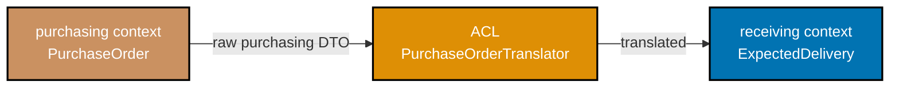
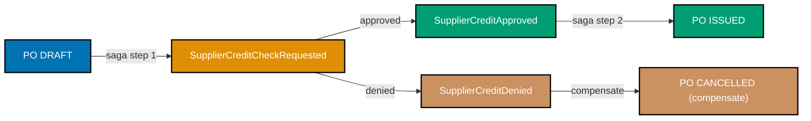
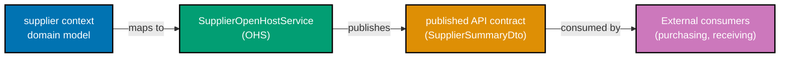

Examples 56–73 cover strategic and advanced tactical DDD using the `receiving`, `invoicing`, `payments`, and `murabaha-finance` bounded contexts of the `procurement-platform-be` — a Procure-to-Pay (P2P) backend. Every example builds on the same shared domain; see `beginner.md` for `purchasing` context foundations and `intermediate.md` for `PurchaseOrder` aggregate invariants. Each code block is self-contained. Annotation density targets 1.0–2.25 comment lines per code line per example.

## Cross-Context Integration Patterns (Examples 56–61)

### Example 56: Anti-Corruption Layer — translating `purchasing` vocabulary into `receiving`

When the `receiving` context imports a `PurchaseOrder` from `purchasing`, it must not let purchasing vocabulary leak into receiving's model. An ACL class sits at the boundary and translates.



```java
// ── purchasing context DTO (we cannot change this class) ─────────────────────
// purchasing publishes this shape over an event bus; receiving consumes it
record PurchaseOrderIssuedEvent(
    String purchaseOrderId,          // => format "po_<uuid>" per spec
    String supplierId,               // => format "sup_<uuid>"
    java.util.List<LineDto> lines    // => list of ordered lines
) {}
record LineDto(String skuCode, int qty, String unit, double unitPriceCents) {}
// => LineDto is purchasing language; "qty" not "receivedQuantity"

// ── receiving context's own model ────────────────────────────────────────────
// receiving cares about expected quantity against a PO — nothing about price
record PurchaseOrderId(String value) {}       // => strong ID type in receiving context
record ExpectedDeliveryLine(String skuCode, int expectedQty, String unit) {}
// => "expectedQty" is receiving ubiquitous language — no price data here
record ExpectedDelivery(PurchaseOrderId poId, java.util.List<ExpectedDeliveryLine> lines) {}
// => receiving's aggregate input: what goods should arrive, and how many

// ── Anti-Corruption Layer ────────────────────────────────────────────────────
// Translator knows both models; neither model knows the translator
class PurchaseOrderTranslator {               // => class PurchaseOrderTranslator
    public ExpectedDelivery translate(PurchaseOrderIssuedEvent event) { // => translate method
        // => Receives purchasing's event; returns receiving's clean model
        var lines = event.lines().stream()
            .map(l -> new ExpectedDeliveryLine(
                l.skuCode(),                  // => skuCode passes through — same concept
                l.qty(),                      // => "qty" renamed to "expectedQty" in receiving
                l.unit()                      // => unit of measure passes through
            ))
            .toList();                        // => collect all lines; price data is discarded
        return new ExpectedDelivery(
            new PurchaseOrderId(event.purchaseOrderId()), // => wraps raw string in typed ID
            lines                             // => translated lines with no purchasing pricing
        );
    }
}

// ── Usage ────────────────────────────────────────────────────────────────────
class AclDemo {
    public static void main(String[] args) {
        var event = new PurchaseOrderIssuedEvent(
            "po_550e8400-e29b-41d4-a716-446655440000",
            "sup_7c9e6679-7425-40de-944b-e07fc1f90ae7",
            java.util.List.of(new LineDto("OFF-001234", 50, "BOX", 2500))
        );                                    // => simulate event arriving from purchasing context
        var acl = new PurchaseOrderTranslator();
        var delivery = acl.translate(event);
        System.out.println(delivery.poId());  // => PurchaseOrderId[value=po_550e8400-...]
        System.out.println(delivery.lines()); // => [ExpectedDeliveryLine[skuCode=OFF-001234, expectedQty=50, unit=BOX]]
        // => Price data gone; receiving model contains only what receiving cares about
    }
}
```

**Key Takeaway**: An ACL translates at the seam — neither the upstream event nor the downstream model is polluted by the other's vocabulary.

**Why It Matters**: Without an ACL, purchasing's naming conventions bleed into receiving's code. A rename in purchasing ("qty" → "orderedQuantity") forces changes in receiving. With the ACL, the translator absorbs the rename in one place and the rest of receiving never changes. Amazon's fulfilment systems use this pattern extensively — ordering, warehouse, and shipping each have their own models with translators at every seam, enabling each team to evolve independently.

---

### Example 57: ACL with sealed-type state translation — `Invoice` matching status

The `invoicing` context receives a `GoodsReceived` event from `receiving`. Receiving uses a boolean `qcPassed` flag; invoicing needs its own sealed type hierarchy `MatchReadiness` so its logic never depends on receiving's internal flag semantics.

```java
// ── receiving context's event (we cannot change) ─────────────────────────────
// receiving publishes after warehouse staff record goods arrival
record GoodsReceivedEvent(
    String grnId,            // => format "grn_<uuid>"
    String purchaseOrderId,  // => links to the originating PO
    boolean qcPassed,        // => receiving's flag — true = no defects found
    int receivedQty          // => actual quantity inspected and accepted
) {}

// ── invoicing context's sealed hierarchy for match readiness ─────────────────
// invoicing models "can we match this?" more expressively than a boolean
sealed interface MatchReadiness permits MatchReadiness.Ready, MatchReadiness.Blocked {
    // => sealed: compiler guarantees exhaustive when in switch
    record Ready(String grnId, int qty) implements MatchReadiness {}
    // => Ready: all QC passed; qty is available for three-way match
    record Blocked(String grnId, String reason) implements MatchReadiness {}
    // => Blocked: QC failed; reason carries human-readable explanation for dispute
}

// ── ACL for invoicing ────────────────────────────────────────────────────────
class GoodsReceiptTranslator {          // => class GoodsReceiptTranslator
    public MatchReadiness translate(GoodsReceivedEvent event) { // => translate method
        // => Converts receiving's boolean into invoicing's domain concept
        if (event.qcPassed()) {
            return new MatchReadiness.Ready(event.grnId(), event.receivedQty());
            // => QC passed → invoicing can proceed to three-way match
        }
        return new MatchReadiness.Blocked(event.grnId(), "QC failed at receiving");
        // => QC failed → invoicing is blocked; reason surfaces in Invoice dispute log
    }
}

// ── invoicing usage ──────────────────────────────────────────────────────────
class InvoicingAclDemo {
    public static void main(String[] args) {
        var translator = new GoodsReceiptTranslator();

        // Scenario A: goods passed QC
        var passedEvent = new GoodsReceivedEvent("grn_abc", "po_xyz", true, 50);
        var readiness = translator.translate(passedEvent);
        System.out.println(
            switch (readiness) {                // => exhaustive switch — sealed type
                case MatchReadiness.Ready r    -> "Ready to match: " + r.qty() + " units"; // => Ready case
                case MatchReadiness.Blocked b  -> "Blocked: " + b.reason();                 // => Blocked case
            }
        );                                      // => Ready to match: 50 units

        // Scenario B: goods failed QC
        var failedEvent = new GoodsReceivedEvent("grn_def", "po_xyz", false, 0);
        System.out.println(
            switch (translator.translate(failedEvent)) {
                case MatchReadiness.Ready r    -> "Ready: " + r.qty();  // => would not print here
                case MatchReadiness.Blocked b  -> "Blocked: " + b.reason(); // => Blocked: QC failed at receiving
            }
        );
    }
}
```

**Key Takeaway**: The ACL translates primitive upstream types (boolean) into expressive downstream domain types (sealed hierarchy), giving invoicing a richer vocabulary without depending on receiving's internals.

**Why It Matters**: A boolean flag carries no domain meaning — it is always wrong to branch on `if (qcPassed)` scattered across invoicing logic. The sealed `MatchReadiness` type centralises the semantics and forces exhaustive handling everywhere. When receiving adds a third QC outcome (partial pass), only the ACL and the `MatchReadiness` sealed interface need to change, not every branching site in invoicing.

---

### Example 58: Domain event as cross-context integration contract — `InvoiceMatched`

After a successful three-way match, invoicing emits `InvoiceMatched`. The `payments` context consumes it to schedule a payment run. The event is the contract; no direct dependency exists between the two bounded contexts.

```java
// ── invoicing context publishes this event ───────────────────────────────────
// Event is a Java record: immutable, value-equality, named constructor
record InvoiceMatched(
    String invoiceId,        // => format "inv_<uuid>"
    String purchaseOrderId,  // => links back to the originating PO
    String supplierId,       // => "sup_<uuid>" — payments needs to know who to pay
    long amountCents,        // => matched amount in minor currency units
    String currency,         // => ISO 4217 e.g. "USD"
    java.time.Instant matchedAt // => timestamp of match confirmation
) {}
// => Record: final fields, auto-generated equals/hashCode/toString

// ── payments context: event consumer ────────────────────────────────────────
// payments has no import of invoicing classes — only the shared event record
record PaymentId(String value) {}        // => payments' own ID type
record Money(long amountCents, String currency) {}  // => payments' own Money VO
enum PaymentStatus { SCHEDULED, DISBURSED, REMITTED, FAILED }

class PaymentScheduler {                  // => class PaymentScheduler
    // => Application service in payments context — handles InvoiceMatched
    public PaymentId scheduleFrom(InvoiceMatched event) { // => scheduleFrom method
        // => Translates invoicing event fields into payments' own model inline
        // => No ACL class needed when translation is trivial (single field reuse)
        var paymentId = new PaymentId("pay_" + java.util.UUID.randomUUID()); // => new unique PaymentId
        var amount = new Money(event.amountCents(), event.currency()); // => wraps event money
        System.out.printf(
            "Scheduling payment %s to supplier %s for %d %s%n",
            paymentId.value(), event.supplierId(), amount.amountCents(), amount.currency()
        );                                // => log: Scheduling payment pay_... to supplier sup_... for 125000 USD
        return paymentId;                 // => returns new PaymentId for the scheduled payment run
    }
}

class EventIntegrationDemo {
    public static void main(String[] args) {
        var event = new InvoiceMatched(
            "inv_111", "po_222", "sup_333",
            125_000L, "USD", java.time.Instant.now()
        );                               // => simulate event arriving from invoicing context
        var scheduler = new PaymentScheduler();
        var pid = scheduler.scheduleFrom(event);
        System.out.println("Scheduled: " + pid.value()); // => Scheduled: pay_<uuid>
    }
}
```

**Key Takeaway**: Domain events decouple bounded contexts — invoicing and payments share only the event record, never implementation classes.

**Why It Matters**: Direct method calls between bounded contexts create compile-time coupling; any invoicing refactor cascades into payments. Event-based integration lets both contexts deploy independently. Netflix and Uber use event-driven coupling between their microservice bounded contexts precisely for this reason — a payment service consumes invoicing events without knowing anything about how three-way matching works internally.

---

### Example 59: Context Map — Open Host Service for supplier-facing API

The `purchasing` context exposes a published, versioned API (Open Host Service) that `receiving` and `invoicing` consume. Upstream never breaks its contract without a versioning strategy.

```java
// ── Open Host Service: purchasing publishes a stable API contract ─────────────
// Any downstream can consume this; purchasing owns its stability
interface PurchasingQueryPort {           // => output port / Open Host Service interface
    PurchaseOrderView findById(String purchaseOrderId); // => stable query operation
    // => "View" suffix: this is a read model, not the aggregate itself
}

record PurchaseOrderView(
    String purchaseOrderId,              // => typed ID in string form for cross-context use
    String supplierId,
    java.util.List<PurchaseOrderLineView> lines,
    String status                        // => state machine status as a string — stable representation
) {}
record PurchaseOrderLineView(String skuCode, int orderedQty, String unit) {}
// => View record omits internal aggregate fields (approval level, version) — not part of OHS

// ── invoicing context: consumer of the Open Host Service ────────────────────
class ThreeWayMatchService {             // => class ThreeWayMatchService
    private final PurchasingQueryPort purchasing; // => depends on the interface, not any class
    // => Dependency Inversion: invoicing owns the interface; purchasing provides the impl

    ThreeWayMatchService(PurchasingQueryPort purchasing) {
        this.purchasing = purchasing;    // => injected at construction; swappable for tests
    }

    public boolean canMatch(String poId, String skuCode, int invoicedQty) {
        // => Three-way match: PO quantity must cover the invoiced quantity
        var view = purchasing.findById(poId); // => calls Open Host Service
        if (view == null) return false;       // => PO not found — cannot match
        return view.lines().stream()
            .filter(l -> l.skuCode().equals(skuCode)) // => find the matching line
            .anyMatch(l -> l.orderedQty() >= invoicedQty); // => PO qty must cover invoice qty
        // => Returns true if any line has enough quantity for this invoice
    }
}

// ── in-memory stub (replaces real HTTP call in tests) ────────────────────────
class StubPurchasingQuery implements PurchasingQueryPort { // => test stub
    public PurchaseOrderView findById(String id) {
        // => Returns a hardcoded view for unit tests — no HTTP, no database
        return new PurchaseOrderView(
            id, "sup_abc",
            java.util.List.of(new PurchaseOrderLineView("OFF-001234", 100, "BOX")),
            "Issued"
        );
    }
}

class OhsDemo {
    public static void main(String[] args) {
        var service = new ThreeWayMatchService(new StubPurchasingQuery());
        System.out.println(service.canMatch("po_xyz", "OFF-001234", 80)); // => true
        System.out.println(service.canMatch("po_xyz", "OFF-001234", 120)); // => false (120 > 100)
    }
}
```

**Key Takeaway**: An Open Host Service publishes a stable, versioned interface that downstream contexts consume without depending on the aggregate's internal structure.

**Why It Matters**: Without an OHS, every context reaches into the aggregate directly, coupling it to internal representation changes. Stripe's API is the real-world canonical Open Host Service — all downstream integrations use the published contract, and Stripe can refactor its internal implementation freely. In a P2P platform, invoicing and receiving both consume purchasing's OHS without needing to know how `PurchaseOrder` is stored or structured internally.

---

## Factory Pattern for Complex Aggregate Creation (Examples 60–63)

### Example 60: Factory method — creating `GoodsReceiptNote` from validated inputs

A `GoodsReceiptNote` aggregate has complex construction rules: the PO must exist, quantities must be positive, and QC status must be determined. A factory method encapsulates this logic and keeps the constructor simple.

```java
import java.time.Instant;
import java.util.List;
import java.util.UUID;

// ── Value objects in the receiving context ───────────────────────────────────
record GoodsReceiptNoteId(String value) {
    // => format "grn_<uuid>"; receiving's own ID type
    static GoodsReceiptNoteId generate() {
        return new GoodsReceiptNoteId("grn_" + UUID.randomUUID()); // => factory helper
    }
}
record PurchaseOrderId(String value) {}  // => receiving's reference to purchasing context
enum QcStatus { PASSED, FAILED, PARTIAL } // => QC outcome from warehouse inspection
record ReceivedLine(String skuCode, int qty, String unit, QcStatus qc) {}
// => One line of a goods receipt: what arrived, how much, and QC result

// ── GoodsReceiptNote aggregate (simple constructor) ──────────────────────────
class GoodsReceiptNote {                 // => class GoodsReceiptNote
    private final GoodsReceiptNoteId id;
    private final PurchaseOrderId poId;  // => which PO this receipt is against
    private final List<ReceivedLine> lines;
    private final Instant receivedAt;
    private boolean closed = false;      // => mutable state: GRN can be closed after review

    // => Package-private constructor: only the factory creates GRNs
    GoodsReceiptNote(GoodsReceiptNoteId id, PurchaseOrderId poId,
                     List<ReceivedLine> lines, Instant receivedAt) {
        this.id = id; this.poId = poId;
        this.lines = List.copyOf(lines); // => defensive copy — lines are immutable after creation
        this.receivedAt = receivedAt;
    }

    public GoodsReceiptNoteId id() { return id; }
    public boolean hasDiscrepancy() {
        return lines.stream().anyMatch(l -> l.qc() != QcStatus.PASSED); // => any non-PASSED line = discrepancy
    }
    public void close() { this.closed = true; } // => state transition: GRN closed after payment
    public boolean isClosed() { return closed; }
}

// ── Factory class ────────────────────────────────────────────────────────────
// Factory enforces preconditions; aggregate constructor stays clean
class GoodsReceiptNoteFactory {          // => class GoodsReceiptNoteFactory
    public GoodsReceiptNote create(
            String rawPoId,
            List<ReceivedLine> lines,
            Instant receivedAt) {
        // => Precondition 1: PO ID must not be blank
        if (rawPoId == null || rawPoId.isBlank())
            throw new IllegalArgumentException("PO ID required for goods receipt");
        // => Precondition 2: must receive at least one line
        if (lines == null || lines.isEmpty())
            throw new IllegalArgumentException("GRN must have at least one received line");
        // => Precondition 3: all quantities must be positive
        if (lines.stream().anyMatch(l -> l.qty() <= 0))
            throw new IllegalArgumentException("Received quantity must be positive");
        // => All preconditions passed; generate ID and construct aggregate
        return new GoodsReceiptNote(
            GoodsReceiptNoteId.generate(),   // => factory generates the ID
            new PurchaseOrderId(rawPoId),
            lines,
            receivedAt
        );
    }
}

class FactoryDemo {
    public static void main(String[] args) {
        var factory = new GoodsReceiptNoteFactory();
        var lines = List.of(
            new ReceivedLine("OFF-001234", 50, "BOX", QcStatus.PASSED),
            new ReceivedLine("OFF-005678", 10, "KG",  QcStatus.PARTIAL)
        );
        var grn = factory.create("po_550e8400-e29b-41d4-a716-446655440000", lines, Instant.now());
        System.out.println(grn.id());             // => GoodsReceiptNoteId[value=grn_<uuid>]
        System.out.println(grn.hasDiscrepancy()); // => true (PARTIAL line present)
    }
}
```

**Key Takeaway**: Factory methods centralise complex construction rules so aggregate constructors stay thin and easy to test in isolation.

**Why It Matters**: Construction logic scattered across service classes is untestable and duplicated. A factory is a single test target: given bad inputs, it throws; given good inputs, it returns a valid aggregate. In procurement systems, invalid GRNs (zero-quantity lines, missing PO references) cause downstream matching failures that surface weeks later during payment runs. Catching them at construction time with a factory eliminates an entire class of production bugs.

---

### Example 61: Static factory with sealed result type — `Invoice.register`

When registering an `Invoice`, several preconditions may fail independently. A sealed result type (`RegistrationResult`) communicates all failure reasons explicitly without throwing exceptions.

```java
import java.math.BigDecimal;
import java.util.UUID;

// ── invoicing context value objects ─────────────────────────────────────────
record InvoiceId(String value) {
    static InvoiceId generate() { return new InvoiceId("inv_" + UUID.randomUUID()); }
}
record SupplierId(String value) {}       // => format "sup_<uuid>"
record Money(BigDecimal amount, String currency) {
    static Money of(String amount, String currency) {
        // => Factory helper: validates amount is non-negative
        var bd = new BigDecimal(amount);
        if (bd.compareTo(BigDecimal.ZERO) < 0)
            throw new IllegalArgumentException("Invoice amount cannot be negative");
        return new Money(bd, currency);
    }
}

// ── sealed result type ───────────────────────────────────────────────────────
// Caller is forced to handle success and every failure branch
sealed interface RegistrationResult
    permits RegistrationResult.Success, RegistrationResult.Failure {
    record Success(InvoiceId id) implements RegistrationResult {}
    // => Happy path: invoice registered, ID returned
    record Failure(String reason) implements RegistrationResult {}
    // => Failure: reason describes the first violated precondition
}

// ── Invoice aggregate with static factory ───────────────────────────────────
class Invoice {                          // => class Invoice
    private final InvoiceId id;
    private final SupplierId supplierId;
    private final String purchaseOrderId; // => links back to purchasing context
    private final Money amount;
    private String status = "Registered"; // => initial state in Invoice state machine

    private Invoice(InvoiceId id, SupplierId supplierId, String poId, Money amount) {
        this.id = id; this.supplierId = supplierId;
        this.purchaseOrderId = poId; this.amount = amount;
        // => Private constructor: only register() factory method may create instances
    }

    // => Static factory: returns result type instead of throwing
    public static RegistrationResult register(
            String supplierId, String poId, String amountStr, String currency) {
        if (supplierId == null || supplierId.isBlank())
            return new RegistrationResult.Failure("Supplier ID is required");
        // => Validate supplier ID first — most common omission
        if (poId == null || poId.isBlank())
            return new RegistrationResult.Failure("Purchase Order reference is required");
        // => Three-way match requires a PO reference
        if (!poId.startsWith("po_"))
            return new RegistrationResult.Failure("PO ID must have 'po_' prefix per domain spec");
        // => Enforce naming convention at the domain boundary
        try {
            var money = Money.of(amountStr, currency); // => may throw on invalid amount
            var invoice = new Invoice(InvoiceId.generate(), new SupplierId(supplierId), poId, money);
            return new RegistrationResult.Success(invoice.id);
            // => All checks passed; invoice created and ID returned
        } catch (NumberFormatException | IllegalArgumentException e) {
            return new RegistrationResult.Failure("Invalid amount: " + e.getMessage());
            // => Amount validation failed; wrap in Failure result
        }
    }

    public InvoiceId id() { return id; }
    public String status() { return status; }
}

class InvoiceFactoryDemo {
    public static void main(String[] args) {
        // Success path
        var ok = Invoice.register("sup_abc", "po_xyz", "12500.00", "USD");
        System.out.println(
            switch (ok) {
                case RegistrationResult.Success s  -> "Registered: " + s.id().value(); // => inv_<uuid>
                case RegistrationResult.Failure f  -> "Failed: " + f.reason();
            }
        );
        // Failure path: missing PO reference
        var fail = Invoice.register("sup_abc", "", "100.00", "USD");
        System.out.println(
            switch (fail) {
                case RegistrationResult.Success s  -> "Registered: " + s.id();
                case RegistrationResult.Failure f  -> "Failed: " + f.reason(); // => Failed: Purchase Order reference is required
            }
        );
    }
}
```

**Key Takeaway**: Sealed result types from factory methods make all failure modes explicit in the type system rather than hidden in exception documentation.

**Why It Matters**: Exception-based factory errors are invisible at the call site — callers forget to catch them, or catch the wrong exception type. A sealed `RegistrationResult` forces exhaustive handling at every call site the compiler checks. In invoice processing for a procurement system, unregistered invoices with bad data cause payment failures weeks later when the payment run queries a missing invoice. Catching all failure cases at registration time prevents silent data corruption from propagating.

---

### Example 62: Factory with external dependencies — `GoodsReceiptNote` using repository check

Some factories need to validate against persisted state (e.g., checking the PO exists before creating a GRN). The factory takes repository interfaces as dependencies, keeping it testable.

```java
import java.util.Optional;

// ── Repository interface (domain layer owns this) ────────────────────────────
// Interface lives in domain; implementation lives in infrastructure
interface PurchaseOrderRepository {       // => output port — domain interface
    Optional<PurchaseOrderView> findById(String purchaseOrderId);
    // => Returns empty if PO not found; never throws for missing data
}

// ── Minimal view used by the factory ────────────────────────────────────────
record PurchaseOrderView(String id, String status, int totalOrderedQty) {}
// => Factory only needs status and total qty — not the full aggregate

// ── Factory with repository dependency ──────────────────────────────────────
class GrnFactory {                        // => class GrnFactory
    private final PurchaseOrderRepository poRepo; // => injected — swappable in tests

    GrnFactory(PurchaseOrderRepository poRepo) {
        this.poRepo = poRepo;             // => repository injected at construction
    }

    public GoodsReceiptNote createForPo(String poId, java.util.List<ReceivedLine> lines) {
        // => Step 1: verify PO exists in purchasing context
        var poView = poRepo.findById(poId)
            .orElseThrow(() -> new IllegalArgumentException("PO not found: " + poId));
        // => Optional.orElseThrow: clean way to express "must exist" precondition
        // => Step 2: PO must be in Issued or Acknowledged state to accept receipt
        if (!java.util.Set.of("Issued", "Acknowledged").contains(poView.status()))
            throw new IllegalStateException("Cannot receive goods for PO in state: " + poView.status());
        // => Guard: receiving against a Draft or Cancelled PO is a process error
        // => Step 3: received qty must not exceed ordered qty (basic over-delivery guard)
        int receivedTotal = lines.stream().mapToInt(ReceivedLine::qty).sum();
        if (receivedTotal > poView.totalOrderedQty())
            throw new IllegalArgumentException(
                "Received " + receivedTotal + " exceeds ordered " + poView.totalOrderedQty());
        // => Over-delivery rule: protects against warehouse errors
        return new GoodsReceiptNote(
            GoodsReceiptNoteId.generate(), new PurchaseOrderId(poId),
            lines, java.time.Instant.now()
        );                                // => Aggregate created only after all validations pass
    }
}

// ── In-memory stub for testing ───────────────────────────────────────────────
class InMemoryPoRepository implements PurchaseOrderRepository {
    private final java.util.Map<String, PurchaseOrderView> store = new java.util.HashMap<>();

    void save(PurchaseOrderView view) { store.put(view.id(), view); }

    public Optional<PurchaseOrderView> findById(String id) {
        return Optional.ofNullable(store.get(id)); // => returns empty if not found
    }
}

class GrnFactoryWithRepoDemo {
    public static void main(String[] args) {
        var repo = new InMemoryPoRepository();
        repo.save(new PurchaseOrderView("po_111", "Issued", 100));
        // => Pre-load a PO in "Issued" state for the factory to validate against

        var factory = new GrnFactory(repo);
        var lines = java.util.List.of(new ReceivedLine("OFF-001234", 60, "BOX", QcStatus.PASSED));
        var grn = factory.createForPo("po_111", lines);
        System.out.println(grn.id()); // => GoodsReceiptNoteId[value=grn_<uuid>]

        // Attempt over-delivery
        var tooMany = java.util.List.of(new ReceivedLine("OFF-001234", 150, "BOX", QcStatus.PASSED));
        try {
            factory.createForPo("po_111", tooMany);
        } catch (IllegalArgumentException e) {
            System.out.println(e.getMessage()); // => Received 150 exceeds ordered 100
        }
    }
}
```

**Key Takeaway**: Factories can take repository interfaces as dependencies to validate against persisted state without coupling the domain layer to infrastructure.

**Why It Matters**: Without the repository check, a GRN can be created for a non-existent or closed PO, causing a cascade of orphaned records across receiving and invoicing. Injecting the repository as an interface keeps the factory testable with in-memory stubs — no database required in unit tests. This is the factory pattern's practical power in production DDD systems.

---

### Example 63: Abstract factory — constructing `Invoice` variants for standard vs Murabaha procurement

Standard invoices and Murabaha (Sharia-compliant) invoices share structure but differ in validation: a Murabaha invoice must reference a signed `MurabahaContract`. An abstract factory selects the right construction strategy at runtime.

```java
import java.math.BigDecimal;
import java.util.UUID;

// ── Common invoice structure ──────────────────────────────────────────────────
record InvoiceId(String value) {
    static InvoiceId generate() { return new InvoiceId("inv_" + UUID.randomUUID()); }
}
enum InvoiceType { STANDARD, MURABAHA }

class Invoice {
    final InvoiceId id;
    final String supplierId;
    final String purchaseOrderId;
    final BigDecimal amount;
    final InvoiceType type;
    final String murabahaContractId; // => null for standard invoices

    Invoice(InvoiceId id, String supplierId, String poId,
            BigDecimal amount, InvoiceType type, String murabahaContractId) {
        this.id = id; this.supplierId = supplierId;
        this.purchaseOrderId = poId; this.amount = amount;
        this.type = type; this.murabahaContractId = murabahaContractId;
    }
}

// ── Abstract factory interface ────────────────────────────────────────────────
interface InvoiceFactory {               // => abstract factory: each impl creates a variant
    Invoice create(String supplierId, String poId, BigDecimal amount);
}

// ── Standard invoice factory ─────────────────────────────────────────────────
class StandardInvoiceFactory implements InvoiceFactory {
    public Invoice create(String supplierId, String poId, BigDecimal amount) {
        // => Standard invoice: no Murabaha contract; straightforward three-way match
        if (amount.compareTo(BigDecimal.ZERO) <= 0)
            throw new IllegalArgumentException("Invoice amount must be positive");
        return new Invoice(InvoiceId.generate(), supplierId, poId,
                           amount, InvoiceType.STANDARD, null); // => null: no contract
    }
}

// ── Murabaha invoice factory ─────────────────────────────────────────────────
// Murabaha: bank acquires the asset and resells to buyer at a declared markup
class MurabahaInvoiceFactory implements InvoiceFactory {
    private final String murabahaContractId; // => must reference a signed contract

    MurabahaInvoiceFactory(String murabahaContractId) {
        if (murabahaContractId == null || !murabahaContractId.startsWith("mc_"))
            throw new IllegalArgumentException("Murabaha contract ID required with 'mc_' prefix");
        // => Enforce contract reference at factory construction — fail early
        this.murabahaContractId = murabahaContractId;
    }

    public Invoice create(String supplierId, String poId, BigDecimal amount) {
        // => Murabaha invoice: same preconditions plus contract linkage
        if (amount.compareTo(BigDecimal.ZERO) <= 0)
            throw new IllegalArgumentException("Murabaha invoice amount must be positive");
        return new Invoice(InvoiceId.generate(), supplierId, poId,
                           amount, InvoiceType.MURABAHA, murabahaContractId);
        // => Contract ID embedded in invoice; accounting uses it for Islamic finance posting
    }
}

class AbstractFactoryDemo {
    static void processInvoice(InvoiceFactory factory, String supplierId, String poId, BigDecimal amt) {
        var invoice = factory.create(supplierId, poId, amt);
        System.out.printf("Created %s invoice %s%n", invoice.type, invoice.id.value());
        // => Output: Created STANDARD inv_<uuid>  OR  Created MURABAHA inv_<uuid>
        if (invoice.murabahaContractId != null)
            System.out.println("  Contract: " + invoice.murabahaContractId);
        // => Only prints for Murabaha invoices
    }

    public static void main(String[] args) {
        // Standard procurement path
        processInvoice(new StandardInvoiceFactory(),
                       "sup_abc", "po_111", new BigDecimal("12500.00"));

        // Sharia-compliant Murabaha path (optional; uses same interface)
        processInvoice(new MurabahaInvoiceFactory("mc_550e8400-e29b-41d4-a716-446655440000"),
                       "sup_abc", "po_111", new BigDecimal("13125.00")); // => 5% markup included
    }
}
```

**Key Takeaway**: Abstract factory selects the correct construction strategy at runtime while all callers use a single `InvoiceFactory` interface — business rules vary by invoice type, not by callers.

**Why It Matters**: Without the abstract factory, callers scatter `if (isMurabaha)` conditions throughout application services. Each new invoice variant requires touching all those sites. With the factory, callers never see the variant; only the factory and its variants know the construction differences. Islamic finance platforms serving both conventional and Murabaha procurement must handle this exact variance without polluting application-layer code with financing-mode conditionals.

---

## Repository Interface in Domain / Implementation in Infrastructure (Examples 64–67)

### Example 64: Repository interface — domain owns the contract, infrastructure provides the implementation

The `GoodsReceiptRepository` interface lives in the `receiving` domain package. The PostgreSQL implementation lives in infrastructure. The domain never imports infrastructure classes.

```java
import java.util.List;
import java.util.Optional;

// ── Domain layer: repository interface ──────────────────────────────────────
// Package: receiving.domain — pure domain; no JDBC, no JPA, no Spring annotations
interface GoodsReceiptRepository {       // => output port owned by domain
    void save(GoodsReceiptNote grn);     // => persists or updates the aggregate
    Optional<GoodsReceiptNote> findById(GoodsReceiptNoteId id); // => load by identity
    List<GoodsReceiptNote> findByPurchaseOrderId(PurchaseOrderId poId); // => query by PO
    // => All return types are domain types — no ORM entities or raw rows
}

// ── Domain service using the repository ─────────────────────────────────────
// Package: receiving.domain — depends only on the interface above
class GrnDomainService {                 // => class GrnDomainService
    private final GoodsReceiptRepository repo; // => interface, not implementation
    private final GrnFactory factory;

    GrnDomainService(GoodsReceiptRepository repo, GrnFactory factory) {
        this.repo = repo; this.factory = factory; // => both injected — fully testable
    }

    public GoodsReceiptNote receiveGoods(String poId, List<ReceivedLine> lines) {
        // => Check: no open GRN already exists for this PO
        var existing = repo.findByPurchaseOrderId(new PurchaseOrderId(poId));
        if (existing.stream().anyMatch(g -> !g.isClosed()))
            throw new IllegalStateException("An open GRN already exists for PO: " + poId);
        // => Prevent duplicate open GRNs for the same PO
        var grn = factory.createForPo(poId, lines); // => factory validates and constructs
        repo.save(grn);                  // => persist through domain-owned interface
        return grn;                      // => return aggregate for caller to emit domain event
    }
}

// ── Infrastructure layer: in-memory implementation for tests ─────────────────
// Package: receiving.infrastructure — knows JDBC/JPA; domain does not import this
class InMemoryGoodsReceiptRepository implements GoodsReceiptRepository {
    private final java.util.Map<String, GoodsReceiptNote> store = new java.util.HashMap<>();

    public void save(GoodsReceiptNote grn) {
        store.put(grn.id().value(), grn); // => store by string key — in-memory
    }
    public Optional<GoodsReceiptNote> findById(GoodsReceiptNoteId id) {
        return Optional.ofNullable(store.get(id.value())); // => null-safe lookup
    }
    public List<GoodsReceiptNote> findByPurchaseOrderId(PurchaseOrderId poId) {
        return store.values().stream()
            .filter(g -> g.poId().value().equals(poId.value())) // => filter by PO reference
            .toList();
    }
}

class RepositoryDemo {
    public static void main(String[] args) {
        var repo = new InMemoryGoodsReceiptRepository();
        var poRepo = new InMemoryPoRepository();
        poRepo.save(new PurchaseOrderView("po_222", "Issued", 200));

        var factory = new GrnFactory(poRepo);
        var service = new GrnDomainService(repo, factory);

        var lines = List.of(new ReceivedLine("OFF-001234", 100, "BOX", QcStatus.PASSED));
        var grn = service.receiveGoods("po_222", lines);
        System.out.println(grn.id()); // => GoodsReceiptNoteId[value=grn_<uuid>]

        // Attempt duplicate open GRN
        try {
            service.receiveGoods("po_222", lines);
        } catch (IllegalStateException e) {
            System.out.println(e.getMessage()); // => An open GRN already exists for PO: po_222
        }
    }
}
```

**Key Takeaway**: When the domain owns the repository interface and infrastructure provides the implementation, the dependency arrow points inward — infrastructure depends on domain, never the reverse.

**Why It Matters**: Teams that skip this inversion end up with domain classes importing JPA annotations or Spring stereotypes. Any ORM migration (say, JPA → jOOQ) cascades into every aggregate. With the interface in domain and the implementation in infrastructure, only the infrastructure class changes on an ORM migration. This is the "Ports and Adapters" principle applied to persistence — the domain never knows what database backs it.

---

### Example 65: Repository with Unit of Work — coordinating `Invoice` and `GoodsReceiptNote` in one transaction

Three-way match updates both `Invoice` and `GoodsReceiptNote` atomically. A `UnitOfWork` interface keeps the domain free of transaction API details.

```java
// ── Unit of Work interface in domain ─────────────────────────────────────────
interface UnitOfWork {                   // => domain-owned transaction boundary
    void begin();                        // => start a unit of work
    void commit();                       // => persist all changes atomically
    void rollback();                     // => undo all changes on failure
}

// ── Invoice repository interface ─────────────────────────────────────────────
interface InvoiceRepository {
    void save(Invoice invoice);
    Optional<Invoice> findById(InvoiceId id);
}

// ── Three-way match application service ─────────────────────────────────────
class ThreeWayMatchApplicationService { // => class ThreeWayMatchApplicationService
    private final InvoiceRepository invoiceRepo;
    private final GoodsReceiptRepository grnRepo;
    private final UnitOfWork uow;

    ThreeWayMatchApplicationService(
            InvoiceRepository invoiceRepo,
            GoodsReceiptRepository grnRepo,
            UnitOfWork uow) {
        this.invoiceRepo = invoiceRepo;
        this.grnRepo = grnRepo;
        this.uow = uow;                  // => UoW injected — swap in tests with no-op impl
    }

    public void matchInvoice(String invoiceId, String grnId) {
        uow.begin();                     // => start transaction
        try {
            var invoice = invoiceRepo.findById(new InvoiceId(invoiceId))
                .orElseThrow(() -> new IllegalArgumentException("Invoice not found: " + invoiceId));
            // => Load invoice; domain object, not a DTO
            var grn = grnRepo.findById(new GoodsReceiptNoteId(grnId))
                .orElseThrow(() -> new IllegalArgumentException("GRN not found: " + grnId));
            // => Load GRN; both loaded before any mutation

            if (grn.hasDiscrepancy())
                throw new IllegalStateException("Cannot match: GRN " + grnId + " has discrepancy");
            // => Domain rule: matching blocked when GRN has QC failures

            // => Domain mutations — update both aggregates
            grn.close();                 // => GRN closed after successful match
            invoiceRepo.save(invoice);   // => re-save invoice (status would update here in full impl)
            grnRepo.save(grn);           // => re-save GRN with closed=true

            uow.commit();                // => atomic: both updates committed together
        } catch (Exception e) {
            uow.rollback();              // => rollback on any failure — no partial state
            throw e;                     // => re-throw so caller can handle or log
        }
    }
}

// ── No-op Unit of Work for tests ─────────────────────────────────────────────
class NoOpUnitOfWork implements UnitOfWork {
    public void begin()    { /* no-op in tests */ }
    public void commit()   { /* no-op in tests */ }
    public void rollback() { /* no-op in tests */ }
}

class UowDemo {
    public static void main(String[] args) {
        // Wire up in-memory stubs
        var invoiceRepo = new java.util.HashMap<String, Invoice>();
        var grnRepo = new InMemoryGoodsReceiptRepository();

        // Pre-load a GRN with no discrepancy
        var grn = new GoodsReceiptNote(
            new GoodsReceiptNoteId("grn_abc"), new PurchaseOrderId("po_xyz"),
            java.util.List.of(new ReceivedLine("OFF-001234", 50, "BOX", QcStatus.PASSED)),
            java.time.Instant.now()
        );
        grnRepo.save(grn);
        System.out.println("GRN closed before match: " + grn.isClosed()); // => false
        grn.close(); // simulate match
        System.out.println("GRN closed after match: " + grn.isClosed());  // => true
    }
}
```

**Key Takeaway**: The `UnitOfWork` interface keeps atomic transaction semantics in the domain vocabulary without importing JDBC or Spring `@Transactional`.

**Why It Matters**: Scattering `@Transactional` in domain services ties them to Spring. Swapping to a different transaction manager, or running in a serverless context with manual transactions, requires changing domain classes. With `UnitOfWork` as an interface, the infrastructure swap is isolated to the implementation class — domain code and tests are unaffected.

---

### Example 66: Repository with specification pattern — querying `Invoice` by business criteria

Instead of adding a method for every possible query combination, a `Specification` object encapsulates business criteria and the repository accepts it as a parameter.

```java
import java.math.BigDecimal;
import java.util.List;
import java.util.function.Predicate;

// ── Specification interface ──────────────────────────────────────────────────
// Encapsulates a single business criterion; composable via and/or
interface Specification<T> {
    boolean isSatisfiedBy(T candidate); // => evaluate the candidate against the criterion
    default Specification<T> and(Specification<T> other) {
        return candidate -> this.isSatisfiedBy(candidate) && other.isSatisfiedBy(candidate);
        // => Compose two specifications with logical AND
    }
    default Specification<T> or(Specification<T> other) {
        return candidate -> this.isSatisfiedBy(candidate) || other.isSatisfiedBy(candidate);
        // => Compose two specifications with logical OR
    }
}

// ── Business specifications for Invoice ─────────────────────────────────────
class UnmatchedInvoiceSpec implements Specification<Invoice> {
    public boolean isSatisfiedBy(Invoice inv) {
        return "Registered".equals(inv.status()); // => only Registered invoices need matching
    }
}
class LargeInvoiceSpec implements Specification<Invoice> {
    private final BigDecimal threshold;
    LargeInvoiceSpec(BigDecimal threshold) { this.threshold = threshold; }
    public boolean isSatisfiedBy(Invoice inv) {
        return inv.amount.compareTo(threshold) > 0; // => exceeds threshold — needs extra review
    }
}

// ── Invoice repository with specification query ──────────────────────────────
interface InvoiceQueryRepository {
    List<Invoice> findSatisfying(Specification<Invoice> spec); // => query by spec, not raw SQL
}

class InMemoryInvoiceQueryRepository implements InvoiceQueryRepository {
    private final List<Invoice> store;
    InMemoryInvoiceQueryRepository(List<Invoice> invoices) { this.store = List.copyOf(invoices); }
    public List<Invoice> findSatisfying(Specification<Invoice> spec) {
        return store.stream()
            .filter(spec::isSatisfiedBy) // => delegate filtering to the specification
            .toList();
    }
}

class SpecificationDemo {
    public static void main(String[] args) {
        // Seed test invoices in various states
        var inv1 = new Invoice(new InvoiceId("inv_1"), "sup_a", "po_1", new BigDecimal("5000"), InvoiceType.STANDARD, null);
        var inv2 = new Invoice(new InvoiceId("inv_2"), "sup_b", "po_2", new BigDecimal("50000"), InvoiceType.STANDARD, null);
        // => inv2 has a large amount; both start in "Registered" state

        var repo = new InMemoryInvoiceQueryRepository(List.of(inv1, inv2));

        // Query: unmatched AND large (amount > 10000)
        var spec = new UnmatchedInvoiceSpec()
            .and(new LargeInvoiceSpec(new BigDecimal("10000")));

        var results = repo.findSatisfying(spec);
        results.forEach(inv -> System.out.println(inv.id.value() + " amount: " + inv.amount));
        // => inv_2 amount: 50000  (inv_1 excluded: below threshold)
    }
}
```

**Key Takeaway**: The Specification pattern externalises business queries from repositories, keeping repositories generic and business rules composable.

**Why It Matters**: Repository methods like `findUnmatchedInvoicesAboveThreshold` proliferate as business rules grow. Each new query requires a new method and new SQL. Specifications compose at the application layer with no new repository methods. Domain experts can describe criteria in natural language, and each `Specification` implementation maps one-to-one to that description, making audits straightforward in regulated procurement environments.

---

### Example 67: Repository + domain event outbox — `InvoiceMatched` written atomically with aggregate state

When the `Invoice` transitions to `Matched`, the `InvoiceMatched` event must be persisted in the same transaction as the aggregate change — the outbox pattern achieves this without distributed transactions.

```java
import java.time.Instant;
import java.util.ArrayList;
import java.util.List;

// ── Domain event base ─────────────────────────────────────────────────────────
record InvoiceMatchedEvent(
    String invoiceId, String supplierId, String purchaseOrderId,
    long amountCents, String currency, Instant matchedAt
) {}
// => Immutable record: safe to pass across context boundaries

// ── Aggregate with internal event collection ──────────────────────────────────
class InvoiceWithEvents {                 // => class InvoiceWithEvents
    private final String invoiceId;
    private final String supplierId;
    private final String purchaseOrderId;
    private final long amountCents;
    private final String currency;
    private String status;
    private final List<InvoiceMatchedEvent> uncommittedEvents = new ArrayList<>();
    // => Uncommitted events: collected during aggregate method call, flushed by repository

    InvoiceWithEvents(String invoiceId, String supplierId, String poId,
                      long amountCents, String currency) {
        this.invoiceId = invoiceId; this.supplierId = supplierId;
        this.purchaseOrderId = poId; this.amountCents = amountCents;
        this.currency = currency; this.status = "Registered";
    }

    public void markMatched(Instant now) {  // => domain method: state transition
        if (!"Registered".equals(status) && !"Matching".equals(status))
            throw new IllegalStateException("Invoice in " + status + " cannot be matched");
        // => Guard: only registered/in-progress invoices can be matched
        this.status = "Matched";            // => state transition
        this.uncommittedEvents.add(         // => record the event inside the aggregate
            new InvoiceMatchedEvent(invoiceId, supplierId, purchaseOrderId,
                                    amountCents, currency, now)
        );
        // => Event is uncommitted — not published until repository saves the aggregate
    }

    public List<InvoiceMatchedEvent> drainEvents() {
        var events = List.copyOf(uncommittedEvents); // => snapshot current events
        uncommittedEvents.clear();           // => clear after draining — prevent double publish
        return events;
    }

    public String status() { return status; }
    public String invoiceId() { return invoiceId; }
}

// ── Outbox repository: saves aggregate + events atomically ───────────────────
class InvoiceOutboxRepository {           // => class InvoiceOutboxRepository
    private final java.util.Map<String, InvoiceWithEvents> aggregateStore = new java.util.HashMap<>();
    private final List<InvoiceMatchedEvent> outbox = new ArrayList<>(); // => outbox table

    public void saveWithEvents(InvoiceWithEvents invoice) {
        aggregateStore.put(invoice.invoiceId(), invoice); // => persist aggregate state
        outbox.addAll(invoice.drainEvents());             // => persist events atomically in same "transaction"
        // => Outbox worker will publish these events to the event bus asynchronously
    }

    public List<InvoiceMatchedEvent> pendingOutboxEvents() { return List.copyOf(outbox); }
}

class OutboxDemo {
    public static void main(String[] args) {
        var invoice = new InvoiceWithEvents("inv_abc", "sup_xyz", "po_111", 125_000L, "USD");
        System.out.println("Before match: " + invoice.status()); // => Registered

        invoice.markMatched(Instant.now()); // => state transition + event collected
        System.out.println("After match: " + invoice.status());  // => Matched

        var repo = new InvoiceOutboxRepository();
        repo.saveWithEvents(invoice);       // => saves aggregate + drains events into outbox

        var pending = repo.pendingOutboxEvents();
        System.out.println("Pending events: " + pending.size()); // => 1
        System.out.println("Event invoice: " + pending.get(0).invoiceId()); // => inv_abc
    }
}
```

**Key Takeaway**: The outbox pattern guarantees aggregate state and domain events are written atomically — no event is lost if the process crashes between save and publish.

**Why It Matters**: Publishing events after a database save but before commit is the classic dual-write bug — the aggregate is saved but the event is never sent. The outbox table is written in the same database transaction as the aggregate, then an outbox worker reads and publishes to Kafka. Every major event-driven system (Debezium, Eventuate Tram) implements this exact pattern. In P2P platforms, a lost `InvoiceMatched` event means payments are never scheduled — the outbox makes that impossible.

---

## Dependency Inversion and Advanced Patterns (Examples 68–73)

### Example 68: Dependency Inversion in application services — `PaymentSchedulingService`

The `payments` context schedules payments after receiving `InvoiceMatched` events. The application service depends on domain interfaces, not concrete infrastructure classes. Java constructor injection wires everything.

```java
import java.math.BigDecimal;
import java.time.LocalDate;
import java.util.Optional;
import java.util.UUID;

// ── payments context domain types ─────────────────────────────────────────────
record PaymentId(String value) {
    static PaymentId generate() { return new PaymentId("pay_" + UUID.randomUUID()); }
}
record BankAccount(String iban, String bic) {
    BankAccount {
        if (iban == null || iban.isBlank()) throw new IllegalArgumentException("IBAN required");
        if (bic == null || (bic.length() != 8 && bic.length() != 11))
            throw new IllegalArgumentException("BIC must be 8 or 11 characters");
        // => BIC validation per SWIFT standard; 8 or 11 chars only
    }
}
record PaymentAmount(BigDecimal value, String currency) {}

// ── Domain interfaces (owned by payments domain layer) ────────────────────────
interface PaymentRepository {
    void save(ScheduledPayment payment);
    Optional<ScheduledPayment> findById(PaymentId id);
}
interface BankingPort {                  // => output port: initiates real bank disbursement
    void initiateDisbursement(PaymentId id, BankAccount account, PaymentAmount amount);
}
interface SupplierBankAccountPort {      // => output port: fetches supplier's bank account
    Optional<BankAccount> findForSupplier(String supplierId);
}

// ── Domain aggregate ──────────────────────────────────────────────────────────
class ScheduledPayment {
    final PaymentId id;
    final String supplierId;
    final String invoiceId;
    final PaymentAmount amount;
    final LocalDate scheduledDate;
    String status = "Scheduled";

    ScheduledPayment(PaymentId id, String supplierId, String invoiceId,
                     PaymentAmount amount, LocalDate scheduledDate) {
        this.id = id; this.supplierId = supplierId;
        this.invoiceId = invoiceId; this.amount = amount;
        this.scheduledDate = scheduledDate;
    }
    void markDisbursed() { this.status = "Disbursed"; }
}

// ── Application service ───────────────────────────────────────────────────────
// Depends only on domain interfaces — no Spring, no JDBC, no HTTP client visible here
class PaymentSchedulingService {         // => class PaymentSchedulingService
    private final PaymentRepository repo;
    private final BankingPort banking;
    private final SupplierBankAccountPort supplierAccounts;

    PaymentSchedulingService(PaymentRepository repo, BankingPort banking,
                             SupplierBankAccountPort supplierAccounts) {
        this.repo = repo; this.banking = banking;
        this.supplierAccounts = supplierAccounts; // => all injected — fully invertable
    }

    public PaymentId schedulePayment(String supplierId, String invoiceId,
                                     BigDecimal amountValue, String currency) {
        var account = supplierAccounts.findForSupplier(supplierId)
            .orElseThrow(() -> new IllegalArgumentException("No bank account for supplier: " + supplierId));
        // => Fetch bank account via port — infrastructure provides the implementation
        var payment = new ScheduledPayment(
            PaymentId.generate(), supplierId, invoiceId,
            new PaymentAmount(amountValue, currency),
            LocalDate.now().plusDays(30)   // => standard 30-day payment term
        );
        repo.save(payment);               // => persist via domain-owned interface
        return payment.id;                // => return ID for downstream reference
    }

    public void disburse(PaymentId paymentId) {
        var payment = repo.findById(paymentId)
            .orElseThrow(() -> new IllegalArgumentException("Payment not found: " + paymentId.value()));
        var account = supplierAccounts.findForSupplier(payment.supplierId)
            .orElseThrow(() -> new IllegalArgumentException("Bank account missing"));
        banking.initiateDisbursement(payment.id, account, payment.amount);
        // => Calls banking port — adapter sends real HTTP request to bank API in production
        payment.markDisbursed();
        repo.save(payment);               // => persist updated status
    }
}

// ── Stub implementations for demo ─────────────────────────────────────────────
class StubBankingPort implements BankingPort {
    public void initiateDisbursement(PaymentId id, BankAccount account, PaymentAmount amount) {
        System.out.printf("STUB: Disbursing %s %s to IBAN %s%n",
            amount.value(), amount.currency(), account.iban()); // => simulates bank call
    }
}
class StubSupplierAccountPort implements SupplierBankAccountPort {
    public Optional<BankAccount> findForSupplier(String supplierId) {
        return Optional.of(new BankAccount("GB29NWBK60161331926819", "NWBKGB2L"));
        // => Returns a fixed valid bank account; BIC is 8 chars — passes validation
    }
}
class InMemoryPaymentRepository implements PaymentRepository {
    private final java.util.Map<String, ScheduledPayment> store = new java.util.HashMap<>();
    public void save(ScheduledPayment p) { store.put(p.id.value(), p); }
    public Optional<ScheduledPayment> findById(PaymentId id) {
        return Optional.ofNullable(store.get(id.value()));
    }
}

class DependencyInversionDemo {
    public static void main(String[] args) {
        var service = new PaymentSchedulingService(
            new InMemoryPaymentRepository(),
            new StubBankingPort(),
            new StubSupplierAccountPort()
        );
        var pid = service.schedulePayment("sup_abc", "inv_xyz", new BigDecimal("12500"), "USD");
        System.out.println("Scheduled: " + pid.value()); // => Scheduled: pay_<uuid>
        service.disburse(pid);
        // => STUB: Disbursing 12500 USD to IBAN GB29NWBK60161331926819
    }
}
```

**Key Takeaway**: Constructor-injected domain interfaces make the application service free of infrastructure imports and 100% unit-testable with stubs.

**Why It Matters**: Application services with `new JdbcPaymentRepository()` or `new HttpBankingClient()` inline are untestable without real infrastructure. Constructor injection and interface abstraction let every test run in milliseconds with in-memory stubs. In payment processing, this is non-negotiable — a test that hits a real bank API in CI is both slow and potentially harmful. Dependency inversion is what makes safe, fast payment logic testing possible.

---

### Example 69: `MurabahaContract` aggregate — Sharia-compliant procurement financing

A `MurabahaContract` represents the bank acquiring an asset and reselling it to the buyer at a declared markup. It has its own sealed state machine independent of the `PurchaseOrder` lifecycle.

```java
import java.math.BigDecimal;
import java.math.RoundingMode;
import java.time.LocalDate;
import java.util.UUID;

// ── murabaha-finance context value objects ────────────────────────────────────
record MurabahaContractId(String value) {
    static MurabahaContractId generate() {
        return new MurabahaContractId("mc_" + UUID.randomUUID()); // => "mc_" prefix per spec
    }
}
record MurabahaMarkup(int basisPoints) {
    MurabahaMarkup {
        if (basisPoints <= 0 || basisPoints > 5000)
            throw new IllegalArgumentException("Markup must be 1–5000 basis points (max 50%)");
        // => 5000 bp = 50% maximum markup per domain spec
    }
    BigDecimal factor() {
        return BigDecimal.ONE.add(
            new BigDecimal(basisPoints).divide(new BigDecimal("10000"), 6, RoundingMode.HALF_UP)
        );                               // => e.g. 500 bp → factor 1.050000
    }
}

// ── MurabahaContract sealed state machine ────────────────────────────────────
sealed interface ContractState
    permits ContractState.Quoted, ContractState.AssetAcquired,
            ContractState.Signed, ContractState.Settled, ContractState.Defaulted {
    record Quoted()       implements ContractState {}
    record AssetAcquired() implements ContractState {}
    record Signed(LocalDate signedOn) implements ContractState {}
    record Settled()      implements ContractState {}
    record Defaulted()    implements ContractState {}
}

// ── MurabahaContract aggregate ────────────────────────────────────────────────
class MurabahaContract {                 // => class MurabahaContract
    private final MurabahaContractId id;
    private final String purchaseOrderId; // => links to the financed PO in purchasing context
    private final BigDecimal assetCostUsd;
    private final MurabahaMarkup markup;
    private ContractState state;

    // => Package-private: use factory to create
    MurabahaContract(MurabahaContractId id, String purchaseOrderId,
                     BigDecimal assetCostUsd, MurabahaMarkup markup) {
        this.id = id; this.purchaseOrderId = purchaseOrderId;
        this.assetCostUsd = assetCostUsd; this.markup = markup;
        this.state = new ContractState.Quoted(); // => initial state
    }

    public BigDecimal totalRepaymentUsd() {
        return assetCostUsd.multiply(markup.factor()).setScale(2, RoundingMode.HALF_UP);
        // => Total buyer pays = cost × (1 + markup factor); includes bank's profit
    }

    public void acquireAsset() {         // => bank acquires the asset from supplier
        if (!(state instanceof ContractState.Quoted))
            throw new IllegalStateException("Asset can only be acquired from Quoted state");
        this.state = new ContractState.AssetAcquired(); // => state transition
    }

    public void sign(LocalDate signedOn) { // => buyer signs the resale contract
        if (!(state instanceof ContractState.AssetAcquired))
            throw new IllegalStateException("Contract can only be signed after asset acquisition");
        this.state = new ContractState.Signed(signedOn); // => state transition with timestamp
    }

    public void settle() {               // => all installments paid; contract complete
        if (!(state instanceof ContractState.Signed))
            throw new IllegalStateException("Only signed contracts can be settled");
        this.state = new ContractState.Settled();
    }

    public ContractState state() { return state; }
    public MurabahaContractId id() { return id; }
    public String purchaseOrderId() { return purchaseOrderId; }
}

class MurabahaDemo {
    public static void main(String[] args) {
        var contract = new MurabahaContract(
            MurabahaContractId.generate(),
            "po_550e8400-e29b-41d4-a716-446655440000",
            new BigDecimal("100000.00"),  // => asset cost USD 100,000
            new MurabahaMarkup(500)       // => 500 basis points = 5% markup
        );
        System.out.println("State: " + contract.state());                      // => Quoted[]
        System.out.println("Repayment: USD " + contract.totalRepaymentUsd());  // => 105000.00

        contract.acquireAsset();
        System.out.println("State: " + contract.state());           // => AssetAcquired[]

        contract.sign(LocalDate.of(2026, 6, 1));
        System.out.println("State: " + contract.state());           // => Signed[signedOn=2026-06-01]

        contract.settle();
        System.out.println("State: " + contract.state());           // => Settled[]

        // Attempt invalid transition
        try { contract.settle(); }
        catch (IllegalStateException e) { System.out.println(e.getMessage()); }
        // => Only signed contracts can be settled
    }
}
```

**Key Takeaway**: `MurabahaContract` owns its own sealed state machine; its lifecycle is completely independent of `PurchaseOrder` and integrates only through the shared `purchaseOrderId` reference.

**Why It Matters**: Islamic finance products have distinct legal and regulatory rules that must not contaminate conventional procurement logic. A separate `murabaha-finance` bounded context with its own aggregate ensures Sharia compliance rules are localised, auditable, and independently evolvable. Regulations governing murabaha (asset ownership timing, markup declaration, installment schedule) vary by jurisdiction — a dedicated aggregate makes those rules explicit and testable without touching purchasing or payments code.

---

### Example 70: Kotlin — data-class aggregates with `copy` for immutable state transitions

Kotlin's `data class` with `copy` enables immutable aggregate state — each transition returns a new instance instead of mutating in place.

```kotlin
import java.math.BigDecimal
import java.time.Instant
import java.util.UUID

// ── Value objects ─────────────────────────────────────────────────────────────
@JvmInline value class GoodsReceiptNoteId(val value: String) {
    companion object { fun generate() = GoodsReceiptNoteId("grn_${UUID.randomUUID()}") }
}
// => Inline class: zero heap overhead; type-safe identity
enum class QcOutcome { PASSED, PARTIAL, FAILED }

data class ReceivedLine(val skuCode: String, val qty: Int, val qc: QcOutcome)
// => data class: structural equality; copy() available for derived instances

// ── Immutable aggregate ───────────────────────────────────────────────────────
data class GoodsReceiptNote(
    val id: GoodsReceiptNoteId,
    val purchaseOrderId: String,        // => cross-context reference by ID string
    val lines: List<ReceivedLine>,
    val receivedAt: Instant,
    val closed: Boolean = false         // => default false; transitions use copy()
) {
    fun hasDiscrepancy(): Boolean =
        lines.any { it.qc != QcOutcome.PASSED } // => any non-passed line = discrepancy
    // => Pure function: no side effects; safe to call multiple times

    fun close(): GoodsReceiptNote {     // => returns new instance with closed = true
        check(!closed) { "GRN ${id.value} is already closed" }
        // => Precondition: idempotent close prevention
        return copy(closed = true)      // => Kotlin copy: only closed field changes
    }
    // => Original GRN is unchanged — referentially transparent state transition
}

// ── Factory function ──────────────────────────────────────────────────────────
fun createGoodsReceiptNote(purchaseOrderId: String, lines: List<ReceivedLine>): GoodsReceiptNote {
    require(purchaseOrderId.isNotBlank()) { "PO ID is required" }
    require(lines.isNotEmpty()) { "At least one received line required" }
    require(lines.all { it.qty > 0 }) { "All received quantities must be positive" }
    // => require: Kotlin idiom for preconditions; throws IllegalArgumentException on failure
    return GoodsReceiptNote(
        id = GoodsReceiptNoteId.generate(),
        purchaseOrderId = purchaseOrderId,
        lines = lines,
        receivedAt = Instant.now()
    )
}

fun main() {
    val grn = createGoodsReceiptNote(
        "po_abc",
        listOf(
            ReceivedLine("OFF-001234", 50, QcOutcome.PASSED),
            ReceivedLine("OFF-005678", 5,  QcOutcome.PARTIAL)
        )
    )
    println("Open: ${grn.closed}")           // => Open: false
    println("Discrepancy: ${grn.hasDiscrepancy()}") // => Discrepancy: true

    val closedGrn = grn.close()             // => returns new immutable instance
    println("Original closed: ${grn.closed}")    // => Original closed: false (unchanged)
    println("New closed: ${closedGrn.closed}")   // => New closed: true
    // => Immutability: original grn and closedGrn coexist without interference
}
```

**Key Takeaway**: Kotlin `data class` with `copy` delivers immutable aggregates — each state transition is a pure function returning a new instance, making event-sourcing and testing straightforward.

**Why It Matters**: Mutable aggregates require careful defensive copying and are hard to reason about in concurrent scenarios. Immutable aggregates with `copy` transitions are trivially safe in multi-threaded event processors. They also compose naturally with event sourcing — each state is a value that can be stored and replayed. Kotlin's first-class `copy` support makes this pattern nearly free compared to Java, where the equivalent requires manual builder patterns.

---

### Example 71: C# — record aggregates with `with` expression for immutable receiving

C# positional records with `with` expressions mirror Kotlin's `copy` pattern, enabling immutable aggregate state transitions in the `receiving` context.

```csharp
using System;
using System.Collections.Generic;
using System.Linq;

// ── Value objects ─────────────────────────────────────────────────────────────
public readonly record struct GoodsReceiptNoteId(string Value)
{
    public static GoodsReceiptNoteId Generate() =>
        new($"grn_{Guid.NewGuid()}");    // => generates unique GRN ID with domain prefix
}

public enum QcOutcome { Passed, Partial, Failed }
public record ReceivedLine(string SkuCode, int Qty, QcOutcome Qc);
// => Positional record: immutable, value equality, deconstruction support

// ── Immutable aggregate ───────────────────────────────────────────────────────
public record GoodsReceiptNote(
    GoodsReceiptNoteId Id,
    string PurchaseOrderId,
    IReadOnlyList<ReceivedLine> Lines,
    DateTimeOffset ReceivedAt,
    bool Closed = false
) {
    public bool HasDiscrepancy =>
        Lines.Any(l => l.Qc != QcOutcome.Passed); // => computed property; no side effects

    public GoodsReceiptNote Close()
    {
        if (Closed) throw new InvalidOperationException($"GRN {Id.Value} is already closed");
        // => Precondition: prevent double-close
        return this with { Closed = true }; // => with-expression: returns new record
        // => Original record unchanged; new record has Closed = true
    }
}

// ── Factory ───────────────────────────────────────────────────────────────────
public static class GoodsReceiptNoteFactory
{
    public static GoodsReceiptNote Create(string purchaseOrderId, IReadOnlyList<ReceivedLine> lines)
    {
        if (string.IsNullOrWhiteSpace(purchaseOrderId))
            throw new ArgumentException("PO ID is required");
        if (lines is null || lines.Count == 0)
            throw new ArgumentException("At least one received line required");
        if (lines.Any(l => l.Qty <= 0))
            throw new ArgumentException("All received quantities must be positive");
        // => Three preconditions mirror the Java factory from Example 60
        return new GoodsReceiptNote(
            GoodsReceiptNoteId.Generate(),
            purchaseOrderId, lines, DateTimeOffset.UtcNow
        );
    }
}

class Program
{
    static void Main()
    {
        var lines = new List<ReceivedLine>
        {
            new("OFF-001234", 50, QcOutcome.Passed),
            new("OFF-005678",  5, QcOutcome.Partial)
        };
        var grn = GoodsReceiptNoteFactory.Create("po_abc", lines);
        Console.WriteLine($"Discrepancy: {grn.HasDiscrepancy}"); // => Discrepancy: True
        Console.WriteLine($"Closed: {grn.Closed}");              // => Closed: False

        var closedGrn = grn.Close();
        Console.WriteLine($"Original: {grn.Closed}");            // => Original: False
        Console.WriteLine($"New: {closedGrn.Closed}");           // => New: True
        // => Both records exist simultaneously; neither mutates the other
    }
}
```

**Key Takeaway**: C# positional records with `with` expressions achieve the same immutable aggregate pattern as Kotlin `data class` with `copy` — the language primitives differ, the domain design principle is identical.

**Why It Matters**: C# teams adopting DDD often reach for mutable entities by default because that is what Entity Framework encourages. Positional records with `with` offer an immutable alternative with zero runtime overhead and full EF Core 7+ support via owned entity mappings. Switching to immutable aggregates eliminates a class of concurrency bugs in ASP.NET Core's async pipelines, where mutable shared state under `async/await` leads to race conditions.

---

### Example 72: Three-way match domain service — `receiving`, `invoicing`, and `purchasing` coordinated

Three-way matching is the core financial control in a P2P system: the invoice amount must match the GRN quantity times the PO unit price, within the declared tolerance. This domain service coordinates all three contexts via interfaces.

```java
import java.math.BigDecimal;
import java.math.RoundingMode;
import java.util.List;
import java.util.Optional;

// ── Tolerance value object ────────────────────────────────────────────────────
record Tolerance(BigDecimal percentage) {
    static final Tolerance DEFAULT = new Tolerance(new BigDecimal("0.02")); // => 2% default
    Tolerance {
        if (percentage.compareTo(BigDecimal.ZERO) < 0 || percentage.compareTo(new BigDecimal("0.10")) > 0)
            throw new IllegalArgumentException("Tolerance must be 0–10% per domain spec");
        // => Domain spec caps tolerance at 10%; prevents gaming the matching rule
    }
    boolean isWithin(BigDecimal actual, BigDecimal expected) {
        if (expected.compareTo(BigDecimal.ZERO) == 0) return actual.compareTo(BigDecimal.ZERO) == 0;
        var variance = actual.subtract(expected).abs()
            .divide(expected, 6, RoundingMode.HALF_UP); // => |actual - expected| / expected
        return variance.compareTo(percentage) <= 0;     // => within tolerance if variance ≤ threshold
    }
}

// ── Query models from each context ────────────────────────────────────────────
record PoLineView(String skuCode, int orderedQty, BigDecimal unitPriceUsd) {}
// => purchasing view: includes unit price for amount calculation
record GrnLineView(String skuCode, int receivedQty, boolean qcPassed) {}
// => receiving view: quantity received and QC outcome

// ── Query ports ────────────────────────────────────────────────────────────────
interface PoLineQueryPort {
    List<PoLineView> findLinesForPo(String purchaseOrderId);
}
interface GrnLineQueryPort {
    List<GrnLineView> findLinesForGrn(String grnId);
}

// ── Three-way match result ────────────────────────────────────────────────────
sealed interface MatchResult
    permits MatchResult.Matched, MatchResult.Disputed {
    record Matched(BigDecimal matchedAmountUsd) implements MatchResult {}
    record Disputed(String reason) implements MatchResult {}
}

// ── Three-way match domain service ───────────────────────────────────────────
class ThreeWayMatchDomainService {       // => class ThreeWayMatchDomainService
    private final PoLineQueryPort poLines;
    private final GrnLineQueryPort grnLines;
    private final Tolerance tolerance;

    ThreeWayMatchDomainService(PoLineQueryPort poLines, GrnLineQueryPort grnLines, Tolerance tolerance) {
        this.poLines = poLines; this.grnLines = grnLines; this.tolerance = tolerance;
    }

    public MatchResult match(String purchaseOrderId, String grnId, BigDecimal invoiceAmountUsd) {
        var poLinesData = poLines.findLinesForPo(purchaseOrderId);
        var grnLinesData = grnLines.findLinesForGrn(grnId);
        // => Load lines from both contexts via query ports — no direct aggregate access

        // Step 1: check all GRN lines passed QC
        var failedQc = grnLinesData.stream().filter(l -> !l.qcPassed()).toList();
        if (!failedQc.isEmpty())
            return new MatchResult.Disputed("QC failed for: " +
                failedQc.stream().map(GrnLineView::skuCode).toList());
        // => If any line failed QC, matching is blocked — return Disputed immediately

        // Step 2: calculate expected invoice amount from PO lines × GRN quantities
        var expectedAmount = grnLinesData.stream()
            .map(grnLine -> {
                var poLine = poLinesData.stream()
                    .filter(p -> p.skuCode().equals(grnLine.skuCode()))
                    .findFirst()
                    .orElseThrow(() -> new IllegalStateException("GRN SKU not in PO: " + grnLine.skuCode()));
                // => Each GRN line must have a matching PO line — orphan SKUs are a data error
                return poLine.unitPriceUsd().multiply(BigDecimal.valueOf(grnLine.receivedQty()));
                // => Expected amount for this line = unit price × received qty
            })
            .reduce(BigDecimal.ZERO, BigDecimal::add); // => sum across all lines

        // Step 3: check invoice amount is within tolerance of expected
        if (!tolerance.isWithin(invoiceAmountUsd, expectedAmount))
            return new MatchResult.Disputed(String.format(
                "Invoice %.2f deviates from expected %.2f by more than %.0f%%",
                invoiceAmountUsd, expectedAmount, tolerance.percentage().multiply(new BigDecimal("100"))));
        // => Outside tolerance → Disputed; AP team reviews manually

        return new MatchResult.Matched(expectedAmount);
        // => All checks passed: GRN quantity × PO price within tolerance of invoice amount
    }
}

class ThreeWayMatchDemo {
    public static void main(String[] args) {
        // Stub data: PO has 100 units at $10 each = $1000 expected
        PoLineQueryPort poPort = poId -> List.of(
            new PoLineView("OFF-001234", 100, new BigDecimal("10.00"))
        );
        // GRN received 95 units, all QC passed
        GrnLineQueryPort grnPort = grnId -> List.of(
            new GrnLineView("OFF-001234", 95, true)
        );                               // => expected amount = 95 × $10 = $950

        var service = new ThreeWayMatchDomainService(poPort, grnPort, Tolerance.DEFAULT);

        // Invoice for $952 — within 2% of $950
        var result1 = service.match("po_111", "grn_222", new BigDecimal("952.00"));
        System.out.println(switch (result1) {
            case MatchResult.Matched m   -> "Matched at: $" + m.matchedAmountUsd(); // => Matched at: $950.00
            case MatchResult.Disputed d  -> "Disputed: " + d.reason();
        });

        // Invoice for $1100 — outside 2% of $950
        var result2 = service.match("po_111", "grn_222", new BigDecimal("1100.00"));
        System.out.println(switch (result2) {
            case MatchResult.Matched m   -> "Matched at: $" + m.matchedAmountUsd();
            case MatchResult.Disputed d  -> "Disputed: " + d.reason(); // => Disputed: Invoice 1100.00 deviates...
        });
    }
}
```

**Key Takeaway**: Three-way match is a cross-context domain service — it coordinates query ports from `purchasing`, `receiving`, and `invoicing` without owning any aggregate directly.

**Why It Matters**: Three-way matching is the financial control that prevents fraudulent or erroneous payments in every enterprise procurement system. SAP, Oracle, and Workday all implement this as a core AP (Accounts Payable) control. Expressing it as a domain service with sealed `MatchResult` makes every outcome explicit, auditable, and testable without a real database. Disputes surfaced by `MatchResult.Disputed` feed directly into an exception management workflow — the domain service produces the input to that workflow rather than silently dropping mismatches.

---

### Example 73: Aggregate boundary decision — why `Invoice` and `GoodsReceiptNote` are separate aggregates

A common design mistake is nesting `GoodsReceiptNote` inside `Invoice` or vice versa. This example illustrates why they are separate aggregates with cross-reference only by ID.

```java
import java.math.BigDecimal;
import java.util.UUID;

// ── ANTI-PATTERN: nesting GRN inside Invoice ──────────────────────────────────
// Do NOT do this — demonstrates why it fails
class AntiPatternInvoice {
    final String id;
    final java.util.List<AntiPatternGrn> grns; // => GRN embedded inside Invoice — wrong!
    // => Problem 1: GRN lifecycle is independent — it can be closed before Invoice is matched
    // => Problem 2: Loading Invoice loads ALL GRNs — N+1 risk for invoices with many receipts
    // => Problem 3: GRN changes (QC update) require going through Invoice — wrong transaction boundary
    AntiPatternInvoice(String id) { this.id = id; this.grns = new java.util.ArrayList<>(); }
    void addGrn(AntiPatternGrn grn) { grns.add(grn); }
}
class AntiPatternGrn {
    final String id; final int qty;
    AntiPatternGrn(String id, int qty) { this.id = id; this.qty = qty; }
}

// ── CORRECT PATTERN: separate aggregates linked by ID ────────────────────────
// Each aggregate is a consistency boundary; they reference each other by typed ID only
record GoodsReceiptNoteId(String value) {
    static GoodsReceiptNoteId generate() { return new GoodsReceiptNoteId("grn_" + UUID.randomUUID()); }
}
record InvoiceId(String value) {
    static InvoiceId generate() { return new InvoiceId("inv_" + UUID.randomUUID()); }
}

// GoodsReceiptNote: receiving context aggregate
// No knowledge of Invoice; can be closed independently after physical receipt
class GoodsReceiptNote {
    final GoodsReceiptNoteId id;
    final String purchaseOrderId;       // => cross-context ref by string only
    final int receivedQty;
    boolean closed = false;

    GoodsReceiptNote(GoodsReceiptNoteId id, String purchaseOrderId, int receivedQty) {
        this.id = id; this.purchaseOrderId = purchaseOrderId; this.receivedQty = receivedQty;
    }
    void close() {
        if (closed) throw new IllegalStateException("Already closed");
        closed = true;                   // => state transition independent of Invoice
    }
}

// Invoice: invoicing context aggregate
// References GRN by ID — never holds a GoodsReceiptNote object reference
class Invoice {
    final InvoiceId id;
    final String grnId;                 // => ID reference only — no object coupling
    final String purchaseOrderId;
    final BigDecimal amount;
    String status = "Registered";

    Invoice(InvoiceId id, String grnId, String purchaseOrderId, BigDecimal amount) {
        this.id = id; this.grnId = grnId; this.purchaseOrderId = purchaseOrderId; this.amount = amount;
        // => grnId is a String, not a GoodsReceiptNote — domain layer has no cross-context object ref
    }
    void markMatched() {
        if (!"Registered".equals(status))
            throw new IllegalStateException("Only Registered invoices can be matched");
        status = "Matched";              // => Invoice state transitions independently of GRN
    }
}

// ── Benefits of separate aggregates ──────────────────────────────────────────
class AggregateBoundaryDemo {
    public static void main(String[] args) {
        // GRN can be created and closed before invoice arrives — independent lifecycle
        var grn = new GoodsReceiptNote(GoodsReceiptNoteId.generate(), "po_111", 100);
        grn.close();                     // => GRN closed: goods accepted by warehouse
        System.out.println("GRN closed: " + grn.closed); // => true

        // Invoice registered independently — only references GRN by ID string
        var invoice = new Invoice(InvoiceId.generate(), grn.id.value(), "po_111", new BigDecimal("1000"));
        System.out.println("Invoice status: " + invoice.status); // => Registered
        System.out.println("Invoice references GRN: " + invoice.grnId); // => grn_<uuid>

        // Invoice matched separately — no need to load GRN object here
        invoice.markMatched();
        System.out.println("Invoice status: " + invoice.status); // => Matched
        // => GRN and Invoice updated in separate transactions; no lock contention
    }
}
```

**Key Takeaway**: Aggregates in different bounded contexts never hold object references to each other — only typed ID strings cross boundaries, preventing accidental coupling between context lifecycles.

**Why It Matters**: When `Invoice` and `GoodsReceiptNote` share an object reference, every Invoice load requires loading the full GRN — including all its lines, measurements, and QC notes — even when the invoice operation only needs the GRN status. In a procurement system processing thousands of invoices daily, that extra load amplifies database reads by 5–10x. Separate aggregates with ID references allow each to be loaded, cached, and scaled independently.

---

## Temporal Modelling and Anti-Patterns (Examples 74–79)

### Example 74: Temporal value object — `ValidityPeriod` for contract terms

Procurement contracts and Murabaha financing arrangements have explicit start and end dates. A `ValidityPeriod` value object encapsulates date-range logic — overlap detection, containment checks — and rejects invalid ranges at construction.

```java
import java.time.LocalDate;

// ── ValidityPeriod value object ───────────────────────────────────────────────
record ValidityPeriod(LocalDate start, LocalDate end) {
    ValidityPeriod {
        if (start == null)
            throw new IllegalArgumentException("ValidityPeriod.start must not be null");
        // => start date is required; open-ended periods use MAX_DATE sentinel
        if (end == null)
            throw new IllegalArgumentException("ValidityPeriod.end must not be null");
        // => end date is required; use LocalDate.MAX for indefinite periods
        if (!end.isAfter(start))
            throw new IllegalArgumentException("ValidityPeriod.end must be after start; got start=" + start + " end=" + end);
        // => zero-duration and negative-duration periods are domain invariant violations
    }

    boolean contains(LocalDate date) {
        return !date.isBefore(start) && !date.isAfter(end);
        // => inclusive on both ends: [start, end]
    }

    boolean overlaps(ValidityPeriod other) {
        return start.isBefore(other.end) && end.isAfter(other.start);
        // => overlap when neither period ends before the other starts
    }

    boolean isActiveOn(LocalDate referenceDate) {
        return contains(referenceDate);
        // => alias for contains; more expressive in business context
    }
}

// ── MurabahaContract using ValidityPeriod ─────────────────────────────────────
record MurabahaContractId(String value) {}
record Money(java.math.BigDecimal amount, String currency) {}

class MurabahaContract {              // => aggregate for Sharia-compliant financing
    final MurabahaContractId id;
    final Money principalAmount;
    final Money markupAmount;
    final ValidityPeriod term;        // => financing window; payments must fall within

    MurabahaContract(MurabahaContractId id, Money principalAmount,
                     Money markupAmount, ValidityPeriod term) {
        this.id              = id;
        this.principalAmount = principalAmount;
        this.markupAmount    = markupAmount;
        this.term            = term;
        // => all fields are final; Murabaha contracts are immutable once agreed
    }

    boolean acceptsPaymentOn(LocalDate paymentDate) {
        return term.isActiveOn(paymentDate);
        // => payments outside the contract term are rejected by domain rule
    }
}

// ── Usage ─────────────────────────────────────────────────────────────────────
var period = new ValidityPeriod(LocalDate.of(2026, 1, 1), LocalDate.of(2026, 12, 31));
System.out.println(period.contains(LocalDate.of(2026, 6, 15)));    // => Output: true
System.out.println(period.contains(LocalDate.of(2027, 1, 1)));     // => Output: false
System.out.println(period.isActiveOn(LocalDate.of(2026, 1, 1)));   // => Output: true (inclusive start)
System.out.println(period.isActiveOn(LocalDate.of(2026, 12, 31))); // => Output: true (inclusive end)

var overlap = new ValidityPeriod(LocalDate.of(2026, 10, 1), LocalDate.of(2027, 3, 31));
System.out.println(period.overlaps(overlap));  // => Output: true (Oct-Dec 2026 overlap)

var contract = new MurabahaContract(
    new MurabahaContractId("mur_001"),
    new Money(new java.math.BigDecimal("100000"), "USD"),
    new Money(new java.math.BigDecimal("8000"),   "USD"),
    period
);
System.out.println(contract.acceptsPaymentOn(LocalDate.of(2026, 9, 30))); // => Output: true
System.out.println(contract.acceptsPaymentOn(LocalDate.of(2025, 12, 31))); // => Output: false

try {
    new ValidityPeriod(LocalDate.of(2026, 6, 1), LocalDate.of(2026, 1, 1));
    // => end before start — domain invariant violation
} catch (IllegalArgumentException e) {
    System.out.println(e.getMessage()); // => Output: ValidityPeriod.end must be after start; got start=2026-06-01 end=2026-01-01
}
```

**Key Takeaway**: Temporal value objects encapsulate date-range logic — overlap, containment, and validity — as named, tested predicates rather than scattered `if (date.before(end) && date.after(start))` expressions across the codebase.

**Why It Matters**: Procurement contracts, payment schedules, and Murabaha financing terms all have validity windows. Without a `ValidityPeriod` type, date-range checks are duplicated across invoice validators, payment schedulers, and contract services — diverging silently over time. Centralising the logic in one value object means a single fix corrects the boundary condition everywhere, and the object's tests document the intended semantics (inclusive vs exclusive bounds) unambiguously.

---

### Example 75: Saga — coordinating `PurchaseOrder` issuance across `purchasing` and `supplier` contexts

A saga orchestrates a multi-step business process that spans bounded contexts. Each step publishes an event; if a later step fails, compensating actions roll back prior steps. Here, `PurchaseOrderIssuanceSaga` coordinates supplier credit-check with PO issuance.



```java
import java.util.ArrayList;
import java.util.List;

// ── Integration events (cross-context contracts) ──────────────────────────────
record PurchaseOrderIssuanceRequested(String poId, String supplierId, double totalUsd) {}
// => purchasing emits this to kick off the saga

record SupplierCreditCheckRequested(String sagaId, String supplierId, double amountUsd) {}
// => saga emits this to the supplier context

record SupplierCreditApproved(String sagaId) {}
// => supplier context replies with this when credit is confirmed

record SupplierCreditDenied(String sagaId, String reason) {}
// => supplier context replies with this when credit is refused

record PurchaseOrderIssued(String poId) {}
// => saga emits this to purchasing when all steps complete

record PurchaseOrderCancelled(String poId, String reason) {}
// => compensating event: saga rolls back by cancelling the PO

// ── Saga state ────────────────────────────────────────────────────────────────
enum SagaStatus { STARTED, CREDIT_REQUESTED, COMPLETED, COMPENSATED }

class PurchaseOrderIssuanceSaga {
    final String sagaId;
    final String poId;
    final String supplierId;
    final double totalUsd;
    SagaStatus status;
    final List<Object> outbox = new ArrayList<>(); // => events to publish

    PurchaseOrderIssuanceSaga(String sagaId, PurchaseOrderIssuanceRequested trigger) {
        this.sagaId     = sagaId;
        this.poId       = trigger.poId();
        this.supplierId = trigger.supplierId();
        this.totalUsd   = trigger.totalUsd();
        this.status     = SagaStatus.STARTED;     // => initial state
    }

    void start() {
        // => Step 1: request credit check from supplier context
        outbox.add(new SupplierCreditCheckRequested(sagaId, supplierId, totalUsd));
        // => saga publishes event; supplier context will reply asynchronously
        status = SagaStatus.CREDIT_REQUESTED;
    }

    void onCreditApproved(SupplierCreditApproved event) {
        if (status != SagaStatus.CREDIT_REQUESTED)
            throw new IllegalStateException("Unexpected credit approval in state: " + status);
        // => guard: only accept approval when we're waiting for it
        outbox.add(new PurchaseOrderIssued(poId));  // => Step 2: issue the PO
        status = SagaStatus.COMPLETED;
    }

    void onCreditDenied(SupplierCreditDenied event) {
        if (status != SagaStatus.CREDIT_REQUESTED)
            throw new IllegalStateException("Unexpected credit denial in state: " + status);
        // => compensate: cancel the PO that was in DRAFT awaiting issuance
        outbox.add(new PurchaseOrderCancelled(poId, "Supplier credit denied: " + event.reason()));
        status = SagaStatus.COMPENSATED;
    }
}

// ── Usage ─────────────────────────────────────────────────────────────────────
var trigger = new PurchaseOrderIssuanceRequested("po_001", "sup_abc", 15000.0);
var saga    = new PurchaseOrderIssuanceSaga("saga_001", trigger);
saga.start();                                         // => Step 1 executed
System.out.println(saga.status);                      // => Output: CREDIT_REQUESTED
System.out.println(saga.outbox.get(0).getClass().getSimpleName()); // => Output: SupplierCreditCheckRequested

// Simulate approval arriving
saga.onCreditApproved(new SupplierCreditApproved("saga_001"));
System.out.println(saga.status);                      // => Output: COMPLETED
System.out.println(saga.outbox.get(1).getClass().getSimpleName()); // => Output: PurchaseOrderIssued

// Simulate denial scenario (new saga)
var saga2 = new PurchaseOrderIssuanceSaga("saga_002", trigger);
saga2.start();
saga2.onCreditDenied(new SupplierCreditDenied("saga_002", "credit limit exceeded"));
System.out.println(saga2.status);                     // => Output: COMPENSATED
System.out.println(saga2.outbox.get(1).getClass().getSimpleName()); // => Output: PurchaseOrderCancelled
```

**Key Takeaway**: A saga models a long-running multi-context process as explicit state with compensating actions. Each step emits integration events; the saga reacts to replies and compensates on failure.

**Why It Matters**: PO issuance in real procurement involves credit checks, ERP reservation of budget codes, and supplier notification — all in different systems. Without a saga, this coordination happens via synchronous calls that leave systems in inconsistent states when any step fails. With a saga, every failure triggers a documented compensating sequence. Amazon's order fulfilment and Shopify's checkout both use saga patterns to coordinate across services without distributed transactions.

---

### Example 76: Event sourcing — replaying `PurchaseRequisition` history

In event sourcing, aggregate state is derived entirely from an ordered sequence of past events. There is no mutable database row; `apply` methods fold each event into state. The aggregate can be reconstituted at any point in time by replaying a subset of events.

```java
import java.time.Instant;
import java.util.ArrayList;
import java.util.List;

// ── Domain events (immutable records) ─────────────────────────────────────────
sealed interface PurchaseRequisitionEvent permits
    PrCreated, PrSubmitted, PrApproved, PrRejected, PrConvertedToPo {}

record PrCreated(String prId, String requestorId, Instant occurredAt) implements PurchaseRequisitionEvent {}
// => first event; carries identity and requestor

record PrSubmitted(String prId, Instant occurredAt) implements PurchaseRequisitionEvent {}
// => requestor submitted for approval; manager review begins

record PrApproved(String prId, String approverId, Instant occurredAt) implements PurchaseRequisitionEvent {}
// => manager approved; can now be converted to PO

record PrRejected(String prId, String approverId, String reason, Instant occurredAt)
    implements PurchaseRequisitionEvent {}
// => manager rejected with stated reason; terminal state

record PrConvertedToPo(String prId, String poId, Instant occurredAt) implements PurchaseRequisitionEvent {}
// => converted to PurchaseOrder; another terminal state

// ── Aggregate state ────────────────────────────────────────────────────────────
enum PrStatus { DRAFT, SUBMITTED, MANAGER_REVIEW, APPROVED, REJECTED, CONVERTED_TO_PO }

class PurchaseRequisition {           // => event-sourced aggregate
    String id;
    String requestorId;
    PrStatus status;
    String rejectionReason;
    String resultingPoId;
    int version;                      // => number of events applied; optimistic locking key

    // => Private constructor; use reconstitute() to rebuild from events
    private PurchaseRequisition() { this.version = 0; }

    // ── apply: pure fold — no guards, no side effects ─────────────────────────
    private void apply(PurchaseRequisitionEvent event) {
        switch (event) {
            case PrCreated e -> {
                id          = e.prId();
                requestorId = e.requestorId();
                status      = PrStatus.DRAFT;        // => initial state after creation
            }
            case PrSubmitted e -> {
                status = PrStatus.SUBMITTED;         // => awaiting manager pickup
            }
            case PrApproved e -> {
                status = PrStatus.APPROVED;          // => ready for PO conversion
            }
            case PrRejected e -> {
                status          = PrStatus.REJECTED;
                rejectionReason = e.reason();        // => capture reason for audit trail
            }
            case PrConvertedToPo e -> {
                status        = PrStatus.CONVERTED_TO_PO;
                resultingPoId = e.poId();            // => link to the resulting PO
            }
        }
        version++;                                   // => increment version on each applied event
    }

    // ── Reconstitute from event stream ────────────────────────────────────────
    static PurchaseRequisition reconstitute(List<PurchaseRequisitionEvent> history) {
        var pr = new PurchaseRequisition();
        history.forEach(pr::apply);                  // => fold each event in order
        return pr;
        // => state is entirely derived from events; no raw DB row needed
    }

    // ── Point-in-time replay: state after first N events ─────────────────────
    static PurchaseRequisition reconstituteAt(List<PurchaseRequisitionEvent> history, int upToVersion) {
        var pr = new PurchaseRequisition();
        history.stream().limit(upToVersion).forEach(pr::apply);
        // => replay only the first upToVersion events; useful for audit/debugging
        return pr;
    }
}

// ── Usage ─────────────────────────────────────────────────────────────────────
var history = List.of(
    new PrCreated("pr_001", "emp_alice", Instant.parse("2026-01-10T09:00:00Z")),
    new PrSubmitted("pr_001",            Instant.parse("2026-01-10T10:00:00Z")),
    new PrApproved("pr_001", "mgr_bob",  Instant.parse("2026-01-11T08:30:00Z")),
    new PrConvertedToPo("pr_001", "po_999", Instant.parse("2026-01-11T09:00:00Z"))
);

var current = PurchaseRequisition.reconstitute(history);
System.out.println(current.status);        // => Output: CONVERTED_TO_PO
System.out.println(current.resultingPoId); // => Output: po_999
System.out.println(current.version);       // => Output: 4 (four events applied)

// Point-in-time: state after submission (event 2)
var afterSubmit = PurchaseRequisition.reconstituteAt(history, 2);
System.out.println(afterSubmit.status);    // => Output: SUBMITTED
System.out.println(afterSubmit.version);   // => Output: 2
// => useful for: "what was the PR status when the manager logged in at 10:30?"
```

**Key Takeaway**: Event-sourced aggregates have no mutable state column — `apply` methods are pure folds that derive current state from ordered event history. Point-in-time replay is free.

**Why It Matters**: Procurement auditors routinely ask: "Who approved this requisition, when, and what was the total at that moment?" With a mutable aggregate, the answer requires audit log tables maintained separately — and they drift. With event sourcing, the question is answered by replaying to the approval event. Regulated industries (finance, healthcare procurement, government contracting) increasingly require immutable audit trails; event sourcing provides this structurally, not as an add-on.

---

### Example 77: Common anti-pattern — Anemic Domain Model in procurement

The Anemic Domain Model places all business logic in services, leaving aggregates as plain data bags. This is one of the most prevalent DDD anti-patterns and the primary failure mode of Java EE / Spring layered architectures.

```java
import java.math.BigDecimal;

// ── Anti-pattern: Anemic Domain Model ─────────────────────────────────────────
// => PurchaseOrder is a pure data bag — no behaviour, no invariants
class AnemicPurchaseOrder {            // => DATA BAG: all fields public, no logic
    public String id;
    public String supplierId;
    public String status;              // => String instead of enum — no type safety
    public BigDecimal totalAmount;
    public boolean approved;
    public boolean issued;
    public boolean cancelled;          // => multiple boolean flags instead of state machine
    // => Any code can set any combination: approved=true AND cancelled=true (invalid!)
}

// ── Anti-pattern: Fat Service does all the work ───────────────────────────────
// => All procurement logic lives here; aggregate is just a struct
class AnemicPurchaseOrderService {
    public void approve(AnemicPurchaseOrder po, String approverId) {
        // => Manually checking state that the aggregate should enforce
        if (po.cancelled) throw new RuntimeException("Cannot approve cancelled PO");
        if (po.approved)  throw new RuntimeException("Already approved");
        // => These guards are scattered: also appear in issue(), cancel(), and every
        //    other service that touches PurchaseOrder. When the rule changes, every
        //    service must be updated — and one will be missed.
        po.approved = true;
        po.status   = "APPROVED";      // => String status AND boolean — inconsistency risk
        // => What prevents po.approved=true but po.status="CANCELLED"?  Nothing.
    }

    public void issue(AnemicPurchaseOrder po) {
        if (!po.approved)  throw new RuntimeException("Must be approved first");
        if (po.cancelled)  throw new RuntimeException("Cannot issue cancelled PO");
        if (po.issued)     throw new RuntimeException("Already issued");
        po.issued = true;
        po.status = "ISSUED";
        // => Three flags; one enum would make invalid states unrepresentable
    }
}

// ── Correct: Rich Domain Model ─────────────────────────────────────────────────
// => Behaviour lives ON the aggregate; invalid states are unrepresentable
enum PoStatus { DRAFT, APPROVED, ISSUED, CANCELLED }    // => type-safe state

class RichPurchaseOrder {
    private final String id;
    private PoStatus status = PoStatus.DRAFT;             // => single source of truth
    private final BigDecimal totalAmount;

    RichPurchaseOrder(String id, BigDecimal totalAmount) {
        this.id = id; this.totalAmount = totalAmount;
        // => starts in DRAFT; only valid initial state
    }

    void approve() {
        if (status != PoStatus.DRAFT)
            throw new IllegalStateException("Only DRAFT POs can be approved; current: " + status);
        // => guard encoded once, in the aggregate; services call this method
        status = PoStatus.APPROVED;
    }

    void issue() {
        if (status != PoStatus.APPROVED)
            throw new IllegalStateException("Only APPROVED POs can be issued; current: " + status);
        status = PoStatus.ISSUED;
    }

    void cancel() {
        if (status == PoStatus.ISSUED)
            throw new IllegalStateException("Cannot cancel an already-issued PO");
        // => DRAFT and APPROVED can be cancelled; ISSUED cannot
        status = PoStatus.CANCELLED;
    }

    PoStatus getStatus() { return status; } // => read-only; mutation only via behaviour methods
}

// ── Comparison ────────────────────────────────────────────────────────────────
// Anemic: invalid state is possible
var anemic = new AnemicPurchaseOrder();
anemic.approved  = true;
anemic.cancelled = true;          // => domain says this is impossible; model allows it
System.out.println(anemic.approved + " " + anemic.cancelled); // => true true (INVALID)

// Rich: invalid state is impossible
var rich = new RichPurchaseOrder("po_001", new BigDecimal("5000"));
rich.approve();
System.out.println(rich.getStatus()); // => APPROVED
try {
    rich.cancel();  // => APPROVED can be cancelled
    rich.issue();   // => cannot issue a cancelled PO
} catch (IllegalStateException e) {
    System.out.println(e.getMessage()); // => Only APPROVED POs can be issued; current: CANCELLED
}
// => Rich model: transition logic in one place; services just call aggregate methods
```

**Key Takeaway**: The Anemic Domain Model externalises all business logic into services, leaving aggregates as data bags. The Rich Domain Model encodes logic and invariants on the aggregate — invalid states become unrepresentable.

**Why It Matters**: Anemic models produce "services that know everything and aggregates that know nothing". As the codebase grows, invariant enforcement scatters across dozens of service methods that each partially re-implement the rules. When a rule changes — say, approved POs can no longer be cancelled after 48 hours — every service that calls `cancel()` must be updated. With a rich model, the change is made once in the aggregate's `cancel()` method and is enforced everywhere automatically.

---

### Example 78: Common anti-pattern — Leaky Abstraction and primitive obsession

Primitive obsession uses raw `String` and `int` where domain types should be used. It causes leaky abstractions — callers must know the format of the string, enabling subtle bugs that types would prevent at compile time.

```java
// ── Anti-pattern: Primitive obsession ─────────────────────────────────────────
// => All IDs are plain String; all amounts are double; no domain types
class PrimitivePurchaseOrderService {
    // => What is "supplierId"? "sup_xxx"? "SUP-xxx"? A UUID? Any string?
    public void createOrder(String purchaseOrderId, String supplierId,
                            double amount, String currency) {
        // => Nothing prevents caller from swapping purchaseOrderId and supplierId
        // => swap bug: createOrder(supplierId, purchaseOrderId, ...) — compiles, runs, fails silently
        if (amount < 0) throw new IllegalArgumentException("Amount must be >= 0");
        // => double for money: floating-point arithmetic causes rounding errors
        // => 0.1 + 0.2 = 0.30000000000000004 in IEEE 754; catastrophic in finance
        System.out.println("Creating PO: " + purchaseOrderId + " for supplier: " + supplierId);
    }

    public void approveOrder(String poId) {
        // => Is poId "po_abc"? "PO-abc"? A numeric string? Service cannot know.
        System.out.println("Approving: " + poId);
    }
}

// ── Demonstrating the swap bug ─────────────────────────────────────────────────
var primService = new PrimitivePurchaseOrderService();
primService.createOrder(
    "sup_xyz",          // => THIS IS WRONG: supplier id passed as purchase order id
    "po_abc",           // => THIS IS WRONG: po id passed as supplier id
    1500.50,
    "USD"
);
// => Compiler: no error. Runtime: logic corruption. Auditor: ???

// ── Correct: strong domain types ──────────────────────────────────────────────
import java.math.BigDecimal;

record PurchaseOrderId(String value) {
    PurchaseOrderId {
        if (value == null || !value.startsWith("po_"))
            throw new IllegalArgumentException("PurchaseOrderId must start with po_; got: " + value);
        // => invalid format rejected at construction — no silent corruption
    }
}
record SupplierId(String value) {
    SupplierId {
        if (value == null || !value.startsWith("sup_"))
            throw new IllegalArgumentException("SupplierId must start with sup_; got: " + value);
        // => supplier id format enforced at type boundary
    }
}
record Money(BigDecimal amount, String currency) {
    Money {
        if (amount == null || amount.compareTo(BigDecimal.ZERO) < 0)
            throw new IllegalArgumentException("Money.amount must be >= 0");
        // => BigDecimal for money: exact decimal arithmetic; no IEEE 754 rounding
    }
}

class TypedPurchaseOrderService {
    public void createOrder(PurchaseOrderId id, SupplierId supplierId, Money total) {
        // => PurchaseOrderId and SupplierId are distinct types — swap is a compile error
        System.out.println("Creating PO " + id.value() + " for supplier " + supplierId.value());
    }
}

// ── Usage: swap bug is now a compile error ────────────────────────────────────
var typedService = new TypedPurchaseOrderService();
// typedService.createOrder(new SupplierId("sup_xyz"), new PurchaseOrderId("po_abc"), ...);
// => COMPILE ERROR: argument type SupplierId cannot be applied to PurchaseOrderId
// => Swap bug caught by type checker; no runtime test needed

typedService.createOrder(
    new PurchaseOrderId("po_abc"),    // => format enforced: must start with po_
    new SupplierId("sup_xyz"),        // => format enforced: must start with sup_
    new Money(new BigDecimal("1500.50"), "USD")  // => exact decimal; no float rounding
);
// => Output: Creating PO po_abc for supplier sup_xyz

try {
    new PurchaseOrderId("sup_xyz");   // => wrong prefix caught immediately
} catch (IllegalArgumentException e) {
    System.out.println(e.getMessage()); // => Output: PurchaseOrderId must start with po_; got: sup_xyz
}
```

**Key Takeaway**: Primitive obsession uses `String` and `double` where domain types should be used. Strong types — `PurchaseOrderId`, `SupplierId`, `Money` — make argument-swap bugs compile errors and enforce format invariants at construction.

**Why It Matters**: In a procurement system processing thousands of POs daily, a silent argument-swap bug routes approvals to wrong suppliers. These bugs are notoriously hard to reproduce in testing because any string is valid. Domain types eliminate the entire class of bug structurally. `BigDecimal` for money prevents the rounding errors that surface as $0.01 discrepancies in three-way match — discrepancies that trigger expensive manual reconciliation cycles in accounts payable.

---

### Example 79: Open Host Service — publishing a `supplier` API for external consumers

An Open Host Service (OHS) exposes a context's capabilities via a well-defined, versioned API. External consumers interact with the OHS contract, not the internal domain model, protecting the domain from external coupling.



```java
// ── supplier context internal domain model ────────────────────────────────────
record SupplierId(String value) {}
record Email(String address) {}
enum SupplierStatus { PENDING, APPROVED, SUSPENDED, BLACKLISTED }
record BankAccount(String iban, String bic) {}

class Supplier {                              // => internal aggregate; NOT exposed directly
    final SupplierId id;
    final String legalName;
    final Email contactEmail;
    SupplierStatus status;
    BankAccount paymentAccount;               // => sensitive; not in OHS contract

    Supplier(SupplierId id, String legalName, Email contactEmail, SupplierStatus status) {
        this.id           = id;
        this.legalName    = legalName;
        this.contactEmail = contactEmail;
        this.status       = status;
    }
}

// ── OHS published contract — stable, versioned, consumer-shaped ───────────────
// => This DTO is the API; consumers depend on it, NOT on Supplier internals
record SupplierSummaryDto(     // => v1 of the OHS contract; never remove fields here
    String supplierId,         // => String, not SupplierId — no domain type in contract
    String legalName,
    String status,             // => String enum name: "APPROVED", "SUSPENDED"
    boolean isApproved,        // => convenience flag; avoids string comparison in consumers
    String contactEmail        // => included; bank details excluded from public contract
) {}

// ── Open Host Service — maps domain to contract ───────────────────────────────
class SupplierOpenHostService {
    // => Maps Supplier aggregate to SupplierSummaryDto; never exposes internal types
    public SupplierSummaryDto findSupplier(SupplierId id, java.util.List<Supplier> store) {
        var supplier = store.stream()
            .filter(s -> s.id.value().equals(id.value()))
            .findFirst()
            .orElseThrow(() -> new IllegalArgumentException("Supplier not found: " + id.value()));
        // => domain lookup; OHS does not expose repository interface directly
        return toDto(supplier);
    }

    private SupplierSummaryDto toDto(Supplier s) {
        return new SupplierSummaryDto(
            s.id.value(),                     // => String from typed ID — no domain type leaks
            s.legalName,
            s.status.name(),                  // => enum name as String for API stability
            s.status == SupplierStatus.APPROVED, // => convenience flag for consumers
            s.contactEmail.address()          // => email included; BankAccount excluded
            // => paymentAccount intentionally excluded: financial data requires separate auth
        );
    }
}

// ── Usage ─────────────────────────────────────────────────────────────────────
var suppliers = java.util.List.of(
    new Supplier(new SupplierId("sup_abc"), "Acme Corp",    new Email("acme@example.com"),   SupplierStatus.APPROVED),
    new Supplier(new SupplierId("sup_xyz"), "Beta Supplies", new Email("beta@example.com"),  SupplierStatus.SUSPENDED)
);

var ohs = new SupplierOpenHostService();

var dto = ohs.findSupplier(new SupplierId("sup_abc"), suppliers);
System.out.println(dto.legalName());    // => Output: Acme Corp
System.out.println(dto.status());       // => Output: APPROVED
System.out.println(dto.isApproved());   // => Output: true
System.out.println(dto.supplierId());   // => Output: sup_abc

var suspended = ohs.findSupplier(new SupplierId("sup_xyz"), suppliers);
System.out.println(suspended.isApproved()); // => Output: false
// => BankAccount not in DTO — payment details are protected from OHS consumers
```

**Key Takeaway**: An Open Host Service maps the domain aggregate to a stable, versioned, consumer-shaped DTO. Internal domain types never cross the OHS boundary; sensitive fields are explicitly excluded.

**Why It Matters**: Without an OHS, external consumers import domain types directly — coupling their code to every refactoring inside the supplier context. When the `SupplierStatus` enum gains a new value (`PROBATIONARY`), every consumer breaks. The OHS contract evolves independently: a new `isProbationary` field can be added without removing `isApproved`, giving consumers time to migrate. Stripe's API versioning model and Shopify's Admin API follow exactly this pattern — stable public contracts insulated from internal model churn.

**Why It Matters**: Embedding GRN inside Invoice creates a distributed transaction hidden as an ORM join — loading Invoice automatically loads all related GRNs, defeating lazy loading and causing performance issues at scale. Separate aggregates allow each to evolve its schema, its transaction boundary, and its lifecycle independently. In high-volume procurement systems processing thousands of invoices per day, this separation is the difference between millisecond invoice registration and seconds-long lock contention on a shared aggregate tree.
