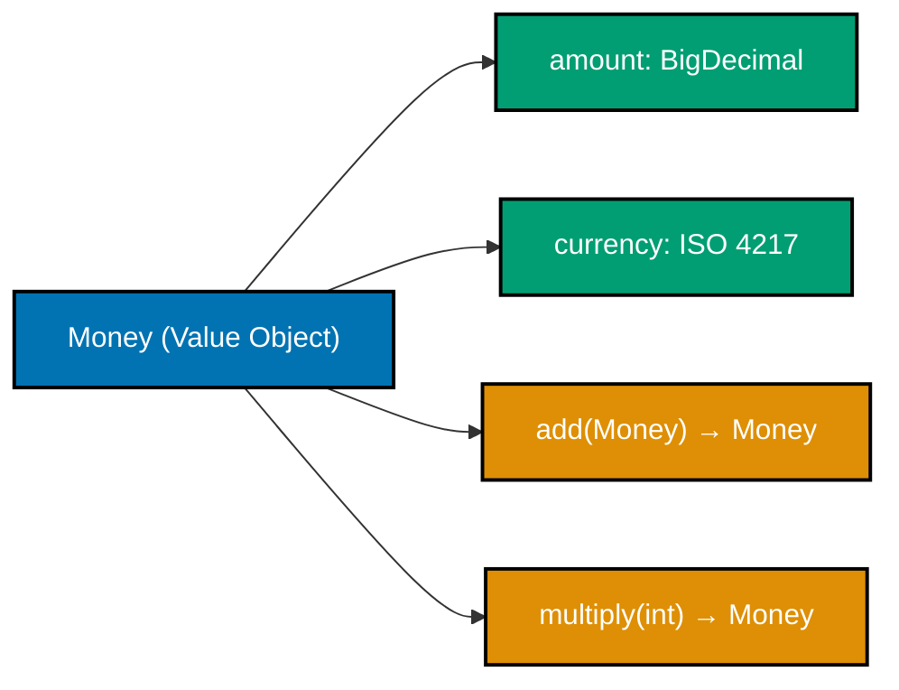
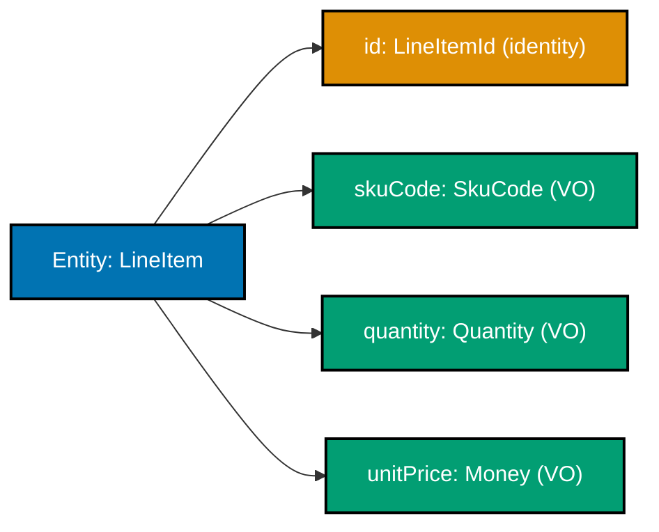
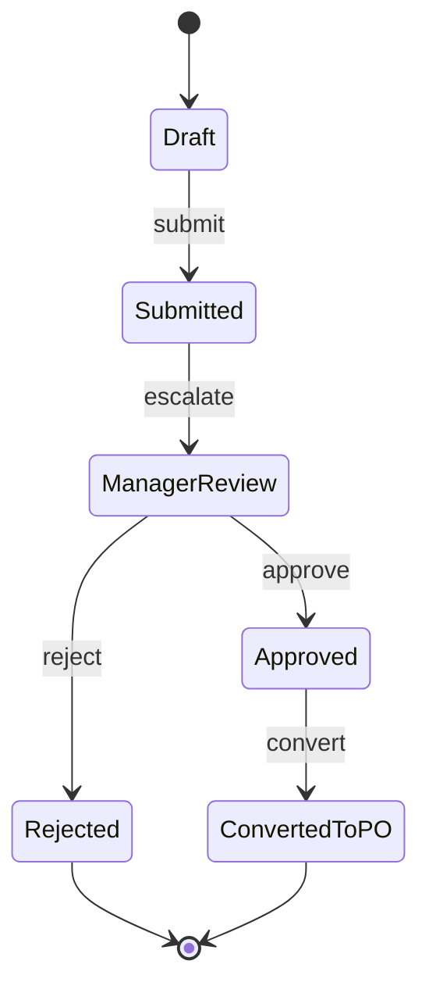

Examples 1–25 walk through DDD tactical patterns using the `purchasing` bounded context of a Procure-to-Pay (P2P) platform. The aggregate is `PurchaseRequisition`; value objects are `Money`, `SkuCode`, `Quantity`, `RequisitionId`, `ApprovalLevel`, and `UnitOfMeasure`. Every code block is self-contained. Annotation density targets 1.0–2.25 comment lines per code line per example.

## Ubiquitous Language and Value Objects (Examples 1–5)

### Example 1: Ubiquitous Language — naming domain types from the purchasing glossary

Every class name comes directly from the domain glossary that procurement specialists use. When code says `PurchaseRequisition`, `Money`, and `Quantity`, developers and business analysts share a single vocabulary with no silent translation layer.




```java
// Ubiquitous Language: class names match the purchasing domain glossary exactly
// => "PurchaseRequisition" not "RequestForm"; "Money" not "BigDecimal"; "SkuCode" not "String"
public record PurchaseRequisition(
    RequisitionId id,      // => Strongly-typed id, not raw String or long
    SkuCode       skuCode, // => Domain concept; validates format at construction
    Quantity      quantity, // => Carries unit of measure — int alone does not
    Money         estimatedCost // => Money carries currency — double does not
) {}

// Anti-pattern: primitive names lose all purchasing domain meaning
// => String id, String sku — same type, easy to pass in wrong order
// => double amount — what currency? what rounding mode?
public record AntiPattern(String id, String sku, int qty, double amount) {}

// Ubiquitous Language version reads like a business requirement
PurchaseRequisition req = new PurchaseRequisition(
    new RequisitionId("req_550e8400-e29b-41d4-a716-446655440000"), // => typed id; wrong kind caught at compile time
    new SkuCode("OFF-001234"),   // => validates regex at construction
    new Quantity(10, UnitOfMeasure.BOX), // => unit embedded in value
    new Money("250.00", "USD")   // => currency embedded; cannot lose it
);
```




```kotlin
// Ubiquitous Language: Kotlin data classes mirror domain glossary vocabulary exactly
// => "PurchaseRequisition" not "RequestForm"; domain names are non-negotiable
data class PurchaseRequisition(
    val id: RequisitionId,          // => typed id; compiler blocks RequisitionId/PurchaseOrderId swap
    val skuCode: SkuCode,           // => domain concept; enforces catalog format at construction
    val quantity: Quantity,         // => carries UnitOfMeasure — Int alone cannot express that
    val estimatedCost: Money        // => currency embedded in value — Double cannot carry currency
)

// Anti-pattern: primitive obsession — all meaning lost in raw types
// => String id, String sku — identical types; compiler cannot detect wrong-order args
// => Double amount — currency is invisible; rounding mode is undefined
data class AntiPattern(val id: String, val sku: String, val qty: Int, val amount: Double)

// Ubiquitous Language version reads exactly like a procurement business requirement
val req = PurchaseRequisition(
    id           = RequisitionId("req_550e8400-e29b-41d4-a716-446655440000"), // => typed; compile error if PurchaseOrderId used
    skuCode      = SkuCode("OFF-001234"),                   // => validates regex at construction; "invalid" throws
    quantity     = Quantity(10, UnitOfMeasure.BOX),         // => unit paired with count — inseparable
    estimatedCost = Money("250.00", "USD")                  // => currency locked in; cannot become naked number
)
```




```csharp
// Ubiquitous Language: C# records use domain glossary names directly
// => "PurchaseRequisition" not "RequestForm"; every name comes from the procurement glossary
public sealed record PurchaseRequisition(
    RequisitionId Id,            // => typed id; wrong-kind id is a compile error, not a runtime surprise
    SkuCode       SkuCode,       // => domain concept; catalog format enforced at construction
    Quantity      Quantity,      // => carries UnitOfMeasure — int alone cannot express procurement units
    Money         EstimatedCost  // => currency embedded; decimal alone loses currency context
);

// Anti-pattern: primitive obsession — domain semantics are invisible
// => string id, string sku — same type; compiler cannot block argument transposition
// => decimal amount — what currency? what rounding convention?
public sealed record AntiPattern(string Id, string Sku, int Qty, decimal Amount);

// Ubiquitous Language version reads like a procurement specification
var req = new PurchaseRequisition(
    Id:            new RequisitionId("req_550e8400-e29b-41d4-a716-446655440000"), // => typed; PurchaseOrderId rejected at compile time
    SkuCode:       new SkuCode("OFF-001234"),               // => validates regex; "invalid" throws ArgumentException
    Quantity:      new Quantity(10, UnitOfMeasure.Box),     // => unit paired with count; no ambiguity
    EstimatedCost: new Money("250.00", "USD")               // => currency bound; cannot strip it accidentally
);
```




**Key Takeaway**: Name every domain type using exact vocabulary from the purchasing glossary. When code reads like a procurement business requirement, specification drift surfaces in code review rather than in production.

**Why It Matters**: Teams using Ubiquitous Language eliminate the silent translation layer between requirements and code. A buyer saying "requisition" and a developer coding `PurchaseRequisition` speak the same word. Any mismatch becomes immediately visible during review rather than silently causing wrong behavior months later in a live procurement system.

---

### Example 2: Value Object — immutable `Money`

A Value Object has no identity. Two `Money` instances with the same amount and currency are equal. Immutability means no operation modifies an existing instance — arithmetic always returns a new `Money`.






```java
import java.math.BigDecimal; // => exact decimal arithmetic; never use double for money
import java.util.Objects;    // => null-safe hash helper

// Value Object: identity-free; equal fields = interchangeable instances
// => No id field; Money IS its amount + currency
public final class Money { // => final: no subclass can weaken immutability guarantee
    private final BigDecimal amount;   // => final: field cannot be reassigned
    private final String     currency; // => ISO 4217 code, e.g. "USD", "IDR"

    public Money(String amount, String currency) { // => String input: avoids double imprecision
        // => Validate before storing — invalid Money must never exist as an object
        if (amount == null)                                    // => null guard
            throw new IllegalArgumentException("amount is null"); // => fails fast; no null Money
        BigDecimal bd = new BigDecimal(amount);               // => NumberFormatException if malformed
        if (bd.compareTo(BigDecimal.ZERO) < 0)                // => domain invariant: amount >= 0
            throw new IllegalArgumentException("amount must be >= 0"); // => negative money rejected
        if (currency == null || currency.length() != 3)       // => ISO 4217 = 3 uppercase letters
            throw new IllegalArgumentException("currency must be 3-letter ISO code"); // => "USDD" or "" rejected
        this.amount   = bd;       // => stored only after validation passes
        this.currency = currency.toUpperCase(); // => normalise; "usd" == "USD"
    }

    // Operations return NEW instances; originals are unchanged
    public Money add(Money other) { // => never void; immutable design principle
        if (!this.currency.equals(other.currency))            // => domain rule: cannot add USD + IDR
            throw new IllegalArgumentException("Currency mismatch"); // => cross-currency add is a domain error
        return new Money(this.amount.add(other.amount).toPlainString(), this.currency);
        // => new Money; neither this nor other is mutated
    }

    public Money multiply(int factor) { // => scale quantity cost in line items
        if (factor <= 0)                                      // => domain guard: factor must be positive
            throw new IllegalArgumentException("factor must be > 0"); // => multiply by 0 or negative makes no sense
        return new Money(this.amount.multiply(BigDecimal.valueOf(factor)).toPlainString(), this.currency);
        // => new Money returned; this is unchanged
    }

    public BigDecimal getAmount()  { return amount; }   // => read-only accessor
    public String    getCurrency() { return currency; } // => read-only accessor

    @Override public boolean equals(Object o) { // => structural equality required for VO
        if (!(o instanceof Money m)) return false; // => pattern match; safe cast
        return amount.compareTo(m.amount) == 0 && currency.equals(m.currency);
        // => compareTo not equals: "10.00".equals("10") is false; compareTo is true
    }
    @Override public int hashCode() {
        return Objects.hash(amount.stripTrailingZeros(), currency); // => consistent with compareTo
    }
    @Override public String toString() { return amount + " " + currency; } // => "250.00 USD"
}

Money unitPrice = new Money("25.00", "USD");  // => unitPrice = 25.00 USD
Money total     = unitPrice.multiply(10);     // => total     = 250.00 USD (new object)
// unitPrice is still 25.00 USD — immutability guaranteed
Money tax       = new Money("12.50", "USD");  // => tax = 12.50 USD
Money grandTotal = total.add(tax);            // => grandTotal = 262.50 USD
```




```kotlin
import java.math.BigDecimal // => exact decimal arithmetic; Double loses precision for monetary values

// Value Object: no identity field; two Money instances with same amount+currency are equal
// => Kotlin class marked final by default; no open keyword needed to prevent subclassing
class Money(amount: String, currency: String) {
    // => Properties are val (immutable); Kotlin enforces immutability at the language level
    val amount:   BigDecimal // => stored as BigDecimal after validation
    val currency: String     // => ISO 4217 three-letter code, uppercase

    init {
        // => init block runs at construction; replaces Java constructor body
        // => Validate before assignment — invalid Money must never reach a usable state
        requireNotNull(amount) { "amount is null" }          // => Kotlin stdlib guard; throws IllegalArgumentException
        val bd = BigDecimal(amount)                          // => NumberFormatException if malformed string
        require(bd >= BigDecimal.ZERO) { "amount must be >= 0" } // => domain invariant; negative money rejected
        require(currency.length == 3) { "currency must be 3-letter ISO code" } // => "USDD" or "" rejected
        this.amount   = bd                                   // => stored only after all checks pass
        this.currency = currency.uppercase()                 // => normalise; "usd" == "USD"
    }

    // Operations return NEW instances — originals are structurally unchanged
    fun add(other: Money): Money {                           // => returns Money, never Unit; immutable contract
        require(currency == other.currency) { "Currency mismatch" } // => cross-currency add is a domain error
        return Money(amount.add(other.amount).toPlainString(), currency)
        // => new Money; neither this nor other is mutated
    }

    fun multiply(factor: Int): Money {                       // => scale line-item cost by quantity
        require(factor > 0) { "factor must be > 0" }        // => multiply by 0 or negative is a domain error
        return Money(amount.multiply(BigDecimal.valueOf(factor.toLong())).toPlainString(), currency)
        // => new Money returned; this remains unchanged
    }

    // => Structural equality: two Money instances are equal when amount and currency match
    override fun equals(other: Any?): Boolean {
        if (other !is Money) return false                    // => smart cast; safe without explicit cast
        return amount.compareTo(other.amount) == 0 && currency == other.currency
        // => compareTo handles "10.00" vs "10" correctly; == would not
    }
    override fun hashCode(): Int = 31 * amount.stripTrailingZeros().hashCode() + currency.hashCode()
    // => stripTrailingZeros ensures consistent hash when amounts are numerically equal
    override fun toString(): String = "$amount $currency"   // => "250.00 USD"
}

val unitPrice  = Money("25.00", "USD")   // => unitPrice  = 25.00 USD
val total      = unitPrice.multiply(10)  // => total      = 250.00 USD (new object; unitPrice unchanged)
// => unitPrice is still "25.00 USD" — Kotlin val + immutable class guarantee this
val tax        = Money("12.50", "USD")   // => tax        = 12.50 USD
val grandTotal = total.add(tax)          // => grandTotal = 262.50 USD
```




```csharp
using System;
// => System.Decimal is the idiomatic C# type for monetary values; avoids float/double imprecision

// Value Object: no identity; structural equality defined by amount + currency
// => sealed record: compiler generates Equals, GetHashCode, ToString from properties
public sealed class Money
{
    // => Properties are init-only (C# 9+); once set in constructor they cannot change
    public decimal Amount   { get; }  // => decimal: 28-digit precision; ideal for money
    public string  Currency { get; }  // => ISO 4217 three-letter code, uppercase

    public Money(string amount, string currency)
    {
        // => Validate before assignment — invalid Money must never reach a usable state
        ArgumentNullException.ThrowIfNull(amount,   nameof(amount));   // => null guard; .NET 7+ API
        ArgumentNullException.ThrowIfNull(currency, nameof(currency)); // => null guard
        if (!decimal.TryParse(amount, out var parsed))                  // => parse safely; no exceptions from bad input
            throw new ArgumentException($"amount is not a valid decimal: {amount}");
        if (parsed < 0)                                                 // => domain invariant: non-negative
            throw new ArgumentException("amount must be >= 0");
        if (currency.Length != 3)                                       // => ISO 4217 = exactly 3 letters
            throw new ArgumentException("currency must be 3-letter ISO code");
        Amount   = parsed;                    // => stored only after all guards pass
        Currency = currency.ToUpperInvariant(); // => normalise; "usd" → "USD"
    }

    // Operations return NEW instances; originals are unchanged
    public Money Add(Money other)
    {
        // => domain rule: cross-currency addition is invalid; must be caught at the boundary
        if (Currency != other.Currency)
            throw new InvalidOperationException("Currency mismatch");
        return new Money((Amount + other.Amount).ToString("G"), Currency);
        // => new Money; neither this nor other is mutated
    }

    public Money Multiply(int factor)
    {
        if (factor <= 0)                      // => domain guard: scale factor must be positive
            throw new ArgumentException("factor must be > 0");
        return new Money((Amount * factor).ToString("G"), Currency);
        // => new Money returned; this remains unchanged
    }

    // => Override Equals for structural (value) equality — default reference equality is wrong for VOs
    public override bool Equals(object? obj) =>
        obj is Money m && Amount == m.Amount && Currency == m.Currency;
    public override int  GetHashCode() => HashCode.Combine(Amount, Currency); // => stable hash from fields
    public override string ToString()  => $"{Amount} {Currency}";             // => "250.00 USD"
}

var unitPrice  = new Money("25.00", "USD");  // => unitPrice  = 25.00 USD
var total      = unitPrice.Multiply(10);     // => total      = 250.00 USD (new object; unitPrice unchanged)
// => unitPrice remains "25.00 USD" — C# readonly field + new-instance pattern enforces immutability
var tax        = new Money("12.50", "USD");  // => tax        = 12.50 USD
var grandTotal = total.Add(tax);             // => grandTotal = 262.50 USD
```




**Key Takeaway**: Value Objects are immutable and identity-free. All operations return new instances, making shared-state bugs structurally impossible.

**Why It Matters**: In procurement, prices appear on requisitions, purchase orders, invoices, and payment records simultaneously. If `Money` were mutable, a price change on one document could silently corrupt another. Immutability eliminates that entire class of concurrency and reference-sharing bugs — the JVM garbage collector handles disposal automatically.

---

### Example 3: Value Object — `SkuCode` with regex validation

`SkuCode` wraps a plain string but enforces the procurement catalog format `^[A-Z]{3}-\d{4,8}$`. Once constructed, the code is guaranteed valid. Callers never need to re-validate.




```java
import java.util.regex.Pattern; // => compile regex once; reuse for all validations

// Value Object with format invariant: guarantees well-formed SKU throughout system
// => Wrapping String in a type also prevents passing arbitrary strings where SkuCode is expected
public final class SkuCode {
    // => compile once at class load; Pattern.compile is expensive
    private static final Pattern FORMAT = Pattern.compile("^[A-Z]{3}-\\d{4,8}$");
    private final String value; // => final: immutable after construction

    public SkuCode(String value) {           // => smart constructor enforces invariant
        if (value == null)                   // => null guard first
            throw new IllegalArgumentException("SkuCode cannot be null"); // => null SkuCode is not a SKU
        if (!FORMAT.matcher(value).matches()) // => regex check
            throw new IllegalArgumentException(
                "SkuCode must match [A-Z]{3}-\\d{4,8}, got: " + value); // => e.g. "invalid" or "AB-123" rejected
        this.value = value; // => stored only after validation passes
    }

    public String getValue() { return value; } // => read-only; no setter

    @Override public boolean equals(Object o) { // => structural equality
        return o instanceof SkuCode s && value.equals(s.value);
    }
    @Override public int    hashCode() { return value.hashCode(); }
    @Override public String toString() { return value; } // => "OFF-001234"
}

// Valid usage
SkuCode office = new SkuCode("OFF-001234"); // => office = SkuCode("OFF-001234")
SkuCode tools  = new SkuCode("TLS-9999");  // => tools  = SkuCode("TLS-9999")
System.out.println(office);               // => Output: OFF-001234

// Invalid — throws at construction, not later
try {
    SkuCode bad = new SkuCode("invalid");  // => IllegalArgumentException; regex fails
} catch (IllegalArgumentException e) {
    System.out.println(e.getMessage());   // => Output: SkuCode must match [A-Z]{3}-\d{4,8}, got: invalid
}
// => bad was never created; invalid state structurally impossible
```




```kotlin
// => Regex compiled once as a companion object property; shared across all SkuCode instances
// => companion object is Kotlin's equivalent of Java static; initialised at class load time
class SkuCode(value: String) {
    companion object {
        // => Regex.toRegex() compiles the pattern; stored in companion = compiled once
        private val FORMAT = Regex("^[A-Z]{3}-\\d{4,8}$")
    }

    // => val: property is read-only after init block; Kotlin enforces immutability
    val value: String

    init {
        // => requireNotNull + require: idiomatic Kotlin guards; both throw IllegalArgumentException
        requireNotNull(value) { "SkuCode cannot be null" }       // => null guard (Kotlin String is non-null by type)
        require(FORMAT.matches(value)) {                          // => regex check; matches() checks entire string
            "SkuCode must match [A-Z]{3}-\\d{4,8}, got: $value"  // => template string; "invalid" or "AB-123" rejected
        }
        this.value = value // => stored only after both guards pass
    }

    // => equals and hashCode: delegate to the wrapped String value (structural equality)
    override fun equals(other: Any?): Boolean = other is SkuCode && value == other.value
    override fun hashCode(): Int = value.hashCode() // => consistent with equals
    override fun toString(): String = value         // => "OFF-001234"
}

// Valid usage — construction succeeds
val office = SkuCode("OFF-001234") // => office.value = "OFF-001234"
val tools  = SkuCode("TLS-9999")  // => tools.value  = "TLS-9999"
println(office)                    // => Output: OFF-001234

// Invalid — throws at construction; bad is never assigned
runCatching { SkuCode("invalid") }  // => runCatching captures the exception without try/catch syntax
    .onFailure { println(it.message) } // => Output: SkuCode must match [A-Z]{3}-\d{4,8}, got: invalid
// => SkuCode("invalid") was never created; invalid state is structurally impossible
```




```csharp
using System.Text.RegularExpressions; // => Regex class; compiled regex avoids repeated compilation

// Value Object with format invariant: every SkuCode in the system is guaranteed well-formed
// => sealed: no subclass can bypass the validation logic in the constructor
public sealed class SkuCode
{
    // => static readonly: compiled once at class load; RegexOptions.Compiled = JIT-compiled to IL
    private static readonly Regex Format =
        new Regex(@"^[A-Z]{3}-\d{4,8}$", RegexOptions.Compiled);

    // => Property with private set: readable externally, writable only in constructor
    public string Value { get; }

    public SkuCode(string value)
    {
        // => ArgumentNullException for null; ArgumentException for format violation
        ArgumentNullException.ThrowIfNull(value, nameof(value)); // => null guard first
        if (!Format.IsMatch(value))                               // => regex check
            throw new ArgumentException(
                $"SkuCode must match [A-Z]{{3}}-\\d{{4,8}}, got: {value}"); // => "invalid" or "AB-123" rejected
        Value = value; // => stored only after both guards pass
    }

    // => Override Equals for structural equality — two SkuCode instances with same Value are equal
    public override bool   Equals(object? obj) => obj is SkuCode s && Value == s.Value;
    public override int    GetHashCode()        => Value.GetHashCode(StringComparison.Ordinal);
    public override string ToString()           => Value; // => "OFF-001234"
}

// Valid usage
var office = new SkuCode("OFF-001234"); // => office.Value = "OFF-001234"
var tools  = new SkuCode("TLS-9999");  // => tools.Value  = "TLS-9999"
Console.WriteLine(office);             // => Output: OFF-001234

// Invalid — throws at construction; bad is never assigned
try
{
    var bad = new SkuCode("invalid");  // => ArgumentException; regex fails
}
catch (ArgumentException e)
{
    Console.WriteLine(e.Message);     // => Output: SkuCode must match [A-Z]{3}-\d{4,8}, got: invalid
}
// => bad was never created; invalid state is structurally impossible
```




**Key Takeaway**: Encode format invariants in the constructor so every `SkuCode` in the system is guaranteed valid. Downstream code never needs defensive checks.

**Why It Matters**: In a catalog with thousands of SKUs, a single malformed code silently routes to a non-existent product. Catching that at the construction boundary — not at purchase order issuance or goods receipt — compresses the distance between error and detection from days to milliseconds.

---

### Example 4: Value Object — `Quantity` with `UnitOfMeasure`

`Quantity` pairs a positive integer count with an immutable unit of measure. The enum `UnitOfMeasure` closes the set of valid units — no magic strings allowed.

```java
// Closed enum: exactly these units exist in the procurement domain
// => Adding "PALLET" requires a deliberate code change, not a stray string
public enum UnitOfMeasure {
    EACH,  // => individual items, e.g. pens
    BOX,   // => packaged boxes
    KG,    // => kilogram weight
    LITRE, // => liquid volume
    HOUR   // => service time, e.g. consulting hours
}

// Value Object: count + unit form an inseparable pair
// => Java 21 record: immutable by default; equals/hashCode/toString generated
public record Quantity(int value, UnitOfMeasure unit) {
    // => Compact constructor: runs inside record; no boilerplate field assignments
    public Quantity { // => compact constructor syntax
        if (value <= 0)  // => domain invariant: quantity must be positive
            throw new IllegalArgumentException("Quantity.value must be > 0, got: " + value);
        if (unit == null) // => unit is required; enum ensures valid values
            throw new IllegalArgumentException("UnitOfMeasure required");
        // => fields assigned automatically by record after compact constructor body
    }
}

Quantity pens    = new Quantity(500, UnitOfMeasure.EACH);  // => pens    = Quantity[value=500, unit=EACH]
Quantity paper   = new Quantity(10,  UnitOfMeasure.BOX);   // => paper   = Quantity[value=10, unit=BOX]
Quantity consult = new Quantity(8,   UnitOfMeasure.HOUR);  // => consult = Quantity[value=8,  unit=HOUR]
System.out.println(pens);    // => Output: Quantity[value=500, unit=EACH]
System.out.println(paper);   // => Output: Quantity[value=10, unit=BOX]

// Invalid — throws immediately
try {
    new Quantity(-1, UnitOfMeasure.KG); // => value <= 0 triggers guard
} catch (IllegalArgumentException e) {
    System.out.println(e.getMessage()); // => Output: Quantity.value must be > 0, got: -1
}
```

**Key Takeaway**: `Quantity` as a record pairs count with unit, and the compact constructor enforces the positive-value invariant. The closed enum prevents unit drift from free-form strings.

**Why It Matters**: A receiving team once misread "500" (EACH) as "500 KG" because both were raw integers in a shared spreadsheet column. Embedding the unit in the type makes that confusion structurally impossible — you cannot create a `Quantity` without committing to a `UnitOfMeasure`.

---

### Example 5: Value Object — `RequisitionId` as a typed identity handle

`RequisitionId` wraps a UUID string in the format `req_<uuid>`. Strong typing prevents accidentally using a `PurchaseOrderId` where a `RequisitionId` is expected — the compiler catches the mistake.

```java
// Identity value object: not for the aggregate's identity per se, but as a typed reference
// => Record provides equals/hashCode/toString; id comparison is structural
public record RequisitionId(String value) {
    private static final String PREFIX = "req_"; // => format prefix constant

    public RequisitionId { // => compact constructor
        if (value == null || value.isBlank()) // => null/blank guard
            throw new IllegalArgumentException("RequisitionId cannot be blank");
        if (!value.startsWith(PREFIX))        // => prefix format check
            throw new IllegalArgumentException("RequisitionId must start with 'req_', got: " + value);
        // => No UUID regex for brevity; production code would add UUID format check
    }

    @Override public String toString() { return value; } // => "req_550e8400-..."
}

// Separate type for PO ids — compiler blocks accidental swap
public record PurchaseOrderId(String value) {
    public PurchaseOrderId {
        if (value == null || !value.startsWith("po_")) // => prefix check
            throw new IllegalArgumentException("PurchaseOrderId must start with 'po_'");
    }
}

RequisitionId rid = new RequisitionId("req_550e8400-e29b-41d4-a716-446655440000");
// => rid = RequisitionId[value=req_550e8400-...]

PurchaseOrderId pid = new PurchaseOrderId("po_6ba7b810-9dad-11d1-80b4-00c04fd430c8");
// => pid = PurchaseOrderId[value=po_6ba7b810-...]

// The following would be a compile error — type safety enforced
// void approve(RequisitionId id) {}
// approve(pid); // => COMPILE ERROR: PurchaseOrderId ≠ RequisitionId
```

**Key Takeaway**: Wrapping each id category in its own record makes id-type mix-ups a compile error instead of a runtime bug traced through logs at 2 AM.

**Why It Matters**: In a P2P system every workflow step passes multiple ids (requisition, purchase order, supplier, invoice). Primitive id strings are interchangeable in a function call — a compiler cannot help. Typed id records make every incorrect pass visible immediately in the IDE, before the code ever runs.

---

## Smart Constructors and Validation (Examples 6–10)

### Example 6: Smart constructor — preventing invalid `Money` creation

A smart constructor is a factory method or constructor body that rejects invalid inputs before they can reach field assignment. The object is either fully valid or it does not exist.

```java
// Smart constructor: validation inside constructor; no separate validate() step
// => Pattern: check → throw → assign. Never assign then check.
public final class Money {
    private final java.math.BigDecimal amount;
    private final String currency;

    public Money(String rawAmount, String rawCurrency) {
        // => Step 1: null guards (fail fast on obviously wrong input)
        if (rawAmount  == null) throw new IllegalArgumentException("amount is null");
        if (rawCurrency == null) throw new IllegalArgumentException("currency is null");

        // => Step 2: parse — NumberFormatException surfaces malformed strings
        java.math.BigDecimal bd;
        try {
            bd = new java.math.BigDecimal(rawAmount); // => may throw NumberFormatException
        } catch (NumberFormatException e) {
            throw new IllegalArgumentException("amount is not a valid decimal: " + rawAmount, e);
            // => wrap in IllegalArgumentException with context; caller gets clear message
        }

        // => Step 3: domain invariants — amount >= 0, currency is 3-letter ISO code
        if (bd.compareTo(java.math.BigDecimal.ZERO) < 0)
            throw new IllegalArgumentException("amount must be >= 0, got: " + rawAmount);
        if (rawCurrency.length() != 3 || !rawCurrency.matches("[A-Z]{3}"))
            throw new IllegalArgumentException("currency must be 3-letter uppercase ISO code, got: " + rawCurrency);

        // => Step 4: assign ONLY after all checks pass; partial state is impossible
        this.amount   = bd;
        this.currency = rawCurrency;
    }

    public java.math.BigDecimal getAmount()  { return amount;   }
    public String               getCurrency(){ return currency; }
    @Override public String toString()       { return amount + " " + currency; }
}

// Valid: passes all guards
Money m1 = new Money("250.00", "USD"); // => Money[250.00 USD]
System.out.println(m1);               // => Output: 250.00 USD

// Invalid: negative amount
try {
    new Money("-1.00", "USD");         // => guard at Step 3 fires
} catch (IllegalArgumentException e) {
    System.out.println(e.getMessage()); // => Output: amount must be >= 0, got: -1.00
}

// Invalid: malformed decimal
try {
    new Money("twenty", "USD");        // => NumberFormatException caught at Step 2
} catch (IllegalArgumentException e) {
    System.out.println(e.getMessage()); // => Output: amount is not a valid decimal: twenty
}
```

**Key Takeaway**: The smart constructor validates in order (null → parse → domain invariant → assign), making invalid object states structurally impossible.

**Why It Matters**: If validation lives in a separate `validate()` method, callers can forget to call it. A constructor that validates before assignment makes valid state the only path to existence — the guarantee holds even when callers are written months later by a different team.

---

### Example 7: Java 21 record compact constructor for `Quantity`

Java 21 records compact constructors express invariants concisely without boilerplate field assignment — the compiler inserts assignments after the constructor body.

```java
// Java 21 record with compact constructor
// => No "this.value = value" needed; compiler inserts it after compact body
public record Quantity(int value, UnitOfMeasure unit) {
    public Quantity { // => compact constructor: no parameter list; fields auto-assigned after
        // => Invariant 1: purchasing domain requires positive quantity
        if (value <= 0)
            throw new IllegalArgumentException("Quantity.value must be > 0, got: " + value);
        // => Invariant 2: unit required; closed enum prevents invalid strings
        if (unit == null)
            throw new IllegalArgumentException("unit is required");
        // => After this block, compiler emits: this.value = value; this.unit = unit;
    }
    // => equals/hashCode/toString generated by record; no manual code needed
}

enum UnitOfMeasure { EACH, BOX, KG, LITRE, HOUR } // => closed set; no stray strings

// Records have generated accessor methods: value() and unit() (not getters)
Quantity q = new Quantity(10, UnitOfMeasure.BOX);
System.out.println(q.value()); // => Output: 10
System.out.println(q.unit());  // => Output: BOX
System.out.println(q);         // => Output: Quantity[value=10, unit=BOX]

// Structural equality: two records with same fields are equal
Quantity q2 = new Quantity(10, UnitOfMeasure.BOX);
System.out.println(q.equals(q2)); // => Output: true (same value+unit)
System.out.println(q == q2);      // => Output: false (different object references; irrelevant for VO)

// Invalid
try {
    new Quantity(0, UnitOfMeasure.EACH); // => compact constructor fires; value <= 0
} catch (IllegalArgumentException e) {
    System.out.println(e.getMessage()); // => Output: Quantity.value must be > 0, got: 0
}
```

**Key Takeaway**: Records with compact constructors deliver immutability, structural equality, and validation in minimal lines — they are the canonical Java 21 Value Object implementation.

**Why It Matters**: Before Java 21 records, a manually written immutable class required `final` fields, a constructor, two accessors, `equals`, `hashCode`, and `toString` — about 40 lines for a two-field value. Records collapse that to under 10 lines while being provably equivalent. Less boilerplate means fewer opportunities to introduce bugs in the plumbing.

---

### Example 8: `ApprovalLevel` derived from `Money` total

`ApprovalLevel` is a value object derived from the requisition's estimated cost. The derivation rule lives in a factory method rather than in the caller — one source of truth.

```java
// ApprovalLevel enum: derived from PO/requisition total; one derivation rule in one place
// => L1 <= $1000, L2 <= $10000, L3 > $10000
public enum ApprovalLevel {
    L1, // => team lead approval; up to $1,000
    L2, // => department head; $1,001 – $10,000
    L3; // => CFO / board; above $10,000

    // Factory method: deriving level from Money keeps rule in the enum, not in callers
    public static ApprovalLevel from(Money total) {
        if (total == null) // => null guard; Money could theoretically be null in early code
            throw new IllegalArgumentException("total is required to derive ApprovalLevel");
        java.math.BigDecimal amount = total.getAmount(); // => extract comparable value
        java.math.BigDecimal oneK   = new java.math.BigDecimal("1000");  // => $1,000 threshold
        java.math.BigDecimal tenK   = new java.math.BigDecimal("10000"); // => $10,000 threshold

        if (amount.compareTo(oneK) <= 0)  return L1; // => amount <= 1000 => L1
        if (amount.compareTo(tenK) <= 0)  return L2; // => 1000 < amount <= 10000 => L2
        return L3;                                    // => amount > 10000 => L3
    }
}

// Usage: level derived at need; no magic number scattered across services
Money small  = new Money("500.00",   "USD"); // => small  = 500.00 USD
Money medium = new Money("5000.00",  "USD"); // => medium = 5000.00 USD
Money large  = new Money("15000.00", "USD"); // => large  = 15000.00 USD

System.out.println(ApprovalLevel.from(small));  // => Output: L1
System.out.println(ApprovalLevel.from(medium)); // => Output: L2
System.out.println(ApprovalLevel.from(large));  // => Output: L3
// => Boundary value: exactly $1000
Money boundary = new Money("1000.00", "USD");
System.out.println(ApprovalLevel.from(boundary)); // => Output: L1 (amount <= 1000)
```

**Key Takeaway**: Centralise derivation logic in a factory method on the enum. Callers never need to know threshold values — they call `ApprovalLevel.from(total)` and get a typed result.

**Why It Matters**: In a procurement system, approval thresholds change over time. If the rule is embedded in fifteen different service methods, a threshold change requires finding and updating all fifteen. A single factory method contains the rule in one place — one change, zero missed spots.

---

### Example 9: Kotlin data class as Value Object — `Money`

Kotlin's `data class` generates `equals`, `hashCode`, `toString`, and `copy` automatically. Combined with `init` blocks, it achieves the same guarantees as the Java 21 record with less ceremony.

```kotlin
import java.math.BigDecimal

// data class: structural equality, copy(), and toString generated by compiler
// => val fields = immutable after construction; no var allowed for true VO
data class Money(val amount: BigDecimal, val currency: String) {
    init {
        // => init block runs after primary constructor; enforces invariants
        require(amount >= BigDecimal.ZERO) { "amount must be >= 0: $amount" }
        // => require: Kotlin standard; throws IllegalArgumentException on failure
        require(currency.length == 3 && currency.all { it.isUpperCase() }) {
            "currency must be 3-letter uppercase ISO code: $currency"
        }
        // => If both pass, fields are already assigned (Kotlin constructor order)
    }

    fun add(other: Money): Money { // => returns new Money; this is unchanged
        require(currency == other.currency) { "Currency mismatch: $currency vs ${other.currency}" }
        return Money(amount + other.amount, currency) // => + operator on BigDecimal works in Kotlin
    }

    fun multiply(factor: Int): Money { // => scale for line-item cost
        require(factor > 0) { "factor must be > 0: $factor" }
        return Money(amount * BigDecimal.valueOf(factor.toLong()), currency)
    }
}

val unitPrice = Money(BigDecimal("25.00"), "USD") // => Money(amount=25.00, currency=USD)
val lineTotal = unitPrice.multiply(10)             // => Money(amount=250.00, currency=USD)
val tax       = Money(BigDecimal("12.50"), "USD")  // => Money(amount=12.50, currency=USD)
val grandTotal = lineTotal.add(tax)                // => Money(amount=262.50, currency=USD)
println(grandTotal) // => Output: Money(amount=262.50, currency=USD)

// copy(): change one field, keep others — useful for currency conversion scenarios
val converted = grandTotal.copy(currency = "IDR") // => Money(amount=262.50, currency=IDR)
// => Note: copy does NOT run init block in older Kotlin; careful with constraint evasion
println(converted) // => Output: Money(amount=262.50, currency=IDR)
```

**Key Takeaway**: Kotlin `data class` with `init` delivers Value Object guarantees in fewer lines than Java. `copy()` is useful but bypasses `init` in some Kotlin versions — verify invariants hold after copy in critical code.

**Why It Matters**: The `copy()` bypass is a real footgun: `Money(BigDecimal("-1"), "USD")` cannot be constructed directly, but `validMoney.copy(amount = BigDecimal("-1"))` can in some Kotlin versions. Understanding this nuance prevents subtle bugs when VO constraints are security-critical (e.g., negative procurement amounts triggering accounting reversals).

---

### Example 10: C# record as Value Object — `SkuCode`

C# `record` provides `==` operator, `GetHashCode`, and `ToString` via positional or property syntax. `with`-expressions create modified copies without mutation.

```csharp
using System.Text.RegularExpressions;

// C# sealed record: primary constructor, structural ==, with-expressions, ToString
// => sealed: no subclass can relax the invariant
public sealed record SkuCode
{
    // => Private setter enforces immutability; only constructor can assign
    public string Value { get; }

    private static readonly Regex Format = new(@"^[A-Z]{3}-\d{4,8}$", RegexOptions.Compiled);
    // => Compiled regex: pattern compiled once at class load for performance

    public SkuCode(string value) // => constructor validation; no public setter
    {
        if (string.IsNullOrWhiteSpace(value))      // => null/blank guard
            throw new ArgumentException("SkuCode cannot be blank");
        if (!Format.IsMatch(value))                // => regex guard
            throw new ArgumentException($"SkuCode must match [A-Z]{{3}}-\\d{{4,8}}, got: {value}");
        Value = value; // => assign only after validation; immutable from here
    }

    // => with-expression syntax works via record copy constructor; Value is the only field
    public override string ToString() => Value; // => "OFF-001234"
}

// Valid
var office = new SkuCode("OFF-001234"); // => office = SkuCode { Value = OFF-001234 }
var tools  = new SkuCode("TLS-9999");  // => tools  = SkuCode { Value = TLS-9999 }
Console.WriteLine(office == tools);     // => Output: False (structural ==)
Console.WriteLine(office == new SkuCode("OFF-001234")); // => Output: True

// Invalid — throws at construction
try
{
    var bad = new SkuCode("invalid");  // => regex fails
}
catch (ArgumentException e)
{
    Console.WriteLine(e.Message); // => Output: SkuCode must match [A-Z]{3}-\d{4,8}, got: invalid
}
```

**Key Takeaway**: C# `record` with a validation constructor provides structural equality and immutability with minimal boilerplate. `sealed` ensures no subclass can weaken the invariant.

**Why It Matters**: In a procurement catalog, an invalid SKU silently routes to a ghost product. Catching malformed codes at construction — not at purchase order creation hours later — compresses the error-detection window from hours to milliseconds and keeps the error message close to the cause.

---

## Entities and the Aggregate Root (Examples 11–15)

### Example 11: Entity vs Value Object — identity matters

An Entity has a unique identity that persists across state changes. Two `LineItem` entities with identical fields but different ids are NOT the same entity.



```java
// LineItemId: typed identity for this entity
public record LineItemId(String value) {
    public LineItemId { // => compact constructor
        if (value == null || value.isBlank())
            throw new IllegalArgumentException("LineItemId cannot be blank");
    }
}

// Entity: equality based on id, NOT field values
// => Two line items with identical sku/qty/price but different ids are DIFFERENT entities
public class LineItem {
    private final LineItemId id;      // => identity; never changes after creation
    private final SkuCode    skuCode; // => what is being requisitioned
    private Quantity         quantity; // => mutable: quantity can be revised pre-approval
    private final Money      unitPrice; // => final: price locked at requisition time

    public LineItem(LineItemId id, SkuCode skuCode, Quantity quantity, Money unitPrice) {
        // => All required; no partial construction
        if (id == null || skuCode == null || quantity == null || unitPrice == null)
            throw new IllegalArgumentException("All LineItem fields required");
        this.id        = id;
        this.skuCode   = skuCode;
        this.quantity  = quantity;
        this.unitPrice = unitPrice;
    }

    // => Domain method: revise quantity pre-approval; business operation, not raw setter
    public void reviseQuantity(Quantity newQty) {
        if (newQty == null) throw new IllegalArgumentException("newQty required");
        this.quantity = newQty; // => allowed before requisition is submitted
    }

    public Money lineTotal() {
        return unitPrice.multiply(quantity.value()); // => computed; not stored
    }

    // => Entity equality: ONLY id matters; two items with same sku are still different
    @Override public boolean equals(Object o) {
        return o instanceof LineItem li && id.equals(li.id);
    }
    @Override public int hashCode() { return id.hashCode(); }
    @Override public String toString() {
        return "LineItem[" + id + ", " + skuCode + ", " + quantity + ", " + unitPrice + "]";
    }
}

// Demonstrate identity-based equality
LineItemId idA = new LineItemId("li-001");
LineItemId idB = new LineItemId("li-002");
SkuCode    sku = new SkuCode("OFF-001234");
Quantity   qty = new Quantity(10, UnitOfMeasure.BOX);
Money      prc = new Money("25.00", "USD");

LineItem itemA = new LineItem(idA, sku, qty, prc); // => idA entity
LineItem itemB = new LineItem(idB, sku, qty, prc); // => idB entity; same fields, different id
System.out.println(itemA.equals(itemB)); // => Output: false (different ids)

LineItem itemA2 = new LineItem(idA, sku, qty, prc); // => same id as itemA
System.out.println(itemA.equals(itemA2)); // => Output: true (same id)
```

**Key Takeaway**: Entities carry identity; two entities are equal only if their ids match, regardless of field values. Value Objects are equal if all fields match, regardless of reference.

**Why It Matters**: A procurement line item must be traceable from requisition through delivery. If equality were field-based, updating a quantity would make the "updated" item appear to be a completely new item — audit trails would break and receiving teams would have no way to match deliveries back to original lines.

---

### Example 12: `PurchaseRequisition` as the Aggregate Root

`PurchaseRequisition` is the Aggregate Root of the `purchasing` bounded context. All state changes go through its methods — no external code modifies its internals directly.

```java
import java.util.ArrayList;
import java.util.Collections;
import java.util.List;

// PurchaseRequisition: Aggregate Root
// => Controls all state changes; external code calls methods, never fields
public class PurchaseRequisition {
    public enum Status { DRAFT, SUBMITTED, MANAGER_REVIEW, APPROVED, REJECTED, CONVERTED_TO_PO }

    private final RequisitionId      id;       // => identity; immutable
    private final String             requesterId; // => who raised the requisition
    private       Status             status;   // => mutable; lifecycle state
    private final List<LineItem>     lineItems; // => encapsulated; exposed read-only

    public PurchaseRequisition(RequisitionId id, String requesterId) {
        if (id == null || requesterId == null || requesterId.isBlank())
            throw new IllegalArgumentException("id and requesterId required");
        this.id          = id;
        this.requesterId = requesterId;
        this.status      = Status.DRAFT;    // => starts in DRAFT; only valid initial state
        this.lineItems   = new ArrayList<>(); // => starts empty; lines added via addLine()
    }

    // => Domain method: add a line item; only allowed in DRAFT
    public void addLine(LineItem line) {
        if (status != Status.DRAFT)           // => guard: cannot add lines after submission
            throw new IllegalStateException("Lines can only be added in DRAFT, current: " + status);
        if (line == null)
            throw new IllegalArgumentException("line is required");
        lineItems.add(line); // => protected by the aggregate root; no direct list access
    }

    // => Domain method: submit for review; guards business rules
    public void submit() {
        if (status != Status.DRAFT)           // => idempotency guard; cannot submit twice
            throw new IllegalStateException("Can only submit from DRAFT, current: " + status);
        if (lineItems.isEmpty())              // => domain rule: no empty requisitions
            throw new IllegalStateException("Cannot submit a requisition with no line items");
        this.status = Status.SUBMITTED;       // => state transition; recorded here
    }

    // => Derived value: total computed from all lines; not stored to avoid sync issues
    public Money estimatedTotal() {
        return lineItems.stream()
            .map(LineItem::lineTotal)         // => each line's unit price * quantity
            .reduce(new Money("0.00", "USD"), Money::add); // => fold; default 0.00 USD
    }

    // => Derived value: approval level from total
    public ApprovalLevel requiredApprovalLevel() {
        return ApprovalLevel.from(estimatedTotal()); // => delegates to enum factory
    }

    // => Read-only view; callers cannot mutate the list
    public List<LineItem> getLineItems() { return Collections.unmodifiableList(lineItems); }
    public RequisitionId  getId()        { return id; }
    public Status         getStatus()    { return status; }
    public String         getRequesterId(){ return requesterId; }
}
```

**Key Takeaway**: The Aggregate Root is the sole entry point for all state changes. External code calls its methods; it protects internal consistency.

**Why It Matters**: Without an Aggregate Root, any code can reach in and modify line items directly, bypassing status checks. In procurement, that means a line could be added to an already-approved requisition without triggering the approval workflow again — a compliance failure that real audit committees flag.

---

### Example 13: Adding line items and computing `estimatedTotal`

Demonstrating the full lifecycle of a `PurchaseRequisition` from construction through total computation.

```java
// Setup: value objects
RequisitionId rid  = new RequisitionId("req_550e8400-e29b-41d4-a716-446655440000");
String requesterId = "emp-42"; // => who raised the requisition

// Create aggregate in DRAFT state
PurchaseRequisition req = new PurchaseRequisition(rid, requesterId);
// => req.status = DRAFT; req.lineItems = []

// Build line items (entities)
LineItem item1 = new LineItem(
    new LineItemId("li-001"),
    new SkuCode("OFF-001234"),       // => office supplies SKU
    new Quantity(500, UnitOfMeasure.EACH),
    new Money("0.50", "USD")         // => $0.50 per pen
); // => li-001: 500 EACH × $0.50 = $250.00

LineItem item2 = new LineItem(
    new LineItemId("li-002"),
    new SkuCode("PPR-8500"),         // => paper SKU
    new Quantity(10,  UnitOfMeasure.BOX),
    new Money("25.00", "USD")        // => $25.00 per box
); // => li-002: 10 BOX × $25.00 = $250.00

// Add through aggregate root (guards apply)
req.addLine(item1); // => lineItems = [li-001]
req.addLine(item2); // => lineItems = [li-001, li-002]

// Derived values
Money total = req.estimatedTotal();
// => total = 250.00 + 250.00 = 500.00 USD
System.out.println(total); // => Output: 500.00 USD

ApprovalLevel level = req.requiredApprovalLevel();
// => 500.00 <= 1000.00 => L1
System.out.println(level); // => Output: L1

// Submit
req.submit(); // => status transitions DRAFT -> SUBMITTED
System.out.println(req.getStatus()); // => Output: SUBMITTED

// Guard: cannot add lines after submission
try {
    req.addLine(item1); // => throws; status is SUBMITTED not DRAFT
} catch (IllegalStateException e) {
    System.out.println(e.getMessage()); // => Output: Lines can only be added in DRAFT, current: SUBMITTED
}
```

**Key Takeaway**: The Aggregate Root's domain methods sequence validation, state change, and computation in a single cohesive unit. Callers never manage these steps manually.

**Why It Matters**: If callers orchestrate validation, state change, and total computation themselves, each caller can get the sequence subtly wrong. Centralising it in `submit()` means that even a new developer adding a tenth entry point cannot accidentally bypass the "no empty requisition" rule.

---

### Example 14: Immutability in practice — `with`-style copy via records

Java 21 records have no `with`-expression built-in (unlike C#), but a manual `withQuantity` builder method on a `LineItem` record delivers the same semantics.

```java
// LineItem as a record: immutable, with a domain-specific copy helper
// => Records in Java 21 cannot have with-expressions; we write a targeted copy method
public record LineItem(LineItemId id, SkuCode skuCode, Quantity quantity, Money unitPrice) {
    public LineItem { // => compact constructor: validate all fields
        if (id == null || skuCode == null || quantity == null || unitPrice == null)
            throw new IllegalArgumentException("All fields required");
    }

    // Domain method: create a revised copy with updated quantity
    // => Immutable pattern: never modify; return new instance
    public LineItem withQuantity(Quantity newQuantity) {
        if (newQuantity == null) throw new IllegalArgumentException("newQuantity required");
        return new LineItem(id, skuCode, newQuantity, unitPrice);
        // => id, skuCode, unitPrice unchanged; only quantity is replaced
    }

    public Money lineTotal() {
        return unitPrice.multiply(quantity.value()); // => computed from current quantity
    }
}

// Demonstrate immutable revision
LineItem original = new LineItem(
    new LineItemId("li-001"),
    new SkuCode("OFF-001234"),
    new Quantity(500, UnitOfMeasure.EACH),
    new Money("0.50", "USD")
); // => original: 500 EACH × $0.50 = $250.00
System.out.println(original.lineTotal()); // => Output: 250.00 USD

LineItem revised = original.withQuantity(new Quantity(1000, UnitOfMeasure.EACH));
// => revised: 1000 EACH × $0.50 = $500.00; original is unchanged
System.out.println(revised.lineTotal());  // => Output: 500.00 USD
System.out.println(original.lineTotal()); // => Output: 250.00 USD (original intact)

// Identity preserved in revision
System.out.println(original.id().equals(revised.id())); // => Output: true (same id)
// => Same entity identity, different value snapshot — correct for domain revision tracking
```

**Key Takeaway**: Returning a new instance from copy-methods (`withQuantity`) preserves immutability while enabling domain-driven revision semantics. The original is never lost.

**Why It Matters**: Procurement audits require the history of quantity revisions. If `setQuantity` mutated in place, the original value would be gone. Immutable copy-returns make it natural to store both versions — before and after — enabling audit log generation without extra infrastructure.

---

### Example 15: Factory method — `PurchaseRequisition.create`

A static factory method encapsulates construction logic, provides a meaningful name, and can enforce creation-time invariants that go beyond a single constructor call.

```java
// Factory method: named, discoverable, validates creation context
// => hides constructor; callers see intent, not plumbing
public class PurchaseRequisition {
    public enum Status { DRAFT, SUBMITTED, MANAGER_REVIEW, APPROVED, REJECTED, CONVERTED_TO_PO }

    private final RequisitionId  id;
    private final String         requesterId;
    private       Status         status;
    private final java.util.List<LineItem> lineItems = new java.util.ArrayList<>();

    // Private constructor: callers must use factory
    private PurchaseRequisition(RequisitionId id, String requesterId) {
        this.id          = id;
        this.requesterId = requesterId;
        this.status      = Status.DRAFT;
    }

    // Factory method: validates, names intent, constructs
    // => "create" communicates domain action; "new" communicates plumbing
    public static PurchaseRequisition create(RequisitionId id, String requesterId) {
        if (id == null)
            throw new IllegalArgumentException("RequisitionId required");
        if (requesterId == null || requesterId.isBlank())
            throw new IllegalArgumentException("requesterId required; cannot be anonymous");
        // => Future: check requester exists in employee service (application layer concern)
        return new PurchaseRequisition(id, requesterId); // => valid state guaranteed
    }

    public void addLine(LineItem line) {
        if (status != Status.DRAFT)
            throw new IllegalStateException("Lines only in DRAFT, current: " + status);
        lineItems.add(line);
    }
    public void submit() {
        if (status != Status.DRAFT)  throw new IllegalStateException("Only from DRAFT");
        if (lineItems.isEmpty())     throw new IllegalStateException("No line items");
        status = Status.SUBMITTED;
    }
    public RequisitionId getId()     { return id; }
    public Status        getStatus() { return status; }
}

// Usage: factory method communicates intent
PurchaseRequisition req = PurchaseRequisition.create(
    new RequisitionId("req_550e8400-e29b-41d4-a716-446655440000"),
    "emp-42"
); // => req.status = DRAFT
System.out.println(req.getStatus()); // => Output: DRAFT

// Invalid requesterId rejected at factory, not deep inside business logic
try {
    PurchaseRequisition.create(
        new RequisitionId("req_550e8400-e29b-41d4-a716-446655440000"),
        ""   // => blank requesterId; anonymous requisition not allowed
    );
} catch (IllegalArgumentException e) {
    System.out.println(e.getMessage()); // => Output: requesterId required; cannot be anonymous
}
```

**Key Takeaway**: Static factory methods name the creation intent, control the constructor's visibility, and validate creation-time business rules in a single discoverable location.

**Why It Matters**: In procurement compliance, a requisition must always be traceable to a named requester. Hiding the constructor behind `create` ensures that requirement is enforced at the only creation point, not scattered across every caller that might remember (or forget) to check requesterId.

---

## State Machines and Lifecycle (Examples 16–20)

### Example 16: State machine — `PurchaseRequisition` lifecycle

The `Status` enum with a transition table makes invalid state changes a runtime error rather than a silent no-op.



```java
import java.util.EnumSet;
import java.util.Map;

// Transition table: maps current status to allowed next statuses
// => Explicit table; no ad-hoc if-else scattered across methods
public class PurchaseRequisition {
    public enum Status {
        DRAFT, SUBMITTED, MANAGER_REVIEW, APPROVED, REJECTED, CONVERTED_TO_PO;

        private static final Map<Status, EnumSet<Status>> TRANSITIONS = Map.of(
            DRAFT,           EnumSet.of(SUBMITTED),           // => DRAFT -> SUBMITTED only
            SUBMITTED,       EnumSet.of(MANAGER_REVIEW),      // => SUBMITTED -> MANAGER_REVIEW
            MANAGER_REVIEW,  EnumSet.of(APPROVED, REJECTED),  // => manager decides
            APPROVED,        EnumSet.of(CONVERTED_TO_PO),     // => approved -> PO
            REJECTED,        EnumSet.noneOf(Status.class),    // => terminal state
            CONVERTED_TO_PO, EnumSet.noneOf(Status.class)     // => terminal state
        );

        public Status transitionTo(Status next) { // => guard then return
            if (!TRANSITIONS.getOrDefault(this, EnumSet.noneOf(Status.class)).contains(next))
                throw new IllegalStateException(
                    "Invalid transition: " + this + " -> " + next);
            return next; // => caller assigns result; this enum value is immutable
        }
    }

    private final RequisitionId id;
    private       Status        status = Status.DRAFT;

    public PurchaseRequisition(RequisitionId id) {
        if (id == null) throw new IllegalArgumentException("id required");
        this.id = id;
    }

    private void transition(Status next) {
        this.status = status.transitionTo(next); // => guard in transitionTo; assigns if valid
    }

    public void submit()       { transition(Status.SUBMITTED); }       // => DRAFT -> SUBMITTED
    public void escalate()     { transition(Status.MANAGER_REVIEW); }  // => SUBMITTED -> MANAGER_REVIEW
    public void approve()      { transition(Status.APPROVED); }        // => MANAGER_REVIEW -> APPROVED
    public void reject()       { transition(Status.REJECTED); }        // => MANAGER_REVIEW -> REJECTED
    public void convertToPO()  { transition(Status.CONVERTED_TO_PO); } // => APPROVED -> CONVERTED_TO_PO

    public Status getStatus()    { return status; }
    public RequisitionId getId() { return id; }
}

// Happy path
PurchaseRequisition req = new PurchaseRequisition(
    new RequisitionId("req_550e8400-e29b-41d4-a716-446655440000"));
req.submit();     // => DRAFT -> SUBMITTED
req.escalate();   // => SUBMITTED -> MANAGER_REVIEW
req.approve();    // => MANAGER_REVIEW -> APPROVED
req.convertToPO(); // => APPROVED -> CONVERTED_TO_PO
System.out.println(req.getStatus()); // => Output: CONVERTED_TO_PO

// Invalid transition
PurchaseRequisition req2 = new PurchaseRequisition(
    new RequisitionId("req_550e8400-e29b-41d4-a716-000000000001"));
req2.submit();
try {
    req2.approve(); // => SUBMITTED -> APPROVED is not in table; must go through MANAGER_REVIEW
} catch (IllegalStateException e) {
    System.out.println(e.getMessage()); // => Output: Invalid transition: SUBMITTED -> APPROVED
}
```

**Key Takeaway**: A transition table makes every legal state change explicit and enforces it at runtime, preventing silent invalid transitions.

**Why It Matters**: Approval workflow bypasses are a common source of fraud in procurement systems. An explicit transition table means a requisition cannot skip the manager review step — not by accident, not by a rushed developer, and not by a misconfigured UI. The domain itself enforces the workflow.

---

### Example 17: Guard methods — `canSubmit` and `canApprove`

Guard predicates expose read-only queries about state eligibility, useful for UI enablement and pre-submission checks without triggering state changes.

```java
// Adding guard predicates to PurchaseRequisition aggregate
// => canX methods: pure query; no side effects; safe to call any time
public class PurchaseRequisition {
    public enum Status { DRAFT, SUBMITTED, MANAGER_REVIEW, APPROVED, REJECTED, CONVERTED_TO_PO }

    private final RequisitionId    id;
    private final java.util.List<LineItem> lineItems = new java.util.ArrayList<>();
    private       Status           status = Status.DRAFT;

    public PurchaseRequisition(RequisitionId id) {
        this.id = id;
    }

    // => Pure predicate: answers "can this req be submitted now?"
    public boolean canSubmit() {
        return status == Status.DRAFT && !lineItems.isEmpty();
        // => Both conditions required: must be DRAFT and have at least one line
    }

    // => Pure predicate: answers "is manager approval currently possible?"
    public boolean canApprove() {
        return status == Status.MANAGER_REVIEW;
        // => Only valid when escalated to manager review
    }

    public void addLine(LineItem line) {
        if (status != Status.DRAFT)
            throw new IllegalStateException("Only in DRAFT");
        lineItems.add(line);
    }

    public void submit() {
        if (!canSubmit())   // => reuse guard; single source of truth for submit eligibility
            throw new IllegalStateException(
                "Cannot submit: status=" + status + ", lineCount=" + lineItems.size());
        status = Status.SUBMITTED;
    }

    public void approve() {
        if (!canApprove())  // => reuse guard
            throw new IllegalStateException("Cannot approve: status=" + status);
        status = Status.APPROVED;
    }

    public Status getStatus()    { return status; }
    public int    lineCount()    { return lineItems.size(); }
}

PurchaseRequisition req = new PurchaseRequisition(
    new RequisitionId("req_550e8400-e29b-41d4-a716-446655440000"));

System.out.println(req.canSubmit()); // => Output: false (no line items)

req.addLine(new LineItem(
    new LineItemId("li-001"),
    new SkuCode("OFF-001234"),
    new Quantity(10, UnitOfMeasure.BOX),
    new Money("25.00", "USD")
)); // => lineItems = [li-001]

System.out.println(req.canSubmit()); // => Output: true (DRAFT + has lines)
System.out.println(req.canApprove()); // => Output: false (not in MANAGER_REVIEW)

req.submit(); // => DRAFT -> SUBMITTED
System.out.println(req.canSubmit()); // => Output: false (no longer DRAFT)
```

**Key Takeaway**: Guard predicates (`canSubmit`, `canApprove`) are pure queries that expose eligibility without side effects. Domain methods reuse them so eligibility logic has one source of truth.

**Why It Matters**: Without guard predicates, the eligibility condition is duplicated in the domain method and in every UI button or API pre-check. When the rule changes — say, requiring two line items instead of one — only one method needs updating instead of five.

---

### Example 18: Domain events — recording what happened

A domain event is an immutable record of a significant occurrence in the domain. `RequisitionSubmitted` is raised when `PurchaseRequisition.submit()` succeeds.

```java
import java.time.Instant;

// Domain Event: immutable record of a fact that occurred in the domain
// => Record: structural equality, toString, hashCode generated; all fields final
public record RequisitionSubmitted(
    RequisitionId requisitionId,  // => which requisition was submitted
    String        requesterId,    // => who submitted it
    Money         estimatedTotal, // => total at time of submission (snapshot)
    ApprovalLevel requiredLevel,  // => approval level needed
    Instant       occurredAt      // => when it happened; Instant = UTC always
) {}

// PurchaseRequisition collects events internally
public class PurchaseRequisition {
    public enum Status { DRAFT, SUBMITTED, MANAGER_REVIEW, APPROVED, REJECTED, CONVERTED_TO_PO }

    private final RequisitionId id;
    private final String requesterId;
    private       Status  status = Status.DRAFT;
    private final java.util.List<LineItem>             lineItems   = new java.util.ArrayList<>();
    private final java.util.List<RequisitionSubmitted> domainEvents = new java.util.ArrayList<>();
    // => events collected here; application layer dispatches after transaction commit

    public PurchaseRequisition(RequisitionId id, String requesterId) {
        this.id = id; this.requesterId = requesterId;
    }
    public void addLine(LineItem l) { if (status==Status.DRAFT) lineItems.add(l); }

    public void submit() {
        if (status != Status.DRAFT || lineItems.isEmpty())
            throw new IllegalStateException("Cannot submit");
        status = Status.SUBMITTED; // => state change first

        Money total = lineItems.stream()
            .map(LineItem::lineTotal)
            .reduce(new Money("0.00","USD"), Money::add); // => compute total

        domainEvents.add(new RequisitionSubmitted( // => record the fact
            id, requesterId, total,
            ApprovalLevel.from(total),
            Instant.now()   // => UTC timestamp; wall clock at commit time
        )); // => event collected; not dispatched here; application layer dispatches
    }

    public java.util.List<RequisitionSubmitted> pullEvents() {
        var copy = java.util.List.copyOf(domainEvents); // => immutable snapshot
        domainEvents.clear();                           // => clear after pull; events are one-shot
        return copy;
    }
    public Status getStatus() { return status; }
}

// Usage
PurchaseRequisition req = new PurchaseRequisition(
    new RequisitionId("req_550e8400-e29b-41d4-a716-446655440000"), "emp-42");
req.addLine(new LineItem(new LineItemId("li-001"), new SkuCode("OFF-001234"),
    new Quantity(500, UnitOfMeasure.EACH), new Money("0.50","USD")));
req.submit(); // => raises RequisitionSubmitted event internally

var events = req.pullEvents(); // => [RequisitionSubmitted{...}]
System.out.println(events.size());                  // => Output: 1
System.out.println(events.get(0).estimatedTotal()); // => Output: 250.00 USD
System.out.println(events.get(0).requiredLevel());  // => Output: L1
```

**Key Takeaway**: Domain events capture significant state transitions as immutable facts. The aggregate collects them; the application layer dispatches them after the transaction commits.

**Why It Matters**: Dispatching events inside the aggregate's own transaction risks double-dispatch on retry. Collecting and pulling after commit is the established pattern for reliable once-exactly event delivery in procurement workflows where duplicate approval emails or duplicate payment triggers are serious compliance issues.

---

### Example 19: Optional — representing absent domain values

`Optional<T>` is Java's explicit wrapper for a value that might not be present. In domain code, it communicates intent clearly: `findById` either returns a `PurchaseRequisition` or nothing.

```java
import java.util.HashMap;
import java.util.Map;
import java.util.Optional;

// Simple in-memory repository for illustration
// => Production: this would be an interface; implementation lives in the infrastructure layer
public class InMemoryRequisitionRepository {
    private final Map<String, PurchaseRequisition> store = new HashMap<>();
    // => String key is the RequisitionId.value(); Map is the backing store

    public void save(PurchaseRequisition req) {
        store.put(req.getId().value(), req); // => upsert; same id overwrites
    }

    // => Returns Optional: caller must explicitly handle the "not found" case
    public Optional<PurchaseRequisition> findById(RequisitionId id) {
        if (id == null) return Optional.empty(); // => null id => empty Optional; no NPE
        return Optional.ofNullable(store.get(id.value()));
        // => ofNullable: empty if not in map; present if found
    }
}

// Usage: Optional makes the "not found" branch visible at the call site
InMemoryRequisitionRepository repo = new InMemoryRequisitionRepository();

PurchaseRequisition req = new PurchaseRequisition(
    new RequisitionId("req_550e8400-e29b-41d4-a716-446655440000"), "emp-42");
repo.save(req); // => stored

// Found case
Optional<PurchaseRequisition> found = repo.findById(
    new RequisitionId("req_550e8400-e29b-41d4-a716-446655440000"));
// => found = Optional[PurchaseRequisition{...}]
found.ifPresent(r -> System.out.println("Found: " + r.getId()));
// => Output: Found: req_550e8400-e29b-41d4-a716-446655440000

// Not found case
Optional<PurchaseRequisition> missing = repo.findById(
    new RequisitionId("req_00000000-0000-0000-0000-000000000000"));
// => missing = Optional.empty()
PurchaseRequisition result = missing.orElseThrow(
    () -> new IllegalStateException("Requisition not found"));
// => throws IllegalStateException; caller handles domain "not found" explicitly
```

**Key Takeaway**: `Optional<T>` makes absent values explicit at the API boundary, forcing callers to handle both found and not-found cases rather than receiving a null and perhaps failing with `NullPointerException` many call frames later.

**Why It Matters**: In a procurement system, a "not found" requisition could mean it was never created, it was deleted, or the caller has the wrong id. Returning `null` silently propagates that ambiguity until a NPE surfaces somewhere unexpected. `Optional` forces the caller to decide what the absence means — in the right place, at the right time.

---

### Example 20: Kotlin data class — `PurchaseRequisition` line item (variety)

Kotlin `data class` with an `init` block as a concise Entity in the purchasing context, demonstrating the same patterns in a different language.

```kotlin
import java.math.BigDecimal

// Value objects as data classes
data class Money(val amount: BigDecimal, val currency: String) {
    init {
        require(amount >= BigDecimal.ZERO) { "amount >= 0 required" }
        require(currency.length == 3)      { "3-letter ISO currency required" }
    }
    operator fun plus(other: Money): Money { // => + operator overload
        require(currency == other.currency)  { "currency mismatch" }
        return Money(amount + other.amount, currency)
    }
    operator fun times(factor: Int): Money { // => * operator overload
        require(factor > 0) { "factor > 0 required" }
        return Money(amount * BigDecimal.valueOf(factor.toLong()), currency)
    }
}

enum class UnitOfMeasure { EACH, BOX, KG, LITRE, HOUR }

// Quantity as data class with compact validation
data class Quantity(val value: Int, val unit: UnitOfMeasure) {
    init { require(value > 0) { "value > 0 required" } }
}

// LineItem as data class: Kotlin generates equals/hashCode from all constructor params
// => In Kotlin, data class equality is structural; for entity semantics, override equals
data class LineItem(
    val id: String,       // => entity identity
    val skuCode: String,  // => simplified for illustration; production uses SkuCode VO
    val quantity: Quantity,
    val unitPrice: Money
) {
    fun lineTotal(): Money = unitPrice * quantity.value // => * via operator overload

    // => Entity equality: override data class default to use id only
    override fun equals(other: Any?) = other is LineItem && id == other.id
    override fun hashCode()          = id.hashCode()
}

// Usage
val item = LineItem(
    id        = "li-001",
    skuCode   = "OFF-001234",
    quantity  = Quantity(500, UnitOfMeasure.EACH),
    unitPrice = Money(BigDecimal("0.50"), "USD")
) // => item = LineItem(id=li-001, ..., unitPrice=Money(0.50, USD))

val total = item.lineTotal()             // => Money(250.00, USD) via operator overload
println(total)                           // => Output: Money(amount=250.00, currency=USD)

val revised = item.copy(quantity = Quantity(1000, UnitOfMeasure.EACH))
// => copy preserves id; only quantity changes
println(revised.lineTotal())             // => Output: Money(amount=500.00, currency=USD)
println(item.lineTotal())               // => Output: Money(amount=250.00, currency=USD) (unchanged)
println(item == revised)                // => Output: true (same id; entity equality)
```

**Key Takeaway**: Kotlin operator overloads (`+`, `*`) on `Money` make line-item total computation read as natural arithmetic while preserving immutability. Overriding `equals` on a `data class` gives entity semantics.

**Why It Matters**: Kotlin's `data class` defaults to structural equality — two line items with different ids but the same fields would appear equal. In procurement, that means two separate line items for the same product would be considered duplicates. Overriding `equals` to use id restores correct entity semantics while keeping the other `data class` conveniences.

---

## Advanced Value Object Patterns (Examples 21–25)

### Example 21: Value Object comparison and ordering — `Money`

Business rules often require ordering `Money` values (e.g., checking whether a requisition total exceeds a threshold). Implementing `Comparable<Money>` enables natural ordering.

```java
import java.math.BigDecimal;
import java.util.Objects;

// Money with Comparable: enables direct comparisons and sorting
// => Comparable<Money> allows use in TreeSet, sort(), and compareTo() calls
public final class Money implements Comparable<Money> {
    private final BigDecimal amount;
    private final String     currency;

    public Money(String amount, String currency) {
        if (amount == null)  throw new IllegalArgumentException("amount required");
        BigDecimal bd = new BigDecimal(amount);
        if (bd.compareTo(BigDecimal.ZERO) < 0)
            throw new IllegalArgumentException("amount >= 0 required");
        if (currency == null || currency.length() != 3)
            throw new IllegalArgumentException("3-letter currency required");
        this.amount   = bd;
        this.currency = currency.toUpperCase();
    }

    // => compareTo: natural ordering by amount within same currency
    @Override public int compareTo(Money other) {
        if (!this.currency.equals(other.currency))         // => guard: only compare same currency
            throw new IllegalArgumentException(
                "Cannot compare Money across currencies: " + currency + " vs " + other.currency);
        return this.amount.compareTo(other.amount);
        // => negative: this < other; 0: equal; positive: this > other
    }

    public boolean isGreaterThan(Money other) { return compareTo(other) > 0; }  // => this > other
    public boolean isLessThan(Money other)    { return compareTo(other) < 0; }  // => this < other

    public BigDecimal getAmount()  { return amount; }
    public String     getCurrency(){ return currency; }

    @Override public boolean equals(Object o) {
        if (!(o instanceof Money m)) return false;
        return amount.compareTo(m.amount) == 0 && currency.equals(m.currency);
    }
    @Override public int    hashCode() { return Objects.hash(amount.stripTrailingZeros(), currency); }
    @Override public String toString() { return amount + " " + currency; }
}

// Threshold check: does this requisition require L3 approval?
Money total    = new Money("15000.00", "USD"); // => total = 15000.00 USD
Money l3Floor  = new Money("10000.00", "USD"); // => L3 threshold

System.out.println(total.isGreaterThan(l3Floor)); // => Output: true (15000 > 10000)

// Sorting multiple line totals
java.util.List<Money> totals = java.util.List.of(
    new Money("5000.00", "USD"),
    new Money("250.00",  "USD"),
    new Money("15000.00","USD")
);
totals.stream()
    .sorted()                         // => uses compareTo; ascending
    .forEach(System.out::println);
// => Output: 250.00 USD
// => Output: 5000.00 USD
// => Output: 15000.00 USD
```

**Key Takeaway**: Implementing `Comparable<Money>` on a Value Object enables direct ordering, making threshold checks and sorting idiomatic and safe.

**Why It Matters**: Procurement systems compare request totals against approval thresholds constantly. Without `Comparable`, callers extract raw `BigDecimal` and compare it directly — losing the currency-mismatch guard. With `compareTo` on `Money`, a cross-currency comparison fails loudly instead of silently producing a meaningless ordering.

---

### Example 22: Defensive copying — protecting mutable collections in the aggregate

The aggregate must not expose mutable internal collections. Returning an unmodifiable view or a defensive copy prevents external code from bypassing domain logic.

```java
import java.util.ArrayList;
import java.util.Collections;
import java.util.List;

// Aggregate: demonstrates defensive copy patterns for internal collections
public class PurchaseRequisition {
    public enum Status { DRAFT, SUBMITTED, APPROVED }
    private final RequisitionId id;
    private       Status        status = Status.DRAFT;
    private final List<LineItem> lineItems = new ArrayList<>(); // => mutable internally

    public PurchaseRequisition(RequisitionId id) { this.id = id; }

    public void addLine(LineItem line) {
        if (status != Status.DRAFT) throw new IllegalStateException("Only in DRAFT");
        lineItems.add(line);
    }

    // Pattern A: unmodifiable view (cheapest; backed by original list)
    // => Changes to internal list visible through view, but caller cannot add/remove
    public List<LineItem> getLineItems() {
        return Collections.unmodifiableList(lineItems); // => wrapper; O(1)
        // => UnsupportedOperationException if caller calls add/remove
    }

    // Pattern B: defensive copy (most isolated; caller gets a snapshot)
    // => Caller changes don't affect aggregate; aggregate changes don't surprise caller
    public List<LineItem> getLineItemsCopy() {
        return List.copyOf(lineItems); // => Java 9+; immutable copy; O(n)
        // => caller has a frozen snapshot; fine for read-only consumers
    }

    public Status getStatus() { return status; }
}

PurchaseRequisition req = new PurchaseRequisition(
    new RequisitionId("req_550e8400-e29b-41d4-a716-446655440000"));
req.addLine(new LineItem(new LineItemId("li-001"), new SkuCode("OFF-001234"),
    new Quantity(10, UnitOfMeasure.BOX), new Money("25.00","USD")));

// Pattern A: unmodifiable view
List<LineItem> view = req.getLineItems();
System.out.println(view.size()); // => Output: 1

try {
    view.add(null); // => UnsupportedOperationException; cannot mutate through view
} catch (UnsupportedOperationException e) {
    System.out.println("Add rejected by unmodifiable view"); // => Output: Add rejected by unmodifiable view
}

// Pattern B: copy
List<LineItem> copy = req.getLineItemsCopy();
System.out.println(copy.size()); // => Output: 1 (snapshot)
// Adding another line to aggregate does not affect the copy already taken
req.addLine(new LineItem(new LineItemId("li-002"), new SkuCode("PPR-8500"),
    new Quantity(5, UnitOfMeasure.BOX), new Money("50.00","USD")));
System.out.println(copy.size()); // => Output: 1 (snapshot frozen at copy time)
System.out.println(req.getLineItems().size()); // => Output: 2 (live view)
```

**Key Takeaway**: Expose internal collections only through unmodifiable views or defensive copies. This is the boundary that keeps the Aggregate Root the sole controller of its state.

**Why It Matters**: A mutable list reference returned directly allows any caller to add, remove, or reorder line items without triggering domain guards. In procurement, that means bypassing quantity checks, status guards, and approval recalculation — all silently. Defensive exposure makes the encapsulation boundary real, not just a naming convention.

---

### Example 23: C# record with `with`-expression — immutable `Quantity` revision

C# records support `with`-expressions natively, making immutable copy-and-modify idiomatic without writing manual copy methods.

```csharp
// C# sealed record: primary constructor syntax; with-expressions built in
// => sealed: no subclass can add mutable state
public sealed record Quantity(int Value, UnitOfMeasure Unit)
{
    // => Primary constructor validation via positional record syntax
    public Quantity
    {
        if (Value <= 0)   // => domain invariant
            throw new ArgumentException($"Quantity.Value must be > 0, got: {Value}");
        if (Unit == default) // => default(UnitOfMeasure) = 0; treat as unset
            throw new ArgumentException("UnitOfMeasure required");
    }
}

public enum UnitOfMeasure { Each, Box, Kg, Litre, Hour }

// LineItem record: with-expression enables immutable field revision
public sealed record LineItem(string Id, string SkuCode, Quantity Quantity, decimal UnitPrice)
{
    public decimal LineTotal => UnitPrice * Quantity.Value; // => computed property; no backing field
}

// Demonstrate with-expression for immutable revision
var original = new LineItem(
    Id       : "li-001",
    SkuCode  : "OFF-001234",
    Quantity : new Quantity(500, UnitOfMeasure.Each),
    UnitPrice: 0.50m
); // => original: 500 Each × $0.50 = $250.00
Console.WriteLine(original.LineTotal); // => Output: 250

// with-expression: creates new record, changes only Quantity field
var revised = original with { Quantity = new Quantity(1000, UnitOfMeasure.Each) };
// => revised: 1000 Each × $0.50 = $500.00; original is unchanged
Console.WriteLine(revised.LineTotal);  // => Output: 500
Console.WriteLine(original.LineTotal); // => Output: 250 (original intact)

// Identity preserved
Console.WriteLine(original.Id == revised.Id); // => Output: True (same entity id)
Console.WriteLine(original == revised);       // => Output: False (Quantity differs; structural ==)
```

**Key Takeaway**: C# `with`-expressions on records make immutable field revision native syntax, removing the need for hand-written copy methods while preserving structural equality semantics.

**Why It Matters**: The `with`-expression is not just syntactic sugar — it communicates "this is an immutable copy with one field changed," which is exactly the intent when revising a procurement line item before approval. That intent is lost when callers call a setter or construct from scratch with scattered arguments.

---

### Example 24: Aggregate boundary — rejecting external line item mutation

This example tests the aggregate's encapsulation boundary directly: external code should not be able to mutate line items by keeping a reference from before they were added.

```java
import java.util.ArrayList;
import java.util.Collections;
import java.util.List;

// Demonstrates that aggregate encapsulation holds even when caller holds a reference
// => Key test: does mutating the original object mutate the aggregate's internal state?

// For this test, LineItem is a mutable entity (pre-Java-record style)
class MutableLineItem {
    private final String id;
    private       int    quantity; // => mutable: can be changed

    MutableLineItem(String id, int quantity) {
        this.id = id;
        this.quantity = quantity;
    }

    void setQuantity(int q) { this.quantity = q; } // => setter: mutation point
    int  getQuantity()      { return quantity; }
    String getId()          { return id; }
}

class ReqWithMutableLines {
    private final List<MutableLineItem> lines = new ArrayList<>();

    // Defensive store: does NOT copy; stores reference directly (anti-pattern shown)
    void addLineDirect(MutableLineItem line) { lines.add(line); } // => anti-pattern

    // Defensive store: copies on input (correct pattern)
    void addLineSafe(MutableLineItem line) {
        lines.add(new MutableLineItem(line.getId(), line.getQuantity())); // => defensive copy
        // => now internal copy is independent of caller's reference
    }

    List<MutableLineItem> getLines() { return Collections.unmodifiableList(lines); }
}

MutableLineItem external = new MutableLineItem("li-001", 10);
// => external.quantity = 10

ReqWithMutableLines badReq = new ReqWithMutableLines();
badReq.addLineDirect(external); // => stores reference; no copy
System.out.println(badReq.getLines().get(0).getQuantity()); // => Output: 10

external.setQuantity(999); // => caller mutates original
System.out.println(badReq.getLines().get(0).getQuantity()); // => Output: 999 (leaked mutation!)
// => aggregate's internal state was silently changed; encapsulation broken

ReqWithMutableLines goodReq = new ReqWithMutableLines();
goodReq.addLineSafe(external); // => stores defensive copy
System.out.println(goodReq.getLines().get(0).getQuantity()); // => Output: 999 (copy took current value)

external.setQuantity(12345); // => caller mutates again
System.out.println(goodReq.getLines().get(0).getQuantity()); // => Output: 999 (copy unaffected)
// => aggregate's copy is independent; encapsulation holds
```

**Key Takeaway**: Storing references to mutable objects breaks aggregate encapsulation — external mutation leaks through. Defensive copy on input prevents the leak.

**Why It Matters**: Records and immutable Value Objects eliminate this class of problem entirely. If mutable entities must be used, defensive copying on input is the safety net that prevents external code from bypassing aggregate guards. In procurement, a bypassed guard could mean a line item quantity changes after manager approval — a compliance gap detectable only by a full audit.

---

### Example 25: Putting it together — full `PurchaseRequisition` lifecycle in Java 21

A complete end-to-end demonstration: create a requisition, add lines with value objects, submit, verify approval level, and check the domain event raised.

```java
import java.math.BigDecimal;
import java.time.Instant;
import java.util.*;

// ---- Value Objects (abbreviated; full validation shown in earlier examples) ----
record RequisitionId(String value) {
    RequisitionId { Objects.requireNonNull(value, "id required"); }
}
record SkuCode(String value) {
    SkuCode { if (value == null || !value.matches("^[A-Z]{3}-\\d{4,8}$"))
                  throw new IllegalArgumentException("invalid SkuCode: " + value); }
}
record Quantity(int value, UnitOfMeasure unit) {
    Quantity { if (value <= 0) throw new IllegalArgumentException("qty > 0 required"); }
}
enum UnitOfMeasure { EACH, BOX, KG, LITRE, HOUR }

final class Money {
    final BigDecimal amount; final String currency;
    Money(String a, String c) {
        amount = new BigDecimal(a);
        if (amount.compareTo(BigDecimal.ZERO) < 0) throw new IllegalArgumentException("amount >= 0");
        if (c == null || c.length() != 3)           throw new IllegalArgumentException("3-letter currency");
        currency = c.toUpperCase();
    }
    Money add(Money o) {
        if (!currency.equals(o.currency)) throw new IllegalArgumentException("currency mismatch");
        return new Money(amount.add(o.amount).toPlainString(), currency);
    }
    Money multiply(int f) {
        if (f <= 0) throw new IllegalArgumentException("factor > 0");
        return new Money(amount.multiply(BigDecimal.valueOf(f)).toPlainString(), currency);
    }
    @Override public String toString() { return amount + " " + currency; }
}

enum ApprovalLevel {
    L1, L2, L3;
    static ApprovalLevel from(Money m) {
        BigDecimal a = m.amount;
        if (a.compareTo(new BigDecimal("1000")) <= 0) return L1;
        if (a.compareTo(new BigDecimal("10000")) <= 0) return L2;
        return L3;
    }
}

// ---- Entity ----
record LineItem(String id, SkuCode skuCode, Quantity quantity, Money unitPrice) {
    Money lineTotal() { return unitPrice.multiply(quantity.value()); }
}

// ---- Domain Event ----
record RequisitionSubmitted(RequisitionId id, Money total, ApprovalLevel level, Instant at) {}

// ---- Aggregate Root ----
class PurchaseRequisition {
    enum Status { DRAFT, SUBMITTED }
    private final RequisitionId id;
    private final String        requesterId;
    private       Status        status     = Status.DRAFT;
    private final List<LineItem>             lines  = new ArrayList<>();
    private final List<RequisitionSubmitted> events = new ArrayList<>();

    static PurchaseRequisition create(RequisitionId id, String requesterId) {
        if (id == null || requesterId == null || requesterId.isBlank())
            throw new IllegalArgumentException("id and requesterId required");
        return new PurchaseRequisition(id, requesterId);
    }
    private PurchaseRequisition(RequisitionId id, String requesterId) {
        this.id = id; this.requesterId = requesterId;
    }

    void addLine(LineItem l) {
        if (status != Status.DRAFT) throw new IllegalStateException("only in DRAFT");
        lines.add(l); // => aggregate controls all line additions
    }

    void submit() {
        if (status != Status.DRAFT || lines.isEmpty())
            throw new IllegalStateException("cannot submit");
        status = Status.SUBMITTED;                         // => state transition
        Money total = lines.stream()
            .map(LineItem::lineTotal)
            .reduce(new Money("0.00","USD"), Money::add);  // => compute total
        events.add(new RequisitionSubmitted(id, total, ApprovalLevel.from(total), Instant.now()));
        // => domain event collected; application layer will dispatch
    }

    List<RequisitionSubmitted> pullEvents() {
        var e = List.copyOf(events); events.clear(); return e; // => pull and clear
    }
    Status getStatus()       { return status; }
    RequisitionId getId()    { return id; }
    Money estimatedTotal()   {
        return lines.stream().map(LineItem::lineTotal).reduce(new Money("0.00","USD"), Money::add);
    }
}

// ---- Full lifecycle demonstration ----
PurchaseRequisition req = PurchaseRequisition.create(
    new RequisitionId("req_550e8400-e29b-41d4-a716-446655440000"),
    "emp-42"
); // => status=DRAFT; lines=[]

req.addLine(new LineItem("li-001", new SkuCode("OFF-001234"),
    new Quantity(500, UnitOfMeasure.EACH), new Money("0.50","USD")));
// => li-001: 500 EACH × $0.50 = $250.00

req.addLine(new LineItem("li-002", new SkuCode("PPR-8500"),
    new Quantity(10, UnitOfMeasure.BOX), new Money("25.00","USD")));
// => li-002: 10 BOX × $25.00 = $250.00

System.out.println("Total: " + req.estimatedTotal()); // => Output: Total: 500.00 USD
System.out.println("Level: " + ApprovalLevel.from(req.estimatedTotal())); // => Output: Level: L1

req.submit(); // => DRAFT -> SUBMITTED; raises RequisitionSubmitted event
System.out.println("Status: " + req.getStatus()); // => Output: Status: SUBMITTED

var events = req.pullEvents(); // => [RequisitionSubmitted{...}]
System.out.println("Events: " + events.size());              // => Output: Events: 1
System.out.println("Event total: " + events.get(0).total()); // => Output: Event total: 500.00 USD
System.out.println("Event level: " + events.get(0).level()); // => Output: Event level: L1
```

**Key Takeaway**: The full lifecycle — value object construction, entity creation, aggregate-root-gated operations, derived values, and domain event collection — flows through a single coherent model without any framework annotations in the domain layer.

**Why It Matters**: Pure domain models are independently testable, portable across frameworks, and readable by non-engineers familiar with the procurement domain. When the entire requisition lifecycle can be exercised in a plain Java `main` method with no Spring context or database, the domain is correctly isolated — and onboarding a new developer takes minutes, not days.
